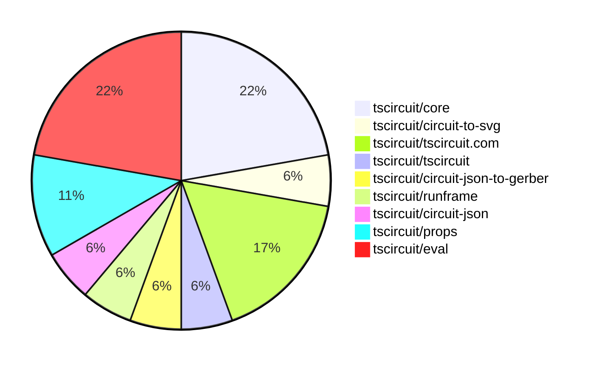
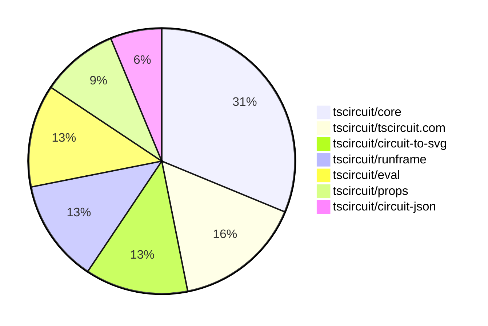

# Contribution Overview 2025-09-17

## PRs by Repository

## Contributor Overview

| Contributor | 🐳 Major | 🐙 Minor | 🐌 Tiny | ⭐ | Score | Discussion Contributions |
|-------------|---------|---------|---------|-----|----------------|--------------------------|
| [seveibar](#seveibar) | 1 | 2 | 0 | ⭐⭐ | 15 | 0🔹 0🔶 0💎 |
| [imrishabh18](#imrishabh18) | 2 | 1 | 2 | ⭐⭐ | 13 | 0🔹 0🔶 0💎 |
| [ArnavK-09](#ArnavK-09) | 0 | 1 | 2 | ⭐ | 5 | 0🔹 0🔶 0💎 |
| [Abse2001](#Abse2001) | 0 | 1 | 1 |  | 3 | 0🔹 0🔶 0💎 |
| [tscircuitbot](#tscircuitbot) | 0 | 0 | 3 |  | 3 | 0🔹 0🔶 0💎 |
| [ShiboSoftwareDev](#ShiboSoftwareDev) | 0 | 1 | 0 |  | 2 | 0🔹 0🔶 0💎 |
| [nailoo](#nailoo) | 0 | 1 | 0 |  | 2 | 0🔹 0🔶 0💎 |

### Discussion Contribution Legend

- 🔹 Normal Comments: Basic participation with minimal effort
- 🔶 Great Informative Comments: Thoughtful participation that adds value
- 💎 Incredible Comments: Exceptional participation with high-quality content

## Review Table

[reviews-received-hover]: ## "Number of reviews received for PRs for this contributor"
[approvals-received-hover]: ## "Number of approvals received for PRs this contributor authored"
[rejections-received-hover]: ## "Number of rejections received for PRs this contributor authored"
[prs-opened-hover]: ## "Number of PRs opened by this contributor"
[issues-created-hover]: ## "Number of issues created by this contributor"
[bountied-issues-hover]: ## "Number of issues this contributor created with a bounty"
[bountied-issue-$-hover]: ## "Total bounty amount placed on issues authored by this contributor"

| Contributor | Reviews Received | Approvals Received | Rejections Received | Approvals | Rejections | PRs Opened | PRs Merged | Score | Issues Created | Bountied Issues | Bountied Issue $ |
|---|---|---|---|---|---|---|---|---|---|---|---|
| [sahil-ansari01](#sahil-ansari01) | 5 | 0 | 0 | 0 | 0 | 18 | 0 | 0 | 0 | 0 | 0 |
| [imrishabh18](#imrishabh18) | 9 | 0 | 0 | 1 | 0 | 8 | 5 | 13 | 0 | 0 | 0 |
| [sparkybug](#sparkybug) | 0 | 0 | 0 | 0 | 0 | 1 | 0 | 0 | 0 | 0 | 0 |
| [seveibar](#seveibar) | 1 | 0 | 0 | 7 | 1 | 4 | 3 | 15 | 0 | 0 | 0 |
| [Abse2001](#Abse2001) | 3 | 3 | 0 | 0 | 0 | 3 | 2 | 3 | 0 | 0 | 0 |
| [dhvll](#dhvll) | 0 | 0 | 0 | 0 | 0 | 1 | 0 | 0 | 0 | 0 | 0 |
| [AnasSarkiz](#AnasSarkiz) | 2 | 0 | 1 | 0 | 0 | 1 | 0 | 0 | 0 | 0 | 0 |
| [ShiboSoftwareDev](#ShiboSoftwareDev) | 3 | 1 | 0 | 0 | 0 | 1 | 1 | 2 | 0 | 0 | 0 |
| [nailoo](#nailoo) | 7 | 1 | 0 | 0 | 0 | 2 | 1 | 2 | 0 | 0 | 0 |
| [ArnavK-09](#ArnavK-09) | 5 | 4 | 0 | 1 | 0 | 5 | 3 | 5 | 0 | 0 | 0 |
| [tscircuitbot](#tscircuitbot) | 0 | 0 | 0 | 0 | 0 | 7 | 3 | 3 | 0 | 0 | 0 |
| [devroy10](#devroy10) | 0 | 0 | 0 | 0 | 0 | 1 | 0 | 0 | 0 | 0 | 0 |
| [Ayushjhawar8](#Ayushjhawar8) | 2 | 0 | 0 | 0 | 0 | 1 | 0 | 0 | 0 | 0 | 0 |
| [lessuselesss](#lessuselesss) | 0 | 0 | 0 | 0 | 0 | 2 | 0 | 0 | 0 | 0 | 0 |

## Top 7 Repositories by Contribution Points

## Changes by Repository

### [tscircuit/core](https://github.com/tscircuit/core)

| PR # | Impact | Rating | Contributor | Description |
|------|--------|--------|-------------|-------------|
| [#1375](https://github.com/tscircuit/core/pull/1375) | 🐳 Major | ⭐⭐⭐ | imrishabh18 | Adds support for custom schematic symbols using the symbol tag, allowing users to define schematic components with custom shapes and properties. |
| [#1370](https://github.com/tscircuit/core/pull/1370) | 🐙 Minor | ⭐⭐ | Abse2001 | Normalizes hole offsets for plated holes in rectangular pads and removes legacy handling for PCB hole offsets. |
| [#1367](https://github.com/tscircuit/core/pull/1367) | 🐙 Minor | ⭐⭐ | ShiboSoftwareDev | Adds support for the includeInBoardPinout property within pinAttributes, allowing ports with this attribute to be marked as board pinouts in the circuit output. |
| [#1369](https://github.com/tscircuit/core/pull/1369) | 🐙 Minor | ⭐⭐ | ArnavK-09 | Adds support for loading and handling circuitjson footprints in the PCB rendering process, including error handling for loading failures. |

### [tscircuit/circuit-to-svg](https://github.com/tscircuit/circuit-to-svg)

| PR # | Impact | Rating | Contributor | Description |
|------|--------|--------|-------------|-------------|
| [#323](https://github.com/tscircuit/circuit-to-svg/pull/323) | 🐳 Major | ⭐⭐⭐ | imrishabh18 | Adds support for generating SVG snapshots of schematic elements including lines, rectangles, arcs, and circles. |

### [tscircuit/tscircuit.com](https://github.com/tscircuit/tscircuit.com)

| PR # | Impact | Rating | Contributor | Description |
|------|--------|--------|-------------|-------------|
| [#1682](https://github.com/tscircuit/tscircuit.com/pull/1682) | 🐙 Minor | ⭐⭐ | imrishabh18 | Fixes the issue where clicking on the empty space in the sidebar does not de-select the currently selected file. |
| [#1679](https://github.com/tscircuit/tscircuit.com/pull/1679) | 🐙 Minor | ⭐⭐ | nailoo | Fixes the package renaming process to ensure the updated package state is correctly reflected in the application after renaming. |

🐌 Tiny Contributions (1)

| PR # | Impact | Contributor | Description |
|------|--------|-------------|-------------|
| [#1680](https://github.com/tscircuit/tscircuit.com/pull/1680) | 🐌 Tiny | ArnavK-09 | Fixes inconsistency in package renaming functionality by ensuring the correct name is returned and displayed after a rename operation. |

### [tscircuit/tscircuit](https://github.com/tscircuit/tscircuit)

🐌 Tiny Contributions (1)

| PR # | Impact | Contributor | Description |
|------|--------|-------------|-------------|
| [#799](https://github.com/tscircuit/tscircuit/pull/799) | 🐌 Tiny | imrishabh18 | Updates the version of the tscircuitprops and circuit-json dependencies in package.json |

### [tscircuit/circuit-json-to-gerber](https://github.com/tscircuit/circuit-json-to-gerber)

🐌 Tiny Contributions (1)

| PR # | Impact | Contributor | Description |
|------|--------|-------------|-------------|
| [#55](https://github.com/tscircuit/circuit-json-to-gerber/pull/55) | 🐌 Tiny | imrishabh18 | Honor ccw_rotation when drawing pill plated holes so the flash and line operations follow the rotated axis and extend the pill hole test to cover rotated examples and refresh the corresponding snapshots |

### [tscircuit/runframe](https://github.com/tscircuit/runframe)

| PR # | Impact | Rating | Contributor | Description |
|------|--------|--------|-------------|-------------|
| [#1167](https://github.com/tscircuit/runframe/pull/1167) | 🐳 Major | ⭐⭐⭐ | seveibar | Reads the existing main_component hash parameter when mounting RunFrameForCli, passes it to RunFrameWithApi, and updates the CLI frame to write the selected main component back to the URL hash via history.replaceState. |

### [tscircuit/circuit-json](https://github.com/tscircuit/circuit-json)

| PR # | Impact | Rating | Contributor | Description |
|------|--------|--------|-------------|-------------|
| [#287](https://github.com/tscircuit/circuit-json/pull/287) | 🐙 Minor | ⭐⭐ | seveibar | Add optional rats_nest_color to pcb_trace definitions and docs, introduce pcb_net type with optional source_net_id and rats_nest_color and wire it into exports, document new type and add targeted parsing tests |

### [tscircuit/props](https://github.com/tscircuit/props)

| PR # | Impact | Rating | Contributor | Description |
|------|--------|--------|-------------|-------------|
| [#417](https://github.com/tscircuit/props/pull/417) | 🐙 Minor | ⭐⭐ | seveibar | Add optional ratsNestColor attribute to traces, nets, and pin attributes for customizable visual representation in circuit layouts. |

🐌 Tiny Contributions (1)

| PR # | Impact | Contributor | Description |
|------|--------|-------------|-------------|
| [#416](https://github.com/tscircuit/props/pull/416) | 🐌 Tiny | Abse2001 | Adds holeOffsetX and holeOffsetY properties to the PillPlatedHoleProps interface for better positioning of plated holes in PCB layouts |

### [tscircuit/eval](https://github.com/tscircuit/eval)

🐌 Tiny Contributions (4)

| PR # | Impact | Contributor | Description |
|------|--------|-------------|-------------|
| [#1083](https://github.com/tscircuit/eval/pull/1083) | 🐌 Tiny | ArnavK-09 | Adds an auto-merge workflow for pull requests created by the tscircuitbot, enabling automatic merging of specific PRs after required checks are completed. |
| [#1092](https://github.com/tscircuit/eval/pull/1092) | 🐌 Tiny | tscircuitbot | Automated update of tscircuitcore to v0.0.737. |
| [#1090](https://github.com/tscircuit/eval/pull/1090) | 🐌 Tiny | tscircuitbot | Automated update of tscircuitcore to v0.0.736. |
| [#1087](https://github.com/tscircuit/eval/pull/1087) | 🐌 Tiny | tscircuitbot | Automated update of tscircuitcore to v0.0.735. |

## Changes by Contributor

### [imrishabh18](https://github.com/imrishabh18)

| PRs # | Impact | Rating | Description |
|------|--------|--------|-------------|
| [#1375](https://github.com/tscircuit/core/pull/1375) | 🐳 Major | ⭐⭐⭐ | Adds support for custom schematic symbols using the symbol tag, allowing users to define schematic components with custom shapes and properties. |
| [#323](https://github.com/tscircuit/circuit-to-svg/pull/323) | 🐳 Major | ⭐⭐⭐ | Adds support for generating SVG snapshots of schematic elements including lines, rectangles, arcs, and circles. |
| [#1682](https://github.com/tscircuit/tscircuit.com/pull/1682) | 🐙 Minor | ⭐⭐ | Fixes the issue where clicking on the empty space in the sidebar does not de-select the currently selected file. |

🐌 Tiny Contributions (2)

| PR # | Impact | Description |
|------|--------|-------------|
| [#799](https://github.com/tscircuit/tscircuit/pull/799) | 🐌 Tiny | Updates the version of the tscircuitprops and circuit-json dependencies in package.json |
| [#55](https://github.com/tscircuit/circuit-json-to-gerber/pull/55) | 🐌 Tiny | Honor ccw_rotation when drawing pill plated holes so the flash and line operations follow the rotated axis and extend the pill hole test to cover rotated examples and refresh the corresponding snapshots |

### [seveibar](https://github.com/seveibar)

| PRs # | Impact | Rating | Description |
|------|--------|--------|-------------|
| [#1167](https://github.com/tscircuit/runframe/pull/1167) | 🐳 Major | ⭐⭐⭐ | Reads the existing main_component hash parameter when mounting RunFrameForCli, passes it to RunFrameWithApi, and updates the CLI frame to write the selected main component back to the URL hash via history.replaceState. |
| [#287](https://github.com/tscircuit/circuit-json/pull/287) | 🐙 Minor | ⭐⭐ | Add optional rats_nest_color to pcb_trace definitions and docs, introduce pcb_net type with optional source_net_id and rats_nest_color and wire it into exports, document new type and add targeted parsing tests |
| [#417](https://github.com/tscircuit/props/pull/417) | 🐙 Minor | ⭐⭐ | Add optional ratsNestColor attribute to traces, nets, and pin attributes for customizable visual representation in circuit layouts. |

### [Abse2001](https://github.com/Abse2001)

| PRs # | Impact | Rating | Description |
|------|--------|--------|-------------|
| [#1370](https://github.com/tscircuit/core/pull/1370) | 🐙 Minor | ⭐⭐ | Normalizes hole offsets for plated holes in rectangular pads and removes legacy handling for PCB hole offsets. |

🐌 Tiny Contributions (1)

| PR # | Impact | Description |
|------|--------|-------------|
| [#416](https://github.com/tscircuit/props/pull/416) | 🐌 Tiny | Adds holeOffsetX and holeOffsetY properties to the PillPlatedHoleProps interface for better positioning of plated holes in PCB layouts |

### [ShiboSoftwareDev](https://github.com/ShiboSoftwareDev)

| PRs # | Impact | Rating | Description |
|------|--------|--------|-------------|
| [#1367](https://github.com/tscircuit/core/pull/1367) | 🐙 Minor | ⭐⭐ | Adds support for the includeInBoardPinout property within pinAttributes, allowing ports with this attribute to be marked as board pinouts in the circuit output. |

### [ArnavK-09](https://github.com/ArnavK-09)

| PRs # | Impact | Rating | Description |
|------|--------|--------|-------------|
| [#1369](https://github.com/tscircuit/core/pull/1369) | 🐙 Minor | ⭐⭐ | Adds support for loading and handling circuitjson footprints in the PCB rendering process, including error handling for loading failures. |

🐌 Tiny Contributions (2)

| PR # | Impact | Description |
|------|--------|-------------|
| [#1680](https://github.com/tscircuit/tscircuit.com/pull/1680) | 🐌 Tiny | Fixes inconsistency in package renaming functionality by ensuring the correct name is returned and displayed after a rename operation. |
| [#1083](https://github.com/tscircuit/eval/pull/1083) | 🐌 Tiny | Adds an auto-merge workflow for pull requests created by the tscircuitbot, enabling automatic merging of specific PRs after required checks are completed. |

### [nailoo](https://github.com/nailoo)

| PRs # | Impact | Rating | Description |
|------|--------|--------|-------------|
| [#1679](https://github.com/tscircuit/tscircuit.com/pull/1679) | 🐙 Minor | ⭐⭐ | Fixes the package renaming process to ensure the updated package state is correctly reflected in the application after renaming. |

### [tscircuitbot](https://github.com/tscircuitbot)

🐌 Tiny Contributions (3)

| PR # | Impact | Description |
|------|--------|-------------|
| [#1092](https://github.com/tscircuit/eval/pull/1092) | 🐌 Tiny | Automated update of tscircuitcore to v0.0.737. |
| [#1090](https://github.com/tscircuit/eval/pull/1090) | 🐌 Tiny | Automated update of tscircuitcore to v0.0.736. |
| [#1087](https://github.com/tscircuit/eval/pull/1087) | 🐌 Tiny | Automated update of tscircuitcore to v0.0.735. |

## Repository Owners

| Repository | Codeowners |
|------------|------------|
| [builder](https://github.com/tscircuit/builder/blob/main/.github/CODEOWNERS) | [seveibar](https://github.com/seveibar)
| [pcb-viewer](https://github.com/tscircuit/pcb-viewer/blob/main/.github/CODEOWNERS) | [seveibar](https://github.com/seveibar), [ShiboSoftwareDev](https://github.com/ShiboSoftwareDev)
| [footprints-old](https://github.com/tscircuit/footprints-old/blob/main/.github/CODEOWNERS) | [seveibar](https://github.com/seveibar)
| [footprinter](https://github.com/tscircuit/footprinter/blob/main/.github/CODEOWNERS) | [seveibar](https://github.com/seveibar), [techmannih](https://github.com/techmannih)
| [3d-viewer](https://github.com/tscircuit/3d-viewer/blob/main/.github/CODEOWNERS) | [ShiboSoftwareDev](https://github.com/ShiboSoftwareDev)
| [winterspec](https://github.com/tscircuit/winterspec/blob/main/.github/CODEOWNERS) | [seveibar](https://github.com/seveibar), [ShiboSoftwareDev](https://github.com/ShiboSoftwareDev)
| [jscad-electronics](https://github.com/tscircuit/jscad-electronics/blob/main/.github/CODEOWNERS) | [seveibar](https://github.com/seveibar), [abhijitxy](https://github.com/abhijitxy), [anas-sarkez](https://github.com/anas-sarkez)
| [circuit-to-svg](https://github.com/tscircuit/circuit-to-svg/blob/main/.github/CODEOWNERS) | [imrishabh18](https://github.com/imrishabh18)
| [schematic-symbols](https://github.com/tscircuit/schematic-symbols/blob/main/.github/CODEOWNERS) | [seveibar](https://github.com/seveibar), [imrishabh18](https://github.com/imrishabh18), [techmannih](https://github.com/techmannih)
| [circuit-json-to-gerber](https://github.com/tscircuit/circuit-json-to-gerber/blob/main/.github/CODEOWNERS) | [seveibar](https://github.com/seveibar), [ShiboSoftwareDev](https://github.com/ShiboSoftwareDev)
| [tscircuit.com](https://github.com/tscircuit/tscircuit.com/blob/main/.github/CODEOWNERS) | [seveibar](https://github.com/seveibar), [imrishabh18](https://github.com/imrishabh18)
| [cli](https://github.com/tscircuit/cli/blob/main/.github/CODEOWNERS) | [seveibar](https://github.com/seveibar), [imrishabh18](https://github.com/imrishabh18), [ArnavK-09](https://github.com/ArnavK-09)
| [issue-roulette](https://github.com/tscircuit/issue-roulette/blob/main/.github/CODEOWNERS) | [Anshgrover23](https://github.com/Anshgrover23)
| [sparkfun-boards](https://github.com/tscircuit/sparkfun-boards/blob/main/.github/CODEOWNERS) | [ShiboSoftwareDev](https://github.com/ShiboSoftwareDev), [Abse2001](https://github.com/Abse2001), [MustafaMulla29](https://github.com/MustafaMulla29), [Anshgrover23](https://github.com/Anshgrover23), [techmannih](https://github.com/techmannih)
| [schematic-corpus](https://github.com/tscircuit/schematic-corpus/blob/main/.github/CODEOWNERS) | [Abse2001](https://github.com/Abse2001)

## Repositories by Owner

| User | Repo |
|------|------|
| [seveibar](https://github.com/seveibar) | [builder](https://github.com/tscircuit/builder/blob/main/.github/CODEOWNERS) |
|  | [pcb-viewer](https://github.com/tscircuit/pcb-viewer/blob/main/.github/CODEOWNERS) |
|  | [footprints-old](https://github.com/tscircuit/footprints-old/blob/main/.github/CODEOWNERS) |
|  | [footprinter](https://github.com/tscircuit/footprinter/blob/main/.github/CODEOWNERS) |
|  | [winterspec](https://github.com/tscircuit/winterspec/blob/main/.github/CODEOWNERS) |
|  | [jscad-electronics](https://github.com/tscircuit/jscad-electronics/blob/main/.github/CODEOWNERS) |
|  | [schematic-symbols](https://github.com/tscircuit/schematic-symbols/blob/main/.github/CODEOWNERS) |
|  | [circuit-json-to-gerber](https://github.com/tscircuit/circuit-json-to-gerber/blob/main/.github/CODEOWNERS) |
|  | [tscircuit.com](https://github.com/tscircuit/tscircuit.com/blob/main/.github/CODEOWNERS) |
|  | [cli](https://github.com/tscircuit/cli/blob/main/.github/CODEOWNERS) |
| [ShiboSoftwareDev](https://github.com/ShiboSoftwareDev) | [pcb-viewer](https://github.com/tscircuit/pcb-viewer/blob/main/.github/CODEOWNERS) |
|  | [3d-viewer](https://github.com/tscircuit/3d-viewer/blob/main/.github/CODEOWNERS) |
|  | [winterspec](https://github.com/tscircuit/winterspec/blob/main/.github/CODEOWNERS) |
|  | [circuit-json-to-gerber](https://github.com/tscircuit/circuit-json-to-gerber/blob/main/.github/CODEOWNERS) |
|  | [sparkfun-boards](https://github.com/tscircuit/sparkfun-boards/blob/main/.github/CODEOWNERS) |
| [techmannih](https://github.com/techmannih) | [footprinter](https://github.com/tscircuit/footprinter/blob/main/.github/CODEOWNERS) |
|  | [schematic-symbols](https://github.com/tscircuit/schematic-symbols/blob/main/.github/CODEOWNERS) |
|  | [sparkfun-boards](https://github.com/tscircuit/sparkfun-boards/blob/main/.github/CODEOWNERS) |
| [abhijitxy](https://github.com/abhijitxy) | [jscad-electronics](https://github.com/tscircuit/jscad-electronics/blob/main/.github/CODEOWNERS) |
| [anas-sarkez](https://github.com/anas-sarkez) | [jscad-electronics](https://github.com/tscircuit/jscad-electronics/blob/main/.github/CODEOWNERS) |
| [imrishabh18](https://github.com/imrishabh18) | [circuit-to-svg](https://github.com/tscircuit/circuit-to-svg/blob/main/.github/CODEOWNERS) |
|  | [schematic-symbols](https://github.com/tscircuit/schematic-symbols/blob/main/.github/CODEOWNERS) |
|  | [tscircuit.com](https://github.com/tscircuit/tscircuit.com/blob/main/.github/CODEOWNERS) |
|  | [cli](https://github.com/tscircuit/cli/blob/main/.github/CODEOWNERS) |
| [ArnavK-09](https://github.com/ArnavK-09) | [cli](https://github.com/tscircuit/cli/blob/main/.github/CODEOWNERS) |
| [Anshgrover23](https://github.com/Anshgrover23) | [issue-roulette](https://github.com/tscircuit/issue-roulette/blob/main/.github/CODEOWNERS) |
|  | [sparkfun-boards](https://github.com/tscircuit/sparkfun-boards/blob/main/.github/CODEOWNERS) |
| [Abse2001](https://github.com/Abse2001) | [sparkfun-boards](https://github.com/tscircuit/sparkfun-boards/blob/main/.github/CODEOWNERS) |
|  | [schematic-corpus](https://github.com/tscircuit/schematic-corpus/blob/main/.github/CODEOWNERS) |
| [MustafaMulla29](https://github.com/MustafaMulla29) | [sparkfun-boards](https://github.com/tscircuit/sparkfun-boards/blob/main/.github/CODEOWNERS) |

