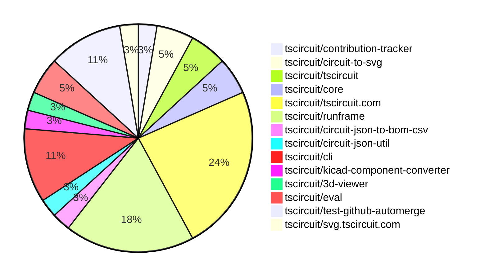
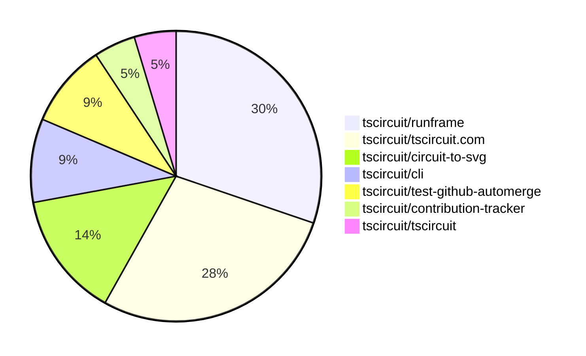

# Contribution Overview 2025-09-24

## PRs by Repository

## Contributor Overview

| Contributor | 🐳 Major | 🐙 Minor | 🐌 Tiny | ⭐ | Score | Discussion Contributions |
|-------------|---------|---------|---------|-----|----------------|--------------------------|
| [imrishabh18](#imrishabh18) | 1 | 1 | 6 | ⭐⭐ | 15 | 0🔹 0🔶 0💎 |
| [seveibar](#seveibar) | 0 | 0 | 1 | ⭐⭐ | 12 | 0🔹 0🔶 0💎 |
| [pxlpal](#pxlpal) | 2 | 1 | 0 | ⭐ | 10 | 0🔹 0🔶 0💎 |
| [MustafaMulla29](#MustafaMulla29) | 0 | 2 | 5 | ⭐ | 9 | 0🔹 0🔶 0💎 |
| [tscircuitbot](#tscircuitbot) | 0 | 0 | 9 | ⭐ | 9 | 0🔹 0🔶 0💎 |
| [ArnavK-09](#ArnavK-09) | 0 | 0 | 6 | ⭐ | 8 | 0🔹 0🔶 0💎 |
| [nailoo](#nailoo) | 1 | 0 | 0 | ⭐ | 4 | 0🔹 0🔶 0💎 |
| [Asymtode712](#Asymtode712) | 0 | 1 | 2 | ⭐ | 3.5 | 0🔹 0🔶 0💎 |

### Discussion Contribution Legend

- 🔹 Normal Comments: Basic participation with minimal effort
- 🔶 Great Informative Comments: Thoughtful participation that adds value
- 💎 Incredible Comments: Exceptional participation with high-quality content

## Review Table

[reviews-received-hover]: ## "Number of reviews received for PRs for this contributor"
[approvals-received-hover]: ## "Number of approvals received for PRs this contributor authored"
[rejections-received-hover]: ## "Number of rejections received for PRs this contributor authored"
[prs-opened-hover]: ## "Number of PRs opened by this contributor"
[issues-created-hover]: ## "Number of issues created by this contributor"
[bountied-issues-hover]: ## "Number of issues this contributor created with a bounty"
[bountied-issue-$-hover]: ## "Total bounty amount placed on issues authored by this contributor"

| Contributor | Reviews Received | Approvals Received | Rejections Received | Approvals | Rejections | PRs Opened | PRs Merged | Score | Issues Created | Bountied Issues | Bountied Issue $ |
|---|---|---|---|---|---|---|---|---|---|---|---|
| [MustafaMulla29](#MustafaMulla29) | 11 | 10 | 0 | 0 | 0 | 10 | 8 | 9 | 0 | 0 | 0 |
| [seveibar](#seveibar) | 0 | 0 | 0 | 20 | 4 | 3 | 1 | 12 | 0 | 0 | 0 |
| [imrishabh18](#imrishabh18) | 2 | 1 | 0 | 2 | 1 | 8 | 8 | 15 | 0 | 0 | 0 |
| [naaa760](#naaa760) | 0 | 0 | 0 | 0 | 0 | 1 | 0 | 0 | 0 | 0 | 0 |
| [h30s](#h30s) | 8 | 0 | 0 | 0 | 0 | 4 | 0 | 0 | 0 | 0 | 0 |
| [ArnavK-09](#ArnavK-09) | 8 | 7 | 0 | 2 | 0 | 7 | 6 | 8 | 0 | 0 | 0 |
| [Asymtode712](#Asymtode712) | 3 | 3 | 0 | 0 | 0 | 4 | 3 | 3.5 | 0 | 0 | 0 |
| [dhvll](#dhvll) | 1 | 0 | 0 | 0 | 0 | 1 | 0 | 0 | 0 | 0 | 0 |
| [nailoo](#nailoo) | 4 | 1 | 2 | 0 | 0 | 4 | 1 | 4 | 0 | 0 | 0 |
| [Sahelisaha04](#Sahelisaha04) | 5 | 0 | 0 | 0 | 0 | 1 | 0 | 0 | 0 | 0 | 0 |
| [Abse2001](#Abse2001) | 0 | 0 | 0 | 1 | 0 | 0 | 0 | 0 | 0 | 0 | 0 |
| [tscircuitbot](#tscircuitbot) | 1 | 0 | 0 | 0 | 0 | 15 | 9 | 9 | 0 | 0 | 0 |
| [pxlpal](#pxlpal) | 6 | 3 | 0 | 0 | 0 | 3 | 3 | 10 | 0 | 0 | 0 |
| [aybanda](#aybanda) | 1 | 0 | 1 | 0 | 0 | 1 | 0 | 0 | 0 | 0 | 0 |
| [zhyd1997](#zhyd1997) | 1 | 0 | 1 | 0 | 0 | 3 | 0 | 0 | 0 | 0 | 0 |
| [melmathari](#melmathari) | 1 | 0 | 1 | 0 | 0 | 1 | 0 | 0 | 0 | 0 | 0 |

## Top 7 Repositories by Contribution Points

## Changes by Repository

### [tscircuit/contribution-tracker](https://github.com/tscircuit/contribution-tracker)

| PR # | Impact | Rating | Contributor | Description |
|------|--------|--------|-------------|-------------|
| [#225](https://github.com/tscircuit/contribution-tracker/pull/225) | 🐙 Minor | ⭐⭐ | MustafaMulla29 | Adds a list of users ineligible for sponsorship along with a function to check their eligibility, impacting the sponsorship calculation process. |

### [tscircuit/circuit-to-svg](https://github.com/tscircuit/circuit-to-svg)

| PR # | Impact | Rating | Contributor | Description |
|------|--------|--------|-------------|-------------|
| [#315](https://github.com/tscircuit/circuit-to-svg/pull/315) | 🐳 Major | ⭐⭐⭐ | nailoo | Adds support for rendering the soldermask layer in SVG output when the renderSolderMask option is enabled. |
| [#329](https://github.com/tscircuit/circuit-to-svg/pull/329) | 🐙 Minor | ⭐⭐ | MustafaMulla29 | Fixes the calculation of line endpoints for unconnected pins in the schematic rendering, ensuring accurate visual representation in the SVG output. |

### [tscircuit/tscircuit](https://github.com/tscircuit/tscircuit)

🐌 Tiny Contributions (2)

| PR # | Impact | Contributor | Description |
|------|--------|-------------|-------------|
| [#808](https://github.com/tscircuit/tscircuit/pull/808) | 🐌 Tiny | MustafaMulla29 | Updates dependencies to their latest versions to ensure fixed offsets are applied correctly. |
| [#806](https://github.com/tscircuit/tscircuit/pull/806) | 🐌 Tiny | imrishabh18 | Adds a GitHub workflow to automate the update of tscircuit packages to their latest versions when triggered. |

### [tscircuit/core](https://github.com/tscircuit/core)

🐌 Tiny Contributions (2)

| PR # | Impact | Contributor | Description |
|------|--------|-------------|-------------|
| [#1405](https://github.com/tscircuit/core/pull/1405) | 🐌 Tiny | MustafaMulla29 | Fixes offset issues in SVG rendering by updating the circuit-to-svg dependency version to 0.0.202 |
| [#1403](https://github.com/tscircuit/core/pull/1403) | 🐌 Tiny | MustafaMulla29 | Updates the schematic-symbols dependency to version 0.0.202 to resolve an offset issue in symbol rendering. |

### [tscircuit/tscircuit.com](https://github.com/tscircuit/tscircuit.com)

| PR # | Impact | Rating | Contributor | Description |
|------|--------|--------|-------------|-------------|
| [#1709](https://github.com/tscircuit/tscircuit.com/pull/1709) | 🐳 Major | ⭐⭐⭐ | imrishabh18 | Fetches the number of packages and members for organizations in the application. |

🐌 Tiny Contributions (8)

| PR # | Impact | Contributor | Description |
|------|--------|-------------|-------------|
| [#1711](https://github.com/tscircuit/tscircuit.com/pull/1711) | 🐌 Tiny | MustafaMulla29 | Updates the version of dependencies to fix offset issues in the application. |
| [#1698](https://github.com/tscircuit/tscircuit.com/pull/1698) | 🐌 Tiny | imrishabh18 | Removes the old build page and associated unused components from the codebase, streamlining the application. |
| [#1708](https://github.com/tscircuit/tscircuit.com/pull/1708) | 🐌 Tiny | ArnavK-09 | Replaces PrefetchPageLink components with Link components from the wouter library across various components in the application. |
| [#1704](https://github.com/tscircuit/tscircuit.com/pull/1704) | 🐌 Tiny | ArnavK-09 | Adjusts padding in the sidebar button to enhance layout consistency. |
| [#1705](https://github.com/tscircuit/tscircuit.com/pull/1705) | 🐌 Tiny | ArnavK-09 | Disables the display of the account balance in the header login component. |
| [#1707](https://github.com/tscircuit/tscircuit.com/pull/1707) | 🐌 Tiny | ArnavK-09 | Hides the review button in the Package Releases Dashboard when the latest build status is error. |
| [#1706](https://github.com/tscircuit/tscircuit.com/pull/1706) | 🐌 Tiny | Asymtode712 | Updates the version of the tscircuitrunframe dependency from 0.0.972 to 0.0.993 in package.json |
| [#1702](https://github.com/tscircuit/tscircuit.com/pull/1702) | 🐌 Tiny | Asymtode712 | Updates the tscircuit3d-viewer dependency from version 0.0.391 to 0.0.402 in package.json and modifies the renovate.json configuration. |

### [tscircuit/runframe](https://github.com/tscircuit/runframe)

| PR # | Impact | Rating | Contributor | Description |
|------|--------|--------|-------------|-------------|
| [#1219](https://github.com/tscircuit/runframe/pull/1219) | 🐳 Major | ⭐⭐⭐ | pxlpal | Adds stock number information to the JLCPCB search results displayed in the import dialog, enhancing user visibility of component availability. |
| [#1171](https://github.com/tscircuit/runframe/pull/1171) | 🐳 Major | ⭐⭐⭐ | pxlpal | Add ImportComponentDialog2 and ImportComponentDialogForCli components for importing electronic components from various sources including tscircuit.com, JLCPCB, and KiCad. |

🐌 Tiny Contributions (5)

| PR # | Impact | Contributor | Description |
|------|--------|-------------|-------------|
| [#1226](https://github.com/tscircuit/runframe/pull/1226) | 🐌 Tiny | MustafaMulla29 | Updates the version of the schematic-symbols dependency from 0.0.201 to 0.0.202 in package.json |
| [#1215](https://github.com/tscircuit/runframe/pull/1215) | 🐌 Tiny | imrishabh18 | Updates the version of the circuit-json-to-bom-csv dependency from 0.0.7 to 0.0.8 in package.json |
| [#1214](https://github.com/tscircuit/runframe/pull/1214) | 🐌 Tiny | imrishabh18 | Adds a GitHub workflow to update the CLI with the latest version of RunFrame upon pushing to the main branch. |
| [#1217](https://github.com/tscircuit/runframe/pull/1217) | 🐌 Tiny | ArnavK-09 | Adjusts the z-index of the DropdownMenuContent in the FileMenuLeftHeader component to ensure proper layering in the UI. |
| [#1212](https://github.com/tscircuit/runframe/pull/1212) | 🐌 Tiny | tscircuitbot | Updates the tscircuit3d-viewer package to version 0.0.402 in the package.json file |

### [tscircuit/circuit-json-to-bom-csv](https://github.com/tscircuit/circuit-json-to-bom-csv)

| PR # | Impact | Rating | Contributor | Description |
|------|--------|--------|-------------|-------------|
| [#7](https://github.com/tscircuit/circuit-json-to-bom-csv/pull/7) | 🐙 Minor | ⭐⭐ | imrishabh18 | Sets the comment and value columns to DNP when the do_not_place flag is true, and clears the supplier part number columns accordingly. |

### [tscircuit/circuit-json-util](https://github.com/tscircuit/circuit-json-util)

🐌 Tiny Contributions (1)

| PR # | Impact | Contributor | Description |
|------|--------|-------------|-------------|
| [#69](https://github.com/tscircuit/circuit-json-util/pull/69) | 🐌 Tiny | imrishabh18 | Changes the upstream repository name in the GitHub Actions workflow configuration from pcb-viewer to test-github-automerge. |

### [tscircuit/cli](https://github.com/tscircuit/cli)

🐌 Tiny Contributions (4)

| PR # | Impact | Contributor | Description |
|------|--------|-------------|-------------|
| [#368](https://github.com/tscircuit/cli/pull/368) | 🐌 Tiny | imrishabh18 | Adds a GitHub workflow to automate the update of tscircuit packages and trigger updates in the upstream repository. |
| [#370](https://github.com/tscircuit/cli/pull/370) | 🐌 Tiny | tscircuitbot | Updates the tscircuitrunframe package to version 0.0.993 in the package.json file. |
| [#369](https://github.com/tscircuit/cli/pull/369) | 🐌 Tiny | tscircuitbot | Updates the tscircuitrunframe package to version 0.0.992 in the package.json file |
| [#371](https://github.com/tscircuit/cli/pull/371) | 🐌 Tiny | seveibar | Adds a fallback in the build process to detect and build the main entrypoint when no circuit or board files exist, ensuring that index.tsx is built when it is the only entrypoint. |

### [tscircuit/kicad-component-converter](https://github.com/tscircuit/kicad-component-converter)

🐌 Tiny Contributions (1)

| PR # | Impact | Contributor | Description |
|------|--------|-------------|-------------|
| [#140](https://github.com/tscircuit/kicad-component-converter/pull/140) | 🐌 Tiny | ArnavK-09 | Fixes a typo in the import statement for the parseKicadModToCircuitJson function in the README file. |

### [tscircuit/3d-viewer](https://github.com/tscircuit/3d-viewer)

| PR # | Impact | Rating | Contributor | Description |
|------|--------|--------|-------------|-------------|
| [#503](https://github.com/tscircuit/3d-viewer/pull/503) | 🐙 Minor | ⭐⭐ | Asymtode712 | Fixes loading state issue for the Manifold module by implementing a global cache to store the initialized module, preventing unnecessary reinitialization on subsequent renders. |

### [tscircuit/eval](https://github.com/tscircuit/eval)

🐌 Tiny Contributions (2)

| PR # | Impact | Contributor | Description |
|------|--------|-------------|-------------|
| [#1117](https://github.com/tscircuit/eval/pull/1117) | 🐌 Tiny | tscircuitbot | Automated update of tscircuitcore to v0.0.747. |
| [#1113](https://github.com/tscircuit/eval/pull/1113) | 🐌 Tiny | tscircuitbot | Automated update of tscircuitcore to v0.0.745. |

### [tscircuit/test-github-automerge](https://github.com/tscircuit/test-github-automerge)

🐌 Tiny Contributions (4)

| PR # | Impact | Contributor | Description |
|------|--------|-------------|-------------|
| [#5](https://github.com/tscircuit/test-github-automerge/pull/5) | 🐌 Tiny | tscircuitbot | Updates the tscircuitcircuit-json-util package from version 0.0.68 to 0.0.72 in the package.json file. |
| [#4](https://github.com/tscircuit/test-github-automerge/pull/4) | 🐌 Tiny | tscircuitbot | Updates the tscircuitcircuit-json-util package from version 0.0.68 to 0.0.72 in the package.json file. |
| [#3](https://github.com/tscircuit/test-github-automerge/pull/3) | 🐌 Tiny | tscircuitbot | Updates the tscircuitcircuit-json-util package from version 0.0.68 to 0.0.72 in the package.json file. |
| [#2](https://github.com/tscircuit/test-github-automerge/pull/2) | 🐌 Tiny | tscircuitbot | Updates the tscircuitcircuit-json-util package from version 0.0.71 to 0.0.72 in the project dependencies. |

### [tscircuit/svg.tscircuit.com](https://github.com/tscircuit/svg.tscircuit.com)

| PR # | Impact | Rating | Contributor | Description |
|------|--------|--------|-------------|-------------|
| [#310](https://github.com/tscircuit/svg.tscircuit.com/pull/310) | 🐙 Minor | ⭐⭐ | pxlpal | Adds support for generating PNG assets from TSCircuit code or circuit JSON in addition to existing SVG functionality. |

## Changes by Contributor

### [MustafaMulla29](https://github.com/MustafaMulla29)

| PRs # | Impact | Rating | Description |
|------|--------|--------|-------------|
| [#225](https://github.com/tscircuit/contribution-tracker/pull/225) | 🐙 Minor | ⭐⭐ | Adds a list of users ineligible for sponsorship along with a function to check their eligibility, impacting the sponsorship calculation process. |
| [#329](https://github.com/tscircuit/circuit-to-svg/pull/329) | 🐙 Minor | ⭐⭐ | Fixes the calculation of line endpoints for unconnected pins in the schematic rendering, ensuring accurate visual representation in the SVG output. |

🐌 Tiny Contributions (5)

| PR # | Impact | Description |
|------|--------|-------------|
| [#808](https://github.com/tscircuit/tscircuit/pull/808) | 🐌 Tiny | Updates dependencies to their latest versions to ensure fixed offsets are applied correctly. |
| [#1405](https://github.com/tscircuit/core/pull/1405) | 🐌 Tiny | Fixes offset issues in SVG rendering by updating the circuit-to-svg dependency version to 0.0.202 |
| [#1403](https://github.com/tscircuit/core/pull/1403) | 🐌 Tiny | Updates the schematic-symbols dependency to version 0.0.202 to resolve an offset issue in symbol rendering. |
| [#1711](https://github.com/tscircuit/tscircuit.com/pull/1711) | 🐌 Tiny | Updates the version of dependencies to fix offset issues in the application. |
| [#1226](https://github.com/tscircuit/runframe/pull/1226) | 🐌 Tiny | Updates the version of the schematic-symbols dependency from 0.0.201 to 0.0.202 in package.json |

### [imrishabh18](https://github.com/imrishabh18)

| PRs # | Impact | Rating | Description |
|------|--------|--------|-------------|
| [#1709](https://github.com/tscircuit/tscircuit.com/pull/1709) | 🐳 Major | ⭐⭐⭐ | Fetches the number of packages and members for organizations in the application. |
| [#7](https://github.com/tscircuit/circuit-json-to-bom-csv/pull/7) | 🐙 Minor | ⭐⭐ | Sets the comment and value columns to DNP when the do_not_place flag is true, and clears the supplier part number columns accordingly. |

🐌 Tiny Contributions (6)

| PR # | Impact | Description |
|------|--------|-------------|
| [#806](https://github.com/tscircuit/tscircuit/pull/806) | 🐌 Tiny | Adds a GitHub workflow to automate the update of tscircuit packages to their latest versions when triggered. |
| [#69](https://github.com/tscircuit/circuit-json-util/pull/69) | 🐌 Tiny | Changes the upstream repository name in the GitHub Actions workflow configuration from pcb-viewer to test-github-automerge. |
| [#1698](https://github.com/tscircuit/tscircuit.com/pull/1698) | 🐌 Tiny | Removes the old build page and associated unused components from the codebase, streamlining the application. |
| [#1215](https://github.com/tscircuit/runframe/pull/1215) | 🐌 Tiny | Updates the version of the circuit-json-to-bom-csv dependency from 0.0.7 to 0.0.8 in package.json |
| [#1214](https://github.com/tscircuit/runframe/pull/1214) | 🐌 Tiny | Adds a GitHub workflow to update the CLI with the latest version of RunFrame upon pushing to the main branch. |
| [#368](https://github.com/tscircuit/cli/pull/368) | 🐌 Tiny | Adds a GitHub workflow to automate the update of tscircuit packages and trigger updates in the upstream repository. |

### [ArnavK-09](https://github.com/ArnavK-09)

🐌 Tiny Contributions (6)

| PR # | Impact | Description |
|------|--------|-------------|
| [#140](https://github.com/tscircuit/kicad-component-converter/pull/140) | 🐌 Tiny | Fixes a typo in the import statement for the parseKicadModToCircuitJson function in the README file. |
| [#1708](https://github.com/tscircuit/tscircuit.com/pull/1708) | 🐌 Tiny | Replaces PrefetchPageLink components with Link components from the wouter library across various components in the application. |
| [#1704](https://github.com/tscircuit/tscircuit.com/pull/1704) | 🐌 Tiny | Adjusts padding in the sidebar button to enhance layout consistency. |
| [#1705](https://github.com/tscircuit/tscircuit.com/pull/1705) | 🐌 Tiny | Disables the display of the account balance in the header login component. |
| [#1707](https://github.com/tscircuit/tscircuit.com/pull/1707) | 🐌 Tiny | Hides the review button in the Package Releases Dashboard when the latest build status is error. |
| [#1217](https://github.com/tscircuit/runframe/pull/1217) | 🐌 Tiny | Adjusts the z-index of the DropdownMenuContent in the FileMenuLeftHeader component to ensure proper layering in the UI. |

### [Asymtode712](https://github.com/Asymtode712)

| PRs # | Impact | Rating | Description |
|------|--------|--------|-------------|
| [#503](https://github.com/tscircuit/3d-viewer/pull/503) | 🐙 Minor | ⭐⭐ | Fixes loading state issue for the Manifold module by implementing a global cache to store the initialized module, preventing unnecessary reinitialization on subsequent renders. |

🐌 Tiny Contributions (2)

| PR # | Impact | Description |
|------|--------|-------------|
| [#1706](https://github.com/tscircuit/tscircuit.com/pull/1706) | 🐌 Tiny | Updates the version of the tscircuitrunframe dependency from 0.0.972 to 0.0.993 in package.json |
| [#1702](https://github.com/tscircuit/tscircuit.com/pull/1702) | 🐌 Tiny | Updates the tscircuit3d-viewer dependency from version 0.0.391 to 0.0.402 in package.json and modifies the renovate.json configuration. |

### [nailoo](https://github.com/nailoo)

| PRs # | Impact | Rating | Description |
|------|--------|--------|-------------|
| [#315](https://github.com/tscircuit/circuit-to-svg/pull/315) | 🐳 Major | ⭐⭐⭐ | Adds support for rendering the soldermask layer in SVG output when the renderSolderMask option is enabled. |

### [tscircuitbot](https://github.com/tscircuitbot)

🐌 Tiny Contributions (9)

| PR # | Impact | Description |
|------|--------|-------------|
| [#1117](https://github.com/tscircuit/eval/pull/1117) | 🐌 Tiny | Automated update of tscircuitcore to v0.0.747. |
| [#1113](https://github.com/tscircuit/eval/pull/1113) | 🐌 Tiny | Automated update of tscircuitcore to v0.0.745. |
| [#1212](https://github.com/tscircuit/runframe/pull/1212) | 🐌 Tiny | Updates the tscircuit3d-viewer package to version 0.0.402 in the package.json file |
| [#370](https://github.com/tscircuit/cli/pull/370) | 🐌 Tiny | Updates the tscircuitrunframe package to version 0.0.993 in the package.json file. |
| [#369](https://github.com/tscircuit/cli/pull/369) | 🐌 Tiny | Updates the tscircuitrunframe package to version 0.0.992 in the package.json file |
| [#5](https://github.com/tscircuit/test-github-automerge/pull/5) | 🐌 Tiny | Updates the tscircuitcircuit-json-util package from version 0.0.68 to 0.0.72 in the package.json file. |
| [#4](https://github.com/tscircuit/test-github-automerge/pull/4) | 🐌 Tiny | Updates the tscircuitcircuit-json-util package from version 0.0.68 to 0.0.72 in the package.json file. |
| [#3](https://github.com/tscircuit/test-github-automerge/pull/3) | 🐌 Tiny | Updates the tscircuitcircuit-json-util package from version 0.0.68 to 0.0.72 in the package.json file. |
| [#2](https://github.com/tscircuit/test-github-automerge/pull/2) | 🐌 Tiny | Updates the tscircuitcircuit-json-util package from version 0.0.71 to 0.0.72 in the project dependencies. |

### [pxlpal](https://github.com/pxlpal)

| PRs # | Impact | Rating | Description |
|------|--------|--------|-------------|
| [#1219](https://github.com/tscircuit/runframe/pull/1219) | 🐳 Major | ⭐⭐⭐ | Adds stock number information to the JLCPCB search results displayed in the import dialog, enhancing user visibility of component availability. |
| [#1171](https://github.com/tscircuit/runframe/pull/1171) | 🐳 Major | ⭐⭐⭐ | Add ImportComponentDialog2 and ImportComponentDialogForCli components for importing electronic components from various sources including tscircuit.com, JLCPCB, and KiCad. |
| [#310](https://github.com/tscircuit/svg.tscircuit.com/pull/310) | 🐙 Minor | ⭐⭐ | Adds support for generating PNG assets from TSCircuit code or circuit JSON in addition to existing SVG functionality. |

### [seveibar](https://github.com/seveibar)

🐌 Tiny Contributions (1)

| PR # | Impact | Description |
|------|--------|-------------|
| [#371](https://github.com/tscircuit/cli/pull/371) | 🐌 Tiny | Adds a fallback in the build process to detect and build the main entrypoint when no circuit or board files exist, ensuring that index.tsx is built when it is the only entrypoint. |

## Repository Owners

| Repository | Codeowners |
|------------|------------|
| [builder](https://github.com/tscircuit/builder/blob/main/.github/CODEOWNERS) | [seveibar](https://github.com/seveibar)
| [pcb-viewer](https://github.com/tscircuit/pcb-viewer/blob/main/.github/CODEOWNERS) | [seveibar](https://github.com/seveibar), [ShiboSoftwareDev](https://github.com/ShiboSoftwareDev)
| [footprints-old](https://github.com/tscircuit/footprints-old/blob/main/.github/CODEOWNERS) | [seveibar](https://github.com/seveibar)
| [footprinter](https://github.com/tscircuit/footprinter/blob/main/.github/CODEOWNERS) | [seveibar](https://github.com/seveibar), [techmannih](https://github.com/techmannih)
| [3d-viewer](https://github.com/tscircuit/3d-viewer/blob/main/.github/CODEOWNERS) | [ShiboSoftwareDev](https://github.com/ShiboSoftwareDev)
| [winterspec](https://github.com/tscircuit/winterspec/blob/main/.github/CODEOWNERS) | [seveibar](https://github.com/seveibar), [ShiboSoftwareDev](https://github.com/ShiboSoftwareDev)
| [jscad-electronics](https://github.com/tscircuit/jscad-electronics/blob/main/.github/CODEOWNERS) | [seveibar](https://github.com/seveibar), [abhijitxy](https://github.com/abhijitxy), [anas-sarkez](https://github.com/anas-sarkez)
| [circuit-to-svg](https://github.com/tscircuit/circuit-to-svg/blob/main/.github/CODEOWNERS) | [imrishabh18](https://github.com/imrishabh18)
| [schematic-symbols](https://github.com/tscircuit/schematic-symbols/blob/main/.github/CODEOWNERS) | [seveibar](https://github.com/seveibar), [imrishabh18](https://github.com/imrishabh18), [techmannih](https://github.com/techmannih)
| [circuit-json-to-gerber](https://github.com/tscircuit/circuit-json-to-gerber/blob/main/.github/CODEOWNERS) | [seveibar](https://github.com/seveibar), [ShiboSoftwareDev](https://github.com/ShiboSoftwareDev)
| [tscircuit.com](https://github.com/tscircuit/tscircuit.com/blob/main/.github/CODEOWNERS) | [seveibar](https://github.com/seveibar), [imrishabh18](https://github.com/imrishabh18)
| [cli](https://github.com/tscircuit/cli/blob/main/.github/CODEOWNERS) | [seveibar](https://github.com/seveibar), [imrishabh18](https://github.com/imrishabh18), [ArnavK-09](https://github.com/ArnavK-09)
| [issue-roulette](https://github.com/tscircuit/issue-roulette/blob/main/.github/CODEOWNERS) | [Anshgrover23](https://github.com/Anshgrover23)
| [sparkfun-boards](https://github.com/tscircuit/sparkfun-boards/blob/main/.github/CODEOWNERS) | [ShiboSoftwareDev](https://github.com/ShiboSoftwareDev), [Abse2001](https://github.com/Abse2001), [MustafaMulla29](https://github.com/MustafaMulla29), [Anshgrover23](https://github.com/Anshgrover23), [techmannih](https://github.com/techmannih)
| [schematic-corpus](https://github.com/tscircuit/schematic-corpus/blob/main/.github/CODEOWNERS) | [Abse2001](https://github.com/Abse2001)

## Repositories by Owner

| User | Repo |
|------|------|
| [seveibar](https://github.com/seveibar) | [builder](https://github.com/tscircuit/builder/blob/main/.github/CODEOWNERS) |
|  | [pcb-viewer](https://github.com/tscircuit/pcb-viewer/blob/main/.github/CODEOWNERS) |
|  | [footprints-old](https://github.com/tscircuit/footprints-old/blob/main/.github/CODEOWNERS) |
|  | [footprinter](https://github.com/tscircuit/footprinter/blob/main/.github/CODEOWNERS) |
|  | [winterspec](https://github.com/tscircuit/winterspec/blob/main/.github/CODEOWNERS) |
|  | [jscad-electronics](https://github.com/tscircuit/jscad-electronics/blob/main/.github/CODEOWNERS) |
|  | [schematic-symbols](https://github.com/tscircuit/schematic-symbols/blob/main/.github/CODEOWNERS) |
|  | [circuit-json-to-gerber](https://github.com/tscircuit/circuit-json-to-gerber/blob/main/.github/CODEOWNERS) |
|  | [tscircuit.com](https://github.com/tscircuit/tscircuit.com/blob/main/.github/CODEOWNERS) |
|  | [cli](https://github.com/tscircuit/cli/blob/main/.github/CODEOWNERS) |
| [ShiboSoftwareDev](https://github.com/ShiboSoftwareDev) | [pcb-viewer](https://github.com/tscircuit/pcb-viewer/blob/main/.github/CODEOWNERS) |
|  | [3d-viewer](https://github.com/tscircuit/3d-viewer/blob/main/.github/CODEOWNERS) |
|  | [winterspec](https://github.com/tscircuit/winterspec/blob/main/.github/CODEOWNERS) |
|  | [circuit-json-to-gerber](https://github.com/tscircuit/circuit-json-to-gerber/blob/main/.github/CODEOWNERS) |
|  | [sparkfun-boards](https://github.com/tscircuit/sparkfun-boards/blob/main/.github/CODEOWNERS) |
| [techmannih](https://github.com/techmannih) | [footprinter](https://github.com/tscircuit/footprinter/blob/main/.github/CODEOWNERS) |
|  | [schematic-symbols](https://github.com/tscircuit/schematic-symbols/blob/main/.github/CODEOWNERS) |
|  | [sparkfun-boards](https://github.com/tscircuit/sparkfun-boards/blob/main/.github/CODEOWNERS) |
| [abhijitxy](https://github.com/abhijitxy) | [jscad-electronics](https://github.com/tscircuit/jscad-electronics/blob/main/.github/CODEOWNERS) |
| [anas-sarkez](https://github.com/anas-sarkez) | [jscad-electronics](https://github.com/tscircuit/jscad-electronics/blob/main/.github/CODEOWNERS) |
| [imrishabh18](https://github.com/imrishabh18) | [circuit-to-svg](https://github.com/tscircuit/circuit-to-svg/blob/main/.github/CODEOWNERS) |
|  | [schematic-symbols](https://github.com/tscircuit/schematic-symbols/blob/main/.github/CODEOWNERS) |
|  | [tscircuit.com](https://github.com/tscircuit/tscircuit.com/blob/main/.github/CODEOWNERS) |
|  | [cli](https://github.com/tscircuit/cli/blob/main/.github/CODEOWNERS) |
| [ArnavK-09](https://github.com/ArnavK-09) | [cli](https://github.com/tscircuit/cli/blob/main/.github/CODEOWNERS) |
| [Anshgrover23](https://github.com/Anshgrover23) | [issue-roulette](https://github.com/tscircuit/issue-roulette/blob/main/.github/CODEOWNERS) |
|  | [sparkfun-boards](https://github.com/tscircuit/sparkfun-boards/blob/main/.github/CODEOWNERS) |
| [Abse2001](https://github.com/Abse2001) | [sparkfun-boards](https://github.com/tscircuit/sparkfun-boards/blob/main/.github/CODEOWNERS) |
|  | [schematic-corpus](https://github.com/tscircuit/schematic-corpus/blob/main/.github/CODEOWNERS) |
| [MustafaMulla29](https://github.com/MustafaMulla29) | [sparkfun-boards](https://github.com/tscircuit/sparkfun-boards/blob/main/.github/CODEOWNERS) |

