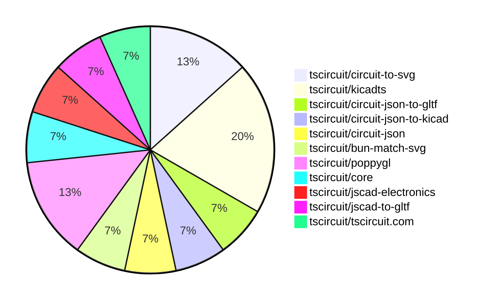
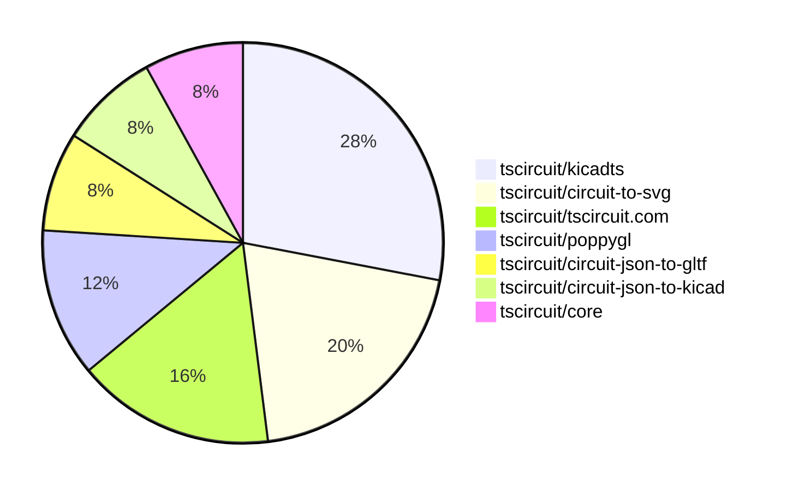

# Contribution Overview 2025-10-01

## PRs by Repository

## Contributor Overview

| Contributor | 🐳 Major | 🐙 Minor | 🐌 Tiny | ⭐ | Score | Discussion Contributions |
|-------------|---------|---------|---------|-----|----------------|--------------------------|
| [seveibar](#seveibar) | 2 | 3 | 5 | ⭐⭐ | 24 | 0🔹 0🔶 0💎 |
| [0hmX](#0hmX) | 0 | 2 | 1 | ⭐ | 5 | 0🔹 0🔶 0💎 |
| [pxlpal](#pxlpal) | 1 | 0 | 0 | ⭐ | 4 | 0🔹 0🔶 0💎 |
| [ShiboSoftwareDev](#ShiboSoftwareDev) | 0 | 1 | 0 |  | 2 | 0🔹 0🔶 0💎 |

### Discussion Contribution Legend

- 🔹 Normal Comments: Basic participation with minimal effort
- 🔶 Great Informative Comments: Thoughtful participation that adds value
- 💎 Incredible Comments: Exceptional participation with high-quality content

## Review Table

[reviews-received-hover]: ## "Number of reviews received for PRs for this contributor"
[approvals-received-hover]: ## "Number of approvals received for PRs this contributor authored"
[rejections-received-hover]: ## "Number of rejections received for PRs this contributor authored"
[prs-opened-hover]: ## "Number of PRs opened by this contributor"
[issues-created-hover]: ## "Number of issues created by this contributor"
[bountied-issues-hover]: ## "Number of issues this contributor created with a bounty"
[bountied-issue-$-hover]: ## "Total bounty amount placed on issues authored by this contributor"

| Contributor | Reviews Received | Approvals Received | Rejections Received | Approvals | Rejections | PRs Opened | PRs Merged | Score | Issues Created | Bountied Issues | Bountied Issue $ |
|---|---|---|---|---|---|---|---|---|---|---|---|
| [seveibar](#seveibar) | 7 | 0 | 0 | 4 | 1 | 13 | 10 | 24 | 0 | 0 | 0 |
| [ShiboSoftwareDev](#ShiboSoftwareDev) | 1 | 1 | 0 | 0 | 0 | 1 | 1 | 2 | 0 | 0 | 0 |
| [Excellencedev](#Excellencedev) | 0 | 0 | 0 | 0 | 0 | 3 | 0 | 0 | 0 | 0 | 0 |
| [0hmX](#0hmX) | 2 | 2 | 0 | 0 | 0 | 3 | 3 | 5 | 0 | 0 | 0 |
| [pxlpal](#pxlpal) | 1 | 1 | 0 | 0 | 0 | 2 | 1 | 4 | 0 | 0 | 0 |
| [tscircuitbot](#tscircuitbot) | 0 | 0 | 0 | 0 | 0 | 2 | 0 | 0 | 0 | 0 | 0 |
| [Ayushjhawar8](#Ayushjhawar8) | 1 | 0 | 1 | 0 | 0 | 1 | 0 | 0 | 0 | 0 | 0 |

## Top 7 Repositories by Contribution Points

## Changes by Repository

### [tscircuit/circuit-to-svg](https://github.com/tscircuit/circuit-to-svg)

| PR # | Impact | Rating | Contributor | Description |
|------|--------|--------|-------------|-------------|
| [#337](https://github.com/tscircuit/circuit-to-svg/pull/337) | 🐳 Major | ⭐⭐⭐ | seveibar | Add a dedicated converter for simulation transient voltage graphs and supporting types, export the simulation graph converter for standalone SVG generation, and cover rendering and filtering with SVG snapshot tests. |

🐌 Tiny Contributions (1)

| PR # | Impact | Contributor | Description |
|------|--------|-------------|-------------|
| [#339](https://github.com/tscircuit/circuit-to-svg/pull/339) | 🐌 Tiny | seveibar | Add a stalebot GitHub Actions workflow to automatically mark and close stale issues and pull requests |

### [tscircuit/kicadts](https://github.com/tscircuit/kicadts)

| PR # | Impact | Rating | Contributor | Description |
|------|--------|--------|-------------|-------------|
| [#8](https://github.com/tscircuit/kicadts/pull/8) | 🐳 Major | ⭐⭐⭐ | seveibar | Changes the handling of sheet_instances in KicadSch to support multiple entries, allowing for an array of sheet instances instead of a single instance. |
| [#6](https://github.com/tscircuit/kicadts/pull/6) | 🐙 Minor | ⭐⭐ | seveibar | Fixes the token representation for sheet instances in the schematic parser and adds a test for it. |

🐌 Tiny Contributions (1)

| PR # | Impact | Contributor | Description |
|------|--------|-------------|-------------|
| [#7](https://github.com/tscircuit/kicadts/pull/7) | 🐌 Tiny | seveibar | Add an npm version badge to the project README so readers can quickly navigate to the published package |

### [tscircuit/circuit-json-to-gltf](https://github.com/tscircuit/circuit-json-to-gltf)

| PR # | Impact | Rating | Contributor | Description |
|------|--------|--------|-------------|-------------|
| [#24](https://github.com/tscircuit/circuit-json-to-gltf/pull/24) | 🐙 Minor | ⭐⭐ | seveibar | Adds an example for rendering a GLB model in the circuit JSON to GLTF conversion process. |

### [tscircuit/circuit-json-to-kicad](https://github.com/tscircuit/circuit-json-to-kicad)

| PR # | Impact | Rating | Contributor | Description |
|------|--------|--------|-------------|-------------|
| [#1](https://github.com/tscircuit/circuit-json-to-kicad/pull/1) | 🐙 Minor | ⭐⭐ | seveibar | Adds support for converting Circuit JSON to KiCad PCB format, including stages for initializing the PCB, adding nets, footprints, traces, vias, and graphics. |

### [tscircuit/circuit-json](https://github.com/tscircuit/circuit-json)

🐌 Tiny Contributions (1)

| PR # | Impact | Contributor | Description |
|------|--------|-------------|-------------|
| [#301](https://github.com/tscircuit/circuit-json/pull/301) | 🐌 Tiny | seveibar | Add CAD components to the generated README documentation, including TypeScript files and a dedicated section for CAD Components. |

### [tscircuit/bun-match-svg](https://github.com/tscircuit/bun-match-svg)

🐌 Tiny Contributions (1)

| PR # | Impact | Contributor | Description |
|------|--------|-------------|-------------|
| [#12](https://github.com/tscircuit/bun-match-svg/pull/12) | 🐌 Tiny | seveibar | Include the originating test file name when building SVG snapshot filenames and update snapshot-related tests to expect the new naming convention. |

### [tscircuit/poppygl](https://github.com/tscircuit/poppygl)

| PR # | Impact | Rating | Contributor | Description |
|------|--------|--------|-------------|-------------|
| [#2](https://github.com/tscircuit/poppygl/pull/2) | 🐙 Minor | ⭐⭐ | 0hmX | Fixes the camera drag behavior in the viewer by inverting the horizontal drag direction. |

🐌 Tiny Contributions (1)

| PR # | Impact | Contributor | Description |
|------|--------|-------------|-------------|
| [#3](https://github.com/tscircuit/poppygl/pull/3) | 🐌 Tiny | seveibar | Adds a new example page that utilizes the soic8 chip in the PoppyGlViewer component. |

### [tscircuit/core](https://github.com/tscircuit/core)

| PR # | Impact | Rating | Contributor | Description |
|------|--------|--------|-------------|-------------|
| [#1419](https://github.com/tscircuit/core/pull/1419) | 🐙 Minor | ⭐⭐ | ShiboSoftwareDev | Replaces the simple-3d SVG pipeline with GLTF-based rendering, generating 3D snapshots as PNGs using poppygls rasterizer. |

### [tscircuit/jscad-electronics](https://github.com/tscircuit/jscad-electronics)

| PR # | Impact | Rating | Contributor | Description |
|------|--------|--------|-------------|-------------|
| [#121](https://github.com/tscircuit/jscad-electronics/pull/121) | 🐙 Minor | ⭐⭐ | 0hmX | Fixes the inverted winding order issue in the extrudeLinear operation, ensuring correct polygon rendering. |

### [tscircuit/jscad-to-gltf](https://github.com/tscircuit/jscad-to-gltf)

🐌 Tiny Contributions (1)

| PR # | Impact | Contributor | Description |
|------|--------|-------------|-------------|
| [#7](https://github.com/tscircuit/jscad-to-gltf/pull/7) | 🐌 Tiny | 0hmX | Updates the jscad-electronics dependency from version 0.0.42 to 0.0.43 and modifies the test to accommodate the new version. |

### [tscircuit/tscircuit.com](https://github.com/tscircuit/tscircuit.com)

| PR # | Impact | Rating | Contributor | Description |
|------|--------|--------|-------------|-------------|
| [#1742](https://github.com/tscircuit/tscircuit.com/pull/1742) | 🐳 Major | ⭐⭐⭐ | pxlpal | Migrate to ImportComponentDialog2, use single dialog for everywhere where import is exposed |

## Changes by Contributor

### [seveibar](https://github.com/seveibar)

| PRs # | Impact | Rating | Description |
|------|--------|--------|-------------|
| [#337](https://github.com/tscircuit/circuit-to-svg/pull/337) | 🐳 Major | ⭐⭐⭐ | Add a dedicated converter for simulation transient voltage graphs and supporting types, export the simulation graph converter for standalone SVG generation, and cover rendering and filtering with SVG snapshot tests. |
| [#8](https://github.com/tscircuit/kicadts/pull/8) | 🐳 Major | ⭐⭐⭐ | Changes the handling of sheet_instances in KicadSch to support multiple entries, allowing for an array of sheet instances instead of a single instance. |
| [#24](https://github.com/tscircuit/circuit-json-to-gltf/pull/24) | 🐙 Minor | ⭐⭐ | Adds an example for rendering a GLB model in the circuit JSON to GLTF conversion process. |
| [#6](https://github.com/tscircuit/kicadts/pull/6) | 🐙 Minor | ⭐⭐ | Fixes the token representation for sheet instances in the schematic parser and adds a test for it. |
| [#1](https://github.com/tscircuit/circuit-json-to-kicad/pull/1) | 🐙 Minor | ⭐⭐ | Adds support for converting Circuit JSON to KiCad PCB format, including stages for initializing the PCB, adding nets, footprints, traces, vias, and graphics. |

🐌 Tiny Contributions (5)

| PR # | Impact | Description |
|------|--------|-------------|
| [#301](https://github.com/tscircuit/circuit-json/pull/301) | 🐌 Tiny | Add CAD components to the generated README documentation, including TypeScript files and a dedicated section for CAD Components. |
| [#339](https://github.com/tscircuit/circuit-to-svg/pull/339) | 🐌 Tiny | Add a stalebot GitHub Actions workflow to automatically mark and close stale issues and pull requests |
| [#12](https://github.com/tscircuit/bun-match-svg/pull/12) | 🐌 Tiny | Include the originating test file name when building SVG snapshot filenames and update snapshot-related tests to expect the new naming convention. |
| [#7](https://github.com/tscircuit/kicadts/pull/7) | 🐌 Tiny | Add an npm version badge to the project README so readers can quickly navigate to the published package |
| [#3](https://github.com/tscircuit/poppygl/pull/3) | 🐌 Tiny | Adds a new example page that utilizes the soic8 chip in the PoppyGlViewer component. |

### [ShiboSoftwareDev](https://github.com/ShiboSoftwareDev)

| PRs # | Impact | Rating | Description |
|------|--------|--------|-------------|
| [#1419](https://github.com/tscircuit/core/pull/1419) | 🐙 Minor | ⭐⭐ | Replaces the simple-3d SVG pipeline with GLTF-based rendering, generating 3D snapshots as PNGs using poppygls rasterizer. |

### [0hmX](https://github.com/0hmX)

| PRs # | Impact | Rating | Description |
|------|--------|--------|-------------|
| [#121](https://github.com/tscircuit/jscad-electronics/pull/121) | 🐙 Minor | ⭐⭐ | Fixes the inverted winding order issue in the extrudeLinear operation, ensuring correct polygon rendering. |
| [#2](https://github.com/tscircuit/poppygl/pull/2) | 🐙 Minor | ⭐⭐ | Fixes the camera drag behavior in the viewer by inverting the horizontal drag direction. |

🐌 Tiny Contributions (1)

| PR # | Impact | Description |
|------|--------|-------------|
| [#7](https://github.com/tscircuit/jscad-to-gltf/pull/7) | 🐌 Tiny | Updates the jscad-electronics dependency from version 0.0.42 to 0.0.43 and modifies the test to accommodate the new version. |

### [pxlpal](https://github.com/pxlpal)

| PRs # | Impact | Rating | Description |
|------|--------|--------|-------------|
| [#1742](https://github.com/tscircuit/tscircuit.com/pull/1742) | 🐳 Major | ⭐⭐⭐ | Migrate to ImportComponentDialog2, use single dialog for everywhere where import is exposed |

## Repository Owners

| Repository | Codeowners |
|------------|------------|
| [builder](https://github.com/tscircuit/builder/blob/main/.github/CODEOWNERS) | [seveibar](https://github.com/seveibar)
| [pcb-viewer](https://github.com/tscircuit/pcb-viewer/blob/main/.github/CODEOWNERS) | [seveibar](https://github.com/seveibar), [ShiboSoftwareDev](https://github.com/ShiboSoftwareDev)
| [footprints-old](https://github.com/tscircuit/footprints-old/blob/main/.github/CODEOWNERS) | [seveibar](https://github.com/seveibar)
| [footprinter](https://github.com/tscircuit/footprinter/blob/main/.github/CODEOWNERS) | [seveibar](https://github.com/seveibar), [techmannih](https://github.com/techmannih)
| [3d-viewer](https://github.com/tscircuit/3d-viewer/blob/main/.github/CODEOWNERS) | [ShiboSoftwareDev](https://github.com/ShiboSoftwareDev)
| [winterspec](https://github.com/tscircuit/winterspec/blob/main/.github/CODEOWNERS) | [seveibar](https://github.com/seveibar), [ShiboSoftwareDev](https://github.com/ShiboSoftwareDev)
| [jscad-electronics](https://github.com/tscircuit/jscad-electronics/blob/main/.github/CODEOWNERS) | [seveibar](https://github.com/seveibar), [abhijitxy](https://github.com/abhijitxy), [anas-sarkez](https://github.com/anas-sarkez)
| [circuit-to-svg](https://github.com/tscircuit/circuit-to-svg/blob/main/.github/CODEOWNERS) | [imrishabh18](https://github.com/imrishabh18)
| [schematic-symbols](https://github.com/tscircuit/schematic-symbols/blob/main/.github/CODEOWNERS) | [seveibar](https://github.com/seveibar), [imrishabh18](https://github.com/imrishabh18), [techmannih](https://github.com/techmannih)
| [circuit-json-to-gerber](https://github.com/tscircuit/circuit-json-to-gerber/blob/main/.github/CODEOWNERS) | [seveibar](https://github.com/seveibar), [ShiboSoftwareDev](https://github.com/ShiboSoftwareDev)
| [tscircuit.com](https://github.com/tscircuit/tscircuit.com/blob/main/.github/CODEOWNERS) | [seveibar](https://github.com/seveibar), [imrishabh18](https://github.com/imrishabh18)
| [issue-roulette](https://github.com/tscircuit/issue-roulette/blob/main/.github/CODEOWNERS) | [Anshgrover23](https://github.com/Anshgrover23)
| [sparkfun-boards](https://github.com/tscircuit/sparkfun-boards/blob/main/.github/CODEOWNERS) | [ShiboSoftwareDev](https://github.com/ShiboSoftwareDev), [Abse2001](https://github.com/Abse2001), [MustafaMulla29](https://github.com/MustafaMulla29), [Anshgrover23](https://github.com/Anshgrover23), [techmannih](https://github.com/techmannih)
| [schematic-corpus](https://github.com/tscircuit/schematic-corpus/blob/main/.github/CODEOWNERS) | [Abse2001](https://github.com/Abse2001)

## Repositories by Owner

| User | Repo |
|------|------|
| [seveibar](https://github.com/seveibar) | [builder](https://github.com/tscircuit/builder/blob/main/.github/CODEOWNERS) |
|  | [pcb-viewer](https://github.com/tscircuit/pcb-viewer/blob/main/.github/CODEOWNERS) |
|  | [footprints-old](https://github.com/tscircuit/footprints-old/blob/main/.github/CODEOWNERS) |
|  | [footprinter](https://github.com/tscircuit/footprinter/blob/main/.github/CODEOWNERS) |
|  | [winterspec](https://github.com/tscircuit/winterspec/blob/main/.github/CODEOWNERS) |
|  | [jscad-electronics](https://github.com/tscircuit/jscad-electronics/blob/main/.github/CODEOWNERS) |
|  | [schematic-symbols](https://github.com/tscircuit/schematic-symbols/blob/main/.github/CODEOWNERS) |
|  | [circuit-json-to-gerber](https://github.com/tscircuit/circuit-json-to-gerber/blob/main/.github/CODEOWNERS) |
|  | [tscircuit.com](https://github.com/tscircuit/tscircuit.com/blob/main/.github/CODEOWNERS) |
| [ShiboSoftwareDev](https://github.com/ShiboSoftwareDev) | [pcb-viewer](https://github.com/tscircuit/pcb-viewer/blob/main/.github/CODEOWNERS) |
|  | [3d-viewer](https://github.com/tscircuit/3d-viewer/blob/main/.github/CODEOWNERS) |
|  | [winterspec](https://github.com/tscircuit/winterspec/blob/main/.github/CODEOWNERS) |
|  | [circuit-json-to-gerber](https://github.com/tscircuit/circuit-json-to-gerber/blob/main/.github/CODEOWNERS) |
|  | [sparkfun-boards](https://github.com/tscircuit/sparkfun-boards/blob/main/.github/CODEOWNERS) |
| [techmannih](https://github.com/techmannih) | [footprinter](https://github.com/tscircuit/footprinter/blob/main/.github/CODEOWNERS) |
|  | [schematic-symbols](https://github.com/tscircuit/schematic-symbols/blob/main/.github/CODEOWNERS) |
|  | [sparkfun-boards](https://github.com/tscircuit/sparkfun-boards/blob/main/.github/CODEOWNERS) |
| [abhijitxy](https://github.com/abhijitxy) | [jscad-electronics](https://github.com/tscircuit/jscad-electronics/blob/main/.github/CODEOWNERS) |
| [anas-sarkez](https://github.com/anas-sarkez) | [jscad-electronics](https://github.com/tscircuit/jscad-electronics/blob/main/.github/CODEOWNERS) |
| [imrishabh18](https://github.com/imrishabh18) | [circuit-to-svg](https://github.com/tscircuit/circuit-to-svg/blob/main/.github/CODEOWNERS) |
|  | [schematic-symbols](https://github.com/tscircuit/schematic-symbols/blob/main/.github/CODEOWNERS) |
|  | [tscircuit.com](https://github.com/tscircuit/tscircuit.com/blob/main/.github/CODEOWNERS) |
| [Anshgrover23](https://github.com/Anshgrover23) | [issue-roulette](https://github.com/tscircuit/issue-roulette/blob/main/.github/CODEOWNERS) |
|  | [sparkfun-boards](https://github.com/tscircuit/sparkfun-boards/blob/main/.github/CODEOWNERS) |
| [Abse2001](https://github.com/Abse2001) | [sparkfun-boards](https://github.com/tscircuit/sparkfun-boards/blob/main/.github/CODEOWNERS) |
|  | [schematic-corpus](https://github.com/tscircuit/schematic-corpus/blob/main/.github/CODEOWNERS) |
| [MustafaMulla29](https://github.com/MustafaMulla29) | [sparkfun-boards](https://github.com/tscircuit/sparkfun-boards/blob/main/.github/CODEOWNERS) |

