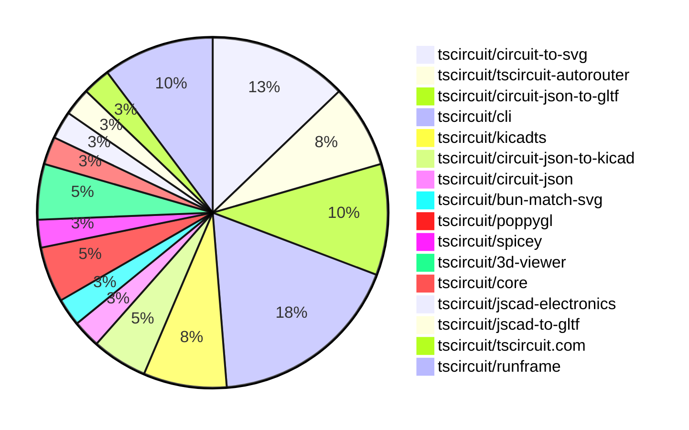
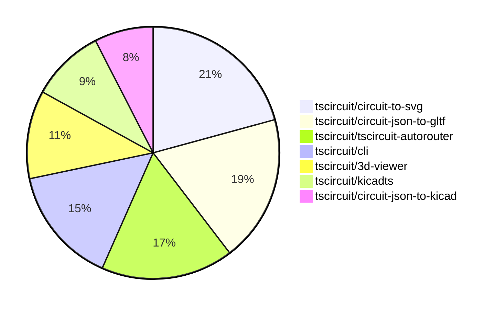

# Contribution Overview 2025-10-01

## PRs by Repository

## Contributor Overview

| Contributor | 🐳 Major | 🐙 Minor | 🐌 Tiny | ⭐ | Score | Discussion Contributions |
|-------------|---------|---------|---------|-----|----------------|--------------------------|
| [seveibar](#seveibar) | 4 | 7 | 7 | ⭐⭐⭐ | 44 | 0🔹 0🔶 0💎 |
| [tscircuitbot](#tscircuitbot) | 0 | 0 | 10 | ⭐ | 10 | 0🔹 0🔶 0💎 |
| [0hmX](#0hmX) | 0 | 3 | 1 | ⭐ | 7 | 0🔹 0🔶 0💎 |
| [imrishabh18](#imrishabh18) | 1 | 0 | 1 | ⭐ | 6 | 0🔹 0🔶 0💎 |
| [ShiboSoftwareDev](#ShiboSoftwareDev) | 1 | 0 | 1 | ⭐ | 5 | 0🔹 0🔶 0💎 |
| [Abse2001](#Abse2001) | 1 | 0 | 0 | ⭐ | 4 | 0🔹 0🔶 0💎 |
| [pxlpal](#pxlpal) | 1 | 0 | 0 | ⭐ | 4 | 0🔹 0🔶 0💎 |
| [techmannih](#techmannih) | 0 | 1 | 0 |  | 2 | 0🔹 0🔶 0💎 |

### Discussion Contribution Legend

- 🔹 Normal Comments: Basic participation with minimal effort
- 🔶 Great Informative Comments: Thoughtful participation that adds value
- 💎 Incredible Comments: Exceptional participation with high-quality content

## Review Table

[reviews-received-hover]: ## "Number of reviews received for PRs for this contributor"
[approvals-received-hover]: ## "Number of approvals received for PRs this contributor authored"
[rejections-received-hover]: ## "Number of rejections received for PRs this contributor authored"
[prs-opened-hover]: ## "Number of PRs opened by this contributor"
[issues-created-hover]: ## "Number of issues created by this contributor"
[bountied-issues-hover]: ## "Number of issues this contributor created with a bounty"
[bountied-issue-$-hover]: ## "Total bounty amount placed on issues authored by this contributor"

| Contributor | Reviews Received | Approvals Received | Rejections Received | Approvals | Rejections | PRs Opened | PRs Merged | Score | Issues Created | Bountied Issues | Bountied Issue $ |
|---|---|---|---|---|---|---|---|---|---|---|---|
| [naaa760](#naaa760) | 0 | 0 | 0 | 0 | 0 | 5 | 0 | 0 | 0 | 0 | 0 |
| [seveibar](#seveibar) | 10 | 0 | 0 | 9 | 3 | 24 | 18 | 44 | 0 | 0 | 0 |
| [Quanta-Naut](#Quanta-Naut) | 2 | 0 | 0 | 0 | 0 | 1 | 0 | 0 | 0 | 0 | 0 |
| [imrishabh18](#imrishabh18) | 1 | 1 | 0 | 0 | 0 | 2 | 2 | 6 | 0 | 0 | 0 |
| [Abse2001](#Abse2001) | 2 | 1 | 0 | 0 | 0 | 3 | 1 | 4 | 0 | 0 | 0 |
| [techmannih](#techmannih) | 2 | 1 | 0 | 0 | 0 | 1 | 1 | 2 | 0 | 0 | 0 |
| [Omar8345](#Omar8345) | 0 | 0 | 0 | 0 | 0 | 1 | 0 | 0 | 0 | 0 | 0 |
| [saish9901](#saish9901) | 0 | 0 | 0 | 0 | 0 | 1 | 0 | 0 | 0 | 0 | 0 |
| [Excellencedev](#Excellencedev) | 0 | 0 | 0 | 0 | 0 | 3 | 0 | 0 | 0 | 0 | 0 |
| [ShiboSoftwareDev](#ShiboSoftwareDev) | 2 | 2 | 0 | 0 | 0 | 2 | 2 | 5 | 0 | 0 | 0 |
| [0hmX](#0hmX) | 3 | 3 | 0 | 0 | 0 | 4 | 4 | 7 | 0 | 0 | 0 |
| [MustafaMulla29](#MustafaMulla29) | 8 | 0 | 1 | 0 | 0 | 1 | 0 | 0 | 0 | 0 | 0 |
| [pxlpal](#pxlpal) | 1 | 1 | 0 | 0 | 0 | 2 | 1 | 4 | 0 | 0 | 0 |
| [tscircuitbot](#tscircuitbot) | 0 | 0 | 0 | 0 | 0 | 13 | 10 | 10 | 0 | 0 | 0 |
| [1914Jegx](#1914Jegx) | 1 | 0 | 1 | 0 | 0 | 2 | 0 | 0 | 0 | 0 | 0 |
| [Ayushjhawar8](#Ayushjhawar8) | 1 | 0 | 1 | 0 | 0 | 1 | 0 | 0 | 0 | 0 | 0 |

## Top 7 Repositories by Contribution Points

## Changes by Repository

### [tscircuit/circuit-to-svg](https://github.com/tscircuit/circuit-to-svg)

| PR # | Impact | Rating | Contributor | Description |
|------|--------|--------|-------------|-------------|
| [#340](https://github.com/tscircuit/circuit-to-svg/pull/340) | 🐳 Major | ⭐⭐⭐ | seveibar | Add a converter that combines schematic and simulation graph SVGs with vertical stacking, exposes the converter from the public API, and parses child SVGs safely, while covering the new behavior with snapshot tests and layout assertions. |
| [#337](https://github.com/tscircuit/circuit-to-svg/pull/337) | 🐳 Major | ⭐⭐⭐ | seveibar | Add a dedicated converter for simulation transient voltage graphs and supporting types, export the simulation graph converter for standalone SVG generation, and cover rendering and filtering with SVG snapshot tests. |

🐌 Tiny Contributions (3)

| PR # | Impact | Contributor | Description |
|------|--------|-------------|-------------|
| [#341](https://github.com/tscircuit/circuit-to-svg/pull/341) | 🐌 Tiny | seveibar | Streamlines the README usage snippet to highlight minimal schematic conversion, adds TypeScript snippets and snapshot links for each API section, and removes obsolete contributing and license sections to keep the documentation focused on usage. |
| [#339](https://github.com/tscircuit/circuit-to-svg/pull/339) | 🐌 Tiny | seveibar | Add a stalebot GitHub Actions workflow to automatically mark and close stale issues and pull requests |
| [#343](https://github.com/tscircuit/circuit-to-svg/pull/343) | 🐌 Tiny | ShiboSoftwareDev | fix rotation issues better label style and alignment some routing improvements |

### [tscircuit/tscircuit-autorouter](https://github.com/tscircuit/tscircuit-autorouter)

| PR # | Impact | Rating | Contributor | Description |
|------|--------|--------|-------------|-------------|
| [#260](https://github.com/tscircuit/tscircuit-autorouter/pull/260) | 🐳 Major | ⭐⭐⭐ | seveibar | Fixes path simplification to ensure the solver falls back to the original segment when no 45 path can reach the tail, preserving vias and endpoints, and adds a regression test for bug d3f3be1b. |
| [#256](https://github.com/tscircuit/tscircuit-autorouter/pull/256) | 🐳 Major | ⭐⭐⭐ | imrishabh18 | Fixes the visualization of failed connections in the autorouting process by displaying the last failed connection instead of the next one when no candidates are available. |

🐌 Tiny Contributions (1)

| PR # | Impact | Contributor | Description |
|------|--------|-------------|-------------|
| [#258](https://github.com/tscircuit/tscircuit-autorouter/pull/258) | 🐌 Tiny | imrishabh18 | Adds a simplified reproduction of an autorouting bug using a JSON fixture and a React component for debugging. |

### [tscircuit/circuit-json-to-gltf](https://github.com/tscircuit/circuit-json-to-gltf)

| PR # | Impact | Rating | Contributor | Description |
|------|--------|--------|-------------|-------------|
| [#25](https://github.com/tscircuit/circuit-json-to-gltf/pull/25) | 🐳 Major | ⭐⭐⭐ | seveibar | Adds support for loading GLB models in the 3D circuit visualization, allowing users to utilize GLB files alongside STL and OBJ formats. |
| [#29](https://github.com/tscircuit/circuit-json-to-gltf/pull/29) | 🐙 Minor | ⭐⭐ | seveibar | Adds support for generating 3D models from footprint strings in the circuit-to-3D conversion process. |
| [#24](https://github.com/tscircuit/circuit-json-to-gltf/pull/24) | 🐙 Minor | ⭐⭐ | seveibar | Adds an example for rendering a GLB model of a circuit board using the tscircuit library. |
| [#31](https://github.com/tscircuit/circuit-json-to-gltf/pull/31) | 🐙 Minor | ⭐⭐ | 0hmX | Adds support for loading GLTF models in the circuit-to-3D conversion process by introducing a new model_gltf_url property for CAD components. |

### [tscircuit/cli](https://github.com/tscircuit/cli)

| PR # | Impact | Rating | Contributor | Description |
|------|--------|--------|-------------|-------------|
| [#423](https://github.com/tscircuit/cli/pull/423) | 🐙 Minor | ⭐⭐ | seveibar | Moves the logic for resolving tsci tarball URLs into a shared helper and reuses it from the add command when the registry entry is missing. |

🐌 Tiny Contributions (6)

| PR # | Impact | Contributor | Description |
|------|--------|-------------|-------------|
| [#430](https://github.com/tscircuit/cli/pull/430) | 🐌 Tiny | tscircuitbot | Automated package update |
| [#429](https://github.com/tscircuit/cli/pull/429) | 🐌 Tiny | tscircuitbot | Updates the tscircuitrunframe package from version 0.0.1032 to 0.0.1033 |
| [#426](https://github.com/tscircuit/cli/pull/426) | 🐌 Tiny | tscircuitbot | Updates the tscircuitrunframe package to version 0.0.1032 in the package.json file |
| [#427](https://github.com/tscircuit/cli/pull/427) | 🐌 Tiny | tscircuitbot | Automated package update |
| [#425](https://github.com/tscircuit/cli/pull/425) | 🐌 Tiny | tscircuitbot | Updates the tscircuitrunframe package from version 0.0.1031 to 0.0.1032 |
| [#424](https://github.com/tscircuit/cli/pull/424) | 🐌 Tiny | tscircuitbot | Automated package update |

### [tscircuit/kicadts](https://github.com/tscircuit/kicadts)

| PR # | Impact | Rating | Contributor | Description |
|------|--------|--------|-------------|-------------|
| [#8](https://github.com/tscircuit/kicadts/pull/8) | 🐙 Minor | ⭐⭐ | seveibar | Changes the handling of sheet_instances in KicadSch to allow multiple entries, preserving blocks during parsing and exposing them as an array. |
| [#6](https://github.com/tscircuit/kicadts/pull/6) | 🐙 Minor | ⭐⭐ | seveibar | Fixes the token representation for sheet instances in the KiCad schematic parser and adds a test for it. |

🐌 Tiny Contributions (1)

| PR # | Impact | Contributor | Description |
|------|--------|-------------|-------------|
| [#7](https://github.com/tscircuit/kicadts/pull/7) | 🐌 Tiny | seveibar | Add an npm version badge to the project README so readers can quickly navigate to the published package |

### [tscircuit/circuit-json-to-kicad](https://github.com/tscircuit/circuit-json-to-kicad)

| PR # | Impact | Rating | Contributor | Description |
|------|--------|--------|-------------|-------------|
| [#2](https://github.com/tscircuit/circuit-json-to-kicad/pull/2) | 🐙 Minor | ⭐⭐ | seveibar | Add example with chip, debug output, progress on chips, fix pins for chip, and schematic trace to chip |
| [#1](https://github.com/tscircuit/circuit-json-to-kicad/pull/1) | 🐙 Minor | ⭐⭐ | seveibar | Adds support for converting Circuit JSON to KiCad PCB format, including stages for initializing the PCB, adding nets, footprints, traces, vias, and graphics. |

### [tscircuit/circuit-json](https://github.com/tscircuit/circuit-json)

🐌 Tiny Contributions (1)

| PR # | Impact | Contributor | Description |
|------|--------|-------------|-------------|
| [#301](https://github.com/tscircuit/circuit-json/pull/301) | 🐌 Tiny | seveibar | Add CAD TypeScript files to the generated README documentation and create a dedicated CAD Components section in the README output while preserving formatting details. |

### [tscircuit/bun-match-svg](https://github.com/tscircuit/bun-match-svg)

🐌 Tiny Contributions (1)

| PR # | Impact | Contributor | Description |
|------|--------|-------------|-------------|
| [#12](https://github.com/tscircuit/bun-match-svg/pull/12) | 🐌 Tiny | seveibar | Include the originating test file name when building SVG snapshot filenames and update snapshot-related tests to expect the new naming convention. |

### [tscircuit/poppygl](https://github.com/tscircuit/poppygl)

| PR # | Impact | Rating | Contributor | Description |
|------|--------|--------|-------------|-------------|
| [#2](https://github.com/tscircuit/poppygl/pull/2) | 🐙 Minor | ⭐⭐ | 0hmX | Fixes the camera drag behavior in the viewer by inverting the horizontal drag direction. |

🐌 Tiny Contributions (1)

| PR # | Impact | Contributor | Description |
|------|--------|-------------|-------------|
| [#3](https://github.com/tscircuit/poppygl/pull/3) | 🐌 Tiny | seveibar | Adds a new example page that utilizes the soic8 chip in the PoppyGlViewer component. |

### [tscircuit/spicey](https://github.com/tscircuit/spicey)

🐌 Tiny Contributions (1)

| PR # | Impact | Contributor | Description |
|------|--------|-------------|-------------|
| [#2](https://github.com/tscircuit/spicey/pull/2) | 🐌 Tiny | seveibar | Summary document a modular directory layout in the README for future feature expansion split the SPICE simulator into focused parsing, analysis, formatting, math, stamping, and utility modules with one exported function per file re-export the new modules through libindex.ts to preserve the public API  Testing bunx tsc --noEmit bun test testsbasicsbasics01.test.ts |

### [tscircuit/3d-viewer](https://github.com/tscircuit/3d-viewer)

| PR # | Impact | Rating | Contributor | Description |
|------|--------|--------|-------------|-------------|
| [#509](https://github.com/tscircuit/3d-viewer/pull/509) | 🐳 Major | ⭐⭐⭐ | Abse2001 | Adds environment map configuration and a default environment map for GLB models to improve rendering quality. |
| [#501](https://github.com/tscircuit/3d-viewer/pull/501) | 🐙 Minor | ⭐⭐ | techmannih | Adds support for rectangular border radius to SMT pads and plated holes in the PCB design. |

### [tscircuit/core](https://github.com/tscircuit/core)

| PR # | Impact | Rating | Contributor | Description |
|------|--------|--------|-------------|-------------|
| [#1419](https://github.com/tscircuit/core/pull/1419) | 🐳 Major | ⭐⭐⭐ | ShiboSoftwareDev | Replace the simple-3d SVG pipeline with GLTF-based rendering, generating 3D snapshots as PNGs using poppygls rasterizer. |

### [tscircuit/jscad-electronics](https://github.com/tscircuit/jscad-electronics)

| PR # | Impact | Rating | Contributor | Description |
|------|--------|--------|-------------|-------------|
| [#121](https://github.com/tscircuit/jscad-electronics/pull/121) | 🐙 Minor | ⭐⭐ | 0hmX | Fixes the inverted winding order issue in the extrudeLinear operation, ensuring correct polygon rendering. |

### [tscircuit/jscad-to-gltf](https://github.com/tscircuit/jscad-to-gltf)

🐌 Tiny Contributions (1)

| PR # | Impact | Contributor | Description |
|------|--------|-------------|-------------|
| [#7](https://github.com/tscircuit/jscad-to-gltf/pull/7) | 🐌 Tiny | 0hmX | Updates the jscad-electronics dependency to version 0.0.43 and modifies the test to accommodate changes in the librarys API. |

### [tscircuit/tscircuit.com](https://github.com/tscircuit/tscircuit.com)

| PR # | Impact | Rating | Contributor | Description |
|------|--------|--------|-------------|-------------|
| [#1742](https://github.com/tscircuit/tscircuit.com/pull/1742) | 🐳 Major | ⭐⭐⭐ | pxlpal | Migrate to ImportComponentDialog2, use single dialog for everywhere where import is exposed |

### [tscircuit/runframe](https://github.com/tscircuit/runframe)

🐌 Tiny Contributions (4)

| PR # | Impact | Contributor | Description |
|------|--------|-------------|-------------|
| [#1296](https://github.com/tscircuit/runframe/pull/1296) | 🐌 Tiny | tscircuitbot | Automated package update |
| [#1295](https://github.com/tscircuit/runframe/pull/1295) | 🐌 Tiny | tscircuitbot | Updates the tscircuit3d-viewer package from version 0.0.405 to 0.0.406 |
| [#1294](https://github.com/tscircuit/runframe/pull/1294) | 🐌 Tiny | tscircuitbot | Automated package update |
| [#1293](https://github.com/tscircuit/runframe/pull/1293) | 🐌 Tiny | tscircuitbot | Updates the tscircuit3d-viewer package to version 0.0.405 in package.json |

## Changes by Contributor

### [seveibar](https://github.com/seveibar)

| PRs # | Impact | Rating | Description |
|------|--------|--------|-------------|
| [#340](https://github.com/tscircuit/circuit-to-svg/pull/340) | 🐳 Major | ⭐⭐⭐ | Add a converter that combines schematic and simulation graph SVGs with vertical stacking, exposes the converter from the public API, and parses child SVGs safely, while covering the new behavior with snapshot tests and layout assertions. |
| [#337](https://github.com/tscircuit/circuit-to-svg/pull/337) | 🐳 Major | ⭐⭐⭐ | Add a dedicated converter for simulation transient voltage graphs and supporting types, export the simulation graph converter for standalone SVG generation, and cover rendering and filtering with SVG snapshot tests. |
| [#260](https://github.com/tscircuit/tscircuit-autorouter/pull/260) | 🐳 Major | ⭐⭐⭐ | Fixes path simplification to ensure the solver falls back to the original segment when no 45 path can reach the tail, preserving vias and endpoints, and adds a regression test for bug d3f3be1b. |
| [#25](https://github.com/tscircuit/circuit-json-to-gltf/pull/25) | 🐳 Major | ⭐⭐⭐ | Adds support for loading GLB models in the 3D circuit visualization, allowing users to utilize GLB files alongside STL and OBJ formats. |
| [#423](https://github.com/tscircuit/cli/pull/423) | 🐙 Minor | ⭐⭐ | Moves the logic for resolving tsci tarball URLs into a shared helper and reuses it from the add command when the registry entry is missing. |
| [#29](https://github.com/tscircuit/circuit-json-to-gltf/pull/29) | 🐙 Minor | ⭐⭐ | Adds support for generating 3D models from footprint strings in the circuit-to-3D conversion process. |
| [#24](https://github.com/tscircuit/circuit-json-to-gltf/pull/24) | 🐙 Minor | ⭐⭐ | Adds an example for rendering a GLB model of a circuit board using the tscircuit library. |
| [#8](https://github.com/tscircuit/kicadts/pull/8) | 🐙 Minor | ⭐⭐ | Changes the handling of sheet_instances in KicadSch to allow multiple entries, preserving blocks during parsing and exposing them as an array. |
| [#6](https://github.com/tscircuit/kicadts/pull/6) | 🐙 Minor | ⭐⭐ | Fixes the token representation for sheet instances in the KiCad schematic parser and adds a test for it. |
| [#2](https://github.com/tscircuit/circuit-json-to-kicad/pull/2) | 🐙 Minor | ⭐⭐ | Add example with chip, debug output, progress on chips, fix pins for chip, and schematic trace to chip |
| [#1](https://github.com/tscircuit/circuit-json-to-kicad/pull/1) | 🐙 Minor | ⭐⭐ | Adds support for converting Circuit JSON to KiCad PCB format, including stages for initializing the PCB, adding nets, footprints, traces, vias, and graphics. |

🐌 Tiny Contributions (7)

| PR # | Impact | Description |
|------|--------|-------------|
| [#301](https://github.com/tscircuit/circuit-json/pull/301) | 🐌 Tiny | Add CAD TypeScript files to the generated README documentation and create a dedicated CAD Components section in the README output while preserving formatting details. |
| [#341](https://github.com/tscircuit/circuit-to-svg/pull/341) | 🐌 Tiny | Streamlines the README usage snippet to highlight minimal schematic conversion, adds TypeScript snippets and snapshot links for each API section, and removes obsolete contributing and license sections to keep the documentation focused on usage. |
| [#339](https://github.com/tscircuit/circuit-to-svg/pull/339) | 🐌 Tiny | Add a stalebot GitHub Actions workflow to automatically mark and close stale issues and pull requests |
| [#12](https://github.com/tscircuit/bun-match-svg/pull/12) | 🐌 Tiny | Include the originating test file name when building SVG snapshot filenames and update snapshot-related tests to expect the new naming convention. |
| [#7](https://github.com/tscircuit/kicadts/pull/7) | 🐌 Tiny | Add an npm version badge to the project README so readers can quickly navigate to the published package |
| [#3](https://github.com/tscircuit/poppygl/pull/3) | 🐌 Tiny | Adds a new example page that utilizes the soic8 chip in the PoppyGlViewer component. |
| [#2](https://github.com/tscircuit/spicey/pull/2) | 🐌 Tiny | Summary document a modular directory layout in the README for future feature expansion split the SPICE simulator into focused parsing, analysis, formatting, math, stamping, and utility modules with one exported function per file re-export the new modules through libindex.ts to preserve the public API  Testing bunx tsc --noEmit bun test testsbasicsbasics01.test.ts |

### [Abse2001](https://github.com/Abse2001)

| PRs # | Impact | Rating | Description |
|------|--------|--------|-------------|
| [#509](https://github.com/tscircuit/3d-viewer/pull/509) | 🐳 Major | ⭐⭐⭐ | Adds environment map configuration and a default environment map for GLB models to improve rendering quality. |

### [techmannih](https://github.com/techmannih)

| PRs # | Impact | Rating | Description |
|------|--------|--------|-------------|
| [#501](https://github.com/tscircuit/3d-viewer/pull/501) | 🐙 Minor | ⭐⭐ | Adds support for rectangular border radius to SMT pads and plated holes in the PCB design. |

### [ShiboSoftwareDev](https://github.com/ShiboSoftwareDev)

| PRs # | Impact | Rating | Description |
|------|--------|--------|-------------|
| [#1419](https://github.com/tscircuit/core/pull/1419) | 🐳 Major | ⭐⭐⭐ | Replace the simple-3d SVG pipeline with GLTF-based rendering, generating 3D snapshots as PNGs using poppygls rasterizer. |

🐌 Tiny Contributions (1)

| PR # | Impact | Description |
|------|--------|-------------|
| [#343](https://github.com/tscircuit/circuit-to-svg/pull/343) | 🐌 Tiny | fix rotation issues better label style and alignment some routing improvements |

### [0hmX](https://github.com/0hmX)

| PRs # | Impact | Rating | Description |
|------|--------|--------|-------------|
| [#121](https://github.com/tscircuit/jscad-electronics/pull/121) | 🐙 Minor | ⭐⭐ | Fixes the inverted winding order issue in the extrudeLinear operation, ensuring correct polygon rendering. |
| [#31](https://github.com/tscircuit/circuit-json-to-gltf/pull/31) | 🐙 Minor | ⭐⭐ | Adds support for loading GLTF models in the circuit-to-3D conversion process by introducing a new model_gltf_url property for CAD components. |
| [#2](https://github.com/tscircuit/poppygl/pull/2) | 🐙 Minor | ⭐⭐ | Fixes the camera drag behavior in the viewer by inverting the horizontal drag direction. |

🐌 Tiny Contributions (1)

| PR # | Impact | Description |
|------|--------|-------------|
| [#7](https://github.com/tscircuit/jscad-to-gltf/pull/7) | 🐌 Tiny | Updates the jscad-electronics dependency to version 0.0.43 and modifies the test to accommodate changes in the librarys API. |

### [pxlpal](https://github.com/pxlpal)

| PRs # | Impact | Rating | Description |
|------|--------|--------|-------------|
| [#1742](https://github.com/tscircuit/tscircuit.com/pull/1742) | 🐳 Major | ⭐⭐⭐ | Migrate to ImportComponentDialog2, use single dialog for everywhere where import is exposed |

### [tscircuitbot](https://github.com/tscircuitbot)

🐌 Tiny Contributions (10)

| PR # | Impact | Description |
|------|--------|-------------|
| [#1296](https://github.com/tscircuit/runframe/pull/1296) | 🐌 Tiny | Automated package update |
| [#1295](https://github.com/tscircuit/runframe/pull/1295) | 🐌 Tiny | Updates the tscircuit3d-viewer package from version 0.0.405 to 0.0.406 |
| [#1294](https://github.com/tscircuit/runframe/pull/1294) | 🐌 Tiny | Automated package update |
| [#1293](https://github.com/tscircuit/runframe/pull/1293) | 🐌 Tiny | Updates the tscircuit3d-viewer package to version 0.0.405 in package.json |
| [#430](https://github.com/tscircuit/cli/pull/430) | 🐌 Tiny | Automated package update |
| [#429](https://github.com/tscircuit/cli/pull/429) | 🐌 Tiny | Updates the tscircuitrunframe package from version 0.0.1032 to 0.0.1033 |
| [#426](https://github.com/tscircuit/cli/pull/426) | 🐌 Tiny | Updates the tscircuitrunframe package to version 0.0.1032 in the package.json file |
| [#427](https://github.com/tscircuit/cli/pull/427) | 🐌 Tiny | Automated package update |
| [#425](https://github.com/tscircuit/cli/pull/425) | 🐌 Tiny | Updates the tscircuitrunframe package from version 0.0.1031 to 0.0.1032 |
| [#424](https://github.com/tscircuit/cli/pull/424) | 🐌 Tiny | Automated package update |

### [imrishabh18](https://github.com/imrishabh18)

| PRs # | Impact | Rating | Description |
|------|--------|--------|-------------|
| [#256](https://github.com/tscircuit/tscircuit-autorouter/pull/256) | 🐳 Major | ⭐⭐⭐ | Fixes the visualization of failed connections in the autorouting process by displaying the last failed connection instead of the next one when no candidates are available. |

🐌 Tiny Contributions (1)

| PR # | Impact | Description |
|------|--------|-------------|
| [#258](https://github.com/tscircuit/tscircuit-autorouter/pull/258) | 🐌 Tiny | Adds a simplified reproduction of an autorouting bug using a JSON fixture and a React component for debugging. |

## Repository Owners

| Repository | Codeowners |
|------------|------------|
| [builder](https://github.com/tscircuit/builder/blob/main/.github/CODEOWNERS) | [seveibar](https://github.com/seveibar)
| [pcb-viewer](https://github.com/tscircuit/pcb-viewer/blob/main/.github/CODEOWNERS) | [seveibar](https://github.com/seveibar), [ShiboSoftwareDev](https://github.com/ShiboSoftwareDev)
| [footprints-old](https://github.com/tscircuit/footprints-old/blob/main/.github/CODEOWNERS) | [seveibar](https://github.com/seveibar)
| [footprinter](https://github.com/tscircuit/footprinter/blob/main/.github/CODEOWNERS) | [seveibar](https://github.com/seveibar), [techmannih](https://github.com/techmannih)
| [3d-viewer](https://github.com/tscircuit/3d-viewer/blob/main/.github/CODEOWNERS) | [ShiboSoftwareDev](https://github.com/ShiboSoftwareDev)
| [winterspec](https://github.com/tscircuit/winterspec/blob/main/.github/CODEOWNERS) | [seveibar](https://github.com/seveibar), [ShiboSoftwareDev](https://github.com/ShiboSoftwareDev)
| [jscad-electronics](https://github.com/tscircuit/jscad-electronics/blob/main/.github/CODEOWNERS) | [seveibar](https://github.com/seveibar), [abhijitxy](https://github.com/abhijitxy), [anas-sarkez](https://github.com/anas-sarkez)
| [circuit-to-svg](https://github.com/tscircuit/circuit-to-svg/blob/main/.github/CODEOWNERS) | [imrishabh18](https://github.com/imrishabh18)
| [schematic-symbols](https://github.com/tscircuit/schematic-symbols/blob/main/.github/CODEOWNERS) | [seveibar](https://github.com/seveibar), [imrishabh18](https://github.com/imrishabh18), [techmannih](https://github.com/techmannih)
| [circuit-json-to-gerber](https://github.com/tscircuit/circuit-json-to-gerber/blob/main/.github/CODEOWNERS) | [seveibar](https://github.com/seveibar), [ShiboSoftwareDev](https://github.com/ShiboSoftwareDev)
| [tscircuit.com](https://github.com/tscircuit/tscircuit.com/blob/main/.github/CODEOWNERS) | [seveibar](https://github.com/seveibar), [imrishabh18](https://github.com/imrishabh18)
| [issue-roulette](https://github.com/tscircuit/issue-roulette/blob/main/.github/CODEOWNERS) | [Anshgrover23](https://github.com/Anshgrover23)
| [sparkfun-boards](https://github.com/tscircuit/sparkfun-boards/blob/main/.github/CODEOWNERS) | [ShiboSoftwareDev](https://github.com/ShiboSoftwareDev), [Abse2001](https://github.com/Abse2001), [MustafaMulla29](https://github.com/MustafaMulla29), [Anshgrover23](https://github.com/Anshgrover23), [techmannih](https://github.com/techmannih)
| [schematic-corpus](https://github.com/tscircuit/schematic-corpus/blob/main/.github/CODEOWNERS) | [Abse2001](https://github.com/Abse2001)

## Repositories by Owner

| User | Repo |
|------|------|
| [seveibar](https://github.com/seveibar) | [builder](https://github.com/tscircuit/builder/blob/main/.github/CODEOWNERS) |
|  | [pcb-viewer](https://github.com/tscircuit/pcb-viewer/blob/main/.github/CODEOWNERS) |
|  | [footprints-old](https://github.com/tscircuit/footprints-old/blob/main/.github/CODEOWNERS) |
|  | [footprinter](https://github.com/tscircuit/footprinter/blob/main/.github/CODEOWNERS) |
|  | [winterspec](https://github.com/tscircuit/winterspec/blob/main/.github/CODEOWNERS) |
|  | [jscad-electronics](https://github.com/tscircuit/jscad-electronics/blob/main/.github/CODEOWNERS) |
|  | [schematic-symbols](https://github.com/tscircuit/schematic-symbols/blob/main/.github/CODEOWNERS) |
|  | [circuit-json-to-gerber](https://github.com/tscircuit/circuit-json-to-gerber/blob/main/.github/CODEOWNERS) |
|  | [tscircuit.com](https://github.com/tscircuit/tscircuit.com/blob/main/.github/CODEOWNERS) |
| [ShiboSoftwareDev](https://github.com/ShiboSoftwareDev) | [pcb-viewer](https://github.com/tscircuit/pcb-viewer/blob/main/.github/CODEOWNERS) |
|  | [3d-viewer](https://github.com/tscircuit/3d-viewer/blob/main/.github/CODEOWNERS) |
|  | [winterspec](https://github.com/tscircuit/winterspec/blob/main/.github/CODEOWNERS) |
|  | [circuit-json-to-gerber](https://github.com/tscircuit/circuit-json-to-gerber/blob/main/.github/CODEOWNERS) |
|  | [sparkfun-boards](https://github.com/tscircuit/sparkfun-boards/blob/main/.github/CODEOWNERS) |
| [techmannih](https://github.com/techmannih) | [footprinter](https://github.com/tscircuit/footprinter/blob/main/.github/CODEOWNERS) |
|  | [schematic-symbols](https://github.com/tscircuit/schematic-symbols/blob/main/.github/CODEOWNERS) |
|  | [sparkfun-boards](https://github.com/tscircuit/sparkfun-boards/blob/main/.github/CODEOWNERS) |
| [abhijitxy](https://github.com/abhijitxy) | [jscad-electronics](https://github.com/tscircuit/jscad-electronics/blob/main/.github/CODEOWNERS) |
| [anas-sarkez](https://github.com/anas-sarkez) | [jscad-electronics](https://github.com/tscircuit/jscad-electronics/blob/main/.github/CODEOWNERS) |
| [imrishabh18](https://github.com/imrishabh18) | [circuit-to-svg](https://github.com/tscircuit/circuit-to-svg/blob/main/.github/CODEOWNERS) |
|  | [schematic-symbols](https://github.com/tscircuit/schematic-symbols/blob/main/.github/CODEOWNERS) |
|  | [tscircuit.com](https://github.com/tscircuit/tscircuit.com/blob/main/.github/CODEOWNERS) |
| [Anshgrover23](https://github.com/Anshgrover23) | [issue-roulette](https://github.com/tscircuit/issue-roulette/blob/main/.github/CODEOWNERS) |
|  | [sparkfun-boards](https://github.com/tscircuit/sparkfun-boards/blob/main/.github/CODEOWNERS) |
| [Abse2001](https://github.com/Abse2001) | [sparkfun-boards](https://github.com/tscircuit/sparkfun-boards/blob/main/.github/CODEOWNERS) |
|  | [schematic-corpus](https://github.com/tscircuit/schematic-corpus/blob/main/.github/CODEOWNERS) |
| [MustafaMulla29](https://github.com/MustafaMulla29) | [sparkfun-boards](https://github.com/tscircuit/sparkfun-boards/blob/main/.github/CODEOWNERS) |

