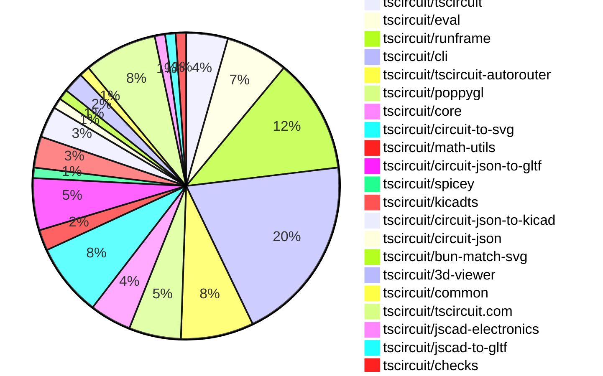
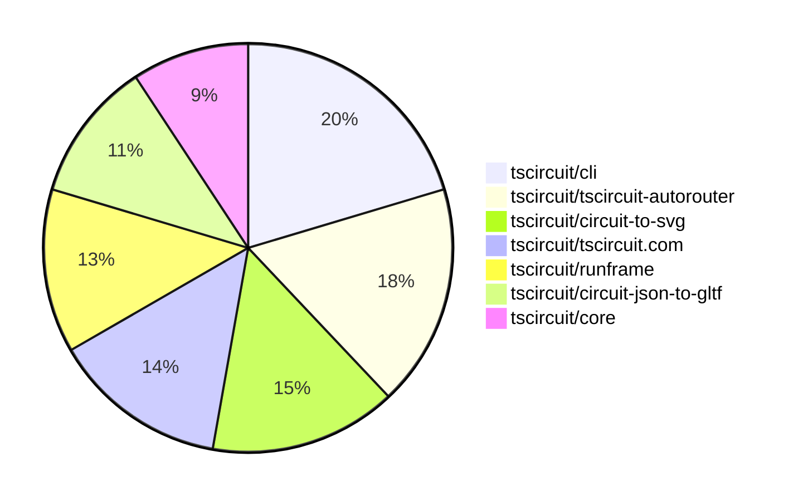

# Contribution Overview 2025-10-01

## PRs by Repository

## Contributor Overview

| Contributor | 🐳 Major | 🐙 Minor | 🐌 Tiny | ⭐ | Score | Discussion Contributions |
|-------------|---------|---------|---------|-----|----------------|--------------------------|
| [seveibar](#seveibar) | 11 | 9 | 9 | 👑👑 | 84 | 0🔹 0🔶 0💎 |
| [imrishabh18](#imrishabh18) | 1 | 5 | 4 | ⭐⭐ | 20 | 0🔹 0🔶 0💎 |
| [tscircuitbot](#tscircuitbot) | 0 | 0 | 31 | ⭐⭐ | 13 | 0🔹 0🔶 0💎 |
| [0hmX](#0hmX) | 0 | 5 | 2 | ⭐⭐ | 12 | 0🔹 0🔶 0💎 |
| [ArnavK-09](#ArnavK-09) | 0 | 5 | 0 | ⭐⭐ | 11 | 0🔹 0🔶 0💎 |
| [ShiboSoftwareDev](#ShiboSoftwareDev) | 1 | 1 | 1 | ⭐ | 7 | 0🔹 0🔶 0💎 |
| [Abse2001](#Abse2001) | 0 | 2 | 1 | ⭐ | 5 | 0🔹 0🔶 0💎 |
| [pxlpal](#pxlpal) | 1 | 0 | 0 | ⭐ | 4 | 0🔹 0🔶 0💎 |
| [techmannih](#techmannih) | 0 | 1 | 0 |  | 2 | 0🔹 0🔶 0💎 |
| [MustafaMulla29](#MustafaMulla29) | 0 | 1 | 0 |  | 2 | 0🔹 0🔶 0💎 |

### Discussion Contribution Legend

- 🔹 Normal Comments: Basic participation with minimal effort
- 🔶 Great Informative Comments: Thoughtful participation that adds value
- 💎 Incredible Comments: Exceptional participation with high-quality content

## Review Table

[reviews-received-hover]: ## "Number of reviews received for PRs for this contributor"
[approvals-received-hover]: ## "Number of approvals received for PRs this contributor authored"
[rejections-received-hover]: ## "Number of rejections received for PRs this contributor authored"
[prs-opened-hover]: ## "Number of PRs opened by this contributor"
[issues-created-hover]: ## "Number of issues created by this contributor"
[bountied-issues-hover]: ## "Number of issues this contributor created with a bounty"
[bountied-issue-$-hover]: ## "Total bounty amount placed on issues authored by this contributor"

| Contributor | Reviews Received | Approvals Received | Rejections Received | Approvals | Rejections | PRs Opened | PRs Merged | Score | Issues Created | Bountied Issues | Bountied Issue $ |
|---|---|---|---|---|---|---|---|---|---|---|---|
| [tscircuitbot](#tscircuitbot) | 0 | 0 | 0 | 0 | 0 | 41 | 31 | 13 | 0 | 0 | 0 |
| [imrishabh18](#imrishabh18) | 3 | 3 | 0 | 0 | 3 | 10 | 10 | 20 | 0 | 0 | 0 |
| [naaa760](#naaa760) | 0 | 0 | 0 | 0 | 0 | 5 | 0 | 0 | 0 | 0 | 0 |
| [seveibar](#seveibar) | 21 | 0 | 0 | 23 | 3 | 39 | 29 | 84 | 0 | 0 | 0 |
| [Quanta-Naut](#Quanta-Naut) | 9 | 0 | 1 | 0 | 0 | 1 | 0 | 0 | 0 | 0 | 0 |
| [Abse2001](#Abse2001) | 4 | 3 | 0 | 0 | 0 | 4 | 3 | 5 | 0 | 0 | 0 |
| [techmannih](#techmannih) | 2 | 1 | 0 | 0 | 0 | 1 | 1 | 2 | 0 | 0 | 0 |
| [ArnavK-09](#ArnavK-09) | 6 | 5 | 0 | 1 | 0 | 5 | 5 | 11 | 0 | 0 | 0 |
| [Omar8345](#Omar8345) | 0 | 0 | 0 | 0 | 0 | 1 | 0 | 0 | 0 | 0 | 0 |
| [Sanjay-Kirti](#Sanjay-Kirti) | 4 | 0 | 0 | 0 | 0 | 1 | 0 | 0 | 0 | 0 | 0 |
| [saish9901](#saish9901) | 2 | 0 | 1 | 0 | 0 | 1 | 0 | 0 | 0 | 0 | 0 |
| [Excellencedev](#Excellencedev) | 0 | 0 | 0 | 0 | 0 | 3 | 0 | 0 | 0 | 0 | 0 |
| [ShiboSoftwareDev](#ShiboSoftwareDev) | 4 | 3 | 0 | 0 | 0 | 4 | 3 | 7 | 0 | 0 | 0 |
| [0hmX](#0hmX) | 7 | 7 | 0 | 0 | 0 | 8 | 7 | 12 | 0 | 0 | 0 |
| [MustafaMulla29](#MustafaMulla29) | 11 | 1 | 2 | 0 | 0 | 2 | 1 | 2 | 0 | 0 | 0 |
| [pxlpal](#pxlpal) | 1 | 1 | 0 | 0 | 0 | 2 | 1 | 4 | 0 | 0 | 0 |
| [RaghavArora14](#RaghavArora14) | 0 | 0 | 0 | 0 | 0 | 1 | 0 | 0 | 0 | 0 | 0 |
| [baeoc](#baeoc) | 0 | 0 | 0 | 0 | 0 | 1 | 0 | 0 | 0 | 0 | 0 |
| [1914Jegx](#1914Jegx) | 1 | 0 | 1 | 0 | 0 | 2 | 0 | 0 | 0 | 0 | 0 |
| [Ayushjhawar8](#Ayushjhawar8) | 1 | 0 | 1 | 0 | 0 | 1 | 0 | 0 | 0 | 0 | 0 |

## Top 7 Repositories by Contribution Points

## Changes by Repository

### [tscircuit/tscircuit](https://github.com/tscircuit/tscircuit)

🐌 Tiny Contributions (4)

| PR # | Impact | Contributor | Description |
|------|--------|-------------|-------------|
| [#894](https://github.com/tscircuit/tscircuit/pull/894) | 🐌 Tiny | tscircuitbot | Automated package update |
| [#892](https://github.com/tscircuit/tscircuit/pull/892) | 🐌 Tiny | tscircuitbot | Automated package update |
| [#893](https://github.com/tscircuit/tscircuit/pull/893) | 🐌 Tiny | imrishabh18 | Updates the CLI dependency version from 0.1.259 to 0.1.262 in package.json |
| [#891](https://github.com/tscircuit/tscircuit/pull/891) | 🐌 Tiny | imrishabh18 | Updates the CLI dependency version from 0.1.253 to 0.1.259 in package.json |

### [tscircuit/eval](https://github.com/tscircuit/eval)

🐌 Tiny Contributions (6)

| PR # | Impact | Contributor | Description |
|------|--------|-------------|-------------|
| [#1160](https://github.com/tscircuit/eval/pull/1160) | 🐌 Tiny | tscircuitbot | Automated package update |
| [#1158](https://github.com/tscircuit/eval/pull/1158) | 🐌 Tiny | tscircuitbot | Automated package update |
| [#1159](https://github.com/tscircuit/eval/pull/1159) | 🐌 Tiny | tscircuitbot | Automated package update |
| [#1157](https://github.com/tscircuit/eval/pull/1157) | 🐌 Tiny | tscircuitbot | Automated package update |
| [#1156](https://github.com/tscircuit/eval/pull/1156) | 🐌 Tiny | tscircuitbot | Automated package update |
| [#1155](https://github.com/tscircuit/eval/pull/1155) | 🐌 Tiny | tscircuitbot | Automated package update |

### [tscircuit/runframe](https://github.com/tscircuit/runframe)

| PR # | Impact | Rating | Contributor | Description |
|------|--------|--------|-------------|-------------|
| [#1297](https://github.com/tscircuit/runframe/pull/1297) | 🐳 Major | ⭐⭐⭐ | seveibar | Add functionality to export KiCad projects as downloadable zip files containing schematic and PCB files. |

🐌 Tiny Contributions (10)

| PR # | Impact | Contributor | Description |
|------|--------|-------------|-------------|
| [#1303](https://github.com/tscircuit/runframe/pull/1303) | 🐌 Tiny | tscircuitbot | Automated package update |
| [#1302](https://github.com/tscircuit/runframe/pull/1302) | 🐌 Tiny | tscircuitbot | Updates the tscircuiteval package to version 0.0.357 in the package.json file. |
| [#1301](https://github.com/tscircuit/runframe/pull/1301) | 🐌 Tiny | tscircuitbot | Updates the tscircuiteval package to version 0.0.357 in the package.json file. |
| [#1300](https://github.com/tscircuit/runframe/pull/1300) | 🐌 Tiny | tscircuitbot | Updates the tscircuiteval package to version 0.0.356 in the package.json file. |
| [#1299](https://github.com/tscircuit/runframe/pull/1299) | 🐌 Tiny | tscircuitbot | Updates the tscircuiteval package from version 0.0.355 to 0.0.356 |
| [#1298](https://github.com/tscircuit/runframe/pull/1298) | 🐌 Tiny | tscircuitbot | Updates the tscircuiteval package to version 0.0.355 in the package.json file. |
| [#1296](https://github.com/tscircuit/runframe/pull/1296) | 🐌 Tiny | tscircuitbot | Automated package update |
| [#1295](https://github.com/tscircuit/runframe/pull/1295) | 🐌 Tiny | tscircuitbot | Updates the tscircuit3d-viewer package from version 0.0.405 to 0.0.406 |
| [#1294](https://github.com/tscircuit/runframe/pull/1294) | 🐌 Tiny | tscircuitbot | Automated package update |
| [#1293](https://github.com/tscircuit/runframe/pull/1293) | 🐌 Tiny | tscircuitbot | Updates the tscircuit3d-viewer package to version 0.0.405 in package.json |

### [tscircuit/cli](https://github.com/tscircuit/cli)

| PR # | Impact | Rating | Contributor | Description |
|------|--------|--------|-------------|-------------|
| [#442](https://github.com/tscircuit/cli/pull/442) | 🐙 Minor | ⭐⭐ | imrishabh18 | Replaces the simple 3D SVG conversion in snapshot generation with a poppygl-based GLB to PNG workflow, writing 3D snapshots as rendered PNG buffers and adjusting diffing logic accordingly, while removing the unused simple 3D dependency from package metadata. |
| [#435](https://github.com/tscircuit/cli/pull/435) | 🐙 Minor | ⭐⭐ | imrishabh18 | Switches the 3D PNG generation process from using simple-3d to poppygl, enhancing the rendering of 3D circuit images in the tscircuit build process. |
| [#431](https://github.com/tscircuit/cli/pull/431) | 🐙 Minor | ⭐⭐ | seveibar | Add support for exporting KiCad schematic, PCB, and zip files using circuit-json-to-kicad, including necessary dependencies and CLI tests for the new formats. |
| [#423](https://github.com/tscircuit/cli/pull/423) | 🐙 Minor | ⭐⭐ | seveibar | Moves the logic for resolving tsci tarball URLs into a shared helper and reuses it from the add command when the registry entry is missing. |

🐌 Tiny Contributions (14)

| PR # | Impact | Contributor | Description |
|------|--------|-------------|-------------|
| [#441](https://github.com/tscircuit/cli/pull/441) | 🐌 Tiny | tscircuitbot | Automated package update |
| [#440](https://github.com/tscircuit/cli/pull/440) | 🐌 Tiny | tscircuitbot | Automated package update |
| [#439](https://github.com/tscircuit/cli/pull/439) | 🐌 Tiny | tscircuitbot | Updates the tscircuitrunframe package to version 0.0.1036 in the package.json file |
| [#438](https://github.com/tscircuit/cli/pull/438) | 🐌 Tiny | tscircuitbot | Automated package update |
| [#436](https://github.com/tscircuit/cli/pull/436) | 🐌 Tiny | tscircuitbot | Updates the tscircuitrunframe package from version 0.0.1033 to 0.0.1034 |
| [#434](https://github.com/tscircuit/cli/pull/434) | 🐌 Tiny | tscircuitbot | Automated package update to version 0.1.259 |
| [#432](https://github.com/tscircuit/cli/pull/432) | 🐌 Tiny | tscircuitbot | Automated package update |
| [#430](https://github.com/tscircuit/cli/pull/430) | 🐌 Tiny | tscircuitbot | Automated package update |
| [#429](https://github.com/tscircuit/cli/pull/429) | 🐌 Tiny | tscircuitbot | Updates the tscircuitrunframe package from version 0.0.1032 to 0.0.1033 |
| [#426](https://github.com/tscircuit/cli/pull/426) | 🐌 Tiny | tscircuitbot | Updates the tscircuitrunframe package to version 0.0.1032 |
| [#427](https://github.com/tscircuit/cli/pull/427) | 🐌 Tiny | tscircuitbot | Automated package update |
| [#425](https://github.com/tscircuit/cli/pull/425) | 🐌 Tiny | tscircuitbot | Updates the tscircuitrunframe package from version 0.0.1031 to 0.0.1032 |
| [#424](https://github.com/tscircuit/cli/pull/424) | 🐌 Tiny | tscircuitbot | Automated package update |
| [#433](https://github.com/tscircuit/cli/pull/433) | 🐌 Tiny | imrishabh18 | Adds additional logging during the tscircuit build command to help diagnose RPC disconnects caused by lack of stdout output. |

### [tscircuit/tscircuit-autorouter](https://github.com/tscircuit/tscircuit-autorouter)

| PR # | Impact | Rating | Contributor | Description |
|------|--------|--------|-------------|-------------|
| [#256](https://github.com/tscircuit/tscircuit-autorouter/pull/256) | 🐳 Major | ⭐⭐⭐ | imrishabh18 | Fixes the visualization of failed connections in the autorouting process by displaying the last failed connection instead of the next one when no candidates are available. |
| [#268](https://github.com/tscircuit/tscircuit-autorouter/pull/268) | 🐳 Major | ⭐⭐⭐ | seveibar | Fixes path simplification to ensure routing segments do not leave the board outline, enhancing the autorouting accuracy. |
| [#265](https://github.com/tscircuit/tscircuit-autorouter/pull/265) | 🐳 Major | ⭐⭐⭐ | seveibar | Adds support for an optional outline polygon in the capacity node solver, allowing the solver to treat space outside the outline as obstacles and includes a new fixture for demonstration. |
| [#260](https://github.com/tscircuit/tscircuit-autorouter/pull/260) | 🐳 Major | ⭐⭐⭐ | seveibar | Fixes path simplification fallback to original segment when no 45 path can reach the tail, ensuring connectivity and adding a regression test for bug d3f3be1b. |

🐌 Tiny Contributions (3)

| PR # | Impact | Contributor | Description |
|------|--------|-------------|-------------|
| [#258](https://github.com/tscircuit/tscircuit-autorouter/pull/258) | 🐌 Tiny | imrishabh18 | Adds a simplified reproduction of an autorouting bug using a JSON fixture and a React component for debugging. |
| [#269](https://github.com/tscircuit/tscircuit-autorouter/pull/269) | 🐌 Tiny | seveibar | Adds a GitHub Actions stalebot workflow to automatically close stale issues and pull requests after a specified period of inactivity. |
| [#266](https://github.com/tscircuit/tscircuit-autorouter/pull/266) | 🐌 Tiny | seveibar | Draws the PCB outline in the initial problem visualization for visibility before solving starts, reuses the outline polygon when available, and modifies the capacity mesh outline visualization by removing explicit stroke width and adding point typing for linting compliance. |

### [tscircuit/poppygl](https://github.com/tscircuit/poppygl)

| PR # | Impact | Rating | Contributor | Description |
|------|--------|--------|-------------|-------------|
| [#7](https://github.com/tscircuit/poppygl/pull/7) | 🐙 Minor | ⭐⭐ | imrishabh18 | Allows the renderGLTFToPNGBuffer function to accept a GLTF model as either a file path or a JSON string, enhancing flexibility in rendering. |
| [#6](https://github.com/tscircuit/poppygl/pull/6) | 🐙 Minor | ⭐⭐ | imrishabh18 | Exports the renderGLTFToPNGBuffer function from the library for use in other modules. |
| [#5](https://github.com/tscircuit/poppygl/pull/5) | 🐙 Minor | ⭐⭐ | imrishabh18 | Adds support for a customizable background color in the rendering options of the SoftwareRenderer. |
| [#2](https://github.com/tscircuit/poppygl/pull/2) | 🐙 Minor | ⭐⭐ | 0hmX | Fixes the camera drag behavior in the viewer by inverting the horizontal drag direction. |

🐌 Tiny Contributions (1)

| PR # | Impact | Contributor | Description |
|------|--------|-------------|-------------|
| [#3](https://github.com/tscircuit/poppygl/pull/3) | 🐌 Tiny | seveibar | Adds a new example page that utilizes the soic8 chip in the PoppyGlViewer component. |

### [tscircuit/core](https://github.com/tscircuit/core)

| PR # | Impact | Rating | Contributor | Description |
|------|--------|--------|-------------|-------------|
| [#1431](https://github.com/tscircuit/core/pull/1431) | 🐳 Major | ⭐⭐⭐ | seveibar | Fixes autorouter routing through a U-shaped board outline and adds a regression test to ensure correct behavior. |
| [#1428](https://github.com/tscircuit/core/pull/1428) | 🐙 Minor | ⭐⭐ | Abse2001 | Adds MicroModBoard and GreenpillBoard fixtures with full pin mapping and a snapshot test for PCB packing verification. |
| [#1434](https://github.com/tscircuit/core/pull/1434) | 🐙 Minor | ⭐⭐ | ArnavK-09 | Resolves relative footprint URLs by constructing asset URLs based on the projects base URL and adds a fallback mechanism for loading footprints. |
| [#1419](https://github.com/tscircuit/core/pull/1419) | 🐙 Minor | ⭐⭐ | ShiboSoftwareDev | Replaces the simple-3d SVG pipeline with GLTF-based rendering, generating 3D snapshots as PNGs using poppygls rasterizer. |

### [tscircuit/circuit-to-svg](https://github.com/tscircuit/circuit-to-svg)

| PR # | Impact | Rating | Contributor | Description |
|------|--------|--------|-------------|-------------|
| [#340](https://github.com/tscircuit/circuit-to-svg/pull/340) | 🐳 Major | ⭐⭐⭐ | seveibar | Add a converter that combines schematic and simulation graph SVGs with vertical stacking, exposes the converter from the public API, and parses child SVGs safely. |
| [#337](https://github.com/tscircuit/circuit-to-svg/pull/337) | 🐳 Major | ⭐⭐⭐ | seveibar | Add a dedicated converter for simulation transient voltage graphs and supporting types, export the simulation graph converter for standalone SVG generation, and cover rendering and filtering with SVG snapshot tests. |
| [#345](https://github.com/tscircuit/circuit-to-svg/pull/345) | 🐳 Major | ⭐⭐⭐ | ShiboSoftwareDev | Enhances pinout diagrams for small-pad boards by dynamically scaling UI elements and improving label separation for better readability. |

🐌 Tiny Contributions (4)

| PR # | Impact | Contributor | Description |
|------|--------|-------------|-------------|
| [#344](https://github.com/tscircuit/circuit-to-svg/pull/344) | 🐌 Tiny | seveibar | Replaces README snapshot links with embedded images for inline rendering of previews. |
| [#341](https://github.com/tscircuit/circuit-to-svg/pull/341) | 🐌 Tiny | seveibar | Streamlines the README usage snippet to highlight minimal schematic conversion, adds TypeScript snippets and snapshot links for each API section, and removes obsolete contributing and license sections to keep the documentation focused on usage. |
| [#339](https://github.com/tscircuit/circuit-to-svg/pull/339) | 🐌 Tiny | seveibar | Add a stalebot GitHub Actions workflow to automatically mark and close stale issues and pull requests |
| [#343](https://github.com/tscircuit/circuit-to-svg/pull/343) | 🐌 Tiny | ShiboSoftwareDev | fix rotation issues better label style and alignment some routing improvements |

### [tscircuit/math-utils](https://github.com/tscircuit/math-utils)

| PR # | Impact | Rating | Contributor | Description |
|------|--------|--------|-------------|-------------|
| [#24](https://github.com/tscircuit/math-utils/pull/24) | 🐳 Major | ⭐⭐⭐ | seveibar | Adds a UniversalRect type to support both center-based rectangles and bounds in polygon helper functions, updating the README and tests accordingly. |
| [#23](https://github.com/tscircuit/math-utils/pull/23) | 🐳 Major | ⭐⭐⭐ | seveibar | Add polygon utility module with point containment, overlap, and inclusion helpers for bounds and rect inputs |

### [tscircuit/circuit-json-to-gltf](https://github.com/tscircuit/circuit-json-to-gltf)

| PR # | Impact | Rating | Contributor | Description |
|------|--------|--------|-------------|-------------|
| [#25](https://github.com/tscircuit/circuit-json-to-gltf/pull/25) | 🐳 Major | ⭐⭐⭐ | seveibar | Adds support for loading GLB files in the 3D circuit model conversion process. |
| [#33](https://github.com/tscircuit/circuit-json-to-gltf/pull/33) | 🐙 Minor | ⭐⭐ | seveibar | Fixes incorrectly rotated GLB models and addresses issues with GLB color loading. |
| [#29](https://github.com/tscircuit/circuit-json-to-gltf/pull/29) | 🐙 Minor | ⭐⭐ | seveibar | Adds support for generating 3D models from footprint strings in circuit components. |
| [#24](https://github.com/tscircuit/circuit-json-to-gltf/pull/24) | 🐙 Minor | ⭐⭐ | seveibar | Adds an example for rendering a GLB model in the circuit JSON to GLTF conversion process. |
| [#31](https://github.com/tscircuit/circuit-json-to-gltf/pull/31) | 🐙 Minor | ⭐⭐ | 0hmX | Adds support for loading GLTF models in the circuit-to-3D conversion process by including a new model_gltf_url property in cad components. |

### [tscircuit/spicey](https://github.com/tscircuit/spicey)

| PR # | Impact | Rating | Contributor | Description |
|------|--------|--------|-------------|-------------|
| [#2](https://github.com/tscircuit/spicey/pull/2) | 🐳 Major | ⭐⭐⭐ | seveibar | Summary document a modular directory layout in the README for future feature expansion split the SPICE simulator into focused parsing, analysis, formatting, math, stamping, and utility modules with one exported function per file re-export the new modules through libindex.ts to preserve the public API  Testing bunx tsc --noEmit bun test testsbasicsbasics01.test.ts |

### [tscircuit/kicadts](https://github.com/tscircuit/kicadts)

| PR # | Impact | Rating | Contributor | Description |
|------|--------|--------|-------------|-------------|
| [#8](https://github.com/tscircuit/kicadts/pull/8) | 🐙 Minor | ⭐⭐ | seveibar | Changes the handling of sheet_instances in KicadSch to allow multiple entries, preserving blocks during parsing and exposing them as an array. |
| [#6](https://github.com/tscircuit/kicadts/pull/6) | 🐙 Minor | ⭐⭐ | seveibar | Fixes the token representation for sheet instances in the KiCad schematic parser and adds a test for it. |

🐌 Tiny Contributions (1)

| PR # | Impact | Contributor | Description |
|------|--------|-------------|-------------|
| [#7](https://github.com/tscircuit/kicadts/pull/7) | 🐌 Tiny | seveibar | Add an npm version badge to the project README so readers can quickly navigate to the published package |

### [tscircuit/circuit-json-to-kicad](https://github.com/tscircuit/circuit-json-to-kicad)

| PR # | Impact | Rating | Contributor | Description |
|------|--------|--------|-------------|-------------|
| [#2](https://github.com/tscircuit/circuit-json-to-kicad/pull/2) | 🐙 Minor | ⭐⭐ | seveibar | Add example with chip, debug output, progress on chips, fix pins for chip, and schematic trace to chip |
| [#1](https://github.com/tscircuit/circuit-json-to-kicad/pull/1) | 🐙 Minor | ⭐⭐ | seveibar | Adds support for converting Circuit JSON to KiCad PCB format, including stages for initializing the PCB, adding nets, footprints, traces, vias, and graphics. |
| [#3](https://github.com/tscircuit/circuit-json-to-kicad/pull/3) | 🐙 Minor | ⭐⭐ | 0hmX | This pull request removes an extra 0 from the coordinates of a Junction object in the AddSchematicTracesStage class, which was causing issues with junctions and the kicad_sch format. The change is aimed at fixing a bug that was breaking the functionality of the schematic generation. |

### [tscircuit/circuit-json](https://github.com/tscircuit/circuit-json)

🐌 Tiny Contributions (1)

| PR # | Impact | Contributor | Description |
|------|--------|-------------|-------------|
| [#301](https://github.com/tscircuit/circuit-json/pull/301) | 🐌 Tiny | seveibar | Add CAD components to the generated README documentation, including a dedicated section for CAD components and the inclusion of CAD TypeScript files. |

### [tscircuit/bun-match-svg](https://github.com/tscircuit/bun-match-svg)

🐌 Tiny Contributions (1)

| PR # | Impact | Contributor | Description |
|------|--------|-------------|-------------|
| [#12](https://github.com/tscircuit/bun-match-svg/pull/12) | 🐌 Tiny | seveibar | Changes SVG snapshot filenames to include the originating test file name, updating related tests to expect the new naming convention. |

### [tscircuit/3d-viewer](https://github.com/tscircuit/3d-viewer)

| PR # | Impact | Rating | Contributor | Description |
|------|--------|--------|-------------|-------------|
| [#509](https://github.com/tscircuit/3d-viewer/pull/509) | 🐙 Minor | ⭐⭐ | Abse2001 | Adds environment map configuration and a default environment map for GLB models to improve rendering quality. |
| [#501](https://github.com/tscircuit/3d-viewer/pull/501) | 🐙 Minor | ⭐⭐ | techmannih | Adds support for rectangular border radius to SMT pads and plated holes in the PCB design. |

### [tscircuit/common](https://github.com/tscircuit/common)

🐌 Tiny Contributions (1)

| PR # | Impact | Contributor | Description |
|------|--------|-------------|-------------|
| [#21](https://github.com/tscircuit/common/pull/21) | 🐌 Tiny | Abse2001 | Adds CM5Connector and CM5Receiver components with full pinouts and footprints for Raspberry Pi Compute Module 5 carrier board development. |

### [tscircuit/tscircuit.com](https://github.com/tscircuit/tscircuit.com)

| PR # | Impact | Rating | Contributor | Description |
|------|--------|--------|-------------|-------------|
| [#1742](https://github.com/tscircuit/tscircuit.com/pull/1742) | 🐳 Major | ⭐⭐⭐ | pxlpal | Migrate to ImportComponentDialog2, use single dialog for everywhere where import is exposed |
| [#1749](https://github.com/tscircuit/tscircuit.com/pull/1749) | 🐙 Minor | ⭐⭐ | ArnavK-09 | Prevents the dropdown menu from displaying during navigation loading to enhance user experience. |
| [#1748](https://github.com/tscircuit/tscircuit.com/pull/1748) | 🐙 Minor | ⭐⭐ | ArnavK-09 | Prevents flickering by ensuring that the user profile page does not render until the account data has been fetched. |
| [#1746](https://github.com/tscircuit/tscircuit.com/pull/1746) | 🐙 Minor | ⭐⭐ | ArnavK-09 | Refactors the NewPackageSavePromptDialog component to include the full package name by combining the selected organization name or GitHub username with the package name. |
| [#1747](https://github.com/tscircuit/tscircuit.com/pull/1747) | 🐙 Minor | ⭐⭐ | ArnavK-09 | Adjusts the tab layout in the user profile page to enhance responsiveness by modifying the CSS classes used for the tab component. |
| [#1743](https://github.com/tscircuit/tscircuit.com/pull/1743) | 🐙 Minor | ⭐⭐ | 0hmX | Adds new functionality to convert circuit JSON to KiCad PCB and schematic formats using the circuit-json-to-kicad library. |

🐌 Tiny Contributions (1)

| PR # | Impact | Contributor | Description |
|------|--------|-------------|-------------|
| [#1745](https://github.com/tscircuit/tscircuit.com/pull/1745) | 🐌 Tiny | 0hmX | Adds the --host option to the development script to allow easy access to the local network URL. |

### [tscircuit/jscad-electronics](https://github.com/tscircuit/jscad-electronics)

| PR # | Impact | Rating | Contributor | Description |
|------|--------|--------|-------------|-------------|
| [#121](https://github.com/tscircuit/jscad-electronics/pull/121) | 🐙 Minor | ⭐⭐ | 0hmX | Fixes the inverted winding order issue in the extrudeLinear operation, ensuring correct polygon rendering. |

### [tscircuit/jscad-to-gltf](https://github.com/tscircuit/jscad-to-gltf)

🐌 Tiny Contributions (1)

| PR # | Impact | Contributor | Description |
|------|--------|-------------|-------------|
| [#7](https://github.com/tscircuit/jscad-to-gltf/pull/7) | 🐌 Tiny | 0hmX | Updates the jscad-electronics dependency from version 0.0.42 to 0.0.43 and modifies the test to accommodate the new version. |

### [tscircuit/checks](https://github.com/tscircuit/checks)

| PR # | Impact | Rating | Contributor | Description |
|------|--------|--------|-------------|-------------|
| [#79](https://github.com/tscircuit/checks/pull/79) | 🐙 Minor | ⭐⭐ | MustafaMulla29 | Checks if PCB traces are within the board outline and reports errors for traces that are too close or outside the board edge. |

## Changes by Contributor

### [tscircuitbot](https://github.com/tscircuitbot)

🐌 Tiny Contributions (31)

| PR # | Impact | Description |
|------|--------|-------------|
| [#894](https://github.com/tscircuit/tscircuit/pull/894) | 🐌 Tiny | Automated package update |
| [#892](https://github.com/tscircuit/tscircuit/pull/892) | 🐌 Tiny | Automated package update |
| [#1160](https://github.com/tscircuit/eval/pull/1160) | 🐌 Tiny | Automated package update |
| [#1158](https://github.com/tscircuit/eval/pull/1158) | 🐌 Tiny | Automated package update |
| [#1159](https://github.com/tscircuit/eval/pull/1159) | 🐌 Tiny | Automated package update |
| [#1157](https://github.com/tscircuit/eval/pull/1157) | 🐌 Tiny | Automated package update |
| [#1156](https://github.com/tscircuit/eval/pull/1156) | 🐌 Tiny | Automated package update |
| [#1155](https://github.com/tscircuit/eval/pull/1155) | 🐌 Tiny | Automated package update |
| [#1303](https://github.com/tscircuit/runframe/pull/1303) | 🐌 Tiny | Automated package update |
| [#1302](https://github.com/tscircuit/runframe/pull/1302) | 🐌 Tiny | Updates the tscircuiteval package to version 0.0.357 in the package.json file. |
| [#1301](https://github.com/tscircuit/runframe/pull/1301) | 🐌 Tiny | Updates the tscircuiteval package to version 0.0.357 in the package.json file. |
| [#1300](https://github.com/tscircuit/runframe/pull/1300) | 🐌 Tiny | Updates the tscircuiteval package to version 0.0.356 in the package.json file. |
| [#1299](https://github.com/tscircuit/runframe/pull/1299) | 🐌 Tiny | Updates the tscircuiteval package from version 0.0.355 to 0.0.356 |
| [#1298](https://github.com/tscircuit/runframe/pull/1298) | 🐌 Tiny | Updates the tscircuiteval package to version 0.0.355 in the package.json file. |
| [#1296](https://github.com/tscircuit/runframe/pull/1296) | 🐌 Tiny | Automated package update |
| [#1295](https://github.com/tscircuit/runframe/pull/1295) | 🐌 Tiny | Updates the tscircuit3d-viewer package from version 0.0.405 to 0.0.406 |
| [#1294](https://github.com/tscircuit/runframe/pull/1294) | 🐌 Tiny | Automated package update |
| [#1293](https://github.com/tscircuit/runframe/pull/1293) | 🐌 Tiny | Updates the tscircuit3d-viewer package to version 0.0.405 in package.json |
| [#441](https://github.com/tscircuit/cli/pull/441) | 🐌 Tiny | Automated package update |
| [#440](https://github.com/tscircuit/cli/pull/440) | 🐌 Tiny | Automated package update |
| [#439](https://github.com/tscircuit/cli/pull/439) | 🐌 Tiny | Updates the tscircuitrunframe package to version 0.0.1036 in the package.json file |
| [#438](https://github.com/tscircuit/cli/pull/438) | 🐌 Tiny | Automated package update |
| [#436](https://github.com/tscircuit/cli/pull/436) | 🐌 Tiny | Updates the tscircuitrunframe package from version 0.0.1033 to 0.0.1034 |
| [#434](https://github.com/tscircuit/cli/pull/434) | 🐌 Tiny | Automated package update to version 0.1.259 |
| [#432](https://github.com/tscircuit/cli/pull/432) | 🐌 Tiny | Automated package update |
| [#430](https://github.com/tscircuit/cli/pull/430) | 🐌 Tiny | Automated package update |
| [#429](https://github.com/tscircuit/cli/pull/429) | 🐌 Tiny | Updates the tscircuitrunframe package from version 0.0.1032 to 0.0.1033 |
| [#426](https://github.com/tscircuit/cli/pull/426) | 🐌 Tiny | Updates the tscircuitrunframe package to version 0.0.1032 |
| [#427](https://github.com/tscircuit/cli/pull/427) | 🐌 Tiny | Automated package update |
| [#425](https://github.com/tscircuit/cli/pull/425) | 🐌 Tiny | Updates the tscircuitrunframe package from version 0.0.1031 to 0.0.1032 |
| [#424](https://github.com/tscircuit/cli/pull/424) | 🐌 Tiny | Automated package update |

### [imrishabh18](https://github.com/imrishabh18)

| PRs # | Impact | Rating | Description |
|------|--------|--------|-------------|
| [#256](https://github.com/tscircuit/tscircuit-autorouter/pull/256) | 🐳 Major | ⭐⭐⭐ | Fixes the visualization of failed connections in the autorouting process by displaying the last failed connection instead of the next one when no candidates are available. |
| [#442](https://github.com/tscircuit/cli/pull/442) | 🐙 Minor | ⭐⭐ | Replaces the simple 3D SVG conversion in snapshot generation with a poppygl-based GLB to PNG workflow, writing 3D snapshots as rendered PNG buffers and adjusting diffing logic accordingly, while removing the unused simple 3D dependency from package metadata. |
| [#435](https://github.com/tscircuit/cli/pull/435) | 🐙 Minor | ⭐⭐ | Switches the 3D PNG generation process from using simple-3d to poppygl, enhancing the rendering of 3D circuit images in the tscircuit build process. |
| [#7](https://github.com/tscircuit/poppygl/pull/7) | 🐙 Minor | ⭐⭐ | Allows the renderGLTFToPNGBuffer function to accept a GLTF model as either a file path or a JSON string, enhancing flexibility in rendering. |
| [#6](https://github.com/tscircuit/poppygl/pull/6) | 🐙 Minor | ⭐⭐ | Exports the renderGLTFToPNGBuffer function from the library for use in other modules. |
| [#5](https://github.com/tscircuit/poppygl/pull/5) | 🐙 Minor | ⭐⭐ | Adds support for a customizable background color in the rendering options of the SoftwareRenderer. |

🐌 Tiny Contributions (4)

| PR # | Impact | Description |
|------|--------|-------------|
| [#893](https://github.com/tscircuit/tscircuit/pull/893) | 🐌 Tiny | Updates the CLI dependency version from 0.1.259 to 0.1.262 in package.json |
| [#891](https://github.com/tscircuit/tscircuit/pull/891) | 🐌 Tiny | Updates the CLI dependency version from 0.1.253 to 0.1.259 in package.json |
| [#433](https://github.com/tscircuit/cli/pull/433) | 🐌 Tiny | Adds additional logging during the tscircuit build command to help diagnose RPC disconnects caused by lack of stdout output. |
| [#258](https://github.com/tscircuit/tscircuit-autorouter/pull/258) | 🐌 Tiny | Adds a simplified reproduction of an autorouting bug using a JSON fixture and a React component for debugging. |

### [seveibar](https://github.com/seveibar)

| PRs # | Impact | Rating | Description |
|------|--------|--------|-------------|
| [#1431](https://github.com/tscircuit/core/pull/1431) | 🐳 Major | ⭐⭐⭐ | Fixes autorouter routing through a U-shaped board outline and adds a regression test to ensure correct behavior. |
| [#340](https://github.com/tscircuit/circuit-to-svg/pull/340) | 🐳 Major | ⭐⭐⭐ | Add a converter that combines schematic and simulation graph SVGs with vertical stacking, exposes the converter from the public API, and parses child SVGs safely. |
| [#337](https://github.com/tscircuit/circuit-to-svg/pull/337) | 🐳 Major | ⭐⭐⭐ | Add a dedicated converter for simulation transient voltage graphs and supporting types, export the simulation graph converter for standalone SVG generation, and cover rendering and filtering with SVG snapshot tests. |
| [#24](https://github.com/tscircuit/math-utils/pull/24) | 🐳 Major | ⭐⭐⭐ | Adds a UniversalRect type to support both center-based rectangles and bounds in polygon helper functions, updating the README and tests accordingly. |
| [#23](https://github.com/tscircuit/math-utils/pull/23) | 🐳 Major | ⭐⭐⭐ | Add polygon utility module with point containment, overlap, and inclusion helpers for bounds and rect inputs |
| [#1297](https://github.com/tscircuit/runframe/pull/1297) | 🐳 Major | ⭐⭐⭐ | Add functionality to export KiCad projects as downloadable zip files containing schematic and PCB files. |
| [#268](https://github.com/tscircuit/tscircuit-autorouter/pull/268) | 🐳 Major | ⭐⭐⭐ | Fixes path simplification to ensure routing segments do not leave the board outline, enhancing the autorouting accuracy. |
| [#265](https://github.com/tscircuit/tscircuit-autorouter/pull/265) | 🐳 Major | ⭐⭐⭐ | Adds support for an optional outline polygon in the capacity node solver, allowing the solver to treat space outside the outline as obstacles and includes a new fixture for demonstration. |
| [#260](https://github.com/tscircuit/tscircuit-autorouter/pull/260) | 🐳 Major | ⭐⭐⭐ | Fixes path simplification fallback to original segment when no 45 path can reach the tail, ensuring connectivity and adding a regression test for bug d3f3be1b. |
| [#25](https://github.com/tscircuit/circuit-json-to-gltf/pull/25) | 🐳 Major | ⭐⭐⭐ | Adds support for loading GLB files in the 3D circuit model conversion process. |
| [#2](https://github.com/tscircuit/spicey/pull/2) | 🐳 Major | ⭐⭐⭐ | Summary document a modular directory layout in the README for future feature expansion split the SPICE simulator into focused parsing, analysis, formatting, math, stamping, and utility modules with one exported function per file re-export the new modules through libindex.ts to preserve the public API  Testing bunx tsc --noEmit bun test testsbasicsbasics01.test.ts |
| [#431](https://github.com/tscircuit/cli/pull/431) | 🐙 Minor | ⭐⭐ | Add support for exporting KiCad schematic, PCB, and zip files using circuit-json-to-kicad, including necessary dependencies and CLI tests for the new formats. |
| [#423](https://github.com/tscircuit/cli/pull/423) | 🐙 Minor | ⭐⭐ | Moves the logic for resolving tsci tarball URLs into a shared helper and reuses it from the add command when the registry entry is missing. |
| [#33](https://github.com/tscircuit/circuit-json-to-gltf/pull/33) | 🐙 Minor | ⭐⭐ | Fixes incorrectly rotated GLB models and addresses issues with GLB color loading. |
| [#29](https://github.com/tscircuit/circuit-json-to-gltf/pull/29) | 🐙 Minor | ⭐⭐ | Adds support for generating 3D models from footprint strings in circuit components. |
| [#24](https://github.com/tscircuit/circuit-json-to-gltf/pull/24) | 🐙 Minor | ⭐⭐ | Adds an example for rendering a GLB model in the circuit JSON to GLTF conversion process. |
| [#8](https://github.com/tscircuit/kicadts/pull/8) | 🐙 Minor | ⭐⭐ | Changes the handling of sheet_instances in KicadSch to allow multiple entries, preserving blocks during parsing and exposing them as an array. |
| [#6](https://github.com/tscircuit/kicadts/pull/6) | 🐙 Minor | ⭐⭐ | Fixes the token representation for sheet instances in the KiCad schematic parser and adds a test for it. |
| [#2](https://github.com/tscircuit/circuit-json-to-kicad/pull/2) | 🐙 Minor | ⭐⭐ | Add example with chip, debug output, progress on chips, fix pins for chip, and schematic trace to chip |
| [#1](https://github.com/tscircuit/circuit-json-to-kicad/pull/1) | 🐙 Minor | ⭐⭐ | Adds support for converting Circuit JSON to KiCad PCB format, including stages for initializing the PCB, adding nets, footprints, traces, vias, and graphics. |

🐌 Tiny Contributions (9)

| PR # | Impact | Description |
|------|--------|-------------|
| [#301](https://github.com/tscircuit/circuit-json/pull/301) | 🐌 Tiny | Add CAD components to the generated README documentation, including a dedicated section for CAD components and the inclusion of CAD TypeScript files. |
| [#344](https://github.com/tscircuit/circuit-to-svg/pull/344) | 🐌 Tiny | Replaces README snapshot links with embedded images for inline rendering of previews. |
| [#341](https://github.com/tscircuit/circuit-to-svg/pull/341) | 🐌 Tiny | Streamlines the README usage snippet to highlight minimal schematic conversion, adds TypeScript snippets and snapshot links for each API section, and removes obsolete contributing and license sections to keep the documentation focused on usage. |
| [#339](https://github.com/tscircuit/circuit-to-svg/pull/339) | 🐌 Tiny | Add a stalebot GitHub Actions workflow to automatically mark and close stale issues and pull requests |
| [#12](https://github.com/tscircuit/bun-match-svg/pull/12) | 🐌 Tiny | Changes SVG snapshot filenames to include the originating test file name, updating related tests to expect the new naming convention. |
| [#269](https://github.com/tscircuit/tscircuit-autorouter/pull/269) | 🐌 Tiny | Adds a GitHub Actions stalebot workflow to automatically close stale issues and pull requests after a specified period of inactivity. |
| [#266](https://github.com/tscircuit/tscircuit-autorouter/pull/266) | 🐌 Tiny | Draws the PCB outline in the initial problem visualization for visibility before solving starts, reuses the outline polygon when available, and modifies the capacity mesh outline visualization by removing explicit stroke width and adding point typing for linting compliance. |
| [#7](https://github.com/tscircuit/kicadts/pull/7) | 🐌 Tiny | Add an npm version badge to the project README so readers can quickly navigate to the published package |
| [#3](https://github.com/tscircuit/poppygl/pull/3) | 🐌 Tiny | Adds a new example page that utilizes the soic8 chip in the PoppyGlViewer component. |

### [Abse2001](https://github.com/Abse2001)

| PRs # | Impact | Rating | Description |
|------|--------|--------|-------------|
| [#509](https://github.com/tscircuit/3d-viewer/pull/509) | 🐙 Minor | ⭐⭐ | Adds environment map configuration and a default environment map for GLB models to improve rendering quality. |
| [#1428](https://github.com/tscircuit/core/pull/1428) | 🐙 Minor | ⭐⭐ | Adds MicroModBoard and GreenpillBoard fixtures with full pin mapping and a snapshot test for PCB packing verification. |

🐌 Tiny Contributions (1)

| PR # | Impact | Description |
|------|--------|-------------|
| [#21](https://github.com/tscircuit/common/pull/21) | 🐌 Tiny | Adds CM5Connector and CM5Receiver components with full pinouts and footprints for Raspberry Pi Compute Module 5 carrier board development. |

### [techmannih](https://github.com/techmannih)

| PRs # | Impact | Rating | Description |
|------|--------|--------|-------------|
| [#501](https://github.com/tscircuit/3d-viewer/pull/501) | 🐙 Minor | ⭐⭐ | Adds support for rectangular border radius to SMT pads and plated holes in the PCB design. |

### [ArnavK-09](https://github.com/ArnavK-09)

| PRs # | Impact | Rating | Description |
|------|--------|--------|-------------|
| [#1434](https://github.com/tscircuit/core/pull/1434) | 🐙 Minor | ⭐⭐ | Resolves relative footprint URLs by constructing asset URLs based on the projects base URL and adds a fallback mechanism for loading footprints. |
| [#1749](https://github.com/tscircuit/tscircuit.com/pull/1749) | 🐙 Minor | ⭐⭐ | Prevents the dropdown menu from displaying during navigation loading to enhance user experience. |
| [#1748](https://github.com/tscircuit/tscircuit.com/pull/1748) | 🐙 Minor | ⭐⭐ | Prevents flickering by ensuring that the user profile page does not render until the account data has been fetched. |
| [#1746](https://github.com/tscircuit/tscircuit.com/pull/1746) | 🐙 Minor | ⭐⭐ | Refactors the NewPackageSavePromptDialog component to include the full package name by combining the selected organization name or GitHub username with the package name. |
| [#1747](https://github.com/tscircuit/tscircuit.com/pull/1747) | 🐙 Minor | ⭐⭐ | Adjusts the tab layout in the user profile page to enhance responsiveness by modifying the CSS classes used for the tab component. |

### [ShiboSoftwareDev](https://github.com/ShiboSoftwareDev)

| PRs # | Impact | Rating | Description |
|------|--------|--------|-------------|
| [#345](https://github.com/tscircuit/circuit-to-svg/pull/345) | 🐳 Major | ⭐⭐⭐ | Enhances pinout diagrams for small-pad boards by dynamically scaling UI elements and improving label separation for better readability. |
| [#1419](https://github.com/tscircuit/core/pull/1419) | 🐙 Minor | ⭐⭐ | Replaces the simple-3d SVG pipeline with GLTF-based rendering, generating 3D snapshots as PNGs using poppygls rasterizer. |

🐌 Tiny Contributions (1)

| PR # | Impact | Description |
|------|--------|-------------|
| [#343](https://github.com/tscircuit/circuit-to-svg/pull/343) | 🐌 Tiny | fix rotation issues better label style and alignment some routing improvements |

### [0hmX](https://github.com/0hmX)

| PRs # | Impact | Rating | Description |
|------|--------|--------|-------------|
| [#121](https://github.com/tscircuit/jscad-electronics/pull/121) | 🐙 Minor | ⭐⭐ | Fixes the inverted winding order issue in the extrudeLinear operation, ensuring correct polygon rendering. |
| [#1743](https://github.com/tscircuit/tscircuit.com/pull/1743) | 🐙 Minor | ⭐⭐ | Adds new functionality to convert circuit JSON to KiCad PCB and schematic formats using the circuit-json-to-kicad library. |
| [#31](https://github.com/tscircuit/circuit-json-to-gltf/pull/31) | 🐙 Minor | ⭐⭐ | Adds support for loading GLTF models in the circuit-to-3D conversion process by including a new model_gltf_url property in cad components. |
| [#2](https://github.com/tscircuit/poppygl/pull/2) | 🐙 Minor | ⭐⭐ | Fixes the camera drag behavior in the viewer by inverting the horizontal drag direction. |
| [#3](https://github.com/tscircuit/circuit-json-to-kicad/pull/3) | 🐙 Minor | ⭐⭐ | This pull request removes an extra 0 from the coordinates of a Junction object in the AddSchematicTracesStage class, which was causing issues with junctions and the kicad_sch format. The change is aimed at fixing a bug that was breaking the functionality of the schematic generation. |

🐌 Tiny Contributions (2)

| PR # | Impact | Description |
|------|--------|-------------|
| [#1745](https://github.com/tscircuit/tscircuit.com/pull/1745) | 🐌 Tiny | Adds the --host option to the development script to allow easy access to the local network URL. |
| [#7](https://github.com/tscircuit/jscad-to-gltf/pull/7) | 🐌 Tiny | Updates the jscad-electronics dependency from version 0.0.42 to 0.0.43 and modifies the test to accommodate the new version. |

### [MustafaMulla29](https://github.com/MustafaMulla29)

| PRs # | Impact | Rating | Description |
|------|--------|--------|-------------|
| [#79](https://github.com/tscircuit/checks/pull/79) | 🐙 Minor | ⭐⭐ | Checks if PCB traces are within the board outline and reports errors for traces that are too close or outside the board edge. |

### [pxlpal](https://github.com/pxlpal)

| PRs # | Impact | Rating | Description |
|------|--------|--------|-------------|
| [#1742](https://github.com/tscircuit/tscircuit.com/pull/1742) | 🐳 Major | ⭐⭐⭐ | Migrate to ImportComponentDialog2, use single dialog for everywhere where import is exposed |

## Repository Owners

| Repository | Codeowners |
|------------|------------|
| [builder](https://github.com/tscircuit/builder/blob/main/.github/CODEOWNERS) | [seveibar](https://github.com/seveibar)
| [pcb-viewer](https://github.com/tscircuit/pcb-viewer/blob/main/.github/CODEOWNERS) | [seveibar](https://github.com/seveibar), [ShiboSoftwareDev](https://github.com/ShiboSoftwareDev)
| [footprints-old](https://github.com/tscircuit/footprints-old/blob/main/.github/CODEOWNERS) | [seveibar](https://github.com/seveibar)
| [footprinter](https://github.com/tscircuit/footprinter/blob/main/.github/CODEOWNERS) | [seveibar](https://github.com/seveibar), [techmannih](https://github.com/techmannih)
| [3d-viewer](https://github.com/tscircuit/3d-viewer/blob/main/.github/CODEOWNERS) | [ShiboSoftwareDev](https://github.com/ShiboSoftwareDev)
| [winterspec](https://github.com/tscircuit/winterspec/blob/main/.github/CODEOWNERS) | [seveibar](https://github.com/seveibar), [ShiboSoftwareDev](https://github.com/ShiboSoftwareDev)
| [jscad-electronics](https://github.com/tscircuit/jscad-electronics/blob/main/.github/CODEOWNERS) | [seveibar](https://github.com/seveibar), [abhijitxy](https://github.com/abhijitxy), [anas-sarkez](https://github.com/anas-sarkez)
| [circuit-to-svg](https://github.com/tscircuit/circuit-to-svg/blob/main/.github/CODEOWNERS) | [imrishabh18](https://github.com/imrishabh18)
| [schematic-symbols](https://github.com/tscircuit/schematic-symbols/blob/main/.github/CODEOWNERS) | [seveibar](https://github.com/seveibar), [imrishabh18](https://github.com/imrishabh18), [techmannih](https://github.com/techmannih)
| [circuit-json-to-gerber](https://github.com/tscircuit/circuit-json-to-gerber/blob/main/.github/CODEOWNERS) | [seveibar](https://github.com/seveibar), [ShiboSoftwareDev](https://github.com/ShiboSoftwareDev)
| [tscircuit.com](https://github.com/tscircuit/tscircuit.com/blob/main/.github/CODEOWNERS) | [seveibar](https://github.com/seveibar), [imrishabh18](https://github.com/imrishabh18)
| [issue-roulette](https://github.com/tscircuit/issue-roulette/blob/main/.github/CODEOWNERS) | [Anshgrover23](https://github.com/Anshgrover23)
| [sparkfun-boards](https://github.com/tscircuit/sparkfun-boards/blob/main/.github/CODEOWNERS) | [ShiboSoftwareDev](https://github.com/ShiboSoftwareDev), [Abse2001](https://github.com/Abse2001), [MustafaMulla29](https://github.com/MustafaMulla29), [Anshgrover23](https://github.com/Anshgrover23), [techmannih](https://github.com/techmannih)
| [schematic-corpus](https://github.com/tscircuit/schematic-corpus/blob/main/.github/CODEOWNERS) | [Abse2001](https://github.com/Abse2001)

## Repositories by Owner

| User | Repo |
|------|------|
| [seveibar](https://github.com/seveibar) | [builder](https://github.com/tscircuit/builder/blob/main/.github/CODEOWNERS) |
|  | [pcb-viewer](https://github.com/tscircuit/pcb-viewer/blob/main/.github/CODEOWNERS) |
|  | [footprints-old](https://github.com/tscircuit/footprints-old/blob/main/.github/CODEOWNERS) |
|  | [footprinter](https://github.com/tscircuit/footprinter/blob/main/.github/CODEOWNERS) |
|  | [winterspec](https://github.com/tscircuit/winterspec/blob/main/.github/CODEOWNERS) |
|  | [jscad-electronics](https://github.com/tscircuit/jscad-electronics/blob/main/.github/CODEOWNERS) |
|  | [schematic-symbols](https://github.com/tscircuit/schematic-symbols/blob/main/.github/CODEOWNERS) |
|  | [circuit-json-to-gerber](https://github.com/tscircuit/circuit-json-to-gerber/blob/main/.github/CODEOWNERS) |
|  | [tscircuit.com](https://github.com/tscircuit/tscircuit.com/blob/main/.github/CODEOWNERS) |
| [ShiboSoftwareDev](https://github.com/ShiboSoftwareDev) | [pcb-viewer](https://github.com/tscircuit/pcb-viewer/blob/main/.github/CODEOWNERS) |
|  | [3d-viewer](https://github.com/tscircuit/3d-viewer/blob/main/.github/CODEOWNERS) |
|  | [winterspec](https://github.com/tscircuit/winterspec/blob/main/.github/CODEOWNERS) |
|  | [circuit-json-to-gerber](https://github.com/tscircuit/circuit-json-to-gerber/blob/main/.github/CODEOWNERS) |
|  | [sparkfun-boards](https://github.com/tscircuit/sparkfun-boards/blob/main/.github/CODEOWNERS) |
| [techmannih](https://github.com/techmannih) | [footprinter](https://github.com/tscircuit/footprinter/blob/main/.github/CODEOWNERS) |
|  | [schematic-symbols](https://github.com/tscircuit/schematic-symbols/blob/main/.github/CODEOWNERS) |
|  | [sparkfun-boards](https://github.com/tscircuit/sparkfun-boards/blob/main/.github/CODEOWNERS) |
| [abhijitxy](https://github.com/abhijitxy) | [jscad-electronics](https://github.com/tscircuit/jscad-electronics/blob/main/.github/CODEOWNERS) |
| [anas-sarkez](https://github.com/anas-sarkez) | [jscad-electronics](https://github.com/tscircuit/jscad-electronics/blob/main/.github/CODEOWNERS) |
| [imrishabh18](https://github.com/imrishabh18) | [circuit-to-svg](https://github.com/tscircuit/circuit-to-svg/blob/main/.github/CODEOWNERS) |
|  | [schematic-symbols](https://github.com/tscircuit/schematic-symbols/blob/main/.github/CODEOWNERS) |
|  | [tscircuit.com](https://github.com/tscircuit/tscircuit.com/blob/main/.github/CODEOWNERS) |
| [Anshgrover23](https://github.com/Anshgrover23) | [issue-roulette](https://github.com/tscircuit/issue-roulette/blob/main/.github/CODEOWNERS) |
|  | [sparkfun-boards](https://github.com/tscircuit/sparkfun-boards/blob/main/.github/CODEOWNERS) |
| [Abse2001](https://github.com/Abse2001) | [sparkfun-boards](https://github.com/tscircuit/sparkfun-boards/blob/main/.github/CODEOWNERS) |
|  | [schematic-corpus](https://github.com/tscircuit/schematic-corpus/blob/main/.github/CODEOWNERS) |
| [MustafaMulla29](https://github.com/MustafaMulla29) | [sparkfun-boards](https://github.com/tscircuit/sparkfun-boards/blob/main/.github/CODEOWNERS) |

