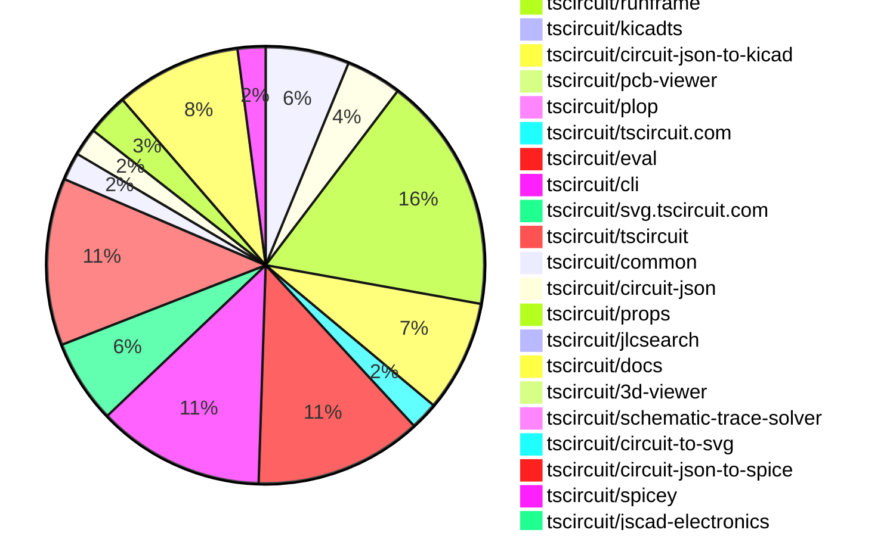
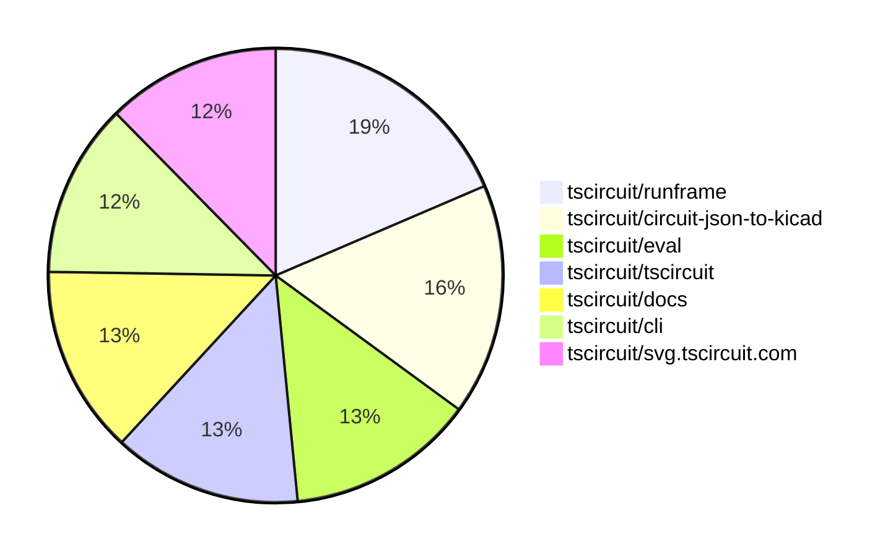

# Contribution Overview 2025-10-08

## PRs by Repository

## Contributor Overview

| Contributor | 🐳 Major | 🐙 Minor | 🐌 Tiny | ⭐ | Score | Discussion Contributions |
|-------------|---------|---------|---------|-----|----------------|--------------------------|
| [imrishabh18](#imrishabh18) | 0 | 13 | 12 | ⭐⭐⭐ | 39 | 0🔹 0🔶 0💎 |
| [seveibar](#seveibar) | 2 | 3 | 9 | ⭐⭐ | 30 | 0🔹 0🔶 0💎 |
| [tscircuitbot](#tscircuitbot) | 0 | 0 | 44 | ⭐⭐ | 15 | 0🔹 0🔶 0💎 |
| [ShiboSoftwareDev](#ShiboSoftwareDev) | 1 | 5 | 0 | ⭐⭐ | 15 | 0🔹 0🔶 0💎 |
| [ArnavK-09](#ArnavK-09) | 1 | 0 | 3 | ⭐ | 7 | 0🔹 0🔶 0💎 |
| [0hmX](#0hmX) | 1 | 0 | 2 | ⭐ | 6 | 0🔹 0🔶 0💎 |
| [Asymtode712](#Asymtode712) | 1 | 0 | 1 | ⭐ | 5 | 0🔹 0🔶 0💎 |
| [MustafaMulla29](#MustafaMulla29) | 1 | 0 | 1 | ⭐ | 5 | 0🔹 0🔶 0💎 |
| [Abse2001](#Abse2001) | 0 | 1 | 1 |  | 3 | 0🔹 0🔶 0💎 |
| [nailoo](#nailoo) | 0 | 0 | 2 |  | 2 | 0🔹 0🔶 0💎 |
| [Ayushjhawar8](#Ayushjhawar8) | 0 | 1 | 0 |  | 2 | 0🔹 0🔶 0💎 |
| [Heinrich-XIAO](#Heinrich-XIAO) | 0 | 1 | 0 |  | 2 | 0🔹 0🔶 0💎 |
| [techmannih](#techmannih) | 0 | 0 | 1 |  | 1 | 0🔹 0🔶 0💎 |
| [devroy10](#devroy10) | 0 | 0 | 1 |  | 1 | 0🔹 0🔶 0💎 |

### Discussion Contribution Legend

- 🔹 Normal Comments: Basic participation with minimal effort
- 🔶 Great Informative Comments: Thoughtful participation that adds value
- 💎 Incredible Comments: Exceptional participation with high-quality content

## Review Table

[reviews-received-hover]: ## "Number of reviews received for PRs for this contributor"
[approvals-received-hover]: ## "Number of approvals received for PRs this contributor authored"
[rejections-received-hover]: ## "Number of rejections received for PRs this contributor authored"
[prs-opened-hover]: ## "Number of PRs opened by this contributor"
[issues-created-hover]: ## "Number of issues created by this contributor"
[bountied-issues-hover]: ## "Number of issues this contributor created with a bounty"
[bountied-issue-$-hover]: ## "Total bounty amount placed on issues authored by this contributor"

| Contributor | Reviews Received | Approvals Received | Rejections Received | Approvals | Rejections | PRs Opened | PRs Merged | Score | Issues Created | Bountied Issues | Bountied Issue $ |
|---|---|---|---|---|---|---|---|---|---|---|---|
| [imrishabh18](#imrishabh18) | 18 | 7 | 1 | 3 | 0 | 27 | 25 | 39 | 0 | 0 | 0 |
| [tscircuitbot](#tscircuitbot) | 0 | 0 | 0 | 0 | 0 | 59 | 45 | 15 | 0 | 0 | 0 |
| [Abse2001](#Abse2001) | 2 | 2 | 0 | 0 | 0 | 2 | 2 | 3 | 0 | 0 | 0 |
| [seveibar](#seveibar) | 14 | 0 | 0 | 29 | 6 | 24 | 14 | 30 | 0 | 0 | 0 |
| [Pranjal6955](#Pranjal6955) | 0 | 0 | 0 | 0 | 0 | 2 | 0 | 0 | 0 | 0 | 0 |
| [nailoo](#nailoo) | 3 | 2 | 0 | 0 | 0 | 2 | 2 | 2 | 0 | 0 | 0 |
| [codecraft26](#codecraft26) | 3 | 0 | 0 | 0 | 0 | 3 | 0 | 0 | 0 | 0 | 0 |
| [Excellencedev](#Excellencedev) | 4 | 0 | 0 | 0 | 0 | 6 | 0 | 0 | 0 | 0 | 0 |
| [0hmX](#0hmX) | 2 | 2 | 0 | 0 | 0 | 3 | 3 | 6 | 0 | 0 | 0 |
| [ShiboSoftwareDev](#ShiboSoftwareDev) | 12 | 6 | 1 | 0 | 0 | 7 | 6 | 15 | 0 | 0 | 0 |
| [techmannih](#techmannih) | 2 | 1 | 0 | 0 | 0 | 1 | 1 | 1 | 0 | 0 | 0 |
| [MustafaMulla29](#MustafaMulla29) | 5 | 2 | 1 | 0 | 0 | 5 | 2 | 5 | 0 | 0 | 0 |
| [bitsbyritik](#bitsbyritik) | 0 | 0 | 0 | 0 | 0 | 1 | 0 | 0 | 0 | 0 | 0 |
| [Asymtode712](#Asymtode712) | 9 | 2 | 2 | 0 | 0 | 5 | 2 | 5 | 0 | 0 | 0 |
| [Omar8345](#Omar8345) | 1 | 0 | 1 | 0 | 0 | 3 | 0 | 0 | 0 | 0 | 0 |
| [yakhilgithub](#yakhilgithub) | 0 | 0 | 0 | 0 | 0 | 1 | 0 | 0 | 0 | 0 | 0 |
| [ArnavK-09](#ArnavK-09) | 5 | 4 | 0 | 0 | 0 | 4 | 4 | 7 | 0 | 0 | 0 |
| [pxlpal](#pxlpal) | 1 | 0 | 0 | 0 | 0 | 1 | 0 | 0 | 0 | 0 | 0 |
| [saish9901](#saish9901) | 0 | 0 | 0 | 0 | 0 | 4 | 0 | 0 | 0 | 0 | 0 |
| [Ayushjhawar8](#Ayushjhawar8) | 1 | 1 | 0 | 0 | 0 | 1 | 1 | 2 | 0 | 0 | 0 |
| [devroy10](#devroy10) | 2 | 2 | 0 | 0 | 0 | 2 | 1 | 1 | 0 | 0 | 0 |
| [992manav](#992manav) | 0 | 0 | 0 | 0 | 0 | 1 | 0 | 0 | 0 | 0 | 0 |
| [DevGajjar28](#DevGajjar28) | 0 | 0 | 0 | 0 | 0 | 1 | 0 | 0 | 0 | 0 | 0 |
| [Heinrich-XIAO](#Heinrich-XIAO) | 1 | 1 | 0 | 0 | 0 | 1 | 1 | 2 | 0 | 0 | 0 |

## Top 7 Repositories by Contribution Points

## Changes by Repository

### [tscircuit/core](https://github.com/tscircuit/core)

| PR # | Impact | Rating | Contributor | Description |
|------|--------|--------|-------------|-------------|
| [#1474](https://github.com/tscircuit/core/pull/1474) | 🐙 Minor | ⭐⭐ | imrishabh18 | Fixes failure in trace creation when using the connection property in components. |
| [#1471](https://github.com/tscircuit/core/pull/1471) | 🐙 Minor | ⭐⭐ | imrishabh18 | Adds support for trace connections between the ports of React symbols, allowing for better integration and rendering of schematic components in the circuit design. |
| [#1463](https://github.com/tscircuit/core/pull/1463) | 🐙 Minor | ⭐⭐ | seveibar | Upgrades the calculate-packing library to version 0.0.48 and adds a test for Arduino shield components packed outside the board. |
| [#1456](https://github.com/tscircuit/core/pull/1456) | 🐙 Minor | ⭐⭐ | ShiboSoftwareDev | Adds support for duration and timePerStep props to the analogsimulation  component, allowing customization of SPICE transient analysis parameters. |

🐌 Tiny Contributions (2)

| PR # | Impact | Contributor | Description |
|------|--------|-------------|-------------|
| [#1473](https://github.com/tscircuit/core/pull/1473) | 🐌 Tiny | nailoo | Updates the circuit-to-svg dependency from version 0.0.221 to 0.0.228 in package.json |
| [#1464](https://github.com/tscircuit/core/pull/1464) | 🐌 Tiny | 0hmX | Updates the schematic-trace-solver dependency to version 0.0.41 in package.json |

### [tscircuit/status](https://github.com/tscircuit/status)

| PR # | Impact | Rating | Contributor | Description |
|------|--------|--------|-------------|-------------|
| [#50](https://github.com/tscircuit/status/pull/50) | 🐙 Minor | ⭐⭐ | imrishabh18 | Adds a health check for the usercode.tscircuit.com service to monitor its status and performance. |

🐌 Tiny Contributions (3)

| PR # | Impact | Contributor | Description |
|------|--------|-------------|-------------|
| [#53](https://github.com/tscircuit/status/pull/53) | 🐌 Tiny | imrishabh18 | Fixes the name of the ignored service in the Discord notification script from check-usercode-health to usercode_api |
| [#52](https://github.com/tscircuit/status/pull/52) | 🐌 Tiny | imrishabh18 | Ignores Discord notifications for the check-usercode-health service in the notification script. |
| [#51](https://github.com/tscircuit/status/pull/51) | 🐌 Tiny | imrishabh18 | Increases the timeout limit for health checks from 2 minutes to 5 minutes. |

### [tscircuit/runframe](https://github.com/tscircuit/runframe)

| PR # | Impact | Rating | Contributor | Description |
|------|--------|--------|-------------|-------------|
| [#1364](https://github.com/tscircuit/runframe/pull/1364) | 🐙 Minor | ⭐⭐ | imrishabh18 | This pull request adds a new generated styles file that includes various CSS styles and utility classes for the project. It appears to be a comprehensive addition of styles that may enhance the overall design and functionality of the application. |

🐌 Tiny Contributions (16)

| PR # | Impact | Contributor | Description |
|------|--------|-------------|-------------|
| [#1363](https://github.com/tscircuit/runframe/pull/1363) | 🐌 Tiny | imrishabh18 | Adds a GitHub token to the workflow for closing existing pull requests by the bot. |
| [#1361](https://github.com/tscircuit/runframe/pull/1361) | 🐌 Tiny | imrishabh18 | Modifies the GitHub Actions workflow to prevent publishing on push events with commit messages starting with v. |
| [#1374](https://github.com/tscircuit/runframe/pull/1374) | 🐌 Tiny | tscircuitbot | Automated package update |
| [#1373](https://github.com/tscircuit/runframe/pull/1373) | 🐌 Tiny | tscircuitbot | Updates the tscircuit3d-viewer package from version 0.0.407 to 0.0.408 |
| [#1372](https://github.com/tscircuit/runframe/pull/1372) | 🐌 Tiny | tscircuitbot | Automated package update |
| [#1371](https://github.com/tscircuit/runframe/pull/1371) | 🐌 Tiny | tscircuitbot | Updates the tscircuiteval package from version 0.0.373 to 0.0.374 |
| [#1369](https://github.com/tscircuit/runframe/pull/1369) | 🐌 Tiny | tscircuitbot | Automated package update |
| [#1368](https://github.com/tscircuit/runframe/pull/1368) | 🐌 Tiny | tscircuitbot | Updates the tscircuiteval package from version 0.0.372 to 0.0.373 |
| [#1367](https://github.com/tscircuit/runframe/pull/1367) | 🐌 Tiny | tscircuitbot | Automated package update |
| [#1366](https://github.com/tscircuit/runframe/pull/1366) | 🐌 Tiny | tscircuitbot | Updates the tscircuiteval package to version 0.0.372 |
| [#1365](https://github.com/tscircuit/runframe/pull/1365) | 🐌 Tiny | tscircuitbot | Automated package update |
| [#1362](https://github.com/tscircuit/runframe/pull/1362) | 🐌 Tiny | tscircuitbot | Automated package update |
| [#1360](https://github.com/tscircuit/runframe/pull/1360) | 🐌 Tiny | tscircuitbot | Automated package update |
| [#1359](https://github.com/tscircuit/runframe/pull/1359) | 🐌 Tiny | tscircuitbot | Updates the tscircuiteval package to version 0.0.370 |
| [#1358](https://github.com/tscircuit/runframe/pull/1358) | 🐌 Tiny | tscircuitbot | Updates the tscircuiteval package from version 0.0.368 to 0.0.369 |
| [#1357](https://github.com/tscircuit/runframe/pull/1357) | 🐌 Tiny | tscircuitbot | Updates the tscircuiteval package to version 0.0.369 in the package.json file. |

### [tscircuit/kicadts](https://github.com/tscircuit/kicadts)

| PR # | Impact | Rating | Contributor | Description |
|------|--------|--------|-------------|-------------|
| [#9](https://github.com/tscircuit/kicadts/pull/9) | 🐙 Minor | ⭐⭐ | imrishabh18 | Adds support for GlobalLabel in KiCad schematic representation, allowing for enhanced labeling of signals across sheets. |

### [tscircuit/circuit-json-to-kicad](https://github.com/tscircuit/circuit-json-to-kicad)

| PR # | Impact | Rating | Contributor | Description |
|------|--------|--------|-------------|-------------|
| [#26](https://github.com/tscircuit/circuit-json-to-kicad/pull/26) | 🐙 Minor | ⭐⭐ | imrishabh18 | Adds support for standalone silkscreen text elements that are not associated with components in the PCB design. |
| [#25](https://github.com/tscircuit/circuit-json-to-kicad/pull/25) | 🐙 Minor | ⭐⭐ | imrishabh18 | Adds rotation functionality to PCB components, allowing for accurate placement and orientation in KiCad. |
| [#24](https://github.com/tscircuit/circuit-json-to-kicad/pull/24) | 🐙 Minor | ⭐⭐ | imrishabh18 | Adds support for converting non-plated holes (pcb_hole) to non-plated through holes (np_thru_hole) in the PCB generation process. |
| [#23](https://github.com/tscircuit/circuit-json-to-kicad/pull/23) | 🐙 Minor | ⭐⭐ | imrishabh18 | Removes the default component addition and replaces grText with fpText for footprint silkscreen elements in the PCB generation process. |
| [#22](https://github.com/tscircuit/circuit-json-to-kicad/pull/22) | 🐙 Minor | ⭐⭐ | imrishabh18 | Adds support for PCB silkscreen text and corrects the positioning of SMD pads in the PCB layout. |
| [#21](https://github.com/tscircuit/circuit-json-to-kicad/pull/21) | 🐙 Minor | ⭐⭐ | imrishabh18 | Adds support for converting pcb_plated_hole elements to through-hole pads in KiCad. |
| [#20](https://github.com/tscircuit/circuit-json-to-kicad/pull/20) | 🐙 Minor | ⭐⭐ | imrishabh18 | Converts net labels without a symbol name to KiCad global labels during the export process. |
| [#19](https://github.com/tscircuit/circuit-json-to-kicad/pull/19) | 🐙 Minor | ⭐⭐ | imrishabh18 | Adds support for net labels with symbols for ground and power in schematic generation, allowing for better representation of these elements in the schematic. |

### [tscircuit/pcb-viewer](https://github.com/tscircuit/pcb-viewer)

🐌 Tiny Contributions (1)

| PR # | Impact | Contributor | Description |
|------|--------|-------------|-------------|
| [#392](https://github.com/tscircuit/pcb-viewer/pull/392) | 🐌 Tiny | imrishabh18 | Adds a GitHub Actions workflow that prevents direct pushes to the main branch and automates version bumping and package updates. |

### [tscircuit/plop](https://github.com/tscircuit/plop)

🐌 Tiny Contributions (1)

| PR # | Impact | Contributor | Description |
|------|--------|-------------|-------------|
| [#22](https://github.com/tscircuit/plop/pull/22) | 🐌 Tiny | imrishabh18 | Prevents the release of a version bump when the commit message starts with v. |

### [tscircuit/tscircuit.com](https://github.com/tscircuit/tscircuit.com)

🐌 Tiny Contributions (2)

| PR # | Impact | Contributor | Description |
|------|--------|-------------|-------------|
| [#1781](https://github.com/tscircuit/tscircuit.com/pull/1781) | 🐌 Tiny | imrishabh18 | Updates the versions of kicadts and circuit-json-to-kicad dependencies in package.json |
| [#1778](https://github.com/tscircuit/tscircuit.com/pull/1778) | 🐌 Tiny | Asymtode712 | Updates the 3D viewer dependency to version 0.0.407 to fix lighting issues in the rendering of 3D models. |

### [tscircuit/eval](https://github.com/tscircuit/eval)

| PR # | Impact | Rating | Contributor | Description |
|------|--------|--------|-------------|-------------|
| [#1211](https://github.com/tscircuit/eval/pull/1211) | 🐙 Minor | ⭐⭐ | ShiboSoftwareDev | Adds support for resolving non-relative imports using tsconfig.json paths, including wildcard and exact aliases, with extension fallback and tests included. |

🐌 Tiny Contributions (11)

| PR # | Impact | Contributor | Description |
|------|--------|-------------|-------------|
| [#1199](https://github.com/tscircuit/eval/pull/1199) | 🐌 Tiny | imrishabh18 | Modifies the GitHub Actions workflow to prevent publishing on push events that start with v in the commit message. |
| [#1197](https://github.com/tscircuit/eval/pull/1197) | 🐌 Tiny | imrishabh18 | Updates the GitHub Actions workflow to close existing pull requests with titles containing chore: update packages instead of update tscircuitcore. |
| [#1217](https://github.com/tscircuit/eval/pull/1217) | 🐌 Tiny | tscircuitbot | Updates the package version from 0.0.373 to 0.0.374 in package.json |
| [#1216](https://github.com/tscircuit/eval/pull/1216) | 🐌 Tiny | tscircuitbot | Updates various package dependencies to their latest versions in package.json |
| [#1214](https://github.com/tscircuit/eval/pull/1214) | 🐌 Tiny | tscircuitbot | Automated package update |
| [#1213](https://github.com/tscircuit/eval/pull/1213) | 🐌 Tiny | tscircuitbot | Updates the package version from 0.0.371 to 0.0.372 in package.json |
| [#1200](https://github.com/tscircuit/eval/pull/1200) | 🐌 Tiny | tscircuitbot | Automated package update |
| [#1198](https://github.com/tscircuit/eval/pull/1198) | 🐌 Tiny | tscircuitbot | Automated package update |
| [#1196](https://github.com/tscircuit/eval/pull/1196) | 🐌 Tiny | tscircuitbot | Automated package update |
| [#1195](https://github.com/tscircuit/eval/pull/1195) | 🐌 Tiny | tscircuitbot | Automated package update |
| [#1212](https://github.com/tscircuit/eval/pull/1212) | 🐌 Tiny | seveibar | Update the bun test workflow to execute each test file in its own bun process and retry on segfaults, skipping the step when no test files exist in the matrix directory. |

### [tscircuit/cli](https://github.com/tscircuit/cli)

🐌 Tiny Contributions (12)

| PR # | Impact | Contributor | Description |
|------|--------|-------------|-------------|
| [#506](https://github.com/tscircuit/cli/pull/506) | 🐌 Tiny | imrishabh18 | Modifies the bun-pver-release GitHub Actions workflow to prevent publishing on versioned commit messages during push events. |
| [#522](https://github.com/tscircuit/cli/pull/522) | 🐌 Tiny | tscircuitbot | Automated package update |
| [#521](https://github.com/tscircuit/cli/pull/521) | 🐌 Tiny | tscircuitbot | Updates the tscircuitrunframe package from version 0.0.1063 to 0.0.1064 |
| [#519](https://github.com/tscircuit/cli/pull/519) | 🐌 Tiny | tscircuitbot | Automated package update |
| [#517](https://github.com/tscircuit/cli/pull/517) | 🐌 Tiny | tscircuitbot | Updates the tscircuitrunframe package from version 0.0.1062 to 0.0.1063 |
| [#515](https://github.com/tscircuit/cli/pull/515) | 🐌 Tiny | tscircuitbot | Automated package update |
| [#514](https://github.com/tscircuit/cli/pull/514) | 🐌 Tiny | tscircuitbot | Updates the tscircuitrunframe package from version 0.0.1061 to 0.0.1062 |
| [#512](https://github.com/tscircuit/cli/pull/512) | 🐌 Tiny | tscircuitbot | Automated package update |
| [#510](https://github.com/tscircuit/cli/pull/510) | 🐌 Tiny | tscircuitbot | Automated package update |
| [#509](https://github.com/tscircuit/cli/pull/509) | 🐌 Tiny | tscircuitbot | Updates the tscircuitrunframe package from version 0.0.1060 to 0.0.1061 |
| [#507](https://github.com/tscircuit/cli/pull/507) | 🐌 Tiny | tscircuitbot | Automated package update |
| [#511](https://github.com/tscircuit/cli/pull/511) | 🐌 Tiny | ArnavK-09 | Adds a KiCad import example and reorganizes example directories for better structure. |

### [tscircuit/svg.tscircuit.com](https://github.com/tscircuit/svg.tscircuit.com)

| PR # | Impact | Rating | Contributor | Description |
|------|--------|--------|-------------|-------------|
| [#376](https://github.com/tscircuit/svg.tscircuit.com/pull/376) | 🐳 Major | ⭐⭐⭐ | seveibar | Renders 3D PNGs by converting circuit JSON to GLB and rasterizing with poppygl, adding necessary dependencies and a new PNG regression test. |
| [#372](https://github.com/tscircuit/svg.tscircuit.com/pull/372) | 🐳 Major | ⭐⭐⭐ | ArnavK-09 | Adds full support for fsmap, updates dependencies, and modifies URL handling in the API. |

🐌 Tiny Contributions (4)

| PR # | Impact | Contributor | Description |
|------|--------|-------------|-------------|
| [#382](https://github.com/tscircuit/svg.tscircuit.com/pull/382) | 🐌 Tiny | imrishabh18 | Adds a GitHub token to the workflow to enable closing existing pull requests by the bot. |
| [#383](https://github.com/tscircuit/svg.tscircuit.com/pull/383) | 🐌 Tiny | tscircuitbot | Updates the tscircuit package version from 0.0.722 to 0.0.723 in package.json |
| [#375](https://github.com/tscircuit/svg.tscircuit.com/pull/375) | 🐌 Tiny | tscircuitbot | Automated package update |
| [#378](https://github.com/tscircuit/svg.tscircuit.com/pull/378) | 🐌 Tiny | seveibar | Fixes PNG generation for PCB, schematic, and pinout types in the Next.js server and adds corresponding PNG URLs to the generated HTML table. |

### [tscircuit/tscircuit](https://github.com/tscircuit/tscircuit)

| PR # | Impact | Rating | Contributor | Description |
|------|--------|--------|-------------|-------------|
| [#928](https://github.com/tscircuit/tscircuit/pull/928) | 🐙 Minor | ⭐⭐ | Abse2001 | Adds tscircuitcommon to the DO_NOT_SYNC_PACKAGE list in the core versioning script. |

🐌 Tiny Contributions (11)

| PR # | Impact | Contributor | Description |
|------|--------|-------------|-------------|
| [#938](https://github.com/tscircuit/tscircuit/pull/938) | 🐌 Tiny | tscircuitbot | Updates the package version from 0.0.722 to 0.0.723 in package.json |
| [#937](https://github.com/tscircuit/tscircuit/pull/937) | 🐌 Tiny | tscircuitbot | Automated package update |
| [#936](https://github.com/tscircuit/tscircuit/pull/936) | 🐌 Tiny | tscircuitbot | Automated package update |
| [#935](https://github.com/tscircuit/tscircuit/pull/935) | 🐌 Tiny | tscircuitbot | Automated package update |
| [#934](https://github.com/tscircuit/tscircuit/pull/934) | 🐌 Tiny | tscircuitbot | Automated package update |
| [#933](https://github.com/tscircuit/tscircuit/pull/933) | 🐌 Tiny | tscircuitbot | Updates the tscircuitcli and other related package versions in package.json |
| [#932](https://github.com/tscircuit/tscircuit/pull/932) | 🐌 Tiny | tscircuitbot | Automated package update |
| [#931](https://github.com/tscircuit/tscircuit/pull/931) | 🐌 Tiny | tscircuitbot | Automated package update |
| [#930](https://github.com/tscircuit/tscircuit/pull/930) | 🐌 Tiny | tscircuitbot | Automated package update |
| [#925](https://github.com/tscircuit/tscircuit/pull/925) | 🐌 Tiny | tscircuitbot | Automated package update |
| [#924](https://github.com/tscircuit/tscircuit/pull/924) | 🐌 Tiny | seveibar | Skip the bun-pver-release workflow when the triggering push commit message starts with v |

### [tscircuit/common](https://github.com/tscircuit/common)

| PR # | Impact | Rating | Contributor | Description |
|------|--------|--------|-------------|-------------|
| [#28](https://github.com/tscircuit/common/pull/28) | 🐙 Minor | ⭐⭐ | Heinrich-XIAO | Fixes error: Cannot create component micromod: A component with the same name already exists |

🐌 Tiny Contributions (1)

| PR # | Impact | Contributor | Description |
|------|--------|-------------|-------------|
| [#31](https://github.com/tscircuit/common/pull/31) | 🐌 Tiny | Abse2001 | Refactors the usage of splitBoardAndChipProps across components, enhancing prop handling in ArduinoShield and MicroModBoard, and fixes naming and typing issues for better consistency. |

### [tscircuit/circuit-json](https://github.com/tscircuit/circuit-json)

| PR # | Impact | Rating | Contributor | Description |
|------|--------|--------|-------------|-------------|
| [#309](https://github.com/tscircuit/circuit-json/pull/309) | 🐳 Major | ⭐⭐⭐ | seveibar | Add schemas and TypeScript interfaces for pcb_fabrication_note_rect, pcb_courtyard_rect, and pcb_courtyard_outline, expose the new courtyard and fabrication note elements in the PCB exports, and add targeted bun tests that validate parsing of the new PCB courtyard and fabrication note rectangle elements. |
| [#308](https://github.com/tscircuit/circuit-json/pull/308) | 🐙 Minor | ⭐⭐ | seveibar | Requires a source_group_id on source_board definitions in the schema and interface, documents the new requirement in the README reference, and covers the required field with a dedicated unit test. |

### [tscircuit/props](https://github.com/tscircuit/props)

| PR # | Impact | Rating | Contributor | Description |
|------|--------|--------|-------------|-------------|
| [#442](https://github.com/tscircuit/props/pull/442) | 🐙 Minor | ⭐⭐ | seveibar | Allows cadmodel  props to accept an optional stepUrl, regenerates documentation to surface the new property, and extends the cadmodel unit test coverage for the new field. |

🐌 Tiny Contributions (2)

| PR # | Impact | Contributor | Description |
|------|--------|-------------|-------------|
| [#441](https://github.com/tscircuit/props/pull/441) | 🐌 Tiny | seveibar | Add prop definitions for fabricationnoterect , courtyardrect , and courtyardoutline ; expose the new schemas through the public index and regenerate documentation; bump circuit-json to pick up the latest fabrication and courtyard shape types and add focused tests. |
| [#440](https://github.com/tscircuit/props/pull/440) | 🐌 Tiny | seveibar | Adds an optional thickness distance property to the board component schema and regenerates documentation to include the new board thickness prop. |

### [tscircuit/jlcsearch](https://github.com/tscircuit/jlcsearch)

🐌 Tiny Contributions (1)

| PR # | Impact | Contributor | Description |
|------|--------|-------------|-------------|
| [#95](https://github.com/tscircuit/jlcsearch/pull/95) | 🐌 Tiny | seveibar | Fixes test cleanup by implementing a global deferred cleanup queue that runs after each test, ensuring proper resource management in the test environment. |

### [tscircuit/docs](https://github.com/tscircuit/docs)

| PR # | Impact | Rating | Contributor | Description |
|------|--------|--------|-------------|-------------|
| [#204](https://github.com/tscircuit/docs/pull/204) | 🐳 Major | ⭐⭐⭐ | MustafaMulla29 | Fixes the markdown generation for the Copy page by utilizing the turndown package and improves the mobile view layout. |
| [#186](https://github.com/tscircuit/docs/pull/186) | 🐙 Minor | ⭐⭐ | Ayushjhawar8 | Removes breadcrumb navigation and centers the body content of the documentation, adjusts subtitle alignment, and modifies various styling elements for better visual consistency. |

🐌 Tiny Contributions (7)

| PR # | Impact | Contributor | Description |
|------|--------|-------------|-------------|
| [#201](https://github.com/tscircuit/docs/pull/201) | 🐌 Tiny | seveibar | Adds a CAD assembly example to demonstrate how to integrate multiple 3D models of components in a circuit design. |
| [#190](https://github.com/tscircuit/docs/pull/190) | 🐌 Tiny | seveibar | Corrects the Quickstart CLI guide to use the HTTP localhost URL when accessing the dev server |
| [#200](https://github.com/tscircuit/docs/pull/200) | 🐌 Tiny | seveibar | Adds documentation for CAD assembly and CAD model components, including usage examples and supported file formats. |
| [#189](https://github.com/tscircuit/docs/pull/189) | 🐌 Tiny | 0hmX | Fixes incorrect usage of HTTPS in the documentation by changing the URL from https:localhost:3020 to http:localhost:3020. |
| [#199](https://github.com/tscircuit/docs/pull/199) | 🐌 Tiny | ArnavK-09 | Adds a rotation transformation to the Scroll back to top button for improved visual feedback. |
| [#196](https://github.com/tscircuit/docs/pull/196) | 🐌 Tiny | ArnavK-09 | Updates sidebar icons and adjusts margins for better layout in the documentation. |
| [#192](https://github.com/tscircuit/docs/pull/192) | 🐌 Tiny | MustafaMulla29 | Adds a new CopyPageButton component that allows users to copy the current page content as Markdown and open it in AI chat applications. |

### [tscircuit/3d-viewer](https://github.com/tscircuit/3d-viewer)

🐌 Tiny Contributions (1)

| PR # | Impact | Contributor | Description |
|------|--------|-------------|-------------|
| [#514](https://github.com/tscircuit/3d-viewer/pull/514) | 🐌 Tiny | nailoo | Fixes the support for rectangular border radius in the manifold processing of plated holes, ensuring correct geometry generation for pads with rounded corners. |

### [tscircuit/schematic-trace-solver](https://github.com/tscircuit/schematic-trace-solver)

| PR # | Impact | Rating | Contributor | Description |
|------|--------|--------|-------------|-------------|
| [#74](https://github.com/tscircuit/schematic-trace-solver/pull/74) | 🐳 Major | ⭐⭐⭐ | 0hmX | Adds functionality to allow long traces in schematic designs that do not intersect with existing traces, enhancing the routing capabilities of the schematic trace solver. |

### [tscircuit/circuit-to-svg](https://github.com/tscircuit/circuit-to-svg)

| PR # | Impact | Rating | Contributor | Description |
|------|--------|--------|-------------|-------------|
| [#369](https://github.com/tscircuit/circuit-to-svg/pull/369) | 🐳 Major | ⭐⭐⭐ | ShiboSoftwareDev | Updates simulation graph generation to use the name from a simulation_voltage_probe element as a fallback label for the corresponding simulation_transient_voltage_graph in the SVG legend. |

### [tscircuit/circuit-json-to-spice](https://github.com/tscircuit/circuit-json-to-spice)

| PR # | Impact | Rating | Contributor | Description |
|------|--------|--------|-------------|-------------|
| [#14](https://github.com/tscircuit/circuit-json-to-spice/pull/14) | 🐙 Minor | ⭐⭐ | ShiboSoftwareDev | Adds support for simulation voltage probes, enabling the generation of .PRINT TRAN statements for SPICE simulations. |

### [tscircuit/spicey](https://github.com/tscircuit/spicey)

| PR # | Impact | Rating | Contributor | Description |
|------|--------|--------|-------------|-------------|
| [#8](https://github.com/tscircuit/spicey/pull/8) | 🐙 Minor | ⭐⭐ | ShiboSoftwareDev | Adds support for .PRINT TRAN statements to specify output probes for transient analysis, allowing users to filter output voltages based on specified probes. |
| [#7](https://github.com/tscircuit/spicey/pull/7) | 🐙 Minor | ⭐⭐ | ShiboSoftwareDev | Adds support for Diode (D) and Switch (SW) models in the SPICE simulator, enabling accurate transient analysis for these components. |

### [tscircuit/jscad-electronics](https://github.com/tscircuit/jscad-electronics)

🐌 Tiny Contributions (1)

| PR # | Impact | Contributor | Description |
|------|--------|-------------|-------------|
| [#123](https://github.com/tscircuit/jscad-electronics/pull/123) | 🐌 Tiny | techmannih | Add a tapered top surface to the generic chip body using a hull between different footprint sizes and adjust the chip body construction to combine the straight section with the tapered cap. |

### [tscircuit/poppygl](https://github.com/tscircuit/poppygl)

| PR # | Impact | Rating | Contributor | Description |
|------|--------|--------|-------------|-------------|
| [#17](https://github.com/tscircuit/poppygl/pull/17) | 🐳 Major | ⭐⭐⭐ | Asymtode712 | Adds an infinite grid rendering feature with a fade-out effect for improved visual representation in 3D scenes. |

### [tscircuit/circuit-json-to-step](https://github.com/tscircuit/circuit-json-to-step)

🐌 Tiny Contributions (1)

| PR # | Impact | Contributor | Description |
|------|--------|-------------|-------------|
| [#11](https://github.com/tscircuit/circuit-json-to-step/pull/11) | 🐌 Tiny | devroy10 | Replaces writeFileSync with await Bun.write(...) in the test suite to prevent test failures due to missing debug-output directory, and updates README accordingly. |

## Changes by Contributor

### [imrishabh18](https://github.com/imrishabh18)

| PRs # | Impact | Rating | Description |
|------|--------|--------|-------------|
| [#1474](https://github.com/tscircuit/core/pull/1474) | 🐙 Minor | ⭐⭐ | Fixes failure in trace creation when using the connection property in components. |
| [#1471](https://github.com/tscircuit/core/pull/1471) | 🐙 Minor | ⭐⭐ | Adds support for trace connections between the ports of React symbols, allowing for better integration and rendering of schematic components in the circuit design. |
| [#50](https://github.com/tscircuit/status/pull/50) | 🐙 Minor | ⭐⭐ | Adds a health check for the usercode.tscircuit.com service to monitor its status and performance. |
| [#1364](https://github.com/tscircuit/runframe/pull/1364) | 🐙 Minor | ⭐⭐ | This pull request adds a new generated styles file that includes various CSS styles and utility classes for the project. It appears to be a comprehensive addition of styles that may enhance the overall design and functionality of the application. |
| [#9](https://github.com/tscircuit/kicadts/pull/9) | 🐙 Minor | ⭐⭐ | Adds support for GlobalLabel in KiCad schematic representation, allowing for enhanced labeling of signals across sheets. |
| [#26](https://github.com/tscircuit/circuit-json-to-kicad/pull/26) | 🐙 Minor | ⭐⭐ | Adds support for standalone silkscreen text elements that are not associated with components in the PCB design. |
| [#25](https://github.com/tscircuit/circuit-json-to-kicad/pull/25) | 🐙 Minor | ⭐⭐ | Adds rotation functionality to PCB components, allowing for accurate placement and orientation in KiCad. |
| [#24](https://github.com/tscircuit/circuit-json-to-kicad/pull/24) | 🐙 Minor | ⭐⭐ | Adds support for converting non-plated holes (pcb_hole) to non-plated through holes (np_thru_hole) in the PCB generation process. |
| [#23](https://github.com/tscircuit/circuit-json-to-kicad/pull/23) | 🐙 Minor | ⭐⭐ | Removes the default component addition and replaces grText with fpText for footprint silkscreen elements in the PCB generation process. |
| [#22](https://github.com/tscircuit/circuit-json-to-kicad/pull/22) | 🐙 Minor | ⭐⭐ | Adds support for PCB silkscreen text and corrects the positioning of SMD pads in the PCB layout. |
| [#21](https://github.com/tscircuit/circuit-json-to-kicad/pull/21) | 🐙 Minor | ⭐⭐ | Adds support for converting pcb_plated_hole elements to through-hole pads in KiCad. |
| [#20](https://github.com/tscircuit/circuit-json-to-kicad/pull/20) | 🐙 Minor | ⭐⭐ | Converts net labels without a symbol name to KiCad global labels during the export process. |
| [#19](https://github.com/tscircuit/circuit-json-to-kicad/pull/19) | 🐙 Minor | ⭐⭐ | Adds support for net labels with symbols for ground and power in schematic generation, allowing for better representation of these elements in the schematic. |

🐌 Tiny Contributions (12)

| PR # | Impact | Description |
|------|--------|-------------|
| [#392](https://github.com/tscircuit/pcb-viewer/pull/392) | 🐌 Tiny | Adds a GitHub Actions workflow that prevents direct pushes to the main branch and automates version bumping and package updates. |
| [#22](https://github.com/tscircuit/plop/pull/22) | 🐌 Tiny | Prevents the release of a version bump when the commit message starts with v. |
| [#1781](https://github.com/tscircuit/tscircuit.com/pull/1781) | 🐌 Tiny | Updates the versions of kicadts and circuit-json-to-kicad dependencies in package.json |
| [#53](https://github.com/tscircuit/status/pull/53) | 🐌 Tiny | Fixes the name of the ignored service in the Discord notification script from check-usercode-health to usercode_api |
| [#52](https://github.com/tscircuit/status/pull/52) | 🐌 Tiny | Ignores Discord notifications for the check-usercode-health service in the notification script. |
| [#51](https://github.com/tscircuit/status/pull/51) | 🐌 Tiny | Increases the timeout limit for health checks from 2 minutes to 5 minutes. |
| [#1199](https://github.com/tscircuit/eval/pull/1199) | 🐌 Tiny | Modifies the GitHub Actions workflow to prevent publishing on push events that start with v in the commit message. |
| [#1197](https://github.com/tscircuit/eval/pull/1197) | 🐌 Tiny | Updates the GitHub Actions workflow to close existing pull requests with titles containing chore: update packages instead of update tscircuitcore. |
| [#1363](https://github.com/tscircuit/runframe/pull/1363) | 🐌 Tiny | Adds a GitHub token to the workflow for closing existing pull requests by the bot. |
| [#1361](https://github.com/tscircuit/runframe/pull/1361) | 🐌 Tiny | Modifies the GitHub Actions workflow to prevent publishing on push events with commit messages starting with v. |
| [#506](https://github.com/tscircuit/cli/pull/506) | 🐌 Tiny | Modifies the bun-pver-release GitHub Actions workflow to prevent publishing on versioned commit messages during push events. |
| [#382](https://github.com/tscircuit/svg.tscircuit.com/pull/382) | 🐌 Tiny | Adds a GitHub token to the workflow to enable closing existing pull requests by the bot. |

### [tscircuitbot](https://github.com/tscircuitbot)

🐌 Tiny Contributions (44)

| PR # | Impact | Description |
|------|--------|-------------|
| [#938](https://github.com/tscircuit/tscircuit/pull/938) | 🐌 Tiny | Updates the package version from 0.0.722 to 0.0.723 in package.json |
| [#937](https://github.com/tscircuit/tscircuit/pull/937) | 🐌 Tiny | Automated package update |
| [#936](https://github.com/tscircuit/tscircuit/pull/936) | 🐌 Tiny | Automated package update |
| [#935](https://github.com/tscircuit/tscircuit/pull/935) | 🐌 Tiny | Automated package update |
| [#934](https://github.com/tscircuit/tscircuit/pull/934) | 🐌 Tiny | Automated package update |
| [#933](https://github.com/tscircuit/tscircuit/pull/933) | 🐌 Tiny | Updates the tscircuitcli and other related package versions in package.json |
| [#932](https://github.com/tscircuit/tscircuit/pull/932) | 🐌 Tiny | Automated package update |
| [#931](https://github.com/tscircuit/tscircuit/pull/931) | 🐌 Tiny | Automated package update |
| [#930](https://github.com/tscircuit/tscircuit/pull/930) | 🐌 Tiny | Automated package update |
| [#925](https://github.com/tscircuit/tscircuit/pull/925) | 🐌 Tiny | Automated package update |
| [#1217](https://github.com/tscircuit/eval/pull/1217) | 🐌 Tiny | Updates the package version from 0.0.373 to 0.0.374 in package.json |
| [#1216](https://github.com/tscircuit/eval/pull/1216) | 🐌 Tiny | Updates various package dependencies to their latest versions in package.json |
| [#1214](https://github.com/tscircuit/eval/pull/1214) | 🐌 Tiny | Automated package update |
| [#1213](https://github.com/tscircuit/eval/pull/1213) | 🐌 Tiny | Updates the package version from 0.0.371 to 0.0.372 in package.json |
| [#1200](https://github.com/tscircuit/eval/pull/1200) | 🐌 Tiny | Automated package update |
| [#1198](https://github.com/tscircuit/eval/pull/1198) | 🐌 Tiny | Automated package update |
| [#1196](https://github.com/tscircuit/eval/pull/1196) | 🐌 Tiny | Automated package update |
| [#1195](https://github.com/tscircuit/eval/pull/1195) | 🐌 Tiny | Automated package update |
| [#1374](https://github.com/tscircuit/runframe/pull/1374) | 🐌 Tiny | Automated package update |
| [#1373](https://github.com/tscircuit/runframe/pull/1373) | 🐌 Tiny | Updates the tscircuit3d-viewer package from version 0.0.407 to 0.0.408 |
| [#1372](https://github.com/tscircuit/runframe/pull/1372) | 🐌 Tiny | Automated package update |
| [#1371](https://github.com/tscircuit/runframe/pull/1371) | 🐌 Tiny | Updates the tscircuiteval package from version 0.0.373 to 0.0.374 |
| [#1369](https://github.com/tscircuit/runframe/pull/1369) | 🐌 Tiny | Automated package update |
| [#1368](https://github.com/tscircuit/runframe/pull/1368) | 🐌 Tiny | Updates the tscircuiteval package from version 0.0.372 to 0.0.373 |
| [#1367](https://github.com/tscircuit/runframe/pull/1367) | 🐌 Tiny | Automated package update |
| [#1366](https://github.com/tscircuit/runframe/pull/1366) | 🐌 Tiny | Updates the tscircuiteval package to version 0.0.372 |
| [#1365](https://github.com/tscircuit/runframe/pull/1365) | 🐌 Tiny | Automated package update |
| [#1362](https://github.com/tscircuit/runframe/pull/1362) | 🐌 Tiny | Automated package update |
| [#1360](https://github.com/tscircuit/runframe/pull/1360) | 🐌 Tiny | Automated package update |
| [#1359](https://github.com/tscircuit/runframe/pull/1359) | 🐌 Tiny | Updates the tscircuiteval package to version 0.0.370 |
| [#1358](https://github.com/tscircuit/runframe/pull/1358) | 🐌 Tiny | Updates the tscircuiteval package from version 0.0.368 to 0.0.369 |
| [#1357](https://github.com/tscircuit/runframe/pull/1357) | 🐌 Tiny | Updates the tscircuiteval package to version 0.0.369 in the package.json file. |
| [#522](https://github.com/tscircuit/cli/pull/522) | 🐌 Tiny | Automated package update |
| [#521](https://github.com/tscircuit/cli/pull/521) | 🐌 Tiny | Updates the tscircuitrunframe package from version 0.0.1063 to 0.0.1064 |
| [#519](https://github.com/tscircuit/cli/pull/519) | 🐌 Tiny | Automated package update |
| [#517](https://github.com/tscircuit/cli/pull/517) | 🐌 Tiny | Updates the tscircuitrunframe package from version 0.0.1062 to 0.0.1063 |
| [#515](https://github.com/tscircuit/cli/pull/515) | 🐌 Tiny | Automated package update |
| [#514](https://github.com/tscircuit/cli/pull/514) | 🐌 Tiny | Updates the tscircuitrunframe package from version 0.0.1061 to 0.0.1062 |
| [#512](https://github.com/tscircuit/cli/pull/512) | 🐌 Tiny | Automated package update |
| [#510](https://github.com/tscircuit/cli/pull/510) | 🐌 Tiny | Automated package update |
| [#509](https://github.com/tscircuit/cli/pull/509) | 🐌 Tiny | Updates the tscircuitrunframe package from version 0.0.1060 to 0.0.1061 |
| [#507](https://github.com/tscircuit/cli/pull/507) | 🐌 Tiny | Automated package update |
| [#383](https://github.com/tscircuit/svg.tscircuit.com/pull/383) | 🐌 Tiny | Updates the tscircuit package version from 0.0.722 to 0.0.723 in package.json |
| [#375](https://github.com/tscircuit/svg.tscircuit.com/pull/375) | 🐌 Tiny | Automated package update |

### [Abse2001](https://github.com/Abse2001)

| PRs # | Impact | Rating | Description |
|------|--------|--------|-------------|
| [#928](https://github.com/tscircuit/tscircuit/pull/928) | 🐙 Minor | ⭐⭐ | Adds tscircuitcommon to the DO_NOT_SYNC_PACKAGE list in the core versioning script. |

🐌 Tiny Contributions (1)

| PR # | Impact | Description |
|------|--------|-------------|
| [#31](https://github.com/tscircuit/common/pull/31) | 🐌 Tiny | Refactors the usage of splitBoardAndChipProps across components, enhancing prop handling in ArduinoShield and MicroModBoard, and fixes naming and typing issues for better consistency. |

### [seveibar](https://github.com/seveibar)

| PRs # | Impact | Rating | Description |
|------|--------|--------|-------------|
| [#309](https://github.com/tscircuit/circuit-json/pull/309) | 🐳 Major | ⭐⭐⭐ | Add schemas and TypeScript interfaces for pcb_fabrication_note_rect, pcb_courtyard_rect, and pcb_courtyard_outline, expose the new courtyard and fabrication note elements in the PCB exports, and add targeted bun tests that validate parsing of the new PCB courtyard and fabrication note rectangle elements. |
| [#376](https://github.com/tscircuit/svg.tscircuit.com/pull/376) | 🐳 Major | ⭐⭐⭐ | Renders 3D PNGs by converting circuit JSON to GLB and rasterizing with poppygl, adding necessary dependencies and a new PNG regression test. |
| [#308](https://github.com/tscircuit/circuit-json/pull/308) | 🐙 Minor | ⭐⭐ | Requires a source_group_id on source_board definitions in the schema and interface, documents the new requirement in the README reference, and covers the required field with a dedicated unit test. |
| [#442](https://github.com/tscircuit/props/pull/442) | 🐙 Minor | ⭐⭐ | Allows cadmodel  props to accept an optional stepUrl, regenerates documentation to surface the new property, and extends the cadmodel unit test coverage for the new field. |
| [#1463](https://github.com/tscircuit/core/pull/1463) | 🐙 Minor | ⭐⭐ | Upgrades the calculate-packing library to version 0.0.48 and adds a test for Arduino shield components packed outside the board. |

🐌 Tiny Contributions (9)

| PR # | Impact | Description |
|------|--------|-------------|
| [#924](https://github.com/tscircuit/tscircuit/pull/924) | 🐌 Tiny | Skip the bun-pver-release workflow when the triggering push commit message starts with v |
| [#441](https://github.com/tscircuit/props/pull/441) | 🐌 Tiny | Add prop definitions for fabricationnoterect , courtyardrect , and courtyardoutline ; expose the new schemas through the public index and regenerate documentation; bump circuit-json to pick up the latest fabrication and courtyard shape types and add focused tests. |
| [#440](https://github.com/tscircuit/props/pull/440) | 🐌 Tiny | Adds an optional thickness distance property to the board component schema and regenerates documentation to include the new board thickness prop. |
| [#95](https://github.com/tscircuit/jlcsearch/pull/95) | 🐌 Tiny | Fixes test cleanup by implementing a global deferred cleanup queue that runs after each test, ensuring proper resource management in the test environment. |
| [#1212](https://github.com/tscircuit/eval/pull/1212) | 🐌 Tiny | Update the bun test workflow to execute each test file in its own bun process and retry on segfaults, skipping the step when no test files exist in the matrix directory. |
| [#378](https://github.com/tscircuit/svg.tscircuit.com/pull/378) | 🐌 Tiny | Fixes PNG generation for PCB, schematic, and pinout types in the Next.js server and adds corresponding PNG URLs to the generated HTML table. |
| [#201](https://github.com/tscircuit/docs/pull/201) | 🐌 Tiny | Adds a CAD assembly example to demonstrate how to integrate multiple 3D models of components in a circuit design. |
| [#190](https://github.com/tscircuit/docs/pull/190) | 🐌 Tiny | Corrects the Quickstart CLI guide to use the HTTP localhost URL when accessing the dev server |
| [#200](https://github.com/tscircuit/docs/pull/200) | 🐌 Tiny | Adds documentation for CAD assembly and CAD model components, including usage examples and supported file formats. |

### [nailoo](https://github.com/nailoo)

🐌 Tiny Contributions (2)

| PR # | Impact | Description |
|------|--------|-------------|
| [#514](https://github.com/tscircuit/3d-viewer/pull/514) | 🐌 Tiny | Fixes the support for rectangular border radius in the manifold processing of plated holes, ensuring correct geometry generation for pads with rounded corners. |
| [#1473](https://github.com/tscircuit/core/pull/1473) | 🐌 Tiny | Updates the circuit-to-svg dependency from version 0.0.221 to 0.0.228 in package.json |

### [0hmX](https://github.com/0hmX)

| PRs # | Impact | Rating | Description |
|------|--------|--------|-------------|
| [#74](https://github.com/tscircuit/schematic-trace-solver/pull/74) | 🐳 Major | ⭐⭐⭐ | Adds functionality to allow long traces in schematic designs that do not intersect with existing traces, enhancing the routing capabilities of the schematic trace solver. |

🐌 Tiny Contributions (2)

| PR # | Impact | Description |
|------|--------|-------------|
| [#1464](https://github.com/tscircuit/core/pull/1464) | 🐌 Tiny | Updates the schematic-trace-solver dependency to version 0.0.41 in package.json |
| [#189](https://github.com/tscircuit/docs/pull/189) | 🐌 Tiny | Fixes incorrect usage of HTTPS in the documentation by changing the URL from https:localhost:3020 to http:localhost:3020. |

### [ShiboSoftwareDev](https://github.com/ShiboSoftwareDev)

| PRs # | Impact | Rating | Description |
|------|--------|--------|-------------|
| [#369](https://github.com/tscircuit/circuit-to-svg/pull/369) | 🐳 Major | ⭐⭐⭐ | Updates simulation graph generation to use the name from a simulation_voltage_probe element as a fallback label for the corresponding simulation_transient_voltage_graph in the SVG legend. |
| [#1456](https://github.com/tscircuit/core/pull/1456) | 🐙 Minor | ⭐⭐ | Adds support for duration and timePerStep props to the analogsimulation  component, allowing customization of SPICE transient analysis parameters. |
| [#1211](https://github.com/tscircuit/eval/pull/1211) | 🐙 Minor | ⭐⭐ | Adds support for resolving non-relative imports using tsconfig.json paths, including wildcard and exact aliases, with extension fallback and tests included. |
| [#14](https://github.com/tscircuit/circuit-json-to-spice/pull/14) | 🐙 Minor | ⭐⭐ | Adds support for simulation voltage probes, enabling the generation of .PRINT TRAN statements for SPICE simulations. |
| [#8](https://github.com/tscircuit/spicey/pull/8) | 🐙 Minor | ⭐⭐ | Adds support for .PRINT TRAN statements to specify output probes for transient analysis, allowing users to filter output voltages based on specified probes. |
| [#7](https://github.com/tscircuit/spicey/pull/7) | 🐙 Minor | ⭐⭐ | Adds support for Diode (D) and Switch (SW) models in the SPICE simulator, enabling accurate transient analysis for these components. |

### [techmannih](https://github.com/techmannih)

🐌 Tiny Contributions (1)

| PR # | Impact | Description |
|------|--------|-------------|
| [#123](https://github.com/tscircuit/jscad-electronics/pull/123) | 🐌 Tiny | Add a tapered top surface to the generic chip body using a hull between different footprint sizes and adjust the chip body construction to combine the straight section with the tapered cap. |

### [Asymtode712](https://github.com/Asymtode712)

| PRs # | Impact | Rating | Description |
|------|--------|--------|-------------|
| [#17](https://github.com/tscircuit/poppygl/pull/17) | 🐳 Major | ⭐⭐⭐ | Adds an infinite grid rendering feature with a fade-out effect for improved visual representation in 3D scenes. |

🐌 Tiny Contributions (1)

| PR # | Impact | Description |
|------|--------|-------------|
| [#1778](https://github.com/tscircuit/tscircuit.com/pull/1778) | 🐌 Tiny | Updates the 3D viewer dependency to version 0.0.407 to fix lighting issues in the rendering of 3D models. |

### [ArnavK-09](https://github.com/ArnavK-09)

| PRs # | Impact | Rating | Description |
|------|--------|--------|-------------|
| [#372](https://github.com/tscircuit/svg.tscircuit.com/pull/372) | 🐳 Major | ⭐⭐⭐ | Adds full support for fsmap, updates dependencies, and modifies URL handling in the API. |

🐌 Tiny Contributions (3)

| PR # | Impact | Description |
|------|--------|-------------|
| [#511](https://github.com/tscircuit/cli/pull/511) | 🐌 Tiny | Adds a KiCad import example and reorganizes example directories for better structure. |
| [#199](https://github.com/tscircuit/docs/pull/199) | 🐌 Tiny | Adds a rotation transformation to the Scroll back to top button for improved visual feedback. |
| [#196](https://github.com/tscircuit/docs/pull/196) | 🐌 Tiny | Updates sidebar icons and adjusts margins for better layout in the documentation. |

### [MustafaMulla29](https://github.com/MustafaMulla29)

| PRs # | Impact | Rating | Description |
|------|--------|--------|-------------|
| [#204](https://github.com/tscircuit/docs/pull/204) | 🐳 Major | ⭐⭐⭐ | Fixes the markdown generation for the Copy page by utilizing the turndown package and improves the mobile view layout. |

🐌 Tiny Contributions (1)

| PR # | Impact | Description |
|------|--------|-------------|
| [#192](https://github.com/tscircuit/docs/pull/192) | 🐌 Tiny | Adds a new CopyPageButton component that allows users to copy the current page content as Markdown and open it in AI chat applications. |

### [Ayushjhawar8](https://github.com/Ayushjhawar8)

| PRs # | Impact | Rating | Description |
|------|--------|--------|-------------|
| [#186](https://github.com/tscircuit/docs/pull/186) | 🐙 Minor | ⭐⭐ | Removes breadcrumb navigation and centers the body content of the documentation, adjusts subtitle alignment, and modifies various styling elements for better visual consistency. |

### [devroy10](https://github.com/devroy10)

🐌 Tiny Contributions (1)

| PR # | Impact | Description |
|------|--------|-------------|
| [#11](https://github.com/tscircuit/circuit-json-to-step/pull/11) | 🐌 Tiny | Replaces writeFileSync with await Bun.write(...) in the test suite to prevent test failures due to missing debug-output directory, and updates README accordingly. |

### [Heinrich-XIAO](https://github.com/Heinrich-XIAO)

| PRs # | Impact | Rating | Description |
|------|--------|--------|-------------|
| [#28](https://github.com/tscircuit/common/pull/28) | 🐙 Minor | ⭐⭐ | Fixes error: Cannot create component micromod: A component with the same name already exists |

## Repository Owners

| Repository | Codeowners |
|------------|------------|
| [builder](https://github.com/tscircuit/builder/blob/main/.github/CODEOWNERS) | [seveibar](https://github.com/seveibar)
| [pcb-viewer](https://github.com/tscircuit/pcb-viewer/blob/main/.github/CODEOWNERS) | [seveibar](https://github.com/seveibar), [ShiboSoftwareDev](https://github.com/ShiboSoftwareDev)
| [footprints-old](https://github.com/tscircuit/footprints-old/blob/main/.github/CODEOWNERS) | [seveibar](https://github.com/seveibar)
| [footprinter](https://github.com/tscircuit/footprinter/blob/main/.github/CODEOWNERS) | [seveibar](https://github.com/seveibar), [techmannih](https://github.com/techmannih)
| [3d-viewer](https://github.com/tscircuit/3d-viewer/blob/main/.github/CODEOWNERS) | [ShiboSoftwareDev](https://github.com/ShiboSoftwareDev)
| [winterspec](https://github.com/tscircuit/winterspec/blob/main/.github/CODEOWNERS) | [seveibar](https://github.com/seveibar), [ShiboSoftwareDev](https://github.com/ShiboSoftwareDev)
| [jscad-electronics](https://github.com/tscircuit/jscad-electronics/blob/main/.github/CODEOWNERS) | [seveibar](https://github.com/seveibar), [abhijitxy](https://github.com/abhijitxy), [anas-sarkez](https://github.com/anas-sarkez)
| [circuit-to-svg](https://github.com/tscircuit/circuit-to-svg/blob/main/.github/CODEOWNERS) | [imrishabh18](https://github.com/imrishabh18)
| [schematic-symbols](https://github.com/tscircuit/schematic-symbols/blob/main/.github/CODEOWNERS) | [seveibar](https://github.com/seveibar), [imrishabh18](https://github.com/imrishabh18), [techmannih](https://github.com/techmannih)
| [circuit-json-to-gerber](https://github.com/tscircuit/circuit-json-to-gerber/blob/main/.github/CODEOWNERS) | [seveibar](https://github.com/seveibar), [ShiboSoftwareDev](https://github.com/ShiboSoftwareDev)
| [tscircuit.com](https://github.com/tscircuit/tscircuit.com/blob/main/.github/CODEOWNERS) | [seveibar](https://github.com/seveibar), [imrishabh18](https://github.com/imrishabh18)
| [issue-roulette](https://github.com/tscircuit/issue-roulette/blob/main/.github/CODEOWNERS) | [Anshgrover23](https://github.com/Anshgrover23)
| [sparkfun-boards](https://github.com/tscircuit/sparkfun-boards/blob/main/.github/CODEOWNERS) | [ShiboSoftwareDev](https://github.com/ShiboSoftwareDev), [Abse2001](https://github.com/Abse2001), [MustafaMulla29](https://github.com/MustafaMulla29), [Anshgrover23](https://github.com/Anshgrover23), [techmannih](https://github.com/techmannih)
| [schematic-corpus](https://github.com/tscircuit/schematic-corpus/blob/main/.github/CODEOWNERS) | [Abse2001](https://github.com/Abse2001)

## Repositories by Owner

| User | Repo |
|------|------|
| [seveibar](https://github.com/seveibar) | [builder](https://github.com/tscircuit/builder/blob/main/.github/CODEOWNERS) |
|  | [pcb-viewer](https://github.com/tscircuit/pcb-viewer/blob/main/.github/CODEOWNERS) |
|  | [footprints-old](https://github.com/tscircuit/footprints-old/blob/main/.github/CODEOWNERS) |
|  | [footprinter](https://github.com/tscircuit/footprinter/blob/main/.github/CODEOWNERS) |
|  | [winterspec](https://github.com/tscircuit/winterspec/blob/main/.github/CODEOWNERS) |
|  | [jscad-electronics](https://github.com/tscircuit/jscad-electronics/blob/main/.github/CODEOWNERS) |
|  | [schematic-symbols](https://github.com/tscircuit/schematic-symbols/blob/main/.github/CODEOWNERS) |
|  | [circuit-json-to-gerber](https://github.com/tscircuit/circuit-json-to-gerber/blob/main/.github/CODEOWNERS) |
|  | [tscircuit.com](https://github.com/tscircuit/tscircuit.com/blob/main/.github/CODEOWNERS) |
| [ShiboSoftwareDev](https://github.com/ShiboSoftwareDev) | [pcb-viewer](https://github.com/tscircuit/pcb-viewer/blob/main/.github/CODEOWNERS) |
|  | [3d-viewer](https://github.com/tscircuit/3d-viewer/blob/main/.github/CODEOWNERS) |
|  | [winterspec](https://github.com/tscircuit/winterspec/blob/main/.github/CODEOWNERS) |
|  | [circuit-json-to-gerber](https://github.com/tscircuit/circuit-json-to-gerber/blob/main/.github/CODEOWNERS) |
|  | [sparkfun-boards](https://github.com/tscircuit/sparkfun-boards/blob/main/.github/CODEOWNERS) |
| [techmannih](https://github.com/techmannih) | [footprinter](https://github.com/tscircuit/footprinter/blob/main/.github/CODEOWNERS) |
|  | [schematic-symbols](https://github.com/tscircuit/schematic-symbols/blob/main/.github/CODEOWNERS) |
|  | [sparkfun-boards](https://github.com/tscircuit/sparkfun-boards/blob/main/.github/CODEOWNERS) |
| [abhijitxy](https://github.com/abhijitxy) | [jscad-electronics](https://github.com/tscircuit/jscad-electronics/blob/main/.github/CODEOWNERS) |
| [anas-sarkez](https://github.com/anas-sarkez) | [jscad-electronics](https://github.com/tscircuit/jscad-electronics/blob/main/.github/CODEOWNERS) |
| [imrishabh18](https://github.com/imrishabh18) | [circuit-to-svg](https://github.com/tscircuit/circuit-to-svg/blob/main/.github/CODEOWNERS) |
|  | [schematic-symbols](https://github.com/tscircuit/schematic-symbols/blob/main/.github/CODEOWNERS) |
|  | [tscircuit.com](https://github.com/tscircuit/tscircuit.com/blob/main/.github/CODEOWNERS) |
| [Anshgrover23](https://github.com/Anshgrover23) | [issue-roulette](https://github.com/tscircuit/issue-roulette/blob/main/.github/CODEOWNERS) |
|  | [sparkfun-boards](https://github.com/tscircuit/sparkfun-boards/blob/main/.github/CODEOWNERS) |
| [Abse2001](https://github.com/Abse2001) | [sparkfun-boards](https://github.com/tscircuit/sparkfun-boards/blob/main/.github/CODEOWNERS) |
|  | [schematic-corpus](https://github.com/tscircuit/schematic-corpus/blob/main/.github/CODEOWNERS) |
| [MustafaMulla29](https://github.com/MustafaMulla29) | [sparkfun-boards](https://github.com/tscircuit/sparkfun-boards/blob/main/.github/CODEOWNERS) |

