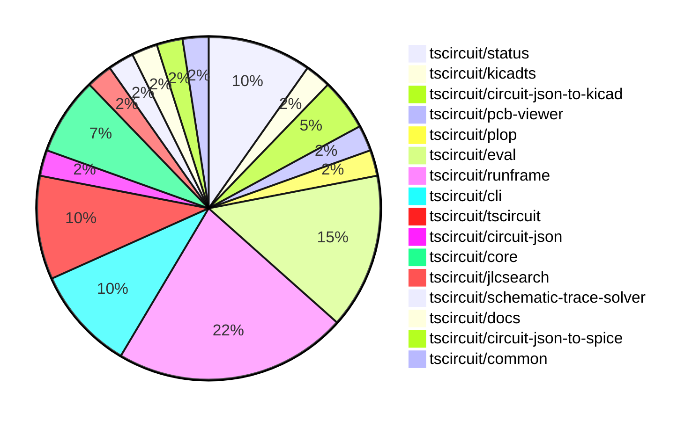
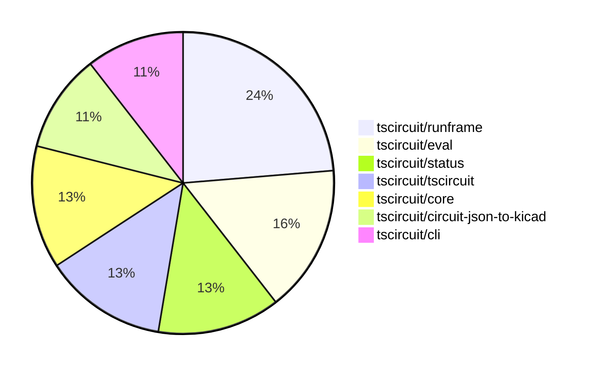

# Contribution Overview 2025-10-08

## PRs by Repository

## Contributor Overview

| Contributor | 🐳 Major | 🐙 Minor | 🐌 Tiny | ⭐ | Score | Discussion Contributions |
|-------------|---------|---------|---------|-----|----------------|--------------------------|
| [imrishabh18](#imrishabh18) | 0 | 4 | 11 | ⭐⭐ | 20 | 0🔹 0🔶 0💎 |
| [tscircuitbot](#tscircuitbot) | 0 | 0 | 15 | ⭐⭐ | 12.5 | 0🔹 0🔶 0💎 |
| [seveibar](#seveibar) | 0 | 2 | 2 | ⭐⭐ | 11 | 0🔹 0🔶 0💎 |
| [0hmX](#0hmX) | 1 | 0 | 2 | ⭐ | 6 | 0🔹 0🔶 0💎 |
| [ShiboSoftwareDev](#ShiboSoftwareDev) | 0 | 2 | 0 | ⭐ | 4 | 0🔹 0🔶 0💎 |
| [Abse2001](#Abse2001) | 0 | 1 | 0 |  | 2 | 0🔹 0🔶 0💎 |
| [Heinrich-XIAO](#Heinrich-XIAO) | 0 | 1 | 0 |  | 2 | 0🔹 0🔶 0💎 |

### Discussion Contribution Legend

- 🔹 Normal Comments: Basic participation with minimal effort
- 🔶 Great Informative Comments: Thoughtful participation that adds value
- 💎 Incredible Comments: Exceptional participation with high-quality content

## Review Table

[reviews-received-hover]: ## "Number of reviews received for PRs for this contributor"
[approvals-received-hover]: ## "Number of approvals received for PRs this contributor authored"
[rejections-received-hover]: ## "Number of rejections received for PRs this contributor authored"
[prs-opened-hover]: ## "Number of PRs opened by this contributor"
[issues-created-hover]: ## "Number of issues created by this contributor"
[bountied-issues-hover]: ## "Number of issues this contributor created with a bounty"
[bountied-issue-$-hover]: ## "Total bounty amount placed on issues authored by this contributor"

| Contributor | Reviews Received | Approvals Received | Rejections Received | Approvals | Rejections | PRs Opened | PRs Merged | Score | Issues Created | Bountied Issues | Bountied Issue $ |
|---|---|---|---|---|---|---|---|---|---|---|---|
| [imrishabh18](#imrishabh18) | 6 | 3 | 0 | 1 | 0 | 15 | 15 | 20 | 0 | 0 | 0 |
| [tscircuitbot](#tscircuitbot) | 0 | 0 | 0 | 0 | 0 | 24 | 16 | 12.5 | 0 | 0 | 0 |
| [Abse2001](#Abse2001) | 5 | 1 | 1 | 0 | 0 | 2 | 1 | 2 | 0 | 0 | 0 |
| [seveibar](#seveibar) | 8 | 0 | 0 | 9 | 2 | 13 | 4 | 11 | 0 | 0 | 0 |
| [0hmX](#0hmX) | 2 | 2 | 0 | 0 | 0 | 3 | 3 | 6 | 0 | 0 | 0 |
| [ShiboSoftwareDev](#ShiboSoftwareDev) | 4 | 2 | 0 | 0 | 0 | 3 | 2 | 4 | 0 | 0 | 0 |
| [Excellencedev](#Excellencedev) | 0 | 0 | 0 | 0 | 0 | 2 | 0 | 0 | 0 | 0 | 0 |
| [MustafaMulla29](#MustafaMulla29) | 0 | 0 | 0 | 0 | 0 | 2 | 0 | 0 | 0 | 0 | 0 |
| [Asymtode712](#Asymtode712) | 2 | 1 | 0 | 0 | 0 | 2 | 0 | 0 | 0 | 0 | 0 |
| [Omar8345](#Omar8345) | 1 | 0 | 1 | 0 | 0 | 1 | 0 | 0 | 0 | 0 | 0 |
| [devroy10](#devroy10) | 0 | 0 | 0 | 0 | 0 | 1 | 0 | 0 | 0 | 0 | 0 |
| [992manav](#992manav) | 0 | 0 | 0 | 0 | 0 | 1 | 0 | 0 | 0 | 0 | 0 |
| [saish9901](#saish9901) | 0 | 0 | 0 | 0 | 0 | 3 | 0 | 0 | 0 | 0 | 0 |
| [Heinrich-XIAO](#Heinrich-XIAO) | 1 | 1 | 0 | 0 | 0 | 1 | 1 | 2 | 0 | 0 | 0 |
| [DevGajjar28](#DevGajjar28) | 0 | 0 | 0 | 0 | 0 | 1 | 0 | 0 | 0 | 0 | 0 |

## Top 7 Repositories by Contribution Points

## Changes by Repository

### [tscircuit/status](https://github.com/tscircuit/status)

| PR # | Impact | Rating | Contributor | Description |
|------|--------|--------|-------------|-------------|
| [#50](https://github.com/tscircuit/status/pull/50) | 🐙 Minor | ⭐⭐ | imrishabh18 | Adds a health check for the usercode service to monitor its status and functionality. |

🐌 Tiny Contributions (3)

| PR # | Impact | Contributor | Description |
|------|--------|-------------|-------------|
| [#53](https://github.com/tscircuit/status/pull/53) | 🐌 Tiny | imrishabh18 | Fixes the name of the ignored service in the Discord notification script from check-usercode-health to usercode_api |
| [#52](https://github.com/tscircuit/status/pull/52) | 🐌 Tiny | imrishabh18 | Adds functionality to ignore Discord notifications for the check-usercode-health service. |
| [#51](https://github.com/tscircuit/status/pull/51) | 🐌 Tiny | imrishabh18 | Increases the timeout limit for health checks from 2 minutes to 5 minutes. |

### [tscircuit/kicadts](https://github.com/tscircuit/kicadts)

| PR # | Impact | Rating | Contributor | Description |
|------|--------|--------|-------------|-------------|
| [#9](https://github.com/tscircuit/kicadts/pull/9) | 🐙 Minor | ⭐⭐ | imrishabh18 | Adds support for GlobalLabel in KiCad schematic representation, allowing for enhanced labeling of signals across sheets. |

### [tscircuit/circuit-json-to-kicad](https://github.com/tscircuit/circuit-json-to-kicad)

| PR # | Impact | Rating | Contributor | Description |
|------|--------|--------|-------------|-------------|
| [#20](https://github.com/tscircuit/circuit-json-to-kicad/pull/20) | 🐙 Minor | ⭐⭐ | imrishabh18 | Converts net labels without a symbol name to KiCad global labels during the export process. |
| [#19](https://github.com/tscircuit/circuit-json-to-kicad/pull/19) | 🐙 Minor | ⭐⭐ | imrishabh18 | Adds support for net labels with symbols for ground and power in schematic generation, allowing for better representation of these elements in the output. |

### [tscircuit/pcb-viewer](https://github.com/tscircuit/pcb-viewer)

🐌 Tiny Contributions (1)

| PR # | Impact | Contributor | Description |
|------|--------|-------------|-------------|
| [#392](https://github.com/tscircuit/pcb-viewer/pull/392) | 🐌 Tiny | imrishabh18 | Adds a GitHub Actions workflow that prevents direct pushes to the main branch and automates version bumping and package updates. |

### [tscircuit/plop](https://github.com/tscircuit/plop)

🐌 Tiny Contributions (1)

| PR # | Impact | Contributor | Description |
|------|--------|-------------|-------------|
| [#22](https://github.com/tscircuit/plop/pull/22) | 🐌 Tiny | imrishabh18 | Prevents the release of a version bump when the commit message starts with v. |

### [tscircuit/eval](https://github.com/tscircuit/eval)

🐌 Tiny Contributions (6)

| PR # | Impact | Contributor | Description |
|------|--------|-------------|-------------|
| [#1199](https://github.com/tscircuit/eval/pull/1199) | 🐌 Tiny | imrishabh18 | Modifies the GitHub Actions workflow to prevent publishing on push events that start with v in the commit message. |
| [#1197](https://github.com/tscircuit/eval/pull/1197) | 🐌 Tiny | imrishabh18 | Updates the GitHub Actions workflow to close existing pull requests with titles containing chore: update packages instead of update tscircuitcore. |
| [#1200](https://github.com/tscircuit/eval/pull/1200) | 🐌 Tiny | tscircuitbot | Automated package update |
| [#1198](https://github.com/tscircuit/eval/pull/1198) | 🐌 Tiny | tscircuitbot | Automated package update |
| [#1196](https://github.com/tscircuit/eval/pull/1196) | 🐌 Tiny | tscircuitbot | Automated package update |
| [#1195](https://github.com/tscircuit/eval/pull/1195) | 🐌 Tiny | tscircuitbot | Automated package update |

### [tscircuit/runframe](https://github.com/tscircuit/runframe)

🐌 Tiny Contributions (9)

| PR # | Impact | Contributor | Description |
|------|--------|-------------|-------------|
| [#1364](https://github.com/tscircuit/runframe/pull/1364) | 🐌 Tiny | imrishabh18 | This pull request adds a new generated styles file to the project, which includes various CSS styles and utility classes for the application. The styles are generated using Tailwind CSS, providing a comprehensive set of utility classes for layout, spacing, typography, and more. |
| [#1363](https://github.com/tscircuit/runframe/pull/1363) | 🐌 Tiny | imrishabh18 | Adds a GitHub token to the workflow for closing existing pull requests by the bot. |
| [#1361](https://github.com/tscircuit/runframe/pull/1361) | 🐌 Tiny | imrishabh18 | Modifies the GitHub Actions workflow to prevent publishing on push events that start with v in the commit message. |
| [#1365](https://github.com/tscircuit/runframe/pull/1365) | 🐌 Tiny | tscircuitbot | Updates the package version from 0.0.1060 to 0.0.1061 in package.json |
| [#1362](https://github.com/tscircuit/runframe/pull/1362) | 🐌 Tiny | tscircuitbot | Updates the tscircuiteval package to version 0.0.371 in the package.json file. |
| [#1360](https://github.com/tscircuit/runframe/pull/1360) | 🐌 Tiny | tscircuitbot | Updates the tscircuiteval package to version 0.0.370 in the package.json file. |
| [#1359](https://github.com/tscircuit/runframe/pull/1359) | 🐌 Tiny | tscircuitbot | Updates the tscircuiteval package to version 0.0.370 in the package.json file. |
| [#1358](https://github.com/tscircuit/runframe/pull/1358) | 🐌 Tiny | tscircuitbot | Updates the tscircuiteval package from version 0.0.368 to 0.0.369 |
| [#1357](https://github.com/tscircuit/runframe/pull/1357) | 🐌 Tiny | tscircuitbot | Updates the tscircuiteval package to version 0.0.369 in the package.json file. |

### [tscircuit/cli](https://github.com/tscircuit/cli)

🐌 Tiny Contributions (4)

| PR # | Impact | Contributor | Description |
|------|--------|-------------|-------------|
| [#506](https://github.com/tscircuit/cli/pull/506) | 🐌 Tiny | imrishabh18 | Modifies the GitHub Actions workflow to prevent publishing on push events that start with v in the commit message. |
| [#510](https://github.com/tscircuit/cli/pull/510) | 🐌 Tiny | tscircuitbot | Automated package update |
| [#509](https://github.com/tscircuit/cli/pull/509) | 🐌 Tiny | tscircuitbot | Updates the tscircuitrunframe package from version 0.0.1060 to 0.0.1061 |
| [#507](https://github.com/tscircuit/cli/pull/507) | 🐌 Tiny | tscircuitbot | Automated package update |

### [tscircuit/tscircuit](https://github.com/tscircuit/tscircuit)

| PR # | Impact | Rating | Contributor | Description |
|------|--------|--------|-------------|-------------|
| [#928](https://github.com/tscircuit/tscircuit/pull/928) | 🐙 Minor | ⭐⭐ | Abse2001 | Adds tscircuitcommon to the DO_NOT_SYNC_PACKAGE list in the core versioning script, preventing it from being synchronized with other packages. |

🐌 Tiny Contributions (3)

| PR # | Impact | Contributor | Description |
|------|--------|-------------|-------------|
| [#930](https://github.com/tscircuit/tscircuit/pull/930) | 🐌 Tiny | tscircuitbot | Automated package update |
| [#925](https://github.com/tscircuit/tscircuit/pull/925) | 🐌 Tiny | tscircuitbot | Automated package update |
| [#924](https://github.com/tscircuit/tscircuit/pull/924) | 🐌 Tiny | seveibar | Prevents the bun-pver-release workflow from triggering when the commit message starts with v |

### [tscircuit/circuit-json](https://github.com/tscircuit/circuit-json)

| PR # | Impact | Rating | Contributor | Description |
|------|--------|--------|-------------|-------------|
| [#308](https://github.com/tscircuit/circuit-json/pull/308) | 🐙 Minor | ⭐⭐ | seveibar | Requires a source_group_id on source_board definitions in the schema and interface, documents the new requirement in the README reference, and covers the required field with a dedicated unit test. |

### [tscircuit/core](https://github.com/tscircuit/core)

| PR # | Impact | Rating | Contributor | Description |
|------|--------|--------|-------------|-------------|
| [#1463](https://github.com/tscircuit/core/pull/1463) | 🐙 Minor | ⭐⭐ | seveibar | Upgrades the calculate-packing dependency to version 0.0.48 and adds a test for Arduino shield components packed outside the board. |
| [#1456](https://github.com/tscircuit/core/pull/1456) | 🐙 Minor | ⭐⭐ | ShiboSoftwareDev | Adds support for duration and timePerStep props to the analogsimulation  component, allowing customization of SPICE transient analysis parameters. |

🐌 Tiny Contributions (1)

| PR # | Impact | Contributor | Description |
|------|--------|-------------|-------------|
| [#1464](https://github.com/tscircuit/core/pull/1464) | 🐌 Tiny | 0hmX | Updates the schematic-trace-solver dependency to version 0.0.41 in package.json |

### [tscircuit/jlcsearch](https://github.com/tscircuit/jlcsearch)

🐌 Tiny Contributions (1)

| PR # | Impact | Contributor | Description |
|------|--------|-------------|-------------|
| [#95](https://github.com/tscircuit/jlcsearch/pull/95) | 🐌 Tiny | seveibar | Fixes test cleanup by implementing a global deferred cleanup queue that runs after each test, ensuring proper resource management in the test environment. |

### [tscircuit/schematic-trace-solver](https://github.com/tscircuit/schematic-trace-solver)

| PR # | Impact | Rating | Contributor | Description |
|------|--------|--------|-------------|-------------|
| [#74](https://github.com/tscircuit/schematic-trace-solver/pull/74) | 🐳 Major | ⭐⭐⭐ | 0hmX | Adds functionality to allow long traces in schematic designs that do not intersect with existing traces, enhancing the routing capabilities of the schematic trace solver. |

### [tscircuit/docs](https://github.com/tscircuit/docs)

🐌 Tiny Contributions (1)

| PR # | Impact | Contributor | Description |
|------|--------|-------------|-------------|
| [#189](https://github.com/tscircuit/docs/pull/189) | 🐌 Tiny | 0hmX | Fixes incorrect usage of HTTPS in the quickstart CLI documentation, changing it to HTTP for local development. |

### [tscircuit/circuit-json-to-spice](https://github.com/tscircuit/circuit-json-to-spice)

| PR # | Impact | Rating | Contributor | Description |
|------|--------|--------|-------------|-------------|
| [#14](https://github.com/tscircuit/circuit-json-to-spice/pull/14) | 🐙 Minor | ⭐⭐ | ShiboSoftwareDev | Adds support for simulation voltage probes, enabling the generation of .PRINT TRAN statements for SPICE simulations. |

### [tscircuit/common](https://github.com/tscircuit/common)

| PR # | Impact | Rating | Contributor | Description |
|------|--------|--------|-------------|-------------|
| [#28](https://github.com/tscircuit/common/pull/28) | 🐙 Minor | ⭐⭐ | Heinrich-XIAO | Fixes error: Cannot create component micromod: A component with the same name already exists |

## Changes by Contributor

### [imrishabh18](https://github.com/imrishabh18)

| PRs # | Impact | Rating | Description |
|------|--------|--------|-------------|
| [#50](https://github.com/tscircuit/status/pull/50) | 🐙 Minor | ⭐⭐ | Adds a health check for the usercode service to monitor its status and functionality. |
| [#9](https://github.com/tscircuit/kicadts/pull/9) | 🐙 Minor | ⭐⭐ | Adds support for GlobalLabel in KiCad schematic representation, allowing for enhanced labeling of signals across sheets. |
| [#20](https://github.com/tscircuit/circuit-json-to-kicad/pull/20) | 🐙 Minor | ⭐⭐ | Converts net labels without a symbol name to KiCad global labels during the export process. |
| [#19](https://github.com/tscircuit/circuit-json-to-kicad/pull/19) | 🐙 Minor | ⭐⭐ | Adds support for net labels with symbols for ground and power in schematic generation, allowing for better representation of these elements in the output. |

🐌 Tiny Contributions (11)

| PR # | Impact | Description |
|------|--------|-------------|
| [#392](https://github.com/tscircuit/pcb-viewer/pull/392) | 🐌 Tiny | Adds a GitHub Actions workflow that prevents direct pushes to the main branch and automates version bumping and package updates. |
| [#22](https://github.com/tscircuit/plop/pull/22) | 🐌 Tiny | Prevents the release of a version bump when the commit message starts with v. |
| [#53](https://github.com/tscircuit/status/pull/53) | 🐌 Tiny | Fixes the name of the ignored service in the Discord notification script from check-usercode-health to usercode_api |
| [#52](https://github.com/tscircuit/status/pull/52) | 🐌 Tiny | Adds functionality to ignore Discord notifications for the check-usercode-health service. |
| [#51](https://github.com/tscircuit/status/pull/51) | 🐌 Tiny | Increases the timeout limit for health checks from 2 minutes to 5 minutes. |
| [#1199](https://github.com/tscircuit/eval/pull/1199) | 🐌 Tiny | Modifies the GitHub Actions workflow to prevent publishing on push events that start with v in the commit message. |
| [#1197](https://github.com/tscircuit/eval/pull/1197) | 🐌 Tiny | Updates the GitHub Actions workflow to close existing pull requests with titles containing chore: update packages instead of update tscircuitcore. |
| [#1364](https://github.com/tscircuit/runframe/pull/1364) | 🐌 Tiny | This pull request adds a new generated styles file to the project, which includes various CSS styles and utility classes for the application. The styles are generated using Tailwind CSS, providing a comprehensive set of utility classes for layout, spacing, typography, and more. |
| [#1363](https://github.com/tscircuit/runframe/pull/1363) | 🐌 Tiny | Adds a GitHub token to the workflow for closing existing pull requests by the bot. |
| [#1361](https://github.com/tscircuit/runframe/pull/1361) | 🐌 Tiny | Modifies the GitHub Actions workflow to prevent publishing on push events that start with v in the commit message. |
| [#506](https://github.com/tscircuit/cli/pull/506) | 🐌 Tiny | Modifies the GitHub Actions workflow to prevent publishing on push events that start with v in the commit message. |

### [tscircuitbot](https://github.com/tscircuitbot)

🐌 Tiny Contributions (15)

| PR # | Impact | Description |
|------|--------|-------------|
| [#930](https://github.com/tscircuit/tscircuit/pull/930) | 🐌 Tiny | Automated package update |
| [#925](https://github.com/tscircuit/tscircuit/pull/925) | 🐌 Tiny | Automated package update |
| [#1200](https://github.com/tscircuit/eval/pull/1200) | 🐌 Tiny | Automated package update |
| [#1198](https://github.com/tscircuit/eval/pull/1198) | 🐌 Tiny | Automated package update |
| [#1196](https://github.com/tscircuit/eval/pull/1196) | 🐌 Tiny | Automated package update |
| [#1195](https://github.com/tscircuit/eval/pull/1195) | 🐌 Tiny | Automated package update |
| [#1365](https://github.com/tscircuit/runframe/pull/1365) | 🐌 Tiny | Updates the package version from 0.0.1060 to 0.0.1061 in package.json |
| [#1362](https://github.com/tscircuit/runframe/pull/1362) | 🐌 Tiny | Updates the tscircuiteval package to version 0.0.371 in the package.json file. |
| [#1360](https://github.com/tscircuit/runframe/pull/1360) | 🐌 Tiny | Updates the tscircuiteval package to version 0.0.370 in the package.json file. |
| [#1359](https://github.com/tscircuit/runframe/pull/1359) | 🐌 Tiny | Updates the tscircuiteval package to version 0.0.370 in the package.json file. |
| [#1358](https://github.com/tscircuit/runframe/pull/1358) | 🐌 Tiny | Updates the tscircuiteval package from version 0.0.368 to 0.0.369 |
| [#1357](https://github.com/tscircuit/runframe/pull/1357) | 🐌 Tiny | Updates the tscircuiteval package to version 0.0.369 in the package.json file. |
| [#510](https://github.com/tscircuit/cli/pull/510) | 🐌 Tiny | Automated package update |
| [#509](https://github.com/tscircuit/cli/pull/509) | 🐌 Tiny | Updates the tscircuitrunframe package from version 0.0.1060 to 0.0.1061 |
| [#507](https://github.com/tscircuit/cli/pull/507) | 🐌 Tiny | Automated package update |

### [Abse2001](https://github.com/Abse2001)

| PRs # | Impact | Rating | Description |
|------|--------|--------|-------------|
| [#928](https://github.com/tscircuit/tscircuit/pull/928) | 🐙 Minor | ⭐⭐ | Adds tscircuitcommon to the DO_NOT_SYNC_PACKAGE list in the core versioning script, preventing it from being synchronized with other packages. |

### [seveibar](https://github.com/seveibar)

| PRs # | Impact | Rating | Description |
|------|--------|--------|-------------|
| [#308](https://github.com/tscircuit/circuit-json/pull/308) | 🐙 Minor | ⭐⭐ | Requires a source_group_id on source_board definitions in the schema and interface, documents the new requirement in the README reference, and covers the required field with a dedicated unit test. |
| [#1463](https://github.com/tscircuit/core/pull/1463) | 🐙 Minor | ⭐⭐ | Upgrades the calculate-packing dependency to version 0.0.48 and adds a test for Arduino shield components packed outside the board. |

🐌 Tiny Contributions (2)

| PR # | Impact | Description |
|------|--------|-------------|
| [#924](https://github.com/tscircuit/tscircuit/pull/924) | 🐌 Tiny | Prevents the bun-pver-release workflow from triggering when the commit message starts with v |
| [#95](https://github.com/tscircuit/jlcsearch/pull/95) | 🐌 Tiny | Fixes test cleanup by implementing a global deferred cleanup queue that runs after each test, ensuring proper resource management in the test environment. |

### [0hmX](https://github.com/0hmX)

| PRs # | Impact | Rating | Description |
|------|--------|--------|-------------|
| [#74](https://github.com/tscircuit/schematic-trace-solver/pull/74) | 🐳 Major | ⭐⭐⭐ | Adds functionality to allow long traces in schematic designs that do not intersect with existing traces, enhancing the routing capabilities of the schematic trace solver. |

🐌 Tiny Contributions (2)

| PR # | Impact | Description |
|------|--------|-------------|
| [#1464](https://github.com/tscircuit/core/pull/1464) | 🐌 Tiny | Updates the schematic-trace-solver dependency to version 0.0.41 in package.json |
| [#189](https://github.com/tscircuit/docs/pull/189) | 🐌 Tiny | Fixes incorrect usage of HTTPS in the quickstart CLI documentation, changing it to HTTP for local development. |

### [ShiboSoftwareDev](https://github.com/ShiboSoftwareDev)

| PRs # | Impact | Rating | Description |
|------|--------|--------|-------------|
| [#1456](https://github.com/tscircuit/core/pull/1456) | 🐙 Minor | ⭐⭐ | Adds support for duration and timePerStep props to the analogsimulation  component, allowing customization of SPICE transient analysis parameters. |
| [#14](https://github.com/tscircuit/circuit-json-to-spice/pull/14) | 🐙 Minor | ⭐⭐ | Adds support for simulation voltage probes, enabling the generation of .PRINT TRAN statements for SPICE simulations. |

### [Heinrich-XIAO](https://github.com/Heinrich-XIAO)

| PRs # | Impact | Rating | Description |
|------|--------|--------|-------------|
| [#28](https://github.com/tscircuit/common/pull/28) | 🐙 Minor | ⭐⭐ | Fixes error: Cannot create component micromod: A component with the same name already exists |

## Repository Owners

| Repository | Codeowners |
|------------|------------|
| [builder](https://github.com/tscircuit/builder/blob/main/.github/CODEOWNERS) | [seveibar](https://github.com/seveibar)
| [pcb-viewer](https://github.com/tscircuit/pcb-viewer/blob/main/.github/CODEOWNERS) | [seveibar](https://github.com/seveibar), [ShiboSoftwareDev](https://github.com/ShiboSoftwareDev)
| [footprints-old](https://github.com/tscircuit/footprints-old/blob/main/.github/CODEOWNERS) | [seveibar](https://github.com/seveibar)
| [footprinter](https://github.com/tscircuit/footprinter/blob/main/.github/CODEOWNERS) | [seveibar](https://github.com/seveibar), [techmannih](https://github.com/techmannih)
| [3d-viewer](https://github.com/tscircuit/3d-viewer/blob/main/.github/CODEOWNERS) | [ShiboSoftwareDev](https://github.com/ShiboSoftwareDev)
| [winterspec](https://github.com/tscircuit/winterspec/blob/main/.github/CODEOWNERS) | [seveibar](https://github.com/seveibar), [ShiboSoftwareDev](https://github.com/ShiboSoftwareDev)
| [jscad-electronics](https://github.com/tscircuit/jscad-electronics/blob/main/.github/CODEOWNERS) | [seveibar](https://github.com/seveibar), [abhijitxy](https://github.com/abhijitxy), [anas-sarkez](https://github.com/anas-sarkez)
| [circuit-to-svg](https://github.com/tscircuit/circuit-to-svg/blob/main/.github/CODEOWNERS) | [imrishabh18](https://github.com/imrishabh18)
| [schematic-symbols](https://github.com/tscircuit/schematic-symbols/blob/main/.github/CODEOWNERS) | [seveibar](https://github.com/seveibar), [imrishabh18](https://github.com/imrishabh18), [techmannih](https://github.com/techmannih)
| [circuit-json-to-gerber](https://github.com/tscircuit/circuit-json-to-gerber/blob/main/.github/CODEOWNERS) | [seveibar](https://github.com/seveibar), [ShiboSoftwareDev](https://github.com/ShiboSoftwareDev)
| [tscircuit.com](https://github.com/tscircuit/tscircuit.com/blob/main/.github/CODEOWNERS) | [seveibar](https://github.com/seveibar), [imrishabh18](https://github.com/imrishabh18)
| [issue-roulette](https://github.com/tscircuit/issue-roulette/blob/main/.github/CODEOWNERS) | [Anshgrover23](https://github.com/Anshgrover23)
| [sparkfun-boards](https://github.com/tscircuit/sparkfun-boards/blob/main/.github/CODEOWNERS) | [ShiboSoftwareDev](https://github.com/ShiboSoftwareDev), [Abse2001](https://github.com/Abse2001), [MustafaMulla29](https://github.com/MustafaMulla29), [Anshgrover23](https://github.com/Anshgrover23), [techmannih](https://github.com/techmannih)
| [schematic-corpus](https://github.com/tscircuit/schematic-corpus/blob/main/.github/CODEOWNERS) | [Abse2001](https://github.com/Abse2001)

## Repositories by Owner

| User | Repo |
|------|------|
| [seveibar](https://github.com/seveibar) | [builder](https://github.com/tscircuit/builder/blob/main/.github/CODEOWNERS) |
|  | [pcb-viewer](https://github.com/tscircuit/pcb-viewer/blob/main/.github/CODEOWNERS) |
|  | [footprints-old](https://github.com/tscircuit/footprints-old/blob/main/.github/CODEOWNERS) |
|  | [footprinter](https://github.com/tscircuit/footprinter/blob/main/.github/CODEOWNERS) |
|  | [winterspec](https://github.com/tscircuit/winterspec/blob/main/.github/CODEOWNERS) |
|  | [jscad-electronics](https://github.com/tscircuit/jscad-electronics/blob/main/.github/CODEOWNERS) |
|  | [schematic-symbols](https://github.com/tscircuit/schematic-symbols/blob/main/.github/CODEOWNERS) |
|  | [circuit-json-to-gerber](https://github.com/tscircuit/circuit-json-to-gerber/blob/main/.github/CODEOWNERS) |
|  | [tscircuit.com](https://github.com/tscircuit/tscircuit.com/blob/main/.github/CODEOWNERS) |
| [ShiboSoftwareDev](https://github.com/ShiboSoftwareDev) | [pcb-viewer](https://github.com/tscircuit/pcb-viewer/blob/main/.github/CODEOWNERS) |
|  | [3d-viewer](https://github.com/tscircuit/3d-viewer/blob/main/.github/CODEOWNERS) |
|  | [winterspec](https://github.com/tscircuit/winterspec/blob/main/.github/CODEOWNERS) |
|  | [circuit-json-to-gerber](https://github.com/tscircuit/circuit-json-to-gerber/blob/main/.github/CODEOWNERS) |
|  | [sparkfun-boards](https://github.com/tscircuit/sparkfun-boards/blob/main/.github/CODEOWNERS) |
| [techmannih](https://github.com/techmannih) | [footprinter](https://github.com/tscircuit/footprinter/blob/main/.github/CODEOWNERS) |
|  | [schematic-symbols](https://github.com/tscircuit/schematic-symbols/blob/main/.github/CODEOWNERS) |
|  | [sparkfun-boards](https://github.com/tscircuit/sparkfun-boards/blob/main/.github/CODEOWNERS) |
| [abhijitxy](https://github.com/abhijitxy) | [jscad-electronics](https://github.com/tscircuit/jscad-electronics/blob/main/.github/CODEOWNERS) |
| [anas-sarkez](https://github.com/anas-sarkez) | [jscad-electronics](https://github.com/tscircuit/jscad-electronics/blob/main/.github/CODEOWNERS) |
| [imrishabh18](https://github.com/imrishabh18) | [circuit-to-svg](https://github.com/tscircuit/circuit-to-svg/blob/main/.github/CODEOWNERS) |
|  | [schematic-symbols](https://github.com/tscircuit/schematic-symbols/blob/main/.github/CODEOWNERS) |
|  | [tscircuit.com](https://github.com/tscircuit/tscircuit.com/blob/main/.github/CODEOWNERS) |
| [Anshgrover23](https://github.com/Anshgrover23) | [issue-roulette](https://github.com/tscircuit/issue-roulette/blob/main/.github/CODEOWNERS) |
|  | [sparkfun-boards](https://github.com/tscircuit/sparkfun-boards/blob/main/.github/CODEOWNERS) |
| [Abse2001](https://github.com/Abse2001) | [sparkfun-boards](https://github.com/tscircuit/sparkfun-boards/blob/main/.github/CODEOWNERS) |
|  | [schematic-corpus](https://github.com/tscircuit/schematic-corpus/blob/main/.github/CODEOWNERS) |
| [MustafaMulla29](https://github.com/MustafaMulla29) | [sparkfun-boards](https://github.com/tscircuit/sparkfun-boards/blob/main/.github/CODEOWNERS) |

