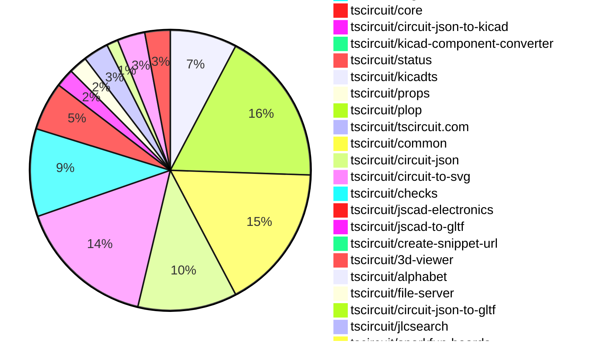
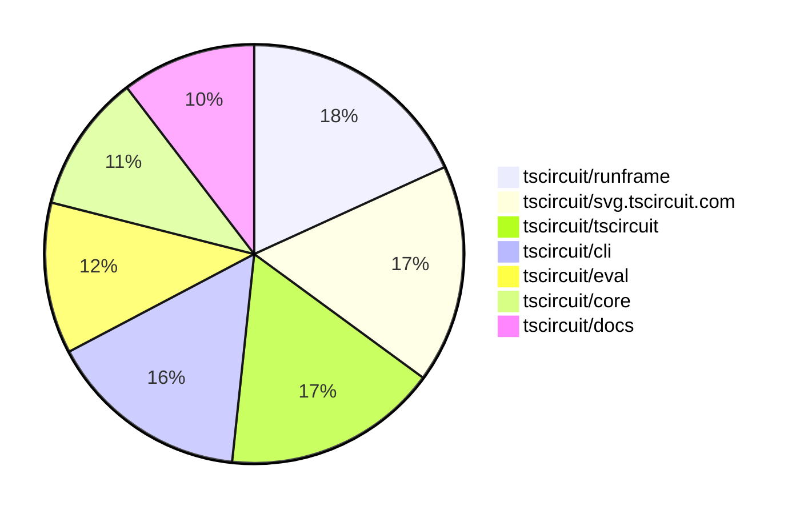

# Contribution Overview 2025-10-08

## PRs by Repository

## Contributor Overview

| Contributor | 🐳 Major | 🐙 Minor | 🐌 Tiny | ⭐ | Score | Discussion Contributions |
|-------------|---------|---------|---------|-----|----------------|--------------------------|
| [seveibar](#seveibar) | 11 | 19 | 27 | 👑👑 | 95 | 0🔹 0🔶 0💎 |
| [imrishabh18](#imrishabh18) | 2 | 16 | 29 | 👑 | 52.5 | 0🔹 0🔶 0💎 |
| [MustafaMulla29](#MustafaMulla29) | 5 | 6 | 5 | ⭐⭐⭐ | 40 | 0🔹 0🔶 0💎 |
| [Abse2001](#Abse2001) | 4 | 5 | 7 | ⭐⭐⭐ | 36 | 0🔹 0🔶 0💎 |
| [ShiboSoftwareDev](#ShiboSoftwareDev) | 3 | 7 | 1 | ⭐⭐⭐ | 33 | 0🔹 0🔶 0💎 |
| [techmannih](#techmannih) | 0 | 6 | 7 | ⭐⭐ | 30 | 0🔹 0🔶 0💎 |
| [ArnavK-09](#ArnavK-09) | 3 | 5 | 4 | ⭐⭐ | 26 | 0🔹 0🔶 0💎 |
| [tscircuitbot](#tscircuitbot) | 0 | 0 | 221 | ⭐⭐ | 18 | 0🔹 0🔶 0💎 |
| [Asymtode712](#Asymtode712) | 1 | 2 | 2 | ⭐ | 10 | 0🔹 0🔶 0💎 |
| [Ayushjhawar8](#Ayushjhawar8) | 0 | 2 | 5 | ⭐ | 9 | 0🔹 0🔶 0💎 |
| [0hmX](#0hmX) | 1 | 1 | 2 | ⭐ | 8 | 0🔹 0🔶 0💎 |
| [pxlpal](#pxlpal) | 2 | 0 | 0 | ⭐ | 8 | 0🔹 0🔶 0💎 |
| [nailoo](#nailoo) | 0 | 1 | 1 | ⭐ | 6 | 0🔹 0🔶 0💎 |
| [jayantpranjal0](#jayantpranjal0) | 1 | 1 | 0 | ⭐ | 6 | 0🔹 0🔶 0💎 |
| [raykholo](#raykholo) | 1 | 0 | 1 | ⭐ | 5 | 0🔹 0🔶 0💎 |
| [Quanta-Naut](#Quanta-Naut) | 1 | 0 | 0 | ⭐ | 4 | 0🔹 0🔶 0💎 |
| [devroy10](#devroy10) | 0 | 0 | 2 |  | 2 | 0🔹 0🔶 0💎 |
| [Heinrich-XIAO](#Heinrich-XIAO) | 0 | 1 | 0 |  | 2 | 0🔹 0🔶 0💎 |
| [joncherry](#joncherry) | 0 | 0 | 1 |  | 1 | 0🔹 0🔶 0💎 |

### Discussion Contribution Legend

- 🔹 Normal Comments: Basic participation with minimal effort
- 🔶 Great Informative Comments: Thoughtful participation that adds value
- 💎 Incredible Comments: Exceptional participation with high-quality content

## Review Table

[reviews-received-hover]: ## "Number of reviews received for PRs for this contributor"
[approvals-received-hover]: ## "Number of approvals received for PRs this contributor authored"
[rejections-received-hover]: ## "Number of rejections received for PRs this contributor authored"
[prs-opened-hover]: ## "Number of PRs opened by this contributor"
[issues-created-hover]: ## "Number of issues created by this contributor"
[bountied-issues-hover]: ## "Number of issues this contributor created with a bounty"
[bountied-issue-$-hover]: ## "Total bounty amount placed on issues authored by this contributor"

| Contributor | Reviews Received | Approvals Received | Rejections Received | Approvals | Rejections | PRs Opened | PRs Merged | Score | Issues Created | Bountied Issues | Bountied Issue $ |
|---|---|---|---|---|---|---|---|---|---|---|---|
| [Ayushjhawar8](#Ayushjhawar8) | 7 | 6 | 0 | 0 | 0 | 8 | 7 | 9 | 0 | 0 | 0 |
| [seveibar](#seveibar) | 38 | 1 | 0 | 93 | 21 | 74 | 58 | 95 | 0 | 0 | 0 |
| [nailoo](#nailoo) | 8 | 2 | 1 | 0 | 0 | 4 | 2 | 6 | 0 | 0 | 0 |
| [tscircuitbot](#tscircuitbot) | 1 | 0 | 0 | 0 | 0 | 266 | 222 | 18 | 0 | 0 | 0 |
| [Quanta-Naut](#Quanta-Naut) | 2 | 0 | 1 | 0 | 0 | 2 | 1 | 4 | 0 | 0 | 0 |
| [imrishabh18](#imrishabh18) | 36 | 12 | 1 | 7 | 4 | 51 | 47 | 52.5 | 0 | 0 | 0 |
| [Excellencedev](#Excellencedev) | 15 | 0 | 4 | 0 | 0 | 13 | 0 | 0 | 0 | 0 | 0 |
| [baeoc](#baeoc) | 6 | 0 | 3 | 0 | 0 | 2 | 0 | 0 | 0 | 0 | 0 |
| [YadavAkhileshh](#YadavAkhileshh) | 0 | 0 | 0 | 0 | 0 | 2 | 0 | 0 | 0 | 0 | 0 |
| [MustafaMulla29](#MustafaMulla29) | 34 | 19 | 4 | 0 | 0 | 25 | 16 | 40 | 0 | 0 | 0 |
| [ShiboSoftwareDev](#ShiboSoftwareDev) | 31 | 10 | 5 | 6 | 0 | 13 | 11 | 33 | 0 | 0 | 0 |
| [Abse2001](#Abse2001) | 23 | 17 | 1 | 2 | 1 | 22 | 16 | 36 | 0 | 0 | 0 |
| [techmannih](#techmannih) | 24 | 12 | 0 | 1 | 7 | 16 | 13 | 30 | 0 | 0 | 0 |
| [kavitasaini1999](#kavitasaini1999) | 3 | 0 | 2 | 0 | 0 | 2 | 0 | 0 | 0 | 0 | 0 |
| [jayantpranjal0](#jayantpranjal0) | 8 | 2 | 3 | 0 | 0 | 5 | 2 | 6 | 0 | 0 | 0 |
| [joncherry](#joncherry) | 2 | 2 | 0 | 0 | 0 | 2 | 1 | 1 | 0 | 0 | 0 |
| [Pranjal6955](#Pranjal6955) | 1 | 0 | 0 | 0 | 0 | 2 | 0 | 0 | 0 | 0 | 0 |
| [codecraft26](#codecraft26) | 3 | 0 | 0 | 0 | 0 | 3 | 0 | 0 | 0 | 0 | 0 |
| [devroy10](#devroy10) | 8 | 3 | 1 | 0 | 0 | 7 | 2 | 2 | 0 | 0 | 0 |
| [0hmX](#0hmX) | 9 | 3 | 0 | 0 | 0 | 6 | 4 | 8 | 0 | 0 | 0 |
| [ArnavK-09](#ArnavK-09) | 18 | 12 | 0 | 0 | 0 | 12 | 12 | 26 | 0 | 0 | 0 |
| [bitsbyritik](#bitsbyritik) | 1 | 0 | 1 | 0 | 0 | 3 | 0 | 0 | 0 | 0 | 0 |
| [Asymtode712](#Asymtode712) | 15 | 5 | 4 | 0 | 0 | 9 | 5 | 10 | 0 | 0 | 0 |
| [raykholo](#raykholo) | 3 | 2 | 0 | 0 | 0 | 2 | 2 | 5 | 0 | 0 | 0 |
| [zojize](#zojize) | 0 | 0 | 0 | 0 | 0 | 1 | 0 | 0 | 0 | 0 | 0 |
| [Omar8345](#Omar8345) | 2 | 0 | 1 | 1 | 0 | 4 | 0 | 0 | 0 | 0 | 0 |
| [Richiemighty](#Richiemighty) | 2 | 0 | 0 | 0 | 0 | 1 | 0 | 0 | 0 | 0 | 0 |
| [yakhilgithub](#yakhilgithub) | 1 | 0 | 0 | 0 | 0 | 1 | 0 | 0 | 0 | 0 | 0 |
| [codebestia](#codebestia) | 1 | 0 | 1 | 0 | 0 | 1 | 0 | 0 | 0 | 0 | 0 |
| [pxlpal](#pxlpal) | 2 | 1 | 0 | 0 | 0 | 2 | 2 | 8 | 0 | 0 | 0 |
| [saish9901](#saish9901) | 0 | 0 | 0 | 0 | 0 | 5 | 0 | 0 | 0 | 0 | 0 |
| [992manav](#992manav) | 0 | 0 | 0 | 0 | 0 | 1 | 0 | 0 | 0 | 0 | 0 |
| [knileshh](#knileshh) | 1 | 0 | 0 | 0 | 0 | 1 | 0 | 0 | 0 | 0 | 0 |
| [Sohail52](#Sohail52) | 0 | 0 | 0 | 0 | 0 | 1 | 0 | 0 | 0 | 0 | 0 |
| [DevGajjar28](#DevGajjar28) | 0 | 0 | 0 | 0 | 0 | 1 | 0 | 0 | 0 | 0 | 0 |
| [Heinrich-XIAO](#Heinrich-XIAO) | 1 | 1 | 0 | 0 | 0 | 1 | 1 | 2 | 0 | 0 | 0 |

## Top 7 Repositories by Contribution Points

## Changes by Repository

### [tscircuit/docs](https://github.com/tscircuit/docs)

| PR # | Impact | Rating | Contributor | Description |
|------|--------|--------|-------------|-------------|
| [#204](https://github.com/tscircuit/docs/pull/204) | 🐳 Major | ⭐⭐⭐ | MustafaMulla29 | Fixes the markdown generation for the Copy page by utilizing the turndown package and addresses issues with the mobile view layout. |
| [#208](https://github.com/tscircuit/docs/pull/208) | 🐳 Major | ⭐⭐⭐ | seveibar | Simplifies the import example for CAD models and adds support for loading static assets from the documentation using projectBaseUrl in CircuitPreview. |
| [#214](https://github.com/tscircuit/docs/pull/214) | 🐙 Minor | ⭐⭐ | Ayushjhawar8 | Revamps the indexoverview page of the documentation to improve layout and styling, converting it into a bullet point list format with enhanced card components for better user navigation. |
| [#186](https://github.com/tscircuit/docs/pull/186) | 🐙 Minor | ⭐⭐ | Ayushjhawar8 | Removes breadcrumb navigation and centers the body content of the documentation, adjusts subtitle alignment, and modifies various styling elements for better visual consistency. |
| [#243](https://github.com/tscircuit/docs/pull/243) | 🐙 Minor | ⭐⭐ | seveibar | Adds support for specifying the main component path in the CircuitPreview component, allowing for more flexible component rendering. |
| [#221](https://github.com/tscircuit/docs/pull/221) | 🐙 Minor | ⭐⭐ | seveibar | Adds detailed documentation on group positioning and automatic packing for PCB layout in the tscircuit framework. |
| [#239](https://github.com/tscircuit/docs/pull/239) | 🐙 Minor | ⭐⭐ | Abse2001 | Adds a new section to the LED documentation demonstrating how to specify different LED colors in a board layout with a CircuitPreview example. |

🐌 Tiny Contributions (22)

| PR # | Impact | Contributor | Description |
|------|--------|-------------|-------------|
| [#222](https://github.com/tscircuit/docs/pull/222) | 🐌 Tiny | Ayushjhawar8 | Adjusts the header position and styling on the overview page for better alignment and responsiveness across different screen sizes. |
| [#223](https://github.com/tscircuit/docs/pull/223) | 🐌 Tiny | Ayushjhawar8 | Fixes markdown formatting issues, adds missing descriptions to documentation pages, and adjusts spacing before the first paragraph in several markdown files. |
| [#230](https://github.com/tscircuit/docs/pull/230) | 🐌 Tiny | imrishabh18 | Adds documentation for the tscircuit.config.json file, detailing its configuration options and usage. |
| [#227](https://github.com/tscircuit/docs/pull/227) | 🐌 Tiny | imrishabh18 | Adds documentation for the schematicarc , schematiccircle , schematicline , schematicrect , and symbol  components used in custom schematic representations. |
| [#209](https://github.com/tscircuit/docs/pull/209) | 🐌 Tiny | imrishabh18 | Adds documentation for configuring TypeScript path aliases in tscircuit projects and updates the dependency version for create-snippet-url. |
| [#192](https://github.com/tscircuit/docs/pull/192) | 🐌 Tiny | MustafaMulla29 | Adds a new Copy Page Button component that allows users to copy the current page content as Markdown and open it in AI chat applications. |
| [#235](https://github.com/tscircuit/docs/pull/235) | 🐌 Tiny | seveibar | Add onboarding steps for dependencies to the automerge pipeline in the contributing guide. |
| [#225](https://github.com/tscircuit/docs/pull/225) | 🐌 Tiny | seveibar | Replaces the intro page CircuitPreview snippet with an updated USB-C flashlight example. |
| [#217](https://github.com/tscircuit/docs/pull/217) | 🐌 Tiny | seveibar | Adds a Docusaurus Root wrapper that tags level-3 sidebar links with a padding class and updates custom CSS so level-3 links keep their indentation on hover and active states. |
| [#215](https://github.com/tscircuit/docs/pull/215) | 🐌 Tiny | seveibar | Increases indentation for level 3 sidebar links to improve hierarchy clarity |
| [#213](https://github.com/tscircuit/docs/pull/213) | 🐌 Tiny | seveibar | Fixes the CircuitPreview projectBaseUrl and file path issues, while adding a new guide for using groups in PCB layout. |
| [#212](https://github.com/tscircuit/docs/pull/212) | 🐌 Tiny | seveibar | Fixes the import of local glb files by updating the model references in the documentation. |
| [#205](https://github.com/tscircuit/docs/pull/205) | 🐌 Tiny | seveibar | Adds an example for importing local GLB models into the CAD model component. |
| [#201](https://github.com/tscircuit/docs/pull/201) | 🐌 Tiny | seveibar | Adds a CAD assembly example for integrating multiple 3D models of components in the documentation. |
| [#190](https://github.com/tscircuit/docs/pull/190) | 🐌 Tiny | seveibar | Corrects the Quickstart CLI guide to use the HTTP localhost URL when accessing the dev server |
| [#200](https://github.com/tscircuit/docs/pull/200) | 🐌 Tiny | seveibar | Adds documentation for CAD assembly and CAD model components, including usage examples and supported file formats. |
| [#228](https://github.com/tscircuit/docs/pull/228) | 🐌 Tiny | Abse2001 | Adds documentation for board anchor properties, allowing users to control the boards position and alignment. |
| [#189](https://github.com/tscircuit/docs/pull/189) | 🐌 Tiny | 0hmX | Fixes incorrect usage of HTTPS in the quickstart CLI documentation, changing it to HTTP for local development. |
| [#199](https://github.com/tscircuit/docs/pull/199) | 🐌 Tiny | ArnavK-09 | Adds a rotation transformation to the Scroll back to top button for improved visual feedback. |
| [#196](https://github.com/tscircuit/docs/pull/196) | 🐌 Tiny | ArnavK-09 | Updates sidebar icons and adjusts margins for better layout in the documentation. |
| [#220](https://github.com/tscircuit/docs/pull/220) | 🐌 Tiny | Asymtode712 | Fixes inconsistent padding behavior in the documentation sidebar for level-3 menu items by enforcing padding rules and removing conflicting styles. |
| [#232](https://github.com/tscircuit/docs/pull/232) | 🐌 Tiny | devroy10 | Updates the installation instructions for the tscircuit CLI by changing the package name from tscircuitcli to tscircuit. |

### [tscircuit/schematic-viewer](https://github.com/tscircuit/schematic-viewer)

🐌 Tiny Contributions (1)

| PR # | Impact | Contributor | Description |
|------|--------|-------------|-------------|
| [#140](https://github.com/tscircuit/schematic-viewer/pull/140) | 🐌 Tiny | Ayushjhawar8 | Adds a hover effect pointer, removes glow, and removes border curve from schematic components. |

### [tscircuit/runframe](https://github.com/tscircuit/runframe)

| PR # | Impact | Rating | Contributor | Description |
|------|--------|--------|-------------|-------------|
| [#1375](https://github.com/tscircuit/runframe/pull/1375) | 🐙 Minor | ⭐⭐ | imrishabh18 | Adds functionality to export the KiCad project along with the project file, including schematic, PCB, and project files in a zip format. |
| [#1364](https://github.com/tscircuit/runframe/pull/1364) | 🐙 Minor | ⭐⭐ | imrishabh18 | This pull request adds a new generated styles file that includes various CSS styles and utility classes for the project. It appears to be generated by a tool, likely Tailwind CSS, and includes a comprehensive set of utility classes for layout, spacing, typography, and more. |
| [#1413](https://github.com/tscircuit/runframe/pull/1413) | 🐙 Minor | ⭐⭐ | Asymtode712 | This implementation adds STEP file export functionality to the runframe using the existing circuit-json-to-step package. |

🐌 Tiny Contributions (64)

| PR # | Impact | Contributor | Description |
|------|--------|-------------|-------------|
| [#1386](https://github.com/tscircuit/runframe/pull/1386) | 🐌 Tiny | Ayushjhawar8 | Removes TypeScript (.ts) icons from the file selector and adds support for JSX (.jsx) files in the file filtering and display logic. |
| [#1383](https://github.com/tscircuit/runframe/pull/1383) | 🐌 Tiny | Ayushjhawar8 | Removes TypeScript (.ts) files from the RunFrame file explorer, displaying only TypeScript React (.tsx) files and circuit JSON files instead. |
| [#1432](https://github.com/tscircuit/runframe/pull/1432) | 🐌 Tiny | tscircuitbot | Automated package update |
| [#1431](https://github.com/tscircuit/runframe/pull/1431) | 🐌 Tiny | tscircuitbot | Updates the tscircuiteval package to version 0.0.389 in the package.json file. |
| [#1429](https://github.com/tscircuit/runframe/pull/1429) | 🐌 Tiny | tscircuitbot | Automated package update |
| [#1428](https://github.com/tscircuit/runframe/pull/1428) | 🐌 Tiny | tscircuitbot | Updates the tscircuiteval package from version 0.0.387 to 0.0.388 |
| [#1427](https://github.com/tscircuit/runframe/pull/1427) | 🐌 Tiny | tscircuitbot | Automated package update |
| [#1426](https://github.com/tscircuit/runframe/pull/1426) | 🐌 Tiny | tscircuitbot | Automated package update |
| [#1424](https://github.com/tscircuit/runframe/pull/1424) | 🐌 Tiny | tscircuitbot | Automated package update |
| [#1422](https://github.com/tscircuit/runframe/pull/1422) | 🐌 Tiny | tscircuitbot | Automated package update |
| [#1421](https://github.com/tscircuit/runframe/pull/1421) | 🐌 Tiny | tscircuitbot | Updates the package version from 0.0.1085 to 0.0.1086 in package.json |
| [#1420](https://github.com/tscircuit/runframe/pull/1420) | 🐌 Tiny | tscircuitbot | Automated package update |
| [#1419](https://github.com/tscircuit/runframe/pull/1419) | 🐌 Tiny | tscircuitbot | Automated package update to version 0.0.1085 |
| [#1418](https://github.com/tscircuit/runframe/pull/1418) | 🐌 Tiny | tscircuitbot | Updates the package version from 0.0.1083 to 0.0.1084 in package.json |
| [#1417](https://github.com/tscircuit/runframe/pull/1417) | 🐌 Tiny | tscircuitbot | Updates the tscircuiteval package to version 0.0.385 in the package.json file. |
| [#1416](https://github.com/tscircuit/runframe/pull/1416) | 🐌 Tiny | tscircuitbot | Automated package update to version 0.0.1083 |
| [#1412](https://github.com/tscircuit/runframe/pull/1412) | 🐌 Tiny | tscircuitbot | Automated package update |
| [#1411](https://github.com/tscircuit/runframe/pull/1411) | 🐌 Tiny | tscircuitbot | Updates the tscircuitpcb-viewer package from version 1.11.225 to 1.11.228 |
| [#1409](https://github.com/tscircuit/runframe/pull/1409) | 🐌 Tiny | tscircuitbot | Updates the package version from 0.0.1079 to 0.0.1080 in package.json |
| [#1408](https://github.com/tscircuit/runframe/pull/1408) | 🐌 Tiny | tscircuitbot | Updates the tscircuiteval package to version 0.0.383 in the package.json file |
| [#1406](https://github.com/tscircuit/runframe/pull/1406) | 🐌 Tiny | tscircuitbot | Automated package update |
| [#1405](https://github.com/tscircuit/runframe/pull/1405) | 🐌 Tiny | tscircuitbot | Updates the tscircuit3d-viewer package to version 0.0.410 |
| [#1404](https://github.com/tscircuit/runframe/pull/1404) | 🐌 Tiny | tscircuitbot | Automated package update |
| [#1403](https://github.com/tscircuit/runframe/pull/1403) | 🐌 Tiny | tscircuitbot | Updates the tscircuiteval package to version 0.0.381 in the package.json file. |
| [#1402](https://github.com/tscircuit/runframe/pull/1402) | 🐌 Tiny | tscircuitbot | Automated package update |
| [#1401](https://github.com/tscircuit/runframe/pull/1401) | 🐌 Tiny | tscircuitbot | Updates the tscircuiteval package from version 0.0.379 to 0.0.380 |
| [#1400](https://github.com/tscircuit/runframe/pull/1400) | 🐌 Tiny | tscircuitbot | Automated package update |
| [#1399](https://github.com/tscircuit/runframe/pull/1399) | 🐌 Tiny | tscircuitbot | Updates the tscircuitschematic-viewer package from version 2.0.44 to 2.0.45 |
| [#1397](https://github.com/tscircuit/runframe/pull/1397) | 🐌 Tiny | tscircuitbot | Automated package update |
| [#1395](https://github.com/tscircuit/runframe/pull/1395) | 🐌 Tiny | tscircuitbot | Updates the package version from 0.0.1073 to 0.0.1074 in package.json |
| [#1394](https://github.com/tscircuit/runframe/pull/1394) | 🐌 Tiny | tscircuitbot | Updates the tscircuiteval package to version 0.0.379 in the package.json file. |
| [#1393](https://github.com/tscircuit/runframe/pull/1393) | 🐌 Tiny | tscircuitbot | Automated package update |
| [#1392](https://github.com/tscircuit/runframe/pull/1392) | 🐌 Tiny | tscircuitbot | Automated package update for tscircuit3d-viewer from version 0.0.408 to 0.0.409 |
| [#1391](https://github.com/tscircuit/runframe/pull/1391) | 🐌 Tiny | tscircuitbot | Automated package update to version 0.0.1072 |
| [#1390](https://github.com/tscircuit/runframe/pull/1390) | 🐌 Tiny | tscircuitbot | Updates the tscircuiteval package to version 0.0.378 in the package.json file. |
| [#1389](https://github.com/tscircuit/runframe/pull/1389) | 🐌 Tiny | tscircuitbot | Automated package update |
| [#1388](https://github.com/tscircuit/runframe/pull/1388) | 🐌 Tiny | tscircuitbot | Automated package update |
| [#1387](https://github.com/tscircuit/runframe/pull/1387) | 🐌 Tiny | tscircuitbot | Automated package update to version 0.0.1070 |
| [#1384](https://github.com/tscircuit/runframe/pull/1384) | 🐌 Tiny | tscircuitbot | Automated package update |
| [#1380](https://github.com/tscircuit/runframe/pull/1380) | 🐌 Tiny | tscircuitbot | Automated package update to version 0.0.1068 |
| [#1379](https://github.com/tscircuit/runframe/pull/1379) | 🐌 Tiny | tscircuitbot | Updates the tscircuiteval package to version 0.0.376 in the package.json file. |
| [#1378](https://github.com/tscircuit/runframe/pull/1378) | 🐌 Tiny | tscircuitbot | Automated package update to version 0.0.1067 |
| [#1377](https://github.com/tscircuit/runframe/pull/1377) | 🐌 Tiny | tscircuitbot | Updates the tscircuiteval package from version 0.0.374 to 0.0.375 |
| [#1376](https://github.com/tscircuit/runframe/pull/1376) | 🐌 Tiny | tscircuitbot | Automated package update to version 0.0.1066 |
| [#1374](https://github.com/tscircuit/runframe/pull/1374) | 🐌 Tiny | tscircuitbot | Updates the package version from 0.0.1064 to 0.0.1065 in package.json |
| [#1373](https://github.com/tscircuit/runframe/pull/1373) | 🐌 Tiny | tscircuitbot | Updates the tscircuit3d-viewer package from version 0.0.407 to 0.0.408 |
| [#1372](https://github.com/tscircuit/runframe/pull/1372) | 🐌 Tiny | tscircuitbot | Automated package update |
| [#1371](https://github.com/tscircuit/runframe/pull/1371) | 🐌 Tiny | tscircuitbot | Updates the tscircuiteval package from version 0.0.373 to 0.0.374 |
| [#1369](https://github.com/tscircuit/runframe/pull/1369) | 🐌 Tiny | tscircuitbot | Automated package update |
| [#1368](https://github.com/tscircuit/runframe/pull/1368) | 🐌 Tiny | tscircuitbot | Updates the tscircuiteval package from version 0.0.372 to 0.0.373 |
| [#1367](https://github.com/tscircuit/runframe/pull/1367) | 🐌 Tiny | tscircuitbot | Automated package update |
| [#1366](https://github.com/tscircuit/runframe/pull/1366) | 🐌 Tiny | tscircuitbot | Updates the tscircuiteval package to version 0.0.372 |
| [#1365](https://github.com/tscircuit/runframe/pull/1365) | 🐌 Tiny | tscircuitbot | Automated package update |
| [#1362](https://github.com/tscircuit/runframe/pull/1362) | 🐌 Tiny | tscircuitbot | Updates the tscircuiteval package to version 0.0.371 in the package.json file. |
| [#1360](https://github.com/tscircuit/runframe/pull/1360) | 🐌 Tiny | tscircuitbot | Updates the tscircuiteval package to version 0.0.370 in the package.json file. |
| [#1359](https://github.com/tscircuit/runframe/pull/1359) | 🐌 Tiny | tscircuitbot | Updates the tscircuiteval package to version 0.0.370 in the package.json file. |
| [#1358](https://github.com/tscircuit/runframe/pull/1358) | 🐌 Tiny | tscircuitbot | Updates the tscircuiteval package to version 0.0.369 in the package.json file. |
| [#1357](https://github.com/tscircuit/runframe/pull/1357) | 🐌 Tiny | tscircuitbot | Updates the tscircuiteval package from version 0.0.368 to 0.0.369 |
| [#1423](https://github.com/tscircuit/runframe/pull/1423) | 🐌 Tiny | imrishabh18 | Changes the Slack message payload to use uppercase for the message key, ensuring consistency in the message format sent to Slack. |
| [#1407](https://github.com/tscircuit/runframe/pull/1407) | 🐌 Tiny | imrishabh18 | Updates the Slack notification configuration for CI failure reports to use a variable instead of a quoted string. |
| [#1396](https://github.com/tscircuit/runframe/pull/1396) | 🐌 Tiny | imrishabh18 | Adds a GitHub Actions workflow to send Slack notifications for failed automated package update PRs. |
| [#1363](https://github.com/tscircuit/runframe/pull/1363) | 🐌 Tiny | imrishabh18 | Adds a GitHub token to the workflow for closing existing pull requests by the bot. |
| [#1361](https://github.com/tscircuit/runframe/pull/1361) | 🐌 Tiny | imrishabh18 | Modifies the GitHub Actions workflow to prevent publishing on push events that start with v in the commit message. |
| [#1415](https://github.com/tscircuit/runframe/pull/1415) | 🐌 Tiny | MustafaMulla29 | Updates the tscircuiteval dependency from version 0.0.383 to 0.0.384 in package.json |

### [tscircuit/pcb-viewer](https://github.com/tscircuit/pcb-viewer)

| PR # | Impact | Rating | Contributor | Description |
|------|--------|--------|-------------|-------------|
| [#397](https://github.com/tscircuit/pcb-viewer/pull/397) | 🐳 Major | ⭐⭐⭐ | Quanta-Naut | This update makes the layer selection dynamic based on the number of layers available in the circuit. |

🐌 Tiny Contributions (2)

| PR # | Impact | Contributor | Description |
|------|--------|-------------|-------------|
| [#399](https://github.com/tscircuit/pcb-viewer/pull/399) | 🐌 Tiny | tscircuitbot | Automated package update |
| [#392](https://github.com/tscircuit/pcb-viewer/pull/392) | 🐌 Tiny | imrishabh18 | Adds a GitHub Actions workflow that prevents direct pushes to the main branch and automates version bumping and package updates. |

### [tscircuit/tscircuit](https://github.com/tscircuit/tscircuit)

| PR # | Impact | Rating | Contributor | Description |
|------|--------|--------|-------------|-------------|
| [#928](https://github.com/tscircuit/tscircuit/pull/928) | 🐙 Minor | ⭐⭐ | Abse2001 | Adds tscircuitcommon to the DO_NOT_SYNC_PACKAGE list in the core versioning script. |

🐌 Tiny Contributions (62)

| PR # | Impact | Contributor | Description |
|------|--------|-------------|-------------|
| [#1018](https://github.com/tscircuit/tscircuit/pull/1018) | 🐌 Tiny | tscircuitbot | Updates the package version from 0.0.750 to 0.0.751 in package.json |
| [#1016](https://github.com/tscircuit/tscircuit/pull/1016) | 🐌 Tiny | tscircuitbot | Automated package update |
| [#1015](https://github.com/tscircuit/tscircuit/pull/1015) | 🐌 Tiny | tscircuitbot | Automated package update |
| [#1014](https://github.com/tscircuit/tscircuit/pull/1014) | 🐌 Tiny | tscircuitbot | Automated package update |
| [#1012](https://github.com/tscircuit/tscircuit/pull/1012) | 🐌 Tiny | tscircuitbot | Automated package update |
| [#1011](https://github.com/tscircuit/tscircuit/pull/1011) | 🐌 Tiny | tscircuitbot | Updates the package version from 0.0.747 to 0.0.748 in package.json |
| [#1010](https://github.com/tscircuit/tscircuit/pull/1010) | 🐌 Tiny | tscircuitbot | Updates the tscircuitcli package from version 0.1.316 to 0.1.317 and the tscircuitrunframe package from version 0.0.1086 to 0.0.1088. |
| [#1009](https://github.com/tscircuit/tscircuit/pull/1009) | 🐌 Tiny | tscircuitbot | Automated package update |
| [#1008](https://github.com/tscircuit/tscircuit/pull/1008) | 🐌 Tiny | tscircuitbot | Automated package update |
| [#997](https://github.com/tscircuit/tscircuit/pull/997) | 🐌 Tiny | tscircuitbot | Updates the package version from 0.0.745 to 0.0.746 in package.json |
| [#996](https://github.com/tscircuit/tscircuit/pull/996) | 🐌 Tiny | tscircuitbot | Updates the tscircuitcli package from version 0.1.314 to 0.1.315 and the tscircuitrunframe package from version 0.0.1082 to 0.0.1083 in package.json |
| [#995](https://github.com/tscircuit/tscircuit/pull/995) | 🐌 Tiny | tscircuitbot | Automated package update |
| [#994](https://github.com/tscircuit/tscircuit/pull/994) | 🐌 Tiny | tscircuitbot | Automated package update |
| [#993](https://github.com/tscircuit/tscircuit/pull/993) | 🐌 Tiny | tscircuitbot | Automated package update |
| [#990](https://github.com/tscircuit/tscircuit/pull/990) | 🐌 Tiny | tscircuitbot | Automated package update |
| [#989](https://github.com/tscircuit/tscircuit/pull/989) | 🐌 Tiny | tscircuitbot | Automated package update |
| [#987](https://github.com/tscircuit/tscircuit/pull/987) | 🐌 Tiny | tscircuitbot | Automated package update |
| [#986](https://github.com/tscircuit/tscircuit/pull/986) | 🐌 Tiny | tscircuitbot | Automated package update to version 0.0.741 |
| [#985](https://github.com/tscircuit/tscircuit/pull/985) | 🐌 Tiny | tscircuitbot | Automated package update |
| [#984](https://github.com/tscircuit/tscircuit/pull/984) | 🐌 Tiny | tscircuitbot | Updates the package version from 0.0.739 to 0.0.740 in package.json |
| [#983](https://github.com/tscircuit/tscircuit/pull/983) | 🐌 Tiny | tscircuitbot | Updates the tscircuitcli package from version 0.1.309 to 0.1.310 and the tscircuitrunframe package from version 0.0.1075 to 0.0.1076 in package.json |
| [#978](https://github.com/tscircuit/tscircuit/pull/978) | 🐌 Tiny | tscircuitbot | Automated package update |
| [#977](https://github.com/tscircuit/tscircuit/pull/977) | 🐌 Tiny | tscircuitbot | Updates the tscircuitcli package from version 0.1.308 to 0.1.309 and the tscircuitrunframe package from version 0.0.1074 to 0.0.1075 in package.json |
| [#976](https://github.com/tscircuit/tscircuit/pull/976) | 🐌 Tiny | tscircuitbot | Automated package update |
| [#975](https://github.com/tscircuit/tscircuit/pull/975) | 🐌 Tiny | tscircuitbot | Updates the tscircuitcli package and other related dependencies to their latest versions. |
| [#968](https://github.com/tscircuit/tscircuit/pull/968) | 🐌 Tiny | tscircuitbot | Automated package update to version 0.0.737 |
| [#967](https://github.com/tscircuit/tscircuit/pull/967) | 🐌 Tiny | tscircuitbot | Updates the tscircuitcli package to version 0.1.307 in package.json |
| [#966](https://github.com/tscircuit/tscircuit/pull/966) | 🐌 Tiny | tscircuitbot | Updates the package version from 0.0.735 to 0.0.736 in package.json |
| [#965](https://github.com/tscircuit/tscircuit/pull/965) | 🐌 Tiny | tscircuitbot | Updates the tscircuitcli and other related package versions in package.json |
| [#964](https://github.com/tscircuit/tscircuit/pull/964) | 🐌 Tiny | tscircuitbot | Automated package update |
| [#962](https://github.com/tscircuit/tscircuit/pull/962) | 🐌 Tiny | tscircuitbot | Automated package update |
| [#961](https://github.com/tscircuit/tscircuit/pull/961) | 🐌 Tiny | tscircuitbot | Automated package update |
| [#958](https://github.com/tscircuit/tscircuit/pull/958) | 🐌 Tiny | tscircuitbot | Automated package update |
| [#957](https://github.com/tscircuit/tscircuit/pull/957) | 🐌 Tiny | tscircuitbot | Updates the tscircuitcli package to version 0.1.304 in the package.json file |
| [#956](https://github.com/tscircuit/tscircuit/pull/956) | 🐌 Tiny | tscircuitbot | Updates the package version from 0.0.731 to 0.0.732 in package.json |
| [#955](https://github.com/tscircuit/tscircuit/pull/955) | 🐌 Tiny | tscircuitbot | Automated package update |
| [#953](https://github.com/tscircuit/tscircuit/pull/953) | 🐌 Tiny | tscircuitbot | Updates the package version from 0.0.729 to 0.0.730 in package.json |
| [#952](https://github.com/tscircuit/tscircuit/pull/952) | 🐌 Tiny | tscircuitbot | Updates the tscircuitcli package from version 0.1.302 to 0.1.303 and the tscircuitrunframe package from version 0.0.1069 to 0.0.1070 in package.json |
| [#951](https://github.com/tscircuit/tscircuit/pull/951) | 🐌 Tiny | tscircuitbot | Automated package update |
| [#950](https://github.com/tscircuit/tscircuit/pull/950) | 🐌 Tiny | tscircuitbot | Updates the tscircuitcli package to version 0.1.302 in the package.json file |
| [#949](https://github.com/tscircuit/tscircuit/pull/949) | 🐌 Tiny | tscircuitbot | Automated package update |
| [#948](https://github.com/tscircuit/tscircuit/pull/948) | 🐌 Tiny | tscircuitbot | Automated package update |
| [#947](https://github.com/tscircuit/tscircuit/pull/947) | 🐌 Tiny | tscircuitbot | Automated package update |
| [#946](https://github.com/tscircuit/tscircuit/pull/946) | 🐌 Tiny | tscircuitbot | Updates the tscircuitcli package from version 0.1.299 to 0.1.300 and the tscircuitrunframe package from version 0.0.1067 to 0.0.1068. |
| [#945](https://github.com/tscircuit/tscircuit/pull/945) | 🐌 Tiny | tscircuitbot | Automated package update |
| [#944](https://github.com/tscircuit/tscircuit/pull/944) | 🐌 Tiny | tscircuitbot | Automated package update |
| [#942](https://github.com/tscircuit/tscircuit/pull/942) | 🐌 Tiny | tscircuitbot | Updates the tscircuitcli package to version 0.1.298 in package.json |
| [#940](https://github.com/tscircuit/tscircuit/pull/940) | 🐌 Tiny | tscircuitbot | Automated package update |
| [#938](https://github.com/tscircuit/tscircuit/pull/938) | 🐌 Tiny | tscircuitbot | Automated package update |
| [#937](https://github.com/tscircuit/tscircuit/pull/937) | 🐌 Tiny | tscircuitbot | Automated package update |
| [#936](https://github.com/tscircuit/tscircuit/pull/936) | 🐌 Tiny | tscircuitbot | Automated package update |
| [#935](https://github.com/tscircuit/tscircuit/pull/935) | 🐌 Tiny | tscircuitbot | Automated package update |
| [#934](https://github.com/tscircuit/tscircuit/pull/934) | 🐌 Tiny | tscircuitbot | Automated package update |
| [#933](https://github.com/tscircuit/tscircuit/pull/933) | 🐌 Tiny | tscircuitbot | Automated package update |
| [#932](https://github.com/tscircuit/tscircuit/pull/932) | 🐌 Tiny | tscircuitbot | Automated package update |
| [#931](https://github.com/tscircuit/tscircuit/pull/931) | 🐌 Tiny | tscircuitbot | Automated package update |
| [#930](https://github.com/tscircuit/tscircuit/pull/930) | 🐌 Tiny | tscircuitbot | Automated package update |
| [#925](https://github.com/tscircuit/tscircuit/pull/925) | 🐌 Tiny | tscircuitbot | Automated package update |
| [#963](https://github.com/tscircuit/tscircuit/pull/963) | 🐌 Tiny | imrishabh18 | Updates the kicad-component-converter dependency to version 0.1.22 in package.json |
| [#992](https://github.com/tscircuit/tscircuit/pull/992) | 🐌 Tiny | MustafaMulla29 | Updates the versions of several packages in package.json, including tscircuiteval, circuit-json, and circuit-to-svg. |
| [#954](https://github.com/tscircuit/tscircuit/pull/954) | 🐌 Tiny | seveibar | Adds TypeScript declarations for various file types including .obj, .stl, .kicad_mod, .glb, .gltf, and .step to resolve type issues in the project. |
| [#924](https://github.com/tscircuit/tscircuit/pull/924) | 🐌 Tiny | seveibar | Skip the bun-pver-release workflow when the triggering push commit message starts with v |

### [tscircuit/eval](https://github.com/tscircuit/eval)

| PR # | Impact | Rating | Contributor | Description |
|------|--------|--------|-------------|-------------|
| [#1262](https://github.com/tscircuit/eval/pull/1262) | 🐙 Minor | ⭐⭐ | seveibar | Store the configured entrypoint in the execution context and reuse it when reporting empty circuit errors, providing a clearer hint when the entrypoint file fails to call circuit.add and the circuit is empty, along with a regression test for the new messaging. |
| [#1211](https://github.com/tscircuit/eval/pull/1211) | 🐙 Minor | ⭐⭐ | ShiboSoftwareDev | Adds support for resolving non-relative imports using tsconfig.json paths, including wildcard and exact aliases, with extension fallback and tests included. |

🐌 Tiny Contributions (41)

| PR # | Impact | Contributor | Description |
|------|--------|-------------|-------------|
| [#1266](https://github.com/tscircuit/eval/pull/1266) | 🐌 Tiny | tscircuitbot | Automated package update |
| [#1265](https://github.com/tscircuit/eval/pull/1265) | 🐌 Tiny | tscircuitbot | Automated package update |
| [#1263](https://github.com/tscircuit/eval/pull/1263) | 🐌 Tiny | tscircuitbot | Automated package update |
| [#1261](https://github.com/tscircuit/eval/pull/1261) | 🐌 Tiny | tscircuitbot | Automated package update |
| [#1260](https://github.com/tscircuit/eval/pull/1260) | 🐌 Tiny | tscircuitbot | Automated package update |
| [#1258](https://github.com/tscircuit/eval/pull/1258) | 🐌 Tiny | tscircuitbot | Automated package update |
| [#1257](https://github.com/tscircuit/eval/pull/1257) | 🐌 Tiny | tscircuitbot | Automated package update |
| [#1253](https://github.com/tscircuit/eval/pull/1253) | 🐌 Tiny | tscircuitbot | Automated package update |
| [#1251](https://github.com/tscircuit/eval/pull/1251) | 🐌 Tiny | tscircuitbot | Automated package update |
| [#1250](https://github.com/tscircuit/eval/pull/1250) | 🐌 Tiny | tscircuitbot | Updates the version of tscircuitcapacity-autorouter from 0.0.131 to 0.0.132 and tscircuitcore from 0.0.781 to 0.0.783 in package.json |
| [#1248](https://github.com/tscircuit/eval/pull/1248) | 🐌 Tiny | tscircuitbot | Automated package update |
| [#1244](https://github.com/tscircuit/eval/pull/1244) | 🐌 Tiny | tscircuitbot | Automated package update |
| [#1243](https://github.com/tscircuit/eval/pull/1243) | 🐌 Tiny | tscircuitbot | Updates the version of the tscircuitcore package from 0.0.780 to 0.0.781 in package.json |
| [#1241](https://github.com/tscircuit/eval/pull/1241) | 🐌 Tiny | tscircuitbot | Automated package update |
| [#1240](https://github.com/tscircuit/eval/pull/1240) | 🐌 Tiny | tscircuitbot | Automated package update |
| [#1235](https://github.com/tscircuit/eval/pull/1235) | 🐌 Tiny | tscircuitbot | Automated package update |
| [#1234](https://github.com/tscircuit/eval/pull/1234) | 🐌 Tiny | tscircuitbot | Automated package update |
| [#1233](https://github.com/tscircuit/eval/pull/1233) | 🐌 Tiny | tscircuitbot | Automated package update |
| [#1231](https://github.com/tscircuit/eval/pull/1231) | 🐌 Tiny | tscircuitbot | Automated package update |
| [#1229](https://github.com/tscircuit/eval/pull/1229) | 🐌 Tiny | tscircuitbot | Automated package update |
| [#1228](https://github.com/tscircuit/eval/pull/1228) | 🐌 Tiny | tscircuitbot | Automated package update |
| [#1227](https://github.com/tscircuit/eval/pull/1227) | 🐌 Tiny | tscircuitbot | Automated package update |
| [#1226](https://github.com/tscircuit/eval/pull/1226) | 🐌 Tiny | tscircuitbot | Updates the version of the tscircuitcore package from 0.0.774 to 0.0.775 in package.json |
| [#1224](https://github.com/tscircuit/eval/pull/1224) | 🐌 Tiny | tscircuitbot | Automated package update |
| [#1223](https://github.com/tscircuit/eval/pull/1223) | 🐌 Tiny | tscircuitbot | Updates the version of the tscircuitcore package from 0.0.771 to 0.0.774 in package.json |
| [#1217](https://github.com/tscircuit/eval/pull/1217) | 🐌 Tiny | tscircuitbot | Updates the package version from 0.0.373 to 0.0.374 in package.json |
| [#1216](https://github.com/tscircuit/eval/pull/1216) | 🐌 Tiny | tscircuitbot | Automated package update |
| [#1214](https://github.com/tscircuit/eval/pull/1214) | 🐌 Tiny | tscircuitbot | Automated package update |
| [#1213](https://github.com/tscircuit/eval/pull/1213) | 🐌 Tiny | tscircuitbot | Automated package update |
| [#1200](https://github.com/tscircuit/eval/pull/1200) | 🐌 Tiny | tscircuitbot | Automated package update |
| [#1198](https://github.com/tscircuit/eval/pull/1198) | 🐌 Tiny | tscircuitbot | Automated package update |
| [#1196](https://github.com/tscircuit/eval/pull/1196) | 🐌 Tiny | tscircuitbot | Automated package update |
| [#1195](https://github.com/tscircuit/eval/pull/1195) | 🐌 Tiny | tscircuitbot | Automated package update |
| [#1255](https://github.com/tscircuit/eval/pull/1255) | 🐌 Tiny | imrishabh18 | Changes the Slack notification payload to use uppercase MESSAGE instead of lowercase message. |
| [#1252](https://github.com/tscircuit/eval/pull/1252) | 🐌 Tiny | imrishabh18 | Removes the GitHub Actions workflow for automatically updating dependencies in the repository. |
| [#1247](https://github.com/tscircuit/eval/pull/1247) | 🐌 Tiny | imrishabh18 | Updates the Slack notification format for CI failure reports to improve clarity and consistency. |
| [#1232](https://github.com/tscircuit/eval/pull/1232) | 🐌 Tiny | imrishabh18 | Adds a GitHub Actions workflow to send a Slack notification when a CI job fails for an automated package update pull request. |
| [#1230](https://github.com/tscircuit/eval/pull/1230) | 🐌 Tiny | imrishabh18 | Updates the kicad-component-converter dependency to version 0.1.22 and modifies import paths in the test configuration for TypeScript. |
| [#1199](https://github.com/tscircuit/eval/pull/1199) | 🐌 Tiny | imrishabh18 | Modifies the GitHub Actions workflow to prevent publishing on push events that start with v in the commit message. |
| [#1197](https://github.com/tscircuit/eval/pull/1197) | 🐌 Tiny | imrishabh18 | Updates the GitHub Actions workflow to close existing pull requests with titles containing chore: update packages instead of update tscircuitcore. |
| [#1212](https://github.com/tscircuit/eval/pull/1212) | 🐌 Tiny | seveibar | Update the bun test workflow to execute each test file in its own bun process and retry on segfaults, skipping the step when no test files exist in the matrix directory. |

### [tscircuit/cli](https://github.com/tscircuit/cli)

🐌 Tiny Contributions (60)

| PR # | Impact | Contributor | Description |
|------|--------|-------------|-------------|
| [#578](https://github.com/tscircuit/cli/pull/578) | 🐌 Tiny | tscircuitbot | Automated package update |
| [#577](https://github.com/tscircuit/cli/pull/577) | 🐌 Tiny | tscircuitbot | Updates the tscircuitrunframe package from version 0.0.1090 to 0.0.1091 |
| [#576](https://github.com/tscircuit/cli/pull/576) | 🐌 Tiny | tscircuitbot | Automated package update |
| [#575](https://github.com/tscircuit/cli/pull/575) | 🐌 Tiny | tscircuitbot | Updates the tscircuitrunframe package from version 0.0.1089 to 0.0.1090 |
| [#573](https://github.com/tscircuit/cli/pull/573) | 🐌 Tiny | tscircuitbot | Automated package update |
| [#572](https://github.com/tscircuit/cli/pull/572) | 🐌 Tiny | tscircuitbot | Updates the tscircuitrunframe package from version 0.0.1088 to 0.0.1089 |
| [#571](https://github.com/tscircuit/cli/pull/571) | 🐌 Tiny | tscircuitbot | Automated package update |
| [#570](https://github.com/tscircuit/cli/pull/570) | 🐌 Tiny | tscircuitbot | Updates the tscircuitrunframe package from version 0.0.1086 to 0.0.1088 |
| [#568](https://github.com/tscircuit/cli/pull/568) | 🐌 Tiny | tscircuitbot | Automated package update |
| [#567](https://github.com/tscircuit/cli/pull/567) | 🐌 Tiny | tscircuitbot | Updates the tscircuitrunframe package from version 0.0.1083 to 0.0.1086 |
| [#564](https://github.com/tscircuit/cli/pull/564) | 🐌 Tiny | tscircuitbot | Automated package update |
| [#563](https://github.com/tscircuit/cli/pull/563) | 🐌 Tiny | tscircuitbot | Updates the tscircuitrunframe package from version 0.0.1082 to 0.0.1083 |
| [#562](https://github.com/tscircuit/cli/pull/562) | 🐌 Tiny | tscircuitbot | Automated package update to version 0.1.314 |
| [#561](https://github.com/tscircuit/cli/pull/561) | 🐌 Tiny | tscircuitbot | Automated package update |
| [#560](https://github.com/tscircuit/cli/pull/560) | 🐌 Tiny | tscircuitbot | Automated package update |
| [#558](https://github.com/tscircuit/cli/pull/558) | 🐌 Tiny | tscircuitbot | Updates the tscircuitrunframe package to version 0.0.1080 in the package.json file. |
| [#557](https://github.com/tscircuit/cli/pull/557) | 🐌 Tiny | tscircuitbot | Automated package update |
| [#556](https://github.com/tscircuit/cli/pull/556) | 🐌 Tiny | tscircuitbot | Updates the tscircuitrunframe package from version 0.0.1077 to 0.0.1078 |
| [#555](https://github.com/tscircuit/cli/pull/555) | 🐌 Tiny | tscircuitbot | Automated package update |
| [#554](https://github.com/tscircuit/cli/pull/554) | 🐌 Tiny | tscircuitbot | Updates the tscircuitrunframe package from version 0.0.1076 to 0.0.1077 |
| [#553](https://github.com/tscircuit/cli/pull/553) | 🐌 Tiny | tscircuitbot | Automated package update |
| [#552](https://github.com/tscircuit/cli/pull/552) | 🐌 Tiny | tscircuitbot | Updates the tscircuitrunframe package from version 0.0.1075 to 0.0.1076 |
| [#550](https://github.com/tscircuit/cli/pull/550) | 🐌 Tiny | tscircuitbot | Automated package update to version 0.1.309 |
| [#549](https://github.com/tscircuit/cli/pull/549) | 🐌 Tiny | tscircuitbot | Updates the tscircuitrunframe package from version 0.0.1074 to 0.0.1075 |
| [#548](https://github.com/tscircuit/cli/pull/548) | 🐌 Tiny | tscircuitbot | Automated package update |
| [#547](https://github.com/tscircuit/cli/pull/547) | 🐌 Tiny | tscircuitbot | Updates the tscircuitrunframe package from version 0.0.1072 to 0.0.1074 |
| [#545](https://github.com/tscircuit/cli/pull/545) | 🐌 Tiny | tscircuitbot | Automated package update |
| [#543](https://github.com/tscircuit/cli/pull/543) | 🐌 Tiny | tscircuitbot | Automated package update |
| [#542](https://github.com/tscircuit/cli/pull/542) | 🐌 Tiny | tscircuitbot | Updates the tscircuitrunframe package to version 0.0.1072 in the package.json file. |
| [#541](https://github.com/tscircuit/cli/pull/541) | 🐌 Tiny | tscircuitbot | Automated package update |
| [#540](https://github.com/tscircuit/cli/pull/540) | 🐌 Tiny | tscircuitbot | Updates the tscircuitrunframe package from version 0.0.1070 to 0.0.1071 |
| [#539](https://github.com/tscircuit/cli/pull/539) | 🐌 Tiny | tscircuitbot | Automated package update |
| [#537](https://github.com/tscircuit/cli/pull/537) | 🐌 Tiny | tscircuitbot | Automated package update |
| [#536](https://github.com/tscircuit/cli/pull/536) | 🐌 Tiny | tscircuitbot | Updates the tscircuitrunframe package to version 0.0.1070 |
| [#535](https://github.com/tscircuit/cli/pull/535) | 🐌 Tiny | tscircuitbot | Automated package update |
| [#533](https://github.com/tscircuit/cli/pull/533) | 🐌 Tiny | tscircuitbot | Automated package update |
| [#532](https://github.com/tscircuit/cli/pull/532) | 🐌 Tiny | tscircuitbot | Updates the tscircuitrunframe package from version 0.0.1068 to 0.0.1069 |
| [#531](https://github.com/tscircuit/cli/pull/531) | 🐌 Tiny | tscircuitbot | Automated package update to version 0.1.300 |
| [#530](https://github.com/tscircuit/cli/pull/530) | 🐌 Tiny | tscircuitbot | Updates the tscircuitrunframe package to version 0.0.1068 in the package.json file |
| [#529](https://github.com/tscircuit/cli/pull/529) | 🐌 Tiny | tscircuitbot | Automated package update to version 0.1.299 |
| [#528](https://github.com/tscircuit/cli/pull/528) | 🐌 Tiny | tscircuitbot | Updates the tscircuitrunframe package from version 0.0.1066 to 0.0.1067 |
| [#527](https://github.com/tscircuit/cli/pull/527) | 🐌 Tiny | tscircuitbot | Automated package update |
| [#524](https://github.com/tscircuit/cli/pull/524) | 🐌 Tiny | tscircuitbot | Automated package update |
| [#523](https://github.com/tscircuit/cli/pull/523) | 🐌 Tiny | tscircuitbot | Updates the tscircuitrunframe package to version 0.0.1066 in the package.json file. |
| [#522](https://github.com/tscircuit/cli/pull/522) | 🐌 Tiny | tscircuitbot | Automated package update |
| [#521](https://github.com/tscircuit/cli/pull/521) | 🐌 Tiny | tscircuitbot | Updates the tscircuitrunframe package to version 0.0.1064 in the package.json file. |
| [#519](https://github.com/tscircuit/cli/pull/519) | 🐌 Tiny | tscircuitbot | Automated package update |
| [#517](https://github.com/tscircuit/cli/pull/517) | 🐌 Tiny | tscircuitbot | Updates the tscircuitrunframe package from version 0.0.1062 to 0.0.1063 |
| [#515](https://github.com/tscircuit/cli/pull/515) | 🐌 Tiny | tscircuitbot | Automated package update |
| [#514](https://github.com/tscircuit/cli/pull/514) | 🐌 Tiny | tscircuitbot | Updates the tscircuitrunframe package from version 0.0.1061 to 0.0.1062 |
| [#512](https://github.com/tscircuit/cli/pull/512) | 🐌 Tiny | tscircuitbot | Automated package update |
| [#510](https://github.com/tscircuit/cli/pull/510) | 🐌 Tiny | tscircuitbot | Automated package update to version 0.1.292 |
| [#509](https://github.com/tscircuit/cli/pull/509) | 🐌 Tiny | tscircuitbot | Updates the tscircuitrunframe package from version 0.0.1060 to 0.0.1061 |
| [#507](https://github.com/tscircuit/cli/pull/507) | 🐌 Tiny | tscircuitbot | Automated package update |
| [#544](https://github.com/tscircuit/cli/pull/544) | 🐌 Tiny | imrishabh18 | Updates the kicad-component-converter and tscircuit dependencies in package.json to their latest versions. |
| [#506](https://github.com/tscircuit/cli/pull/506) | 🐌 Tiny | imrishabh18 | Modifies the GitHub Actions workflow to prevent publishing on push events that start with v in the commit message. |
| [#538](https://github.com/tscircuit/cli/pull/538) | 🐌 Tiny | seveibar | Changes TypeScript configuration to use tscircuit instead of tscircuitcore for type definitions. |
| [#525](https://github.com/tscircuit/cli/pull/525) | 🐌 Tiny | seveibar | Adds examples for loading GLB files and reproduces a project-relative-path loading issue. |
| [#534](https://github.com/tscircuit/cli/pull/534) | 🐌 Tiny | Abse2001 | Updates the tscircuit dependency version from 0.0.723 to 0.0.728 in package.json |
| [#511](https://github.com/tscircuit/cli/pull/511) | 🐌 Tiny | ArnavK-09 | Adds a KiCad import example and reorganizes example directories for better structure. |

### [tscircuit/svg.tscircuit.com](https://github.com/tscircuit/svg.tscircuit.com)

| PR # | Impact | Rating | Contributor | Description |
|------|--------|--------|-------------|-------------|
| [#410](https://github.com/tscircuit/svg.tscircuit.com/pull/410) | 🐳 Major | ⭐⭐⭐ | seveibar | Render decoded fs_map entries in the debug HTML as a file-by-file table with visible newline markers and add styling for readability. |
| [#403](https://github.com/tscircuit/svg.tscircuit.com/pull/403) | 🐳 Major | ⭐⭐⭐ | seveibar | Add support for the schsim view by wiring request parsing, routing, and rendering to the schematic simulation converter, update documentation and generated URL listings to include schematic simulation output, and add a snapshot test that exercises the new schematic simulation SVG flow using runTscircuitCode. |
| [#376](https://github.com/tscircuit/svg.tscircuit.com/pull/376) | 🐳 Major | ⭐⭐⭐ | seveibar | Renders 3D PNGs by converting circuit JSON to GLB and rasterizing with poppygl, adding necessary dependencies and regression tests for GLB-backed CAD model boards. |
| [#406](https://github.com/tscircuit/svg.tscircuit.com/pull/406) | 🐳 Major | ⭐⭐⭐ | ShiboSoftwareDev | Adds functionality to render 3D SVGs by converting GLTF to PNG and vectorizing the PNG to produce SVG, along with benchmarks for performance comparison against a deprecated method. |
| [#372](https://github.com/tscircuit/svg.tscircuit.com/pull/372) | 🐳 Major | ⭐⭐⭐ | ArnavK-09 | Adds full support for fsmap, updates dependencies, and modifies URL handling in the API. |
| [#402](https://github.com/tscircuit/svg.tscircuit.com/pull/402) | 🐳 Major | ⭐⭐⭐ | pxlpal | Adds support for generating assembly views in both SVG and PNG formats for circuit designs. |
| [#384](https://github.com/tscircuit/svg.tscircuit.com/pull/384) | 🐳 Major | ⭐⭐⭐ | pxlpal | Adds support for generating assembly SVG and PNG views from TSCircuit code, enhancing the APIs capabilities for visualizing circuit layouts. |
| [#422](https://github.com/tscircuit/svg.tscircuit.com/pull/422) | 🐙 Minor | ⭐⭐ | seveibar | Returns a structured error when circuit JSON generation fails instead of throwing an error, and adds coverage to ensure circuit_json format surfaces the failure response. |
| [#418](https://github.com/tscircuit/svg.tscircuit.com/pull/418) | 🐙 Minor | ⭐⭐ | seveibar | Adds support for downloading circuit data in JSON format and exposes a download link on the debug page. |
| [#409](https://github.com/tscircuit/svg.tscircuit.com/pull/409) | 🐙 Minor | ⭐⭐ | seveibar | Adds a debug page that returns an HTML diagnostics page when the debug query parameter is present, capturing parsed request bodies for display in debug output and ensuring test coverage for the new functionality. |
| [#390](https://github.com/tscircuit/svg.tscircuit.com/pull/390) | 🐙 Minor | ⭐⭐ | seveibar | Add support for project_base_url to configure project-specific base URLs in the request handling process. |
| [#389](https://github.com/tscircuit/svg.tscircuit.com/pull/389) | 🐙 Minor | ⭐⭐ | seveibar | Adds preview images for PCB, schematic, pinout, and 3D outputs in the README, linking them directly to generated assets for immediate user access. |
| [#385](https://github.com/tscircuit/svg.tscircuit.com/pull/385) | 🐙 Minor | ⭐⭐ | seveibar | Documents the fs_map input option for GET and POST requests in the README, adds fs_map parsing utilities, GET handling, and better POST validation in the endpoint, covers fs_map GETPOST behavior with a new test, and extracts the fs_map parameter parser into its own helper for reuse. |

🐌 Tiny Contributions (25)

| PR # | Impact | Contributor | Description |
|------|--------|-------------|-------------|
| [#426](https://github.com/tscircuit/svg.tscircuit.com/pull/426) | 🐌 Tiny | tscircuitbot | Updates the tscircuit package version from 0.0.750 to 0.0.751 in package.json |
| [#424](https://github.com/tscircuit/svg.tscircuit.com/pull/424) | 🐌 Tiny | tscircuitbot | Updates the tscircuit package version from 0.0.748 to 0.0.750 in package.json |
| [#421](https://github.com/tscircuit/svg.tscircuit.com/pull/421) | 🐌 Tiny | tscircuitbot | Updates the tscircuit package version from 0.0.747 to 0.0.748 in package.json |
| [#420](https://github.com/tscircuit/svg.tscircuit.com/pull/420) | 🐌 Tiny | tscircuitbot | Updates the tscircuit package version from 0.0.746 to 0.0.747 in package.json |
| [#416](https://github.com/tscircuit/svg.tscircuit.com/pull/416) | 🐌 Tiny | tscircuitbot | Automated package update |
| [#408](https://github.com/tscircuit/svg.tscircuit.com/pull/408) | 🐌 Tiny | tscircuitbot | Updates the tscircuit package version from 0.0.740 to 0.0.741 in package.json |
| [#407](https://github.com/tscircuit/svg.tscircuit.com/pull/407) | 🐌 Tiny | tscircuitbot | Updates the tscircuit package version from 0.0.739 to 0.0.740 in package.json |
| [#405](https://github.com/tscircuit/svg.tscircuit.com/pull/405) | 🐌 Tiny | tscircuitbot | Updates the tscircuit package version from 0.0.738 to 0.0.739 in package.json |
| [#404](https://github.com/tscircuit/svg.tscircuit.com/pull/404) | 🐌 Tiny | tscircuitbot | Updates the tscircuit package version from 0.0.733 to 0.0.738 in package.json |
| [#396](https://github.com/tscircuit/svg.tscircuit.com/pull/396) | 🐌 Tiny | tscircuitbot | Updates the tscircuit package version from 0.0.732 to 0.0.733 in package.json |
| [#395](https://github.com/tscircuit/svg.tscircuit.com/pull/395) | 🐌 Tiny | tscircuitbot | Updates the tscircuit package version from 0.0.731 to 0.0.732 in package.json |
| [#394](https://github.com/tscircuit/svg.tscircuit.com/pull/394) | 🐌 Tiny | tscircuitbot | Updates the tscircuit package version from 0.0.730 to 0.0.731 in package.json |
| [#393](https://github.com/tscircuit/svg.tscircuit.com/pull/393) | 🐌 Tiny | tscircuitbot | Updates the tscircuit package version from 0.0.729 to 0.0.730 in package.json |
| [#392](https://github.com/tscircuit/svg.tscircuit.com/pull/392) | 🐌 Tiny | tscircuitbot | Updates the tscircuit package version from 0.0.728 to 0.0.729 in package.json |
| [#391](https://github.com/tscircuit/svg.tscircuit.com/pull/391) | 🐌 Tiny | tscircuitbot | Updates the tscircuit package version from 0.0.727 to 0.0.728 in package.json |
| [#387](https://github.com/tscircuit/svg.tscircuit.com/pull/387) | 🐌 Tiny | tscircuitbot | Updates the tscircuit package version from 0.0.726 to 0.0.727 in package.json |
| [#386](https://github.com/tscircuit/svg.tscircuit.com/pull/386) | 🐌 Tiny | tscircuitbot | Automated package update |
| [#383](https://github.com/tscircuit/svg.tscircuit.com/pull/383) | 🐌 Tiny | tscircuitbot | Updates the tscircuit package version from 0.0.722 to 0.0.723 in package.json |
| [#375](https://github.com/tscircuit/svg.tscircuit.com/pull/375) | 🐌 Tiny | tscircuitbot | Updates the tscircuit package version from 0.0.720 to 0.0.722 in package.json |
| [#382](https://github.com/tscircuit/svg.tscircuit.com/pull/382) | 🐌 Tiny | imrishabh18 | Adds a GitHub token to the workflow to enable closing existing pull requests by the bot. |
| [#425](https://github.com/tscircuit/svg.tscircuit.com/pull/425) | 🐌 Tiny | MustafaMulla29 | Updates the circuit-to-svg dependency to version 0.0.239 to support rendering pill shape holes in documentation. |
| [#423](https://github.com/tscircuit/svg.tscircuit.com/pull/423) | 🐌 Tiny | seveibar | Changes the default entrypoint from index.tsx to undefined in the getCircuitJsonFromContext function. |
| [#412](https://github.com/tscircuit/svg.tscircuit.com/pull/412) | 🐌 Tiny | seveibar | Fixes handling of the request body in the generate_urls endpoint to prevent double reads and adds validation for the JSON body. |
| [#397](https://github.com/tscircuit/svg.tscircuit.com/pull/397) | 🐌 Tiny | seveibar | Refactors the endpoint handling logic by separating different request handlers into individual files for better organization and maintainability. |
| [#378](https://github.com/tscircuit/svg.tscircuit.com/pull/378) | 🐌 Tiny | seveibar | Fixes PNG generation for PCB, schematic, pinout, and 3D views in Next.js server, adding corresponding PNG URLs to the generated HTML table. |

### [tscircuit/core](https://github.com/tscircuit/core)

| PR # | Impact | Rating | Contributor | Description |
|------|--------|--------|-------------|-------------|
| [#1497](https://github.com/tscircuit/core/pull/1497) | 🐳 Major | ⭐⭐⭐ | imrishabh18 | Prevents relatively positioned components with explicit PCB coordinates from being included in automatic packinglayout algorithms. |
| [#1501](https://github.com/tscircuit/core/pull/1501) | 🐙 Minor | ⭐⭐ | imrishabh18 | Fixes the default values for color and strokeWidth in SchematicArc, SchematicCircle, SchematicLine, and SchematicRect components to allow for user-defined values instead of only default values. |
| [#1475](https://github.com/tscircuit/core/pull/1475) | 🐙 Minor | ⭐⭐ | imrishabh18 | Adds support for autolayout functionality for schematic primitive elements, updating their positions during layout shifts. |
| [#1474](https://github.com/tscircuit/core/pull/1474) | 🐙 Minor | ⭐⭐ | imrishabh18 | Fixes failure in trace creation when using the connection property in components. |
| [#1471](https://github.com/tscircuit/core/pull/1471) | 🐙 Minor | ⭐⭐ | imrishabh18 | Adds support for tracing connections between ports of React symbols in the schematic, allowing for better integration and layout of components. |
| [#1484](https://github.com/tscircuit/core/pull/1484) | 🐙 Minor | ⭐⭐ | MustafaMulla29 | Adds support for pill and rotated pill shapes in the Hole component, allowing for more versatile hole shapes in PCB designs. |
| [#1478](https://github.com/tscircuit/core/pull/1478) | 🐙 Minor | ⭐⭐ | MustafaMulla29 | Adds a design rule check for PCB component pad overlap to prevent overlapping components on the board. |
| [#1483](https://github.com/tscircuit/core/pull/1483) | 🐙 Minor | ⭐⭐ | seveibar | Add a PcbNoteLine primitive that inserts pcb_note_line records, supports transforms, and is available via pcbnoteline |
| [#1476](https://github.com/tscircuit/core/pull/1476) | 🐙 Minor | ⭐⭐ | seveibar | Reuse the shared getFileExtension helper in the cad model primitive to ensure consistent handling of absolute paths and extend the helper to strip queryhash fragments, handle path segments, and normalize the returned extension. |
| [#1463](https://github.com/tscircuit/core/pull/1463) | 🐙 Minor | ⭐⭐ | seveibar | Upgrades the calculate-packing dependency to version 0.0.48 and adds a test for Arduino shield components packed outside the board. |
| [#1503](https://github.com/tscircuit/core/pull/1503) | 🐙 Minor | ⭐⭐ | Abse2001 | Adds a Repro test to ensure schematic traces with the same net name dont visually merge, preventing unintended trace jumps in the schematic view. |
| [#1482](https://github.com/tscircuit/core/pull/1482) | 🐙 Minor | ⭐⭐ | Abse2001 | Adds color information to the footprint string of LED components in CAD models. |
| [#1499](https://github.com/tscircuit/core/pull/1499) | 🐙 Minor | ⭐⭐ | techmannih | Adds support for fabrication note dimensions in PCB design, allowing users to specify dimensions for fabrication notes with various properties such as position, text, and styling. |
| [#1493](https://github.com/tscircuit/core/pull/1493) | 🐙 Minor | ⭐⭐ | techmannih | Add PCB note rectangle, path, and dimension primitives to enhance PCB design capabilities. |
| [#1491](https://github.com/tscircuit/core/pull/1491) | 🐙 Minor | ⭐⭐ | techmannih | Adds a new FabricationNoteRect component for PCB design, allowing users to create rectangular fabrication notes with specified properties. |
| [#1496](https://github.com/tscircuit/core/pull/1496) | 🐙 Minor | ⭐⭐ | ShiboSoftwareDev | Adds a VoltageProbe component that allows users to monitor specific nodes during SPICE simulations, enhancing circuit analysis capabilities. |
| [#1456](https://github.com/tscircuit/core/pull/1456) | 🐙 Minor | ⭐⭐ | ShiboSoftwareDev | Adds support for duration and timePerStep props to the analogsimulation  component, allowing customization of SPICE transient analysis parameters. |
| [#1477](https://github.com/tscircuit/core/pull/1477) | 🐙 Minor | ⭐⭐ | jayantpranjal0 | Adds a title to the source board during the initial render process in the Board component. |

🐌 Tiny Contributions (3)

| PR # | Impact | Contributor | Description |
|------|--------|-------------|-------------|
| [#1473](https://github.com/tscircuit/core/pull/1473) | 🐌 Tiny | nailoo | Updates the circuit-to-svg dependency from version 0.0.221 to 0.0.228 in package.json |
| [#1495](https://github.com/tscircuit/core/pull/1495) | 🐌 Tiny | ShiboSoftwareDev | Updates the autorouter dependency to version 0.0.132 in package.json |
| [#1464](https://github.com/tscircuit/core/pull/1464) | 🐌 Tiny | 0hmX | Updates the schematic-trace-solver dependency to version 0.0.41 in package.json |

### [tscircuit/circuit-json-to-kicad](https://github.com/tscircuit/circuit-json-to-kicad)

| PR # | Impact | Rating | Contributor | Description |
|------|--------|--------|-------------|-------------|
| [#25](https://github.com/tscircuit/circuit-json-to-kicad/pull/25) | 🐳 Major | ⭐⭐⭐ | imrishabh18 | Adds rotation functionality to PCB components, allowing for accurate placement and orientation in KiCad. |
| [#26](https://github.com/tscircuit/circuit-json-to-kicad/pull/26) | 🐙 Minor | ⭐⭐ | imrishabh18 | Adds support for standalone silkscreen text elements that are not associated with components in the PCB design. |
| [#24](https://github.com/tscircuit/circuit-json-to-kicad/pull/24) | 🐙 Minor | ⭐⭐ | imrishabh18 | Adds support for converting non-plated holes (pcb_hole) to non-plated through holes (np_thru_hole) in the PCB generation process. |
| [#23](https://github.com/tscircuit/circuit-json-to-kicad/pull/23) | 🐙 Minor | ⭐⭐ | imrishabh18 | Removes the default component addition and replaces grText with fpText for footprint silkscreen elements in the PCB generation process. |
| [#22](https://github.com/tscircuit/circuit-json-to-kicad/pull/22) | 🐙 Minor | ⭐⭐ | imrishabh18 | Adds support for PCB silkscreen text rendering and corrects the position of SMD pads in the PCB layout. |
| [#21](https://github.com/tscircuit/circuit-json-to-kicad/pull/21) | 🐙 Minor | ⭐⭐ | imrishabh18 | Adds support for converting pcb_plated_hole elements to through-hole pads in KiCad, enhancing the footprint generation process. |
| [#20](https://github.com/tscircuit/circuit-json-to-kicad/pull/20) | 🐙 Minor | ⭐⭐ | imrishabh18 | Converts net labels without a symbol name to global labels in KiCad export, enhancing schematic representation. |
| [#19](https://github.com/tscircuit/circuit-json-to-kicad/pull/19) | 🐙 Minor | ⭐⭐ | imrishabh18 | Adds support for net labels with symbols for ground and power in schematic generation, allowing for better representation of these elements in the schematic. |

### [tscircuit/kicad-component-converter](https://github.com/tscircuit/kicad-component-converter)

| PR # | Impact | Rating | Contributor | Description |
|------|--------|--------|-------------|-------------|
| [#146](https://github.com/tscircuit/kicad-component-converter/pull/146) | 🐙 Minor | ⭐⭐ | imrishabh18 | Fixes the conversion of fp_line to silkscreen and skips user-defined layers in the KiCad to TSCircuit conversion process. |

### [tscircuit/status](https://github.com/tscircuit/status)

| PR # | Impact | Rating | Contributor | Description |
|------|--------|--------|-------------|-------------|
| [#50](https://github.com/tscircuit/status/pull/50) | 🐙 Minor | ⭐⭐ | imrishabh18 | Adds a health check for the usercode.tscircuit.com service to monitor its status and performance. |

🐌 Tiny Contributions (3)

| PR # | Impact | Contributor | Description |
|------|--------|-------------|-------------|
| [#53](https://github.com/tscircuit/status/pull/53) | 🐌 Tiny | imrishabh18 | Changes the ignored service name from check-usercode-health to usercode_api in the Discord notification script. |
| [#52](https://github.com/tscircuit/status/pull/52) | 🐌 Tiny | imrishabh18 | Ignores Discord notifications for the check-usercode-health service in the notification script. |
| [#51](https://github.com/tscircuit/status/pull/51) | 🐌 Tiny | imrishabh18 | Increases the timeout limit for health checks from 2 minutes to 5 minutes. |

### [tscircuit/kicadts](https://github.com/tscircuit/kicadts)

| PR # | Impact | Rating | Contributor | Description |
|------|--------|--------|-------------|-------------|
| [#9](https://github.com/tscircuit/kicadts/pull/9) | 🐙 Minor | ⭐⭐ | imrishabh18 | Adds support for GlobalLabel in KiCad schematic representation, allowing for enhanced labeling of signals across sheets. |

### [tscircuit/props](https://github.com/tscircuit/props)

| PR # | Impact | Rating | Contributor | Description |
|------|--------|--------|-------------|-------------|
| [#446](https://github.com/tscircuit/props/pull/446) | 🐙 Minor | ⭐⭐ | seveibar | Add PCB note text, line, rect, and path prop specifications for colored PCB annotations and introduce PCB and fabrication note dimension props for measuring between two points. |
| [#447](https://github.com/tscircuit/props/pull/447) | 🐙 Minor | ⭐⭐ | seveibar | Adds a pcbPositionAnchor prop to group props with nine-point anchor autocomplete support and regenerates documentation to reflect this change. |
| [#442](https://github.com/tscircuit/props/pull/442) | 🐙 Minor | ⭐⭐ | seveibar | Adds support for an optional stepUrl property in the cadmodel component, updates documentation, and extends unit test coverage for the new field. |

🐌 Tiny Contributions (5)

| PR # | Impact | Contributor | Description |
|------|--------|-------------|-------------|
| [#449](https://github.com/tscircuit/props/pull/449) | 🐌 Tiny | imrishabh18 | Removes the default color value of black (000000) from schematic components, allowing for more flexible color customization. |
| [#445](https://github.com/tscircuit/props/pull/445) | 🐌 Tiny | seveibar | Updates the README generation script to include fabrication note components in the documentation, ensuring all components are listed and properly represented in the component table and interface section. |
| [#441](https://github.com/tscircuit/props/pull/441) | 🐌 Tiny | seveibar | Add prop definitions for fabricationnoterect , courtyardrect , and courtyardoutline  and expose the new schemas through the public index, along with documentation regeneration and circuit-json bump to version 0.0.275. |
| [#440](https://github.com/tscircuit/props/pull/440) | 🐌 Tiny | seveibar | Adds an optional thickness distance property to the board component schema and regenerates documentation to include the new board thickness prop. |
| [#444](https://github.com/tscircuit/props/pull/444) | 🐌 Tiny | Abse2001 | Removes the connections property from the BoardProps interface, affecting how board components are defined and used. |

### [tscircuit/plop](https://github.com/tscircuit/plop)

🐌 Tiny Contributions (2)

| PR # | Impact | Contributor | Description |
|------|--------|-------------|-------------|
| [#23](https://github.com/tscircuit/plop/pull/23) | 🐌 Tiny | imrishabh18 | Adds a GitHub Actions workflow to send Slack notifications for failed automated package update PRs triggered by the CI workflow. |
| [#22](https://github.com/tscircuit/plop/pull/22) | 🐌 Tiny | imrishabh18 | Prevents the release of a version bump when the commit message starts with v. |

### [tscircuit/tscircuit.com](https://github.com/tscircuit/tscircuit.com)

| PR # | Impact | Rating | Contributor | Description |
|------|--------|--------|-------------|-------------|
| [#1789](https://github.com/tscircuit/tscircuit.com/pull/1789) | 🐳 Major | ⭐⭐⭐ | ArnavK-09 | Adds the members join date to the organization members list and updates the ProfileRouter to use the new organization hook. |
| [#1782](https://github.com/tscircuit/tscircuit.com/pull/1782) | 🐳 Major | ⭐⭐⭐ | ArnavK-09 | Add github_handle to PublicOrgSchema and seed data, introduce GithubAvatarWithFallback component, implement useOrgByName hook, and update ProfileRouter to utilize it, along with UI adjustments for members card padding and org grid columns. |
| [#1791](https://github.com/tscircuit/tscircuit.com/pull/1791) | 🐙 Minor | ⭐⭐ | ArnavK-09 | Refactors the package fetching logic to avoid multiple requests to the same route by utilizing cached data from previous queries. |
| [#1788](https://github.com/tscircuit/tscircuit.com/pull/1788) | 🐙 Minor | ⭐⭐ | ArnavK-09 | Accepts optional org_id in create package endpoint, returns 404 org_not_found when org does not exist, uses org name as owner segment when org_id is provided, scopes untitled package names per org or per user appropriately, updates dialog and file management to pass org_id only for non-personal orgs and uses shared props, updates tests and adds non-existent org case |
| [#1792](https://github.com/tscircuit/tscircuit.com/pull/1792) | 🐙 Minor | ⭐⭐ | ArnavK-09 | Adds an optional limit parameter to the package listing API, allowing users to specify the maximum number of packages returned in the response. |
| [#1787](https://github.com/tscircuit/tscircuit.com/pull/1787) | 🐙 Minor | ⭐⭐ | ArnavK-09 | Adjusts the dashboard header responsiveness and dropdown menu alignment for better user experience on medium screens. |
| [#1783](https://github.com/tscircuit/tscircuit.com/pull/1783) | 🐙 Minor | ⭐⭐ | ArnavK-09 | Adds a size parameter to GitHub avatar URLs, allowing customization of avatar dimensions in various components. |

🐌 Tiny Contributions (4)

| PR # | Impact | Contributor | Description |
|------|--------|-------------|-------------|
| [#1785](https://github.com/tscircuit/tscircuit.com/pull/1785) | 🐌 Tiny | imrishabh18 | Removes the display of the Joined date for organization members on the organization page. |
| [#1781](https://github.com/tscircuit/tscircuit.com/pull/1781) | 🐌 Tiny | imrishabh18 | Updates the versions of kicadts and circuit-json-to-kicad in package.json to their latest releases. |
| [#1790](https://github.com/tscircuit/tscircuit.com/pull/1790) | 🐌 Tiny | ArnavK-09 | Adjusts the padding of the CodeEditorHeader component to ensure equal heights for better alignment. |
| [#1778](https://github.com/tscircuit/tscircuit.com/pull/1778) | 🐌 Tiny | Asymtode712 | Updates the dependency version of tscircuit3d-viewer to resolve lighting issues in the 3D viewer. |

### [tscircuit/common](https://github.com/tscircuit/common)

| PR # | Impact | Rating | Contributor | Description |
|------|--------|--------|-------------|-------------|
| [#28](https://github.com/tscircuit/common/pull/28) | 🐙 Minor | ⭐⭐ | Heinrich-XIAO | Fixes error: Cannot create component micromod: A component with the same name already exists |

🐌 Tiny Contributions (2)

| PR # | Impact | Contributor | Description |
|------|--------|-------------|-------------|
| [#32](https://github.com/tscircuit/common/pull/32) | 🐌 Tiny | imrishabh18 | Removes unnecessary group wrappers around board chip definitions and sets chip PCB origin defaults to (0, 0) across board components. |
| [#31](https://github.com/tscircuit/common/pull/31) | 🐌 Tiny | Abse2001 | Refactors the usage of splitBoardAndChipProps across components, enhancing prop handling in ArduinoShield for flexibility and consistency, while fixing naming and typing issues. |

### [tscircuit/circuit-json](https://github.com/tscircuit/circuit-json)

| PR # | Impact | Rating | Contributor | Description |
|------|--------|--------|-------------|-------------|
| [#310](https://github.com/tscircuit/circuit-json/pull/310) | 🐳 Major | ⭐⭐⭐ | MustafaMulla29 | Adds support for pill-shaped and rotated pill-shaped holes in PCB designs, enhancing the flexibility of hole shapes available for PCB layouts. |
| [#311](https://github.com/tscircuit/circuit-json/pull/311) | 🐳 Major | ⭐⭐⭐ | seveibar | Add PCB note dimension, line, path, rect, and text schemas to circuit-json and export them, extending the README and PCB component overview docs with the new PCB note elements, and adding coverage tests to confirm default handling for the new PCB note components. |
| [#309](https://github.com/tscircuit/circuit-json/pull/309) | 🐳 Major | ⭐⭐⭐ | seveibar | Add schemas and TypeScript interfaces for PCB fabrication note rectangle, courtyard rectangle, and courtyard outline, expose these elements in PCB exports, and add tests for parsing them. |
| [#313](https://github.com/tscircuit/circuit-json/pull/313) | 🐙 Minor | ⭐⭐ | techmannih | Adds a new dimension element for PCB fabrication notes to define measurement annotations. |

🐌 Tiny Contributions (1)

| PR # | Impact | Contributor | Description |
|------|--------|-------------|-------------|
| [#308](https://github.com/tscircuit/circuit-json/pull/308) | 🐌 Tiny | seveibar | Requires a source_group_id on source_board definitions in the schema and interface, documents the new requirement in the README reference, and covers the required field with a dedicated unit test. |

### [tscircuit/circuit-to-svg](https://github.com/tscircuit/circuit-to-svg)

| PR # | Impact | Rating | Contributor | Description |
|------|--------|--------|-------------|-------------|
| [#381](https://github.com/tscircuit/circuit-to-svg/pull/381) | 🐳 Major | ⭐⭐⭐ | MustafaMulla29 | Fixes the calculation for generating horizontal pill holes in SVG rendering, ensuring accurate representation of their dimensions. |
| [#376](https://github.com/tscircuit/circuit-to-svg/pull/376) | 🐳 Major | ⭐⭐⭐ | MustafaMulla29 | Adds support for pill and rotated pill shapes in PCB hole rendering, enhancing the SVG generation capabilities. |
| [#375](https://github.com/tscircuit/circuit-to-svg/pull/375) | 🐳 Major | ⭐⭐⭐ | seveibar | Add SVG creation support for pcb_fabrication_note_rect, include fabrication note rectangles in PCB bounds and sorting, and update fabrication note tests and snapshots for the new shape. |
| [#373](https://github.com/tscircuit/circuit-to-svg/pull/373) | 🐳 Major | ⭐⭐⭐ | seveibar | Add SVG object builders for PCB note text, rect, path, and line primitives, wire the new note primitives into PCB rendering and layering order, and add a snapshot test covering the new PCB note primitives. |
| [#372](https://github.com/tscircuit/circuit-to-svg/pull/372) | 🐳 Major | ⭐⭐⭐ | seveibar | Add support for rendering pcb_note_dimension elements with lines, arrowheads, and optional text, ensuring they sort with other fabrication notes and include snapshot coverage. |
| [#370](https://github.com/tscircuit/circuit-to-svg/pull/370) | 🐳 Major | ⭐⭐⭐ | seveibar | Adds an optional grid configuration to PCB SVG conversion for drawing a semi-transparent overlay, allowing users to control cell size and line color, and includes PCB snapshot coverage for default and custom grid colors to prevent regressions. |
| [#369](https://github.com/tscircuit/circuit-to-svg/pull/369) | 🐳 Major | ⭐⭐⭐ | ShiboSoftwareDev | Updates simulation graph generation to use the name from a simulation_voltage_probe element as a fallback label for the corresponding simulation_transient_voltage_graph in the SVG legend. |
| [#378](https://github.com/tscircuit/circuit-to-svg/pull/378) | 🐳 Major | ⭐⭐⭐ | jayantpranjal0 | Adds the ability to display a title on the SVG representation of the circuit board by extracting the title from the source board element. |
| [#377](https://github.com/tscircuit/circuit-to-svg/pull/377) | 🐙 Minor | ⭐⭐ | MustafaMulla29 | Fixes the property reference for rotation in PcbHoleRotatedPill to use ccw_rotation instead of hole_ccw_rotation. |
| [#371](https://github.com/tscircuit/circuit-to-svg/pull/371) | 🐙 Minor | ⭐⭐ | MustafaMulla29 | Adds support for visual error indicators for PCB footprint overlap errors in circuit JSON rendering. |
| [#379](https://github.com/tscircuit/circuit-to-svg/pull/379) | 🐙 Minor | ⭐⭐ | techmannih | Adds functionality to render PCB fabrication note dimensions in SVG format, enhancing the visual representation of dimensions on printed circuit boards. |

🐌 Tiny Contributions (1)

| PR # | Impact | Contributor | Description |
|------|--------|-------------|-------------|
| [#380](https://github.com/tscircuit/circuit-to-svg/pull/380) | 🐌 Tiny | seveibar | Bumps the tscircuit dev dependency to 0.0.743, disables autorouting in schematic snapshot tests that were timing out, and regenerates the affected SVG snapshots to reflect the new renderer output. |

### [tscircuit/checks](https://github.com/tscircuit/checks)

| PR # | Impact | Rating | Contributor | Description |
|------|--------|--------|-------------|-------------|
| [#87](https://github.com/tscircuit/checks/pull/87) | 🐳 Major | ⭐⭐⭐ | MustafaMulla29 | Adds a new check to detect overlapping PCB footprint elements (pads, holes) from different components on different nets, allowing for better error detection in PCB design. |

### [tscircuit/jscad-electronics](https://github.com/tscircuit/jscad-electronics)

| PR # | Impact | Rating | Contributor | Description |
|------|--------|--------|-------------|-------------|
| [#128](https://github.com/tscircuit/jscad-electronics/pull/128) | 🐙 Minor | ⭐⭐ | MustafaMulla29 | Adds axisTransform functionality to support flat object rendering in snapshots by converting Y-up to Z-up during GLB conversion. |
| [#130](https://github.com/tscircuit/jscad-electronics/pull/130) | 🐙 Minor | ⭐⭐ | techmannih | Fixes top hull size inconsistency in the CAD model for the SOIC-12 footprint. |
| [#137](https://github.com/tscircuit/jscad-electronics/pull/137) | 🐙 Minor | ⭐⭐ | 0hmX | Fixes the issue where backfaces are rendered as frontfaces on DIP pins due to incorrect polygon face order. |

🐌 Tiny Contributions (8)

| PR # | Impact | Contributor | Description |
|------|--------|-------------|-------------|
| [#125](https://github.com/tscircuit/jscad-electronics/pull/125) | 🐌 Tiny | MustafaMulla29 | Adds PNG snapshot testing functionality using poppygl and png-matcher for rendering electronic component footprints. |
| [#131](https://github.com/tscircuit/jscad-electronics/pull/131) | 🐌 Tiny | seveibar | Adds a stalebot GitHub Actions workflow to manage stale issues and pull requests by configuring messaging, timing, and exempt labels. |
| [#129](https://github.com/tscircuit/jscad-electronics/pull/129) | 🐌 Tiny | Abse2001 | Add color parameter support for footprint components, allowing users to specify colors for footprints like 0402_color(red) or 0603_color(ff0000). |
| [#138](https://github.com/tscircuit/jscad-electronics/pull/138) | 🐌 Tiny | techmannih | Fixes the issue where chip leads are not fully inserted into the VSSOP package by adjusting the body distance parameter. |
| [#135](https://github.com/tscircuit/jscad-electronics/pull/135) | 🐌 Tiny | techmannih | Fixes the issue where chip leads are not fully inserted into the DFP package, ensuring proper alignment and functionality. |
| [#136](https://github.com/tscircuit/jscad-electronics/pull/136) | 🐌 Tiny | techmannih | Fixes the alignment of the lead footing for the SOT-563 chip by adjusting the Z-offset and lead positioning in the component definition. |
| [#132](https://github.com/tscircuit/jscad-electronics/pull/132) | 🐌 Tiny | techmannih | Fixes the issue where chip leads are not fully inserted into the SOIC package by adjusting the body distance parameter. |
| [#123](https://github.com/tscircuit/jscad-electronics/pull/123) | 🐌 Tiny | techmannih | Add a tapered top surface to the generic chip body using a hull between different footprint sizes and adjust the chip body construction to combine the straight section with the tapered cap. |

### [tscircuit/jscad-to-gltf](https://github.com/tscircuit/jscad-to-gltf)

| PR # | Impact | Rating | Contributor | Description |
|------|--------|--------|-------------|-------------|
| [#8](https://github.com/tscircuit/jscad-to-gltf/pull/8) | 🐙 Minor | ⭐⭐ | MustafaMulla29 | Adds support for axis transformation to convert JSCAD Y-up coordinate system to glTF Z-up, allowing objects to lie flat in glTF viewers. |
| [#9](https://github.com/tscircuit/jscad-to-gltf/pull/9) | 🐙 Minor | ⭐⭐ | Abse2001 | Adds support for named colors and hex strings without  in color parsing functionality. |

### [tscircuit/create-snippet-url](https://github.com/tscircuit/create-snippet-url)

| PR # | Impact | Rating | Contributor | Description |
|------|--------|--------|-------------|-------------|
| [#6](https://github.com/tscircuit/create-snippet-url/pull/6) | 🐳 Major | ⭐⭐⭐ | seveibar | Allows createSvgUrl to accept either raw code or an fsMap payload when building svg.tscircuit.com links, adds optional rendering settings such as format and PNG dimensions, and documents fsMap usage with targeted tests. |

### [tscircuit/3d-viewer](https://github.com/tscircuit/3d-viewer)

| PR # | Impact | Rating | Contributor | Description |
|------|--------|--------|-------------|-------------|
| [#519](https://github.com/tscircuit/3d-viewer/pull/519) | 🐳 Major | ⭐⭐⭐ | Abse2001 | Added boardClipGeom  boardClipVolume to define a slightly expanded clipping region around the board. Applied clipping to pads, traces, copper pours, vias, and plated holes. Updated createBoardGeomWithOutline to support xyOutset for small outward expansion. Refactored plated-hole.ts with a maybeClip helper and more consistent through-hole generation. Extended manifold processing functions to use the new clip volume. Added PlatedHoleEdge story to test cases where holes sit right at the edge. |
| [#521](https://github.com/tscircuit/3d-viewer/pull/521) | 🐙 Minor | ⭐⭐ | seveibar | Removes the local JSX declaration file and relies on the cad assembly elements provided by the latest tscircuit packages, while bumping tscircuit dependencies to import ambient JSX types and render the GLB assembly with native tags. |
| [#514](https://github.com/tscircuit/3d-viewer/pull/514) | 🐙 Minor | ⭐⭐ | nailoo | Fixes the support for rectangular border radius in the manifold processing of plated holes, ensuring accurate rendering of components with rounded edges. |

🐌 Tiny Contributions (1)

| PR # | Impact | Contributor | Description |
|------|--------|-------------|-------------|
| [#520](https://github.com/tscircuit/3d-viewer/pull/520) | 🐌 Tiny | Abse2001 | Adds LED color visualization in 3D view and introduces a new LedColors Storybook story for demo and testing, while updating dependencies and improving geometry rendering. |

### [tscircuit/alphabet](https://github.com/tscircuit/alphabet)

| PR # | Impact | Rating | Contributor | Description |
|------|--------|--------|-------------|-------------|
| [#14](https://github.com/tscircuit/alphabet/pull/14) | 🐙 Minor | ⭐⭐ | seveibar | Adds an SVG path definition for the comma glyph to enable its rendering alongside other punctuation marks. |

### [tscircuit/file-server](https://github.com/tscircuit/file-server)

| PR # | Impact | Rating | Contributor | Description |
|------|--------|--------|-------------|-------------|
| [#23](https://github.com/tscircuit/file-server/pull/23) | 🐙 Minor | ⭐⭐ | seveibar | Adds optional event_type query parameter support to the events listing endpoint, allowing users to filter events based on type and timestamp. |

### [tscircuit/circuit-json-to-gltf](https://github.com/tscircuit/circuit-json-to-gltf)

| PR # | Impact | Rating | Contributor | Description |
|------|--------|--------|-------------|-------------|
| [#51](https://github.com/tscircuit/circuit-json-to-gltf/pull/51) | 🐳 Major | ⭐⭐⭐ | Abse2001 | adds support for generating 3d models directly from footprinter strings using jscad. includes new loader loadFootprinterModel, coordinate transform updates, and tests with snapshot for footprinter components. |
| [#52](https://github.com/tscircuit/circuit-json-to-gltf/pull/52) | 🐙 Minor | ⭐⭐ | seveibar | Adds support for scaling CAD component sizes and meshes based on a specified scale factor, improving the accuracy of 3D model representations in the circuit conversion process. |

### [tscircuit/jlcsearch](https://github.com/tscircuit/jlcsearch)

| PR # | Impact | Rating | Contributor | Description |
|------|--------|--------|-------------|-------------|
| [#99](https://github.com/tscircuit/jlcsearch/pull/99) | 🐳 Major | ⭐⭐⭐ | raykholo | Add is_preferred column to components and implement filtering functionality for preferred components in the search API. |

🐌 Tiny Contributions (3)

| PR # | Impact | Contributor | Description |
|------|--------|-------------|-------------|
| [#96](https://github.com/tscircuit/jlcsearch/pull/96) | 🐌 Tiny | seveibar | Adds an OpenAPI schema link to the site header navigation |
| [#95](https://github.com/tscircuit/jlcsearch/pull/95) | 🐌 Tiny | seveibar | Fixes test cleanup by implementing a global deferred cleanup queue that runs after each test, ensuring proper resource management in the test environment. |
| [#104](https://github.com/tscircuit/jlcsearch/pull/104) | 🐌 Tiny | raykholo | Adds development documentation for running the project on Windows using WSL and explains the inner workings of the codebase for better understanding by new contributors. |

### [tscircuit/sparkfun-boards](https://github.com/tscircuit/sparkfun-boards)

| PR # | Impact | Rating | Contributor | Description |
|------|--------|--------|-------------|-------------|
| [#183](https://github.com/tscircuit/sparkfun-boards/pull/183) | 🐳 Major | ⭐⭐⭐ | Abse2001 | img width831 height604 altimage srchttps:github.comuser-attachmentsassetsa5df9c3c-6821-4aa3-bd14-0d59c31a73c3 |
| [#180](https://github.com/tscircuit/sparkfun-boards/pull/180) | 🐳 Major | ⭐⭐⭐ | Abse2001 | Adds a new SparkFun Triple Axis Accelerometer Breakout board with complete schematic and footprint definitions. |

🐌 Tiny Contributions (1)

| PR # | Impact | Contributor | Description |
|------|--------|-------------|-------------|
| [#178](https://github.com/tscircuit/sparkfun-boards/pull/178) | 🐌 Tiny | Abse2001 | This pull request updates the dependencies for the tscircuit and props, including the addition of a CAD model for the SparkFun Air Velocity Sensor Breakout. |

### [tscircuit/footprinter](https://github.com/tscircuit/footprinter)

🐌 Tiny Contributions (3)

| PR # | Impact | Contributor | Description |
|------|--------|-------------|-------------|
| [#378](https://github.com/tscircuit/footprinter/pull/378) | 🐌 Tiny | techmannih | Adds support for a nosquareplating option in the DIP footprint, allowing users to avoid using rectangular pads for pin 1. |
| [#383](https://github.com/tscircuit/footprinter/pull/383) | 🐌 Tiny | techmannih | Updates the circuit-json dependency from version 0.0.219 to 0.0.278 in package.json |
| [#373](https://github.com/tscircuit/footprinter/pull/373) | 🐌 Tiny | joncherry | Updates KiCad parity snapshots to resolve failing tests on the main branch. |

### [tscircuit/tscircuit-autorouter](https://github.com/tscircuit/tscircuit-autorouter)

| PR # | Impact | Rating | Contributor | Description |
|------|--------|--------|-------------|-------------|
| [#286](https://github.com/tscircuit/tscircuit-autorouter/pull/286) | 🐳 Major | ⭐⭐⭐ | ShiboSoftwareDev | Fixes merge logic in SingleLayerNodeMerger to prevent spurious blocking nodes and reduces false-positive filtering of single-layer tiles under obstacles. |

### [tscircuit/circuit-json-to-spice](https://github.com/tscircuit/circuit-json-to-spice)

| PR # | Impact | Rating | Contributor | Description |
|------|--------|--------|-------------|-------------|
| [#14](https://github.com/tscircuit/circuit-json-to-spice/pull/14) | 🐙 Minor | ⭐⭐ | ShiboSoftwareDev | Adds support for simulation voltage probes, enabling the generation of .PRINT TRAN statements for SPICE simulations. |

### [tscircuit/spicey](https://github.com/tscircuit/spicey)

| PR # | Impact | Rating | Contributor | Description |
|------|--------|--------|-------------|-------------|
| [#9](https://github.com/tscircuit/spicey/pull/9) | 🐙 Minor | ⭐⭐ | ShiboSoftwareDev | Makes node names case-insensitive during netlist parsing and simulation, ensuring consistent handling of node names in component definitions and .PRINT statements, along with added tests for verification. |
| [#8](https://github.com/tscircuit/spicey/pull/8) | 🐙 Minor | ⭐⭐ | ShiboSoftwareDev | Adds support for .PRINT TRAN statements to specify output probes for transient analysis, allowing users to filter output voltages based on specified probes. |
| [#7](https://github.com/tscircuit/spicey/pull/7) | 🐙 Minor | ⭐⭐ | ShiboSoftwareDev | Adds support for Diode (D) and Switch (SW) models in the SPICE simulator, enabling accurate transient analysis for these components. |

### [tscircuit/schematic-trace-solver](https://github.com/tscircuit/schematic-trace-solver)

| PR # | Impact | Rating | Contributor | Description |
|------|--------|--------|-------------|-------------|
| [#74](https://github.com/tscircuit/schematic-trace-solver/pull/74) | 🐳 Major | ⭐⭐⭐ | 0hmX | Adds functionality to allow long traces in schematic designs that do not intersect with existing traces, enhancing the routing capabilities of the schematic trace solver. |

### [tscircuit/poppygl](https://github.com/tscircuit/poppygl)

| PR # | Impact | Rating | Contributor | Description |
|------|--------|--------|-------------|-------------|
| [#17](https://github.com/tscircuit/poppygl/pull/17) | 🐳 Major | ⭐⭐⭐ | Asymtode712 | Adds an infinite grid rendering feature with a fade-out effect for improved visual representation in 3D scenes. |
| [#18](https://github.com/tscircuit/poppygl/pull/18) | 🐙 Minor | ⭐⭐ | Asymtode712 | Enables infinite grid to pass through the center of components with configurable Y-position and proper depth testing for correct geometry occlusion. |

### [tscircuit/circuit-json-to-step](https://github.com/tscircuit/circuit-json-to-step)

🐌 Tiny Contributions (1)

| PR # | Impact | Contributor | Description |
|------|--------|-------------|-------------|
| [#11](https://github.com/tscircuit/circuit-json-to-step/pull/11) | 🐌 Tiny | devroy10 | Fixes test failures caused by missing debug-output directory by replacing writeFileSync with Bun.write, which automatically creates parent directories. |

## Changes by Contributor

### [Ayushjhawar8](https://github.com/Ayushjhawar8)

| PRs # | Impact | Rating | Description |
|------|--------|--------|-------------|
| [#214](https://github.com/tscircuit/docs/pull/214) | 🐙 Minor | ⭐⭐ | Revamps the indexoverview page of the documentation to improve layout and styling, converting it into a bullet point list format with enhanced card components for better user navigation. |
| [#186](https://github.com/tscircuit/docs/pull/186) | 🐙 Minor | ⭐⭐ | Removes breadcrumb navigation and centers the body content of the documentation, adjusts subtitle alignment, and modifies various styling elements for better visual consistency. |

🐌 Tiny Contributions (5)

| PR # | Impact | Description |
|------|--------|-------------|
| [#140](https://github.com/tscircuit/schematic-viewer/pull/140) | 🐌 Tiny | Adds a hover effect pointer, removes glow, and removes border curve from schematic components. |
| [#1386](https://github.com/tscircuit/runframe/pull/1386) | 🐌 Tiny | Removes TypeScript (.ts) icons from the file selector and adds support for JSX (.jsx) files in the file filtering and display logic. |
| [#1383](https://github.com/tscircuit/runframe/pull/1383) | 🐌 Tiny | Removes TypeScript (.ts) files from the RunFrame file explorer, displaying only TypeScript React (.tsx) files and circuit JSON files instead. |
| [#222](https://github.com/tscircuit/docs/pull/222) | 🐌 Tiny | Adjusts the header position and styling on the overview page for better alignment and responsiveness across different screen sizes. |
| [#223](https://github.com/tscircuit/docs/pull/223) | 🐌 Tiny | Fixes markdown formatting issues, adds missing descriptions to documentation pages, and adjusts spacing before the first paragraph in several markdown files. |

### [tscircuitbot](https://github.com/tscircuitbot)

🐌 Tiny Contributions (221)

| PR # | Impact | Description |
|------|--------|-------------|
| [#399](https://github.com/tscircuit/pcb-viewer/pull/399) | 🐌 Tiny | Automated package update |
| [#1018](https://github.com/tscircuit/tscircuit/pull/1018) | 🐌 Tiny | Updates the package version from 0.0.750 to 0.0.751 in package.json |
| [#1016](https://github.com/tscircuit/tscircuit/pull/1016) | 🐌 Tiny | Automated package update |
| [#1015](https://github.com/tscircuit/tscircuit/pull/1015) | 🐌 Tiny | Automated package update |
| [#1014](https://github.com/tscircuit/tscircuit/pull/1014) | 🐌 Tiny | Automated package update |
| [#1012](https://github.com/tscircuit/tscircuit/pull/1012) | 🐌 Tiny | Automated package update |
| [#1011](https://github.com/tscircuit/tscircuit/pull/1011) | 🐌 Tiny | Updates the package version from 0.0.747 to 0.0.748 in package.json |
| [#1010](https://github.com/tscircuit/tscircuit/pull/1010) | 🐌 Tiny | Updates the tscircuitcli package from version 0.1.316 to 0.1.317 and the tscircuitrunframe package from version 0.0.1086 to 0.0.1088. |
| [#1009](https://github.com/tscircuit/tscircuit/pull/1009) | 🐌 Tiny | Automated package update |
| [#1008](https://github.com/tscircuit/tscircuit/pull/1008) | 🐌 Tiny | Automated package update |
| [#997](https://github.com/tscircuit/tscircuit/pull/997) | 🐌 Tiny | Updates the package version from 0.0.745 to 0.0.746 in package.json |
| [#996](https://github.com/tscircuit/tscircuit/pull/996) | 🐌 Tiny | Updates the tscircuitcli package from version 0.1.314 to 0.1.315 and the tscircuitrunframe package from version 0.0.1082 to 0.0.1083 in package.json |
| [#995](https://github.com/tscircuit/tscircuit/pull/995) | 🐌 Tiny | Automated package update |
| [#994](https://github.com/tscircuit/tscircuit/pull/994) | 🐌 Tiny | Automated package update |
| [#993](https://github.com/tscircuit/tscircuit/pull/993) | 🐌 Tiny | Automated package update |
| [#990](https://github.com/tscircuit/tscircuit/pull/990) | 🐌 Tiny | Automated package update |
| [#989](https://github.com/tscircuit/tscircuit/pull/989) | 🐌 Tiny | Automated package update |
| [#987](https://github.com/tscircuit/tscircuit/pull/987) | 🐌 Tiny | Automated package update |
| [#986](https://github.com/tscircuit/tscircuit/pull/986) | 🐌 Tiny | Automated package update to version 0.0.741 |
| [#985](https://github.com/tscircuit/tscircuit/pull/985) | 🐌 Tiny | Automated package update |
| [#984](https://github.com/tscircuit/tscircuit/pull/984) | 🐌 Tiny | Updates the package version from 0.0.739 to 0.0.740 in package.json |
| [#983](https://github.com/tscircuit/tscircuit/pull/983) | 🐌 Tiny | Updates the tscircuitcli package from version 0.1.309 to 0.1.310 and the tscircuitrunframe package from version 0.0.1075 to 0.0.1076 in package.json |
| [#978](https://github.com/tscircuit/tscircuit/pull/978) | 🐌 Tiny | Automated package update |
| [#977](https://github.com/tscircuit/tscircuit/pull/977) | 🐌 Tiny | Updates the tscircuitcli package from version 0.1.308 to 0.1.309 and the tscircuitrunframe package from version 0.0.1074 to 0.0.1075 in package.json |
| [#976](https://github.com/tscircuit/tscircuit/pull/976) | 🐌 Tiny | Automated package update |
| [#975](https://github.com/tscircuit/tscircuit/pull/975) | 🐌 Tiny | Updates the tscircuitcli package and other related dependencies to their latest versions. |
| [#968](https://github.com/tscircuit/tscircuit/pull/968) | 🐌 Tiny | Automated package update to version 0.0.737 |
| [#967](https://github.com/tscircuit/tscircuit/pull/967) | 🐌 Tiny | Updates the tscircuitcli package to version 0.1.307 in package.json |
| [#966](https://github.com/tscircuit/tscircuit/pull/966) | 🐌 Tiny | Updates the package version from 0.0.735 to 0.0.736 in package.json |
| [#965](https://github.com/tscircuit/tscircuit/pull/965) | 🐌 Tiny | Updates the tscircuitcli and other related package versions in package.json |
| [#964](https://github.com/tscircuit/tscircuit/pull/964) | 🐌 Tiny | Automated package update |
| [#962](https://github.com/tscircuit/tscircuit/pull/962) | 🐌 Tiny | Automated package update |
| [#961](https://github.com/tscircuit/tscircuit/pull/961) | 🐌 Tiny | Automated package update |
| [#958](https://github.com/tscircuit/tscircuit/pull/958) | 🐌 Tiny | Automated package update |
| [#957](https://github.com/tscircuit/tscircuit/pull/957) | 🐌 Tiny | Updates the tscircuitcli package to version 0.1.304 in the package.json file |
| [#956](https://github.com/tscircuit/tscircuit/pull/956) | 🐌 Tiny | Updates the package version from 0.0.731 to 0.0.732 in package.json |
| [#955](https://github.com/tscircuit/tscircuit/pull/955) | 🐌 Tiny | Automated package update |
| [#953](https://github.com/tscircuit/tscircuit/pull/953) | 🐌 Tiny | Updates the package version from 0.0.729 to 0.0.730 in package.json |
| [#952](https://github.com/tscircuit/tscircuit/pull/952) | 🐌 Tiny | Updates the tscircuitcli package from version 0.1.302 to 0.1.303 and the tscircuitrunframe package from version 0.0.1069 to 0.0.1070 in package.json |
| [#951](https://github.com/tscircuit/tscircuit/pull/951) | 🐌 Tiny | Automated package update |
| [#950](https://github.com/tscircuit/tscircuit/pull/950) | 🐌 Tiny | Updates the tscircuitcli package to version 0.1.302 in the package.json file |
| [#949](https://github.com/tscircuit/tscircuit/pull/949) | 🐌 Tiny | Automated package update |
| [#948](https://github.com/tscircuit/tscircuit/pull/948) | 🐌 Tiny | Automated package update |
| [#947](https://github.com/tscircuit/tscircuit/pull/947) | 🐌 Tiny | Automated package update |
| [#946](https://github.com/tscircuit/tscircuit/pull/946) | 🐌 Tiny | Updates the tscircuitcli package from version 0.1.299 to 0.1.300 and the tscircuitrunframe package from version 0.0.1067 to 0.0.1068. |
| [#945](https://github.com/tscircuit/tscircuit/pull/945) | 🐌 Tiny | Automated package update |
| [#944](https://github.com/tscircuit/tscircuit/pull/944) | 🐌 Tiny | Automated package update |
| [#942](https://github.com/tscircuit/tscircuit/pull/942) | 🐌 Tiny | Updates the tscircuitcli package to version 0.1.298 in package.json |
| [#940](https://github.com/tscircuit/tscircuit/pull/940) | 🐌 Tiny | Automated package update |
| [#938](https://github.com/tscircuit/tscircuit/pull/938) | 🐌 Tiny | Automated package update |
| [#937](https://github.com/tscircuit/tscircuit/pull/937) | 🐌 Tiny | Automated package update |
| [#936](https://github.com/tscircuit/tscircuit/pull/936) | 🐌 Tiny | Automated package update |
| [#935](https://github.com/tscircuit/tscircuit/pull/935) | 🐌 Tiny | Automated package update |
| [#934](https://github.com/tscircuit/tscircuit/pull/934) | 🐌 Tiny | Automated package update |
| [#933](https://github.com/tscircuit/tscircuit/pull/933) | 🐌 Tiny | Automated package update |
| [#932](https://github.com/tscircuit/tscircuit/pull/932) | 🐌 Tiny | Automated package update |
| [#931](https://github.com/tscircuit/tscircuit/pull/931) | 🐌 Tiny | Automated package update |
| [#930](https://github.com/tscircuit/tscircuit/pull/930) | 🐌 Tiny | Automated package update |
| [#925](https://github.com/tscircuit/tscircuit/pull/925) | 🐌 Tiny | Automated package update |
| [#1266](https://github.com/tscircuit/eval/pull/1266) | 🐌 Tiny | Automated package update |
| [#1265](https://github.com/tscircuit/eval/pull/1265) | 🐌 Tiny | Automated package update |
| [#1263](https://github.com/tscircuit/eval/pull/1263) | 🐌 Tiny | Automated package update |
| [#1261](https://github.com/tscircuit/eval/pull/1261) | 🐌 Tiny | Automated package update |
| [#1260](https://github.com/tscircuit/eval/pull/1260) | 🐌 Tiny | Automated package update |
| [#1258](https://github.com/tscircuit/eval/pull/1258) | 🐌 Tiny | Automated package update |
| [#1257](https://github.com/tscircuit/eval/pull/1257) | 🐌 Tiny | Automated package update |
| [#1253](https://github.com/tscircuit/eval/pull/1253) | 🐌 Tiny | Automated package update |
| [#1251](https://github.com/tscircuit/eval/pull/1251) | 🐌 Tiny | Automated package update |
| [#1250](https://github.com/tscircuit/eval/pull/1250) | 🐌 Tiny | Updates the version of tscircuitcapacity-autorouter from 0.0.131 to 0.0.132 and tscircuitcore from 0.0.781 to 0.0.783 in package.json |
| [#1248](https://github.com/tscircuit/eval/pull/1248) | 🐌 Tiny | Automated package update |
| [#1244](https://github.com/tscircuit/eval/pull/1244) | 🐌 Tiny | Automated package update |
| [#1243](https://github.com/tscircuit/eval/pull/1243) | 🐌 Tiny | Updates the version of the tscircuitcore package from 0.0.780 to 0.0.781 in package.json |
| [#1241](https://github.com/tscircuit/eval/pull/1241) | 🐌 Tiny | Automated package update |
| [#1240](https://github.com/tscircuit/eval/pull/1240) | 🐌 Tiny | Automated package update |
| [#1235](https://github.com/tscircuit/eval/pull/1235) | 🐌 Tiny | Automated package update |
| [#1234](https://github.com/tscircuit/eval/pull/1234) | 🐌 Tiny | Automated package update |
| [#1233](https://github.com/tscircuit/eval/pull/1233) | 🐌 Tiny | Automated package update |
| [#1231](https://github.com/tscircuit/eval/pull/1231) | 🐌 Tiny | Automated package update |
| [#1229](https://github.com/tscircuit/eval/pull/1229) | 🐌 Tiny | Automated package update |
| [#1228](https://github.com/tscircuit/eval/pull/1228) | 🐌 Tiny | Automated package update |
| [#1227](https://github.com/tscircuit/eval/pull/1227) | 🐌 Tiny | Automated package update |
| [#1226](https://github.com/tscircuit/eval/pull/1226) | 🐌 Tiny | Updates the version of the tscircuitcore package from 0.0.774 to 0.0.775 in package.json |
| [#1224](https://github.com/tscircuit/eval/pull/1224) | 🐌 Tiny | Automated package update |
| [#1223](https://github.com/tscircuit/eval/pull/1223) | 🐌 Tiny | Updates the version of the tscircuitcore package from 0.0.771 to 0.0.774 in package.json |
| [#1217](https://github.com/tscircuit/eval/pull/1217) | 🐌 Tiny | Updates the package version from 0.0.373 to 0.0.374 in package.json |
| [#1216](https://github.com/tscircuit/eval/pull/1216) | 🐌 Tiny | Automated package update |
| [#1214](https://github.com/tscircuit/eval/pull/1214) | 🐌 Tiny | Automated package update |
| [#1213](https://github.com/tscircuit/eval/pull/1213) | 🐌 Tiny | Automated package update |
| [#1200](https://github.com/tscircuit/eval/pull/1200) | 🐌 Tiny | Automated package update |
| [#1198](https://github.com/tscircuit/eval/pull/1198) | 🐌 Tiny | Automated package update |
| [#1196](https://github.com/tscircuit/eval/pull/1196) | 🐌 Tiny | Automated package update |
| [#1195](https://github.com/tscircuit/eval/pull/1195) | 🐌 Tiny | Automated package update |
| [#1432](https://github.com/tscircuit/runframe/pull/1432) | 🐌 Tiny | Automated package update |
| [#1431](https://github.com/tscircuit/runframe/pull/1431) | 🐌 Tiny | Updates the tscircuiteval package to version 0.0.389 in the package.json file. |
| [#1429](https://github.com/tscircuit/runframe/pull/1429) | 🐌 Tiny | Automated package update |
| [#1428](https://github.com/tscircuit/runframe/pull/1428) | 🐌 Tiny | Updates the tscircuiteval package from version 0.0.387 to 0.0.388 |
| [#1427](https://github.com/tscircuit/runframe/pull/1427) | 🐌 Tiny | Automated package update |
| [#1426](https://github.com/tscircuit/runframe/pull/1426) | 🐌 Tiny | Automated package update |
| [#1424](https://github.com/tscircuit/runframe/pull/1424) | 🐌 Tiny | Automated package update |
| [#1422](https://github.com/tscircuit/runframe/pull/1422) | 🐌 Tiny | Automated package update |
| [#1421](https://github.com/tscircuit/runframe/pull/1421) | 🐌 Tiny | Updates the package version from 0.0.1085 to 0.0.1086 in package.json |
| [#1420](https://github.com/tscircuit/runframe/pull/1420) | 🐌 Tiny | Automated package update |
| [#1419](https://github.com/tscircuit/runframe/pull/1419) | 🐌 Tiny | Automated package update to version 0.0.1085 |
| [#1418](https://github.com/tscircuit/runframe/pull/1418) | 🐌 Tiny | Updates the package version from 0.0.1083 to 0.0.1084 in package.json |
| [#1417](https://github.com/tscircuit/runframe/pull/1417) | 🐌 Tiny | Updates the tscircuiteval package to version 0.0.385 in the package.json file. |
| [#1416](https://github.com/tscircuit/runframe/pull/1416) | 🐌 Tiny | Automated package update to version 0.0.1083 |
| [#1412](https://github.com/tscircuit/runframe/pull/1412) | 🐌 Tiny | Automated package update |
| [#1411](https://github.com/tscircuit/runframe/pull/1411) | 🐌 Tiny | Updates the tscircuitpcb-viewer package from version 1.11.225 to 1.11.228 |
| [#1409](https://github.com/tscircuit/runframe/pull/1409) | 🐌 Tiny | Updates the package version from 0.0.1079 to 0.0.1080 in package.json |
| [#1408](https://github.com/tscircuit/runframe/pull/1408) | 🐌 Tiny | Updates the tscircuiteval package to version 0.0.383 in the package.json file |
| [#1406](https://github.com/tscircuit/runframe/pull/1406) | 🐌 Tiny | Automated package update |
| [#1405](https://github.com/tscircuit/runframe/pull/1405) | 🐌 Tiny | Updates the tscircuit3d-viewer package to version 0.0.410 |
| [#1404](https://github.com/tscircuit/runframe/pull/1404) | 🐌 Tiny | Automated package update |
| [#1403](https://github.com/tscircuit/runframe/pull/1403) | 🐌 Tiny | Updates the tscircuiteval package to version 0.0.381 in the package.json file. |
| [#1402](https://github.com/tscircuit/runframe/pull/1402) | 🐌 Tiny | Automated package update |
| [#1401](https://github.com/tscircuit/runframe/pull/1401) | 🐌 Tiny | Updates the tscircuiteval package from version 0.0.379 to 0.0.380 |
| [#1400](https://github.com/tscircuit/runframe/pull/1400) | 🐌 Tiny | Automated package update |
| [#1399](https://github.com/tscircuit/runframe/pull/1399) | 🐌 Tiny | Updates the tscircuitschematic-viewer package from version 2.0.44 to 2.0.45 |
| [#1397](https://github.com/tscircuit/runframe/pull/1397) | 🐌 Tiny | Automated package update |
| [#1395](https://github.com/tscircuit/runframe/pull/1395) | 🐌 Tiny | Updates the package version from 0.0.1073 to 0.0.1074 in package.json |
| [#1394](https://github.com/tscircuit/runframe/pull/1394) | 🐌 Tiny | Updates the tscircuiteval package to version 0.0.379 in the package.json file. |
| [#1393](https://github.com/tscircuit/runframe/pull/1393) | 🐌 Tiny | Automated package update |
| [#1392](https://github.com/tscircuit/runframe/pull/1392) | 🐌 Tiny | Automated package update for tscircuit3d-viewer from version 0.0.408 to 0.0.409 |
| [#1391](https://github.com/tscircuit/runframe/pull/1391) | 🐌 Tiny | Automated package update to version 0.0.1072 |
| [#1390](https://github.com/tscircuit/runframe/pull/1390) | 🐌 Tiny | Updates the tscircuiteval package to version 0.0.378 in the package.json file. |
| [#1389](https://github.com/tscircuit/runframe/pull/1389) | 🐌 Tiny | Automated package update |
| [#1388](https://github.com/tscircuit/runframe/pull/1388) | 🐌 Tiny | Automated package update |
| [#1387](https://github.com/tscircuit/runframe/pull/1387) | 🐌 Tiny | Automated package update to version 0.0.1070 |
| [#1384](https://github.com/tscircuit/runframe/pull/1384) | 🐌 Tiny | Automated package update |
| [#1380](https://github.com/tscircuit/runframe/pull/1380) | 🐌 Tiny | Automated package update to version 0.0.1068 |
| [#1379](https://github.com/tscircuit/runframe/pull/1379) | 🐌 Tiny | Updates the tscircuiteval package to version 0.0.376 in the package.json file. |
| [#1378](https://github.com/tscircuit/runframe/pull/1378) | 🐌 Tiny | Automated package update to version 0.0.1067 |
| [#1377](https://github.com/tscircuit/runframe/pull/1377) | 🐌 Tiny | Updates the tscircuiteval package from version 0.0.374 to 0.0.375 |
| [#1376](https://github.com/tscircuit/runframe/pull/1376) | 🐌 Tiny | Automated package update to version 0.0.1066 |
| [#1374](https://github.com/tscircuit/runframe/pull/1374) | 🐌 Tiny | Updates the package version from 0.0.1064 to 0.0.1065 in package.json |
| [#1373](https://github.com/tscircuit/runframe/pull/1373) | 🐌 Tiny | Updates the tscircuit3d-viewer package from version 0.0.407 to 0.0.408 |
| [#1372](https://github.com/tscircuit/runframe/pull/1372) | 🐌 Tiny | Automated package update |
| [#1371](https://github.com/tscircuit/runframe/pull/1371) | 🐌 Tiny | Updates the tscircuiteval package from version 0.0.373 to 0.0.374 |
| [#1369](https://github.com/tscircuit/runframe/pull/1369) | 🐌 Tiny | Automated package update |
| [#1368](https://github.com/tscircuit/runframe/pull/1368) | 🐌 Tiny | Updates the tscircuiteval package from version 0.0.372 to 0.0.373 |
| [#1367](https://github.com/tscircuit/runframe/pull/1367) | 🐌 Tiny | Automated package update |
| [#1366](https://github.com/tscircuit/runframe/pull/1366) | 🐌 Tiny | Updates the tscircuiteval package to version 0.0.372 |
| [#1365](https://github.com/tscircuit/runframe/pull/1365) | 🐌 Tiny | Automated package update |
| [#1362](https://github.com/tscircuit/runframe/pull/1362) | 🐌 Tiny | Updates the tscircuiteval package to version 0.0.371 in the package.json file. |
| [#1360](https://github.com/tscircuit/runframe/pull/1360) | 🐌 Tiny | Updates the tscircuiteval package to version 0.0.370 in the package.json file. |
| [#1359](https://github.com/tscircuit/runframe/pull/1359) | 🐌 Tiny | Updates the tscircuiteval package to version 0.0.370 in the package.json file. |
| [#1358](https://github.com/tscircuit/runframe/pull/1358) | 🐌 Tiny | Updates the tscircuiteval package to version 0.0.369 in the package.json file. |
| [#1357](https://github.com/tscircuit/runframe/pull/1357) | 🐌 Tiny | Updates the tscircuiteval package from version 0.0.368 to 0.0.369 |
| [#578](https://github.com/tscircuit/cli/pull/578) | 🐌 Tiny | Automated package update |
| [#577](https://github.com/tscircuit/cli/pull/577) | 🐌 Tiny | Updates the tscircuitrunframe package from version 0.0.1090 to 0.0.1091 |
| [#576](https://github.com/tscircuit/cli/pull/576) | 🐌 Tiny | Automated package update |
| [#575](https://github.com/tscircuit/cli/pull/575) | 🐌 Tiny | Updates the tscircuitrunframe package from version 0.0.1089 to 0.0.1090 |
| [#573](https://github.com/tscircuit/cli/pull/573) | 🐌 Tiny | Automated package update |
| [#572](https://github.com/tscircuit/cli/pull/572) | 🐌 Tiny | Updates the tscircuitrunframe package from version 0.0.1088 to 0.0.1089 |
| [#571](https://github.com/tscircuit/cli/pull/571) | 🐌 Tiny | Automated package update |
| [#570](https://github.com/tscircuit/cli/pull/570) | 🐌 Tiny | Updates the tscircuitrunframe package from version 0.0.1086 to 0.0.1088 |
| [#568](https://github.com/tscircuit/cli/pull/568) | 🐌 Tiny | Automated package update |
| [#567](https://github.com/tscircuit/cli/pull/567) | 🐌 Tiny | Updates the tscircuitrunframe package from version 0.0.1083 to 0.0.1086 |
| [#564](https://github.com/tscircuit/cli/pull/564) | 🐌 Tiny | Automated package update |
| [#563](https://github.com/tscircuit/cli/pull/563) | 🐌 Tiny | Updates the tscircuitrunframe package from version 0.0.1082 to 0.0.1083 |
| [#562](https://github.com/tscircuit/cli/pull/562) | 🐌 Tiny | Automated package update to version 0.1.314 |
| [#561](https://github.com/tscircuit/cli/pull/561) | 🐌 Tiny | Automated package update |
| [#560](https://github.com/tscircuit/cli/pull/560) | 🐌 Tiny | Automated package update |
| [#558](https://github.com/tscircuit/cli/pull/558) | 🐌 Tiny | Updates the tscircuitrunframe package to version 0.0.1080 in the package.json file. |
| [#557](https://github.com/tscircuit/cli/pull/557) | 🐌 Tiny | Automated package update |
| [#556](https://github.com/tscircuit/cli/pull/556) | 🐌 Tiny | Updates the tscircuitrunframe package from version 0.0.1077 to 0.0.1078 |
| [#555](https://github.com/tscircuit/cli/pull/555) | 🐌 Tiny | Automated package update |
| [#554](https://github.com/tscircuit/cli/pull/554) | 🐌 Tiny | Updates the tscircuitrunframe package from version 0.0.1076 to 0.0.1077 |
| [#553](https://github.com/tscircuit/cli/pull/553) | 🐌 Tiny | Automated package update |
| [#552](https://github.com/tscircuit/cli/pull/552) | 🐌 Tiny | Updates the tscircuitrunframe package from version 0.0.1075 to 0.0.1076 |
| [#550](https://github.com/tscircuit/cli/pull/550) | 🐌 Tiny | Automated package update to version 0.1.309 |
| [#549](https://github.com/tscircuit/cli/pull/549) | 🐌 Tiny | Updates the tscircuitrunframe package from version 0.0.1074 to 0.0.1075 |
| [#548](https://github.com/tscircuit/cli/pull/548) | 🐌 Tiny | Automated package update |
| [#547](https://github.com/tscircuit/cli/pull/547) | 🐌 Tiny | Updates the tscircuitrunframe package from version 0.0.1072 to 0.0.1074 |
| [#545](https://github.com/tscircuit/cli/pull/545) | 🐌 Tiny | Automated package update |
| [#543](https://github.com/tscircuit/cli/pull/543) | 🐌 Tiny | Automated package update |
| [#542](https://github.com/tscircuit/cli/pull/542) | 🐌 Tiny | Updates the tscircuitrunframe package to version 0.0.1072 in the package.json file. |
| [#541](https://github.com/tscircuit/cli/pull/541) | 🐌 Tiny | Automated package update |
| [#540](https://github.com/tscircuit/cli/pull/540) | 🐌 Tiny | Updates the tscircuitrunframe package from version 0.0.1070 to 0.0.1071 |
| [#539](https://github.com/tscircuit/cli/pull/539) | 🐌 Tiny | Automated package update |
| [#537](https://github.com/tscircuit/cli/pull/537) | 🐌 Tiny | Automated package update |
| [#536](https://github.com/tscircuit/cli/pull/536) | 🐌 Tiny | Updates the tscircuitrunframe package to version 0.0.1070 |
| [#535](https://github.com/tscircuit/cli/pull/535) | 🐌 Tiny | Automated package update |
| [#533](https://github.com/tscircuit/cli/pull/533) | 🐌 Tiny | Automated package update |
| [#532](https://github.com/tscircuit/cli/pull/532) | 🐌 Tiny | Updates the tscircuitrunframe package from version 0.0.1068 to 0.0.1069 |
| [#531](https://github.com/tscircuit/cli/pull/531) | 🐌 Tiny | Automated package update to version 0.1.300 |
| [#530](https://github.com/tscircuit/cli/pull/530) | 🐌 Tiny | Updates the tscircuitrunframe package to version 0.0.1068 in the package.json file |
| [#529](https://github.com/tscircuit/cli/pull/529) | 🐌 Tiny | Automated package update to version 0.1.299 |
| [#528](https://github.com/tscircuit/cli/pull/528) | 🐌 Tiny | Updates the tscircuitrunframe package from version 0.0.1066 to 0.0.1067 |
| [#527](https://github.com/tscircuit/cli/pull/527) | 🐌 Tiny | Automated package update |
| [#524](https://github.com/tscircuit/cli/pull/524) | 🐌 Tiny | Automated package update |
| [#523](https://github.com/tscircuit/cli/pull/523) | 🐌 Tiny | Updates the tscircuitrunframe package to version 0.0.1066 in the package.json file. |
| [#522](https://github.com/tscircuit/cli/pull/522) | 🐌 Tiny | Automated package update |
| [#521](https://github.com/tscircuit/cli/pull/521) | 🐌 Tiny | Updates the tscircuitrunframe package to version 0.0.1064 in the package.json file. |
| [#519](https://github.com/tscircuit/cli/pull/519) | 🐌 Tiny | Automated package update |
| [#517](https://github.com/tscircuit/cli/pull/517) | 🐌 Tiny | Updates the tscircuitrunframe package from version 0.0.1062 to 0.0.1063 |
| [#515](https://github.com/tscircuit/cli/pull/515) | 🐌 Tiny | Automated package update |
| [#514](https://github.com/tscircuit/cli/pull/514) | 🐌 Tiny | Updates the tscircuitrunframe package from version 0.0.1061 to 0.0.1062 |
| [#512](https://github.com/tscircuit/cli/pull/512) | 🐌 Tiny | Automated package update |
| [#510](https://github.com/tscircuit/cli/pull/510) | 🐌 Tiny | Automated package update to version 0.1.292 |
| [#509](https://github.com/tscircuit/cli/pull/509) | 🐌 Tiny | Updates the tscircuitrunframe package from version 0.0.1060 to 0.0.1061 |
| [#507](https://github.com/tscircuit/cli/pull/507) | 🐌 Tiny | Automated package update |
| [#426](https://github.com/tscircuit/svg.tscircuit.com/pull/426) | 🐌 Tiny | Updates the tscircuit package version from 0.0.750 to 0.0.751 in package.json |
| [#424](https://github.com/tscircuit/svg.tscircuit.com/pull/424) | 🐌 Tiny | Updates the tscircuit package version from 0.0.748 to 0.0.750 in package.json |
| [#421](https://github.com/tscircuit/svg.tscircuit.com/pull/421) | 🐌 Tiny | Updates the tscircuit package version from 0.0.747 to 0.0.748 in package.json |
| [#420](https://github.com/tscircuit/svg.tscircuit.com/pull/420) | 🐌 Tiny | Updates the tscircuit package version from 0.0.746 to 0.0.747 in package.json |
| [#416](https://github.com/tscircuit/svg.tscircuit.com/pull/416) | 🐌 Tiny | Automated package update |
| [#408](https://github.com/tscircuit/svg.tscircuit.com/pull/408) | 🐌 Tiny | Updates the tscircuit package version from 0.0.740 to 0.0.741 in package.json |
| [#407](https://github.com/tscircuit/svg.tscircuit.com/pull/407) | 🐌 Tiny | Updates the tscircuit package version from 0.0.739 to 0.0.740 in package.json |
| [#405](https://github.com/tscircuit/svg.tscircuit.com/pull/405) | 🐌 Tiny | Updates the tscircuit package version from 0.0.738 to 0.0.739 in package.json |
| [#404](https://github.com/tscircuit/svg.tscircuit.com/pull/404) | 🐌 Tiny | Updates the tscircuit package version from 0.0.733 to 0.0.738 in package.json |
| [#396](https://github.com/tscircuit/svg.tscircuit.com/pull/396) | 🐌 Tiny | Updates the tscircuit package version from 0.0.732 to 0.0.733 in package.json |
| [#395](https://github.com/tscircuit/svg.tscircuit.com/pull/395) | 🐌 Tiny | Updates the tscircuit package version from 0.0.731 to 0.0.732 in package.json |
| [#394](https://github.com/tscircuit/svg.tscircuit.com/pull/394) | 🐌 Tiny | Updates the tscircuit package version from 0.0.730 to 0.0.731 in package.json |
| [#393](https://github.com/tscircuit/svg.tscircuit.com/pull/393) | 🐌 Tiny | Updates the tscircuit package version from 0.0.729 to 0.0.730 in package.json |
| [#392](https://github.com/tscircuit/svg.tscircuit.com/pull/392) | 🐌 Tiny | Updates the tscircuit package version from 0.0.728 to 0.0.729 in package.json |
| [#391](https://github.com/tscircuit/svg.tscircuit.com/pull/391) | 🐌 Tiny | Updates the tscircuit package version from 0.0.727 to 0.0.728 in package.json |
| [#387](https://github.com/tscircuit/svg.tscircuit.com/pull/387) | 🐌 Tiny | Updates the tscircuit package version from 0.0.726 to 0.0.727 in package.json |
| [#386](https://github.com/tscircuit/svg.tscircuit.com/pull/386) | 🐌 Tiny | Automated package update |
| [#383](https://github.com/tscircuit/svg.tscircuit.com/pull/383) | 🐌 Tiny | Updates the tscircuit package version from 0.0.722 to 0.0.723 in package.json |
| [#375](https://github.com/tscircuit/svg.tscircuit.com/pull/375) | 🐌 Tiny | Updates the tscircuit package version from 0.0.720 to 0.0.722 in package.json |

### [Quanta-Naut](https://github.com/Quanta-Naut)

| PRs # | Impact | Rating | Description |
|------|--------|--------|-------------|
| [#397](https://github.com/tscircuit/pcb-viewer/pull/397) | 🐳 Major | ⭐⭐⭐ | This update makes the layer selection dynamic based on the number of layers available in the circuit. |

### [imrishabh18](https://github.com/imrishabh18)

| PRs # | Impact | Rating | Description |
|------|--------|--------|-------------|
| [#1497](https://github.com/tscircuit/core/pull/1497) | 🐳 Major | ⭐⭐⭐ | Prevents relatively positioned components with explicit PCB coordinates from being included in automatic packinglayout algorithms. |
| [#25](https://github.com/tscircuit/circuit-json-to-kicad/pull/25) | 🐳 Major | ⭐⭐⭐ | Adds rotation functionality to PCB components, allowing for accurate placement and orientation in KiCad. |
| [#146](https://github.com/tscircuit/kicad-component-converter/pull/146) | 🐙 Minor | ⭐⭐ | Fixes the conversion of fp_line to silkscreen and skips user-defined layers in the KiCad to TSCircuit conversion process. |
| [#1501](https://github.com/tscircuit/core/pull/1501) | 🐙 Minor | ⭐⭐ | Fixes the default values for color and strokeWidth in SchematicArc, SchematicCircle, SchematicLine, and SchematicRect components to allow for user-defined values instead of only default values. |
| [#1475](https://github.com/tscircuit/core/pull/1475) | 🐙 Minor | ⭐⭐ | Adds support for autolayout functionality for schematic primitive elements, updating their positions during layout shifts. |
| [#1474](https://github.com/tscircuit/core/pull/1474) | 🐙 Minor | ⭐⭐ | Fixes failure in trace creation when using the connection property in components. |
| [#1471](https://github.com/tscircuit/core/pull/1471) | 🐙 Minor | ⭐⭐ | Adds support for tracing connections between ports of React symbols in the schematic, allowing for better integration and layout of components. |
| [#50](https://github.com/tscircuit/status/pull/50) | 🐙 Minor | ⭐⭐ | Adds a health check for the usercode.tscircuit.com service to monitor its status and performance. |
| [#1375](https://github.com/tscircuit/runframe/pull/1375) | 🐙 Minor | ⭐⭐ | Adds functionality to export the KiCad project along with the project file, including schematic, PCB, and project files in a zip format. |
| [#1364](https://github.com/tscircuit/runframe/pull/1364) | 🐙 Minor | ⭐⭐ | This pull request adds a new generated styles file that includes various CSS styles and utility classes for the project. It appears to be generated by a tool, likely Tailwind CSS, and includes a comprehensive set of utility classes for layout, spacing, typography, and more. |
| [#9](https://github.com/tscircuit/kicadts/pull/9) | 🐙 Minor | ⭐⭐ | Adds support for GlobalLabel in KiCad schematic representation, allowing for enhanced labeling of signals across sheets. |
| [#26](https://github.com/tscircuit/circuit-json-to-kicad/pull/26) | 🐙 Minor | ⭐⭐ | Adds support for standalone silkscreen text elements that are not associated with components in the PCB design. |
| [#24](https://github.com/tscircuit/circuit-json-to-kicad/pull/24) | 🐙 Minor | ⭐⭐ | Adds support for converting non-plated holes (pcb_hole) to non-plated through holes (np_thru_hole) in the PCB generation process. |
| [#23](https://github.com/tscircuit/circuit-json-to-kicad/pull/23) | 🐙 Minor | ⭐⭐ | Removes the default component addition and replaces grText with fpText for footprint silkscreen elements in the PCB generation process. |
| [#22](https://github.com/tscircuit/circuit-json-to-kicad/pull/22) | 🐙 Minor | ⭐⭐ | Adds support for PCB silkscreen text rendering and corrects the position of SMD pads in the PCB layout. |
| [#21](https://github.com/tscircuit/circuit-json-to-kicad/pull/21) | 🐙 Minor | ⭐⭐ | Adds support for converting pcb_plated_hole elements to through-hole pads in KiCad, enhancing the footprint generation process. |
| [#20](https://github.com/tscircuit/circuit-json-to-kicad/pull/20) | 🐙 Minor | ⭐⭐ | Converts net labels without a symbol name to global labels in KiCad export, enhancing schematic representation. |
| [#19](https://github.com/tscircuit/circuit-json-to-kicad/pull/19) | 🐙 Minor | ⭐⭐ | Adds support for net labels with symbols for ground and power in schematic generation, allowing for better representation of these elements in the schematic. |

🐌 Tiny Contributions (29)

| PR # | Impact | Description |
|------|--------|-------------|
| [#392](https://github.com/tscircuit/pcb-viewer/pull/392) | 🐌 Tiny | Adds a GitHub Actions workflow that prevents direct pushes to the main branch and automates version bumping and package updates. |
| [#963](https://github.com/tscircuit/tscircuit/pull/963) | 🐌 Tiny | Updates the kicad-component-converter dependency to version 0.1.22 in package.json |
| [#449](https://github.com/tscircuit/props/pull/449) | 🐌 Tiny | Removes the default color value of black (000000) from schematic components, allowing for more flexible color customization. |
| [#23](https://github.com/tscircuit/plop/pull/23) | 🐌 Tiny | Adds a GitHub Actions workflow to send Slack notifications for failed automated package update PRs triggered by the CI workflow. |
| [#22](https://github.com/tscircuit/plop/pull/22) | 🐌 Tiny | Prevents the release of a version bump when the commit message starts with v. |
| [#1785](https://github.com/tscircuit/tscircuit.com/pull/1785) | 🐌 Tiny | Removes the display of the Joined date for organization members on the organization page. |
| [#1781](https://github.com/tscircuit/tscircuit.com/pull/1781) | 🐌 Tiny | Updates the versions of kicadts and circuit-json-to-kicad in package.json to their latest releases. |
| [#53](https://github.com/tscircuit/status/pull/53) | 🐌 Tiny | Changes the ignored service name from check-usercode-health to usercode_api in the Discord notification script. |
| [#52](https://github.com/tscircuit/status/pull/52) | 🐌 Tiny | Ignores Discord notifications for the check-usercode-health service in the notification script. |
| [#51](https://github.com/tscircuit/status/pull/51) | 🐌 Tiny | Increases the timeout limit for health checks from 2 minutes to 5 minutes. |
| [#1255](https://github.com/tscircuit/eval/pull/1255) | 🐌 Tiny | Changes the Slack notification payload to use uppercase MESSAGE instead of lowercase message. |
| [#1252](https://github.com/tscircuit/eval/pull/1252) | 🐌 Tiny | Removes the GitHub Actions workflow for automatically updating dependencies in the repository. |
| [#1247](https://github.com/tscircuit/eval/pull/1247) | 🐌 Tiny | Updates the Slack notification format for CI failure reports to improve clarity and consistency. |
| [#1232](https://github.com/tscircuit/eval/pull/1232) | 🐌 Tiny | Adds a GitHub Actions workflow to send a Slack notification when a CI job fails for an automated package update pull request. |
| [#1230](https://github.com/tscircuit/eval/pull/1230) | 🐌 Tiny | Updates the kicad-component-converter dependency to version 0.1.22 and modifies import paths in the test configuration for TypeScript. |
| [#1199](https://github.com/tscircuit/eval/pull/1199) | 🐌 Tiny | Modifies the GitHub Actions workflow to prevent publishing on push events that start with v in the commit message. |
| [#1197](https://github.com/tscircuit/eval/pull/1197) | 🐌 Tiny | Updates the GitHub Actions workflow to close existing pull requests with titles containing chore: update packages instead of update tscircuitcore. |
| [#1423](https://github.com/tscircuit/runframe/pull/1423) | 🐌 Tiny | Changes the Slack message payload to use uppercase for the message key, ensuring consistency in the message format sent to Slack. |
| [#1407](https://github.com/tscircuit/runframe/pull/1407) | 🐌 Tiny | Updates the Slack notification configuration for CI failure reports to use a variable instead of a quoted string. |
| [#1396](https://github.com/tscircuit/runframe/pull/1396) | 🐌 Tiny | Adds a GitHub Actions workflow to send Slack notifications for failed automated package update PRs. |
| [#1363](https://github.com/tscircuit/runframe/pull/1363) | 🐌 Tiny | Adds a GitHub token to the workflow for closing existing pull requests by the bot. |
| [#1361](https://github.com/tscircuit/runframe/pull/1361) | 🐌 Tiny | Modifies the GitHub Actions workflow to prevent publishing on push events that start with v in the commit message. |
| [#544](https://github.com/tscircuit/cli/pull/544) | 🐌 Tiny | Updates the kicad-component-converter and tscircuit dependencies in package.json to their latest versions. |
| [#506](https://github.com/tscircuit/cli/pull/506) | 🐌 Tiny | Modifies the GitHub Actions workflow to prevent publishing on push events that start with v in the commit message. |
| [#382](https://github.com/tscircuit/svg.tscircuit.com/pull/382) | 🐌 Tiny | Adds a GitHub token to the workflow to enable closing existing pull requests by the bot. |
| [#230](https://github.com/tscircuit/docs/pull/230) | 🐌 Tiny | Adds documentation for the tscircuit.config.json file, detailing its configuration options and usage. |
| [#227](https://github.com/tscircuit/docs/pull/227) | 🐌 Tiny | Adds documentation for the schematicarc , schematiccircle , schematicline , schematicrect , and symbol  components used in custom schematic representations. |
| [#209](https://github.com/tscircuit/docs/pull/209) | 🐌 Tiny | Adds documentation for configuring TypeScript path aliases in tscircuit projects and updates the dependency version for create-snippet-url. |
| [#32](https://github.com/tscircuit/common/pull/32) | 🐌 Tiny | Removes unnecessary group wrappers around board chip definitions and sets chip PCB origin defaults to (0, 0) across board components. |

### [MustafaMulla29](https://github.com/MustafaMulla29)

| PRs # | Impact | Rating | Description |
|------|--------|--------|-------------|
| [#310](https://github.com/tscircuit/circuit-json/pull/310) | 🐳 Major | ⭐⭐⭐ | Adds support for pill-shaped and rotated pill-shaped holes in PCB designs, enhancing the flexibility of hole shapes available for PCB layouts. |
| [#381](https://github.com/tscircuit/circuit-to-svg/pull/381) | 🐳 Major | ⭐⭐⭐ | Fixes the calculation for generating horizontal pill holes in SVG rendering, ensuring accurate representation of their dimensions. |
| [#376](https://github.com/tscircuit/circuit-to-svg/pull/376) | 🐳 Major | ⭐⭐⭐ | Adds support for pill and rotated pill shapes in PCB hole rendering, enhancing the SVG generation capabilities. |
| [#87](https://github.com/tscircuit/checks/pull/87) | 🐳 Major | ⭐⭐⭐ | Adds a new check to detect overlapping PCB footprint elements (pads, holes) from different components on different nets, allowing for better error detection in PCB design. |
| [#204](https://github.com/tscircuit/docs/pull/204) | 🐳 Major | ⭐⭐⭐ | Fixes the markdown generation for the Copy page by utilizing the turndown package and addresses issues with the mobile view layout. |
| [#1484](https://github.com/tscircuit/core/pull/1484) | 🐙 Minor | ⭐⭐ | Adds support for pill and rotated pill shapes in the Hole component, allowing for more versatile hole shapes in PCB designs. |
| [#1478](https://github.com/tscircuit/core/pull/1478) | 🐙 Minor | ⭐⭐ | Adds a design rule check for PCB component pad overlap to prevent overlapping components on the board. |
| [#128](https://github.com/tscircuit/jscad-electronics/pull/128) | 🐙 Minor | ⭐⭐ | Adds axisTransform functionality to support flat object rendering in snapshots by converting Y-up to Z-up during GLB conversion. |
| [#377](https://github.com/tscircuit/circuit-to-svg/pull/377) | 🐙 Minor | ⭐⭐ | Fixes the property reference for rotation in PcbHoleRotatedPill to use ccw_rotation instead of hole_ccw_rotation. |
| [#371](https://github.com/tscircuit/circuit-to-svg/pull/371) | 🐙 Minor | ⭐⭐ | Adds support for visual error indicators for PCB footprint overlap errors in circuit JSON rendering. |
| [#8](https://github.com/tscircuit/jscad-to-gltf/pull/8) | 🐙 Minor | ⭐⭐ | Adds support for axis transformation to convert JSCAD Y-up coordinate system to glTF Z-up, allowing objects to lie flat in glTF viewers. |

🐌 Tiny Contributions (5)

| PR # | Impact | Description |
|------|--------|-------------|
| [#992](https://github.com/tscircuit/tscircuit/pull/992) | 🐌 Tiny | Updates the versions of several packages in package.json, including tscircuiteval, circuit-json, and circuit-to-svg. |
| [#125](https://github.com/tscircuit/jscad-electronics/pull/125) | 🐌 Tiny | Adds PNG snapshot testing functionality using poppygl and png-matcher for rendering electronic component footprints. |
| [#1415](https://github.com/tscircuit/runframe/pull/1415) | 🐌 Tiny | Updates the tscircuiteval dependency from version 0.0.383 to 0.0.384 in package.json |
| [#425](https://github.com/tscircuit/svg.tscircuit.com/pull/425) | 🐌 Tiny | Updates the circuit-to-svg dependency to version 0.0.239 to support rendering pill shape holes in documentation. |
| [#192](https://github.com/tscircuit/docs/pull/192) | 🐌 Tiny | Adds a new Copy Page Button component that allows users to copy the current page content as Markdown and open it in AI chat applications. |

### [seveibar](https://github.com/seveibar)

| PRs # | Impact | Rating | Description |
|------|--------|--------|-------------|
| [#311](https://github.com/tscircuit/circuit-json/pull/311) | 🐳 Major | ⭐⭐⭐ | Add PCB note dimension, line, path, rect, and text schemas to circuit-json and export them, extending the README and PCB component overview docs with the new PCB note elements, and adding coverage tests to confirm default handling for the new PCB note components. |
| [#309](https://github.com/tscircuit/circuit-json/pull/309) | 🐳 Major | ⭐⭐⭐ | Add schemas and TypeScript interfaces for PCB fabrication note rectangle, courtyard rectangle, and courtyard outline, expose these elements in PCB exports, and add tests for parsing them. |
| [#375](https://github.com/tscircuit/circuit-to-svg/pull/375) | 🐳 Major | ⭐⭐⭐ | Add SVG creation support for pcb_fabrication_note_rect, include fabrication note rectangles in PCB bounds and sorting, and update fabrication note tests and snapshots for the new shape. |
| [#373](https://github.com/tscircuit/circuit-to-svg/pull/373) | 🐳 Major | ⭐⭐⭐ | Add SVG object builders for PCB note text, rect, path, and line primitives, wire the new note primitives into PCB rendering and layering order, and add a snapshot test covering the new PCB note primitives. |
| [#372](https://github.com/tscircuit/circuit-to-svg/pull/372) | 🐳 Major | ⭐⭐⭐ | Add support for rendering pcb_note_dimension elements with lines, arrowheads, and optional text, ensuring they sort with other fabrication notes and include snapshot coverage. |
| [#370](https://github.com/tscircuit/circuit-to-svg/pull/370) | 🐳 Major | ⭐⭐⭐ | Adds an optional grid configuration to PCB SVG conversion for drawing a semi-transparent overlay, allowing users to control cell size and line color, and includes PCB snapshot coverage for default and custom grid colors to prevent regressions. |
| [#6](https://github.com/tscircuit/create-snippet-url/pull/6) | 🐳 Major | ⭐⭐⭐ | Allows createSvgUrl to accept either raw code or an fsMap payload when building svg.tscircuit.com links, adds optional rendering settings such as format and PNG dimensions, and documents fsMap usage with targeted tests. |
| [#410](https://github.com/tscircuit/svg.tscircuit.com/pull/410) | 🐳 Major | ⭐⭐⭐ | Render decoded fs_map entries in the debug HTML as a file-by-file table with visible newline markers and add styling for readability. |
| [#403](https://github.com/tscircuit/svg.tscircuit.com/pull/403) | 🐳 Major | ⭐⭐⭐ | Add support for the schsim view by wiring request parsing, routing, and rendering to the schematic simulation converter, update documentation and generated URL listings to include schematic simulation output, and add a snapshot test that exercises the new schematic simulation SVG flow using runTscircuitCode. |
| [#376](https://github.com/tscircuit/svg.tscircuit.com/pull/376) | 🐳 Major | ⭐⭐⭐ | Renders 3D PNGs by converting circuit JSON to GLB and rasterizing with poppygl, adding necessary dependencies and regression tests for GLB-backed CAD model boards. |
| [#208](https://github.com/tscircuit/docs/pull/208) | 🐳 Major | ⭐⭐⭐ | Simplifies the import example for CAD models and adds support for loading static assets from the documentation using projectBaseUrl in CircuitPreview. |
| [#446](https://github.com/tscircuit/props/pull/446) | 🐙 Minor | ⭐⭐ | Add PCB note text, line, rect, and path prop specifications for colored PCB annotations and introduce PCB and fabrication note dimension props for measuring between two points. |
| [#447](https://github.com/tscircuit/props/pull/447) | 🐙 Minor | ⭐⭐ | Adds a pcbPositionAnchor prop to group props with nine-point anchor autocomplete support and regenerates documentation to reflect this change. |
| [#442](https://github.com/tscircuit/props/pull/442) | 🐙 Minor | ⭐⭐ | Adds support for an optional stepUrl property in the cadmodel component, updates documentation, and extends unit test coverage for the new field. |
| [#521](https://github.com/tscircuit/3d-viewer/pull/521) | 🐙 Minor | ⭐⭐ | Removes the local JSX declaration file and relies on the cad assembly elements provided by the latest tscircuit packages, while bumping tscircuit dependencies to import ambient JSX types and render the GLB assembly with native tags. |
| [#1483](https://github.com/tscircuit/core/pull/1483) | 🐙 Minor | ⭐⭐ | Add a PcbNoteLine primitive that inserts pcb_note_line records, supports transforms, and is available via pcbnoteline |
| [#1476](https://github.com/tscircuit/core/pull/1476) | 🐙 Minor | ⭐⭐ | Reuse the shared getFileExtension helper in the cad model primitive to ensure consistent handling of absolute paths and extend the helper to strip queryhash fragments, handle path segments, and normalize the returned extension. |
| [#1463](https://github.com/tscircuit/core/pull/1463) | 🐙 Minor | ⭐⭐ | Upgrades the calculate-packing dependency to version 0.0.48 and adds a test for Arduino shield components packed outside the board. |
| [#14](https://github.com/tscircuit/alphabet/pull/14) | 🐙 Minor | ⭐⭐ | Adds an SVG path definition for the comma glyph to enable its rendering alongside other punctuation marks. |
| [#1262](https://github.com/tscircuit/eval/pull/1262) | 🐙 Minor | ⭐⭐ | Store the configured entrypoint in the execution context and reuse it when reporting empty circuit errors, providing a clearer hint when the entrypoint file fails to call circuit.add and the circuit is empty, along with a regression test for the new messaging. |
| [#23](https://github.com/tscircuit/file-server/pull/23) | 🐙 Minor | ⭐⭐ | Adds optional event_type query parameter support to the events listing endpoint, allowing users to filter events based on type and timestamp. |
| [#422](https://github.com/tscircuit/svg.tscircuit.com/pull/422) | 🐙 Minor | ⭐⭐ | Returns a structured error when circuit JSON generation fails instead of throwing an error, and adds coverage to ensure circuit_json format surfaces the failure response. |
| [#418](https://github.com/tscircuit/svg.tscircuit.com/pull/418) | 🐙 Minor | ⭐⭐ | Adds support for downloading circuit data in JSON format and exposes a download link on the debug page. |
| [#409](https://github.com/tscircuit/svg.tscircuit.com/pull/409) | 🐙 Minor | ⭐⭐ | Adds a debug page that returns an HTML diagnostics page when the debug query parameter is present, capturing parsed request bodies for display in debug output and ensuring test coverage for the new functionality. |
| [#390](https://github.com/tscircuit/svg.tscircuit.com/pull/390) | 🐙 Minor | ⭐⭐ | Add support for project_base_url to configure project-specific base URLs in the request handling process. |
| [#389](https://github.com/tscircuit/svg.tscircuit.com/pull/389) | 🐙 Minor | ⭐⭐ | Adds preview images for PCB, schematic, pinout, and 3D outputs in the README, linking them directly to generated assets for immediate user access. |
| [#385](https://github.com/tscircuit/svg.tscircuit.com/pull/385) | 🐙 Minor | ⭐⭐ | Documents the fs_map input option for GET and POST requests in the README, adds fs_map parsing utilities, GET handling, and better POST validation in the endpoint, covers fs_map GETPOST behavior with a new test, and extracts the fs_map parameter parser into its own helper for reuse. |
| [#243](https://github.com/tscircuit/docs/pull/243) | 🐙 Minor | ⭐⭐ | Adds support for specifying the main component path in the CircuitPreview component, allowing for more flexible component rendering. |
| [#221](https://github.com/tscircuit/docs/pull/221) | 🐙 Minor | ⭐⭐ | Adds detailed documentation on group positioning and automatic packing for PCB layout in the tscircuit framework. |
| [#52](https://github.com/tscircuit/circuit-json-to-gltf/pull/52) | 🐙 Minor | ⭐⭐ | Adds support for scaling CAD component sizes and meshes based on a specified scale factor, improving the accuracy of 3D model representations in the circuit conversion process. |

🐌 Tiny Contributions (27)

| PR # | Impact | Description |
|------|--------|-------------|
| [#954](https://github.com/tscircuit/tscircuit/pull/954) | 🐌 Tiny | Adds TypeScript declarations for various file types including .obj, .stl, .kicad_mod, .glb, .gltf, and .step to resolve type issues in the project. |
| [#924](https://github.com/tscircuit/tscircuit/pull/924) | 🐌 Tiny | Skip the bun-pver-release workflow when the triggering push commit message starts with v |
| [#308](https://github.com/tscircuit/circuit-json/pull/308) | 🐌 Tiny | Requires a source_group_id on source_board definitions in the schema and interface, documents the new requirement in the README reference, and covers the required field with a dedicated unit test. |
| [#445](https://github.com/tscircuit/props/pull/445) | 🐌 Tiny | Updates the README generation script to include fabrication note components in the documentation, ensuring all components are listed and properly represented in the component table and interface section. |
| [#441](https://github.com/tscircuit/props/pull/441) | 🐌 Tiny | Add prop definitions for fabricationnoterect , courtyardrect , and courtyardoutline  and expose the new schemas through the public index, along with documentation regeneration and circuit-json bump to version 0.0.275. |
| [#440](https://github.com/tscircuit/props/pull/440) | 🐌 Tiny | Adds an optional thickness distance property to the board component schema and regenerates documentation to include the new board thickness prop. |
| [#131](https://github.com/tscircuit/jscad-electronics/pull/131) | 🐌 Tiny | Adds a stalebot GitHub Actions workflow to manage stale issues and pull requests by configuring messaging, timing, and exempt labels. |
| [#380](https://github.com/tscircuit/circuit-to-svg/pull/380) | 🐌 Tiny | Bumps the tscircuit dev dependency to 0.0.743, disables autorouting in schematic snapshot tests that were timing out, and regenerates the affected SVG snapshots to reflect the new renderer output. |
| [#96](https://github.com/tscircuit/jlcsearch/pull/96) | 🐌 Tiny | Adds an OpenAPI schema link to the site header navigation |
| [#95](https://github.com/tscircuit/jlcsearch/pull/95) | 🐌 Tiny | Fixes test cleanup by implementing a global deferred cleanup queue that runs after each test, ensuring proper resource management in the test environment. |
| [#1212](https://github.com/tscircuit/eval/pull/1212) | 🐌 Tiny | Update the bun test workflow to execute each test file in its own bun process and retry on segfaults, skipping the step when no test files exist in the matrix directory. |
| [#538](https://github.com/tscircuit/cli/pull/538) | 🐌 Tiny | Changes TypeScript configuration to use tscircuit instead of tscircuitcore for type definitions. |
| [#525](https://github.com/tscircuit/cli/pull/525) | 🐌 Tiny | Adds examples for loading GLB files and reproduces a project-relative-path loading issue. |
| [#423](https://github.com/tscircuit/svg.tscircuit.com/pull/423) | 🐌 Tiny | Changes the default entrypoint from index.tsx to undefined in the getCircuitJsonFromContext function. |
| [#412](https://github.com/tscircuit/svg.tscircuit.com/pull/412) | 🐌 Tiny | Fixes handling of the request body in the generate_urls endpoint to prevent double reads and adds validation for the JSON body. |
| [#397](https://github.com/tscircuit/svg.tscircuit.com/pull/397) | 🐌 Tiny | Refactors the endpoint handling logic by separating different request handlers into individual files for better organization and maintainability. |
| [#378](https://github.com/tscircuit/svg.tscircuit.com/pull/378) | 🐌 Tiny | Fixes PNG generation for PCB, schematic, pinout, and 3D views in Next.js server, adding corresponding PNG URLs to the generated HTML table. |
| [#235](https://github.com/tscircuit/docs/pull/235) | 🐌 Tiny | Add onboarding steps for dependencies to the automerge pipeline in the contributing guide. |
| [#225](https://github.com/tscircuit/docs/pull/225) | 🐌 Tiny | Replaces the intro page CircuitPreview snippet with an updated USB-C flashlight example. |
| [#217](https://github.com/tscircuit/docs/pull/217) | 🐌 Tiny | Adds a Docusaurus Root wrapper that tags level-3 sidebar links with a padding class and updates custom CSS so level-3 links keep their indentation on hover and active states. |
| [#215](https://github.com/tscircuit/docs/pull/215) | 🐌 Tiny | Increases indentation for level 3 sidebar links to improve hierarchy clarity |
| [#213](https://github.com/tscircuit/docs/pull/213) | 🐌 Tiny | Fixes the CircuitPreview projectBaseUrl and file path issues, while adding a new guide for using groups in PCB layout. |
| [#212](https://github.com/tscircuit/docs/pull/212) | 🐌 Tiny | Fixes the import of local glb files by updating the model references in the documentation. |
| [#205](https://github.com/tscircuit/docs/pull/205) | 🐌 Tiny | Adds an example for importing local GLB models into the CAD model component. |
| [#201](https://github.com/tscircuit/docs/pull/201) | 🐌 Tiny | Adds a CAD assembly example for integrating multiple 3D models of components in the documentation. |
| [#190](https://github.com/tscircuit/docs/pull/190) | 🐌 Tiny | Corrects the Quickstart CLI guide to use the HTTP localhost URL when accessing the dev server |
| [#200](https://github.com/tscircuit/docs/pull/200) | 🐌 Tiny | Adds documentation for CAD assembly and CAD model components, including usage examples and supported file formats. |

### [Abse2001](https://github.com/Abse2001)

| PRs # | Impact | Rating | Description |
|------|--------|--------|-------------|
| [#519](https://github.com/tscircuit/3d-viewer/pull/519) | 🐳 Major | ⭐⭐⭐ | Added boardClipGeom  boardClipVolume to define a slightly expanded clipping region around the board. Applied clipping to pads, traces, copper pours, vias, and plated holes. Updated createBoardGeomWithOutline to support xyOutset for small outward expansion. Refactored plated-hole.ts with a maybeClip helper and more consistent through-hole generation. Extended manifold processing functions to use the new clip volume. Added PlatedHoleEdge story to test cases where holes sit right at the edge. |
| [#183](https://github.com/tscircuit/sparkfun-boards/pull/183) | 🐳 Major | ⭐⭐⭐ | img width831 height604 altimage srchttps:github.comuser-attachmentsassetsa5df9c3c-6821-4aa3-bd14-0d59c31a73c3 |
| [#180](https://github.com/tscircuit/sparkfun-boards/pull/180) | 🐳 Major | ⭐⭐⭐ | Adds a new SparkFun Triple Axis Accelerometer Breakout board with complete schematic and footprint definitions. |
| [#51](https://github.com/tscircuit/circuit-json-to-gltf/pull/51) | 🐳 Major | ⭐⭐⭐ | adds support for generating 3d models directly from footprinter strings using jscad. includes new loader loadFootprinterModel, coordinate transform updates, and tests with snapshot for footprinter components. |
| [#928](https://github.com/tscircuit/tscircuit/pull/928) | 🐙 Minor | ⭐⭐ | Adds tscircuitcommon to the DO_NOT_SYNC_PACKAGE list in the core versioning script. |
| [#1503](https://github.com/tscircuit/core/pull/1503) | 🐙 Minor | ⭐⭐ | Adds a Repro test to ensure schematic traces with the same net name dont visually merge, preventing unintended trace jumps in the schematic view. |
| [#1482](https://github.com/tscircuit/core/pull/1482) | 🐙 Minor | ⭐⭐ | Adds color information to the footprint string of LED components in CAD models. |
| [#239](https://github.com/tscircuit/docs/pull/239) | 🐙 Minor | ⭐⭐ | Adds a new section to the LED documentation demonstrating how to specify different LED colors in a board layout with a CircuitPreview example. |
| [#9](https://github.com/tscircuit/jscad-to-gltf/pull/9) | 🐙 Minor | ⭐⭐ | Adds support for named colors and hex strings without  in color parsing functionality. |

🐌 Tiny Contributions (7)

| PR # | Impact | Description |
|------|--------|-------------|
| [#444](https://github.com/tscircuit/props/pull/444) | 🐌 Tiny | Removes the connections property from the BoardProps interface, affecting how board components are defined and used. |
| [#520](https://github.com/tscircuit/3d-viewer/pull/520) | 🐌 Tiny | Adds LED color visualization in 3D view and introduces a new LedColors Storybook story for demo and testing, while updating dependencies and improving geometry rendering. |
| [#129](https://github.com/tscircuit/jscad-electronics/pull/129) | 🐌 Tiny | Add color parameter support for footprint components, allowing users to specify colors for footprints like 0402_color(red) or 0603_color(ff0000). |
| [#534](https://github.com/tscircuit/cli/pull/534) | 🐌 Tiny | Updates the tscircuit dependency version from 0.0.723 to 0.0.728 in package.json |
| [#228](https://github.com/tscircuit/docs/pull/228) | 🐌 Tiny | Adds documentation for board anchor properties, allowing users to control the boards position and alignment. |
| [#178](https://github.com/tscircuit/sparkfun-boards/pull/178) | 🐌 Tiny | This pull request updates the dependencies for the tscircuit and props, including the addition of a CAD model for the SparkFun Air Velocity Sensor Breakout. |
| [#31](https://github.com/tscircuit/common/pull/31) | 🐌 Tiny | Refactors the usage of splitBoardAndChipProps across components, enhancing prop handling in ArduinoShield for flexibility and consistency, while fixing naming and typing issues. |

### [techmannih](https://github.com/techmannih)

| PRs # | Impact | Rating | Description |
|------|--------|--------|-------------|
| [#313](https://github.com/tscircuit/circuit-json/pull/313) | 🐙 Minor | ⭐⭐ | Adds a new dimension element for PCB fabrication notes to define measurement annotations. |
| [#1499](https://github.com/tscircuit/core/pull/1499) | 🐙 Minor | ⭐⭐ | Adds support for fabrication note dimensions in PCB design, allowing users to specify dimensions for fabrication notes with various properties such as position, text, and styling. |
| [#1493](https://github.com/tscircuit/core/pull/1493) | 🐙 Minor | ⭐⭐ | Add PCB note rectangle, path, and dimension primitives to enhance PCB design capabilities. |
| [#1491](https://github.com/tscircuit/core/pull/1491) | 🐙 Minor | ⭐⭐ | Adds a new FabricationNoteRect component for PCB design, allowing users to create rectangular fabrication notes with specified properties. |
| [#130](https://github.com/tscircuit/jscad-electronics/pull/130) | 🐙 Minor | ⭐⭐ | Fixes top hull size inconsistency in the CAD model for the SOIC-12 footprint. |
| [#379](https://github.com/tscircuit/circuit-to-svg/pull/379) | 🐙 Minor | ⭐⭐ | Adds functionality to render PCB fabrication note dimensions in SVG format, enhancing the visual representation of dimensions on printed circuit boards. |

🐌 Tiny Contributions (7)

| PR # | Impact | Description |
|------|--------|-------------|
| [#378](https://github.com/tscircuit/footprinter/pull/378) | 🐌 Tiny | Adds support for a nosquareplating option in the DIP footprint, allowing users to avoid using rectangular pads for pin 1. |
| [#383](https://github.com/tscircuit/footprinter/pull/383) | 🐌 Tiny | Updates the circuit-json dependency from version 0.0.219 to 0.0.278 in package.json |
| [#138](https://github.com/tscircuit/jscad-electronics/pull/138) | 🐌 Tiny | Fixes the issue where chip leads are not fully inserted into the VSSOP package by adjusting the body distance parameter. |
| [#135](https://github.com/tscircuit/jscad-electronics/pull/135) | 🐌 Tiny | Fixes the issue where chip leads are not fully inserted into the DFP package, ensuring proper alignment and functionality. |
| [#136](https://github.com/tscircuit/jscad-electronics/pull/136) | 🐌 Tiny | Fixes the alignment of the lead footing for the SOT-563 chip by adjusting the Z-offset and lead positioning in the component definition. |
| [#132](https://github.com/tscircuit/jscad-electronics/pull/132) | 🐌 Tiny | Fixes the issue where chip leads are not fully inserted into the SOIC package by adjusting the body distance parameter. |
| [#123](https://github.com/tscircuit/jscad-electronics/pull/123) | 🐌 Tiny | Add a tapered top surface to the generic chip body using a hull between different footprint sizes and adjust the chip body construction to combine the straight section with the tapered cap. |

### [joncherry](https://github.com/joncherry)

🐌 Tiny Contributions (1)

| PR # | Impact | Description |
|------|--------|-------------|
| [#373](https://github.com/tscircuit/footprinter/pull/373) | 🐌 Tiny | Updates KiCad parity snapshots to resolve failing tests on the main branch. |

### [nailoo](https://github.com/nailoo)

| PRs # | Impact | Rating | Description |
|------|--------|--------|-------------|
| [#514](https://github.com/tscircuit/3d-viewer/pull/514) | 🐙 Minor | ⭐⭐ | Fixes the support for rectangular border radius in the manifold processing of plated holes, ensuring accurate rendering of components with rounded edges. |

🐌 Tiny Contributions (1)

| PR # | Impact | Description |
|------|--------|-------------|
| [#1473](https://github.com/tscircuit/core/pull/1473) | 🐌 Tiny | Updates the circuit-to-svg dependency from version 0.0.221 to 0.0.228 in package.json |

### [ShiboSoftwareDev](https://github.com/ShiboSoftwareDev)

| PRs # | Impact | Rating | Description |
|------|--------|--------|-------------|
| [#369](https://github.com/tscircuit/circuit-to-svg/pull/369) | 🐳 Major | ⭐⭐⭐ | Updates simulation graph generation to use the name from a simulation_voltage_probe element as a fallback label for the corresponding simulation_transient_voltage_graph in the SVG legend. |
| [#406](https://github.com/tscircuit/svg.tscircuit.com/pull/406) | 🐳 Major | ⭐⭐⭐ | Adds functionality to render 3D SVGs by converting GLTF to PNG and vectorizing the PNG to produce SVG, along with benchmarks for performance comparison against a deprecated method. |
| [#286](https://github.com/tscircuit/tscircuit-autorouter/pull/286) | 🐳 Major | ⭐⭐⭐ | Fixes merge logic in SingleLayerNodeMerger to prevent spurious blocking nodes and reduces false-positive filtering of single-layer tiles under obstacles. |
| [#1496](https://github.com/tscircuit/core/pull/1496) | 🐙 Minor | ⭐⭐ | Adds a VoltageProbe component that allows users to monitor specific nodes during SPICE simulations, enhancing circuit analysis capabilities. |
| [#1456](https://github.com/tscircuit/core/pull/1456) | 🐙 Minor | ⭐⭐ | Adds support for duration and timePerStep props to the analogsimulation  component, allowing customization of SPICE transient analysis parameters. |
| [#1211](https://github.com/tscircuit/eval/pull/1211) | 🐙 Minor | ⭐⭐ | Adds support for resolving non-relative imports using tsconfig.json paths, including wildcard and exact aliases, with extension fallback and tests included. |
| [#14](https://github.com/tscircuit/circuit-json-to-spice/pull/14) | 🐙 Minor | ⭐⭐ | Adds support for simulation voltage probes, enabling the generation of .PRINT TRAN statements for SPICE simulations. |
| [#9](https://github.com/tscircuit/spicey/pull/9) | 🐙 Minor | ⭐⭐ | Makes node names case-insensitive during netlist parsing and simulation, ensuring consistent handling of node names in component definitions and .PRINT statements, along with added tests for verification. |
| [#8](https://github.com/tscircuit/spicey/pull/8) | 🐙 Minor | ⭐⭐ | Adds support for .PRINT TRAN statements to specify output probes for transient analysis, allowing users to filter output voltages based on specified probes. |
| [#7](https://github.com/tscircuit/spicey/pull/7) | 🐙 Minor | ⭐⭐ | Adds support for Diode (D) and Switch (SW) models in the SPICE simulator, enabling accurate transient analysis for these components. |

🐌 Tiny Contributions (1)

| PR # | Impact | Description |
|------|--------|-------------|
| [#1495](https://github.com/tscircuit/core/pull/1495) | 🐌 Tiny | Updates the autorouter dependency to version 0.0.132 in package.json |

### [jayantpranjal0](https://github.com/jayantpranjal0)

| PRs # | Impact | Rating | Description |
|------|--------|--------|-------------|
| [#378](https://github.com/tscircuit/circuit-to-svg/pull/378) | 🐳 Major | ⭐⭐⭐ | Adds the ability to display a title on the SVG representation of the circuit board by extracting the title from the source board element. |
| [#1477](https://github.com/tscircuit/core/pull/1477) | 🐙 Minor | ⭐⭐ | Adds a title to the source board during the initial render process in the Board component. |

### [0hmX](https://github.com/0hmX)

| PRs # | Impact | Rating | Description |
|------|--------|--------|-------------|
| [#74](https://github.com/tscircuit/schematic-trace-solver/pull/74) | 🐳 Major | ⭐⭐⭐ | Adds functionality to allow long traces in schematic designs that do not intersect with existing traces, enhancing the routing capabilities of the schematic trace solver. |
| [#137](https://github.com/tscircuit/jscad-electronics/pull/137) | 🐙 Minor | ⭐⭐ | Fixes the issue where backfaces are rendered as frontfaces on DIP pins due to incorrect polygon face order. |

🐌 Tiny Contributions (2)

| PR # | Impact | Description |
|------|--------|-------------|
| [#1464](https://github.com/tscircuit/core/pull/1464) | 🐌 Tiny | Updates the schematic-trace-solver dependency to version 0.0.41 in package.json |
| [#189](https://github.com/tscircuit/docs/pull/189) | 🐌 Tiny | Fixes incorrect usage of HTTPS in the quickstart CLI documentation, changing it to HTTP for local development. |

### [ArnavK-09](https://github.com/ArnavK-09)

| PRs # | Impact | Rating | Description |
|------|--------|--------|-------------|
| [#1789](https://github.com/tscircuit/tscircuit.com/pull/1789) | 🐳 Major | ⭐⭐⭐ | Adds the members join date to the organization members list and updates the ProfileRouter to use the new organization hook. |
| [#1782](https://github.com/tscircuit/tscircuit.com/pull/1782) | 🐳 Major | ⭐⭐⭐ | Add github_handle to PublicOrgSchema and seed data, introduce GithubAvatarWithFallback component, implement useOrgByName hook, and update ProfileRouter to utilize it, along with UI adjustments for members card padding and org grid columns. |
| [#372](https://github.com/tscircuit/svg.tscircuit.com/pull/372) | 🐳 Major | ⭐⭐⭐ | Adds full support for fsmap, updates dependencies, and modifies URL handling in the API. |
| [#1791](https://github.com/tscircuit/tscircuit.com/pull/1791) | 🐙 Minor | ⭐⭐ | Refactors the package fetching logic to avoid multiple requests to the same route by utilizing cached data from previous queries. |
| [#1788](https://github.com/tscircuit/tscircuit.com/pull/1788) | 🐙 Minor | ⭐⭐ | Accepts optional org_id in create package endpoint, returns 404 org_not_found when org does not exist, uses org name as owner segment when org_id is provided, scopes untitled package names per org or per user appropriately, updates dialog and file management to pass org_id only for non-personal orgs and uses shared props, updates tests and adds non-existent org case |
| [#1792](https://github.com/tscircuit/tscircuit.com/pull/1792) | 🐙 Minor | ⭐⭐ | Adds an optional limit parameter to the package listing API, allowing users to specify the maximum number of packages returned in the response. |
| [#1787](https://github.com/tscircuit/tscircuit.com/pull/1787) | 🐙 Minor | ⭐⭐ | Adjusts the dashboard header responsiveness and dropdown menu alignment for better user experience on medium screens. |
| [#1783](https://github.com/tscircuit/tscircuit.com/pull/1783) | 🐙 Minor | ⭐⭐ | Adds a size parameter to GitHub avatar URLs, allowing customization of avatar dimensions in various components. |

🐌 Tiny Contributions (4)

| PR # | Impact | Description |
|------|--------|-------------|
| [#1790](https://github.com/tscircuit/tscircuit.com/pull/1790) | 🐌 Tiny | Adjusts the padding of the CodeEditorHeader component to ensure equal heights for better alignment. |
| [#511](https://github.com/tscircuit/cli/pull/511) | 🐌 Tiny | Adds a KiCad import example and reorganizes example directories for better structure. |
| [#199](https://github.com/tscircuit/docs/pull/199) | 🐌 Tiny | Adds a rotation transformation to the Scroll back to top button for improved visual feedback. |
| [#196](https://github.com/tscircuit/docs/pull/196) | 🐌 Tiny | Updates sidebar icons and adjusts margins for better layout in the documentation. |

### [Asymtode712](https://github.com/Asymtode712)

| PRs # | Impact | Rating | Description |
|------|--------|--------|-------------|
| [#17](https://github.com/tscircuit/poppygl/pull/17) | 🐳 Major | ⭐⭐⭐ | Adds an infinite grid rendering feature with a fade-out effect for improved visual representation in 3D scenes. |
| [#1413](https://github.com/tscircuit/runframe/pull/1413) | 🐙 Minor | ⭐⭐ | This implementation adds STEP file export functionality to the runframe using the existing circuit-json-to-step package. |
| [#18](https://github.com/tscircuit/poppygl/pull/18) | 🐙 Minor | ⭐⭐ | Enables infinite grid to pass through the center of components with configurable Y-position and proper depth testing for correct geometry occlusion. |

🐌 Tiny Contributions (2)

| PR # | Impact | Description |
|------|--------|-------------|
| [#1778](https://github.com/tscircuit/tscircuit.com/pull/1778) | 🐌 Tiny | Updates the dependency version of tscircuit3d-viewer to resolve lighting issues in the 3D viewer. |
| [#220](https://github.com/tscircuit/docs/pull/220) | 🐌 Tiny | Fixes inconsistent padding behavior in the documentation sidebar for level-3 menu items by enforcing padding rules and removing conflicting styles. |

### [raykholo](https://github.com/raykholo)

| PRs # | Impact | Rating | Description |
|------|--------|--------|-------------|
| [#99](https://github.com/tscircuit/jlcsearch/pull/99) | 🐳 Major | ⭐⭐⭐ | Add is_preferred column to components and implement filtering functionality for preferred components in the search API. |

🐌 Tiny Contributions (1)

| PR # | Impact | Description |
|------|--------|-------------|
| [#104](https://github.com/tscircuit/jlcsearch/pull/104) | 🐌 Tiny | Adds development documentation for running the project on Windows using WSL and explains the inner workings of the codebase for better understanding by new contributors. |

### [pxlpal](https://github.com/pxlpal)

| PRs # | Impact | Rating | Description |
|------|--------|--------|-------------|
| [#402](https://github.com/tscircuit/svg.tscircuit.com/pull/402) | 🐳 Major | ⭐⭐⭐ | Adds support for generating assembly views in both SVG and PNG formats for circuit designs. |
| [#384](https://github.com/tscircuit/svg.tscircuit.com/pull/384) | 🐳 Major | ⭐⭐⭐ | Adds support for generating assembly SVG and PNG views from TSCircuit code, enhancing the APIs capabilities for visualizing circuit layouts. |

### [devroy10](https://github.com/devroy10)

🐌 Tiny Contributions (2)

| PR # | Impact | Description |
|------|--------|-------------|
| [#232](https://github.com/tscircuit/docs/pull/232) | 🐌 Tiny | Updates the installation instructions for the tscircuit CLI by changing the package name from tscircuitcli to tscircuit. |
| [#11](https://github.com/tscircuit/circuit-json-to-step/pull/11) | 🐌 Tiny | Fixes test failures caused by missing debug-output directory by replacing writeFileSync with Bun.write, which automatically creates parent directories. |

### [Heinrich-XIAO](https://github.com/Heinrich-XIAO)

| PRs # | Impact | Rating | Description |
|------|--------|--------|-------------|
| [#28](https://github.com/tscircuit/common/pull/28) | 🐙 Minor | ⭐⭐ | Fixes error: Cannot create component micromod: A component with the same name already exists |

## Repository Owners

| Repository | Codeowners |
|------------|------------|
| [builder](https://github.com/tscircuit/builder/blob/main/.github/CODEOWNERS) | [seveibar](https://github.com/seveibar)
| [pcb-viewer](https://github.com/tscircuit/pcb-viewer/blob/main/.github/CODEOWNERS) | [seveibar](https://github.com/seveibar), [ShiboSoftwareDev](https://github.com/ShiboSoftwareDev)
| [footprints-old](https://github.com/tscircuit/footprints-old/blob/main/.github/CODEOWNERS) | [seveibar](https://github.com/seveibar)
| [footprinter](https://github.com/tscircuit/footprinter/blob/main/.github/CODEOWNERS) | [seveibar](https://github.com/seveibar), [techmannih](https://github.com/techmannih)
| [3d-viewer](https://github.com/tscircuit/3d-viewer/blob/main/.github/CODEOWNERS) | [ShiboSoftwareDev](https://github.com/ShiboSoftwareDev)
| [winterspec](https://github.com/tscircuit/winterspec/blob/main/.github/CODEOWNERS) | [seveibar](https://github.com/seveibar), [ShiboSoftwareDev](https://github.com/ShiboSoftwareDev)
| [jscad-electronics](https://github.com/tscircuit/jscad-electronics/blob/main/.github/CODEOWNERS) | [seveibar](https://github.com/seveibar), [abhijitxy](https://github.com/abhijitxy), [anas-sarkez](https://github.com/anas-sarkez)
| [circuit-to-svg](https://github.com/tscircuit/circuit-to-svg/blob/main/.github/CODEOWNERS) | [imrishabh18](https://github.com/imrishabh18)
| [schematic-symbols](https://github.com/tscircuit/schematic-symbols/blob/main/.github/CODEOWNERS) | [seveibar](https://github.com/seveibar), [imrishabh18](https://github.com/imrishabh18), [techmannih](https://github.com/techmannih)
| [circuit-json-to-gerber](https://github.com/tscircuit/circuit-json-to-gerber/blob/main/.github/CODEOWNERS) | [seveibar](https://github.com/seveibar), [ShiboSoftwareDev](https://github.com/ShiboSoftwareDev)
| [tscircuit.com](https://github.com/tscircuit/tscircuit.com/blob/main/.github/CODEOWNERS) | [seveibar](https://github.com/seveibar), [imrishabh18](https://github.com/imrishabh18)
| [issue-roulette](https://github.com/tscircuit/issue-roulette/blob/main/.github/CODEOWNERS) | [Anshgrover23](https://github.com/Anshgrover23)
| [sparkfun-boards](https://github.com/tscircuit/sparkfun-boards/blob/main/.github/CODEOWNERS) | [ShiboSoftwareDev](https://github.com/ShiboSoftwareDev), [Abse2001](https://github.com/Abse2001), [MustafaMulla29](https://github.com/MustafaMulla29), [Anshgrover23](https://github.com/Anshgrover23), [techmannih](https://github.com/techmannih)
| [schematic-corpus](https://github.com/tscircuit/schematic-corpus/blob/main/.github/CODEOWNERS) | [Abse2001](https://github.com/Abse2001)

## Repositories by Owner

| User | Repo |
|------|------|
| [seveibar](https://github.com/seveibar) | [builder](https://github.com/tscircuit/builder/blob/main/.github/CODEOWNERS) |
|  | [pcb-viewer](https://github.com/tscircuit/pcb-viewer/blob/main/.github/CODEOWNERS) |
|  | [footprints-old](https://github.com/tscircuit/footprints-old/blob/main/.github/CODEOWNERS) |
|  | [footprinter](https://github.com/tscircuit/footprinter/blob/main/.github/CODEOWNERS) |
|  | [winterspec](https://github.com/tscircuit/winterspec/blob/main/.github/CODEOWNERS) |
|  | [jscad-electronics](https://github.com/tscircuit/jscad-electronics/blob/main/.github/CODEOWNERS) |
|  | [schematic-symbols](https://github.com/tscircuit/schematic-symbols/blob/main/.github/CODEOWNERS) |
|  | [circuit-json-to-gerber](https://github.com/tscircuit/circuit-json-to-gerber/blob/main/.github/CODEOWNERS) |
|  | [tscircuit.com](https://github.com/tscircuit/tscircuit.com/blob/main/.github/CODEOWNERS) |
| [ShiboSoftwareDev](https://github.com/ShiboSoftwareDev) | [pcb-viewer](https://github.com/tscircuit/pcb-viewer/blob/main/.github/CODEOWNERS) |
|  | [3d-viewer](https://github.com/tscircuit/3d-viewer/blob/main/.github/CODEOWNERS) |
|  | [winterspec](https://github.com/tscircuit/winterspec/blob/main/.github/CODEOWNERS) |
|  | [circuit-json-to-gerber](https://github.com/tscircuit/circuit-json-to-gerber/blob/main/.github/CODEOWNERS) |
|  | [sparkfun-boards](https://github.com/tscircuit/sparkfun-boards/blob/main/.github/CODEOWNERS) |
| [techmannih](https://github.com/techmannih) | [footprinter](https://github.com/tscircuit/footprinter/blob/main/.github/CODEOWNERS) |
|  | [schematic-symbols](https://github.com/tscircuit/schematic-symbols/blob/main/.github/CODEOWNERS) |
|  | [sparkfun-boards](https://github.com/tscircuit/sparkfun-boards/blob/main/.github/CODEOWNERS) |
| [abhijitxy](https://github.com/abhijitxy) | [jscad-electronics](https://github.com/tscircuit/jscad-electronics/blob/main/.github/CODEOWNERS) |
| [anas-sarkez](https://github.com/anas-sarkez) | [jscad-electronics](https://github.com/tscircuit/jscad-electronics/blob/main/.github/CODEOWNERS) |
| [imrishabh18](https://github.com/imrishabh18) | [circuit-to-svg](https://github.com/tscircuit/circuit-to-svg/blob/main/.github/CODEOWNERS) |
|  | [schematic-symbols](https://github.com/tscircuit/schematic-symbols/blob/main/.github/CODEOWNERS) |
|  | [tscircuit.com](https://github.com/tscircuit/tscircuit.com/blob/main/.github/CODEOWNERS) |
| [Anshgrover23](https://github.com/Anshgrover23) | [issue-roulette](https://github.com/tscircuit/issue-roulette/blob/main/.github/CODEOWNERS) |
|  | [sparkfun-boards](https://github.com/tscircuit/sparkfun-boards/blob/main/.github/CODEOWNERS) |
| [Abse2001](https://github.com/Abse2001) | [sparkfun-boards](https://github.com/tscircuit/sparkfun-boards/blob/main/.github/CODEOWNERS) |
|  | [schematic-corpus](https://github.com/tscircuit/schematic-corpus/blob/main/.github/CODEOWNERS) |
| [MustafaMulla29](https://github.com/MustafaMulla29) | [sparkfun-boards](https://github.com/tscircuit/sparkfun-boards/blob/main/.github/CODEOWNERS) |

