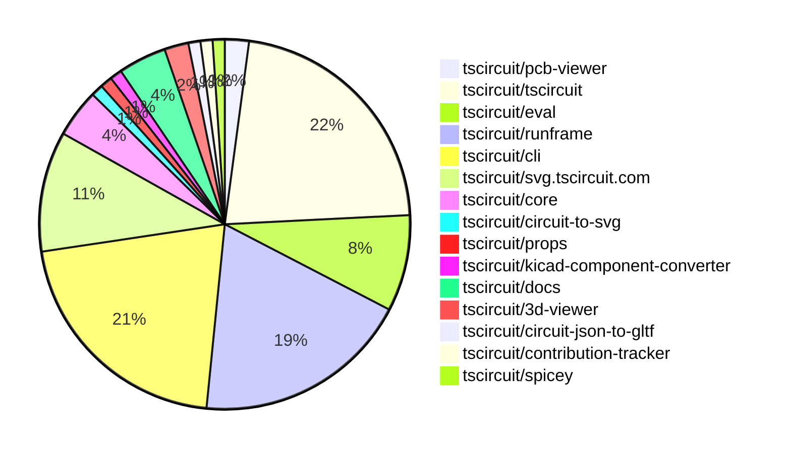
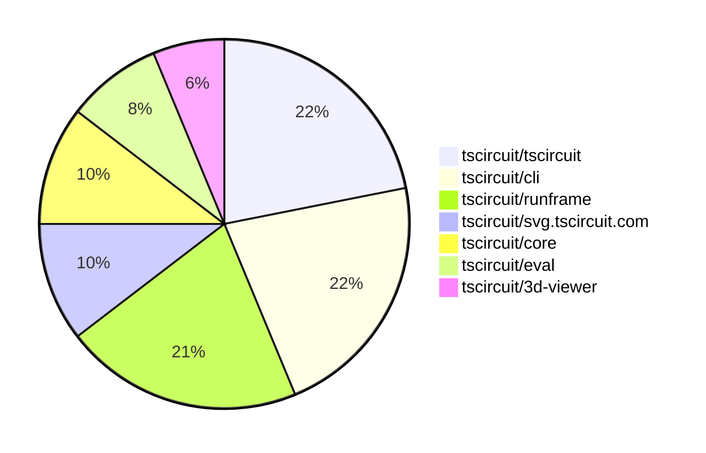

# Contribution Overview 2025-10-15

## PRs by Repository

## Contributor Overview

| Contributor | 🐳 Major | 🐙 Minor | 🐌 Tiny | ⭐ | Score | Discussion Contributions |
|-------------|---------|---------|---------|-----|----------------|--------------------------|
| [seveibar](#seveibar) | 1 | 6 | 3 | ⭐⭐ | 26 | 1🔹 0🔶 0💎 |
| [tscircuitbot](#tscircuitbot) | 0 | 0 | 71 | ⭐⭐ | 13 | 0🔹 0🔶 0💎 |
| [imrishabh18](#imrishabh18) | 1 | 2 | 2 | ⭐⭐ | 12 | 0🔹 0🔶 0💎 |
| [MustafaMulla29](#MustafaMulla29) | 0 | 2 | 2 | ⭐ | 7 | 0🔹 0🔶 0💎 |
| [Abse2001](#Abse2001) | 1 | 0 | 0 | ⭐ | 4 | 0🔹 0🔶 0💎 |
| [ArnavK-09](#ArnavK-09) | 0 | 1 | 1 | ⭐ | 4 | 0🔹 0🔶 0💎 |
| [ShiboSoftwareDev](#ShiboSoftwareDev) | 0 | 1 | 0 |  | 3 | 0🔹 0🔶 0💎 |
| [Excellencedev](#Excellencedev) | 0 | 1 | 0 |  | 2 | 0🔹 0🔶 0💎 |

### Discussion Contribution Legend

- 🔹 Normal Comments: Basic participation with minimal effort
- 🔶 Great Informative Comments: Thoughtful participation that adds value
- 💎 Incredible Comments: Exceptional participation with high-quality content

## Review Table

[reviews-received-hover]: ## "Number of reviews received for PRs for this contributor"
[approvals-received-hover]: ## "Number of approvals received for PRs this contributor authored"
[rejections-received-hover]: ## "Number of rejections received for PRs this contributor authored"
[prs-opened-hover]: ## "Number of PRs opened by this contributor"
[issues-created-hover]: ## "Number of issues created by this contributor"
[bountied-issues-hover]: ## "Number of issues this contributor created with a bounty"
[bountied-issue-$-hover]: ## "Total bounty amount placed on issues authored by this contributor"

| Contributor | Reviews Received | Approvals Received | Rejections Received | Approvals | Rejections | PRs Opened | PRs Merged | Score | Issues Created | Bountied Issues | Bountied Issue $ |
|---|---|---|---|---|---|---|---|---|---|---|---|
| [tscircuitbot](#tscircuitbot) | 0 | 0 | 0 | 0 | 0 | 77 | 71 | 13 | 0 | 0 | 0 |
| [imrishabh18](#imrishabh18) | 4 | 2 | 0 | 1 | 2 | 5 | 5 | 12 | 0 | 0 | 0 |
| [seveibar](#seveibar) | 2 | 0 | 0 | 9 | 2 | 10 | 10 | 26 | 0 | 0 | 0 |
| [Abse2001](#Abse2001) | 1 | 1 | 0 | 0 | 0 | 1 | 1 | 4 | 0 | 0 | 0 |
| [Quanta-Naut](#Quanta-Naut) | 3 | 0 | 1 | 0 | 0 | 1 | 0 | 0 | 0 | 0 | 0 |
| [MustafaMulla29](#MustafaMulla29) | 9 | 5 | 2 | 0 | 1 | 6 | 4 | 7 | 0 | 0 | 0 |
| [ArnavK-09](#ArnavK-09) | 3 | 2 | 0 | 1 | 0 | 3 | 2 | 4 | 0 | 0 | 0 |
| [Excellencedev](#Excellencedev) | 5 | 1 | 0 | 0 | 0 | 2 | 1 | 2 | 0 | 0 | 0 |
| [techmannih](#techmannih) | 0 | 0 | 0 | 0 | 0 | 1 | 0 | 0 | 0 | 0 | 0 |
| [MAVRICK-1](#MAVRICK-1) | 1 | 0 | 0 | 0 | 0 | 1 | 0 | 0 | 0 | 0 | 0 |
| [ShiboSoftwareDev](#ShiboSoftwareDev) | 1 | 1 | 0 | 1 | 0 | 1 | 1 | 3 | 0 | 0 | 0 |
| [Incharajayaram](#Incharajayaram) | 1 | 0 | 1 | 0 | 0 | 1 | 0 | 0 | 0 | 0 | 0 |
| [0hmX](#0hmX) | 2 | 0 | 1 | 0 | 0 | 1 | 0 | 0 | 0 | 0 | 0 |

## Top 7 Repositories by Contribution Points

## Changes by Repository

### [tscircuit/pcb-viewer](https://github.com/tscircuit/pcb-viewer)

| PR # | Impact | Rating | Contributor | Description |
|------|--------|--------|-------------|-------------|
| [#402](https://github.com/tscircuit/pcb-viewer/pull/402) | 🐙 Minor | ⭐⭐ | imrishabh18 | Adds support for various PCB note elements including lines, rectangles, paths, dimensions, and text in the PCB viewer. |

🐌 Tiny Contributions (1)

| PR # | Impact | Contributor | Description |
|------|--------|-------------|-------------|
| [#403](https://github.com/tscircuit/pcb-viewer/pull/403) | 🐌 Tiny | tscircuitbot | Automated package update |

### [tscircuit/tscircuit](https://github.com/tscircuit/tscircuit)

🐌 Tiny Contributions (21)

| PR # | Impact | Contributor | Description |
|------|--------|-------------|-------------|
| [#1043](https://github.com/tscircuit/tscircuit/pull/1043) | 🐌 Tiny | tscircuitbot | Automated package update |
| [#1042](https://github.com/tscircuit/tscircuit/pull/1042) | 🐌 Tiny | tscircuitbot | Updates the tscircuitcli package from version 0.1.330 to 0.1.331 and the tscircuitrunframe package from version 0.0.1100 to 0.0.1101 in package.json |
| [#1041](https://github.com/tscircuit/tscircuit/pull/1041) | 🐌 Tiny | tscircuitbot | Automated package update |
| [#1040](https://github.com/tscircuit/tscircuit/pull/1040) | 🐌 Tiny | tscircuitbot | Updates the tscircuitcli package from version 0.1.329 to 0.1.330 and the tscircuitrunframe package from version 0.0.1099 to 0.0.1100 in the package.json file. |
| [#1038](https://github.com/tscircuit/tscircuit/pull/1038) | 🐌 Tiny | tscircuitbot | Automated package update |
| [#1037](https://github.com/tscircuit/tscircuit/pull/1037) | 🐌 Tiny | tscircuitbot | Updates the tscircuitcli package from version 0.1.328 to 0.1.329 and the tscircuitrunframe package from version 0.0.1098 to 0.0.1099 in package.json |
| [#1036](https://github.com/tscircuit/tscircuit/pull/1036) | 🐌 Tiny | tscircuitbot | Automated package update |
| [#1035](https://github.com/tscircuit/tscircuit/pull/1035) | 🐌 Tiny | tscircuitbot | Automated package update |
| [#1034](https://github.com/tscircuit/tscircuit/pull/1034) | 🐌 Tiny | tscircuitbot | Automated package version bump from 0.0.758 to 0.0.759 |
| [#1032](https://github.com/tscircuit/tscircuit/pull/1032) | 🐌 Tiny | tscircuitbot | Automated package update |
| [#1031](https://github.com/tscircuit/tscircuit/pull/1031) | 🐌 Tiny | tscircuitbot | Updates the version of several packages in the project, including tscircuitcli, tscircuitcore, and tscircuiteval. |
| [#1030](https://github.com/tscircuit/tscircuit/pull/1030) | 🐌 Tiny | tscircuitbot | Automated package update |
| [#1029](https://github.com/tscircuit/tscircuit/pull/1029) | 🐌 Tiny | tscircuitbot | Updates the version of several dependencies in the package.json file, specifically tscircuitcli, tscircuitcore, tscircuiteval, and tscircuitrunframe. |
| [#1028](https://github.com/tscircuit/tscircuit/pull/1028) | 🐌 Tiny | tscircuitbot | Updates the package version from 0.0.755 to 0.0.756 in package.json |
| [#1027](https://github.com/tscircuit/tscircuit/pull/1027) | 🐌 Tiny | tscircuitbot | Updates the tscircuitcli package from version 0.1.324 to 0.1.325 and the tscircuitrunframe package from version 0.0.1095 to 0.0.1096. |
| [#1026](https://github.com/tscircuit/tscircuit/pull/1026) | 🐌 Tiny | tscircuitbot | Automated package update |
| [#1025](https://github.com/tscircuit/tscircuit/pull/1025) | 🐌 Tiny | tscircuitbot | Updates the tscircuitcli package from version 0.1.323 to 0.1.324 and the tscircuitrunframe package from version 0.0.1094 to 0.0.1095 |
| [#1024](https://github.com/tscircuit/tscircuit/pull/1024) | 🐌 Tiny | tscircuitbot | Updates the package version from 0.0.752 to 0.0.754 in package.json |
| [#1023](https://github.com/tscircuit/tscircuit/pull/1023) | 🐌 Tiny | tscircuitbot | Automated package update |
| [#1021](https://github.com/tscircuit/tscircuit/pull/1021) | 🐌 Tiny | tscircuitbot | Automated package update |
| [#1033](https://github.com/tscircuit/tscircuit/pull/1033) | 🐌 Tiny | imrishabh18 | Adds a GitHub Actions workflow to send Slack notifications for failed automated package update PRs. |

### [tscircuit/eval](https://github.com/tscircuit/eval)

🐌 Tiny Contributions (8)

| PR # | Impact | Contributor | Description |
|------|--------|-------------|-------------|
| [#1280](https://github.com/tscircuit/eval/pull/1280) | 🐌 Tiny | tscircuitbot | Automated package update |
| [#1279](https://github.com/tscircuit/eval/pull/1279) | 🐌 Tiny | tscircuitbot | Updates the version of the tscircuitcore package from 0.0.791 to 0.0.792 in package.json |
| [#1277](https://github.com/tscircuit/eval/pull/1277) | 🐌 Tiny | tscircuitbot | Automated package update |
| [#1276](https://github.com/tscircuit/eval/pull/1276) | 🐌 Tiny | tscircuitbot | Updates the version of the tscircuitcore package from 0.0.790 to 0.0.791 in package.json |
| [#1274](https://github.com/tscircuit/eval/pull/1274) | 🐌 Tiny | tscircuitbot | Automated package update |
| [#1273](https://github.com/tscircuit/eval/pull/1273) | 🐌 Tiny | tscircuitbot | Updates the version of the tscircuitcore package from 0.0.789 to 0.0.790 in package.json |
| [#1271](https://github.com/tscircuit/eval/pull/1271) | 🐌 Tiny | tscircuitbot | Automated package update |
| [#1270](https://github.com/tscircuit/eval/pull/1270) | 🐌 Tiny | tscircuitbot | Updates package dependencies in package.json to their latest versions |

### [tscircuit/runframe](https://github.com/tscircuit/runframe)

| PR # | Impact | Rating | Contributor | Description |
|------|--------|--------|-------------|-------------|
| [#1439](https://github.com/tscircuit/runframe/pull/1439) | 🐙 Minor | ⭐⭐ | seveibar | Filters the RunFrame board selector using includeBoardFiles parsed from tscircuit.config.json and adds a fallback mechanism for invalid configurations. |
| [#1435](https://github.com/tscircuit/runframe/pull/1435) | 🐙 Minor | ⭐⭐ | seveibar | Fixes the issue where debug downloads display Object object instead of readable content by stringifying non-string debug outputs. |

🐌 Tiny Contributions (16)

| PR # | Impact | Contributor | Description |
|------|--------|-------------|-------------|
| [#1452](https://github.com/tscircuit/runframe/pull/1452) | 🐌 Tiny | tscircuitbot | Automated package update |
| [#1451](https://github.com/tscircuit/runframe/pull/1451) | 🐌 Tiny | tscircuitbot | Updates the tscircuit3d-viewer package from version 0.0.412 to 0.0.413 |
| [#1450](https://github.com/tscircuit/runframe/pull/1450) | 🐌 Tiny | tscircuitbot | Automated package update |
| [#1449](https://github.com/tscircuit/runframe/pull/1449) | 🐌 Tiny | tscircuitbot | Updates the tscircuitpcb-viewer package from version 1.11.228 to 1.11.229 |
| [#1448](https://github.com/tscircuit/runframe/pull/1448) | 🐌 Tiny | tscircuitbot | Automated package update |
| [#1447](https://github.com/tscircuit/runframe/pull/1447) | 🐌 Tiny | tscircuitbot | Updates the tscircuiteval package to version 0.0.394 in the package.json file. |
| [#1446](https://github.com/tscircuit/runframe/pull/1446) | 🐌 Tiny | tscircuitbot | Automated package update |
| [#1445](https://github.com/tscircuit/runframe/pull/1445) | 🐌 Tiny | tscircuitbot | Updates the tscircuiteval package to version 0.0.393 in the package.json file. |
| [#1444](https://github.com/tscircuit/runframe/pull/1444) | 🐌 Tiny | tscircuitbot | Automated package update |
| [#1443](https://github.com/tscircuit/runframe/pull/1443) | 🐌 Tiny | tscircuitbot | Updates the tscircuiteval package to version 0.0.392 in the package.json file. |
| [#1442](https://github.com/tscircuit/runframe/pull/1442) | 🐌 Tiny | tscircuitbot | Updates the package version from 0.0.1095 to 0.0.1096 in package.json |
| [#1441](https://github.com/tscircuit/runframe/pull/1441) | 🐌 Tiny | tscircuitbot | Automated package update |
| [#1440](https://github.com/tscircuit/runframe/pull/1440) | 🐌 Tiny | tscircuitbot | Updates the tscircuit3d-viewer package to version 0.0.412 in the package.json file. |
| [#1438](https://github.com/tscircuit/runframe/pull/1438) | 🐌 Tiny | tscircuitbot | Automated package update |
| [#1437](https://github.com/tscircuit/runframe/pull/1437) | 🐌 Tiny | tscircuitbot | Updates the tscircuiteval package to version 0.0.391 |
| [#1436](https://github.com/tscircuit/runframe/pull/1436) | 🐌 Tiny | tscircuitbot | Automated package update |

### [tscircuit/cli](https://github.com/tscircuit/cli)

| PR # | Impact | Rating | Contributor | Description |
|------|--------|--------|-------------|-------------|
| [#581](https://github.com/tscircuit/cli/pull/581) | 🐙 Minor | ⭐⭐ | seveibar | Refactors the board file discovery process by centralizing it and utilizing the includeBoardFiles option from the project configuration, enhancing the build and snapshot commands to respect this configuration. |

🐌 Tiny Contributions (19)

| PR # | Impact | Contributor | Description |
|------|--------|-------------|-------------|
| [#601](https://github.com/tscircuit/cli/pull/601) | 🐌 Tiny | tscircuitbot | Automated package update |
| [#600](https://github.com/tscircuit/cli/pull/600) | 🐌 Tiny | tscircuitbot | Updates the tscircuitrunframe package to version 0.0.1101 in the package.json file. |
| [#599](https://github.com/tscircuit/cli/pull/599) | 🐌 Tiny | tscircuitbot | Automated package update |
| [#597](https://github.com/tscircuit/cli/pull/597) | 🐌 Tiny | tscircuitbot | Automated package update |
| [#596](https://github.com/tscircuit/cli/pull/596) | 🐌 Tiny | tscircuitbot | Updates the tscircuitrunframe package to version 0.0.1099 in the package.json file |
| [#595](https://github.com/tscircuit/cli/pull/595) | 🐌 Tiny | tscircuitbot | Automated package update |
| [#593](https://github.com/tscircuit/cli/pull/593) | 🐌 Tiny | tscircuitbot | Automated package update |
| [#592](https://github.com/tscircuit/cli/pull/592) | 🐌 Tiny | tscircuitbot | Updates the tscircuitrunframe package from version 0.0.1097 to 0.0.1098 |
| [#590](https://github.com/tscircuit/cli/pull/590) | 🐌 Tiny | tscircuitbot | Automated package update |
| [#589](https://github.com/tscircuit/cli/pull/589) | 🐌 Tiny | tscircuitbot | Updates the tscircuitrunframe package to version 0.0.1097 |
| [#588](https://github.com/tscircuit/cli/pull/588) | 🐌 Tiny | tscircuitbot | Automated package update |
| [#587](https://github.com/tscircuit/cli/pull/587) | 🐌 Tiny | tscircuitbot | Automated package update |
| [#586](https://github.com/tscircuit/cli/pull/586) | 🐌 Tiny | tscircuitbot | Automated package update |
| [#585](https://github.com/tscircuit/cli/pull/585) | 🐌 Tiny | tscircuitbot | Updates the tscircuitrunframe package from version 0.0.1094 to 0.0.1095 |
| [#584](https://github.com/tscircuit/cli/pull/584) | 🐌 Tiny | tscircuitbot | Automated package update |
| [#583](https://github.com/tscircuit/cli/pull/583) | 🐌 Tiny | tscircuitbot | Updates the tscircuitrunframe package from version 0.0.1092 to 0.0.1094 |
| [#582](https://github.com/tscircuit/cli/pull/582) | 🐌 Tiny | tscircuitbot | Automated package update to version 0.1.322 |
| [#594](https://github.com/tscircuit/cli/pull/594) | 🐌 Tiny | imrishabh18 | Adds a GitHub Actions workflow to send Slack notifications when CI checks fail for automated package updates. |
| [#591](https://github.com/tscircuit/cli/pull/591) | 🐌 Tiny | ArnavK-09 | Fixes the project relative path for the glb file in the package.json to ensure correct dependency resolution. |

### [tscircuit/svg.tscircuit.com](https://github.com/tscircuit/svg.tscircuit.com)

🐌 Tiny Contributions (10)

| PR # | Impact | Contributor | Description |
|------|--------|-------------|-------------|
| [#440](https://github.com/tscircuit/svg.tscircuit.com/pull/440) | 🐌 Tiny | tscircuitbot | Updates the tscircuit package version from 0.0.762 to 0.0.763 in package.json |
| [#439](https://github.com/tscircuit/svg.tscircuit.com/pull/439) | 🐌 Tiny | tscircuitbot | Updates the tscircuit package version from 0.0.761 to 0.0.762 in package.json |
| [#438](https://github.com/tscircuit/svg.tscircuit.com/pull/438) | 🐌 Tiny | tscircuitbot | Updates the tscircuit package version from 0.0.760 to 0.0.761 in package.json |
| [#437](https://github.com/tscircuit/svg.tscircuit.com/pull/437) | 🐌 Tiny | tscircuitbot | Updates the tscircuit package version from 0.0.758 to 0.0.760 in package.json |
| [#434](https://github.com/tscircuit/svg.tscircuit.com/pull/434) | 🐌 Tiny | tscircuitbot | Updates the tscircuit package version from 0.0.757 to 0.0.758 in package.json |
| [#433](https://github.com/tscircuit/svg.tscircuit.com/pull/433) | 🐌 Tiny | tscircuitbot | Automated package update |
| [#432](https://github.com/tscircuit/svg.tscircuit.com/pull/432) | 🐌 Tiny | tscircuitbot | Updates the tscircuit package version from 0.0.755 to 0.0.756 in package.json |
| [#431](https://github.com/tscircuit/svg.tscircuit.com/pull/431) | 🐌 Tiny | tscircuitbot | Updates the tscircuit package version from 0.0.754 to 0.0.755 in package.json |
| [#430](https://github.com/tscircuit/svg.tscircuit.com/pull/430) | 🐌 Tiny | tscircuitbot | Updates the tscircuit package version from 0.0.752 to 0.0.754 in package.json |
| [#435](https://github.com/tscircuit/svg.tscircuit.com/pull/435) | 🐌 Tiny | MustafaMulla29 | Updates the circuit-json-to-gltf dependency to version 0.0.26 to fix the pill hole issue and adds a test to verify the rendering of the pill-shaped hole in 3D SVG. |

### [tscircuit/core](https://github.com/tscircuit/core)

| PR # | Impact | Rating | Contributor | Description |
|------|--------|--------|-------------|-------------|
| [#1512](https://github.com/tscircuit/core/pull/1512) | 🐳 Major | ⭐⭐⭐ | imrishabh18 | Fixes the issue where relative components are not considered as obstacles in the packing calculation, ensuring accurate placement of PCB components. |
| [#1511](https://github.com/tscircuit/core/pull/1511) | 🐙 Minor | ⭐⭐ | imrishabh18 | Adds the PcbNoteText component for rendering text notes on PCB layouts with customizable properties such as font, size, and color. |
| [#1509](https://github.com/tscircuit/core/pull/1509) | 🐙 Minor | ⭐⭐ | seveibar | Reads the board components parsed thickness when calculating board thickness and updates cadmodel properties to expose zOffsetFromSurface, along with adding a test for cadmodel surface offset. |
| [#1510](https://github.com/tscircuit/core/pull/1510) | 🐙 Minor | ⭐⭐ | ArnavK-09 | Updated CadModel to use constructAssetUrl for better URL management and improved cache-busting logic for model URLs, along with tests for handling relative paths correctly. |

### [tscircuit/circuit-to-svg](https://github.com/tscircuit/circuit-to-svg)

| PR # | Impact | Rating | Contributor | Description |
|------|--------|--------|-------------|-------------|
| [#383](https://github.com/tscircuit/circuit-to-svg/pull/383) | 🐳 Major | ⭐⭐⭐ | seveibar | Includes pcb cutout shapes when determining PCB SVG bounds so polygon cutouts contribute to the transform and adds a regression test covering polygon-only cutouts to prevent NaN transforms |

### [tscircuit/props](https://github.com/tscircuit/props)

| PR # | Impact | Rating | Contributor | Description |
|------|--------|--------|-------------|-------------|
| [#452](https://github.com/tscircuit/props/pull/452) | 🐙 Minor | ⭐⭐ | seveibar | Add optional simulator configuration props to the switch component type definitions and regenerate the component documentation to describe the new simulator props |

### [tscircuit/kicad-component-converter](https://github.com/tscircuit/kicad-component-converter)

| PR # | Impact | Rating | Contributor | Description |
|------|--------|--------|-------------|-------------|
| [#149](https://github.com/tscircuit/kicad-component-converter/pull/149) | 🐙 Minor | ⭐⭐ | seveibar | Adds functionality to detect closed polygons from Edge.Cuts segments in KiCad files and convert them into pcb_cutout elements in the circuit JSON. |

### [tscircuit/docs](https://github.com/tscircuit/docs)

🐌 Tiny Contributions (4)

| PR # | Impact | Contributor | Description |
|------|--------|-------------|-------------|
| [#248](https://github.com/tscircuit/docs/pull/248) | 🐌 Tiny | seveibar | Removes the redundant overview heading from the group  element documentation, drops the unused key prop from the props table, and updates the LED footprint example to 0603. |
| [#249](https://github.com/tscircuit/docs/pull/249) | 🐌 Tiny | seveibar | Decreases markdown table font sizing to improve fit within content areas |
| [#246](https://github.com/tscircuit/docs/pull/246) | 🐌 Tiny | seveibar | Adds a props table covering core group  options and documents grid and flex specific layout props with CircuitPreview examples. |
| [#244](https://github.com/tscircuit/docs/pull/244) | 🐌 Tiny | MustafaMulla29 | Adds documentation for the pill-shaped hole and its rotation feature in the hole  element. |

### [tscircuit/3d-viewer](https://github.com/tscircuit/3d-viewer)

| PR # | Impact | Rating | Contributor | Description |
|------|--------|--------|-------------|-------------|
| [#525](https://github.com/tscircuit/3d-viewer/pull/525) | 🐳 Major | ⭐⭐⭐ | Abse2001 | Add hole offset support for plated holes with rectangular pads, allowing custom offsets for better alignment in 3D and PCB geometries. |
| [#522](https://github.com/tscircuit/3d-viewer/pull/522) | 🐙 Minor | ⭐⭐ | MustafaMulla29 | Adds support for pill and rotated pill hole shapes in PCB design, allowing for more versatile hole configurations. |

### [tscircuit/circuit-json-to-gltf](https://github.com/tscircuit/circuit-json-to-gltf)

| PR # | Impact | Rating | Contributor | Description |
|------|--------|--------|-------------|-------------|
| [#53](https://github.com/tscircuit/circuit-json-to-gltf/pull/53) | 🐙 Minor | ⭐⭐ | MustafaMulla29 | Adds support for pill and rotated pill hole shapes in the PCB geometry calculations, allowing for more complex hole shapes in circuit designs. |

### [tscircuit/contribution-tracker](https://github.com/tscircuit/contribution-tracker)

| PR # | Impact | Rating | Contributor | Description |
|------|--------|--------|-------------|-------------|
| [#228](https://github.com/tscircuit/contribution-tracker/pull/228) | 🐙 Minor | ⭐⭐ | Excellencedev | This implements the requested feature from issue 227 to automatically comment on PRs with their contribution level and a link to the contribution tracker. |

### [tscircuit/spicey](https://github.com/tscircuit/spicey)

| PR # | Impact | Rating | Contributor | Description |
|------|--------|--------|-------------|-------------|
| [#10](https://github.com/tscircuit/spicey/pull/10) | 🐙 Minor | ⭐⭐ | ShiboSoftwareDev | Changes graph titles to use V(node) notation instead of previous naming conventions. |

## Changes by Contributor

### [tscircuitbot](https://github.com/tscircuitbot)

🐌 Tiny Contributions (71)

| PR # | Impact | Description |
|------|--------|-------------|
| [#403](https://github.com/tscircuit/pcb-viewer/pull/403) | 🐌 Tiny | Automated package update |
| [#1043](https://github.com/tscircuit/tscircuit/pull/1043) | 🐌 Tiny | Automated package update |
| [#1042](https://github.com/tscircuit/tscircuit/pull/1042) | 🐌 Tiny | Updates the tscircuitcli package from version 0.1.330 to 0.1.331 and the tscircuitrunframe package from version 0.0.1100 to 0.0.1101 in package.json |
| [#1041](https://github.com/tscircuit/tscircuit/pull/1041) | 🐌 Tiny | Automated package update |
| [#1040](https://github.com/tscircuit/tscircuit/pull/1040) | 🐌 Tiny | Updates the tscircuitcli package from version 0.1.329 to 0.1.330 and the tscircuitrunframe package from version 0.0.1099 to 0.0.1100 in the package.json file. |
| [#1038](https://github.com/tscircuit/tscircuit/pull/1038) | 🐌 Tiny | Automated package update |
| [#1037](https://github.com/tscircuit/tscircuit/pull/1037) | 🐌 Tiny | Updates the tscircuitcli package from version 0.1.328 to 0.1.329 and the tscircuitrunframe package from version 0.0.1098 to 0.0.1099 in package.json |
| [#1036](https://github.com/tscircuit/tscircuit/pull/1036) | 🐌 Tiny | Automated package update |
| [#1035](https://github.com/tscircuit/tscircuit/pull/1035) | 🐌 Tiny | Automated package update |
| [#1034](https://github.com/tscircuit/tscircuit/pull/1034) | 🐌 Tiny | Automated package version bump from 0.0.758 to 0.0.759 |
| [#1032](https://github.com/tscircuit/tscircuit/pull/1032) | 🐌 Tiny | Automated package update |
| [#1031](https://github.com/tscircuit/tscircuit/pull/1031) | 🐌 Tiny | Updates the version of several packages in the project, including tscircuitcli, tscircuitcore, and tscircuiteval. |
| [#1030](https://github.com/tscircuit/tscircuit/pull/1030) | 🐌 Tiny | Automated package update |
| [#1029](https://github.com/tscircuit/tscircuit/pull/1029) | 🐌 Tiny | Updates the version of several dependencies in the package.json file, specifically tscircuitcli, tscircuitcore, tscircuiteval, and tscircuitrunframe. |
| [#1028](https://github.com/tscircuit/tscircuit/pull/1028) | 🐌 Tiny | Updates the package version from 0.0.755 to 0.0.756 in package.json |
| [#1027](https://github.com/tscircuit/tscircuit/pull/1027) | 🐌 Tiny | Updates the tscircuitcli package from version 0.1.324 to 0.1.325 and the tscircuitrunframe package from version 0.0.1095 to 0.0.1096. |
| [#1026](https://github.com/tscircuit/tscircuit/pull/1026) | 🐌 Tiny | Automated package update |
| [#1025](https://github.com/tscircuit/tscircuit/pull/1025) | 🐌 Tiny | Updates the tscircuitcli package from version 0.1.323 to 0.1.324 and the tscircuitrunframe package from version 0.0.1094 to 0.0.1095 |
| [#1024](https://github.com/tscircuit/tscircuit/pull/1024) | 🐌 Tiny | Updates the package version from 0.0.752 to 0.0.754 in package.json |
| [#1023](https://github.com/tscircuit/tscircuit/pull/1023) | 🐌 Tiny | Automated package update |
| [#1021](https://github.com/tscircuit/tscircuit/pull/1021) | 🐌 Tiny | Automated package update |
| [#1280](https://github.com/tscircuit/eval/pull/1280) | 🐌 Tiny | Automated package update |
| [#1279](https://github.com/tscircuit/eval/pull/1279) | 🐌 Tiny | Updates the version of the tscircuitcore package from 0.0.791 to 0.0.792 in package.json |
| [#1277](https://github.com/tscircuit/eval/pull/1277) | 🐌 Tiny | Automated package update |
| [#1276](https://github.com/tscircuit/eval/pull/1276) | 🐌 Tiny | Updates the version of the tscircuitcore package from 0.0.790 to 0.0.791 in package.json |
| [#1274](https://github.com/tscircuit/eval/pull/1274) | 🐌 Tiny | Automated package update |
| [#1273](https://github.com/tscircuit/eval/pull/1273) | 🐌 Tiny | Updates the version of the tscircuitcore package from 0.0.789 to 0.0.790 in package.json |
| [#1271](https://github.com/tscircuit/eval/pull/1271) | 🐌 Tiny | Automated package update |
| [#1270](https://github.com/tscircuit/eval/pull/1270) | 🐌 Tiny | Updates package dependencies in package.json to their latest versions |
| [#1452](https://github.com/tscircuit/runframe/pull/1452) | 🐌 Tiny | Automated package update |
| [#1451](https://github.com/tscircuit/runframe/pull/1451) | 🐌 Tiny | Updates the tscircuit3d-viewer package from version 0.0.412 to 0.0.413 |
| [#1450](https://github.com/tscircuit/runframe/pull/1450) | 🐌 Tiny | Automated package update |
| [#1449](https://github.com/tscircuit/runframe/pull/1449) | 🐌 Tiny | Updates the tscircuitpcb-viewer package from version 1.11.228 to 1.11.229 |
| [#1448](https://github.com/tscircuit/runframe/pull/1448) | 🐌 Tiny | Automated package update |
| [#1447](https://github.com/tscircuit/runframe/pull/1447) | 🐌 Tiny | Updates the tscircuiteval package to version 0.0.394 in the package.json file. |
| [#1446](https://github.com/tscircuit/runframe/pull/1446) | 🐌 Tiny | Automated package update |
| [#1445](https://github.com/tscircuit/runframe/pull/1445) | 🐌 Tiny | Updates the tscircuiteval package to version 0.0.393 in the package.json file. |
| [#1444](https://github.com/tscircuit/runframe/pull/1444) | 🐌 Tiny | Automated package update |
| [#1443](https://github.com/tscircuit/runframe/pull/1443) | 🐌 Tiny | Updates the tscircuiteval package to version 0.0.392 in the package.json file. |
| [#1442](https://github.com/tscircuit/runframe/pull/1442) | 🐌 Tiny | Updates the package version from 0.0.1095 to 0.0.1096 in package.json |
| [#1441](https://github.com/tscircuit/runframe/pull/1441) | 🐌 Tiny | Automated package update |
| [#1440](https://github.com/tscircuit/runframe/pull/1440) | 🐌 Tiny | Updates the tscircuit3d-viewer package to version 0.0.412 in the package.json file. |
| [#1438](https://github.com/tscircuit/runframe/pull/1438) | 🐌 Tiny | Automated package update |
| [#1437](https://github.com/tscircuit/runframe/pull/1437) | 🐌 Tiny | Updates the tscircuiteval package to version 0.0.391 |
| [#1436](https://github.com/tscircuit/runframe/pull/1436) | 🐌 Tiny | Automated package update |
| [#601](https://github.com/tscircuit/cli/pull/601) | 🐌 Tiny | Automated package update |
| [#600](https://github.com/tscircuit/cli/pull/600) | 🐌 Tiny | Updates the tscircuitrunframe package to version 0.0.1101 in the package.json file. |
| [#599](https://github.com/tscircuit/cli/pull/599) | 🐌 Tiny | Automated package update |
| [#597](https://github.com/tscircuit/cli/pull/597) | 🐌 Tiny | Automated package update |
| [#596](https://github.com/tscircuit/cli/pull/596) | 🐌 Tiny | Updates the tscircuitrunframe package to version 0.0.1099 in the package.json file |
| [#595](https://github.com/tscircuit/cli/pull/595) | 🐌 Tiny | Automated package update |
| [#593](https://github.com/tscircuit/cli/pull/593) | 🐌 Tiny | Automated package update |
| [#592](https://github.com/tscircuit/cli/pull/592) | 🐌 Tiny | Updates the tscircuitrunframe package from version 0.0.1097 to 0.0.1098 |
| [#590](https://github.com/tscircuit/cli/pull/590) | 🐌 Tiny | Automated package update |
| [#589](https://github.com/tscircuit/cli/pull/589) | 🐌 Tiny | Updates the tscircuitrunframe package to version 0.0.1097 |
| [#588](https://github.com/tscircuit/cli/pull/588) | 🐌 Tiny | Automated package update |
| [#587](https://github.com/tscircuit/cli/pull/587) | 🐌 Tiny | Automated package update |
| [#586](https://github.com/tscircuit/cli/pull/586) | 🐌 Tiny | Automated package update |
| [#585](https://github.com/tscircuit/cli/pull/585) | 🐌 Tiny | Updates the tscircuitrunframe package from version 0.0.1094 to 0.0.1095 |
| [#584](https://github.com/tscircuit/cli/pull/584) | 🐌 Tiny | Automated package update |
| [#583](https://github.com/tscircuit/cli/pull/583) | 🐌 Tiny | Updates the tscircuitrunframe package from version 0.0.1092 to 0.0.1094 |
| [#582](https://github.com/tscircuit/cli/pull/582) | 🐌 Tiny | Automated package update to version 0.1.322 |
| [#440](https://github.com/tscircuit/svg.tscircuit.com/pull/440) | 🐌 Tiny | Updates the tscircuit package version from 0.0.762 to 0.0.763 in package.json |
| [#439](https://github.com/tscircuit/svg.tscircuit.com/pull/439) | 🐌 Tiny | Updates the tscircuit package version from 0.0.761 to 0.0.762 in package.json |
| [#438](https://github.com/tscircuit/svg.tscircuit.com/pull/438) | 🐌 Tiny | Updates the tscircuit package version from 0.0.760 to 0.0.761 in package.json |
| [#437](https://github.com/tscircuit/svg.tscircuit.com/pull/437) | 🐌 Tiny | Updates the tscircuit package version from 0.0.758 to 0.0.760 in package.json |
| [#434](https://github.com/tscircuit/svg.tscircuit.com/pull/434) | 🐌 Tiny | Updates the tscircuit package version from 0.0.757 to 0.0.758 in package.json |
| [#433](https://github.com/tscircuit/svg.tscircuit.com/pull/433) | 🐌 Tiny | Automated package update |
| [#432](https://github.com/tscircuit/svg.tscircuit.com/pull/432) | 🐌 Tiny | Updates the tscircuit package version from 0.0.755 to 0.0.756 in package.json |
| [#431](https://github.com/tscircuit/svg.tscircuit.com/pull/431) | 🐌 Tiny | Updates the tscircuit package version from 0.0.754 to 0.0.755 in package.json |
| [#430](https://github.com/tscircuit/svg.tscircuit.com/pull/430) | 🐌 Tiny | Updates the tscircuit package version from 0.0.752 to 0.0.754 in package.json |

### [imrishabh18](https://github.com/imrishabh18)

| PRs # | Impact | Rating | Description |
|------|--------|--------|-------------|
| [#1512](https://github.com/tscircuit/core/pull/1512) | 🐳 Major | ⭐⭐⭐ | Fixes the issue where relative components are not considered as obstacles in the packing calculation, ensuring accurate placement of PCB components. |
| [#402](https://github.com/tscircuit/pcb-viewer/pull/402) | 🐙 Minor | ⭐⭐ | Adds support for various PCB note elements including lines, rectangles, paths, dimensions, and text in the PCB viewer. |
| [#1511](https://github.com/tscircuit/core/pull/1511) | 🐙 Minor | ⭐⭐ | Adds the PcbNoteText component for rendering text notes on PCB layouts with customizable properties such as font, size, and color. |

🐌 Tiny Contributions (2)

| PR # | Impact | Description |
|------|--------|-------------|
| [#1033](https://github.com/tscircuit/tscircuit/pull/1033) | 🐌 Tiny | Adds a GitHub Actions workflow to send Slack notifications for failed automated package update PRs. |
| [#594](https://github.com/tscircuit/cli/pull/594) | 🐌 Tiny | Adds a GitHub Actions workflow to send Slack notifications when CI checks fail for automated package updates. |

### [seveibar](https://github.com/seveibar)

| PRs # | Impact | Rating | Description |
|------|--------|--------|-------------|
| [#383](https://github.com/tscircuit/circuit-to-svg/pull/383) | 🐳 Major | ⭐⭐⭐ | Includes pcb cutout shapes when determining PCB SVG bounds so polygon cutouts contribute to the transform and adds a regression test covering polygon-only cutouts to prevent NaN transforms |
| [#452](https://github.com/tscircuit/props/pull/452) | 🐙 Minor | ⭐⭐ | Add optional simulator configuration props to the switch component type definitions and regenerate the component documentation to describe the new simulator props |
| [#149](https://github.com/tscircuit/kicad-component-converter/pull/149) | 🐙 Minor | ⭐⭐ | Adds functionality to detect closed polygons from Edge.Cuts segments in KiCad files and convert them into pcb_cutout elements in the circuit JSON. |
| [#1509](https://github.com/tscircuit/core/pull/1509) | 🐙 Minor | ⭐⭐ | Reads the board components parsed thickness when calculating board thickness and updates cadmodel properties to expose zOffsetFromSurface, along with adding a test for cadmodel surface offset. |
| [#1439](https://github.com/tscircuit/runframe/pull/1439) | 🐙 Minor | ⭐⭐ | Filters the RunFrame board selector using includeBoardFiles parsed from tscircuit.config.json and adds a fallback mechanism for invalid configurations. |
| [#1435](https://github.com/tscircuit/runframe/pull/1435) | 🐙 Minor | ⭐⭐ | Fixes the issue where debug downloads display Object object instead of readable content by stringifying non-string debug outputs. |
| [#581](https://github.com/tscircuit/cli/pull/581) | 🐙 Minor | ⭐⭐ | Refactors the board file discovery process by centralizing it and utilizing the includeBoardFiles option from the project configuration, enhancing the build and snapshot commands to respect this configuration. |

🐌 Tiny Contributions (3)

| PR # | Impact | Description |
|------|--------|-------------|
| [#248](https://github.com/tscircuit/docs/pull/248) | 🐌 Tiny | Removes the redundant overview heading from the group  element documentation, drops the unused key prop from the props table, and updates the LED footprint example to 0603. |
| [#249](https://github.com/tscircuit/docs/pull/249) | 🐌 Tiny | Decreases markdown table font sizing to improve fit within content areas |
| [#246](https://github.com/tscircuit/docs/pull/246) | 🐌 Tiny | Adds a props table covering core group  options and documents grid and flex specific layout props with CircuitPreview examples. |

### [Abse2001](https://github.com/Abse2001)

| PRs # | Impact | Rating | Description |
|------|--------|--------|-------------|
| [#525](https://github.com/tscircuit/3d-viewer/pull/525) | 🐳 Major | ⭐⭐⭐ | Add hole offset support for plated holes with rectangular pads, allowing custom offsets for better alignment in 3D and PCB geometries. |

### [MustafaMulla29](https://github.com/MustafaMulla29)

| PRs # | Impact | Rating | Description |
|------|--------|--------|-------------|
| [#522](https://github.com/tscircuit/3d-viewer/pull/522) | 🐙 Minor | ⭐⭐ | Adds support for pill and rotated pill hole shapes in PCB design, allowing for more versatile hole configurations. |
| [#53](https://github.com/tscircuit/circuit-json-to-gltf/pull/53) | 🐙 Minor | ⭐⭐ | Adds support for pill and rotated pill hole shapes in the PCB geometry calculations, allowing for more complex hole shapes in circuit designs. |

🐌 Tiny Contributions (2)

| PR # | Impact | Description |
|------|--------|-------------|
| [#435](https://github.com/tscircuit/svg.tscircuit.com/pull/435) | 🐌 Tiny | Updates the circuit-json-to-gltf dependency to version 0.0.26 to fix the pill hole issue and adds a test to verify the rendering of the pill-shaped hole in 3D SVG. |
| [#244](https://github.com/tscircuit/docs/pull/244) | 🐌 Tiny | Adds documentation for the pill-shaped hole and its rotation feature in the hole  element. |

### [ArnavK-09](https://github.com/ArnavK-09)

| PRs # | Impact | Rating | Description |
|------|--------|--------|-------------|
| [#1510](https://github.com/tscircuit/core/pull/1510) | 🐙 Minor | ⭐⭐ | Updated CadModel to use constructAssetUrl for better URL management and improved cache-busting logic for model URLs, along with tests for handling relative paths correctly. |

🐌 Tiny Contributions (1)

| PR # | Impact | Description |
|------|--------|-------------|
| [#591](https://github.com/tscircuit/cli/pull/591) | 🐌 Tiny | Fixes the project relative path for the glb file in the package.json to ensure correct dependency resolution. |

### [Excellencedev](https://github.com/Excellencedev)

| PRs # | Impact | Rating | Description |
|------|--------|--------|-------------|
| [#228](https://github.com/tscircuit/contribution-tracker/pull/228) | 🐙 Minor | ⭐⭐ | This implements the requested feature from issue 227 to automatically comment on PRs with their contribution level and a link to the contribution tracker. |

### [ShiboSoftwareDev](https://github.com/ShiboSoftwareDev)

| PRs # | Impact | Rating | Description |
|------|--------|--------|-------------|
| [#10](https://github.com/tscircuit/spicey/pull/10) | 🐙 Minor | ⭐⭐ | Changes graph titles to use V(node) notation instead of previous naming conventions. |

## Repository Owners

| Repository | Codeowners |
|------------|------------|
| [builder](https://github.com/tscircuit/builder/blob/main/.github/CODEOWNERS) | [seveibar](https://github.com/seveibar)
| [pcb-viewer](https://github.com/tscircuit/pcb-viewer/blob/main/.github/CODEOWNERS) | [seveibar](https://github.com/seveibar), [ShiboSoftwareDev](https://github.com/ShiboSoftwareDev)
| [footprints-old](https://github.com/tscircuit/footprints-old/blob/main/.github/CODEOWNERS) | [seveibar](https://github.com/seveibar)
| [footprinter](https://github.com/tscircuit/footprinter/blob/main/.github/CODEOWNERS) | [seveibar](https://github.com/seveibar), [techmannih](https://github.com/techmannih)
| [3d-viewer](https://github.com/tscircuit/3d-viewer/blob/main/.github/CODEOWNERS) | [ShiboSoftwareDev](https://github.com/ShiboSoftwareDev)
| [winterspec](https://github.com/tscircuit/winterspec/blob/main/.github/CODEOWNERS) | [seveibar](https://github.com/seveibar), [ShiboSoftwareDev](https://github.com/ShiboSoftwareDev)
| [jscad-electronics](https://github.com/tscircuit/jscad-electronics/blob/main/.github/CODEOWNERS) | [seveibar](https://github.com/seveibar), [abhijitxy](https://github.com/abhijitxy), [anas-sarkez](https://github.com/anas-sarkez)
| [circuit-to-svg](https://github.com/tscircuit/circuit-to-svg/blob/main/.github/CODEOWNERS) | [imrishabh18](https://github.com/imrishabh18)
| [schematic-symbols](https://github.com/tscircuit/schematic-symbols/blob/main/.github/CODEOWNERS) | [seveibar](https://github.com/seveibar), [imrishabh18](https://github.com/imrishabh18), [techmannih](https://github.com/techmannih)
| [circuit-json-to-gerber](https://github.com/tscircuit/circuit-json-to-gerber/blob/main/.github/CODEOWNERS) | [seveibar](https://github.com/seveibar), [ShiboSoftwareDev](https://github.com/ShiboSoftwareDev)
| [tscircuit.com](https://github.com/tscircuit/tscircuit.com/blob/main/.github/CODEOWNERS) | [seveibar](https://github.com/seveibar), [imrishabh18](https://github.com/imrishabh18)
| [issue-roulette](https://github.com/tscircuit/issue-roulette/blob/main/.github/CODEOWNERS) | [Anshgrover23](https://github.com/Anshgrover23)
| [sparkfun-boards](https://github.com/tscircuit/sparkfun-boards/blob/main/.github/CODEOWNERS) | [ShiboSoftwareDev](https://github.com/ShiboSoftwareDev), [Abse2001](https://github.com/Abse2001), [MustafaMulla29](https://github.com/MustafaMulla29), [Anshgrover23](https://github.com/Anshgrover23), [techmannih](https://github.com/techmannih)
| [schematic-corpus](https://github.com/tscircuit/schematic-corpus/blob/main/.github/CODEOWNERS) | [Abse2001](https://github.com/Abse2001)

## Repositories by Owner

| User | Repo |
|------|------|
| [seveibar](https://github.com/seveibar) | [builder](https://github.com/tscircuit/builder/blob/main/.github/CODEOWNERS) |
|  | [pcb-viewer](https://github.com/tscircuit/pcb-viewer/blob/main/.github/CODEOWNERS) |
|  | [footprints-old](https://github.com/tscircuit/footprints-old/blob/main/.github/CODEOWNERS) |
|  | [footprinter](https://github.com/tscircuit/footprinter/blob/main/.github/CODEOWNERS) |
|  | [winterspec](https://github.com/tscircuit/winterspec/blob/main/.github/CODEOWNERS) |
|  | [jscad-electronics](https://github.com/tscircuit/jscad-electronics/blob/main/.github/CODEOWNERS) |
|  | [schematic-symbols](https://github.com/tscircuit/schematic-symbols/blob/main/.github/CODEOWNERS) |
|  | [circuit-json-to-gerber](https://github.com/tscircuit/circuit-json-to-gerber/blob/main/.github/CODEOWNERS) |
|  | [tscircuit.com](https://github.com/tscircuit/tscircuit.com/blob/main/.github/CODEOWNERS) |
| [ShiboSoftwareDev](https://github.com/ShiboSoftwareDev) | [pcb-viewer](https://github.com/tscircuit/pcb-viewer/blob/main/.github/CODEOWNERS) |
|  | [3d-viewer](https://github.com/tscircuit/3d-viewer/blob/main/.github/CODEOWNERS) |
|  | [winterspec](https://github.com/tscircuit/winterspec/blob/main/.github/CODEOWNERS) |
|  | [circuit-json-to-gerber](https://github.com/tscircuit/circuit-json-to-gerber/blob/main/.github/CODEOWNERS) |
|  | [sparkfun-boards](https://github.com/tscircuit/sparkfun-boards/blob/main/.github/CODEOWNERS) |
| [techmannih](https://github.com/techmannih) | [footprinter](https://github.com/tscircuit/footprinter/blob/main/.github/CODEOWNERS) |
|  | [schematic-symbols](https://github.com/tscircuit/schematic-symbols/blob/main/.github/CODEOWNERS) |
|  | [sparkfun-boards](https://github.com/tscircuit/sparkfun-boards/blob/main/.github/CODEOWNERS) |
| [abhijitxy](https://github.com/abhijitxy) | [jscad-electronics](https://github.com/tscircuit/jscad-electronics/blob/main/.github/CODEOWNERS) |
| [anas-sarkez](https://github.com/anas-sarkez) | [jscad-electronics](https://github.com/tscircuit/jscad-electronics/blob/main/.github/CODEOWNERS) |
| [imrishabh18](https://github.com/imrishabh18) | [circuit-to-svg](https://github.com/tscircuit/circuit-to-svg/blob/main/.github/CODEOWNERS) |
|  | [schematic-symbols](https://github.com/tscircuit/schematic-symbols/blob/main/.github/CODEOWNERS) |
|  | [tscircuit.com](https://github.com/tscircuit/tscircuit.com/blob/main/.github/CODEOWNERS) |
| [Anshgrover23](https://github.com/Anshgrover23) | [issue-roulette](https://github.com/tscircuit/issue-roulette/blob/main/.github/CODEOWNERS) |
|  | [sparkfun-boards](https://github.com/tscircuit/sparkfun-boards/blob/main/.github/CODEOWNERS) |
| [Abse2001](https://github.com/Abse2001) | [sparkfun-boards](https://github.com/tscircuit/sparkfun-boards/blob/main/.github/CODEOWNERS) |
|  | [schematic-corpus](https://github.com/tscircuit/schematic-corpus/blob/main/.github/CODEOWNERS) |
| [MustafaMulla29](https://github.com/MustafaMulla29) | [sparkfun-boards](https://github.com/tscircuit/sparkfun-boards/blob/main/.github/CODEOWNERS) |

