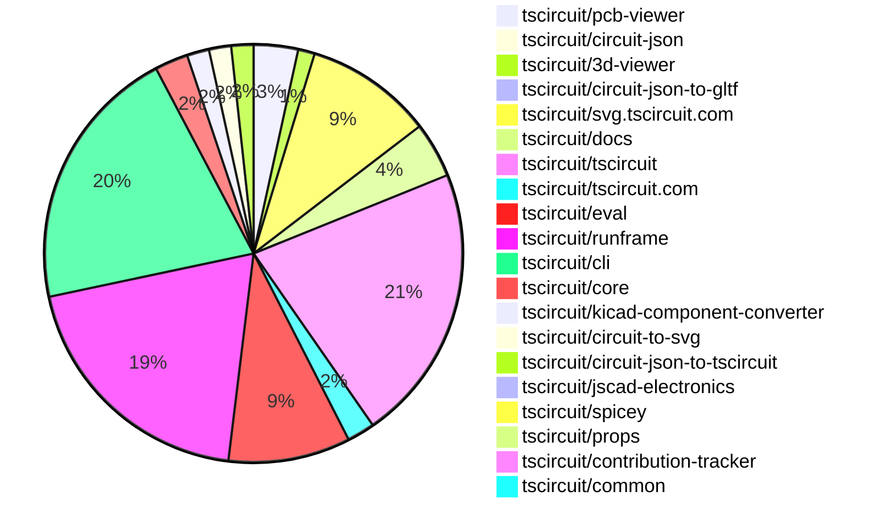
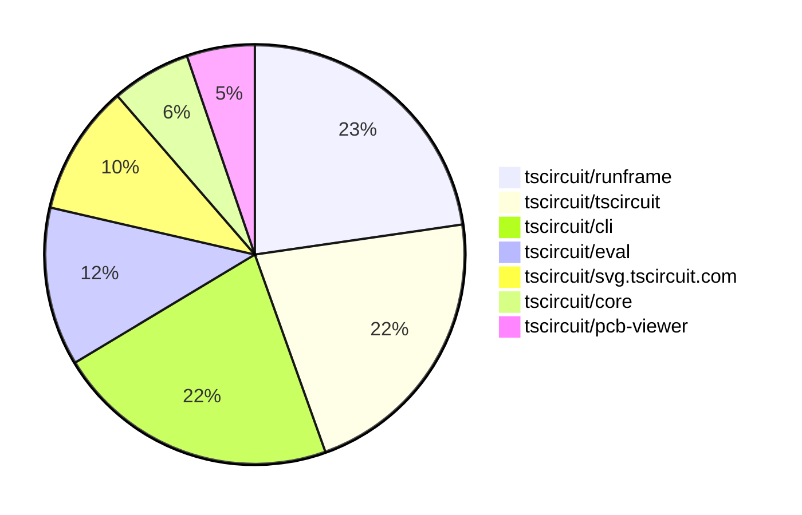

# Contribution Overview 2025-10-15

## PRs by Repository

## Contributor Overview

| Contributor | 🐳 Major | 🐙 Minor | 🐌 Tiny | ⭐ | Score | Discussion Contributions |
|-------------|---------|---------|---------|-----|----------------|--------------------------|
| [seveibar](#seveibar) | 3 | 10 | 11 | 👑 | 55 | 1🔹 0🔶 0💎 |
| [imrishabh18](#imrishabh18) | 1 | 6 | 9 | ⭐⭐ | 28 | 0🔹 0🔶 0💎 |
| [tscircuitbot](#tscircuitbot) | 0 | 0 | 177 | ⭐⭐ | 15.5 | 0🔹 0🔶 0💎 |
| [ShiboSoftwareDev](#ShiboSoftwareDev) | 1 | 3 | 1 | ⭐⭐ | 12 | 0🔹 0🔶 0💎 |
| [MustafaMulla29](#MustafaMulla29) | 0 | 4 | 2 | ⭐⭐ | 11 | 0🔹 0🔶 0💎 |
| [Abse2001](#Abse2001) | 1 | 2 | 0 | ⭐ | 8 | 0🔹 0🔶 0💎 |
| [ArnavK-09](#ArnavK-09) | 1 | 1 | 1 | ⭐ | 8 | 0🔹 0🔶 0💎 |
| [Ayushjhawar8](#Ayushjhawar8) | 0 | 2 | 1 | ⭐ | 5 | 0🔹 0🔶 0💎 |
| [Excellencedev](#Excellencedev) | 0 | 2 | 0 | ⭐ | 4 | 0🔹 0🔶 0💎 |
| [Asymtode712](#Asymtode712) | 0 | 2 | 0 | ⭐ | 4 | 0🔹 0🔶 0💎 |
| [techmannih](#techmannih) | 0 | 1 | 1 |  | 3 | 0🔹 0🔶 0💎 |

### Discussion Contribution Legend

- 🔹 Normal Comments: Basic participation with minimal effort
- 🔶 Great Informative Comments: Thoughtful participation that adds value
- 💎 Incredible Comments: Exceptional participation with high-quality content

## Review Table

[reviews-received-hover]: ## "Number of reviews received for PRs for this contributor"
[approvals-received-hover]: ## "Number of approvals received for PRs this contributor authored"
[rejections-received-hover]: ## "Number of rejections received for PRs this contributor authored"
[prs-opened-hover]: ## "Number of PRs opened by this contributor"
[issues-created-hover]: ## "Number of issues created by this contributor"
[bountied-issues-hover]: ## "Number of issues this contributor created with a bounty"
[bountied-issue-$-hover]: ## "Total bounty amount placed on issues authored by this contributor"

| Contributor | Reviews Received | Approvals Received | Rejections Received | Approvals | Rejections | PRs Opened | PRs Merged | Score | Issues Created | Bountied Issues | Bountied Issue $ |
|---|---|---|---|---|---|---|---|---|---|---|---|
| [MustafaMulla29](#MustafaMulla29) | 16 | 7 | 4 | 0 | 1 | 12 | 6 | 11 | 0 | 0 | 0 |
| [seveibar](#seveibar) | 13 | 0 | 0 | 27 | 2 | 33 | 24 | 55 | 0 | 0 | 0 |
| [tscircuitbot](#tscircuitbot) | 1 | 0 | 0 | 0 | 0 | 190 | 177 | 15.5 | 0 | 0 | 0 |
| [imrishabh18](#imrishabh18) | 12 | 6 | 0 | 1 | 4 | 17 | 16 | 28 | 0 | 0 | 0 |
| [techmannih](#techmannih) | 3 | 2 | 0 | 0 | 0 | 2 | 2 | 3 | 0 | 0 | 0 |
| [ShiboSoftwareDev](#ShiboSoftwareDev) | 7 | 4 | 0 | 1 | 0 | 5 | 5 | 12 | 0 | 0 | 0 |
| [Quanta-Naut](#Quanta-Naut) | 6 | 0 | 1 | 0 | 0 | 1 | 0 | 0 | 0 | 0 | 0 |
| [Abse2001](#Abse2001) | 3 | 2 | 0 | 0 | 0 | 3 | 3 | 8 | 0 | 0 | 0 |
| [Excellencedev](#Excellencedev) | 6 | 2 | 0 | 0 | 0 | 5 | 2 | 4 | 0 | 0 | 0 |
| [ArnavK-09](#ArnavK-09) | 4 | 3 | 0 | 1 | 0 | 3 | 3 | 8 | 0 | 0 | 0 |
| [MAVRICK-1](#MAVRICK-1) | 1 | 0 | 0 | 0 | 0 | 1 | 0 | 0 | 0 | 0 | 0 |
| [Asymtode712](#Asymtode712) | 2 | 2 | 0 | 0 | 0 | 2 | 2 | 4 | 0 | 0 | 0 |
| [Ayushjhawar8](#Ayushjhawar8) | 2 | 2 | 0 | 0 | 0 | 3 | 3 | 5 | 0 | 0 | 0 |
| [nailoo](#nailoo) | 0 | 0 | 0 | 0 | 0 | 1 | 0 | 0 | 0 | 0 | 0 |
| [Incharajayaram](#Incharajayaram) | 1 | 0 | 1 | 0 | 0 | 1 | 0 | 0 | 0 | 0 | 0 |
| [watzon](#watzon) | 0 | 0 | 0 | 0 | 0 | 1 | 0 | 0 | 0 | 0 | 0 |
| [0hmX](#0hmX) | 2 | 0 | 1 | 0 | 0 | 1 | 0 | 0 | 0 | 0 | 0 |

## Top 7 Repositories by Contribution Points

## Changes by Repository

### [tscircuit/pcb-viewer](https://github.com/tscircuit/pcb-viewer)

| PR # | Impact | Rating | Contributor | Description |
|------|--------|--------|-------------|-------------|
| [#410](https://github.com/tscircuit/pcb-viewer/pull/410) | 🐙 Minor | ⭐⭐ | MustafaMulla29 | Adds functionality to display the anchor position of a PCB group on the canvas, enhancing visual representation of PCB layouts. |
| [#406](https://github.com/tscircuit/pcb-viewer/pull/406) | 🐙 Minor | ⭐⭐ | imrishabh18 | Adds support for color overrides in PCB note shapes, allowing users to specify colors for lines, rectangles, paths, text, and dimensions. |
| [#402](https://github.com/tscircuit/pcb-viewer/pull/402) | 🐙 Minor | ⭐⭐ | imrishabh18 | Adds support for various PCB note elements including lines, rectangles, paths, dimensions, and text in the PCB viewer. |
| [#401](https://github.com/tscircuit/pcb-viewer/pull/401) | 🐙 Minor | ⭐⭐ | techmannih | Adds functionality to render fabrication note dimensions in the PCB viewer, allowing users to visualize dimensions directly on the PCB layout. |

🐌 Tiny Contributions (4)

| PR # | Impact | Contributor | Description |
|------|--------|-------------|-------------|
| [#411](https://github.com/tscircuit/pcb-viewer/pull/411) | 🐌 Tiny | tscircuitbot | Automated package update |
| [#407](https://github.com/tscircuit/pcb-viewer/pull/407) | 🐌 Tiny | tscircuitbot | Automated package update |
| [#405](https://github.com/tscircuit/pcb-viewer/pull/405) | 🐌 Tiny | tscircuitbot | Automated package update |
| [#403](https://github.com/tscircuit/pcb-viewer/pull/403) | 🐌 Tiny | tscircuitbot | Automated package update |

### [tscircuit/circuit-json](https://github.com/tscircuit/circuit-json)

| PR # | Impact | Rating | Contributor | Description |
|------|--------|--------|-------------|-------------|
| [#315](https://github.com/tscircuit/circuit-json/pull/315) | 🐙 Minor | ⭐⭐ | MustafaMulla29 | Adds anchor_position and anchor_alignment properties to the pcb_group interface for better positioning and alignment of PCB groups. |
| [#316](https://github.com/tscircuit/circuit-json/pull/316) | 🐙 Minor | ⭐⭐ | ShiboSoftwareDev | Adds a new optional field simulation_voltage_probe_id to the SimulationTransientVoltageGraph interface for enhanced voltage graph simulation. |

### [tscircuit/3d-viewer](https://github.com/tscircuit/3d-viewer)

| PR # | Impact | Rating | Contributor | Description |
|------|--------|--------|-------------|-------------|
| [#525](https://github.com/tscircuit/3d-viewer/pull/525) | 🐳 Major | ⭐⭐⭐ | Abse2001 | Adds hole offset support for plated holes with rectangular pads, allowing for custom hole offsets to maintain proper copper continuity and accurate board subtraction in 3D renderings and manifold processing. |
| [#522](https://github.com/tscircuit/3d-viewer/pull/522) | 🐙 Minor | ⭐⭐ | MustafaMulla29 | Adds support for pill and rotated pill hole shapes in PCB design, allowing for more versatile hole configurations. |
| [#526](https://github.com/tscircuit/3d-viewer/pull/526) | 🐙 Minor | ⭐⭐ | Abse2001 | Fixes a bug where hole_offset_x or hole_offset_y being undefined caused the board rendering to fail for plated holes. Defaults offsets to 0 when not provided to ensure stable geometry generation for circular and pill-shaped plated holes. |

### [tscircuit/circuit-json-to-gltf](https://github.com/tscircuit/circuit-json-to-gltf)

| PR # | Impact | Rating | Contributor | Description |
|------|--------|--------|-------------|-------------|
| [#53](https://github.com/tscircuit/circuit-json-to-gltf/pull/53) | 🐙 Minor | ⭐⭐ | MustafaMulla29 | Adds support for pill and rotated pill-shaped holes in the PCB geometry generation. |

### [tscircuit/svg.tscircuit.com](https://github.com/tscircuit/svg.tscircuit.com)

🐌 Tiny Contributions (23)

| PR # | Impact | Contributor | Description |
|------|--------|-------------|-------------|
| [#435](https://github.com/tscircuit/svg.tscircuit.com/pull/435) | 🐌 Tiny | MustafaMulla29 | Updates the circuit-json-to-gltf dependency to version 0.0.26 to fix the pill hole issue and adds a test to verify the correct rendering of the pill-shaped hole in 3D SVG. |
| [#453](https://github.com/tscircuit/svg.tscircuit.com/pull/453) | 🐌 Tiny | tscircuitbot | Updates the tscircuit package version from 0.0.777 to 0.0.778 in package.json |
| [#452](https://github.com/tscircuit/svg.tscircuit.com/pull/452) | 🐌 Tiny | tscircuitbot | Updates the tscircuit package version from 0.0.776 to 0.0.777 in package.json |
| [#451](https://github.com/tscircuit/svg.tscircuit.com/pull/451) | 🐌 Tiny | tscircuitbot | Updates the tscircuit package version from 0.0.775 to 0.0.776 in package.json |
| [#450](https://github.com/tscircuit/svg.tscircuit.com/pull/450) | 🐌 Tiny | tscircuitbot | Updates the tscircuit package version from 0.0.773 to 0.0.775 in package.json |
| [#449](https://github.com/tscircuit/svg.tscircuit.com/pull/449) | 🐌 Tiny | tscircuitbot | Updates the tscircuit package version from 0.0.772 to 0.0.773 in package.json |
| [#448](https://github.com/tscircuit/svg.tscircuit.com/pull/448) | 🐌 Tiny | tscircuitbot | Updates the tscircuit package version from 0.0.771 to 0.0.772 in package.json |
| [#447](https://github.com/tscircuit/svg.tscircuit.com/pull/447) | 🐌 Tiny | tscircuitbot | Automated package update |
| [#446](https://github.com/tscircuit/svg.tscircuit.com/pull/446) | 🐌 Tiny | tscircuitbot | Updates the tscircuit package version from 0.0.769 to 0.0.770 in package.json |
| [#445](https://github.com/tscircuit/svg.tscircuit.com/pull/445) | 🐌 Tiny | tscircuitbot | Updates the tscircuit package version from 0.0.768 to 0.0.769 in package.json |
| [#444](https://github.com/tscircuit/svg.tscircuit.com/pull/444) | 🐌 Tiny | tscircuitbot | Updates the tscircuit package version from 0.0.767 to 0.0.768 in package.json |
| [#443](https://github.com/tscircuit/svg.tscircuit.com/pull/443) | 🐌 Tiny | tscircuitbot | Automated package update |
| [#442](https://github.com/tscircuit/svg.tscircuit.com/pull/442) | 🐌 Tiny | tscircuitbot | Updates the tscircuit package version from 0.0.765 to 0.0.766 in package.json |
| [#441](https://github.com/tscircuit/svg.tscircuit.com/pull/441) | 🐌 Tiny | tscircuitbot | Updates the tscircuit package version from 0.0.763 to 0.0.765 in package.json |
| [#440](https://github.com/tscircuit/svg.tscircuit.com/pull/440) | 🐌 Tiny | tscircuitbot | Updates the tscircuit package version from 0.0.762 to 0.0.763 in package.json |
| [#439](https://github.com/tscircuit/svg.tscircuit.com/pull/439) | 🐌 Tiny | tscircuitbot | Updates the tscircuit package version from 0.0.761 to 0.0.762 in package.json |
| [#438](https://github.com/tscircuit/svg.tscircuit.com/pull/438) | 🐌 Tiny | tscircuitbot | Updates the tscircuit package version from 0.0.760 to 0.0.761 in package.json |
| [#437](https://github.com/tscircuit/svg.tscircuit.com/pull/437) | 🐌 Tiny | tscircuitbot | Automated package update |
| [#434](https://github.com/tscircuit/svg.tscircuit.com/pull/434) | 🐌 Tiny | tscircuitbot | Updates the tscircuit package version from 0.0.757 to 0.0.758 in package.json |
| [#433](https://github.com/tscircuit/svg.tscircuit.com/pull/433) | 🐌 Tiny | tscircuitbot | Updates the tscircuit package version from 0.0.756 to 0.0.757 in package.json |
| [#432](https://github.com/tscircuit/svg.tscircuit.com/pull/432) | 🐌 Tiny | tscircuitbot | Automated package update |
| [#431](https://github.com/tscircuit/svg.tscircuit.com/pull/431) | 🐌 Tiny | tscircuitbot | Updates the tscircuit package version from 0.0.754 to 0.0.755 in package.json |
| [#430](https://github.com/tscircuit/svg.tscircuit.com/pull/430) | 🐌 Tiny | tscircuitbot | Updates the tscircuit package version from 0.0.752 to 0.0.754 in package.json |

### [tscircuit/docs](https://github.com/tscircuit/docs)

| PR # | Impact | Rating | Contributor | Description |
|------|--------|--------|-------------|-------------|
| [#256](https://github.com/tscircuit/docs/pull/256) | 🐙 Minor | ⭐⭐ | Ayushjhawar8 | Fixes the table layout to be more responsive and visually consistent across all devices by adjusting CSS properties for better readability and alignment. |
| [#242](https://github.com/tscircuit/docs/pull/242) | 🐙 Minor | ⭐⭐ | Ayushjhawar8 | Adjusts the mobile sidebar width for better visibility on smaller screens. |

🐌 Tiny Contributions (8)

| PR # | Impact | Contributor | Description |
|------|--------|-------------|-------------|
| [#244](https://github.com/tscircuit/docs/pull/244) | 🐌 Tiny | MustafaMulla29 | Adds documentation for the pill-shaped hole and its rotation feature in the hole  element. |
| [#258](https://github.com/tscircuit/docs/pull/258) | 🐌 Tiny | imrishabh18 | Adds documentation for the pcbnotedimension  element, which allows users to add dimension annotations to PCB designs. |
| [#255](https://github.com/tscircuit/docs/pull/255) | 🐌 Tiny | seveibar | Adds tscircuit.com as a downstream target of tscircuiteval in the package dependency diagram. |
| [#253](https://github.com/tscircuit/docs/pull/253) | 🐌 Tiny | seveibar | Clarifies that includeBoardFiles accepts file paths or glob strings and streamlines its use cases, updating the example glob pattern to modules.board.tsx and noting that glob resolution is relative to the project root, matching mainEntrypoint. |
| [#252](https://github.com/tscircuit/docs/pull/252) | 🐌 Tiny | seveibar | Documents the behavior of the obstructsWithinBounds prop for chip placement in PCB design, including an example of its usage. |
| [#248](https://github.com/tscircuit/docs/pull/248) | 🐌 Tiny | seveibar | Removes the redundant overview heading from the group  element documentation, drops the unused key prop from the props table, and updates the LED footprint example to 0603. |
| [#249](https://github.com/tscircuit/docs/pull/249) | 🐌 Tiny | seveibar | Decrease markdown table font sizing to improve fit within content areas |
| [#246](https://github.com/tscircuit/docs/pull/246) | 🐌 Tiny | seveibar | Adds a props table covering core group  options and documents grid and flex specific layout props with CircuitPreview examples. |

### [tscircuit/tscircuit](https://github.com/tscircuit/tscircuit)

🐌 Tiny Contributions (50)

| PR # | Impact | Contributor | Description |
|------|--------|-------------|-------------|
| [#1073](https://github.com/tscircuit/tscircuit/pull/1073) | 🐌 Tiny | tscircuitbot | Automated package update |
| [#1072](https://github.com/tscircuit/tscircuit/pull/1072) | 🐌 Tiny | tscircuitbot | Updates the tscircuitcli package from version 0.1.344 to 0.1.345 and the tscircuitrunframe package from version 0.0.1114 to 0.0.1115 in package.json |
| [#1071](https://github.com/tscircuit/tscircuit/pull/1071) | 🐌 Tiny | tscircuitbot | Automated package update |
| [#1069](https://github.com/tscircuit/tscircuit/pull/1069) | 🐌 Tiny | tscircuitbot | Updates the package version from 0.0.775 to 0.0.776 in package.json |
| [#1068](https://github.com/tscircuit/tscircuit/pull/1068) | 🐌 Tiny | tscircuitbot | Automated package update |
| [#1067](https://github.com/tscircuit/tscircuit/pull/1067) | 🐌 Tiny | tscircuitbot | Automated package update |
| [#1066](https://github.com/tscircuit/tscircuit/pull/1066) | 🐌 Tiny | tscircuitbot | Automated package update |
| [#1064](https://github.com/tscircuit/tscircuit/pull/1064) | 🐌 Tiny | tscircuitbot | Updates the tscircuitcli package from version 0.1.341 to 0.1.342 and the tscircuitrunframe package from version 0.0.1111 to 0.0.1112 in package.json |
| [#1063](https://github.com/tscircuit/tscircuit/pull/1063) | 🐌 Tiny | tscircuitbot | Automated package update |
| [#1062](https://github.com/tscircuit/tscircuit/pull/1062) | 🐌 Tiny | tscircuitbot | Automated package update |
| [#1061](https://github.com/tscircuit/tscircuit/pull/1061) | 🐌 Tiny | tscircuitbot | Automated package update |
| [#1060](https://github.com/tscircuit/tscircuit/pull/1060) | 🐌 Tiny | tscircuitbot | Updates the tscircuitcli package from version 0.1.339 to 0.1.340 and the tscircuitrunframe package from version 0.0.1110 to 0.0.1111 in package.json |
| [#1059](https://github.com/tscircuit/tscircuit/pull/1059) | 🐌 Tiny | tscircuitbot | Automated package update |
| [#1058](https://github.com/tscircuit/tscircuit/pull/1058) | 🐌 Tiny | tscircuitbot | Updates the tscircuitcli package to version 0.1.339 in the package.json file |
| [#1057](https://github.com/tscircuit/tscircuit/pull/1057) | 🐌 Tiny | tscircuitbot | Automated package update |
| [#1056](https://github.com/tscircuit/tscircuit/pull/1056) | 🐌 Tiny | tscircuitbot | Updates the tscircuitcli package from version 0.1.337 to 0.1.338 and the tscircuitrunframe package from version 0.0.1109 to 0.0.1110 in package.json |
| [#1055](https://github.com/tscircuit/tscircuit/pull/1055) | 🐌 Tiny | tscircuitbot | Automated package update |
| [#1054](https://github.com/tscircuit/tscircuit/pull/1054) | 🐌 Tiny | tscircuitbot | Updates the tscircuitcli package from version 0.1.336 to 0.1.337 and the tscircuitrunframe package from version 0.0.1108 to 0.0.1109 in package.json |
| [#1053](https://github.com/tscircuit/tscircuit/pull/1053) | 🐌 Tiny | tscircuitbot | Automated package update |
| [#1052](https://github.com/tscircuit/tscircuit/pull/1052) | 🐌 Tiny | tscircuitbot | Automated package update |
| [#1051](https://github.com/tscircuit/tscircuit/pull/1051) | 🐌 Tiny | tscircuitbot | Automated package update |
| [#1050](https://github.com/tscircuit/tscircuit/pull/1050) | 🐌 Tiny | tscircuitbot | Automated package update |
| [#1049](https://github.com/tscircuit/tscircuit/pull/1049) | 🐌 Tiny | tscircuitbot | Automated package update |
| [#1048](https://github.com/tscircuit/tscircuit/pull/1048) | 🐌 Tiny | tscircuitbot | Updates the tscircuitcli package from version 0.1.333 to 0.1.334 and the tscircuitrunframe package from version 0.0.1103 to 0.0.1104 in package.json |
| [#1047](https://github.com/tscircuit/tscircuit/pull/1047) | 🐌 Tiny | tscircuitbot | Automated package update |
| [#1046](https://github.com/tscircuit/tscircuit/pull/1046) | 🐌 Tiny | tscircuitbot | Updates the tscircuitcli package from version 0.1.332 to 0.1.333 and the tscircuiteval package from version 0.0.394 to 0.0.395, along with the tscircuitrunframe package from version 0.0.1102 to 0.0.1103. |
| [#1045](https://github.com/tscircuit/tscircuit/pull/1045) | 🐌 Tiny | tscircuitbot | Automated package update |
| [#1044](https://github.com/tscircuit/tscircuit/pull/1044) | 🐌 Tiny | tscircuitbot | Automated package update |
| [#1043](https://github.com/tscircuit/tscircuit/pull/1043) | 🐌 Tiny | tscircuitbot | Automated package update |
| [#1042](https://github.com/tscircuit/tscircuit/pull/1042) | 🐌 Tiny | tscircuitbot | Automated package update |
| [#1041](https://github.com/tscircuit/tscircuit/pull/1041) | 🐌 Tiny | tscircuitbot | Automated package update |
| [#1040](https://github.com/tscircuit/tscircuit/pull/1040) | 🐌 Tiny | tscircuitbot | Updates the tscircuitcli package from version 0.1.329 to 0.1.330 and the tscircuitrunframe package from version 0.0.1099 to 0.0.1100 in package.json |
| [#1038](https://github.com/tscircuit/tscircuit/pull/1038) | 🐌 Tiny | tscircuitbot | Automated package update |
| [#1037](https://github.com/tscircuit/tscircuit/pull/1037) | 🐌 Tiny | tscircuitbot | Updates the tscircuitcli package from version 0.1.328 to 0.1.329 and the tscircuitrunframe package from version 0.0.1098 to 0.0.1099 in package.json |
| [#1036](https://github.com/tscircuit/tscircuit/pull/1036) | 🐌 Tiny | tscircuitbot | Automated package update |
| [#1035](https://github.com/tscircuit/tscircuit/pull/1035) | 🐌 Tiny | tscircuitbot | Automated package update |
| [#1034](https://github.com/tscircuit/tscircuit/pull/1034) | 🐌 Tiny | tscircuitbot | Updates the package version from 0.0.758 to 0.0.759 in package.json |
| [#1032](https://github.com/tscircuit/tscircuit/pull/1032) | 🐌 Tiny | tscircuitbot | Automated package update |
| [#1031](https://github.com/tscircuit/tscircuit/pull/1031) | 🐌 Tiny | tscircuitbot | Automated package update |
| [#1030](https://github.com/tscircuit/tscircuit/pull/1030) | 🐌 Tiny | tscircuitbot | Automated package update |
| [#1029](https://github.com/tscircuit/tscircuit/pull/1029) | 🐌 Tiny | tscircuitbot | Automated package update |
| [#1028](https://github.com/tscircuit/tscircuit/pull/1028) | 🐌 Tiny | tscircuitbot | Automated package update |
| [#1027](https://github.com/tscircuit/tscircuit/pull/1027) | 🐌 Tiny | tscircuitbot | Updates the tscircuitcli package from version 0.1.324 to 0.1.325 and the tscircuitrunframe package from version 0.0.1095 to 0.0.1096. |
| [#1026](https://github.com/tscircuit/tscircuit/pull/1026) | 🐌 Tiny | tscircuitbot | Automated package update |
| [#1025](https://github.com/tscircuit/tscircuit/pull/1025) | 🐌 Tiny | tscircuitbot | Updates the tscircuitcli package from version 0.1.323 to 0.1.324 and the tscircuitrunframe package from version 0.0.1094 to 0.0.1095 in package.json |
| [#1024](https://github.com/tscircuit/tscircuit/pull/1024) | 🐌 Tiny | tscircuitbot | Automated package update |
| [#1023](https://github.com/tscircuit/tscircuit/pull/1023) | 🐌 Tiny | tscircuitbot | Updates the tscircuitcli and tscircuiteval packages to their latest versions. |
| [#1021](https://github.com/tscircuit/tscircuit/pull/1021) | 🐌 Tiny | tscircuitbot | Automated package update |
| [#1070](https://github.com/tscircuit/tscircuit/pull/1070) | 🐌 Tiny | imrishabh18 | Adds a step to close existing PRs authored by tscircuitbot before running updates. |
| [#1033](https://github.com/tscircuit/tscircuit/pull/1033) | 🐌 Tiny | imrishabh18 | Adds a GitHub Actions workflow to send Slack notifications for failed automated package update PRs. |

### [tscircuit/tscircuit.com](https://github.com/tscircuit/tscircuit.com)

| PR # | Impact | Rating | Contributor | Description |
|------|--------|--------|-------------|-------------|
| [#1793](https://github.com/tscircuit/tscircuit.com/pull/1793) | 🐳 Major | ⭐⭐⭐ | ArnavK-09 | Prevents flickering and unnecessary refetching of organization members in the application. |

🐌 Tiny Contributions (4)

| PR # | Impact | Contributor | Description |
|------|--------|-------------|-------------|
| [#1799](https://github.com/tscircuit/tscircuit.com/pull/1799) | 🐌 Tiny | tscircuitbot | Updates the tscircuiteval package from version 0.0.400 to 0.0.401 |
| [#1798](https://github.com/tscircuit/tscircuit.com/pull/1798) | 🐌 Tiny | tscircuitbot | Updates the tscircuiteval package from version 0.0.399 to 0.0.400 |
| [#1797](https://github.com/tscircuit/tscircuit.com/pull/1797) | 🐌 Tiny | tscircuitbot | Updates the tscircuiteval package from version 0.0.325 to 0.0.399 |
| [#1795](https://github.com/tscircuit/tscircuit.com/pull/1795) | 🐌 Tiny | seveibar | Adds a GitHub Actions workflow to automate dependency updates for the tscircuiteval package, including closing existing PRs and creating new ones for updates. |

### [tscircuit/eval](https://github.com/tscircuit/eval)

| PR # | Impact | Rating | Contributor | Description |
|------|--------|--------|-------------|-------------|
| [#1286](https://github.com/tscircuit/eval/pull/1286) | 🐳 Major | ⭐⭐⭐ | seveibar | Adds detailed logging for import failures, improving error messages and debugging capabilities. |
| [#1288](https://github.com/tscircuit/eval/pull/1288) | 🐙 Minor | ⭐⭐ | seveibar | Rely on the execution contexts tsconfig during file resolution instead of recomputing it from the filesystem map |
| [#1281](https://github.com/tscircuit/eval/pull/1281) | 🐙 Minor | ⭐⭐ | seveibar | Throws an error when a TypeScript config path alias matches but the corresponding file cannot be resolved. |
| [#1292](https://github.com/tscircuit/eval/pull/1292) | 🐙 Minor | ⭐⭐ | Excellencedev | Fixes issue 1282 by making sure dont need to specify paths in tsconfig in order to import files from the root directory |

🐌 Tiny Contributions (18)

| PR # | Impact | Contributor | Description |
|------|--------|-------------|-------------|
| [#1299](https://github.com/tscircuit/eval/pull/1299) | 🐌 Tiny | tscircuitbot | Automated package update |
| [#1298](https://github.com/tscircuit/eval/pull/1298) | 🐌 Tiny | tscircuitbot | Updates the version of the tscircuitcore package from 0.0.792 to 0.0.793 in package.json |
| [#1296](https://github.com/tscircuit/eval/pull/1296) | 🐌 Tiny | tscircuitbot | Automated package update |
| [#1294](https://github.com/tscircuit/eval/pull/1294) | 🐌 Tiny | tscircuitbot | Updates the package version from 0.0.398 to 0.0.399 in package.json |
| [#1291](https://github.com/tscircuit/eval/pull/1291) | 🐌 Tiny | tscircuitbot | Automated package update |
| [#1289](https://github.com/tscircuit/eval/pull/1289) | 🐌 Tiny | tscircuitbot | Automated package update |
| [#1287](https://github.com/tscircuit/eval/pull/1287) | 🐌 Tiny | tscircuitbot | Automated package update |
| [#1283](https://github.com/tscircuit/eval/pull/1283) | 🐌 Tiny | tscircuitbot | Automated package update |
| [#1280](https://github.com/tscircuit/eval/pull/1280) | 🐌 Tiny | tscircuitbot | Automated package update |
| [#1279](https://github.com/tscircuit/eval/pull/1279) | 🐌 Tiny | tscircuitbot | Updates the version of the tscircuitcore package from 0.0.791 to 0.0.792 in package.json |
| [#1277](https://github.com/tscircuit/eval/pull/1277) | 🐌 Tiny | tscircuitbot | Updates the package version from 0.0.392 to 0.0.393 in package.json |
| [#1276](https://github.com/tscircuit/eval/pull/1276) | 🐌 Tiny | tscircuitbot | Updates the version of the tscircuitcore package from 0.0.790 to 0.0.791 in package.json |
| [#1274](https://github.com/tscircuit/eval/pull/1274) | 🐌 Tiny | tscircuitbot | Automated package update |
| [#1273](https://github.com/tscircuit/eval/pull/1273) | 🐌 Tiny | tscircuitbot | Updates the version of the tscircuitcore package from 0.0.789 to 0.0.790 in package.json |
| [#1271](https://github.com/tscircuit/eval/pull/1271) | 🐌 Tiny | tscircuitbot | Automated package update |
| [#1270](https://github.com/tscircuit/eval/pull/1270) | 🐌 Tiny | tscircuitbot | Automated package update |
| [#1295](https://github.com/tscircuit/eval/pull/1295) | 🐌 Tiny | imrishabh18 | Updates the kicad-component-converter dependency from version 0.1.22 to 0.1.27 in package.json |
| [#1290](https://github.com/tscircuit/eval/pull/1290) | 🐌 Tiny | seveibar | Adds the UPSTREAM_PACKAGES_TO_UPDATE environment variable to the release workflow, allowing for more flexible upstream package updates. |

### [tscircuit/runframe](https://github.com/tscircuit/runframe)

| PR # | Impact | Rating | Contributor | Description |
|------|--------|--------|-------------|-------------|
| [#1382](https://github.com/tscircuit/runframe/pull/1382) | 🐳 Major | ⭐⭐⭐ | ShiboSoftwareDev | Adds INITIAL_FILES_UPLOADED event to prevent rendering before all initial files are available, addressing race conditions and import errors in RunFrame. |
| [#1439](https://github.com/tscircuit/runframe/pull/1439) | 🐙 Minor | ⭐⭐ | seveibar | Filters the RunFrame board selector using includeBoardFiles parsed from tscircuit.config.json and adds a fallback mechanism for invalid configurations. |
| [#1435](https://github.com/tscircuit/runframe/pull/1435) | 🐙 Minor | ⭐⭐ | seveibar | Fixes the issue where debug downloads display Object object instead of readable content by stringifying non-string debug outputs. |
| [#1468](https://github.com/tscircuit/runframe/pull/1468) | 🐙 Minor | ⭐⭐ | Asymtode712 | Removes deleted files from the file dropdown by implementing a new event handling mechanism for file deletion events. |

🐌 Tiny Contributions (42)

| PR # | Impact | Contributor | Description |
|------|--------|-------------|-------------|
| [#1480](https://github.com/tscircuit/runframe/pull/1480) | 🐌 Tiny | tscircuitbot | Automated package update |
| [#1479](https://github.com/tscircuit/runframe/pull/1479) | 🐌 Tiny | tscircuitbot | Automated package update |
| [#1478](https://github.com/tscircuit/runframe/pull/1478) | 🐌 Tiny | tscircuitbot | Updates the tscircuiteval package to version 0.0.401 in the package.json file. |
| [#1477](https://github.com/tscircuit/runframe/pull/1477) | 🐌 Tiny | tscircuitbot | Automated package update |
| [#1476](https://github.com/tscircuit/runframe/pull/1476) | 🐌 Tiny | tscircuitbot | Updates the tscircuiteval package to version 0.0.400 in the package.json file. |
| [#1475](https://github.com/tscircuit/runframe/pull/1475) | 🐌 Tiny | tscircuitbot | Updates the package version from 0.0.1111 to 0.0.1112 in package.json |
| [#1474](https://github.com/tscircuit/runframe/pull/1474) | 🐌 Tiny | tscircuitbot | Updates the tscircuiteval package to version 0.0.399 in package.json |
| [#1473](https://github.com/tscircuit/runframe/pull/1473) | 🐌 Tiny | tscircuitbot | Automated package update |
| [#1472](https://github.com/tscircuit/runframe/pull/1472) | 🐌 Tiny | tscircuitbot | Updates the tscircuitpcb-viewer package from version 1.11.231 to 1.11.232 |
| [#1471](https://github.com/tscircuit/runframe/pull/1471) | 🐌 Tiny | tscircuitbot | Automated package update |
| [#1469](https://github.com/tscircuit/runframe/pull/1469) | 🐌 Tiny | tscircuitbot | Automated package update to version 0.0.1109 |
| [#1467](https://github.com/tscircuit/runframe/pull/1467) | 🐌 Tiny | tscircuitbot | Automated package update to version 0.0.1108 |
| [#1466](https://github.com/tscircuit/runframe/pull/1466) | 🐌 Tiny | tscircuitbot | Updates the tscircuiteval package to version 0.0.398 |
| [#1465](https://github.com/tscircuit/runframe/pull/1465) | 🐌 Tiny | tscircuitbot | Updates the package version from 0.0.1106 to 0.0.1107 in package.json |
| [#1464](https://github.com/tscircuit/runframe/pull/1464) | 🐌 Tiny | tscircuitbot | Updates the tscircuit3d-viewer package to version 0.0.414 in package.json |
| [#1463](https://github.com/tscircuit/runframe/pull/1463) | 🐌 Tiny | tscircuitbot | Automated package update |
| [#1462](https://github.com/tscircuit/runframe/pull/1462) | 🐌 Tiny | tscircuitbot | Updates the tscircuiteval package to version 0.0.397 in the package.json file. |
| [#1461](https://github.com/tscircuit/runframe/pull/1461) | 🐌 Tiny | tscircuitbot | Automated package update |
| [#1459](https://github.com/tscircuit/runframe/pull/1459) | 🐌 Tiny | tscircuitbot | Updates the tscircuiteval package to version 0.0.396 |
| [#1458](https://github.com/tscircuit/runframe/pull/1458) | 🐌 Tiny | tscircuitbot | Updates the package version from 0.0.1103 to 0.0.1104 in package.json |
| [#1457](https://github.com/tscircuit/runframe/pull/1457) | 🐌 Tiny | tscircuitbot | Updates the tscircuitpcb-viewer package from version 1.11.230 to 1.11.231 |
| [#1456](https://github.com/tscircuit/runframe/pull/1456) | 🐌 Tiny | tscircuitbot | Updates the package version from 0.0.1102 to 0.0.1103 in package.json |
| [#1455](https://github.com/tscircuit/runframe/pull/1455) | 🐌 Tiny | tscircuitbot | Updates the tscircuiteval package to version 0.0.395 in the package.json file. |
| [#1454](https://github.com/tscircuit/runframe/pull/1454) | 🐌 Tiny | tscircuitbot | Automated package update to version 0.0.1102 |
| [#1453](https://github.com/tscircuit/runframe/pull/1453) | 🐌 Tiny | tscircuitbot | Updates the tscircuitpcb-viewer package from version 1.11.229 to 1.11.230 |
| [#1452](https://github.com/tscircuit/runframe/pull/1452) | 🐌 Tiny | tscircuitbot | Automated package update |
| [#1451](https://github.com/tscircuit/runframe/pull/1451) | 🐌 Tiny | tscircuitbot | Updates the tscircuit3d-viewer package to version 0.0.413 in package.json |
| [#1450](https://github.com/tscircuit/runframe/pull/1450) | 🐌 Tiny | tscircuitbot | Automated package update |
| [#1449](https://github.com/tscircuit/runframe/pull/1449) | 🐌 Tiny | tscircuitbot | Updates the tscircuitpcb-viewer package from version 1.11.228 to 1.11.229 |
| [#1448](https://github.com/tscircuit/runframe/pull/1448) | 🐌 Tiny | tscircuitbot | Automated package update |
| [#1447](https://github.com/tscircuit/runframe/pull/1447) | 🐌 Tiny | tscircuitbot | Updates the tscircuiteval package to version 0.0.394 in the package.json file. |
| [#1446](https://github.com/tscircuit/runframe/pull/1446) | 🐌 Tiny | tscircuitbot | Automated package update |
| [#1445](https://github.com/tscircuit/runframe/pull/1445) | 🐌 Tiny | tscircuitbot | Updates the tscircuiteval package to version 0.0.393 in the package.json file. |
| [#1444](https://github.com/tscircuit/runframe/pull/1444) | 🐌 Tiny | tscircuitbot | Automated package update |
| [#1443](https://github.com/tscircuit/runframe/pull/1443) | 🐌 Tiny | tscircuitbot | Updates the tscircuiteval package to version 0.0.392 in package.json |
| [#1442](https://github.com/tscircuit/runframe/pull/1442) | 🐌 Tiny | tscircuitbot | Automated package update |
| [#1441](https://github.com/tscircuit/runframe/pull/1441) | 🐌 Tiny | tscircuitbot | Automated package update |
| [#1440](https://github.com/tscircuit/runframe/pull/1440) | 🐌 Tiny | tscircuitbot | Updates the tscircuit3d-viewer package to version 0.0.412 in package.json |
| [#1438](https://github.com/tscircuit/runframe/pull/1438) | 🐌 Tiny | tscircuitbot | Automated package update to version 0.0.1094 |
| [#1437](https://github.com/tscircuit/runframe/pull/1437) | 🐌 Tiny | tscircuitbot | Updates the tscircuiteval package from version 0.0.390 to 0.0.391 |
| [#1436](https://github.com/tscircuit/runframe/pull/1436) | 🐌 Tiny | tscircuitbot | Automated package update |
| [#1470](https://github.com/tscircuit/runframe/pull/1470) | 🐌 Tiny | Ayushjhawar8 | img width1074 height561 altimage srchttps:github.comuser-attachmentsassets6ebe85ed-b5b4-4868-9c7e-512f0563b88d  img width1071 height510 altimage srchttps:github.comuser-attachmentsassets400fe2bf-b35b-4232-bee9-aa3ecdd54960 |

### [tscircuit/cli](https://github.com/tscircuit/cli)

| PR # | Impact | Rating | Contributor | Description |
|------|--------|--------|-------------|-------------|
| [#581](https://github.com/tscircuit/cli/pull/581) | 🐙 Minor | ⭐⭐ | seveibar | Refactors the board file discovery process by centralizing it and utilizing the includeBoardFiles option from the project configuration, enhancing the build and snapshot commands to respect this configuration. |
| [#618](https://github.com/tscircuit/cli/pull/618) | 🐙 Minor | ⭐⭐ | Asymtode712 | Adds handling for FILE_DELETED events to synchronize file deletions in the DevServer, including a new FileDeletedEvent interface and event listener. |

🐌 Tiny Contributions (46)

| PR # | Impact | Contributor | Description |
|------|--------|-------------|-------------|
| [#633](https://github.com/tscircuit/cli/pull/633) | 🐌 Tiny | tscircuitbot | Automated package update |
| [#632](https://github.com/tscircuit/cli/pull/632) | 🐌 Tiny | tscircuitbot | Updates the tscircuitrunframe package from version 0.0.1114 to 0.0.1115 in the package.json file. |
| [#631](https://github.com/tscircuit/cli/pull/631) | 🐌 Tiny | tscircuitbot | Automated package update |
| [#630](https://github.com/tscircuit/cli/pull/630) | 🐌 Tiny | tscircuitbot | Updates the tscircuitrunframe package from version 0.0.1113 to 0.0.1114 |
| [#628](https://github.com/tscircuit/cli/pull/628) | 🐌 Tiny | tscircuitbot | Updates the tscircuitrunframe package from version 0.0.1112 to 0.0.1113 |
| [#629](https://github.com/tscircuit/cli/pull/629) | 🐌 Tiny | tscircuitbot | Automated package update |
| [#627](https://github.com/tscircuit/cli/pull/627) | 🐌 Tiny | tscircuitbot | Automated package update |
| [#626](https://github.com/tscircuit/cli/pull/626) | 🐌 Tiny | tscircuitbot | Updates the tscircuitrunframe package from version 0.0.1111 to 0.0.1112 |
| [#625](https://github.com/tscircuit/cli/pull/625) | 🐌 Tiny | tscircuitbot | Automated package update |
| [#623](https://github.com/tscircuit/cli/pull/623) | 🐌 Tiny | tscircuitbot | Automated package update |
| [#622](https://github.com/tscircuit/cli/pull/622) | 🐌 Tiny | tscircuitbot | Updates the tscircuitrunframe package from version 0.0.1110 to 0.0.1111 |
| [#621](https://github.com/tscircuit/cli/pull/621) | 🐌 Tiny | tscircuitbot | Automated package update |
| [#620](https://github.com/tscircuit/cli/pull/620) | 🐌 Tiny | tscircuitbot | Automated package update |
| [#619](https://github.com/tscircuit/cli/pull/619) | 🐌 Tiny | tscircuitbot | Updates the tscircuitrunframe package from version 0.0.1109 to 0.0.1110 |
| [#617](https://github.com/tscircuit/cli/pull/617) | 🐌 Tiny | tscircuitbot | Automated package update |
| [#616](https://github.com/tscircuit/cli/pull/616) | 🐌 Tiny | tscircuitbot | Updates the tscircuitrunframe package from version 0.0.1108 to 0.0.1109 |
| [#613](https://github.com/tscircuit/cli/pull/613) | 🐌 Tiny | tscircuitbot | Automated package update |
| [#612](https://github.com/tscircuit/cli/pull/612) | 🐌 Tiny | tscircuitbot | Updates the tscircuitrunframe package from version 0.0.1107 to 0.0.1108 |
| [#611](https://github.com/tscircuit/cli/pull/611) | 🐌 Tiny | tscircuitbot | Automated package update |
| [#610](https://github.com/tscircuit/cli/pull/610) | 🐌 Tiny | tscircuitbot | Updates the tscircuitrunframe package from version 0.0.1104 to 0.0.1107 in the package.json file. |
| [#607](https://github.com/tscircuit/cli/pull/607) | 🐌 Tiny | tscircuitbot | Automated package update to version 0.1.334 |
| [#606](https://github.com/tscircuit/cli/pull/606) | 🐌 Tiny | tscircuitbot | Updates the tscircuitrunframe package from version 0.0.1103 to 0.0.1104 |
| [#605](https://github.com/tscircuit/cli/pull/605) | 🐌 Tiny | tscircuitbot | Automated package update |
| [#604](https://github.com/tscircuit/cli/pull/604) | 🐌 Tiny | tscircuitbot | Updates the tscircuitrunframe package from version 0.0.1102 to 0.0.1103 |
| [#603](https://github.com/tscircuit/cli/pull/603) | 🐌 Tiny | tscircuitbot | Automated package update |
| [#602](https://github.com/tscircuit/cli/pull/602) | 🐌 Tiny | tscircuitbot | Updates the tscircuitrunframe package from version 0.0.1101 to 0.0.1102 |
| [#601](https://github.com/tscircuit/cli/pull/601) | 🐌 Tiny | tscircuitbot | Automated package update to version 0.1.331 |
| [#600](https://github.com/tscircuit/cli/pull/600) | 🐌 Tiny | tscircuitbot | Updates the tscircuitrunframe package from version 0.0.1099 to 0.0.1101 |
| [#599](https://github.com/tscircuit/cli/pull/599) | 🐌 Tiny | tscircuitbot | Automated package update |
| [#597](https://github.com/tscircuit/cli/pull/597) | 🐌 Tiny | tscircuitbot | Automated package update to version 0.1.329 |
| [#596](https://github.com/tscircuit/cli/pull/596) | 🐌 Tiny | tscircuitbot | Updates the tscircuitrunframe package from version 0.0.1098 to 0.0.1099 |
| [#595](https://github.com/tscircuit/cli/pull/595) | 🐌 Tiny | tscircuitbot | Automated package update |
| [#593](https://github.com/tscircuit/cli/pull/593) | 🐌 Tiny | tscircuitbot | Automated package update |
| [#592](https://github.com/tscircuit/cli/pull/592) | 🐌 Tiny | tscircuitbot | Updates the tscircuitrunframe package from version 0.0.1097 to 0.0.1098 |
| [#590](https://github.com/tscircuit/cli/pull/590) | 🐌 Tiny | tscircuitbot | Automated package update to version 0.1.326 |
| [#589](https://github.com/tscircuit/cli/pull/589) | 🐌 Tiny | tscircuitbot | Automated package update |
| [#588](https://github.com/tscircuit/cli/pull/588) | 🐌 Tiny | tscircuitbot | Automated package update |
| [#587](https://github.com/tscircuit/cli/pull/587) | 🐌 Tiny | tscircuitbot | Updates the tscircuitrunframe package from version 0.0.1095 to 0.0.1096 |
| [#586](https://github.com/tscircuit/cli/pull/586) | 🐌 Tiny | tscircuitbot | Automated package update |
| [#585](https://github.com/tscircuit/cli/pull/585) | 🐌 Tiny | tscircuitbot | Updates the tscircuitrunframe package from version 0.0.1094 to 0.0.1095 |
| [#584](https://github.com/tscircuit/cli/pull/584) | 🐌 Tiny | tscircuitbot | Automated package update |
| [#583](https://github.com/tscircuit/cli/pull/583) | 🐌 Tiny | tscircuitbot | Updates the tscircuitrunframe package from version 0.0.1092 to 0.0.1094 |
| [#582](https://github.com/tscircuit/cli/pull/582) | 🐌 Tiny | tscircuitbot | Updates the package version from 0.1.321 to 0.1.322 in package.json |
| [#624](https://github.com/tscircuit/cli/pull/624) | 🐌 Tiny | imrishabh18 | Adds an environment variable for the GitHub token used in closing PRs and fixes indentation in the workflow file. |
| [#594](https://github.com/tscircuit/cli/pull/594) | 🐌 Tiny | imrishabh18 | Adds a GitHub Actions workflow to send Slack notifications for failed automated package update PRs. |
| [#591](https://github.com/tscircuit/cli/pull/591) | 🐌 Tiny | ArnavK-09 | Fixes the project relative path for the glb files in the package.json configuration. |

### [tscircuit/core](https://github.com/tscircuit/core)

| PR # | Impact | Rating | Contributor | Description |
|------|--------|--------|-------------|-------------|
| [#1512](https://github.com/tscircuit/core/pull/1512) | 🐳 Major | ⭐⭐⭐ | imrishabh18 | Fixes the issue where relative components are not considered as obstacles in the packing calculation, ensuring accurate placement of PCB components. |
| [#1514](https://github.com/tscircuit/core/pull/1514) | 🐙 Minor | ⭐⭐ | imrishabh18 | Fixes incorrect board width and height calculations when an outline is provided, ensuring accurate dimensions based on user-defined parameters. |
| [#1515](https://github.com/tscircuit/core/pull/1515) | 🐙 Minor | ⭐⭐ | imrishabh18 | Fixes the selector usage for the PcbNoteDimension component to correctly reference elements in the circuit. |
| [#1511](https://github.com/tscircuit/core/pull/1511) | 🐙 Minor | ⭐⭐ | imrishabh18 | Adds the PcbNoteText component for rendering text notes on PCB layouts with customizable properties such as font, size, and color. |
| [#1509](https://github.com/tscircuit/core/pull/1509) | 🐙 Minor | ⭐⭐ | seveibar | Reads the board components parsed thickness when calculating board thickness and updates tscircuitprops to 0.0.363 to expose zOffsetFromSurface for cadmodel props, along with adding a test for cadmodel surface offset that sets an explicit board thickness. |
| [#1510](https://github.com/tscircuit/core/pull/1510) | 🐙 Minor | ⭐⭐ | ArnavK-09 | Updated CadModel to use constructAssetUrl for better URL management, improved cache-busting logic for model URLs, and added tests to verify CadModel handles relative paths correctly. |

### [tscircuit/kicad-component-converter](https://github.com/tscircuit/kicad-component-converter)

| PR # | Impact | Rating | Contributor | Description |
|------|--------|--------|-------------|-------------|
| [#149](https://github.com/tscircuit/kicad-component-converter/pull/149) | 🐳 Major | ⭐⭐⭐ | seveibar | Detects closed polygons from Edge.Cuts segments in KiCad files and creates corresponding pcb_cutout elements in the output JSON. |
| [#151](https://github.com/tscircuit/kicad-component-converter/pull/151) | 🐙 Minor | ⭐⭐ | imrishabh18 | Adds support for user-defined layers in KiCad by converting them to corresponding PCB note elements in the TSCircuit format. |
| [#154](https://github.com/tscircuit/kicad-component-converter/pull/154) | 🐙 Minor | ⭐⭐ | seveibar | Fixes the handling of fabrication text layers in the conversion process by distinguishing between fabrication notes and silkscreen text based on layer attributes. |

🐌 Tiny Contributions (1)

| PR # | Impact | Contributor | Description |
|------|--------|-------------|-------------|
| [#155](https://github.com/tscircuit/kicad-component-converter/pull/155) | 🐌 Tiny | imrishabh18 | Updates the circuit-json-to-tscircuit package version from 0.0.8 to 0.0.10 in package.json |

### [tscircuit/circuit-to-svg](https://github.com/tscircuit/circuit-to-svg)

| PR # | Impact | Rating | Contributor | Description |
|------|--------|--------|-------------|-------------|
| [#383](https://github.com/tscircuit/circuit-to-svg/pull/383) | 🐳 Major | ⭐⭐⭐ | seveibar | Includes pcb cutout shapes when determining PCB SVG bounds so polygon cutouts contribute to the transform and adds a regression test covering polygon-only cutouts to prevent NaN transforms |
| [#386](https://github.com/tscircuit/circuit-to-svg/pull/386) | 🐙 Minor | ⭐⭐ | ShiboSoftwareDev | Fixes the simulation graph labels to correctly use the simulation voltage probe name instead of a fallback name. |
| [#384](https://github.com/tscircuit/circuit-to-svg/pull/384) | 🐙 Minor | ⭐⭐ | ShiboSoftwareDev | Updates the simulation graph generation to prioritize the name from an associated simulation_voltage_probe for the legend label, formatting it as V(probe_name) for more meaningful labels. |

🐌 Tiny Contributions (1)

| PR # | Impact | Contributor | Description |
|------|--------|-------------|-------------|
| [#385](https://github.com/tscircuit/circuit-to-svg/pull/385) | 🐌 Tiny | imrishabh18 | Changes the color for the user layer to align with KiCad specifications by replacing default color values with those from a color map. |

### [tscircuit/circuit-json-to-tscircuit](https://github.com/tscircuit/circuit-json-to-tscircuit)

| PR # | Impact | Rating | Contributor | Description |
|------|--------|--------|-------------|-------------|
| [#14](https://github.com/tscircuit/circuit-json-to-tscircuit/pull/14) | 🐙 Minor | ⭐⭐ | seveibar | Adds support for PCB cutouts in various shapes (rectangle, circle, polygon) to the footprint generation process. |

🐌 Tiny Contributions (3)

| PR # | Impact | Contributor | Description |
|------|--------|-------------|-------------|
| [#16](https://github.com/tscircuit/circuit-json-to-tscircuit/pull/16) | 🐌 Tiny | imrishabh18 | Fixes npm release process and refactors the afterEach cleanup method in test fixtures to use a global deferred cleanup function. |
| [#15](https://github.com/tscircuit/circuit-json-to-tscircuit/pull/15) | 🐌 Tiny | seveibar | Converts pcb_note_ circuit JSON elements into their corresponding pcbnote JSX primitives during footprint generation and adds a regression test covering pcb note text, rect, path, line, and dimension mappings. |
| [#13](https://github.com/tscircuit/circuit-json-to-tscircuit/pull/13) | 🐌 Tiny | seveibar | Remove lockfile and update dependencies for core and circuit-json packages |

### [tscircuit/jscad-electronics](https://github.com/tscircuit/jscad-electronics)

🐌 Tiny Contributions (1)

| PR # | Impact | Contributor | Description |
|------|--------|-------------|-------------|
| [#142](https://github.com/tscircuit/jscad-electronics/pull/142) | 🐌 Tiny | techmannih | Adds support for the QFN32 CAD model by introducing a new example component and modifying the Footprinter3d to handle the thermal pad conditionally. |

### [tscircuit/spicey](https://github.com/tscircuit/spicey)

🐌 Tiny Contributions (1)

| PR # | Impact | Contributor | Description |
|------|--------|-------------|-------------|
| [#10](https://github.com/tscircuit/spicey/pull/10) | 🐌 Tiny | ShiboSoftwareDev | Changes graph titles to use V(node) notation instead of previous naming conventions. |

### [tscircuit/props](https://github.com/tscircuit/props)

| PR # | Impact | Rating | Contributor | Description |
|------|--------|--------|-------------|-------------|
| [#455](https://github.com/tscircuit/props/pull/455) | 🐙 Minor | ⭐⭐ | seveibar | Add a doubleSidedAssembly option to the board  component props and schema, and regenerate the documentation and component type outputs to include the new property. |
| [#452](https://github.com/tscircuit/props/pull/452) | 🐙 Minor | ⭐⭐ | seveibar | Adds optional simulator configuration properties to the switch component type definitions and regenerates the component documentation to describe the new simulator props. |

### [tscircuit/contribution-tracker](https://github.com/tscircuit/contribution-tracker)

| PR # | Impact | Rating | Contributor | Description |
|------|--------|--------|-------------|-------------|
| [#228](https://github.com/tscircuit/contribution-tracker/pull/228) | 🐙 Minor | ⭐⭐ | Excellencedev | This implements the requested feature from issue 227 to automatically comment on PRs with their contribution level and a link to the contribution tracker. |

🐌 Tiny Contributions (1)

| PR # | Impact | Contributor | Description |
|------|--------|-------------|-------------|
| [#230](https://github.com/tscircuit/contribution-tracker/pull/230) | 🐌 Tiny | seveibar | Changes the maintainer designation for Abse2001 from maintainer1 to maintainer2 in the maintainers list. |

### [tscircuit/common](https://github.com/tscircuit/common)

| PR # | Impact | Rating | Contributor | Description |
|------|--------|--------|-------------|-------------|
| [#34](https://github.com/tscircuit/common/pull/34) | 🐙 Minor | ⭐⭐ | Abse2001 | Adds a new pcbGap property to board properties and repositions the Xiao RP2040 pads to the bottom side of the board for accurate alignment, along with updating SVG and 3D snapshots to reflect these changes. |

## Changes by Contributor

### [MustafaMulla29](https://github.com/MustafaMulla29)

| PRs # | Impact | Rating | Description |
|------|--------|--------|-------------|
| [#410](https://github.com/tscircuit/pcb-viewer/pull/410) | 🐙 Minor | ⭐⭐ | Adds functionality to display the anchor position of a PCB group on the canvas, enhancing visual representation of PCB layouts. |
| [#315](https://github.com/tscircuit/circuit-json/pull/315) | 🐙 Minor | ⭐⭐ | Adds anchor_position and anchor_alignment properties to the pcb_group interface for better positioning and alignment of PCB groups. |
| [#522](https://github.com/tscircuit/3d-viewer/pull/522) | 🐙 Minor | ⭐⭐ | Adds support for pill and rotated pill hole shapes in PCB design, allowing for more versatile hole configurations. |
| [#53](https://github.com/tscircuit/circuit-json-to-gltf/pull/53) | 🐙 Minor | ⭐⭐ | Adds support for pill and rotated pill-shaped holes in the PCB geometry generation. |

🐌 Tiny Contributions (2)

| PR # | Impact | Description |
|------|--------|-------------|
| [#435](https://github.com/tscircuit/svg.tscircuit.com/pull/435) | 🐌 Tiny | Updates the circuit-json-to-gltf dependency to version 0.0.26 to fix the pill hole issue and adds a test to verify the correct rendering of the pill-shaped hole in 3D SVG. |
| [#244](https://github.com/tscircuit/docs/pull/244) | 🐌 Tiny | Adds documentation for the pill-shaped hole and its rotation feature in the hole  element. |

### [tscircuitbot](https://github.com/tscircuitbot)

🐌 Tiny Contributions (177)

| PR # | Impact | Description |
|------|--------|-------------|
| [#411](https://github.com/tscircuit/pcb-viewer/pull/411) | 🐌 Tiny | Automated package update |
| [#407](https://github.com/tscircuit/pcb-viewer/pull/407) | 🐌 Tiny | Automated package update |
| [#405](https://github.com/tscircuit/pcb-viewer/pull/405) | 🐌 Tiny | Automated package update |
| [#403](https://github.com/tscircuit/pcb-viewer/pull/403) | 🐌 Tiny | Automated package update |
| [#1073](https://github.com/tscircuit/tscircuit/pull/1073) | 🐌 Tiny | Automated package update |
| [#1072](https://github.com/tscircuit/tscircuit/pull/1072) | 🐌 Tiny | Updates the tscircuitcli package from version 0.1.344 to 0.1.345 and the tscircuitrunframe package from version 0.0.1114 to 0.0.1115 in package.json |
| [#1071](https://github.com/tscircuit/tscircuit/pull/1071) | 🐌 Tiny | Automated package update |
| [#1069](https://github.com/tscircuit/tscircuit/pull/1069) | 🐌 Tiny | Updates the package version from 0.0.775 to 0.0.776 in package.json |
| [#1068](https://github.com/tscircuit/tscircuit/pull/1068) | 🐌 Tiny | Automated package update |
| [#1067](https://github.com/tscircuit/tscircuit/pull/1067) | 🐌 Tiny | Automated package update |
| [#1066](https://github.com/tscircuit/tscircuit/pull/1066) | 🐌 Tiny | Automated package update |
| [#1064](https://github.com/tscircuit/tscircuit/pull/1064) | 🐌 Tiny | Updates the tscircuitcli package from version 0.1.341 to 0.1.342 and the tscircuitrunframe package from version 0.0.1111 to 0.0.1112 in package.json |
| [#1063](https://github.com/tscircuit/tscircuit/pull/1063) | 🐌 Tiny | Automated package update |
| [#1062](https://github.com/tscircuit/tscircuit/pull/1062) | 🐌 Tiny | Automated package update |
| [#1061](https://github.com/tscircuit/tscircuit/pull/1061) | 🐌 Tiny | Automated package update |
| [#1060](https://github.com/tscircuit/tscircuit/pull/1060) | 🐌 Tiny | Updates the tscircuitcli package from version 0.1.339 to 0.1.340 and the tscircuitrunframe package from version 0.0.1110 to 0.0.1111 in package.json |
| [#1059](https://github.com/tscircuit/tscircuit/pull/1059) | 🐌 Tiny | Automated package update |
| [#1058](https://github.com/tscircuit/tscircuit/pull/1058) | 🐌 Tiny | Updates the tscircuitcli package to version 0.1.339 in the package.json file |
| [#1057](https://github.com/tscircuit/tscircuit/pull/1057) | 🐌 Tiny | Automated package update |
| [#1056](https://github.com/tscircuit/tscircuit/pull/1056) | 🐌 Tiny | Updates the tscircuitcli package from version 0.1.337 to 0.1.338 and the tscircuitrunframe package from version 0.0.1109 to 0.0.1110 in package.json |
| [#1055](https://github.com/tscircuit/tscircuit/pull/1055) | 🐌 Tiny | Automated package update |
| [#1054](https://github.com/tscircuit/tscircuit/pull/1054) | 🐌 Tiny | Updates the tscircuitcli package from version 0.1.336 to 0.1.337 and the tscircuitrunframe package from version 0.0.1108 to 0.0.1109 in package.json |
| [#1053](https://github.com/tscircuit/tscircuit/pull/1053) | 🐌 Tiny | Automated package update |
| [#1052](https://github.com/tscircuit/tscircuit/pull/1052) | 🐌 Tiny | Automated package update |
| [#1051](https://github.com/tscircuit/tscircuit/pull/1051) | 🐌 Tiny | Automated package update |
| [#1050](https://github.com/tscircuit/tscircuit/pull/1050) | 🐌 Tiny | Automated package update |
| [#1049](https://github.com/tscircuit/tscircuit/pull/1049) | 🐌 Tiny | Automated package update |
| [#1048](https://github.com/tscircuit/tscircuit/pull/1048) | 🐌 Tiny | Updates the tscircuitcli package from version 0.1.333 to 0.1.334 and the tscircuitrunframe package from version 0.0.1103 to 0.0.1104 in package.json |
| [#1047](https://github.com/tscircuit/tscircuit/pull/1047) | 🐌 Tiny | Automated package update |
| [#1046](https://github.com/tscircuit/tscircuit/pull/1046) | 🐌 Tiny | Updates the tscircuitcli package from version 0.1.332 to 0.1.333 and the tscircuiteval package from version 0.0.394 to 0.0.395, along with the tscircuitrunframe package from version 0.0.1102 to 0.0.1103. |
| [#1045](https://github.com/tscircuit/tscircuit/pull/1045) | 🐌 Tiny | Automated package update |
| [#1044](https://github.com/tscircuit/tscircuit/pull/1044) | 🐌 Tiny | Automated package update |
| [#1043](https://github.com/tscircuit/tscircuit/pull/1043) | 🐌 Tiny | Automated package update |
| [#1042](https://github.com/tscircuit/tscircuit/pull/1042) | 🐌 Tiny | Automated package update |
| [#1041](https://github.com/tscircuit/tscircuit/pull/1041) | 🐌 Tiny | Automated package update |
| [#1040](https://github.com/tscircuit/tscircuit/pull/1040) | 🐌 Tiny | Updates the tscircuitcli package from version 0.1.329 to 0.1.330 and the tscircuitrunframe package from version 0.0.1099 to 0.0.1100 in package.json |
| [#1038](https://github.com/tscircuit/tscircuit/pull/1038) | 🐌 Tiny | Automated package update |
| [#1037](https://github.com/tscircuit/tscircuit/pull/1037) | 🐌 Tiny | Updates the tscircuitcli package from version 0.1.328 to 0.1.329 and the tscircuitrunframe package from version 0.0.1098 to 0.0.1099 in package.json |
| [#1036](https://github.com/tscircuit/tscircuit/pull/1036) | 🐌 Tiny | Automated package update |
| [#1035](https://github.com/tscircuit/tscircuit/pull/1035) | 🐌 Tiny | Automated package update |
| [#1034](https://github.com/tscircuit/tscircuit/pull/1034) | 🐌 Tiny | Updates the package version from 0.0.758 to 0.0.759 in package.json |
| [#1032](https://github.com/tscircuit/tscircuit/pull/1032) | 🐌 Tiny | Automated package update |
| [#1031](https://github.com/tscircuit/tscircuit/pull/1031) | 🐌 Tiny | Automated package update |
| [#1030](https://github.com/tscircuit/tscircuit/pull/1030) | 🐌 Tiny | Automated package update |
| [#1029](https://github.com/tscircuit/tscircuit/pull/1029) | 🐌 Tiny | Automated package update |
| [#1028](https://github.com/tscircuit/tscircuit/pull/1028) | 🐌 Tiny | Automated package update |
| [#1027](https://github.com/tscircuit/tscircuit/pull/1027) | 🐌 Tiny | Updates the tscircuitcli package from version 0.1.324 to 0.1.325 and the tscircuitrunframe package from version 0.0.1095 to 0.0.1096. |
| [#1026](https://github.com/tscircuit/tscircuit/pull/1026) | 🐌 Tiny | Automated package update |
| [#1025](https://github.com/tscircuit/tscircuit/pull/1025) | 🐌 Tiny | Updates the tscircuitcli package from version 0.1.323 to 0.1.324 and the tscircuitrunframe package from version 0.0.1094 to 0.0.1095 in package.json |
| [#1024](https://github.com/tscircuit/tscircuit/pull/1024) | 🐌 Tiny | Automated package update |
| [#1023](https://github.com/tscircuit/tscircuit/pull/1023) | 🐌 Tiny | Updates the tscircuitcli and tscircuiteval packages to their latest versions. |
| [#1021](https://github.com/tscircuit/tscircuit/pull/1021) | 🐌 Tiny | Automated package update |
| [#1799](https://github.com/tscircuit/tscircuit.com/pull/1799) | 🐌 Tiny | Updates the tscircuiteval package from version 0.0.400 to 0.0.401 |
| [#1798](https://github.com/tscircuit/tscircuit.com/pull/1798) | 🐌 Tiny | Updates the tscircuiteval package from version 0.0.399 to 0.0.400 |
| [#1797](https://github.com/tscircuit/tscircuit.com/pull/1797) | 🐌 Tiny | Updates the tscircuiteval package from version 0.0.325 to 0.0.399 |
| [#1299](https://github.com/tscircuit/eval/pull/1299) | 🐌 Tiny | Automated package update |
| [#1298](https://github.com/tscircuit/eval/pull/1298) | 🐌 Tiny | Updates the version of the tscircuitcore package from 0.0.792 to 0.0.793 in package.json |
| [#1296](https://github.com/tscircuit/eval/pull/1296) | 🐌 Tiny | Automated package update |
| [#1294](https://github.com/tscircuit/eval/pull/1294) | 🐌 Tiny | Updates the package version from 0.0.398 to 0.0.399 in package.json |
| [#1291](https://github.com/tscircuit/eval/pull/1291) | 🐌 Tiny | Automated package update |
| [#1289](https://github.com/tscircuit/eval/pull/1289) | 🐌 Tiny | Automated package update |
| [#1287](https://github.com/tscircuit/eval/pull/1287) | 🐌 Tiny | Automated package update |
| [#1283](https://github.com/tscircuit/eval/pull/1283) | 🐌 Tiny | Automated package update |
| [#1280](https://github.com/tscircuit/eval/pull/1280) | 🐌 Tiny | Automated package update |
| [#1279](https://github.com/tscircuit/eval/pull/1279) | 🐌 Tiny | Updates the version of the tscircuitcore package from 0.0.791 to 0.0.792 in package.json |
| [#1277](https://github.com/tscircuit/eval/pull/1277) | 🐌 Tiny | Updates the package version from 0.0.392 to 0.0.393 in package.json |
| [#1276](https://github.com/tscircuit/eval/pull/1276) | 🐌 Tiny | Updates the version of the tscircuitcore package from 0.0.790 to 0.0.791 in package.json |
| [#1274](https://github.com/tscircuit/eval/pull/1274) | 🐌 Tiny | Automated package update |
| [#1273](https://github.com/tscircuit/eval/pull/1273) | 🐌 Tiny | Updates the version of the tscircuitcore package from 0.0.789 to 0.0.790 in package.json |
| [#1271](https://github.com/tscircuit/eval/pull/1271) | 🐌 Tiny | Automated package update |
| [#1270](https://github.com/tscircuit/eval/pull/1270) | 🐌 Tiny | Automated package update |
| [#1480](https://github.com/tscircuit/runframe/pull/1480) | 🐌 Tiny | Automated package update |
| [#1479](https://github.com/tscircuit/runframe/pull/1479) | 🐌 Tiny | Automated package update |
| [#1478](https://github.com/tscircuit/runframe/pull/1478) | 🐌 Tiny | Updates the tscircuiteval package to version 0.0.401 in the package.json file. |
| [#1477](https://github.com/tscircuit/runframe/pull/1477) | 🐌 Tiny | Automated package update |
| [#1476](https://github.com/tscircuit/runframe/pull/1476) | 🐌 Tiny | Updates the tscircuiteval package to version 0.0.400 in the package.json file. |
| [#1475](https://github.com/tscircuit/runframe/pull/1475) | 🐌 Tiny | Updates the package version from 0.0.1111 to 0.0.1112 in package.json |
| [#1474](https://github.com/tscircuit/runframe/pull/1474) | 🐌 Tiny | Updates the tscircuiteval package to version 0.0.399 in package.json |
| [#1473](https://github.com/tscircuit/runframe/pull/1473) | 🐌 Tiny | Automated package update |
| [#1472](https://github.com/tscircuit/runframe/pull/1472) | 🐌 Tiny | Updates the tscircuitpcb-viewer package from version 1.11.231 to 1.11.232 |
| [#1471](https://github.com/tscircuit/runframe/pull/1471) | 🐌 Tiny | Automated package update |
| [#1469](https://github.com/tscircuit/runframe/pull/1469) | 🐌 Tiny | Automated package update to version 0.0.1109 |
| [#1467](https://github.com/tscircuit/runframe/pull/1467) | 🐌 Tiny | Automated package update to version 0.0.1108 |
| [#1466](https://github.com/tscircuit/runframe/pull/1466) | 🐌 Tiny | Updates the tscircuiteval package to version 0.0.398 |
| [#1465](https://github.com/tscircuit/runframe/pull/1465) | 🐌 Tiny | Updates the package version from 0.0.1106 to 0.0.1107 in package.json |
| [#1464](https://github.com/tscircuit/runframe/pull/1464) | 🐌 Tiny | Updates the tscircuit3d-viewer package to version 0.0.414 in package.json |
| [#1463](https://github.com/tscircuit/runframe/pull/1463) | 🐌 Tiny | Automated package update |
| [#1462](https://github.com/tscircuit/runframe/pull/1462) | 🐌 Tiny | Updates the tscircuiteval package to version 0.0.397 in the package.json file. |
| [#1461](https://github.com/tscircuit/runframe/pull/1461) | 🐌 Tiny | Automated package update |
| [#1459](https://github.com/tscircuit/runframe/pull/1459) | 🐌 Tiny | Updates the tscircuiteval package to version 0.0.396 |
| [#1458](https://github.com/tscircuit/runframe/pull/1458) | 🐌 Tiny | Updates the package version from 0.0.1103 to 0.0.1104 in package.json |
| [#1457](https://github.com/tscircuit/runframe/pull/1457) | 🐌 Tiny | Updates the tscircuitpcb-viewer package from version 1.11.230 to 1.11.231 |
| [#1456](https://github.com/tscircuit/runframe/pull/1456) | 🐌 Tiny | Updates the package version from 0.0.1102 to 0.0.1103 in package.json |
| [#1455](https://github.com/tscircuit/runframe/pull/1455) | 🐌 Tiny | Updates the tscircuiteval package to version 0.0.395 in the package.json file. |
| [#1454](https://github.com/tscircuit/runframe/pull/1454) | 🐌 Tiny | Automated package update to version 0.0.1102 |
| [#1453](https://github.com/tscircuit/runframe/pull/1453) | 🐌 Tiny | Updates the tscircuitpcb-viewer package from version 1.11.229 to 1.11.230 |
| [#1452](https://github.com/tscircuit/runframe/pull/1452) | 🐌 Tiny | Automated package update |
| [#1451](https://github.com/tscircuit/runframe/pull/1451) | 🐌 Tiny | Updates the tscircuit3d-viewer package to version 0.0.413 in package.json |
| [#1450](https://github.com/tscircuit/runframe/pull/1450) | 🐌 Tiny | Automated package update |
| [#1449](https://github.com/tscircuit/runframe/pull/1449) | 🐌 Tiny | Updates the tscircuitpcb-viewer package from version 1.11.228 to 1.11.229 |
| [#1448](https://github.com/tscircuit/runframe/pull/1448) | 🐌 Tiny | Automated package update |
| [#1447](https://github.com/tscircuit/runframe/pull/1447) | 🐌 Tiny | Updates the tscircuiteval package to version 0.0.394 in the package.json file. |
| [#1446](https://github.com/tscircuit/runframe/pull/1446) | 🐌 Tiny | Automated package update |
| [#1445](https://github.com/tscircuit/runframe/pull/1445) | 🐌 Tiny | Updates the tscircuiteval package to version 0.0.393 in the package.json file. |
| [#1444](https://github.com/tscircuit/runframe/pull/1444) | 🐌 Tiny | Automated package update |
| [#1443](https://github.com/tscircuit/runframe/pull/1443) | 🐌 Tiny | Updates the tscircuiteval package to version 0.0.392 in package.json |
| [#1442](https://github.com/tscircuit/runframe/pull/1442) | 🐌 Tiny | Automated package update |
| [#1441](https://github.com/tscircuit/runframe/pull/1441) | 🐌 Tiny | Automated package update |
| [#1440](https://github.com/tscircuit/runframe/pull/1440) | 🐌 Tiny | Updates the tscircuit3d-viewer package to version 0.0.412 in package.json |
| [#1438](https://github.com/tscircuit/runframe/pull/1438) | 🐌 Tiny | Automated package update to version 0.0.1094 |
| [#1437](https://github.com/tscircuit/runframe/pull/1437) | 🐌 Tiny | Updates the tscircuiteval package from version 0.0.390 to 0.0.391 |
| [#1436](https://github.com/tscircuit/runframe/pull/1436) | 🐌 Tiny | Automated package update |
| [#633](https://github.com/tscircuit/cli/pull/633) | 🐌 Tiny | Automated package update |
| [#632](https://github.com/tscircuit/cli/pull/632) | 🐌 Tiny | Updates the tscircuitrunframe package from version 0.0.1114 to 0.0.1115 in the package.json file. |
| [#631](https://github.com/tscircuit/cli/pull/631) | 🐌 Tiny | Automated package update |
| [#630](https://github.com/tscircuit/cli/pull/630) | 🐌 Tiny | Updates the tscircuitrunframe package from version 0.0.1113 to 0.0.1114 |
| [#628](https://github.com/tscircuit/cli/pull/628) | 🐌 Tiny | Updates the tscircuitrunframe package from version 0.0.1112 to 0.0.1113 |
| [#629](https://github.com/tscircuit/cli/pull/629) | 🐌 Tiny | Automated package update |
| [#627](https://github.com/tscircuit/cli/pull/627) | 🐌 Tiny | Automated package update |
| [#626](https://github.com/tscircuit/cli/pull/626) | 🐌 Tiny | Updates the tscircuitrunframe package from version 0.0.1111 to 0.0.1112 |
| [#625](https://github.com/tscircuit/cli/pull/625) | 🐌 Tiny | Automated package update |
| [#623](https://github.com/tscircuit/cli/pull/623) | 🐌 Tiny | Automated package update |
| [#622](https://github.com/tscircuit/cli/pull/622) | 🐌 Tiny | Updates the tscircuitrunframe package from version 0.0.1110 to 0.0.1111 |
| [#621](https://github.com/tscircuit/cli/pull/621) | 🐌 Tiny | Automated package update |
| [#620](https://github.com/tscircuit/cli/pull/620) | 🐌 Tiny | Automated package update |
| [#619](https://github.com/tscircuit/cli/pull/619) | 🐌 Tiny | Updates the tscircuitrunframe package from version 0.0.1109 to 0.0.1110 |
| [#617](https://github.com/tscircuit/cli/pull/617) | 🐌 Tiny | Automated package update |
| [#616](https://github.com/tscircuit/cli/pull/616) | 🐌 Tiny | Updates the tscircuitrunframe package from version 0.0.1108 to 0.0.1109 |
| [#613](https://github.com/tscircuit/cli/pull/613) | 🐌 Tiny | Automated package update |
| [#612](https://github.com/tscircuit/cli/pull/612) | 🐌 Tiny | Updates the tscircuitrunframe package from version 0.0.1107 to 0.0.1108 |
| [#611](https://github.com/tscircuit/cli/pull/611) | 🐌 Tiny | Automated package update |
| [#610](https://github.com/tscircuit/cli/pull/610) | 🐌 Tiny | Updates the tscircuitrunframe package from version 0.0.1104 to 0.0.1107 in the package.json file. |
| [#607](https://github.com/tscircuit/cli/pull/607) | 🐌 Tiny | Automated package update to version 0.1.334 |
| [#606](https://github.com/tscircuit/cli/pull/606) | 🐌 Tiny | Updates the tscircuitrunframe package from version 0.0.1103 to 0.0.1104 |
| [#605](https://github.com/tscircuit/cli/pull/605) | 🐌 Tiny | Automated package update |
| [#604](https://github.com/tscircuit/cli/pull/604) | 🐌 Tiny | Updates the tscircuitrunframe package from version 0.0.1102 to 0.0.1103 |
| [#603](https://github.com/tscircuit/cli/pull/603) | 🐌 Tiny | Automated package update |
| [#602](https://github.com/tscircuit/cli/pull/602) | 🐌 Tiny | Updates the tscircuitrunframe package from version 0.0.1101 to 0.0.1102 |
| [#601](https://github.com/tscircuit/cli/pull/601) | 🐌 Tiny | Automated package update to version 0.1.331 |
| [#600](https://github.com/tscircuit/cli/pull/600) | 🐌 Tiny | Updates the tscircuitrunframe package from version 0.0.1099 to 0.0.1101 |
| [#599](https://github.com/tscircuit/cli/pull/599) | 🐌 Tiny | Automated package update |
| [#597](https://github.com/tscircuit/cli/pull/597) | 🐌 Tiny | Automated package update to version 0.1.329 |
| [#596](https://github.com/tscircuit/cli/pull/596) | 🐌 Tiny | Updates the tscircuitrunframe package from version 0.0.1098 to 0.0.1099 |
| [#595](https://github.com/tscircuit/cli/pull/595) | 🐌 Tiny | Automated package update |
| [#593](https://github.com/tscircuit/cli/pull/593) | 🐌 Tiny | Automated package update |
| [#592](https://github.com/tscircuit/cli/pull/592) | 🐌 Tiny | Updates the tscircuitrunframe package from version 0.0.1097 to 0.0.1098 |
| [#590](https://github.com/tscircuit/cli/pull/590) | 🐌 Tiny | Automated package update to version 0.1.326 |
| [#589](https://github.com/tscircuit/cli/pull/589) | 🐌 Tiny | Automated package update |
| [#588](https://github.com/tscircuit/cli/pull/588) | 🐌 Tiny | Automated package update |
| [#587](https://github.com/tscircuit/cli/pull/587) | 🐌 Tiny | Updates the tscircuitrunframe package from version 0.0.1095 to 0.0.1096 |
| [#586](https://github.com/tscircuit/cli/pull/586) | 🐌 Tiny | Automated package update |
| [#585](https://github.com/tscircuit/cli/pull/585) | 🐌 Tiny | Updates the tscircuitrunframe package from version 0.0.1094 to 0.0.1095 |
| [#584](https://github.com/tscircuit/cli/pull/584) | 🐌 Tiny | Automated package update |
| [#583](https://github.com/tscircuit/cli/pull/583) | 🐌 Tiny | Updates the tscircuitrunframe package from version 0.0.1092 to 0.0.1094 |
| [#582](https://github.com/tscircuit/cli/pull/582) | 🐌 Tiny | Updates the package version from 0.1.321 to 0.1.322 in package.json |
| [#453](https://github.com/tscircuit/svg.tscircuit.com/pull/453) | 🐌 Tiny | Updates the tscircuit package version from 0.0.777 to 0.0.778 in package.json |
| [#452](https://github.com/tscircuit/svg.tscircuit.com/pull/452) | 🐌 Tiny | Updates the tscircuit package version from 0.0.776 to 0.0.777 in package.json |
| [#451](https://github.com/tscircuit/svg.tscircuit.com/pull/451) | 🐌 Tiny | Updates the tscircuit package version from 0.0.775 to 0.0.776 in package.json |
| [#450](https://github.com/tscircuit/svg.tscircuit.com/pull/450) | 🐌 Tiny | Updates the tscircuit package version from 0.0.773 to 0.0.775 in package.json |
| [#449](https://github.com/tscircuit/svg.tscircuit.com/pull/449) | 🐌 Tiny | Updates the tscircuit package version from 0.0.772 to 0.0.773 in package.json |
| [#448](https://github.com/tscircuit/svg.tscircuit.com/pull/448) | 🐌 Tiny | Updates the tscircuit package version from 0.0.771 to 0.0.772 in package.json |
| [#447](https://github.com/tscircuit/svg.tscircuit.com/pull/447) | 🐌 Tiny | Automated package update |
| [#446](https://github.com/tscircuit/svg.tscircuit.com/pull/446) | 🐌 Tiny | Updates the tscircuit package version from 0.0.769 to 0.0.770 in package.json |
| [#445](https://github.com/tscircuit/svg.tscircuit.com/pull/445) | 🐌 Tiny | Updates the tscircuit package version from 0.0.768 to 0.0.769 in package.json |
| [#444](https://github.com/tscircuit/svg.tscircuit.com/pull/444) | 🐌 Tiny | Updates the tscircuit package version from 0.0.767 to 0.0.768 in package.json |
| [#443](https://github.com/tscircuit/svg.tscircuit.com/pull/443) | 🐌 Tiny | Automated package update |
| [#442](https://github.com/tscircuit/svg.tscircuit.com/pull/442) | 🐌 Tiny | Updates the tscircuit package version from 0.0.765 to 0.0.766 in package.json |
| [#441](https://github.com/tscircuit/svg.tscircuit.com/pull/441) | 🐌 Tiny | Updates the tscircuit package version from 0.0.763 to 0.0.765 in package.json |
| [#440](https://github.com/tscircuit/svg.tscircuit.com/pull/440) | 🐌 Tiny | Updates the tscircuit package version from 0.0.762 to 0.0.763 in package.json |
| [#439](https://github.com/tscircuit/svg.tscircuit.com/pull/439) | 🐌 Tiny | Updates the tscircuit package version from 0.0.761 to 0.0.762 in package.json |
| [#438](https://github.com/tscircuit/svg.tscircuit.com/pull/438) | 🐌 Tiny | Updates the tscircuit package version from 0.0.760 to 0.0.761 in package.json |
| [#437](https://github.com/tscircuit/svg.tscircuit.com/pull/437) | 🐌 Tiny | Automated package update |
| [#434](https://github.com/tscircuit/svg.tscircuit.com/pull/434) | 🐌 Tiny | Updates the tscircuit package version from 0.0.757 to 0.0.758 in package.json |
| [#433](https://github.com/tscircuit/svg.tscircuit.com/pull/433) | 🐌 Tiny | Updates the tscircuit package version from 0.0.756 to 0.0.757 in package.json |
| [#432](https://github.com/tscircuit/svg.tscircuit.com/pull/432) | 🐌 Tiny | Automated package update |
| [#431](https://github.com/tscircuit/svg.tscircuit.com/pull/431) | 🐌 Tiny | Updates the tscircuit package version from 0.0.754 to 0.0.755 in package.json |
| [#430](https://github.com/tscircuit/svg.tscircuit.com/pull/430) | 🐌 Tiny | Updates the tscircuit package version from 0.0.752 to 0.0.754 in package.json |

### [imrishabh18](https://github.com/imrishabh18)

| PRs # | Impact | Rating | Description |
|------|--------|--------|-------------|
| [#1512](https://github.com/tscircuit/core/pull/1512) | 🐳 Major | ⭐⭐⭐ | Fixes the issue where relative components are not considered as obstacles in the packing calculation, ensuring accurate placement of PCB components. |
| [#406](https://github.com/tscircuit/pcb-viewer/pull/406) | 🐙 Minor | ⭐⭐ | Adds support for color overrides in PCB note shapes, allowing users to specify colors for lines, rectangles, paths, text, and dimensions. |
| [#402](https://github.com/tscircuit/pcb-viewer/pull/402) | 🐙 Minor | ⭐⭐ | Adds support for various PCB note elements including lines, rectangles, paths, dimensions, and text in the PCB viewer. |
| [#151](https://github.com/tscircuit/kicad-component-converter/pull/151) | 🐙 Minor | ⭐⭐ | Adds support for user-defined layers in KiCad by converting them to corresponding PCB note elements in the TSCircuit format. |
| [#1514](https://github.com/tscircuit/core/pull/1514) | 🐙 Minor | ⭐⭐ | Fixes incorrect board width and height calculations when an outline is provided, ensuring accurate dimensions based on user-defined parameters. |
| [#1515](https://github.com/tscircuit/core/pull/1515) | 🐙 Minor | ⭐⭐ | Fixes the selector usage for the PcbNoteDimension component to correctly reference elements in the circuit. |
| [#1511](https://github.com/tscircuit/core/pull/1511) | 🐙 Minor | ⭐⭐ | Adds the PcbNoteText component for rendering text notes on PCB layouts with customizable properties such as font, size, and color. |

🐌 Tiny Contributions (9)

| PR # | Impact | Description |
|------|--------|-------------|
| [#1070](https://github.com/tscircuit/tscircuit/pull/1070) | 🐌 Tiny | Adds a step to close existing PRs authored by tscircuitbot before running updates. |
| [#1033](https://github.com/tscircuit/tscircuit/pull/1033) | 🐌 Tiny | Adds a GitHub Actions workflow to send Slack notifications for failed automated package update PRs. |
| [#155](https://github.com/tscircuit/kicad-component-converter/pull/155) | 🐌 Tiny | Updates the circuit-json-to-tscircuit package version from 0.0.8 to 0.0.10 in package.json |
| [#385](https://github.com/tscircuit/circuit-to-svg/pull/385) | 🐌 Tiny | Changes the color for the user layer to align with KiCad specifications by replacing default color values with those from a color map. |
| [#1295](https://github.com/tscircuit/eval/pull/1295) | 🐌 Tiny | Updates the kicad-component-converter dependency from version 0.1.22 to 0.1.27 in package.json |
| [#624](https://github.com/tscircuit/cli/pull/624) | 🐌 Tiny | Adds an environment variable for the GitHub token used in closing PRs and fixes indentation in the workflow file. |
| [#594](https://github.com/tscircuit/cli/pull/594) | 🐌 Tiny | Adds a GitHub Actions workflow to send Slack notifications for failed automated package update PRs. |
| [#16](https://github.com/tscircuit/circuit-json-to-tscircuit/pull/16) | 🐌 Tiny | Fixes npm release process and refactors the afterEach cleanup method in test fixtures to use a global deferred cleanup function. |
| [#258](https://github.com/tscircuit/docs/pull/258) | 🐌 Tiny | Adds documentation for the pcbnotedimension  element, which allows users to add dimension annotations to PCB designs. |

### [techmannih](https://github.com/techmannih)

| PRs # | Impact | Rating | Description |
|------|--------|--------|-------------|
| [#401](https://github.com/tscircuit/pcb-viewer/pull/401) | 🐙 Minor | ⭐⭐ | Adds functionality to render fabrication note dimensions in the PCB viewer, allowing users to visualize dimensions directly on the PCB layout. |

🐌 Tiny Contributions (1)

| PR # | Impact | Description |
|------|--------|-------------|
| [#142](https://github.com/tscircuit/jscad-electronics/pull/142) | 🐌 Tiny | Adds support for the QFN32 CAD model by introducing a new example component and modifying the Footprinter3d to handle the thermal pad conditionally. |

### [ShiboSoftwareDev](https://github.com/ShiboSoftwareDev)

| PRs # | Impact | Rating | Description |
|------|--------|--------|-------------|
| [#1382](https://github.com/tscircuit/runframe/pull/1382) | 🐳 Major | ⭐⭐⭐ | Adds INITIAL_FILES_UPLOADED event to prevent rendering before all initial files are available, addressing race conditions and import errors in RunFrame. |
| [#316](https://github.com/tscircuit/circuit-json/pull/316) | 🐙 Minor | ⭐⭐ | Adds a new optional field simulation_voltage_probe_id to the SimulationTransientVoltageGraph interface for enhanced voltage graph simulation. |
| [#386](https://github.com/tscircuit/circuit-to-svg/pull/386) | 🐙 Minor | ⭐⭐ | Fixes the simulation graph labels to correctly use the simulation voltage probe name instead of a fallback name. |
| [#384](https://github.com/tscircuit/circuit-to-svg/pull/384) | 🐙 Minor | ⭐⭐ | Updates the simulation graph generation to prioritize the name from an associated simulation_voltage_probe for the legend label, formatting it as V(probe_name) for more meaningful labels. |

🐌 Tiny Contributions (1)

| PR # | Impact | Description |
|------|--------|-------------|
| [#10](https://github.com/tscircuit/spicey/pull/10) | 🐌 Tiny | Changes graph titles to use V(node) notation instead of previous naming conventions. |

### [seveibar](https://github.com/seveibar)

| PRs # | Impact | Rating | Description |
|------|--------|--------|-------------|
| [#149](https://github.com/tscircuit/kicad-component-converter/pull/149) | 🐳 Major | ⭐⭐⭐ | Detects closed polygons from Edge.Cuts segments in KiCad files and creates corresponding pcb_cutout elements in the output JSON. |
| [#383](https://github.com/tscircuit/circuit-to-svg/pull/383) | 🐳 Major | ⭐⭐⭐ | Includes pcb cutout shapes when determining PCB SVG bounds so polygon cutouts contribute to the transform and adds a regression test covering polygon-only cutouts to prevent NaN transforms |
| [#1286](https://github.com/tscircuit/eval/pull/1286) | 🐳 Major | ⭐⭐⭐ | Adds detailed logging for import failures, improving error messages and debugging capabilities. |
| [#455](https://github.com/tscircuit/props/pull/455) | 🐙 Minor | ⭐⭐ | Add a doubleSidedAssembly option to the board  component props and schema, and regenerate the documentation and component type outputs to include the new property. |
| [#452](https://github.com/tscircuit/props/pull/452) | 🐙 Minor | ⭐⭐ | Adds optional simulator configuration properties to the switch component type definitions and regenerates the component documentation to describe the new simulator props. |
| [#154](https://github.com/tscircuit/kicad-component-converter/pull/154) | 🐙 Minor | ⭐⭐ | Fixes the handling of fabrication text layers in the conversion process by distinguishing between fabrication notes and silkscreen text based on layer attributes. |
| [#1509](https://github.com/tscircuit/core/pull/1509) | 🐙 Minor | ⭐⭐ | Reads the board components parsed thickness when calculating board thickness and updates tscircuitprops to 0.0.363 to expose zOffsetFromSurface for cadmodel props, along with adding a test for cadmodel surface offset that sets an explicit board thickness. |
| [#1288](https://github.com/tscircuit/eval/pull/1288) | 🐙 Minor | ⭐⭐ | Rely on the execution contexts tsconfig during file resolution instead of recomputing it from the filesystem map |
| [#1281](https://github.com/tscircuit/eval/pull/1281) | 🐙 Minor | ⭐⭐ | Throws an error when a TypeScript config path alias matches but the corresponding file cannot be resolved. |
| [#1439](https://github.com/tscircuit/runframe/pull/1439) | 🐙 Minor | ⭐⭐ | Filters the RunFrame board selector using includeBoardFiles parsed from tscircuit.config.json and adds a fallback mechanism for invalid configurations. |
| [#1435](https://github.com/tscircuit/runframe/pull/1435) | 🐙 Minor | ⭐⭐ | Fixes the issue where debug downloads display Object object instead of readable content by stringifying non-string debug outputs. |
| [#581](https://github.com/tscircuit/cli/pull/581) | 🐙 Minor | ⭐⭐ | Refactors the board file discovery process by centralizing it and utilizing the includeBoardFiles option from the project configuration, enhancing the build and snapshot commands to respect this configuration. |
| [#14](https://github.com/tscircuit/circuit-json-to-tscircuit/pull/14) | 🐙 Minor | ⭐⭐ | Adds support for PCB cutouts in various shapes (rectangle, circle, polygon) to the footprint generation process. |

🐌 Tiny Contributions (11)

| PR # | Impact | Description |
|------|--------|-------------|
| [#230](https://github.com/tscircuit/contribution-tracker/pull/230) | 🐌 Tiny | Changes the maintainer designation for Abse2001 from maintainer1 to maintainer2 in the maintainers list. |
| [#1795](https://github.com/tscircuit/tscircuit.com/pull/1795) | 🐌 Tiny | Adds a GitHub Actions workflow to automate dependency updates for the tscircuiteval package, including closing existing PRs and creating new ones for updates. |
| [#1290](https://github.com/tscircuit/eval/pull/1290) | 🐌 Tiny | Adds the UPSTREAM_PACKAGES_TO_UPDATE environment variable to the release workflow, allowing for more flexible upstream package updates. |
| [#15](https://github.com/tscircuit/circuit-json-to-tscircuit/pull/15) | 🐌 Tiny | Converts pcb_note_ circuit JSON elements into their corresponding pcbnote JSX primitives during footprint generation and adds a regression test covering pcb note text, rect, path, line, and dimension mappings. |
| [#13](https://github.com/tscircuit/circuit-json-to-tscircuit/pull/13) | 🐌 Tiny | Remove lockfile and update dependencies for core and circuit-json packages |
| [#255](https://github.com/tscircuit/docs/pull/255) | 🐌 Tiny | Adds tscircuit.com as a downstream target of tscircuiteval in the package dependency diagram. |
| [#253](https://github.com/tscircuit/docs/pull/253) | 🐌 Tiny | Clarifies that includeBoardFiles accepts file paths or glob strings and streamlines its use cases, updating the example glob pattern to modules.board.tsx and noting that glob resolution is relative to the project root, matching mainEntrypoint. |
| [#252](https://github.com/tscircuit/docs/pull/252) | 🐌 Tiny | Documents the behavior of the obstructsWithinBounds prop for chip placement in PCB design, including an example of its usage. |
| [#248](https://github.com/tscircuit/docs/pull/248) | 🐌 Tiny | Removes the redundant overview heading from the group  element documentation, drops the unused key prop from the props table, and updates the LED footprint example to 0603. |
| [#249](https://github.com/tscircuit/docs/pull/249) | 🐌 Tiny | Decrease markdown table font sizing to improve fit within content areas |
| [#246](https://github.com/tscircuit/docs/pull/246) | 🐌 Tiny | Adds a props table covering core group  options and documents grid and flex specific layout props with CircuitPreview examples. |

### [Abse2001](https://github.com/Abse2001)

| PRs # | Impact | Rating | Description |
|------|--------|--------|-------------|
| [#525](https://github.com/tscircuit/3d-viewer/pull/525) | 🐳 Major | ⭐⭐⭐ | Adds hole offset support for plated holes with rectangular pads, allowing for custom hole offsets to maintain proper copper continuity and accurate board subtraction in 3D renderings and manifold processing. |
| [#526](https://github.com/tscircuit/3d-viewer/pull/526) | 🐙 Minor | ⭐⭐ | Fixes a bug where hole_offset_x or hole_offset_y being undefined caused the board rendering to fail for plated holes. Defaults offsets to 0 when not provided to ensure stable geometry generation for circular and pill-shaped plated holes. |
| [#34](https://github.com/tscircuit/common/pull/34) | 🐙 Minor | ⭐⭐ | Adds a new pcbGap property to board properties and repositions the Xiao RP2040 pads to the bottom side of the board for accurate alignment, along with updating SVG and 3D snapshots to reflect these changes. |

### [ArnavK-09](https://github.com/ArnavK-09)

| PRs # | Impact | Rating | Description |
|------|--------|--------|-------------|
| [#1793](https://github.com/tscircuit/tscircuit.com/pull/1793) | 🐳 Major | ⭐⭐⭐ | Prevents flickering and unnecessary refetching of organization members in the application. |
| [#1510](https://github.com/tscircuit/core/pull/1510) | 🐙 Minor | ⭐⭐ | Updated CadModel to use constructAssetUrl for better URL management, improved cache-busting logic for model URLs, and added tests to verify CadModel handles relative paths correctly. |

🐌 Tiny Contributions (1)

| PR # | Impact | Description |
|------|--------|-------------|
| [#591](https://github.com/tscircuit/cli/pull/591) | 🐌 Tiny | Fixes the project relative path for the glb files in the package.json configuration. |

### [Excellencedev](https://github.com/Excellencedev)

| PRs # | Impact | Rating | Description |
|------|--------|--------|-------------|
| [#228](https://github.com/tscircuit/contribution-tracker/pull/228) | 🐙 Minor | ⭐⭐ | This implements the requested feature from issue 227 to automatically comment on PRs with their contribution level and a link to the contribution tracker. |
| [#1292](https://github.com/tscircuit/eval/pull/1292) | 🐙 Minor | ⭐⭐ | Fixes issue 1282 by making sure dont need to specify paths in tsconfig in order to import files from the root directory |

### [Asymtode712](https://github.com/Asymtode712)

| PRs # | Impact | Rating | Description |
|------|--------|--------|-------------|
| [#1468](https://github.com/tscircuit/runframe/pull/1468) | 🐙 Minor | ⭐⭐ | Removes deleted files from the file dropdown by implementing a new event handling mechanism for file deletion events. |
| [#618](https://github.com/tscircuit/cli/pull/618) | 🐙 Minor | ⭐⭐ | Adds handling for FILE_DELETED events to synchronize file deletions in the DevServer, including a new FileDeletedEvent interface and event listener. |

### [Ayushjhawar8](https://github.com/Ayushjhawar8)

| PRs # | Impact | Rating | Description |
|------|--------|--------|-------------|
| [#256](https://github.com/tscircuit/docs/pull/256) | 🐙 Minor | ⭐⭐ | Fixes the table layout to be more responsive and visually consistent across all devices by adjusting CSS properties for better readability and alignment. |
| [#242](https://github.com/tscircuit/docs/pull/242) | 🐙 Minor | ⭐⭐ | Adjusts the mobile sidebar width for better visibility on smaller screens. |

🐌 Tiny Contributions (1)

| PR # | Impact | Description |
|------|--------|-------------|
| [#1470](https://github.com/tscircuit/runframe/pull/1470) | 🐌 Tiny | img width1074 height561 altimage srchttps:github.comuser-attachmentsassets6ebe85ed-b5b4-4868-9c7e-512f0563b88d  img width1071 height510 altimage srchttps:github.comuser-attachmentsassets400fe2bf-b35b-4232-bee9-aa3ecdd54960 |

## Repository Owners

| Repository | Codeowners |
|------------|------------|
| [builder](https://github.com/tscircuit/builder/blob/main/.github/CODEOWNERS) | [seveibar](https://github.com/seveibar)
| [pcb-viewer](https://github.com/tscircuit/pcb-viewer/blob/main/.github/CODEOWNERS) | [seveibar](https://github.com/seveibar), [ShiboSoftwareDev](https://github.com/ShiboSoftwareDev)
| [footprints-old](https://github.com/tscircuit/footprints-old/blob/main/.github/CODEOWNERS) | [seveibar](https://github.com/seveibar)
| [footprinter](https://github.com/tscircuit/footprinter/blob/main/.github/CODEOWNERS) | [seveibar](https://github.com/seveibar), [techmannih](https://github.com/techmannih)
| [3d-viewer](https://github.com/tscircuit/3d-viewer/blob/main/.github/CODEOWNERS) | [ShiboSoftwareDev](https://github.com/ShiboSoftwareDev)
| [winterspec](https://github.com/tscircuit/winterspec/blob/main/.github/CODEOWNERS) | [seveibar](https://github.com/seveibar), [ShiboSoftwareDev](https://github.com/ShiboSoftwareDev)
| [jscad-electronics](https://github.com/tscircuit/jscad-electronics/blob/main/.github/CODEOWNERS) | [seveibar](https://github.com/seveibar), [abhijitxy](https://github.com/abhijitxy), [anas-sarkez](https://github.com/anas-sarkez)
| [circuit-to-svg](https://github.com/tscircuit/circuit-to-svg/blob/main/.github/CODEOWNERS) | [imrishabh18](https://github.com/imrishabh18)
| [schematic-symbols](https://github.com/tscircuit/schematic-symbols/blob/main/.github/CODEOWNERS) | [seveibar](https://github.com/seveibar), [imrishabh18](https://github.com/imrishabh18), [techmannih](https://github.com/techmannih)
| [circuit-json-to-gerber](https://github.com/tscircuit/circuit-json-to-gerber/blob/main/.github/CODEOWNERS) | [seveibar](https://github.com/seveibar), [ShiboSoftwareDev](https://github.com/ShiboSoftwareDev)
| [tscircuit.com](https://github.com/tscircuit/tscircuit.com/blob/main/.github/CODEOWNERS) | [seveibar](https://github.com/seveibar), [imrishabh18](https://github.com/imrishabh18)
| [issue-roulette](https://github.com/tscircuit/issue-roulette/blob/main/.github/CODEOWNERS) | [Anshgrover23](https://github.com/Anshgrover23)
| [sparkfun-boards](https://github.com/tscircuit/sparkfun-boards/blob/main/.github/CODEOWNERS) | [ShiboSoftwareDev](https://github.com/ShiboSoftwareDev), [Abse2001](https://github.com/Abse2001), [MustafaMulla29](https://github.com/MustafaMulla29), [Anshgrover23](https://github.com/Anshgrover23), [techmannih](https://github.com/techmannih)
| [schematic-corpus](https://github.com/tscircuit/schematic-corpus/blob/main/.github/CODEOWNERS) | [Abse2001](https://github.com/Abse2001)

## Repositories by Owner

| User | Repo |
|------|------|
| [seveibar](https://github.com/seveibar) | [builder](https://github.com/tscircuit/builder/blob/main/.github/CODEOWNERS) |
|  | [pcb-viewer](https://github.com/tscircuit/pcb-viewer/blob/main/.github/CODEOWNERS) |
|  | [footprints-old](https://github.com/tscircuit/footprints-old/blob/main/.github/CODEOWNERS) |
|  | [footprinter](https://github.com/tscircuit/footprinter/blob/main/.github/CODEOWNERS) |
|  | [winterspec](https://github.com/tscircuit/winterspec/blob/main/.github/CODEOWNERS) |
|  | [jscad-electronics](https://github.com/tscircuit/jscad-electronics/blob/main/.github/CODEOWNERS) |
|  | [schematic-symbols](https://github.com/tscircuit/schematic-symbols/blob/main/.github/CODEOWNERS) |
|  | [circuit-json-to-gerber](https://github.com/tscircuit/circuit-json-to-gerber/blob/main/.github/CODEOWNERS) |
|  | [tscircuit.com](https://github.com/tscircuit/tscircuit.com/blob/main/.github/CODEOWNERS) |
| [ShiboSoftwareDev](https://github.com/ShiboSoftwareDev) | [pcb-viewer](https://github.com/tscircuit/pcb-viewer/blob/main/.github/CODEOWNERS) |
|  | [3d-viewer](https://github.com/tscircuit/3d-viewer/blob/main/.github/CODEOWNERS) |
|  | [winterspec](https://github.com/tscircuit/winterspec/blob/main/.github/CODEOWNERS) |
|  | [circuit-json-to-gerber](https://github.com/tscircuit/circuit-json-to-gerber/blob/main/.github/CODEOWNERS) |
|  | [sparkfun-boards](https://github.com/tscircuit/sparkfun-boards/blob/main/.github/CODEOWNERS) |
| [techmannih](https://github.com/techmannih) | [footprinter](https://github.com/tscircuit/footprinter/blob/main/.github/CODEOWNERS) |
|  | [schematic-symbols](https://github.com/tscircuit/schematic-symbols/blob/main/.github/CODEOWNERS) |
|  | [sparkfun-boards](https://github.com/tscircuit/sparkfun-boards/blob/main/.github/CODEOWNERS) |
| [abhijitxy](https://github.com/abhijitxy) | [jscad-electronics](https://github.com/tscircuit/jscad-electronics/blob/main/.github/CODEOWNERS) |
| [anas-sarkez](https://github.com/anas-sarkez) | [jscad-electronics](https://github.com/tscircuit/jscad-electronics/blob/main/.github/CODEOWNERS) |
| [imrishabh18](https://github.com/imrishabh18) | [circuit-to-svg](https://github.com/tscircuit/circuit-to-svg/blob/main/.github/CODEOWNERS) |
|  | [schematic-symbols](https://github.com/tscircuit/schematic-symbols/blob/main/.github/CODEOWNERS) |
|  | [tscircuit.com](https://github.com/tscircuit/tscircuit.com/blob/main/.github/CODEOWNERS) |
| [Anshgrover23](https://github.com/Anshgrover23) | [issue-roulette](https://github.com/tscircuit/issue-roulette/blob/main/.github/CODEOWNERS) |
|  | [sparkfun-boards](https://github.com/tscircuit/sparkfun-boards/blob/main/.github/CODEOWNERS) |
| [Abse2001](https://github.com/Abse2001) | [sparkfun-boards](https://github.com/tscircuit/sparkfun-boards/blob/main/.github/CODEOWNERS) |
|  | [schematic-corpus](https://github.com/tscircuit/schematic-corpus/blob/main/.github/CODEOWNERS) |
| [MustafaMulla29](https://github.com/MustafaMulla29) | [sparkfun-boards](https://github.com/tscircuit/sparkfun-boards/blob/main/.github/CODEOWNERS) |

