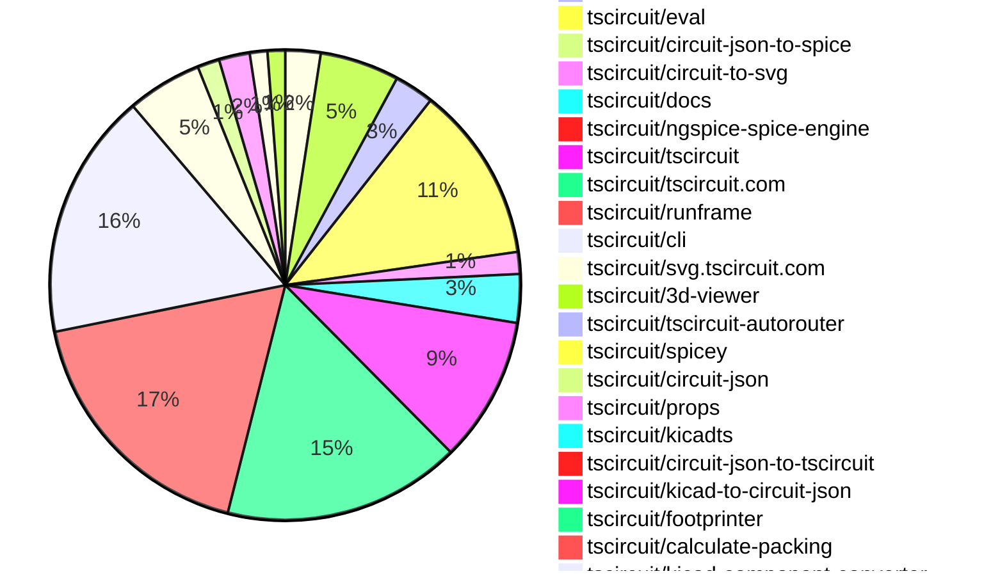
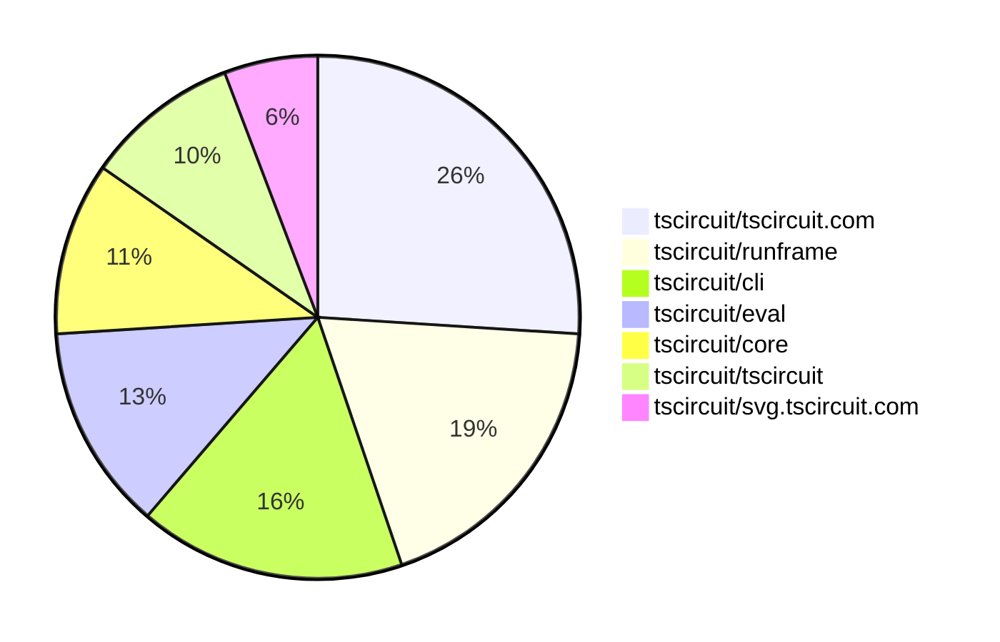

# Contribution Overview 2025-10-22

## PRs by Repository

## Contributor Overview

| Contributor | 🐳 Major | 🐙 Minor | 🐌 Tiny | ⭐ | Score | Discussion Contributions |
|-------------|---------|---------|---------|-----|----------------|--------------------------|
| [seveibar](#seveibar) | 7 | 23 | 16 | 👑👑 | 79 | 1🔹 0🔶 0💎 |
| [ArnavK-09](#ArnavK-09) | 7 | 7 | 12 | 👑 | 57 | 1🔹 0🔶 0💎 |
| [imrishabh18](#imrishabh18) | 7 | 7 | 6 | 👑 | 53 | 0🔹 0🔶 0💎 |
| [ShiboSoftwareDev](#ShiboSoftwareDev) | 1 | 7 | 4 | ⭐⭐⭐ | 32 | 0🔹 0🔶 0💎 |
| [Abse2001](#Abse2001) | 5 | 2 | 0 | ⭐⭐ | 26 | 0🔹 0🔶 0💎 |
| [tscircuitbot](#tscircuitbot) | 0 | 0 | 219 | ⭐⭐ | 17.5 | 0🔹 0🔶 0💎 |
| [techmannih](#techmannih) | 0 | 0 | 3 | ⭐⭐ | 14 | 0🔹 0🔶 0💎 |
| [Ayushjhawar8](#Ayushjhawar8) | 0 | 3 | 2 | ⭐ | 8 | 0🔹 0🔶 0💎 |
| [nailoo](#nailoo) | 0 | 0 | 3 | ⭐ | 7 | 0🔹 0🔶 0💎 |
| [MustafaMulla29](#MustafaMulla29) | 0 | 1 | 0 | ⭐ | 6 | 0🔹 0🔶 0💎 |
| [pxlpal](#pxlpal) | 0 | 2 | 1 | ⭐ | 5 | 0🔹 0🔶 0💎 |
| [RaghavArora14](#RaghavArora14) | 0 | 1 | 1 |  | 3 | 0🔹 0🔶 0💎 |
| [joncherry](#joncherry) | 0 | 0 | 1 |  | 2 | 0🔹 0🔶 0💎 |
| [zojize](#zojize) | 0 | 1 | 0 |  | 2 | 0🔹 0🔶 0💎 |
| [raykholo](#raykholo) | 0 | 0 | 1 |  | 2 | 0🔹 0🔶 0💎 |
| [brymut](#brymut) | 0 | 0 | 1 |  | 1 | 0🔹 0🔶 0💎 |
| [Anshgrover23](#Anshgrover23) | 0 | 0 | 0 |  | 0 | 1🔹 0🔶 0💎 |

### Discussion Contribution Legend

- 🔹 Normal Comments: Basic participation with minimal effort
- 🔶 Great Informative Comments: Thoughtful participation that adds value
- 💎 Incredible Comments: Exceptional participation with high-quality content

## Review Table

[reviews-received-hover]: ## "Number of reviews received for PRs for this contributor"
[approvals-received-hover]: ## "Number of approvals received for PRs this contributor authored"
[rejections-received-hover]: ## "Number of rejections received for PRs this contributor authored"
[prs-opened-hover]: ## "Number of PRs opened by this contributor"
[issues-created-hover]: ## "Number of issues created by this contributor"
[bountied-issues-hover]: ## "Number of issues this contributor created with a bounty"
[bountied-issue-$-hover]: ## "Total bounty amount placed on issues authored by this contributor"

| Contributor | Reviews Received | Approvals Received | Rejections Received | Approvals | Rejections | PRs Opened | PRs Merged | Score | Issues Created | Bountied Issues | Bountied Issue $ |
|---|---|---|---|---|---|---|---|---|---|---|---|
| [Excellencedev](#Excellencedev) | 2 | 0 | 1 | 0 | 0 | 1 | 0 | 0 | 0 | 0 | 0 |
| [nailoo](#nailoo) | 14 | 5 | 3 | 0 | 0 | 5 | 3 | 7 | 0 | 0 | 0 |
| [techmannih](#techmannih) | 10 | 5 | 2 | 3 | 1 | 9 | 3 | 14 | 0 | 0 | 0 |
| [ShiboSoftwareDev](#ShiboSoftwareDev) | 17 | 11 | 1 | 10 | 0 | 15 | 12 | 32 | 0 | 0 | 0 |
| [seveibar](#seveibar) | 26 | 5 | 0 | 55 | 10 | 57 | 47 | 79 | 0 | 0 | 0 |
| [imrishabh18](#imrishabh18) | 18 | 8 | 0 | 1 | 5 | 23 | 20 | 53 | 0 | 0 | 0 |
| [tscircuitbot](#tscircuitbot) | 0 | 0 | 0 | 0 | 0 | 247 | 219 | 17.5 | 0 | 0 | 0 |
| [Abse2001](#Abse2001) | 9 | 8 | 0 | 2 | 0 | 15 | 7 | 26 | 0 | 0 | 0 |
| [Ayushjhawar8](#Ayushjhawar8) | 17 | 6 | 1 | 0 | 0 | 8 | 5 | 8 | 0 | 0 | 0 |
| [Aqil-Ahmad](#Aqil-Ahmad) | 13 | 0 | 1 | 0 | 0 | 5 | 0 | 0 | 0 | 0 | 0 |
| [joncherry](#joncherry) | 13 | 3 | 1 | 0 | 0 | 2 | 1 | 2 | 0 | 0 | 0 |
| [Exceluyi](#Exceluyi) | 1 | 0 | 1 | 0 | 1 | 3 | 0 | 0 | 0 | 0 | 0 |
| [saurabhraghuvanshii](#saurabhraghuvanshii) | 4 | 0 | 0 | 0 | 0 | 1 | 0 | 0 | 0 | 0 | 0 |
| [MustafaMulla29](#MustafaMulla29) | 2 | 1 | 0 | 2 | 1 | 1 | 1 | 6 | 0 | 0 | 0 |
| [baeoc](#baeoc) | 0 | 0 | 0 | 0 | 0 | 1 | 0 | 0 | 0 | 0 | 0 |
| [RaghavArora14](#RaghavArora14) | 10 | 3 | 0 | 0 | 0 | 5 | 2 | 3 | 0 | 0 | 0 |
| [7908837174](#7908837174) | 1 | 0 | 0 | 0 | 0 | 1 | 0 | 0 | 0 | 0 | 0 |
| [Pranjal6955](#Pranjal6955) | 2 | 0 | 0 | 0 | 0 | 1 | 0 | 0 | 0 | 0 | 0 |
| [rushabhcodes](#rushabhcodes) | 8 | 1 | 0 | 0 | 0 | 5 | 0 | 0 | 0 | 0 | 0 |
| [Omar8345](#Omar8345) | 1 | 0 | 0 | 0 | 0 | 1 | 0 | 0 | 0 | 0 | 0 |
| [ArnavK-09](#ArnavK-09) | 21 | 11 | 1 | 2 | 0 | 27 | 26 | 57 | 0 | 0 | 0 |
| [dhvll](#dhvll) | 0 | 0 | 0 | 0 | 0 | 1 | 0 | 0 | 0 | 0 | 0 |
| [Sahelisaha04](#Sahelisaha04) | 0 | 0 | 0 | 0 | 0 | 1 | 0 | 0 | 0 | 0 | 0 |
| [jayantpranjal0](#jayantpranjal0) | 1 | 0 | 1 | 0 | 0 | 2 | 0 | 0 | 0 | 0 | 0 |
| [BuddhikaBICT-UoR-FoT-6](#BuddhikaBICT-UoR-FoT-6) | 3 | 1 | 2 | 0 | 0 | 3 | 0 | 0 | 0 | 0 | 0 |
| [divanshu-go](#divanshu-go) | 3 | 0 | 1 | 0 | 0 | 2 | 0 | 0 | 0 | 0 | 0 |
| [pkparthk](#pkparthk) | 1 | 0 | 0 | 0 | 0 | 1 | 0 | 0 | 0 | 0 | 0 |
| [Anshgrover23](#Anshgrover23) | 0 | 0 | 0 | 0 | 0 | 1 | 0 | 1 | 0 | 0 | 0 |
| [zojize](#zojize) | 1 | 1 | 0 | 0 | 0 | 1 | 1 | 2 | 0 | 0 | 0 |
| [brymut](#brymut) | 3 | 1 | 0 | 0 | 0 | 1 | 1 | 1 | 0 | 0 | 0 |
| [Asymtode712](#Asymtode712) | 0 | 0 | 0 | 0 | 0 | 2 | 0 | 0 | 0 | 0 | 0 |
| [pxlpal](#pxlpal) | 3 | 3 | 0 | 0 | 0 | 4 | 3 | 5 | 0 | 0 | 0 |
| [raykholo](#raykholo) | 13 | 2 | 0 | 0 | 0 | 2 | 1 | 2 | 0 | 0 | 0 |
| [7secondsquests-prog](#7secondsquests-prog) | 1 | 0 | 1 | 0 | 0 | 1 | 0 | 0 | 0 | 0 | 0 |
| [colmwoods](#colmwoods) | 0 | 0 | 0 | 0 | 0 | 1 | 0 | 0 | 0 | 0 | 0 |
| [1914Jegx](#1914Jegx) | 0 | 0 | 0 | 0 | 0 | 2 | 0 | 0 | 0 | 0 | 0 |
| [MayorChristopher](#MayorChristopher) | 2 | 0 | 1 | 0 | 0 | 3 | 0 | 0 | 0 | 0 | 0 |

## Top 7 Repositories by Contribution Points

## Changes by Repository

### [tscircuit/create-snippet-url](https://github.com/tscircuit/create-snippet-url)

| PR # | Impact | Rating | Contributor | Description |
|------|--------|--------|-------------|-------------|
| [#7](https://github.com/tscircuit/create-snippet-url/pull/7) | 🐳 Major | ⭐⭐⭐ | ShiboSoftwareDev | Adds support for the schsim SVG type in the createSvgUrl function, allowing it to generate URLs for schsim SVGs and includes a test case for this functionality. |
| [#8](https://github.com/tscircuit/create-snippet-url/pull/8) | 🐙 Minor | ⭐⭐ | ShiboSoftwareDev | Adds a simulationExperimentId option to createSvgUrl to support passing an experiment ID for schematic simulation SVGs. |

### [tscircuit/pcb-viewer](https://github.com/tscircuit/pcb-viewer)

| PR # | Impact | Rating | Contributor | Description |
|------|--------|--------|-------------|-------------|
| [#425](https://github.com/tscircuit/pcb-viewer/pull/425) | 🐳 Major | ⭐⭐⭐ | seveibar | Add snapping support to the dimension overlay tool, allowing dimensions to snap to nearby anchors when stretching dimensions. |
| [#430](https://github.com/tscircuit/pcb-viewer/pull/430) | 🐙 Minor | ⭐⭐ | ShiboSoftwareDev | Adds support for rendering pcb_panel elements in the PCB viewer, including updates to the circuit-json dependency and modifications to the element conversion logic. |
| [#427](https://github.com/tscircuit/pcb-viewer/pull/427) | 🐙 Minor | ⭐⭐ | ShiboSoftwareDev | Fixes incorrect rendering of pcb_note colors by utilizing a color library for parsing CSS color strings, ensuring proper display of colors instead of only on hover. |
| [#423](https://github.com/tscircuit/pcb-viewer/pull/423) | 🐙 Minor | ⭐⭐ | seveibar | Allows lowercase text rendering in PCB notes by importing an updated alphabet dataset and modifying the text conversion logic. |

🐌 Tiny Contributions (4)

| PR # | Impact | Contributor | Description |
|------|--------|-------------|-------------|
| [#431](https://github.com/tscircuit/pcb-viewer/pull/431) | 🐌 Tiny | tscircuitbot | Automated package update |
| [#429](https://github.com/tscircuit/pcb-viewer/pull/429) | 🐌 Tiny | tscircuitbot | Automated package update |
| [#428](https://github.com/tscircuit/pcb-viewer/pull/428) | 🐌 Tiny | tscircuitbot | Automated package update |
| [#424](https://github.com/tscircuit/pcb-viewer/pull/424) | 🐌 Tiny | tscircuitbot | Automated package update |

### [tscircuit/core](https://github.com/tscircuit/core)

| PR # | Impact | Rating | Contributor | Description |
|------|--------|--------|-------------|-------------|
| [#1585](https://github.com/tscircuit/core/pull/1585) | 🐳 Major | ⭐⭐⭐ | imrishabh18 | Fixes the schematic box component to prevent it from being rotated, ensuring correct orientation during layout. |
| [#1561](https://github.com/tscircuit/core/pull/1561) | 🐙 Minor | ⭐⭐ | ShiboSoftwareDev | Adds support for eecircuit-engine as an alternative SPICE simulation engine, including dynamic imports, new utility functions, and integration tests. |
| [#1588](https://github.com/tscircuit/core/pull/1588) | 🐙 Minor | ⭐⭐ | seveibar | Fixes polygon SMT pad rotation to ensure proper alignment and rendering of polygon pads in PCB layouts. |
| [#1586](https://github.com/tscircuit/core/pull/1586) | 🐙 Minor | ⭐⭐ | seveibar | Moves the async static asset resolver into a dedicated utility module and updates footprint URL loading to use the shared resolver utility while keeping CadModel cache-busting logic unchanged. |
| [#1584](https://github.com/tscircuit/core/pull/1584) | 🐙 Minor | ⭐⭐ | seveibar | Normalizes autorouter preset names so underscore variants map to the same configuration as their hyphenated counterparts and adds unit tests covering the auto_cloud preset alias behavior. |
| [#1583](https://github.com/tscircuit/core/pull/1583) | 🐙 Minor | ⭐⭐ | seveibar | Fixes a double-loading bug in the NormalComponent by replacing the isFootprintUrl function with isHttpUrl and isStaticAssetPath, improving clarity in variable names for footprint URLs. |
| [#1564](https://github.com/tscircuit/core/pull/1564) | 🐙 Minor | ⭐⭐ | seveibar | Adds support for inch units in PCB and fabrication note dimensions, updating the formatting and tests accordingly. |
| [#1566](https://github.com/tscircuit/core/pull/1566) | 🐙 Minor | ⭐⭐ | seveibar | Adds support for using width as an alias for thickness in trace properties and handles cases where pcbPath may be empty or undefined. |
| [#1559](https://github.com/tscircuit/core/pull/1559) | 🐙 Minor | ⭐⭐ | seveibar | Infers has_stroke for fabrication note rectangles when only a stroke width is provided and adds coverage for the defaulted stroke flag. |
| [#1555](https://github.com/tscircuit/core/pull/1555) | 🐙 Minor | ⭐⭐ | seveibar | Defaults PCB and fabrication note dimension text to the measured distance when no text is provided, formatting the generated text with whole numbers left as-is and other values rounded to two decimal places, and adds unit tests for the new behavior. |
| [#1574](https://github.com/tscircuit/core/pull/1574) | 🐙 Minor | ⭐⭐ | Ayushjhawar8 | Fixes error handling in the parts engine by validating responses and logging errors to Circuit JSON. |
| [#1570](https://github.com/tscircuit/core/pull/1570) | 🐙 Minor | ⭐⭐ | imrishabh18 | Fixes the mapping of facing_direction to the correct side_of_component values in the schematic layout. |
| [#1565](https://github.com/tscircuit/core/pull/1565) | 🐙 Minor | ⭐⭐ | imrishabh18 | Fixes autolayout issue for the pinHeader component when no explicit facingDirection is provided |
| [#1563](https://github.com/tscircuit/core/pull/1563) | 🐙 Minor | ⭐⭐ | imrishabh18 | Prevents rotation of pinheaders in autolayout when facingDirection is specified, ensuring correct schematic representation. |
| [#1558](https://github.com/tscircuit/core/pull/1558) | 🐙 Minor | ⭐⭐ | imrishabh18 | Updates the calculate-packing library to version 0.0.50, enabling support for packing with outlines and improving the initial positioning of components on the board. |
| [#1573](https://github.com/tscircuit/core/pull/1573) | 🐙 Minor | ⭐⭐ | Abse2001 | Fixes PCB snapshot generation issue when using polygon pads with other components in the circuit. |
| [#1578](https://github.com/tscircuit/core/pull/1578) | 🐙 Minor | ⭐⭐ | RaghavArora14 | Fixes the width calculation for schematic boxes to ensure it remains constant regardless of schPinSpacing value, addressing a bug where the width varied incorrectly based on pin spacing. |

🐌 Tiny Contributions (1)

| PR # | Impact | Contributor | Description |
|------|--------|-------------|-------------|
| [#1562](https://github.com/tscircuit/core/pull/1562) | 🐌 Tiny | imrishabh18 | Adds a test case to reproduce the issue where pinheader ports are floating away in schematic autolayout. |

### [tscircuit/contribution-tracker](https://github.com/tscircuit/contribution-tracker)

| PR # | Impact | Rating | Contributor | Description |
|------|--------|--------|-------------|-------------|
| [#245](https://github.com/tscircuit/contribution-tracker/pull/245) | 🐙 Minor | ⭐⭐ | ShiboSoftwareDev | Updated getContributorScore to not cap review points for maintainers and added a test case to verify that the review score cap is correctly bypassed for maintainers. |

🐌 Tiny Contributions (8)

| PR # | Impact | Contributor | Description |
|------|--------|-------------|-------------|
| [#232](https://github.com/tscircuit/contribution-tracker/pull/232) | 🐌 Tiny | seveibar | Adds techmannih as a maintainer in the maintainers list. |
| [#238](https://github.com/tscircuit/contribution-tracker/pull/238) | 🐌 Tiny | RaghavArora14 | Fix changelog to properly link to related PRs by converting 123 references to markdown links and handling PR number collisions across repositories. |
| [#246](https://github.com/tscircuit/contribution-tracker/pull/246) | 🐌 Tiny | ArnavK-09 | Updates the icons and roles of maintainers in the MaintainersList component, adding a new maintainer role with an associated icon. |
| [#244](https://github.com/tscircuit/contribution-tracker/pull/244) | 🐌 Tiny | ArnavK-09 | Fixes the incorrect usage of the GitHub API client in the notifications system by replacing octokit with githubBotOctokit. |
| [#241](https://github.com/tscircuit/contribution-tracker/pull/241) | 🐌 Tiny | ArnavK-09 | Adds a warning for missing GITHUB_BOT_TOKEN in the PR notification script |
| [#243](https://github.com/tscircuit/contribution-tracker/pull/243) | 🐌 Tiny | ArnavK-09 | Fixes the reference to the GITHUB_BOT_TOKEN secret in the Discord notifications workflow configuration. |
| [#242](https://github.com/tscircuit/contribution-tracker/pull/242) | 🐌 Tiny | ArnavK-09 | Adds a missing comma in the MAINTAINER_BASE object and modifies the GITHUB_BOT_TOKEN check for better logging. |
| [#240](https://github.com/tscircuit/contribution-tracker/pull/240) | 🐌 Tiny | ArnavK-09 | Swaps the icons and adjusts the priority levels for maintainers in the MaintainersList component, changing the visual representation and order of maintainers displayed. |

### [tscircuit/eval](https://github.com/tscircuit/eval)

| PR # | Impact | Rating | Contributor | Description |
|------|--------|--------|-------------|-------------|
| [#1402](https://github.com/tscircuit/eval/pull/1402) | 🐙 Minor | ⭐⭐ | ShiboSoftwareDev | Adds dynamic loading for the ngspice engine with a CDN fallback to ensure availability in both Node.js and browser environments without impacting initial load times. |
| [#1385](https://github.com/tscircuit/eval/pull/1385) | 🐙 Minor | ⭐⭐ | seveibar | Enables the transfer of platform configuration into a web worker using hybrid synchronous properties and proxied functions, allowing for dynamic updates to platform and project configurations. |
| [#1359](https://github.com/tscircuit/eval/pull/1359) | 🐙 Minor | ⭐⭐ | seveibar | Skip import type statements when collecting dependency names and add a regression test to ensure type-only imports do not trigger circular detection |
| [#1264](https://github.com/tscircuit/eval/pull/1264) | 🐙 Minor | ⭐⭐ | zojize | Fixes flakiness in tests caused by improper handling of async function clearEventListeners, ensuring consistent test results. |

🐌 Tiny Contributions (36)

| PR # | Impact | Contributor | Description |
|------|--------|-------------|-------------|
| [#1415](https://github.com/tscircuit/eval/pull/1415) | 🐌 Tiny | tscircuitbot | Automated package update |
| [#1414](https://github.com/tscircuit/eval/pull/1414) | 🐌 Tiny | tscircuitbot | Updates the version of the tscircuitcore package from 0.0.829 to 0.0.830 in package.json |
| [#1412](https://github.com/tscircuit/eval/pull/1412) | 🐌 Tiny | tscircuitbot | Automated package update |
| [#1410](https://github.com/tscircuit/eval/pull/1410) | 🐌 Tiny | tscircuitbot | Automated package update |
| [#1408](https://github.com/tscircuit/eval/pull/1408) | 🐌 Tiny | tscircuitbot | Automated package update |
| [#1407](https://github.com/tscircuit/eval/pull/1407) | 🐌 Tiny | tscircuitbot | Automated package update |
| [#1405](https://github.com/tscircuit/eval/pull/1405) | 🐌 Tiny | tscircuitbot | Automated package update |
| [#1404](https://github.com/tscircuit/eval/pull/1404) | 🐌 Tiny | tscircuitbot | Automated package update |
| [#1401](https://github.com/tscircuit/eval/pull/1401) | 🐌 Tiny | tscircuitbot | Automated package update |
| [#1400](https://github.com/tscircuit/eval/pull/1400) | 🐌 Tiny | tscircuitbot | Automated package update |
| [#1398](https://github.com/tscircuit/eval/pull/1398) | 🐌 Tiny | tscircuitbot | Automated package update |
| [#1397](https://github.com/tscircuit/eval/pull/1397) | 🐌 Tiny | tscircuitbot | Automated package update |
| [#1394](https://github.com/tscircuit/eval/pull/1394) | 🐌 Tiny | tscircuitbot | Automated package update |
| [#1393](https://github.com/tscircuit/eval/pull/1393) | 🐌 Tiny | tscircuitbot | Updates the version of the tscircuitcore package from 0.0.823 to 0.0.824 in package.json |
| [#1392](https://github.com/tscircuit/eval/pull/1392) | 🐌 Tiny | tscircuitbot | Automated package update to version 0.0.427 |
| [#1391](https://github.com/tscircuit/eval/pull/1391) | 🐌 Tiny | tscircuitbot | Automated package update |
| [#1389](https://github.com/tscircuit/eval/pull/1389) | 🐌 Tiny | tscircuitbot | Automated package update |
| [#1388](https://github.com/tscircuit/eval/pull/1388) | 🐌 Tiny | tscircuitbot | Updates the version of the tscircuitcore package from 0.0.821 to 0.0.822 in package.json |
| [#1386](https://github.com/tscircuit/eval/pull/1386) | 🐌 Tiny | tscircuitbot | Automated package update |
| [#1384](https://github.com/tscircuit/eval/pull/1384) | 🐌 Tiny | tscircuitbot | Automated package update |
| [#1383](https://github.com/tscircuit/eval/pull/1383) | 🐌 Tiny | tscircuitbot | Updates the version of the tscircuitcore package from 0.0.820 to 0.0.821 in package.json |
| [#1381](https://github.com/tscircuit/eval/pull/1381) | 🐌 Tiny | tscircuitbot | Automated package update |
| [#1380](https://github.com/tscircuit/eval/pull/1380) | 🐌 Tiny | tscircuitbot | Updates the version of the tscircuitcore package from 0.0.819 to 0.0.820 in package.json |
| [#1378](https://github.com/tscircuit/eval/pull/1378) | 🐌 Tiny | tscircuitbot | Automated package update |
| [#1377](https://github.com/tscircuit/eval/pull/1377) | 🐌 Tiny | tscircuitbot | Updates the version of the tscircuitcore package from 0.0.818 to 0.0.819 in package.json |
| [#1375](https://github.com/tscircuit/eval/pull/1375) | 🐌 Tiny | tscircuitbot | Automated package update |
| [#1374](https://github.com/tscircuit/eval/pull/1374) | 🐌 Tiny | tscircuitbot | Automated package update |
| [#1372](https://github.com/tscircuit/eval/pull/1372) | 🐌 Tiny | tscircuitbot | Automated package update |
| [#1371](https://github.com/tscircuit/eval/pull/1371) | 🐌 Tiny | tscircuitbot | Updates the version of the tscircuitcore package from 0.0.816 to 0.0.817 in package.json |
| [#1369](https://github.com/tscircuit/eval/pull/1369) | 🐌 Tiny | tscircuitbot | Automated package update |
| [#1368](https://github.com/tscircuit/eval/pull/1368) | 🐌 Tiny | tscircuitbot | Automated package update |
| [#1366](https://github.com/tscircuit/eval/pull/1366) | 🐌 Tiny | tscircuitbot | Automated package update |
| [#1365](https://github.com/tscircuit/eval/pull/1365) | 🐌 Tiny | tscircuitbot | Updates the version of the tscircuitcore package from 0.0.813 to 0.0.815 in package.json |
| [#1363](https://github.com/tscircuit/eval/pull/1363) | 🐌 Tiny | tscircuitbot | Automated package update |
| [#1362](https://github.com/tscircuit/eval/pull/1362) | 🐌 Tiny | tscircuitbot | Automated package update |
| [#1411](https://github.com/tscircuit/eval/pull/1411) | 🐌 Tiny | imrishabh18 | Updates the kicad-component-converter dependency to version 0.1.29 in package.json |

### [tscircuit/circuit-json-to-spice](https://github.com/tscircuit/circuit-json-to-spice)

| PR # | Impact | Rating | Contributor | Description |
|------|--------|--------|-------------|-------------|
| [#16](https://github.com/tscircuit/circuit-json-to-spice/pull/16) | 🐙 Minor | ⭐⭐ | ShiboSoftwareDev | Adds the UIC (Use Initial Conditions) flag to the .tran command for transient analysis, ensuring SPICE simulators use specified initial conditions for simulations involving oscillators or switching circuits. |

🐌 Tiny Contributions (1)

| PR # | Impact | Contributor | Description |
|------|--------|-------------|-------------|
| [#17](https://github.com/tscircuit/circuit-json-to-spice/pull/17) | 🐌 Tiny | seveibar | Adds circuit-json as a development and peer dependency in the package.json file. |

### [tscircuit/circuit-to-svg](https://github.com/tscircuit/circuit-to-svg)

| PR # | Impact | Rating | Contributor | Description |
|------|--------|--------|-------------|-------------|
| [#402](https://github.com/tscircuit/circuit-to-svg/pull/402) | 🐳 Major | ⭐⭐⭐ | seveibar | Add offset handling for PCB dimension annotations, allowing for offset distance and direction adjustments in dimension rendering. |
| [#403](https://github.com/tscircuit/circuit-to-svg/pull/403) | 🐳 Major | ⭐⭐⭐ | seveibar | Fixes the issue where pills are not being drawn properly in the SVG rendering of PCB components. |
| [#399](https://github.com/tscircuit/circuit-to-svg/pull/399) | 🐙 Minor | ⭐⭐ | Abse2001 | Fixes potential crashes when encountering non-numeric or missing width, height, or radius values in PCB SVG generation by safely parsing geometry values and updating calculations accordingly. |

🐌 Tiny Contributions (2)

| PR # | Impact | Contributor | Description |
|------|--------|-------------|-------------|
| [#397](https://github.com/tscircuit/circuit-to-svg/pull/397) | 🐌 Tiny | ShiboSoftwareDev | Updates the data points on simulation graphs to be solid dots instead of hollow circles and reduces their size for a cleaner appearance. |
| [#404](https://github.com/tscircuit/circuit-to-svg/pull/404) | 🐌 Tiny | seveibar | Removes the redundant PcbFabricationNoteDimensionWithOffset alias from the fabrication note dimension snapshot test and annotates the test fixtures directly with PcbFabricationNoteDimension. |

### [tscircuit/docs](https://github.com/tscircuit/docs)

| PR # | Impact | Rating | Contributor | Description |
|------|--------|--------|-------------|-------------|
| [#292](https://github.com/tscircuit/docs/pull/292) | 🐙 Minor | ⭐⭐ | Ayushjhawar8 | Adds documentation for importing JLCPCB components using the Run frame editor, including step-by-step instructions and example usage. |
| [#279](https://github.com/tscircuit/docs/pull/279) | 🐙 Minor | ⭐⭐ | pxlpal | Fixes the rendering issue of the fabrication note rectangle in the documentation. |
| [#278](https://github.com/tscircuit/docs/pull/278) | 🐙 Minor | ⭐⭐ | pxlpal | Adds detailed descriptions for various tscircuit Essentials categories to enhance user understanding and navigation. |

🐌 Tiny Contributions (8)

| PR # | Impact | Contributor | Description |
|------|--------|-------------|-------------|
| [#301](https://github.com/tscircuit/docs/pull/301) | 🐌 Tiny | ShiboSoftwareDev | Updates the dip4 glb model used in the project. |
| [#294](https://github.com/tscircuit/docs/pull/294) | 🐌 Tiny | ShiboSoftwareDev | Adds documentation for using web-compatible color names with the color prop on pcbnoterect . Includes a new section with a preview example demonstrating a yellow rectangle. |
| [#296](https://github.com/tscircuit/docs/pull/296) | 🐌 Tiny | seveibar | Hides schematic tabs and disables browser-based 3D rendering on all cutout previews, while removing the obsolete tips section from the cutout element documentation. |
| [#295](https://github.com/tscircuit/docs/pull/295) | 🐌 Tiny | seveibar | Documents the cutout  element and its supported shapes, including PCB previews for rectangular, circular, and polygon cutouts. |
| [#284](https://github.com/tscircuit/docs/pull/284) | 🐌 Tiny | seveibar | Documents the thickness trace property alongside width and adds a CircuitPreview example that shows using an empty pcbPath with a custom thickness for direct routing. |
| [#283](https://github.com/tscircuit/docs/pull/283) | 🐌 Tiny | seveibar | Updates the documentation for the pcbnotedimension  component to stop hardcoding measurement strings and clarify the use of the text property for overriding auto-generated labels. |
| [#281](https://github.com/tscircuit/docs/pull/281) | 🐌 Tiny | techmannih | Adds documentation for the cornerRadius property in the smtpad footprint, allowing users to specify rounded corners for rectangular pads. |
| [#297](https://github.com/tscircuit/docs/pull/297) | 🐌 Tiny | raykholo | Renames parameters x and y to pcbX and pcbY in via.mdx to align with the correct PCB terminology. |

### [tscircuit/ngspice-spice-engine](https://github.com/tscircuit/ngspice-spice-engine)

🐌 Tiny Contributions (2)

| PR # | Impact | Contributor | Description |
|------|--------|-------------|-------------|
| [#2](https://github.com/tscircuit/ngspice-spice-engine/pull/2) | 🐌 Tiny | ShiboSoftwareDev | Fixes a broken test that prevented publishing. |
| [#1](https://github.com/tscircuit/ngspice-spice-engine/pull/1) | 🐌 Tiny | seveibar | Bootstrap the Bun-based package configuration, workflows, and formatting setup; implement the ngspice spice engine wrapper with transient results parsing utilities; add unit tests covering transient parameter parsing and voltage graph extraction. |

### [tscircuit/tscircuit](https://github.com/tscircuit/tscircuit)

🐌 Tiny Contributions (33)

| PR # | Impact | Contributor | Description |
|------|--------|-------------|-------------|
| [#1171](https://github.com/tscircuit/tscircuit/pull/1171) | 🐌 Tiny | tscircuitbot | Automated package update |
| [#1170](https://github.com/tscircuit/tscircuit/pull/1170) | 🐌 Tiny | tscircuitbot | Updates the version of several packages in the project, including tscircuitcli, tscircuitcore, tscircuiteval, tscircuitprops, and tscircuitrunframe. |
| [#1169](https://github.com/tscircuit/tscircuit/pull/1169) | 🐌 Tiny | tscircuitbot | Automated package update |
| [#1168](https://github.com/tscircuit/tscircuit/pull/1168) | 🐌 Tiny | tscircuitbot | Automated package update |
| [#1167](https://github.com/tscircuit/tscircuit/pull/1167) | 🐌 Tiny | tscircuitbot | Automated package update |
| [#1166](https://github.com/tscircuit/tscircuit/pull/1166) | 🐌 Tiny | tscircuitbot | Updates the tscircuitcli package from version 0.1.390 to 0.1.391 and the tscircuitrunframe package from version 0.0.1154 to 0.0.1155 in package.json |
| [#1163](https://github.com/tscircuit/tscircuit/pull/1163) | 🐌 Tiny | tscircuitbot | Automated package update |
| [#1162](https://github.com/tscircuit/tscircuit/pull/1162) | 🐌 Tiny | tscircuitbot | Updates the package version from 0.0.813 to 0.0.814 in package.json |
| [#1161](https://github.com/tscircuit/tscircuit/pull/1161) | 🐌 Tiny | tscircuitbot | Automated package update |
| [#1160](https://github.com/tscircuit/tscircuit/pull/1160) | 🐌 Tiny | tscircuitbot | Automated package update |
| [#1159](https://github.com/tscircuit/tscircuit/pull/1159) | 🐌 Tiny | tscircuitbot | Automated package update |
| [#1158](https://github.com/tscircuit/tscircuit/pull/1158) | 🐌 Tiny | tscircuitbot | Automated package update |
| [#1157](https://github.com/tscircuit/tscircuit/pull/1157) | 🐌 Tiny | tscircuitbot | Updates the tscircuitcli package from version 0.1.386 to 0.1.387 and the tscircuitrunframe package from version 0.0.1150 to 0.0.1151 in the package.json file. |
| [#1155](https://github.com/tscircuit/tscircuit/pull/1155) | 🐌 Tiny | tscircuitbot | Updates the package version from 0.0.810 to 0.0.811 in package.json |
| [#1154](https://github.com/tscircuit/tscircuit/pull/1154) | 🐌 Tiny | tscircuitbot | Automated package update |
| [#1153](https://github.com/tscircuit/tscircuit/pull/1153) | 🐌 Tiny | tscircuitbot | Automated package update |
| [#1152](https://github.com/tscircuit/tscircuit/pull/1152) | 🐌 Tiny | tscircuitbot | Automated package update |
| [#1148](https://github.com/tscircuit/tscircuit/pull/1148) | 🐌 Tiny | tscircuitbot | Automated package update |
| [#1147](https://github.com/tscircuit/tscircuit/pull/1147) | 🐌 Tiny | tscircuitbot | Automated package update |
| [#1146](https://github.com/tscircuit/tscircuit/pull/1146) | 🐌 Tiny | tscircuitbot | Automated package update |
| [#1145](https://github.com/tscircuit/tscircuit/pull/1145) | 🐌 Tiny | tscircuitbot | Automated package update |
| [#1144](https://github.com/tscircuit/tscircuit/pull/1144) | 🐌 Tiny | tscircuitbot | Automated package update |
| [#1143](https://github.com/tscircuit/tscircuit/pull/1143) | 🐌 Tiny | tscircuitbot | Automated package update |
| [#1142](https://github.com/tscircuit/tscircuit/pull/1142) | 🐌 Tiny | tscircuitbot | Automated package update |
| [#1141](https://github.com/tscircuit/tscircuit/pull/1141) | 🐌 Tiny | tscircuitbot | Updates the tscircuitcli package from version 0.1.380 to 0.1.381 and the tscircuitrunframe package from version 0.0.1144 to 0.0.1145 in package.json |
| [#1139](https://github.com/tscircuit/tscircuit/pull/1139) | 🐌 Tiny | tscircuitbot | Updates the tscircuitcli package from version 0.1.379 to 0.1.380 and the tscircuitrunframe package from version 0.0.1143 to 0.0.1144 in package.json |
| [#1138](https://github.com/tscircuit/tscircuit/pull/1138) | 🐌 Tiny | tscircuitbot | Automated package update |
| [#1137](https://github.com/tscircuit/tscircuit/pull/1137) | 🐌 Tiny | tscircuitbot | Automated package update |
| [#1136](https://github.com/tscircuit/tscircuit/pull/1136) | 🐌 Tiny | tscircuitbot | Automated package update |
| [#1135](https://github.com/tscircuit/tscircuit/pull/1135) | 🐌 Tiny | tscircuitbot | Automated package update |
| [#1133](https://github.com/tscircuit/tscircuit/pull/1133) | 🐌 Tiny | tscircuitbot | Automated package update |
| [#1132](https://github.com/tscircuit/tscircuit/pull/1132) | 🐌 Tiny | tscircuitbot | Automated package update |
| [#1131](https://github.com/tscircuit/tscircuit/pull/1131) | 🐌 Tiny | seveibar | Adds resvgresvg-js as a dependency in package.json |

### [tscircuit/tscircuit.com](https://github.com/tscircuit/tscircuit.com)

| PR # | Impact | Rating | Contributor | Description |
|------|--------|--------|-------------|-------------|
| [#1877](https://github.com/tscircuit/tscircuit.com/pull/1877) | 🐳 Major | ⭐⭐⭐ | imrishabh18 | Adds support for real-time streaming of user code logs via Server-Sent Events (SSE) in the ConnectedRepoOverview component. |
| [#1869](https://github.com/tscircuit/tscircuit.com/pull/1869) | 🐳 Major | ⭐⭐⭐ | imrishabh18 | Adds a response interceptor to the shared axios instance to show a toast notification when backend responses return a 401 status, indicating that the session has expired. |
| [#1886](https://github.com/tscircuit/tscircuit.com/pull/1886) | 🐳 Major | ⭐⭐⭐ | ArnavK-09 | Adds tooltips for package actions in the EditorNav component to improve user guidance and interaction clarity. |
| [#1884](https://github.com/tscircuit/tscircuit.com/pull/1884) | 🐳 Major | ⭐⭐⭐ | ArnavK-09 | Adds functionality to delete organizations, including validation for ownership and existence, along with corresponding tests and UI components. |
| [#1846](https://github.com/tscircuit/tscircuit.com/pull/1846) | 🐳 Major | ⭐⭐⭐ | ArnavK-09 | Adds normalization for organization names in the create organization API to convert names with spaces and special characters to kebab-case, enforces name length constraints, modifies organization creation logic to use the normalized name while preserving the original display name, updates tests to verify normalization functionality, and adjusts the organization header component to display the normalized name when available. |
| [#1880](https://github.com/tscircuit/tscircuit.com/pull/1880) | 🐳 Major | ⭐⭐⭐ | ArnavK-09 | Refactors the unauthorized toast notification to provide a clickable sign-in prompt when a 401 error occurs. |
| [#1852](https://github.com/tscircuit/tscircuit.com/pull/1852) | 🐳 Major | ⭐⭐⭐ | ArnavK-09 | Adds support for a display name in organization settings, including database schema updates, organization creation logic, and UI modifications to display the new field. |
| [#1844](https://github.com/tscircuit/tscircuit.com/pull/1844) | 🐳 Major | ⭐⭐⭐ | ArnavK-09 | Adds functionality to update organization member permissions via API, including permission checks and error handling for various scenarios. |
| [#1843](https://github.com/tscircuit/tscircuit.com/pull/1843) | 🐳 Major | ⭐⭐⭐ | ArnavK-09 | Fixes saving issues related to package files by adding POST method support and adjusting caching behavior. |
| [#1856](https://github.com/tscircuit/tscircuit.com/pull/1856) | 🐙 Minor | ⭐⭐ | seveibar | Add GET apibug_reportsdownload_zip endpoint to bundle bug report files into a zip archive and return 403404 errors when access is forbidden or the report is missing. |
| [#1873](https://github.com/tscircuit/tscircuit.com/pull/1873) | 🐙 Minor | ⭐⭐ | imrishabh18 | Fixes the breaking build page issue by providing error handling for user code build errors, ensuring that error messages are displayed correctly without crashing the interface. |
| [#1871](https://github.com/tscircuit/tscircuit.com/pull/1871) | 🐙 Minor | ⭐⭐ | imrishabh18 | Adds user code logging functionality to track the execution of user-defined code jobs, including start and completion timestamps, logs, and error messages. |
| [#1836](https://github.com/tscircuit/tscircuit.com/pull/1836) | 🐙 Minor | ⭐⭐ | imrishabh18 | Fixes session management by ensuring that the session is invalidated after a user signs out, preventing unauthorized access with stale session tokens. |
| [#1895](https://github.com/tscircuit/tscircuit.com/pull/1895) | 🐙 Minor | ⭐⭐ | ArnavK-09 | Fixes the JLCPCB import functionality by adding a new API base URL for JLCPCB components. |
| [#1899](https://github.com/tscircuit/tscircuit.com/pull/1899) | 🐙 Minor | ⭐⭐ | ArnavK-09 | Adds a DELETE endpoint for account deletion, including tests for successful deletion and handling of non-existent accounts. |
| [#1882](https://github.com/tscircuit/tscircuit.com/pull/1882) | 🐙 Minor | ⭐⭐ | ArnavK-09 | Add usePackageReleaseDbImages for 3DPCBSchematic previews, replace usePackageReleaseImages and pass packageRelease directly, remove unused import in release-builds, fix 1855 |
| [#1885](https://github.com/tscircuit/tscircuit.com/pull/1885) | 🐙 Minor | ⭐⭐ | ArnavK-09 | Replaces the alert notification with a toast notification for confirming URL copy in EditorNav. |
| [#1860](https://github.com/tscircuit/tscircuit.com/pull/1860) | 🐙 Minor | ⭐⭐ | ArnavK-09 | Adds owner_org_id as an optional filtering parameter in the package list API and updates the organization profile page to use owner_org_id for package retrieval. |

🐌 Tiny Contributions (36)

| PR # | Impact | Contributor | Description |
|------|--------|-------------|-------------|
| [#1903](https://github.com/tscircuit/tscircuit.com/pull/1903) | 🐌 Tiny | tscircuitbot | Updates the tscircuiteval package to version 0.0.435 in package.json |
| [#1902](https://github.com/tscircuit/tscircuit.com/pull/1902) | 🐌 Tiny | tscircuitbot | Automated package update to version 0.0.134 |
| [#1897](https://github.com/tscircuit/tscircuit.com/pull/1897) | 🐌 Tiny | tscircuitbot | Automated package update |
| [#1896](https://github.com/tscircuit/tscircuit.com/pull/1896) | 🐌 Tiny | tscircuitbot | Automated package update |
| [#1888](https://github.com/tscircuit/tscircuit.com/pull/1888) | 🐌 Tiny | tscircuitbot | Updates the tscircuiteval package to version 0.0.432 in the package.json file. |
| [#1887](https://github.com/tscircuit/tscircuit.com/pull/1887) | 🐌 Tiny | tscircuitbot | Automated package update to version 0.0.133 |
| [#1883](https://github.com/tscircuit/tscircuit.com/pull/1883) | 🐌 Tiny | tscircuitbot | Automated package update |
| [#1875](https://github.com/tscircuit/tscircuit.com/pull/1875) | 🐌 Tiny | tscircuitbot | Automated package update |
| [#1872](https://github.com/tscircuit/tscircuit.com/pull/1872) | 🐌 Tiny | tscircuitbot | Updates the package version from 0.0.129 to 0.0.130 in package.json |
| [#1870](https://github.com/tscircuit/tscircuit.com/pull/1870) | 🐌 Tiny | tscircuitbot | Automated package update |
| [#1868](https://github.com/tscircuit/tscircuit.com/pull/1868) | 🐌 Tiny | tscircuitbot | Updates the tscircuiteval package from version 0.0.428 to 0.0.429 in the package.json file. |
| [#1867](https://github.com/tscircuit/tscircuit.com/pull/1867) | 🐌 Tiny | tscircuitbot | Updates the tscircuiteval package from version 0.0.427 to 0.0.428 |
| [#1866](https://github.com/tscircuit/tscircuit.com/pull/1866) | 🐌 Tiny | tscircuitbot | Updates the tscircuiteval package from version 0.0.426 to 0.0.427 |
| [#1863](https://github.com/tscircuit/tscircuit.com/pull/1863) | 🐌 Tiny | tscircuitbot | Updates the tscircuiteval package from version 0.0.424 to 0.0.426 in the package.json file. |
| [#1861](https://github.com/tscircuit/tscircuit.com/pull/1861) | 🐌 Tiny | tscircuitbot | Automated package update to version 0.0.129 |
| [#1857](https://github.com/tscircuit/tscircuit.com/pull/1857) | 🐌 Tiny | tscircuitbot | Automated package update to version 0.0.128 |
| [#1853](https://github.com/tscircuit/tscircuit.com/pull/1853) | 🐌 Tiny | tscircuitbot | Automated package update to version 0.0.127 |
| [#1851](https://github.com/tscircuit/tscircuit.com/pull/1851) | 🐌 Tiny | tscircuitbot | Updates the tscircuiteval package to version 0.0.424 in the package.json file. |
| [#1850](https://github.com/tscircuit/tscircuit.com/pull/1850) | 🐌 Tiny | tscircuitbot | Updates the tscircuiteval package to version 0.0.423 in the package.json file |
| [#1849](https://github.com/tscircuit/tscircuit.com/pull/1849) | 🐌 Tiny | tscircuitbot | Updates the tscircuiteval package from version 0.0.421 to 0.0.422 in the package.json file. |
| [#1848](https://github.com/tscircuit/tscircuit.com/pull/1848) | 🐌 Tiny | tscircuitbot | Automated package update |
| [#1847](https://github.com/tscircuit/tscircuit.com/pull/1847) | 🐌 Tiny | tscircuitbot | Automated package update |
| [#1845](https://github.com/tscircuit/tscircuit.com/pull/1845) | 🐌 Tiny | tscircuitbot | Automated package update to version 0.0.125 |
| [#1842](https://github.com/tscircuit/tscircuit.com/pull/1842) | 🐌 Tiny | tscircuitbot | Automated package update |
| [#1840](https://github.com/tscircuit/tscircuit.com/pull/1840) | 🐌 Tiny | tscircuitbot | Automated package update |
| [#1838](https://github.com/tscircuit/tscircuit.com/pull/1838) | 🐌 Tiny | tscircuitbot | Updates the tscircuiteval package from version 0.0.416 to 0.0.418 in the package.json file. |
| [#1837](https://github.com/tscircuit/tscircuit.com/pull/1837) | 🐌 Tiny | tscircuitbot | Updates the package version from 0.0.123 to 0.0.124 in package.json |
| [#1834](https://github.com/tscircuit/tscircuit.com/pull/1834) | 🐌 Tiny | tscircuitbot | Updates the tscircuiteval package from version 0.0.415 to 0.0.416 |
| [#1876](https://github.com/tscircuit/tscircuit.com/pull/1876) | 🐌 Tiny | seveibar | Polyfills the Node.js process global for browser builds to prevent crashes during TypeScript tooling execution and defines a stubbed process.env in Vite config for safe lookups during bundling. |
| [#1898](https://github.com/tscircuit/tscircuit.com/pull/1898) | 🐌 Tiny | imrishabh18 | Updates the version of the circuit-json-to-tscircuit dependency from 0.0.9 to 0.0.11 in package.json |
| [#1901](https://github.com/tscircuit/tscircuit.com/pull/1901) | 🐌 Tiny | ArnavK-09 | Updates the tscircuitrunframe dependency to version 0.0.1164 in package.json |
| [#1865](https://github.com/tscircuit/tscircuit.com/pull/1865) | 🐌 Tiny | ArnavK-09 | Adjusts the margin of the Discord logo link in the header for consistent styling across the application. |
| [#1859](https://github.com/tscircuit/tscircuit.com/pull/1859) | 🐌 Tiny | ArnavK-09 | Updated logic to extract package owner and name from the full package name format, improved readability by using descriptive variable names for owner and package name, and ensured consistent handling of package information across components. |
| [#1858](https://github.com/tscircuit/tscircuit.com/pull/1858) | 🐌 Tiny | ArnavK-09 | Adjusts the display of organization ID to slice the string to 10 characters instead of 8 and ensures that the organization ID is always included in the save operation, regardless of ownership status. |
| [#1841](https://github.com/tscircuit/tscircuit.com/pull/1841) | 🐌 Tiny | ArnavK-09 | Ensures uniform button widths in the NotFound component for consistent styling across the application. |
| [#1839](https://github.com/tscircuit/tscircuit.com/pull/1839) | 🐌 Tiny | ArnavK-09 | Fixes the return value in the useListOrgMembers hook to align with the API response by changing data.members to data.org_members. |

### [tscircuit/runframe](https://github.com/tscircuit/runframe)

| PR # | Impact | Rating | Contributor | Description |
|------|--------|--------|-------------|-------------|
| [#1569](https://github.com/tscircuit/runframe/pull/1569) | 🐳 Major | ⭐⭐⭐ | seveibar | Replaces micromatch usage with minimatch for board file filtering in getBoardFilesFromConfig, adds unit tests for config glob matching and default file detection, and updates dependencies to drop micromatch in favor of minimatch. |
| [#1542](https://github.com/tscircuit/runframe/pull/1542) | 🐙 Minor | ⭐⭐ | seveibar | Fixes the bug report dialog link to ensure it always points to the production bug report viewer. |
| [#1581](https://github.com/tscircuit/runframe/pull/1581) | 🐙 Minor | ⭐⭐ | ArnavK-09 | Allows users to set a custom API base URL for tscircuit.com in the ImportComponentDialog2 component. |
| [#1560](https://github.com/tscircuit/runframe/pull/1560) | 🐙 Minor | ⭐⭐ | ArnavK-09 | Adds optional projectBaseUrl to support custom project URLs and introduces platformConfig for the eval webworker to allow platform-specific configurations. |

🐌 Tiny Contributions (55)

| PR # | Impact | Contributor | Description |
|------|--------|-------------|-------------|
| [#1590](https://github.com/tscircuit/runframe/pull/1590) | 🐌 Tiny | tscircuitbot | Automated package update |
| [#1589](https://github.com/tscircuit/runframe/pull/1589) | 🐌 Tiny | tscircuitbot | Updates the tscircuiteval package to version 0.0.435 |
| [#1588](https://github.com/tscircuit/runframe/pull/1588) | 🐌 Tiny | tscircuitbot | Automated package update |
| [#1587](https://github.com/tscircuit/runframe/pull/1587) | 🐌 Tiny | tscircuitbot | Automated package update |
| [#1586](https://github.com/tscircuit/runframe/pull/1586) | 🐌 Tiny | tscircuitbot | Updates the tscircuitpcb-viewer package from version 1.11.239 to 1.11.240 |
| [#1585](https://github.com/tscircuit/runframe/pull/1585) | 🐌 Tiny | tscircuitbot | Automated package update |
| [#1584](https://github.com/tscircuit/runframe/pull/1584) | 🐌 Tiny | tscircuitbot | Updates the tscircuiteval package to version 0.0.434 |
| [#1583](https://github.com/tscircuit/runframe/pull/1583) | 🐌 Tiny | tscircuitbot | Updates the package version from 0.0.1160 to 0.0.1161 in package.json |
| [#1582](https://github.com/tscircuit/runframe/pull/1582) | 🐌 Tiny | tscircuitbot | Updates the tscircuiteval package version from 0.0.431 to 0.0.433 in package.json |
| [#1580](https://github.com/tscircuit/runframe/pull/1580) | 🐌 Tiny | tscircuitbot | Automated package update |
| [#1579](https://github.com/tscircuit/runframe/pull/1579) | 🐌 Tiny | tscircuitbot | Updates the tscircuiteval package to version 0.0.431 in the package.json file. |
| [#1578](https://github.com/tscircuit/runframe/pull/1578) | 🐌 Tiny | tscircuitbot | Automated package update |
| [#1577](https://github.com/tscircuit/runframe/pull/1577) | 🐌 Tiny | tscircuitbot | Updates the tscircuiteval package from version 0.0.429 to 0.0.430 |
| [#1576](https://github.com/tscircuit/runframe/pull/1576) | 🐌 Tiny | tscircuitbot | Automated package update |
| [#1575](https://github.com/tscircuit/runframe/pull/1575) | 🐌 Tiny | tscircuitbot | Updates the tscircuiteval package from version 0.0.428 to 0.0.429 |
| [#1574](https://github.com/tscircuit/runframe/pull/1574) | 🐌 Tiny | tscircuitbot | Automated package update |
| [#1573](https://github.com/tscircuit/runframe/pull/1573) | 🐌 Tiny | tscircuitbot | Updates the tscircuiteval package from version 0.0.427 to 0.0.428 |
| [#1572](https://github.com/tscircuit/runframe/pull/1572) | 🐌 Tiny | tscircuitbot | Automated package update |
| [#1571](https://github.com/tscircuit/runframe/pull/1571) | 🐌 Tiny | tscircuitbot | Updates the tscircuit3d-viewer package to version 0.0.421 in package.json |
| [#1570](https://github.com/tscircuit/runframe/pull/1570) | 🐌 Tiny | tscircuitbot | Automated package update to version 0.0.1155 |
| [#1568](https://github.com/tscircuit/runframe/pull/1568) | 🐌 Tiny | tscircuitbot | Automated package update |
| [#1567](https://github.com/tscircuit/runframe/pull/1567) | 🐌 Tiny | tscircuitbot | Automated package update |
| [#1566](https://github.com/tscircuit/runframe/pull/1566) | 🐌 Tiny | tscircuitbot | Automated package update |
| [#1565](https://github.com/tscircuit/runframe/pull/1565) | 🐌 Tiny | tscircuitbot | Updates the tscircuitpcb-viewer package to version 1.11.239 |
| [#1562](https://github.com/tscircuit/runframe/pull/1562) | 🐌 Tiny | tscircuitbot | Updates the tscircuiteval package from version 0.0.424 to 0.0.425 in the package.json file. |
| [#1561](https://github.com/tscircuit/runframe/pull/1561) | 🐌 Tiny | tscircuitbot | Automated package version bump from 0.0.1150 to 0.0.1151 |
| [#1559](https://github.com/tscircuit/runframe/pull/1559) | 🐌 Tiny | tscircuitbot | Automated package update |
| [#1558](https://github.com/tscircuit/runframe/pull/1558) | 🐌 Tiny | tscircuitbot | Updates the tscircuitpcb-viewer package from version 1.11.237 to 1.11.238 |
| [#1557](https://github.com/tscircuit/runframe/pull/1557) | 🐌 Tiny | tscircuitbot | Automated package update |
| [#1556](https://github.com/tscircuit/runframe/pull/1556) | 🐌 Tiny | tscircuitbot | Updates the tscircuiteval package to version 0.0.424 in the package.json file. |
| [#1555](https://github.com/tscircuit/runframe/pull/1555) | 🐌 Tiny | tscircuitbot | Updates the package version from 0.0.1147 to 0.0.1148 in package.json |
| [#1554](https://github.com/tscircuit/runframe/pull/1554) | 🐌 Tiny | tscircuitbot | Updates the tscircuiteval package from version 0.0.422 to 0.0.423 |
| [#1553](https://github.com/tscircuit/runframe/pull/1553) | 🐌 Tiny | tscircuitbot | Updates the package version from 0.0.1146 to 0.0.1147 in package.json |
| [#1552](https://github.com/tscircuit/runframe/pull/1552) | 🐌 Tiny | tscircuitbot | Automated package update |
| [#1551](https://github.com/tscircuit/runframe/pull/1551) | 🐌 Tiny | tscircuitbot | Updates the package version from 0.0.1145 to 0.0.1146 in package.json |
| [#1550](https://github.com/tscircuit/runframe/pull/1550) | 🐌 Tiny | tscircuitbot | Updates the tscircuiteval package to version 0.0.421 in the package.json file. |
| [#1549](https://github.com/tscircuit/runframe/pull/1549) | 🐌 Tiny | tscircuitbot | Automated package update |
| [#1548](https://github.com/tscircuit/runframe/pull/1548) | 🐌 Tiny | tscircuitbot | Automated package update |
| [#1547](https://github.com/tscircuit/runframe/pull/1547) | 🐌 Tiny | tscircuitbot | Updates the package version from 0.0.1143 to 0.0.1144 in package.json |
| [#1546](https://github.com/tscircuit/runframe/pull/1546) | 🐌 Tiny | tscircuitbot | Automated package update |
| [#1545](https://github.com/tscircuit/runframe/pull/1545) | 🐌 Tiny | tscircuitbot | Updates the tscircuiteval package to version 0.0.420 in package.json |
| [#1544](https://github.com/tscircuit/runframe/pull/1544) | 🐌 Tiny | tscircuitbot | Automated package update |
| [#1543](https://github.com/tscircuit/runframe/pull/1543) | 🐌 Tiny | tscircuitbot | Updates the tscircuiteval package to version 0.0.419 |
| [#1541](https://github.com/tscircuit/runframe/pull/1541) | 🐌 Tiny | tscircuitbot | Automated package update to version 0.0.1141 |
| [#1540](https://github.com/tscircuit/runframe/pull/1540) | 🐌 Tiny | tscircuitbot | Updates the tscircuiteval package from version 0.0.416 to 0.0.418 |
| [#1539](https://github.com/tscircuit/runframe/pull/1539) | 🐌 Tiny | tscircuitbot | Automated package update |
| [#1537](https://github.com/tscircuit/runframe/pull/1537) | 🐌 Tiny | tscircuitbot | Automated package update |
| [#1536](https://github.com/tscircuit/runframe/pull/1536) | 🐌 Tiny | tscircuitbot | Updates the package version from 0.0.1137 to 0.0.1138 in package.json |
| [#1532](https://github.com/tscircuit/runframe/pull/1532) | 🐌 Tiny | tscircuitbot | Updates the tscircuit3d-viewer package to version 0.0.419 in package.json |
| [#1530](https://github.com/tscircuit/runframe/pull/1530) | 🐌 Tiny | tscircuitbot | Updates the tscircuiteval package to version 0.0.416 |
| [#1529](https://github.com/tscircuit/runframe/pull/1529) | 🐌 Tiny | tscircuitbot | Updates the tscircuitpcb-viewer package from version 1.11.236 to 1.11.237 |
| [#1538](https://github.com/tscircuit/runframe/pull/1538) | 🐌 Tiny | Ayushjhawar8 | Removes the duplicate jose dependency from the package.json file. |
| [#1533](https://github.com/tscircuit/runframe/pull/1533) | 🐌 Tiny | Ayushjhawar8 | Try to address these point img width828 height547 altimage srchttps:github.comuser-attachmentsassets13ea2a8e-6e03-466c-b989-ce963ec0ba91 |
| [#1535](https://github.com/tscircuit/runframe/pull/1535) | 🐌 Tiny | imrishabh18 | This pull request adds the jose package to the project to resolve issues related to publishing. |
| [#1534](https://github.com/tscircuit/runframe/pull/1534) | 🐌 Tiny | imrishabh18 | This pull request addresses issues with the lockfile to ensure proper publishing of the package. It updates the lockfile to reflect the correct dependencies and versions needed for the project. |

### [tscircuit/cli](https://github.com/tscircuit/cli)

| PR # | Impact | Rating | Contributor | Description |
|------|--------|--------|-------------|-------------|
| [#718](https://github.com/tscircuit/cli/pull/718) | 🐙 Minor | ⭐⭐ | seveibar | Extracts the bug report clone workflow into a dedicated helper, shares the existing-directory prompt between package and bug-report clones, and keeps the clone command handler focused on dispatching between package and bug report flows. |

🐌 Tiny Contributions (55)

| PR # | Impact | Contributor | Description |
|------|--------|-------------|-------------|
| [#748](https://github.com/tscircuit/cli/pull/748) | 🐌 Tiny | tscircuitbot | Automated package update |
| [#747](https://github.com/tscircuit/cli/pull/747) | 🐌 Tiny | tscircuitbot | Automated package update |
| [#746](https://github.com/tscircuit/cli/pull/746) | 🐌 Tiny | tscircuitbot | Automated package update |
| [#745](https://github.com/tscircuit/cli/pull/745) | 🐌 Tiny | tscircuitbot | Updates the tscircuitrunframe package from version 0.0.1163 to 0.0.1164 |
| [#744](https://github.com/tscircuit/cli/pull/744) | 🐌 Tiny | tscircuitbot | Automated package update |
| [#743](https://github.com/tscircuit/cli/pull/743) | 🐌 Tiny | tscircuitbot | Automated package update |
| [#742](https://github.com/tscircuit/cli/pull/742) | 🐌 Tiny | tscircuitbot | Automated package update |
| [#741](https://github.com/tscircuit/cli/pull/741) | 🐌 Tiny | tscircuitbot | Updates the tscircuitrunframe package to version 0.0.1162 in the package.json file. |
| [#740](https://github.com/tscircuit/cli/pull/740) | 🐌 Tiny | tscircuitbot | Automated package update |
| [#739](https://github.com/tscircuit/cli/pull/739) | 🐌 Tiny | tscircuitbot | Updates the tscircuitrunframe package from version 0.0.1160 to 0.0.1161 |
| [#738](https://github.com/tscircuit/cli/pull/738) | 🐌 Tiny | tscircuitbot | Automated package update |
| [#737](https://github.com/tscircuit/cli/pull/737) | 🐌 Tiny | tscircuitbot | Automated package update |
| [#736](https://github.com/tscircuit/cli/pull/736) | 🐌 Tiny | tscircuitbot | Updates the tscircuitrunframe package to version 0.0.1160 |
| [#735](https://github.com/tscircuit/cli/pull/735) | 🐌 Tiny | tscircuitbot | Automated package update |
| [#734](https://github.com/tscircuit/cli/pull/734) | 🐌 Tiny | tscircuitbot | Updates the tscircuitrunframe package from version 0.0.1158 to 0.0.1159 |
| [#733](https://github.com/tscircuit/cli/pull/733) | 🐌 Tiny | tscircuitbot | Automated package update |
| [#732](https://github.com/tscircuit/cli/pull/732) | 🐌 Tiny | tscircuitbot | Updates the tscircuitrunframe package from version 0.0.1157 to 0.0.1158 |
| [#731](https://github.com/tscircuit/cli/pull/731) | 🐌 Tiny | tscircuitbot | Automated package update |
| [#730](https://github.com/tscircuit/cli/pull/730) | 🐌 Tiny | tscircuitbot | Updates the tscircuitrunframe package from version 0.0.1155 to 0.0.1157 |
| [#728](https://github.com/tscircuit/cli/pull/728) | 🐌 Tiny | tscircuitbot | Automated package update |
| [#727](https://github.com/tscircuit/cli/pull/727) | 🐌 Tiny | tscircuitbot | Updates the tscircuitrunframe package from version 0.0.1154 to 0.0.1155 |
| [#726](https://github.com/tscircuit/cli/pull/726) | 🐌 Tiny | tscircuitbot | Automated package update |
| [#725](https://github.com/tscircuit/cli/pull/725) | 🐌 Tiny | tscircuitbot | Updates the tscircuitrunframe package from version 0.0.1153 to 0.0.1154 |
| [#724](https://github.com/tscircuit/cli/pull/724) | 🐌 Tiny | tscircuitbot | Automated package update |
| [#723](https://github.com/tscircuit/cli/pull/723) | 🐌 Tiny | tscircuitbot | Updates the tscircuitrunframe package from version 0.0.1152 to 0.0.1153 in the package.json file. |
| [#722](https://github.com/tscircuit/cli/pull/722) | 🐌 Tiny | tscircuitbot | Automated package update |
| [#721](https://github.com/tscircuit/cli/pull/721) | 🐌 Tiny | tscircuitbot | Updates the tscircuitrunframe package from version 0.0.1151 to 0.0.1152 |
| [#720](https://github.com/tscircuit/cli/pull/720) | 🐌 Tiny | tscircuitbot | Automated package update |
| [#719](https://github.com/tscircuit/cli/pull/719) | 🐌 Tiny | tscircuitbot | Updates the tscircuitrunframe package from version 0.0.1150 to 0.0.1151 |
| [#717](https://github.com/tscircuit/cli/pull/717) | 🐌 Tiny | tscircuitbot | Automated package update |
| [#716](https://github.com/tscircuit/cli/pull/716) | 🐌 Tiny | tscircuitbot | Updates the tscircuitrunframe package from version 0.0.1149 to 0.0.1150 |
| [#715](https://github.com/tscircuit/cli/pull/715) | 🐌 Tiny | tscircuitbot | Automated package update |
| [#714](https://github.com/tscircuit/cli/pull/714) | 🐌 Tiny | tscircuitbot | Updates the tscircuitrunframe package to version 0.0.1149 in the package.json file. |
| [#713](https://github.com/tscircuit/cli/pull/713) | 🐌 Tiny | tscircuitbot | Automated package update |
| [#712](https://github.com/tscircuit/cli/pull/712) | 🐌 Tiny | tscircuitbot | Updates the tscircuitrunframe package from version 0.0.1147 to 0.0.1148 |
| [#711](https://github.com/tscircuit/cli/pull/711) | 🐌 Tiny | tscircuitbot | Automated package update |
| [#710](https://github.com/tscircuit/cli/pull/710) | 🐌 Tiny | tscircuitbot | Updates the tscircuitrunframe package to version 0.0.1147 in the package.json file. |
| [#709](https://github.com/tscircuit/cli/pull/709) | 🐌 Tiny | tscircuitbot | Automated package update to version 0.1.382 |
| [#708](https://github.com/tscircuit/cli/pull/708) | 🐌 Tiny | tscircuitbot | Updates the tscircuitrunframe package from version 0.0.1145 to 0.0.1146 |
| [#707](https://github.com/tscircuit/cli/pull/707) | 🐌 Tiny | tscircuitbot | Automated package update |
| [#706](https://github.com/tscircuit/cli/pull/706) | 🐌 Tiny | tscircuitbot | Updates the tscircuitrunframe package from version 0.0.1144 to 0.0.1145 |
| [#705](https://github.com/tscircuit/cli/pull/705) | 🐌 Tiny | tscircuitbot | Automated package update |
| [#704](https://github.com/tscircuit/cli/pull/704) | 🐌 Tiny | tscircuitbot | Updates the tscircuitrunframe package from version 0.0.1143 to 0.0.1144 |
| [#703](https://github.com/tscircuit/cli/pull/703) | 🐌 Tiny | tscircuitbot | Automated package update |
| [#702](https://github.com/tscircuit/cli/pull/702) | 🐌 Tiny | tscircuitbot | Updates the tscircuitrunframe package from version 0.0.1142 to 0.0.1143 |
| [#701](https://github.com/tscircuit/cli/pull/701) | 🐌 Tiny | tscircuitbot | Automated package update |
| [#700](https://github.com/tscircuit/cli/pull/700) | 🐌 Tiny | tscircuitbot | Updates the tscircuitrunframe package from version 0.0.1141 to 0.0.1142 |
| [#699](https://github.com/tscircuit/cli/pull/699) | 🐌 Tiny | tscircuitbot | Automated package update |
| [#698](https://github.com/tscircuit/cli/pull/698) | 🐌 Tiny | tscircuitbot | Updates the tscircuitrunframe package from version 0.0.1140 to 0.0.1141 |
| [#697](https://github.com/tscircuit/cli/pull/697) | 🐌 Tiny | tscircuitbot | Automated package update |
| [#696](https://github.com/tscircuit/cli/pull/696) | 🐌 Tiny | tscircuitbot | Updates the tscircuitrunframe package to version 0.0.1140 in the package.json file. |
| [#695](https://github.com/tscircuit/cli/pull/695) | 🐌 Tiny | tscircuitbot | Automated package update to version 0.1.375 |
| [#694](https://github.com/tscircuit/cli/pull/694) | 🐌 Tiny | tscircuitbot | Updates the tscircuitrunframe package from version 0.0.1138 to 0.0.1139 |
| [#693](https://github.com/tscircuit/cli/pull/693) | 🐌 Tiny | tscircuitbot | Automated package update |
| [#692](https://github.com/tscircuit/cli/pull/692) | 🐌 Tiny | tscircuitbot | Updates the tscircuitrunframe package from version 0.0.1137 to 0.0.1138 |

### [tscircuit/svg.tscircuit.com](https://github.com/tscircuit/svg.tscircuit.com)

| PR # | Impact | Rating | Contributor | Description |
|------|--------|--------|-------------|-------------|
| [#480](https://github.com/tscircuit/svg.tscircuit.com/pull/480) | 🐳 Major | ⭐⭐⭐ | imrishabh18 | Switches the image rendering library from sharp to resvg and resolves a font rendering issue in PNG outputs on Vercel. |

🐌 Tiny Contributions (16)

| PR # | Impact | Contributor | Description |
|------|--------|-------------|-------------|
| [#498](https://github.com/tscircuit/svg.tscircuit.com/pull/498) | 🐌 Tiny | tscircuitbot | Updates the tscircuit package version from 0.0.817 to 0.0.818 in package.json |
| [#497](https://github.com/tscircuit/svg.tscircuit.com/pull/497) | 🐌 Tiny | tscircuitbot | Updates the tscircuit package version from 0.0.816 to 0.0.817 in package.json |
| [#496](https://github.com/tscircuit/svg.tscircuit.com/pull/496) | 🐌 Tiny | tscircuitbot | Updates the tscircuit package version from 0.0.814 to 0.0.816 in package.json |
| [#495](https://github.com/tscircuit/svg.tscircuit.com/pull/495) | 🐌 Tiny | tscircuitbot | Updates the tscircuit package version from 0.0.813 to 0.0.814 in package.json |
| [#494](https://github.com/tscircuit/svg.tscircuit.com/pull/494) | 🐌 Tiny | tscircuitbot | Updates the tscircuit package version from 0.0.812 to 0.0.813 in package.json |
| [#493](https://github.com/tscircuit/svg.tscircuit.com/pull/493) | 🐌 Tiny | tscircuitbot | Updates the tscircuit package version from 0.0.811 to 0.0.812 in package.json |
| [#492](https://github.com/tscircuit/svg.tscircuit.com/pull/492) | 🐌 Tiny | tscircuitbot | Automated package update |
| [#491](https://github.com/tscircuit/svg.tscircuit.com/pull/491) | 🐌 Tiny | tscircuitbot | Updates the tscircuit package version from 0.0.809 to 0.0.810 in package.json |
| [#490](https://github.com/tscircuit/svg.tscircuit.com/pull/490) | 🐌 Tiny | tscircuitbot | Updates the tscircuit package version from 0.0.808 to 0.0.809 in package.json |
| [#489](https://github.com/tscircuit/svg.tscircuit.com/pull/489) | 🐌 Tiny | tscircuitbot | Updates the tscircuit package version from 0.0.807 to 0.0.808 in package.json |
| [#488](https://github.com/tscircuit/svg.tscircuit.com/pull/488) | 🐌 Tiny | tscircuitbot | Updates the tscircuit package version from 0.0.806 to 0.0.807 in package.json |
| [#487](https://github.com/tscircuit/svg.tscircuit.com/pull/487) | 🐌 Tiny | tscircuitbot | Updates the tscircuit package version from 0.0.804 to 0.0.806 in package.json |
| [#486](https://github.com/tscircuit/svg.tscircuit.com/pull/486) | 🐌 Tiny | tscircuitbot | Updates the tscircuit package version from 0.0.803 to 0.0.804 in package.json |
| [#485](https://github.com/tscircuit/svg.tscircuit.com/pull/485) | 🐌 Tiny | tscircuitbot | Updates the tscircuit package version from 0.0.800 to 0.0.803 in package.json |
| [#482](https://github.com/tscircuit/svg.tscircuit.com/pull/482) | 🐌 Tiny | techmannih | Updates the circuit-to-svg dependency to version 0.0.251 in the package.json file. |
| [#483](https://github.com/tscircuit/svg.tscircuit.com/pull/483) | 🐌 Tiny | pxlpal | Updates the tscircuit dependency version from 0.0.798 to 0.0.800 in package.json |

### [tscircuit/3d-viewer](https://github.com/tscircuit/3d-viewer)

| PR # | Impact | Rating | Contributor | Description |
|------|--------|--------|-------------|-------------|
| [#533](https://github.com/tscircuit/3d-viewer/pull/533) | 🐳 Major | ⭐⭐⭐ | seveibar | Animate the camera orientation with quaternion slerp so roll transitions smoothly between presets and derive intermediate targets from the interpolated orientation to update orbit controlsmatrices for stable animation. |
| [#543](https://github.com/tscircuit/3d-viewer/pull/543) | 🐳 Major | ⭐⭐⭐ | Abse2001 | Introduces a global BOARD_SURFACE_OFFSET to standardize Z positions for copper, traces, and plated holes, fixing height mismatches where traces appeared above or below pads, ensuring accurate alignment between all PCB surface elements. |
| [#538](https://github.com/tscircuit/3d-viewer/pull/538) | 🐙 Minor | ⭐⭐ | MustafaMulla29 | Fixes context menu positioning to prevent it from going off-screen and improves styles for a more consistent appearance. |

### [tscircuit/tscircuit-autorouter](https://github.com/tscircuit/tscircuit-autorouter)

| PR # | Impact | Rating | Contributor | Description |
|------|--------|--------|-------------|-------------|
| [#289](https://github.com/tscircuit/tscircuit-autorouter/pull/289) | 🐳 Major | ⭐⭐⭐ | seveibar | Adds an optional netIsAssignable field to the SRJ obstacle type so consumers can detect assignable nets |

### [tscircuit/spicey](https://github.com/tscircuit/spicey)

| PR # | Impact | Rating | Contributor | Description |
|------|--------|--------|-------------|-------------|
| [#17](https://github.com/tscircuit/spicey/pull/17) | 🐳 Major | ⭐⭐⭐ | seveibar | Add a compareVoltageLevels fixture for measuring differences between voltage graphs and polyfill Bun fetch and WebAssembly helpers for eecircuit-engine to load its wasm in tests. |

### [tscircuit/circuit-json](https://github.com/tscircuit/circuit-json)

| PR # | Impact | Rating | Contributor | Description |
|------|--------|--------|-------------|-------------|
| [#329](https://github.com/tscircuit/circuit-json/pull/329) | 🐙 Minor | ⭐⭐ | seveibar | Adds support for counter-clockwise rotation of text in PCB dimensions, allowing for better text placement in designs. |
| [#328](https://github.com/tscircuit/circuit-json/pull/328) | 🐙 Minor | ⭐⭐ | seveibar | Adds optional offset_distance and offset_direction to PCB note dimension schema and types, extending PCB fabrication note dimension definitions with new offset configuration. |
| [#327](https://github.com/tscircuit/circuit-json/pull/327) | 🐙 Minor | ⭐⭐ | Ayushjhawar8 | Adds a new error type for handling unexpected errors when finding parts in the circuit, including cases of network failures or incorrect API responses. |

🐌 Tiny Contributions (2)

| PR # | Impact | Contributor | Description |
|------|--------|-------------|-------------|
| [#331](https://github.com/tscircuit/circuit-json/pull/331) | 🐌 Tiny | seveibar | Allows source ports to omit a source component identifier and optionally reference a source group, and allows PCB ports to omit the related PCB component identifier, with documentation updates for the new optional fields. |
| [#330](https://github.com/tscircuit/circuit-json/pull/330) | 🐌 Tiny | seveibar | Add pcb_copper_text schema for modeling copper layer text, export the new element through pcb aggregations and any_circuit_element, document the new element and cover defaults with targeted tests. |

### [tscircuit/props](https://github.com/tscircuit/props)

| PR # | Impact | Rating | Contributor | Description |
|------|--------|--------|-------------|-------------|
| [#473](https://github.com/tscircuit/props/pull/473) | 🐙 Minor | ⭐⭐ | seveibar | Add copper text props for defining copper layer text elements and regenerate documentation to include the new coppertext  component |
| [#472](https://github.com/tscircuit/props/pull/472) | 🐙 Minor | ⭐⭐ | seveibar | Changes the resolveProjectStaticFileImportUrl function to return a Promisestring instead of a string, updating the platform configuration typing, documentation, and unit tests accordingly. |
| [#471](https://github.com/tscircuit/props/pull/471) | 🐙 Minor | ⭐⭐ | seveibar | Adds an optional resolveProjectStaticFileImportUrl handler to the platform configuration schema, regenerates documentation to include the new option, and covers the new option with a parsing test. |
| [#469](https://github.com/tscircuit/props/pull/469) | 🐙 Minor | ⭐⭐ | seveibar | Adds an optional width property to the trace props schema as an alias for thickness. |
| [#467](https://github.com/tscircuit/props/pull/467) | 🐙 Minor | ⭐⭐ | seveibar | Allows trace  props to accept a new width distance and maps the parsed trace thickness to the provided width when no explicit thickness is supplied. |
| [#465](https://github.com/tscircuit/props/pull/465) | 🐙 Minor | ⭐⭐ | seveibar | Allows fabrication and PCB note dimension components to accept explicit units (in or mm) and regenerates component documentation to include the new units property. |

🐌 Tiny Contributions (1)

| PR # | Impact | Contributor | Description |
|------|--------|-------------|-------------|
| [#470](https://github.com/tscircuit/props/pull/470) | 🐌 Tiny | seveibar | Add optional outerEdgeToEdge, centerToCenter, and innerEdgeToEdge flags to pcb and fabrication note dimension props and regenerate generated documentation to surface the new note dimension options |

### [tscircuit/kicadts](https://github.com/tscircuit/kicadts)

| PR # | Impact | Rating | Contributor | Description |
|------|--------|--------|-------------|-------------|
| [#12](https://github.com/tscircuit/kicadts/pull/12) | 🐳 Major | ⭐⭐⭐ | imrishabh18 | Adds new classes for graphical elements: GrArc, GrCircle, and GrCurve, enabling the representation of arcs, circles, and curves in the schematic design. |
| [#11](https://github.com/tscircuit/kicadts/pull/11) | 🐳 Major | ⭐⭐⭐ | imrishabh18 | Adds a new Tstamp class and integrates it into various footprint and graphical classes for timestamp management. |
| [#10](https://github.com/tscircuit/kicadts/pull/10) | 🐙 Minor | ⭐⭐ | seveibar | Adds specialized methods for parsing KiCad file types including schematics, PCBs, and footprints, ensuring correct root element validation. |

### [tscircuit/circuit-json-to-tscircuit](https://github.com/tscircuit/circuit-json-to-tscircuit)

🐌 Tiny Contributions (1)

| PR # | Impact | Contributor | Description |
|------|--------|-------------|-------------|
| [#18](https://github.com/tscircuit/circuit-json-to-tscircuit/pull/18) | 🐌 Tiny | seveibar | Replaces the deprecated pcbcutout JSX tag with cutout when generating footprints and updates tests to validate the new element. |

### [tscircuit/kicad-to-circuit-json](https://github.com/tscircuit/kicad-to-circuit-json)

🐌 Tiny Contributions (2)

| PR # | Impact | Contributor | Description |
|------|--------|-------------|-------------|
| [#2](https://github.com/tscircuit/kicad-to-circuit-json/pull/2) | 🐌 Tiny | seveibar | Sets up the context for the Kicad to Circuit JSON conversion process by implementing file parsing and initializing the conversion pipeline. |
| [#1](https://github.com/tscircuit/kicad-to-circuit-json/pull/1) | 🐌 Tiny | seveibar | Bootstrap initialization and setup for the kicad-to-circuit-json project, including adding dependencies and updating build scripts. |

### [tscircuit/footprinter](https://github.com/tscircuit/footprinter)

🐌 Tiny Contributions (1)

| PR # | Impact | Contributor | Description |
|------|--------|-------------|-------------|
| [#372](https://github.com/tscircuit/footprinter/pull/372) | 🐌 Tiny | joncherry | Fixes the sorting of gallery items by name in the generated gallery page. |

### [tscircuit/calculate-packing](https://github.com/tscircuit/calculate-packing)

| PR # | Impact | Rating | Contributor | Description |
|------|--------|--------|-------------|-------------|
| [#61](https://github.com/tscircuit/calculate-packing/pull/61) | 🐳 Major | ⭐⭐⭐ | imrishabh18 | Changes the initial placement of components to use the geometric centroid of the boundary outline, improving packing efficiency and ensuring components are placed within the defined boundaries. |

### [tscircuit/kicad-component-converter](https://github.com/tscircuit/kicad-component-converter)

🐌 Tiny Contributions (1)

| PR # | Impact | Contributor | Description |
|------|--------|-------------|-------------|
| [#161](https://github.com/tscircuit/kicad-component-converter/pull/161) | 🐌 Tiny | imrishabh18 | Updates the version of the circuit-json-to-tscircuit dependency from 0.0.10 to 0.0.11 in package.json |

### [tscircuit/sparkfun-boards](https://github.com/tscircuit/sparkfun-boards)

| PR # | Impact | Rating | Contributor | Description |
|------|--------|--------|-------------|-------------|
| [#196](https://github.com/tscircuit/sparkfun-boards/pull/196) | 🐳 Major | ⭐⭐⭐ | Abse2001 | Adds a new SparkFun Grid-EYE Infrared Array Breakout AMG8833 (Qwiic) component with its schematic and footprint definitions. |
| [#195](https://github.com/tscircuit/sparkfun-boards/pull/195) | 🐳 Major | ⭐⭐⭐ | Abse2001 | Adds a new SparkFun Humidity and Temperature Sensor Breakout board with complete schematic and PCB design. |
| [#194](https://github.com/tscircuit/sparkfun-boards/pull/194) | 🐳 Major | ⭐⭐⭐ | Abse2001 | Adds a new SparkFun HSTX PTH Breakout board with a complete schematic and footprint. |
| [#192](https://github.com/tscircuit/sparkfun-boards/pull/192) | 🐳 Major | ⭐⭐⭐ | Abse2001 | Adds a new SparkFun SOIC to DIP Adapter 28 Pin circuit board with associated schematic and documentation. |

### [tscircuit/jscad-electronics](https://github.com/tscircuit/jscad-electronics)

🐌 Tiny Contributions (4)

| PR # | Impact | Contributor | Description |
|------|--------|-------------|-------------|
| [#160](https://github.com/tscircuit/jscad-electronics/pull/160) | 🐌 Tiny | nailoo | Adds support for the SOD 123F model by introducing a new component and its corresponding footprint. |
| [#157](https://github.com/tscircuit/jscad-electronics/pull/157) | 🐌 Tiny | nailoo | Adds support for the SMF electronic component model, including its 3D representation and integration into the existing footprinter system. |
| [#154](https://github.com/tscircuit/jscad-electronics/pull/154) | 🐌 Tiny | nailoo | Adds support for the SMC model by introducing a new component and updating the Footprinter3D to include it. |
| [#158](https://github.com/tscircuit/jscad-electronics/pull/158) | 🐌 Tiny | techmannih | Adds techmannih as a code owner in the CODEOWNERS file for the repository. |

### [tscircuit/circuitjson.com](https://github.com/tscircuit/circuitjson.com)

🐌 Tiny Contributions (1)

| PR # | Impact | Contributor | Description |
|------|--------|-------------|-------------|
| [#80](https://github.com/tscircuit/circuitjson.com/pull/80) | 🐌 Tiny | brymut | Updates dependencies and adds bunfig configuration to disable lockfile generation. |

## Changes by Contributor

### [ShiboSoftwareDev](https://github.com/ShiboSoftwareDev)

| PRs # | Impact | Rating | Description |
|------|--------|--------|-------------|
| [#7](https://github.com/tscircuit/create-snippet-url/pull/7) | 🐳 Major | ⭐⭐⭐ | Adds support for the schsim SVG type in the createSvgUrl function, allowing it to generate URLs for schsim SVGs and includes a test case for this functionality. |
| [#430](https://github.com/tscircuit/pcb-viewer/pull/430) | 🐙 Minor | ⭐⭐ | Adds support for rendering pcb_panel elements in the PCB viewer, including updates to the circuit-json dependency and modifications to the element conversion logic. |
| [#427](https://github.com/tscircuit/pcb-viewer/pull/427) | 🐙 Minor | ⭐⭐ | Fixes incorrect rendering of pcb_note colors by utilizing a color library for parsing CSS color strings, ensuring proper display of colors instead of only on hover. |
| [#1561](https://github.com/tscircuit/core/pull/1561) | 🐙 Minor | ⭐⭐ | Adds support for eecircuit-engine as an alternative SPICE simulation engine, including dynamic imports, new utility functions, and integration tests. |
| [#245](https://github.com/tscircuit/contribution-tracker/pull/245) | 🐙 Minor | ⭐⭐ | Updated getContributorScore to not cap review points for maintainers and added a test case to verify that the review score cap is correctly bypassed for maintainers. |
| [#1402](https://github.com/tscircuit/eval/pull/1402) | 🐙 Minor | ⭐⭐ | Adds dynamic loading for the ngspice engine with a CDN fallback to ensure availability in both Node.js and browser environments without impacting initial load times. |
| [#16](https://github.com/tscircuit/circuit-json-to-spice/pull/16) | 🐙 Minor | ⭐⭐ | Adds the UIC (Use Initial Conditions) flag to the .tran command for transient analysis, ensuring SPICE simulators use specified initial conditions for simulations involving oscillators or switching circuits. |
| [#8](https://github.com/tscircuit/create-snippet-url/pull/8) | 🐙 Minor | ⭐⭐ | Adds a simulationExperimentId option to createSvgUrl to support passing an experiment ID for schematic simulation SVGs. |

🐌 Tiny Contributions (4)

| PR # | Impact | Description |
|------|--------|-------------|
| [#397](https://github.com/tscircuit/circuit-to-svg/pull/397) | 🐌 Tiny | Updates the data points on simulation graphs to be solid dots instead of hollow circles and reduces their size for a cleaner appearance. |
| [#301](https://github.com/tscircuit/docs/pull/301) | 🐌 Tiny | Updates the dip4 glb model used in the project. |
| [#294](https://github.com/tscircuit/docs/pull/294) | 🐌 Tiny | Adds documentation for using web-compatible color names with the color prop on pcbnoterect . Includes a new section with a preview example demonstrating a yellow rectangle. |
| [#2](https://github.com/tscircuit/ngspice-spice-engine/pull/2) | 🐌 Tiny | Fixes a broken test that prevented publishing. |

### [tscircuitbot](https://github.com/tscircuitbot)

🐌 Tiny Contributions (219)

| PR # | Impact | Description |
|------|--------|-------------|
| [#431](https://github.com/tscircuit/pcb-viewer/pull/431) | 🐌 Tiny | Automated package update |
| [#429](https://github.com/tscircuit/pcb-viewer/pull/429) | 🐌 Tiny | Automated package update |
| [#428](https://github.com/tscircuit/pcb-viewer/pull/428) | 🐌 Tiny | Automated package update |
| [#424](https://github.com/tscircuit/pcb-viewer/pull/424) | 🐌 Tiny | Automated package update |
| [#1171](https://github.com/tscircuit/tscircuit/pull/1171) | 🐌 Tiny | Automated package update |
| [#1170](https://github.com/tscircuit/tscircuit/pull/1170) | 🐌 Tiny | Updates the version of several packages in the project, including tscircuitcli, tscircuitcore, tscircuiteval, tscircuitprops, and tscircuitrunframe. |
| [#1169](https://github.com/tscircuit/tscircuit/pull/1169) | 🐌 Tiny | Automated package update |
| [#1168](https://github.com/tscircuit/tscircuit/pull/1168) | 🐌 Tiny | Automated package update |
| [#1167](https://github.com/tscircuit/tscircuit/pull/1167) | 🐌 Tiny | Automated package update |
| [#1166](https://github.com/tscircuit/tscircuit/pull/1166) | 🐌 Tiny | Updates the tscircuitcli package from version 0.1.390 to 0.1.391 and the tscircuitrunframe package from version 0.0.1154 to 0.0.1155 in package.json |
| [#1163](https://github.com/tscircuit/tscircuit/pull/1163) | 🐌 Tiny | Automated package update |
| [#1162](https://github.com/tscircuit/tscircuit/pull/1162) | 🐌 Tiny | Updates the package version from 0.0.813 to 0.0.814 in package.json |
| [#1161](https://github.com/tscircuit/tscircuit/pull/1161) | 🐌 Tiny | Automated package update |
| [#1160](https://github.com/tscircuit/tscircuit/pull/1160) | 🐌 Tiny | Automated package update |
| [#1159](https://github.com/tscircuit/tscircuit/pull/1159) | 🐌 Tiny | Automated package update |
| [#1158](https://github.com/tscircuit/tscircuit/pull/1158) | 🐌 Tiny | Automated package update |
| [#1157](https://github.com/tscircuit/tscircuit/pull/1157) | 🐌 Tiny | Updates the tscircuitcli package from version 0.1.386 to 0.1.387 and the tscircuitrunframe package from version 0.0.1150 to 0.0.1151 in the package.json file. |
| [#1155](https://github.com/tscircuit/tscircuit/pull/1155) | 🐌 Tiny | Updates the package version from 0.0.810 to 0.0.811 in package.json |
| [#1154](https://github.com/tscircuit/tscircuit/pull/1154) | 🐌 Tiny | Automated package update |
| [#1153](https://github.com/tscircuit/tscircuit/pull/1153) | 🐌 Tiny | Automated package update |
| [#1152](https://github.com/tscircuit/tscircuit/pull/1152) | 🐌 Tiny | Automated package update |
| [#1148](https://github.com/tscircuit/tscircuit/pull/1148) | 🐌 Tiny | Automated package update |
| [#1147](https://github.com/tscircuit/tscircuit/pull/1147) | 🐌 Tiny | Automated package update |
| [#1146](https://github.com/tscircuit/tscircuit/pull/1146) | 🐌 Tiny | Automated package update |
| [#1145](https://github.com/tscircuit/tscircuit/pull/1145) | 🐌 Tiny | Automated package update |
| [#1144](https://github.com/tscircuit/tscircuit/pull/1144) | 🐌 Tiny | Automated package update |
| [#1143](https://github.com/tscircuit/tscircuit/pull/1143) | 🐌 Tiny | Automated package update |
| [#1142](https://github.com/tscircuit/tscircuit/pull/1142) | 🐌 Tiny | Automated package update |
| [#1141](https://github.com/tscircuit/tscircuit/pull/1141) | 🐌 Tiny | Updates the tscircuitcli package from version 0.1.380 to 0.1.381 and the tscircuitrunframe package from version 0.0.1144 to 0.0.1145 in package.json |
| [#1139](https://github.com/tscircuit/tscircuit/pull/1139) | 🐌 Tiny | Updates the tscircuitcli package from version 0.1.379 to 0.1.380 and the tscircuitrunframe package from version 0.0.1143 to 0.0.1144 in package.json |
| [#1138](https://github.com/tscircuit/tscircuit/pull/1138) | 🐌 Tiny | Automated package update |
| [#1137](https://github.com/tscircuit/tscircuit/pull/1137) | 🐌 Tiny | Automated package update |
| [#1136](https://github.com/tscircuit/tscircuit/pull/1136) | 🐌 Tiny | Automated package update |
| [#1135](https://github.com/tscircuit/tscircuit/pull/1135) | 🐌 Tiny | Automated package update |
| [#1133](https://github.com/tscircuit/tscircuit/pull/1133) | 🐌 Tiny | Automated package update |
| [#1132](https://github.com/tscircuit/tscircuit/pull/1132) | 🐌 Tiny | Automated package update |
| [#1903](https://github.com/tscircuit/tscircuit.com/pull/1903) | 🐌 Tiny | Updates the tscircuiteval package to version 0.0.435 in package.json |
| [#1902](https://github.com/tscircuit/tscircuit.com/pull/1902) | 🐌 Tiny | Automated package update to version 0.0.134 |
| [#1897](https://github.com/tscircuit/tscircuit.com/pull/1897) | 🐌 Tiny | Automated package update |
| [#1896](https://github.com/tscircuit/tscircuit.com/pull/1896) | 🐌 Tiny | Automated package update |
| [#1888](https://github.com/tscircuit/tscircuit.com/pull/1888) | 🐌 Tiny | Updates the tscircuiteval package to version 0.0.432 in the package.json file. |
| [#1887](https://github.com/tscircuit/tscircuit.com/pull/1887) | 🐌 Tiny | Automated package update to version 0.0.133 |
| [#1883](https://github.com/tscircuit/tscircuit.com/pull/1883) | 🐌 Tiny | Automated package update |
| [#1875](https://github.com/tscircuit/tscircuit.com/pull/1875) | 🐌 Tiny | Automated package update |
| [#1872](https://github.com/tscircuit/tscircuit.com/pull/1872) | 🐌 Tiny | Updates the package version from 0.0.129 to 0.0.130 in package.json |
| [#1870](https://github.com/tscircuit/tscircuit.com/pull/1870) | 🐌 Tiny | Automated package update |
| [#1868](https://github.com/tscircuit/tscircuit.com/pull/1868) | 🐌 Tiny | Updates the tscircuiteval package from version 0.0.428 to 0.0.429 in the package.json file. |
| [#1867](https://github.com/tscircuit/tscircuit.com/pull/1867) | 🐌 Tiny | Updates the tscircuiteval package from version 0.0.427 to 0.0.428 |
| [#1866](https://github.com/tscircuit/tscircuit.com/pull/1866) | 🐌 Tiny | Updates the tscircuiteval package from version 0.0.426 to 0.0.427 |
| [#1863](https://github.com/tscircuit/tscircuit.com/pull/1863) | 🐌 Tiny | Updates the tscircuiteval package from version 0.0.424 to 0.0.426 in the package.json file. |
| [#1861](https://github.com/tscircuit/tscircuit.com/pull/1861) | 🐌 Tiny | Automated package update to version 0.0.129 |
| [#1857](https://github.com/tscircuit/tscircuit.com/pull/1857) | 🐌 Tiny | Automated package update to version 0.0.128 |
| [#1853](https://github.com/tscircuit/tscircuit.com/pull/1853) | 🐌 Tiny | Automated package update to version 0.0.127 |
| [#1851](https://github.com/tscircuit/tscircuit.com/pull/1851) | 🐌 Tiny | Updates the tscircuiteval package to version 0.0.424 in the package.json file. |
| [#1850](https://github.com/tscircuit/tscircuit.com/pull/1850) | 🐌 Tiny | Updates the tscircuiteval package to version 0.0.423 in the package.json file |
| [#1849](https://github.com/tscircuit/tscircuit.com/pull/1849) | 🐌 Tiny | Updates the tscircuiteval package from version 0.0.421 to 0.0.422 in the package.json file. |
| [#1848](https://github.com/tscircuit/tscircuit.com/pull/1848) | 🐌 Tiny | Automated package update |
| [#1847](https://github.com/tscircuit/tscircuit.com/pull/1847) | 🐌 Tiny | Automated package update |
| [#1845](https://github.com/tscircuit/tscircuit.com/pull/1845) | 🐌 Tiny | Automated package update to version 0.0.125 |
| [#1842](https://github.com/tscircuit/tscircuit.com/pull/1842) | 🐌 Tiny | Automated package update |
| [#1840](https://github.com/tscircuit/tscircuit.com/pull/1840) | 🐌 Tiny | Automated package update |
| [#1838](https://github.com/tscircuit/tscircuit.com/pull/1838) | 🐌 Tiny | Updates the tscircuiteval package from version 0.0.416 to 0.0.418 in the package.json file. |
| [#1837](https://github.com/tscircuit/tscircuit.com/pull/1837) | 🐌 Tiny | Updates the package version from 0.0.123 to 0.0.124 in package.json |
| [#1834](https://github.com/tscircuit/tscircuit.com/pull/1834) | 🐌 Tiny | Updates the tscircuiteval package from version 0.0.415 to 0.0.416 |
| [#1415](https://github.com/tscircuit/eval/pull/1415) | 🐌 Tiny | Automated package update |
| [#1414](https://github.com/tscircuit/eval/pull/1414) | 🐌 Tiny | Updates the version of the tscircuitcore package from 0.0.829 to 0.0.830 in package.json |
| [#1412](https://github.com/tscircuit/eval/pull/1412) | 🐌 Tiny | Automated package update |
| [#1410](https://github.com/tscircuit/eval/pull/1410) | 🐌 Tiny | Automated package update |
| [#1408](https://github.com/tscircuit/eval/pull/1408) | 🐌 Tiny | Automated package update |
| [#1407](https://github.com/tscircuit/eval/pull/1407) | 🐌 Tiny | Automated package update |
| [#1405](https://github.com/tscircuit/eval/pull/1405) | 🐌 Tiny | Automated package update |
| [#1404](https://github.com/tscircuit/eval/pull/1404) | 🐌 Tiny | Automated package update |
| [#1401](https://github.com/tscircuit/eval/pull/1401) | 🐌 Tiny | Automated package update |
| [#1400](https://github.com/tscircuit/eval/pull/1400) | 🐌 Tiny | Automated package update |
| [#1398](https://github.com/tscircuit/eval/pull/1398) | 🐌 Tiny | Automated package update |
| [#1397](https://github.com/tscircuit/eval/pull/1397) | 🐌 Tiny | Automated package update |
| [#1394](https://github.com/tscircuit/eval/pull/1394) | 🐌 Tiny | Automated package update |
| [#1393](https://github.com/tscircuit/eval/pull/1393) | 🐌 Tiny | Updates the version of the tscircuitcore package from 0.0.823 to 0.0.824 in package.json |
| [#1392](https://github.com/tscircuit/eval/pull/1392) | 🐌 Tiny | Automated package update to version 0.0.427 |
| [#1391](https://github.com/tscircuit/eval/pull/1391) | 🐌 Tiny | Automated package update |
| [#1389](https://github.com/tscircuit/eval/pull/1389) | 🐌 Tiny | Automated package update |
| [#1388](https://github.com/tscircuit/eval/pull/1388) | 🐌 Tiny | Updates the version of the tscircuitcore package from 0.0.821 to 0.0.822 in package.json |
| [#1386](https://github.com/tscircuit/eval/pull/1386) | 🐌 Tiny | Automated package update |
| [#1384](https://github.com/tscircuit/eval/pull/1384) | 🐌 Tiny | Automated package update |
| [#1383](https://github.com/tscircuit/eval/pull/1383) | 🐌 Tiny | Updates the version of the tscircuitcore package from 0.0.820 to 0.0.821 in package.json |
| [#1381](https://github.com/tscircuit/eval/pull/1381) | 🐌 Tiny | Automated package update |
| [#1380](https://github.com/tscircuit/eval/pull/1380) | 🐌 Tiny | Updates the version of the tscircuitcore package from 0.0.819 to 0.0.820 in package.json |
| [#1378](https://github.com/tscircuit/eval/pull/1378) | 🐌 Tiny | Automated package update |
| [#1377](https://github.com/tscircuit/eval/pull/1377) | 🐌 Tiny | Updates the version of the tscircuitcore package from 0.0.818 to 0.0.819 in package.json |
| [#1375](https://github.com/tscircuit/eval/pull/1375) | 🐌 Tiny | Automated package update |
| [#1374](https://github.com/tscircuit/eval/pull/1374) | 🐌 Tiny | Automated package update |
| [#1372](https://github.com/tscircuit/eval/pull/1372) | 🐌 Tiny | Automated package update |
| [#1371](https://github.com/tscircuit/eval/pull/1371) | 🐌 Tiny | Updates the version of the tscircuitcore package from 0.0.816 to 0.0.817 in package.json |
| [#1369](https://github.com/tscircuit/eval/pull/1369) | 🐌 Tiny | Automated package update |
| [#1368](https://github.com/tscircuit/eval/pull/1368) | 🐌 Tiny | Automated package update |
| [#1366](https://github.com/tscircuit/eval/pull/1366) | 🐌 Tiny | Automated package update |
| [#1365](https://github.com/tscircuit/eval/pull/1365) | 🐌 Tiny | Updates the version of the tscircuitcore package from 0.0.813 to 0.0.815 in package.json |
| [#1363](https://github.com/tscircuit/eval/pull/1363) | 🐌 Tiny | Automated package update |
| [#1362](https://github.com/tscircuit/eval/pull/1362) | 🐌 Tiny | Automated package update |
| [#1590](https://github.com/tscircuit/runframe/pull/1590) | 🐌 Tiny | Automated package update |
| [#1589](https://github.com/tscircuit/runframe/pull/1589) | 🐌 Tiny | Updates the tscircuiteval package to version 0.0.435 |
| [#1588](https://github.com/tscircuit/runframe/pull/1588) | 🐌 Tiny | Automated package update |
| [#1587](https://github.com/tscircuit/runframe/pull/1587) | 🐌 Tiny | Automated package update |
| [#1586](https://github.com/tscircuit/runframe/pull/1586) | 🐌 Tiny | Updates the tscircuitpcb-viewer package from version 1.11.239 to 1.11.240 |
| [#1585](https://github.com/tscircuit/runframe/pull/1585) | 🐌 Tiny | Automated package update |
| [#1584](https://github.com/tscircuit/runframe/pull/1584) | 🐌 Tiny | Updates the tscircuiteval package to version 0.0.434 |
| [#1583](https://github.com/tscircuit/runframe/pull/1583) | 🐌 Tiny | Updates the package version from 0.0.1160 to 0.0.1161 in package.json |
| [#1582](https://github.com/tscircuit/runframe/pull/1582) | 🐌 Tiny | Updates the tscircuiteval package version from 0.0.431 to 0.0.433 in package.json |
| [#1580](https://github.com/tscircuit/runframe/pull/1580) | 🐌 Tiny | Automated package update |
| [#1579](https://github.com/tscircuit/runframe/pull/1579) | 🐌 Tiny | Updates the tscircuiteval package to version 0.0.431 in the package.json file. |
| [#1578](https://github.com/tscircuit/runframe/pull/1578) | 🐌 Tiny | Automated package update |
| [#1577](https://github.com/tscircuit/runframe/pull/1577) | 🐌 Tiny | Updates the tscircuiteval package from version 0.0.429 to 0.0.430 |
| [#1576](https://github.com/tscircuit/runframe/pull/1576) | 🐌 Tiny | Automated package update |
| [#1575](https://github.com/tscircuit/runframe/pull/1575) | 🐌 Tiny | Updates the tscircuiteval package from version 0.0.428 to 0.0.429 |
| [#1574](https://github.com/tscircuit/runframe/pull/1574) | 🐌 Tiny | Automated package update |
| [#1573](https://github.com/tscircuit/runframe/pull/1573) | 🐌 Tiny | Updates the tscircuiteval package from version 0.0.427 to 0.0.428 |
| [#1572](https://github.com/tscircuit/runframe/pull/1572) | 🐌 Tiny | Automated package update |
| [#1571](https://github.com/tscircuit/runframe/pull/1571) | 🐌 Tiny | Updates the tscircuit3d-viewer package to version 0.0.421 in package.json |
| [#1570](https://github.com/tscircuit/runframe/pull/1570) | 🐌 Tiny | Automated package update to version 0.0.1155 |
| [#1568](https://github.com/tscircuit/runframe/pull/1568) | 🐌 Tiny | Automated package update |
| [#1567](https://github.com/tscircuit/runframe/pull/1567) | 🐌 Tiny | Automated package update |
| [#1566](https://github.com/tscircuit/runframe/pull/1566) | 🐌 Tiny | Automated package update |
| [#1565](https://github.com/tscircuit/runframe/pull/1565) | 🐌 Tiny | Updates the tscircuitpcb-viewer package to version 1.11.239 |
| [#1562](https://github.com/tscircuit/runframe/pull/1562) | 🐌 Tiny | Updates the tscircuiteval package from version 0.0.424 to 0.0.425 in the package.json file. |
| [#1561](https://github.com/tscircuit/runframe/pull/1561) | 🐌 Tiny | Automated package version bump from 0.0.1150 to 0.0.1151 |
| [#1559](https://github.com/tscircuit/runframe/pull/1559) | 🐌 Tiny | Automated package update |
| [#1558](https://github.com/tscircuit/runframe/pull/1558) | 🐌 Tiny | Updates the tscircuitpcb-viewer package from version 1.11.237 to 1.11.238 |
| [#1557](https://github.com/tscircuit/runframe/pull/1557) | 🐌 Tiny | Automated package update |
| [#1556](https://github.com/tscircuit/runframe/pull/1556) | 🐌 Tiny | Updates the tscircuiteval package to version 0.0.424 in the package.json file. |
| [#1555](https://github.com/tscircuit/runframe/pull/1555) | 🐌 Tiny | Updates the package version from 0.0.1147 to 0.0.1148 in package.json |
| [#1554](https://github.com/tscircuit/runframe/pull/1554) | 🐌 Tiny | Updates the tscircuiteval package from version 0.0.422 to 0.0.423 |
| [#1553](https://github.com/tscircuit/runframe/pull/1553) | 🐌 Tiny | Updates the package version from 0.0.1146 to 0.0.1147 in package.json |
| [#1552](https://github.com/tscircuit/runframe/pull/1552) | 🐌 Tiny | Automated package update |
| [#1551](https://github.com/tscircuit/runframe/pull/1551) | 🐌 Tiny | Updates the package version from 0.0.1145 to 0.0.1146 in package.json |
| [#1550](https://github.com/tscircuit/runframe/pull/1550) | 🐌 Tiny | Updates the tscircuiteval package to version 0.0.421 in the package.json file. |
| [#1549](https://github.com/tscircuit/runframe/pull/1549) | 🐌 Tiny | Automated package update |
| [#1548](https://github.com/tscircuit/runframe/pull/1548) | 🐌 Tiny | Automated package update |
| [#1547](https://github.com/tscircuit/runframe/pull/1547) | 🐌 Tiny | Updates the package version from 0.0.1143 to 0.0.1144 in package.json |
| [#1546](https://github.com/tscircuit/runframe/pull/1546) | 🐌 Tiny | Automated package update |
| [#1545](https://github.com/tscircuit/runframe/pull/1545) | 🐌 Tiny | Updates the tscircuiteval package to version 0.0.420 in package.json |
| [#1544](https://github.com/tscircuit/runframe/pull/1544) | 🐌 Tiny | Automated package update |
| [#1543](https://github.com/tscircuit/runframe/pull/1543) | 🐌 Tiny | Updates the tscircuiteval package to version 0.0.419 |
| [#1541](https://github.com/tscircuit/runframe/pull/1541) | 🐌 Tiny | Automated package update to version 0.0.1141 |
| [#1540](https://github.com/tscircuit/runframe/pull/1540) | 🐌 Tiny | Updates the tscircuiteval package from version 0.0.416 to 0.0.418 |
| [#1539](https://github.com/tscircuit/runframe/pull/1539) | 🐌 Tiny | Automated package update |
| [#1537](https://github.com/tscircuit/runframe/pull/1537) | 🐌 Tiny | Automated package update |
| [#1536](https://github.com/tscircuit/runframe/pull/1536) | 🐌 Tiny | Updates the package version from 0.0.1137 to 0.0.1138 in package.json |
| [#1532](https://github.com/tscircuit/runframe/pull/1532) | 🐌 Tiny | Updates the tscircuit3d-viewer package to version 0.0.419 in package.json |
| [#1530](https://github.com/tscircuit/runframe/pull/1530) | 🐌 Tiny | Updates the tscircuiteval package to version 0.0.416 |
| [#1529](https://github.com/tscircuit/runframe/pull/1529) | 🐌 Tiny | Updates the tscircuitpcb-viewer package from version 1.11.236 to 1.11.237 |
| [#748](https://github.com/tscircuit/cli/pull/748) | 🐌 Tiny | Automated package update |
| [#747](https://github.com/tscircuit/cli/pull/747) | 🐌 Tiny | Automated package update |
| [#746](https://github.com/tscircuit/cli/pull/746) | 🐌 Tiny | Automated package update |
| [#745](https://github.com/tscircuit/cli/pull/745) | 🐌 Tiny | Updates the tscircuitrunframe package from version 0.0.1163 to 0.0.1164 |
| [#744](https://github.com/tscircuit/cli/pull/744) | 🐌 Tiny | Automated package update |
| [#743](https://github.com/tscircuit/cli/pull/743) | 🐌 Tiny | Automated package update |
| [#742](https://github.com/tscircuit/cli/pull/742) | 🐌 Tiny | Automated package update |
| [#741](https://github.com/tscircuit/cli/pull/741) | 🐌 Tiny | Updates the tscircuitrunframe package to version 0.0.1162 in the package.json file. |
| [#740](https://github.com/tscircuit/cli/pull/740) | 🐌 Tiny | Automated package update |
| [#739](https://github.com/tscircuit/cli/pull/739) | 🐌 Tiny | Updates the tscircuitrunframe package from version 0.0.1160 to 0.0.1161 |
| [#738](https://github.com/tscircuit/cli/pull/738) | 🐌 Tiny | Automated package update |
| [#737](https://github.com/tscircuit/cli/pull/737) | 🐌 Tiny | Automated package update |
| [#736](https://github.com/tscircuit/cli/pull/736) | 🐌 Tiny | Updates the tscircuitrunframe package to version 0.0.1160 |
| [#735](https://github.com/tscircuit/cli/pull/735) | 🐌 Tiny | Automated package update |
| [#734](https://github.com/tscircuit/cli/pull/734) | 🐌 Tiny | Updates the tscircuitrunframe package from version 0.0.1158 to 0.0.1159 |
| [#733](https://github.com/tscircuit/cli/pull/733) | 🐌 Tiny | Automated package update |
| [#732](https://github.com/tscircuit/cli/pull/732) | 🐌 Tiny | Updates the tscircuitrunframe package from version 0.0.1157 to 0.0.1158 |
| [#731](https://github.com/tscircuit/cli/pull/731) | 🐌 Tiny | Automated package update |
| [#730](https://github.com/tscircuit/cli/pull/730) | 🐌 Tiny | Updates the tscircuitrunframe package from version 0.0.1155 to 0.0.1157 |
| [#728](https://github.com/tscircuit/cli/pull/728) | 🐌 Tiny | Automated package update |
| [#727](https://github.com/tscircuit/cli/pull/727) | 🐌 Tiny | Updates the tscircuitrunframe package from version 0.0.1154 to 0.0.1155 |
| [#726](https://github.com/tscircuit/cli/pull/726) | 🐌 Tiny | Automated package update |
| [#725](https://github.com/tscircuit/cli/pull/725) | 🐌 Tiny | Updates the tscircuitrunframe package from version 0.0.1153 to 0.0.1154 |
| [#724](https://github.com/tscircuit/cli/pull/724) | 🐌 Tiny | Automated package update |
| [#723](https://github.com/tscircuit/cli/pull/723) | 🐌 Tiny | Updates the tscircuitrunframe package from version 0.0.1152 to 0.0.1153 in the package.json file. |
| [#722](https://github.com/tscircuit/cli/pull/722) | 🐌 Tiny | Automated package update |
| [#721](https://github.com/tscircuit/cli/pull/721) | 🐌 Tiny | Updates the tscircuitrunframe package from version 0.0.1151 to 0.0.1152 |
| [#720](https://github.com/tscircuit/cli/pull/720) | 🐌 Tiny | Automated package update |
| [#719](https://github.com/tscircuit/cli/pull/719) | 🐌 Tiny | Updates the tscircuitrunframe package from version 0.0.1150 to 0.0.1151 |
| [#717](https://github.com/tscircuit/cli/pull/717) | 🐌 Tiny | Automated package update |
| [#716](https://github.com/tscircuit/cli/pull/716) | 🐌 Tiny | Updates the tscircuitrunframe package from version 0.0.1149 to 0.0.1150 |
| [#715](https://github.com/tscircuit/cli/pull/715) | 🐌 Tiny | Automated package update |
| [#714](https://github.com/tscircuit/cli/pull/714) | 🐌 Tiny | Updates the tscircuitrunframe package to version 0.0.1149 in the package.json file. |
| [#713](https://github.com/tscircuit/cli/pull/713) | 🐌 Tiny | Automated package update |
| [#712](https://github.com/tscircuit/cli/pull/712) | 🐌 Tiny | Updates the tscircuitrunframe package from version 0.0.1147 to 0.0.1148 |
| [#711](https://github.com/tscircuit/cli/pull/711) | 🐌 Tiny | Automated package update |
| [#710](https://github.com/tscircuit/cli/pull/710) | 🐌 Tiny | Updates the tscircuitrunframe package to version 0.0.1147 in the package.json file. |
| [#709](https://github.com/tscircuit/cli/pull/709) | 🐌 Tiny | Automated package update to version 0.1.382 |
| [#708](https://github.com/tscircuit/cli/pull/708) | 🐌 Tiny | Updates the tscircuitrunframe package from version 0.0.1145 to 0.0.1146 |
| [#707](https://github.com/tscircuit/cli/pull/707) | 🐌 Tiny | Automated package update |
| [#706](https://github.com/tscircuit/cli/pull/706) | 🐌 Tiny | Updates the tscircuitrunframe package from version 0.0.1144 to 0.0.1145 |
| [#705](https://github.com/tscircuit/cli/pull/705) | 🐌 Tiny | Automated package update |
| [#704](https://github.com/tscircuit/cli/pull/704) | 🐌 Tiny | Updates the tscircuitrunframe package from version 0.0.1143 to 0.0.1144 |
| [#703](https://github.com/tscircuit/cli/pull/703) | 🐌 Tiny | Automated package update |
| [#702](https://github.com/tscircuit/cli/pull/702) | 🐌 Tiny | Updates the tscircuitrunframe package from version 0.0.1142 to 0.0.1143 |
| [#701](https://github.com/tscircuit/cli/pull/701) | 🐌 Tiny | Automated package update |
| [#700](https://github.com/tscircuit/cli/pull/700) | 🐌 Tiny | Updates the tscircuitrunframe package from version 0.0.1141 to 0.0.1142 |
| [#699](https://github.com/tscircuit/cli/pull/699) | 🐌 Tiny | Automated package update |
| [#698](https://github.com/tscircuit/cli/pull/698) | 🐌 Tiny | Updates the tscircuitrunframe package from version 0.0.1140 to 0.0.1141 |
| [#697](https://github.com/tscircuit/cli/pull/697) | 🐌 Tiny | Automated package update |
| [#696](https://github.com/tscircuit/cli/pull/696) | 🐌 Tiny | Updates the tscircuitrunframe package to version 0.0.1140 in the package.json file. |
| [#695](https://github.com/tscircuit/cli/pull/695) | 🐌 Tiny | Automated package update to version 0.1.375 |
| [#694](https://github.com/tscircuit/cli/pull/694) | 🐌 Tiny | Updates the tscircuitrunframe package from version 0.0.1138 to 0.0.1139 |
| [#693](https://github.com/tscircuit/cli/pull/693) | 🐌 Tiny | Automated package update |
| [#692](https://github.com/tscircuit/cli/pull/692) | 🐌 Tiny | Updates the tscircuitrunframe package from version 0.0.1137 to 0.0.1138 |
| [#498](https://github.com/tscircuit/svg.tscircuit.com/pull/498) | 🐌 Tiny | Updates the tscircuit package version from 0.0.817 to 0.0.818 in package.json |
| [#497](https://github.com/tscircuit/svg.tscircuit.com/pull/497) | 🐌 Tiny | Updates the tscircuit package version from 0.0.816 to 0.0.817 in package.json |
| [#496](https://github.com/tscircuit/svg.tscircuit.com/pull/496) | 🐌 Tiny | Updates the tscircuit package version from 0.0.814 to 0.0.816 in package.json |
| [#495](https://github.com/tscircuit/svg.tscircuit.com/pull/495) | 🐌 Tiny | Updates the tscircuit package version from 0.0.813 to 0.0.814 in package.json |
| [#494](https://github.com/tscircuit/svg.tscircuit.com/pull/494) | 🐌 Tiny | Updates the tscircuit package version from 0.0.812 to 0.0.813 in package.json |
| [#493](https://github.com/tscircuit/svg.tscircuit.com/pull/493) | 🐌 Tiny | Updates the tscircuit package version from 0.0.811 to 0.0.812 in package.json |
| [#492](https://github.com/tscircuit/svg.tscircuit.com/pull/492) | 🐌 Tiny | Automated package update |
| [#491](https://github.com/tscircuit/svg.tscircuit.com/pull/491) | 🐌 Tiny | Updates the tscircuit package version from 0.0.809 to 0.0.810 in package.json |
| [#490](https://github.com/tscircuit/svg.tscircuit.com/pull/490) | 🐌 Tiny | Updates the tscircuit package version from 0.0.808 to 0.0.809 in package.json |
| [#489](https://github.com/tscircuit/svg.tscircuit.com/pull/489) | 🐌 Tiny | Updates the tscircuit package version from 0.0.807 to 0.0.808 in package.json |
| [#488](https://github.com/tscircuit/svg.tscircuit.com/pull/488) | 🐌 Tiny | Updates the tscircuit package version from 0.0.806 to 0.0.807 in package.json |
| [#487](https://github.com/tscircuit/svg.tscircuit.com/pull/487) | 🐌 Tiny | Updates the tscircuit package version from 0.0.804 to 0.0.806 in package.json |
| [#486](https://github.com/tscircuit/svg.tscircuit.com/pull/486) | 🐌 Tiny | Updates the tscircuit package version from 0.0.803 to 0.0.804 in package.json |
| [#485](https://github.com/tscircuit/svg.tscircuit.com/pull/485) | 🐌 Tiny | Updates the tscircuit package version from 0.0.800 to 0.0.803 in package.json |

### [seveibar](https://github.com/seveibar)

| PRs # | Impact | Rating | Description |
|------|--------|--------|-------------|
| [#425](https://github.com/tscircuit/pcb-viewer/pull/425) | 🐳 Major | ⭐⭐⭐ | Add snapping support to the dimension overlay tool, allowing dimensions to snap to nearby anchors when stretching dimensions. |
| [#533](https://github.com/tscircuit/3d-viewer/pull/533) | 🐳 Major | ⭐⭐⭐ | Animate the camera orientation with quaternion slerp so roll transitions smoothly between presets and derive intermediate targets from the interpolated orientation to update orbit controlsmatrices for stable animation. |
| [#402](https://github.com/tscircuit/circuit-to-svg/pull/402) | 🐳 Major | ⭐⭐⭐ | Add offset handling for PCB dimension annotations, allowing for offset distance and direction adjustments in dimension rendering. |
| [#403](https://github.com/tscircuit/circuit-to-svg/pull/403) | 🐳 Major | ⭐⭐⭐ | Fixes the issue where pills are not being drawn properly in the SVG rendering of PCB components. |
| [#1569](https://github.com/tscircuit/runframe/pull/1569) | 🐳 Major | ⭐⭐⭐ | Replaces micromatch usage with minimatch for board file filtering in getBoardFilesFromConfig, adds unit tests for config glob matching and default file detection, and updates dependencies to drop micromatch in favor of minimatch. |
| [#289](https://github.com/tscircuit/tscircuit-autorouter/pull/289) | 🐳 Major | ⭐⭐⭐ | Adds an optional netIsAssignable field to the SRJ obstacle type so consumers can detect assignable nets |
| [#17](https://github.com/tscircuit/spicey/pull/17) | 🐳 Major | ⭐⭐⭐ | Add a compareVoltageLevels fixture for measuring differences between voltage graphs and polyfill Bun fetch and WebAssembly helpers for eecircuit-engine to load its wasm in tests. |
| [#423](https://github.com/tscircuit/pcb-viewer/pull/423) | 🐙 Minor | ⭐⭐ | Allows lowercase text rendering in PCB notes by importing an updated alphabet dataset and modifying the text conversion logic. |
| [#329](https://github.com/tscircuit/circuit-json/pull/329) | 🐙 Minor | ⭐⭐ | Adds support for counter-clockwise rotation of text in PCB dimensions, allowing for better text placement in designs. |
| [#328](https://github.com/tscircuit/circuit-json/pull/328) | 🐙 Minor | ⭐⭐ | Adds optional offset_distance and offset_direction to PCB note dimension schema and types, extending PCB fabrication note dimension definitions with new offset configuration. |
| [#473](https://github.com/tscircuit/props/pull/473) | 🐙 Minor | ⭐⭐ | Add copper text props for defining copper layer text elements and regenerate documentation to include the new coppertext  component |
| [#472](https://github.com/tscircuit/props/pull/472) | 🐙 Minor | ⭐⭐ | Changes the resolveProjectStaticFileImportUrl function to return a Promisestring instead of a string, updating the platform configuration typing, documentation, and unit tests accordingly. |
| [#471](https://github.com/tscircuit/props/pull/471) | 🐙 Minor | ⭐⭐ | Adds an optional resolveProjectStaticFileImportUrl handler to the platform configuration schema, regenerates documentation to include the new option, and covers the new option with a parsing test. |
| [#469](https://github.com/tscircuit/props/pull/469) | 🐙 Minor | ⭐⭐ | Adds an optional width property to the trace props schema as an alias for thickness. |
| [#467](https://github.com/tscircuit/props/pull/467) | 🐙 Minor | ⭐⭐ | Allows trace  props to accept a new width distance and maps the parsed trace thickness to the provided width when no explicit thickness is supplied. |
| [#465](https://github.com/tscircuit/props/pull/465) | 🐙 Minor | ⭐⭐ | Allows fabrication and PCB note dimension components to accept explicit units (in or mm) and regenerates component documentation to include the new units property. |
| [#1588](https://github.com/tscircuit/core/pull/1588) | 🐙 Minor | ⭐⭐ | Fixes polygon SMT pad rotation to ensure proper alignment and rendering of polygon pads in PCB layouts. |
| [#1586](https://github.com/tscircuit/core/pull/1586) | 🐙 Minor | ⭐⭐ | Moves the async static asset resolver into a dedicated utility module and updates footprint URL loading to use the shared resolver utility while keeping CadModel cache-busting logic unchanged. |
| [#1584](https://github.com/tscircuit/core/pull/1584) | 🐙 Minor | ⭐⭐ | Normalizes autorouter preset names so underscore variants map to the same configuration as their hyphenated counterparts and adds unit tests covering the auto_cloud preset alias behavior. |
| [#1583](https://github.com/tscircuit/core/pull/1583) | 🐙 Minor | ⭐⭐ | Fixes a double-loading bug in the NormalComponent by replacing the isFootprintUrl function with isHttpUrl and isStaticAssetPath, improving clarity in variable names for footprint URLs. |
| [#1564](https://github.com/tscircuit/core/pull/1564) | 🐙 Minor | ⭐⭐ | Adds support for inch units in PCB and fabrication note dimensions, updating the formatting and tests accordingly. |
| [#1566](https://github.com/tscircuit/core/pull/1566) | 🐙 Minor | ⭐⭐ | Adds support for using width as an alias for thickness in trace properties and handles cases where pcbPath may be empty or undefined. |
| [#1559](https://github.com/tscircuit/core/pull/1559) | 🐙 Minor | ⭐⭐ | Infers has_stroke for fabrication note rectangles when only a stroke width is provided and adds coverage for the defaulted stroke flag. |
| [#1555](https://github.com/tscircuit/core/pull/1555) | 🐙 Minor | ⭐⭐ | Defaults PCB and fabrication note dimension text to the measured distance when no text is provided, formatting the generated text with whole numbers left as-is and other values rounded to two decimal places, and adds unit tests for the new behavior. |
| [#1856](https://github.com/tscircuit/tscircuit.com/pull/1856) | 🐙 Minor | ⭐⭐ | Add GET apibug_reportsdownload_zip endpoint to bundle bug report files into a zip archive and return 403404 errors when access is forbidden or the report is missing. |
| [#1385](https://github.com/tscircuit/eval/pull/1385) | 🐙 Minor | ⭐⭐ | Enables the transfer of platform configuration into a web worker using hybrid synchronous properties and proxied functions, allowing for dynamic updates to platform and project configurations. |
| [#1359](https://github.com/tscircuit/eval/pull/1359) | 🐙 Minor | ⭐⭐ | Skip import type statements when collecting dependency names and add a regression test to ensure type-only imports do not trigger circular detection |
| [#1542](https://github.com/tscircuit/runframe/pull/1542) | 🐙 Minor | ⭐⭐ | Fixes the bug report dialog link to ensure it always points to the production bug report viewer. |
| [#718](https://github.com/tscircuit/cli/pull/718) | 🐙 Minor | ⭐⭐ | Extracts the bug report clone workflow into a dedicated helper, shares the existing-directory prompt between package and bug-report clones, and keeps the clone command handler focused on dispatching between package and bug report flows. |
| [#10](https://github.com/tscircuit/kicadts/pull/10) | 🐙 Minor | ⭐⭐ | Adds specialized methods for parsing KiCad file types including schematics, PCBs, and footprints, ensuring correct root element validation. |

🐌 Tiny Contributions (16)

| PR # | Impact | Description |
|------|--------|-------------|
| [#1131](https://github.com/tscircuit/tscircuit/pull/1131) | 🐌 Tiny | Adds resvgresvg-js as a dependency in package.json |
| [#331](https://github.com/tscircuit/circuit-json/pull/331) | 🐌 Tiny | Allows source ports to omit a source component identifier and optionally reference a source group, and allows PCB ports to omit the related PCB component identifier, with documentation updates for the new optional fields. |
| [#330](https://github.com/tscircuit/circuit-json/pull/330) | 🐌 Tiny | Add pcb_copper_text schema for modeling copper layer text, export the new element through pcb aggregations and any_circuit_element, document the new element and cover defaults with targeted tests. |
| [#470](https://github.com/tscircuit/props/pull/470) | 🐌 Tiny | Add optional outerEdgeToEdge, centerToCenter, and innerEdgeToEdge flags to pcb and fabrication note dimension props and regenerate generated documentation to surface the new note dimension options |
| [#232](https://github.com/tscircuit/contribution-tracker/pull/232) | 🐌 Tiny | Adds techmannih as a maintainer in the maintainers list. |
| [#404](https://github.com/tscircuit/circuit-to-svg/pull/404) | 🐌 Tiny | Removes the redundant PcbFabricationNoteDimensionWithOffset alias from the fabrication note dimension snapshot test and annotates the test fixtures directly with PcbFabricationNoteDimension. |
| [#1876](https://github.com/tscircuit/tscircuit.com/pull/1876) | 🐌 Tiny | Polyfills the Node.js process global for browser builds to prevent crashes during TypeScript tooling execution and defines a stubbed process.env in Vite config for safe lookups during bundling. |
| [#17](https://github.com/tscircuit/circuit-json-to-spice/pull/17) | 🐌 Tiny | Adds circuit-json as a development and peer dependency in the package.json file. |
| [#18](https://github.com/tscircuit/circuit-json-to-tscircuit/pull/18) | 🐌 Tiny | Replaces the deprecated pcbcutout JSX tag with cutout when generating footprints and updates tests to validate the new element. |
| [#296](https://github.com/tscircuit/docs/pull/296) | 🐌 Tiny | Hides schematic tabs and disables browser-based 3D rendering on all cutout previews, while removing the obsolete tips section from the cutout element documentation. |
| [#295](https://github.com/tscircuit/docs/pull/295) | 🐌 Tiny | Documents the cutout  element and its supported shapes, including PCB previews for rectangular, circular, and polygon cutouts. |
| [#284](https://github.com/tscircuit/docs/pull/284) | 🐌 Tiny | Documents the thickness trace property alongside width and adds a CircuitPreview example that shows using an empty pcbPath with a custom thickness for direct routing. |
| [#283](https://github.com/tscircuit/docs/pull/283) | 🐌 Tiny | Updates the documentation for the pcbnotedimension  component to stop hardcoding measurement strings and clarify the use of the text property for overriding auto-generated labels. |
| [#2](https://github.com/tscircuit/kicad-to-circuit-json/pull/2) | 🐌 Tiny | Sets up the context for the Kicad to Circuit JSON conversion process by implementing file parsing and initializing the conversion pipeline. |
| [#1](https://github.com/tscircuit/kicad-to-circuit-json/pull/1) | 🐌 Tiny | Bootstrap initialization and setup for the kicad-to-circuit-json project, including adding dependencies and updating build scripts. |
| [#1](https://github.com/tscircuit/ngspice-spice-engine/pull/1) | 🐌 Tiny | Bootstrap the Bun-based package configuration, workflows, and formatting setup; implement the ngspice spice engine wrapper with transient results parsing utilities; add unit tests covering transient parameter parsing and voltage graph extraction. |

### [Ayushjhawar8](https://github.com/Ayushjhawar8)

| PRs # | Impact | Rating | Description |
|------|--------|--------|-------------|
| [#327](https://github.com/tscircuit/circuit-json/pull/327) | 🐙 Minor | ⭐⭐ | Adds a new error type for handling unexpected errors when finding parts in the circuit, including cases of network failures or incorrect API responses. |
| [#1574](https://github.com/tscircuit/core/pull/1574) | 🐙 Minor | ⭐⭐ | Fixes error handling in the parts engine by validating responses and logging errors to Circuit JSON. |
| [#292](https://github.com/tscircuit/docs/pull/292) | 🐙 Minor | ⭐⭐ | Adds documentation for importing JLCPCB components using the Run frame editor, including step-by-step instructions and example usage. |

🐌 Tiny Contributions (2)

| PR # | Impact | Description |
|------|--------|-------------|
| [#1538](https://github.com/tscircuit/runframe/pull/1538) | 🐌 Tiny | Removes the duplicate jose dependency from the package.json file. |
| [#1533](https://github.com/tscircuit/runframe/pull/1533) | 🐌 Tiny | Try to address these point img width828 height547 altimage srchttps:github.comuser-attachmentsassets13ea2a8e-6e03-466c-b989-ce963ec0ba91 |

### [joncherry](https://github.com/joncherry)

🐌 Tiny Contributions (1)

| PR # | Impact | Description |
|------|--------|-------------|
| [#372](https://github.com/tscircuit/footprinter/pull/372) | 🐌 Tiny | Fixes the sorting of gallery items by name in the generated gallery page. |

### [imrishabh18](https://github.com/imrishabh18)

| PRs # | Impact | Rating | Description |
|------|--------|--------|-------------|
| [#1585](https://github.com/tscircuit/core/pull/1585) | 🐳 Major | ⭐⭐⭐ | Fixes the schematic box component to prevent it from being rotated, ensuring correct orientation during layout. |
| [#1877](https://github.com/tscircuit/tscircuit.com/pull/1877) | 🐳 Major | ⭐⭐⭐ | Adds support for real-time streaming of user code logs via Server-Sent Events (SSE) in the ConnectedRepoOverview component. |
| [#1869](https://github.com/tscircuit/tscircuit.com/pull/1869) | 🐳 Major | ⭐⭐⭐ | Adds a response interceptor to the shared axios instance to show a toast notification when backend responses return a 401 status, indicating that the session has expired. |
| [#480](https://github.com/tscircuit/svg.tscircuit.com/pull/480) | 🐳 Major | ⭐⭐⭐ | Switches the image rendering library from sharp to resvg and resolves a font rendering issue in PNG outputs on Vercel. |
| [#61](https://github.com/tscircuit/calculate-packing/pull/61) | 🐳 Major | ⭐⭐⭐ | Changes the initial placement of components to use the geometric centroid of the boundary outline, improving packing efficiency and ensuring components are placed within the defined boundaries. |
| [#12](https://github.com/tscircuit/kicadts/pull/12) | 🐳 Major | ⭐⭐⭐ | Adds new classes for graphical elements: GrArc, GrCircle, and GrCurve, enabling the representation of arcs, circles, and curves in the schematic design. |
| [#11](https://github.com/tscircuit/kicadts/pull/11) | 🐳 Major | ⭐⭐⭐ | Adds a new Tstamp class and integrates it into various footprint and graphical classes for timestamp management. |
| [#1570](https://github.com/tscircuit/core/pull/1570) | 🐙 Minor | ⭐⭐ | Fixes the mapping of facing_direction to the correct side_of_component values in the schematic layout. |
| [#1565](https://github.com/tscircuit/core/pull/1565) | 🐙 Minor | ⭐⭐ | Fixes autolayout issue for the pinHeader component when no explicit facingDirection is provided |
| [#1563](https://github.com/tscircuit/core/pull/1563) | 🐙 Minor | ⭐⭐ | Prevents rotation of pinheaders in autolayout when facingDirection is specified, ensuring correct schematic representation. |
| [#1558](https://github.com/tscircuit/core/pull/1558) | 🐙 Minor | ⭐⭐ | Updates the calculate-packing library to version 0.0.50, enabling support for packing with outlines and improving the initial positioning of components on the board. |
| [#1873](https://github.com/tscircuit/tscircuit.com/pull/1873) | 🐙 Minor | ⭐⭐ | Fixes the breaking build page issue by providing error handling for user code build errors, ensuring that error messages are displayed correctly without crashing the interface. |
| [#1871](https://github.com/tscircuit/tscircuit.com/pull/1871) | 🐙 Minor | ⭐⭐ | Adds user code logging functionality to track the execution of user-defined code jobs, including start and completion timestamps, logs, and error messages. |
| [#1836](https://github.com/tscircuit/tscircuit.com/pull/1836) | 🐙 Minor | ⭐⭐ | Fixes session management by ensuring that the session is invalidated after a user signs out, preventing unauthorized access with stale session tokens. |

🐌 Tiny Contributions (6)

| PR # | Impact | Description |
|------|--------|-------------|
| [#161](https://github.com/tscircuit/kicad-component-converter/pull/161) | 🐌 Tiny | Updates the version of the circuit-json-to-tscircuit dependency from 0.0.10 to 0.0.11 in package.json |
| [#1562](https://github.com/tscircuit/core/pull/1562) | 🐌 Tiny | Adds a test case to reproduce the issue where pinheader ports are floating away in schematic autolayout. |
| [#1898](https://github.com/tscircuit/tscircuit.com/pull/1898) | 🐌 Tiny | Updates the version of the circuit-json-to-tscircuit dependency from 0.0.9 to 0.0.11 in package.json |
| [#1411](https://github.com/tscircuit/eval/pull/1411) | 🐌 Tiny | Updates the kicad-component-converter dependency to version 0.1.29 in package.json |
| [#1535](https://github.com/tscircuit/runframe/pull/1535) | 🐌 Tiny | This pull request adds the jose package to the project to resolve issues related to publishing. |
| [#1534](https://github.com/tscircuit/runframe/pull/1534) | 🐌 Tiny | This pull request addresses issues with the lockfile to ensure proper publishing of the package. It updates the lockfile to reflect the correct dependencies and versions needed for the project. |

### [Abse2001](https://github.com/Abse2001)

| PRs # | Impact | Rating | Description |
|------|--------|--------|-------------|
| [#543](https://github.com/tscircuit/3d-viewer/pull/543) | 🐳 Major | ⭐⭐⭐ | Introduces a global BOARD_SURFACE_OFFSET to standardize Z positions for copper, traces, and plated holes, fixing height mismatches where traces appeared above or below pads, ensuring accurate alignment between all PCB surface elements. |
| [#196](https://github.com/tscircuit/sparkfun-boards/pull/196) | 🐳 Major | ⭐⭐⭐ | Adds a new SparkFun Grid-EYE Infrared Array Breakout AMG8833 (Qwiic) component with its schematic and footprint definitions. |
| [#195](https://github.com/tscircuit/sparkfun-boards/pull/195) | 🐳 Major | ⭐⭐⭐ | Adds a new SparkFun Humidity and Temperature Sensor Breakout board with complete schematic and PCB design. |
| [#194](https://github.com/tscircuit/sparkfun-boards/pull/194) | 🐳 Major | ⭐⭐⭐ | Adds a new SparkFun HSTX PTH Breakout board with a complete schematic and footprint. |
| [#192](https://github.com/tscircuit/sparkfun-boards/pull/192) | 🐳 Major | ⭐⭐⭐ | Adds a new SparkFun SOIC to DIP Adapter 28 Pin circuit board with associated schematic and documentation. |
| [#1573](https://github.com/tscircuit/core/pull/1573) | 🐙 Minor | ⭐⭐ | Fixes PCB snapshot generation issue when using polygon pads with other components in the circuit. |
| [#399](https://github.com/tscircuit/circuit-to-svg/pull/399) | 🐙 Minor | ⭐⭐ | Fixes potential crashes when encountering non-numeric or missing width, height, or radius values in PCB SVG generation by safely parsing geometry values and updating calculations accordingly. |

### [MustafaMulla29](https://github.com/MustafaMulla29)

| PRs # | Impact | Rating | Description |
|------|--------|--------|-------------|
| [#538](https://github.com/tscircuit/3d-viewer/pull/538) | 🐙 Minor | ⭐⭐ | Fixes context menu positioning to prevent it from going off-screen and improves styles for a more consistent appearance. |

### [RaghavArora14](https://github.com/RaghavArora14)

| PRs # | Impact | Rating | Description |
|------|--------|--------|-------------|
| [#1578](https://github.com/tscircuit/core/pull/1578) | 🐙 Minor | ⭐⭐ | Fixes the width calculation for schematic boxes to ensure it remains constant regardless of schPinSpacing value, addressing a bug where the width varied incorrectly based on pin spacing. |

🐌 Tiny Contributions (1)

| PR # | Impact | Description |
|------|--------|-------------|
| [#238](https://github.com/tscircuit/contribution-tracker/pull/238) | 🐌 Tiny | Fix changelog to properly link to related PRs by converting 123 references to markdown links and handling PR number collisions across repositories. |

### [nailoo](https://github.com/nailoo)

🐌 Tiny Contributions (3)

| PR # | Impact | Description |
|------|--------|-------------|
| [#160](https://github.com/tscircuit/jscad-electronics/pull/160) | 🐌 Tiny | Adds support for the SOD 123F model by introducing a new component and its corresponding footprint. |
| [#157](https://github.com/tscircuit/jscad-electronics/pull/157) | 🐌 Tiny | Adds support for the SMF electronic component model, including its 3D representation and integration into the existing footprinter system. |
| [#154](https://github.com/tscircuit/jscad-electronics/pull/154) | 🐌 Tiny | Adds support for the SMC model by introducing a new component and updating the Footprinter3D to include it. |

### [techmannih](https://github.com/techmannih)

🐌 Tiny Contributions (3)

| PR # | Impact | Description |
|------|--------|-------------|
| [#158](https://github.com/tscircuit/jscad-electronics/pull/158) | 🐌 Tiny | Adds techmannih as a code owner in the CODEOWNERS file for the repository. |
| [#482](https://github.com/tscircuit/svg.tscircuit.com/pull/482) | 🐌 Tiny | Updates the circuit-to-svg dependency to version 0.0.251 in the package.json file. |
| [#281](https://github.com/tscircuit/docs/pull/281) | 🐌 Tiny | Adds documentation for the cornerRadius property in the smtpad footprint, allowing users to specify rounded corners for rectangular pads. |

### [ArnavK-09](https://github.com/ArnavK-09)

| PRs # | Impact | Rating | Description |
|------|--------|--------|-------------|
| [#1886](https://github.com/tscircuit/tscircuit.com/pull/1886) | 🐳 Major | ⭐⭐⭐ | Adds tooltips for package actions in the EditorNav component to improve user guidance and interaction clarity. |
| [#1884](https://github.com/tscircuit/tscircuit.com/pull/1884) | 🐳 Major | ⭐⭐⭐ | Adds functionality to delete organizations, including validation for ownership and existence, along with corresponding tests and UI components. |
| [#1846](https://github.com/tscircuit/tscircuit.com/pull/1846) | 🐳 Major | ⭐⭐⭐ | Adds normalization for organization names in the create organization API to convert names with spaces and special characters to kebab-case, enforces name length constraints, modifies organization creation logic to use the normalized name while preserving the original display name, updates tests to verify normalization functionality, and adjusts the organization header component to display the normalized name when available. |
| [#1880](https://github.com/tscircuit/tscircuit.com/pull/1880) | 🐳 Major | ⭐⭐⭐ | Refactors the unauthorized toast notification to provide a clickable sign-in prompt when a 401 error occurs. |
| [#1852](https://github.com/tscircuit/tscircuit.com/pull/1852) | 🐳 Major | ⭐⭐⭐ | Adds support for a display name in organization settings, including database schema updates, organization creation logic, and UI modifications to display the new field. |
| [#1844](https://github.com/tscircuit/tscircuit.com/pull/1844) | 🐳 Major | ⭐⭐⭐ | Adds functionality to update organization member permissions via API, including permission checks and error handling for various scenarios. |
| [#1843](https://github.com/tscircuit/tscircuit.com/pull/1843) | 🐳 Major | ⭐⭐⭐ | Fixes saving issues related to package files by adding POST method support and adjusting caching behavior. |
| [#1895](https://github.com/tscircuit/tscircuit.com/pull/1895) | 🐙 Minor | ⭐⭐ | Fixes the JLCPCB import functionality by adding a new API base URL for JLCPCB components. |
| [#1899](https://github.com/tscircuit/tscircuit.com/pull/1899) | 🐙 Minor | ⭐⭐ | Adds a DELETE endpoint for account deletion, including tests for successful deletion and handling of non-existent accounts. |
| [#1882](https://github.com/tscircuit/tscircuit.com/pull/1882) | 🐙 Minor | ⭐⭐ | Add usePackageReleaseDbImages for 3DPCBSchematic previews, replace usePackageReleaseImages and pass packageRelease directly, remove unused import in release-builds, fix 1855 |
| [#1885](https://github.com/tscircuit/tscircuit.com/pull/1885) | 🐙 Minor | ⭐⭐ | Replaces the alert notification with a toast notification for confirming URL copy in EditorNav. |
| [#1860](https://github.com/tscircuit/tscircuit.com/pull/1860) | 🐙 Minor | ⭐⭐ | Adds owner_org_id as an optional filtering parameter in the package list API and updates the organization profile page to use owner_org_id for package retrieval. |
| [#1581](https://github.com/tscircuit/runframe/pull/1581) | 🐙 Minor | ⭐⭐ | Allows users to set a custom API base URL for tscircuit.com in the ImportComponentDialog2 component. |
| [#1560](https://github.com/tscircuit/runframe/pull/1560) | 🐙 Minor | ⭐⭐ | Adds optional projectBaseUrl to support custom project URLs and introduces platformConfig for the eval webworker to allow platform-specific configurations. |

🐌 Tiny Contributions (12)

| PR # | Impact | Description |
|------|--------|-------------|
| [#246](https://github.com/tscircuit/contribution-tracker/pull/246) | 🐌 Tiny | Updates the icons and roles of maintainers in the MaintainersList component, adding a new maintainer role with an associated icon. |
| [#244](https://github.com/tscircuit/contribution-tracker/pull/244) | 🐌 Tiny | Fixes the incorrect usage of the GitHub API client in the notifications system by replacing octokit with githubBotOctokit. |
| [#241](https://github.com/tscircuit/contribution-tracker/pull/241) | 🐌 Tiny | Adds a warning for missing GITHUB_BOT_TOKEN in the PR notification script |
| [#243](https://github.com/tscircuit/contribution-tracker/pull/243) | 🐌 Tiny | Fixes the reference to the GITHUB_BOT_TOKEN secret in the Discord notifications workflow configuration. |
| [#242](https://github.com/tscircuit/contribution-tracker/pull/242) | 🐌 Tiny | Adds a missing comma in the MAINTAINER_BASE object and modifies the GITHUB_BOT_TOKEN check for better logging. |
| [#240](https://github.com/tscircuit/contribution-tracker/pull/240) | 🐌 Tiny | Swaps the icons and adjusts the priority levels for maintainers in the MaintainersList component, changing the visual representation and order of maintainers displayed. |
| [#1901](https://github.com/tscircuit/tscircuit.com/pull/1901) | 🐌 Tiny | Updates the tscircuitrunframe dependency to version 0.0.1164 in package.json |
| [#1865](https://github.com/tscircuit/tscircuit.com/pull/1865) | 🐌 Tiny | Adjusts the margin of the Discord logo link in the header for consistent styling across the application. |
| [#1859](https://github.com/tscircuit/tscircuit.com/pull/1859) | 🐌 Tiny | Updated logic to extract package owner and name from the full package name format, improved readability by using descriptive variable names for owner and package name, and ensured consistent handling of package information across components. |
| [#1858](https://github.com/tscircuit/tscircuit.com/pull/1858) | 🐌 Tiny | Adjusts the display of organization ID to slice the string to 10 characters instead of 8 and ensures that the organization ID is always included in the save operation, regardless of ownership status. |
| [#1841](https://github.com/tscircuit/tscircuit.com/pull/1841) | 🐌 Tiny | Ensures uniform button widths in the NotFound component for consistent styling across the application. |
| [#1839](https://github.com/tscircuit/tscircuit.com/pull/1839) | 🐌 Tiny | Fixes the return value in the useListOrgMembers hook to align with the API response by changing data.members to data.org_members. |

### [zojize](https://github.com/zojize)

| PRs # | Impact | Rating | Description |
|------|--------|--------|-------------|
| [#1264](https://github.com/tscircuit/eval/pull/1264) | 🐙 Minor | ⭐⭐ | Fixes flakiness in tests caused by improper handling of async function clearEventListeners, ensuring consistent test results. |

### [brymut](https://github.com/brymut)

🐌 Tiny Contributions (1)

| PR # | Impact | Description |
|------|--------|-------------|
| [#80](https://github.com/tscircuit/circuitjson.com/pull/80) | 🐌 Tiny | Updates dependencies and adds bunfig configuration to disable lockfile generation. |

### [pxlpal](https://github.com/pxlpal)

| PRs # | Impact | Rating | Description |
|------|--------|--------|-------------|
| [#279](https://github.com/tscircuit/docs/pull/279) | 🐙 Minor | ⭐⭐ | Fixes the rendering issue of the fabrication note rectangle in the documentation. |
| [#278](https://github.com/tscircuit/docs/pull/278) | 🐙 Minor | ⭐⭐ | Adds detailed descriptions for various tscircuit Essentials categories to enhance user understanding and navigation. |

🐌 Tiny Contributions (1)

| PR # | Impact | Description |
|------|--------|-------------|
| [#483](https://github.com/tscircuit/svg.tscircuit.com/pull/483) | 🐌 Tiny | Updates the tscircuit dependency version from 0.0.798 to 0.0.800 in package.json |

### [raykholo](https://github.com/raykholo)

🐌 Tiny Contributions (1)

| PR # | Impact | Description |
|------|--------|-------------|
| [#297](https://github.com/tscircuit/docs/pull/297) | 🐌 Tiny | Renames parameters x and y to pcbX and pcbY in via.mdx to align with the correct PCB terminology. |

## Repository Owners

| Repository | Codeowners |
|------------|------------|
| [builder](https://github.com/tscircuit/builder/blob/main/.github/CODEOWNERS) | [seveibar](https://github.com/seveibar)
| [pcb-viewer](https://github.com/tscircuit/pcb-viewer/blob/main/.github/CODEOWNERS) | [seveibar](https://github.com/seveibar), [ShiboSoftwareDev](https://github.com/ShiboSoftwareDev)
| [footprints-old](https://github.com/tscircuit/footprints-old/blob/main/.github/CODEOWNERS) | [seveibar](https://github.com/seveibar)
| [footprinter](https://github.com/tscircuit/footprinter/blob/main/.github/CODEOWNERS) | [seveibar](https://github.com/seveibar), [techmannih](https://github.com/techmannih)
| [3d-viewer](https://github.com/tscircuit/3d-viewer/blob/main/.github/CODEOWNERS) | [ShiboSoftwareDev](https://github.com/ShiboSoftwareDev)
| [winterspec](https://github.com/tscircuit/winterspec/blob/main/.github/CODEOWNERS) | [seveibar](https://github.com/seveibar), [ShiboSoftwareDev](https://github.com/ShiboSoftwareDev)
| [jscad-electronics](https://github.com/tscircuit/jscad-electronics/blob/main/.github/CODEOWNERS) | [seveibar](https://github.com/seveibar), [techmannih](https://github.com/techmannih), [abhijitxy](https://github.com/abhijitxy), [anas-sarkez](https://github.com/anas-sarkez)
| [circuit-to-svg](https://github.com/tscircuit/circuit-to-svg/blob/main/.github/CODEOWNERS) | [imrishabh18](https://github.com/imrishabh18)
| [schematic-symbols](https://github.com/tscircuit/schematic-symbols/blob/main/.github/CODEOWNERS) | [seveibar](https://github.com/seveibar), [imrishabh18](https://github.com/imrishabh18), [techmannih](https://github.com/techmannih)
| [circuit-json-to-gerber](https://github.com/tscircuit/circuit-json-to-gerber/blob/main/.github/CODEOWNERS) | [seveibar](https://github.com/seveibar), [ShiboSoftwareDev](https://github.com/ShiboSoftwareDev)
| [tscircuit.com](https://github.com/tscircuit/tscircuit.com/blob/main/.github/CODEOWNERS) | [seveibar](https://github.com/seveibar), [imrishabh18](https://github.com/imrishabh18)
| [issue-roulette](https://github.com/tscircuit/issue-roulette/blob/main/.github/CODEOWNERS) | [Anshgrover23](https://github.com/Anshgrover23)
| [sparkfun-boards](https://github.com/tscircuit/sparkfun-boards/blob/main/.github/CODEOWNERS) | [ShiboSoftwareDev](https://github.com/ShiboSoftwareDev), [Abse2001](https://github.com/Abse2001), [MustafaMulla29](https://github.com/MustafaMulla29), [Anshgrover23](https://github.com/Anshgrover23), [techmannih](https://github.com/techmannih)
| [schematic-corpus](https://github.com/tscircuit/schematic-corpus/blob/main/.github/CODEOWNERS) | [Abse2001](https://github.com/Abse2001)
| [common](https://github.com/tscircuit/common/blob/main/.github/CODEOWNERS) | [seveibar](https://github.com/seveibar), [Abse2001](https://github.com/Abse2001)

## Repositories by Owner

| User | Repo |
|------|------|
| [seveibar](https://github.com/seveibar) | [builder](https://github.com/tscircuit/builder/blob/main/.github/CODEOWNERS) |
|  | [pcb-viewer](https://github.com/tscircuit/pcb-viewer/blob/main/.github/CODEOWNERS) |
|  | [footprints-old](https://github.com/tscircuit/footprints-old/blob/main/.github/CODEOWNERS) |
|  | [footprinter](https://github.com/tscircuit/footprinter/blob/main/.github/CODEOWNERS) |
|  | [winterspec](https://github.com/tscircuit/winterspec/blob/main/.github/CODEOWNERS) |
|  | [jscad-electronics](https://github.com/tscircuit/jscad-electronics/blob/main/.github/CODEOWNERS) |
|  | [schematic-symbols](https://github.com/tscircuit/schematic-symbols/blob/main/.github/CODEOWNERS) |
|  | [circuit-json-to-gerber](https://github.com/tscircuit/circuit-json-to-gerber/blob/main/.github/CODEOWNERS) |
|  | [tscircuit.com](https://github.com/tscircuit/tscircuit.com/blob/main/.github/CODEOWNERS) |
|  | [common](https://github.com/tscircuit/common/blob/main/.github/CODEOWNERS) |
| [ShiboSoftwareDev](https://github.com/ShiboSoftwareDev) | [pcb-viewer](https://github.com/tscircuit/pcb-viewer/blob/main/.github/CODEOWNERS) |
|  | [3d-viewer](https://github.com/tscircuit/3d-viewer/blob/main/.github/CODEOWNERS) |
|  | [winterspec](https://github.com/tscircuit/winterspec/blob/main/.github/CODEOWNERS) |
|  | [circuit-json-to-gerber](https://github.com/tscircuit/circuit-json-to-gerber/blob/main/.github/CODEOWNERS) |
|  | [sparkfun-boards](https://github.com/tscircuit/sparkfun-boards/blob/main/.github/CODEOWNERS) |
| [techmannih](https://github.com/techmannih) | [footprinter](https://github.com/tscircuit/footprinter/blob/main/.github/CODEOWNERS) |
|  | [jscad-electronics](https://github.com/tscircuit/jscad-electronics/blob/main/.github/CODEOWNERS) |
|  | [schematic-symbols](https://github.com/tscircuit/schematic-symbols/blob/main/.github/CODEOWNERS) |
|  | [sparkfun-boards](https://github.com/tscircuit/sparkfun-boards/blob/main/.github/CODEOWNERS) |
| [abhijitxy](https://github.com/abhijitxy) | [jscad-electronics](https://github.com/tscircuit/jscad-electronics/blob/main/.github/CODEOWNERS) |
| [anas-sarkez](https://github.com/anas-sarkez) | [jscad-electronics](https://github.com/tscircuit/jscad-electronics/blob/main/.github/CODEOWNERS) |
| [imrishabh18](https://github.com/imrishabh18) | [circuit-to-svg](https://github.com/tscircuit/circuit-to-svg/blob/main/.github/CODEOWNERS) |
|  | [schematic-symbols](https://github.com/tscircuit/schematic-symbols/blob/main/.github/CODEOWNERS) |
|  | [tscircuit.com](https://github.com/tscircuit/tscircuit.com/blob/main/.github/CODEOWNERS) |
| [Anshgrover23](https://github.com/Anshgrover23) | [issue-roulette](https://github.com/tscircuit/issue-roulette/blob/main/.github/CODEOWNERS) |
|  | [sparkfun-boards](https://github.com/tscircuit/sparkfun-boards/blob/main/.github/CODEOWNERS) |
| [Abse2001](https://github.com/Abse2001) | [sparkfun-boards](https://github.com/tscircuit/sparkfun-boards/blob/main/.github/CODEOWNERS) |
|  | [schematic-corpus](https://github.com/tscircuit/schematic-corpus/blob/main/.github/CODEOWNERS) |
|  | [common](https://github.com/tscircuit/common/blob/main/.github/CODEOWNERS) |
| [MustafaMulla29](https://github.com/MustafaMulla29) | [sparkfun-boards](https://github.com/tscircuit/sparkfun-boards/blob/main/.github/CODEOWNERS) |

