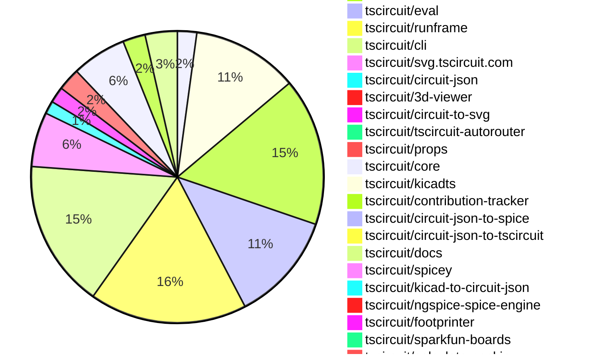
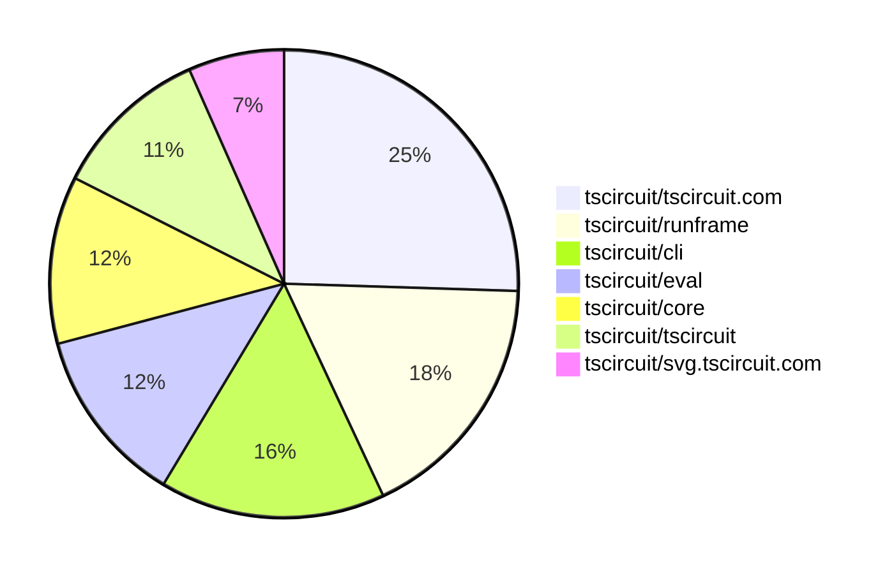

# Contribution Overview 2025-10-22

## PRs by Repository

## Contributor Overview

| Contributor | 🐳 Major | 🐙 Minor | 🐌 Tiny | ⭐ | Score | Discussion Contributions |
|-------------|---------|---------|---------|-----|----------------|--------------------------|
| [seveibar](#seveibar) | 6 | 23 | 16 | 👑 | 75 | 1🔹 0🔶 0💎 |
| [ArnavK-09](#ArnavK-09) | 6 | 5 | 10 | ⭐⭐⭐ | 46 | 1🔹 0🔶 0💎 |
| [imrishabh18](#imrishabh18) | 4 | 8 | 3 | ⭐⭐⭐ | 39 | 0🔹 0🔶 0💎 |
| [tscircuitbot](#tscircuitbot) | 0 | 0 | 191 | ⭐⭐ | 17 | 0🔹 0🔶 0💎 |
| [ShiboSoftwareDev](#ShiboSoftwareDev) | 0 | 3 | 3 | ⭐⭐ | 16 | 0🔹 0🔶 0💎 |
| [Abse2001](#Abse2001) | 2 | 2 | 0 | ⭐⭐ | 14 | 0🔹 0🔶 0💎 |
| [techmannih](#techmannih) | 0 | 0 | 3 | ⭐⭐ | 13 | 0🔹 0🔶 0💎 |
| [Ayushjhawar8](#Ayushjhawar8) | 0 | 3 | 2 | ⭐ | 8 | 0🔹 0🔶 0💎 |
| [nailoo](#nailoo) | 0 | 0 | 2 | ⭐ | 6 | 0🔹 0🔶 0💎 |
| [pxlpal](#pxlpal) | 0 | 1 | 2 | ⭐ | 4 | 0🔹 0🔶 0💎 |
| [MustafaMulla29](#MustafaMulla29) | 0 | 1 | 0 |  | 3 | 0🔹 0🔶 0💎 |
| [joncherry](#joncherry) | 0 | 0 | 1 |  | 2 | 0🔹 0🔶 0💎 |
| [RaghavArora14](#RaghavArora14) | 0 | 0 | 1 |  | 2 | 0🔹 0🔶 0💎 |
| [zojize](#zojize) | 0 | 1 | 0 |  | 2 | 0🔹 0🔶 0💎 |
| [raykholo](#raykholo) | 0 | 0 | 1 |  | 2 | 0🔹 0🔶 0💎 |
| [brymut](#brymut) | 0 | 0 | 1 |  | 1 | 0🔹 0🔶 0💎 |
| [Anshgrover23](#Anshgrover23) | 0 | 0 | 0 |  | 0 | 1🔹 0🔶 0💎 |

### Discussion Contribution Legend

- 🔹 Normal Comments: Basic participation with minimal effort
- 🔶 Great Informative Comments: Thoughtful participation that adds value
- 💎 Incredible Comments: Exceptional participation with high-quality content

## Review Table

[reviews-received-hover]: ## "Number of reviews received for PRs for this contributor"
[approvals-received-hover]: ## "Number of approvals received for PRs this contributor authored"
[rejections-received-hover]: ## "Number of rejections received for PRs this contributor authored"
[prs-opened-hover]: ## "Number of PRs opened by this contributor"
[issues-created-hover]: ## "Number of issues created by this contributor"
[bountied-issues-hover]: ## "Number of issues this contributor created with a bounty"
[bountied-issue-$-hover]: ## "Total bounty amount placed on issues authored by this contributor"

| Contributor | Reviews Received | Approvals Received | Rejections Received | Approvals | Rejections | PRs Opened | PRs Merged | Score | Issues Created | Bountied Issues | Bountied Issue $ |
|---|---|---|---|---|---|---|---|---|---|---|---|
| [Excellencedev](#Excellencedev) | 2 | 0 | 1 | 0 | 0 | 1 | 0 | 0 | 0 | 0 | 0 |
| [nailoo](#nailoo) | 10 | 4 | 1 | 0 | 0 | 5 | 2 | 6 | 0 | 0 | 0 |
| [techmannih](#techmannih) | 10 | 5 | 2 | 3 | 1 | 9 | 3 | 13 | 0 | 0 | 0 |
| [tscircuitbot](#tscircuitbot) | 0 | 0 | 0 | 0 | 0 | 218 | 191 | 17 | 0 | 0 | 0 |
| [seveibar](#seveibar) | 26 | 5 | 0 | 48 | 13 | 56 | 46 | 75 | 0 | 0 | 0 |
| [ShiboSoftwareDev](#ShiboSoftwareDev) | 14 | 7 | 2 | 7 | 0 | 11 | 6 | 16 | 0 | 0 | 0 |
| [Abse2001](#Abse2001) | 6 | 5 | 0 | 2 | 0 | 11 | 4 | 14 | 0 | 0 | 0 |
| [Ayushjhawar8](#Ayushjhawar8) | 10 | 5 | 1 | 0 | 0 | 6 | 5 | 8 | 0 | 0 | 0 |
| [Aqil-Ahmad](#Aqil-Ahmad) | 13 | 0 | 1 | 0 | 0 | 5 | 0 | 0 | 0 | 0 | 0 |
| [joncherry](#joncherry) | 13 | 3 | 1 | 0 | 0 | 2 | 1 | 2 | 0 | 0 | 0 |
| [Exceluyi](#Exceluyi) | 1 | 0 | 1 | 0 | 1 | 3 | 0 | 0 | 0 | 0 | 0 |
| [saurabhraghuvanshii](#saurabhraghuvanshii) | 4 | 0 | 0 | 0 | 0 | 1 | 0 | 0 | 0 | 0 | 0 |
| [MustafaMulla29](#MustafaMulla29) | 2 | 1 | 0 | 1 | 0 | 1 | 1 | 3 | 0 | 0 | 0 |
| [baeoc](#baeoc) | 0 | 0 | 0 | 0 | 0 | 1 | 0 | 0 | 0 | 0 | 0 |
| [RaghavArora14](#RaghavArora14) | 23 | 3 | 4 | 0 | 0 | 5 | 1 | 2 | 0 | 0 | 0 |
| [7908837174](#7908837174) | 1 | 0 | 0 | 0 | 0 | 1 | 0 | 0 | 0 | 0 | 0 |
| [rushabhcodes](#rushabhcodes) | 1 | 0 | 0 | 0 | 0 | 1 | 0 | 0 | 0 | 0 | 0 |
| [Omar8345](#Omar8345) | 1 | 0 | 0 | 0 | 0 | 1 | 0 | 0 | 0 | 0 | 0 |
| [imrishabh18](#imrishabh18) | 18 | 8 | 0 | 0 | 5 | 17 | 15 | 39 | 0 | 0 | 0 |
| [Pranjal6955](#Pranjal6955) | 2 | 0 | 0 | 0 | 0 | 1 | 0 | 0 | 0 | 0 | 0 |
| [ArnavK-09](#ArnavK-09) | 18 | 9 | 1 | 1 | 0 | 23 | 21 | 46 | 0 | 0 | 0 |
| [dhvll](#dhvll) | 0 | 0 | 0 | 0 | 0 | 1 | 0 | 0 | 0 | 0 | 0 |
| [Sahelisaha04](#Sahelisaha04) | 0 | 0 | 0 | 0 | 0 | 1 | 0 | 0 | 0 | 0 | 0 |
| [divanshu-go](#divanshu-go) | 3 | 0 | 1 | 0 | 0 | 2 | 0 | 0 | 0 | 0 | 0 |
| [pkparthk](#pkparthk) | 1 | 0 | 0 | 0 | 0 | 1 | 0 | 0 | 0 | 0 | 0 |
| [Anshgrover23](#Anshgrover23) | 0 | 0 | 0 | 0 | 0 | 1 | 0 | 1 | 0 | 0 | 0 |
| [BuddhikaBICT-UoR-FoT-6](#BuddhikaBICT-UoR-FoT-6) | 2 | 0 | 2 | 0 | 0 | 3 | 0 | 0 | 0 | 0 | 0 |
| [zojize](#zojize) | 1 | 1 | 0 | 0 | 0 | 1 | 1 | 2 | 0 | 0 | 0 |
| [brymut](#brymut) | 3 | 1 | 0 | 0 | 0 | 1 | 1 | 1 | 0 | 0 | 0 |
| [Asymtode712](#Asymtode712) | 0 | 0 | 0 | 0 | 0 | 1 | 0 | 0 | 0 | 0 | 0 |
| [pxlpal](#pxlpal) | 3 | 3 | 0 | 0 | 0 | 4 | 3 | 4 | 0 | 0 | 0 |
| [raykholo](#raykholo) | 13 | 2 | 0 | 0 | 0 | 2 | 1 | 2 | 0 | 0 | 0 |
| [7secondsquests-prog](#7secondsquests-prog) | 1 | 0 | 1 | 0 | 0 | 1 | 0 | 0 | 0 | 0 | 0 |
| [colmwoods](#colmwoods) | 0 | 0 | 0 | 0 | 0 | 1 | 0 | 0 | 0 | 0 | 0 |
| [1914Jegx](#1914Jegx) | 0 | 0 | 0 | 0 | 0 | 2 | 0 | 0 | 0 | 0 | 0 |
| [MayorChristopher](#MayorChristopher) | 2 | 0 | 1 | 0 | 0 | 3 | 0 | 0 | 0 | 0 | 0 |

## Top 7 Repositories by Contribution Points

## Changes by Repository

### [tscircuit/pcb-viewer](https://github.com/tscircuit/pcb-viewer)

| PR # | Impact | Rating | Contributor | Description |
|------|--------|--------|-------------|-------------|
| [#425](https://github.com/tscircuit/pcb-viewer/pull/425) | 🐙 Minor | ⭐⭐ | seveibar | Add snapping support to the dimension overlay tool, allowing dimensions to snap to nearby anchors when stretching dimensions. |
| [#423](https://github.com/tscircuit/pcb-viewer/pull/423) | 🐙 Minor | ⭐⭐ | seveibar | Adds support for lowercase text in PCB notes by importing an updated alphabet dataset and modifying the text rendering logic accordingly. |
| [#427](https://github.com/tscircuit/pcb-viewer/pull/427) | 🐙 Minor | ⭐⭐ | ShiboSoftwareDev | Fixes incorrect rendering of CSS color names for pcb_note elements, ensuring they display the correct colors instead of only on hover. |

🐌 Tiny Contributions (3)

| PR # | Impact | Contributor | Description |
|------|--------|-------------|-------------|
| [#429](https://github.com/tscircuit/pcb-viewer/pull/429) | 🐌 Tiny | tscircuitbot | Automated package update |
| [#428](https://github.com/tscircuit/pcb-viewer/pull/428) | 🐌 Tiny | tscircuitbot | Automated package update |
| [#424](https://github.com/tscircuit/pcb-viewer/pull/424) | 🐌 Tiny | tscircuitbot | Automated package update |

### [tscircuit/tscircuit](https://github.com/tscircuit/tscircuit)

🐌 Tiny Contributions (33)

| PR # | Impact | Contributor | Description |
|------|--------|-------------|-------------|
| [#1171](https://github.com/tscircuit/tscircuit/pull/1171) | 🐌 Tiny | tscircuitbot | Automated package update |
| [#1170](https://github.com/tscircuit/tscircuit/pull/1170) | 🐌 Tiny | tscircuitbot | Automated package update |
| [#1169](https://github.com/tscircuit/tscircuit/pull/1169) | 🐌 Tiny | tscircuitbot | Automated package update |
| [#1168](https://github.com/tscircuit/tscircuit/pull/1168) | 🐌 Tiny | tscircuitbot | Automated package update |
| [#1167](https://github.com/tscircuit/tscircuit/pull/1167) | 🐌 Tiny | tscircuitbot | Automated package update |
| [#1166](https://github.com/tscircuit/tscircuit/pull/1166) | 🐌 Tiny | tscircuitbot | Updates the tscircuitcli and tscircuitrunframe packages to their latest versions. |
| [#1163](https://github.com/tscircuit/tscircuit/pull/1163) | 🐌 Tiny | tscircuitbot | Automated package update |
| [#1162](https://github.com/tscircuit/tscircuit/pull/1162) | 🐌 Tiny | tscircuitbot | Automated package update |
| [#1161](https://github.com/tscircuit/tscircuit/pull/1161) | 🐌 Tiny | tscircuitbot | Automated package update |
| [#1160](https://github.com/tscircuit/tscircuit/pull/1160) | 🐌 Tiny | tscircuitbot | Automated package update |
| [#1159](https://github.com/tscircuit/tscircuit/pull/1159) | 🐌 Tiny | tscircuitbot | Automated package update |
| [#1158](https://github.com/tscircuit/tscircuit/pull/1158) | 🐌 Tiny | tscircuitbot | Automated package update |
| [#1157](https://github.com/tscircuit/tscircuit/pull/1157) | 🐌 Tiny | tscircuitbot | Updates the tscircuitcli package from version 0.1.386 to 0.1.387 and the tscircuitrunframe package from version 0.0.1150 to 0.0.1151 in package.json |
| [#1155](https://github.com/tscircuit/tscircuit/pull/1155) | 🐌 Tiny | tscircuitbot | Automated package update to version 0.0.811 |
| [#1154](https://github.com/tscircuit/tscircuit/pull/1154) | 🐌 Tiny | tscircuitbot | Automated package update |
| [#1153](https://github.com/tscircuit/tscircuit/pull/1153) | 🐌 Tiny | tscircuitbot | Automated package update |
| [#1152](https://github.com/tscircuit/tscircuit/pull/1152) | 🐌 Tiny | tscircuitbot | Automated package update |
| [#1148](https://github.com/tscircuit/tscircuit/pull/1148) | 🐌 Tiny | tscircuitbot | Automated package update |
| [#1147](https://github.com/tscircuit/tscircuit/pull/1147) | 🐌 Tiny | tscircuitbot | Automated package update |
| [#1146](https://github.com/tscircuit/tscircuit/pull/1146) | 🐌 Tiny | tscircuitbot | Automated package update |
| [#1145](https://github.com/tscircuit/tscircuit/pull/1145) | 🐌 Tiny | tscircuitbot | Updates the versions of several dependencies in the package.json file, including tscircuitcli, tscircuitcore, and tscircuiteval. |
| [#1144](https://github.com/tscircuit/tscircuit/pull/1144) | 🐌 Tiny | tscircuitbot | Automated package update |
| [#1143](https://github.com/tscircuit/tscircuit/pull/1143) | 🐌 Tiny | tscircuitbot | Automated package update |
| [#1142](https://github.com/tscircuit/tscircuit/pull/1142) | 🐌 Tiny | tscircuitbot | Automated package update |
| [#1141](https://github.com/tscircuit/tscircuit/pull/1141) | 🐌 Tiny | tscircuitbot | Automated package update |
| [#1139](https://github.com/tscircuit/tscircuit/pull/1139) | 🐌 Tiny | tscircuitbot | Updates the tscircuitcli package from version 0.1.379 to 0.1.380 and the tscircuitrunframe package from version 0.0.1143 to 0.0.1144 in package.json |
| [#1138](https://github.com/tscircuit/tscircuit/pull/1138) | 🐌 Tiny | tscircuitbot | Automated package update |
| [#1137](https://github.com/tscircuit/tscircuit/pull/1137) | 🐌 Tiny | tscircuitbot | Automated package update |
| [#1136](https://github.com/tscircuit/tscircuit/pull/1136) | 🐌 Tiny | tscircuitbot | Automated package update |
| [#1135](https://github.com/tscircuit/tscircuit/pull/1135) | 🐌 Tiny | tscircuitbot | Automated package update |
| [#1133](https://github.com/tscircuit/tscircuit/pull/1133) | 🐌 Tiny | tscircuitbot | Automated package update |
| [#1132](https://github.com/tscircuit/tscircuit/pull/1132) | 🐌 Tiny | tscircuitbot | Automated package update |
| [#1131](https://github.com/tscircuit/tscircuit/pull/1131) | 🐌 Tiny | seveibar | Adds resvgresvg-js as a dependency to the project. |

### [tscircuit/tscircuit.com](https://github.com/tscircuit/tscircuit.com)

| PR # | Impact | Rating | Contributor | Description |
|------|--------|--------|-------------|-------------|
| [#1877](https://github.com/tscircuit/tscircuit.com/pull/1877) | 🐳 Major | ⭐⭐⭐ | imrishabh18 | Adds support for real-time streaming of user code logs via Server-Sent Events (SSE) in the ConnectedRepoOverview component. |
| [#1886](https://github.com/tscircuit/tscircuit.com/pull/1886) | 🐳 Major | ⭐⭐⭐ | ArnavK-09 | Adds tooltips for package actions in the EditorNav component to improve user guidance and interaction clarity. |
| [#1846](https://github.com/tscircuit/tscircuit.com/pull/1846) | 🐳 Major | ⭐⭐⭐ | ArnavK-09 | Adds normalization for organization names in the create organization API to convert names with spaces and special characters to kebab-case, enforces name length constraints, modifies organization creation logic to use the normalized name while preserving the original display name, updates tests to verify normalization functionality, and adjusts the organization header component to display the normalized name when available. |
| [#1880](https://github.com/tscircuit/tscircuit.com/pull/1880) | 🐳 Major | ⭐⭐⭐ | ArnavK-09 | Refactors the 401 unauthorized toast notification to include a clickable sign-in prompt for users. |
| [#1852](https://github.com/tscircuit/tscircuit.com/pull/1852) | 🐳 Major | ⭐⭐⭐ | ArnavK-09 | Adds support for a display name in organization settings, including database schema updates, organization creation logic, and UI modifications to display the new field. |
| [#1844](https://github.com/tscircuit/tscircuit.com/pull/1844) | 🐳 Major | ⭐⭐⭐ | ArnavK-09 | Adds functionality to update organization member permissions via API, including permission checks and error handling for various scenarios. |
| [#1843](https://github.com/tscircuit/tscircuit.com/pull/1843) | 🐳 Major | ⭐⭐⭐ | ArnavK-09 | Fixes saving issues related to package files by adding POST method support and adjusting caching behavior. |
| [#1876](https://github.com/tscircuit/tscircuit.com/pull/1876) | 🐙 Minor | ⭐⭐ | seveibar | Polyfills the Node.js process global for browser builds to prevent crashes during TypeScript tooling execution and defines a stubbed process.env in Vite config for safe lookups during bundling. |
| [#1856](https://github.com/tscircuit/tscircuit.com/pull/1856) | 🐙 Minor | ⭐⭐ | seveibar | Add GET apibug_reportsdownload_zip endpoint to bundle bug report files into a zip archive and return 403404 errors when access is forbidden or the report is missing. |
| [#1873](https://github.com/tscircuit/tscircuit.com/pull/1873) | 🐙 Minor | ⭐⭐ | imrishabh18 | Fixes the breaking build page when user code build encounters errors by providing clearer error messages and handling for various error types. |
| [#1871](https://github.com/tscircuit/tscircuit.com/pull/1871) | 🐙 Minor | ⭐⭐ | imrishabh18 | Adds user code logging functionality to track the execution of user-defined code jobs, including start and completion times, logs, and error messages. |
| [#1869](https://github.com/tscircuit/tscircuit.com/pull/1869) | 🐙 Minor | ⭐⭐ | imrishabh18 | Adds a response interceptor to the shared axios instance to show a toast notification when backend responses return a 401 status, indicating that the session has expired. |
| [#1836](https://github.com/tscircuit/tscircuit.com/pull/1836) | 🐙 Minor | ⭐⭐ | imrishabh18 | Fixes session management by ensuring that the session is invalidated upon user sign out, preventing unauthorized access with stale session tokens. |
| [#1882](https://github.com/tscircuit/tscircuit.com/pull/1882) | 🐙 Minor | ⭐⭐ | ArnavK-09 | Add usePackageReleaseDbImages for 3DPCBSchematic previews, replace usePackageReleaseImages and pass packageRelease directly, remove unused import in release-builds, fix 1855 |
| [#1885](https://github.com/tscircuit/tscircuit.com/pull/1885) | 🐙 Minor | ⭐⭐ | ArnavK-09 | Replaces the alert notification with a toast notification for URL copy confirmation in EditorNav. |
| [#1884](https://github.com/tscircuit/tscircuit.com/pull/1884) | 🐙 Minor | ⭐⭐ | ArnavK-09 | Adds functionality to delete organizations, including validation for ownership and existence, along with corresponding tests. |
| [#1860](https://github.com/tscircuit/tscircuit.com/pull/1860) | 🐙 Minor | ⭐⭐ | ArnavK-09 | Adds owner_org_id as an optional filtering parameter in the package list API and updates the organization profile page to use owner_org_id instead of owner_github_username for package retrieval. |

🐌 Tiny Contributions (29)

| PR # | Impact | Contributor | Description |
|------|--------|-------------|-------------|
| [#1888](https://github.com/tscircuit/tscircuit.com/pull/1888) | 🐌 Tiny | tscircuitbot | Updates the tscircuiteval package from version 0.0.431 to 0.0.432 in the package.json file. |
| [#1887](https://github.com/tscircuit/tscircuit.com/pull/1887) | 🐌 Tiny | tscircuitbot | Automated package update to version 0.0.133 |
| [#1883](https://github.com/tscircuit/tscircuit.com/pull/1883) | 🐌 Tiny | tscircuitbot | Automated package update to version 0.0.132 |
| [#1875](https://github.com/tscircuit/tscircuit.com/pull/1875) | 🐌 Tiny | tscircuitbot | Automated package update |
| [#1872](https://github.com/tscircuit/tscircuit.com/pull/1872) | 🐌 Tiny | tscircuitbot | Automated package update |
| [#1870](https://github.com/tscircuit/tscircuit.com/pull/1870) | 🐌 Tiny | tscircuitbot | Automated package update |
| [#1868](https://github.com/tscircuit/tscircuit.com/pull/1868) | 🐌 Tiny | tscircuitbot | Updates the tscircuiteval package from version 0.0.428 to 0.0.429 in the package.json file. |
| [#1867](https://github.com/tscircuit/tscircuit.com/pull/1867) | 🐌 Tiny | tscircuitbot | Automated package update |
| [#1866](https://github.com/tscircuit/tscircuit.com/pull/1866) | 🐌 Tiny | tscircuitbot | Updates the tscircuiteval package from version 0.0.426 to 0.0.427 |
| [#1863](https://github.com/tscircuit/tscircuit.com/pull/1863) | 🐌 Tiny | tscircuitbot | Automated package update |
| [#1861](https://github.com/tscircuit/tscircuit.com/pull/1861) | 🐌 Tiny | tscircuitbot | Automated package update |
| [#1857](https://github.com/tscircuit/tscircuit.com/pull/1857) | 🐌 Tiny | tscircuitbot | Automated package update |
| [#1853](https://github.com/tscircuit/tscircuit.com/pull/1853) | 🐌 Tiny | tscircuitbot | Updates the package version from 0.0.126 to 0.0.127 in package.json |
| [#1851](https://github.com/tscircuit/tscircuit.com/pull/1851) | 🐌 Tiny | tscircuitbot | Automated package update |
| [#1850](https://github.com/tscircuit/tscircuit.com/pull/1850) | 🐌 Tiny | tscircuitbot | Automated package update |
| [#1849](https://github.com/tscircuit/tscircuit.com/pull/1849) | 🐌 Tiny | tscircuitbot | Updates the tscircuiteval package from version 0.0.421 to 0.0.422 in the package.json file. |
| [#1848](https://github.com/tscircuit/tscircuit.com/pull/1848) | 🐌 Tiny | tscircuitbot | Automated package update |
| [#1847](https://github.com/tscircuit/tscircuit.com/pull/1847) | 🐌 Tiny | tscircuitbot | Automated package update to version 0.0.126 |
| [#1845](https://github.com/tscircuit/tscircuit.com/pull/1845) | 🐌 Tiny | tscircuitbot | Automated package update to version 0.0.125 |
| [#1842](https://github.com/tscircuit/tscircuit.com/pull/1842) | 🐌 Tiny | tscircuitbot | Updates the tscircuiteval package from version 0.0.419 to 0.0.420 |
| [#1840](https://github.com/tscircuit/tscircuit.com/pull/1840) | 🐌 Tiny | tscircuitbot | Automated package update |
| [#1838](https://github.com/tscircuit/tscircuit.com/pull/1838) | 🐌 Tiny | tscircuitbot | Automated package update |
| [#1837](https://github.com/tscircuit/tscircuit.com/pull/1837) | 🐌 Tiny | tscircuitbot | Automated package update |
| [#1834](https://github.com/tscircuit/tscircuit.com/pull/1834) | 🐌 Tiny | tscircuitbot | Updates the tscircuiteval package from version 0.0.415 to 0.0.416 |
| [#1865](https://github.com/tscircuit/tscircuit.com/pull/1865) | 🐌 Tiny | ArnavK-09 | Adjusts the margin of the Discord logo link in the header for consistent styling across the application. |
| [#1859](https://github.com/tscircuit/tscircuit.com/pull/1859) | 🐌 Tiny | ArnavK-09 | Refactors the logic for extracting package owner and name from the full package name format, improving readability and ensuring consistent handling across components. |
| [#1858](https://github.com/tscircuit/tscircuit.com/pull/1858) | 🐌 Tiny | ArnavK-09 | Adjusts the display of organization ID to slice the string to 10 characters instead of 8 and ensures that the organization ID is always included in the save operation, regardless of ownership status. |
| [#1841](https://github.com/tscircuit/tscircuit.com/pull/1841) | 🐌 Tiny | ArnavK-09 | Ensures uniform button widths in the NotFound component for consistent styling across the application. |
| [#1839](https://github.com/tscircuit/tscircuit.com/pull/1839) | 🐌 Tiny | ArnavK-09 | Updates the return value in the useListOrgMembers hook to align with the API response, changing from data.members to data.org_members. |

### [tscircuit/eval](https://github.com/tscircuit/eval)

| PR # | Impact | Rating | Contributor | Description |
|------|--------|--------|-------------|-------------|
| [#1385](https://github.com/tscircuit/eval/pull/1385) | 🐙 Minor | ⭐⭐ | seveibar | Enables the transfer of platform configuration into a web worker using hybrid synchronous properties and proxied functions, allowing for dynamic updates to platform and project configurations. |
| [#1359](https://github.com/tscircuit/eval/pull/1359) | 🐙 Minor | ⭐⭐ | seveibar | Skip import type statements when collecting dependency names and add a regression test to ensure type-only imports do not trigger circular detection. |
| [#1264](https://github.com/tscircuit/eval/pull/1264) | 🐙 Minor | ⭐⭐ | zojize | Fixes flakiness in the test caused by improper handling of the async clearEventListeners function, ensuring consistent test results. |

🐌 Tiny Contributions (31)

| PR # | Impact | Contributor | Description |
|------|--------|-------------|-------------|
| [#1408](https://github.com/tscircuit/eval/pull/1408) | 🐌 Tiny | tscircuitbot | Automated package update |
| [#1407](https://github.com/tscircuit/eval/pull/1407) | 🐌 Tiny | tscircuitbot | Automated package update |
| [#1405](https://github.com/tscircuit/eval/pull/1405) | 🐌 Tiny | tscircuitbot | Automated package update |
| [#1404](https://github.com/tscircuit/eval/pull/1404) | 🐌 Tiny | tscircuitbot | Automated package update |
| [#1401](https://github.com/tscircuit/eval/pull/1401) | 🐌 Tiny | tscircuitbot | Automated package update |
| [#1400](https://github.com/tscircuit/eval/pull/1400) | 🐌 Tiny | tscircuitbot | Automated package update |
| [#1398](https://github.com/tscircuit/eval/pull/1398) | 🐌 Tiny | tscircuitbot | Automated package update |
| [#1397](https://github.com/tscircuit/eval/pull/1397) | 🐌 Tiny | tscircuitbot | Automated package update |
| [#1394](https://github.com/tscircuit/eval/pull/1394) | 🐌 Tiny | tscircuitbot | Automated package update |
| [#1393](https://github.com/tscircuit/eval/pull/1393) | 🐌 Tiny | tscircuitbot | Updates the version of the tscircuitcore package from 0.0.823 to 0.0.824 in package.json |
| [#1392](https://github.com/tscircuit/eval/pull/1392) | 🐌 Tiny | tscircuitbot | Automated package update |
| [#1391](https://github.com/tscircuit/eval/pull/1391) | 🐌 Tiny | tscircuitbot | Automated package update |
| [#1389](https://github.com/tscircuit/eval/pull/1389) | 🐌 Tiny | tscircuitbot | Automated package update |
| [#1388](https://github.com/tscircuit/eval/pull/1388) | 🐌 Tiny | tscircuitbot | Updates the version of the tscircuitcore package from 0.0.821 to 0.0.822 in package.json |
| [#1386](https://github.com/tscircuit/eval/pull/1386) | 🐌 Tiny | tscircuitbot | Automated package update |
| [#1384](https://github.com/tscircuit/eval/pull/1384) | 🐌 Tiny | tscircuitbot | Automated package update |
| [#1383](https://github.com/tscircuit/eval/pull/1383) | 🐌 Tiny | tscircuitbot | Updates the version of the tscircuitcore package from 0.0.820 to 0.0.821 in package.json |
| [#1381](https://github.com/tscircuit/eval/pull/1381) | 🐌 Tiny | tscircuitbot | Automated package update |
| [#1380](https://github.com/tscircuit/eval/pull/1380) | 🐌 Tiny | tscircuitbot | Automated package update |
| [#1378](https://github.com/tscircuit/eval/pull/1378) | 🐌 Tiny | tscircuitbot | Automated package update |
| [#1377](https://github.com/tscircuit/eval/pull/1377) | 🐌 Tiny | tscircuitbot | Automated package update |
| [#1375](https://github.com/tscircuit/eval/pull/1375) | 🐌 Tiny | tscircuitbot | Automated package update |
| [#1374](https://github.com/tscircuit/eval/pull/1374) | 🐌 Tiny | tscircuitbot | Automated package update |
| [#1372](https://github.com/tscircuit/eval/pull/1372) | 🐌 Tiny | tscircuitbot | Automated package update |
| [#1371](https://github.com/tscircuit/eval/pull/1371) | 🐌 Tiny | tscircuitbot | Updates the version of the tscircuitcore package from 0.0.816 to 0.0.817 in package.json |
| [#1369](https://github.com/tscircuit/eval/pull/1369) | 🐌 Tiny | tscircuitbot | Automated package update |
| [#1368](https://github.com/tscircuit/eval/pull/1368) | 🐌 Tiny | tscircuitbot | Automated package update |
| [#1366](https://github.com/tscircuit/eval/pull/1366) | 🐌 Tiny | tscircuitbot | Automated package update |
| [#1365](https://github.com/tscircuit/eval/pull/1365) | 🐌 Tiny | tscircuitbot | Updates the version of the tscircuitcore package from 0.0.813 to 0.0.815 in package.json |
| [#1363](https://github.com/tscircuit/eval/pull/1363) | 🐌 Tiny | tscircuitbot | Automated package update |
| [#1362](https://github.com/tscircuit/eval/pull/1362) | 🐌 Tiny | tscircuitbot | Automated package update |

### [tscircuit/runframe](https://github.com/tscircuit/runframe)

| PR # | Impact | Rating | Contributor | Description |
|------|--------|--------|-------------|-------------|
| [#1569](https://github.com/tscircuit/runframe/pull/1569) | 🐳 Major | ⭐⭐⭐ | seveibar | Replaces micromatch usage with minimatch for board file filtering in getBoardFilesFromConfig, adds unit tests for config glob matching and default file detection, and updates dependencies to drop micromatch in favor of minimatch. |
| [#1560](https://github.com/tscircuit/runframe/pull/1560) | 🐙 Minor | ⭐⭐ | ArnavK-09 | Adds optional projectBaseUrl for custom project URLs and introduces platformConfig for eval webworker to allow platform-specific configurations in the RunFrame component. |

🐌 Tiny Contributions (47)

| PR # | Impact | Contributor | Description |
|------|--------|-------------|-------------|
| [#1580](https://github.com/tscircuit/runframe/pull/1580) | 🐌 Tiny | tscircuitbot | Automated package update |
| [#1579](https://github.com/tscircuit/runframe/pull/1579) | 🐌 Tiny | tscircuitbot | Updates the tscircuiteval package from version 0.0.430 to 0.0.431 |
| [#1578](https://github.com/tscircuit/runframe/pull/1578) | 🐌 Tiny | tscircuitbot | Automated package update |
| [#1577](https://github.com/tscircuit/runframe/pull/1577) | 🐌 Tiny | tscircuitbot | Updates the tscircuiteval package from version 0.0.429 to 0.0.430 |
| [#1576](https://github.com/tscircuit/runframe/pull/1576) | 🐌 Tiny | tscircuitbot | Automated package update |
| [#1575](https://github.com/tscircuit/runframe/pull/1575) | 🐌 Tiny | tscircuitbot | Updates the tscircuiteval package from version 0.0.428 to 0.0.429 |
| [#1574](https://github.com/tscircuit/runframe/pull/1574) | 🐌 Tiny | tscircuitbot | Automated package update |
| [#1573](https://github.com/tscircuit/runframe/pull/1573) | 🐌 Tiny | tscircuitbot | Updates the tscircuiteval package to version 0.0.428 in the package.json file. |
| [#1572](https://github.com/tscircuit/runframe/pull/1572) | 🐌 Tiny | tscircuitbot | Automated package update |
| [#1571](https://github.com/tscircuit/runframe/pull/1571) | 🐌 Tiny | tscircuitbot | Automated package update for tscircuit3d-viewer from version 0.0.420 to 0.0.421 |
| [#1570](https://github.com/tscircuit/runframe/pull/1570) | 🐌 Tiny | tscircuitbot | Updates the package version from 0.0.1154 to 0.0.1155 in package.json |
| [#1568](https://github.com/tscircuit/runframe/pull/1568) | 🐌 Tiny | tscircuitbot | Updates the package version from 0.0.1153 to 0.0.1154 in package.json |
| [#1567](https://github.com/tscircuit/runframe/pull/1567) | 🐌 Tiny | tscircuitbot | Automated package update |
| [#1566](https://github.com/tscircuit/runframe/pull/1566) | 🐌 Tiny | tscircuitbot | Updates the package version from 0.0.1151 to 0.0.1153 in package.json |
| [#1565](https://github.com/tscircuit/runframe/pull/1565) | 🐌 Tiny | tscircuitbot | Updates the tscircuitpcb-viewer package from version 1.11.238 to 1.11.239 |
| [#1562](https://github.com/tscircuit/runframe/pull/1562) | 🐌 Tiny | tscircuitbot | Updates the tscircuiteval package from version 0.0.424 to 0.0.425 |
| [#1561](https://github.com/tscircuit/runframe/pull/1561) | 🐌 Tiny | tscircuitbot | Automated package update to version 0.0.1151 |
| [#1559](https://github.com/tscircuit/runframe/pull/1559) | 🐌 Tiny | tscircuitbot | Automated package update |
| [#1558](https://github.com/tscircuit/runframe/pull/1558) | 🐌 Tiny | tscircuitbot | Updates the tscircuitpcb-viewer package from version 1.11.237 to 1.11.238 |
| [#1557](https://github.com/tscircuit/runframe/pull/1557) | 🐌 Tiny | tscircuitbot | Automated package update to version 0.0.1149 |
| [#1556](https://github.com/tscircuit/runframe/pull/1556) | 🐌 Tiny | tscircuitbot | Updates the tscircuiteval package to version 0.0.424 in the package.json file. |
| [#1555](https://github.com/tscircuit/runframe/pull/1555) | 🐌 Tiny | tscircuitbot | Updates the package version from 0.0.1147 to 0.0.1148 in package.json |
| [#1554](https://github.com/tscircuit/runframe/pull/1554) | 🐌 Tiny | tscircuitbot | Updates the tscircuiteval package to version 0.0.423 |
| [#1553](https://github.com/tscircuit/runframe/pull/1553) | 🐌 Tiny | tscircuitbot | Automated package update |
| [#1552](https://github.com/tscircuit/runframe/pull/1552) | 🐌 Tiny | tscircuitbot | Updates the tscircuiteval package to version 0.0.422 |
| [#1551](https://github.com/tscircuit/runframe/pull/1551) | 🐌 Tiny | tscircuitbot | Automated package update to version 0.0.1146 |
| [#1550](https://github.com/tscircuit/runframe/pull/1550) | 🐌 Tiny | tscircuitbot | Updates the tscircuiteval package to version 0.0.421 in the package.json file. |
| [#1549](https://github.com/tscircuit/runframe/pull/1549) | 🐌 Tiny | tscircuitbot | Automated package update |
| [#1548](https://github.com/tscircuit/runframe/pull/1548) | 🐌 Tiny | tscircuitbot | Automated package update |
| [#1547](https://github.com/tscircuit/runframe/pull/1547) | 🐌 Tiny | tscircuitbot | Automated package update |
| [#1546](https://github.com/tscircuit/runframe/pull/1546) | 🐌 Tiny | tscircuitbot | Automated package update |
| [#1545](https://github.com/tscircuit/runframe/pull/1545) | 🐌 Tiny | tscircuitbot | Updates the tscircuiteval package to version 0.0.420 |
| [#1544](https://github.com/tscircuit/runframe/pull/1544) | 🐌 Tiny | tscircuitbot | Automated package update |
| [#1543](https://github.com/tscircuit/runframe/pull/1543) | 🐌 Tiny | tscircuitbot | Updates the tscircuiteval package from version 0.0.418 to 0.0.419 |
| [#1541](https://github.com/tscircuit/runframe/pull/1541) | 🐌 Tiny | tscircuitbot | Automated package update |
| [#1540](https://github.com/tscircuit/runframe/pull/1540) | 🐌 Tiny | tscircuitbot | Updates the tscircuiteval package from version 0.0.416 to 0.0.418 in the package.json file. |
| [#1539](https://github.com/tscircuit/runframe/pull/1539) | 🐌 Tiny | tscircuitbot | Automated package update to version 0.0.1140 |
| [#1537](https://github.com/tscircuit/runframe/pull/1537) | 🐌 Tiny | tscircuitbot | Automated package update to version 0.0.1139 |
| [#1536](https://github.com/tscircuit/runframe/pull/1536) | 🐌 Tiny | tscircuitbot | Automated package update |
| [#1532](https://github.com/tscircuit/runframe/pull/1532) | 🐌 Tiny | tscircuitbot | Updates the tscircuit3d-viewer package to version 0.0.419 in package.json |
| [#1530](https://github.com/tscircuit/runframe/pull/1530) | 🐌 Tiny | tscircuitbot | Automated package update |
| [#1529](https://github.com/tscircuit/runframe/pull/1529) | 🐌 Tiny | tscircuitbot | Updates the tscircuitpcb-viewer package from version 1.11.236 to 1.11.237 |
| [#1542](https://github.com/tscircuit/runframe/pull/1542) | 🐌 Tiny | seveibar | Fixes the bug report dialog link to ensure it always points to the production bug report viewer. |
| [#1538](https://github.com/tscircuit/runframe/pull/1538) | 🐌 Tiny | Ayushjhawar8 | Removes the duplicate jose dependency from the package.json file. |
| [#1533](https://github.com/tscircuit/runframe/pull/1533) | 🐌 Tiny | Ayushjhawar8 | Try to address these point !image(https:github.comuser-attachmentsassets13ea2a8e-6e03-466c-b989-ce963ec0ba91) |
| [#1535](https://github.com/tscircuit/runframe/pull/1535) | 🐌 Tiny | imrishabh18 | This pull request adds the jose package to the project to resolve issues related to publishing. |
| [#1534](https://github.com/tscircuit/runframe/pull/1534) | 🐌 Tiny | imrishabh18 | This pull request addresses issues with the lockfile to ensure proper package management and dependencies for publishing. |

### [tscircuit/cli](https://github.com/tscircuit/cli)

| PR # | Impact | Rating | Contributor | Description |
|------|--------|--------|-------------|-------------|
| [#718](https://github.com/tscircuit/cli/pull/718) | 🐙 Minor | ⭐⭐ | seveibar | Extracts the bug report clone workflow into a dedicated helper, shares the existing-directory prompt between package and bug-report clones, and keeps the clone command handler focused on dispatching between package and bug report flows. |

🐌 Tiny Contributions (45)

| PR # | Impact | Contributor | Description |
|------|--------|-------------|-------------|
| [#738](https://github.com/tscircuit/cli/pull/738) | 🐌 Tiny | tscircuitbot | Automated package update to version 0.1.396 |
| [#737](https://github.com/tscircuit/cli/pull/737) | 🐌 Tiny | tscircuitbot | Automated package update to version 0.1.395 |
| [#736](https://github.com/tscircuit/cli/pull/736) | 🐌 Tiny | tscircuitbot | Updates the tscircuitrunframe package to version 0.0.1160 |
| [#735](https://github.com/tscircuit/cli/pull/735) | 🐌 Tiny | tscircuitbot | Automated package update |
| [#734](https://github.com/tscircuit/cli/pull/734) | 🐌 Tiny | tscircuitbot | Updates the tscircuitrunframe package from version 0.0.1158 to 0.0.1159 |
| [#733](https://github.com/tscircuit/cli/pull/733) | 🐌 Tiny | tscircuitbot | Automated package update |
| [#732](https://github.com/tscircuit/cli/pull/732) | 🐌 Tiny | tscircuitbot | Updates the tscircuitrunframe package from version 0.0.1157 to 0.0.1158 |
| [#731](https://github.com/tscircuit/cli/pull/731) | 🐌 Tiny | tscircuitbot | Automated package update |
| [#730](https://github.com/tscircuit/cli/pull/730) | 🐌 Tiny | tscircuitbot | Updates the tscircuitrunframe package from version 0.0.1155 to 0.0.1157 |
| [#728](https://github.com/tscircuit/cli/pull/728) | 🐌 Tiny | tscircuitbot | Automated package update |
| [#727](https://github.com/tscircuit/cli/pull/727) | 🐌 Tiny | tscircuitbot | Updates the tscircuitrunframe package from version 0.0.1154 to 0.0.1155 |
| [#726](https://github.com/tscircuit/cli/pull/726) | 🐌 Tiny | tscircuitbot | Automated package update |
| [#725](https://github.com/tscircuit/cli/pull/725) | 🐌 Tiny | tscircuitbot | Updates the tscircuitrunframe package from version 0.0.1153 to 0.0.1154 |
| [#724](https://github.com/tscircuit/cli/pull/724) | 🐌 Tiny | tscircuitbot | Automated package update to version 0.1.389 |
| [#723](https://github.com/tscircuit/cli/pull/723) | 🐌 Tiny | tscircuitbot | Automated package update |
| [#722](https://github.com/tscircuit/cli/pull/722) | 🐌 Tiny | tscircuitbot | Automated package update |
| [#721](https://github.com/tscircuit/cli/pull/721) | 🐌 Tiny | tscircuitbot | Updates the tscircuitrunframe package from version 0.0.1151 to 0.0.1152 |
| [#720](https://github.com/tscircuit/cli/pull/720) | 🐌 Tiny | tscircuitbot | Automated package update |
| [#719](https://github.com/tscircuit/cli/pull/719) | 🐌 Tiny | tscircuitbot | Updates the tscircuitrunframe package from version 0.0.1150 to 0.0.1151 |
| [#717](https://github.com/tscircuit/cli/pull/717) | 🐌 Tiny | tscircuitbot | Automated package update |
| [#716](https://github.com/tscircuit/cli/pull/716) | 🐌 Tiny | tscircuitbot | Updates the tscircuitrunframe package from version 0.0.1149 to 0.0.1150 |
| [#715](https://github.com/tscircuit/cli/pull/715) | 🐌 Tiny | tscircuitbot | Automated package update |
| [#714](https://github.com/tscircuit/cli/pull/714) | 🐌 Tiny | tscircuitbot | Updates the tscircuitrunframe package to version 0.0.1149 |
| [#713](https://github.com/tscircuit/cli/pull/713) | 🐌 Tiny | tscircuitbot | Automated package update |
| [#712](https://github.com/tscircuit/cli/pull/712) | 🐌 Tiny | tscircuitbot | Automated package update |
| [#711](https://github.com/tscircuit/cli/pull/711) | 🐌 Tiny | tscircuitbot | Automated package update |
| [#710](https://github.com/tscircuit/cli/pull/710) | 🐌 Tiny | tscircuitbot | Updates the tscircuitrunframe package to version 0.0.1147 in the package.json file |
| [#709](https://github.com/tscircuit/cli/pull/709) | 🐌 Tiny | tscircuitbot | Automated package update |
| [#708](https://github.com/tscircuit/cli/pull/708) | 🐌 Tiny | tscircuitbot | Updates the tscircuitrunframe package from version 0.0.1145 to 0.0.1146 |
| [#707](https://github.com/tscircuit/cli/pull/707) | 🐌 Tiny | tscircuitbot | Automated package update |
| [#706](https://github.com/tscircuit/cli/pull/706) | 🐌 Tiny | tscircuitbot | Updates the tscircuitrunframe package from version 0.0.1144 to 0.0.1145 |
| [#705](https://github.com/tscircuit/cli/pull/705) | 🐌 Tiny | tscircuitbot | Automated package update |
| [#704](https://github.com/tscircuit/cli/pull/704) | 🐌 Tiny | tscircuitbot | Automated package update |
| [#703](https://github.com/tscircuit/cli/pull/703) | 🐌 Tiny | tscircuitbot | Automated package update |
| [#702](https://github.com/tscircuit/cli/pull/702) | 🐌 Tiny | tscircuitbot | Updates the tscircuitrunframe package from version 0.0.1142 to 0.0.1143 |
| [#701](https://github.com/tscircuit/cli/pull/701) | 🐌 Tiny | tscircuitbot | Automated package update |
| [#700](https://github.com/tscircuit/cli/pull/700) | 🐌 Tiny | tscircuitbot | Updates the tscircuitrunframe package from version 0.0.1141 to 0.0.1142 |
| [#699](https://github.com/tscircuit/cli/pull/699) | 🐌 Tiny | tscircuitbot | Automated package update |
| [#698](https://github.com/tscircuit/cli/pull/698) | 🐌 Tiny | tscircuitbot | Updates the tscircuitrunframe package to version 0.0.1141 |
| [#697](https://github.com/tscircuit/cli/pull/697) | 🐌 Tiny | tscircuitbot | Automated package update |
| [#696](https://github.com/tscircuit/cli/pull/696) | 🐌 Tiny | tscircuitbot | Automated package update |
| [#695](https://github.com/tscircuit/cli/pull/695) | 🐌 Tiny | tscircuitbot | Automated package update to version 0.1.375 |
| [#694](https://github.com/tscircuit/cli/pull/694) | 🐌 Tiny | tscircuitbot | Updates the tscircuitrunframe package from version 0.0.1138 to 0.0.1139 |
| [#693](https://github.com/tscircuit/cli/pull/693) | 🐌 Tiny | tscircuitbot | Automated package update |
| [#692](https://github.com/tscircuit/cli/pull/692) | 🐌 Tiny | tscircuitbot | Updates the tscircuitrunframe package from version 0.0.1137 to 0.0.1138 |

### [tscircuit/svg.tscircuit.com](https://github.com/tscircuit/svg.tscircuit.com)

| PR # | Impact | Rating | Contributor | Description |
|------|--------|--------|-------------|-------------|
| [#480](https://github.com/tscircuit/svg.tscircuit.com/pull/480) | 🐳 Major | ⭐⭐⭐ | imrishabh18 | Switches the image rendering library from sharp to resvg and resolves a font rendering issue in PNG outputs on Vercel. |

🐌 Tiny Contributions (16)

| PR # | Impact | Contributor | Description |
|------|--------|-------------|-------------|
| [#498](https://github.com/tscircuit/svg.tscircuit.com/pull/498) | 🐌 Tiny | tscircuitbot | Updates the tscircuit package version from 0.0.817 to 0.0.818 in package.json |
| [#497](https://github.com/tscircuit/svg.tscircuit.com/pull/497) | 🐌 Tiny | tscircuitbot | Updates the tscircuit package version from 0.0.816 to 0.0.817 in package.json |
| [#496](https://github.com/tscircuit/svg.tscircuit.com/pull/496) | 🐌 Tiny | tscircuitbot | Updates the tscircuit package version from 0.0.814 to 0.0.816 in package.json |
| [#495](https://github.com/tscircuit/svg.tscircuit.com/pull/495) | 🐌 Tiny | tscircuitbot | Updates the tscircuit package version from 0.0.813 to 0.0.814 in package.json |
| [#494](https://github.com/tscircuit/svg.tscircuit.com/pull/494) | 🐌 Tiny | tscircuitbot | Automated package update |
| [#493](https://github.com/tscircuit/svg.tscircuit.com/pull/493) | 🐌 Tiny | tscircuitbot | Updates the tscircuit package version from 0.0.811 to 0.0.812 in package.json |
| [#492](https://github.com/tscircuit/svg.tscircuit.com/pull/492) | 🐌 Tiny | tscircuitbot | Updates the tscircuit package version from 0.0.810 to 0.0.811 in package.json |
| [#491](https://github.com/tscircuit/svg.tscircuit.com/pull/491) | 🐌 Tiny | tscircuitbot | Updates the tscircuit package version from 0.0.809 to 0.0.810 in package.json |
| [#490](https://github.com/tscircuit/svg.tscircuit.com/pull/490) | 🐌 Tiny | tscircuitbot | Updates the tscircuit package version from 0.0.808 to 0.0.809 in package.json |
| [#489](https://github.com/tscircuit/svg.tscircuit.com/pull/489) | 🐌 Tiny | tscircuitbot | Updates the tscircuit package version from 0.0.807 to 0.0.808 in package.json |
| [#488](https://github.com/tscircuit/svg.tscircuit.com/pull/488) | 🐌 Tiny | tscircuitbot | Updates the tscircuit package version from 0.0.806 to 0.0.807 in package.json |
| [#487](https://github.com/tscircuit/svg.tscircuit.com/pull/487) | 🐌 Tiny | tscircuitbot | Updates the tscircuit package version from 0.0.804 to 0.0.806 in package.json |
| [#486](https://github.com/tscircuit/svg.tscircuit.com/pull/486) | 🐌 Tiny | tscircuitbot | Automated package update |
| [#485](https://github.com/tscircuit/svg.tscircuit.com/pull/485) | 🐌 Tiny | tscircuitbot | Updates the tscircuit package version from 0.0.800 to 0.0.803 in package.json |
| [#482](https://github.com/tscircuit/svg.tscircuit.com/pull/482) | 🐌 Tiny | techmannih | Updates the circuit-to-svg dependency to version 0.0.251 in the package.json file. |
| [#483](https://github.com/tscircuit/svg.tscircuit.com/pull/483) | 🐌 Tiny | pxlpal | Updates the tscircuit dependency from version 0.0.798 to 0.0.800 in package.json |

### [tscircuit/circuit-json](https://github.com/tscircuit/circuit-json)

| PR # | Impact | Rating | Contributor | Description |
|------|--------|--------|-------------|-------------|
| [#328](https://github.com/tscircuit/circuit-json/pull/328) | 🐳 Major | ⭐⭐⭐ | seveibar | Add optional offset_distance and offset_direction to PCB note dimension schema and types, extending PCB fabrication note dimension definitions with new offset configuration |
| [#330](https://github.com/tscircuit/circuit-json/pull/330) | 🐙 Minor | ⭐⭐ | seveibar | Add pcb_copper_text schema for modeling copper layer text, export the new element through pcb aggregations and any_circuit_element, document the new element and cover defaults with targeted tests. |
| [#329](https://github.com/tscircuit/circuit-json/pull/329) | 🐙 Minor | ⭐⭐ | seveibar | Adds support for an optional counter-clockwise rotation for text in PCB dimensions, including documentation updates. |
| [#327](https://github.com/tscircuit/circuit-json/pull/327) | 🐙 Minor | ⭐⭐ | Ayushjhawar8 | Adds a new error type for handling unexpected errors when finding parts, including network failures and API response issues. |

### [tscircuit/3d-viewer](https://github.com/tscircuit/3d-viewer)

| PR # | Impact | Rating | Contributor | Description |
|------|--------|--------|-------------|-------------|
| [#533](https://github.com/tscircuit/3d-viewer/pull/533) | 🐳 Major | ⭐⭐⭐ | seveibar | Animate the camera orientation with quaternion slerp so roll transitions smoothly between presets and derive intermediate targets from the interpolated orientation to update orbit controlsmatrices for stable animation. |
| [#543](https://github.com/tscircuit/3d-viewer/pull/543) | 🐳 Major | ⭐⭐⭐ | Abse2001 | Introduces a global BOARD_SURFACE_OFFSET to standardize Z positions for copper, traces, and plated holes, fixing height mismatches where traces appeared above or below pads, ensuring accurate alignment between all PCB surface elements. |
| [#538](https://github.com/tscircuit/3d-viewer/pull/538) | 🐙 Minor | ⭐⭐ | MustafaMulla29 | Fixes context menu positioning to prevent it from going off-screen and improves the styling for a more consistent appearance. |

### [tscircuit/circuit-to-svg](https://github.com/tscircuit/circuit-to-svg)

| PR # | Impact | Rating | Contributor | Description |
|------|--------|--------|-------------|-------------|
| [#402](https://github.com/tscircuit/circuit-to-svg/pull/402) | 🐳 Major | ⭐⭐⭐ | seveibar | Add offset handling for PCB dimension annotations, allowing for offset distance and direction adjustments in PCB note and fabrication dimensions, along with updated tests and snapshots. |
| [#403](https://github.com/tscircuit/circuit-to-svg/pull/403) | 🐳 Major | ⭐⭐⭐ | seveibar | Fixes the issue where pills are not being drawn properly in the SVG rendering of PCB components by implementing a new pill shape drawing function. |
| [#399](https://github.com/tscircuit/circuit-to-svg/pull/399) | 🐙 Minor | ⭐⭐ | Abse2001 | Fixes potential crashes by safely handling undefined or non-numeric geometry values in PCB SVG rendering. |

🐌 Tiny Contributions (2)

| PR # | Impact | Contributor | Description |
|------|--------|-------------|-------------|
| [#404](https://github.com/tscircuit/circuit-to-svg/pull/404) | 🐌 Tiny | seveibar | Removes the redundant PcbFabricationNoteDimensionWithOffset alias from the fabrication note dimension snapshot test and annotates the test fixtures directly with PcbFabricationNoteDimension. |
| [#397](https://github.com/tscircuit/circuit-to-svg/pull/397) | 🐌 Tiny | ShiboSoftwareDev | Updates the data points on simulation graphs to be solid dots instead of hollow circles and reduces their size for a cleaner appearance. |

### [tscircuit/tscircuit-autorouter](https://github.com/tscircuit/tscircuit-autorouter)

| PR # | Impact | Rating | Contributor | Description |
|------|--------|--------|-------------|-------------|
| [#289](https://github.com/tscircuit/tscircuit-autorouter/pull/289) | 🐳 Major | ⭐⭐⭐ | seveibar | Adds an optional netIsAssignable field to the SRJ obstacle type so consumers can detect assignable nets |

### [tscircuit/props](https://github.com/tscircuit/props)

| PR # | Impact | Rating | Contributor | Description |
|------|--------|--------|-------------|-------------|
| [#472](https://github.com/tscircuit/props/pull/472) | 🐙 Minor | ⭐⭐ | seveibar | Changes the resolveProjectStaticFileImportUrl function to return a Promisestring instead of a string, updating the platform configuration typing, documentation, and unit tests accordingly. |
| [#471](https://github.com/tscircuit/props/pull/471) | 🐙 Minor | ⭐⭐ | seveibar | Adds an optional resolveProjectStaticFileImportUrl handler to the platform configuration schema, regenerates documentation to include the new option, and covers the new option with a parsing test. |
| [#469](https://github.com/tscircuit/props/pull/469) | 🐙 Minor | ⭐⭐ | seveibar | Adds an optional width property to the trace props schema as an alias for thickness |
| [#467](https://github.com/tscircuit/props/pull/467) | 🐙 Minor | ⭐⭐ | seveibar | Allows trace  props to accept a new width distance and maps the parsed trace thickness to the provided width when no explicit thickness is supplied. |
| [#465](https://github.com/tscircuit/props/pull/465) | 🐙 Minor | ⭐⭐ | seveibar | Allows fabrication and PCB note dimension components to accept explicit units (in or mm) and regenerates component documentation to include the new units property. |

🐌 Tiny Contributions (2)

| PR # | Impact | Contributor | Description |
|------|--------|-------------|-------------|
| [#473](https://github.com/tscircuit/props/pull/473) | 🐌 Tiny | seveibar | Add copper text props for defining copper layer text elements and regenerate documentation to include the new coppertext  component |
| [#470](https://github.com/tscircuit/props/pull/470) | 🐌 Tiny | seveibar | Add optional outerEdgeToEdge, centerToCenter, and innerEdgeToEdge flags to pcb and fabrication note dimension props and regenerate generated documentation to surface the new note dimension options |

### [tscircuit/core](https://github.com/tscircuit/core)

| PR # | Impact | Rating | Contributor | Description |
|------|--------|--------|-------------|-------------|
| [#1563](https://github.com/tscircuit/core/pull/1563) | 🐳 Major | ⭐⭐⭐ | imrishabh18 | Prevents rotation of pinheaders in autolayout when facingDirection is specified, ensuring correct schematic representation. |
| [#1588](https://github.com/tscircuit/core/pull/1588) | 🐙 Minor | ⭐⭐ | seveibar | Fixes polygon SMT pad rotation by applying the full PCB transform when inserting polygon pad points and adds a regression test for this functionality. |
| [#1586](https://github.com/tscircuit/core/pull/1586) | 🐙 Minor | ⭐⭐ | seveibar | Moves the async static asset resolver into a dedicated utility module and updates footprint URL loading to use the shared resolver utility while keeping CadModel cache-busting logic unchanged. |
| [#1584](https://github.com/tscircuit/core/pull/1584) | 🐙 Minor | ⭐⭐ | seveibar | Normalizes autorouter preset names so underscore variants map to the same configuration as their hyphenated counterparts and adds unit tests covering the auto_cloud preset alias behavior. |
| [#1583](https://github.com/tscircuit/core/pull/1583) | 🐙 Minor | ⭐⭐ | seveibar | Fixes a double-loading bug in the NormalComponent by replacing the isFootprintUrl function with isHttpUrl and isStaticAssetPath, ensuring proper handling of footprint URLs. |
| [#1564](https://github.com/tscircuit/core/pull/1564) | 🐙 Minor | ⭐⭐ | seveibar | Adds support for inch units in PCB and fabrication note dimensions, updating the formatting and tests accordingly. |
| [#1566](https://github.com/tscircuit/core/pull/1566) | 🐙 Minor | ⭐⭐ | seveibar | Adds support for using width as an alias for thickness in trace properties and handles cases where pcbPath may be empty or undefined. |
| [#1559](https://github.com/tscircuit/core/pull/1559) | 🐙 Minor | ⭐⭐ | seveibar | Infers has_stroke for fabrication note rectangles when only a stroke width is provided and adds coverage for the defaulted stroke flag. |
| [#1555](https://github.com/tscircuit/core/pull/1555) | 🐙 Minor | ⭐⭐ | seveibar | Defaults PCB and fabrication note dimension text to the measured distance when no text is provided, formatting whole numbers as-is and rounding other values to two decimal places, with unit tests added for the new behavior. |
| [#1561](https://github.com/tscircuit/core/pull/1561) | 🐙 Minor | ⭐⭐ | ShiboSoftwareDev | Adds support for eecircuit-engine as an alternative SPICE simulation engine, including dynamic imports, new utility functions, and integration tests. |
| [#1574](https://github.com/tscircuit/core/pull/1574) | 🐙 Minor | ⭐⭐ | Ayushjhawar8 | Fixes error handling in the parts engine by validating responses and logging errors to Circuit JSON. |
| [#1573](https://github.com/tscircuit/core/pull/1573) | 🐙 Minor | ⭐⭐ | Abse2001 | Fixes PCB snapshot generation issue when using polygon pads with other components in the circuit. |
| [#1585](https://github.com/tscircuit/core/pull/1585) | 🐙 Minor | ⭐⭐ | imrishabh18 | Fixes the schematic box component to prevent it from being rotated, ensuring correct orientation in the layout. |
| [#1570](https://github.com/tscircuit/core/pull/1570) | 🐙 Minor | ⭐⭐ | imrishabh18 | Fixes the mapping of facing_direction to the correct side_of_component values in the schematic layout. |
| [#1565](https://github.com/tscircuit/core/pull/1565) | 🐙 Minor | ⭐⭐ | imrishabh18 | Fixes autolayout issues for the pinHeader component when no explicit facingDirection is provided. |
| [#1558](https://github.com/tscircuit/core/pull/1558) | 🐙 Minor | ⭐⭐ | imrishabh18 | Updates the calculate-packing library to version 0.0.50, enabling support for packing with outlines and improving the initial positioning of components on the board. |

🐌 Tiny Contributions (1)

| PR # | Impact | Contributor | Description |
|------|--------|-------------|-------------|
| [#1562](https://github.com/tscircuit/core/pull/1562) | 🐌 Tiny | imrishabh18 | Adds a test case to reproduce the issue where pinheader ports are floating away in schematic autolayout. |

### [tscircuit/kicadts](https://github.com/tscircuit/kicadts)

| PR # | Impact | Rating | Contributor | Description |
|------|--------|--------|-------------|-------------|
| [#10](https://github.com/tscircuit/kicadts/pull/10) | 🐙 Minor | ⭐⭐ | seveibar | Adds specialized methods for parsing KiCad file types including schematics, PCBs, and footprints, ensuring correct root element validation. |

### [tscircuit/contribution-tracker](https://github.com/tscircuit/contribution-tracker)

🐌 Tiny Contributions (7)

| PR # | Impact | Contributor | Description |
|------|--------|-------------|-------------|
| [#232](https://github.com/tscircuit/contribution-tracker/pull/232) | 🐌 Tiny | seveibar | Adds techmannih as a maintainer in the maintainers list. |
| [#244](https://github.com/tscircuit/contribution-tracker/pull/244) | 🐌 Tiny | ArnavK-09 | Fixes the incorrect usage of the GitHub API client in the notifications system by replacing octokit with githubBotOctokit. |
| [#241](https://github.com/tscircuit/contribution-tracker/pull/241) | 🐌 Tiny | ArnavK-09 | Adds a warning for missing GITHUB_BOT_TOKEN in the PR notification script |
| [#243](https://github.com/tscircuit/contribution-tracker/pull/243) | 🐌 Tiny | ArnavK-09 | Fixes the reference to the GITHUB_BOT_TOKEN secret in the Discord notifications workflow configuration. |
| [#242](https://github.com/tscircuit/contribution-tracker/pull/242) | 🐌 Tiny | ArnavK-09 | Adds a missing comma in the MAINTAINER_BASE object and modifies the GITHUB_BOT_TOKEN check for better logging in the PR notification script. |
| [#240](https://github.com/tscircuit/contribution-tracker/pull/240) | 🐌 Tiny | ArnavK-09 | Swaps the icons and adjusts the priority levels for maintainers in the MaintainersList component, changing the visual representation and order of maintainers. |
| [#238](https://github.com/tscircuit/contribution-tracker/pull/238) | 🐌 Tiny | RaghavArora14 | Fix changelog to properly link to related PRs by adding a post-processing step to convert 123 references to markdown links, building a PR map for URL lookups, and handling PR number collisions across repositories. |

### [tscircuit/circuit-json-to-spice](https://github.com/tscircuit/circuit-json-to-spice)

| PR # | Impact | Rating | Contributor | Description |
|------|--------|--------|-------------|-------------|
| [#16](https://github.com/tscircuit/circuit-json-to-spice/pull/16) | 🐙 Minor | ⭐⭐ | ShiboSoftwareDev | Adds the UIC (Use Initial Conditions) flag to the .tran command for transient analysis, ensuring SPICE simulators use specified initial conditions for simulations involving oscillators or switching circuits. |

🐌 Tiny Contributions (1)

| PR # | Impact | Contributor | Description |
|------|--------|-------------|-------------|
| [#17](https://github.com/tscircuit/circuit-json-to-spice/pull/17) | 🐌 Tiny | seveibar | Adds circuit-json as a development and peer dependency in the package.json file. |

### [tscircuit/circuit-json-to-tscircuit](https://github.com/tscircuit/circuit-json-to-tscircuit)

🐌 Tiny Contributions (1)

| PR # | Impact | Contributor | Description |
|------|--------|-------------|-------------|
| [#18](https://github.com/tscircuit/circuit-json-to-tscircuit/pull/18) | 🐌 Tiny | seveibar | Replaces the deprecated pcbcutout JSX tag with cutout when generating footprints and updates tests to validate the new element. |

### [tscircuit/docs](https://github.com/tscircuit/docs)

| PR # | Impact | Rating | Contributor | Description |
|------|--------|--------|-------------|-------------|
| [#292](https://github.com/tscircuit/docs/pull/292) | 🐙 Minor | ⭐⭐ | Ayushjhawar8 | Adds documentation for importing JLCPCB components using the Run frame editor, including step-by-step instructions and example usage. |
| [#279](https://github.com/tscircuit/docs/pull/279) | 🐙 Minor | ⭐⭐ | pxlpal | Fixes rendering issue of the fabrication note rectangle in the documentation. |

🐌 Tiny Contributions (8)

| PR # | Impact | Contributor | Description |
|------|--------|-------------|-------------|
| [#296](https://github.com/tscircuit/docs/pull/296) | 🐌 Tiny | seveibar | Hides schematic tabs and disables browser-based 3D rendering on all cutout previews, while removing the obsolete tips section from the cutout element documentation. |
| [#295](https://github.com/tscircuit/docs/pull/295) | 🐌 Tiny | seveibar | Documents the cutout  element and its supported shapes, including PCB previews for rectangular, circular, and polygon cutouts. |
| [#284](https://github.com/tscircuit/docs/pull/284) | 🐌 Tiny | seveibar | Documents the thickness trace property alongside width and adds a CircuitPreview example that shows using an empty pcbPath with a custom thickness for direct routing. |
| [#283](https://github.com/tscircuit/docs/pull/283) | 🐌 Tiny | seveibar | Updates the documentation for the pcbnotedimension  component to remove hardcoded measurement strings and clarify the usage of the text property for overriding auto-generated labels. |
| [#294](https://github.com/tscircuit/docs/pull/294) | 🐌 Tiny | ShiboSoftwareDev | Adds documentation for using web-compatible color names with the color prop on pcbnoterect . Includes a new section with a preview example demonstrating a yellow rectangle. |
| [#281](https://github.com/tscircuit/docs/pull/281) | 🐌 Tiny | techmannih | Adds documentation for the cornerRadius property in rectangular smtpad components. |
| [#278](https://github.com/tscircuit/docs/pull/278) | 🐌 Tiny | pxlpal | Updates category descriptions for various tscircuit Essentials guides to provide clearer information on their content and usage. |
| [#297](https://github.com/tscircuit/docs/pull/297) | 🐌 Tiny | raykholo | Renames parameters x and y to pcbX and pcbY in via.mdx to align with the correct PCB terminology. |

### [tscircuit/spicey](https://github.com/tscircuit/spicey)

🐌 Tiny Contributions (1)

| PR # | Impact | Contributor | Description |
|------|--------|-------------|-------------|
| [#17](https://github.com/tscircuit/spicey/pull/17) | 🐌 Tiny | seveibar | Add a compareVoltageLevels fixture for measuring differences between voltage graphs and polyfill Bun fetch and WebAssembly helpers for eecircuit-engine to load its wasm in tests. |

### [tscircuit/kicad-to-circuit-json](https://github.com/tscircuit/kicad-to-circuit-json)

🐌 Tiny Contributions (2)

| PR # | Impact | Contributor | Description |
|------|--------|-------------|-------------|
| [#2](https://github.com/tscircuit/kicad-to-circuit-json/pull/2) | 🐌 Tiny | seveibar | Sets up the context for the Kicad to Circuit JSON conversion process by implementing file parsing and initializing the conversion pipeline. |
| [#1](https://github.com/tscircuit/kicad-to-circuit-json/pull/1) | 🐌 Tiny | seveibar | Adds initial bootstrap setup for the project, including new dependencies for SVG matching and KiCad TypeScript support, updates build scripts, and modifies gitignore. |

### [tscircuit/ngspice-spice-engine](https://github.com/tscircuit/ngspice-spice-engine)

🐌 Tiny Contributions (2)

| PR # | Impact | Contributor | Description |
|------|--------|-------------|-------------|
| [#1](https://github.com/tscircuit/ngspice-spice-engine/pull/1) | 🐌 Tiny | seveibar | Bootstrap the Bun-based package configuration, workflows, and formatting setup; implement the ngspice spice engine wrapper with transient results parsing utilities; add unit tests covering transient parameter parsing and voltage graph extraction. |
| [#2](https://github.com/tscircuit/ngspice-spice-engine/pull/2) | 🐌 Tiny | ShiboSoftwareDev | Fixes broken tests that prevented publishing of the ngspice-spice-engine. |

### [tscircuit/footprinter](https://github.com/tscircuit/footprinter)

🐌 Tiny Contributions (1)

| PR # | Impact | Contributor | Description |
|------|--------|-------------|-------------|
| [#372](https://github.com/tscircuit/footprinter/pull/372) | 🐌 Tiny | joncherry | Fixes the issue where the gallery of footprints is not sorted by name due to the unordered nature of fs.readdirSync(). A sort() call is added to ensure the gallery is displayed in a sorted manner. |

### [tscircuit/sparkfun-boards](https://github.com/tscircuit/sparkfun-boards)

| PR # | Impact | Rating | Contributor | Description |
|------|--------|--------|-------------|-------------|
| [#192](https://github.com/tscircuit/sparkfun-boards/pull/192) | 🐳 Major | ⭐⭐⭐ | Abse2001 | Adds a new SparkFun SOIC to DIP Adapter 28 Pin circuit board with schematic and documentation. |

### [tscircuit/calculate-packing](https://github.com/tscircuit/calculate-packing)

| PR # | Impact | Rating | Contributor | Description |
|------|--------|--------|-------------|-------------|
| [#61](https://github.com/tscircuit/calculate-packing/pull/61) | 🐳 Major | ⭐⭐⭐ | imrishabh18 | Changes the initial placement of components in the packing algorithm to use the geometric centroid of the boundary outline, ensuring components are placed more effectively within the defined area. |

### [tscircuit/jscad-electronics](https://github.com/tscircuit/jscad-electronics)

🐌 Tiny Contributions (3)

| PR # | Impact | Contributor | Description |
|------|--------|-------------|-------------|
| [#157](https://github.com/tscircuit/jscad-electronics/pull/157) | 🐌 Tiny | nailoo | Adds support for the SMF electronic component model, including its 3D representation and integration into the existing footprinter system. |
| [#154](https://github.com/tscircuit/jscad-electronics/pull/154) | 🐌 Tiny | nailoo | Adds support for the SMC electronic component model, including its 3D representation and integration into the existing footprint rendering system. |
| [#158](https://github.com/tscircuit/jscad-electronics/pull/158) | 🐌 Tiny | techmannih | Adds techmannih as a code owner in the CODEOWNERS file for the repository. |

### [tscircuit/circuitjson.com](https://github.com/tscircuit/circuitjson.com)

🐌 Tiny Contributions (1)

| PR # | Impact | Contributor | Description |
|------|--------|-------------|-------------|
| [#80](https://github.com/tscircuit/circuitjson.com/pull/80) | 🐌 Tiny | brymut | Updates dependencies and adds bunfig configuration to disable lockfile generation. |

## Changes by Contributor

### [tscircuitbot](https://github.com/tscircuitbot)

🐌 Tiny Contributions (191)

| PR # | Impact | Description |
|------|--------|-------------|
| [#429](https://github.com/tscircuit/pcb-viewer/pull/429) | 🐌 Tiny | Automated package update |
| [#428](https://github.com/tscircuit/pcb-viewer/pull/428) | 🐌 Tiny | Automated package update |
| [#424](https://github.com/tscircuit/pcb-viewer/pull/424) | 🐌 Tiny | Automated package update |
| [#1171](https://github.com/tscircuit/tscircuit/pull/1171) | 🐌 Tiny | Automated package update |
| [#1170](https://github.com/tscircuit/tscircuit/pull/1170) | 🐌 Tiny | Automated package update |
| [#1169](https://github.com/tscircuit/tscircuit/pull/1169) | 🐌 Tiny | Automated package update |
| [#1168](https://github.com/tscircuit/tscircuit/pull/1168) | 🐌 Tiny | Automated package update |
| [#1167](https://github.com/tscircuit/tscircuit/pull/1167) | 🐌 Tiny | Automated package update |
| [#1166](https://github.com/tscircuit/tscircuit/pull/1166) | 🐌 Tiny | Updates the tscircuitcli and tscircuitrunframe packages to their latest versions. |
| [#1163](https://github.com/tscircuit/tscircuit/pull/1163) | 🐌 Tiny | Automated package update |
| [#1162](https://github.com/tscircuit/tscircuit/pull/1162) | 🐌 Tiny | Automated package update |
| [#1161](https://github.com/tscircuit/tscircuit/pull/1161) | 🐌 Tiny | Automated package update |
| [#1160](https://github.com/tscircuit/tscircuit/pull/1160) | 🐌 Tiny | Automated package update |
| [#1159](https://github.com/tscircuit/tscircuit/pull/1159) | 🐌 Tiny | Automated package update |
| [#1158](https://github.com/tscircuit/tscircuit/pull/1158) | 🐌 Tiny | Automated package update |
| [#1157](https://github.com/tscircuit/tscircuit/pull/1157) | 🐌 Tiny | Updates the tscircuitcli package from version 0.1.386 to 0.1.387 and the tscircuitrunframe package from version 0.0.1150 to 0.0.1151 in package.json |
| [#1155](https://github.com/tscircuit/tscircuit/pull/1155) | 🐌 Tiny | Automated package update to version 0.0.811 |
| [#1154](https://github.com/tscircuit/tscircuit/pull/1154) | 🐌 Tiny | Automated package update |
| [#1153](https://github.com/tscircuit/tscircuit/pull/1153) | 🐌 Tiny | Automated package update |
| [#1152](https://github.com/tscircuit/tscircuit/pull/1152) | 🐌 Tiny | Automated package update |
| [#1148](https://github.com/tscircuit/tscircuit/pull/1148) | 🐌 Tiny | Automated package update |
| [#1147](https://github.com/tscircuit/tscircuit/pull/1147) | 🐌 Tiny | Automated package update |
| [#1146](https://github.com/tscircuit/tscircuit/pull/1146) | 🐌 Tiny | Automated package update |
| [#1145](https://github.com/tscircuit/tscircuit/pull/1145) | 🐌 Tiny | Updates the versions of several dependencies in the package.json file, including tscircuitcli, tscircuitcore, and tscircuiteval. |
| [#1144](https://github.com/tscircuit/tscircuit/pull/1144) | 🐌 Tiny | Automated package update |
| [#1143](https://github.com/tscircuit/tscircuit/pull/1143) | 🐌 Tiny | Automated package update |
| [#1142](https://github.com/tscircuit/tscircuit/pull/1142) | 🐌 Tiny | Automated package update |
| [#1141](https://github.com/tscircuit/tscircuit/pull/1141) | 🐌 Tiny | Automated package update |
| [#1139](https://github.com/tscircuit/tscircuit/pull/1139) | 🐌 Tiny | Updates the tscircuitcli package from version 0.1.379 to 0.1.380 and the tscircuitrunframe package from version 0.0.1143 to 0.0.1144 in package.json |
| [#1138](https://github.com/tscircuit/tscircuit/pull/1138) | 🐌 Tiny | Automated package update |
| [#1137](https://github.com/tscircuit/tscircuit/pull/1137) | 🐌 Tiny | Automated package update |
| [#1136](https://github.com/tscircuit/tscircuit/pull/1136) | 🐌 Tiny | Automated package update |
| [#1135](https://github.com/tscircuit/tscircuit/pull/1135) | 🐌 Tiny | Automated package update |
| [#1133](https://github.com/tscircuit/tscircuit/pull/1133) | 🐌 Tiny | Automated package update |
| [#1132](https://github.com/tscircuit/tscircuit/pull/1132) | 🐌 Tiny | Automated package update |
| [#1888](https://github.com/tscircuit/tscircuit.com/pull/1888) | 🐌 Tiny | Updates the tscircuiteval package from version 0.0.431 to 0.0.432 in the package.json file. |
| [#1887](https://github.com/tscircuit/tscircuit.com/pull/1887) | 🐌 Tiny | Automated package update to version 0.0.133 |
| [#1883](https://github.com/tscircuit/tscircuit.com/pull/1883) | 🐌 Tiny | Automated package update to version 0.0.132 |
| [#1875](https://github.com/tscircuit/tscircuit.com/pull/1875) | 🐌 Tiny | Automated package update |
| [#1872](https://github.com/tscircuit/tscircuit.com/pull/1872) | 🐌 Tiny | Automated package update |
| [#1870](https://github.com/tscircuit/tscircuit.com/pull/1870) | 🐌 Tiny | Automated package update |
| [#1868](https://github.com/tscircuit/tscircuit.com/pull/1868) | 🐌 Tiny | Updates the tscircuiteval package from version 0.0.428 to 0.0.429 in the package.json file. |
| [#1867](https://github.com/tscircuit/tscircuit.com/pull/1867) | 🐌 Tiny | Automated package update |
| [#1866](https://github.com/tscircuit/tscircuit.com/pull/1866) | 🐌 Tiny | Updates the tscircuiteval package from version 0.0.426 to 0.0.427 |
| [#1863](https://github.com/tscircuit/tscircuit.com/pull/1863) | 🐌 Tiny | Automated package update |
| [#1861](https://github.com/tscircuit/tscircuit.com/pull/1861) | 🐌 Tiny | Automated package update |
| [#1857](https://github.com/tscircuit/tscircuit.com/pull/1857) | 🐌 Tiny | Automated package update |
| [#1853](https://github.com/tscircuit/tscircuit.com/pull/1853) | 🐌 Tiny | Updates the package version from 0.0.126 to 0.0.127 in package.json |
| [#1851](https://github.com/tscircuit/tscircuit.com/pull/1851) | 🐌 Tiny | Automated package update |
| [#1850](https://github.com/tscircuit/tscircuit.com/pull/1850) | 🐌 Tiny | Automated package update |
| [#1849](https://github.com/tscircuit/tscircuit.com/pull/1849) | 🐌 Tiny | Updates the tscircuiteval package from version 0.0.421 to 0.0.422 in the package.json file. |
| [#1848](https://github.com/tscircuit/tscircuit.com/pull/1848) | 🐌 Tiny | Automated package update |
| [#1847](https://github.com/tscircuit/tscircuit.com/pull/1847) | 🐌 Tiny | Automated package update to version 0.0.126 |
| [#1845](https://github.com/tscircuit/tscircuit.com/pull/1845) | 🐌 Tiny | Automated package update to version 0.0.125 |
| [#1842](https://github.com/tscircuit/tscircuit.com/pull/1842) | 🐌 Tiny | Updates the tscircuiteval package from version 0.0.419 to 0.0.420 |
| [#1840](https://github.com/tscircuit/tscircuit.com/pull/1840) | 🐌 Tiny | Automated package update |
| [#1838](https://github.com/tscircuit/tscircuit.com/pull/1838) | 🐌 Tiny | Automated package update |
| [#1837](https://github.com/tscircuit/tscircuit.com/pull/1837) | 🐌 Tiny | Automated package update |
| [#1834](https://github.com/tscircuit/tscircuit.com/pull/1834) | 🐌 Tiny | Updates the tscircuiteval package from version 0.0.415 to 0.0.416 |
| [#1408](https://github.com/tscircuit/eval/pull/1408) | 🐌 Tiny | Automated package update |
| [#1407](https://github.com/tscircuit/eval/pull/1407) | 🐌 Tiny | Automated package update |
| [#1405](https://github.com/tscircuit/eval/pull/1405) | 🐌 Tiny | Automated package update |
| [#1404](https://github.com/tscircuit/eval/pull/1404) | 🐌 Tiny | Automated package update |
| [#1401](https://github.com/tscircuit/eval/pull/1401) | 🐌 Tiny | Automated package update |
| [#1400](https://github.com/tscircuit/eval/pull/1400) | 🐌 Tiny | Automated package update |
| [#1398](https://github.com/tscircuit/eval/pull/1398) | 🐌 Tiny | Automated package update |
| [#1397](https://github.com/tscircuit/eval/pull/1397) | 🐌 Tiny | Automated package update |
| [#1394](https://github.com/tscircuit/eval/pull/1394) | 🐌 Tiny | Automated package update |
| [#1393](https://github.com/tscircuit/eval/pull/1393) | 🐌 Tiny | Updates the version of the tscircuitcore package from 0.0.823 to 0.0.824 in package.json |
| [#1392](https://github.com/tscircuit/eval/pull/1392) | 🐌 Tiny | Automated package update |
| [#1391](https://github.com/tscircuit/eval/pull/1391) | 🐌 Tiny | Automated package update |
| [#1389](https://github.com/tscircuit/eval/pull/1389) | 🐌 Tiny | Automated package update |
| [#1388](https://github.com/tscircuit/eval/pull/1388) | 🐌 Tiny | Updates the version of the tscircuitcore package from 0.0.821 to 0.0.822 in package.json |
| [#1386](https://github.com/tscircuit/eval/pull/1386) | 🐌 Tiny | Automated package update |
| [#1384](https://github.com/tscircuit/eval/pull/1384) | 🐌 Tiny | Automated package update |
| [#1383](https://github.com/tscircuit/eval/pull/1383) | 🐌 Tiny | Updates the version of the tscircuitcore package from 0.0.820 to 0.0.821 in package.json |
| [#1381](https://github.com/tscircuit/eval/pull/1381) | 🐌 Tiny | Automated package update |
| [#1380](https://github.com/tscircuit/eval/pull/1380) | 🐌 Tiny | Automated package update |
| [#1378](https://github.com/tscircuit/eval/pull/1378) | 🐌 Tiny | Automated package update |
| [#1377](https://github.com/tscircuit/eval/pull/1377) | 🐌 Tiny | Automated package update |
| [#1375](https://github.com/tscircuit/eval/pull/1375) | 🐌 Tiny | Automated package update |
| [#1374](https://github.com/tscircuit/eval/pull/1374) | 🐌 Tiny | Automated package update |
| [#1372](https://github.com/tscircuit/eval/pull/1372) | 🐌 Tiny | Automated package update |
| [#1371](https://github.com/tscircuit/eval/pull/1371) | 🐌 Tiny | Updates the version of the tscircuitcore package from 0.0.816 to 0.0.817 in package.json |
| [#1369](https://github.com/tscircuit/eval/pull/1369) | 🐌 Tiny | Automated package update |
| [#1368](https://github.com/tscircuit/eval/pull/1368) | 🐌 Tiny | Automated package update |
| [#1366](https://github.com/tscircuit/eval/pull/1366) | 🐌 Tiny | Automated package update |
| [#1365](https://github.com/tscircuit/eval/pull/1365) | 🐌 Tiny | Updates the version of the tscircuitcore package from 0.0.813 to 0.0.815 in package.json |
| [#1363](https://github.com/tscircuit/eval/pull/1363) | 🐌 Tiny | Automated package update |
| [#1362](https://github.com/tscircuit/eval/pull/1362) | 🐌 Tiny | Automated package update |
| [#1580](https://github.com/tscircuit/runframe/pull/1580) | 🐌 Tiny | Automated package update |
| [#1579](https://github.com/tscircuit/runframe/pull/1579) | 🐌 Tiny | Updates the tscircuiteval package from version 0.0.430 to 0.0.431 |
| [#1578](https://github.com/tscircuit/runframe/pull/1578) | 🐌 Tiny | Automated package update |
| [#1577](https://github.com/tscircuit/runframe/pull/1577) | 🐌 Tiny | Updates the tscircuiteval package from version 0.0.429 to 0.0.430 |
| [#1576](https://github.com/tscircuit/runframe/pull/1576) | 🐌 Tiny | Automated package update |
| [#1575](https://github.com/tscircuit/runframe/pull/1575) | 🐌 Tiny | Updates the tscircuiteval package from version 0.0.428 to 0.0.429 |
| [#1574](https://github.com/tscircuit/runframe/pull/1574) | 🐌 Tiny | Automated package update |
| [#1573](https://github.com/tscircuit/runframe/pull/1573) | 🐌 Tiny | Updates the tscircuiteval package to version 0.0.428 in the package.json file. |
| [#1572](https://github.com/tscircuit/runframe/pull/1572) | 🐌 Tiny | Automated package update |
| [#1571](https://github.com/tscircuit/runframe/pull/1571) | 🐌 Tiny | Automated package update for tscircuit3d-viewer from version 0.0.420 to 0.0.421 |
| [#1570](https://github.com/tscircuit/runframe/pull/1570) | 🐌 Tiny | Updates the package version from 0.0.1154 to 0.0.1155 in package.json |
| [#1568](https://github.com/tscircuit/runframe/pull/1568) | 🐌 Tiny | Updates the package version from 0.0.1153 to 0.0.1154 in package.json |
| [#1567](https://github.com/tscircuit/runframe/pull/1567) | 🐌 Tiny | Automated package update |
| [#1566](https://github.com/tscircuit/runframe/pull/1566) | 🐌 Tiny | Updates the package version from 0.0.1151 to 0.0.1153 in package.json |
| [#1565](https://github.com/tscircuit/runframe/pull/1565) | 🐌 Tiny | Updates the tscircuitpcb-viewer package from version 1.11.238 to 1.11.239 |
| [#1562](https://github.com/tscircuit/runframe/pull/1562) | 🐌 Tiny | Updates the tscircuiteval package from version 0.0.424 to 0.0.425 |
| [#1561](https://github.com/tscircuit/runframe/pull/1561) | 🐌 Tiny | Automated package update to version 0.0.1151 |
| [#1559](https://github.com/tscircuit/runframe/pull/1559) | 🐌 Tiny | Automated package update |
| [#1558](https://github.com/tscircuit/runframe/pull/1558) | 🐌 Tiny | Updates the tscircuitpcb-viewer package from version 1.11.237 to 1.11.238 |
| [#1557](https://github.com/tscircuit/runframe/pull/1557) | 🐌 Tiny | Automated package update to version 0.0.1149 |
| [#1556](https://github.com/tscircuit/runframe/pull/1556) | 🐌 Tiny | Updates the tscircuiteval package to version 0.0.424 in the package.json file. |
| [#1555](https://github.com/tscircuit/runframe/pull/1555) | 🐌 Tiny | Updates the package version from 0.0.1147 to 0.0.1148 in package.json |
| [#1554](https://github.com/tscircuit/runframe/pull/1554) | 🐌 Tiny | Updates the tscircuiteval package to version 0.0.423 |
| [#1553](https://github.com/tscircuit/runframe/pull/1553) | 🐌 Tiny | Automated package update |
| [#1552](https://github.com/tscircuit/runframe/pull/1552) | 🐌 Tiny | Updates the tscircuiteval package to version 0.0.422 |
| [#1551](https://github.com/tscircuit/runframe/pull/1551) | 🐌 Tiny | Automated package update to version 0.0.1146 |
| [#1550](https://github.com/tscircuit/runframe/pull/1550) | 🐌 Tiny | Updates the tscircuiteval package to version 0.0.421 in the package.json file. |
| [#1549](https://github.com/tscircuit/runframe/pull/1549) | 🐌 Tiny | Automated package update |
| [#1548](https://github.com/tscircuit/runframe/pull/1548) | 🐌 Tiny | Automated package update |
| [#1547](https://github.com/tscircuit/runframe/pull/1547) | 🐌 Tiny | Automated package update |
| [#1546](https://github.com/tscircuit/runframe/pull/1546) | 🐌 Tiny | Automated package update |
| [#1545](https://github.com/tscircuit/runframe/pull/1545) | 🐌 Tiny | Updates the tscircuiteval package to version 0.0.420 |
| [#1544](https://github.com/tscircuit/runframe/pull/1544) | 🐌 Tiny | Automated package update |
| [#1543](https://github.com/tscircuit/runframe/pull/1543) | 🐌 Tiny | Updates the tscircuiteval package from version 0.0.418 to 0.0.419 |
| [#1541](https://github.com/tscircuit/runframe/pull/1541) | 🐌 Tiny | Automated package update |
| [#1540](https://github.com/tscircuit/runframe/pull/1540) | 🐌 Tiny | Updates the tscircuiteval package from version 0.0.416 to 0.0.418 in the package.json file. |
| [#1539](https://github.com/tscircuit/runframe/pull/1539) | 🐌 Tiny | Automated package update to version 0.0.1140 |
| [#1537](https://github.com/tscircuit/runframe/pull/1537) | 🐌 Tiny | Automated package update to version 0.0.1139 |
| [#1536](https://github.com/tscircuit/runframe/pull/1536) | 🐌 Tiny | Automated package update |
| [#1532](https://github.com/tscircuit/runframe/pull/1532) | 🐌 Tiny | Updates the tscircuit3d-viewer package to version 0.0.419 in package.json |
| [#1530](https://github.com/tscircuit/runframe/pull/1530) | 🐌 Tiny | Automated package update |
| [#1529](https://github.com/tscircuit/runframe/pull/1529) | 🐌 Tiny | Updates the tscircuitpcb-viewer package from version 1.11.236 to 1.11.237 |
| [#738](https://github.com/tscircuit/cli/pull/738) | 🐌 Tiny | Automated package update to version 0.1.396 |
| [#737](https://github.com/tscircuit/cli/pull/737) | 🐌 Tiny | Automated package update to version 0.1.395 |
| [#736](https://github.com/tscircuit/cli/pull/736) | 🐌 Tiny | Updates the tscircuitrunframe package to version 0.0.1160 |
| [#735](https://github.com/tscircuit/cli/pull/735) | 🐌 Tiny | Automated package update |
| [#734](https://github.com/tscircuit/cli/pull/734) | 🐌 Tiny | Updates the tscircuitrunframe package from version 0.0.1158 to 0.0.1159 |
| [#733](https://github.com/tscircuit/cli/pull/733) | 🐌 Tiny | Automated package update |
| [#732](https://github.com/tscircuit/cli/pull/732) | 🐌 Tiny | Updates the tscircuitrunframe package from version 0.0.1157 to 0.0.1158 |
| [#731](https://github.com/tscircuit/cli/pull/731) | 🐌 Tiny | Automated package update |
| [#730](https://github.com/tscircuit/cli/pull/730) | 🐌 Tiny | Updates the tscircuitrunframe package from version 0.0.1155 to 0.0.1157 |
| [#728](https://github.com/tscircuit/cli/pull/728) | 🐌 Tiny | Automated package update |
| [#727](https://github.com/tscircuit/cli/pull/727) | 🐌 Tiny | Updates the tscircuitrunframe package from version 0.0.1154 to 0.0.1155 |
| [#726](https://github.com/tscircuit/cli/pull/726) | 🐌 Tiny | Automated package update |
| [#725](https://github.com/tscircuit/cli/pull/725) | 🐌 Tiny | Updates the tscircuitrunframe package from version 0.0.1153 to 0.0.1154 |
| [#724](https://github.com/tscircuit/cli/pull/724) | 🐌 Tiny | Automated package update to version 0.1.389 |
| [#723](https://github.com/tscircuit/cli/pull/723) | 🐌 Tiny | Automated package update |
| [#722](https://github.com/tscircuit/cli/pull/722) | 🐌 Tiny | Automated package update |
| [#721](https://github.com/tscircuit/cli/pull/721) | 🐌 Tiny | Updates the tscircuitrunframe package from version 0.0.1151 to 0.0.1152 |
| [#720](https://github.com/tscircuit/cli/pull/720) | 🐌 Tiny | Automated package update |
| [#719](https://github.com/tscircuit/cli/pull/719) | 🐌 Tiny | Updates the tscircuitrunframe package from version 0.0.1150 to 0.0.1151 |
| [#717](https://github.com/tscircuit/cli/pull/717) | 🐌 Tiny | Automated package update |
| [#716](https://github.com/tscircuit/cli/pull/716) | 🐌 Tiny | Updates the tscircuitrunframe package from version 0.0.1149 to 0.0.1150 |
| [#715](https://github.com/tscircuit/cli/pull/715) | 🐌 Tiny | Automated package update |
| [#714](https://github.com/tscircuit/cli/pull/714) | 🐌 Tiny | Updates the tscircuitrunframe package to version 0.0.1149 |
| [#713](https://github.com/tscircuit/cli/pull/713) | 🐌 Tiny | Automated package update |
| [#712](https://github.com/tscircuit/cli/pull/712) | 🐌 Tiny | Automated package update |
| [#711](https://github.com/tscircuit/cli/pull/711) | 🐌 Tiny | Automated package update |
| [#710](https://github.com/tscircuit/cli/pull/710) | 🐌 Tiny | Updates the tscircuitrunframe package to version 0.0.1147 in the package.json file |
| [#709](https://github.com/tscircuit/cli/pull/709) | 🐌 Tiny | Automated package update |
| [#708](https://github.com/tscircuit/cli/pull/708) | 🐌 Tiny | Updates the tscircuitrunframe package from version 0.0.1145 to 0.0.1146 |
| [#707](https://github.com/tscircuit/cli/pull/707) | 🐌 Tiny | Automated package update |
| [#706](https://github.com/tscircuit/cli/pull/706) | 🐌 Tiny | Updates the tscircuitrunframe package from version 0.0.1144 to 0.0.1145 |
| [#705](https://github.com/tscircuit/cli/pull/705) | 🐌 Tiny | Automated package update |
| [#704](https://github.com/tscircuit/cli/pull/704) | 🐌 Tiny | Automated package update |
| [#703](https://github.com/tscircuit/cli/pull/703) | 🐌 Tiny | Automated package update |
| [#702](https://github.com/tscircuit/cli/pull/702) | 🐌 Tiny | Updates the tscircuitrunframe package from version 0.0.1142 to 0.0.1143 |
| [#701](https://github.com/tscircuit/cli/pull/701) | 🐌 Tiny | Automated package update |
| [#700](https://github.com/tscircuit/cli/pull/700) | 🐌 Tiny | Updates the tscircuitrunframe package from version 0.0.1141 to 0.0.1142 |
| [#699](https://github.com/tscircuit/cli/pull/699) | 🐌 Tiny | Automated package update |
| [#698](https://github.com/tscircuit/cli/pull/698) | 🐌 Tiny | Updates the tscircuitrunframe package to version 0.0.1141 |
| [#697](https://github.com/tscircuit/cli/pull/697) | 🐌 Tiny | Automated package update |
| [#696](https://github.com/tscircuit/cli/pull/696) | 🐌 Tiny | Automated package update |
| [#695](https://github.com/tscircuit/cli/pull/695) | 🐌 Tiny | Automated package update to version 0.1.375 |
| [#694](https://github.com/tscircuit/cli/pull/694) | 🐌 Tiny | Updates the tscircuitrunframe package from version 0.0.1138 to 0.0.1139 |
| [#693](https://github.com/tscircuit/cli/pull/693) | 🐌 Tiny | Automated package update |
| [#692](https://github.com/tscircuit/cli/pull/692) | 🐌 Tiny | Updates the tscircuitrunframe package from version 0.0.1137 to 0.0.1138 |
| [#498](https://github.com/tscircuit/svg.tscircuit.com/pull/498) | 🐌 Tiny | Updates the tscircuit package version from 0.0.817 to 0.0.818 in package.json |
| [#497](https://github.com/tscircuit/svg.tscircuit.com/pull/497) | 🐌 Tiny | Updates the tscircuit package version from 0.0.816 to 0.0.817 in package.json |
| [#496](https://github.com/tscircuit/svg.tscircuit.com/pull/496) | 🐌 Tiny | Updates the tscircuit package version from 0.0.814 to 0.0.816 in package.json |
| [#495](https://github.com/tscircuit/svg.tscircuit.com/pull/495) | 🐌 Tiny | Updates the tscircuit package version from 0.0.813 to 0.0.814 in package.json |
| [#494](https://github.com/tscircuit/svg.tscircuit.com/pull/494) | 🐌 Tiny | Automated package update |
| [#493](https://github.com/tscircuit/svg.tscircuit.com/pull/493) | 🐌 Tiny | Updates the tscircuit package version from 0.0.811 to 0.0.812 in package.json |
| [#492](https://github.com/tscircuit/svg.tscircuit.com/pull/492) | 🐌 Tiny | Updates the tscircuit package version from 0.0.810 to 0.0.811 in package.json |
| [#491](https://github.com/tscircuit/svg.tscircuit.com/pull/491) | 🐌 Tiny | Updates the tscircuit package version from 0.0.809 to 0.0.810 in package.json |
| [#490](https://github.com/tscircuit/svg.tscircuit.com/pull/490) | 🐌 Tiny | Updates the tscircuit package version from 0.0.808 to 0.0.809 in package.json |
| [#489](https://github.com/tscircuit/svg.tscircuit.com/pull/489) | 🐌 Tiny | Updates the tscircuit package version from 0.0.807 to 0.0.808 in package.json |
| [#488](https://github.com/tscircuit/svg.tscircuit.com/pull/488) | 🐌 Tiny | Updates the tscircuit package version from 0.0.806 to 0.0.807 in package.json |
| [#487](https://github.com/tscircuit/svg.tscircuit.com/pull/487) | 🐌 Tiny | Updates the tscircuit package version from 0.0.804 to 0.0.806 in package.json |
| [#486](https://github.com/tscircuit/svg.tscircuit.com/pull/486) | 🐌 Tiny | Automated package update |
| [#485](https://github.com/tscircuit/svg.tscircuit.com/pull/485) | 🐌 Tiny | Updates the tscircuit package version from 0.0.800 to 0.0.803 in package.json |

### [seveibar](https://github.com/seveibar)

| PRs # | Impact | Rating | Description |
|------|--------|--------|-------------|
| [#328](https://github.com/tscircuit/circuit-json/pull/328) | 🐳 Major | ⭐⭐⭐ | Add optional offset_distance and offset_direction to PCB note dimension schema and types, extending PCB fabrication note dimension definitions with new offset configuration |
| [#533](https://github.com/tscircuit/3d-viewer/pull/533) | 🐳 Major | ⭐⭐⭐ | Animate the camera orientation with quaternion slerp so roll transitions smoothly between presets and derive intermediate targets from the interpolated orientation to update orbit controlsmatrices for stable animation. |
| [#402](https://github.com/tscircuit/circuit-to-svg/pull/402) | 🐳 Major | ⭐⭐⭐ | Add offset handling for PCB dimension annotations, allowing for offset distance and direction adjustments in PCB note and fabrication dimensions, along with updated tests and snapshots. |
| [#403](https://github.com/tscircuit/circuit-to-svg/pull/403) | 🐳 Major | ⭐⭐⭐ | Fixes the issue where pills are not being drawn properly in the SVG rendering of PCB components by implementing a new pill shape drawing function. |
| [#1569](https://github.com/tscircuit/runframe/pull/1569) | 🐳 Major | ⭐⭐⭐ | Replaces micromatch usage with minimatch for board file filtering in getBoardFilesFromConfig, adds unit tests for config glob matching and default file detection, and updates dependencies to drop micromatch in favor of minimatch. |
| [#289](https://github.com/tscircuit/tscircuit-autorouter/pull/289) | 🐳 Major | ⭐⭐⭐ | Adds an optional netIsAssignable field to the SRJ obstacle type so consumers can detect assignable nets |
| [#425](https://github.com/tscircuit/pcb-viewer/pull/425) | 🐙 Minor | ⭐⭐ | Add snapping support to the dimension overlay tool, allowing dimensions to snap to nearby anchors when stretching dimensions. |
| [#423](https://github.com/tscircuit/pcb-viewer/pull/423) | 🐙 Minor | ⭐⭐ | Adds support for lowercase text in PCB notes by importing an updated alphabet dataset and modifying the text rendering logic accordingly. |
| [#330](https://github.com/tscircuit/circuit-json/pull/330) | 🐙 Minor | ⭐⭐ | Add pcb_copper_text schema for modeling copper layer text, export the new element through pcb aggregations and any_circuit_element, document the new element and cover defaults with targeted tests. |
| [#329](https://github.com/tscircuit/circuit-json/pull/329) | 🐙 Minor | ⭐⭐ | Adds support for an optional counter-clockwise rotation for text in PCB dimensions, including documentation updates. |
| [#472](https://github.com/tscircuit/props/pull/472) | 🐙 Minor | ⭐⭐ | Changes the resolveProjectStaticFileImportUrl function to return a Promisestring instead of a string, updating the platform configuration typing, documentation, and unit tests accordingly. |
| [#471](https://github.com/tscircuit/props/pull/471) | 🐙 Minor | ⭐⭐ | Adds an optional resolveProjectStaticFileImportUrl handler to the platform configuration schema, regenerates documentation to include the new option, and covers the new option with a parsing test. |
| [#469](https://github.com/tscircuit/props/pull/469) | 🐙 Minor | ⭐⭐ | Adds an optional width property to the trace props schema as an alias for thickness |
| [#467](https://github.com/tscircuit/props/pull/467) | 🐙 Minor | ⭐⭐ | Allows trace  props to accept a new width distance and maps the parsed trace thickness to the provided width when no explicit thickness is supplied. |
| [#465](https://github.com/tscircuit/props/pull/465) | 🐙 Minor | ⭐⭐ | Allows fabrication and PCB note dimension components to accept explicit units (in or mm) and regenerates component documentation to include the new units property. |
| [#1588](https://github.com/tscircuit/core/pull/1588) | 🐙 Minor | ⭐⭐ | Fixes polygon SMT pad rotation by applying the full PCB transform when inserting polygon pad points and adds a regression test for this functionality. |
| [#1586](https://github.com/tscircuit/core/pull/1586) | 🐙 Minor | ⭐⭐ | Moves the async static asset resolver into a dedicated utility module and updates footprint URL loading to use the shared resolver utility while keeping CadModel cache-busting logic unchanged. |
| [#1584](https://github.com/tscircuit/core/pull/1584) | 🐙 Minor | ⭐⭐ | Normalizes autorouter preset names so underscore variants map to the same configuration as their hyphenated counterparts and adds unit tests covering the auto_cloud preset alias behavior. |
| [#1583](https://github.com/tscircuit/core/pull/1583) | 🐙 Minor | ⭐⭐ | Fixes a double-loading bug in the NormalComponent by replacing the isFootprintUrl function with isHttpUrl and isStaticAssetPath, ensuring proper handling of footprint URLs. |
| [#1564](https://github.com/tscircuit/core/pull/1564) | 🐙 Minor | ⭐⭐ | Adds support for inch units in PCB and fabrication note dimensions, updating the formatting and tests accordingly. |
| [#1566](https://github.com/tscircuit/core/pull/1566) | 🐙 Minor | ⭐⭐ | Adds support for using width as an alias for thickness in trace properties and handles cases where pcbPath may be empty or undefined. |
| [#1559](https://github.com/tscircuit/core/pull/1559) | 🐙 Minor | ⭐⭐ | Infers has_stroke for fabrication note rectangles when only a stroke width is provided and adds coverage for the defaulted stroke flag. |
| [#1555](https://github.com/tscircuit/core/pull/1555) | 🐙 Minor | ⭐⭐ | Defaults PCB and fabrication note dimension text to the measured distance when no text is provided, formatting whole numbers as-is and rounding other values to two decimal places, with unit tests added for the new behavior. |
| [#1876](https://github.com/tscircuit/tscircuit.com/pull/1876) | 🐙 Minor | ⭐⭐ | Polyfills the Node.js process global for browser builds to prevent crashes during TypeScript tooling execution and defines a stubbed process.env in Vite config for safe lookups during bundling. |
| [#1856](https://github.com/tscircuit/tscircuit.com/pull/1856) | 🐙 Minor | ⭐⭐ | Add GET apibug_reportsdownload_zip endpoint to bundle bug report files into a zip archive and return 403404 errors when access is forbidden or the report is missing. |
| [#1385](https://github.com/tscircuit/eval/pull/1385) | 🐙 Minor | ⭐⭐ | Enables the transfer of platform configuration into a web worker using hybrid synchronous properties and proxied functions, allowing for dynamic updates to platform and project configurations. |
| [#1359](https://github.com/tscircuit/eval/pull/1359) | 🐙 Minor | ⭐⭐ | Skip import type statements when collecting dependency names and add a regression test to ensure type-only imports do not trigger circular detection. |
| [#718](https://github.com/tscircuit/cli/pull/718) | 🐙 Minor | ⭐⭐ | Extracts the bug report clone workflow into a dedicated helper, shares the existing-directory prompt between package and bug-report clones, and keeps the clone command handler focused on dispatching between package and bug report flows. |
| [#10](https://github.com/tscircuit/kicadts/pull/10) | 🐙 Minor | ⭐⭐ | Adds specialized methods for parsing KiCad file types including schematics, PCBs, and footprints, ensuring correct root element validation. |

🐌 Tiny Contributions (16)

| PR # | Impact | Description |
|------|--------|-------------|
| [#1131](https://github.com/tscircuit/tscircuit/pull/1131) | 🐌 Tiny | Adds resvgresvg-js as a dependency to the project. |
| [#473](https://github.com/tscircuit/props/pull/473) | 🐌 Tiny | Add copper text props for defining copper layer text elements and regenerate documentation to include the new coppertext  component |
| [#470](https://github.com/tscircuit/props/pull/470) | 🐌 Tiny | Add optional outerEdgeToEdge, centerToCenter, and innerEdgeToEdge flags to pcb and fabrication note dimension props and regenerate generated documentation to surface the new note dimension options |
| [#232](https://github.com/tscircuit/contribution-tracker/pull/232) | 🐌 Tiny | Adds techmannih as a maintainer in the maintainers list. |
| [#404](https://github.com/tscircuit/circuit-to-svg/pull/404) | 🐌 Tiny | Removes the redundant PcbFabricationNoteDimensionWithOffset alias from the fabrication note dimension snapshot test and annotates the test fixtures directly with PcbFabricationNoteDimension. |
| [#17](https://github.com/tscircuit/circuit-json-to-spice/pull/17) | 🐌 Tiny | Adds circuit-json as a development and peer dependency in the package.json file. |
| [#1542](https://github.com/tscircuit/runframe/pull/1542) | 🐌 Tiny | Fixes the bug report dialog link to ensure it always points to the production bug report viewer. |
| [#18](https://github.com/tscircuit/circuit-json-to-tscircuit/pull/18) | 🐌 Tiny | Replaces the deprecated pcbcutout JSX tag with cutout when generating footprints and updates tests to validate the new element. |
| [#296](https://github.com/tscircuit/docs/pull/296) | 🐌 Tiny | Hides schematic tabs and disables browser-based 3D rendering on all cutout previews, while removing the obsolete tips section from the cutout element documentation. |
| [#295](https://github.com/tscircuit/docs/pull/295) | 🐌 Tiny | Documents the cutout  element and its supported shapes, including PCB previews for rectangular, circular, and polygon cutouts. |
| [#284](https://github.com/tscircuit/docs/pull/284) | 🐌 Tiny | Documents the thickness trace property alongside width and adds a CircuitPreview example that shows using an empty pcbPath with a custom thickness for direct routing. |
| [#283](https://github.com/tscircuit/docs/pull/283) | 🐌 Tiny | Updates the documentation for the pcbnotedimension  component to remove hardcoded measurement strings and clarify the usage of the text property for overriding auto-generated labels. |
| [#17](https://github.com/tscircuit/spicey/pull/17) | 🐌 Tiny | Add a compareVoltageLevels fixture for measuring differences between voltage graphs and polyfill Bun fetch and WebAssembly helpers for eecircuit-engine to load its wasm in tests. |
| [#2](https://github.com/tscircuit/kicad-to-circuit-json/pull/2) | 🐌 Tiny | Sets up the context for the Kicad to Circuit JSON conversion process by implementing file parsing and initializing the conversion pipeline. |
| [#1](https://github.com/tscircuit/kicad-to-circuit-json/pull/1) | 🐌 Tiny | Adds initial bootstrap setup for the project, including new dependencies for SVG matching and KiCad TypeScript support, updates build scripts, and modifies gitignore. |
| [#1](https://github.com/tscircuit/ngspice-spice-engine/pull/1) | 🐌 Tiny | Bootstrap the Bun-based package configuration, workflows, and formatting setup; implement the ngspice spice engine wrapper with transient results parsing utilities; add unit tests covering transient parameter parsing and voltage graph extraction. |

### [ShiboSoftwareDev](https://github.com/ShiboSoftwareDev)

| PRs # | Impact | Rating | Description |
|------|--------|--------|-------------|
| [#427](https://github.com/tscircuit/pcb-viewer/pull/427) | 🐙 Minor | ⭐⭐ | Fixes incorrect rendering of CSS color names for pcb_note elements, ensuring they display the correct colors instead of only on hover. |
| [#1561](https://github.com/tscircuit/core/pull/1561) | 🐙 Minor | ⭐⭐ | Adds support for eecircuit-engine as an alternative SPICE simulation engine, including dynamic imports, new utility functions, and integration tests. |
| [#16](https://github.com/tscircuit/circuit-json-to-spice/pull/16) | 🐙 Minor | ⭐⭐ | Adds the UIC (Use Initial Conditions) flag to the .tran command for transient analysis, ensuring SPICE simulators use specified initial conditions for simulations involving oscillators or switching circuits. |

🐌 Tiny Contributions (3)

| PR # | Impact | Description |
|------|--------|-------------|
| [#397](https://github.com/tscircuit/circuit-to-svg/pull/397) | 🐌 Tiny | Updates the data points on simulation graphs to be solid dots instead of hollow circles and reduces their size for a cleaner appearance. |
| [#294](https://github.com/tscircuit/docs/pull/294) | 🐌 Tiny | Adds documentation for using web-compatible color names with the color prop on pcbnoterect . Includes a new section with a preview example demonstrating a yellow rectangle. |
| [#2](https://github.com/tscircuit/ngspice-spice-engine/pull/2) | 🐌 Tiny | Fixes broken tests that prevented publishing of the ngspice-spice-engine. |

### [Ayushjhawar8](https://github.com/Ayushjhawar8)

| PRs # | Impact | Rating | Description |
|------|--------|--------|-------------|
| [#327](https://github.com/tscircuit/circuit-json/pull/327) | 🐙 Minor | ⭐⭐ | Adds a new error type for handling unexpected errors when finding parts, including network failures and API response issues. |
| [#1574](https://github.com/tscircuit/core/pull/1574) | 🐙 Minor | ⭐⭐ | Fixes error handling in the parts engine by validating responses and logging errors to Circuit JSON. |
| [#292](https://github.com/tscircuit/docs/pull/292) | 🐙 Minor | ⭐⭐ | Adds documentation for importing JLCPCB components using the Run frame editor, including step-by-step instructions and example usage. |

🐌 Tiny Contributions (2)

| PR # | Impact | Description |
|------|--------|-------------|
| [#1538](https://github.com/tscircuit/runframe/pull/1538) | 🐌 Tiny | Removes the duplicate jose dependency from the package.json file. |
| [#1533](https://github.com/tscircuit/runframe/pull/1533) | 🐌 Tiny | Try to address these point !image(https:github.comuser-attachmentsassets13ea2a8e-6e03-466c-b989-ce963ec0ba91) |

### [joncherry](https://github.com/joncherry)

🐌 Tiny Contributions (1)

| PR # | Impact | Description |
|------|--------|-------------|
| [#372](https://github.com/tscircuit/footprinter/pull/372) | 🐌 Tiny | Fixes the issue where the gallery of footprints is not sorted by name due to the unordered nature of fs.readdirSync(). A sort() call is added to ensure the gallery is displayed in a sorted manner. |

### [Abse2001](https://github.com/Abse2001)

| PRs # | Impact | Rating | Description |
|------|--------|--------|-------------|
| [#543](https://github.com/tscircuit/3d-viewer/pull/543) | 🐳 Major | ⭐⭐⭐ | Introduces a global BOARD_SURFACE_OFFSET to standardize Z positions for copper, traces, and plated holes, fixing height mismatches where traces appeared above or below pads, ensuring accurate alignment between all PCB surface elements. |
| [#192](https://github.com/tscircuit/sparkfun-boards/pull/192) | 🐳 Major | ⭐⭐⭐ | Adds a new SparkFun SOIC to DIP Adapter 28 Pin circuit board with schematic and documentation. |
| [#1573](https://github.com/tscircuit/core/pull/1573) | 🐙 Minor | ⭐⭐ | Fixes PCB snapshot generation issue when using polygon pads with other components in the circuit. |
| [#399](https://github.com/tscircuit/circuit-to-svg/pull/399) | 🐙 Minor | ⭐⭐ | Fixes potential crashes by safely handling undefined or non-numeric geometry values in PCB SVG rendering. |

### [MustafaMulla29](https://github.com/MustafaMulla29)

| PRs # | Impact | Rating | Description |
|------|--------|--------|-------------|
| [#538](https://github.com/tscircuit/3d-viewer/pull/538) | 🐙 Minor | ⭐⭐ | Fixes context menu positioning to prevent it from going off-screen and improves the styling for a more consistent appearance. |

### [imrishabh18](https://github.com/imrishabh18)

| PRs # | Impact | Rating | Description |
|------|--------|--------|-------------|
| [#1563](https://github.com/tscircuit/core/pull/1563) | 🐳 Major | ⭐⭐⭐ | Prevents rotation of pinheaders in autolayout when facingDirection is specified, ensuring correct schematic representation. |
| [#1877](https://github.com/tscircuit/tscircuit.com/pull/1877) | 🐳 Major | ⭐⭐⭐ | Adds support for real-time streaming of user code logs via Server-Sent Events (SSE) in the ConnectedRepoOverview component. |
| [#480](https://github.com/tscircuit/svg.tscircuit.com/pull/480) | 🐳 Major | ⭐⭐⭐ | Switches the image rendering library from sharp to resvg and resolves a font rendering issue in PNG outputs on Vercel. |
| [#61](https://github.com/tscircuit/calculate-packing/pull/61) | 🐳 Major | ⭐⭐⭐ | Changes the initial placement of components in the packing algorithm to use the geometric centroid of the boundary outline, ensuring components are placed more effectively within the defined area. |
| [#1585](https://github.com/tscircuit/core/pull/1585) | 🐙 Minor | ⭐⭐ | Fixes the schematic box component to prevent it from being rotated, ensuring correct orientation in the layout. |
| [#1570](https://github.com/tscircuit/core/pull/1570) | 🐙 Minor | ⭐⭐ | Fixes the mapping of facing_direction to the correct side_of_component values in the schematic layout. |
| [#1565](https://github.com/tscircuit/core/pull/1565) | 🐙 Minor | ⭐⭐ | Fixes autolayout issues for the pinHeader component when no explicit facingDirection is provided. |
| [#1558](https://github.com/tscircuit/core/pull/1558) | 🐙 Minor | ⭐⭐ | Updates the calculate-packing library to version 0.0.50, enabling support for packing with outlines and improving the initial positioning of components on the board. |
| [#1873](https://github.com/tscircuit/tscircuit.com/pull/1873) | 🐙 Minor | ⭐⭐ | Fixes the breaking build page when user code build encounters errors by providing clearer error messages and handling for various error types. |
| [#1871](https://github.com/tscircuit/tscircuit.com/pull/1871) | 🐙 Minor | ⭐⭐ | Adds user code logging functionality to track the execution of user-defined code jobs, including start and completion times, logs, and error messages. |
| [#1869](https://github.com/tscircuit/tscircuit.com/pull/1869) | 🐙 Minor | ⭐⭐ | Adds a response interceptor to the shared axios instance to show a toast notification when backend responses return a 401 status, indicating that the session has expired. |
| [#1836](https://github.com/tscircuit/tscircuit.com/pull/1836) | 🐙 Minor | ⭐⭐ | Fixes session management by ensuring that the session is invalidated upon user sign out, preventing unauthorized access with stale session tokens. |

🐌 Tiny Contributions (3)

| PR # | Impact | Description |
|------|--------|-------------|
| [#1562](https://github.com/tscircuit/core/pull/1562) | 🐌 Tiny | Adds a test case to reproduce the issue where pinheader ports are floating away in schematic autolayout. |
| [#1535](https://github.com/tscircuit/runframe/pull/1535) | 🐌 Tiny | This pull request adds the jose package to the project to resolve issues related to publishing. |
| [#1534](https://github.com/tscircuit/runframe/pull/1534) | 🐌 Tiny | This pull request addresses issues with the lockfile to ensure proper package management and dependencies for publishing. |

### [nailoo](https://github.com/nailoo)

🐌 Tiny Contributions (2)

| PR # | Impact | Description |
|------|--------|-------------|
| [#157](https://github.com/tscircuit/jscad-electronics/pull/157) | 🐌 Tiny | Adds support for the SMF electronic component model, including its 3D representation and integration into the existing footprinter system. |
| [#154](https://github.com/tscircuit/jscad-electronics/pull/154) | 🐌 Tiny | Adds support for the SMC electronic component model, including its 3D representation and integration into the existing footprint rendering system. |

### [techmannih](https://github.com/techmannih)

🐌 Tiny Contributions (3)

| PR # | Impact | Description |
|------|--------|-------------|
| [#158](https://github.com/tscircuit/jscad-electronics/pull/158) | 🐌 Tiny | Adds techmannih as a code owner in the CODEOWNERS file for the repository. |
| [#482](https://github.com/tscircuit/svg.tscircuit.com/pull/482) | 🐌 Tiny | Updates the circuit-to-svg dependency to version 0.0.251 in the package.json file. |
| [#281](https://github.com/tscircuit/docs/pull/281) | 🐌 Tiny | Adds documentation for the cornerRadius property in rectangular smtpad components. |

### [ArnavK-09](https://github.com/ArnavK-09)

| PRs # | Impact | Rating | Description |
|------|--------|--------|-------------|
| [#1886](https://github.com/tscircuit/tscircuit.com/pull/1886) | 🐳 Major | ⭐⭐⭐ | Adds tooltips for package actions in the EditorNav component to improve user guidance and interaction clarity. |
| [#1846](https://github.com/tscircuit/tscircuit.com/pull/1846) | 🐳 Major | ⭐⭐⭐ | Adds normalization for organization names in the create organization API to convert names with spaces and special characters to kebab-case, enforces name length constraints, modifies organization creation logic to use the normalized name while preserving the original display name, updates tests to verify normalization functionality, and adjusts the organization header component to display the normalized name when available. |
| [#1880](https://github.com/tscircuit/tscircuit.com/pull/1880) | 🐳 Major | ⭐⭐⭐ | Refactors the 401 unauthorized toast notification to include a clickable sign-in prompt for users. |
| [#1852](https://github.com/tscircuit/tscircuit.com/pull/1852) | 🐳 Major | ⭐⭐⭐ | Adds support for a display name in organization settings, including database schema updates, organization creation logic, and UI modifications to display the new field. |
| [#1844](https://github.com/tscircuit/tscircuit.com/pull/1844) | 🐳 Major | ⭐⭐⭐ | Adds functionality to update organization member permissions via API, including permission checks and error handling for various scenarios. |
| [#1843](https://github.com/tscircuit/tscircuit.com/pull/1843) | 🐳 Major | ⭐⭐⭐ | Fixes saving issues related to package files by adding POST method support and adjusting caching behavior. |
| [#1882](https://github.com/tscircuit/tscircuit.com/pull/1882) | 🐙 Minor | ⭐⭐ | Add usePackageReleaseDbImages for 3DPCBSchematic previews, replace usePackageReleaseImages and pass packageRelease directly, remove unused import in release-builds, fix 1855 |
| [#1885](https://github.com/tscircuit/tscircuit.com/pull/1885) | 🐙 Minor | ⭐⭐ | Replaces the alert notification with a toast notification for URL copy confirmation in EditorNav. |
| [#1884](https://github.com/tscircuit/tscircuit.com/pull/1884) | 🐙 Minor | ⭐⭐ | Adds functionality to delete organizations, including validation for ownership and existence, along with corresponding tests. |
| [#1860](https://github.com/tscircuit/tscircuit.com/pull/1860) | 🐙 Minor | ⭐⭐ | Adds owner_org_id as an optional filtering parameter in the package list API and updates the organization profile page to use owner_org_id instead of owner_github_username for package retrieval. |
| [#1560](https://github.com/tscircuit/runframe/pull/1560) | 🐙 Minor | ⭐⭐ | Adds optional projectBaseUrl for custom project URLs and introduces platformConfig for eval webworker to allow platform-specific configurations in the RunFrame component. |

🐌 Tiny Contributions (10)

| PR # | Impact | Description |
|------|--------|-------------|
| [#244](https://github.com/tscircuit/contribution-tracker/pull/244) | 🐌 Tiny | Fixes the incorrect usage of the GitHub API client in the notifications system by replacing octokit with githubBotOctokit. |
| [#241](https://github.com/tscircuit/contribution-tracker/pull/241) | 🐌 Tiny | Adds a warning for missing GITHUB_BOT_TOKEN in the PR notification script |
| [#243](https://github.com/tscircuit/contribution-tracker/pull/243) | 🐌 Tiny | Fixes the reference to the GITHUB_BOT_TOKEN secret in the Discord notifications workflow configuration. |
| [#242](https://github.com/tscircuit/contribution-tracker/pull/242) | 🐌 Tiny | Adds a missing comma in the MAINTAINER_BASE object and modifies the GITHUB_BOT_TOKEN check for better logging in the PR notification script. |
| [#240](https://github.com/tscircuit/contribution-tracker/pull/240) | 🐌 Tiny | Swaps the icons and adjusts the priority levels for maintainers in the MaintainersList component, changing the visual representation and order of maintainers. |
| [#1865](https://github.com/tscircuit/tscircuit.com/pull/1865) | 🐌 Tiny | Adjusts the margin of the Discord logo link in the header for consistent styling across the application. |
| [#1859](https://github.com/tscircuit/tscircuit.com/pull/1859) | 🐌 Tiny | Refactors the logic for extracting package owner and name from the full package name format, improving readability and ensuring consistent handling across components. |
| [#1858](https://github.com/tscircuit/tscircuit.com/pull/1858) | 🐌 Tiny | Adjusts the display of organization ID to slice the string to 10 characters instead of 8 and ensures that the organization ID is always included in the save operation, regardless of ownership status. |
| [#1841](https://github.com/tscircuit/tscircuit.com/pull/1841) | 🐌 Tiny | Ensures uniform button widths in the NotFound component for consistent styling across the application. |
| [#1839](https://github.com/tscircuit/tscircuit.com/pull/1839) | 🐌 Tiny | Updates the return value in the useListOrgMembers hook to align with the API response, changing from data.members to data.org_members. |

### [RaghavArora14](https://github.com/RaghavArora14)

🐌 Tiny Contributions (1)

| PR # | Impact | Description |
|------|--------|-------------|
| [#238](https://github.com/tscircuit/contribution-tracker/pull/238) | 🐌 Tiny | Fix changelog to properly link to related PRs by adding a post-processing step to convert 123 references to markdown links, building a PR map for URL lookups, and handling PR number collisions across repositories. |

### [zojize](https://github.com/zojize)

| PRs # | Impact | Rating | Description |
|------|--------|--------|-------------|
| [#1264](https://github.com/tscircuit/eval/pull/1264) | 🐙 Minor | ⭐⭐ | Fixes flakiness in the test caused by improper handling of the async clearEventListeners function, ensuring consistent test results. |

### [brymut](https://github.com/brymut)

🐌 Tiny Contributions (1)

| PR # | Impact | Description |
|------|--------|-------------|
| [#80](https://github.com/tscircuit/circuitjson.com/pull/80) | 🐌 Tiny | Updates dependencies and adds bunfig configuration to disable lockfile generation. |

### [pxlpal](https://github.com/pxlpal)

| PRs # | Impact | Rating | Description |
|------|--------|--------|-------------|
| [#279](https://github.com/tscircuit/docs/pull/279) | 🐙 Minor | ⭐⭐ | Fixes rendering issue of the fabrication note rectangle in the documentation. |

🐌 Tiny Contributions (2)

| PR # | Impact | Description |
|------|--------|-------------|
| [#483](https://github.com/tscircuit/svg.tscircuit.com/pull/483) | 🐌 Tiny | Updates the tscircuit dependency from version 0.0.798 to 0.0.800 in package.json |
| [#278](https://github.com/tscircuit/docs/pull/278) | 🐌 Tiny | Updates category descriptions for various tscircuit Essentials guides to provide clearer information on their content and usage. |

### [raykholo](https://github.com/raykholo)

🐌 Tiny Contributions (1)

| PR # | Impact | Description |
|------|--------|-------------|
| [#297](https://github.com/tscircuit/docs/pull/297) | 🐌 Tiny | Renames parameters x and y to pcbX and pcbY in via.mdx to align with the correct PCB terminology. |

## Repository Owners

| Repository | Codeowners |
|------------|------------|
| [builder](https://github.com/tscircuit/builder/blob/main/.github/CODEOWNERS) | [seveibar](https://github.com/seveibar)
| [pcb-viewer](https://github.com/tscircuit/pcb-viewer/blob/main/.github/CODEOWNERS) | [seveibar](https://github.com/seveibar), [ShiboSoftwareDev](https://github.com/ShiboSoftwareDev)
| [footprints-old](https://github.com/tscircuit/footprints-old/blob/main/.github/CODEOWNERS) | [seveibar](https://github.com/seveibar)
| [footprinter](https://github.com/tscircuit/footprinter/blob/main/.github/CODEOWNERS) | [seveibar](https://github.com/seveibar), [techmannih](https://github.com/techmannih)
| [3d-viewer](https://github.com/tscircuit/3d-viewer/blob/main/.github/CODEOWNERS) | [ShiboSoftwareDev](https://github.com/ShiboSoftwareDev)
| [winterspec](https://github.com/tscircuit/winterspec/blob/main/.github/CODEOWNERS) | [seveibar](https://github.com/seveibar), [ShiboSoftwareDev](https://github.com/ShiboSoftwareDev)
| [jscad-electronics](https://github.com/tscircuit/jscad-electronics/blob/main/.github/CODEOWNERS) | [seveibar](https://github.com/seveibar), [techmannih](https://github.com/techmannih), [abhijitxy](https://github.com/abhijitxy), [anas-sarkez](https://github.com/anas-sarkez)
| [circuit-to-svg](https://github.com/tscircuit/circuit-to-svg/blob/main/.github/CODEOWNERS) | [imrishabh18](https://github.com/imrishabh18)
| [schematic-symbols](https://github.com/tscircuit/schematic-symbols/blob/main/.github/CODEOWNERS) | [seveibar](https://github.com/seveibar), [imrishabh18](https://github.com/imrishabh18), [techmannih](https://github.com/techmannih)
| [circuit-json-to-gerber](https://github.com/tscircuit/circuit-json-to-gerber/blob/main/.github/CODEOWNERS) | [seveibar](https://github.com/seveibar), [ShiboSoftwareDev](https://github.com/ShiboSoftwareDev)
| [tscircuit.com](https://github.com/tscircuit/tscircuit.com/blob/main/.github/CODEOWNERS) | [seveibar](https://github.com/seveibar), [imrishabh18](https://github.com/imrishabh18)
| [issue-roulette](https://github.com/tscircuit/issue-roulette/blob/main/.github/CODEOWNERS) | [Anshgrover23](https://github.com/Anshgrover23)
| [sparkfun-boards](https://github.com/tscircuit/sparkfun-boards/blob/main/.github/CODEOWNERS) | [ShiboSoftwareDev](https://github.com/ShiboSoftwareDev), [Abse2001](https://github.com/Abse2001), [MustafaMulla29](https://github.com/MustafaMulla29), [Anshgrover23](https://github.com/Anshgrover23), [techmannih](https://github.com/techmannih)
| [schematic-corpus](https://github.com/tscircuit/schematic-corpus/blob/main/.github/CODEOWNERS) | [Abse2001](https://github.com/Abse2001)
| [common](https://github.com/tscircuit/common/blob/main/.github/CODEOWNERS) | [seveibar](https://github.com/seveibar), [Abse2001](https://github.com/Abse2001)

## Repositories by Owner

| User | Repo |
|------|------|
| [seveibar](https://github.com/seveibar) | [builder](https://github.com/tscircuit/builder/blob/main/.github/CODEOWNERS) |
|  | [pcb-viewer](https://github.com/tscircuit/pcb-viewer/blob/main/.github/CODEOWNERS) |
|  | [footprints-old](https://github.com/tscircuit/footprints-old/blob/main/.github/CODEOWNERS) |
|  | [footprinter](https://github.com/tscircuit/footprinter/blob/main/.github/CODEOWNERS) |
|  | [winterspec](https://github.com/tscircuit/winterspec/blob/main/.github/CODEOWNERS) |
|  | [jscad-electronics](https://github.com/tscircuit/jscad-electronics/blob/main/.github/CODEOWNERS) |
|  | [schematic-symbols](https://github.com/tscircuit/schematic-symbols/blob/main/.github/CODEOWNERS) |
|  | [circuit-json-to-gerber](https://github.com/tscircuit/circuit-json-to-gerber/blob/main/.github/CODEOWNERS) |
|  | [tscircuit.com](https://github.com/tscircuit/tscircuit.com/blob/main/.github/CODEOWNERS) |
|  | [common](https://github.com/tscircuit/common/blob/main/.github/CODEOWNERS) |
| [ShiboSoftwareDev](https://github.com/ShiboSoftwareDev) | [pcb-viewer](https://github.com/tscircuit/pcb-viewer/blob/main/.github/CODEOWNERS) |
|  | [3d-viewer](https://github.com/tscircuit/3d-viewer/blob/main/.github/CODEOWNERS) |
|  | [winterspec](https://github.com/tscircuit/winterspec/blob/main/.github/CODEOWNERS) |
|  | [circuit-json-to-gerber](https://github.com/tscircuit/circuit-json-to-gerber/blob/main/.github/CODEOWNERS) |
|  | [sparkfun-boards](https://github.com/tscircuit/sparkfun-boards/blob/main/.github/CODEOWNERS) |
| [techmannih](https://github.com/techmannih) | [footprinter](https://github.com/tscircuit/footprinter/blob/main/.github/CODEOWNERS) |
|  | [jscad-electronics](https://github.com/tscircuit/jscad-electronics/blob/main/.github/CODEOWNERS) |
|  | [schematic-symbols](https://github.com/tscircuit/schematic-symbols/blob/main/.github/CODEOWNERS) |
|  | [sparkfun-boards](https://github.com/tscircuit/sparkfun-boards/blob/main/.github/CODEOWNERS) |
| [abhijitxy](https://github.com/abhijitxy) | [jscad-electronics](https://github.com/tscircuit/jscad-electronics/blob/main/.github/CODEOWNERS) |
| [anas-sarkez](https://github.com/anas-sarkez) | [jscad-electronics](https://github.com/tscircuit/jscad-electronics/blob/main/.github/CODEOWNERS) |
| [imrishabh18](https://github.com/imrishabh18) | [circuit-to-svg](https://github.com/tscircuit/circuit-to-svg/blob/main/.github/CODEOWNERS) |
|  | [schematic-symbols](https://github.com/tscircuit/schematic-symbols/blob/main/.github/CODEOWNERS) |
|  | [tscircuit.com](https://github.com/tscircuit/tscircuit.com/blob/main/.github/CODEOWNERS) |
| [Anshgrover23](https://github.com/Anshgrover23) | [issue-roulette](https://github.com/tscircuit/issue-roulette/blob/main/.github/CODEOWNERS) |
|  | [sparkfun-boards](https://github.com/tscircuit/sparkfun-boards/blob/main/.github/CODEOWNERS) |
| [Abse2001](https://github.com/Abse2001) | [sparkfun-boards](https://github.com/tscircuit/sparkfun-boards/blob/main/.github/CODEOWNERS) |
|  | [schematic-corpus](https://github.com/tscircuit/schematic-corpus/blob/main/.github/CODEOWNERS) |
|  | [common](https://github.com/tscircuit/common/blob/main/.github/CODEOWNERS) |
| [MustafaMulla29](https://github.com/MustafaMulla29) | [sparkfun-boards](https://github.com/tscircuit/sparkfun-boards/blob/main/.github/CODEOWNERS) |

