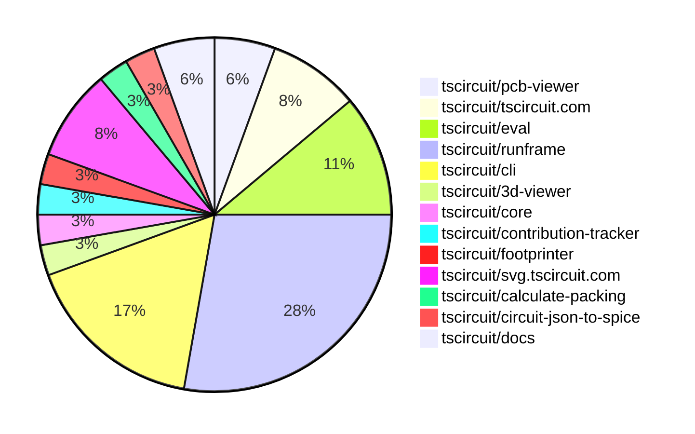
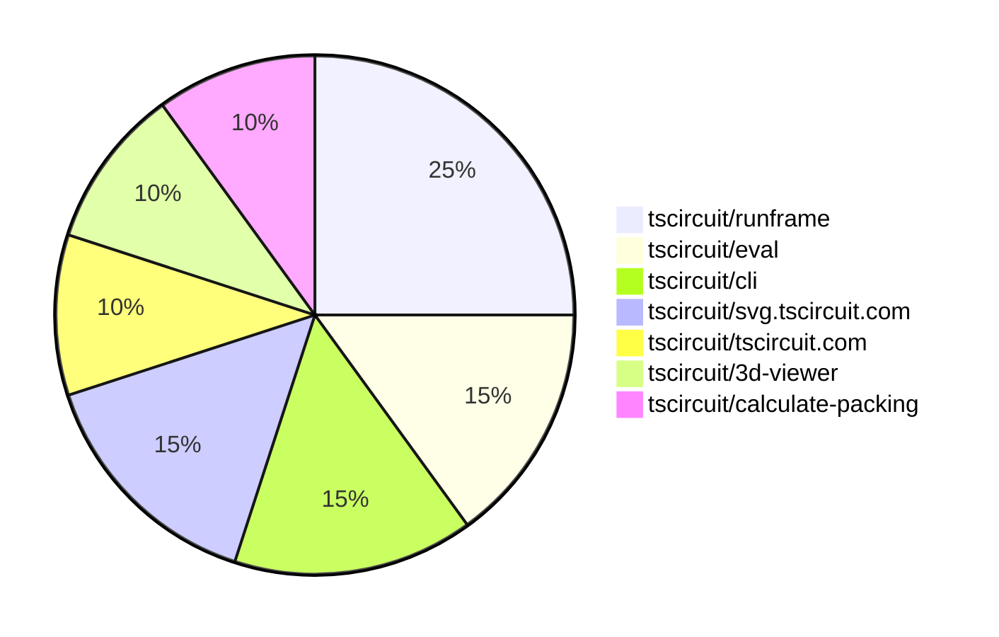

# Contribution Overview 2025-10-22

## PRs by Repository

## Contributor Overview

| Contributor | 🐳 Major | 🐙 Minor | 🐌 Tiny | ⭐ | Score | Discussion Contributions |
|-------------|---------|---------|---------|-----|----------------|--------------------------|
| [seveibar](#seveibar) | 1 | 3 | 1 | ⭐⭐ | 17 | 0🔹 0🔶 0💎 |
| [tscircuitbot](#tscircuitbot) | 0 | 0 | 17 | ⭐⭐ | 13 | 0🔹 0🔶 0💎 |
| [imrishabh18](#imrishabh18) | 2 | 1 | 2 | ⭐⭐ | 12 | 0🔹 0🔶 0💎 |
| [pxlpal](#pxlpal) | 0 | 2 | 1 | ⭐ | 5 | 0🔹 0🔶 0💎 |
| [ShiboSoftwareDev](#ShiboSoftwareDev) | 0 | 1 | 0 |  | 3 | 0🔹 0🔶 0💎 |
| [techmannih](#techmannih) | 0 | 0 | 1 |  | 3 | 0🔹 0🔶 0💎 |
| [zojize](#zojize) | 0 | 1 | 0 |  | 2 | 0🔹 0🔶 0💎 |
| [Ayushjhawar8](#Ayushjhawar8) | 0 | 0 | 2 |  | 2 | 0🔹 0🔶 0💎 |
| [joncherry](#joncherry) | 0 | 0 | 1 |  | 1 | 0🔹 0🔶 0💎 |

### Discussion Contribution Legend

- 🔹 Normal Comments: Basic participation with minimal effort
- 🔶 Great Informative Comments: Thoughtful participation that adds value
- 💎 Incredible Comments: Exceptional participation with high-quality content

## Review Table

[reviews-received-hover]: ## "Number of reviews received for PRs for this contributor"
[approvals-received-hover]: ## "Number of approvals received for PRs this contributor authored"
[rejections-received-hover]: ## "Number of rejections received for PRs this contributor authored"
[prs-opened-hover]: ## "Number of PRs opened by this contributor"
[issues-created-hover]: ## "Number of issues created by this contributor"
[bountied-issues-hover]: ## "Number of issues this contributor created with a bounty"
[bountied-issue-$-hover]: ## "Total bounty amount placed on issues authored by this contributor"

| Contributor | Reviews Received | Approvals Received | Rejections Received | Approvals | Rejections | PRs Opened | PRs Merged | Score | Issues Created | Bountied Issues | Bountied Issue $ |
|---|---|---|---|---|---|---|---|---|---|---|---|
| [Excellencedev](#Excellencedev) | 0 | 0 | 0 | 0 | 0 | 1 | 0 | 0 | 0 | 0 | 0 |
| [seveibar](#seveibar) | 6 | 4 | 0 | 10 | 0 | 7 | 5 | 17 | 0 | 0 | 0 |
| [tscircuitbot](#tscircuitbot) | 0 | 0 | 0 | 0 | 0 | 21 | 17 | 13 | 0 | 0 | 0 |
| [joncherry](#joncherry) | 2 | 2 | 0 | 0 | 0 | 1 | 1 | 1 | 0 | 0 | 0 |
| [techmannih](#techmannih) | 1 | 1 | 0 | 1 | 0 | 1 | 1 | 3 | 0 | 0 | 0 |
| [MustafaMulla29](#MustafaMulla29) | 4 | 0 | 0 | 1 | 0 | 1 | 0 | 0 | 0 | 0 | 0 |
| [Aqil-Ahmad](#Aqil-Ahmad) | 2 | 0 | 0 | 0 | 0 | 1 | 0 | 0 | 0 | 0 | 0 |
| [baeoc](#baeoc) | 0 | 0 | 0 | 0 | 0 | 1 | 0 | 0 | 0 | 0 | 0 |
| [RaghavArora14](#RaghavArora14) | 1 | 0 | 0 | 0 | 0 | 1 | 0 | 0 | 0 | 0 | 0 |
| [dhvll](#dhvll) | 0 | 0 | 0 | 0 | 0 | 1 | 0 | 0 | 0 | 0 | 0 |
| [ArnavK-09](#ArnavK-09) | 0 | 0 | 0 | 1 | 0 | 0 | 0 | 0 | 0 | 0 | 0 |
| [ShiboSoftwareDev](#ShiboSoftwareDev) | 1 | 1 | 0 | 1 | 0 | 1 | 1 | 3 | 0 | 0 | 0 |
| [Abse2001](#Abse2001) | 0 | 0 | 0 | 1 | 0 | 0 | 0 | 0 | 0 | 0 | 0 |
| [imrishabh18](#imrishabh18) | 6 | 2 | 0 | 0 | 0 | 5 | 5 | 12 | 0 | 0 | 0 |
| [zojize](#zojize) | 1 | 1 | 0 | 0 | 0 | 1 | 1 | 2 | 0 | 0 | 0 |
| [Ayushjhawar8](#Ayushjhawar8) | 3 | 2 | 0 | 0 | 0 | 2 | 2 | 2 | 0 | 0 | 0 |
| [Asymtode712](#Asymtode712) | 0 | 0 | 0 | 0 | 0 | 1 | 0 | 0 | 0 | 0 | 0 |
| [brymut](#brymut) | 3 | 0 | 0 | 0 | 0 | 1 | 0 | 0 | 0 | 0 | 0 |
| [pxlpal](#pxlpal) | 2 | 2 | 0 | 0 | 0 | 3 | 3 | 5 | 0 | 0 | 0 |

## Top 7 Repositories by Contribution Points

## Changes by Repository

### [tscircuit/pcb-viewer](https://github.com/tscircuit/pcb-viewer)

| PR # | Impact | Rating | Contributor | Description |
|------|--------|--------|-------------|-------------|
| [#423](https://github.com/tscircuit/pcb-viewer/pull/423) | 🐙 Minor | ⭐⭐ | seveibar | Allows lowercase text rendering in PCB notes by importing an updated alphabet dataset and modifying text conversion logic. |

🐌 Tiny Contributions (1)

| PR # | Impact | Contributor | Description |
|------|--------|-------------|-------------|
| [#424](https://github.com/tscircuit/pcb-viewer/pull/424) | 🐌 Tiny | tscircuitbot | Automated package update |

### [tscircuit/tscircuit.com](https://github.com/tscircuit/tscircuit.com)

| PR # | Impact | Rating | Contributor | Description |
|------|--------|--------|-------------|-------------|
| [#1836](https://github.com/tscircuit/tscircuit.com/pull/1836) | 🐙 Minor | ⭐⭐ | imrishabh18 | Fixes session invalidation after user signs out, ensuring that the session is properly deleted and cannot be reused. |

🐌 Tiny Contributions (2)

| PR # | Impact | Contributor | Description |
|------|--------|-------------|-------------|
| [#1837](https://github.com/tscircuit/tscircuit.com/pull/1837) | 🐌 Tiny | tscircuitbot | Updates the package version from 0.0.123 to 0.0.124 in package.json |
| [#1834](https://github.com/tscircuit/tscircuit.com/pull/1834) | 🐌 Tiny | tscircuitbot | Updates the tscircuiteval package from version 0.0.415 to 0.0.416 |

### [tscircuit/eval](https://github.com/tscircuit/eval)

| PR # | Impact | Rating | Contributor | Description |
|------|--------|--------|-------------|-------------|
| [#1359](https://github.com/tscircuit/eval/pull/1359) | 🐙 Minor | ⭐⭐ | seveibar | Skip import type statements when collecting dependency names and add a regression test to ensure type-only imports do not trigger circular detection. |
| [#1264](https://github.com/tscircuit/eval/pull/1264) | 🐙 Minor | ⭐⭐ | zojize | Fixes flakiness in tests caused by improper handling of async function clearEventListeners, ensuring consistent test results. |

🐌 Tiny Contributions (2)

| PR # | Impact | Contributor | Description |
|------|--------|-------------|-------------|
| [#1363](https://github.com/tscircuit/eval/pull/1363) | 🐌 Tiny | tscircuitbot | Automated package update |
| [#1362](https://github.com/tscircuit/eval/pull/1362) | 🐌 Tiny | tscircuitbot | Automated package update |

### [tscircuit/runframe](https://github.com/tscircuit/runframe)

🐌 Tiny Contributions (10)

| PR # | Impact | Contributor | Description |
|------|--------|-------------|-------------|
| [#1539](https://github.com/tscircuit/runframe/pull/1539) | 🐌 Tiny | tscircuitbot | Automated package version bump from 0.0.1139 to 0.0.1140 |
| [#1537](https://github.com/tscircuit/runframe/pull/1537) | 🐌 Tiny | tscircuitbot | Automated package update |
| [#1536](https://github.com/tscircuit/runframe/pull/1536) | 🐌 Tiny | tscircuitbot | Automated package update |
| [#1532](https://github.com/tscircuit/runframe/pull/1532) | 🐌 Tiny | tscircuitbot | Updates the tscircuit3d-viewer package from version 0.0.418 to 0.0.419 |
| [#1530](https://github.com/tscircuit/runframe/pull/1530) | 🐌 Tiny | tscircuitbot | Updates the tscircuiteval package to version 0.0.416 in the package.json file. |
| [#1529](https://github.com/tscircuit/runframe/pull/1529) | 🐌 Tiny | tscircuitbot | Updates the tscircuitpcb-viewer package from version 1.11.236 to 1.11.237 |
| [#1535](https://github.com/tscircuit/runframe/pull/1535) | 🐌 Tiny | imrishabh18 | This pull request adds the jose package to the project to resolve issues related to publishing. |
| [#1534](https://github.com/tscircuit/runframe/pull/1534) | 🐌 Tiny | imrishabh18 | This pull request addresses issues with the lockfile to ensure proper publishing of the package. It updates the lockfile to reflect the correct dependencies and versions, which is crucial for maintaining consistency across environments and preventing potential issues during deployment. |
| [#1538](https://github.com/tscircuit/runframe/pull/1538) | 🐌 Tiny | Ayushjhawar8 | Removes the duplicate dependency jose from the project to streamline package management and avoid potential conflicts. |
| [#1533](https://github.com/tscircuit/runframe/pull/1533) | 🐌 Tiny | Ayushjhawar8 | Try to address these point !image(https:github.comuser-attachmentsassets13ea2a8e-6e03-466c-b989-ce963ec0ba91) |

### [tscircuit/cli](https://github.com/tscircuit/cli)

🐌 Tiny Contributions (6)

| PR # | Impact | Contributor | Description |
|------|--------|-------------|-------------|
| [#697](https://github.com/tscircuit/cli/pull/697) | 🐌 Tiny | tscircuitbot | Automated package update |
| [#696](https://github.com/tscircuit/cli/pull/696) | 🐌 Tiny | tscircuitbot | Updates the tscircuitrunframe package to version 0.0.1140 |
| [#695](https://github.com/tscircuit/cli/pull/695) | 🐌 Tiny | tscircuitbot | Automated package update to version 0.1.375 |
| [#694](https://github.com/tscircuit/cli/pull/694) | 🐌 Tiny | tscircuitbot | Updates the tscircuitrunframe package to version 0.0.1139 |
| [#693](https://github.com/tscircuit/cli/pull/693) | 🐌 Tiny | tscircuitbot | Automated package update |
| [#692](https://github.com/tscircuit/cli/pull/692) | 🐌 Tiny | tscircuitbot | Updates the tscircuitrunframe package from version 0.0.1137 to 0.0.1138 |

### [tscircuit/3d-viewer](https://github.com/tscircuit/3d-viewer)

| PR # | Impact | Rating | Contributor | Description |
|------|--------|--------|-------------|-------------|
| [#533](https://github.com/tscircuit/3d-viewer/pull/533) | 🐳 Major | ⭐⭐⭐ | seveibar | Animate the camera orientation with quaternion slerp so roll transitions smoothly between presets and derive intermediate targets from the interpolated orientation to update orbit controlsmatrices for stable animation. |

### [tscircuit/core](https://github.com/tscircuit/core)

| PR # | Impact | Rating | Contributor | Description |
|------|--------|--------|-------------|-------------|
| [#1555](https://github.com/tscircuit/core/pull/1555) | 🐙 Minor | ⭐⭐ | seveibar | Default PCB and fabrication note dimension text to the measured distance when no text is provided, formatting the generated text with whole numbers left as-is and other values rounded to two decimal places, and adding unit tests covering the new defaulting behavior for both dimension components. |

### [tscircuit/contribution-tracker](https://github.com/tscircuit/contribution-tracker)

🐌 Tiny Contributions (1)

| PR # | Impact | Contributor | Description |
|------|--------|-------------|-------------|
| [#232](https://github.com/tscircuit/contribution-tracker/pull/232) | 🐌 Tiny | seveibar | Adds techmannih as a maintainer in the maintainers list. |

### [tscircuit/footprinter](https://github.com/tscircuit/footprinter)

🐌 Tiny Contributions (1)

| PR # | Impact | Contributor | Description |
|------|--------|-------------|-------------|
| [#372](https://github.com/tscircuit/footprinter/pull/372) | 🐌 Tiny | joncherry | Fixes the sorting of gallery items by name to ensure consistent order in the display. |

### [tscircuit/svg.tscircuit.com](https://github.com/tscircuit/svg.tscircuit.com)

| PR # | Impact | Rating | Contributor | Description |
|------|--------|--------|-------------|-------------|
| [#480](https://github.com/tscircuit/svg.tscircuit.com/pull/480) | 🐳 Major | ⭐⭐⭐ | imrishabh18 | Switches the image rendering library from sharp to resvg and resolves a font rendering issue in PNG outputs on Vercel. |

🐌 Tiny Contributions (2)

| PR # | Impact | Contributor | Description |
|------|--------|-------------|-------------|
| [#483](https://github.com/tscircuit/svg.tscircuit.com/pull/483) | 🐌 Tiny | pxlpal | Updates the tscircuit dependency version from 0.0.798 to 0.0.800 in package.json |
| [#482](https://github.com/tscircuit/svg.tscircuit.com/pull/482) | 🐌 Tiny | techmannih | Updates the circuit-to-svg dependency from version 0.0.239 to 0.0.251 in the package.json file. |

### [tscircuit/calculate-packing](https://github.com/tscircuit/calculate-packing)

| PR # | Impact | Rating | Contributor | Description |
|------|--------|--------|-------------|-------------|
| [#61](https://github.com/tscircuit/calculate-packing/pull/61) | 🐳 Major | ⭐⭐⭐ | imrishabh18 | Changes the initial placement of components in the packing algorithm to use the geometric centroid of the boundary outline, improving the packing efficiency and ensuring components are placed within the defined boundaries. |

### [tscircuit/circuit-json-to-spice](https://github.com/tscircuit/circuit-json-to-spice)

| PR # | Impact | Rating | Contributor | Description |
|------|--------|--------|-------------|-------------|
| [#16](https://github.com/tscircuit/circuit-json-to-spice/pull/16) | 🐙 Minor | ⭐⭐ | ShiboSoftwareDev | Adds the UIC (Use Initial Conditions) flag to the .tran command for transient analysis, ensuring SPICE simulators use specified initial conditions for simulations involving oscillators or switching circuits. |

### [tscircuit/docs](https://github.com/tscircuit/docs)

| PR # | Impact | Rating | Contributor | Description |
|------|--------|--------|-------------|-------------|
| [#279](https://github.com/tscircuit/docs/pull/279) | 🐙 Minor | ⭐⭐ | pxlpal | Fixes the rendering issue of the fabrication note rectangle in the documentation. |
| [#278](https://github.com/tscircuit/docs/pull/278) | 🐙 Minor | ⭐⭐ | pxlpal | Updates the descriptions for various tscircuit Essentials categories to provide clearer guidance on their functionalities and usage. |

## Changes by Contributor

### [tscircuitbot](https://github.com/tscircuitbot)

🐌 Tiny Contributions (17)

| PR # | Impact | Description |
|------|--------|-------------|
| [#424](https://github.com/tscircuit/pcb-viewer/pull/424) | 🐌 Tiny | Automated package update |
| [#1837](https://github.com/tscircuit/tscircuit.com/pull/1837) | 🐌 Tiny | Updates the package version from 0.0.123 to 0.0.124 in package.json |
| [#1834](https://github.com/tscircuit/tscircuit.com/pull/1834) | 🐌 Tiny | Updates the tscircuiteval package from version 0.0.415 to 0.0.416 |
| [#1363](https://github.com/tscircuit/eval/pull/1363) | 🐌 Tiny | Automated package update |
| [#1362](https://github.com/tscircuit/eval/pull/1362) | 🐌 Tiny | Automated package update |
| [#1539](https://github.com/tscircuit/runframe/pull/1539) | 🐌 Tiny | Automated package version bump from 0.0.1139 to 0.0.1140 |
| [#1537](https://github.com/tscircuit/runframe/pull/1537) | 🐌 Tiny | Automated package update |
| [#1536](https://github.com/tscircuit/runframe/pull/1536) | 🐌 Tiny | Automated package update |
| [#1532](https://github.com/tscircuit/runframe/pull/1532) | 🐌 Tiny | Updates the tscircuit3d-viewer package from version 0.0.418 to 0.0.419 |
| [#1530](https://github.com/tscircuit/runframe/pull/1530) | 🐌 Tiny | Updates the tscircuiteval package to version 0.0.416 in the package.json file. |
| [#1529](https://github.com/tscircuit/runframe/pull/1529) | 🐌 Tiny | Updates the tscircuitpcb-viewer package from version 1.11.236 to 1.11.237 |
| [#697](https://github.com/tscircuit/cli/pull/697) | 🐌 Tiny | Automated package update |
| [#696](https://github.com/tscircuit/cli/pull/696) | 🐌 Tiny | Updates the tscircuitrunframe package to version 0.0.1140 |
| [#695](https://github.com/tscircuit/cli/pull/695) | 🐌 Tiny | Automated package update to version 0.1.375 |
| [#694](https://github.com/tscircuit/cli/pull/694) | 🐌 Tiny | Updates the tscircuitrunframe package to version 0.0.1139 |
| [#693](https://github.com/tscircuit/cli/pull/693) | 🐌 Tiny | Automated package update |
| [#692](https://github.com/tscircuit/cli/pull/692) | 🐌 Tiny | Updates the tscircuitrunframe package from version 0.0.1137 to 0.0.1138 |

### [seveibar](https://github.com/seveibar)

| PRs # | Impact | Rating | Description |
|------|--------|--------|-------------|
| [#533](https://github.com/tscircuit/3d-viewer/pull/533) | 🐳 Major | ⭐⭐⭐ | Animate the camera orientation with quaternion slerp so roll transitions smoothly between presets and derive intermediate targets from the interpolated orientation to update orbit controlsmatrices for stable animation. |
| [#423](https://github.com/tscircuit/pcb-viewer/pull/423) | 🐙 Minor | ⭐⭐ | Allows lowercase text rendering in PCB notes by importing an updated alphabet dataset and modifying text conversion logic. |
| [#1555](https://github.com/tscircuit/core/pull/1555) | 🐙 Minor | ⭐⭐ | Default PCB and fabrication note dimension text to the measured distance when no text is provided, formatting the generated text with whole numbers left as-is and other values rounded to two decimal places, and adding unit tests covering the new defaulting behavior for both dimension components. |
| [#1359](https://github.com/tscircuit/eval/pull/1359) | 🐙 Minor | ⭐⭐ | Skip import type statements when collecting dependency names and add a regression test to ensure type-only imports do not trigger circular detection. |

🐌 Tiny Contributions (1)

| PR # | Impact | Description |
|------|--------|-------------|
| [#232](https://github.com/tscircuit/contribution-tracker/pull/232) | 🐌 Tiny | Adds techmannih as a maintainer in the maintainers list. |

### [joncherry](https://github.com/joncherry)

🐌 Tiny Contributions (1)

| PR # | Impact | Description |
|------|--------|-------------|
| [#372](https://github.com/tscircuit/footprinter/pull/372) | 🐌 Tiny | Fixes the sorting of gallery items by name to ensure consistent order in the display. |

### [imrishabh18](https://github.com/imrishabh18)

| PRs # | Impact | Rating | Description |
|------|--------|--------|-------------|
| [#480](https://github.com/tscircuit/svg.tscircuit.com/pull/480) | 🐳 Major | ⭐⭐⭐ | Switches the image rendering library from sharp to resvg and resolves a font rendering issue in PNG outputs on Vercel. |
| [#61](https://github.com/tscircuit/calculate-packing/pull/61) | 🐳 Major | ⭐⭐⭐ | Changes the initial placement of components in the packing algorithm to use the geometric centroid of the boundary outline, improving the packing efficiency and ensuring components are placed within the defined boundaries. |
| [#1836](https://github.com/tscircuit/tscircuit.com/pull/1836) | 🐙 Minor | ⭐⭐ | Fixes session invalidation after user signs out, ensuring that the session is properly deleted and cannot be reused. |

🐌 Tiny Contributions (2)

| PR # | Impact | Description |
|------|--------|-------------|
| [#1535](https://github.com/tscircuit/runframe/pull/1535) | 🐌 Tiny | This pull request adds the jose package to the project to resolve issues related to publishing. |
| [#1534](https://github.com/tscircuit/runframe/pull/1534) | 🐌 Tiny | This pull request addresses issues with the lockfile to ensure proper publishing of the package. It updates the lockfile to reflect the correct dependencies and versions, which is crucial for maintaining consistency across environments and preventing potential issues during deployment. |

### [zojize](https://github.com/zojize)

| PRs # | Impact | Rating | Description |
|------|--------|--------|-------------|
| [#1264](https://github.com/tscircuit/eval/pull/1264) | 🐙 Minor | ⭐⭐ | Fixes flakiness in tests caused by improper handling of async function clearEventListeners, ensuring consistent test results. |

### [ShiboSoftwareDev](https://github.com/ShiboSoftwareDev)

| PRs # | Impact | Rating | Description |
|------|--------|--------|-------------|
| [#16](https://github.com/tscircuit/circuit-json-to-spice/pull/16) | 🐙 Minor | ⭐⭐ | Adds the UIC (Use Initial Conditions) flag to the .tran command for transient analysis, ensuring SPICE simulators use specified initial conditions for simulations involving oscillators or switching circuits. |

### [Ayushjhawar8](https://github.com/Ayushjhawar8)

🐌 Tiny Contributions (2)

| PR # | Impact | Description |
|------|--------|-------------|
| [#1538](https://github.com/tscircuit/runframe/pull/1538) | 🐌 Tiny | Removes the duplicate dependency jose from the project to streamline package management and avoid potential conflicts. |
| [#1533](https://github.com/tscircuit/runframe/pull/1533) | 🐌 Tiny | Try to address these point !image(https:github.comuser-attachmentsassets13ea2a8e-6e03-466c-b989-ce963ec0ba91) |

### [pxlpal](https://github.com/pxlpal)

| PRs # | Impact | Rating | Description |
|------|--------|--------|-------------|
| [#279](https://github.com/tscircuit/docs/pull/279) | 🐙 Minor | ⭐⭐ | Fixes the rendering issue of the fabrication note rectangle in the documentation. |
| [#278](https://github.com/tscircuit/docs/pull/278) | 🐙 Minor | ⭐⭐ | Updates the descriptions for various tscircuit Essentials categories to provide clearer guidance on their functionalities and usage. |

🐌 Tiny Contributions (1)

| PR # | Impact | Description |
|------|--------|-------------|
| [#483](https://github.com/tscircuit/svg.tscircuit.com/pull/483) | 🐌 Tiny | Updates the tscircuit dependency version from 0.0.798 to 0.0.800 in package.json |

### [techmannih](https://github.com/techmannih)

🐌 Tiny Contributions (1)

| PR # | Impact | Description |
|------|--------|-------------|
| [#482](https://github.com/tscircuit/svg.tscircuit.com/pull/482) | 🐌 Tiny | Updates the circuit-to-svg dependency from version 0.0.239 to 0.0.251 in the package.json file. |

## Repository Owners

| Repository | Codeowners |
|------------|------------|
| [builder](https://github.com/tscircuit/builder/blob/main/.github/CODEOWNERS) | [seveibar](https://github.com/seveibar)
| [pcb-viewer](https://github.com/tscircuit/pcb-viewer/blob/main/.github/CODEOWNERS) | [seveibar](https://github.com/seveibar), [ShiboSoftwareDev](https://github.com/ShiboSoftwareDev)
| [footprints-old](https://github.com/tscircuit/footprints-old/blob/main/.github/CODEOWNERS) | [seveibar](https://github.com/seveibar)
| [footprinter](https://github.com/tscircuit/footprinter/blob/main/.github/CODEOWNERS) | [seveibar](https://github.com/seveibar), [techmannih](https://github.com/techmannih)
| [3d-viewer](https://github.com/tscircuit/3d-viewer/blob/main/.github/CODEOWNERS) | [ShiboSoftwareDev](https://github.com/ShiboSoftwareDev)
| [winterspec](https://github.com/tscircuit/winterspec/blob/main/.github/CODEOWNERS) | [seveibar](https://github.com/seveibar), [ShiboSoftwareDev](https://github.com/ShiboSoftwareDev)
| [jscad-electronics](https://github.com/tscircuit/jscad-electronics/blob/main/.github/CODEOWNERS) | [seveibar](https://github.com/seveibar), [abhijitxy](https://github.com/abhijitxy), [anas-sarkez](https://github.com/anas-sarkez)
| [circuit-to-svg](https://github.com/tscircuit/circuit-to-svg/blob/main/.github/CODEOWNERS) | [imrishabh18](https://github.com/imrishabh18)
| [schematic-symbols](https://github.com/tscircuit/schematic-symbols/blob/main/.github/CODEOWNERS) | [seveibar](https://github.com/seveibar), [imrishabh18](https://github.com/imrishabh18), [techmannih](https://github.com/techmannih)
| [circuit-json-to-gerber](https://github.com/tscircuit/circuit-json-to-gerber/blob/main/.github/CODEOWNERS) | [seveibar](https://github.com/seveibar), [ShiboSoftwareDev](https://github.com/ShiboSoftwareDev)
| [tscircuit.com](https://github.com/tscircuit/tscircuit.com/blob/main/.github/CODEOWNERS) | [seveibar](https://github.com/seveibar), [imrishabh18](https://github.com/imrishabh18)
| [issue-roulette](https://github.com/tscircuit/issue-roulette/blob/main/.github/CODEOWNERS) | [Anshgrover23](https://github.com/Anshgrover23)
| [sparkfun-boards](https://github.com/tscircuit/sparkfun-boards/blob/main/.github/CODEOWNERS) | [ShiboSoftwareDev](https://github.com/ShiboSoftwareDev), [Abse2001](https://github.com/Abse2001), [MustafaMulla29](https://github.com/MustafaMulla29), [Anshgrover23](https://github.com/Anshgrover23), [techmannih](https://github.com/techmannih)
| [schematic-corpus](https://github.com/tscircuit/schematic-corpus/blob/main/.github/CODEOWNERS) | [Abse2001](https://github.com/Abse2001)
| [common](https://github.com/tscircuit/common/blob/main/.github/CODEOWNERS) | [seveibar](https://github.com/seveibar), [Abse2001](https://github.com/Abse2001)

## Repositories by Owner

| User | Repo |
|------|------|
| [seveibar](https://github.com/seveibar) | [builder](https://github.com/tscircuit/builder/blob/main/.github/CODEOWNERS) |
|  | [pcb-viewer](https://github.com/tscircuit/pcb-viewer/blob/main/.github/CODEOWNERS) |
|  | [footprints-old](https://github.com/tscircuit/footprints-old/blob/main/.github/CODEOWNERS) |
|  | [footprinter](https://github.com/tscircuit/footprinter/blob/main/.github/CODEOWNERS) |
|  | [winterspec](https://github.com/tscircuit/winterspec/blob/main/.github/CODEOWNERS) |
|  | [jscad-electronics](https://github.com/tscircuit/jscad-electronics/blob/main/.github/CODEOWNERS) |
|  | [schematic-symbols](https://github.com/tscircuit/schematic-symbols/blob/main/.github/CODEOWNERS) |
|  | [circuit-json-to-gerber](https://github.com/tscircuit/circuit-json-to-gerber/blob/main/.github/CODEOWNERS) |
|  | [tscircuit.com](https://github.com/tscircuit/tscircuit.com/blob/main/.github/CODEOWNERS) |
|  | [common](https://github.com/tscircuit/common/blob/main/.github/CODEOWNERS) |
| [ShiboSoftwareDev](https://github.com/ShiboSoftwareDev) | [pcb-viewer](https://github.com/tscircuit/pcb-viewer/blob/main/.github/CODEOWNERS) |
|  | [3d-viewer](https://github.com/tscircuit/3d-viewer/blob/main/.github/CODEOWNERS) |
|  | [winterspec](https://github.com/tscircuit/winterspec/blob/main/.github/CODEOWNERS) |
|  | [circuit-json-to-gerber](https://github.com/tscircuit/circuit-json-to-gerber/blob/main/.github/CODEOWNERS) |
|  | [sparkfun-boards](https://github.com/tscircuit/sparkfun-boards/blob/main/.github/CODEOWNERS) |
| [techmannih](https://github.com/techmannih) | [footprinter](https://github.com/tscircuit/footprinter/blob/main/.github/CODEOWNERS) |
|  | [schematic-symbols](https://github.com/tscircuit/schematic-symbols/blob/main/.github/CODEOWNERS) |
|  | [sparkfun-boards](https://github.com/tscircuit/sparkfun-boards/blob/main/.github/CODEOWNERS) |
| [abhijitxy](https://github.com/abhijitxy) | [jscad-electronics](https://github.com/tscircuit/jscad-electronics/blob/main/.github/CODEOWNERS) |
| [anas-sarkez](https://github.com/anas-sarkez) | [jscad-electronics](https://github.com/tscircuit/jscad-electronics/blob/main/.github/CODEOWNERS) |
| [imrishabh18](https://github.com/imrishabh18) | [circuit-to-svg](https://github.com/tscircuit/circuit-to-svg/blob/main/.github/CODEOWNERS) |
|  | [schematic-symbols](https://github.com/tscircuit/schematic-symbols/blob/main/.github/CODEOWNERS) |
|  | [tscircuit.com](https://github.com/tscircuit/tscircuit.com/blob/main/.github/CODEOWNERS) |
| [Anshgrover23](https://github.com/Anshgrover23) | [issue-roulette](https://github.com/tscircuit/issue-roulette/blob/main/.github/CODEOWNERS) |
|  | [sparkfun-boards](https://github.com/tscircuit/sparkfun-boards/blob/main/.github/CODEOWNERS) |
| [Abse2001](https://github.com/Abse2001) | [sparkfun-boards](https://github.com/tscircuit/sparkfun-boards/blob/main/.github/CODEOWNERS) |
|  | [schematic-corpus](https://github.com/tscircuit/schematic-corpus/blob/main/.github/CODEOWNERS) |
|  | [common](https://github.com/tscircuit/common/blob/main/.github/CODEOWNERS) |
| [MustafaMulla29](https://github.com/MustafaMulla29) | [sparkfun-boards](https://github.com/tscircuit/sparkfun-boards/blob/main/.github/CODEOWNERS) |

