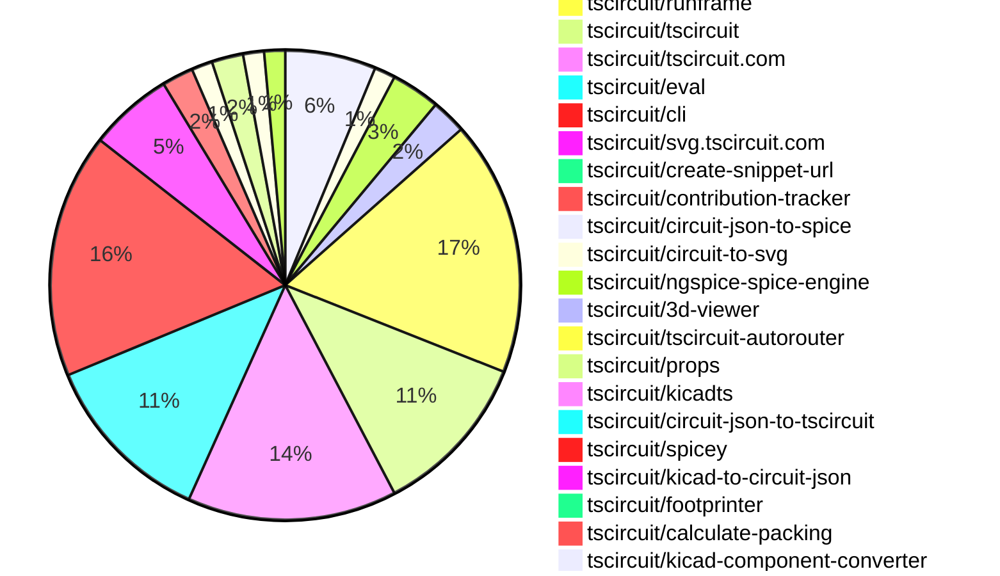
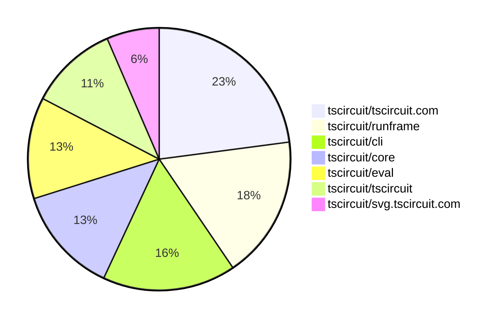

# Contribution Overview 2025-10-22

## PRs by Repository

## Contributor Overview

| Contributor | 🐳 Major | 🐙 Minor | 🐌 Tiny | ⭐ | Score | Discussion Contributions |
|-------------|---------|---------|---------|-----|----------------|--------------------------|
| [seveibar](#seveibar) | 7 | 28 | 18 | 👑👑 | 79 | 1🔹 0🔶 0💎 |
| [imrishabh18](#imrishabh18) | 7 | 9 | 9 | 👑 | 63 | 0🔹 0🔶 0💎 |
| [ArnavK-09](#ArnavK-09) | 7 | 7 | 12 | 👑 | 59 | 1🔹 0🔶 0💎 |
| [ShiboSoftwareDev](#ShiboSoftwareDev) | 1 | 8 | 5 | ⭐⭐⭐ | 39 | 0🔹 0🔶 0💎 |
| [Abse2001](#Abse2001) | 7 | 2 | 0 | ⭐⭐⭐ | 34 | 0🔹 0🔶 0💎 |
| [tscircuitbot](#tscircuitbot) | 0 | 0 | 281 | ⭐⭐ | 18 | 0🔹 0🔶 0💎 |
| [Ayushjhawar8](#Ayushjhawar8) | 1 | 2 | 6 | ⭐⭐ | 14 | 0🔹 0🔶 0💎 |
| [techmannih](#techmannih) | 0 | 0 | 3 | ⭐⭐ | 14 | 0🔹 0🔶 0💎 |
| [Asymtode712](#Asymtode712) | 2 | 1 | 0 | ⭐ | 10 | 0🔹 0🔶 0💎 |
| [nailoo](#nailoo) | 0 | 0 | 4 | ⭐ | 9 | 0🔹 0🔶 0💎 |
| [MustafaMulla29](#MustafaMulla29) | 0 | 1 | 0 | ⭐ | 7 | 0🔹 0🔶 0💎 |
| [pxlpal](#pxlpal) | 0 | 1 | 3 | ⭐ | 5 | 0🔹 0🔶 0💎 |
| [divanshu-go](#divanshu-go) | 1 | 0 | 0 | ⭐ | 4 | 0🔹 0🔶 0💎 |
| [0hmX](#0hmX) | 1 | 0 | 0 | ⭐ | 4 | 0🔹 0🔶 0💎 |
| [RaghavArora14](#RaghavArora14) | 0 | 1 | 1 |  | 3 | 0🔹 0🔶 0💎 |
| [rushabhcodes](#rushabhcodes) | 0 | 0 | 2 |  | 3 | 0🔹 0🔶 0💎 |
| [joncherry](#joncherry) | 0 | 0 | 1 |  | 2 | 0🔹 0🔶 0💎 |
| [zojize](#zojize) | 0 | 1 | 0 |  | 2 | 0🔹 0🔶 0💎 |
| [raykholo](#raykholo) | 0 | 0 | 1 |  | 2 | 0🔹 0🔶 0💎 |
| [brymut](#brymut) | 0 | 0 | 1 |  | 1 | 0🔹 0🔶 0💎 |
| [Anshgrover23](#Anshgrover23) | 0 | 0 | 0 |  | 0 | 1🔹 0🔶 0💎 |

### Discussion Contribution Legend

- 🔹 Normal Comments: Basic participation with minimal effort
- 🔶 Great Informative Comments: Thoughtful participation that adds value
- 💎 Incredible Comments: Exceptional participation with high-quality content

## Review Table

[reviews-received-hover]: ## "Number of reviews received for PRs for this contributor"
[approvals-received-hover]: ## "Number of approvals received for PRs this contributor authored"
[rejections-received-hover]: ## "Number of rejections received for PRs this contributor authored"
[prs-opened-hover]: ## "Number of PRs opened by this contributor"
[issues-created-hover]: ## "Number of issues created by this contributor"
[bountied-issues-hover]: ## "Number of issues this contributor created with a bounty"
[bountied-issue-$-hover]: ## "Total bounty amount placed on issues authored by this contributor"

| Contributor | Reviews Received | Approvals Received | Rejections Received | Approvals | Rejections | PRs Opened | PRs Merged | Score | Issues Created | Bountied Issues | Bountied Issue $ |
|---|---|---|---|---|---|---|---|---|---|---|---|
| [Excellencedev](#Excellencedev) | 2 | 0 | 1 | 0 | 0 | 1 | 0 | 0 | 0 | 0 | 0 |
| [nailoo](#nailoo) | 36 | 6 | 8 | 0 | 0 | 8 | 4 | 9 | 0 | 0 | 0 |
| [techmannih](#techmannih) | 10 | 5 | 2 | 3 | 1 | 9 | 3 | 14 | 0 | 0 | 0 |
| [Ayushjhawar8](#Ayushjhawar8) | 21 | 9 | 1 | 0 | 0 | 10 | 9 | 14 | 0 | 0 | 0 |
| [imrishabh18](#imrishabh18) | 20 | 10 | 0 | 4 | 5 | 28 | 25 | 63 | 0 | 0 | 0 |
| [tscircuitbot](#tscircuitbot) | 0 | 0 | 0 | 0 | 0 | 315 | 281 | 18 | 0 | 0 | 0 |
| [ShiboSoftwareDev](#ShiboSoftwareDev) | 21 | 13 | 1 | 14 | 0 | 18 | 14 | 39 | 0 | 0 | 0 |
| [seveibar](#seveibar) | 28 | 5 | 0 | 65 | 15 | 64 | 54 | 79 | 0 | 0 | 0 |
| [Abse2001](#Abse2001) | 11 | 10 | 0 | 2 | 0 | 16 | 9 | 34 | 0 | 0 | 0 |
| [Aqil-Ahmad](#Aqil-Ahmad) | 13 | 0 | 1 | 0 | 0 | 5 | 0 | 0 | 0 | 0 | 0 |
| [joncherry](#joncherry) | 13 | 3 | 1 | 0 | 0 | 2 | 1 | 2 | 0 | 0 | 0 |
| [Exceluyi](#Exceluyi) | 1 | 0 | 1 | 0 | 1 | 3 | 0 | 0 | 0 | 0 | 0 |
| [saurabhraghuvanshii](#saurabhraghuvanshii) | 4 | 0 | 0 | 0 | 0 | 1 | 0 | 0 | 0 | 0 | 0 |
| [MustafaMulla29](#MustafaMulla29) | 2 | 1 | 0 | 2 | 1 | 1 | 1 | 7 | 0 | 0 | 0 |
| [baeoc](#baeoc) | 0 | 0 | 0 | 0 | 0 | 1 | 0 | 0 | 0 | 0 | 0 |
| [Pranjal6955](#Pranjal6955) | 2 | 0 | 0 | 0 | 0 | 1 | 0 | 0 | 0 | 0 | 0 |
| [Asymtode712](#Asymtode712) | 8 | 3 | 1 | 0 | 0 | 6 | 3 | 10 | 0 | 0 | 0 |
| [Omar8345](#Omar8345) | 1 | 0 | 0 | 0 | 0 | 1 | 0 | 0 | 0 | 0 | 0 |
| [RaghavArora14](#RaghavArora14) | 10 | 3 | 0 | 0 | 0 | 5 | 2 | 3 | 0 | 0 | 0 |
| [7908837174](#7908837174) | 1 | 0 | 0 | 0 | 0 | 1 | 0 | 0 | 0 | 0 | 0 |
| [rushabhcodes](#rushabhcodes) | 14 | 2 | 1 | 0 | 0 | 7 | 2 | 3 | 0 | 0 | 0 |
| [ArnavK-09](#ArnavK-09) | 21 | 11 | 1 | 3 | 1 | 27 | 26 | 59 | 0 | 0 | 0 |
| [dhvll](#dhvll) | 0 | 0 | 0 | 0 | 0 | 1 | 0 | 0 | 0 | 0 | 0 |
| [Sahelisaha04](#Sahelisaha04) | 0 | 0 | 0 | 0 | 0 | 1 | 0 | 0 | 0 | 0 | 0 |
| [jayantpranjal0](#jayantpranjal0) | 1 | 0 | 1 | 0 | 0 | 2 | 0 | 0 | 0 | 0 | 0 |
| [divanshu-go](#divanshu-go) | 3 | 2 | 0 | 0 | 0 | 2 | 1 | 4 | 0 | 0 | 0 |
| [BuddhikaBICT-UoR-FoT-6](#BuddhikaBICT-UoR-FoT-6) | 3 | 1 | 2 | 0 | 0 | 3 | 0 | 0 | 0 | 0 | 0 |
| [pkparthk](#pkparthk) | 1 | 0 | 0 | 0 | 0 | 1 | 0 | 0 | 0 | 0 | 0 |
| [Anshgrover23](#Anshgrover23) | 0 | 0 | 0 | 0 | 0 | 1 | 0 | 1 | 0 | 0 | 0 |
| [zojize](#zojize) | 1 | 1 | 0 | 0 | 0 | 1 | 1 | 2 | 0 | 0 | 0 |
| [brymut](#brymut) | 3 | 1 | 0 | 0 | 0 | 1 | 1 | 1 | 0 | 0 | 0 |
| [pxlpal](#pxlpal) | 3 | 3 | 0 | 0 | 0 | 4 | 4 | 5 | 0 | 0 | 0 |
| [raykholo](#raykholo) | 13 | 2 | 0 | 0 | 0 | 2 | 1 | 2 | 0 | 0 | 0 |
| [7secondsquests-prog](#7secondsquests-prog) | 1 | 0 | 1 | 0 | 0 | 1 | 0 | 0 | 0 | 0 | 0 |
| [colmwoods](#colmwoods) | 0 | 0 | 0 | 0 | 0 | 1 | 0 | 0 | 0 | 0 | 0 |
| [1914Jegx](#1914Jegx) | 0 | 0 | 0 | 0 | 0 | 2 | 0 | 0 | 0 | 0 | 0 |
| [kunstewi](#kunstewi) | 0 | 0 | 0 | 0 | 0 | 1 | 0 | 0 | 0 | 0 | 0 |
| [0hmX](#0hmX) | 2 | 2 | 0 | 0 | 0 | 1 | 1 | 4 | 0 | 0 | 0 |
| [MayorChristopher](#MayorChristopher) | 2 | 0 | 1 | 0 | 0 | 3 | 0 | 0 | 0 | 0 | 0 |

## Top 7 Repositories by Contribution Points

## Changes by Repository

### [tscircuit/core](https://github.com/tscircuit/core)

| PR # | Impact | Rating | Contributor | Description |
|------|--------|--------|-------------|-------------|
| [#1574](https://github.com/tscircuit/core/pull/1574) | 🐳 Major | ⭐⭐⭐ | Ayushjhawar8 | Fixes error handling in the parts engine by validating responses and logging errors to Circuit JSON. |
| [#1601](https://github.com/tscircuit/core/pull/1601) | 🐳 Major | ⭐⭐⭐ | seveibar | Implements the inflation of subcircuit circuit JSON into class instances, allowing for the creation of components from circuit JSON data. |
| [#1595](https://github.com/tscircuit/core/pull/1595) | 🐳 Major | ⭐⭐⭐ | seveibar | Adds support for group ports in the circuit design, allowing ports to connect to internal components within groups. |
| [#1563](https://github.com/tscircuit/core/pull/1563) | 🐳 Major | ⭐⭐⭐ | imrishabh18 | Prevents rotation of pinheaders in autolayout when facingDirection is specified, ensuring correct schematic representation. |
| [#1561](https://github.com/tscircuit/core/pull/1561) | 🐙 Minor | ⭐⭐ | ShiboSoftwareDev | Adds support for eecircuit-engine as an alternative SPICE simulation engine, including dynamic imports, new utility functions, and integration tests. |
| [#1602](https://github.com/tscircuit/core/pull/1602) | 🐙 Minor | ⭐⭐ | seveibar | Changes the footprint property to footprinterString in multiple components and introduces a new inflator function for PCB components, enhancing the circuit JSON inflation process. |
| [#1600](https://github.com/tscircuit/core/pull/1600) | 🐙 Minor | ⭐⭐ | seveibar | Adds a test for rendering a subcircuit in circuit JSON format to ensure proper functionality and integration. |
| [#1588](https://github.com/tscircuit/core/pull/1588) | 🐙 Minor | ⭐⭐ | seveibar | Fixes polygon SMT pad rotation by applying the full PCB transform when inserting polygon pad points and adds a regression test for this functionality. |
| [#1586](https://github.com/tscircuit/core/pull/1586) | 🐙 Minor | ⭐⭐ | seveibar | Moves the async static asset resolver into a dedicated utility module and updates footprint URL loading to use the shared resolver utility while keeping CadModel cache-busting logic unchanged. |
| [#1584](https://github.com/tscircuit/core/pull/1584) | 🐙 Minor | ⭐⭐ | seveibar | Normalizes autorouter preset names so underscore variants map to the same configuration as their hyphenated counterparts and adds unit tests covering the auto_cloud preset alias behavior. |
| [#1583](https://github.com/tscircuit/core/pull/1583) | 🐙 Minor | ⭐⭐ | seveibar | Fixes a double-loading bug in the NormalComponent by replacing the isFootprintUrl function with isHttpUrl and isStaticAssetPath, improving clarity in variable names for footprint URLs. |
| [#1564](https://github.com/tscircuit/core/pull/1564) | 🐙 Minor | ⭐⭐ | seveibar | Adds support for inch units in PCB and fabrication note dimensions, updating the formatting and tests accordingly. |
| [#1566](https://github.com/tscircuit/core/pull/1566) | 🐙 Minor | ⭐⭐ | seveibar | Adds support for width as an alias for thickness in trace properties and handles cases where pcbPath may be empty or undefined. |
| [#1559](https://github.com/tscircuit/core/pull/1559) | 🐙 Minor | ⭐⭐ | seveibar | Infers has_stroke for fabrication note rectangles when only a stroke width is provided and adds coverage for the defaulted stroke flag. |
| [#1555](https://github.com/tscircuit/core/pull/1555) | 🐙 Minor | ⭐⭐ | seveibar | Defaults PCB and fabrication note dimension text to the measured distance when no text is provided, formatting the generated text with whole numbers left as-is and other values rounded to two decimal places, and adds unit tests for the new behavior. |
| [#1598](https://github.com/tscircuit/core/pull/1598) | 🐙 Minor | ⭐⭐ | imrishabh18 | Adds support for the filled prop in the silkscreenrect  component, allowing it to render filled rectangles based on the prop value. |
| [#1585](https://github.com/tscircuit/core/pull/1585) | 🐙 Minor | ⭐⭐ | imrishabh18 | Fixes the schematic box component to prevent it from being rotated, ensuring correct orientation in the layout. |
| [#1570](https://github.com/tscircuit/core/pull/1570) | 🐙 Minor | ⭐⭐ | imrishabh18 | Fixes the mapping of facing_direction to the correct side_of_component values in the schematic layout. |
| [#1565](https://github.com/tscircuit/core/pull/1565) | 🐙 Minor | ⭐⭐ | imrishabh18 | Fixes autolayout issue for the pinHeader component when no explicit facingDirection is provided. |
| [#1558](https://github.com/tscircuit/core/pull/1558) | 🐙 Minor | ⭐⭐ | imrishabh18 | Updates the calculate-packing library to version 0.0.50, enabling support for packing with outlines and improving the initial positioning of components on the board. |
| [#1573](https://github.com/tscircuit/core/pull/1573) | 🐙 Minor | ⭐⭐ | Abse2001 | Fixes PCB snapshot rendering issue when using polygon pads with other components in the circuit. |
| [#1597](https://github.com/tscircuit/core/pull/1597) | 🐙 Minor | ⭐⭐ | Asymtode712 | Adds support for controlling silkscreen text font size globally via pcbStyle.silkscreenFontSize, enabling consistent text sizing across all silkscreen elements on a board. |
| [#1578](https://github.com/tscircuit/core/pull/1578) | 🐙 Minor | ⭐⭐ | RaghavArora14 | Fixes the width calculation for schematic boxes to ensure it remains constant regardless of schPinSpacing value, addressing a bug where the width varied incorrectly based on pin spacing. |

🌠Tiny Contributions (3)

| PR # | Impact | Contributor | Description |
|------|--------|-------------|-------------|
| [#1603](https://github.com/tscircuit/core/pull/1603) | 🐌 Tiny | Ayushjhawar8 | Organizes CI test plans by moving them to a dedicated folder and updates the workflow to reference the new location, improving error handling for missing test plans. |
| [#1594](https://github.com/tscircuit/core/pull/1594) | 🐌 Tiny | Ayushjhawar8 | Implements generate-test-plan.ts script that generates test plans for all 60 CI nodes by parsing workflow matrix patterns sequentially, tracking covered files to prevent duplicates, writing per-node test plan files (.test-plansnodeN-testplan.txt), and ensuring complete test coverage across parallelized workflow runs |
| [#1562](https://github.com/tscircuit/core/pull/1562) | 🐌 Tiny | imrishabh18 | Adds a test case to reproduce the issue where pinheader ports are floating away in schematic autolayout. |

### [tscircuit/circuit-json](https://github.com/tscircuit/circuit-json)

| PR # | Impact | Rating | Contributor | Description |
|------|--------|--------|-------------|-------------|
| [#332](https://github.com/tscircuit/circuit-json/pull/332) | 🐳 Major | ⭐⭐⭐ | seveibar | Removes unused sizing and origin fields from the schematic_sheet schema and interface, and aligns the schematic component documentation and tests with the streamlined sheet definition. |
| [#327](https://github.com/tscircuit/circuit-json/pull/327) | 🐙 Minor | ⭐⭐ | Ayushjhawar8 | Adds a new error type for handling unexpected errors when finding parts in the circuit, including cases of network failures or incorrect API responses. |
| [#330](https://github.com/tscircuit/circuit-json/pull/330) | 🐙 Minor | ⭐⭐ | seveibar | Add pcb_copper_text schema for modeling copper layer text, export the new element through pcb aggregations and any_circuit_element, document the new element and cover defaults with targeted tests |
| [#329](https://github.com/tscircuit/circuit-json/pull/329) | 🐙 Minor | ⭐⭐ | seveibar | Adds support for an optional counter-clockwise rotation for text in PCB dimensions, including documentation updates. |
| [#328](https://github.com/tscircuit/circuit-json/pull/328) | 🐙 Minor | ⭐⭐ | seveibar | Adds optional offset_distance and offset_direction to PCB note dimension schema and types, extending PCB fabrication note dimension definitions with new offset configuration. |

🌠Tiny Contributions (1)

| PR # | Impact | Contributor | Description |
|------|--------|-------------|-------------|
| [#331](https://github.com/tscircuit/circuit-json/pull/331) | 🐌 Tiny | seveibar | Allows source ports to omit a source component identifier and optionally reference a source group, and allows PCB ports to omit the related PCB component identifier, with documentation updates for the new optional fields. |

### [tscircuit/docs](https://github.com/tscircuit/docs)

| PR # | Impact | Rating | Contributor | Description |
|------|--------|--------|-------------|-------------|
| [#292](https://github.com/tscircuit/docs/pull/292) | 🐙 Minor | ⭐⭐ | Ayushjhawar8 | Adds documentation for importing JLCPCB components using the Run frame editor, including step-by-step instructions and example usage. |
| [#279](https://github.com/tscircuit/docs/pull/279) | 🐙 Minor | ⭐⭐ | pxlpal | Fixes rendering issue of the fabrication note rectangle in the documentation. |

🌠Tiny Contributions (12)

| PR # | Impact | Contributor | Description |
|------|--------|-------------|-------------|
| [#299](https://github.com/tscircuit/docs/pull/299) | 🐌 Tiny | Ayushjhawar8 | Modifies the YouTube embed URL to prevent suggested videos from appearing after the video ends. |
| [#301](https://github.com/tscircuit/docs/pull/301) | 🐌 Tiny | ShiboSoftwareDev | Updates the dip4.glb model used in the project. |
| [#294](https://github.com/tscircuit/docs/pull/294) | 🐌 Tiny | ShiboSoftwareDev | Adds documentation for using web-compatible color names with the color prop on pcbnoterect . Includes a new section with a preview example demonstrating a yellow rectangle. |
| [#296](https://github.com/tscircuit/docs/pull/296) | 🐌 Tiny | seveibar | Hides schematic tabs and disables browser-based 3D rendering on all cutout previews, while removing the obsolete tips section from the cutout element documentation. |
| [#295](https://github.com/tscircuit/docs/pull/295) | 🐌 Tiny | seveibar | Documents the cutout  element and its supported shapes, including PCB previews for rectangular, circular, and polygon cutouts. |
| [#284](https://github.com/tscircuit/docs/pull/284) | 🐌 Tiny | seveibar | Documents the thickness trace property and adds an example for using it with an empty pcbPath for direct routing. |
| [#283](https://github.com/tscircuit/docs/pull/283) | 🐌 Tiny | seveibar | Updates the documentation for pcbnotedimension  to stop hardcoding measurement strings and clarify the text property as an optional override for auto-generated labels. |
| [#302](https://github.com/tscircuit/docs/pull/302) | 🐌 Tiny | imrishabh18 | Fixes incorrect prop name from isFilled to filled for the silkscreenrect component in the documentation. |
| [#281](https://github.com/tscircuit/docs/pull/281) | 🐌 Tiny | techmannih | Adds documentation for the cornerRadius property in rectangular smtpad components. |
| [#282](https://github.com/tscircuit/docs/pull/282) | 🐌 Tiny | pxlpal | Adds descriptions to all documentation pages to ensure proper rendering of the generated index page. |
| [#278](https://github.com/tscircuit/docs/pull/278) | 🐌 Tiny | pxlpal | Updates category descriptions for various tscircuit Essentials guides to provide clearer information on their content and usage. |
| [#297](https://github.com/tscircuit/docs/pull/297) | 🐌 Tiny | raykholo | Renames the parameters x and y to pcbX and pcbY in the via.mdx documentation to accurately reflect their purpose as PCB coordinates. |

### [tscircuit/pcb-viewer](https://github.com/tscircuit/pcb-viewer)

| PR # | Impact | Rating | Contributor | Description |
|------|--------|--------|-------------|-------------|
| [#430](https://github.com/tscircuit/pcb-viewer/pull/430) | 🐙 Minor | ⭐⭐ | ShiboSoftwareDev | Adds support for rendering pcb_panel elements in the PCB viewer, including updates to the circuit-json dependency and modifications to the element conversion logic. |
| [#427](https://github.com/tscircuit/pcb-viewer/pull/427) | 🐙 Minor | ⭐⭐ | ShiboSoftwareDev | Fixes incorrect rendering of CSS color names for pcb_note elements, ensuring they display the correct colors instead of only on hover. |
| [#425](https://github.com/tscircuit/pcb-viewer/pull/425) | 🐙 Minor | ⭐⭐ | seveibar | Add snapping support to the dimension overlay tool, allowing dimensions to snap to nearby anchors when stretching dimensions. |
| [#423](https://github.com/tscircuit/pcb-viewer/pull/423) | 🐙 Minor | ⭐⭐ | seveibar | Adds support for lowercase text in PCB notes by importing an updated alphabet dataset and modifying the text rendering logic accordingly. |

🌠Tiny Contributions (6)

| PR # | Impact | Contributor | Description |
|------|--------|-------------|-------------|
| [#432](https://github.com/tscircuit/pcb-viewer/pull/432) | 🐌 Tiny | Ayushjhawar8 | Adds a new example demonstrating lowercase text support using the tscircuitalphabet package in the PCBViewer component. |
| [#433](https://github.com/tscircuit/pcb-viewer/pull/433) | 🐌 Tiny | tscircuitbot | Automated package update |
| [#431](https://github.com/tscircuit/pcb-viewer/pull/431) | 🐌 Tiny | tscircuitbot | Automated package update |
| [#429](https://github.com/tscircuit/pcb-viewer/pull/429) | 🐌 Tiny | tscircuitbot | Automated package update |
| [#428](https://github.com/tscircuit/pcb-viewer/pull/428) | 🐌 Tiny | tscircuitbot | Automated package update |
| [#424](https://github.com/tscircuit/pcb-viewer/pull/424) | 🐌 Tiny | tscircuitbot | Automated package update |

### [tscircuit/runframe](https://github.com/tscircuit/runframe)

| PR # | Impact | Rating | Contributor | Description |
|------|--------|--------|-------------|-------------|
| [#1593](https://github.com/tscircuit/runframe/pull/1593) | 🐙 Minor | ⭐⭐ | imrishabh18 | Fixes the issue where exported files from the leftHeaderMenu component were named Untitled due to the absence of the filePath. |
| [#1581](https://github.com/tscircuit/runframe/pull/1581) | 🐙 Minor | ⭐⭐ | ArnavK-09 | Allows users to set a custom API base URL for fetching components from tscircuit.com in the ImportComponentDialog2 component. |
| [#1560](https://github.com/tscircuit/runframe/pull/1560) | 🐙 Minor | ⭐⭐ | ArnavK-09 | Adds optional projectBaseUrl to support custom project URLs and introduces platformConfig for the eval webworker to allow platform-specific configurations. |

🌠Tiny Contributions (70)

| PR # | Impact | Contributor | Description |
|------|--------|-------------|-------------|
| [#1538](https://github.com/tscircuit/runframe/pull/1538) | 🐌 Tiny | Ayushjhawar8 | Removes the duplicate dependency jose from the package.json file. |
| [#1533](https://github.com/tscircuit/runframe/pull/1533) | 🐌 Tiny | Ayushjhawar8 | Try to address these point img width828 height547 altimage srchttps:github.comuser-attachmentsassets13ea2a8e-6e03-466c-b989-ce963ec0ba91 |
| [#1604](https://github.com/tscircuit/runframe/pull/1604) | 🐌 Tiny | tscircuitbot | Updates the package version from 0.0.1171 to 0.0.1172 in package.json |
| [#1603](https://github.com/tscircuit/runframe/pull/1603) | 🐌 Tiny | tscircuitbot | Updates the tscircuiteval package to version 0.0.440 |
| [#1602](https://github.com/tscircuit/runframe/pull/1602) | 🐌 Tiny | tscircuitbot | Updates the package version from 0.0.1170 to 0.0.1171 in package.json |
| [#1601](https://github.com/tscircuit/runframe/pull/1601) | 🐌 Tiny | tscircuitbot | Updates the tscircuiteval package to version 0.0.439 |
| [#1600](https://github.com/tscircuit/runframe/pull/1600) | 🐌 Tiny | tscircuitbot | Automated package update |
| [#1599](https://github.com/tscircuit/runframe/pull/1599) | 🐌 Tiny | tscircuitbot | Updates the tscircuitpcb-viewer package from version 1.11.240 to 1.11.241 |
| [#1598](https://github.com/tscircuit/runframe/pull/1598) | 🐌 Tiny | tscircuitbot | Updates the package version from 0.0.1168 to 0.0.1169 in package.json |
| [#1597](https://github.com/tscircuit/runframe/pull/1597) | 🐌 Tiny | tscircuitbot | Updates the tscircuiteval package to version 0.0.438 in the package.json file. |
| [#1596](https://github.com/tscircuit/runframe/pull/1596) | 🐌 Tiny | tscircuitbot | Automated package update |
| [#1595](https://github.com/tscircuit/runframe/pull/1595) | 🐌 Tiny | tscircuitbot | Automated package update |
| [#1594](https://github.com/tscircuit/runframe/pull/1594) | 🐌 Tiny | tscircuitbot | Updates the tscircuiteval package to version 0.0.437 in the package.json file. |
| [#1592](https://github.com/tscircuit/runframe/pull/1592) | 🐌 Tiny | tscircuitbot | Automated package update |
| [#1591](https://github.com/tscircuit/runframe/pull/1591) | 🐌 Tiny | tscircuitbot | Updates the tscircuiteval package to version 0.0.436 in the package.json file. |
| [#1590](https://github.com/tscircuit/runframe/pull/1590) | 🐌 Tiny | tscircuitbot | Automated package update |
| [#1589](https://github.com/tscircuit/runframe/pull/1589) | 🐌 Tiny | tscircuitbot | Automated package update |
| [#1588](https://github.com/tscircuit/runframe/pull/1588) | 🐌 Tiny | tscircuitbot | Updates the package version from 0.0.1163 to 0.0.1164 in package.json |
| [#1587](https://github.com/tscircuit/runframe/pull/1587) | 🐌 Tiny | tscircuitbot | Updates the package version from 0.0.1162 to 0.0.1163 in package.json |
| [#1586](https://github.com/tscircuit/runframe/pull/1586) | 🐌 Tiny | tscircuitbot | Updates the tscircuitpcb-viewer package from version 1.11.239 to 1.11.240 |
| [#1585](https://github.com/tscircuit/runframe/pull/1585) | 🐌 Tiny | tscircuitbot | Updates the package version from 0.0.1161 to 0.0.1162 in package.json |
| [#1584](https://github.com/tscircuit/runframe/pull/1584) | 🐌 Tiny | tscircuitbot | Updates the tscircuiteval package to version 0.0.434 |
| [#1583](https://github.com/tscircuit/runframe/pull/1583) | 🐌 Tiny | tscircuitbot | Automated package update |
| [#1582](https://github.com/tscircuit/runframe/pull/1582) | 🐌 Tiny | tscircuitbot | Updates the tscircuiteval package from version 0.0.431 to 0.0.433 |
| [#1580](https://github.com/tscircuit/runframe/pull/1580) | 🐌 Tiny | tscircuitbot | Automated package update |
| [#1579](https://github.com/tscircuit/runframe/pull/1579) | 🐌 Tiny | tscircuitbot | Updates the tscircuiteval package from version 0.0.430 to 0.0.431 |
| [#1578](https://github.com/tscircuit/runframe/pull/1578) | 🐌 Tiny | tscircuitbot | Automated package update |
| [#1577](https://github.com/tscircuit/runframe/pull/1577) | 🐌 Tiny | tscircuitbot | Updates the tscircuiteval package from version 0.0.429 to 0.0.430 |
| [#1576](https://github.com/tscircuit/runframe/pull/1576) | 🐌 Tiny | tscircuitbot | Automated package update |
| [#1575](https://github.com/tscircuit/runframe/pull/1575) | 🐌 Tiny | tscircuitbot | Updates the tscircuiteval package from version 0.0.428 to 0.0.429 |
| [#1574](https://github.com/tscircuit/runframe/pull/1574) | 🐌 Tiny | tscircuitbot | Automated package update to version 0.0.1157 |
| [#1573](https://github.com/tscircuit/runframe/pull/1573) | 🐌 Tiny | tscircuitbot | Updates the tscircuiteval package to version 0.0.428 in the package.json file. |
| [#1572](https://github.com/tscircuit/runframe/pull/1572) | 🐌 Tiny | tscircuitbot | Automated package update |
| [#1571](https://github.com/tscircuit/runframe/pull/1571) | 🐌 Tiny | tscircuitbot | Automated package update |
| [#1570](https://github.com/tscircuit/runframe/pull/1570) | 🐌 Tiny | tscircuitbot | Updates the package version from 0.0.1154 to 0.0.1155 in package.json |
| [#1568](https://github.com/tscircuit/runframe/pull/1568) | 🐌 Tiny | tscircuitbot | Updates the package version from 0.0.1153 to 0.0.1154 in package.json |
| [#1567](https://github.com/tscircuit/runframe/pull/1567) | 🐌 Tiny | tscircuitbot | Updates the tscircuiteval package from version 0.0.425 to 0.0.427 in the package.json file. |
| [#1566](https://github.com/tscircuit/runframe/pull/1566) | 🐌 Tiny | tscircuitbot | Updates the package version from 0.0.1151 to 0.0.1153 in package.json |
| [#1565](https://github.com/tscircuit/runframe/pull/1565) | 🐌 Tiny | tscircuitbot | Updates the tscircuitpcb-viewer package from version 1.11.238 to 1.11.239 |
| [#1562](https://github.com/tscircuit/runframe/pull/1562) | 🐌 Tiny | tscircuitbot | Updates the tscircuiteval package from version 0.0.424 to 0.0.425 |
| [#1561](https://github.com/tscircuit/runframe/pull/1561) | 🐌 Tiny | tscircuitbot | Automated package update |
| [#1559](https://github.com/tscircuit/runframe/pull/1559) | 🐌 Tiny | tscircuitbot | Automated package version bump from 0.0.1149 to 0.0.1150 |
| [#1558](https://github.com/tscircuit/runframe/pull/1558) | 🐌 Tiny | tscircuitbot | Updates the tscircuitpcb-viewer package from version 1.11.237 to 1.11.238 |
| [#1557](https://github.com/tscircuit/runframe/pull/1557) | 🐌 Tiny | tscircuitbot | Updates the package version from 0.0.1148 to 0.0.1149 in package.json |
| [#1556](https://github.com/tscircuit/runframe/pull/1556) | 🐌 Tiny | tscircuitbot | Updates the tscircuiteval package to version 0.0.424 in the package.json file. |
| [#1555](https://github.com/tscircuit/runframe/pull/1555) | 🐌 Tiny | tscircuitbot | Updates the package version from 0.0.1147 to 0.0.1148 in package.json |
| [#1554](https://github.com/tscircuit/runframe/pull/1554) | 🐌 Tiny | tscircuitbot | Updates the tscircuiteval package to version 0.0.423 |
| [#1553](https://github.com/tscircuit/runframe/pull/1553) | 🐌 Tiny | tscircuitbot | Updates the package version from 0.0.1146 to 0.0.1147 in package.json |
| [#1552](https://github.com/tscircuit/runframe/pull/1552) | 🐌 Tiny | tscircuitbot | Updates the tscircuiteval package to version 0.0.422 |
| [#1551](https://github.com/tscircuit/runframe/pull/1551) | 🐌 Tiny | tscircuitbot | Updates the package version from 0.0.1145 to 0.0.1146 in package.json |
| [#1550](https://github.com/tscircuit/runframe/pull/1550) | 🐌 Tiny | tscircuitbot | Updates the tscircuiteval package to version 0.0.421 in package.json |
| [#1549](https://github.com/tscircuit/runframe/pull/1549) | 🐌 Tiny | tscircuitbot | Automated package update to version 0.0.1145 |
| [#1548](https://github.com/tscircuit/runframe/pull/1548) | 🐌 Tiny | tscircuitbot | Automated package update |
| [#1547](https://github.com/tscircuit/runframe/pull/1547) | 🐌 Tiny | tscircuitbot | Updates the package version from 0.0.1143 to 0.0.1144 in package.json |
| [#1546](https://github.com/tscircuit/runframe/pull/1546) | 🐌 Tiny | tscircuitbot | Automated package update |
| [#1545](https://github.com/tscircuit/runframe/pull/1545) | 🐌 Tiny | tscircuitbot | Updates the tscircuiteval package to version 0.0.420 |
| [#1544](https://github.com/tscircuit/runframe/pull/1544) | 🐌 Tiny | tscircuitbot | Automated package update |
| [#1543](https://github.com/tscircuit/runframe/pull/1543) | 🐌 Tiny | tscircuitbot | Updates the tscircuiteval package from version 0.0.418 to 0.0.419 |
| [#1541](https://github.com/tscircuit/runframe/pull/1541) | 🐌 Tiny | tscircuitbot | Automated package update |
| [#1540](https://github.com/tscircuit/runframe/pull/1540) | 🐌 Tiny | tscircuitbot | Updates the tscircuiteval package from version 0.0.416 to 0.0.418 |
| [#1539](https://github.com/tscircuit/runframe/pull/1539) | 🐌 Tiny | tscircuitbot | Automated package version bump from 0.0.1139 to 0.0.1140 |
| [#1537](https://github.com/tscircuit/runframe/pull/1537) | 🐌 Tiny | tscircuitbot | Automated package update |
| [#1536](https://github.com/tscircuit/runframe/pull/1536) | 🐌 Tiny | tscircuitbot | Automated package update |
| [#1532](https://github.com/tscircuit/runframe/pull/1532) | 🐌 Tiny | tscircuitbot | Automated package update |
| [#1530](https://github.com/tscircuit/runframe/pull/1530) | 🐌 Tiny | tscircuitbot | Automated package update for tscircuiteval from version 0.0.415 to 0.0.416 |
| [#1529](https://github.com/tscircuit/runframe/pull/1529) | 🐌 Tiny | tscircuitbot | Updates the tscircuitpcb-viewer package from version 1.11.236 to 1.11.237 |
| [#1569](https://github.com/tscircuit/runframe/pull/1569) | 🐌 Tiny | seveibar | Replaces micromatch usage with minimatch-based filtering in getBoardFilesFromConfig, adds unit tests covering config glob matching and default file detection, and updates dependencies to drop micromatch and include minimatch. |
| [#1542](https://github.com/tscircuit/runframe/pull/1542) | 🐌 Tiny | seveibar | Fixes the bug report dialog to always link to the production bug report viewer. |
| [#1535](https://github.com/tscircuit/runframe/pull/1535) | 🐌 Tiny | imrishabh18 | This pull request adds the jose package to the project to resolve issues related to publishing. |
| [#1534](https://github.com/tscircuit/runframe/pull/1534) | 🐌 Tiny | imrishabh18 | This pull request addresses issues with the lockfile to ensure proper package management and dependencies for publishing. |

### [tscircuit/tscircuit](https://github.com/tscircuit/tscircuit)

🌠Tiny Contributions (47)

| PR # | Impact | Contributor | Description |
|------|--------|-------------|-------------|
| [#1187](https://github.com/tscircuit/tscircuit/pull/1187) | 🐌 Tiny | tscircuitbot | Automated package update |
| [#1186](https://github.com/tscircuit/tscircuit/pull/1186) | 🐌 Tiny | tscircuitbot | Updates the versions of the tscircuitcli, tscircuitcore, and tscircuiteval packages in package.json |
| [#1185](https://github.com/tscircuit/tscircuit/pull/1185) | 🐌 Tiny | tscircuitbot | Automated package update |
| [#1184](https://github.com/tscircuit/tscircuit/pull/1184) | 🐌 Tiny | tscircuitbot | Automated package update |
| [#1183](https://github.com/tscircuit/tscircuit/pull/1183) | 🐌 Tiny | tscircuitbot | Automated package update |
| [#1182](https://github.com/tscircuit/tscircuit/pull/1182) | 🐌 Tiny | tscircuitbot | Updates the tscircuitcli package from version 0.1.405 to 0.1.406 and the tscircuitrunframe package from version 0.0.1169 to 0.0.1170 in package.json |
| [#1181](https://github.com/tscircuit/tscircuit/pull/1181) | 🐌 Tiny | tscircuitbot | Automated package update |
| [#1180](https://github.com/tscircuit/tscircuit/pull/1180) | 🐌 Tiny | tscircuitbot | Automated package update |
| [#1179](https://github.com/tscircuit/tscircuit/pull/1179) | 🐌 Tiny | tscircuitbot | Automated package update |
| [#1178](https://github.com/tscircuit/tscircuit/pull/1178) | 🐌 Tiny | tscircuitbot | Automated package update |
| [#1177](https://github.com/tscircuit/tscircuit/pull/1177) | 🐌 Tiny | tscircuitbot | Automated package update |
| [#1176](https://github.com/tscircuit/tscircuit/pull/1176) | 🐌 Tiny | tscircuitbot | Automated package update |
| [#1175](https://github.com/tscircuit/tscircuit/pull/1175) | 🐌 Tiny | tscircuitbot | Automated package update |
| [#1171](https://github.com/tscircuit/tscircuit/pull/1171) | 🐌 Tiny | tscircuitbot | Automated package update |
| [#1170](https://github.com/tscircuit/tscircuit/pull/1170) | 🐌 Tiny | tscircuitbot | Automated package update |
| [#1169](https://github.com/tscircuit/tscircuit/pull/1169) | 🐌 Tiny | tscircuitbot | Automated package update |
| [#1168](https://github.com/tscircuit/tscircuit/pull/1168) | 🐌 Tiny | tscircuitbot | Automated package update |
| [#1167](https://github.com/tscircuit/tscircuit/pull/1167) | 🐌 Tiny | tscircuitbot | Automated package update |
| [#1166](https://github.com/tscircuit/tscircuit/pull/1166) | 🐌 Tiny | tscircuitbot | Updates the tscircuitcli and tscircuitrunframe packages to their latest versions. |
| [#1163](https://github.com/tscircuit/tscircuit/pull/1163) | 🐌 Tiny | tscircuitbot | Automated package update |
| [#1162](https://github.com/tscircuit/tscircuit/pull/1162) | 🐌 Tiny | tscircuitbot | Automated package update |
| [#1161](https://github.com/tscircuit/tscircuit/pull/1161) | 🐌 Tiny | tscircuitbot | Updates the tscircuitcli and other related package versions in package.json |
| [#1160](https://github.com/tscircuit/tscircuit/pull/1160) | 🐌 Tiny | tscircuitbot | Automated package update |
| [#1159](https://github.com/tscircuit/tscircuit/pull/1159) | 🐌 Tiny | tscircuitbot | Automated package update |
| [#1158](https://github.com/tscircuit/tscircuit/pull/1158) | 🐌 Tiny | tscircuitbot | Automated package update |
| [#1157](https://github.com/tscircuit/tscircuit/pull/1157) | 🐌 Tiny | tscircuitbot | Updates the tscircuitcli and tscircuitrunframe packages to their latest versions. |
| [#1155](https://github.com/tscircuit/tscircuit/pull/1155) | 🐌 Tiny | tscircuitbot | Updates the package version from 0.0.810 to 0.0.811 in package.json |
| [#1154](https://github.com/tscircuit/tscircuit/pull/1154) | 🐌 Tiny | tscircuitbot | Automated package update |
| [#1153](https://github.com/tscircuit/tscircuit/pull/1153) | 🐌 Tiny | tscircuitbot | Automated package update |
| [#1152](https://github.com/tscircuit/tscircuit/pull/1152) | 🐌 Tiny | tscircuitbot | Automated package update |
| [#1148](https://github.com/tscircuit/tscircuit/pull/1148) | 🐌 Tiny | tscircuitbot | Automated package update |
| [#1147](https://github.com/tscircuit/tscircuit/pull/1147) | 🐌 Tiny | tscircuitbot | Automated package update |
| [#1146](https://github.com/tscircuit/tscircuit/pull/1146) | 🐌 Tiny | tscircuitbot | Automated package update |
| [#1145](https://github.com/tscircuit/tscircuit/pull/1145) | 🐌 Tiny | tscircuitbot | Updates the versions of several dependencies in the package.json file, including tscircuitcli, tscircuitcore, and tscircuiteval. |
| [#1144](https://github.com/tscircuit/tscircuit/pull/1144) | 🐌 Tiny | tscircuitbot | Automated package update |
| [#1143](https://github.com/tscircuit/tscircuit/pull/1143) | 🐌 Tiny | tscircuitbot | Automated package update |
| [#1142](https://github.com/tscircuit/tscircuit/pull/1142) | 🐌 Tiny | tscircuitbot | Automated package update |
| [#1141](https://github.com/tscircuit/tscircuit/pull/1141) | 🐌 Tiny | tscircuitbot | Automated package update |
| [#1139](https://github.com/tscircuit/tscircuit/pull/1139) | 🐌 Tiny | tscircuitbot | Updates the tscircuitcli package from version 0.1.379 to 0.1.380 and the tscircuitrunframe package from version 0.0.1143 to 0.0.1144 in package.json |
| [#1138](https://github.com/tscircuit/tscircuit/pull/1138) | 🐌 Tiny | tscircuitbot | Automated package update |
| [#1137](https://github.com/tscircuit/tscircuit/pull/1137) | 🐌 Tiny | tscircuitbot | Updates the version of several packages in the project, including tscircuitcli, tscircuitcore, and tscircuiteval. |
| [#1136](https://github.com/tscircuit/tscircuit/pull/1136) | 🐌 Tiny | tscircuitbot | Automated package update |
| [#1135](https://github.com/tscircuit/tscircuit/pull/1135) | 🐌 Tiny | tscircuitbot | Automated package update |
| [#1133](https://github.com/tscircuit/tscircuit/pull/1133) | 🐌 Tiny | tscircuitbot | Automated package update |
| [#1132](https://github.com/tscircuit/tscircuit/pull/1132) | 🐌 Tiny | tscircuitbot | Automated package update |
| [#1173](https://github.com/tscircuit/tscircuit/pull/1173) | 🐌 Tiny | ShiboSoftwareDev | Adds a new dependency tscircuitngspice-spice-engine to the project and updates the core dependency management script to exclude eecircuit-engine from synchronization. |
| [#1131](https://github.com/tscircuit/tscircuit/pull/1131) | 🐌 Tiny | seveibar | Adds resvgresvg-js as a dependency to the project. |

### [tscircuit/tscircuit.com](https://github.com/tscircuit/tscircuit.com)

| PR # | Impact | Rating | Contributor | Description |
|------|--------|--------|-------------|-------------|
| [#1877](https://github.com/tscircuit/tscircuit.com/pull/1877) | 🐳 Major | ⭐⭐⭐ | imrishabh18 | Adds support for real-time streaming of user code logs via Server-Sent Events (SSE), enhancing the user experience by providing immediate feedback during code execution. |
| [#1869](https://github.com/tscircuit/tscircuit.com/pull/1869) | 🐳 Major | ⭐⭐⭐ | imrishabh18 | Adds a response interceptor to the shared axios instance to show a toast notification when backend responses return a 401 status, indicating that the session has expired. |
| [#1886](https://github.com/tscircuit/tscircuit.com/pull/1886) | 🐳 Major | ⭐⭐⭐ | ArnavK-09 | Adds tooltips for package actions in the EditorNav component to improve user guidance. |
| [#1882](https://github.com/tscircuit/tscircuit.com/pull/1882) | 🐳 Major | ⭐⭐⭐ | ArnavK-09 | Add usePackageReleaseDbImages for 3DPCBSchematic previews, replace usePackageReleaseImages and pass packageRelease directly, remove unused import in release-builds, fix 1855 |
| [#1884](https://github.com/tscircuit/tscircuit.com/pull/1884) | 🐳 Major | ⭐⭐⭐ | ArnavK-09 | Adds functionality to delete organizations, including validation for ownership and existence, along with corresponding tests and UI components. |
| [#1846](https://github.com/tscircuit/tscircuit.com/pull/1846) | 🐳 Major | ⭐⭐⭐ | ArnavK-09 | Adds normalization for organization names in the create organization API to convert names with spaces and special characters to kebab-case, enforces name length constraints, modifies organization creation logic to use the normalized name while preserving the original display name, updates tests to verify normalization functionality, and adjusts the organization header component to display the normalized name when available. |
| [#1880](https://github.com/tscircuit/tscircuit.com/pull/1880) | 🐳 Major | ⭐⭐⭐ | ArnavK-09 | Refactors the unauthorized toast notification to provide a clickable sign-in prompt when a 401 error occurs. |
| [#1852](https://github.com/tscircuit/tscircuit.com/pull/1852) | 🐳 Major | ⭐⭐⭐ | ArnavK-09 | Adds support for a display name in organization settings, allowing users to set a public display name that differs from the organization name. |
| [#1844](https://github.com/tscircuit/tscircuit.com/pull/1844) | 🐳 Major | ⭐⭐⭐ | ArnavK-09 | Adds functionality to update organization member permissions via API, including permission checks and error handling for various scenarios. |
| [#1893](https://github.com/tscircuit/tscircuit.com/pull/1893) | 🐳 Major | ⭐⭐⭐ | divanshu-go | Fixes validation error in development environment by updating user_code_error schema to accept error objects instead of strings, aligning with production API response. |
| [#1856](https://github.com/tscircuit/tscircuit.com/pull/1856) | 🐙 Minor | ⭐⭐ | seveibar | Add GET apibug_reportsdownload_zip endpoint to bundle bug report files into a zip archive and return 403404 errors when access is forbidden or the report is missing. |
| [#1873](https://github.com/tscircuit/tscircuit.com/pull/1873) | 🐙 Minor | ⭐⭐ | imrishabh18 | Fixes the breaking build page when user code build encounters errors by improving error message handling and display. |
| [#1871](https://github.com/tscircuit/tscircuit.com/pull/1871) | 🐙 Minor | ⭐⭐ | imrishabh18 | Adds user code logging functionality to track the execution of user-defined code jobs, including start and completion times, logs, and error messages. |
| [#1836](https://github.com/tscircuit/tscircuit.com/pull/1836) | 🐙 Minor | ⭐⭐ | imrishabh18 | Fixes session invalidation after user signs out, ensuring that the session is properly deleted and cannot be reused. |
| [#1895](https://github.com/tscircuit/tscircuit.com/pull/1895) | 🐙 Minor | ⭐⭐ | ArnavK-09 | Fixes JLCPCB import functionality by adding a new API base URL prop to the import component. |
| [#1899](https://github.com/tscircuit/tscircuit.com/pull/1899) | 🐙 Minor | ⭐⭐ | ArnavK-09 | Adds a DELETE API endpoint for account deletion, including tests for successful deletion and handling of non-existent accounts. |
| [#1885](https://github.com/tscircuit/tscircuit.com/pull/1885) | 🐙 Minor | ⭐⭐ | ArnavK-09 | Replaces the alert notification with a toast notification for confirming URL copy in EditorNav. |
| [#1860](https://github.com/tscircuit/tscircuit.com/pull/1860) | 🐙 Minor | ⭐⭐ | ArnavK-09 | Adds owner_org_id as an optional filtering parameter in the package list API and updates the organization profile page to use owner_org_id instead of owner_github_username for package retrieval. |
| [#1843](https://github.com/tscircuit/tscircuit.com/pull/1843) | 🐙 Minor | ⭐⭐ | ArnavK-09 | Fixes saving issues related to package files by modifying API methods and cache settings. |

🌠Tiny Contributions (41)

| PR # | Impact | Contributor | Description |
|------|--------|-------------|-------------|
| [#1911](https://github.com/tscircuit/tscircuit.com/pull/1911) | 🐌 Tiny | tscircuitbot | Updates the tscircuiteval package version from 0.0.438 to 0.0.440 in package.json |
| [#1910](https://github.com/tscircuit/tscircuit.com/pull/1910) | 🐌 Tiny | tscircuitbot | Automated package update to version 0.0.135 |
| [#1908](https://github.com/tscircuit/tscircuit.com/pull/1908) | 🐌 Tiny | tscircuitbot | Updates the tscircuiteval package from version 0.0.437 to 0.0.438 |
| [#1906](https://github.com/tscircuit/tscircuit.com/pull/1906) | 🐌 Tiny | tscircuitbot | Updates the tscircuiteval package to version 0.0.437 in package.json |
| [#1904](https://github.com/tscircuit/tscircuit.com/pull/1904) | 🐌 Tiny | tscircuitbot | Automated package update |
| [#1903](https://github.com/tscircuit/tscircuit.com/pull/1903) | 🐌 Tiny | tscircuitbot | Automated package update |
| [#1902](https://github.com/tscircuit/tscircuit.com/pull/1902) | 🐌 Tiny | tscircuitbot | Automated package update |
| [#1897](https://github.com/tscircuit/tscircuit.com/pull/1897) | 🐌 Tiny | tscircuitbot | Updates the tscircuiteval package from version 0.0.433 to 0.0.434 |
| [#1896](https://github.com/tscircuit/tscircuit.com/pull/1896) | 🐌 Tiny | tscircuitbot | Updates the tscircuiteval package from version 0.0.432 to 0.0.433 |
| [#1888](https://github.com/tscircuit/tscircuit.com/pull/1888) | 🐌 Tiny | tscircuitbot | Updates the tscircuiteval package version from 0.0.431 to 0.0.432 in package.json |
| [#1887](https://github.com/tscircuit/tscircuit.com/pull/1887) | 🐌 Tiny | tscircuitbot | Automated package update to version 0.0.133 |
| [#1883](https://github.com/tscircuit/tscircuit.com/pull/1883) | 🐌 Tiny | tscircuitbot | Automated package update to version 0.0.132 |
| [#1875](https://github.com/tscircuit/tscircuit.com/pull/1875) | 🐌 Tiny | tscircuitbot | Updates the tscircuiteval package from version 0.0.430 to 0.0.431 |
| [#1872](https://github.com/tscircuit/tscircuit.com/pull/1872) | 🐌 Tiny | tscircuitbot | Automated package update |
| [#1870](https://github.com/tscircuit/tscircuit.com/pull/1870) | 🐌 Tiny | tscircuitbot | Automated package update |
| [#1868](https://github.com/tscircuit/tscircuit.com/pull/1868) | 🐌 Tiny | tscircuitbot | Automated package update |
| [#1867](https://github.com/tscircuit/tscircuit.com/pull/1867) | 🐌 Tiny | tscircuitbot | Automated package update |
| [#1866](https://github.com/tscircuit/tscircuit.com/pull/1866) | 🐌 Tiny | tscircuitbot | Automated package update |
| [#1863](https://github.com/tscircuit/tscircuit.com/pull/1863) | 🐌 Tiny | tscircuitbot | Automated package update |
| [#1861](https://github.com/tscircuit/tscircuit.com/pull/1861) | 🐌 Tiny | tscircuitbot | Automated package update to version 0.0.129 |
| [#1857](https://github.com/tscircuit/tscircuit.com/pull/1857) | 🐌 Tiny | tscircuitbot | Automated package update |
| [#1853](https://github.com/tscircuit/tscircuit.com/pull/1853) | 🐌 Tiny | tscircuitbot | Automated package update to version 0.0.127 |
| [#1851](https://github.com/tscircuit/tscircuit.com/pull/1851) | 🐌 Tiny | tscircuitbot | Updates the tscircuiteval package version from 0.0.423 to 0.0.424 in package.json |
| [#1850](https://github.com/tscircuit/tscircuit.com/pull/1850) | 🐌 Tiny | tscircuitbot | Updates the tscircuiteval package from version 0.0.422 to 0.0.423 |
| [#1849](https://github.com/tscircuit/tscircuit.com/pull/1849) | 🐌 Tiny | tscircuitbot | Updates the tscircuiteval package to version 0.0.422 in the package.json file. |
| [#1848](https://github.com/tscircuit/tscircuit.com/pull/1848) | 🐌 Tiny | tscircuitbot | Updates the tscircuiteval package from version 0.0.420 to 0.0.421 |
| [#1847](https://github.com/tscircuit/tscircuit.com/pull/1847) | 🐌 Tiny | tscircuitbot | Automated package update to version 0.0.126 |
| [#1845](https://github.com/tscircuit/tscircuit.com/pull/1845) | 🐌 Tiny | tscircuitbot | Automated package update to version 0.0.125 |
| [#1842](https://github.com/tscircuit/tscircuit.com/pull/1842) | 🐌 Tiny | tscircuitbot | Updates the tscircuiteval package from version 0.0.419 to 0.0.420 |
| [#1840](https://github.com/tscircuit/tscircuit.com/pull/1840) | 🐌 Tiny | tscircuitbot | Updates the tscircuiteval package version from 0.0.418 to 0.0.419 in package.json |
| [#1838](https://github.com/tscircuit/tscircuit.com/pull/1838) | 🐌 Tiny | tscircuitbot | Updates the tscircuiteval package from version 0.0.416 to 0.0.418 in the package.json file. |
| [#1837](https://github.com/tscircuit/tscircuit.com/pull/1837) | 🐌 Tiny | tscircuitbot | Automated package update to version 0.0.124 |
| [#1834](https://github.com/tscircuit/tscircuit.com/pull/1834) | 🐌 Tiny | tscircuitbot | Updates the tscircuiteval package from version 0.0.415 to 0.0.416 in the package.json file. |
| [#1876](https://github.com/tscircuit/tscircuit.com/pull/1876) | 🐌 Tiny | seveibar | Polyfills the Node.js process global for browser builds to prevent crashes during TypeScript tooling execution and defines a stubbed process.env in Vite config for safe lookups during bundling. |
| [#1898](https://github.com/tscircuit/tscircuit.com/pull/1898) | 🐌 Tiny | imrishabh18 | Updates the version of the circuit-json-to-tscircuit dependency from 0.0.9 to 0.0.11 in package.json |
| [#1901](https://github.com/tscircuit/tscircuit.com/pull/1901) | 🐌 Tiny | ArnavK-09 | Updates the version of the tscircuitrunframe dependency from 0.0.1150 to 0.0.1164 in package.json |
| [#1865](https://github.com/tscircuit/tscircuit.com/pull/1865) | 🐌 Tiny | ArnavK-09 | Changes the margin of the Discord logo link in the header component to ensure uniformity in header link spacing. |
| [#1859](https://github.com/tscircuit/tscircuit.com/pull/1859) | 🐌 Tiny | ArnavK-09 | Updated logic to extract package owner and name from the full package name format, improved readability by using descriptive variable names for owner and package name, and ensured consistent handling of package information across components. |
| [#1858](https://github.com/tscircuit/tscircuit.com/pull/1858) | 🐌 Tiny | ArnavK-09 | Adjusts the display of organization ID to slice the string to 10 characters instead of 8 and ensures that the organization ID is always included in the save operation, regardless of ownership status. |
| [#1841](https://github.com/tscircuit/tscircuit.com/pull/1841) | 🐌 Tiny | ArnavK-09 | Ensures uniform button widths in the NotFound component for consistent layout. |
| [#1839](https://github.com/tscircuit/tscircuit.com/pull/1839) | 🐌 Tiny | ArnavK-09 | Updates the return value in the useListOrgMembers hook to align with the API response by changing data.members to data.org_members. |

### [tscircuit/eval](https://github.com/tscircuit/eval)

| PR # | Impact | Rating | Contributor | Description |
|------|--------|--------|-------------|-------------|
| [#1402](https://github.com/tscircuit/eval/pull/1402) | 🐙 Minor | ⭐⭐ | ShiboSoftwareDev | Adds dynamic loading for the ngspice engine with a CDN fallback to ensure availability in both Node.js and browser environments without impacting initial load times. |
| [#1385](https://github.com/tscircuit/eval/pull/1385) | 🐙 Minor | ⭐⭐ | seveibar | Adds functionality to transfer platform configuration into a web worker using hybrid synchronous properties and proxied functions, allowing for dynamic updates to platform and project configurations. |
| [#1359](https://github.com/tscircuit/eval/pull/1359) | 🐙 Minor | ⭐⭐ | seveibar | Skip import type statements when collecting dependency names and add a regression test to ensure type-only imports do not trigger circular detection |
| [#1264](https://github.com/tscircuit/eval/pull/1264) | 🐙 Minor | ⭐⭐ | zojize | Fixes flakiness in tests caused by incorrect handling of async function clearEventListeners, ensuring reliable test results. |

🌠Tiny Contributions (46)

| PR # | Impact | Contributor | Description |
|------|--------|-------------|-------------|
| [#1428](https://github.com/tscircuit/eval/pull/1428) | 🐌 Tiny | tscircuitbot | Automated package update |
| [#1427](https://github.com/tscircuit/eval/pull/1427) | 🐌 Tiny | tscircuitbot | Updates the version of the tscircuitcore package from 0.0.834 to 0.0.835 in package.json |
| [#1425](https://github.com/tscircuit/eval/pull/1425) | 🐌 Tiny | tscircuitbot | Automated package update |
| [#1424](https://github.com/tscircuit/eval/pull/1424) | 🐌 Tiny | tscircuitbot | Updates the version of the tscircuitcore package from 0.0.833 to 0.0.834 in package.json |
| [#1422](https://github.com/tscircuit/eval/pull/1422) | 🐌 Tiny | tscircuitbot | Automated package update |
| [#1421](https://github.com/tscircuit/eval/pull/1421) | 🐌 Tiny | tscircuitbot | Automated package update |
| [#1420](https://github.com/tscircuit/eval/pull/1420) | 🐌 Tiny | tscircuitbot | Automated package update |
| [#1419](https://github.com/tscircuit/eval/pull/1419) | 🐌 Tiny | tscircuitbot | Automated package update |
| [#1418](https://github.com/tscircuit/eval/pull/1418) | 🐌 Tiny | tscircuitbot | Automated package update |
| [#1417](https://github.com/tscircuit/eval/pull/1417) | 🐌 Tiny | tscircuitbot | Automated package update |
| [#1415](https://github.com/tscircuit/eval/pull/1415) | 🐌 Tiny | tscircuitbot | Automated package update |
| [#1414](https://github.com/tscircuit/eval/pull/1414) | 🐌 Tiny | tscircuitbot | Updates the version of the tscircuitcore package from 0.0.829 to 0.0.830 in package.json |
| [#1412](https://github.com/tscircuit/eval/pull/1412) | 🐌 Tiny | tscircuitbot | Automated package update |
| [#1410](https://github.com/tscircuit/eval/pull/1410) | 🐌 Tiny | tscircuitbot | Automated package update |
| [#1408](https://github.com/tscircuit/eval/pull/1408) | 🐌 Tiny | tscircuitbot | Automated package update |
| [#1407](https://github.com/tscircuit/eval/pull/1407) | 🐌 Tiny | tscircuitbot | Automated package update |
| [#1405](https://github.com/tscircuit/eval/pull/1405) | 🐌 Tiny | tscircuitbot | Automated package update |
| [#1404](https://github.com/tscircuit/eval/pull/1404) | 🐌 Tiny | tscircuitbot | Automated package update |
| [#1401](https://github.com/tscircuit/eval/pull/1401) | 🐌 Tiny | tscircuitbot | Automated package update |
| [#1400](https://github.com/tscircuit/eval/pull/1400) | 🐌 Tiny | tscircuitbot | Automated package update |
| [#1398](https://github.com/tscircuit/eval/pull/1398) | 🐌 Tiny | tscircuitbot | Automated package update |
| [#1397](https://github.com/tscircuit/eval/pull/1397) | 🐌 Tiny | tscircuitbot | Updates package dependencies to their latest versions in package.json |
| [#1394](https://github.com/tscircuit/eval/pull/1394) | 🐌 Tiny | tscircuitbot | Automated package update |
| [#1393](https://github.com/tscircuit/eval/pull/1393) | 🐌 Tiny | tscircuitbot | Updates the version of the tscircuitcore package from 0.0.823 to 0.0.824 in package.json |
| [#1392](https://github.com/tscircuit/eval/pull/1392) | 🐌 Tiny | tscircuitbot | Automated package update |
| [#1391](https://github.com/tscircuit/eval/pull/1391) | 🐌 Tiny | tscircuitbot | Automated package update |
| [#1389](https://github.com/tscircuit/eval/pull/1389) | 🐌 Tiny | tscircuitbot | Automated package update |
| [#1388](https://github.com/tscircuit/eval/pull/1388) | 🐌 Tiny | tscircuitbot | Updates the version of the tscircuitcore package from 0.0.821 to 0.0.822 in package.json |
| [#1386](https://github.com/tscircuit/eval/pull/1386) | 🐌 Tiny | tscircuitbot | Automated package update |
| [#1384](https://github.com/tscircuit/eval/pull/1384) | 🐌 Tiny | tscircuitbot | Automated package update |
| [#1383](https://github.com/tscircuit/eval/pull/1383) | 🐌 Tiny | tscircuitbot | Updates the version of the tscircuitcore package from 0.0.820 to 0.0.821 in package.json |
| [#1381](https://github.com/tscircuit/eval/pull/1381) | 🐌 Tiny | tscircuitbot | Automated package update |
| [#1380](https://github.com/tscircuit/eval/pull/1380) | 🐌 Tiny | tscircuitbot | Updates the version of the tscircuitcore package from 0.0.819 to 0.0.820 in package.json |
| [#1378](https://github.com/tscircuit/eval/pull/1378) | 🐌 Tiny | tscircuitbot | Automated package update |
| [#1377](https://github.com/tscircuit/eval/pull/1377) | 🐌 Tiny | tscircuitbot | Automated package update |
| [#1375](https://github.com/tscircuit/eval/pull/1375) | 🐌 Tiny | tscircuitbot | Automated package update |
| [#1374](https://github.com/tscircuit/eval/pull/1374) | 🐌 Tiny | tscircuitbot | Automated package update |
| [#1372](https://github.com/tscircuit/eval/pull/1372) | 🐌 Tiny | tscircuitbot | Automated package update |
| [#1371](https://github.com/tscircuit/eval/pull/1371) | 🐌 Tiny | tscircuitbot | Updates the version of the tscircuitcore package from 0.0.816 to 0.0.817 in package.json |
| [#1369](https://github.com/tscircuit/eval/pull/1369) | 🐌 Tiny | tscircuitbot | Automated package update |
| [#1368](https://github.com/tscircuit/eval/pull/1368) | 🐌 Tiny | tscircuitbot | Automated package update |
| [#1366](https://github.com/tscircuit/eval/pull/1366) | 🐌 Tiny | tscircuitbot | Automated package update |
| [#1365](https://github.com/tscircuit/eval/pull/1365) | 🐌 Tiny | tscircuitbot | Automated package update |
| [#1363](https://github.com/tscircuit/eval/pull/1363) | 🐌 Tiny | tscircuitbot | Automated package update |
| [#1362](https://github.com/tscircuit/eval/pull/1362) | 🐌 Tiny | tscircuitbot | Automated package update |
| [#1411](https://github.com/tscircuit/eval/pull/1411) | 🐌 Tiny | imrishabh18 | Updates the kicad-component-converter dependency to version 0.1.29 in package.json |

### [tscircuit/cli](https://github.com/tscircuit/cli)

| PR # | Impact | Rating | Contributor | Description |
|------|--------|--------|-------------|-------------|
| [#718](https://github.com/tscircuit/cli/pull/718) | 🐙 Minor | ⭐⭐ | seveibar | Extracts the bug report clone workflow into a dedicated helper, shares the existing-directory prompt between package and bug-report clones, and keeps the clone command handler focused on dispatching between package and bug report flows. |

🌠Tiny Contributions (69)

| PR # | Impact | Contributor | Description |
|------|--------|-------------|-------------|
| [#762](https://github.com/tscircuit/cli/pull/762) | 🐌 Tiny | tscircuitbot | Automated package update |
| [#761](https://github.com/tscircuit/cli/pull/761) | 🐌 Tiny | tscircuitbot | Updates the tscircuitrunframe package from version 0.0.1171 to 0.0.1172 |
| [#760](https://github.com/tscircuit/cli/pull/760) | 🐌 Tiny | tscircuitbot | Automated package update |
| [#759](https://github.com/tscircuit/cli/pull/759) | 🐌 Tiny | tscircuitbot | Updates the tscircuitrunframe package from version 0.0.1170 to 0.0.1171 |
| [#758](https://github.com/tscircuit/cli/pull/758) | 🐌 Tiny | tscircuitbot | Automated package update |
| [#757](https://github.com/tscircuit/cli/pull/757) | 🐌 Tiny | tscircuitbot | Updates the tscircuitrunframe package from version 0.0.1169 to 0.0.1170 |
| [#756](https://github.com/tscircuit/cli/pull/756) | 🐌 Tiny | tscircuitbot | Automated package update |
| [#755](https://github.com/tscircuit/cli/pull/755) | 🐌 Tiny | tscircuitbot | Updates the tscircuitrunframe package to version 0.0.1169 in the package.json file. |
| [#754](https://github.com/tscircuit/cli/pull/754) | 🐌 Tiny | tscircuitbot | Automated package update |
| [#753](https://github.com/tscircuit/cli/pull/753) | 🐌 Tiny | tscircuitbot | Updates the tscircuitrunframe package from version 0.0.1167 to 0.0.1168 |
| [#752](https://github.com/tscircuit/cli/pull/752) | 🐌 Tiny | tscircuitbot | Automated package update |
| [#751](https://github.com/tscircuit/cli/pull/751) | 🐌 Tiny | tscircuitbot | Updates the tscircuitrunframe package from version 0.0.1166 to 0.0.1167 |
| [#750](https://github.com/tscircuit/cli/pull/750) | 🐌 Tiny | tscircuitbot | Automated package update |
| [#749](https://github.com/tscircuit/cli/pull/749) | 🐌 Tiny | tscircuitbot | Updates the tscircuitrunframe package from version 0.0.1165 to 0.0.1166 |
| [#748](https://github.com/tscircuit/cli/pull/748) | 🐌 Tiny | tscircuitbot | Automated package update |
| [#747](https://github.com/tscircuit/cli/pull/747) | 🐌 Tiny | tscircuitbot | Updates the tscircuitrunframe package from version 0.0.1164 to 0.0.1165 |
| [#746](https://github.com/tscircuit/cli/pull/746) | 🐌 Tiny | tscircuitbot | Automated package update to version 0.1.400 |
| [#745](https://github.com/tscircuit/cli/pull/745) | 🐌 Tiny | tscircuitbot | Updates the tscircuitrunframe package from version 0.0.1163 to 0.0.1164 |
| [#744](https://github.com/tscircuit/cli/pull/744) | 🐌 Tiny | tscircuitbot | Automated package update |
| [#743](https://github.com/tscircuit/cli/pull/743) | 🐌 Tiny | tscircuitbot | Updates the tscircuitrunframe package to version 0.0.1163 in the package.json file. |
| [#742](https://github.com/tscircuit/cli/pull/742) | 🐌 Tiny | tscircuitbot | Automated package update |
| [#741](https://github.com/tscircuit/cli/pull/741) | 🐌 Tiny | tscircuitbot | Updates the tscircuitrunframe package from version 0.0.1161 to 0.0.1162 |
| [#740](https://github.com/tscircuit/cli/pull/740) | 🐌 Tiny | tscircuitbot | Automated package update |
| [#739](https://github.com/tscircuit/cli/pull/739) | 🐌 Tiny | tscircuitbot | Updates the tscircuitrunframe package version from 0.0.1160 to 0.0.1161 in package.json |
| [#738](https://github.com/tscircuit/cli/pull/738) | 🐌 Tiny | tscircuitbot | Automated package update |
| [#737](https://github.com/tscircuit/cli/pull/737) | 🐌 Tiny | tscircuitbot | Automated package update |
| [#736](https://github.com/tscircuit/cli/pull/736) | 🐌 Tiny | tscircuitbot | Updates the tscircuitrunframe package from version 0.0.1159 to 0.0.1160 |
| [#735](https://github.com/tscircuit/cli/pull/735) | 🐌 Tiny | tscircuitbot | Automated package update to version 0.1.394 |
| [#734](https://github.com/tscircuit/cli/pull/734) | 🐌 Tiny | tscircuitbot | Updates the tscircuitrunframe package from version 0.0.1158 to 0.0.1159 |
| [#733](https://github.com/tscircuit/cli/pull/733) | 🐌 Tiny | tscircuitbot | Automated package update |
| [#732](https://github.com/tscircuit/cli/pull/732) | 🐌 Tiny | tscircuitbot | Updates the tscircuitrunframe package from version 0.0.1157 to 0.0.1158 |
| [#731](https://github.com/tscircuit/cli/pull/731) | 🐌 Tiny | tscircuitbot | Automated package update |
| [#730](https://github.com/tscircuit/cli/pull/730) | 🐌 Tiny | tscircuitbot | Automated package update |
| [#728](https://github.com/tscircuit/cli/pull/728) | 🐌 Tiny | tscircuitbot | Automated package update |
| [#727](https://github.com/tscircuit/cli/pull/727) | 🐌 Tiny | tscircuitbot | Updates the tscircuitrunframe package from version 0.0.1154 to 0.0.1155 |
| [#726](https://github.com/tscircuit/cli/pull/726) | 🐌 Tiny | tscircuitbot | Automated package update |
| [#725](https://github.com/tscircuit/cli/pull/725) | 🐌 Tiny | tscircuitbot | Updates the tscircuitrunframe package from version 0.0.1153 to 0.0.1154 |
| [#724](https://github.com/tscircuit/cli/pull/724) | 🐌 Tiny | tscircuitbot | Automated package update |
| [#723](https://github.com/tscircuit/cli/pull/723) | 🐌 Tiny | tscircuitbot | Updates the tscircuitrunframe package from version 0.0.1152 to 0.0.1153 |
| [#722](https://github.com/tscircuit/cli/pull/722) | 🐌 Tiny | tscircuitbot | Automated package update |
| [#721](https://github.com/tscircuit/cli/pull/721) | 🐌 Tiny | tscircuitbot | Updates the tscircuitrunframe package from version 0.0.1151 to 0.0.1152 |
| [#720](https://github.com/tscircuit/cli/pull/720) | 🐌 Tiny | tscircuitbot | Automated package update |
| [#719](https://github.com/tscircuit/cli/pull/719) | 🐌 Tiny | tscircuitbot | Updates the tscircuitrunframe package from version 0.0.1150 to 0.0.1151 |
| [#717](https://github.com/tscircuit/cli/pull/717) | 🐌 Tiny | tscircuitbot | Automated package update |
| [#716](https://github.com/tscircuit/cli/pull/716) | 🐌 Tiny | tscircuitbot | Updates the tscircuitrunframe package from version 0.0.1149 to 0.0.1150 |
| [#715](https://github.com/tscircuit/cli/pull/715) | 🐌 Tiny | tscircuitbot | Automated package update |
| [#714](https://github.com/tscircuit/cli/pull/714) | 🐌 Tiny | tscircuitbot | Updates the tscircuitrunframe package from version 0.0.1148 to 0.0.1149 |
| [#713](https://github.com/tscircuit/cli/pull/713) | 🐌 Tiny | tscircuitbot | Automated package update to version 0.1.384 |
| [#712](https://github.com/tscircuit/cli/pull/712) | 🐌 Tiny | tscircuitbot | Updates the tscircuitrunframe package from version 0.0.1147 to 0.0.1148 |
| [#711](https://github.com/tscircuit/cli/pull/711) | 🐌 Tiny | tscircuitbot | Automated package update |
| [#710](https://github.com/tscircuit/cli/pull/710) | 🐌 Tiny | tscircuitbot | Automated package update |
| [#709](https://github.com/tscircuit/cli/pull/709) | 🐌 Tiny | tscircuitbot | Automated package update to version 0.1.382 |
| [#708](https://github.com/tscircuit/cli/pull/708) | 🐌 Tiny | tscircuitbot | Updates the tscircuitrunframe package from version 0.0.1145 to 0.0.1146 |
| [#707](https://github.com/tscircuit/cli/pull/707) | 🐌 Tiny | tscircuitbot | Automated package update |
| [#706](https://github.com/tscircuit/cli/pull/706) | 🐌 Tiny | tscircuitbot | Updates the tscircuitrunframe package from version 0.0.1144 to 0.0.1145 |
| [#705](https://github.com/tscircuit/cli/pull/705) | 🐌 Tiny | tscircuitbot | Automated package update |
| [#704](https://github.com/tscircuit/cli/pull/704) | 🐌 Tiny | tscircuitbot | Automated package update |
| [#703](https://github.com/tscircuit/cli/pull/703) | 🐌 Tiny | tscircuitbot | Automated package update |
| [#702](https://github.com/tscircuit/cli/pull/702) | 🐌 Tiny | tscircuitbot | Updates the tscircuitrunframe package to version 0.0.1143 in the package.json file. |
| [#701](https://github.com/tscircuit/cli/pull/701) | 🐌 Tiny | tscircuitbot | Automated package update |
| [#700](https://github.com/tscircuit/cli/pull/700) | 🐌 Tiny | tscircuitbot | Updates the tscircuitrunframe package to version 0.0.1142 |
| [#699](https://github.com/tscircuit/cli/pull/699) | 🐌 Tiny | tscircuitbot | Automated package update |
| [#698](https://github.com/tscircuit/cli/pull/698) | 🐌 Tiny | tscircuitbot | Updates the tscircuitrunframe package to version 0.0.1141 in the package.json file. |
| [#697](https://github.com/tscircuit/cli/pull/697) | 🐌 Tiny | tscircuitbot | Automated package update |
| [#696](https://github.com/tscircuit/cli/pull/696) | 🐌 Tiny | tscircuitbot | Automated package update |
| [#695](https://github.com/tscircuit/cli/pull/695) | 🐌 Tiny | tscircuitbot | Automated package update to version 0.1.375 |
| [#694](https://github.com/tscircuit/cli/pull/694) | 🐌 Tiny | tscircuitbot | Updates the tscircuitrunframe package from version 0.0.1138 to 0.0.1139 |
| [#693](https://github.com/tscircuit/cli/pull/693) | 🐌 Tiny | tscircuitbot | Automated package update |
| [#692](https://github.com/tscircuit/cli/pull/692) | 🐌 Tiny | tscircuitbot | Updates the tscircuitrunframe package from version 0.0.1137 to 0.0.1138 |

### [tscircuit/svg.tscircuit.com](https://github.com/tscircuit/svg.tscircuit.com)

| PR # | Impact | Rating | Contributor | Description |
|------|--------|--------|-------------|-------------|
| [#480](https://github.com/tscircuit/svg.tscircuit.com/pull/480) | 🐳 Major | ⭐⭐⭐ | imrishabh18 | Switches the image rendering library from sharp to resvg and resolves a font rendering issue in PNG outputs on Vercel. |
| [#501](https://github.com/tscircuit/svg.tscircuit.com/pull/501) | 🐙 Minor | ⭐⭐ | ShiboSoftwareDev | Corrects schematic simulation tests and updates dependencies to ensure accurate simulation results. |

🌠Tiny Contributions (22)

| PR # | Impact | Contributor | Description |
|------|--------|-------------|-------------|
| [#506](https://github.com/tscircuit/svg.tscircuit.com/pull/506) | 🐌 Tiny | tscircuitbot | Updates the tscircuit package version from 0.0.824 to 0.0.825 in package.json |
| [#505](https://github.com/tscircuit/svg.tscircuit.com/pull/505) | 🐌 Tiny | tscircuitbot | Updates the tscircuit package version from 0.0.823 to 0.0.824 in package.json |
| [#504](https://github.com/tscircuit/svg.tscircuit.com/pull/504) | 🐌 Tiny | tscircuitbot | Updates the tscircuit package version from 0.0.822 to 0.0.823 in package.json |
| [#503](https://github.com/tscircuit/svg.tscircuit.com/pull/503) | 🐌 Tiny | tscircuitbot | Updates the tscircuit package version from 0.0.821 to 0.0.822 in package.json |
| [#502](https://github.com/tscircuit/svg.tscircuit.com/pull/502) | 🐌 Tiny | tscircuitbot | Automated package update |
| [#500](https://github.com/tscircuit/svg.tscircuit.com/pull/500) | 🐌 Tiny | tscircuitbot | Updates the tscircuit package version from 0.0.818 to 0.0.819 in package.json |
| [#498](https://github.com/tscircuit/svg.tscircuit.com/pull/498) | 🐌 Tiny | tscircuitbot | Automated package update |
| [#497](https://github.com/tscircuit/svg.tscircuit.com/pull/497) | 🐌 Tiny | tscircuitbot | Updates the tscircuit package version from 0.0.816 to 0.0.817 in package.json |
| [#496](https://github.com/tscircuit/svg.tscircuit.com/pull/496) | 🐌 Tiny | tscircuitbot | Updates the tscircuit package version from 0.0.814 to 0.0.816 in package.json |
| [#495](https://github.com/tscircuit/svg.tscircuit.com/pull/495) | 🐌 Tiny | tscircuitbot | Updates the tscircuit package version from 0.0.813 to 0.0.814 in package.json |
| [#494](https://github.com/tscircuit/svg.tscircuit.com/pull/494) | 🐌 Tiny | tscircuitbot | Automated package update |
| [#493](https://github.com/tscircuit/svg.tscircuit.com/pull/493) | 🐌 Tiny | tscircuitbot | Updates the tscircuit package version from 0.0.811 to 0.0.812 in package.json |
| [#492](https://github.com/tscircuit/svg.tscircuit.com/pull/492) | 🐌 Tiny | tscircuitbot | Updates the tscircuit package version from 0.0.810 to 0.0.811 in package.json |
| [#491](https://github.com/tscircuit/svg.tscircuit.com/pull/491) | 🐌 Tiny | tscircuitbot | Updates the tscircuit package version from 0.0.809 to 0.0.810 in package.json |
| [#490](https://github.com/tscircuit/svg.tscircuit.com/pull/490) | 🐌 Tiny | tscircuitbot | Updates the tscircuit package version from 0.0.808 to 0.0.809 in package.json |
| [#489](https://github.com/tscircuit/svg.tscircuit.com/pull/489) | 🐌 Tiny | tscircuitbot | Updates the tscircuit package version from 0.0.807 to 0.0.808 in package.json |
| [#488](https://github.com/tscircuit/svg.tscircuit.com/pull/488) | 🐌 Tiny | tscircuitbot | Automated package update |
| [#487](https://github.com/tscircuit/svg.tscircuit.com/pull/487) | 🐌 Tiny | tscircuitbot | Updates the tscircuit package version from 0.0.804 to 0.0.806 in package.json |
| [#486](https://github.com/tscircuit/svg.tscircuit.com/pull/486) | 🐌 Tiny | tscircuitbot | Automated package update |
| [#485](https://github.com/tscircuit/svg.tscircuit.com/pull/485) | 🐌 Tiny | tscircuitbot | Updates the tscircuit package version from 0.0.800 to 0.0.803 in package.json |
| [#482](https://github.com/tscircuit/svg.tscircuit.com/pull/482) | 🐌 Tiny | techmannih | Updates the circuit-to-svg dependency to version 0.0.251 in the package.json file. |
| [#483](https://github.com/tscircuit/svg.tscircuit.com/pull/483) | 🐌 Tiny | pxlpal | Updates the tscircuit dependency version from 0.0.798 to 0.0.800 in package.json |

### [tscircuit/create-snippet-url](https://github.com/tscircuit/create-snippet-url)

| PR # | Impact | Rating | Contributor | Description |
|------|--------|--------|-------------|-------------|
| [#7](https://github.com/tscircuit/create-snippet-url/pull/7) | 🐳 Major | ⭐⭐⭐ | ShiboSoftwareDev | Adds support for the schsim SVG type in the createSvgUrl function and includes a test case for URL generation. |
| [#8](https://github.com/tscircuit/create-snippet-url/pull/8) | 🐙 Minor | ⭐⭐ | ShiboSoftwareDev | Adds a simulationExperimentId option to createSvgUrl to support passing an experiment ID for schematic simulation SVGs. |

### [tscircuit/contribution-tracker](https://github.com/tscircuit/contribution-tracker)

| PR # | Impact | Rating | Contributor | Description |
|------|--------|--------|-------------|-------------|
| [#245](https://github.com/tscircuit/contribution-tracker/pull/245) | 🐙 Minor | ⭐⭐ | ShiboSoftwareDev | Updated getContributorScore to not cap review points for maintainers and added a test case to verify that the review score cap is correctly bypassed for maintainers. |

🌠Tiny Contributions (8)

| PR # | Impact | Contributor | Description |
|------|--------|-------------|-------------|
| [#232](https://github.com/tscircuit/contribution-tracker/pull/232) | 🐌 Tiny | seveibar | Adds techmannih as a new maintainer to the project. |
| [#238](https://github.com/tscircuit/contribution-tracker/pull/238) | 🐌 Tiny | RaghavArora14 | Fix changelog to properly link to related PRs by adding a post-processing step to convert 123 references to markdown links, building a PR map for URL lookups, and handling PR number collisions across repositories. |
| [#246](https://github.com/tscircuit/contribution-tracker/pull/246) | 🐌 Tiny | ArnavK-09 | Updates the maintainer roles and their corresponding icons in the MaintainersList component. |
| [#244](https://github.com/tscircuit/contribution-tracker/pull/244) | 🐌 Tiny | ArnavK-09 | Fixes the comment creation function in the PR notification system by changing the method used to create comments from octokit to githubBotOctokit. |
| [#241](https://github.com/tscircuit/contribution-tracker/pull/241) | 🐌 Tiny | ArnavK-09 | Adds a warning for missing GITHUB_BOT_TOKEN in the PR notification script |
| [#243](https://github.com/tscircuit/contribution-tracker/pull/243) | 🐌 Tiny | ArnavK-09 | Fixes the reference to the GITHUB_BOT_TOKEN secret in the Discord notifications workflow configuration. |
| [#242](https://github.com/tscircuit/contribution-tracker/pull/242) | 🐌 Tiny | ArnavK-09 | Adds a missing comma in the MAINTAINER_BASE object and modifies the GITHUB_BOT_TOKEN warning logic in the PR notification script. |
| [#240](https://github.com/tscircuit/contribution-tracker/pull/240) | 🐌 Tiny | ArnavK-09 | Swaps the icons and adjusts the priority levels for maintainers in the MaintainersList component, changing the visual representation and order of maintainers displayed. |

### [tscircuit/circuit-json-to-spice](https://github.com/tscircuit/circuit-json-to-spice)

| PR # | Impact | Rating | Contributor | Description |
|------|--------|--------|-------------|-------------|
| [#16](https://github.com/tscircuit/circuit-json-to-spice/pull/16) | 🐙 Minor | ⭐⭐ | ShiboSoftwareDev | Adds the UIC (Use Initial Conditions) flag to the .tran command for transient analysis, ensuring SPICE simulators use specified initial conditions for simulations involving oscillators or switching circuits. |

🌠Tiny Contributions (1)

| PR # | Impact | Contributor | Description |
|------|--------|-------------|-------------|
| [#17](https://github.com/tscircuit/circuit-json-to-spice/pull/17) | 🐌 Tiny | seveibar | Adds circuit-json as a development and peer dependency in the package.json file. |

### [tscircuit/circuit-to-svg](https://github.com/tscircuit/circuit-to-svg)

| PR # | Impact | Rating | Contributor | Description |
|------|--------|--------|-------------|-------------|
| [#402](https://github.com/tscircuit/circuit-to-svg/pull/402) | 🐳 Major | ⭐⭐⭐ | seveibar | Add offset handling for PCB dimension annotations, allowing for offset distance and direction adjustments in PCB note and fabrication dimensions, along with updated tests and snapshots. |
| [#403](https://github.com/tscircuit/circuit-to-svg/pull/403) | 🐳 Major | ⭐⭐⭐ | seveibar | Fixes the issue where pills are not being drawn properly in the SVG rendering of PCB components by implementing a new pill shape drawing function. |
| [#399](https://github.com/tscircuit/circuit-to-svg/pull/399) | 🐙 Minor | ⭐⭐ | Abse2001 | Fixes potential crashes by safely handling undefined or non-numeric geometry values in PCB SVG generation. |

🌠Tiny Contributions (3)

| PR # | Impact | Contributor | Description |
|------|--------|-------------|-------------|
| [#397](https://github.com/tscircuit/circuit-to-svg/pull/397) | 🐌 Tiny | ShiboSoftwareDev | Updates the data points on simulation graphs to be solid dots instead of hollow circles and reduces their size for a cleaner appearance. |
| [#404](https://github.com/tscircuit/circuit-to-svg/pull/404) | 🐌 Tiny | seveibar | Removes the redundant PcbFabricationNoteDimensionWithOffset alias from the fabrication note dimension snapshot test and annotates the test fixtures directly with PcbFabricationNoteDimension. |
| [#407](https://github.com/tscircuit/circuit-to-svg/pull/407) | 🐌 Tiny | nailoo | Changes the naming of the renderSolderMask option to showSolderMask in the PCB SVG generation code. |

### [tscircuit/ngspice-spice-engine](https://github.com/tscircuit/ngspice-spice-engine)

🌠Tiny Contributions (2)

| PR # | Impact | Contributor | Description |
|------|--------|-------------|-------------|
| [#2](https://github.com/tscircuit/ngspice-spice-engine/pull/2) | 🐌 Tiny | ShiboSoftwareDev | Fixes broken tests that prevented publishing. |
| [#1](https://github.com/tscircuit/ngspice-spice-engine/pull/1) | 🐌 Tiny | seveibar | Bootstrap the Bun-based package configuration, workflows, and formatting setup; implement the ngspice spice engine wrapper with transient results parsing utilities; add unit tests covering transient parameter parsing and voltage graph extraction. |

### [tscircuit/3d-viewer](https://github.com/tscircuit/3d-viewer)

| PR # | Impact | Rating | Contributor | Description |
|------|--------|--------|-------------|-------------|
| [#533](https://github.com/tscircuit/3d-viewer/pull/533) | 🐳 Major | ⭐⭐⭐ | seveibar | Animate the camera orientation with quaternion slerp so roll transitions smoothly between presets and derive intermediate targets from the interpolated orientation to update orbit controlsmatrices for stable animation. |
| [#543](https://github.com/tscircuit/3d-viewer/pull/543) | 🐳 Major | ⭐⭐⭐ | Abse2001 | Fixes height mismatch where traces appeared above or below pads by introducing a global BOARD_SURFACE_OFFSET to standardize Z positions for copper, traces, and plated holes, ensuring accurate alignment between all PCB surface elements. |
| [#538](https://github.com/tscircuit/3d-viewer/pull/538) | 🐙 Minor | ⭐⭐ | MustafaMulla29 | Fixes context menu positioning to prevent it from going off-screen and improves the styling for a more standard appearance. |

### [tscircuit/tscircuit-autorouter](https://github.com/tscircuit/tscircuit-autorouter)

| PR # | Impact | Rating | Contributor | Description |
|------|--------|--------|-------------|-------------|
| [#289](https://github.com/tscircuit/tscircuit-autorouter/pull/289) | 🐳 Major | ⭐⭐⭐ | seveibar | Adds an optional netIsAssignable field to the SRJ obstacle type so consumers can detect assignable nets |

### [tscircuit/props](https://github.com/tscircuit/props)

| PR # | Impact | Rating | Contributor | Description |
|------|--------|--------|-------------|-------------|
| [#474](https://github.com/tscircuit/props/pull/474) | 🐙 Minor | ⭐⭐ | seveibar | Adds an optional pcbStyle bag to the shared PCB layout props, exposing a silkscreenFontSize distance-based option and regenerating the docs. |
| [#475](https://github.com/tscircuit/props/pull/475) | 🐙 Minor | ⭐⭐ | seveibar | Adds a shared pcbStyle schematype for reuse, wires the shared definition into layout and group props, and regenerates docs to surface pcbStyle on groups. |
| [#472](https://github.com/tscircuit/props/pull/472) | 🐙 Minor | ⭐⭐ | seveibar | Changes the resolveProjectStaticFileImportUrl function to return a Promisestring instead of a string, updating the platform configuration typing, documentation, and unit tests accordingly. |
| [#471](https://github.com/tscircuit/props/pull/471) | 🐙 Minor | ⭐⭐ | seveibar | Adds an optional resolveProjectStaticFileImportUrl handler to the platform configuration schema, regenerates documentation to include the new option, and covers the new option with a parsing test. |
| [#470](https://github.com/tscircuit/props/pull/470) | 🐙 Minor | ⭐⭐ | seveibar | Add optional outerEdgeToEdge, centerToCenter, and innerEdgeToEdge flags to pcb and fabrication note dimension props and regenerate generated documentation to surface the new note dimension options |
| [#469](https://github.com/tscircuit/props/pull/469) | 🐙 Minor | ⭐⭐ | seveibar | Adds an optional width property to the trace props schema as an alias for thickness |
| [#467](https://github.com/tscircuit/props/pull/467) | 🐙 Minor | ⭐⭐ | seveibar | Allows trace  props to accept a new width distance and maps the parsed trace thickness to the provided width when no explicit thickness is supplied. |
| [#465](https://github.com/tscircuit/props/pull/465) | 🐙 Minor | ⭐⭐ | seveibar | Allows fabrication and PCB note dimension components to accept explicit units (in or mm) and regenerates component documentation to include the new units property. |

🌠Tiny Contributions (1)

| PR # | Impact | Contributor | Description |
|------|--------|-------------|-------------|
| [#473](https://github.com/tscircuit/props/pull/473) | 🐌 Tiny | seveibar | Add copper text props for defining copper layer text elements and regenerate documentation to include the new coppertext  component |

### [tscircuit/kicadts](https://github.com/tscircuit/kicadts)

| PR # | Impact | Rating | Contributor | Description |
|------|--------|--------|-------------|-------------|
| [#11](https://github.com/tscircuit/kicadts/pull/11) | 🐳 Major | ⭐⭐⭐ | imrishabh18 | Adds a new Tstamp class and integrates it into various footprint and graphical classes for timestamp management. |
| [#12](https://github.com/tscircuit/kicadts/pull/12) | 🐳 Major | ⭐⭐⭐ | imrishabh18 | Adds new classes for graphical elements: GrArc, GrCircle, and GrCurve, enabling the representation of arcs, circles, and curves in the schematic design. |
| [#10](https://github.com/tscircuit/kicadts/pull/10) | 🐙 Minor | ⭐⭐ | seveibar | Adds specialized methods for parsing KiCad file types including schematics, PCBs, and footprints, ensuring correct root element validation. |

🌠Tiny Contributions (1)

| PR # | Impact | Contributor | Description |
|------|--------|-------------|-------------|
| [#13](https://github.com/tscircuit/kicadts/pull/13) | 🐌 Tiny | imrishabh18 | tstamp in GrText allow_solder_masks support hide for the footprint model |

### [tscircuit/circuit-json-to-tscircuit](https://github.com/tscircuit/circuit-json-to-tscircuit)

🌠Tiny Contributions (1)

| PR # | Impact | Contributor | Description |
|------|--------|-------------|-------------|
| [#18](https://github.com/tscircuit/circuit-json-to-tscircuit/pull/18) | 🐌 Tiny | seveibar | Replaces the deprecated pcbcutout JSX tag with cutout when generating footprints and updates tests to validate the new element. |

### [tscircuit/spicey](https://github.com/tscircuit/spicey)

🌠Tiny Contributions (1)

| PR # | Impact | Contributor | Description |
|------|--------|-------------|-------------|
| [#17](https://github.com/tscircuit/spicey/pull/17) | 🐌 Tiny | seveibar | Add a compareVoltageLevels fixture for measuring differences between voltage graphs and polyfill Bun fetch and WebAssembly helpers for eecircuit-engine to load its wasm in tests. |

### [tscircuit/kicad-to-circuit-json](https://github.com/tscircuit/kicad-to-circuit-json)

🌠Tiny Contributions (3)

| PR # | Impact | Contributor | Description |
|------|--------|-------------|-------------|
| [#2](https://github.com/tscircuit/kicad-to-circuit-json/pull/2) | 🐌 Tiny | seveibar | Sets up the context and bootstraps the Kicad to Circuit JSON conversion process by adding necessary imports, file handling, and snapshot testing functionality. |
| [#1](https://github.com/tscircuit/kicad-to-circuit-json/pull/1) | 🐌 Tiny | seveibar | Bootstrap initialization and setup for circuit JSON conversion, including updates to build scripts and dependencies. |
| [#3](https://github.com/tscircuit/kicad-to-circuit-json/pull/3) | 🐌 Tiny | imrishabh18 | This pull request adds a reproduction for the Corne PCB keyboard, including a new Kicad PCB file and updates to the package.json dependencies. |

### [tscircuit/footprinter](https://github.com/tscircuit/footprinter)

🌠Tiny Contributions (1)

| PR # | Impact | Contributor | Description |
|------|--------|-------------|-------------|
| [#372](https://github.com/tscircuit/footprinter/pull/372) | 🐌 Tiny | joncherry | Fixes the issue where the gallery of footprints is not sorted by name due to the unordered nature of fs.readdirSync(). A sort() call is added to ensure the gallery is displayed in a sorted manner. |

### [tscircuit/calculate-packing](https://github.com/tscircuit/calculate-packing)

| PR # | Impact | Rating | Contributor | Description |
|------|--------|--------|-------------|-------------|
| [#61](https://github.com/tscircuit/calculate-packing/pull/61) | 🐳 Major | ⭐⭐⭐ | imrishabh18 | Changes the initial placement of components to use the geometric centroid of the boundary outline, improving packing efficiency and ensuring components are placed within the defined boundaries. |
| [#65](https://github.com/tscircuit/calculate-packing/pull/65) | 🐳 Major | ⭐⭐⭐ | Asymtode712 | Updates PackDebugger to use GenericSolverToolbar from solver-utils, providing a consistent debugging experience across all solver visualizations. |
| [#64](https://github.com/tscircuit/calculate-packing/pull/64) | 🐳 Major | ⭐⭐⭐ | Asymtode712 | This implementation ports the project to use tscircuitsolver-utils for a standardized solver interface with enhanced UI components and debugging capabilities  also migrates the custom styling to Tailwind |

### [tscircuit/kicad-component-converter](https://github.com/tscircuit/kicad-component-converter)

🌠Tiny Contributions (1)

| PR # | Impact | Contributor | Description |
|------|--------|-------------|-------------|
| [#161](https://github.com/tscircuit/kicad-component-converter/pull/161) | 🐌 Tiny | imrishabh18 | Updates the dependency version of circuit-json-to-tscircuit from 0.0.10 to 0.0.11 in package.json |

### [tscircuit/sparkfun-boards](https://github.com/tscircuit/sparkfun-boards)

| PR # | Impact | Rating | Contributor | Description |
|------|--------|--------|-------------|-------------|
| [#198](https://github.com/tscircuit/sparkfun-boards/pull/198) | 🐳 Major | ⭐⭐⭐ | Abse2001 | Adds a new SparkFun SIM Card Socket Breakout board with associated components and schematic. |
| [#197](https://github.com/tscircuit/sparkfun-boards/pull/197) | 🐳 Major | ⭐⭐⭐ | Abse2001 | Adds a new SparkFun GPS Breakout board with its schematic and footprint. |
| [#196](https://github.com/tscircuit/sparkfun-boards/pull/196) | 🐳 Major | ⭐⭐⭐ | Abse2001 | Adds a new SparkFun Grid-EYE Infrared Array Breakout AMG8833 (Qwiic) component with its associated schematic and footprint files. |
| [#195](https://github.com/tscircuit/sparkfun-boards/pull/195) | 🐳 Major | ⭐⭐⭐ | Abse2001 | Adds a new SparkFun Humidity and Temperature Sensor Breakout board with complete schematic and PCB design. |
| [#194](https://github.com/tscircuit/sparkfun-boards/pull/194) | 🐳 Major | ⭐⭐⭐ | Abse2001 | Introduces a new SparkFun HSTX PTH Breakout board with a complete schematic and footprint. |
| [#192](https://github.com/tscircuit/sparkfun-boards/pull/192) | 🐳 Major | ⭐⭐⭐ | Abse2001 | Adds a new SparkFun SOIC to DIP Adapter 28 Pin circuit board with associated schematic and documentation. |

### [tscircuit/jscad-electronics](https://github.com/tscircuit/jscad-electronics)

🌠Tiny Contributions (6)

| PR # | Impact | Contributor | Description |
|------|--------|-------------|-------------|
| [#174](https://github.com/tscircuit/jscad-electronics/pull/174) | 🐌 Tiny | rushabhcodes | Fixes the footprint value for the SOT-235 example from sot235 to sot23_5 in the Footprinter3D component. |
| [#164](https://github.com/tscircuit/jscad-electronics/pull/164) | 🐌 Tiny | rushabhcodes | Fixes footprint value for ExtrudedPads in SOT-235 example to align with SOT-23-5 naming convention |
| [#160](https://github.com/tscircuit/jscad-electronics/pull/160) | 🐌 Tiny | nailoo | Adds support for the SOD 123F electronic component model, including its 3D representation and associated tests. |
| [#157](https://github.com/tscircuit/jscad-electronics/pull/157) | 🐌 Tiny | nailoo | Adds support for the SMF electronic component model, including its 3D representation and integration into the existing footprint rendering system. |
| [#154](https://github.com/tscircuit/jscad-electronics/pull/154) | 🐌 Tiny | nailoo | Adds support for the SMC electronic component model, including its 3D representation and footprint. |
| [#158](https://github.com/tscircuit/jscad-electronics/pull/158) | 🐌 Tiny | techmannih | Adds techmannih as a code owner in the CODEOWNERS file for the repository. |

### [tscircuit/circuitjson.com](https://github.com/tscircuit/circuitjson.com)

🌠Tiny Contributions (1)

| PR # | Impact | Contributor | Description |
|------|--------|-------------|-------------|
| [#80](https://github.com/tscircuit/circuitjson.com/pull/80) | 🐌 Tiny | brymut | Updates dependencies and adds bunfig configuration to disable lockfile management. |

### [tscircuit/schematic-trace-solver](https://github.com/tscircuit/schematic-trace-solver)

| PR # | Impact | Rating | Contributor | Description |
|------|--------|--------|-------------|-------------|
| [#76](https://github.com/tscircuit/schematic-trace-solver/pull/76) | 🐳 Major | ⭐⭐⭐ | 0hmX | The TraceLabelOverlapAvoidanceSolver was doing too many things. And it was not using the iterative approach when solving! We fix that also add visualization for each step! a much more consistent system |

## Changes by Contributor

### [Ayushjhawar8](https://github.com/Ayushjhawar8)

| PRs # | Impact | Rating | Description |
|------|--------|--------|-------------|
| [#1574](https://github.com/tscircuit/core/pull/1574) | 🐳 Major | ⭐⭐⭐ | Fixes error handling in the parts engine by validating responses and logging errors to Circuit JSON. |
| [#327](https://github.com/tscircuit/circuit-json/pull/327) | 🐙 Minor | ⭐⭐ | Adds a new error type for handling unexpected errors when finding parts in the circuit, including cases of network failures or incorrect API responses. |
| [#292](https://github.com/tscircuit/docs/pull/292) | 🐙 Minor | ⭐⭐ | Adds documentation for importing JLCPCB components using the Run frame editor, including step-by-step instructions and example usage. |

🌠Tiny Contributions (6)

| PR # | Impact | Description |
|------|--------|-------------|
| [#432](https://github.com/tscircuit/pcb-viewer/pull/432) | 🐌 Tiny | Adds a new example demonstrating lowercase text support using the tscircuitalphabet package in the PCBViewer component. |
| [#1603](https://github.com/tscircuit/core/pull/1603) | 🐌 Tiny | Organizes CI test plans by moving them to a dedicated folder and updates the workflow to reference the new location, improving error handling for missing test plans. |
| [#1594](https://github.com/tscircuit/core/pull/1594) | 🐌 Tiny | Implements generate-test-plan.ts script that generates test plans for all 60 CI nodes by parsing workflow matrix patterns sequentially, tracking covered files to prevent duplicates, writing per-node test plan files (.test-plansnodeN-testplan.txt), and ensuring complete test coverage across parallelized workflow runs |
| [#1538](https://github.com/tscircuit/runframe/pull/1538) | 🐌 Tiny | Removes the duplicate dependency jose from the package.json file. |
| [#1533](https://github.com/tscircuit/runframe/pull/1533) | 🐌 Tiny | Try to address these point img width828 height547 altimage srchttps:github.comuser-attachmentsassets13ea2a8e-6e03-466c-b989-ce963ec0ba91 |
| [#299](https://github.com/tscircuit/docs/pull/299) | 🐌 Tiny | Modifies the YouTube embed URL to prevent suggested videos from appearing after the video ends. |

### [tscircuitbot](https://github.com/tscircuitbot)

🌠Tiny Contributions (281)

| PR # | Impact | Description |
|------|--------|-------------|
| [#433](https://github.com/tscircuit/pcb-viewer/pull/433) | 🐌 Tiny | Automated package update |
| [#431](https://github.com/tscircuit/pcb-viewer/pull/431) | 🐌 Tiny | Automated package update |
| [#429](https://github.com/tscircuit/pcb-viewer/pull/429) | 🐌 Tiny | Automated package update |
| [#428](https://github.com/tscircuit/pcb-viewer/pull/428) | 🐌 Tiny | Automated package update |
| [#424](https://github.com/tscircuit/pcb-viewer/pull/424) | 🐌 Tiny | Automated package update |
| [#1187](https://github.com/tscircuit/tscircuit/pull/1187) | 🐌 Tiny | Automated package update |
| [#1186](https://github.com/tscircuit/tscircuit/pull/1186) | 🐌 Tiny | Updates the versions of the tscircuitcli, tscircuitcore, and tscircuiteval packages in package.json |
| [#1185](https://github.com/tscircuit/tscircuit/pull/1185) | 🐌 Tiny | Automated package update |
| [#1184](https://github.com/tscircuit/tscircuit/pull/1184) | 🐌 Tiny | Automated package update |
| [#1183](https://github.com/tscircuit/tscircuit/pull/1183) | 🐌 Tiny | Automated package update |
| [#1182](https://github.com/tscircuit/tscircuit/pull/1182) | 🐌 Tiny | Updates the tscircuitcli package from version 0.1.405 to 0.1.406 and the tscircuitrunframe package from version 0.0.1169 to 0.0.1170 in package.json |
| [#1181](https://github.com/tscircuit/tscircuit/pull/1181) | 🐌 Tiny | Automated package update |
| [#1180](https://github.com/tscircuit/tscircuit/pull/1180) | 🐌 Tiny | Automated package update |
| [#1179](https://github.com/tscircuit/tscircuit/pull/1179) | 🐌 Tiny | Automated package update |
| [#1178](https://github.com/tscircuit/tscircuit/pull/1178) | 🐌 Tiny | Automated package update |
| [#1177](https://github.com/tscircuit/tscircuit/pull/1177) | 🐌 Tiny | Automated package update |
| [#1176](https://github.com/tscircuit/tscircuit/pull/1176) | 🐌 Tiny | Automated package update |
| [#1175](https://github.com/tscircuit/tscircuit/pull/1175) | 🐌 Tiny | Automated package update |
| [#1171](https://github.com/tscircuit/tscircuit/pull/1171) | 🐌 Tiny | Automated package update |
| [#1170](https://github.com/tscircuit/tscircuit/pull/1170) | 🐌 Tiny | Automated package update |
| [#1169](https://github.com/tscircuit/tscircuit/pull/1169) | 🐌 Tiny | Automated package update |
| [#1168](https://github.com/tscircuit/tscircuit/pull/1168) | 🐌 Tiny | Automated package update |
| [#1167](https://github.com/tscircuit/tscircuit/pull/1167) | 🐌 Tiny | Automated package update |
| [#1166](https://github.com/tscircuit/tscircuit/pull/1166) | 🐌 Tiny | Updates the tscircuitcli and tscircuitrunframe packages to their latest versions. |
| [#1163](https://github.com/tscircuit/tscircuit/pull/1163) | 🐌 Tiny | Automated package update |
| [#1162](https://github.com/tscircuit/tscircuit/pull/1162) | 🐌 Tiny | Automated package update |
| [#1161](https://github.com/tscircuit/tscircuit/pull/1161) | 🐌 Tiny | Updates the tscircuitcli and other related package versions in package.json |
| [#1160](https://github.com/tscircuit/tscircuit/pull/1160) | 🐌 Tiny | Automated package update |
| [#1159](https://github.com/tscircuit/tscircuit/pull/1159) | 🐌 Tiny | Automated package update |
| [#1158](https://github.com/tscircuit/tscircuit/pull/1158) | 🐌 Tiny | Automated package update |
| [#1157](https://github.com/tscircuit/tscircuit/pull/1157) | 🐌 Tiny | Updates the tscircuitcli and tscircuitrunframe packages to their latest versions. |
| [#1155](https://github.com/tscircuit/tscircuit/pull/1155) | 🐌 Tiny | Updates the package version from 0.0.810 to 0.0.811 in package.json |
| [#1154](https://github.com/tscircuit/tscircuit/pull/1154) | 🐌 Tiny | Automated package update |
| [#1153](https://github.com/tscircuit/tscircuit/pull/1153) | 🐌 Tiny | Automated package update |
| [#1152](https://github.com/tscircuit/tscircuit/pull/1152) | 🐌 Tiny | Automated package update |
| [#1148](https://github.com/tscircuit/tscircuit/pull/1148) | 🐌 Tiny | Automated package update |
| [#1147](https://github.com/tscircuit/tscircuit/pull/1147) | 🐌 Tiny | Automated package update |
| [#1146](https://github.com/tscircuit/tscircuit/pull/1146) | 🐌 Tiny | Automated package update |
| [#1145](https://github.com/tscircuit/tscircuit/pull/1145) | 🐌 Tiny | Updates the versions of several dependencies in the package.json file, including tscircuitcli, tscircuitcore, and tscircuiteval. |
| [#1144](https://github.com/tscircuit/tscircuit/pull/1144) | 🐌 Tiny | Automated package update |
| [#1143](https://github.com/tscircuit/tscircuit/pull/1143) | 🐌 Tiny | Automated package update |
| [#1142](https://github.com/tscircuit/tscircuit/pull/1142) | 🐌 Tiny | Automated package update |
| [#1141](https://github.com/tscircuit/tscircuit/pull/1141) | 🐌 Tiny | Automated package update |
| [#1139](https://github.com/tscircuit/tscircuit/pull/1139) | 🐌 Tiny | Updates the tscircuitcli package from version 0.1.379 to 0.1.380 and the tscircuitrunframe package from version 0.0.1143 to 0.0.1144 in package.json |
| [#1138](https://github.com/tscircuit/tscircuit/pull/1138) | 🐌 Tiny | Automated package update |
| [#1137](https://github.com/tscircuit/tscircuit/pull/1137) | 🐌 Tiny | Updates the version of several packages in the project, including tscircuitcli, tscircuitcore, and tscircuiteval. |
| [#1136](https://github.com/tscircuit/tscircuit/pull/1136) | 🐌 Tiny | Automated package update |
| [#1135](https://github.com/tscircuit/tscircuit/pull/1135) | 🐌 Tiny | Automated package update |
| [#1133](https://github.com/tscircuit/tscircuit/pull/1133) | 🐌 Tiny | Automated package update |
| [#1132](https://github.com/tscircuit/tscircuit/pull/1132) | 🐌 Tiny | Automated package update |
| [#1911](https://github.com/tscircuit/tscircuit.com/pull/1911) | 🐌 Tiny | Updates the tscircuiteval package version from 0.0.438 to 0.0.440 in package.json |
| [#1910](https://github.com/tscircuit/tscircuit.com/pull/1910) | 🐌 Tiny | Automated package update to version 0.0.135 |
| [#1908](https://github.com/tscircuit/tscircuit.com/pull/1908) | 🐌 Tiny | Updates the tscircuiteval package from version 0.0.437 to 0.0.438 |
| [#1906](https://github.com/tscircuit/tscircuit.com/pull/1906) | 🐌 Tiny | Updates the tscircuiteval package to version 0.0.437 in package.json |
| [#1904](https://github.com/tscircuit/tscircuit.com/pull/1904) | 🐌 Tiny | Automated package update |
| [#1903](https://github.com/tscircuit/tscircuit.com/pull/1903) | 🐌 Tiny | Automated package update |
| [#1902](https://github.com/tscircuit/tscircuit.com/pull/1902) | 🐌 Tiny | Automated package update |
| [#1897](https://github.com/tscircuit/tscircuit.com/pull/1897) | 🐌 Tiny | Updates the tscircuiteval package from version 0.0.433 to 0.0.434 |
| [#1896](https://github.com/tscircuit/tscircuit.com/pull/1896) | 🐌 Tiny | Updates the tscircuiteval package from version 0.0.432 to 0.0.433 |
| [#1888](https://github.com/tscircuit/tscircuit.com/pull/1888) | 🐌 Tiny | Updates the tscircuiteval package version from 0.0.431 to 0.0.432 in package.json |
| [#1887](https://github.com/tscircuit/tscircuit.com/pull/1887) | 🐌 Tiny | Automated package update to version 0.0.133 |
| [#1883](https://github.com/tscircuit/tscircuit.com/pull/1883) | 🐌 Tiny | Automated package update to version 0.0.132 |
| [#1875](https://github.com/tscircuit/tscircuit.com/pull/1875) | 🐌 Tiny | Updates the tscircuiteval package from version 0.0.430 to 0.0.431 |
| [#1872](https://github.com/tscircuit/tscircuit.com/pull/1872) | 🐌 Tiny | Automated package update |
| [#1870](https://github.com/tscircuit/tscircuit.com/pull/1870) | 🐌 Tiny | Automated package update |
| [#1868](https://github.com/tscircuit/tscircuit.com/pull/1868) | 🐌 Tiny | Automated package update |
| [#1867](https://github.com/tscircuit/tscircuit.com/pull/1867) | 🐌 Tiny | Automated package update |
| [#1866](https://github.com/tscircuit/tscircuit.com/pull/1866) | 🐌 Tiny | Automated package update |
| [#1863](https://github.com/tscircuit/tscircuit.com/pull/1863) | 🐌 Tiny | Automated package update |
| [#1861](https://github.com/tscircuit/tscircuit.com/pull/1861) | 🐌 Tiny | Automated package update to version 0.0.129 |
| [#1857](https://github.com/tscircuit/tscircuit.com/pull/1857) | 🐌 Tiny | Automated package update |
| [#1853](https://github.com/tscircuit/tscircuit.com/pull/1853) | 🐌 Tiny | Automated package update to version 0.0.127 |
| [#1851](https://github.com/tscircuit/tscircuit.com/pull/1851) | 🐌 Tiny | Updates the tscircuiteval package version from 0.0.423 to 0.0.424 in package.json |
| [#1850](https://github.com/tscircuit/tscircuit.com/pull/1850) | 🐌 Tiny | Updates the tscircuiteval package from version 0.0.422 to 0.0.423 |
| [#1849](https://github.com/tscircuit/tscircuit.com/pull/1849) | 🐌 Tiny | Updates the tscircuiteval package to version 0.0.422 in the package.json file. |
| [#1848](https://github.com/tscircuit/tscircuit.com/pull/1848) | 🐌 Tiny | Updates the tscircuiteval package from version 0.0.420 to 0.0.421 |
| [#1847](https://github.com/tscircuit/tscircuit.com/pull/1847) | 🐌 Tiny | Automated package update to version 0.0.126 |
| [#1845](https://github.com/tscircuit/tscircuit.com/pull/1845) | 🐌 Tiny | Automated package update to version 0.0.125 |
| [#1842](https://github.com/tscircuit/tscircuit.com/pull/1842) | 🐌 Tiny | Updates the tscircuiteval package from version 0.0.419 to 0.0.420 |
| [#1840](https://github.com/tscircuit/tscircuit.com/pull/1840) | 🐌 Tiny | Updates the tscircuiteval package version from 0.0.418 to 0.0.419 in package.json |
| [#1838](https://github.com/tscircuit/tscircuit.com/pull/1838) | 🐌 Tiny | Updates the tscircuiteval package from version 0.0.416 to 0.0.418 in the package.json file. |
| [#1837](https://github.com/tscircuit/tscircuit.com/pull/1837) | 🐌 Tiny | Automated package update to version 0.0.124 |
| [#1834](https://github.com/tscircuit/tscircuit.com/pull/1834) | 🐌 Tiny | Updates the tscircuiteval package from version 0.0.415 to 0.0.416 in the package.json file. |
| [#1428](https://github.com/tscircuit/eval/pull/1428) | 🐌 Tiny | Automated package update |
| [#1427](https://github.com/tscircuit/eval/pull/1427) | 🐌 Tiny | Updates the version of the tscircuitcore package from 0.0.834 to 0.0.835 in package.json |
| [#1425](https://github.com/tscircuit/eval/pull/1425) | 🐌 Tiny | Automated package update |
| [#1424](https://github.com/tscircuit/eval/pull/1424) | 🐌 Tiny | Updates the version of the tscircuitcore package from 0.0.833 to 0.0.834 in package.json |
| [#1422](https://github.com/tscircuit/eval/pull/1422) | 🐌 Tiny | Automated package update |
| [#1421](https://github.com/tscircuit/eval/pull/1421) | 🐌 Tiny | Automated package update |
| [#1420](https://github.com/tscircuit/eval/pull/1420) | 🐌 Tiny | Automated package update |
| [#1419](https://github.com/tscircuit/eval/pull/1419) | 🐌 Tiny | Automated package update |
| [#1418](https://github.com/tscircuit/eval/pull/1418) | 🐌 Tiny | Automated package update |
| [#1417](https://github.com/tscircuit/eval/pull/1417) | 🐌 Tiny | Automated package update |
| [#1415](https://github.com/tscircuit/eval/pull/1415) | 🐌 Tiny | Automated package update |
| [#1414](https://github.com/tscircuit/eval/pull/1414) | 🐌 Tiny | Updates the version of the tscircuitcore package from 0.0.829 to 0.0.830 in package.json |
| [#1412](https://github.com/tscircuit/eval/pull/1412) | 🐌 Tiny | Automated package update |
| [#1410](https://github.com/tscircuit/eval/pull/1410) | 🐌 Tiny | Automated package update |
| [#1408](https://github.com/tscircuit/eval/pull/1408) | 🐌 Tiny | Automated package update |
| [#1407](https://github.com/tscircuit/eval/pull/1407) | 🐌 Tiny | Automated package update |
| [#1405](https://github.com/tscircuit/eval/pull/1405) | 🐌 Tiny | Automated package update |
| [#1404](https://github.com/tscircuit/eval/pull/1404) | 🐌 Tiny | Automated package update |
| [#1401](https://github.com/tscircuit/eval/pull/1401) | 🐌 Tiny | Automated package update |
| [#1400](https://github.com/tscircuit/eval/pull/1400) | 🐌 Tiny | Automated package update |
| [#1398](https://github.com/tscircuit/eval/pull/1398) | 🐌 Tiny | Automated package update |
| [#1397](https://github.com/tscircuit/eval/pull/1397) | 🐌 Tiny | Updates package dependencies to their latest versions in package.json |
| [#1394](https://github.com/tscircuit/eval/pull/1394) | 🐌 Tiny | Automated package update |
| [#1393](https://github.com/tscircuit/eval/pull/1393) | 🐌 Tiny | Updates the version of the tscircuitcore package from 0.0.823 to 0.0.824 in package.json |
| [#1392](https://github.com/tscircuit/eval/pull/1392) | 🐌 Tiny | Automated package update |
| [#1391](https://github.com/tscircuit/eval/pull/1391) | 🐌 Tiny | Automated package update |
| [#1389](https://github.com/tscircuit/eval/pull/1389) | 🐌 Tiny | Automated package update |
| [#1388](https://github.com/tscircuit/eval/pull/1388) | 🐌 Tiny | Updates the version of the tscircuitcore package from 0.0.821 to 0.0.822 in package.json |
| [#1386](https://github.com/tscircuit/eval/pull/1386) | 🐌 Tiny | Automated package update |
| [#1384](https://github.com/tscircuit/eval/pull/1384) | 🐌 Tiny | Automated package update |
| [#1383](https://github.com/tscircuit/eval/pull/1383) | 🐌 Tiny | Updates the version of the tscircuitcore package from 0.0.820 to 0.0.821 in package.json |
| [#1381](https://github.com/tscircuit/eval/pull/1381) | 🐌 Tiny | Automated package update |
| [#1380](https://github.com/tscircuit/eval/pull/1380) | 🐌 Tiny | Updates the version of the tscircuitcore package from 0.0.819 to 0.0.820 in package.json |
| [#1378](https://github.com/tscircuit/eval/pull/1378) | 🐌 Tiny | Automated package update |
| [#1377](https://github.com/tscircuit/eval/pull/1377) | 🐌 Tiny | Automated package update |
| [#1375](https://github.com/tscircuit/eval/pull/1375) | 🐌 Tiny | Automated package update |
| [#1374](https://github.com/tscircuit/eval/pull/1374) | 🐌 Tiny | Automated package update |
| [#1372](https://github.com/tscircuit/eval/pull/1372) | 🐌 Tiny | Automated package update |
| [#1371](https://github.com/tscircuit/eval/pull/1371) | 🐌 Tiny | Updates the version of the tscircuitcore package from 0.0.816 to 0.0.817 in package.json |
| [#1369](https://github.com/tscircuit/eval/pull/1369) | 🐌 Tiny | Automated package update |
| [#1368](https://github.com/tscircuit/eval/pull/1368) | 🐌 Tiny | Automated package update |
| [#1366](https://github.com/tscircuit/eval/pull/1366) | 🐌 Tiny | Automated package update |
| [#1365](https://github.com/tscircuit/eval/pull/1365) | 🐌 Tiny | Automated package update |
| [#1363](https://github.com/tscircuit/eval/pull/1363) | 🐌 Tiny | Automated package update |
| [#1362](https://github.com/tscircuit/eval/pull/1362) | 🐌 Tiny | Automated package update |
| [#1604](https://github.com/tscircuit/runframe/pull/1604) | 🐌 Tiny | Updates the package version from 0.0.1171 to 0.0.1172 in package.json |
| [#1603](https://github.com/tscircuit/runframe/pull/1603) | 🐌 Tiny | Updates the tscircuiteval package to version 0.0.440 |
| [#1602](https://github.com/tscircuit/runframe/pull/1602) | 🐌 Tiny | Updates the package version from 0.0.1170 to 0.0.1171 in package.json |
| [#1601](https://github.com/tscircuit/runframe/pull/1601) | 🐌 Tiny | Updates the tscircuiteval package to version 0.0.439 |
| [#1600](https://github.com/tscircuit/runframe/pull/1600) | 🐌 Tiny | Automated package update |
| [#1599](https://github.com/tscircuit/runframe/pull/1599) | 🐌 Tiny | Updates the tscircuitpcb-viewer package from version 1.11.240 to 1.11.241 |
| [#1598](https://github.com/tscircuit/runframe/pull/1598) | 🐌 Tiny | Updates the package version from 0.0.1168 to 0.0.1169 in package.json |
| [#1597](https://github.com/tscircuit/runframe/pull/1597) | 🐌 Tiny | Updates the tscircuiteval package to version 0.0.438 in the package.json file. |
| [#1596](https://github.com/tscircuit/runframe/pull/1596) | 🐌 Tiny | Automated package update |
| [#1595](https://github.com/tscircuit/runframe/pull/1595) | 🐌 Tiny | Automated package update |
| [#1594](https://github.com/tscircuit/runframe/pull/1594) | 🐌 Tiny | Updates the tscircuiteval package to version 0.0.437 in the package.json file. |
| [#1592](https://github.com/tscircuit/runframe/pull/1592) | 🐌 Tiny | Automated package update |
| [#1591](https://github.com/tscircuit/runframe/pull/1591) | 🐌 Tiny | Updates the tscircuiteval package to version 0.0.436 in the package.json file. |
| [#1590](https://github.com/tscircuit/runframe/pull/1590) | 🐌 Tiny | Automated package update |
| [#1589](https://github.com/tscircuit/runframe/pull/1589) | 🐌 Tiny | Automated package update |
| [#1588](https://github.com/tscircuit/runframe/pull/1588) | 🐌 Tiny | Updates the package version from 0.0.1163 to 0.0.1164 in package.json |
| [#1587](https://github.com/tscircuit/runframe/pull/1587) | 🐌 Tiny | Updates the package version from 0.0.1162 to 0.0.1163 in package.json |
| [#1586](https://github.com/tscircuit/runframe/pull/1586) | 🐌 Tiny | Updates the tscircuitpcb-viewer package from version 1.11.239 to 1.11.240 |
| [#1585](https://github.com/tscircuit/runframe/pull/1585) | 🐌 Tiny | Updates the package version from 0.0.1161 to 0.0.1162 in package.json |
| [#1584](https://github.com/tscircuit/runframe/pull/1584) | 🐌 Tiny | Updates the tscircuiteval package to version 0.0.434 |
| [#1583](https://github.com/tscircuit/runframe/pull/1583) | 🐌 Tiny | Automated package update |
| [#1582](https://github.com/tscircuit/runframe/pull/1582) | 🐌 Tiny | Updates the tscircuiteval package from version 0.0.431 to 0.0.433 |
| [#1580](https://github.com/tscircuit/runframe/pull/1580) | 🐌 Tiny | Automated package update |
| [#1579](https://github.com/tscircuit/runframe/pull/1579) | 🐌 Tiny | Updates the tscircuiteval package from version 0.0.430 to 0.0.431 |
| [#1578](https://github.com/tscircuit/runframe/pull/1578) | 🐌 Tiny | Automated package update |
| [#1577](https://github.com/tscircuit/runframe/pull/1577) | 🐌 Tiny | Updates the tscircuiteval package from version 0.0.429 to 0.0.430 |
| [#1576](https://github.com/tscircuit/runframe/pull/1576) | 🐌 Tiny | Automated package update |
| [#1575](https://github.com/tscircuit/runframe/pull/1575) | 🐌 Tiny | Updates the tscircuiteval package from version 0.0.428 to 0.0.429 |
| [#1574](https://github.com/tscircuit/runframe/pull/1574) | 🐌 Tiny | Automated package update to version 0.0.1157 |
| [#1573](https://github.com/tscircuit/runframe/pull/1573) | 🐌 Tiny | Updates the tscircuiteval package to version 0.0.428 in the package.json file. |
| [#1572](https://github.com/tscircuit/runframe/pull/1572) | 🐌 Tiny | Automated package update |
| [#1571](https://github.com/tscircuit/runframe/pull/1571) | 🐌 Tiny | Automated package update |
| [#1570](https://github.com/tscircuit/runframe/pull/1570) | 🐌 Tiny | Updates the package version from 0.0.1154 to 0.0.1155 in package.json |
| [#1568](https://github.com/tscircuit/runframe/pull/1568) | 🐌 Tiny | Updates the package version from 0.0.1153 to 0.0.1154 in package.json |
| [#1567](https://github.com/tscircuit/runframe/pull/1567) | 🐌 Tiny | Updates the tscircuiteval package from version 0.0.425 to 0.0.427 in the package.json file. |
| [#1566](https://github.com/tscircuit/runframe/pull/1566) | 🐌 Tiny | Updates the package version from 0.0.1151 to 0.0.1153 in package.json |
| [#1565](https://github.com/tscircuit/runframe/pull/1565) | 🐌 Tiny | Updates the tscircuitpcb-viewer package from version 1.11.238 to 1.11.239 |
| [#1562](https://github.com/tscircuit/runframe/pull/1562) | 🐌 Tiny | Updates the tscircuiteval package from version 0.0.424 to 0.0.425 |
| [#1561](https://github.com/tscircuit/runframe/pull/1561) | 🐌 Tiny | Automated package update |
| [#1559](https://github.com/tscircuit/runframe/pull/1559) | 🐌 Tiny | Automated package version bump from 0.0.1149 to 0.0.1150 |
| [#1558](https://github.com/tscircuit/runframe/pull/1558) | 🐌 Tiny | Updates the tscircuitpcb-viewer package from version 1.11.237 to 1.11.238 |
| [#1557](https://github.com/tscircuit/runframe/pull/1557) | 🐌 Tiny | Updates the package version from 0.0.1148 to 0.0.1149 in package.json |
| [#1556](https://github.com/tscircuit/runframe/pull/1556) | 🐌 Tiny | Updates the tscircuiteval package to version 0.0.424 in the package.json file. |
| [#1555](https://github.com/tscircuit/runframe/pull/1555) | 🐌 Tiny | Updates the package version from 0.0.1147 to 0.0.1148 in package.json |
| [#1554](https://github.com/tscircuit/runframe/pull/1554) | 🐌 Tiny | Updates the tscircuiteval package to version 0.0.423 |
| [#1553](https://github.com/tscircuit/runframe/pull/1553) | 🐌 Tiny | Updates the package version from 0.0.1146 to 0.0.1147 in package.json |
| [#1552](https://github.com/tscircuit/runframe/pull/1552) | 🐌 Tiny | Updates the tscircuiteval package to version 0.0.422 |
| [#1551](https://github.com/tscircuit/runframe/pull/1551) | 🐌 Tiny | Updates the package version from 0.0.1145 to 0.0.1146 in package.json |
| [#1550](https://github.com/tscircuit/runframe/pull/1550) | 🐌 Tiny | Updates the tscircuiteval package to version 0.0.421 in package.json |
| [#1549](https://github.com/tscircuit/runframe/pull/1549) | 🐌 Tiny | Automated package update to version 0.0.1145 |
| [#1548](https://github.com/tscircuit/runframe/pull/1548) | 🐌 Tiny | Automated package update |
| [#1547](https://github.com/tscircuit/runframe/pull/1547) | 🐌 Tiny | Updates the package version from 0.0.1143 to 0.0.1144 in package.json |
| [#1546](https://github.com/tscircuit/runframe/pull/1546) | 🐌 Tiny | Automated package update |
| [#1545](https://github.com/tscircuit/runframe/pull/1545) | 🐌 Tiny | Updates the tscircuiteval package to version 0.0.420 |
| [#1544](https://github.com/tscircuit/runframe/pull/1544) | 🐌 Tiny | Automated package update |
| [#1543](https://github.com/tscircuit/runframe/pull/1543) | 🐌 Tiny | Updates the tscircuiteval package from version 0.0.418 to 0.0.419 |
| [#1541](https://github.com/tscircuit/runframe/pull/1541) | 🐌 Tiny | Automated package update |
| [#1540](https://github.com/tscircuit/runframe/pull/1540) | 🐌 Tiny | Updates the tscircuiteval package from version 0.0.416 to 0.0.418 |
| [#1539](https://github.com/tscircuit/runframe/pull/1539) | 🐌 Tiny | Automated package version bump from 0.0.1139 to 0.0.1140 |
| [#1537](https://github.com/tscircuit/runframe/pull/1537) | 🐌 Tiny | Automated package update |
| [#1536](https://github.com/tscircuit/runframe/pull/1536) | 🐌 Tiny | Automated package update |
| [#1532](https://github.com/tscircuit/runframe/pull/1532) | 🐌 Tiny | Automated package update |
| [#1530](https://github.com/tscircuit/runframe/pull/1530) | 🐌 Tiny | Automated package update for tscircuiteval from version 0.0.415 to 0.0.416 |
| [#1529](https://github.com/tscircuit/runframe/pull/1529) | 🐌 Tiny | Updates the tscircuitpcb-viewer package from version 1.11.236 to 1.11.237 |
| [#762](https://github.com/tscircuit/cli/pull/762) | 🐌 Tiny | Automated package update |
| [#761](https://github.com/tscircuit/cli/pull/761) | 🐌 Tiny | Updates the tscircuitrunframe package from version 0.0.1171 to 0.0.1172 |
| [#760](https://github.com/tscircuit/cli/pull/760) | 🐌 Tiny | Automated package update |
| [#759](https://github.com/tscircuit/cli/pull/759) | 🐌 Tiny | Updates the tscircuitrunframe package from version 0.0.1170 to 0.0.1171 |
| [#758](https://github.com/tscircuit/cli/pull/758) | 🐌 Tiny | Automated package update |
| [#757](https://github.com/tscircuit/cli/pull/757) | 🐌 Tiny | Updates the tscircuitrunframe package from version 0.0.1169 to 0.0.1170 |
| [#756](https://github.com/tscircuit/cli/pull/756) | 🐌 Tiny | Automated package update |
| [#755](https://github.com/tscircuit/cli/pull/755) | 🐌 Tiny | Updates the tscircuitrunframe package to version 0.0.1169 in the package.json file. |
| [#754](https://github.com/tscircuit/cli/pull/754) | 🐌 Tiny | Automated package update |
| [#753](https://github.com/tscircuit/cli/pull/753) | 🐌 Tiny | Updates the tscircuitrunframe package from version 0.0.1167 to 0.0.1168 |
| [#752](https://github.com/tscircuit/cli/pull/752) | 🐌 Tiny | Automated package update |
| [#751](https://github.com/tscircuit/cli/pull/751) | 🐌 Tiny | Updates the tscircuitrunframe package from version 0.0.1166 to 0.0.1167 |
| [#750](https://github.com/tscircuit/cli/pull/750) | 🐌 Tiny | Automated package update |
| [#749](https://github.com/tscircuit/cli/pull/749) | 🐌 Tiny | Updates the tscircuitrunframe package from version 0.0.1165 to 0.0.1166 |
| [#748](https://github.com/tscircuit/cli/pull/748) | 🐌 Tiny | Automated package update |
| [#747](https://github.com/tscircuit/cli/pull/747) | 🐌 Tiny | Updates the tscircuitrunframe package from version 0.0.1164 to 0.0.1165 |
| [#746](https://github.com/tscircuit/cli/pull/746) | 🐌 Tiny | Automated package update to version 0.1.400 |
| [#745](https://github.com/tscircuit/cli/pull/745) | 🐌 Tiny | Updates the tscircuitrunframe package from version 0.0.1163 to 0.0.1164 |
| [#744](https://github.com/tscircuit/cli/pull/744) | 🐌 Tiny | Automated package update |
| [#743](https://github.com/tscircuit/cli/pull/743) | 🐌 Tiny | Updates the tscircuitrunframe package to version 0.0.1163 in the package.json file. |
| [#742](https://github.com/tscircuit/cli/pull/742) | 🐌 Tiny | Automated package update |
| [#741](https://github.com/tscircuit/cli/pull/741) | 🐌 Tiny | Updates the tscircuitrunframe package from version 0.0.1161 to 0.0.1162 |
| [#740](https://github.com/tscircuit/cli/pull/740) | 🐌 Tiny | Automated package update |
| [#739](https://github.com/tscircuit/cli/pull/739) | 🐌 Tiny | Updates the tscircuitrunframe package version from 0.0.1160 to 0.0.1161 in package.json |
| [#738](https://github.com/tscircuit/cli/pull/738) | 🐌 Tiny | Automated package update |
| [#737](https://github.com/tscircuit/cli/pull/737) | 🐌 Tiny | Automated package update |
| [#736](https://github.com/tscircuit/cli/pull/736) | 🐌 Tiny | Updates the tscircuitrunframe package from version 0.0.1159 to 0.0.1160 |
| [#735](https://github.com/tscircuit/cli/pull/735) | 🐌 Tiny | Automated package update to version 0.1.394 |
| [#734](https://github.com/tscircuit/cli/pull/734) | 🐌 Tiny | Updates the tscircuitrunframe package from version 0.0.1158 to 0.0.1159 |
| [#733](https://github.com/tscircuit/cli/pull/733) | 🐌 Tiny | Automated package update |
| [#732](https://github.com/tscircuit/cli/pull/732) | 🐌 Tiny | Updates the tscircuitrunframe package from version 0.0.1157 to 0.0.1158 |
| [#731](https://github.com/tscircuit/cli/pull/731) | 🐌 Tiny | Automated package update |
| [#730](https://github.com/tscircuit/cli/pull/730) | 🐌 Tiny | Automated package update |
| [#728](https://github.com/tscircuit/cli/pull/728) | 🐌 Tiny | Automated package update |
| [#727](https://github.com/tscircuit/cli/pull/727) | 🐌 Tiny | Updates the tscircuitrunframe package from version 0.0.1154 to 0.0.1155 |
| [#726](https://github.com/tscircuit/cli/pull/726) | 🐌 Tiny | Automated package update |
| [#725](https://github.com/tscircuit/cli/pull/725) | 🐌 Tiny | Updates the tscircuitrunframe package from version 0.0.1153 to 0.0.1154 |
| [#724](https://github.com/tscircuit/cli/pull/724) | 🐌 Tiny | Automated package update |
| [#723](https://github.com/tscircuit/cli/pull/723) | 🐌 Tiny | Updates the tscircuitrunframe package from version 0.0.1152 to 0.0.1153 |
| [#722](https://github.com/tscircuit/cli/pull/722) | 🐌 Tiny | Automated package update |
| [#721](https://github.com/tscircuit/cli/pull/721) | 🐌 Tiny | Updates the tscircuitrunframe package from version 0.0.1151 to 0.0.1152 |
| [#720](https://github.com/tscircuit/cli/pull/720) | 🐌 Tiny | Automated package update |
| [#719](https://github.com/tscircuit/cli/pull/719) | 🐌 Tiny | Updates the tscircuitrunframe package from version 0.0.1150 to 0.0.1151 |
| [#717](https://github.com/tscircuit/cli/pull/717) | 🐌 Tiny | Automated package update |
| [#716](https://github.com/tscircuit/cli/pull/716) | 🐌 Tiny | Updates the tscircuitrunframe package from version 0.0.1149 to 0.0.1150 |
| [#715](https://github.com/tscircuit/cli/pull/715) | 🐌 Tiny | Automated package update |
| [#714](https://github.com/tscircuit/cli/pull/714) | 🐌 Tiny | Updates the tscircuitrunframe package from version 0.0.1148 to 0.0.1149 |
| [#713](https://github.com/tscircuit/cli/pull/713) | 🐌 Tiny | Automated package update to version 0.1.384 |
| [#712](https://github.com/tscircuit/cli/pull/712) | 🐌 Tiny | Updates the tscircuitrunframe package from version 0.0.1147 to 0.0.1148 |
| [#711](https://github.com/tscircuit/cli/pull/711) | 🐌 Tiny | Automated package update |
| [#710](https://github.com/tscircuit/cli/pull/710) | 🐌 Tiny | Automated package update |
| [#709](https://github.com/tscircuit/cli/pull/709) | 🐌 Tiny | Automated package update to version 0.1.382 |
| [#708](https://github.com/tscircuit/cli/pull/708) | 🐌 Tiny | Updates the tscircuitrunframe package from version 0.0.1145 to 0.0.1146 |
| [#707](https://github.com/tscircuit/cli/pull/707) | 🐌 Tiny | Automated package update |
| [#706](https://github.com/tscircuit/cli/pull/706) | 🐌 Tiny | Updates the tscircuitrunframe package from version 0.0.1144 to 0.0.1145 |
| [#705](https://github.com/tscircuit/cli/pull/705) | 🐌 Tiny | Automated package update |
| [#704](https://github.com/tscircuit/cli/pull/704) | 🐌 Tiny | Automated package update |
| [#703](https://github.com/tscircuit/cli/pull/703) | 🐌 Tiny | Automated package update |
| [#702](https://github.com/tscircuit/cli/pull/702) | 🐌 Tiny | Updates the tscircuitrunframe package to version 0.0.1143 in the package.json file. |
| [#701](https://github.com/tscircuit/cli/pull/701) | 🐌 Tiny | Automated package update |
| [#700](https://github.com/tscircuit/cli/pull/700) | 🐌 Tiny | Updates the tscircuitrunframe package to version 0.0.1142 |
| [#699](https://github.com/tscircuit/cli/pull/699) | 🐌 Tiny | Automated package update |
| [#698](https://github.com/tscircuit/cli/pull/698) | 🐌 Tiny | Updates the tscircuitrunframe package to version 0.0.1141 in the package.json file. |
| [#697](https://github.com/tscircuit/cli/pull/697) | 🐌 Tiny | Automated package update |
| [#696](https://github.com/tscircuit/cli/pull/696) | 🐌 Tiny | Automated package update |
| [#695](https://github.com/tscircuit/cli/pull/695) | 🐌 Tiny | Automated package update to version 0.1.375 |
| [#694](https://github.com/tscircuit/cli/pull/694) | 🐌 Tiny | Updates the tscircuitrunframe package from version 0.0.1138 to 0.0.1139 |
| [#693](https://github.com/tscircuit/cli/pull/693) | 🐌 Tiny | Automated package update |
| [#692](https://github.com/tscircuit/cli/pull/692) | 🐌 Tiny | Updates the tscircuitrunframe package from version 0.0.1137 to 0.0.1138 |
| [#506](https://github.com/tscircuit/svg.tscircuit.com/pull/506) | 🐌 Tiny | Updates the tscircuit package version from 0.0.824 to 0.0.825 in package.json |
| [#505](https://github.com/tscircuit/svg.tscircuit.com/pull/505) | 🐌 Tiny | Updates the tscircuit package version from 0.0.823 to 0.0.824 in package.json |
| [#504](https://github.com/tscircuit/svg.tscircuit.com/pull/504) | 🐌 Tiny | Updates the tscircuit package version from 0.0.822 to 0.0.823 in package.json |
| [#503](https://github.com/tscircuit/svg.tscircuit.com/pull/503) | 🐌 Tiny | Updates the tscircuit package version from 0.0.821 to 0.0.822 in package.json |
| [#502](https://github.com/tscircuit/svg.tscircuit.com/pull/502) | 🐌 Tiny | Automated package update |
| [#500](https://github.com/tscircuit/svg.tscircuit.com/pull/500) | 🐌 Tiny | Updates the tscircuit package version from 0.0.818 to 0.0.819 in package.json |
| [#498](https://github.com/tscircuit/svg.tscircuit.com/pull/498) | 🐌 Tiny | Automated package update |
| [#497](https://github.com/tscircuit/svg.tscircuit.com/pull/497) | 🐌 Tiny | Updates the tscircuit package version from 0.0.816 to 0.0.817 in package.json |
| [#496](https://github.com/tscircuit/svg.tscircuit.com/pull/496) | 🐌 Tiny | Updates the tscircuit package version from 0.0.814 to 0.0.816 in package.json |
| [#495](https://github.com/tscircuit/svg.tscircuit.com/pull/495) | 🐌 Tiny | Updates the tscircuit package version from 0.0.813 to 0.0.814 in package.json |
| [#494](https://github.com/tscircuit/svg.tscircuit.com/pull/494) | 🐌 Tiny | Automated package update |
| [#493](https://github.com/tscircuit/svg.tscircuit.com/pull/493) | 🐌 Tiny | Updates the tscircuit package version from 0.0.811 to 0.0.812 in package.json |
| [#492](https://github.com/tscircuit/svg.tscircuit.com/pull/492) | 🐌 Tiny | Updates the tscircuit package version from 0.0.810 to 0.0.811 in package.json |
| [#491](https://github.com/tscircuit/svg.tscircuit.com/pull/491) | 🐌 Tiny | Updates the tscircuit package version from 0.0.809 to 0.0.810 in package.json |
| [#490](https://github.com/tscircuit/svg.tscircuit.com/pull/490) | 🐌 Tiny | Updates the tscircuit package version from 0.0.808 to 0.0.809 in package.json |
| [#489](https://github.com/tscircuit/svg.tscircuit.com/pull/489) | 🐌 Tiny | Updates the tscircuit package version from 0.0.807 to 0.0.808 in package.json |
| [#488](https://github.com/tscircuit/svg.tscircuit.com/pull/488) | 🐌 Tiny | Automated package update |
| [#487](https://github.com/tscircuit/svg.tscircuit.com/pull/487) | 🐌 Tiny | Updates the tscircuit package version from 0.0.804 to 0.0.806 in package.json |
| [#486](https://github.com/tscircuit/svg.tscircuit.com/pull/486) | 🐌 Tiny | Automated package update |
| [#485](https://github.com/tscircuit/svg.tscircuit.com/pull/485) | 🐌 Tiny | Updates the tscircuit package version from 0.0.800 to 0.0.803 in package.json |

### [ShiboSoftwareDev](https://github.com/ShiboSoftwareDev)

| PRs # | Impact | Rating | Description |
|------|--------|--------|-------------|
| [#7](https://github.com/tscircuit/create-snippet-url/pull/7) | 🐳 Major | ⭐⭐⭐ | Adds support for the schsim SVG type in the createSvgUrl function and includes a test case for URL generation. |
| [#430](https://github.com/tscircuit/pcb-viewer/pull/430) | 🐙 Minor | ⭐⭐ | Adds support for rendering pcb_panel elements in the PCB viewer, including updates to the circuit-json dependency and modifications to the element conversion logic. |
| [#427](https://github.com/tscircuit/pcb-viewer/pull/427) | 🐙 Minor | ⭐⭐ | Fixes incorrect rendering of CSS color names for pcb_note elements, ensuring they display the correct colors instead of only on hover. |
| [#1561](https://github.com/tscircuit/core/pull/1561) | 🐙 Minor | ⭐⭐ | Adds support for eecircuit-engine as an alternative SPICE simulation engine, including dynamic imports, new utility functions, and integration tests. |
| [#245](https://github.com/tscircuit/contribution-tracker/pull/245) | 🐙 Minor | ⭐⭐ | Updated getContributorScore to not cap review points for maintainers and added a test case to verify that the review score cap is correctly bypassed for maintainers. |
| [#1402](https://github.com/tscircuit/eval/pull/1402) | 🐙 Minor | ⭐⭐ | Adds dynamic loading for the ngspice engine with a CDN fallback to ensure availability in both Node.js and browser environments without impacting initial load times. |
| [#16](https://github.com/tscircuit/circuit-json-to-spice/pull/16) | 🐙 Minor | ⭐⭐ | Adds the UIC (Use Initial Conditions) flag to the .tran command for transient analysis, ensuring SPICE simulators use specified initial conditions for simulations involving oscillators or switching circuits. |
| [#8](https://github.com/tscircuit/create-snippet-url/pull/8) | 🐙 Minor | ⭐⭐ | Adds a simulationExperimentId option to createSvgUrl to support passing an experiment ID for schematic simulation SVGs. |
| [#501](https://github.com/tscircuit/svg.tscircuit.com/pull/501) | 🐙 Minor | ⭐⭐ | Corrects schematic simulation tests and updates dependencies to ensure accurate simulation results. |

🌠Tiny Contributions (5)

| PR # | Impact | Description |
|------|--------|-------------|
| [#1173](https://github.com/tscircuit/tscircuit/pull/1173) | 🐌 Tiny | Adds a new dependency tscircuitngspice-spice-engine to the project and updates the core dependency management script to exclude eecircuit-engine from synchronization. |
| [#397](https://github.com/tscircuit/circuit-to-svg/pull/397) | 🐌 Tiny | Updates the data points on simulation graphs to be solid dots instead of hollow circles and reduces their size for a cleaner appearance. |
| [#301](https://github.com/tscircuit/docs/pull/301) | 🐌 Tiny | Updates the dip4.glb model used in the project. |
| [#294](https://github.com/tscircuit/docs/pull/294) | 🐌 Tiny | Adds documentation for using web-compatible color names with the color prop on pcbnoterect . Includes a new section with a preview example demonstrating a yellow rectangle. |
| [#2](https://github.com/tscircuit/ngspice-spice-engine/pull/2) | 🐌 Tiny | Fixes broken tests that prevented publishing. |

### [seveibar](https://github.com/seveibar)

| PRs # | Impact | Rating | Description |
|------|--------|--------|-------------|
| [#332](https://github.com/tscircuit/circuit-json/pull/332) | 🐳 Major | ⭐⭐⭐ | Removes unused sizing and origin fields from the schematic_sheet schema and interface, and aligns the schematic component documentation and tests with the streamlined sheet definition. |
| [#533](https://github.com/tscircuit/3d-viewer/pull/533) | 🐳 Major | ⭐⭐⭐ | Animate the camera orientation with quaternion slerp so roll transitions smoothly between presets and derive intermediate targets from the interpolated orientation to update orbit controlsmatrices for stable animation. |
| [#1601](https://github.com/tscircuit/core/pull/1601) | 🐳 Major | ⭐⭐⭐ | Implements the inflation of subcircuit circuit JSON into class instances, allowing for the creation of components from circuit JSON data. |
| [#1595](https://github.com/tscircuit/core/pull/1595) | 🐳 Major | ⭐⭐⭐ | Adds support for group ports in the circuit design, allowing ports to connect to internal components within groups. |
| [#402](https://github.com/tscircuit/circuit-to-svg/pull/402) | 🐳 Major | ⭐⭐⭐ | Add offset handling for PCB dimension annotations, allowing for offset distance and direction adjustments in PCB note and fabrication dimensions, along with updated tests and snapshots. |
| [#403](https://github.com/tscircuit/circuit-to-svg/pull/403) | 🐳 Major | ⭐⭐⭐ | Fixes the issue where pills are not being drawn properly in the SVG rendering of PCB components by implementing a new pill shape drawing function. |
| [#289](https://github.com/tscircuit/tscircuit-autorouter/pull/289) | 🐳 Major | ⭐⭐⭐ | Adds an optional netIsAssignable field to the SRJ obstacle type so consumers can detect assignable nets |
| [#425](https://github.com/tscircuit/pcb-viewer/pull/425) | 🐙 Minor | ⭐⭐ | Add snapping support to the dimension overlay tool, allowing dimensions to snap to nearby anchors when stretching dimensions. |
| [#423](https://github.com/tscircuit/pcb-viewer/pull/423) | 🐙 Minor | ⭐⭐ | Adds support for lowercase text in PCB notes by importing an updated alphabet dataset and modifying the text rendering logic accordingly. |
| [#330](https://github.com/tscircuit/circuit-json/pull/330) | 🐙 Minor | ⭐⭐ | Add pcb_copper_text schema for modeling copper layer text, export the new element through pcb aggregations and any_circuit_element, document the new element and cover defaults with targeted tests |
| [#329](https://github.com/tscircuit/circuit-json/pull/329) | 🐙 Minor | ⭐⭐ | Adds support for an optional counter-clockwise rotation for text in PCB dimensions, including documentation updates. |
| [#328](https://github.com/tscircuit/circuit-json/pull/328) | 🐙 Minor | ⭐⭐ | Adds optional offset_distance and offset_direction to PCB note dimension schema and types, extending PCB fabrication note dimension definitions with new offset configuration. |
| [#474](https://github.com/tscircuit/props/pull/474) | 🐙 Minor | ⭐⭐ | Adds an optional pcbStyle bag to the shared PCB layout props, exposing a silkscreenFontSize distance-based option and regenerating the docs. |
| [#475](https://github.com/tscircuit/props/pull/475) | 🐙 Minor | ⭐⭐ | Adds a shared pcbStyle schematype for reuse, wires the shared definition into layout and group props, and regenerates docs to surface pcbStyle on groups. |
| [#472](https://github.com/tscircuit/props/pull/472) | 🐙 Minor | ⭐⭐ | Changes the resolveProjectStaticFileImportUrl function to return a Promisestring instead of a string, updating the platform configuration typing, documentation, and unit tests accordingly. |
| [#471](https://github.com/tscircuit/props/pull/471) | 🐙 Minor | ⭐⭐ | Adds an optional resolveProjectStaticFileImportUrl handler to the platform configuration schema, regenerates documentation to include the new option, and covers the new option with a parsing test. |
| [#470](https://github.com/tscircuit/props/pull/470) | 🐙 Minor | ⭐⭐ | Add optional outerEdgeToEdge, centerToCenter, and innerEdgeToEdge flags to pcb and fabrication note dimension props and regenerate generated documentation to surface the new note dimension options |
| [#469](https://github.com/tscircuit/props/pull/469) | 🐙 Minor | ⭐⭐ | Adds an optional width property to the trace props schema as an alias for thickness |
| [#467](https://github.com/tscircuit/props/pull/467) | 🐙 Minor | ⭐⭐ | Allows trace  props to accept a new width distance and maps the parsed trace thickness to the provided width when no explicit thickness is supplied. |
| [#465](https://github.com/tscircuit/props/pull/465) | 🐙 Minor | ⭐⭐ | Allows fabrication and PCB note dimension components to accept explicit units (in or mm) and regenerates component documentation to include the new units property. |
| [#1602](https://github.com/tscircuit/core/pull/1602) | 🐙 Minor | ⭐⭐ | Changes the footprint property to footprinterString in multiple components and introduces a new inflator function for PCB components, enhancing the circuit JSON inflation process. |
| [#1600](https://github.com/tscircuit/core/pull/1600) | 🐙 Minor | ⭐⭐ | Adds a test for rendering a subcircuit in circuit JSON format to ensure proper functionality and integration. |
| [#1588](https://github.com/tscircuit/core/pull/1588) | 🐙 Minor | ⭐⭐ | Fixes polygon SMT pad rotation by applying the full PCB transform when inserting polygon pad points and adds a regression test for this functionality. |
| [#1586](https://github.com/tscircuit/core/pull/1586) | 🐙 Minor | ⭐⭐ | Moves the async static asset resolver into a dedicated utility module and updates footprint URL loading to use the shared resolver utility while keeping CadModel cache-busting logic unchanged. |
| [#1584](https://github.com/tscircuit/core/pull/1584) | 🐙 Minor | ⭐⭐ | Normalizes autorouter preset names so underscore variants map to the same configuration as their hyphenated counterparts and adds unit tests covering the auto_cloud preset alias behavior. |
| [#1583](https://github.com/tscircuit/core/pull/1583) | 🐙 Minor | ⭐⭐ | Fixes a double-loading bug in the NormalComponent by replacing the isFootprintUrl function with isHttpUrl and isStaticAssetPath, improving clarity in variable names for footprint URLs. |
| [#1564](https://github.com/tscircuit/core/pull/1564) | 🐙 Minor | ⭐⭐ | Adds support for inch units in PCB and fabrication note dimensions, updating the formatting and tests accordingly. |
| [#1566](https://github.com/tscircuit/core/pull/1566) | 🐙 Minor | ⭐⭐ | Adds support for width as an alias for thickness in trace properties and handles cases where pcbPath may be empty or undefined. |
| [#1559](https://github.com/tscircuit/core/pull/1559) | 🐙 Minor | ⭐⭐ | Infers has_stroke for fabrication note rectangles when only a stroke width is provided and adds coverage for the defaulted stroke flag. |
| [#1555](https://github.com/tscircuit/core/pull/1555) | 🐙 Minor | ⭐⭐ | Defaults PCB and fabrication note dimension text to the measured distance when no text is provided, formatting the generated text with whole numbers left as-is and other values rounded to two decimal places, and adds unit tests for the new behavior. |
| [#1856](https://github.com/tscircuit/tscircuit.com/pull/1856) | 🐙 Minor | ⭐⭐ | Add GET apibug_reportsdownload_zip endpoint to bundle bug report files into a zip archive and return 403404 errors when access is forbidden or the report is missing. |
| [#1385](https://github.com/tscircuit/eval/pull/1385) | 🐙 Minor | ⭐⭐ | Adds functionality to transfer platform configuration into a web worker using hybrid synchronous properties and proxied functions, allowing for dynamic updates to platform and project configurations. |
| [#1359](https://github.com/tscircuit/eval/pull/1359) | 🐙 Minor | ⭐⭐ | Skip import type statements when collecting dependency names and add a regression test to ensure type-only imports do not trigger circular detection |
| [#718](https://github.com/tscircuit/cli/pull/718) | 🐙 Minor | ⭐⭐ | Extracts the bug report clone workflow into a dedicated helper, shares the existing-directory prompt between package and bug-report clones, and keeps the clone command handler focused on dispatching between package and bug report flows. |
| [#10](https://github.com/tscircuit/kicadts/pull/10) | 🐙 Minor | ⭐⭐ | Adds specialized methods for parsing KiCad file types including schematics, PCBs, and footprints, ensuring correct root element validation. |

🌠Tiny Contributions (18)

| PR # | Impact | Description |
|------|--------|-------------|
| [#1131](https://github.com/tscircuit/tscircuit/pull/1131) | 🐌 Tiny | Adds resvgresvg-js as a dependency to the project. |
| [#331](https://github.com/tscircuit/circuit-json/pull/331) | 🐌 Tiny | Allows source ports to omit a source component identifier and optionally reference a source group, and allows PCB ports to omit the related PCB component identifier, with documentation updates for the new optional fields. |
| [#473](https://github.com/tscircuit/props/pull/473) | 🐌 Tiny | Add copper text props for defining copper layer text elements and regenerate documentation to include the new coppertext  component |
| [#232](https://github.com/tscircuit/contribution-tracker/pull/232) | 🐌 Tiny | Adds techmannih as a new maintainer to the project. |
| [#404](https://github.com/tscircuit/circuit-to-svg/pull/404) | 🐌 Tiny | Removes the redundant PcbFabricationNoteDimensionWithOffset alias from the fabrication note dimension snapshot test and annotates the test fixtures directly with PcbFabricationNoteDimension. |
| [#1876](https://github.com/tscircuit/tscircuit.com/pull/1876) | 🐌 Tiny | Polyfills the Node.js process global for browser builds to prevent crashes during TypeScript tooling execution and defines a stubbed process.env in Vite config for safe lookups during bundling. |
| [#17](https://github.com/tscircuit/circuit-json-to-spice/pull/17) | 🐌 Tiny | Adds circuit-json as a development and peer dependency in the package.json file. |
| [#1569](https://github.com/tscircuit/runframe/pull/1569) | 🐌 Tiny | Replaces micromatch usage with minimatch-based filtering in getBoardFilesFromConfig, adds unit tests covering config glob matching and default file detection, and updates dependencies to drop micromatch and include minimatch. |
| [#1542](https://github.com/tscircuit/runframe/pull/1542) | 🐌 Tiny | Fixes the bug report dialog to always link to the production bug report viewer. |
| [#18](https://github.com/tscircuit/circuit-json-to-tscircuit/pull/18) | 🐌 Tiny | Replaces the deprecated pcbcutout JSX tag with cutout when generating footprints and updates tests to validate the new element. |
| [#296](https://github.com/tscircuit/docs/pull/296) | 🐌 Tiny | Hides schematic tabs and disables browser-based 3D rendering on all cutout previews, while removing the obsolete tips section from the cutout element documentation. |
| [#295](https://github.com/tscircuit/docs/pull/295) | 🐌 Tiny | Documents the cutout  element and its supported shapes, including PCB previews for rectangular, circular, and polygon cutouts. |
| [#284](https://github.com/tscircuit/docs/pull/284) | 🐌 Tiny | Documents the thickness trace property and adds an example for using it with an empty pcbPath for direct routing. |
| [#283](https://github.com/tscircuit/docs/pull/283) | 🐌 Tiny | Updates the documentation for pcbnotedimension  to stop hardcoding measurement strings and clarify the text property as an optional override for auto-generated labels. |
| [#17](https://github.com/tscircuit/spicey/pull/17) | 🐌 Tiny | Add a compareVoltageLevels fixture for measuring differences between voltage graphs and polyfill Bun fetch and WebAssembly helpers for eecircuit-engine to load its wasm in tests. |
| [#2](https://github.com/tscircuit/kicad-to-circuit-json/pull/2) | 🐌 Tiny | Sets up the context and bootstraps the Kicad to Circuit JSON conversion process by adding necessary imports, file handling, and snapshot testing functionality. |
| [#1](https://github.com/tscircuit/kicad-to-circuit-json/pull/1) | 🐌 Tiny | Bootstrap initialization and setup for circuit JSON conversion, including updates to build scripts and dependencies. |
| [#1](https://github.com/tscircuit/ngspice-spice-engine/pull/1) | 🐌 Tiny | Bootstrap the Bun-based package configuration, workflows, and formatting setup; implement the ngspice spice engine wrapper with transient results parsing utilities; add unit tests covering transient parameter parsing and voltage graph extraction. |

### [joncherry](https://github.com/joncherry)

🌠Tiny Contributions (1)

| PR # | Impact | Description |
|------|--------|-------------|
| [#372](https://github.com/tscircuit/footprinter/pull/372) | 🐌 Tiny | Fixes the issue where the gallery of footprints is not sorted by name due to the unordered nature of fs.readdirSync(). A sort() call is added to ensure the gallery is displayed in a sorted manner. |

### [imrishabh18](https://github.com/imrishabh18)

| PRs # | Impact | Rating | Description |
|------|--------|--------|-------------|
| [#1563](https://github.com/tscircuit/core/pull/1563) | 🐳 Major | ⭐⭐⭐ | Prevents rotation of pinheaders in autolayout when facingDirection is specified, ensuring correct schematic representation. |
| [#1877](https://github.com/tscircuit/tscircuit.com/pull/1877) | 🐳 Major | ⭐⭐⭐ | Adds support for real-time streaming of user code logs via Server-Sent Events (SSE), enhancing the user experience by providing immediate feedback during code execution. |
| [#1869](https://github.com/tscircuit/tscircuit.com/pull/1869) | 🐳 Major | ⭐⭐⭐ | Adds a response interceptor to the shared axios instance to show a toast notification when backend responses return a 401 status, indicating that the session has expired. |
| [#480](https://github.com/tscircuit/svg.tscircuit.com/pull/480) | 🐳 Major | ⭐⭐⭐ | Switches the image rendering library from sharp to resvg and resolves a font rendering issue in PNG outputs on Vercel. |
| [#61](https://github.com/tscircuit/calculate-packing/pull/61) | 🐳 Major | ⭐⭐⭐ | Changes the initial placement of components to use the geometric centroid of the boundary outline, improving packing efficiency and ensuring components are placed within the defined boundaries. |
| [#11](https://github.com/tscircuit/kicadts/pull/11) | 🐳 Major | ⭐⭐⭐ | Adds a new Tstamp class and integrates it into various footprint and graphical classes for timestamp management. |
| [#12](https://github.com/tscircuit/kicadts/pull/12) | 🐳 Major | ⭐⭐⭐ | Adds new classes for graphical elements: GrArc, GrCircle, and GrCurve, enabling the representation of arcs, circles, and curves in the schematic design. |
| [#1598](https://github.com/tscircuit/core/pull/1598) | 🐙 Minor | ⭐⭐ | Adds support for the filled prop in the silkscreenrect  component, allowing it to render filled rectangles based on the prop value. |
| [#1585](https://github.com/tscircuit/core/pull/1585) | 🐙 Minor | ⭐⭐ | Fixes the schematic box component to prevent it from being rotated, ensuring correct orientation in the layout. |
| [#1570](https://github.com/tscircuit/core/pull/1570) | 🐙 Minor | ⭐⭐ | Fixes the mapping of facing_direction to the correct side_of_component values in the schematic layout. |
| [#1565](https://github.com/tscircuit/core/pull/1565) | 🐙 Minor | ⭐⭐ | Fixes autolayout issue for the pinHeader component when no explicit facingDirection is provided. |
| [#1558](https://github.com/tscircuit/core/pull/1558) | 🐙 Minor | ⭐⭐ | Updates the calculate-packing library to version 0.0.50, enabling support for packing with outlines and improving the initial positioning of components on the board. |
| [#1873](https://github.com/tscircuit/tscircuit.com/pull/1873) | 🐙 Minor | ⭐⭐ | Fixes the breaking build page when user code build encounters errors by improving error message handling and display. |
| [#1871](https://github.com/tscircuit/tscircuit.com/pull/1871) | 🐙 Minor | ⭐⭐ | Adds user code logging functionality to track the execution of user-defined code jobs, including start and completion times, logs, and error messages. |
| [#1836](https://github.com/tscircuit/tscircuit.com/pull/1836) | 🐙 Minor | ⭐⭐ | Fixes session invalidation after user signs out, ensuring that the session is properly deleted and cannot be reused. |
| [#1593](https://github.com/tscircuit/runframe/pull/1593) | 🐙 Minor | ⭐⭐ | Fixes the issue where exported files from the leftHeaderMenu component were named Untitled due to the absence of the filePath. |

🌠Tiny Contributions (9)

| PR # | Impact | Description |
|------|--------|-------------|
| [#161](https://github.com/tscircuit/kicad-component-converter/pull/161) | 🐌 Tiny | Updates the dependency version of circuit-json-to-tscircuit from 0.0.10 to 0.0.11 in package.json |
| [#1562](https://github.com/tscircuit/core/pull/1562) | 🐌 Tiny | Adds a test case to reproduce the issue where pinheader ports are floating away in schematic autolayout. |
| [#1898](https://github.com/tscircuit/tscircuit.com/pull/1898) | 🐌 Tiny | Updates the version of the circuit-json-to-tscircuit dependency from 0.0.9 to 0.0.11 in package.json |
| [#1411](https://github.com/tscircuit/eval/pull/1411) | 🐌 Tiny | Updates the kicad-component-converter dependency to version 0.1.29 in package.json |
| [#1535](https://github.com/tscircuit/runframe/pull/1535) | 🐌 Tiny | This pull request adds the jose package to the project to resolve issues related to publishing. |
| [#1534](https://github.com/tscircuit/runframe/pull/1534) | 🐌 Tiny | This pull request addresses issues with the lockfile to ensure proper package management and dependencies for publishing. |
| [#302](https://github.com/tscircuit/docs/pull/302) | 🐌 Tiny | Fixes incorrect prop name from isFilled to filled for the silkscreenrect component in the documentation. |
| [#13](https://github.com/tscircuit/kicadts/pull/13) | 🐌 Tiny | tstamp in GrText allow_solder_masks support hide for the footprint model |
| [#3](https://github.com/tscircuit/kicad-to-circuit-json/pull/3) | 🐌 Tiny | This pull request adds a reproduction for the Corne PCB keyboard, including a new Kicad PCB file and updates to the package.json dependencies. |

### [Abse2001](https://github.com/Abse2001)

| PRs # | Impact | Rating | Description |
|------|--------|--------|-------------|
| [#543](https://github.com/tscircuit/3d-viewer/pull/543) | 🐳 Major | ⭐⭐⭐ | Fixes height mismatch where traces appeared above or below pads by introducing a global BOARD_SURFACE_OFFSET to standardize Z positions for copper, traces, and plated holes, ensuring accurate alignment between all PCB surface elements. |
| [#198](https://github.com/tscircuit/sparkfun-boards/pull/198) | 🐳 Major | ⭐⭐⭐ | Adds a new SparkFun SIM Card Socket Breakout board with associated components and schematic. |
| [#197](https://github.com/tscircuit/sparkfun-boards/pull/197) | 🐳 Major | ⭐⭐⭐ | Adds a new SparkFun GPS Breakout board with its schematic and footprint. |
| [#196](https://github.com/tscircuit/sparkfun-boards/pull/196) | 🐳 Major | ⭐⭐⭐ | Adds a new SparkFun Grid-EYE Infrared Array Breakout AMG8833 (Qwiic) component with its associated schematic and footprint files. |
| [#195](https://github.com/tscircuit/sparkfun-boards/pull/195) | 🐳 Major | ⭐⭐⭐ | Adds a new SparkFun Humidity and Temperature Sensor Breakout board with complete schematic and PCB design. |
| [#194](https://github.com/tscircuit/sparkfun-boards/pull/194) | 🐳 Major | ⭐⭐⭐ | Introduces a new SparkFun HSTX PTH Breakout board with a complete schematic and footprint. |
| [#192](https://github.com/tscircuit/sparkfun-boards/pull/192) | 🐳 Major | ⭐⭐⭐ | Adds a new SparkFun SOIC to DIP Adapter 28 Pin circuit board with associated schematic and documentation. |
| [#1573](https://github.com/tscircuit/core/pull/1573) | 🐙 Minor | ⭐⭐ | Fixes PCB snapshot rendering issue when using polygon pads with other components in the circuit. |
| [#399](https://github.com/tscircuit/circuit-to-svg/pull/399) | 🐙 Minor | ⭐⭐ | Fixes potential crashes by safely handling undefined or non-numeric geometry values in PCB SVG generation. |

### [MustafaMulla29](https://github.com/MustafaMulla29)

| PRs # | Impact | Rating | Description |
|------|--------|--------|-------------|
| [#538](https://github.com/tscircuit/3d-viewer/pull/538) | 🐙 Minor | ⭐⭐ | Fixes context menu positioning to prevent it from going off-screen and improves the styling for a more standard appearance. |

### [Asymtode712](https://github.com/Asymtode712)

| PRs # | Impact | Rating | Description |
|------|--------|--------|-------------|
| [#65](https://github.com/tscircuit/calculate-packing/pull/65) | 🐳 Major | ⭐⭐⭐ | Updates PackDebugger to use GenericSolverToolbar from solver-utils, providing a consistent debugging experience across all solver visualizations. |
| [#64](https://github.com/tscircuit/calculate-packing/pull/64) | 🐳 Major | ⭐⭐⭐ | This implementation ports the project to use tscircuitsolver-utils for a standardized solver interface with enhanced UI components and debugging capabilities  also migrates the custom styling to Tailwind |
| [#1597](https://github.com/tscircuit/core/pull/1597) | 🐙 Minor | ⭐⭐ | Adds support for controlling silkscreen text font size globally via pcbStyle.silkscreenFontSize, enabling consistent text sizing across all silkscreen elements on a board. |

### [RaghavArora14](https://github.com/RaghavArora14)

| PRs # | Impact | Rating | Description |
|------|--------|--------|-------------|
| [#1578](https://github.com/tscircuit/core/pull/1578) | 🐙 Minor | ⭐⭐ | Fixes the width calculation for schematic boxes to ensure it remains constant regardless of schPinSpacing value, addressing a bug where the width varied incorrectly based on pin spacing. |

🌠Tiny Contributions (1)

| PR # | Impact | Description |
|------|--------|-------------|
| [#238](https://github.com/tscircuit/contribution-tracker/pull/238) | 🐌 Tiny | Fix changelog to properly link to related PRs by adding a post-processing step to convert 123 references to markdown links, building a PR map for URL lookups, and handling PR number collisions across repositories. |

### [rushabhcodes](https://github.com/rushabhcodes)

🌠Tiny Contributions (2)

| PR # | Impact | Description |
|------|--------|-------------|
| [#174](https://github.com/tscircuit/jscad-electronics/pull/174) | 🐌 Tiny | Fixes the footprint value for the SOT-235 example from sot235 to sot23_5 in the Footprinter3D component. |
| [#164](https://github.com/tscircuit/jscad-electronics/pull/164) | 🐌 Tiny | Fixes footprint value for ExtrudedPads in SOT-235 example to align with SOT-23-5 naming convention |

### [nailoo](https://github.com/nailoo)

🌠Tiny Contributions (4)

| PR # | Impact | Description |
|------|--------|-------------|
| [#160](https://github.com/tscircuit/jscad-electronics/pull/160) | 🐌 Tiny | Adds support for the SOD 123F electronic component model, including its 3D representation and associated tests. |
| [#157](https://github.com/tscircuit/jscad-electronics/pull/157) | 🐌 Tiny | Adds support for the SMF electronic component model, including its 3D representation and integration into the existing footprint rendering system. |
| [#154](https://github.com/tscircuit/jscad-electronics/pull/154) | 🐌 Tiny | Adds support for the SMC electronic component model, including its 3D representation and footprint. |
| [#407](https://github.com/tscircuit/circuit-to-svg/pull/407) | 🐌 Tiny | Changes the naming of the renderSolderMask option to showSolderMask in the PCB SVG generation code. |

### [techmannih](https://github.com/techmannih)

🌠Tiny Contributions (3)

| PR # | Impact | Description |
|------|--------|-------------|
| [#158](https://github.com/tscircuit/jscad-electronics/pull/158) | 🐌 Tiny | Adds techmannih as a code owner in the CODEOWNERS file for the repository. |
| [#482](https://github.com/tscircuit/svg.tscircuit.com/pull/482) | 🐌 Tiny | Updates the circuit-to-svg dependency to version 0.0.251 in the package.json file. |
| [#281](https://github.com/tscircuit/docs/pull/281) | 🐌 Tiny | Adds documentation for the cornerRadius property in rectangular smtpad components. |

### [ArnavK-09](https://github.com/ArnavK-09)

| PRs # | Impact | Rating | Description |
|------|--------|--------|-------------|
| [#1886](https://github.com/tscircuit/tscircuit.com/pull/1886) | 🐳 Major | ⭐⭐⭐ | Adds tooltips for package actions in the EditorNav component to improve user guidance. |
| [#1882](https://github.com/tscircuit/tscircuit.com/pull/1882) | 🐳 Major | ⭐⭐⭐ | Add usePackageReleaseDbImages for 3DPCBSchematic previews, replace usePackageReleaseImages and pass packageRelease directly, remove unused import in release-builds, fix 1855 |
| [#1884](https://github.com/tscircuit/tscircuit.com/pull/1884) | 🐳 Major | ⭐⭐⭐ | Adds functionality to delete organizations, including validation for ownership and existence, along with corresponding tests and UI components. |
| [#1846](https://github.com/tscircuit/tscircuit.com/pull/1846) | 🐳 Major | ⭐⭐⭐ | Adds normalization for organization names in the create organization API to convert names with spaces and special characters to kebab-case, enforces name length constraints, modifies organization creation logic to use the normalized name while preserving the original display name, updates tests to verify normalization functionality, and adjusts the organization header component to display the normalized name when available. |
| [#1880](https://github.com/tscircuit/tscircuit.com/pull/1880) | 🐳 Major | ⭐⭐⭐ | Refactors the unauthorized toast notification to provide a clickable sign-in prompt when a 401 error occurs. |
| [#1852](https://github.com/tscircuit/tscircuit.com/pull/1852) | 🐳 Major | ⭐⭐⭐ | Adds support for a display name in organization settings, allowing users to set a public display name that differs from the organization name. |
| [#1844](https://github.com/tscircuit/tscircuit.com/pull/1844) | 🐳 Major | ⭐⭐⭐ | Adds functionality to update organization member permissions via API, including permission checks and error handling for various scenarios. |
| [#1895](https://github.com/tscircuit/tscircuit.com/pull/1895) | 🐙 Minor | ⭐⭐ | Fixes JLCPCB import functionality by adding a new API base URL prop to the import component. |
| [#1899](https://github.com/tscircuit/tscircuit.com/pull/1899) | 🐙 Minor | ⭐⭐ | Adds a DELETE API endpoint for account deletion, including tests for successful deletion and handling of non-existent accounts. |
| [#1885](https://github.com/tscircuit/tscircuit.com/pull/1885) | 🐙 Minor | ⭐⭐ | Replaces the alert notification with a toast notification for confirming URL copy in EditorNav. |
| [#1860](https://github.com/tscircuit/tscircuit.com/pull/1860) | 🐙 Minor | ⭐⭐ | Adds owner_org_id as an optional filtering parameter in the package list API and updates the organization profile page to use owner_org_id instead of owner_github_username for package retrieval. |
| [#1843](https://github.com/tscircuit/tscircuit.com/pull/1843) | 🐙 Minor | ⭐⭐ | Fixes saving issues related to package files by modifying API methods and cache settings. |
| [#1581](https://github.com/tscircuit/runframe/pull/1581) | 🐙 Minor | ⭐⭐ | Allows users to set a custom API base URL for fetching components from tscircuit.com in the ImportComponentDialog2 component. |
| [#1560](https://github.com/tscircuit/runframe/pull/1560) | 🐙 Minor | ⭐⭐ | Adds optional projectBaseUrl to support custom project URLs and introduces platformConfig for the eval webworker to allow platform-specific configurations. |

🌠Tiny Contributions (12)

| PR # | Impact | Description |
|------|--------|-------------|
| [#246](https://github.com/tscircuit/contribution-tracker/pull/246) | 🐌 Tiny | Updates the maintainer roles and their corresponding icons in the MaintainersList component. |
| [#244](https://github.com/tscircuit/contribution-tracker/pull/244) | 🐌 Tiny | Fixes the comment creation function in the PR notification system by changing the method used to create comments from octokit to githubBotOctokit. |
| [#241](https://github.com/tscircuit/contribution-tracker/pull/241) | 🐌 Tiny | Adds a warning for missing GITHUB_BOT_TOKEN in the PR notification script |
| [#243](https://github.com/tscircuit/contribution-tracker/pull/243) | 🐌 Tiny | Fixes the reference to the GITHUB_BOT_TOKEN secret in the Discord notifications workflow configuration. |
| [#242](https://github.com/tscircuit/contribution-tracker/pull/242) | 🐌 Tiny | Adds a missing comma in the MAINTAINER_BASE object and modifies the GITHUB_BOT_TOKEN warning logic in the PR notification script. |
| [#240](https://github.com/tscircuit/contribution-tracker/pull/240) | 🐌 Tiny | Swaps the icons and adjusts the priority levels for maintainers in the MaintainersList component, changing the visual representation and order of maintainers displayed. |
| [#1901](https://github.com/tscircuit/tscircuit.com/pull/1901) | 🐌 Tiny | Updates the version of the tscircuitrunframe dependency from 0.0.1150 to 0.0.1164 in package.json |
| [#1865](https://github.com/tscircuit/tscircuit.com/pull/1865) | 🐌 Tiny | Changes the margin of the Discord logo link in the header component to ensure uniformity in header link spacing. |
| [#1859](https://github.com/tscircuit/tscircuit.com/pull/1859) | 🐌 Tiny | Updated logic to extract package owner and name from the full package name format, improved readability by using descriptive variable names for owner and package name, and ensured consistent handling of package information across components. |
| [#1858](https://github.com/tscircuit/tscircuit.com/pull/1858) | 🐌 Tiny | Adjusts the display of organization ID to slice the string to 10 characters instead of 8 and ensures that the organization ID is always included in the save operation, regardless of ownership status. |
| [#1841](https://github.com/tscircuit/tscircuit.com/pull/1841) | 🐌 Tiny | Ensures uniform button widths in the NotFound component for consistent layout. |
| [#1839](https://github.com/tscircuit/tscircuit.com/pull/1839) | 🐌 Tiny | Updates the return value in the useListOrgMembers hook to align with the API response by changing data.members to data.org_members. |

### [divanshu-go](https://github.com/divanshu-go)

| PRs # | Impact | Rating | Description |
|------|--------|--------|-------------|
| [#1893](https://github.com/tscircuit/tscircuit.com/pull/1893) | 🐳 Major | ⭐⭐⭐ | Fixes validation error in development environment by updating user_code_error schema to accept error objects instead of strings, aligning with production API response. |

### [zojize](https://github.com/zojize)

| PRs # | Impact | Rating | Description |
|------|--------|--------|-------------|
| [#1264](https://github.com/tscircuit/eval/pull/1264) | 🐙 Minor | ⭐⭐ | Fixes flakiness in tests caused by incorrect handling of async function clearEventListeners, ensuring reliable test results. |

### [brymut](https://github.com/brymut)

🌠Tiny Contributions (1)

| PR # | Impact | Description |
|------|--------|-------------|
| [#80](https://github.com/tscircuit/circuitjson.com/pull/80) | 🐌 Tiny | Updates dependencies and adds bunfig configuration to disable lockfile management. |

### [pxlpal](https://github.com/pxlpal)

| PRs # | Impact | Rating | Description |
|------|--------|--------|-------------|
| [#279](https://github.com/tscircuit/docs/pull/279) | 🐙 Minor | ⭐⭐ | Fixes rendering issue of the fabrication note rectangle in the documentation. |

🌠Tiny Contributions (3)

| PR # | Impact | Description |
|------|--------|-------------|
| [#483](https://github.com/tscircuit/svg.tscircuit.com/pull/483) | 🐌 Tiny | Updates the tscircuit dependency version from 0.0.798 to 0.0.800 in package.json |
| [#282](https://github.com/tscircuit/docs/pull/282) | 🐌 Tiny | Adds descriptions to all documentation pages to ensure proper rendering of the generated index page. |
| [#278](https://github.com/tscircuit/docs/pull/278) | 🐌 Tiny | Updates category descriptions for various tscircuit Essentials guides to provide clearer information on their content and usage. |

### [raykholo](https://github.com/raykholo)

🌠Tiny Contributions (1)

| PR # | Impact | Description |
|------|--------|-------------|
| [#297](https://github.com/tscircuit/docs/pull/297) | 🐌 Tiny | Renames the parameters x and y to pcbX and pcbY in the via.mdx documentation to accurately reflect their purpose as PCB coordinates. |

### [0hmX](https://github.com/0hmX)

| PRs # | Impact | Rating | Description |
|------|--------|--------|-------------|
| [#76](https://github.com/tscircuit/schematic-trace-solver/pull/76) | 🐳 Major | ⭐⭐⭐ | The TraceLabelOverlapAvoidanceSolver was doing too many things. And it was not using the iterative approach when solving! We fix that also add visualization for each step! a much more consistent system |

## Repository Owners

| Repository | Codeowners |
|------------|------------|
| [builder](https://github.com/tscircuit/builder/blob/main/.github/CODEOWNERS) | [seveibar](https://github.com/seveibar)
| [pcb-viewer](https://github.com/tscircuit/pcb-viewer/blob/main/.github/CODEOWNERS) | [seveibar](https://github.com/seveibar), [ShiboSoftwareDev](https://github.com/ShiboSoftwareDev)
| [footprints-old](https://github.com/tscircuit/footprints-old/blob/main/.github/CODEOWNERS) | [seveibar](https://github.com/seveibar)
| [footprinter](https://github.com/tscircuit/footprinter/blob/main/.github/CODEOWNERS) | [seveibar](https://github.com/seveibar), [techmannih](https://github.com/techmannih)
| [3d-viewer](https://github.com/tscircuit/3d-viewer/blob/main/.github/CODEOWNERS) | [ShiboSoftwareDev](https://github.com/ShiboSoftwareDev)
| [winterspec](https://github.com/tscircuit/winterspec/blob/main/.github/CODEOWNERS) | [seveibar](https://github.com/seveibar), [ShiboSoftwareDev](https://github.com/ShiboSoftwareDev)
| [jscad-electronics](https://github.com/tscircuit/jscad-electronics/blob/main/.github/CODEOWNERS) | [seveibar](https://github.com/seveibar), [techmannih](https://github.com/techmannih), [abhijitxy](https://github.com/abhijitxy), [anas-sarkez](https://github.com/anas-sarkez)
| [circuit-to-svg](https://github.com/tscircuit/circuit-to-svg/blob/main/.github/CODEOWNERS) | [imrishabh18](https://github.com/imrishabh18)
| [schematic-symbols](https://github.com/tscircuit/schematic-symbols/blob/main/.github/CODEOWNERS) | [seveibar](https://github.com/seveibar), [imrishabh18](https://github.com/imrishabh18), [techmannih](https://github.com/techmannih)
| [circuit-json-to-gerber](https://github.com/tscircuit/circuit-json-to-gerber/blob/main/.github/CODEOWNERS) | [seveibar](https://github.com/seveibar), [ShiboSoftwareDev](https://github.com/ShiboSoftwareDev)
| [tscircuit.com](https://github.com/tscircuit/tscircuit.com/blob/main/.github/CODEOWNERS) | [seveibar](https://github.com/seveibar), [imrishabh18](https://github.com/imrishabh18)
| [issue-roulette](https://github.com/tscircuit/issue-roulette/blob/main/.github/CODEOWNERS) | [Anshgrover23](https://github.com/Anshgrover23)
| [sparkfun-boards](https://github.com/tscircuit/sparkfun-boards/blob/main/.github/CODEOWNERS) | [ShiboSoftwareDev](https://github.com/ShiboSoftwareDev), [Abse2001](https://github.com/Abse2001), [MustafaMulla29](https://github.com/MustafaMulla29), [Anshgrover23](https://github.com/Anshgrover23), [techmannih](https://github.com/techmannih)
| [schematic-corpus](https://github.com/tscircuit/schematic-corpus/blob/main/.github/CODEOWNERS) | [Abse2001](https://github.com/Abse2001)
| [common](https://github.com/tscircuit/common/blob/main/.github/CODEOWNERS) | [seveibar](https://github.com/seveibar), [Abse2001](https://github.com/Abse2001)

## Repositories by Owner

| User | Repo |
|------|------|
| [seveibar](https://github.com/seveibar) | [builder](https://github.com/tscircuit/builder/blob/main/.github/CODEOWNERS) |
|  | [pcb-viewer](https://github.com/tscircuit/pcb-viewer/blob/main/.github/CODEOWNERS) |
|  | [footprints-old](https://github.com/tscircuit/footprints-old/blob/main/.github/CODEOWNERS) |
|  | [footprinter](https://github.com/tscircuit/footprinter/blob/main/.github/CODEOWNERS) |
|  | [winterspec](https://github.com/tscircuit/winterspec/blob/main/.github/CODEOWNERS) |
|  | [jscad-electronics](https://github.com/tscircuit/jscad-electronics/blob/main/.github/CODEOWNERS) |
|  | [schematic-symbols](https://github.com/tscircuit/schematic-symbols/blob/main/.github/CODEOWNERS) |
|  | [circuit-json-to-gerber](https://github.com/tscircuit/circuit-json-to-gerber/blob/main/.github/CODEOWNERS) |
|  | [tscircuit.com](https://github.com/tscircuit/tscircuit.com/blob/main/.github/CODEOWNERS) |
|  | [common](https://github.com/tscircuit/common/blob/main/.github/CODEOWNERS) |
| [ShiboSoftwareDev](https://github.com/ShiboSoftwareDev) | [pcb-viewer](https://github.com/tscircuit/pcb-viewer/blob/main/.github/CODEOWNERS) |
|  | [3d-viewer](https://github.com/tscircuit/3d-viewer/blob/main/.github/CODEOWNERS) |
|  | [winterspec](https://github.com/tscircuit/winterspec/blob/main/.github/CODEOWNERS) |
|  | [circuit-json-to-gerber](https://github.com/tscircuit/circuit-json-to-gerber/blob/main/.github/CODEOWNERS) |
|  | [sparkfun-boards](https://github.com/tscircuit/sparkfun-boards/blob/main/.github/CODEOWNERS) |
| [techmannih](https://github.com/techmannih) | [footprinter](https://github.com/tscircuit/footprinter/blob/main/.github/CODEOWNERS) |
|  | [jscad-electronics](https://github.com/tscircuit/jscad-electronics/blob/main/.github/CODEOWNERS) |
|  | [schematic-symbols](https://github.com/tscircuit/schematic-symbols/blob/main/.github/CODEOWNERS) |
|  | [sparkfun-boards](https://github.com/tscircuit/sparkfun-boards/blob/main/.github/CODEOWNERS) |
| [abhijitxy](https://github.com/abhijitxy) | [jscad-electronics](https://github.com/tscircuit/jscad-electronics/blob/main/.github/CODEOWNERS) |
| [anas-sarkez](https://github.com/anas-sarkez) | [jscad-electronics](https://github.com/tscircuit/jscad-electronics/blob/main/.github/CODEOWNERS) |
| [imrishabh18](https://github.com/imrishabh18) | [circuit-to-svg](https://github.com/tscircuit/circuit-to-svg/blob/main/.github/CODEOWNERS) |
|  | [schematic-symbols](https://github.com/tscircuit/schematic-symbols/blob/main/.github/CODEOWNERS) |
|  | [tscircuit.com](https://github.com/tscircuit/tscircuit.com/blob/main/.github/CODEOWNERS) |
| [Anshgrover23](https://github.com/Anshgrover23) | [issue-roulette](https://github.com/tscircuit/issue-roulette/blob/main/.github/CODEOWNERS) |
|  | [sparkfun-boards](https://github.com/tscircuit/sparkfun-boards/blob/main/.github/CODEOWNERS) |
| [Abse2001](https://github.com/Abse2001) | [sparkfun-boards](https://github.com/tscircuit/sparkfun-boards/blob/main/.github/CODEOWNERS) |
|  | [schematic-corpus](https://github.com/tscircuit/schematic-corpus/blob/main/.github/CODEOWNERS) |
|  | [common](https://github.com/tscircuit/common/blob/main/.github/CODEOWNERS) |
| [MustafaMulla29](https://github.com/MustafaMulla29) | [sparkfun-boards](https://github.com/tscircuit/sparkfun-boards/blob/main/.github/CODEOWNERS) |

