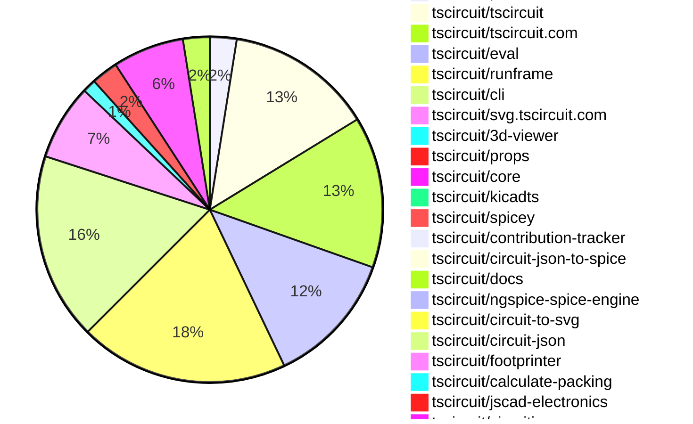
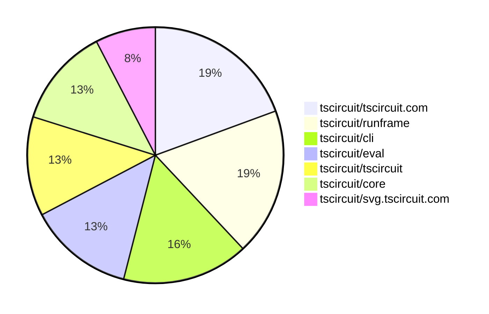

# Contribution Overview 2025-10-22

## PRs by Repository

## Contributor Overview

| Contributor | 🐳 Major | 🐙 Minor | 🐌 Tiny | ⭐ | Score | Discussion Contributions |
|-------------|---------|---------|---------|-----|----------------|--------------------------|
| [seveibar](#seveibar) | 2 | 20 | 7 | 👑 | 54 | 1🔹 0🔶 0💎 |
| [imrishabh18](#imrishabh18) | 5 | 6 | 3 | ⭐⭐⭐ | 37 | 0🔹 0🔶 0💎 |
| [ArnavK-09](#ArnavK-09) | 2 | 3 | 6 | ⭐⭐ | 21 | 1🔹 0🔶 0💎 |
| [tscircuitbot](#tscircuitbot) | 0 | 0 | 178 | ⭐⭐ | 16.5 | 0🔹 0🔶 0💎 |
| [ShiboSoftwareDev](#ShiboSoftwareDev) | 0 | 3 | 3 | ⭐⭐ | 15 | 0🔹 0🔶 0💎 |
| [techmannih](#techmannih) | 0 | 0 | 3 | ⭐⭐ | 11 | 0🔹 0🔶 0💎 |
| [Abse2001](#Abse2001) | 1 | 2 | 0 | ⭐ | 9 | 0🔹 0🔶 0💎 |
| [Ayushjhawar8](#Ayushjhawar8) | 0 | 2 | 2 | ⭐ | 7 | 0🔹 0🔶 0💎 |
| [pxlpal](#pxlpal) | 0 | 2 | 1 | ⭐ | 5 | 0🔹 0🔶 0💎 |
| [MustafaMulla29](#MustafaMulla29) | 0 | 1 | 0 |  | 3 | 0🔹 0🔶 0💎 |
| [joncherry](#joncherry) | 0 | 0 | 1 |  | 2 | 0🔹 0🔶 0💎 |
| [nailoo](#nailoo) | 0 | 0 | 1 |  | 2 | 0🔹 0🔶 0💎 |
| [zojize](#zojize) | 0 | 1 | 0 |  | 2 | 0🔹 0🔶 0💎 |
| [brymut](#brymut) | 0 | 0 | 1 |  | 1 | 0🔹 0🔶 0💎 |
| [Anshgrover23](#Anshgrover23) | 0 | 0 | 0 |  | 0 | 1🔹 0🔶 0💎 |

### Discussion Contribution Legend

- 🔹 Normal Comments: Basic participation with minimal effort
- 🔶 Great Informative Comments: Thoughtful participation that adds value
- 💎 Incredible Comments: Exceptional participation with high-quality content

## Review Table

[reviews-received-hover]: ## "Number of reviews received for PRs for this contributor"
[approvals-received-hover]: ## "Number of approvals received for PRs this contributor authored"
[rejections-received-hover]: ## "Number of rejections received for PRs this contributor authored"
[prs-opened-hover]: ## "Number of PRs opened by this contributor"
[issues-created-hover]: ## "Number of issues created by this contributor"
[bountied-issues-hover]: ## "Number of issues this contributor created with a bounty"
[bountied-issue-$-hover]: ## "Total bounty amount placed on issues authored by this contributor"

| Contributor | Reviews Received | Approvals Received | Rejections Received | Approvals | Rejections | PRs Opened | PRs Merged | Score | Issues Created | Bountied Issues | Bountied Issue $ |
|---|---|---|---|---|---|---|---|---|---|---|---|
| [Excellencedev](#Excellencedev) | 2 | 0 | 1 | 0 | 0 | 1 | 0 | 0 | 0 | 0 | 0 |
| [nailoo](#nailoo) | 7 | 3 | 1 | 0 | 0 | 2 | 1 | 2 | 0 | 0 | 0 |
| [techmannih](#techmannih) | 7 | 3 | 1 | 3 | 1 | 8 | 3 | 11 | 0 | 0 | 0 |
| [tscircuitbot](#tscircuitbot) | 0 | 0 | 0 | 0 | 0 | 204 | 178 | 16.5 | 0 | 0 | 0 |
| [seveibar](#seveibar) | 20 | 5 | 0 | 37 | 10 | 37 | 30 | 54 | 0 | 0 | 0 |
| [ShiboSoftwareDev](#ShiboSoftwareDev) | 10 | 5 | 2 | 5 | 0 | 8 | 6 | 15 | 0 | 0 | 0 |
| [Abse2001](#Abse2001) | 5 | 4 | 0 | 1 | 0 | 9 | 3 | 9 | 0 | 0 | 0 |
| [Ayushjhawar8](#Ayushjhawar8) | 9 | 4 | 1 | 0 | 0 | 5 | 4 | 7 | 0 | 0 | 0 |
| [Aqil-Ahmad](#Aqil-Ahmad) | 7 | 0 | 1 | 0 | 0 | 4 | 0 | 0 | 0 | 0 | 0 |
| [joncherry](#joncherry) | 13 | 3 | 1 | 0 | 0 | 2 | 1 | 2 | 0 | 0 | 0 |
| [MustafaMulla29](#MustafaMulla29) | 2 | 1 | 0 | 1 | 0 | 1 | 1 | 3 | 0 | 0 | 0 |
| [saurabhraghuvanshii](#saurabhraghuvanshii) | 3 | 0 | 0 | 0 | 0 | 1 | 0 | 0 | 0 | 0 | 0 |
| [baeoc](#baeoc) | 0 | 0 | 0 | 0 | 0 | 1 | 0 | 0 | 0 | 0 | 0 |
| [RaghavArora14](#RaghavArora14) | 22 | 1 | 3 | 0 | 0 | 4 | 0 | 0 | 0 | 0 | 0 |
| [Omar8345](#Omar8345) | 1 | 0 | 0 | 0 | 0 | 1 | 0 | 0 | 0 | 0 | 0 |
| [imrishabh18](#imrishabh18) | 15 | 8 | 0 | 0 | 2 | 16 | 14 | 37 | 0 | 0 | 0 |
| [rushabhcodes](#rushabhcodes) | 1 | 0 | 0 | 0 | 0 | 1 | 0 | 0 | 0 | 0 | 0 |
| [Pranjal6955](#Pranjal6955) | 2 | 0 | 0 | 0 | 0 | 1 | 0 | 0 | 0 | 0 | 0 |
| [7908837174](#7908837174) | 1 | 0 | 0 | 0 | 0 | 1 | 0 | 0 | 0 | 0 | 0 |
| [dhvll](#dhvll) | 0 | 0 | 0 | 0 | 0 | 1 | 0 | 0 | 0 | 0 | 0 |
| [ArnavK-09](#ArnavK-09) | 12 | 6 | 1 | 1 | 0 | 12 | 11 | 21 | 0 | 0 | 0 |
| [Sahelisaha04](#Sahelisaha04) | 0 | 0 | 0 | 0 | 0 | 1 | 0 | 0 | 0 | 0 | 0 |
| [zojize](#zojize) | 1 | 1 | 0 | 0 | 0 | 1 | 1 | 2 | 0 | 0 | 0 |
| [brymut](#brymut) | 3 | 1 | 0 | 0 | 0 | 1 | 1 | 1 | 0 | 0 | 0 |
| [Asymtode712](#Asymtode712) | 0 | 0 | 0 | 0 | 0 | 1 | 0 | 0 | 0 | 0 | 0 |
| [pxlpal](#pxlpal) | 3 | 3 | 0 | 0 | 0 | 4 | 3 | 5 | 0 | 0 | 0 |
| [Exceluyi](#Exceluyi) | 0 | 0 | 0 | 0 | 0 | 2 | 0 | 0 | 0 | 0 | 0 |
| [7secondsquests-prog](#7secondsquests-prog) | 1 | 0 | 1 | 0 | 0 | 1 | 0 | 0 | 0 | 0 | 0 |
| [colmwoods](#colmwoods) | 0 | 0 | 0 | 0 | 0 | 1 | 0 | 0 | 0 | 0 | 0 |
| [1914Jegx](#1914Jegx) | 0 | 0 | 0 | 0 | 0 | 2 | 0 | 0 | 0 | 0 | 0 |
| [MayorChristopher](#MayorChristopher) | 0 | 0 | 0 | 0 | 0 | 2 | 0 | 0 | 0 | 0 | 0 |
| [Anshgrover23](#Anshgrover23) | 0 | 0 | 0 | 0 | 0 | 0 | 0 | 1 | 0 | 0 | 0 |

## Top 7 Repositories by Contribution Points

## Changes by Repository

### [tscircuit/pcb-viewer](https://github.com/tscircuit/pcb-viewer)

| PR # | Impact | Rating | Contributor | Description |
|------|--------|--------|-------------|-------------|
| [#425](https://github.com/tscircuit/pcb-viewer/pull/425) | 🐙 Minor | ⭐⭐ | seveibar | Adds snapping support to the dimension overlay tool by implementing a bounding box helper and enabling snapping anchors for dimension stretching. |
| [#423](https://github.com/tscircuit/pcb-viewer/pull/423) | 🐙 Minor | ⭐⭐ | seveibar | Adds support for lowercase text rendering in PCB notes by importing an updated alphabet dataset and modifying the text conversion logic accordingly. |
| [#427](https://github.com/tscircuit/pcb-viewer/pull/427) | 🐙 Minor | ⭐⭐ | ShiboSoftwareDev | Fixes incorrect rendering of pcb_note colors by updating the applyAperture method to use a color library for parsing CSS color strings. |

🌠Tiny Contributions (3)

| PR # | Impact | Contributor | Description |
|------|--------|-------------|-------------|
| [#429](https://github.com/tscircuit/pcb-viewer/pull/429) | 🐌 Tiny | tscircuitbot | Automated package update |
| [#428](https://github.com/tscircuit/pcb-viewer/pull/428) | 🐌 Tiny | tscircuitbot | Automated package update |
| [#424](https://github.com/tscircuit/pcb-viewer/pull/424) | 🐌 Tiny | tscircuitbot | Automated package update |

### [tscircuit/tscircuit](https://github.com/tscircuit/tscircuit)

🌠Tiny Contributions (33)

| PR # | Impact | Contributor | Description |
|------|--------|-------------|-------------|
| [#1171](https://github.com/tscircuit/tscircuit/pull/1171) | 🐌 Tiny | tscircuitbot | Automated package version bump from 0.0.817 to 0.0.818 |
| [#1170](https://github.com/tscircuit/tscircuit/pull/1170) | 🐌 Tiny | tscircuitbot | Automated package update |
| [#1169](https://github.com/tscircuit/tscircuit/pull/1169) | 🐌 Tiny | tscircuitbot | Automated package update |
| [#1168](https://github.com/tscircuit/tscircuit/pull/1168) | 🐌 Tiny | tscircuitbot | Automated package update |
| [#1167](https://github.com/tscircuit/tscircuit/pull/1167) | 🐌 Tiny | tscircuitbot | Automated package update |
| [#1166](https://github.com/tscircuit/tscircuit/pull/1166) | 🐌 Tiny | tscircuitbot | Updates the tscircuitcli and tscircuitrunframe packages to their latest versions. |
| [#1163](https://github.com/tscircuit/tscircuit/pull/1163) | 🐌 Tiny | tscircuitbot | Automated package update |
| [#1162](https://github.com/tscircuit/tscircuit/pull/1162) | 🐌 Tiny | tscircuitbot | Automated package update |
| [#1161](https://github.com/tscircuit/tscircuit/pull/1161) | 🐌 Tiny | tscircuitbot | Automated package update |
| [#1160](https://github.com/tscircuit/tscircuit/pull/1160) | 🐌 Tiny | tscircuitbot | Automated package update |
| [#1159](https://github.com/tscircuit/tscircuit/pull/1159) | 🐌 Tiny | tscircuitbot | Automated package update |
| [#1158](https://github.com/tscircuit/tscircuit/pull/1158) | 🐌 Tiny | tscircuitbot | Automated package update |
| [#1157](https://github.com/tscircuit/tscircuit/pull/1157) | 🐌 Tiny | tscircuitbot | Updates the tscircuitcli package from version 0.1.386 to 0.1.387 and the tscircuitrunframe package from version 0.0.1150 to 0.0.1151 in package.json |
| [#1155](https://github.com/tscircuit/tscircuit/pull/1155) | 🐌 Tiny | tscircuitbot | Automated package update |
| [#1154](https://github.com/tscircuit/tscircuit/pull/1154) | 🐌 Tiny | tscircuitbot | Updates the tscircuitcli package from version 0.1.385 to 0.1.386 and the tscircuitrunframe package from version 0.0.1149 to 0.0.1150. |
| [#1153](https://github.com/tscircuit/tscircuit/pull/1153) | 🐌 Tiny | tscircuitbot | Automated package update |
| [#1152](https://github.com/tscircuit/tscircuit/pull/1152) | 🐌 Tiny | tscircuitbot | Automated package update |
| [#1148](https://github.com/tscircuit/tscircuit/pull/1148) | 🐌 Tiny | tscircuitbot | Automated package update |
| [#1147](https://github.com/tscircuit/tscircuit/pull/1147) | 🐌 Tiny | tscircuitbot | Automated package update |
| [#1146](https://github.com/tscircuit/tscircuit/pull/1146) | 🐌 Tiny | tscircuitbot | Automated package update |
| [#1145](https://github.com/tscircuit/tscircuit/pull/1145) | 🐌 Tiny | tscircuitbot | Automated package update |
| [#1144](https://github.com/tscircuit/tscircuit/pull/1144) | 🐌 Tiny | tscircuitbot | Automated package update |
| [#1143](https://github.com/tscircuit/tscircuit/pull/1143) | 🐌 Tiny | tscircuitbot | Automated package update |
| [#1142](https://github.com/tscircuit/tscircuit/pull/1142) | 🐌 Tiny | tscircuitbot | Automated package update |
| [#1141](https://github.com/tscircuit/tscircuit/pull/1141) | 🐌 Tiny | tscircuitbot | Updates the tscircuitcli and tscircuitrunframe packages to their latest versions. |
| [#1139](https://github.com/tscircuit/tscircuit/pull/1139) | 🐌 Tiny | tscircuitbot | Updates the tscircuitcli package from version 0.1.379 to 0.1.380 and the tscircuitrunframe package from version 0.0.1143 to 0.0.1144 in package.json |
| [#1138](https://github.com/tscircuit/tscircuit/pull/1138) | 🐌 Tiny | tscircuitbot | Automated package update |
| [#1137](https://github.com/tscircuit/tscircuit/pull/1137) | 🐌 Tiny | tscircuitbot | Updates the versions of the tscircuitcli, tscircuitcore, and tscircuiteval packages in package.json |
| [#1136](https://github.com/tscircuit/tscircuit/pull/1136) | 🐌 Tiny | tscircuitbot | Automated package update |
| [#1135](https://github.com/tscircuit/tscircuit/pull/1135) | 🐌 Tiny | tscircuitbot | Automated package update |
| [#1133](https://github.com/tscircuit/tscircuit/pull/1133) | 🐌 Tiny | tscircuitbot | Automated package update |
| [#1132](https://github.com/tscircuit/tscircuit/pull/1132) | 🐌 Tiny | tscircuitbot | Automated package update |
| [#1131](https://github.com/tscircuit/tscircuit/pull/1131) | 🐌 Tiny | seveibar | Adds resvgresvg-js as a dependency to the project. |

### [tscircuit/tscircuit.com](https://github.com/tscircuit/tscircuit.com)

| PR # | Impact | Rating | Contributor | Description |
|------|--------|--------|-------------|-------------|
| [#1873](https://github.com/tscircuit/tscircuit.com/pull/1873) | 🐳 Major | ⭐⭐⭐ | imrishabh18 | Fixes the breaking build page when user code build encounters errors by providing clearer error messages and handling for various error types. |
| [#1869](https://github.com/tscircuit/tscircuit.com/pull/1869) | 🐳 Major | ⭐⭐⭐ | imrishabh18 | Adds a response interceptor to the shared axios instance to show a toast notification when backend responses return a 401 status, indicating that the session has expired. |
| [#1852](https://github.com/tscircuit/tscircuit.com/pull/1852) | 🐳 Major | ⭐⭐⭐ | ArnavK-09 | Adds support for a display name in organization settings, including database schema updates, organization creation logic, and UI modifications to display the new field. |
| [#1844](https://github.com/tscircuit/tscircuit.com/pull/1844) | 🐳 Major | ⭐⭐⭐ | ArnavK-09 | Adds functionality to update organization member permissions via API, including permission checks and error handling for various scenarios. |
| [#1856](https://github.com/tscircuit/tscircuit.com/pull/1856) | 🐙 Minor | ⭐⭐ | seveibar | Add GET apibug_reportsdownload_zip endpoint to bundle bug report files into a zip archive and return 403404 errors when access is forbidden or the report is missing. |
| [#1871](https://github.com/tscircuit/tscircuit.com/pull/1871) | 🐙 Minor | ⭐⭐ | imrishabh18 | Adds user code logging functionality to track the execution of user-defined code jobs, including start and completion times, logs, and error messages. |
| [#1836](https://github.com/tscircuit/tscircuit.com/pull/1836) | 🐙 Minor | ⭐⭐ | imrishabh18 | Fixes session management by ensuring that the session is invalidated after a user signs out, preventing unauthorized access with an expired session. |
| [#1860](https://github.com/tscircuit/tscircuit.com/pull/1860) | 🐙 Minor | ⭐⭐ | ArnavK-09 | Adds owner_org_id as an optional filtering parameter in the package list API and updates the organization profile page to use owner_org_id instead of owner_github_username for package retrieval. |
| [#1843](https://github.com/tscircuit/tscircuit.com/pull/1843) | 🐙 Minor | ⭐⭐ | ArnavK-09 | Fixes saving issues related to package files by adding POST method support and adjusting caching behavior. |

🌠Tiny Contributions (25)

| PR # | Impact | Contributor | Description |
|------|--------|-------------|-------------|
| [#1872](https://github.com/tscircuit/tscircuit.com/pull/1872) | 🐌 Tiny | tscircuitbot | Automated package update |
| [#1870](https://github.com/tscircuit/tscircuit.com/pull/1870) | 🐌 Tiny | tscircuitbot | Automated package update |
| [#1868](https://github.com/tscircuit/tscircuit.com/pull/1868) | 🐌 Tiny | tscircuitbot | Updates the tscircuiteval package from version 0.0.428 to 0.0.429 |
| [#1867](https://github.com/tscircuit/tscircuit.com/pull/1867) | 🐌 Tiny | tscircuitbot | Automated package update |
| [#1866](https://github.com/tscircuit/tscircuit.com/pull/1866) | 🐌 Tiny | tscircuitbot | Automated package update |
| [#1863](https://github.com/tscircuit/tscircuit.com/pull/1863) | 🐌 Tiny | tscircuitbot | Updates the tscircuiteval package from version 0.0.424 to 0.0.426 |
| [#1861](https://github.com/tscircuit/tscircuit.com/pull/1861) | 🐌 Tiny | tscircuitbot | Automated package update |
| [#1857](https://github.com/tscircuit/tscircuit.com/pull/1857) | 🐌 Tiny | tscircuitbot | Automated package update |
| [#1853](https://github.com/tscircuit/tscircuit.com/pull/1853) | 🐌 Tiny | tscircuitbot | Automated package update to version 0.0.127 |
| [#1851](https://github.com/tscircuit/tscircuit.com/pull/1851) | 🐌 Tiny | tscircuitbot | Automated package update |
| [#1850](https://github.com/tscircuit/tscircuit.com/pull/1850) | 🐌 Tiny | tscircuitbot | Updates the tscircuiteval package from version 0.0.422 to 0.0.423 |
| [#1849](https://github.com/tscircuit/tscircuit.com/pull/1849) | 🐌 Tiny | tscircuitbot | Automated package update |
| [#1848](https://github.com/tscircuit/tscircuit.com/pull/1848) | 🐌 Tiny | tscircuitbot | Automated package update |
| [#1847](https://github.com/tscircuit/tscircuit.com/pull/1847) | 🐌 Tiny | tscircuitbot | Automated package update |
| [#1845](https://github.com/tscircuit/tscircuit.com/pull/1845) | 🐌 Tiny | tscircuitbot | Automated package update to version 0.0.125 |
| [#1842](https://github.com/tscircuit/tscircuit.com/pull/1842) | 🐌 Tiny | tscircuitbot | Automated package update |
| [#1840](https://github.com/tscircuit/tscircuit.com/pull/1840) | 🐌 Tiny | tscircuitbot | Updates the tscircuiteval package to version 0.0.419 in the package.json file. |
| [#1838](https://github.com/tscircuit/tscircuit.com/pull/1838) | 🐌 Tiny | tscircuitbot | Automated package update |
| [#1837](https://github.com/tscircuit/tscircuit.com/pull/1837) | 🐌 Tiny | tscircuitbot | Automated package update to version 0.0.124 |
| [#1834](https://github.com/tscircuit/tscircuit.com/pull/1834) | 🐌 Tiny | tscircuitbot | Updates the tscircuiteval package from version 0.0.415 to 0.0.416 |
| [#1865](https://github.com/tscircuit/tscircuit.com/pull/1865) | 🐌 Tiny | ArnavK-09 | Adjusts the margin of the Discord logo link in the header for consistent styling across the application. |
| [#1859](https://github.com/tscircuit/tscircuit.com/pull/1859) | 🐌 Tiny | ArnavK-09 | Updated logic to extract package owner and name from the full package name format, improved readability by using descriptive variable names for owner and package name, and ensured consistent handling of package information across components. |
| [#1858](https://github.com/tscircuit/tscircuit.com/pull/1858) | 🐌 Tiny | ArnavK-09 | Adjusts the display of organization ID to slice the string to 10 characters instead of 8 and ensures that the organization ID is always included in the save operation, regardless of ownership status. |
| [#1841](https://github.com/tscircuit/tscircuit.com/pull/1841) | 🐌 Tiny | ArnavK-09 | Ensures uniform button widths in the NotFound component for consistent styling across the application. |
| [#1839](https://github.com/tscircuit/tscircuit.com/pull/1839) | 🐌 Tiny | ArnavK-09 | Updates the return value in the useListOrgMembers hook to align with the API response by changing data.members to data.org_members. |

### [tscircuit/eval](https://github.com/tscircuit/eval)

| PR # | Impact | Rating | Contributor | Description |
|------|--------|--------|-------------|-------------|
| [#1385](https://github.com/tscircuit/eval/pull/1385) | 🐳 Major | ⭐⭐⭐ | seveibar | Enables the transfer of platform configuration into a web worker using hybrid synchronous properties and proxied functions, allowing for dynamic updates to platform and project configurations. |
| [#1359](https://github.com/tscircuit/eval/pull/1359) | 🐙 Minor | ⭐⭐ | seveibar | Skip import type statements when collecting dependency names and add a regression test to ensure type-only imports do not trigger circular detection |
| [#1264](https://github.com/tscircuit/eval/pull/1264) | 🐙 Minor | ⭐⭐ | zojize | Fixes flakiness in tests caused by improper handling of async function clearEventListeners, ensuring consistent test results. |

🌠Tiny Contributions (27)

| PR # | Impact | Contributor | Description |
|------|--------|-------------|-------------|
| [#1401](https://github.com/tscircuit/eval/pull/1401) | 🐌 Tiny | tscircuitbot | Automated package update |
| [#1400](https://github.com/tscircuit/eval/pull/1400) | 🐌 Tiny | tscircuitbot | Automated package update |
| [#1398](https://github.com/tscircuit/eval/pull/1398) | 🐌 Tiny | tscircuitbot | Automated package update |
| [#1397](https://github.com/tscircuit/eval/pull/1397) | 🐌 Tiny | tscircuitbot | Automated package update |
| [#1394](https://github.com/tscircuit/eval/pull/1394) | 🐌 Tiny | tscircuitbot | Automated package update |
| [#1393](https://github.com/tscircuit/eval/pull/1393) | 🐌 Tiny | tscircuitbot | Updates the version of the tscircuitcore package from 0.0.823 to 0.0.824 in package.json |
| [#1392](https://github.com/tscircuit/eval/pull/1392) | 🐌 Tiny | tscircuitbot | Automated package update |
| [#1391](https://github.com/tscircuit/eval/pull/1391) | 🐌 Tiny | tscircuitbot | Automated package update |
| [#1389](https://github.com/tscircuit/eval/pull/1389) | 🐌 Tiny | tscircuitbot | Automated package update |
| [#1388](https://github.com/tscircuit/eval/pull/1388) | 🐌 Tiny | tscircuitbot | Updates the version of the tscircuitcore package from 0.0.821 to 0.0.822 in package.json |
| [#1386](https://github.com/tscircuit/eval/pull/1386) | 🐌 Tiny | tscircuitbot | Automated package update |
| [#1384](https://github.com/tscircuit/eval/pull/1384) | 🐌 Tiny | tscircuitbot | Automated package update |
| [#1383](https://github.com/tscircuit/eval/pull/1383) | 🐌 Tiny | tscircuitbot | Updates the version of the tscircuitcore package from 0.0.820 to 0.0.821 in package.json |
| [#1381](https://github.com/tscircuit/eval/pull/1381) | 🐌 Tiny | tscircuitbot | Automated package update |
| [#1380](https://github.com/tscircuit/eval/pull/1380) | 🐌 Tiny | tscircuitbot | Updates the version of the tscircuitcore package from 0.0.819 to 0.0.820 in package.json |
| [#1378](https://github.com/tscircuit/eval/pull/1378) | 🐌 Tiny | tscircuitbot | Automated package update |
| [#1377](https://github.com/tscircuit/eval/pull/1377) | 🐌 Tiny | tscircuitbot | Automated package update |
| [#1375](https://github.com/tscircuit/eval/pull/1375) | 🐌 Tiny | tscircuitbot | Automated package update |
| [#1374](https://github.com/tscircuit/eval/pull/1374) | 🐌 Tiny | tscircuitbot | Automated package update |
| [#1372](https://github.com/tscircuit/eval/pull/1372) | 🐌 Tiny | tscircuitbot | Automated package update |
| [#1371](https://github.com/tscircuit/eval/pull/1371) | 🐌 Tiny | tscircuitbot | Updates the version of the tscircuitcore package from 0.0.816 to 0.0.817 in package.json |
| [#1369](https://github.com/tscircuit/eval/pull/1369) | 🐌 Tiny | tscircuitbot | Automated package update |
| [#1368](https://github.com/tscircuit/eval/pull/1368) | 🐌 Tiny | tscircuitbot | Automated package update |
| [#1366](https://github.com/tscircuit/eval/pull/1366) | 🐌 Tiny | tscircuitbot | Automated package update |
| [#1365](https://github.com/tscircuit/eval/pull/1365) | 🐌 Tiny | tscircuitbot | Updates the version of the tscircuitcore package from 0.0.813 to 0.0.815 in package.json |
| [#1363](https://github.com/tscircuit/eval/pull/1363) | 🐌 Tiny | tscircuitbot | Automated package update |
| [#1362](https://github.com/tscircuit/eval/pull/1362) | 🐌 Tiny | tscircuitbot | Automated package update |

### [tscircuit/runframe](https://github.com/tscircuit/runframe)

| PR # | Impact | Rating | Contributor | Description |
|------|--------|--------|-------------|-------------|
| [#1542](https://github.com/tscircuit/runframe/pull/1542) | 🐙 Minor | ⭐⭐ | seveibar | Fixes the bug report dialog to always link to the production bug report viewer. |
| [#1560](https://github.com/tscircuit/runframe/pull/1560) | 🐙 Minor | ⭐⭐ | ArnavK-09 | Adds optional projectBaseUrl for custom project URLs and introduces platformConfig for eval webworker to allow platform-specific configurations. |

🌠Tiny Contributions (45)

| PR # | Impact | Contributor | Description |
|------|--------|-------------|-------------|
| [#1578](https://github.com/tscircuit/runframe/pull/1578) | 🐌 Tiny | tscircuitbot | Automated package update |
| [#1577](https://github.com/tscircuit/runframe/pull/1577) | 🐌 Tiny | tscircuitbot | Updates the tscircuiteval package from version 0.0.429 to 0.0.430 |
| [#1576](https://github.com/tscircuit/runframe/pull/1576) | 🐌 Tiny | tscircuitbot | Automated package update |
| [#1575](https://github.com/tscircuit/runframe/pull/1575) | 🐌 Tiny | tscircuitbot | Updates the tscircuiteval package from version 0.0.428 to 0.0.429 |
| [#1574](https://github.com/tscircuit/runframe/pull/1574) | 🐌 Tiny | tscircuitbot | Automated package update to version 0.0.1157 |
| [#1573](https://github.com/tscircuit/runframe/pull/1573) | 🐌 Tiny | tscircuitbot | Updates the tscircuiteval package to version 0.0.428 in the package.json file. |
| [#1572](https://github.com/tscircuit/runframe/pull/1572) | 🐌 Tiny | tscircuitbot | Automated package update |
| [#1571](https://github.com/tscircuit/runframe/pull/1571) | 🐌 Tiny | tscircuitbot | Updates the tscircuit3d-viewer package to version 0.0.421 in package.json |
| [#1570](https://github.com/tscircuit/runframe/pull/1570) | 🐌 Tiny | tscircuitbot | Updates the package version from 0.0.1154 to 0.0.1155 in package.json |
| [#1568](https://github.com/tscircuit/runframe/pull/1568) | 🐌 Tiny | tscircuitbot | Updates the package version from 0.0.1153 to 0.0.1154 in package.json |
| [#1567](https://github.com/tscircuit/runframe/pull/1567) | 🐌 Tiny | tscircuitbot | Updates the tscircuiteval package from version 0.0.425 to 0.0.427 in the package.json file. |
| [#1566](https://github.com/tscircuit/runframe/pull/1566) | 🐌 Tiny | tscircuitbot | Automated package update |
| [#1565](https://github.com/tscircuit/runframe/pull/1565) | 🐌 Tiny | tscircuitbot | Updates the tscircuitpcb-viewer package from version 1.11.238 to 1.11.239 |
| [#1562](https://github.com/tscircuit/runframe/pull/1562) | 🐌 Tiny | tscircuitbot | Updates the tscircuiteval package to version 0.0.425 in the package.json file. |
| [#1561](https://github.com/tscircuit/runframe/pull/1561) | 🐌 Tiny | tscircuitbot | Automated package update |
| [#1559](https://github.com/tscircuit/runframe/pull/1559) | 🐌 Tiny | tscircuitbot | Automated package update |
| [#1558](https://github.com/tscircuit/runframe/pull/1558) | 🐌 Tiny | tscircuitbot | Updates the tscircuitpcb-viewer package from version 1.11.237 to 1.11.238 |
| [#1557](https://github.com/tscircuit/runframe/pull/1557) | 🐌 Tiny | tscircuitbot | Updates the package version from 0.0.1148 to 0.0.1149 in package.json |
| [#1556](https://github.com/tscircuit/runframe/pull/1556) | 🐌 Tiny | tscircuitbot | Updates the tscircuiteval package to version 0.0.424 in the package.json file. |
| [#1555](https://github.com/tscircuit/runframe/pull/1555) | 🐌 Tiny | tscircuitbot | Updates the package version from 0.0.1147 to 0.0.1148 in package.json |
| [#1554](https://github.com/tscircuit/runframe/pull/1554) | 🐌 Tiny | tscircuitbot | Updates the tscircuiteval package from version 0.0.422 to 0.0.423 |
| [#1553](https://github.com/tscircuit/runframe/pull/1553) | 🐌 Tiny | tscircuitbot | Updates the package version from 0.0.1146 to 0.0.1147 in package.json |
| [#1552](https://github.com/tscircuit/runframe/pull/1552) | 🐌 Tiny | tscircuitbot | Updates the tscircuiteval package to version 0.0.422 |
| [#1551](https://github.com/tscircuit/runframe/pull/1551) | 🐌 Tiny | tscircuitbot | Automated package update to version 0.0.1146 |
| [#1550](https://github.com/tscircuit/runframe/pull/1550) | 🐌 Tiny | tscircuitbot | Updates the tscircuiteval package to version 0.0.421 in the package.json file. |
| [#1549](https://github.com/tscircuit/runframe/pull/1549) | 🐌 Tiny | tscircuitbot | Automated package update |
| [#1548](https://github.com/tscircuit/runframe/pull/1548) | 🐌 Tiny | tscircuitbot | Automated package update |
| [#1547](https://github.com/tscircuit/runframe/pull/1547) | 🐌 Tiny | tscircuitbot | Updates the package version from 0.0.1143 to 0.0.1144 in package.json |
| [#1546](https://github.com/tscircuit/runframe/pull/1546) | 🐌 Tiny | tscircuitbot | Automated package update |
| [#1545](https://github.com/tscircuit/runframe/pull/1545) | 🐌 Tiny | tscircuitbot | Updates the tscircuiteval package to version 0.0.420 |
| [#1544](https://github.com/tscircuit/runframe/pull/1544) | 🐌 Tiny | tscircuitbot | Automated package update to version 0.0.1142 |
| [#1543](https://github.com/tscircuit/runframe/pull/1543) | 🐌 Tiny | tscircuitbot | Updates the tscircuiteval package from version 0.0.418 to 0.0.419 |
| [#1541](https://github.com/tscircuit/runframe/pull/1541) | 🐌 Tiny | tscircuitbot | Automated package update |
| [#1540](https://github.com/tscircuit/runframe/pull/1540) | 🐌 Tiny | tscircuitbot | Updates the tscircuiteval package from version 0.0.416 to 0.0.418 |
| [#1539](https://github.com/tscircuit/runframe/pull/1539) | 🐌 Tiny | tscircuitbot | Automated package version bump from 0.0.1139 to 0.0.1140 |
| [#1537](https://github.com/tscircuit/runframe/pull/1537) | 🐌 Tiny | tscircuitbot | Automated package update |
| [#1536](https://github.com/tscircuit/runframe/pull/1536) | 🐌 Tiny | tscircuitbot | Automated package update |
| [#1532](https://github.com/tscircuit/runframe/pull/1532) | 🐌 Tiny | tscircuitbot | Updates the tscircuit3d-viewer package to version 0.0.419 in package.json |
| [#1530](https://github.com/tscircuit/runframe/pull/1530) | 🐌 Tiny | tscircuitbot | Updates the tscircuiteval package to version 0.0.416 in the package.json file. |
| [#1529](https://github.com/tscircuit/runframe/pull/1529) | 🐌 Tiny | tscircuitbot | Updates the tscircuitpcb-viewer package from version 1.11.236 to 1.11.237 |
| [#1569](https://github.com/tscircuit/runframe/pull/1569) | 🐌 Tiny | seveibar | Replaces micromatch usage with minimatch for board file filtering in getBoardFilesFromConfig, adds unit tests for config glob matching, and updates dependencies to drop micromatch. |
| [#1538](https://github.com/tscircuit/runframe/pull/1538) | 🐌 Tiny | Ayushjhawar8 | Removes the duplicate jose dependency from the package.json file. |
| [#1533](https://github.com/tscircuit/runframe/pull/1533) | 🐌 Tiny | Ayushjhawar8 | Try to address these point img width828 height547 altimage srchttps:github.comuser-attachmentsassets13ea2a8e-6e03-466c-b989-ce963ec0ba91 |
| [#1535](https://github.com/tscircuit/runframe/pull/1535) | 🐌 Tiny | imrishabh18 | This pull request adds the jose package to the project to resolve issues related to publishing. |
| [#1534](https://github.com/tscircuit/runframe/pull/1534) | 🐌 Tiny | imrishabh18 | This pull request addresses issues with the lockfile to ensure proper publishing of the package. It updates the lockfile to reflect the correct dependencies and versions needed for the project. |

### [tscircuit/cli](https://github.com/tscircuit/cli)

🌠Tiny Contributions (42)

| PR # | Impact | Contributor | Description |
|------|--------|-------------|-------------|
| [#735](https://github.com/tscircuit/cli/pull/735) | 🐌 Tiny | tscircuitbot | Automated package update |
| [#734](https://github.com/tscircuit/cli/pull/734) | 🐌 Tiny | tscircuitbot | Updates the tscircuitrunframe package to version 0.0.1159 in the package.json file. |
| [#733](https://github.com/tscircuit/cli/pull/733) | 🐌 Tiny | tscircuitbot | Automated package update |
| [#732](https://github.com/tscircuit/cli/pull/732) | 🐌 Tiny | tscircuitbot | Updates the tscircuitrunframe package from version 0.0.1157 to 0.0.1158 |
| [#731](https://github.com/tscircuit/cli/pull/731) | 🐌 Tiny | tscircuitbot | Automated package update |
| [#730](https://github.com/tscircuit/cli/pull/730) | 🐌 Tiny | tscircuitbot | Updates the tscircuitrunframe package version from 0.0.1155 to 0.0.1157 |
| [#728](https://github.com/tscircuit/cli/pull/728) | 🐌 Tiny | tscircuitbot | Automated package update |
| [#727](https://github.com/tscircuit/cli/pull/727) | 🐌 Tiny | tscircuitbot | Updates the tscircuitrunframe package from version 0.0.1154 to 0.0.1155 |
| [#726](https://github.com/tscircuit/cli/pull/726) | 🐌 Tiny | tscircuitbot | Automated package update |
| [#725](https://github.com/tscircuit/cli/pull/725) | 🐌 Tiny | tscircuitbot | Updates the tscircuitrunframe package from version 0.0.1153 to 0.0.1154 |
| [#724](https://github.com/tscircuit/cli/pull/724) | 🐌 Tiny | tscircuitbot | Automated package update |
| [#723](https://github.com/tscircuit/cli/pull/723) | 🐌 Tiny | tscircuitbot | Updates the tscircuitrunframe package from version 0.0.1152 to 0.0.1153 |
| [#722](https://github.com/tscircuit/cli/pull/722) | 🐌 Tiny | tscircuitbot | Automated package update |
| [#721](https://github.com/tscircuit/cli/pull/721) | 🐌 Tiny | tscircuitbot | Updates the tscircuitrunframe package from version 0.0.1151 to 0.0.1152 |
| [#720](https://github.com/tscircuit/cli/pull/720) | 🐌 Tiny | tscircuitbot | Automated package update |
| [#719](https://github.com/tscircuit/cli/pull/719) | 🐌 Tiny | tscircuitbot | Updates the tscircuitrunframe package from version 0.0.1150 to 0.0.1151 |
| [#717](https://github.com/tscircuit/cli/pull/717) | 🐌 Tiny | tscircuitbot | Automated package update to version 0.1.386 |
| [#716](https://github.com/tscircuit/cli/pull/716) | 🐌 Tiny | tscircuitbot | Updates the tscircuitrunframe package from version 0.0.1149 to 0.0.1150 |
| [#715](https://github.com/tscircuit/cli/pull/715) | 🐌 Tiny | tscircuitbot | Automated package update to version 0.1.385 |
| [#714](https://github.com/tscircuit/cli/pull/714) | 🐌 Tiny | tscircuitbot | Updates the tscircuitrunframe package from version 0.0.1148 to 0.0.1149 |
| [#713](https://github.com/tscircuit/cli/pull/713) | 🐌 Tiny | tscircuitbot | Automated package update |
| [#712](https://github.com/tscircuit/cli/pull/712) | 🐌 Tiny | tscircuitbot | Updates the tscircuitrunframe package from version 0.0.1147 to 0.0.1148 |
| [#711](https://github.com/tscircuit/cli/pull/711) | 🐌 Tiny | tscircuitbot | Automated package update |
| [#710](https://github.com/tscircuit/cli/pull/710) | 🐌 Tiny | tscircuitbot | Updates the tscircuitrunframe package to version 0.0.1147 in the package.json file |
| [#709](https://github.com/tscircuit/cli/pull/709) | 🐌 Tiny | tscircuitbot | Automated package update |
| [#708](https://github.com/tscircuit/cli/pull/708) | 🐌 Tiny | tscircuitbot | Updates the tscircuitrunframe package from version 0.0.1145 to 0.0.1146 |
| [#707](https://github.com/tscircuit/cli/pull/707) | 🐌 Tiny | tscircuitbot | Automated package update |
| [#706](https://github.com/tscircuit/cli/pull/706) | 🐌 Tiny | tscircuitbot | Updates the tscircuitrunframe package from version 0.0.1144 to 0.0.1145 |
| [#705](https://github.com/tscircuit/cli/pull/705) | 🐌 Tiny | tscircuitbot | Automated package update |
| [#704](https://github.com/tscircuit/cli/pull/704) | 🐌 Tiny | tscircuitbot | Updates the tscircuitrunframe package from version 0.0.1143 to 0.0.1144 |
| [#703](https://github.com/tscircuit/cli/pull/703) | 🐌 Tiny | tscircuitbot | Updates the package version from 0.1.378 to 0.1.379 in package.json |
| [#702](https://github.com/tscircuit/cli/pull/702) | 🐌 Tiny | tscircuitbot | Updates the tscircuitrunframe package to version 0.0.1143 in the package.json file. |
| [#701](https://github.com/tscircuit/cli/pull/701) | 🐌 Tiny | tscircuitbot | Automated package update |
| [#700](https://github.com/tscircuit/cli/pull/700) | 🐌 Tiny | tscircuitbot | Automated package update |
| [#699](https://github.com/tscircuit/cli/pull/699) | 🐌 Tiny | tscircuitbot | Automated package update |
| [#698](https://github.com/tscircuit/cli/pull/698) | 🐌 Tiny | tscircuitbot | Updates the tscircuitrunframe package from version 0.0.1140 to 0.0.1141 |
| [#697](https://github.com/tscircuit/cli/pull/697) | 🐌 Tiny | tscircuitbot | Automated package update |
| [#696](https://github.com/tscircuit/cli/pull/696) | 🐌 Tiny | tscircuitbot | Updates the tscircuitrunframe package to version 0.0.1140 in package.json |
| [#695](https://github.com/tscircuit/cli/pull/695) | 🐌 Tiny | tscircuitbot | Automated package update to version 0.1.375 |
| [#694](https://github.com/tscircuit/cli/pull/694) | 🐌 Tiny | tscircuitbot | Updates the tscircuitrunframe package from version 0.0.1138 to 0.0.1139 |
| [#693](https://github.com/tscircuit/cli/pull/693) | 🐌 Tiny | tscircuitbot | Automated package update |
| [#692](https://github.com/tscircuit/cli/pull/692) | 🐌 Tiny | tscircuitbot | Updates the tscircuitrunframe package from version 0.0.1137 to 0.0.1138 |

### [tscircuit/svg.tscircuit.com](https://github.com/tscircuit/svg.tscircuit.com)

| PR # | Impact | Rating | Contributor | Description |
|------|--------|--------|-------------|-------------|
| [#480](https://github.com/tscircuit/svg.tscircuit.com/pull/480) | 🐳 Major | ⭐⭐⭐ | imrishabh18 | Switches the image rendering library from sharp to resvg and resolves a font rendering issue in PNG outputs on Vercel. |

🌠Tiny Contributions (16)

| PR # | Impact | Contributor | Description |
|------|--------|-------------|-------------|
| [#498](https://github.com/tscircuit/svg.tscircuit.com/pull/498) | 🐌 Tiny | tscircuitbot | Updates the tscircuit package version from 0.0.817 to 0.0.818 in package.json |
| [#497](https://github.com/tscircuit/svg.tscircuit.com/pull/497) | 🐌 Tiny | tscircuitbot | Updates the tscircuit package version from 0.0.816 to 0.0.817 in package.json |
| [#496](https://github.com/tscircuit/svg.tscircuit.com/pull/496) | 🐌 Tiny | tscircuitbot | Updates the tscircuit package version from 0.0.814 to 0.0.816 in package.json |
| [#495](https://github.com/tscircuit/svg.tscircuit.com/pull/495) | 🐌 Tiny | tscircuitbot | Updates the tscircuit package version from 0.0.813 to 0.0.814 in package.json |
| [#494](https://github.com/tscircuit/svg.tscircuit.com/pull/494) | 🐌 Tiny | tscircuitbot | Updates the tscircuit package version from 0.0.812 to 0.0.813 in package.json |
| [#493](https://github.com/tscircuit/svg.tscircuit.com/pull/493) | 🐌 Tiny | tscircuitbot | Updates the tscircuit package version from 0.0.811 to 0.0.812 in package.json |
| [#492](https://github.com/tscircuit/svg.tscircuit.com/pull/492) | 🐌 Tiny | tscircuitbot | Updates the tscircuit package version from 0.0.810 to 0.0.811 in package.json |
| [#491](https://github.com/tscircuit/svg.tscircuit.com/pull/491) | 🐌 Tiny | tscircuitbot | Updates the tscircuit package version from 0.0.809 to 0.0.810 in package.json |
| [#490](https://github.com/tscircuit/svg.tscircuit.com/pull/490) | 🐌 Tiny | tscircuitbot | Updates the tscircuit package version from 0.0.808 to 0.0.809 in package.json |
| [#489](https://github.com/tscircuit/svg.tscircuit.com/pull/489) | 🐌 Tiny | tscircuitbot | Updates the tscircuit package version from 0.0.807 to 0.0.808 in package.json |
| [#488](https://github.com/tscircuit/svg.tscircuit.com/pull/488) | 🐌 Tiny | tscircuitbot | Updates the tscircuit package version from 0.0.806 to 0.0.807 in package.json |
| [#487](https://github.com/tscircuit/svg.tscircuit.com/pull/487) | 🐌 Tiny | tscircuitbot | Updates the tscircuit package version from 0.0.804 to 0.0.806 in package.json |
| [#486](https://github.com/tscircuit/svg.tscircuit.com/pull/486) | 🐌 Tiny | tscircuitbot | Automated package update |
| [#485](https://github.com/tscircuit/svg.tscircuit.com/pull/485) | 🐌 Tiny | tscircuitbot | Updates the tscircuit package version from 0.0.800 to 0.0.803 in package.json |
| [#482](https://github.com/tscircuit/svg.tscircuit.com/pull/482) | 🐌 Tiny | techmannih | Updates the circuit-to-svg dependency to version 0.0.251 in the package.json file. |
| [#483](https://github.com/tscircuit/svg.tscircuit.com/pull/483) | 🐌 Tiny | pxlpal | Updates the tscircuit dependency version from 0.0.798 to 0.0.800 in package.json |

### [tscircuit/3d-viewer](https://github.com/tscircuit/3d-viewer)

| PR # | Impact | Rating | Contributor | Description |
|------|--------|--------|-------------|-------------|
| [#533](https://github.com/tscircuit/3d-viewer/pull/533) | 🐳 Major | ⭐⭐⭐ | seveibar | Animate the camera orientation with quaternion slerp so roll transitions smoothly between presets and derive intermediate targets from the interpolated orientation to update orbit controlsmatrices for stable animation. |
| [#543](https://github.com/tscircuit/3d-viewer/pull/543) | 🐳 Major | ⭐⭐⭐ | Abse2001 | Fixes height mismatch where traces appeared above or below pads by introducing a global BOARD_SURFACE_OFFSET to standardize Z positions for copper, traces, and plated holes, ensuring accurate alignment between all PCB surface elements. |
| [#538](https://github.com/tscircuit/3d-viewer/pull/538) | 🐙 Minor | ⭐⭐ | MustafaMulla29 | Fixes the context menu to prevent it from going off-screen and improves the styles for a more standard appearance. |

### [tscircuit/props](https://github.com/tscircuit/props)

| PR # | Impact | Rating | Contributor | Description |
|------|--------|--------|-------------|-------------|
| [#472](https://github.com/tscircuit/props/pull/472) | 🐙 Minor | ⭐⭐ | seveibar | Changes the resolveProjectStaticFileImportUrl function to return a Promisestring instead of a string, updating the platform configuration typing, documentation, and unit tests accordingly. |
| [#471](https://github.com/tscircuit/props/pull/471) | 🐙 Minor | ⭐⭐ | seveibar | Adds an optional resolveProjectStaticFileImportUrl handler to the platform configuration schema, regenerates documentation to include the new option, and covers the new option with a parsing test. |
| [#470](https://github.com/tscircuit/props/pull/470) | 🐙 Minor | ⭐⭐ | seveibar | Adds optional outerEdgeToEdge, centerToCenter, and innerEdgeToEdge flags to PCB and fabrication note dimension properties, and regenerates documentation to include these new options. |
| [#469](https://github.com/tscircuit/props/pull/469) | 🐙 Minor | ⭐⭐ | seveibar | Adds an optional width property to the trace props schema as an alias for thickness. |
| [#467](https://github.com/tscircuit/props/pull/467) | 🐙 Minor | ⭐⭐ | seveibar | Allows trace  props to accept a new width distance and maps the parsed trace thickness to the provided width when no explicit thickness is supplied. |
| [#465](https://github.com/tscircuit/props/pull/465) | 🐙 Minor | ⭐⭐ | seveibar | Allows fabrication and PCB note dimension components to accept explicit units (in or mm) and regenerates component documentation to include the new units property. |

### [tscircuit/core](https://github.com/tscircuit/core)

| PR # | Impact | Rating | Contributor | Description |
|------|--------|--------|-------------|-------------|
| [#1563](https://github.com/tscircuit/core/pull/1563) | 🐳 Major | ⭐⭐⭐ | imrishabh18 | Prevents rotation of pinheaders in autolayout when facingDirection is specified, ensuring correct schematic representation. |
| [#1586](https://github.com/tscircuit/core/pull/1586) | 🐙 Minor | ⭐⭐ | seveibar | Moves the async static asset resolver into a dedicated utility module and updates footprint URL loading to use the shared resolver utility while keeping CadModel cache-busting logic unchanged. |
| [#1584](https://github.com/tscircuit/core/pull/1584) | 🐙 Minor | ⭐⭐ | seveibar | Normalizes autorouter preset names so underscore variants map to the same configuration as their hyphenated counterparts and adds unit tests covering the auto_cloud preset alias behavior. |
| [#1583](https://github.com/tscircuit/core/pull/1583) | 🐙 Minor | ⭐⭐ | seveibar | Fixes a double-loading bug in the NormalComponent by replacing the isFootprintUrl function with isHttpUrl and isStaticAssetPath, ensuring proper handling of footprint URLs. |
| [#1564](https://github.com/tscircuit/core/pull/1564) | 🐙 Minor | ⭐⭐ | seveibar | Adds support for inch units in PCB and fabrication note dimensions, updating the formatting and tests accordingly. |
| [#1566](https://github.com/tscircuit/core/pull/1566) | 🐙 Minor | ⭐⭐ | seveibar | Adds support for width as an alias for thickness in trace properties and handles cases where pcbPath may be empty or undefined. |
| [#1559](https://github.com/tscircuit/core/pull/1559) | 🐙 Minor | ⭐⭐ | seveibar | Infers has_stroke for fabrication note rectangles when only a stroke width is provided and adds coverage for the defaulted stroke flag. |
| [#1555](https://github.com/tscircuit/core/pull/1555) | 🐙 Minor | ⭐⭐ | seveibar | Defaults PCB and fabrication note dimension text to the measured distance when no text is provided, formatting the generated text with whole numbers left as-is and other values rounded to two decimal places, and adds unit tests for the new behavior. |
| [#1561](https://github.com/tscircuit/core/pull/1561) | 🐙 Minor | ⭐⭐ | ShiboSoftwareDev | Adds support for eecircuit-engine as an alternative SPICE simulation engine, including new functions for dynamic import, parameter parsing, and updated testing fixtures. |
| [#1574](https://github.com/tscircuit/core/pull/1574) | 🐙 Minor | ⭐⭐ | Ayushjhawar8 | Fixes error handling in the parts engine by logging errors to Circuit JSON and ensuring proper response formats are validated. |
| [#1573](https://github.com/tscircuit/core/pull/1573) | 🐙 Minor | ⭐⭐ | Abse2001 | Fixes PCB snapshot generation issue when using polygon pads with other components in the footprint. |
| [#1585](https://github.com/tscircuit/core/pull/1585) | 🐙 Minor | ⭐⭐ | imrishabh18 | Fixes the schematic box component to prevent it from being rotated, ensuring correct orientation in the layout. |
| [#1570](https://github.com/tscircuit/core/pull/1570) | 🐙 Minor | ⭐⭐ | imrishabh18 | Fixes the mapping of facing_direction to the correct side_of_component values in the schematic layout. |
| [#1565](https://github.com/tscircuit/core/pull/1565) | 🐙 Minor | ⭐⭐ | imrishabh18 | Fixes autolayout issue for pinHeader component when facingDirection is not explicitly defined |
| [#1558](https://github.com/tscircuit/core/pull/1558) | 🐙 Minor | ⭐⭐ | imrishabh18 | Updates the calculate-packing library to version 0.0.50, enabling support for packing with outlines and improving the initial positioning of components on the board. |

🌠Tiny Contributions (1)

| PR # | Impact | Contributor | Description |
|------|--------|-------------|-------------|
| [#1562](https://github.com/tscircuit/core/pull/1562) | 🐌 Tiny | imrishabh18 | Adds a test case to reproduce the issue where pinheader ports are floating away in schematic autolayout. |

### [tscircuit/kicadts](https://github.com/tscircuit/kicadts)

| PR # | Impact | Rating | Contributor | Description |
|------|--------|--------|-------------|-------------|
| [#10](https://github.com/tscircuit/kicadts/pull/10) | 🐙 Minor | ⭐⭐ | seveibar | Adds specialized methods for parsing KiCad file types including schematics, PCBs, and footprints, ensuring correct root element validation. |

### [tscircuit/spicey](https://github.com/tscircuit/spicey)

| PR # | Impact | Rating | Contributor | Description |
|------|--------|--------|-------------|-------------|
| [#17](https://github.com/tscircuit/spicey/pull/17) | 🐙 Minor | ⭐⭐ | seveibar | Add a compareVoltageLevels fixture for measuring differences between voltage graphs and polyfill Bun fetch and WebAssembly helpers for eecircuit-engine to load its wasm in tests. |

### [tscircuit/contribution-tracker](https://github.com/tscircuit/contribution-tracker)

🌠Tiny Contributions (2)

| PR # | Impact | Contributor | Description |
|------|--------|-------------|-------------|
| [#232](https://github.com/tscircuit/contribution-tracker/pull/232) | 🐌 Tiny | seveibar | Adds techmannih as a maintainer in the maintainers list. |
| [#240](https://github.com/tscircuit/contribution-tracker/pull/240) | 🐌 Tiny | ArnavK-09 | Swaps the icons and adjusts the priority levels for maintainers in the MaintainersList component, changing the visual representation and order of maintainers displayed. |

### [tscircuit/circuit-json-to-spice](https://github.com/tscircuit/circuit-json-to-spice)

| PR # | Impact | Rating | Contributor | Description |
|------|--------|--------|-------------|-------------|
| [#16](https://github.com/tscircuit/circuit-json-to-spice/pull/16) | 🐙 Minor | ⭐⭐ | ShiboSoftwareDev | Adds the UIC (Use Initial Conditions) flag to the .tran command for transient analysis, ensuring SPICE simulators use specified initial conditions for simulations involving oscillators or switching circuits. |

🌠Tiny Contributions (1)

| PR # | Impact | Contributor | Description |
|------|--------|-------------|-------------|
| [#17](https://github.com/tscircuit/circuit-json-to-spice/pull/17) | 🐌 Tiny | seveibar | Adds circuit-json as a development and peer dependency in the package.json file. |

### [tscircuit/docs](https://github.com/tscircuit/docs)

| PR # | Impact | Rating | Contributor | Description |
|------|--------|--------|-------------|-------------|
| [#279](https://github.com/tscircuit/docs/pull/279) | 🐙 Minor | ⭐⭐ | pxlpal | Fixes the rendering issue of the fabrication note rectangle in the documentation. |
| [#278](https://github.com/tscircuit/docs/pull/278) | 🐙 Minor | ⭐⭐ | pxlpal | Adds detailed descriptions for various tscircuit Essentials categories to enhance user understanding of features and functionalities. |

🌠Tiny Contributions (4)

| PR # | Impact | Contributor | Description |
|------|--------|-------------|-------------|
| [#284](https://github.com/tscircuit/docs/pull/284) | 🐌 Tiny | seveibar | Documents the thickness trace property and adds an example for using it in direct routing. |
| [#283](https://github.com/tscircuit/docs/pull/283) | 🐌 Tiny | seveibar | Updates the documentation for pcbnotedimension  to stop hardcoding measurement strings and clarify the text property for overriding auto-generated labels. |
| [#294](https://github.com/tscircuit/docs/pull/294) | 🐌 Tiny | ShiboSoftwareDev | Adds documentation for using web-compatible color names with the color prop on pcbnoterect . Includes a new section with a preview example demonstrating a yellow rectangle. |
| [#281](https://github.com/tscircuit/docs/pull/281) | 🐌 Tiny | techmannih | Adds documentation for the cornerRadius property in rectangular smtpad components. |

### [tscircuit/ngspice-spice-engine](https://github.com/tscircuit/ngspice-spice-engine)

🌠Tiny Contributions (2)

| PR # | Impact | Contributor | Description |
|------|--------|-------------|-------------|
| [#1](https://github.com/tscircuit/ngspice-spice-engine/pull/1) | 🐌 Tiny | seveibar | Bootstrap the Bun-based package configuration, workflows, and formatting setup; implement the ngspice spice engine wrapper with transient results parsing utilities; add unit tests covering transient parameter parsing and voltage graph extraction. |
| [#2](https://github.com/tscircuit/ngspice-spice-engine/pull/2) | 🐌 Tiny | ShiboSoftwareDev | Fixes a broken test that prevented publishing. |

### [tscircuit/circuit-to-svg](https://github.com/tscircuit/circuit-to-svg)

| PR # | Impact | Rating | Contributor | Description |
|------|--------|--------|-------------|-------------|
| [#399](https://github.com/tscircuit/circuit-to-svg/pull/399) | 🐙 Minor | ⭐⭐ | Abse2001 | Fixes potential crashes when encountering non-numeric or missing width, height, or radius values in PCB SVG generation by safely parsing geometry values and updating calculations accordingly. |

🌠Tiny Contributions (1)

| PR # | Impact | Contributor | Description |
|------|--------|-------------|-------------|
| [#397](https://github.com/tscircuit/circuit-to-svg/pull/397) | 🐌 Tiny | ShiboSoftwareDev | Updates the data points on simulation graphs to be solid dots instead of hollow circles and reduces their size for a cleaner appearance. |

### [tscircuit/circuit-json](https://github.com/tscircuit/circuit-json)

| PR # | Impact | Rating | Contributor | Description |
|------|--------|--------|-------------|-------------|
| [#327](https://github.com/tscircuit/circuit-json/pull/327) | 🐙 Minor | ⭐⭐ | Ayushjhawar8 | Adds a new error type for handling unexpected errors when finding parts in the circuit, including network failures and API response issues. |

### [tscircuit/footprinter](https://github.com/tscircuit/footprinter)

🌠Tiny Contributions (1)

| PR # | Impact | Contributor | Description |
|------|--------|-------------|-------------|
| [#372](https://github.com/tscircuit/footprinter/pull/372) | 🐌 Tiny | joncherry | Fixes the issue where the gallery of footprints is not sorted by name, ensuring a consistent order in the display of items. |

### [tscircuit/calculate-packing](https://github.com/tscircuit/calculate-packing)

| PR # | Impact | Rating | Contributor | Description |
|------|--------|--------|-------------|-------------|
| [#61](https://github.com/tscircuit/calculate-packing/pull/61) | 🐳 Major | ⭐⭐⭐ | imrishabh18 | Implements a new method for initial component placement using the geometric centroid of the boundary outline, ensuring components are packed more effectively within defined boundaries. |

### [tscircuit/jscad-electronics](https://github.com/tscircuit/jscad-electronics)

🌠Tiny Contributions (2)

| PR # | Impact | Contributor | Description |
|------|--------|-------------|-------------|
| [#158](https://github.com/tscircuit/jscad-electronics/pull/158) | 🐌 Tiny | techmannih | Adds techmannih as a code owner in the CODEOWNERS file for the repository. |
| [#154](https://github.com/tscircuit/jscad-electronics/pull/154) | 🐌 Tiny | nailoo | Adds support for the SMC electronic component model, including its 3D representation and integration into the existing footprint rendering system. |

### [tscircuit/circuitjson.com](https://github.com/tscircuit/circuitjson.com)

🌠Tiny Contributions (1)

| PR # | Impact | Contributor | Description |
|------|--------|-------------|-------------|
| [#80](https://github.com/tscircuit/circuitjson.com/pull/80) | 🐌 Tiny | brymut | Updates dependencies and adds bunfig configuration to disable lockfile generation. |

## Changes by Contributor

### [tscircuitbot](https://github.com/tscircuitbot)

🌠Tiny Contributions (178)

| PR # | Impact | Description |
|------|--------|-------------|
| [#429](https://github.com/tscircuit/pcb-viewer/pull/429) | 🐌 Tiny | Automated package update |
| [#428](https://github.com/tscircuit/pcb-viewer/pull/428) | 🐌 Tiny | Automated package update |
| [#424](https://github.com/tscircuit/pcb-viewer/pull/424) | 🐌 Tiny | Automated package update |
| [#1171](https://github.com/tscircuit/tscircuit/pull/1171) | 🐌 Tiny | Automated package version bump from 0.0.817 to 0.0.818 |
| [#1170](https://github.com/tscircuit/tscircuit/pull/1170) | 🐌 Tiny | Automated package update |
| [#1169](https://github.com/tscircuit/tscircuit/pull/1169) | 🐌 Tiny | Automated package update |
| [#1168](https://github.com/tscircuit/tscircuit/pull/1168) | 🐌 Tiny | Automated package update |
| [#1167](https://github.com/tscircuit/tscircuit/pull/1167) | 🐌 Tiny | Automated package update |
| [#1166](https://github.com/tscircuit/tscircuit/pull/1166) | 🐌 Tiny | Updates the tscircuitcli and tscircuitrunframe packages to their latest versions. |
| [#1163](https://github.com/tscircuit/tscircuit/pull/1163) | 🐌 Tiny | Automated package update |
| [#1162](https://github.com/tscircuit/tscircuit/pull/1162) | 🐌 Tiny | Automated package update |
| [#1161](https://github.com/tscircuit/tscircuit/pull/1161) | 🐌 Tiny | Automated package update |
| [#1160](https://github.com/tscircuit/tscircuit/pull/1160) | 🐌 Tiny | Automated package update |
| [#1159](https://github.com/tscircuit/tscircuit/pull/1159) | 🐌 Tiny | Automated package update |
| [#1158](https://github.com/tscircuit/tscircuit/pull/1158) | 🐌 Tiny | Automated package update |
| [#1157](https://github.com/tscircuit/tscircuit/pull/1157) | 🐌 Tiny | Updates the tscircuitcli package from version 0.1.386 to 0.1.387 and the tscircuitrunframe package from version 0.0.1150 to 0.0.1151 in package.json |
| [#1155](https://github.com/tscircuit/tscircuit/pull/1155) | 🐌 Tiny | Automated package update |
| [#1154](https://github.com/tscircuit/tscircuit/pull/1154) | 🐌 Tiny | Updates the tscircuitcli package from version 0.1.385 to 0.1.386 and the tscircuitrunframe package from version 0.0.1149 to 0.0.1150. |
| [#1153](https://github.com/tscircuit/tscircuit/pull/1153) | 🐌 Tiny | Automated package update |
| [#1152](https://github.com/tscircuit/tscircuit/pull/1152) | 🐌 Tiny | Automated package update |
| [#1148](https://github.com/tscircuit/tscircuit/pull/1148) | 🐌 Tiny | Automated package update |
| [#1147](https://github.com/tscircuit/tscircuit/pull/1147) | 🐌 Tiny | Automated package update |
| [#1146](https://github.com/tscircuit/tscircuit/pull/1146) | 🐌 Tiny | Automated package update |
| [#1145](https://github.com/tscircuit/tscircuit/pull/1145) | 🐌 Tiny | Automated package update |
| [#1144](https://github.com/tscircuit/tscircuit/pull/1144) | 🐌 Tiny | Automated package update |
| [#1143](https://github.com/tscircuit/tscircuit/pull/1143) | 🐌 Tiny | Automated package update |
| [#1142](https://github.com/tscircuit/tscircuit/pull/1142) | 🐌 Tiny | Automated package update |
| [#1141](https://github.com/tscircuit/tscircuit/pull/1141) | 🐌 Tiny | Updates the tscircuitcli and tscircuitrunframe packages to their latest versions. |
| [#1139](https://github.com/tscircuit/tscircuit/pull/1139) | 🐌 Tiny | Updates the tscircuitcli package from version 0.1.379 to 0.1.380 and the tscircuitrunframe package from version 0.0.1143 to 0.0.1144 in package.json |
| [#1138](https://github.com/tscircuit/tscircuit/pull/1138) | 🐌 Tiny | Automated package update |
| [#1137](https://github.com/tscircuit/tscircuit/pull/1137) | 🐌 Tiny | Updates the versions of the tscircuitcli, tscircuitcore, and tscircuiteval packages in package.json |
| [#1136](https://github.com/tscircuit/tscircuit/pull/1136) | 🐌 Tiny | Automated package update |
| [#1135](https://github.com/tscircuit/tscircuit/pull/1135) | 🐌 Tiny | Automated package update |
| [#1133](https://github.com/tscircuit/tscircuit/pull/1133) | 🐌 Tiny | Automated package update |
| [#1132](https://github.com/tscircuit/tscircuit/pull/1132) | 🐌 Tiny | Automated package update |
| [#1872](https://github.com/tscircuit/tscircuit.com/pull/1872) | 🐌 Tiny | Automated package update |
| [#1870](https://github.com/tscircuit/tscircuit.com/pull/1870) | 🐌 Tiny | Automated package update |
| [#1868](https://github.com/tscircuit/tscircuit.com/pull/1868) | 🐌 Tiny | Updates the tscircuiteval package from version 0.0.428 to 0.0.429 |
| [#1867](https://github.com/tscircuit/tscircuit.com/pull/1867) | 🐌 Tiny | Automated package update |
| [#1866](https://github.com/tscircuit/tscircuit.com/pull/1866) | 🐌 Tiny | Automated package update |
| [#1863](https://github.com/tscircuit/tscircuit.com/pull/1863) | 🐌 Tiny | Updates the tscircuiteval package from version 0.0.424 to 0.0.426 |
| [#1861](https://github.com/tscircuit/tscircuit.com/pull/1861) | 🐌 Tiny | Automated package update |
| [#1857](https://github.com/tscircuit/tscircuit.com/pull/1857) | 🐌 Tiny | Automated package update |
| [#1853](https://github.com/tscircuit/tscircuit.com/pull/1853) | 🐌 Tiny | Automated package update to version 0.0.127 |
| [#1851](https://github.com/tscircuit/tscircuit.com/pull/1851) | 🐌 Tiny | Automated package update |
| [#1850](https://github.com/tscircuit/tscircuit.com/pull/1850) | 🐌 Tiny | Updates the tscircuiteval package from version 0.0.422 to 0.0.423 |
| [#1849](https://github.com/tscircuit/tscircuit.com/pull/1849) | 🐌 Tiny | Automated package update |
| [#1848](https://github.com/tscircuit/tscircuit.com/pull/1848) | 🐌 Tiny | Automated package update |
| [#1847](https://github.com/tscircuit/tscircuit.com/pull/1847) | 🐌 Tiny | Automated package update |
| [#1845](https://github.com/tscircuit/tscircuit.com/pull/1845) | 🐌 Tiny | Automated package update to version 0.0.125 |
| [#1842](https://github.com/tscircuit/tscircuit.com/pull/1842) | 🐌 Tiny | Automated package update |
| [#1840](https://github.com/tscircuit/tscircuit.com/pull/1840) | 🐌 Tiny | Updates the tscircuiteval package to version 0.0.419 in the package.json file. |
| [#1838](https://github.com/tscircuit/tscircuit.com/pull/1838) | 🐌 Tiny | Automated package update |
| [#1837](https://github.com/tscircuit/tscircuit.com/pull/1837) | 🐌 Tiny | Automated package update to version 0.0.124 |
| [#1834](https://github.com/tscircuit/tscircuit.com/pull/1834) | 🐌 Tiny | Updates the tscircuiteval package from version 0.0.415 to 0.0.416 |
| [#1401](https://github.com/tscircuit/eval/pull/1401) | 🐌 Tiny | Automated package update |
| [#1400](https://github.com/tscircuit/eval/pull/1400) | 🐌 Tiny | Automated package update |
| [#1398](https://github.com/tscircuit/eval/pull/1398) | 🐌 Tiny | Automated package update |
| [#1397](https://github.com/tscircuit/eval/pull/1397) | 🐌 Tiny | Automated package update |
| [#1394](https://github.com/tscircuit/eval/pull/1394) | 🐌 Tiny | Automated package update |
| [#1393](https://github.com/tscircuit/eval/pull/1393) | 🐌 Tiny | Updates the version of the tscircuitcore package from 0.0.823 to 0.0.824 in package.json |
| [#1392](https://github.com/tscircuit/eval/pull/1392) | 🐌 Tiny | Automated package update |
| [#1391](https://github.com/tscircuit/eval/pull/1391) | 🐌 Tiny | Automated package update |
| [#1389](https://github.com/tscircuit/eval/pull/1389) | 🐌 Tiny | Automated package update |
| [#1388](https://github.com/tscircuit/eval/pull/1388) | 🐌 Tiny | Updates the version of the tscircuitcore package from 0.0.821 to 0.0.822 in package.json |
| [#1386](https://github.com/tscircuit/eval/pull/1386) | 🐌 Tiny | Automated package update |
| [#1384](https://github.com/tscircuit/eval/pull/1384) | 🐌 Tiny | Automated package update |
| [#1383](https://github.com/tscircuit/eval/pull/1383) | 🐌 Tiny | Updates the version of the tscircuitcore package from 0.0.820 to 0.0.821 in package.json |
| [#1381](https://github.com/tscircuit/eval/pull/1381) | 🐌 Tiny | Automated package update |
| [#1380](https://github.com/tscircuit/eval/pull/1380) | 🐌 Tiny | Updates the version of the tscircuitcore package from 0.0.819 to 0.0.820 in package.json |
| [#1378](https://github.com/tscircuit/eval/pull/1378) | 🐌 Tiny | Automated package update |
| [#1377](https://github.com/tscircuit/eval/pull/1377) | 🐌 Tiny | Automated package update |
| [#1375](https://github.com/tscircuit/eval/pull/1375) | 🐌 Tiny | Automated package update |
| [#1374](https://github.com/tscircuit/eval/pull/1374) | 🐌 Tiny | Automated package update |
| [#1372](https://github.com/tscircuit/eval/pull/1372) | 🐌 Tiny | Automated package update |
| [#1371](https://github.com/tscircuit/eval/pull/1371) | 🐌 Tiny | Updates the version of the tscircuitcore package from 0.0.816 to 0.0.817 in package.json |
| [#1369](https://github.com/tscircuit/eval/pull/1369) | 🐌 Tiny | Automated package update |
| [#1368](https://github.com/tscircuit/eval/pull/1368) | 🐌 Tiny | Automated package update |
| [#1366](https://github.com/tscircuit/eval/pull/1366) | 🐌 Tiny | Automated package update |
| [#1365](https://github.com/tscircuit/eval/pull/1365) | 🐌 Tiny | Updates the version of the tscircuitcore package from 0.0.813 to 0.0.815 in package.json |
| [#1363](https://github.com/tscircuit/eval/pull/1363) | 🐌 Tiny | Automated package update |
| [#1362](https://github.com/tscircuit/eval/pull/1362) | 🐌 Tiny | Automated package update |
| [#1578](https://github.com/tscircuit/runframe/pull/1578) | 🐌 Tiny | Automated package update |
| [#1577](https://github.com/tscircuit/runframe/pull/1577) | 🐌 Tiny | Updates the tscircuiteval package from version 0.0.429 to 0.0.430 |
| [#1576](https://github.com/tscircuit/runframe/pull/1576) | 🐌 Tiny | Automated package update |
| [#1575](https://github.com/tscircuit/runframe/pull/1575) | 🐌 Tiny | Updates the tscircuiteval package from version 0.0.428 to 0.0.429 |
| [#1574](https://github.com/tscircuit/runframe/pull/1574) | 🐌 Tiny | Automated package update to version 0.0.1157 |
| [#1573](https://github.com/tscircuit/runframe/pull/1573) | 🐌 Tiny | Updates the tscircuiteval package to version 0.0.428 in the package.json file. |
| [#1572](https://github.com/tscircuit/runframe/pull/1572) | 🐌 Tiny | Automated package update |
| [#1571](https://github.com/tscircuit/runframe/pull/1571) | 🐌 Tiny | Updates the tscircuit3d-viewer package to version 0.0.421 in package.json |
| [#1570](https://github.com/tscircuit/runframe/pull/1570) | 🐌 Tiny | Updates the package version from 0.0.1154 to 0.0.1155 in package.json |
| [#1568](https://github.com/tscircuit/runframe/pull/1568) | 🐌 Tiny | Updates the package version from 0.0.1153 to 0.0.1154 in package.json |
| [#1567](https://github.com/tscircuit/runframe/pull/1567) | 🐌 Tiny | Updates the tscircuiteval package from version 0.0.425 to 0.0.427 in the package.json file. |
| [#1566](https://github.com/tscircuit/runframe/pull/1566) | 🐌 Tiny | Automated package update |
| [#1565](https://github.com/tscircuit/runframe/pull/1565) | 🐌 Tiny | Updates the tscircuitpcb-viewer package from version 1.11.238 to 1.11.239 |
| [#1562](https://github.com/tscircuit/runframe/pull/1562) | 🐌 Tiny | Updates the tscircuiteval package to version 0.0.425 in the package.json file. |
| [#1561](https://github.com/tscircuit/runframe/pull/1561) | 🐌 Tiny | Automated package update |
| [#1559](https://github.com/tscircuit/runframe/pull/1559) | 🐌 Tiny | Automated package update |
| [#1558](https://github.com/tscircuit/runframe/pull/1558) | 🐌 Tiny | Updates the tscircuitpcb-viewer package from version 1.11.237 to 1.11.238 |
| [#1557](https://github.com/tscircuit/runframe/pull/1557) | 🐌 Tiny | Updates the package version from 0.0.1148 to 0.0.1149 in package.json |
| [#1556](https://github.com/tscircuit/runframe/pull/1556) | 🐌 Tiny | Updates the tscircuiteval package to version 0.0.424 in the package.json file. |
| [#1555](https://github.com/tscircuit/runframe/pull/1555) | 🐌 Tiny | Updates the package version from 0.0.1147 to 0.0.1148 in package.json |
| [#1554](https://github.com/tscircuit/runframe/pull/1554) | 🐌 Tiny | Updates the tscircuiteval package from version 0.0.422 to 0.0.423 |
| [#1553](https://github.com/tscircuit/runframe/pull/1553) | 🐌 Tiny | Updates the package version from 0.0.1146 to 0.0.1147 in package.json |
| [#1552](https://github.com/tscircuit/runframe/pull/1552) | 🐌 Tiny | Updates the tscircuiteval package to version 0.0.422 |
| [#1551](https://github.com/tscircuit/runframe/pull/1551) | 🐌 Tiny | Automated package update to version 0.0.1146 |
| [#1550](https://github.com/tscircuit/runframe/pull/1550) | 🐌 Tiny | Updates the tscircuiteval package to version 0.0.421 in the package.json file. |
| [#1549](https://github.com/tscircuit/runframe/pull/1549) | 🐌 Tiny | Automated package update |
| [#1548](https://github.com/tscircuit/runframe/pull/1548) | 🐌 Tiny | Automated package update |
| [#1547](https://github.com/tscircuit/runframe/pull/1547) | 🐌 Tiny | Updates the package version from 0.0.1143 to 0.0.1144 in package.json |
| [#1546](https://github.com/tscircuit/runframe/pull/1546) | 🐌 Tiny | Automated package update |
| [#1545](https://github.com/tscircuit/runframe/pull/1545) | 🐌 Tiny | Updates the tscircuiteval package to version 0.0.420 |
| [#1544](https://github.com/tscircuit/runframe/pull/1544) | 🐌 Tiny | Automated package update to version 0.0.1142 |
| [#1543](https://github.com/tscircuit/runframe/pull/1543) | 🐌 Tiny | Updates the tscircuiteval package from version 0.0.418 to 0.0.419 |
| [#1541](https://github.com/tscircuit/runframe/pull/1541) | 🐌 Tiny | Automated package update |
| [#1540](https://github.com/tscircuit/runframe/pull/1540) | 🐌 Tiny | Updates the tscircuiteval package from version 0.0.416 to 0.0.418 |
| [#1539](https://github.com/tscircuit/runframe/pull/1539) | 🐌 Tiny | Automated package version bump from 0.0.1139 to 0.0.1140 |
| [#1537](https://github.com/tscircuit/runframe/pull/1537) | 🐌 Tiny | Automated package update |
| [#1536](https://github.com/tscircuit/runframe/pull/1536) | 🐌 Tiny | Automated package update |
| [#1532](https://github.com/tscircuit/runframe/pull/1532) | 🐌 Tiny | Updates the tscircuit3d-viewer package to version 0.0.419 in package.json |
| [#1530](https://github.com/tscircuit/runframe/pull/1530) | 🐌 Tiny | Updates the tscircuiteval package to version 0.0.416 in the package.json file. |
| [#1529](https://github.com/tscircuit/runframe/pull/1529) | 🐌 Tiny | Updates the tscircuitpcb-viewer package from version 1.11.236 to 1.11.237 |
| [#735](https://github.com/tscircuit/cli/pull/735) | 🐌 Tiny | Automated package update |
| [#734](https://github.com/tscircuit/cli/pull/734) | 🐌 Tiny | Updates the tscircuitrunframe package to version 0.0.1159 in the package.json file. |
| [#733](https://github.com/tscircuit/cli/pull/733) | 🐌 Tiny | Automated package update |
| [#732](https://github.com/tscircuit/cli/pull/732) | 🐌 Tiny | Updates the tscircuitrunframe package from version 0.0.1157 to 0.0.1158 |
| [#731](https://github.com/tscircuit/cli/pull/731) | 🐌 Tiny | Automated package update |
| [#730](https://github.com/tscircuit/cli/pull/730) | 🐌 Tiny | Updates the tscircuitrunframe package version from 0.0.1155 to 0.0.1157 |
| [#728](https://github.com/tscircuit/cli/pull/728) | 🐌 Tiny | Automated package update |
| [#727](https://github.com/tscircuit/cli/pull/727) | 🐌 Tiny | Updates the tscircuitrunframe package from version 0.0.1154 to 0.0.1155 |
| [#726](https://github.com/tscircuit/cli/pull/726) | 🐌 Tiny | Automated package update |
| [#725](https://github.com/tscircuit/cli/pull/725) | 🐌 Tiny | Updates the tscircuitrunframe package from version 0.0.1153 to 0.0.1154 |
| [#724](https://github.com/tscircuit/cli/pull/724) | 🐌 Tiny | Automated package update |
| [#723](https://github.com/tscircuit/cli/pull/723) | 🐌 Tiny | Updates the tscircuitrunframe package from version 0.0.1152 to 0.0.1153 |
| [#722](https://github.com/tscircuit/cli/pull/722) | 🐌 Tiny | Automated package update |
| [#721](https://github.com/tscircuit/cli/pull/721) | 🐌 Tiny | Updates the tscircuitrunframe package from version 0.0.1151 to 0.0.1152 |
| [#720](https://github.com/tscircuit/cli/pull/720) | 🐌 Tiny | Automated package update |
| [#719](https://github.com/tscircuit/cli/pull/719) | 🐌 Tiny | Updates the tscircuitrunframe package from version 0.0.1150 to 0.0.1151 |
| [#717](https://github.com/tscircuit/cli/pull/717) | 🐌 Tiny | Automated package update to version 0.1.386 |
| [#716](https://github.com/tscircuit/cli/pull/716) | 🐌 Tiny | Updates the tscircuitrunframe package from version 0.0.1149 to 0.0.1150 |
| [#715](https://github.com/tscircuit/cli/pull/715) | 🐌 Tiny | Automated package update to version 0.1.385 |
| [#714](https://github.com/tscircuit/cli/pull/714) | 🐌 Tiny | Updates the tscircuitrunframe package from version 0.0.1148 to 0.0.1149 |
| [#713](https://github.com/tscircuit/cli/pull/713) | 🐌 Tiny | Automated package update |
| [#712](https://github.com/tscircuit/cli/pull/712) | 🐌 Tiny | Updates the tscircuitrunframe package from version 0.0.1147 to 0.0.1148 |
| [#711](https://github.com/tscircuit/cli/pull/711) | 🐌 Tiny | Automated package update |
| [#710](https://github.com/tscircuit/cli/pull/710) | 🐌 Tiny | Updates the tscircuitrunframe package to version 0.0.1147 in the package.json file |
| [#709](https://github.com/tscircuit/cli/pull/709) | 🐌 Tiny | Automated package update |
| [#708](https://github.com/tscircuit/cli/pull/708) | 🐌 Tiny | Updates the tscircuitrunframe package from version 0.0.1145 to 0.0.1146 |
| [#707](https://github.com/tscircuit/cli/pull/707) | 🐌 Tiny | Automated package update |
| [#706](https://github.com/tscircuit/cli/pull/706) | 🐌 Tiny | Updates the tscircuitrunframe package from version 0.0.1144 to 0.0.1145 |
| [#705](https://github.com/tscircuit/cli/pull/705) | 🐌 Tiny | Automated package update |
| [#704](https://github.com/tscircuit/cli/pull/704) | 🐌 Tiny | Updates the tscircuitrunframe package from version 0.0.1143 to 0.0.1144 |
| [#703](https://github.com/tscircuit/cli/pull/703) | 🐌 Tiny | Updates the package version from 0.1.378 to 0.1.379 in package.json |
| [#702](https://github.com/tscircuit/cli/pull/702) | 🐌 Tiny | Updates the tscircuitrunframe package to version 0.0.1143 in the package.json file. |
| [#701](https://github.com/tscircuit/cli/pull/701) | 🐌 Tiny | Automated package update |
| [#700](https://github.com/tscircuit/cli/pull/700) | 🐌 Tiny | Automated package update |
| [#699](https://github.com/tscircuit/cli/pull/699) | 🐌 Tiny | Automated package update |
| [#698](https://github.com/tscircuit/cli/pull/698) | 🐌 Tiny | Updates the tscircuitrunframe package from version 0.0.1140 to 0.0.1141 |
| [#697](https://github.com/tscircuit/cli/pull/697) | 🐌 Tiny | Automated package update |
| [#696](https://github.com/tscircuit/cli/pull/696) | 🐌 Tiny | Updates the tscircuitrunframe package to version 0.0.1140 in package.json |
| [#695](https://github.com/tscircuit/cli/pull/695) | 🐌 Tiny | Automated package update to version 0.1.375 |
| [#694](https://github.com/tscircuit/cli/pull/694) | 🐌 Tiny | Updates the tscircuitrunframe package from version 0.0.1138 to 0.0.1139 |
| [#693](https://github.com/tscircuit/cli/pull/693) | 🐌 Tiny | Automated package update |
| [#692](https://github.com/tscircuit/cli/pull/692) | 🐌 Tiny | Updates the tscircuitrunframe package from version 0.0.1137 to 0.0.1138 |
| [#498](https://github.com/tscircuit/svg.tscircuit.com/pull/498) | 🐌 Tiny | Updates the tscircuit package version from 0.0.817 to 0.0.818 in package.json |
| [#497](https://github.com/tscircuit/svg.tscircuit.com/pull/497) | 🐌 Tiny | Updates the tscircuit package version from 0.0.816 to 0.0.817 in package.json |
| [#496](https://github.com/tscircuit/svg.tscircuit.com/pull/496) | 🐌 Tiny | Updates the tscircuit package version from 0.0.814 to 0.0.816 in package.json |
| [#495](https://github.com/tscircuit/svg.tscircuit.com/pull/495) | 🐌 Tiny | Updates the tscircuit package version from 0.0.813 to 0.0.814 in package.json |
| [#494](https://github.com/tscircuit/svg.tscircuit.com/pull/494) | 🐌 Tiny | Updates the tscircuit package version from 0.0.812 to 0.0.813 in package.json |
| [#493](https://github.com/tscircuit/svg.tscircuit.com/pull/493) | 🐌 Tiny | Updates the tscircuit package version from 0.0.811 to 0.0.812 in package.json |
| [#492](https://github.com/tscircuit/svg.tscircuit.com/pull/492) | 🐌 Tiny | Updates the tscircuit package version from 0.0.810 to 0.0.811 in package.json |
| [#491](https://github.com/tscircuit/svg.tscircuit.com/pull/491) | 🐌 Tiny | Updates the tscircuit package version from 0.0.809 to 0.0.810 in package.json |
| [#490](https://github.com/tscircuit/svg.tscircuit.com/pull/490) | 🐌 Tiny | Updates the tscircuit package version from 0.0.808 to 0.0.809 in package.json |
| [#489](https://github.com/tscircuit/svg.tscircuit.com/pull/489) | 🐌 Tiny | Updates the tscircuit package version from 0.0.807 to 0.0.808 in package.json |
| [#488](https://github.com/tscircuit/svg.tscircuit.com/pull/488) | 🐌 Tiny | Updates the tscircuit package version from 0.0.806 to 0.0.807 in package.json |
| [#487](https://github.com/tscircuit/svg.tscircuit.com/pull/487) | 🐌 Tiny | Updates the tscircuit package version from 0.0.804 to 0.0.806 in package.json |
| [#486](https://github.com/tscircuit/svg.tscircuit.com/pull/486) | 🐌 Tiny | Automated package update |
| [#485](https://github.com/tscircuit/svg.tscircuit.com/pull/485) | 🐌 Tiny | Updates the tscircuit package version from 0.0.800 to 0.0.803 in package.json |

### [seveibar](https://github.com/seveibar)

| PRs # | Impact | Rating | Description |
|------|--------|--------|-------------|
| [#533](https://github.com/tscircuit/3d-viewer/pull/533) | 🐳 Major | ⭐⭐⭐ | Animate the camera orientation with quaternion slerp so roll transitions smoothly between presets and derive intermediate targets from the interpolated orientation to update orbit controlsmatrices for stable animation. |
| [#1385](https://github.com/tscircuit/eval/pull/1385) | 🐳 Major | ⭐⭐⭐ | Enables the transfer of platform configuration into a web worker using hybrid synchronous properties and proxied functions, allowing for dynamic updates to platform and project configurations. |
| [#425](https://github.com/tscircuit/pcb-viewer/pull/425) | 🐙 Minor | ⭐⭐ | Adds snapping support to the dimension overlay tool by implementing a bounding box helper and enabling snapping anchors for dimension stretching. |
| [#423](https://github.com/tscircuit/pcb-viewer/pull/423) | 🐙 Minor | ⭐⭐ | Adds support for lowercase text rendering in PCB notes by importing an updated alphabet dataset and modifying the text conversion logic accordingly. |
| [#472](https://github.com/tscircuit/props/pull/472) | 🐙 Minor | ⭐⭐ | Changes the resolveProjectStaticFileImportUrl function to return a Promisestring instead of a string, updating the platform configuration typing, documentation, and unit tests accordingly. |
| [#471](https://github.com/tscircuit/props/pull/471) | 🐙 Minor | ⭐⭐ | Adds an optional resolveProjectStaticFileImportUrl handler to the platform configuration schema, regenerates documentation to include the new option, and covers the new option with a parsing test. |
| [#470](https://github.com/tscircuit/props/pull/470) | 🐙 Minor | ⭐⭐ | Adds optional outerEdgeToEdge, centerToCenter, and innerEdgeToEdge flags to PCB and fabrication note dimension properties, and regenerates documentation to include these new options. |
| [#469](https://github.com/tscircuit/props/pull/469) | 🐙 Minor | ⭐⭐ | Adds an optional width property to the trace props schema as an alias for thickness. |
| [#467](https://github.com/tscircuit/props/pull/467) | 🐙 Minor | ⭐⭐ | Allows trace  props to accept a new width distance and maps the parsed trace thickness to the provided width when no explicit thickness is supplied. |
| [#465](https://github.com/tscircuit/props/pull/465) | 🐙 Minor | ⭐⭐ | Allows fabrication and PCB note dimension components to accept explicit units (in or mm) and regenerates component documentation to include the new units property. |
| [#1586](https://github.com/tscircuit/core/pull/1586) | 🐙 Minor | ⭐⭐ | Moves the async static asset resolver into a dedicated utility module and updates footprint URL loading to use the shared resolver utility while keeping CadModel cache-busting logic unchanged. |
| [#1584](https://github.com/tscircuit/core/pull/1584) | 🐙 Minor | ⭐⭐ | Normalizes autorouter preset names so underscore variants map to the same configuration as their hyphenated counterparts and adds unit tests covering the auto_cloud preset alias behavior. |
| [#1583](https://github.com/tscircuit/core/pull/1583) | 🐙 Minor | ⭐⭐ | Fixes a double-loading bug in the NormalComponent by replacing the isFootprintUrl function with isHttpUrl and isStaticAssetPath, ensuring proper handling of footprint URLs. |
| [#1564](https://github.com/tscircuit/core/pull/1564) | 🐙 Minor | ⭐⭐ | Adds support for inch units in PCB and fabrication note dimensions, updating the formatting and tests accordingly. |
| [#1566](https://github.com/tscircuit/core/pull/1566) | 🐙 Minor | ⭐⭐ | Adds support for width as an alias for thickness in trace properties and handles cases where pcbPath may be empty or undefined. |
| [#1559](https://github.com/tscircuit/core/pull/1559) | 🐙 Minor | ⭐⭐ | Infers has_stroke for fabrication note rectangles when only a stroke width is provided and adds coverage for the defaulted stroke flag. |
| [#1555](https://github.com/tscircuit/core/pull/1555) | 🐙 Minor | ⭐⭐ | Defaults PCB and fabrication note dimension text to the measured distance when no text is provided, formatting the generated text with whole numbers left as-is and other values rounded to two decimal places, and adds unit tests for the new behavior. |
| [#1856](https://github.com/tscircuit/tscircuit.com/pull/1856) | 🐙 Minor | ⭐⭐ | Add GET apibug_reportsdownload_zip endpoint to bundle bug report files into a zip archive and return 403404 errors when access is forbidden or the report is missing. |
| [#1359](https://github.com/tscircuit/eval/pull/1359) | 🐙 Minor | ⭐⭐ | Skip import type statements when collecting dependency names and add a regression test to ensure type-only imports do not trigger circular detection |
| [#1542](https://github.com/tscircuit/runframe/pull/1542) | 🐙 Minor | ⭐⭐ | Fixes the bug report dialog to always link to the production bug report viewer. |
| [#10](https://github.com/tscircuit/kicadts/pull/10) | 🐙 Minor | ⭐⭐ | Adds specialized methods for parsing KiCad file types including schematics, PCBs, and footprints, ensuring correct root element validation. |
| [#17](https://github.com/tscircuit/spicey/pull/17) | 🐙 Minor | ⭐⭐ | Add a compareVoltageLevels fixture for measuring differences between voltage graphs and polyfill Bun fetch and WebAssembly helpers for eecircuit-engine to load its wasm in tests. |

🌠Tiny Contributions (7)

| PR # | Impact | Description |
|------|--------|-------------|
| [#1131](https://github.com/tscircuit/tscircuit/pull/1131) | 🐌 Tiny | Adds resvgresvg-js as a dependency to the project. |
| [#232](https://github.com/tscircuit/contribution-tracker/pull/232) | 🐌 Tiny | Adds techmannih as a maintainer in the maintainers list. |
| [#17](https://github.com/tscircuit/circuit-json-to-spice/pull/17) | 🐌 Tiny | Adds circuit-json as a development and peer dependency in the package.json file. |
| [#1569](https://github.com/tscircuit/runframe/pull/1569) | 🐌 Tiny | Replaces micromatch usage with minimatch for board file filtering in getBoardFilesFromConfig, adds unit tests for config glob matching, and updates dependencies to drop micromatch. |
| [#284](https://github.com/tscircuit/docs/pull/284) | 🐌 Tiny | Documents the thickness trace property and adds an example for using it in direct routing. |
| [#283](https://github.com/tscircuit/docs/pull/283) | 🐌 Tiny | Updates the documentation for pcbnotedimension  to stop hardcoding measurement strings and clarify the text property for overriding auto-generated labels. |
| [#1](https://github.com/tscircuit/ngspice-spice-engine/pull/1) | 🐌 Tiny | Bootstrap the Bun-based package configuration, workflows, and formatting setup; implement the ngspice spice engine wrapper with transient results parsing utilities; add unit tests covering transient parameter parsing and voltage graph extraction. |

### [ShiboSoftwareDev](https://github.com/ShiboSoftwareDev)

| PRs # | Impact | Rating | Description |
|------|--------|--------|-------------|
| [#427](https://github.com/tscircuit/pcb-viewer/pull/427) | 🐙 Minor | ⭐⭐ | Fixes incorrect rendering of pcb_note colors by updating the applyAperture method to use a color library for parsing CSS color strings. |
| [#1561](https://github.com/tscircuit/core/pull/1561) | 🐙 Minor | ⭐⭐ | Adds support for eecircuit-engine as an alternative SPICE simulation engine, including new functions for dynamic import, parameter parsing, and updated testing fixtures. |
| [#16](https://github.com/tscircuit/circuit-json-to-spice/pull/16) | 🐙 Minor | ⭐⭐ | Adds the UIC (Use Initial Conditions) flag to the .tran command for transient analysis, ensuring SPICE simulators use specified initial conditions for simulations involving oscillators or switching circuits. |

🌠Tiny Contributions (3)

| PR # | Impact | Description |
|------|--------|-------------|
| [#397](https://github.com/tscircuit/circuit-to-svg/pull/397) | 🐌 Tiny | Updates the data points on simulation graphs to be solid dots instead of hollow circles and reduces their size for a cleaner appearance. |
| [#294](https://github.com/tscircuit/docs/pull/294) | 🐌 Tiny | Adds documentation for using web-compatible color names with the color prop on pcbnoterect . Includes a new section with a preview example demonstrating a yellow rectangle. |
| [#2](https://github.com/tscircuit/ngspice-spice-engine/pull/2) | 🐌 Tiny | Fixes a broken test that prevented publishing. |

### [Ayushjhawar8](https://github.com/Ayushjhawar8)

| PRs # | Impact | Rating | Description |
|------|--------|--------|-------------|
| [#327](https://github.com/tscircuit/circuit-json/pull/327) | 🐙 Minor | ⭐⭐ | Adds a new error type for handling unexpected errors when finding parts in the circuit, including network failures and API response issues. |
| [#1574](https://github.com/tscircuit/core/pull/1574) | 🐙 Minor | ⭐⭐ | Fixes error handling in the parts engine by logging errors to Circuit JSON and ensuring proper response formats are validated. |

🌠Tiny Contributions (2)

| PR # | Impact | Description |
|------|--------|-------------|
| [#1538](https://github.com/tscircuit/runframe/pull/1538) | 🐌 Tiny | Removes the duplicate jose dependency from the package.json file. |
| [#1533](https://github.com/tscircuit/runframe/pull/1533) | 🐌 Tiny | Try to address these point img width828 height547 altimage srchttps:github.comuser-attachmentsassets13ea2a8e-6e03-466c-b989-ce963ec0ba91 |

### [joncherry](https://github.com/joncherry)

🌠Tiny Contributions (1)

| PR # | Impact | Description |
|------|--------|-------------|
| [#372](https://github.com/tscircuit/footprinter/pull/372) | 🐌 Tiny | Fixes the issue where the gallery of footprints is not sorted by name, ensuring a consistent order in the display of items. |

### [Abse2001](https://github.com/Abse2001)

| PRs # | Impact | Rating | Description |
|------|--------|--------|-------------|
| [#543](https://github.com/tscircuit/3d-viewer/pull/543) | 🐳 Major | ⭐⭐⭐ | Fixes height mismatch where traces appeared above or below pads by introducing a global BOARD_SURFACE_OFFSET to standardize Z positions for copper, traces, and plated holes, ensuring accurate alignment between all PCB surface elements. |
| [#1573](https://github.com/tscircuit/core/pull/1573) | 🐙 Minor | ⭐⭐ | Fixes PCB snapshot generation issue when using polygon pads with other components in the footprint. |
| [#399](https://github.com/tscircuit/circuit-to-svg/pull/399) | 🐙 Minor | ⭐⭐ | Fixes potential crashes when encountering non-numeric or missing width, height, or radius values in PCB SVG generation by safely parsing geometry values and updating calculations accordingly. |

### [MustafaMulla29](https://github.com/MustafaMulla29)

| PRs # | Impact | Rating | Description |
|------|--------|--------|-------------|
| [#538](https://github.com/tscircuit/3d-viewer/pull/538) | 🐙 Minor | ⭐⭐ | Fixes the context menu to prevent it from going off-screen and improves the styles for a more standard appearance. |

### [imrishabh18](https://github.com/imrishabh18)

| PRs # | Impact | Rating | Description |
|------|--------|--------|-------------|
| [#1563](https://github.com/tscircuit/core/pull/1563) | 🐳 Major | ⭐⭐⭐ | Prevents rotation of pinheaders in autolayout when facingDirection is specified, ensuring correct schematic representation. |
| [#1873](https://github.com/tscircuit/tscircuit.com/pull/1873) | 🐳 Major | ⭐⭐⭐ | Fixes the breaking build page when user code build encounters errors by providing clearer error messages and handling for various error types. |
| [#1869](https://github.com/tscircuit/tscircuit.com/pull/1869) | 🐳 Major | ⭐⭐⭐ | Adds a response interceptor to the shared axios instance to show a toast notification when backend responses return a 401 status, indicating that the session has expired. |
| [#480](https://github.com/tscircuit/svg.tscircuit.com/pull/480) | 🐳 Major | ⭐⭐⭐ | Switches the image rendering library from sharp to resvg and resolves a font rendering issue in PNG outputs on Vercel. |
| [#61](https://github.com/tscircuit/calculate-packing/pull/61) | 🐳 Major | ⭐⭐⭐ | Implements a new method for initial component placement using the geometric centroid of the boundary outline, ensuring components are packed more effectively within defined boundaries. |
| [#1585](https://github.com/tscircuit/core/pull/1585) | 🐙 Minor | ⭐⭐ | Fixes the schematic box component to prevent it from being rotated, ensuring correct orientation in the layout. |
| [#1570](https://github.com/tscircuit/core/pull/1570) | 🐙 Minor | ⭐⭐ | Fixes the mapping of facing_direction to the correct side_of_component values in the schematic layout. |
| [#1565](https://github.com/tscircuit/core/pull/1565) | 🐙 Minor | ⭐⭐ | Fixes autolayout issue for pinHeader component when facingDirection is not explicitly defined |
| [#1558](https://github.com/tscircuit/core/pull/1558) | 🐙 Minor | ⭐⭐ | Updates the calculate-packing library to version 0.0.50, enabling support for packing with outlines and improving the initial positioning of components on the board. |
| [#1871](https://github.com/tscircuit/tscircuit.com/pull/1871) | 🐙 Minor | ⭐⭐ | Adds user code logging functionality to track the execution of user-defined code jobs, including start and completion times, logs, and error messages. |
| [#1836](https://github.com/tscircuit/tscircuit.com/pull/1836) | 🐙 Minor | ⭐⭐ | Fixes session management by ensuring that the session is invalidated after a user signs out, preventing unauthorized access with an expired session. |

🌠Tiny Contributions (3)

| PR # | Impact | Description |
|------|--------|-------------|
| [#1562](https://github.com/tscircuit/core/pull/1562) | 🐌 Tiny | Adds a test case to reproduce the issue where pinheader ports are floating away in schematic autolayout. |
| [#1535](https://github.com/tscircuit/runframe/pull/1535) | 🐌 Tiny | This pull request adds the jose package to the project to resolve issues related to publishing. |
| [#1534](https://github.com/tscircuit/runframe/pull/1534) | 🐌 Tiny | This pull request addresses issues with the lockfile to ensure proper publishing of the package. It updates the lockfile to reflect the correct dependencies and versions needed for the project. |

### [techmannih](https://github.com/techmannih)

🌠Tiny Contributions (3)

| PR # | Impact | Description |
|------|--------|-------------|
| [#158](https://github.com/tscircuit/jscad-electronics/pull/158) | 🐌 Tiny | Adds techmannih as a code owner in the CODEOWNERS file for the repository. |
| [#482](https://github.com/tscircuit/svg.tscircuit.com/pull/482) | 🐌 Tiny | Updates the circuit-to-svg dependency to version 0.0.251 in the package.json file. |
| [#281](https://github.com/tscircuit/docs/pull/281) | 🐌 Tiny | Adds documentation for the cornerRadius property in rectangular smtpad components. |

### [nailoo](https://github.com/nailoo)

🌠Tiny Contributions (1)

| PR # | Impact | Description |
|------|--------|-------------|
| [#154](https://github.com/tscircuit/jscad-electronics/pull/154) | 🐌 Tiny | Adds support for the SMC electronic component model, including its 3D representation and integration into the existing footprint rendering system. |

### [ArnavK-09](https://github.com/ArnavK-09)

| PRs # | Impact | Rating | Description |
|------|--------|--------|-------------|
| [#1852](https://github.com/tscircuit/tscircuit.com/pull/1852) | 🐳 Major | ⭐⭐⭐ | Adds support for a display name in organization settings, including database schema updates, organization creation logic, and UI modifications to display the new field. |
| [#1844](https://github.com/tscircuit/tscircuit.com/pull/1844) | 🐳 Major | ⭐⭐⭐ | Adds functionality to update organization member permissions via API, including permission checks and error handling for various scenarios. |
| [#1860](https://github.com/tscircuit/tscircuit.com/pull/1860) | 🐙 Minor | ⭐⭐ | Adds owner_org_id as an optional filtering parameter in the package list API and updates the organization profile page to use owner_org_id instead of owner_github_username for package retrieval. |
| [#1843](https://github.com/tscircuit/tscircuit.com/pull/1843) | 🐙 Minor | ⭐⭐ | Fixes saving issues related to package files by adding POST method support and adjusting caching behavior. |
| [#1560](https://github.com/tscircuit/runframe/pull/1560) | 🐙 Minor | ⭐⭐ | Adds optional projectBaseUrl for custom project URLs and introduces platformConfig for eval webworker to allow platform-specific configurations. |

🌠Tiny Contributions (6)

| PR # | Impact | Description |
|------|--------|-------------|
| [#240](https://github.com/tscircuit/contribution-tracker/pull/240) | 🐌 Tiny | Swaps the icons and adjusts the priority levels for maintainers in the MaintainersList component, changing the visual representation and order of maintainers displayed. |
| [#1865](https://github.com/tscircuit/tscircuit.com/pull/1865) | 🐌 Tiny | Adjusts the margin of the Discord logo link in the header for consistent styling across the application. |
| [#1859](https://github.com/tscircuit/tscircuit.com/pull/1859) | 🐌 Tiny | Updated logic to extract package owner and name from the full package name format, improved readability by using descriptive variable names for owner and package name, and ensured consistent handling of package information across components. |
| [#1858](https://github.com/tscircuit/tscircuit.com/pull/1858) | 🐌 Tiny | Adjusts the display of organization ID to slice the string to 10 characters instead of 8 and ensures that the organization ID is always included in the save operation, regardless of ownership status. |
| [#1841](https://github.com/tscircuit/tscircuit.com/pull/1841) | 🐌 Tiny | Ensures uniform button widths in the NotFound component for consistent styling across the application. |
| [#1839](https://github.com/tscircuit/tscircuit.com/pull/1839) | 🐌 Tiny | Updates the return value in the useListOrgMembers hook to align with the API response by changing data.members to data.org_members. |

### [zojize](https://github.com/zojize)

| PRs # | Impact | Rating | Description |
|------|--------|--------|-------------|
| [#1264](https://github.com/tscircuit/eval/pull/1264) | 🐙 Minor | ⭐⭐ | Fixes flakiness in tests caused by improper handling of async function clearEventListeners, ensuring consistent test results. |

### [brymut](https://github.com/brymut)

🌠Tiny Contributions (1)

| PR # | Impact | Description |
|------|--------|-------------|
| [#80](https://github.com/tscircuit/circuitjson.com/pull/80) | 🐌 Tiny | Updates dependencies and adds bunfig configuration to disable lockfile generation. |

### [pxlpal](https://github.com/pxlpal)

| PRs # | Impact | Rating | Description |
|------|--------|--------|-------------|
| [#279](https://github.com/tscircuit/docs/pull/279) | 🐙 Minor | ⭐⭐ | Fixes the rendering issue of the fabrication note rectangle in the documentation. |
| [#278](https://github.com/tscircuit/docs/pull/278) | 🐙 Minor | ⭐⭐ | Adds detailed descriptions for various tscircuit Essentials categories to enhance user understanding of features and functionalities. |

🌠Tiny Contributions (1)

| PR # | Impact | Description |
|------|--------|-------------|
| [#483](https://github.com/tscircuit/svg.tscircuit.com/pull/483) | 🐌 Tiny | Updates the tscircuit dependency version from 0.0.798 to 0.0.800 in package.json |

## Repository Owners

| Repository | Codeowners |
|------------|------------|
| [builder](https://github.com/tscircuit/builder/blob/main/.github/CODEOWNERS) | [seveibar](https://github.com/seveibar)
| [pcb-viewer](https://github.com/tscircuit/pcb-viewer/blob/main/.github/CODEOWNERS) | [seveibar](https://github.com/seveibar), [ShiboSoftwareDev](https://github.com/ShiboSoftwareDev)
| [footprints-old](https://github.com/tscircuit/footprints-old/blob/main/.github/CODEOWNERS) | [seveibar](https://github.com/seveibar)
| [footprinter](https://github.com/tscircuit/footprinter/blob/main/.github/CODEOWNERS) | [seveibar](https://github.com/seveibar), [techmannih](https://github.com/techmannih)
| [3d-viewer](https://github.com/tscircuit/3d-viewer/blob/main/.github/CODEOWNERS) | [ShiboSoftwareDev](https://github.com/ShiboSoftwareDev)
| [winterspec](https://github.com/tscircuit/winterspec/blob/main/.github/CODEOWNERS) | [seveibar](https://github.com/seveibar), [ShiboSoftwareDev](https://github.com/ShiboSoftwareDev)
| [jscad-electronics](https://github.com/tscircuit/jscad-electronics/blob/main/.github/CODEOWNERS) | [seveibar](https://github.com/seveibar), [techmannih](https://github.com/techmannih), [abhijitxy](https://github.com/abhijitxy), [anas-sarkez](https://github.com/anas-sarkez)
| [circuit-to-svg](https://github.com/tscircuit/circuit-to-svg/blob/main/.github/CODEOWNERS) | [imrishabh18](https://github.com/imrishabh18)
| [schematic-symbols](https://github.com/tscircuit/schematic-symbols/blob/main/.github/CODEOWNERS) | [seveibar](https://github.com/seveibar), [imrishabh18](https://github.com/imrishabh18), [techmannih](https://github.com/techmannih)
| [circuit-json-to-gerber](https://github.com/tscircuit/circuit-json-to-gerber/blob/main/.github/CODEOWNERS) | [seveibar](https://github.com/seveibar), [ShiboSoftwareDev](https://github.com/ShiboSoftwareDev)
| [tscircuit.com](https://github.com/tscircuit/tscircuit.com/blob/main/.github/CODEOWNERS) | [seveibar](https://github.com/seveibar), [imrishabh18](https://github.com/imrishabh18)
| [issue-roulette](https://github.com/tscircuit/issue-roulette/blob/main/.github/CODEOWNERS) | [Anshgrover23](https://github.com/Anshgrover23)
| [sparkfun-boards](https://github.com/tscircuit/sparkfun-boards/blob/main/.github/CODEOWNERS) | [ShiboSoftwareDev](https://github.com/ShiboSoftwareDev), [Abse2001](https://github.com/Abse2001), [MustafaMulla29](https://github.com/MustafaMulla29), [Anshgrover23](https://github.com/Anshgrover23), [techmannih](https://github.com/techmannih)
| [schematic-corpus](https://github.com/tscircuit/schematic-corpus/blob/main/.github/CODEOWNERS) | [Abse2001](https://github.com/Abse2001)
| [common](https://github.com/tscircuit/common/blob/main/.github/CODEOWNERS) | [seveibar](https://github.com/seveibar), [Abse2001](https://github.com/Abse2001)

## Repositories by Owner

| User | Repo |
|------|------|
| [seveibar](https://github.com/seveibar) | [builder](https://github.com/tscircuit/builder/blob/main/.github/CODEOWNERS) |
|  | [pcb-viewer](https://github.com/tscircuit/pcb-viewer/blob/main/.github/CODEOWNERS) |
|  | [footprints-old](https://github.com/tscircuit/footprints-old/blob/main/.github/CODEOWNERS) |
|  | [footprinter](https://github.com/tscircuit/footprinter/blob/main/.github/CODEOWNERS) |
|  | [winterspec](https://github.com/tscircuit/winterspec/blob/main/.github/CODEOWNERS) |
|  | [jscad-electronics](https://github.com/tscircuit/jscad-electronics/blob/main/.github/CODEOWNERS) |
|  | [schematic-symbols](https://github.com/tscircuit/schematic-symbols/blob/main/.github/CODEOWNERS) |
|  | [circuit-json-to-gerber](https://github.com/tscircuit/circuit-json-to-gerber/blob/main/.github/CODEOWNERS) |
|  | [tscircuit.com](https://github.com/tscircuit/tscircuit.com/blob/main/.github/CODEOWNERS) |
|  | [common](https://github.com/tscircuit/common/blob/main/.github/CODEOWNERS) |
| [ShiboSoftwareDev](https://github.com/ShiboSoftwareDev) | [pcb-viewer](https://github.com/tscircuit/pcb-viewer/blob/main/.github/CODEOWNERS) |
|  | [3d-viewer](https://github.com/tscircuit/3d-viewer/blob/main/.github/CODEOWNERS) |
|  | [winterspec](https://github.com/tscircuit/winterspec/blob/main/.github/CODEOWNERS) |
|  | [circuit-json-to-gerber](https://github.com/tscircuit/circuit-json-to-gerber/blob/main/.github/CODEOWNERS) |
|  | [sparkfun-boards](https://github.com/tscircuit/sparkfun-boards/blob/main/.github/CODEOWNERS) |
| [techmannih](https://github.com/techmannih) | [footprinter](https://github.com/tscircuit/footprinter/blob/main/.github/CODEOWNERS) |
|  | [jscad-electronics](https://github.com/tscircuit/jscad-electronics/blob/main/.github/CODEOWNERS) |
|  | [schematic-symbols](https://github.com/tscircuit/schematic-symbols/blob/main/.github/CODEOWNERS) |
|  | [sparkfun-boards](https://github.com/tscircuit/sparkfun-boards/blob/main/.github/CODEOWNERS) |
| [abhijitxy](https://github.com/abhijitxy) | [jscad-electronics](https://github.com/tscircuit/jscad-electronics/blob/main/.github/CODEOWNERS) |
| [anas-sarkez](https://github.com/anas-sarkez) | [jscad-electronics](https://github.com/tscircuit/jscad-electronics/blob/main/.github/CODEOWNERS) |
| [imrishabh18](https://github.com/imrishabh18) | [circuit-to-svg](https://github.com/tscircuit/circuit-to-svg/blob/main/.github/CODEOWNERS) |
|  | [schematic-symbols](https://github.com/tscircuit/schematic-symbols/blob/main/.github/CODEOWNERS) |
|  | [tscircuit.com](https://github.com/tscircuit/tscircuit.com/blob/main/.github/CODEOWNERS) |
| [Anshgrover23](https://github.com/Anshgrover23) | [issue-roulette](https://github.com/tscircuit/issue-roulette/blob/main/.github/CODEOWNERS) |
|  | [sparkfun-boards](https://github.com/tscircuit/sparkfun-boards/blob/main/.github/CODEOWNERS) |
| [Abse2001](https://github.com/Abse2001) | [sparkfun-boards](https://github.com/tscircuit/sparkfun-boards/blob/main/.github/CODEOWNERS) |
|  | [schematic-corpus](https://github.com/tscircuit/schematic-corpus/blob/main/.github/CODEOWNERS) |
|  | [common](https://github.com/tscircuit/common/blob/main/.github/CODEOWNERS) |
| [MustafaMulla29](https://github.com/MustafaMulla29) | [sparkfun-boards](https://github.com/tscircuit/sparkfun-boards/blob/main/.github/CODEOWNERS) |

