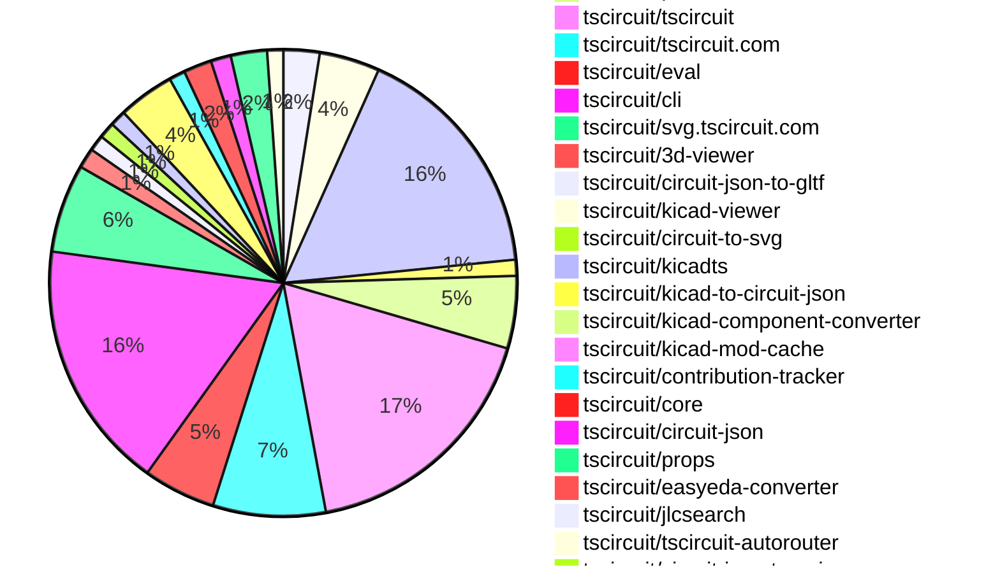
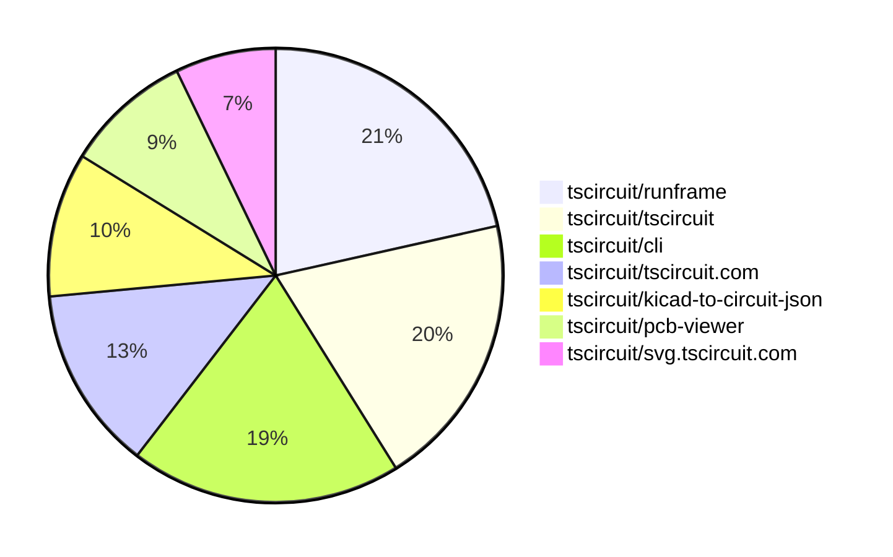

# Contribution Overview 2025-10-29

The current week is shown below. There are 4 major sections:

- [Contributor Overview](#contributor-overview)
- [PRs by Repository](#prs-by-repository)
- [PRs by Contributor](#changes-by-contributor)
- [Scoring & Sponsorship System](#scoring--sponsorship-system)

## PRs by Repository

## Contributor Overview

| Contributor | 🐳 Major | 🐙 Minor | 🐌 Tiny | ⭐ | Score | Discussion Contributions |
|-------------|---------|---------|---------|-----|----------------|--------------------------|
| [seveibar](#seveibar) | 12 | 9 | 11 | 👑👑 | 91.5 | 0🔹 0🔶 0💎 |
| [imrishabh18](#imrishabh18) | 7 | 9 | 9 | 👑 | 62 | 0🔹 0🔶 0💎 |
| [ShiboSoftwareDev](#ShiboSoftwareDev) | 4 | 10 | 2 | 👑 | 60 | 0🔹 0🔶 0💎 |
| [techmannih](#techmannih) | 0 | 4 | 7 | ⭐⭐⭐ | 34 | 0🔹 0🔶 0💎 |
| [ArnavK-09](#ArnavK-09) | 4 | 2 | 9 | ⭐⭐ | 28 | 0🔹 0🔶 0💎 |
| [rushabhcodes](#rushabhcodes) | 0 | 3 | 12 | ⭐⭐ | 22 | 0🔹 0🔶 0💎 |
| [tscircuitbot](#tscircuitbot) | 0 | 0 | 232 | ⭐⭐ | 15 | 0🔹 0🔶 0💎 |
| [baeoc](#baeoc) | 1 | 3 | 1 | ⭐⭐ | 12 | 0🔹 0🔶 0💎 |
| [nailoo](#nailoo) | 0 | 2 | 3 | ⭐⭐ | 12 | 0🔹 0🔶 0💎 |
| [Ayushjhawar8](#Ayushjhawar8) | 1 | 3 | 1 | ⭐⭐ | 11 | 0🔹 0🔶 0💎 |
| [RaghavArora14](#RaghavArora14) | 0 | 1 | 7 | ⭐ | 10 | 0🔹 0🔶 0💎 |
| [0hmX](#0hmX) | 1 | 1 | 1 | ⭐ | 7 | 0🔹 0🔶 0💎 |
| [Anshgrover23](#Anshgrover23) | 0 | 1 | 0 | ⭐ | 6 | 0🔹 0🔶 0💎 |
| [Asymtode712](#Asymtode712) | 0 | 1 | 1 | ⭐ | 4 | 0🔹 0🔶 0💎 |
| [pxlpal](#pxlpal) | 0 | 1 | 0 |  | 2 | 0🔹 0🔶 0💎 |
| [raykholo](#raykholo) | 0 | 0 | 1 |  | 1 | 0🔹 0🔶 0💎 |

> Note: AI evaluates PRs and assigns 1-3 star ratings automatically. 4 and 5 star ratings require manual staff review.

### Discussion Contribution Legend

- 🔹 Normal Comments: Basic participation with minimal effort
- 🔶 Great Informative Comments: Thoughtful participation that adds value
- 💎 Incredible Comments: Exceptional participation with high-quality content

## Review Table

[reviews-received-hover]: ## "Number of reviews received for PRs for this contributor"
[approvals-received-hover]: ## "Number of approvals received for PRs this contributor authored"
[rejections-received-hover]: ## "Number of rejections received for PRs this contributor authored"
[prs-opened-hover]: ## "Number of PRs opened by this contributor"
[issues-created-hover]: ## "Number of issues created by this contributor"
[bountied-issues-hover]: ## "Number of issues this contributor created with a bounty"
[bountied-issue-$-hover]: ## "Total bounty amount placed on issues authored by this contributor"

| Contributor | Reviews Received | Approvals Received | Rejections Received | Approvals | Rejections | PRs Opened | PRs Merged | Score | Issues Created | Bountied Issues | Bountied Issue $ |
|---|---|---|---|---|---|---|---|---|---|---|---|
| [rushabhcodes](#rushabhcodes) | 73 | 25 | 1 | 1 | 0 | 22 | 15 | 22 | 0 | 0 | 0 |
| [seveibar](#seveibar) | 16 | 0 | 0 | 63 | 7 | 45 | 32 | 91.5 | 0 | 0 | 0 |
| [Anshgrover23](#Anshgrover23) | 9 | 1 | 2 | 1 | 2 | 2 | 1 | 6 | 0 | 0 | 0 |
| [Ayushjhawar8](#Ayushjhawar8) | 12 | 5 | 3 | 0 | 0 | 9 | 5 | 11 | 0 | 0 | 0 |
| [Exceluyi](#Exceluyi) | 18 | 0 | 4 | 0 | 0 | 6 | 0 | 0 | 0 | 0 | 0 |
| [imrishabh18](#imrishabh18) | 13 | 3 | 0 | 3 | 5 | 28 | 25 | 62 | 0 | 0 | 0 |
| [tscircuitbot](#tscircuitbot) | 2 | 0 | 0 | 0 | 0 | 251 | 232 | 15 | 0 | 0 | 0 |
| [techmannih](#techmannih) | 24 | 10 | 1 | 11 | 1 | 14 | 11 | 34 | 0 | 0 | 0 |
| [RaghavArora14](#RaghavArora14) | 31 | 14 | 3 | 0 | 0 | 11 | 8 | 10 | 0 | 0 | 0 |
| [ShiboSoftwareDev](#ShiboSoftwareDev) | 24 | 16 | 0 | 21 | 0 | 19 | 16 | 60 | 0 | 0 | 0 |
| [nailoo](#nailoo) | 12 | 8 | 1 | 1 | 1 | 7 | 5 | 12 | 0 | 0 | 0 |
| [brymut](#brymut) | 2 | 0 | 0 | 0 | 0 | 3 | 0 | 0 | 0 | 0 | 0 |
| [baeoc](#baeoc) | 5 | 4 | 0 | 0 | 0 | 5 | 5 | 12 | 0 | 0 | 0 |
| [Asymtode712](#Asymtode712) | 14 | 2 | 0 | 0 | 0 | 6 | 2 | 4 | 0 | 0 | 0 |
| [MustafaMulla29](#MustafaMulla29) | 0 | 0 | 0 | 0 | 1 | 0 | 0 | 0 | 0 | 0 | 0 |
| [Enity300](#Enity300) | 4 | 0 | 1 | 0 | 0 | 1 | 0 | 0 | 0 | 0 | 0 |
| [0hmX](#0hmX) | 5 | 3 | 0 | 0 | 0 | 3 | 3 | 7 | 0 | 0 | 0 |
| [ArnavK-09](#ArnavK-09) | 13 | 8 | 1 | 0 | 0 | 17 | 15 | 28 | 0 | 0 | 0 |
| [pxlpal](#pxlpal) | 0 | 0 | 0 | 0 | 0 | 1 | 1 | 2 | 0 | 0 | 0 |
| [Devesh36](#Devesh36) | 5 | 2 | 0 | 0 | 0 | 1 | 0 | 0 | 0 | 0 | 0 |
| [lau90eth](#lau90eth) | 0 | 0 | 0 | 0 | 0 | 1 | 0 | 0 | 0 | 0 | 0 |
| [raykholo](#raykholo) | 3 | 1 | 0 | 0 | 0 | 1 | 1 | 1 | 0 | 0 | 0 |
| [Abse2001](#Abse2001) | 0 | 0 | 0 | 1 | 0 | 0 | 0 | 0 | 0 | 0 | 0 |

## Top 7 Repositories by Contribution Points

## Scoring & Sponsorship System

### Overview

PRs are analyzed by AI and assigned a **star rating (1-3 stars)**. 4 and 5 star ratings can only be manually assigned by staff. Weekly scores use `2^(starRating - 1)` per PR (capped at 12 PRs per rating), plus review/discussion points.

### Weekly Score → Star String

| Score Range | Star String | Count Value |
|------------|-------------|-------------|
| 0-3 | (empty) | 0 stars |
| 4-10 | ⭐ | 1 star |
| 11-30 | ⭐⭐ | 2 stars |
| 31-50 | ⭐⭐⭐ | 3 stars |
| 51-75 | 👑 | 1 crown |
| 76-100 | 👑👑 | 2 crowns |
| 101+ | 👑👑👑 | 3 crowns |

> Crowns count as 3 stars for sponsorship.

### Monthly Sponsorship Calculation

The sponsorship system calculates monthly payments based on your **weekly star counts** over the complete weeks in that month (typically 4-5 weeks, Wednesday-Tuesday format).

**Step 1: Collect Weekly Stars**
- All complete weeks in the month are analyzed
- Each week's star string is converted to a numeric count (⭐ = 1 star, ⭐⭐⭐ = 3 stars)
- Example: `[2, 2, 2, 1, 0]` means 2 stars in week 1, 2 stars in week 2, etc.

**Step 2: Calculate Metrics**
- **Median stars**: The median value of all weekly star counts
- **Min stars**: The minimum weekly star count
- **Max stars**: The maximum weekly star count
- **High score**: The maximum raw weekly score (0-100+ range from the scoring table) from any week in the month

**Step 3: Determine Base Amount**
The sponsorship amount is calculated based on these metrics (checked in order):

| Condition | Base Amount |
|-----------|-------------|
| `minStarCount >= 3` | **$500** |
| `medianStars >= 3` | **$450** |
| `medianStars >= 2.5` | **$300** |
| `medianStars >= 2` | **$200** |
| `medianStars >= 1.5` | **$100** |
| `medianStars >= 1` | **$75** |
| `maxStarCount >= 2` | **$25** |
| `maxStarCount >= 1` | **$15** |
| `highScore >= 3` (and all stars = 0) | **$5** |

| Maintainer Level | Monthly Bonus |
|------------------|---------------|
| Level 1 | **$200** |
| Level 2 | **$350** |
| Level 3 | **$500** |

**Final Amount** = Base Amount + Maintainer Bonus

## Changes by Repository

### [tscircuit/footprinter](https://github.com/tscircuit/footprinter)

| PR # | Impact | Rating | Contributor | Description |
|------|--------|--------|-------------|-------------|
| [#401](https://github.com/tscircuit/footprinter/pull/401) | 🐙 Minor | ⭐⭐ | rushabhcodes | Fixes incorrect pad width calculation for LQFP footprints when pad width is not explicitly specified, ensuring it defaults to 0.3mm instead of 0.6  pad length. |

🐌 Tiny Contributions (8)

| PR # | Impact | Contributor | Description |
|------|--------|-------------|-------------|
| [#399](https://github.com/tscircuit/footprinter/pull/399) | 🐌 Tiny | rushabhcodes | Fixes the lqfp footprint by ensuring the parameter pl is set to a default value of 1.5 if not provided, which affects the leg positioning of the component. |
| [#402](https://github.com/tscircuit/footprinter/pull/402) | 🐌 Tiny | techmannih | Fixes the diameter values for the HC49 component footprint, changing the internal diameter from 0.6mm to 0.8mm and the outer diameter from 1.2mm to 1.5mm. |
| [#400](https://github.com/tscircuit/footprinter/pull/400) | 🐌 Tiny | techmannih | Fixes the outer diameter for axial components from 1mm to 1.4mm and adjusts the silkscreen reference text accordingly. |
| [#398](https://github.com/tscircuit/footprinter/pull/398) | 🐌 Tiny | techmannih | Adds a test for the SOT-323 parity to ensure correct footprint comparison between Footprinter and KiCad. |
| [#394](https://github.com/tscircuit/footprinter/pull/394) | 🐌 Tiny | techmannih | Fixes the pitch dimensions for the sod923 footprint in the footprint library. |
| [#404](https://github.com/tscircuit/footprinter/pull/404) | 🐌 Tiny | nailoo | Fixes the SOT-723 footprint dimensions and adds a KiCad parity test for the SOT-723 component. |
| [#405](https://github.com/tscircuit/footprinter/pull/405) | 🐌 Tiny | nailoo | Fixes the dimensions of the sot323 footprint by correcting the pin length and width values. |
| [#397](https://github.com/tscircuit/footprinter/pull/397) | 🐌 Tiny | nailoo | Adds support for the TQFP64 electronic component footprint in the footprinter library. |

### [tscircuit/jscad-electronics](https://github.com/tscircuit/jscad-electronics)

| PR # | Impact | Rating | Contributor | Description |
|------|--------|--------|-------------|-------------|
| [#182](https://github.com/tscircuit/jscad-electronics/pull/182) | 🐙 Minor | ⭐⭐ | rushabhcodes | Adds configurable corner chamfering capability to the ChipBody component, allowing for more realistic chip package modeling. |
| [#167](https://github.com/tscircuit/jscad-electronics/pull/167) | 🐙 Minor | ⭐⭐ | rushabhcodes | Fixes rendering crashes caused by nonstandard shape strings and diameter property names in the FootprintPlatedHole component. |
| [#187](https://github.com/tscircuit/jscad-electronics/pull/187) | 🐙 Minor | ⭐⭐ | nailoo | Fixes the issue where chip leads are not fully inserted into the SOT-723 package, ensuring proper alignment and functionality. |

🐌 Tiny Contributions (12)

| PR # | Impact | Contributor | Description |
|------|--------|-------------|-------------|
| [#192](https://github.com/tscircuit/jscad-electronics/pull/192) | 🐌 Tiny | rushabhcodes | Adds support for rendering DFN (Dual Flat No-lead) package footprints in the 3D viewer, including a new DFN component, integration into the footprint renderer, and corresponding examples and tests. |
| [#190](https://github.com/tscircuit/jscad-electronics/pull/190) | 🐌 Tiny | rushabhcodes | Removes unnecessary useMemo usage from the BGA UI components due to improvements in React 19s compiler and heuristics for memoization. |
| [#186](https://github.com/tscircuit/jscad-electronics/pull/186) | 🐌 Tiny | rushabhcodes | Adds support for rendering LQFP (Low-profile Quad Flat Package) IC packages in the 3D footprint library, including a new LQFP component with customizable parameters and integrated into the footprint rendering pipeline. |
| [#183](https://github.com/tscircuit/jscad-electronics/pull/183) | 🐌 Tiny | rushabhcodes | Modifies the QFP component to implement corner chamfers and custom notch positioning for enhanced chip package modeling accuracy. |
| [#185](https://github.com/tscircuit/jscad-electronics/pull/185) | 🐌 Tiny | rushabhcodes | Removes unnecessary useMemo usage from the USB-A and USB-C UI components, optimizing performance with React 19s improved memoization. |
| [#181](https://github.com/tscircuit/jscad-electronics/pull/181) | 🐌 Tiny | rushabhcodes | Adds support for the SOT323 electronic component footprint in the library, including a new React component for rendering it. |
| [#179](https://github.com/tscircuit/jscad-electronics/pull/179) | 🐌 Tiny | rushabhcodes | Adds the SOT223 component and its associated tests to the library, enhancing the available electronic components for users. |
| [#172](https://github.com/tscircuit/jscad-electronics/pull/172) | 🐌 Tiny | rushabhcodes | Adds support for the SOD123FL electronic component model along with its corresponding tests. |
| [#162](https://github.com/tscircuit/jscad-electronics/pull/162) | 🐌 Tiny | rushabhcodes | Refactors the SOD523 component by inlining JSX directly into the component return, removing the module-level Body constant. |
| [#176](https://github.com/tscircuit/jscad-electronics/pull/176) | 🐌 Tiny | rushabhcodes | Adds support for the SOD923 component along with an example and a snapshot test. |
| [#175](https://github.com/tscircuit/jscad-electronics/pull/175) | 🐌 Tiny | RaghavArora14 | Fixes the positioning of copper pads in the footprint rendering to ensure that pad tops are aligned at z0, addressing issue 152. |
| [#188](https://github.com/tscircuit/jscad-electronics/pull/188) | 🐌 Tiny | ShiboSoftwareDev | Adds ShiboSoftwareDev as a new maintainer in the CODEOWNERS file |

### [tscircuit/schematic-viewer](https://github.com/tscircuit/schematic-viewer)

| PR # | Impact | Rating | Contributor | Description |
|------|--------|--------|-------------|-------------|
| [#143](https://github.com/tscircuit/schematic-viewer/pull/143) | 🐙 Minor | ⭐⭐ | Ayushjhawar8 | Fixes the bug where clicks were incorrectly registering during component drag operations by implementing a drag threshold check. |

🐌 Tiny Contributions (1)

| PR # | Impact | Contributor | Description |
|------|--------|-------------|-------------|
| [#144](https://github.com/tscircuit/schematic-viewer/pull/144) | 🐌 Tiny | rushabhcodes | Adds a GitHub Actions workflow for format checking to ensure code consistency and quality during pushes and pull requests. |

### [tscircuit/runframe](https://github.com/tscircuit/runframe)

| PR # | Impact | Rating | Contributor | Description |
|------|--------|--------|-------------|-------------|
| [#1624](https://github.com/tscircuit/runframe/pull/1624) | 🐳 Major | ⭐⭐⭐ | Ayushjhawar8 | Enables users to switch between files in the same directory using CmdCtrlleft and CmdCtrlright arrow keys without opening the file selector. |
| [#1615](https://github.com/tscircuit/runframe/pull/1615) | 🐳 Major | ⭐⭐⭐ | imrishabh18 | Adds support for uploading GLB and other binary files, enabling users to integrate 3D models into their projects. |
| [#1663](https://github.com/tscircuit/runframe/pull/1663) | 🐙 Minor | ⭐⭐ | Ayushjhawar8 | Replaces the alert for copying error messages to clipboard with a react-hot-toast popup notification. |
| [#1622](https://github.com/tscircuit/runframe/pull/1622) | 🐙 Minor | ⭐⭐ | imrishabh18 | Fixes the bug report textarea from causing the entire FileMenuLeftHeader to re-render on every key press by switching to uncontrolled input. |
| [#1639](https://github.com/tscircuit/runframe/pull/1639) | 🐙 Minor | ⭐⭐ | pxlpal | Adds Authority and Content-Type headers to the loadJlcpcbComponentTsx function for improved API request handling. |

🐌 Tiny Contributions (55)

| PR # | Impact | Contributor | Description |
|------|--------|-------------|-------------|
| [#1621](https://github.com/tscircuit/runframe/pull/1621) | 🐌 Tiny | Ayushjhawar8 | This pull request introduces a new section for recently viewed files in the file selector component, allows users to remove favorites directly from the favorites section, and adds keyboard shortcuts for improved navigation. The changes enhance user experience by making file management more efficient and accessible. |
| [#1671](https://github.com/tscircuit/runframe/pull/1671) | 🐌 Tiny | tscircuitbot | Automated package update |
| [#1670](https://github.com/tscircuit/runframe/pull/1670) | 🐌 Tiny | tscircuitbot | Automated package update |
| [#1669](https://github.com/tscircuit/runframe/pull/1669) | 🐌 Tiny | tscircuitbot | Updates the tscircuiteval package to version 0.0.450 |
| [#1668](https://github.com/tscircuit/runframe/pull/1668) | 🐌 Tiny | tscircuitbot | Automated package version bump from 0.0.1200 to 0.0.1201 |
| [#1667](https://github.com/tscircuit/runframe/pull/1667) | 🐌 Tiny | tscircuitbot | Updates the tscircuitpcb-viewer package from version 1.11.249 to 1.11.250 |
| [#1666](https://github.com/tscircuit/runframe/pull/1666) | 🐌 Tiny | tscircuitbot | Updates the package version from 0.0.1199 to 0.0.1200 in package.json |
| [#1665](https://github.com/tscircuit/runframe/pull/1665) | 🐌 Tiny | tscircuitbot | Updates the tscircuitschematic-viewer package from version 2.0.46 to 2.0.47 |
| [#1662](https://github.com/tscircuit/runframe/pull/1662) | 🐌 Tiny | tscircuitbot | Updates the package version from 0.0.1198 to 0.0.1199 in package.json |
| [#1661](https://github.com/tscircuit/runframe/pull/1661) | 🐌 Tiny | tscircuitbot | Updates the tscircuitpcb-viewer package from version 1.11.248 to 1.11.249 |
| [#1660](https://github.com/tscircuit/runframe/pull/1660) | 🐌 Tiny | tscircuitbot | Updates the package version from 0.0.1197 to 0.0.1198 in package.json |
| [#1659](https://github.com/tscircuit/runframe/pull/1659) | 🐌 Tiny | tscircuitbot | Automated package update |
| [#1658](https://github.com/tscircuit/runframe/pull/1658) | 🐌 Tiny | tscircuitbot | Automated package update |
| [#1657](https://github.com/tscircuit/runframe/pull/1657) | 🐌 Tiny | tscircuitbot | Automated package update |
| [#1656](https://github.com/tscircuit/runframe/pull/1656) | 🐌 Tiny | tscircuitbot | Automated package update |
| [#1655](https://github.com/tscircuit/runframe/pull/1655) | 🐌 Tiny | tscircuitbot | Updates the tscircuiteval package from version 0.0.447 to 0.0.448 |
| [#1652](https://github.com/tscircuit/runframe/pull/1652) | 🐌 Tiny | tscircuitbot | Updates the package version from 0.0.1194 to 0.0.1195 in package.json |
| [#1651](https://github.com/tscircuit/runframe/pull/1651) | 🐌 Tiny | tscircuitbot | Updates the tscircuit3d-viewer package to version 0.0.425 in package.json |
| [#1650](https://github.com/tscircuit/runframe/pull/1650) | 🐌 Tiny | tscircuitbot | Updates the package version from 0.0.1193 to 0.0.1194 in package.json |
| [#1649](https://github.com/tscircuit/runframe/pull/1649) | 🐌 Tiny | tscircuitbot | Automated package update |
| [#1648](https://github.com/tscircuit/runframe/pull/1648) | 🐌 Tiny | tscircuitbot | Automated package update |
| [#1647](https://github.com/tscircuit/runframe/pull/1647) | 🐌 Tiny | tscircuitbot | Updates the tscircuit3d-viewer package to version 0.0.423 in package.json |
| [#1646](https://github.com/tscircuit/runframe/pull/1646) | 🐌 Tiny | tscircuitbot | Automated package update |
| [#1645](https://github.com/tscircuit/runframe/pull/1645) | 🐌 Tiny | tscircuitbot | Updates the tscircuiteval package to version 0.0.447 in the package.json file. |
| [#1644](https://github.com/tscircuit/runframe/pull/1644) | 🐌 Tiny | tscircuitbot | Automated package update |
| [#1643](https://github.com/tscircuit/runframe/pull/1643) | 🐌 Tiny | tscircuitbot | Updates the tscircuiteval package to version 0.0.446 in the package.json file. |
| [#1642](https://github.com/tscircuit/runframe/pull/1642) | 🐌 Tiny | tscircuitbot | Automated package update |
| [#1641](https://github.com/tscircuit/runframe/pull/1641) | 🐌 Tiny | tscircuitbot | Updates the tscircuiteval package to version 0.0.445 |
| [#1640](https://github.com/tscircuit/runframe/pull/1640) | 🐌 Tiny | tscircuitbot | Updates the package version from 0.0.1188 to 0.0.1189 in package.json |
| [#1638](https://github.com/tscircuit/runframe/pull/1638) | 🐌 Tiny | tscircuitbot | Updates the package version from 0.0.1187 to 0.0.1188 in package.json |
| [#1637](https://github.com/tscircuit/runframe/pull/1637) | 🐌 Tiny | tscircuitbot | Updates the tscircuitschematic-viewer package from version 2.0.45 to 2.0.46 |
| [#1635](https://github.com/tscircuit/runframe/pull/1635) | 🐌 Tiny | tscircuitbot | Automated package update |
| [#1634](https://github.com/tscircuit/runframe/pull/1634) | 🐌 Tiny | tscircuitbot | Updates the tscircuitpcb-viewer package from version 1.11.247 to 1.11.248 |
| [#1633](https://github.com/tscircuit/runframe/pull/1633) | 🐌 Tiny | tscircuitbot | Automated package update |
| [#1632](https://github.com/tscircuit/runframe/pull/1632) | 🐌 Tiny | tscircuitbot | Updates the tscircuitpcb-viewer package from version 1.11.246 to 1.11.247 |
| [#1631](https://github.com/tscircuit/runframe/pull/1631) | 🐌 Tiny | tscircuitbot | Automated package update |
| [#1630](https://github.com/tscircuit/runframe/pull/1630) | 🐌 Tiny | tscircuitbot | Updates the tscircuitpcb-viewer package from version 1.11.245 to 1.11.246 |
| [#1629](https://github.com/tscircuit/runframe/pull/1629) | 🐌 Tiny | tscircuitbot | Automated package update to version 0.0.1184 |
| [#1628](https://github.com/tscircuit/runframe/pull/1628) | 🐌 Tiny | tscircuitbot | Updates the tscircuitpcb-viewer package from version 1.11.244 to 1.11.245 |
| [#1627](https://github.com/tscircuit/runframe/pull/1627) | 🐌 Tiny | tscircuitbot | Updates the package version from 0.0.1182 to 0.0.1183 in package.json |
| [#1626](https://github.com/tscircuit/runframe/pull/1626) | 🐌 Tiny | tscircuitbot | Automated package update |
| [#1625](https://github.com/tscircuit/runframe/pull/1625) | 🐌 Tiny | tscircuitbot | Updates the tscircuit3d-viewer package to version 0.0.422 |
| [#1623](https://github.com/tscircuit/runframe/pull/1623) | 🐌 Tiny | tscircuitbot | Updates the package version from 0.0.1180 to 0.0.1181 in package.json |
| [#1620](https://github.com/tscircuit/runframe/pull/1620) | 🐌 Tiny | tscircuitbot | Updates the package version from 0.0.1179 to 0.0.1180 in package.json |
| [#1619](https://github.com/tscircuit/runframe/pull/1619) | 🐌 Tiny | tscircuitbot | Updates the tscircuiteval package from version 0.0.443 to 0.0.444 |
| [#1618](https://github.com/tscircuit/runframe/pull/1618) | 🐌 Tiny | tscircuitbot | Automated package update |
| [#1617](https://github.com/tscircuit/runframe/pull/1617) | 🐌 Tiny | tscircuitbot | Updates the tscircuitpcb-viewer package from version 1.11.243 to 1.11.244 |
| [#1616](https://github.com/tscircuit/runframe/pull/1616) | 🐌 Tiny | tscircuitbot | Automated package update |
| [#1614](https://github.com/tscircuit/runframe/pull/1614) | 🐌 Tiny | tscircuitbot | Automated package update |
| [#1613](https://github.com/tscircuit/runframe/pull/1613) | 🐌 Tiny | tscircuitbot | Updates the tscircuiteval package to version 0.0.443 in the package.json file. |
| [#1611](https://github.com/tscircuit/runframe/pull/1611) | 🐌 Tiny | tscircuitbot | Automated package update |
| [#1610](https://github.com/tscircuit/runframe/pull/1610) | 🐌 Tiny | tscircuitbot | Updates the tscircuitpcb-viewer package from version 1.11.242 to 1.11.243 |
| [#1609](https://github.com/tscircuit/runframe/pull/1609) | 🐌 Tiny | tscircuitbot | Updates the tscircuitpcb-viewer package from version 1.11.241 to 1.11.242 |
| [#1608](https://github.com/tscircuit/runframe/pull/1608) | 🐌 Tiny | tscircuitbot | Automated package update |
| [#1607](https://github.com/tscircuit/runframe/pull/1607) | 🐌 Tiny | tscircuitbot | Updates the tscircuiteval package to version 0.0.442 |

### [tscircuit/alphabet](https://github.com/tscircuit/alphabet)

| PR # | Impact | Rating | Contributor | Description |
|------|--------|--------|-------------|-------------|
| [#15](https://github.com/tscircuit/alphabet/pull/15) | 🐳 Major | ⭐⭐⭐ | seveibar | Adds a Bun build script that converts the SVG alphabet into a TrueType font using opentype.js, integrates it into the existing build pipeline, and updates the Biome configuration with necessary dependencies. |
| [#19](https://github.com/tscircuit/alphabet/pull/19) | 🐙 Minor | ⭐⭐ | Ayushjhawar8 | Fixes the representation of the lowercase s character in the SVG alphabet by restructuring its curve and removing a duplicate point. |

🐌 Tiny Contributions (2)

| PR # | Impact | Contributor | Description |
|------|--------|-------------|-------------|
| [#23](https://github.com/tscircuit/alphabet/pull/23) | 🐌 Tiny | RaghavArora14 | Add PNG snapshot tests that validate the rendering of text using the TscircuitAlphabet.ttf font file, ensuring the built font works correctly. |
| [#22](https://github.com/tscircuit/alphabet/pull/22) | 🐌 Tiny | RaghavArora14 | Adds exclamation symbol to TscircuitAlphabet.ttf |

### [tscircuit/pcb-viewer](https://github.com/tscircuit/pcb-viewer)

| PR # | Impact | Rating | Contributor | Description |
|------|--------|--------|-------------|-------------|
| [#438](https://github.com/tscircuit/pcb-viewer/pull/438) | 🐳 Major | ⭐⭐⭐ | ShiboSoftwareDev | Adds an option in the View dropdown menu to toggle the visibility of copper pours, with the state saved in local storage for user preference persistence. |
| [#435](https://github.com/tscircuit/pcb-viewer/pull/435) | 🐳 Major | ⭐⭐⭐ | seveibar | Add a global view setting for copper pours, exposing a Show Copper Pours toggle in the View menu and filtering copper pour primitives when the toggle is disabled. |
| [#453](https://github.com/tscircuit/pcb-viewer/pull/453) | 🐙 Minor | ⭐⭐ | techmannih | Fixes the issue where the pcb_fabrication_note_rect element was not rendering correctly in the PCB viewer. |
| [#450](https://github.com/tscircuit/pcb-viewer/pull/450) | 🐙 Minor | ⭐⭐ | imrishabh18 | Fixes rendering of pcb_via elements to support a new format of layers array instead of the old from_layerto_layer format. |
| [#447](https://github.com/tscircuit/pcb-viewer/pull/447) | 🐙 Minor | ⭐⭐ | RaghavArora14 | Fixes issue where layers would disappear with 8 layer PCBs by increasing topLayer z-index from 10 to 20 and adjusting overlay z-indexes accordingly. |
| [#443](https://github.com/tscircuit/pcb-viewer/pull/443) | 🐙 Minor | ⭐⭐ | ShiboSoftwareDev | Fixes rendering order to ensure drill and foreground layers consistently appear on top by simplifying z-index management in the orderAndFadeLayers method. |
| [#434](https://github.com/tscircuit/pcb-viewer/pull/434) | 🐙 Minor | ⭐⭐ | ShiboSoftwareDev | Makes copper pours slightly transparent to distinguish them from other copper elements. |

🐌 Tiny Contributions (11)

| PR # | Impact | Contributor | Description |
|------|--------|-------------|-------------|
| [#454](https://github.com/tscircuit/pcb-viewer/pull/454) | 🐌 Tiny | tscircuitbot | Automated package update |
| [#451](https://github.com/tscircuit/pcb-viewer/pull/451) | 🐌 Tiny | tscircuitbot | Automated package update |
| [#448](https://github.com/tscircuit/pcb-viewer/pull/448) | 🐌 Tiny | tscircuitbot | Automated package update |
| [#446](https://github.com/tscircuit/pcb-viewer/pull/446) | 🐌 Tiny | tscircuitbot | Automated package update |
| [#444](https://github.com/tscircuit/pcb-viewer/pull/444) | 🐌 Tiny | tscircuitbot | Automated package update |
| [#441](https://github.com/tscircuit/pcb-viewer/pull/441) | 🐌 Tiny | tscircuitbot | Automated package update |
| [#439](https://github.com/tscircuit/pcb-viewer/pull/439) | 🐌 Tiny | tscircuitbot | Automated package update |
| [#437](https://github.com/tscircuit/pcb-viewer/pull/437) | 🐌 Tiny | tscircuitbot | Automated package update |
| [#436](https://github.com/tscircuit/pcb-viewer/pull/436) | 🐌 Tiny | tscircuitbot | Automated package update |
| [#440](https://github.com/tscircuit/pcb-viewer/pull/440) | 🐌 Tiny | RaghavArora14 | Fixes visibility issues in an 8-layer PCB viewer where inner layers 5 and 6 were not displaying and the top layer disappeared when other layers were selected. |
| [#445](https://github.com/tscircuit/pcb-viewer/pull/445) | 🐌 Tiny | ShiboSoftwareDev | Restores the board layer to the default draw order, which was previously removed, potentially reintroducing an issue that was thought to be fixed. |

### [tscircuit/tscircuit](https://github.com/tscircuit/tscircuit)

🐌 Tiny Contributions (63)

| PR # | Impact | Contributor | Description |
|------|--------|-------------|-------------|
| [#1257](https://github.com/tscircuit/tscircuit/pull/1257) | 🐌 Tiny | tscircuitbot | Automated package update |
| [#1256](https://github.com/tscircuit/tscircuit/pull/1256) | 🐌 Tiny | tscircuitbot | Updates the tscircuitcli package from version 0.1.439 to 0.1.440 and the tscircuitrunframe package from version 0.0.1202 to 0.0.1203 in package.json |
| [#1255](https://github.com/tscircuit/tscircuit/pull/1255) | 🐌 Tiny | tscircuitbot | Automated package update |
| [#1254](https://github.com/tscircuit/tscircuit/pull/1254) | 🐌 Tiny | tscircuitbot | Automated package update |
| [#1253](https://github.com/tscircuit/tscircuit/pull/1253) | 🐌 Tiny | tscircuitbot | Automated package update |
| [#1251](https://github.com/tscircuit/tscircuit/pull/1251) | 🐌 Tiny | tscircuitbot | Automated package update |
| [#1250](https://github.com/tscircuit/tscircuit/pull/1250) | 🐌 Tiny | tscircuitbot | Updates the tscircuitcli package from version 0.1.437 to 0.1.438 and the tscircuitrunframe package from version 0.0.1200 to 0.0.1201. |
| [#1249](https://github.com/tscircuit/tscircuit/pull/1249) | 🐌 Tiny | tscircuitbot | Automated package update |
| [#1248](https://github.com/tscircuit/tscircuit/pull/1248) | 🐌 Tiny | tscircuitbot | Automated package update |
| [#1247](https://github.com/tscircuit/tscircuit/pull/1247) | 🐌 Tiny | tscircuitbot | Automated package update |
| [#1246](https://github.com/tscircuit/tscircuit/pull/1246) | 🐌 Tiny | tscircuitbot | Updates the tscircuitcli package from version 0.1.435 to 0.1.436 and the tscircuitrunframe package from version 0.0.1198 to 0.0.1199. |
| [#1245](https://github.com/tscircuit/tscircuit/pull/1245) | 🐌 Tiny | tscircuitbot | Automated package update |
| [#1244](https://github.com/tscircuit/tscircuit/pull/1244) | 🐌 Tiny | tscircuitbot | Automated package update |
| [#1243](https://github.com/tscircuit/tscircuit/pull/1243) | 🐌 Tiny | tscircuitbot | Automated package update |
| [#1242](https://github.com/tscircuit/tscircuit/pull/1242) | 🐌 Tiny | tscircuitbot | Automated package update |
| [#1241](https://github.com/tscircuit/tscircuit/pull/1241) | 🐌 Tiny | tscircuitbot | Automated package update |
| [#1239](https://github.com/tscircuit/tscircuit/pull/1239) | 🐌 Tiny | tscircuitbot | Automated package update |
| [#1238](https://github.com/tscircuit/tscircuit/pull/1238) | 🐌 Tiny | tscircuitbot | Automated package update |
| [#1237](https://github.com/tscircuit/tscircuit/pull/1237) | 🐌 Tiny | tscircuitbot | Updates the package version from 0.0.849 to 0.0.850 in package.json |
| [#1236](https://github.com/tscircuit/tscircuit/pull/1236) | 🐌 Tiny | tscircuitbot | Automated package update |
| [#1235](https://github.com/tscircuit/tscircuit/pull/1235) | 🐌 Tiny | tscircuitbot | Automated package update |
| [#1234](https://github.com/tscircuit/tscircuit/pull/1234) | 🐌 Tiny | tscircuitbot | Updates the tscircuitcli package from version 0.1.430 to 0.1.431 and the tscircuitrunframe package from version 0.0.1193 to 0.0.1194. |
| [#1233](https://github.com/tscircuit/tscircuit/pull/1233) | 🐌 Tiny | tscircuitbot | Automated package update |
| [#1232](https://github.com/tscircuit/tscircuit/pull/1232) | 🐌 Tiny | tscircuitbot | Automated package update |
| [#1231](https://github.com/tscircuit/tscircuit/pull/1231) | 🐌 Tiny | tscircuitbot | Automated package update |
| [#1230](https://github.com/tscircuit/tscircuit/pull/1230) | 🐌 Tiny | tscircuitbot | Automated package update |
| [#1229](https://github.com/tscircuit/tscircuit/pull/1229) | 🐌 Tiny | tscircuitbot | Automated package update |
| [#1228](https://github.com/tscircuit/tscircuit/pull/1228) | 🐌 Tiny | tscircuitbot | Automated package update |
| [#1227](https://github.com/tscircuit/tscircuit/pull/1227) | 🐌 Tiny | tscircuitbot | Automated package update |
| [#1226](https://github.com/tscircuit/tscircuit/pull/1226) | 🐌 Tiny | tscircuitbot | Automated package update |
| [#1224](https://github.com/tscircuit/tscircuit/pull/1224) | 🐌 Tiny | tscircuitbot | Updates the tscircuitcli package from version 0.1.425 to 0.1.426 and the tscircuitrunframe package from version 0.0.1188 to 0.0.1189. |
| [#1223](https://github.com/tscircuit/tscircuit/pull/1223) | 🐌 Tiny | tscircuitbot | Automated package update |
| [#1222](https://github.com/tscircuit/tscircuit/pull/1222) | 🐌 Tiny | tscircuitbot | Automated package update |
| [#1221](https://github.com/tscircuit/tscircuit/pull/1221) | 🐌 Tiny | tscircuitbot | Automated package update |
| [#1220](https://github.com/tscircuit/tscircuit/pull/1220) | 🐌 Tiny | tscircuitbot | Updates the tscircuitcli package to version 0.1.424 and the tscircuitrunframe package to version 0.0.1187, while downgrading the circuit-json-to-spice package to version 0.0.16. |
| [#1219](https://github.com/tscircuit/tscircuit/pull/1219) | 🐌 Tiny | tscircuitbot | Automated package update |
| [#1218](https://github.com/tscircuit/tscircuit/pull/1218) | 🐌 Tiny | tscircuitbot | Automated package update |
| [#1217](https://github.com/tscircuit/tscircuit/pull/1217) | 🐌 Tiny | tscircuitbot | Updates the tscircuitcli package from version 0.1.422 to 0.1.423 and the tscircuitrunframe package from version 0.0.1185 to 0.0.1186 in package.json |
| [#1216](https://github.com/tscircuit/tscircuit/pull/1216) | 🐌 Tiny | tscircuitbot | Automated package update |
| [#1215](https://github.com/tscircuit/tscircuit/pull/1215) | 🐌 Tiny | tscircuitbot | Automated package update |
| [#1214](https://github.com/tscircuit/tscircuit/pull/1214) | 🐌 Tiny | tscircuitbot | Automated package update |
| [#1213](https://github.com/tscircuit/tscircuit/pull/1213) | 🐌 Tiny | tscircuitbot | Updates the tscircuitcli package version from 0.1.420 to 0.1.421 |
| [#1212](https://github.com/tscircuit/tscircuit/pull/1212) | 🐌 Tiny | tscircuitbot | Automated package update |
| [#1211](https://github.com/tscircuit/tscircuit/pull/1211) | 🐌 Tiny | tscircuitbot | Updates the tscircuitcli package from version 0.1.419 to 0.1.420 and the tscircuitrunframe package from version 0.0.1183 to 0.0.1184 in package.json |
| [#1209](https://github.com/tscircuit/tscircuit/pull/1209) | 🐌 Tiny | tscircuitbot | Updates the tscircuitcli package from version 0.1.418 to 0.1.419 and the tscircuitrunframe package from version 0.0.1182 to 0.0.1183 in package.json |
| [#1207](https://github.com/tscircuit/tscircuit/pull/1207) | 🐌 Tiny | tscircuitbot | Updates the tscircuitcli package from version 0.1.417 to 0.1.418 and the tscircuitrunframe package from version 0.0.1181 to 0.0.1182 in package.json |
| [#1206](https://github.com/tscircuit/tscircuit/pull/1206) | 🐌 Tiny | tscircuitbot | Updates the package version from 0.0.832 to 0.0.834 in package.json |
| [#1205](https://github.com/tscircuit/tscircuit/pull/1205) | 🐌 Tiny | tscircuitbot | Updates the tscircuitcli package from version 0.1.416 to 0.1.417 and the tscircuitrunframe package from version 0.0.1180 to 0.0.1181. |
| [#1203](https://github.com/tscircuit/tscircuit/pull/1203) | 🐌 Tiny | tscircuitbot | Automated package update |
| [#1202](https://github.com/tscircuit/tscircuit/pull/1202) | 🐌 Tiny | tscircuitbot | Automated package update |
| [#1201](https://github.com/tscircuit/tscircuit/pull/1201) | 🐌 Tiny | tscircuitbot | Updates the tscircuitcli package from version 0.1.414 to 0.1.415 and the tscircuitrunframe package from version 0.0.1178 to 0.0.1179 in package.json |
| [#1200](https://github.com/tscircuit/tscircuit/pull/1200) | 🐌 Tiny | tscircuitbot | Automated package update |
| [#1199](https://github.com/tscircuit/tscircuit/pull/1199) | 🐌 Tiny | tscircuitbot | Updates the tscircuitcli package from version 0.1.413 to 0.1.414 and the tscircuitrunframe package from version 0.0.1177 to 0.0.1178 in package.json |
| [#1198](https://github.com/tscircuit/tscircuit/pull/1198) | 🐌 Tiny | tscircuitbot | Automated package update |
| [#1197](https://github.com/tscircuit/tscircuit/pull/1197) | 🐌 Tiny | tscircuitbot | Automated package update |
| [#1196](https://github.com/tscircuit/tscircuit/pull/1196) | 🐌 Tiny | tscircuitbot | Automated package update |
| [#1195](https://github.com/tscircuit/tscircuit/pull/1195) | 🐌 Tiny | tscircuitbot | Updates the tscircuitcli package to version 0.1.412 in package.json |
| [#1194](https://github.com/tscircuit/tscircuit/pull/1194) | 🐌 Tiny | tscircuitbot | Automated package update |
| [#1193](https://github.com/tscircuit/tscircuit/pull/1193) | 🐌 Tiny | tscircuitbot | Updates the tscircuitcli package from version 0.1.410 to 0.1.411 and the tscircuitrunframe package from version 0.0.1174 to 0.0.1176 in package.json |
| [#1192](https://github.com/tscircuit/tscircuit/pull/1192) | 🐌 Tiny | tscircuitbot | Automated package update |
| [#1191](https://github.com/tscircuit/tscircuit/pull/1191) | 🐌 Tiny | tscircuitbot | Automated package update |
| [#1240](https://github.com/tscircuit/tscircuit/pull/1240) | 🐌 Tiny | imrishabh18 | Updates the versions of several dependencies in the package.json file. |
| [#1252](https://github.com/tscircuit/tscircuit/pull/1252) | 🐌 Tiny | seveibar | Updates the circuit-json-to-spice dependency to version 0.0.18 and refreshes the lockfile to pull in the new package metadata. |

### [tscircuit/tscircuit.com](https://github.com/tscircuit/tscircuit.com)

| PR # | Impact | Rating | Contributor | Description |
|------|--------|--------|-------------|-------------|
| [#1930](https://github.com/tscircuit/tscircuit.com/pull/1930) | 🐳 Major | ⭐⭐⭐ | ArnavK-09 | Normalizes the package name input in the New Package Save Prompt dialog to ensure consistent formatting before saving. |
| [#1929](https://github.com/tscircuit/tscircuit.com/pull/1929) | 🐳 Major | ⭐⭐⭐ | ArnavK-09 | Fixes the star button functionality to correctly update the star count and starred status for packages in the application. |
| [#1922](https://github.com/tscircuit/tscircuit.com/pull/1922) | 🐳 Major | ⭐⭐⭐ | ArnavK-09 | Adds support for tscircuit_handle in organization creation and retrieval processes, ensuring that the handle is properly managed and stored in the database. |
| [#1918](https://github.com/tscircuit/tscircuit.com/pull/1918) | 🐳 Major | ⭐⭐⭐ | ArnavK-09 | Added error handling for organization loading and package saving, introduced loading state for the save button, trimmed package name input to prevent leadingtrailing spaces, and updated UI to display error messages when applicable. |
| [#1927](https://github.com/tscircuit/tscircuit.com/pull/1927) | 🐙 Minor | ⭐⭐ | ArnavK-09 | Adds preconnect for Google Tag Manager and modifies loader behavior to improve page speed and SEO performance. |
| [#1920](https://github.com/tscircuit/tscircuit.com/pull/1920) | 🐙 Minor | ⭐⭐ | ArnavK-09 | Fixes the issue where the wrong GitHub avatar image is displayed when the username is not provided, ensuring that the image source is undefined in such cases. |

🐌 Tiny Contributions (22)

| PR # | Impact | Contributor | Description |
|------|--------|-------------|-------------|
| [#1949](https://github.com/tscircuit/tscircuit.com/pull/1949) | 🐌 Tiny | tscircuitbot | Updates the tscircuiteval package from version 0.0.449 to 0.0.450 |
| [#1944](https://github.com/tscircuit/tscircuit.com/pull/1944) | 🐌 Tiny | tscircuitbot | Automated package update |
| [#1942](https://github.com/tscircuit/tscircuit.com/pull/1942) | 🐌 Tiny | tscircuitbot | Automated package update |
| [#1939](https://github.com/tscircuit/tscircuit.com/pull/1939) | 🐌 Tiny | tscircuitbot | Automated package update to version 0.0.137 |
| [#1935](https://github.com/tscircuit/tscircuit.com/pull/1935) | 🐌 Tiny | tscircuitbot | Updates the tscircuiteval package from version 0.0.446 to 0.0.447 |
| [#1932](https://github.com/tscircuit/tscircuit.com/pull/1932) | 🐌 Tiny | tscircuitbot | Automated package update |
| [#1925](https://github.com/tscircuit/tscircuit.com/pull/1925) | 🐌 Tiny | tscircuitbot | Automated package update |
| [#1923](https://github.com/tscircuit/tscircuit.com/pull/1923) | 🐌 Tiny | tscircuitbot | Automated package update |
| [#1917](https://github.com/tscircuit/tscircuit.com/pull/1917) | 🐌 Tiny | tscircuitbot | Updates the tscircuiteval package from version 0.0.443 to 0.0.444 in the package.json file. |
| [#1916](https://github.com/tscircuit/tscircuit.com/pull/1916) | 🐌 Tiny | tscircuitbot | Automated package update |
| [#1915](https://github.com/tscircuit/tscircuit.com/pull/1915) | 🐌 Tiny | tscircuitbot | Automated package update |
| [#1943](https://github.com/tscircuit/tscircuit.com/pull/1943) | 🐌 Tiny | imrishabh18 | Updates various package dependencies in the project to their latest versions. |
| [#1924](https://github.com/tscircuit/tscircuit.com/pull/1924) | 🐌 Tiny | imrishabh18 | Normalizes the new package modal input to strip spaces from entered names |
| [#1941](https://github.com/tscircuit/tscircuit.com/pull/1941) | 🐌 Tiny | RaghavArora14 | Fixes hover effect on footer links to trigger only when the cursor is over the text, improving user experience by preventing unexpected hover effects in empty spaces. |
| [#1945](https://github.com/tscircuit/tscircuit.com/pull/1945) | 🐌 Tiny | seveibar | Fixes the 3D viewer breaking the page due to an outdated dependency version. |
| [#1946](https://github.com/tscircuit/tscircuit.com/pull/1946) | 🐌 Tiny | ArnavK-09 | simplifies the user settings page by removing unused imports and updating the delete account functionality to provide contact information instead of a direct delete option. |
| [#1947](https://github.com/tscircuit/tscircuit.com/pull/1947) | 🐌 Tiny | ArnavK-09 | Modifies dropdown menus in the header components to improve layout and behavior by adjusting properties such as modal state and alignment. |
| [#1936](https://github.com/tscircuit/tscircuit.com/pull/1936) | 🐌 Tiny | ArnavK-09 | Removes the DELETE API endpoint for account deletion along with its associated tests. |
| [#1928](https://github.com/tscircuit/tscircuit.com/pull/1928) | 🐌 Tiny | ArnavK-09 | Changes the HeaderLogin component to improve accessibility by wrapping the Avatar in a button element, allowing for better keyboard navigation and focus management. |
| [#1926](https://github.com/tscircuit/tscircuit.com/pull/1926) | 🐌 Tiny | ArnavK-09 | Refactors the CodeEditorHeader component to enhance the user interface by replacing dropdown menus with tooltips and improving button layouts for better accessibility and usability. |
| [#1919](https://github.com/tscircuit/tscircuit.com/pull/1919) | 🐌 Tiny | ArnavK-09 | Changes the position of the toast notification from bottom-right to top-center. |
| [#1921](https://github.com/tscircuit/tscircuit.com/pull/1921) | 🐌 Tiny | ArnavK-09 | Removes the heading prop from the NotFoundPage component when the organization is not found. |

### [tscircuit/eval](https://github.com/tscircuit/eval)

| PR # | Impact | Rating | Contributor | Description |
|------|--------|--------|-------------|-------------|
| [#1435](https://github.com/tscircuit/eval/pull/1435) | 🐙 Minor | ⭐⭐ | seveibar | Changes the maximum import depth from 5 to 30 and throws an error when the maximum depth is reached instead of logging a message. |

🐌 Tiny Contributions (17)

| PR # | Impact | Contributor | Description |
|------|--------|-------------|-------------|
| [#1454](https://github.com/tscircuit/eval/pull/1454) | 🐌 Tiny | tscircuitbot | Automated package update to version 0.0.450 |
| [#1452](https://github.com/tscircuit/eval/pull/1452) | 🐌 Tiny | tscircuitbot | Automated package update |
| [#1450](https://github.com/tscircuit/eval/pull/1450) | 🐌 Tiny | tscircuitbot | Automated package update |
| [#1449](https://github.com/tscircuit/eval/pull/1449) | 🐌 Tiny | tscircuitbot | Updates the version of the tscircuitcore package from 0.0.842 to 0.0.843 in package.json |
| [#1448](https://github.com/tscircuit/eval/pull/1448) | 🐌 Tiny | tscircuitbot | Automated package update |
| [#1447](https://github.com/tscircuit/eval/pull/1447) | 🐌 Tiny | tscircuitbot | Automated package update |
| [#1446](https://github.com/tscircuit/eval/pull/1446) | 🐌 Tiny | tscircuitbot | Automated package update |
| [#1445](https://github.com/tscircuit/eval/pull/1445) | 🐌 Tiny | tscircuitbot | Automated package update |
| [#1443](https://github.com/tscircuit/eval/pull/1443) | 🐌 Tiny | tscircuitbot | Automated package update |
| [#1442](https://github.com/tscircuit/eval/pull/1442) | 🐌 Tiny | tscircuitbot | Automated package update |
| [#1440](https://github.com/tscircuit/eval/pull/1440) | 🐌 Tiny | tscircuitbot | Automated package update |
| [#1439](https://github.com/tscircuit/eval/pull/1439) | 🐌 Tiny | tscircuitbot | Automated package update |
| [#1437](https://github.com/tscircuit/eval/pull/1437) | 🐌 Tiny | tscircuitbot | Automated package update |
| [#1434](https://github.com/tscircuit/eval/pull/1434) | 🐌 Tiny | tscircuitbot | Automated package update |
| [#1436](https://github.com/tscircuit/eval/pull/1436) | 🐌 Tiny | tscircuitbot | Automated package update |
| [#1451](https://github.com/tscircuit/eval/pull/1451) | 🐌 Tiny | imrishabh18 | Adds a test to verify the correct rotation logic for KiCad imports in the circuit rendering process. |
| [#1453](https://github.com/tscircuit/eval/pull/1453) | 🐌 Tiny | seveibar | Add release tracker notification step to the publish workflow and report merged pull requests to the release tracker service |

### [tscircuit/cli](https://github.com/tscircuit/cli)

🐌 Tiny Contributions (62)

| PR # | Impact | Contributor | Description |
|------|--------|-------------|-------------|
| [#827](https://github.com/tscircuit/cli/pull/827) | 🐌 Tiny | tscircuitbot | Automated package update |
| [#826](https://github.com/tscircuit/cli/pull/826) | 🐌 Tiny | tscircuitbot | Updates the tscircuitrunframe package from version 0.0.1202 to 0.0.1203 |
| [#825](https://github.com/tscircuit/cli/pull/825) | 🐌 Tiny | tscircuitbot | Automated package update |
| [#824](https://github.com/tscircuit/cli/pull/824) | 🐌 Tiny | tscircuitbot | Updates the tscircuitrunframe package from version 0.0.1201 to 0.0.1202 |
| [#823](https://github.com/tscircuit/cli/pull/823) | 🐌 Tiny | tscircuitbot | Automated package update |
| [#822](https://github.com/tscircuit/cli/pull/822) | 🐌 Tiny | tscircuitbot | Updates the tscircuitrunframe package from version 0.0.1200 to 0.0.1201 |
| [#821](https://github.com/tscircuit/cli/pull/821) | 🐌 Tiny | tscircuitbot | Automated package update |
| [#820](https://github.com/tscircuit/cli/pull/820) | 🐌 Tiny | tscircuitbot | Updates the tscircuitrunframe package version from 0.0.1199 to 0.0.1200 in package.json |
| [#818](https://github.com/tscircuit/cli/pull/818) | 🐌 Tiny | tscircuitbot | Automated package update |
| [#817](https://github.com/tscircuit/cli/pull/817) | 🐌 Tiny | tscircuitbot | Updates the tscircuitrunframe package from version 0.0.1198 to 0.0.1199 |
| [#816](https://github.com/tscircuit/cli/pull/816) | 🐌 Tiny | tscircuitbot | Automated package update |
| [#815](https://github.com/tscircuit/cli/pull/815) | 🐌 Tiny | tscircuitbot | Updates the tscircuitrunframe package from version 0.0.1197 to 0.0.1198 |
| [#814](https://github.com/tscircuit/cli/pull/814) | 🐌 Tiny | tscircuitbot | Automated package update |
| [#813](https://github.com/tscircuit/cli/pull/813) | 🐌 Tiny | tscircuitbot | Updates the tscircuitrunframe package from version 0.0.1196 to 0.0.1197 |
| [#812](https://github.com/tscircuit/cli/pull/812) | 🐌 Tiny | tscircuitbot | Automated package update |
| [#811](https://github.com/tscircuit/cli/pull/811) | 🐌 Tiny | tscircuitbot | Updates the tscircuitrunframe package from version 0.0.1195 to 0.0.1196 |
| [#810](https://github.com/tscircuit/cli/pull/810) | 🐌 Tiny | tscircuitbot | Automated package update |
| [#809](https://github.com/tscircuit/cli/pull/809) | 🐌 Tiny | tscircuitbot | Updates the tscircuitrunframe package from version 0.0.1194 to 0.0.1195 |
| [#808](https://github.com/tscircuit/cli/pull/808) | 🐌 Tiny | tscircuitbot | Automated package update |
| [#807](https://github.com/tscircuit/cli/pull/807) | 🐌 Tiny | tscircuitbot | Updates the tscircuitrunframe package from version 0.0.1193 to 0.0.1194 |
| [#806](https://github.com/tscircuit/cli/pull/806) | 🐌 Tiny | tscircuitbot | Automated package update to version 0.1.430 |
| [#805](https://github.com/tscircuit/cli/pull/805) | 🐌 Tiny | tscircuitbot | Updates the tscircuitrunframe package to version 0.0.1193 in package.json |
| [#804](https://github.com/tscircuit/cli/pull/804) | 🐌 Tiny | tscircuitbot | Automated package update |
| [#803](https://github.com/tscircuit/cli/pull/803) | 🐌 Tiny | tscircuitbot | Updates the tscircuitrunframe package from version 0.0.1191 to 0.0.1192 |
| [#802](https://github.com/tscircuit/cli/pull/802) | 🐌 Tiny | tscircuitbot | Updates the package version from 0.1.427 to 0.1.428 in package.json |
| [#801](https://github.com/tscircuit/cli/pull/801) | 🐌 Tiny | tscircuitbot | Updates the tscircuitrunframe package from version 0.0.1190 to 0.0.1191 |
| [#800](https://github.com/tscircuit/cli/pull/800) | 🐌 Tiny | tscircuitbot | Automated package update |
| [#799](https://github.com/tscircuit/cli/pull/799) | 🐌 Tiny | tscircuitbot | Updates the tscircuitrunframe package to version 0.0.1190 in the package.json file. |
| [#798](https://github.com/tscircuit/cli/pull/798) | 🐌 Tiny | tscircuitbot | Automated package update |
| [#797](https://github.com/tscircuit/cli/pull/797) | 🐌 Tiny | tscircuitbot | Automated package update |
| [#796](https://github.com/tscircuit/cli/pull/796) | 🐌 Tiny | tscircuitbot | Automated package update |
| [#795](https://github.com/tscircuit/cli/pull/795) | 🐌 Tiny | tscircuitbot | Automated package update |
| [#794](https://github.com/tscircuit/cli/pull/794) | 🐌 Tiny | tscircuitbot | Automated package update |
| [#793](https://github.com/tscircuit/cli/pull/793) | 🐌 Tiny | tscircuitbot | Updates the tscircuitrunframe package from version 0.0.1186 to 0.0.1187 |
| [#792](https://github.com/tscircuit/cli/pull/792) | 🐌 Tiny | tscircuitbot | Automated package update |
| [#791](https://github.com/tscircuit/cli/pull/791) | 🐌 Tiny | tscircuitbot | Updates the tscircuitrunframe package from version 0.0.1185 to 0.0.1186 |
| [#790](https://github.com/tscircuit/cli/pull/790) | 🐌 Tiny | tscircuitbot | Automated package update |
| [#789](https://github.com/tscircuit/cli/pull/789) | 🐌 Tiny | tscircuitbot | Automated package update |
| [#788](https://github.com/tscircuit/cli/pull/788) | 🐌 Tiny | tscircuitbot | Automated package update |
| [#787](https://github.com/tscircuit/cli/pull/787) | 🐌 Tiny | tscircuitbot | Automated package update |
| [#786](https://github.com/tscircuit/cli/pull/786) | 🐌 Tiny | tscircuitbot | Updates the tscircuitrunframe package from version 0.0.1183 to 0.0.1184 |
| [#785](https://github.com/tscircuit/cli/pull/785) | 🐌 Tiny | tscircuitbot | Automated package update |
| [#783](https://github.com/tscircuit/cli/pull/783) | 🐌 Tiny | tscircuitbot | Updates the tscircuitrunframe package from version 0.0.1182 to 0.0.1183 |
| [#782](https://github.com/tscircuit/cli/pull/782) | 🐌 Tiny | tscircuitbot | Automated package update |
| [#781](https://github.com/tscircuit/cli/pull/781) | 🐌 Tiny | tscircuitbot | Updates the tscircuitrunframe package from version 0.0.1181 to 0.0.1182 |
| [#780](https://github.com/tscircuit/cli/pull/780) | 🐌 Tiny | tscircuitbot | Automated package update |
| [#779](https://github.com/tscircuit/cli/pull/779) | 🐌 Tiny | tscircuitbot | Updates the tscircuitrunframe package from version 0.0.1180 to 0.0.1181 |
| [#778](https://github.com/tscircuit/cli/pull/778) | 🐌 Tiny | tscircuitbot | Automated package update |
| [#777](https://github.com/tscircuit/cli/pull/777) | 🐌 Tiny | tscircuitbot | Updates the tscircuitrunframe package to version 0.0.1180 |
| [#776](https://github.com/tscircuit/cli/pull/776) | 🐌 Tiny | tscircuitbot | Automated package update |
| [#775](https://github.com/tscircuit/cli/pull/775) | 🐌 Tiny | tscircuitbot | Updates the tscircuitrunframe package from version 0.0.1178 to 0.0.1179 |
| [#774](https://github.com/tscircuit/cli/pull/774) | 🐌 Tiny | tscircuitbot | Automated package update |
| [#773](https://github.com/tscircuit/cli/pull/773) | 🐌 Tiny | tscircuitbot | Updates the tscircuitrunframe package from version 0.0.1177 to 0.0.1178 |
| [#772](https://github.com/tscircuit/cli/pull/772) | 🐌 Tiny | tscircuitbot | Automated package update |
| [#771](https://github.com/tscircuit/cli/pull/771) | 🐌 Tiny | tscircuitbot | Updates the tscircuitrunframe package to version 0.0.1177 in the package.json file. |
| [#770](https://github.com/tscircuit/cli/pull/770) | 🐌 Tiny | tscircuitbot | Automated package update |
| [#768](https://github.com/tscircuit/cli/pull/768) | 🐌 Tiny | tscircuitbot | Updates the tscircuitrunframe package from version 0.0.1175 to 0.0.1176 |
| [#769](https://github.com/tscircuit/cli/pull/769) | 🐌 Tiny | tscircuitbot | Automated package update |
| [#767](https://github.com/tscircuit/cli/pull/767) | 🐌 Tiny | tscircuitbot | Updates the tscircuitrunframe package from version 0.0.1174 to 0.0.1175 |
| [#766](https://github.com/tscircuit/cli/pull/766) | 🐌 Tiny | tscircuitbot | Automated package update to version 0.1.410 |
| [#765](https://github.com/tscircuit/cli/pull/765) | 🐌 Tiny | tscircuitbot | Automated package update |
| [#784](https://github.com/tscircuit/cli/pull/784) | 🐌 Tiny | ArnavK-09 | Adds a favicon link to the HTML template generated by the getIndex function. |

### [tscircuit/svg.tscircuit.com](https://github.com/tscircuit/svg.tscircuit.com)

| PR # | Impact | Rating | Contributor | Description |
|------|--------|--------|-------------|-------------|
| [#514](https://github.com/tscircuit/svg.tscircuit.com/pull/514) | 🐙 Minor | ⭐⭐ | ShiboSoftwareDev | Makes the simulation_experiment_id parameter optional for the schematic simulation SVG handler, automatically determining it from the circuit JSON if not provided. |

🐌 Tiny Contributions (21)

| PR # | Impact | Contributor | Description |
|------|--------|-------------|-------------|
| [#531](https://github.com/tscircuit/svg.tscircuit.com/pull/531) | 🐌 Tiny | tscircuitbot | Updates the tscircuit package version from 0.0.851 to 0.0.852 in package.json |
| [#530](https://github.com/tscircuit/svg.tscircuit.com/pull/530) | 🐌 Tiny | tscircuitbot | Updates the tscircuit package version from 0.0.850 to 0.0.851 in package.json |
| [#529](https://github.com/tscircuit/svg.tscircuit.com/pull/529) | 🐌 Tiny | tscircuitbot | Updates the tscircuit package version from 0.0.849 to 0.0.850 in package.json |
| [#528](https://github.com/tscircuit/svg.tscircuit.com/pull/528) | 🐌 Tiny | tscircuitbot | Updates the tscircuit package version from 0.0.848 to 0.0.849 in package.json |
| [#527](https://github.com/tscircuit/svg.tscircuit.com/pull/527) | 🐌 Tiny | tscircuitbot | Updates the tscircuit package version from 0.0.847 to 0.0.848 in package.json |
| [#526](https://github.com/tscircuit/svg.tscircuit.com/pull/526) | 🐌 Tiny | tscircuitbot | Updates the tscircuit package version from 0.0.846 to 0.0.847 in package.json |
| [#525](https://github.com/tscircuit/svg.tscircuit.com/pull/525) | 🐌 Tiny | tscircuitbot | Updates the tscircuit package version from 0.0.845 to 0.0.846 in package.json |
| [#524](https://github.com/tscircuit/svg.tscircuit.com/pull/524) | 🐌 Tiny | tscircuitbot | Updates the tscircuit package version from 0.0.843 to 0.0.845 in package.json |
| [#523](https://github.com/tscircuit/svg.tscircuit.com/pull/523) | 🐌 Tiny | tscircuitbot | Updates the tscircuit package version from 0.0.842 to 0.0.843 in package.json |
| [#522](https://github.com/tscircuit/svg.tscircuit.com/pull/522) | 🐌 Tiny | tscircuitbot | Updates the tscircuit package version from 0.0.841 to 0.0.842 in package.json |
| [#521](https://github.com/tscircuit/svg.tscircuit.com/pull/521) | 🐌 Tiny | tscircuitbot | Updates the tscircuit package version from 0.0.840 to 0.0.841 in package.json |
| [#520](https://github.com/tscircuit/svg.tscircuit.com/pull/520) | 🐌 Tiny | tscircuitbot | Updates the tscircuit package version from 0.0.839 to 0.0.840 in package.json |
| [#519](https://github.com/tscircuit/svg.tscircuit.com/pull/519) | 🐌 Tiny | tscircuitbot | Updates the tscircuit package version from 0.0.838 to 0.0.839 in package.json |
| [#518](https://github.com/tscircuit/svg.tscircuit.com/pull/518) | 🐌 Tiny | tscircuitbot | Updates the tscircuit package version from 0.0.837 to 0.0.838 in package.json |
| [#517](https://github.com/tscircuit/svg.tscircuit.com/pull/517) | 🐌 Tiny | tscircuitbot | Updates the tscircuit package version from 0.0.832 to 0.0.837 in package.json |
| [#513](https://github.com/tscircuit/svg.tscircuit.com/pull/513) | 🐌 Tiny | tscircuitbot | Updates the tscircuit package version from 0.0.831 to 0.0.832 in package.json |
| [#512](https://github.com/tscircuit/svg.tscircuit.com/pull/512) | 🐌 Tiny | tscircuitbot | Updates the tscircuit package version from 0.0.830 to 0.0.831 in package.json |
| [#511](https://github.com/tscircuit/svg.tscircuit.com/pull/511) | 🐌 Tiny | tscircuitbot | Updates the tscircuit package version from 0.0.829 to 0.0.830 in package.json |
| [#510](https://github.com/tscircuit/svg.tscircuit.com/pull/510) | 🐌 Tiny | tscircuitbot | Updates the tscircuit package version from 0.0.828 to 0.0.829 in package.json |
| [#509](https://github.com/tscircuit/svg.tscircuit.com/pull/509) | 🐌 Tiny | tscircuitbot | Updates the tscircuit package version from 0.0.827 to 0.0.828 in package.json |
| [#508](https://github.com/tscircuit/svg.tscircuit.com/pull/508) | 🐌 Tiny | tscircuitbot | Updates the tscircuit package version from 0.0.826 to 0.0.827 in package.json |

### [tscircuit/3d-viewer](https://github.com/tscircuit/3d-viewer)

| PR # | Impact | Rating | Contributor | Description |
|------|--------|--------|-------------|-------------|
| [#544](https://github.com/tscircuit/3d-viewer/pull/544) | 🐳 Major | ⭐⭐⭐ | imrishabh18 | Stores the auto-rotate preference in localStorage, allowing users to retain their settings across sessions. |
| [#548](https://github.com/tscircuit/3d-viewer/pull/548) | 🐙 Minor | ⭐⭐ | techmannih | Adds support for silkscreen rectangles in the PCB design, allowing users to define rectangular silkscreen elements with customizable properties such as fill, stroke, and corner radius. |
| [#547](https://github.com/tscircuit/3d-viewer/pull/547) | 🐙 Minor | ⭐⭐ | techmannih | Adds support for rendering silkscreen lines in the PCB layout, allowing for enhanced visual representation of circuit designs. |
| [#549](https://github.com/tscircuit/3d-viewer/pull/549) | 🐙 Minor | ⭐⭐ | ShiboSoftwareDev | Adds support for the covered_with_solder_mask property on pcb_copper_pour elements, allowing copper pours to be rendered with solder mask color or bare copper color based on the property value. |
| [#550](https://github.com/tscircuit/3d-viewer/pull/550) | 🐙 Minor | ⭐⭐ | seveibar | Handles redundant Manifold instance delete errors by implementing a safe delete helper that ignores already deleted errors while logging unexpected failures. |

### [tscircuit/circuit-json-to-gltf](https://github.com/tscircuit/circuit-json-to-gltf)

| PR # | Impact | Rating | Contributor | Description |
|------|--------|--------|-------------|-------------|
| [#70](https://github.com/tscircuit/circuit-json-to-gltf/pull/70) | 🐳 Major | ⭐⭐⭐ | seveibar | Add a convertMeshToGLTFOrientation helper to handle axis flipping outside of transformMesh, and load the tscircuitalphabet font for rendering. |
| [#68](https://github.com/tscircuit/circuit-json-to-gltf/pull/68) | 🐙 Minor | ⭐⭐ | techmannih | Adds support for PCB cutouts in the 3D rendering of circuit boards, allowing for more complex board designs. |
| [#74](https://github.com/tscircuit/circuit-json-to-gltf/pull/74) | 🐙 Minor | ⭐⭐ | ShiboSoftwareDev | Add support for rendering pcb_copper_pour elements in the 3D model, including logic for rect and polygon shapes, a copperColor option, and a new snapshot test for functionality verification. |

🐌 Tiny Contributions (1)

| PR # | Impact | Contributor | Description |
|------|--------|-------------|-------------|
| [#73](https://github.com/tscircuit/circuit-json-to-gltf/pull/73) | 🐌 Tiny | techmannih | Adds a reproduction for the C5592 JLCPCB CAD model, including a JSON representation and associated tests for rendering. |

### [tscircuit/kicad-viewer](https://github.com/tscircuit/kicad-viewer)

🐌 Tiny Contributions (1)

| PR # | Impact | Contributor | Description |
|------|--------|-------------|-------------|
| [#10](https://github.com/tscircuit/kicad-viewer/pull/10) | 🐌 Tiny | techmannih | Updates the kicad-mod-converter dependency to version 0.0.30 in package.json |

### [tscircuit/circuit-to-svg](https://github.com/tscircuit/circuit-to-svg)

| PR # | Impact | Rating | Contributor | Description |
|------|--------|--------|-------------|-------------|
| [#411](https://github.com/tscircuit/circuit-to-svg/pull/411) | 🐳 Major | ⭐⭐⭐ | ShiboSoftwareDev | Add showErrorsInTextOverlay option to all major SVG conversion functions to render error messages as text overlays in SVGs for debugging purposes. |
| [#409](https://github.com/tscircuit/circuit-to-svg/pull/409) | 🐳 Major | ⭐⭐⭐ | ShiboSoftwareDev | Adds support for rendering multi-board panels, refactors numeric parsing to use distance.parse, and fixes a bug in bounds calculation for polygon pads. |
| [#410](https://github.com/tscircuit/circuit-to-svg/pull/410) | 🐳 Major | ⭐⭐⭐ | baeoc | Adds support for corner radius in rectangle components for PCB fabrication notes, silkscreen, and note rectangles. |

🐌 Tiny Contributions (1)

| PR # | Impact | Contributor | Description |
|------|--------|-------------|-------------|
| [#412](https://github.com/tscircuit/circuit-to-svg/pull/412) | 🐌 Tiny | techmannih | Fixes the rendering order of soldermask lines to ensure they appear under plated holes in the SVG output. |

### [tscircuit/kicadts](https://github.com/tscircuit/kicadts)

| PR # | Impact | Rating | Contributor | Description |
|------|--------|--------|-------------|-------------|
| [#15](https://github.com/tscircuit/kicadts/pull/15) | 🐳 Major | ⭐⭐⭐ | imrishabh18 | Enables the NoConnect class to support child tokens and be included in the KicadSch class, enhancing the structure of schematic representations. |
| [#16](https://github.com/tscircuit/kicadts/pull/16) | 🐳 Major | ⭐⭐⭐ | imrishabh18 | Adds a new Polyline class and extends it for use as SymbolPolyline, enabling support for polylines in schematic and symbol contexts. |
| [#17](https://github.com/tscircuit/kicadts/pull/17) | 🐙 Minor | ⭐⭐ | imrishabh18 | Adds support for a mirror property under the parent Symbol in the schematic representation, allowing for mirroring of symbols along the x or y axis. |
| [#14](https://github.com/tscircuit/kicadts/pull/14) | 🐙 Minor | ⭐⭐ | imrishabh18 | Adds support for bold and italic text effects in the TextEffectsFont class. |

### [tscircuit/kicad-to-circuit-json](https://github.com/tscircuit/kicad-to-circuit-json)

| PR # | Impact | Rating | Contributor | Description |
|------|--------|--------|-------------|-------------|
| [#11](https://github.com/tscircuit/kicad-to-circuit-json/pull/11) | 🐳 Major | ⭐⭐⭐ | imrishabh18 | Adds corner radius calculation to SMD pad creation in Circuit JSON based on KiCads roundrect_rratio. |
| [#9](https://github.com/tscircuit/kicad-to-circuit-json/pull/9) | 🐳 Major | ⭐⭐⭐ | imrishabh18 | This pull request introduces support for rendering schematic symbols in the KiCad to Circuit JSON conversion process. It includes enhancements to the CollectLibrarySymbolsStage to infer symbol names based on library IDs and references, as well as improvements to pin handling and rotation transformations. This is the first part of a multi-part feature aimed at enhancing the schematic representation capabilities of the tool. |
| [#4](https://github.com/tscircuit/kicad-to-circuit-json/pull/4) | 🐳 Major | ⭐⭐⭐ | imrishabh18 | This pull request introduces support for KiCad PCB files that utilize UUIDs under the tstamp field. The changes ensure that if a footprint does not have a UUID, the tstamp value will be used instead. This is crucial for maintaining compatibility with various PCB designs that may not conform to the expected UUID structure. Additionally, the changes include adjustments to how pad layers are determined and how pads are processed, ensuring that the system can handle both raw arrays and KiCad layer objects effectively. |
| [#14](https://github.com/tscircuit/kicad-to-circuit-json/pull/14) | 🐳 Major | ⭐⭐⭐ | seveibar | This pull request introduces a new stage in the KiCad to Circuit JSON conversion process that collects source traces from the KiCad PCBs rats nest. It enhances the existing functionality by allowing the extraction of logical connectivity between pads and nets, creating source_trace elements for better representation in the circuit JSON format. |
| [#17](https://github.com/tscircuit/kicad-to-circuit-json/pull/17) | 🐙 Minor | ⭐⭐ | imrishabh18 | This pull request addresses an issue with the parsing of the bottom layer in the pcb_port component. The previous implementation relied on a function to determine the layer from a list of layers, which could lead to incorrect parsing if the list was empty or not properly defined. The new implementation checks if the layers property is defined and has elements before proceeding, ensuring that the correct layers are used when creating PCB ports. This change improves the robustness of the PCB port creation process and ensures that the correct layers are utilized in the output JSON. |
| [#16](https://github.com/tscircuit/kicad-to-circuit-json/pull/16) | 🐙 Minor | ⭐⭐ | imrishabh18 | This pull request introduces a new feature that adds pcb-port to the output circuit JSON. It modifies the existing code to include the pcb-port type in the circuit JSON output, enhancing the representation of PCB components. The changes involve updates to several files, including the addition of a new function to create PCB ports and modifications to existing functions to accommodate this new feature. |
| [#8](https://github.com/tscircuit/kicad-to-circuit-json/pull/8) | 🐙 Minor | ⭐⭐ | imrishabh18 | This pull request modifies the expected output of tests to align with the new component type naming conventions introduced in the codebase. The changes include updating the component types for resistors, capacitors, inductors, diodes, LEDs, and transistors to include a simple_ prefix. Additionally, a new snapshot file is added to reflect these changes in the expected test output. |
| [#7](https://github.com/tscircuit/kicad-to-circuit-json/pull/7) | 🐙 Minor | ⭐⭐ | imrishabh18 | Adds an initial schematic parity test for the pic_programmer by making fixes in kicadts for the kicad_sch file to ensure it is parseable and includes snapshot tests for verification. |
| [#5](https://github.com/tscircuit/kicad-to-circuit-json/pull/5) | 🐙 Minor | ⭐⭐ | imrishabh18 | This pull request addresses an issue where the reference text in the KiCad PCB was being skipped when converting to the circuit JSON format. The change ensures that the reference is included in the output, which is crucial for accurate representation of the PCB design. |
| [#15](https://github.com/tscircuit/kicad-to-circuit-json/pull/15) | 🐙 Minor | ⭐⭐ | seveibar | Fixes the issue where board outlines were incorrectly cutting through the center of the PCB, ensuring proper rendering of the board outlines in the output. |
| [#10](https://github.com/tscircuit/kicad-to-circuit-json/pull/10) | 🐙 Minor | ⭐⭐ | seveibar | Fixes the logic for closing board outlines by ensuring only defined points are compared, preventing erroneous closure of polygons. |

🐌 Tiny Contributions (3)

| PR # | Impact | Contributor | Description |
|------|--------|-------------|-------------|
| [#12](https://github.com/tscircuit/kicad-to-circuit-json/pull/12) | 🐌 Tiny | imrishabh18 | Removes the no-push-main option from the pver release command in the GitHub Actions workflow, allowing for automatic pushing of changes to the main branch after release. |
| [#13](https://github.com/tscircuit/kicad-to-circuit-json/pull/13) | 🐌 Tiny | imrishabh18 | Adds missing width, height, and shape properties to the pcb_smtpad circuit JSON representation. |
| [#6](https://github.com/tscircuit/kicad-to-circuit-json/pull/6) | 🐌 Tiny | imrishabh18 | This pull request reformats the entire codebase to ensure consistent styling and adherence to coding standards. It includes changes to various files, primarily focusing on code formatting, such as spacing, line breaks, and consistent use of quotes. Additionally, it introduces a new GitHub Actions workflow for format checking on pushes and pull requests to the main branch. |

### [tscircuit/kicad-component-converter](https://github.com/tscircuit/kicad-component-converter)

🐌 Tiny Contributions (1)

| PR # | Impact | Contributor | Description |
|------|--------|-------------|-------------|
| [#164](https://github.com/tscircuit/kicad-component-converter/pull/164) | 🐌 Tiny | imrishabh18 | Fixes the issue where the rotation of SMD pads was not supported in the conversion process. |

### [tscircuit/kicad-mod-cache](https://github.com/tscircuit/kicad-mod-cache)

🐌 Tiny Contributions (1)

| PR # | Impact | Contributor | Description |
|------|--------|-------------|-------------|
| [#13](https://github.com/tscircuit/kicad-mod-cache/pull/13) | 🐌 Tiny | imrishabh18 | Updates the kicad-component-converter dependency to version 0.1.30, which includes a fix for rotation issues in the converter. |

### [tscircuit/contribution-tracker](https://github.com/tscircuit/contribution-tracker)

🐌 Tiny Contributions (4)

| PR # | Impact | Contributor | Description |
|------|--------|-------------|-------------|
| [#252](https://github.com/tscircuit/contribution-tracker/pull/252) | 🐌 Tiny | RaghavArora14 | Change star counting format from (1  1 star,  3 stars) to (  1 star,  3 stars) for better clarity and simplified representation |
| [#251](https://github.com/tscircuit/contribution-tracker/pull/251) | 🐌 Tiny | RaghavArora14 | This update simplifies the Scoring  Sponsorship System in the README by condensing explanations into a shorter, skimmable format while keeping the key tables. It clarifies how weekly scores map to star strings, how monthly sponsorship is calculated from weekly star counts (including medianminmax logic and highScore fallback), and adds a clear table for maintainer bonuses by level. Crowns are explicitly noted as counting as 3 stars for sponsorship. |
| [#254](https://github.com/tscircuit/contribution-tracker/pull/254) | 🐌 Tiny | seveibar | Adjusts the scoring mechanism for contributions by modifying the weight of bad titles and styling-only changes in the contribution star rating calculation. |
| [#253](https://github.com/tscircuit/contribution-tracker/pull/253) | 🐌 Tiny | ArnavK-09 | Adds a thank you comment with PR rating stars to the GitHub pull request after merging. |

### [tscircuit/core](https://github.com/tscircuit/core)

| PR # | Impact | Rating | Contributor | Description |
|------|--------|--------|-------------|-------------|
| [#1612](https://github.com/tscircuit/core/pull/1612) | 🐳 Major | ⭐⭐⭐ | ShiboSoftwareDev | This commit refactors the CopperPour component by moving it into its own dedicated module under libcomponentsprimitive-componentsCopperPour. The internal logic for generating the pour has been split into smaller, more manageable utility functions: get-board-polygon.ts, get-trace-obstacles.ts, process-obstacles.ts, generate-and-insert-brep.ts. This change improves code organization and modularity without altering any functionality. It serves as a preparatory step for further improvements to the copper pour rendering process. |
| [#1609](https://github.com/tscircuit/core/pull/1609) | 🐳 Major | ⭐⭐⭐ | seveibar | Updates the local autorouter to select the assignable via pipeline when the laser_prefab preset is used, propagates the via netIsAssignable flag into obstacle generation and the simple route schema, and adds a regression test covering assignable vias. |
| [#1613](https://github.com/tscircuit/core/pull/1613) | 🐙 Minor | ⭐⭐ | ShiboSoftwareDev | Fixes a race condition in the rendering pipeline that caused dependent render phases to execute before all asynchronous tasks from their dependency phases were complete. |
| [#1615](https://github.com/tscircuit/core/pull/1615) | 🐙 Minor | ⭐⭐ | ShiboSoftwareDev | Adds a regression test to ensure the thickness property on a trace is correctly applied when connecting components that use KiCad footprints. |
| [#1607](https://github.com/tscircuit/core/pull/1607) | 🐙 Minor | ⭐⭐ | baeoc | Adds support for corner radius in rectangle components, allowing for rounded corners in fabrication notes, PCB notes, and silkscreen rectangles. |

🐌 Tiny Contributions (2)

| PR # | Impact | Contributor | Description |
|------|--------|-------------|-------------|
| [#1618](https://github.com/tscircuit/core/pull/1618) | 🐌 Tiny | seveibar | Add scripts to notify a release tracker of version updates and feature merges in the tscircuitcore repository. |
| [#1610](https://github.com/tscircuit/core/pull/1610) | 🐌 Tiny | 0hmX | Updates the schematic-trace-solver dependency to version 0.0.43, which includes improvements and fixes related to net label placements and trace handling. |

### [tscircuit/circuit-json](https://github.com/tscircuit/circuit-json)

| PR # | Impact | Rating | Contributor | Description |
|------|--------|--------|-------------|-------------|
| [#338](https://github.com/tscircuit/circuit-json/pull/338) | 🐳 Major | ⭐⭐⭐ | seveibar | Add optional child_layout_mode enum to pcb_group and support optional position_mode and positioned_relative_to_pcb_group_id fields on pcb_component, along with dedicated tests for the new schema fields. |
| [#336](https://github.com/tscircuit/circuit-json/pull/336) | 🐳 Major | ⭐⭐⭐ | seveibar | Adds optional net assignment flags, net_is_assignable and net_assigned, to the pcb_via schema and type, along with documentation updates in README and PCB component overview. |
| [#335](https://github.com/tscircuit/circuit-json/pull/335) | 🐙 Minor | ⭐⭐ | ShiboSoftwareDev | Adds a new element to represent unknown errors that occur during a simulation experiment, allowing simulation failures to be included in the circuit JSON document. |
| [#337](https://github.com/tscircuit/circuit-json/pull/337) | 🐙 Minor | ⭐⭐ | Anshgrover23 | Adds a coveredWithSolderMask property to the pcb_copper_pour configuration, allowing users to specify if the copper pour should be covered with solder mask. |
| [#334](https://github.com/tscircuit/circuit-json/pull/334) | 🐙 Minor | ⭐⭐ | baeoc | Adds corner_radius support to rectangle components in PCB fabrication notes, notes, and silkscreen. |

### [tscircuit/props](https://github.com/tscircuit/props)

| PR # | Impact | Rating | Contributor | Description |
|------|--------|--------|-------------|-------------|
| [#485](https://github.com/tscircuit/props/pull/485) | 🐙 Minor | ⭐⭐ | ShiboSoftwareDev | Adds a clearance property to the copperpour  component, allowing specification of the minimum distance between the copper pour and other copper features. |
| [#484](https://github.com/tscircuit/props/pull/484) | 🐙 Minor | ⭐⭐ | ShiboSoftwareDev | Adds an optional coveredWithSolderMask boolean to CopperPourProps and its Zod schema (default: false). Updated tests to check default behavior and parsing when set to true. |
| [#483](https://github.com/tscircuit/props/pull/483) | 🐙 Minor | ⭐⭐ | seveibar | Add optional isPowerNet and isGroundNet flags to the net  props and regenerate the docs to describe the new net properties |
| [#482](https://github.com/tscircuit/props/pull/482) | 🐙 Minor | ⭐⭐ | seveibar | Adds an optional netIsAssignable flag to via props so they can opt out of automatic net assignment and regenerates component type documentation to surface the new property. |
| [#481](https://github.com/tscircuit/props/pull/481) | 🐙 Minor | ⭐⭐ | seveibar | Adds the laser_prefab autorouter preset, documents its purpose, regenerates component documentation, and extends autorouter tests to cover the new preset option. |
| [#479](https://github.com/tscircuit/props/pull/479) | 🐙 Minor | ⭐⭐ | baeoc | Adds cornerRadius support to rect components, allowing for rounded corners in fabrication notes, PCB notes, and schematic rectangles. |
| [#486](https://github.com/tscircuit/props/pull/486) | 🐙 Minor | ⭐⭐ | Asymtode712 | Updates the footprintLibraryMap type signatures to support passing resolvedPcbStyle to footprint loaders. |

🐌 Tiny Contributions (2)

| PR # | Impact | Contributor | Description |
|------|--------|-------------|-------------|
| [#480](https://github.com/tscircuit/props/pull/480) | 🐌 Tiny | baeoc | Adds an optional cornerRadius property to the silkscreen rectangle component for enhanced styling flexibility. |
| [#487](https://github.com/tscircuit/props/pull/487) | 🐌 Tiny | Asymtode712 | Exports the pcbStyle module for use in other components. |

### [tscircuit/easyeda-converter](https://github.com/tscircuit/easyeda-converter)

| PR # | Impact | Rating | Contributor | Description |
|------|--------|--------|-------------|-------------|
| [#326](https://github.com/tscircuit/easyeda-converter/pull/326) | 🐳 Major | ⭐⭐⭐ | seveibar | Replace the 3D snapshot matcher to render GLB output with poppygl and circuit-json-to-gltf, expose matcher options for camera configuration, and tighten snapshot diffing behavior. |
| [#328](https://github.com/tscircuit/easyeda-converter/pull/328) | 🐙 Minor | ⭐⭐ | seveibar | Fixes 3D model rendering issues by correcting rotation handling and z-offset calculations for components in the EasyEDA to Circuit JSON conversion process. |

### [tscircuit/jlcsearch](https://github.com/tscircuit/jlcsearch)

| PR # | Impact | Rating | Contributor | Description |
|------|--------|--------|-------------|-------------|
| [#106](https://github.com/tscircuit/jlcsearch/pull/106) | 🐳 Major | ⭐⭐⭐ | seveibar | Add an FPGA derived table specification, expose a fpgas listing route with filters, JSON responses, navigation entry, and cover the new API with a regression test. |

🐌 Tiny Contributions (1)

| PR # | Impact | Contributor | Description |
|------|--------|-------------|-------------|
| [#105](https://github.com/tscircuit/jlcsearch/pull/105) | 🐌 Tiny | seveibar | Update the OpenAPI link to point to the raw GitHub URL and rename the OpenAPI spec title to JLCSearch JLCPCB In-Stock Parts Engine API. |

### [tscircuit/tscircuit-autorouter](https://github.com/tscircuit/tscircuit-autorouter)

| PR # | Impact | Rating | Contributor | Description |
|------|--------|--------|-------------|-------------|
| [#297](https://github.com/tscircuit/tscircuit-autorouter/pull/297) | 🐳 Major | ⭐⭐⭐ | seveibar | Fixes the autorouting issue where unassigned vias are not correctly handled when layers are changed, ensuring proper routing through assignable obstacles. |
| [#293](https://github.com/tscircuit/tscircuit-autorouter/pull/293) | 🐳 Major | ⭐⭐⭐ | seveibar | Summary add an assignable-via-specific capacity pathing solver that rewards layer transitions introduce a hyper-parameter supervisor to explore ordering and reward combinations update the assignable via autorouting pipeline to use the hyper solver and cover it with a regression test  Testing bun test testsunassigned-obstaclesAssignableViaAutoroutingPipelineSolver.test.ts bunx tsc --noEmit bun run format |
| [#292](https://github.com/tscircuit/tscircuit-autorouter/pull/292) | 🐳 Major | ⭐⭐⭐ | seveibar | img width2062 height1784 altimage srchttps:github.comuser-attachmentsassets21498e6a-6537-4337-98db-0cef210de75a |
| [#294](https://github.com/tscircuit/tscircuit-autorouter/pull/294) | 🐙 Minor | ⭐⭐ | seveibar | Adds the AssignableViaAutoroutingPipelineSolver to the autorouter output functionality. |

### [tscircuit/circuit-json-to-spice](https://github.com/tscircuit/circuit-json-to-spice)

🐌 Tiny Contributions (1)

| PR # | Impact | Contributor | Description |
|------|--------|-------------|-------------|
| [#18](https://github.com/tscircuit/circuit-json-to-spice/pull/18) | 🐌 Tiny | seveibar | Replaces tscircuitsoup-util usage with tscircuitcircuit-json-util in the circuitJsonToSpice helper and moves the dependency to devDependencies while exposing it as a peer dependency. |

### [tscircuit/docs](https://github.com/tscircuit/docs)

🐌 Tiny Contributions (2)

| PR # | Impact | Contributor | Description |
|------|--------|-------------|-------------|
| [#306](https://github.com/tscircuit/docs/pull/306) | 🐌 Tiny | seveibar | Add a Biscuit Board Laser Ablation guide to tscircuit Essentials covering the laser_prefab workflow and expand the via documentation with biscuit template context and guidance on managing assignable vias. |
| [#305](https://github.com/tscircuit/docs/pull/305) | 🐌 Tiny | seveibar | Adds the name attribute to the imported component in the JLCPCB guide example |

### [tscircuit/release-tracker.tscircuit.com](https://github.com/tscircuit/release-tracker.tscircuit.com)

🐌 Tiny Contributions (2)

| PR # | Impact | Contributor | Description |
|------|--------|-------------|-------------|
| [#6](https://github.com/tscircuit/release-tracker.tscircuit.com/pull/6) | 🐌 Tiny | seveibar | This PR implements a deployment for the release tracker, introducing new API endpoints and state management for tracking release events and repository states. |
| [#5](https://github.com/tscircuit/release-tracker.tscircuit.com/pull/5) | 🐌 Tiny | seveibar | Initializes the project with a testing framework and sets up API routes for release events and state management. |

### [tscircuit/create-snippet-url](https://github.com/tscircuit/create-snippet-url)

| PR # | Impact | Rating | Contributor | Description |
|------|--------|--------|-------------|-------------|
| [#9](https://github.com/tscircuit/create-snippet-url/pull/9) | 🐙 Minor | ⭐⭐ | nailoo | Adds a new option showSolderMask to CreateSvgUrlOptions to control the visibility of solder mask in SVG generation. |

### [tscircuit/schematic-trace-solver](https://github.com/tscircuit/schematic-trace-solver)

| PR # | Impact | Rating | Contributor | Description |
|------|--------|--------|-------------|-------------|
| [#90](https://github.com/tscircuit/schematic-trace-solver/pull/90) | 🐳 Major | ⭐⭐⭐ | 0hmX | Fixes diagonal line artifacts in trace rendering by implementing a cleanup phase that adjusts diagonal segments in the trace paths. |
| [#89](https://github.com/tscircuit/schematic-trace-solver/pull/89) | 🐙 Minor | ⭐⭐ | 0hmX | ref: https:github.comtscircuitschematic-trace-solverissues87issuecomment-3463136963 We had a subsolver step, which was responsible for removing redundant angles in the schematic trace. I am just moving out to run globally. This fixes it a lot, but Im not claiming this because the fix is non-standard. After this, I would look inside the _TraceOverlapShiftSolver_ to see if I could improve that! I feel a mix of both of them will be great and solve the issue best |

### [tscircuit/common](https://github.com/tscircuit/common)

🐌 Tiny Contributions (1)

| PR # | Impact | Contributor | Description |
|------|--------|-------------|-------------|
| [#42](https://github.com/tscircuit/common/pull/42) | 🐌 Tiny | raykholo | Adds the ViaGridBoard component with hardcoded corner elements and initial layout, but with some rendering issues and missing naming for vias. |

## Changes by Contributor

### [rushabhcodes](https://github.com/rushabhcodes)

| PRs # | Impact | Rating | Description |
|------|--------|--------|-------------|
| [#401](https://github.com/tscircuit/footprinter/pull/401) | 🐙 Minor | ⭐⭐ | Fixes incorrect pad width calculation for LQFP footprints when pad width is not explicitly specified, ensuring it defaults to 0.3mm instead of 0.6  pad length. |
| [#182](https://github.com/tscircuit/jscad-electronics/pull/182) | 🐙 Minor | ⭐⭐ | Adds configurable corner chamfering capability to the ChipBody component, allowing for more realistic chip package modeling. |
| [#167](https://github.com/tscircuit/jscad-electronics/pull/167) | 🐙 Minor | ⭐⭐ | Fixes rendering crashes caused by nonstandard shape strings and diameter property names in the FootprintPlatedHole component. |

🐌 Tiny Contributions (12)

| PR # | Impact | Description |
|------|--------|-------------|
| [#144](https://github.com/tscircuit/schematic-viewer/pull/144) | 🐌 Tiny | Adds a GitHub Actions workflow for format checking to ensure code consistency and quality during pushes and pull requests. |
| [#399](https://github.com/tscircuit/footprinter/pull/399) | 🐌 Tiny | Fixes the lqfp footprint by ensuring the parameter pl is set to a default value of 1.5 if not provided, which affects the leg positioning of the component. |
| [#192](https://github.com/tscircuit/jscad-electronics/pull/192) | 🐌 Tiny | Adds support for rendering DFN (Dual Flat No-lead) package footprints in the 3D viewer, including a new DFN component, integration into the footprint renderer, and corresponding examples and tests. |
| [#190](https://github.com/tscircuit/jscad-electronics/pull/190) | 🐌 Tiny | Removes unnecessary useMemo usage from the BGA UI components due to improvements in React 19s compiler and heuristics for memoization. |
| [#186](https://github.com/tscircuit/jscad-electronics/pull/186) | 🐌 Tiny | Adds support for rendering LQFP (Low-profile Quad Flat Package) IC packages in the 3D footprint library, including a new LQFP component with customizable parameters and integrated into the footprint rendering pipeline. |
| [#183](https://github.com/tscircuit/jscad-electronics/pull/183) | 🐌 Tiny | Modifies the QFP component to implement corner chamfers and custom notch positioning for enhanced chip package modeling accuracy. |
| [#185](https://github.com/tscircuit/jscad-electronics/pull/185) | 🐌 Tiny | Removes unnecessary useMemo usage from the USB-A and USB-C UI components, optimizing performance with React 19s improved memoization. |
| [#181](https://github.com/tscircuit/jscad-electronics/pull/181) | 🐌 Tiny | Adds support for the SOT323 electronic component footprint in the library, including a new React component for rendering it. |
| [#179](https://github.com/tscircuit/jscad-electronics/pull/179) | 🐌 Tiny | Adds the SOT223 component and its associated tests to the library, enhancing the available electronic components for users. |
| [#172](https://github.com/tscircuit/jscad-electronics/pull/172) | 🐌 Tiny | Adds support for the SOD123FL electronic component model along with its corresponding tests. |
| [#162](https://github.com/tscircuit/jscad-electronics/pull/162) | 🐌 Tiny | Refactors the SOD523 component by inlining JSX directly into the component return, removing the module-level Body constant. |
| [#176](https://github.com/tscircuit/jscad-electronics/pull/176) | 🐌 Tiny | Adds support for the SOD923 component along with an example and a snapshot test. |

### [Ayushjhawar8](https://github.com/Ayushjhawar8)

| PRs # | Impact | Rating | Description |
|------|--------|--------|-------------|
| [#1624](https://github.com/tscircuit/runframe/pull/1624) | 🐳 Major | ⭐⭐⭐ | Enables users to switch between files in the same directory using CmdCtrlleft and CmdCtrlright arrow keys without opening the file selector. |
| [#143](https://github.com/tscircuit/schematic-viewer/pull/143) | 🐙 Minor | ⭐⭐ | Fixes the bug where clicks were incorrectly registering during component drag operations by implementing a drag threshold check. |
| [#19](https://github.com/tscircuit/alphabet/pull/19) | 🐙 Minor | ⭐⭐ | Fixes the representation of the lowercase s character in the SVG alphabet by restructuring its curve and removing a duplicate point. |
| [#1663](https://github.com/tscircuit/runframe/pull/1663) | 🐙 Minor | ⭐⭐ | Replaces the alert for copying error messages to clipboard with a react-hot-toast popup notification. |

🐌 Tiny Contributions (1)

| PR # | Impact | Description |
|------|--------|-------------|
| [#1621](https://github.com/tscircuit/runframe/pull/1621) | 🐌 Tiny | This pull request introduces a new section for recently viewed files in the file selector component, allows users to remove favorites directly from the favorites section, and adds keyboard shortcuts for improved navigation. The changes enhance user experience by making file management more efficient and accessible. |

### [tscircuitbot](https://github.com/tscircuitbot)

🐌 Tiny Contributions (232)

| PR # | Impact | Description |
|------|--------|-------------|
| [#454](https://github.com/tscircuit/pcb-viewer/pull/454) | 🐌 Tiny | Automated package update |
| [#451](https://github.com/tscircuit/pcb-viewer/pull/451) | 🐌 Tiny | Automated package update |
| [#448](https://github.com/tscircuit/pcb-viewer/pull/448) | 🐌 Tiny | Automated package update |
| [#446](https://github.com/tscircuit/pcb-viewer/pull/446) | 🐌 Tiny | Automated package update |
| [#444](https://github.com/tscircuit/pcb-viewer/pull/444) | 🐌 Tiny | Automated package update |
| [#441](https://github.com/tscircuit/pcb-viewer/pull/441) | 🐌 Tiny | Automated package update |
| [#439](https://github.com/tscircuit/pcb-viewer/pull/439) | 🐌 Tiny | Automated package update |
| [#437](https://github.com/tscircuit/pcb-viewer/pull/437) | 🐌 Tiny | Automated package update |
| [#436](https://github.com/tscircuit/pcb-viewer/pull/436) | 🐌 Tiny | Automated package update |
| [#1257](https://github.com/tscircuit/tscircuit/pull/1257) | 🐌 Tiny | Automated package update |
| [#1256](https://github.com/tscircuit/tscircuit/pull/1256) | 🐌 Tiny | Updates the tscircuitcli package from version 0.1.439 to 0.1.440 and the tscircuitrunframe package from version 0.0.1202 to 0.0.1203 in package.json |
| [#1255](https://github.com/tscircuit/tscircuit/pull/1255) | 🐌 Tiny | Automated package update |
| [#1254](https://github.com/tscircuit/tscircuit/pull/1254) | 🐌 Tiny | Automated package update |
| [#1253](https://github.com/tscircuit/tscircuit/pull/1253) | 🐌 Tiny | Automated package update |
| [#1251](https://github.com/tscircuit/tscircuit/pull/1251) | 🐌 Tiny | Automated package update |
| [#1250](https://github.com/tscircuit/tscircuit/pull/1250) | 🐌 Tiny | Updates the tscircuitcli package from version 0.1.437 to 0.1.438 and the tscircuitrunframe package from version 0.0.1200 to 0.0.1201. |
| [#1249](https://github.com/tscircuit/tscircuit/pull/1249) | 🐌 Tiny | Automated package update |
| [#1248](https://github.com/tscircuit/tscircuit/pull/1248) | 🐌 Tiny | Automated package update |
| [#1247](https://github.com/tscircuit/tscircuit/pull/1247) | 🐌 Tiny | Automated package update |
| [#1246](https://github.com/tscircuit/tscircuit/pull/1246) | 🐌 Tiny | Updates the tscircuitcli package from version 0.1.435 to 0.1.436 and the tscircuitrunframe package from version 0.0.1198 to 0.0.1199. |
| [#1245](https://github.com/tscircuit/tscircuit/pull/1245) | 🐌 Tiny | Automated package update |
| [#1244](https://github.com/tscircuit/tscircuit/pull/1244) | 🐌 Tiny | Automated package update |
| [#1243](https://github.com/tscircuit/tscircuit/pull/1243) | 🐌 Tiny | Automated package update |
| [#1242](https://github.com/tscircuit/tscircuit/pull/1242) | 🐌 Tiny | Automated package update |
| [#1241](https://github.com/tscircuit/tscircuit/pull/1241) | 🐌 Tiny | Automated package update |
| [#1239](https://github.com/tscircuit/tscircuit/pull/1239) | 🐌 Tiny | Automated package update |
| [#1238](https://github.com/tscircuit/tscircuit/pull/1238) | 🐌 Tiny | Automated package update |
| [#1237](https://github.com/tscircuit/tscircuit/pull/1237) | 🐌 Tiny | Updates the package version from 0.0.849 to 0.0.850 in package.json |
| [#1236](https://github.com/tscircuit/tscircuit/pull/1236) | 🐌 Tiny | Automated package update |
| [#1235](https://github.com/tscircuit/tscircuit/pull/1235) | 🐌 Tiny | Automated package update |
| [#1234](https://github.com/tscircuit/tscircuit/pull/1234) | 🐌 Tiny | Updates the tscircuitcli package from version 0.1.430 to 0.1.431 and the tscircuitrunframe package from version 0.0.1193 to 0.0.1194. |
| [#1233](https://github.com/tscircuit/tscircuit/pull/1233) | 🐌 Tiny | Automated package update |
| [#1232](https://github.com/tscircuit/tscircuit/pull/1232) | 🐌 Tiny | Automated package update |
| [#1231](https://github.com/tscircuit/tscircuit/pull/1231) | 🐌 Tiny | Automated package update |
| [#1230](https://github.com/tscircuit/tscircuit/pull/1230) | 🐌 Tiny | Automated package update |
| [#1229](https://github.com/tscircuit/tscircuit/pull/1229) | 🐌 Tiny | Automated package update |
| [#1228](https://github.com/tscircuit/tscircuit/pull/1228) | 🐌 Tiny | Automated package update |
| [#1227](https://github.com/tscircuit/tscircuit/pull/1227) | 🐌 Tiny | Automated package update |
| [#1226](https://github.com/tscircuit/tscircuit/pull/1226) | 🐌 Tiny | Automated package update |
| [#1224](https://github.com/tscircuit/tscircuit/pull/1224) | 🐌 Tiny | Updates the tscircuitcli package from version 0.1.425 to 0.1.426 and the tscircuitrunframe package from version 0.0.1188 to 0.0.1189. |
| [#1223](https://github.com/tscircuit/tscircuit/pull/1223) | 🐌 Tiny | Automated package update |
| [#1222](https://github.com/tscircuit/tscircuit/pull/1222) | 🐌 Tiny | Automated package update |
| [#1221](https://github.com/tscircuit/tscircuit/pull/1221) | 🐌 Tiny | Automated package update |
| [#1220](https://github.com/tscircuit/tscircuit/pull/1220) | 🐌 Tiny | Updates the tscircuitcli package to version 0.1.424 and the tscircuitrunframe package to version 0.0.1187, while downgrading the circuit-json-to-spice package to version 0.0.16. |
| [#1219](https://github.com/tscircuit/tscircuit/pull/1219) | 🐌 Tiny | Automated package update |
| [#1218](https://github.com/tscircuit/tscircuit/pull/1218) | 🐌 Tiny | Automated package update |
| [#1217](https://github.com/tscircuit/tscircuit/pull/1217) | 🐌 Tiny | Updates the tscircuitcli package from version 0.1.422 to 0.1.423 and the tscircuitrunframe package from version 0.0.1185 to 0.0.1186 in package.json |
| [#1216](https://github.com/tscircuit/tscircuit/pull/1216) | 🐌 Tiny | Automated package update |
| [#1215](https://github.com/tscircuit/tscircuit/pull/1215) | 🐌 Tiny | Automated package update |
| [#1214](https://github.com/tscircuit/tscircuit/pull/1214) | 🐌 Tiny | Automated package update |
| [#1213](https://github.com/tscircuit/tscircuit/pull/1213) | 🐌 Tiny | Updates the tscircuitcli package version from 0.1.420 to 0.1.421 |
| [#1212](https://github.com/tscircuit/tscircuit/pull/1212) | 🐌 Tiny | Automated package update |
| [#1211](https://github.com/tscircuit/tscircuit/pull/1211) | 🐌 Tiny | Updates the tscircuitcli package from version 0.1.419 to 0.1.420 and the tscircuitrunframe package from version 0.0.1183 to 0.0.1184 in package.json |
| [#1209](https://github.com/tscircuit/tscircuit/pull/1209) | 🐌 Tiny | Updates the tscircuitcli package from version 0.1.418 to 0.1.419 and the tscircuitrunframe package from version 0.0.1182 to 0.0.1183 in package.json |
| [#1207](https://github.com/tscircuit/tscircuit/pull/1207) | 🐌 Tiny | Updates the tscircuitcli package from version 0.1.417 to 0.1.418 and the tscircuitrunframe package from version 0.0.1181 to 0.0.1182 in package.json |
| [#1206](https://github.com/tscircuit/tscircuit/pull/1206) | 🐌 Tiny | Updates the package version from 0.0.832 to 0.0.834 in package.json |
| [#1205](https://github.com/tscircuit/tscircuit/pull/1205) | 🐌 Tiny | Updates the tscircuitcli package from version 0.1.416 to 0.1.417 and the tscircuitrunframe package from version 0.0.1180 to 0.0.1181. |
| [#1203](https://github.com/tscircuit/tscircuit/pull/1203) | 🐌 Tiny | Automated package update |
| [#1202](https://github.com/tscircuit/tscircuit/pull/1202) | 🐌 Tiny | Automated package update |
| [#1201](https://github.com/tscircuit/tscircuit/pull/1201) | 🐌 Tiny | Updates the tscircuitcli package from version 0.1.414 to 0.1.415 and the tscircuitrunframe package from version 0.0.1178 to 0.0.1179 in package.json |
| [#1200](https://github.com/tscircuit/tscircuit/pull/1200) | 🐌 Tiny | Automated package update |
| [#1199](https://github.com/tscircuit/tscircuit/pull/1199) | 🐌 Tiny | Updates the tscircuitcli package from version 0.1.413 to 0.1.414 and the tscircuitrunframe package from version 0.0.1177 to 0.0.1178 in package.json |
| [#1198](https://github.com/tscircuit/tscircuit/pull/1198) | 🐌 Tiny | Automated package update |
| [#1197](https://github.com/tscircuit/tscircuit/pull/1197) | 🐌 Tiny | Automated package update |
| [#1196](https://github.com/tscircuit/tscircuit/pull/1196) | 🐌 Tiny | Automated package update |
| [#1195](https://github.com/tscircuit/tscircuit/pull/1195) | 🐌 Tiny | Updates the tscircuitcli package to version 0.1.412 in package.json |
| [#1194](https://github.com/tscircuit/tscircuit/pull/1194) | 🐌 Tiny | Automated package update |
| [#1193](https://github.com/tscircuit/tscircuit/pull/1193) | 🐌 Tiny | Updates the tscircuitcli package from version 0.1.410 to 0.1.411 and the tscircuitrunframe package from version 0.0.1174 to 0.0.1176 in package.json |
| [#1192](https://github.com/tscircuit/tscircuit/pull/1192) | 🐌 Tiny | Automated package update |
| [#1191](https://github.com/tscircuit/tscircuit/pull/1191) | 🐌 Tiny | Automated package update |
| [#1949](https://github.com/tscircuit/tscircuit.com/pull/1949) | 🐌 Tiny | Updates the tscircuiteval package from version 0.0.449 to 0.0.450 |
| [#1944](https://github.com/tscircuit/tscircuit.com/pull/1944) | 🐌 Tiny | Automated package update |
| [#1942](https://github.com/tscircuit/tscircuit.com/pull/1942) | 🐌 Tiny | Automated package update |
| [#1939](https://github.com/tscircuit/tscircuit.com/pull/1939) | 🐌 Tiny | Automated package update to version 0.0.137 |
| [#1935](https://github.com/tscircuit/tscircuit.com/pull/1935) | 🐌 Tiny | Updates the tscircuiteval package from version 0.0.446 to 0.0.447 |
| [#1932](https://github.com/tscircuit/tscircuit.com/pull/1932) | 🐌 Tiny | Automated package update |
| [#1925](https://github.com/tscircuit/tscircuit.com/pull/1925) | 🐌 Tiny | Automated package update |
| [#1923](https://github.com/tscircuit/tscircuit.com/pull/1923) | 🐌 Tiny | Automated package update |
| [#1917](https://github.com/tscircuit/tscircuit.com/pull/1917) | 🐌 Tiny | Updates the tscircuiteval package from version 0.0.443 to 0.0.444 in the package.json file. |
| [#1916](https://github.com/tscircuit/tscircuit.com/pull/1916) | 🐌 Tiny | Automated package update |
| [#1915](https://github.com/tscircuit/tscircuit.com/pull/1915) | 🐌 Tiny | Automated package update |
| [#1454](https://github.com/tscircuit/eval/pull/1454) | 🐌 Tiny | Automated package update to version 0.0.450 |
| [#1452](https://github.com/tscircuit/eval/pull/1452) | 🐌 Tiny | Automated package update |
| [#1450](https://github.com/tscircuit/eval/pull/1450) | 🐌 Tiny | Automated package update |
| [#1449](https://github.com/tscircuit/eval/pull/1449) | 🐌 Tiny | Updates the version of the tscircuitcore package from 0.0.842 to 0.0.843 in package.json |
| [#1448](https://github.com/tscircuit/eval/pull/1448) | 🐌 Tiny | Automated package update |
| [#1447](https://github.com/tscircuit/eval/pull/1447) | 🐌 Tiny | Automated package update |
| [#1446](https://github.com/tscircuit/eval/pull/1446) | 🐌 Tiny | Automated package update |
| [#1445](https://github.com/tscircuit/eval/pull/1445) | 🐌 Tiny | Automated package update |
| [#1443](https://github.com/tscircuit/eval/pull/1443) | 🐌 Tiny | Automated package update |
| [#1442](https://github.com/tscircuit/eval/pull/1442) | 🐌 Tiny | Automated package update |
| [#1440](https://github.com/tscircuit/eval/pull/1440) | 🐌 Tiny | Automated package update |
| [#1439](https://github.com/tscircuit/eval/pull/1439) | 🐌 Tiny | Automated package update |
| [#1437](https://github.com/tscircuit/eval/pull/1437) | 🐌 Tiny | Automated package update |
| [#1434](https://github.com/tscircuit/eval/pull/1434) | 🐌 Tiny | Automated package update |
| [#1436](https://github.com/tscircuit/eval/pull/1436) | 🐌 Tiny | Automated package update |
| [#1671](https://github.com/tscircuit/runframe/pull/1671) | 🐌 Tiny | Automated package update |
| [#1670](https://github.com/tscircuit/runframe/pull/1670) | 🐌 Tiny | Automated package update |
| [#1669](https://github.com/tscircuit/runframe/pull/1669) | 🐌 Tiny | Updates the tscircuiteval package to version 0.0.450 |
| [#1668](https://github.com/tscircuit/runframe/pull/1668) | 🐌 Tiny | Automated package version bump from 0.0.1200 to 0.0.1201 |
| [#1667](https://github.com/tscircuit/runframe/pull/1667) | 🐌 Tiny | Updates the tscircuitpcb-viewer package from version 1.11.249 to 1.11.250 |
| [#1666](https://github.com/tscircuit/runframe/pull/1666) | 🐌 Tiny | Updates the package version from 0.0.1199 to 0.0.1200 in package.json |
| [#1665](https://github.com/tscircuit/runframe/pull/1665) | 🐌 Tiny | Updates the tscircuitschematic-viewer package from version 2.0.46 to 2.0.47 |
| [#1662](https://github.com/tscircuit/runframe/pull/1662) | 🐌 Tiny | Updates the package version from 0.0.1198 to 0.0.1199 in package.json |
| [#1661](https://github.com/tscircuit/runframe/pull/1661) | 🐌 Tiny | Updates the tscircuitpcb-viewer package from version 1.11.248 to 1.11.249 |
| [#1660](https://github.com/tscircuit/runframe/pull/1660) | 🐌 Tiny | Updates the package version from 0.0.1197 to 0.0.1198 in package.json |
| [#1659](https://github.com/tscircuit/runframe/pull/1659) | 🐌 Tiny | Automated package update |
| [#1658](https://github.com/tscircuit/runframe/pull/1658) | 🐌 Tiny | Automated package update |
| [#1657](https://github.com/tscircuit/runframe/pull/1657) | 🐌 Tiny | Automated package update |
| [#1656](https://github.com/tscircuit/runframe/pull/1656) | 🐌 Tiny | Automated package update |
| [#1655](https://github.com/tscircuit/runframe/pull/1655) | 🐌 Tiny | Updates the tscircuiteval package from version 0.0.447 to 0.0.448 |
| [#1652](https://github.com/tscircuit/runframe/pull/1652) | 🐌 Tiny | Updates the package version from 0.0.1194 to 0.0.1195 in package.json |
| [#1651](https://github.com/tscircuit/runframe/pull/1651) | 🐌 Tiny | Updates the tscircuit3d-viewer package to version 0.0.425 in package.json |
| [#1650](https://github.com/tscircuit/runframe/pull/1650) | 🐌 Tiny | Updates the package version from 0.0.1193 to 0.0.1194 in package.json |
| [#1649](https://github.com/tscircuit/runframe/pull/1649) | 🐌 Tiny | Automated package update |
| [#1648](https://github.com/tscircuit/runframe/pull/1648) | 🐌 Tiny | Automated package update |
| [#1647](https://github.com/tscircuit/runframe/pull/1647) | 🐌 Tiny | Updates the tscircuit3d-viewer package to version 0.0.423 in package.json |
| [#1646](https://github.com/tscircuit/runframe/pull/1646) | 🐌 Tiny | Automated package update |
| [#1645](https://github.com/tscircuit/runframe/pull/1645) | 🐌 Tiny | Updates the tscircuiteval package to version 0.0.447 in the package.json file. |
| [#1644](https://github.com/tscircuit/runframe/pull/1644) | 🐌 Tiny | Automated package update |
| [#1643](https://github.com/tscircuit/runframe/pull/1643) | 🐌 Tiny | Updates the tscircuiteval package to version 0.0.446 in the package.json file. |
| [#1642](https://github.com/tscircuit/runframe/pull/1642) | 🐌 Tiny | Automated package update |
| [#1641](https://github.com/tscircuit/runframe/pull/1641) | 🐌 Tiny | Updates the tscircuiteval package to version 0.0.445 |
| [#1640](https://github.com/tscircuit/runframe/pull/1640) | 🐌 Tiny | Updates the package version from 0.0.1188 to 0.0.1189 in package.json |
| [#1638](https://github.com/tscircuit/runframe/pull/1638) | 🐌 Tiny | Updates the package version from 0.0.1187 to 0.0.1188 in package.json |
| [#1637](https://github.com/tscircuit/runframe/pull/1637) | 🐌 Tiny | Updates the tscircuitschematic-viewer package from version 2.0.45 to 2.0.46 |
| [#1635](https://github.com/tscircuit/runframe/pull/1635) | 🐌 Tiny | Automated package update |
| [#1634](https://github.com/tscircuit/runframe/pull/1634) | 🐌 Tiny | Updates the tscircuitpcb-viewer package from version 1.11.247 to 1.11.248 |
| [#1633](https://github.com/tscircuit/runframe/pull/1633) | 🐌 Tiny | Automated package update |
| [#1632](https://github.com/tscircuit/runframe/pull/1632) | 🐌 Tiny | Updates the tscircuitpcb-viewer package from version 1.11.246 to 1.11.247 |
| [#1631](https://github.com/tscircuit/runframe/pull/1631) | 🐌 Tiny | Automated package update |
| [#1630](https://github.com/tscircuit/runframe/pull/1630) | 🐌 Tiny | Updates the tscircuitpcb-viewer package from version 1.11.245 to 1.11.246 |
| [#1629](https://github.com/tscircuit/runframe/pull/1629) | 🐌 Tiny | Automated package update to version 0.0.1184 |
| [#1628](https://github.com/tscircuit/runframe/pull/1628) | 🐌 Tiny | Updates the tscircuitpcb-viewer package from version 1.11.244 to 1.11.245 |
| [#1627](https://github.com/tscircuit/runframe/pull/1627) | 🐌 Tiny | Updates the package version from 0.0.1182 to 0.0.1183 in package.json |
| [#1626](https://github.com/tscircuit/runframe/pull/1626) | 🐌 Tiny | Automated package update |
| [#1625](https://github.com/tscircuit/runframe/pull/1625) | 🐌 Tiny | Updates the tscircuit3d-viewer package to version 0.0.422 |
| [#1623](https://github.com/tscircuit/runframe/pull/1623) | 🐌 Tiny | Updates the package version from 0.0.1180 to 0.0.1181 in package.json |
| [#1620](https://github.com/tscircuit/runframe/pull/1620) | 🐌 Tiny | Updates the package version from 0.0.1179 to 0.0.1180 in package.json |
| [#1619](https://github.com/tscircuit/runframe/pull/1619) | 🐌 Tiny | Updates the tscircuiteval package from version 0.0.443 to 0.0.444 |
| [#1618](https://github.com/tscircuit/runframe/pull/1618) | 🐌 Tiny | Automated package update |
| [#1617](https://github.com/tscircuit/runframe/pull/1617) | 🐌 Tiny | Updates the tscircuitpcb-viewer package from version 1.11.243 to 1.11.244 |
| [#1616](https://github.com/tscircuit/runframe/pull/1616) | 🐌 Tiny | Automated package update |
| [#1614](https://github.com/tscircuit/runframe/pull/1614) | 🐌 Tiny | Automated package update |
| [#1613](https://github.com/tscircuit/runframe/pull/1613) | 🐌 Tiny | Updates the tscircuiteval package to version 0.0.443 in the package.json file. |
| [#1611](https://github.com/tscircuit/runframe/pull/1611) | 🐌 Tiny | Automated package update |
| [#1610](https://github.com/tscircuit/runframe/pull/1610) | 🐌 Tiny | Updates the tscircuitpcb-viewer package from version 1.11.242 to 1.11.243 |
| [#1609](https://github.com/tscircuit/runframe/pull/1609) | 🐌 Tiny | Updates the tscircuitpcb-viewer package from version 1.11.241 to 1.11.242 |
| [#1608](https://github.com/tscircuit/runframe/pull/1608) | 🐌 Tiny | Automated package update |
| [#1607](https://github.com/tscircuit/runframe/pull/1607) | 🐌 Tiny | Updates the tscircuiteval package to version 0.0.442 |
| [#827](https://github.com/tscircuit/cli/pull/827) | 🐌 Tiny | Automated package update |
| [#826](https://github.com/tscircuit/cli/pull/826) | 🐌 Tiny | Updates the tscircuitrunframe package from version 0.0.1202 to 0.0.1203 |
| [#825](https://github.com/tscircuit/cli/pull/825) | 🐌 Tiny | Automated package update |
| [#824](https://github.com/tscircuit/cli/pull/824) | 🐌 Tiny | Updates the tscircuitrunframe package from version 0.0.1201 to 0.0.1202 |
| [#823](https://github.com/tscircuit/cli/pull/823) | 🐌 Tiny | Automated package update |
| [#822](https://github.com/tscircuit/cli/pull/822) | 🐌 Tiny | Updates the tscircuitrunframe package from version 0.0.1200 to 0.0.1201 |
| [#821](https://github.com/tscircuit/cli/pull/821) | 🐌 Tiny | Automated package update |
| [#820](https://github.com/tscircuit/cli/pull/820) | 🐌 Tiny | Updates the tscircuitrunframe package version from 0.0.1199 to 0.0.1200 in package.json |
| [#818](https://github.com/tscircuit/cli/pull/818) | 🐌 Tiny | Automated package update |
| [#817](https://github.com/tscircuit/cli/pull/817) | 🐌 Tiny | Updates the tscircuitrunframe package from version 0.0.1198 to 0.0.1199 |
| [#816](https://github.com/tscircuit/cli/pull/816) | 🐌 Tiny | Automated package update |
| [#815](https://github.com/tscircuit/cli/pull/815) | 🐌 Tiny | Updates the tscircuitrunframe package from version 0.0.1197 to 0.0.1198 |
| [#814](https://github.com/tscircuit/cli/pull/814) | 🐌 Tiny | Automated package update |
| [#813](https://github.com/tscircuit/cli/pull/813) | 🐌 Tiny | Updates the tscircuitrunframe package from version 0.0.1196 to 0.0.1197 |
| [#812](https://github.com/tscircuit/cli/pull/812) | 🐌 Tiny | Automated package update |
| [#811](https://github.com/tscircuit/cli/pull/811) | 🐌 Tiny | Updates the tscircuitrunframe package from version 0.0.1195 to 0.0.1196 |
| [#810](https://github.com/tscircuit/cli/pull/810) | 🐌 Tiny | Automated package update |
| [#809](https://github.com/tscircuit/cli/pull/809) | 🐌 Tiny | Updates the tscircuitrunframe package from version 0.0.1194 to 0.0.1195 |
| [#808](https://github.com/tscircuit/cli/pull/808) | 🐌 Tiny | Automated package update |
| [#807](https://github.com/tscircuit/cli/pull/807) | 🐌 Tiny | Updates the tscircuitrunframe package from version 0.0.1193 to 0.0.1194 |
| [#806](https://github.com/tscircuit/cli/pull/806) | 🐌 Tiny | Automated package update to version 0.1.430 |
| [#805](https://github.com/tscircuit/cli/pull/805) | 🐌 Tiny | Updates the tscircuitrunframe package to version 0.0.1193 in package.json |
| [#804](https://github.com/tscircuit/cli/pull/804) | 🐌 Tiny | Automated package update |
| [#803](https://github.com/tscircuit/cli/pull/803) | 🐌 Tiny | Updates the tscircuitrunframe package from version 0.0.1191 to 0.0.1192 |
| [#802](https://github.com/tscircuit/cli/pull/802) | 🐌 Tiny | Updates the package version from 0.1.427 to 0.1.428 in package.json |
| [#801](https://github.com/tscircuit/cli/pull/801) | 🐌 Tiny | Updates the tscircuitrunframe package from version 0.0.1190 to 0.0.1191 |
| [#800](https://github.com/tscircuit/cli/pull/800) | 🐌 Tiny | Automated package update |
| [#799](https://github.com/tscircuit/cli/pull/799) | 🐌 Tiny | Updates the tscircuitrunframe package to version 0.0.1190 in the package.json file. |
| [#798](https://github.com/tscircuit/cli/pull/798) | 🐌 Tiny | Automated package update |
| [#797](https://github.com/tscircuit/cli/pull/797) | 🐌 Tiny | Automated package update |
| [#796](https://github.com/tscircuit/cli/pull/796) | 🐌 Tiny | Automated package update |
| [#795](https://github.com/tscircuit/cli/pull/795) | 🐌 Tiny | Automated package update |
| [#794](https://github.com/tscircuit/cli/pull/794) | 🐌 Tiny | Automated package update |
| [#793](https://github.com/tscircuit/cli/pull/793) | 🐌 Tiny | Updates the tscircuitrunframe package from version 0.0.1186 to 0.0.1187 |
| [#792](https://github.com/tscircuit/cli/pull/792) | 🐌 Tiny | Automated package update |
| [#791](https://github.com/tscircuit/cli/pull/791) | 🐌 Tiny | Updates the tscircuitrunframe package from version 0.0.1185 to 0.0.1186 |
| [#790](https://github.com/tscircuit/cli/pull/790) | 🐌 Tiny | Automated package update |
| [#789](https://github.com/tscircuit/cli/pull/789) | 🐌 Tiny | Automated package update |
| [#788](https://github.com/tscircuit/cli/pull/788) | 🐌 Tiny | Automated package update |
| [#787](https://github.com/tscircuit/cli/pull/787) | 🐌 Tiny | Automated package update |
| [#786](https://github.com/tscircuit/cli/pull/786) | 🐌 Tiny | Updates the tscircuitrunframe package from version 0.0.1183 to 0.0.1184 |
| [#785](https://github.com/tscircuit/cli/pull/785) | 🐌 Tiny | Automated package update |
| [#783](https://github.com/tscircuit/cli/pull/783) | 🐌 Tiny | Updates the tscircuitrunframe package from version 0.0.1182 to 0.0.1183 |
| [#782](https://github.com/tscircuit/cli/pull/782) | 🐌 Tiny | Automated package update |
| [#781](https://github.com/tscircuit/cli/pull/781) | 🐌 Tiny | Updates the tscircuitrunframe package from version 0.0.1181 to 0.0.1182 |
| [#780](https://github.com/tscircuit/cli/pull/780) | 🐌 Tiny | Automated package update |
| [#779](https://github.com/tscircuit/cli/pull/779) | 🐌 Tiny | Updates the tscircuitrunframe package from version 0.0.1180 to 0.0.1181 |
| [#778](https://github.com/tscircuit/cli/pull/778) | 🐌 Tiny | Automated package update |
| [#777](https://github.com/tscircuit/cli/pull/777) | 🐌 Tiny | Updates the tscircuitrunframe package to version 0.0.1180 |
| [#776](https://github.com/tscircuit/cli/pull/776) | 🐌 Tiny | Automated package update |
| [#775](https://github.com/tscircuit/cli/pull/775) | 🐌 Tiny | Updates the tscircuitrunframe package from version 0.0.1178 to 0.0.1179 |
| [#774](https://github.com/tscircuit/cli/pull/774) | 🐌 Tiny | Automated package update |
| [#773](https://github.com/tscircuit/cli/pull/773) | 🐌 Tiny | Updates the tscircuitrunframe package from version 0.0.1177 to 0.0.1178 |
| [#772](https://github.com/tscircuit/cli/pull/772) | 🐌 Tiny | Automated package update |
| [#771](https://github.com/tscircuit/cli/pull/771) | 🐌 Tiny | Updates the tscircuitrunframe package to version 0.0.1177 in the package.json file. |
| [#770](https://github.com/tscircuit/cli/pull/770) | 🐌 Tiny | Automated package update |
| [#768](https://github.com/tscircuit/cli/pull/768) | 🐌 Tiny | Updates the tscircuitrunframe package from version 0.0.1175 to 0.0.1176 |
| [#769](https://github.com/tscircuit/cli/pull/769) | 🐌 Tiny | Automated package update |
| [#767](https://github.com/tscircuit/cli/pull/767) | 🐌 Tiny | Updates the tscircuitrunframe package from version 0.0.1174 to 0.0.1175 |
| [#766](https://github.com/tscircuit/cli/pull/766) | 🐌 Tiny | Automated package update to version 0.1.410 |
| [#765](https://github.com/tscircuit/cli/pull/765) | 🐌 Tiny | Automated package update |
| [#531](https://github.com/tscircuit/svg.tscircuit.com/pull/531) | 🐌 Tiny | Updates the tscircuit package version from 0.0.851 to 0.0.852 in package.json |
| [#530](https://github.com/tscircuit/svg.tscircuit.com/pull/530) | 🐌 Tiny | Updates the tscircuit package version from 0.0.850 to 0.0.851 in package.json |
| [#529](https://github.com/tscircuit/svg.tscircuit.com/pull/529) | 🐌 Tiny | Updates the tscircuit package version from 0.0.849 to 0.0.850 in package.json |
| [#528](https://github.com/tscircuit/svg.tscircuit.com/pull/528) | 🐌 Tiny | Updates the tscircuit package version from 0.0.848 to 0.0.849 in package.json |
| [#527](https://github.com/tscircuit/svg.tscircuit.com/pull/527) | 🐌 Tiny | Updates the tscircuit package version from 0.0.847 to 0.0.848 in package.json |
| [#526](https://github.com/tscircuit/svg.tscircuit.com/pull/526) | 🐌 Tiny | Updates the tscircuit package version from 0.0.846 to 0.0.847 in package.json |
| [#525](https://github.com/tscircuit/svg.tscircuit.com/pull/525) | 🐌 Tiny | Updates the tscircuit package version from 0.0.845 to 0.0.846 in package.json |
| [#524](https://github.com/tscircuit/svg.tscircuit.com/pull/524) | 🐌 Tiny | Updates the tscircuit package version from 0.0.843 to 0.0.845 in package.json |
| [#523](https://github.com/tscircuit/svg.tscircuit.com/pull/523) | 🐌 Tiny | Updates the tscircuit package version from 0.0.842 to 0.0.843 in package.json |
| [#522](https://github.com/tscircuit/svg.tscircuit.com/pull/522) | 🐌 Tiny | Updates the tscircuit package version from 0.0.841 to 0.0.842 in package.json |
| [#521](https://github.com/tscircuit/svg.tscircuit.com/pull/521) | 🐌 Tiny | Updates the tscircuit package version from 0.0.840 to 0.0.841 in package.json |
| [#520](https://github.com/tscircuit/svg.tscircuit.com/pull/520) | 🐌 Tiny | Updates the tscircuit package version from 0.0.839 to 0.0.840 in package.json |
| [#519](https://github.com/tscircuit/svg.tscircuit.com/pull/519) | 🐌 Tiny | Updates the tscircuit package version from 0.0.838 to 0.0.839 in package.json |
| [#518](https://github.com/tscircuit/svg.tscircuit.com/pull/518) | 🐌 Tiny | Updates the tscircuit package version from 0.0.837 to 0.0.838 in package.json |
| [#517](https://github.com/tscircuit/svg.tscircuit.com/pull/517) | 🐌 Tiny | Updates the tscircuit package version from 0.0.832 to 0.0.837 in package.json |
| [#513](https://github.com/tscircuit/svg.tscircuit.com/pull/513) | 🐌 Tiny | Updates the tscircuit package version from 0.0.831 to 0.0.832 in package.json |
| [#512](https://github.com/tscircuit/svg.tscircuit.com/pull/512) | 🐌 Tiny | Updates the tscircuit package version from 0.0.830 to 0.0.831 in package.json |
| [#511](https://github.com/tscircuit/svg.tscircuit.com/pull/511) | 🐌 Tiny | Updates the tscircuit package version from 0.0.829 to 0.0.830 in package.json |
| [#510](https://github.com/tscircuit/svg.tscircuit.com/pull/510) | 🐌 Tiny | Updates the tscircuit package version from 0.0.828 to 0.0.829 in package.json |
| [#509](https://github.com/tscircuit/svg.tscircuit.com/pull/509) | 🐌 Tiny | Updates the tscircuit package version from 0.0.827 to 0.0.828 in package.json |
| [#508](https://github.com/tscircuit/svg.tscircuit.com/pull/508) | 🐌 Tiny | Updates the tscircuit package version from 0.0.826 to 0.0.827 in package.json |

### [techmannih](https://github.com/techmannih)

| PRs # | Impact | Rating | Description |
|------|--------|--------|-------------|
| [#453](https://github.com/tscircuit/pcb-viewer/pull/453) | 🐙 Minor | ⭐⭐ | Fixes the issue where the pcb_fabrication_note_rect element was not rendering correctly in the PCB viewer. |
| [#548](https://github.com/tscircuit/3d-viewer/pull/548) | 🐙 Minor | ⭐⭐ | Adds support for silkscreen rectangles in the PCB design, allowing users to define rectangular silkscreen elements with customizable properties such as fill, stroke, and corner radius. |
| [#547](https://github.com/tscircuit/3d-viewer/pull/547) | 🐙 Minor | ⭐⭐ | Adds support for rendering silkscreen lines in the PCB layout, allowing for enhanced visual representation of circuit designs. |
| [#68](https://github.com/tscircuit/circuit-json-to-gltf/pull/68) | 🐙 Minor | ⭐⭐ | Adds support for PCB cutouts in the 3D rendering of circuit boards, allowing for more complex board designs. |

🐌 Tiny Contributions (7)

| PR # | Impact | Description |
|------|--------|-------------|
| [#402](https://github.com/tscircuit/footprinter/pull/402) | 🐌 Tiny | Fixes the diameter values for the HC49 component footprint, changing the internal diameter from 0.6mm to 0.8mm and the outer diameter from 1.2mm to 1.5mm. |
| [#400](https://github.com/tscircuit/footprinter/pull/400) | 🐌 Tiny | Fixes the outer diameter for axial components from 1mm to 1.4mm and adjusts the silkscreen reference text accordingly. |
| [#398](https://github.com/tscircuit/footprinter/pull/398) | 🐌 Tiny | Adds a test for the SOT-323 parity to ensure correct footprint comparison between Footprinter and KiCad. |
| [#394](https://github.com/tscircuit/footprinter/pull/394) | 🐌 Tiny | Fixes the pitch dimensions for the sod923 footprint in the footprint library. |
| [#10](https://github.com/tscircuit/kicad-viewer/pull/10) | 🐌 Tiny | Updates the kicad-mod-converter dependency to version 0.0.30 in package.json |
| [#412](https://github.com/tscircuit/circuit-to-svg/pull/412) | 🐌 Tiny | Fixes the rendering order of soldermask lines to ensure they appear under plated holes in the SVG output. |
| [#73](https://github.com/tscircuit/circuit-json-to-gltf/pull/73) | 🐌 Tiny | Adds a reproduction for the C5592 JLCPCB CAD model, including a JSON representation and associated tests for rendering. |

### [imrishabh18](https://github.com/imrishabh18)

| PRs # | Impact | Rating | Description |
|------|--------|--------|-------------|
| [#544](https://github.com/tscircuit/3d-viewer/pull/544) | 🐳 Major | ⭐⭐⭐ | Stores the auto-rotate preference in localStorage, allowing users to retain their settings across sessions. |
| [#1615](https://github.com/tscircuit/runframe/pull/1615) | 🐳 Major | ⭐⭐⭐ | Adds support for uploading GLB and other binary files, enabling users to integrate 3D models into their projects. |
| [#15](https://github.com/tscircuit/kicadts/pull/15) | 🐳 Major | ⭐⭐⭐ | Enables the NoConnect class to support child tokens and be included in the KicadSch class, enhancing the structure of schematic representations. |
| [#16](https://github.com/tscircuit/kicadts/pull/16) | 🐳 Major | ⭐⭐⭐ | Adds a new Polyline class and extends it for use as SymbolPolyline, enabling support for polylines in schematic and symbol contexts. |
| [#11](https://github.com/tscircuit/kicad-to-circuit-json/pull/11) | 🐳 Major | ⭐⭐⭐ | Adds corner radius calculation to SMD pad creation in Circuit JSON based on KiCads roundrect_rratio. |
| [#9](https://github.com/tscircuit/kicad-to-circuit-json/pull/9) | 🐳 Major | ⭐⭐⭐ | This pull request introduces support for rendering schematic symbols in the KiCad to Circuit JSON conversion process. It includes enhancements to the CollectLibrarySymbolsStage to infer symbol names based on library IDs and references, as well as improvements to pin handling and rotation transformations. This is the first part of a multi-part feature aimed at enhancing the schematic representation capabilities of the tool. |
| [#4](https://github.com/tscircuit/kicad-to-circuit-json/pull/4) | 🐳 Major | ⭐⭐⭐ | This pull request introduces support for KiCad PCB files that utilize UUIDs under the tstamp field. The changes ensure that if a footprint does not have a UUID, the tstamp value will be used instead. This is crucial for maintaining compatibility with various PCB designs that may not conform to the expected UUID structure. Additionally, the changes include adjustments to how pad layers are determined and how pads are processed, ensuring that the system can handle both raw arrays and KiCad layer objects effectively. |
| [#450](https://github.com/tscircuit/pcb-viewer/pull/450) | 🐙 Minor | ⭐⭐ | Fixes rendering of pcb_via elements to support a new format of layers array instead of the old from_layerto_layer format. |
| [#1622](https://github.com/tscircuit/runframe/pull/1622) | 🐙 Minor | ⭐⭐ | Fixes the bug report textarea from causing the entire FileMenuLeftHeader to re-render on every key press by switching to uncontrolled input. |
| [#17](https://github.com/tscircuit/kicadts/pull/17) | 🐙 Minor | ⭐⭐ | Adds support for a mirror property under the parent Symbol in the schematic representation, allowing for mirroring of symbols along the x or y axis. |
| [#14](https://github.com/tscircuit/kicadts/pull/14) | 🐙 Minor | ⭐⭐ | Adds support for bold and italic text effects in the TextEffectsFont class. |
| [#17](https://github.com/tscircuit/kicad-to-circuit-json/pull/17) | 🐙 Minor | ⭐⭐ | This pull request addresses an issue with the parsing of the bottom layer in the pcb_port component. The previous implementation relied on a function to determine the layer from a list of layers, which could lead to incorrect parsing if the list was empty or not properly defined. The new implementation checks if the layers property is defined and has elements before proceeding, ensuring that the correct layers are used when creating PCB ports. This change improves the robustness of the PCB port creation process and ensures that the correct layers are utilized in the output JSON. |
| [#16](https://github.com/tscircuit/kicad-to-circuit-json/pull/16) | 🐙 Minor | ⭐⭐ | This pull request introduces a new feature that adds pcb-port to the output circuit JSON. It modifies the existing code to include the pcb-port type in the circuit JSON output, enhancing the representation of PCB components. The changes involve updates to several files, including the addition of a new function to create PCB ports and modifications to existing functions to accommodate this new feature. |
| [#8](https://github.com/tscircuit/kicad-to-circuit-json/pull/8) | 🐙 Minor | ⭐⭐ | This pull request modifies the expected output of tests to align with the new component type naming conventions introduced in the codebase. The changes include updating the component types for resistors, capacitors, inductors, diodes, LEDs, and transistors to include a simple_ prefix. Additionally, a new snapshot file is added to reflect these changes in the expected test output. |
| [#7](https://github.com/tscircuit/kicad-to-circuit-json/pull/7) | 🐙 Minor | ⭐⭐ | Adds an initial schematic parity test for the pic_programmer by making fixes in kicadts for the kicad_sch file to ensure it is parseable and includes snapshot tests for verification. |
| [#5](https://github.com/tscircuit/kicad-to-circuit-json/pull/5) | 🐙 Minor | ⭐⭐ | This pull request addresses an issue where the reference text in the KiCad PCB was being skipped when converting to the circuit JSON format. The change ensures that the reference is included in the output, which is crucial for accurate representation of the PCB design. |

🐌 Tiny Contributions (9)

| PR # | Impact | Description |
|------|--------|-------------|
| [#1240](https://github.com/tscircuit/tscircuit/pull/1240) | 🐌 Tiny | Updates the versions of several dependencies in the package.json file. |
| [#164](https://github.com/tscircuit/kicad-component-converter/pull/164) | 🐌 Tiny | Fixes the issue where the rotation of SMD pads was not supported in the conversion process. |
| [#13](https://github.com/tscircuit/kicad-mod-cache/pull/13) | 🐌 Tiny | Updates the kicad-component-converter dependency to version 0.1.30, which includes a fix for rotation issues in the converter. |
| [#1943](https://github.com/tscircuit/tscircuit.com/pull/1943) | 🐌 Tiny | Updates various package dependencies in the project to their latest versions. |
| [#1924](https://github.com/tscircuit/tscircuit.com/pull/1924) | 🐌 Tiny | Normalizes the new package modal input to strip spaces from entered names |
| [#1451](https://github.com/tscircuit/eval/pull/1451) | 🐌 Tiny | Adds a test to verify the correct rotation logic for KiCad imports in the circuit rendering process. |
| [#12](https://github.com/tscircuit/kicad-to-circuit-json/pull/12) | 🐌 Tiny | Removes the no-push-main option from the pver release command in the GitHub Actions workflow, allowing for automatic pushing of changes to the main branch after release. |
| [#13](https://github.com/tscircuit/kicad-to-circuit-json/pull/13) | 🐌 Tiny | Adds missing width, height, and shape properties to the pcb_smtpad circuit JSON representation. |
| [#6](https://github.com/tscircuit/kicad-to-circuit-json/pull/6) | 🐌 Tiny | This pull request reformats the entire codebase to ensure consistent styling and adherence to coding standards. It includes changes to various files, primarily focusing on code formatting, such as spacing, line breaks, and consistent use of quotes. Additionally, it introduces a new GitHub Actions workflow for format checking on pushes and pull requests to the main branch. |

### [RaghavArora14](https://github.com/RaghavArora14)

| PRs # | Impact | Rating | Description |
|------|--------|--------|-------------|
| [#447](https://github.com/tscircuit/pcb-viewer/pull/447) | 🐙 Minor | ⭐⭐ | Fixes issue where layers would disappear with 8 layer PCBs by increasing topLayer z-index from 10 to 20 and adjusting overlay z-indexes accordingly. |

🐌 Tiny Contributions (7)

| PR # | Impact | Description |
|------|--------|-------------|
| [#440](https://github.com/tscircuit/pcb-viewer/pull/440) | 🐌 Tiny | Fixes visibility issues in an 8-layer PCB viewer where inner layers 5 and 6 were not displaying and the top layer disappeared when other layers were selected. |
| [#175](https://github.com/tscircuit/jscad-electronics/pull/175) | 🐌 Tiny | Fixes the positioning of copper pads in the footprint rendering to ensure that pad tops are aligned at z0, addressing issue 152. |
| [#252](https://github.com/tscircuit/contribution-tracker/pull/252) | 🐌 Tiny | Change star counting format from (1  1 star,  3 stars) to (  1 star,  3 stars) for better clarity and simplified representation |
| [#251](https://github.com/tscircuit/contribution-tracker/pull/251) | 🐌 Tiny | This update simplifies the Scoring  Sponsorship System in the README by condensing explanations into a shorter, skimmable format while keeping the key tables. It clarifies how weekly scores map to star strings, how monthly sponsorship is calculated from weekly star counts (including medianminmax logic and highScore fallback), and adds a clear table for maintainer bonuses by level. Crowns are explicitly noted as counting as 3 stars for sponsorship. |
| [#1941](https://github.com/tscircuit/tscircuit.com/pull/1941) | 🐌 Tiny | Fixes hover effect on footer links to trigger only when the cursor is over the text, improving user experience by preventing unexpected hover effects in empty spaces. |
| [#23](https://github.com/tscircuit/alphabet/pull/23) | 🐌 Tiny | Add PNG snapshot tests that validate the rendering of text using the TscircuitAlphabet.ttf font file, ensuring the built font works correctly. |
| [#22](https://github.com/tscircuit/alphabet/pull/22) | 🐌 Tiny | Adds exclamation symbol to TscircuitAlphabet.ttf |

### [ShiboSoftwareDev](https://github.com/ShiboSoftwareDev)

| PRs # | Impact | Rating | Description |
|------|--------|--------|-------------|
| [#438](https://github.com/tscircuit/pcb-viewer/pull/438) | 🐳 Major | ⭐⭐⭐ | Adds an option in the View dropdown menu to toggle the visibility of copper pours, with the state saved in local storage for user preference persistence. |
| [#1612](https://github.com/tscircuit/core/pull/1612) | 🐳 Major | ⭐⭐⭐ | This commit refactors the CopperPour component by moving it into its own dedicated module under libcomponentsprimitive-componentsCopperPour. The internal logic for generating the pour has been split into smaller, more manageable utility functions: get-board-polygon.ts, get-trace-obstacles.ts, process-obstacles.ts, generate-and-insert-brep.ts. This change improves code organization and modularity without altering any functionality. It serves as a preparatory step for further improvements to the copper pour rendering process. |
| [#411](https://github.com/tscircuit/circuit-to-svg/pull/411) | 🐳 Major | ⭐⭐⭐ | Add showErrorsInTextOverlay option to all major SVG conversion functions to render error messages as text overlays in SVGs for debugging purposes. |
| [#409](https://github.com/tscircuit/circuit-to-svg/pull/409) | 🐳 Major | ⭐⭐⭐ | Adds support for rendering multi-board panels, refactors numeric parsing to use distance.parse, and fixes a bug in bounds calculation for polygon pads. |
| [#443](https://github.com/tscircuit/pcb-viewer/pull/443) | 🐙 Minor | ⭐⭐ | Fixes rendering order to ensure drill and foreground layers consistently appear on top by simplifying z-index management in the orderAndFadeLayers method. |
| [#434](https://github.com/tscircuit/pcb-viewer/pull/434) | 🐙 Minor | ⭐⭐ | Makes copper pours slightly transparent to distinguish them from other copper elements. |
| [#335](https://github.com/tscircuit/circuit-json/pull/335) | 🐙 Minor | ⭐⭐ | Adds a new element to represent unknown errors that occur during a simulation experiment, allowing simulation failures to be included in the circuit JSON document. |
| [#485](https://github.com/tscircuit/props/pull/485) | 🐙 Minor | ⭐⭐ | Adds a clearance property to the copperpour  component, allowing specification of the minimum distance between the copper pour and other copper features. |
| [#484](https://github.com/tscircuit/props/pull/484) | 🐙 Minor | ⭐⭐ | Adds an optional coveredWithSolderMask boolean to CopperPourProps and its Zod schema (default: false). Updated tests to check default behavior and parsing when set to true. |
| [#549](https://github.com/tscircuit/3d-viewer/pull/549) | 🐙 Minor | ⭐⭐ | Adds support for the covered_with_solder_mask property on pcb_copper_pour elements, allowing copper pours to be rendered with solder mask color or bare copper color based on the property value. |
| [#1613](https://github.com/tscircuit/core/pull/1613) | 🐙 Minor | ⭐⭐ | Fixes a race condition in the rendering pipeline that caused dependent render phases to execute before all asynchronous tasks from their dependency phases were complete. |
| [#1615](https://github.com/tscircuit/core/pull/1615) | 🐙 Minor | ⭐⭐ | Adds a regression test to ensure the thickness property on a trace is correctly applied when connecting components that use KiCad footprints. |
| [#514](https://github.com/tscircuit/svg.tscircuit.com/pull/514) | 🐙 Minor | ⭐⭐ | Makes the simulation_experiment_id parameter optional for the schematic simulation SVG handler, automatically determining it from the circuit JSON if not provided. |
| [#74](https://github.com/tscircuit/circuit-json-to-gltf/pull/74) | 🐙 Minor | ⭐⭐ | Add support for rendering pcb_copper_pour elements in the 3D model, including logic for rect and polygon shapes, a copperColor option, and a new snapshot test for functionality verification. |

🐌 Tiny Contributions (2)

| PR # | Impact | Description |
|------|--------|-------------|
| [#445](https://github.com/tscircuit/pcb-viewer/pull/445) | 🐌 Tiny | Restores the board layer to the default draw order, which was previously removed, potentially reintroducing an issue that was thought to be fixed. |
| [#188](https://github.com/tscircuit/jscad-electronics/pull/188) | 🐌 Tiny | Adds ShiboSoftwareDev as a new maintainer in the CODEOWNERS file |

### [seveibar](https://github.com/seveibar)

| PRs # | Impact | Rating | Description |
|------|--------|--------|-------------|
| [#435](https://github.com/tscircuit/pcb-viewer/pull/435) | 🐳 Major | ⭐⭐⭐ | Add a global view setting for copper pours, exposing a Show Copper Pours toggle in the View menu and filtering copper pour primitives when the toggle is disabled. |
| [#338](https://github.com/tscircuit/circuit-json/pull/338) | 🐳 Major | ⭐⭐⭐ | Add optional child_layout_mode enum to pcb_group and support optional position_mode and positioned_relative_to_pcb_group_id fields on pcb_component, along with dedicated tests for the new schema fields. |
| [#336](https://github.com/tscircuit/circuit-json/pull/336) | 🐳 Major | ⭐⭐⭐ | Adds optional net assignment flags, net_is_assignable and net_assigned, to the pcb_via schema and type, along with documentation updates in README and PCB component overview. |
| [#326](https://github.com/tscircuit/easyeda-converter/pull/326) | 🐳 Major | ⭐⭐⭐ | Replace the 3D snapshot matcher to render GLB output with poppygl and circuit-json-to-gltf, expose matcher options for camera configuration, and tighten snapshot diffing behavior. |
| [#1609](https://github.com/tscircuit/core/pull/1609) | 🐳 Major | ⭐⭐⭐ | Updates the local autorouter to select the assignable via pipeline when the laser_prefab preset is used, propagates the via netIsAssignable flag into obstacle generation and the simple route schema, and adds a regression test covering assignable vias. |
| [#15](https://github.com/tscircuit/alphabet/pull/15) | 🐳 Major | ⭐⭐⭐ | Adds a Bun build script that converts the SVG alphabet into a TrueType font using opentype.js, integrates it into the existing build pipeline, and updates the Biome configuration with necessary dependencies. |
| [#106](https://github.com/tscircuit/jlcsearch/pull/106) | 🐳 Major | ⭐⭐⭐ | Add an FPGA derived table specification, expose a fpgas listing route with filters, JSON responses, navigation entry, and cover the new API with a regression test. |
| [#297](https://github.com/tscircuit/tscircuit-autorouter/pull/297) | 🐳 Major | ⭐⭐⭐ | Fixes the autorouting issue where unassigned vias are not correctly handled when layers are changed, ensuring proper routing through assignable obstacles. |
| [#293](https://github.com/tscircuit/tscircuit-autorouter/pull/293) | 🐳 Major | ⭐⭐⭐ | Summary add an assignable-via-specific capacity pathing solver that rewards layer transitions introduce a hyper-parameter supervisor to explore ordering and reward combinations update the assignable via autorouting pipeline to use the hyper solver and cover it with a regression test  Testing bun test testsunassigned-obstaclesAssignableViaAutoroutingPipelineSolver.test.ts bunx tsc --noEmit bun run format |
| [#292](https://github.com/tscircuit/tscircuit-autorouter/pull/292) | 🐳 Major | ⭐⭐⭐ | img width2062 height1784 altimage srchttps:github.comuser-attachmentsassets21498e6a-6537-4337-98db-0cef210de75a |
| [#70](https://github.com/tscircuit/circuit-json-to-gltf/pull/70) | 🐳 Major | ⭐⭐⭐ | Add a convertMeshToGLTFOrientation helper to handle axis flipping outside of transformMesh, and load the tscircuitalphabet font for rendering. |
| [#14](https://github.com/tscircuit/kicad-to-circuit-json/pull/14) | 🐳 Major | ⭐⭐⭐ | This pull request introduces a new stage in the KiCad to Circuit JSON conversion process that collects source traces from the KiCad PCBs rats nest. It enhances the existing functionality by allowing the extraction of logical connectivity between pads and nets, creating source_trace elements for better representation in the circuit JSON format. |
| [#483](https://github.com/tscircuit/props/pull/483) | 🐙 Minor | ⭐⭐ | Add optional isPowerNet and isGroundNet flags to the net  props and regenerate the docs to describe the new net properties |
| [#482](https://github.com/tscircuit/props/pull/482) | 🐙 Minor | ⭐⭐ | Adds an optional netIsAssignable flag to via props so they can opt out of automatic net assignment and regenerates component type documentation to surface the new property. |
| [#481](https://github.com/tscircuit/props/pull/481) | 🐙 Minor | ⭐⭐ | Adds the laser_prefab autorouter preset, documents its purpose, regenerates component documentation, and extends autorouter tests to cover the new preset option. |
| [#328](https://github.com/tscircuit/easyeda-converter/pull/328) | 🐙 Minor | ⭐⭐ | Fixes 3D model rendering issues by correcting rotation handling and z-offset calculations for components in the EasyEDA to Circuit JSON conversion process. |
| [#550](https://github.com/tscircuit/3d-viewer/pull/550) | 🐙 Minor | ⭐⭐ | Handles redundant Manifold instance delete errors by implementing a safe delete helper that ignores already deleted errors while logging unexpected failures. |
| [#1435](https://github.com/tscircuit/eval/pull/1435) | 🐙 Minor | ⭐⭐ | Changes the maximum import depth from 5 to 30 and throws an error when the maximum depth is reached instead of logging a message. |
| [#294](https://github.com/tscircuit/tscircuit-autorouter/pull/294) | 🐙 Minor | ⭐⭐ | Adds the AssignableViaAutoroutingPipelineSolver to the autorouter output functionality. |
| [#15](https://github.com/tscircuit/kicad-to-circuit-json/pull/15) | 🐙 Minor | ⭐⭐ | Fixes the issue where board outlines were incorrectly cutting through the center of the PCB, ensuring proper rendering of the board outlines in the output. |
| [#10](https://github.com/tscircuit/kicad-to-circuit-json/pull/10) | 🐙 Minor | ⭐⭐ | Fixes the logic for closing board outlines by ensuring only defined points are compared, preventing erroneous closure of polygons. |

🐌 Tiny Contributions (11)

| PR # | Impact | Description |
|------|--------|-------------|
| [#1252](https://github.com/tscircuit/tscircuit/pull/1252) | 🐌 Tiny | Updates the circuit-json-to-spice dependency to version 0.0.18 and refreshes the lockfile to pull in the new package metadata. |
| [#1618](https://github.com/tscircuit/core/pull/1618) | 🐌 Tiny | Add scripts to notify a release tracker of version updates and feature merges in the tscircuitcore repository. |
| [#254](https://github.com/tscircuit/contribution-tracker/pull/254) | 🐌 Tiny | Adjusts the scoring mechanism for contributions by modifying the weight of bad titles and styling-only changes in the contribution star rating calculation. |
| [#1945](https://github.com/tscircuit/tscircuit.com/pull/1945) | 🐌 Tiny | Fixes the 3D viewer breaking the page due to an outdated dependency version. |
| [#105](https://github.com/tscircuit/jlcsearch/pull/105) | 🐌 Tiny | Update the OpenAPI link to point to the raw GitHub URL and rename the OpenAPI spec title to JLCSearch JLCPCB In-Stock Parts Engine API. |
| [#1453](https://github.com/tscircuit/eval/pull/1453) | 🐌 Tiny | Add release tracker notification step to the publish workflow and report merged pull requests to the release tracker service |
| [#18](https://github.com/tscircuit/circuit-json-to-spice/pull/18) | 🐌 Tiny | Replaces tscircuitsoup-util usage with tscircuitcircuit-json-util in the circuitJsonToSpice helper and moves the dependency to devDependencies while exposing it as a peer dependency. |
| [#306](https://github.com/tscircuit/docs/pull/306) | 🐌 Tiny | Add a Biscuit Board Laser Ablation guide to tscircuit Essentials covering the laser_prefab workflow and expand the via documentation with biscuit template context and guidance on managing assignable vias. |
| [#305](https://github.com/tscircuit/docs/pull/305) | 🐌 Tiny | Adds the name attribute to the imported component in the JLCPCB guide example |
| [#6](https://github.com/tscircuit/release-tracker.tscircuit.com/pull/6) | 🐌 Tiny | This PR implements a deployment for the release tracker, introducing new API endpoints and state management for tracking release events and repository states. |
| [#5](https://github.com/tscircuit/release-tracker.tscircuit.com/pull/5) | 🐌 Tiny | Initializes the project with a testing framework and sets up API routes for release events and state management. |

### [Anshgrover23](https://github.com/Anshgrover23)

| PRs # | Impact | Rating | Description |
|------|--------|--------|-------------|
| [#337](https://github.com/tscircuit/circuit-json/pull/337) | 🐙 Minor | ⭐⭐ | Adds a coveredWithSolderMask property to the pcb_copper_pour configuration, allowing users to specify if the copper pour should be covered with solder mask. |

### [baeoc](https://github.com/baeoc)

| PRs # | Impact | Rating | Description |
|------|--------|--------|-------------|
| [#410](https://github.com/tscircuit/circuit-to-svg/pull/410) | 🐳 Major | ⭐⭐⭐ | Adds support for corner radius in rectangle components for PCB fabrication notes, silkscreen, and note rectangles. |
| [#334](https://github.com/tscircuit/circuit-json/pull/334) | 🐙 Minor | ⭐⭐ | Adds corner_radius support to rectangle components in PCB fabrication notes, notes, and silkscreen. |
| [#479](https://github.com/tscircuit/props/pull/479) | 🐙 Minor | ⭐⭐ | Adds cornerRadius support to rect components, allowing for rounded corners in fabrication notes, PCB notes, and schematic rectangles. |
| [#1607](https://github.com/tscircuit/core/pull/1607) | 🐙 Minor | ⭐⭐ | Adds support for corner radius in rectangle components, allowing for rounded corners in fabrication notes, PCB notes, and silkscreen rectangles. |

🐌 Tiny Contributions (1)

| PR # | Impact | Description |
|------|--------|-------------|
| [#480](https://github.com/tscircuit/props/pull/480) | 🐌 Tiny | Adds an optional cornerRadius property to the silkscreen rectangle component for enhanced styling flexibility. |

### [Asymtode712](https://github.com/Asymtode712)

| PRs # | Impact | Rating | Description |
|------|--------|--------|-------------|
| [#486](https://github.com/tscircuit/props/pull/486) | 🐙 Minor | ⭐⭐ | Updates the footprintLibraryMap type signatures to support passing resolvedPcbStyle to footprint loaders. |

🐌 Tiny Contributions (1)

| PR # | Impact | Description |
|------|--------|-------------|
| [#487](https://github.com/tscircuit/props/pull/487) | 🐌 Tiny | Exports the pcbStyle module for use in other components. |

### [nailoo](https://github.com/nailoo)

| PRs # | Impact | Rating | Description |
|------|--------|--------|-------------|
| [#187](https://github.com/tscircuit/jscad-electronics/pull/187) | 🐙 Minor | ⭐⭐ | Fixes the issue where chip leads are not fully inserted into the SOT-723 package, ensuring proper alignment and functionality. |
| [#9](https://github.com/tscircuit/create-snippet-url/pull/9) | 🐙 Minor | ⭐⭐ | Adds a new option showSolderMask to CreateSvgUrlOptions to control the visibility of solder mask in SVG generation. |

🐌 Tiny Contributions (3)

| PR # | Impact | Description |
|------|--------|-------------|
| [#404](https://github.com/tscircuit/footprinter/pull/404) | 🐌 Tiny | Fixes the SOT-723 footprint dimensions and adds a KiCad parity test for the SOT-723 component. |
| [#405](https://github.com/tscircuit/footprinter/pull/405) | 🐌 Tiny | Fixes the dimensions of the sot323 footprint by correcting the pin length and width values. |
| [#397](https://github.com/tscircuit/footprinter/pull/397) | 🐌 Tiny | Adds support for the TQFP64 electronic component footprint in the footprinter library. |

### [0hmX](https://github.com/0hmX)

| PRs # | Impact | Rating | Description |
|------|--------|--------|-------------|
| [#90](https://github.com/tscircuit/schematic-trace-solver/pull/90) | 🐳 Major | ⭐⭐⭐ | Fixes diagonal line artifacts in trace rendering by implementing a cleanup phase that adjusts diagonal segments in the trace paths. |
| [#89](https://github.com/tscircuit/schematic-trace-solver/pull/89) | 🐙 Minor | ⭐⭐ | ref: https:github.comtscircuitschematic-trace-solverissues87issuecomment-3463136963 We had a subsolver step, which was responsible for removing redundant angles in the schematic trace. I am just moving out to run globally. This fixes it a lot, but Im not claiming this because the fix is non-standard. After this, I would look inside the _TraceOverlapShiftSolver_ to see if I could improve that! I feel a mix of both of them will be great and solve the issue best |

🐌 Tiny Contributions (1)

| PR # | Impact | Description |
|------|--------|-------------|
| [#1610](https://github.com/tscircuit/core/pull/1610) | 🐌 Tiny | Updates the schematic-trace-solver dependency to version 0.0.43, which includes improvements and fixes related to net label placements and trace handling. |

### [ArnavK-09](https://github.com/ArnavK-09)

| PRs # | Impact | Rating | Description |
|------|--------|--------|-------------|
| [#1930](https://github.com/tscircuit/tscircuit.com/pull/1930) | 🐳 Major | ⭐⭐⭐ | Normalizes the package name input in the New Package Save Prompt dialog to ensure consistent formatting before saving. |
| [#1929](https://github.com/tscircuit/tscircuit.com/pull/1929) | 🐳 Major | ⭐⭐⭐ | Fixes the star button functionality to correctly update the star count and starred status for packages in the application. |
| [#1922](https://github.com/tscircuit/tscircuit.com/pull/1922) | 🐳 Major | ⭐⭐⭐ | Adds support for tscircuit_handle in organization creation and retrieval processes, ensuring that the handle is properly managed and stored in the database. |
| [#1918](https://github.com/tscircuit/tscircuit.com/pull/1918) | 🐳 Major | ⭐⭐⭐ | Added error handling for organization loading and package saving, introduced loading state for the save button, trimmed package name input to prevent leadingtrailing spaces, and updated UI to display error messages when applicable. |
| [#1927](https://github.com/tscircuit/tscircuit.com/pull/1927) | 🐙 Minor | ⭐⭐ | Adds preconnect for Google Tag Manager and modifies loader behavior to improve page speed and SEO performance. |
| [#1920](https://github.com/tscircuit/tscircuit.com/pull/1920) | 🐙 Minor | ⭐⭐ | Fixes the issue where the wrong GitHub avatar image is displayed when the username is not provided, ensuring that the image source is undefined in such cases. |

🐌 Tiny Contributions (9)

| PR # | Impact | Description |
|------|--------|-------------|
| [#253](https://github.com/tscircuit/contribution-tracker/pull/253) | 🐌 Tiny | Adds a thank you comment with PR rating stars to the GitHub pull request after merging. |
| [#1946](https://github.com/tscircuit/tscircuit.com/pull/1946) | 🐌 Tiny | simplifies the user settings page by removing unused imports and updating the delete account functionality to provide contact information instead of a direct delete option. |
| [#1947](https://github.com/tscircuit/tscircuit.com/pull/1947) | 🐌 Tiny | Modifies dropdown menus in the header components to improve layout and behavior by adjusting properties such as modal state and alignment. |
| [#1936](https://github.com/tscircuit/tscircuit.com/pull/1936) | 🐌 Tiny | Removes the DELETE API endpoint for account deletion along with its associated tests. |
| [#1928](https://github.com/tscircuit/tscircuit.com/pull/1928) | 🐌 Tiny | Changes the HeaderLogin component to improve accessibility by wrapping the Avatar in a button element, allowing for better keyboard navigation and focus management. |
| [#1926](https://github.com/tscircuit/tscircuit.com/pull/1926) | 🐌 Tiny | Refactors the CodeEditorHeader component to enhance the user interface by replacing dropdown menus with tooltips and improving button layouts for better accessibility and usability. |
| [#1919](https://github.com/tscircuit/tscircuit.com/pull/1919) | 🐌 Tiny | Changes the position of the toast notification from bottom-right to top-center. |
| [#1921](https://github.com/tscircuit/tscircuit.com/pull/1921) | 🐌 Tiny | Removes the heading prop from the NotFoundPage component when the organization is not found. |
| [#784](https://github.com/tscircuit/cli/pull/784) | 🐌 Tiny | Adds a favicon link to the HTML template generated by the getIndex function. |

### [pxlpal](https://github.com/pxlpal)

| PRs # | Impact | Rating | Description |
|------|--------|--------|-------------|
| [#1639](https://github.com/tscircuit/runframe/pull/1639) | 🐙 Minor | ⭐⭐ | Adds Authority and Content-Type headers to the loadJlcpcbComponentTsx function for improved API request handling. |

### [raykholo](https://github.com/raykholo)

🐌 Tiny Contributions (1)

| PR # | Impact | Description |
|------|--------|-------------|
| [#42](https://github.com/tscircuit/common/pull/42) | 🐌 Tiny | Adds the ViaGridBoard component with hardcoded corner elements and initial layout, but with some rendering issues and missing naming for vias. |

## Repository Owners

| Repository | Codeowners |
|------------|------------|
| [builder](https://github.com/tscircuit/builder/blob/main/.github/CODEOWNERS) | [seveibar](https://github.com/seveibar)
| [pcb-viewer](https://github.com/tscircuit/pcb-viewer/blob/main/.github/CODEOWNERS) | [seveibar](https://github.com/seveibar), [ShiboSoftwareDev](https://github.com/ShiboSoftwareDev)
| [footprints-old](https://github.com/tscircuit/footprints-old/blob/main/.github/CODEOWNERS) | [seveibar](https://github.com/seveibar)
| [footprinter](https://github.com/tscircuit/footprinter/blob/main/.github/CODEOWNERS) | [seveibar](https://github.com/seveibar), [techmannih](https://github.com/techmannih)
| [3d-viewer](https://github.com/tscircuit/3d-viewer/blob/main/.github/CODEOWNERS) | [ShiboSoftwareDev](https://github.com/ShiboSoftwareDev)
| [winterspec](https://github.com/tscircuit/winterspec/blob/main/.github/CODEOWNERS) | [seveibar](https://github.com/seveibar), [ShiboSoftwareDev](https://github.com/ShiboSoftwareDev)
| [jscad-electronics](https://github.com/tscircuit/jscad-electronics/blob/main/.github/CODEOWNERS) | [seveibar](https://github.com/seveibar), [techmannih](https://github.com/techmannih), [ShiboSoftwareDev](https://github.com/ShiboSoftwareDev), [anas-sarkez](https://github.com/anas-sarkez)
| [circuit-to-svg](https://github.com/tscircuit/circuit-to-svg/blob/main/.github/CODEOWNERS) | [imrishabh18](https://github.com/imrishabh18)
| [schematic-symbols](https://github.com/tscircuit/schematic-symbols/blob/main/.github/CODEOWNERS) | [seveibar](https://github.com/seveibar), [imrishabh18](https://github.com/imrishabh18), [techmannih](https://github.com/techmannih)
| [circuit-json-to-gerber](https://github.com/tscircuit/circuit-json-to-gerber/blob/main/.github/CODEOWNERS) | [seveibar](https://github.com/seveibar), [ShiboSoftwareDev](https://github.com/ShiboSoftwareDev)
| [tscircuit.com](https://github.com/tscircuit/tscircuit.com/blob/main/.github/CODEOWNERS) | [seveibar](https://github.com/seveibar), [imrishabh18](https://github.com/imrishabh18)
| [issue-roulette](https://github.com/tscircuit/issue-roulette/blob/main/.github/CODEOWNERS) | [Anshgrover23](https://github.com/Anshgrover23)
| [sparkfun-boards](https://github.com/tscircuit/sparkfun-boards/blob/main/.github/CODEOWNERS) | [ShiboSoftwareDev](https://github.com/ShiboSoftwareDev), [Abse2001](https://github.com/Abse2001), [MustafaMulla29](https://github.com/MustafaMulla29), [Anshgrover23](https://github.com/Anshgrover23), [techmannih](https://github.com/techmannih)
| [schematic-corpus](https://github.com/tscircuit/schematic-corpus/blob/main/.github/CODEOWNERS) | [Abse2001](https://github.com/Abse2001)
| [common](https://github.com/tscircuit/common/blob/main/.github/CODEOWNERS) | [seveibar](https://github.com/seveibar), [Abse2001](https://github.com/Abse2001)

## Repositories by Owner

| User | Repo |
|------|------|
| [seveibar](https://github.com/seveibar) | [builder](https://github.com/tscircuit/builder/blob/main/.github/CODEOWNERS) |
|  | [pcb-viewer](https://github.com/tscircuit/pcb-viewer/blob/main/.github/CODEOWNERS) |
|  | [footprints-old](https://github.com/tscircuit/footprints-old/blob/main/.github/CODEOWNERS) |
|  | [footprinter](https://github.com/tscircuit/footprinter/blob/main/.github/CODEOWNERS) |
|  | [winterspec](https://github.com/tscircuit/winterspec/blob/main/.github/CODEOWNERS) |
|  | [jscad-electronics](https://github.com/tscircuit/jscad-electronics/blob/main/.github/CODEOWNERS) |
|  | [schematic-symbols](https://github.com/tscircuit/schematic-symbols/blob/main/.github/CODEOWNERS) |
|  | [circuit-json-to-gerber](https://github.com/tscircuit/circuit-json-to-gerber/blob/main/.github/CODEOWNERS) |
|  | [tscircuit.com](https://github.com/tscircuit/tscircuit.com/blob/main/.github/CODEOWNERS) |
|  | [common](https://github.com/tscircuit/common/blob/main/.github/CODEOWNERS) |
| [ShiboSoftwareDev](https://github.com/ShiboSoftwareDev) | [pcb-viewer](https://github.com/tscircuit/pcb-viewer/blob/main/.github/CODEOWNERS) |
|  | [3d-viewer](https://github.com/tscircuit/3d-viewer/blob/main/.github/CODEOWNERS) |
|  | [winterspec](https://github.com/tscircuit/winterspec/blob/main/.github/CODEOWNERS) |
|  | [jscad-electronics](https://github.com/tscircuit/jscad-electronics/blob/main/.github/CODEOWNERS) |
|  | [circuit-json-to-gerber](https://github.com/tscircuit/circuit-json-to-gerber/blob/main/.github/CODEOWNERS) |
|  | [sparkfun-boards](https://github.com/tscircuit/sparkfun-boards/blob/main/.github/CODEOWNERS) |
| [techmannih](https://github.com/techmannih) | [footprinter](https://github.com/tscircuit/footprinter/blob/main/.github/CODEOWNERS) |
|  | [jscad-electronics](https://github.com/tscircuit/jscad-electronics/blob/main/.github/CODEOWNERS) |
|  | [schematic-symbols](https://github.com/tscircuit/schematic-symbols/blob/main/.github/CODEOWNERS) |
|  | [sparkfun-boards](https://github.com/tscircuit/sparkfun-boards/blob/main/.github/CODEOWNERS) |
| [anas-sarkez](https://github.com/anas-sarkez) | [jscad-electronics](https://github.com/tscircuit/jscad-electronics/blob/main/.github/CODEOWNERS) |
| [imrishabh18](https://github.com/imrishabh18) | [circuit-to-svg](https://github.com/tscircuit/circuit-to-svg/blob/main/.github/CODEOWNERS) |
|  | [schematic-symbols](https://github.com/tscircuit/schematic-symbols/blob/main/.github/CODEOWNERS) |
|  | [tscircuit.com](https://github.com/tscircuit/tscircuit.com/blob/main/.github/CODEOWNERS) |
| [Anshgrover23](https://github.com/Anshgrover23) | [issue-roulette](https://github.com/tscircuit/issue-roulette/blob/main/.github/CODEOWNERS) |
|  | [sparkfun-boards](https://github.com/tscircuit/sparkfun-boards/blob/main/.github/CODEOWNERS) |
| [Abse2001](https://github.com/Abse2001) | [sparkfun-boards](https://github.com/tscircuit/sparkfun-boards/blob/main/.github/CODEOWNERS) |
|  | [schematic-corpus](https://github.com/tscircuit/schematic-corpus/blob/main/.github/CODEOWNERS) |
|  | [common](https://github.com/tscircuit/common/blob/main/.github/CODEOWNERS) |
| [MustafaMulla29](https://github.com/MustafaMulla29) | [sparkfun-boards](https://github.com/tscircuit/sparkfun-boards/blob/main/.github/CODEOWNERS) |

