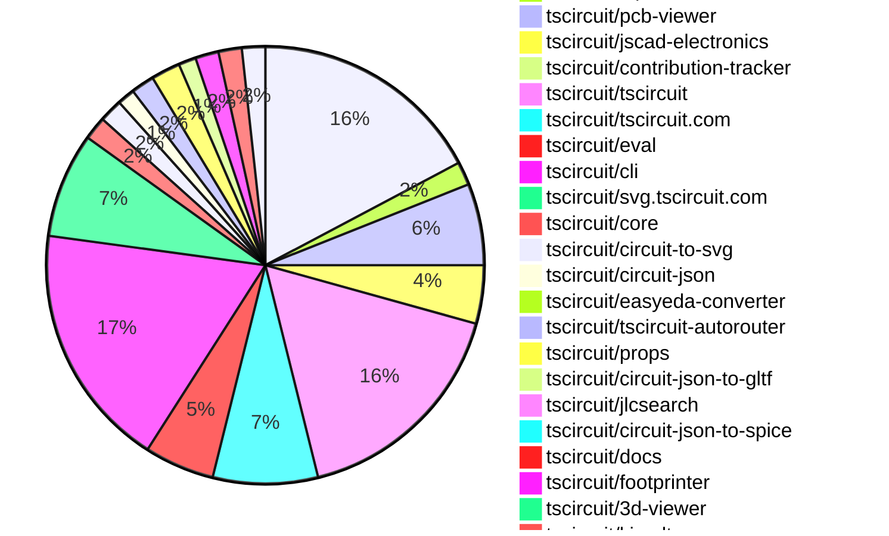
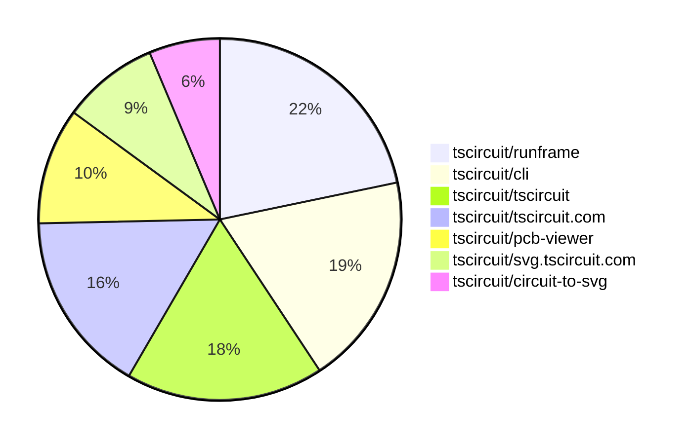

# Contribution Overview 2025-10-29

The current week is shown below. There are 4 major sections:

- [Contributor Overview](#contributor-overview)
- [PRs by Repository](#prs-by-repository)
- [PRs by Contributor](#changes-by-contributor)
- [Scoring & Sponsorship System](#scoring--sponsorship-system)

## PRs by Repository

## Contributor Overview

| Contributor | 🐳 Major | 🐙 Minor | 🐌 Tiny | ⭐ | Score | Discussion Contributions |
|-------------|---------|---------|---------|-----|----------------|--------------------------|
| [seveibar](#seveibar) | 7 | 6 | 5 | 👑 | 60 | 0🔹 0🔶 0💎 |
| [ShiboSoftwareDev](#ShiboSoftwareDev) | 4 | 4 | 1 | ⭐⭐⭐ | 42 | 0🔹 0🔶 0💎 |
| [imrishabh18](#imrishabh18) | 4 | 5 | 3 | ⭐⭐ | 30 | 0🔹 0🔶 0💎 |
| [ArnavK-09](#ArnavK-09) | 5 | 3 | 3 | ⭐⭐ | 29 | 0🔹 0🔶 0💎 |
| [techmannih](#techmannih) | 0 | 3 | 3 | ⭐⭐ | 20 | 0🔹 0🔶 0💎 |
| [tscircuitbot](#tscircuitbot) | 0 | 0 | 157 | ⭐⭐ | 13 | 0🔹 0🔶 0💎 |
| [rushabhcodes](#rushabhcodes) | 0 | 1 | 9 | ⭐⭐ | 13 | 0🔹 0🔶 0💎 |
| [baeoc](#baeoc) | 1 | 3 | 1 | ⭐⭐ | 11 | 0🔹 0🔶 0💎 |
| [RaghavArora14](#RaghavArora14) | 0 | 2 | 5 | ⭐ | 10 | 0🔹 0🔶 0💎 |
| [Ayushjhawar8](#Ayushjhawar8) | 1 | 1 | 2 | ⭐ | 8 | 0🔹 0🔶 0💎 |
| [0hmX](#0hmX) | 1 | 0 | 1 | ⭐ | 6 | 0🔹 0🔶 0💎 |
| [pxlpal](#pxlpal) | 0 | 1 | 0 |  | 2 | 0🔹 0🔶 0💎 |
| [nailoo](#nailoo) | 0 | 0 | 1 |  | 1 | 0🔹 0🔶 0💎 |

> Note: AI evaluates PRs and assigns 1-3 star ratings automatically. 4 and 5 star ratings require manual staff review.

### Discussion Contribution Legend

- 🔹 Normal Comments: Basic participation with minimal effort
- 🔶 Great Informative Comments: Thoughtful participation that adds value
- 💎 Incredible Comments: Exceptional participation with high-quality content

## Review Table

[reviews-received-hover]: ## "Number of reviews received for PRs for this contributor"
[approvals-received-hover]: ## "Number of approvals received for PRs this contributor authored"
[rejections-received-hover]: ## "Number of rejections received for PRs this contributor authored"
[prs-opened-hover]: ## "Number of PRs opened by this contributor"
[issues-created-hover]: ## "Number of issues created by this contributor"
[bountied-issues-hover]: ## "Number of issues this contributor created with a bounty"
[bountied-issue-$-hover]: ## "Total bounty amount placed on issues authored by this contributor"

| Contributor | Reviews Received | Approvals Received | Rejections Received | Approvals | Rejections | PRs Opened | PRs Merged | Score | Issues Created | Bountied Issues | Bountied Issue $ |
|---|---|---|---|---|---|---|---|---|---|---|---|
| [Ayushjhawar8](#Ayushjhawar8) | 5 | 4 | 0 | 0 | 0 | 4 | 4 | 8 | 0 | 0 | 0 |
| [seveibar](#seveibar) | 9 | 0 | 0 | 43 | 2 | 26 | 18 | 60 | 0 | 0 | 0 |
| [RaghavArora14](#RaghavArora14) | 25 | 11 | 1 | 0 | 0 | 9 | 7 | 10 | 0 | 0 | 0 |
| [ShiboSoftwareDev](#ShiboSoftwareDev) | 12 | 9 | 0 | 16 | 0 | 11 | 9 | 42 | 0 | 0 | 0 |
| [techmannih](#techmannih) | 12 | 5 | 0 | 6 | 1 | 9 | 6 | 20 | 0 | 0 | 0 |
| [tscircuitbot](#tscircuitbot) | 0 | 0 | 0 | 0 | 0 | 167 | 157 | 13 | 0 | 0 | 0 |
| [brymut](#brymut) | 2 | 0 | 0 | 0 | 0 | 3 | 0 | 0 | 0 | 0 | 0 |
| [baeoc](#baeoc) | 5 | 4 | 0 | 0 | 0 | 5 | 5 | 11 | 0 | 0 | 0 |
| [rushabhcodes](#rushabhcodes) | 37 | 17 | 0 | 0 | 0 | 12 | 10 | 13 | 0 | 0 | 0 |
| [nailoo](#nailoo) | 3 | 2 | 0 | 0 | 0 | 1 | 1 | 1 | 0 | 0 | 0 |
| [Exceluyi](#Exceluyi) | 14 | 0 | 3 | 0 | 0 | 4 | 0 | 0 | 0 | 0 | 0 |
| [MustafaMulla29](#MustafaMulla29) | 0 | 0 | 0 | 0 | 1 | 0 | 0 | 0 | 0 | 0 | 0 |
| [imrishabh18](#imrishabh18) | 7 | 3 | 0 | 0 | 1 | 12 | 12 | 30 | 0 | 0 | 0 |
| [0hmX](#0hmX) | 5 | 3 | 0 | 0 | 0 | 3 | 2 | 6 | 0 | 0 | 0 |
| [ArnavK-09](#ArnavK-09) | 11 | 7 | 1 | 0 | 0 | 13 | 11 | 29 | 0 | 0 | 0 |
| [Asymtode712](#Asymtode712) | 0 | 0 | 0 | 0 | 0 | 2 | 0 | 0 | 0 | 0 | 0 |
| [pxlpal](#pxlpal) | 0 | 0 | 0 | 0 | 0 | 1 | 1 | 2 | 0 | 0 | 0 |

## Top 7 Repositories by Contribution Points

## Scoring & Sponsorship System

### Overview

PRs are analyzed by AI and assigned a **star rating (1-3 stars)**. 4 and 5 star ratings can only be manually assigned by staff. Weekly scores use `2^(starRating - 1)` per PR (capped at 12 PRs per rating), plus review/discussion points.

### Weekly Score → Star String

| Score Range | Star String | Count Value |
|------------|-------------|-------------|
| 0-3 | (empty) | 0 stars |
| 4-10 | ⭐ | 1 star |
| 11-30 | ⭐⭐ | 2 stars |
| 31-50 | ⭐⭐⭐ | 3 stars |
| 51-75 | 👑 | 1 crown |
| 76-100 | 👑👑 | 2 crowns |
| 101+ | 👑👑👑 | 3 crowns |

> Crowns count as 3 stars for sponsorship.

### Monthly Sponsorship Calculation

The sponsorship system calculates monthly payments based on your **weekly star counts** over the complete weeks in that month (typically 4-5 weeks, Wednesday-Tuesday format).

**Step 1: Collect Weekly Stars**
- All complete weeks in the month are analyzed
- Each week's star string is converted to a numeric count (⭐ = 1 star, ⭐⭐⭐ = 3 stars)
- Example: `[2, 2, 2, 1, 0]` means 2 stars in week 1, 2 stars in week 2, etc.

**Step 2: Calculate Metrics**
- **Median stars**: The median value of all weekly star counts
- **Min stars**: The minimum weekly star count
- **Max stars**: The maximum weekly star count
- **High score**: The maximum raw weekly score (0-100+ range from the scoring table) from any week in the month

**Step 3: Determine Base Amount**
The sponsorship amount is calculated based on these metrics (checked in order):

| Condition | Base Amount |
|-----------|-------------|
| `minStarCount >= 3` | **$500** |
| `medianStars >= 3` | **$450** |
| `medianStars >= 2.5` | **$300** |
| `medianStars >= 2` | **$200** |
| `medianStars >= 1.5` | **$100** |
| `medianStars >= 1` | **$75** |
| `maxStarCount >= 2` | **$25** |
| `maxStarCount >= 1` | **$15** |
| `highScore >= 3` (and all stars = 0) | **$5** |

| Maintainer Level | Monthly Bonus |
|------------------|---------------|
| Level 1 | **$200** |
| Level 2 | **$350** |
| Level 3 | **$500** |

**Final Amount** = Base Amount + Maintainer Bonus

## Changes by Repository

### [tscircuit/runframe](https://github.com/tscircuit/runframe)

| PR # | Impact | Rating | Contributor | Description |
|------|--------|--------|-------------|-------------|
| [#1624](https://github.com/tscircuit/runframe/pull/1624) | 🐳 Major | ⭐⭐⭐ | Ayushjhawar8 | Adds keyboard shortcuts (CmdCtrlleftright arrow) to switch between files in the same directory without using the file selector. |
| [#1615](https://github.com/tscircuit/runframe/pull/1615) | 🐳 Major | ⭐⭐⭐ | imrishabh18 | Add support for uploading GLB and other binary files, enabling users to integrate 3D models into their projects. |
| [#1622](https://github.com/tscircuit/runframe/pull/1622) | 🐙 Minor | ⭐⭐ | imrishabh18 | Fixes the bug report textarea from causing the entire FileMenuLeftHeader to re-render on every key press by switching to uncontrolled input. |
| [#1639](https://github.com/tscircuit/runframe/pull/1639) | 🐙 Minor | ⭐⭐ | pxlpal | Adds Authority and Content-Type headers to the loadJlcpcbComponentTsx function for improved HTTP request handling. |

🐌 Tiny Contributions (36)

| PR # | Impact | Contributor | Description |
|------|--------|-------------|-------------|
| [#1621](https://github.com/tscircuit/runframe/pull/1621) | 🐌 Tiny | Ayushjhawar8 | This pull request introduces a new section for recently viewed files in the file selector component, allows users to remove favorites directly from the favorites section, and adds keyboard shortcuts for improved navigation. The changes enhance user experience by making file management more efficient and accessible. |
| [#1648](https://github.com/tscircuit/runframe/pull/1648) | 🐌 Tiny | tscircuitbot | Automated package update |
| [#1647](https://github.com/tscircuit/runframe/pull/1647) | 🐌 Tiny | tscircuitbot | Updates the tscircuit3d-viewer package to version 0.0.423 in package.json |
| [#1646](https://github.com/tscircuit/runframe/pull/1646) | 🐌 Tiny | tscircuitbot | Automated package update |
| [#1645](https://github.com/tscircuit/runframe/pull/1645) | 🐌 Tiny | tscircuitbot | Updates the tscircuiteval package to version 0.0.447 in the package.json file. |
| [#1644](https://github.com/tscircuit/runframe/pull/1644) | 🐌 Tiny | tscircuitbot | Updates the package version from 0.0.1190 to 0.0.1191 in package.json |
| [#1643](https://github.com/tscircuit/runframe/pull/1643) | 🐌 Tiny | tscircuitbot | Updates the tscircuiteval package to version 0.0.446 in the package.json file. |
| [#1642](https://github.com/tscircuit/runframe/pull/1642) | 🐌 Tiny | tscircuitbot | Automated package update |
| [#1641](https://github.com/tscircuit/runframe/pull/1641) | 🐌 Tiny | tscircuitbot | Updates the tscircuiteval package from version 0.0.444 to 0.0.445 |
| [#1640](https://github.com/tscircuit/runframe/pull/1640) | 🐌 Tiny | tscircuitbot | Updates the package version from 0.0.1188 to 0.0.1189 in package.json |
| [#1638](https://github.com/tscircuit/runframe/pull/1638) | 🐌 Tiny | tscircuitbot | Updates the package version from 0.0.1187 to 0.0.1188 in package.json |
| [#1637](https://github.com/tscircuit/runframe/pull/1637) | 🐌 Tiny | tscircuitbot | Updates the tscircuitschematic-viewer package from version 2.0.45 to 2.0.46 |
| [#1635](https://github.com/tscircuit/runframe/pull/1635) | 🐌 Tiny | tscircuitbot | Automated package update |
| [#1634](https://github.com/tscircuit/runframe/pull/1634) | 🐌 Tiny | tscircuitbot | Updates the tscircuitpcb-viewer package from version 1.11.247 to 1.11.248 |
| [#1633](https://github.com/tscircuit/runframe/pull/1633) | 🐌 Tiny | tscircuitbot | Automated package update |
| [#1632](https://github.com/tscircuit/runframe/pull/1632) | 🐌 Tiny | tscircuitbot | Updates the tscircuitpcb-viewer package from version 1.11.246 to 1.11.247 |
| [#1631](https://github.com/tscircuit/runframe/pull/1631) | 🐌 Tiny | tscircuitbot | Automated package update |
| [#1630](https://github.com/tscircuit/runframe/pull/1630) | 🐌 Tiny | tscircuitbot | Updates the tscircuitpcb-viewer package to version 1.11.246 |
| [#1629](https://github.com/tscircuit/runframe/pull/1629) | 🐌 Tiny | tscircuitbot | Automated package update to version 0.0.1184 |
| [#1628](https://github.com/tscircuit/runframe/pull/1628) | 🐌 Tiny | tscircuitbot | Updates the tscircuitpcb-viewer package from version 1.11.244 to 1.11.245 |
| [#1627](https://github.com/tscircuit/runframe/pull/1627) | 🐌 Tiny | tscircuitbot | Automated package update |
| [#1626](https://github.com/tscircuit/runframe/pull/1626) | 🐌 Tiny | tscircuitbot | Automated package update |
| [#1625](https://github.com/tscircuit/runframe/pull/1625) | 🐌 Tiny | tscircuitbot | Updates the tscircuit3d-viewer package from version 0.0.421 to 0.0.422 |
| [#1623](https://github.com/tscircuit/runframe/pull/1623) | 🐌 Tiny | tscircuitbot | Updates the package version from 0.0.1180 to 0.0.1181 in package.json |
| [#1620](https://github.com/tscircuit/runframe/pull/1620) | 🐌 Tiny | tscircuitbot | Updates the package version from 0.0.1179 to 0.0.1180 in package.json |
| [#1619](https://github.com/tscircuit/runframe/pull/1619) | 🐌 Tiny | tscircuitbot | Updates the tscircuiteval package from version 0.0.443 to 0.0.444 |
| [#1618](https://github.com/tscircuit/runframe/pull/1618) | 🐌 Tiny | tscircuitbot | Automated package update |
| [#1617](https://github.com/tscircuit/runframe/pull/1617) | 🐌 Tiny | tscircuitbot | Updates the tscircuitpcb-viewer package from version 1.11.243 to 1.11.244 |
| [#1616](https://github.com/tscircuit/runframe/pull/1616) | 🐌 Tiny | tscircuitbot | Automated package update |
| [#1614](https://github.com/tscircuit/runframe/pull/1614) | 🐌 Tiny | tscircuitbot | Automated package update |
| [#1613](https://github.com/tscircuit/runframe/pull/1613) | 🐌 Tiny | tscircuitbot | Updates the tscircuiteval package to version 0.0.443 in the package.json file. |
| [#1611](https://github.com/tscircuit/runframe/pull/1611) | 🐌 Tiny | tscircuitbot | Automated package update |
| [#1610](https://github.com/tscircuit/runframe/pull/1610) | 🐌 Tiny | tscircuitbot | Updates the tscircuitpcb-viewer package from version 1.11.242 to 1.11.243 |
| [#1609](https://github.com/tscircuit/runframe/pull/1609) | 🐌 Tiny | tscircuitbot | Updates the tscircuitpcb-viewer package from version 1.11.241 to 1.11.242 |
| [#1608](https://github.com/tscircuit/runframe/pull/1608) | 🐌 Tiny | tscircuitbot | Automated package update |
| [#1607](https://github.com/tscircuit/runframe/pull/1607) | 🐌 Tiny | tscircuitbot | Updates the tscircuiteval package to version 0.0.442 |

### [tscircuit/schematic-viewer](https://github.com/tscircuit/schematic-viewer)

| PR # | Impact | Rating | Contributor | Description |
|------|--------|--------|-------------|-------------|
| [#143](https://github.com/tscircuit/schematic-viewer/pull/143) | 🐙 Minor | ⭐⭐ | Ayushjhawar8 | Fixes the bug where clicks were incorrectly registering during component drag operations by implementing a drag threshold to differentiate between clicks and drags. |

### [tscircuit/alphabet](https://github.com/tscircuit/alphabet)

| PR # | Impact | Rating | Contributor | Description |
|------|--------|--------|-------------|-------------|
| [#23](https://github.com/tscircuit/alphabet/pull/23) | 🐙 Minor | ⭐⭐ | RaghavArora14 | Add PNG snapshot tests that validate the rendering of text using the TscircuitAlphabet.ttf font file, ensuring the built font works correctly across various character sets. |

🐌 Tiny Contributions (3)

| PR # | Impact | Contributor | Description |
|------|--------|-------------|-------------|
| [#19](https://github.com/tscircuit/alphabet/pull/19) | 🐌 Tiny | Ayushjhawar8 | Fixes the representation of the lowercase s character in the font by restructuring its curve and removing a duplicate point. |
| [#22](https://github.com/tscircuit/alphabet/pull/22) | 🐌 Tiny | RaghavArora14 | Adds exclamation symbol to TscircuitAlphabet.ttf |
| [#15](https://github.com/tscircuit/alphabet/pull/15) | 🐌 Tiny | seveibar | Adds a Bun build script that converts the SVG alphabet into a TrueType font using opentype.js, integrates it into the existing build pipeline, and updates the Biome configuration with necessary dependencies. |

### [tscircuit/pcb-viewer](https://github.com/tscircuit/pcb-viewer)

| PR # | Impact | Rating | Contributor | Description |
|------|--------|--------|-------------|-------------|
| [#438](https://github.com/tscircuit/pcb-viewer/pull/438) | 🐳 Major | ⭐⭐⭐ | ShiboSoftwareDev | Adds an option in the View dropdown menu to toggle the visibility of copper pours, with the state saved in local storage for user preference persistence. |
| [#435](https://github.com/tscircuit/pcb-viewer/pull/435) | 🐳 Major | ⭐⭐⭐ | seveibar | Add a global view setting for copper pours, exposing a Show Copper Pours toggle in the View menu and filtering copper pour primitives when the toggle is disabled. |
| [#447](https://github.com/tscircuit/pcb-viewer/pull/447) | 🐙 Minor | ⭐⭐ | RaghavArora14 | Fixes issue where layers would disappear with 8 layer PCBs by increasing topLayer z-index from 10 to 20, preventing negative z-indexes for multiple PCB layers. |
| [#443](https://github.com/tscircuit/pcb-viewer/pull/443) | 🐙 Minor | ⭐⭐ | ShiboSoftwareDev | Fixes rendering order to ensure drill and foreground layers consistently appear on top by simplifying z-index management in the orderAndFadeLayers method. |
| [#434](https://github.com/tscircuit/pcb-viewer/pull/434) | 🐙 Minor | ⭐⭐ | ShiboSoftwareDev | Makes copper pours slightly transparent to distinguish them from other copper elements. |

🐌 Tiny Contributions (9)

| PR # | Impact | Contributor | Description |
|------|--------|-------------|-------------|
| [#440](https://github.com/tscircuit/pcb-viewer/pull/440) | 🐌 Tiny | RaghavArora14 | Fixes visibility issues in an 8-layer PCB viewer where inner layers 5 and 6 were not displaying and the top layer disappeared when other layers were selected. |
| [#448](https://github.com/tscircuit/pcb-viewer/pull/448) | 🐌 Tiny | tscircuitbot | Automated package update |
| [#446](https://github.com/tscircuit/pcb-viewer/pull/446) | 🐌 Tiny | tscircuitbot | Automated package update |
| [#444](https://github.com/tscircuit/pcb-viewer/pull/444) | 🐌 Tiny | tscircuitbot | Automated package update |
| [#441](https://github.com/tscircuit/pcb-viewer/pull/441) | 🐌 Tiny | tscircuitbot | Automated package update |
| [#439](https://github.com/tscircuit/pcb-viewer/pull/439) | 🐌 Tiny | tscircuitbot | Automated package update |
| [#437](https://github.com/tscircuit/pcb-viewer/pull/437) | 🐌 Tiny | tscircuitbot | Automated package update |
| [#436](https://github.com/tscircuit/pcb-viewer/pull/436) | 🐌 Tiny | tscircuitbot | Automated package update |
| [#445](https://github.com/tscircuit/pcb-viewer/pull/445) | 🐌 Tiny | ShiboSoftwareDev | Restores the board layer to the default draw order, which was previously removed, potentially reintroducing an issue that was thought to be fixed. |

### [tscircuit/jscad-electronics](https://github.com/tscircuit/jscad-electronics)

| PR # | Impact | Rating | Contributor | Description |
|------|--------|--------|-------------|-------------|
| [#167](https://github.com/tscircuit/jscad-electronics/pull/167) | 🐙 Minor | ⭐⭐ | rushabhcodes | Fixes rendering crashes caused by nonstandard shape strings and diameter property names in the FootprintPlatedHole component. |

🐌 Tiny Contributions (9)

| PR # | Impact | Contributor | Description |
|------|--------|-------------|-------------|
| [#175](https://github.com/tscircuit/jscad-electronics/pull/175) | 🐌 Tiny | RaghavArora14 | Fixes the positioning of copper pads in the footprint rendering to ensure that pad tops are aligned at z0, addressing issue 152. |
| [#183](https://github.com/tscircuit/jscad-electronics/pull/183) | 🐌 Tiny | rushabhcodes | Modifies the QFP component to implement corner chamfers and custom notch positioning for enhanced chip package modeling accuracy. |
| [#185](https://github.com/tscircuit/jscad-electronics/pull/185) | 🐌 Tiny | rushabhcodes | Removes unnecessary useMemo usage from the USB-A and USB-C UI components, optimizing performance with React 19s improved memoization. |
| [#182](https://github.com/tscircuit/jscad-electronics/pull/182) | 🐌 Tiny | rushabhcodes | Adds configurable corner chamfering capability to the ChipBody component, allowing for more realistic chip package modeling. |
| [#181](https://github.com/tscircuit/jscad-electronics/pull/181) | 🐌 Tiny | rushabhcodes | Adds support for the SOT323 electronic component footprint, including its 3D model and rendering capabilities. |
| [#179](https://github.com/tscircuit/jscad-electronics/pull/179) | 🐌 Tiny | rushabhcodes | Adds the SOT223 component and its associated tests to the library. |
| [#172](https://github.com/tscircuit/jscad-electronics/pull/172) | 🐌 Tiny | rushabhcodes | Adds support for the SOD123FL electronic component model along with corresponding tests for rendering its footprint. |
| [#162](https://github.com/tscircuit/jscad-electronics/pull/162) | 🐌 Tiny | rushabhcodes | Refactors the SOD523 component by inlining the body JSX directly into the component return, removing the module-level Body constant. |
| [#176](https://github.com/tscircuit/jscad-electronics/pull/176) | 🐌 Tiny | rushabhcodes | Adds support for the SOD923 component along with an example and a snapshot test. |

### [tscircuit/contribution-tracker](https://github.com/tscircuit/contribution-tracker)

🐌 Tiny Contributions (2)

| PR # | Impact | Contributor | Description |
|------|--------|-------------|-------------|
| [#252](https://github.com/tscircuit/contribution-tracker/pull/252) | 🐌 Tiny | RaghavArora14 | Change star counting format from (1  1 star,  3 stars) to (  1 star,  3 stars) for better clarity and simplified representation |
| [#251](https://github.com/tscircuit/contribution-tracker/pull/251) | 🐌 Tiny | RaghavArora14 | This update simplifies the Scoring  Sponsorship System in the README by condensing explanations into a shorter, skimmable format while keeping the key tables. It clarifies how weekly scores map to star strings, how monthly sponsorship is calculated from weekly star counts (including medianminmax logic and highScore fallback), and adds a clear table for maintainer bonuses by level. Crowns are explicitly noted as counting as 3 stars for sponsorship. |

### [tscircuit/tscircuit](https://github.com/tscircuit/tscircuit)

🐌 Tiny Contributions (39)

| PR # | Impact | Contributor | Description |
|------|--------|-------------|-------------|
| [#1233](https://github.com/tscircuit/tscircuit/pull/1233) | 🐌 Tiny | tscircuitbot | Automated package update |
| [#1232](https://github.com/tscircuit/tscircuit/pull/1232) | 🐌 Tiny | tscircuitbot | Automated package update |
| [#1231](https://github.com/tscircuit/tscircuit/pull/1231) | 🐌 Tiny | tscircuitbot | Automated package update |
| [#1230](https://github.com/tscircuit/tscircuit/pull/1230) | 🐌 Tiny | tscircuitbot | Automated package update |
| [#1229](https://github.com/tscircuit/tscircuit/pull/1229) | 🐌 Tiny | tscircuitbot | Automated package update |
| [#1228](https://github.com/tscircuit/tscircuit/pull/1228) | 🐌 Tiny | tscircuitbot | Automated package update |
| [#1227](https://github.com/tscircuit/tscircuit/pull/1227) | 🐌 Tiny | tscircuitbot | Automated package update |
| [#1226](https://github.com/tscircuit/tscircuit/pull/1226) | 🐌 Tiny | tscircuitbot | Automated package update |
| [#1224](https://github.com/tscircuit/tscircuit/pull/1224) | 🐌 Tiny | tscircuitbot | Updates the tscircuitcli package from version 0.1.425 to 0.1.426 and the tscircuitrunframe package from version 0.0.1188 to 0.0.1189. |
| [#1223](https://github.com/tscircuit/tscircuit/pull/1223) | 🐌 Tiny | tscircuitbot | Automated package update |
| [#1222](https://github.com/tscircuit/tscircuit/pull/1222) | 🐌 Tiny | tscircuitbot | Updates the tscircuitcli package from version 0.1.424 to 0.1.425 and the tscircuitrunframe package from version 0.0.1187 to 0.0.1188 in package.json |
| [#1221](https://github.com/tscircuit/tscircuit/pull/1221) | 🐌 Tiny | tscircuitbot | Automated package update |
| [#1220](https://github.com/tscircuit/tscircuit/pull/1220) | 🐌 Tiny | tscircuitbot | Updates the tscircuitcli package to version 0.1.424 and the tscircuitrunframe package to version 0.0.1187, while downgrading the circuit-json-to-spice package to version 0.0.16. |
| [#1219](https://github.com/tscircuit/tscircuit/pull/1219) | 🐌 Tiny | tscircuitbot | Automated package update |
| [#1218](https://github.com/tscircuit/tscircuit/pull/1218) | 🐌 Tiny | tscircuitbot | Automated package update |
| [#1217](https://github.com/tscircuit/tscircuit/pull/1217) | 🐌 Tiny | tscircuitbot | Updates the tscircuitcli package from version 0.1.422 to 0.1.423 and the tscircuitrunframe package from version 0.0.1185 to 0.0.1186. |
| [#1216](https://github.com/tscircuit/tscircuit/pull/1216) | 🐌 Tiny | tscircuitbot | Automated package update |
| [#1215](https://github.com/tscircuit/tscircuit/pull/1215) | 🐌 Tiny | tscircuitbot | Updates the tscircuitcli package from version 0.1.421 to 0.1.422 and the tscircuitrunframe package from version 0.0.1184 to 0.0.1185. |
| [#1214](https://github.com/tscircuit/tscircuit/pull/1214) | 🐌 Tiny | tscircuitbot | Automated package update |
| [#1213](https://github.com/tscircuit/tscircuit/pull/1213) | 🐌 Tiny | tscircuitbot | Updates the tscircuitcli package to version 0.1.421 in the package.json file |
| [#1212](https://github.com/tscircuit/tscircuit/pull/1212) | 🐌 Tiny | tscircuitbot | Automated package update |
| [#1211](https://github.com/tscircuit/tscircuit/pull/1211) | 🐌 Tiny | tscircuitbot | Updates the tscircuitcli package from version 0.1.419 to 0.1.420 and the tscircuitrunframe package from version 0.0.1183 to 0.0.1184 in package.json |
| [#1209](https://github.com/tscircuit/tscircuit/pull/1209) | 🐌 Tiny | tscircuitbot | Updates the tscircuitcli package from version 0.1.418 to 0.1.419 and the tscircuitrunframe package from version 0.0.1182 to 0.0.1183 in package.json |
| [#1207](https://github.com/tscircuit/tscircuit/pull/1207) | 🐌 Tiny | tscircuitbot | Updates the tscircuitcli package from version 0.1.417 to 0.1.418 and the tscircuitrunframe package from version 0.0.1181 to 0.0.1182 in package.json |
| [#1206](https://github.com/tscircuit/tscircuit/pull/1206) | 🐌 Tiny | tscircuitbot | Automated package update |
| [#1205](https://github.com/tscircuit/tscircuit/pull/1205) | 🐌 Tiny | tscircuitbot | Updates the tscircuitcli package from version 0.1.416 to 0.1.417 and the tscircuitrunframe package from version 0.0.1180 to 0.0.1181. |
| [#1203](https://github.com/tscircuit/tscircuit/pull/1203) | 🐌 Tiny | tscircuitbot | Automated package update |
| [#1202](https://github.com/tscircuit/tscircuit/pull/1202) | 🐌 Tiny | tscircuitbot | Automated package update |
| [#1201](https://github.com/tscircuit/tscircuit/pull/1201) | 🐌 Tiny | tscircuitbot | Updates the tscircuitcli package from version 0.1.414 to 0.1.415 and the tscircuitrunframe package from version 0.0.1178 to 0.0.1179 in package.json |
| [#1200](https://github.com/tscircuit/tscircuit/pull/1200) | 🐌 Tiny | tscircuitbot | Automated package update |
| [#1199](https://github.com/tscircuit/tscircuit/pull/1199) | 🐌 Tiny | tscircuitbot | Updates the tscircuitcli package from version 0.1.413 to 0.1.414 and the tscircuitrunframe package from version 0.0.1177 to 0.0.1178 in package.json |
| [#1198](https://github.com/tscircuit/tscircuit/pull/1198) | 🐌 Tiny | tscircuitbot | Automated package update |
| [#1197](https://github.com/tscircuit/tscircuit/pull/1197) | 🐌 Tiny | tscircuitbot | Automated package update |
| [#1196](https://github.com/tscircuit/tscircuit/pull/1196) | 🐌 Tiny | tscircuitbot | Automated package update |
| [#1195](https://github.com/tscircuit/tscircuit/pull/1195) | 🐌 Tiny | tscircuitbot | Updates the tscircuitcli package to version 0.1.412 in the package.json file |
| [#1194](https://github.com/tscircuit/tscircuit/pull/1194) | 🐌 Tiny | tscircuitbot | Automated package update |
| [#1193](https://github.com/tscircuit/tscircuit/pull/1193) | 🐌 Tiny | tscircuitbot | Updates the tscircuitcli package from version 0.1.410 to 0.1.411 and the tscircuitrunframe package from version 0.0.1174 to 0.0.1176 in package.json |
| [#1192](https://github.com/tscircuit/tscircuit/pull/1192) | 🐌 Tiny | tscircuitbot | Updates the package version from 0.0.826 to 0.0.827 in package.json |
| [#1191](https://github.com/tscircuit/tscircuit/pull/1191) | 🐌 Tiny | tscircuitbot | Updates the versions of the tscircuitcli, tscircuitcore, and tscircuiteval packages in package.json to their latest releases. |

### [tscircuit/tscircuit.com](https://github.com/tscircuit/tscircuit.com)

| PR # | Impact | Rating | Contributor | Description |
|------|--------|--------|-------------|-------------|
| [#1930](https://github.com/tscircuit/tscircuit.com/pull/1930) | 🐳 Major | ⭐⭐⭐ | ArnavK-09 | Normalizes the package name input in the New Package Save Prompt Dialog to ensure consistent formatting before saving. |
| [#1929](https://github.com/tscircuit/tscircuit.com/pull/1929) | 🐳 Major | ⭐⭐⭐ | ArnavK-09 | Fixes the star button functionality to correctly update the star count and starred status for packages in the application. |
| [#1927](https://github.com/tscircuit/tscircuit.com/pull/1927) | 🐳 Major | ⭐⭐⭐ | ArnavK-09 | Adds preconnect for Google Tag Manager and modifies loader behavior to improve page speed and SEO performance. |
| [#1922](https://github.com/tscircuit/tscircuit.com/pull/1922) | 🐳 Major | ⭐⭐⭐ | ArnavK-09 | Adds support for tscircuit_handle in organization creation and retrieval processes, allowing for better integration of user handles in the system. |
| [#1918](https://github.com/tscircuit/tscircuit.com/pull/1918) | 🐳 Major | ⭐⭐⭐ | ArnavK-09 | Added error handling for organization loading and package saving, introduced loading state for the save button, trimmed package name input to prevent leadingtrailing spaces, and updated UI to display error messages when applicable. |
| [#1928](https://github.com/tscircuit/tscircuit.com/pull/1928) | 🐙 Minor | ⭐⭐ | ArnavK-09 | Changes the HeaderLogin component to improve accessibility by wrapping the Avatar in a button element, allowing for better keyboard navigation and focus management. |
| [#1926](https://github.com/tscircuit/tscircuit.com/pull/1926) | 🐙 Minor | ⭐⭐ | ArnavK-09 | Refactors the CodeEditorHeader component to enhance the user interface by replacing dropdown menus with tooltips and improving button layouts. |
| [#1920](https://github.com/tscircuit/tscircuit.com/pull/1920) | 🐙 Minor | ⭐⭐ | ArnavK-09 | Fixes the issue where the wrong GitHub avatar image is displayed when the username is not provided, ensuring that the avatar source is undefined in such cases. |

🐌 Tiny Contributions (10)

| PR # | Impact | Contributor | Description |
|------|--------|-------------|-------------|
| [#1935](https://github.com/tscircuit/tscircuit.com/pull/1935) | 🐌 Tiny | tscircuitbot | Automated package update |
| [#1932](https://github.com/tscircuit/tscircuit.com/pull/1932) | 🐌 Tiny | tscircuitbot | Automated package update |
| [#1925](https://github.com/tscircuit/tscircuit.com/pull/1925) | 🐌 Tiny | tscircuitbot | Automated package update |
| [#1923](https://github.com/tscircuit/tscircuit.com/pull/1923) | 🐌 Tiny | tscircuitbot | Automated package update |
| [#1917](https://github.com/tscircuit/tscircuit.com/pull/1917) | 🐌 Tiny | tscircuitbot | Updates the tscircuiteval package from version 0.0.443 to 0.0.444 in the package.json file. |
| [#1916](https://github.com/tscircuit/tscircuit.com/pull/1916) | 🐌 Tiny | tscircuitbot | Automated package update |
| [#1915](https://github.com/tscircuit/tscircuit.com/pull/1915) | 🐌 Tiny | tscircuitbot | Automated package update |
| [#1924](https://github.com/tscircuit/tscircuit.com/pull/1924) | 🐌 Tiny | imrishabh18 | Normalizes the new package modal input to strip spaces from entered names |
| [#1919](https://github.com/tscircuit/tscircuit.com/pull/1919) | 🐌 Tiny | ArnavK-09 | Changes the position of the toast notification from bottom-right to top-center. |
| [#1921](https://github.com/tscircuit/tscircuit.com/pull/1921) | 🐌 Tiny | ArnavK-09 | Removes the custom heading from the NotFoundPage component when the organization is not found, simplifying its usage. |

### [tscircuit/eval](https://github.com/tscircuit/eval)

| PR # | Impact | Rating | Contributor | Description |
|------|--------|--------|-------------|-------------|
| [#1435](https://github.com/tscircuit/eval/pull/1435) | 🐙 Minor | ⭐⭐ | seveibar | Changes the maximum import depth from 5 to 30 and throws an error when the maximum depth is reached instead of logging a message silently. |

🐌 Tiny Contributions (11)

| PR # | Impact | Contributor | Description |
|------|--------|-------------|-------------|
| [#1448](https://github.com/tscircuit/eval/pull/1448) | 🐌 Tiny | tscircuitbot | Automated package update |
| [#1447](https://github.com/tscircuit/eval/pull/1447) | 🐌 Tiny | tscircuitbot | Automated package update |
| [#1446](https://github.com/tscircuit/eval/pull/1446) | 🐌 Tiny | tscircuitbot | Automated package update |
| [#1445](https://github.com/tscircuit/eval/pull/1445) | 🐌 Tiny | tscircuitbot | Automated package update |
| [#1443](https://github.com/tscircuit/eval/pull/1443) | 🐌 Tiny | tscircuitbot | Automated package update |
| [#1442](https://github.com/tscircuit/eval/pull/1442) | 🐌 Tiny | tscircuitbot | Automated package update |
| [#1440](https://github.com/tscircuit/eval/pull/1440) | 🐌 Tiny | tscircuitbot | Automated package update |
| [#1439](https://github.com/tscircuit/eval/pull/1439) | 🐌 Tiny | tscircuitbot | Automated package update |
| [#1437](https://github.com/tscircuit/eval/pull/1437) | 🐌 Tiny | tscircuitbot | Automated package update |
| [#1434](https://github.com/tscircuit/eval/pull/1434) | 🐌 Tiny | tscircuitbot | Automated package update |
| [#1436](https://github.com/tscircuit/eval/pull/1436) | 🐌 Tiny | tscircuitbot | Automated package update |

### [tscircuit/cli](https://github.com/tscircuit/cli)

🐌 Tiny Contributions (42)

| PR # | Impact | Contributor | Description |
|------|--------|-------------|-------------|
| [#806](https://github.com/tscircuit/cli/pull/806) | 🐌 Tiny | tscircuitbot | Automated package update |
| [#805](https://github.com/tscircuit/cli/pull/805) | 🐌 Tiny | tscircuitbot | Updates the tscircuitrunframe package to version 0.0.1193 |
| [#804](https://github.com/tscircuit/cli/pull/804) | 🐌 Tiny | tscircuitbot | Automated package update |
| [#803](https://github.com/tscircuit/cli/pull/803) | 🐌 Tiny | tscircuitbot | Updates the tscircuitrunframe package from version 0.0.1191 to 0.0.1192 |
| [#802](https://github.com/tscircuit/cli/pull/802) | 🐌 Tiny | tscircuitbot | Automated package update |
| [#801](https://github.com/tscircuit/cli/pull/801) | 🐌 Tiny | tscircuitbot | Updates the tscircuitrunframe package from version 0.0.1190 to 0.0.1191 |
| [#800](https://github.com/tscircuit/cli/pull/800) | 🐌 Tiny | tscircuitbot | Automated package update |
| [#799](https://github.com/tscircuit/cli/pull/799) | 🐌 Tiny | tscircuitbot | Updates the tscircuitrunframe package to version 0.0.1190 in the package.json file. |
| [#798](https://github.com/tscircuit/cli/pull/798) | 🐌 Tiny | tscircuitbot | Automated package update |
| [#797](https://github.com/tscircuit/cli/pull/797) | 🐌 Tiny | tscircuitbot | Updates the tscircuitrunframe package from version 0.0.1188 to 0.0.1189 |
| [#796](https://github.com/tscircuit/cli/pull/796) | 🐌 Tiny | tscircuitbot | Automated package update |
| [#795](https://github.com/tscircuit/cli/pull/795) | 🐌 Tiny | tscircuitbot | Updates the tscircuitrunframe package from version 0.0.1187 to 0.0.1188 |
| [#794](https://github.com/tscircuit/cli/pull/794) | 🐌 Tiny | tscircuitbot | Automated package update |
| [#793](https://github.com/tscircuit/cli/pull/793) | 🐌 Tiny | tscircuitbot | Updates the tscircuitrunframe package from version 0.0.1186 to 0.0.1187 |
| [#792](https://github.com/tscircuit/cli/pull/792) | 🐌 Tiny | tscircuitbot | Automated package update |
| [#791](https://github.com/tscircuit/cli/pull/791) | 🐌 Tiny | tscircuitbot | Updates the tscircuitrunframe package from version 0.0.1185 to 0.0.1186 |
| [#790](https://github.com/tscircuit/cli/pull/790) | 🐌 Tiny | tscircuitbot | Automated package update |
| [#789](https://github.com/tscircuit/cli/pull/789) | 🐌 Tiny | tscircuitbot | Updates the tscircuitrunframe package to version 0.0.1185 in the package.json file. |
| [#788](https://github.com/tscircuit/cli/pull/788) | 🐌 Tiny | tscircuitbot | Automated package update |
| [#787](https://github.com/tscircuit/cli/pull/787) | 🐌 Tiny | tscircuitbot | Automated package update |
| [#786](https://github.com/tscircuit/cli/pull/786) | 🐌 Tiny | tscircuitbot | Updates the tscircuitrunframe package from version 0.0.1183 to 0.0.1184 |
| [#785](https://github.com/tscircuit/cli/pull/785) | 🐌 Tiny | tscircuitbot | Automated package update |
| [#783](https://github.com/tscircuit/cli/pull/783) | 🐌 Tiny | tscircuitbot | Updates the tscircuitrunframe package from version 0.0.1182 to 0.0.1183 |
| [#782](https://github.com/tscircuit/cli/pull/782) | 🐌 Tiny | tscircuitbot | Automated package update |
| [#781](https://github.com/tscircuit/cli/pull/781) | 🐌 Tiny | tscircuitbot | Updates the tscircuitrunframe package from version 0.0.1181 to 0.0.1182 |
| [#780](https://github.com/tscircuit/cli/pull/780) | 🐌 Tiny | tscircuitbot | Automated package update |
| [#779](https://github.com/tscircuit/cli/pull/779) | 🐌 Tiny | tscircuitbot | Updates the tscircuitrunframe package from version 0.0.1180 to 0.0.1181 |
| [#778](https://github.com/tscircuit/cli/pull/778) | 🐌 Tiny | tscircuitbot | Automated package update |
| [#777](https://github.com/tscircuit/cli/pull/777) | 🐌 Tiny | tscircuitbot | Updates the tscircuitrunframe package from version 0.0.1179 to 0.0.1180 |
| [#776](https://github.com/tscircuit/cli/pull/776) | 🐌 Tiny | tscircuitbot | Automated package update |
| [#775](https://github.com/tscircuit/cli/pull/775) | 🐌 Tiny | tscircuitbot | Updates the tscircuitrunframe package from version 0.0.1178 to 0.0.1179 |
| [#774](https://github.com/tscircuit/cli/pull/774) | 🐌 Tiny | tscircuitbot | Automated package update |
| [#773](https://github.com/tscircuit/cli/pull/773) | 🐌 Tiny | tscircuitbot | Updates the tscircuitrunframe package from version 0.0.1177 to 0.0.1178 |
| [#772](https://github.com/tscircuit/cli/pull/772) | 🐌 Tiny | tscircuitbot | Automated package update |
| [#771](https://github.com/tscircuit/cli/pull/771) | 🐌 Tiny | tscircuitbot | Updates the tscircuitrunframe package from version 0.0.1176 to 0.0.1177 |
| [#770](https://github.com/tscircuit/cli/pull/770) | 🐌 Tiny | tscircuitbot | Automated package update |
| [#768](https://github.com/tscircuit/cli/pull/768) | 🐌 Tiny | tscircuitbot | Updates the tscircuitrunframe package from version 0.0.1175 to 0.0.1176 |
| [#769](https://github.com/tscircuit/cli/pull/769) | 🐌 Tiny | tscircuitbot | Automated package update |
| [#767](https://github.com/tscircuit/cli/pull/767) | 🐌 Tiny | tscircuitbot | Updates the tscircuitrunframe package from version 0.0.1174 to 0.0.1175 |
| [#766](https://github.com/tscircuit/cli/pull/766) | 🐌 Tiny | tscircuitbot | Automated package update to version 0.1.410 |
| [#765](https://github.com/tscircuit/cli/pull/765) | 🐌 Tiny | tscircuitbot | Updates the tscircuitrunframe package to version 0.0.1174 in package.json |
| [#784](https://github.com/tscircuit/cli/pull/784) | 🐌 Tiny | ArnavK-09 | Adds a favicon link to the HTML template generated by the getIndex function. |

### [tscircuit/svg.tscircuit.com](https://github.com/tscircuit/svg.tscircuit.com)

| PR # | Impact | Rating | Contributor | Description |
|------|--------|--------|-------------|-------------|
| [#514](https://github.com/tscircuit/svg.tscircuit.com/pull/514) | 🐙 Minor | ⭐⭐ | ShiboSoftwareDev | Makes the simulation_experiment_id parameter optional for the schematic simulation SVG handler, automatically determining it from the circuit JSON if not provided. |

🐌 Tiny Contributions (17)

| PR # | Impact | Contributor | Description |
|------|--------|-------------|-------------|
| [#527](https://github.com/tscircuit/svg.tscircuit.com/pull/527) | 🐌 Tiny | tscircuitbot | Updates the tscircuit package version from 0.0.847 to 0.0.848 in package.json |
| [#526](https://github.com/tscircuit/svg.tscircuit.com/pull/526) | 🐌 Tiny | tscircuitbot | Updates the tscircuit package version from 0.0.846 to 0.0.847 in package.json |
| [#525](https://github.com/tscircuit/svg.tscircuit.com/pull/525) | 🐌 Tiny | tscircuitbot | Updates the tscircuit package version from 0.0.845 to 0.0.846 in package.json |
| [#524](https://github.com/tscircuit/svg.tscircuit.com/pull/524) | 🐌 Tiny | tscircuitbot | Updates the tscircuit package version from 0.0.843 to 0.0.845 in package.json |
| [#523](https://github.com/tscircuit/svg.tscircuit.com/pull/523) | 🐌 Tiny | tscircuitbot | Updates the tscircuit package version from 0.0.842 to 0.0.843 in package.json |
| [#522](https://github.com/tscircuit/svg.tscircuit.com/pull/522) | 🐌 Tiny | tscircuitbot | Updates the tscircuit package version from 0.0.841 to 0.0.842 in package.json |
| [#521](https://github.com/tscircuit/svg.tscircuit.com/pull/521) | 🐌 Tiny | tscircuitbot | Updates the tscircuit package version from 0.0.840 to 0.0.841 in package.json |
| [#520](https://github.com/tscircuit/svg.tscircuit.com/pull/520) | 🐌 Tiny | tscircuitbot | Updates the tscircuit package version from 0.0.839 to 0.0.840 in package.json |
| [#519](https://github.com/tscircuit/svg.tscircuit.com/pull/519) | 🐌 Tiny | tscircuitbot | Updates the tscircuit package version from 0.0.838 to 0.0.839 in package.json |
| [#518](https://github.com/tscircuit/svg.tscircuit.com/pull/518) | 🐌 Tiny | tscircuitbot | Automated package update |
| [#517](https://github.com/tscircuit/svg.tscircuit.com/pull/517) | 🐌 Tiny | tscircuitbot | Updates the tscircuit package version from 0.0.832 to 0.0.837 in package.json |
| [#513](https://github.com/tscircuit/svg.tscircuit.com/pull/513) | 🐌 Tiny | tscircuitbot | Updates the tscircuit package version from 0.0.831 to 0.0.832 in package.json |
| [#512](https://github.com/tscircuit/svg.tscircuit.com/pull/512) | 🐌 Tiny | tscircuitbot | Updates the tscircuit package version from 0.0.830 to 0.0.831 in package.json |
| [#511](https://github.com/tscircuit/svg.tscircuit.com/pull/511) | 🐌 Tiny | tscircuitbot | Updates the tscircuit package version from 0.0.829 to 0.0.830 in package.json |
| [#510](https://github.com/tscircuit/svg.tscircuit.com/pull/510) | 🐌 Tiny | tscircuitbot | Updates the tscircuit package version from 0.0.828 to 0.0.829 in package.json |
| [#509](https://github.com/tscircuit/svg.tscircuit.com/pull/509) | 🐌 Tiny | tscircuitbot | Updates the tscircuit package version from 0.0.827 to 0.0.828 in package.json |
| [#508](https://github.com/tscircuit/svg.tscircuit.com/pull/508) | 🐌 Tiny | tscircuitbot | Updates the tscircuit package version from 0.0.826 to 0.0.827 in package.json |

### [tscircuit/core](https://github.com/tscircuit/core)

| PR # | Impact | Rating | Contributor | Description |
|------|--------|--------|-------------|-------------|
| [#1612](https://github.com/tscircuit/core/pull/1612) | 🐳 Major | ⭐⭐⭐ | ShiboSoftwareDev | This commit refactors the CopperPour component by moving it into its own dedicated module under libcomponentsprimitive-componentsCopperPour. The internal logic for generating the pour has been split into smaller, more manageable utility functions: get-board-polygon.ts, get-trace-obstacles.ts, process-obstacles.ts, generate-and-insert-brep.ts. This change improves code organization and modularity without altering any functionality. It serves as a preparatory step for further improvements to the copper pour rendering process. |
| [#1609](https://github.com/tscircuit/core/pull/1609) | 🐳 Major | ⭐⭐⭐ | seveibar | Updates the local autorouter to select the assignable via pipeline when the laser_prefab preset is used, propagates the via netIsAssignable flag into obstacle generation and the simple route schema, and adds a regression test covering assignable vias while bumping autorouting package versions. |
| [#1607](https://github.com/tscircuit/core/pull/1607) | 🐙 Minor | ⭐⭐ | baeoc | Adds support for corner radius in rectangle components, allowing for rounded corners in fabrication notes, PCB notes, and silkscreen rectangles. |

🐌 Tiny Contributions (1)

| PR # | Impact | Contributor | Description |
|------|--------|-------------|-------------|
| [#1610](https://github.com/tscircuit/core/pull/1610) | 🐌 Tiny | 0hmX | Updates the schematic-trace-solver dependency to version 0.0.43, which includes improvements and fixes related to net label placements and trace handling. |

### [tscircuit/circuit-to-svg](https://github.com/tscircuit/circuit-to-svg)

| PR # | Impact | Rating | Contributor | Description |
|------|--------|--------|-------------|-------------|
| [#411](https://github.com/tscircuit/circuit-to-svg/pull/411) | 🐳 Major | ⭐⭐⭐ | ShiboSoftwareDev | Adds a showErrorsInTextOverlay option to SVG conversion functions to render error messages directly on the SVG output for debugging purposes. |
| [#409](https://github.com/tscircuit/circuit-to-svg/pull/409) | 🐳 Major | ⭐⭐⭐ | ShiboSoftwareDev | Adds support for rendering multi-board panels, refactors numeric parsing to use distance.parse, and fixes a bug in bounds calculation for polygon pads. |
| [#410](https://github.com/tscircuit/circuit-to-svg/pull/410) | 🐳 Major | ⭐⭐⭐ | baeoc | Adds support for corner radius in rectangle components for PCB fabrication notes, silkscreen, and note rectangles in SVG rendering. |
| [#412](https://github.com/tscircuit/circuit-to-svg/pull/412) | 🐙 Minor | ⭐⭐ | techmannih | Fixes the rendering order of soldermask lines to ensure they appear beneath plated holes in the SVG output. |

### [tscircuit/circuit-json](https://github.com/tscircuit/circuit-json)

| PR # | Impact | Rating | Contributor | Description |
|------|--------|--------|-------------|-------------|
| [#336](https://github.com/tscircuit/circuit-json/pull/336) | 🐳 Major | ⭐⭐⭐ | seveibar | Adds optional net assignment flags, net_is_assignable and net_assigned, to the pcb_via schema and type, along with documentation updates in README and PCB component overview. |
| [#335](https://github.com/tscircuit/circuit-json/pull/335) | 🐙 Minor | ⭐⭐ | ShiboSoftwareDev | Adds a new element to represent unknown errors that occur during a simulation experiment, allowing simulation failures to be included in the circuit JSON document. |
| [#334](https://github.com/tscircuit/circuit-json/pull/334) | 🐙 Minor | ⭐⭐ | baeoc | Adds corner_radius support to rectangle components in PCB fabrication notes, notes, and silkscreen definitions. |

### [tscircuit/easyeda-converter](https://github.com/tscircuit/easyeda-converter)

| PR # | Impact | Rating | Contributor | Description |
|------|--------|--------|-------------|-------------|
| [#328](https://github.com/tscircuit/easyeda-converter/pull/328) | 🐳 Major | ⭐⭐⭐ | seveibar | Fixes 3D model rendering issues by correcting rotation handling and z-offset calculations for components in the EasyEDA to Circuit JSON conversion process. |
| [#326](https://github.com/tscircuit/easyeda-converter/pull/326) | 🐙 Minor | ⭐⭐ | seveibar | Replace the 3D snapshot matcher to render GLB output with poppygl and circuit-json-to-gltf, expose matcher options for camera configuration, and tighten snapshot diffing behavior. |

### [tscircuit/tscircuit-autorouter](https://github.com/tscircuit/tscircuit-autorouter)

| PR # | Impact | Rating | Contributor | Description |
|------|--------|--------|-------------|-------------|
| [#297](https://github.com/tscircuit/tscircuit-autorouter/pull/297) | 🐳 Major | ⭐⭐⭐ | seveibar | Fixes the issue where unassigned vias in the autorouter do not account for layer changes, ensuring proper routing behavior across multiple layers. |
| [#293](https://github.com/tscircuit/tscircuit-autorouter/pull/293) | 🐳 Major | ⭐⭐⭐ | seveibar | Summary add an assignable-via-specific capacity pathing solver that rewards layer transitions introduce a hyper-parameter supervisor to explore ordering and reward combinations update the assignable via autorouting pipeline to use the hyper solver and cover it with a regression test  Testing bun test testsunassigned-obstaclesAssignableViaAutoroutingPipelineSolver.test.ts bunx tsc --noEmit bun run format |
| [#292](https://github.com/tscircuit/tscircuit-autorouter/pull/292) | 🐳 Major | ⭐⭐⭐ | seveibar | img width2062 height1784 altimage srchttps:github.comuser-attachmentsassets21498e6a-6537-4337-98db-0cef210de75a |
| [#294](https://github.com/tscircuit/tscircuit-autorouter/pull/294) | 🐙 Minor | ⭐⭐ | seveibar | Adds the AssignableViaAutoroutingPipelineSolver to the autorouter output functionality. |

### [tscircuit/props](https://github.com/tscircuit/props)

| PR # | Impact | Rating | Contributor | Description |
|------|--------|--------|-------------|-------------|
| [#482](https://github.com/tscircuit/props/pull/482) | 🐙 Minor | ⭐⭐ | seveibar | Adds an optional netIsAssignable flag to via props so they can opt out of automatic net assignment and regenerates component type documentation to surface the new property. |
| [#481](https://github.com/tscircuit/props/pull/481) | 🐙 Minor | ⭐⭐ | seveibar | Adds the laser_prefab autorouter preset, documents its purpose, regenerates component documentation, and extends autorouter tests to cover the new preset option. |
| [#479](https://github.com/tscircuit/props/pull/479) | 🐙 Minor | ⭐⭐ | baeoc | Adds cornerRadius support to rect components, allowing for rounded corners in fabrication notes, PCB notes, and schematic rectangles. |

🐌 Tiny Contributions (2)

| PR # | Impact | Contributor | Description |
|------|--------|-------------|-------------|
| [#483](https://github.com/tscircuit/props/pull/483) | 🐌 Tiny | seveibar | Add optional isPowerNet and isGroundNet flags to the net  props and regenerate the docs to describe the new net properties |
| [#480](https://github.com/tscircuit/props/pull/480) | 🐌 Tiny | baeoc | Adds an optional cornerRadius property to the silkscreen rectangle component for enhanced styling flexibility. |

### [tscircuit/circuit-json-to-gltf](https://github.com/tscircuit/circuit-json-to-gltf)

| PR # | Impact | Rating | Contributor | Description |
|------|--------|--------|-------------|-------------|
| [#70](https://github.com/tscircuit/circuit-json-to-gltf/pull/70) | 🐙 Minor | ⭐⭐ | seveibar | Add a convertMeshToGLTFOrientation helper so axis flipping happens outside of transformMesh and update GLTFBuilder to apply the orientation conversion after standard transforms. |
| [#68](https://github.com/tscircuit/circuit-json-to-gltf/pull/68) | 🐙 Minor | ⭐⭐ | techmannih | Adds support for PCB cutouts in the 3D conversion of circuit JSON to GLTF format. |

🐌 Tiny Contributions (1)

| PR # | Impact | Contributor | Description |
|------|--------|-------------|-------------|
| [#73](https://github.com/tscircuit/circuit-json-to-gltf/pull/73) | 🐌 Tiny | techmannih | Adds a reproduction for the C5592 JLCPCB CAD model, including a JSON representation and associated tests for rendering. |

### [tscircuit/jlcsearch](https://github.com/tscircuit/jlcsearch)

🐌 Tiny Contributions (1)

| PR # | Impact | Contributor | Description |
|------|--------|-------------|-------------|
| [#105](https://github.com/tscircuit/jlcsearch/pull/105) | 🐌 Tiny | seveibar | Update the navigation OpenAPI link to point at the raw GitHub URL used in production and rename the OpenAPI spec title to JLCSearch JLCPCB In-Stock Parts Engine API. |

### [tscircuit/circuit-json-to-spice](https://github.com/tscircuit/circuit-json-to-spice)

🐌 Tiny Contributions (1)

| PR # | Impact | Contributor | Description |
|------|--------|-------------|-------------|
| [#18](https://github.com/tscircuit/circuit-json-to-spice/pull/18) | 🐌 Tiny | seveibar | Replaces tscircuitsoup-util usage with tscircuitcircuit-json-util in the circuitJsonToSpice helper and moves the dependency to devDependencies while exposing it as a peer dependency. |

### [tscircuit/docs](https://github.com/tscircuit/docs)

🐌 Tiny Contributions (1)

| PR # | Impact | Contributor | Description |
|------|--------|-------------|-------------|
| [#305](https://github.com/tscircuit/docs/pull/305) | 🐌 Tiny | seveibar | Adds the name attribute to the imported component in the JLCPCB guide example |

### [tscircuit/footprinter](https://github.com/tscircuit/footprinter)

🐌 Tiny Contributions (4)

| PR # | Impact | Contributor | Description |
|------|--------|-------------|-------------|
| [#399](https://github.com/tscircuit/footprinter/pull/399) | 🐌 Tiny | rushabhcodes | Fixes the lqfp footprint by ensuring the parameter pl is set to a default value of 1.5 if not provided. |
| [#398](https://github.com/tscircuit/footprinter/pull/398) | 🐌 Tiny | techmannih | Adds a test for the SOT-323 parity to ensure correct footprint comparison between Footprinter and KiCad. |
| [#394](https://github.com/tscircuit/footprinter/pull/394) | 🐌 Tiny | techmannih | Fixes the pitch dimensions for the sod923 footprint in the footprint library. |
| [#397](https://github.com/tscircuit/footprinter/pull/397) | 🐌 Tiny | nailoo | Adds support for the TQFP64 electronic component footprint in the footprinter library. |

### [tscircuit/3d-viewer](https://github.com/tscircuit/3d-viewer)

| PR # | Impact | Rating | Contributor | Description |
|------|--------|--------|-------------|-------------|
| [#544](https://github.com/tscircuit/3d-viewer/pull/544) | 🐳 Major | ⭐⭐⭐ | imrishabh18 | Stores the auto-rotate preference in localStorage, allowing users to retain their settings across sessions. |
| [#547](https://github.com/tscircuit/3d-viewer/pull/547) | 🐙 Minor | ⭐⭐ | techmannih | Adds support for rendering silkscreen lines in the PCB design, allowing for enhanced visual representation of circuit boards. |

### [tscircuit/kicadts](https://github.com/tscircuit/kicadts)

| PR # | Impact | Rating | Contributor | Description |
|------|--------|--------|-------------|-------------|
| [#16](https://github.com/tscircuit/kicadts/pull/16) | 🐳 Major | ⭐⭐⭐ | imrishabh18 | Adds a new Polyline class and extends it for use as SymbolPolyline, enabling support for polylines in schematic and symbol contexts. |
| [#15](https://github.com/tscircuit/kicadts/pull/15) | 🐙 Minor | ⭐⭐ | imrishabh18 | Enables the NoConnect class to have child tokens and be included in the KicadSch class, enhancing the structure of schematic representations. |
| [#17](https://github.com/tscircuit/kicadts/pull/17) | 🐙 Minor | ⭐⭐ | imrishabh18 | Adds support for a mirror property under the parent Symbol in the schematic representation, allowing for mirroring of symbols along the x or y axis. |
| [#14](https://github.com/tscircuit/kicadts/pull/14) | 🐙 Minor | ⭐⭐ | imrishabh18 | Adds support for bold and italic text effects in the TextEffectsFont class. |

### [tscircuit/kicad-to-circuit-json](https://github.com/tscircuit/kicad-to-circuit-json)

| PR # | Impact | Rating | Contributor | Description |
|------|--------|--------|-------------|-------------|
| [#4](https://github.com/tscircuit/kicad-to-circuit-json/pull/4) | 🐳 Major | ⭐⭐⭐ | imrishabh18 | This pull request introduces support for KiCad PCB files that utilize UUIDs under the tstamp field. The changes ensure that if a footprint does not have a UUID, the tstamp value will be used instead. This is crucial for maintaining compatibility with various PCB designs that may not conform to the expected UUID structure. Additionally, the changes include adjustments to how pad layers are determined and how pads are processed, ensuring that the system can handle both raw arrays and KiCad layer objects effectively. |
| [#5](https://github.com/tscircuit/kicad-to-circuit-json/pull/5) | 🐙 Minor | ⭐⭐ | imrishabh18 | This pull request addresses an issue where the reference text in the KiCad PCB was being skipped when converting to the circuit JSON format. The change ensures that the reference is included in the output, which is crucial for accurate representation of the PCB design. |

🐌 Tiny Contributions (2)

| PR # | Impact | Contributor | Description |
|------|--------|-------------|-------------|
| [#7](https://github.com/tscircuit/kicad-to-circuit-json/pull/7) | 🐌 Tiny | imrishabh18 | Adds an initial schematic parity test for the pic_programmer by making fixes in kicadts for the kicad_sch file to ensure it is parseable and generating corresponding test snapshots. |
| [#6](https://github.com/tscircuit/kicad-to-circuit-json/pull/6) | 🐌 Tiny | imrishabh18 | This pull request reformats the entire codebase to ensure consistent styling and adherence to coding standards. It includes changes to various files, primarily focusing on code formatting, such as spacing, line breaks, and consistent use of quotes. Additionally, it introduces a new GitHub Actions workflow for format checking on pushes and pull requests to the main branch. |

### [tscircuit/schematic-trace-solver](https://github.com/tscircuit/schematic-trace-solver)

| PR # | Impact | Rating | Contributor | Description |
|------|--------|--------|-------------|-------------|
| [#89](https://github.com/tscircuit/schematic-trace-solver/pull/89) | 🐳 Major | ⭐⭐⭐ | 0hmX | ref: https:github.comtscircuitschematic-trace-solverissues87issuecomment-3463136963 We had a subsolver step, which was responsible for removing redundant angles in the schematic trace. I am just moving out to run globally. This fixes it a lot, but Im not claiming this because the fix is non-standard. After this, I would look inside the _TraceOverlapShiftSolver_ to see if I could improve that! I feel a mix of both of them will be great and solve the issue best |

## Changes by Contributor

### [Ayushjhawar8](https://github.com/Ayushjhawar8)

| PRs # | Impact | Rating | Description |
|------|--------|--------|-------------|
| [#1624](https://github.com/tscircuit/runframe/pull/1624) | 🐳 Major | ⭐⭐⭐ | Adds keyboard shortcuts (CmdCtrlleftright arrow) to switch between files in the same directory without using the file selector. |
| [#143](https://github.com/tscircuit/schematic-viewer/pull/143) | 🐙 Minor | ⭐⭐ | Fixes the bug where clicks were incorrectly registering during component drag operations by implementing a drag threshold to differentiate between clicks and drags. |

🐌 Tiny Contributions (2)

| PR # | Impact | Description |
|------|--------|-------------|
| [#19](https://github.com/tscircuit/alphabet/pull/19) | 🐌 Tiny | Fixes the representation of the lowercase s character in the font by restructuring its curve and removing a duplicate point. |
| [#1621](https://github.com/tscircuit/runframe/pull/1621) | 🐌 Tiny | This pull request introduces a new section for recently viewed files in the file selector component, allows users to remove favorites directly from the favorites section, and adds keyboard shortcuts for improved navigation. The changes enhance user experience by making file management more efficient and accessible. |

### [RaghavArora14](https://github.com/RaghavArora14)

| PRs # | Impact | Rating | Description |
|------|--------|--------|-------------|
| [#447](https://github.com/tscircuit/pcb-viewer/pull/447) | 🐙 Minor | ⭐⭐ | Fixes issue where layers would disappear with 8 layer PCBs by increasing topLayer z-index from 10 to 20, preventing negative z-indexes for multiple PCB layers. |
| [#23](https://github.com/tscircuit/alphabet/pull/23) | 🐙 Minor | ⭐⭐ | Add PNG snapshot tests that validate the rendering of text using the TscircuitAlphabet.ttf font file, ensuring the built font works correctly across various character sets. |

🐌 Tiny Contributions (5)

| PR # | Impact | Description |
|------|--------|-------------|
| [#440](https://github.com/tscircuit/pcb-viewer/pull/440) | 🐌 Tiny | Fixes visibility issues in an 8-layer PCB viewer where inner layers 5 and 6 were not displaying and the top layer disappeared when other layers were selected. |
| [#175](https://github.com/tscircuit/jscad-electronics/pull/175) | 🐌 Tiny | Fixes the positioning of copper pads in the footprint rendering to ensure that pad tops are aligned at z0, addressing issue 152. |
| [#252](https://github.com/tscircuit/contribution-tracker/pull/252) | 🐌 Tiny | Change star counting format from (1  1 star,  3 stars) to (  1 star,  3 stars) for better clarity and simplified representation |
| [#251](https://github.com/tscircuit/contribution-tracker/pull/251) | 🐌 Tiny | This update simplifies the Scoring  Sponsorship System in the README by condensing explanations into a shorter, skimmable format while keeping the key tables. It clarifies how weekly scores map to star strings, how monthly sponsorship is calculated from weekly star counts (including medianminmax logic and highScore fallback), and adds a clear table for maintainer bonuses by level. Crowns are explicitly noted as counting as 3 stars for sponsorship. |
| [#22](https://github.com/tscircuit/alphabet/pull/22) | 🐌 Tiny | Adds exclamation symbol to TscircuitAlphabet.ttf |

### [tscircuitbot](https://github.com/tscircuitbot)

🐌 Tiny Contributions (157)

| PR # | Impact | Description |
|------|--------|-------------|
| [#448](https://github.com/tscircuit/pcb-viewer/pull/448) | 🐌 Tiny | Automated package update |
| [#446](https://github.com/tscircuit/pcb-viewer/pull/446) | 🐌 Tiny | Automated package update |
| [#444](https://github.com/tscircuit/pcb-viewer/pull/444) | 🐌 Tiny | Automated package update |
| [#441](https://github.com/tscircuit/pcb-viewer/pull/441) | 🐌 Tiny | Automated package update |
| [#439](https://github.com/tscircuit/pcb-viewer/pull/439) | 🐌 Tiny | Automated package update |
| [#437](https://github.com/tscircuit/pcb-viewer/pull/437) | 🐌 Tiny | Automated package update |
| [#436](https://github.com/tscircuit/pcb-viewer/pull/436) | 🐌 Tiny | Automated package update |
| [#1233](https://github.com/tscircuit/tscircuit/pull/1233) | 🐌 Tiny | Automated package update |
| [#1232](https://github.com/tscircuit/tscircuit/pull/1232) | 🐌 Tiny | Automated package update |
| [#1231](https://github.com/tscircuit/tscircuit/pull/1231) | 🐌 Tiny | Automated package update |
| [#1230](https://github.com/tscircuit/tscircuit/pull/1230) | 🐌 Tiny | Automated package update |
| [#1229](https://github.com/tscircuit/tscircuit/pull/1229) | 🐌 Tiny | Automated package update |
| [#1228](https://github.com/tscircuit/tscircuit/pull/1228) | 🐌 Tiny | Automated package update |
| [#1227](https://github.com/tscircuit/tscircuit/pull/1227) | 🐌 Tiny | Automated package update |
| [#1226](https://github.com/tscircuit/tscircuit/pull/1226) | 🐌 Tiny | Automated package update |
| [#1224](https://github.com/tscircuit/tscircuit/pull/1224) | 🐌 Tiny | Updates the tscircuitcli package from version 0.1.425 to 0.1.426 and the tscircuitrunframe package from version 0.0.1188 to 0.0.1189. |
| [#1223](https://github.com/tscircuit/tscircuit/pull/1223) | 🐌 Tiny | Automated package update |
| [#1222](https://github.com/tscircuit/tscircuit/pull/1222) | 🐌 Tiny | Updates the tscircuitcli package from version 0.1.424 to 0.1.425 and the tscircuitrunframe package from version 0.0.1187 to 0.0.1188 in package.json |
| [#1221](https://github.com/tscircuit/tscircuit/pull/1221) | 🐌 Tiny | Automated package update |
| [#1220](https://github.com/tscircuit/tscircuit/pull/1220) | 🐌 Tiny | Updates the tscircuitcli package to version 0.1.424 and the tscircuitrunframe package to version 0.0.1187, while downgrading the circuit-json-to-spice package to version 0.0.16. |
| [#1219](https://github.com/tscircuit/tscircuit/pull/1219) | 🐌 Tiny | Automated package update |
| [#1218](https://github.com/tscircuit/tscircuit/pull/1218) | 🐌 Tiny | Automated package update |
| [#1217](https://github.com/tscircuit/tscircuit/pull/1217) | 🐌 Tiny | Updates the tscircuitcli package from version 0.1.422 to 0.1.423 and the tscircuitrunframe package from version 0.0.1185 to 0.0.1186. |
| [#1216](https://github.com/tscircuit/tscircuit/pull/1216) | 🐌 Tiny | Automated package update |
| [#1215](https://github.com/tscircuit/tscircuit/pull/1215) | 🐌 Tiny | Updates the tscircuitcli package from version 0.1.421 to 0.1.422 and the tscircuitrunframe package from version 0.0.1184 to 0.0.1185. |
| [#1214](https://github.com/tscircuit/tscircuit/pull/1214) | 🐌 Tiny | Automated package update |
| [#1213](https://github.com/tscircuit/tscircuit/pull/1213) | 🐌 Tiny | Updates the tscircuitcli package to version 0.1.421 in the package.json file |
| [#1212](https://github.com/tscircuit/tscircuit/pull/1212) | 🐌 Tiny | Automated package update |
| [#1211](https://github.com/tscircuit/tscircuit/pull/1211) | 🐌 Tiny | Updates the tscircuitcli package from version 0.1.419 to 0.1.420 and the tscircuitrunframe package from version 0.0.1183 to 0.0.1184 in package.json |
| [#1209](https://github.com/tscircuit/tscircuit/pull/1209) | 🐌 Tiny | Updates the tscircuitcli package from version 0.1.418 to 0.1.419 and the tscircuitrunframe package from version 0.0.1182 to 0.0.1183 in package.json |
| [#1207](https://github.com/tscircuit/tscircuit/pull/1207) | 🐌 Tiny | Updates the tscircuitcli package from version 0.1.417 to 0.1.418 and the tscircuitrunframe package from version 0.0.1181 to 0.0.1182 in package.json |
| [#1206](https://github.com/tscircuit/tscircuit/pull/1206) | 🐌 Tiny | Automated package update |
| [#1205](https://github.com/tscircuit/tscircuit/pull/1205) | 🐌 Tiny | Updates the tscircuitcli package from version 0.1.416 to 0.1.417 and the tscircuitrunframe package from version 0.0.1180 to 0.0.1181. |
| [#1203](https://github.com/tscircuit/tscircuit/pull/1203) | 🐌 Tiny | Automated package update |
| [#1202](https://github.com/tscircuit/tscircuit/pull/1202) | 🐌 Tiny | Automated package update |
| [#1201](https://github.com/tscircuit/tscircuit/pull/1201) | 🐌 Tiny | Updates the tscircuitcli package from version 0.1.414 to 0.1.415 and the tscircuitrunframe package from version 0.0.1178 to 0.0.1179 in package.json |
| [#1200](https://github.com/tscircuit/tscircuit/pull/1200) | 🐌 Tiny | Automated package update |
| [#1199](https://github.com/tscircuit/tscircuit/pull/1199) | 🐌 Tiny | Updates the tscircuitcli package from version 0.1.413 to 0.1.414 and the tscircuitrunframe package from version 0.0.1177 to 0.0.1178 in package.json |
| [#1198](https://github.com/tscircuit/tscircuit/pull/1198) | 🐌 Tiny | Automated package update |
| [#1197](https://github.com/tscircuit/tscircuit/pull/1197) | 🐌 Tiny | Automated package update |
| [#1196](https://github.com/tscircuit/tscircuit/pull/1196) | 🐌 Tiny | Automated package update |
| [#1195](https://github.com/tscircuit/tscircuit/pull/1195) | 🐌 Tiny | Updates the tscircuitcli package to version 0.1.412 in the package.json file |
| [#1194](https://github.com/tscircuit/tscircuit/pull/1194) | 🐌 Tiny | Automated package update |
| [#1193](https://github.com/tscircuit/tscircuit/pull/1193) | 🐌 Tiny | Updates the tscircuitcli package from version 0.1.410 to 0.1.411 and the tscircuitrunframe package from version 0.0.1174 to 0.0.1176 in package.json |
| [#1192](https://github.com/tscircuit/tscircuit/pull/1192) | 🐌 Tiny | Updates the package version from 0.0.826 to 0.0.827 in package.json |
| [#1191](https://github.com/tscircuit/tscircuit/pull/1191) | 🐌 Tiny | Updates the versions of the tscircuitcli, tscircuitcore, and tscircuiteval packages in package.json to their latest releases. |
| [#1935](https://github.com/tscircuit/tscircuit.com/pull/1935) | 🐌 Tiny | Automated package update |
| [#1932](https://github.com/tscircuit/tscircuit.com/pull/1932) | 🐌 Tiny | Automated package update |
| [#1925](https://github.com/tscircuit/tscircuit.com/pull/1925) | 🐌 Tiny | Automated package update |
| [#1923](https://github.com/tscircuit/tscircuit.com/pull/1923) | 🐌 Tiny | Automated package update |
| [#1917](https://github.com/tscircuit/tscircuit.com/pull/1917) | 🐌 Tiny | Updates the tscircuiteval package from version 0.0.443 to 0.0.444 in the package.json file. |
| [#1916](https://github.com/tscircuit/tscircuit.com/pull/1916) | 🐌 Tiny | Automated package update |
| [#1915](https://github.com/tscircuit/tscircuit.com/pull/1915) | 🐌 Tiny | Automated package update |
| [#1448](https://github.com/tscircuit/eval/pull/1448) | 🐌 Tiny | Automated package update |
| [#1447](https://github.com/tscircuit/eval/pull/1447) | 🐌 Tiny | Automated package update |
| [#1446](https://github.com/tscircuit/eval/pull/1446) | 🐌 Tiny | Automated package update |
| [#1445](https://github.com/tscircuit/eval/pull/1445) | 🐌 Tiny | Automated package update |
| [#1443](https://github.com/tscircuit/eval/pull/1443) | 🐌 Tiny | Automated package update |
| [#1442](https://github.com/tscircuit/eval/pull/1442) | 🐌 Tiny | Automated package update |
| [#1440](https://github.com/tscircuit/eval/pull/1440) | 🐌 Tiny | Automated package update |
| [#1439](https://github.com/tscircuit/eval/pull/1439) | 🐌 Tiny | Automated package update |
| [#1437](https://github.com/tscircuit/eval/pull/1437) | 🐌 Tiny | Automated package update |
| [#1434](https://github.com/tscircuit/eval/pull/1434) | 🐌 Tiny | Automated package update |
| [#1436](https://github.com/tscircuit/eval/pull/1436) | 🐌 Tiny | Automated package update |
| [#1648](https://github.com/tscircuit/runframe/pull/1648) | 🐌 Tiny | Automated package update |
| [#1647](https://github.com/tscircuit/runframe/pull/1647) | 🐌 Tiny | Updates the tscircuit3d-viewer package to version 0.0.423 in package.json |
| [#1646](https://github.com/tscircuit/runframe/pull/1646) | 🐌 Tiny | Automated package update |
| [#1645](https://github.com/tscircuit/runframe/pull/1645) | 🐌 Tiny | Updates the tscircuiteval package to version 0.0.447 in the package.json file. |
| [#1644](https://github.com/tscircuit/runframe/pull/1644) | 🐌 Tiny | Updates the package version from 0.0.1190 to 0.0.1191 in package.json |
| [#1643](https://github.com/tscircuit/runframe/pull/1643) | 🐌 Tiny | Updates the tscircuiteval package to version 0.0.446 in the package.json file. |
| [#1642](https://github.com/tscircuit/runframe/pull/1642) | 🐌 Tiny | Automated package update |
| [#1641](https://github.com/tscircuit/runframe/pull/1641) | 🐌 Tiny | Updates the tscircuiteval package from version 0.0.444 to 0.0.445 |
| [#1640](https://github.com/tscircuit/runframe/pull/1640) | 🐌 Tiny | Updates the package version from 0.0.1188 to 0.0.1189 in package.json |
| [#1638](https://github.com/tscircuit/runframe/pull/1638) | 🐌 Tiny | Updates the package version from 0.0.1187 to 0.0.1188 in package.json |
| [#1637](https://github.com/tscircuit/runframe/pull/1637) | 🐌 Tiny | Updates the tscircuitschematic-viewer package from version 2.0.45 to 2.0.46 |
| [#1635](https://github.com/tscircuit/runframe/pull/1635) | 🐌 Tiny | Automated package update |
| [#1634](https://github.com/tscircuit/runframe/pull/1634) | 🐌 Tiny | Updates the tscircuitpcb-viewer package from version 1.11.247 to 1.11.248 |
| [#1633](https://github.com/tscircuit/runframe/pull/1633) | 🐌 Tiny | Automated package update |
| [#1632](https://github.com/tscircuit/runframe/pull/1632) | 🐌 Tiny | Updates the tscircuitpcb-viewer package from version 1.11.246 to 1.11.247 |
| [#1631](https://github.com/tscircuit/runframe/pull/1631) | 🐌 Tiny | Automated package update |
| [#1630](https://github.com/tscircuit/runframe/pull/1630) | 🐌 Tiny | Updates the tscircuitpcb-viewer package to version 1.11.246 |
| [#1629](https://github.com/tscircuit/runframe/pull/1629) | 🐌 Tiny | Automated package update to version 0.0.1184 |
| [#1628](https://github.com/tscircuit/runframe/pull/1628) | 🐌 Tiny | Updates the tscircuitpcb-viewer package from version 1.11.244 to 1.11.245 |
| [#1627](https://github.com/tscircuit/runframe/pull/1627) | 🐌 Tiny | Automated package update |
| [#1626](https://github.com/tscircuit/runframe/pull/1626) | 🐌 Tiny | Automated package update |
| [#1625](https://github.com/tscircuit/runframe/pull/1625) | 🐌 Tiny | Updates the tscircuit3d-viewer package from version 0.0.421 to 0.0.422 |
| [#1623](https://github.com/tscircuit/runframe/pull/1623) | 🐌 Tiny | Updates the package version from 0.0.1180 to 0.0.1181 in package.json |
| [#1620](https://github.com/tscircuit/runframe/pull/1620) | 🐌 Tiny | Updates the package version from 0.0.1179 to 0.0.1180 in package.json |
| [#1619](https://github.com/tscircuit/runframe/pull/1619) | 🐌 Tiny | Updates the tscircuiteval package from version 0.0.443 to 0.0.444 |
| [#1618](https://github.com/tscircuit/runframe/pull/1618) | 🐌 Tiny | Automated package update |
| [#1617](https://github.com/tscircuit/runframe/pull/1617) | 🐌 Tiny | Updates the tscircuitpcb-viewer package from version 1.11.243 to 1.11.244 |
| [#1616](https://github.com/tscircuit/runframe/pull/1616) | 🐌 Tiny | Automated package update |
| [#1614](https://github.com/tscircuit/runframe/pull/1614) | 🐌 Tiny | Automated package update |
| [#1613](https://github.com/tscircuit/runframe/pull/1613) | 🐌 Tiny | Updates the tscircuiteval package to version 0.0.443 in the package.json file. |
| [#1611](https://github.com/tscircuit/runframe/pull/1611) | 🐌 Tiny | Automated package update |
| [#1610](https://github.com/tscircuit/runframe/pull/1610) | 🐌 Tiny | Updates the tscircuitpcb-viewer package from version 1.11.242 to 1.11.243 |
| [#1609](https://github.com/tscircuit/runframe/pull/1609) | 🐌 Tiny | Updates the tscircuitpcb-viewer package from version 1.11.241 to 1.11.242 |
| [#1608](https://github.com/tscircuit/runframe/pull/1608) | 🐌 Tiny | Automated package update |
| [#1607](https://github.com/tscircuit/runframe/pull/1607) | 🐌 Tiny | Updates the tscircuiteval package to version 0.0.442 |
| [#806](https://github.com/tscircuit/cli/pull/806) | 🐌 Tiny | Automated package update |
| [#805](https://github.com/tscircuit/cli/pull/805) | 🐌 Tiny | Updates the tscircuitrunframe package to version 0.0.1193 |
| [#804](https://github.com/tscircuit/cli/pull/804) | 🐌 Tiny | Automated package update |
| [#803](https://github.com/tscircuit/cli/pull/803) | 🐌 Tiny | Updates the tscircuitrunframe package from version 0.0.1191 to 0.0.1192 |
| [#802](https://github.com/tscircuit/cli/pull/802) | 🐌 Tiny | Automated package update |
| [#801](https://github.com/tscircuit/cli/pull/801) | 🐌 Tiny | Updates the tscircuitrunframe package from version 0.0.1190 to 0.0.1191 |
| [#800](https://github.com/tscircuit/cli/pull/800) | 🐌 Tiny | Automated package update |
| [#799](https://github.com/tscircuit/cli/pull/799) | 🐌 Tiny | Updates the tscircuitrunframe package to version 0.0.1190 in the package.json file. |
| [#798](https://github.com/tscircuit/cli/pull/798) | 🐌 Tiny | Automated package update |
| [#797](https://github.com/tscircuit/cli/pull/797) | 🐌 Tiny | Updates the tscircuitrunframe package from version 0.0.1188 to 0.0.1189 |
| [#796](https://github.com/tscircuit/cli/pull/796) | 🐌 Tiny | Automated package update |
| [#795](https://github.com/tscircuit/cli/pull/795) | 🐌 Tiny | Updates the tscircuitrunframe package from version 0.0.1187 to 0.0.1188 |
| [#794](https://github.com/tscircuit/cli/pull/794) | 🐌 Tiny | Automated package update |
| [#793](https://github.com/tscircuit/cli/pull/793) | 🐌 Tiny | Updates the tscircuitrunframe package from version 0.0.1186 to 0.0.1187 |
| [#792](https://github.com/tscircuit/cli/pull/792) | 🐌 Tiny | Automated package update |
| [#791](https://github.com/tscircuit/cli/pull/791) | 🐌 Tiny | Updates the tscircuitrunframe package from version 0.0.1185 to 0.0.1186 |
| [#790](https://github.com/tscircuit/cli/pull/790) | 🐌 Tiny | Automated package update |
| [#789](https://github.com/tscircuit/cli/pull/789) | 🐌 Tiny | Updates the tscircuitrunframe package to version 0.0.1185 in the package.json file. |
| [#788](https://github.com/tscircuit/cli/pull/788) | 🐌 Tiny | Automated package update |
| [#787](https://github.com/tscircuit/cli/pull/787) | 🐌 Tiny | Automated package update |
| [#786](https://github.com/tscircuit/cli/pull/786) | 🐌 Tiny | Updates the tscircuitrunframe package from version 0.0.1183 to 0.0.1184 |
| [#785](https://github.com/tscircuit/cli/pull/785) | 🐌 Tiny | Automated package update |
| [#783](https://github.com/tscircuit/cli/pull/783) | 🐌 Tiny | Updates the tscircuitrunframe package from version 0.0.1182 to 0.0.1183 |
| [#782](https://github.com/tscircuit/cli/pull/782) | 🐌 Tiny | Automated package update |
| [#781](https://github.com/tscircuit/cli/pull/781) | 🐌 Tiny | Updates the tscircuitrunframe package from version 0.0.1181 to 0.0.1182 |
| [#780](https://github.com/tscircuit/cli/pull/780) | 🐌 Tiny | Automated package update |
| [#779](https://github.com/tscircuit/cli/pull/779) | 🐌 Tiny | Updates the tscircuitrunframe package from version 0.0.1180 to 0.0.1181 |
| [#778](https://github.com/tscircuit/cli/pull/778) | 🐌 Tiny | Automated package update |
| [#777](https://github.com/tscircuit/cli/pull/777) | 🐌 Tiny | Updates the tscircuitrunframe package from version 0.0.1179 to 0.0.1180 |
| [#776](https://github.com/tscircuit/cli/pull/776) | 🐌 Tiny | Automated package update |
| [#775](https://github.com/tscircuit/cli/pull/775) | 🐌 Tiny | Updates the tscircuitrunframe package from version 0.0.1178 to 0.0.1179 |
| [#774](https://github.com/tscircuit/cli/pull/774) | 🐌 Tiny | Automated package update |
| [#773](https://github.com/tscircuit/cli/pull/773) | 🐌 Tiny | Updates the tscircuitrunframe package from version 0.0.1177 to 0.0.1178 |
| [#772](https://github.com/tscircuit/cli/pull/772) | 🐌 Tiny | Automated package update |
| [#771](https://github.com/tscircuit/cli/pull/771) | 🐌 Tiny | Updates the tscircuitrunframe package from version 0.0.1176 to 0.0.1177 |
| [#770](https://github.com/tscircuit/cli/pull/770) | 🐌 Tiny | Automated package update |
| [#768](https://github.com/tscircuit/cli/pull/768) | 🐌 Tiny | Updates the tscircuitrunframe package from version 0.0.1175 to 0.0.1176 |
| [#769](https://github.com/tscircuit/cli/pull/769) | 🐌 Tiny | Automated package update |
| [#767](https://github.com/tscircuit/cli/pull/767) | 🐌 Tiny | Updates the tscircuitrunframe package from version 0.0.1174 to 0.0.1175 |
| [#766](https://github.com/tscircuit/cli/pull/766) | 🐌 Tiny | Automated package update to version 0.1.410 |
| [#765](https://github.com/tscircuit/cli/pull/765) | 🐌 Tiny | Updates the tscircuitrunframe package to version 0.0.1174 in package.json |
| [#527](https://github.com/tscircuit/svg.tscircuit.com/pull/527) | 🐌 Tiny | Updates the tscircuit package version from 0.0.847 to 0.0.848 in package.json |
| [#526](https://github.com/tscircuit/svg.tscircuit.com/pull/526) | 🐌 Tiny | Updates the tscircuit package version from 0.0.846 to 0.0.847 in package.json |
| [#525](https://github.com/tscircuit/svg.tscircuit.com/pull/525) | 🐌 Tiny | Updates the tscircuit package version from 0.0.845 to 0.0.846 in package.json |
| [#524](https://github.com/tscircuit/svg.tscircuit.com/pull/524) | 🐌 Tiny | Updates the tscircuit package version from 0.0.843 to 0.0.845 in package.json |
| [#523](https://github.com/tscircuit/svg.tscircuit.com/pull/523) | 🐌 Tiny | Updates the tscircuit package version from 0.0.842 to 0.0.843 in package.json |
| [#522](https://github.com/tscircuit/svg.tscircuit.com/pull/522) | 🐌 Tiny | Updates the tscircuit package version from 0.0.841 to 0.0.842 in package.json |
| [#521](https://github.com/tscircuit/svg.tscircuit.com/pull/521) | 🐌 Tiny | Updates the tscircuit package version from 0.0.840 to 0.0.841 in package.json |
| [#520](https://github.com/tscircuit/svg.tscircuit.com/pull/520) | 🐌 Tiny | Updates the tscircuit package version from 0.0.839 to 0.0.840 in package.json |
| [#519](https://github.com/tscircuit/svg.tscircuit.com/pull/519) | 🐌 Tiny | Updates the tscircuit package version from 0.0.838 to 0.0.839 in package.json |
| [#518](https://github.com/tscircuit/svg.tscircuit.com/pull/518) | 🐌 Tiny | Automated package update |
| [#517](https://github.com/tscircuit/svg.tscircuit.com/pull/517) | 🐌 Tiny | Updates the tscircuit package version from 0.0.832 to 0.0.837 in package.json |
| [#513](https://github.com/tscircuit/svg.tscircuit.com/pull/513) | 🐌 Tiny | Updates the tscircuit package version from 0.0.831 to 0.0.832 in package.json |
| [#512](https://github.com/tscircuit/svg.tscircuit.com/pull/512) | 🐌 Tiny | Updates the tscircuit package version from 0.0.830 to 0.0.831 in package.json |
| [#511](https://github.com/tscircuit/svg.tscircuit.com/pull/511) | 🐌 Tiny | Updates the tscircuit package version from 0.0.829 to 0.0.830 in package.json |
| [#510](https://github.com/tscircuit/svg.tscircuit.com/pull/510) | 🐌 Tiny | Updates the tscircuit package version from 0.0.828 to 0.0.829 in package.json |
| [#509](https://github.com/tscircuit/svg.tscircuit.com/pull/509) | 🐌 Tiny | Updates the tscircuit package version from 0.0.827 to 0.0.828 in package.json |
| [#508](https://github.com/tscircuit/svg.tscircuit.com/pull/508) | 🐌 Tiny | Updates the tscircuit package version from 0.0.826 to 0.0.827 in package.json |

### [ShiboSoftwareDev](https://github.com/ShiboSoftwareDev)

| PRs # | Impact | Rating | Description |
|------|--------|--------|-------------|
| [#438](https://github.com/tscircuit/pcb-viewer/pull/438) | 🐳 Major | ⭐⭐⭐ | Adds an option in the View dropdown menu to toggle the visibility of copper pours, with the state saved in local storage for user preference persistence. |
| [#1612](https://github.com/tscircuit/core/pull/1612) | 🐳 Major | ⭐⭐⭐ | This commit refactors the CopperPour component by moving it into its own dedicated module under libcomponentsprimitive-componentsCopperPour. The internal logic for generating the pour has been split into smaller, more manageable utility functions: get-board-polygon.ts, get-trace-obstacles.ts, process-obstacles.ts, generate-and-insert-brep.ts. This change improves code organization and modularity without altering any functionality. It serves as a preparatory step for further improvements to the copper pour rendering process. |
| [#411](https://github.com/tscircuit/circuit-to-svg/pull/411) | 🐳 Major | ⭐⭐⭐ | Adds a showErrorsInTextOverlay option to SVG conversion functions to render error messages directly on the SVG output for debugging purposes. |
| [#409](https://github.com/tscircuit/circuit-to-svg/pull/409) | 🐳 Major | ⭐⭐⭐ | Adds support for rendering multi-board panels, refactors numeric parsing to use distance.parse, and fixes a bug in bounds calculation for polygon pads. |
| [#443](https://github.com/tscircuit/pcb-viewer/pull/443) | 🐙 Minor | ⭐⭐ | Fixes rendering order to ensure drill and foreground layers consistently appear on top by simplifying z-index management in the orderAndFadeLayers method. |
| [#434](https://github.com/tscircuit/pcb-viewer/pull/434) | 🐙 Minor | ⭐⭐ | Makes copper pours slightly transparent to distinguish them from other copper elements. |
| [#335](https://github.com/tscircuit/circuit-json/pull/335) | 🐙 Minor | ⭐⭐ | Adds a new element to represent unknown errors that occur during a simulation experiment, allowing simulation failures to be included in the circuit JSON document. |
| [#514](https://github.com/tscircuit/svg.tscircuit.com/pull/514) | 🐙 Minor | ⭐⭐ | Makes the simulation_experiment_id parameter optional for the schematic simulation SVG handler, automatically determining it from the circuit JSON if not provided. |

🐌 Tiny Contributions (1)

| PR # | Impact | Description |
|------|--------|-------------|
| [#445](https://github.com/tscircuit/pcb-viewer/pull/445) | 🐌 Tiny | Restores the board layer to the default draw order, which was previously removed, potentially reintroducing an issue that was thought to be fixed. |

### [seveibar](https://github.com/seveibar)

| PRs # | Impact | Rating | Description |
|------|--------|--------|-------------|
| [#435](https://github.com/tscircuit/pcb-viewer/pull/435) | 🐳 Major | ⭐⭐⭐ | Add a global view setting for copper pours, exposing a Show Copper Pours toggle in the View menu and filtering copper pour primitives when the toggle is disabled. |
| [#336](https://github.com/tscircuit/circuit-json/pull/336) | 🐳 Major | ⭐⭐⭐ | Adds optional net assignment flags, net_is_assignable and net_assigned, to the pcb_via schema and type, along with documentation updates in README and PCB component overview. |
| [#328](https://github.com/tscircuit/easyeda-converter/pull/328) | 🐳 Major | ⭐⭐⭐ | Fixes 3D model rendering issues by correcting rotation handling and z-offset calculations for components in the EasyEDA to Circuit JSON conversion process. |
| [#1609](https://github.com/tscircuit/core/pull/1609) | 🐳 Major | ⭐⭐⭐ | Updates the local autorouter to select the assignable via pipeline when the laser_prefab preset is used, propagates the via netIsAssignable flag into obstacle generation and the simple route schema, and adds a regression test covering assignable vias while bumping autorouting package versions. |
| [#297](https://github.com/tscircuit/tscircuit-autorouter/pull/297) | 🐳 Major | ⭐⭐⭐ | Fixes the issue where unassigned vias in the autorouter do not account for layer changes, ensuring proper routing behavior across multiple layers. |
| [#293](https://github.com/tscircuit/tscircuit-autorouter/pull/293) | 🐳 Major | ⭐⭐⭐ | Summary add an assignable-via-specific capacity pathing solver that rewards layer transitions introduce a hyper-parameter supervisor to explore ordering and reward combinations update the assignable via autorouting pipeline to use the hyper solver and cover it with a regression test  Testing bun test testsunassigned-obstaclesAssignableViaAutoroutingPipelineSolver.test.ts bunx tsc --noEmit bun run format |
| [#292](https://github.com/tscircuit/tscircuit-autorouter/pull/292) | 🐳 Major | ⭐⭐⭐ | img width2062 height1784 altimage srchttps:github.comuser-attachmentsassets21498e6a-6537-4337-98db-0cef210de75a |
| [#482](https://github.com/tscircuit/props/pull/482) | 🐙 Minor | ⭐⭐ | Adds an optional netIsAssignable flag to via props so they can opt out of automatic net assignment and regenerates component type documentation to surface the new property. |
| [#481](https://github.com/tscircuit/props/pull/481) | 🐙 Minor | ⭐⭐ | Adds the laser_prefab autorouter preset, documents its purpose, regenerates component documentation, and extends autorouter tests to cover the new preset option. |
| [#326](https://github.com/tscircuit/easyeda-converter/pull/326) | 🐙 Minor | ⭐⭐ | Replace the 3D snapshot matcher to render GLB output with poppygl and circuit-json-to-gltf, expose matcher options for camera configuration, and tighten snapshot diffing behavior. |
| [#1435](https://github.com/tscircuit/eval/pull/1435) | 🐙 Minor | ⭐⭐ | Changes the maximum import depth from 5 to 30 and throws an error when the maximum depth is reached instead of logging a message silently. |
| [#294](https://github.com/tscircuit/tscircuit-autorouter/pull/294) | 🐙 Minor | ⭐⭐ | Adds the AssignableViaAutoroutingPipelineSolver to the autorouter output functionality. |
| [#70](https://github.com/tscircuit/circuit-json-to-gltf/pull/70) | 🐙 Minor | ⭐⭐ | Add a convertMeshToGLTFOrientation helper so axis flipping happens outside of transformMesh and update GLTFBuilder to apply the orientation conversion after standard transforms. |

🐌 Tiny Contributions (5)

| PR # | Impact | Description |
|------|--------|-------------|
| [#483](https://github.com/tscircuit/props/pull/483) | 🐌 Tiny | Add optional isPowerNet and isGroundNet flags to the net  props and regenerate the docs to describe the new net properties |
| [#15](https://github.com/tscircuit/alphabet/pull/15) | 🐌 Tiny | Adds a Bun build script that converts the SVG alphabet into a TrueType font using opentype.js, integrates it into the existing build pipeline, and updates the Biome configuration with necessary dependencies. |
| [#105](https://github.com/tscircuit/jlcsearch/pull/105) | 🐌 Tiny | Update the navigation OpenAPI link to point at the raw GitHub URL used in production and rename the OpenAPI spec title to JLCSearch JLCPCB In-Stock Parts Engine API. |
| [#18](https://github.com/tscircuit/circuit-json-to-spice/pull/18) | 🐌 Tiny | Replaces tscircuitsoup-util usage with tscircuitcircuit-json-util in the circuitJsonToSpice helper and moves the dependency to devDependencies while exposing it as a peer dependency. |
| [#305](https://github.com/tscircuit/docs/pull/305) | 🐌 Tiny | Adds the name attribute to the imported component in the JLCPCB guide example |

### [baeoc](https://github.com/baeoc)

| PRs # | Impact | Rating | Description |
|------|--------|--------|-------------|
| [#410](https://github.com/tscircuit/circuit-to-svg/pull/410) | 🐳 Major | ⭐⭐⭐ | Adds support for corner radius in rectangle components for PCB fabrication notes, silkscreen, and note rectangles in SVG rendering. |
| [#334](https://github.com/tscircuit/circuit-json/pull/334) | 🐙 Minor | ⭐⭐ | Adds corner_radius support to rectangle components in PCB fabrication notes, notes, and silkscreen definitions. |
| [#479](https://github.com/tscircuit/props/pull/479) | 🐙 Minor | ⭐⭐ | Adds cornerRadius support to rect components, allowing for rounded corners in fabrication notes, PCB notes, and schematic rectangles. |
| [#1607](https://github.com/tscircuit/core/pull/1607) | 🐙 Minor | ⭐⭐ | Adds support for corner radius in rectangle components, allowing for rounded corners in fabrication notes, PCB notes, and silkscreen rectangles. |

🐌 Tiny Contributions (1)

| PR # | Impact | Description |
|------|--------|-------------|
| [#480](https://github.com/tscircuit/props/pull/480) | 🐌 Tiny | Adds an optional cornerRadius property to the silkscreen rectangle component for enhanced styling flexibility. |

### [rushabhcodes](https://github.com/rushabhcodes)

| PRs # | Impact | Rating | Description |
|------|--------|--------|-------------|
| [#167](https://github.com/tscircuit/jscad-electronics/pull/167) | 🐙 Minor | ⭐⭐ | Fixes rendering crashes caused by nonstandard shape strings and diameter property names in the FootprintPlatedHole component. |

🐌 Tiny Contributions (9)

| PR # | Impact | Description |
|------|--------|-------------|
| [#399](https://github.com/tscircuit/footprinter/pull/399) | 🐌 Tiny | Fixes the lqfp footprint by ensuring the parameter pl is set to a default value of 1.5 if not provided. |
| [#183](https://github.com/tscircuit/jscad-electronics/pull/183) | 🐌 Tiny | Modifies the QFP component to implement corner chamfers and custom notch positioning for enhanced chip package modeling accuracy. |
| [#185](https://github.com/tscircuit/jscad-electronics/pull/185) | 🐌 Tiny | Removes unnecessary useMemo usage from the USB-A and USB-C UI components, optimizing performance with React 19s improved memoization. |
| [#182](https://github.com/tscircuit/jscad-electronics/pull/182) | 🐌 Tiny | Adds configurable corner chamfering capability to the ChipBody component, allowing for more realistic chip package modeling. |
| [#181](https://github.com/tscircuit/jscad-electronics/pull/181) | 🐌 Tiny | Adds support for the SOT323 electronic component footprint, including its 3D model and rendering capabilities. |
| [#179](https://github.com/tscircuit/jscad-electronics/pull/179) | 🐌 Tiny | Adds the SOT223 component and its associated tests to the library. |
| [#172](https://github.com/tscircuit/jscad-electronics/pull/172) | 🐌 Tiny | Adds support for the SOD123FL electronic component model along with corresponding tests for rendering its footprint. |
| [#162](https://github.com/tscircuit/jscad-electronics/pull/162) | 🐌 Tiny | Refactors the SOD523 component by inlining the body JSX directly into the component return, removing the module-level Body constant. |
| [#176](https://github.com/tscircuit/jscad-electronics/pull/176) | 🐌 Tiny | Adds support for the SOD923 component along with an example and a snapshot test. |

### [techmannih](https://github.com/techmannih)

| PRs # | Impact | Rating | Description |
|------|--------|--------|-------------|
| [#547](https://github.com/tscircuit/3d-viewer/pull/547) | 🐙 Minor | ⭐⭐ | Adds support for rendering silkscreen lines in the PCB design, allowing for enhanced visual representation of circuit boards. |
| [#412](https://github.com/tscircuit/circuit-to-svg/pull/412) | 🐙 Minor | ⭐⭐ | Fixes the rendering order of soldermask lines to ensure they appear beneath plated holes in the SVG output. |
| [#68](https://github.com/tscircuit/circuit-json-to-gltf/pull/68) | 🐙 Minor | ⭐⭐ | Adds support for PCB cutouts in the 3D conversion of circuit JSON to GLTF format. |

🐌 Tiny Contributions (3)

| PR # | Impact | Description |
|------|--------|-------------|
| [#398](https://github.com/tscircuit/footprinter/pull/398) | 🐌 Tiny | Adds a test for the SOT-323 parity to ensure correct footprint comparison between Footprinter and KiCad. |
| [#394](https://github.com/tscircuit/footprinter/pull/394) | 🐌 Tiny | Fixes the pitch dimensions for the sod923 footprint in the footprint library. |
| [#73](https://github.com/tscircuit/circuit-json-to-gltf/pull/73) | 🐌 Tiny | Adds a reproduction for the C5592 JLCPCB CAD model, including a JSON representation and associated tests for rendering. |

### [nailoo](https://github.com/nailoo)

🐌 Tiny Contributions (1)

| PR # | Impact | Description |
|------|--------|-------------|
| [#397](https://github.com/tscircuit/footprinter/pull/397) | 🐌 Tiny | Adds support for the TQFP64 electronic component footprint in the footprinter library. |

### [imrishabh18](https://github.com/imrishabh18)

| PRs # | Impact | Rating | Description |
|------|--------|--------|-------------|
| [#544](https://github.com/tscircuit/3d-viewer/pull/544) | 🐳 Major | ⭐⭐⭐ | Stores the auto-rotate preference in localStorage, allowing users to retain their settings across sessions. |
| [#1615](https://github.com/tscircuit/runframe/pull/1615) | 🐳 Major | ⭐⭐⭐ | Add support for uploading GLB and other binary files, enabling users to integrate 3D models into their projects. |
| [#16](https://github.com/tscircuit/kicadts/pull/16) | 🐳 Major | ⭐⭐⭐ | Adds a new Polyline class and extends it for use as SymbolPolyline, enabling support for polylines in schematic and symbol contexts. |
| [#4](https://github.com/tscircuit/kicad-to-circuit-json/pull/4) | 🐳 Major | ⭐⭐⭐ | This pull request introduces support for KiCad PCB files that utilize UUIDs under the tstamp field. The changes ensure that if a footprint does not have a UUID, the tstamp value will be used instead. This is crucial for maintaining compatibility with various PCB designs that may not conform to the expected UUID structure. Additionally, the changes include adjustments to how pad layers are determined and how pads are processed, ensuring that the system can handle both raw arrays and KiCad layer objects effectively. |
| [#1622](https://github.com/tscircuit/runframe/pull/1622) | 🐙 Minor | ⭐⭐ | Fixes the bug report textarea from causing the entire FileMenuLeftHeader to re-render on every key press by switching to uncontrolled input. |
| [#15](https://github.com/tscircuit/kicadts/pull/15) | 🐙 Minor | ⭐⭐ | Enables the NoConnect class to have child tokens and be included in the KicadSch class, enhancing the structure of schematic representations. |
| [#17](https://github.com/tscircuit/kicadts/pull/17) | 🐙 Minor | ⭐⭐ | Adds support for a mirror property under the parent Symbol in the schematic representation, allowing for mirroring of symbols along the x or y axis. |
| [#14](https://github.com/tscircuit/kicadts/pull/14) | 🐙 Minor | ⭐⭐ | Adds support for bold and italic text effects in the TextEffectsFont class. |
| [#5](https://github.com/tscircuit/kicad-to-circuit-json/pull/5) | 🐙 Minor | ⭐⭐ | This pull request addresses an issue where the reference text in the KiCad PCB was being skipped when converting to the circuit JSON format. The change ensures that the reference is included in the output, which is crucial for accurate representation of the PCB design. |

🐌 Tiny Contributions (3)

| PR # | Impact | Description |
|------|--------|-------------|
| [#1924](https://github.com/tscircuit/tscircuit.com/pull/1924) | 🐌 Tiny | Normalizes the new package modal input to strip spaces from entered names |
| [#7](https://github.com/tscircuit/kicad-to-circuit-json/pull/7) | 🐌 Tiny | Adds an initial schematic parity test for the pic_programmer by making fixes in kicadts for the kicad_sch file to ensure it is parseable and generating corresponding test snapshots. |
| [#6](https://github.com/tscircuit/kicad-to-circuit-json/pull/6) | 🐌 Tiny | This pull request reformats the entire codebase to ensure consistent styling and adherence to coding standards. It includes changes to various files, primarily focusing on code formatting, such as spacing, line breaks, and consistent use of quotes. Additionally, it introduces a new GitHub Actions workflow for format checking on pushes and pull requests to the main branch. |

### [0hmX](https://github.com/0hmX)

| PRs # | Impact | Rating | Description |
|------|--------|--------|-------------|
| [#89](https://github.com/tscircuit/schematic-trace-solver/pull/89) | 🐳 Major | ⭐⭐⭐ | ref: https:github.comtscircuitschematic-trace-solverissues87issuecomment-3463136963 We had a subsolver step, which was responsible for removing redundant angles in the schematic trace. I am just moving out to run globally. This fixes it a lot, but Im not claiming this because the fix is non-standard. After this, I would look inside the _TraceOverlapShiftSolver_ to see if I could improve that! I feel a mix of both of them will be great and solve the issue best |

🐌 Tiny Contributions (1)

| PR # | Impact | Description |
|------|--------|-------------|
| [#1610](https://github.com/tscircuit/core/pull/1610) | 🐌 Tiny | Updates the schematic-trace-solver dependency to version 0.0.43, which includes improvements and fixes related to net label placements and trace handling. |

### [ArnavK-09](https://github.com/ArnavK-09)

| PRs # | Impact | Rating | Description |
|------|--------|--------|-------------|
| [#1930](https://github.com/tscircuit/tscircuit.com/pull/1930) | 🐳 Major | ⭐⭐⭐ | Normalizes the package name input in the New Package Save Prompt Dialog to ensure consistent formatting before saving. |
| [#1929](https://github.com/tscircuit/tscircuit.com/pull/1929) | 🐳 Major | ⭐⭐⭐ | Fixes the star button functionality to correctly update the star count and starred status for packages in the application. |
| [#1927](https://github.com/tscircuit/tscircuit.com/pull/1927) | 🐳 Major | ⭐⭐⭐ | Adds preconnect for Google Tag Manager and modifies loader behavior to improve page speed and SEO performance. |
| [#1922](https://github.com/tscircuit/tscircuit.com/pull/1922) | 🐳 Major | ⭐⭐⭐ | Adds support for tscircuit_handle in organization creation and retrieval processes, allowing for better integration of user handles in the system. |
| [#1918](https://github.com/tscircuit/tscircuit.com/pull/1918) | 🐳 Major | ⭐⭐⭐ | Added error handling for organization loading and package saving, introduced loading state for the save button, trimmed package name input to prevent leadingtrailing spaces, and updated UI to display error messages when applicable. |
| [#1928](https://github.com/tscircuit/tscircuit.com/pull/1928) | 🐙 Minor | ⭐⭐ | Changes the HeaderLogin component to improve accessibility by wrapping the Avatar in a button element, allowing for better keyboard navigation and focus management. |
| [#1926](https://github.com/tscircuit/tscircuit.com/pull/1926) | 🐙 Minor | ⭐⭐ | Refactors the CodeEditorHeader component to enhance the user interface by replacing dropdown menus with tooltips and improving button layouts. |
| [#1920](https://github.com/tscircuit/tscircuit.com/pull/1920) | 🐙 Minor | ⭐⭐ | Fixes the issue where the wrong GitHub avatar image is displayed when the username is not provided, ensuring that the avatar source is undefined in such cases. |

🐌 Tiny Contributions (3)

| PR # | Impact | Description |
|------|--------|-------------|
| [#1919](https://github.com/tscircuit/tscircuit.com/pull/1919) | 🐌 Tiny | Changes the position of the toast notification from bottom-right to top-center. |
| [#1921](https://github.com/tscircuit/tscircuit.com/pull/1921) | 🐌 Tiny | Removes the custom heading from the NotFoundPage component when the organization is not found, simplifying its usage. |
| [#784](https://github.com/tscircuit/cli/pull/784) | 🐌 Tiny | Adds a favicon link to the HTML template generated by the getIndex function. |

### [pxlpal](https://github.com/pxlpal)

| PRs # | Impact | Rating | Description |
|------|--------|--------|-------------|
| [#1639](https://github.com/tscircuit/runframe/pull/1639) | 🐙 Minor | ⭐⭐ | Adds Authority and Content-Type headers to the loadJlcpcbComponentTsx function for improved HTTP request handling. |

## Repository Owners

| Repository | Codeowners |
|------------|------------|
| [builder](https://github.com/tscircuit/builder/blob/main/.github/CODEOWNERS) | [seveibar](https://github.com/seveibar)
| [pcb-viewer](https://github.com/tscircuit/pcb-viewer/blob/main/.github/CODEOWNERS) | [seveibar](https://github.com/seveibar), [ShiboSoftwareDev](https://github.com/ShiboSoftwareDev)
| [footprints-old](https://github.com/tscircuit/footprints-old/blob/main/.github/CODEOWNERS) | [seveibar](https://github.com/seveibar)
| [footprinter](https://github.com/tscircuit/footprinter/blob/main/.github/CODEOWNERS) | [seveibar](https://github.com/seveibar), [techmannih](https://github.com/techmannih)
| [3d-viewer](https://github.com/tscircuit/3d-viewer/blob/main/.github/CODEOWNERS) | [ShiboSoftwareDev](https://github.com/ShiboSoftwareDev)
| [winterspec](https://github.com/tscircuit/winterspec/blob/main/.github/CODEOWNERS) | [seveibar](https://github.com/seveibar), [ShiboSoftwareDev](https://github.com/ShiboSoftwareDev)
| [jscad-electronics](https://github.com/tscircuit/jscad-electronics/blob/main/.github/CODEOWNERS) | [seveibar](https://github.com/seveibar), [techmannih](https://github.com/techmannih), [abhijitxy](https://github.com/abhijitxy), [anas-sarkez](https://github.com/anas-sarkez)
| [circuit-to-svg](https://github.com/tscircuit/circuit-to-svg/blob/main/.github/CODEOWNERS) | [imrishabh18](https://github.com/imrishabh18)
| [schematic-symbols](https://github.com/tscircuit/schematic-symbols/blob/main/.github/CODEOWNERS) | [seveibar](https://github.com/seveibar), [imrishabh18](https://github.com/imrishabh18), [techmannih](https://github.com/techmannih)
| [circuit-json-to-gerber](https://github.com/tscircuit/circuit-json-to-gerber/blob/main/.github/CODEOWNERS) | [seveibar](https://github.com/seveibar), [ShiboSoftwareDev](https://github.com/ShiboSoftwareDev)
| [tscircuit.com](https://github.com/tscircuit/tscircuit.com/blob/main/.github/CODEOWNERS) | [seveibar](https://github.com/seveibar), [imrishabh18](https://github.com/imrishabh18)
| [issue-roulette](https://github.com/tscircuit/issue-roulette/blob/main/.github/CODEOWNERS) | [Anshgrover23](https://github.com/Anshgrover23)
| [sparkfun-boards](https://github.com/tscircuit/sparkfun-boards/blob/main/.github/CODEOWNERS) | [ShiboSoftwareDev](https://github.com/ShiboSoftwareDev), [Abse2001](https://github.com/Abse2001), [MustafaMulla29](https://github.com/MustafaMulla29), [Anshgrover23](https://github.com/Anshgrover23), [techmannih](https://github.com/techmannih)
| [schematic-corpus](https://github.com/tscircuit/schematic-corpus/blob/main/.github/CODEOWNERS) | [Abse2001](https://github.com/Abse2001)
| [common](https://github.com/tscircuit/common/blob/main/.github/CODEOWNERS) | [seveibar](https://github.com/seveibar), [Abse2001](https://github.com/Abse2001)

## Repositories by Owner

| User | Repo |
|------|------|
| [seveibar](https://github.com/seveibar) | [builder](https://github.com/tscircuit/builder/blob/main/.github/CODEOWNERS) |
|  | [pcb-viewer](https://github.com/tscircuit/pcb-viewer/blob/main/.github/CODEOWNERS) |
|  | [footprints-old](https://github.com/tscircuit/footprints-old/blob/main/.github/CODEOWNERS) |
|  | [footprinter](https://github.com/tscircuit/footprinter/blob/main/.github/CODEOWNERS) |
|  | [winterspec](https://github.com/tscircuit/winterspec/blob/main/.github/CODEOWNERS) |
|  | [jscad-electronics](https://github.com/tscircuit/jscad-electronics/blob/main/.github/CODEOWNERS) |
|  | [schematic-symbols](https://github.com/tscircuit/schematic-symbols/blob/main/.github/CODEOWNERS) |
|  | [circuit-json-to-gerber](https://github.com/tscircuit/circuit-json-to-gerber/blob/main/.github/CODEOWNERS) |
|  | [tscircuit.com](https://github.com/tscircuit/tscircuit.com/blob/main/.github/CODEOWNERS) |
|  | [common](https://github.com/tscircuit/common/blob/main/.github/CODEOWNERS) |
| [ShiboSoftwareDev](https://github.com/ShiboSoftwareDev) | [pcb-viewer](https://github.com/tscircuit/pcb-viewer/blob/main/.github/CODEOWNERS) |
|  | [3d-viewer](https://github.com/tscircuit/3d-viewer/blob/main/.github/CODEOWNERS) |
|  | [winterspec](https://github.com/tscircuit/winterspec/blob/main/.github/CODEOWNERS) |
|  | [circuit-json-to-gerber](https://github.com/tscircuit/circuit-json-to-gerber/blob/main/.github/CODEOWNERS) |
|  | [sparkfun-boards](https://github.com/tscircuit/sparkfun-boards/blob/main/.github/CODEOWNERS) |
| [techmannih](https://github.com/techmannih) | [footprinter](https://github.com/tscircuit/footprinter/blob/main/.github/CODEOWNERS) |
|  | [jscad-electronics](https://github.com/tscircuit/jscad-electronics/blob/main/.github/CODEOWNERS) |
|  | [schematic-symbols](https://github.com/tscircuit/schematic-symbols/blob/main/.github/CODEOWNERS) |
|  | [sparkfun-boards](https://github.com/tscircuit/sparkfun-boards/blob/main/.github/CODEOWNERS) |
| [abhijitxy](https://github.com/abhijitxy) | [jscad-electronics](https://github.com/tscircuit/jscad-electronics/blob/main/.github/CODEOWNERS) |
| [anas-sarkez](https://github.com/anas-sarkez) | [jscad-electronics](https://github.com/tscircuit/jscad-electronics/blob/main/.github/CODEOWNERS) |
| [imrishabh18](https://github.com/imrishabh18) | [circuit-to-svg](https://github.com/tscircuit/circuit-to-svg/blob/main/.github/CODEOWNERS) |
|  | [schematic-symbols](https://github.com/tscircuit/schematic-symbols/blob/main/.github/CODEOWNERS) |
|  | [tscircuit.com](https://github.com/tscircuit/tscircuit.com/blob/main/.github/CODEOWNERS) |
| [Anshgrover23](https://github.com/Anshgrover23) | [issue-roulette](https://github.com/tscircuit/issue-roulette/blob/main/.github/CODEOWNERS) |
|  | [sparkfun-boards](https://github.com/tscircuit/sparkfun-boards/blob/main/.github/CODEOWNERS) |
| [Abse2001](https://github.com/Abse2001) | [sparkfun-boards](https://github.com/tscircuit/sparkfun-boards/blob/main/.github/CODEOWNERS) |
|  | [schematic-corpus](https://github.com/tscircuit/schematic-corpus/blob/main/.github/CODEOWNERS) |
|  | [common](https://github.com/tscircuit/common/blob/main/.github/CODEOWNERS) |
| [MustafaMulla29](https://github.com/MustafaMulla29) | [sparkfun-boards](https://github.com/tscircuit/sparkfun-boards/blob/main/.github/CODEOWNERS) |

