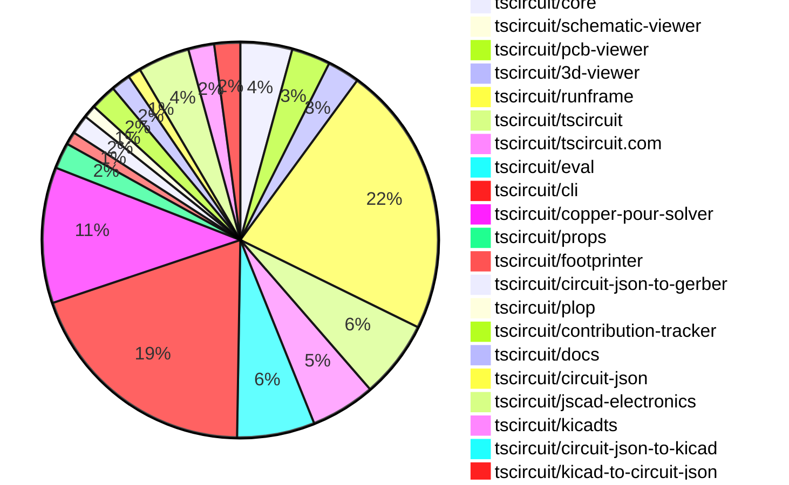
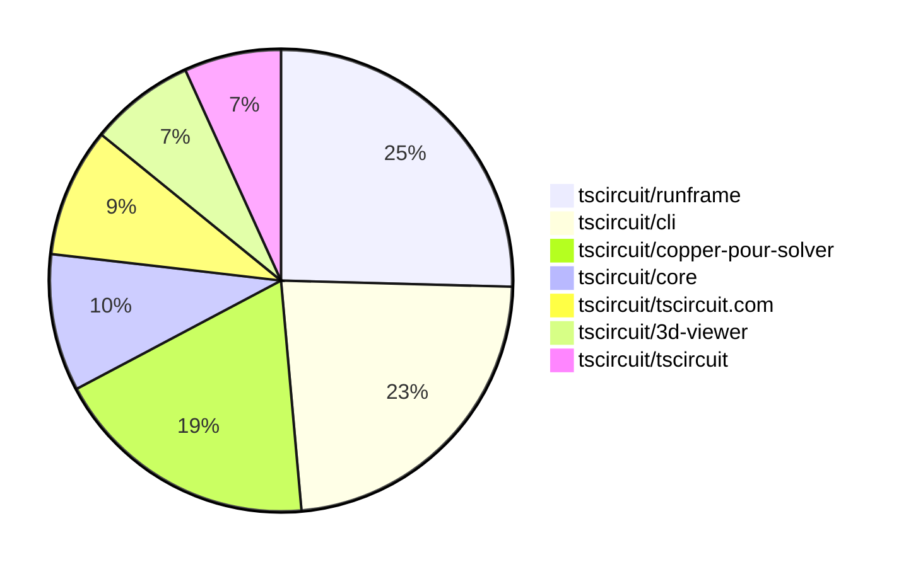

# Contribution Overview 2025-11-05

The current week is shown below. There are 4 major sections:

- [Contributor Overview](#contributor-overview)
- [PRs by Repository](#prs-by-repository)
- [PRs by Contributor](#changes-by-contributor)
- [Scoring & Sponsorship System](#scoring--sponsorship-system)

## PRs by Repository

## Contributor Overview

| Contributor | 🐳 Major | 🐙 Minor | 🐌 Tiny | ⭐ | Score | Discussion Contributions |
|-------------|---------|---------|---------|-----|----------------|--------------------------|
| [ShiboSoftwareDev](#ShiboSoftwareDev) | 5 | 5 | 11 | ⭐⭐⭐ | 50 | 0🔹 0🔶 0💎 |
| [imrishabh18](#imrishabh18) | 6 | 7 | 1 | ⭐⭐⭐ | 45 | 0🔹 0🔶 0💎 |
| [seveibar](#seveibar) | 0 | 2 | 6 | ⭐⭐ | 25 | 0🔹 0🔶 0💎 |
| [techmannih](#techmannih) | 1 | 4 | 2 | ⭐⭐ | 23 | 0🔹 0🔶 0💎 |
| [tscircuitbot](#tscircuitbot) | 0 | 0 | 106 | ⭐⭐ | 13.5 | 0🔹 0🔶 0💎 |
| [rushabhcodes](#rushabhcodes) | 0 | 3 | 7 | ⭐⭐ | 13 | 0🔹 0🔶 0💎 |
| [ArnavK-09](#ArnavK-09) | 2 | 0 | 4 | ⭐⭐ | 13 | 0🔹 0🔶 0💎 |
| [Ayushjhawar8](#Ayushjhawar8) | 1 | 1 | 3 | ⭐ | 9 | 0🔹 0🔶 0💎 |
| [Asymtode712](#Asymtode712) | 0 | 2 | 4 | ⭐ | 8 | 0🔹 0🔶 0💎 |
| [Enity300](#Enity300) | 0 | 2 | 1 | ⭐ | 5 | 0🔹 0🔶 0💎 |
| [Abse2001](#Abse2001) | 1 | 0 | 0 | ⭐ | 4 | 0🔹 0🔶 0💎 |
| [nailoo](#nailoo) | 0 | 0 | 2 | ⭐ | 4 | 0🔹 0🔶 0💎 |
| [RaghavArora14](#RaghavArora14) | 0 | 0 | 1 |  | 3 | 0🔹 0🔶 0💎 |
| [0hmX](#0hmX) | 0 | 0 | 1 |  | 2 | 0🔹 0🔶 0💎 |

> Note: AI evaluates PRs and assigns 1-3 star ratings automatically. 4 and 5 star ratings require manual staff review.

### Discussion Contribution Legend

- 🔹 Normal Comments: Basic participation with minimal effort
- 🔶 Great Informative Comments: Thoughtful participation that adds value
- 💎 Incredible Comments: Exceptional participation with high-quality content

## Review Table

[reviews-received-hover]: ## "Number of reviews received for PRs for this contributor"
[approvals-received-hover]: ## "Number of approvals received for PRs this contributor authored"
[rejections-received-hover]: ## "Number of rejections received for PRs this contributor authored"
[prs-opened-hover]: ## "Number of PRs opened by this contributor"
[issues-created-hover]: ## "Number of issues created by this contributor"
[bountied-issues-hover]: ## "Number of issues this contributor created with a bounty"
[bountied-issue-$-hover]: ## "Total bounty amount placed on issues authored by this contributor"

| Contributor | Reviews Received | Approvals Received | Rejections Received | Approvals | Rejections | PRs Opened | PRs Merged | Score | Issues Created | Bountied Issues | Bountied Issue $ |
|---|---|---|---|---|---|---|---|---|---|---|---|
| [Asymtode712](#Asymtode712) | 10 | 6 | 0 | 0 | 0 | 6 | 6 | 8 | 0 | 0 | 0 |
| [seveibar](#seveibar) | 3 | 0 | 0 | 42 | 4 | 14 | 8 | 25 | 0 | 0 | 0 |
| [tscircuitbot](#tscircuitbot) | 2 | 0 | 0 | 0 | 0 | 124 | 106 | 13.5 | 0 | 0 | 0 |
| [techmannih](#techmannih) | 8 | 6 | 0 | 4 | 2 | 9 | 7 | 23 | 0 | 0 | 0 |
| [Quanta-Naut](#Quanta-Naut) | 2 | 0 | 1 | 0 | 0 | 1 | 0 | 0 | 0 | 0 | 0 |
| [imrishabh18](#imrishabh18) | 11 | 3 | 0 | 3 | 5 | 18 | 15 | 45 | 0 | 0 | 0 |
| [ShiboSoftwareDev](#ShiboSoftwareDev) | 15 | 12 | 0 | 10 | 0 | 22 | 21 | 50 | 0 | 0 | 0 |
| [Enity300](#Enity300) | 6 | 4 | 0 | 0 | 0 | 3 | 3 | 5 | 0 | 0 | 0 |
| [rushabhcodes](#rushabhcodes) | 25 | 14 | 2 | 0 | 0 | 15 | 10 | 13 | 0 | 0 | 0 |
| [Abse2001](#Abse2001) | 2 | 1 | 0 | 0 | 0 | 3 | 1 | 4 | 0 | 0 | 0 |
| [Ayushjhawar8](#Ayushjhawar8) | 7 | 4 | 0 | 0 | 0 | 5 | 5 | 9 | 0 | 0 | 0 |
| [Exceluyi](#Exceluyi) | 7 | 0 | 2 | 0 | 0 | 2 | 0 | 0 | 0 | 0 | 0 |
| [0hmX](#0hmX) | 1 | 1 | 0 | 0 | 1 | 1 | 1 | 2 | 0 | 0 | 0 |
| [nailoo](#nailoo) | 8 | 3 | 0 | 2 | 0 | 5 | 2 | 4 | 0 | 0 | 0 |
| [RaghavArora14](#RaghavArora14) | 45 | 5 | 6 | 0 | 0 | 3 | 1 | 3 | 0 | 0 | 0 |
| [ArnavK-09](#ArnavK-09) | 6 | 2 | 1 | 0 | 0 | 9 | 6 | 13 | 0 | 0 | 0 |

## Top 7 Repositories by Contribution Points

## Scoring & Sponsorship System

### Overview

PRs are analyzed by AI and assigned a **star rating (1-3 stars)**. 4 and 5 star ratings can only be manually assigned by staff. Weekly scores use `2^(starRating - 1)` per PR (capped at 12 PRs per rating), plus review/discussion points.

### Weekly Score → Star String

| Score Range | Star String | Count Value |
|------------|-------------|-------------|
| 0-3 | (empty) | 0 stars |
| 4-10 | ⭐ | 1 star |
| 11-30 | ⭐⭐ | 2 stars |
| 31-50 | ⭐⭐⭐ | 3 stars |
| 51-75 | 👑 | 1 crown |
| 76-100 | 👑👑 | 2 crowns |
| 101+ | 👑👑👑 | 3 crowns |

> Crowns count as 3 stars for sponsorship.

### Monthly Sponsorship Calculation

The sponsorship system calculates monthly payments based on your **weekly star counts** over the complete weeks in that month (typically 4-5 weeks, Wednesday-Tuesday format).

**Step 1: Collect Weekly Stars**
- All complete weeks in the month are analyzed
- Each week's star string is converted to a numeric count (⭐ = 1 star, ⭐⭐⭐ = 3 stars)
- Example: `[2, 2, 2, 1, 0]` means 2 stars in week 1, 2 stars in week 2, etc.

**Step 2: Calculate Metrics**
- **Median stars**: The median value of all weekly star counts
- **Min stars**: The minimum weekly star count
- **Max stars**: The maximum weekly star count
- **High score**: The maximum raw weekly score (0-100+ range from the scoring table) from any week in the month

**Step 3: Determine Base Amount**
The sponsorship amount is calculated based on these metrics (checked in order):

| Condition | Base Amount |
|-----------|-------------|
| `minStarCount >= 3` | **$500** |
| `medianStars >= 3` | **$450** |
| `medianStars >= 2.5` | **$300** |
| `medianStars >= 2` | **$200** |
| `medianStars >= 1.5` | **$100** |
| `medianStars >= 1` | **$75** |
| `maxStarCount >= 2` | **$25** |
| `maxStarCount >= 1` | **$15** |
| `highScore >= 3` (and all stars = 0) | **$5** |

| Maintainer Level | Monthly Bonus |
|------------------|---------------|
| Level 1 | **$200** |
| Level 2 | **$350** |
| Level 3 | **$500** |

**Final Amount** = Base Amount + Maintainer Bonus

## Changes by Repository

### [tscircuit/core](https://github.com/tscircuit/core)

| PR # | Impact | Rating | Contributor | Description |
|------|--------|--------|-------------|-------------|
| [#1621](https://github.com/tscircuit/core/pull/1621) | 🐳 Major | ⭐⭐⭐ | ShiboSoftwareDev | Replaces the internal copper pour generation logic with the new tscircuitcopper-pour-solver package, delegating complex geometry calculations to a dedicated package. |
| [#1620](https://github.com/tscircuit/core/pull/1620) | 🐙 Minor | ⭐⭐ | Asymtode712 | Adds visual verification for the pcbStyle.silkscreenFontSize override by including a silkscreen text element and dimension annotation to ensure correct font size rendering in tests. |
| [#1617](https://github.com/tscircuit/core/pull/1617) | 🐙 Minor | ⭐⭐ | Asymtode712 | Implements pcbStyle inheritance for kicad: footprints by passing the resolved pcbStyle to footprintLibraryMap functions, enabling override of silkscreen font size and other style properties. |
| [#1622](https://github.com/tscircuit/core/pull/1622) | 🐙 Minor | ⭐⭐ | techmannih | Fixes rendering issues in PCB board by ensuring non-null width and height values are asserted before calculations. |
| [#1630](https://github.com/tscircuit/core/pull/1630) | 🐙 Minor | ⭐⭐ | ShiboSoftwareDev | Adds support for cutout margins in copper pours and includes a test to verify functionality. |
| [#1625](https://github.com/tscircuit/core/pull/1625) | 🐙 Minor | ⭐⭐ | ShiboSoftwareDev | Adds boardEdgeMargin and clearance properties to the CopperPour component for improved spacing control. |
| [#1627](https://github.com/tscircuit/core/pull/1627) | 🐙 Minor | ⭐⭐ | seveibar | Ensures CopperPour creates missing nets from its connectsTo property during the CreateNetsFromProps phase |

🐌 Tiny Contributions (1)

| PR # | Impact | Contributor | Description |
|------|--------|-------------|-------------|
| [#1623](https://github.com/tscircuit/core/pull/1623) | 🐌 Tiny | 0hmX | Updates the schematic-trace-solver dependency to version 0.0.45 in the package.json file |

### [tscircuit/schematic-viewer](https://github.com/tscircuit/schematic-viewer)

🐌 Tiny Contributions (1)

| PR # | Impact | Contributor | Description |
|------|--------|-------------|-------------|
| [#145](https://github.com/tscircuit/schematic-viewer/pull/145) | 🐌 Tiny | Asymtode712 | Integrates release-tracker into schematic-viewer workflows by adding workflows to notify on feature merges and version updates. |

### [tscircuit/pcb-viewer](https://github.com/tscircuit/pcb-viewer)

| PR # | Impact | Rating | Contributor | Description |
|------|--------|--------|-------------|-------------|
| [#460](https://github.com/tscircuit/pcb-viewer/pull/460) | 🐙 Minor | ⭐⭐ | techmannih | Adds support for corner radius in rectangle components, allowing for rounded corners in PCB designs. |

🐌 Tiny Contributions (5)

| PR # | Impact | Contributor | Description |
|------|--------|-------------|-------------|
| [#465](https://github.com/tscircuit/pcb-viewer/pull/465) | 🐌 Tiny | Asymtode712 | Integrates release-tracker into pcb-viewer workflows to notify about feature merges and version updates. |
| [#466](https://github.com/tscircuit/pcb-viewer/pull/466) | 🐌 Tiny | tscircuitbot | Automated package update |
| [#464](https://github.com/tscircuit/pcb-viewer/pull/464) | 🐌 Tiny | tscircuitbot | Automated package update to version 1.11.253 |
| [#463](https://github.com/tscircuit/pcb-viewer/pull/463) | 🐌 Tiny | tscircuitbot | Automated package update |
| [#461](https://github.com/tscircuit/pcb-viewer/pull/461) | 🐌 Tiny | techmannih | Fixes handling of optional width and height properties for the pcb_board element in rendering calculations. |

### [tscircuit/3d-viewer](https://github.com/tscircuit/3d-viewer)

| PR # | Impact | Rating | Contributor | Description |
|------|--------|--------|-------------|-------------|
| [#555](https://github.com/tscircuit/3d-viewer/pull/555) | 🐳 Major | ⭐⭐⭐ | techmannih | Adds support for rendering silkscreen circles on PCBs, including their geometry and visual representation. |
| [#552](https://github.com/tscircuit/3d-viewer/pull/552) | 🐳 Major | ⭐⭐⭐ | Abse2001 | Fixes the issue where selecting a camera preset always switched the camera to Custom and improves the default camera positioning in JSCAD and Manifold viewers by adding animation and cooldown logic to prevent user interactions from overriding presets. |
| [#554](https://github.com/tscircuit/3d-viewer/pull/554) | 🐙 Minor | ⭐⭐ | techmannih | Fixes rendering issues by ensuring non-null width and height values are asserted in PCB board rendering. |
| [#551](https://github.com/tscircuit/3d-viewer/pull/551) | 🐙 Minor | ⭐⭐ | Ayushjhawar8 | Fixes the default camera angle when loading boards in the viewer to ensure they are displayed correctly. |

🐌 Tiny Contributions (1)

| PR # | Impact | Contributor | Description |
|------|--------|-------------|-------------|
| [#553](https://github.com/tscircuit/3d-viewer/pull/553) | 🐌 Tiny | Asymtode712 | Integrate release-tracker into 3d-viewer workflows by adding workflows to notify on feature merges and version updates. |

### [tscircuit/runframe](https://github.com/tscircuit/runframe)

| PR # | Impact | Rating | Contributor | Description |
|------|--------|--------|-------------|-------------|
| [#1673](https://github.com/tscircuit/runframe/pull/1673) | 🐳 Major | ⭐⭐⭐ | Ayushjhawar8 | Fixes the natural sorting of filenames in the file selector component to ensure proper order when displaying files. |

🐌 Tiny Contributions (41)

| PR # | Impact | Contributor | Description |
|------|--------|-------------|-------------|
| [#1700](https://github.com/tscircuit/runframe/pull/1700) | 🐌 Tiny | Asymtode712 | Integrates release-tracker into runframe workflows by adding notifications for feature merges and version updates. |
| [#1720](https://github.com/tscircuit/runframe/pull/1720) | 🐌 Tiny | tscircuitbot | Automated package update to version 0.0.1226 |
| [#1718](https://github.com/tscircuit/runframe/pull/1718) | 🐌 Tiny | tscircuitbot | Updates the package version from 0.0.1224 to 0.0.1225 in package.json |
| [#1717](https://github.com/tscircuit/runframe/pull/1717) | 🐌 Tiny | tscircuitbot | Updates the package version from 0.0.1223 to 0.0.1224 in package.json |
| [#1716](https://github.com/tscircuit/runframe/pull/1716) | 🐌 Tiny | tscircuitbot | Updates the tscircuit3d-viewer package from version 0.0.429 to 0.0.430 |
| [#1715](https://github.com/tscircuit/runframe/pull/1715) | 🐌 Tiny | tscircuitbot | Automated package update |
| [#1713](https://github.com/tscircuit/runframe/pull/1713) | 🐌 Tiny | tscircuitbot | Updates the package version from 0.0.1221 to 0.0.1222 in package.json |
| [#1711](https://github.com/tscircuit/runframe/pull/1711) | 🐌 Tiny | tscircuitbot | Updates the package version from 0.0.1220 to 0.0.1221 in package.json |
| [#1710](https://github.com/tscircuit/runframe/pull/1710) | 🐌 Tiny | tscircuitbot | Updates the tscircuiteval package from version 0.0.456 to 0.0.457 |
| [#1708](https://github.com/tscircuit/runframe/pull/1708) | 🐌 Tiny | tscircuitbot | Automated package update to version 0.0.1220 |
| [#1707](https://github.com/tscircuit/runframe/pull/1707) | 🐌 Tiny | tscircuitbot | Updates the tscircuiteval package to version 0.0.456 |
| [#1706](https://github.com/tscircuit/runframe/pull/1706) | 🐌 Tiny | tscircuitbot | Updates the tscircuiteval package to version 0.0.455 in the package.json file. |
| [#1705](https://github.com/tscircuit/runframe/pull/1705) | 🐌 Tiny | tscircuitbot | Automated package update |
| [#1703](https://github.com/tscircuit/runframe/pull/1703) | 🐌 Tiny | tscircuitbot | Automated package update |
| [#1702](https://github.com/tscircuit/runframe/pull/1702) | 🐌 Tiny | tscircuitbot | Updates the tscircuitschematic-viewer package from version 2.0.47 to 2.0.48 |
| [#1699](https://github.com/tscircuit/runframe/pull/1699) | 🐌 Tiny | tscircuitbot | Automated package update |
| [#1698](https://github.com/tscircuit/runframe/pull/1698) | 🐌 Tiny | tscircuitbot | Updates the tscircuitpcb-viewer package from version 1.11.253 to 1.11.254 |
| [#1697](https://github.com/tscircuit/runframe/pull/1697) | 🐌 Tiny | tscircuitbot | Updates the package version from 0.0.1215 to 0.0.1216 in package.json |
| [#1696](https://github.com/tscircuit/runframe/pull/1696) | 🐌 Tiny | tscircuitbot | Updates the tscircuit3d-viewer package from version 0.0.428 to 0.0.429 |
| [#1695](https://github.com/tscircuit/runframe/pull/1695) | 🐌 Tiny | tscircuitbot | Automated package update |
| [#1694](https://github.com/tscircuit/runframe/pull/1694) | 🐌 Tiny | tscircuitbot | Updates the tscircuiteval package from version 0.0.453 to 0.0.454 |
| [#1693](https://github.com/tscircuit/runframe/pull/1693) | 🐌 Tiny | tscircuitbot | Automated package update |
| [#1692](https://github.com/tscircuit/runframe/pull/1692) | 🐌 Tiny | tscircuitbot | Updates the tscircuit3d-viewer package to version 0.0.428 in package.json |
| [#1691](https://github.com/tscircuit/runframe/pull/1691) | 🐌 Tiny | tscircuitbot | Updates the package version from 0.0.1212 to 0.0.1213 in package.json |
| [#1690](https://github.com/tscircuit/runframe/pull/1690) | 🐌 Tiny | tscircuitbot | Updates the tscircuitpcb-viewer package from version 1.11.252 to 1.11.253 |
| [#1689](https://github.com/tscircuit/runframe/pull/1689) | 🐌 Tiny | tscircuitbot | Automated package update |
| [#1688](https://github.com/tscircuit/runframe/pull/1688) | 🐌 Tiny | tscircuitbot | Updates the tscircuitpcb-viewer package to version 1.11.252 |
| [#1687](https://github.com/tscircuit/runframe/pull/1687) | 🐌 Tiny | tscircuitbot | Automated package update |
| [#1686](https://github.com/tscircuit/runframe/pull/1686) | 🐌 Tiny | tscircuitbot | Updates the tscircuit3d-viewer package to version 0.0.427 in package.json |
| [#1685](https://github.com/tscircuit/runframe/pull/1685) | 🐌 Tiny | tscircuitbot | Updates the package version from 0.0.1209 to 0.0.1210 in package.json |
| [#1684](https://github.com/tscircuit/runframe/pull/1684) | 🐌 Tiny | tscircuitbot | Automated package update |
| [#1683](https://github.com/tscircuit/runframe/pull/1683) | 🐌 Tiny | tscircuitbot | Updates the package version from 0.0.1208 to 0.0.1209 in package.json |
| [#1682](https://github.com/tscircuit/runframe/pull/1682) | 🐌 Tiny | tscircuitbot | Updates the tscircuiteval package to version 0.0.452 in the package.json file. |
| [#1681](https://github.com/tscircuit/runframe/pull/1681) | 🐌 Tiny | tscircuitbot | Automated package update |
| [#1680](https://github.com/tscircuit/runframe/pull/1680) | 🐌 Tiny | tscircuitbot | Automated package update |
| [#1714](https://github.com/tscircuit/runframe/pull/1714) | 🐌 Tiny | seveibar | Updates the version of the circuit-json-to-gerber dependency in package.json from 0.0.35 to 0.0.37 |
| [#1704](https://github.com/tscircuit/runframe/pull/1704) | 🐌 Tiny | seveibar | Updates the circuit-json-to-gerber dependency to version 0.0.35 to include the copper pour soldermask feature. |
| [#1709](https://github.com/tscircuit/runframe/pull/1709) | 🐌 Tiny | Ayushjhawar8 | Adds top spacing to error messages for improved visual styling in the ErrorTabContent component. |
| [#1672](https://github.com/tscircuit/runframe/pull/1672) | 🐌 Tiny | Ayushjhawar8 | img width1021 height277 altimage srchttps:github.comuser-attachmentsassets4430e588-fc3e-4519-be92-f22a44b67fa2 |
| [#1719](https://github.com/tscircuit/runframe/pull/1719) | 🐌 Tiny | ArnavK-09 | before img width525 height828 altimage srchttps:github.comuser-attachmentsassets8b5ad571-da64-4fd1-8135-80415f3d570f   after img width519 height838 altimage srchttps:github.comuser-attachmentsassetscd547222-ac2e-4812-825d-fa984675759a |
| [#1712](https://github.com/tscircuit/runframe/pull/1712) | 🐌 Tiny | ArnavK-09 | Fixes the package URL in error messages to correctly call the function instead of referencing it directly. |

### [tscircuit/tscircuit](https://github.com/tscircuit/tscircuit)

🐌 Tiny Contributions (12)

| PR # | Impact | Contributor | Description |
|------|--------|-------------|-------------|
| [#1276](https://github.com/tscircuit/tscircuit/pull/1276) | 🐌 Tiny | tscircuitbot | Automated package update |
| [#1274](https://github.com/tscircuit/tscircuit/pull/1274) | 🐌 Tiny | tscircuitbot | Automated package update |
| [#1272](https://github.com/tscircuit/tscircuit/pull/1272) | 🐌 Tiny | tscircuitbot | Automated package update |
| [#1269](https://github.com/tscircuit/tscircuit/pull/1269) | 🐌 Tiny | tscircuitbot | Automated package update |
| [#1268](https://github.com/tscircuit/tscircuit/pull/1268) | 🐌 Tiny | tscircuitbot | Automated package update |
| [#1267](https://github.com/tscircuit/tscircuit/pull/1267) | 🐌 Tiny | tscircuitbot | Automated package update |
| [#1266](https://github.com/tscircuit/tscircuit/pull/1266) | 🐌 Tiny | tscircuitbot | Automated package update |
| [#1265](https://github.com/tscircuit/tscircuit/pull/1265) | 🐌 Tiny | tscircuitbot | Automated package update |
| [#1264](https://github.com/tscircuit/tscircuit/pull/1264) | 🐌 Tiny | tscircuitbot | Updates the tscircuitcli package from version 0.1.443 to 0.1.444 and the tscircuitrunframe package from version 0.0.1206 to 0.0.1207 in package.json |
| [#1275](https://github.com/tscircuit/tscircuit/pull/1275) | 🐌 Tiny | ShiboSoftwareDev | Adds new dependencies to the project to resolve package update issues. |
| [#1273](https://github.com/tscircuit/tscircuit/pull/1273) | 🐌 Tiny | seveibar | Updates the CLI and RunFrame dependencies to their latest versions in package.json |
| [#1271](https://github.com/tscircuit/tscircuit/pull/1271) | 🐌 Tiny | seveibar | Updates the version of the tscircuitrunframe dependency from 0.0.1209 to 0.0.1222 in package.json |

### [tscircuit/tscircuit.com](https://github.com/tscircuit/tscircuit.com)

| PR # | Impact | Rating | Contributor | Description |
|------|--------|--------|-------------|-------------|
| [#1964](https://github.com/tscircuit/tscircuit.com/pull/1964) | 🐳 Major | ⭐⭐⭐ | ArnavK-09 | Adds a session check in the import component to ensure users are signed in before importing components, displaying an error message if not signed in. |
| [#1962](https://github.com/tscircuit/tscircuit.com/pull/1962) | 🐳 Major | ⭐⭐⭐ | ArnavK-09 | Adds debug information for user account details in the user settings page, including GitHub username, email, account ID, and created date. |

🐌 Tiny Contributions (8)

| PR # | Impact | Contributor | Description |
|------|--------|-------------|-------------|
| [#1960](https://github.com/tscircuit/tscircuit.com/pull/1960) | 🐌 Tiny | tscircuitbot | Updates the tscircuiteval package from version 0.0.456 to 0.0.457 |
| [#1959](https://github.com/tscircuit/tscircuit.com/pull/1959) | 🐌 Tiny | tscircuitbot | Updates the tscircuiteval package from version 0.0.454 to 0.0.456 |
| [#1957](https://github.com/tscircuit/tscircuit.com/pull/1957) | 🐌 Tiny | tscircuitbot | Updates the tscircuiteval package from version 0.0.453 to 0.0.454 |
| [#1954](https://github.com/tscircuit/tscircuit.com/pull/1954) | 🐌 Tiny | tscircuitbot | Updates the tscircuiteval package from version 0.0.452 to 0.0.453 in the package.json file. |
| [#1951](https://github.com/tscircuit/tscircuit.com/pull/1951) | 🐌 Tiny | tscircuitbot | Updates the tscircuiteval package from version 0.0.451 to 0.0.452 |
| [#1953](https://github.com/tscircuit/tscircuit.com/pull/1953) | 🐌 Tiny | imrishabh18 | Updates the tscircuitrunframe dependency from version 0.0.1198 to 0.0.1209 in package.json |
| [#1956](https://github.com/tscircuit/tscircuit.com/pull/1956) | 🐌 Tiny | ArnavK-09 | Refactors the CodeEditor component to avoid refetching typings when the font size changes, improving performance and user experience. |
| [#1952](https://github.com/tscircuit/tscircuit.com/pull/1952) | 🐌 Tiny | ArnavK-09 | Fixes the proxy URL used in the import dialog to ensure correct API calls are made. |

### [tscircuit/eval](https://github.com/tscircuit/eval)

🐌 Tiny Contributions (12)

| PR # | Impact | Contributor | Description |
|------|--------|-------------|-------------|
| [#1474](https://github.com/tscircuit/eval/pull/1474) | 🐌 Tiny | tscircuitbot | Automated package update to version 0.0.457 |
| [#1473](https://github.com/tscircuit/eval/pull/1473) | 🐌 Tiny | tscircuitbot | Updates the version of the tscircuitcore package from 0.0.849 to 0.0.850 in package.json |
| [#1471](https://github.com/tscircuit/eval/pull/1471) | 🐌 Tiny | tscircuitbot | Automated package update |
| [#1470](https://github.com/tscircuit/eval/pull/1470) | 🐌 Tiny | tscircuitbot | Automated package update |
| [#1468](https://github.com/tscircuit/eval/pull/1468) | 🐌 Tiny | tscircuitbot | Automated package update |
| [#1467](https://github.com/tscircuit/eval/pull/1467) | 🐌 Tiny | tscircuitbot | Automated package update |
| [#1466](https://github.com/tscircuit/eval/pull/1466) | 🐌 Tiny | tscircuitbot | Automated package update |
| [#1465](https://github.com/tscircuit/eval/pull/1465) | 🐌 Tiny | tscircuitbot | Automated package update |
| [#1463](https://github.com/tscircuit/eval/pull/1463) | 🐌 Tiny | tscircuitbot | Automated package update |
| [#1462](https://github.com/tscircuit/eval/pull/1462) | 🐌 Tiny | tscircuitbot | Automated package update |
| [#1460](https://github.com/tscircuit/eval/pull/1460) | 🐌 Tiny | tscircuitbot | Automated package update |
| [#1459](https://github.com/tscircuit/eval/pull/1459) | 🐌 Tiny | tscircuitbot | Automated package update |

### [tscircuit/cli](https://github.com/tscircuit/cli)

| PR # | Impact | Rating | Contributor | Description |
|------|--------|--------|-------------|-------------|
| [#841](https://github.com/tscircuit/cli/pull/841) | 🐳 Major | ⭐⭐⭐ | imrishabh18 | Adds support for transpiling TypeScript to ESM, CommonJS, and generating type declarations with the tsci build --transpile command. |
| [#844](https://github.com/tscircuit/cli/pull/844) | 🐙 Minor | ⭐⭐ | imrishabh18 | Allows users to specify file paths using glob patterns when generating schematic and PCB snapshots. |

🐌 Tiny Contributions (35)

| PR # | Impact | Contributor | Description |
|------|--------|-------------|-------------|
| [#876](https://github.com/tscircuit/cli/pull/876) | 🐌 Tiny | tscircuitbot | Automated package update |
| [#875](https://github.com/tscircuit/cli/pull/875) | 🐌 Tiny | tscircuitbot | Updates the tscircuitrunframe package from version 0.0.1224 to 0.0.1225 |
| [#874](https://github.com/tscircuit/cli/pull/874) | 🐌 Tiny | tscircuitbot | Automated package update |
| [#873](https://github.com/tscircuit/cli/pull/873) | 🐌 Tiny | tscircuitbot | Updates the tscircuitrunframe package from version 0.0.1223 to 0.0.1224 |
| [#871](https://github.com/tscircuit/cli/pull/871) | 🐌 Tiny | tscircuitbot | Updates the tscircuitrunframe package from version 0.0.1222 to 0.0.1223 |
| [#872](https://github.com/tscircuit/cli/pull/872) | 🐌 Tiny | tscircuitbot | Automated package update |
| [#870](https://github.com/tscircuit/cli/pull/870) | 🐌 Tiny | tscircuitbot | Automated package update |
| [#869](https://github.com/tscircuit/cli/pull/869) | 🐌 Tiny | tscircuitbot | Updates the tscircuitrunframe package version from 0.0.1219 to 0.0.1222 in package.json |
| [#866](https://github.com/tscircuit/cli/pull/866) | 🐌 Tiny | tscircuitbot | Automated package update |
| [#863](https://github.com/tscircuit/cli/pull/863) | 🐌 Tiny | tscircuitbot | Automated package update |
| [#862](https://github.com/tscircuit/cli/pull/862) | 🐌 Tiny | tscircuitbot | Updates the tscircuitrunframe package from version 0.0.1218 to 0.0.1219 |
| [#861](https://github.com/tscircuit/cli/pull/861) | 🐌 Tiny | tscircuitbot | Automated package update |
| [#860](https://github.com/tscircuit/cli/pull/860) | 🐌 Tiny | tscircuitbot | Updates the tscircuitrunframe package from version 0.0.1216 to 0.0.1218 |
| [#858](https://github.com/tscircuit/cli/pull/858) | 🐌 Tiny | tscircuitbot | Automated package update |
| [#857](https://github.com/tscircuit/cli/pull/857) | 🐌 Tiny | tscircuitbot | Updates the tscircuitrunframe package to version 0.0.1216 in package.json |
| [#856](https://github.com/tscircuit/cli/pull/856) | 🐌 Tiny | tscircuitbot | Automated package update |
| [#855](https://github.com/tscircuit/cli/pull/855) | 🐌 Tiny | tscircuitbot | Updates the tscircuitrunframe package from version 0.0.1214 to 0.0.1215 |
| [#854](https://github.com/tscircuit/cli/pull/854) | 🐌 Tiny | tscircuitbot | Automated package update |
| [#853](https://github.com/tscircuit/cli/pull/853) | 🐌 Tiny | tscircuitbot | Updates the tscircuitrunframe package from version 0.0.1213 to 0.0.1214 |
| [#852](https://github.com/tscircuit/cli/pull/852) | 🐌 Tiny | tscircuitbot | Automated package update |
| [#851](https://github.com/tscircuit/cli/pull/851) | 🐌 Tiny | tscircuitbot | Updates the tscircuitrunframe package from version 0.0.1212 to 0.0.1213 |
| [#850](https://github.com/tscircuit/cli/pull/850) | 🐌 Tiny | tscircuitbot | Automated package update to version 0.1.451 |
| [#849](https://github.com/tscircuit/cli/pull/849) | 🐌 Tiny | tscircuitbot | Updates the tscircuitrunframe package to version 0.0.1212 in the package.json file. |
| [#848](https://github.com/tscircuit/cli/pull/848) | 🐌 Tiny | tscircuitbot | Automated package update |
| [#847](https://github.com/tscircuit/cli/pull/847) | 🐌 Tiny | tscircuitbot | Automated package update |
| [#846](https://github.com/tscircuit/cli/pull/846) | 🐌 Tiny | tscircuitbot | Updates the tscircuitrunframe package from version 0.0.1210 to 0.0.1211 |
| [#845](https://github.com/tscircuit/cli/pull/845) | 🐌 Tiny | tscircuitbot | Automated package update |
| [#843](https://github.com/tscircuit/cli/pull/843) | 🐌 Tiny | tscircuitbot | Automated package update |
| [#842](https://github.com/tscircuit/cli/pull/842) | 🐌 Tiny | tscircuitbot | Updates the tscircuitrunframe package from version 0.0.1209 to 0.0.1210 |
| [#840](https://github.com/tscircuit/cli/pull/840) | 🐌 Tiny | tscircuitbot | Automated package update |
| [#839](https://github.com/tscircuit/cli/pull/839) | 🐌 Tiny | tscircuitbot | Updates the tscircuitrunframe package from version 0.0.1208 to 0.0.1209 |
| [#838](https://github.com/tscircuit/cli/pull/838) | 🐌 Tiny | tscircuitbot | Automated package update |
| [#837](https://github.com/tscircuit/cli/pull/837) | 🐌 Tiny | tscircuitbot | Updates the tscircuitrunframe package from version 0.0.1207 to 0.0.1208 |
| [#836](https://github.com/tscircuit/cli/pull/836) | 🐌 Tiny | tscircuitbot | Automated package update to version 0.1.444 |
| [#835](https://github.com/tscircuit/cli/pull/835) | 🐌 Tiny | tscircuitbot | Automated package update for tscircuitrunframe from version 0.0.1206 to 0.0.1207 |

### [tscircuit/copper-pour-solver](https://github.com/tscircuit/copper-pour-solver)

| PR # | Impact | Rating | Contributor | Description |
|------|--------|--------|-------------|-------------|
| [#20](https://github.com/tscircuit/copper-pour-solver/pull/20) | 🐳 Major | ⭐⭐⭐ | ShiboSoftwareDev | Adds support for pcb_cutout elements to the copper pour solver, allowing for proper clearance around board cutouts. |
| [#18](https://github.com/tscircuit/copper-pour-solver/pull/18) | 🐳 Major | ⭐⭐⭐ | ShiboSoftwareDev | Add support for generating copper pour cutouts around vias and their connected traces, processing pcb_via elements as circular obstacles and updating pcb_trace parsing logic for multi-layer traces. |
| [#6](https://github.com/tscircuit/copper-pour-solver/pull/6) | 🐳 Major | ⭐⭐⭐ | ShiboSoftwareDev | Adds support for a boardEdgeMargin parameter to control clearance between copper pours and board edges, improving handling of custom polygon outlines and enhancing boolean subtraction logic. |
| [#2](https://github.com/tscircuit/copper-pour-solver/pull/2) | 🐳 Major | ⭐⭐⭐ | ShiboSoftwareDev | This pull request implements the core logic for the copper pour solver. It introduces a complete pipeline that takes a circuit-json input and generates B-Rep shapes for the copper pour regions. Key changes include: Copper Pour Solver Implementation: The CopperPourPipelineSolver is built out to process obstacles, perform boolean geometry operations using flatten-js, and generate final B-Rep shapes. Circuit JSON Conversion: A new function convertCircuitJsonToInputProblem is added to translate standard circuit-json elements (pads, traces, holes) into the solvers internal InputProblem format. Comprehensive Testing: A suite of snapshot tests has been added, rendering the output of the solver to SVG for multiple circuit configurations to visually validate the results. Type Definitions: Updated libtypes.ts to support various pad shapes (rect, circle, trace) and define the solvers input and output structures. Dependency Updates: Added flatten-jscore for geometric calculations and circuit-to-svg for test rendering. |

🐌 Tiny Contributions (17)

| PR # | Impact | Contributor | Description |
|------|--------|-------------|-------------|
| [#23](https://github.com/tscircuit/copper-pour-solver/pull/23) | 🐌 Tiny | tscircuitbot | Automated package update to version 0.0.12 |
| [#21](https://github.com/tscircuit/copper-pour-solver/pull/21) | 🐌 Tiny | tscircuitbot | Automated package update |
| [#19](https://github.com/tscircuit/copper-pour-solver/pull/19) | 🐌 Tiny | tscircuitbot | Automated package update |
| [#17](https://github.com/tscircuit/copper-pour-solver/pull/17) | 🐌 Tiny | tscircuitbot | Automated package update |
| [#14](https://github.com/tscircuit/copper-pour-solver/pull/14) | 🐌 Tiny | tscircuitbot | Automated package update |
| [#12](https://github.com/tscircuit/copper-pour-solver/pull/12) | 🐌 Tiny | tscircuitbot | Automated package update to version 0.0.6 |
| [#10](https://github.com/tscircuit/copper-pour-solver/pull/10) | 🐌 Tiny | tscircuitbot | Automated package update |
| [#8](https://github.com/tscircuit/copper-pour-solver/pull/8) | 🐌 Tiny | tscircuitbot | Automated package update |
| [#22](https://github.com/tscircuit/copper-pour-solver/pull/22) | 🐌 Tiny | ShiboSoftwareDev | Removes console log statements from the circuit JSON conversion and copper pour processing functions to clean up the codebase. |
| [#9](https://github.com/tscircuit/copper-pour-solver/pull/9) | 🐌 Tiny | ShiboSoftwareDev | This change renames several test files and their corresponding assets to have more descriptive names that reflect their purpose, improving the maintainability and clarity of the test suite. |
| [#11](https://github.com/tscircuit/copper-pour-solver/pull/11) | 🐌 Tiny | ShiboSoftwareDev | This pull request renames boardEdgeMargin to board_edge_margin for consistency with the snake_case naming convention used for other properties in the project. |
| [#13](https://github.com/tscircuit/copper-pour-solver/pull/13) | 🐌 Tiny | ShiboSoftwareDev | Fixes the workflow to only commit pver release updates and disables auto-merge of upstream changes. |
| [#16](https://github.com/tscircuit/copper-pour-solver/pull/16) | 🐌 Tiny | ShiboSoftwareDev | Enables auto-merging of pull requests in the GitHub workflow for pver. |
| [#7](https://github.com/tscircuit/copper-pour-solver/pull/7) | 🐌 Tiny | ShiboSoftwareDev | Auto updates the package version in the GitHub workflow for releases. |
| [#4](https://github.com/tscircuit/copper-pour-solver/pull/4) | 🐌 Tiny | ShiboSoftwareDev | Adds a new script to check the formatting of the codebase using biome. |
| [#5](https://github.com/tscircuit/copper-pour-solver/pull/5) | 🐌 Tiny | ShiboSoftwareDev | Removes the lockfile as it is deemed unnecessary for the project. |
| [#3](https://github.com/tscircuit/copper-pour-solver/pull/3) | 🐌 Tiny | ShiboSoftwareDev | Adds a CODEOWNERS file to define code ownership for the repository |

### [tscircuit/props](https://github.com/tscircuit/props)

| PR # | Impact | Rating | Contributor | Description |
|------|--------|--------|-------------|-------------|
| [#491](https://github.com/tscircuit/props/pull/491) | 🐙 Minor | ⭐⭐ | techmannih | Adds RectHoleProps interface for rectangular hole support in PCB layout, expanding the HoleProps type to include rectangular holes. |
| [#490](https://github.com/tscircuit/props/pull/490) | 🐙 Minor | ⭐⭐ | ShiboSoftwareDev | Adds the cutoutMargin property to copper pours, allowing for a clearance to be set between the pour and board cutouts. |
| [#488](https://github.com/tscircuit/props/pull/488) | 🐙 Minor | ⭐⭐ | ShiboSoftwareDev | Adds the boardEdgeMargin property to the copper-pour component, allowing specification of a margin between a copper pour and the board edge. |
| [#489](https://github.com/tscircuit/props/pull/489) | 🐙 Minor | ⭐⭐ | rushabhcodes | Adds an optional property minTraceWidth to the BaseGroupProps TypeScript interface and updates schema validation for group components. |

### [tscircuit/footprinter](https://github.com/tscircuit/footprinter)

🐌 Tiny Contributions (2)

| PR # | Impact | Contributor | Description |
|------|--------|-------------|-------------|
| [#407](https://github.com/tscircuit/footprinter/pull/407) | 🐌 Tiny | techmannih | Adds a test for the sod123 footprint to ensure parity with KiCads representation. |
| [#406](https://github.com/tscircuit/footprinter/pull/406) | 🐌 Tiny | rushabhcodes | Adds new parity snapshot tests for MELF diode footprints, ensuring that the generated SVGs from the Footprinter tool match those from KiCad for several MELF package variants. |

### [tscircuit/circuit-json-to-gerber](https://github.com/tscircuit/circuit-json-to-gerber)

| PR # | Impact | Rating | Contributor | Description |
|------|--------|--------|-------------|-------------|
| [#62](https://github.com/tscircuit/circuit-json-to-gerber/pull/62) | 🐙 Minor | ⭐⭐ | ShiboSoftwareDev | Adds a boolean property, covered_with_solder_mask, to copper pour elements, allowing for solder mask-free regions when set to false. |
| [#63](https://github.com/tscircuit/circuit-json-to-gerber/pull/63) | 🐙 Minor | ⭐⭐ | imrishabh18 | Adds support for polygon-shaped SMT pads in Gerber command generation, allowing for accurate representation of complex pad shapes. |
| [#64](https://github.com/tscircuit/circuit-json-to-gerber/pull/64) | 🐙 Minor | ⭐⭐ | imrishabh18 | Adds tests to generate Excellon drill commands for both plated and unplated holes in the viagrid board, ensuring proper representation under the copper pour. |

### [tscircuit/plop](https://github.com/tscircuit/plop)

🐌 Tiny Contributions (2)

| PR # | Impact | Contributor | Description |
|------|--------|-------------|-------------|
| [#25](https://github.com/tscircuit/plop/pull/25) | 🐌 Tiny | ShiboSoftwareDev | Enables committing and auto-merging of pver updates in the CI workflow. |
| [#24](https://github.com/tscircuit/plop/pull/24) | 🐌 Tiny | seveibar | Add a GitHub workflow that triggers on merged pull requests to notify the release tracker service about merged features. |

### [tscircuit/contribution-tracker](https://github.com/tscircuit/contribution-tracker)

| PR # | Impact | Rating | Contributor | Description |
|------|--------|--------|-------------|-------------|
| [#255](https://github.com/tscircuit/contribution-tracker/pull/255) | 🐙 Minor | ⭐⭐ | seveibar | Increases the base sponsorship amounts based on median and maximum star counts for contributors. |

🐌 Tiny Contributions (3)

| PR # | Impact | Contributor | Description |
|------|--------|-------------|-------------|
| [#260](https://github.com/tscircuit/contribution-tracker/pull/260) | 🐌 Tiny | Enity300 | Adds a new user Enity300 to the users.json file. |
| [#258](https://github.com/tscircuit/contribution-tracker/pull/258) | 🐌 Tiny | rushabhcodes | Adds the Discord ID and GitHub username of the user rushabhcodes to the users.json file |
| [#259](https://github.com/tscircuit/contribution-tracker/pull/259) | 🐌 Tiny | RaghavArora14 | Adds GitHub username and Discord ID for user RaghavArora14 in users.json |

### [tscircuit/docs](https://github.com/tscircuit/docs)

🐌 Tiny Contributions (3)

| PR # | Impact | Contributor | Description |
|------|--------|-------------|-------------|
| [#314](https://github.com/tscircuit/docs/pull/314) | 🐌 Tiny | seveibar | Rewrite the measuring circuit size guide to focus on board template selection and remove Adom-specific wording, document JSON metadata imports and add a metadata-driven carrier example, embed a CircuitPreview that loads metadata via fsMap to demonstrate template selection. |
| [#308](https://github.com/tscircuit/docs/pull/308) | 🐌 Tiny | rushabhcodes | Wraps CircuitPreview components in board tags to ensure proper rendering in PCB view, while introducing a border in the PCB view that is deemed acceptable. |
| [#315](https://github.com/tscircuit/docs/pull/315) | 🐌 Tiny | Ayushjhawar8 | Adjusts the indentation of nested documentation groups in the sidebar for better visual hierarchy and usability. |

### [tscircuit/circuit-json](https://github.com/tscircuit/circuit-json)

| PR # | Impact | Rating | Contributor | Description |
|------|--------|--------|-------------|-------------|
| [#340](https://github.com/tscircuit/circuit-json/pull/340) | 🐙 Minor | ⭐⭐ | Enity300 | Adds an optional shape property to the PCBBoard interface, allowing specification of board shape as either rectangular or polygonal, while maintaining backward compatibility. |
| [#339](https://github.com/tscircuit/circuit-json/pull/339) | 🐙 Minor | ⭐⭐ | Enity300 | This PR makes the width and height properties optional on the PCBBoard interface to support boards with custom outlines. |

### [tscircuit/jscad-electronics](https://github.com/tscircuit/jscad-electronics)

| PR # | Impact | Rating | Contributor | Description |
|------|--------|--------|-------------|-------------|
| [#201](https://github.com/tscircuit/jscad-electronics/pull/201) | 🐙 Minor | ⭐⭐ | rushabhcodes | Adds notchRadius property to QFP, LQFP, and TQFP components for accurate notch rendering and updates snapshot tests that were previously skipped due to minimal visual differences. |
| [#198](https://github.com/tscircuit/jscad-electronics/pull/198) | 🐙 Minor | ⭐⭐ | rushabhcodes | Adds support for the MSOP chip package to the 3D footprint rendering library, including a new MSOP component, integration into the renderer, and test coverage. |

🐌 Tiny Contributions (6)

| PR # | Impact | Contributor | Description |
|------|--------|-------------|-------------|
| [#202](https://github.com/tscircuit/jscad-electronics/pull/202) | 🐌 Tiny | rushabhcodes | Adds support for the SOD882 diode package to the 3D footprint rendering library, including implementation, integration, example usage, and snapshot testing. |
| [#197](https://github.com/tscircuit/jscad-electronics/pull/197) | 🐌 Tiny | rushabhcodes | Adds support for rendering the MicroMELF package in the 3D footprint visualizer, including a new component and tests. |
| [#195](https://github.com/tscircuit/jscad-electronics/pull/195) | 🐌 Tiny | rushabhcodes | Adds support for the MELF (Metal Electrode Leadless Face) package by introducing a new MELF component for rendering, integrating it into the main rendering logic, and providing an example and test. |
| [#199](https://github.com/tscircuit/jscad-electronics/pull/199) | 🐌 Tiny | rushabhcodes | Adds support for the MS-012 chip package to the 3D footprint rendering system, including a new component, integration into the renderer, and a test for rendering correctness. |
| [#204](https://github.com/tscircuit/jscad-electronics/pull/204) | 🐌 Tiny | nailoo | Adds the SOT723 footprint to the Footprinter3D component for rendering in 3D. |
| [#196](https://github.com/tscircuit/jscad-electronics/pull/196) | 🐌 Tiny | nailoo | Add a new MINIMELF component and its corresponding example for rendering in the JSCAD environment. |

### [tscircuit/kicadts](https://github.com/tscircuit/kicadts)

| PR # | Impact | Rating | Contributor | Description |
|------|--------|--------|-------------|-------------|
| [#18](https://github.com/tscircuit/kicadts/pull/18) | 🐳 Major | ⭐⭐⭐ | imrishabh18 | Add new classes for graphical elements including GrCircle, GrRect, and Group with properties for locking and UUIDs. |
| [#19](https://github.com/tscircuit/kicadts/pull/19) | 🐳 Major | ⭐⭐⭐ | imrishabh18 | Adds GrPoly class for polygon representation and enhances GrText class with render_cache functionality for improved text rendering. |
| [#20](https://github.com/tscircuit/kicadts/pull/20) | 🐙 Minor | ⭐⭐ | imrishabh18 | Adds support for the fill token in PadPrimitiveGrPoly, allowing it to accept a string value for fill properties. |
| [#21](https://github.com/tscircuit/kicadts/pull/21) | 🐙 Minor | ⭐⭐ | imrishabh18 | Adds support for graphic polygons and rectangles in the KicadPcb type, allowing for more complex graphical representations in PCB designs. |

### [tscircuit/circuit-json-to-kicad](https://github.com/tscircuit/circuit-json-to-kicad)

| PR # | Impact | Rating | Contributor | Description |
|------|--------|--------|-------------|-------------|
| [#29](https://github.com/tscircuit/circuit-json-to-kicad/pull/29) | 🐳 Major | ⭐⭐⭐ | imrishabh18 | The ViaGridBoard in the common module should be supported for export |

### [tscircuit/kicad-to-circuit-json](https://github.com/tscircuit/kicad-to-circuit-json)

| PR # | Impact | Rating | Contributor | Description |
|------|--------|--------|-------------|-------------|
| [#20](https://github.com/tscircuit/kicad-to-circuit-json/pull/20) | 🐳 Major | ⭐⭐⭐ | imrishabh18 | This pull request introduces the ViaGridBoard feature, which processes filled rectangles on copper layers and creates corresponding SMT pads in the PCB design. It enhances the PCB graphics processing capabilities by adding support for gr_rect elements, ensuring that filled rectangles are correctly interpreted and represented in the output JSON format. Additionally, it updates the kicadts dependency to a newer version and includes new test snapshots and assets for the ViaGridBoard functionality. |
| [#21](https://github.com/tscircuit/kicad-to-circuit-json/pull/21) | 🐳 Major | ⭐⭐⭐ | imrishabh18 | Adds support for parsing filled polygons from KiCad and converting them into pcb_smtpad shapes in the Circuit JSON format. |
| [#23](https://github.com/tscircuit/kicad-to-circuit-json/pull/23) | 🐙 Minor | ⭐⭐ | imrishabh18 | Adds support for gr_poly shapes in pcb_smtpad, allowing for polygon-shaped SMT pads in PCB designs. |
| [#22](https://github.com/tscircuit/kicad-to-circuit-json/pull/22) | 🐙 Minor | ⭐⭐ | imrishabh18 | This pull request adds the missing shape for the smtpad shaped rect in the PCB design process. It ensures that the correct shape is assigned to the smtpad based on the provided parameters, enhancing the accuracy of the PCB representation in the circuit JSON output. |

## Changes by Contributor

### [Asymtode712](https://github.com/Asymtode712)

| PRs # | Impact | Rating | Description |
|------|--------|--------|-------------|
| [#1620](https://github.com/tscircuit/core/pull/1620) | 🐙 Minor | ⭐⭐ | Adds visual verification for the pcbStyle.silkscreenFontSize override by including a silkscreen text element and dimension annotation to ensure correct font size rendering in tests. |
| [#1617](https://github.com/tscircuit/core/pull/1617) | 🐙 Minor | ⭐⭐ | Implements pcbStyle inheritance for kicad: footprints by passing the resolved pcbStyle to footprintLibraryMap functions, enabling override of silkscreen font size and other style properties. |

🐌 Tiny Contributions (4)

| PR # | Impact | Description |
|------|--------|-------------|
| [#145](https://github.com/tscircuit/schematic-viewer/pull/145) | 🐌 Tiny | Integrates release-tracker into schematic-viewer workflows by adding workflows to notify on feature merges and version updates. |
| [#465](https://github.com/tscircuit/pcb-viewer/pull/465) | 🐌 Tiny | Integrates release-tracker into pcb-viewer workflows to notify about feature merges and version updates. |
| [#553](https://github.com/tscircuit/3d-viewer/pull/553) | 🐌 Tiny | Integrate release-tracker into 3d-viewer workflows by adding workflows to notify on feature merges and version updates. |
| [#1700](https://github.com/tscircuit/runframe/pull/1700) | 🐌 Tiny | Integrates release-tracker into runframe workflows by adding notifications for feature merges and version updates. |

### [tscircuitbot](https://github.com/tscircuitbot)

🐌 Tiny Contributions (106)

| PR # | Impact | Description |
|------|--------|-------------|
| [#466](https://github.com/tscircuit/pcb-viewer/pull/466) | 🐌 Tiny | Automated package update |
| [#464](https://github.com/tscircuit/pcb-viewer/pull/464) | 🐌 Tiny | Automated package update to version 1.11.253 |
| [#463](https://github.com/tscircuit/pcb-viewer/pull/463) | 🐌 Tiny | Automated package update |
| [#1276](https://github.com/tscircuit/tscircuit/pull/1276) | 🐌 Tiny | Automated package update |
| [#1274](https://github.com/tscircuit/tscircuit/pull/1274) | 🐌 Tiny | Automated package update |
| [#1272](https://github.com/tscircuit/tscircuit/pull/1272) | 🐌 Tiny | Automated package update |
| [#1269](https://github.com/tscircuit/tscircuit/pull/1269) | 🐌 Tiny | Automated package update |
| [#1268](https://github.com/tscircuit/tscircuit/pull/1268) | 🐌 Tiny | Automated package update |
| [#1267](https://github.com/tscircuit/tscircuit/pull/1267) | 🐌 Tiny | Automated package update |
| [#1266](https://github.com/tscircuit/tscircuit/pull/1266) | 🐌 Tiny | Automated package update |
| [#1265](https://github.com/tscircuit/tscircuit/pull/1265) | 🐌 Tiny | Automated package update |
| [#1264](https://github.com/tscircuit/tscircuit/pull/1264) | 🐌 Tiny | Updates the tscircuitcli package from version 0.1.443 to 0.1.444 and the tscircuitrunframe package from version 0.0.1206 to 0.0.1207 in package.json |
| [#1960](https://github.com/tscircuit/tscircuit.com/pull/1960) | 🐌 Tiny | Updates the tscircuiteval package from version 0.0.456 to 0.0.457 |
| [#1959](https://github.com/tscircuit/tscircuit.com/pull/1959) | 🐌 Tiny | Updates the tscircuiteval package from version 0.0.454 to 0.0.456 |
| [#1957](https://github.com/tscircuit/tscircuit.com/pull/1957) | 🐌 Tiny | Updates the tscircuiteval package from version 0.0.453 to 0.0.454 |
| [#1954](https://github.com/tscircuit/tscircuit.com/pull/1954) | 🐌 Tiny | Updates the tscircuiteval package from version 0.0.452 to 0.0.453 in the package.json file. |
| [#1951](https://github.com/tscircuit/tscircuit.com/pull/1951) | 🐌 Tiny | Updates the tscircuiteval package from version 0.0.451 to 0.0.452 |
| [#1474](https://github.com/tscircuit/eval/pull/1474) | 🐌 Tiny | Automated package update to version 0.0.457 |
| [#1473](https://github.com/tscircuit/eval/pull/1473) | 🐌 Tiny | Updates the version of the tscircuitcore package from 0.0.849 to 0.0.850 in package.json |
| [#1471](https://github.com/tscircuit/eval/pull/1471) | 🐌 Tiny | Automated package update |
| [#1470](https://github.com/tscircuit/eval/pull/1470) | 🐌 Tiny | Automated package update |
| [#1468](https://github.com/tscircuit/eval/pull/1468) | 🐌 Tiny | Automated package update |
| [#1467](https://github.com/tscircuit/eval/pull/1467) | 🐌 Tiny | Automated package update |
| [#1466](https://github.com/tscircuit/eval/pull/1466) | 🐌 Tiny | Automated package update |
| [#1465](https://github.com/tscircuit/eval/pull/1465) | 🐌 Tiny | Automated package update |
| [#1463](https://github.com/tscircuit/eval/pull/1463) | 🐌 Tiny | Automated package update |
| [#1462](https://github.com/tscircuit/eval/pull/1462) | 🐌 Tiny | Automated package update |
| [#1460](https://github.com/tscircuit/eval/pull/1460) | 🐌 Tiny | Automated package update |
| [#1459](https://github.com/tscircuit/eval/pull/1459) | 🐌 Tiny | Automated package update |
| [#1720](https://github.com/tscircuit/runframe/pull/1720) | 🐌 Tiny | Automated package update to version 0.0.1226 |
| [#1718](https://github.com/tscircuit/runframe/pull/1718) | 🐌 Tiny | Updates the package version from 0.0.1224 to 0.0.1225 in package.json |
| [#1717](https://github.com/tscircuit/runframe/pull/1717) | 🐌 Tiny | Updates the package version from 0.0.1223 to 0.0.1224 in package.json |
| [#1716](https://github.com/tscircuit/runframe/pull/1716) | 🐌 Tiny | Updates the tscircuit3d-viewer package from version 0.0.429 to 0.0.430 |
| [#1715](https://github.com/tscircuit/runframe/pull/1715) | 🐌 Tiny | Automated package update |
| [#1713](https://github.com/tscircuit/runframe/pull/1713) | 🐌 Tiny | Updates the package version from 0.0.1221 to 0.0.1222 in package.json |
| [#1711](https://github.com/tscircuit/runframe/pull/1711) | 🐌 Tiny | Updates the package version from 0.0.1220 to 0.0.1221 in package.json |
| [#1710](https://github.com/tscircuit/runframe/pull/1710) | 🐌 Tiny | Updates the tscircuiteval package from version 0.0.456 to 0.0.457 |
| [#1708](https://github.com/tscircuit/runframe/pull/1708) | 🐌 Tiny | Automated package update to version 0.0.1220 |
| [#1707](https://github.com/tscircuit/runframe/pull/1707) | 🐌 Tiny | Updates the tscircuiteval package to version 0.0.456 |
| [#1706](https://github.com/tscircuit/runframe/pull/1706) | 🐌 Tiny | Updates the tscircuiteval package to version 0.0.455 in the package.json file. |
| [#1705](https://github.com/tscircuit/runframe/pull/1705) | 🐌 Tiny | Automated package update |
| [#1703](https://github.com/tscircuit/runframe/pull/1703) | 🐌 Tiny | Automated package update |
| [#1702](https://github.com/tscircuit/runframe/pull/1702) | 🐌 Tiny | Updates the tscircuitschematic-viewer package from version 2.0.47 to 2.0.48 |
| [#1699](https://github.com/tscircuit/runframe/pull/1699) | 🐌 Tiny | Automated package update |
| [#1698](https://github.com/tscircuit/runframe/pull/1698) | 🐌 Tiny | Updates the tscircuitpcb-viewer package from version 1.11.253 to 1.11.254 |
| [#1697](https://github.com/tscircuit/runframe/pull/1697) | 🐌 Tiny | Updates the package version from 0.0.1215 to 0.0.1216 in package.json |
| [#1696](https://github.com/tscircuit/runframe/pull/1696) | 🐌 Tiny | Updates the tscircuit3d-viewer package from version 0.0.428 to 0.0.429 |
| [#1695](https://github.com/tscircuit/runframe/pull/1695) | 🐌 Tiny | Automated package update |
| [#1694](https://github.com/tscircuit/runframe/pull/1694) | 🐌 Tiny | Updates the tscircuiteval package from version 0.0.453 to 0.0.454 |
| [#1693](https://github.com/tscircuit/runframe/pull/1693) | 🐌 Tiny | Automated package update |
| [#1692](https://github.com/tscircuit/runframe/pull/1692) | 🐌 Tiny | Updates the tscircuit3d-viewer package to version 0.0.428 in package.json |
| [#1691](https://github.com/tscircuit/runframe/pull/1691) | 🐌 Tiny | Updates the package version from 0.0.1212 to 0.0.1213 in package.json |
| [#1690](https://github.com/tscircuit/runframe/pull/1690) | 🐌 Tiny | Updates the tscircuitpcb-viewer package from version 1.11.252 to 1.11.253 |
| [#1689](https://github.com/tscircuit/runframe/pull/1689) | 🐌 Tiny | Automated package update |
| [#1688](https://github.com/tscircuit/runframe/pull/1688) | 🐌 Tiny | Updates the tscircuitpcb-viewer package to version 1.11.252 |
| [#1687](https://github.com/tscircuit/runframe/pull/1687) | 🐌 Tiny | Automated package update |
| [#1686](https://github.com/tscircuit/runframe/pull/1686) | 🐌 Tiny | Updates the tscircuit3d-viewer package to version 0.0.427 in package.json |
| [#1685](https://github.com/tscircuit/runframe/pull/1685) | 🐌 Tiny | Updates the package version from 0.0.1209 to 0.0.1210 in package.json |
| [#1684](https://github.com/tscircuit/runframe/pull/1684) | 🐌 Tiny | Automated package update |
| [#1683](https://github.com/tscircuit/runframe/pull/1683) | 🐌 Tiny | Updates the package version from 0.0.1208 to 0.0.1209 in package.json |
| [#1682](https://github.com/tscircuit/runframe/pull/1682) | 🐌 Tiny | Updates the tscircuiteval package to version 0.0.452 in the package.json file. |
| [#1681](https://github.com/tscircuit/runframe/pull/1681) | 🐌 Tiny | Automated package update |
| [#1680](https://github.com/tscircuit/runframe/pull/1680) | 🐌 Tiny | Automated package update |
| [#876](https://github.com/tscircuit/cli/pull/876) | 🐌 Tiny | Automated package update |
| [#875](https://github.com/tscircuit/cli/pull/875) | 🐌 Tiny | Updates the tscircuitrunframe package from version 0.0.1224 to 0.0.1225 |
| [#874](https://github.com/tscircuit/cli/pull/874) | 🐌 Tiny | Automated package update |
| [#873](https://github.com/tscircuit/cli/pull/873) | 🐌 Tiny | Updates the tscircuitrunframe package from version 0.0.1223 to 0.0.1224 |
| [#871](https://github.com/tscircuit/cli/pull/871) | 🐌 Tiny | Updates the tscircuitrunframe package from version 0.0.1222 to 0.0.1223 |
| [#872](https://github.com/tscircuit/cli/pull/872) | 🐌 Tiny | Automated package update |
| [#870](https://github.com/tscircuit/cli/pull/870) | 🐌 Tiny | Automated package update |
| [#869](https://github.com/tscircuit/cli/pull/869) | 🐌 Tiny | Updates the tscircuitrunframe package version from 0.0.1219 to 0.0.1222 in package.json |
| [#866](https://github.com/tscircuit/cli/pull/866) | 🐌 Tiny | Automated package update |
| [#863](https://github.com/tscircuit/cli/pull/863) | 🐌 Tiny | Automated package update |
| [#862](https://github.com/tscircuit/cli/pull/862) | 🐌 Tiny | Updates the tscircuitrunframe package from version 0.0.1218 to 0.0.1219 |
| [#861](https://github.com/tscircuit/cli/pull/861) | 🐌 Tiny | Automated package update |
| [#860](https://github.com/tscircuit/cli/pull/860) | 🐌 Tiny | Updates the tscircuitrunframe package from version 0.0.1216 to 0.0.1218 |
| [#858](https://github.com/tscircuit/cli/pull/858) | 🐌 Tiny | Automated package update |
| [#857](https://github.com/tscircuit/cli/pull/857) | 🐌 Tiny | Updates the tscircuitrunframe package to version 0.0.1216 in package.json |
| [#856](https://github.com/tscircuit/cli/pull/856) | 🐌 Tiny | Automated package update |
| [#855](https://github.com/tscircuit/cli/pull/855) | 🐌 Tiny | Updates the tscircuitrunframe package from version 0.0.1214 to 0.0.1215 |
| [#854](https://github.com/tscircuit/cli/pull/854) | 🐌 Tiny | Automated package update |
| [#853](https://github.com/tscircuit/cli/pull/853) | 🐌 Tiny | Updates the tscircuitrunframe package from version 0.0.1213 to 0.0.1214 |
| [#852](https://github.com/tscircuit/cli/pull/852) | 🐌 Tiny | Automated package update |
| [#851](https://github.com/tscircuit/cli/pull/851) | 🐌 Tiny | Updates the tscircuitrunframe package from version 0.0.1212 to 0.0.1213 |
| [#850](https://github.com/tscircuit/cli/pull/850) | 🐌 Tiny | Automated package update to version 0.1.451 |
| [#849](https://github.com/tscircuit/cli/pull/849) | 🐌 Tiny | Updates the tscircuitrunframe package to version 0.0.1212 in the package.json file. |
| [#848](https://github.com/tscircuit/cli/pull/848) | 🐌 Tiny | Automated package update |
| [#847](https://github.com/tscircuit/cli/pull/847) | 🐌 Tiny | Automated package update |
| [#846](https://github.com/tscircuit/cli/pull/846) | 🐌 Tiny | Updates the tscircuitrunframe package from version 0.0.1210 to 0.0.1211 |
| [#845](https://github.com/tscircuit/cli/pull/845) | 🐌 Tiny | Automated package update |
| [#843](https://github.com/tscircuit/cli/pull/843) | 🐌 Tiny | Automated package update |
| [#842](https://github.com/tscircuit/cli/pull/842) | 🐌 Tiny | Updates the tscircuitrunframe package from version 0.0.1209 to 0.0.1210 |
| [#840](https://github.com/tscircuit/cli/pull/840) | 🐌 Tiny | Automated package update |
| [#839](https://github.com/tscircuit/cli/pull/839) | 🐌 Tiny | Updates the tscircuitrunframe package from version 0.0.1208 to 0.0.1209 |
| [#838](https://github.com/tscircuit/cli/pull/838) | 🐌 Tiny | Automated package update |
| [#837](https://github.com/tscircuit/cli/pull/837) | 🐌 Tiny | Updates the tscircuitrunframe package from version 0.0.1207 to 0.0.1208 |
| [#836](https://github.com/tscircuit/cli/pull/836) | 🐌 Tiny | Automated package update to version 0.1.444 |
| [#835](https://github.com/tscircuit/cli/pull/835) | 🐌 Tiny | Automated package update for tscircuitrunframe from version 0.0.1206 to 0.0.1207 |
| [#23](https://github.com/tscircuit/copper-pour-solver/pull/23) | 🐌 Tiny | Automated package update to version 0.0.12 |
| [#21](https://github.com/tscircuit/copper-pour-solver/pull/21) | 🐌 Tiny | Automated package update |
| [#19](https://github.com/tscircuit/copper-pour-solver/pull/19) | 🐌 Tiny | Automated package update |
| [#17](https://github.com/tscircuit/copper-pour-solver/pull/17) | 🐌 Tiny | Automated package update |
| [#14](https://github.com/tscircuit/copper-pour-solver/pull/14) | 🐌 Tiny | Automated package update |
| [#12](https://github.com/tscircuit/copper-pour-solver/pull/12) | 🐌 Tiny | Automated package update to version 0.0.6 |
| [#10](https://github.com/tscircuit/copper-pour-solver/pull/10) | 🐌 Tiny | Automated package update |
| [#8](https://github.com/tscircuit/copper-pour-solver/pull/8) | 🐌 Tiny | Automated package update |

### [techmannih](https://github.com/techmannih)

| PRs # | Impact | Rating | Description |
|------|--------|--------|-------------|
| [#555](https://github.com/tscircuit/3d-viewer/pull/555) | 🐳 Major | ⭐⭐⭐ | Adds support for rendering silkscreen circles on PCBs, including their geometry and visual representation. |
| [#460](https://github.com/tscircuit/pcb-viewer/pull/460) | 🐙 Minor | ⭐⭐ | Adds support for corner radius in rectangle components, allowing for rounded corners in PCB designs. |
| [#491](https://github.com/tscircuit/props/pull/491) | 🐙 Minor | ⭐⭐ | Adds RectHoleProps interface for rectangular hole support in PCB layout, expanding the HoleProps type to include rectangular holes. |
| [#554](https://github.com/tscircuit/3d-viewer/pull/554) | 🐙 Minor | ⭐⭐ | Fixes rendering issues by ensuring non-null width and height values are asserted in PCB board rendering. |
| [#1622](https://github.com/tscircuit/core/pull/1622) | 🐙 Minor | ⭐⭐ | Fixes rendering issues in PCB board by ensuring non-null width and height values are asserted before calculations. |

🐌 Tiny Contributions (2)

| PR # | Impact | Description |
|------|--------|-------------|
| [#461](https://github.com/tscircuit/pcb-viewer/pull/461) | 🐌 Tiny | Fixes handling of optional width and height properties for the pcb_board element in rendering calculations. |
| [#407](https://github.com/tscircuit/footprinter/pull/407) | 🐌 Tiny | Adds a test for the sod123 footprint to ensure parity with KiCads representation. |

### [ShiboSoftwareDev](https://github.com/ShiboSoftwareDev)

| PRs # | Impact | Rating | Description |
|------|--------|--------|-------------|
| [#1621](https://github.com/tscircuit/core/pull/1621) | 🐳 Major | ⭐⭐⭐ | Replaces the internal copper pour generation logic with the new tscircuitcopper-pour-solver package, delegating complex geometry calculations to a dedicated package. |
| [#20](https://github.com/tscircuit/copper-pour-solver/pull/20) | 🐳 Major | ⭐⭐⭐ | Adds support for pcb_cutout elements to the copper pour solver, allowing for proper clearance around board cutouts. |
| [#18](https://github.com/tscircuit/copper-pour-solver/pull/18) | 🐳 Major | ⭐⭐⭐ | Add support for generating copper pour cutouts around vias and their connected traces, processing pcb_via elements as circular obstacles and updating pcb_trace parsing logic for multi-layer traces. |
| [#6](https://github.com/tscircuit/copper-pour-solver/pull/6) | 🐳 Major | ⭐⭐⭐ | Adds support for a boardEdgeMargin parameter to control clearance between copper pours and board edges, improving handling of custom polygon outlines and enhancing boolean subtraction logic. |
| [#2](https://github.com/tscircuit/copper-pour-solver/pull/2) | 🐳 Major | ⭐⭐⭐ | This pull request implements the core logic for the copper pour solver. It introduces a complete pipeline that takes a circuit-json input and generates B-Rep shapes for the copper pour regions. Key changes include: Copper Pour Solver Implementation: The CopperPourPipelineSolver is built out to process obstacles, perform boolean geometry operations using flatten-js, and generate final B-Rep shapes. Circuit JSON Conversion: A new function convertCircuitJsonToInputProblem is added to translate standard circuit-json elements (pads, traces, holes) into the solvers internal InputProblem format. Comprehensive Testing: A suite of snapshot tests has been added, rendering the output of the solver to SVG for multiple circuit configurations to visually validate the results. Type Definitions: Updated libtypes.ts to support various pad shapes (rect, circle, trace) and define the solvers input and output structures. Dependency Updates: Added flatten-jscore for geometric calculations and circuit-to-svg for test rendering. |
| [#490](https://github.com/tscircuit/props/pull/490) | 🐙 Minor | ⭐⭐ | Adds the cutoutMargin property to copper pours, allowing for a clearance to be set between the pour and board cutouts. |
| [#488](https://github.com/tscircuit/props/pull/488) | 🐙 Minor | ⭐⭐ | Adds the boardEdgeMargin property to the copper-pour component, allowing specification of a margin between a copper pour and the board edge. |
| [#1630](https://github.com/tscircuit/core/pull/1630) | 🐙 Minor | ⭐⭐ | Adds support for cutout margins in copper pours and includes a test to verify functionality. |
| [#1625](https://github.com/tscircuit/core/pull/1625) | 🐙 Minor | ⭐⭐ | Adds boardEdgeMargin and clearance properties to the CopperPour component for improved spacing control. |
| [#62](https://github.com/tscircuit/circuit-json-to-gerber/pull/62) | 🐙 Minor | ⭐⭐ | Adds a boolean property, covered_with_solder_mask, to copper pour elements, allowing for solder mask-free regions when set to false. |

🐌 Tiny Contributions (11)

| PR # | Impact | Description |
|------|--------|-------------|
| [#1275](https://github.com/tscircuit/tscircuit/pull/1275) | 🐌 Tiny | Adds new dependencies to the project to resolve package update issues. |
| [#25](https://github.com/tscircuit/plop/pull/25) | 🐌 Tiny | Enables committing and auto-merging of pver updates in the CI workflow. |
| [#22](https://github.com/tscircuit/copper-pour-solver/pull/22) | 🐌 Tiny | Removes console log statements from the circuit JSON conversion and copper pour processing functions to clean up the codebase. |
| [#9](https://github.com/tscircuit/copper-pour-solver/pull/9) | 🐌 Tiny | This change renames several test files and their corresponding assets to have more descriptive names that reflect their purpose, improving the maintainability and clarity of the test suite. |
| [#11](https://github.com/tscircuit/copper-pour-solver/pull/11) | 🐌 Tiny | This pull request renames boardEdgeMargin to board_edge_margin for consistency with the snake_case naming convention used for other properties in the project. |
| [#13](https://github.com/tscircuit/copper-pour-solver/pull/13) | 🐌 Tiny | Fixes the workflow to only commit pver release updates and disables auto-merge of upstream changes. |
| [#16](https://github.com/tscircuit/copper-pour-solver/pull/16) | 🐌 Tiny | Enables auto-merging of pull requests in the GitHub workflow for pver. |
| [#7](https://github.com/tscircuit/copper-pour-solver/pull/7) | 🐌 Tiny | Auto updates the package version in the GitHub workflow for releases. |
| [#4](https://github.com/tscircuit/copper-pour-solver/pull/4) | 🐌 Tiny | Adds a new script to check the formatting of the codebase using biome. |
| [#5](https://github.com/tscircuit/copper-pour-solver/pull/5) | 🐌 Tiny | Removes the lockfile as it is deemed unnecessary for the project. |
| [#3](https://github.com/tscircuit/copper-pour-solver/pull/3) | 🐌 Tiny | Adds a CODEOWNERS file to define code ownership for the repository |

### [seveibar](https://github.com/seveibar)

| PRs # | Impact | Rating | Description |
|------|--------|--------|-------------|
| [#1627](https://github.com/tscircuit/core/pull/1627) | 🐙 Minor | ⭐⭐ | Ensures CopperPour creates missing nets from its connectsTo property during the CreateNetsFromProps phase |
| [#255](https://github.com/tscircuit/contribution-tracker/pull/255) | 🐙 Minor | ⭐⭐ | Increases the base sponsorship amounts based on median and maximum star counts for contributors. |

🐌 Tiny Contributions (6)

| PR # | Impact | Description |
|------|--------|-------------|
| [#1273](https://github.com/tscircuit/tscircuit/pull/1273) | 🐌 Tiny | Updates the CLI and RunFrame dependencies to their latest versions in package.json |
| [#1271](https://github.com/tscircuit/tscircuit/pull/1271) | 🐌 Tiny | Updates the version of the tscircuitrunframe dependency from 0.0.1209 to 0.0.1222 in package.json |
| [#24](https://github.com/tscircuit/plop/pull/24) | 🐌 Tiny | Add a GitHub workflow that triggers on merged pull requests to notify the release tracker service about merged features. |
| [#1714](https://github.com/tscircuit/runframe/pull/1714) | 🐌 Tiny | Updates the version of the circuit-json-to-gerber dependency in package.json from 0.0.35 to 0.0.37 |
| [#1704](https://github.com/tscircuit/runframe/pull/1704) | 🐌 Tiny | Updates the circuit-json-to-gerber dependency to version 0.0.35 to include the copper pour soldermask feature. |
| [#314](https://github.com/tscircuit/docs/pull/314) | 🐌 Tiny | Rewrite the measuring circuit size guide to focus on board template selection and remove Adom-specific wording, document JSON metadata imports and add a metadata-driven carrier example, embed a CircuitPreview that loads metadata via fsMap to demonstrate template selection. |

### [Enity300](https://github.com/Enity300)

| PRs # | Impact | Rating | Description |
|------|--------|--------|-------------|
| [#340](https://github.com/tscircuit/circuit-json/pull/340) | 🐙 Minor | ⭐⭐ | Adds an optional shape property to the PCBBoard interface, allowing specification of board shape as either rectangular or polygonal, while maintaining backward compatibility. |
| [#339](https://github.com/tscircuit/circuit-json/pull/339) | 🐙 Minor | ⭐⭐ | This PR makes the width and height properties optional on the PCBBoard interface to support boards with custom outlines. |

🐌 Tiny Contributions (1)

| PR # | Impact | Description |
|------|--------|-------------|
| [#260](https://github.com/tscircuit/contribution-tracker/pull/260) | 🐌 Tiny | Adds a new user Enity300 to the users.json file. |

### [rushabhcodes](https://github.com/rushabhcodes)

| PRs # | Impact | Rating | Description |
|------|--------|--------|-------------|
| [#489](https://github.com/tscircuit/props/pull/489) | 🐙 Minor | ⭐⭐ | Adds an optional property minTraceWidth to the BaseGroupProps TypeScript interface and updates schema validation for group components. |
| [#201](https://github.com/tscircuit/jscad-electronics/pull/201) | 🐙 Minor | ⭐⭐ | Adds notchRadius property to QFP, LQFP, and TQFP components for accurate notch rendering and updates snapshot tests that were previously skipped due to minimal visual differences. |
| [#198](https://github.com/tscircuit/jscad-electronics/pull/198) | 🐙 Minor | ⭐⭐ | Adds support for the MSOP chip package to the 3D footprint rendering library, including a new MSOP component, integration into the renderer, and test coverage. |

🐌 Tiny Contributions (7)

| PR # | Impact | Description |
|------|--------|-------------|
| [#406](https://github.com/tscircuit/footprinter/pull/406) | 🐌 Tiny | Adds new parity snapshot tests for MELF diode footprints, ensuring that the generated SVGs from the Footprinter tool match those from KiCad for several MELF package variants. |
| [#202](https://github.com/tscircuit/jscad-electronics/pull/202) | 🐌 Tiny | Adds support for the SOD882 diode package to the 3D footprint rendering library, including implementation, integration, example usage, and snapshot testing. |
| [#197](https://github.com/tscircuit/jscad-electronics/pull/197) | 🐌 Tiny | Adds support for rendering the MicroMELF package in the 3D footprint visualizer, including a new component and tests. |
| [#195](https://github.com/tscircuit/jscad-electronics/pull/195) | 🐌 Tiny | Adds support for the MELF (Metal Electrode Leadless Face) package by introducing a new MELF component for rendering, integrating it into the main rendering logic, and providing an example and test. |
| [#199](https://github.com/tscircuit/jscad-electronics/pull/199) | 🐌 Tiny | Adds support for the MS-012 chip package to the 3D footprint rendering system, including a new component, integration into the renderer, and a test for rendering correctness. |
| [#258](https://github.com/tscircuit/contribution-tracker/pull/258) | 🐌 Tiny | Adds the Discord ID and GitHub username of the user rushabhcodes to the users.json file |
| [#308](https://github.com/tscircuit/docs/pull/308) | 🐌 Tiny | Wraps CircuitPreview components in board tags to ensure proper rendering in PCB view, while introducing a border in the PCB view that is deemed acceptable. |

### [Abse2001](https://github.com/Abse2001)

| PRs # | Impact | Rating | Description |
|------|--------|--------|-------------|
| [#552](https://github.com/tscircuit/3d-viewer/pull/552) | 🐳 Major | ⭐⭐⭐ | Fixes the issue where selecting a camera preset always switched the camera to Custom and improves the default camera positioning in JSCAD and Manifold viewers by adding animation and cooldown logic to prevent user interactions from overriding presets. |

### [Ayushjhawar8](https://github.com/Ayushjhawar8)

| PRs # | Impact | Rating | Description |
|------|--------|--------|-------------|
| [#1673](https://github.com/tscircuit/runframe/pull/1673) | 🐳 Major | ⭐⭐⭐ | Fixes the natural sorting of filenames in the file selector component to ensure proper order when displaying files. |
| [#551](https://github.com/tscircuit/3d-viewer/pull/551) | 🐙 Minor | ⭐⭐ | Fixes the default camera angle when loading boards in the viewer to ensure they are displayed correctly. |

🐌 Tiny Contributions (3)

| PR # | Impact | Description |
|------|--------|-------------|
| [#1709](https://github.com/tscircuit/runframe/pull/1709) | 🐌 Tiny | Adds top spacing to error messages for improved visual styling in the ErrorTabContent component. |
| [#1672](https://github.com/tscircuit/runframe/pull/1672) | 🐌 Tiny | img width1021 height277 altimage srchttps:github.comuser-attachmentsassets4430e588-fc3e-4519-be92-f22a44b67fa2 |
| [#315](https://github.com/tscircuit/docs/pull/315) | 🐌 Tiny | Adjusts the indentation of nested documentation groups in the sidebar for better visual hierarchy and usability. |

### [0hmX](https://github.com/0hmX)

🐌 Tiny Contributions (1)

| PR # | Impact | Description |
|------|--------|-------------|
| [#1623](https://github.com/tscircuit/core/pull/1623) | 🐌 Tiny | Updates the schematic-trace-solver dependency to version 0.0.45 in the package.json file |

### [nailoo](https://github.com/nailoo)

🐌 Tiny Contributions (2)

| PR # | Impact | Description |
|------|--------|-------------|
| [#204](https://github.com/tscircuit/jscad-electronics/pull/204) | 🐌 Tiny | Adds the SOT723 footprint to the Footprinter3D component for rendering in 3D. |
| [#196](https://github.com/tscircuit/jscad-electronics/pull/196) | 🐌 Tiny | Add a new MINIMELF component and its corresponding example for rendering in the JSCAD environment. |

### [RaghavArora14](https://github.com/RaghavArora14)

🐌 Tiny Contributions (1)

| PR # | Impact | Description |
|------|--------|-------------|
| [#259](https://github.com/tscircuit/contribution-tracker/pull/259) | 🐌 Tiny | Adds GitHub username and Discord ID for user RaghavArora14 in users.json |

### [imrishabh18](https://github.com/imrishabh18)

| PRs # | Impact | Rating | Description |
|------|--------|--------|-------------|
| [#841](https://github.com/tscircuit/cli/pull/841) | 🐳 Major | ⭐⭐⭐ | Adds support for transpiling TypeScript to ESM, CommonJS, and generating type declarations with the tsci build --transpile command. |
| [#18](https://github.com/tscircuit/kicadts/pull/18) | 🐳 Major | ⭐⭐⭐ | Add new classes for graphical elements including GrCircle, GrRect, and Group with properties for locking and UUIDs. |
| [#19](https://github.com/tscircuit/kicadts/pull/19) | 🐳 Major | ⭐⭐⭐ | Adds GrPoly class for polygon representation and enhances GrText class with render_cache functionality for improved text rendering. |
| [#29](https://github.com/tscircuit/circuit-json-to-kicad/pull/29) | 🐳 Major | ⭐⭐⭐ | The ViaGridBoard in the common module should be supported for export |
| [#20](https://github.com/tscircuit/kicad-to-circuit-json/pull/20) | 🐳 Major | ⭐⭐⭐ | This pull request introduces the ViaGridBoard feature, which processes filled rectangles on copper layers and creates corresponding SMT pads in the PCB design. It enhances the PCB graphics processing capabilities by adding support for gr_rect elements, ensuring that filled rectangles are correctly interpreted and represented in the output JSON format. Additionally, it updates the kicadts dependency to a newer version and includes new test snapshots and assets for the ViaGridBoard functionality. |
| [#21](https://github.com/tscircuit/kicad-to-circuit-json/pull/21) | 🐳 Major | ⭐⭐⭐ | Adds support for parsing filled polygons from KiCad and converting them into pcb_smtpad shapes in the Circuit JSON format. |
| [#63](https://github.com/tscircuit/circuit-json-to-gerber/pull/63) | 🐙 Minor | ⭐⭐ | Adds support for polygon-shaped SMT pads in Gerber command generation, allowing for accurate representation of complex pad shapes. |
| [#64](https://github.com/tscircuit/circuit-json-to-gerber/pull/64) | 🐙 Minor | ⭐⭐ | Adds tests to generate Excellon drill commands for both plated and unplated holes in the viagrid board, ensuring proper representation under the copper pour. |
| [#844](https://github.com/tscircuit/cli/pull/844) | 🐙 Minor | ⭐⭐ | Allows users to specify file paths using glob patterns when generating schematic and PCB snapshots. |
| [#20](https://github.com/tscircuit/kicadts/pull/20) | 🐙 Minor | ⭐⭐ | Adds support for the fill token in PadPrimitiveGrPoly, allowing it to accept a string value for fill properties. |
| [#21](https://github.com/tscircuit/kicadts/pull/21) | 🐙 Minor | ⭐⭐ | Adds support for graphic polygons and rectangles in the KicadPcb type, allowing for more complex graphical representations in PCB designs. |
| [#23](https://github.com/tscircuit/kicad-to-circuit-json/pull/23) | 🐙 Minor | ⭐⭐ | Adds support for gr_poly shapes in pcb_smtpad, allowing for polygon-shaped SMT pads in PCB designs. |
| [#22](https://github.com/tscircuit/kicad-to-circuit-json/pull/22) | 🐙 Minor | ⭐⭐ | This pull request adds the missing shape for the smtpad shaped rect in the PCB design process. It ensures that the correct shape is assigned to the smtpad based on the provided parameters, enhancing the accuracy of the PCB representation in the circuit JSON output. |

🐌 Tiny Contributions (1)

| PR # | Impact | Description |
|------|--------|-------------|
| [#1953](https://github.com/tscircuit/tscircuit.com/pull/1953) | 🐌 Tiny | Updates the tscircuitrunframe dependency from version 0.0.1198 to 0.0.1209 in package.json |

### [ArnavK-09](https://github.com/ArnavK-09)

| PRs # | Impact | Rating | Description |
|------|--------|--------|-------------|
| [#1964](https://github.com/tscircuit/tscircuit.com/pull/1964) | 🐳 Major | ⭐⭐⭐ | Adds a session check in the import component to ensure users are signed in before importing components, displaying an error message if not signed in. |
| [#1962](https://github.com/tscircuit/tscircuit.com/pull/1962) | 🐳 Major | ⭐⭐⭐ | Adds debug information for user account details in the user settings page, including GitHub username, email, account ID, and created date. |

🐌 Tiny Contributions (4)

| PR # | Impact | Description |
|------|--------|-------------|
| [#1956](https://github.com/tscircuit/tscircuit.com/pull/1956) | 🐌 Tiny | Refactors the CodeEditor component to avoid refetching typings when the font size changes, improving performance and user experience. |
| [#1952](https://github.com/tscircuit/tscircuit.com/pull/1952) | 🐌 Tiny | Fixes the proxy URL used in the import dialog to ensure correct API calls are made. |
| [#1719](https://github.com/tscircuit/runframe/pull/1719) | 🐌 Tiny | before img width525 height828 altimage srchttps:github.comuser-attachmentsassets8b5ad571-da64-4fd1-8135-80415f3d570f   after img width519 height838 altimage srchttps:github.comuser-attachmentsassetscd547222-ac2e-4812-825d-fa984675759a |
| [#1712](https://github.com/tscircuit/runframe/pull/1712) | 🐌 Tiny | Fixes the package URL in error messages to correctly call the function instead of referencing it directly. |

## Repository Owners

| Repository | Codeowners |
|------------|------------|
| [builder](https://github.com/tscircuit/builder/blob/main/.github/CODEOWNERS) | [seveibar](https://github.com/seveibar)
| [pcb-viewer](https://github.com/tscircuit/pcb-viewer/blob/main/.github/CODEOWNERS) | [seveibar](https://github.com/seveibar), [ShiboSoftwareDev](https://github.com/ShiboSoftwareDev)
| [footprints-old](https://github.com/tscircuit/footprints-old/blob/main/.github/CODEOWNERS) | [seveibar](https://github.com/seveibar)
| [footprinter](https://github.com/tscircuit/footprinter/blob/main/.github/CODEOWNERS) | [seveibar](https://github.com/seveibar), [techmannih](https://github.com/techmannih)
| [3d-viewer](https://github.com/tscircuit/3d-viewer/blob/main/.github/CODEOWNERS) | [ShiboSoftwareDev](https://github.com/ShiboSoftwareDev)
| [winterspec](https://github.com/tscircuit/winterspec/blob/main/.github/CODEOWNERS) | [seveibar](https://github.com/seveibar), [ShiboSoftwareDev](https://github.com/ShiboSoftwareDev)
| [jscad-electronics](https://github.com/tscircuit/jscad-electronics/blob/main/.github/CODEOWNERS) | [seveibar](https://github.com/seveibar), [techmannih](https://github.com/techmannih), [ShiboSoftwareDev](https://github.com/ShiboSoftwareDev), [anas-sarkez](https://github.com/anas-sarkez)
| [circuit-to-svg](https://github.com/tscircuit/circuit-to-svg/blob/main/.github/CODEOWNERS) | [imrishabh18](https://github.com/imrishabh18)
| [schematic-symbols](https://github.com/tscircuit/schematic-symbols/blob/main/.github/CODEOWNERS) | [seveibar](https://github.com/seveibar), [imrishabh18](https://github.com/imrishabh18), [techmannih](https://github.com/techmannih)
| [circuit-json-to-gerber](https://github.com/tscircuit/circuit-json-to-gerber/blob/main/.github/CODEOWNERS) | [seveibar](https://github.com/seveibar), [ShiboSoftwareDev](https://github.com/ShiboSoftwareDev)
| [tscircuit.com](https://github.com/tscircuit/tscircuit.com/blob/main/.github/CODEOWNERS) | [seveibar](https://github.com/seveibar), [imrishabh18](https://github.com/imrishabh18)
| [issue-roulette](https://github.com/tscircuit/issue-roulette/blob/main/.github/CODEOWNERS) | [Anshgrover23](https://github.com/Anshgrover23)
| [sparkfun-boards](https://github.com/tscircuit/sparkfun-boards/blob/main/.github/CODEOWNERS) | [ShiboSoftwareDev](https://github.com/ShiboSoftwareDev), [Abse2001](https://github.com/Abse2001), [MustafaMulla29](https://github.com/MustafaMulla29), [Anshgrover23](https://github.com/Anshgrover23), [techmannih](https://github.com/techmannih)
| [schematic-corpus](https://github.com/tscircuit/schematic-corpus/blob/main/.github/CODEOWNERS) | [Abse2001](https://github.com/Abse2001)
| [copper-pour-solver](https://github.com/tscircuit/copper-pour-solver/blob/main/.github/CODEOWNERS) | [seveibar](https://github.com/seveibar), [ShiboSoftwareDev](https://github.com/ShiboSoftwareDev)
| [common](https://github.com/tscircuit/common/blob/main/.github/CODEOWNERS) | [seveibar](https://github.com/seveibar), [Abse2001](https://github.com/Abse2001)

## Repositories by Owner

| User | Repo |
|------|------|
| [seveibar](https://github.com/seveibar) | [builder](https://github.com/tscircuit/builder/blob/main/.github/CODEOWNERS) |
|  | [pcb-viewer](https://github.com/tscircuit/pcb-viewer/blob/main/.github/CODEOWNERS) |
|  | [footprints-old](https://github.com/tscircuit/footprints-old/blob/main/.github/CODEOWNERS) |
|  | [footprinter](https://github.com/tscircuit/footprinter/blob/main/.github/CODEOWNERS) |
|  | [winterspec](https://github.com/tscircuit/winterspec/blob/main/.github/CODEOWNERS) |
|  | [jscad-electronics](https://github.com/tscircuit/jscad-electronics/blob/main/.github/CODEOWNERS) |
|  | [schematic-symbols](https://github.com/tscircuit/schematic-symbols/blob/main/.github/CODEOWNERS) |
|  | [circuit-json-to-gerber](https://github.com/tscircuit/circuit-json-to-gerber/blob/main/.github/CODEOWNERS) |
|  | [tscircuit.com](https://github.com/tscircuit/tscircuit.com/blob/main/.github/CODEOWNERS) |
|  | [copper-pour-solver](https://github.com/tscircuit/copper-pour-solver/blob/main/.github/CODEOWNERS) |
|  | [common](https://github.com/tscircuit/common/blob/main/.github/CODEOWNERS) |
| [ShiboSoftwareDev](https://github.com/ShiboSoftwareDev) | [pcb-viewer](https://github.com/tscircuit/pcb-viewer/blob/main/.github/CODEOWNERS) |
|  | [3d-viewer](https://github.com/tscircuit/3d-viewer/blob/main/.github/CODEOWNERS) |
|  | [winterspec](https://github.com/tscircuit/winterspec/blob/main/.github/CODEOWNERS) |
|  | [jscad-electronics](https://github.com/tscircuit/jscad-electronics/blob/main/.github/CODEOWNERS) |
|  | [circuit-json-to-gerber](https://github.com/tscircuit/circuit-json-to-gerber/blob/main/.github/CODEOWNERS) |
|  | [sparkfun-boards](https://github.com/tscircuit/sparkfun-boards/blob/main/.github/CODEOWNERS) |
|  | [copper-pour-solver](https://github.com/tscircuit/copper-pour-solver/blob/main/.github/CODEOWNERS) |
| [techmannih](https://github.com/techmannih) | [footprinter](https://github.com/tscircuit/footprinter/blob/main/.github/CODEOWNERS) |
|  | [jscad-electronics](https://github.com/tscircuit/jscad-electronics/blob/main/.github/CODEOWNERS) |
|  | [schematic-symbols](https://github.com/tscircuit/schematic-symbols/blob/main/.github/CODEOWNERS) |
|  | [sparkfun-boards](https://github.com/tscircuit/sparkfun-boards/blob/main/.github/CODEOWNERS) |
| [anas-sarkez](https://github.com/anas-sarkez) | [jscad-electronics](https://github.com/tscircuit/jscad-electronics/blob/main/.github/CODEOWNERS) |
| [imrishabh18](https://github.com/imrishabh18) | [circuit-to-svg](https://github.com/tscircuit/circuit-to-svg/blob/main/.github/CODEOWNERS) |
|  | [schematic-symbols](https://github.com/tscircuit/schematic-symbols/blob/main/.github/CODEOWNERS) |
|  | [tscircuit.com](https://github.com/tscircuit/tscircuit.com/blob/main/.github/CODEOWNERS) |
| [Anshgrover23](https://github.com/Anshgrover23) | [issue-roulette](https://github.com/tscircuit/issue-roulette/blob/main/.github/CODEOWNERS) |
|  | [sparkfun-boards](https://github.com/tscircuit/sparkfun-boards/blob/main/.github/CODEOWNERS) |
| [Abse2001](https://github.com/Abse2001) | [sparkfun-boards](https://github.com/tscircuit/sparkfun-boards/blob/main/.github/CODEOWNERS) |
|  | [schematic-corpus](https://github.com/tscircuit/schematic-corpus/blob/main/.github/CODEOWNERS) |
|  | [common](https://github.com/tscircuit/common/blob/main/.github/CODEOWNERS) |
| [MustafaMulla29](https://github.com/MustafaMulla29) | [sparkfun-boards](https://github.com/tscircuit/sparkfun-boards/blob/main/.github/CODEOWNERS) |

