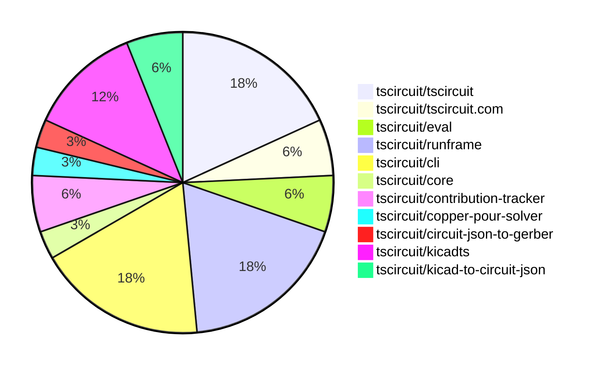
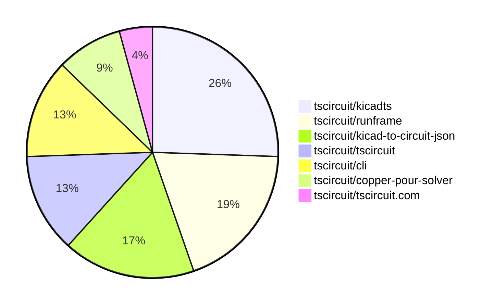

# Contribution Overview 2025-11-05

The current week is shown below. There are 4 major sections:

- [Contributor Overview](#contributor-overview)
- [PRs by Repository](#prs-by-repository)
- [PRs by Contributor](#changes-by-contributor)
- [Scoring & Sponsorship System](#scoring--sponsorship-system)

## PRs by Repository

## Contributor Overview

| Contributor | 🐳 Major | 🐙 Minor | 🐌 Tiny | ⭐ | Score | Discussion Contributions |
|-------------|---------|---------|---------|-----|----------------|--------------------------|
| [imrishabh18](#imrishabh18) | 4 | 2 | 0 | ⭐⭐ | 21 | 0🔹 0🔶 0💎 |
| [tscircuitbot](#tscircuitbot) | 0 | 0 | 19 | ⭐⭐ | 12 | 0🔹 0🔶 0💎 |
| [ShiboSoftwareDev](#ShiboSoftwareDev) | 1 | 1 | 0 | ⭐ | 8 | 0🔹 0🔶 0💎 |
| [Ayushjhawar8](#Ayushjhawar8) | 1 | 0 | 1 | ⭐ | 5 | 0🔹 0🔶 0💎 |
| [Asymtode712](#Asymtode712) | 0 | 1 | 0 |  | 2 | 0🔹 0🔶 0💎 |
| [RaghavArora14](#RaghavArora14) | 0 | 0 | 1 |  | 1 | 0🔹 0🔶 0💎 |
| [rushabhcodes](#rushabhcodes) | 0 | 0 | 1 |  | 1 | 0🔹 0🔶 0💎 |
| [ArnavK-09](#ArnavK-09) | 0 | 0 | 1 |  | 1 | 0🔹 0🔶 0💎 |

> Note: AI evaluates PRs and assigns 1-3 star ratings automatically. 4 and 5 star ratings require manual staff review.

### Discussion Contribution Legend

- 🔹 Normal Comments: Basic participation with minimal effort
- 🔶 Great Informative Comments: Thoughtful participation that adds value
- 💎 Incredible Comments: Exceptional participation with high-quality content

## Review Table

[reviews-received-hover]: ## "Number of reviews received for PRs for this contributor"
[approvals-received-hover]: ## "Number of approvals received for PRs this contributor authored"
[rejections-received-hover]: ## "Number of rejections received for PRs this contributor authored"
[prs-opened-hover]: ## "Number of PRs opened by this contributor"
[issues-created-hover]: ## "Number of issues created by this contributor"
[bountied-issues-hover]: ## "Number of issues this contributor created with a bounty"
[bountied-issue-$-hover]: ## "Total bounty amount placed on issues authored by this contributor"

| Contributor | Reviews Received | Approvals Received | Rejections Received | Approvals | Rejections | PRs Opened | PRs Merged | Score | Issues Created | Bountied Issues | Bountied Issue $ |
|---|---|---|---|---|---|---|---|---|---|---|---|
| [Quanta-Naut](#Quanta-Naut) | 2 | 0 | 1 | 0 | 0 | 1 | 0 | 0 | 0 | 0 | 0 |
| [imrishabh18](#imrishabh18) | 3 | 1 | 0 | 0 | 1 | 6 | 6 | 21 | 0 | 0 | 0 |
| [tscircuitbot](#tscircuitbot) | 0 | 0 | 0 | 0 | 0 | 23 | 19 | 12 | 0 | 0 | 0 |
| [Asymtode712](#Asymtode712) | 5 | 1 | 0 | 0 | 0 | 2 | 1 | 2 | 0 | 0 | 0 |
| [seveibar](#seveibar) | 0 | 0 | 0 | 6 | 0 | 0 | 0 | 0 | 0 | 0 | 0 |
| [techmannih](#techmannih) | 0 | 0 | 0 | 0 | 0 | 0 | 0 | 0 | 0 | 0 | 0 |
| [RaghavArora14](#RaghavArora14) | 1 | 1 | 0 | 0 | 0 | 1 | 1 | 1 | 0 | 0 | 0 |
| [ShiboSoftwareDev](#ShiboSoftwareDev) | 2 | 2 | 0 | 2 | 0 | 2 | 2 | 8 | 0 | 0 | 0 |
| [rushabhcodes](#rushabhcodes) | 1 | 1 | 0 | 0 | 0 | 1 | 1 | 1 | 0 | 0 | 0 |
| [ArnavK-09](#ArnavK-09) | 1 | 1 | 0 | 0 | 0 | 1 | 1 | 1 | 0 | 0 | 0 |
| [Ayushjhawar8](#Ayushjhawar8) | 4 | 1 | 0 | 0 | 0 | 2 | 2 | 5 | 0 | 0 | 0 |
| [nailoo](#nailoo) | 1 | 0 | 0 | 0 | 0 | 1 | 0 | 0 | 0 | 0 | 0 |

## Top 7 Repositories by Contribution Points

## Scoring & Sponsorship System

### Overview

PRs are analyzed by AI and assigned a **star rating (1-3 stars)**. 4 and 5 star ratings can only be manually assigned by staff. Weekly scores use `2^(starRating - 1)` per PR (capped at 12 PRs per rating), plus review/discussion points.

### Weekly Score → Star String

| Score Range | Star String | Count Value |
|------------|-------------|-------------|
| 0-3 | (empty) | 0 stars |
| 4-10 | ⭐ | 1 star |
| 11-30 | ⭐⭐ | 2 stars |
| 31-50 | ⭐⭐⭐ | 3 stars |
| 51-75 | 👑 | 1 crown |
| 76-100 | 👑👑 | 2 crowns |
| 101+ | 👑👑👑 | 3 crowns |

> Crowns count as 3 stars for sponsorship.

### Monthly Sponsorship Calculation

The sponsorship system calculates monthly payments based on your **weekly star counts** over the complete weeks in that month (typically 4-5 weeks, Wednesday-Tuesday format).

**Step 1: Collect Weekly Stars**
- All complete weeks in the month are analyzed
- Each week's star string is converted to a numeric count (⭐ = 1 star, ⭐⭐⭐ = 3 stars)
- Example: `[2, 2, 2, 1, 0]` means 2 stars in week 1, 2 stars in week 2, etc.

**Step 2: Calculate Metrics**
- **Median stars**: The median value of all weekly star counts
- **Min stars**: The minimum weekly star count
- **Max stars**: The maximum weekly star count
- **High score**: The maximum raw weekly score (0-100+ range from the scoring table) from any week in the month

**Step 3: Determine Base Amount**
The sponsorship amount is calculated based on these metrics (checked in order):

| Condition | Base Amount |
|-----------|-------------|
| `minStarCount >= 3` | **$500** |
| `medianStars >= 3` | **$450** |
| `medianStars >= 2.5` | **$300** |
| `medianStars >= 2` | **$200** |
| `medianStars >= 1.5` | **$100** |
| `medianStars >= 1` | **$75** |
| `maxStarCount >= 2` | **$25** |
| `maxStarCount >= 1` | **$15** |
| `highScore >= 3` (and all stars = 0) | **$5** |

| Maintainer Level | Monthly Bonus |
|------------------|---------------|
| Level 1 | **$200** |
| Level 2 | **$350** |
| Level 3 | **$500** |

**Final Amount** = Base Amount + Maintainer Bonus

## Changes by Repository

### [tscircuit/tscircuit](https://github.com/tscircuit/tscircuit)

🐌 Tiny Contributions (6)

| PR # | Impact | Contributor | Description |
|------|--------|-------------|-------------|
| [#1269](https://github.com/tscircuit/tscircuit/pull/1269) | 🐌 Tiny | tscircuitbot | Automated package update |
| [#1268](https://github.com/tscircuit/tscircuit/pull/1268) | 🐌 Tiny | tscircuitbot | Automated package update |
| [#1267](https://github.com/tscircuit/tscircuit/pull/1267) | 🐌 Tiny | tscircuitbot | Automated package update |
| [#1266](https://github.com/tscircuit/tscircuit/pull/1266) | 🐌 Tiny | tscircuitbot | Automated package update |
| [#1265](https://github.com/tscircuit/tscircuit/pull/1265) | 🐌 Tiny | tscircuitbot | Automated package update |
| [#1264](https://github.com/tscircuit/tscircuit/pull/1264) | 🐌 Tiny | tscircuitbot | Updates the tscircuitcli package from version 0.1.443 to 0.1.444 and the tscircuitrunframe package from version 0.0.1206 to 0.0.1207 in package.json |

### [tscircuit/tscircuit.com](https://github.com/tscircuit/tscircuit.com)

🐌 Tiny Contributions (2)

| PR # | Impact | Contributor | Description |
|------|--------|-------------|-------------|
| [#1951](https://github.com/tscircuit/tscircuit.com/pull/1951) | 🐌 Tiny | tscircuitbot | Updates the tscircuiteval package version from 0.0.451 to 0.0.452 |
| [#1952](https://github.com/tscircuit/tscircuit.com/pull/1952) | 🐌 Tiny | ArnavK-09 | Fixes the proxy URL used in the import dialog to ensure correct API calls are made. |

### [tscircuit/eval](https://github.com/tscircuit/eval)

🐌 Tiny Contributions (2)

| PR # | Impact | Contributor | Description |
|------|--------|-------------|-------------|
| [#1460](https://github.com/tscircuit/eval/pull/1460) | 🐌 Tiny | tscircuitbot | Automated package update |
| [#1459](https://github.com/tscircuit/eval/pull/1459) | 🐌 Tiny | tscircuitbot | Automated package update |

### [tscircuit/runframe](https://github.com/tscircuit/runframe)

| PR # | Impact | Rating | Contributor | Description |
|------|--------|--------|-------------|-------------|
| [#1673](https://github.com/tscircuit/runframe/pull/1673) | 🐳 Major | ⭐⭐⭐ | Ayushjhawar8 | Fixes the natural sorting of filenames in the file selector component to ensure proper order when displaying files. |

🐌 Tiny Contributions (5)

| PR # | Impact | Contributor | Description |
|------|--------|-------------|-------------|
| [#1683](https://github.com/tscircuit/runframe/pull/1683) | 🐌 Tiny | tscircuitbot | Updates the package version from 0.0.1208 to 0.0.1209 in package.json |
| [#1682](https://github.com/tscircuit/runframe/pull/1682) | 🐌 Tiny | tscircuitbot | Updates the tscircuiteval package to version 0.0.452 in the package.json file. |
| [#1681](https://github.com/tscircuit/runframe/pull/1681) | 🐌 Tiny | tscircuitbot | Automated package update |
| [#1680](https://github.com/tscircuit/runframe/pull/1680) | 🐌 Tiny | tscircuitbot | Updates the package version from 0.0.1206 to 0.0.1207 in package.json |
| [#1672](https://github.com/tscircuit/runframe/pull/1672) | 🐌 Tiny | Ayushjhawar8 | img width1021 height277 altimage srchttps:github.comuser-attachmentsassets4430e588-fc3e-4519-be92-f22a44b67fa2 |

### [tscircuit/cli](https://github.com/tscircuit/cli)

🐌 Tiny Contributions (6)

| PR # | Impact | Contributor | Description |
|------|--------|-------------|-------------|
| [#840](https://github.com/tscircuit/cli/pull/840) | 🐌 Tiny | tscircuitbot | Automated package update |
| [#839](https://github.com/tscircuit/cli/pull/839) | 🐌 Tiny | tscircuitbot | Updates the tscircuitrunframe package from version 0.0.1208 to 0.0.1209 |
| [#838](https://github.com/tscircuit/cli/pull/838) | 🐌 Tiny | tscircuitbot | Automated package update |
| [#837](https://github.com/tscircuit/cli/pull/837) | 🐌 Tiny | tscircuitbot | Automated package update |
| [#836](https://github.com/tscircuit/cli/pull/836) | 🐌 Tiny | tscircuitbot | Automated package update |
| [#835](https://github.com/tscircuit/cli/pull/835) | 🐌 Tiny | tscircuitbot | Updates the tscircuitrunframe package from version 0.0.1206 to 0.0.1207 |

### [tscircuit/core](https://github.com/tscircuit/core)

| PR # | Impact | Rating | Contributor | Description |
|------|--------|--------|-------------|-------------|
| [#1617](https://github.com/tscircuit/core/pull/1617) | 🐙 Minor | ⭐⭐ | Asymtode712 | Implements pcbStyle inheritance for kicad: footprints by passing the resolved pcbStyle to footprintLibraryMap functions, enabling override of silkscreen font size and other style properties. |

### [tscircuit/contribution-tracker](https://github.com/tscircuit/contribution-tracker)

🐌 Tiny Contributions (2)

| PR # | Impact | Contributor | Description |
|------|--------|-------------|-------------|
| [#259](https://github.com/tscircuit/contribution-tracker/pull/259) | 🐌 Tiny | RaghavArora14 | Adds GitHub username and Discord ID for user RaghavArora14 in users.json |
| [#258](https://github.com/tscircuit/contribution-tracker/pull/258) | 🐌 Tiny | rushabhcodes | Adds the Discord ID and GitHub username of the user rushabhcodes to the users.json file. |

### [tscircuit/copper-pour-solver](https://github.com/tscircuit/copper-pour-solver)

| PR # | Impact | Rating | Contributor | Description |
|------|--------|--------|-------------|-------------|
| [#2](https://github.com/tscircuit/copper-pour-solver/pull/2) | 🐳 Major | ⭐⭐⭐ | ShiboSoftwareDev | This pull request implements the core logic for the copper pour solver. It introduces a complete pipeline that takes a circuit-json input and generates B-Rep shapes for the copper pour regions. Key changes include: Copper Pour Solver Implementation: The CopperPourPipelineSolver is built out to process obstacles, perform boolean geometry operations using flatten-js, and generate final B-Rep shapes. Circuit JSON Conversion: A new function convertCircuitJsonToInputProblem is added to translate standard circuit-json elements (pads, traces, holes) into the solvers internal InputProblem format. Comprehensive Testing: A suite of snapshot tests has been added, rendering the output of the solver to SVG for multiple circuit configurations to visually validate the results. Type Definitions: Updated libtypes.ts to support various pad shapes (rect, circle, trace) and define the solvers input and output structures. Dependency Updates: Added flatten-jscore for geometric calculations and circuit-to-svg for test rendering. |

### [tscircuit/circuit-json-to-gerber](https://github.com/tscircuit/circuit-json-to-gerber)

| PR # | Impact | Rating | Contributor | Description |
|------|--------|--------|-------------|-------------|
| [#62](https://github.com/tscircuit/circuit-json-to-gerber/pull/62) | 🐙 Minor | ⭐⭐ | ShiboSoftwareDev | Adds a boolean property, covered_with_solder_mask, to copper pour elements, allowing for solder mask-free regions when set to false. |

### [tscircuit/kicadts](https://github.com/tscircuit/kicadts)

| PR # | Impact | Rating | Contributor | Description |
|------|--------|--------|-------------|-------------|
| [#18](https://github.com/tscircuit/kicadts/pull/18) | 🐳 Major | ⭐⭐⭐ | imrishabh18 | Add new classes for graphical elements: GrCircle, GrRect, and Group, including properties for locked state and UUID. |
| [#19](https://github.com/tscircuit/kicadts/pull/19) | 🐳 Major | ⭐⭐⭐ | imrishabh18 | Adds GrPoly class for polygon representation and enhances GrText class to support render_cache functionality. |
| [#20](https://github.com/tscircuit/kicadts/pull/20) | 🐙 Minor | ⭐⭐ | imrishabh18 | Adds support for the fill token in PadPrimitiveGrPoly, allowing it to accept a string value for fill properties. |
| [#21](https://github.com/tscircuit/kicadts/pull/21) | 🐙 Minor | ⭐⭐ | imrishabh18 | Adds graphicPolys and graphicRects to the KicadPcb type for enhanced graphical representation. |

### [tscircuit/kicad-to-circuit-json](https://github.com/tscircuit/kicad-to-circuit-json)

| PR # | Impact | Rating | Contributor | Description |
|------|--------|--------|-------------|-------------|
| [#20](https://github.com/tscircuit/kicad-to-circuit-json/pull/20) | 🐳 Major | ⭐⭐⭐ | imrishabh18 | This pull request introduces the ViaGridBoard feature, which processes filled rectangles on copper layers and creates corresponding SMT pads in the PCB design. It enhances the PCB graphics processing capabilities by adding support for gr_rect elements, ensuring that filled rectangles are correctly interpreted and represented in the output JSON format. Additionally, it updates the kicadts dependency to a newer version and includes new test snapshots and assets for the ViaGridBoard functionality. |
| [#21](https://github.com/tscircuit/kicad-to-circuit-json/pull/21) | 🐳 Major | ⭐⭐⭐ | imrishabh18 | Adds support for parsing filled polygons from KiCad and converting them into pcb_smtpad shapes in the Circuit JSON format. |

## Changes by Contributor

### [tscircuitbot](https://github.com/tscircuitbot)

🐌 Tiny Contributions (19)

| PR # | Impact | Description |
|------|--------|-------------|
| [#1269](https://github.com/tscircuit/tscircuit/pull/1269) | 🐌 Tiny | Automated package update |
| [#1268](https://github.com/tscircuit/tscircuit/pull/1268) | 🐌 Tiny | Automated package update |
| [#1267](https://github.com/tscircuit/tscircuit/pull/1267) | 🐌 Tiny | Automated package update |
| [#1266](https://github.com/tscircuit/tscircuit/pull/1266) | 🐌 Tiny | Automated package update |
| [#1265](https://github.com/tscircuit/tscircuit/pull/1265) | 🐌 Tiny | Automated package update |
| [#1264](https://github.com/tscircuit/tscircuit/pull/1264) | 🐌 Tiny | Updates the tscircuitcli package from version 0.1.443 to 0.1.444 and the tscircuitrunframe package from version 0.0.1206 to 0.0.1207 in package.json |
| [#1951](https://github.com/tscircuit/tscircuit.com/pull/1951) | 🐌 Tiny | Updates the tscircuiteval package version from 0.0.451 to 0.0.452 |
| [#1460](https://github.com/tscircuit/eval/pull/1460) | 🐌 Tiny | Automated package update |
| [#1459](https://github.com/tscircuit/eval/pull/1459) | 🐌 Tiny | Automated package update |
| [#1683](https://github.com/tscircuit/runframe/pull/1683) | 🐌 Tiny | Updates the package version from 0.0.1208 to 0.0.1209 in package.json |
| [#1682](https://github.com/tscircuit/runframe/pull/1682) | 🐌 Tiny | Updates the tscircuiteval package to version 0.0.452 in the package.json file. |
| [#1681](https://github.com/tscircuit/runframe/pull/1681) | 🐌 Tiny | Automated package update |
| [#1680](https://github.com/tscircuit/runframe/pull/1680) | 🐌 Tiny | Updates the package version from 0.0.1206 to 0.0.1207 in package.json |
| [#840](https://github.com/tscircuit/cli/pull/840) | 🐌 Tiny | Automated package update |
| [#839](https://github.com/tscircuit/cli/pull/839) | 🐌 Tiny | Updates the tscircuitrunframe package from version 0.0.1208 to 0.0.1209 |
| [#838](https://github.com/tscircuit/cli/pull/838) | 🐌 Tiny | Automated package update |
| [#837](https://github.com/tscircuit/cli/pull/837) | 🐌 Tiny | Automated package update |
| [#836](https://github.com/tscircuit/cli/pull/836) | 🐌 Tiny | Automated package update |
| [#835](https://github.com/tscircuit/cli/pull/835) | 🐌 Tiny | Updates the tscircuitrunframe package from version 0.0.1206 to 0.0.1207 |

### [Asymtode712](https://github.com/Asymtode712)

| PRs # | Impact | Rating | Description |
|------|--------|--------|-------------|
| [#1617](https://github.com/tscircuit/core/pull/1617) | 🐙 Minor | ⭐⭐ | Implements pcbStyle inheritance for kicad: footprints by passing the resolved pcbStyle to footprintLibraryMap functions, enabling override of silkscreen font size and other style properties. |

### [RaghavArora14](https://github.com/RaghavArora14)

🐌 Tiny Contributions (1)

| PR # | Impact | Description |
|------|--------|-------------|
| [#259](https://github.com/tscircuit/contribution-tracker/pull/259) | 🐌 Tiny | Adds GitHub username and Discord ID for user RaghavArora14 in users.json |

### [rushabhcodes](https://github.com/rushabhcodes)

🐌 Tiny Contributions (1)

| PR # | Impact | Description |
|------|--------|-------------|
| [#258](https://github.com/tscircuit/contribution-tracker/pull/258) | 🐌 Tiny | Adds the Discord ID and GitHub username of the user rushabhcodes to the users.json file. |

### [ShiboSoftwareDev](https://github.com/ShiboSoftwareDev)

| PRs # | Impact | Rating | Description |
|------|--------|--------|-------------|
| [#2](https://github.com/tscircuit/copper-pour-solver/pull/2) | 🐳 Major | ⭐⭐⭐ | This pull request implements the core logic for the copper pour solver. It introduces a complete pipeline that takes a circuit-json input and generates B-Rep shapes for the copper pour regions. Key changes include: Copper Pour Solver Implementation: The CopperPourPipelineSolver is built out to process obstacles, perform boolean geometry operations using flatten-js, and generate final B-Rep shapes. Circuit JSON Conversion: A new function convertCircuitJsonToInputProblem is added to translate standard circuit-json elements (pads, traces, holes) into the solvers internal InputProblem format. Comprehensive Testing: A suite of snapshot tests has been added, rendering the output of the solver to SVG for multiple circuit configurations to visually validate the results. Type Definitions: Updated libtypes.ts to support various pad shapes (rect, circle, trace) and define the solvers input and output structures. Dependency Updates: Added flatten-jscore for geometric calculations and circuit-to-svg for test rendering. |
| [#62](https://github.com/tscircuit/circuit-json-to-gerber/pull/62) | 🐙 Minor | ⭐⭐ | Adds a boolean property, covered_with_solder_mask, to copper pour elements, allowing for solder mask-free regions when set to false. |

### [ArnavK-09](https://github.com/ArnavK-09)

🐌 Tiny Contributions (1)

| PR # | Impact | Description |
|------|--------|-------------|
| [#1952](https://github.com/tscircuit/tscircuit.com/pull/1952) | 🐌 Tiny | Fixes the proxy URL used in the import dialog to ensure correct API calls are made. |

### [Ayushjhawar8](https://github.com/Ayushjhawar8)

| PRs # | Impact | Rating | Description |
|------|--------|--------|-------------|
| [#1673](https://github.com/tscircuit/runframe/pull/1673) | 🐳 Major | ⭐⭐⭐ | Fixes the natural sorting of filenames in the file selector component to ensure proper order when displaying files. |

🐌 Tiny Contributions (1)

| PR # | Impact | Description |
|------|--------|-------------|
| [#1672](https://github.com/tscircuit/runframe/pull/1672) | 🐌 Tiny | img width1021 height277 altimage srchttps:github.comuser-attachmentsassets4430e588-fc3e-4519-be92-f22a44b67fa2 |

### [imrishabh18](https://github.com/imrishabh18)

| PRs # | Impact | Rating | Description |
|------|--------|--------|-------------|
| [#18](https://github.com/tscircuit/kicadts/pull/18) | 🐳 Major | ⭐⭐⭐ | Add new classes for graphical elements: GrCircle, GrRect, and Group, including properties for locked state and UUID. |
| [#19](https://github.com/tscircuit/kicadts/pull/19) | 🐳 Major | ⭐⭐⭐ | Adds GrPoly class for polygon representation and enhances GrText class to support render_cache functionality. |
| [#20](https://github.com/tscircuit/kicad-to-circuit-json/pull/20) | 🐳 Major | ⭐⭐⭐ | This pull request introduces the ViaGridBoard feature, which processes filled rectangles on copper layers and creates corresponding SMT pads in the PCB design. It enhances the PCB graphics processing capabilities by adding support for gr_rect elements, ensuring that filled rectangles are correctly interpreted and represented in the output JSON format. Additionally, it updates the kicadts dependency to a newer version and includes new test snapshots and assets for the ViaGridBoard functionality. |
| [#21](https://github.com/tscircuit/kicad-to-circuit-json/pull/21) | 🐳 Major | ⭐⭐⭐ | Adds support for parsing filled polygons from KiCad and converting them into pcb_smtpad shapes in the Circuit JSON format. |
| [#20](https://github.com/tscircuit/kicadts/pull/20) | 🐙 Minor | ⭐⭐ | Adds support for the fill token in PadPrimitiveGrPoly, allowing it to accept a string value for fill properties. |
| [#21](https://github.com/tscircuit/kicadts/pull/21) | 🐙 Minor | ⭐⭐ | Adds graphicPolys and graphicRects to the KicadPcb type for enhanced graphical representation. |

## Repository Owners

| Repository | Codeowners |
|------------|------------|
| [builder](https://github.com/tscircuit/builder/blob/main/.github/CODEOWNERS) | [seveibar](https://github.com/seveibar)
| [pcb-viewer](https://github.com/tscircuit/pcb-viewer/blob/main/.github/CODEOWNERS) | [seveibar](https://github.com/seveibar), [ShiboSoftwareDev](https://github.com/ShiboSoftwareDev)
| [footprints-old](https://github.com/tscircuit/footprints-old/blob/main/.github/CODEOWNERS) | [seveibar](https://github.com/seveibar)
| [footprinter](https://github.com/tscircuit/footprinter/blob/main/.github/CODEOWNERS) | [seveibar](https://github.com/seveibar), [techmannih](https://github.com/techmannih)
| [3d-viewer](https://github.com/tscircuit/3d-viewer/blob/main/.github/CODEOWNERS) | [ShiboSoftwareDev](https://github.com/ShiboSoftwareDev)
| [winterspec](https://github.com/tscircuit/winterspec/blob/main/.github/CODEOWNERS) | [seveibar](https://github.com/seveibar), [ShiboSoftwareDev](https://github.com/ShiboSoftwareDev)
| [jscad-electronics](https://github.com/tscircuit/jscad-electronics/blob/main/.github/CODEOWNERS) | [seveibar](https://github.com/seveibar), [techmannih](https://github.com/techmannih), [ShiboSoftwareDev](https://github.com/ShiboSoftwareDev), [anas-sarkez](https://github.com/anas-sarkez)
| [circuit-to-svg](https://github.com/tscircuit/circuit-to-svg/blob/main/.github/CODEOWNERS) | [imrishabh18](https://github.com/imrishabh18)
| [schematic-symbols](https://github.com/tscircuit/schematic-symbols/blob/main/.github/CODEOWNERS) | [seveibar](https://github.com/seveibar), [imrishabh18](https://github.com/imrishabh18), [techmannih](https://github.com/techmannih)
| [circuit-json-to-gerber](https://github.com/tscircuit/circuit-json-to-gerber/blob/main/.github/CODEOWNERS) | [seveibar](https://github.com/seveibar), [ShiboSoftwareDev](https://github.com/ShiboSoftwareDev)
| [tscircuit.com](https://github.com/tscircuit/tscircuit.com/blob/main/.github/CODEOWNERS) | [seveibar](https://github.com/seveibar), [imrishabh18](https://github.com/imrishabh18)
| [issue-roulette](https://github.com/tscircuit/issue-roulette/blob/main/.github/CODEOWNERS) | [Anshgrover23](https://github.com/Anshgrover23)
| [sparkfun-boards](https://github.com/tscircuit/sparkfun-boards/blob/main/.github/CODEOWNERS) | [ShiboSoftwareDev](https://github.com/ShiboSoftwareDev), [Abse2001](https://github.com/Abse2001), [MustafaMulla29](https://github.com/MustafaMulla29), [Anshgrover23](https://github.com/Anshgrover23), [techmannih](https://github.com/techmannih)
| [schematic-corpus](https://github.com/tscircuit/schematic-corpus/blob/main/.github/CODEOWNERS) | [Abse2001](https://github.com/Abse2001)
| [common](https://github.com/tscircuit/common/blob/main/.github/CODEOWNERS) | [seveibar](https://github.com/seveibar), [Abse2001](https://github.com/Abse2001)

## Repositories by Owner

| User | Repo |
|------|------|
| [seveibar](https://github.com/seveibar) | [builder](https://github.com/tscircuit/builder/blob/main/.github/CODEOWNERS) |
|  | [pcb-viewer](https://github.com/tscircuit/pcb-viewer/blob/main/.github/CODEOWNERS) |
|  | [footprints-old](https://github.com/tscircuit/footprints-old/blob/main/.github/CODEOWNERS) |
|  | [footprinter](https://github.com/tscircuit/footprinter/blob/main/.github/CODEOWNERS) |
|  | [winterspec](https://github.com/tscircuit/winterspec/blob/main/.github/CODEOWNERS) |
|  | [jscad-electronics](https://github.com/tscircuit/jscad-electronics/blob/main/.github/CODEOWNERS) |
|  | [schematic-symbols](https://github.com/tscircuit/schematic-symbols/blob/main/.github/CODEOWNERS) |
|  | [circuit-json-to-gerber](https://github.com/tscircuit/circuit-json-to-gerber/blob/main/.github/CODEOWNERS) |
|  | [tscircuit.com](https://github.com/tscircuit/tscircuit.com/blob/main/.github/CODEOWNERS) |
|  | [common](https://github.com/tscircuit/common/blob/main/.github/CODEOWNERS) |
| [ShiboSoftwareDev](https://github.com/ShiboSoftwareDev) | [pcb-viewer](https://github.com/tscircuit/pcb-viewer/blob/main/.github/CODEOWNERS) |
|  | [3d-viewer](https://github.com/tscircuit/3d-viewer/blob/main/.github/CODEOWNERS) |
|  | [winterspec](https://github.com/tscircuit/winterspec/blob/main/.github/CODEOWNERS) |
|  | [jscad-electronics](https://github.com/tscircuit/jscad-electronics/blob/main/.github/CODEOWNERS) |
|  | [circuit-json-to-gerber](https://github.com/tscircuit/circuit-json-to-gerber/blob/main/.github/CODEOWNERS) |
|  | [sparkfun-boards](https://github.com/tscircuit/sparkfun-boards/blob/main/.github/CODEOWNERS) |
| [techmannih](https://github.com/techmannih) | [footprinter](https://github.com/tscircuit/footprinter/blob/main/.github/CODEOWNERS) |
|  | [jscad-electronics](https://github.com/tscircuit/jscad-electronics/blob/main/.github/CODEOWNERS) |
|  | [schematic-symbols](https://github.com/tscircuit/schematic-symbols/blob/main/.github/CODEOWNERS) |
|  | [sparkfun-boards](https://github.com/tscircuit/sparkfun-boards/blob/main/.github/CODEOWNERS) |
| [anas-sarkez](https://github.com/anas-sarkez) | [jscad-electronics](https://github.com/tscircuit/jscad-electronics/blob/main/.github/CODEOWNERS) |
| [imrishabh18](https://github.com/imrishabh18) | [circuit-to-svg](https://github.com/tscircuit/circuit-to-svg/blob/main/.github/CODEOWNERS) |
|  | [schematic-symbols](https://github.com/tscircuit/schematic-symbols/blob/main/.github/CODEOWNERS) |
|  | [tscircuit.com](https://github.com/tscircuit/tscircuit.com/blob/main/.github/CODEOWNERS) |
| [Anshgrover23](https://github.com/Anshgrover23) | [issue-roulette](https://github.com/tscircuit/issue-roulette/blob/main/.github/CODEOWNERS) |
|  | [sparkfun-boards](https://github.com/tscircuit/sparkfun-boards/blob/main/.github/CODEOWNERS) |
| [Abse2001](https://github.com/Abse2001) | [sparkfun-boards](https://github.com/tscircuit/sparkfun-boards/blob/main/.github/CODEOWNERS) |
|  | [schematic-corpus](https://github.com/tscircuit/schematic-corpus/blob/main/.github/CODEOWNERS) |
|  | [common](https://github.com/tscircuit/common/blob/main/.github/CODEOWNERS) |
| [MustafaMulla29](https://github.com/MustafaMulla29) | [sparkfun-boards](https://github.com/tscircuit/sparkfun-boards/blob/main/.github/CODEOWNERS) |

