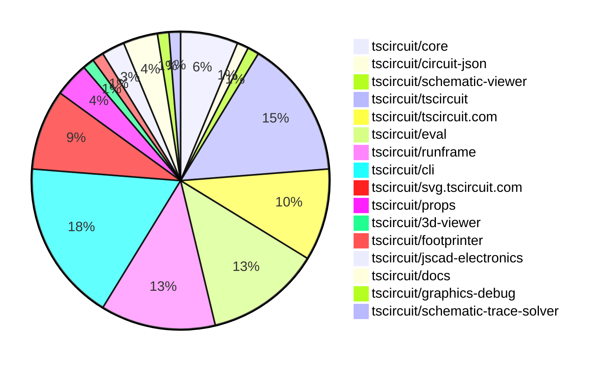
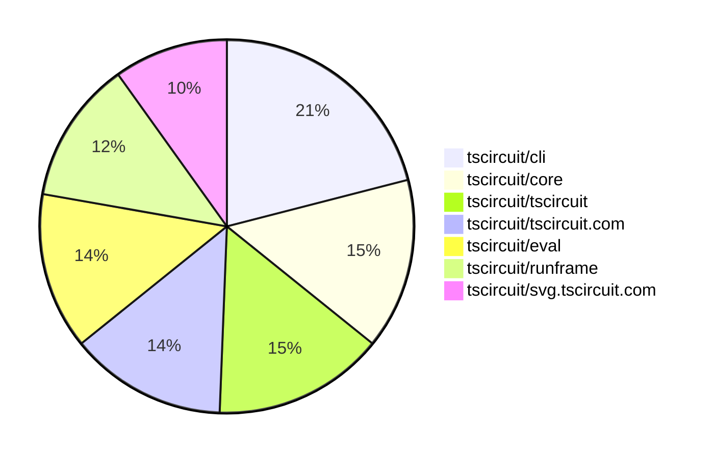

# Contribution Overview 2025-11-12

The current week is shown below. There are 4 major sections:

- [Contributor Overview](#contributor-overview)
- [PRs by Repository](#prs-by-repository)
- [PRs by Contributor](#changes-by-contributor)
- [Scoring & Sponsorship System](#scoring--sponsorship-system)

## PRs by Repository

## Contributor Overview

| Contributor | 🐳 Major | 🐙 Minor | 🐌 Tiny | ⭐ | Score | Discussion Contributions |
|-------------|---------|---------|---------|-----|----------------|--------------------------|
| [imrishabh18](#imrishabh18) | 1 | 4 | 5 | ⭐⭐ | 19 | 0🔹 0🔶 0💎 |
| [seveibar](#seveibar) | 1 | 2 | 1 | ⭐⭐ | 17 | 0🔹 0🔶 0💎 |
| [ShiboSoftwareDev](#ShiboSoftwareDev) | 0 | 3 | 2 | ⭐⭐ | 13 | 0🔹 0🔶 0💎 |
| [tscircuitbot](#tscircuitbot) | 0 | 0 | 51 | ⭐⭐ | 12 | 0🔹 0🔶 0💎 |
| [Ayushjhawar8](#Ayushjhawar8) | 1 | 1 | 1 | ⭐ | 8 | 0🔹 0🔶 0💎 |
| [0hmX](#0hmX) | 2 | 0 | 0 | ⭐ | 8 | 0🔹 0🔶 0💎 |
| [rushabhcodes](#rushabhcodes) | 0 | 0 | 3 | ⭐ | 5 | 0🔹 0🔶 0💎 |
| [pxlpal](#pxlpal) | 1 | 0 | 0 | ⭐ | 4 | 0🔹 0🔶 0💎 |
| [nailoo](#nailoo) | 0 | 0 | 1 |  | 1 | 0🔹 0🔶 0💎 |

> Note: AI evaluates PRs and assigns 1-3 star ratings automatically. 4 and 5 star ratings require manual staff review.

### Discussion Contribution Legend

- 🔹 Normal Comments: Basic participation with minimal effort
- 🔶 Great Informative Comments: Thoughtful participation that adds value
- 💎 Incredible Comments: Exceptional participation with high-quality content

## Review Table

[reviews-received-hover]: ## "Number of reviews received for PRs for this contributor"
[approvals-received-hover]: ## "Number of approvals received for PRs this contributor authored"
[rejections-received-hover]: ## "Number of rejections received for PRs this contributor authored"
[prs-opened-hover]: ## "Number of PRs opened by this contributor"
[issues-created-hover]: ## "Number of issues created by this contributor"
[bountied-issues-hover]: ## "Number of issues this contributor created with a bounty"
[bountied-issue-$-hover]: ## "Total bounty amount placed on issues authored by this contributor"

| Contributor | Reviews Received | Approvals Received | Rejections Received | Approvals | Rejections | PRs Opened | PRs Merged | Score | Issues Created | Bountied Issues | Bountied Issue $ |
|---|---|---|---|---|---|---|---|---|---|---|---|
| [Ayushjhawar8](#Ayushjhawar8) | 24 | 2 | 1 | 0 | 0 | 5 | 3 | 8 | 0 | 0 | 0 |
| [techmannih](#techmannih) | 3 | 0 | 0 | 0 | 1 | 5 | 0 | 0 | 0 | 0 | 0 |
| [tscircuitbot](#tscircuitbot) | 0 | 0 | 0 | 0 | 0 | 62 | 51 | 12 | 0 | 0 | 0 |
| [imrishabh18](#imrishabh18) | 9 | 3 | 0 | 1 | 0 | 12 | 10 | 19 | 0 | 0 | 0 |
| [seveibar](#seveibar) | 3 | 0 | 0 | 13 | 2 | 8 | 4 | 17 | 0 | 0 | 0 |
| [rushabhcodes](#rushabhcodes) | 11 | 5 | 1 | 1 | 1 | 6 | 3 | 5 | 0 | 0 | 0 |
| [ShiboSoftwareDev](#ShiboSoftwareDev) | 5 | 5 | 0 | 4 | 0 | 6 | 5 | 13 | 0 | 0 | 0 |
| [RaghavArora14](#RaghavArora14) | 3 | 1 | 0 | 0 | 0 | 1 | 0 | 0 | 0 | 0 | 0 |
| [Dasdebsankar54](#Dasdebsankar54) | 3 | 0 | 1 | 0 | 0 | 1 | 0 | 0 | 0 | 0 | 0 |
| [ArnavK-09](#ArnavK-09) | 0 | 0 | 0 | 0 | 0 | 1 | 0 | 0 | 0 | 0 | 0 |
| [pxlpal](#pxlpal) | 1 | 1 | 0 | 0 | 0 | 1 | 1 | 4 | 0 | 0 | 0 |
| [0hmX](#0hmX) | 10 | 2 | 1 | 0 | 0 | 6 | 2 | 8 | 0 | 0 | 0 |
| [nailoo](#nailoo) | 0 | 0 | 0 | 0 | 0 | 1 | 1 | 1 | 0 | 0 | 0 |
| [Abse2001](#Abse2001) | 1 | 0 | 0 | 1 | 1 | 1 | 0 | 0 | 0 | 0 | 0 |
| [MustafaMulla29](#MustafaMulla29) | 0 | 0 | 0 | 0 | 0 | 0 | 0 | 0 | 0 | 0 | 0 |
| [Kunal-Darekar](#Kunal-Darekar) | 0 | 0 | 0 | 0 | 0 | 1 | 0 | 0 | 0 | 0 | 0 |
| [Enity300](#Enity300) | 2 | 1 | 1 | 0 | 0 | 1 | 0 | 0 | 0 | 0 | 0 |

## Top 7 Repositories by Contribution Points

## Scoring & Sponsorship System

### Overview

PRs are analyzed by AI and assigned a **star rating (1-3 stars)**. 4 and 5 star ratings can only be manually assigned by staff. Weekly scores use `2^(starRating - 1)` per PR (capped at 12 PRs per rating), plus review/discussion points.

### Weekly Score → Star String

| Score Range | Star String | Count Value |
|------------|-------------|-------------|
| 0-3 | (empty) | 0 stars |
| 4-10 | ⭐ | 1 star |
| 11-30 | ⭐⭐ | 2 stars |
| 31-50 | ⭐⭐⭐ | 3 stars |
| 51-75 | 👑 | 1 crown |
| 76-100 | 👑👑 | 2 crowns |
| 101+ | 👑👑👑 | 3 crowns |

> Crowns count as 3 stars for sponsorship.

### Monthly Sponsorship Calculation

The sponsorship system calculates monthly payments based on your **weekly star counts** over the complete weeks in that month (typically 4-5 weeks, Wednesday-Tuesday format).

**Step 1: Collect Weekly Stars**
- All complete weeks in the month are analyzed
- Each week's star string is converted to a numeric count (⭐ = 1 star, ⭐⭐⭐ = 3 stars)
- Example: `[2, 2, 2, 1, 0]` means 2 stars in week 1, 2 stars in week 2, etc.

**Step 2: Calculate Metrics**
- **Median stars**: The median value of all weekly star counts
- **Min stars**: The minimum weekly star count
- **Max stars**: The maximum weekly star count
- **High score**: The maximum raw weekly score (0-100+ range from the scoring table) from any week in the month

**Step 3: Determine Base Amount**
The sponsorship amount is calculated based on these metrics (checked in order):

| Condition | Base Amount |
|-----------|-------------|
| `minStarCount >= 3` | **$500** |
| `medianStars >= 3` | **$450** |
| `medianStars >= 2.5` | **$300** |
| `medianStars >= 2` | **$200** |
| `medianStars >= 1.5` | **$100** |
| `medianStars >= 1` | **$75** |
| `maxStarCount >= 2` | **$25** |
| `maxStarCount >= 1` | **$15** |
| `highScore >= 3` (and all stars = 0) | **$5** |

| Maintainer Level | Monthly Bonus |
|------------------|---------------|
| Level 1 | **$200** |
| Level 2 | **$350** |
| Level 3 | **$500** |

**Final Amount** = Base Amount + Maintainer Bonus

## Changes by Repository

### [tscircuit/core](https://github.com/tscircuit/core)

| PR # | Impact | Rating | Contributor | Description |
|------|--------|--------|-------------|-------------|
| [#1650](https://github.com/tscircuit/core/pull/1650) | 🐳 Major | ⭐⭐⭐ | Ayushjhawar8 | Adds pcb_panel records with width, height, center, and solder mask coverage info, and upgrades circuit-json to v0.0.307. |
| [#1652](https://github.com/tscircuit/core/pull/1652) | 🐙 Minor | ⭐⭐ | seveibar | Fixes SmtPad rendering issue when port hints are omitted by defaulting to an empty hint list and adds regression tests for this functionality. |
| [#1651](https://github.com/tscircuit/core/pull/1651) | 🐙 Minor | ⭐⭐ | ShiboSoftwareDev | Adds support for inflating diode components when defined within a circuitJson property of a subcircuit. |
| [#1649](https://github.com/tscircuit/core/pull/1649) | 🐙 Minor | ⭐⭐ | ShiboSoftwareDev | Adds support for inflating inductor components when defined within a circuitJson property of a subcircuit. |
| [#1648](https://github.com/tscircuit/core/pull/1648) | 🐙 Minor | ⭐⭐ | ShiboSoftwareDev | Adds support for inflating capacitor components from circuitJson when used in a subcircuit |

### [tscircuit/circuit-json](https://github.com/tscircuit/circuit-json)

| PR # | Impact | Rating | Contributor | Description |
|------|--------|--------|-------------|-------------|
| [#344](https://github.com/tscircuit/circuit-json/pull/344) | 🐙 Minor | ⭐⭐ | Ayushjhawar8 | Adds a required center point to the pcb_panel schema and TypeScript interface, and updates tests to include the center position. |

### [tscircuit/schematic-viewer](https://github.com/tscircuit/schematic-viewer)

🐌 Tiny Contributions (1)

| PR # | Impact | Contributor | Description |
|------|--------|-------------|-------------|
| [#146](https://github.com/tscircuit/schematic-viewer/pull/146) | 🐌 Tiny | Ayushjhawar8 | Add descriptive tooltips to the schematic viewers control icons to explain their actions |

### [tscircuit/tscircuit](https://github.com/tscircuit/tscircuit)

🐌 Tiny Contributions (12)

| PR # | Impact | Contributor | Description |
|------|--------|-------------|-------------|
| [#1333](https://github.com/tscircuit/tscircuit/pull/1333) | 🐌 Tiny | tscircuitbot | Automated package update |
| [#1332](https://github.com/tscircuit/tscircuit/pull/1332) | 🐌 Tiny | tscircuitbot | Automated package update |
| [#1331](https://github.com/tscircuit/tscircuit/pull/1331) | 🐌 Tiny | tscircuitbot | Automated package update |
| [#1328](https://github.com/tscircuit/tscircuit/pull/1328) | 🐌 Tiny | tscircuitbot | Automated package update |
| [#1327](https://github.com/tscircuit/tscircuit/pull/1327) | 🐌 Tiny | tscircuitbot | Updates the tscircuitcli package to version 0.1.485 in the package.json file. |
| [#1326](https://github.com/tscircuit/tscircuit/pull/1326) | 🐌 Tiny | tscircuitbot | Automated package update |
| [#1325](https://github.com/tscircuit/tscircuit/pull/1325) | 🐌 Tiny | tscircuitbot | Automated package update |
| [#1324](https://github.com/tscircuit/tscircuit/pull/1324) | 🐌 Tiny | tscircuitbot | Automated package update |
| [#1323](https://github.com/tscircuit/tscircuit/pull/1323) | 🐌 Tiny | tscircuitbot | Automated package update |
| [#1322](https://github.com/tscircuit/tscircuit/pull/1322) | 🐌 Tiny | tscircuitbot | Automated package update |
| [#1321](https://github.com/tscircuit/tscircuit/pull/1321) | 🐌 Tiny | tscircuitbot | Updates the tscircuitcli and tscircuiteval packages to their latest versions as part of routine maintenance. |
| [#1330](https://github.com/tscircuit/tscircuit/pull/1330) | 🐌 Tiny | imrishabh18 | Updates the versions of the tscircuitcli and tscircuiteval dependencies in package.json |

### [tscircuit/tscircuit.com](https://github.com/tscircuit/tscircuit.com)

| PR # | Impact | Rating | Contributor | Description |
|------|--------|--------|-------------|-------------|
| [#1992](https://github.com/tscircuit/tscircuit.com/pull/1992) | 🐳 Major | ⭐⭐⭐ | pxlpal | Adds support for updating the user handle and implements a redirect after authentication if the handle is not set. |

🐌 Tiny Contributions (7)

| PR # | Impact | Contributor | Description |
|------|--------|-------------|-------------|
| [#1994](https://github.com/tscircuit/tscircuit.com/pull/1994) | 🐌 Tiny | tscircuitbot | Updates the tscircuiteval package from version 0.0.470 to 0.0.471 |
| [#1993](https://github.com/tscircuit/tscircuit.com/pull/1993) | 🐌 Tiny | tscircuitbot | Updates the tscircuiteval package to version 0.0.470 in package.json |
| [#1990](https://github.com/tscircuit/tscircuit.com/pull/1990) | 🐌 Tiny | tscircuitbot | Automated package update |
| [#1988](https://github.com/tscircuit/tscircuit.com/pull/1988) | 🐌 Tiny | tscircuitbot | Automated package update |
| [#1987](https://github.com/tscircuit/tscircuit.com/pull/1987) | 🐌 Tiny | tscircuitbot | Automated package update |
| [#1991](https://github.com/tscircuit/tscircuit.com/pull/1991) | 🐌 Tiny | imrishabh18 | Removes the build step status list from the releases sidebar on the package view page and eliminates the transpilation and circuit JSON build status helpers that fed the sidebar list. |
| [#1981](https://github.com/tscircuit/tscircuit.com/pull/1981) | 🐌 Tiny | imrishabh18 | Removes the logs section for transpilation, circuit JSON build, and image generation from the package release overview, retaining only user code logs. |

### [tscircuit/eval](https://github.com/tscircuit/eval)

| PR # | Impact | Rating | Contributor | Description |
|------|--------|--------|-------------|-------------|
| [#1495](https://github.com/tscircuit/eval/pull/1495) | 🐙 Minor | ⭐⭐ | imrishabh18 | Add support for importing kicad_pcb files directly into the circuit simulation environment, enabling users to utilize KiCad PCB designs seamlessly. |

🐌 Tiny Contributions (9)

| PR # | Impact | Contributor | Description |
|------|--------|-------------|-------------|
| [#1515](https://github.com/tscircuit/eval/pull/1515) | 🐌 Tiny | tscircuitbot | Automated package update |
| [#1514](https://github.com/tscircuit/eval/pull/1514) | 🐌 Tiny | tscircuitbot | Automated package update |
| [#1511](https://github.com/tscircuit/eval/pull/1511) | 🐌 Tiny | tscircuitbot | Automated package update |
| [#1510](https://github.com/tscircuit/eval/pull/1510) | 🐌 Tiny | tscircuitbot | Automated package update |
| [#1508](https://github.com/tscircuit/eval/pull/1508) | 🐌 Tiny | tscircuitbot | Updates the package version from 0.0.468 to 0.0.469 in package.json |
| [#1507](https://github.com/tscircuit/eval/pull/1507) | 🐌 Tiny | tscircuitbot | Automated package update |
| [#1506](https://github.com/tscircuit/eval/pull/1506) | 🐌 Tiny | tscircuitbot | Updates the version of the tscircuitcore package from 0.0.860 to 0.0.861 in package.json |
| [#1504](https://github.com/tscircuit/eval/pull/1504) | 🐌 Tiny | tscircuitbot | Automated package update |
| [#1503](https://github.com/tscircuit/eval/pull/1503) | 🐌 Tiny | tscircuitbot | Updates the version of the tscircuitcore package from 0.0.859 to 0.0.860 in package.json |

### [tscircuit/runframe](https://github.com/tscircuit/runframe)

🐌 Tiny Contributions (10)

| PR # | Impact | Contributor | Description |
|------|--------|-------------|-------------|
| [#1767](https://github.com/tscircuit/runframe/pull/1767) | 🐌 Tiny | tscircuitbot | Automated package update |
| [#1766](https://github.com/tscircuit/runframe/pull/1766) | 🐌 Tiny | tscircuitbot | Updates the tscircuit3d-viewer package to version 0.0.435 in package.json |
| [#1763](https://github.com/tscircuit/runframe/pull/1763) | 🐌 Tiny | tscircuitbot | Updates the package version from 0.0.1246 to 0.0.1247 in package.json |
| [#1762](https://github.com/tscircuit/runframe/pull/1762) | 🐌 Tiny | tscircuitbot | Updates the tscircuiteval package to version 0.0.468 in the package.json file. |
| [#1761](https://github.com/tscircuit/runframe/pull/1761) | 🐌 Tiny | tscircuitbot | Automated package update |
| [#1760](https://github.com/tscircuit/runframe/pull/1760) | 🐌 Tiny | tscircuitbot | Updates the tscircuiteval package to version 0.0.467 in the package.json file. |
| [#1759](https://github.com/tscircuit/runframe/pull/1759) | 🐌 Tiny | tscircuitbot | Updates the package version from 0.0.1244 to 0.0.1245 in package.json |
| [#1758](https://github.com/tscircuit/runframe/pull/1758) | 🐌 Tiny | tscircuitbot | Updates the tscircuitschematic-viewer package from version 2.0.48 to 2.0.49 |
| [#1756](https://github.com/tscircuit/runframe/pull/1756) | 🐌 Tiny | tscircuitbot | Automated package update |
| [#1755](https://github.com/tscircuit/runframe/pull/1755) | 🐌 Tiny | seveibar | Updates the circuit-json-to-kicad dependency to version 0.0.25 and refreshes the lockfile to track the new version. |

### [tscircuit/cli](https://github.com/tscircuit/cli)

| PR # | Impact | Rating | Contributor | Description |
|------|--------|--------|-------------|-------------|
| [#923](https://github.com/tscircuit/cli/pull/923) | 🐳 Major | ⭐⭐⭐ | imrishabh18 | Adds support for the tsci install command to install project dependencies and generate a package.json file if needed. |

🐌 Tiny Contributions (13)

| PR # | Impact | Contributor | Description |
|------|--------|-------------|-------------|
| [#932](https://github.com/tscircuit/cli/pull/932) | 🐌 Tiny | tscircuitbot | Automated package update |
| [#931](https://github.com/tscircuit/cli/pull/931) | 🐌 Tiny | tscircuitbot | Updates the tscircuitrunframe package to version 0.0.1248 in package.json |
| [#930](https://github.com/tscircuit/cli/pull/930) | 🐌 Tiny | tscircuitbot | Automated package update |
| [#928](https://github.com/tscircuit/cli/pull/928) | 🐌 Tiny | tscircuitbot | Automated package update |
| [#927](https://github.com/tscircuit/cli/pull/927) | 🐌 Tiny | tscircuitbot | Automated package update |
| [#926](https://github.com/tscircuit/cli/pull/926) | 🐌 Tiny | tscircuitbot | Updates the tscircuitrunframe package from version 0.0.1246 to 0.0.1247 |
| [#925](https://github.com/tscircuit/cli/pull/925) | 🐌 Tiny | tscircuitbot | Automated package update |
| [#924](https://github.com/tscircuit/cli/pull/924) | 🐌 Tiny | tscircuitbot | Automated package update |
| [#922](https://github.com/tscircuit/cli/pull/922) | 🐌 Tiny | tscircuitbot | Automated package update |
| [#921](https://github.com/tscircuit/cli/pull/921) | 🐌 Tiny | tscircuitbot | Updates the tscircuitrunframe package to version 0.0.1245 in package.json |
| [#920](https://github.com/tscircuit/cli/pull/920) | 🐌 Tiny | tscircuitbot | Automated package update |
| [#919](https://github.com/tscircuit/cli/pull/919) | 🐌 Tiny | tscircuitbot | Updates the tscircuitrunframe package from version 0.0.1242 to 0.0.1244 |
| [#929](https://github.com/tscircuit/cli/pull/929) | 🐌 Tiny | imrishabh18 | Adds tscircuit as a development dependency in package.json to facilitate development processes. |

### [tscircuit/svg.tscircuit.com](https://github.com/tscircuit/svg.tscircuit.com)

| PR # | Impact | Rating | Contributor | Description |
|------|--------|--------|-------------|-------------|
| [#580](https://github.com/tscircuit/svg.tscircuit.com/pull/580) | 🐙 Minor | ⭐⭐ | imrishabh18 | Adds an offset y position to the infinite grid rendering functionality, improving the accuracy of the grid display in 3D views. |

🐌 Tiny Contributions (6)

| PR # | Impact | Contributor | Description |
|------|--------|-------------|-------------|
| [#585](https://github.com/tscircuit/svg.tscircuit.com/pull/585) | 🐌 Tiny | tscircuitbot | Automated package update |
| [#584](https://github.com/tscircuit/svg.tscircuit.com/pull/584) | 🐌 Tiny | tscircuitbot | Updates the tscircuit package version from 0.0.893 to 0.0.895 in package.json |
| [#583](https://github.com/tscircuit/svg.tscircuit.com/pull/583) | 🐌 Tiny | tscircuitbot | Updates the tscircuit package version from 0.0.892 to 0.0.893 in package.json |
| [#582](https://github.com/tscircuit/svg.tscircuit.com/pull/582) | 🐌 Tiny | tscircuitbot | Updates the tscircuit package version from 0.0.891 to 0.0.892 in package.json |
| [#581](https://github.com/tscircuit/svg.tscircuit.com/pull/581) | 🐌 Tiny | tscircuitbot | Updates the tscircuit package version from 0.0.890 to 0.0.891 in package.json |
| [#579](https://github.com/tscircuit/svg.tscircuit.com/pull/579) | 🐌 Tiny | imrishabh18 | Updates the circuit-json-to-gltf package to version 0.0.37, fixing the overlapping infinite grid issue. |

### [tscircuit/props](https://github.com/tscircuit/props)

| PR # | Impact | Rating | Contributor | Description |
|------|--------|--------|-------------|-------------|
| [#495](https://github.com/tscircuit/props/pull/495) | 🐙 Minor | ⭐⭐ | imrishabh18 | Adds a new property nodeModulesResolver to the PlatformConfig interface, allowing for custom resolution of module paths. |
| [#496](https://github.com/tscircuit/props/pull/496) | 🐙 Minor | ⭐⭐ | imrishabh18 | Changes the return type of nodeModulesResolver to allow null when modules are not found, improving error handling. |
| [#494](https://github.com/tscircuit/props/pull/494) | 🐙 Minor | ⭐⭐ | seveibar | Adds an optional circuitJson property to the footprint  component API and schema, allowing for serialized circuit JSON describing a precompiled footprint. |

### [tscircuit/3d-viewer](https://github.com/tscircuit/3d-viewer)

| PR # | Impact | Rating | Contributor | Description |
|------|--------|--------|-------------|-------------|
| [#569](https://github.com/tscircuit/3d-viewer/pull/569) | 🐳 Major | ⭐⭐⭐ | seveibar | This pull request introduces an orthogonal camera option to the 3D viewer and refactors the camera controller to use a context-based approach. It includes updates to the CadViewer, CadViewerContainer, and related components to support the new camera type and improve the overall camera management system. |

### [tscircuit/footprinter](https://github.com/tscircuit/footprinter)

🐌 Tiny Contributions (1)

| PR # | Impact | Contributor | Description |
|------|--------|-------------|-------------|
| [#418](https://github.com/tscircuit/footprinter/pull/418) | 🐌 Tiny | rushabhcodes | Updates the SOT-363 footprint parameters to better match reference design and adds a test for visual parity with KiCads footprint using SVG comparisons. |

### [tscircuit/jscad-electronics](https://github.com/tscircuit/jscad-electronics)

🐌 Tiny Contributions (2)

| PR # | Impact | Contributor | Description |
|------|--------|-------------|-------------|
| [#214](https://github.com/tscircuit/jscad-electronics/pull/214) | 🐌 Tiny | rushabhcodes | Adds support for the TO92 package to the 3D footprint rendering library, including implementation of the TO92 component, integration into the footprint renderer, and addition of an example and snapshot test. |
| [#219](https://github.com/tscircuit/jscad-electronics/pull/219) | 🐌 Tiny | rushabhcodes | Adds support for the SOT-363 surface-mount package to the 3D footprint rendering system, including a new component, integration into rendering logic, and tests for visual regression. |

### [tscircuit/docs](https://github.com/tscircuit/docs)

🐌 Tiny Contributions (3)

| PR # | Impact | Contributor | Description |
|------|--------|-------------|-------------|
| [#326](https://github.com/tscircuit/docs/pull/326) | 🐌 Tiny | ShiboSoftwareDev | Refactors the SPICE simulation documentation by moving it from the Advanced section to a new, dedicated SPICE Simulation category within the Guides, splitting the content into separate files for better organization and direct linking. |
| [#325](https://github.com/tscircuit/docs/pull/325) | 🐌 Tiny | ShiboSoftwareDev | Adds an RC charging circuit example to the SPICE simulation documentation and clarifies the default spice engine used in the documentation. |
| [#324](https://github.com/tscircuit/docs/pull/324) | 🐌 Tiny | nailoo | Fixes the documentation for the Manufacturer Part Number by correcting the PCB and 3D view representation. |

### [tscircuit/graphics-debug](https://github.com/tscircuit/graphics-debug)

| PR # | Impact | Rating | Contributor | Description |
|------|--------|--------|-------------|-------------|
| [#80](https://github.com/tscircuit/graphics-debug/pull/80) | 🐳 Major | ⭐⭐⭐ | 0hmX | Add support for rendering arrows in the graphics library, including properties for start and end points, color, and optional double-sided heads. |

### [tscircuit/schematic-trace-solver](https://github.com/tscircuit/schematic-trace-solver)

| PR # | Impact | Rating | Contributor | Description |
|------|--------|--------|-------------|-------------|
| [#97](https://github.com/tscircuit/schematic-trace-solver/pull/97) | 🐳 Major | ⭐⭐⭐ | 0hmX | Fixes the issue of trace looping in schematic trace routing by implementing a two-phase overlap avoidance strategy. |

## Changes by Contributor

### [Ayushjhawar8](https://github.com/Ayushjhawar8)

| PRs # | Impact | Rating | Description |
|------|--------|--------|-------------|
| [#1650](https://github.com/tscircuit/core/pull/1650) | 🐳 Major | ⭐⭐⭐ | Adds pcb_panel records with width, height, center, and solder mask coverage info, and upgrades circuit-json to v0.0.307. |
| [#344](https://github.com/tscircuit/circuit-json/pull/344) | 🐙 Minor | ⭐⭐ | Adds a required center point to the pcb_panel schema and TypeScript interface, and updates tests to include the center position. |

🐌 Tiny Contributions (1)

| PR # | Impact | Description |
|------|--------|-------------|
| [#146](https://github.com/tscircuit/schematic-viewer/pull/146) | 🐌 Tiny | Add descriptive tooltips to the schematic viewers control icons to explain their actions |

### [tscircuitbot](https://github.com/tscircuitbot)

🐌 Tiny Contributions (51)

| PR # | Impact | Description |
|------|--------|-------------|
| [#1333](https://github.com/tscircuit/tscircuit/pull/1333) | 🐌 Tiny | Automated package update |
| [#1332](https://github.com/tscircuit/tscircuit/pull/1332) | 🐌 Tiny | Automated package update |
| [#1331](https://github.com/tscircuit/tscircuit/pull/1331) | 🐌 Tiny | Automated package update |
| [#1328](https://github.com/tscircuit/tscircuit/pull/1328) | 🐌 Tiny | Automated package update |
| [#1327](https://github.com/tscircuit/tscircuit/pull/1327) | 🐌 Tiny | Updates the tscircuitcli package to version 0.1.485 in the package.json file. |
| [#1326](https://github.com/tscircuit/tscircuit/pull/1326) | 🐌 Tiny | Automated package update |
| [#1325](https://github.com/tscircuit/tscircuit/pull/1325) | 🐌 Tiny | Automated package update |
| [#1324](https://github.com/tscircuit/tscircuit/pull/1324) | 🐌 Tiny | Automated package update |
| [#1323](https://github.com/tscircuit/tscircuit/pull/1323) | 🐌 Tiny | Automated package update |
| [#1322](https://github.com/tscircuit/tscircuit/pull/1322) | 🐌 Tiny | Automated package update |
| [#1321](https://github.com/tscircuit/tscircuit/pull/1321) | 🐌 Tiny | Updates the tscircuitcli and tscircuiteval packages to their latest versions as part of routine maintenance. |
| [#1994](https://github.com/tscircuit/tscircuit.com/pull/1994) | 🐌 Tiny | Updates the tscircuiteval package from version 0.0.470 to 0.0.471 |
| [#1993](https://github.com/tscircuit/tscircuit.com/pull/1993) | 🐌 Tiny | Updates the tscircuiteval package to version 0.0.470 in package.json |
| [#1990](https://github.com/tscircuit/tscircuit.com/pull/1990) | 🐌 Tiny | Automated package update |
| [#1988](https://github.com/tscircuit/tscircuit.com/pull/1988) | 🐌 Tiny | Automated package update |
| [#1987](https://github.com/tscircuit/tscircuit.com/pull/1987) | 🐌 Tiny | Automated package update |
| [#1515](https://github.com/tscircuit/eval/pull/1515) | 🐌 Tiny | Automated package update |
| [#1514](https://github.com/tscircuit/eval/pull/1514) | 🐌 Tiny | Automated package update |
| [#1511](https://github.com/tscircuit/eval/pull/1511) | 🐌 Tiny | Automated package update |
| [#1510](https://github.com/tscircuit/eval/pull/1510) | 🐌 Tiny | Automated package update |
| [#1508](https://github.com/tscircuit/eval/pull/1508) | 🐌 Tiny | Updates the package version from 0.0.468 to 0.0.469 in package.json |
| [#1507](https://github.com/tscircuit/eval/pull/1507) | 🐌 Tiny | Automated package update |
| [#1506](https://github.com/tscircuit/eval/pull/1506) | 🐌 Tiny | Updates the version of the tscircuitcore package from 0.0.860 to 0.0.861 in package.json |
| [#1504](https://github.com/tscircuit/eval/pull/1504) | 🐌 Tiny | Automated package update |
| [#1503](https://github.com/tscircuit/eval/pull/1503) | 🐌 Tiny | Updates the version of the tscircuitcore package from 0.0.859 to 0.0.860 in package.json |
| [#1767](https://github.com/tscircuit/runframe/pull/1767) | 🐌 Tiny | Automated package update |
| [#1766](https://github.com/tscircuit/runframe/pull/1766) | 🐌 Tiny | Updates the tscircuit3d-viewer package to version 0.0.435 in package.json |
| [#1763](https://github.com/tscircuit/runframe/pull/1763) | 🐌 Tiny | Updates the package version from 0.0.1246 to 0.0.1247 in package.json |
| [#1762](https://github.com/tscircuit/runframe/pull/1762) | 🐌 Tiny | Updates the tscircuiteval package to version 0.0.468 in the package.json file. |
| [#1761](https://github.com/tscircuit/runframe/pull/1761) | 🐌 Tiny | Automated package update |
| [#1760](https://github.com/tscircuit/runframe/pull/1760) | 🐌 Tiny | Updates the tscircuiteval package to version 0.0.467 in the package.json file. |
| [#1759](https://github.com/tscircuit/runframe/pull/1759) | 🐌 Tiny | Updates the package version from 0.0.1244 to 0.0.1245 in package.json |
| [#1758](https://github.com/tscircuit/runframe/pull/1758) | 🐌 Tiny | Updates the tscircuitschematic-viewer package from version 2.0.48 to 2.0.49 |
| [#1756](https://github.com/tscircuit/runframe/pull/1756) | 🐌 Tiny | Automated package update |
| [#932](https://github.com/tscircuit/cli/pull/932) | 🐌 Tiny | Automated package update |
| [#931](https://github.com/tscircuit/cli/pull/931) | 🐌 Tiny | Updates the tscircuitrunframe package to version 0.0.1248 in package.json |
| [#930](https://github.com/tscircuit/cli/pull/930) | 🐌 Tiny | Automated package update |
| [#928](https://github.com/tscircuit/cli/pull/928) | 🐌 Tiny | Automated package update |
| [#927](https://github.com/tscircuit/cli/pull/927) | 🐌 Tiny | Automated package update |
| [#926](https://github.com/tscircuit/cli/pull/926) | 🐌 Tiny | Updates the tscircuitrunframe package from version 0.0.1246 to 0.0.1247 |
| [#925](https://github.com/tscircuit/cli/pull/925) | 🐌 Tiny | Automated package update |
| [#924](https://github.com/tscircuit/cli/pull/924) | 🐌 Tiny | Automated package update |
| [#922](https://github.com/tscircuit/cli/pull/922) | 🐌 Tiny | Automated package update |
| [#921](https://github.com/tscircuit/cli/pull/921) | 🐌 Tiny | Updates the tscircuitrunframe package to version 0.0.1245 in package.json |
| [#920](https://github.com/tscircuit/cli/pull/920) | 🐌 Tiny | Automated package update |
| [#919](https://github.com/tscircuit/cli/pull/919) | 🐌 Tiny | Updates the tscircuitrunframe package from version 0.0.1242 to 0.0.1244 |
| [#585](https://github.com/tscircuit/svg.tscircuit.com/pull/585) | 🐌 Tiny | Automated package update |
| [#584](https://github.com/tscircuit/svg.tscircuit.com/pull/584) | 🐌 Tiny | Updates the tscircuit package version from 0.0.893 to 0.0.895 in package.json |
| [#583](https://github.com/tscircuit/svg.tscircuit.com/pull/583) | 🐌 Tiny | Updates the tscircuit package version from 0.0.892 to 0.0.893 in package.json |
| [#582](https://github.com/tscircuit/svg.tscircuit.com/pull/582) | 🐌 Tiny | Updates the tscircuit package version from 0.0.891 to 0.0.892 in package.json |
| [#581](https://github.com/tscircuit/svg.tscircuit.com/pull/581) | 🐌 Tiny | Updates the tscircuit package version from 0.0.890 to 0.0.891 in package.json |

### [imrishabh18](https://github.com/imrishabh18)

| PRs # | Impact | Rating | Description |
|------|--------|--------|-------------|
| [#923](https://github.com/tscircuit/cli/pull/923) | 🐳 Major | ⭐⭐⭐ | Adds support for the tsci install command to install project dependencies and generate a package.json file if needed. |
| [#495](https://github.com/tscircuit/props/pull/495) | 🐙 Minor | ⭐⭐ | Adds a new property nodeModulesResolver to the PlatformConfig interface, allowing for custom resolution of module paths. |
| [#496](https://github.com/tscircuit/props/pull/496) | 🐙 Minor | ⭐⭐ | Changes the return type of nodeModulesResolver to allow null when modules are not found, improving error handling. |
| [#1495](https://github.com/tscircuit/eval/pull/1495) | 🐙 Minor | ⭐⭐ | Add support for importing kicad_pcb files directly into the circuit simulation environment, enabling users to utilize KiCad PCB designs seamlessly. |
| [#580](https://github.com/tscircuit/svg.tscircuit.com/pull/580) | 🐙 Minor | ⭐⭐ | Adds an offset y position to the infinite grid rendering functionality, improving the accuracy of the grid display in 3D views. |

🐌 Tiny Contributions (5)

| PR # | Impact | Description |
|------|--------|-------------|
| [#1330](https://github.com/tscircuit/tscircuit/pull/1330) | 🐌 Tiny | Updates the versions of the tscircuitcli and tscircuiteval dependencies in package.json |
| [#1991](https://github.com/tscircuit/tscircuit.com/pull/1991) | 🐌 Tiny | Removes the build step status list from the releases sidebar on the package view page and eliminates the transpilation and circuit JSON build status helpers that fed the sidebar list. |
| [#1981](https://github.com/tscircuit/tscircuit.com/pull/1981) | 🐌 Tiny | Removes the logs section for transpilation, circuit JSON build, and image generation from the package release overview, retaining only user code logs. |
| [#929](https://github.com/tscircuit/cli/pull/929) | 🐌 Tiny | Adds tscircuit as a development dependency in package.json to facilitate development processes. |
| [#579](https://github.com/tscircuit/svg.tscircuit.com/pull/579) | 🐌 Tiny | Updates the circuit-json-to-gltf package to version 0.0.37, fixing the overlapping infinite grid issue. |

### [seveibar](https://github.com/seveibar)

| PRs # | Impact | Rating | Description |
|------|--------|--------|-------------|
| [#569](https://github.com/tscircuit/3d-viewer/pull/569) | 🐳 Major | ⭐⭐⭐ | This pull request introduces an orthogonal camera option to the 3D viewer and refactors the camera controller to use a context-based approach. It includes updates to the CadViewer, CadViewerContainer, and related components to support the new camera type and improve the overall camera management system. |
| [#494](https://github.com/tscircuit/props/pull/494) | 🐙 Minor | ⭐⭐ | Adds an optional circuitJson property to the footprint  component API and schema, allowing for serialized circuit JSON describing a precompiled footprint. |
| [#1652](https://github.com/tscircuit/core/pull/1652) | 🐙 Minor | ⭐⭐ | Fixes SmtPad rendering issue when port hints are omitted by defaulting to an empty hint list and adds regression tests for this functionality. |

🐌 Tiny Contributions (1)

| PR # | Impact | Description |
|------|--------|-------------|
| [#1755](https://github.com/tscircuit/runframe/pull/1755) | 🐌 Tiny | Updates the circuit-json-to-kicad dependency to version 0.0.25 and refreshes the lockfile to track the new version. |

### [rushabhcodes](https://github.com/rushabhcodes)

🐌 Tiny Contributions (3)

| PR # | Impact | Description |
|------|--------|-------------|
| [#418](https://github.com/tscircuit/footprinter/pull/418) | 🐌 Tiny | Updates the SOT-363 footprint parameters to better match reference design and adds a test for visual parity with KiCads footprint using SVG comparisons. |
| [#214](https://github.com/tscircuit/jscad-electronics/pull/214) | 🐌 Tiny | Adds support for the TO92 package to the 3D footprint rendering library, including implementation of the TO92 component, integration into the footprint renderer, and addition of an example and snapshot test. |
| [#219](https://github.com/tscircuit/jscad-electronics/pull/219) | 🐌 Tiny | Adds support for the SOT-363 surface-mount package to the 3D footprint rendering system, including a new component, integration into rendering logic, and tests for visual regression. |

### [ShiboSoftwareDev](https://github.com/ShiboSoftwareDev)

| PRs # | Impact | Rating | Description |
|------|--------|--------|-------------|
| [#1651](https://github.com/tscircuit/core/pull/1651) | 🐙 Minor | ⭐⭐ | Adds support for inflating diode components when defined within a circuitJson property of a subcircuit. |
| [#1649](https://github.com/tscircuit/core/pull/1649) | 🐙 Minor | ⭐⭐ | Adds support for inflating inductor components when defined within a circuitJson property of a subcircuit. |
| [#1648](https://github.com/tscircuit/core/pull/1648) | 🐙 Minor | ⭐⭐ | Adds support for inflating capacitor components from circuitJson when used in a subcircuit |

🐌 Tiny Contributions (2)

| PR # | Impact | Description |
|------|--------|-------------|
| [#326](https://github.com/tscircuit/docs/pull/326) | 🐌 Tiny | Refactors the SPICE simulation documentation by moving it from the Advanced section to a new, dedicated SPICE Simulation category within the Guides, splitting the content into separate files for better organization and direct linking. |
| [#325](https://github.com/tscircuit/docs/pull/325) | 🐌 Tiny | Adds an RC charging circuit example to the SPICE simulation documentation and clarifies the default spice engine used in the documentation. |

### [pxlpal](https://github.com/pxlpal)

| PRs # | Impact | Rating | Description |
|------|--------|--------|-------------|
| [#1992](https://github.com/tscircuit/tscircuit.com/pull/1992) | 🐳 Major | ⭐⭐⭐ | Adds support for updating the user handle and implements a redirect after authentication if the handle is not set. |

### [0hmX](https://github.com/0hmX)

| PRs # | Impact | Rating | Description |
|------|--------|--------|-------------|
| [#80](https://github.com/tscircuit/graphics-debug/pull/80) | 🐳 Major | ⭐⭐⭐ | Add support for rendering arrows in the graphics library, including properties for start and end points, color, and optional double-sided heads. |
| [#97](https://github.com/tscircuit/schematic-trace-solver/pull/97) | 🐳 Major | ⭐⭐⭐ | Fixes the issue of trace looping in schematic trace routing by implementing a two-phase overlap avoidance strategy. |

### [nailoo](https://github.com/nailoo)

🐌 Tiny Contributions (1)

| PR # | Impact | Description |
|------|--------|-------------|
| [#324](https://github.com/tscircuit/docs/pull/324) | 🐌 Tiny | Fixes the documentation for the Manufacturer Part Number by correcting the PCB and 3D view representation. |

## Repository Owners

| Repository | Codeowners |
|------------|------------|
| [builder](https://github.com/tscircuit/builder/blob/main/.github/CODEOWNERS) | [seveibar](https://github.com/seveibar)
| [pcb-viewer](https://github.com/tscircuit/pcb-viewer/blob/main/.github/CODEOWNERS) | [seveibar](https://github.com/seveibar), [ShiboSoftwareDev](https://github.com/ShiboSoftwareDev)
| [footprints-old](https://github.com/tscircuit/footprints-old/blob/main/.github/CODEOWNERS) | [seveibar](https://github.com/seveibar)
| [footprinter](https://github.com/tscircuit/footprinter/blob/main/.github/CODEOWNERS) | [seveibar](https://github.com/seveibar), [techmannih](https://github.com/techmannih)
| [3d-viewer](https://github.com/tscircuit/3d-viewer/blob/main/.github/CODEOWNERS) | [ShiboSoftwareDev](https://github.com/ShiboSoftwareDev)
| [winterspec](https://github.com/tscircuit/winterspec/blob/main/.github/CODEOWNERS) | [seveibar](https://github.com/seveibar), [ShiboSoftwareDev](https://github.com/ShiboSoftwareDev)
| [jscad-electronics](https://github.com/tscircuit/jscad-electronics/blob/main/.github/CODEOWNERS) | [seveibar](https://github.com/seveibar), [techmannih](https://github.com/techmannih), [ShiboSoftwareDev](https://github.com/ShiboSoftwareDev), [anas-sarkez](https://github.com/anas-sarkez)
| [circuit-to-svg](https://github.com/tscircuit/circuit-to-svg/blob/main/.github/CODEOWNERS) | [imrishabh18](https://github.com/imrishabh18)
| [schematic-symbols](https://github.com/tscircuit/schematic-symbols/blob/main/.github/CODEOWNERS) | [seveibar](https://github.com/seveibar), [imrishabh18](https://github.com/imrishabh18), [techmannih](https://github.com/techmannih)
| [circuit-json-to-gerber](https://github.com/tscircuit/circuit-json-to-gerber/blob/main/.github/CODEOWNERS) | [seveibar](https://github.com/seveibar), [ShiboSoftwareDev](https://github.com/ShiboSoftwareDev)
| [tscircuit.com](https://github.com/tscircuit/tscircuit.com/blob/main/.github/CODEOWNERS) | [seveibar](https://github.com/seveibar), [imrishabh18](https://github.com/imrishabh18)
| [issue-roulette](https://github.com/tscircuit/issue-roulette/blob/main/.github/CODEOWNERS) | [Anshgrover23](https://github.com/Anshgrover23)
| [sparkfun-boards](https://github.com/tscircuit/sparkfun-boards/blob/main/.github/CODEOWNERS) | [ShiboSoftwareDev](https://github.com/ShiboSoftwareDev), [Abse2001](https://github.com/Abse2001), [MustafaMulla29](https://github.com/MustafaMulla29), [Anshgrover23](https://github.com/Anshgrover23), [techmannih](https://github.com/techmannih)
| [schematic-corpus](https://github.com/tscircuit/schematic-corpus/blob/main/.github/CODEOWNERS) | [Abse2001](https://github.com/Abse2001)
| [copper-pour-solver](https://github.com/tscircuit/copper-pour-solver/blob/main/.github/CODEOWNERS) | [seveibar](https://github.com/seveibar), [ShiboSoftwareDev](https://github.com/ShiboSoftwareDev)
| [common](https://github.com/tscircuit/common/blob/main/.github/CODEOWNERS) | [seveibar](https://github.com/seveibar), [Abse2001](https://github.com/Abse2001)

## Repositories by Owner

| User | Repo |
|------|------|
| [seveibar](https://github.com/seveibar) | [builder](https://github.com/tscircuit/builder/blob/main/.github/CODEOWNERS) |
|  | [pcb-viewer](https://github.com/tscircuit/pcb-viewer/blob/main/.github/CODEOWNERS) |
|  | [footprints-old](https://github.com/tscircuit/footprints-old/blob/main/.github/CODEOWNERS) |
|  | [footprinter](https://github.com/tscircuit/footprinter/blob/main/.github/CODEOWNERS) |
|  | [winterspec](https://github.com/tscircuit/winterspec/blob/main/.github/CODEOWNERS) |
|  | [jscad-electronics](https://github.com/tscircuit/jscad-electronics/blob/main/.github/CODEOWNERS) |
|  | [schematic-symbols](https://github.com/tscircuit/schematic-symbols/blob/main/.github/CODEOWNERS) |
|  | [circuit-json-to-gerber](https://github.com/tscircuit/circuit-json-to-gerber/blob/main/.github/CODEOWNERS) |
|  | [tscircuit.com](https://github.com/tscircuit/tscircuit.com/blob/main/.github/CODEOWNERS) |
|  | [copper-pour-solver](https://github.com/tscircuit/copper-pour-solver/blob/main/.github/CODEOWNERS) |
|  | [common](https://github.com/tscircuit/common/blob/main/.github/CODEOWNERS) |
| [ShiboSoftwareDev](https://github.com/ShiboSoftwareDev) | [pcb-viewer](https://github.com/tscircuit/pcb-viewer/blob/main/.github/CODEOWNERS) |
|  | [3d-viewer](https://github.com/tscircuit/3d-viewer/blob/main/.github/CODEOWNERS) |
|  | [winterspec](https://github.com/tscircuit/winterspec/blob/main/.github/CODEOWNERS) |
|  | [jscad-electronics](https://github.com/tscircuit/jscad-electronics/blob/main/.github/CODEOWNERS) |
|  | [circuit-json-to-gerber](https://github.com/tscircuit/circuit-json-to-gerber/blob/main/.github/CODEOWNERS) |
|  | [sparkfun-boards](https://github.com/tscircuit/sparkfun-boards/blob/main/.github/CODEOWNERS) |
|  | [copper-pour-solver](https://github.com/tscircuit/copper-pour-solver/blob/main/.github/CODEOWNERS) |
| [techmannih](https://github.com/techmannih) | [footprinter](https://github.com/tscircuit/footprinter/blob/main/.github/CODEOWNERS) |
|  | [jscad-electronics](https://github.com/tscircuit/jscad-electronics/blob/main/.github/CODEOWNERS) |
|  | [schematic-symbols](https://github.com/tscircuit/schematic-symbols/blob/main/.github/CODEOWNERS) |
|  | [sparkfun-boards](https://github.com/tscircuit/sparkfun-boards/blob/main/.github/CODEOWNERS) |
| [anas-sarkez](https://github.com/anas-sarkez) | [jscad-electronics](https://github.com/tscircuit/jscad-electronics/blob/main/.github/CODEOWNERS) |
| [imrishabh18](https://github.com/imrishabh18) | [circuit-to-svg](https://github.com/tscircuit/circuit-to-svg/blob/main/.github/CODEOWNERS) |
|  | [schematic-symbols](https://github.com/tscircuit/schematic-symbols/blob/main/.github/CODEOWNERS) |
|  | [tscircuit.com](https://github.com/tscircuit/tscircuit.com/blob/main/.github/CODEOWNERS) |
| [Anshgrover23](https://github.com/Anshgrover23) | [issue-roulette](https://github.com/tscircuit/issue-roulette/blob/main/.github/CODEOWNERS) |
|  | [sparkfun-boards](https://github.com/tscircuit/sparkfun-boards/blob/main/.github/CODEOWNERS) |
| [Abse2001](https://github.com/Abse2001) | [sparkfun-boards](https://github.com/tscircuit/sparkfun-boards/blob/main/.github/CODEOWNERS) |
|  | [schematic-corpus](https://github.com/tscircuit/schematic-corpus/blob/main/.github/CODEOWNERS) |
|  | [common](https://github.com/tscircuit/common/blob/main/.github/CODEOWNERS) |
| [MustafaMulla29](https://github.com/MustafaMulla29) | [sparkfun-boards](https://github.com/tscircuit/sparkfun-boards/blob/main/.github/CODEOWNERS) |

