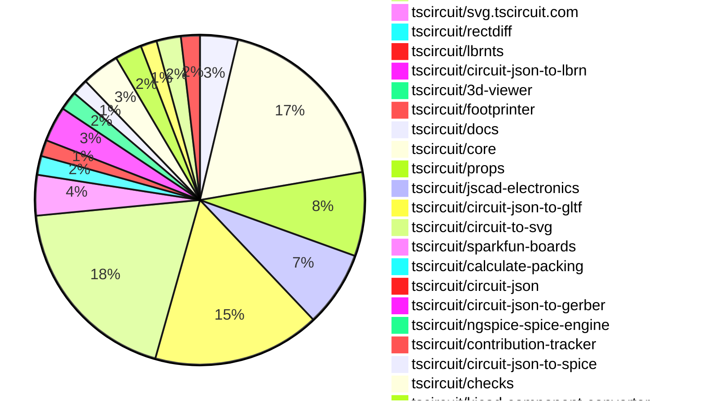
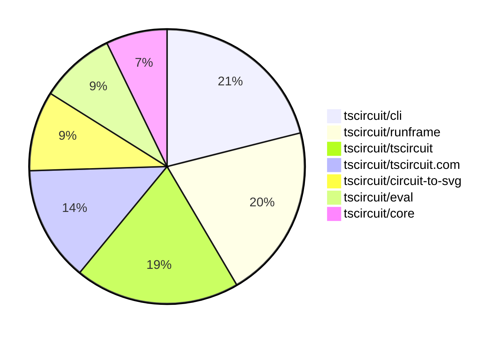

# Contribution Overview 2025-11-19

The current week is shown below. There are 4 major sections:

- [Contributor Overview](#contributor-overview)
- [PRs by Repository](#prs-by-repository)
- [PRs by Contributor](#changes-by-contributor)
- [Scoring & Sponsorship System](#scoring--sponsorship-system)

## PRs by Repository

## Contributor Overview

| Contributor | 🐳 Major | 🐙 Minor | 🐌 Tiny | ⭐ | Score | Discussion Contributions |
|-------------|---------|---------|---------|-----|----------------|--------------------------|
| [seveibar](#seveibar) | 7 | 10 | 11 | 👑 | 60 | 0🔹 0🔶 0💎 |
| [imrishabh18](#imrishabh18) | 5 | 10 | 8 | ⭐⭐⭐ | 49 | 0🔹 0🔶 0💎 |
| [ShiboSoftwareDev](#ShiboSoftwareDev) | 1 | 10 | 5 | ⭐⭐⭐ | 40 | 0🔹 0🔶 0💎 |
| [ArnavK-09](#ArnavK-09) | 4 | 6 | 9 | ⭐⭐⭐ | 37 | 0🔹 0🔶 0💎 |
| [Abse2001](#Abse2001) | 6 | 5 | 0 | ⭐⭐⭐ | 36 | 0🔹 0🔶 0💎 |
| [techmannih](#techmannih) | 1 | 5 | 5 | ⭐⭐⭐ | 33 | 0🔹 0🔶 0💎 |
| [Ayushjhawar8](#Ayushjhawar8) | 4 | 5 | 4 | ⭐⭐ | 30 | 0🔹 0🔶 0💎 |
| [tscircuitbot](#tscircuitbot) | 0 | 0 | 258 | ⭐⭐ | 16 | 0🔹 0🔶 0💎 |
| [0hmX](#0hmX) | 3 | 0 | 3 | ⭐⭐ | 14.5 | 0🔹 0🔶 0💎 |
| [rushabhcodes](#rushabhcodes) | 2 | 0 | 4 | ⭐⭐ | 13 | 0🔹 0🔶 0💎 |
| [AnasSarkiz](#AnasSarkiz) | 1 | 2 | 1 | ⭐ | 9 | 0🔹 0🔶 0💎 |
| [RaghavArora14](#RaghavArora14) | 0 | 3 | 1 | ⭐ | 8 | 0🔹 0🔶 0💎 |
| [pxlpal](#pxlpal) | 1 | 0 | 1 | ⭐ | 5 | 0🔹 0🔶 0💎 |
| [MustafaMulla29](#MustafaMulla29) | 1 | 0 | 0 | ⭐ | 5 | 0🔹 0🔶 0💎 |
| [Heinrich-XIAO](#Heinrich-XIAO) | 0 | 0 | 3 | ⭐ | 4 | 0🔹 0🔶 0💎 |
| [joncherry](#joncherry) | 0 | 0 | 2 |  | 2 | 0🔹 0🔶 0💎 |
| [baeoc](#baeoc) | 0 | 0 | 1 |  | 2 | 0🔹 0🔶 0💎 |

> Note: AI evaluates PRs and assigns 1-3 star ratings automatically. 4 and 5 star ratings require manual staff review.

### Discussion Contribution Legend

- 🔹 Normal Comments: Basic participation with minimal effort
- 🔶 Great Informative Comments: Thoughtful participation that adds value
- 💎 Incredible Comments: Exceptional participation with high-quality content

## Review Table

[reviews-received-hover]: ## "Number of reviews received for PRs for this contributor"
[approvals-received-hover]: ## "Number of approvals received for PRs this contributor authored"
[rejections-received-hover]: ## "Number of rejections received for PRs this contributor authored"
[prs-opened-hover]: ## "Number of PRs opened by this contributor"
[issues-created-hover]: ## "Number of issues created by this contributor"
[bountied-issues-hover]: ## "Number of issues this contributor created with a bounty"
[bountied-issue-$-hover]: ## "Total bounty amount placed on issues authored by this contributor"

| Contributor | Reviews Received | Approvals Received | Rejections Received | Approvals | Rejections | PRs Opened | PRs Merged | Score | Issues Created | Bountied Issues | Bountied Issue $ |
|---|---|---|---|---|---|---|---|---|---|---|---|
| [techmannih](#techmannih) | 21 | 11 | 1 | 8 | 3 | 12 | 11 | 33 | 0 | 0 | 0 |
| [baeoc](#baeoc) | 7 | 1 | 1 | 5 | 1 | 6 | 1 | 2 | 0 | 0 | 0 |
| [seveibar](#seveibar) | 8 | 1 | 0 | 73 | 9 | 45 | 29 | 60 | 0 | 0 | 0 |
| [tscircuitbot](#tscircuitbot) | 1 | 0 | 0 | 0 | 0 | 299 | 257 | 16 | 0 | 0 | 0 |
| [rushabhcodes](#rushabhcodes) | 22 | 16 | 2 | 2 | 0 | 12 | 6 | 13 | 0 | 0 | 0 |
| [AnasSarkiz](#AnasSarkiz) | 11 | 7 | 1 | 0 | 0 | 5 | 4 | 9 | 0 | 0 | 0 |
| [ShiboSoftwareDev](#ShiboSoftwareDev) | 17 | 15 | 0 | 12 | 0 | 17 | 16 | 40 | 0 | 0 | 0 |
| [Abse2001](#Abse2001) | 11 | 11 | 0 | 2 | 0 | 14 | 11 | 36 | 0 | 0 | 0 |
| [Ayushjhawar8](#Ayushjhawar8) | 27 | 12 | 1 | 0 | 0 | 14 | 13 | 30 | 0 | 0 | 0 |
| [imrishabh18](#imrishabh18) | 14 | 7 | 0 | 5 | 1 | 24 | 23 | 49 | 0 | 0 | 0 |
| [joncherry](#joncherry) | 6 | 3 | 0 | 0 | 0 | 3 | 2 | 2 | 0 | 0 | 0 |
| [nailoo](#nailoo) | 0 | 0 | 0 | 1 | 1 | 0 | 0 | 0 | 0 | 0 | 0 |
| [RaghavArora14](#RaghavArora14) | 31 | 8 | 5 | 0 | 0 | 8 | 4 | 8 | 0 | 0 | 0 |
| [Devesh36](#Devesh36) | 4 | 1 | 1 | 0 | 0 | 1 | 0 | 0 | 0 | 0 | 0 |
| [ArnavK-09](#ArnavK-09) | 12 | 6 | 0 | 0 | 0 | 26 | 19 | 37 | 0 | 0 | 0 |
| [pxlpal](#pxlpal) | 1 | 1 | 0 | 0 | 0 | 2 | 2 | 5 | 0 | 0 | 0 |
| [MustafaMulla29](#MustafaMulla29) | 18 | 1 | 2 | 1 | 0 | 4 | 1 | 5 | 0 | 0 | 0 |
| [0hmX](#0hmX) | 14 | 5 | 0 | 0 | 0 | 11 | 6 | 14.5 | 0 | 0 | 0 |
| [Heinrich-XIAO](#Heinrich-XIAO) | 14 | 3 | 1 | 0 | 0 | 4 | 3 | 4 | 0 | 0 | 0 |

## Top 7 Repositories by Contribution Points

## Scoring & Sponsorship System

### Overview

PRs are analyzed by AI and assigned a **star rating (1-3 stars)**. 4 and 5 star ratings can only be manually assigned by staff. Weekly scores use `2^(starRating - 1)` per PR (capped at 12 PRs per rating), plus review/discussion points.

### Weekly Score → Star String

| Score Range | Star String | Count Value |
|------------|-------------|-------------|
| 0-3 | (empty) | 0 stars |
| 4-10 | ⭐ | 1 star |
| 11-30 | ⭐⭐ | 2 stars |
| 31-50 | ⭐⭐⭐ | 3 stars |
| 51-75 | 👑 | 1 crown |
| 76-100 | 👑👑 | 2 crowns |
| 101+ | 👑👑👑 | 3 crowns |

> Crowns count as 3 stars for sponsorship.

### Monthly Sponsorship Calculation

The sponsorship system calculates monthly payments based on your **weekly star counts** over the complete weeks in that month (typically 4-5 weeks, Wednesday-Tuesday format).

**Step 1: Collect Weekly Stars**
- All complete weeks in the month are analyzed
- Each week's star string is converted to a numeric count (⭐ = 1 star, ⭐⭐⭐ = 3 stars)
- Example: `[2, 2, 2, 1, 0]` means 2 stars in week 1, 2 stars in week 2, etc.

**Step 2: Calculate Metrics**
- **Median stars**: The median value of all weekly star counts
- **Min stars**: The minimum weekly star count
- **Max stars**: The maximum weekly star count
- **High score**: The maximum raw weekly score (0-100+ range from the scoring table) from any week in the month

**Step 3: Determine Base Amount**
The sponsorship amount is calculated based on these metrics (checked in order):

| Condition | Base Amount |
|-----------|-------------|
| `minStarCount >= 3` | **$500** |
| `medianStars >= 3` | **$450** |
| `medianStars >= 2.5` | **$300** |
| `medianStars >= 2` | **$200** |
| `medianStars >= 1.5` | **$100** |
| `medianStars >= 1` | **$75** |
| `maxStarCount >= 2` | **$25** |
| `maxStarCount >= 1` | **$15** |
| `highScore >= 3` (and all stars = 0) | **$5** |

| Maintainer Level | Monthly Bonus |
|------------------|---------------|
| Level 1 | **$200** |
| Level 2 | **$350** |
| Level 3 | **$500** |

**Final Amount** = Base Amount + Maintainer Bonus

## Changes by Repository

### [tscircuit/pcb-viewer](https://github.com/tscircuit/pcb-viewer)

| PR # | Impact | Rating | Contributor | Description |
|------|--------|--------|-------------|-------------|
| [#483](https://github.com/tscircuit/pcb-viewer/pull/483) | 🐳 Major | ⭐⭐⭐ | rushabhcodes | Adds a new overlay feature for PCB group anchor offsets, allowing users to visually measure and display the X and Y distance between a groups anchor point and a hovered component or pad. |
| [#487](https://github.com/tscircuit/pcb-viewer/pull/487) | 🐳 Major | ⭐⭐⭐ | Abse2001 | Adds support for corner radius and rotation in PCB cutouts, updates the circuit-json dependency, and includes a unit test for the new functionality. |
| [#497](https://github.com/tscircuit/pcb-viewer/pull/497) | 🐙 Minor | ⭐⭐ | techmannih | Fixes a module export issue by using a local bounds helper for calculating group bounding boxes. |
| [#492](https://github.com/tscircuit/pcb-viewer/pull/492) | 🐙 Minor | ⭐⭐ | techmannih | Adds color support for the pcb_fabrication_note_text element in the PCB viewer, allowing users to specify text color in their designs. |
| [#493](https://github.com/tscircuit/pcb-viewer/pull/493) | 🐙 Minor | ⭐⭐ | techmannih | Adds color support for the pcb_fabrication_note_path element in the PCB viewer, allowing for customizable color rendering of fabrication notes. |
| [#484](https://github.com/tscircuit/pcb-viewer/pull/484) | 🐙 Minor | ⭐⭐ | techmannih | Adds support for a new hole shape hole_with_polygon_pad in the PCB viewer, allowing for more complex pad designs in printed circuit boards. |

🐌 Tiny Contributions (8)

| PR # | Impact | Contributor | Description |
|------|--------|-------------|-------------|
| [#498](https://github.com/tscircuit/pcb-viewer/pull/498) | 🐌 Tiny | tscircuitbot | Automated package update |
| [#495](https://github.com/tscircuit/pcb-viewer/pull/495) | 🐌 Tiny | tscircuitbot | Automated package update |
| [#494](https://github.com/tscircuit/pcb-viewer/pull/494) | 🐌 Tiny | tscircuitbot | Automated package update |
| [#490](https://github.com/tscircuit/pcb-viewer/pull/490) | 🐌 Tiny | tscircuitbot | Automated package update |
| [#488](https://github.com/tscircuit/pcb-viewer/pull/488) | 🐌 Tiny | tscircuitbot | Automated package update |
| [#485](https://github.com/tscircuit/pcb-viewer/pull/485) | 🐌 Tiny | tscircuitbot | Automated package update |
| [#491](https://github.com/tscircuit/pcb-viewer/pull/491) | 🐌 Tiny | techmannih | Fixes a type error related to corner radius for PCB cutouts in the rendering process. |
| [#489](https://github.com/tscircuit/pcb-viewer/pull/489) | 🐌 Tiny | AnasSarkiz | Enables hover highlighting for oval plated holes by adding support for detecting oval shapes in hit-testing and updating highlight sizing accordingly. |

### [tscircuit/tscircuit](https://github.com/tscircuit/tscircuit)

🐌 Tiny Contributions (70)

| PR # | Impact | Contributor | Description |
|------|--------|-------------|-------------|
| [#1440](https://github.com/tscircuit/tscircuit/pull/1440) | 🐌 Tiny | tscircuitbot | Automated package update |
| [#1439](https://github.com/tscircuit/tscircuit/pull/1439) | 🐌 Tiny | tscircuitbot | Automated package update |
| [#1437](https://github.com/tscircuit/tscircuit/pull/1437) | 🐌 Tiny | tscircuitbot | Automated package update |
| [#1436](https://github.com/tscircuit/tscircuit/pull/1436) | 🐌 Tiny | tscircuitbot | Automated package update |
| [#1435](https://github.com/tscircuit/tscircuit/pull/1435) | 🐌 Tiny | tscircuitbot | Updates the tscircuitcli package to version 0.1.538 in the package.json file. |
| [#1434](https://github.com/tscircuit/tscircuit/pull/1434) | 🐌 Tiny | tscircuitbot | Automated package update |
| [#1433](https://github.com/tscircuit/tscircuit/pull/1433) | 🐌 Tiny | tscircuitbot | Automated package update |
| [#1432](https://github.com/tscircuit/tscircuit/pull/1432) | 🐌 Tiny | tscircuitbot | Automated package update |
| [#1431](https://github.com/tscircuit/tscircuit/pull/1431) | 🐌 Tiny | tscircuitbot | Automated package update |
| [#1430](https://github.com/tscircuit/tscircuit/pull/1430) | 🐌 Tiny | tscircuitbot | Automated package update |
| [#1429](https://github.com/tscircuit/tscircuit/pull/1429) | 🐌 Tiny | tscircuitbot | Updates the tscircuitcli package to version 0.1.535 in package.json |
| [#1428](https://github.com/tscircuit/tscircuit/pull/1428) | 🐌 Tiny | tscircuitbot | Automated package update |
| [#1427](https://github.com/tscircuit/tscircuit/pull/1427) | 🐌 Tiny | tscircuitbot | Updates the tscircuitcli package to version 0.1.534 in the package.json file. |
| [#1426](https://github.com/tscircuit/tscircuit/pull/1426) | 🐌 Tiny | tscircuitbot | Automated package update |
| [#1425](https://github.com/tscircuit/tscircuit/pull/1425) | 🐌 Tiny | tscircuitbot | Updates the tscircuitcli package to version 0.1.533 in the package.json file. |
| [#1424](https://github.com/tscircuit/tscircuit/pull/1424) | 🐌 Tiny | tscircuitbot | Automated package update |
| [#1423](https://github.com/tscircuit/tscircuit/pull/1423) | 🐌 Tiny | tscircuitbot | Updates various package dependencies to their latest versions in package.json |
| [#1422](https://github.com/tscircuit/tscircuit/pull/1422) | 🐌 Tiny | tscircuitbot | Automated package update |
| [#1421](https://github.com/tscircuit/tscircuit/pull/1421) | 🐌 Tiny | tscircuitbot | Automated package update |
| [#1420](https://github.com/tscircuit/tscircuit/pull/1420) | 🐌 Tiny | tscircuitbot | Automated package update |
| [#1419](https://github.com/tscircuit/tscircuit/pull/1419) | 🐌 Tiny | tscircuitbot | Updates the tscircuitcli package from version 0.1.529 to 0.1.530 |
| [#1418](https://github.com/tscircuit/tscircuit/pull/1418) | 🐌 Tiny | tscircuitbot | Automated package update |
| [#1417](https://github.com/tscircuit/tscircuit/pull/1417) | 🐌 Tiny | tscircuitbot | Automated package update |
| [#1416](https://github.com/tscircuit/tscircuit/pull/1416) | 🐌 Tiny | tscircuitbot | Automated package update |
| [#1415](https://github.com/tscircuit/tscircuit/pull/1415) | 🐌 Tiny | tscircuitbot | Automated package update |
| [#1414](https://github.com/tscircuit/tscircuit/pull/1414) | 🐌 Tiny | tscircuitbot | Automated package update |
| [#1413](https://github.com/tscircuit/tscircuit/pull/1413) | 🐌 Tiny | tscircuitbot | Automated package update |
| [#1412](https://github.com/tscircuit/tscircuit/pull/1412) | 🐌 Tiny | tscircuitbot | Automated package update |
| [#1411](https://github.com/tscircuit/tscircuit/pull/1411) | 🐌 Tiny | tscircuitbot | Updates the tscircuitcli package from version 0.1.525 to 0.1.526 and the tscircuitrunframe package from version 0.0.1276 to 0.0.1277 in package.json |
| [#1410](https://github.com/tscircuit/tscircuit/pull/1410) | 🐌 Tiny | tscircuitbot | Automated package update |
| [#1409](https://github.com/tscircuit/tscircuit/pull/1409) | 🐌 Tiny | tscircuitbot | Automated package update |
| [#1407](https://github.com/tscircuit/tscircuit/pull/1407) | 🐌 Tiny | tscircuitbot | Updates the tscircuitcli package from version 0.1.523 to 0.1.524 and the tscircuitrunframe package from version 0.0.1274 to 0.0.1275 in package.json |
| [#1406](https://github.com/tscircuit/tscircuit/pull/1406) | 🐌 Tiny | tscircuitbot | Automated package update |
| [#1405](https://github.com/tscircuit/tscircuit/pull/1405) | 🐌 Tiny | tscircuitbot | Updates the tscircuitcli package from version 0.1.522 to 0.1.523 and the tscircuitrunframe package from version 0.0.1273 to 0.0.1274 in package.json |
| [#1404](https://github.com/tscircuit/tscircuit/pull/1404) | 🐌 Tiny | tscircuitbot | Automated package update |
| [#1403](https://github.com/tscircuit/tscircuit/pull/1403) | 🐌 Tiny | tscircuitbot | Updates the tscircuitcli package from version 0.1.521 to 0.1.522 and the tscircuitrunframe package from version 0.0.1272 to 0.0.1273 in package.json |
| [#1402](https://github.com/tscircuit/tscircuit/pull/1402) | 🐌 Tiny | tscircuitbot | Automated package update |
| [#1401](https://github.com/tscircuit/tscircuit/pull/1401) | 🐌 Tiny | tscircuitbot | Automated package update |
| [#1400](https://github.com/tscircuit/tscircuit/pull/1400) | 🐌 Tiny | tscircuitbot | Automated package update |
| [#1399](https://github.com/tscircuit/tscircuit/pull/1399) | 🐌 Tiny | tscircuitbot | Updates the version of several dependencies in the package.json file, including tscircuitcli, tscircuitcore, tscircuiteval, tscircuitprops, and tscircuitrunframe. |
| [#1398](https://github.com/tscircuit/tscircuit/pull/1398) | 🐌 Tiny | tscircuitbot | Automated package update |
| [#1397](https://github.com/tscircuit/tscircuit/pull/1397) | 🐌 Tiny | tscircuitbot | Automated package update |
| [#1396](https://github.com/tscircuit/tscircuit/pull/1396) | 🐌 Tiny | tscircuitbot | Automated package update |
| [#1395](https://github.com/tscircuit/tscircuit/pull/1395) | 🐌 Tiny | tscircuitbot | Updates the tscircuitcli package from version 0.1.517 to 0.1.518 and the tscircuitrunframe package from version 0.0.1268 to 0.0.1269 in package.json |
| [#1394](https://github.com/tscircuit/tscircuit/pull/1394) | 🐌 Tiny | tscircuitbot | Automated package update |
| [#1393](https://github.com/tscircuit/tscircuit/pull/1393) | 🐌 Tiny | tscircuitbot | Automated package update |
| [#1392](https://github.com/tscircuit/tscircuit/pull/1392) | 🐌 Tiny | tscircuitbot | Automated package update |
| [#1391](https://github.com/tscircuit/tscircuit/pull/1391) | 🐌 Tiny | tscircuitbot | Automated package update |
| [#1390](https://github.com/tscircuit/tscircuit/pull/1390) | 🐌 Tiny | tscircuitbot | Automated package update |
| [#1389](https://github.com/tscircuit/tscircuit/pull/1389) | 🐌 Tiny | tscircuitbot | Updates the tscircuitcli package from version 0.1.514 to 0.1.515 |
| [#1388](https://github.com/tscircuit/tscircuit/pull/1388) | 🐌 Tiny | tscircuitbot | Automated package update |
| [#1387](https://github.com/tscircuit/tscircuit/pull/1387) | 🐌 Tiny | tscircuitbot | Automated package update |
| [#1386](https://github.com/tscircuit/tscircuit/pull/1386) | 🐌 Tiny | tscircuitbot | Automated package update |
| [#1385](https://github.com/tscircuit/tscircuit/pull/1385) | 🐌 Tiny | tscircuitbot | Automated package update |
| [#1384](https://github.com/tscircuit/tscircuit/pull/1384) | 🐌 Tiny | tscircuitbot | Automated package update |
| [#1383](https://github.com/tscircuit/tscircuit/pull/1383) | 🐌 Tiny | tscircuitbot | Automated package update |
| [#1382](https://github.com/tscircuit/tscircuit/pull/1382) | 🐌 Tiny | tscircuitbot | Automated package update |
| [#1381](https://github.com/tscircuit/tscircuit/pull/1381) | 🐌 Tiny | tscircuitbot | Automated package update |
| [#1380](https://github.com/tscircuit/tscircuit/pull/1380) | 🐌 Tiny | tscircuitbot | Automated package update |
| [#1379](https://github.com/tscircuit/tscircuit/pull/1379) | 🐌 Tiny | tscircuitbot | Automated package update |
| [#1378](https://github.com/tscircuit/tscircuit/pull/1378) | 🐌 Tiny | tscircuitbot | Automated package update |
| [#1377](https://github.com/tscircuit/tscircuit/pull/1377) | 🐌 Tiny | tscircuitbot | Updates the tscircuitcli package from version 0.1.508 to 0.1.509 and the tscircuitrunframe package from version 0.0.1260 to 0.0.1261 in package.json |
| [#1376](https://github.com/tscircuit/tscircuit/pull/1376) | 🐌 Tiny | tscircuitbot | Automated package update |
| [#1375](https://github.com/tscircuit/tscircuit/pull/1375) | 🐌 Tiny | tscircuitbot | Automated package update |
| [#1374](https://github.com/tscircuit/tscircuit/pull/1374) | 🐌 Tiny | tscircuitbot | Automated package update |
| [#1373](https://github.com/tscircuit/tscircuit/pull/1373) | 🐌 Tiny | tscircuitbot | Updates the tscircuitcli package version from 0.1.506 to 0.1.507 in package.json |
| [#1372](https://github.com/tscircuit/tscircuit/pull/1372) | 🐌 Tiny | tscircuitbot | Automated package update |
| [#1371](https://github.com/tscircuit/tscircuit/pull/1371) | 🐌 Tiny | tscircuitbot | Updates the tscircuitcli package to version 0.1.506 in the package.json file |
| [#1370](https://github.com/tscircuit/tscircuit/pull/1370) | 🐌 Tiny | tscircuitbot | Automated package update |
| [#1369](https://github.com/tscircuit/tscircuit/pull/1369) | 🐌 Tiny | tscircuitbot | Updates the tscircuitcli package from version 0.1.504 to 0.1.505 |

### [tscircuit/tscircuit.com](https://github.com/tscircuit/tscircuit.com)

| PR # | Impact | Rating | Contributor | Description |
|------|--------|--------|-------------|-------------|
| [#2067](https://github.com/tscircuit/tscircuit.com/pull/2067) | 🐳 Major | ⭐⭐⭐ | ArnavK-09 | Adds a dialog for editing organization member permissions, allowing users to manage permissions for organization members. |
| [#2055](https://github.com/tscircuit/tscircuit.com/pull/2055) | 🐳 Major | ⭐⭐⭐ | ArnavK-09 | Refactors the code to unify the handling of build and user code status, replacing the previous user code status retrieval with a build status retrieval in multiple components. |
| [#2047](https://github.com/tscircuit/tscircuit.com/pull/2047) | 🐳 Major | ⭐⭐⭐ | ArnavK-09 | Changes the build status retrieval to depend on user code status instead of the previous build status, affecting how release build statuses are displayed in the UI. |
| [#2049](https://github.com/tscircuit/tscircuit.com/pull/2049) | 🐳 Major | ⭐⭐⭐ | pxlpal | Implement org invitations on fake Add invitation hooks Add org invitation UI |
| [#2054](https://github.com/tscircuit/tscircuit.com/pull/2054) | 🐙 Minor | ⭐⭐ | ArnavK-09 | Adds functionality to include build logs in the package builds API response based on query parameters. |
| [#2057](https://github.com/tscircuit/tscircuit.com/pull/2057) | 🐙 Minor | ⭐⭐ | ArnavK-09 | Changes the response structure of the organization deletion API to return ok instead of success and adds validation to prevent deletion of organizations with existing packages. |
| [#2061](https://github.com/tscircuit/tscircuit.com/pull/2061) | 🐙 Minor | ⭐⭐ | ArnavK-09 | Normalizes the package name input by the user before saving it, ensuring consistent formatting and preventing issues with package name variations. |
| [#2060](https://github.com/tscircuit/tscircuit.com/pull/2060) | 🐙 Minor | ⭐⭐ | ArnavK-09 | Changes the organization header to display the organizations tscircuit handle publicly, allowing users to see and link to the handle directly. |
| [#2052](https://github.com/tscircuit/tscircuit.com/pull/2052) | 🐙 Minor | ⭐⭐ | ArnavK-09 | Fixes package ownership check to use creator_account_id for user verification instead of owner_github_username. |
| [#2028](https://github.com/tscircuit/tscircuit.com/pull/2028) | 🐙 Minor | ⭐⭐ | ArnavK-09 | Refactors organization-related API and database logic to replace the name field with tscircuit_handle for better clarity and consistency in organization identification. |

🐌 Tiny Contributions (21)

| PR # | Impact | Contributor | Description |
|------|--------|-------------|-------------|
| [#2076](https://github.com/tscircuit/tscircuit.com/pull/2076) | 🐌 Tiny | tscircuitbot | Updates the tscircuiteval package to version 0.0.490 in the package.json file. |
| [#2075](https://github.com/tscircuit/tscircuit.com/pull/2075) | 🐌 Tiny | tscircuitbot | Updates the tscircuiteval package to version 0.0.489 in the package.json file. |
| [#2074](https://github.com/tscircuit/tscircuit.com/pull/2074) | 🐌 Tiny | tscircuitbot | Updates the tscircuiteval package from version 0.0.487 to 0.0.488 |
| [#2073](https://github.com/tscircuit/tscircuit.com/pull/2073) | 🐌 Tiny | tscircuitbot | Updates the tscircuiteval package from version 0.0.486 to 0.0.487 in the package.json file. |
| [#2071](https://github.com/tscircuit/tscircuit.com/pull/2071) | 🐌 Tiny | tscircuitbot | Automated package update |
| [#2070](https://github.com/tscircuit/tscircuit.com/pull/2070) | 🐌 Tiny | tscircuitbot | Automated package update |
| [#2069](https://github.com/tscircuit/tscircuit.com/pull/2069) | 🐌 Tiny | tscircuitbot | Updates the tscircuiteval package from version 0.0.483 to 0.0.484 |
| [#2062](https://github.com/tscircuit/tscircuit.com/pull/2062) | 🐌 Tiny | tscircuitbot | Automated package update |
| [#2058](https://github.com/tscircuit/tscircuit.com/pull/2058) | 🐌 Tiny | tscircuitbot | Automated package update |
| [#2056](https://github.com/tscircuit/tscircuit.com/pull/2056) | 🐌 Tiny | tscircuitbot | Automated package update |
| [#2053](https://github.com/tscircuit/tscircuit.com/pull/2053) | 🐌 Tiny | tscircuitbot | Updates the tscircuiteval package to version 0.0.482 in the package.json file. |
| [#2050](https://github.com/tscircuit/tscircuit.com/pull/2050) | 🐌 Tiny | tscircuitbot | Updates the tscircuiteval package from version 0.0.479 to 0.0.481 |
| [#2046](https://github.com/tscircuit/tscircuit.com/pull/2046) | 🐌 Tiny | tscircuitbot | Automated package update |
| [#2045](https://github.com/tscircuit/tscircuit.com/pull/2045) | 🐌 Tiny | tscircuitbot | Updates the tscircuiteval package from version 0.0.478 to 0.0.479 |
| [#2043](https://github.com/tscircuit/tscircuit.com/pull/2043) | 🐌 Tiny | tscircuitbot | Automated package update |
| [#2068](https://github.com/tscircuit/tscircuit.com/pull/2068) | 🐌 Tiny | ArnavK-09 | Changes the navigation path in the OrganizationHeader component to use the organizations tscircuit_handle instead of its name. |
| [#2065](https://github.com/tscircuit/tscircuit.com/pull/2065) | 🐌 Tiny | ArnavK-09 | Adds a new CLI login page that allows users to authorize terminal access via a login link with session tokens. |
| [#2066](https://github.com/tscircuit/tscircuit.com/pull/2066) | 🐌 Tiny | ArnavK-09 | Changes the sign-in button text from Sign In with GitHub to Sign In. |
| [#2063](https://github.com/tscircuit/tscircuit.com/pull/2063) | 🐌 Tiny | ArnavK-09 | Prevents spam notifications caused by typos in workflow files by adding a workflow_dispatch trigger to the bundle size analysis workflow. |
| [#2059](https://github.com/tscircuit/tscircuit.com/pull/2059) | 🐌 Tiny | ArnavK-09 | Allows organization managers to manage package metadata on the client side by modifying permission checks in the ImportantFilesView and SidebarAboutSection components. |
| [#2064](https://github.com/tscircuit/tscircuit.com/pull/2064) | 🐌 Tiny | pxlpal | Removes duplicated error message in toast notifications when sending organization invitations. |

### [tscircuit/eval](https://github.com/tscircuit/eval)

| PR # | Impact | Rating | Contributor | Description |
|------|--------|--------|-------------|-------------|
| [#1565](https://github.com/tscircuit/eval/pull/1565) | 🐙 Minor | ⭐⭐ | imrishabh18 | Adds support for nested object exports in package.json and enhances node_modules resolution by walking up the directory tree. |
| [#1563](https://github.com/tscircuit/eval/pull/1563) | 🐙 Minor | ⭐⭐ | imrishabh18 | Fixes incorrect resolution of non-relative file imports when baseUrl is configured, ensuring tests fail if baseUrl is misconfigured. |
| [#1558](https://github.com/tscircuit/eval/pull/1558) | 🐙 Minor | ⭐⭐ | imrishabh18 | Fixes import resolution to start from the root of the package when using baseUrl in TypeScript configuration. |
| [#1535](https://github.com/tscircuit/eval/pull/1535) | 🐙 Minor | ⭐⭐ | imrishabh18 | Fixes the handling of static assets by creating blob URLs for files with content instead of using a placeholder, improving the loading of external footprints in the circuit rendering process. |

🐌 Tiny Contributions (24)

| PR # | Impact | Contributor | Description |
|------|--------|-------------|-------------|
| [#1569](https://github.com/tscircuit/eval/pull/1569) | 🐌 Tiny | tscircuitbot | Updates the package version from 0.0.490 to 0.0.491 in package.json |
| [#1568](https://github.com/tscircuit/eval/pull/1568) | 🐌 Tiny | tscircuitbot | Updates the version of the tscircuitcore package from 0.0.878 to 0.0.879 in package.json |
| [#1566](https://github.com/tscircuit/eval/pull/1566) | 🐌 Tiny | tscircuitbot | Automated package update |
| [#1564](https://github.com/tscircuit/eval/pull/1564) | 🐌 Tiny | tscircuitbot | Automated package update |
| [#1562](https://github.com/tscircuit/eval/pull/1562) | 🐌 Tiny | tscircuitbot | Automated package update |
| [#1561](https://github.com/tscircuit/eval/pull/1561) | 🐌 Tiny | tscircuitbot | Automated package update |
| [#1559](https://github.com/tscircuit/eval/pull/1559) | 🐌 Tiny | tscircuitbot | Automated package update |
| [#1557](https://github.com/tscircuit/eval/pull/1557) | 🐌 Tiny | tscircuitbot | Automated package update |
| [#1555](https://github.com/tscircuit/eval/pull/1555) | 🐌 Tiny | tscircuitbot | Automated package update |
| [#1554](https://github.com/tscircuit/eval/pull/1554) | 🐌 Tiny | tscircuitbot | Automated package update |
| [#1550](https://github.com/tscircuit/eval/pull/1550) | 🐌 Tiny | tscircuitbot | Automated package update |
| [#1549](https://github.com/tscircuit/eval/pull/1549) | 🐌 Tiny | tscircuitbot | Updates the version of the tscircuitcore package from 0.0.874 to 0.0.875 in package.json |
| [#1548](https://github.com/tscircuit/eval/pull/1548) | 🐌 Tiny | tscircuitbot | Automated package update |
| [#1547](https://github.com/tscircuit/eval/pull/1547) | 🐌 Tiny | tscircuitbot | Automated package update |
| [#1546](https://github.com/tscircuit/eval/pull/1546) | 🐌 Tiny | tscircuitbot | Automated package update |
| [#1545](https://github.com/tscircuit/eval/pull/1545) | 🐌 Tiny | tscircuitbot | Automated package update |
| [#1543](https://github.com/tscircuit/eval/pull/1543) | 🐌 Tiny | tscircuitbot | Automated package update |
| [#1542](https://github.com/tscircuit/eval/pull/1542) | 🐌 Tiny | tscircuitbot | Automated package update |
| [#1538](https://github.com/tscircuit/eval/pull/1538) | 🐌 Tiny | tscircuitbot | Automated package update to version 0.0.480 |
| [#1537](https://github.com/tscircuit/eval/pull/1537) | 🐌 Tiny | tscircuitbot | Automated package update |
| [#1536](https://github.com/tscircuit/eval/pull/1536) | 🐌 Tiny | tscircuitbot | Automated package update |
| [#1534](https://github.com/tscircuit/eval/pull/1534) | 🐌 Tiny | tscircuitbot | Automated package update |
| [#1533](https://github.com/tscircuit/eval/pull/1533) | 🐌 Tiny | tscircuitbot | Automated package update |
| [#1556](https://github.com/tscircuit/eval/pull/1556) | 🐌 Tiny | ArnavK-09 | Updates the circuit-json dependency to version 0.0.322 in package.json |

### [tscircuit/runframe](https://github.com/tscircuit/runframe)

| PR # | Impact | Rating | Contributor | Description |
|------|--------|--------|-------------|-------------|
| [#1858](https://github.com/tscircuit/runframe/pull/1858) | 🐳 Major | ⭐⭐⭐ | Ayushjhawar8 | Fixes the issue where runframe would switch to .ts files instead of .tsx files when savingupdating code. |
| [#1817](https://github.com/tscircuit/runframe/pull/1817) | 🐳 Major | ⭐⭐⭐ | seveibar | Install circuit-json-to-lbrn package Create export-lbrn.ts handler for LBRN format conversion Add LightBurn to availableExports in file menu Implement exportLbrn function with error handling and toast notifications The new export option allows users to export circuit designs to LightBurn format (.lbrn) for laser cutting workflows. |
| [#1811](https://github.com/tscircuit/runframe/pull/1811) | 🐳 Major | ⭐⭐⭐ | ArnavK-09 | This pull request introduces support for new preview URLs and adds a 3D preview option to the ImportComponentDialog2 component. It modifies the existing preview tab functionality to include a new 3D option, allowing users to view 3D representations of components alongside PCB and schematic previews. The changes also include updates to the relevant state management and rendering logic to accommodate the new preview type. |
| [#1861](https://github.com/tscircuit/runframe/pull/1861) | 🐳 Major | ⭐⭐⭐ | MustafaMulla29 | Fixes hover effect for items in the file selector by ensuring unique value props for each section, preventing hover state overlap between Recent and Favorites sections. |

🐌 Tiny Contributions (58)

| PR # | Impact | Contributor | Description |
|------|--------|-------------|-------------|
| [#1866](https://github.com/tscircuit/runframe/pull/1866) | 🐌 Tiny | tscircuitbot | Updates the tscircuiteval package to version 0.0.491 in the package.json file. |
| [#1865](https://github.com/tscircuit/runframe/pull/1865) | 🐌 Tiny | tscircuitbot | Automated package update |
| [#1864](https://github.com/tscircuit/runframe/pull/1864) | 🐌 Tiny | tscircuitbot | Automated package update |
| [#1863](https://github.com/tscircuit/runframe/pull/1863) | 🐌 Tiny | tscircuitbot | Automated package update |
| [#1862](https://github.com/tscircuit/runframe/pull/1862) | 🐌 Tiny | tscircuitbot | Automated package update |
| [#1860](https://github.com/tscircuit/runframe/pull/1860) | 🐌 Tiny | tscircuitbot | Automated package update |
| [#1859](https://github.com/tscircuit/runframe/pull/1859) | 🐌 Tiny | tscircuitbot | Updates the tscircuiteval package to version 0.0.489 in the package.json file. |
| [#1857](https://github.com/tscircuit/runframe/pull/1857) | 🐌 Tiny | tscircuitbot | Automated package update to version 0.0.1285 |
| [#1856](https://github.com/tscircuit/runframe/pull/1856) | 🐌 Tiny | tscircuitbot | Updates the tscircuiteval package to version 0.0.488 |
| [#1855](https://github.com/tscircuit/runframe/pull/1855) | 🐌 Tiny | tscircuitbot | Automated package update |
| [#1854](https://github.com/tscircuit/runframe/pull/1854) | 🐌 Tiny | tscircuitbot | Updates the tscircuiteval package to version 0.0.487 in the package.json file. |
| [#1850](https://github.com/tscircuit/runframe/pull/1850) | 🐌 Tiny | tscircuitbot | Automated package update |
| [#1849](https://github.com/tscircuit/runframe/pull/1849) | 🐌 Tiny | tscircuitbot | Updates the tscircuiteval package from version 0.0.485 to 0.0.486 in the package.json file. |
| [#1848](https://github.com/tscircuit/runframe/pull/1848) | 🐌 Tiny | tscircuitbot | Automated package update to version 0.0.1282 |
| [#1847](https://github.com/tscircuit/runframe/pull/1847) | 🐌 Tiny | tscircuitbot | Updates the tscircuiteval package from version 0.0.484 to 0.0.485 |
| [#1846](https://github.com/tscircuit/runframe/pull/1846) | 🐌 Tiny | tscircuitbot | Automated package update to version 0.0.1281 |
| [#1845](https://github.com/tscircuit/runframe/pull/1845) | 🐌 Tiny | tscircuitbot | Updates the tscircuitpcb-viewer package from version 1.11.267 to 1.11.268 |
| [#1844](https://github.com/tscircuit/runframe/pull/1844) | 🐌 Tiny | tscircuitbot | Automated package update |
| [#1843](https://github.com/tscircuit/runframe/pull/1843) | 🐌 Tiny | tscircuitbot | Updates the tscircuiteval package to version 0.0.484 in the package.json file. |
| [#1842](https://github.com/tscircuit/runframe/pull/1842) | 🐌 Tiny | tscircuitbot | Automated package update |
| [#1841](https://github.com/tscircuit/runframe/pull/1841) | 🐌 Tiny | tscircuitbot | Updates the tscircuitpcb-viewer package from version 1.11.265 to 1.11.267 |
| [#1839](https://github.com/tscircuit/runframe/pull/1839) | 🐌 Tiny | tscircuitbot | Updates the package version from 0.0.1277 to 0.0.1278 in package.json |
| [#1838](https://github.com/tscircuit/runframe/pull/1838) | 🐌 Tiny | tscircuitbot | Updates the tscircuitpcb-viewer package from version 1.11.264 to 1.11.265 |
| [#1837](https://github.com/tscircuit/runframe/pull/1837) | 🐌 Tiny | tscircuitbot | Automated package update |
| [#1836](https://github.com/tscircuit/runframe/pull/1836) | 🐌 Tiny | tscircuitbot | Updates the tscircuit3d-viewer package to version 0.0.444 in the package.json file. |
| [#1835](https://github.com/tscircuit/runframe/pull/1835) | 🐌 Tiny | tscircuitbot | Automated package update |
| [#1834](https://github.com/tscircuit/runframe/pull/1834) | 🐌 Tiny | tscircuitbot | Updates the tscircuitpcb-viewer package from version 1.11.263 to 1.11.264 |
| [#1833](https://github.com/tscircuit/runframe/pull/1833) | 🐌 Tiny | tscircuitbot | Automated package update to version 0.0.1275 |
| [#1832](https://github.com/tscircuit/runframe/pull/1832) | 🐌 Tiny | tscircuitbot | Updates the tscircuit3d-viewer package to version 0.0.443 in package.json |
| [#1831](https://github.com/tscircuit/runframe/pull/1831) | 🐌 Tiny | tscircuitbot | Automated package update |
| [#1829](https://github.com/tscircuit/runframe/pull/1829) | 🐌 Tiny | tscircuitbot | Updates the package version from 0.0.1272 to 0.0.1273 in package.json |
| [#1828](https://github.com/tscircuit/runframe/pull/1828) | 🐌 Tiny | tscircuitbot | Automated package update for tscircuit3d-viewer from version 0.0.441 to 0.0.442 |
| [#1826](https://github.com/tscircuit/runframe/pull/1826) | 🐌 Tiny | tscircuitbot | Automated package update |
| [#1825](https://github.com/tscircuit/runframe/pull/1825) | 🐌 Tiny | tscircuitbot | Updates the tscircuiteval package to version 0.0.483 |
| [#1822](https://github.com/tscircuit/runframe/pull/1822) | 🐌 Tiny | tscircuitbot | Automated package update |
| [#1821](https://github.com/tscircuit/runframe/pull/1821) | 🐌 Tiny | tscircuitbot | Automated package update |
| [#1820](https://github.com/tscircuit/runframe/pull/1820) | 🐌 Tiny | tscircuitbot | Automated package update |
| [#1819](https://github.com/tscircuit/runframe/pull/1819) | 🐌 Tiny | tscircuitbot | Updates the tscircuit3d-viewer package from version 0.0.440 to 0.0.441 |
| [#1818](https://github.com/tscircuit/runframe/pull/1818) | 🐌 Tiny | tscircuitbot | Automated package update to version 0.0.1269 |
| [#1816](https://github.com/tscircuit/runframe/pull/1816) | 🐌 Tiny | tscircuitbot | Automated package update |
| [#1815](https://github.com/tscircuit/runframe/pull/1815) | 🐌 Tiny | tscircuitbot | Updates the tscircuiteval package to version 0.0.481 in the package.json file. |
| [#1814](https://github.com/tscircuit/runframe/pull/1814) | 🐌 Tiny | tscircuitbot | Automated package update |
| [#1813](https://github.com/tscircuit/runframe/pull/1813) | 🐌 Tiny | tscircuitbot | Updates the tscircuiteval package to version 0.0.480 in the package.json file. |
| [#1812](https://github.com/tscircuit/runframe/pull/1812) | 🐌 Tiny | tscircuitbot | Automated package update |
| [#1810](https://github.com/tscircuit/runframe/pull/1810) | 🐌 Tiny | tscircuitbot | Automated package update |
| [#1808](https://github.com/tscircuit/runframe/pull/1808) | 🐌 Tiny | tscircuitbot | Automated package update to version 0.0.1264 |
| [#1805](https://github.com/tscircuit/runframe/pull/1805) | 🐌 Tiny | tscircuitbot | Automated package update to version 0.0.1263 |
| [#1804](https://github.com/tscircuit/runframe/pull/1804) | 🐌 Tiny | tscircuitbot | Updates the tscircuit3d-viewer package to version 0.0.440 in package.json |
| [#1803](https://github.com/tscircuit/runframe/pull/1803) | 🐌 Tiny | tscircuitbot | Automated package update |
| [#1802](https://github.com/tscircuit/runframe/pull/1802) | 🐌 Tiny | tscircuitbot | Updates the tscircuitpcb-viewer package from version 1.11.262 to 1.11.263 |
| [#1801](https://github.com/tscircuit/runframe/pull/1801) | 🐌 Tiny | tscircuitbot | Automated package update |
| [#1800](https://github.com/tscircuit/runframe/pull/1800) | 🐌 Tiny | tscircuitbot | Automated package update |
| [#1798](https://github.com/tscircuit/runframe/pull/1798) | 🐌 Tiny | tscircuitbot | Automated package update to version 0.0.1259 |
| [#1797](https://github.com/tscircuit/runframe/pull/1797) | 🐌 Tiny | tscircuitbot | Updates the tscircuitpcb-viewer package from version 1.11.261 to 1.11.262 |
| [#1796](https://github.com/tscircuit/runframe/pull/1796) | 🐌 Tiny | tscircuitbot | Updates the tscircuit3d-viewer package to version 0.0.438 in package.json |
| [#1830](https://github.com/tscircuit/runframe/pull/1830) | 🐌 Tiny | Ayushjhawar8 | https:github.comuser-attachmentsassetsf464bfa8-cedd-4847-8b65-8ab5b8552083 Fix 1823 Fix 1824 |
| [#1807](https://github.com/tscircuit/runframe/pull/1807) | 🐌 Tiny | imrishabh18 | Updates the version of the tscircuiteval package from 0.0.468 to 0.0.479 and updates kicadts package from 0.0.10 to 0.0.22 while adding kicad-to-circuit-json package version 0.0.17. |
| [#1809](https://github.com/tscircuit/runframe/pull/1809) | 🐌 Tiny | ArnavK-09 | Removes a placeholder error throw in the ImportComponentDialogForCli component, indicating that the implementation for package installation is pending. |

### [tscircuit/cli](https://github.com/tscircuit/cli)

| PR # | Impact | Rating | Contributor | Description |
|------|--------|--------|-------------|-------------|
| [#1049](https://github.com/tscircuit/cli/pull/1049) | 🐙 Minor | ⭐⭐ | imrishabh18 | Fixes the file upload process to prioritize transpiled files from node_modules, falling back to source files if none are present. |
| [#1031](https://github.com/tscircuit/cli/pull/1031) | 🐙 Minor | ⭐⭐ | imrishabh18 | Fixes transpilation output files to include an assets directory and corrects ESM and CJS output formats. |
| [#1042](https://github.com/tscircuit/cli/pull/1042) | 🐙 Minor | ⭐⭐ | seveibar | Ensures linked producer and consumer fixtures install React dependencies before linking and verifies that the linked library can run after building. |
| [#972](https://github.com/tscircuit/cli/pull/972) | 🐙 Minor | ⭐⭐ | seveibar | Moves the transpile build logic into a dedicated static asset Rollup plugin that recognizes CAD assets and extends TypeScript declarations for new CAD-related extensions. |

🐌 Tiny Contributions (68)

| PR # | Impact | Contributor | Description |
|------|--------|-------------|-------------|
| [#1056](https://github.com/tscircuit/cli/pull/1056) | 🐌 Tiny | tscircuitbot | Automated package update |
| [#1055](https://github.com/tscircuit/cli/pull/1055) | 🐌 Tiny | tscircuitbot | Updates the tscircuitrunframe package from version 0.0.1288 to 0.0.1289 |
| [#1054](https://github.com/tscircuit/cli/pull/1054) | 🐌 Tiny | tscircuitbot | Automated package update |
| [#1053](https://github.com/tscircuit/cli/pull/1053) | 🐌 Tiny | tscircuitbot | Updates the tscircuitrunframe package from version 0.0.1287 to 0.0.1288 |
| [#1052](https://github.com/tscircuit/cli/pull/1052) | 🐌 Tiny | tscircuitbot | Automated package update |
| [#1051](https://github.com/tscircuit/cli/pull/1051) | 🐌 Tiny | tscircuitbot | Automated package update to version 0.1.537 |
| [#1050](https://github.com/tscircuit/cli/pull/1050) | 🐌 Tiny | tscircuitbot | Updates the tscircuitrunframe package from version 0.0.1286 to 0.0.1287 |
| [#1048](https://github.com/tscircuit/cli/pull/1048) | 🐌 Tiny | tscircuitbot | Automated package update to version 0.1.536 |
| [#1047](https://github.com/tscircuit/cli/pull/1047) | 🐌 Tiny | tscircuitbot | Updates the tscircuitrunframe package from version 0.0.1285 to 0.0.1286 |
| [#1045](https://github.com/tscircuit/cli/pull/1045) | 🐌 Tiny | tscircuitbot | Automated package update |
| [#1043](https://github.com/tscircuit/cli/pull/1043) | 🐌 Tiny | tscircuitbot | Updates the package version from 0.1.533 to 0.1.534 in package.json |
| [#1040](https://github.com/tscircuit/cli/pull/1040) | 🐌 Tiny | tscircuitbot | Automated package update |
| [#1037](https://github.com/tscircuit/cli/pull/1037) | 🐌 Tiny | tscircuitbot | Updates the package version from 0.1.531 to 0.1.532 in package.json |
| [#1036](https://github.com/tscircuit/cli/pull/1036) | 🐌 Tiny | tscircuitbot | Updates the tscircuitrunframe package from version 0.0.1284 to 0.0.1285 |
| [#1035](https://github.com/tscircuit/cli/pull/1035) | 🐌 Tiny | tscircuitbot | Automated package update |
| [#1034](https://github.com/tscircuit/cli/pull/1034) | 🐌 Tiny | tscircuitbot | Updates the tscircuitrunframe package from version 0.0.1283 to 0.0.1284 |
| [#1033](https://github.com/tscircuit/cli/pull/1033) | 🐌 Tiny | tscircuitbot | Automated package update to version 0.1.530 |
| [#1030](https://github.com/tscircuit/cli/pull/1030) | 🐌 Tiny | tscircuitbot | Automated package update to version 0.1.529 |
| [#1029](https://github.com/tscircuit/cli/pull/1029) | 🐌 Tiny | tscircuitbot | Updates the tscircuitrunframe package from version 0.0.1282 to 0.0.1283 |
| [#1027](https://github.com/tscircuit/cli/pull/1027) | 🐌 Tiny | tscircuitbot | Automated package update to version 0.1.528 |
| [#1026](https://github.com/tscircuit/cli/pull/1026) | 🐌 Tiny | tscircuitbot | Updates the tscircuitrunframe package from version 0.0.1279 to 0.0.1282 |
| [#1024](https://github.com/tscircuit/cli/pull/1024) | 🐌 Tiny | tscircuitbot | Automated package update |
| [#1023](https://github.com/tscircuit/cli/pull/1023) | 🐌 Tiny | tscircuitbot | Automated package update |
| [#1022](https://github.com/tscircuit/cli/pull/1022) | 🐌 Tiny | tscircuitbot | Automated package update |
| [#1021](https://github.com/tscircuit/cli/pull/1021) | 🐌 Tiny | tscircuitbot | Updates the tscircuitrunframe package from version 0.0.1276 to 0.0.1277 |
| [#1020](https://github.com/tscircuit/cli/pull/1020) | 🐌 Tiny | tscircuitbot | Automated package update |
| [#1019](https://github.com/tscircuit/cli/pull/1019) | 🐌 Tiny | tscircuitbot | Updates the tscircuitrunframe package from version 0.0.1275 to 0.0.1276 |
| [#1018](https://github.com/tscircuit/cli/pull/1018) | 🐌 Tiny | tscircuitbot | Automated package update |
| [#1017](https://github.com/tscircuit/cli/pull/1017) | 🐌 Tiny | tscircuitbot | Updates the tscircuitrunframe package from version 0.0.1274 to 0.0.1275 |
| [#1015](https://github.com/tscircuit/cli/pull/1015) | 🐌 Tiny | tscircuitbot | Updates the package version from 0.1.522 to 0.1.523 in package.json |
| [#1014](https://github.com/tscircuit/cli/pull/1014) | 🐌 Tiny | tscircuitbot | Updates the tscircuitrunframe package from version 0.0.1273 to 0.0.1274 |
| [#1012](https://github.com/tscircuit/cli/pull/1012) | 🐌 Tiny | tscircuitbot | Automated package update |
| [#1011](https://github.com/tscircuit/cli/pull/1011) | 🐌 Tiny | tscircuitbot | Updates the tscircuitrunframe package from version 0.0.1272 to 0.0.1273 |
| [#1008](https://github.com/tscircuit/cli/pull/1008) | 🐌 Tiny | tscircuitbot | Automated package update |
| [#1007](https://github.com/tscircuit/cli/pull/1007) | 🐌 Tiny | tscircuitbot | Updates the tscircuitrunframe package from version 0.0.1271 to 0.0.1272 |
| [#1006](https://github.com/tscircuit/cli/pull/1006) | 🐌 Tiny | tscircuitbot | Automated package update |
| [#1005](https://github.com/tscircuit/cli/pull/1005) | 🐌 Tiny | tscircuitbot | Updates the tscircuitrunframe package to version 0.0.1271 |
| [#1004](https://github.com/tscircuit/cli/pull/1004) | 🐌 Tiny | tscircuitbot | Automated package update to version 0.1.519 |
| [#1003](https://github.com/tscircuit/cli/pull/1003) | 🐌 Tiny | tscircuitbot | Automated package update |
| [#1001](https://github.com/tscircuit/cli/pull/1001) | 🐌 Tiny | tscircuitbot | Automated package update |
| [#1000](https://github.com/tscircuit/cli/pull/1000) | 🐌 Tiny | tscircuitbot | Updates the tscircuitrunframe package from version 0.0.1268 to 0.0.1269 |
| [#999](https://github.com/tscircuit/cli/pull/999) | 🐌 Tiny | tscircuitbot | Automated package update |
| [#998](https://github.com/tscircuit/cli/pull/998) | 🐌 Tiny | tscircuitbot | Automated package update |
| [#995](https://github.com/tscircuit/cli/pull/995) | 🐌 Tiny | tscircuitbot | Automated package update |
| [#994](https://github.com/tscircuit/cli/pull/994) | 🐌 Tiny | tscircuitbot | Updates the tscircuitrunframe package to version 0.0.1267 in the package.json file. |
| [#993](https://github.com/tscircuit/cli/pull/993) | 🐌 Tiny | tscircuitbot | Automated package update |
| [#991](https://github.com/tscircuit/cli/pull/991) | 🐌 Tiny | tscircuitbot | Automated package update |
| [#990](https://github.com/tscircuit/cli/pull/990) | 🐌 Tiny | tscircuitbot | Updates the tscircuitrunframe package from version 0.0.1265 to 0.0.1266 |
| [#989](https://github.com/tscircuit/cli/pull/989) | 🐌 Tiny | tscircuitbot | Automated package update |
| [#987](https://github.com/tscircuit/cli/pull/987) | 🐌 Tiny | tscircuitbot | Updates the tscircuitrunframe package from version 0.0.1264 to 0.0.1265 |
| [#986](https://github.com/tscircuit/cli/pull/986) | 🐌 Tiny | tscircuitbot | Automated package update |
| [#985](https://github.com/tscircuit/cli/pull/985) | 🐌 Tiny | tscircuitbot | Automated package update |
| [#984](https://github.com/tscircuit/cli/pull/984) | 🐌 Tiny | tscircuitbot | Automated package update |
| [#983](https://github.com/tscircuit/cli/pull/983) | 🐌 Tiny | tscircuitbot | Updates the tscircuitrunframe package from version 0.0.1262 to 0.0.1263 |
| [#982](https://github.com/tscircuit/cli/pull/982) | 🐌 Tiny | tscircuitbot | Automated package update |
| [#981](https://github.com/tscircuit/cli/pull/981) | 🐌 Tiny | tscircuitbot | Updates the tscircuitrunframe package from version 0.0.1261 to 0.0.1262 |
| [#980](https://github.com/tscircuit/cli/pull/980) | 🐌 Tiny | tscircuitbot | Automated package update to version 0.1.509 |
| [#979](https://github.com/tscircuit/cli/pull/979) | 🐌 Tiny | tscircuitbot | Updates the tscircuitrunframe package from version 0.0.1259 to 0.0.1261 |
| [#978](https://github.com/tscircuit/cli/pull/978) | 🐌 Tiny | tscircuitbot | Automated package update |
| [#977](https://github.com/tscircuit/cli/pull/977) | 🐌 Tiny | tscircuitbot | Updates the tscircuitrunframe package from version 0.0.1258 to 0.0.1259 |
| [#975](https://github.com/tscircuit/cli/pull/975) | 🐌 Tiny | tscircuitbot | Automated package update to version 0.1.507 |
| [#973](https://github.com/tscircuit/cli/pull/973) | 🐌 Tiny | tscircuitbot | Automated package update |
| [#970](https://github.com/tscircuit/cli/pull/970) | 🐌 Tiny | tscircuitbot | Automated package update |
| [#974](https://github.com/tscircuit/cli/pull/974) | 🐌 Tiny | imrishabh18 | Fixes Windows-only transpile errors and adds a Windows-specific test workflow to ensure compatibility. |
| [#1044](https://github.com/tscircuit/cli/pull/1044) | 🐌 Tiny | seveibar | Moves the GLB and tsconfig path alias link scenario into its own transpile integration test and fixes static asset loading when the user has a tsconfig with paths. |
| [#1038](https://github.com/tscircuit/cli/pull/1038) | 🐌 Tiny | seveibar | Prefer the projects tscircuitcli install when present instead of the global one and emit a warning with both local and global versions when using the local CLI |
| [#969](https://github.com/tscircuit/cli/pull/969) | 🐌 Tiny | seveibar | Adds a targeted hint when the build fails due to a type-only export being re-exported without the type modifier, improving error messaging for users. |
| [#992](https://github.com/tscircuit/cli/pull/992) | 🐌 Tiny | ArnavK-09 | Renames snippet references to package in DevServer for clarity, enhances pushSnippet to accept a logging function and improves success message handling, and adds a new TypeScript declaration file for .kicad_mod files. |

### [tscircuit/svg.tscircuit.com](https://github.com/tscircuit/svg.tscircuit.com)

🐌 Tiny Contributions (15)

| PR # | Impact | Contributor | Description |
|------|--------|-------------|-------------|
| [#637](https://github.com/tscircuit/svg.tscircuit.com/pull/637) | 🐌 Tiny | tscircuitbot | Updates the tscircuit package version from 0.0.947 to 0.0.949 in package.json |
| [#636](https://github.com/tscircuit/svg.tscircuit.com/pull/636) | 🐌 Tiny | tscircuitbot | Updates the tscircuit package version from 0.0.946 to 0.0.947 in package.json |
| [#635](https://github.com/tscircuit/svg.tscircuit.com/pull/635) | 🐌 Tiny | tscircuitbot | Updates the tscircuit package version from 0.0.945 to 0.0.946 in package.json |
| [#634](https://github.com/tscircuit/svg.tscircuit.com/pull/634) | 🐌 Tiny | tscircuitbot | Updates the tscircuit package version from 0.0.944 to 0.0.945 in package.json |
| [#633](https://github.com/tscircuit/svg.tscircuit.com/pull/633) | 🐌 Tiny | tscircuitbot | Updates the tscircuit package version from 0.0.943 to 0.0.944 in package.json |
| [#632](https://github.com/tscircuit/svg.tscircuit.com/pull/632) | 🐌 Tiny | tscircuitbot | Automated package update |
| [#631](https://github.com/tscircuit/svg.tscircuit.com/pull/631) | 🐌 Tiny | tscircuitbot | Updates the tscircuit package version from 0.0.941 to 0.0.942 in package.json |
| [#630](https://github.com/tscircuit/svg.tscircuit.com/pull/630) | 🐌 Tiny | tscircuitbot | Automated package update |
| [#629](https://github.com/tscircuit/svg.tscircuit.com/pull/629) | 🐌 Tiny | tscircuitbot | Automated package update |
| [#628](https://github.com/tscircuit/svg.tscircuit.com/pull/628) | 🐌 Tiny | tscircuitbot | Automated package update |
| [#627](https://github.com/tscircuit/svg.tscircuit.com/pull/627) | 🐌 Tiny | tscircuitbot | Updates the tscircuit package version from 0.0.937 to 0.0.938 in package.json |
| [#605](https://github.com/tscircuit/svg.tscircuit.com/pull/605) | 🐌 Tiny | tscircuitbot | Updates the tscircuit package version from 0.0.915 to 0.0.916 in package.json |
| [#604](https://github.com/tscircuit/svg.tscircuit.com/pull/604) | 🐌 Tiny | tscircuitbot | Updates the tscircuit package version from 0.0.914 to 0.0.915 in package.json |
| [#603](https://github.com/tscircuit/svg.tscircuit.com/pull/603) | 🐌 Tiny | tscircuitbot | Automated package update |
| [#626](https://github.com/tscircuit/svg.tscircuit.com/pull/626) | 🐌 Tiny | ShiboSoftwareDev | Updates dependencies in package.json to newer versions for improved stability and performance. |

### [tscircuit/rectdiff](https://github.com/tscircuit/rectdiff)

| PR # | Impact | Rating | Contributor | Description |
|------|--------|--------|-------------|-------------|
| [#9](https://github.com/tscircuit/rectdiff/pull/9) | 🐳 Major | ⭐⭐⭐ | 0hmX | Normalizes obstacle layer inputs by ensuring consistent z-layer mapping, deduplicating layer names, and adding regression tests for various layer scenarios. |
| [#6](https://github.com/tscircuit/rectdiff/pull/6) | 🐳 Major | ⭐⭐⭐ | 0hmX | Fixes a critical bug in the RectDiffSolver where obstacles were not being included in the final meshNodes output, resulting in a disconnected routing graph. |

🐌 Tiny Contributions (5)

| PR # | Impact | Contributor | Description |
|------|--------|-------------|-------------|
| [#10](https://github.com/tscircuit/rectdiff/pull/10) | 🐌 Tiny | tscircuitbot | Automated package update |
| [#8](https://github.com/tscircuit/rectdiff/pull/8) | 🐌 Tiny | tscircuitbot | Automated package update |
| [#7](https://github.com/tscircuit/rectdiff/pull/7) | 🐌 Tiny | 0hmX | Removes the frozen lockfile flag from the bun install command in the CI workflow, allowing for more flexible dependency resolution during installation. |
| [#3](https://github.com/tscircuit/rectdiff/pull/3) | 🐌 Tiny | 0hmX | This pull request updates the bun version in multiple GitHub workflows from latest to 1.3.1. It also includes minor formatting changes in the codebase, such as adjusting the formatting of TypeScript code for better readability. The changes are primarily focused on ensuring compatibility with the specified bun version and improving code clarity. |
| [#2](https://github.com/tscircuit/rectdiff/pull/2) | 🐌 Tiny | 0hmX | Adds formatting scripts to the project for consistent code style enforcement using biome. |

### [tscircuit/lbrnts](https://github.com/tscircuit/lbrnts)

🐌 Tiny Contributions (6)

| PR # | Impact | Contributor | Description |
|------|--------|-------------|-------------|
| [#7](https://github.com/tscircuit/lbrnts/pull/7) | 🐌 Tiny | tscircuitbot | Updates the package version from 0.0.5 to 0.0.6 in package.json |
| [#5](https://github.com/tscircuit/lbrnts/pull/5) | 🐌 Tiny | tscircuitbot | Updates the package version from 0.0.3 to 0.0.5 in package.json |
| [#2](https://github.com/tscircuit/lbrnts/pull/2) | 🐌 Tiny | tscircuitbot | Updates the package version from 0.0.2 to 0.0.3 in package.json |
| [#1](https://github.com/tscircuit/lbrnts/pull/1) | 🐌 Tiny | tscircuitbot | Updates the package version from 0.0.1 to 0.0.2 in package.json |
| [#3](https://github.com/tscircuit/lbrnts/pull/3) | 🐌 Tiny | seveibar | Adapts to lbrn2 vertlist style, fixes PrimList, and updates patch based on lbrn2 output analysis. |
| [#6](https://github.com/tscircuit/lbrnts/pull/6) | 🐌 Tiny | seveibar | Fixes snapshot conflicts in CI tests by splitting tests into separate files to ensure unique snapshot names. |

### [tscircuit/circuit-json-to-lbrn](https://github.com/tscircuit/circuit-json-to-lbrn)

| PR # | Impact | Rating | Contributor | Description |
|------|--------|--------|-------------|-------------|
| [#6](https://github.com/tscircuit/circuit-json-to-lbrn/pull/6) | 🐳 Major | ⭐⭐⭐ | seveibar | Automatically calculates the bounding box of all circuit elements and sets the origin to ensure all elements are positioned in the positive quadrant (x  0, y  0). This prevents elements from being cut off in the LightBurn work area which only supports positive coordinates. |
| [#2](https://github.com/tscircuit/circuit-json-to-lbrn/pull/2) | 🐳 Major | ⭐⭐⭐ | seveibar | This pull request introduces a Boolean geometry system for handling PCB traces and interconnects, specifically focusing on the LGA interconnect test. It enhances the existing functionality by implementing a new method to convert circles to polygons and integrates connectivity mapping for better trace management. |
| [#14](https://github.com/tscircuit/circuit-json-to-lbrn/pull/14) | 🐙 Minor | ⭐⭐ | AnasSarkiz | Adds support for various types and shapes of PCB plated holes, including circle, oval, and pill shapes, with proper rendering and path generation. |
| [#11](https://github.com/tscircuit/circuit-json-to-lbrn/pull/11) | 🐙 Minor | ⭐⭐ | seveibar | Moves board outline conversion logic into a dedicated addPcbBoard handler and invokes it from the main conversion pipeline for clearer structure. |
| [#7](https://github.com/tscircuit/circuit-json-to-lbrn/pull/7) | 🐙 Minor | ⭐⭐ | seveibar | Fixes type errors in PCB trace width calculations and normalizes UI error handling to safely extract messages from unknown errors |
| [#3](https://github.com/tscircuit/circuit-json-to-lbrn/pull/3) | 🐙 Minor | ⭐⭐ | seveibar | Add optional origin parameter x: number, y: number to function options, include origin in ConvertContext for use across all handlers, and apply origin offset in addRectSmtPad and addPcbTrace handlers when creating Box geometry and circle centers respectively, defaulting origin to x: 0, y: 0 if not provided. |

🐌 Tiny Contributions (7)

| PR # | Impact | Contributor | Description |
|------|--------|-------------|-------------|
| [#15](https://github.com/tscircuit/circuit-json-to-lbrn/pull/15) | 🐌 Tiny | tscircuitbot | Automated package update |
| [#13](https://github.com/tscircuit/circuit-json-to-lbrn/pull/13) | 🐌 Tiny | tscircuitbot | Automated package update |
| [#10](https://github.com/tscircuit/circuit-json-to-lbrn/pull/10) | 🐌 Tiny | tscircuitbot | Automated package update |
| [#8](https://github.com/tscircuit/circuit-json-to-lbrn/pull/8) | 🐌 Tiny | tscircuitbot | Automated package update |
| [#5](https://github.com/tscircuit/circuit-json-to-lbrn/pull/5) | 🐌 Tiny | tscircuitbot | Automated package update |
| [#4](https://github.com/tscircuit/circuit-json-to-lbrn/pull/4) | 🐌 Tiny | tscircuitbot | Automated package update |
| [#9](https://github.com/tscircuit/circuit-json-to-lbrn/pull/9) | 🐌 Tiny | ShiboSoftwareDev | Updates snapshots to resolve CICD failures due to outdated snapshots from a recent PR |

### [tscircuit/3d-viewer](https://github.com/tscircuit/3d-viewer)

| PR # | Impact | Rating | Contributor | Description |
|------|--------|--------|-------------|-------------|
| [#573](https://github.com/tscircuit/3d-viewer/pull/573) | 🐳 Major | ⭐⭐⭐ | techmannih | Adds support for a new hole shape with polygon pads in the PCB design, allowing for more complex pad outlines and hole shapes. |
| [#576](https://github.com/tscircuit/3d-viewer/pull/576) | 🐳 Major | ⭐⭐⭐ | Ayushjhawar8 | Add keyboard shortcuts for toggling visibility of surface mount and through-hole components with toast feedback, and safeguard against accidental external key presses. |
| [#575](https://github.com/tscircuit/3d-viewer/pull/575) | 🐳 Major | ⭐⭐⭐ | Ayushjhawar8 | Adds a keyboard shortcut menu that can be opened with Shift  ? to enhance user accessibility and navigation within the application. |
| [#578](https://github.com/tscircuit/3d-viewer/pull/578) | 🐙 Minor | ⭐⭐ | techmannih | Fixes counter-clockwise rotation for pill-shaped plated holes in Jscad rendering. |
| [#580](https://github.com/tscircuit/3d-viewer/pull/580) | 🐙 Minor | ⭐⭐ | AnasSarkiz | Adds support for oval-shaped plated holes in the 3D viewer, implemented in both JSCAD and Manifold engines. |
| [#574](https://github.com/tscircuit/3d-viewer/pull/574) | 🐙 Minor | ⭐⭐ | Abse2001 | Add corner radius handling to PCB cutouts in both the JSCAD and Manifold pipelines, update the circuit-json dependency to v0.0.317 to surface corner radius data, and add coverage ensuring rounded cutouts generate more detailed meshes than sharp ones. |

🐌 Tiny Contributions (1)

| PR # | Impact | Contributor | Description |
|------|--------|-------------|-------------|
| [#577](https://github.com/tscircuit/3d-viewer/pull/577) | 🐌 Tiny | Ayushjhawar8 | Refactors the keyboard shortcut handling and layer visibility management in the CadViewer component, changing toggleLayer to setLayerVisibility and updating the hotkey structure. |

### [tscircuit/footprinter](https://github.com/tscircuit/footprinter)

🐌 Tiny Contributions (3)

| PR # | Impact | Contributor | Description |
|------|--------|-------------|-------------|
| [#419](https://github.com/tscircuit/footprinter/pull/419) | 🐌 Tiny | techmannih | Fixes the inner and outer diameter values for DIP components in the footprint definitions. |
| [#428](https://github.com/tscircuit/footprinter/pull/428) | 🐌 Tiny | joncherry | Renames test cases for BGA footprints to correct naming conventions after a previous change. |
| [#427](https://github.com/tscircuit/footprinter/pull/427) | 🐌 Tiny | joncherry | Adds the norefdes flag to all footprints to disable reference designator labels, based on a previous merged PR. |

### [tscircuit/docs](https://github.com/tscircuit/docs)

🐌 Tiny Contributions (6)

| PR # | Impact | Contributor | Description |
|------|--------|-------------|-------------|
| [#348](https://github.com/tscircuit/docs/pull/348) | 🐌 Tiny | techmannih | Updates CircuitPreview examples to set schematic view as default and hide PCB3D tabs for symbols. |
| [#339](https://github.com/tscircuit/docs/pull/339) | 🐌 Tiny | techmannih | Hides the 3D and PCB view tabs for schematic components in the CircuitPreview component. |
| [#346](https://github.com/tscircuit/docs/pull/346) | 🐌 Tiny | techmannih | Fixes the indentation of the defaultView attribute in the CircuitPreview component to ensure proper rendering. |
| [#350](https://github.com/tscircuit/docs/pull/350) | 🐌 Tiny | rushabhcodes | Updates the CircuitPreview example to wrap the via element in a board component and sets its position to the origin for clarity. |
| [#345](https://github.com/tscircuit/docs/pull/345) | 🐌 Tiny | ArnavK-09 | Fixes the copy button overlapping the title on smaller screens by adjusting the media query breakpoint from 500px to 800px. |
| [#349](https://github.com/tscircuit/docs/pull/349) | 🐌 Tiny | baeoc | Adds a board tag to chip components for proper rendering in 3D view. |

### [tscircuit/core](https://github.com/tscircuit/core)

| PR # | Impact | Rating | Contributor | Description |
|------|--------|--------|-------------|-------------|
| [#1681](https://github.com/tscircuit/core/pull/1681) | 🐳 Major | ⭐⭐⭐ | rushabhcodes | Refactors the VoltageSource component by removing local prop definitions and aligning with centralized props package for consistency and maintainability. |
| [#1682](https://github.com/tscircuit/core/pull/1682) | 🐙 Minor | ⭐⭐ | Abse2001 | This PR corrects the chip inflator logic so chips no longer default to soic8 when no footprinter_string is provided. The footprint now defaults to null, matching expected behavior. Also updates calculate-packing to 0.0.58 and includes the necessary snapshot update. |
| [#1674](https://github.com/tscircuit/core/pull/1674) | 🐙 Minor | ⭐⭐ | ShiboSoftwareDev | Fixes issues with board positioning within a panel component, ensuring child components are correctly repositioned during auto-layout and explicit positioning. |
| [#1668](https://github.com/tscircuit/core/pull/1668) | 🐙 Minor | ⭐⭐ | ShiboSoftwareDev | Adds customizable options for panelization including methods, dimensions, and dynamic calculations for layout. |
| [#1667](https://github.com/tscircuit/core/pull/1667) | 🐙 Minor | ⭐⭐ | ShiboSoftwareDev | Disables the auto-layout feature for panels when any child board has explicit pcbX or pcbY coordinates, preventing unexpected layouts with mixed positioned boards. |
| [#1666](https://github.com/tscircuit/core/pull/1666) | 🐙 Minor | ⭐⭐ | ShiboSoftwareDev | This change implements automatic PCB panelization features for the panel component, enabling automatic arrangement of boards, generation of tabs and mouse bites, and dynamic resizing of the panel. |
| [#1660](https://github.com/tscircuit/core/pull/1660) | 🐙 Minor | ⭐⭐ | ShiboSoftwareDev | Add schematic representation for VoltageProbe components to provide better visual feedback for SPICE simulations. |
| [#1669](https://github.com/tscircuit/core/pull/1669) | 🐙 Minor | ⭐⭐ | Ayushjhawar8 | Adds validation to ensure that pins marked as mustBeConnected are properly connected in Chip components, emitting errors for floating pins. |
| [#1665](https://github.com/tscircuit/core/pull/1665) | 🐙 Minor | ⭐⭐ | imrishabh18 | Adds support for the soldermask_margin property in holes, plated holes, and SMT pads, allowing for more precise control over solder mask coverage. |
| [#1670](https://github.com/tscircuit/core/pull/1670) | 🐙 Minor | ⭐⭐ | seveibar | Add manual PCB routing support when traces use pcbStraightLine and skip the autorouter in that case |

🐌 Tiny Contributions (4)

| PR # | Impact | Contributor | Description |
|------|--------|-------------|-------------|
| [#1677](https://github.com/tscircuit/core/pull/1677) | 🐌 Tiny | ShiboSoftwareDev | Updates the version of dependencies in package.json, specifically incrementing versions for ngspice-spice-engine, circuit-json-to-spice, and circuit-to-svg. |
| [#1678](https://github.com/tscircuit/core/pull/1678) | 🐌 Tiny | imrishabh18 | Reproduces a routing failure with a bad error message in the circuit rendering process. |
| [#1679](https://github.com/tscircuit/core/pull/1679) | 🐌 Tiny | imrishabh18 | Updates the circuit-to-svg dependency version from 0.0.277 to 0.0.279 in package.json |
| [#1680](https://github.com/tscircuit/core/pull/1680) | 🐌 Tiny | imrishabh18 | Adds the coveredWithSolderMask prop to the SmtPad component tests to ensure proper rendering with solder mask margins. |

### [tscircuit/props](https://github.com/tscircuit/props)

| PR # | Impact | Rating | Contributor | Description |
|------|--------|--------|-------------|-------------|
| [#509](https://github.com/tscircuit/props/pull/509) | 🐙 Minor | ⭐⭐ | ShiboSoftwareDev | Adds referenceTo property for voltageprobe component and restricts connectsTo to a string for differential voltage measurements. |
| [#505](https://github.com/tscircuit/props/pull/505) | 🐙 Minor | ⭐⭐ | ShiboSoftwareDev | Adds props to the Panel component to support panelization methods like tab-routing. |
| [#502](https://github.com/tscircuit/props/pull/502) | 🐙 Minor | ⭐⭐ | Ayushjhawar8 | Adds a mustBeConnected property to pin attributes, allowing for more precise control over pin connection requirements in circuit designs. |
| [#507](https://github.com/tscircuit/props/pull/507) | 🐙 Minor | ⭐⭐ | seveibar | Allows boards to specify a single layer alongside existing options, updates documentation and generated type overviews to reflect the new layers option, and extends board tests to cover single-layer parsing. |
| [#506](https://github.com/tscircuit/props/pull/506) | 🐙 Minor | ⭐⭐ | seveibar | Adds an optional pcbStraightLine flag to trace props to request straight PCB routing, documents regenerated component definitions and prop overviews, and covers the new property with a unit test. |

🐌 Tiny Contributions (5)

| PR # | Impact | Contributor | Description |
|------|--------|-------------|-------------|
| [#510](https://github.com/tscircuit/props/pull/510) | 🐌 Tiny | rushabhcodes | Makes the holeDiameter and outerDiameter properties optional in the ViaProps interface and its related schema validation, allowing these properties to be omitted when defining via components. |
| [#503](https://github.com/tscircuit/props/pull/503) | 🐌 Tiny | imrishabh18 | Adds the solderMaskMargin property to CircleHoleProps, PillHoleProps, RectHoleProps, CirclePlatedHoleProps, OvalPlatedHoleProps, PillPlatedHoleProps, and various SMT pad properties to allow for customizable solder mask margins. |
| [#504](https://github.com/tscircuit/props/pull/504) | 🐌 Tiny | imrishabh18 | Adds a coveredWithSolderMask property to pcb_hole and pcb_plate_hole interfaces to specify if holes are covered with solder mask. |
| [#511](https://github.com/tscircuit/props/pull/511) | 🐌 Tiny | seveibar | Adds the interconnect  component specification with a new standard identifier and updates related documentation and tests. |
| [#508](https://github.com/tscircuit/props/pull/508) | 🐌 Tiny | seveibar | Adds an optional padDiameter property to circle plated hole props, describing it as the copper pad diameter, and updates related documentation and tests. |

### [tscircuit/jscad-electronics](https://github.com/tscircuit/jscad-electronics)

🐌 Tiny Contributions (2)

| PR # | Impact | Contributor | Description |
|------|--------|-------------|-------------|
| [#239](https://github.com/tscircuit/jscad-electronics/pull/239) | 🐌 Tiny | rushabhcodes | Adds support for the SOT-963 component package to the 3D footprint rendering system, including a new component, example, and snapshot test. |
| [#235](https://github.com/tscircuit/jscad-electronics/pull/235) | 🐌 Tiny | RaghavArora14 | Add SOT-886 component implementation with example and snapshot test |

### [tscircuit/circuit-json-to-gltf](https://github.com/tscircuit/circuit-json-to-gltf)

| PR # | Impact | Rating | Contributor | Description |
|------|--------|--------|-------------|-------------|
| [#83](https://github.com/tscircuit/circuit-json-to-gltf/pull/83) | 🐙 Minor | ⭐⭐ | Ayushjhawar8 | Adds support for rendering PCB panels in GLTF format, including texture rendering and bounding box calculations. |
| [#87](https://github.com/tscircuit/circuit-json-to-gltf/pull/87) | 🐙 Minor | ⭐⭐ | RaghavArora14 | Fixes board outline rendering by negating Y coordinates to align with the 3D view, resolving issue 84. |
| [#81](https://github.com/tscircuit/circuit-json-to-gltf/pull/81) | 🐙 Minor | ⭐⭐ | RaghavArora14 | Add support for rendering BREP (Boundary Representation) shaped copper pours, including proper handling of curved edges via bulge values. |
| [#86](https://github.com/tscircuit/circuit-json-to-gltf/pull/86) | 🐙 Minor | ⭐⭐ | RaghavArora14 | Simplifies copper pour rendering by removing 3D geometry approach and relying entirely on texture-based rendering via circuit-to-svg, eliminating Z-fighting issues and providing a more realistic PCB appearance. |

🐌 Tiny Contributions (2)

| PR # | Impact | Contributor | Description |
|------|--------|-------------|-------------|
| [#90](https://github.com/tscircuit/circuit-json-to-gltf/pull/90) | 🐌 Tiny | rushabhcodes | Adjusts the position and rotation values in usb-c-flashlight.json to correct the orientation of the component in the 3D model. |
| [#85](https://github.com/tscircuit/circuit-json-to-gltf/pull/85) | 🐌 Tiny | Ayushjhawar8 | Refactors the panel mesh functionality by moving it into a separate file for better organization and maintainability. |

### [tscircuit/circuit-to-svg](https://github.com/tscircuit/circuit-to-svg)

| PR # | Impact | Rating | Contributor | Description |
|------|--------|--------|-------------|-------------|
| [#432](https://github.com/tscircuit/circuit-to-svg/pull/432) | 🐳 Major | ⭐⭐⭐ | AnasSarkiz | Adds support for oval-shaped plated holes in PCB designs, including rotation and soldermask margins. |
| [#430](https://github.com/tscircuit/circuit-to-svg/pull/430) | 🐳 Major | ⭐⭐⭐ | Abse2001 | Adds support for corner_radius on rectangular PCB cutouts, converting the radius into SVG rxry, scaling by the board transform, and ensuring compatibility with rotation. Includes updates to circuit-json and a snapshot test for verification. |
| [#433](https://github.com/tscircuit/circuit-to-svg/pull/433) | 🐳 Major | ⭐⭐⭐ | ShiboSoftwareDev | Adds dynamic padding to the Y-axis of the simulation graph to prevent data lines from touching the graph edges, enhancing readability. |
| [#437](https://github.com/tscircuit/circuit-to-svg/pull/437) | 🐳 Major | ⭐⭐⭐ | imrishabh18 | Fixes trace overlap on pads by splitting the soldermask into two layers. |
| [#435](https://github.com/tscircuit/circuit-to-svg/pull/435) | 🐳 Major | ⭐⭐⭐ | imrishabh18 | Fixes rendering issues of the soldermask layer for the entire board and adjusts the margin representation around copper pads. |
| [#431](https://github.com/tscircuit/circuit-to-svg/pull/431) | 🐳 Major | ⭐⭐⭐ | imrishabh18 | Adds support for the is_covered_with_solder_mask property in pcb_hole and pcb_plated_hole, affecting how solder masks are rendered based on this property. |
| [#428](https://github.com/tscircuit/circuit-to-svg/pull/428) | 🐳 Major | ⭐⭐⭐ | imrishabh18 | Adds support for soldermask_margin around SMT pads, allowing for customizable solder mask dimensions based on positive or negative margin values. |
| [#429](https://github.com/tscircuit/circuit-to-svg/pull/429) | 🐳 Major | ⭐⭐⭐ | imrishabh18 | Add support for soldermask margin in PCB hole rendering, allowing for customizable soldermask dimensions around holes. |
| [#436](https://github.com/tscircuit/circuit-to-svg/pull/436) | 🐙 Minor | ⭐⭐ | imrishabh18 | Fixes the soldermask color used for pcb_trace to correctly utilize soldermaskWithCopperUnderneath instead of the previous color mapping. |

### [tscircuit/sparkfun-boards](https://github.com/tscircuit/sparkfun-boards)

| PR # | Impact | Rating | Contributor | Description |
|------|--------|--------|-------------|-------------|
| [#210](https://github.com/tscircuit/sparkfun-boards/pull/210) | 🐳 Major | ⭐⭐⭐ | Abse2001 | Adds a new SparkFun Triple Axis Accelerometer Breakout board with complete schematic and footprint definitions. |
| [#209](https://github.com/tscircuit/sparkfun-boards/pull/209) | 🐳 Major | ⭐⭐⭐ | Abse2001 | Introduces a new circuit board for the SparkFun Triple Axis Accelerometer Breakout - MMA8452Q, including its schematic and footprint. |
| [#208](https://github.com/tscircuit/sparkfun-boards/pull/208) | 🐳 Major | ⭐⭐⭐ | Abse2001 | Adds a new SparkFun Triple Axis Accelerometer Breakout board with complete schematic and footprint definitions. |

### [tscircuit/calculate-packing](https://github.com/tscircuit/calculate-packing)

| PR # | Impact | Rating | Contributor | Description |
|------|--------|--------|-------------|-------------|
| [#72](https://github.com/tscircuit/calculate-packing/pull/72) | 🐳 Major | ⭐⭐⭐ | Abse2001 | Replaced all fullOutline params, fields, and references with ccwFullOutline. Updated all dependent solvers (LargestRectOutsideOutlineFromPointSolver, OutlineSegmentCandidatePointSolver, SingleComponentPackSolver). Synced all tests, debugger components, and example pages with the new API. Added repro11 showcasing a complex packing scenario to improve debugging coverage. |
| [#73](https://github.com/tscircuit/calculate-packing/pull/73) | 🐙 Minor | ⭐⭐ | Abse2001 | This PR adds outline point markers to the packing debug output in SingleComponentPackSolver, facilitating easier inspection of outlines during candidate evaluation. |

### [tscircuit/circuit-json](https://github.com/tscircuit/circuit-json)

| PR # | Impact | Rating | Contributor | Description |
|------|--------|--------|-------------|-------------|
| [#359](https://github.com/tscircuit/circuit-json/pull/359) | 🐳 Major | ⭐⭐⭐ | Ayushjhawar8 | Adds a must_be_connected attribute to source_port for DRC, ensuring pin attributes are preserved in the serialized format and allowing checks package to read port attributes during DRC validation. |
| [#355](https://github.com/tscircuit/circuit-json/pull/355) | 🐙 Minor | ⭐⭐ | Abse2001 | Adds an optional corner_radius property to the PcbCutoutRect type, allowing for rounded corners in PCB cutouts. |
| [#360](https://github.com/tscircuit/circuit-json/pull/360) | 🐙 Minor | ⭐⭐ | ShiboSoftwareDev | This refactors simulation_voltage_probe to support both single-ended (vs. ground) and differential voltage measurements. |
| [#358](https://github.com/tscircuit/circuit-json/pull/358) | 🐙 Minor | ⭐⭐ | Ayushjhawar8 | Adds a new error type for when a pin with the mustBeConnected attribute is not connected to any trace. |
| [#356](https://github.com/tscircuit/circuit-json/pull/356) | 🐙 Minor | ⭐⭐ | imrishabh18 | Adds an optional boolean property is_covered_with_solder_mask to various PCB hole types to indicate if they are covered with solder mask. |
| [#357](https://github.com/tscircuit/circuit-json/pull/357) | 🐙 Minor | ⭐⭐ | imrishabh18 | Adds an optional boolean field is_covered_with_solder_mask to the pcb_plated_hole_circle definition to indicate if the hole is covered with solder mask. |

🐌 Tiny Contributions (1)

| PR # | Impact | Contributor | Description |
|------|--------|-------------|-------------|
| [#354](https://github.com/tscircuit/circuit-json/pull/354) | 🐌 Tiny | imrishabh18 | Adds an optional soldermask_margin property to SMT pads, holes, and plated holes in the PCB design schema. |

### [tscircuit/circuit-json-to-gerber](https://github.com/tscircuit/circuit-json-to-gerber)

| PR # | Impact | Rating | Contributor | Description |
|------|--------|--------|-------------|-------------|
| [#66](https://github.com/tscircuit/circuit-json-to-gerber/pull/66) | 🐙 Minor | ⭐⭐ | Abse2001 | Adds support for corner radius on rectangular PCB cutouts when generating edge cuts, updates circuit-json to version 0.0.317, and adds a gerber snapshot test covering rounded PCB cutouts. |

### [tscircuit/ngspice-spice-engine](https://github.com/tscircuit/ngspice-spice-engine)

| PR # | Impact | Rating | Contributor | Description |
|------|--------|--------|-------------|-------------|
| [#4](https://github.com/tscircuit/ngspice-spice-engine/pull/4) | 🐙 Minor | ⭐⭐ | ShiboSoftwareDev | Adds support for differential voltage plots (e.g., V(NODE1, NODE2)) in SPICE simulations by updating the .print tran parser and enhancing graph generation logic. |
| [#3](https://github.com/tscircuit/ngspice-spice-engine/pull/3) | 🐙 Minor | ⭐⭐ | ShiboSoftwareDev | Preserves the casing of net names specified in the .print tran command of the SPICE string in the final output voltage graphs. |

### [tscircuit/contribution-tracker](https://github.com/tscircuit/contribution-tracker)

| PR # | Impact | Rating | Contributor | Description |
|------|--------|--------|-------------|-------------|
| [#265](https://github.com/tscircuit/contribution-tracker/pull/265) | 🐙 Minor | ⭐⭐ | seveibar | Removes code owner-specific review scoring and implements a unified review cap for all contributors, limiting non-maintainers to a maximum of 1 point for their reviews. |

🐌 Tiny Contributions (2)

| PR # | Impact | Contributor | Description |
|------|--------|-------------|-------------|
| [#266](https://github.com/tscircuit/contribution-tracker/pull/266) | 🐌 Tiny | ShiboSoftwareDev | Changes the maintainer designation for ShiboSoftwareDev from maintainer3 to maintainer4. |
| [#263](https://github.com/tscircuit/contribution-tracker/pull/263) | 🐌 Tiny | seveibar | Updates sponsorship amounts for maintainers 4, 5, and 6 in the scoring system. |

### [tscircuit/circuit-json-to-spice](https://github.com/tscircuit/circuit-json-to-spice)

🐌 Tiny Contributions (1)

| PR # | Impact | Contributor | Description |
|------|--------|-------------|-------------|
| [#25](https://github.com/tscircuit/circuit-json-to-spice/pull/25) | 🐌 Tiny | ShiboSoftwareDev | Summary Refactored tests in testsexamples and testsunit to use pre-generated static circuit JSON files instead of building circuits dynamically with TSX. Generated and committed the corresponding circuit JSON fixtures in assets subdirectories. Removed runtime dependency on tscircuit board rendering (autorouting, etc.) within these specific tests. Motivation The goal is to decouple the circuit-json-to-spice conversion logic from the circuit construction and rendering process. By using static JSON inputs: Tests run significantly faster (skipping the renderingautorouting phase). Verification focuses strictly on the JSON-to-SPICE conversion correctness. Test stability is improved by removing upstream dependencies during test execution. |

### [tscircuit/checks](https://github.com/tscircuit/checks)

| PR # | Impact | Rating | Contributor | Description |
|------|--------|--------|-------------|-------------|
| [#88](https://github.com/tscircuit/checks/pull/88) | 🐙 Minor | ⭐⭐ | Ayushjhawar8 | Adds a check to ensure that source ports marked as must_be_connected are actually connected to a trace, returning errors for any that are not. |

🐌 Tiny Contributions (1)

| PR # | Impact | Contributor | Description |
|------|--------|-------------|-------------|
| [#90](https://github.com/tscircuit/checks/pull/90) | 🐌 Tiny | Ayushjhawar8 | Fixes type checking issues and test failures in the checks module, ensuring proper validation of PCB components and traces. |

### [tscircuit/kicad-component-converter](https://github.com/tscircuit/kicad-component-converter)

| PR # | Impact | Rating | Contributor | Description |
|------|--------|--------|-------------|-------------|
| [#170](https://github.com/tscircuit/kicad-component-converter/pull/170) | 🐳 Major | ⭐⭐⭐ | seveibar | Propagates numeric pin numbers to pcb_smtpad and pcb_plated_hole elements when port names are numeric, verifies that plated holes keep pin numbers, and adds a new SMD footprint regression covering pin_number on pads. |

### [tscircuit/jlcsearch](https://github.com/tscircuit/jlcsearch)

| PR # | Impact | Rating | Contributor | Description |
|------|--------|--------|-------------|-------------|
| [#110](https://github.com/tscircuit/jlcsearch/pull/110) | 🐳 Major | ⭐⭐⭐ | seveibar | Add a derived table for wire-to-board connectors with pin counts and SMD detection, expose a new UIAPI list page with filters and pinswires and is_smd columns, and link the connector page from the homepage navigation. |

### [tscircuit/tscircuit-autorouter](https://github.com/tscircuit/tscircuit-autorouter)

| PR # | Impact | Rating | Contributor | Description |
|------|--------|--------|-------------|-------------|
| [#332](https://github.com/tscircuit/tscircuit-autorouter/pull/332) | 🐳 Major | ⭐⭐⭐ | seveibar | Add a snapshot test for routing between pads with assignable off-board obstacles tied to BC_NET. |
| [#327](https://github.com/tscircuit/tscircuit-autorouter/pull/327) | 🐳 Major | ⭐⭐⭐ | 0hmX | Implements a new routing optimization feature that uses off-board connections to find more efficient paths. |

🐌 Tiny Contributions (2)

| PR # | Impact | Contributor | Description |
|------|--------|-------------|-------------|
| [#330](https://github.com/tscircuit/tscircuit-autorouter/pull/330) | 🐌 Tiny | seveibar | Add a fixture and snapshot test for a specific buggy route scenario to facilitate regression testing and manual inspection. |
| [#337](https://github.com/tscircuit/tscircuit-autorouter/pull/337) | 🐌 Tiny | Heinrich-XIAO | This pull request introduces a new bug report and its associated fixture files for testing purposes. It includes a JSON file that outlines the details of the bug report, including the routing data and obstacles, and a TypeScript fixture that utilizes this data for testing the AutoroutingPipelineDebugger component. |

### [tscircuit/configure-interconnect](https://github.com/tscircuit/configure-interconnect)

| PR # | Impact | Rating | Contributor | Description |
|------|--------|--------|-------------|-------------|
| [#1](https://github.com/tscircuit/configure-interconnect/pull/1) | 🐳 Major | ⭐⭐⭐ | seveibar | wip fix connectivity net map issues for traces wip wip fix lga interconnect json iner trace connections |

### [tscircuit/solver-utils](https://github.com/tscircuit/solver-utils)

| PR # | Impact | Rating | Contributor | Description |
|------|--------|--------|-------------|-------------|
| [#8](https://github.com/tscircuit/solver-utils/pull/8) | 🐙 Minor | ⭐⭐ | seveibar | Adds a Step Until Iteration control to the generic solver toolbar, allowing users to step the solver until a specified iteration is reached and trigger a completion callback when done. |

### [tscircuit/common](https://github.com/tscircuit/common)

🐌 Tiny Contributions (4)

| PR # | Impact | Contributor | Description |
|------|--------|-------------|-------------|
| [#54](https://github.com/tscircuit/common/pull/54) | 🐌 Tiny | seveibar | Refines the XiaoReceiver component by marking pin labels as a const map for stronger literal inference and typing XiaoReceiver props with ChipProps to validate connections. |
| [#53](https://github.com/tscircuit/common/pull/53) | 🐌 Tiny | seveibar | Exports the XiaoReceiver circuit from the package entrypoint for external import. |
| [#55](https://github.com/tscircuit/common/pull/55) | 🐌 Tiny | Heinrich-XIAO | Adds silkscreen paths to the XiaoReceiver component for better visual representation on the PCB. |
| [#56](https://github.com/tscircuit/common/pull/56) | 🐌 Tiny | Heinrich-XIAO | Fixes the positioning of the XiaoReceiver component by allowing it to move according to pcbX and pcbY parameters instead of being fixed at (0,0). |

## Changes by Contributor

### [tscircuitbot](https://github.com/tscircuitbot)

🐌 Tiny Contributions (258)

| PR # | Impact | Description |
|------|--------|-------------|
| [#498](https://github.com/tscircuit/pcb-viewer/pull/498) | 🐌 Tiny | Automated package update |
| [#495](https://github.com/tscircuit/pcb-viewer/pull/495) | 🐌 Tiny | Automated package update |
| [#494](https://github.com/tscircuit/pcb-viewer/pull/494) | 🐌 Tiny | Automated package update |
| [#490](https://github.com/tscircuit/pcb-viewer/pull/490) | 🐌 Tiny | Automated package update |
| [#488](https://github.com/tscircuit/pcb-viewer/pull/488) | 🐌 Tiny | Automated package update |
| [#485](https://github.com/tscircuit/pcb-viewer/pull/485) | 🐌 Tiny | Automated package update |
| [#1440](https://github.com/tscircuit/tscircuit/pull/1440) | 🐌 Tiny | Automated package update |
| [#1439](https://github.com/tscircuit/tscircuit/pull/1439) | 🐌 Tiny | Automated package update |
| [#1437](https://github.com/tscircuit/tscircuit/pull/1437) | 🐌 Tiny | Automated package update |
| [#1436](https://github.com/tscircuit/tscircuit/pull/1436) | 🐌 Tiny | Automated package update |
| [#1435](https://github.com/tscircuit/tscircuit/pull/1435) | 🐌 Tiny | Updates the tscircuitcli package to version 0.1.538 in the package.json file. |
| [#1434](https://github.com/tscircuit/tscircuit/pull/1434) | 🐌 Tiny | Automated package update |
| [#1433](https://github.com/tscircuit/tscircuit/pull/1433) | 🐌 Tiny | Automated package update |
| [#1432](https://github.com/tscircuit/tscircuit/pull/1432) | 🐌 Tiny | Automated package update |
| [#1431](https://github.com/tscircuit/tscircuit/pull/1431) | 🐌 Tiny | Automated package update |
| [#1430](https://github.com/tscircuit/tscircuit/pull/1430) | 🐌 Tiny | Automated package update |
| [#1429](https://github.com/tscircuit/tscircuit/pull/1429) | 🐌 Tiny | Updates the tscircuitcli package to version 0.1.535 in package.json |
| [#1428](https://github.com/tscircuit/tscircuit/pull/1428) | 🐌 Tiny | Automated package update |
| [#1427](https://github.com/tscircuit/tscircuit/pull/1427) | 🐌 Tiny | Updates the tscircuitcli package to version 0.1.534 in the package.json file. |
| [#1426](https://github.com/tscircuit/tscircuit/pull/1426) | 🐌 Tiny | Automated package update |
| [#1425](https://github.com/tscircuit/tscircuit/pull/1425) | 🐌 Tiny | Updates the tscircuitcli package to version 0.1.533 in the package.json file. |
| [#1424](https://github.com/tscircuit/tscircuit/pull/1424) | 🐌 Tiny | Automated package update |
| [#1423](https://github.com/tscircuit/tscircuit/pull/1423) | 🐌 Tiny | Updates various package dependencies to their latest versions in package.json |
| [#1422](https://github.com/tscircuit/tscircuit/pull/1422) | 🐌 Tiny | Automated package update |
| [#1421](https://github.com/tscircuit/tscircuit/pull/1421) | 🐌 Tiny | Automated package update |
| [#1420](https://github.com/tscircuit/tscircuit/pull/1420) | 🐌 Tiny | Automated package update |
| [#1419](https://github.com/tscircuit/tscircuit/pull/1419) | 🐌 Tiny | Updates the tscircuitcli package from version 0.1.529 to 0.1.530 |
| [#1418](https://github.com/tscircuit/tscircuit/pull/1418) | 🐌 Tiny | Automated package update |
| [#1417](https://github.com/tscircuit/tscircuit/pull/1417) | 🐌 Tiny | Automated package update |
| [#1416](https://github.com/tscircuit/tscircuit/pull/1416) | 🐌 Tiny | Automated package update |
| [#1415](https://github.com/tscircuit/tscircuit/pull/1415) | 🐌 Tiny | Automated package update |
| [#1414](https://github.com/tscircuit/tscircuit/pull/1414) | 🐌 Tiny | Automated package update |
| [#1413](https://github.com/tscircuit/tscircuit/pull/1413) | 🐌 Tiny | Automated package update |
| [#1412](https://github.com/tscircuit/tscircuit/pull/1412) | 🐌 Tiny | Automated package update |
| [#1411](https://github.com/tscircuit/tscircuit/pull/1411) | 🐌 Tiny | Updates the tscircuitcli package from version 0.1.525 to 0.1.526 and the tscircuitrunframe package from version 0.0.1276 to 0.0.1277 in package.json |
| [#1410](https://github.com/tscircuit/tscircuit/pull/1410) | 🐌 Tiny | Automated package update |
| [#1409](https://github.com/tscircuit/tscircuit/pull/1409) | 🐌 Tiny | Automated package update |
| [#1407](https://github.com/tscircuit/tscircuit/pull/1407) | 🐌 Tiny | Updates the tscircuitcli package from version 0.1.523 to 0.1.524 and the tscircuitrunframe package from version 0.0.1274 to 0.0.1275 in package.json |
| [#1406](https://github.com/tscircuit/tscircuit/pull/1406) | 🐌 Tiny | Automated package update |
| [#1405](https://github.com/tscircuit/tscircuit/pull/1405) | 🐌 Tiny | Updates the tscircuitcli package from version 0.1.522 to 0.1.523 and the tscircuitrunframe package from version 0.0.1273 to 0.0.1274 in package.json |
| [#1404](https://github.com/tscircuit/tscircuit/pull/1404) | 🐌 Tiny | Automated package update |
| [#1403](https://github.com/tscircuit/tscircuit/pull/1403) | 🐌 Tiny | Updates the tscircuitcli package from version 0.1.521 to 0.1.522 and the tscircuitrunframe package from version 0.0.1272 to 0.0.1273 in package.json |
| [#1402](https://github.com/tscircuit/tscircuit/pull/1402) | 🐌 Tiny | Automated package update |
| [#1401](https://github.com/tscircuit/tscircuit/pull/1401) | 🐌 Tiny | Automated package update |
| [#1400](https://github.com/tscircuit/tscircuit/pull/1400) | 🐌 Tiny | Automated package update |
| [#1399](https://github.com/tscircuit/tscircuit/pull/1399) | 🐌 Tiny | Updates the version of several dependencies in the package.json file, including tscircuitcli, tscircuitcore, tscircuiteval, tscircuitprops, and tscircuitrunframe. |
| [#1398](https://github.com/tscircuit/tscircuit/pull/1398) | 🐌 Tiny | Automated package update |
| [#1397](https://github.com/tscircuit/tscircuit/pull/1397) | 🐌 Tiny | Automated package update |
| [#1396](https://github.com/tscircuit/tscircuit/pull/1396) | 🐌 Tiny | Automated package update |
| [#1395](https://github.com/tscircuit/tscircuit/pull/1395) | 🐌 Tiny | Updates the tscircuitcli package from version 0.1.517 to 0.1.518 and the tscircuitrunframe package from version 0.0.1268 to 0.0.1269 in package.json |
| [#1394](https://github.com/tscircuit/tscircuit/pull/1394) | 🐌 Tiny | Automated package update |
| [#1393](https://github.com/tscircuit/tscircuit/pull/1393) | 🐌 Tiny | Automated package update |
| [#1392](https://github.com/tscircuit/tscircuit/pull/1392) | 🐌 Tiny | Automated package update |
| [#1391](https://github.com/tscircuit/tscircuit/pull/1391) | 🐌 Tiny | Automated package update |
| [#1390](https://github.com/tscircuit/tscircuit/pull/1390) | 🐌 Tiny | Automated package update |
| [#1389](https://github.com/tscircuit/tscircuit/pull/1389) | 🐌 Tiny | Updates the tscircuitcli package from version 0.1.514 to 0.1.515 |
| [#1388](https://github.com/tscircuit/tscircuit/pull/1388) | 🐌 Tiny | Automated package update |
| [#1387](https://github.com/tscircuit/tscircuit/pull/1387) | 🐌 Tiny | Automated package update |
| [#1386](https://github.com/tscircuit/tscircuit/pull/1386) | 🐌 Tiny | Automated package update |
| [#1385](https://github.com/tscircuit/tscircuit/pull/1385) | 🐌 Tiny | Automated package update |
| [#1384](https://github.com/tscircuit/tscircuit/pull/1384) | 🐌 Tiny | Automated package update |
| [#1383](https://github.com/tscircuit/tscircuit/pull/1383) | 🐌 Tiny | Automated package update |
| [#1382](https://github.com/tscircuit/tscircuit/pull/1382) | 🐌 Tiny | Automated package update |
| [#1381](https://github.com/tscircuit/tscircuit/pull/1381) | 🐌 Tiny | Automated package update |
| [#1380](https://github.com/tscircuit/tscircuit/pull/1380) | 🐌 Tiny | Automated package update |
| [#1379](https://github.com/tscircuit/tscircuit/pull/1379) | 🐌 Tiny | Automated package update |
| [#1378](https://github.com/tscircuit/tscircuit/pull/1378) | 🐌 Tiny | Automated package update |
| [#1377](https://github.com/tscircuit/tscircuit/pull/1377) | 🐌 Tiny | Updates the tscircuitcli package from version 0.1.508 to 0.1.509 and the tscircuitrunframe package from version 0.0.1260 to 0.0.1261 in package.json |
| [#1376](https://github.com/tscircuit/tscircuit/pull/1376) | 🐌 Tiny | Automated package update |
| [#1375](https://github.com/tscircuit/tscircuit/pull/1375) | 🐌 Tiny | Automated package update |
| [#1374](https://github.com/tscircuit/tscircuit/pull/1374) | 🐌 Tiny | Automated package update |
| [#1373](https://github.com/tscircuit/tscircuit/pull/1373) | 🐌 Tiny | Updates the tscircuitcli package version from 0.1.506 to 0.1.507 in package.json |
| [#1372](https://github.com/tscircuit/tscircuit/pull/1372) | 🐌 Tiny | Automated package update |
| [#1371](https://github.com/tscircuit/tscircuit/pull/1371) | 🐌 Tiny | Updates the tscircuitcli package to version 0.1.506 in the package.json file |
| [#1370](https://github.com/tscircuit/tscircuit/pull/1370) | 🐌 Tiny | Automated package update |
| [#1369](https://github.com/tscircuit/tscircuit/pull/1369) | 🐌 Tiny | Updates the tscircuitcli package from version 0.1.504 to 0.1.505 |
| [#2076](https://github.com/tscircuit/tscircuit.com/pull/2076) | 🐌 Tiny | Updates the tscircuiteval package to version 0.0.490 in the package.json file. |
| [#2075](https://github.com/tscircuit/tscircuit.com/pull/2075) | 🐌 Tiny | Updates the tscircuiteval package to version 0.0.489 in the package.json file. |
| [#2074](https://github.com/tscircuit/tscircuit.com/pull/2074) | 🐌 Tiny | Updates the tscircuiteval package from version 0.0.487 to 0.0.488 |
| [#2073](https://github.com/tscircuit/tscircuit.com/pull/2073) | 🐌 Tiny | Updates the tscircuiteval package from version 0.0.486 to 0.0.487 in the package.json file. |
| [#2071](https://github.com/tscircuit/tscircuit.com/pull/2071) | 🐌 Tiny | Automated package update |
| [#2070](https://github.com/tscircuit/tscircuit.com/pull/2070) | 🐌 Tiny | Automated package update |
| [#2069](https://github.com/tscircuit/tscircuit.com/pull/2069) | 🐌 Tiny | Updates the tscircuiteval package from version 0.0.483 to 0.0.484 |
| [#2062](https://github.com/tscircuit/tscircuit.com/pull/2062) | 🐌 Tiny | Automated package update |
| [#2058](https://github.com/tscircuit/tscircuit.com/pull/2058) | 🐌 Tiny | Automated package update |
| [#2056](https://github.com/tscircuit/tscircuit.com/pull/2056) | 🐌 Tiny | Automated package update |
| [#2053](https://github.com/tscircuit/tscircuit.com/pull/2053) | 🐌 Tiny | Updates the tscircuiteval package to version 0.0.482 in the package.json file. |
| [#2050](https://github.com/tscircuit/tscircuit.com/pull/2050) | 🐌 Tiny | Updates the tscircuiteval package from version 0.0.479 to 0.0.481 |
| [#2046](https://github.com/tscircuit/tscircuit.com/pull/2046) | 🐌 Tiny | Automated package update |
| [#2045](https://github.com/tscircuit/tscircuit.com/pull/2045) | 🐌 Tiny | Updates the tscircuiteval package from version 0.0.478 to 0.0.479 |
| [#2043](https://github.com/tscircuit/tscircuit.com/pull/2043) | 🐌 Tiny | Automated package update |
| [#1569](https://github.com/tscircuit/eval/pull/1569) | 🐌 Tiny | Updates the package version from 0.0.490 to 0.0.491 in package.json |
| [#1568](https://github.com/tscircuit/eval/pull/1568) | 🐌 Tiny | Updates the version of the tscircuitcore package from 0.0.878 to 0.0.879 in package.json |
| [#1566](https://github.com/tscircuit/eval/pull/1566) | 🐌 Tiny | Automated package update |
| [#1564](https://github.com/tscircuit/eval/pull/1564) | 🐌 Tiny | Automated package update |
| [#1562](https://github.com/tscircuit/eval/pull/1562) | 🐌 Tiny | Automated package update |
| [#1561](https://github.com/tscircuit/eval/pull/1561) | 🐌 Tiny | Automated package update |
| [#1559](https://github.com/tscircuit/eval/pull/1559) | 🐌 Tiny | Automated package update |
| [#1557](https://github.com/tscircuit/eval/pull/1557) | 🐌 Tiny | Automated package update |
| [#1555](https://github.com/tscircuit/eval/pull/1555) | 🐌 Tiny | Automated package update |
| [#1554](https://github.com/tscircuit/eval/pull/1554) | 🐌 Tiny | Automated package update |
| [#1550](https://github.com/tscircuit/eval/pull/1550) | 🐌 Tiny | Automated package update |
| [#1549](https://github.com/tscircuit/eval/pull/1549) | 🐌 Tiny | Updates the version of the tscircuitcore package from 0.0.874 to 0.0.875 in package.json |
| [#1548](https://github.com/tscircuit/eval/pull/1548) | 🐌 Tiny | Automated package update |
| [#1547](https://github.com/tscircuit/eval/pull/1547) | 🐌 Tiny | Automated package update |
| [#1546](https://github.com/tscircuit/eval/pull/1546) | 🐌 Tiny | Automated package update |
| [#1545](https://github.com/tscircuit/eval/pull/1545) | 🐌 Tiny | Automated package update |
| [#1543](https://github.com/tscircuit/eval/pull/1543) | 🐌 Tiny | Automated package update |
| [#1542](https://github.com/tscircuit/eval/pull/1542) | 🐌 Tiny | Automated package update |
| [#1538](https://github.com/tscircuit/eval/pull/1538) | 🐌 Tiny | Automated package update to version 0.0.480 |
| [#1537](https://github.com/tscircuit/eval/pull/1537) | 🐌 Tiny | Automated package update |
| [#1536](https://github.com/tscircuit/eval/pull/1536) | 🐌 Tiny | Automated package update |
| [#1534](https://github.com/tscircuit/eval/pull/1534) | 🐌 Tiny | Automated package update |
| [#1533](https://github.com/tscircuit/eval/pull/1533) | 🐌 Tiny | Automated package update |
| [#1866](https://github.com/tscircuit/runframe/pull/1866) | 🐌 Tiny | Updates the tscircuiteval package to version 0.0.491 in the package.json file. |
| [#1865](https://github.com/tscircuit/runframe/pull/1865) | 🐌 Tiny | Automated package update |
| [#1864](https://github.com/tscircuit/runframe/pull/1864) | 🐌 Tiny | Automated package update |
| [#1863](https://github.com/tscircuit/runframe/pull/1863) | 🐌 Tiny | Automated package update |
| [#1862](https://github.com/tscircuit/runframe/pull/1862) | 🐌 Tiny | Automated package update |
| [#1860](https://github.com/tscircuit/runframe/pull/1860) | 🐌 Tiny | Automated package update |
| [#1859](https://github.com/tscircuit/runframe/pull/1859) | 🐌 Tiny | Updates the tscircuiteval package to version 0.0.489 in the package.json file. |
| [#1857](https://github.com/tscircuit/runframe/pull/1857) | 🐌 Tiny | Automated package update to version 0.0.1285 |
| [#1856](https://github.com/tscircuit/runframe/pull/1856) | 🐌 Tiny | Updates the tscircuiteval package to version 0.0.488 |
| [#1855](https://github.com/tscircuit/runframe/pull/1855) | 🐌 Tiny | Automated package update |
| [#1854](https://github.com/tscircuit/runframe/pull/1854) | 🐌 Tiny | Updates the tscircuiteval package to version 0.0.487 in the package.json file. |
| [#1850](https://github.com/tscircuit/runframe/pull/1850) | 🐌 Tiny | Automated package update |
| [#1849](https://github.com/tscircuit/runframe/pull/1849) | 🐌 Tiny | Updates the tscircuiteval package from version 0.0.485 to 0.0.486 in the package.json file. |
| [#1848](https://github.com/tscircuit/runframe/pull/1848) | 🐌 Tiny | Automated package update to version 0.0.1282 |
| [#1847](https://github.com/tscircuit/runframe/pull/1847) | 🐌 Tiny | Updates the tscircuiteval package from version 0.0.484 to 0.0.485 |
| [#1846](https://github.com/tscircuit/runframe/pull/1846) | 🐌 Tiny | Automated package update to version 0.0.1281 |
| [#1845](https://github.com/tscircuit/runframe/pull/1845) | 🐌 Tiny | Updates the tscircuitpcb-viewer package from version 1.11.267 to 1.11.268 |
| [#1844](https://github.com/tscircuit/runframe/pull/1844) | 🐌 Tiny | Automated package update |
| [#1843](https://github.com/tscircuit/runframe/pull/1843) | 🐌 Tiny | Updates the tscircuiteval package to version 0.0.484 in the package.json file. |
| [#1842](https://github.com/tscircuit/runframe/pull/1842) | 🐌 Tiny | Automated package update |
| [#1841](https://github.com/tscircuit/runframe/pull/1841) | 🐌 Tiny | Updates the tscircuitpcb-viewer package from version 1.11.265 to 1.11.267 |
| [#1839](https://github.com/tscircuit/runframe/pull/1839) | 🐌 Tiny | Updates the package version from 0.0.1277 to 0.0.1278 in package.json |
| [#1838](https://github.com/tscircuit/runframe/pull/1838) | 🐌 Tiny | Updates the tscircuitpcb-viewer package from version 1.11.264 to 1.11.265 |
| [#1837](https://github.com/tscircuit/runframe/pull/1837) | 🐌 Tiny | Automated package update |
| [#1836](https://github.com/tscircuit/runframe/pull/1836) | 🐌 Tiny | Updates the tscircuit3d-viewer package to version 0.0.444 in the package.json file. |
| [#1835](https://github.com/tscircuit/runframe/pull/1835) | 🐌 Tiny | Automated package update |
| [#1834](https://github.com/tscircuit/runframe/pull/1834) | 🐌 Tiny | Updates the tscircuitpcb-viewer package from version 1.11.263 to 1.11.264 |
| [#1833](https://github.com/tscircuit/runframe/pull/1833) | 🐌 Tiny | Automated package update to version 0.0.1275 |
| [#1832](https://github.com/tscircuit/runframe/pull/1832) | 🐌 Tiny | Updates the tscircuit3d-viewer package to version 0.0.443 in package.json |
| [#1831](https://github.com/tscircuit/runframe/pull/1831) | 🐌 Tiny | Automated package update |
| [#1829](https://github.com/tscircuit/runframe/pull/1829) | 🐌 Tiny | Updates the package version from 0.0.1272 to 0.0.1273 in package.json |
| [#1828](https://github.com/tscircuit/runframe/pull/1828) | 🐌 Tiny | Automated package update for tscircuit3d-viewer from version 0.0.441 to 0.0.442 |
| [#1826](https://github.com/tscircuit/runframe/pull/1826) | 🐌 Tiny | Automated package update |
| [#1825](https://github.com/tscircuit/runframe/pull/1825) | 🐌 Tiny | Updates the tscircuiteval package to version 0.0.483 |
| [#1822](https://github.com/tscircuit/runframe/pull/1822) | 🐌 Tiny | Automated package update |
| [#1821](https://github.com/tscircuit/runframe/pull/1821) | 🐌 Tiny | Automated package update |
| [#1820](https://github.com/tscircuit/runframe/pull/1820) | 🐌 Tiny | Automated package update |
| [#1819](https://github.com/tscircuit/runframe/pull/1819) | 🐌 Tiny | Updates the tscircuit3d-viewer package from version 0.0.440 to 0.0.441 |
| [#1818](https://github.com/tscircuit/runframe/pull/1818) | 🐌 Tiny | Automated package update to version 0.0.1269 |
| [#1816](https://github.com/tscircuit/runframe/pull/1816) | 🐌 Tiny | Automated package update |
| [#1815](https://github.com/tscircuit/runframe/pull/1815) | 🐌 Tiny | Updates the tscircuiteval package to version 0.0.481 in the package.json file. |
| [#1814](https://github.com/tscircuit/runframe/pull/1814) | 🐌 Tiny | Automated package update |
| [#1813](https://github.com/tscircuit/runframe/pull/1813) | 🐌 Tiny | Updates the tscircuiteval package to version 0.0.480 in the package.json file. |
| [#1812](https://github.com/tscircuit/runframe/pull/1812) | 🐌 Tiny | Automated package update |
| [#1810](https://github.com/tscircuit/runframe/pull/1810) | 🐌 Tiny | Automated package update |
| [#1808](https://github.com/tscircuit/runframe/pull/1808) | 🐌 Tiny | Automated package update to version 0.0.1264 |
| [#1805](https://github.com/tscircuit/runframe/pull/1805) | 🐌 Tiny | Automated package update to version 0.0.1263 |
| [#1804](https://github.com/tscircuit/runframe/pull/1804) | 🐌 Tiny | Updates the tscircuit3d-viewer package to version 0.0.440 in package.json |
| [#1803](https://github.com/tscircuit/runframe/pull/1803) | 🐌 Tiny | Automated package update |
| [#1802](https://github.com/tscircuit/runframe/pull/1802) | 🐌 Tiny | Updates the tscircuitpcb-viewer package from version 1.11.262 to 1.11.263 |
| [#1801](https://github.com/tscircuit/runframe/pull/1801) | 🐌 Tiny | Automated package update |
| [#1800](https://github.com/tscircuit/runframe/pull/1800) | 🐌 Tiny | Automated package update |
| [#1798](https://github.com/tscircuit/runframe/pull/1798) | 🐌 Tiny | Automated package update to version 0.0.1259 |
| [#1797](https://github.com/tscircuit/runframe/pull/1797) | 🐌 Tiny | Updates the tscircuitpcb-viewer package from version 1.11.261 to 1.11.262 |
| [#1796](https://github.com/tscircuit/runframe/pull/1796) | 🐌 Tiny | Updates the tscircuit3d-viewer package to version 0.0.438 in package.json |
| [#1056](https://github.com/tscircuit/cli/pull/1056) | 🐌 Tiny | Automated package update |
| [#1055](https://github.com/tscircuit/cli/pull/1055) | 🐌 Tiny | Updates the tscircuitrunframe package from version 0.0.1288 to 0.0.1289 |
| [#1054](https://github.com/tscircuit/cli/pull/1054) | 🐌 Tiny | Automated package update |
| [#1053](https://github.com/tscircuit/cli/pull/1053) | 🐌 Tiny | Updates the tscircuitrunframe package from version 0.0.1287 to 0.0.1288 |
| [#1052](https://github.com/tscircuit/cli/pull/1052) | 🐌 Tiny | Automated package update |
| [#1051](https://github.com/tscircuit/cli/pull/1051) | 🐌 Tiny | Automated package update to version 0.1.537 |
| [#1050](https://github.com/tscircuit/cli/pull/1050) | 🐌 Tiny | Updates the tscircuitrunframe package from version 0.0.1286 to 0.0.1287 |
| [#1048](https://github.com/tscircuit/cli/pull/1048) | 🐌 Tiny | Automated package update to version 0.1.536 |
| [#1047](https://github.com/tscircuit/cli/pull/1047) | 🐌 Tiny | Updates the tscircuitrunframe package from version 0.0.1285 to 0.0.1286 |
| [#1045](https://github.com/tscircuit/cli/pull/1045) | 🐌 Tiny | Automated package update |
| [#1043](https://github.com/tscircuit/cli/pull/1043) | 🐌 Tiny | Updates the package version from 0.1.533 to 0.1.534 in package.json |
| [#1040](https://github.com/tscircuit/cli/pull/1040) | 🐌 Tiny | Automated package update |
| [#1037](https://github.com/tscircuit/cli/pull/1037) | 🐌 Tiny | Updates the package version from 0.1.531 to 0.1.532 in package.json |
| [#1036](https://github.com/tscircuit/cli/pull/1036) | 🐌 Tiny | Updates the tscircuitrunframe package from version 0.0.1284 to 0.0.1285 |
| [#1035](https://github.com/tscircuit/cli/pull/1035) | 🐌 Tiny | Automated package update |
| [#1034](https://github.com/tscircuit/cli/pull/1034) | 🐌 Tiny | Updates the tscircuitrunframe package from version 0.0.1283 to 0.0.1284 |
| [#1033](https://github.com/tscircuit/cli/pull/1033) | 🐌 Tiny | Automated package update to version 0.1.530 |
| [#1030](https://github.com/tscircuit/cli/pull/1030) | 🐌 Tiny | Automated package update to version 0.1.529 |
| [#1029](https://github.com/tscircuit/cli/pull/1029) | 🐌 Tiny | Updates the tscircuitrunframe package from version 0.0.1282 to 0.0.1283 |
| [#1027](https://github.com/tscircuit/cli/pull/1027) | 🐌 Tiny | Automated package update to version 0.1.528 |
| [#1026](https://github.com/tscircuit/cli/pull/1026) | 🐌 Tiny | Updates the tscircuitrunframe package from version 0.0.1279 to 0.0.1282 |
| [#1024](https://github.com/tscircuit/cli/pull/1024) | 🐌 Tiny | Automated package update |
| [#1023](https://github.com/tscircuit/cli/pull/1023) | 🐌 Tiny | Automated package update |
| [#1022](https://github.com/tscircuit/cli/pull/1022) | 🐌 Tiny | Automated package update |
| [#1021](https://github.com/tscircuit/cli/pull/1021) | 🐌 Tiny | Updates the tscircuitrunframe package from version 0.0.1276 to 0.0.1277 |
| [#1020](https://github.com/tscircuit/cli/pull/1020) | 🐌 Tiny | Automated package update |
| [#1019](https://github.com/tscircuit/cli/pull/1019) | 🐌 Tiny | Updates the tscircuitrunframe package from version 0.0.1275 to 0.0.1276 |
| [#1018](https://github.com/tscircuit/cli/pull/1018) | 🐌 Tiny | Automated package update |
| [#1017](https://github.com/tscircuit/cli/pull/1017) | 🐌 Tiny | Updates the tscircuitrunframe package from version 0.0.1274 to 0.0.1275 |
| [#1015](https://github.com/tscircuit/cli/pull/1015) | 🐌 Tiny | Updates the package version from 0.1.522 to 0.1.523 in package.json |
| [#1014](https://github.com/tscircuit/cli/pull/1014) | 🐌 Tiny | Updates the tscircuitrunframe package from version 0.0.1273 to 0.0.1274 |
| [#1012](https://github.com/tscircuit/cli/pull/1012) | 🐌 Tiny | Automated package update |
| [#1011](https://github.com/tscircuit/cli/pull/1011) | 🐌 Tiny | Updates the tscircuitrunframe package from version 0.0.1272 to 0.0.1273 |
| [#1008](https://github.com/tscircuit/cli/pull/1008) | 🐌 Tiny | Automated package update |
| [#1007](https://github.com/tscircuit/cli/pull/1007) | 🐌 Tiny | Updates the tscircuitrunframe package from version 0.0.1271 to 0.0.1272 |
| [#1006](https://github.com/tscircuit/cli/pull/1006) | 🐌 Tiny | Automated package update |
| [#1005](https://github.com/tscircuit/cli/pull/1005) | 🐌 Tiny | Updates the tscircuitrunframe package to version 0.0.1271 |
| [#1004](https://github.com/tscircuit/cli/pull/1004) | 🐌 Tiny | Automated package update to version 0.1.519 |
| [#1003](https://github.com/tscircuit/cli/pull/1003) | 🐌 Tiny | Automated package update |
| [#1001](https://github.com/tscircuit/cli/pull/1001) | 🐌 Tiny | Automated package update |
| [#1000](https://github.com/tscircuit/cli/pull/1000) | 🐌 Tiny | Updates the tscircuitrunframe package from version 0.0.1268 to 0.0.1269 |
| [#999](https://github.com/tscircuit/cli/pull/999) | 🐌 Tiny | Automated package update |
| [#998](https://github.com/tscircuit/cli/pull/998) | 🐌 Tiny | Automated package update |
| [#995](https://github.com/tscircuit/cli/pull/995) | 🐌 Tiny | Automated package update |
| [#994](https://github.com/tscircuit/cli/pull/994) | 🐌 Tiny | Updates the tscircuitrunframe package to version 0.0.1267 in the package.json file. |
| [#993](https://github.com/tscircuit/cli/pull/993) | 🐌 Tiny | Automated package update |
| [#991](https://github.com/tscircuit/cli/pull/991) | 🐌 Tiny | Automated package update |
| [#990](https://github.com/tscircuit/cli/pull/990) | 🐌 Tiny | Updates the tscircuitrunframe package from version 0.0.1265 to 0.0.1266 |
| [#989](https://github.com/tscircuit/cli/pull/989) | 🐌 Tiny | Automated package update |
| [#987](https://github.com/tscircuit/cli/pull/987) | 🐌 Tiny | Updates the tscircuitrunframe package from version 0.0.1264 to 0.0.1265 |
| [#986](https://github.com/tscircuit/cli/pull/986) | 🐌 Tiny | Automated package update |
| [#985](https://github.com/tscircuit/cli/pull/985) | 🐌 Tiny | Automated package update |
| [#984](https://github.com/tscircuit/cli/pull/984) | 🐌 Tiny | Automated package update |
| [#983](https://github.com/tscircuit/cli/pull/983) | 🐌 Tiny | Updates the tscircuitrunframe package from version 0.0.1262 to 0.0.1263 |
| [#982](https://github.com/tscircuit/cli/pull/982) | 🐌 Tiny | Automated package update |
| [#981](https://github.com/tscircuit/cli/pull/981) | 🐌 Tiny | Updates the tscircuitrunframe package from version 0.0.1261 to 0.0.1262 |
| [#980](https://github.com/tscircuit/cli/pull/980) | 🐌 Tiny | Automated package update to version 0.1.509 |
| [#979](https://github.com/tscircuit/cli/pull/979) | 🐌 Tiny | Updates the tscircuitrunframe package from version 0.0.1259 to 0.0.1261 |
| [#978](https://github.com/tscircuit/cli/pull/978) | 🐌 Tiny | Automated package update |
| [#977](https://github.com/tscircuit/cli/pull/977) | 🐌 Tiny | Updates the tscircuitrunframe package from version 0.0.1258 to 0.0.1259 |
| [#975](https://github.com/tscircuit/cli/pull/975) | 🐌 Tiny | Automated package update to version 0.1.507 |
| [#973](https://github.com/tscircuit/cli/pull/973) | 🐌 Tiny | Automated package update |
| [#970](https://github.com/tscircuit/cli/pull/970) | 🐌 Tiny | Automated package update |
| [#637](https://github.com/tscircuit/svg.tscircuit.com/pull/637) | 🐌 Tiny | Updates the tscircuit package version from 0.0.947 to 0.0.949 in package.json |
| [#636](https://github.com/tscircuit/svg.tscircuit.com/pull/636) | 🐌 Tiny | Updates the tscircuit package version from 0.0.946 to 0.0.947 in package.json |
| [#635](https://github.com/tscircuit/svg.tscircuit.com/pull/635) | 🐌 Tiny | Updates the tscircuit package version from 0.0.945 to 0.0.946 in package.json |
| [#634](https://github.com/tscircuit/svg.tscircuit.com/pull/634) | 🐌 Tiny | Updates the tscircuit package version from 0.0.944 to 0.0.945 in package.json |
| [#633](https://github.com/tscircuit/svg.tscircuit.com/pull/633) | 🐌 Tiny | Updates the tscircuit package version from 0.0.943 to 0.0.944 in package.json |
| [#632](https://github.com/tscircuit/svg.tscircuit.com/pull/632) | 🐌 Tiny | Automated package update |
| [#631](https://github.com/tscircuit/svg.tscircuit.com/pull/631) | 🐌 Tiny | Updates the tscircuit package version from 0.0.941 to 0.0.942 in package.json |
| [#630](https://github.com/tscircuit/svg.tscircuit.com/pull/630) | 🐌 Tiny | Automated package update |
| [#629](https://github.com/tscircuit/svg.tscircuit.com/pull/629) | 🐌 Tiny | Automated package update |
| [#628](https://github.com/tscircuit/svg.tscircuit.com/pull/628) | 🐌 Tiny | Automated package update |
| [#627](https://github.com/tscircuit/svg.tscircuit.com/pull/627) | 🐌 Tiny | Updates the tscircuit package version from 0.0.937 to 0.0.938 in package.json |
| [#605](https://github.com/tscircuit/svg.tscircuit.com/pull/605) | 🐌 Tiny | Updates the tscircuit package version from 0.0.915 to 0.0.916 in package.json |
| [#604](https://github.com/tscircuit/svg.tscircuit.com/pull/604) | 🐌 Tiny | Updates the tscircuit package version from 0.0.914 to 0.0.915 in package.json |
| [#603](https://github.com/tscircuit/svg.tscircuit.com/pull/603) | 🐌 Tiny | Automated package update |
| [#10](https://github.com/tscircuit/rectdiff/pull/10) | 🐌 Tiny | Automated package update |
| [#8](https://github.com/tscircuit/rectdiff/pull/8) | 🐌 Tiny | Automated package update |
| [#7](https://github.com/tscircuit/lbrnts/pull/7) | 🐌 Tiny | Updates the package version from 0.0.5 to 0.0.6 in package.json |
| [#5](https://github.com/tscircuit/lbrnts/pull/5) | 🐌 Tiny | Updates the package version from 0.0.3 to 0.0.5 in package.json |
| [#2](https://github.com/tscircuit/lbrnts/pull/2) | 🐌 Tiny | Updates the package version from 0.0.2 to 0.0.3 in package.json |
| [#1](https://github.com/tscircuit/lbrnts/pull/1) | 🐌 Tiny | Updates the package version from 0.0.1 to 0.0.2 in package.json |
| [#15](https://github.com/tscircuit/circuit-json-to-lbrn/pull/15) | 🐌 Tiny | Automated package update |
| [#13](https://github.com/tscircuit/circuit-json-to-lbrn/pull/13) | 🐌 Tiny | Automated package update |
| [#10](https://github.com/tscircuit/circuit-json-to-lbrn/pull/10) | 🐌 Tiny | Automated package update |
| [#8](https://github.com/tscircuit/circuit-json-to-lbrn/pull/8) | 🐌 Tiny | Automated package update |
| [#5](https://github.com/tscircuit/circuit-json-to-lbrn/pull/5) | 🐌 Tiny | Automated package update |
| [#4](https://github.com/tscircuit/circuit-json-to-lbrn/pull/4) | 🐌 Tiny | Automated package update |

### [techmannih](https://github.com/techmannih)

| PRs # | Impact | Rating | Description |
|------|--------|--------|-------------|
| [#573](https://github.com/tscircuit/3d-viewer/pull/573) | 🐳 Major | ⭐⭐⭐ | Adds support for a new hole shape with polygon pads in the PCB design, allowing for more complex pad outlines and hole shapes. |
| [#497](https://github.com/tscircuit/pcb-viewer/pull/497) | 🐙 Minor | ⭐⭐ | Fixes a module export issue by using a local bounds helper for calculating group bounding boxes. |
| [#492](https://github.com/tscircuit/pcb-viewer/pull/492) | 🐙 Minor | ⭐⭐ | Adds color support for the pcb_fabrication_note_text element in the PCB viewer, allowing users to specify text color in their designs. |
| [#493](https://github.com/tscircuit/pcb-viewer/pull/493) | 🐙 Minor | ⭐⭐ | Adds color support for the pcb_fabrication_note_path element in the PCB viewer, allowing for customizable color rendering of fabrication notes. |
| [#484](https://github.com/tscircuit/pcb-viewer/pull/484) | 🐙 Minor | ⭐⭐ | Adds support for a new hole shape hole_with_polygon_pad in the PCB viewer, allowing for more complex pad designs in printed circuit boards. |
| [#578](https://github.com/tscircuit/3d-viewer/pull/578) | 🐙 Minor | ⭐⭐ | Fixes counter-clockwise rotation for pill-shaped plated holes in Jscad rendering. |

🐌 Tiny Contributions (5)

| PR # | Impact | Description |
|------|--------|-------------|
| [#491](https://github.com/tscircuit/pcb-viewer/pull/491) | 🐌 Tiny | Fixes a type error related to corner radius for PCB cutouts in the rendering process. |
| [#419](https://github.com/tscircuit/footprinter/pull/419) | 🐌 Tiny | Fixes the inner and outer diameter values for DIP components in the footprint definitions. |
| [#348](https://github.com/tscircuit/docs/pull/348) | 🐌 Tiny | Updates CircuitPreview examples to set schematic view as default and hide PCB3D tabs for symbols. |
| [#339](https://github.com/tscircuit/docs/pull/339) | 🐌 Tiny | Hides the 3D and PCB view tabs for schematic components in the CircuitPreview component. |
| [#346](https://github.com/tscircuit/docs/pull/346) | 🐌 Tiny | Fixes the indentation of the defaultView attribute in the CircuitPreview component to ensure proper rendering. |

### [rushabhcodes](https://github.com/rushabhcodes)

| PRs # | Impact | Rating | Description |
|------|--------|--------|-------------|
| [#483](https://github.com/tscircuit/pcb-viewer/pull/483) | 🐳 Major | ⭐⭐⭐ | Adds a new overlay feature for PCB group anchor offsets, allowing users to visually measure and display the X and Y distance between a groups anchor point and a hovered component or pad. |
| [#1681](https://github.com/tscircuit/core/pull/1681) | 🐳 Major | ⭐⭐⭐ | Refactors the VoltageSource component by removing local prop definitions and aligning with centralized props package for consistency and maintainability. |

🐌 Tiny Contributions (4)

| PR # | Impact | Description |
|------|--------|-------------|
| [#510](https://github.com/tscircuit/props/pull/510) | 🐌 Tiny | Makes the holeDiameter and outerDiameter properties optional in the ViaProps interface and its related schema validation, allowing these properties to be omitted when defining via components. |
| [#239](https://github.com/tscircuit/jscad-electronics/pull/239) | 🐌 Tiny | Adds support for the SOT-963 component package to the 3D footprint rendering system, including a new component, example, and snapshot test. |
| [#350](https://github.com/tscircuit/docs/pull/350) | 🐌 Tiny | Updates the CircuitPreview example to wrap the via element in a board component and sets its position to the origin for clarity. |
| [#90](https://github.com/tscircuit/circuit-json-to-gltf/pull/90) | 🐌 Tiny | Adjusts the position and rotation values in usb-c-flashlight.json to correct the orientation of the component in the 3D model. |

### [AnasSarkiz](https://github.com/AnasSarkiz)

| PRs # | Impact | Rating | Description |
|------|--------|--------|-------------|
| [#432](https://github.com/tscircuit/circuit-to-svg/pull/432) | 🐳 Major | ⭐⭐⭐ | Adds support for oval-shaped plated holes in PCB designs, including rotation and soldermask margins. |
| [#580](https://github.com/tscircuit/3d-viewer/pull/580) | 🐙 Minor | ⭐⭐ | Adds support for oval-shaped plated holes in the 3D viewer, implemented in both JSCAD and Manifold engines. |
| [#14](https://github.com/tscircuit/circuit-json-to-lbrn/pull/14) | 🐙 Minor | ⭐⭐ | Adds support for various types and shapes of PCB plated holes, including circle, oval, and pill shapes, with proper rendering and path generation. |

🐌 Tiny Contributions (1)

| PR # | Impact | Description |
|------|--------|-------------|
| [#489](https://github.com/tscircuit/pcb-viewer/pull/489) | 🐌 Tiny | Enables hover highlighting for oval plated holes by adding support for detecting oval shapes in hit-testing and updating highlight sizing accordingly. |

### [Abse2001](https://github.com/Abse2001)

| PRs # | Impact | Rating | Description |
|------|--------|--------|-------------|
| [#487](https://github.com/tscircuit/pcb-viewer/pull/487) | 🐳 Major | ⭐⭐⭐ | Adds support for corner radius and rotation in PCB cutouts, updates the circuit-json dependency, and includes a unit test for the new functionality. |
| [#430](https://github.com/tscircuit/circuit-to-svg/pull/430) | 🐳 Major | ⭐⭐⭐ | Adds support for corner_radius on rectangular PCB cutouts, converting the radius into SVG rxry, scaling by the board transform, and ensuring compatibility with rotation. Includes updates to circuit-json and a snapshot test for verification. |
| [#210](https://github.com/tscircuit/sparkfun-boards/pull/210) | 🐳 Major | ⭐⭐⭐ | Adds a new SparkFun Triple Axis Accelerometer Breakout board with complete schematic and footprint definitions. |
| [#209](https://github.com/tscircuit/sparkfun-boards/pull/209) | 🐳 Major | ⭐⭐⭐ | Introduces a new circuit board for the SparkFun Triple Axis Accelerometer Breakout - MMA8452Q, including its schematic and footprint. |
| [#208](https://github.com/tscircuit/sparkfun-boards/pull/208) | 🐳 Major | ⭐⭐⭐ | Adds a new SparkFun Triple Axis Accelerometer Breakout board with complete schematic and footprint definitions. |
| [#72](https://github.com/tscircuit/calculate-packing/pull/72) | 🐳 Major | ⭐⭐⭐ | Replaced all fullOutline params, fields, and references with ccwFullOutline. Updated all dependent solvers (LargestRectOutsideOutlineFromPointSolver, OutlineSegmentCandidatePointSolver, SingleComponentPackSolver). Synced all tests, debugger components, and example pages with the new API. Added repro11 showcasing a complex packing scenario to improve debugging coverage. |
| [#355](https://github.com/tscircuit/circuit-json/pull/355) | 🐙 Minor | ⭐⭐ | Adds an optional corner_radius property to the PcbCutoutRect type, allowing for rounded corners in PCB cutouts. |
| [#574](https://github.com/tscircuit/3d-viewer/pull/574) | 🐙 Minor | ⭐⭐ | Add corner radius handling to PCB cutouts in both the JSCAD and Manifold pipelines, update the circuit-json dependency to v0.0.317 to surface corner radius data, and add coverage ensuring rounded cutouts generate more detailed meshes than sharp ones. |
| [#1682](https://github.com/tscircuit/core/pull/1682) | 🐙 Minor | ⭐⭐ | This PR corrects the chip inflator logic so chips no longer default to soic8 when no footprinter_string is provided. The footprint now defaults to null, matching expected behavior. Also updates calculate-packing to 0.0.58 and includes the necessary snapshot update. |
| [#66](https://github.com/tscircuit/circuit-json-to-gerber/pull/66) | 🐙 Minor | ⭐⭐ | Adds support for corner radius on rectangular PCB cutouts when generating edge cuts, updates circuit-json to version 0.0.317, and adds a gerber snapshot test covering rounded PCB cutouts. |
| [#73](https://github.com/tscircuit/calculate-packing/pull/73) | 🐙 Minor | ⭐⭐ | This PR adds outline point markers to the packing debug output in SingleComponentPackSolver, facilitating easier inspection of outlines during candidate evaluation. |

### [ShiboSoftwareDev](https://github.com/ShiboSoftwareDev)

| PRs # | Impact | Rating | Description |
|------|--------|--------|-------------|
| [#433](https://github.com/tscircuit/circuit-to-svg/pull/433) | 🐳 Major | ⭐⭐⭐ | Adds dynamic padding to the Y-axis of the simulation graph to prevent data lines from touching the graph edges, enhancing readability. |
| [#360](https://github.com/tscircuit/circuit-json/pull/360) | 🐙 Minor | ⭐⭐ | This refactors simulation_voltage_probe to support both single-ended (vs. ground) and differential voltage measurements. |
| [#509](https://github.com/tscircuit/props/pull/509) | 🐙 Minor | ⭐⭐ | Adds referenceTo property for voltageprobe component and restricts connectsTo to a string for differential voltage measurements. |
| [#505](https://github.com/tscircuit/props/pull/505) | 🐙 Minor | ⭐⭐ | Adds props to the Panel component to support panelization methods like tab-routing. |
| [#1674](https://github.com/tscircuit/core/pull/1674) | 🐙 Minor | ⭐⭐ | Fixes issues with board positioning within a panel component, ensuring child components are correctly repositioned during auto-layout and explicit positioning. |
| [#1668](https://github.com/tscircuit/core/pull/1668) | 🐙 Minor | ⭐⭐ | Adds customizable options for panelization including methods, dimensions, and dynamic calculations for layout. |
| [#1667](https://github.com/tscircuit/core/pull/1667) | 🐙 Minor | ⭐⭐ | Disables the auto-layout feature for panels when any child board has explicit pcbX or pcbY coordinates, preventing unexpected layouts with mixed positioned boards. |
| [#1666](https://github.com/tscircuit/core/pull/1666) | 🐙 Minor | ⭐⭐ | This change implements automatic PCB panelization features for the panel component, enabling automatic arrangement of boards, generation of tabs and mouse bites, and dynamic resizing of the panel. |
| [#1660](https://github.com/tscircuit/core/pull/1660) | 🐙 Minor | ⭐⭐ | Add schematic representation for VoltageProbe components to provide better visual feedback for SPICE simulations. |
| [#4](https://github.com/tscircuit/ngspice-spice-engine/pull/4) | 🐙 Minor | ⭐⭐ | Adds support for differential voltage plots (e.g., V(NODE1, NODE2)) in SPICE simulations by updating the .print tran parser and enhancing graph generation logic. |
| [#3](https://github.com/tscircuit/ngspice-spice-engine/pull/3) | 🐙 Minor | ⭐⭐ | Preserves the casing of net names specified in the .print tran command of the SPICE string in the final output voltage graphs. |

🐌 Tiny Contributions (5)

| PR # | Impact | Description |
|------|--------|-------------|
| [#1677](https://github.com/tscircuit/core/pull/1677) | 🐌 Tiny | Updates the version of dependencies in package.json, specifically incrementing versions for ngspice-spice-engine, circuit-json-to-spice, and circuit-to-svg. |
| [#266](https://github.com/tscircuit/contribution-tracker/pull/266) | 🐌 Tiny | Changes the maintainer designation for ShiboSoftwareDev from maintainer3 to maintainer4. |
| [#25](https://github.com/tscircuit/circuit-json-to-spice/pull/25) | 🐌 Tiny | Summary Refactored tests in testsexamples and testsunit to use pre-generated static circuit JSON files instead of building circuits dynamically with TSX. Generated and committed the corresponding circuit JSON fixtures in assets subdirectories. Removed runtime dependency on tscircuit board rendering (autorouting, etc.) within these specific tests. Motivation The goal is to decouple the circuit-json-to-spice conversion logic from the circuit construction and rendering process. By using static JSON inputs: Tests run significantly faster (skipping the renderingautorouting phase). Verification focuses strictly on the JSON-to-SPICE conversion correctness. Test stability is improved by removing upstream dependencies during test execution. |
| [#626](https://github.com/tscircuit/svg.tscircuit.com/pull/626) | 🐌 Tiny | Updates dependencies in package.json to newer versions for improved stability and performance. |
| [#9](https://github.com/tscircuit/circuit-json-to-lbrn/pull/9) | 🐌 Tiny | Updates snapshots to resolve CICD failures due to outdated snapshots from a recent PR |

### [Ayushjhawar8](https://github.com/Ayushjhawar8)

| PRs # | Impact | Rating | Description |
|------|--------|--------|-------------|
| [#359](https://github.com/tscircuit/circuit-json/pull/359) | 🐳 Major | ⭐⭐⭐ | Adds a must_be_connected attribute to source_port for DRC, ensuring pin attributes are preserved in the serialized format and allowing checks package to read port attributes during DRC validation. |
| [#576](https://github.com/tscircuit/3d-viewer/pull/576) | 🐳 Major | ⭐⭐⭐ | Add keyboard shortcuts for toggling visibility of surface mount and through-hole components with toast feedback, and safeguard against accidental external key presses. |
| [#575](https://github.com/tscircuit/3d-viewer/pull/575) | 🐳 Major | ⭐⭐⭐ | Adds a keyboard shortcut menu that can be opened with Shift  ? to enhance user accessibility and navigation within the application. |
| [#1858](https://github.com/tscircuit/runframe/pull/1858) | 🐳 Major | ⭐⭐⭐ | Fixes the issue where runframe would switch to .ts files instead of .tsx files when savingupdating code. |
| [#358](https://github.com/tscircuit/circuit-json/pull/358) | 🐙 Minor | ⭐⭐ | Adds a new error type for when a pin with the mustBeConnected attribute is not connected to any trace. |
| [#502](https://github.com/tscircuit/props/pull/502) | 🐙 Minor | ⭐⭐ | Adds a mustBeConnected property to pin attributes, allowing for more precise control over pin connection requirements in circuit designs. |
| [#1669](https://github.com/tscircuit/core/pull/1669) | 🐙 Minor | ⭐⭐ | Adds validation to ensure that pins marked as mustBeConnected are properly connected in Chip components, emitting errors for floating pins. |
| [#88](https://github.com/tscircuit/checks/pull/88) | 🐙 Minor | ⭐⭐ | Adds a check to ensure that source ports marked as must_be_connected are actually connected to a trace, returning errors for any that are not. |
| [#83](https://github.com/tscircuit/circuit-json-to-gltf/pull/83) | 🐙 Minor | ⭐⭐ | Adds support for rendering PCB panels in GLTF format, including texture rendering and bounding box calculations. |

🐌 Tiny Contributions (4)

| PR # | Impact | Description |
|------|--------|-------------|
| [#577](https://github.com/tscircuit/3d-viewer/pull/577) | 🐌 Tiny | Refactors the keyboard shortcut handling and layer visibility management in the CadViewer component, changing toggleLayer to setLayerVisibility and updating the hotkey structure. |
| [#90](https://github.com/tscircuit/checks/pull/90) | 🐌 Tiny | Fixes type checking issues and test failures in the checks module, ensuring proper validation of PCB components and traces. |
| [#1830](https://github.com/tscircuit/runframe/pull/1830) | 🐌 Tiny | https:github.comuser-attachmentsassetsf464bfa8-cedd-4847-8b65-8ab5b8552083 Fix 1823 Fix 1824 |
| [#85](https://github.com/tscircuit/circuit-json-to-gltf/pull/85) | 🐌 Tiny | Refactors the panel mesh functionality by moving it into a separate file for better organization and maintainability. |

### [imrishabh18](https://github.com/imrishabh18)

| PRs # | Impact | Rating | Description |
|------|--------|--------|-------------|
| [#437](https://github.com/tscircuit/circuit-to-svg/pull/437) | 🐳 Major | ⭐⭐⭐ | Fixes trace overlap on pads by splitting the soldermask into two layers. |
| [#435](https://github.com/tscircuit/circuit-to-svg/pull/435) | 🐳 Major | ⭐⭐⭐ | Fixes rendering issues of the soldermask layer for the entire board and adjusts the margin representation around copper pads. |
| [#431](https://github.com/tscircuit/circuit-to-svg/pull/431) | 🐳 Major | ⭐⭐⭐ | Adds support for the is_covered_with_solder_mask property in pcb_hole and pcb_plated_hole, affecting how solder masks are rendered based on this property. |
| [#428](https://github.com/tscircuit/circuit-to-svg/pull/428) | 🐳 Major | ⭐⭐⭐ | Adds support for soldermask_margin around SMT pads, allowing for customizable solder mask dimensions based on positive or negative margin values. |
| [#429](https://github.com/tscircuit/circuit-to-svg/pull/429) | 🐳 Major | ⭐⭐⭐ | Add support for soldermask margin in PCB hole rendering, allowing for customizable soldermask dimensions around holes. |
| [#356](https://github.com/tscircuit/circuit-json/pull/356) | 🐙 Minor | ⭐⭐ | Adds an optional boolean property is_covered_with_solder_mask to various PCB hole types to indicate if they are covered with solder mask. |
| [#357](https://github.com/tscircuit/circuit-json/pull/357) | 🐙 Minor | ⭐⭐ | Adds an optional boolean field is_covered_with_solder_mask to the pcb_plated_hole_circle definition to indicate if the hole is covered with solder mask. |
| [#1665](https://github.com/tscircuit/core/pull/1665) | 🐙 Minor | ⭐⭐ | Adds support for the soldermask_margin property in holes, plated holes, and SMT pads, allowing for more precise control over solder mask coverage. |
| [#436](https://github.com/tscircuit/circuit-to-svg/pull/436) | 🐙 Minor | ⭐⭐ | Fixes the soldermask color used for pcb_trace to correctly utilize soldermaskWithCopperUnderneath instead of the previous color mapping. |
| [#1565](https://github.com/tscircuit/eval/pull/1565) | 🐙 Minor | ⭐⭐ | Adds support for nested object exports in package.json and enhances node_modules resolution by walking up the directory tree. |
| [#1563](https://github.com/tscircuit/eval/pull/1563) | 🐙 Minor | ⭐⭐ | Fixes incorrect resolution of non-relative file imports when baseUrl is configured, ensuring tests fail if baseUrl is misconfigured. |
| [#1558](https://github.com/tscircuit/eval/pull/1558) | 🐙 Minor | ⭐⭐ | Fixes import resolution to start from the root of the package when using baseUrl in TypeScript configuration. |
| [#1535](https://github.com/tscircuit/eval/pull/1535) | 🐙 Minor | ⭐⭐ | Fixes the handling of static assets by creating blob URLs for files with content instead of using a placeholder, improving the loading of external footprints in the circuit rendering process. |
| [#1049](https://github.com/tscircuit/cli/pull/1049) | 🐙 Minor | ⭐⭐ | Fixes the file upload process to prioritize transpiled files from node_modules, falling back to source files if none are present. |
| [#1031](https://github.com/tscircuit/cli/pull/1031) | 🐙 Minor | ⭐⭐ | Fixes transpilation output files to include an assets directory and corrects ESM and CJS output formats. |

🐌 Tiny Contributions (8)

| PR # | Impact | Description |
|------|--------|-------------|
| [#354](https://github.com/tscircuit/circuit-json/pull/354) | 🐌 Tiny | Adds an optional soldermask_margin property to SMT pads, holes, and plated holes in the PCB design schema. |
| [#503](https://github.com/tscircuit/props/pull/503) | 🐌 Tiny | Adds the solderMaskMargin property to CircleHoleProps, PillHoleProps, RectHoleProps, CirclePlatedHoleProps, OvalPlatedHoleProps, PillPlatedHoleProps, and various SMT pad properties to allow for customizable solder mask margins. |
| [#504](https://github.com/tscircuit/props/pull/504) | 🐌 Tiny | Adds a coveredWithSolderMask property to pcb_hole and pcb_plate_hole interfaces to specify if holes are covered with solder mask. |
| [#1678](https://github.com/tscircuit/core/pull/1678) | 🐌 Tiny | Reproduces a routing failure with a bad error message in the circuit rendering process. |
| [#1679](https://github.com/tscircuit/core/pull/1679) | 🐌 Tiny | Updates the circuit-to-svg dependency version from 0.0.277 to 0.0.279 in package.json |
| [#1680](https://github.com/tscircuit/core/pull/1680) | 🐌 Tiny | Adds the coveredWithSolderMask prop to the SmtPad component tests to ensure proper rendering with solder mask margins. |
| [#1807](https://github.com/tscircuit/runframe/pull/1807) | 🐌 Tiny | Updates the version of the tscircuiteval package from 0.0.468 to 0.0.479 and updates kicadts package from 0.0.10 to 0.0.22 while adding kicad-to-circuit-json package version 0.0.17. |
| [#974](https://github.com/tscircuit/cli/pull/974) | 🐌 Tiny | Fixes Windows-only transpile errors and adds a Windows-specific test workflow to ensure compatibility. |

### [seveibar](https://github.com/seveibar)

| PRs # | Impact | Rating | Description |
|------|--------|--------|-------------|
| [#170](https://github.com/tscircuit/kicad-component-converter/pull/170) | 🐳 Major | ⭐⭐⭐ | Propagates numeric pin numbers to pcb_smtpad and pcb_plated_hole elements when port names are numeric, verifies that plated holes keep pin numbers, and adds a new SMD footprint regression covering pin_number on pads. |
| [#110](https://github.com/tscircuit/jlcsearch/pull/110) | 🐳 Major | ⭐⭐⭐ | Add a derived table for wire-to-board connectors with pin counts and SMD detection, expose a new UIAPI list page with filters and pinswires and is_smd columns, and link the connector page from the homepage navigation. |
| [#1817](https://github.com/tscircuit/runframe/pull/1817) | 🐳 Major | ⭐⭐⭐ | Install circuit-json-to-lbrn package Create export-lbrn.ts handler for LBRN format conversion Add LightBurn to availableExports in file menu Implement exportLbrn function with error handling and toast notifications The new export option allows users to export circuit designs to LightBurn format (.lbrn) for laser cutting workflows. |
| [#332](https://github.com/tscircuit/tscircuit-autorouter/pull/332) | 🐳 Major | ⭐⭐⭐ | Add a snapshot test for routing between pads with assignable off-board obstacles tied to BC_NET. |
| [#1](https://github.com/tscircuit/configure-interconnect/pull/1) | 🐳 Major | ⭐⭐⭐ | wip fix connectivity net map issues for traces wip wip fix lga interconnect json iner trace connections |
| [#6](https://github.com/tscircuit/circuit-json-to-lbrn/pull/6) | 🐳 Major | ⭐⭐⭐ | Automatically calculates the bounding box of all circuit elements and sets the origin to ensure all elements are positioned in the positive quadrant (x  0, y  0). This prevents elements from being cut off in the LightBurn work area which only supports positive coordinates. |
| [#2](https://github.com/tscircuit/circuit-json-to-lbrn/pull/2) | 🐳 Major | ⭐⭐⭐ | This pull request introduces a Boolean geometry system for handling PCB traces and interconnects, specifically focusing on the LGA interconnect test. It enhances the existing functionality by implementing a new method to convert circles to polygons and integrates connectivity mapping for better trace management. |
| [#507](https://github.com/tscircuit/props/pull/507) | 🐙 Minor | ⭐⭐ | Allows boards to specify a single layer alongside existing options, updates documentation and generated type overviews to reflect the new layers option, and extends board tests to cover single-layer parsing. |
| [#506](https://github.com/tscircuit/props/pull/506) | 🐙 Minor | ⭐⭐ | Adds an optional pcbStraightLine flag to trace props to request straight PCB routing, documents regenerated component definitions and prop overviews, and covers the new property with a unit test. |
| [#1670](https://github.com/tscircuit/core/pull/1670) | 🐙 Minor | ⭐⭐ | Add manual PCB routing support when traces use pcbStraightLine and skip the autorouter in that case |
| [#265](https://github.com/tscircuit/contribution-tracker/pull/265) | 🐙 Minor | ⭐⭐ | Removes code owner-specific review scoring and implements a unified review cap for all contributors, limiting non-maintainers to a maximum of 1 point for their reviews. |
| [#1042](https://github.com/tscircuit/cli/pull/1042) | 🐙 Minor | ⭐⭐ | Ensures linked producer and consumer fixtures install React dependencies before linking and verifies that the linked library can run after building. |
| [#972](https://github.com/tscircuit/cli/pull/972) | 🐙 Minor | ⭐⭐ | Moves the transpile build logic into a dedicated static asset Rollup plugin that recognizes CAD assets and extends TypeScript declarations for new CAD-related extensions. |
| [#8](https://github.com/tscircuit/solver-utils/pull/8) | 🐙 Minor | ⭐⭐ | Adds a Step Until Iteration control to the generic solver toolbar, allowing users to step the solver until a specified iteration is reached and trigger a completion callback when done. |
| [#11](https://github.com/tscircuit/circuit-json-to-lbrn/pull/11) | 🐙 Minor | ⭐⭐ | Moves board outline conversion logic into a dedicated addPcbBoard handler and invokes it from the main conversion pipeline for clearer structure. |
| [#7](https://github.com/tscircuit/circuit-json-to-lbrn/pull/7) | 🐙 Minor | ⭐⭐ | Fixes type errors in PCB trace width calculations and normalizes UI error handling to safely extract messages from unknown errors |
| [#3](https://github.com/tscircuit/circuit-json-to-lbrn/pull/3) | 🐙 Minor | ⭐⭐ | Add optional origin parameter x: number, y: number to function options, include origin in ConvertContext for use across all handlers, and apply origin offset in addRectSmtPad and addPcbTrace handlers when creating Box geometry and circle centers respectively, defaulting origin to x: 0, y: 0 if not provided. |

🐌 Tiny Contributions (11)

| PR # | Impact | Description |
|------|--------|-------------|
| [#511](https://github.com/tscircuit/props/pull/511) | 🐌 Tiny | Adds the interconnect  component specification with a new standard identifier and updates related documentation and tests. |
| [#508](https://github.com/tscircuit/props/pull/508) | 🐌 Tiny | Adds an optional padDiameter property to circle plated hole props, describing it as the copper pad diameter, and updates related documentation and tests. |
| [#263](https://github.com/tscircuit/contribution-tracker/pull/263) | 🐌 Tiny | Updates sponsorship amounts for maintainers 4, 5, and 6 in the scoring system. |
| [#1044](https://github.com/tscircuit/cli/pull/1044) | 🐌 Tiny | Moves the GLB and tsconfig path alias link scenario into its own transpile integration test and fixes static asset loading when the user has a tsconfig with paths. |
| [#1038](https://github.com/tscircuit/cli/pull/1038) | 🐌 Tiny | Prefer the projects tscircuitcli install when present instead of the global one and emit a warning with both local and global versions when using the local CLI |
| [#969](https://github.com/tscircuit/cli/pull/969) | 🐌 Tiny | Adds a targeted hint when the build fails due to a type-only export being re-exported without the type modifier, improving error messaging for users. |
| [#330](https://github.com/tscircuit/tscircuit-autorouter/pull/330) | 🐌 Tiny | Add a fixture and snapshot test for a specific buggy route scenario to facilitate regression testing and manual inspection. |
| [#54](https://github.com/tscircuit/common/pull/54) | 🐌 Tiny | Refines the XiaoReceiver component by marking pin labels as a const map for stronger literal inference and typing XiaoReceiver props with ChipProps to validate connections. |
| [#53](https://github.com/tscircuit/common/pull/53) | 🐌 Tiny | Exports the XiaoReceiver circuit from the package entrypoint for external import. |
| [#3](https://github.com/tscircuit/lbrnts/pull/3) | 🐌 Tiny | Adapts to lbrn2 vertlist style, fixes PrimList, and updates patch based on lbrn2 output analysis. |
| [#6](https://github.com/tscircuit/lbrnts/pull/6) | 🐌 Tiny | Fixes snapshot conflicts in CI tests by splitting tests into separate files to ensure unique snapshot names. |

### [joncherry](https://github.com/joncherry)

🐌 Tiny Contributions (2)

| PR # | Impact | Description |
|------|--------|-------------|
| [#428](https://github.com/tscircuit/footprinter/pull/428) | 🐌 Tiny | Renames test cases for BGA footprints to correct naming conventions after a previous change. |
| [#427](https://github.com/tscircuit/footprinter/pull/427) | 🐌 Tiny | Adds the norefdes flag to all footprints to disable reference designator labels, based on a previous merged PR. |

### [RaghavArora14](https://github.com/RaghavArora14)

| PRs # | Impact | Rating | Description |
|------|--------|--------|-------------|
| [#87](https://github.com/tscircuit/circuit-json-to-gltf/pull/87) | 🐙 Minor | ⭐⭐ | Fixes board outline rendering by negating Y coordinates to align with the 3D view, resolving issue 84. |
| [#81](https://github.com/tscircuit/circuit-json-to-gltf/pull/81) | 🐙 Minor | ⭐⭐ | Add support for rendering BREP (Boundary Representation) shaped copper pours, including proper handling of curved edges via bulge values. |
| [#86](https://github.com/tscircuit/circuit-json-to-gltf/pull/86) | 🐙 Minor | ⭐⭐ | Simplifies copper pour rendering by removing 3D geometry approach and relying entirely on texture-based rendering via circuit-to-svg, eliminating Z-fighting issues and providing a more realistic PCB appearance. |

🐌 Tiny Contributions (1)

| PR # | Impact | Description |
|------|--------|-------------|
| [#235](https://github.com/tscircuit/jscad-electronics/pull/235) | 🐌 Tiny | Add SOT-886 component implementation with example and snapshot test |

### [ArnavK-09](https://github.com/ArnavK-09)

| PRs # | Impact | Rating | Description |
|------|--------|--------|-------------|
| [#2067](https://github.com/tscircuit/tscircuit.com/pull/2067) | 🐳 Major | ⭐⭐⭐ | Adds a dialog for editing organization member permissions, allowing users to manage permissions for organization members. |
| [#2055](https://github.com/tscircuit/tscircuit.com/pull/2055) | 🐳 Major | ⭐⭐⭐ | Refactors the code to unify the handling of build and user code status, replacing the previous user code status retrieval with a build status retrieval in multiple components. |
| [#2047](https://github.com/tscircuit/tscircuit.com/pull/2047) | 🐳 Major | ⭐⭐⭐ | Changes the build status retrieval to depend on user code status instead of the previous build status, affecting how release build statuses are displayed in the UI. |
| [#1811](https://github.com/tscircuit/runframe/pull/1811) | 🐳 Major | ⭐⭐⭐ | This pull request introduces support for new preview URLs and adds a 3D preview option to the ImportComponentDialog2 component. It modifies the existing preview tab functionality to include a new 3D option, allowing users to view 3D representations of components alongside PCB and schematic previews. The changes also include updates to the relevant state management and rendering logic to accommodate the new preview type. |
| [#2054](https://github.com/tscircuit/tscircuit.com/pull/2054) | 🐙 Minor | ⭐⭐ | Adds functionality to include build logs in the package builds API response based on query parameters. |
| [#2057](https://github.com/tscircuit/tscircuit.com/pull/2057) | 🐙 Minor | ⭐⭐ | Changes the response structure of the organization deletion API to return ok instead of success and adds validation to prevent deletion of organizations with existing packages. |
| [#2061](https://github.com/tscircuit/tscircuit.com/pull/2061) | 🐙 Minor | ⭐⭐ | Normalizes the package name input by the user before saving it, ensuring consistent formatting and preventing issues with package name variations. |
| [#2060](https://github.com/tscircuit/tscircuit.com/pull/2060) | 🐙 Minor | ⭐⭐ | Changes the organization header to display the organizations tscircuit handle publicly, allowing users to see and link to the handle directly. |
| [#2052](https://github.com/tscircuit/tscircuit.com/pull/2052) | 🐙 Minor | ⭐⭐ | Fixes package ownership check to use creator_account_id for user verification instead of owner_github_username. |
| [#2028](https://github.com/tscircuit/tscircuit.com/pull/2028) | 🐙 Minor | ⭐⭐ | Refactors organization-related API and database logic to replace the name field with tscircuit_handle for better clarity and consistency in organization identification. |

🐌 Tiny Contributions (9)

| PR # | Impact | Description |
|------|--------|-------------|
| [#2068](https://github.com/tscircuit/tscircuit.com/pull/2068) | 🐌 Tiny | Changes the navigation path in the OrganizationHeader component to use the organizations tscircuit_handle instead of its name. |
| [#2065](https://github.com/tscircuit/tscircuit.com/pull/2065) | 🐌 Tiny | Adds a new CLI login page that allows users to authorize terminal access via a login link with session tokens. |
| [#2066](https://github.com/tscircuit/tscircuit.com/pull/2066) | 🐌 Tiny | Changes the sign-in button text from Sign In with GitHub to Sign In. |
| [#2063](https://github.com/tscircuit/tscircuit.com/pull/2063) | 🐌 Tiny | Prevents spam notifications caused by typos in workflow files by adding a workflow_dispatch trigger to the bundle size analysis workflow. |
| [#2059](https://github.com/tscircuit/tscircuit.com/pull/2059) | 🐌 Tiny | Allows organization managers to manage package metadata on the client side by modifying permission checks in the ImportantFilesView and SidebarAboutSection components. |
| [#1556](https://github.com/tscircuit/eval/pull/1556) | 🐌 Tiny | Updates the circuit-json dependency to version 0.0.322 in package.json |
| [#1809](https://github.com/tscircuit/runframe/pull/1809) | 🐌 Tiny | Removes a placeholder error throw in the ImportComponentDialogForCli component, indicating that the implementation for package installation is pending. |
| [#992](https://github.com/tscircuit/cli/pull/992) | 🐌 Tiny | Renames snippet references to package in DevServer for clarity, enhances pushSnippet to accept a logging function and improves success message handling, and adds a new TypeScript declaration file for .kicad_mod files. |
| [#345](https://github.com/tscircuit/docs/pull/345) | 🐌 Tiny | Fixes the copy button overlapping the title on smaller screens by adjusting the media query breakpoint from 500px to 800px. |

### [pxlpal](https://github.com/pxlpal)

| PRs # | Impact | Rating | Description |
|------|--------|--------|-------------|
| [#2049](https://github.com/tscircuit/tscircuit.com/pull/2049) | 🐳 Major | ⭐⭐⭐ | Implement org invitations on fake Add invitation hooks Add org invitation UI |

🐌 Tiny Contributions (1)

| PR # | Impact | Description |
|------|--------|-------------|
| [#2064](https://github.com/tscircuit/tscircuit.com/pull/2064) | 🐌 Tiny | Removes duplicated error message in toast notifications when sending organization invitations. |

### [MustafaMulla29](https://github.com/MustafaMulla29)

| PRs # | Impact | Rating | Description |
|------|--------|--------|-------------|
| [#1861](https://github.com/tscircuit/runframe/pull/1861) | 🐳 Major | ⭐⭐⭐ | Fixes hover effect for items in the file selector by ensuring unique value props for each section, preventing hover state overlap between Recent and Favorites sections. |

### [baeoc](https://github.com/baeoc)

🐌 Tiny Contributions (1)

| PR # | Impact | Description |
|------|--------|-------------|
| [#349](https://github.com/tscircuit/docs/pull/349) | 🐌 Tiny | Adds a board tag to chip components for proper rendering in 3D view. |

### [Heinrich-XIAO](https://github.com/Heinrich-XIAO)

🐌 Tiny Contributions (3)

| PR # | Impact | Description |
|------|--------|-------------|
| [#337](https://github.com/tscircuit/tscircuit-autorouter/pull/337) | 🐌 Tiny | This pull request introduces a new bug report and its associated fixture files for testing purposes. It includes a JSON file that outlines the details of the bug report, including the routing data and obstacles, and a TypeScript fixture that utilizes this data for testing the AutoroutingPipelineDebugger component. |
| [#55](https://github.com/tscircuit/common/pull/55) | 🐌 Tiny | Adds silkscreen paths to the XiaoReceiver component for better visual representation on the PCB. |
| [#56](https://github.com/tscircuit/common/pull/56) | 🐌 Tiny | Fixes the positioning of the XiaoReceiver component by allowing it to move according to pcbX and pcbY parameters instead of being fixed at (0,0). |

### [0hmX](https://github.com/0hmX)

| PRs # | Impact | Rating | Description |
|------|--------|--------|-------------|
| [#327](https://github.com/tscircuit/tscircuit-autorouter/pull/327) | 🐳 Major | ⭐⭐⭐ | Implements a new routing optimization feature that uses off-board connections to find more efficient paths. |
| [#9](https://github.com/tscircuit/rectdiff/pull/9) | 🐳 Major | ⭐⭐⭐ | Normalizes obstacle layer inputs by ensuring consistent z-layer mapping, deduplicating layer names, and adding regression tests for various layer scenarios. |
| [#6](https://github.com/tscircuit/rectdiff/pull/6) | 🐳 Major | ⭐⭐⭐ | Fixes a critical bug in the RectDiffSolver where obstacles were not being included in the final meshNodes output, resulting in a disconnected routing graph. |

🐌 Tiny Contributions (3)

| PR # | Impact | Description |
|------|--------|-------------|
| [#7](https://github.com/tscircuit/rectdiff/pull/7) | 🐌 Tiny | Removes the frozen lockfile flag from the bun install command in the CI workflow, allowing for more flexible dependency resolution during installation. |
| [#3](https://github.com/tscircuit/rectdiff/pull/3) | 🐌 Tiny | This pull request updates the bun version in multiple GitHub workflows from latest to 1.3.1. It also includes minor formatting changes in the codebase, such as adjusting the formatting of TypeScript code for better readability. The changes are primarily focused on ensuring compatibility with the specified bun version and improving code clarity. |
| [#2](https://github.com/tscircuit/rectdiff/pull/2) | 🐌 Tiny | Adds formatting scripts to the project for consistent code style enforcement using biome. |

## Repository Owners

| Repository | Codeowners |
|------------|------------|
| [builder](https://github.com/tscircuit/builder/blob/main/.github/CODEOWNERS) | [seveibar](https://github.com/seveibar)
| [pcb-viewer](https://github.com/tscircuit/pcb-viewer/blob/main/.github/CODEOWNERS) | [seveibar](https://github.com/seveibar), [ShiboSoftwareDev](https://github.com/ShiboSoftwareDev)
| [footprints-old](https://github.com/tscircuit/footprints-old/blob/main/.github/CODEOWNERS) | [seveibar](https://github.com/seveibar)
| [footprinter](https://github.com/tscircuit/footprinter/blob/main/.github/CODEOWNERS) | [seveibar](https://github.com/seveibar), [techmannih](https://github.com/techmannih)
| [3d-viewer](https://github.com/tscircuit/3d-viewer/blob/main/.github/CODEOWNERS) | [ShiboSoftwareDev](https://github.com/ShiboSoftwareDev)
| [winterspec](https://github.com/tscircuit/winterspec/blob/main/.github/CODEOWNERS) | [seveibar](https://github.com/seveibar), [ShiboSoftwareDev](https://github.com/ShiboSoftwareDev)
| [jscad-electronics](https://github.com/tscircuit/jscad-electronics/blob/main/.github/CODEOWNERS) | [seveibar](https://github.com/seveibar), [techmannih](https://github.com/techmannih), [ShiboSoftwareDev](https://github.com/ShiboSoftwareDev), [anas-sarkez](https://github.com/anas-sarkez)
| [circuit-to-svg](https://github.com/tscircuit/circuit-to-svg/blob/main/.github/CODEOWNERS) | [imrishabh18](https://github.com/imrishabh18)
| [schematic-symbols](https://github.com/tscircuit/schematic-symbols/blob/main/.github/CODEOWNERS) | [seveibar](https://github.com/seveibar), [imrishabh18](https://github.com/imrishabh18), [techmannih](https://github.com/techmannih)
| [circuit-json-to-gerber](https://github.com/tscircuit/circuit-json-to-gerber/blob/main/.github/CODEOWNERS) | [seveibar](https://github.com/seveibar), [ShiboSoftwareDev](https://github.com/ShiboSoftwareDev)
| [tscircuit.com](https://github.com/tscircuit/tscircuit.com/blob/main/.github/CODEOWNERS) | [seveibar](https://github.com/seveibar), [imrishabh18](https://github.com/imrishabh18)
| [issue-roulette](https://github.com/tscircuit/issue-roulette/blob/main/.github/CODEOWNERS) | [Anshgrover23](https://github.com/Anshgrover23)
| [sparkfun-boards](https://github.com/tscircuit/sparkfun-boards/blob/main/.github/CODEOWNERS) | [ShiboSoftwareDev](https://github.com/ShiboSoftwareDev), [Abse2001](https://github.com/Abse2001), [MustafaMulla29](https://github.com/MustafaMulla29), [Anshgrover23](https://github.com/Anshgrover23), [techmannih](https://github.com/techmannih)
| [schematic-corpus](https://github.com/tscircuit/schematic-corpus/blob/main/.github/CODEOWNERS) | [Abse2001](https://github.com/Abse2001)
| [copper-pour-solver](https://github.com/tscircuit/copper-pour-solver/blob/main/.github/CODEOWNERS) | [seveibar](https://github.com/seveibar), [ShiboSoftwareDev](https://github.com/ShiboSoftwareDev)
| [common](https://github.com/tscircuit/common/blob/main/.github/CODEOWNERS) | [seveibar](https://github.com/seveibar), [Abse2001](https://github.com/Abse2001)

## Repositories by Owner

| User | Repo |
|------|------|
| [seveibar](https://github.com/seveibar) | [builder](https://github.com/tscircuit/builder/blob/main/.github/CODEOWNERS) |
|  | [pcb-viewer](https://github.com/tscircuit/pcb-viewer/blob/main/.github/CODEOWNERS) |
|  | [footprints-old](https://github.com/tscircuit/footprints-old/blob/main/.github/CODEOWNERS) |
|  | [footprinter](https://github.com/tscircuit/footprinter/blob/main/.github/CODEOWNERS) |
|  | [winterspec](https://github.com/tscircuit/winterspec/blob/main/.github/CODEOWNERS) |
|  | [jscad-electronics](https://github.com/tscircuit/jscad-electronics/blob/main/.github/CODEOWNERS) |
|  | [schematic-symbols](https://github.com/tscircuit/schematic-symbols/blob/main/.github/CODEOWNERS) |
|  | [circuit-json-to-gerber](https://github.com/tscircuit/circuit-json-to-gerber/blob/main/.github/CODEOWNERS) |
|  | [tscircuit.com](https://github.com/tscircuit/tscircuit.com/blob/main/.github/CODEOWNERS) |
|  | [copper-pour-solver](https://github.com/tscircuit/copper-pour-solver/blob/main/.github/CODEOWNERS) |
|  | [common](https://github.com/tscircuit/common/blob/main/.github/CODEOWNERS) |
| [ShiboSoftwareDev](https://github.com/ShiboSoftwareDev) | [pcb-viewer](https://github.com/tscircuit/pcb-viewer/blob/main/.github/CODEOWNERS) |
|  | [3d-viewer](https://github.com/tscircuit/3d-viewer/blob/main/.github/CODEOWNERS) |
|  | [winterspec](https://github.com/tscircuit/winterspec/blob/main/.github/CODEOWNERS) |
|  | [jscad-electronics](https://github.com/tscircuit/jscad-electronics/blob/main/.github/CODEOWNERS) |
|  | [circuit-json-to-gerber](https://github.com/tscircuit/circuit-json-to-gerber/blob/main/.github/CODEOWNERS) |
|  | [sparkfun-boards](https://github.com/tscircuit/sparkfun-boards/blob/main/.github/CODEOWNERS) |
|  | [copper-pour-solver](https://github.com/tscircuit/copper-pour-solver/blob/main/.github/CODEOWNERS) |
| [techmannih](https://github.com/techmannih) | [footprinter](https://github.com/tscircuit/footprinter/blob/main/.github/CODEOWNERS) |
|  | [jscad-electronics](https://github.com/tscircuit/jscad-electronics/blob/main/.github/CODEOWNERS) |
|  | [schematic-symbols](https://github.com/tscircuit/schematic-symbols/blob/main/.github/CODEOWNERS) |
|  | [sparkfun-boards](https://github.com/tscircuit/sparkfun-boards/blob/main/.github/CODEOWNERS) |
| [anas-sarkez](https://github.com/anas-sarkez) | [jscad-electronics](https://github.com/tscircuit/jscad-electronics/blob/main/.github/CODEOWNERS) |
| [imrishabh18](https://github.com/imrishabh18) | [circuit-to-svg](https://github.com/tscircuit/circuit-to-svg/blob/main/.github/CODEOWNERS) |
|  | [schematic-symbols](https://github.com/tscircuit/schematic-symbols/blob/main/.github/CODEOWNERS) |
|  | [tscircuit.com](https://github.com/tscircuit/tscircuit.com/blob/main/.github/CODEOWNERS) |
| [Anshgrover23](https://github.com/Anshgrover23) | [issue-roulette](https://github.com/tscircuit/issue-roulette/blob/main/.github/CODEOWNERS) |
|  | [sparkfun-boards](https://github.com/tscircuit/sparkfun-boards/blob/main/.github/CODEOWNERS) |
| [Abse2001](https://github.com/Abse2001) | [sparkfun-boards](https://github.com/tscircuit/sparkfun-boards/blob/main/.github/CODEOWNERS) |
|  | [schematic-corpus](https://github.com/tscircuit/schematic-corpus/blob/main/.github/CODEOWNERS) |
|  | [common](https://github.com/tscircuit/common/blob/main/.github/CODEOWNERS) |
| [MustafaMulla29](https://github.com/MustafaMulla29) | [sparkfun-boards](https://github.com/tscircuit/sparkfun-boards/blob/main/.github/CODEOWNERS) |

