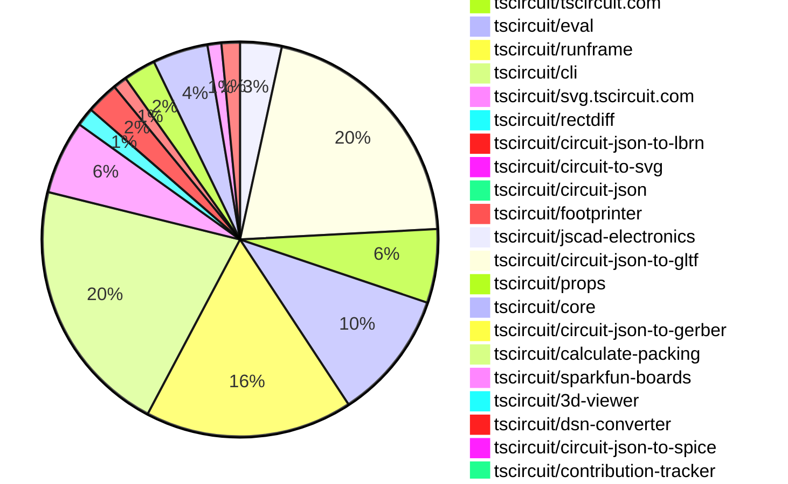
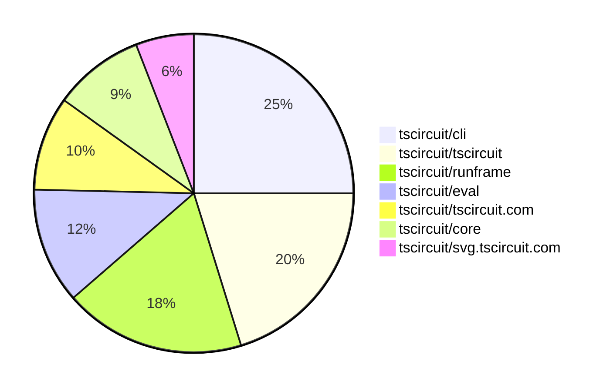

# Contribution Overview 2025-11-26

The current week is shown below. There are 4 major sections:

- [Contributor Overview](#contributor-overview)
- [PRs by Repository](#prs-by-repository)
- [PRs by Contributor](#changes-by-contributor)
- [Scoring & Sponsorship System](#scoring--sponsorship-system)

## PRs by Repository

## Contributor Overview

| Contributor | 🐳 Major | 🐙 Minor | 🐌 Tiny | ⭐ | Score | Discussion Contributions |
|-------------|---------|---------|---------|-----|----------------|--------------------------|
| [seveibar](#seveibar) | 4 | 9 | 4 | ⭐⭐⭐ | 39 | 0🔹 0🔶 0💎 |
| [ArnavK-09](#ArnavK-09) | 4 | 3 | 3 | ⭐⭐ | 27 | 0🔹 0🔶 0💎 |
| [techmannih](#techmannih) | 1 | 6 | 1 | ⭐⭐ | 22 | 0🔹 0🔶 0💎 |
| [tscircuitbot](#tscircuitbot) | 0 | 0 | 202 | ⭐⭐ | 16 | 0🔹 0🔶 0💎 |
| [imrishabh18](#imrishabh18) | 0 | 7 | 1 | ⭐⭐ | 16 | 0🔹 0🔶 0💎 |
| [rushabhcodes](#rushabhcodes) | 1 | 4 | 2 | ⭐⭐ | 15 | 0🔹 0🔶 0💎 |
| [ShiboSoftwareDev](#ShiboSoftwareDev) | 0 | 2 | 0 | ⭐⭐ | 14 | 0🔹 0🔶 0💎 |
| [0hmX](#0hmX) | 3 | 0 | 1 | ⭐⭐ | 13 | 0🔹 0🔶 0💎 |
| [Ayushjhawar8](#Ayushjhawar8) | 0 | 5 | 1 | ⭐⭐ | 12 | 0🔹 0🔶 0💎 |
| [MustafaMulla29](#MustafaMulla29) | 1 | 4 | 0 | ⭐⭐ | 12 | 0🔹 0🔶 0💎 |
| [AnasSarkiz](#AnasSarkiz) | 1 | 4 | 0 | ⭐⭐ | 12 | 0🔹 0🔶 0💎 |
| [Heinrich-XIAO](#Heinrich-XIAO) | 1 | 0 | 2 | ⭐ | 6 | 0🔹 0🔶 0💎 |
| [Abse2001](#Abse2001) | 1 | 0 | 0 | ⭐ | 5 | 0🔹 0🔶 0💎 |
| [Anshgrover23](#Anshgrover23) | 1 | 0 | 0 | ⭐ | 4 | 0🔹 0🔶 0💎 |
| [pxlpal](#pxlpal) | 1 | 0 | 0 | ⭐ | 4 | 0🔹 0🔶 0💎 |
| [Asymtode712](#Asymtode712) | 0 | 0 | 1 |  | 1 | 0🔹 0🔶 0💎 |

> Note: AI evaluates PRs and assigns 1-3 star ratings automatically. 4 and 5 star ratings require manual staff review.

### Discussion Contribution Legend

- 🔹 Normal Comments: Basic participation with minimal effort
- 🔶 Great Informative Comments: Thoughtful participation that adds value
- 💎 Incredible Comments: Exceptional participation with high-quality content

## Review Table

[reviews-received-hover]: ## "Number of reviews received for PRs for this contributor"
[approvals-received-hover]: ## "Number of approvals received for PRs this contributor authored"
[rejections-received-hover]: ## "Number of rejections received for PRs this contributor authored"
[prs-opened-hover]: ## "Number of PRs opened by this contributor"
[issues-created-hover]: ## "Number of issues created by this contributor"
[bountied-issues-hover]: ## "Number of issues this contributor created with a bounty"
[bountied-issue-$-hover]: ## "Total bounty amount placed on issues authored by this contributor"

| Contributor | Reviews Received | Approvals Received | Rejections Received | Approvals | Rejections | PRs Opened | PRs Merged | Score | Issues Created | Bountied Issues | Bountied Issue $ |
|---|---|---|---|---|---|---|---|---|---|---|---|
| [techmannih](#techmannih) | 14 | 6 | 3 | 2 | 0 | 15 | 9 | 22 | 0 | 0 | 0 |
| [seveibar](#seveibar) | 3 | 0 | 0 | 46 | 7 | 28 | 18 | 39 | 0 | 0 | 0 |
| [Asymtode712](#Asymtode712) | 1 | 1 | 0 | 0 | 0 | 2 | 1 | 1 | 0 | 0 | 0 |
| [ShiboSoftwareDev](#ShiboSoftwareDev) | 5 | 4 | 0 | 10 | 0 | 4 | 2 | 14 | 0 | 0 | 0 |
| [tscircuitbot](#tscircuitbot) | 0 | 0 | 0 | 0 | 0 | 238 | 202 | 16 | 0 | 0 | 0 |
| [rushabhcodes](#rushabhcodes) | 30 | 17 | 0 | 0 | 0 | 14 | 7 | 15 | 0 | 0 | 0 |
| [imrishabh18](#imrishabh18) | 9 | 3 | 1 | 6 | 0 | 10 | 8 | 16 | 0 | 0 | 0 |
| [Ayushjhawar8](#Ayushjhawar8) | 19 | 7 | 1 | 0 | 0 | 10 | 6 | 12 | 0 | 0 | 0 |
| [baeoc](#baeoc) | 0 | 0 | 0 | 1 | 0 | 0 | 0 | 0 | 0 | 0 | 0 |
| [Abse2001](#Abse2001) | 1 | 1 | 0 | 1 | 0 | 1 | 1 | 5 | 0 | 0 | 0 |
| [MustafaMulla29](#MustafaMulla29) | 8 | 6 | 0 | 0 | 0 | 8 | 5 | 12 | 0 | 0 | 0 |
| [ArnavK-09](#ArnavK-09) | 19 | 8 | 0 | 1 | 0 | 14 | 10 | 27 | 0 | 0 | 0 |
| [RaghavArora14](#RaghavArora14) | 0 | 0 | 0 | 1 | 0 | 0 | 0 | 0 | 0 | 0 | 0 |
| [Anshgrover23](#Anshgrover23) | 5 | 1 | 1 | 0 | 0 | 1 | 1 | 4 | 0 | 0 | 0 |
| [nailoo](#nailoo) | 0 | 0 | 0 | 0 | 0 | 0 | 0 | 0 | 0 | 0 | 0 |
| [AnasSarkiz](#AnasSarkiz) | 17 | 6 | 1 | 0 | 0 | 7 | 5 | 12 | 0 | 0 | 0 |
| [pxlpal](#pxlpal) | 1 | 1 | 0 | 0 | 0 | 1 | 1 | 4 | 0 | 0 | 0 |
| [0hmX](#0hmX) | 6 | 4 | 0 | 0 | 0 | 4 | 4 | 13 | 0 | 0 | 0 |
| [Heinrich-XIAO](#Heinrich-XIAO) | 4 | 3 | 0 | 0 | 0 | 4 | 3 | 6 | 0 | 0 | 0 |
| [lau90eth](#lau90eth) | 7 | 0 | 0 | 0 | 0 | 1 | 0 | 0 | 0 | 0 | 0 |
| [Excellencedev](#Excellencedev) | 0 | 0 | 0 | 0 | 0 | 0 | 0 | 0 | 0 | 0 | 0 |

## Top 7 Repositories by Contribution Points

## Scoring & Sponsorship System

### Overview

PRs are analyzed by AI and assigned a **star rating (1-3 stars)**. 4 and 5 star ratings can only be manually assigned by staff. Weekly scores use `2^(starRating - 1)` per PR (capped at 12 PRs per rating), plus review/discussion points.

### Weekly Score → Star String

| Score Range | Star String | Count Value |
|------------|-------------|-------------|
| 0-3 | (empty) | 0 stars |
| 4-10 | ⭐ | 1 star |
| 11-30 | ⭐⭐ | 2 stars |
| 31-50 | ⭐⭐⭐ | 3 stars |
| 51-75 | 👑 | 1 crown |
| 76-100 | 👑👑 | 2 crowns |
| 101+ | 👑👑👑 | 3 crowns |

> Crowns count as 3 stars for sponsorship.

### Monthly Sponsorship Calculation

The sponsorship system calculates monthly payments based on your **weekly star counts** over the complete weeks in that month (typically 4-5 weeks, Wednesday-Tuesday format).

**Step 1: Collect Weekly Stars**
- All complete weeks in the month are analyzed
- Each week's star string is converted to a numeric count (⭐ = 1 star, ⭐⭐⭐ = 3 stars)
- Example: `[2, 2, 2, 1, 0]` means 2 stars in week 1, 2 stars in week 2, etc.

**Step 2: Calculate Metrics**
- **Median stars**: The median value of all weekly star counts
- **Min stars**: The minimum weekly star count
- **Max stars**: The maximum weekly star count
- **High score**: The maximum raw weekly score (0-100+ range from the scoring table) from any week in the month

**Step 3: Determine Base Amount**
The sponsorship amount is calculated based on these metrics (checked in order):

| Condition | Base Amount |
|-----------|-------------|
| `minStarCount >= 3` | **$500** |
| `medianStars >= 3` | **$450** |
| `medianStars >= 2.5` | **$300** |
| `medianStars >= 2` | **$200** |
| `medianStars >= 1.5` | **$100** |
| `medianStars >= 1` | **$75** |
| `maxStarCount >= 2` | **$25** |
| `maxStarCount >= 1` | **$15** |
| `highScore >= 3` (and all stars = 0) | **$5** |

| Maintainer Level | Monthly Bonus |
|------------------|---------------|
| Level 1 | **$200** |
| Level 2 | **$350** |
| Level 3 | **$500** |

**Final Amount** = Base Amount + Maintainer Bonus

## Changes by Repository

### [tscircuit/pcb-viewer](https://github.com/tscircuit/pcb-viewer)

| PR # | Impact | Rating | Contributor | Description |
|------|--------|--------|-------------|-------------|
| [#502](https://github.com/tscircuit/pcb-viewer/pull/502) | 🐙 Minor | ⭐⭐ | techmannih | Add support for solder mask margins on surface mount pads, allowing for positive and negative margins to be specified for better control over solder mask coverage. |
| [#500](https://github.com/tscircuit/pcb-viewer/pull/500) | 🐙 Minor | ⭐⭐ | techmannih | Add support for rendering solder masks on surface mount technology (SMT) pads in the PCB viewer, allowing users to visualize solder mask coverage on different pad shapes. |

🐌 Tiny Contributions (7)

| PR # | Impact | Contributor | Description |
|------|--------|-------------|-------------|
| [#509](https://github.com/tscircuit/pcb-viewer/pull/509) | 🐌 Tiny | Asymtode712 | Adds scrolling functionality to the error list in the toolbar overlay by setting a maximum height and enabling overflow when the error list exceeds this height. |
| [#510](https://github.com/tscircuit/pcb-viewer/pull/510) | 🐌 Tiny | tscircuitbot | Automated package update |
| [#508](https://github.com/tscircuit/pcb-viewer/pull/508) | 🐌 Tiny | tscircuitbot | Automated package update |
| [#506](https://github.com/tscircuit/pcb-viewer/pull/506) | 🐌 Tiny | tscircuitbot | Automated package update |
| [#505](https://github.com/tscircuit/pcb-viewer/pull/505) | 🐌 Tiny | tscircuitbot | Automated package update |
| [#501](https://github.com/tscircuit/pcb-viewer/pull/501) | 🐌 Tiny | tscircuitbot | Automated package update |
| [#503](https://github.com/tscircuit/pcb-viewer/pull/503) | 🐌 Tiny | techmannih | Updates the tscircuitalphabet dependency from version 0.0.3 to 0.0.8 in package.json |

### [tscircuit/tscircuit](https://github.com/tscircuit/tscircuit)

🐌 Tiny Contributions (55)

| PR # | Impact | Contributor | Description |
|------|--------|-------------|-------------|
| [#1504](https://github.com/tscircuit/tscircuit/pull/1504) | 🐌 Tiny | tscircuitbot | Automated package update |
| [#1503](https://github.com/tscircuit/tscircuit/pull/1503) | 🐌 Tiny | tscircuitbot | Automated package update |
| [#1502](https://github.com/tscircuit/tscircuit/pull/1502) | 🐌 Tiny | tscircuitbot | Automated package update |
| [#1501](https://github.com/tscircuit/tscircuit/pull/1501) | 🐌 Tiny | tscircuitbot | Automated package update |
| [#1500](https://github.com/tscircuit/tscircuit/pull/1500) | 🐌 Tiny | tscircuitbot | Automated package update |
| [#1499](https://github.com/tscircuit/tscircuit/pull/1499) | 🐌 Tiny | tscircuitbot | Updates the tscircuitcli package to version 0.1.570 in the package.json file |
| [#1498](https://github.com/tscircuit/tscircuit/pull/1498) | 🐌 Tiny | tscircuitbot | Automated package update |
| [#1497](https://github.com/tscircuit/tscircuit/pull/1497) | 🐌 Tiny | tscircuitbot | Automated package update |
| [#1496](https://github.com/tscircuit/tscircuit/pull/1496) | 🐌 Tiny | tscircuitbot | Automated package update |
| [#1495](https://github.com/tscircuit/tscircuit/pull/1495) | 🐌 Tiny | tscircuitbot | Updates the tscircuitcli package version from 0.1.567 to 0.1.568 in package.json |
| [#1494](https://github.com/tscircuit/tscircuit/pull/1494) | 🐌 Tiny | tscircuitbot | Automated package update |
| [#1493](https://github.com/tscircuit/tscircuit/pull/1493) | 🐌 Tiny | tscircuitbot | Automated package update |
| [#1492](https://github.com/tscircuit/tscircuit/pull/1492) | 🐌 Tiny | tscircuitbot | Automated package update |
| [#1491](https://github.com/tscircuit/tscircuit/pull/1491) | 🐌 Tiny | tscircuitbot | Automated package update |
| [#1490](https://github.com/tscircuit/tscircuit/pull/1490) | 🐌 Tiny | tscircuitbot | Automated package update |
| [#1489](https://github.com/tscircuit/tscircuit/pull/1489) | 🐌 Tiny | tscircuitbot | Updates the tscircuitcli package from version 0.1.564 to 0.1.565 and the tscircuitrunframe package from version 0.0.1302 to 0.0.1303 in package.json |
| [#1488](https://github.com/tscircuit/tscircuit/pull/1488) | 🐌 Tiny | tscircuitbot | Automated package update |
| [#1487](https://github.com/tscircuit/tscircuit/pull/1487) | 🐌 Tiny | tscircuitbot | Updates the package versions for tscircuitcli, tscircuitcore, tscircuiteval, tscircuitrunframe, and calculate-packing in package.json |
| [#1486](https://github.com/tscircuit/tscircuit/pull/1486) | 🐌 Tiny | tscircuitbot | Automated package update |
| [#1485](https://github.com/tscircuit/tscircuit/pull/1485) | 🐌 Tiny | tscircuitbot | Automated package update |
| [#1484](https://github.com/tscircuit/tscircuit/pull/1484) | 🐌 Tiny | tscircuitbot | Automated package update |
| [#1483](https://github.com/tscircuit/tscircuit/pull/1483) | 🐌 Tiny | tscircuitbot | Automated package update |
| [#1482](https://github.com/tscircuit/tscircuit/pull/1482) | 🐌 Tiny | tscircuitbot | Automated package update |
| [#1481](https://github.com/tscircuit/tscircuit/pull/1481) | 🐌 Tiny | tscircuitbot | Automated package update |
| [#1480](https://github.com/tscircuit/tscircuit/pull/1480) | 🐌 Tiny | tscircuitbot | Automated package update |
| [#1479](https://github.com/tscircuit/tscircuit/pull/1479) | 🐌 Tiny | tscircuitbot | Automated package update |
| [#1478](https://github.com/tscircuit/tscircuit/pull/1478) | 🐌 Tiny | tscircuitbot | Automated package update |
| [#1477](https://github.com/tscircuit/tscircuit/pull/1477) | 🐌 Tiny | tscircuitbot | Automated package update |
| [#1476](https://github.com/tscircuit/tscircuit/pull/1476) | 🐌 Tiny | tscircuitbot | Automated package update |
| [#1475](https://github.com/tscircuit/tscircuit/pull/1475) | 🐌 Tiny | tscircuitbot | Automated package update |
| [#1474](https://github.com/tscircuit/tscircuit/pull/1474) | 🐌 Tiny | tscircuitbot | Automated package update |
| [#1473](https://github.com/tscircuit/tscircuit/pull/1473) | 🐌 Tiny | tscircuitbot | Updates the tscircuitcli package to version 0.1.557 in package.json |
| [#1471](https://github.com/tscircuit/tscircuit/pull/1471) | 🐌 Tiny | tscircuitbot | Updates the tscircuitcli package to version 0.1.556 in package.json |
| [#1470](https://github.com/tscircuit/tscircuit/pull/1470) | 🐌 Tiny | tscircuitbot | Automated package update |
| [#1469](https://github.com/tscircuit/tscircuit/pull/1469) | 🐌 Tiny | tscircuitbot | Updates the tscircuitcli package to version 0.1.555 in the package.json file. |
| [#1468](https://github.com/tscircuit/tscircuit/pull/1468) | 🐌 Tiny | tscircuitbot | Automated package update |
| [#1467](https://github.com/tscircuit/tscircuit/pull/1467) | 🐌 Tiny | tscircuitbot | Updates the tscircuitcli package to version 0.1.554 |
| [#1466](https://github.com/tscircuit/tscircuit/pull/1466) | 🐌 Tiny | tscircuitbot | Automated package update |
| [#1465](https://github.com/tscircuit/tscircuit/pull/1465) | 🐌 Tiny | tscircuitbot | Updates the tscircuitcli package to version 0.1.553 in package.json |
| [#1464](https://github.com/tscircuit/tscircuit/pull/1464) | 🐌 Tiny | tscircuitbot | Automated package update |
| [#1463](https://github.com/tscircuit/tscircuit/pull/1463) | 🐌 Tiny | tscircuitbot | Updates the tscircuitcli package to version 0.1.552 in the package.json file. |
| [#1462](https://github.com/tscircuit/tscircuit/pull/1462) | 🐌 Tiny | tscircuitbot | Automated package update |
| [#1461](https://github.com/tscircuit/tscircuit/pull/1461) | 🐌 Tiny | tscircuitbot | Updates the tscircuitcli package from version 0.1.550 to 0.1.551 and the tscircuitrunframe package from version 0.0.1293 to 0.0.1294 in package.json |
| [#1460](https://github.com/tscircuit/tscircuit/pull/1460) | 🐌 Tiny | tscircuitbot | Automated package update |
| [#1459](https://github.com/tscircuit/tscircuit/pull/1459) | 🐌 Tiny | tscircuitbot | Automated package update |
| [#1458](https://github.com/tscircuit/tscircuit/pull/1458) | 🐌 Tiny | tscircuitbot | Automated package update |
| [#1457](https://github.com/tscircuit/tscircuit/pull/1457) | 🐌 Tiny | tscircuitbot | Updates the tscircuitcli package to version 0.1.549 in the package.json file. |
| [#1456](https://github.com/tscircuit/tscircuit/pull/1456) | 🐌 Tiny | tscircuitbot | Automated package update |
| [#1455](https://github.com/tscircuit/tscircuit/pull/1455) | 🐌 Tiny | tscircuitbot | Updates the tscircuitcli package to version 0.1.548 in the package.json file. |
| [#1454](https://github.com/tscircuit/tscircuit/pull/1454) | 🐌 Tiny | tscircuitbot | Automated package update |
| [#1453](https://github.com/tscircuit/tscircuit/pull/1453) | 🐌 Tiny | tscircuitbot | Automated package update |
| [#1452](https://github.com/tscircuit/tscircuit/pull/1452) | 🐌 Tiny | tscircuitbot | Automated package update |
| [#1451](https://github.com/tscircuit/tscircuit/pull/1451) | 🐌 Tiny | tscircuitbot | Updates the tscircuitcli package to version 0.1.546 in package.json |
| [#1450](https://github.com/tscircuit/tscircuit/pull/1450) | 🐌 Tiny | tscircuitbot | Automated package update |
| [#1449](https://github.com/tscircuit/tscircuit/pull/1449) | 🐌 Tiny | tscircuitbot | Updates the tscircuitcli package version from 0.1.544 to 0.1.545 in package.json |

### [tscircuit/tscircuit.com](https://github.com/tscircuit/tscircuit.com)

| PR # | Impact | Rating | Contributor | Description |
|------|--------|--------|-------------|-------------|
| [#2091](https://github.com/tscircuit/tscircuit.com/pull/2091) | 🐳 Major | ⭐⭐⭐ | ArnavK-09 | Fixes the handling of 401 errors by removing the previous toast notification system and implementing a new custom toast notification for unauthorized access. |
| [#2072](https://github.com/tscircuit/tscircuit.com/pull/2072) | 🐳 Major | ⭐⭐⭐ | ArnavK-09 | Adds autoclose functionality to the CLI login page, allowing the window to close automatically after a successful login if specified in the URL parameters. |
| [#2080](https://github.com/tscircuit/tscircuit.com/pull/2080) | 🐳 Major | ⭐⭐⭐ | pxlpal | Modifies the GitHub App installation flow to support non-personal organizations by adding organization ID handling and updating repository fetching logic accordingly. |
| [#2092](https://github.com/tscircuit/tscircuit.com/pull/2092) | 🐙 Minor | ⭐⭐ | ArnavK-09 | Displays the edit icon to visitors on the file view page, enhancing user interaction. |

🐌 Tiny Contributions (12)

| PR # | Impact | Contributor | Description |
|------|--------|-------------|-------------|
| [#2094](https://github.com/tscircuit/tscircuit.com/pull/2094) | 🐌 Tiny | tscircuitbot | Updates the tscircuiteval package from version 0.0.503 to 0.0.505 |
| [#2090](https://github.com/tscircuit/tscircuit.com/pull/2090) | 🐌 Tiny | tscircuitbot | Automated package update |
| [#2089](https://github.com/tscircuit/tscircuit.com/pull/2089) | 🐌 Tiny | tscircuitbot | Updates the tscircuiteval package to version 0.0.502 in the package.json file. |
| [#2088](https://github.com/tscircuit/tscircuit.com/pull/2088) | 🐌 Tiny | tscircuitbot | Automated package update |
| [#2087](https://github.com/tscircuit/tscircuit.com/pull/2087) | 🐌 Tiny | tscircuitbot | Automated package update |
| [#2086](https://github.com/tscircuit/tscircuit.com/pull/2086) | 🐌 Tiny | tscircuitbot | Automated package update |
| [#2085](https://github.com/tscircuit/tscircuit.com/pull/2085) | 🐌 Tiny | tscircuitbot | Updates the tscircuiteval package to version 0.0.498 in the package.json file. |
| [#2084](https://github.com/tscircuit/tscircuit.com/pull/2084) | 🐌 Tiny | tscircuitbot | Automated package update |
| [#2083](https://github.com/tscircuit/tscircuit.com/pull/2083) | 🐌 Tiny | tscircuitbot | Updates the tscircuiteval package from version 0.0.495 to 0.0.496 |
| [#2082](https://github.com/tscircuit/tscircuit.com/pull/2082) | 🐌 Tiny | tscircuitbot | Updates the tscircuiteval package from version 0.0.494 to 0.0.495 |
| [#2081](https://github.com/tscircuit/tscircuit.com/pull/2081) | 🐌 Tiny | tscircuitbot | Automated package update |
| [#2079](https://github.com/tscircuit/tscircuit.com/pull/2079) | 🐌 Tiny | tscircuitbot | Updates the tscircuiteval package from version 0.0.492 to 0.0.493 |

### [tscircuit/eval](https://github.com/tscircuit/eval)

| PR # | Impact | Rating | Contributor | Description |
|------|--------|--------|-------------|-------------|
| [#1599](https://github.com/tscircuit/eval/pull/1599) | 🐙 Minor | ⭐⭐ | Ayushjhawar8 | Adds a validation flow for node module imports that checks for package declaration in package.json, existence of files in node_modules, unsupported TypeScript entrypoints, and checks for empty dist directories. |
| [#1593](https://github.com/tscircuit/eval/pull/1593) | 🐙 Minor | ⭐⭐ | Ayushjhawar8 | Throws an error when attempting to import a dependency from jsDelivr that is not declared in package.json, ensuring that all dependencies are explicitly listed before use. |
| [#1594](https://github.com/tscircuit/eval/pull/1594) | 🐙 Minor | ⭐⭐ | imrishabh18 | Adds logic to handle subpath imports for local transpiled packages, ensuring that imports like reactjsx-runtime resolve correctly without errors. |
| [#1583](https://github.com/tscircuit/eval/pull/1583) | 🐙 Minor | ⭐⭐ | imrishabh18 | Adds a flag to disable loading npm packages from jsDelivr CDN, throwing an error for import statements instead. |

🐌 Tiny Contributions (24)

| PR # | Impact | Contributor | Description |
|------|--------|-------------|-------------|
| [#1611](https://github.com/tscircuit/eval/pull/1611) | 🐌 Tiny | tscircuitbot | Automated package update |
| [#1610](https://github.com/tscircuit/eval/pull/1610) | 🐌 Tiny | tscircuitbot | Automated package update |
| [#1608](https://github.com/tscircuit/eval/pull/1608) | 🐌 Tiny | tscircuitbot | Automated package update |
| [#1606](https://github.com/tscircuit/eval/pull/1606) | 🐌 Tiny | tscircuitbot | Automated package update |
| [#1605](https://github.com/tscircuit/eval/pull/1605) | 🐌 Tiny | tscircuitbot | Automated package update |
| [#1601](https://github.com/tscircuit/eval/pull/1601) | 🐌 Tiny | tscircuitbot | Automated package update |
| [#1600](https://github.com/tscircuit/eval/pull/1600) | 🐌 Tiny | tscircuitbot | Automated package update |
| [#1598](https://github.com/tscircuit/eval/pull/1598) | 🐌 Tiny | tscircuitbot | Automated package update |
| [#1597](https://github.com/tscircuit/eval/pull/1597) | 🐌 Tiny | tscircuitbot | Automated package update |
| [#1595](https://github.com/tscircuit/eval/pull/1595) | 🐌 Tiny | tscircuitbot | Automated package update |
| [#1592](https://github.com/tscircuit/eval/pull/1592) | 🐌 Tiny | tscircuitbot | Automated package update to version 0.0.499 |
| [#1591](https://github.com/tscircuit/eval/pull/1591) | 🐌 Tiny | tscircuitbot | Automated package update |
| [#1589](https://github.com/tscircuit/eval/pull/1589) | 🐌 Tiny | tscircuitbot | Automated package update |
| [#1588](https://github.com/tscircuit/eval/pull/1588) | 🐌 Tiny | tscircuitbot | Automated package update |
| [#1587](https://github.com/tscircuit/eval/pull/1587) | 🐌 Tiny | tscircuitbot | Automated package update |
| [#1586](https://github.com/tscircuit/eval/pull/1586) | 🐌 Tiny | tscircuitbot | Automated package update |
| [#1584](https://github.com/tscircuit/eval/pull/1584) | 🐌 Tiny | tscircuitbot | Automated package update |
| [#1582](https://github.com/tscircuit/eval/pull/1582) | 🐌 Tiny | tscircuitbot | Automated package update |
| [#1581](https://github.com/tscircuit/eval/pull/1581) | 🐌 Tiny | tscircuitbot | Automated package update |
| [#1579](https://github.com/tscircuit/eval/pull/1579) | 🐌 Tiny | tscircuitbot | Automated package update |
| [#1578](https://github.com/tscircuit/eval/pull/1578) | 🐌 Tiny | tscircuitbot | Automated package update |
| [#1576](https://github.com/tscircuit/eval/pull/1576) | 🐌 Tiny | tscircuitbot | Automated package update |
| [#1575](https://github.com/tscircuit/eval/pull/1575) | 🐌 Tiny | tscircuitbot | Automated package update |
| [#1596](https://github.com/tscircuit/eval/pull/1596) | 🐌 Tiny | imrishabh18 | Adds the reactjsx-runtime to the preSuppliedImports context for improved JSX handling in the execution context. |

### [tscircuit/runframe](https://github.com/tscircuit/runframe)

| PR # | Impact | Rating | Contributor | Description |
|------|--------|--------|-------------|-------------|
| [#1852](https://github.com/tscircuit/runframe/pull/1852) | 🐳 Major | ⭐⭐⭐ | ArnavK-09 | Adds a login dialog for CLI access and integrates it with the bug report functionality, requiring user authentication to submit bug reports. |
| [#1873](https://github.com/tscircuit/runframe/pull/1873) | 🐙 Minor | ⭐⭐ | rushabhcodes | Fixes the issue where the CadViewer component does not re-render correctly when toggling fullscreen mode in the CircuitJsonPreview component. |
| [#1892](https://github.com/tscircuit/runframe/pull/1892) | 🐙 Minor | ⭐⭐ | imrishabh18 | Adds functionality to disable CDN loading for the CLI version of RunFrame by checking a global window variable. |

🐌 Tiny Contributions (42)

| PR # | Impact | Contributor | Description |
|------|--------|-------------|-------------|
| [#1917](https://github.com/tscircuit/runframe/pull/1917) | 🐌 Tiny | tscircuitbot | Automated package update |
| [#1916](https://github.com/tscircuit/runframe/pull/1916) | 🐌 Tiny | tscircuitbot | Updates the tscircuitpcb-viewer package from version 1.11.272 to 1.11.273 |
| [#1914](https://github.com/tscircuit/runframe/pull/1914) | 🐌 Tiny | tscircuitbot | Updates the package version from 0.0.1311 to 0.0.1312 in package.json |
| [#1913](https://github.com/tscircuit/runframe/pull/1913) | 🐌 Tiny | tscircuitbot | Updates the tscircuiteval package from version 0.0.503 to 0.0.505 |
| [#1912](https://github.com/tscircuit/runframe/pull/1912) | 🐌 Tiny | tscircuitbot | Automated package update |
| [#1911](https://github.com/tscircuit/runframe/pull/1911) | 🐌 Tiny | tscircuitbot | Automated package update |
| [#1910](https://github.com/tscircuit/runframe/pull/1910) | 🐌 Tiny | tscircuitbot | Automated package update to version 0.0.1310 |
| [#1909](https://github.com/tscircuit/runframe/pull/1909) | 🐌 Tiny | tscircuitbot | Updates the tscircuitpcb-viewer package from version 1.11.271 to 1.11.272 |
| [#1908](https://github.com/tscircuit/runframe/pull/1908) | 🐌 Tiny | tscircuitbot | Updates the package version from 0.0.1307 to 0.0.1309 in package.json |
| [#1907](https://github.com/tscircuit/runframe/pull/1907) | 🐌 Tiny | tscircuitbot | Updates the tscircuitpcb-viewer package from version 1.11.270 to 1.11.271 |
| [#1906](https://github.com/tscircuit/runframe/pull/1906) | 🐌 Tiny | tscircuitbot | Updates the tscircuitpcb-viewer package from version 1.11.269 to 1.11.270 |
| [#1904](https://github.com/tscircuit/runframe/pull/1904) | 🐌 Tiny | tscircuitbot | Automated package update to version 0.0.1307 |
| [#1903](https://github.com/tscircuit/runframe/pull/1903) | 🐌 Tiny | tscircuitbot | Updates the tscircuiteval package from version 0.0.502 to 0.0.503 |
| [#1902](https://github.com/tscircuit/runframe/pull/1902) | 🐌 Tiny | tscircuitbot | Automated package update |
| [#1901](https://github.com/tscircuit/runframe/pull/1901) | 🐌 Tiny | tscircuitbot | Updates the tscircuiteval package to version 0.0.502 |
| [#1900](https://github.com/tscircuit/runframe/pull/1900) | 🐌 Tiny | tscircuitbot | Updates the package version from 0.0.1304 to 0.0.1305 in package.json |
| [#1899](https://github.com/tscircuit/runframe/pull/1899) | 🐌 Tiny | tscircuitbot | Updates the tscircuiteval package from version 0.0.500 to 0.0.501 |
| [#1898](https://github.com/tscircuit/runframe/pull/1898) | 🐌 Tiny | tscircuitbot | Updates the package version from 0.0.1303 to 0.0.1304 in package.json |
| [#1897](https://github.com/tscircuit/runframe/pull/1897) | 🐌 Tiny | tscircuitbot | Updates the tscircuiteval package from version 0.0.499 to 0.0.500 |
| [#1896](https://github.com/tscircuit/runframe/pull/1896) | 🐌 Tiny | tscircuitbot | Automated package update to version 0.0.1303 |
| [#1895](https://github.com/tscircuit/runframe/pull/1895) | 🐌 Tiny | tscircuitbot | Updates the tscircuiteval package to version 0.0.499 in the package.json file. |
| [#1894](https://github.com/tscircuit/runframe/pull/1894) | 🐌 Tiny | tscircuitbot | Updates the package version from 0.0.1301 to 0.0.1302 in package.json |
| [#1893](https://github.com/tscircuit/runframe/pull/1893) | 🐌 Tiny | tscircuitbot | Updates the tscircuiteval package to version 0.0.498 in package.json |
| [#1891](https://github.com/tscircuit/runframe/pull/1891) | 🐌 Tiny | tscircuitbot | Automated package update to version 0.0.1301 |
| [#1890](https://github.com/tscircuit/runframe/pull/1890) | 🐌 Tiny | tscircuitbot | Updates the tscircuitpcb-viewer package to version 1.11.269 |
| [#1889](https://github.com/tscircuit/runframe/pull/1889) | 🐌 Tiny | tscircuitbot | Automated package update to version 0.0.1300 |
| [#1888](https://github.com/tscircuit/runframe/pull/1888) | 🐌 Tiny | tscircuitbot | Updates the tscircuiteval package to version 0.0.497 in package.json |
| [#1887](https://github.com/tscircuit/runframe/pull/1887) | 🐌 Tiny | tscircuitbot | Automated package update |
| [#1886](https://github.com/tscircuit/runframe/pull/1886) | 🐌 Tiny | tscircuitbot | Updates the tscircuiteval package from version 0.0.495 to 0.0.496 |
| [#1885](https://github.com/tscircuit/runframe/pull/1885) | 🐌 Tiny | tscircuitbot | Automated package update |
| [#1884](https://github.com/tscircuit/runframe/pull/1884) | 🐌 Tiny | tscircuitbot | Automated package update |
| [#1883](https://github.com/tscircuit/runframe/pull/1883) | 🐌 Tiny | tscircuitbot | Automated package update to version 0.0.1297 |
| [#1882](https://github.com/tscircuit/runframe/pull/1882) | 🐌 Tiny | tscircuitbot | Updates the tscircuiteval package to version 0.0.494 in the package.json file. |
| [#1881](https://github.com/tscircuit/runframe/pull/1881) | 🐌 Tiny | tscircuitbot | Automated package update to version 0.0.1296 |
| [#1880](https://github.com/tscircuit/runframe/pull/1880) | 🐌 Tiny | tscircuitbot | Updates the tscircuit3d-viewer package to version 0.0.446 in the package.json file. |
| [#1879](https://github.com/tscircuit/runframe/pull/1879) | 🐌 Tiny | tscircuitbot | Automated package update |
| [#1878](https://github.com/tscircuit/runframe/pull/1878) | 🐌 Tiny | tscircuitbot | Automated package update |
| [#1877](https://github.com/tscircuit/runframe/pull/1877) | 🐌 Tiny | tscircuitbot | Updates the tscircuit3d-viewer package to version 0.0.445 in package.json |
| [#1876](https://github.com/tscircuit/runframe/pull/1876) | 🐌 Tiny | tscircuitbot | Updates the package version from 0.0.1292 to 0.0.1293 in package.json |
| [#1875](https://github.com/tscircuit/runframe/pull/1875) | 🐌 Tiny | tscircuitbot | Updates the tscircuiteval package to version 0.0.493 in the package.json file. |
| [#1872](https://github.com/tscircuit/runframe/pull/1872) | 🐌 Tiny | tscircuitbot | Automated package update |
| [#1871](https://github.com/tscircuit/runframe/pull/1871) | 🐌 Tiny | ArnavK-09 | This pull request introduces a generated CSS file that includes various utility classes and styles for the project, likely based on Tailwind CSS. |

### [tscircuit/cli](https://github.com/tscircuit/cli)

| PR # | Impact | Rating | Contributor | Description |
|------|--------|--------|-------------|-------------|
| [#1070](https://github.com/tscircuit/cli/pull/1070) | 🐳 Major | ⭐⭐⭐ | MustafaMulla29 | Adds functionality to install packages using the command tsci add, similar to bun add, allowing for various package specifications including GitHub URLs and versioning. |
| [#1077](https://github.com/tscircuit/cli/pull/1077) | 🐳 Major | ⭐⭐⭐ | ArnavK-09 | Adds a --use-global flag to the CLI to allow users to skip the local version check and use the global version of the CLI instead. |
| [#1072](https://github.com/tscircuit/cli/pull/1072) | 🐙 Minor | ⭐⭐ | seveibar | Fixes the asset loading mechanism in the transpilation process to ensure static assets are correctly resolved and copied during the build. |
| [#1065](https://github.com/tscircuit/cli/pull/1065) | 🐙 Minor | ⭐⭐ | seveibar | Extracts a shared validator to ensure package.json main points inside dist before transpiling, and uses this validation for both tsci build --transpile and tsci transpile. |
| [#1107](https://github.com/tscircuit/cli/pull/1107) | 🐙 Minor | ⭐⭐ | imrishabh18 | Fixes the resolution of node_modules imports by searching upward for hoisted packages, collecting local package roots, and skipping runtime-provided packages during dependency uploads. |
| [#1125](https://github.com/tscircuit/cli/pull/1125) | 🐙 Minor | ⭐⭐ | MustafaMulla29 | Adds support for loading .kicad_mod files by converting absolute file paths to file: URLs for Buns fetch, enhancing platform configuration with KiCad parsing support. |
| [#1104](https://github.com/tscircuit/cli/pull/1104) | 🐙 Minor | ⭐⭐ | MustafaMulla29 | Adds functionality to detect KiCad libraries and generate TypeScript type declarations for KiCad footprint files. |
| [#1032](https://github.com/tscircuit/cli/pull/1032) | 🐙 Minor | ⭐⭐ | ArnavK-09 | Adds handling for session token updates in the DevServer, including logging success or error messages. |

🐌 Tiny Contributions (48)

| PR # | Impact | Contributor | Description |
|------|--------|-------------|-------------|
| [#1133](https://github.com/tscircuit/cli/pull/1133) | 🐌 Tiny | tscircuitbot | Automated package update |
| [#1132](https://github.com/tscircuit/cli/pull/1132) | 🐌 Tiny | tscircuitbot | Updates the tscircuitrunframe package from version 0.0.1306 to 0.0.1308 |
| [#1130](https://github.com/tscircuit/cli/pull/1130) | 🐌 Tiny | tscircuitbot | Automated package update |
| [#1128](https://github.com/tscircuit/cli/pull/1128) | 🐌 Tiny | tscircuitbot | Automated package update |
| [#1127](https://github.com/tscircuit/cli/pull/1127) | 🐌 Tiny | tscircuitbot | Automated package update |
| [#1126](https://github.com/tscircuit/cli/pull/1126) | 🐌 Tiny | tscircuitbot | Updates the tscircuitrunframe package from version 0.0.1305 to 0.0.1306 |
| [#1122](https://github.com/tscircuit/cli/pull/1122) | 🐌 Tiny | tscircuitbot | Automated package update |
| [#1121](https://github.com/tscircuit/cli/pull/1121) | 🐌 Tiny | tscircuitbot | Automated package update |
| [#1120](https://github.com/tscircuit/cli/pull/1120) | 🐌 Tiny | tscircuitbot | Updates the tscircuitrunframe package from version 0.0.1304 to 0.0.1305 |
| [#1119](https://github.com/tscircuit/cli/pull/1119) | 🐌 Tiny | tscircuitbot | Automated package update |
| [#1118](https://github.com/tscircuit/cli/pull/1118) | 🐌 Tiny | tscircuitbot | Updates the tscircuitrunframe package from version 0.0.1303 to 0.0.1304 |
| [#1117](https://github.com/tscircuit/cli/pull/1117) | 🐌 Tiny | tscircuitbot | Automated package update |
| [#1116](https://github.com/tscircuit/cli/pull/1116) | 🐌 Tiny | tscircuitbot | Updates the tscircuitrunframe package from version 0.0.1302 to 0.0.1303 |
| [#1115](https://github.com/tscircuit/cli/pull/1115) | 🐌 Tiny | tscircuitbot | Automated package update |
| [#1114](https://github.com/tscircuit/cli/pull/1114) | 🐌 Tiny | tscircuitbot | Updates the tscircuitrunframe package from version 0.0.1301 to 0.0.1302 |
| [#1113](https://github.com/tscircuit/cli/pull/1113) | 🐌 Tiny | tscircuitbot | Automated package update |
| [#1112](https://github.com/tscircuit/cli/pull/1112) | 🐌 Tiny | tscircuitbot | Automated package update |
| [#1111](https://github.com/tscircuit/cli/pull/1111) | 🐌 Tiny | tscircuitbot | Automated package update |
| [#1110](https://github.com/tscircuit/cli/pull/1110) | 🐌 Tiny | tscircuitbot | Updates the tscircuitrunframe package from version 0.0.1299 to 0.0.1300 |
| [#1109](https://github.com/tscircuit/cli/pull/1109) | 🐌 Tiny | tscircuitbot | Automated package update |
| [#1108](https://github.com/tscircuit/cli/pull/1108) | 🐌 Tiny | tscircuitbot | Updates the tscircuitrunframe package from version 0.0.1298 to 0.0.1299 |
| [#1106](https://github.com/tscircuit/cli/pull/1106) | 🐌 Tiny | tscircuitbot | Automated package update |
| [#1105](https://github.com/tscircuit/cli/pull/1105) | 🐌 Tiny | tscircuitbot | Updates the tscircuitrunframe package from version 0.0.1297 to 0.0.1298 |
| [#1103](https://github.com/tscircuit/cli/pull/1103) | 🐌 Tiny | tscircuitbot | Automated package update |
| [#1102](https://github.com/tscircuit/cli/pull/1102) | 🐌 Tiny | tscircuitbot | Updates the tscircuitrunframe package from version 0.0.1295 to 0.0.1297 |
| [#1100](https://github.com/tscircuit/cli/pull/1100) | 🐌 Tiny | tscircuitbot | Automated package update |
| [#1099](https://github.com/tscircuit/cli/pull/1099) | 🐌 Tiny | tscircuitbot | Updates the tscircuitrunframe package from version 0.0.1294 to 0.0.1295 |
| [#1098](https://github.com/tscircuit/cli/pull/1098) | 🐌 Tiny | tscircuitbot | Automated package update |
| [#1097](https://github.com/tscircuit/cli/pull/1097) | 🐌 Tiny | tscircuitbot | Updates the CLI usage command from add component to add packageSpec in the README file to reflect the latest command syntax. |
| [#1096](https://github.com/tscircuit/cli/pull/1096) | 🐌 Tiny | tscircuitbot | Automated package update |
| [#1094](https://github.com/tscircuit/cli/pull/1094) | 🐌 Tiny | tscircuitbot | Automated package update |
| [#1093](https://github.com/tscircuit/cli/pull/1093) | 🐌 Tiny | tscircuitbot | Automated README update with latest CLI usage output. |
| [#1092](https://github.com/tscircuit/cli/pull/1092) | 🐌 Tiny | tscircuitbot | Automated package update |
| [#1089](https://github.com/tscircuit/cli/pull/1089) | 🐌 Tiny | tscircuitbot | Automated package update to version 0.1.553 |
| [#1085](https://github.com/tscircuit/cli/pull/1085) | 🐌 Tiny | tscircuitbot | Automated package update |
| [#1083](https://github.com/tscircuit/cli/pull/1083) | 🐌 Tiny | tscircuitbot | Automated package update |
| [#1082](https://github.com/tscircuit/cli/pull/1082) | 🐌 Tiny | tscircuitbot | Updates the tscircuitrunframe package from version 0.0.1293 to 0.0.1294 |
| [#1081](https://github.com/tscircuit/cli/pull/1081) | 🐌 Tiny | tscircuitbot | Automated package update |
| [#1080](https://github.com/tscircuit/cli/pull/1080) | 🐌 Tiny | tscircuitbot | Updates the tscircuitrunframe package from version 0.0.1292 to 0.0.1293 |
| [#1079](https://github.com/tscircuit/cli/pull/1079) | 🐌 Tiny | tscircuitbot | Automated package update to version 0.1.549 |
| [#1073](https://github.com/tscircuit/cli/pull/1073) | 🐌 Tiny | tscircuitbot | Automated package update |
| [#1069](https://github.com/tscircuit/cli/pull/1069) | 🐌 Tiny | tscircuitbot | Automated package update to version 0.1.547 |
| [#1068](https://github.com/tscircuit/cli/pull/1068) | 🐌 Tiny | tscircuitbot | Updates the tscircuitrunframe package from version 0.0.1291 to 0.0.1292 |
| [#1067](https://github.com/tscircuit/cli/pull/1067) | 🐌 Tiny | tscircuitbot | Automated package update |
| [#1066](https://github.com/tscircuit/cli/pull/1066) | 🐌 Tiny | tscircuitbot | Automated package update |
| [#1078](https://github.com/tscircuit/cli/pull/1078) | 🐌 Tiny | seveibar | Adds a prompt to optionally rename cloned bug report directories using the bug report package name and ID suffix, reusing existing directory handling when applying the optional rename. |
| [#1086](https://github.com/tscircuit/cli/pull/1086) | 🐌 Tiny | ArnavK-09 | Enables automatic merging of pull requests for the README file when CI checks pass. |
| [#1076](https://github.com/tscircuit/cli/pull/1076) | 🐌 Tiny | ArnavK-09 | Updates the README workflow to create a pull request for changes instead of pushing directly to the main branch. |

### [tscircuit/svg.tscircuit.com](https://github.com/tscircuit/svg.tscircuit.com)

🐌 Tiny Contributions (16)

| PR # | Impact | Contributor | Description |
|------|--------|-------------|-------------|
| [#668](https://github.com/tscircuit/svg.tscircuit.com/pull/668) | 🐌 Tiny | tscircuitbot | Automated package update |
| [#667](https://github.com/tscircuit/svg.tscircuit.com/pull/667) | 🐌 Tiny | tscircuitbot | Updates the tscircuit package version from 0.0.968 to 0.0.980 in package.json |
| [#655](https://github.com/tscircuit/svg.tscircuit.com/pull/655) | 🐌 Tiny | tscircuitbot | Updates the tscircuit package version from 0.0.967 to 0.0.968 in package.json |
| [#654](https://github.com/tscircuit/svg.tscircuit.com/pull/654) | 🐌 Tiny | tscircuitbot | Updates the tscircuit package version from 0.0.966 to 0.0.967 in package.json |
| [#653](https://github.com/tscircuit/svg.tscircuit.com/pull/653) | 🐌 Tiny | tscircuitbot | Updates the tscircuit package version from 0.0.964 to 0.0.966 in package.json |
| [#652](https://github.com/tscircuit/svg.tscircuit.com/pull/652) | 🐌 Tiny | tscircuitbot | Automated package update |
| [#651](https://github.com/tscircuit/svg.tscircuit.com/pull/651) | 🐌 Tiny | tscircuitbot | Updates the tscircuit package version from 0.0.962 to 0.0.963 in package.json |
| [#650](https://github.com/tscircuit/svg.tscircuit.com/pull/650) | 🐌 Tiny | tscircuitbot | Updates the tscircuit package version from 0.0.961 to 0.0.962 in package.json |
| [#649](https://github.com/tscircuit/svg.tscircuit.com/pull/649) | 🐌 Tiny | tscircuitbot | Updates the tscircuit package version from 0.0.960 to 0.0.961 in package.json |
| [#648](https://github.com/tscircuit/svg.tscircuit.com/pull/648) | 🐌 Tiny | tscircuitbot | Updates the tscircuit package version from 0.0.959 to 0.0.960 in package.json |
| [#647](https://github.com/tscircuit/svg.tscircuit.com/pull/647) | 🐌 Tiny | tscircuitbot | Updates the tscircuit package version from 0.0.958 to 0.0.959 in package.json |
| [#646](https://github.com/tscircuit/svg.tscircuit.com/pull/646) | 🐌 Tiny | tscircuitbot | Automated package update |
| [#645](https://github.com/tscircuit/svg.tscircuit.com/pull/645) | 🐌 Tiny | tscircuitbot | Updates the tscircuit package version from 0.0.956 to 0.0.957 in package.json |
| [#644](https://github.com/tscircuit/svg.tscircuit.com/pull/644) | 🐌 Tiny | tscircuitbot | Updates the tscircuit package version from 0.0.955 to 0.0.956 in package.json |
| [#643](https://github.com/tscircuit/svg.tscircuit.com/pull/643) | 🐌 Tiny | tscircuitbot | Updates the tscircuit package version from 0.0.954 to 0.0.955 in package.json |
| [#642](https://github.com/tscircuit/svg.tscircuit.com/pull/642) | 🐌 Tiny | tscircuitbot | Updates the tscircuit package version from 0.0.953 to 0.0.954 in package.json |

### [tscircuit/rectdiff](https://github.com/tscircuit/rectdiff)

| PR # | Impact | Rating | Contributor | Description |
|------|--------|--------|-------------|-------------|
| [#11](https://github.com/tscircuit/rectdiff/pull/11) | 🐳 Major | ⭐⭐⭐ | 0hmX | How GapFillSubSolver Works GapFillSubSolver operates as a post-processing cleanup algorithm that creates brand new rectangles to fill empty spaces left after the main RectDiff placement. It follows a four-stage process: 1. SCAN: Detects uncovered areas using grid-based sweep-line algorithm, merging adjacent empty cells into maximal gap rectangles 2. SELECT: Prioritizes gaps by size and multi-layer coverage, choosing the most valuable gap to fill next 3. EXPAND: Places seed point at gap center and grows a rectangle outward until hitting existing rectangles, obstacles, or boundaries 4. PLACE: Adds the successfully expanded rectangle to the solution as a new placement  Fundamental Difference from RectDiff RectDiff solves the routing problem - it places rectangles to enable electrical signal connections based on circuit topology and routing requirements from SimpleRouteJson input. GapFillSubSolver solves the coverage problem - it maximizes board area utilization by filling leftover empty spaces with new rectangles, regardless of routing needs. RectDiff creates rectangles for electrical functionality (routing paths), while GapFillSubSolver creates rectangles for geometric efficiency (space utilization). They serve complementary but entirely different purposes in the placement pipeline: connectivity versus coverage optimization. |

🐌 Tiny Contributions (3)

| PR # | Impact | Contributor | Description |
|------|--------|-------------|-------------|
| [#14](https://github.com/tscircuit/rectdiff/pull/14) | 🐌 Tiny | tscircuitbot | Automated package update to version 0.0.5 |
| [#13](https://github.com/tscircuit/rectdiff/pull/13) | 🐌 Tiny | tscircuitbot | Automated package update |
| [#12](https://github.com/tscircuit/rectdiff/pull/12) | 🐌 Tiny | 0hmX | Fixes the preview rendering by updating the HTML title and script source paths, and adds Vite configuration for React. |

### [tscircuit/circuit-json-to-lbrn](https://github.com/tscircuit/circuit-json-to-lbrn)

| PR # | Impact | Rating | Contributor | Description |
|------|--------|--------|-------------|-------------|
| [#28](https://github.com/tscircuit/circuit-json-to-lbrn/pull/28) | 🐙 Minor | ⭐⭐ | AnasSarkiz | Switches the soldermask layer generation from Cut mode (outline paths) to Scan mode (filled shapes) to improve the laser-cutting workflow for Kapton tape. |
| [#26](https://github.com/tscircuit/circuit-json-to-lbrn/pull/26) | 🐙 Minor | ⭐⭐ | AnasSarkiz | Add a new soldermask cut setting with optimized parameters and update relevant handlers to use this setting instead of copper cut settings, ensuring appropriate laser parameters for soldermask layers. |
| [#24](https://github.com/tscircuit/circuit-json-to-lbrn/pull/24) | 🐙 Minor | ⭐⭐ | AnasSarkiz | Adds options to include copper and soldermask layers in PCB element handlers, modifying their behavior accordingly and improving documentation for these features. |
| [#21](https://github.com/tscircuit/circuit-json-to-lbrn/pull/21) | 🐙 Minor | ⭐⭐ | AnasSarkiz | Adds support for new SMT pad shapes including circle, pill, polygon, rotated rectangle, and rounded rectangle, along with corresponding path generation and snapshot tests. |

🐌 Tiny Contributions (3)

| PR # | Impact | Contributor | Description |
|------|--------|-------------|-------------|
| [#29](https://github.com/tscircuit/circuit-json-to-lbrn/pull/29) | 🐌 Tiny | tscircuitbot | Updates the package version from 0.0.11 to 0.0.12 in package.json |
| [#27](https://github.com/tscircuit/circuit-json-to-lbrn/pull/27) | 🐌 Tiny | tscircuitbot | Automated package update to version 0.0.11 |
| [#25](https://github.com/tscircuit/circuit-json-to-lbrn/pull/25) | 🐌 Tiny | tscircuitbot | Automated package update |

### [tscircuit/circuit-to-svg](https://github.com/tscircuit/circuit-to-svg)

| PR # | Impact | Rating | Contributor | Description |
|------|--------|--------|-------------|-------------|
| [#440](https://github.com/tscircuit/circuit-to-svg/pull/440) | 🐳 Major | ⭐⭐⭐ | techmannih | Adds support for rendering solder masks for rotated pill-shaped SMT pads in the SVG output. |
| [#439](https://github.com/tscircuit/circuit-to-svg/pull/439) | 🐳 Major | ⭐⭐⭐ | AnasSarkiz | Implemented rotation support for pill-shaped SMT pads and added proper handling of soldermask margins for rotated pills |

### [tscircuit/circuit-json](https://github.com/tscircuit/circuit-json)

| PR # | Impact | Rating | Contributor | Description |
|------|--------|--------|-------------|-------------|
| [#364](https://github.com/tscircuit/circuit-json/pull/364) | 🐙 Minor | ⭐⭐ | techmannih | Adds an optional boolean property is_tented to the PCB via definition, allowing for better representation of tented vias in PCB designs. |
| [#363](https://github.com/tscircuit/circuit-json/pull/363) | 🐙 Minor | ⭐⭐ | Ayushjhawar8 | Adds an optional boolean property show_as_translucent_model to the CadComponent type, allowing for the representation of components as translucent models in the PCB design. |

### [tscircuit/footprinter](https://github.com/tscircuit/footprinter)

| PR # | Impact | Rating | Contributor | Description |
|------|--------|--------|-------------|-------------|
| [#433](https://github.com/tscircuit/footprinter/pull/433) | 🐙 Minor | ⭐⭐ | techmannih | Adds a faceup flag to the pinrow definition to control the orientation of the 3D model, ensuring the male pin header faces upwards. |
| [#434](https://github.com/tscircuit/footprinter/pull/434) | 🐙 Minor | ⭐⭐ | seveibar | Adds a nosilkscreen flag to the shared footprint definition options, allowing users to filter generated footprints to remove silkscreen elements when the flag is set. |
| [#432](https://github.com/tscircuit/footprinter/pull/432) | 🐙 Minor | ⭐⭐ | rushabhcodes | Adds an optional boolean property invert to the base_def schema to hint for flipping headers in jscad-electronics. |

### [tscircuit/jscad-electronics](https://github.com/tscircuit/jscad-electronics)

| PR # | Impact | Rating | Contributor | Description |
|------|--------|--------|-------------|-------------|
| [#241](https://github.com/tscircuit/jscad-electronics/pull/241) | 🐙 Minor | ⭐⭐ | techmannih | Adds faceup functionality to the PinRow component, allowing for better representation of pin configurations in 3D views. |
| [#236](https://github.com/tscircuit/jscad-electronics/pull/236) | 🐙 Minor | ⭐⭐ | rushabhcodes | Adds support for rendering inverted pin row footprints in the 3D visualization components by detecting the invert parameter and flipping Z coordinates in the PinRow component. |

### [tscircuit/circuit-json-to-gltf](https://github.com/tscircuit/circuit-json-to-gltf)

| PR # | Impact | Rating | Contributor | Description |
|------|--------|--------|-------------|-------------|
| [#91](https://github.com/tscircuit/circuit-json-to-gltf/pull/91) | 🐙 Minor | ⭐⭐ | techmannih | Removes the interfaces and types related to PCB copper pours from the codebase, simplifying the structure of the library. |
| [#88](https://github.com/tscircuit/circuit-json-to-gltf/pull/88) | 🐙 Minor | ⭐⭐ | ArnavK-09 | Updates the color factors for PCB rendering in the GLTF output, changing the base color factors for various materials to improve visual representation. |

### [tscircuit/props](https://github.com/tscircuit/props)

| PR # | Impact | Rating | Contributor | Description |
|------|--------|--------|-------------|-------------|
| [#522](https://github.com/tscircuit/props/pull/522) | 🐳 Major | ⭐⭐⭐ | seveibar | Add pcbLeftEdgeX, pcbRightEdgeX, pcbTopEdgeY, and pcbBottomEdgeY layout properties for edge-anchored PCB positioning and regenerate documentation. |
| [#513](https://github.com/tscircuit/props/pull/513) | 🐙 Minor | ⭐⭐ | Ayushjhawar8 | Adds a new property to the CommonComponentProps interface to allow components to be displayed as translucent models in the 3D viewer. |
| [#520](https://github.com/tscircuit/props/pull/520) | 🐙 Minor | ⭐⭐ | seveibar | Allows pcbXpcbY coordinates to accept calc(...) expressions across shared layout schemas and ensures cad model coordinates use the new calc-aware validation. |
| [#519](https://github.com/tscircuit/props/pull/519) | 🐙 Minor | ⭐⭐ | seveibar | Add a SchStyle schema covering passive size and capacitor orientation defaults, expose optional schStyle on layout props and export it for consumers, and regenerate documentation artifacts to include the new schematic style options. |
| [#516](https://github.com/tscircuit/props/pull/516) | 🐙 Minor | ⭐⭐ | seveibar | Allows board props to accept 6- and 8-layer stackups, updates documentation, and adds tests for new layer counts. |
| [#517](https://github.com/tscircuit/props/pull/517) | 🐙 Minor | ⭐⭐ | seveibar | Adds viaPadDiameter and viaHoleDiameter fields to the PcbStyle interface and validation schema, along with regenerating documentation to reflect these new properties. |

🐌 Tiny Contributions (1)

| PR # | Impact | Contributor | Description |
|------|--------|-------------|-------------|
| [#518](https://github.com/tscircuit/props/pull/518) | 🐌 Tiny | seveibar | Add a shared schematicSymbolSize schema for describing symbol pin spacing and expose optional schSize on resistor and capacitor components, along with regenerating documentation and exports to reflect the new property. |

### [tscircuit/core](https://github.com/tscircuit/core)

| PR # | Impact | Rating | Contributor | Description |
|------|--------|--------|-------------|-------------|
| [#1698](https://github.com/tscircuit/core/pull/1698) | 🐳 Major | ⭐⭐⭐ | seveibar | Add support for calc string evaluation and PCB position resolution with board bounds context, including board traversal and calc variable support while guarding auto-sized boards, and update primitives to use resolved PCB positions with new tests. |
| [#1696](https://github.com/tscircuit/core/pull/1696) | 🐳 Major | ⭐⭐⭐ | Abse2001 | Fixes PCB component positioning inside subcircuits by applying the correct component-local transform and adds missing placement fields for various components. |
| [#1685](https://github.com/tscircuit/core/pull/1685) | 🐙 Minor | ⭐⭐ | Ayushjhawar8 | Updates NormalComponent and CadModel to pass the show_as_translucent_model property, allowing for translucent rendering of models. |
| [#1697](https://github.com/tscircuit/core/pull/1697) | 🐙 Minor | ⭐⭐ | seveibar | Adds support for double-row pinheader footprints by including a doubleRow prop, allowing for dual-row pad layouts and adding a regression test to ensure correct placement across two PCB rows. |
| [#1689](https://github.com/tscircuit/core/pull/1689) | 🐙 Minor | ⭐⭐ | seveibar | Adds default via diameters for PCB styles and includes regression tests for the new functionality. |
| [#1683](https://github.com/tscircuit/core/pull/1683) | 🐙 Minor | ⭐⭐ | imrishabh18 | Adds error handling for missing x and y coordinates in port connections, logging an error message and skipping the trace if coordinates are not defined. |
| [#1695](https://github.com/tscircuit/core/pull/1695) | 🐙 Minor | ⭐⭐ | ShiboSoftwareDev | Adds support for differential voltage probes in simulation, allowing measurement of voltage differences between two points in a circuit. Includes a full-wave bridge rectifier test demonstrating the new functionality. |
| [#1692](https://github.com/tscircuit/core/pull/1692) | 🐙 Minor | ⭐⭐ | MustafaMulla29 | Fixes issue where traces extend beyond the edges of pads in PCB layout rendering. |
| [#1691](https://github.com/tscircuit/core/pull/1691) | 🐙 Minor | ⭐⭐ | MustafaMulla29 | Adds a test to verify that a straight trace correctly connects a circular pad to a capacitor without rendering issues. |

🐌 Tiny Contributions (3)

| PR # | Impact | Contributor | Description |
|------|--------|-------------|-------------|
| [#1687](https://github.com/tscircuit/core/pull/1687) | 🐌 Tiny | Ayushjhawar8 | Fixes errors related to updated circuit-json dependencies in the VoltageProbe component. |
| [#1693](https://github.com/tscircuit/core/pull/1693) | 🐌 Tiny | seveibar | Updates the intrinsic JSX footprint element to use FootprintProps while retaining optional name support and updates the tscircuitprops dependency to the latest release. |
| [#1690](https://github.com/tscircuit/core/pull/1690) | 🐌 Tiny | seveibar | Updates the calculate-packing dependency from version 0.0.58 to 0.0.62 in the package.json file. |

### [tscircuit/circuit-json-to-gerber](https://github.com/tscircuit/circuit-json-to-gerber)

| PR # | Impact | Rating | Contributor | Description |
|------|--------|--------|-------------|-------------|
| [#67](https://github.com/tscircuit/circuit-json-to-gerber/pull/67) | 🐳 Major | ⭐⭐⭐ | seveibar | repro4 reproduction of missing trace in gerber snapshot |

### [tscircuit/calculate-packing](https://github.com/tscircuit/calculate-packing)

| PR # | Impact | Rating | Contributor | Description |
|------|--------|--------|-------------|-------------|
| [#77](https://github.com/tscircuit/calculate-packing/pull/77) | 🐳 Major | ⭐⭐⭐ | seveibar | Fixes incorrect merging of collinear segments in the packing algorithm due to improper usage of the .map function. |

### [tscircuit/sparkfun-boards](https://github.com/tscircuit/sparkfun-boards)

| PR # | Impact | Rating | Contributor | Description |
|------|--------|--------|-------------|-------------|
| [#212](https://github.com/tscircuit/sparkfun-boards/pull/212) | 🐳 Major | ⭐⭐⭐ | rushabhcodes | Adds support for the SparkFun Tristimulus Color Sensor - OPT4048DTSR (Qwiic) board by introducing component definitions, footprints, and documentation. |

🐌 Tiny Contributions (2)

| PR # | Impact | Contributor | Description |
|------|--------|-------------|-------------|
| [#213](https://github.com/tscircuit/sparkfun-boards/pull/213) | 🐌 Tiny | rushabhcodes | Adds a new variant of the SM04B_SRSS_TB_LF__SN connector component and updates the board schematic to use this new version for one of the connectors, along with a minor adjustment to the 3D model positioning of the original component. |
| [#211](https://github.com/tscircuit/sparkfun-boards/pull/211) | 🐌 Tiny | rushabhcodes | Adjusts the Z-axis rotation offset of the AP2112K CAD model from 0 to 90 degrees to correct its orientation. |

### [tscircuit/3d-viewer](https://github.com/tscircuit/3d-viewer)

| PR # | Impact | Rating | Contributor | Description |
|------|--------|--------|-------------|-------------|
| [#579](https://github.com/tscircuit/3d-viewer/pull/579) | 🐙 Minor | ⭐⭐ | rushabhcodes | Fixes z-fighting artifacts in 3D geometry rendering by enabling polygon offset for mesh materials and updates the jscad-electronics package version to the latest. |
| [#583](https://github.com/tscircuit/3d-viewer/pull/583) | 🐙 Minor | ⭐⭐ | imrishabh18 | Tracks glTF loader failures and stores them in component state, throwing load errors for rendering in the ThreeErrorBoundary when models fail to load. |

### [tscircuit/dsn-converter](https://github.com/tscircuit/dsn-converter)

| PR # | Impact | Rating | Contributor | Description |
|------|--------|--------|-------------|-------------|
| [#114](https://github.com/tscircuit/dsn-converter/pull/114) | 🐙 Minor | ⭐⭐ | imrishabh18 | Adds support for specifying the number of layers in PCB routing, allowing for dynamic layer generation based on user input. |

### [tscircuit/circuit-json-to-spice](https://github.com/tscircuit/circuit-json-to-spice)

| PR # | Impact | Rating | Contributor | Description |
|------|--------|--------|-------------|-------------|
| [#26](https://github.com/tscircuit/circuit-json-to-spice/pull/26) | 🐙 Minor | ⭐⭐ | ShiboSoftwareDev | Adds support for differential voltage probes by updating circuitJsonToSpice.ts to handle signal_input_source_ and reference_input_source_ properties, updating tests to use the new SimulationVoltageProbe format, and adding a new test for differential voltage probing. |

### [tscircuit/contribution-tracker](https://github.com/tscircuit/contribution-tracker)

| PR # | Impact | Rating | Contributor | Description |
|------|--------|--------|-------------|-------------|
| [#257](https://github.com/tscircuit/contribution-tracker/pull/257) | 🐳 Major | ⭐⭐⭐ | Anshgrover23 | Implements contributor toggle functionality in the PR section for enhanced user interaction. |

### [tscircuit/tscircuit-autorouter](https://github.com/tscircuit/tscircuit-autorouter)

| PR # | Impact | Rating | Contributor | Description |
|------|--------|--------|-------------|-------------|
| [#329](https://github.com/tscircuit/tscircuit-autorouter/pull/329) | 🐳 Major | ⭐⭐⭐ | 0hmX | Integrates the RectDiffSolver into the AutoroutingPipelineSolver, replacing the previous node solver and modifying the pipeline steps accordingly. |
| [#344](https://github.com/tscircuit/tscircuit-autorouter/pull/344) | 🐳 Major | ⭐⭐⭐ | 0hmX | Implements off-board connection handling in the autorouting pipeline solver, allowing for routing through off-board connection points. |
| [#338](https://github.com/tscircuit/tscircuit-autorouter/pull/338) | 🐳 Major | ⭐⭐⭐ | Heinrich-XIAO | Adds SameNetViaMergerSolver to optimize via merging for high-density routes in autorouting. |

🐌 Tiny Contributions (1)

| PR # | Impact | Contributor | Description |
|------|--------|-------------|-------------|
| [#340](https://github.com/tscircuit/tscircuit-autorouter/pull/340) | 🐌 Tiny | Heinrich-XIAO | Adds a bug report fixture and corresponding test for bug report ID d95f3897-599c-4f1b-a35a-73342e6114fb, enabling easier reproduction and testing of the autorouting issue. |

### [tscircuit/common](https://github.com/tscircuit/common)

🐌 Tiny Contributions (1)

| PR # | Impact | Contributor | Description |
|------|--------|-------------|-------------|
| [#58](https://github.com/tscircuit/common/pull/58) | 🐌 Tiny | Heinrich-XIAO | Adds support for through-hole technology (THT) in the XiaoReceiver component by introducing a new prop to control the footprint rendering. |

## Changes by Contributor

### [Asymtode712](https://github.com/Asymtode712)

🐌 Tiny Contributions (1)

| PR # | Impact | Description |
|------|--------|-------------|
| [#509](https://github.com/tscircuit/pcb-viewer/pull/509) | 🐌 Tiny | Adds scrolling functionality to the error list in the toolbar overlay by setting a maximum height and enabling overflow when the error list exceeds this height. |

### [tscircuitbot](https://github.com/tscircuitbot)

🐌 Tiny Contributions (202)

| PR # | Impact | Description |
|------|--------|-------------|
| [#510](https://github.com/tscircuit/pcb-viewer/pull/510) | 🐌 Tiny | Automated package update |
| [#508](https://github.com/tscircuit/pcb-viewer/pull/508) | 🐌 Tiny | Automated package update |
| [#506](https://github.com/tscircuit/pcb-viewer/pull/506) | 🐌 Tiny | Automated package update |
| [#505](https://github.com/tscircuit/pcb-viewer/pull/505) | 🐌 Tiny | Automated package update |
| [#501](https://github.com/tscircuit/pcb-viewer/pull/501) | 🐌 Tiny | Automated package update |
| [#1504](https://github.com/tscircuit/tscircuit/pull/1504) | 🐌 Tiny | Automated package update |
| [#1503](https://github.com/tscircuit/tscircuit/pull/1503) | 🐌 Tiny | Automated package update |
| [#1502](https://github.com/tscircuit/tscircuit/pull/1502) | 🐌 Tiny | Automated package update |
| [#1501](https://github.com/tscircuit/tscircuit/pull/1501) | 🐌 Tiny | Automated package update |
| [#1500](https://github.com/tscircuit/tscircuit/pull/1500) | 🐌 Tiny | Automated package update |
| [#1499](https://github.com/tscircuit/tscircuit/pull/1499) | 🐌 Tiny | Updates the tscircuitcli package to version 0.1.570 in the package.json file |
| [#1498](https://github.com/tscircuit/tscircuit/pull/1498) | 🐌 Tiny | Automated package update |
| [#1497](https://github.com/tscircuit/tscircuit/pull/1497) | 🐌 Tiny | Automated package update |
| [#1496](https://github.com/tscircuit/tscircuit/pull/1496) | 🐌 Tiny | Automated package update |
| [#1495](https://github.com/tscircuit/tscircuit/pull/1495) | 🐌 Tiny | Updates the tscircuitcli package version from 0.1.567 to 0.1.568 in package.json |
| [#1494](https://github.com/tscircuit/tscircuit/pull/1494) | 🐌 Tiny | Automated package update |
| [#1493](https://github.com/tscircuit/tscircuit/pull/1493) | 🐌 Tiny | Automated package update |
| [#1492](https://github.com/tscircuit/tscircuit/pull/1492) | 🐌 Tiny | Automated package update |
| [#1491](https://github.com/tscircuit/tscircuit/pull/1491) | 🐌 Tiny | Automated package update |
| [#1490](https://github.com/tscircuit/tscircuit/pull/1490) | 🐌 Tiny | Automated package update |
| [#1489](https://github.com/tscircuit/tscircuit/pull/1489) | 🐌 Tiny | Updates the tscircuitcli package from version 0.1.564 to 0.1.565 and the tscircuitrunframe package from version 0.0.1302 to 0.0.1303 in package.json |
| [#1488](https://github.com/tscircuit/tscircuit/pull/1488) | 🐌 Tiny | Automated package update |
| [#1487](https://github.com/tscircuit/tscircuit/pull/1487) | 🐌 Tiny | Updates the package versions for tscircuitcli, tscircuitcore, tscircuiteval, tscircuitrunframe, and calculate-packing in package.json |
| [#1486](https://github.com/tscircuit/tscircuit/pull/1486) | 🐌 Tiny | Automated package update |
| [#1485](https://github.com/tscircuit/tscircuit/pull/1485) | 🐌 Tiny | Automated package update |
| [#1484](https://github.com/tscircuit/tscircuit/pull/1484) | 🐌 Tiny | Automated package update |
| [#1483](https://github.com/tscircuit/tscircuit/pull/1483) | 🐌 Tiny | Automated package update |
| [#1482](https://github.com/tscircuit/tscircuit/pull/1482) | 🐌 Tiny | Automated package update |
| [#1481](https://github.com/tscircuit/tscircuit/pull/1481) | 🐌 Tiny | Automated package update |
| [#1480](https://github.com/tscircuit/tscircuit/pull/1480) | 🐌 Tiny | Automated package update |
| [#1479](https://github.com/tscircuit/tscircuit/pull/1479) | 🐌 Tiny | Automated package update |
| [#1478](https://github.com/tscircuit/tscircuit/pull/1478) | 🐌 Tiny | Automated package update |
| [#1477](https://github.com/tscircuit/tscircuit/pull/1477) | 🐌 Tiny | Automated package update |
| [#1476](https://github.com/tscircuit/tscircuit/pull/1476) | 🐌 Tiny | Automated package update |
| [#1475](https://github.com/tscircuit/tscircuit/pull/1475) | 🐌 Tiny | Automated package update |
| [#1474](https://github.com/tscircuit/tscircuit/pull/1474) | 🐌 Tiny | Automated package update |
| [#1473](https://github.com/tscircuit/tscircuit/pull/1473) | 🐌 Tiny | Updates the tscircuitcli package to version 0.1.557 in package.json |
| [#1471](https://github.com/tscircuit/tscircuit/pull/1471) | 🐌 Tiny | Updates the tscircuitcli package to version 0.1.556 in package.json |
| [#1470](https://github.com/tscircuit/tscircuit/pull/1470) | 🐌 Tiny | Automated package update |
| [#1469](https://github.com/tscircuit/tscircuit/pull/1469) | 🐌 Tiny | Updates the tscircuitcli package to version 0.1.555 in the package.json file. |
| [#1468](https://github.com/tscircuit/tscircuit/pull/1468) | 🐌 Tiny | Automated package update |
| [#1467](https://github.com/tscircuit/tscircuit/pull/1467) | 🐌 Tiny | Updates the tscircuitcli package to version 0.1.554 |
| [#1466](https://github.com/tscircuit/tscircuit/pull/1466) | 🐌 Tiny | Automated package update |
| [#1465](https://github.com/tscircuit/tscircuit/pull/1465) | 🐌 Tiny | Updates the tscircuitcli package to version 0.1.553 in package.json |
| [#1464](https://github.com/tscircuit/tscircuit/pull/1464) | 🐌 Tiny | Automated package update |
| [#1463](https://github.com/tscircuit/tscircuit/pull/1463) | 🐌 Tiny | Updates the tscircuitcli package to version 0.1.552 in the package.json file. |
| [#1462](https://github.com/tscircuit/tscircuit/pull/1462) | 🐌 Tiny | Automated package update |
| [#1461](https://github.com/tscircuit/tscircuit/pull/1461) | 🐌 Tiny | Updates the tscircuitcli package from version 0.1.550 to 0.1.551 and the tscircuitrunframe package from version 0.0.1293 to 0.0.1294 in package.json |
| [#1460](https://github.com/tscircuit/tscircuit/pull/1460) | 🐌 Tiny | Automated package update |
| [#1459](https://github.com/tscircuit/tscircuit/pull/1459) | 🐌 Tiny | Automated package update |
| [#1458](https://github.com/tscircuit/tscircuit/pull/1458) | 🐌 Tiny | Automated package update |
| [#1457](https://github.com/tscircuit/tscircuit/pull/1457) | 🐌 Tiny | Updates the tscircuitcli package to version 0.1.549 in the package.json file. |
| [#1456](https://github.com/tscircuit/tscircuit/pull/1456) | 🐌 Tiny | Automated package update |
| [#1455](https://github.com/tscircuit/tscircuit/pull/1455) | 🐌 Tiny | Updates the tscircuitcli package to version 0.1.548 in the package.json file. |
| [#1454](https://github.com/tscircuit/tscircuit/pull/1454) | 🐌 Tiny | Automated package update |
| [#1453](https://github.com/tscircuit/tscircuit/pull/1453) | 🐌 Tiny | Automated package update |
| [#1452](https://github.com/tscircuit/tscircuit/pull/1452) | 🐌 Tiny | Automated package update |
| [#1451](https://github.com/tscircuit/tscircuit/pull/1451) | 🐌 Tiny | Updates the tscircuitcli package to version 0.1.546 in package.json |
| [#1450](https://github.com/tscircuit/tscircuit/pull/1450) | 🐌 Tiny | Automated package update |
| [#1449](https://github.com/tscircuit/tscircuit/pull/1449) | 🐌 Tiny | Updates the tscircuitcli package version from 0.1.544 to 0.1.545 in package.json |
| [#2094](https://github.com/tscircuit/tscircuit.com/pull/2094) | 🐌 Tiny | Updates the tscircuiteval package from version 0.0.503 to 0.0.505 |
| [#2090](https://github.com/tscircuit/tscircuit.com/pull/2090) | 🐌 Tiny | Automated package update |
| [#2089](https://github.com/tscircuit/tscircuit.com/pull/2089) | 🐌 Tiny | Updates the tscircuiteval package to version 0.0.502 in the package.json file. |
| [#2088](https://github.com/tscircuit/tscircuit.com/pull/2088) | 🐌 Tiny | Automated package update |
| [#2087](https://github.com/tscircuit/tscircuit.com/pull/2087) | 🐌 Tiny | Automated package update |
| [#2086](https://github.com/tscircuit/tscircuit.com/pull/2086) | 🐌 Tiny | Automated package update |
| [#2085](https://github.com/tscircuit/tscircuit.com/pull/2085) | 🐌 Tiny | Updates the tscircuiteval package to version 0.0.498 in the package.json file. |
| [#2084](https://github.com/tscircuit/tscircuit.com/pull/2084) | 🐌 Tiny | Automated package update |
| [#2083](https://github.com/tscircuit/tscircuit.com/pull/2083) | 🐌 Tiny | Updates the tscircuiteval package from version 0.0.495 to 0.0.496 |
| [#2082](https://github.com/tscircuit/tscircuit.com/pull/2082) | 🐌 Tiny | Updates the tscircuiteval package from version 0.0.494 to 0.0.495 |
| [#2081](https://github.com/tscircuit/tscircuit.com/pull/2081) | 🐌 Tiny | Automated package update |
| [#2079](https://github.com/tscircuit/tscircuit.com/pull/2079) | 🐌 Tiny | Updates the tscircuiteval package from version 0.0.492 to 0.0.493 |
| [#1611](https://github.com/tscircuit/eval/pull/1611) | 🐌 Tiny | Automated package update |
| [#1610](https://github.com/tscircuit/eval/pull/1610) | 🐌 Tiny | Automated package update |
| [#1608](https://github.com/tscircuit/eval/pull/1608) | 🐌 Tiny | Automated package update |
| [#1606](https://github.com/tscircuit/eval/pull/1606) | 🐌 Tiny | Automated package update |
| [#1605](https://github.com/tscircuit/eval/pull/1605) | 🐌 Tiny | Automated package update |
| [#1601](https://github.com/tscircuit/eval/pull/1601) | 🐌 Tiny | Automated package update |
| [#1600](https://github.com/tscircuit/eval/pull/1600) | 🐌 Tiny | Automated package update |
| [#1598](https://github.com/tscircuit/eval/pull/1598) | 🐌 Tiny | Automated package update |
| [#1597](https://github.com/tscircuit/eval/pull/1597) | 🐌 Tiny | Automated package update |
| [#1595](https://github.com/tscircuit/eval/pull/1595) | 🐌 Tiny | Automated package update |
| [#1592](https://github.com/tscircuit/eval/pull/1592) | 🐌 Tiny | Automated package update to version 0.0.499 |
| [#1591](https://github.com/tscircuit/eval/pull/1591) | 🐌 Tiny | Automated package update |
| [#1589](https://github.com/tscircuit/eval/pull/1589) | 🐌 Tiny | Automated package update |
| [#1588](https://github.com/tscircuit/eval/pull/1588) | 🐌 Tiny | Automated package update |
| [#1587](https://github.com/tscircuit/eval/pull/1587) | 🐌 Tiny | Automated package update |
| [#1586](https://github.com/tscircuit/eval/pull/1586) | 🐌 Tiny | Automated package update |
| [#1584](https://github.com/tscircuit/eval/pull/1584) | 🐌 Tiny | Automated package update |
| [#1582](https://github.com/tscircuit/eval/pull/1582) | 🐌 Tiny | Automated package update |
| [#1581](https://github.com/tscircuit/eval/pull/1581) | 🐌 Tiny | Automated package update |
| [#1579](https://github.com/tscircuit/eval/pull/1579) | 🐌 Tiny | Automated package update |
| [#1578](https://github.com/tscircuit/eval/pull/1578) | 🐌 Tiny | Automated package update |
| [#1576](https://github.com/tscircuit/eval/pull/1576) | 🐌 Tiny | Automated package update |
| [#1575](https://github.com/tscircuit/eval/pull/1575) | 🐌 Tiny | Automated package update |
| [#1917](https://github.com/tscircuit/runframe/pull/1917) | 🐌 Tiny | Automated package update |
| [#1916](https://github.com/tscircuit/runframe/pull/1916) | 🐌 Tiny | Updates the tscircuitpcb-viewer package from version 1.11.272 to 1.11.273 |
| [#1914](https://github.com/tscircuit/runframe/pull/1914) | 🐌 Tiny | Updates the package version from 0.0.1311 to 0.0.1312 in package.json |
| [#1913](https://github.com/tscircuit/runframe/pull/1913) | 🐌 Tiny | Updates the tscircuiteval package from version 0.0.503 to 0.0.505 |
| [#1912](https://github.com/tscircuit/runframe/pull/1912) | 🐌 Tiny | Automated package update |
| [#1911](https://github.com/tscircuit/runframe/pull/1911) | 🐌 Tiny | Automated package update |
| [#1910](https://github.com/tscircuit/runframe/pull/1910) | 🐌 Tiny | Automated package update to version 0.0.1310 |
| [#1909](https://github.com/tscircuit/runframe/pull/1909) | 🐌 Tiny | Updates the tscircuitpcb-viewer package from version 1.11.271 to 1.11.272 |
| [#1908](https://github.com/tscircuit/runframe/pull/1908) | 🐌 Tiny | Updates the package version from 0.0.1307 to 0.0.1309 in package.json |
| [#1907](https://github.com/tscircuit/runframe/pull/1907) | 🐌 Tiny | Updates the tscircuitpcb-viewer package from version 1.11.270 to 1.11.271 |
| [#1906](https://github.com/tscircuit/runframe/pull/1906) | 🐌 Tiny | Updates the tscircuitpcb-viewer package from version 1.11.269 to 1.11.270 |
| [#1904](https://github.com/tscircuit/runframe/pull/1904) | 🐌 Tiny | Automated package update to version 0.0.1307 |
| [#1903](https://github.com/tscircuit/runframe/pull/1903) | 🐌 Tiny | Updates the tscircuiteval package from version 0.0.502 to 0.0.503 |
| [#1902](https://github.com/tscircuit/runframe/pull/1902) | 🐌 Tiny | Automated package update |
| [#1901](https://github.com/tscircuit/runframe/pull/1901) | 🐌 Tiny | Updates the tscircuiteval package to version 0.0.502 |
| [#1900](https://github.com/tscircuit/runframe/pull/1900) | 🐌 Tiny | Updates the package version from 0.0.1304 to 0.0.1305 in package.json |
| [#1899](https://github.com/tscircuit/runframe/pull/1899) | 🐌 Tiny | Updates the tscircuiteval package from version 0.0.500 to 0.0.501 |
| [#1898](https://github.com/tscircuit/runframe/pull/1898) | 🐌 Tiny | Updates the package version from 0.0.1303 to 0.0.1304 in package.json |
| [#1897](https://github.com/tscircuit/runframe/pull/1897) | 🐌 Tiny | Updates the tscircuiteval package from version 0.0.499 to 0.0.500 |
| [#1896](https://github.com/tscircuit/runframe/pull/1896) | 🐌 Tiny | Automated package update to version 0.0.1303 |
| [#1895](https://github.com/tscircuit/runframe/pull/1895) | 🐌 Tiny | Updates the tscircuiteval package to version 0.0.499 in the package.json file. |
| [#1894](https://github.com/tscircuit/runframe/pull/1894) | 🐌 Tiny | Updates the package version from 0.0.1301 to 0.0.1302 in package.json |
| [#1893](https://github.com/tscircuit/runframe/pull/1893) | 🐌 Tiny | Updates the tscircuiteval package to version 0.0.498 in package.json |
| [#1891](https://github.com/tscircuit/runframe/pull/1891) | 🐌 Tiny | Automated package update to version 0.0.1301 |
| [#1890](https://github.com/tscircuit/runframe/pull/1890) | 🐌 Tiny | Updates the tscircuitpcb-viewer package to version 1.11.269 |
| [#1889](https://github.com/tscircuit/runframe/pull/1889) | 🐌 Tiny | Automated package update to version 0.0.1300 |
| [#1888](https://github.com/tscircuit/runframe/pull/1888) | 🐌 Tiny | Updates the tscircuiteval package to version 0.0.497 in package.json |
| [#1887](https://github.com/tscircuit/runframe/pull/1887) | 🐌 Tiny | Automated package update |
| [#1886](https://github.com/tscircuit/runframe/pull/1886) | 🐌 Tiny | Updates the tscircuiteval package from version 0.0.495 to 0.0.496 |
| [#1885](https://github.com/tscircuit/runframe/pull/1885) | 🐌 Tiny | Automated package update |
| [#1884](https://github.com/tscircuit/runframe/pull/1884) | 🐌 Tiny | Automated package update |
| [#1883](https://github.com/tscircuit/runframe/pull/1883) | 🐌 Tiny | Automated package update to version 0.0.1297 |
| [#1882](https://github.com/tscircuit/runframe/pull/1882) | 🐌 Tiny | Updates the tscircuiteval package to version 0.0.494 in the package.json file. |
| [#1881](https://github.com/tscircuit/runframe/pull/1881) | 🐌 Tiny | Automated package update to version 0.0.1296 |
| [#1880](https://github.com/tscircuit/runframe/pull/1880) | 🐌 Tiny | Updates the tscircuit3d-viewer package to version 0.0.446 in the package.json file. |
| [#1879](https://github.com/tscircuit/runframe/pull/1879) | 🐌 Tiny | Automated package update |
| [#1878](https://github.com/tscircuit/runframe/pull/1878) | 🐌 Tiny | Automated package update |
| [#1877](https://github.com/tscircuit/runframe/pull/1877) | 🐌 Tiny | Updates the tscircuit3d-viewer package to version 0.0.445 in package.json |
| [#1876](https://github.com/tscircuit/runframe/pull/1876) | 🐌 Tiny | Updates the package version from 0.0.1292 to 0.0.1293 in package.json |
| [#1875](https://github.com/tscircuit/runframe/pull/1875) | 🐌 Tiny | Updates the tscircuiteval package to version 0.0.493 in the package.json file. |
| [#1872](https://github.com/tscircuit/runframe/pull/1872) | 🐌 Tiny | Automated package update |
| [#1133](https://github.com/tscircuit/cli/pull/1133) | 🐌 Tiny | Automated package update |
| [#1132](https://github.com/tscircuit/cli/pull/1132) | 🐌 Tiny | Updates the tscircuitrunframe package from version 0.0.1306 to 0.0.1308 |
| [#1130](https://github.com/tscircuit/cli/pull/1130) | 🐌 Tiny | Automated package update |
| [#1128](https://github.com/tscircuit/cli/pull/1128) | 🐌 Tiny | Automated package update |
| [#1127](https://github.com/tscircuit/cli/pull/1127) | 🐌 Tiny | Automated package update |
| [#1126](https://github.com/tscircuit/cli/pull/1126) | 🐌 Tiny | Updates the tscircuitrunframe package from version 0.0.1305 to 0.0.1306 |
| [#1122](https://github.com/tscircuit/cli/pull/1122) | 🐌 Tiny | Automated package update |
| [#1121](https://github.com/tscircuit/cli/pull/1121) | 🐌 Tiny | Automated package update |
| [#1120](https://github.com/tscircuit/cli/pull/1120) | 🐌 Tiny | Updates the tscircuitrunframe package from version 0.0.1304 to 0.0.1305 |
| [#1119](https://github.com/tscircuit/cli/pull/1119) | 🐌 Tiny | Automated package update |
| [#1118](https://github.com/tscircuit/cli/pull/1118) | 🐌 Tiny | Updates the tscircuitrunframe package from version 0.0.1303 to 0.0.1304 |
| [#1117](https://github.com/tscircuit/cli/pull/1117) | 🐌 Tiny | Automated package update |
| [#1116](https://github.com/tscircuit/cli/pull/1116) | 🐌 Tiny | Updates the tscircuitrunframe package from version 0.0.1302 to 0.0.1303 |
| [#1115](https://github.com/tscircuit/cli/pull/1115) | 🐌 Tiny | Automated package update |
| [#1114](https://github.com/tscircuit/cli/pull/1114) | 🐌 Tiny | Updates the tscircuitrunframe package from version 0.0.1301 to 0.0.1302 |
| [#1113](https://github.com/tscircuit/cli/pull/1113) | 🐌 Tiny | Automated package update |
| [#1112](https://github.com/tscircuit/cli/pull/1112) | 🐌 Tiny | Automated package update |
| [#1111](https://github.com/tscircuit/cli/pull/1111) | 🐌 Tiny | Automated package update |
| [#1110](https://github.com/tscircuit/cli/pull/1110) | 🐌 Tiny | Updates the tscircuitrunframe package from version 0.0.1299 to 0.0.1300 |
| [#1109](https://github.com/tscircuit/cli/pull/1109) | 🐌 Tiny | Automated package update |
| [#1108](https://github.com/tscircuit/cli/pull/1108) | 🐌 Tiny | Updates the tscircuitrunframe package from version 0.0.1298 to 0.0.1299 |
| [#1106](https://github.com/tscircuit/cli/pull/1106) | 🐌 Tiny | Automated package update |
| [#1105](https://github.com/tscircuit/cli/pull/1105) | 🐌 Tiny | Updates the tscircuitrunframe package from version 0.0.1297 to 0.0.1298 |
| [#1103](https://github.com/tscircuit/cli/pull/1103) | 🐌 Tiny | Automated package update |
| [#1102](https://github.com/tscircuit/cli/pull/1102) | 🐌 Tiny | Updates the tscircuitrunframe package from version 0.0.1295 to 0.0.1297 |
| [#1100](https://github.com/tscircuit/cli/pull/1100) | 🐌 Tiny | Automated package update |
| [#1099](https://github.com/tscircuit/cli/pull/1099) | 🐌 Tiny | Updates the tscircuitrunframe package from version 0.0.1294 to 0.0.1295 |
| [#1098](https://github.com/tscircuit/cli/pull/1098) | 🐌 Tiny | Automated package update |
| [#1097](https://github.com/tscircuit/cli/pull/1097) | 🐌 Tiny | Updates the CLI usage command from add component to add packageSpec in the README file to reflect the latest command syntax. |
| [#1096](https://github.com/tscircuit/cli/pull/1096) | 🐌 Tiny | Automated package update |
| [#1094](https://github.com/tscircuit/cli/pull/1094) | 🐌 Tiny | Automated package update |
| [#1093](https://github.com/tscircuit/cli/pull/1093) | 🐌 Tiny | Automated README update with latest CLI usage output. |
| [#1092](https://github.com/tscircuit/cli/pull/1092) | 🐌 Tiny | Automated package update |
| [#1089](https://github.com/tscircuit/cli/pull/1089) | 🐌 Tiny | Automated package update to version 0.1.553 |
| [#1085](https://github.com/tscircuit/cli/pull/1085) | 🐌 Tiny | Automated package update |
| [#1083](https://github.com/tscircuit/cli/pull/1083) | 🐌 Tiny | Automated package update |
| [#1082](https://github.com/tscircuit/cli/pull/1082) | 🐌 Tiny | Updates the tscircuitrunframe package from version 0.0.1293 to 0.0.1294 |
| [#1081](https://github.com/tscircuit/cli/pull/1081) | 🐌 Tiny | Automated package update |
| [#1080](https://github.com/tscircuit/cli/pull/1080) | 🐌 Tiny | Updates the tscircuitrunframe package from version 0.0.1292 to 0.0.1293 |
| [#1079](https://github.com/tscircuit/cli/pull/1079) | 🐌 Tiny | Automated package update to version 0.1.549 |
| [#1073](https://github.com/tscircuit/cli/pull/1073) | 🐌 Tiny | Automated package update |
| [#1069](https://github.com/tscircuit/cli/pull/1069) | 🐌 Tiny | Automated package update to version 0.1.547 |
| [#1068](https://github.com/tscircuit/cli/pull/1068) | 🐌 Tiny | Updates the tscircuitrunframe package from version 0.0.1291 to 0.0.1292 |
| [#1067](https://github.com/tscircuit/cli/pull/1067) | 🐌 Tiny | Automated package update |
| [#1066](https://github.com/tscircuit/cli/pull/1066) | 🐌 Tiny | Automated package update |
| [#668](https://github.com/tscircuit/svg.tscircuit.com/pull/668) | 🐌 Tiny | Automated package update |
| [#667](https://github.com/tscircuit/svg.tscircuit.com/pull/667) | 🐌 Tiny | Updates the tscircuit package version from 0.0.968 to 0.0.980 in package.json |
| [#655](https://github.com/tscircuit/svg.tscircuit.com/pull/655) | 🐌 Tiny | Updates the tscircuit package version from 0.0.967 to 0.0.968 in package.json |
| [#654](https://github.com/tscircuit/svg.tscircuit.com/pull/654) | 🐌 Tiny | Updates the tscircuit package version from 0.0.966 to 0.0.967 in package.json |
| [#653](https://github.com/tscircuit/svg.tscircuit.com/pull/653) | 🐌 Tiny | Updates the tscircuit package version from 0.0.964 to 0.0.966 in package.json |
| [#652](https://github.com/tscircuit/svg.tscircuit.com/pull/652) | 🐌 Tiny | Automated package update |
| [#651](https://github.com/tscircuit/svg.tscircuit.com/pull/651) | 🐌 Tiny | Updates the tscircuit package version from 0.0.962 to 0.0.963 in package.json |
| [#650](https://github.com/tscircuit/svg.tscircuit.com/pull/650) | 🐌 Tiny | Updates the tscircuit package version from 0.0.961 to 0.0.962 in package.json |
| [#649](https://github.com/tscircuit/svg.tscircuit.com/pull/649) | 🐌 Tiny | Updates the tscircuit package version from 0.0.960 to 0.0.961 in package.json |
| [#648](https://github.com/tscircuit/svg.tscircuit.com/pull/648) | 🐌 Tiny | Updates the tscircuit package version from 0.0.959 to 0.0.960 in package.json |
| [#647](https://github.com/tscircuit/svg.tscircuit.com/pull/647) | 🐌 Tiny | Updates the tscircuit package version from 0.0.958 to 0.0.959 in package.json |
| [#646](https://github.com/tscircuit/svg.tscircuit.com/pull/646) | 🐌 Tiny | Automated package update |
| [#645](https://github.com/tscircuit/svg.tscircuit.com/pull/645) | 🐌 Tiny | Updates the tscircuit package version from 0.0.956 to 0.0.957 in package.json |
| [#644](https://github.com/tscircuit/svg.tscircuit.com/pull/644) | 🐌 Tiny | Updates the tscircuit package version from 0.0.955 to 0.0.956 in package.json |
| [#643](https://github.com/tscircuit/svg.tscircuit.com/pull/643) | 🐌 Tiny | Updates the tscircuit package version from 0.0.954 to 0.0.955 in package.json |
| [#642](https://github.com/tscircuit/svg.tscircuit.com/pull/642) | 🐌 Tiny | Updates the tscircuit package version from 0.0.953 to 0.0.954 in package.json |
| [#14](https://github.com/tscircuit/rectdiff/pull/14) | 🐌 Tiny | Automated package update to version 0.0.5 |
| [#13](https://github.com/tscircuit/rectdiff/pull/13) | 🐌 Tiny | Automated package update |
| [#29](https://github.com/tscircuit/circuit-json-to-lbrn/pull/29) | 🐌 Tiny | Updates the package version from 0.0.11 to 0.0.12 in package.json |
| [#27](https://github.com/tscircuit/circuit-json-to-lbrn/pull/27) | 🐌 Tiny | Automated package update to version 0.0.11 |
| [#25](https://github.com/tscircuit/circuit-json-to-lbrn/pull/25) | 🐌 Tiny | Automated package update |

### [techmannih](https://github.com/techmannih)

| PRs # | Impact | Rating | Description |
|------|--------|--------|-------------|
| [#440](https://github.com/tscircuit/circuit-to-svg/pull/440) | 🐳 Major | ⭐⭐⭐ | Adds support for rendering solder masks for rotated pill-shaped SMT pads in the SVG output. |
| [#502](https://github.com/tscircuit/pcb-viewer/pull/502) | 🐙 Minor | ⭐⭐ | Add support for solder mask margins on surface mount pads, allowing for positive and negative margins to be specified for better control over solder mask coverage. |
| [#500](https://github.com/tscircuit/pcb-viewer/pull/500) | 🐙 Minor | ⭐⭐ | Add support for rendering solder masks on surface mount technology (SMT) pads in the PCB viewer, allowing users to visualize solder mask coverage on different pad shapes. |
| [#364](https://github.com/tscircuit/circuit-json/pull/364) | 🐙 Minor | ⭐⭐ | Adds an optional boolean property is_tented to the PCB via definition, allowing for better representation of tented vias in PCB designs. |
| [#433](https://github.com/tscircuit/footprinter/pull/433) | 🐙 Minor | ⭐⭐ | Adds a faceup flag to the pinrow definition to control the orientation of the 3D model, ensuring the male pin header faces upwards. |
| [#241](https://github.com/tscircuit/jscad-electronics/pull/241) | 🐙 Minor | ⭐⭐ | Adds faceup functionality to the PinRow component, allowing for better representation of pin configurations in 3D views. |
| [#91](https://github.com/tscircuit/circuit-json-to-gltf/pull/91) | 🐙 Minor | ⭐⭐ | Removes the interfaces and types related to PCB copper pours from the codebase, simplifying the structure of the library. |

🐌 Tiny Contributions (1)

| PR # | Impact | Description |
|------|--------|-------------|
| [#503](https://github.com/tscircuit/pcb-viewer/pull/503) | 🐌 Tiny | Updates the tscircuitalphabet dependency from version 0.0.3 to 0.0.8 in package.json |

### [Ayushjhawar8](https://github.com/Ayushjhawar8)

| PRs # | Impact | Rating | Description |
|------|--------|--------|-------------|
| [#363](https://github.com/tscircuit/circuit-json/pull/363) | 🐙 Minor | ⭐⭐ | Adds an optional boolean property show_as_translucent_model to the CadComponent type, allowing for the representation of components as translucent models in the PCB design. |
| [#513](https://github.com/tscircuit/props/pull/513) | 🐙 Minor | ⭐⭐ | Adds a new property to the CommonComponentProps interface to allow components to be displayed as translucent models in the 3D viewer. |
| [#1685](https://github.com/tscircuit/core/pull/1685) | 🐙 Minor | ⭐⭐ | Updates NormalComponent and CadModel to pass the show_as_translucent_model property, allowing for translucent rendering of models. |
| [#1599](https://github.com/tscircuit/eval/pull/1599) | 🐙 Minor | ⭐⭐ | Adds a validation flow for node module imports that checks for package declaration in package.json, existence of files in node_modules, unsupported TypeScript entrypoints, and checks for empty dist directories. |
| [#1593](https://github.com/tscircuit/eval/pull/1593) | 🐙 Minor | ⭐⭐ | Throws an error when attempting to import a dependency from jsDelivr that is not declared in package.json, ensuring that all dependencies are explicitly listed before use. |

🐌 Tiny Contributions (1)

| PR # | Impact | Description |
|------|--------|-------------|
| [#1687](https://github.com/tscircuit/core/pull/1687) | 🐌 Tiny | Fixes errors related to updated circuit-json dependencies in the VoltageProbe component. |

### [seveibar](https://github.com/seveibar)

| PRs # | Impact | Rating | Description |
|------|--------|--------|-------------|
| [#522](https://github.com/tscircuit/props/pull/522) | 🐳 Major | ⭐⭐⭐ | Add pcbLeftEdgeX, pcbRightEdgeX, pcbTopEdgeY, and pcbBottomEdgeY layout properties for edge-anchored PCB positioning and regenerate documentation. |
| [#1698](https://github.com/tscircuit/core/pull/1698) | 🐳 Major | ⭐⭐⭐ | Add support for calc string evaluation and PCB position resolution with board bounds context, including board traversal and calc variable support while guarding auto-sized boards, and update primitives to use resolved PCB positions with new tests. |
| [#67](https://github.com/tscircuit/circuit-json-to-gerber/pull/67) | 🐳 Major | ⭐⭐⭐ | repro4 reproduction of missing trace in gerber snapshot |
| [#77](https://github.com/tscircuit/calculate-packing/pull/77) | 🐳 Major | ⭐⭐⭐ | Fixes incorrect merging of collinear segments in the packing algorithm due to improper usage of the .map function. |
| [#520](https://github.com/tscircuit/props/pull/520) | 🐙 Minor | ⭐⭐ | Allows pcbXpcbY coordinates to accept calc(...) expressions across shared layout schemas and ensures cad model coordinates use the new calc-aware validation. |
| [#519](https://github.com/tscircuit/props/pull/519) | 🐙 Minor | ⭐⭐ | Add a SchStyle schema covering passive size and capacitor orientation defaults, expose optional schStyle on layout props and export it for consumers, and regenerate documentation artifacts to include the new schematic style options. |
| [#516](https://github.com/tscircuit/props/pull/516) | 🐙 Minor | ⭐⭐ | Allows board props to accept 6- and 8-layer stackups, updates documentation, and adds tests for new layer counts. |
| [#517](https://github.com/tscircuit/props/pull/517) | 🐙 Minor | ⭐⭐ | Adds viaPadDiameter and viaHoleDiameter fields to the PcbStyle interface and validation schema, along with regenerating documentation to reflect these new properties. |
| [#434](https://github.com/tscircuit/footprinter/pull/434) | 🐙 Minor | ⭐⭐ | Adds a nosilkscreen flag to the shared footprint definition options, allowing users to filter generated footprints to remove silkscreen elements when the flag is set. |
| [#1697](https://github.com/tscircuit/core/pull/1697) | 🐙 Minor | ⭐⭐ | Adds support for double-row pinheader footprints by including a doubleRow prop, allowing for dual-row pad layouts and adding a regression test to ensure correct placement across two PCB rows. |
| [#1689](https://github.com/tscircuit/core/pull/1689) | 🐙 Minor | ⭐⭐ | Adds default via diameters for PCB styles and includes regression tests for the new functionality. |
| [#1072](https://github.com/tscircuit/cli/pull/1072) | 🐙 Minor | ⭐⭐ | Fixes the asset loading mechanism in the transpilation process to ensure static assets are correctly resolved and copied during the build. |
| [#1065](https://github.com/tscircuit/cli/pull/1065) | 🐙 Minor | ⭐⭐ | Extracts a shared validator to ensure package.json main points inside dist before transpiling, and uses this validation for both tsci build --transpile and tsci transpile. |

🐌 Tiny Contributions (4)

| PR # | Impact | Description |
|------|--------|-------------|
| [#518](https://github.com/tscircuit/props/pull/518) | 🐌 Tiny | Add a shared schematicSymbolSize schema for describing symbol pin spacing and expose optional schSize on resistor and capacitor components, along with regenerating documentation and exports to reflect the new property. |
| [#1693](https://github.com/tscircuit/core/pull/1693) | 🐌 Tiny | Updates the intrinsic JSX footprint element to use FootprintProps while retaining optional name support and updates the tscircuitprops dependency to the latest release. |
| [#1690](https://github.com/tscircuit/core/pull/1690) | 🐌 Tiny | Updates the calculate-packing dependency from version 0.0.58 to 0.0.62 in the package.json file. |
| [#1078](https://github.com/tscircuit/cli/pull/1078) | 🐌 Tiny | Adds a prompt to optionally rename cloned bug report directories using the bug report package name and ID suffix, reusing existing directory handling when applying the optional rename. |

### [rushabhcodes](https://github.com/rushabhcodes)

| PRs # | Impact | Rating | Description |
|------|--------|--------|-------------|
| [#212](https://github.com/tscircuit/sparkfun-boards/pull/212) | 🐳 Major | ⭐⭐⭐ | Adds support for the SparkFun Tristimulus Color Sensor - OPT4048DTSR (Qwiic) board by introducing component definitions, footprints, and documentation. |
| [#432](https://github.com/tscircuit/footprinter/pull/432) | 🐙 Minor | ⭐⭐ | Adds an optional boolean property invert to the base_def schema to hint for flipping headers in jscad-electronics. |
| [#579](https://github.com/tscircuit/3d-viewer/pull/579) | 🐙 Minor | ⭐⭐ | Fixes z-fighting artifacts in 3D geometry rendering by enabling polygon offset for mesh materials and updates the jscad-electronics package version to the latest. |
| [#236](https://github.com/tscircuit/jscad-electronics/pull/236) | 🐙 Minor | ⭐⭐ | Adds support for rendering inverted pin row footprints in the 3D visualization components by detecting the invert parameter and flipping Z coordinates in the PinRow component. |
| [#1873](https://github.com/tscircuit/runframe/pull/1873) | 🐙 Minor | ⭐⭐ | Fixes the issue where the CadViewer component does not re-render correctly when toggling fullscreen mode in the CircuitJsonPreview component. |

🐌 Tiny Contributions (2)

| PR # | Impact | Description |
|------|--------|-------------|
| [#213](https://github.com/tscircuit/sparkfun-boards/pull/213) | 🐌 Tiny | Adds a new variant of the SM04B_SRSS_TB_LF__SN connector component and updates the board schematic to use this new version for one of the connectors, along with a minor adjustment to the 3D model positioning of the original component. |
| [#211](https://github.com/tscircuit/sparkfun-boards/pull/211) | 🐌 Tiny | Adjusts the Z-axis rotation offset of the AP2112K CAD model from 0 to 90 degrees to correct its orientation. |

### [imrishabh18](https://github.com/imrishabh18)

| PRs # | Impact | Rating | Description |
|------|--------|--------|-------------|
| [#583](https://github.com/tscircuit/3d-viewer/pull/583) | 🐙 Minor | ⭐⭐ | Tracks glTF loader failures and stores them in component state, throwing load errors for rendering in the ThreeErrorBoundary when models fail to load. |
| [#1683](https://github.com/tscircuit/core/pull/1683) | 🐙 Minor | ⭐⭐ | Adds error handling for missing x and y coordinates in port connections, logging an error message and skipping the trace if coordinates are not defined. |
| [#114](https://github.com/tscircuit/dsn-converter/pull/114) | 🐙 Minor | ⭐⭐ | Adds support for specifying the number of layers in PCB routing, allowing for dynamic layer generation based on user input. |
| [#1594](https://github.com/tscircuit/eval/pull/1594) | 🐙 Minor | ⭐⭐ | Adds logic to handle subpath imports for local transpiled packages, ensuring that imports like reactjsx-runtime resolve correctly without errors. |
| [#1583](https://github.com/tscircuit/eval/pull/1583) | 🐙 Minor | ⭐⭐ | Adds a flag to disable loading npm packages from jsDelivr CDN, throwing an error for import statements instead. |
| [#1892](https://github.com/tscircuit/runframe/pull/1892) | 🐙 Minor | ⭐⭐ | Adds functionality to disable CDN loading for the CLI version of RunFrame by checking a global window variable. |
| [#1107](https://github.com/tscircuit/cli/pull/1107) | 🐙 Minor | ⭐⭐ | Fixes the resolution of node_modules imports by searching upward for hoisted packages, collecting local package roots, and skipping runtime-provided packages during dependency uploads. |

🐌 Tiny Contributions (1)

| PR # | Impact | Description |
|------|--------|-------------|
| [#1596](https://github.com/tscircuit/eval/pull/1596) | 🐌 Tiny | Adds the reactjsx-runtime to the preSuppliedImports context for improved JSX handling in the execution context. |

### [Abse2001](https://github.com/Abse2001)

| PRs # | Impact | Rating | Description |
|------|--------|--------|-------------|
| [#1696](https://github.com/tscircuit/core/pull/1696) | 🐳 Major | ⭐⭐⭐ | Fixes PCB component positioning inside subcircuits by applying the correct component-local transform and adds missing placement fields for various components. |

### [ShiboSoftwareDev](https://github.com/ShiboSoftwareDev)

| PRs # | Impact | Rating | Description |
|------|--------|--------|-------------|
| [#1695](https://github.com/tscircuit/core/pull/1695) | 🐙 Minor | ⭐⭐ | Adds support for differential voltage probes in simulation, allowing measurement of voltage differences between two points in a circuit. Includes a full-wave bridge rectifier test demonstrating the new functionality. |
| [#26](https://github.com/tscircuit/circuit-json-to-spice/pull/26) | 🐙 Minor | ⭐⭐ | Adds support for differential voltage probes by updating circuitJsonToSpice.ts to handle signal_input_source_ and reference_input_source_ properties, updating tests to use the new SimulationVoltageProbe format, and adding a new test for differential voltage probing. |

### [MustafaMulla29](https://github.com/MustafaMulla29)

| PRs # | Impact | Rating | Description |
|------|--------|--------|-------------|
| [#1070](https://github.com/tscircuit/cli/pull/1070) | 🐳 Major | ⭐⭐⭐ | Adds functionality to install packages using the command tsci add, similar to bun add, allowing for various package specifications including GitHub URLs and versioning. |
| [#1692](https://github.com/tscircuit/core/pull/1692) | 🐙 Minor | ⭐⭐ | Fixes issue where traces extend beyond the edges of pads in PCB layout rendering. |
| [#1691](https://github.com/tscircuit/core/pull/1691) | 🐙 Minor | ⭐⭐ | Adds a test to verify that a straight trace correctly connects a circular pad to a capacitor without rendering issues. |
| [#1125](https://github.com/tscircuit/cli/pull/1125) | 🐙 Minor | ⭐⭐ | Adds support for loading .kicad_mod files by converting absolute file paths to file: URLs for Buns fetch, enhancing platform configuration with KiCad parsing support. |
| [#1104](https://github.com/tscircuit/cli/pull/1104) | 🐙 Minor | ⭐⭐ | Adds functionality to detect KiCad libraries and generate TypeScript type declarations for KiCad footprint files. |

### [Anshgrover23](https://github.com/Anshgrover23)

| PRs # | Impact | Rating | Description |
|------|--------|--------|-------------|
| [#257](https://github.com/tscircuit/contribution-tracker/pull/257) | 🐳 Major | ⭐⭐⭐ | Implements contributor toggle functionality in the PR section for enhanced user interaction. |

### [AnasSarkiz](https://github.com/AnasSarkiz)

| PRs # | Impact | Rating | Description |
|------|--------|--------|-------------|
| [#439](https://github.com/tscircuit/circuit-to-svg/pull/439) | 🐳 Major | ⭐⭐⭐ | Implemented rotation support for pill-shaped SMT pads and added proper handling of soldermask margins for rotated pills |
| [#28](https://github.com/tscircuit/circuit-json-to-lbrn/pull/28) | 🐙 Minor | ⭐⭐ | Switches the soldermask layer generation from Cut mode (outline paths) to Scan mode (filled shapes) to improve the laser-cutting workflow for Kapton tape. |
| [#26](https://github.com/tscircuit/circuit-json-to-lbrn/pull/26) | 🐙 Minor | ⭐⭐ | Add a new soldermask cut setting with optimized parameters and update relevant handlers to use this setting instead of copper cut settings, ensuring appropriate laser parameters for soldermask layers. |
| [#24](https://github.com/tscircuit/circuit-json-to-lbrn/pull/24) | 🐙 Minor | ⭐⭐ | Adds options to include copper and soldermask layers in PCB element handlers, modifying their behavior accordingly and improving documentation for these features. |
| [#21](https://github.com/tscircuit/circuit-json-to-lbrn/pull/21) | 🐙 Minor | ⭐⭐ | Adds support for new SMT pad shapes including circle, pill, polygon, rotated rectangle, and rounded rectangle, along with corresponding path generation and snapshot tests. |

### [ArnavK-09](https://github.com/ArnavK-09)

| PRs # | Impact | Rating | Description |
|------|--------|--------|-------------|
| [#2091](https://github.com/tscircuit/tscircuit.com/pull/2091) | 🐳 Major | ⭐⭐⭐ | Fixes the handling of 401 errors by removing the previous toast notification system and implementing a new custom toast notification for unauthorized access. |
| [#2072](https://github.com/tscircuit/tscircuit.com/pull/2072) | 🐳 Major | ⭐⭐⭐ | Adds autoclose functionality to the CLI login page, allowing the window to close automatically after a successful login if specified in the URL parameters. |
| [#1852](https://github.com/tscircuit/runframe/pull/1852) | 🐳 Major | ⭐⭐⭐ | Adds a login dialog for CLI access and integrates it with the bug report functionality, requiring user authentication to submit bug reports. |
| [#1077](https://github.com/tscircuit/cli/pull/1077) | 🐳 Major | ⭐⭐⭐ | Adds a --use-global flag to the CLI to allow users to skip the local version check and use the global version of the CLI instead. |
| [#2092](https://github.com/tscircuit/tscircuit.com/pull/2092) | 🐙 Minor | ⭐⭐ | Displays the edit icon to visitors on the file view page, enhancing user interaction. |
| [#1032](https://github.com/tscircuit/cli/pull/1032) | 🐙 Minor | ⭐⭐ | Adds handling for session token updates in the DevServer, including logging success or error messages. |
| [#88](https://github.com/tscircuit/circuit-json-to-gltf/pull/88) | 🐙 Minor | ⭐⭐ | Updates the color factors for PCB rendering in the GLTF output, changing the base color factors for various materials to improve visual representation. |

🐌 Tiny Contributions (3)

| PR # | Impact | Description |
|------|--------|-------------|
| [#1871](https://github.com/tscircuit/runframe/pull/1871) | 🐌 Tiny | This pull request introduces a generated CSS file that includes various utility classes and styles for the project, likely based on Tailwind CSS. |
| [#1086](https://github.com/tscircuit/cli/pull/1086) | 🐌 Tiny | Enables automatic merging of pull requests for the README file when CI checks pass. |
| [#1076](https://github.com/tscircuit/cli/pull/1076) | 🐌 Tiny | Updates the README workflow to create a pull request for changes instead of pushing directly to the main branch. |

### [pxlpal](https://github.com/pxlpal)

| PRs # | Impact | Rating | Description |
|------|--------|--------|-------------|
| [#2080](https://github.com/tscircuit/tscircuit.com/pull/2080) | 🐳 Major | ⭐⭐⭐ | Modifies the GitHub App installation flow to support non-personal organizations by adding organization ID handling and updating repository fetching logic accordingly. |

### [0hmX](https://github.com/0hmX)

| PRs # | Impact | Rating | Description |
|------|--------|--------|-------------|
| [#329](https://github.com/tscircuit/tscircuit-autorouter/pull/329) | 🐳 Major | ⭐⭐⭐ | Integrates the RectDiffSolver into the AutoroutingPipelineSolver, replacing the previous node solver and modifying the pipeline steps accordingly. |
| [#344](https://github.com/tscircuit/tscircuit-autorouter/pull/344) | 🐳 Major | ⭐⭐⭐ | Implements off-board connection handling in the autorouting pipeline solver, allowing for routing through off-board connection points. |
| [#11](https://github.com/tscircuit/rectdiff/pull/11) | 🐳 Major | ⭐⭐⭐ | How GapFillSubSolver Works GapFillSubSolver operates as a post-processing cleanup algorithm that creates brand new rectangles to fill empty spaces left after the main RectDiff placement. It follows a four-stage process: 1. SCAN: Detects uncovered areas using grid-based sweep-line algorithm, merging adjacent empty cells into maximal gap rectangles 2. SELECT: Prioritizes gaps by size and multi-layer coverage, choosing the most valuable gap to fill next 3. EXPAND: Places seed point at gap center and grows a rectangle outward until hitting existing rectangles, obstacles, or boundaries 4. PLACE: Adds the successfully expanded rectangle to the solution as a new placement  Fundamental Difference from RectDiff RectDiff solves the routing problem - it places rectangles to enable electrical signal connections based on circuit topology and routing requirements from SimpleRouteJson input. GapFillSubSolver solves the coverage problem - it maximizes board area utilization by filling leftover empty spaces with new rectangles, regardless of routing needs. RectDiff creates rectangles for electrical functionality (routing paths), while GapFillSubSolver creates rectangles for geometric efficiency (space utilization). They serve complementary but entirely different purposes in the placement pipeline: connectivity versus coverage optimization. |

🐌 Tiny Contributions (1)

| PR # | Impact | Description |
|------|--------|-------------|
| [#12](https://github.com/tscircuit/rectdiff/pull/12) | 🐌 Tiny | Fixes the preview rendering by updating the HTML title and script source paths, and adds Vite configuration for React. |

### [Heinrich-XIAO](https://github.com/Heinrich-XIAO)

| PRs # | Impact | Rating | Description |
|------|--------|--------|-------------|
| [#338](https://github.com/tscircuit/tscircuit-autorouter/pull/338) | 🐳 Major | ⭐⭐⭐ | Adds SameNetViaMergerSolver to optimize via merging for high-density routes in autorouting. |

🐌 Tiny Contributions (2)

| PR # | Impact | Description |
|------|--------|-------------|
| [#340](https://github.com/tscircuit/tscircuit-autorouter/pull/340) | 🐌 Tiny | Adds a bug report fixture and corresponding test for bug report ID d95f3897-599c-4f1b-a35a-73342e6114fb, enabling easier reproduction and testing of the autorouting issue. |
| [#58](https://github.com/tscircuit/common/pull/58) | 🐌 Tiny | Adds support for through-hole technology (THT) in the XiaoReceiver component by introducing a new prop to control the footprint rendering. |

## Repository Owners

| Repository | Codeowners |
|------------|------------|
| [builder](https://github.com/tscircuit/builder/blob/main/.github/CODEOWNERS) | [seveibar](https://github.com/seveibar)
| [pcb-viewer](https://github.com/tscircuit/pcb-viewer/blob/main/.github/CODEOWNERS) | [seveibar](https://github.com/seveibar), [ShiboSoftwareDev](https://github.com/ShiboSoftwareDev)
| [footprints-old](https://github.com/tscircuit/footprints-old/blob/main/.github/CODEOWNERS) | [seveibar](https://github.com/seveibar)
| [footprinter](https://github.com/tscircuit/footprinter/blob/main/.github/CODEOWNERS) | [seveibar](https://github.com/seveibar), [techmannih](https://github.com/techmannih)
| [3d-viewer](https://github.com/tscircuit/3d-viewer/blob/main/.github/CODEOWNERS) | [ShiboSoftwareDev](https://github.com/ShiboSoftwareDev)
| [winterspec](https://github.com/tscircuit/winterspec/blob/main/.github/CODEOWNERS) | [seveibar](https://github.com/seveibar), [ShiboSoftwareDev](https://github.com/ShiboSoftwareDev)
| [jscad-electronics](https://github.com/tscircuit/jscad-electronics/blob/main/.github/CODEOWNERS) | [seveibar](https://github.com/seveibar), [techmannih](https://github.com/techmannih), [ShiboSoftwareDev](https://github.com/ShiboSoftwareDev), [anas-sarkez](https://github.com/anas-sarkez)
| [circuit-to-svg](https://github.com/tscircuit/circuit-to-svg/blob/main/.github/CODEOWNERS) | [imrishabh18](https://github.com/imrishabh18)
| [schematic-symbols](https://github.com/tscircuit/schematic-symbols/blob/main/.github/CODEOWNERS) | [seveibar](https://github.com/seveibar), [imrishabh18](https://github.com/imrishabh18), [techmannih](https://github.com/techmannih)
| [circuit-json-to-gerber](https://github.com/tscircuit/circuit-json-to-gerber/blob/main/.github/CODEOWNERS) | [seveibar](https://github.com/seveibar), [ShiboSoftwareDev](https://github.com/ShiboSoftwareDev)
| [tscircuit.com](https://github.com/tscircuit/tscircuit.com/blob/main/.github/CODEOWNERS) | [seveibar](https://github.com/seveibar), [imrishabh18](https://github.com/imrishabh18)
| [issue-roulette](https://github.com/tscircuit/issue-roulette/blob/main/.github/CODEOWNERS) | [Anshgrover23](https://github.com/Anshgrover23)
| [sparkfun-boards](https://github.com/tscircuit/sparkfun-boards/blob/main/.github/CODEOWNERS) | [ShiboSoftwareDev](https://github.com/ShiboSoftwareDev), [Abse2001](https://github.com/Abse2001), [MustafaMulla29](https://github.com/MustafaMulla29), [Anshgrover23](https://github.com/Anshgrover23), [techmannih](https://github.com/techmannih)
| [schematic-corpus](https://github.com/tscircuit/schematic-corpus/blob/main/.github/CODEOWNERS) | [Abse2001](https://github.com/Abse2001)
| [copper-pour-solver](https://github.com/tscircuit/copper-pour-solver/blob/main/.github/CODEOWNERS) | [seveibar](https://github.com/seveibar), [ShiboSoftwareDev](https://github.com/ShiboSoftwareDev)
| [common](https://github.com/tscircuit/common/blob/main/.github/CODEOWNERS) | [seveibar](https://github.com/seveibar), [Abse2001](https://github.com/Abse2001)

## Repositories by Owner

| User | Repo |
|------|------|
| [seveibar](https://github.com/seveibar) | [builder](https://github.com/tscircuit/builder/blob/main/.github/CODEOWNERS) |
|  | [pcb-viewer](https://github.com/tscircuit/pcb-viewer/blob/main/.github/CODEOWNERS) |
|  | [footprints-old](https://github.com/tscircuit/footprints-old/blob/main/.github/CODEOWNERS) |
|  | [footprinter](https://github.com/tscircuit/footprinter/blob/main/.github/CODEOWNERS) |
|  | [winterspec](https://github.com/tscircuit/winterspec/blob/main/.github/CODEOWNERS) |
|  | [jscad-electronics](https://github.com/tscircuit/jscad-electronics/blob/main/.github/CODEOWNERS) |
|  | [schematic-symbols](https://github.com/tscircuit/schematic-symbols/blob/main/.github/CODEOWNERS) |
|  | [circuit-json-to-gerber](https://github.com/tscircuit/circuit-json-to-gerber/blob/main/.github/CODEOWNERS) |
|  | [tscircuit.com](https://github.com/tscircuit/tscircuit.com/blob/main/.github/CODEOWNERS) |
|  | [copper-pour-solver](https://github.com/tscircuit/copper-pour-solver/blob/main/.github/CODEOWNERS) |
|  | [common](https://github.com/tscircuit/common/blob/main/.github/CODEOWNERS) |
| [ShiboSoftwareDev](https://github.com/ShiboSoftwareDev) | [pcb-viewer](https://github.com/tscircuit/pcb-viewer/blob/main/.github/CODEOWNERS) |
|  | [3d-viewer](https://github.com/tscircuit/3d-viewer/blob/main/.github/CODEOWNERS) |
|  | [winterspec](https://github.com/tscircuit/winterspec/blob/main/.github/CODEOWNERS) |
|  | [jscad-electronics](https://github.com/tscircuit/jscad-electronics/blob/main/.github/CODEOWNERS) |
|  | [circuit-json-to-gerber](https://github.com/tscircuit/circuit-json-to-gerber/blob/main/.github/CODEOWNERS) |
|  | [sparkfun-boards](https://github.com/tscircuit/sparkfun-boards/blob/main/.github/CODEOWNERS) |
|  | [copper-pour-solver](https://github.com/tscircuit/copper-pour-solver/blob/main/.github/CODEOWNERS) |
| [techmannih](https://github.com/techmannih) | [footprinter](https://github.com/tscircuit/footprinter/blob/main/.github/CODEOWNERS) |
|  | [jscad-electronics](https://github.com/tscircuit/jscad-electronics/blob/main/.github/CODEOWNERS) |
|  | [schematic-symbols](https://github.com/tscircuit/schematic-symbols/blob/main/.github/CODEOWNERS) |
|  | [sparkfun-boards](https://github.com/tscircuit/sparkfun-boards/blob/main/.github/CODEOWNERS) |
| [anas-sarkez](https://github.com/anas-sarkez) | [jscad-electronics](https://github.com/tscircuit/jscad-electronics/blob/main/.github/CODEOWNERS) |
| [imrishabh18](https://github.com/imrishabh18) | [circuit-to-svg](https://github.com/tscircuit/circuit-to-svg/blob/main/.github/CODEOWNERS) |
|  | [schematic-symbols](https://github.com/tscircuit/schematic-symbols/blob/main/.github/CODEOWNERS) |
|  | [tscircuit.com](https://github.com/tscircuit/tscircuit.com/blob/main/.github/CODEOWNERS) |
| [Anshgrover23](https://github.com/Anshgrover23) | [issue-roulette](https://github.com/tscircuit/issue-roulette/blob/main/.github/CODEOWNERS) |
|  | [sparkfun-boards](https://github.com/tscircuit/sparkfun-boards/blob/main/.github/CODEOWNERS) |
| [Abse2001](https://github.com/Abse2001) | [sparkfun-boards](https://github.com/tscircuit/sparkfun-boards/blob/main/.github/CODEOWNERS) |
|  | [schematic-corpus](https://github.com/tscircuit/schematic-corpus/blob/main/.github/CODEOWNERS) |
|  | [common](https://github.com/tscircuit/common/blob/main/.github/CODEOWNERS) |
| [MustafaMulla29](https://github.com/MustafaMulla29) | [sparkfun-boards](https://github.com/tscircuit/sparkfun-boards/blob/main/.github/CODEOWNERS) |

