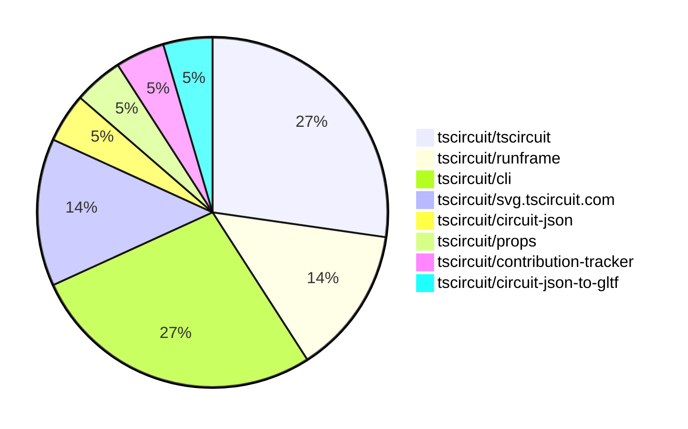
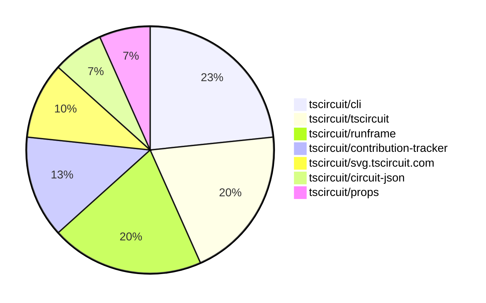

# Contribution Overview 2025-11-26

The current week is shown below. There are 4 major sections:

- [Contributor Overview](#contributor-overview)
- [PRs by Repository](#prs-by-repository)
- [PRs by Contributor](#changes-by-contributor)
- [Scoring & Sponsorship System](#scoring--sponsorship-system)

## PRs by Repository

## Contributor Overview

| Contributor | 🐳 Major | 🐙 Minor | 🐌 Tiny | ⭐ | Score | Discussion Contributions |
|-------------|---------|---------|---------|-----|----------------|--------------------------|
| [tscircuitbot](#tscircuitbot) | 0 | 0 | 14 | ⭐⭐ | 12 | 0🔹 0🔶 0💎 |
| [ArnavK-09](#ArnavK-09) | 1 | 1 | 1 | ⭐ | 8 | 0🔹 0🔶 0💎 |
| [Ayushjhawar8](#Ayushjhawar8) | 0 | 2 | 0 | ⭐ | 4 | 0🔹 0🔶 0💎 |
| [Anshgrover23](#Anshgrover23) | 1 | 0 | 0 | ⭐ | 4 | 0🔹 0🔶 0💎 |
| [techmannih](#techmannih) | 0 | 1 | 0 | ⭐ | 4 | 0🔹 0🔶 0💎 |
| [seveibar](#seveibar) | 0 | 0 | 1 |  | 2 | 0🔹 0🔶 0💎 |

> Note: AI evaluates PRs and assigns 1-3 star ratings automatically. 4 and 5 star ratings require manual staff review.

### Discussion Contribution Legend

- 🔹 Normal Comments: Basic participation with minimal effort
- 🔶 Great Informative Comments: Thoughtful participation that adds value
- 💎 Incredible Comments: Exceptional participation with high-quality content

## Review Table

[reviews-received-hover]: ## "Number of reviews received for PRs for this contributor"
[approvals-received-hover]: ## "Number of approvals received for PRs this contributor authored"
[rejections-received-hover]: ## "Number of rejections received for PRs this contributor authored"
[prs-opened-hover]: ## "Number of PRs opened by this contributor"
[issues-created-hover]: ## "Number of issues created by this contributor"
[bountied-issues-hover]: ## "Number of issues this contributor created with a bounty"
[bountied-issue-$-hover]: ## "Total bounty amount placed on issues authored by this contributor"

| Contributor | Reviews Received | Approvals Received | Rejections Received | Approvals | Rejections | PRs Opened | PRs Merged | Score | Issues Created | Bountied Issues | Bountied Issue $ |
|---|---|---|---|---|---|---|---|---|---|---|---|
| [tscircuitbot](#tscircuitbot) | 0 | 0 | 0 | 0 | 0 | 14 | 14 | 12 | 0 | 0 | 0 |
| [Ayushjhawar8](#Ayushjhawar8) | 2 | 2 | 0 | 0 | 0 | 3 | 2 | 4 | 0 | 0 | 0 |
| [seveibar](#seveibar) | 0 | 0 | 0 | 6 | 3 | 4 | 1 | 2 | 0 | 0 | 0 |
| [techmannih](#techmannih) | 4 | 2 | 2 | 1 | 0 | 3 | 1 | 4 | 0 | 0 | 0 |
| [rushabhcodes](#rushabhcodes) | 3 | 1 | 0 | 0 | 0 | 4 | 0 | 0 | 0 | 0 | 0 |
| [Anshgrover23](#Anshgrover23) | 5 | 1 | 1 | 0 | 0 | 1 | 1 | 4 | 0 | 0 | 0 |
| [ArnavK-09](#ArnavK-09) | 3 | 2 | 0 | 1 | 0 | 4 | 3 | 8 | 0 | 0 | 0 |
| [nailoo](#nailoo) | 0 | 0 | 0 | 0 | 0 | 0 | 0 | 0 | 0 | 0 | 0 |
| [MustafaMulla29](#MustafaMulla29) | 0 | 0 | 0 | 0 | 0 | 1 | 0 | 0 | 0 | 0 | 0 |

## Top 7 Repositories by Contribution Points

## Scoring & Sponsorship System

### Overview

PRs are analyzed by AI and assigned a **star rating (1-3 stars)**. 4 and 5 star ratings can only be manually assigned by staff. Weekly scores use `2^(starRating - 1)` per PR (capped at 12 PRs per rating), plus review/discussion points.

### Weekly Score → Star String

| Score Range | Star String | Count Value |
|------------|-------------|-------------|
| 0-3 | (empty) | 0 stars |
| 4-10 | ⭐ | 1 star |
| 11-30 | ⭐⭐ | 2 stars |
| 31-50 | ⭐⭐⭐ | 3 stars |
| 51-75 | 👑 | 1 crown |
| 76-100 | 👑👑 | 2 crowns |
| 101+ | 👑👑👑 | 3 crowns |

> Crowns count as 3 stars for sponsorship.

### Monthly Sponsorship Calculation

The sponsorship system calculates monthly payments based on your **weekly star counts** over the complete weeks in that month (typically 4-5 weeks, Wednesday-Tuesday format).

**Step 1: Collect Weekly Stars**
- All complete weeks in the month are analyzed
- Each week's star string is converted to a numeric count (⭐ = 1 star, ⭐⭐⭐ = 3 stars)
- Example: `[2, 2, 2, 1, 0]` means 2 stars in week 1, 2 stars in week 2, etc.

**Step 2: Calculate Metrics**
- **Median stars**: The median value of all weekly star counts
- **Min stars**: The minimum weekly star count
- **Max stars**: The maximum weekly star count
- **High score**: The maximum raw weekly score (0-100+ range from the scoring table) from any week in the month

**Step 3: Determine Base Amount**
The sponsorship amount is calculated based on these metrics (checked in order):

| Condition | Base Amount |
|-----------|-------------|
| `minStarCount >= 3` | **$500** |
| `medianStars >= 3` | **$450** |
| `medianStars >= 2.5` | **$300** |
| `medianStars >= 2` | **$200** |
| `medianStars >= 1.5` | **$100** |
| `medianStars >= 1` | **$75** |
| `maxStarCount >= 2` | **$25** |
| `maxStarCount >= 1` | **$15** |
| `highScore >= 3` (and all stars = 0) | **$5** |

| Maintainer Level | Monthly Bonus |
|------------------|---------------|
| Level 1 | **$200** |
| Level 2 | **$350** |
| Level 3 | **$500** |

**Final Amount** = Base Amount + Maintainer Bonus

## Changes by Repository

### [tscircuit/tscircuit](https://github.com/tscircuit/tscircuit)

🐌 Tiny Contributions (6)

| PR # | Impact | Contributor | Description |
|------|--------|-------------|-------------|
| [#1454](https://github.com/tscircuit/tscircuit/pull/1454) | 🐌 Tiny | tscircuitbot | Automated package update |
| [#1453](https://github.com/tscircuit/tscircuit/pull/1453) | 🐌 Tiny | tscircuitbot | Automated package update |
| [#1452](https://github.com/tscircuit/tscircuit/pull/1452) | 🐌 Tiny | tscircuitbot | Automated package update |
| [#1451](https://github.com/tscircuit/tscircuit/pull/1451) | 🐌 Tiny | tscircuitbot | Updates the tscircuitcli package version from 0.1.545 to 0.1.546 in package.json |
| [#1450](https://github.com/tscircuit/tscircuit/pull/1450) | 🐌 Tiny | tscircuitbot | Automated package update |
| [#1449](https://github.com/tscircuit/tscircuit/pull/1449) | 🐌 Tiny | tscircuitbot | Updates the tscircuitcli package to version 0.1.545 in package.json |

### [tscircuit/runframe](https://github.com/tscircuit/runframe)

| PR # | Impact | Rating | Contributor | Description |
|------|--------|--------|-------------|-------------|
| [#1852](https://github.com/tscircuit/runframe/pull/1852) | 🐳 Major | ⭐⭐⭐ | ArnavK-09 | Adds a login dialog for CLI access and integrates it with the bug report functionality, requiring user authentication for reporting bugs. |

🐌 Tiny Contributions (2)

| PR # | Impact | Contributor | Description |
|------|--------|-------------|-------------|
| [#1872](https://github.com/tscircuit/runframe/pull/1872) | 🐌 Tiny | tscircuitbot | Automated package update |
| [#1871](https://github.com/tscircuit/runframe/pull/1871) | 🐌 Tiny | ArnavK-09 | This pull request introduces a generated CSS file that includes various utility classes and styles for the project, leveraging Tailwind CSS for styling. |

### [tscircuit/cli](https://github.com/tscircuit/cli)

| PR # | Impact | Rating | Contributor | Description |
|------|--------|--------|-------------|-------------|
| [#1032](https://github.com/tscircuit/cli/pull/1032) | 🐙 Minor | ⭐⭐ | ArnavK-09 | Adds handling for session token updates in the DevServer, including logging success or error messages. |

🐌 Tiny Contributions (5)

| PR # | Impact | Contributor | Description |
|------|--------|-------------|-------------|
| [#1069](https://github.com/tscircuit/cli/pull/1069) | 🐌 Tiny | tscircuitbot | Automated package update |
| [#1068](https://github.com/tscircuit/cli/pull/1068) | 🐌 Tiny | tscircuitbot | Updates the tscircuitrunframe package from version 0.0.1291 to 0.0.1292 |
| [#1067](https://github.com/tscircuit/cli/pull/1067) | 🐌 Tiny | tscircuitbot | Automated package update |
| [#1066](https://github.com/tscircuit/cli/pull/1066) | 🐌 Tiny | tscircuitbot | Automated package update |
| [#1065](https://github.com/tscircuit/cli/pull/1065) | 🐌 Tiny | seveibar | Extracts a shared validator to ensure package.json main points inside dist before transpiling, used for both tsci build --transpile and tsci transpile. |

### [tscircuit/svg.tscircuit.com](https://github.com/tscircuit/svg.tscircuit.com)

🐌 Tiny Contributions (3)

| PR # | Impact | Contributor | Description |
|------|--------|-------------|-------------|
| [#644](https://github.com/tscircuit/svg.tscircuit.com/pull/644) | 🐌 Tiny | tscircuitbot | Updates the tscircuit package version from 0.0.955 to 0.0.956 in package.json |
| [#643](https://github.com/tscircuit/svg.tscircuit.com/pull/643) | 🐌 Tiny | tscircuitbot | Updates the tscircuit package version from 0.0.954 to 0.0.955 in package.json |
| [#642](https://github.com/tscircuit/svg.tscircuit.com/pull/642) | 🐌 Tiny | tscircuitbot | Automated package update |

### [tscircuit/circuit-json](https://github.com/tscircuit/circuit-json)

| PR # | Impact | Rating | Contributor | Description |
|------|--------|--------|-------------|-------------|
| [#363](https://github.com/tscircuit/circuit-json/pull/363) | 🐙 Minor | ⭐⭐ | Ayushjhawar8 | Adds an optional boolean property show_as_translucent_model to the CadComponent type, allowing for the representation of components as translucent models in the PCB design. |

### [tscircuit/props](https://github.com/tscircuit/props)

| PR # | Impact | Rating | Contributor | Description |
|------|--------|--------|-------------|-------------|
| [#513](https://github.com/tscircuit/props/pull/513) | 🐙 Minor | ⭐⭐ | Ayushjhawar8 | Adds a new property to the CommonComponentProps interface to allow components to be displayed as translucent models in the 3D viewer. |

### [tscircuit/contribution-tracker](https://github.com/tscircuit/contribution-tracker)

| PR # | Impact | Rating | Contributor | Description |
|------|--------|--------|-------------|-------------|
| [#257](https://github.com/tscircuit/contribution-tracker/pull/257) | 🐳 Major | ⭐⭐⭐ | Anshgrover23 | Implements contributor toggle functionality in the PR section for enhanced user interaction, allowing users to expand or collapse contributor details. |

### [tscircuit/circuit-json-to-gltf](https://github.com/tscircuit/circuit-json-to-gltf)

| PR # | Impact | Rating | Contributor | Description |
|------|--------|--------|-------------|-------------|
| [#91](https://github.com/tscircuit/circuit-json-to-gltf/pull/91) | 🐙 Minor | ⭐⭐ | techmannih | Removes the interfaces and types related to PCB copper pours from the codebase, simplifying the structure and eliminating unused code. |

## Changes by Contributor

### [tscircuitbot](https://github.com/tscircuitbot)

🐌 Tiny Contributions (14)

| PR # | Impact | Description |
|------|--------|-------------|
| [#1454](https://github.com/tscircuit/tscircuit/pull/1454) | 🐌 Tiny | Automated package update |
| [#1453](https://github.com/tscircuit/tscircuit/pull/1453) | 🐌 Tiny | Automated package update |
| [#1452](https://github.com/tscircuit/tscircuit/pull/1452) | 🐌 Tiny | Automated package update |
| [#1451](https://github.com/tscircuit/tscircuit/pull/1451) | 🐌 Tiny | Updates the tscircuitcli package version from 0.1.545 to 0.1.546 in package.json |
| [#1450](https://github.com/tscircuit/tscircuit/pull/1450) | 🐌 Tiny | Automated package update |
| [#1449](https://github.com/tscircuit/tscircuit/pull/1449) | 🐌 Tiny | Updates the tscircuitcli package to version 0.1.545 in package.json |
| [#1872](https://github.com/tscircuit/runframe/pull/1872) | 🐌 Tiny | Automated package update |
| [#1069](https://github.com/tscircuit/cli/pull/1069) | 🐌 Tiny | Automated package update |
| [#1068](https://github.com/tscircuit/cli/pull/1068) | 🐌 Tiny | Updates the tscircuitrunframe package from version 0.0.1291 to 0.0.1292 |
| [#1067](https://github.com/tscircuit/cli/pull/1067) | 🐌 Tiny | Automated package update |
| [#1066](https://github.com/tscircuit/cli/pull/1066) | 🐌 Tiny | Automated package update |
| [#644](https://github.com/tscircuit/svg.tscircuit.com/pull/644) | 🐌 Tiny | Updates the tscircuit package version from 0.0.955 to 0.0.956 in package.json |
| [#643](https://github.com/tscircuit/svg.tscircuit.com/pull/643) | 🐌 Tiny | Updates the tscircuit package version from 0.0.954 to 0.0.955 in package.json |
| [#642](https://github.com/tscircuit/svg.tscircuit.com/pull/642) | 🐌 Tiny | Automated package update |

### [Ayushjhawar8](https://github.com/Ayushjhawar8)

| PRs # | Impact | Rating | Description |
|------|--------|--------|-------------|
| [#363](https://github.com/tscircuit/circuit-json/pull/363) | 🐙 Minor | ⭐⭐ | Adds an optional boolean property show_as_translucent_model to the CadComponent type, allowing for the representation of components as translucent models in the PCB design. |
| [#513](https://github.com/tscircuit/props/pull/513) | 🐙 Minor | ⭐⭐ | Adds a new property to the CommonComponentProps interface to allow components to be displayed as translucent models in the 3D viewer. |

### [Anshgrover23](https://github.com/Anshgrover23)

| PRs # | Impact | Rating | Description |
|------|--------|--------|-------------|
| [#257](https://github.com/tscircuit/contribution-tracker/pull/257) | 🐳 Major | ⭐⭐⭐ | Implements contributor toggle functionality in the PR section for enhanced user interaction, allowing users to expand or collapse contributor details. |

### [ArnavK-09](https://github.com/ArnavK-09)

| PRs # | Impact | Rating | Description |
|------|--------|--------|-------------|
| [#1852](https://github.com/tscircuit/runframe/pull/1852) | 🐳 Major | ⭐⭐⭐ | Adds a login dialog for CLI access and integrates it with the bug report functionality, requiring user authentication for reporting bugs. |
| [#1032](https://github.com/tscircuit/cli/pull/1032) | 🐙 Minor | ⭐⭐ | Adds handling for session token updates in the DevServer, including logging success or error messages. |

🐌 Tiny Contributions (1)

| PR # | Impact | Description |
|------|--------|-------------|
| [#1871](https://github.com/tscircuit/runframe/pull/1871) | 🐌 Tiny | This pull request introduces a generated CSS file that includes various utility classes and styles for the project, leveraging Tailwind CSS for styling. |

### [seveibar](https://github.com/seveibar)

🐌 Tiny Contributions (1)

| PR # | Impact | Description |
|------|--------|-------------|
| [#1065](https://github.com/tscircuit/cli/pull/1065) | 🐌 Tiny | Extracts a shared validator to ensure package.json main points inside dist before transpiling, used for both tsci build --transpile and tsci transpile. |

### [techmannih](https://github.com/techmannih)

| PRs # | Impact | Rating | Description |
|------|--------|--------|-------------|
| [#91](https://github.com/tscircuit/circuit-json-to-gltf/pull/91) | 🐙 Minor | ⭐⭐ | Removes the interfaces and types related to PCB copper pours from the codebase, simplifying the structure and eliminating unused code. |

## Repository Owners

| Repository | Codeowners |
|------------|------------|
| [builder](https://github.com/tscircuit/builder/blob/main/.github/CODEOWNERS) | [seveibar](https://github.com/seveibar)
| [pcb-viewer](https://github.com/tscircuit/pcb-viewer/blob/main/.github/CODEOWNERS) | [seveibar](https://github.com/seveibar), [ShiboSoftwareDev](https://github.com/ShiboSoftwareDev)
| [footprints-old](https://github.com/tscircuit/footprints-old/blob/main/.github/CODEOWNERS) | [seveibar](https://github.com/seveibar)
| [footprinter](https://github.com/tscircuit/footprinter/blob/main/.github/CODEOWNERS) | [seveibar](https://github.com/seveibar), [techmannih](https://github.com/techmannih)
| [3d-viewer](https://github.com/tscircuit/3d-viewer/blob/main/.github/CODEOWNERS) | [ShiboSoftwareDev](https://github.com/ShiboSoftwareDev)
| [winterspec](https://github.com/tscircuit/winterspec/blob/main/.github/CODEOWNERS) | [seveibar](https://github.com/seveibar), [ShiboSoftwareDev](https://github.com/ShiboSoftwareDev)
| [jscad-electronics](https://github.com/tscircuit/jscad-electronics/blob/main/.github/CODEOWNERS) | [seveibar](https://github.com/seveibar), [techmannih](https://github.com/techmannih), [ShiboSoftwareDev](https://github.com/ShiboSoftwareDev), [anas-sarkez](https://github.com/anas-sarkez)
| [circuit-to-svg](https://github.com/tscircuit/circuit-to-svg/blob/main/.github/CODEOWNERS) | [imrishabh18](https://github.com/imrishabh18)
| [schematic-symbols](https://github.com/tscircuit/schematic-symbols/blob/main/.github/CODEOWNERS) | [seveibar](https://github.com/seveibar), [imrishabh18](https://github.com/imrishabh18), [techmannih](https://github.com/techmannih)
| [circuit-json-to-gerber](https://github.com/tscircuit/circuit-json-to-gerber/blob/main/.github/CODEOWNERS) | [seveibar](https://github.com/seveibar), [ShiboSoftwareDev](https://github.com/ShiboSoftwareDev)
| [tscircuit.com](https://github.com/tscircuit/tscircuit.com/blob/main/.github/CODEOWNERS) | [seveibar](https://github.com/seveibar), [imrishabh18](https://github.com/imrishabh18)
| [issue-roulette](https://github.com/tscircuit/issue-roulette/blob/main/.github/CODEOWNERS) | [Anshgrover23](https://github.com/Anshgrover23)
| [sparkfun-boards](https://github.com/tscircuit/sparkfun-boards/blob/main/.github/CODEOWNERS) | [ShiboSoftwareDev](https://github.com/ShiboSoftwareDev), [Abse2001](https://github.com/Abse2001), [MustafaMulla29](https://github.com/MustafaMulla29), [Anshgrover23](https://github.com/Anshgrover23), [techmannih](https://github.com/techmannih)
| [schematic-corpus](https://github.com/tscircuit/schematic-corpus/blob/main/.github/CODEOWNERS) | [Abse2001](https://github.com/Abse2001)
| [copper-pour-solver](https://github.com/tscircuit/copper-pour-solver/blob/main/.github/CODEOWNERS) | [seveibar](https://github.com/seveibar), [ShiboSoftwareDev](https://github.com/ShiboSoftwareDev)
| [common](https://github.com/tscircuit/common/blob/main/.github/CODEOWNERS) | [seveibar](https://github.com/seveibar), [Abse2001](https://github.com/Abse2001)

## Repositories by Owner

| User | Repo |
|------|------|
| [seveibar](https://github.com/seveibar) | [builder](https://github.com/tscircuit/builder/blob/main/.github/CODEOWNERS) |
|  | [pcb-viewer](https://github.com/tscircuit/pcb-viewer/blob/main/.github/CODEOWNERS) |
|  | [footprints-old](https://github.com/tscircuit/footprints-old/blob/main/.github/CODEOWNERS) |
|  | [footprinter](https://github.com/tscircuit/footprinter/blob/main/.github/CODEOWNERS) |
|  | [winterspec](https://github.com/tscircuit/winterspec/blob/main/.github/CODEOWNERS) |
|  | [jscad-electronics](https://github.com/tscircuit/jscad-electronics/blob/main/.github/CODEOWNERS) |
|  | [schematic-symbols](https://github.com/tscircuit/schematic-symbols/blob/main/.github/CODEOWNERS) |
|  | [circuit-json-to-gerber](https://github.com/tscircuit/circuit-json-to-gerber/blob/main/.github/CODEOWNERS) |
|  | [tscircuit.com](https://github.com/tscircuit/tscircuit.com/blob/main/.github/CODEOWNERS) |
|  | [copper-pour-solver](https://github.com/tscircuit/copper-pour-solver/blob/main/.github/CODEOWNERS) |
|  | [common](https://github.com/tscircuit/common/blob/main/.github/CODEOWNERS) |
| [ShiboSoftwareDev](https://github.com/ShiboSoftwareDev) | [pcb-viewer](https://github.com/tscircuit/pcb-viewer/blob/main/.github/CODEOWNERS) |
|  | [3d-viewer](https://github.com/tscircuit/3d-viewer/blob/main/.github/CODEOWNERS) |
|  | [winterspec](https://github.com/tscircuit/winterspec/blob/main/.github/CODEOWNERS) |
|  | [jscad-electronics](https://github.com/tscircuit/jscad-electronics/blob/main/.github/CODEOWNERS) |
|  | [circuit-json-to-gerber](https://github.com/tscircuit/circuit-json-to-gerber/blob/main/.github/CODEOWNERS) |
|  | [sparkfun-boards](https://github.com/tscircuit/sparkfun-boards/blob/main/.github/CODEOWNERS) |
|  | [copper-pour-solver](https://github.com/tscircuit/copper-pour-solver/blob/main/.github/CODEOWNERS) |
| [techmannih](https://github.com/techmannih) | [footprinter](https://github.com/tscircuit/footprinter/blob/main/.github/CODEOWNERS) |
|  | [jscad-electronics](https://github.com/tscircuit/jscad-electronics/blob/main/.github/CODEOWNERS) |
|  | [schematic-symbols](https://github.com/tscircuit/schematic-symbols/blob/main/.github/CODEOWNERS) |
|  | [sparkfun-boards](https://github.com/tscircuit/sparkfun-boards/blob/main/.github/CODEOWNERS) |
| [anas-sarkez](https://github.com/anas-sarkez) | [jscad-electronics](https://github.com/tscircuit/jscad-electronics/blob/main/.github/CODEOWNERS) |
| [imrishabh18](https://github.com/imrishabh18) | [circuit-to-svg](https://github.com/tscircuit/circuit-to-svg/blob/main/.github/CODEOWNERS) |
|  | [schematic-symbols](https://github.com/tscircuit/schematic-symbols/blob/main/.github/CODEOWNERS) |
|  | [tscircuit.com](https://github.com/tscircuit/tscircuit.com/blob/main/.github/CODEOWNERS) |
| [Anshgrover23](https://github.com/Anshgrover23) | [issue-roulette](https://github.com/tscircuit/issue-roulette/blob/main/.github/CODEOWNERS) |
|  | [sparkfun-boards](https://github.com/tscircuit/sparkfun-boards/blob/main/.github/CODEOWNERS) |
| [Abse2001](https://github.com/Abse2001) | [sparkfun-boards](https://github.com/tscircuit/sparkfun-boards/blob/main/.github/CODEOWNERS) |
|  | [schematic-corpus](https://github.com/tscircuit/schematic-corpus/blob/main/.github/CODEOWNERS) |
|  | [common](https://github.com/tscircuit/common/blob/main/.github/CODEOWNERS) |
| [MustafaMulla29](https://github.com/MustafaMulla29) | [sparkfun-boards](https://github.com/tscircuit/sparkfun-boards/blob/main/.github/CODEOWNERS) |

