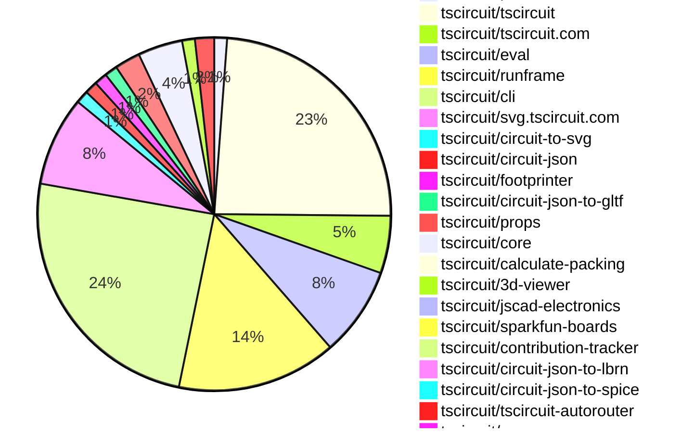
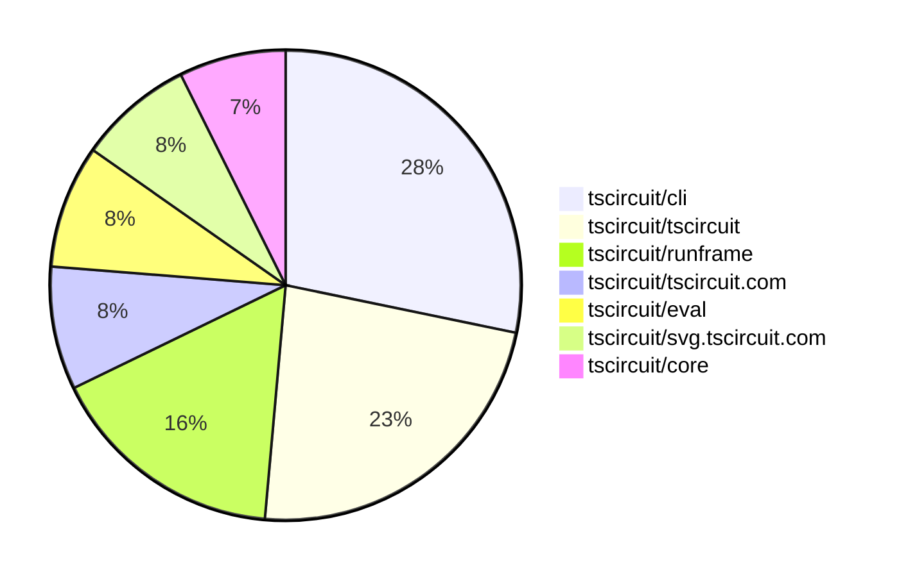

# Contribution Overview 2025-11-26

The current week is shown below. There are 4 major sections:

- [Contributor Overview](#contributor-overview)
- [PRs by Repository](#prs-by-repository)
- [PRs by Contributor](#changes-by-contributor)
- [Scoring & Sponsorship System](#scoring--sponsorship-system)

## PRs by Repository

## Contributor Overview

| Contributor | 🐳 Major | 🐙 Minor | 🐌 Tiny | ⭐ | Score | Discussion Contributions |
|-------------|---------|---------|---------|-----|----------------|--------------------------|
| [ArnavK-09](#ArnavK-09) | 3 | 2 | 3 | ⭐⭐ | 21 | 0🔹 0🔶 0💎 |
| [seveibar](#seveibar) | 1 | 4 | 4 | ⭐⭐ | 17 | 0🔹 0🔶 0💎 |
| [techmannih](#techmannih) | 1 | 4 | 0 | ⭐⭐ | 16 | 0🔹 0🔶 0💎 |
| [tscircuitbot](#tscircuitbot) | 0 | 0 | 132 | ⭐⭐ | 14.5 | 0🔹 0🔶 0💎 |
| [rushabhcodes](#rushabhcodes) | 0 | 4 | 1 | ⭐ | 10 | 0🔹 0🔶 0💎 |
| [Ayushjhawar8](#Ayushjhawar8) | 0 | 4 | 0 | ⭐ | 9 | 0🔹 0🔶 0💎 |
| [MustafaMulla29](#MustafaMulla29) | 1 | 2 | 0 | ⭐ | 8 | 0🔹 0🔶 0💎 |
| [ShiboSoftwareDev](#ShiboSoftwareDev) | 0 | 1 | 0 | ⭐ | 8 | 0🔹 0🔶 0💎 |
| [imrishabh18](#imrishabh18) | 0 | 3 | 0 | ⭐ | 7 | 0🔹 0🔶 0💎 |
| [AnasSarkiz](#AnasSarkiz) | 1 | 1 | 0 | ⭐ | 6 | 0🔹 0🔶 0💎 |
| [Heinrich-XIAO](#Heinrich-XIAO) | 1 | 0 | 2 | ⭐ | 6 | 0🔹 0🔶 0💎 |
| [Anshgrover23](#Anshgrover23) | 1 | 0 | 0 | ⭐ | 4 | 0🔹 0🔶 0💎 |
| [pxlpal](#pxlpal) | 1 | 0 | 0 | ⭐ | 4 | 0🔹 0🔶 0💎 |
| [0hmX](#0hmX) | 1 | 0 | 0 | ⭐ | 4 | 0🔹 0🔶 0💎 |

> Note: AI evaluates PRs and assigns 1-3 star ratings automatically. 4 and 5 star ratings require manual staff review.

### Discussion Contribution Legend

- 🔹 Normal Comments: Basic participation with minimal effort
- 🔶 Great Informative Comments: Thoughtful participation that adds value
- 💎 Incredible Comments: Exceptional participation with high-quality content

## Review Table

[reviews-received-hover]: ## "Number of reviews received for PRs for this contributor"
[approvals-received-hover]: ## "Number of approvals received for PRs this contributor authored"
[rejections-received-hover]: ## "Number of rejections received for PRs this contributor authored"
[prs-opened-hover]: ## "Number of PRs opened by this contributor"
[issues-created-hover]: ## "Number of issues created by this contributor"
[bountied-issues-hover]: ## "Number of issues this contributor created with a bounty"
[bountied-issue-$-hover]: ## "Total bounty amount placed on issues authored by this contributor"

| Contributor | Reviews Received | Approvals Received | Rejections Received | Approvals | Rejections | PRs Opened | PRs Merged | Score | Issues Created | Bountied Issues | Bountied Issue $ |
|---|---|---|---|---|---|---|---|---|---|---|---|
| [tscircuitbot](#tscircuitbot) | 0 | 0 | 0 | 0 | 0 | 151 | 132 | 14.5 | 0 | 0 | 0 |
| [techmannih](#techmannih) | 11 | 5 | 2 | 2 | 0 | 7 | 5 | 16 | 0 | 0 | 0 |
| [seveibar](#seveibar) | 2 | 0 | 0 | 28 | 6 | 14 | 10 | 17 | 0 | 0 | 0 |
| [rushabhcodes](#rushabhcodes) | 20 | 11 | 0 | 0 | 0 | 9 | 5 | 10 | 0 | 0 | 0 |
| [imrishabh18](#imrishabh18) | 7 | 2 | 1 | 6 | 0 | 7 | 3 | 7 | 0 | 0 | 0 |
| [Ayushjhawar8](#Ayushjhawar8) | 13 | 4 | 1 | 0 | 0 | 7 | 4 | 9 | 0 | 0 | 0 |
| [ShiboSoftwareDev](#ShiboSoftwareDev) | 2 | 1 | 0 | 6 | 0 | 1 | 1 | 8 | 0 | 0 | 0 |
| [baeoc](#baeoc) | 0 | 0 | 0 | 1 | 0 | 0 | 0 | 0 | 0 | 0 | 0 |
| [MustafaMulla29](#MustafaMulla29) | 6 | 4 | 0 | 0 | 0 | 5 | 3 | 8 | 0 | 0 | 0 |
| [Anshgrover23](#Anshgrover23) | 5 | 1 | 1 | 0 | 0 | 1 | 1 | 4 | 0 | 0 | 0 |
| [ArnavK-09](#ArnavK-09) | 19 | 7 | 0 | 1 | 0 | 12 | 8 | 21 | 0 | 0 | 0 |
| [nailoo](#nailoo) | 0 | 0 | 0 | 0 | 0 | 0 | 0 | 0 | 0 | 0 | 0 |
| [RaghavArora14](#RaghavArora14) | 0 | 0 | 0 | 1 | 0 | 0 | 0 | 0 | 0 | 0 | 0 |
| [AnasSarkiz](#AnasSarkiz) | 13 | 4 | 1 | 0 | 0 | 4 | 2 | 6 | 0 | 0 | 0 |
| [pxlpal](#pxlpal) | 1 | 1 | 0 | 0 | 0 | 1 | 1 | 4 | 0 | 0 | 0 |
| [0hmX](#0hmX) | 6 | 2 | 0 | 0 | 0 | 3 | 1 | 4 | 0 | 0 | 0 |
| [Heinrich-XIAO](#Heinrich-XIAO) | 4 | 3 | 0 | 0 | 0 | 4 | 3 | 6 | 0 | 0 | 0 |

## Top 7 Repositories by Contribution Points

## Scoring & Sponsorship System

### Overview

PRs are analyzed by AI and assigned a **star rating (1-3 stars)**. 4 and 5 star ratings can only be manually assigned by staff. Weekly scores use `2^(starRating - 1)` per PR (capped at 12 PRs per rating), plus review/discussion points.

### Weekly Score → Star String

| Score Range | Star String | Count Value |
|------------|-------------|-------------|
| 0-3 | (empty) | 0 stars |
| 4-10 | ⭐ | 1 star |
| 11-30 | ⭐⭐ | 2 stars |
| 31-50 | ⭐⭐⭐ | 3 stars |
| 51-75 | 👑 | 1 crown |
| 76-100 | 👑👑 | 2 crowns |
| 101+ | 👑👑👑 | 3 crowns |

> Crowns count as 3 stars for sponsorship.

### Monthly Sponsorship Calculation

The sponsorship system calculates monthly payments based on your **weekly star counts** over the complete weeks in that month (typically 4-5 weeks, Wednesday-Tuesday format).

**Step 1: Collect Weekly Stars**
- All complete weeks in the month are analyzed
- Each week's star string is converted to a numeric count (⭐ = 1 star, ⭐⭐⭐ = 3 stars)
- Example: `[2, 2, 2, 1, 0]` means 2 stars in week 1, 2 stars in week 2, etc.

**Step 2: Calculate Metrics**
- **Median stars**: The median value of all weekly star counts
- **Min stars**: The minimum weekly star count
- **Max stars**: The maximum weekly star count
- **High score**: The maximum raw weekly score (0-100+ range from the scoring table) from any week in the month

**Step 3: Determine Base Amount**
The sponsorship amount is calculated based on these metrics (checked in order):

| Condition | Base Amount |
|-----------|-------------|
| `minStarCount >= 3` | **$500** |
| `medianStars >= 3` | **$450** |
| `medianStars >= 2.5` | **$300** |
| `medianStars >= 2` | **$200** |
| `medianStars >= 1.5` | **$100** |
| `medianStars >= 1` | **$75** |
| `maxStarCount >= 2` | **$25** |
| `maxStarCount >= 1` | **$15** |
| `highScore >= 3` (and all stars = 0) | **$5** |

| Maintainer Level | Monthly Bonus |
|------------------|---------------|
| Level 1 | **$200** |
| Level 2 | **$350** |
| Level 3 | **$500** |

**Final Amount** = Base Amount + Maintainer Bonus

## Changes by Repository

### [tscircuit/pcb-viewer](https://github.com/tscircuit/pcb-viewer)

| PR # | Impact | Rating | Contributor | Description |
|------|--------|--------|-------------|-------------|
| [#500](https://github.com/tscircuit/pcb-viewer/pull/500) | 🐙 Minor | ⭐⭐ | techmannih | Add support for rendering solder masks on surface mount technology (SMT) pads in the PCB viewer, allowing users to visualize solder mask coverage on different pad shapes. |

🐌 Tiny Contributions (1)

| PR # | Impact | Contributor | Description |
|------|--------|-------------|-------------|
| [#501](https://github.com/tscircuit/pcb-viewer/pull/501) | 🐌 Tiny | tscircuitbot | Automated package update |

### [tscircuit/tscircuit](https://github.com/tscircuit/tscircuit)

🐌 Tiny Contributions (41)

| PR # | Impact | Contributor | Description |
|------|--------|-------------|-------------|
| [#1490](https://github.com/tscircuit/tscircuit/pull/1490) | 🐌 Tiny | tscircuitbot | Automated package update |
| [#1489](https://github.com/tscircuit/tscircuit/pull/1489) | 🐌 Tiny | tscircuitbot | Updates the tscircuitcli package from version 0.1.564 to 0.1.565 and the tscircuitrunframe package from version 0.0.1302 to 0.0.1303 in package.json |
| [#1488](https://github.com/tscircuit/tscircuit/pull/1488) | 🐌 Tiny | tscircuitbot | Automated package update |
| [#1487](https://github.com/tscircuit/tscircuit/pull/1487) | 🐌 Tiny | tscircuitbot | Automated package update |
| [#1486](https://github.com/tscircuit/tscircuit/pull/1486) | 🐌 Tiny | tscircuitbot | Automated package update |
| [#1485](https://github.com/tscircuit/tscircuit/pull/1485) | 🐌 Tiny | tscircuitbot | Automated package update |
| [#1484](https://github.com/tscircuit/tscircuit/pull/1484) | 🐌 Tiny | tscircuitbot | Automated package update |
| [#1483](https://github.com/tscircuit/tscircuit/pull/1483) | 🐌 Tiny | tscircuitbot | Automated package update |
| [#1482](https://github.com/tscircuit/tscircuit/pull/1482) | 🐌 Tiny | tscircuitbot | Automated package update |
| [#1481](https://github.com/tscircuit/tscircuit/pull/1481) | 🐌 Tiny | tscircuitbot | Automated package update |
| [#1480](https://github.com/tscircuit/tscircuit/pull/1480) | 🐌 Tiny | tscircuitbot | Automated package update |
| [#1479](https://github.com/tscircuit/tscircuit/pull/1479) | 🐌 Tiny | tscircuitbot | Updates the package versions for tscircuitcli, tscircuitcore, tscircuiteval, and circuit-json in package.json |
| [#1478](https://github.com/tscircuit/tscircuit/pull/1478) | 🐌 Tiny | tscircuitbot | Automated package update |
| [#1477](https://github.com/tscircuit/tscircuit/pull/1477) | 🐌 Tiny | tscircuitbot | Automated package update |
| [#1476](https://github.com/tscircuit/tscircuit/pull/1476) | 🐌 Tiny | tscircuitbot | Automated package update |
| [#1475](https://github.com/tscircuit/tscircuit/pull/1475) | 🐌 Tiny | tscircuitbot | Automated package update |
| [#1474](https://github.com/tscircuit/tscircuit/pull/1474) | 🐌 Tiny | tscircuitbot | Automated package update |
| [#1473](https://github.com/tscircuit/tscircuit/pull/1473) | 🐌 Tiny | tscircuitbot | Updates the tscircuitcli package to version 0.1.557 in package.json |
| [#1471](https://github.com/tscircuit/tscircuit/pull/1471) | 🐌 Tiny | tscircuitbot | Updates the tscircuitcli package to version 0.1.556 in package.json |
| [#1470](https://github.com/tscircuit/tscircuit/pull/1470) | 🐌 Tiny | tscircuitbot | Automated package update |
| [#1469](https://github.com/tscircuit/tscircuit/pull/1469) | 🐌 Tiny | tscircuitbot | Updates the tscircuitcli package to version 0.1.555 in the package.json file. |
| [#1468](https://github.com/tscircuit/tscircuit/pull/1468) | 🐌 Tiny | tscircuitbot | Automated package update |
| [#1467](https://github.com/tscircuit/tscircuit/pull/1467) | 🐌 Tiny | tscircuitbot | Updates the tscircuitcli package to version 0.1.554 in the package.json file |
| [#1466](https://github.com/tscircuit/tscircuit/pull/1466) | 🐌 Tiny | tscircuitbot | Automated package update |
| [#1465](https://github.com/tscircuit/tscircuit/pull/1465) | 🐌 Tiny | tscircuitbot | Updates the tscircuitcli package to version 0.1.553 in package.json |
| [#1464](https://github.com/tscircuit/tscircuit/pull/1464) | 🐌 Tiny | tscircuitbot | Automated package update |
| [#1463](https://github.com/tscircuit/tscircuit/pull/1463) | 🐌 Tiny | tscircuitbot | Updates the tscircuitcli package to version 0.1.552 in the package.json file. |
| [#1462](https://github.com/tscircuit/tscircuit/pull/1462) | 🐌 Tiny | tscircuitbot | Automated package update |
| [#1461](https://github.com/tscircuit/tscircuit/pull/1461) | 🐌 Tiny | tscircuitbot | Updates the tscircuitcli package from version 0.1.550 to 0.1.551 and the tscircuitrunframe package from version 0.0.1293 to 0.0.1294 in package.json |
| [#1460](https://github.com/tscircuit/tscircuit/pull/1460) | 🐌 Tiny | tscircuitbot | Automated package update |
| [#1459](https://github.com/tscircuit/tscircuit/pull/1459) | 🐌 Tiny | tscircuitbot | Automated package update |
| [#1458](https://github.com/tscircuit/tscircuit/pull/1458) | 🐌 Tiny | tscircuitbot | Automated package update |
| [#1457](https://github.com/tscircuit/tscircuit/pull/1457) | 🐌 Tiny | tscircuitbot | Updates the tscircuitcli package to version 0.1.549 in package.json |
| [#1456](https://github.com/tscircuit/tscircuit/pull/1456) | 🐌 Tiny | tscircuitbot | Automated package update |
| [#1455](https://github.com/tscircuit/tscircuit/pull/1455) | 🐌 Tiny | tscircuitbot | Updates the tscircuitcli package version from 0.1.547 to 0.1.548 in package.json |
| [#1454](https://github.com/tscircuit/tscircuit/pull/1454) | 🐌 Tiny | tscircuitbot | Automated package update |
| [#1453](https://github.com/tscircuit/tscircuit/pull/1453) | 🐌 Tiny | tscircuitbot | Automated package update |
| [#1452](https://github.com/tscircuit/tscircuit/pull/1452) | 🐌 Tiny | tscircuitbot | Automated package update |
| [#1451](https://github.com/tscircuit/tscircuit/pull/1451) | 🐌 Tiny | tscircuitbot | Updates the tscircuitcli package to version 0.1.546 in package.json |
| [#1450](https://github.com/tscircuit/tscircuit/pull/1450) | 🐌 Tiny | tscircuitbot | Automated package update |
| [#1449](https://github.com/tscircuit/tscircuit/pull/1449) | 🐌 Tiny | tscircuitbot | Updates the tscircuitcli package to version 0.1.545 in the package.json file |

### [tscircuit/tscircuit.com](https://github.com/tscircuit/tscircuit.com)

| PR # | Impact | Rating | Contributor | Description |
|------|--------|--------|-------------|-------------|
| [#2080](https://github.com/tscircuit/tscircuit.com/pull/2080) | 🐳 Major | ⭐⭐⭐ | pxlpal | Modifies the GitHub App installation flow to support non-personal organizations by adding organization ID handling and updating repository fetching logic accordingly. |
| [#2072](https://github.com/tscircuit/tscircuit.com/pull/2072) | 🐳 Major | ⭐⭐⭐ | ArnavK-09 | Adds autoclose functionality to the CLI login page, allowing the window to close automatically after a successful login if specified in the URL parameters. |

🐌 Tiny Contributions (7)

| PR # | Impact | Contributor | Description |
|------|--------|-------------|-------------|
| [#2086](https://github.com/tscircuit/tscircuit.com/pull/2086) | 🐌 Tiny | tscircuitbot | Automated package update |
| [#2085](https://github.com/tscircuit/tscircuit.com/pull/2085) | 🐌 Tiny | tscircuitbot | Updates the tscircuiteval package from version 0.0.497 to 0.0.498 |
| [#2084](https://github.com/tscircuit/tscircuit.com/pull/2084) | 🐌 Tiny | tscircuitbot | Automated package update |
| [#2083](https://github.com/tscircuit/tscircuit.com/pull/2083) | 🐌 Tiny | tscircuitbot | Updates the tscircuiteval package from version 0.0.495 to 0.0.496 |
| [#2082](https://github.com/tscircuit/tscircuit.com/pull/2082) | 🐌 Tiny | tscircuitbot | Updates the tscircuiteval package to version 0.0.495 in package.json |
| [#2081](https://github.com/tscircuit/tscircuit.com/pull/2081) | 🐌 Tiny | tscircuitbot | Updates the tscircuiteval package from version 0.0.493 to 0.0.494 |
| [#2079](https://github.com/tscircuit/tscircuit.com/pull/2079) | 🐌 Tiny | tscircuitbot | Automated package update |

### [tscircuit/eval](https://github.com/tscircuit/eval)

| PR # | Impact | Rating | Contributor | Description |
|------|--------|--------|-------------|-------------|
| [#1583](https://github.com/tscircuit/eval/pull/1583) | 🐙 Minor | ⭐⭐ | imrishabh18 | Adds a flag to disable loading npm packages from jsDelivr CDN, throwing an error for import statements instead. |

🐌 Tiny Contributions (13)

| PR # | Impact | Contributor | Description |
|------|--------|-------------|-------------|
| [#1592](https://github.com/tscircuit/eval/pull/1592) | 🐌 Tiny | tscircuitbot | Automated package update |
| [#1591](https://github.com/tscircuit/eval/pull/1591) | 🐌 Tiny | tscircuitbot | Automated package update |
| [#1589](https://github.com/tscircuit/eval/pull/1589) | 🐌 Tiny | tscircuitbot | Automated package update |
| [#1588](https://github.com/tscircuit/eval/pull/1588) | 🐌 Tiny | tscircuitbot | Automated package update |
| [#1587](https://github.com/tscircuit/eval/pull/1587) | 🐌 Tiny | tscircuitbot | Automated package update |
| [#1586](https://github.com/tscircuit/eval/pull/1586) | 🐌 Tiny | tscircuitbot | Automated package update |
| [#1584](https://github.com/tscircuit/eval/pull/1584) | 🐌 Tiny | tscircuitbot | Automated package update |
| [#1582](https://github.com/tscircuit/eval/pull/1582) | 🐌 Tiny | tscircuitbot | Automated package update |
| [#1581](https://github.com/tscircuit/eval/pull/1581) | 🐌 Tiny | tscircuitbot | Automated package update |
| [#1579](https://github.com/tscircuit/eval/pull/1579) | 🐌 Tiny | tscircuitbot | Automated package update |
| [#1578](https://github.com/tscircuit/eval/pull/1578) | 🐌 Tiny | tscircuitbot | Automated package update |
| [#1576](https://github.com/tscircuit/eval/pull/1576) | 🐌 Tiny | tscircuitbot | Automated package update |
| [#1575](https://github.com/tscircuit/eval/pull/1575) | 🐌 Tiny | tscircuitbot | Automated package update |

### [tscircuit/runframe](https://github.com/tscircuit/runframe)

| PR # | Impact | Rating | Contributor | Description |
|------|--------|--------|-------------|-------------|
| [#1852](https://github.com/tscircuit/runframe/pull/1852) | 🐳 Major | ⭐⭐⭐ | ArnavK-09 | Adds a login dialog for CLI access and integrates it with the bug report functionality, requiring user authentication to submit bug reports. |
| [#1873](https://github.com/tscircuit/runframe/pull/1873) | 🐙 Minor | ⭐⭐ | rushabhcodes | Fixes the issue where the CadViewer component does not re-render correctly when toggling fullscreen mode in the CircuitJsonPreview component. |

🐌 Tiny Contributions (23)

| PR # | Impact | Contributor | Description |
|------|--------|-------------|-------------|
| [#1896](https://github.com/tscircuit/runframe/pull/1896) | 🐌 Tiny | tscircuitbot | Updates the package version from 0.0.1302 to 0.0.1303 in package.json |
| [#1895](https://github.com/tscircuit/runframe/pull/1895) | 🐌 Tiny | tscircuitbot | Updates the tscircuiteval package to version 0.0.499 in package.json |
| [#1894](https://github.com/tscircuit/runframe/pull/1894) | 🐌 Tiny | tscircuitbot | Updates the package version from 0.0.1301 to 0.0.1302 in package.json |
| [#1893](https://github.com/tscircuit/runframe/pull/1893) | 🐌 Tiny | tscircuitbot | Updates the tscircuiteval package to version 0.0.498 in package.json |
| [#1891](https://github.com/tscircuit/runframe/pull/1891) | 🐌 Tiny | tscircuitbot | Automated package update to version 0.0.1301 |
| [#1890](https://github.com/tscircuit/runframe/pull/1890) | 🐌 Tiny | tscircuitbot | Updates the tscircuitpcb-viewer package from version 1.11.268 to 1.11.269 |
| [#1889](https://github.com/tscircuit/runframe/pull/1889) | 🐌 Tiny | tscircuitbot | Automated package update to version 0.0.1300 |
| [#1888](https://github.com/tscircuit/runframe/pull/1888) | 🐌 Tiny | tscircuitbot | Updates the tscircuiteval package to version 0.0.497 in package.json |
| [#1887](https://github.com/tscircuit/runframe/pull/1887) | 🐌 Tiny | tscircuitbot | Automated package update |
| [#1886](https://github.com/tscircuit/runframe/pull/1886) | 🐌 Tiny | tscircuitbot | Updates the tscircuiteval package from version 0.0.495 to 0.0.496 |
| [#1885](https://github.com/tscircuit/runframe/pull/1885) | 🐌 Tiny | tscircuitbot | Automated package update to version 0.0.1298 |
| [#1884](https://github.com/tscircuit/runframe/pull/1884) | 🐌 Tiny | tscircuitbot | Updates the tscircuiteval package to version 0.0.495 in the package.json file. |
| [#1883](https://github.com/tscircuit/runframe/pull/1883) | 🐌 Tiny | tscircuitbot | Automated package update |
| [#1882](https://github.com/tscircuit/runframe/pull/1882) | 🐌 Tiny | tscircuitbot | Updates the tscircuiteval package to version 0.0.494 in the package.json file. |
| [#1881](https://github.com/tscircuit/runframe/pull/1881) | 🐌 Tiny | tscircuitbot | Automated package update |
| [#1880](https://github.com/tscircuit/runframe/pull/1880) | 🐌 Tiny | tscircuitbot | Updates the tscircuit3d-viewer package to version 0.0.446 |
| [#1879](https://github.com/tscircuit/runframe/pull/1879) | 🐌 Tiny | tscircuitbot | Automated package update |
| [#1878](https://github.com/tscircuit/runframe/pull/1878) | 🐌 Tiny | tscircuitbot | Automated package update |
| [#1877](https://github.com/tscircuit/runframe/pull/1877) | 🐌 Tiny | tscircuitbot | Updates the tscircuit3d-viewer package to version 0.0.445 in package.json |
| [#1876](https://github.com/tscircuit/runframe/pull/1876) | 🐌 Tiny | tscircuitbot | Updates the package version from 0.0.1292 to 0.0.1293 in package.json |
| [#1875](https://github.com/tscircuit/runframe/pull/1875) | 🐌 Tiny | tscircuitbot | Updates the tscircuiteval package to version 0.0.493 |
| [#1872](https://github.com/tscircuit/runframe/pull/1872) | 🐌 Tiny | tscircuitbot | Automated package update |
| [#1871](https://github.com/tscircuit/runframe/pull/1871) | 🐌 Tiny | ArnavK-09 | This pull request introduces a generated CSS file that includes various utility classes and styles for the project, leveraging Tailwind CSS for styling. |

### [tscircuit/cli](https://github.com/tscircuit/cli)

| PR # | Impact | Rating | Contributor | Description |
|------|--------|--------|-------------|-------------|
| [#1070](https://github.com/tscircuit/cli/pull/1070) | 🐳 Major | ⭐⭐⭐ | MustafaMulla29 | Adds functionality to the tscircuit CLI to install packages using the tsci add command, similar to bun add, allowing for various package specifications including GitHub URLs and versioning. |
| [#1077](https://github.com/tscircuit/cli/pull/1077) | 🐳 Major | ⭐⭐⭐ | ArnavK-09 | Adds a --use-global flag to the CLI to allow users to skip the local version check and use the global version of the CLI instead. |
| [#1072](https://github.com/tscircuit/cli/pull/1072) | 🐙 Minor | ⭐⭐ | seveibar | Fixes the asset loading mechanism in the transpilation process to ensure that static assets are correctly resolved and copied during the build process. |
| [#1032](https://github.com/tscircuit/cli/pull/1032) | 🐙 Minor | ⭐⭐ | ArnavK-09 | Adds handling for session token updates in the DevServer, including logging success or error messages. |

🐌 Tiny Contributions (38)

| PR # | Impact | Contributor | Description |
|------|--------|-------------|-------------|
| [#1117](https://github.com/tscircuit/cli/pull/1117) | 🐌 Tiny | tscircuitbot | Automated package update |
| [#1116](https://github.com/tscircuit/cli/pull/1116) | 🐌 Tiny | tscircuitbot | Updates the tscircuitrunframe package from version 0.0.1302 to 0.0.1303 |
| [#1115](https://github.com/tscircuit/cli/pull/1115) | 🐌 Tiny | tscircuitbot | Automated package update |
| [#1114](https://github.com/tscircuit/cli/pull/1114) | 🐌 Tiny | tscircuitbot | Updates the tscircuitrunframe package from version 0.0.1301 to 0.0.1302 |
| [#1113](https://github.com/tscircuit/cli/pull/1113) | 🐌 Tiny | tscircuitbot | Automated package update |
| [#1112](https://github.com/tscircuit/cli/pull/1112) | 🐌 Tiny | tscircuitbot | Automated package update |
| [#1111](https://github.com/tscircuit/cli/pull/1111) | 🐌 Tiny | tscircuitbot | Automated package update |
| [#1110](https://github.com/tscircuit/cli/pull/1110) | 🐌 Tiny | tscircuitbot | Automated package update |
| [#1109](https://github.com/tscircuit/cli/pull/1109) | 🐌 Tiny | tscircuitbot | Automated package update |
| [#1108](https://github.com/tscircuit/cli/pull/1108) | 🐌 Tiny | tscircuitbot | Updates the tscircuitrunframe package from version 0.0.1298 to 0.0.1299 |
| [#1106](https://github.com/tscircuit/cli/pull/1106) | 🐌 Tiny | tscircuitbot | Automated package update |
| [#1105](https://github.com/tscircuit/cli/pull/1105) | 🐌 Tiny | tscircuitbot | Updates the tscircuitrunframe package from version 0.0.1297 to 0.0.1298 |
| [#1103](https://github.com/tscircuit/cli/pull/1103) | 🐌 Tiny | tscircuitbot | Automated package update |
| [#1102](https://github.com/tscircuit/cli/pull/1102) | 🐌 Tiny | tscircuitbot | Updates the tscircuitrunframe package from version 0.0.1295 to 0.0.1297 |
| [#1100](https://github.com/tscircuit/cli/pull/1100) | 🐌 Tiny | tscircuitbot | Automated package update |
| [#1099](https://github.com/tscircuit/cli/pull/1099) | 🐌 Tiny | tscircuitbot | Updates the tscircuitrunframe package from version 0.0.1294 to 0.0.1295 |
| [#1098](https://github.com/tscircuit/cli/pull/1098) | 🐌 Tiny | tscircuitbot | Automated package update |
| [#1097](https://github.com/tscircuit/cli/pull/1097) | 🐌 Tiny | tscircuitbot | Automated README update with latest CLI usage output. |
| [#1096](https://github.com/tscircuit/cli/pull/1096) | 🐌 Tiny | tscircuitbot | Automated package update |
| [#1094](https://github.com/tscircuit/cli/pull/1094) | 🐌 Tiny | tscircuitbot | Automated package update |
| [#1093](https://github.com/tscircuit/cli/pull/1093) | 🐌 Tiny | tscircuitbot | Automated README update with latest CLI usage output. |
| [#1092](https://github.com/tscircuit/cli/pull/1092) | 🐌 Tiny | tscircuitbot | Automated package update |
| [#1089](https://github.com/tscircuit/cli/pull/1089) | 🐌 Tiny | tscircuitbot | Automated package update |
| [#1085](https://github.com/tscircuit/cli/pull/1085) | 🐌 Tiny | tscircuitbot | Automated package update |
| [#1083](https://github.com/tscircuit/cli/pull/1083) | 🐌 Tiny | tscircuitbot | Automated package update |
| [#1082](https://github.com/tscircuit/cli/pull/1082) | 🐌 Tiny | tscircuitbot | Updates the tscircuitrunframe package from version 0.0.1293 to 0.0.1294 |
| [#1081](https://github.com/tscircuit/cli/pull/1081) | 🐌 Tiny | tscircuitbot | Automated package update |
| [#1080](https://github.com/tscircuit/cli/pull/1080) | 🐌 Tiny | tscircuitbot | Updates the tscircuitrunframe package from version 0.0.1292 to 0.0.1293 |
| [#1079](https://github.com/tscircuit/cli/pull/1079) | 🐌 Tiny | tscircuitbot | Automated package update |
| [#1073](https://github.com/tscircuit/cli/pull/1073) | 🐌 Tiny | tscircuitbot | Automated package update |
| [#1069](https://github.com/tscircuit/cli/pull/1069) | 🐌 Tiny | tscircuitbot | Automated package update |
| [#1068](https://github.com/tscircuit/cli/pull/1068) | 🐌 Tiny | tscircuitbot | Updates the tscircuitrunframe package from version 0.0.1291 to 0.0.1292 |
| [#1067](https://github.com/tscircuit/cli/pull/1067) | 🐌 Tiny | tscircuitbot | Automated package update |
| [#1066](https://github.com/tscircuit/cli/pull/1066) | 🐌 Tiny | tscircuitbot | Automated package update |
| [#1078](https://github.com/tscircuit/cli/pull/1078) | 🐌 Tiny | seveibar | Adds a prompt to optionally rename cloned bug report directories using the bug report package name and ID suffix, reusing existing directory handling when applying the optional rename. |
| [#1065](https://github.com/tscircuit/cli/pull/1065) | 🐌 Tiny | seveibar | Extracts a shared validator to ensure package.json main points inside dist before transpiling, and uses this validation for both tsci build --transpile and tsci transpile. |
| [#1086](https://github.com/tscircuit/cli/pull/1086) | 🐌 Tiny | ArnavK-09 | Enables automatic merging of pull requests when CI checks pass by modifying the GitHub Actions workflow. |
| [#1076](https://github.com/tscircuit/cli/pull/1076) | 🐌 Tiny | ArnavK-09 | Updates the README workflow to create a pull request for changes instead of pushing directly to the main branch. |

### [tscircuit/svg.tscircuit.com](https://github.com/tscircuit/svg.tscircuit.com)

🐌 Tiny Contributions (14)

| PR # | Impact | Contributor | Description |
|------|--------|-------------|-------------|
| [#655](https://github.com/tscircuit/svg.tscircuit.com/pull/655) | 🐌 Tiny | tscircuitbot | Updates the tscircuit package version from 0.0.967 to 0.0.968 in package.json |
| [#654](https://github.com/tscircuit/svg.tscircuit.com/pull/654) | 🐌 Tiny | tscircuitbot | Automated package update |
| [#653](https://github.com/tscircuit/svg.tscircuit.com/pull/653) | 🐌 Tiny | tscircuitbot | Updates the tscircuit package version from 0.0.964 to 0.0.966 in package.json |
| [#652](https://github.com/tscircuit/svg.tscircuit.com/pull/652) | 🐌 Tiny | tscircuitbot | Updates the tscircuit package version from 0.0.963 to 0.0.964 in package.json |
| [#651](https://github.com/tscircuit/svg.tscircuit.com/pull/651) | 🐌 Tiny | tscircuitbot | Updates the tscircuit package version from 0.0.962 to 0.0.963 in package.json |
| [#650](https://github.com/tscircuit/svg.tscircuit.com/pull/650) | 🐌 Tiny | tscircuitbot | Updates the tscircuit package version from 0.0.961 to 0.0.962 in package.json |
| [#649](https://github.com/tscircuit/svg.tscircuit.com/pull/649) | 🐌 Tiny | tscircuitbot | Automated package update |
| [#648](https://github.com/tscircuit/svg.tscircuit.com/pull/648) | 🐌 Tiny | tscircuitbot | Updates the tscircuit package version from 0.0.959 to 0.0.960 in package.json |
| [#647](https://github.com/tscircuit/svg.tscircuit.com/pull/647) | 🐌 Tiny | tscircuitbot | Automated package update |
| [#646](https://github.com/tscircuit/svg.tscircuit.com/pull/646) | 🐌 Tiny | tscircuitbot | Automated package update |
| [#645](https://github.com/tscircuit/svg.tscircuit.com/pull/645) | 🐌 Tiny | tscircuitbot | Updates the tscircuit package version from 0.0.956 to 0.0.957 in package.json |
| [#644](https://github.com/tscircuit/svg.tscircuit.com/pull/644) | 🐌 Tiny | tscircuitbot | Updates the tscircuit package version from 0.0.955 to 0.0.956 in package.json |
| [#643](https://github.com/tscircuit/svg.tscircuit.com/pull/643) | 🐌 Tiny | tscircuitbot | Updates the tscircuit package version from 0.0.954 to 0.0.955 in package.json |
| [#642](https://github.com/tscircuit/svg.tscircuit.com/pull/642) | 🐌 Tiny | tscircuitbot | Updates the tscircuit package version from 0.0.953 to 0.0.954 in package.json |

### [tscircuit/circuit-to-svg](https://github.com/tscircuit/circuit-to-svg)

| PR # | Impact | Rating | Contributor | Description |
|------|--------|--------|-------------|-------------|
| [#440](https://github.com/tscircuit/circuit-to-svg/pull/440) | 🐳 Major | ⭐⭐⭐ | techmannih | Adds support for rendering solder masks for rotated pill-shaped SMT pads in SVG output. |
| [#439](https://github.com/tscircuit/circuit-to-svg/pull/439) | 🐳 Major | ⭐⭐⭐ | AnasSarkiz | Implemented rotation support for pill-shaped SMT pads, added proper handling of soldermask margins for rotated pills, updated test cases to verify rotated pill rendering, and ensured consistent behavior with existing pad shapes. |

### [tscircuit/circuit-json](https://github.com/tscircuit/circuit-json)

| PR # | Impact | Rating | Contributor | Description |
|------|--------|--------|-------------|-------------|
| [#364](https://github.com/tscircuit/circuit-json/pull/364) | 🐙 Minor | ⭐⭐ | techmannih | Adds an optional boolean property is_tented to the PCB via definition, allowing for better representation of tented vias in PCB designs. |
| [#363](https://github.com/tscircuit/circuit-json/pull/363) | 🐙 Minor | ⭐⭐ | Ayushjhawar8 | Adds an optional boolean property show_as_translucent_model to the CadComponent type, allowing for the representation of components as translucent models in the PCB design. |

### [tscircuit/footprinter](https://github.com/tscircuit/footprinter)

| PR # | Impact | Rating | Contributor | Description |
|------|--------|--------|-------------|-------------|
| [#433](https://github.com/tscircuit/footprinter/pull/433) | 🐙 Minor | ⭐⭐ | techmannih | Adds a faceup flag to the pinrow definition to control the orientation of the 3D model, allowing the male pin header to face upwards. |
| [#432](https://github.com/tscircuit/footprinter/pull/432) | 🐙 Minor | ⭐⭐ | rushabhcodes | Adds an optional boolean property invert to the base_def schema to hint for flipping headers in jscad-electronics. |

### [tscircuit/circuit-json-to-gltf](https://github.com/tscircuit/circuit-json-to-gltf)

| PR # | Impact | Rating | Contributor | Description |
|------|--------|--------|-------------|-------------|
| [#91](https://github.com/tscircuit/circuit-json-to-gltf/pull/91) | 🐙 Minor | ⭐⭐ | techmannih | Removes the interfaces and types related to PCB copper pours from the codebase, simplifying the structure and potentially reducing complexity in PCB design handling. |
| [#88](https://github.com/tscircuit/circuit-json-to-gltf/pull/88) | 🐙 Minor | ⭐⭐ | ArnavK-09 | Updates the color factors for rendering PCB layers and materials in the GLTF output. |

### [tscircuit/props](https://github.com/tscircuit/props)

| PR # | Impact | Rating | Contributor | Description |
|------|--------|--------|-------------|-------------|
| [#513](https://github.com/tscircuit/props/pull/513) | 🐙 Minor | ⭐⭐ | Ayushjhawar8 | Adds a new property to the CommonComponentProps interface to allow components to be displayed as translucent models in the 3D viewer. |
| [#516](https://github.com/tscircuit/props/pull/516) | 🐙 Minor | ⭐⭐ | seveibar | Allows board props to accept 6- and 8-layer stackups, updates documentation, and adds tests for new layer counts. |
| [#517](https://github.com/tscircuit/props/pull/517) | 🐙 Minor | ⭐⭐ | seveibar | Add viaPadDiameter and viaHoleDiameter fields to the PcbStyle interface and validation schema, along with updated documentation to reflect these new properties. |

🐌 Tiny Contributions (1)

| PR # | Impact | Contributor | Description |
|------|--------|-------------|-------------|
| [#518](https://github.com/tscircuit/props/pull/518) | 🐌 Tiny | seveibar | Adds a shared schematicSymbolSize schema for describing symbol pin spacing and exposes an optional schSize on resistor and capacitor components, along with regenerating documentation and exports to reflect the new property. |

### [tscircuit/core](https://github.com/tscircuit/core)

| PR # | Impact | Rating | Contributor | Description |
|------|--------|--------|-------------|-------------|
| [#1685](https://github.com/tscircuit/core/pull/1685) | 🐙 Minor | ⭐⭐ | Ayushjhawar8 | Updates NormalComponent and CadModel to pass the show_as_translucent_model property, allowing for translucent rendering of models. |
| [#1687](https://github.com/tscircuit/core/pull/1687) | 🐙 Minor | ⭐⭐ | Ayushjhawar8 | Fixes errors related to updated circuit-json dependencies in the VoltageProbe component. |
| [#1689](https://github.com/tscircuit/core/pull/1689) | 🐙 Minor | ⭐⭐ | seveibar | Adds default via diameters for PCB styles and includes a regression test for the new functionality. |
| [#1683](https://github.com/tscircuit/core/pull/1683) | 🐙 Minor | ⭐⭐ | imrishabh18 | Adds error handling for missing x and y coordinates in port connections, logging an error message and skipping the trace if coordinates are undefined. |
| [#1692](https://github.com/tscircuit/core/pull/1692) | 🐙 Minor | ⭐⭐ | MustafaMulla29 | Fixes issue where traces extend beyond the edges of pads, ensuring proper rendering of PCB traces at pad boundaries. |
| [#1691](https://github.com/tscircuit/core/pull/1691) | 🐙 Minor | ⭐⭐ | MustafaMulla29 | Adds a test to verify that a straight trace correctly connects a circular pad to a capacitor without rendering issues. |

🐌 Tiny Contributions (1)

| PR # | Impact | Contributor | Description |
|------|--------|-------------|-------------|
| [#1690](https://github.com/tscircuit/core/pull/1690) | 🐌 Tiny | seveibar | Updates the calculate-packing dependency from version 0.0.58 to 0.0.62 in the package.json file. |

### [tscircuit/calculate-packing](https://github.com/tscircuit/calculate-packing)

| PR # | Impact | Rating | Contributor | Description |
|------|--------|--------|-------------|-------------|
| [#77](https://github.com/tscircuit/calculate-packing/pull/77) | 🐳 Major | ⭐⭐⭐ | seveibar | Fixes incorrect merging of collinear segments in the packing algorithm due to improper usage of the .map function, and adds regression tests and a new interactive debugging page. |

### [tscircuit/3d-viewer](https://github.com/tscircuit/3d-viewer)

| PR # | Impact | Rating | Contributor | Description |
|------|--------|--------|-------------|-------------|
| [#579](https://github.com/tscircuit/3d-viewer/pull/579) | 🐙 Minor | ⭐⭐ | rushabhcodes | Fixes z-fighting artifacts in 3D geometry rendering by enabling polygon offset for mesh materials and updates the jscad-electronics package version to the latest. |
| [#583](https://github.com/tscircuit/3d-viewer/pull/583) | 🐙 Minor | ⭐⭐ | imrishabh18 | Tracks glTF loader failures and stores them in component state, throwing load errors for rendering in the ThreeErrorBoundary when models fail to load. |

### [tscircuit/jscad-electronics](https://github.com/tscircuit/jscad-electronics)

| PR # | Impact | Rating | Contributor | Description |
|------|--------|--------|-------------|-------------|
| [#236](https://github.com/tscircuit/jscad-electronics/pull/236) | 🐙 Minor | ⭐⭐ | rushabhcodes | Adds support for rendering inverted pin row footprints in the 3D visualization components by detecting the invert parameter and flipping Z coordinates in the PinRow component. |

### [tscircuit/sparkfun-boards](https://github.com/tscircuit/sparkfun-boards)

🐌 Tiny Contributions (1)

| PR # | Impact | Contributor | Description |
|------|--------|-------------|-------------|
| [#211](https://github.com/tscircuit/sparkfun-boards/pull/211) | 🐌 Tiny | rushabhcodes | Adjusts the Z-axis rotation offset of the AP2112K CAD model from 0 to 90 degrees to correct its orientation. |

### [tscircuit/contribution-tracker](https://github.com/tscircuit/contribution-tracker)

| PR # | Impact | Rating | Contributor | Description |
|------|--------|--------|-------------|-------------|
| [#257](https://github.com/tscircuit/contribution-tracker/pull/257) | 🐳 Major | ⭐⭐⭐ | Anshgrover23 | Implements contributor toggle functionality in the PR section for enhanced user interaction. |

### [tscircuit/circuit-json-to-lbrn](https://github.com/tscircuit/circuit-json-to-lbrn)

| PR # | Impact | Rating | Contributor | Description |
|------|--------|--------|-------------|-------------|
| [#21](https://github.com/tscircuit/circuit-json-to-lbrn/pull/21) | 🐙 Minor | ⭐⭐ | AnasSarkiz | Adds support for new SMT pad shapes including circle, pill, polygon, rotated rectangle, and rounded rectangle, along with corresponding path generation and snapshot tests. |

### [tscircuit/circuit-json-to-spice](https://github.com/tscircuit/circuit-json-to-spice)

| PR # | Impact | Rating | Contributor | Description |
|------|--------|--------|-------------|-------------|
| [#26](https://github.com/tscircuit/circuit-json-to-spice/pull/26) | 🐙 Minor | ⭐⭐ | ShiboSoftwareDev | Adds support for differential voltage probes by updating the circuitJsonToSpice function to handle signal_input_source_ and reference_input_source_ properties, along with corresponding tests. |

### [tscircuit/tscircuit-autorouter](https://github.com/tscircuit/tscircuit-autorouter)

| PR # | Impact | Rating | Contributor | Description |
|------|--------|--------|-------------|-------------|
| [#344](https://github.com/tscircuit/tscircuit-autorouter/pull/344) | 🐳 Major | ⭐⭐⭐ | 0hmX | Implements off-board connection handling in the autorouting pipeline solver, allowing for routing through off-board connection points. |
| [#338](https://github.com/tscircuit/tscircuit-autorouter/pull/338) | 🐳 Major | ⭐⭐⭐ | Heinrich-XIAO | Adds SameNetViaMergerSolver to optimize via merging for high-density routes in autorouting. |

🐌 Tiny Contributions (1)

| PR # | Impact | Contributor | Description |
|------|--------|-------------|-------------|
| [#340](https://github.com/tscircuit/tscircuit-autorouter/pull/340) | 🐌 Tiny | Heinrich-XIAO | Adds a bug report fixture for bug 236, including a JSON representation of the bug and a test to validate the autorouting behavior with the provided data. |

### [tscircuit/common](https://github.com/tscircuit/common)

🐌 Tiny Contributions (1)

| PR # | Impact | Contributor | Description |
|------|--------|-------------|-------------|
| [#58](https://github.com/tscircuit/common/pull/58) | 🐌 Tiny | Heinrich-XIAO | Adds support for through-hole technology (THT) in the XiaoReceiver component by introducing a new prop to control plated holes in the footprint. |

## Changes by Contributor

### [tscircuitbot](https://github.com/tscircuitbot)

🐌 Tiny Contributions (132)

| PR # | Impact | Description |
|------|--------|-------------|
| [#501](https://github.com/tscircuit/pcb-viewer/pull/501) | 🐌 Tiny | Automated package update |
| [#1490](https://github.com/tscircuit/tscircuit/pull/1490) | 🐌 Tiny | Automated package update |
| [#1489](https://github.com/tscircuit/tscircuit/pull/1489) | 🐌 Tiny | Updates the tscircuitcli package from version 0.1.564 to 0.1.565 and the tscircuitrunframe package from version 0.0.1302 to 0.0.1303 in package.json |
| [#1488](https://github.com/tscircuit/tscircuit/pull/1488) | 🐌 Tiny | Automated package update |
| [#1487](https://github.com/tscircuit/tscircuit/pull/1487) | 🐌 Tiny | Automated package update |
| [#1486](https://github.com/tscircuit/tscircuit/pull/1486) | 🐌 Tiny | Automated package update |
| [#1485](https://github.com/tscircuit/tscircuit/pull/1485) | 🐌 Tiny | Automated package update |
| [#1484](https://github.com/tscircuit/tscircuit/pull/1484) | 🐌 Tiny | Automated package update |
| [#1483](https://github.com/tscircuit/tscircuit/pull/1483) | 🐌 Tiny | Automated package update |
| [#1482](https://github.com/tscircuit/tscircuit/pull/1482) | 🐌 Tiny | Automated package update |
| [#1481](https://github.com/tscircuit/tscircuit/pull/1481) | 🐌 Tiny | Automated package update |
| [#1480](https://github.com/tscircuit/tscircuit/pull/1480) | 🐌 Tiny | Automated package update |
| [#1479](https://github.com/tscircuit/tscircuit/pull/1479) | 🐌 Tiny | Updates the package versions for tscircuitcli, tscircuitcore, tscircuiteval, and circuit-json in package.json |
| [#1478](https://github.com/tscircuit/tscircuit/pull/1478) | 🐌 Tiny | Automated package update |
| [#1477](https://github.com/tscircuit/tscircuit/pull/1477) | 🐌 Tiny | Automated package update |
| [#1476](https://github.com/tscircuit/tscircuit/pull/1476) | 🐌 Tiny | Automated package update |
| [#1475](https://github.com/tscircuit/tscircuit/pull/1475) | 🐌 Tiny | Automated package update |
| [#1474](https://github.com/tscircuit/tscircuit/pull/1474) | 🐌 Tiny | Automated package update |
| [#1473](https://github.com/tscircuit/tscircuit/pull/1473) | 🐌 Tiny | Updates the tscircuitcli package to version 0.1.557 in package.json |
| [#1471](https://github.com/tscircuit/tscircuit/pull/1471) | 🐌 Tiny | Updates the tscircuitcli package to version 0.1.556 in package.json |
| [#1470](https://github.com/tscircuit/tscircuit/pull/1470) | 🐌 Tiny | Automated package update |
| [#1469](https://github.com/tscircuit/tscircuit/pull/1469) | 🐌 Tiny | Updates the tscircuitcli package to version 0.1.555 in the package.json file. |
| [#1468](https://github.com/tscircuit/tscircuit/pull/1468) | 🐌 Tiny | Automated package update |
| [#1467](https://github.com/tscircuit/tscircuit/pull/1467) | 🐌 Tiny | Updates the tscircuitcli package to version 0.1.554 in the package.json file |
| [#1466](https://github.com/tscircuit/tscircuit/pull/1466) | 🐌 Tiny | Automated package update |
| [#1465](https://github.com/tscircuit/tscircuit/pull/1465) | 🐌 Tiny | Updates the tscircuitcli package to version 0.1.553 in package.json |
| [#1464](https://github.com/tscircuit/tscircuit/pull/1464) | 🐌 Tiny | Automated package update |
| [#1463](https://github.com/tscircuit/tscircuit/pull/1463) | 🐌 Tiny | Updates the tscircuitcli package to version 0.1.552 in the package.json file. |
| [#1462](https://github.com/tscircuit/tscircuit/pull/1462) | 🐌 Tiny | Automated package update |
| [#1461](https://github.com/tscircuit/tscircuit/pull/1461) | 🐌 Tiny | Updates the tscircuitcli package from version 0.1.550 to 0.1.551 and the tscircuitrunframe package from version 0.0.1293 to 0.0.1294 in package.json |
| [#1460](https://github.com/tscircuit/tscircuit/pull/1460) | 🐌 Tiny | Automated package update |
| [#1459](https://github.com/tscircuit/tscircuit/pull/1459) | 🐌 Tiny | Automated package update |
| [#1458](https://github.com/tscircuit/tscircuit/pull/1458) | 🐌 Tiny | Automated package update |
| [#1457](https://github.com/tscircuit/tscircuit/pull/1457) | 🐌 Tiny | Updates the tscircuitcli package to version 0.1.549 in package.json |
| [#1456](https://github.com/tscircuit/tscircuit/pull/1456) | 🐌 Tiny | Automated package update |
| [#1455](https://github.com/tscircuit/tscircuit/pull/1455) | 🐌 Tiny | Updates the tscircuitcli package version from 0.1.547 to 0.1.548 in package.json |
| [#1454](https://github.com/tscircuit/tscircuit/pull/1454) | 🐌 Tiny | Automated package update |
| [#1453](https://github.com/tscircuit/tscircuit/pull/1453) | 🐌 Tiny | Automated package update |
| [#1452](https://github.com/tscircuit/tscircuit/pull/1452) | 🐌 Tiny | Automated package update |
| [#1451](https://github.com/tscircuit/tscircuit/pull/1451) | 🐌 Tiny | Updates the tscircuitcli package to version 0.1.546 in package.json |
| [#1450](https://github.com/tscircuit/tscircuit/pull/1450) | 🐌 Tiny | Automated package update |
| [#1449](https://github.com/tscircuit/tscircuit/pull/1449) | 🐌 Tiny | Updates the tscircuitcli package to version 0.1.545 in the package.json file |
| [#2086](https://github.com/tscircuit/tscircuit.com/pull/2086) | 🐌 Tiny | Automated package update |
| [#2085](https://github.com/tscircuit/tscircuit.com/pull/2085) | 🐌 Tiny | Updates the tscircuiteval package from version 0.0.497 to 0.0.498 |
| [#2084](https://github.com/tscircuit/tscircuit.com/pull/2084) | 🐌 Tiny | Automated package update |
| [#2083](https://github.com/tscircuit/tscircuit.com/pull/2083) | 🐌 Tiny | Updates the tscircuiteval package from version 0.0.495 to 0.0.496 |
| [#2082](https://github.com/tscircuit/tscircuit.com/pull/2082) | 🐌 Tiny | Updates the tscircuiteval package to version 0.0.495 in package.json |
| [#2081](https://github.com/tscircuit/tscircuit.com/pull/2081) | 🐌 Tiny | Updates the tscircuiteval package from version 0.0.493 to 0.0.494 |
| [#2079](https://github.com/tscircuit/tscircuit.com/pull/2079) | 🐌 Tiny | Automated package update |
| [#1592](https://github.com/tscircuit/eval/pull/1592) | 🐌 Tiny | Automated package update |
| [#1591](https://github.com/tscircuit/eval/pull/1591) | 🐌 Tiny | Automated package update |
| [#1589](https://github.com/tscircuit/eval/pull/1589) | 🐌 Tiny | Automated package update |
| [#1588](https://github.com/tscircuit/eval/pull/1588) | 🐌 Tiny | Automated package update |
| [#1587](https://github.com/tscircuit/eval/pull/1587) | 🐌 Tiny | Automated package update |
| [#1586](https://github.com/tscircuit/eval/pull/1586) | 🐌 Tiny | Automated package update |
| [#1584](https://github.com/tscircuit/eval/pull/1584) | 🐌 Tiny | Automated package update |
| [#1582](https://github.com/tscircuit/eval/pull/1582) | 🐌 Tiny | Automated package update |
| [#1581](https://github.com/tscircuit/eval/pull/1581) | 🐌 Tiny | Automated package update |
| [#1579](https://github.com/tscircuit/eval/pull/1579) | 🐌 Tiny | Automated package update |
| [#1578](https://github.com/tscircuit/eval/pull/1578) | 🐌 Tiny | Automated package update |
| [#1576](https://github.com/tscircuit/eval/pull/1576) | 🐌 Tiny | Automated package update |
| [#1575](https://github.com/tscircuit/eval/pull/1575) | 🐌 Tiny | Automated package update |
| [#1896](https://github.com/tscircuit/runframe/pull/1896) | 🐌 Tiny | Updates the package version from 0.0.1302 to 0.0.1303 in package.json |
| [#1895](https://github.com/tscircuit/runframe/pull/1895) | 🐌 Tiny | Updates the tscircuiteval package to version 0.0.499 in package.json |
| [#1894](https://github.com/tscircuit/runframe/pull/1894) | 🐌 Tiny | Updates the package version from 0.0.1301 to 0.0.1302 in package.json |
| [#1893](https://github.com/tscircuit/runframe/pull/1893) | 🐌 Tiny | Updates the tscircuiteval package to version 0.0.498 in package.json |
| [#1891](https://github.com/tscircuit/runframe/pull/1891) | 🐌 Tiny | Automated package update to version 0.0.1301 |
| [#1890](https://github.com/tscircuit/runframe/pull/1890) | 🐌 Tiny | Updates the tscircuitpcb-viewer package from version 1.11.268 to 1.11.269 |
| [#1889](https://github.com/tscircuit/runframe/pull/1889) | 🐌 Tiny | Automated package update to version 0.0.1300 |
| [#1888](https://github.com/tscircuit/runframe/pull/1888) | 🐌 Tiny | Updates the tscircuiteval package to version 0.0.497 in package.json |
| [#1887](https://github.com/tscircuit/runframe/pull/1887) | 🐌 Tiny | Automated package update |
| [#1886](https://github.com/tscircuit/runframe/pull/1886) | 🐌 Tiny | Updates the tscircuiteval package from version 0.0.495 to 0.0.496 |
| [#1885](https://github.com/tscircuit/runframe/pull/1885) | 🐌 Tiny | Automated package update to version 0.0.1298 |
| [#1884](https://github.com/tscircuit/runframe/pull/1884) | 🐌 Tiny | Updates the tscircuiteval package to version 0.0.495 in the package.json file. |
| [#1883](https://github.com/tscircuit/runframe/pull/1883) | 🐌 Tiny | Automated package update |
| [#1882](https://github.com/tscircuit/runframe/pull/1882) | 🐌 Tiny | Updates the tscircuiteval package to version 0.0.494 in the package.json file. |
| [#1881](https://github.com/tscircuit/runframe/pull/1881) | 🐌 Tiny | Automated package update |
| [#1880](https://github.com/tscircuit/runframe/pull/1880) | 🐌 Tiny | Updates the tscircuit3d-viewer package to version 0.0.446 |
| [#1879](https://github.com/tscircuit/runframe/pull/1879) | 🐌 Tiny | Automated package update |
| [#1878](https://github.com/tscircuit/runframe/pull/1878) | 🐌 Tiny | Automated package update |
| [#1877](https://github.com/tscircuit/runframe/pull/1877) | 🐌 Tiny | Updates the tscircuit3d-viewer package to version 0.0.445 in package.json |
| [#1876](https://github.com/tscircuit/runframe/pull/1876) | 🐌 Tiny | Updates the package version from 0.0.1292 to 0.0.1293 in package.json |
| [#1875](https://github.com/tscircuit/runframe/pull/1875) | 🐌 Tiny | Updates the tscircuiteval package to version 0.0.493 |
| [#1872](https://github.com/tscircuit/runframe/pull/1872) | 🐌 Tiny | Automated package update |
| [#1117](https://github.com/tscircuit/cli/pull/1117) | 🐌 Tiny | Automated package update |
| [#1116](https://github.com/tscircuit/cli/pull/1116) | 🐌 Tiny | Updates the tscircuitrunframe package from version 0.0.1302 to 0.0.1303 |
| [#1115](https://github.com/tscircuit/cli/pull/1115) | 🐌 Tiny | Automated package update |
| [#1114](https://github.com/tscircuit/cli/pull/1114) | 🐌 Tiny | Updates the tscircuitrunframe package from version 0.0.1301 to 0.0.1302 |
| [#1113](https://github.com/tscircuit/cli/pull/1113) | 🐌 Tiny | Automated package update |
| [#1112](https://github.com/tscircuit/cli/pull/1112) | 🐌 Tiny | Automated package update |
| [#1111](https://github.com/tscircuit/cli/pull/1111) | 🐌 Tiny | Automated package update |
| [#1110](https://github.com/tscircuit/cli/pull/1110) | 🐌 Tiny | Automated package update |
| [#1109](https://github.com/tscircuit/cli/pull/1109) | 🐌 Tiny | Automated package update |
| [#1108](https://github.com/tscircuit/cli/pull/1108) | 🐌 Tiny | Updates the tscircuitrunframe package from version 0.0.1298 to 0.0.1299 |
| [#1106](https://github.com/tscircuit/cli/pull/1106) | 🐌 Tiny | Automated package update |
| [#1105](https://github.com/tscircuit/cli/pull/1105) | 🐌 Tiny | Updates the tscircuitrunframe package from version 0.0.1297 to 0.0.1298 |
| [#1103](https://github.com/tscircuit/cli/pull/1103) | 🐌 Tiny | Automated package update |
| [#1102](https://github.com/tscircuit/cli/pull/1102) | 🐌 Tiny | Updates the tscircuitrunframe package from version 0.0.1295 to 0.0.1297 |
| [#1100](https://github.com/tscircuit/cli/pull/1100) | 🐌 Tiny | Automated package update |
| [#1099](https://github.com/tscircuit/cli/pull/1099) | 🐌 Tiny | Updates the tscircuitrunframe package from version 0.0.1294 to 0.0.1295 |
| [#1098](https://github.com/tscircuit/cli/pull/1098) | 🐌 Tiny | Automated package update |
| [#1097](https://github.com/tscircuit/cli/pull/1097) | 🐌 Tiny | Automated README update with latest CLI usage output. |
| [#1096](https://github.com/tscircuit/cli/pull/1096) | 🐌 Tiny | Automated package update |
| [#1094](https://github.com/tscircuit/cli/pull/1094) | 🐌 Tiny | Automated package update |
| [#1093](https://github.com/tscircuit/cli/pull/1093) | 🐌 Tiny | Automated README update with latest CLI usage output. |
| [#1092](https://github.com/tscircuit/cli/pull/1092) | 🐌 Tiny | Automated package update |
| [#1089](https://github.com/tscircuit/cli/pull/1089) | 🐌 Tiny | Automated package update |
| [#1085](https://github.com/tscircuit/cli/pull/1085) | 🐌 Tiny | Automated package update |
| [#1083](https://github.com/tscircuit/cli/pull/1083) | 🐌 Tiny | Automated package update |
| [#1082](https://github.com/tscircuit/cli/pull/1082) | 🐌 Tiny | Updates the tscircuitrunframe package from version 0.0.1293 to 0.0.1294 |
| [#1081](https://github.com/tscircuit/cli/pull/1081) | 🐌 Tiny | Automated package update |
| [#1080](https://github.com/tscircuit/cli/pull/1080) | 🐌 Tiny | Updates the tscircuitrunframe package from version 0.0.1292 to 0.0.1293 |
| [#1079](https://github.com/tscircuit/cli/pull/1079) | 🐌 Tiny | Automated package update |
| [#1073](https://github.com/tscircuit/cli/pull/1073) | 🐌 Tiny | Automated package update |
| [#1069](https://github.com/tscircuit/cli/pull/1069) | 🐌 Tiny | Automated package update |
| [#1068](https://github.com/tscircuit/cli/pull/1068) | 🐌 Tiny | Updates the tscircuitrunframe package from version 0.0.1291 to 0.0.1292 |
| [#1067](https://github.com/tscircuit/cli/pull/1067) | 🐌 Tiny | Automated package update |
| [#1066](https://github.com/tscircuit/cli/pull/1066) | 🐌 Tiny | Automated package update |
| [#655](https://github.com/tscircuit/svg.tscircuit.com/pull/655) | 🐌 Tiny | Updates the tscircuit package version from 0.0.967 to 0.0.968 in package.json |
| [#654](https://github.com/tscircuit/svg.tscircuit.com/pull/654) | 🐌 Tiny | Automated package update |
| [#653](https://github.com/tscircuit/svg.tscircuit.com/pull/653) | 🐌 Tiny | Updates the tscircuit package version from 0.0.964 to 0.0.966 in package.json |
| [#652](https://github.com/tscircuit/svg.tscircuit.com/pull/652) | 🐌 Tiny | Updates the tscircuit package version from 0.0.963 to 0.0.964 in package.json |
| [#651](https://github.com/tscircuit/svg.tscircuit.com/pull/651) | 🐌 Tiny | Updates the tscircuit package version from 0.0.962 to 0.0.963 in package.json |
| [#650](https://github.com/tscircuit/svg.tscircuit.com/pull/650) | 🐌 Tiny | Updates the tscircuit package version from 0.0.961 to 0.0.962 in package.json |
| [#649](https://github.com/tscircuit/svg.tscircuit.com/pull/649) | 🐌 Tiny | Automated package update |
| [#648](https://github.com/tscircuit/svg.tscircuit.com/pull/648) | 🐌 Tiny | Updates the tscircuit package version from 0.0.959 to 0.0.960 in package.json |
| [#647](https://github.com/tscircuit/svg.tscircuit.com/pull/647) | 🐌 Tiny | Automated package update |
| [#646](https://github.com/tscircuit/svg.tscircuit.com/pull/646) | 🐌 Tiny | Automated package update |
| [#645](https://github.com/tscircuit/svg.tscircuit.com/pull/645) | 🐌 Tiny | Updates the tscircuit package version from 0.0.956 to 0.0.957 in package.json |
| [#644](https://github.com/tscircuit/svg.tscircuit.com/pull/644) | 🐌 Tiny | Updates the tscircuit package version from 0.0.955 to 0.0.956 in package.json |
| [#643](https://github.com/tscircuit/svg.tscircuit.com/pull/643) | 🐌 Tiny | Updates the tscircuit package version from 0.0.954 to 0.0.955 in package.json |
| [#642](https://github.com/tscircuit/svg.tscircuit.com/pull/642) | 🐌 Tiny | Updates the tscircuit package version from 0.0.953 to 0.0.954 in package.json |

### [techmannih](https://github.com/techmannih)

| PRs # | Impact | Rating | Description |
|------|--------|--------|-------------|
| [#440](https://github.com/tscircuit/circuit-to-svg/pull/440) | 🐳 Major | ⭐⭐⭐ | Adds support for rendering solder masks for rotated pill-shaped SMT pads in SVG output. |
| [#500](https://github.com/tscircuit/pcb-viewer/pull/500) | 🐙 Minor | ⭐⭐ | Add support for rendering solder masks on surface mount technology (SMT) pads in the PCB viewer, allowing users to visualize solder mask coverage on different pad shapes. |
| [#364](https://github.com/tscircuit/circuit-json/pull/364) | 🐙 Minor | ⭐⭐ | Adds an optional boolean property is_tented to the PCB via definition, allowing for better representation of tented vias in PCB designs. |
| [#433](https://github.com/tscircuit/footprinter/pull/433) | 🐙 Minor | ⭐⭐ | Adds a faceup flag to the pinrow definition to control the orientation of the 3D model, allowing the male pin header to face upwards. |
| [#91](https://github.com/tscircuit/circuit-json-to-gltf/pull/91) | 🐙 Minor | ⭐⭐ | Removes the interfaces and types related to PCB copper pours from the codebase, simplifying the structure and potentially reducing complexity in PCB design handling. |

### [Ayushjhawar8](https://github.com/Ayushjhawar8)

| PRs # | Impact | Rating | Description |
|------|--------|--------|-------------|
| [#363](https://github.com/tscircuit/circuit-json/pull/363) | 🐙 Minor | ⭐⭐ | Adds an optional boolean property show_as_translucent_model to the CadComponent type, allowing for the representation of components as translucent models in the PCB design. |
| [#513](https://github.com/tscircuit/props/pull/513) | 🐙 Minor | ⭐⭐ | Adds a new property to the CommonComponentProps interface to allow components to be displayed as translucent models in the 3D viewer. |
| [#1685](https://github.com/tscircuit/core/pull/1685) | 🐙 Minor | ⭐⭐ | Updates NormalComponent and CadModel to pass the show_as_translucent_model property, allowing for translucent rendering of models. |
| [#1687](https://github.com/tscircuit/core/pull/1687) | 🐙 Minor | ⭐⭐ | Fixes errors related to updated circuit-json dependencies in the VoltageProbe component. |

### [seveibar](https://github.com/seveibar)

| PRs # | Impact | Rating | Description |
|------|--------|--------|-------------|
| [#77](https://github.com/tscircuit/calculate-packing/pull/77) | 🐳 Major | ⭐⭐⭐ | Fixes incorrect merging of collinear segments in the packing algorithm due to improper usage of the .map function, and adds regression tests and a new interactive debugging page. |
| [#516](https://github.com/tscircuit/props/pull/516) | 🐙 Minor | ⭐⭐ | Allows board props to accept 6- and 8-layer stackups, updates documentation, and adds tests for new layer counts. |
| [#517](https://github.com/tscircuit/props/pull/517) | 🐙 Minor | ⭐⭐ | Add viaPadDiameter and viaHoleDiameter fields to the PcbStyle interface and validation schema, along with updated documentation to reflect these new properties. |
| [#1689](https://github.com/tscircuit/core/pull/1689) | 🐙 Minor | ⭐⭐ | Adds default via diameters for PCB styles and includes a regression test for the new functionality. |
| [#1072](https://github.com/tscircuit/cli/pull/1072) | 🐙 Minor | ⭐⭐ | Fixes the asset loading mechanism in the transpilation process to ensure that static assets are correctly resolved and copied during the build process. |

🐌 Tiny Contributions (4)

| PR # | Impact | Description |
|------|--------|-------------|
| [#518](https://github.com/tscircuit/props/pull/518) | 🐌 Tiny | Adds a shared schematicSymbolSize schema for describing symbol pin spacing and exposes an optional schSize on resistor and capacitor components, along with regenerating documentation and exports to reflect the new property. |
| [#1690](https://github.com/tscircuit/core/pull/1690) | 🐌 Tiny | Updates the calculate-packing dependency from version 0.0.58 to 0.0.62 in the package.json file. |
| [#1078](https://github.com/tscircuit/cli/pull/1078) | 🐌 Tiny | Adds a prompt to optionally rename cloned bug report directories using the bug report package name and ID suffix, reusing existing directory handling when applying the optional rename. |
| [#1065](https://github.com/tscircuit/cli/pull/1065) | 🐌 Tiny | Extracts a shared validator to ensure package.json main points inside dist before transpiling, and uses this validation for both tsci build --transpile and tsci transpile. |

### [rushabhcodes](https://github.com/rushabhcodes)

| PRs # | Impact | Rating | Description |
|------|--------|--------|-------------|
| [#432](https://github.com/tscircuit/footprinter/pull/432) | 🐙 Minor | ⭐⭐ | Adds an optional boolean property invert to the base_def schema to hint for flipping headers in jscad-electronics. |
| [#579](https://github.com/tscircuit/3d-viewer/pull/579) | 🐙 Minor | ⭐⭐ | Fixes z-fighting artifacts in 3D geometry rendering by enabling polygon offset for mesh materials and updates the jscad-electronics package version to the latest. |
| [#236](https://github.com/tscircuit/jscad-electronics/pull/236) | 🐙 Minor | ⭐⭐ | Adds support for rendering inverted pin row footprints in the 3D visualization components by detecting the invert parameter and flipping Z coordinates in the PinRow component. |
| [#1873](https://github.com/tscircuit/runframe/pull/1873) | 🐙 Minor | ⭐⭐ | Fixes the issue where the CadViewer component does not re-render correctly when toggling fullscreen mode in the CircuitJsonPreview component. |

🐌 Tiny Contributions (1)

| PR # | Impact | Description |
|------|--------|-------------|
| [#211](https://github.com/tscircuit/sparkfun-boards/pull/211) | 🐌 Tiny | Adjusts the Z-axis rotation offset of the AP2112K CAD model from 0 to 90 degrees to correct its orientation. |

### [imrishabh18](https://github.com/imrishabh18)

| PRs # | Impact | Rating | Description |
|------|--------|--------|-------------|
| [#583](https://github.com/tscircuit/3d-viewer/pull/583) | 🐙 Minor | ⭐⭐ | Tracks glTF loader failures and stores them in component state, throwing load errors for rendering in the ThreeErrorBoundary when models fail to load. |
| [#1683](https://github.com/tscircuit/core/pull/1683) | 🐙 Minor | ⭐⭐ | Adds error handling for missing x and y coordinates in port connections, logging an error message and skipping the trace if coordinates are undefined. |
| [#1583](https://github.com/tscircuit/eval/pull/1583) | 🐙 Minor | ⭐⭐ | Adds a flag to disable loading npm packages from jsDelivr CDN, throwing an error for import statements instead. |

### [MustafaMulla29](https://github.com/MustafaMulla29)

| PRs # | Impact | Rating | Description |
|------|--------|--------|-------------|
| [#1070](https://github.com/tscircuit/cli/pull/1070) | 🐳 Major | ⭐⭐⭐ | Adds functionality to the tscircuit CLI to install packages using the tsci add command, similar to bun add, allowing for various package specifications including GitHub URLs and versioning. |
| [#1692](https://github.com/tscircuit/core/pull/1692) | 🐙 Minor | ⭐⭐ | Fixes issue where traces extend beyond the edges of pads, ensuring proper rendering of PCB traces at pad boundaries. |
| [#1691](https://github.com/tscircuit/core/pull/1691) | 🐙 Minor | ⭐⭐ | Adds a test to verify that a straight trace correctly connects a circular pad to a capacitor without rendering issues. |

### [Anshgrover23](https://github.com/Anshgrover23)

| PRs # | Impact | Rating | Description |
|------|--------|--------|-------------|
| [#257](https://github.com/tscircuit/contribution-tracker/pull/257) | 🐳 Major | ⭐⭐⭐ | Implements contributor toggle functionality in the PR section for enhanced user interaction. |

### [AnasSarkiz](https://github.com/AnasSarkiz)

| PRs # | Impact | Rating | Description |
|------|--------|--------|-------------|
| [#439](https://github.com/tscircuit/circuit-to-svg/pull/439) | 🐳 Major | ⭐⭐⭐ | Implemented rotation support for pill-shaped SMT pads, added proper handling of soldermask margins for rotated pills, updated test cases to verify rotated pill rendering, and ensured consistent behavior with existing pad shapes. |
| [#21](https://github.com/tscircuit/circuit-json-to-lbrn/pull/21) | 🐙 Minor | ⭐⭐ | Adds support for new SMT pad shapes including circle, pill, polygon, rotated rectangle, and rounded rectangle, along with corresponding path generation and snapshot tests. |

### [pxlpal](https://github.com/pxlpal)

| PRs # | Impact | Rating | Description |
|------|--------|--------|-------------|
| [#2080](https://github.com/tscircuit/tscircuit.com/pull/2080) | 🐳 Major | ⭐⭐⭐ | Modifies the GitHub App installation flow to support non-personal organizations by adding organization ID handling and updating repository fetching logic accordingly. |

### [ArnavK-09](https://github.com/ArnavK-09)

| PRs # | Impact | Rating | Description |
|------|--------|--------|-------------|
| [#2072](https://github.com/tscircuit/tscircuit.com/pull/2072) | 🐳 Major | ⭐⭐⭐ | Adds autoclose functionality to the CLI login page, allowing the window to close automatically after a successful login if specified in the URL parameters. |
| [#1852](https://github.com/tscircuit/runframe/pull/1852) | 🐳 Major | ⭐⭐⭐ | Adds a login dialog for CLI access and integrates it with the bug report functionality, requiring user authentication to submit bug reports. |
| [#1077](https://github.com/tscircuit/cli/pull/1077) | 🐳 Major | ⭐⭐⭐ | Adds a --use-global flag to the CLI to allow users to skip the local version check and use the global version of the CLI instead. |
| [#1032](https://github.com/tscircuit/cli/pull/1032) | 🐙 Minor | ⭐⭐ | Adds handling for session token updates in the DevServer, including logging success or error messages. |
| [#88](https://github.com/tscircuit/circuit-json-to-gltf/pull/88) | 🐙 Minor | ⭐⭐ | Updates the color factors for rendering PCB layers and materials in the GLTF output. |

🐌 Tiny Contributions (3)

| PR # | Impact | Description |
|------|--------|-------------|
| [#1871](https://github.com/tscircuit/runframe/pull/1871) | 🐌 Tiny | This pull request introduces a generated CSS file that includes various utility classes and styles for the project, leveraging Tailwind CSS for styling. |
| [#1086](https://github.com/tscircuit/cli/pull/1086) | 🐌 Tiny | Enables automatic merging of pull requests when CI checks pass by modifying the GitHub Actions workflow. |
| [#1076](https://github.com/tscircuit/cli/pull/1076) | 🐌 Tiny | Updates the README workflow to create a pull request for changes instead of pushing directly to the main branch. |

### [ShiboSoftwareDev](https://github.com/ShiboSoftwareDev)

| PRs # | Impact | Rating | Description |
|------|--------|--------|-------------|
| [#26](https://github.com/tscircuit/circuit-json-to-spice/pull/26) | 🐙 Minor | ⭐⭐ | Adds support for differential voltage probes by updating the circuitJsonToSpice function to handle signal_input_source_ and reference_input_source_ properties, along with corresponding tests. |

### [0hmX](https://github.com/0hmX)

| PRs # | Impact | Rating | Description |
|------|--------|--------|-------------|
| [#344](https://github.com/tscircuit/tscircuit-autorouter/pull/344) | 🐳 Major | ⭐⭐⭐ | Implements off-board connection handling in the autorouting pipeline solver, allowing for routing through off-board connection points. |

### [Heinrich-XIAO](https://github.com/Heinrich-XIAO)

| PRs # | Impact | Rating | Description |
|------|--------|--------|-------------|
| [#338](https://github.com/tscircuit/tscircuit-autorouter/pull/338) | 🐳 Major | ⭐⭐⭐ | Adds SameNetViaMergerSolver to optimize via merging for high-density routes in autorouting. |

🐌 Tiny Contributions (2)

| PR # | Impact | Description |
|------|--------|-------------|
| [#340](https://github.com/tscircuit/tscircuit-autorouter/pull/340) | 🐌 Tiny | Adds a bug report fixture for bug 236, including a JSON representation of the bug and a test to validate the autorouting behavior with the provided data. |
| [#58](https://github.com/tscircuit/common/pull/58) | 🐌 Tiny | Adds support for through-hole technology (THT) in the XiaoReceiver component by introducing a new prop to control plated holes in the footprint. |

## Repository Owners

| Repository | Codeowners |
|------------|------------|
| [builder](https://github.com/tscircuit/builder/blob/main/.github/CODEOWNERS) | [seveibar](https://github.com/seveibar)
| [pcb-viewer](https://github.com/tscircuit/pcb-viewer/blob/main/.github/CODEOWNERS) | [seveibar](https://github.com/seveibar), [ShiboSoftwareDev](https://github.com/ShiboSoftwareDev)
| [footprints-old](https://github.com/tscircuit/footprints-old/blob/main/.github/CODEOWNERS) | [seveibar](https://github.com/seveibar)
| [footprinter](https://github.com/tscircuit/footprinter/blob/main/.github/CODEOWNERS) | [seveibar](https://github.com/seveibar), [techmannih](https://github.com/techmannih)
| [3d-viewer](https://github.com/tscircuit/3d-viewer/blob/main/.github/CODEOWNERS) | [ShiboSoftwareDev](https://github.com/ShiboSoftwareDev)
| [winterspec](https://github.com/tscircuit/winterspec/blob/main/.github/CODEOWNERS) | [seveibar](https://github.com/seveibar), [ShiboSoftwareDev](https://github.com/ShiboSoftwareDev)
| [jscad-electronics](https://github.com/tscircuit/jscad-electronics/blob/main/.github/CODEOWNERS) | [seveibar](https://github.com/seveibar), [techmannih](https://github.com/techmannih), [ShiboSoftwareDev](https://github.com/ShiboSoftwareDev), [anas-sarkez](https://github.com/anas-sarkez)
| [circuit-to-svg](https://github.com/tscircuit/circuit-to-svg/blob/main/.github/CODEOWNERS) | [imrishabh18](https://github.com/imrishabh18)
| [schematic-symbols](https://github.com/tscircuit/schematic-symbols/blob/main/.github/CODEOWNERS) | [seveibar](https://github.com/seveibar), [imrishabh18](https://github.com/imrishabh18), [techmannih](https://github.com/techmannih)
| [circuit-json-to-gerber](https://github.com/tscircuit/circuit-json-to-gerber/blob/main/.github/CODEOWNERS) | [seveibar](https://github.com/seveibar), [ShiboSoftwareDev](https://github.com/ShiboSoftwareDev)
| [tscircuit.com](https://github.com/tscircuit/tscircuit.com/blob/main/.github/CODEOWNERS) | [seveibar](https://github.com/seveibar), [imrishabh18](https://github.com/imrishabh18)
| [issue-roulette](https://github.com/tscircuit/issue-roulette/blob/main/.github/CODEOWNERS) | [Anshgrover23](https://github.com/Anshgrover23)
| [sparkfun-boards](https://github.com/tscircuit/sparkfun-boards/blob/main/.github/CODEOWNERS) | [ShiboSoftwareDev](https://github.com/ShiboSoftwareDev), [Abse2001](https://github.com/Abse2001), [MustafaMulla29](https://github.com/MustafaMulla29), [Anshgrover23](https://github.com/Anshgrover23), [techmannih](https://github.com/techmannih)
| [schematic-corpus](https://github.com/tscircuit/schematic-corpus/blob/main/.github/CODEOWNERS) | [Abse2001](https://github.com/Abse2001)
| [copper-pour-solver](https://github.com/tscircuit/copper-pour-solver/blob/main/.github/CODEOWNERS) | [seveibar](https://github.com/seveibar), [ShiboSoftwareDev](https://github.com/ShiboSoftwareDev)
| [common](https://github.com/tscircuit/common/blob/main/.github/CODEOWNERS) | [seveibar](https://github.com/seveibar), [Abse2001](https://github.com/Abse2001)

## Repositories by Owner

| User | Repo |
|------|------|
| [seveibar](https://github.com/seveibar) | [builder](https://github.com/tscircuit/builder/blob/main/.github/CODEOWNERS) |
|  | [pcb-viewer](https://github.com/tscircuit/pcb-viewer/blob/main/.github/CODEOWNERS) |
|  | [footprints-old](https://github.com/tscircuit/footprints-old/blob/main/.github/CODEOWNERS) |
|  | [footprinter](https://github.com/tscircuit/footprinter/blob/main/.github/CODEOWNERS) |
|  | [winterspec](https://github.com/tscircuit/winterspec/blob/main/.github/CODEOWNERS) |
|  | [jscad-electronics](https://github.com/tscircuit/jscad-electronics/blob/main/.github/CODEOWNERS) |
|  | [schematic-symbols](https://github.com/tscircuit/schematic-symbols/blob/main/.github/CODEOWNERS) |
|  | [circuit-json-to-gerber](https://github.com/tscircuit/circuit-json-to-gerber/blob/main/.github/CODEOWNERS) |
|  | [tscircuit.com](https://github.com/tscircuit/tscircuit.com/blob/main/.github/CODEOWNERS) |
|  | [copper-pour-solver](https://github.com/tscircuit/copper-pour-solver/blob/main/.github/CODEOWNERS) |
|  | [common](https://github.com/tscircuit/common/blob/main/.github/CODEOWNERS) |
| [ShiboSoftwareDev](https://github.com/ShiboSoftwareDev) | [pcb-viewer](https://github.com/tscircuit/pcb-viewer/blob/main/.github/CODEOWNERS) |
|  | [3d-viewer](https://github.com/tscircuit/3d-viewer/blob/main/.github/CODEOWNERS) |
|  | [winterspec](https://github.com/tscircuit/winterspec/blob/main/.github/CODEOWNERS) |
|  | [jscad-electronics](https://github.com/tscircuit/jscad-electronics/blob/main/.github/CODEOWNERS) |
|  | [circuit-json-to-gerber](https://github.com/tscircuit/circuit-json-to-gerber/blob/main/.github/CODEOWNERS) |
|  | [sparkfun-boards](https://github.com/tscircuit/sparkfun-boards/blob/main/.github/CODEOWNERS) |
|  | [copper-pour-solver](https://github.com/tscircuit/copper-pour-solver/blob/main/.github/CODEOWNERS) |
| [techmannih](https://github.com/techmannih) | [footprinter](https://github.com/tscircuit/footprinter/blob/main/.github/CODEOWNERS) |
|  | [jscad-electronics](https://github.com/tscircuit/jscad-electronics/blob/main/.github/CODEOWNERS) |
|  | [schematic-symbols](https://github.com/tscircuit/schematic-symbols/blob/main/.github/CODEOWNERS) |
|  | [sparkfun-boards](https://github.com/tscircuit/sparkfun-boards/blob/main/.github/CODEOWNERS) |
| [anas-sarkez](https://github.com/anas-sarkez) | [jscad-electronics](https://github.com/tscircuit/jscad-electronics/blob/main/.github/CODEOWNERS) |
| [imrishabh18](https://github.com/imrishabh18) | [circuit-to-svg](https://github.com/tscircuit/circuit-to-svg/blob/main/.github/CODEOWNERS) |
|  | [schematic-symbols](https://github.com/tscircuit/schematic-symbols/blob/main/.github/CODEOWNERS) |
|  | [tscircuit.com](https://github.com/tscircuit/tscircuit.com/blob/main/.github/CODEOWNERS) |
| [Anshgrover23](https://github.com/Anshgrover23) | [issue-roulette](https://github.com/tscircuit/issue-roulette/blob/main/.github/CODEOWNERS) |
|  | [sparkfun-boards](https://github.com/tscircuit/sparkfun-boards/blob/main/.github/CODEOWNERS) |
| [Abse2001](https://github.com/Abse2001) | [sparkfun-boards](https://github.com/tscircuit/sparkfun-boards/blob/main/.github/CODEOWNERS) |
|  | [schematic-corpus](https://github.com/tscircuit/schematic-corpus/blob/main/.github/CODEOWNERS) |
|  | [common](https://github.com/tscircuit/common/blob/main/.github/CODEOWNERS) |
| [MustafaMulla29](https://github.com/MustafaMulla29) | [sparkfun-boards](https://github.com/tscircuit/sparkfun-boards/blob/main/.github/CODEOWNERS) |

