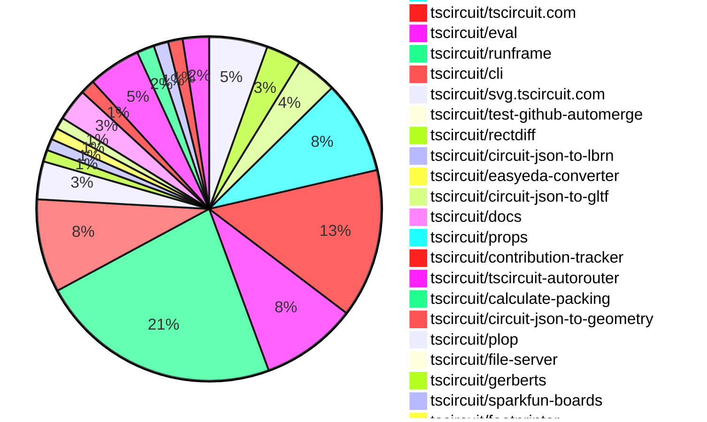
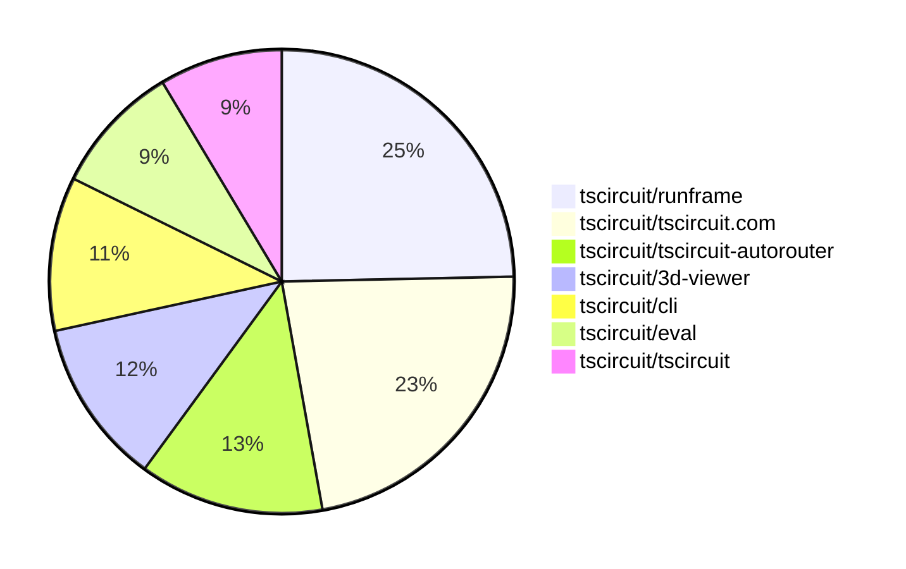

# Contribution Overview 2025-12-03

The current week is shown below. There are 4 major sections:

- [Contributor Overview](#contributor-overview)
- [PRs by Repository](#prs-by-repository)
- [PRs by Contributor](#changes-by-contributor)
- [Scoring & Sponsorship System](#scoring--sponsorship-system)

## PRs by Repository

## Contributor Overview

| Contributor | 🐳 Major | 🐙 Minor | 🐌 Tiny | ⭐ | Score | Discussion Contributions |
|-------------|---------|---------|---------|-----|----------------|--------------------------|
| [seveibar](#seveibar) | 21 | 11 | 22 | 👑👑 | 83 | 0🔹 0🔶 0💎 |
| [imrishabh18](#imrishabh18) | 7 | 10 | 9 | 👑 | 58 | 0🔹 0🔶 0💎 |
| [ArnavK-09](#ArnavK-09) | 6 | 8 | 4 | ⭐⭐⭐ | 46 | 0🔹 0🔶 0💎 |
| [techmannih](#techmannih) | 1 | 9 | 4 | ⭐⭐⭐ | 39 | 0🔹 0🔶 0💎 |
| [ShiboSoftwareDev](#ShiboSoftwareDev) | 2 | 5 | 5 | ⭐⭐⭐ | 38 | 0🔹 0🔶 0💎 |
| [rushabhcodes](#rushabhcodes) | 3 | 1 | 7 | ⭐⭐⭐ | 33 | 0🔹 0🔶 0💎 |
| [Abse2001](#Abse2001) | 2 | 11 | 2 | ⭐⭐⭐ | 32 | 0🔹 0🔶 0💎 |
| [0hmX](#0hmX) | 6 | 1 | 5 | ⭐⭐⭐ | 31 | 0🔹 0🔶 0💎 |
| [MustafaMulla29](#MustafaMulla29) | 1 | 7 | 6 | ⭐⭐ | 26 | 0🔹 0🔶 0💎 |
| [tscircuitbot](#tscircuitbot) | 0 | 0 | 195 | ⭐⭐ | 14 | 0🔹 0🔶 0💎 |
| [Ayushjhawar8](#Ayushjhawar8) | 2 | 1 | 4 | ⭐⭐ | 14 | 0🔹 0🔶 0💎 |
| [AnasSarkiz](#AnasSarkiz) | 1 | 1 | 1 | ⭐⭐ | 11 | 0🔹 0🔶 0💎 |
| [nailoo](#nailoo) | 0 | 1 | 4 | ⭐ | 7 | 0🔹 0🔶 0💎 |
| [RaghavArora14](#RaghavArora14) | 0 | 3 | 0 | ⭐ | 7 | 0🔹 0🔶 0💎 |
| [Devesh36](#Devesh36) | 0 | 2 | 1 | ⭐ | 6 | 0🔹 0🔶 0💎 |
| [pxlpal](#pxlpal) | 0 | 1 | 1 |  | 3 | 0🔹 0🔶 0💎 |
| [shehaban](#shehaban) | 0 | 0 | 1 |  | 1 | 0🔹 0🔶 0💎 |

> Note: AI evaluates PRs and assigns 1-3 star ratings automatically. 4 and 5 star ratings require manual staff review.

### Discussion Contribution Legend

- 🔹 Normal Comments: Basic participation with minimal effort
- 🔶 Great Informative Comments: Thoughtful participation that adds value
- 💎 Incredible Comments: Exceptional participation with high-quality content

## Review Table

[reviews-received-hover]: ## "Number of reviews received for PRs for this contributor"
[approvals-received-hover]: ## "Number of approvals received for PRs this contributor authored"
[rejections-received-hover]: ## "Number of rejections received for PRs this contributor authored"
[prs-opened-hover]: ## "Number of PRs opened by this contributor"
[issues-created-hover]: ## "Number of issues created by this contributor"
[bountied-issues-hover]: ## "Number of issues this contributor created with a bounty"
[bountied-issue-$-hover]: ## "Total bounty amount placed on issues authored by this contributor"

| Contributor | Reviews Received | Approvals Received | Rejections Received | Approvals | Rejections | PRs Opened | PRs Merged | Score | Issues Created | Bountied Issues | Bountied Issue $ |
|---|---|---|---|---|---|---|---|---|---|---|---|
| [FizaSiddique123](#FizaSiddique123) | 1 | 0 | 1 | 0 | 0 | 1 | 0 | 0 | 0 | 0 | 0 |
| [techmannih](#techmannih) | 16 | 11 | 3 | 5 | 1 | 19 | 14 | 39 | 0 | 0 | 0 |
| [akramcodez](#akramcodez) | 2 | 0 | 1 | 0 | 0 | 1 | 0 | 0 | 0 | 0 | 0 |
| [rushabhcodes](#rushabhcodes) | 62 | 20 | 2 | 4 | 2 | 23 | 11 | 33 | 0 | 0 | 0 |
| [fluffyrabbot](#fluffyrabbot) | 1 | 0 | 0 | 0 | 0 | 2 | 0 | 0 | 0 | 0 | 0 |
| [Abse2001](#Abse2001) | 22 | 16 | 1 | 0 | 0 | 18 | 15 | 32 | 0 | 0 | 0 |
| [seveibar](#seveibar) | 5 | 0 | 0 | 82 | 22 | 73 | 55 | 83 | 0 | 0 | 0 |
| [tscircuitbot](#tscircuitbot) | 0 | 0 | 0 | 0 | 0 | 252 | 195 | 14 | 0 | 0 | 0 |
| [Ayushjhawar8](#Ayushjhawar8) | 14 | 6 | 4 | 0 | 0 | 10 | 7 | 14 | 0 | 0 | 0 |
| [imrishabh18](#imrishabh18) | 10 | 1 | 0 | 7 | 6 | 28 | 26 | 58 | 0 | 0 | 0 |
| [Devesh36](#Devesh36) | 24 | 5 | 4 | 0 | 0 | 12 | 3 | 6 | 0 | 0 | 0 |
| [Lulzx](#Lulzx) | 2 | 0 | 2 | 0 | 0 | 6 | 0 | 0 | 0 | 0 | 0 |
| [AnasSarkiz](#AnasSarkiz) | 22 | 5 | 4 | 0 | 0 | 7 | 3 | 11 | 0 | 0 | 0 |
| [nailoo](#nailoo) | 11 | 9 | 2 | 0 | 0 | 10 | 5 | 7 | 0 | 0 | 0 |
| [ShiboSoftwareDev](#ShiboSoftwareDev) | 8 | 7 | 1 | 16 | 0 | 13 | 12 | 38 | 0 | 0 | 0 |
| [MustafaMulla29](#MustafaMulla29) | 21 | 9 | 2 | 0 | 0 | 22 | 14 | 26 | 0 | 0 | 0 |
| [Aqil-Ahmad](#Aqil-Ahmad) | 0 | 0 | 0 | 0 | 0 | 1 | 0 | 0 | 0 | 0 | 0 |
| [0hmX](#0hmX) | 22 | 12 | 0 | 0 | 0 | 19 | 12 | 31 | 0 | 0 | 0 |
| [Prachi-kushwaha](#Prachi-kushwaha) | 3 | 0 | 1 | 0 | 0 | 1 | 0 | 0 | 0 | 0 | 0 |
| [RaghavArora14](#RaghavArora14) | 63 | 7 | 2 | 1 | 0 | 7 | 3 | 7 | 0 | 0 | 0 |
| [ArnavK-09](#ArnavK-09) | 13 | 6 | 0 | 2 | 0 | 20 | 18 | 46 | 0 | 0 | 0 |
| [pxlpal](#pxlpal) | 1 | 1 | 0 | 0 | 0 | 2 | 2 | 3 | 0 | 0 | 0 |
| [shehaban](#shehaban) | 8 | 2 | 0 | 0 | 0 | 2 | 1 | 1 | 0 | 0 | 0 |
| [gustavo-keiller](#gustavo-keiller) | 2 | 0 | 1 | 0 | 0 | 1 | 0 | 0 | 0 | 0 | 0 |

## Top 7 Repositories by Contribution Points

## Scoring & Sponsorship System

### Overview

PRs are analyzed by AI and assigned a **star rating (1-3 stars)**. 4 and 5 star ratings can only be manually assigned by staff. Weekly scores use `2^(starRating - 1)` per PR (capped at 12 PRs per rating), plus review/discussion points.

### Weekly Score → Star String

| Score Range | Star String | Count Value |
|------------|-------------|-------------|
| 0-3 | (empty) | 0 stars |
| 4-10 | ⭐ | 1 star |
| 11-30 | ⭐⭐ | 2 stars |
| 31-50 | ⭐⭐⭐ | 3 stars |
| 51-75 | 👑 | 1 crown |
| 76-100 | 👑👑 | 2 crowns |
| 101+ | 👑👑👑 | 3 crowns |

> Crowns count as 3 stars for sponsorship.

### Monthly Sponsorship Calculation

The sponsorship system calculates monthly payments based on your **weekly star counts** over the complete weeks in that month (typically 4-5 weeks, Wednesday-Tuesday format).

**Step 1: Collect Weekly Stars**
- All complete weeks in the month are analyzed
- Each week's star string is converted to a numeric count (⭐ = 1 star, ⭐⭐⭐ = 3 stars)
- Example: `[2, 2, 2, 1, 0]` means 2 stars in week 1, 2 stars in week 2, etc.

**Step 2: Calculate Metrics**
- **Median stars**: The median value of all weekly star counts
- **Min stars**: The minimum weekly star count
- **Max stars**: The maximum weekly star count
- **High score**: The maximum raw weekly score (0-100+ range from the scoring table) from any week in the month

**Step 3: Determine Base Amount**
The sponsorship amount is calculated based on these metrics (checked in order):

| Condition | Base Amount |
|-----------|-------------|
| `minStarCount >= 3` | **$700** |
| `medianStars >= 3` | **$550** |
| `medianStars >= 2.5` | **$400** |
| `medianStars >= 2` | **$250** |
| `medianStars >= 1.5` | **$120** |
| `medianStars >= 1` | **$75** |
| `maxStarCount >= 2` | **$45** |
| `maxStarCount >= 1` | **$30** |
| `highScore >= 3` (and all stars = 0) | **$10** |

| Maintainer Level | Monthly Bonus |
|------------------|---------------|
| Level 1 | **$200** |
| Level 2 | **$350** |
| Level 3 | **$500** |
| Level 4 | **$850** |
| Level 5 | **$1300** |
| Level 6 | **$2000** |

**Final Amount** = Base Amount + Maintainer Bonus

## Changes by Repository

### [tscircuit/3d-viewer](https://github.com/tscircuit/3d-viewer)

| PR # | Impact | Rating | Contributor | Description |
|------|--------|--------|-------------|-------------|
| [#614](https://github.com/tscircuit/3d-viewer/pull/614) | 🐳 Major | ⭐⭐⭐ | Abse2001 | Adds full PCB texture support in JSCAD viewer, including soldermask, silkscreen, and traces, with improved layer visibility controls and consistent SVG export coloring. |
| [#589](https://github.com/tscircuit/3d-viewer/pull/589) | 🐳 Major | ⭐⭐⭐ | Ayushjhawar8 | Adds support for translucent models by introducing a transparency feature in the rendering of various model types. |
| [#592](https://github.com/tscircuit/3d-viewer/pull/592) | 🐳 Major | ⭐⭐⭐ | rushabhcodes | Refactors the via geometry generation logic to improve the accuracy and visual representation of PCB vias, fixes a bug in drill hole processing, and adds new Storybook stories for testing and demonstration. |
| [#618](https://github.com/tscircuit/3d-viewer/pull/618) | 🐙 Minor | ⭐⭐ | Abse2001 | Fixes rendering of JSCAD traces to use the same green trace-with-mask color as Manifold and positions them visually above the copper traces. |
| [#608](https://github.com/tscircuit/3d-viewer/pull/608) | 🐙 Minor | ⭐⭐ | techmannih | Fixes the rendering issue of plated hole shapes in JSCAD, ensuring they display correctly in the 3D viewer. |
| [#598](https://github.com/tscircuit/3d-viewer/pull/598) | 🐙 Minor | ⭐⭐ | techmannih | Fixes the issue where PCB cutout rotation was not functioning correctly in jscad by applying rotation before translation. |
| [#601](https://github.com/tscircuit/3d-viewer/pull/601) | 🐙 Minor | ⭐⭐ | techmannih | Fixes the issue where PCB cutouts are not visible due to the soldermask texture rendering incorrectly. |
| [#602](https://github.com/tscircuit/3d-viewer/pull/602) | 🐙 Minor | ⭐⭐ | techmannih | Fixes soldermask coverage for oval-shaped plated holes in the rendering engine. |
| [#603](https://github.com/tscircuit/3d-viewer/pull/603) | 🐙 Minor | ⭐⭐ | techmannih | Fixes rendering issues with polygon plated holes in soldermask coverage by adding support for various hole shapes and their respective rendering logic. |
| [#604](https://github.com/tscircuit/3d-viewer/pull/604) | 🐙 Minor | ⭐⭐ | techmannih | Adds support for soldermask coverage with corner radius and plated holes in the soldermask texture generation. |
| [#599](https://github.com/tscircuit/3d-viewer/pull/599) | 🐙 Minor | ⭐⭐ | techmannih | Fixes the visibility of non-plated holes in the PCB rendering due to soldermask texture coverage issues. |
| [#600](https://github.com/tscircuit/3d-viewer/pull/600) | 🐙 Minor | ⭐⭐ | techmannih | Fixes the rotation issue for pill-shaped plated holes in the soldermask texture rendering. |
| [#597](https://github.com/tscircuit/3d-viewer/pull/597) | 🐙 Minor | ⭐⭐ | techmannih | Add support for rendering PCB fabrication note rectangles in the silkscreen layer, including customizable properties such as color, stroke, and fill options. |
| [#611](https://github.com/tscircuit/3d-viewer/pull/611) | 🐙 Minor | ⭐⭐ | MustafaMulla29 | Fixes z-fighting issue when soldermask is enabled by adjusting polygon offset values and render order in the texture mesh creation process. |
| [#606](https://github.com/tscircuit/3d-viewer/pull/606) | 🐙 Minor | ⭐⭐ | MustafaMulla29 | Fixes the soldermask rotation application to ensure it aligns correctly with the 3D geometry, addressing issues with incorrect rotation directions for both pads and holes. |
| [#605](https://github.com/tscircuit/3d-viewer/pull/605) | 🐙 Minor | ⭐⭐ | MustafaMulla29 | Fixes the soldermask rendering to respect the board outline, ensuring that the soldermask is drawn only within the defined outline of the board instead of filling the entire canvas. |
| [#595](https://github.com/tscircuit/3d-viewer/pull/595) | 🐙 Minor | ⭐⭐ | MustafaMulla29 | Adds support for soldermask layers on PCB boards, allowing users to toggle visibility for top and bottom soldermask layers. |

🐌 Tiny Contributions (3)

| PR # | Impact | Contributor | Description |
|------|--------|-------------|-------------|
| [#594](https://github.com/tscircuit/3d-viewer/pull/594) | 🐌 Tiny | rushabhcodes | Refactors via geometry generation in the PCB board model by introducing dedicated functions for creating via copper and board drill geometries, enhancing maintainability and clarity. |
| [#615](https://github.com/tscircuit/3d-viewer/pull/615) | 🐌 Tiny | MustafaMulla29 | Fixes alignment issues of elements in the context menu for improved user interface consistency. |
| [#610](https://github.com/tscircuit/3d-viewer/pull/610) | 🐌 Tiny | MustafaMulla29 | Changes the color scheme for the board and traces based on the presence of solder mask, specifically updating colors to tan for traces without mask and light green for traces with mask. |

### [tscircuit/circuit-to-svg](https://github.com/tscircuit/circuit-to-svg)

| PR # | Impact | Rating | Contributor | Description |
|------|--------|--------|-------------|-------------|
| [#442](https://github.com/tscircuit/circuit-to-svg/pull/442) | 🐳 Major | ⭐⭐⭐ | Abse2001 | Adds full support for pcb_copper_text, including normal text rendering, mirroring, rotation, and knockout rectangles with text cutouts. Introduces opentype.js for true path extraction and updates snapshot tests. |
| [#444](https://github.com/tscircuit/circuit-to-svg/pull/444) | 🐙 Minor | ⭐⭐ | Abse2001 | Adjusts the scaling of copper text to match the scale of silkscreen text in SVG rendering. |
| [#441](https://github.com/tscircuit/circuit-to-svg/pull/441) | 🐙 Minor | ⭐⭐ | Abse2001 | Adds anchor-offset indicator rendering for PCB panels and fixes the Y-offset sign issue in createAnchorOffsetIndicators while updating tscircuit-related dependencies to their latest versions. |

### [tscircuit/pcb-viewer](https://github.com/tscircuit/pcb-viewer)

| PR # | Impact | Rating | Contributor | Description |
|------|--------|--------|-------------|-------------|
| [#523](https://github.com/tscircuit/pcb-viewer/pull/523) | 🐳 Major | ⭐⭐⭐ | techmannih | Fixes rotation support for pill SMT pads by adding support for rotated pill shapes in the conversion process. |
| [#525](https://github.com/tscircuit/pcb-viewer/pull/525) | 🐙 Minor | ⭐⭐ | Abse2001 | Add support for rendering pcb_copper_text circuit-json elements, including automatic mirroring for bottom layer text, rotation support, and text alignment. Implement knockout text rendering feature that displays text as a cutout from a filled background rectangle, with configurable padding. |
| [#520](https://github.com/tscircuit/pcb-viewer/pull/520) | 🐙 Minor | ⭐⭐ | Abse2001 | Fixes incorrect offset computation for pcb_panel placement, ensuring accurate positioning within PCB assemblies. |
| [#515](https://github.com/tscircuit/pcb-viewer/pull/515) | 🐙 Minor | ⭐⭐ | seveibar | Offsets lowercase alphabet glyphs using the library baseline instead of centered positioning, includes baseline offset in text metrics to account for descender depth, and adds tests confirming baseline placement and descender rendering for lowercase text. |

🐌 Tiny Contributions (8)

| PR # | Impact | Contributor | Description |
|------|--------|-------------|-------------|
| [#527](https://github.com/tscircuit/pcb-viewer/pull/527) | 🐌 Tiny | tscircuitbot | Automated package update |
| [#524](https://github.com/tscircuit/pcb-viewer/pull/524) | 🐌 Tiny | tscircuitbot | Automated package update |
| [#522](https://github.com/tscircuit/pcb-viewer/pull/522) | 🐌 Tiny | tscircuitbot | Automated package update |
| [#521](https://github.com/tscircuit/pcb-viewer/pull/521) | 🐌 Tiny | tscircuitbot | Automated package update |
| [#519](https://github.com/tscircuit/pcb-viewer/pull/519) | 🐌 Tiny | tscircuitbot | Automated package update |
| [#516](https://github.com/tscircuit/pcb-viewer/pull/516) | 🐌 Tiny | tscircuitbot | Automated package update |
| [#517](https://github.com/tscircuit/pcb-viewer/pull/517) | 🐌 Tiny | techmannih | Refactors the SMT pad shape handling by extracting shape-specific conversion logic into separate files for better organization and maintainability. |
| [#518](https://github.com/tscircuit/pcb-viewer/pull/518) | 🐌 Tiny | Ayushjhawar8 | Disables the right-click context menu on the PCB Viewer component to prevent default actions. |

### [tscircuit/circuit-json](https://github.com/tscircuit/circuit-json)

| PR # | Impact | Rating | Contributor | Description |
|------|--------|--------|-------------|-------------|
| [#367](https://github.com/tscircuit/circuit-json/pull/367) | 🐙 Minor | ⭐⭐ | Abse2001 | Adds an optional is_covered_with_solder_mask field to PcbPlatedHoleCircle, allowing explicit control of solder-mask coverage for plated holes. |
| [#368](https://github.com/tscircuit/circuit-json/pull/368) | 🐙 Minor | ⭐⭐ | seveibar | Add a source_port_internal_connection element definition with zod schema and exports, include the new element in any_circuit_element union and documentation, cover parsing with a dedicated test |

### [tscircuit/circuit-json-util](https://github.com/tscircuit/circuit-json-util)

| PR # | Impact | Rating | Contributor | Description |
|------|--------|--------|-------------|-------------|
| [#71](https://github.com/tscircuit/circuit-json-util/pull/71) | 🐙 Minor | ⭐⭐ | Abse2001 | Adds support for polygon-shaped SMT pads in both bounds and transform utilities, fixing PCB Auto Packing not working on polygon pads in core. |

### [tscircuit/core](https://github.com/tscircuit/core)

| PR # | Impact | Rating | Contributor | Description |
|------|--------|--------|-------------|-------------|
| [#1730](https://github.com/tscircuit/core/pull/1730) | 🐳 Major | ⭐⭐⭐ | seveibar | Mark relatively positioned components as static inputs for the packer to maintain their fixed placements during layout packing. |
| [#1729](https://github.com/tscircuit/core/pull/1729) | 🐳 Major | ⭐⭐⭐ | ShiboSoftwareDev | Refactors the panel tab and mousebite generation logic to unify outline handling, improve corner handling, and simplify code structure. |
| [#1727](https://github.com/tscircuit/core/pull/1727) | 🐳 Major | ⭐⭐⭐ | ShiboSoftwareDev | Adds support for simulating buck converter circuits using ngspice, fixes inductance handling in the inductor component, and updates circuit-json-to-spice to leverage improved MOSFET simulation models. |
| [#1722](https://github.com/tscircuit/core/pull/1722) | 🐙 Minor | ⭐⭐ | Abse2001 | Changes the default panelization method from tab-routing to none in the Panel component. |
| [#1720](https://github.com/tscircuit/core/pull/1720) | 🐙 Minor | ⭐⭐ | Abse2001 | Fixes issues with board positioning inside panels by using global PCB coordinates for layout, ensuring accurate absolute center computation for boards. |
| [#1713](https://github.com/tscircuit/core/pull/1713) | 🐙 Minor | ⭐⭐ | Abse2001 | Refactors board inflation logic to rely on pcb_board entries only, replacing inflateSourceBoard with the new inflatePcbBoard and updating inflateCircuitJson accordingly. |
| [#1710](https://github.com/tscircuit/core/pull/1710) | 🐙 Minor | ⭐⭐ | Abse2001 | Adds a new inflateSourceBoard inflator that creates a Board component from source_board entries in circuit-json. Prevents double-inflation when a board is already present. Wires board inflation into inflateCircuitJson to ensure boards render correctly in subcircuits. |
| [#1711](https://github.com/tscircuit/core/pull/1711) | 🐙 Minor | ⭐⭐ | seveibar | Check renderable children for incomplete async effects so traversal is shared across component types and remove the redundant Group override now that the base class handles children. |
| [#1728](https://github.com/tscircuit/core/pull/1728) | 🐙 Minor | ⭐⭐ | ShiboSoftwareDev | Adds support for generating panel tabs and mouse bites for boards defined with custom outline properties, enhancing functionality for non-rectangular boards. |
| [#1719](https://github.com/tscircuit/core/pull/1719) | 🐙 Minor | ⭐⭐ | AnasSarkiz | Fixes the issue where the Panel component ignored explicit width and height props, always replacing them with auto-sized values, thus preventing users from defining custom panel dimensions. |

🐌 Tiny Contributions (4)

| PR # | Impact | Contributor | Description |
|------|--------|-------------|-------------|
| [#1714](https://github.com/tscircuit/core/pull/1714) | 🐌 Tiny | Abse2001 | Upgrades tscircuitcircuit-json-util to the latest version, which includes fixes for polygon-shaped SMT pad packing. Ensures correct boundsgeometry handling so polygon pads pack properly during PCB layout. |
| [#1732](https://github.com/tscircuit/core/pull/1732) | 🐌 Tiny | seveibar | Updates the autorouter dependency to the latest version and modifies snapshot tests to reflect changes in the autorouting behavior. |
| [#1723](https://github.com/tscircuit/core/pull/1723) | 🐌 Tiny | seveibar | Updates the calculate-packing dependency to version 0.0.65 and refreshes PCB snapshot expectations affected by the new packing behavior. |
| [#1724](https://github.com/tscircuit/core/pull/1724) | 🐌 Tiny | ShiboSoftwareDev | Updates the ngspice-spice-engine dependency version from 0.0.4 to 0.0.8 and modifies the timePerStep parameter in the analogsimulation component from 50us to 1us. |

### [tscircuit/circuitjson.com](https://github.com/tscircuit/circuitjson.com)

🐌 Tiny Contributions (1)

| PR # | Impact | Contributor | Description |
|------|--------|-------------|-------------|
| [#84](https://github.com/tscircuit/circuitjson.com/pull/84) | 🐌 Tiny | Abse2001 | Updates peer dependencies for runframe and upgrades circuit-json and tscircuit dependencies to newer versions. |

### [tscircuit/tscircuit](https://github.com/tscircuit/tscircuit)

🐌 Tiny Contributions (32)

| PR # | Impact | Contributor | Description |
|------|--------|-------------|-------------|
| [#1604](https://github.com/tscircuit/tscircuit/pull/1604) | 🐌 Tiny | tscircuitbot | Automated package update |
| [#1602](https://github.com/tscircuit/tscircuit/pull/1602) | 🐌 Tiny | tscircuitbot | Automated package update |
| [#1601](https://github.com/tscircuit/tscircuit/pull/1601) | 🐌 Tiny | tscircuitbot | Automated package update |
| [#1599](https://github.com/tscircuit/tscircuit/pull/1599) | 🐌 Tiny | tscircuitbot | Updates the tscircuitcli package version from 0.1.613 to 0.1.615 in package.json |
| [#1598](https://github.com/tscircuit/tscircuit/pull/1598) | 🐌 Tiny | tscircuitbot | Automated package update |
| [#1596](https://github.com/tscircuit/tscircuit/pull/1596) | 🐌 Tiny | tscircuitbot | Automated package update |
| [#1595](https://github.com/tscircuit/tscircuit/pull/1595) | 🐌 Tiny | tscircuitbot | Automated package update |
| [#1594](https://github.com/tscircuit/tscircuit/pull/1594) | 🐌 Tiny | tscircuitbot | Updates the tscircuitcli package from version 0.1.612 to 0.1.613 and the tscircuitrunframe package from version 0.0.1353 to 0.0.1354 in package.json |
| [#1593](https://github.com/tscircuit/tscircuit/pull/1593) | 🐌 Tiny | tscircuitbot | Automated package update |
| [#1592](https://github.com/tscircuit/tscircuit/pull/1592) | 🐌 Tiny | tscircuitbot | Updates the tscircuitcli package to version 0.1.612 in the package.json file. |
| [#1591](https://github.com/tscircuit/tscircuit/pull/1591) | 🐌 Tiny | tscircuitbot | Automated package update |
| [#1590](https://github.com/tscircuit/tscircuit/pull/1590) | 🐌 Tiny | tscircuitbot | Updates the tscircuitcli package from version 0.1.610 to 0.1.611 |
| [#1589](https://github.com/tscircuit/tscircuit/pull/1589) | 🐌 Tiny | tscircuitbot | Automated package update |
| [#1588](https://github.com/tscircuit/tscircuit/pull/1588) | 🐌 Tiny | tscircuitbot | Automated package update |
| [#1587](https://github.com/tscircuit/tscircuit/pull/1587) | 🐌 Tiny | tscircuitbot | Automated package update |
| [#1586](https://github.com/tscircuit/tscircuit/pull/1586) | 🐌 Tiny | tscircuitbot | Automated package update |
| [#1585](https://github.com/tscircuit/tscircuit/pull/1585) | 🐌 Tiny | tscircuitbot | Automated package update |
| [#1584](https://github.com/tscircuit/tscircuit/pull/1584) | 🐌 Tiny | tscircuitbot | Updates the tscircuitcli package to version 0.1.608 in the package.json file. |
| [#1583](https://github.com/tscircuit/tscircuit/pull/1583) | 🐌 Tiny | tscircuitbot | Automated package update |
| [#1582](https://github.com/tscircuit/tscircuit/pull/1582) | 🐌 Tiny | tscircuitbot | Automated package update |
| [#1578](https://github.com/tscircuit/tscircuit/pull/1578) | 🐌 Tiny | tscircuitbot | Automated package update |
| [#1577](https://github.com/tscircuit/tscircuit/pull/1577) | 🐌 Tiny | tscircuitbot | Automated package update |
| [#1575](https://github.com/tscircuit/tscircuit/pull/1575) | 🐌 Tiny | tscircuitbot | Automated package update |
| [#1574](https://github.com/tscircuit/tscircuit/pull/1574) | 🐌 Tiny | tscircuitbot | Updates the package version from 0.0.1010 to 0.0.1011 in package.json |
| [#1573](https://github.com/tscircuit/tscircuit/pull/1573) | 🐌 Tiny | tscircuitbot | Updates the tscircuitcli package to version 0.1.603 in package.json |
| [#1572](https://github.com/tscircuit/tscircuit/pull/1572) | 🐌 Tiny | tscircuitbot | Automated package update |
| [#1571](https://github.com/tscircuit/tscircuit/pull/1571) | 🐌 Tiny | tscircuitbot | Updates the tscircuitcli package to version 0.1.602 |
| [#1570](https://github.com/tscircuit/tscircuit/pull/1570) | 🐌 Tiny | tscircuitbot | Automated package update |
| [#1569](https://github.com/tscircuit/tscircuit/pull/1569) | 🐌 Tiny | tscircuitbot | Updates the tscircuitcli package to version 0.1.601 in the package.json file |
| [#1568](https://github.com/tscircuit/tscircuit/pull/1568) | 🐌 Tiny | tscircuitbot | Automated package update |
| [#1567](https://github.com/tscircuit/tscircuit/pull/1567) | 🐌 Tiny | tscircuitbot | Automated package update |
| [#1603](https://github.com/tscircuit/tscircuit/pull/1603) | 🐌 Tiny | rushabhcodes | Updates the calculate-packing package version from 0.0.66 to 0.0.68 in package.json |

### [tscircuit/tscircuit.com](https://github.com/tscircuit/tscircuit.com)

| PR # | Impact | Rating | Contributor | Description |
|------|--------|--------|-------------|-------------|
| [#2171](https://github.com/tscircuit/tscircuit.com/pull/2171) | 🐳 Major | ⭐⭐⭐ | seveibar | Updates the header login and get started buttons to launch the organization login flow with a redirect back to the current page, removing the direct GitHub sign-in hook usage from the header login component. |
| [#2130](https://github.com/tscircuit/tscircuit.com/pull/2130) | 🐳 Major | ⭐⭐⭐ | seveibar | Add avatar_url support to organization schemas and mapping in the fake API, implement POST orgsupload_avatar for the fake server storing image data and returning updated orgs, expose an organization settings dialog and hook to upload avatars from the UI. |
| [#2124](https://github.com/tscircuit/tscircuit.com/pull/2124) | 🐳 Major | ⭐⭐⭐ | seveibar | Add a GitHub connection card on the organization settings page to allow owners to initiate the installation flow directly from the organization view, handle installation completion with a confirmation toast and data refresh, and expose a refetch helper for reuse after connecting. |
| [#2122](https://github.com/tscircuit/tscircuit.com/pull/2122) | 🐳 Major | ⭐⭐⭐ | seveibar | Adds an Orgs submenu to the header account dropdown, listing organizations the user belongs to and linking to each org page. |
| [#2169](https://github.com/tscircuit/tscircuit.com/pull/2169) | 🐳 Major | ⭐⭐⭐ | ArnavK-09 | Adds the org_owner_tscircuit_handle field to the package schema and updates references in the package header and editor navigation components. |
| [#2163](https://github.com/tscircuit/tscircuit.com/pull/2163) | 🐳 Major | ⭐⭐⭐ | ArnavK-09 | Displays the avatar of the users personal organization in the header and user profile pages. |
| [#2135](https://github.com/tscircuit/tscircuit.com/pull/2135) | 🐳 Major | ⭐⭐⭐ | ArnavK-09 | Refactors the avatar upload functionality to unify organization and personal avatar handling, streamlining the user experience for updating avatars. |
| [#2157](https://github.com/tscircuit/tscircuit.com/pull/2157) | 🐙 Minor | ⭐⭐ | seveibar | Removes the JLCPCB generation routes and the EasyEDA package dependency from the project. |
| [#2123](https://github.com/tscircuit/tscircuit.com/pull/2123) | 🐙 Minor | ⭐⭐ | seveibar | Displays full package names in the dashboard quick-edit list, including organization or owner scope, and shows package owner scope on dashboard package cards for clearer context. |
| [#2120](https://github.com/tscircuit/tscircuit.com/pull/2120) | 🐙 Minor | ⭐⭐ | seveibar | Load circuit-json-to-gerber dynamically from jsdelivr when generating fabrication downloads and remove the bundled circuit-json-to-gerber dependency from the project |
| [#2161](https://github.com/tscircuit/tscircuit.com/pull/2161) | 🐙 Minor | ⭐⭐ | ArnavK-09 | Adds org_owner_tscircuit_handle to the package response in the GET apipackagesget endpoint. |
| [#2164](https://github.com/tscircuit/tscircuit.com/pull/2164) | 🐙 Minor | ⭐⭐ | ArnavK-09 | Adds filtering capability for packages based on the owner_tscircuit_handle in the packageslist API endpoint. |
| [#2168](https://github.com/tscircuit/tscircuit.com/pull/2168) | 🐙 Minor | ⭐⭐ | ArnavK-09 | Refactors OrganizationCard and UserProfilePage components to replace github_username with tscircuit_handle for user identification. |
| [#2166](https://github.com/tscircuit/tscircuit.com/pull/2166) | 🐙 Minor | ⭐⭐ | ArnavK-09 | Updates currentUser retrieval to fetch the entire session object instead of just the github_username. |
| [#2159](https://github.com/tscircuit/tscircuit.com/pull/2159) | 🐙 Minor | ⭐⭐ | ArnavK-09 | Refactors the save dialog to use tscircuit_handle instead of github_username for package naming. |
| [#2142](https://github.com/tscircuit/tscircuit.com/pull/2142) | 🐙 Minor | ⭐⭐ | ArnavK-09 | Fixes a crash on the organization page by updating the member avatar rendering to use a fallback mechanism for GitHub avatars. |
| [#2143](https://github.com/tscircuit/tscircuit.com/pull/2143) | 🐙 Minor | ⭐⭐ | ArnavK-09 | Changes email visibility in the list_members API based on the users membership status, ensuring that only members can see their own email addresses. |
| [#2106](https://github.com/tscircuit/tscircuit.com/pull/2106) | 🐙 Minor | ⭐⭐ | RaghavArora14 | Fixes z-index issues in dialog components to prevent overlay problems with the orientation cube. |
| [#2117](https://github.com/tscircuit/tscircuit.com/pull/2117) | 🐙 Minor | ⭐⭐ | pxlpal | Adds account_id to the redirect URL for creating a new GitHub installation, improving the installation process by associating it with the users account. |

🐌 Tiny Contributions (32)

| PR # | Impact | Contributor | Description |
|------|--------|-------------|-------------|
| [#2173](https://github.com/tscircuit/tscircuit.com/pull/2173) | 🐌 Tiny | tscircuitbot | Updates the tscircuitrunframe package from version 0.0.1368 to 0.0.1369 |
| [#2172](https://github.com/tscircuit/tscircuit.com/pull/2172) | 🐌 Tiny | tscircuitbot | Updates the tscircuiteval package from version 0.0.530 to 0.0.531 |
| [#2170](https://github.com/tscircuit/tscircuit.com/pull/2170) | 🐌 Tiny | tscircuitbot | Automated package update to version 0.0.159 |
| [#2167](https://github.com/tscircuit/tscircuit.com/pull/2167) | 🐌 Tiny | tscircuitbot | Automated package update |
| [#2162](https://github.com/tscircuit/tscircuit.com/pull/2162) | 🐌 Tiny | tscircuitbot | Automated package update to version 0.0.156 |
| [#2160](https://github.com/tscircuit/tscircuit.com/pull/2160) | 🐌 Tiny | tscircuitbot | Automated package update |
| [#2156](https://github.com/tscircuit/tscircuit.com/pull/2156) | 🐌 Tiny | tscircuitbot | Automated package update |
| [#2153](https://github.com/tscircuit/tscircuit.com/pull/2153) | 🐌 Tiny | tscircuitbot | Automated package update |
| [#2152](https://github.com/tscircuit/tscircuit.com/pull/2152) | 🐌 Tiny | tscircuitbot | Updates the tscircuiteval package from version 0.0.528 to 0.0.529 |
| [#2151](https://github.com/tscircuit/tscircuit.com/pull/2151) | 🐌 Tiny | tscircuitbot | Updates the tscircuiteval package from version 0.0.527 to 0.0.528 |
| [#2149](https://github.com/tscircuit/tscircuit.com/pull/2149) | 🐌 Tiny | tscircuitbot | Updates the tscircuiteval package to version 0.0.527 in the package.json file. |
| [#2148](https://github.com/tscircuit/tscircuit.com/pull/2148) | 🐌 Tiny | tscircuitbot | Updates the tscircuiteval package from version 0.0.525 to 0.0.526 |
| [#2144](https://github.com/tscircuit/tscircuit.com/pull/2144) | 🐌 Tiny | tscircuitbot | Automated package update |
| [#2140](https://github.com/tscircuit/tscircuit.com/pull/2140) | 🐌 Tiny | tscircuitbot | Automated package update |
| [#2139](https://github.com/tscircuit/tscircuit.com/pull/2139) | 🐌 Tiny | tscircuitbot | Updates the tscircuiteval package from version 0.0.523 to 0.0.524 in the package.json file. |
| [#2138](https://github.com/tscircuit/tscircuit.com/pull/2138) | 🐌 Tiny | tscircuitbot | Updates the tscircuiteval package from version 0.0.522 to 0.0.523 |
| [#2134](https://github.com/tscircuit/tscircuit.com/pull/2134) | 🐌 Tiny | tscircuitbot | Automated package update |
| [#2131](https://github.com/tscircuit/tscircuit.com/pull/2131) | 🐌 Tiny | tscircuitbot | Updates the package version from 0.0.152 to 0.0.153 in package.json |
| [#2129](https://github.com/tscircuit/tscircuit.com/pull/2129) | 🐌 Tiny | tscircuitbot | Updates the tscircuiteval package from version 0.0.521 to 0.0.522 |
| [#2128](https://github.com/tscircuit/tscircuit.com/pull/2128) | 🐌 Tiny | tscircuitbot | Automated package update |
| [#2126](https://github.com/tscircuit/tscircuit.com/pull/2126) | 🐌 Tiny | tscircuitbot | Updates the tscircuiteval package from version 0.0.519 to 0.0.520 |
| [#2119](https://github.com/tscircuit/tscircuit.com/pull/2119) | 🐌 Tiny | tscircuitbot | Automated package update |
| [#2118](https://github.com/tscircuit/tscircuit.com/pull/2118) | 🐌 Tiny | tscircuitbot | Automated package update |
| [#2116](https://github.com/tscircuit/tscircuit.com/pull/2116) | 🐌 Tiny | tscircuitbot | Automated package update for tscircuiteval from version 0.0.516 to 0.0.517 |
| [#2115](https://github.com/tscircuit/tscircuit.com/pull/2115) | 🐌 Tiny | tscircuitbot | Updates the tscircuiteval package from version 0.0.515 to 0.0.516 |
| [#2113](https://github.com/tscircuit/tscircuit.com/pull/2113) | 🐌 Tiny | tscircuitbot | Updates the tscircuiteval package from version 0.0.514 to 0.0.515 |
| [#2108](https://github.com/tscircuit/tscircuit.com/pull/2108) | 🐌 Tiny | techmannih | Updates the tscircuit3d-viewer package to version 0.0.448 in the package.json file. |
| [#2125](https://github.com/tscircuit/tscircuit.com/pull/2125) | 🐌 Tiny | seveibar | Removes the Order button and associated dialog from the package header, along with cleaning up unused order-related imports and props. |
| [#2145](https://github.com/tscircuit/tscircuit.com/pull/2145) | 🐌 Tiny | ArnavK-09 | Redirects users to the home page after signing out from their account. |
| [#2133](https://github.com/tscircuit/tscircuit.com/pull/2133) | 🐌 Tiny | ArnavK-09 | Adds a test organization package for development and patches the UI for mobile responsiveness. |
| [#2155](https://github.com/tscircuit/tscircuit.com/pull/2155) | 🐌 Tiny | imrishabh18 | Updates the runframe dependency, fixes a build error, and adds a Slack notification workflow for failed package updates. |
| [#2121](https://github.com/tscircuit/tscircuit.com/pull/2121) | 🐌 Tiny | pxlpal | Fixes the package author extraction logic to use the package name prefix instead of the GitHub username, ensuring correct author representation for organization packages. |

### [tscircuit/eval](https://github.com/tscircuit/eval)

| PR # | Impact | Rating | Contributor | Description |
|------|--------|--------|-------------|-------------|
| [#1623](https://github.com/tscircuit/eval/pull/1623) | 🐙 Minor | ⭐⭐ | seveibar | Refactors the import mechanism for npm packages to utilize CDN instead of local imports, enhancing package management. |

🐌 Tiny Contributions (32)

| PR # | Impact | Contributor | Description |
|------|--------|-------------|-------------|
| [#1682](https://github.com/tscircuit/eval/pull/1682) | 🐌 Tiny | tscircuitbot | Automated package update |
| [#1681](https://github.com/tscircuit/eval/pull/1681) | 🐌 Tiny | tscircuitbot | Updates the versions of several dependencies in the package.json file. |
| [#1679](https://github.com/tscircuit/eval/pull/1679) | 🐌 Tiny | tscircuitbot | Automated package update to version 0.0.530 |
| [#1678](https://github.com/tscircuit/eval/pull/1678) | 🐌 Tiny | tscircuitbot | Automated package update |
| [#1676](https://github.com/tscircuit/eval/pull/1676) | 🐌 Tiny | tscircuitbot | Automated package update |
| [#1675](https://github.com/tscircuit/eval/pull/1675) | 🐌 Tiny | tscircuitbot | Updates the version of the tscircuitcore package from 0.0.907 to 0.0.908 in package.json |
| [#1673](https://github.com/tscircuit/eval/pull/1673) | 🐌 Tiny | tscircuitbot | Automated package update |
| [#1672](https://github.com/tscircuit/eval/pull/1672) | 🐌 Tiny | tscircuitbot | Updates package dependencies in package.json to their latest versions. |
| [#1670](https://github.com/tscircuit/eval/pull/1670) | 🐌 Tiny | tscircuitbot | Automated package update |
| [#1669](https://github.com/tscircuit/eval/pull/1669) | 🐌 Tiny | tscircuitbot | Updates the version of the tscircuitcore package from 0.0.905 to 0.0.906 in package.json |
| [#1668](https://github.com/tscircuit/eval/pull/1668) | 🐌 Tiny | tscircuitbot | Automated package update |
| [#1667](https://github.com/tscircuit/eval/pull/1667) | 🐌 Tiny | tscircuitbot | Automated package update |
| [#1664](https://github.com/tscircuit/eval/pull/1664) | 🐌 Tiny | tscircuitbot | Automated package update |
| [#1663](https://github.com/tscircuit/eval/pull/1663) | 🐌 Tiny | tscircuitbot | Updates the version of the tscircuitcore package from 0.0.902 to 0.0.903 in package.json |
| [#1661](https://github.com/tscircuit/eval/pull/1661) | 🐌 Tiny | tscircuitbot | Automated package update to version 0.0.524 |
| [#1660](https://github.com/tscircuit/eval/pull/1660) | 🐌 Tiny | tscircuitbot | Automated package update |
| [#1659](https://github.com/tscircuit/eval/pull/1659) | 🐌 Tiny | tscircuitbot | Automated package update |
| [#1658](https://github.com/tscircuit/eval/pull/1658) | 🐌 Tiny | tscircuitbot | Automated package update |
| [#1656](https://github.com/tscircuit/eval/pull/1656) | 🐌 Tiny | tscircuitbot | Automated package update |
| [#1655](https://github.com/tscircuit/eval/pull/1655) | 🐌 Tiny | tscircuitbot | Automated package update |
| [#1653](https://github.com/tscircuit/eval/pull/1653) | 🐌 Tiny | tscircuitbot | Automated package update |
| [#1652](https://github.com/tscircuit/eval/pull/1652) | 🐌 Tiny | tscircuitbot | Automated package update |
| [#1651](https://github.com/tscircuit/eval/pull/1651) | 🐌 Tiny | tscircuitbot | Updates package versions for dependencies in the project. |
| [#1649](https://github.com/tscircuit/eval/pull/1649) | 🐌 Tiny | tscircuitbot | Automated package update |
| [#1648](https://github.com/tscircuit/eval/pull/1648) | 🐌 Tiny | tscircuitbot | Updates the version of the tscircuitcore package from 0.0.898 to 0.0.899 in package.json |
| [#1646](https://github.com/tscircuit/eval/pull/1646) | 🐌 Tiny | tscircuitbot | Automated package update |
| [#1645](https://github.com/tscircuit/eval/pull/1645) | 🐌 Tiny | tscircuitbot | Updates the version of the tscircuitcore package from 0.0.897 to 0.0.898 in package.json |
| [#1643](https://github.com/tscircuit/eval/pull/1643) | 🐌 Tiny | tscircuitbot | Automated package update |
| [#1642](https://github.com/tscircuit/eval/pull/1642) | 🐌 Tiny | tscircuitbot | Updates the version of the tscircuitcore package from 0.0.896 to 0.0.897 in package.json |
| [#1639](https://github.com/tscircuit/eval/pull/1639) | 🐌 Tiny | tscircuitbot | Automated package update |
| [#1654](https://github.com/tscircuit/eval/pull/1654) | 🐌 Tiny | seveibar | Removes comments from code before extracting import statements to ensure accurate analysis of imports. |
| [#1638](https://github.com/tscircuit/eval/pull/1638) | 🐌 Tiny | seveibar | Adds zod as a development dependency to ensure compatibility with the core version. |

### [tscircuit/runframe](https://github.com/tscircuit/runframe)

| PR # | Impact | Rating | Contributor | Description |
|------|--------|--------|-------------|-------------|
| [#2035](https://github.com/tscircuit/runframe/pull/2035) | 🐳 Major | ⭐⭐⭐ | seveibar | Prompt the login dialog when autorouting bug reports fail due to missing authentication and expose a sign-in option in the File menu. |
| [#1992](https://github.com/tscircuit/runframe/pull/1992) | 🐳 Major | ⭐⭐⭐ | ArnavK-09 | img width1496 height881 altimage srchttps:github.comuser-attachmentsassets7a538869-ad30-46e3-a5c0-d02352492a73  img width993 height776 altimage srchttps:github.comuser-attachmentsassetsdfebc0cb-f0eb-4e71-9d63-b34a58efb755 |
| [#2031](https://github.com/tscircuit/runframe/pull/2031) | 🐙 Minor | ⭐⭐ | seveibar | Provides a default issue payload for copy and report actions when no errors or warnings exist, ensuring GitHub issue creation and clipboard copying still work without runtime diagnostics. |
| [#2019](https://github.com/tscircuit/runframe/pull/2019) | 🐙 Minor | ⭐⭐ | seveibar | Removes the direct EasyEDA dependency from the package configuration and adds a helper to dynamically load the EasyEDA browser module from jsdelivr, updating JLCPCB import flows to request the EasyEDA converter only when needed. |
| [#1990](https://github.com/tscircuit/runframe/pull/1990) | 🐙 Minor | ⭐⭐ | ArnavK-09 | Disables the schematic tab in the UI when there are no schematic groups present in the circuit JSON. |

🐌 Tiny Contributions (78)

| PR # | Impact | Contributor | Description |
|------|--------|-------------|-------------|
| [#2050](https://github.com/tscircuit/runframe/pull/2050) | 🐌 Tiny | tscircuitbot | Automated package update |
| [#2048](https://github.com/tscircuit/runframe/pull/2048) | 🐌 Tiny | tscircuitbot | Automated package update |
| [#2047](https://github.com/tscircuit/runframe/pull/2047) | 🐌 Tiny | tscircuitbot | Updates the tscircuiteval package to version 0.0.531 in package.json |
| [#2046](https://github.com/tscircuit/runframe/pull/2046) | 🐌 Tiny | tscircuitbot | Automated package update |
| [#2045](https://github.com/tscircuit/runframe/pull/2045) | 🐌 Tiny | tscircuitbot | Updates the tscircuit3d-viewer package to version 0.0.469 in package.json |
| [#2044](https://github.com/tscircuit/runframe/pull/2044) | 🐌 Tiny | tscircuitbot | Automated package update |
| [#2042](https://github.com/tscircuit/runframe/pull/2042) | 🐌 Tiny | tscircuitbot | Automated package update |
| [#2041](https://github.com/tscircuit/runframe/pull/2041) | 🐌 Tiny | tscircuitbot | Automated package update |
| [#2039](https://github.com/tscircuit/runframe/pull/2039) | 🐌 Tiny | tscircuitbot | Automated package update |
| [#2037](https://github.com/tscircuit/runframe/pull/2037) | 🐌 Tiny | tscircuitbot | Updates the tscircuiteval package version from 0.0.528 to 0.0.530 in package.json |
| [#2034](https://github.com/tscircuit/runframe/pull/2034) | 🐌 Tiny | tscircuitbot | Updates the tscircuit3d-viewer package to version 0.0.466 in package.json |
| [#2032](https://github.com/tscircuit/runframe/pull/2032) | 🐌 Tiny | tscircuitbot | Updates the tscircuitpcb-viewer package from version 1.11.279 to 1.11.280 |
| [#2030](https://github.com/tscircuit/runframe/pull/2030) | 🐌 Tiny | tscircuitbot | Automated package update |
| [#2029](https://github.com/tscircuit/runframe/pull/2029) | 🐌 Tiny | tscircuitbot | Updates the tscircuiteval package to version 0.0.528 in the package.json file. |
| [#2028](https://github.com/tscircuit/runframe/pull/2028) | 🐌 Tiny | tscircuitbot | Updates the tscircuiteval package to version 0.0.527 in package.json |
| [#2027](https://github.com/tscircuit/runframe/pull/2027) | 🐌 Tiny | tscircuitbot | Updates the tscircuit3d-viewer package to version 0.0.464 in package.json |
| [#2026](https://github.com/tscircuit/runframe/pull/2026) | 🐌 Tiny | tscircuitbot | Automated package update |
| [#2025](https://github.com/tscircuit/runframe/pull/2025) | 🐌 Tiny | tscircuitbot | Updates the tscircuiteval package from version 0.0.525 to 0.0.526 |
| [#2024](https://github.com/tscircuit/runframe/pull/2024) | 🐌 Tiny | tscircuitbot | Updates the tscircuit3d-viewer package to version 0.0.462 in package.json |
| [#2022](https://github.com/tscircuit/runframe/pull/2022) | 🐌 Tiny | tscircuitbot | Automated package update |
| [#2021](https://github.com/tscircuit/runframe/pull/2021) | 🐌 Tiny | tscircuitbot | Automated package update |
| [#2018](https://github.com/tscircuit/runframe/pull/2018) | 🐌 Tiny | tscircuitbot | Automated package update |
| [#2017](https://github.com/tscircuit/runframe/pull/2017) | 🐌 Tiny | tscircuitbot | Updates the tscircuiteval package to version 0.0.525 in the package.json file. |
| [#2016](https://github.com/tscircuit/runframe/pull/2016) | 🐌 Tiny | tscircuitbot | Automated package update |
| [#2015](https://github.com/tscircuit/runframe/pull/2015) | 🐌 Tiny | tscircuitbot | Automated package update |
| [#2014](https://github.com/tscircuit/runframe/pull/2014) | 🐌 Tiny | tscircuitbot | Automated package update |
| [#2013](https://github.com/tscircuit/runframe/pull/2013) | 🐌 Tiny | tscircuitbot | Updates the tscircuit3d-viewer package to version 0.0.458 in the package.json file. |
| [#2012](https://github.com/tscircuit/runframe/pull/2012) | 🐌 Tiny | tscircuitbot | Automated package update |
| [#2011](https://github.com/tscircuit/runframe/pull/2011) | 🐌 Tiny | tscircuitbot | Automated package update |
| [#2010](https://github.com/tscircuit/runframe/pull/2010) | 🐌 Tiny | tscircuitbot | Automated package update |
| [#2009](https://github.com/tscircuit/runframe/pull/2009) | 🐌 Tiny | tscircuitbot | Automated package update |
| [#2008](https://github.com/tscircuit/runframe/pull/2008) | 🐌 Tiny | tscircuitbot | Updates the tscircuit3d-viewer package to version 0.0.455 |
| [#2007](https://github.com/tscircuit/runframe/pull/2007) | 🐌 Tiny | tscircuitbot | Automated package update |
| [#2006](https://github.com/tscircuit/runframe/pull/2006) | 🐌 Tiny | tscircuitbot | Updates the tscircuit3d-viewer package to version 0.0.454 in package.json |
| [#2005](https://github.com/tscircuit/runframe/pull/2005) | 🐌 Tiny | tscircuitbot | Automated package update |
| [#2004](https://github.com/tscircuit/runframe/pull/2004) | 🐌 Tiny | tscircuitbot | Updates the tscircuiteval package to version 0.0.524 in the package.json file. |
| [#2003](https://github.com/tscircuit/runframe/pull/2003) | 🐌 Tiny | tscircuitbot | Automated package update |
| [#2002](https://github.com/tscircuit/runframe/pull/2002) | 🐌 Tiny | tscircuitbot | Updates the tscircuit3d-viewer package to version 0.0.453 in package.json |
| [#2001](https://github.com/tscircuit/runframe/pull/2001) | 🐌 Tiny | tscircuitbot | Automated package update |
| [#2000](https://github.com/tscircuit/runframe/pull/2000) | 🐌 Tiny | tscircuitbot | Updates the tscircuiteval package version from 0.0.521 to 0.0.523 in package.json |
| [#1999](https://github.com/tscircuit/runframe/pull/1999) | 🐌 Tiny | tscircuitbot | Automated package update |
| [#1998](https://github.com/tscircuit/runframe/pull/1998) | 🐌 Tiny | tscircuitbot | Updates the tscircuitpcb-viewer package from version 1.11.278 to 1.11.279 |
| [#1997](https://github.com/tscircuit/runframe/pull/1997) | 🐌 Tiny | tscircuitbot | Automated package update |
| [#1996](https://github.com/tscircuit/runframe/pull/1996) | 🐌 Tiny | tscircuitbot | Updates the tscircuitpcb-viewer package from version 1.11.277 to 1.11.278 |
| [#1995](https://github.com/tscircuit/runframe/pull/1995) | 🐌 Tiny | tscircuitbot | Automated package update |
| [#1994](https://github.com/tscircuit/runframe/pull/1994) | 🐌 Tiny | tscircuitbot | Automated package update |
| [#1993](https://github.com/tscircuit/runframe/pull/1993) | 🐌 Tiny | tscircuitbot | Automated package update |
| [#1991](https://github.com/tscircuit/runframe/pull/1991) | 🐌 Tiny | tscircuitbot | Automated package update |
| [#1989](https://github.com/tscircuit/runframe/pull/1989) | 🐌 Tiny | tscircuitbot | Automated package update |
| [#1987](https://github.com/tscircuit/runframe/pull/1987) | 🐌 Tiny | tscircuitbot | Automated package update |
| [#1986](https://github.com/tscircuit/runframe/pull/1986) | 🐌 Tiny | tscircuitbot | Updates the tscircuitpcb-viewer package from version 1.11.276 to 1.11.277 |
| [#1985](https://github.com/tscircuit/runframe/pull/1985) | 🐌 Tiny | tscircuitbot | Automated package update |
| [#1984](https://github.com/tscircuit/runframe/pull/1984) | 🐌 Tiny | tscircuitbot | Updates the tscircuitpcb-viewer package from version 1.11.275 to 1.11.276 |
| [#1982](https://github.com/tscircuit/runframe/pull/1982) | 🐌 Tiny | tscircuitbot | Automated package update |
| [#1981](https://github.com/tscircuit/runframe/pull/1981) | 🐌 Tiny | tscircuitbot | Updates the tscircuit3d-viewer package from version 0.0.450 to 0.0.451 |
| [#1979](https://github.com/tscircuit/runframe/pull/1979) | 🐌 Tiny | tscircuitbot | Automated package update |
| [#1978](https://github.com/tscircuit/runframe/pull/1978) | 🐌 Tiny | tscircuitbot | Updates the tscircuiteval package to version 0.0.521 in the package.json file. |
| [#1976](https://github.com/tscircuit/runframe/pull/1976) | 🐌 Tiny | tscircuitbot | Automated package update |
| [#1975](https://github.com/tscircuit/runframe/pull/1975) | 🐌 Tiny | tscircuitbot | Updates the tscircuiteval package from version 0.0.519 to 0.0.520 |
| [#1974](https://github.com/tscircuit/runframe/pull/1974) | 🐌 Tiny | tscircuitbot | Automated package update |
| [#1972](https://github.com/tscircuit/runframe/pull/1972) | 🐌 Tiny | tscircuitbot | Updates the circuit-json-to-gerber package from version 0.0.43 to 0.0.44 |
| [#1971](https://github.com/tscircuit/runframe/pull/1971) | 🐌 Tiny | tscircuitbot | Updates the circuit-json-to-gerber package from version 0.0.42 to 0.0.43 |
| [#1970](https://github.com/tscircuit/runframe/pull/1970) | 🐌 Tiny | tscircuitbot | Automated package update |
| [#1969](https://github.com/tscircuit/runframe/pull/1969) | 🐌 Tiny | tscircuitbot | Updates the tscircuiteval package to version 0.0.518 in the package.json file. |
| [#1968](https://github.com/tscircuit/runframe/pull/1968) | 🐌 Tiny | tscircuitbot | Updates the tscircuiteval package to version 0.0.517 in the package.json file. |
| [#1967](https://github.com/tscircuit/runframe/pull/1967) | 🐌 Tiny | tscircuitbot | Updates the tscircuiteval package from version 0.0.515 to 0.0.516 |
| [#1966](https://github.com/tscircuit/runframe/pull/1966) | 🐌 Tiny | tscircuitbot | Updates the tscircuit3d-viewer package to version 0.0.450 in package.json |
| [#1965](https://github.com/tscircuit/runframe/pull/1965) | 🐌 Tiny | tscircuitbot | Updates the tscircuitpcb-viewer package from version 1.11.273 to 1.11.275 |
| [#1963](https://github.com/tscircuit/runframe/pull/1963) | 🐌 Tiny | tscircuitbot | Automated package update |
| [#1962](https://github.com/tscircuit/runframe/pull/1962) | 🐌 Tiny | tscircuitbot | Updates the tscircuiteval package from version 0.0.514 to 0.0.515 |
| [#2033](https://github.com/tscircuit/runframe/pull/2033) | 🐌 Tiny | seveibar | Removes the continuous branch release GitHub Actions workflow to stop branch-based releases |
| [#2020](https://github.com/tscircuit/runframe/pull/2020) | 🐌 Tiny | seveibar | Updates the EasyEDA browser CDN import to use the latest tag for automatic fetching of the newest release. |
| [#1973](https://github.com/tscircuit/runframe/pull/1973) | 🐌 Tiny | seveibar | Updates the version output step in the release workflow to use a multiline script for clearer quoting and writes the resolved package version to the GitHub output file. |
| [#1964](https://github.com/tscircuit/runframe/pull/1964) | 🐌 Tiny | seveibar | Capture the package version after running pver release and include the version number in the automated bump PR commit message and title. |
| [#2036](https://github.com/tscircuit/runframe/pull/2036) | 🐌 Tiny | rushabhcodes | Adds a new user tip to inform users about temporarily disabling autorouting during component placement and circuit design using the routingDisabled prop on the board  element. |
| [#2049](https://github.com/tscircuit/runframe/pull/2049) | 🐌 Tiny | MustafaMulla29 | Updates the version of the circuit-json-to-gltf dependency from 0.0.41 to 0.0.53 in package.json |
| [#1988](https://github.com/tscircuit/runframe/pull/1988) | 🐌 Tiny | ArnavK-09 | img width896 height500 altimage srchttps:github.comuser-attachmentsassets63f4115d-a854-4304-a3f4-f1e70183e98a |
| [#2043](https://github.com/tscircuit/runframe/pull/2043) | 🐌 Tiny | imrishabh18 | Removes an unnecessary space in the UPSTREAM_REPOS variable in the GitHub workflow configuration file. |

### [tscircuit/cli](https://github.com/tscircuit/cli)

| PR # | Impact | Rating | Contributor | Description |
|------|--------|--------|-------------|-------------|
| [#1246](https://github.com/tscircuit/cli/pull/1246) | 🐙 Minor | ⭐⭐ | Ayushjhawar8 | Fixes the display of package versions in the tsci search command to prevent showing vundefined for packages with missing version information. |
| [#1239](https://github.com/tscircuit/cli/pull/1239) | 🐙 Minor | ⭐⭐ | seveibar | Changes the transpile process to ignore board file patterns and prioritize the main entry point for building. |
| [#1254](https://github.com/tscircuit/cli/pull/1254) | 🐙 Minor | ⭐⭐ | MustafaMulla29 | Adds support for exporting KiCad footprint libraries through the tsci export command, allowing users to generate footprint files from PCB content. |
| [#1272](https://github.com/tscircuit/cli/pull/1272) | 🐙 Minor | ⭐⭐ | MustafaMulla29 | Enables the DevServer to watch node_modulesdistindex.js files for changes, including scoped packages, by modifying the should-ignore-path pattern. |
| [#1240](https://github.com/tscircuit/cli/pull/1240) | 🐙 Minor | ⭐⭐ | MustafaMulla29 | Fixes the issue where KiCad .kicad_mod files are not uploaded when they are imported from packages without a package.json file. |
| [#1270](https://github.com/tscircuit/cli/pull/1270) | 🐙 Minor | ⭐⭐ | imrishabh18 | Fixes an issue where failure in generating one image type (PCB, schematic, or 3D) prevented the others from being written to disk. |
| [#1257](https://github.com/tscircuit/cli/pull/1257) | 🐙 Minor | ⭐⭐ | imrishabh18 | Fixes the issue where the fetch() function in the gltf library does not support local file paths, converting them to file: URLs for compatibility. |
| [#1225](https://github.com/tscircuit/cli/pull/1225) | 🐙 Minor | ⭐⭐ | imrishabh18 | Add browser test functionality with support for bun link, allowing for better testing of multi-package scenarios. |

🐌 Tiny Contributions (24)

| PR # | Impact | Contributor | Description |
|------|--------|-------------|-------------|
| [#1302](https://github.com/tscircuit/cli/pull/1302) | 🐌 Tiny | tscircuitbot | Updates the tscircuitrunframe package from version 0.0.1369 to 0.0.1370 |
| [#1298](https://github.com/tscircuit/cli/pull/1298) | 🐌 Tiny | tscircuitbot | Updates the tscircuitrunframe package from version 0.0.1368 to 0.0.1369 |
| [#1295](https://github.com/tscircuit/cli/pull/1295) | 🐌 Tiny | tscircuitbot | Updates the tscircuitrunframe package from version 0.0.1366 to 0.0.1368 |
| [#1292](https://github.com/tscircuit/cli/pull/1292) | 🐌 Tiny | tscircuitbot | Updates the tscircuitrunframe package from version 0.0.1365 to 0.0.1366 |
| [#1291](https://github.com/tscircuit/cli/pull/1291) | 🐌 Tiny | tscircuitbot | Updates the tscircuitrunframe package from version 0.0.1364 to 0.0.1365 |
| [#1286](https://github.com/tscircuit/cli/pull/1286) | 🐌 Tiny | tscircuitbot | Updates the tscircuitrunframe package from version 0.0.1360 to 0.0.1364 |
| [#1281](https://github.com/tscircuit/cli/pull/1281) | 🐌 Tiny | tscircuitbot | Updates the tscircuitrunframe package to version 0.0.1360 |
| [#1280](https://github.com/tscircuit/cli/pull/1280) | 🐌 Tiny | tscircuitbot | Automated package update |
| [#1273](https://github.com/tscircuit/cli/pull/1273) | 🐌 Tiny | tscircuitbot | Updates the tscircuitrunframe package from version 0.0.1353 to 0.0.1354 |
| [#1266](https://github.com/tscircuit/cli/pull/1266) | 🐌 Tiny | tscircuitbot | Updates the tscircuitrunframe package from version 0.0.1348 to 0.0.1353 |
| [#1259](https://github.com/tscircuit/cli/pull/1259) | 🐌 Tiny | tscircuitbot | Updates the tscircuitrunframe package from version 0.0.1347 to 0.0.1348 |
| [#1255](https://github.com/tscircuit/cli/pull/1255) | 🐌 Tiny | tscircuitbot | Updates the tscircuitrunframe package from version 0.0.1346 to 0.0.1347 |
| [#1252](https://github.com/tscircuit/cli/pull/1252) | 🐌 Tiny | tscircuitbot | Updates the tscircuitrunframe package from version 0.0.1344 to 0.0.1346 |
| [#1248](https://github.com/tscircuit/cli/pull/1248) | 🐌 Tiny | tscircuitbot | Updates the tscircuitrunframe package to version 0.0.1344 |
| [#1236](https://github.com/tscircuit/cli/pull/1236) | 🐌 Tiny | tscircuitbot | Automated README update with latest CLI usage output. |
| [#1296](https://github.com/tscircuit/cli/pull/1296) | 🐌 Tiny | seveibar | Add UTF-8 charset meta tag to the generated dev index page and include the same charset declaration in static site index output |
| [#1288](https://github.com/tscircuit/cli/pull/1288) | 🐌 Tiny | seveibar | Scopes bun install operations in browser test fixtures to unique per-test cache directories to prevent cross-test dependency resolution differences. |
| [#1235](https://github.com/tscircuit/cli/pull/1235) | 🐌 Tiny | seveibar | Sets the CLIs tscircuit peer dependency back to a wildcard while keeping the libonly dev dependency |
| [#1232](https://github.com/tscircuit/cli/pull/1232) | 🐌 Tiny | seveibar | Specifies the installation of Chromium for Playwright in the GitHub Actions workflow. |
| [#1251](https://github.com/tscircuit/cli/pull/1251) | 🐌 Tiny | MustafaMulla29 | Removes the installation of type dependencies for snippets as they are now included within node_modules, streamlining the development process. |
| [#1243](https://github.com/tscircuit/cli/pull/1243) | 🐌 Tiny | MustafaMulla29 | Updates the package version in package.json from 0.1.591 to 0.1.601 |
| [#1244](https://github.com/tscircuit/cli/pull/1244) | 🐌 Tiny | MustafaMulla29 | Updates the package version from 0.1.601 to 0.1.602 in package.json |
| [#1290](https://github.com/tscircuit/cli/pull/1290) | 🐌 Tiny | imrishabh18 | Changes the error message for missing main: distindex.js to a warning during transpilation, improving user feedback without halting the process. |
| [#1289](https://github.com/tscircuit/cli/pull/1289) | 🐌 Tiny | shehaban | Fixes the project name prompt to correctly format as tscitscircuit_handle.dirName for logged-in users |

### [tscircuit/svg.tscircuit.com](https://github.com/tscircuit/svg.tscircuit.com)

🐌 Tiny Contributions (13)

| PR # | Impact | Contributor | Description |
|------|--------|-------------|-------------|
| [#706](https://github.com/tscircuit/svg.tscircuit.com/pull/706) | 🐌 Tiny | tscircuitbot | Updates the tscircuit package version from 0.0.1019 to 0.0.1020 in package.json |
| [#705](https://github.com/tscircuit/svg.tscircuit.com/pull/705) | 🐌 Tiny | tscircuitbot | Updates the tscircuit package version from 0.0.1018 to 0.0.1019 in package.json |
| [#704](https://github.com/tscircuit/svg.tscircuit.com/pull/704) | 🐌 Tiny | tscircuitbot | Updates the tscircuit package version from 0.0.1017 to 0.0.1018 in package.json |
| [#703](https://github.com/tscircuit/svg.tscircuit.com/pull/703) | 🐌 Tiny | tscircuitbot | Updates the tscircuit package version from 0.0.1016 to 0.0.1017 in package.json |
| [#702](https://github.com/tscircuit/svg.tscircuit.com/pull/702) | 🐌 Tiny | tscircuitbot | Updates the tscircuit package version from 0.0.1015 to 0.0.1016 in package.json |
| [#701](https://github.com/tscircuit/svg.tscircuit.com/pull/701) | 🐌 Tiny | tscircuitbot | Updates the tscircuit package from version 0.0.1014 to 0.0.1015 in package.json |
| [#700](https://github.com/tscircuit/svg.tscircuit.com/pull/700) | 🐌 Tiny | tscircuitbot | Automated package update |
| [#699](https://github.com/tscircuit/svg.tscircuit.com/pull/699) | 🐌 Tiny | tscircuitbot | Automated package update |
| [#698](https://github.com/tscircuit/svg.tscircuit.com/pull/698) | 🐌 Tiny | tscircuitbot | Updates the tscircuit package version from 0.0.1010 to 0.0.1011 in package.json |
| [#697](https://github.com/tscircuit/svg.tscircuit.com/pull/697) | 🐌 Tiny | tscircuitbot | Updates the tscircuit package version from 0.0.1009 to 0.0.1010 in package.json |
| [#696](https://github.com/tscircuit/svg.tscircuit.com/pull/696) | 🐌 Tiny | tscircuitbot | Updates the tscircuit package version from 0.0.1008 to 0.0.1009 in package.json |
| [#695](https://github.com/tscircuit/svg.tscircuit.com/pull/695) | 🐌 Tiny | tscircuitbot | Updates the tscircuit package version from 0.0.1007 to 0.0.1008 in package.json |
| [#707](https://github.com/tscircuit/svg.tscircuit.com/pull/707) | 🐌 Tiny | Ayushjhawar8 | Updates the circuit-json-to-gltf package version from 0.0.48 to 0.0.53 in package.json |

### [tscircuit/test-github-automerge](https://github.com/tscircuit/test-github-automerge)

🐌 Tiny Contributions (2)

| PR # | Impact | Contributor | Description |
|------|--------|-------------|-------------|
| [#8](https://github.com/tscircuit/test-github-automerge/pull/8) | 🐌 Tiny | tscircuitbot | Updates the tscircuitcircuit-json-util package from version 0.0.72 to 0.0.73 in the project dependencies. |
| [#7](https://github.com/tscircuit/test-github-automerge/pull/7) | 🐌 Tiny | tscircuitbot | Updates the tscircuitcircuit-json-util package from version 0.0.72 to 0.0.73 in the development dependencies. |

### [tscircuit/rectdiff](https://github.com/tscircuit/rectdiff)

| PR # | Impact | Rating | Contributor | Description |
|------|--------|--------|-------------|-------------|
| [#20](https://github.com/tscircuit/rectdiff/pull/20) | 🐳 Major | ⭐⭐⭐ | 0hmX | Implements support for board outlines in RectDiffSolver by treating the void space outside the outline as obstacles and includes visualization of the void areas. |
| [#17](https://github.com/tscircuit/rectdiff/pull/17) | 🐳 Major | ⭐⭐⭐ | 0hmX | Adds a new page to showcase the 2D outline visualization using SimpleRouteJson data for testing and demonstration. |
| [#16](https://github.com/tscircuit/rectdiff/pull/16) | 🐙 Minor | ⭐⭐ | 0hmX | Updates the visualize() method to draw the board outline as a closed loop of lines if srj.outline is present, falling back to the rectangular bounding box otherwise, providing a more accurate 2D representation for non-rectangular boards. |

🐌 Tiny Contributions (1)

| PR # | Impact | Contributor | Description |
|------|--------|-------------|-------------|
| [#18](https://github.com/tscircuit/rectdiff/pull/18) | 🐌 Tiny | tscircuitbot | Automated package update |

### [tscircuit/circuit-json-to-lbrn](https://github.com/tscircuit/circuit-json-to-lbrn)

| PR # | Impact | Rating | Contributor | Description |
|------|--------|--------|-------------|-------------|
| [#48](https://github.com/tscircuit/circuit-json-to-lbrn/pull/48) | 🐳 Major | ⭐⭐⭐⭐ | AnasSarkiz | Summary This PR introduces a full multi-layer copper architecture featuring independent top and bottom copper processing, precise via-aware trace splitting, and flexible layer-selective export. These improvements elevate the converter to true multi-layer PCB capability and enable advanced manufacturing workflows such as selective laser cutting, single-side operations, and accurate double-sided production. Key Enhancements 1. Dedicated TopBottom Copper Layers Replaces the previous single copper pipeline Each layer receives its own geometry and cut settings Supports double-sided PCB workflows with proper layer isolation 2. Via-Aware Multi-Layer Trace Splitting Correctly segments traces at vias Distributes trace geometry to the appropriate copper layer Ensures accurate copper distribution across stackups 3. New includeLayers Option (with full examples) The converter now allows exporting any combination of copper layers: tsx  Process all layers (default) convertCircuitJsonToLbrn(circuitJson)  Process only top layer convertCircuitJsonToLbrn(circuitJson,  includeLayers: top )  Process only bottom layer convertCircuitJsonToLbrn(circuitJson,  includeLayers: bottom )  Process both layers explicitly (bottom, top is equivalent to default) convertCircuitJsonToLbrn(circuitJson,  includeLayers: bottom, top )  Supports single-sided manufacturing Allows explicit multi-layer selection Maintains full backward compatibility 4. Updated Element Handling SMT Pads: Routed based on layer property Traces: Grouped and processed by copper layer Vias  Plated Holes: Added to both copper layers  through-board layer Reflects real-world multi-layer PCB behavior Cut Settings Update Previous: Copper Through Board Soldermask New: Top Copper (index 0) Bottom Copper (index 1) Through Board (index 2) Soldermask (index 3) This provides granular control but introduces index changes. Motivation The previous single-layer approach prevented accurate multi-layer export, limiting: Side-specific laser settings Selective production of top or bottom side Correct representation of traces that change layers via vias This PR removes these limitations and establishes a robust, production-ready multi-layer pipeline. Testing  Validation  All 39 existing tests pass  Comprehensive multi-layer tests added (using keyboard-default60.json)  Verified trace splitting at vias  Verified per-layer filtering and geometry isolation Tested on a 183-trace multi-layer board: All layers  Top: 402, Bottom: 512, Through: 455 Top only  402  through-board Bottom only  512  through-board Both explicitly  Same as all layers Breaking Changes  Cut setting indices updated: Soldermask: 2  3 Through Board: 1  2 Projects that reference indices numerically may require updates. Conclusion This PR delivers a complete, robust multi-layer copper system, enabling precise topbottom separation, accurate via segmentation, and flexible layer inclusion for manufacturing workflows. It significantly improves correctness, configurability, and production readiness. |

🐌 Tiny Contributions (3)

| PR # | Impact | Contributor | Description |
|------|--------|-------------|-------------|
| [#52](https://github.com/tscircuit/circuit-json-to-lbrn/pull/52) | 🐌 Tiny | tscircuitbot | Automated package update |
| [#49](https://github.com/tscircuit/circuit-json-to-lbrn/pull/49) | 🐌 Tiny | tscircuitbot | Automated package update |
| [#51](https://github.com/tscircuit/circuit-json-to-lbrn/pull/51) | 🐌 Tiny | AnasSarkiz | Summary This PR introduces automated trace-margin rasterization, enabling precise laser-cut electrical-isolation zones around PCB traces. It generates accurate clearance regions and fills them with 45 crosshatched raster patterns using LightBurns Scan modesignificantly improving copper removal quality and fabrication reliability for laser-ablated PCBs. ---  Changes   New Features Automatic trace-margin clearance generation Computes the clearance area between normal-width traces and expanded traces (width  2margin) to create accurate isolation donut geometries. Crosshatch rasterization for copper removal Uses LightBurns Scan mode with a 45 crosshatch pattern for efficient and consistent margin ablation. Per-layer margin cut settings Provides dedicated cut settings for top and bottom copper clearances (LightBurn layer indices 4  5). Configurable laser spot size Laser spot size (default 0.005 mm) controls crosshatch spacing for optimized ablation performance. ---  API Changes New optional parameters added to convertCircuitJsonToLbrn: traceMargin?: number  Margin width (mm) for trace clearance (requires includeCopper: true) laserSpotSize?: number  Laser spot size (mm) for crosshatch spacing (default: 0.005mm) All parameters are fully optional and backward compatible. ---  Robustness Improvements More resilient boolean-ops handling for complex geometries that previously broke flatten-js Automatic fallback to per-polygon output when unioning fails Detailed warning logs help diagnose problematic trace shapes ---  Documentation Expanded README with full trace-margin workflow description Added examples, diagrams, and best-practice notes Documented all new API parameters and recommended usage patterns ---  Testing  Basic trace-margin test (simple horizontal trace)  Validation of invalid configurations (e.g., using traceMargin without copper)  Complex real-world circuit test (25-LED grid  ESP32)  All existing tests pass (4242) ---  Implementation Details Trace-margin generation works by: 1. Generating normal-width trace geometry (inner union) 2. Generating expanded-width geometry using width  2traceMargin (outer union) 3. Computing clearanceArea  outer  inner, producing margin rings 4. Exporting these areas as filled crosshatch Scan-mode shapes This design is highly efficient because it: Clears only the required isolation zonesnot entire copper layers Avoids error-prone manual offsetboolean geometry Uses LightBurns built-in optimized crosshatch engine Ensures reliable isolation by fully eliminating leftover conductive paths ---  Example Usage ts const lbrn  convertCircuitJsonToLbrn(circuitJson,  includeCopper: true, traceMargin: 0.2,  0.2mm clearance laserSpotSize: 0.005,  5m crosshatch spacing includeLayers: top, );  ---  Breaking Changes None. All new functionality is optional and preserves existing behavior. |

### [tscircuit/easyeda-converter](https://github.com/tscircuit/easyeda-converter)

| PR # | Impact | Rating | Contributor | Description |
|------|--------|--------|-------------|-------------|
| [#338](https://github.com/tscircuit/easyeda-converter/pull/338) | 🐙 Minor | ⭐⭐ | Devesh36 | Updates the PinShapeOutputSchema to accept none as a valid visibility option for PIN shapes, resolving validation errors with the EasyEDA API. |
| [#335](https://github.com/tscircuit/easyeda-converter/pull/335) | 🐙 Minor | ⭐⭐ | Devesh36 | Normalizes pin names and silkscreen text by converting literal  and - symbols to safe identifiers _POS and _NEG to prevent converter breakage. |

🐌 Tiny Contributions (2)

| PR # | Impact | Contributor | Description |
|------|--------|-------------|-------------|
| [#332](https://github.com/tscircuit/easyeda-converter/pull/332) | 🐌 Tiny | techmannih | Add a new electronic component footprint for the C75740 D-SUB 9-pin connector, including its schema and snapshot for use in the circuit design. |
| [#334](https://github.com/tscircuit/easyeda-converter/pull/334) | 🐌 Tiny | seveibar | Adds a conversion test for the USB-C part C2765186, verifying pad, plated hole, and CAD model handling, while ensuring safe handling of route-based cutouts during recentring. |

### [tscircuit/circuit-json-to-gltf](https://github.com/tscircuit/circuit-json-to-gltf)

| PR # | Impact | Rating | Contributor | Description |
|------|--------|--------|-------------|-------------|
| [#96](https://github.com/tscircuit/circuit-json-to-gltf/pull/96) | 🐳 Major | ⭐⭐⭐ | Ayushjhawar8 | Adds support for translucent models in GLTF conversion and testing, allowing for better visualization of circuit components in 3D. |
| [#89](https://github.com/tscircuit/circuit-json-to-gltf/pull/89) | 🐙 Minor | ⭐⭐ | RaghavArora14 | Implements copper pour soldermask differentiation in GLTF rendering by integrating the two-layer soldermask approach from circuit-to-svg, ensuring copper pours render correctly based on their covered_with_solder_mask flag. |

🐌 Tiny Contributions (2)

| PR # | Impact | Contributor | Description |
|------|--------|-------------|-------------|
| [#93](https://github.com/tscircuit/circuit-json-to-gltf/pull/93) | 🐌 Tiny | techmannih | Adds a reproduction test for the CAD model Z-coordinate position offset issue in the circuit rendering process. |
| [#95](https://github.com/tscircuit/circuit-json-to-gltf/pull/95) | 🐌 Tiny | rushabhcodes | Removes the logic that adjusted the vertical position of loaded OBJ meshes in the convertCircuitJsonTo3D function, simplifying the mesh positioning behavior. |

### [tscircuit/docs](https://github.com/tscircuit/docs)

| PR # | Impact | Rating | Contributor | Description |
|------|--------|--------|-------------|-------------|
| [#362](https://github.com/tscircuit/docs/pull/362) | 🐳 Major | ⭐⭐⭐ | MustafaMulla29 | Adds documentation for installing KiCad footprint libraries from GitHub using the tscircuit command line tool. |
| [#374](https://github.com/tscircuit/docs/pull/374) | 🐙 Minor | ⭐⭐ | rushabhcodes | This PR expands the documentation for the board component by adding new properties for customizing PCB design and providing detailed usage examples. |
| [#373](https://github.com/tscircuit/docs/pull/373) | 🐙 Minor | ⭐⭐ | nailoo | Fixes rendering issue by adding a board tag to the LED component for 3D view. |

🐌 Tiny Contributions (8)

| PR # | Impact | Contributor | Description |
|------|--------|-------------|-------------|
| [#366](https://github.com/tscircuit/docs/pull/366) | 🐌 Tiny | Ayushjhawar8 | Adds documentation for rendering components as translucent models in CAD components by setting the showAsTranslucentModel property. |
| [#365](https://github.com/tscircuit/docs/pull/365) | 🐌 Tiny | Ayushjhawar8 | Adds a new flow from circuit-json-to-gltf to runframe in the auto update pipeline diagram. |
| [#364](https://github.com/tscircuit/docs/pull/364) | 🐌 Tiny | seveibar | Removes an unused comment related to a specific issue in the documentation. |
| [#372](https://github.com/tscircuit/docs/pull/372) | 🐌 Tiny | nailoo | Renames the properties x and y to pcbX and pcbY in the pinheader component to improve clarity and consistency in the codebase. |
| [#368](https://github.com/tscircuit/docs/pull/368) | 🐌 Tiny | nailoo | Adds a footprint attribute to resistors in subcircuits for improved PCB and 3D rendering accuracy. |
| [#377](https://github.com/tscircuit/docs/pull/377) | 🐌 Tiny | Devesh36 | Fixes a typo in the section title from Offseting to Offsetting in the board documentation. |
| [#371](https://github.com/tscircuit/docs/pull/371) | 🐌 Tiny | ShiboSoftwareDev | Adds high-pass and low-pass filter SPICE simulation examples and reorganizes the documentation sidebar for better navigation. |
| [#369](https://github.com/tscircuit/docs/pull/369) | 🐌 Tiny | ShiboSoftwareDev | Adds a new subcategory for Power Converters in SPICE simulation documentation and reorganizes related documents. |

### [tscircuit/props](https://github.com/tscircuit/props)

| PR # | Impact | Rating | Contributor | Description |
|------|--------|--------|-------------|-------------|
| [#526](https://github.com/tscircuit/props/pull/526) | 🐳 Major | ⭐⭐⭐ | seveibar | Adds new components fiducial  and subpanel , introduces new layout modes for panels, and adds a boardGap property to the panel component. |

🐌 Tiny Contributions (1)

| PR # | Impact | Contributor | Description |
|------|--------|-------------|-------------|
| [#527](https://github.com/tscircuit/props/pull/527) | 🐌 Tiny | seveibar | Removes boardAreaWidth and boardAreaHeight from panel props definitions and regenerates component documentation to reflect removed properties. |

### [tscircuit/contribution-tracker](https://github.com/tscircuit/contribution-tracker)

| PR # | Impact | Rating | Contributor | Description |
|------|--------|--------|-------------|-------------|
| [#280](https://github.com/tscircuit/contribution-tracker/pull/280) | 🐳 Major | ⭐⭐⭐ | seveibar | Adds hardware reimbursement entries with validation for dates, limits applied reimbursements to the month for sponsorship CSVs, and includes reimbursement dates in logs. |
| [#277](https://github.com/tscircuit/contribution-tracker/pull/277) | 🐳 Major | ⭐⭐⭐ | ArnavK-09 | Introduces loading and retrieving existing PR analyses to avoid redundant processing, adds debug logging for discussions and PR analyses to improve traceability, updates the storePrAnalysis function to handle existing analyses more efficiently, and modifies getRepos to return a specific repository for testing purposes. |
| [#275](https://github.com/tscircuit/contribution-tracker/pull/275) | 🐳 Major | ⭐⭐⭐ | ArnavK-09 | Adds a score breakdown view for contributors, displaying their scores and contributions in a visual format. |
| [#274](https://github.com/tscircuit/contribution-tracker/pull/274) | 🐙 Minor | ⭐⭐ | RaghavArora14 | This PR eliminates the need to manually update sponsorship amounts and maintainer bonuses in documentation by pulling values directly from the source code. |

🐌 Tiny Contributions (1)

| PR # | Impact | Contributor | Description |
|------|--------|-------------|-------------|
| [#276](https://github.com/tscircuit/contribution-tracker/pull/276) | 🐌 Tiny | ArnavK-09 | Changes the border radius of a div in the ContributorOverview component from rounded-full to rounded-lg. |

### [tscircuit/tscircuit-autorouter](https://github.com/tscircuit/tscircuit-autorouter)

| PR # | Impact | Rating | Contributor | Description |
|------|--------|--------|-------------|-------------|
| [#389](https://github.com/tscircuit/tscircuit-autorouter/pull/389) | 🐳 Major | ⭐⭐⭐ | seveibar | Fixes high density routing failures caused by offsets and improves 4 layer high density support by removing 2 layer specific logic. |
| [#387](https://github.com/tscircuit/tscircuit-autorouter/pull/387) | 🐳 Major | ⭐⭐⭐ | seveibar | Prevents routing on the same edge for high-density connections in the autorouter, addressing complex routing scenarios. |
| [#385](https://github.com/tscircuit/tscircuit-autorouter/pull/385) | 🐳 Major | ⭐⭐⭐ | seveibar | Unravel-only solution to layer solving add stitch test fix stitch solver |
| [#378](https://github.com/tscircuit/tscircuit-autorouter/pull/378) | 🐳 Major | ⭐⭐⭐ | seveibar | Add a multilayer connection points feature fixture showing mixed-layer obstacles and pads and a corresponding SVG snapshot test to capture the autorouter output for the scenario |
| [#362](https://github.com/tscircuit/tscircuit-autorouter/pull/362) | 🐳 Major | ⭐⭐⭐ | seveibar | Add MultiLayerConnectionPoint and refactor to support MultiLayerConnectionPoint in routing solvers and utilities |
| [#360](https://github.com/tscircuit/tscircuit-autorouter/pull/360) | 🐳 Major | ⭐⭐⭐ | seveibar | Fixes the issue where high density nodes were not being downloaded correctly due to incorrect label matching in the autorouting debugger. |
| [#370](https://github.com/tscircuit/tscircuit-autorouter/pull/370) | 🐳 Major | ⭐⭐⭐ | 0hmX | Adds a regression test for obstacle clipping behavior in the autorouting system, including a minimal SRJ with obstacles and a debugger fixture. |
| [#366](https://github.com/tscircuit/tscircuit-autorouter/pull/366) | 🐳 Major | ⭐⭐⭐ | 0hmX | Adds a configurable iterative trace simplification solver that optimizes PCB traces by consolidating multiple pipeline steps into a single maintainable component. |
| [#364](https://github.com/tscircuit/tscircuit-autorouter/pull/364) | 🐳 Major | ⭐⭐⭐ | 0hmX | Adds automatic merging of physically connected traces into unified nets to improve routing topology. |
| [#358](https://github.com/tscircuit/tscircuit-autorouter/pull/358) | 🐳 Major | ⭐⭐⭐ | 0hmX | Refactors the route stitching logic and fixes layer assignment issues in the unravel solver by removing the RouteDirectionFixSubSolver, improving route stitching selection with a scoring system, adding Z-lock constraints for target nodes, and handling edge cases in the SingleSimplifiedPathSolver. |

🐌 Tiny Contributions (8)

| PR # | Impact | Contributor | Description |
|------|--------|-------------|-------------|
| [#388](https://github.com/tscircuit/tscircuit-autorouter/pull/388) | 🐌 Tiny | seveibar | Renames existing bug report files for consistency and adds a new bug report with a 4-layer reproduction scenario. |
| [#380](https://github.com/tscircuit/tscircuit-autorouter/pull/380) | 🐌 Tiny | seveibar | Adds a via count to the bugreport18 SVG snapshot test to document current behavior and includes a commented expectation for future via-free routing. |
| [#374](https://github.com/tscircuit/tscircuit-autorouter/pull/374) | 🐌 Tiny | seveibar | Modifies bugreport18 to support multilayer connection points for PCB ports. |
| [#390](https://github.com/tscircuit/tscircuit-autorouter/pull/390) | 🐌 Tiny | 0hmX | This PR adds a reproduction case for a bug (bugreport23). |
| [#386](https://github.com/tscircuit/tscircuit-autorouter/pull/386) | 🐌 Tiny | 0hmX | Updates tscircuitrectdiff to 0.0.7 to support board outlines. |
| [#371](https://github.com/tscircuit/tscircuit-autorouter/pull/371) | 🐌 Tiny | 0hmX | Add minimal SRJ with board outline and four pads on bottom edge and add debugger fixture and SVG regression test to guard behavior at board outline |
| [#363](https://github.com/tscircuit/tscircuit-autorouter/pull/363) | 🐌 Tiny | 0hmX | Reproduces bug 19 with a comprehensive test and associated fixture files. |
| [#359](https://github.com/tscircuit/tscircuit-autorouter/pull/359) | 🐌 Tiny | 0hmX | Adds a comprehensive bug report and test for autorouting issues related to specific circuit configurations. |

### [tscircuit/calculate-packing](https://github.com/tscircuit/calculate-packing)

| PR # | Impact | Rating | Contributor | Description |
|------|--------|--------|-------------|-------------|
| [#84](https://github.com/tscircuit/calculate-packing/pull/84) | 🐳 Major | ⭐⭐⭐ | seveibar | Treats pcb_via elements attached to pcb_components as pads when extracting pad info for packing, ensuring via pads carry network ids and sizing based on outer or hole diameters, and adds regression coverage for pcb_via pad extraction. |
| [#83](https://github.com/tscircuit/calculate-packing/pull/83) | 🐳 Major | ⭐⭐⭐ | seveibar | Ensures PCB components marked as obstructing always receive an inner pad obstacle during conversion and covers the obstruction handling with a regression test using the repro07 circuit JSON. |
| [#81](https://github.com/tscircuit/calculate-packing/pull/81) | 🐳 Major | ⭐⭐⭐ | seveibar | Adds functionality to map circuit JSON source ports to pad IDs, derive weighted connections for directly connected source traces, and mark weak links to ignore, while updating related test coverage. |
| [#79](https://github.com/tscircuit/calculate-packing/pull/79) | 🐳 Major | ⭐⭐⭐ | seveibar | Adds a new page for users to paste PackInput JSON and debug it with PackSolver2. |
| [#80](https://github.com/tscircuit/calculate-packing/pull/80) | 🐳 Major | ⭐⭐⭐ | seveibar | Adds support for weighted connections in component placement, allowing for differentiation between strong and weak connections during packing optimization. |
| [#82](https://github.com/tscircuit/calculate-packing/pull/82) | 🐙 Minor | ⭐⭐ | seveibar | Add static component metadata to pack input types, preserving placement when converting pack outputs back to inputs, and handle static PCB components when converting circuit JSON to pack outputs. |

### [tscircuit/circuit-json-to-geometry](https://github.com/tscircuit/circuit-json-to-geometry)

| PR # | Impact | Rating | Contributor | Description |
|------|--------|--------|-------------|-------------|
| [#2](https://github.com/tscircuit/circuit-json-to-geometry/pull/2) | 🐳 Major | ⭐⭐⭐ | seveibar | Add SVG snapshot coverage for circuit elements by implementing a helper to render circuit geometry layers into SVG for snapshot testing and adding SVG snapshot tests for various circuit elements. |
| [#1](https://github.com/tscircuit/circuit-json-to-geometry/pull/1) | 🐳 Major | ⭐⭐⭐ | seveibar | Add a convertCircuitJsonToGeometry entrypoint that builds Flatten polygons for board outline, copper, and cutouts |

### [tscircuit/plop](https://github.com/tscircuit/plop)

🐌 Tiny Contributions (1)

| PR # | Impact | Contributor | Description |
|------|--------|-------------|-------------|
| [#26](https://github.com/tscircuit/plop/pull/26) | 🐌 Tiny | seveibar | Adds a post-release step to read the updated package version and include the package version in bun-pver-release PR titles and commit messages. |

### [tscircuit/file-server](https://github.com/tscircuit/file-server)

🐌 Tiny Contributions (1)

| PR # | Impact | Contributor | Description |
|------|--------|-------------|-------------|
| [#25](https://github.com/tscircuit/file-server/pull/25) | 🐌 Tiny | seveibar | Changes the dependency status of zod from a regular dependency to a peer dependency in package.json |

### [tscircuit/gerberts](https://github.com/tscircuit/gerberts)

🐌 Tiny Contributions (1)

| PR # | Impact | Contributor | Description |
|------|--------|-------------|-------------|
| [#1](https://github.com/tscircuit/gerberts/pull/1) | 🐌 Tiny | seveibar | Documents how to render parsed Gerber files to SVG in the README and adds the Biome formatter dependency while applying formatting across the codebase. |

### [tscircuit/sparkfun-boards](https://github.com/tscircuit/sparkfun-boards)

| PR # | Impact | Rating | Contributor | Description |
|------|--------|--------|-------------|-------------|
| [#225](https://github.com/tscircuit/sparkfun-boards/pull/225) | 🐳 Major | ⭐⭐⭐ | rushabhcodes | Adds a new board definition for the SparkFun Shift Register Breakout - 74HC595, including its schematic, layout, and component details. |
| [#215](https://github.com/tscircuit/sparkfun-boards/pull/215) | 🐳 Major | ⭐⭐⭐ | rushabhcodes | Adds a new board definition for the SparkFun Photo Interrupter Breakout Board (GP1A57HRJ00F), including a custom component definition and a new board layout with supporting components. |

🐌 Tiny Contributions (3)

| PR # | Impact | Contributor | Description |
|------|--------|-------------|-------------|
| [#220](https://github.com/tscircuit/sparkfun-boards/pull/220) | 🐌 Tiny | rushabhcodes | Adds a new connector component SM04B_SRSS_TB_LF__SN2 and updates the board definition to use this new component while adjusting the position offset for improved accuracy. |
| [#219](https://github.com/tscircuit/sparkfun-boards/pull/219) | 🐌 Tiny | rushabhcodes | Adds a new component definition for the SM04B_SRSS_TB_LF connector and updates its usage in the SparkFun Air Velocity Sensor Breakout board design. |
| [#226](https://github.com/tscircuit/sparkfun-boards/pull/226) | 🐌 Tiny | rushabhcodes | Updates the board design to use the TXB0104D chip instead of the previous TXB0104 variant, ensuring compatibility with the JLCPCB supplier and reflecting the correct footprint and pinout. |

### [tscircuit/footprinter](https://github.com/tscircuit/footprinter)

🐌 Tiny Contributions (2)

| PR # | Impact | Contributor | Description |
|------|--------|-------------|-------------|
| [#439](https://github.com/tscircuit/footprinter/pull/439) | 🐌 Tiny | nailoo | Fixes the pin1 reference indicator dimensions for the SOT23 footprint in the PCB design. |
| [#438](https://github.com/tscircuit/footprinter/pull/438) | 🐌 Tiny | nailoo | Fixes the SOT23 footprint dimensions and adds a KiCad parity test for validation. |

### [tscircuit/circuit-json-to-spice](https://github.com/tscircuit/circuit-json-to-spice)

| PR # | Impact | Rating | Contributor | Description |
|------|--------|--------|-------------|-------------|
| [#30](https://github.com/tscircuit/circuit-json-to-spice/pull/30) | 🐙 Minor | ⭐⭐ | ShiboSoftwareDev | Sets appropriate threshold voltage (VTO) and default transconductance (KP) for enhancement-mode NMOS and PMOS devices to improve their performance in switching applications. |
| [#29](https://github.com/tscircuit/circuit-json-to-spice/pull/29) | 🐙 Minor | ⭐⭐ | ShiboSoftwareDev | Updates the simple_mosfet SPICE conversion to use a proper MOSFET model (M device) instead of the previous voltage-controlled switch simplification. |
| [#28](https://github.com/tscircuit/circuit-json-to-spice/pull/28) | 🐙 Minor | ⭐⭐ | ShiboSoftwareDev | Add support for P-channel and N-channel enhancement-mode MOSFETs and a new test case for a buck converter circuit. |

### [tscircuit/ngspice-spice-engine](https://github.com/tscircuit/ngspice-spice-engine)

| PR # | Impact | Rating | Contributor | Description |
|------|--------|--------|-------------|-------------|
| [#6](https://github.com/tscircuit/ngspice-spice-engine/pull/6) | 🐙 Minor | ⭐⭐ | ShiboSoftwareDev | This PR resamples simulation output to enforce the tstep parameter from the .tran command, ensuring data is returned with the precise tstep specified by the user through linear interpolation. |

🐌 Tiny Contributions (2)

| PR # | Impact | Contributor | Description |
|------|--------|-------------|-------------|
| [#7](https://github.com/tscircuit/ngspice-spice-engine/pull/7) | 🐌 Tiny | ShiboSoftwareDev | Automates the process of updating the package version, creating a pull request, and merging it. |
| [#9](https://github.com/tscircuit/ngspice-spice-engine/pull/9) | 🐌 Tiny | ShiboSoftwareDev | Fixes the GitHub Actions workflow for pver release by removing unnecessary steps and ensuring proper execution of the release command. |

### [tscircuit/dsnts](https://github.com/tscircuit/dsnts)

| PR # | Impact | Rating | Contributor | Description |
|------|--------|--------|-------------|-------------|
| [#9](https://github.com/tscircuit/dsnts/pull/9) | 🐳 Major | ⭐⭐⭐ | imrishabh18 | This pull request introduces several new classes and updates existing ones to enhance the functionality of the SpectraSession file handling. Key changes include the addition of classes for handling various components of SES files, such as SesBaseDesign, SesLibraryOut, SesNet, and others. The changes also include updates to existing classes to accommodate new data types and improve parsing logic. |
| [#10](https://github.com/tscircuit/dsnts/pull/10) | 🐙 Minor | ⭐⭐ | imrishabh18 | Adds the SesHostCad and SesHostVersion classes to represent host CAD tool information and version in the SES parser. |

🐌 Tiny Contributions (1)

| PR # | Impact | Contributor | Description |
|------|--------|-------------|-------------|
| [#8](https://github.com/tscircuit/dsnts/pull/8) | 🐌 Tiny | imrishabh18 | Fixes the net name output format to ensure the net name appears on the same line as the opening parenthesis in the output string. |

### [tscircuit/circuit-json-to-dsn](https://github.com/tscircuit/circuit-json-to-dsn)

| PR # | Impact | Rating | Contributor | Description |
|------|--------|--------|-------------|-------------|
| [#6](https://github.com/tscircuit/circuit-json-to-dsn/pull/6) | 🐳 Major | ⭐⭐⭐ | imrishabh18 | Adds via padstack support in the library class and updates layer naming conventions to use F.Cu for the front copper layer and B.Cu for the back copper layer. |
| [#9](https://github.com/tscircuit/circuit-json-to-dsn/pull/9) | 🐙 Minor | ⭐⭐ | imrishabh18 | Adds the freerouting specification for full end-to-end testing of DSN to SES routing functionality. |
| [#7](https://github.com/tscircuit/circuit-json-to-dsn/pull/7) | 🐙 Minor | ⭐⭐ | imrishabh18 | Fixes incorrect rotation handling of components in DSN format by applying modulo 90 to the rotation value. |

🐌 Tiny Contributions (2)

| PR # | Impact | Contributor | Description |
|------|--------|-------------|-------------|
| [#10](https://github.com/tscircuit/circuit-json-to-dsn/pull/10) | 🐌 Tiny | imrishabh18 | Adds a GitHub Actions workflow for publishing to npm, including a build script and version bumping. |
| [#8](https://github.com/tscircuit/circuit-json-to-dsn/pull/8) | 🐌 Tiny | imrishabh18 | This pull request adds a new motor driver test and updates the test workflow to include the new test. It also includes some minor formatting changes in the codebase. |

### [tscircuit/dsn-to-circuit-json](https://github.com/tscircuit/dsn-to-circuit-json)

| PR # | Impact | Rating | Contributor | Description |
|------|--------|--------|-------------|-------------|
| [#9](https://github.com/tscircuit/dsn-to-circuit-json/pull/9) | 🐳 Major | ⭐⭐⭐ | imrishabh18 | Adds functionality to visualize trace segments in the SesRoutesViewer component, allowing users to toggle between layer and trace color modes for better differentiation of PCB traces. |
| [#8](https://github.com/tscircuit/dsn-to-circuit-json/pull/8) | 🐳 Major | ⭐⭐⭐ | imrishabh18 | This pull request introduces a new visualization component for the CollectSesRoutesStage, allowing users to visualize PCB traces and vias from a motor driver example. It includes a new SesRoutesViewer class that extends the base solver to handle the visualization of traces and vias, providing a graphical representation of the routing process. The implementation includes scaling for visibility and detailed statistics about the traces. |
| [#3](https://github.com/tscircuit/dsn-to-circuit-json/pull/3) | 🐳 Major | ⭐⭐⭐ | imrishabh18 | Adds functionality to parse Spectra SES files and convert them to Circuit JSON format, enabling integration of SES routing results into the circuit design workflow. |
| [#1](https://github.com/tscircuit/dsn-to-circuit-json/pull/1) | 🐳 Major | ⭐⭐⭐ | imrishabh18 | Add DsnToCircuitJsonConverter class for converting Spectra DSN files to Circuit JSON format, along with basic tests for functionality. |
| [#2](https://github.com/tscircuit/dsn-to-circuit-json/pull/2) | 🐳 Major | ⭐⭐⭐ | imrishabh18 | Adds handling for missing padstacks and fixes board dimensions in the conversion process from DSN to PCB. |
| [#4](https://github.com/tscircuit/dsn-to-circuit-json/pull/4) | 🐙 Minor | ⭐⭐ | imrishabh18 | Removes the source_net from the circuit JSON output, simplifying the data structure and eliminating unnecessary mappings. |

🐌 Tiny Contributions (3)

| PR # | Impact | Contributor | Description |
|------|--------|-------------|-------------|
| [#7](https://github.com/tscircuit/dsn-to-circuit-json/pull/7) | 🐌 Tiny | imrishabh18 | Adds support for React Cosmos, enabling component testing and development with a new configuration and example fixture. |
| [#5](https://github.com/tscircuit/dsn-to-circuit-json/pull/5) | 🐌 Tiny | imrishabh18 | Adds a GitHub Actions workflow for publishing the package to npm upon pushing to the main branch or manually triggering the workflow. |
| [#6](https://github.com/tscircuit/dsn-to-circuit-json/pull/6) | 🐌 Tiny | imrishabh18 | Adds a build script to package.json and exports converters from index.ts |

### [tscircuit/dsn-converter](https://github.com/tscircuit/dsn-converter)

| PR # | Impact | Rating | Contributor | Description |
|------|--------|--------|-------------|-------------|
| [#117](https://github.com/tscircuit/dsn-converter/pull/117) | 🐙 Minor | ⭐⭐ | imrishabh18 | Modifies the PCB trace processing to add a via point only once for the first trace that connects to it, rather than for every trace, ensuring accurate via representation in the output. |

### [tscircuit/graphics-debug](https://github.com/tscircuit/graphics-debug)

| PR # | Impact | Rating | Contributor | Description |
|------|--------|--------|-------------|-------------|
| [#85](https://github.com/tscircuit/graphics-debug/pull/85) | 🐙 Minor | ⭐⭐ | imrishabh18 | Fixes the issue where hover labels were not displaying correctly due to the absence of an invisible polyline over the actual polyline. |
| [#84](https://github.com/tscircuit/graphics-debug/pull/84) | 🐙 Minor | ⭐⭐ | imrishabh18 | Restricts per-line SVG overlays to the lines bounding box with padding to prevent them from covering the entire canvas, tracks mouse positions in global coordinates while rendering polylines relative to local SVG bounds, and maintains tooltip positioning based on local mouse coordinates without blocking other lines. |

## Changes by Contributor

### [Abse2001](https://github.com/Abse2001)

| PRs # | Impact | Rating | Description |
|------|--------|--------|-------------|
| [#614](https://github.com/tscircuit/3d-viewer/pull/614) | 🐳 Major | ⭐⭐⭐ | Adds full PCB texture support in JSCAD viewer, including soldermask, silkscreen, and traces, with improved layer visibility controls and consistent SVG export coloring. |
| [#442](https://github.com/tscircuit/circuit-to-svg/pull/442) | 🐳 Major | ⭐⭐⭐ | Adds full support for pcb_copper_text, including normal text rendering, mirroring, rotation, and knockout rectangles with text cutouts. Introduces opentype.js for true path extraction and updates snapshot tests. |
| [#525](https://github.com/tscircuit/pcb-viewer/pull/525) | 🐙 Minor | ⭐⭐ | Add support for rendering pcb_copper_text circuit-json elements, including automatic mirroring for bottom layer text, rotation support, and text alignment. Implement knockout text rendering feature that displays text as a cutout from a filled background rectangle, with configurable padding. |
| [#520](https://github.com/tscircuit/pcb-viewer/pull/520) | 🐙 Minor | ⭐⭐ | Fixes incorrect offset computation for pcb_panel placement, ensuring accurate positioning within PCB assemblies. |
| [#367](https://github.com/tscircuit/circuit-json/pull/367) | 🐙 Minor | ⭐⭐ | Adds an optional is_covered_with_solder_mask field to PcbPlatedHoleCircle, allowing explicit control of solder-mask coverage for plated holes. |
| [#71](https://github.com/tscircuit/circuit-json-util/pull/71) | 🐙 Minor | ⭐⭐ | Adds support for polygon-shaped SMT pads in both bounds and transform utilities, fixing PCB Auto Packing not working on polygon pads in core. |
| [#618](https://github.com/tscircuit/3d-viewer/pull/618) | 🐙 Minor | ⭐⭐ | Fixes rendering of JSCAD traces to use the same green trace-with-mask color as Manifold and positions them visually above the copper traces. |
| [#1722](https://github.com/tscircuit/core/pull/1722) | 🐙 Minor | ⭐⭐ | Changes the default panelization method from tab-routing to none in the Panel component. |
| [#1720](https://github.com/tscircuit/core/pull/1720) | 🐙 Minor | ⭐⭐ | Fixes issues with board positioning inside panels by using global PCB coordinates for layout, ensuring accurate absolute center computation for boards. |
| [#1713](https://github.com/tscircuit/core/pull/1713) | 🐙 Minor | ⭐⭐ | Refactors board inflation logic to rely on pcb_board entries only, replacing inflateSourceBoard with the new inflatePcbBoard and updating inflateCircuitJson accordingly. |
| [#1710](https://github.com/tscircuit/core/pull/1710) | 🐙 Minor | ⭐⭐ | Adds a new inflateSourceBoard inflator that creates a Board component from source_board entries in circuit-json. Prevents double-inflation when a board is already present. Wires board inflation into inflateCircuitJson to ensure boards render correctly in subcircuits. |
| [#444](https://github.com/tscircuit/circuit-to-svg/pull/444) | 🐙 Minor | ⭐⭐ | Adjusts the scaling of copper text to match the scale of silkscreen text in SVG rendering. |
| [#441](https://github.com/tscircuit/circuit-to-svg/pull/441) | 🐙 Minor | ⭐⭐ | Adds anchor-offset indicator rendering for PCB panels and fixes the Y-offset sign issue in createAnchorOffsetIndicators while updating tscircuit-related dependencies to their latest versions. |

🐌 Tiny Contributions (2)

| PR # | Impact | Description |
|------|--------|-------------|
| [#1714](https://github.com/tscircuit/core/pull/1714) | 🐌 Tiny | Upgrades tscircuitcircuit-json-util to the latest version, which includes fixes for polygon-shaped SMT pad packing. Ensures correct boundsgeometry handling so polygon pads pack properly during PCB layout. |
| [#84](https://github.com/tscircuit/circuitjson.com/pull/84) | 🐌 Tiny | Updates peer dependencies for runframe and upgrades circuit-json and tscircuit dependencies to newer versions. |

### [tscircuitbot](https://github.com/tscircuitbot)

🐌 Tiny Contributions (195)

| PR # | Impact | Description |
|------|--------|-------------|
| [#527](https://github.com/tscircuit/pcb-viewer/pull/527) | 🐌 Tiny | Automated package update |
| [#524](https://github.com/tscircuit/pcb-viewer/pull/524) | 🐌 Tiny | Automated package update |
| [#522](https://github.com/tscircuit/pcb-viewer/pull/522) | 🐌 Tiny | Automated package update |
| [#521](https://github.com/tscircuit/pcb-viewer/pull/521) | 🐌 Tiny | Automated package update |
| [#519](https://github.com/tscircuit/pcb-viewer/pull/519) | 🐌 Tiny | Automated package update |
| [#516](https://github.com/tscircuit/pcb-viewer/pull/516) | 🐌 Tiny | Automated package update |
| [#1604](https://github.com/tscircuit/tscircuit/pull/1604) | 🐌 Tiny | Automated package update |
| [#1602](https://github.com/tscircuit/tscircuit/pull/1602) | 🐌 Tiny | Automated package update |
| [#1601](https://github.com/tscircuit/tscircuit/pull/1601) | 🐌 Tiny | Automated package update |
| [#1599](https://github.com/tscircuit/tscircuit/pull/1599) | 🐌 Tiny | Updates the tscircuitcli package version from 0.1.613 to 0.1.615 in package.json |
| [#1598](https://github.com/tscircuit/tscircuit/pull/1598) | 🐌 Tiny | Automated package update |
| [#1596](https://github.com/tscircuit/tscircuit/pull/1596) | 🐌 Tiny | Automated package update |
| [#1595](https://github.com/tscircuit/tscircuit/pull/1595) | 🐌 Tiny | Automated package update |
| [#1594](https://github.com/tscircuit/tscircuit/pull/1594) | 🐌 Tiny | Updates the tscircuitcli package from version 0.1.612 to 0.1.613 and the tscircuitrunframe package from version 0.0.1353 to 0.0.1354 in package.json |
| [#1593](https://github.com/tscircuit/tscircuit/pull/1593) | 🐌 Tiny | Automated package update |
| [#1592](https://github.com/tscircuit/tscircuit/pull/1592) | 🐌 Tiny | Updates the tscircuitcli package to version 0.1.612 in the package.json file. |
| [#1591](https://github.com/tscircuit/tscircuit/pull/1591) | 🐌 Tiny | Automated package update |
| [#1590](https://github.com/tscircuit/tscircuit/pull/1590) | 🐌 Tiny | Updates the tscircuitcli package from version 0.1.610 to 0.1.611 |
| [#1589](https://github.com/tscircuit/tscircuit/pull/1589) | 🐌 Tiny | Automated package update |
| [#1588](https://github.com/tscircuit/tscircuit/pull/1588) | 🐌 Tiny | Automated package update |
| [#1587](https://github.com/tscircuit/tscircuit/pull/1587) | 🐌 Tiny | Automated package update |
| [#1586](https://github.com/tscircuit/tscircuit/pull/1586) | 🐌 Tiny | Automated package update |
| [#1585](https://github.com/tscircuit/tscircuit/pull/1585) | 🐌 Tiny | Automated package update |
| [#1584](https://github.com/tscircuit/tscircuit/pull/1584) | 🐌 Tiny | Updates the tscircuitcli package to version 0.1.608 in the package.json file. |
| [#1583](https://github.com/tscircuit/tscircuit/pull/1583) | 🐌 Tiny | Automated package update |
| [#1582](https://github.com/tscircuit/tscircuit/pull/1582) | 🐌 Tiny | Automated package update |
| [#1578](https://github.com/tscircuit/tscircuit/pull/1578) | 🐌 Tiny | Automated package update |
| [#1577](https://github.com/tscircuit/tscircuit/pull/1577) | 🐌 Tiny | Automated package update |
| [#1575](https://github.com/tscircuit/tscircuit/pull/1575) | 🐌 Tiny | Automated package update |
| [#1574](https://github.com/tscircuit/tscircuit/pull/1574) | 🐌 Tiny | Updates the package version from 0.0.1010 to 0.0.1011 in package.json |
| [#1573](https://github.com/tscircuit/tscircuit/pull/1573) | 🐌 Tiny | Updates the tscircuitcli package to version 0.1.603 in package.json |
| [#1572](https://github.com/tscircuit/tscircuit/pull/1572) | 🐌 Tiny | Automated package update |
| [#1571](https://github.com/tscircuit/tscircuit/pull/1571) | 🐌 Tiny | Updates the tscircuitcli package to version 0.1.602 |
| [#1570](https://github.com/tscircuit/tscircuit/pull/1570) | 🐌 Tiny | Automated package update |
| [#1569](https://github.com/tscircuit/tscircuit/pull/1569) | 🐌 Tiny | Updates the tscircuitcli package to version 0.1.601 in the package.json file |
| [#1568](https://github.com/tscircuit/tscircuit/pull/1568) | 🐌 Tiny | Automated package update |
| [#1567](https://github.com/tscircuit/tscircuit/pull/1567) | 🐌 Tiny | Automated package update |
| [#2173](https://github.com/tscircuit/tscircuit.com/pull/2173) | 🐌 Tiny | Updates the tscircuitrunframe package from version 0.0.1368 to 0.0.1369 |
| [#2172](https://github.com/tscircuit/tscircuit.com/pull/2172) | 🐌 Tiny | Updates the tscircuiteval package from version 0.0.530 to 0.0.531 |
| [#2170](https://github.com/tscircuit/tscircuit.com/pull/2170) | 🐌 Tiny | Automated package update to version 0.0.159 |
| [#2167](https://github.com/tscircuit/tscircuit.com/pull/2167) | 🐌 Tiny | Automated package update |
| [#2162](https://github.com/tscircuit/tscircuit.com/pull/2162) | 🐌 Tiny | Automated package update to version 0.0.156 |
| [#2160](https://github.com/tscircuit/tscircuit.com/pull/2160) | 🐌 Tiny | Automated package update |
| [#2156](https://github.com/tscircuit/tscircuit.com/pull/2156) | 🐌 Tiny | Automated package update |
| [#2153](https://github.com/tscircuit/tscircuit.com/pull/2153) | 🐌 Tiny | Automated package update |
| [#2152](https://github.com/tscircuit/tscircuit.com/pull/2152) | 🐌 Tiny | Updates the tscircuiteval package from version 0.0.528 to 0.0.529 |
| [#2151](https://github.com/tscircuit/tscircuit.com/pull/2151) | 🐌 Tiny | Updates the tscircuiteval package from version 0.0.527 to 0.0.528 |
| [#2149](https://github.com/tscircuit/tscircuit.com/pull/2149) | 🐌 Tiny | Updates the tscircuiteval package to version 0.0.527 in the package.json file. |
| [#2148](https://github.com/tscircuit/tscircuit.com/pull/2148) | 🐌 Tiny | Updates the tscircuiteval package from version 0.0.525 to 0.0.526 |
| [#2144](https://github.com/tscircuit/tscircuit.com/pull/2144) | 🐌 Tiny | Automated package update |
| [#2140](https://github.com/tscircuit/tscircuit.com/pull/2140) | 🐌 Tiny | Automated package update |
| [#2139](https://github.com/tscircuit/tscircuit.com/pull/2139) | 🐌 Tiny | Updates the tscircuiteval package from version 0.0.523 to 0.0.524 in the package.json file. |
| [#2138](https://github.com/tscircuit/tscircuit.com/pull/2138) | 🐌 Tiny | Updates the tscircuiteval package from version 0.0.522 to 0.0.523 |
| [#2134](https://github.com/tscircuit/tscircuit.com/pull/2134) | 🐌 Tiny | Automated package update |
| [#2131](https://github.com/tscircuit/tscircuit.com/pull/2131) | 🐌 Tiny | Updates the package version from 0.0.152 to 0.0.153 in package.json |
| [#2129](https://github.com/tscircuit/tscircuit.com/pull/2129) | 🐌 Tiny | Updates the tscircuiteval package from version 0.0.521 to 0.0.522 |
| [#2128](https://github.com/tscircuit/tscircuit.com/pull/2128) | 🐌 Tiny | Automated package update |
| [#2126](https://github.com/tscircuit/tscircuit.com/pull/2126) | 🐌 Tiny | Updates the tscircuiteval package from version 0.0.519 to 0.0.520 |
| [#2119](https://github.com/tscircuit/tscircuit.com/pull/2119) | 🐌 Tiny | Automated package update |
| [#2118](https://github.com/tscircuit/tscircuit.com/pull/2118) | 🐌 Tiny | Automated package update |
| [#2116](https://github.com/tscircuit/tscircuit.com/pull/2116) | 🐌 Tiny | Automated package update for tscircuiteval from version 0.0.516 to 0.0.517 |
| [#2115](https://github.com/tscircuit/tscircuit.com/pull/2115) | 🐌 Tiny | Updates the tscircuiteval package from version 0.0.515 to 0.0.516 |
| [#2113](https://github.com/tscircuit/tscircuit.com/pull/2113) | 🐌 Tiny | Updates the tscircuiteval package from version 0.0.514 to 0.0.515 |
| [#1682](https://github.com/tscircuit/eval/pull/1682) | 🐌 Tiny | Automated package update |
| [#1681](https://github.com/tscircuit/eval/pull/1681) | 🐌 Tiny | Updates the versions of several dependencies in the package.json file. |
| [#1679](https://github.com/tscircuit/eval/pull/1679) | 🐌 Tiny | Automated package update to version 0.0.530 |
| [#1678](https://github.com/tscircuit/eval/pull/1678) | 🐌 Tiny | Automated package update |
| [#1676](https://github.com/tscircuit/eval/pull/1676) | 🐌 Tiny | Automated package update |
| [#1675](https://github.com/tscircuit/eval/pull/1675) | 🐌 Tiny | Updates the version of the tscircuitcore package from 0.0.907 to 0.0.908 in package.json |
| [#1673](https://github.com/tscircuit/eval/pull/1673) | 🐌 Tiny | Automated package update |
| [#1672](https://github.com/tscircuit/eval/pull/1672) | 🐌 Tiny | Updates package dependencies in package.json to their latest versions. |
| [#1670](https://github.com/tscircuit/eval/pull/1670) | 🐌 Tiny | Automated package update |
| [#1669](https://github.com/tscircuit/eval/pull/1669) | 🐌 Tiny | Updates the version of the tscircuitcore package from 0.0.905 to 0.0.906 in package.json |
| [#1668](https://github.com/tscircuit/eval/pull/1668) | 🐌 Tiny | Automated package update |
| [#1667](https://github.com/tscircuit/eval/pull/1667) | 🐌 Tiny | Automated package update |
| [#1664](https://github.com/tscircuit/eval/pull/1664) | 🐌 Tiny | Automated package update |
| [#1663](https://github.com/tscircuit/eval/pull/1663) | 🐌 Tiny | Updates the version of the tscircuitcore package from 0.0.902 to 0.0.903 in package.json |
| [#1661](https://github.com/tscircuit/eval/pull/1661) | 🐌 Tiny | Automated package update to version 0.0.524 |
| [#1660](https://github.com/tscircuit/eval/pull/1660) | 🐌 Tiny | Automated package update |
| [#1659](https://github.com/tscircuit/eval/pull/1659) | 🐌 Tiny | Automated package update |
| [#1658](https://github.com/tscircuit/eval/pull/1658) | 🐌 Tiny | Automated package update |
| [#1656](https://github.com/tscircuit/eval/pull/1656) | 🐌 Tiny | Automated package update |
| [#1655](https://github.com/tscircuit/eval/pull/1655) | 🐌 Tiny | Automated package update |
| [#1653](https://github.com/tscircuit/eval/pull/1653) | 🐌 Tiny | Automated package update |
| [#1652](https://github.com/tscircuit/eval/pull/1652) | 🐌 Tiny | Automated package update |
| [#1651](https://github.com/tscircuit/eval/pull/1651) | 🐌 Tiny | Updates package versions for dependencies in the project. |
| [#1649](https://github.com/tscircuit/eval/pull/1649) | 🐌 Tiny | Automated package update |
| [#1648](https://github.com/tscircuit/eval/pull/1648) | 🐌 Tiny | Updates the version of the tscircuitcore package from 0.0.898 to 0.0.899 in package.json |
| [#1646](https://github.com/tscircuit/eval/pull/1646) | 🐌 Tiny | Automated package update |
| [#1645](https://github.com/tscircuit/eval/pull/1645) | 🐌 Tiny | Updates the version of the tscircuitcore package from 0.0.897 to 0.0.898 in package.json |
| [#1643](https://github.com/tscircuit/eval/pull/1643) | 🐌 Tiny | Automated package update |
| [#1642](https://github.com/tscircuit/eval/pull/1642) | 🐌 Tiny | Updates the version of the tscircuitcore package from 0.0.896 to 0.0.897 in package.json |
| [#1639](https://github.com/tscircuit/eval/pull/1639) | 🐌 Tiny | Automated package update |
| [#2050](https://github.com/tscircuit/runframe/pull/2050) | 🐌 Tiny | Automated package update |
| [#2048](https://github.com/tscircuit/runframe/pull/2048) | 🐌 Tiny | Automated package update |
| [#2047](https://github.com/tscircuit/runframe/pull/2047) | 🐌 Tiny | Updates the tscircuiteval package to version 0.0.531 in package.json |
| [#2046](https://github.com/tscircuit/runframe/pull/2046) | 🐌 Tiny | Automated package update |
| [#2045](https://github.com/tscircuit/runframe/pull/2045) | 🐌 Tiny | Updates the tscircuit3d-viewer package to version 0.0.469 in package.json |
| [#2044](https://github.com/tscircuit/runframe/pull/2044) | 🐌 Tiny | Automated package update |
| [#2042](https://github.com/tscircuit/runframe/pull/2042) | 🐌 Tiny | Automated package update |
| [#2041](https://github.com/tscircuit/runframe/pull/2041) | 🐌 Tiny | Automated package update |
| [#2039](https://github.com/tscircuit/runframe/pull/2039) | 🐌 Tiny | Automated package update |
| [#2037](https://github.com/tscircuit/runframe/pull/2037) | 🐌 Tiny | Updates the tscircuiteval package version from 0.0.528 to 0.0.530 in package.json |
| [#2034](https://github.com/tscircuit/runframe/pull/2034) | 🐌 Tiny | Updates the tscircuit3d-viewer package to version 0.0.466 in package.json |
| [#2032](https://github.com/tscircuit/runframe/pull/2032) | 🐌 Tiny | Updates the tscircuitpcb-viewer package from version 1.11.279 to 1.11.280 |
| [#2030](https://github.com/tscircuit/runframe/pull/2030) | 🐌 Tiny | Automated package update |
| [#2029](https://github.com/tscircuit/runframe/pull/2029) | 🐌 Tiny | Updates the tscircuiteval package to version 0.0.528 in the package.json file. |
| [#2028](https://github.com/tscircuit/runframe/pull/2028) | 🐌 Tiny | Updates the tscircuiteval package to version 0.0.527 in package.json |
| [#2027](https://github.com/tscircuit/runframe/pull/2027) | 🐌 Tiny | Updates the tscircuit3d-viewer package to version 0.0.464 in package.json |
| [#2026](https://github.com/tscircuit/runframe/pull/2026) | 🐌 Tiny | Automated package update |
| [#2025](https://github.com/tscircuit/runframe/pull/2025) | 🐌 Tiny | Updates the tscircuiteval package from version 0.0.525 to 0.0.526 |
| [#2024](https://github.com/tscircuit/runframe/pull/2024) | 🐌 Tiny | Updates the tscircuit3d-viewer package to version 0.0.462 in package.json |
| [#2022](https://github.com/tscircuit/runframe/pull/2022) | 🐌 Tiny | Automated package update |
| [#2021](https://github.com/tscircuit/runframe/pull/2021) | 🐌 Tiny | Automated package update |
| [#2018](https://github.com/tscircuit/runframe/pull/2018) | 🐌 Tiny | Automated package update |
| [#2017](https://github.com/tscircuit/runframe/pull/2017) | 🐌 Tiny | Updates the tscircuiteval package to version 0.0.525 in the package.json file. |
| [#2016](https://github.com/tscircuit/runframe/pull/2016) | 🐌 Tiny | Automated package update |
| [#2015](https://github.com/tscircuit/runframe/pull/2015) | 🐌 Tiny | Automated package update |
| [#2014](https://github.com/tscircuit/runframe/pull/2014) | 🐌 Tiny | Automated package update |
| [#2013](https://github.com/tscircuit/runframe/pull/2013) | 🐌 Tiny | Updates the tscircuit3d-viewer package to version 0.0.458 in the package.json file. |
| [#2012](https://github.com/tscircuit/runframe/pull/2012) | 🐌 Tiny | Automated package update |
| [#2011](https://github.com/tscircuit/runframe/pull/2011) | 🐌 Tiny | Automated package update |
| [#2010](https://github.com/tscircuit/runframe/pull/2010) | 🐌 Tiny | Automated package update |
| [#2009](https://github.com/tscircuit/runframe/pull/2009) | 🐌 Tiny | Automated package update |
| [#2008](https://github.com/tscircuit/runframe/pull/2008) | 🐌 Tiny | Updates the tscircuit3d-viewer package to version 0.0.455 |
| [#2007](https://github.com/tscircuit/runframe/pull/2007) | 🐌 Tiny | Automated package update |
| [#2006](https://github.com/tscircuit/runframe/pull/2006) | 🐌 Tiny | Updates the tscircuit3d-viewer package to version 0.0.454 in package.json |
| [#2005](https://github.com/tscircuit/runframe/pull/2005) | 🐌 Tiny | Automated package update |
| [#2004](https://github.com/tscircuit/runframe/pull/2004) | 🐌 Tiny | Updates the tscircuiteval package to version 0.0.524 in the package.json file. |
| [#2003](https://github.com/tscircuit/runframe/pull/2003) | 🐌 Tiny | Automated package update |
| [#2002](https://github.com/tscircuit/runframe/pull/2002) | 🐌 Tiny | Updates the tscircuit3d-viewer package to version 0.0.453 in package.json |
| [#2001](https://github.com/tscircuit/runframe/pull/2001) | 🐌 Tiny | Automated package update |
| [#2000](https://github.com/tscircuit/runframe/pull/2000) | 🐌 Tiny | Updates the tscircuiteval package version from 0.0.521 to 0.0.523 in package.json |
| [#1999](https://github.com/tscircuit/runframe/pull/1999) | 🐌 Tiny | Automated package update |
| [#1998](https://github.com/tscircuit/runframe/pull/1998) | 🐌 Tiny | Updates the tscircuitpcb-viewer package from version 1.11.278 to 1.11.279 |
| [#1997](https://github.com/tscircuit/runframe/pull/1997) | 🐌 Tiny | Automated package update |
| [#1996](https://github.com/tscircuit/runframe/pull/1996) | 🐌 Tiny | Updates the tscircuitpcb-viewer package from version 1.11.277 to 1.11.278 |
| [#1995](https://github.com/tscircuit/runframe/pull/1995) | 🐌 Tiny | Automated package update |
| [#1994](https://github.com/tscircuit/runframe/pull/1994) | 🐌 Tiny | Automated package update |
| [#1993](https://github.com/tscircuit/runframe/pull/1993) | 🐌 Tiny | Automated package update |
| [#1991](https://github.com/tscircuit/runframe/pull/1991) | 🐌 Tiny | Automated package update |
| [#1989](https://github.com/tscircuit/runframe/pull/1989) | 🐌 Tiny | Automated package update |
| [#1987](https://github.com/tscircuit/runframe/pull/1987) | 🐌 Tiny | Automated package update |
| [#1986](https://github.com/tscircuit/runframe/pull/1986) | 🐌 Tiny | Updates the tscircuitpcb-viewer package from version 1.11.276 to 1.11.277 |
| [#1985](https://github.com/tscircuit/runframe/pull/1985) | 🐌 Tiny | Automated package update |
| [#1984](https://github.com/tscircuit/runframe/pull/1984) | 🐌 Tiny | Updates the tscircuitpcb-viewer package from version 1.11.275 to 1.11.276 |
| [#1982](https://github.com/tscircuit/runframe/pull/1982) | 🐌 Tiny | Automated package update |
| [#1981](https://github.com/tscircuit/runframe/pull/1981) | 🐌 Tiny | Updates the tscircuit3d-viewer package from version 0.0.450 to 0.0.451 |
| [#1979](https://github.com/tscircuit/runframe/pull/1979) | 🐌 Tiny | Automated package update |
| [#1978](https://github.com/tscircuit/runframe/pull/1978) | 🐌 Tiny | Updates the tscircuiteval package to version 0.0.521 in the package.json file. |
| [#1976](https://github.com/tscircuit/runframe/pull/1976) | 🐌 Tiny | Automated package update |
| [#1975](https://github.com/tscircuit/runframe/pull/1975) | 🐌 Tiny | Updates the tscircuiteval package from version 0.0.519 to 0.0.520 |
| [#1974](https://github.com/tscircuit/runframe/pull/1974) | 🐌 Tiny | Automated package update |
| [#1972](https://github.com/tscircuit/runframe/pull/1972) | 🐌 Tiny | Updates the circuit-json-to-gerber package from version 0.0.43 to 0.0.44 |
| [#1971](https://github.com/tscircuit/runframe/pull/1971) | 🐌 Tiny | Updates the circuit-json-to-gerber package from version 0.0.42 to 0.0.43 |
| [#1970](https://github.com/tscircuit/runframe/pull/1970) | 🐌 Tiny | Automated package update |
| [#1969](https://github.com/tscircuit/runframe/pull/1969) | 🐌 Tiny | Updates the tscircuiteval package to version 0.0.518 in the package.json file. |
| [#1968](https://github.com/tscircuit/runframe/pull/1968) | 🐌 Tiny | Updates the tscircuiteval package to version 0.0.517 in the package.json file. |
| [#1967](https://github.com/tscircuit/runframe/pull/1967) | 🐌 Tiny | Updates the tscircuiteval package from version 0.0.515 to 0.0.516 |
| [#1966](https://github.com/tscircuit/runframe/pull/1966) | 🐌 Tiny | Updates the tscircuit3d-viewer package to version 0.0.450 in package.json |
| [#1965](https://github.com/tscircuit/runframe/pull/1965) | 🐌 Tiny | Updates the tscircuitpcb-viewer package from version 1.11.273 to 1.11.275 |
| [#1963](https://github.com/tscircuit/runframe/pull/1963) | 🐌 Tiny | Automated package update |
| [#1962](https://github.com/tscircuit/runframe/pull/1962) | 🐌 Tiny | Updates the tscircuiteval package from version 0.0.514 to 0.0.515 |
| [#1302](https://github.com/tscircuit/cli/pull/1302) | 🐌 Tiny | Updates the tscircuitrunframe package from version 0.0.1369 to 0.0.1370 |
| [#1298](https://github.com/tscircuit/cli/pull/1298) | 🐌 Tiny | Updates the tscircuitrunframe package from version 0.0.1368 to 0.0.1369 |
| [#1295](https://github.com/tscircuit/cli/pull/1295) | 🐌 Tiny | Updates the tscircuitrunframe package from version 0.0.1366 to 0.0.1368 |
| [#1292](https://github.com/tscircuit/cli/pull/1292) | 🐌 Tiny | Updates the tscircuitrunframe package from version 0.0.1365 to 0.0.1366 |
| [#1291](https://github.com/tscircuit/cli/pull/1291) | 🐌 Tiny | Updates the tscircuitrunframe package from version 0.0.1364 to 0.0.1365 |
| [#1286](https://github.com/tscircuit/cli/pull/1286) | 🐌 Tiny | Updates the tscircuitrunframe package from version 0.0.1360 to 0.0.1364 |
| [#1281](https://github.com/tscircuit/cli/pull/1281) | 🐌 Tiny | Updates the tscircuitrunframe package to version 0.0.1360 |
| [#1280](https://github.com/tscircuit/cli/pull/1280) | 🐌 Tiny | Automated package update |
| [#1273](https://github.com/tscircuit/cli/pull/1273) | 🐌 Tiny | Updates the tscircuitrunframe package from version 0.0.1353 to 0.0.1354 |
| [#1266](https://github.com/tscircuit/cli/pull/1266) | 🐌 Tiny | Updates the tscircuitrunframe package from version 0.0.1348 to 0.0.1353 |
| [#1259](https://github.com/tscircuit/cli/pull/1259) | 🐌 Tiny | Updates the tscircuitrunframe package from version 0.0.1347 to 0.0.1348 |
| [#1255](https://github.com/tscircuit/cli/pull/1255) | 🐌 Tiny | Updates the tscircuitrunframe package from version 0.0.1346 to 0.0.1347 |
| [#1252](https://github.com/tscircuit/cli/pull/1252) | 🐌 Tiny | Updates the tscircuitrunframe package from version 0.0.1344 to 0.0.1346 |
| [#1248](https://github.com/tscircuit/cli/pull/1248) | 🐌 Tiny | Updates the tscircuitrunframe package to version 0.0.1344 |
| [#1236](https://github.com/tscircuit/cli/pull/1236) | 🐌 Tiny | Automated README update with latest CLI usage output. |
| [#706](https://github.com/tscircuit/svg.tscircuit.com/pull/706) | 🐌 Tiny | Updates the tscircuit package version from 0.0.1019 to 0.0.1020 in package.json |
| [#705](https://github.com/tscircuit/svg.tscircuit.com/pull/705) | 🐌 Tiny | Updates the tscircuit package version from 0.0.1018 to 0.0.1019 in package.json |
| [#704](https://github.com/tscircuit/svg.tscircuit.com/pull/704) | 🐌 Tiny | Updates the tscircuit package version from 0.0.1017 to 0.0.1018 in package.json |
| [#703](https://github.com/tscircuit/svg.tscircuit.com/pull/703) | 🐌 Tiny | Updates the tscircuit package version from 0.0.1016 to 0.0.1017 in package.json |
| [#702](https://github.com/tscircuit/svg.tscircuit.com/pull/702) | 🐌 Tiny | Updates the tscircuit package version from 0.0.1015 to 0.0.1016 in package.json |
| [#701](https://github.com/tscircuit/svg.tscircuit.com/pull/701) | 🐌 Tiny | Updates the tscircuit package from version 0.0.1014 to 0.0.1015 in package.json |
| [#700](https://github.com/tscircuit/svg.tscircuit.com/pull/700) | 🐌 Tiny | Automated package update |
| [#699](https://github.com/tscircuit/svg.tscircuit.com/pull/699) | 🐌 Tiny | Automated package update |
| [#698](https://github.com/tscircuit/svg.tscircuit.com/pull/698) | 🐌 Tiny | Updates the tscircuit package version from 0.0.1010 to 0.0.1011 in package.json |
| [#697](https://github.com/tscircuit/svg.tscircuit.com/pull/697) | 🐌 Tiny | Updates the tscircuit package version from 0.0.1009 to 0.0.1010 in package.json |
| [#696](https://github.com/tscircuit/svg.tscircuit.com/pull/696) | 🐌 Tiny | Updates the tscircuit package version from 0.0.1008 to 0.0.1009 in package.json |
| [#695](https://github.com/tscircuit/svg.tscircuit.com/pull/695) | 🐌 Tiny | Updates the tscircuit package version from 0.0.1007 to 0.0.1008 in package.json |
| [#8](https://github.com/tscircuit/test-github-automerge/pull/8) | 🐌 Tiny | Updates the tscircuitcircuit-json-util package from version 0.0.72 to 0.0.73 in the project dependencies. |
| [#7](https://github.com/tscircuit/test-github-automerge/pull/7) | 🐌 Tiny | Updates the tscircuitcircuit-json-util package from version 0.0.72 to 0.0.73 in the development dependencies. |
| [#18](https://github.com/tscircuit/rectdiff/pull/18) | 🐌 Tiny | Automated package update |
| [#52](https://github.com/tscircuit/circuit-json-to-lbrn/pull/52) | 🐌 Tiny | Automated package update |
| [#49](https://github.com/tscircuit/circuit-json-to-lbrn/pull/49) | 🐌 Tiny | Automated package update |

### [techmannih](https://github.com/techmannih)

| PRs # | Impact | Rating | Description |
|------|--------|--------|-------------|
| [#523](https://github.com/tscircuit/pcb-viewer/pull/523) | 🐳 Major | ⭐⭐⭐ | Fixes rotation support for pill SMT pads by adding support for rotated pill shapes in the conversion process. |
| [#608](https://github.com/tscircuit/3d-viewer/pull/608) | 🐙 Minor | ⭐⭐ | Fixes the rendering issue of plated hole shapes in JSCAD, ensuring they display correctly in the 3D viewer. |
| [#598](https://github.com/tscircuit/3d-viewer/pull/598) | 🐙 Minor | ⭐⭐ | Fixes the issue where PCB cutout rotation was not functioning correctly in jscad by applying rotation before translation. |
| [#601](https://github.com/tscircuit/3d-viewer/pull/601) | 🐙 Minor | ⭐⭐ | Fixes the issue where PCB cutouts are not visible due to the soldermask texture rendering incorrectly. |
| [#602](https://github.com/tscircuit/3d-viewer/pull/602) | 🐙 Minor | ⭐⭐ | Fixes soldermask coverage for oval-shaped plated holes in the rendering engine. |
| [#603](https://github.com/tscircuit/3d-viewer/pull/603) | 🐙 Minor | ⭐⭐ | Fixes rendering issues with polygon plated holes in soldermask coverage by adding support for various hole shapes and their respective rendering logic. |
| [#604](https://github.com/tscircuit/3d-viewer/pull/604) | 🐙 Minor | ⭐⭐ | Adds support for soldermask coverage with corner radius and plated holes in the soldermask texture generation. |
| [#599](https://github.com/tscircuit/3d-viewer/pull/599) | 🐙 Minor | ⭐⭐ | Fixes the visibility of non-plated holes in the PCB rendering due to soldermask texture coverage issues. |
| [#600](https://github.com/tscircuit/3d-viewer/pull/600) | 🐙 Minor | ⭐⭐ | Fixes the rotation issue for pill-shaped plated holes in the soldermask texture rendering. |
| [#597](https://github.com/tscircuit/3d-viewer/pull/597) | 🐙 Minor | ⭐⭐ | Add support for rendering PCB fabrication note rectangles in the silkscreen layer, including customizable properties such as color, stroke, and fill options. |

🐌 Tiny Contributions (4)

| PR # | Impact | Description |
|------|--------|-------------|
| [#517](https://github.com/tscircuit/pcb-viewer/pull/517) | 🐌 Tiny | Refactors the SMT pad shape handling by extracting shape-specific conversion logic into separate files for better organization and maintainability. |
| [#332](https://github.com/tscircuit/easyeda-converter/pull/332) | 🐌 Tiny | Add a new electronic component footprint for the C75740 D-SUB 9-pin connector, including its schema and snapshot for use in the circuit design. |
| [#2108](https://github.com/tscircuit/tscircuit.com/pull/2108) | 🐌 Tiny | Updates the tscircuit3d-viewer package to version 0.0.448 in the package.json file. |
| [#93](https://github.com/tscircuit/circuit-json-to-gltf/pull/93) | 🐌 Tiny | Adds a reproduction test for the CAD model Z-coordinate position offset issue in the circuit rendering process. |

### [Ayushjhawar8](https://github.com/Ayushjhawar8)

| PRs # | Impact | Rating | Description |
|------|--------|--------|-------------|
| [#589](https://github.com/tscircuit/3d-viewer/pull/589) | 🐳 Major | ⭐⭐⭐ | Adds support for translucent models by introducing a transparency feature in the rendering of various model types. |
| [#96](https://github.com/tscircuit/circuit-json-to-gltf/pull/96) | 🐳 Major | ⭐⭐⭐ | Adds support for translucent models in GLTF conversion and testing, allowing for better visualization of circuit components in 3D. |
| [#1246](https://github.com/tscircuit/cli/pull/1246) | 🐙 Minor | ⭐⭐ | Fixes the display of package versions in the tsci search command to prevent showing vundefined for packages with missing version information. |

🐌 Tiny Contributions (4)

| PR # | Impact | Description |
|------|--------|-------------|
| [#518](https://github.com/tscircuit/pcb-viewer/pull/518) | 🐌 Tiny | Disables the right-click context menu on the PCB Viewer component to prevent default actions. |
| [#707](https://github.com/tscircuit/svg.tscircuit.com/pull/707) | 🐌 Tiny | Updates the circuit-json-to-gltf package version from 0.0.48 to 0.0.53 in package.json |
| [#366](https://github.com/tscircuit/docs/pull/366) | 🐌 Tiny | Adds documentation for rendering components as translucent models in CAD components by setting the showAsTranslucentModel property. |
| [#365](https://github.com/tscircuit/docs/pull/365) | 🐌 Tiny | Adds a new flow from circuit-json-to-gltf to runframe in the auto update pipeline diagram. |

### [seveibar](https://github.com/seveibar)

| PRs # | Impact | Rating | Description |
|------|--------|--------|-------------|
| [#526](https://github.com/tscircuit/props/pull/526) | 🐳 Major | ⭐⭐⭐ | Adds new components fiducial  and subpanel , introduces new layout modes for panels, and adds a boardGap property to the panel component. |
| [#1730](https://github.com/tscircuit/core/pull/1730) | 🐳 Major | ⭐⭐⭐ | Mark relatively positioned components as static inputs for the packer to maintain their fixed placements during layout packing. |
| [#280](https://github.com/tscircuit/contribution-tracker/pull/280) | 🐳 Major | ⭐⭐⭐ | Adds hardware reimbursement entries with validation for dates, limits applied reimbursements to the month for sponsorship CSVs, and includes reimbursement dates in logs. |
| [#2171](https://github.com/tscircuit/tscircuit.com/pull/2171) | 🐳 Major | ⭐⭐⭐ | Updates the header login and get started buttons to launch the organization login flow with a redirect back to the current page, removing the direct GitHub sign-in hook usage from the header login component. |
| [#2130](https://github.com/tscircuit/tscircuit.com/pull/2130) | 🐳 Major | ⭐⭐⭐ | Add avatar_url support to organization schemas and mapping in the fake API, implement POST orgsupload_avatar for the fake server storing image data and returning updated orgs, expose an organization settings dialog and hook to upload avatars from the UI. |
| [#2124](https://github.com/tscircuit/tscircuit.com/pull/2124) | 🐳 Major | ⭐⭐⭐ | Add a GitHub connection card on the organization settings page to allow owners to initiate the installation flow directly from the organization view, handle installation completion with a confirmation toast and data refresh, and expose a refetch helper for reuse after connecting. |
| [#2122](https://github.com/tscircuit/tscircuit.com/pull/2122) | 🐳 Major | ⭐⭐⭐ | Adds an Orgs submenu to the header account dropdown, listing organizations the user belongs to and linking to each org page. |
| [#2035](https://github.com/tscircuit/runframe/pull/2035) | 🐳 Major | ⭐⭐⭐ | Prompt the login dialog when autorouting bug reports fail due to missing authentication and expose a sign-in option in the File menu. |
| [#389](https://github.com/tscircuit/tscircuit-autorouter/pull/389) | 🐳 Major | ⭐⭐⭐ | Fixes high density routing failures caused by offsets and improves 4 layer high density support by removing 2 layer specific logic. |
| [#387](https://github.com/tscircuit/tscircuit-autorouter/pull/387) | 🐳 Major | ⭐⭐⭐ | Prevents routing on the same edge for high-density connections in the autorouter, addressing complex routing scenarios. |
| [#385](https://github.com/tscircuit/tscircuit-autorouter/pull/385) | 🐳 Major | ⭐⭐⭐ | Unravel-only solution to layer solving add stitch test fix stitch solver |
| [#378](https://github.com/tscircuit/tscircuit-autorouter/pull/378) | 🐳 Major | ⭐⭐⭐ | Add a multilayer connection points feature fixture showing mixed-layer obstacles and pads and a corresponding SVG snapshot test to capture the autorouter output for the scenario |
| [#362](https://github.com/tscircuit/tscircuit-autorouter/pull/362) | 🐳 Major | ⭐⭐⭐ | Add MultiLayerConnectionPoint and refactor to support MultiLayerConnectionPoint in routing solvers and utilities |
| [#360](https://github.com/tscircuit/tscircuit-autorouter/pull/360) | 🐳 Major | ⭐⭐⭐ | Fixes the issue where high density nodes were not being downloaded correctly due to incorrect label matching in the autorouting debugger. |
| [#84](https://github.com/tscircuit/calculate-packing/pull/84) | 🐳 Major | ⭐⭐⭐ | Treats pcb_via elements attached to pcb_components as pads when extracting pad info for packing, ensuring via pads carry network ids and sizing based on outer or hole diameters, and adds regression coverage for pcb_via pad extraction. |
| [#83](https://github.com/tscircuit/calculate-packing/pull/83) | 🐳 Major | ⭐⭐⭐ | Ensures PCB components marked as obstructing always receive an inner pad obstacle during conversion and covers the obstruction handling with a regression test using the repro07 circuit JSON. |
| [#81](https://github.com/tscircuit/calculate-packing/pull/81) | 🐳 Major | ⭐⭐⭐ | Adds functionality to map circuit JSON source ports to pad IDs, derive weighted connections for directly connected source traces, and mark weak links to ignore, while updating related test coverage. |
| [#79](https://github.com/tscircuit/calculate-packing/pull/79) | 🐳 Major | ⭐⭐⭐ | Adds a new page for users to paste PackInput JSON and debug it with PackSolver2. |
| [#80](https://github.com/tscircuit/calculate-packing/pull/80) | 🐳 Major | ⭐⭐⭐ | Adds support for weighted connections in component placement, allowing for differentiation between strong and weak connections during packing optimization. |
| [#2](https://github.com/tscircuit/circuit-json-to-geometry/pull/2) | 🐳 Major | ⭐⭐⭐ | Add SVG snapshot coverage for circuit elements by implementing a helper to render circuit geometry layers into SVG for snapshot testing and adding SVG snapshot tests for various circuit elements. |
| [#1](https://github.com/tscircuit/circuit-json-to-geometry/pull/1) | 🐳 Major | ⭐⭐⭐ | Add a convertCircuitJsonToGeometry entrypoint that builds Flatten polygons for board outline, copper, and cutouts |
| [#515](https://github.com/tscircuit/pcb-viewer/pull/515) | 🐙 Minor | ⭐⭐ | Offsets lowercase alphabet glyphs using the library baseline instead of centered positioning, includes baseline offset in text metrics to account for descender depth, and adds tests confirming baseline placement and descender rendering for lowercase text. |
| [#368](https://github.com/tscircuit/circuit-json/pull/368) | 🐙 Minor | ⭐⭐ | Add a source_port_internal_connection element definition with zod schema and exports, include the new element in any_circuit_element union and documentation, cover parsing with a dedicated test |
| [#1711](https://github.com/tscircuit/core/pull/1711) | 🐙 Minor | ⭐⭐ | Check renderable children for incomplete async effects so traversal is shared across component types and remove the redundant Group override now that the base class handles children. |
| [#2157](https://github.com/tscircuit/tscircuit.com/pull/2157) | 🐙 Minor | ⭐⭐ | Removes the JLCPCB generation routes and the EasyEDA package dependency from the project. |
| [#2123](https://github.com/tscircuit/tscircuit.com/pull/2123) | 🐙 Minor | ⭐⭐ | Displays full package names in the dashboard quick-edit list, including organization or owner scope, and shows package owner scope on dashboard package cards for clearer context. |
| [#2120](https://github.com/tscircuit/tscircuit.com/pull/2120) | 🐙 Minor | ⭐⭐ | Load circuit-json-to-gerber dynamically from jsdelivr when generating fabrication downloads and remove the bundled circuit-json-to-gerber dependency from the project |
| [#1623](https://github.com/tscircuit/eval/pull/1623) | 🐙 Minor | ⭐⭐ | Refactors the import mechanism for npm packages to utilize CDN instead of local imports, enhancing package management. |
| [#2031](https://github.com/tscircuit/runframe/pull/2031) | 🐙 Minor | ⭐⭐ | Provides a default issue payload for copy and report actions when no errors or warnings exist, ensuring GitHub issue creation and clipboard copying still work without runtime diagnostics. |
| [#2019](https://github.com/tscircuit/runframe/pull/2019) | 🐙 Minor | ⭐⭐ | Removes the direct EasyEDA dependency from the package configuration and adds a helper to dynamically load the EasyEDA browser module from jsdelivr, updating JLCPCB import flows to request the EasyEDA converter only when needed. |
| [#1239](https://github.com/tscircuit/cli/pull/1239) | 🐙 Minor | ⭐⭐ | Changes the transpile process to ignore board file patterns and prioritize the main entry point for building. |
| [#82](https://github.com/tscircuit/calculate-packing/pull/82) | 🐙 Minor | ⭐⭐ | Add static component metadata to pack input types, preserving placement when converting pack outputs back to inputs, and handle static PCB components when converting circuit JSON to pack outputs. |

🐌 Tiny Contributions (22)

| PR # | Impact | Description |
|------|--------|-------------|
| [#527](https://github.com/tscircuit/props/pull/527) | 🐌 Tiny | Removes boardAreaWidth and boardAreaHeight from panel props definitions and regenerates component documentation to reflect removed properties. |
| [#334](https://github.com/tscircuit/easyeda-converter/pull/334) | 🐌 Tiny | Adds a conversion test for the USB-C part C2765186, verifying pad, plated hole, and CAD model handling, while ensuring safe handling of route-based cutouts during recentring. |
| [#1732](https://github.com/tscircuit/core/pull/1732) | 🐌 Tiny | Updates the autorouter dependency to the latest version and modifies snapshot tests to reflect changes in the autorouting behavior. |
| [#1723](https://github.com/tscircuit/core/pull/1723) | 🐌 Tiny | Updates the calculate-packing dependency to version 0.0.65 and refreshes PCB snapshot expectations affected by the new packing behavior. |
| [#26](https://github.com/tscircuit/plop/pull/26) | 🐌 Tiny | Adds a post-release step to read the updated package version and include the package version in bun-pver-release PR titles and commit messages. |
| [#2125](https://github.com/tscircuit/tscircuit.com/pull/2125) | 🐌 Tiny | Removes the Order button and associated dialog from the package header, along with cleaning up unused order-related imports and props. |
| [#1654](https://github.com/tscircuit/eval/pull/1654) | 🐌 Tiny | Removes comments from code before extracting import statements to ensure accurate analysis of imports. |
| [#1638](https://github.com/tscircuit/eval/pull/1638) | 🐌 Tiny | Adds zod as a development dependency to ensure compatibility with the core version. |
| [#2033](https://github.com/tscircuit/runframe/pull/2033) | 🐌 Tiny | Removes the continuous branch release GitHub Actions workflow to stop branch-based releases |
| [#2020](https://github.com/tscircuit/runframe/pull/2020) | 🐌 Tiny | Updates the EasyEDA browser CDN import to use the latest tag for automatic fetching of the newest release. |
| [#1973](https://github.com/tscircuit/runframe/pull/1973) | 🐌 Tiny | Updates the version output step in the release workflow to use a multiline script for clearer quoting and writes the resolved package version to the GitHub output file. |
| [#1964](https://github.com/tscircuit/runframe/pull/1964) | 🐌 Tiny | Capture the package version after running pver release and include the version number in the automated bump PR commit message and title. |
| [#1296](https://github.com/tscircuit/cli/pull/1296) | 🐌 Tiny | Add UTF-8 charset meta tag to the generated dev index page and include the same charset declaration in static site index output |
| [#1288](https://github.com/tscircuit/cli/pull/1288) | 🐌 Tiny | Scopes bun install operations in browser test fixtures to unique per-test cache directories to prevent cross-test dependency resolution differences. |
| [#1235](https://github.com/tscircuit/cli/pull/1235) | 🐌 Tiny | Sets the CLIs tscircuit peer dependency back to a wildcard while keeping the libonly dev dependency |
| [#1232](https://github.com/tscircuit/cli/pull/1232) | 🐌 Tiny | Specifies the installation of Chromium for Playwright in the GitHub Actions workflow. |
| [#25](https://github.com/tscircuit/file-server/pull/25) | 🐌 Tiny | Changes the dependency status of zod from a regular dependency to a peer dependency in package.json |
| [#364](https://github.com/tscircuit/docs/pull/364) | 🐌 Tiny | Removes an unused comment related to a specific issue in the documentation. |
| [#388](https://github.com/tscircuit/tscircuit-autorouter/pull/388) | 🐌 Tiny | Renames existing bug report files for consistency and adds a new bug report with a 4-layer reproduction scenario. |
| [#380](https://github.com/tscircuit/tscircuit-autorouter/pull/380) | 🐌 Tiny | Adds a via count to the bugreport18 SVG snapshot test to document current behavior and includes a commented expectation for future via-free routing. |
| [#374](https://github.com/tscircuit/tscircuit-autorouter/pull/374) | 🐌 Tiny | Modifies bugreport18 to support multilayer connection points for PCB ports. |
| [#1](https://github.com/tscircuit/gerberts/pull/1) | 🐌 Tiny | Documents how to render parsed Gerber files to SVG in the README and adds the Biome formatter dependency while applying formatting across the codebase. |

### [rushabhcodes](https://github.com/rushabhcodes)

| PRs # | Impact | Rating | Description |
|------|--------|--------|-------------|
| [#592](https://github.com/tscircuit/3d-viewer/pull/592) | 🐳 Major | ⭐⭐⭐ | Refactors the via geometry generation logic to improve the accuracy and visual representation of PCB vias, fixes a bug in drill hole processing, and adds new Storybook stories for testing and demonstration. |
| [#225](https://github.com/tscircuit/sparkfun-boards/pull/225) | 🐳 Major | ⭐⭐⭐ | Adds a new board definition for the SparkFun Shift Register Breakout - 74HC595, including its schematic, layout, and component details. |
| [#215](https://github.com/tscircuit/sparkfun-boards/pull/215) | 🐳 Major | ⭐⭐⭐ | Adds a new board definition for the SparkFun Photo Interrupter Breakout Board (GP1A57HRJ00F), including a custom component definition and a new board layout with supporting components. |
| [#374](https://github.com/tscircuit/docs/pull/374) | 🐙 Minor | ⭐⭐ | This PR expands the documentation for the board component by adding new properties for customizing PCB design and providing detailed usage examples. |

🐌 Tiny Contributions (7)

| PR # | Impact | Description |
|------|--------|-------------|
| [#1603](https://github.com/tscircuit/tscircuit/pull/1603) | 🐌 Tiny | Updates the calculate-packing package version from 0.0.66 to 0.0.68 in package.json |
| [#594](https://github.com/tscircuit/3d-viewer/pull/594) | 🐌 Tiny | Refactors via geometry generation in the PCB board model by introducing dedicated functions for creating via copper and board drill geometries, enhancing maintainability and clarity. |
| [#2036](https://github.com/tscircuit/runframe/pull/2036) | 🐌 Tiny | Adds a new user tip to inform users about temporarily disabling autorouting during component placement and circuit design using the routingDisabled prop on the board  element. |
| [#220](https://github.com/tscircuit/sparkfun-boards/pull/220) | 🐌 Tiny | Adds a new connector component SM04B_SRSS_TB_LF__SN2 and updates the board definition to use this new component while adjusting the position offset for improved accuracy. |
| [#219](https://github.com/tscircuit/sparkfun-boards/pull/219) | 🐌 Tiny | Adds a new component definition for the SM04B_SRSS_TB_LF connector and updates its usage in the SparkFun Air Velocity Sensor Breakout board design. |
| [#226](https://github.com/tscircuit/sparkfun-boards/pull/226) | 🐌 Tiny | Updates the board design to use the TXB0104D chip instead of the previous TXB0104 variant, ensuring compatibility with the JLCPCB supplier and reflecting the correct footprint and pinout. |
| [#95](https://github.com/tscircuit/circuit-json-to-gltf/pull/95) | 🐌 Tiny | Removes the logic that adjusted the vertical position of loaded OBJ meshes in the convertCircuitJsonTo3D function, simplifying the mesh positioning behavior. |

### [nailoo](https://github.com/nailoo)

| PRs # | Impact | Rating | Description |
|------|--------|--------|-------------|
| [#373](https://github.com/tscircuit/docs/pull/373) | 🐙 Minor | ⭐⭐ | Fixes rendering issue by adding a board tag to the LED component for 3D view. |

🐌 Tiny Contributions (4)

| PR # | Impact | Description |
|------|--------|-------------|
| [#439](https://github.com/tscircuit/footprinter/pull/439) | 🐌 Tiny | Fixes the pin1 reference indicator dimensions for the SOT23 footprint in the PCB design. |
| [#438](https://github.com/tscircuit/footprinter/pull/438) | 🐌 Tiny | Fixes the SOT23 footprint dimensions and adds a KiCad parity test for validation. |
| [#372](https://github.com/tscircuit/docs/pull/372) | 🐌 Tiny | Renames the properties x and y to pcbX and pcbY in the pinheader component to improve clarity and consistency in the codebase. |
| [#368](https://github.com/tscircuit/docs/pull/368) | 🐌 Tiny | Adds a footprint attribute to resistors in subcircuits for improved PCB and 3D rendering accuracy. |

### [Devesh36](https://github.com/Devesh36)

| PRs # | Impact | Rating | Description |
|------|--------|--------|-------------|
| [#338](https://github.com/tscircuit/easyeda-converter/pull/338) | 🐙 Minor | ⭐⭐ | Updates the PinShapeOutputSchema to accept none as a valid visibility option for PIN shapes, resolving validation errors with the EasyEDA API. |
| [#335](https://github.com/tscircuit/easyeda-converter/pull/335) | 🐙 Minor | ⭐⭐ | Normalizes pin names and silkscreen text by converting literal  and - symbols to safe identifiers _POS and _NEG to prevent converter breakage. |

🐌 Tiny Contributions (1)

| PR # | Impact | Description |
|------|--------|-------------|
| [#377](https://github.com/tscircuit/docs/pull/377) | 🐌 Tiny | Fixes a typo in the section title from Offseting to Offsetting in the board documentation. |

### [MustafaMulla29](https://github.com/MustafaMulla29)

| PRs # | Impact | Rating | Description |
|------|--------|--------|-------------|
| [#362](https://github.com/tscircuit/docs/pull/362) | 🐳 Major | ⭐⭐⭐ | Adds documentation for installing KiCad footprint libraries from GitHub using the tscircuit command line tool. |
| [#611](https://github.com/tscircuit/3d-viewer/pull/611) | 🐙 Minor | ⭐⭐ | Fixes z-fighting issue when soldermask is enabled by adjusting polygon offset values and render order in the texture mesh creation process. |
| [#606](https://github.com/tscircuit/3d-viewer/pull/606) | 🐙 Minor | ⭐⭐ | Fixes the soldermask rotation application to ensure it aligns correctly with the 3D geometry, addressing issues with incorrect rotation directions for both pads and holes. |
| [#605](https://github.com/tscircuit/3d-viewer/pull/605) | 🐙 Minor | ⭐⭐ | Fixes the soldermask rendering to respect the board outline, ensuring that the soldermask is drawn only within the defined outline of the board instead of filling the entire canvas. |
| [#595](https://github.com/tscircuit/3d-viewer/pull/595) | 🐙 Minor | ⭐⭐ | Adds support for soldermask layers on PCB boards, allowing users to toggle visibility for top and bottom soldermask layers. |
| [#1254](https://github.com/tscircuit/cli/pull/1254) | 🐙 Minor | ⭐⭐ | Adds support for exporting KiCad footprint libraries through the tsci export command, allowing users to generate footprint files from PCB content. |
| [#1272](https://github.com/tscircuit/cli/pull/1272) | 🐙 Minor | ⭐⭐ | Enables the DevServer to watch node_modulesdistindex.js files for changes, including scoped packages, by modifying the should-ignore-path pattern. |
| [#1240](https://github.com/tscircuit/cli/pull/1240) | 🐙 Minor | ⭐⭐ | Fixes the issue where KiCad .kicad_mod files are not uploaded when they are imported from packages without a package.json file. |

🐌 Tiny Contributions (6)

| PR # | Impact | Description |
|------|--------|-------------|
| [#615](https://github.com/tscircuit/3d-viewer/pull/615) | 🐌 Tiny | Fixes alignment issues of elements in the context menu for improved user interface consistency. |
| [#610](https://github.com/tscircuit/3d-viewer/pull/610) | 🐌 Tiny | Changes the color scheme for the board and traces based on the presence of solder mask, specifically updating colors to tan for traces without mask and light green for traces with mask. |
| [#2049](https://github.com/tscircuit/runframe/pull/2049) | 🐌 Tiny | Updates the version of the circuit-json-to-gltf dependency from 0.0.41 to 0.0.53 in package.json |
| [#1251](https://github.com/tscircuit/cli/pull/1251) | 🐌 Tiny | Removes the installation of type dependencies for snippets as they are now included within node_modules, streamlining the development process. |
| [#1243](https://github.com/tscircuit/cli/pull/1243) | 🐌 Tiny | Updates the package version in package.json from 0.1.591 to 0.1.601 |
| [#1244](https://github.com/tscircuit/cli/pull/1244) | 🐌 Tiny | Updates the package version from 0.1.601 to 0.1.602 in package.json |

### [ShiboSoftwareDev](https://github.com/ShiboSoftwareDev)

| PRs # | Impact | Rating | Description |
|------|--------|--------|-------------|
| [#1729](https://github.com/tscircuit/core/pull/1729) | 🐳 Major | ⭐⭐⭐ | Refactors the panel tab and mousebite generation logic to unify outline handling, improve corner handling, and simplify code structure. |
| [#1727](https://github.com/tscircuit/core/pull/1727) | 🐳 Major | ⭐⭐⭐ | Adds support for simulating buck converter circuits using ngspice, fixes inductance handling in the inductor component, and updates circuit-json-to-spice to leverage improved MOSFET simulation models. |
| [#1728](https://github.com/tscircuit/core/pull/1728) | 🐙 Minor | ⭐⭐ | Adds support for generating panel tabs and mouse bites for boards defined with custom outline properties, enhancing functionality for non-rectangular boards. |
| [#30](https://github.com/tscircuit/circuit-json-to-spice/pull/30) | 🐙 Minor | ⭐⭐ | Sets appropriate threshold voltage (VTO) and default transconductance (KP) for enhancement-mode NMOS and PMOS devices to improve their performance in switching applications. |
| [#29](https://github.com/tscircuit/circuit-json-to-spice/pull/29) | 🐙 Minor | ⭐⭐ | Updates the simple_mosfet SPICE conversion to use a proper MOSFET model (M device) instead of the previous voltage-controlled switch simplification. |
| [#28](https://github.com/tscircuit/circuit-json-to-spice/pull/28) | 🐙 Minor | ⭐⭐ | Add support for P-channel and N-channel enhancement-mode MOSFETs and a new test case for a buck converter circuit. |
| [#6](https://github.com/tscircuit/ngspice-spice-engine/pull/6) | 🐙 Minor | ⭐⭐ | This PR resamples simulation output to enforce the tstep parameter from the .tran command, ensuring data is returned with the precise tstep specified by the user through linear interpolation. |

🐌 Tiny Contributions (5)

| PR # | Impact | Description |
|------|--------|-------------|
| [#1724](https://github.com/tscircuit/core/pull/1724) | 🐌 Tiny | Updates the ngspice-spice-engine dependency version from 0.0.4 to 0.0.8 and modifies the timePerStep parameter in the analogsimulation component from 50us to 1us. |
| [#371](https://github.com/tscircuit/docs/pull/371) | 🐌 Tiny | Adds high-pass and low-pass filter SPICE simulation examples and reorganizes the documentation sidebar for better navigation. |
| [#369](https://github.com/tscircuit/docs/pull/369) | 🐌 Tiny | Adds a new subcategory for Power Converters in SPICE simulation documentation and reorganizes related documents. |
| [#7](https://github.com/tscircuit/ngspice-spice-engine/pull/7) | 🐌 Tiny | Automates the process of updating the package version, creating a pull request, and merging it. |
| [#9](https://github.com/tscircuit/ngspice-spice-engine/pull/9) | 🐌 Tiny | Fixes the GitHub Actions workflow for pver release by removing unnecessary steps and ensuring proper execution of the release command. |

### [AnasSarkiz](https://github.com/AnasSarkiz)

| PRs # | Impact | Rating | Description |
|------|--------|--------|-------------|
| [#48](https://github.com/tscircuit/circuit-json-to-lbrn/pull/48) | 🐳 Major | ⭐⭐⭐⭐ | Summary This PR introduces a full multi-layer copper architecture featuring independent top and bottom copper processing, precise via-aware trace splitting, and flexible layer-selective export. These improvements elevate the converter to true multi-layer PCB capability and enable advanced manufacturing workflows such as selective laser cutting, single-side operations, and accurate double-sided production. Key Enhancements 1. Dedicated TopBottom Copper Layers Replaces the previous single copper pipeline Each layer receives its own geometry and cut settings Supports double-sided PCB workflows with proper layer isolation 2. Via-Aware Multi-Layer Trace Splitting Correctly segments traces at vias Distributes trace geometry to the appropriate copper layer Ensures accurate copper distribution across stackups 3. New includeLayers Option (with full examples) The converter now allows exporting any combination of copper layers: tsx  Process all layers (default) convertCircuitJsonToLbrn(circuitJson)  Process only top layer convertCircuitJsonToLbrn(circuitJson,  includeLayers: top )  Process only bottom layer convertCircuitJsonToLbrn(circuitJson,  includeLayers: bottom )  Process both layers explicitly (bottom, top is equivalent to default) convertCircuitJsonToLbrn(circuitJson,  includeLayers: bottom, top )  Supports single-sided manufacturing Allows explicit multi-layer selection Maintains full backward compatibility 4. Updated Element Handling SMT Pads: Routed based on layer property Traces: Grouped and processed by copper layer Vias  Plated Holes: Added to both copper layers  through-board layer Reflects real-world multi-layer PCB behavior Cut Settings Update Previous: Copper Through Board Soldermask New: Top Copper (index 0) Bottom Copper (index 1) Through Board (index 2) Soldermask (index 3) This provides granular control but introduces index changes. Motivation The previous single-layer approach prevented accurate multi-layer export, limiting: Side-specific laser settings Selective production of top or bottom side Correct representation of traces that change layers via vias This PR removes these limitations and establishes a robust, production-ready multi-layer pipeline. Testing  Validation  All 39 existing tests pass  Comprehensive multi-layer tests added (using keyboard-default60.json)  Verified trace splitting at vias  Verified per-layer filtering and geometry isolation Tested on a 183-trace multi-layer board: All layers  Top: 402, Bottom: 512, Through: 455 Top only  402  through-board Bottom only  512  through-board Both explicitly  Same as all layers Breaking Changes  Cut setting indices updated: Soldermask: 2  3 Through Board: 1  2 Projects that reference indices numerically may require updates. Conclusion This PR delivers a complete, robust multi-layer copper system, enabling precise topbottom separation, accurate via segmentation, and flexible layer inclusion for manufacturing workflows. It significantly improves correctness, configurability, and production readiness. |
| [#1719](https://github.com/tscircuit/core/pull/1719) | 🐙 Minor | ⭐⭐ | Fixes the issue where the Panel component ignored explicit width and height props, always replacing them with auto-sized values, thus preventing users from defining custom panel dimensions. |

🐌 Tiny Contributions (1)

| PR # | Impact | Description |
|------|--------|-------------|
| [#51](https://github.com/tscircuit/circuit-json-to-lbrn/pull/51) | 🐌 Tiny | Summary This PR introduces automated trace-margin rasterization, enabling precise laser-cut electrical-isolation zones around PCB traces. It generates accurate clearance regions and fills them with 45 crosshatched raster patterns using LightBurns Scan modesignificantly improving copper removal quality and fabrication reliability for laser-ablated PCBs. ---  Changes   New Features Automatic trace-margin clearance generation Computes the clearance area between normal-width traces and expanded traces (width  2margin) to create accurate isolation donut geometries. Crosshatch rasterization for copper removal Uses LightBurns Scan mode with a 45 crosshatch pattern for efficient and consistent margin ablation. Per-layer margin cut settings Provides dedicated cut settings for top and bottom copper clearances (LightBurn layer indices 4  5). Configurable laser spot size Laser spot size (default 0.005 mm) controls crosshatch spacing for optimized ablation performance. ---  API Changes New optional parameters added to convertCircuitJsonToLbrn: traceMargin?: number  Margin width (mm) for trace clearance (requires includeCopper: true) laserSpotSize?: number  Laser spot size (mm) for crosshatch spacing (default: 0.005mm) All parameters are fully optional and backward compatible. ---  Robustness Improvements More resilient boolean-ops handling for complex geometries that previously broke flatten-js Automatic fallback to per-polygon output when unioning fails Detailed warning logs help diagnose problematic trace shapes ---  Documentation Expanded README with full trace-margin workflow description Added examples, diagrams, and best-practice notes Documented all new API parameters and recommended usage patterns ---  Testing  Basic trace-margin test (simple horizontal trace)  Validation of invalid configurations (e.g., using traceMargin without copper)  Complex real-world circuit test (25-LED grid  ESP32)  All existing tests pass (4242) ---  Implementation Details Trace-margin generation works by: 1. Generating normal-width trace geometry (inner union) 2. Generating expanded-width geometry using width  2traceMargin (outer union) 3. Computing clearanceArea  outer  inner, producing margin rings 4. Exporting these areas as filled crosshatch Scan-mode shapes This design is highly efficient because it: Clears only the required isolation zonesnot entire copper layers Avoids error-prone manual offsetboolean geometry Uses LightBurns built-in optimized crosshatch engine Ensures reliable isolation by fully eliminating leftover conductive paths ---  Example Usage ts const lbrn  convertCircuitJsonToLbrn(circuitJson,  includeCopper: true, traceMargin: 0.2,  0.2mm clearance laserSpotSize: 0.005,  5m crosshatch spacing includeLayers: top, );  ---  Breaking Changes None. All new functionality is optional and preserves existing behavior. |

### [ArnavK-09](https://github.com/ArnavK-09)

| PRs # | Impact | Rating | Description |
|------|--------|--------|-------------|
| [#277](https://github.com/tscircuit/contribution-tracker/pull/277) | 🐳 Major | ⭐⭐⭐ | Introduces loading and retrieving existing PR analyses to avoid redundant processing, adds debug logging for discussions and PR analyses to improve traceability, updates the storePrAnalysis function to handle existing analyses more efficiently, and modifies getRepos to return a specific repository for testing purposes. |
| [#275](https://github.com/tscircuit/contribution-tracker/pull/275) | 🐳 Major | ⭐⭐⭐ | Adds a score breakdown view for contributors, displaying their scores and contributions in a visual format. |
| [#2169](https://github.com/tscircuit/tscircuit.com/pull/2169) | 🐳 Major | ⭐⭐⭐ | Adds the org_owner_tscircuit_handle field to the package schema and updates references in the package header and editor navigation components. |
| [#2163](https://github.com/tscircuit/tscircuit.com/pull/2163) | 🐳 Major | ⭐⭐⭐ | Displays the avatar of the users personal organization in the header and user profile pages. |
| [#2135](https://github.com/tscircuit/tscircuit.com/pull/2135) | 🐳 Major | ⭐⭐⭐ | Refactors the avatar upload functionality to unify organization and personal avatar handling, streamlining the user experience for updating avatars. |
| [#1992](https://github.com/tscircuit/runframe/pull/1992) | 🐳 Major | ⭐⭐⭐ | img width1496 height881 altimage srchttps:github.comuser-attachmentsassets7a538869-ad30-46e3-a5c0-d02352492a73  img width993 height776 altimage srchttps:github.comuser-attachmentsassetsdfebc0cb-f0eb-4e71-9d63-b34a58efb755 |
| [#2161](https://github.com/tscircuit/tscircuit.com/pull/2161) | 🐙 Minor | ⭐⭐ | Adds org_owner_tscircuit_handle to the package response in the GET apipackagesget endpoint. |
| [#2164](https://github.com/tscircuit/tscircuit.com/pull/2164) | 🐙 Minor | ⭐⭐ | Adds filtering capability for packages based on the owner_tscircuit_handle in the packageslist API endpoint. |
| [#2168](https://github.com/tscircuit/tscircuit.com/pull/2168) | 🐙 Minor | ⭐⭐ | Refactors OrganizationCard and UserProfilePage components to replace github_username with tscircuit_handle for user identification. |
| [#2166](https://github.com/tscircuit/tscircuit.com/pull/2166) | 🐙 Minor | ⭐⭐ | Updates currentUser retrieval to fetch the entire session object instead of just the github_username. |
| [#2159](https://github.com/tscircuit/tscircuit.com/pull/2159) | 🐙 Minor | ⭐⭐ | Refactors the save dialog to use tscircuit_handle instead of github_username for package naming. |
| [#2142](https://github.com/tscircuit/tscircuit.com/pull/2142) | 🐙 Minor | ⭐⭐ | Fixes a crash on the organization page by updating the member avatar rendering to use a fallback mechanism for GitHub avatars. |
| [#2143](https://github.com/tscircuit/tscircuit.com/pull/2143) | 🐙 Minor | ⭐⭐ | Changes email visibility in the list_members API based on the users membership status, ensuring that only members can see their own email addresses. |
| [#1990](https://github.com/tscircuit/runframe/pull/1990) | 🐙 Minor | ⭐⭐ | Disables the schematic tab in the UI when there are no schematic groups present in the circuit JSON. |

🐌 Tiny Contributions (4)

| PR # | Impact | Description |
|------|--------|-------------|
| [#276](https://github.com/tscircuit/contribution-tracker/pull/276) | 🐌 Tiny | Changes the border radius of a div in the ContributorOverview component from rounded-full to rounded-lg. |
| [#2145](https://github.com/tscircuit/tscircuit.com/pull/2145) | 🐌 Tiny | Redirects users to the home page after signing out from their account. |
| [#2133](https://github.com/tscircuit/tscircuit.com/pull/2133) | 🐌 Tiny | Adds a test organization package for development and patches the UI for mobile responsiveness. |
| [#1988](https://github.com/tscircuit/runframe/pull/1988) | 🐌 Tiny | img width896 height500 altimage srchttps:github.comuser-attachmentsassets63f4115d-a854-4304-a3f4-f1e70183e98a |

### [RaghavArora14](https://github.com/RaghavArora14)

| PRs # | Impact | Rating | Description |
|------|--------|--------|-------------|
| [#274](https://github.com/tscircuit/contribution-tracker/pull/274) | 🐙 Minor | ⭐⭐ | This PR eliminates the need to manually update sponsorship amounts and maintainer bonuses in documentation by pulling values directly from the source code. |
| [#2106](https://github.com/tscircuit/tscircuit.com/pull/2106) | 🐙 Minor | ⭐⭐ | Fixes z-index issues in dialog components to prevent overlay problems with the orientation cube. |
| [#89](https://github.com/tscircuit/circuit-json-to-gltf/pull/89) | 🐙 Minor | ⭐⭐ | Implements copper pour soldermask differentiation in GLTF rendering by integrating the two-layer soldermask approach from circuit-to-svg, ensuring copper pours render correctly based on their covered_with_solder_mask flag. |

### [imrishabh18](https://github.com/imrishabh18)

| PRs # | Impact | Rating | Description |
|------|--------|--------|-------------|
| [#9](https://github.com/tscircuit/dsnts/pull/9) | 🐳 Major | ⭐⭐⭐ | This pull request introduces several new classes and updates existing ones to enhance the functionality of the SpectraSession file handling. Key changes include the addition of classes for handling various components of SES files, such as SesBaseDesign, SesLibraryOut, SesNet, and others. The changes also include updates to existing classes to accommodate new data types and improve parsing logic. |
| [#6](https://github.com/tscircuit/circuit-json-to-dsn/pull/6) | 🐳 Major | ⭐⭐⭐ | Adds via padstack support in the library class and updates layer naming conventions to use F.Cu for the front copper layer and B.Cu for the back copper layer. |
| [#9](https://github.com/tscircuit/dsn-to-circuit-json/pull/9) | 🐳 Major | ⭐⭐⭐ | Adds functionality to visualize trace segments in the SesRoutesViewer component, allowing users to toggle between layer and trace color modes for better differentiation of PCB traces. |
| [#8](https://github.com/tscircuit/dsn-to-circuit-json/pull/8) | 🐳 Major | ⭐⭐⭐ | This pull request introduces a new visualization component for the CollectSesRoutesStage, allowing users to visualize PCB traces and vias from a motor driver example. It includes a new SesRoutesViewer class that extends the base solver to handle the visualization of traces and vias, providing a graphical representation of the routing process. The implementation includes scaling for visibility and detailed statistics about the traces. |
| [#3](https://github.com/tscircuit/dsn-to-circuit-json/pull/3) | 🐳 Major | ⭐⭐⭐ | Adds functionality to parse Spectra SES files and convert them to Circuit JSON format, enabling integration of SES routing results into the circuit design workflow. |
| [#1](https://github.com/tscircuit/dsn-to-circuit-json/pull/1) | 🐳 Major | ⭐⭐⭐ | Add DsnToCircuitJsonConverter class for converting Spectra DSN files to Circuit JSON format, along with basic tests for functionality. |
| [#2](https://github.com/tscircuit/dsn-to-circuit-json/pull/2) | 🐳 Major | ⭐⭐⭐ | Adds handling for missing padstacks and fixes board dimensions in the conversion process from DSN to PCB. |
| [#117](https://github.com/tscircuit/dsn-converter/pull/117) | 🐙 Minor | ⭐⭐ | Modifies the PCB trace processing to add a via point only once for the first trace that connects to it, rather than for every trace, ensuring accurate via representation in the output. |
| [#85](https://github.com/tscircuit/graphics-debug/pull/85) | 🐙 Minor | ⭐⭐ | Fixes the issue where hover labels were not displaying correctly due to the absence of an invisible polyline over the actual polyline. |
| [#84](https://github.com/tscircuit/graphics-debug/pull/84) | 🐙 Minor | ⭐⭐ | Restricts per-line SVG overlays to the lines bounding box with padding to prevent them from covering the entire canvas, tracks mouse positions in global coordinates while rendering polylines relative to local SVG bounds, and maintains tooltip positioning based on local mouse coordinates without blocking other lines. |
| [#1270](https://github.com/tscircuit/cli/pull/1270) | 🐙 Minor | ⭐⭐ | Fixes an issue where failure in generating one image type (PCB, schematic, or 3D) prevented the others from being written to disk. |
| [#1257](https://github.com/tscircuit/cli/pull/1257) | 🐙 Minor | ⭐⭐ | Fixes the issue where the fetch() function in the gltf library does not support local file paths, converting them to file: URLs for compatibility. |
| [#1225](https://github.com/tscircuit/cli/pull/1225) | 🐙 Minor | ⭐⭐ | Add browser test functionality with support for bun link, allowing for better testing of multi-package scenarios. |
| [#10](https://github.com/tscircuit/dsnts/pull/10) | 🐙 Minor | ⭐⭐ | Adds the SesHostCad and SesHostVersion classes to represent host CAD tool information and version in the SES parser. |
| [#9](https://github.com/tscircuit/circuit-json-to-dsn/pull/9) | 🐙 Minor | ⭐⭐ | Adds the freerouting specification for full end-to-end testing of DSN to SES routing functionality. |
| [#7](https://github.com/tscircuit/circuit-json-to-dsn/pull/7) | 🐙 Minor | ⭐⭐ | Fixes incorrect rotation handling of components in DSN format by applying modulo 90 to the rotation value. |
| [#4](https://github.com/tscircuit/dsn-to-circuit-json/pull/4) | 🐙 Minor | ⭐⭐ | Removes the source_net from the circuit JSON output, simplifying the data structure and eliminating unnecessary mappings. |

🐌 Tiny Contributions (9)

| PR # | Impact | Description |
|------|--------|-------------|
| [#2155](https://github.com/tscircuit/tscircuit.com/pull/2155) | 🐌 Tiny | Updates the runframe dependency, fixes a build error, and adds a Slack notification workflow for failed package updates. |
| [#2043](https://github.com/tscircuit/runframe/pull/2043) | 🐌 Tiny | Removes an unnecessary space in the UPSTREAM_REPOS variable in the GitHub workflow configuration file. |
| [#1290](https://github.com/tscircuit/cli/pull/1290) | 🐌 Tiny | Changes the error message for missing main: distindex.js to a warning during transpilation, improving user feedback without halting the process. |
| [#8](https://github.com/tscircuit/dsnts/pull/8) | 🐌 Tiny | Fixes the net name output format to ensure the net name appears on the same line as the opening parenthesis in the output string. |
| [#10](https://github.com/tscircuit/circuit-json-to-dsn/pull/10) | 🐌 Tiny | Adds a GitHub Actions workflow for publishing to npm, including a build script and version bumping. |
| [#8](https://github.com/tscircuit/circuit-json-to-dsn/pull/8) | 🐌 Tiny | This pull request adds a new motor driver test and updates the test workflow to include the new test. It also includes some minor formatting changes in the codebase. |
| [#7](https://github.com/tscircuit/dsn-to-circuit-json/pull/7) | 🐌 Tiny | Adds support for React Cosmos, enabling component testing and development with a new configuration and example fixture. |
| [#5](https://github.com/tscircuit/dsn-to-circuit-json/pull/5) | 🐌 Tiny | Adds a GitHub Actions workflow for publishing the package to npm upon pushing to the main branch or manually triggering the workflow. |
| [#6](https://github.com/tscircuit/dsn-to-circuit-json/pull/6) | 🐌 Tiny | Adds a build script to package.json and exports converters from index.ts |

### [pxlpal](https://github.com/pxlpal)

| PRs # | Impact | Rating | Description |
|------|--------|--------|-------------|
| [#2117](https://github.com/tscircuit/tscircuit.com/pull/2117) | 🐙 Minor | ⭐⭐ | Adds account_id to the redirect URL for creating a new GitHub installation, improving the installation process by associating it with the users account. |

🐌 Tiny Contributions (1)

| PR # | Impact | Description |
|------|--------|-------------|
| [#2121](https://github.com/tscircuit/tscircuit.com/pull/2121) | 🐌 Tiny | Fixes the package author extraction logic to use the package name prefix instead of the GitHub username, ensuring correct author representation for organization packages. |

### [shehaban](https://github.com/shehaban)

🐌 Tiny Contributions (1)

| PR # | Impact | Description |
|------|--------|-------------|
| [#1289](https://github.com/tscircuit/cli/pull/1289) | 🐌 Tiny | Fixes the project name prompt to correctly format as tscitscircuit_handle.dirName for logged-in users |

### [0hmX](https://github.com/0hmX)

| PRs # | Impact | Rating | Description |
|------|--------|--------|-------------|
| [#370](https://github.com/tscircuit/tscircuit-autorouter/pull/370) | 🐳 Major | ⭐⭐⭐ | Adds a regression test for obstacle clipping behavior in the autorouting system, including a minimal SRJ with obstacles and a debugger fixture. |
| [#366](https://github.com/tscircuit/tscircuit-autorouter/pull/366) | 🐳 Major | ⭐⭐⭐ | Adds a configurable iterative trace simplification solver that optimizes PCB traces by consolidating multiple pipeline steps into a single maintainable component. |
| [#364](https://github.com/tscircuit/tscircuit-autorouter/pull/364) | 🐳 Major | ⭐⭐⭐ | Adds automatic merging of physically connected traces into unified nets to improve routing topology. |
| [#358](https://github.com/tscircuit/tscircuit-autorouter/pull/358) | 🐳 Major | ⭐⭐⭐ | Refactors the route stitching logic and fixes layer assignment issues in the unravel solver by removing the RouteDirectionFixSubSolver, improving route stitching selection with a scoring system, adding Z-lock constraints for target nodes, and handling edge cases in the SingleSimplifiedPathSolver. |
| [#20](https://github.com/tscircuit/rectdiff/pull/20) | 🐳 Major | ⭐⭐⭐ | Implements support for board outlines in RectDiffSolver by treating the void space outside the outline as obstacles and includes visualization of the void areas. |
| [#17](https://github.com/tscircuit/rectdiff/pull/17) | 🐳 Major | ⭐⭐⭐ | Adds a new page to showcase the 2D outline visualization using SimpleRouteJson data for testing and demonstration. |
| [#16](https://github.com/tscircuit/rectdiff/pull/16) | 🐙 Minor | ⭐⭐ | Updates the visualize() method to draw the board outline as a closed loop of lines if srj.outline is present, falling back to the rectangular bounding box otherwise, providing a more accurate 2D representation for non-rectangular boards. |

🐌 Tiny Contributions (5)

| PR # | Impact | Description |
|------|--------|-------------|
| [#390](https://github.com/tscircuit/tscircuit-autorouter/pull/390) | 🐌 Tiny | This PR adds a reproduction case for a bug (bugreport23). |
| [#386](https://github.com/tscircuit/tscircuit-autorouter/pull/386) | 🐌 Tiny | Updates tscircuitrectdiff to 0.0.7 to support board outlines. |
| [#371](https://github.com/tscircuit/tscircuit-autorouter/pull/371) | 🐌 Tiny | Add minimal SRJ with board outline and four pads on bottom edge and add debugger fixture and SVG regression test to guard behavior at board outline |
| [#363](https://github.com/tscircuit/tscircuit-autorouter/pull/363) | 🐌 Tiny | Reproduces bug 19 with a comprehensive test and associated fixture files. |
| [#359](https://github.com/tscircuit/tscircuit-autorouter/pull/359) | 🐌 Tiny | Adds a comprehensive bug report and test for autorouting issues related to specific circuit configurations. |

## Repository Owners

| Repository | Codeowners |
|------------|------------|
| [builder](https://github.com/tscircuit/builder/blob/main/.github/CODEOWNERS) | [seveibar](https://github.com/seveibar)
| [pcb-viewer](https://github.com/tscircuit/pcb-viewer/blob/main/.github/CODEOWNERS) | [seveibar](https://github.com/seveibar), [ShiboSoftwareDev](https://github.com/ShiboSoftwareDev)
| [footprints-old](https://github.com/tscircuit/footprints-old/blob/main/.github/CODEOWNERS) | [seveibar](https://github.com/seveibar)
| [footprinter](https://github.com/tscircuit/footprinter/blob/main/.github/CODEOWNERS) | [seveibar](https://github.com/seveibar), [techmannih](https://github.com/techmannih)
| [3d-viewer](https://github.com/tscircuit/3d-viewer/blob/main/.github/CODEOWNERS) | [ShiboSoftwareDev](https://github.com/ShiboSoftwareDev)
| [winterspec](https://github.com/tscircuit/winterspec/blob/main/.github/CODEOWNERS) | [seveibar](https://github.com/seveibar), [ShiboSoftwareDev](https://github.com/ShiboSoftwareDev)
| [jscad-electronics](https://github.com/tscircuit/jscad-electronics/blob/main/.github/CODEOWNERS) | [seveibar](https://github.com/seveibar), [techmannih](https://github.com/techmannih), [ShiboSoftwareDev](https://github.com/ShiboSoftwareDev), [anas-sarkez](https://github.com/anas-sarkez)
| [circuit-to-svg](https://github.com/tscircuit/circuit-to-svg/blob/main/.github/CODEOWNERS) | [imrishabh18](https://github.com/imrishabh18)
| [schematic-symbols](https://github.com/tscircuit/schematic-symbols/blob/main/.github/CODEOWNERS) | [seveibar](https://github.com/seveibar), [imrishabh18](https://github.com/imrishabh18), [techmannih](https://github.com/techmannih)
| [circuit-json-to-gerber](https://github.com/tscircuit/circuit-json-to-gerber/blob/main/.github/CODEOWNERS) | [seveibar](https://github.com/seveibar), [ShiboSoftwareDev](https://github.com/ShiboSoftwareDev)
| [tscircuit.com](https://github.com/tscircuit/tscircuit.com/blob/main/.github/CODEOWNERS) | [seveibar](https://github.com/seveibar), [imrishabh18](https://github.com/imrishabh18)
| [issue-roulette](https://github.com/tscircuit/issue-roulette/blob/main/.github/CODEOWNERS) | [Anshgrover23](https://github.com/Anshgrover23)
| [sparkfun-boards](https://github.com/tscircuit/sparkfun-boards/blob/main/.github/CODEOWNERS) | [ShiboSoftwareDev](https://github.com/ShiboSoftwareDev), [Abse2001](https://github.com/Abse2001), [MustafaMulla29](https://github.com/MustafaMulla29), [Anshgrover23](https://github.com/Anshgrover23), [techmannih](https://github.com/techmannih)
| [schematic-corpus](https://github.com/tscircuit/schematic-corpus/blob/main/.github/CODEOWNERS) | [Abse2001](https://github.com/Abse2001)
| [copper-pour-solver](https://github.com/tscircuit/copper-pour-solver/blob/main/.github/CODEOWNERS) | [seveibar](https://github.com/seveibar), [ShiboSoftwareDev](https://github.com/ShiboSoftwareDev)
| [common](https://github.com/tscircuit/common/blob/main/.github/CODEOWNERS) | [seveibar](https://github.com/seveibar), [Abse2001](https://github.com/Abse2001)

## Repositories by Owner

| User | Repo |
|------|------|
| [seveibar](https://github.com/seveibar) | [builder](https://github.com/tscircuit/builder/blob/main/.github/CODEOWNERS) |
|  | [pcb-viewer](https://github.com/tscircuit/pcb-viewer/blob/main/.github/CODEOWNERS) |
|  | [footprints-old](https://github.com/tscircuit/footprints-old/blob/main/.github/CODEOWNERS) |
|  | [footprinter](https://github.com/tscircuit/footprinter/blob/main/.github/CODEOWNERS) |
|  | [winterspec](https://github.com/tscircuit/winterspec/blob/main/.github/CODEOWNERS) |
|  | [jscad-electronics](https://github.com/tscircuit/jscad-electronics/blob/main/.github/CODEOWNERS) |
|  | [schematic-symbols](https://github.com/tscircuit/schematic-symbols/blob/main/.github/CODEOWNERS) |
|  | [circuit-json-to-gerber](https://github.com/tscircuit/circuit-json-to-gerber/blob/main/.github/CODEOWNERS) |
|  | [tscircuit.com](https://github.com/tscircuit/tscircuit.com/blob/main/.github/CODEOWNERS) |
|  | [copper-pour-solver](https://github.com/tscircuit/copper-pour-solver/blob/main/.github/CODEOWNERS) |
|  | [common](https://github.com/tscircuit/common/blob/main/.github/CODEOWNERS) |
| [ShiboSoftwareDev](https://github.com/ShiboSoftwareDev) | [pcb-viewer](https://github.com/tscircuit/pcb-viewer/blob/main/.github/CODEOWNERS) |
|  | [3d-viewer](https://github.com/tscircuit/3d-viewer/blob/main/.github/CODEOWNERS) |
|  | [winterspec](https://github.com/tscircuit/winterspec/blob/main/.github/CODEOWNERS) |
|  | [jscad-electronics](https://github.com/tscircuit/jscad-electronics/blob/main/.github/CODEOWNERS) |
|  | [circuit-json-to-gerber](https://github.com/tscircuit/circuit-json-to-gerber/blob/main/.github/CODEOWNERS) |
|  | [sparkfun-boards](https://github.com/tscircuit/sparkfun-boards/blob/main/.github/CODEOWNERS) |
|  | [copper-pour-solver](https://github.com/tscircuit/copper-pour-solver/blob/main/.github/CODEOWNERS) |
| [techmannih](https://github.com/techmannih) | [footprinter](https://github.com/tscircuit/footprinter/blob/main/.github/CODEOWNERS) |
|  | [jscad-electronics](https://github.com/tscircuit/jscad-electronics/blob/main/.github/CODEOWNERS) |
|  | [schematic-symbols](https://github.com/tscircuit/schematic-symbols/blob/main/.github/CODEOWNERS) |
|  | [sparkfun-boards](https://github.com/tscircuit/sparkfun-boards/blob/main/.github/CODEOWNERS) |
| [anas-sarkez](https://github.com/anas-sarkez) | [jscad-electronics](https://github.com/tscircuit/jscad-electronics/blob/main/.github/CODEOWNERS) |
| [imrishabh18](https://github.com/imrishabh18) | [circuit-to-svg](https://github.com/tscircuit/circuit-to-svg/blob/main/.github/CODEOWNERS) |
|  | [schematic-symbols](https://github.com/tscircuit/schematic-symbols/blob/main/.github/CODEOWNERS) |
|  | [tscircuit.com](https://github.com/tscircuit/tscircuit.com/blob/main/.github/CODEOWNERS) |
| [Anshgrover23](https://github.com/Anshgrover23) | [issue-roulette](https://github.com/tscircuit/issue-roulette/blob/main/.github/CODEOWNERS) |
|  | [sparkfun-boards](https://github.com/tscircuit/sparkfun-boards/blob/main/.github/CODEOWNERS) |
| [Abse2001](https://github.com/Abse2001) | [sparkfun-boards](https://github.com/tscircuit/sparkfun-boards/blob/main/.github/CODEOWNERS) |
|  | [schematic-corpus](https://github.com/tscircuit/schematic-corpus/blob/main/.github/CODEOWNERS) |
|  | [common](https://github.com/tscircuit/common/blob/main/.github/CODEOWNERS) |
| [MustafaMulla29](https://github.com/MustafaMulla29) | [sparkfun-boards](https://github.com/tscircuit/sparkfun-boards/blob/main/.github/CODEOWNERS) |

