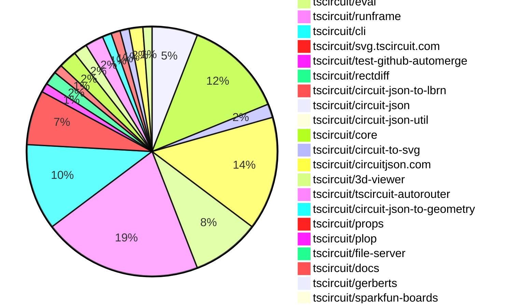
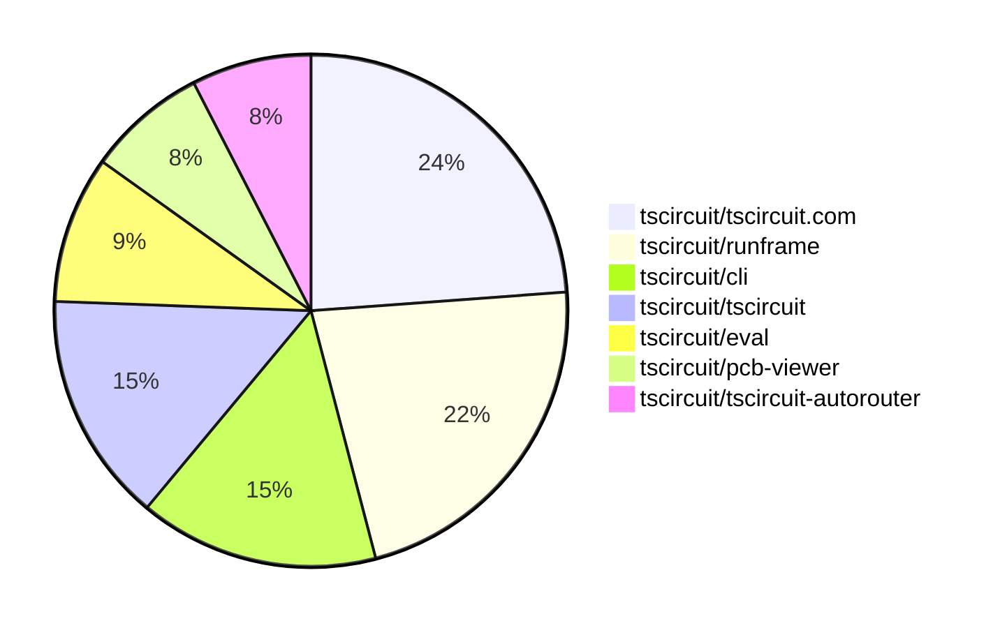

# Contribution Overview 2025-12-03

The current week is shown below. There are 4 major sections:

- [Contributor Overview](#contributor-overview)
- [PRs by Repository](#prs-by-repository)
- [PRs by Contributor](#changes-by-contributor)
- [Scoring & Sponsorship System](#scoring--sponsorship-system)

## PRs by Repository

## Contributor Overview

| Contributor | 🐳 Major | 🐙 Minor | 🐌 Tiny | ⭐ | Score | Discussion Contributions |
|-------------|---------|---------|---------|-----|----------------|--------------------------|
| [seveibar](#seveibar) | 7 | 7 | 11 | 👑 | 54 | 0🔹 0🔶 0💎 |
| [imrishabh18](#imrishabh18) | 4 | 5 | 2 | ⭐⭐ | 29 | 0🔹 0🔶 0💎 |
| [ArnavK-09](#ArnavK-09) | 4 | 0 | 2 | ⭐⭐ | 19 | 0🔹 0🔶 0💎 |
| [tscircuitbot](#tscircuitbot) | 0 | 0 | 105 | ⭐⭐ | 14 | 0🔹 0🔶 0💎 |
| [Abse2001](#Abse2001) | 0 | 6 | 2 | ⭐⭐ | 14 | 0🔹 0🔶 0💎 |
| [rushabhcodes](#rushabhcodes) | 2 | 0 | 1 | ⭐⭐ | 12 | 0🔹 0🔶 0💎 |
| [techmannih](#techmannih) | 0 | 1 | 4 | ⭐⭐ | 11 | 0🔹 0🔶 0💎 |
| [0hmX](#0hmX) | 2 | 1 | 1 | ⭐⭐ | 11 | 0🔹 0🔶 0💎 |
| [MustafaMulla29](#MustafaMulla29) | 0 | 3 | 4 | ⭐ | 10 | 0🔹 0🔶 0💎 |
| [AnasSarkiz](#AnasSarkiz) | 1 | 0 | 0 | ⭐ | 8 | 0🔹 0🔶 0💎 |
| [Ayushjhawar8](#Ayushjhawar8) | 0 | 2 | 1 | ⭐ | 5 | 0🔹 0🔶 0💎 |
| [RaghavArora14](#RaghavArora14) | 0 | 2 | 0 | ⭐ | 5 | 0🔹 0🔶 0💎 |
| [pxlpal](#pxlpal) | 0 | 1 | 1 |  | 3 | 0🔹 0🔶 0💎 |

> Note: AI evaluates PRs and assigns 1-3 star ratings automatically. 4 and 5 star ratings require manual staff review.

### Discussion Contribution Legend

- 🔹 Normal Comments: Basic participation with minimal effort
- 🔶 Great Informative Comments: Thoughtful participation that adds value
- 💎 Incredible Comments: Exceptional participation with high-quality content

## Review Table

[reviews-received-hover]: ## "Number of reviews received for PRs for this contributor"
[approvals-received-hover]: ## "Number of approvals received for PRs this contributor authored"
[rejections-received-hover]: ## "Number of rejections received for PRs this contributor authored"
[prs-opened-hover]: ## "Number of PRs opened by this contributor"
[issues-created-hover]: ## "Number of issues created by this contributor"
[bountied-issues-hover]: ## "Number of issues this contributor created with a bounty"
[bountied-issue-$-hover]: ## "Total bounty amount placed on issues authored by this contributor"

| Contributor | Reviews Received | Approvals Received | Rejections Received | Approvals | Rejections | PRs Opened | PRs Merged | Score | Issues Created | Bountied Issues | Bountied Issue $ |
|---|---|---|---|---|---|---|---|---|---|---|---|
| [techmannih](#techmannih) | 9 | 6 | 2 | 1 | 0 | 11 | 5 | 11 | 0 | 0 | 0 |
| [seveibar](#seveibar) | 3 | 0 | 0 | 35 | 12 | 32 | 25 | 54 | 0 | 0 | 0 |
| [tscircuitbot](#tscircuitbot) | 0 | 0 | 0 | 0 | 0 | 134 | 105 | 14 | 0 | 0 | 0 |
| [Abse2001](#Abse2001) | 8 | 8 | 0 | 0 | 0 | 9 | 8 | 14 | 0 | 0 | 0 |
| [Ayushjhawar8](#Ayushjhawar8) | 10 | 3 | 3 | 0 | 0 | 7 | 3 | 5 | 0 | 0 | 0 |
| [Devesh36](#Devesh36) | 5 | 0 | 1 | 0 | 0 | 2 | 0 | 0 | 0 | 0 | 0 |
| [rushabhcodes](#rushabhcodes) | 24 | 7 | 1 | 0 | 0 | 9 | 3 | 12 | 0 | 0 | 0 |
| [Lulzx](#Lulzx) | 1 | 0 | 1 | 0 | 0 | 5 | 0 | 0 | 0 | 0 | 0 |
| [AnasSarkiz](#AnasSarkiz) | 15 | 3 | 4 | 0 | 0 | 6 | 1 | 8 | 0 | 0 | 0 |
| [MustafaMulla29](#MustafaMulla29) | 13 | 6 | 2 | 0 | 0 | 10 | 7 | 10 | 0 | 0 | 0 |
| [Prachi-kushwaha](#Prachi-kushwaha) | 3 | 0 | 1 | 0 | 0 | 1 | 0 | 0 | 0 | 0 | 0 |
| [imrishabh18](#imrishabh18) | 7 | 1 | 0 | 3 | 3 | 13 | 11 | 29 | 0 | 0 | 0 |
| [Aqil-Ahmad](#Aqil-Ahmad) | 0 | 0 | 0 | 0 | 0 | 1 | 0 | 0 | 0 | 0 | 0 |
| [RaghavArora14](#RaghavArora14) | 16 | 4 | 0 | 1 | 0 | 3 | 2 | 5 | 0 | 0 | 0 |
| [ArnavK-09](#ArnavK-09) | 5 | 3 | 0 | 1 | 0 | 7 | 6 | 19 | 0 | 0 | 0 |
| [ShiboSoftwareDev](#ShiboSoftwareDev) | 0 | 0 | 0 | 5 | 0 | 0 | 0 | 0 | 0 | 0 | 0 |
| [pxlpal](#pxlpal) | 1 | 1 | 0 | 0 | 0 | 2 | 2 | 3 | 0 | 0 | 0 |
| [0hmX](#0hmX) | 7 | 4 | 0 | 0 | 0 | 5 | 4 | 11 | 0 | 0 | 0 |

## Top 7 Repositories by Contribution Points

## Scoring & Sponsorship System

### Overview

PRs are analyzed by AI and assigned a **star rating (1-3 stars)**. 4 and 5 star ratings can only be manually assigned by staff. Weekly scores use `2^(starRating - 1)` per PR (capped at 12 PRs per rating), plus review/discussion points.

### Weekly Score → Star String

| Score Range | Star String | Count Value |
|------------|-------------|-------------|
| 0-3 | (empty) | 0 stars |
| 4-10 | ⭐ | 1 star |
| 11-30 | ⭐⭐ | 2 stars |
| 31-50 | ⭐⭐⭐ | 3 stars |
| 51-75 | 👑 | 1 crown |
| 76-100 | 👑👑 | 2 crowns |
| 101+ | 👑👑👑 | 3 crowns |

> Crowns count as 3 stars for sponsorship.

### Monthly Sponsorship Calculation

The sponsorship system calculates monthly payments based on your **weekly star counts** over the complete weeks in that month (typically 4-5 weeks, Wednesday-Tuesday format).

**Step 1: Collect Weekly Stars**
- All complete weeks in the month are analyzed
- Each week's star string is converted to a numeric count (⭐ = 1 star, ⭐⭐⭐ = 3 stars)
- Example: `[2, 2, 2, 1, 0]` means 2 stars in week 1, 2 stars in week 2, etc.

**Step 2: Calculate Metrics**
- **Median stars**: The median value of all weekly star counts
- **Min stars**: The minimum weekly star count
- **Max stars**: The maximum weekly star count
- **High score**: The maximum raw weekly score (0-100+ range from the scoring table) from any week in the month

**Step 3: Determine Base Amount**
The sponsorship amount is calculated based on these metrics (checked in order):

| Condition | Base Amount |
|-----------|-------------|
| `minStarCount >= 3` | **$500** |
| `medianStars >= 3` | **$450** |
| `medianStars >= 2.5` | **$300** |
| `medianStars >= 2` | **$200** |
| `medianStars >= 1.5` | **$100** |
| `medianStars >= 1` | **$75** |
| `maxStarCount >= 2` | **$25** |
| `maxStarCount >= 1` | **$15** |
| `highScore >= 3` (and all stars = 0) | **$5** |

| Maintainer Level | Monthly Bonus |
|------------------|---------------|
| Level 1 | **$200** |
| Level 2 | **$350** |
| Level 3 | **$500** |

**Final Amount** = Base Amount + Maintainer Bonus

## Changes by Repository

### [tscircuit/pcb-viewer](https://github.com/tscircuit/pcb-viewer)

| PR # | Impact | Rating | Contributor | Description |
|------|--------|--------|-------------|-------------|
| [#523](https://github.com/tscircuit/pcb-viewer/pull/523) | 🐙 Minor | ⭐⭐ | techmannih | Fixes rotation support for pill SMT pads by adding support for rotated pill shapes in the conversion process. |
| [#520](https://github.com/tscircuit/pcb-viewer/pull/520) | 🐙 Minor | ⭐⭐ | Abse2001 | Fixes incorrect offset computation for pcb_panel placement, ensuring accurate positioning within PCB assemblies. |
| [#515](https://github.com/tscircuit/pcb-viewer/pull/515) | 🐙 Minor | ⭐⭐ | seveibar | Offsets lowercase alphabet glyphs using the library baseline instead of centered positioning, includes baseline offset in text metrics to account for descender depth, and adds tests confirming baseline placement and descender rendering for lowercase text. |

🌠Tiny Contributions (7)

| PR # | Impact | Contributor | Description |
|------|--------|-------------|-------------|
| [#517](https://github.com/tscircuit/pcb-viewer/pull/517) | 🐌 Tiny | techmannih | Refactors the SMT pad shape handling by extracting shape-specific conversion logic into separate files for better organization and maintainability. |
| [#524](https://github.com/tscircuit/pcb-viewer/pull/524) | 🐌 Tiny | tscircuitbot | Automated package update |
| [#522](https://github.com/tscircuit/pcb-viewer/pull/522) | 🐌 Tiny | tscircuitbot | Automated package update |
| [#521](https://github.com/tscircuit/pcb-viewer/pull/521) | 🐌 Tiny | tscircuitbot | Automated package update |
| [#519](https://github.com/tscircuit/pcb-viewer/pull/519) | 🐌 Tiny | tscircuitbot | Automated package update |
| [#516](https://github.com/tscircuit/pcb-viewer/pull/516) | 🐌 Tiny | tscircuitbot | Automated package update |
| [#518](https://github.com/tscircuit/pcb-viewer/pull/518) | 🐌 Tiny | Ayushjhawar8 | Disables the right-click context menu on the PCB Viewer to prevent users from accessing the default context menu. |

### [tscircuit/easyeda-converter](https://github.com/tscircuit/easyeda-converter)

🌠Tiny Contributions (1)

| PR # | Impact | Contributor | Description |
|------|--------|-------------|-------------|
| [#332](https://github.com/tscircuit/easyeda-converter/pull/332) | 🐌 Tiny | techmannih | Add a new electronic component footprint for the C75740 D-SUB 9-pin connector, including its schema and snapshot for use in circuit designs. |

### [tscircuit/tscircuit.com](https://github.com/tscircuit/tscircuit.com)

| PR # | Impact | Rating | Contributor | Description |
|------|--------|--------|-------------|-------------|
| [#2130](https://github.com/tscircuit/tscircuit.com/pull/2130) | 🐳 Major | ⭐⭐⭐ | seveibar | Add support for uploading organization avatars, including backend API integration and UI components for avatar management. |
| [#2124](https://github.com/tscircuit/tscircuit.com/pull/2124) | 🐳 Major | ⭐⭐⭐ | seveibar | Add a GitHub connection card on the organization settings page to allow owners to initiate the installation flow directly from the organization view, handle installation completion with a confirmation toast and data refresh, and expose a refetch helper for reuse after connecting. |
| [#2122](https://github.com/tscircuit/tscircuit.com/pull/2122) | 🐳 Major | ⭐⭐⭐ | seveibar | Adds an Orgs submenu to the header account dropdown, listing organizations the user belongs to and linking to each org page. |
| [#2135](https://github.com/tscircuit/tscircuit.com/pull/2135) | 🐳 Major | ⭐⭐⭐ | ArnavK-09 | Refactors the avatar upload functionality to unify organization and personal avatar handling, introducing a new hook for managing avatar uploads and dialogs. |
| [#2133](https://github.com/tscircuit/tscircuit.com/pull/2133) | 🐳 Major | ⭐⭐⭐ | ArnavK-09 | Adds a test organization package for development and patches the UI for mobile responsiveness. |
| [#2123](https://github.com/tscircuit/tscircuit.com/pull/2123) | 🐙 Minor | ⭐⭐ | seveibar | Displays full package names in the dashboard quick-edit list, including organization or owner scope, and shows package owner scope on dashboard package cards for clearer context. |
| [#2120](https://github.com/tscircuit/tscircuit.com/pull/2120) | 🐙 Minor | ⭐⭐ | seveibar | Load circuit-json-to-gerber dynamically from jsdelivr when generating fabrication downloads and remove the bundled circuit-json-to-gerber dependency from the project |
| [#2106](https://github.com/tscircuit/tscircuit.com/pull/2106) | 🐙 Minor | ⭐⭐ | RaghavArora14 | Fixes z-index issues in the dialog component to prevent overlay problems with the orientation cube by introducing a zIndexMap and setting specific z-index values for dialogOverlay and dialogContent. |
| [#2117](https://github.com/tscircuit/tscircuit.com/pull/2117) | 🐙 Minor | ⭐⭐ | pxlpal | Attaches account_id to the redirect URL when connecting more GitHub repositories. |

🌠Tiny Contributions (13)

| PR # | Impact | Contributor | Description |
|------|--------|-------------|-------------|
| [#2108](https://github.com/tscircuit/tscircuit.com/pull/2108) | 🐌 Tiny | techmannih | Updates the tscircuit3d-viewer package to version 0.0.448 in the package.json file. |
| [#2134](https://github.com/tscircuit/tscircuit.com/pull/2134) | 🐌 Tiny | tscircuitbot | Automated package update to version 0.0.154 |
| [#2131](https://github.com/tscircuit/tscircuit.com/pull/2131) | 🐌 Tiny | tscircuitbot | Updates the package version from 0.0.152 to 0.0.153 in package.json |
| [#2129](https://github.com/tscircuit/tscircuit.com/pull/2129) | 🐌 Tiny | tscircuitbot | Updates the tscircuiteval package from version 0.0.521 to 0.0.522 |
| [#2128](https://github.com/tscircuit/tscircuit.com/pull/2128) | 🐌 Tiny | tscircuitbot | Updates the tscircuiteval package from version 0.0.520 to 0.0.521 |
| [#2126](https://github.com/tscircuit/tscircuit.com/pull/2126) | 🐌 Tiny | tscircuitbot | Updates the tscircuiteval package version from 0.0.519 to 0.0.520 in package.json |
| [#2119](https://github.com/tscircuit/tscircuit.com/pull/2119) | 🐌 Tiny | tscircuitbot | Automated package update |
| [#2118](https://github.com/tscircuit/tscircuit.com/pull/2118) | 🐌 Tiny | tscircuitbot | Updates the tscircuiteval package from version 0.0.517 to 0.0.518 |
| [#2116](https://github.com/tscircuit/tscircuit.com/pull/2116) | 🐌 Tiny | tscircuitbot | Updates the tscircuiteval package from version 0.0.516 to 0.0.517 in the package.json file. |
| [#2115](https://github.com/tscircuit/tscircuit.com/pull/2115) | 🐌 Tiny | tscircuitbot | Automated package update |
| [#2113](https://github.com/tscircuit/tscircuit.com/pull/2113) | 🐌 Tiny | tscircuitbot | Updates the tscircuiteval package from version 0.0.514 to 0.0.515 |
| [#2125](https://github.com/tscircuit/tscircuit.com/pull/2125) | 🐌 Tiny | seveibar | Removes the Order button and associated dialog from the package header, along with cleaning up unused order-related imports and props. |
| [#2121](https://github.com/tscircuit/tscircuit.com/pull/2121) | 🐌 Tiny | pxlpal | Fixes the package author extraction by using the package name prefix instead of the owners GitHub username, ensuring correct representation for organization packages. |

### [tscircuit/circuit-json-to-gltf](https://github.com/tscircuit/circuit-json-to-gltf)

| PR # | Impact | Rating | Contributor | Description |
|------|--------|--------|-------------|-------------|
| [#89](https://github.com/tscircuit/circuit-json-to-gltf/pull/89) | 🐙 Minor | ⭐⭐ | RaghavArora14 | Implements copper pour soldermask differentiation in GLTF rendering by integrating the two-layer soldermask approach from circuit-to-svg, ensuring copper pours render correctly based on their covered_with_solder_mask flag. |

🌠Tiny Contributions (2)

| PR # | Impact | Contributor | Description |
|------|--------|-------------|-------------|
| [#93](https://github.com/tscircuit/circuit-json-to-gltf/pull/93) | 🐌 Tiny | techmannih | Adds a test case to reproduce the Z-coordinate position offset issue in the CAD model for component C75749. |
| [#95](https://github.com/tscircuit/circuit-json-to-gltf/pull/95) | 🐌 Tiny | rushabhcodes | Removes the logic that adjusted the vertical position of loaded OBJ meshes in the convertCircuitJsonTo3D function, simplifying the mesh positioning behavior. |

### [tscircuit/tscircuit](https://github.com/tscircuit/tscircuit)

🌠Tiny Contributions (25)

| PR # | Impact | Contributor | Description |
|------|--------|-------------|-------------|
| [#1595](https://github.com/tscircuit/tscircuit/pull/1595) | 🐌 Tiny | tscircuitbot | Automated package update |
| [#1594](https://github.com/tscircuit/tscircuit/pull/1594) | 🐌 Tiny | tscircuitbot | Updates the tscircuitcli package from version 0.1.612 to 0.1.613 and the tscircuitrunframe package from version 0.0.1353 to 0.0.1354 in package.json |
| [#1593](https://github.com/tscircuit/tscircuit/pull/1593) | 🐌 Tiny | tscircuitbot | Automated package update |
| [#1592](https://github.com/tscircuit/tscircuit/pull/1592) | 🐌 Tiny | tscircuitbot | Updates the tscircuitcli package to version 0.1.612 in the package.json file. |
| [#1591](https://github.com/tscircuit/tscircuit/pull/1591) | 🐌 Tiny | tscircuitbot | Automated package update |
| [#1590](https://github.com/tscircuit/tscircuit/pull/1590) | 🐌 Tiny | tscircuitbot | Updates the tscircuitcli package from version 0.1.610 to 0.1.611 |
| [#1589](https://github.com/tscircuit/tscircuit/pull/1589) | 🐌 Tiny | tscircuitbot | Automated package update |
| [#1588](https://github.com/tscircuit/tscircuit/pull/1588) | 🐌 Tiny | tscircuitbot | Automated package update |
| [#1587](https://github.com/tscircuit/tscircuit/pull/1587) | 🐌 Tiny | tscircuitbot | Updates the package version from 0.0.1015 to 0.0.1016 in package.json |
| [#1586](https://github.com/tscircuit/tscircuit/pull/1586) | 🐌 Tiny | tscircuitbot | Automated package update |
| [#1585](https://github.com/tscircuit/tscircuit/pull/1585) | 🐌 Tiny | tscircuitbot | Automated package update |
| [#1584](https://github.com/tscircuit/tscircuit/pull/1584) | 🐌 Tiny | tscircuitbot | Updates the tscircuitcli package to version 0.1.608 in the package.json file. |
| [#1583](https://github.com/tscircuit/tscircuit/pull/1583) | 🐌 Tiny | tscircuitbot | Automated package update |
| [#1582](https://github.com/tscircuit/tscircuit/pull/1582) | 🐌 Tiny | tscircuitbot | Automated package update |
| [#1578](https://github.com/tscircuit/tscircuit/pull/1578) | 🐌 Tiny | tscircuitbot | Automated package update |
| [#1577](https://github.com/tscircuit/tscircuit/pull/1577) | 🐌 Tiny | tscircuitbot | Automated package update |
| [#1575](https://github.com/tscircuit/tscircuit/pull/1575) | 🐌 Tiny | tscircuitbot | Automated package update |
| [#1574](https://github.com/tscircuit/tscircuit/pull/1574) | 🐌 Tiny | tscircuitbot | Updates the package version from 0.0.1010 to 0.0.1011 in package.json |
| [#1573](https://github.com/tscircuit/tscircuit/pull/1573) | 🐌 Tiny | tscircuitbot | Updates the tscircuitcli package to version 0.1.603 in package.json |
| [#1572](https://github.com/tscircuit/tscircuit/pull/1572) | 🐌 Tiny | tscircuitbot | Automated package update |
| [#1571](https://github.com/tscircuit/tscircuit/pull/1571) | 🐌 Tiny | tscircuitbot | Updates the tscircuitcli package to version 0.1.602 |
| [#1570](https://github.com/tscircuit/tscircuit/pull/1570) | 🐌 Tiny | tscircuitbot | Automated package update |
| [#1569](https://github.com/tscircuit/tscircuit/pull/1569) | 🐌 Tiny | tscircuitbot | Updates the tscircuitcli package to version 0.1.601 in the package.json file |
| [#1568](https://github.com/tscircuit/tscircuit/pull/1568) | 🐌 Tiny | tscircuitbot | Automated package update |
| [#1567](https://github.com/tscircuit/tscircuit/pull/1567) | 🐌 Tiny | tscircuitbot | Automated package update |

### [tscircuit/eval](https://github.com/tscircuit/eval)

| PR # | Impact | Rating | Contributor | Description |
|------|--------|--------|-------------|-------------|
| [#1623](https://github.com/tscircuit/eval/pull/1623) | 🐙 Minor | ⭐⭐ | seveibar | Refactors the import mechanism for npm packages to utilize CDN instead of local imports, enhancing package management. |

🌠Tiny Contributions (14)

| PR # | Impact | Contributor | Description |
|------|--------|-------------|-------------|
| [#1656](https://github.com/tscircuit/eval/pull/1656) | 🐌 Tiny | tscircuitbot | Automated package update |
| [#1655](https://github.com/tscircuit/eval/pull/1655) | 🐌 Tiny | tscircuitbot | Automated package update |
| [#1653](https://github.com/tscircuit/eval/pull/1653) | 🐌 Tiny | tscircuitbot | Automated package update to version 0.0.520 |
| [#1652](https://github.com/tscircuit/eval/pull/1652) | 🐌 Tiny | tscircuitbot | Automated package update |
| [#1651](https://github.com/tscircuit/eval/pull/1651) | 🐌 Tiny | tscircuitbot | Updates package versions for dependencies in the project. |
| [#1649](https://github.com/tscircuit/eval/pull/1649) | 🐌 Tiny | tscircuitbot | Automated package update |
| [#1648](https://github.com/tscircuit/eval/pull/1648) | 🐌 Tiny | tscircuitbot | Updates the version of the tscircuitcore package from 0.0.898 to 0.0.899 in package.json |
| [#1646](https://github.com/tscircuit/eval/pull/1646) | 🐌 Tiny | tscircuitbot | Automated package update |
| [#1645](https://github.com/tscircuit/eval/pull/1645) | 🐌 Tiny | tscircuitbot | Updates the version of the tscircuitcore package from 0.0.897 to 0.0.898 in package.json |
| [#1643](https://github.com/tscircuit/eval/pull/1643) | 🐌 Tiny | tscircuitbot | Automated package update |
| [#1642](https://github.com/tscircuit/eval/pull/1642) | 🐌 Tiny | tscircuitbot | Updates the version of the tscircuitcore package from 0.0.896 to 0.0.897 in package.json |
| [#1639](https://github.com/tscircuit/eval/pull/1639) | 🐌 Tiny | tscircuitbot | Automated package update to version 0.0.515 |
| [#1654](https://github.com/tscircuit/eval/pull/1654) | 🐌 Tiny | seveibar | Removes comments from code before extracting import statements to ensure accurate analysis of imports. |
| [#1638](https://github.com/tscircuit/eval/pull/1638) | 🐌 Tiny | seveibar | Adds zod as a development dependency to ensure compatibility with the core version. |

### [tscircuit/runframe](https://github.com/tscircuit/runframe)

| PR # | Impact | Rating | Contributor | Description |
|------|--------|--------|-------------|-------------|
| [#1992](https://github.com/tscircuit/runframe/pull/1992) | 🐳 Major | ⭐⭐⭐ | ArnavK-09 | img width1496 height881 altimage srchttps:github.comuser-attachmentsassets7a538869-ad30-46e3-a5c0-d02352492a73  img width993 height776 altimage srchttps:github.comuser-attachmentsassetsdfebc0cb-f0eb-4e71-9d63-b34a58efb755 |

🌠Tiny Contributions (34)

| PR # | Impact | Contributor | Description |
|------|--------|-------------|-------------|
| [#1999](https://github.com/tscircuit/runframe/pull/1999) | 🐌 Tiny | tscircuitbot | Automated package update |
| [#1998](https://github.com/tscircuit/runframe/pull/1998) | 🐌 Tiny | tscircuitbot | Updates the tscircuitpcb-viewer package from version 1.11.278 to 1.11.279 |
| [#1997](https://github.com/tscircuit/runframe/pull/1997) | 🐌 Tiny | tscircuitbot | Automated package update |
| [#1996](https://github.com/tscircuit/runframe/pull/1996) | 🐌 Tiny | tscircuitbot | Updates the tscircuitpcb-viewer package from version 1.11.277 to 1.11.278 |
| [#1995](https://github.com/tscircuit/runframe/pull/1995) | 🐌 Tiny | tscircuitbot | Automated package update |
| [#1994](https://github.com/tscircuit/runframe/pull/1994) | 🐌 Tiny | tscircuitbot | Automated package update |
| [#1993](https://github.com/tscircuit/runframe/pull/1993) | 🐌 Tiny | tscircuitbot | Updates the package version from 0.0.1351 to 0.0.1352 in package.json |
| [#1991](https://github.com/tscircuit/runframe/pull/1991) | 🐌 Tiny | tscircuitbot | Automated package update |
| [#1989](https://github.com/tscircuit/runframe/pull/1989) | 🐌 Tiny | tscircuitbot | Automated package update |
| [#1987](https://github.com/tscircuit/runframe/pull/1987) | 🐌 Tiny | tscircuitbot | Updates the package version from v0.0.1348 to v0.0.1349 in package.json |
| [#1986](https://github.com/tscircuit/runframe/pull/1986) | 🐌 Tiny | tscircuitbot | Updates the tscircuitpcb-viewer package from version 1.11.276 to 1.11.277 |
| [#1985](https://github.com/tscircuit/runframe/pull/1985) | 🐌 Tiny | tscircuitbot | Automated package update |
| [#1984](https://github.com/tscircuit/runframe/pull/1984) | 🐌 Tiny | tscircuitbot | Updates the tscircuitpcb-viewer package from version 1.11.275 to 1.11.276 |
| [#1982](https://github.com/tscircuit/runframe/pull/1982) | 🐌 Tiny | tscircuitbot | Automated package update |
| [#1981](https://github.com/tscircuit/runframe/pull/1981) | 🐌 Tiny | tscircuitbot | Updates the tscircuit3d-viewer package from version 0.0.450 to 0.0.451 |
| [#1979](https://github.com/tscircuit/runframe/pull/1979) | 🐌 Tiny | tscircuitbot | Automated package update |
| [#1978](https://github.com/tscircuit/runframe/pull/1978) | 🐌 Tiny | tscircuitbot | Updates the tscircuiteval package to version 0.0.521 |
| [#1976](https://github.com/tscircuit/runframe/pull/1976) | 🐌 Tiny | tscircuitbot | Automated package update |
| [#1975](https://github.com/tscircuit/runframe/pull/1975) | 🐌 Tiny | tscircuitbot | Updates the tscircuiteval package from version 0.0.519 to 0.0.520 |
| [#1974](https://github.com/tscircuit/runframe/pull/1974) | 🐌 Tiny | tscircuitbot | Automated package update |
| [#1972](https://github.com/tscircuit/runframe/pull/1972) | 🐌 Tiny | tscircuitbot | Updates the circuit-json-to-gerber package from version 0.0.43 to 0.0.44 |
| [#1971](https://github.com/tscircuit/runframe/pull/1971) | 🐌 Tiny | tscircuitbot | Updates the version of the circuit-json-to-gerber package from 0.0.42 to 0.0.43 in package.json |
| [#1970](https://github.com/tscircuit/runframe/pull/1970) | 🐌 Tiny | tscircuitbot | Updates the tscircuiteval package to version 0.0.519 in the package.json file. |
| [#1969](https://github.com/tscircuit/runframe/pull/1969) | 🐌 Tiny | tscircuitbot | Updates the tscircuiteval package to version 0.0.518 in the package.json file. |
| [#1968](https://github.com/tscircuit/runframe/pull/1968) | 🐌 Tiny | tscircuitbot | Updates the tscircuiteval package from version 0.0.516 to 0.0.517 |
| [#1967](https://github.com/tscircuit/runframe/pull/1967) | 🐌 Tiny | tscircuitbot | Updates the tscircuiteval package from version 0.0.515 to 0.0.516 |
| [#1966](https://github.com/tscircuit/runframe/pull/1966) | 🐌 Tiny | tscircuitbot | Automated package update |
| [#1965](https://github.com/tscircuit/runframe/pull/1965) | 🐌 Tiny | tscircuitbot | Updates the tscircuitpcb-viewer package from version 1.11.273 to 1.11.275 |
| [#1963](https://github.com/tscircuit/runframe/pull/1963) | 🐌 Tiny | tscircuitbot | Updates the package version from 0.0.1333 to 0.0.1334 in package.json |
| [#1962](https://github.com/tscircuit/runframe/pull/1962) | 🐌 Tiny | tscircuitbot | Updates the tscircuiteval package from version 0.0.514 to 0.0.515 |
| [#1973](https://github.com/tscircuit/runframe/pull/1973) | 🐌 Tiny | seveibar | Updates the version output step in the release workflow to use a multiline script for clearer quoting and writes the resolved package version to the GitHub output file. |
| [#1964](https://github.com/tscircuit/runframe/pull/1964) | 🐌 Tiny | seveibar | Capture the package version after running pver release and include the version number in the automated bump PR commit message and title. |
| [#1990](https://github.com/tscircuit/runframe/pull/1990) | 🐌 Tiny | ArnavK-09 | Disables the schematic tab in the UI when there are no schematic groups present in the circuit JSON. |
| [#1988](https://github.com/tscircuit/runframe/pull/1988) | 🐌 Tiny | ArnavK-09 | img width896 height500 altimage srchttps:github.comuser-attachmentsassets63f4115d-a854-4304-a3f4-f1e70183e98a |

### [tscircuit/cli](https://github.com/tscircuit/cli)

| PR # | Impact | Rating | Contributor | Description |
|------|--------|--------|-------------|-------------|
| [#1246](https://github.com/tscircuit/cli/pull/1246) | 🐙 Minor | ⭐⭐ | Ayushjhawar8 | Fixes the issue where the tsci search command displays vundefined for packages with missing version information. |
| [#1239](https://github.com/tscircuit/cli/pull/1239) | 🐙 Minor | ⭐⭐ | seveibar | Changes the transpile process to ignore includeBoardFiles globs in favor of a detected main entrypoint, ensuring a single entrypoint is used for building. |
| [#1272](https://github.com/tscircuit/cli/pull/1272) | 🐙 Minor | ⭐⭐ | MustafaMulla29 | Enables the DevServer to watch node_modulesdistindex.js files for changes, including scoped packages, by modifying the should-ignore-path configuration. |
| [#1240](https://github.com/tscircuit/cli/pull/1240) | 🐙 Minor | ⭐⭐ | MustafaMulla29 | Fixes the issue where KiCad .kicad_mod files are not uploaded when they are imported from packages without a package.json file. |
| [#1270](https://github.com/tscircuit/cli/pull/1270) | 🐙 Minor | ⭐⭐ | imrishabh18 | Fixes an issue where failure in generating one image type (PCB, schematic, or 3D) prevented the others from being written to disk. |
| [#1257](https://github.com/tscircuit/cli/pull/1257) | 🐙 Minor | ⭐⭐ | imrishabh18 | Fixes the issue where the fetch() function in the gltf library does not support local file paths, by converting them to file URLs for compatibility. |
| [#1225](https://github.com/tscircuit/cli/pull/1225) | 🐙 Minor | ⭐⭐ | imrishabh18 | Adds a browser test that supports bun link functionality, ensuring that tests pass with the bun link command. |

🌠Tiny Contributions (12)

| PR # | Impact | Contributor | Description |
|------|--------|-------------|-------------|
| [#1273](https://github.com/tscircuit/cli/pull/1273) | 🐌 Tiny | tscircuitbot | Updates the tscircuitrunframe package from version 0.0.1353 to 0.0.1354 |
| [#1266](https://github.com/tscircuit/cli/pull/1266) | 🐌 Tiny | tscircuitbot | Updates the tscircuitrunframe package from version 0.0.1348 to 0.0.1353 |
| [#1259](https://github.com/tscircuit/cli/pull/1259) | 🐌 Tiny | tscircuitbot | Updates the tscircuitrunframe package from version 0.0.1347 to 0.0.1348 |
| [#1255](https://github.com/tscircuit/cli/pull/1255) | 🐌 Tiny | tscircuitbot | Automated package update for tscircuitrunframe from version 0.0.1346 to 0.0.1347 |
| [#1252](https://github.com/tscircuit/cli/pull/1252) | 🐌 Tiny | tscircuitbot | Updates the tscircuitrunframe package from version 0.0.1344 to 0.0.1346 in the package.json file. |
| [#1248](https://github.com/tscircuit/cli/pull/1248) | 🐌 Tiny | tscircuitbot | Updates the tscircuitrunframe package to version 0.0.1344 |
| [#1236](https://github.com/tscircuit/cli/pull/1236) | 🐌 Tiny | tscircuitbot | Automated README update with latest CLI usage output. |
| [#1235](https://github.com/tscircuit/cli/pull/1235) | 🐌 Tiny | seveibar | Sets the CLIs tscircuit peer dependency back to a wildcard while keeping the libonly dev dependency. |
| [#1232](https://github.com/tscircuit/cli/pull/1232) | 🐌 Tiny | seveibar | Specifies the installation of Chromium for Playwright in the CI workflow. |
| [#1251](https://github.com/tscircuit/cli/pull/1251) | 🐌 Tiny | MustafaMulla29 | Removes the installation of type dependencies for snippets as they are now included within node_modules, streamlining the development process. |
| [#1243](https://github.com/tscircuit/cli/pull/1243) | 🐌 Tiny | MustafaMulla29 | Updates the package version in package.json from 0.1.591 to 0.1.601 |
| [#1244](https://github.com/tscircuit/cli/pull/1244) | 🐌 Tiny | MustafaMulla29 | Updates the package version from 0.1.601 to 0.1.602 in package.json |

### [tscircuit/svg.tscircuit.com](https://github.com/tscircuit/svg.tscircuit.com)

🌠Tiny Contributions (12)

| PR # | Impact | Contributor | Description |
|------|--------|-------------|-------------|
| [#706](https://github.com/tscircuit/svg.tscircuit.com/pull/706) | 🐌 Tiny | tscircuitbot | Updates the tscircuit package version from 0.0.1019 to 0.0.1020 in package.json |
| [#705](https://github.com/tscircuit/svg.tscircuit.com/pull/705) | 🐌 Tiny | tscircuitbot | Updates the tscircuit package version from 0.0.1018 to 0.0.1019 in package.json |
| [#704](https://github.com/tscircuit/svg.tscircuit.com/pull/704) | 🐌 Tiny | tscircuitbot | Updates the tscircuit package version from 0.0.1017 to 0.0.1018 in package.json |
| [#703](https://github.com/tscircuit/svg.tscircuit.com/pull/703) | 🐌 Tiny | tscircuitbot | Updates the tscircuit package version from 0.0.1016 to 0.0.1017 in package.json |
| [#702](https://github.com/tscircuit/svg.tscircuit.com/pull/702) | 🐌 Tiny | tscircuitbot | Updates the tscircuit package version from 0.0.1015 to 0.0.1016 in package.json |
| [#701](https://github.com/tscircuit/svg.tscircuit.com/pull/701) | 🐌 Tiny | tscircuitbot | Updates the tscircuit package from version 0.0.1014 to 0.0.1015 in package.json |
| [#700](https://github.com/tscircuit/svg.tscircuit.com/pull/700) | 🐌 Tiny | tscircuitbot | Updates the tscircuit package version from 0.0.1013 to 0.0.1014 in package.json |
| [#699](https://github.com/tscircuit/svg.tscircuit.com/pull/699) | 🐌 Tiny | tscircuitbot | Automated package update |
| [#698](https://github.com/tscircuit/svg.tscircuit.com/pull/698) | 🐌 Tiny | tscircuitbot | Updates the tscircuit package from version 0.0.1010 to 0.0.1011 in package.json |
| [#697](https://github.com/tscircuit/svg.tscircuit.com/pull/697) | 🐌 Tiny | tscircuitbot | Updates the tscircuit package version from 0.0.1009 to 0.0.1010 in package.json |
| [#696](https://github.com/tscircuit/svg.tscircuit.com/pull/696) | 🐌 Tiny | tscircuitbot | Updates the tscircuit package version from 0.0.1008 to 0.0.1009 in package.json |
| [#695](https://github.com/tscircuit/svg.tscircuit.com/pull/695) | 🐌 Tiny | tscircuitbot | Updates the tscircuit package from version 0.0.1007 to 0.0.1008 in package.json |

### [tscircuit/test-github-automerge](https://github.com/tscircuit/test-github-automerge)

🌠Tiny Contributions (2)

| PR # | Impact | Contributor | Description |
|------|--------|-------------|-------------|
| [#8](https://github.com/tscircuit/test-github-automerge/pull/8) | 🐌 Tiny | tscircuitbot | Updates the tscircuitcircuit-json-util package from version 0.0.72 to 0.0.73 in the project dependencies. |
| [#7](https://github.com/tscircuit/test-github-automerge/pull/7) | 🐌 Tiny | tscircuitbot | Updates the tscircuitcircuit-json-util package from version 0.0.72 to 0.0.73 in the project dependencies. |

### [tscircuit/rectdiff](https://github.com/tscircuit/rectdiff)

| PR # | Impact | Rating | Contributor | Description |
|------|--------|--------|-------------|-------------|
| [#17](https://github.com/tscircuit/rectdiff/pull/17) | 🐳 Major | ⭐⭐⭐ | 0hmX | Adds a new page to showcase the 2D outline visualization using SimpleRouteJson data for testing and demonstration. |
| [#16](https://github.com/tscircuit/rectdiff/pull/16) | 🐙 Minor | ⭐⭐ | 0hmX | Updates the visualize() method to draw the board outline as a closed loop of lines if srj.outline is present, falling back to the rectangular bounding box otherwise, providing a more accurate 2D representation for non-rectangular boards. |

🌠Tiny Contributions (1)

| PR # | Impact | Contributor | Description |
|------|--------|-------------|-------------|
| [#18](https://github.com/tscircuit/rectdiff/pull/18) | 🐌 Tiny | tscircuitbot | Automated package update |

### [tscircuit/circuit-json-to-lbrn](https://github.com/tscircuit/circuit-json-to-lbrn)

| PR # | Impact | Rating | Contributor | Description |
|------|--------|--------|-------------|-------------|
| [#48](https://github.com/tscircuit/circuit-json-to-lbrn/pull/48) | 🐳 Major | ⭐⭐⭐⭐ | AnasSarkiz | Summary This PR introduces a full multi-layer copper architecture featuring independent top and bottom copper processing, precise via-aware trace splitting, and flexible layer-selective export. These improvements elevate the converter to true multi-layer PCB capability and enable advanced manufacturing workflows such as selective laser cutting, single-side operations, and accurate double-sided production. Key Enhancements 1. Dedicated TopBottom Copper Layers Replaces the previous single copper pipeline Each layer receives its own geometry and cut settings Supports double-sided PCB workflows with proper layer isolation 2. Via-Aware Multi-Layer Trace Splitting Correctly segments traces at vias Distributes trace geometry to the appropriate copper layer Ensures accurate copper distribution across stackups 3. New includeLayers Option (with full examples) The converter now allows exporting any combination of copper layers: tsx  Process all layers (default) convertCircuitJsonToLbrn(circuitJson)  Process only top layer convertCircuitJsonToLbrn(circuitJson,  includeLayers: top )  Process only bottom layer convertCircuitJsonToLbrn(circuitJson,  includeLayers: bottom )  Process both layers explicitly (bottom, top is equivalent to default) convertCircuitJsonToLbrn(circuitJson,  includeLayers: bottom, top )  Supports single-sided manufacturing Allows explicit multi-layer selection Maintains full backward compatibility 4. Updated Element Handling SMT Pads: Routed based on layer property Traces: Grouped and processed by copper layer Vias  Plated Holes: Added to both copper layers  through-board layer Reflects real-world multi-layer PCB behavior Cut Settings Update Previous: Copper Through Board Soldermask New: Top Copper (index 0) Bottom Copper (index 1) Through Board (index 2) Soldermask (index 3) This provides granular control but introduces index changes. Motivation The previous single-layer approach prevented accurate multi-layer export, limiting: Side-specific laser settings Selective production of top or bottom side Correct representation of traces that change layers via vias This PR removes these limitations and establishes a robust, production-ready multi-layer pipeline. Testing  Validation  All 39 existing tests pass  Comprehensive multi-layer tests added (using keyboard-default60.json)  Verified trace splitting at vias  Verified per-layer filtering and geometry isolation Tested on a 183-trace multi-layer board: All layers  Top: 402, Bottom: 512, Through: 455 Top only  402  through-board Bottom only  512  through-board Both explicitly  Same as all layers Breaking Changes  Cut setting indices updated: Soldermask: 2  3 Through Board: 1  2 Projects that reference indices numerically may require updates. Conclusion This PR delivers a complete, robust multi-layer copper system, enabling precise topbottom separation, accurate via segmentation, and flexible layer inclusion for manufacturing workflows. It significantly improves correctness, configurability, and production readiness. |

🌠Tiny Contributions (1)

| PR # | Impact | Contributor | Description |
|------|--------|-------------|-------------|
| [#49](https://github.com/tscircuit/circuit-json-to-lbrn/pull/49) | 🐌 Tiny | tscircuitbot | Automated package update |

### [tscircuit/circuit-json](https://github.com/tscircuit/circuit-json)

| PR # | Impact | Rating | Contributor | Description |
|------|--------|--------|-------------|-------------|
| [#367](https://github.com/tscircuit/circuit-json/pull/367) | 🐙 Minor | ⭐⭐ | Abse2001 | Adds an optional is_covered_with_solder_mask field to PcbPlatedHoleCircle, allowing explicit control of solder-mask coverage for plated holes. |

### [tscircuit/circuit-json-util](https://github.com/tscircuit/circuit-json-util)

| PR # | Impact | Rating | Contributor | Description |
|------|--------|--------|-------------|-------------|
| [#71](https://github.com/tscircuit/circuit-json-util/pull/71) | 🐙 Minor | ⭐⭐ | Abse2001 | Adds support for polygon-shaped SMT pads in both bounds and transform utilities, fixing PCB Auto Packing not working on polygon pads in core. |

### [tscircuit/core](https://github.com/tscircuit/core)

| PR # | Impact | Rating | Contributor | Description |
|------|--------|--------|-------------|-------------|
| [#1713](https://github.com/tscircuit/core/pull/1713) | 🐙 Minor | ⭐⭐ | Abse2001 | Refactors board inflation logic to rely on pcb_board entries only, replacing inflateSourceBoard with the new inflatePcbBoard and updating inflateCircuitJson accordingly. |
| [#1710](https://github.com/tscircuit/core/pull/1710) | 🐙 Minor | ⭐⭐ | Abse2001 | Adds a new inflateSourceBoard inflator that creates a Board component from source_board entries in circuit-json. Prevents double-inflation when a board is already present. Wires board inflation into inflateCircuitJson to ensure boards render correctly in subcircuits. |
| [#1711](https://github.com/tscircuit/core/pull/1711) | 🐙 Minor | ⭐⭐ | seveibar | Check renderable children for incomplete async effects so traversal is shared across component types and remove the redundant Group override now that the base class handles children. |

🌠Tiny Contributions (1)

| PR # | Impact | Contributor | Description |
|------|--------|-------------|-------------|
| [#1714](https://github.com/tscircuit/core/pull/1714) | 🐌 Tiny | Abse2001 | Fixes polygon pad packing issues during PCB layout by upgrading tscircuitcircuit-json-util to version 0.0.73, ensuring correct bounds and geometry handling. |

### [tscircuit/circuit-to-svg](https://github.com/tscircuit/circuit-to-svg)

| PR # | Impact | Rating | Contributor | Description |
|------|--------|--------|-------------|-------------|
| [#441](https://github.com/tscircuit/circuit-to-svg/pull/441) | 🐙 Minor | ⭐⭐ | Abse2001 | Adds anchor-offset indicator rendering for PCB panels and fixes the Y-offset sign issue in createAnchorOffsetIndicators while updating tscircuit-related dependencies to their latest versions. |

### [tscircuit/circuitjson.com](https://github.com/tscircuit/circuitjson.com)

🌠Tiny Contributions (1)

| PR # | Impact | Contributor | Description |
|------|--------|-------------|-------------|
| [#84](https://github.com/tscircuit/circuitjson.com/pull/84) | 🐌 Tiny | Abse2001 | Updates peer dependencies for runframe and upgrades circuit-json and tscircuit dependencies to their latest versions. |

### [tscircuit/3d-viewer](https://github.com/tscircuit/3d-viewer)

| PR # | Impact | Rating | Contributor | Description |
|------|--------|--------|-------------|-------------|
| [#592](https://github.com/tscircuit/3d-viewer/pull/592) | 🐳 Major | ⭐⭐⭐ | rushabhcodes | Refactors the via geometry generation logic to improve the accuracy and visual representation of PCB vias, fixes a bug in drill hole processing, and adds new Storybook stories for testing and demonstration. |
| [#589](https://github.com/tscircuit/3d-viewer/pull/589) | 🐙 Minor | ⭐⭐ | Ayushjhawar8 | Adds support for translucent models by introducing a transparency feature in the rendering of various model types. |
| [#595](https://github.com/tscircuit/3d-viewer/pull/595) | 🐙 Minor | ⭐⭐ | MustafaMulla29 | Adds support for soldermask layers on PCB boards, allowing users to toggle visibility for top and bottom soldermask layers. |

### [tscircuit/tscircuit-autorouter](https://github.com/tscircuit/tscircuit-autorouter)

| PR # | Impact | Rating | Contributor | Description |
|------|--------|--------|-------------|-------------|
| [#362](https://github.com/tscircuit/tscircuit-autorouter/pull/362) | 🐳 Major | ⭐⭐⭐ | seveibar | Add MultiLayerConnectionPoint and refactor to support MultiLayerConnectionPoint in routing solvers and utilities |
| [#360](https://github.com/tscircuit/tscircuit-autorouter/pull/360) | 🐳 Major | ⭐⭐⭐ | seveibar | Fixes the issue where high density nodes were not being downloaded correctly due to incorrect label matching in the autorouting debugger. |
| [#358](https://github.com/tscircuit/tscircuit-autorouter/pull/358) | 🐳 Major | ⭐⭐⭐ | 0hmX | Refactors the route stitching logic and fixes layer assignment issues in the unravel solver by removing the RouteDirectionFixSubSolver, improving route stitching selection with a scoring system, adding Z-lock constraints for target nodes, and handling edge cases in the SingleSimplifiedPathSolver. |

🌠Tiny Contributions (1)

| PR # | Impact | Contributor | Description |
|------|--------|-------------|-------------|
| [#359](https://github.com/tscircuit/tscircuit-autorouter/pull/359) | 🐌 Tiny | 0hmX | Adds a comprehensive bug report and test for autorouting issues related to specific circuit configurations. |

### [tscircuit/circuit-json-to-geometry](https://github.com/tscircuit/circuit-json-to-geometry)

| PR # | Impact | Rating | Contributor | Description |
|------|--------|--------|-------------|-------------|
| [#2](https://github.com/tscircuit/circuit-json-to-geometry/pull/2) | 🐳 Major | ⭐⭐⭐ | seveibar | Add SVG snapshot coverage for circuit elements by implementing a helper to render circuit geometry layers into SVG for snapshot testing and adding tests for board outlines, pads, traces, cutouts, and plated holes. |
| [#1](https://github.com/tscircuit/circuit-json-to-geometry/pull/1) | 🐳 Major | ⭐⭐⭐ | seveibar | Add a convertCircuitJsonToGeometry entrypoint that builds Flatten polygons for board outline, copper, and cutouts |

### [tscircuit/props](https://github.com/tscircuit/props)

| PR # | Impact | Rating | Contributor | Description |
|------|--------|--------|-------------|-------------|
| [#526](https://github.com/tscircuit/props/pull/526) | 🐙 Minor | ⭐⭐ | seveibar | Adds new components fiducial  and subpanel , introduces new layout modes for panels, and adds a boardGap property to the panel component. |

### [tscircuit/plop](https://github.com/tscircuit/plop)

🌠Tiny Contributions (1)

| PR # | Impact | Contributor | Description |
|------|--------|-------------|-------------|
| [#26](https://github.com/tscircuit/plop/pull/26) | 🐌 Tiny | seveibar | Adds a post-release step to read the updated package version and include the package version in bun-pver-release PR titles and commit messages. |

### [tscircuit/file-server](https://github.com/tscircuit/file-server)

🌠Tiny Contributions (1)

| PR # | Impact | Contributor | Description |
|------|--------|-------------|-------------|
| [#25](https://github.com/tscircuit/file-server/pull/25) | 🐌 Tiny | seveibar | Changes the dependency status of zod from a regular dependency to a peer dependency in the package.json file. |

### [tscircuit/docs](https://github.com/tscircuit/docs)

🌠Tiny Contributions (2)

| PR # | Impact | Contributor | Description |
|------|--------|-------------|-------------|
| [#364](https://github.com/tscircuit/docs/pull/364) | 🐌 Tiny | seveibar | Removes an unused comment related to a specific issue in the documentation. |
| [#362](https://github.com/tscircuit/docs/pull/362) | 🐌 Tiny | MustafaMulla29 | Adds documentation for installing KiCad libraries from GitHub using the tscircuit command. |

### [tscircuit/gerberts](https://github.com/tscircuit/gerberts)

🌠Tiny Contributions (1)

| PR # | Impact | Contributor | Description |
|------|--------|-------------|-------------|
| [#1](https://github.com/tscircuit/gerberts/pull/1) | 🐌 Tiny | seveibar | Documents how to render parsed Gerber files to SVG in the README and adds the Biome formatter dependency while applying formatting across the codebase. |

### [tscircuit/sparkfun-boards](https://github.com/tscircuit/sparkfun-boards)

| PR # | Impact | Rating | Contributor | Description |
|------|--------|--------|-------------|-------------|
| [#215](https://github.com/tscircuit/sparkfun-boards/pull/215) | 🐳 Major | ⭐⭐⭐ | rushabhcodes | Adds a new board definition for the SparkFun Photo Interrupter Breakout Board (GP1A57HRJ00F), including a custom component definition and a new board layout with supporting components. |

### [tscircuit/contribution-tracker](https://github.com/tscircuit/contribution-tracker)

| PR # | Impact | Rating | Contributor | Description |
|------|--------|--------|-------------|-------------|
| [#275](https://github.com/tscircuit/contribution-tracker/pull/275) | 🐳 Major | ⭐⭐⭐ | ArnavK-09 | Adds a score breakdown view for contributors, displaying their scores and percentages in a visual format. |

### [tscircuit/dsnts](https://github.com/tscircuit/dsnts)

| PR # | Impact | Rating | Contributor | Description |
|------|--------|--------|-------------|-------------|
| [#9](https://github.com/tscircuit/dsnts/pull/9) | 🐳 Major | ⭐⭐⭐ | imrishabh18 | This pull request introduces several new classes and modifications to existing classes in the SpectraSession file, enhancing the functionality and structure of the codebase. Key changes include the addition of classes such as SesBaseDesign, SesLibraryOut, SesNet, and others, which are essential for handling SES files. The modifications also include updates to existing classes to accommodate new functionalities, such as allowing the layer property to accept both string and number types. Overall, this PR aims to improve the handling of SES files and their associated data structures. |

🌠Tiny Contributions (1)

| PR # | Impact | Contributor | Description |
|------|--------|-------------|-------------|
| [#8](https://github.com/tscircuit/dsnts/pull/8) | 🐌 Tiny | imrishabh18 | Fixes the net name output format to ensure the net name appears on the same line as the opening parenthesis in the output string. |

### [tscircuit/circuit-json-to-dsn](https://github.com/tscircuit/circuit-json-to-dsn)

| PR # | Impact | Rating | Contributor | Description |
|------|--------|--------|-------------|-------------|
| [#6](https://github.com/tscircuit/circuit-json-to-dsn/pull/6) | 🐳 Major | ⭐⭐⭐ | imrishabh18 | Fixes the library class to include via padstack definitions and updates layer naming conventions to use F.Cu for the top layer and B.Cu for the bottom layer. |
| [#7](https://github.com/tscircuit/circuit-json-to-dsn/pull/7) | 🐙 Minor | ⭐⭐ | imrishabh18 | Fixes the rotation calculation of components in DSN format to correctly handle 90 increments based on the components rotation in circuit JSON. |

🌠Tiny Contributions (1)

| PR # | Impact | Contributor | Description |
|------|--------|-------------|-------------|
| [#8](https://github.com/tscircuit/circuit-json-to-dsn/pull/8) | 🐌 Tiny | imrishabh18 | This pull request adds a new motor driver test and updates the test workflow to include the new test. It also includes some minor formatting changes in the codebase. |

### [tscircuit/dsn-to-circuit-json](https://github.com/tscircuit/dsn-to-circuit-json)

| PR # | Impact | Rating | Contributor | Description |
|------|--------|--------|-------------|-------------|
| [#1](https://github.com/tscircuit/dsn-to-circuit-json/pull/1) | 🐳 Major | ⭐⭐⭐ | imrishabh18 | Add a DsnToCircuitJsonConverter class that converts Spectra DSN files to Circuit JSON format, along with basic tests for functionality. |
| [#2](https://github.com/tscircuit/dsn-to-circuit-json/pull/2) | 🐳 Major | ⭐⭐⭐ | imrishabh18 | Fixes missing padstack handling and corrects board dimensions in the conversion process from DSN to PCB. |

### [tscircuit/dsn-converter](https://github.com/tscircuit/dsn-converter)

| PR # | Impact | Rating | Contributor | Description |
|------|--------|--------|-------------|-------------|
| [#117](https://github.com/tscircuit/dsn-converter/pull/117) | 🐙 Minor | ⭐⭐ | imrishabh18 | Modifies the PCB trace processing to add a via point only once for the first trace that connects to it, rather than for every trace. |

## Changes by Contributor

### [techmannih](https://github.com/techmannih)

| PRs # | Impact | Rating | Description |
|------|--------|--------|-------------|
| [#523](https://github.com/tscircuit/pcb-viewer/pull/523) | 🐙 Minor | ⭐⭐ | Fixes rotation support for pill SMT pads by adding support for rotated pill shapes in the conversion process. |

🌠Tiny Contributions (4)

| PR # | Impact | Description |
|------|--------|-------------|
| [#517](https://github.com/tscircuit/pcb-viewer/pull/517) | 🐌 Tiny | Refactors the SMT pad shape handling by extracting shape-specific conversion logic into separate files for better organization and maintainability. |
| [#332](https://github.com/tscircuit/easyeda-converter/pull/332) | 🐌 Tiny | Add a new electronic component footprint for the C75740 D-SUB 9-pin connector, including its schema and snapshot for use in circuit designs. |
| [#2108](https://github.com/tscircuit/tscircuit.com/pull/2108) | 🐌 Tiny | Updates the tscircuit3d-viewer package to version 0.0.448 in the package.json file. |
| [#93](https://github.com/tscircuit/circuit-json-to-gltf/pull/93) | 🐌 Tiny | Adds a test case to reproduce the Z-coordinate position offset issue in the CAD model for component C75749. |

### [tscircuitbot](https://github.com/tscircuitbot)

🌠Tiny Contributions (105)

| PR # | Impact | Description |
|------|--------|-------------|
| [#524](https://github.com/tscircuit/pcb-viewer/pull/524) | 🐌 Tiny | Automated package update |
| [#522](https://github.com/tscircuit/pcb-viewer/pull/522) | 🐌 Tiny | Automated package update |
| [#521](https://github.com/tscircuit/pcb-viewer/pull/521) | 🐌 Tiny | Automated package update |
| [#519](https://github.com/tscircuit/pcb-viewer/pull/519) | 🐌 Tiny | Automated package update |
| [#516](https://github.com/tscircuit/pcb-viewer/pull/516) | 🐌 Tiny | Automated package update |
| [#1595](https://github.com/tscircuit/tscircuit/pull/1595) | 🐌 Tiny | Automated package update |
| [#1594](https://github.com/tscircuit/tscircuit/pull/1594) | 🐌 Tiny | Updates the tscircuitcli package from version 0.1.612 to 0.1.613 and the tscircuitrunframe package from version 0.0.1353 to 0.0.1354 in package.json |
| [#1593](https://github.com/tscircuit/tscircuit/pull/1593) | 🐌 Tiny | Automated package update |
| [#1592](https://github.com/tscircuit/tscircuit/pull/1592) | 🐌 Tiny | Updates the tscircuitcli package to version 0.1.612 in the package.json file. |
| [#1591](https://github.com/tscircuit/tscircuit/pull/1591) | 🐌 Tiny | Automated package update |
| [#1590](https://github.com/tscircuit/tscircuit/pull/1590) | 🐌 Tiny | Updates the tscircuitcli package from version 0.1.610 to 0.1.611 |
| [#1589](https://github.com/tscircuit/tscircuit/pull/1589) | 🐌 Tiny | Automated package update |
| [#1588](https://github.com/tscircuit/tscircuit/pull/1588) | 🐌 Tiny | Automated package update |
| [#1587](https://github.com/tscircuit/tscircuit/pull/1587) | 🐌 Tiny | Updates the package version from 0.0.1015 to 0.0.1016 in package.json |
| [#1586](https://github.com/tscircuit/tscircuit/pull/1586) | 🐌 Tiny | Automated package update |
| [#1585](https://github.com/tscircuit/tscircuit/pull/1585) | 🐌 Tiny | Automated package update |
| [#1584](https://github.com/tscircuit/tscircuit/pull/1584) | 🐌 Tiny | Updates the tscircuitcli package to version 0.1.608 in the package.json file. |
| [#1583](https://github.com/tscircuit/tscircuit/pull/1583) | 🐌 Tiny | Automated package update |
| [#1582](https://github.com/tscircuit/tscircuit/pull/1582) | 🐌 Tiny | Automated package update |
| [#1578](https://github.com/tscircuit/tscircuit/pull/1578) | 🐌 Tiny | Automated package update |
| [#1577](https://github.com/tscircuit/tscircuit/pull/1577) | 🐌 Tiny | Automated package update |
| [#1575](https://github.com/tscircuit/tscircuit/pull/1575) | 🐌 Tiny | Automated package update |
| [#1574](https://github.com/tscircuit/tscircuit/pull/1574) | 🐌 Tiny | Updates the package version from 0.0.1010 to 0.0.1011 in package.json |
| [#1573](https://github.com/tscircuit/tscircuit/pull/1573) | 🐌 Tiny | Updates the tscircuitcli package to version 0.1.603 in package.json |
| [#1572](https://github.com/tscircuit/tscircuit/pull/1572) | 🐌 Tiny | Automated package update |
| [#1571](https://github.com/tscircuit/tscircuit/pull/1571) | 🐌 Tiny | Updates the tscircuitcli package to version 0.1.602 |
| [#1570](https://github.com/tscircuit/tscircuit/pull/1570) | 🐌 Tiny | Automated package update |
| [#1569](https://github.com/tscircuit/tscircuit/pull/1569) | 🐌 Tiny | Updates the tscircuitcli package to version 0.1.601 in the package.json file |
| [#1568](https://github.com/tscircuit/tscircuit/pull/1568) | 🐌 Tiny | Automated package update |
| [#1567](https://github.com/tscircuit/tscircuit/pull/1567) | 🐌 Tiny | Automated package update |
| [#2134](https://github.com/tscircuit/tscircuit.com/pull/2134) | 🐌 Tiny | Automated package update to version 0.0.154 |
| [#2131](https://github.com/tscircuit/tscircuit.com/pull/2131) | 🐌 Tiny | Updates the package version from 0.0.152 to 0.0.153 in package.json |
| [#2129](https://github.com/tscircuit/tscircuit.com/pull/2129) | 🐌 Tiny | Updates the tscircuiteval package from version 0.0.521 to 0.0.522 |
| [#2128](https://github.com/tscircuit/tscircuit.com/pull/2128) | 🐌 Tiny | Updates the tscircuiteval package from version 0.0.520 to 0.0.521 |
| [#2126](https://github.com/tscircuit/tscircuit.com/pull/2126) | 🐌 Tiny | Updates the tscircuiteval package version from 0.0.519 to 0.0.520 in package.json |
| [#2119](https://github.com/tscircuit/tscircuit.com/pull/2119) | 🐌 Tiny | Automated package update |
| [#2118](https://github.com/tscircuit/tscircuit.com/pull/2118) | 🐌 Tiny | Updates the tscircuiteval package from version 0.0.517 to 0.0.518 |
| [#2116](https://github.com/tscircuit/tscircuit.com/pull/2116) | 🐌 Tiny | Updates the tscircuiteval package from version 0.0.516 to 0.0.517 in the package.json file. |
| [#2115](https://github.com/tscircuit/tscircuit.com/pull/2115) | 🐌 Tiny | Automated package update |
| [#2113](https://github.com/tscircuit/tscircuit.com/pull/2113) | 🐌 Tiny | Updates the tscircuiteval package from version 0.0.514 to 0.0.515 |
| [#1656](https://github.com/tscircuit/eval/pull/1656) | 🐌 Tiny | Automated package update |
| [#1655](https://github.com/tscircuit/eval/pull/1655) | 🐌 Tiny | Automated package update |
| [#1653](https://github.com/tscircuit/eval/pull/1653) | 🐌 Tiny | Automated package update to version 0.0.520 |
| [#1652](https://github.com/tscircuit/eval/pull/1652) | 🐌 Tiny | Automated package update |
| [#1651](https://github.com/tscircuit/eval/pull/1651) | 🐌 Tiny | Updates package versions for dependencies in the project. |
| [#1649](https://github.com/tscircuit/eval/pull/1649) | 🐌 Tiny | Automated package update |
| [#1648](https://github.com/tscircuit/eval/pull/1648) | 🐌 Tiny | Updates the version of the tscircuitcore package from 0.0.898 to 0.0.899 in package.json |
| [#1646](https://github.com/tscircuit/eval/pull/1646) | 🐌 Tiny | Automated package update |
| [#1645](https://github.com/tscircuit/eval/pull/1645) | 🐌 Tiny | Updates the version of the tscircuitcore package from 0.0.897 to 0.0.898 in package.json |
| [#1643](https://github.com/tscircuit/eval/pull/1643) | 🐌 Tiny | Automated package update |
| [#1642](https://github.com/tscircuit/eval/pull/1642) | 🐌 Tiny | Updates the version of the tscircuitcore package from 0.0.896 to 0.0.897 in package.json |
| [#1639](https://github.com/tscircuit/eval/pull/1639) | 🐌 Tiny | Automated package update to version 0.0.515 |
| [#1999](https://github.com/tscircuit/runframe/pull/1999) | 🐌 Tiny | Automated package update |
| [#1998](https://github.com/tscircuit/runframe/pull/1998) | 🐌 Tiny | Updates the tscircuitpcb-viewer package from version 1.11.278 to 1.11.279 |
| [#1997](https://github.com/tscircuit/runframe/pull/1997) | 🐌 Tiny | Automated package update |
| [#1996](https://github.com/tscircuit/runframe/pull/1996) | 🐌 Tiny | Updates the tscircuitpcb-viewer package from version 1.11.277 to 1.11.278 |
| [#1995](https://github.com/tscircuit/runframe/pull/1995) | 🐌 Tiny | Automated package update |
| [#1994](https://github.com/tscircuit/runframe/pull/1994) | 🐌 Tiny | Automated package update |
| [#1993](https://github.com/tscircuit/runframe/pull/1993) | 🐌 Tiny | Updates the package version from 0.0.1351 to 0.0.1352 in package.json |
| [#1991](https://github.com/tscircuit/runframe/pull/1991) | 🐌 Tiny | Automated package update |
| [#1989](https://github.com/tscircuit/runframe/pull/1989) | 🐌 Tiny | Automated package update |
| [#1987](https://github.com/tscircuit/runframe/pull/1987) | 🐌 Tiny | Updates the package version from v0.0.1348 to v0.0.1349 in package.json |
| [#1986](https://github.com/tscircuit/runframe/pull/1986) | 🐌 Tiny | Updates the tscircuitpcb-viewer package from version 1.11.276 to 1.11.277 |
| [#1985](https://github.com/tscircuit/runframe/pull/1985) | 🐌 Tiny | Automated package update |
| [#1984](https://github.com/tscircuit/runframe/pull/1984) | 🐌 Tiny | Updates the tscircuitpcb-viewer package from version 1.11.275 to 1.11.276 |
| [#1982](https://github.com/tscircuit/runframe/pull/1982) | 🐌 Tiny | Automated package update |
| [#1981](https://github.com/tscircuit/runframe/pull/1981) | 🐌 Tiny | Updates the tscircuit3d-viewer package from version 0.0.450 to 0.0.451 |
| [#1979](https://github.com/tscircuit/runframe/pull/1979) | 🐌 Tiny | Automated package update |
| [#1978](https://github.com/tscircuit/runframe/pull/1978) | 🐌 Tiny | Updates the tscircuiteval package to version 0.0.521 |
| [#1976](https://github.com/tscircuit/runframe/pull/1976) | 🐌 Tiny | Automated package update |
| [#1975](https://github.com/tscircuit/runframe/pull/1975) | 🐌 Tiny | Updates the tscircuiteval package from version 0.0.519 to 0.0.520 |
| [#1974](https://github.com/tscircuit/runframe/pull/1974) | 🐌 Tiny | Automated package update |
| [#1972](https://github.com/tscircuit/runframe/pull/1972) | 🐌 Tiny | Updates the circuit-json-to-gerber package from version 0.0.43 to 0.0.44 |
| [#1971](https://github.com/tscircuit/runframe/pull/1971) | 🐌 Tiny | Updates the version of the circuit-json-to-gerber package from 0.0.42 to 0.0.43 in package.json |
| [#1970](https://github.com/tscircuit/runframe/pull/1970) | 🐌 Tiny | Updates the tscircuiteval package to version 0.0.519 in the package.json file. |
| [#1969](https://github.com/tscircuit/runframe/pull/1969) | 🐌 Tiny | Updates the tscircuiteval package to version 0.0.518 in the package.json file. |
| [#1968](https://github.com/tscircuit/runframe/pull/1968) | 🐌 Tiny | Updates the tscircuiteval package from version 0.0.516 to 0.0.517 |
| [#1967](https://github.com/tscircuit/runframe/pull/1967) | 🐌 Tiny | Updates the tscircuiteval package from version 0.0.515 to 0.0.516 |
| [#1966](https://github.com/tscircuit/runframe/pull/1966) | 🐌 Tiny | Automated package update |
| [#1965](https://github.com/tscircuit/runframe/pull/1965) | 🐌 Tiny | Updates the tscircuitpcb-viewer package from version 1.11.273 to 1.11.275 |
| [#1963](https://github.com/tscircuit/runframe/pull/1963) | 🐌 Tiny | Updates the package version from 0.0.1333 to 0.0.1334 in package.json |
| [#1962](https://github.com/tscircuit/runframe/pull/1962) | 🐌 Tiny | Updates the tscircuiteval package from version 0.0.514 to 0.0.515 |
| [#1273](https://github.com/tscircuit/cli/pull/1273) | 🐌 Tiny | Updates the tscircuitrunframe package from version 0.0.1353 to 0.0.1354 |
| [#1266](https://github.com/tscircuit/cli/pull/1266) | 🐌 Tiny | Updates the tscircuitrunframe package from version 0.0.1348 to 0.0.1353 |
| [#1259](https://github.com/tscircuit/cli/pull/1259) | 🐌 Tiny | Updates the tscircuitrunframe package from version 0.0.1347 to 0.0.1348 |
| [#1255](https://github.com/tscircuit/cli/pull/1255) | 🐌 Tiny | Automated package update for tscircuitrunframe from version 0.0.1346 to 0.0.1347 |
| [#1252](https://github.com/tscircuit/cli/pull/1252) | 🐌 Tiny | Updates the tscircuitrunframe package from version 0.0.1344 to 0.0.1346 in the package.json file. |
| [#1248](https://github.com/tscircuit/cli/pull/1248) | 🐌 Tiny | Updates the tscircuitrunframe package to version 0.0.1344 |
| [#1236](https://github.com/tscircuit/cli/pull/1236) | 🐌 Tiny | Automated README update with latest CLI usage output. |
| [#706](https://github.com/tscircuit/svg.tscircuit.com/pull/706) | 🐌 Tiny | Updates the tscircuit package version from 0.0.1019 to 0.0.1020 in package.json |
| [#705](https://github.com/tscircuit/svg.tscircuit.com/pull/705) | 🐌 Tiny | Updates the tscircuit package version from 0.0.1018 to 0.0.1019 in package.json |
| [#704](https://github.com/tscircuit/svg.tscircuit.com/pull/704) | 🐌 Tiny | Updates the tscircuit package version from 0.0.1017 to 0.0.1018 in package.json |
| [#703](https://github.com/tscircuit/svg.tscircuit.com/pull/703) | 🐌 Tiny | Updates the tscircuit package version from 0.0.1016 to 0.0.1017 in package.json |
| [#702](https://github.com/tscircuit/svg.tscircuit.com/pull/702) | 🐌 Tiny | Updates the tscircuit package version from 0.0.1015 to 0.0.1016 in package.json |
| [#701](https://github.com/tscircuit/svg.tscircuit.com/pull/701) | 🐌 Tiny | Updates the tscircuit package from version 0.0.1014 to 0.0.1015 in package.json |
| [#700](https://github.com/tscircuit/svg.tscircuit.com/pull/700) | 🐌 Tiny | Updates the tscircuit package version from 0.0.1013 to 0.0.1014 in package.json |
| [#699](https://github.com/tscircuit/svg.tscircuit.com/pull/699) | 🐌 Tiny | Automated package update |
| [#698](https://github.com/tscircuit/svg.tscircuit.com/pull/698) | 🐌 Tiny | Updates the tscircuit package from version 0.0.1010 to 0.0.1011 in package.json |
| [#697](https://github.com/tscircuit/svg.tscircuit.com/pull/697) | 🐌 Tiny | Updates the tscircuit package version from 0.0.1009 to 0.0.1010 in package.json |
| [#696](https://github.com/tscircuit/svg.tscircuit.com/pull/696) | 🐌 Tiny | Updates the tscircuit package version from 0.0.1008 to 0.0.1009 in package.json |
| [#695](https://github.com/tscircuit/svg.tscircuit.com/pull/695) | 🐌 Tiny | Updates the tscircuit package from version 0.0.1007 to 0.0.1008 in package.json |
| [#8](https://github.com/tscircuit/test-github-automerge/pull/8) | 🐌 Tiny | Updates the tscircuitcircuit-json-util package from version 0.0.72 to 0.0.73 in the project dependencies. |
| [#7](https://github.com/tscircuit/test-github-automerge/pull/7) | 🐌 Tiny | Updates the tscircuitcircuit-json-util package from version 0.0.72 to 0.0.73 in the project dependencies. |
| [#18](https://github.com/tscircuit/rectdiff/pull/18) | 🐌 Tiny | Automated package update |
| [#49](https://github.com/tscircuit/circuit-json-to-lbrn/pull/49) | 🐌 Tiny | Automated package update |

### [Abse2001](https://github.com/Abse2001)

| PRs # | Impact | Rating | Description |
|------|--------|--------|-------------|
| [#520](https://github.com/tscircuit/pcb-viewer/pull/520) | 🐙 Minor | ⭐⭐ | Fixes incorrect offset computation for pcb_panel placement, ensuring accurate positioning within PCB assemblies. |
| [#367](https://github.com/tscircuit/circuit-json/pull/367) | 🐙 Minor | ⭐⭐ | Adds an optional is_covered_with_solder_mask field to PcbPlatedHoleCircle, allowing explicit control of solder-mask coverage for plated holes. |
| [#71](https://github.com/tscircuit/circuit-json-util/pull/71) | 🐙 Minor | ⭐⭐ | Adds support for polygon-shaped SMT pads in both bounds and transform utilities, fixing PCB Auto Packing not working on polygon pads in core. |
| [#1713](https://github.com/tscircuit/core/pull/1713) | 🐙 Minor | ⭐⭐ | Refactors board inflation logic to rely on pcb_board entries only, replacing inflateSourceBoard with the new inflatePcbBoard and updating inflateCircuitJson accordingly. |
| [#1710](https://github.com/tscircuit/core/pull/1710) | 🐙 Minor | ⭐⭐ | Adds a new inflateSourceBoard inflator that creates a Board component from source_board entries in circuit-json. Prevents double-inflation when a board is already present. Wires board inflation into inflateCircuitJson to ensure boards render correctly in subcircuits. |
| [#441](https://github.com/tscircuit/circuit-to-svg/pull/441) | 🐙 Minor | ⭐⭐ | Adds anchor-offset indicator rendering for PCB panels and fixes the Y-offset sign issue in createAnchorOffsetIndicators while updating tscircuit-related dependencies to their latest versions. |

🌠Tiny Contributions (2)

| PR # | Impact | Description |
|------|--------|-------------|
| [#1714](https://github.com/tscircuit/core/pull/1714) | 🐌 Tiny | Fixes polygon pad packing issues during PCB layout by upgrading tscircuitcircuit-json-util to version 0.0.73, ensuring correct bounds and geometry handling. |
| [#84](https://github.com/tscircuit/circuitjson.com/pull/84) | 🐌 Tiny | Updates peer dependencies for runframe and upgrades circuit-json and tscircuit dependencies to their latest versions. |

### [Ayushjhawar8](https://github.com/Ayushjhawar8)

| PRs # | Impact | Rating | Description |
|------|--------|--------|-------------|
| [#589](https://github.com/tscircuit/3d-viewer/pull/589) | 🐙 Minor | ⭐⭐ | Adds support for translucent models by introducing a transparency feature in the rendering of various model types. |
| [#1246](https://github.com/tscircuit/cli/pull/1246) | 🐙 Minor | ⭐⭐ | Fixes the issue where the tsci search command displays vundefined for packages with missing version information. |

🌠Tiny Contributions (1)

| PR # | Impact | Description |
|------|--------|-------------|
| [#518](https://github.com/tscircuit/pcb-viewer/pull/518) | 🐌 Tiny | Disables the right-click context menu on the PCB Viewer to prevent users from accessing the default context menu. |

### [seveibar](https://github.com/seveibar)

| PRs # | Impact | Rating | Description |
|------|--------|--------|-------------|
| [#2130](https://github.com/tscircuit/tscircuit.com/pull/2130) | 🐳 Major | ⭐⭐⭐ | Add support for uploading organization avatars, including backend API integration and UI components for avatar management. |
| [#2124](https://github.com/tscircuit/tscircuit.com/pull/2124) | 🐳 Major | ⭐⭐⭐ | Add a GitHub connection card on the organization settings page to allow owners to initiate the installation flow directly from the organization view, handle installation completion with a confirmation toast and data refresh, and expose a refetch helper for reuse after connecting. |
| [#2122](https://github.com/tscircuit/tscircuit.com/pull/2122) | 🐳 Major | ⭐⭐⭐ | Adds an Orgs submenu to the header account dropdown, listing organizations the user belongs to and linking to each org page. |
| [#362](https://github.com/tscircuit/tscircuit-autorouter/pull/362) | 🐳 Major | ⭐⭐⭐ | Add MultiLayerConnectionPoint and refactor to support MultiLayerConnectionPoint in routing solvers and utilities |
| [#360](https://github.com/tscircuit/tscircuit-autorouter/pull/360) | 🐳 Major | ⭐⭐⭐ | Fixes the issue where high density nodes were not being downloaded correctly due to incorrect label matching in the autorouting debugger. |
| [#2](https://github.com/tscircuit/circuit-json-to-geometry/pull/2) | 🐳 Major | ⭐⭐⭐ | Add SVG snapshot coverage for circuit elements by implementing a helper to render circuit geometry layers into SVG for snapshot testing and adding tests for board outlines, pads, traces, cutouts, and plated holes. |
| [#1](https://github.com/tscircuit/circuit-json-to-geometry/pull/1) | 🐳 Major | ⭐⭐⭐ | Add a convertCircuitJsonToGeometry entrypoint that builds Flatten polygons for board outline, copper, and cutouts |
| [#515](https://github.com/tscircuit/pcb-viewer/pull/515) | 🐙 Minor | ⭐⭐ | Offsets lowercase alphabet glyphs using the library baseline instead of centered positioning, includes baseline offset in text metrics to account for descender depth, and adds tests confirming baseline placement and descender rendering for lowercase text. |
| [#526](https://github.com/tscircuit/props/pull/526) | 🐙 Minor | ⭐⭐ | Adds new components fiducial  and subpanel , introduces new layout modes for panels, and adds a boardGap property to the panel component. |
| [#1711](https://github.com/tscircuit/core/pull/1711) | 🐙 Minor | ⭐⭐ | Check renderable children for incomplete async effects so traversal is shared across component types and remove the redundant Group override now that the base class handles children. |
| [#2123](https://github.com/tscircuit/tscircuit.com/pull/2123) | 🐙 Minor | ⭐⭐ | Displays full package names in the dashboard quick-edit list, including organization or owner scope, and shows package owner scope on dashboard package cards for clearer context. |
| [#2120](https://github.com/tscircuit/tscircuit.com/pull/2120) | 🐙 Minor | ⭐⭐ | Load circuit-json-to-gerber dynamically from jsdelivr when generating fabrication downloads and remove the bundled circuit-json-to-gerber dependency from the project |
| [#1623](https://github.com/tscircuit/eval/pull/1623) | 🐙 Minor | ⭐⭐ | Refactors the import mechanism for npm packages to utilize CDN instead of local imports, enhancing package management. |
| [#1239](https://github.com/tscircuit/cli/pull/1239) | 🐙 Minor | ⭐⭐ | Changes the transpile process to ignore includeBoardFiles globs in favor of a detected main entrypoint, ensuring a single entrypoint is used for building. |

🌠Tiny Contributions (11)

| PR # | Impact | Description |
|------|--------|-------------|
| [#26](https://github.com/tscircuit/plop/pull/26) | 🐌 Tiny | Adds a post-release step to read the updated package version and include the package version in bun-pver-release PR titles and commit messages. |
| [#2125](https://github.com/tscircuit/tscircuit.com/pull/2125) | 🐌 Tiny | Removes the Order button and associated dialog from the package header, along with cleaning up unused order-related imports and props. |
| [#1654](https://github.com/tscircuit/eval/pull/1654) | 🐌 Tiny | Removes comments from code before extracting import statements to ensure accurate analysis of imports. |
| [#1638](https://github.com/tscircuit/eval/pull/1638) | 🐌 Tiny | Adds zod as a development dependency to ensure compatibility with the core version. |
| [#1973](https://github.com/tscircuit/runframe/pull/1973) | 🐌 Tiny | Updates the version output step in the release workflow to use a multiline script for clearer quoting and writes the resolved package version to the GitHub output file. |
| [#1964](https://github.com/tscircuit/runframe/pull/1964) | 🐌 Tiny | Capture the package version after running pver release and include the version number in the automated bump PR commit message and title. |
| [#1235](https://github.com/tscircuit/cli/pull/1235) | 🐌 Tiny | Sets the CLIs tscircuit peer dependency back to a wildcard while keeping the libonly dev dependency. |
| [#1232](https://github.com/tscircuit/cli/pull/1232) | 🐌 Tiny | Specifies the installation of Chromium for Playwright in the CI workflow. |
| [#25](https://github.com/tscircuit/file-server/pull/25) | 🐌 Tiny | Changes the dependency status of zod from a regular dependency to a peer dependency in the package.json file. |
| [#364](https://github.com/tscircuit/docs/pull/364) | 🐌 Tiny | Removes an unused comment related to a specific issue in the documentation. |
| [#1](https://github.com/tscircuit/gerberts/pull/1) | 🐌 Tiny | Documents how to render parsed Gerber files to SVG in the README and adds the Biome formatter dependency while applying formatting across the codebase. |

### [MustafaMulla29](https://github.com/MustafaMulla29)

| PRs # | Impact | Rating | Description |
|------|--------|--------|-------------|
| [#595](https://github.com/tscircuit/3d-viewer/pull/595) | 🐙 Minor | ⭐⭐ | Adds support for soldermask layers on PCB boards, allowing users to toggle visibility for top and bottom soldermask layers. |
| [#1272](https://github.com/tscircuit/cli/pull/1272) | 🐙 Minor | ⭐⭐ | Enables the DevServer to watch node_modulesdistindex.js files for changes, including scoped packages, by modifying the should-ignore-path configuration. |
| [#1240](https://github.com/tscircuit/cli/pull/1240) | 🐙 Minor | ⭐⭐ | Fixes the issue where KiCad .kicad_mod files are not uploaded when they are imported from packages without a package.json file. |

🌠Tiny Contributions (4)

| PR # | Impact | Description |
|------|--------|-------------|
| [#1251](https://github.com/tscircuit/cli/pull/1251) | 🐌 Tiny | Removes the installation of type dependencies for snippets as they are now included within node_modules, streamlining the development process. |
| [#1243](https://github.com/tscircuit/cli/pull/1243) | 🐌 Tiny | Updates the package version in package.json from 0.1.591 to 0.1.601 |
| [#1244](https://github.com/tscircuit/cli/pull/1244) | 🐌 Tiny | Updates the package version from 0.1.601 to 0.1.602 in package.json |
| [#362](https://github.com/tscircuit/docs/pull/362) | 🐌 Tiny | Adds documentation for installing KiCad libraries from GitHub using the tscircuit command. |

### [rushabhcodes](https://github.com/rushabhcodes)

| PRs # | Impact | Rating | Description |
|------|--------|--------|-------------|
| [#592](https://github.com/tscircuit/3d-viewer/pull/592) | 🐳 Major | ⭐⭐⭐ | Refactors the via geometry generation logic to improve the accuracy and visual representation of PCB vias, fixes a bug in drill hole processing, and adds new Storybook stories for testing and demonstration. |
| [#215](https://github.com/tscircuit/sparkfun-boards/pull/215) | 🐳 Major | ⭐⭐⭐ | Adds a new board definition for the SparkFun Photo Interrupter Breakout Board (GP1A57HRJ00F), including a custom component definition and a new board layout with supporting components. |

🌠Tiny Contributions (1)

| PR # | Impact | Description |
|------|--------|-------------|
| [#95](https://github.com/tscircuit/circuit-json-to-gltf/pull/95) | 🐌 Tiny | Removes the logic that adjusted the vertical position of loaded OBJ meshes in the convertCircuitJsonTo3D function, simplifying the mesh positioning behavior. |

### [ArnavK-09](https://github.com/ArnavK-09)

| PRs # | Impact | Rating | Description |
|------|--------|--------|-------------|
| [#275](https://github.com/tscircuit/contribution-tracker/pull/275) | 🐳 Major | ⭐⭐⭐ | Adds a score breakdown view for contributors, displaying their scores and percentages in a visual format. |
| [#2135](https://github.com/tscircuit/tscircuit.com/pull/2135) | 🐳 Major | ⭐⭐⭐ | Refactors the avatar upload functionality to unify organization and personal avatar handling, introducing a new hook for managing avatar uploads and dialogs. |
| [#2133](https://github.com/tscircuit/tscircuit.com/pull/2133) | 🐳 Major | ⭐⭐⭐ | Adds a test organization package for development and patches the UI for mobile responsiveness. |
| [#1992](https://github.com/tscircuit/runframe/pull/1992) | 🐳 Major | ⭐⭐⭐ | img width1496 height881 altimage srchttps:github.comuser-attachmentsassets7a538869-ad30-46e3-a5c0-d02352492a73  img width993 height776 altimage srchttps:github.comuser-attachmentsassetsdfebc0cb-f0eb-4e71-9d63-b34a58efb755 |

🌠Tiny Contributions (2)

| PR # | Impact | Description |
|------|--------|-------------|
| [#1990](https://github.com/tscircuit/runframe/pull/1990) | 🐌 Tiny | Disables the schematic tab in the UI when there are no schematic groups present in the circuit JSON. |
| [#1988](https://github.com/tscircuit/runframe/pull/1988) | 🐌 Tiny | img width896 height500 altimage srchttps:github.comuser-attachmentsassets63f4115d-a854-4304-a3f4-f1e70183e98a |

### [imrishabh18](https://github.com/imrishabh18)

| PRs # | Impact | Rating | Description |
|------|--------|--------|-------------|
| [#9](https://github.com/tscircuit/dsnts/pull/9) | 🐳 Major | ⭐⭐⭐ | This pull request introduces several new classes and modifications to existing classes in the SpectraSession file, enhancing the functionality and structure of the codebase. Key changes include the addition of classes such as SesBaseDesign, SesLibraryOut, SesNet, and others, which are essential for handling SES files. The modifications also include updates to existing classes to accommodate new functionalities, such as allowing the layer property to accept both string and number types. Overall, this PR aims to improve the handling of SES files and their associated data structures. |
| [#6](https://github.com/tscircuit/circuit-json-to-dsn/pull/6) | 🐳 Major | ⭐⭐⭐ | Fixes the library class to include via padstack definitions and updates layer naming conventions to use F.Cu for the top layer and B.Cu for the bottom layer. |
| [#1](https://github.com/tscircuit/dsn-to-circuit-json/pull/1) | 🐳 Major | ⭐⭐⭐ | Add a DsnToCircuitJsonConverter class that converts Spectra DSN files to Circuit JSON format, along with basic tests for functionality. |
| [#2](https://github.com/tscircuit/dsn-to-circuit-json/pull/2) | 🐳 Major | ⭐⭐⭐ | Fixes missing padstack handling and corrects board dimensions in the conversion process from DSN to PCB. |
| [#117](https://github.com/tscircuit/dsn-converter/pull/117) | 🐙 Minor | ⭐⭐ | Modifies the PCB trace processing to add a via point only once for the first trace that connects to it, rather than for every trace. |
| [#1270](https://github.com/tscircuit/cli/pull/1270) | 🐙 Minor | ⭐⭐ | Fixes an issue where failure in generating one image type (PCB, schematic, or 3D) prevented the others from being written to disk. |
| [#1257](https://github.com/tscircuit/cli/pull/1257) | 🐙 Minor | ⭐⭐ | Fixes the issue where the fetch() function in the gltf library does not support local file paths, by converting them to file URLs for compatibility. |
| [#1225](https://github.com/tscircuit/cli/pull/1225) | 🐙 Minor | ⭐⭐ | Adds a browser test that supports bun link functionality, ensuring that tests pass with the bun link command. |
| [#7](https://github.com/tscircuit/circuit-json-to-dsn/pull/7) | 🐙 Minor | ⭐⭐ | Fixes the rotation calculation of components in DSN format to correctly handle 90 increments based on the components rotation in circuit JSON. |

🌠Tiny Contributions (2)

| PR # | Impact | Description |
|------|--------|-------------|
| [#8](https://github.com/tscircuit/dsnts/pull/8) | 🐌 Tiny | Fixes the net name output format to ensure the net name appears on the same line as the opening parenthesis in the output string. |
| [#8](https://github.com/tscircuit/circuit-json-to-dsn/pull/8) | 🐌 Tiny | This pull request adds a new motor driver test and updates the test workflow to include the new test. It also includes some minor formatting changes in the codebase. |

### [RaghavArora14](https://github.com/RaghavArora14)

| PRs # | Impact | Rating | Description |
|------|--------|--------|-------------|
| [#2106](https://github.com/tscircuit/tscircuit.com/pull/2106) | 🐙 Minor | ⭐⭐ | Fixes z-index issues in the dialog component to prevent overlay problems with the orientation cube by introducing a zIndexMap and setting specific z-index values for dialogOverlay and dialogContent. |
| [#89](https://github.com/tscircuit/circuit-json-to-gltf/pull/89) | 🐙 Minor | ⭐⭐ | Implements copper pour soldermask differentiation in GLTF rendering by integrating the two-layer soldermask approach from circuit-to-svg, ensuring copper pours render correctly based on their covered_with_solder_mask flag. |

### [pxlpal](https://github.com/pxlpal)

| PRs # | Impact | Rating | Description |
|------|--------|--------|-------------|
| [#2117](https://github.com/tscircuit/tscircuit.com/pull/2117) | 🐙 Minor | ⭐⭐ | Attaches account_id to the redirect URL when connecting more GitHub repositories. |

🌠Tiny Contributions (1)

| PR # | Impact | Description |
|------|--------|-------------|
| [#2121](https://github.com/tscircuit/tscircuit.com/pull/2121) | 🐌 Tiny | Fixes the package author extraction by using the package name prefix instead of the owners GitHub username, ensuring correct representation for organization packages. |

### [0hmX](https://github.com/0hmX)

| PRs # | Impact | Rating | Description |
|------|--------|--------|-------------|
| [#358](https://github.com/tscircuit/tscircuit-autorouter/pull/358) | 🐳 Major | ⭐⭐⭐ | Refactors the route stitching logic and fixes layer assignment issues in the unravel solver by removing the RouteDirectionFixSubSolver, improving route stitching selection with a scoring system, adding Z-lock constraints for target nodes, and handling edge cases in the SingleSimplifiedPathSolver. |
| [#17](https://github.com/tscircuit/rectdiff/pull/17) | 🐳 Major | ⭐⭐⭐ | Adds a new page to showcase the 2D outline visualization using SimpleRouteJson data for testing and demonstration. |
| [#16](https://github.com/tscircuit/rectdiff/pull/16) | 🐙 Minor | ⭐⭐ | Updates the visualize() method to draw the board outline as a closed loop of lines if srj.outline is present, falling back to the rectangular bounding box otherwise, providing a more accurate 2D representation for non-rectangular boards. |

🌠Tiny Contributions (1)

| PR # | Impact | Description |
|------|--------|-------------|
| [#359](https://github.com/tscircuit/tscircuit-autorouter/pull/359) | 🐌 Tiny | Adds a comprehensive bug report and test for autorouting issues related to specific circuit configurations. |

### [AnasSarkiz](https://github.com/AnasSarkiz)

| PRs # | Impact | Rating | Description |
|------|--------|--------|-------------|
| [#48](https://github.com/tscircuit/circuit-json-to-lbrn/pull/48) | 🐳 Major | ⭐⭐⭐⭐ | Summary This PR introduces a full multi-layer copper architecture featuring independent top and bottom copper processing, precise via-aware trace splitting, and flexible layer-selective export. These improvements elevate the converter to true multi-layer PCB capability and enable advanced manufacturing workflows such as selective laser cutting, single-side operations, and accurate double-sided production. Key Enhancements 1. Dedicated TopBottom Copper Layers Replaces the previous single copper pipeline Each layer receives its own geometry and cut settings Supports double-sided PCB workflows with proper layer isolation 2. Via-Aware Multi-Layer Trace Splitting Correctly segments traces at vias Distributes trace geometry to the appropriate copper layer Ensures accurate copper distribution across stackups 3. New includeLayers Option (with full examples) The converter now allows exporting any combination of copper layers: tsx  Process all layers (default) convertCircuitJsonToLbrn(circuitJson)  Process only top layer convertCircuitJsonToLbrn(circuitJson,  includeLayers: top )  Process only bottom layer convertCircuitJsonToLbrn(circuitJson,  includeLayers: bottom )  Process both layers explicitly (bottom, top is equivalent to default) convertCircuitJsonToLbrn(circuitJson,  includeLayers: bottom, top )  Supports single-sided manufacturing Allows explicit multi-layer selection Maintains full backward compatibility 4. Updated Element Handling SMT Pads: Routed based on layer property Traces: Grouped and processed by copper layer Vias  Plated Holes: Added to both copper layers  through-board layer Reflects real-world multi-layer PCB behavior Cut Settings Update Previous: Copper Through Board Soldermask New: Top Copper (index 0) Bottom Copper (index 1) Through Board (index 2) Soldermask (index 3) This provides granular control but introduces index changes. Motivation The previous single-layer approach prevented accurate multi-layer export, limiting: Side-specific laser settings Selective production of top or bottom side Correct representation of traces that change layers via vias This PR removes these limitations and establishes a robust, production-ready multi-layer pipeline. Testing  Validation  All 39 existing tests pass  Comprehensive multi-layer tests added (using keyboard-default60.json)  Verified trace splitting at vias  Verified per-layer filtering and geometry isolation Tested on a 183-trace multi-layer board: All layers  Top: 402, Bottom: 512, Through: 455 Top only  402  through-board Bottom only  512  through-board Both explicitly  Same as all layers Breaking Changes  Cut setting indices updated: Soldermask: 2  3 Through Board: 1  2 Projects that reference indices numerically may require updates. Conclusion This PR delivers a complete, robust multi-layer copper system, enabling precise topbottom separation, accurate via segmentation, and flexible layer inclusion for manufacturing workflows. It significantly improves correctness, configurability, and production readiness. |

## Repository Owners

| Repository | Codeowners |
|------------|------------|
| [builder](https://github.com/tscircuit/builder/blob/main/.github/CODEOWNERS) | [seveibar](https://github.com/seveibar)
| [pcb-viewer](https://github.com/tscircuit/pcb-viewer/blob/main/.github/CODEOWNERS) | [seveibar](https://github.com/seveibar), [ShiboSoftwareDev](https://github.com/ShiboSoftwareDev)
| [footprints-old](https://github.com/tscircuit/footprints-old/blob/main/.github/CODEOWNERS) | [seveibar](https://github.com/seveibar)
| [footprinter](https://github.com/tscircuit/footprinter/blob/main/.github/CODEOWNERS) | [seveibar](https://github.com/seveibar), [techmannih](https://github.com/techmannih)
| [3d-viewer](https://github.com/tscircuit/3d-viewer/blob/main/.github/CODEOWNERS) | [ShiboSoftwareDev](https://github.com/ShiboSoftwareDev)
| [winterspec](https://github.com/tscircuit/winterspec/blob/main/.github/CODEOWNERS) | [seveibar](https://github.com/seveibar), [ShiboSoftwareDev](https://github.com/ShiboSoftwareDev)
| [jscad-electronics](https://github.com/tscircuit/jscad-electronics/blob/main/.github/CODEOWNERS) | [seveibar](https://github.com/seveibar), [techmannih](https://github.com/techmannih), [ShiboSoftwareDev](https://github.com/ShiboSoftwareDev), [anas-sarkez](https://github.com/anas-sarkez)
| [circuit-to-svg](https://github.com/tscircuit/circuit-to-svg/blob/main/.github/CODEOWNERS) | [imrishabh18](https://github.com/imrishabh18)
| [schematic-symbols](https://github.com/tscircuit/schematic-symbols/blob/main/.github/CODEOWNERS) | [seveibar](https://github.com/seveibar), [imrishabh18](https://github.com/imrishabh18), [techmannih](https://github.com/techmannih)
| [circuit-json-to-gerber](https://github.com/tscircuit/circuit-json-to-gerber/blob/main/.github/CODEOWNERS) | [seveibar](https://github.com/seveibar), [ShiboSoftwareDev](https://github.com/ShiboSoftwareDev)
| [tscircuit.com](https://github.com/tscircuit/tscircuit.com/blob/main/.github/CODEOWNERS) | [seveibar](https://github.com/seveibar), [imrishabh18](https://github.com/imrishabh18)
| [issue-roulette](https://github.com/tscircuit/issue-roulette/blob/main/.github/CODEOWNERS) | [Anshgrover23](https://github.com/Anshgrover23)
| [sparkfun-boards](https://github.com/tscircuit/sparkfun-boards/blob/main/.github/CODEOWNERS) | [ShiboSoftwareDev](https://github.com/ShiboSoftwareDev), [Abse2001](https://github.com/Abse2001), [MustafaMulla29](https://github.com/MustafaMulla29), [Anshgrover23](https://github.com/Anshgrover23), [techmannih](https://github.com/techmannih)
| [schematic-corpus](https://github.com/tscircuit/schematic-corpus/blob/main/.github/CODEOWNERS) | [Abse2001](https://github.com/Abse2001)
| [copper-pour-solver](https://github.com/tscircuit/copper-pour-solver/blob/main/.github/CODEOWNERS) | [seveibar](https://github.com/seveibar), [ShiboSoftwareDev](https://github.com/ShiboSoftwareDev)
| [common](https://github.com/tscircuit/common/blob/main/.github/CODEOWNERS) | [seveibar](https://github.com/seveibar), [Abse2001](https://github.com/Abse2001)

## Repositories by Owner

| User | Repo |
|------|------|
| [seveibar](https://github.com/seveibar) | [builder](https://github.com/tscircuit/builder/blob/main/.github/CODEOWNERS) |
|  | [pcb-viewer](https://github.com/tscircuit/pcb-viewer/blob/main/.github/CODEOWNERS) |
|  | [footprints-old](https://github.com/tscircuit/footprints-old/blob/main/.github/CODEOWNERS) |
|  | [footprinter](https://github.com/tscircuit/footprinter/blob/main/.github/CODEOWNERS) |
|  | [winterspec](https://github.com/tscircuit/winterspec/blob/main/.github/CODEOWNERS) |
|  | [jscad-electronics](https://github.com/tscircuit/jscad-electronics/blob/main/.github/CODEOWNERS) |
|  | [schematic-symbols](https://github.com/tscircuit/schematic-symbols/blob/main/.github/CODEOWNERS) |
|  | [circuit-json-to-gerber](https://github.com/tscircuit/circuit-json-to-gerber/blob/main/.github/CODEOWNERS) |
|  | [tscircuit.com](https://github.com/tscircuit/tscircuit.com/blob/main/.github/CODEOWNERS) |
|  | [copper-pour-solver](https://github.com/tscircuit/copper-pour-solver/blob/main/.github/CODEOWNERS) |
|  | [common](https://github.com/tscircuit/common/blob/main/.github/CODEOWNERS) |
| [ShiboSoftwareDev](https://github.com/ShiboSoftwareDev) | [pcb-viewer](https://github.com/tscircuit/pcb-viewer/blob/main/.github/CODEOWNERS) |
|  | [3d-viewer](https://github.com/tscircuit/3d-viewer/blob/main/.github/CODEOWNERS) |
|  | [winterspec](https://github.com/tscircuit/winterspec/blob/main/.github/CODEOWNERS) |
|  | [jscad-electronics](https://github.com/tscircuit/jscad-electronics/blob/main/.github/CODEOWNERS) |
|  | [circuit-json-to-gerber](https://github.com/tscircuit/circuit-json-to-gerber/blob/main/.github/CODEOWNERS) |
|  | [sparkfun-boards](https://github.com/tscircuit/sparkfun-boards/blob/main/.github/CODEOWNERS) |
|  | [copper-pour-solver](https://github.com/tscircuit/copper-pour-solver/blob/main/.github/CODEOWNERS) |
| [techmannih](https://github.com/techmannih) | [footprinter](https://github.com/tscircuit/footprinter/blob/main/.github/CODEOWNERS) |
|  | [jscad-electronics](https://github.com/tscircuit/jscad-electronics/blob/main/.github/CODEOWNERS) |
|  | [schematic-symbols](https://github.com/tscircuit/schematic-symbols/blob/main/.github/CODEOWNERS) |
|  | [sparkfun-boards](https://github.com/tscircuit/sparkfun-boards/blob/main/.github/CODEOWNERS) |
| [anas-sarkez](https://github.com/anas-sarkez) | [jscad-electronics](https://github.com/tscircuit/jscad-electronics/blob/main/.github/CODEOWNERS) |
| [imrishabh18](https://github.com/imrishabh18) | [circuit-to-svg](https://github.com/tscircuit/circuit-to-svg/blob/main/.github/CODEOWNERS) |
|  | [schematic-symbols](https://github.com/tscircuit/schematic-symbols/blob/main/.github/CODEOWNERS) |
|  | [tscircuit.com](https://github.com/tscircuit/tscircuit.com/blob/main/.github/CODEOWNERS) |
| [Anshgrover23](https://github.com/Anshgrover23) | [issue-roulette](https://github.com/tscircuit/issue-roulette/blob/main/.github/CODEOWNERS) |
|  | [sparkfun-boards](https://github.com/tscircuit/sparkfun-boards/blob/main/.github/CODEOWNERS) |
| [Abse2001](https://github.com/Abse2001) | [sparkfun-boards](https://github.com/tscircuit/sparkfun-boards/blob/main/.github/CODEOWNERS) |
|  | [schematic-corpus](https://github.com/tscircuit/schematic-corpus/blob/main/.github/CODEOWNERS) |
|  | [common](https://github.com/tscircuit/common/blob/main/.github/CODEOWNERS) |
| [MustafaMulla29](https://github.com/MustafaMulla29) | [sparkfun-boards](https://github.com/tscircuit/sparkfun-boards/blob/main/.github/CODEOWNERS) |

