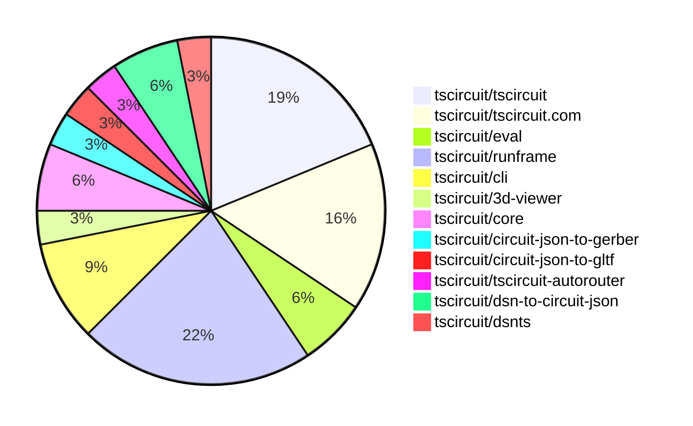
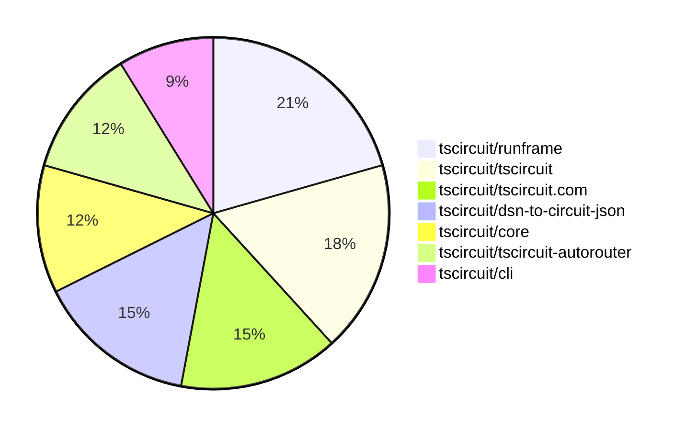

# Contribution Overview 2025-12-10

The current week is shown below. There are 4 major sections:

- [Contributor Overview](#contributor-overview)
- [PRs by Repository](#prs-by-repository)
- [PRs by Contributor](#changes-by-contributor)
- [Scoring & Sponsorship System](#scoring--sponsorship-system)

## PRs by Repository

## Contributor Overview

| Contributor | 🐳 Major | 🐙 Minor | 🐌 Tiny | ⭐ | Score | Discussion Contributions |
|-------------|---------|---------|---------|-----|----------------|--------------------------|
| [tscircuitbot](#tscircuitbot) | 0 | 0 | 20 | ⭐⭐ | 12.5 | 0🔹 0🔶 0💎 |
| [imrishabh18](#imrishabh18) | 1 | 1 | 1 | ⭐ | 8 | 0🔹 0🔶 0💎 |
| [Abse2001](#Abse2001) | 0 | 3 | 0 | ⭐ | 6 | 0🔹 0🔶 0💎 |
| [MustafaMulla29](#MustafaMulla29) | 0 | 1 | 2 | ⭐ | 4 | 0🔹 0🔶 0💎 |
| [0hmX](#0hmX) | 1 | 0 | 0 | ⭐ | 4 | 0🔹 0🔶 0💎 |
| [ShiboSoftwareDev](#ShiboSoftwareDev) | 0 | 1 | 0 |  | 3 | 0🔹 0🔶 0💎 |
| [Devesh36](#Devesh36) | 0 | 0 | 1 |  | 1 | 0🔹 0🔶 0💎 |

> Note: AI evaluates PRs and assigns 1-3 star ratings automatically. 4 and 5 star ratings require manual staff review.

### Discussion Contribution Legend

- 🔹 Normal Comments: Basic participation with minimal effort
- 🔶 Great Informative Comments: Thoughtful participation that adds value
- 💎 Incredible Comments: Exceptional participation with high-quality content

## Review Table

[reviews-received-hover]: ## "Number of reviews received for PRs for this contributor"
[approvals-received-hover]: ## "Number of approvals received for PRs this contributor authored"
[rejections-received-hover]: ## "Number of rejections received for PRs this contributor authored"
[prs-opened-hover]: ## "Number of PRs opened by this contributor"
[issues-created-hover]: ## "Number of issues created by this contributor"
[bountied-issues-hover]: ## "Number of issues this contributor created with a bounty"
[bountied-issue-$-hover]: ## "Total bounty amount placed on issues authored by this contributor"

| Contributor | Reviews Received | Approvals Received | Rejections Received | Approvals | Rejections | PRs Opened | PRs Merged | Score | Issues Created | Bountied Issues | Bountied Issue $ |
|---|---|---|---|---|---|---|---|---|---|---|---|
| [Quanta-Naut](#Quanta-Naut) | 3 | 1 | 1 | 0 | 0 | 1 | 0 | 0 | 0 | 0 | 0 |
| [imrishabh18](#imrishabh18) | 0 | 0 | 0 | 2 | 1 | 3 | 3 | 8 | 0 | 0 | 0 |
| [tscircuitbot](#tscircuitbot) | 0 | 0 | 0 | 0 | 0 | 28 | 20 | 12.5 | 0 | 0 | 0 |
| [ShiboSoftwareDev](#ShiboSoftwareDev) | 4 | 2 | 0 | 0 | 0 | 2 | 1 | 3 | 0 | 0 | 0 |
| [seveibar](#seveibar) | 0 | 0 | 0 | 7 | 1 | 1 | 0 | 0 | 0 | 0 | 0 |
| [Abse2001](#Abse2001) | 3 | 3 | 0 | 0 | 0 | 3 | 3 | 6 | 0 | 0 | 0 |
| [Asymtode712](#Asymtode712) | 0 | 0 | 0 | 0 | 0 | 1 | 0 | 0 | 0 | 0 | 0 |
| [Ayushjhawar8](#Ayushjhawar8) | 2 | 0 | 0 | 0 | 0 | 2 | 0 | 0 | 0 | 0 | 0 |
| [pxlpal](#pxlpal) | 0 | 0 | 0 | 0 | 0 | 1 | 0 | 0 | 0 | 0 | 0 |
| [Devesh36](#Devesh36) | 1 | 1 | 0 | 0 | 0 | 1 | 1 | 1 | 0 | 0 | 0 |
| [MustafaMulla29](#MustafaMulla29) | 4 | 1 | 1 | 0 | 0 | 4 | 3 | 4 | 0 | 0 | 0 |
| [0hmX](#0hmX) | 2 | 1 | 0 | 0 | 0 | 5 | 1 | 4 | 0 | 0 | 0 |

## Top 7 Repositories by Contribution Points

## Scoring & Sponsorship System

### Overview

PRs are analyzed by AI and assigned a **star rating (1-3 stars)**. 4 and 5 star ratings can only be manually assigned by staff. Weekly scores use `2^(starRating - 1)` per PR (capped at 12 PRs per rating), plus review/discussion points.

### Weekly Score → Star String

| Score Range | Star String | Count Value |
|------------|-------------|-------------|
| 0-3 | (empty) | 0 stars |
| 4-10 | ⭐ | 1 star |
| 11-30 | ⭐⭐ | 2 stars |
| 31-50 | ⭐⭐⭐ | 3 stars |
| 51-75 | 👑 | 1 crown |
| 76-100 | 👑👑 | 2 crowns |
| 101+ | 👑👑👑 | 3 crowns |

> Crowns count as 3 stars for sponsorship.

### Monthly Sponsorship Calculation

The sponsorship system calculates monthly payments based on your **weekly star counts** over the complete weeks in that month (typically 4-5 weeks, Wednesday-Tuesday format).

**Step 1: Collect Weekly Stars**
- All complete weeks in the month are analyzed
- Each week's star string is converted to a numeric count (⭐ = 1 star, ⭐⭐⭐ = 3 stars)
- Example: `[2, 2, 2, 1, 0]` means 2 stars in week 1, 2 stars in week 2, etc.

**Step 2: Calculate Metrics**
- **Median stars**: The median value of all weekly star counts
- **Min stars**: The minimum weekly star count
- **Max stars**: The maximum weekly star count
- **High score**: The maximum raw weekly score (0-100+ range from the scoring table) from any week in the month

**Step 3: Determine Base Amount**
The sponsorship amount is calculated based on these metrics (checked in order):

| Condition | Base Amount |
|-----------|-------------|
| `minStarCount >= 3` | **$700** |
| `medianStars >= 3` | **$550** |
| `medianStars >= 2.5` | **$400** |
| `medianStars >= 2` | **$250** |
| `medianStars >= 1.5` | **$120** |
| `medianStars >= 1` | **$75** |
| `maxStarCount >= 2` | **$45** |
| `maxStarCount >= 1` | **$30** |
| `highScore >= 3` (and all stars = 0) | **$10** |

| Maintainer Level | Monthly Bonus |
|------------------|---------------|
| Level 1 | **$200** |
| Level 2 | **$350** |
| Level 3 | **$500** |
| Level 4 | **$850** |
| Level 5 | **$1300** |
| Level 6 | **$2000** |

**Final Amount** = Base Amount + Maintainer Bonus

## Changes by Repository

### [tscircuit/tscircuit](https://github.com/tscircuit/tscircuit)

🐌 Tiny Contributions (6)

| PR # | Impact | Contributor | Description |
|------|--------|-------------|-------------|
| [#1610](https://github.com/tscircuit/tscircuit/pull/1610) | 🐌 Tiny | tscircuitbot | Automated package update |
| [#1609](https://github.com/tscircuit/tscircuit/pull/1609) | 🐌 Tiny | tscircuitbot | Updates the version of several dependencies in the package.json file, including tscircuitcli, tscircuitcore, tscircuiteval, tscircuitprops, and tscircuitrunframe. |
| [#1608](https://github.com/tscircuit/tscircuit/pull/1608) | 🐌 Tiny | tscircuitbot | Automated package update |
| [#1607](https://github.com/tscircuit/tscircuit/pull/1607) | 🐌 Tiny | tscircuitbot | Updates the tscircuitcli package to version 0.1.618 in package.json |
| [#1606](https://github.com/tscircuit/tscircuit/pull/1606) | 🐌 Tiny | tscircuitbot | Automated package update |
| [#1605](https://github.com/tscircuit/tscircuit/pull/1605) | 🐌 Tiny | tscircuitbot | Updates the tscircuitcli package from version 0.1.616 to 0.1.617 and updates the tscircuitrunframe package from version 0.0.1370 to 0.0.1371, while downgrading the calculate-packing package from version 0.0.68 to 0.0.66. |

### [tscircuit/tscircuit.com](https://github.com/tscircuit/tscircuit.com)

🐌 Tiny Contributions (5)

| PR # | Impact | Contributor | Description |
|------|--------|-------------|-------------|
| [#2179](https://github.com/tscircuit/tscircuit.com/pull/2179) | 🐌 Tiny | tscircuitbot | Updates the tscircuitrunframe package to version 0.0.1373 |
| [#2178](https://github.com/tscircuit/tscircuit.com/pull/2178) | 🐌 Tiny | tscircuitbot | Updates the tscircuitrunframe package from version 0.0.1371 to 0.0.1372 |
| [#2177](https://github.com/tscircuit/tscircuit.com/pull/2177) | 🐌 Tiny | tscircuitbot | Automated package update |
| [#2176](https://github.com/tscircuit/tscircuit.com/pull/2176) | 🐌 Tiny | tscircuitbot | Automated package update |
| [#2175](https://github.com/tscircuit/tscircuit.com/pull/2175) | 🐌 Tiny | Devesh36 | Fixes horizontal overflow in the Usercode Logs section by allowing long log messages to wrap naturally instead of breaking the layout. |

### [tscircuit/eval](https://github.com/tscircuit/eval)

🐌 Tiny Contributions (2)

| PR # | Impact | Contributor | Description |
|------|--------|-------------|-------------|
| [#1685](https://github.com/tscircuit/eval/pull/1685) | 🐌 Tiny | tscircuitbot | Automated package update |
| [#1684](https://github.com/tscircuit/eval/pull/1684) | 🐌 Tiny | tscircuitbot | Automated package update |

### [tscircuit/runframe](https://github.com/tscircuit/runframe)

🐌 Tiny Contributions (7)

| PR # | Impact | Contributor | Description |
|------|--------|-------------|-------------|
| [#2057](https://github.com/tscircuit/runframe/pull/2057) | 🐌 Tiny | tscircuitbot | Automated package update |
| [#2056](https://github.com/tscircuit/runframe/pull/2056) | 🐌 Tiny | tscircuitbot | Updates the circuit-json-to-gerber package from version 0.0.44 to 0.0.46 in package.json |
| [#2055](https://github.com/tscircuit/runframe/pull/2055) | 🐌 Tiny | tscircuitbot | Automated package update |
| [#2054](https://github.com/tscircuit/runframe/pull/2054) | 🐌 Tiny | tscircuitbot | Updates the tscircuiteval package to version 0.0.532 in the package.json file. |
| [#2053](https://github.com/tscircuit/runframe/pull/2053) | 🐌 Tiny | tscircuitbot | Updates the tscircuit3d-viewer package from version 0.0.469 to 0.0.470 |
| [#2052](https://github.com/tscircuit/runframe/pull/2052) | 🐌 Tiny | tscircuitbot | Automated package update |
| [#2051](https://github.com/tscircuit/runframe/pull/2051) | 🐌 Tiny | MustafaMulla29 | Updates the version of circuit-json-to-gltf from 0.0.53 to 0.0.56 in package.json |

### [tscircuit/cli](https://github.com/tscircuit/cli)

🐌 Tiny Contributions (3)

| PR # | Impact | Contributor | Description |
|------|--------|-------------|-------------|
| [#1310](https://github.com/tscircuit/cli/pull/1310) | 🐌 Tiny | tscircuitbot | Automated package update |
| [#1304](https://github.com/tscircuit/cli/pull/1304) | 🐌 Tiny | tscircuitbot | Updates the tscircuitrunframe package from version 0.0.1370 to 0.0.1371 |
| [#1306](https://github.com/tscircuit/cli/pull/1306) | 🐌 Tiny | MustafaMulla29 | Updates the version of the circuit-json-to-gltf dependency from 0.0.51 to 0.0.56 in package.json |

### [tscircuit/3d-viewer](https://github.com/tscircuit/3d-viewer)

| PR # | Impact | Rating | Contributor | Description |
|------|--------|--------|-------------|-------------|
| [#617](https://github.com/tscircuit/3d-viewer/pull/617) | 🐙 Minor | ⭐⭐ | Abse2001 | Add support for rendering pcb_copper_text elements in the 3D PCB viewer, implement knockout text feature, fix text mirroring logic, and improve text clarity by increasing texture resolution. |

### [tscircuit/core](https://github.com/tscircuit/core)

| PR # | Impact | Rating | Contributor | Description |
|------|--------|--------|-------------|-------------|
| [#1734](https://github.com/tscircuit/core/pull/1734) | 🐙 Minor | ⭐⭐ | Abse2001 | Adds lifecycle events for packing operations, including error reporting and metadata emission for better debugging and UI integration. |
| [#1736](https://github.com/tscircuit/core/pull/1736) | 🐙 Minor | ⭐⭐ | ShiboSoftwareDev | Refactors the panel packing feature to support dynamic grid layouts and custom board outlines, enhancing the handling of boards of varying sizes. |

### [tscircuit/circuit-json-to-gerber](https://github.com/tscircuit/circuit-json-to-gerber)

| PR # | Impact | Rating | Contributor | Description |
|------|--------|--------|-------------|-------------|
| [#74](https://github.com/tscircuit/circuit-json-to-gerber/pull/74) | 🐙 Minor | ⭐⭐ | Abse2001 | Adds full Gerber support for pcb_copper_text, including aperture config, vector text rendering, rotation, mirroring, and anchor alignment, with knockout mode support for proper copper cutout text. |

### [tscircuit/circuit-json-to-gltf](https://github.com/tscircuit/circuit-json-to-gltf)

| PR # | Impact | Rating | Contributor | Description |
|------|--------|--------|-------------|-------------|
| [#102](https://github.com/tscircuit/circuit-json-to-gltf/pull/102) | 🐙 Minor | ⭐⭐ | MustafaMulla29 | Fixes GLB export failure in browser due to undefined initWasm when resvgresvg-wasm is externalized in RunFrame. |

### [tscircuit/tscircuit-autorouter](https://github.com/tscircuit/tscircuit-autorouter)

| PR # | Impact | Rating | Contributor | Description |
|------|--------|--------|-------------|-------------|
| [#393](https://github.com/tscircuit/tscircuit-autorouter/pull/393) | 🐳 Major | ⭐⭐⭐ | 0hmX | Fixes false obstacle rejection in autorouting by linking Minimum Spanning Tree sub-routes to their parent net identifiers, ensuring valid paths are recognized as connections. |

### [tscircuit/dsn-to-circuit-json](https://github.com/tscircuit/dsn-to-circuit-json)

| PR # | Impact | Rating | Contributor | Description |
|------|--------|--------|-------------|-------------|
| [#12](https://github.com/tscircuit/dsn-to-circuit-json/pull/12) | 🐳 Major | ⭐⭐⭐ | imrishabh18 | This pull request adds an example for the interconnect board and removes the previously used circuit JSON. The changes include modifications to the SesToCircuitJsonConverter class, where the originalCircuitJson option is removed from the constructor and related functions. Additionally, the PcbTraceCombineStage class has been deleted, which was responsible for combining PCB traces. This simplifies the conversion process and focuses on the new example provided. |

🐌 Tiny Contributions (1)

| PR # | Impact | Contributor | Description |
|------|--------|-------------|-------------|
| [#13](https://github.com/tscircuit/dsn-to-circuit-json/pull/13) | 🐌 Tiny | imrishabh18 | This pull request addresses issues with the parsing of SMT pads in the DSN files by the DSNTS library, correcting the vertical pad definitions. Additionally, it enhances the documentation by adding a comprehensive README file that outlines the usage, installation, and architecture of the project. |

### [tscircuit/dsnts](https://github.com/tscircuit/dsnts)

| PR # | Impact | Rating | Contributor | Description |
|------|--------|--------|-------------|-------------|
| [#11](https://github.com/tscircuit/dsnts/pull/11) | 🐙 Minor | ⭐⭐ | imrishabh18 | Fixes the parsing of pin coordinates in the DSN format, ensuring that the pin number is correctly interpreted as the x coordinate. |

## Changes by Contributor

### [tscircuitbot](https://github.com/tscircuitbot)

🐌 Tiny Contributions (20)

| PR # | Impact | Description |
|------|--------|-------------|
| [#1610](https://github.com/tscircuit/tscircuit/pull/1610) | 🐌 Tiny | Automated package update |
| [#1609](https://github.com/tscircuit/tscircuit/pull/1609) | 🐌 Tiny | Updates the version of several dependencies in the package.json file, including tscircuitcli, tscircuitcore, tscircuiteval, tscircuitprops, and tscircuitrunframe. |
| [#1608](https://github.com/tscircuit/tscircuit/pull/1608) | 🐌 Tiny | Automated package update |
| [#1607](https://github.com/tscircuit/tscircuit/pull/1607) | 🐌 Tiny | Updates the tscircuitcli package to version 0.1.618 in package.json |
| [#1606](https://github.com/tscircuit/tscircuit/pull/1606) | 🐌 Tiny | Automated package update |
| [#1605](https://github.com/tscircuit/tscircuit/pull/1605) | 🐌 Tiny | Updates the tscircuitcli package from version 0.1.616 to 0.1.617 and updates the tscircuitrunframe package from version 0.0.1370 to 0.0.1371, while downgrading the calculate-packing package from version 0.0.68 to 0.0.66. |
| [#2179](https://github.com/tscircuit/tscircuit.com/pull/2179) | 🐌 Tiny | Updates the tscircuitrunframe package to version 0.0.1373 |
| [#2178](https://github.com/tscircuit/tscircuit.com/pull/2178) | 🐌 Tiny | Updates the tscircuitrunframe package from version 0.0.1371 to 0.0.1372 |
| [#2177](https://github.com/tscircuit/tscircuit.com/pull/2177) | 🐌 Tiny | Automated package update |
| [#2176](https://github.com/tscircuit/tscircuit.com/pull/2176) | 🐌 Tiny | Automated package update |
| [#1685](https://github.com/tscircuit/eval/pull/1685) | 🐌 Tiny | Automated package update |
| [#1684](https://github.com/tscircuit/eval/pull/1684) | 🐌 Tiny | Automated package update |
| [#2057](https://github.com/tscircuit/runframe/pull/2057) | 🐌 Tiny | Automated package update |
| [#2056](https://github.com/tscircuit/runframe/pull/2056) | 🐌 Tiny | Updates the circuit-json-to-gerber package from version 0.0.44 to 0.0.46 in package.json |
| [#2055](https://github.com/tscircuit/runframe/pull/2055) | 🐌 Tiny | Automated package update |
| [#2054](https://github.com/tscircuit/runframe/pull/2054) | 🐌 Tiny | Updates the tscircuiteval package to version 0.0.532 in the package.json file. |
| [#2053](https://github.com/tscircuit/runframe/pull/2053) | 🐌 Tiny | Updates the tscircuit3d-viewer package from version 0.0.469 to 0.0.470 |
| [#2052](https://github.com/tscircuit/runframe/pull/2052) | 🐌 Tiny | Automated package update |
| [#1310](https://github.com/tscircuit/cli/pull/1310) | 🐌 Tiny | Automated package update |
| [#1304](https://github.com/tscircuit/cli/pull/1304) | 🐌 Tiny | Updates the tscircuitrunframe package from version 0.0.1370 to 0.0.1371 |

### [Abse2001](https://github.com/Abse2001)

| PRs # | Impact | Rating | Description |
|------|--------|--------|-------------|
| [#617](https://github.com/tscircuit/3d-viewer/pull/617) | 🐙 Minor | ⭐⭐ | Add support for rendering pcb_copper_text elements in the 3D PCB viewer, implement knockout text feature, fix text mirroring logic, and improve text clarity by increasing texture resolution. |
| [#1734](https://github.com/tscircuit/core/pull/1734) | 🐙 Minor | ⭐⭐ | Adds lifecycle events for packing operations, including error reporting and metadata emission for better debugging and UI integration. |
| [#74](https://github.com/tscircuit/circuit-json-to-gerber/pull/74) | 🐙 Minor | ⭐⭐ | Adds full Gerber support for pcb_copper_text, including aperture config, vector text rendering, rotation, mirroring, and anchor alignment, with knockout mode support for proper copper cutout text. |

### [ShiboSoftwareDev](https://github.com/ShiboSoftwareDev)

| PRs # | Impact | Rating | Description |
|------|--------|--------|-------------|
| [#1736](https://github.com/tscircuit/core/pull/1736) | 🐙 Minor | ⭐⭐ | Refactors the panel packing feature to support dynamic grid layouts and custom board outlines, enhancing the handling of boards of varying sizes. |

### [Devesh36](https://github.com/Devesh36)

🐌 Tiny Contributions (1)

| PR # | Impact | Description |
|------|--------|-------------|
| [#2175](https://github.com/tscircuit/tscircuit.com/pull/2175) | 🐌 Tiny | Fixes horizontal overflow in the Usercode Logs section by allowing long log messages to wrap naturally instead of breaking the layout. |

### [MustafaMulla29](https://github.com/MustafaMulla29)

| PRs # | Impact | Rating | Description |
|------|--------|--------|-------------|
| [#102](https://github.com/tscircuit/circuit-json-to-gltf/pull/102) | 🐙 Minor | ⭐⭐ | Fixes GLB export failure in browser due to undefined initWasm when resvgresvg-wasm is externalized in RunFrame. |

🐌 Tiny Contributions (2)

| PR # | Impact | Description |
|------|--------|-------------|
| [#2051](https://github.com/tscircuit/runframe/pull/2051) | 🐌 Tiny | Updates the version of circuit-json-to-gltf from 0.0.53 to 0.0.56 in package.json |
| [#1306](https://github.com/tscircuit/cli/pull/1306) | 🐌 Tiny | Updates the version of the circuit-json-to-gltf dependency from 0.0.51 to 0.0.56 in package.json |

### [0hmX](https://github.com/0hmX)

| PRs # | Impact | Rating | Description |
|------|--------|--------|-------------|
| [#393](https://github.com/tscircuit/tscircuit-autorouter/pull/393) | 🐳 Major | ⭐⭐⭐ | Fixes false obstacle rejection in autorouting by linking Minimum Spanning Tree sub-routes to their parent net identifiers, ensuring valid paths are recognized as connections. |

### [imrishabh18](https://github.com/imrishabh18)

| PRs # | Impact | Rating | Description |
|------|--------|--------|-------------|
| [#12](https://github.com/tscircuit/dsn-to-circuit-json/pull/12) | 🐳 Major | ⭐⭐⭐ | This pull request adds an example for the interconnect board and removes the previously used circuit JSON. The changes include modifications to the SesToCircuitJsonConverter class, where the originalCircuitJson option is removed from the constructor and related functions. Additionally, the PcbTraceCombineStage class has been deleted, which was responsible for combining PCB traces. This simplifies the conversion process and focuses on the new example provided. |
| [#11](https://github.com/tscircuit/dsnts/pull/11) | 🐙 Minor | ⭐⭐ | Fixes the parsing of pin coordinates in the DSN format, ensuring that the pin number is correctly interpreted as the x coordinate. |

🐌 Tiny Contributions (1)

| PR # | Impact | Description |
|------|--------|-------------|
| [#13](https://github.com/tscircuit/dsn-to-circuit-json/pull/13) | 🐌 Tiny | This pull request addresses issues with the parsing of SMT pads in the DSN files by the DSNTS library, correcting the vertical pad definitions. Additionally, it enhances the documentation by adding a comprehensive README file that outlines the usage, installation, and architecture of the project. |

## Repository Owners

| Repository | Codeowners |
|------------|------------|
| [builder](https://github.com/tscircuit/builder/blob/main/.github/CODEOWNERS) | [seveibar](https://github.com/seveibar)
| [pcb-viewer](https://github.com/tscircuit/pcb-viewer/blob/main/.github/CODEOWNERS) | [seveibar](https://github.com/seveibar), [ShiboSoftwareDev](https://github.com/ShiboSoftwareDev)
| [footprints-old](https://github.com/tscircuit/footprints-old/blob/main/.github/CODEOWNERS) | [seveibar](https://github.com/seveibar)
| [footprinter](https://github.com/tscircuit/footprinter/blob/main/.github/CODEOWNERS) | [seveibar](https://github.com/seveibar), [techmannih](https://github.com/techmannih)
| [3d-viewer](https://github.com/tscircuit/3d-viewer/blob/main/.github/CODEOWNERS) | [ShiboSoftwareDev](https://github.com/ShiboSoftwareDev)
| [winterspec](https://github.com/tscircuit/winterspec/blob/main/.github/CODEOWNERS) | [seveibar](https://github.com/seveibar), [ShiboSoftwareDev](https://github.com/ShiboSoftwareDev)
| [jscad-electronics](https://github.com/tscircuit/jscad-electronics/blob/main/.github/CODEOWNERS) | [seveibar](https://github.com/seveibar), [techmannih](https://github.com/techmannih), [ShiboSoftwareDev](https://github.com/ShiboSoftwareDev), [anas-sarkez](https://github.com/anas-sarkez)
| [circuit-to-svg](https://github.com/tscircuit/circuit-to-svg/blob/main/.github/CODEOWNERS) | [imrishabh18](https://github.com/imrishabh18)
| [schematic-symbols](https://github.com/tscircuit/schematic-symbols/blob/main/.github/CODEOWNERS) | [seveibar](https://github.com/seveibar), [imrishabh18](https://github.com/imrishabh18), [techmannih](https://github.com/techmannih)
| [circuit-json-to-gerber](https://github.com/tscircuit/circuit-json-to-gerber/blob/main/.github/CODEOWNERS) | [seveibar](https://github.com/seveibar), [ShiboSoftwareDev](https://github.com/ShiboSoftwareDev)
| [tscircuit.com](https://github.com/tscircuit/tscircuit.com/blob/main/.github/CODEOWNERS) | [seveibar](https://github.com/seveibar), [imrishabh18](https://github.com/imrishabh18)
| [issue-roulette](https://github.com/tscircuit/issue-roulette/blob/main/.github/CODEOWNERS) | [Anshgrover23](https://github.com/Anshgrover23)
| [sparkfun-boards](https://github.com/tscircuit/sparkfun-boards/blob/main/.github/CODEOWNERS) | [ShiboSoftwareDev](https://github.com/ShiboSoftwareDev), [Abse2001](https://github.com/Abse2001), [MustafaMulla29](https://github.com/MustafaMulla29), [Anshgrover23](https://github.com/Anshgrover23), [techmannih](https://github.com/techmannih)
| [schematic-corpus](https://github.com/tscircuit/schematic-corpus/blob/main/.github/CODEOWNERS) | [Abse2001](https://github.com/Abse2001)
| [copper-pour-solver](https://github.com/tscircuit/copper-pour-solver/blob/main/.github/CODEOWNERS) | [seveibar](https://github.com/seveibar), [ShiboSoftwareDev](https://github.com/ShiboSoftwareDev)
| [common](https://github.com/tscircuit/common/blob/main/.github/CODEOWNERS) | [seveibar](https://github.com/seveibar), [Abse2001](https://github.com/Abse2001)

## Repositories by Owner

| User | Repo |
|------|------|
| [seveibar](https://github.com/seveibar) | [builder](https://github.com/tscircuit/builder/blob/main/.github/CODEOWNERS) |
|  | [pcb-viewer](https://github.com/tscircuit/pcb-viewer/blob/main/.github/CODEOWNERS) |
|  | [footprints-old](https://github.com/tscircuit/footprints-old/blob/main/.github/CODEOWNERS) |
|  | [footprinter](https://github.com/tscircuit/footprinter/blob/main/.github/CODEOWNERS) |
|  | [winterspec](https://github.com/tscircuit/winterspec/blob/main/.github/CODEOWNERS) |
|  | [jscad-electronics](https://github.com/tscircuit/jscad-electronics/blob/main/.github/CODEOWNERS) |
|  | [schematic-symbols](https://github.com/tscircuit/schematic-symbols/blob/main/.github/CODEOWNERS) |
|  | [circuit-json-to-gerber](https://github.com/tscircuit/circuit-json-to-gerber/blob/main/.github/CODEOWNERS) |
|  | [tscircuit.com](https://github.com/tscircuit/tscircuit.com/blob/main/.github/CODEOWNERS) |
|  | [copper-pour-solver](https://github.com/tscircuit/copper-pour-solver/blob/main/.github/CODEOWNERS) |
|  | [common](https://github.com/tscircuit/common/blob/main/.github/CODEOWNERS) |
| [ShiboSoftwareDev](https://github.com/ShiboSoftwareDev) | [pcb-viewer](https://github.com/tscircuit/pcb-viewer/blob/main/.github/CODEOWNERS) |
|  | [3d-viewer](https://github.com/tscircuit/3d-viewer/blob/main/.github/CODEOWNERS) |
|  | [winterspec](https://github.com/tscircuit/winterspec/blob/main/.github/CODEOWNERS) |
|  | [jscad-electronics](https://github.com/tscircuit/jscad-electronics/blob/main/.github/CODEOWNERS) |
|  | [circuit-json-to-gerber](https://github.com/tscircuit/circuit-json-to-gerber/blob/main/.github/CODEOWNERS) |
|  | [sparkfun-boards](https://github.com/tscircuit/sparkfun-boards/blob/main/.github/CODEOWNERS) |
|  | [copper-pour-solver](https://github.com/tscircuit/copper-pour-solver/blob/main/.github/CODEOWNERS) |
| [techmannih](https://github.com/techmannih) | [footprinter](https://github.com/tscircuit/footprinter/blob/main/.github/CODEOWNERS) |
|  | [jscad-electronics](https://github.com/tscircuit/jscad-electronics/blob/main/.github/CODEOWNERS) |
|  | [schematic-symbols](https://github.com/tscircuit/schematic-symbols/blob/main/.github/CODEOWNERS) |
|  | [sparkfun-boards](https://github.com/tscircuit/sparkfun-boards/blob/main/.github/CODEOWNERS) |
| [anas-sarkez](https://github.com/anas-sarkez) | [jscad-electronics](https://github.com/tscircuit/jscad-electronics/blob/main/.github/CODEOWNERS) |
| [imrishabh18](https://github.com/imrishabh18) | [circuit-to-svg](https://github.com/tscircuit/circuit-to-svg/blob/main/.github/CODEOWNERS) |
|  | [schematic-symbols](https://github.com/tscircuit/schematic-symbols/blob/main/.github/CODEOWNERS) |
|  | [tscircuit.com](https://github.com/tscircuit/tscircuit.com/blob/main/.github/CODEOWNERS) |
| [Anshgrover23](https://github.com/Anshgrover23) | [issue-roulette](https://github.com/tscircuit/issue-roulette/blob/main/.github/CODEOWNERS) |
|  | [sparkfun-boards](https://github.com/tscircuit/sparkfun-boards/blob/main/.github/CODEOWNERS) |
| [Abse2001](https://github.com/Abse2001) | [sparkfun-boards](https://github.com/tscircuit/sparkfun-boards/blob/main/.github/CODEOWNERS) |
|  | [schematic-corpus](https://github.com/tscircuit/schematic-corpus/blob/main/.github/CODEOWNERS) |
|  | [common](https://github.com/tscircuit/common/blob/main/.github/CODEOWNERS) |
| [MustafaMulla29](https://github.com/MustafaMulla29) | [sparkfun-boards](https://github.com/tscircuit/sparkfun-boards/blob/main/.github/CODEOWNERS) |

