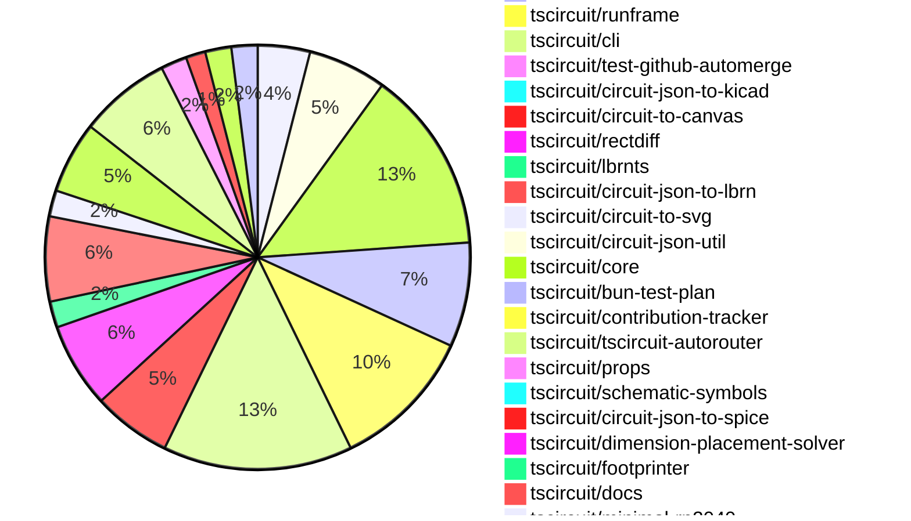
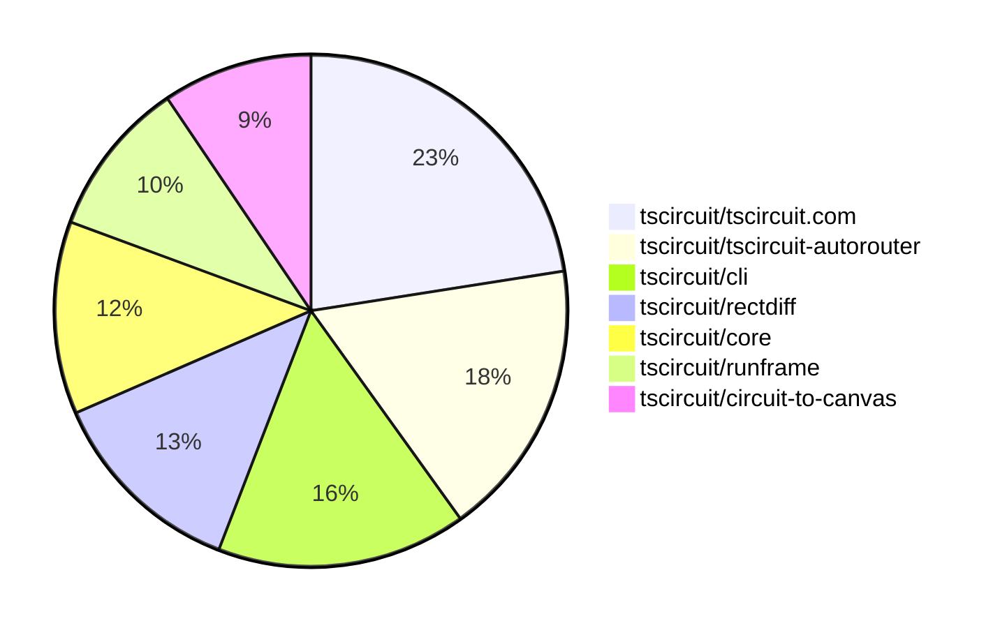

# Contribution Overview 2025-12-24

The current week is shown below. There are 4 major sections:

- [Contributor Overview](#contributor-overview)
- [PRs by Repository](#prs-by-repository)
- [PRs by Contributor](#changes-by-contributor)
- [Scoring & Sponsorship System](#scoring--sponsorship-system)

## PRs by Repository

## Contributor Overview

| Contributor | 🐳 Major | 🐙 Minor | 🐌 Tiny | ⭐ | Score | Discussion Contributions |
|-------------|---------|---------|---------|-----|----------------|--------------------------|
| [seveibar](#seveibar) | 13 | 2 | 6 | 👑 | 59 | 0🔹 0🔶 0💎 |
| [ShiboSoftwareDev](#ShiboSoftwareDev) | 1 | 11 | 2 | ⭐⭐⭐ | 34 | 0🔹 0🔶 0💎 |
| [ArnavK-09](#ArnavK-09) | 4 | 5 | 7 | ⭐⭐⭐ | 33 | 0🔹 0🔶 0💎 |
| [techmannih](#techmannih) | 3 | 4 | 1 | ⭐⭐⭐ | 32 | 0🔹 0🔶 0💎 |
| [Abse2001](#Abse2001) | 2 | 9 | 1 | ⭐⭐⭐ | 31 | 0🔹 0🔶 0💎 |
| [imrishabh18](#imrishabh18) | 6 | 1 | 0 | ⭐⭐ | 27 | 0🔹 0🔶 0💎 |
| [0hmX](#0hmX) | 4 | 3 | 3 | ⭐⭐ | 26 | 0🔹 0🔶 0💎 |
| [AnasSarkiz](#AnasSarkiz) | 3 | 2 | 2 | ⭐⭐ | 18 | 0🔹 0🔶 0💎 |
| [tscircuitbot](#tscircuitbot) | 0 | 0 | 108 | ⭐⭐ | 14 | 0🔹 0🔶 0💎 |
| [rushabhcodes](#rushabhcodes) | 1 | 2 | 0 | ⭐⭐ | 12 | 0🔹 0🔶 0💎 |
| [Ayushjhawar8](#Ayushjhawar8) | 1 | 2 | 3 | ⭐⭐ | 11 | 0🔹 0🔶 0💎 |
| [nailoo](#nailoo) | 1 | 1 | 3 | ⭐ | 10 | 0🔹 0🔶 0💎 |
| [MustafaMulla29](#MustafaMulla29) | 0 | 1 | 1 |  | 3 | 0🔹 0🔶 0💎 |

> Note: AI evaluates PRs and assigns 1-3 star ratings automatically. 4 and 5 star ratings require manual staff review.

### Discussion Contribution Legend

- 🔹 Normal Comments: Basic participation with minimal effort
- 🔶 Great Informative Comments: Thoughtful participation that adds value
- 💎 Incredible Comments: Exceptional participation with high-quality content

## Review Table

[reviews-received-hover]: ## "Number of reviews received for PRs for this contributor"
[approvals-received-hover]: ## "Number of approvals received for PRs this contributor authored"
[rejections-received-hover]: ## "Number of rejections received for PRs this contributor authored"
[prs-opened-hover]: ## "Number of PRs opened by this contributor"
[issues-created-hover]: ## "Number of issues created by this contributor"
[bountied-issues-hover]: ## "Number of issues this contributor created with a bounty"
[bountied-issue-$-hover]: ## "Total bounty amount placed on issues authored by this contributor"

| Contributor | Reviews Received | Approvals Received | Rejections Received | Approvals | Rejections | PRs Opened | PRs Merged | Score | Issues Created | Bountied Issues | Bountied Issue $ |
|---|---|---|---|---|---|---|---|---|---|---|---|
| [LiamConner10](#LiamConner10) | 1 | 0 | 0 | 0 | 0 | 3 | 0 | 0 | 0 | 0 | 0 |
| [Abse2001](#Abse2001) | 14 | 12 | 1 | 4 | 1 | 15 | 12 | 31 | 0 | 0 | 0 |
| [seveibar](#seveibar) | 6 | 1 | 0 | 57 | 12 | 27 | 21 | 59 | 0 | 0 | 0 |
| [tscircuitbot](#tscircuitbot) | 0 | 0 | 0 | 0 | 0 | 136 | 108 | 14 | 0 | 0 | 0 |
| [Ayushjhawar8](#Ayushjhawar8) | 8 | 5 | 1 | 0 | 0 | 7 | 6 | 11 | 0 | 0 | 0 |
| [imrishabh18](#imrishabh18) | 2 | 2 | 0 | 11 | 4 | 9 | 7 | 27 | 0 | 0 | 0 |
| [ArnavK-09](#ArnavK-09) | 6 | 5 | 0 | 1 | 0 | 18 | 17 | 33 | 0 | 0 | 0 |
| [ShiboSoftwareDev](#ShiboSoftwareDev) | 16 | 14 | 1 | 5 | 0 | 15 | 14 | 34 | 0 | 0 | 0 |
| [MuhamadJuwandi](#MuhamadJuwandi) | 5 | 0 | 2 | 0 | 0 | 4 | 0 | 0 | 0 | 0 | 0 |
| [techmannih](#techmannih) | 14 | 8 | 2 | 6 | 1 | 10 | 8 | 32 | 0 | 0 | 0 |
| [nailoo](#nailoo) | 11 | 7 | 2 | 0 | 0 | 9 | 5 | 10 | 0 | 0 | 0 |
| [rushabhcodes](#rushabhcodes) | 35 | 9 | 4 | 0 | 4 | 8 | 3 | 12 | 0 | 0 | 0 |
| [MustafaMulla29](#MustafaMulla29) | 10 | 2 | 4 | 0 | 0 | 5 | 2 | 3 | 0 | 0 | 0 |
| [0hmX](#0hmX) | 27 | 10 | 2 | 1 | 1 | 19 | 10 | 26 | 0 | 0 | 0 |
| [shehaban](#shehaban) | 4 | 1 | 2 | 0 | 0 | 1 | 0 | 0 | 0 | 0 | 0 |
| [SBALAVIGNESH123](#SBALAVIGNESH123) | 2 | 0 | 2 | 0 | 0 | 1 | 0 | 0 | 0 | 0 | 0 |
| [AnasSarkiz](#AnasSarkiz) | 9 | 9 | 0 | 0 | 0 | 7 | 7 | 18 | 0 | 0 | 0 |

## Top 7 Repositories by Contribution Points

## Scoring & Sponsorship System

### Overview

PRs are analyzed by AI and assigned a **star rating (1-3 stars)**. 4 and 5 star ratings can only be manually assigned by staff. Weekly scores use `2^(starRating - 1)` per PR (capped at 12 PRs per rating), plus review/discussion points.

### Weekly Score → Star String

| Score Range | Star String | Count Value |
|------------|-------------|-------------|
| 0-3 | (empty) | 0 stars |
| 4-10 | ⭐ | 1 star |
| 11-30 | ⭐⭐ | 2 stars |
| 31-50 | ⭐⭐⭐ | 3 stars |
| 51-75 | 👑 | 1 crown |
| 76-100 | 👑👑 | 2 crowns |
| 101+ | 👑👑👑 | 3 crowns |

> Crowns count as 3 stars for sponsorship.

### Monthly Sponsorship Calculation

The sponsorship system calculates monthly payments based on your **weekly star counts** over the complete weeks in that month (typically 4-5 weeks, Wednesday-Tuesday format).

**Step 1: Collect Weekly Stars**
- All complete weeks in the month are analyzed
- Each week's star string is converted to a numeric count (⭐ = 1 star, ⭐⭐⭐ = 3 stars)
- Example: `[2, 2, 2, 1, 0]` means 2 stars in week 1, 2 stars in week 2, etc.

**Step 2: Calculate Metrics**
- **Median stars**: The median value of all weekly star counts
- **Min stars**: The minimum weekly star count
- **Max stars**: The maximum weekly star count
- **High score**: The maximum raw weekly score (0-100+ range from the scoring table) from any week in the month

**Step 3: Determine Base Amount**
The sponsorship amount is calculated based on these metrics (checked in order):

| Condition | Base Amount |
|-----------|-------------|
| `minStarCount >= 3` | **$700** |
| `medianStars >= 3` | **$550** |
| `medianStars >= 2.5` | **$400** |
| `medianStars >= 2` | **$250** |
| `medianStars >= 1.5` | **$120** |
| `medianStars >= 1` | **$75** |
| `maxStarCount >= 2` | **$45** |
| `maxStarCount >= 1` | **$30** |
| `highScore >= 3` (and all stars = 0) | **$10** |

| Maintainer Level | Monthly Bonus |
|------------------|---------------|
| Level 1 | **$200** |
| Level 2 | **$350** |
| Level 3 | **$500** |
| Level 4 | **$850** |
| Level 5 | **$1300** |
| Level 6 | **$2000** |

**Final Amount** = Base Amount + Maintainer Bonus

## Changes by Repository

### [tscircuit/pcb-viewer](https://github.com/tscircuit/pcb-viewer)

| PR # | Impact | Rating | Contributor | Description |
|------|--------|--------|-------------|-------------|
| [#566](https://github.com/tscircuit/pcb-viewer/pull/566) | 🐳 Major | ⭐⭐⭐ | Ayushjhawar8 | Implements auto-resize functionality for PCBViewer to adjust the view based on the board size changes. |
| [#571](https://github.com/tscircuit/pcb-viewer/pull/571) | 🐙 Minor | ⭐⭐ | Abse2001 | Refactors the rendering of plated holes in the canvas by introducing a dedicated drawing function for plated hole pads. |
| [#569](https://github.com/tscircuit/pcb-viewer/pull/569) | 🐙 Minor | ⭐⭐ | Abse2001 | Refactors silkscreen rendering to utilize circuit-to-canvas and updates the circuit-json dependency version. |
| [#565](https://github.com/tscircuit/pcb-viewer/pull/565) | 🐙 Minor | ⭐⭐ | ArnavK-09 | Adds support for displaying offsets between group anchors when a group is positioned relative to another group using the relative_to_pcb_group position mode. |

🌠Tiny Contributions (4)

| PR # | Impact | Contributor | Description |
|------|--------|-------------|-------------|
| [#572](https://github.com/tscircuit/pcb-viewer/pull/572) | 🐌 Tiny | tscircuitbot | Automated package update |
| [#570](https://github.com/tscircuit/pcb-viewer/pull/570) | 🐌 Tiny | tscircuitbot | Automated package update |
| [#568](https://github.com/tscircuit/pcb-viewer/pull/568) | 🐌 Tiny | tscircuitbot | Automated package update |
| [#567](https://github.com/tscircuit/pcb-viewer/pull/567) | 🐌 Tiny | tscircuitbot | Automated package update |

### [tscircuit/circuit-json](https://github.com/tscircuit/circuit-json)

| PR # | Impact | Rating | Contributor | Description |
|------|--------|--------|-------------|-------------|
| [#395](https://github.com/tscircuit/circuit-json/pull/395) | 🐙 Minor | ⭐⭐ | Abse2001 | Adds counter-clockwise rotation functionality to the oval silkscreen definition in PCB design. |
| [#387](https://github.com/tscircuit/circuit-json/pull/387) | 🐙 Minor | ⭐⭐ | Abse2001 | Adds a new type and validation for PCB render layers in the circuit-json library. |
| [#392](https://github.com/tscircuit/circuit-json/pull/392) | 🐙 Minor | ⭐⭐ | Abse2001 | Exports the PcbRenderLayer module for use in other parts of the application. |
| [#399](https://github.com/tscircuit/circuit-json/pull/399) | 🐙 Minor | ⭐⭐ | ShiboSoftwareDev | Adds operational amplifier elements for simulation, including definitions and parsing for op-amp components. |
| [#397](https://github.com/tscircuit/circuit-json/pull/397) | 🐙 Minor | ⭐⭐ | nailoo | Adds an optional ccw_rotation property to the PcbSilkscreenPill interface for PCB silkscreen definitions. |
| [#390](https://github.com/tscircuit/circuit-json/pull/390) | 🐙 Minor | ⭐⭐ | techmannih | Adds an optional ccw_rotation property to the PcbSilkscreenRect interface for defining counter-clockwise rotation of silkscreen rectangles on PCBs |

🌠Tiny Contributions (6)

| PR # | Impact | Contributor | Description |
|------|--------|-------------|-------------|
| [#400](https://github.com/tscircuit/circuit-json/pull/400) | 🐌 Tiny | tscircuitbot | Automated package update |
| [#398](https://github.com/tscircuit/circuit-json/pull/398) | 🐌 Tiny | tscircuitbot | Automated package update |
| [#394](https://github.com/tscircuit/circuit-json/pull/394) | 🐌 Tiny | tscircuitbot | Automated package update |
| [#396](https://github.com/tscircuit/circuit-json/pull/396) | 🐌 Tiny | tscircuitbot | Automated package update |
| [#391](https://github.com/tscircuit/circuit-json/pull/391) | 🐌 Tiny | tscircuitbot | Automated package update |
| [#393](https://github.com/tscircuit/circuit-json/pull/393) | 🐌 Tiny | tscircuitbot | Automated package update |

### [tscircuit/tscircuit.com](https://github.com/tscircuit/tscircuit.com)

| PR # | Impact | Rating | Contributor | Description |
|------|--------|--------|-------------|-------------|
| [#2361](https://github.com/tscircuit/tscircuit.com/pull/2361) | 🐳 Major | ⭐⭐⭐ | ArnavK-09 | Adds a user interface for account deletion, including confirmation dialog and associated state management. |
| [#2355](https://github.com/tscircuit/tscircuit.com/pull/2355) | 🐳 Major | ⭐⭐⭐ | ArnavK-09 | Adds a new login route for organization login, modifies the login redirection logic, and introduces a logout hook for improved session management. |
| [#2342](https://github.com/tscircuit/tscircuit.com/pull/2342) | 🐳 Major | ⭐⭐⭐ | ArnavK-09 | Adds SEO meta tags for the organization invitation route and improves the handling of invitation states in the accept organization invitation page. |
| [#2352](https://github.com/tscircuit/tscircuit.com/pull/2352) | 🐳 Major | ⭐⭐⭐ | rushabhcodes | Updates the authentication flow by renaming and generalizing the organization login to a standard sign-in experience, improving clarity in provider descriptions and updating navigation and import paths accordingly. |
| [#2322](https://github.com/tscircuit/tscircuit.com/pull/2322) | 🐳 Major | ⭐⭐⭐ | imrishabh18 | Adds the build duration display for package builds and modifies the layout of the release page to resemble Vercels design. |
| [#2335](https://github.com/tscircuit/tscircuit.com/pull/2335) | 🐳 Major | ⭐⭐⭐ | imrishabh18 | Adds a ready_to_build boolean field to the package release schema and sets it to true upon creation of a package release. |
| [#2356](https://github.com/tscircuit/tscircuit.com/pull/2356) | 🐙 Minor | ⭐⭐ | ArnavK-09 | Adds logout functionality that redirects to the home page after successful logout. |
| [#2358](https://github.com/tscircuit/tscircuit.com/pull/2358) | 🐙 Minor | ⭐⭐ | ArnavK-09 | Implements account deletion functionality, including the removal of associated personal organizations and packages. |
| [#2346](https://github.com/tscircuit/tscircuit.com/pull/2346) | 🐙 Minor | ⭐⭐ | ArnavK-09 | Enables case insensitivity for tscircuit_handle filtering in database queries. |
| [#2337](https://github.com/tscircuit/tscircuit.com/pull/2337) | 🐙 Minor | ⭐⭐ | imrishabh18 | Adds a hook to update the package release status to ready for build after a package file upload. |

🌠Tiny Contributions (18)

| PR # | Impact | Contributor | Description |
|------|--------|-------------|-------------|
| [#2366](https://github.com/tscircuit/tscircuit.com/pull/2366) | 🐌 Tiny | tscircuitbot | Automated package update for tscircuiteval from version 0.0.563 to 0.0.564 |
| [#2364](https://github.com/tscircuit/tscircuit.com/pull/2364) | 🐌 Tiny | tscircuitbot | Automated package update |
| [#2362](https://github.com/tscircuit/tscircuit.com/pull/2362) | 🐌 Tiny | tscircuitbot | Automated package update |
| [#2359](https://github.com/tscircuit/tscircuit.com/pull/2359) | 🐌 Tiny | tscircuitbot | Automated package update to version 0.0.172 |
| [#2354](https://github.com/tscircuit/tscircuit.com/pull/2354) | 🐌 Tiny | tscircuitbot | Automated package update |
| [#2360](https://github.com/tscircuit/tscircuit.com/pull/2360) | 🐌 Tiny | tscircuitbot | Automated package update to version 0.0.173 |
| [#2350](https://github.com/tscircuit/tscircuit.com/pull/2350) | 🐌 Tiny | tscircuitbot | Automated package update |
| [#2348](https://github.com/tscircuit/tscircuit.com/pull/2348) | 🐌 Tiny | tscircuitbot | Automated package update |
| [#2347](https://github.com/tscircuit/tscircuit.com/pull/2347) | 🐌 Tiny | tscircuitbot | Automated package update |
| [#2336](https://github.com/tscircuit/tscircuit.com/pull/2336) | 🐌 Tiny | tscircuitbot | Automated package update |
| [#2333](https://github.com/tscircuit/tscircuit.com/pull/2333) | 🐌 Tiny | tscircuitbot | Automated package update |
| [#2328](https://github.com/tscircuit/tscircuit.com/pull/2328) | 🐌 Tiny | tscircuitbot | Automated package update |
| [#2330](https://github.com/tscircuit/tscircuit.com/pull/2330) | 🐌 Tiny | tscircuitbot | Automated package update |
| [#2363](https://github.com/tscircuit/tscircuit.com/pull/2363) | 🐌 Tiny | ArnavK-09 | Adds a settings button to the user profile page for current users and modifies the layout of the GitHub profile button. |
| [#2357](https://github.com/tscircuit/tscircuit.com/pull/2357) | 🐌 Tiny | ArnavK-09 | Changes the handling of tscircuit_handle to be case-insensitive by modifying the filtering logic and updating the validation regex to enforce lowercase only. |
| [#2341](https://github.com/tscircuit/tscircuit.com/pull/2341) | 🐌 Tiny | ArnavK-09 | Fixes unresponsive design issues in the BuildsList component, ensuring proper layout and spacing across different screen sizes. |
| [#2345](https://github.com/tscircuit/tscircuit.com/pull/2345) | 🐌 Tiny | ArnavK-09 | Changes the dashboard and quickstart pages to use anchor tags instead of Link components for navigation to the editor page. |
| [#2344](https://github.com/tscircuit/tscircuit.com/pull/2344) | 🐌 Tiny | ArnavK-09 | Fixes the broken editor functionality by ensuring the package is marked as ready to build after file uploads. |

### [tscircuit/eval](https://github.com/tscircuit/eval)

🌠Tiny Contributions (16)

| PR # | Impact | Contributor | Description |
|------|--------|-------------|-------------|
| [#1800](https://github.com/tscircuit/eval/pull/1800) | 🐌 Tiny | tscircuitbot | Automated package update |
| [#1799](https://github.com/tscircuit/eval/pull/1799) | 🐌 Tiny | tscircuitbot | Automated package update |
| [#1797](https://github.com/tscircuit/eval/pull/1797) | 🐌 Tiny | tscircuitbot | Automated package update to version 0.0.563 |
| [#1796](https://github.com/tscircuit/eval/pull/1796) | 🐌 Tiny | tscircuitbot | Updates various package dependencies to their latest versions in package.json |
| [#1794](https://github.com/tscircuit/eval/pull/1794) | 🐌 Tiny | tscircuitbot | Automated package update |
| [#1793](https://github.com/tscircuit/eval/pull/1793) | 🐌 Tiny | tscircuitbot | Updates the version of the tscircuitcore package from 0.0.946 to 0.0.947 in package.json |
| [#1791](https://github.com/tscircuit/eval/pull/1791) | 🐌 Tiny | tscircuitbot | Automated package update |
| [#1790](https://github.com/tscircuit/eval/pull/1790) | 🐌 Tiny | tscircuitbot | Automated package update |
| [#1787](https://github.com/tscircuit/eval/pull/1787) | 🐌 Tiny | tscircuitbot | Automated package update |
| [#1788](https://github.com/tscircuit/eval/pull/1788) | 🐌 Tiny | tscircuitbot | Automated package update |
| [#1785](https://github.com/tscircuit/eval/pull/1785) | 🐌 Tiny | tscircuitbot | Automated package update to version 0.0.559 |
| [#1784](https://github.com/tscircuit/eval/pull/1784) | 🐌 Tiny | tscircuitbot | Automated package update |
| [#1778](https://github.com/tscircuit/eval/pull/1778) | 🐌 Tiny | tscircuitbot | Automated package update |
| [#1779](https://github.com/tscircuit/eval/pull/1779) | 🐌 Tiny | tscircuitbot | Automated package update |
| [#1782](https://github.com/tscircuit/eval/pull/1782) | 🐌 Tiny | tscircuitbot | Automated package update |
| [#1781](https://github.com/tscircuit/eval/pull/1781) | 🐌 Tiny | tscircuitbot | Updates the version of the tscircuitcore package from 0.0.942 to 0.0.943 in package.json |

### [tscircuit/runframe](https://github.com/tscircuit/runframe)

🌠Tiny Contributions (22)

| PR # | Impact | Contributor | Description |
|------|--------|-------------|-------------|
| [#2239](https://github.com/tscircuit/runframe/pull/2239) | 🐌 Tiny | tscircuitbot | Updates the tscircuiteval package to version 0.0.564 in the package.json file. |
| [#2238](https://github.com/tscircuit/runframe/pull/2238) | 🐌 Tiny | tscircuitbot | Automated package update |
| [#2237](https://github.com/tscircuit/runframe/pull/2237) | 🐌 Tiny | tscircuitbot | Updates the tscircuiteval package to version 0.0.563 in the package.json file. |
| [#2233](https://github.com/tscircuit/runframe/pull/2233) | 🐌 Tiny | tscircuitbot | Automated package update |
| [#2234](https://github.com/tscircuit/runframe/pull/2234) | 🐌 Tiny | tscircuitbot | Automated package update |
| [#2226](https://github.com/tscircuit/runframe/pull/2226) | 🐌 Tiny | tscircuitbot | Automated package update |
| [#2227](https://github.com/tscircuit/runframe/pull/2227) | 🐌 Tiny | tscircuitbot | Automated package update |
| [#2229](https://github.com/tscircuit/runframe/pull/2229) | 🐌 Tiny | tscircuitbot | Automated package update |
| [#2230](https://github.com/tscircuit/runframe/pull/2230) | 🐌 Tiny | tscircuitbot | Automated package update |
| [#2221](https://github.com/tscircuit/runframe/pull/2221) | 🐌 Tiny | tscircuitbot | Updates the tscircuitpcb-viewer package from version 1.11.295 to 1.11.296 |
| [#2224](https://github.com/tscircuit/runframe/pull/2224) | 🐌 Tiny | tscircuitbot | Updates the circuit-json-to-kicad package from version 0.0.31 to 0.0.32 |
| [#2222](https://github.com/tscircuit/runframe/pull/2222) | 🐌 Tiny | tscircuitbot | Automated package update |
| [#2225](https://github.com/tscircuit/runframe/pull/2225) | 🐌 Tiny | tscircuitbot | Automated package update |
| [#2219](https://github.com/tscircuit/runframe/pull/2219) | 🐌 Tiny | tscircuitbot | Updates the tscircuiteval package to version 0.0.559 in the package.json file. |
| [#2220](https://github.com/tscircuit/runframe/pull/2220) | 🐌 Tiny | tscircuitbot | Automated package update |
| [#2212](https://github.com/tscircuit/runframe/pull/2212) | 🐌 Tiny | tscircuitbot | Updates the tscircuiteval package to version 0.0.557 in the package.json file. |
| [#2215](https://github.com/tscircuit/runframe/pull/2215) | 🐌 Tiny | tscircuitbot | Automated package update |
| [#2217](https://github.com/tscircuit/runframe/pull/2217) | 🐌 Tiny | tscircuitbot | Updates the tscircuitpcb-viewer package from version 1.11.294 to 1.11.295 |
| [#2218](https://github.com/tscircuit/runframe/pull/2218) | 🐌 Tiny | tscircuitbot | Automated package update |
| [#2216](https://github.com/tscircuit/runframe/pull/2216) | 🐌 Tiny | tscircuitbot | Updates the tscircuit3d-viewer package to version 0.0.480 in package.json |
| [#2214](https://github.com/tscircuit/runframe/pull/2214) | 🐌 Tiny | tscircuitbot | Updates the tscircuiteval package to version 0.0.558 |
| [#2213](https://github.com/tscircuit/runframe/pull/2213) | 🐌 Tiny | tscircuitbot | Automated package update |

### [tscircuit/cli](https://github.com/tscircuit/cli)

| PR # | Impact | Rating | Contributor | Description |
|------|--------|--------|-------------|-------------|
| [#1512](https://github.com/tscircuit/cli/pull/1512) | 🐳 Major | ⭐⭐⭐ | ArnavK-09 | Adds detailed build completion messages including success and failure counts, enabled options, and output directory information to improve user feedback during the build process. |
| [#1515](https://github.com/tscircuit/cli/pull/1515) | 🐙 Minor | ⭐⭐ | Ayushjhawar8 | Updates the file selection process to include .circuit.json files, allowing users to select these files in addition to .tsx and .ts files. |
| [#1504](https://github.com/tscircuit/cli/pull/1504) | 🐙 Minor | ⭐⭐ | ArnavK-09 | Changes the method of retrieving the authors name during package initialization to use the accounts tscircuit handle instead of the GitHub username. |
| [#1488](https://github.com/tscircuit/cli/pull/1488) | 🐙 Minor | ⭐⭐ | MustafaMulla29 | Adds a new command line option to generate a GLTF file from the preview entrypoint during the build process. |

🌠Tiny Contributions (25)

| PR # | Impact | Contributor | Description |
|------|--------|-------------|-------------|
| [#1520](https://github.com/tscircuit/cli/pull/1520) | 🐌 Tiny | tscircuitbot | Automated package update |
| [#1518](https://github.com/tscircuit/cli/pull/1518) | 🐌 Tiny | tscircuitbot | Updates the tscircuitrunframe package from version 0.0.1451 to 0.0.1453 |
| [#1513](https://github.com/tscircuit/cli/pull/1513) | 🐌 Tiny | tscircuitbot | Automated package update |
| [#1510](https://github.com/tscircuit/cli/pull/1510) | 🐌 Tiny | tscircuitbot | Updates the tscircuitrunframe package to version 0.0.1451 in the package.json file. |
| [#1511](https://github.com/tscircuit/cli/pull/1511) | 🐌 Tiny | tscircuitbot | Automated package update |
| [#1500](https://github.com/tscircuit/cli/pull/1500) | 🐌 Tiny | tscircuitbot | Updates the tscircuitrunframe package from version 0.0.1448 to 0.0.1449 |
| [#1509](https://github.com/tscircuit/cli/pull/1509) | 🐌 Tiny | tscircuitbot | Automated package update |
| [#1507](https://github.com/tscircuit/cli/pull/1507) | 🐌 Tiny | tscircuitbot | Automated package update |
| [#1505](https://github.com/tscircuit/cli/pull/1505) | 🐌 Tiny | tscircuitbot | Automated package update |
| [#1501](https://github.com/tscircuit/cli/pull/1501) | 🐌 Tiny | tscircuitbot | Automated package update |
| [#1508](https://github.com/tscircuit/cli/pull/1508) | 🐌 Tiny | tscircuitbot | Updates the tscircuitrunframe package from version 0.0.1449 to 0.0.1450 |
| [#1499](https://github.com/tscircuit/cli/pull/1499) | 🐌 Tiny | tscircuitbot | Automated package update |
| [#1498](https://github.com/tscircuit/cli/pull/1498) | 🐌 Tiny | tscircuitbot | Updates the tscircuitrunframe package from version 0.0.1447 to 0.0.1448 |
| [#1497](https://github.com/tscircuit/cli/pull/1497) | 🐌 Tiny | tscircuitbot | Automated package update |
| [#1496](https://github.com/tscircuit/cli/pull/1496) | 🐌 Tiny | tscircuitbot | Updates the tscircuitrunframe package from version 0.0.1446 to 0.0.1447 |
| [#1495](https://github.com/tscircuit/cli/pull/1495) | 🐌 Tiny | tscircuitbot | Automated package update |
| [#1494](https://github.com/tscircuit/cli/pull/1494) | 🐌 Tiny | tscircuitbot | Automated package update |
| [#1486](https://github.com/tscircuit/cli/pull/1486) | 🐌 Tiny | tscircuitbot | Updates the tscircuitrunframe package from version 0.0.1442 to 0.0.1443 |
| [#1491](https://github.com/tscircuit/cli/pull/1491) | 🐌 Tiny | tscircuitbot | Automated package update |
| [#1493](https://github.com/tscircuit/cli/pull/1493) | 🐌 Tiny | tscircuitbot | Automated package update |
| [#1492](https://github.com/tscircuit/cli/pull/1492) | 🐌 Tiny | tscircuitbot | Updates the tscircuitrunframe package to version 0.0.1444 in the package.json file. |
| [#1489](https://github.com/tscircuit/cli/pull/1489) | 🐌 Tiny | tscircuitbot | Updates the package version from v0.1.691 to v0.1.692 in package.json |
| [#1487](https://github.com/tscircuit/cli/pull/1487) | 🐌 Tiny | tscircuitbot | Automated package update |
| [#1490](https://github.com/tscircuit/cli/pull/1490) | 🐌 Tiny | Ayushjhawar8 | Updates the bun-test workflow to exclude version bump branches from triggering tests. |
| [#1503](https://github.com/tscircuit/cli/pull/1503) | 🐌 Tiny | ArnavK-09 | Changes the method of retrieving the users tscircuit handle for package publishing, enhancing the configuration management. |

### [tscircuit/test-github-automerge](https://github.com/tscircuit/test-github-automerge)

🌠Tiny Contributions (2)

| PR # | Impact | Contributor | Description |
|------|--------|-------------|-------------|
| [#9](https://github.com/tscircuit/test-github-automerge/pull/9) | 🐌 Tiny | tscircuitbot | Updates the tscircuitcircuit-json-util package from version 0.0.73 to 0.0.74 in the project dependencies. |
| [#10](https://github.com/tscircuit/test-github-automerge/pull/10) | 🐌 Tiny | tscircuitbot | Updates the tscircuitcircuit-json-util package from version 0.0.74 to 0.0.75 in the development dependencies. |

### [tscircuit/circuit-json-to-kicad](https://github.com/tscircuit/circuit-json-to-kicad)

🌠Tiny Contributions (1)

| PR # | Impact | Contributor | Description |
|------|--------|-------------|-------------|
| [#44](https://github.com/tscircuit/circuit-json-to-kicad/pull/44) | 🐌 Tiny | tscircuitbot | Automated package update |

### [tscircuit/circuit-to-canvas](https://github.com/tscircuit/circuit-to-canvas)

| PR # | Impact | Rating | Contributor | Description |
|------|--------|--------|-------------|-------------|
| [#78](https://github.com/tscircuit/circuit-to-canvas/pull/78) | 🐳 Major | ⭐⭐⭐ | Abse2001 | Adds native rendering support for pcb_silkscreen_oval in CircuitToCanvasDrawer, introduces a dedicated drawPcbSilkscreenOval element with proper layer-based color handling, refactors oval drawing to use radius_x  radius_y consistently across the codebase, updates hole and plated-hole rendering to align with the new radius-based oval API, improves transform correctness and rotation handling for oval shapes, adds snapshot tests for both silkscreen ovals and the generic oval shape, bumps circuit-json to 0.0.347 to match the new oval schema. |
| [#74](https://github.com/tscircuit/circuit-to-canvas/pull/74) | 🐳 Major | ⭐⭐⭐ | techmannih | Adds support for soldermask margins on surface mount pads, allowing for both positive and negative margins to be rendered correctly in the canvas output. |
| [#81](https://github.com/tscircuit/circuit-to-canvas/pull/81) | 🐙 Minor | ⭐⭐ | Abse2001 | This change introduces a reusable drawDimensionLine shape that centralizes the logic for rendering dimension lines, arrows, text placement, rotation, offsets, and extension lines. Existing pcb_note_dimension rendering is refactored to delegate to this shared shape, significantly reducing duplicated math and drawing code while preserving current behavior. Support for pcb_fabrication_note_dimension is added on top of the same abstraction, integrating it into CircuitToCanvasDrawer and the elements export surface. New shape-level and element-level snapshot tests are included to validate visual output and guard against regressions. |
| [#62](https://github.com/tscircuit/circuit-to-canvas/pull/62) | 🐙 Minor | ⭐⭐ | Abse2001 | Adds a drawLayer API to control the rendering of top and bottom silkscreen layers in the canvas output. |
| [#71](https://github.com/tscircuit/circuit-to-canvas/pull/71) | 🐙 Minor | ⭐⭐ | techmannih | Adds support for drawing PCB plated holes with polygon pads, including various hole shapes such as circle, oval, and pill. |

🌠Tiny Contributions (7)

| PR # | Impact | Contributor | Description |
|------|--------|-------------|-------------|
| [#84](https://github.com/tscircuit/circuit-to-canvas/pull/84) | 🐌 Tiny | tscircuitbot | Automated package update |
| [#82](https://github.com/tscircuit/circuit-to-canvas/pull/82) | 🐌 Tiny | tscircuitbot | Updates the package version from 0.0.32 to 0.0.33 in package.json |
| [#79](https://github.com/tscircuit/circuit-to-canvas/pull/79) | 🐌 Tiny | tscircuitbot | Automated package update |
| [#77](https://github.com/tscircuit/circuit-to-canvas/pull/77) | 🐌 Tiny | tscircuitbot | Automated package update |
| [#76](https://github.com/tscircuit/circuit-to-canvas/pull/76) | 🐌 Tiny | tscircuitbot | Automated package update |
| [#73](https://github.com/tscircuit/circuit-to-canvas/pull/73) | 🐌 Tiny | tscircuitbot | Updates the package version from 0.0.28 to 0.0.29 in package.json |
| [#83](https://github.com/tscircuit/circuit-to-canvas/pull/83) | 🐌 Tiny | Abse2001 | Connects the dimension lines to the arrows for improved visual representation in the drawing. |

### [tscircuit/rectdiff](https://github.com/tscircuit/rectdiff)

| PR # | Impact | Rating | Contributor | Description |
|------|--------|--------|-------------|-------------|
| [#59](https://github.com/tscircuit/rectdiff/pull/59) | 🐳 Major | ⭐⭐⭐ | 0hmX | Fixes regression where soft nodes were incorrectly treated as hard nodes, allowing for proper expansion in single-layer scenarios. |
| [#54](https://github.com/tscircuit/rectdiff/pull/54) | 🐳 Major | ⭐⭐⭐ | 0hmX | Adds a two-node expansion fixture demo and corresponding test coverage for the RectDiffExpansionSolver. |
| [#49](https://github.com/tscircuit/rectdiff/pull/49) | 🐳 Major | ⭐⭐⭐ | 0hmX | Fixes the broken board outline that was not respected by the new GapFillSolverPipeline, ensuring it is now tested throughout the entire pipeline. |
| [#44](https://github.com/tscircuit/rectdiff/pull/44) | 🐳 Major | ⭐⭐⭐ | 0hmX | Replaces the n2 collision detection with rbush for faster area lookups in the RectDiffGridSolverPipeline. |
| [#52](https://github.com/tscircuit/rectdiff/pull/52) | 🐙 Minor | ⭐⭐ | 0hmX | Adds a new page and test for the gap fill solver to handle H-shaped configurations and verify node expansion behavior. |
| [#56](https://github.com/tscircuit/rectdiff/pull/56) | 🐙 Minor | ⭐⭐ | 0hmX | Fixes the RectDiffExpansion Solver to ensure it expands correctly by updating the logic for finding the collision box within the expandRectFromSeed function. |
| [#42](https://github.com/tscircuit/rectdiff/pull/42) | 🐙 Minor | ⭐⭐ | 0hmX | Add a per-layer snapshot test for rectdiffpipeline |

🌠Tiny Contributions (6)

| PR # | Impact | Contributor | Description |
|------|--------|-------------|-------------|
| [#57](https://github.com/tscircuit/rectdiff/pull/57) | 🐌 Tiny | tscircuitbot | Automated package update to version 0.0.19 |
| [#55](https://github.com/tscircuit/rectdiff/pull/55) | 🐌 Tiny | tscircuitbot | Automated package update |
| [#53](https://github.com/tscircuit/rectdiff/pull/53) | 🐌 Tiny | tscircuitbot | Automated package update |
| [#50](https://github.com/tscircuit/rectdiff/pull/50) | 🐌 Tiny | tscircuitbot | Updates the package version from 0.0.15 to 0.0.16 in package.json |
| [#48](https://github.com/tscircuit/rectdiff/pull/48) | 🐌 Tiny | tscircuitbot | Automated package update to version 0.0.15 |
| [#45](https://github.com/tscircuit/rectdiff/pull/45) | 🐌 Tiny | tscircuitbot | Automated package update |

### [tscircuit/lbrnts](https://github.com/tscircuit/lbrnts)

| PR # | Impact | Rating | Contributor | Description |
|------|--------|--------|-------------|-------------|
| [#15](https://github.com/tscircuit/lbrnts/pull/15) | 🐳 Major | ⭐⭐⭐ | seveibar | Adds width and height options for SVG generation in the lbrn library, allowing users to specify target dimensions for the output SVG. |
| [#17](https://github.com/tscircuit/lbrnts/pull/17) | 🐳 Major | ⭐⭐⭐ | seveibar | Allows users to customize the default stroke width for SVG shapes in the rendering process. |

🌠Tiny Contributions (2)

| PR # | Impact | Contributor | Description |
|------|--------|-------------|-------------|
| [#18](https://github.com/tscircuit/lbrnts/pull/18) | 🐌 Tiny | tscircuitbot | Updates the package version from 0.0.10 to 0.0.11 in package.json |
| [#16](https://github.com/tscircuit/lbrnts/pull/16) | 🐌 Tiny | tscircuitbot | Updates the package version from 0.0.9 to 0.0.10 in package.json |

### [tscircuit/circuit-json-to-lbrn](https://github.com/tscircuit/circuit-json-to-lbrn)

| PR # | Impact | Rating | Contributor | Description |
|------|--------|--------|-------------|-------------|
| [#61](https://github.com/tscircuit/circuit-json-to-lbrn/pull/61) | 🐳 Major | ⭐⭐⭐ | seveibar | Changes trace outline generation to avoid boolean unions by directly computing outlines, improving performance and reliability. |
| [#56](https://github.com/tscircuit/circuit-json-to-lbrn/pull/56) | 🐳 Major | ⭐⭐⭐ | AnasSarkiz | Adds customizable laser profile settings for copper and board cutting operations, allowing users to specify speed, number of passes, frequency, and pulse width for laser cutting. |
| [#68](https://github.com/tscircuit/circuit-json-to-lbrn/pull/68) | 🐙 Minor | ⭐⭐ | AnasSarkiz | Refactors the soldermask handling system to provide clearer separation between global and per-element margins, while adding comprehensive soldermask_margin support across all element types. |
| [#65](https://github.com/tscircuit/circuit-json-to-lbrn/pull/65) | 🐙 Minor | ⭐⭐ | AnasSarkiz | Fixes incorrect application of soldermask margin to PCB cutouts and holes, ensuring correct soldermask openings are generated without oversized margins. |

🌠Tiny Contributions (9)

| PR # | Impact | Contributor | Description |
|------|--------|-------------|-------------|
| [#69](https://github.com/tscircuit/circuit-json-to-lbrn/pull/69) | 🐌 Tiny | tscircuitbot | Automated package update |
| [#64](https://github.com/tscircuit/circuit-json-to-lbrn/pull/64) | 🐌 Tiny | tscircuitbot | Automated package update |
| [#62](https://github.com/tscircuit/circuit-json-to-lbrn/pull/62) | 🐌 Tiny | tscircuitbot | Automated package update |
| [#67](https://github.com/tscircuit/circuit-json-to-lbrn/pull/67) | 🐌 Tiny | tscircuitbot | Automated package update |
| [#60](https://github.com/tscircuit/circuit-json-to-lbrn/pull/60) | 🐌 Tiny | tscircuitbot | Automated package update |
| [#59](https://github.com/tscircuit/circuit-json-to-lbrn/pull/59) | 🐌 Tiny | tscircuitbot | Automated package update |
| [#57](https://github.com/tscircuit/circuit-json-to-lbrn/pull/57) | 🐌 Tiny | tscircuitbot | Automated package update |
| [#63](https://github.com/tscircuit/circuit-json-to-lbrn/pull/63) | 🐌 Tiny | seveibar | Add a plated hole footprint to example02 and adjust stroke sizing for SVG snapshots. |
| [#58](https://github.com/tscircuit/circuit-json-to-lbrn/pull/58) | 🐌 Tiny | seveibar | refactor to correct directory names, add proper examples directory repro issue with bad path generation |

### [tscircuit/circuit-to-svg](https://github.com/tscircuit/circuit-to-svg)

| PR # | Impact | Rating | Contributor | Description |
|------|--------|--------|-------------|-------------|
| [#466](https://github.com/tscircuit/circuit-to-svg/pull/466) | 🐳 Major | ⭐⭐⭐ | Abse2001 | Adds full PCB SVG support for pcb_silkscreen_oval elements, integrating them into bounds calculation and layer sorting logic, implementing SVG ellipse generation with correct transforms, scaling, and rotation handling, ensuring proper silkscreen color mapping and metadata attributes, and adding snapshot coverage for silkscreen oval rendering in PCB SVG output. |
| [#467](https://github.com/tscircuit/circuit-to-svg/pull/467) | 🐳 Major | ⭐⭐⭐ | nailoo | Adds support for rendering PCB cutout paths in SVG format, allowing for more complex cutout shapes in PCB designs. |
| [#464](https://github.com/tscircuit/circuit-to-svg/pull/464) | 🐳 Major | ⭐⭐⭐ | techmannih | Adds support for keepout zones in PCB design, allowing for the definition of areas where components cannot be placed. |
| [#463](https://github.com/tscircuit/circuit-to-svg/pull/463) | 🐳 Major | ⭐⭐⭐ | techmannih | Adds support for counter-clockwise text rotation in PCB note and fabrication note dimensions, allowing for better text placement in SVG rendering. |

### [tscircuit/circuit-json-util](https://github.com/tscircuit/circuit-json-util)

| PR # | Impact | Rating | Contributor | Description |
|------|--------|--------|-------------|-------------|
| [#73](https://github.com/tscircuit/circuit-json-util/pull/73) | 🐙 Minor | ⭐⭐ | Abse2001 | Adds the getElementRenderLayers function to export render layers for circuit elements. |
| [#72](https://github.com/tscircuit/circuit-json-util/pull/72) | 🐙 Minor | ⭐⭐ | Abse2001 | Adds a utility function to centralize PCB render-layer filtering logic, reducing duplicated layer checks across renderers and consumers. |

### [tscircuit/core](https://github.com/tscircuit/core)

| PR # | Impact | Rating | Contributor | Description |
|------|--------|--------|-------------|-------------|
| [#1803](https://github.com/tscircuit/core/pull/1803) | 🐳 Major | ⭐⭐⭐ | seveibar | Adds support for nominal trace width in autorouting calculations and updates the autorouter functionality accordingly. |
| [#1800](https://github.com/tscircuit/core/pull/1800) | 🐳 Major | ⭐⭐⭐ | seveibar | Adds source traces for interconnect ports connected via off-board paths during autorouting, allowing DRC to recognize intentional connections. |
| [#1789](https://github.com/tscircuit/core/pull/1789) | 🐳 Major | ⭐⭐⭐ | seveibar | Adjusts the autorouter to generate fewer obstacles for rotated pads, improving routing efficiency. |
| [#1794](https://github.com/tscircuit/core/pull/1794) | 🐙 Minor | ⭐⭐ | Ayushjhawar8 | Adds a test for autorouting functionality on a one-sided board ensuring all traces are routed on the top layer only. |
| [#1802](https://github.com/tscircuit/core/pull/1802) | 🐙 Minor | ⭐⭐ | ShiboSoftwareDev | Adds a new opamp  component for ideal operational amplifier SPICE simulation. |
| [#1801](https://github.com/tscircuit/core/pull/1801) | 🐙 Minor | ⭐⭐ | ShiboSoftwareDev | Adds the _moveCircuitJsonElements method to various PCB primitive components, allowing for the movement of circuit elements in the PCB layout. |
| [#1795](https://github.com/tscircuit/core/pull/1795) | 🐙 Minor | ⭐⭐ | ShiboSoftwareDev | Add currentsource  component for modeling DC and AC current sources in circuit simulations |
| [#1783](https://github.com/tscircuit/core/pull/1783) | 🐙 Minor | ⭐⭐ | ShiboSoftwareDev | This change allows fabricationnote...  components to be correctly positioned when their parent board  is arranged on a panel . |
| [#1798](https://github.com/tscircuit/core/pull/1798) | 🐙 Minor | ⭐⭐ | techmannih | Fixes incorrect rotation handling for silkscreen rectangles in chip footprints, ensuring proper width and height adjustments based on rotation angles. |
| [#1793](https://github.com/tscircuit/core/pull/1793) | 🐙 Minor | ⭐⭐ | techmannih | Fixes the issue where the silkscreen rectangle does not rotate in accordance with the chips rotation on the PCB layout. |

🌠Tiny Contributions (1)

| PR # | Impact | Contributor | Description |
|------|--------|-------------|-------------|
| [#1797](https://github.com/tscircuit/core/pull/1797) | 🐌 Tiny | MustafaMulla29 | Adds a test case for reproducing a false positive DRC error related to accidental contact in circuit designs. |

### [tscircuit/bun-test-plan](https://github.com/tscircuit/bun-test-plan)

🌠Tiny Contributions (2)

| PR # | Impact | Contributor | Description |
|------|--------|-------------|-------------|
| [#2](https://github.com/tscircuit/bun-test-plan/pull/2) | 🐌 Tiny | Ayushjhawar8 | Adds initial project files including configuration files, a basic index file, and a package.json for the Bun project setup. |
| [#1](https://github.com/tscircuit/bun-test-plan/pull/1) | 🐌 Tiny | Ayushjhawar8 | Adds detailed usage instructions and configuration options for the bun-test-plan tool in the README file. |

### [tscircuit/contribution-tracker](https://github.com/tscircuit/contribution-tracker)

🌠Tiny Contributions (1)

| PR # | Impact | Contributor | Description |
|------|--------|-------------|-------------|
| [#287](https://github.com/tscircuit/contribution-tracker/pull/287) | 🐌 Tiny | ArnavK-09 | Changes the title of the repository from contribution-tracker to contribution tracker. |

### [tscircuit/tscircuit-autorouter](https://github.com/tscircuit/tscircuit-autorouter)

| PR # | Impact | Rating | Contributor | Description |
|------|--------|--------|-------------|-------------|
| [#444](https://github.com/tscircuit/tscircuit-autorouter/pull/444) | 🐳 Major | ⭐⭐⭐ | ShiboSoftwareDev | Introduces a new solver to handle single intra-node routes requiring a layer transition, fixing failures and optimizing solutions in the autorouting pipeline. |
| [#462](https://github.com/tscircuit/tscircuit-autorouter/pull/462) | 🐳 Major | ⭐⭐⭐ | seveibar | Implements a 2x speed improvement in the Port Point Pathing Solver by optimizing the handling of visited nodes and fixing issues with off-board search affecting candidate visibility. |
| [#459](https://github.com/tscircuit/tscircuit-autorouter/pull/459) | 🐳 Major | ⭐⭐⭐ | seveibar | wip wip init trace width solver |
| [#460](https://github.com/tscircuit/tscircuit-autorouter/pull/460) | 🐳 Major | ⭐⭐⭐ | seveibar | Fixes floating point normalization in intra-node crossing detection to accurately detect overlaps inside a single node, ensuring correct crossing counts for solvers. |
| [#456](https://github.com/tscircuit/tscircuit-autorouter/pull/456) | 🐳 Major | ⭐⭐⭐ | seveibar | Motivation Separate the offboard connectivity update logic from the big pipeline file to improve modularity and readability. Reuse the helper for updating the pipeline connMap when obstacles declare offBoardConnectsTo along solved paths. Provide a small public API to query which offboard obstacles are connected to root connections via the pipeline.  Description Add a new module libautorouter-pipelinesAssignableAutoroutingPipeline2updateConnMapWithOffboardObstacleConnections.ts that exports updateConnMapWithOffboardObstacleConnections to build an offboard ConnectivityMap and merge results into the pipeline connMap. Import and call the extracted updateConnMapWithOffboardObstacleConnections from the portPointPathingSolver onSolved hook in AssignableAutoroutingPipeline2. Add getConnectedOffboardObstacles() to AssignableAutoroutingPipeline2 to return a RecordObstacleId, RootConnectionName mapping for connected offboard obstacles. Introduce ObstacleId and RootConnectionName type aliases in libtypessrj-types.ts for clearer typing.  Testing Ran TypeScript typecheck with bunx tsc --noEmit, which failed due to existing unrelated type errors in testscore1.test.tsx, testscore2.test.tsx, and testscore3.test.tsx. Ran code formatting with bun run format, which succeeded. No new unit tests were added for this refactor. Manual validation: ensured the onSolved hook calls the new helper and the new method getConnectedOffboardObstacles returns the expected mapping shape. |
| [#453](https://github.com/tscircuit/tscircuit-autorouter/pull/453) | 🐳 Major | ⭐⭐⭐ | seveibar | img width1780 height954 altimage srchttps:github.comuser-attachmentsassets6435de17-a435-43d5-8f34-849174db70dd  improve keepout, keepout now varies trace order to get better results on subsequent runs with varied order accept srj outlinebounds pass srj add outline push support filter to route segments near point increase sample interval computeDraw revision (1) BREAKS THINGS wip more improvements to draw position calculation high density repro repro problem where line isnt away from edges fix bounds bug with simple high density route solver snapshot update |
| [#452](https://github.com/tscircuit/tscircuit-autorouter/pull/452) | 🐳 Major | ⭐⭐⭐ | seveibar | add test and fixture for keepout solver go to center of off board nodes |
| [#440](https://github.com/tscircuit/tscircuit-autorouter/pull/440) | 🐳 Major | ⭐⭐⭐ | seveibar | add trace keepout solver point hash based method for determining subpaths |
| [#442](https://github.com/tscircuit/tscircuit-autorouter/pull/442) | 🐙 Minor | ⭐⭐ | seveibar | Implements getConstructorParams method for four pipeline solvers to enable consistent reconstruction of pipeline instances without errors from BaseSolver. |

🌠Tiny Contributions (5)

| PR # | Impact | Contributor | Description |
|------|--------|-------------|-------------|
| [#449](https://github.com/tscircuit/tscircuit-autorouter/pull/449) | 🐌 Tiny | seveibar | This pull request adds a test and fixture for the keepout solver to reproduce a bad drawPosition issue encountered in iteration 2067. The addition of this test aims to ensure that the solver behaves correctly under the specified conditions and helps prevent regressions in future iterations. |
| [#447](https://github.com/tscircuit/tscircuit-autorouter/pull/447) | 🐌 Tiny | seveibar | This pull request introduces a new workflow for creating bug reports automatically and updates the testing workflow to accommodate a new version of bun. It also adds a new bug report fixture and JSON data for testing purposes. |
| [#455](https://github.com/tscircuit/tscircuit-autorouter/pull/455) | 🐌 Tiny | 0hmX | Updates the rectdiff dependency to version 0.0.20, which likely includes improvements or fixes related to gap filling functionality. |
| [#448](https://github.com/tscircuit/tscircuit-autorouter/pull/448) | 🐌 Tiny | 0hmX | Adds a benchmarking framework for autorouting performance tests with three datasets: keyboard04, e2e3, and LGA15x4. |
| [#445](https://github.com/tscircuit/tscircuit-autorouter/pull/445) | 🐌 Tiny | 0hmX | WIP WIP |

### [tscircuit/props](https://github.com/tscircuit/props)

| PR # | Impact | Rating | Contributor | Description |
|------|--------|--------|-------------|-------------|
| [#547](https://github.com/tscircuit/props/pull/547) | 🐙 Minor | ⭐⭐ | ShiboSoftwareDev | Adds a new op-amp component with defined pin labels and connection properties for schematic design. |
| [#546](https://github.com/tscircuit/props/pull/546) | 🐙 Minor | ⭐⭐ | ShiboSoftwareDev | Adds a new CurrentSource component with properties for current, frequency, peak-to-peak current, wave shape, phase, duty cycle, and connections. |
| [#545](https://github.com/tscircuit/props/pull/545) | 🐙 Minor | ⭐⭐ | seveibar | Adds a new autorouter preset named tscircuit_beta to the autorouter configuration, allowing it to be selected via props and validated by the schema, while keeping documentation and type artifacts in sync with runtime validations. |

🌠Tiny Contributions (1)

| PR # | Impact | Contributor | Description |
|------|--------|-------------|-------------|
| [#548](https://github.com/tscircuit/props/pull/548) | 🐌 Tiny | seveibar | Adds a nominalTraceWidth property to BaseGroupProps and SubcircuitGroupProps, updates Zod schemas for validation, and regenerates documentation to include the new property. |

### [tscircuit/schematic-symbols](https://github.com/tscircuit/schematic-symbols)

| PR # | Impact | Rating | Contributor | Description |
|------|--------|--------|-------------|-------------|
| [#370](https://github.com/tscircuit/schematic-symbols/pull/370) | 🐙 Minor | ⭐⭐ | ShiboSoftwareDev | Swaps the - symbols in the op amp schematic to match the power symbol representation. |

🌠Tiny Contributions (1)

| PR # | Impact | Contributor | Description |
|------|--------|-------------|-------------|
| [#371](https://github.com/tscircuit/schematic-symbols/pull/371) | 🐌 Tiny | techmannih | Adds two new schematic symbols: opamp_no_power and opamp_with_power to the assets. |

### [tscircuit/circuit-json-to-spice](https://github.com/tscircuit/circuit-json-to-spice)

| PR # | Impact | Rating | Contributor | Description |
|------|--------|--------|-------------|-------------|
| [#32](https://github.com/tscircuit/circuit-json-to-spice/pull/32) | 🐙 Minor | ⭐⭐ | ShiboSoftwareDev | Refactors the monolithic circuitJsonToSpice function into modular processors for improved maintainability and modularity. |
| [#31](https://github.com/tscircuit/circuit-json-to-spice/pull/31) | 🐙 Minor | ⭐⭐ | ShiboSoftwareDev | This adds support for converting simulation_current_source elements from Circuit JSON to SPICE current sources. |

🌠Tiny Contributions (1)

| PR # | Impact | Contributor | Description |
|------|--------|-------------|-------------|
| [#33](https://github.com/tscircuit/circuit-json-to-spice/pull/33) | 🐌 Tiny | ShiboSoftwareDev | Enhances type safety in the processors by replacing any type assertions with specific types for circuit components. |

### [tscircuit/dimension-placement-solver](https://github.com/tscircuit/dimension-placement-solver)

| PR # | Impact | Rating | Contributor | Description |
|------|--------|--------|-------------|-------------|
| [#2](https://github.com/tscircuit/dimension-placement-solver/pull/2) | 🐙 Minor | ⭐⭐ | ShiboSoftwareDev | Redesigns the solver output API to return an array of CreatedDimension objects instead of a map of solved anchor dimensions. |

🌠Tiny Contributions (1)

| PR # | Impact | Contributor | Description |
|------|--------|-------------|-------------|
| [#1](https://github.com/tscircuit/dimension-placement-solver/pull/1) | 🐌 Tiny | ShiboSoftwareDev | Establishes the initial structure and public API for the dimension-placement-solver package, including project setup, build configurations, dependencies, and the core DimensionPlacementSolver class with input and output types. |

### [tscircuit/footprinter](https://github.com/tscircuit/footprinter)

🌠Tiny Contributions (2)

| PR # | Impact | Contributor | Description |
|------|--------|-------------|-------------|
| [#452](https://github.com/tscircuit/footprinter/pull/452) | 🐌 Tiny | nailoo | Fixes the footprint dimensions for the SOT343 component by updating pin length and width values. |
| [#451](https://github.com/tscircuit/footprinter/pull/451) | 🐌 Tiny | nailoo | Fixes the SOT323 footprint dimensions for electronic components by updating pin lengths and widths. |

### [tscircuit/docs](https://github.com/tscircuit/docs)

🌠Tiny Contributions (1)

| PR # | Impact | Contributor | Description |
|------|--------|-------------|-------------|
| [#401](https://github.com/tscircuit/docs/pull/401) | 🐌 Tiny | nailoo | Adds a hideSchematicTab property to the CircuitPreview component, allowing users to hide the schematic tab in the preview. |

### [tscircuit/minimal-rp2040](https://github.com/tscircuit/minimal-rp2040)

🌠Tiny Contributions (1)

| PR # | Impact | Contributor | Description |
|------|--------|-------------|-------------|
| [#1](https://github.com/tscircuit/minimal-rp2040/pull/1) | 🐌 Tiny | seveibar | Adds a new RP2040 display board with multiple components including I2C display headers and interconnect receivers. |

### [tscircuit/3d-viewer](https://github.com/tscircuit/3d-viewer)

| PR # | Impact | Rating | Contributor | Description |
|------|--------|--------|-------------|-------------|
| [#634](https://github.com/tscircuit/3d-viewer/pull/634) | 🐙 Minor | ⭐⭐ | rushabhcodes | This PR removes the code responsible for generating and processing PCB trace geometries in the BoardGeomBuilder class, eliminating trace-related logic from the codebase. |
| [#632](https://github.com/tscircuit/3d-viewer/pull/632) | 🐙 Minor | ⭐⭐ | rushabhcodes | Adds a shared opacity constant for faux boards and propagates the isFaux flag through relevant components and rendering functions to ensure consistent rendering of faux PCB boards with partial transparency. |

### [tscircuit/dsn-to-circuit-json](https://github.com/tscircuit/dsn-to-circuit-json)

| PR # | Impact | Rating | Contributor | Description |
|------|--------|--------|-------------|-------------|
| [#19](https://github.com/tscircuit/dsn-to-circuit-json/pull/19) | 🐳 Major | ⭐⭐⭐ | imrishabh18 | Changes the intersection logic to utilize the actual geometric shape of pads (circle, polygon, or box) instead of a bounding rectangle, improving accuracy in wire connections. |
| [#17](https://github.com/tscircuit/dsn-to-circuit-json/pull/17) | 🐳 Major | ⭐⭐⭐ | imrishabh18 | Refactors the intersection logic of pads and traces to utilize the Flatten.js library for improved geometric calculations and representation. |
| [#16](https://github.com/tscircuit/dsn-to-circuit-json/pull/16) | 🐳 Major | ⭐⭐⭐ | imrishabh18 | Add visualization for Spectra SES wires, enabling graphical representation of wire paths in the circuit design. |
| [#18](https://github.com/tscircuit/dsn-to-circuit-json/pull/18) | 🐳 Major | ⭐⭐⭐ | imrishabh18 | Adds polygon shape visualization for padstack in the PCB design rendering process. |

### [tscircuit/pcbburn.com](https://github.com/tscircuit/pcbburn.com)

| PR # | Impact | Rating | Contributor | Description |
|------|--------|--------|-------------|-------------|
| [#4](https://github.com/tscircuit/pcbburn.com/pull/4) | 🐳 Major | ⭐⭐⭐ | AnasSarkiz | Overview This PR delivers a fully functional PCBBurn workspace, enabling an end-to-end flow from Circuit JSON upload  LBRN conversion  live preview  export for laser PCB fabrication. The implementation focuses on usability, correctness, and extensibility, providing a robust foundation for future PCBBurn features. ---   Key Capabilities   Workspace Experience Responsive workspace layout with collapsible configuration panel Progressive disclosure: empty state  active workspace Context-aware toolbar actions with smart enabledisable logic   File Handling Drag  drop Circuit JSON upload Automatic validation and parsing Upload, conversion, and preview state tracking   Circuit  LBRN Conversion Integrated circuit-json-to-lbrn conversion pipeline Layer toggles (copper, soldermask, silkscreen) Laser precision controls (spot size, trace margin) PCB positioning (origin offsets and margins) Draft vs applied settings model for safe iteration   Live Preview System Dual preview modes: PCB SVG visualization LBRN XML output view Real-time updates when settings are applied Efficient rendering via dynamic imports   Export Downloadable LBRN files ready for laser PCB fabrication Export gated by validation and conversion state ---   Technical Architecture  State Management Centralized React Context for workspace state Clear separation between file state, settings, and preview data  Component Design Modular, reusable workspace components Clean composition with minimal cross-dependencies  Performance Dynamic imports for heavy conversion logic Optimized re-renders with scoped state updates  Styling  Accessibility Tailwind-based responsive layout ARIA labels and keyboard navigability Accessible empty and error states ---   Developer Experience Cosmos fixtures for isolated component testing Realistic sample data (keyboard circuit JSON) Strict TypeScript for full type safety Biome for consistent linting and formatting ---   Notable Additions Workspace workspace-layout.tsx workspace-context.tsx workspace-toolbar.tsx settings-panel.tsx preview-canvas.tsx blank-workspace.tsx UI Primitives button, badge, card, separator Config Routing, path aliases, and linting updates ---   User Flow 1. Enter PCBBurn workspace 2. Upload Circuit JSON via drag  drop 3. Configure LBRN conversion settings 4. Preview PCB and LBRN output 5. Export LBRN for laser fabrication ---   Quality Checklist x Type-safe with strict TypeScript x Linted and formatted with Biome x Component coverage via Cosmos fixtures x Accessible UI and keyboard navigation x Efficient rendering and state management ---   Notes This PR establishes the core PCBBurn workflow and is designed to be extended with: Multi-board support Preset management Fabrication validation rules Advanced preview tooling --- Screenshots img width1419 height904 altScreenshot 2025-12-25 at 2 02 10 AM srchttps:github.comuser-attachmentsassetsfa501db4-d13c-4c5b-b24c-b97a0b1d29c6 |
| [#2](https://github.com/tscircuit/pcbburn.com/pull/2) | 🐳 Major | ⭐⭐⭐ | AnasSarkiz | Implement professional PCBBurn home page with hero, features, CTA, and footer, apply tscircuit branding consistently across copy, UI elements, and attribution, add shadcn-compatible Button component with variant and size support, configure React Router with BrowserRouter and placeholder routes, set up Tailwind CSS with custom theme variables (light mode only), integrate lucide-react icons for consistent visual language, add Cosmos fixture with Router wrapper for component-level testing, remove dark mode support to simplify theming and design scope, update footer with clear Powered by tscircuit messaging |

🌠Tiny Contributions (2)

| PR # | Impact | Contributor | Description |
|------|--------|-------------|-------------|
| [#3](https://github.com/tscircuit/pcbburn.com/pull/3) | 🐌 Tiny | AnasSarkiz | Removes the sign-in button from the header, adds a Github link to the navigation, and standardizes the tscircuit branding to lowercase across the site. |
| [#1](https://github.com/tscircuit/pcbburn.com/pull/1) | 🐌 Tiny | AnasSarkiz | Establishes the complete foundation for pcbburn.com, a tscircuit-powered PCB design and burning platform, by implementing modern web technologies and development tooling, creating a scalable codebase ready for advanced circuit design features. |

## Changes by Contributor

### [tscircuitbot](https://github.com/tscircuitbot)

🌠Tiny Contributions (108)

| PR # | Impact | Description |
|------|--------|-------------|
| [#572](https://github.com/tscircuit/pcb-viewer/pull/572) | 🐌 Tiny | Automated package update |
| [#570](https://github.com/tscircuit/pcb-viewer/pull/570) | 🐌 Tiny | Automated package update |
| [#568](https://github.com/tscircuit/pcb-viewer/pull/568) | 🐌 Tiny | Automated package update |
| [#567](https://github.com/tscircuit/pcb-viewer/pull/567) | 🐌 Tiny | Automated package update |
| [#400](https://github.com/tscircuit/circuit-json/pull/400) | 🐌 Tiny | Automated package update |
| [#398](https://github.com/tscircuit/circuit-json/pull/398) | 🐌 Tiny | Automated package update |
| [#394](https://github.com/tscircuit/circuit-json/pull/394) | 🐌 Tiny | Automated package update |
| [#396](https://github.com/tscircuit/circuit-json/pull/396) | 🐌 Tiny | Automated package update |
| [#391](https://github.com/tscircuit/circuit-json/pull/391) | 🐌 Tiny | Automated package update |
| [#393](https://github.com/tscircuit/circuit-json/pull/393) | 🐌 Tiny | Automated package update |
| [#2366](https://github.com/tscircuit/tscircuit.com/pull/2366) | 🐌 Tiny | Automated package update for tscircuiteval from version 0.0.563 to 0.0.564 |
| [#2364](https://github.com/tscircuit/tscircuit.com/pull/2364) | 🐌 Tiny | Automated package update |
| [#2362](https://github.com/tscircuit/tscircuit.com/pull/2362) | 🐌 Tiny | Automated package update |
| [#2359](https://github.com/tscircuit/tscircuit.com/pull/2359) | 🐌 Tiny | Automated package update to version 0.0.172 |
| [#2354](https://github.com/tscircuit/tscircuit.com/pull/2354) | 🐌 Tiny | Automated package update |
| [#2360](https://github.com/tscircuit/tscircuit.com/pull/2360) | 🐌 Tiny | Automated package update to version 0.0.173 |
| [#2350](https://github.com/tscircuit/tscircuit.com/pull/2350) | 🐌 Tiny | Automated package update |
| [#2348](https://github.com/tscircuit/tscircuit.com/pull/2348) | 🐌 Tiny | Automated package update |
| [#2347](https://github.com/tscircuit/tscircuit.com/pull/2347) | 🐌 Tiny | Automated package update |
| [#2336](https://github.com/tscircuit/tscircuit.com/pull/2336) | 🐌 Tiny | Automated package update |
| [#2333](https://github.com/tscircuit/tscircuit.com/pull/2333) | 🐌 Tiny | Automated package update |
| [#2328](https://github.com/tscircuit/tscircuit.com/pull/2328) | 🐌 Tiny | Automated package update |
| [#2330](https://github.com/tscircuit/tscircuit.com/pull/2330) | 🐌 Tiny | Automated package update |
| [#1800](https://github.com/tscircuit/eval/pull/1800) | 🐌 Tiny | Automated package update |
| [#1799](https://github.com/tscircuit/eval/pull/1799) | 🐌 Tiny | Automated package update |
| [#1797](https://github.com/tscircuit/eval/pull/1797) | 🐌 Tiny | Automated package update to version 0.0.563 |
| [#1796](https://github.com/tscircuit/eval/pull/1796) | 🐌 Tiny | Updates various package dependencies to their latest versions in package.json |
| [#1794](https://github.com/tscircuit/eval/pull/1794) | 🐌 Tiny | Automated package update |
| [#1793](https://github.com/tscircuit/eval/pull/1793) | 🐌 Tiny | Updates the version of the tscircuitcore package from 0.0.946 to 0.0.947 in package.json |
| [#1791](https://github.com/tscircuit/eval/pull/1791) | 🐌 Tiny | Automated package update |
| [#1790](https://github.com/tscircuit/eval/pull/1790) | 🐌 Tiny | Automated package update |
| [#1787](https://github.com/tscircuit/eval/pull/1787) | 🐌 Tiny | Automated package update |
| [#1788](https://github.com/tscircuit/eval/pull/1788) | 🐌 Tiny | Automated package update |
| [#1785](https://github.com/tscircuit/eval/pull/1785) | 🐌 Tiny | Automated package update to version 0.0.559 |
| [#1784](https://github.com/tscircuit/eval/pull/1784) | 🐌 Tiny | Automated package update |
| [#1778](https://github.com/tscircuit/eval/pull/1778) | 🐌 Tiny | Automated package update |
| [#1779](https://github.com/tscircuit/eval/pull/1779) | 🐌 Tiny | Automated package update |
| [#1782](https://github.com/tscircuit/eval/pull/1782) | 🐌 Tiny | Automated package update |
| [#1781](https://github.com/tscircuit/eval/pull/1781) | 🐌 Tiny | Updates the version of the tscircuitcore package from 0.0.942 to 0.0.943 in package.json |
| [#2239](https://github.com/tscircuit/runframe/pull/2239) | 🐌 Tiny | Updates the tscircuiteval package to version 0.0.564 in the package.json file. |
| [#2238](https://github.com/tscircuit/runframe/pull/2238) | 🐌 Tiny | Automated package update |
| [#2237](https://github.com/tscircuit/runframe/pull/2237) | 🐌 Tiny | Updates the tscircuiteval package to version 0.0.563 in the package.json file. |
| [#2233](https://github.com/tscircuit/runframe/pull/2233) | 🐌 Tiny | Automated package update |
| [#2234](https://github.com/tscircuit/runframe/pull/2234) | 🐌 Tiny | Automated package update |
| [#2226](https://github.com/tscircuit/runframe/pull/2226) | 🐌 Tiny | Automated package update |
| [#2227](https://github.com/tscircuit/runframe/pull/2227) | 🐌 Tiny | Automated package update |
| [#2229](https://github.com/tscircuit/runframe/pull/2229) | 🐌 Tiny | Automated package update |
| [#2230](https://github.com/tscircuit/runframe/pull/2230) | 🐌 Tiny | Automated package update |
| [#2221](https://github.com/tscircuit/runframe/pull/2221) | 🐌 Tiny | Updates the tscircuitpcb-viewer package from version 1.11.295 to 1.11.296 |
| [#2224](https://github.com/tscircuit/runframe/pull/2224) | 🐌 Tiny | Updates the circuit-json-to-kicad package from version 0.0.31 to 0.0.32 |
| [#2222](https://github.com/tscircuit/runframe/pull/2222) | 🐌 Tiny | Automated package update |
| [#2225](https://github.com/tscircuit/runframe/pull/2225) | 🐌 Tiny | Automated package update |
| [#2219](https://github.com/tscircuit/runframe/pull/2219) | 🐌 Tiny | Updates the tscircuiteval package to version 0.0.559 in the package.json file. |
| [#2220](https://github.com/tscircuit/runframe/pull/2220) | 🐌 Tiny | Automated package update |
| [#2212](https://github.com/tscircuit/runframe/pull/2212) | 🐌 Tiny | Updates the tscircuiteval package to version 0.0.557 in the package.json file. |
| [#2215](https://github.com/tscircuit/runframe/pull/2215) | 🐌 Tiny | Automated package update |
| [#2217](https://github.com/tscircuit/runframe/pull/2217) | 🐌 Tiny | Updates the tscircuitpcb-viewer package from version 1.11.294 to 1.11.295 |
| [#2218](https://github.com/tscircuit/runframe/pull/2218) | 🐌 Tiny | Automated package update |
| [#2216](https://github.com/tscircuit/runframe/pull/2216) | 🐌 Tiny | Updates the tscircuit3d-viewer package to version 0.0.480 in package.json |
| [#2214](https://github.com/tscircuit/runframe/pull/2214) | 🐌 Tiny | Updates the tscircuiteval package to version 0.0.558 |
| [#2213](https://github.com/tscircuit/runframe/pull/2213) | 🐌 Tiny | Automated package update |
| [#1520](https://github.com/tscircuit/cli/pull/1520) | 🐌 Tiny | Automated package update |
| [#1518](https://github.com/tscircuit/cli/pull/1518) | 🐌 Tiny | Updates the tscircuitrunframe package from version 0.0.1451 to 0.0.1453 |
| [#1513](https://github.com/tscircuit/cli/pull/1513) | 🐌 Tiny | Automated package update |
| [#1510](https://github.com/tscircuit/cli/pull/1510) | 🐌 Tiny | Updates the tscircuitrunframe package to version 0.0.1451 in the package.json file. |
| [#1511](https://github.com/tscircuit/cli/pull/1511) | 🐌 Tiny | Automated package update |
| [#1500](https://github.com/tscircuit/cli/pull/1500) | 🐌 Tiny | Updates the tscircuitrunframe package from version 0.0.1448 to 0.0.1449 |
| [#1509](https://github.com/tscircuit/cli/pull/1509) | 🐌 Tiny | Automated package update |
| [#1507](https://github.com/tscircuit/cli/pull/1507) | 🐌 Tiny | Automated package update |
| [#1505](https://github.com/tscircuit/cli/pull/1505) | 🐌 Tiny | Automated package update |
| [#1501](https://github.com/tscircuit/cli/pull/1501) | 🐌 Tiny | Automated package update |
| [#1508](https://github.com/tscircuit/cli/pull/1508) | 🐌 Tiny | Updates the tscircuitrunframe package from version 0.0.1449 to 0.0.1450 |
| [#1499](https://github.com/tscircuit/cli/pull/1499) | 🐌 Tiny | Automated package update |
| [#1498](https://github.com/tscircuit/cli/pull/1498) | 🐌 Tiny | Updates the tscircuitrunframe package from version 0.0.1447 to 0.0.1448 |
| [#1497](https://github.com/tscircuit/cli/pull/1497) | 🐌 Tiny | Automated package update |
| [#1496](https://github.com/tscircuit/cli/pull/1496) | 🐌 Tiny | Updates the tscircuitrunframe package from version 0.0.1446 to 0.0.1447 |
| [#1495](https://github.com/tscircuit/cli/pull/1495) | 🐌 Tiny | Automated package update |
| [#1494](https://github.com/tscircuit/cli/pull/1494) | 🐌 Tiny | Automated package update |
| [#1486](https://github.com/tscircuit/cli/pull/1486) | 🐌 Tiny | Updates the tscircuitrunframe package from version 0.0.1442 to 0.0.1443 |
| [#1491](https://github.com/tscircuit/cli/pull/1491) | 🐌 Tiny | Automated package update |
| [#1493](https://github.com/tscircuit/cli/pull/1493) | 🐌 Tiny | Automated package update |
| [#1492](https://github.com/tscircuit/cli/pull/1492) | 🐌 Tiny | Updates the tscircuitrunframe package to version 0.0.1444 in the package.json file. |
| [#1489](https://github.com/tscircuit/cli/pull/1489) | 🐌 Tiny | Updates the package version from v0.1.691 to v0.1.692 in package.json |
| [#1487](https://github.com/tscircuit/cli/pull/1487) | 🐌 Tiny | Automated package update |
| [#9](https://github.com/tscircuit/test-github-automerge/pull/9) | 🐌 Tiny | Updates the tscircuitcircuit-json-util package from version 0.0.73 to 0.0.74 in the project dependencies. |
| [#10](https://github.com/tscircuit/test-github-automerge/pull/10) | 🐌 Tiny | Updates the tscircuitcircuit-json-util package from version 0.0.74 to 0.0.75 in the development dependencies. |
| [#44](https://github.com/tscircuit/circuit-json-to-kicad/pull/44) | 🐌 Tiny | Automated package update |
| [#84](https://github.com/tscircuit/circuit-to-canvas/pull/84) | 🐌 Tiny | Automated package update |
| [#82](https://github.com/tscircuit/circuit-to-canvas/pull/82) | 🐌 Tiny | Updates the package version from 0.0.32 to 0.0.33 in package.json |
| [#79](https://github.com/tscircuit/circuit-to-canvas/pull/79) | 🐌 Tiny | Automated package update |
| [#77](https://github.com/tscircuit/circuit-to-canvas/pull/77) | 🐌 Tiny | Automated package update |
| [#76](https://github.com/tscircuit/circuit-to-canvas/pull/76) | 🐌 Tiny | Automated package update |
| [#73](https://github.com/tscircuit/circuit-to-canvas/pull/73) | 🐌 Tiny | Updates the package version from 0.0.28 to 0.0.29 in package.json |
| [#57](https://github.com/tscircuit/rectdiff/pull/57) | 🐌 Tiny | Automated package update to version 0.0.19 |
| [#55](https://github.com/tscircuit/rectdiff/pull/55) | 🐌 Tiny | Automated package update |
| [#53](https://github.com/tscircuit/rectdiff/pull/53) | 🐌 Tiny | Automated package update |
| [#50](https://github.com/tscircuit/rectdiff/pull/50) | 🐌 Tiny | Updates the package version from 0.0.15 to 0.0.16 in package.json |
| [#48](https://github.com/tscircuit/rectdiff/pull/48) | 🐌 Tiny | Automated package update to version 0.0.15 |
| [#45](https://github.com/tscircuit/rectdiff/pull/45) | 🐌 Tiny | Automated package update |
| [#18](https://github.com/tscircuit/lbrnts/pull/18) | 🐌 Tiny | Updates the package version from 0.0.10 to 0.0.11 in package.json |
| [#16](https://github.com/tscircuit/lbrnts/pull/16) | 🐌 Tiny | Updates the package version from 0.0.9 to 0.0.10 in package.json |
| [#69](https://github.com/tscircuit/circuit-json-to-lbrn/pull/69) | 🐌 Tiny | Automated package update |
| [#64](https://github.com/tscircuit/circuit-json-to-lbrn/pull/64) | 🐌 Tiny | Automated package update |
| [#62](https://github.com/tscircuit/circuit-json-to-lbrn/pull/62) | 🐌 Tiny | Automated package update |
| [#67](https://github.com/tscircuit/circuit-json-to-lbrn/pull/67) | 🐌 Tiny | Automated package update |
| [#60](https://github.com/tscircuit/circuit-json-to-lbrn/pull/60) | 🐌 Tiny | Automated package update |
| [#59](https://github.com/tscircuit/circuit-json-to-lbrn/pull/59) | 🐌 Tiny | Automated package update |
| [#57](https://github.com/tscircuit/circuit-json-to-lbrn/pull/57) | 🐌 Tiny | Automated package update |

### [Abse2001](https://github.com/Abse2001)

| PRs # | Impact | Rating | Description |
|------|--------|--------|-------------|
| [#466](https://github.com/tscircuit/circuit-to-svg/pull/466) | 🐳 Major | ⭐⭐⭐ | Adds full PCB SVG support for pcb_silkscreen_oval elements, integrating them into bounds calculation and layer sorting logic, implementing SVG ellipse generation with correct transforms, scaling, and rotation handling, ensuring proper silkscreen color mapping and metadata attributes, and adding snapshot coverage for silkscreen oval rendering in PCB SVG output. |
| [#78](https://github.com/tscircuit/circuit-to-canvas/pull/78) | 🐳 Major | ⭐⭐⭐ | Adds native rendering support for pcb_silkscreen_oval in CircuitToCanvasDrawer, introduces a dedicated drawPcbSilkscreenOval element with proper layer-based color handling, refactors oval drawing to use radius_x  radius_y consistently across the codebase, updates hole and plated-hole rendering to align with the new radius-based oval API, improves transform correctness and rotation handling for oval shapes, adds snapshot tests for both silkscreen ovals and the generic oval shape, bumps circuit-json to 0.0.347 to match the new oval schema. |
| [#571](https://github.com/tscircuit/pcb-viewer/pull/571) | 🐙 Minor | ⭐⭐ | Refactors the rendering of plated holes in the canvas by introducing a dedicated drawing function for plated hole pads. |
| [#569](https://github.com/tscircuit/pcb-viewer/pull/569) | 🐙 Minor | ⭐⭐ | Refactors silkscreen rendering to utilize circuit-to-canvas and updates the circuit-json dependency version. |
| [#395](https://github.com/tscircuit/circuit-json/pull/395) | 🐙 Minor | ⭐⭐ | Adds counter-clockwise rotation functionality to the oval silkscreen definition in PCB design. |
| [#387](https://github.com/tscircuit/circuit-json/pull/387) | 🐙 Minor | ⭐⭐ | Adds a new type and validation for PCB render layers in the circuit-json library. |
| [#392](https://github.com/tscircuit/circuit-json/pull/392) | 🐙 Minor | ⭐⭐ | Exports the PcbRenderLayer module for use in other parts of the application. |
| [#73](https://github.com/tscircuit/circuit-json-util/pull/73) | 🐙 Minor | ⭐⭐ | Adds the getElementRenderLayers function to export render layers for circuit elements. |
| [#72](https://github.com/tscircuit/circuit-json-util/pull/72) | 🐙 Minor | ⭐⭐ | Adds a utility function to centralize PCB render-layer filtering logic, reducing duplicated layer checks across renderers and consumers. |
| [#81](https://github.com/tscircuit/circuit-to-canvas/pull/81) | 🐙 Minor | ⭐⭐ | This change introduces a reusable drawDimensionLine shape that centralizes the logic for rendering dimension lines, arrows, text placement, rotation, offsets, and extension lines. Existing pcb_note_dimension rendering is refactored to delegate to this shared shape, significantly reducing duplicated math and drawing code while preserving current behavior. Support for pcb_fabrication_note_dimension is added on top of the same abstraction, integrating it into CircuitToCanvasDrawer and the elements export surface. New shape-level and element-level snapshot tests are included to validate visual output and guard against regressions. |
| [#62](https://github.com/tscircuit/circuit-to-canvas/pull/62) | 🐙 Minor | ⭐⭐ | Adds a drawLayer API to control the rendering of top and bottom silkscreen layers in the canvas output. |

🌠Tiny Contributions (1)

| PR # | Impact | Description |
|------|--------|-------------|
| [#83](https://github.com/tscircuit/circuit-to-canvas/pull/83) | 🐌 Tiny | Connects the dimension lines to the arrows for improved visual representation in the drawing. |

### [Ayushjhawar8](https://github.com/Ayushjhawar8)

| PRs # | Impact | Rating | Description |
|------|--------|--------|-------------|
| [#566](https://github.com/tscircuit/pcb-viewer/pull/566) | 🐳 Major | ⭐⭐⭐ | Implements auto-resize functionality for PCBViewer to adjust the view based on the board size changes. |
| [#1794](https://github.com/tscircuit/core/pull/1794) | 🐙 Minor | ⭐⭐ | Adds a test for autorouting functionality on a one-sided board ensuring all traces are routed on the top layer only. |
| [#1515](https://github.com/tscircuit/cli/pull/1515) | 🐙 Minor | ⭐⭐ | Updates the file selection process to include .circuit.json files, allowing users to select these files in addition to .tsx and .ts files. |

🌠Tiny Contributions (3)

| PR # | Impact | Description |
|------|--------|-------------|
| [#1490](https://github.com/tscircuit/cli/pull/1490) | 🐌 Tiny | Updates the bun-test workflow to exclude version bump branches from triggering tests. |
| [#2](https://github.com/tscircuit/bun-test-plan/pull/2) | 🐌 Tiny | Adds initial project files including configuration files, a basic index file, and a package.json for the Bun project setup. |
| [#1](https://github.com/tscircuit/bun-test-plan/pull/1) | 🐌 Tiny | Adds detailed usage instructions and configuration options for the bun-test-plan tool in the README file. |

### [ArnavK-09](https://github.com/ArnavK-09)

| PRs # | Impact | Rating | Description |
|------|--------|--------|-------------|
| [#2361](https://github.com/tscircuit/tscircuit.com/pull/2361) | 🐳 Major | ⭐⭐⭐ | Adds a user interface for account deletion, including confirmation dialog and associated state management. |
| [#2355](https://github.com/tscircuit/tscircuit.com/pull/2355) | 🐳 Major | ⭐⭐⭐ | Adds a new login route for organization login, modifies the login redirection logic, and introduces a logout hook for improved session management. |
| [#2342](https://github.com/tscircuit/tscircuit.com/pull/2342) | 🐳 Major | ⭐⭐⭐ | Adds SEO meta tags for the organization invitation route and improves the handling of invitation states in the accept organization invitation page. |
| [#1512](https://github.com/tscircuit/cli/pull/1512) | 🐳 Major | ⭐⭐⭐ | Adds detailed build completion messages including success and failure counts, enabled options, and output directory information to improve user feedback during the build process. |
| [#565](https://github.com/tscircuit/pcb-viewer/pull/565) | 🐙 Minor | ⭐⭐ | Adds support for displaying offsets between group anchors when a group is positioned relative to another group using the relative_to_pcb_group position mode. |
| [#2356](https://github.com/tscircuit/tscircuit.com/pull/2356) | 🐙 Minor | ⭐⭐ | Adds logout functionality that redirects to the home page after successful logout. |
| [#2358](https://github.com/tscircuit/tscircuit.com/pull/2358) | 🐙 Minor | ⭐⭐ | Implements account deletion functionality, including the removal of associated personal organizations and packages. |
| [#2346](https://github.com/tscircuit/tscircuit.com/pull/2346) | 🐙 Minor | ⭐⭐ | Enables case insensitivity for tscircuit_handle filtering in database queries. |
| [#1504](https://github.com/tscircuit/cli/pull/1504) | 🐙 Minor | ⭐⭐ | Changes the method of retrieving the authors name during package initialization to use the accounts tscircuit handle instead of the GitHub username. |

🌠Tiny Contributions (7)

| PR # | Impact | Description |
|------|--------|-------------|
| [#287](https://github.com/tscircuit/contribution-tracker/pull/287) | 🐌 Tiny | Changes the title of the repository from contribution-tracker to contribution tracker. |
| [#2363](https://github.com/tscircuit/tscircuit.com/pull/2363) | 🐌 Tiny | Adds a settings button to the user profile page for current users and modifies the layout of the GitHub profile button. |
| [#2357](https://github.com/tscircuit/tscircuit.com/pull/2357) | 🐌 Tiny | Changes the handling of tscircuit_handle to be case-insensitive by modifying the filtering logic and updating the validation regex to enforce lowercase only. |
| [#2341](https://github.com/tscircuit/tscircuit.com/pull/2341) | 🐌 Tiny | Fixes unresponsive design issues in the BuildsList component, ensuring proper layout and spacing across different screen sizes. |
| [#2345](https://github.com/tscircuit/tscircuit.com/pull/2345) | 🐌 Tiny | Changes the dashboard and quickstart pages to use anchor tags instead of Link components for navigation to the editor page. |
| [#2344](https://github.com/tscircuit/tscircuit.com/pull/2344) | 🐌 Tiny | Fixes the broken editor functionality by ensuring the package is marked as ready to build after file uploads. |
| [#1503](https://github.com/tscircuit/cli/pull/1503) | 🐌 Tiny | Changes the method of retrieving the users tscircuit handle for package publishing, enhancing the configuration management. |

### [ShiboSoftwareDev](https://github.com/ShiboSoftwareDev)

| PRs # | Impact | Rating | Description |
|------|--------|--------|-------------|
| [#444](https://github.com/tscircuit/tscircuit-autorouter/pull/444) | 🐳 Major | ⭐⭐⭐ | Introduces a new solver to handle single intra-node routes requiring a layer transition, fixing failures and optimizing solutions in the autorouting pipeline. |
| [#399](https://github.com/tscircuit/circuit-json/pull/399) | 🐙 Minor | ⭐⭐ | Adds operational amplifier elements for simulation, including definitions and parsing for op-amp components. |
| [#547](https://github.com/tscircuit/props/pull/547) | 🐙 Minor | ⭐⭐ | Adds a new op-amp component with defined pin labels and connection properties for schematic design. |
| [#546](https://github.com/tscircuit/props/pull/546) | 🐙 Minor | ⭐⭐ | Adds a new CurrentSource component with properties for current, frequency, peak-to-peak current, wave shape, phase, duty cycle, and connections. |
| [#1802](https://github.com/tscircuit/core/pull/1802) | 🐙 Minor | ⭐⭐ | Adds a new opamp  component for ideal operational amplifier SPICE simulation. |
| [#1801](https://github.com/tscircuit/core/pull/1801) | 🐙 Minor | ⭐⭐ | Adds the _moveCircuitJsonElements method to various PCB primitive components, allowing for the movement of circuit elements in the PCB layout. |
| [#1795](https://github.com/tscircuit/core/pull/1795) | 🐙 Minor | ⭐⭐ | Add currentsource  component for modeling DC and AC current sources in circuit simulations |
| [#1783](https://github.com/tscircuit/core/pull/1783) | 🐙 Minor | ⭐⭐ | This change allows fabricationnote...  components to be correctly positioned when their parent board  is arranged on a panel . |
| [#370](https://github.com/tscircuit/schematic-symbols/pull/370) | 🐙 Minor | ⭐⭐ | Swaps the - symbols in the op amp schematic to match the power symbol representation. |
| [#32](https://github.com/tscircuit/circuit-json-to-spice/pull/32) | 🐙 Minor | ⭐⭐ | Refactors the monolithic circuitJsonToSpice function into modular processors for improved maintainability and modularity. |
| [#31](https://github.com/tscircuit/circuit-json-to-spice/pull/31) | 🐙 Minor | ⭐⭐ | This adds support for converting simulation_current_source elements from Circuit JSON to SPICE current sources. |
| [#2](https://github.com/tscircuit/dimension-placement-solver/pull/2) | 🐙 Minor | ⭐⭐ | Redesigns the solver output API to return an array of CreatedDimension objects instead of a map of solved anchor dimensions. |

🌠Tiny Contributions (2)

| PR # | Impact | Description |
|------|--------|-------------|
| [#33](https://github.com/tscircuit/circuit-json-to-spice/pull/33) | 🐌 Tiny | Enhances type safety in the processors by replacing any type assertions with specific types for circuit components. |
| [#1](https://github.com/tscircuit/dimension-placement-solver/pull/1) | 🐌 Tiny | Establishes the initial structure and public API for the dimension-placement-solver package, including project setup, build configurations, dependencies, and the core DimensionPlacementSolver class with input and output types. |

### [nailoo](https://github.com/nailoo)

| PRs # | Impact | Rating | Description |
|------|--------|--------|-------------|
| [#467](https://github.com/tscircuit/circuit-to-svg/pull/467) | 🐳 Major | ⭐⭐⭐ | Adds support for rendering PCB cutout paths in SVG format, allowing for more complex cutout shapes in PCB designs. |
| [#397](https://github.com/tscircuit/circuit-json/pull/397) | 🐙 Minor | ⭐⭐ | Adds an optional ccw_rotation property to the PcbSilkscreenPill interface for PCB silkscreen definitions. |

🌠Tiny Contributions (3)

| PR # | Impact | Description |
|------|--------|-------------|
| [#452](https://github.com/tscircuit/footprinter/pull/452) | 🐌 Tiny | Fixes the footprint dimensions for the SOT343 component by updating pin length and width values. |
| [#451](https://github.com/tscircuit/footprinter/pull/451) | 🐌 Tiny | Fixes the SOT323 footprint dimensions for electronic components by updating pin lengths and widths. |
| [#401](https://github.com/tscircuit/docs/pull/401) | 🐌 Tiny | Adds a hideSchematicTab property to the CircuitPreview component, allowing users to hide the schematic tab in the preview. |

### [techmannih](https://github.com/techmannih)

| PRs # | Impact | Rating | Description |
|------|--------|--------|-------------|
| [#464](https://github.com/tscircuit/circuit-to-svg/pull/464) | 🐳 Major | ⭐⭐⭐ | Adds support for keepout zones in PCB design, allowing for the definition of areas where components cannot be placed. |
| [#463](https://github.com/tscircuit/circuit-to-svg/pull/463) | 🐳 Major | ⭐⭐⭐ | Adds support for counter-clockwise text rotation in PCB note and fabrication note dimensions, allowing for better text placement in SVG rendering. |
| [#74](https://github.com/tscircuit/circuit-to-canvas/pull/74) | 🐳 Major | ⭐⭐⭐ | Adds support for soldermask margins on surface mount pads, allowing for both positive and negative margins to be rendered correctly in the canvas output. |
| [#390](https://github.com/tscircuit/circuit-json/pull/390) | 🐙 Minor | ⭐⭐ | Adds an optional ccw_rotation property to the PcbSilkscreenRect interface for defining counter-clockwise rotation of silkscreen rectangles on PCBs |
| [#1798](https://github.com/tscircuit/core/pull/1798) | 🐙 Minor | ⭐⭐ | Fixes incorrect rotation handling for silkscreen rectangles in chip footprints, ensuring proper width and height adjustments based on rotation angles. |
| [#1793](https://github.com/tscircuit/core/pull/1793) | 🐙 Minor | ⭐⭐ | Fixes the issue where the silkscreen rectangle does not rotate in accordance with the chips rotation on the PCB layout. |
| [#71](https://github.com/tscircuit/circuit-to-canvas/pull/71) | 🐙 Minor | ⭐⭐ | Adds support for drawing PCB plated holes with polygon pads, including various hole shapes such as circle, oval, and pill. |

🌠Tiny Contributions (1)

| PR # | Impact | Description |
|------|--------|-------------|
| [#371](https://github.com/tscircuit/schematic-symbols/pull/371) | 🐌 Tiny | Adds two new schematic symbols: opamp_no_power and opamp_with_power to the assets. |

### [seveibar](https://github.com/seveibar)

| PRs # | Impact | Rating | Description |
|------|--------|--------|-------------|
| [#1803](https://github.com/tscircuit/core/pull/1803) | 🐳 Major | ⭐⭐⭐ | Adds support for nominal trace width in autorouting calculations and updates the autorouter functionality accordingly. |
| [#1800](https://github.com/tscircuit/core/pull/1800) | 🐳 Major | ⭐⭐⭐ | Adds source traces for interconnect ports connected via off-board paths during autorouting, allowing DRC to recognize intentional connections. |
| [#1789](https://github.com/tscircuit/core/pull/1789) | 🐳 Major | ⭐⭐⭐ | Adjusts the autorouter to generate fewer obstacles for rotated pads, improving routing efficiency. |
| [#462](https://github.com/tscircuit/tscircuit-autorouter/pull/462) | 🐳 Major | ⭐⭐⭐ | Implements a 2x speed improvement in the Port Point Pathing Solver by optimizing the handling of visited nodes and fixing issues with off-board search affecting candidate visibility. |
| [#459](https://github.com/tscircuit/tscircuit-autorouter/pull/459) | 🐳 Major | ⭐⭐⭐ | wip wip init trace width solver |
| [#460](https://github.com/tscircuit/tscircuit-autorouter/pull/460) | 🐳 Major | ⭐⭐⭐ | Fixes floating point normalization in intra-node crossing detection to accurately detect overlaps inside a single node, ensuring correct crossing counts for solvers. |
| [#456](https://github.com/tscircuit/tscircuit-autorouter/pull/456) | 🐳 Major | ⭐⭐⭐ | Motivation Separate the offboard connectivity update logic from the big pipeline file to improve modularity and readability. Reuse the helper for updating the pipeline connMap when obstacles declare offBoardConnectsTo along solved paths. Provide a small public API to query which offboard obstacles are connected to root connections via the pipeline.  Description Add a new module libautorouter-pipelinesAssignableAutoroutingPipeline2updateConnMapWithOffboardObstacleConnections.ts that exports updateConnMapWithOffboardObstacleConnections to build an offboard ConnectivityMap and merge results into the pipeline connMap. Import and call the extracted updateConnMapWithOffboardObstacleConnections from the portPointPathingSolver onSolved hook in AssignableAutoroutingPipeline2. Add getConnectedOffboardObstacles() to AssignableAutoroutingPipeline2 to return a RecordObstacleId, RootConnectionName mapping for connected offboard obstacles. Introduce ObstacleId and RootConnectionName type aliases in libtypessrj-types.ts for clearer typing.  Testing Ran TypeScript typecheck with bunx tsc --noEmit, which failed due to existing unrelated type errors in testscore1.test.tsx, testscore2.test.tsx, and testscore3.test.tsx. Ran code formatting with bun run format, which succeeded. No new unit tests were added for this refactor. Manual validation: ensured the onSolved hook calls the new helper and the new method getConnectedOffboardObstacles returns the expected mapping shape. |
| [#453](https://github.com/tscircuit/tscircuit-autorouter/pull/453) | 🐳 Major | ⭐⭐⭐ | img width1780 height954 altimage srchttps:github.comuser-attachmentsassets6435de17-a435-43d5-8f34-849174db70dd  improve keepout, keepout now varies trace order to get better results on subsequent runs with varied order accept srj outlinebounds pass srj add outline push support filter to route segments near point increase sample interval computeDraw revision (1) BREAKS THINGS wip more improvements to draw position calculation high density repro repro problem where line isnt away from edges fix bounds bug with simple high density route solver snapshot update |
| [#452](https://github.com/tscircuit/tscircuit-autorouter/pull/452) | 🐳 Major | ⭐⭐⭐ | add test and fixture for keepout solver go to center of off board nodes |
| [#440](https://github.com/tscircuit/tscircuit-autorouter/pull/440) | 🐳 Major | ⭐⭐⭐ | add trace keepout solver point hash based method for determining subpaths |
| [#15](https://github.com/tscircuit/lbrnts/pull/15) | 🐳 Major | ⭐⭐⭐ | Adds width and height options for SVG generation in the lbrn library, allowing users to specify target dimensions for the output SVG. |
| [#17](https://github.com/tscircuit/lbrnts/pull/17) | 🐳 Major | ⭐⭐⭐ | Allows users to customize the default stroke width for SVG shapes in the rendering process. |
| [#61](https://github.com/tscircuit/circuit-json-to-lbrn/pull/61) | 🐳 Major | ⭐⭐⭐ | Changes trace outline generation to avoid boolean unions by directly computing outlines, improving performance and reliability. |
| [#545](https://github.com/tscircuit/props/pull/545) | 🐙 Minor | ⭐⭐ | Adds a new autorouter preset named tscircuit_beta to the autorouter configuration, allowing it to be selected via props and validated by the schema, while keeping documentation and type artifacts in sync with runtime validations. |
| [#442](https://github.com/tscircuit/tscircuit-autorouter/pull/442) | 🐙 Minor | ⭐⭐ | Implements getConstructorParams method for four pipeline solvers to enable consistent reconstruction of pipeline instances without errors from BaseSolver. |

🌠Tiny Contributions (6)

| PR # | Impact | Description |
|------|--------|-------------|
| [#548](https://github.com/tscircuit/props/pull/548) | 🐌 Tiny | Adds a nominalTraceWidth property to BaseGroupProps and SubcircuitGroupProps, updates Zod schemas for validation, and regenerates documentation to include the new property. |
| [#449](https://github.com/tscircuit/tscircuit-autorouter/pull/449) | 🐌 Tiny | This pull request adds a test and fixture for the keepout solver to reproduce a bad drawPosition issue encountered in iteration 2067. The addition of this test aims to ensure that the solver behaves correctly under the specified conditions and helps prevent regressions in future iterations. |
| [#447](https://github.com/tscircuit/tscircuit-autorouter/pull/447) | 🐌 Tiny | This pull request introduces a new workflow for creating bug reports automatically and updates the testing workflow to accommodate a new version of bun. It also adds a new bug report fixture and JSON data for testing purposes. |
| [#63](https://github.com/tscircuit/circuit-json-to-lbrn/pull/63) | 🐌 Tiny | Add a plated hole footprint to example02 and adjust stroke sizing for SVG snapshots. |
| [#58](https://github.com/tscircuit/circuit-json-to-lbrn/pull/58) | 🐌 Tiny | refactor to correct directory names, add proper examples directory repro issue with bad path generation |
| [#1](https://github.com/tscircuit/minimal-rp2040/pull/1) | 🐌 Tiny | Adds a new RP2040 display board with multiple components including I2C display headers and interconnect receivers. |

### [rushabhcodes](https://github.com/rushabhcodes)

| PRs # | Impact | Rating | Description |
|------|--------|--------|-------------|
| [#2352](https://github.com/tscircuit/tscircuit.com/pull/2352) | 🐳 Major | ⭐⭐⭐ | Updates the authentication flow by renaming and generalizing the organization login to a standard sign-in experience, improving clarity in provider descriptions and updating navigation and import paths accordingly. |
| [#634](https://github.com/tscircuit/3d-viewer/pull/634) | 🐙 Minor | ⭐⭐ | This PR removes the code responsible for generating and processing PCB trace geometries in the BoardGeomBuilder class, eliminating trace-related logic from the codebase. |
| [#632](https://github.com/tscircuit/3d-viewer/pull/632) | 🐙 Minor | ⭐⭐ | Adds a shared opacity constant for faux boards and propagates the isFaux flag through relevant components and rendering functions to ensure consistent rendering of faux PCB boards with partial transparency. |

### [MustafaMulla29](https://github.com/MustafaMulla29)

| PRs # | Impact | Rating | Description |
|------|--------|--------|-------------|
| [#1488](https://github.com/tscircuit/cli/pull/1488) | 🐙 Minor | ⭐⭐ | Adds a new command line option to generate a GLTF file from the preview entrypoint during the build process. |

🌠Tiny Contributions (1)

| PR # | Impact | Description |
|------|--------|-------------|
| [#1797](https://github.com/tscircuit/core/pull/1797) | 🐌 Tiny | Adds a test case for reproducing a false positive DRC error related to accidental contact in circuit designs. |

### [imrishabh18](https://github.com/imrishabh18)

| PRs # | Impact | Rating | Description |
|------|--------|--------|-------------|
| [#2322](https://github.com/tscircuit/tscircuit.com/pull/2322) | 🐳 Major | ⭐⭐⭐ | Adds the build duration display for package builds and modifies the layout of the release page to resemble Vercels design. |
| [#2335](https://github.com/tscircuit/tscircuit.com/pull/2335) | 🐳 Major | ⭐⭐⭐ | Adds a ready_to_build boolean field to the package release schema and sets it to true upon creation of a package release. |
| [#19](https://github.com/tscircuit/dsn-to-circuit-json/pull/19) | 🐳 Major | ⭐⭐⭐ | Changes the intersection logic to utilize the actual geometric shape of pads (circle, polygon, or box) instead of a bounding rectangle, improving accuracy in wire connections. |
| [#17](https://github.com/tscircuit/dsn-to-circuit-json/pull/17) | 🐳 Major | ⭐⭐⭐ | Refactors the intersection logic of pads and traces to utilize the Flatten.js library for improved geometric calculations and representation. |
| [#16](https://github.com/tscircuit/dsn-to-circuit-json/pull/16) | 🐳 Major | ⭐⭐⭐ | Add visualization for Spectra SES wires, enabling graphical representation of wire paths in the circuit design. |
| [#18](https://github.com/tscircuit/dsn-to-circuit-json/pull/18) | 🐳 Major | ⭐⭐⭐ | Adds polygon shape visualization for padstack in the PCB design rendering process. |
| [#2337](https://github.com/tscircuit/tscircuit.com/pull/2337) | 🐙 Minor | ⭐⭐ | Adds a hook to update the package release status to ready for build after a package file upload. |

### [0hmX](https://github.com/0hmX)

| PRs # | Impact | Rating | Description |
|------|--------|--------|-------------|
| [#59](https://github.com/tscircuit/rectdiff/pull/59) | 🐳 Major | ⭐⭐⭐ | Fixes regression where soft nodes were incorrectly treated as hard nodes, allowing for proper expansion in single-layer scenarios. |
| [#54](https://github.com/tscircuit/rectdiff/pull/54) | 🐳 Major | ⭐⭐⭐ | Adds a two-node expansion fixture demo and corresponding test coverage for the RectDiffExpansionSolver. |
| [#49](https://github.com/tscircuit/rectdiff/pull/49) | 🐳 Major | ⭐⭐⭐ | Fixes the broken board outline that was not respected by the new GapFillSolverPipeline, ensuring it is now tested throughout the entire pipeline. |
| [#44](https://github.com/tscircuit/rectdiff/pull/44) | 🐳 Major | ⭐⭐⭐ | Replaces the n2 collision detection with rbush for faster area lookups in the RectDiffGridSolverPipeline. |
| [#52](https://github.com/tscircuit/rectdiff/pull/52) | 🐙 Minor | ⭐⭐ | Adds a new page and test for the gap fill solver to handle H-shaped configurations and verify node expansion behavior. |
| [#56](https://github.com/tscircuit/rectdiff/pull/56) | 🐙 Minor | ⭐⭐ | Fixes the RectDiffExpansion Solver to ensure it expands correctly by updating the logic for finding the collision box within the expandRectFromSeed function. |
| [#42](https://github.com/tscircuit/rectdiff/pull/42) | 🐙 Minor | ⭐⭐ | Add a per-layer snapshot test for rectdiffpipeline |

🌠Tiny Contributions (3)

| PR # | Impact | Description |
|------|--------|-------------|
| [#455](https://github.com/tscircuit/tscircuit-autorouter/pull/455) | 🐌 Tiny | Updates the rectdiff dependency to version 0.0.20, which likely includes improvements or fixes related to gap filling functionality. |
| [#448](https://github.com/tscircuit/tscircuit-autorouter/pull/448) | 🐌 Tiny | Adds a benchmarking framework for autorouting performance tests with three datasets: keyboard04, e2e3, and LGA15x4. |
| [#445](https://github.com/tscircuit/tscircuit-autorouter/pull/445) | 🐌 Tiny | WIP WIP |

### [AnasSarkiz](https://github.com/AnasSarkiz)

| PRs # | Impact | Rating | Description |
|------|--------|--------|-------------|
| [#56](https://github.com/tscircuit/circuit-json-to-lbrn/pull/56) | 🐳 Major | ⭐⭐⭐ | Adds customizable laser profile settings for copper and board cutting operations, allowing users to specify speed, number of passes, frequency, and pulse width for laser cutting. |
| [#4](https://github.com/tscircuit/pcbburn.com/pull/4) | 🐳 Major | ⭐⭐⭐ | Overview This PR delivers a fully functional PCBBurn workspace, enabling an end-to-end flow from Circuit JSON upload  LBRN conversion  live preview  export for laser PCB fabrication. The implementation focuses on usability, correctness, and extensibility, providing a robust foundation for future PCBBurn features. ---   Key Capabilities   Workspace Experience Responsive workspace layout with collapsible configuration panel Progressive disclosure: empty state  active workspace Context-aware toolbar actions with smart enabledisable logic   File Handling Drag  drop Circuit JSON upload Automatic validation and parsing Upload, conversion, and preview state tracking   Circuit  LBRN Conversion Integrated circuit-json-to-lbrn conversion pipeline Layer toggles (copper, soldermask, silkscreen) Laser precision controls (spot size, trace margin) PCB positioning (origin offsets and margins) Draft vs applied settings model for safe iteration   Live Preview System Dual preview modes: PCB SVG visualization LBRN XML output view Real-time updates when settings are applied Efficient rendering via dynamic imports   Export Downloadable LBRN files ready for laser PCB fabrication Export gated by validation and conversion state ---   Technical Architecture  State Management Centralized React Context for workspace state Clear separation between file state, settings, and preview data  Component Design Modular, reusable workspace components Clean composition with minimal cross-dependencies  Performance Dynamic imports for heavy conversion logic Optimized re-renders with scoped state updates  Styling  Accessibility Tailwind-based responsive layout ARIA labels and keyboard navigability Accessible empty and error states ---   Developer Experience Cosmos fixtures for isolated component testing Realistic sample data (keyboard circuit JSON) Strict TypeScript for full type safety Biome for consistent linting and formatting ---   Notable Additions Workspace workspace-layout.tsx workspace-context.tsx workspace-toolbar.tsx settings-panel.tsx preview-canvas.tsx blank-workspace.tsx UI Primitives button, badge, card, separator Config Routing, path aliases, and linting updates ---   User Flow 1. Enter PCBBurn workspace 2. Upload Circuit JSON via drag  drop 3. Configure LBRN conversion settings 4. Preview PCB and LBRN output 5. Export LBRN for laser fabrication ---   Quality Checklist x Type-safe with strict TypeScript x Linted and formatted with Biome x Component coverage via Cosmos fixtures x Accessible UI and keyboard navigation x Efficient rendering and state management ---   Notes This PR establishes the core PCBBurn workflow and is designed to be extended with: Multi-board support Preset management Fabrication validation rules Advanced preview tooling --- Screenshots img width1419 height904 altScreenshot 2025-12-25 at 2 02 10 AM srchttps:github.comuser-attachmentsassetsfa501db4-d13c-4c5b-b24c-b97a0b1d29c6 |
| [#2](https://github.com/tscircuit/pcbburn.com/pull/2) | 🐳 Major | ⭐⭐⭐ | Implement professional PCBBurn home page with hero, features, CTA, and footer, apply tscircuit branding consistently across copy, UI elements, and attribution, add shadcn-compatible Button component with variant and size support, configure React Router with BrowserRouter and placeholder routes, set up Tailwind CSS with custom theme variables (light mode only), integrate lucide-react icons for consistent visual language, add Cosmos fixture with Router wrapper for component-level testing, remove dark mode support to simplify theming and design scope, update footer with clear Powered by tscircuit messaging |
| [#68](https://github.com/tscircuit/circuit-json-to-lbrn/pull/68) | 🐙 Minor | ⭐⭐ | Refactors the soldermask handling system to provide clearer separation between global and per-element margins, while adding comprehensive soldermask_margin support across all element types. |
| [#65](https://github.com/tscircuit/circuit-json-to-lbrn/pull/65) | 🐙 Minor | ⭐⭐ | Fixes incorrect application of soldermask margin to PCB cutouts and holes, ensuring correct soldermask openings are generated without oversized margins. |

🌠Tiny Contributions (2)

| PR # | Impact | Description |
|------|--------|-------------|
| [#3](https://github.com/tscircuit/pcbburn.com/pull/3) | 🐌 Tiny | Removes the sign-in button from the header, adds a Github link to the navigation, and standardizes the tscircuit branding to lowercase across the site. |
| [#1](https://github.com/tscircuit/pcbburn.com/pull/1) | 🐌 Tiny | Establishes the complete foundation for pcbburn.com, a tscircuit-powered PCB design and burning platform, by implementing modern web technologies and development tooling, creating a scalable codebase ready for advanced circuit design features. |

## Repository Owners

| Repository | Codeowners |
|------------|------------|
| [builder](https://github.com/tscircuit/builder/blob/main/.github/CODEOWNERS) | [seveibar](https://github.com/seveibar)
| [pcb-viewer](https://github.com/tscircuit/pcb-viewer/blob/main/.github/CODEOWNERS) | [seveibar](https://github.com/seveibar), [ShiboSoftwareDev](https://github.com/ShiboSoftwareDev)
| [footprints-old](https://github.com/tscircuit/footprints-old/blob/main/.github/CODEOWNERS) | [seveibar](https://github.com/seveibar)
| [footprinter](https://github.com/tscircuit/footprinter/blob/main/.github/CODEOWNERS) | [seveibar](https://github.com/seveibar), [techmannih](https://github.com/techmannih)
| [3d-viewer](https://github.com/tscircuit/3d-viewer/blob/main/.github/CODEOWNERS) | [ShiboSoftwareDev](https://github.com/ShiboSoftwareDev)
| [winterspec](https://github.com/tscircuit/winterspec/blob/main/.github/CODEOWNERS) | [seveibar](https://github.com/seveibar), [ShiboSoftwareDev](https://github.com/ShiboSoftwareDev)
| [jscad-electronics](https://github.com/tscircuit/jscad-electronics/blob/main/.github/CODEOWNERS) | [seveibar](https://github.com/seveibar), [techmannih](https://github.com/techmannih), [ShiboSoftwareDev](https://github.com/ShiboSoftwareDev), [anas-sarkez](https://github.com/anas-sarkez)
| [circuit-to-svg](https://github.com/tscircuit/circuit-to-svg/blob/main/.github/CODEOWNERS) | [imrishabh18](https://github.com/imrishabh18)
| [schematic-symbols](https://github.com/tscircuit/schematic-symbols/blob/main/.github/CODEOWNERS) | [seveibar](https://github.com/seveibar), [imrishabh18](https://github.com/imrishabh18), [techmannih](https://github.com/techmannih)
| [circuit-json-to-gerber](https://github.com/tscircuit/circuit-json-to-gerber/blob/main/.github/CODEOWNERS) | [seveibar](https://github.com/seveibar), [ShiboSoftwareDev](https://github.com/ShiboSoftwareDev)
| [tscircuit.com](https://github.com/tscircuit/tscircuit.com/blob/main/.github/CODEOWNERS) | [seveibar](https://github.com/seveibar), [imrishabh18](https://github.com/imrishabh18)
| [issue-roulette](https://github.com/tscircuit/issue-roulette/blob/main/.github/CODEOWNERS) | [Anshgrover23](https://github.com/Anshgrover23)
| [sparkfun-boards](https://github.com/tscircuit/sparkfun-boards/blob/main/.github/CODEOWNERS) | [ShiboSoftwareDev](https://github.com/ShiboSoftwareDev), [Abse2001](https://github.com/Abse2001), [MustafaMulla29](https://github.com/MustafaMulla29), [Anshgrover23](https://github.com/Anshgrover23), [techmannih](https://github.com/techmannih)
| [schematic-corpus](https://github.com/tscircuit/schematic-corpus/blob/main/.github/CODEOWNERS) | [Abse2001](https://github.com/Abse2001)
| [copper-pour-solver](https://github.com/tscircuit/copper-pour-solver/blob/main/.github/CODEOWNERS) | [seveibar](https://github.com/seveibar), [ShiboSoftwareDev](https://github.com/ShiboSoftwareDev)
| [common](https://github.com/tscircuit/common/blob/main/.github/CODEOWNERS) | [seveibar](https://github.com/seveibar), [Abse2001](https://github.com/Abse2001)

## Repositories by Owner

| User | Repo |
|------|------|
| [seveibar](https://github.com/seveibar) | [builder](https://github.com/tscircuit/builder/blob/main/.github/CODEOWNERS) |
|  | [pcb-viewer](https://github.com/tscircuit/pcb-viewer/blob/main/.github/CODEOWNERS) |
|  | [footprints-old](https://github.com/tscircuit/footprints-old/blob/main/.github/CODEOWNERS) |
|  | [footprinter](https://github.com/tscircuit/footprinter/blob/main/.github/CODEOWNERS) |
|  | [winterspec](https://github.com/tscircuit/winterspec/blob/main/.github/CODEOWNERS) |
|  | [jscad-electronics](https://github.com/tscircuit/jscad-electronics/blob/main/.github/CODEOWNERS) |
|  | [schematic-symbols](https://github.com/tscircuit/schematic-symbols/blob/main/.github/CODEOWNERS) |
|  | [circuit-json-to-gerber](https://github.com/tscircuit/circuit-json-to-gerber/blob/main/.github/CODEOWNERS) |
|  | [tscircuit.com](https://github.com/tscircuit/tscircuit.com/blob/main/.github/CODEOWNERS) |
|  | [copper-pour-solver](https://github.com/tscircuit/copper-pour-solver/blob/main/.github/CODEOWNERS) |
|  | [common](https://github.com/tscircuit/common/blob/main/.github/CODEOWNERS) |
| [ShiboSoftwareDev](https://github.com/ShiboSoftwareDev) | [pcb-viewer](https://github.com/tscircuit/pcb-viewer/blob/main/.github/CODEOWNERS) |
|  | [3d-viewer](https://github.com/tscircuit/3d-viewer/blob/main/.github/CODEOWNERS) |
|  | [winterspec](https://github.com/tscircuit/winterspec/blob/main/.github/CODEOWNERS) |
|  | [jscad-electronics](https://github.com/tscircuit/jscad-electronics/blob/main/.github/CODEOWNERS) |
|  | [circuit-json-to-gerber](https://github.com/tscircuit/circuit-json-to-gerber/blob/main/.github/CODEOWNERS) |
|  | [sparkfun-boards](https://github.com/tscircuit/sparkfun-boards/blob/main/.github/CODEOWNERS) |
|  | [copper-pour-solver](https://github.com/tscircuit/copper-pour-solver/blob/main/.github/CODEOWNERS) |
| [techmannih](https://github.com/techmannih) | [footprinter](https://github.com/tscircuit/footprinter/blob/main/.github/CODEOWNERS) |
|  | [jscad-electronics](https://github.com/tscircuit/jscad-electronics/blob/main/.github/CODEOWNERS) |
|  | [schematic-symbols](https://github.com/tscircuit/schematic-symbols/blob/main/.github/CODEOWNERS) |
|  | [sparkfun-boards](https://github.com/tscircuit/sparkfun-boards/blob/main/.github/CODEOWNERS) |
| [anas-sarkez](https://github.com/anas-sarkez) | [jscad-electronics](https://github.com/tscircuit/jscad-electronics/blob/main/.github/CODEOWNERS) |
| [imrishabh18](https://github.com/imrishabh18) | [circuit-to-svg](https://github.com/tscircuit/circuit-to-svg/blob/main/.github/CODEOWNERS) |
|  | [schematic-symbols](https://github.com/tscircuit/schematic-symbols/blob/main/.github/CODEOWNERS) |
|  | [tscircuit.com](https://github.com/tscircuit/tscircuit.com/blob/main/.github/CODEOWNERS) |
| [Anshgrover23](https://github.com/Anshgrover23) | [issue-roulette](https://github.com/tscircuit/issue-roulette/blob/main/.github/CODEOWNERS) |
|  | [sparkfun-boards](https://github.com/tscircuit/sparkfun-boards/blob/main/.github/CODEOWNERS) |
| [Abse2001](https://github.com/Abse2001) | [sparkfun-boards](https://github.com/tscircuit/sparkfun-boards/blob/main/.github/CODEOWNERS) |
|  | [schematic-corpus](https://github.com/tscircuit/schematic-corpus/blob/main/.github/CODEOWNERS) |
|  | [common](https://github.com/tscircuit/common/blob/main/.github/CODEOWNERS) |
| [MustafaMulla29](https://github.com/MustafaMulla29) | [sparkfun-boards](https://github.com/tscircuit/sparkfun-boards/blob/main/.github/CODEOWNERS) |

