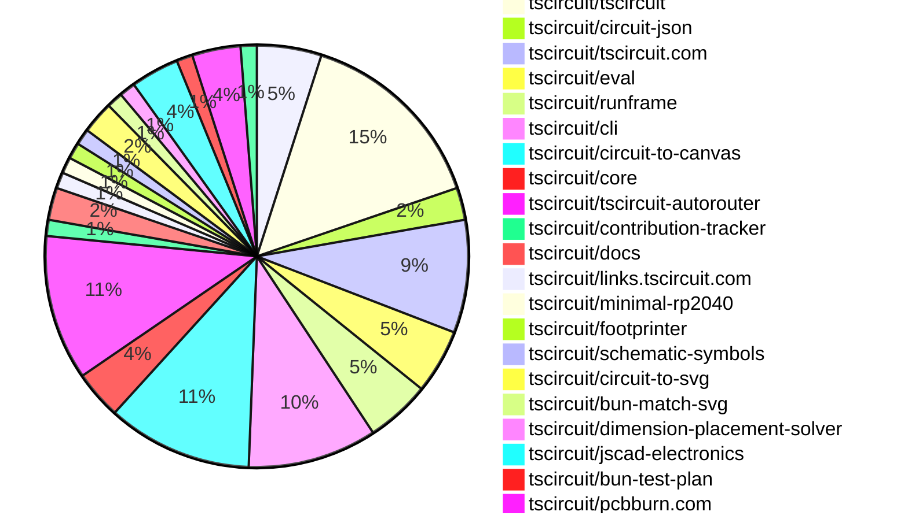

# Contribution Overview 2025-12-31

The current week is shown below. There are 3 major sections:

- [Contributor Overview](#contributor-overview)
- [PRs by Repository](#prs-by-repository)
- [PRs by Contributor](#changes-by-contributor)
- [Scoring & Sponsorship Details](/docs/sponsorship-calculation-explanation.md)

## PRs by Repository

## Contributor Overview

| Contributor | 🐳 Major | 🐙 Minor | 🐌 Tiny | ⭐ | Discussion Contributions |
|-------------|---------|---------|---------|-----|--------------------------|
| [seveibar](#seveibar) | 4 | 2 | 4 | ⭐⭐ | 0🔹 0🔶 0💎 |
| [ShiboSoftwareDev](#ShiboSoftwareDev) | 1 | 0 | 4 | ⭐⭐ | 0🔹 0🔶 0💎 |
| [AnasSarkiz](#AnasSarkiz) | 3 | 1 | 0 | ⭐⭐ | 0🔹 0🔶 0💎 |
| [tscircuitbot](#tscircuitbot) | 0 | 0 | 34 | ⭐⭐ | 0🔹 0🔶 0💎 |
| [techmannih](#techmannih) | 0 | 4 | 1 | ⭐⭐ | 0🔹 0🔶 0💎 |
| [0hmX](#0hmX) | 2 | 0 | 4 | ⭐⭐ | 0🔹 0🔶 0💎 |
| [Abse2001](#Abse2001) | 0 | 4 | 2 | ⭐⭐ | 0🔹 0🔶 0💎 |
| [imrishabh18](#imrishabh18) | 1 | 0 | 2 | ⭐ | 0🔹 0🔶 0💎 |
| [shehaban](#shehaban) | 0 | 2 | 0 | ⭐ | 0🔹 0🔶 0💎 |
| [rushabhcodes](#rushabhcodes) | 0 | 0 | 4 | ⭐ | 0🔹 0🔶 0💎 |
| [Ayushjhawar8](#Ayushjhawar8) | 0 | 0 | 2 |  | 0🔹 0🔶 0💎 |

> Note: AI evaluates PRs and assigns 1-3 star ratings automatically. 4 and 5 star ratings require manual staff review.

### Discussion Contribution Legend

- 🔹 Normal Comments: Basic participation with minimal effort
- 🔶 Great Informative Comments: Thoughtful participation that adds value
- 💎 Incredible Comments: Exceptional participation with high-quality content

## Review Table

[reviews-received-hover]: ## "Number of reviews received for PRs for this contributor"
[approvals-received-hover]: ## "Number of approvals received for PRs this contributor authored"
[rejections-received-hover]: ## "Number of rejections received for PRs this contributor authored"
[prs-opened-hover]: ## "Number of PRs opened by this contributor"
[issues-created-hover]: ## "Number of issues created by this contributor"

| Contributor | Reviews Received | Approvals Received | Rejections Received | Approvals | Rejections | PRs Opened | PRs Merged | Issues Created |
|---|---|---|---|---|---|---|---|---|
| [Abse2001](#Abse2001) | 5 | 5 | 0 | 1 | 0 | 7 | 6 | 0 |
| [tscircuitbot](#tscircuitbot) | 0 | 0 | 0 | 0 | 0 | 48 | 34 | 0 |
| [seveibar](#seveibar) | 1 | 0 | 0 | 22 | 4 | 17 | 10 | 0 |
| [ShiboSoftwareDev](#ShiboSoftwareDev) | 7 | 5 | 1 | 7 | 0 | 6 | 5 | 0 |
| [Sahil-Gupta584](#Sahil-Gupta584) | 3 | 1 | 1 | 0 | 0 | 3 | 0 | 0 |
| [techmannih](#techmannih) | 6 | 5 | 1 | 2 | 1 | 7 | 5 | 0 |
| [shehaban](#shehaban) | 8 | 4 | 1 | 0 | 0 | 2 | 2 | 0 |
| [nailoo](#nailoo) | 0 | 0 | 0 | 0 | 0 | 0 | 0 | 0 |
| [rushabhcodes](#rushabhcodes) | 9 | 4 | 0 | 0 | 1 | 4 | 4 | 0 |
| [pxlpal](#pxlpal) | 0 | 0 | 0 | 0 | 0 | 1 | 0 | 0 |
| [Ayushjhawar8](#Ayushjhawar8) | 4 | 1 | 1 | 0 | 0 | 4 | 2 | 0 |
| [MustafaMulla29](#MustafaMulla29) | 0 | 0 | 0 | 0 | 0 | 1 | 0 | 0 |
| [imrishabh18](#imrishabh18) | 2 | 1 | 1 | 1 | 0 | 3 | 3 | 0 |
| [ArnavK-09](#ArnavK-09) | 0 | 0 | 0 | 1 | 0 | 0 | 0 | 0 |
| [0hmX](#0hmX) | 9 | 2 | 0 | 0 | 0 | 8 | 6 | 0 |
| [AnasSarkiz](#AnasSarkiz) | 7 | 6 | 0 | 0 | 0 | 5 | 4 | 0 |

## Changes by Repository

### [tscircuit/pcb-viewer](https://github.com/tscircuit/pcb-viewer)

| PR # | Impact | Rating | Contributor | Description |
|------|--------|--------|-------------|-------------|
| [#574](https://github.com/tscircuit/pcb-viewer/pull/574) | 🐙 Minor | ⭐⭐ | Abse2001 | Promotes PCB fabrication notes to a first-class rendering path and removes duplicated drawing logic, consolidating all fab rendering behind a single draw path. |

🐌 Tiny Contributions (3)

| PR # | Impact | Contributor | Description |
|------|--------|-------------|-------------|
| [#577](https://github.com/tscircuit/pcb-viewer/pull/577) | 🐌 Tiny | tscircuitbot | Automated package update |
| [#575](https://github.com/tscircuit/pcb-viewer/pull/575) | 🐌 Tiny | tscircuitbot | Automated package update |
| [#576](https://github.com/tscircuit/pcb-viewer/pull/576) | 🐌 Tiny | seveibar | Allows users to select and copy error messages from the dropdown for debugging and reporting by modifying CSS properties and event handlers in the ToolbarOverlay component. |

### [tscircuit/tscircuit](https://github.com/tscircuit/tscircuit)

🐌 Tiny Contributions (12)

| PR # | Impact | Contributor | Description |
|------|--------|-------------|-------------|
| [#1768](https://github.com/tscircuit/tscircuit/pull/1768) | 🐌 Tiny | tscircuitbot | Automated package update |
| [#1767](https://github.com/tscircuit/tscircuit/pull/1767) | 🐌 Tiny | tscircuitbot | Automated package update |
| [#1765](https://github.com/tscircuit/tscircuit/pull/1765) | 🐌 Tiny | tscircuitbot | Updates the tscircuitcli package to version 0.1.711 in the package.json file. |
| [#1764](https://github.com/tscircuit/tscircuit/pull/1764) | 🐌 Tiny | tscircuitbot | Updates the package version from 0.0.1099 to 0.0.1100 in package.json |
| [#1761](https://github.com/tscircuit/tscircuit/pull/1761) | 🐌 Tiny | tscircuitbot | Updates the tscircuitcli package from version 0.1.709 to 0.1.710 |
| [#1766](https://github.com/tscircuit/tscircuit/pull/1766) | 🐌 Tiny | tscircuitbot | Automated package update |
| [#1762](https://github.com/tscircuit/tscircuit/pull/1762) | 🐌 Tiny | tscircuitbot | Automated package update |
| [#1763](https://github.com/tscircuit/tscircuit/pull/1763) | 🐌 Tiny | tscircuitbot | Automated package update |
| [#1758](https://github.com/tscircuit/tscircuit/pull/1758) | 🐌 Tiny | tscircuitbot | Automated package update |
| [#1759](https://github.com/tscircuit/tscircuit/pull/1759) | 🐌 Tiny | tscircuitbot | Automated package update |
| [#1760](https://github.com/tscircuit/tscircuit/pull/1760) | 🐌 Tiny | tscircuitbot | Updates the package version from 0.0.1097 to 0.0.1098 in package.json |
| [#1757](https://github.com/tscircuit/tscircuit/pull/1757) | 🐌 Tiny | Abse2001 | Adds the missing core dependency tscircuitsoup-util to the package.json file. |

### [tscircuit/circuit-json](https://github.com/tscircuit/circuit-json)

| PR # | Impact | Rating | Contributor | Description |
|------|--------|--------|-------------|-------------|
| [#401](https://github.com/tscircuit/circuit-json/pull/401) | 🐙 Minor | ⭐⭐ | Abse2001 | Adds top_user_note and bottom_user_note layers to the PCB rendering layer types. |

🐌 Tiny Contributions (1)

| PR # | Impact | Contributor | Description |
|------|--------|-------------|-------------|
| [#402](https://github.com/tscircuit/circuit-json/pull/402) | 🐌 Tiny | tscircuitbot | Automated package update |

### [tscircuit/tscircuit.com](https://github.com/tscircuit/tscircuit.com)

| PR # | Impact | Rating | Contributor | Description |
|------|--------|--------|-------------|-------------|
| [#2379](https://github.com/tscircuit/tscircuit.com/pull/2379) | 🐙 Minor | ⭐⭐ | seveibar | Add a fake packagestransfer endpoint to mirror the real backend behavior for localdev usage and tests, and expose a UI flow in the package settings Danger Zone to allow transferring ownership to an organization the user is a member of. |

🐌 Tiny Contributions (6)

| PR # | Impact | Contributor | Description |
|------|--------|-------------|-------------|
| [#2380](https://github.com/tscircuit/tscircuit.com/pull/2380) | 🐌 Tiny | tscircuitbot | Updates the tscircuiteval package from version 0.0.567 to 0.0.568 |
| [#2382](https://github.com/tscircuit/tscircuit.com/pull/2382) | 🐌 Tiny | tscircuitbot | Automated package update to version 0.0.177 |
| [#2383](https://github.com/tscircuit/tscircuit.com/pull/2383) | 🐌 Tiny | tscircuitbot | Automated package update |
| [#2353](https://github.com/tscircuit/tscircuit.com/pull/2353) | 🐌 Tiny | rushabhcodes | Updates the visual design and layout of the PackageCard component and its skeleton, enhancing spacing, typography, color usage, and information hierarchy for better readability and aesthetics. |
| [#2387](https://github.com/tscircuit/tscircuit.com/pull/2387) | 🐌 Tiny | imrishabh18 | Rearranges the rendering of the organization hook and management permission logic to occur before the return statements in the ReleaseDetailPage component. |
| [#2386](https://github.com/tscircuit/tscircuit.com/pull/2386) | 🐌 Tiny | imrishabh18 | Fixes the issue where the rebuild button is not displayed on the release page for users who have the necessary permissions. |

### [tscircuit/eval](https://github.com/tscircuit/eval)

🐌 Tiny Contributions (4)

| PR # | Impact | Contributor | Description |
|------|--------|-------------|-------------|
| [#1813](https://github.com/tscircuit/eval/pull/1813) | 🐌 Tiny | tscircuitbot | Automated package update |
| [#1812](https://github.com/tscircuit/eval/pull/1812) | 🐌 Tiny | tscircuitbot | Automated package update |
| [#1810](https://github.com/tscircuit/eval/pull/1810) | 🐌 Tiny | tscircuitbot | Automated package update |
| [#1809](https://github.com/tscircuit/eval/pull/1809) | 🐌 Tiny | tscircuitbot | Automated package update |

### [tscircuit/runframe](https://github.com/tscircuit/runframe)

🐌 Tiny Contributions (4)

| PR # | Impact | Contributor | Description |
|------|--------|-------------|-------------|
| [#2251](https://github.com/tscircuit/runframe/pull/2251) | 🐌 Tiny | tscircuitbot | Automated package update |
| [#2248](https://github.com/tscircuit/runframe/pull/2248) | 🐌 Tiny | tscircuitbot | Updates the tscircuiteval package from version 0.0.567 to 0.0.568 |
| [#2249](https://github.com/tscircuit/runframe/pull/2249) | 🐌 Tiny | tscircuitbot | Automated package update |
| [#2250](https://github.com/tscircuit/runframe/pull/2250) | 🐌 Tiny | Ayushjhawar8 | img width723 height442 altimage srchttps:github.comuser-attachmentsassets240c1639-05ef-4757-9b19-fa4e1179c314  img width719 height515 altimage srchttps:github.comuser-attachmentsassets495fa1f3-9124-4a38-a4e6-855d8670f958  https:runframe-git-file-selector-tscircuit.vercel.app?fixtureId7B22path223A22examples2Fexample30-enhanced-file-selector-search.fixture.tsx227D |

### [tscircuit/cli](https://github.com/tscircuit/cli)

| PR # | Impact | Rating | Contributor | Description |
|------|--------|--------|-------------|-------------|
| [#1517](https://github.com/tscircuit/cli/pull/1517) | 🐳 Major | ⭐⭐⭐ | imrishabh18 | Adds a command-line flag to use a CDN-hosted JavaScript file instead of a local bundled file in the generated index.html for tscircuit.app. |

🐌 Tiny Contributions (7)

| PR # | Impact | Contributor | Description |
|------|--------|-------------|-------------|
| [#1534](https://github.com/tscircuit/cli/pull/1534) | 🐌 Tiny | tscircuitbot | Automated package update |
| [#1533](https://github.com/tscircuit/cli/pull/1533) | 🐌 Tiny | tscircuitbot | Updates the tscircuitrunframe package from version 0.0.1457 to 0.0.1458 in the package.json file. |
| [#1532](https://github.com/tscircuit/cli/pull/1532) | 🐌 Tiny | tscircuitbot | Automated package update |
| [#1530](https://github.com/tscircuit/cli/pull/1530) | 🐌 Tiny | tscircuitbot | Automated package update |
| [#1531](https://github.com/tscircuit/cli/pull/1531) | 🐌 Tiny | tscircuitbot | Automated package update |
| [#1529](https://github.com/tscircuit/cli/pull/1529) | 🐌 Tiny | tscircuitbot | Automated package update |
| [#1528](https://github.com/tscircuit/cli/pull/1528) | 🐌 Tiny | seveibar | Add a JSON schema for tscircuit.config.json to enable validation and auto-completion in editors, and ensure saved configs include a schema field pointing to the schema URL. |

### [tscircuit/circuit-to-canvas](https://github.com/tscircuit/circuit-to-canvas)

| PR # | Impact | Rating | Contributor | Description |
|------|--------|--------|-------------|-------------|
| [#85](https://github.com/tscircuit/circuit-to-canvas/pull/85) | 🐙 Minor | ⭐⭐ | Abse2001 | Refactors dimension line rendering to use filled polygon geometry instead of stroked paths, improving visual consistency and stability across orientations and scaling transforms. |
| [#90](https://github.com/tscircuit/circuit-to-canvas/pull/90) | 🐙 Minor | ⭐⭐ | Abse2001 | Fixes dimension line polygon winding issues by implementing a unified perimeter path to prevent self-intersections and ambiguous fill behavior. |
| [#93](https://github.com/tscircuit/circuit-to-canvas/pull/93) | 🐙 Minor | ⭐⭐ | techmannih | Adds support for rendering soldermask coverage on SMT pads in the PCB drawing functionality. |
| [#89](https://github.com/tscircuit/circuit-to-canvas/pull/89) | 🐙 Minor | ⭐⭐ | techmannih | Adds support for soldermask margins for all shapes of plated holes in PCB designs, allowing for more precise control over soldermask application. |
| [#87](https://github.com/tscircuit/circuit-to-canvas/pull/87) | 🐙 Minor | ⭐⭐ | techmannih | Adds support for soldermask margins around holes in PCB designs, allowing for better visual representation and manufacturing accuracy. |

🐌 Tiny Contributions (4)

| PR # | Impact | Contributor | Description |
|------|--------|-------------|-------------|
| [#94](https://github.com/tscircuit/circuit-to-canvas/pull/94) | 🐌 Tiny | tscircuitbot | Automated package update |
| [#91](https://github.com/tscircuit/circuit-to-canvas/pull/91) | 🐌 Tiny | tscircuitbot | Automated package update |
| [#86](https://github.com/tscircuit/circuit-to-canvas/pull/86) | 🐌 Tiny | tscircuitbot | Automated package update |
| [#88](https://github.com/tscircuit/circuit-to-canvas/pull/88) | 🐌 Tiny | tscircuitbot | Automated package update |

### [tscircuit/core](https://github.com/tscircuit/core)

| PR # | Impact | Rating | Contributor | Description |
|------|--------|--------|-------------|-------------|
| [#1809](https://github.com/tscircuit/core/pull/1809) | 🐳 Major | ⭐⭐⭐ | seveibar | Updates the autorouter to include improvements in the multi-section port point solver, enhancing routing capabilities for complex designs. |
| [#1811](https://github.com/tscircuit/core/pull/1811) | 🐙 Minor | ⭐⭐ | techmannih | Adds a test to verify that silkscreen text size adjusts correctly based on global settings and overrides when specified. |

🐌 Tiny Contributions (1)

| PR # | Impact | Contributor | Description |
|------|--------|-------------|-------------|
| [#1810](https://github.com/tscircuit/core/pull/1810) | 🐌 Tiny | ShiboSoftwareDev | Updates the circuit-to-svg and schematic-symbols dependencies to their latest versions in package.json |

### [tscircuit/tscircuit-autorouter](https://github.com/tscircuit/tscircuit-autorouter)

| PR # | Impact | Rating | Contributor | Description |
|------|--------|--------|-------------|-------------|
| [#486](https://github.com/tscircuit/tscircuit-autorouter/pull/486) | 🐳 Major | ⭐⭐⭐ | seveibar | Add IntraNodeSolverWithJumpers for single-layer PCB routing with 0805 jumpers Add intelligent HighDensitySolver that selects solver based on node crossings This is not good enough yet- its failing to route some boards that i believe should be possible. So its currently disabled, i have a skip test that should help determine when its ready |
| [#483](https://github.com/tscircuit/tscircuit-autorouter/pull/483) | 🐳 Major | ⭐⭐⭐ | seveibar | Reintroduces the MultiSectionSolver to the assignable autorouting pipeline, adding support for rip and replace functionality in connection handling. |
| [#482](https://github.com/tscircuit/tscircuit-autorouter/pull/482) | 🐳 Major | ⭐⭐⭐ | seveibar | Selects the centermost exit port point to avoid trace collisions during autorouting. |
| [#480](https://github.com/tscircuit/tscircuit-autorouter/pull/480) | 🐳 Major | ⭐⭐⭐ | 0hmX | Adds a red dashed line visualization to indicate failed connections in the autorouting process. |
| [#481](https://github.com/tscircuit/tscircuit-autorouter/pull/481) | 🐳 Major | ⭐⭐⭐ | 0hmX | Removes the isHighDensityNodeSolvable function and simplifies the interactive mode by using existing functions for node solvability checks. |

🐌 Tiny Contributions (4)

| PR # | Impact | Contributor | Description |
|------|--------|-------------|-------------|
| [#478](https://github.com/tscircuit/tscircuit-autorouter/pull/478) | 🐌 Tiny | 0hmX | This pull request adds a new bug report fixture for bug report ID 33, which includes a larger display board configuration. The changes include the addition of a new JSON file containing the bug report data and a corresponding TypeScript fixture for testing purposes. |
| [#479](https://github.com/tscircuit/tscircuit-autorouter/pull/479) | 🐌 Tiny | 0hmX | This pull request adds a new bug report fixture for bug report ID e9dea27d-6dc6-4718-9d07-d4732e4cbf8e. It includes a JSON file with detailed routing information and a corresponding TypeScript fixture for testing purposes. |
| [#476](https://github.com/tscircuit/tscircuit-autorouter/pull/476) | 🐌 Tiny | 0hmX | Adds a test case to ensure that the autorouter does not return any _mst source trace IDs, addressing a specific issue in the autorouting functionality. |
| [#477](https://github.com/tscircuit/tscircuit-autorouter/pull/477) | 🐌 Tiny | 0hmX | Fixes the target directory in bug report scripts to reflect the recent name change from examples to fixtures. |

### [tscircuit/contribution-tracker](https://github.com/tscircuit/contribution-tracker)

| PR # | Impact | Rating | Contributor | Description |
|------|--------|--------|-------------|-------------|
| [#290](https://github.com/tscircuit/contribution-tracker/pull/290) | 🐙 Minor | ⭐⭐ | seveibar | This PR moves the sponsorship calculation details from the weekly contribution overview to a dedicated static document, simplifying the overview and making the sponsorship details more discoverable. |

### [tscircuit/docs](https://github.com/tscircuit/docs)

🐌 Tiny Contributions (2)

| PR # | Impact | Contributor | Description |
|------|--------|-------------|-------------|
| [#402](https://github.com/tscircuit/docs/pull/402) | 🐌 Tiny | seveibar | Adds documentation for tscircuit.config.json options, including a configuration options table and detailed descriptions for properties like previewComponentPath and snapshotsDir. |
| [#403](https://github.com/tscircuit/docs/pull/403) | 🐌 Tiny | techmannih | Adds documentation for setting a global font size for silkscreen text elements in PCB designs, allowing for consistent text sizing across the board. |

### [tscircuit/links.tscircuit.com](https://github.com/tscircuit/links.tscircuit.com)

🐌 Tiny Contributions (1)

| PR # | Impact | Contributor | Description |
|------|--------|-------------|-------------|
| [#1](https://github.com/tscircuit/links.tscircuit.com/pull/1) | 🐌 Tiny | seveibar | Adds links to the Lab Inventory spreadsheet and Coding Guidelines in the links page for quick access by the team. |

### [tscircuit/minimal-rp2040](https://github.com/tscircuit/minimal-rp2040)

🐌 Tiny Contributions (1)

| PR # | Impact | Contributor | Description |
|------|--------|-------------|-------------|
| [#2](https://github.com/tscircuit/minimal-rp2040/pull/2) | 🐌 Tiny | Abse2001 | Adjusts the mounting position of the top display holes and modifies the board height to 74mm. |

### [tscircuit/footprinter](https://github.com/tscircuit/footprinter)

| PR # | Impact | Rating | Contributor | Description |
|------|--------|--------|-------------|-------------|
| [#442](https://github.com/tscircuit/footprinter/pull/442) | 🐙 Minor | ⭐⭐ | shehaban | Adds support for radial footprints using the same 2D geometry as axial footprints, while providing explicit, machine-readable 3D model hinting for correct 3D rendering. |

### [tscircuit/schematic-symbols](https://github.com/tscircuit/schematic-symbols)

| PR # | Impact | Rating | Contributor | Description |
|------|--------|--------|-------------|-------------|
| [#373](https://github.com/tscircuit/schematic-symbols/pull/373) | 🐙 Minor | ⭐⭐ | shehaban | Fixes alignment of the  pin in the op-amp symbols (opamp_no_power and opamp_with_power) |

### [tscircuit/circuit-to-svg](https://github.com/tscircuit/circuit-to-svg)

| PR # | Impact | Rating | Contributor | Description |
|------|--------|--------|-------------|-------------|
| [#471](https://github.com/tscircuit/circuit-to-svg/pull/471) | 🐳 Major | ⭐⭐⭐ | ShiboSoftwareDev | Includes note dimensions in SVG bounds for PCB elements, allowing for accurate representation of dimensions in the generated SVG. |

🐌 Tiny Contributions (1)

| PR # | Impact | Contributor | Description |
|------|--------|-------------|-------------|
| [#470](https://github.com/tscircuit/circuit-to-svg/pull/470) | 🐌 Tiny | ShiboSoftwareDev | Refactors the PCB bounds calculation logic into a separate utility function to improve code organization and maintainability. |

### [tscircuit/bun-match-svg](https://github.com/tscircuit/bun-match-svg)

🐌 Tiny Contributions (1)

| PR # | Impact | Contributor | Description |
|------|--------|-------------|-------------|
| [#13](https://github.com/tscircuit/bun-match-svg/pull/13) | 🐌 Tiny | ShiboSoftwareDev | Enhances the init command to be more robust when a bunfig.toml file already exists and adds a test to ensure its behavior is correct. |

### [tscircuit/dimension-placement-solver](https://github.com/tscircuit/dimension-placement-solver)

🐌 Tiny Contributions (1)

| PR # | Impact | Contributor | Description |
|------|--------|-------------|-------------|
| [#3](https://github.com/tscircuit/dimension-placement-solver/pull/3) | 🐌 Tiny | ShiboSoftwareDev | Integrates an SVG snapshot testing framework to automatically verify the visual output of the solver, ensuring project quality. |

### [tscircuit/jscad-electronics](https://github.com/tscircuit/jscad-electronics)

🐌 Tiny Contributions (3)

| PR # | Impact | Contributor | Description |
|------|--------|-------------|-------------|
| [#250](https://github.com/tscircuit/jscad-electronics/pull/250) | 🐌 Tiny | rushabhcodes | Adds support for rendering axial capacitors in the 3D footprint library with a new AxialCapacitor component and snapshot test for 14mm pitch. |
| [#248](https://github.com/tscircuit/jscad-electronics/pull/248) | 🐌 Tiny | rushabhcodes | Refactors the codebase to replace the axial capacitor component with a radial capacitor component and updates related dependencies and references. |
| [#249](https://github.com/tscircuit/jscad-electronics/pull/249) | 🐌 Tiny | rushabhcodes | Adds support for rendering SMD right-angle pin rows in the 3D footprint viewer, including new props and updated rendering logic. |

### [tscircuit/bun-test-plan](https://github.com/tscircuit/bun-test-plan)

🐌 Tiny Contributions (1)

| PR # | Impact | Contributor | Description |
|------|--------|-------------|-------------|
| [#3](https://github.com/tscircuit/bun-test-plan/pull/3) | 🐌 Tiny | Ayushjhawar8 | Updates the .gitignore file to include bun.lock and generated test plans while removing the index.ts file from the repository. |

### [tscircuit/pcbburn.com](https://github.com/tscircuit/pcbburn.com)

| PR # | Impact | Rating | Contributor | Description |
|------|--------|--------|-------------|-------------|
| [#7](https://github.com/tscircuit/pcbburn.com/pull/7) | 🐳 Major | ⭐⭐⭐ | AnasSarkiz | Adds comprehensive KiCad PCB file support to PCBBurn, enabling users to upload .kicad_pcb files and folders containing them for automatic conversion to Circuit JSON and LBRN generation. |
| [#6](https://github.com/tscircuit/pcbburn.com/pull/6) | 🐳 Major | ⭐⭐⭐ | AnasSarkiz | Adds a resizable settings panel with drag handle, introduces laser profiles with full copperboard controls, and improves input methods with numeric entry and toggle switches. |
| [#5](https://github.com/tscircuit/pcbburn.com/pull/5) | 🐳 Major | ⭐⭐⭐ | AnasSarkiz | This PR significantly improves the circuit converter apps usability by making the interface fully responsive, adding KiCad file support, and automating LBRN generationreducing manual steps and enhancing mobiledesktop workflows. |

### [tscircuit/circuit-json-to-lbrn](https://github.com/tscircuit/circuit-json-to-lbrn)

| PR # | Impact | Rating | Contributor | Description |
|------|--------|--------|-------------|-------------|
| [#75](https://github.com/tscircuit/circuit-json-to-lbrn/pull/75) | 🐙 Minor | ⭐⭐ | AnasSarkiz | Extract and export the ConvertCircuitJsonToLbrnOptions interface from the inline type definition to enable its reuse in the PCBBurn repository. |

## Changes by Contributor

### [tscircuitbot](https://github.com/tscircuitbot)

🐌 Tiny Contributions (34)

| PR # | Impact | Description |
|------|--------|-------------|
| [#577](https://github.com/tscircuit/pcb-viewer/pull/577) | 🐌 Tiny | Automated package update |
| [#575](https://github.com/tscircuit/pcb-viewer/pull/575) | 🐌 Tiny | Automated package update |
| [#1768](https://github.com/tscircuit/tscircuit/pull/1768) | 🐌 Tiny | Automated package update |
| [#1767](https://github.com/tscircuit/tscircuit/pull/1767) | 🐌 Tiny | Automated package update |
| [#1765](https://github.com/tscircuit/tscircuit/pull/1765) | 🐌 Tiny | Updates the tscircuitcli package to version 0.1.711 in the package.json file. |
| [#1764](https://github.com/tscircuit/tscircuit/pull/1764) | 🐌 Tiny | Updates the package version from 0.0.1099 to 0.0.1100 in package.json |
| [#1761](https://github.com/tscircuit/tscircuit/pull/1761) | 🐌 Tiny | Updates the tscircuitcli package from version 0.1.709 to 0.1.710 |
| [#1766](https://github.com/tscircuit/tscircuit/pull/1766) | 🐌 Tiny | Automated package update |
| [#1762](https://github.com/tscircuit/tscircuit/pull/1762) | 🐌 Tiny | Automated package update |
| [#1763](https://github.com/tscircuit/tscircuit/pull/1763) | 🐌 Tiny | Automated package update |
| [#1758](https://github.com/tscircuit/tscircuit/pull/1758) | 🐌 Tiny | Automated package update |
| [#1759](https://github.com/tscircuit/tscircuit/pull/1759) | 🐌 Tiny | Automated package update |
| [#1760](https://github.com/tscircuit/tscircuit/pull/1760) | 🐌 Tiny | Updates the package version from 0.0.1097 to 0.0.1098 in package.json |
| [#402](https://github.com/tscircuit/circuit-json/pull/402) | 🐌 Tiny | Automated package update |
| [#2380](https://github.com/tscircuit/tscircuit.com/pull/2380) | 🐌 Tiny | Updates the tscircuiteval package from version 0.0.567 to 0.0.568 |
| [#2382](https://github.com/tscircuit/tscircuit.com/pull/2382) | 🐌 Tiny | Automated package update to version 0.0.177 |
| [#2383](https://github.com/tscircuit/tscircuit.com/pull/2383) | 🐌 Tiny | Automated package update |
| [#1813](https://github.com/tscircuit/eval/pull/1813) | 🐌 Tiny | Automated package update |
| [#1812](https://github.com/tscircuit/eval/pull/1812) | 🐌 Tiny | Automated package update |
| [#1810](https://github.com/tscircuit/eval/pull/1810) | 🐌 Tiny | Automated package update |
| [#1809](https://github.com/tscircuit/eval/pull/1809) | 🐌 Tiny | Automated package update |
| [#2251](https://github.com/tscircuit/runframe/pull/2251) | 🐌 Tiny | Automated package update |
| [#2248](https://github.com/tscircuit/runframe/pull/2248) | 🐌 Tiny | Updates the tscircuiteval package from version 0.0.567 to 0.0.568 |
| [#2249](https://github.com/tscircuit/runframe/pull/2249) | 🐌 Tiny | Automated package update |
| [#1534](https://github.com/tscircuit/cli/pull/1534) | 🐌 Tiny | Automated package update |
| [#1533](https://github.com/tscircuit/cli/pull/1533) | 🐌 Tiny | Updates the tscircuitrunframe package from version 0.0.1457 to 0.0.1458 in the package.json file. |
| [#1532](https://github.com/tscircuit/cli/pull/1532) | 🐌 Tiny | Automated package update |
| [#1530](https://github.com/tscircuit/cli/pull/1530) | 🐌 Tiny | Automated package update |
| [#1531](https://github.com/tscircuit/cli/pull/1531) | 🐌 Tiny | Automated package update |
| [#1529](https://github.com/tscircuit/cli/pull/1529) | 🐌 Tiny | Automated package update |
| [#94](https://github.com/tscircuit/circuit-to-canvas/pull/94) | 🐌 Tiny | Automated package update |
| [#91](https://github.com/tscircuit/circuit-to-canvas/pull/91) | 🐌 Tiny | Automated package update |
| [#86](https://github.com/tscircuit/circuit-to-canvas/pull/86) | 🐌 Tiny | Automated package update |
| [#88](https://github.com/tscircuit/circuit-to-canvas/pull/88) | 🐌 Tiny | Automated package update |

### [seveibar](https://github.com/seveibar)

| PRs # | Impact | Rating | Description |
|------|--------|--------|-------------|
| [#1809](https://github.com/tscircuit/core/pull/1809) | 🐳 Major | ⭐⭐⭐ | Updates the autorouter to include improvements in the multi-section port point solver, enhancing routing capabilities for complex designs. |
| [#486](https://github.com/tscircuit/tscircuit-autorouter/pull/486) | 🐳 Major | ⭐⭐⭐ | Add IntraNodeSolverWithJumpers for single-layer PCB routing with 0805 jumpers Add intelligent HighDensitySolver that selects solver based on node crossings This is not good enough yet- its failing to route some boards that i believe should be possible. So its currently disabled, i have a skip test that should help determine when its ready |
| [#483](https://github.com/tscircuit/tscircuit-autorouter/pull/483) | 🐳 Major | ⭐⭐⭐ | Reintroduces the MultiSectionSolver to the assignable autorouting pipeline, adding support for rip and replace functionality in connection handling. |
| [#482](https://github.com/tscircuit/tscircuit-autorouter/pull/482) | 🐳 Major | ⭐⭐⭐ | Selects the centermost exit port point to avoid trace collisions during autorouting. |
| [#290](https://github.com/tscircuit/contribution-tracker/pull/290) | 🐙 Minor | ⭐⭐ | This PR moves the sponsorship calculation details from the weekly contribution overview to a dedicated static document, simplifying the overview and making the sponsorship details more discoverable. |
| [#2379](https://github.com/tscircuit/tscircuit.com/pull/2379) | 🐙 Minor | ⭐⭐ | Add a fake packagestransfer endpoint to mirror the real backend behavior for localdev usage and tests, and expose a UI flow in the package settings Danger Zone to allow transferring ownership to an organization the user is a member of. |

🐌 Tiny Contributions (4)

| PR # | Impact | Description |
|------|--------|-------------|
| [#576](https://github.com/tscircuit/pcb-viewer/pull/576) | 🐌 Tiny | Allows users to select and copy error messages from the dropdown for debugging and reporting by modifying CSS properties and event handlers in the ToolbarOverlay component. |
| [#1528](https://github.com/tscircuit/cli/pull/1528) | 🐌 Tiny | Add a JSON schema for tscircuit.config.json to enable validation and auto-completion in editors, and ensure saved configs include a schema field pointing to the schema URL. |
| [#402](https://github.com/tscircuit/docs/pull/402) | 🐌 Tiny | Adds documentation for tscircuit.config.json options, including a configuration options table and detailed descriptions for properties like previewComponentPath and snapshotsDir. |
| [#1](https://github.com/tscircuit/links.tscircuit.com/pull/1) | 🐌 Tiny | Adds links to the Lab Inventory spreadsheet and Coding Guidelines in the links page for quick access by the team. |

### [Abse2001](https://github.com/Abse2001)

| PRs # | Impact | Rating | Description |
|------|--------|--------|-------------|
| [#574](https://github.com/tscircuit/pcb-viewer/pull/574) | 🐙 Minor | ⭐⭐ | Promotes PCB fabrication notes to a first-class rendering path and removes duplicated drawing logic, consolidating all fab rendering behind a single draw path. |
| [#401](https://github.com/tscircuit/circuit-json/pull/401) | 🐙 Minor | ⭐⭐ | Adds top_user_note and bottom_user_note layers to the PCB rendering layer types. |
| [#85](https://github.com/tscircuit/circuit-to-canvas/pull/85) | 🐙 Minor | ⭐⭐ | Refactors dimension line rendering to use filled polygon geometry instead of stroked paths, improving visual consistency and stability across orientations and scaling transforms. |
| [#90](https://github.com/tscircuit/circuit-to-canvas/pull/90) | 🐙 Minor | ⭐⭐ | Fixes dimension line polygon winding issues by implementing a unified perimeter path to prevent self-intersections and ambiguous fill behavior. |

🐌 Tiny Contributions (2)

| PR # | Impact | Description |
|------|--------|-------------|
| [#1757](https://github.com/tscircuit/tscircuit/pull/1757) | 🐌 Tiny | Adds the missing core dependency tscircuitsoup-util to the package.json file. |
| [#2](https://github.com/tscircuit/minimal-rp2040/pull/2) | 🐌 Tiny | Adjusts the mounting position of the top display holes and modifies the board height to 74mm. |

### [shehaban](https://github.com/shehaban)

| PRs # | Impact | Rating | Description |
|------|--------|--------|-------------|
| [#442](https://github.com/tscircuit/footprinter/pull/442) | 🐙 Minor | ⭐⭐ | Adds support for radial footprints using the same 2D geometry as axial footprints, while providing explicit, machine-readable 3D model hinting for correct 3D rendering. |
| [#373](https://github.com/tscircuit/schematic-symbols/pull/373) | 🐙 Minor | ⭐⭐ | Fixes alignment of the  pin in the op-amp symbols (opamp_no_power and opamp_with_power) |

### [techmannih](https://github.com/techmannih)

| PRs # | Impact | Rating | Description |
|------|--------|--------|-------------|
| [#1811](https://github.com/tscircuit/core/pull/1811) | 🐙 Minor | ⭐⭐ | Adds a test to verify that silkscreen text size adjusts correctly based on global settings and overrides when specified. |
| [#93](https://github.com/tscircuit/circuit-to-canvas/pull/93) | 🐙 Minor | ⭐⭐ | Adds support for rendering soldermask coverage on SMT pads in the PCB drawing functionality. |
| [#89](https://github.com/tscircuit/circuit-to-canvas/pull/89) | 🐙 Minor | ⭐⭐ | Adds support for soldermask margins for all shapes of plated holes in PCB designs, allowing for more precise control over soldermask application. |
| [#87](https://github.com/tscircuit/circuit-to-canvas/pull/87) | 🐙 Minor | ⭐⭐ | Adds support for soldermask margins around holes in PCB designs, allowing for better visual representation and manufacturing accuracy. |

🐌 Tiny Contributions (1)

| PR # | Impact | Description |
|------|--------|-------------|
| [#403](https://github.com/tscircuit/docs/pull/403) | 🐌 Tiny | Adds documentation for setting a global font size for silkscreen text elements in PCB designs, allowing for consistent text sizing across the board. |

### [ShiboSoftwareDev](https://github.com/ShiboSoftwareDev)

| PRs # | Impact | Rating | Description |
|------|--------|--------|-------------|
| [#471](https://github.com/tscircuit/circuit-to-svg/pull/471) | 🐳 Major | ⭐⭐⭐ | Includes note dimensions in SVG bounds for PCB elements, allowing for accurate representation of dimensions in the generated SVG. |

🐌 Tiny Contributions (4)

| PR # | Impact | Description |
|------|--------|-------------|
| [#1810](https://github.com/tscircuit/core/pull/1810) | 🐌 Tiny | Updates the circuit-to-svg and schematic-symbols dependencies to their latest versions in package.json |
| [#470](https://github.com/tscircuit/circuit-to-svg/pull/470) | 🐌 Tiny | Refactors the PCB bounds calculation logic into a separate utility function to improve code organization and maintainability. |
| [#13](https://github.com/tscircuit/bun-match-svg/pull/13) | 🐌 Tiny | Enhances the init command to be more robust when a bunfig.toml file already exists and adds a test to ensure its behavior is correct. |
| [#3](https://github.com/tscircuit/dimension-placement-solver/pull/3) | 🐌 Tiny | Integrates an SVG snapshot testing framework to automatically verify the visual output of the solver, ensuring project quality. |

### [rushabhcodes](https://github.com/rushabhcodes)

🐌 Tiny Contributions (4)

| PR # | Impact | Description |
|------|--------|-------------|
| [#250](https://github.com/tscircuit/jscad-electronics/pull/250) | 🐌 Tiny | Adds support for rendering axial capacitors in the 3D footprint library with a new AxialCapacitor component and snapshot test for 14mm pitch. |
| [#248](https://github.com/tscircuit/jscad-electronics/pull/248) | 🐌 Tiny | Refactors the codebase to replace the axial capacitor component with a radial capacitor component and updates related dependencies and references. |
| [#249](https://github.com/tscircuit/jscad-electronics/pull/249) | 🐌 Tiny | Adds support for rendering SMD right-angle pin rows in the 3D footprint viewer, including new props and updated rendering logic. |
| [#2353](https://github.com/tscircuit/tscircuit.com/pull/2353) | 🐌 Tiny | Updates the visual design and layout of the PackageCard component and its skeleton, enhancing spacing, typography, color usage, and information hierarchy for better readability and aesthetics. |

### [imrishabh18](https://github.com/imrishabh18)

| PRs # | Impact | Rating | Description |
|------|--------|--------|-------------|
| [#1517](https://github.com/tscircuit/cli/pull/1517) | 🐳 Major | ⭐⭐⭐ | Adds a command-line flag to use a CDN-hosted JavaScript file instead of a local bundled file in the generated index.html for tscircuit.app. |

🐌 Tiny Contributions (2)

| PR # | Impact | Description |
|------|--------|-------------|
| [#2387](https://github.com/tscircuit/tscircuit.com/pull/2387) | 🐌 Tiny | Rearranges the rendering of the organization hook and management permission logic to occur before the return statements in the ReleaseDetailPage component. |
| [#2386](https://github.com/tscircuit/tscircuit.com/pull/2386) | 🐌 Tiny | Fixes the issue where the rebuild button is not displayed on the release page for users who have the necessary permissions. |

### [Ayushjhawar8](https://github.com/Ayushjhawar8)

🐌 Tiny Contributions (2)

| PR # | Impact | Description |
|------|--------|-------------|
| [#2250](https://github.com/tscircuit/runframe/pull/2250) | 🐌 Tiny | img width723 height442 altimage srchttps:github.comuser-attachmentsassets240c1639-05ef-4757-9b19-fa4e1179c314  img width719 height515 altimage srchttps:github.comuser-attachmentsassets495fa1f3-9124-4a38-a4e6-855d8670f958  https:runframe-git-file-selector-tscircuit.vercel.app?fixtureId7B22path223A22examples2Fexample30-enhanced-file-selector-search.fixture.tsx227D |
| [#3](https://github.com/tscircuit/bun-test-plan/pull/3) | 🐌 Tiny | Updates the .gitignore file to include bun.lock and generated test plans while removing the index.ts file from the repository. |

### [0hmX](https://github.com/0hmX)

| PRs # | Impact | Rating | Description |
|------|--------|--------|-------------|
| [#480](https://github.com/tscircuit/tscircuit-autorouter/pull/480) | 🐳 Major | ⭐⭐⭐ | Adds a red dashed line visualization to indicate failed connections in the autorouting process. |
| [#481](https://github.com/tscircuit/tscircuit-autorouter/pull/481) | 🐳 Major | ⭐⭐⭐ | Removes the isHighDensityNodeSolvable function and simplifies the interactive mode by using existing functions for node solvability checks. |

🐌 Tiny Contributions (4)

| PR # | Impact | Description |
|------|--------|-------------|
| [#478](https://github.com/tscircuit/tscircuit-autorouter/pull/478) | 🐌 Tiny | This pull request adds a new bug report fixture for bug report ID 33, which includes a larger display board configuration. The changes include the addition of a new JSON file containing the bug report data and a corresponding TypeScript fixture for testing purposes. |
| [#479](https://github.com/tscircuit/tscircuit-autorouter/pull/479) | 🐌 Tiny | This pull request adds a new bug report fixture for bug report ID e9dea27d-6dc6-4718-9d07-d4732e4cbf8e. It includes a JSON file with detailed routing information and a corresponding TypeScript fixture for testing purposes. |
| [#476](https://github.com/tscircuit/tscircuit-autorouter/pull/476) | 🐌 Tiny | Adds a test case to ensure that the autorouter does not return any _mst source trace IDs, addressing a specific issue in the autorouting functionality. |
| [#477](https://github.com/tscircuit/tscircuit-autorouter/pull/477) | 🐌 Tiny | Fixes the target directory in bug report scripts to reflect the recent name change from examples to fixtures. |

### [AnasSarkiz](https://github.com/AnasSarkiz)

| PRs # | Impact | Rating | Description |
|------|--------|--------|-------------|
| [#7](https://github.com/tscircuit/pcbburn.com/pull/7) | 🐳 Major | ⭐⭐⭐ | Adds comprehensive KiCad PCB file support to PCBBurn, enabling users to upload .kicad_pcb files and folders containing them for automatic conversion to Circuit JSON and LBRN generation. |
| [#6](https://github.com/tscircuit/pcbburn.com/pull/6) | 🐳 Major | ⭐⭐⭐ | Adds a resizable settings panel with drag handle, introduces laser profiles with full copperboard controls, and improves input methods with numeric entry and toggle switches. |
| [#5](https://github.com/tscircuit/pcbburn.com/pull/5) | 🐳 Major | ⭐⭐⭐ | This PR significantly improves the circuit converter apps usability by making the interface fully responsive, adding KiCad file support, and automating LBRN generationreducing manual steps and enhancing mobiledesktop workflows. |
| [#75](https://github.com/tscircuit/circuit-json-to-lbrn/pull/75) | 🐙 Minor | ⭐⭐ | Extract and export the ConvertCircuitJsonToLbrnOptions interface from the inline type definition to enable its reuse in the PCBBurn repository. |

## Repository Owners

| Repository | Codeowners |
|------------|------------|
| [builder](https://github.com/tscircuit/builder/blob/main/.github/CODEOWNERS) | [seveibar](https://github.com/seveibar)
| [pcb-viewer](https://github.com/tscircuit/pcb-viewer/blob/main/.github/CODEOWNERS) | [seveibar](https://github.com/seveibar), [ShiboSoftwareDev](https://github.com/ShiboSoftwareDev)
| [footprints-old](https://github.com/tscircuit/footprints-old/blob/main/.github/CODEOWNERS) | [seveibar](https://github.com/seveibar)
| [footprinter](https://github.com/tscircuit/footprinter/blob/main/.github/CODEOWNERS) | [seveibar](https://github.com/seveibar), [techmannih](https://github.com/techmannih)
| [3d-viewer](https://github.com/tscircuit/3d-viewer/blob/main/.github/CODEOWNERS) | [ShiboSoftwareDev](https://github.com/ShiboSoftwareDev)
| [winterspec](https://github.com/tscircuit/winterspec/blob/main/.github/CODEOWNERS) | [seveibar](https://github.com/seveibar), [ShiboSoftwareDev](https://github.com/ShiboSoftwareDev)
| [jscad-electronics](https://github.com/tscircuit/jscad-electronics/blob/main/.github/CODEOWNERS) | [seveibar](https://github.com/seveibar), [techmannih](https://github.com/techmannih), [ShiboSoftwareDev](https://github.com/ShiboSoftwareDev), [anas-sarkez](https://github.com/anas-sarkez)
| [circuit-to-svg](https://github.com/tscircuit/circuit-to-svg/blob/main/.github/CODEOWNERS) | [imrishabh18](https://github.com/imrishabh18)
| [schematic-symbols](https://github.com/tscircuit/schematic-symbols/blob/main/.github/CODEOWNERS) | [seveibar](https://github.com/seveibar), [imrishabh18](https://github.com/imrishabh18), [techmannih](https://github.com/techmannih)
| [circuit-json-to-gerber](https://github.com/tscircuit/circuit-json-to-gerber/blob/main/.github/CODEOWNERS) | [seveibar](https://github.com/seveibar), [ShiboSoftwareDev](https://github.com/ShiboSoftwareDev)
| [tscircuit.com](https://github.com/tscircuit/tscircuit.com/blob/main/.github/CODEOWNERS) | [seveibar](https://github.com/seveibar), [imrishabh18](https://github.com/imrishabh18)
| [issue-roulette](https://github.com/tscircuit/issue-roulette/blob/main/.github/CODEOWNERS) | [Anshgrover23](https://github.com/Anshgrover23)
| [sparkfun-boards](https://github.com/tscircuit/sparkfun-boards/blob/main/.github/CODEOWNERS) | [ShiboSoftwareDev](https://github.com/ShiboSoftwareDev), [Abse2001](https://github.com/Abse2001), [MustafaMulla29](https://github.com/MustafaMulla29), [Anshgrover23](https://github.com/Anshgrover23), [techmannih](https://github.com/techmannih)
| [schematic-corpus](https://github.com/tscircuit/schematic-corpus/blob/main/.github/CODEOWNERS) | [Abse2001](https://github.com/Abse2001)
| [copper-pour-solver](https://github.com/tscircuit/copper-pour-solver/blob/main/.github/CODEOWNERS) | [seveibar](https://github.com/seveibar), [ShiboSoftwareDev](https://github.com/ShiboSoftwareDev)
| [common](https://github.com/tscircuit/common/blob/main/.github/CODEOWNERS) | [seveibar](https://github.com/seveibar), [Abse2001](https://github.com/Abse2001)

## Repositories by Owner

| User | Repo |
|------|------|
| [seveibar](https://github.com/seveibar) | [builder](https://github.com/tscircuit/builder/blob/main/.github/CODEOWNERS) |
|  | [pcb-viewer](https://github.com/tscircuit/pcb-viewer/blob/main/.github/CODEOWNERS) |
|  | [footprints-old](https://github.com/tscircuit/footprints-old/blob/main/.github/CODEOWNERS) |
|  | [footprinter](https://github.com/tscircuit/footprinter/blob/main/.github/CODEOWNERS) |
|  | [winterspec](https://github.com/tscircuit/winterspec/blob/main/.github/CODEOWNERS) |
|  | [jscad-electronics](https://github.com/tscircuit/jscad-electronics/blob/main/.github/CODEOWNERS) |
|  | [schematic-symbols](https://github.com/tscircuit/schematic-symbols/blob/main/.github/CODEOWNERS) |
|  | [circuit-json-to-gerber](https://github.com/tscircuit/circuit-json-to-gerber/blob/main/.github/CODEOWNERS) |
|  | [tscircuit.com](https://github.com/tscircuit/tscircuit.com/blob/main/.github/CODEOWNERS) |
|  | [copper-pour-solver](https://github.com/tscircuit/copper-pour-solver/blob/main/.github/CODEOWNERS) |
|  | [common](https://github.com/tscircuit/common/blob/main/.github/CODEOWNERS) |
| [ShiboSoftwareDev](https://github.com/ShiboSoftwareDev) | [pcb-viewer](https://github.com/tscircuit/pcb-viewer/blob/main/.github/CODEOWNERS) |
|  | [3d-viewer](https://github.com/tscircuit/3d-viewer/blob/main/.github/CODEOWNERS) |
|  | [winterspec](https://github.com/tscircuit/winterspec/blob/main/.github/CODEOWNERS) |
|  | [jscad-electronics](https://github.com/tscircuit/jscad-electronics/blob/main/.github/CODEOWNERS) |
|  | [circuit-json-to-gerber](https://github.com/tscircuit/circuit-json-to-gerber/blob/main/.github/CODEOWNERS) |
|  | [sparkfun-boards](https://github.com/tscircuit/sparkfun-boards/blob/main/.github/CODEOWNERS) |
|  | [copper-pour-solver](https://github.com/tscircuit/copper-pour-solver/blob/main/.github/CODEOWNERS) |
| [techmannih](https://github.com/techmannih) | [footprinter](https://github.com/tscircuit/footprinter/blob/main/.github/CODEOWNERS) |
|  | [jscad-electronics](https://github.com/tscircuit/jscad-electronics/blob/main/.github/CODEOWNERS) |
|  | [schematic-symbols](https://github.com/tscircuit/schematic-symbols/blob/main/.github/CODEOWNERS) |
|  | [sparkfun-boards](https://github.com/tscircuit/sparkfun-boards/blob/main/.github/CODEOWNERS) |
| [anas-sarkez](https://github.com/anas-sarkez) | [jscad-electronics](https://github.com/tscircuit/jscad-electronics/blob/main/.github/CODEOWNERS) |
| [imrishabh18](https://github.com/imrishabh18) | [circuit-to-svg](https://github.com/tscircuit/circuit-to-svg/blob/main/.github/CODEOWNERS) |
|  | [schematic-symbols](https://github.com/tscircuit/schematic-symbols/blob/main/.github/CODEOWNERS) |
|  | [tscircuit.com](https://github.com/tscircuit/tscircuit.com/blob/main/.github/CODEOWNERS) |
| [Anshgrover23](https://github.com/Anshgrover23) | [issue-roulette](https://github.com/tscircuit/issue-roulette/blob/main/.github/CODEOWNERS) |
|  | [sparkfun-boards](https://github.com/tscircuit/sparkfun-boards/blob/main/.github/CODEOWNERS) |
| [Abse2001](https://github.com/Abse2001) | [sparkfun-boards](https://github.com/tscircuit/sparkfun-boards/blob/main/.github/CODEOWNERS) |
|  | [schematic-corpus](https://github.com/tscircuit/schematic-corpus/blob/main/.github/CODEOWNERS) |
|  | [common](https://github.com/tscircuit/common/blob/main/.github/CODEOWNERS) |
| [MustafaMulla29](https://github.com/MustafaMulla29) | [sparkfun-boards](https://github.com/tscircuit/sparkfun-boards/blob/main/.github/CODEOWNERS) |

