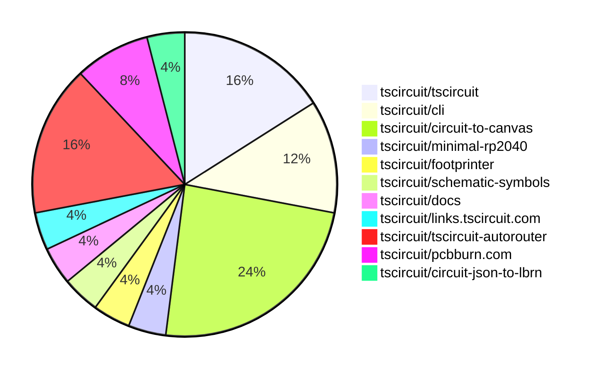
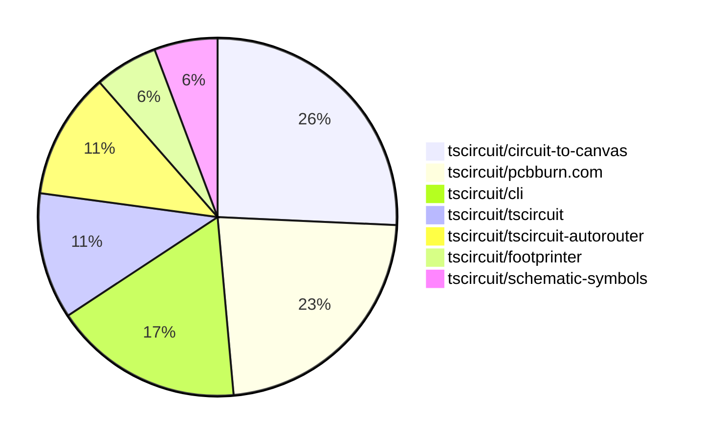

# Contribution Overview 2025-12-31

The current week is shown below. There are 4 major sections:

- [Contributor Overview](#contributor-overview)
- [PRs by Repository](#prs-by-repository)
- [PRs by Contributor](#changes-by-contributor)
- [Scoring & Sponsorship System](#scoring--sponsorship-system)

## PRs by Repository

## Contributor Overview

| Contributor | 🐳 Major | 🐙 Minor | 🐌 Tiny | ⭐ | Score | Discussion Contributions |
|-------------|---------|---------|---------|-----|----------------|--------------------------|
| [AnasSarkiz](#AnasSarkiz) | 2 | 1 | 0 | ⭐ | 10 | 0🔹 0🔶 0💎 |
| [tscircuitbot](#tscircuitbot) | 0 | 0 | 7 | ⭐ | 7 | 0🔹 0🔶 0💎 |
| [Abse2001](#Abse2001) | 0 | 2 | 2 | ⭐ | 7 | 0🔹 0🔶 0💎 |
| [shehaban](#shehaban) | 0 | 2 | 0 | ⭐ | 4 | 0🔹 0🔶 0💎 |
| [seveibar](#seveibar) | 0 | 0 | 3 | ⭐ | 4 | 0🔹 0🔶 0💎 |
| [imrishabh18](#imrishabh18) | 1 | 0 | 0 | ⭐ | 4 | 0🔹 0🔶 0💎 |
| [0hmX](#0hmX) | 0 | 0 | 4 | ⭐ | 4 | 0🔹 0🔶 0💎 |
| [techmannih](#techmannih) | 0 | 1 | 0 | ⭐ | 4 | 0🔹 0🔶 0💎 |

> Note: AI evaluates PRs and assigns 1-3 star ratings automatically. 4 and 5 star ratings require manual staff review.

### Discussion Contribution Legend

- 🔹 Normal Comments: Basic participation with minimal effort
- 🔶 Great Informative Comments: Thoughtful participation that adds value
- 💎 Incredible Comments: Exceptional participation with high-quality content

## Review Table

[reviews-received-hover]: ## "Number of reviews received for PRs for this contributor"
[approvals-received-hover]: ## "Number of approvals received for PRs this contributor authored"
[rejections-received-hover]: ## "Number of rejections received for PRs this contributor authored"
[prs-opened-hover]: ## "Number of PRs opened by this contributor"
[issues-created-hover]: ## "Number of issues created by this contributor"
[bountied-issues-hover]: ## "Number of issues this contributor created with a bounty"
[bountied-issue-$-hover]: ## "Total bounty amount placed on issues authored by this contributor"

| Contributor | Reviews Received | Approvals Received | Rejections Received | Approvals | Rejections | PRs Opened | PRs Merged | Score | Issues Created | Bountied Issues | Bountied Issue $ |
|---|---|---|---|---|---|---|---|---|---|---|---|
| [tscircuitbot](#tscircuitbot) | 0 | 0 | 0 | 0 | 0 | 11 | 7 | 7 | 0 | 0 | 0 |
| [Abse2001](#Abse2001) | 3 | 3 | 0 | 1 | 0 | 4 | 4 | 7 | 0 | 0 | 0 |
| [seveibar](#seveibar) | 1 | 0 | 0 | 6 | 1 | 7 | 3 | 4 | 0 | 0 | 0 |
| [shehaban](#shehaban) | 8 | 4 | 1 | 0 | 0 | 2 | 2 | 4 | 0 | 0 | 0 |
| [techmannih](#techmannih) | 1 | 1 | 0 | 2 | 0 | 2 | 1 | 4 | 0 | 0 | 0 |
| [nailoo](#nailoo) | 0 | 0 | 0 | 0 | 0 | 0 | 0 | 0 | 0 | 0 | 0 |
| [rushabhcodes](#rushabhcodes) | 0 | 0 | 0 | 0 | 1 | 0 | 0 | 0 | 0 | 0 | 0 |
| [pxlpal](#pxlpal) | 0 | 0 | 0 | 0 | 0 | 1 | 0 | 0 | 0 | 0 | 0 |
| [ShiboSoftwareDev](#ShiboSoftwareDev) | 0 | 0 | 0 | 3 | 0 | 0 | 0 | 0 | 0 | 0 | 0 |
| [imrishabh18](#imrishabh18) | 1 | 0 | 1 | 0 | 0 | 1 | 1 | 4 | 0 | 0 | 0 |
| [0hmX](#0hmX) | 4 | 0 | 0 | 0 | 0 | 6 | 4 | 4 | 0 | 0 | 0 |
| [AnasSarkiz](#AnasSarkiz) | 4 | 4 | 0 | 0 | 0 | 3 | 3 | 10 | 0 | 0 | 0 |

## Top 7 Repositories by Contribution Points

## Scoring & Sponsorship System

### Overview

PRs are analyzed by AI and assigned a **star rating (1-3 stars)**. 4 and 5 star ratings can only be manually assigned by staff. Weekly scores use `2^(starRating - 1)` per PR (capped at 12 PRs per rating), plus review/discussion points.

### Weekly Score → Star String

| Score Range | Star String | Count Value |
|------------|-------------|-------------|
| 0-3 | (empty) | 0 stars |
| 4-10 | ⭐ | 1 star |
| 11-30 | ⭐⭐ | 2 stars |
| 31-50 | ⭐⭐⭐ | 3 stars |
| 51-75 | 👑 | 1 crown |
| 76-100 | 👑👑 | 2 crowns |
| 101+ | 👑👑👑 | 3 crowns |

> Crowns count as 3 stars for sponsorship.

### Monthly Sponsorship Calculation

The sponsorship system calculates monthly payments based on your **weekly star counts** over the complete weeks in that month (typically 4-5 weeks, Wednesday-Tuesday format).

**Step 1: Collect Weekly Stars**
- All complete weeks in the month are analyzed
- Each week's star string is converted to a numeric count (⭐ = 1 star, ⭐⭐⭐ = 3 stars)
- Example: `[2, 2, 2, 1, 0]` means 2 stars in week 1, 2 stars in week 2, etc.

**Step 2: Calculate Metrics**
- **Median stars**: The median value of all weekly star counts
- **Min stars**: The minimum weekly star count
- **Max stars**: The maximum weekly star count
- **High score**: The maximum raw weekly score (0-100+ range from the scoring table) from any week in the month

**Step 3: Determine Base Amount**
The sponsorship amount is calculated based on these metrics (checked in order):

| Condition | Base Amount |
|-----------|-------------|
| `minStarCount >= 3` | **$700** |
| `medianStars >= 3` | **$550** |
| `medianStars >= 2.5` | **$400** |
| `medianStars >= 2` | **$250** |
| `medianStars >= 1.5` | **$120** |
| `medianStars >= 1` | **$75** |
| `maxStarCount >= 2` | **$45** |
| `maxStarCount >= 1` | **$30** |
| `highScore >= 3` (and all stars = 0) | **$10** |

| Maintainer Level | Monthly Bonus |
|------------------|---------------|
| Level 1 | **$200** |
| Level 2 | **$350** |
| Level 3 | **$500** |
| Level 4 | **$850** |
| Level 5 | **$1300** |
| Level 6 | **$2000** |

**Final Amount** = Base Amount + Maintainer Bonus

## Changes by Repository

### [tscircuit/tscircuit](https://github.com/tscircuit/tscircuit)

🐌 Tiny Contributions (4)

| PR # | Impact | Contributor | Description |
|------|--------|-------------|-------------|
| [#1760](https://github.com/tscircuit/tscircuit/pull/1760) | 🐌 Tiny | tscircuitbot | Updates the package version from 0.0.1097 to 0.0.1098 in package.json |
| [#1759](https://github.com/tscircuit/tscircuit/pull/1759) | 🐌 Tiny | tscircuitbot | Automated package update |
| [#1758](https://github.com/tscircuit/tscircuit/pull/1758) | 🐌 Tiny | tscircuitbot | Automated package update |
| [#1757](https://github.com/tscircuit/tscircuit/pull/1757) | 🐌 Tiny | Abse2001 | Adds the missing core dependency tscircuitsoup-util to the package.json file. |

### [tscircuit/cli](https://github.com/tscircuit/cli)

| PR # | Impact | Rating | Contributor | Description |
|------|--------|--------|-------------|-------------|
| [#1517](https://github.com/tscircuit/cli/pull/1517) | 🐳 Major | ⭐⭐⭐ | imrishabh18 | Adds a command-line flag to use a CDN-hosted JavaScript file instead of a local bundled file in the generated index.html for tscircuit.app. |

🐌 Tiny Contributions (2)

| PR # | Impact | Contributor | Description |
|------|--------|-------------|-------------|
| [#1529](https://github.com/tscircuit/cli/pull/1529) | 🐌 Tiny | tscircuitbot | Automated package update |
| [#1528](https://github.com/tscircuit/cli/pull/1528) | 🐌 Tiny | seveibar | Add a JSON schema for tscircuit.config.json to enable validation and auto-completion in editors, and ensure saved configs include a schema field pointing to the schema URL. |

### [tscircuit/circuit-to-canvas](https://github.com/tscircuit/circuit-to-canvas)

| PR # | Impact | Rating | Contributor | Description |
|------|--------|--------|-------------|-------------|
| [#90](https://github.com/tscircuit/circuit-to-canvas/pull/90) | 🐙 Minor | ⭐⭐ | Abse2001 | Fixes dimension line polygon winding issues by implementing a unified perimeter path to prevent self-intersections and ambiguous fill behavior. |
| [#85](https://github.com/tscircuit/circuit-to-canvas/pull/85) | 🐙 Minor | ⭐⭐ | Abse2001 | Refactors dimension line rendering to use filled polygon geometry instead of stroked paths, improving visual consistency and stability across orientations and scaling transforms. |
| [#87](https://github.com/tscircuit/circuit-to-canvas/pull/87) | 🐙 Minor | ⭐⭐ | techmannih | Adds support for soldermask margins around holes in PCB designs, allowing for better visual representation and manufacturing accuracy. |

🐌 Tiny Contributions (3)

| PR # | Impact | Contributor | Description |
|------|--------|-------------|-------------|
| [#91](https://github.com/tscircuit/circuit-to-canvas/pull/91) | 🐌 Tiny | tscircuitbot | Automated package update |
| [#88](https://github.com/tscircuit/circuit-to-canvas/pull/88) | 🐌 Tiny | tscircuitbot | Automated package update |
| [#86](https://github.com/tscircuit/circuit-to-canvas/pull/86) | 🐌 Tiny | tscircuitbot | Automated package update |

### [tscircuit/minimal-rp2040](https://github.com/tscircuit/minimal-rp2040)

🐌 Tiny Contributions (1)

| PR # | Impact | Contributor | Description |
|------|--------|-------------|-------------|
| [#2](https://github.com/tscircuit/minimal-rp2040/pull/2) | 🐌 Tiny | Abse2001 | Adjusts the mounting position of the top display holes and modifies the board height to 74mm. |

### [tscircuit/footprinter](https://github.com/tscircuit/footprinter)

| PR # | Impact | Rating | Contributor | Description |
|------|--------|--------|-------------|-------------|
| [#442](https://github.com/tscircuit/footprinter/pull/442) | 🐙 Minor | ⭐⭐ | shehaban | Adds support for radial footprints using the same 2D geometry as axial footprints, while providing explicit, machine-readable 3D model hinting for correct 3D rendering. |

### [tscircuit/schematic-symbols](https://github.com/tscircuit/schematic-symbols)

| PR # | Impact | Rating | Contributor | Description |
|------|--------|--------|-------------|-------------|
| [#373](https://github.com/tscircuit/schematic-symbols/pull/373) | 🐙 Minor | ⭐⭐ | shehaban | Fixes alignment of the  pin in the op-amp symbols (opamp_no_power and opamp_with_power) |

### [tscircuit/docs](https://github.com/tscircuit/docs)

🐌 Tiny Contributions (1)

| PR # | Impact | Contributor | Description |
|------|--------|-------------|-------------|
| [#402](https://github.com/tscircuit/docs/pull/402) | 🐌 Tiny | seveibar | Adds documentation for tscircuit.config.json options, including a configuration options table and detailed descriptions for properties like previewComponentPath and snapshotsDir. |

### [tscircuit/links.tscircuit.com](https://github.com/tscircuit/links.tscircuit.com)

🐌 Tiny Contributions (1)

| PR # | Impact | Contributor | Description |
|------|--------|-------------|-------------|
| [#1](https://github.com/tscircuit/links.tscircuit.com/pull/1) | 🐌 Tiny | seveibar | Adds links to the Lab Inventory spreadsheet and Coding Guidelines in the links page for quick access by the team. |

### [tscircuit/tscircuit-autorouter](https://github.com/tscircuit/tscircuit-autorouter)

🐌 Tiny Contributions (4)

| PR # | Impact | Contributor | Description |
|------|--------|-------------|-------------|
| [#479](https://github.com/tscircuit/tscircuit-autorouter/pull/479) | 🐌 Tiny | 0hmX | This pull request adds a new bug report fixture for bug report ID e9dea27d-6dc6-4718-9d07-d4732e4cbf8e. It includes a JSON file with detailed routing information and a corresponding TypeScript fixture for testing purposes. |
| [#476](https://github.com/tscircuit/tscircuit-autorouter/pull/476) | 🐌 Tiny | 0hmX | Adds a test case to ensure that the autorouter does not return any _mst source trace IDs, addressing a specific issue in the autorouting functionality. |
| [#478](https://github.com/tscircuit/tscircuit-autorouter/pull/478) | 🐌 Tiny | 0hmX | This pull request adds a new bug report fixture for bug report ID 33, which includes a larger display board configuration. The changes include the addition of a new JSON file containing the bug report data and a corresponding TypeScript fixture for testing purposes. |
| [#477](https://github.com/tscircuit/tscircuit-autorouter/pull/477) | 🐌 Tiny | 0hmX | Fixes the target directory in bug report scripts to reflect the recent name change from examples to fixtures. |

### [tscircuit/pcbburn.com](https://github.com/tscircuit/pcbburn.com)

| PR # | Impact | Rating | Contributor | Description |
|------|--------|--------|-------------|-------------|
| [#6](https://github.com/tscircuit/pcbburn.com/pull/6) | 🐳 Major | ⭐⭐⭐ | AnasSarkiz | Adds a resizable settings panel with drag handle, introduces laser profiles with full copperboard controls, and improves input methods with numeric entry and toggle switches. |
| [#5](https://github.com/tscircuit/pcbburn.com/pull/5) | 🐳 Major | ⭐⭐⭐ | AnasSarkiz | This PR significantly improves the circuit converter apps usability by making the interface fully responsive, adding KiCad file support, and automating LBRN generationreducing manual steps and enhancing mobiledesktop workflows. |

### [tscircuit/circuit-json-to-lbrn](https://github.com/tscircuit/circuit-json-to-lbrn)

| PR # | Impact | Rating | Contributor | Description |
|------|--------|--------|-------------|-------------|
| [#75](https://github.com/tscircuit/circuit-json-to-lbrn/pull/75) | 🐙 Minor | ⭐⭐ | AnasSarkiz | Extract and export the ConvertCircuitJsonToLbrnOptions interface from the inline type definition to enable its reuse in the PCBBurn repository. |

## Changes by Contributor

### [tscircuitbot](https://github.com/tscircuitbot)

🐌 Tiny Contributions (7)

| PR # | Impact | Description |
|------|--------|-------------|
| [#1760](https://github.com/tscircuit/tscircuit/pull/1760) | 🐌 Tiny | Updates the package version from 0.0.1097 to 0.0.1098 in package.json |
| [#1759](https://github.com/tscircuit/tscircuit/pull/1759) | 🐌 Tiny | Automated package update |
| [#1758](https://github.com/tscircuit/tscircuit/pull/1758) | 🐌 Tiny | Automated package update |
| [#1529](https://github.com/tscircuit/cli/pull/1529) | 🐌 Tiny | Automated package update |
| [#91](https://github.com/tscircuit/circuit-to-canvas/pull/91) | 🐌 Tiny | Automated package update |
| [#88](https://github.com/tscircuit/circuit-to-canvas/pull/88) | 🐌 Tiny | Automated package update |
| [#86](https://github.com/tscircuit/circuit-to-canvas/pull/86) | 🐌 Tiny | Automated package update |

### [Abse2001](https://github.com/Abse2001)

| PRs # | Impact | Rating | Description |
|------|--------|--------|-------------|
| [#90](https://github.com/tscircuit/circuit-to-canvas/pull/90) | 🐙 Minor | ⭐⭐ | Fixes dimension line polygon winding issues by implementing a unified perimeter path to prevent self-intersections and ambiguous fill behavior. |
| [#85](https://github.com/tscircuit/circuit-to-canvas/pull/85) | 🐙 Minor | ⭐⭐ | Refactors dimension line rendering to use filled polygon geometry instead of stroked paths, improving visual consistency and stability across orientations and scaling transforms. |

🐌 Tiny Contributions (2)

| PR # | Impact | Description |
|------|--------|-------------|
| [#1757](https://github.com/tscircuit/tscircuit/pull/1757) | 🐌 Tiny | Adds the missing core dependency tscircuitsoup-util to the package.json file. |
| [#2](https://github.com/tscircuit/minimal-rp2040/pull/2) | 🐌 Tiny | Adjusts the mounting position of the top display holes and modifies the board height to 74mm. |

### [shehaban](https://github.com/shehaban)

| PRs # | Impact | Rating | Description |
|------|--------|--------|-------------|
| [#442](https://github.com/tscircuit/footprinter/pull/442) | 🐙 Minor | ⭐⭐ | Adds support for radial footprints using the same 2D geometry as axial footprints, while providing explicit, machine-readable 3D model hinting for correct 3D rendering. |
| [#373](https://github.com/tscircuit/schematic-symbols/pull/373) | 🐙 Minor | ⭐⭐ | Fixes alignment of the  pin in the op-amp symbols (opamp_no_power and opamp_with_power) |

### [seveibar](https://github.com/seveibar)

🐌 Tiny Contributions (3)

| PR # | Impact | Description |
|------|--------|-------------|
| [#1528](https://github.com/tscircuit/cli/pull/1528) | 🐌 Tiny | Add a JSON schema for tscircuit.config.json to enable validation and auto-completion in editors, and ensure saved configs include a schema field pointing to the schema URL. |
| [#402](https://github.com/tscircuit/docs/pull/402) | 🐌 Tiny | Adds documentation for tscircuit.config.json options, including a configuration options table and detailed descriptions for properties like previewComponentPath and snapshotsDir. |
| [#1](https://github.com/tscircuit/links.tscircuit.com/pull/1) | 🐌 Tiny | Adds links to the Lab Inventory spreadsheet and Coding Guidelines in the links page for quick access by the team. |

### [imrishabh18](https://github.com/imrishabh18)

| PRs # | Impact | Rating | Description |
|------|--------|--------|-------------|
| [#1517](https://github.com/tscircuit/cli/pull/1517) | 🐳 Major | ⭐⭐⭐ | Adds a command-line flag to use a CDN-hosted JavaScript file instead of a local bundled file in the generated index.html for tscircuit.app. |

### [0hmX](https://github.com/0hmX)

🐌 Tiny Contributions (4)

| PR # | Impact | Description |
|------|--------|-------------|
| [#479](https://github.com/tscircuit/tscircuit-autorouter/pull/479) | 🐌 Tiny | This pull request adds a new bug report fixture for bug report ID e9dea27d-6dc6-4718-9d07-d4732e4cbf8e. It includes a JSON file with detailed routing information and a corresponding TypeScript fixture for testing purposes. |
| [#476](https://github.com/tscircuit/tscircuit-autorouter/pull/476) | 🐌 Tiny | Adds a test case to ensure that the autorouter does not return any _mst source trace IDs, addressing a specific issue in the autorouting functionality. |
| [#478](https://github.com/tscircuit/tscircuit-autorouter/pull/478) | 🐌 Tiny | This pull request adds a new bug report fixture for bug report ID 33, which includes a larger display board configuration. The changes include the addition of a new JSON file containing the bug report data and a corresponding TypeScript fixture for testing purposes. |
| [#477](https://github.com/tscircuit/tscircuit-autorouter/pull/477) | 🐌 Tiny | Fixes the target directory in bug report scripts to reflect the recent name change from examples to fixtures. |

### [techmannih](https://github.com/techmannih)

| PRs # | Impact | Rating | Description |
|------|--------|--------|-------------|
| [#87](https://github.com/tscircuit/circuit-to-canvas/pull/87) | 🐙 Minor | ⭐⭐ | Adds support for soldermask margins around holes in PCB designs, allowing for better visual representation and manufacturing accuracy. |

### [AnasSarkiz](https://github.com/AnasSarkiz)

| PRs # | Impact | Rating | Description |
|------|--------|--------|-------------|
| [#6](https://github.com/tscircuit/pcbburn.com/pull/6) | 🐳 Major | ⭐⭐⭐ | Adds a resizable settings panel with drag handle, introduces laser profiles with full copperboard controls, and improves input methods with numeric entry and toggle switches. |
| [#5](https://github.com/tscircuit/pcbburn.com/pull/5) | 🐳 Major | ⭐⭐⭐ | This PR significantly improves the circuit converter apps usability by making the interface fully responsive, adding KiCad file support, and automating LBRN generationreducing manual steps and enhancing mobiledesktop workflows. |
| [#75](https://github.com/tscircuit/circuit-json-to-lbrn/pull/75) | 🐙 Minor | ⭐⭐ | Extract and export the ConvertCircuitJsonToLbrnOptions interface from the inline type definition to enable its reuse in the PCBBurn repository. |

## Repository Owners

| Repository | Codeowners |
|------------|------------|
| [builder](https://github.com/tscircuit/builder/blob/main/.github/CODEOWNERS) | [seveibar](https://github.com/seveibar)
| [pcb-viewer](https://github.com/tscircuit/pcb-viewer/blob/main/.github/CODEOWNERS) | [seveibar](https://github.com/seveibar), [ShiboSoftwareDev](https://github.com/ShiboSoftwareDev)
| [footprints-old](https://github.com/tscircuit/footprints-old/blob/main/.github/CODEOWNERS) | [seveibar](https://github.com/seveibar)
| [footprinter](https://github.com/tscircuit/footprinter/blob/main/.github/CODEOWNERS) | [seveibar](https://github.com/seveibar), [techmannih](https://github.com/techmannih)
| [3d-viewer](https://github.com/tscircuit/3d-viewer/blob/main/.github/CODEOWNERS) | [ShiboSoftwareDev](https://github.com/ShiboSoftwareDev)
| [winterspec](https://github.com/tscircuit/winterspec/blob/main/.github/CODEOWNERS) | [seveibar](https://github.com/seveibar), [ShiboSoftwareDev](https://github.com/ShiboSoftwareDev)
| [jscad-electronics](https://github.com/tscircuit/jscad-electronics/blob/main/.github/CODEOWNERS) | [seveibar](https://github.com/seveibar), [techmannih](https://github.com/techmannih), [ShiboSoftwareDev](https://github.com/ShiboSoftwareDev), [anas-sarkez](https://github.com/anas-sarkez)
| [circuit-to-svg](https://github.com/tscircuit/circuit-to-svg/blob/main/.github/CODEOWNERS) | [imrishabh18](https://github.com/imrishabh18)
| [schematic-symbols](https://github.com/tscircuit/schematic-symbols/blob/main/.github/CODEOWNERS) | [seveibar](https://github.com/seveibar), [imrishabh18](https://github.com/imrishabh18), [techmannih](https://github.com/techmannih)
| [circuit-json-to-gerber](https://github.com/tscircuit/circuit-json-to-gerber/blob/main/.github/CODEOWNERS) | [seveibar](https://github.com/seveibar), [ShiboSoftwareDev](https://github.com/ShiboSoftwareDev)
| [tscircuit.com](https://github.com/tscircuit/tscircuit.com/blob/main/.github/CODEOWNERS) | [seveibar](https://github.com/seveibar), [imrishabh18](https://github.com/imrishabh18)
| [issue-roulette](https://github.com/tscircuit/issue-roulette/blob/main/.github/CODEOWNERS) | [Anshgrover23](https://github.com/Anshgrover23)
| [sparkfun-boards](https://github.com/tscircuit/sparkfun-boards/blob/main/.github/CODEOWNERS) | [ShiboSoftwareDev](https://github.com/ShiboSoftwareDev), [Abse2001](https://github.com/Abse2001), [MustafaMulla29](https://github.com/MustafaMulla29), [Anshgrover23](https://github.com/Anshgrover23), [techmannih](https://github.com/techmannih)
| [schematic-corpus](https://github.com/tscircuit/schematic-corpus/blob/main/.github/CODEOWNERS) | [Abse2001](https://github.com/Abse2001)
| [copper-pour-solver](https://github.com/tscircuit/copper-pour-solver/blob/main/.github/CODEOWNERS) | [seveibar](https://github.com/seveibar), [ShiboSoftwareDev](https://github.com/ShiboSoftwareDev)
| [common](https://github.com/tscircuit/common/blob/main/.github/CODEOWNERS) | [seveibar](https://github.com/seveibar), [Abse2001](https://github.com/Abse2001)

## Repositories by Owner

| User | Repo |
|------|------|
| [seveibar](https://github.com/seveibar) | [builder](https://github.com/tscircuit/builder/blob/main/.github/CODEOWNERS) |
|  | [pcb-viewer](https://github.com/tscircuit/pcb-viewer/blob/main/.github/CODEOWNERS) |
|  | [footprints-old](https://github.com/tscircuit/footprints-old/blob/main/.github/CODEOWNERS) |
|  | [footprinter](https://github.com/tscircuit/footprinter/blob/main/.github/CODEOWNERS) |
|  | [winterspec](https://github.com/tscircuit/winterspec/blob/main/.github/CODEOWNERS) |
|  | [jscad-electronics](https://github.com/tscircuit/jscad-electronics/blob/main/.github/CODEOWNERS) |
|  | [schematic-symbols](https://github.com/tscircuit/schematic-symbols/blob/main/.github/CODEOWNERS) |
|  | [circuit-json-to-gerber](https://github.com/tscircuit/circuit-json-to-gerber/blob/main/.github/CODEOWNERS) |
|  | [tscircuit.com](https://github.com/tscircuit/tscircuit.com/blob/main/.github/CODEOWNERS) |
|  | [copper-pour-solver](https://github.com/tscircuit/copper-pour-solver/blob/main/.github/CODEOWNERS) |
|  | [common](https://github.com/tscircuit/common/blob/main/.github/CODEOWNERS) |
| [ShiboSoftwareDev](https://github.com/ShiboSoftwareDev) | [pcb-viewer](https://github.com/tscircuit/pcb-viewer/blob/main/.github/CODEOWNERS) |
|  | [3d-viewer](https://github.com/tscircuit/3d-viewer/blob/main/.github/CODEOWNERS) |
|  | [winterspec](https://github.com/tscircuit/winterspec/blob/main/.github/CODEOWNERS) |
|  | [jscad-electronics](https://github.com/tscircuit/jscad-electronics/blob/main/.github/CODEOWNERS) |
|  | [circuit-json-to-gerber](https://github.com/tscircuit/circuit-json-to-gerber/blob/main/.github/CODEOWNERS) |
|  | [sparkfun-boards](https://github.com/tscircuit/sparkfun-boards/blob/main/.github/CODEOWNERS) |
|  | [copper-pour-solver](https://github.com/tscircuit/copper-pour-solver/blob/main/.github/CODEOWNERS) |
| [techmannih](https://github.com/techmannih) | [footprinter](https://github.com/tscircuit/footprinter/blob/main/.github/CODEOWNERS) |
|  | [jscad-electronics](https://github.com/tscircuit/jscad-electronics/blob/main/.github/CODEOWNERS) |
|  | [schematic-symbols](https://github.com/tscircuit/schematic-symbols/blob/main/.github/CODEOWNERS) |
|  | [sparkfun-boards](https://github.com/tscircuit/sparkfun-boards/blob/main/.github/CODEOWNERS) |
| [anas-sarkez](https://github.com/anas-sarkez) | [jscad-electronics](https://github.com/tscircuit/jscad-electronics/blob/main/.github/CODEOWNERS) |
| [imrishabh18](https://github.com/imrishabh18) | [circuit-to-svg](https://github.com/tscircuit/circuit-to-svg/blob/main/.github/CODEOWNERS) |
|  | [schematic-symbols](https://github.com/tscircuit/schematic-symbols/blob/main/.github/CODEOWNERS) |
|  | [tscircuit.com](https://github.com/tscircuit/tscircuit.com/blob/main/.github/CODEOWNERS) |
| [Anshgrover23](https://github.com/Anshgrover23) | [issue-roulette](https://github.com/tscircuit/issue-roulette/blob/main/.github/CODEOWNERS) |
|  | [sparkfun-boards](https://github.com/tscircuit/sparkfun-boards/blob/main/.github/CODEOWNERS) |
| [Abse2001](https://github.com/Abse2001) | [sparkfun-boards](https://github.com/tscircuit/sparkfun-boards/blob/main/.github/CODEOWNERS) |
|  | [schematic-corpus](https://github.com/tscircuit/schematic-corpus/blob/main/.github/CODEOWNERS) |
|  | [common](https://github.com/tscircuit/common/blob/main/.github/CODEOWNERS) |
| [MustafaMulla29](https://github.com/MustafaMulla29) | [sparkfun-boards](https://github.com/tscircuit/sparkfun-boards/blob/main/.github/CODEOWNERS) |

