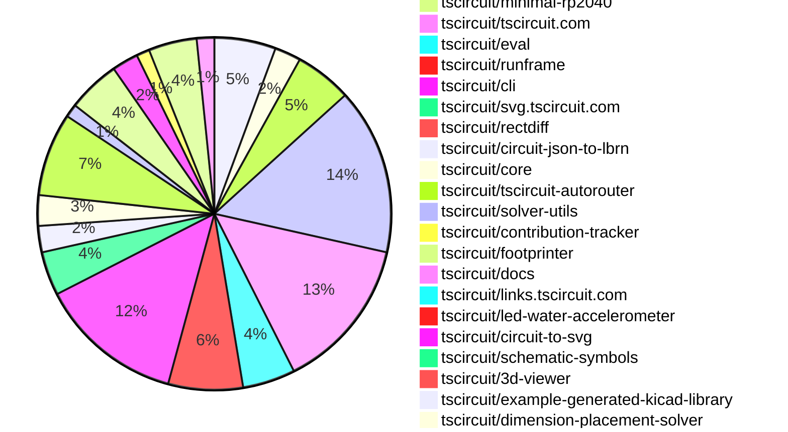

# Contribution Overview 2025-12-31

The current week is shown below. There are 3 major sections:

- [Contributor Overview](#contributor-overview)
- [PRs by Repository](#prs-by-repository)
- [PRs by Contributor](#changes-by-contributor)
- [Scoring & Sponsorship Details](/docs/sponsorship-calculation-explanation.md)

## PRs by Repository

## Contributor Overview

| Contributor | 🐳 Major | 🐙 Minor | 🐌 Tiny | ⭐ | Discussion Contributions |
|-------------|---------|---------|---------|-----|--------------------------|
| [seveibar](#seveibar) | 11 | 3 | 6 | 👑 | 0🔹 0🔶 0💎 |
| [ArnavK-09](#ArnavK-09) | 3 | 5 | 12 | ⭐⭐⭐ | 0🔹 0🔶 0💎 |
| [ShiboSoftwareDev](#ShiboSoftwareDev) | 2 | 3 | 7 | ⭐⭐⭐ | 0🔹 0🔶 0💎 |
| [techmannih](#techmannih) | 1 | 7 | 13 | ⭐⭐⭐ | 0🔹 0🔶 0💎 |
| [Abse2001](#Abse2001) | 0 | 11 | 5 | ⭐⭐⭐ | 0🔹 0🔶 0💎 |
| [AnasSarkiz](#AnasSarkiz) | 5 | 4 | 4 | ⭐⭐⭐ | 0🔹 0🔶 0💎 |
| [0hmX](#0hmX) | 4 | 0 | 7 | ⭐⭐ | 0🔹 0🔶 0💎 |
| [imrishabh18](#imrishabh18) | 2 | 4 | 4 | ⭐⭐ | 0🔹 0🔶 0💎 |
| [tscircuitbot](#tscircuitbot) | 0 | 0 | 122 | ⭐⭐ | 0🔹 0🔶 0💎 |
| [MustafaMulla29](#MustafaMulla29) | 0 | 4 | 3 | ⭐⭐ | 0🔹 0🔶 0💎 |
| [Ayushjhawar8](#Ayushjhawar8) | 1 | 1 | 6 | ⭐⭐ | 0🔹 0🔶 0💎 |
| [shehaban](#shehaban) | 0 | 2 | 0 | ⭐ | 0🔹 0🔶 0💎 |
| [rushabhcodes](#rushabhcodes) | 0 | 0 | 4 | ⭐ | 0🔹 0🔶 0💎 |
| [Sahil-Gupta584](#Sahil-Gupta584) | 0 | 0 | 1 |  | 0🔹 0🔶 0💎 |

> Note: AI evaluates PRs and assigns 1-3 star ratings automatically. 4 and 5 star ratings require manual staff review.

### Discussion Contribution Legend

- 🔹 Normal Comments: Basic participation with minimal effort
- 🔶 Great Informative Comments: Thoughtful participation that adds value
- 💎 Incredible Comments: Exceptional participation with high-quality content

## Review Table

[reviews-received-hover]: ## "Number of reviews received for PRs for this contributor"
[approvals-received-hover]: ## "Number of approvals received for PRs this contributor authored"
[rejections-received-hover]: ## "Number of rejections received for PRs this contributor authored"
[prs-opened-hover]: ## "Number of PRs opened by this contributor"
[issues-created-hover]: ## "Number of issues created by this contributor"

| Contributor | Reviews Received | Approvals Received | Rejections Received | Approvals | Rejections | PRs Opened | PRs Merged | Issues Created |
|---|---|---|---|---|---|---|---|---|
| [Abse2001](#Abse2001) | 20 | 16 | 1 | 5 | 0 | 19 | 16 | 0 |
| [ShiboSoftwareDev](#ShiboSoftwareDev) | 13 | 11 | 1 | 14 | 0 | 14 | 12 | 0 |
| [tscircuitbot](#tscircuitbot) | 1 | 0 | 0 | 0 | 0 | 157 | 122 | 0 |
| [seveibar](#seveibar) | 4 | 1 | 0 | 65 | 9 | 38 | 20 | 0 |
| [imrishabh18](#imrishabh18) | 3 | 1 | 2 | 10 | 2 | 12 | 10 | 0 |
| [techmannih](#techmannih) | 19 | 15 | 1 | 2 | 1 | 23 | 21 | 0 |
| [Sahil-Gupta584](#Sahil-Gupta584) | 6 | 3 | 1 | 0 | 0 | 3 | 1 | 0 |
| [shehaban](#shehaban) | 8 | 4 | 1 | 0 | 0 | 2 | 2 | 0 |
| [nailoo](#nailoo) | 0 | 0 | 0 | 0 | 0 | 0 | 0 | 0 |
| [rushabhcodes](#rushabhcodes) | 9 | 4 | 0 | 0 | 1 | 4 | 4 | 0 |
| [pxlpal](#pxlpal) | 1 | 0 | 1 | 0 | 0 | 1 | 0 | 0 |
| [MustafaMulla29](#MustafaMulla29) | 14 | 6 | 4 | 1 | 0 | 11 | 7 | 0 |
| [Ayushjhawar8](#Ayushjhawar8) | 14 | 6 | 1 | 0 | 0 | 9 | 8 | 0 |
| [RaghavArora14](#RaghavArora14) | 1 | 0 | 0 | 0 | 0 | 1 | 0 | 0 |
| [ArnavK-09](#ArnavK-09) | 19 | 15 | 0 | 3 | 0 | 20 | 20 | 0 |
| [0hmX](#0hmX) | 16 | 5 | 0 | 1 | 0 | 13 | 11 | 0 |
| [AnasSarkiz](#AnasSarkiz) | 15 | 14 | 0 | 0 | 0 | 14 | 13 | 0 |

## Changes by Repository

### [tscircuit/pcb-viewer](https://github.com/tscircuit/pcb-viewer)

| PR # | Impact | Rating | Contributor | Description |
|------|--------|--------|-------------|-------------|
| [#580](https://github.com/tscircuit/pcb-viewer/pull/580) | 🐙 Minor | ⭐⭐ | Abse2001 | Adds dedicated PCB hole rendering via a new draw-pcb-hole pipeline, moving hole drawing out of primitive conversion and into layer-based rendering, supporting rotated pill holes correctly on the drill layer, and improving separation of concerns between element conversion and canvas drawing. |
| [#587](https://github.com/tscircuit/pcb-viewer/pull/587) | 🐙 Minor | ⭐⭐ | Abse2001 | This change adds native PCB cutout rendering support in the canvas viewer by integrating a dedicated edge_cuts layer and removing legacy conversion logic, enhancing the accuracy of board outlines and mechanical features. |
| [#581](https://github.com/tscircuit/pcb-viewer/pull/581) | 🐙 Minor | ⭐⭐ | Abse2001 | Shifts PCB board outline rendering out of primitive conversion and into circuit-to-canvas, centralizing board drawing for consistent layering and render behavior while simplifying the canvas renderer. |
| [#578](https://github.com/tscircuit/pcb-viewer/pull/578) | 🐙 Minor | ⭐⭐ | Abse2001 | Refactors the rendering of PCB user notes to explicitly separate top and bottom layers, improving clarity and organization in the rendering process. |
| [#574](https://github.com/tscircuit/pcb-viewer/pull/574) | 🐙 Minor | ⭐⭐ | Abse2001 | Promotes PCB fabrication notes to a first-class rendering path and removes duplicated drawing logic, consolidating all fab rendering behind a single draw path. |

🐌 Tiny Contributions (9)

| PR # | Impact | Contributor | Description |
|------|--------|-------------|-------------|
| [#585](https://github.com/tscircuit/pcb-viewer/pull/585) | 🐌 Tiny | Abse2001 | Fixes the corner radius of PCB cutouts in the circuit-to-canvas rendering. |
| [#583](https://github.com/tscircuit/pcb-viewer/pull/583) | 🐌 Tiny | tscircuitbot | Automated package update |
| [#588](https://github.com/tscircuit/pcb-viewer/pull/588) | 🐌 Tiny | tscircuitbot | Automated package update |
| [#586](https://github.com/tscircuit/pcb-viewer/pull/586) | 🐌 Tiny | tscircuitbot | Automated package update |
| [#579](https://github.com/tscircuit/pcb-viewer/pull/579) | 🐌 Tiny | tscircuitbot | Automated package update |
| [#582](https://github.com/tscircuit/pcb-viewer/pull/582) | 🐌 Tiny | tscircuitbot | Automated package update |
| [#577](https://github.com/tscircuit/pcb-viewer/pull/577) | 🐌 Tiny | tscircuitbot | Automated package update |
| [#575](https://github.com/tscircuit/pcb-viewer/pull/575) | 🐌 Tiny | tscircuitbot | Automated package update |
| [#576](https://github.com/tscircuit/pcb-viewer/pull/576) | 🐌 Tiny | seveibar | Allows users to select and copy error messages from the dropdown for debugging and reporting by modifying CSS properties and event handlers in the ToolbarOverlay component. |

### [tscircuit/circuit-json](https://github.com/tscircuit/circuit-json)

| PR # | Impact | Rating | Contributor | Description |
|------|--------|--------|-------------|-------------|
| [#405](https://github.com/tscircuit/circuit-json/pull/405) | 🐙 Minor | ⭐⭐ | Abse2001 | Adds a new drill layer to the PCB rendering layers for hole representation. |
| [#403](https://github.com/tscircuit/circuit-json/pull/403) | 🐙 Minor | ⭐⭐ | Abse2001 | Adds an edge_cuts layer to the PCB rendering layers for representing holes and cutouts in the design. |
| [#401](https://github.com/tscircuit/circuit-json/pull/401) | 🐙 Minor | ⭐⭐ | Abse2001 | Adds top_user_note and bottom_user_note layers to the PCB rendering layer types. |

🐌 Tiny Contributions (3)

| PR # | Impact | Contributor | Description |
|------|--------|-------------|-------------|
| [#406](https://github.com/tscircuit/circuit-json/pull/406) | 🐌 Tiny | tscircuitbot | Automated package update |
| [#404](https://github.com/tscircuit/circuit-json/pull/404) | 🐌 Tiny | tscircuitbot | Automated package update |
| [#402](https://github.com/tscircuit/circuit-json/pull/402) | 🐌 Tiny | tscircuitbot | Automated package update |

### [tscircuit/circuit-to-canvas](https://github.com/tscircuit/circuit-to-canvas)

| PR # | Impact | Rating | Contributor | Description |
|------|--------|--------|-------------|-------------|
| [#98](https://github.com/tscircuit/circuit-to-canvas/pull/98) | 🐙 Minor | ⭐⭐ | Abse2001 | Adds a border radius option for PCB cutouts in the drawing function, allowing for rounded corners in cutout shapes. |
| [#90](https://github.com/tscircuit/circuit-to-canvas/pull/90) | 🐙 Minor | ⭐⭐ | Abse2001 | Fixes dimension line polygon winding issues by implementing a unified perimeter path to prevent self-intersections and ambiguous fill behavior. |
| [#85](https://github.com/tscircuit/circuit-to-canvas/pull/85) | 🐙 Minor | ⭐⭐ | Abse2001 | Refactors dimension line rendering to use filled polygon geometry instead of stroked paths, improving visual consistency and stability across orientations and scaling transforms. |
| [#100](https://github.com/tscircuit/circuit-to-canvas/pull/100) | 🐙 Minor | ⭐⭐ | techmannih | Adds support for PCB keepout zones, allowing for the rendering of keepout areas in circuit designs. |
| [#93](https://github.com/tscircuit/circuit-to-canvas/pull/93) | 🐙 Minor | ⭐⭐ | techmannih | Adds support for rendering soldermask coverage on SMT pads in the PCB drawing functionality. |
| [#89](https://github.com/tscircuit/circuit-to-canvas/pull/89) | 🐙 Minor | ⭐⭐ | techmannih | Adds support for soldermask margins for all shapes of plated holes in PCB designs, allowing for more precise control over soldermask application. |
| [#87](https://github.com/tscircuit/circuit-to-canvas/pull/87) | 🐙 Minor | ⭐⭐ | techmannih | Adds support for soldermask margins around holes in PCB designs, allowing for better visual representation and manufacturing accuracy. |

🐌 Tiny Contributions (6)

| PR # | Impact | Contributor | Description |
|------|--------|-------------|-------------|
| [#101](https://github.com/tscircuit/circuit-to-canvas/pull/101) | 🐌 Tiny | tscircuitbot | Updates the package version from 0.0.41 to 0.0.42 in package.json |
| [#99](https://github.com/tscircuit/circuit-to-canvas/pull/99) | 🐌 Tiny | tscircuitbot | Automated package update |
| [#94](https://github.com/tscircuit/circuit-to-canvas/pull/94) | 🐌 Tiny | tscircuitbot | Automated package update |
| [#91](https://github.com/tscircuit/circuit-to-canvas/pull/91) | 🐌 Tiny | tscircuitbot | Automated package update |
| [#86](https://github.com/tscircuit/circuit-to-canvas/pull/86) | 🐌 Tiny | tscircuitbot | Automated package update |
| [#88](https://github.com/tscircuit/circuit-to-canvas/pull/88) | 🐌 Tiny | tscircuitbot | Automated package update |

### [tscircuit/tscircuit](https://github.com/tscircuit/tscircuit)

🐌 Tiny Contributions (38)

| PR # | Impact | Contributor | Description |
|------|--------|-------------|-------------|
| [#1757](https://github.com/tscircuit/tscircuit/pull/1757) | 🐌 Tiny | Abse2001 | Adds the missing core dependency tscircuitsoup-util to the package.json file. |
| [#1794](https://github.com/tscircuit/tscircuit/pull/1794) | 🐌 Tiny | tscircuitbot | Automated package update |
| [#1790](https://github.com/tscircuit/tscircuit/pull/1790) | 🐌 Tiny | tscircuitbot | Automated package update |
| [#1791](https://github.com/tscircuit/tscircuit/pull/1791) | 🐌 Tiny | tscircuitbot | Updates the tscircuitcli package to version 0.1.724 in the package.json file. |
| [#1789](https://github.com/tscircuit/tscircuit/pull/1789) | 🐌 Tiny | tscircuitbot | Updates the tscircuitcli package to version 0.1.723 in the package.json file. |
| [#1792](https://github.com/tscircuit/tscircuit/pull/1792) | 🐌 Tiny | tscircuitbot | Automated package update |
| [#1787](https://github.com/tscircuit/tscircuit/pull/1787) | 🐌 Tiny | tscircuitbot | Updates the tscircuitcli package to version 0.1.722 in package.json |
| [#1779](https://github.com/tscircuit/tscircuit/pull/1779) | 🐌 Tiny | tscircuitbot | Updates the tscircuitcli package and other related dependencies to their latest versions. |
| [#1781](https://github.com/tscircuit/tscircuit/pull/1781) | 🐌 Tiny | tscircuitbot | Updates the tscircuitcli package version from 0.1.718 to 0.1.719 in package.json |
| [#1785](https://github.com/tscircuit/tscircuit/pull/1785) | 🐌 Tiny | tscircuitbot | Updates the tscircuitcli package to version 0.1.721 in the package.json file. |
| [#1784](https://github.com/tscircuit/tscircuit/pull/1784) | 🐌 Tiny | tscircuitbot | Automated package update |
| [#1780](https://github.com/tscircuit/tscircuit/pull/1780) | 🐌 Tiny | tscircuitbot | Automated package update |
| [#1786](https://github.com/tscircuit/tscircuit/pull/1786) | 🐌 Tiny | tscircuitbot | Automated package update |
| [#1783](https://github.com/tscircuit/tscircuit/pull/1783) | 🐌 Tiny | tscircuitbot | Updates the tscircuitcli package version from 0.1.719 to 0.1.720 in package.json |
| [#1788](https://github.com/tscircuit/tscircuit/pull/1788) | 🐌 Tiny | tscircuitbot | Automated package update |
| [#1782](https://github.com/tscircuit/tscircuit/pull/1782) | 🐌 Tiny | tscircuitbot | Updates the package version from 0.0.1108 to 0.0.1109 in package.json |
| [#1775](https://github.com/tscircuit/tscircuit/pull/1775) | 🐌 Tiny | tscircuitbot | Updates the tscircuitcli package from version 0.1.715 to 0.1.716 and the tscircuiteval package from version 0.0.570 to 0.0.571 in package.json |
| [#1774](https://github.com/tscircuit/tscircuit/pull/1774) | 🐌 Tiny | tscircuitbot | Automated package update |
| [#1771](https://github.com/tscircuit/tscircuit/pull/1771) | 🐌 Tiny | tscircuitbot | Automated package update |
| [#1773](https://github.com/tscircuit/tscircuit/pull/1773) | 🐌 Tiny | tscircuitbot | Updates the tscircuitcli package version from 0.1.714 to 0.1.715 |
| [#1776](https://github.com/tscircuit/tscircuit/pull/1776) | 🐌 Tiny | tscircuitbot | Automated package update |
| [#1777](https://github.com/tscircuit/tscircuit/pull/1777) | 🐌 Tiny | tscircuitbot | Automated package update |
| [#1772](https://github.com/tscircuit/tscircuit/pull/1772) | 🐌 Tiny | tscircuitbot | Automated package update |
| [#1778](https://github.com/tscircuit/tscircuit/pull/1778) | 🐌 Tiny | tscircuitbot | Automated package update |
| [#1769](https://github.com/tscircuit/tscircuit/pull/1769) | 🐌 Tiny | tscircuitbot | Automated package update |
| [#1770](https://github.com/tscircuit/tscircuit/pull/1770) | 🐌 Tiny | tscircuitbot | Automated package update |
| [#1768](https://github.com/tscircuit/tscircuit/pull/1768) | 🐌 Tiny | tscircuitbot | Automated package update |
| [#1767](https://github.com/tscircuit/tscircuit/pull/1767) | 🐌 Tiny | tscircuitbot | Automated package update |
| [#1761](https://github.com/tscircuit/tscircuit/pull/1761) | 🐌 Tiny | tscircuitbot | Updates the tscircuitcli package from version 0.1.709 to 0.1.710 |
| [#1764](https://github.com/tscircuit/tscircuit/pull/1764) | 🐌 Tiny | tscircuitbot | Updates the package version from 0.0.1099 to 0.0.1100 in package.json |
| [#1765](https://github.com/tscircuit/tscircuit/pull/1765) | 🐌 Tiny | tscircuitbot | Updates the tscircuitcli package to version 0.1.711 in the package.json file. |
| [#1762](https://github.com/tscircuit/tscircuit/pull/1762) | 🐌 Tiny | tscircuitbot | Automated package update |
| [#1766](https://github.com/tscircuit/tscircuit/pull/1766) | 🐌 Tiny | tscircuitbot | Automated package update |
| [#1763](https://github.com/tscircuit/tscircuit/pull/1763) | 🐌 Tiny | tscircuitbot | Automated package update |
| [#1758](https://github.com/tscircuit/tscircuit/pull/1758) | 🐌 Tiny | tscircuitbot | Automated package update |
| [#1759](https://github.com/tscircuit/tscircuit/pull/1759) | 🐌 Tiny | tscircuitbot | Automated package update |
| [#1760](https://github.com/tscircuit/tscircuit/pull/1760) | 🐌 Tiny | tscircuitbot | Updates the package version from 0.0.1097 to 0.0.1098 in package.json |
| [#1793](https://github.com/tscircuit/tscircuit/pull/1793) | 🐌 Tiny | imrishabh18 | Updates the circuit-to-svg dependency to resolve an issue where the bun install process gets stuck due to the alphabet versioning. |

### [tscircuit/common](https://github.com/tscircuit/common)

🐌 Tiny Contributions (2)

| PR # | Impact | Contributor | Description |
|------|--------|-------------|-------------|
| [#63](https://github.com/tscircuit/common/pull/63) | 🐌 Tiny | Abse2001 | Updates the tscircuit dependency version from 0.0.1107 to 0.0.1114 in package.json |
| [#62](https://github.com/tscircuit/common/pull/62) | 🐌 Tiny | Abse2001 | Updates the tscircuit dependency version from 0.0.1054 to 0.0.1107 in package.json |

### [tscircuit/minimal-rp2040](https://github.com/tscircuit/minimal-rp2040)

🐌 Tiny Contributions (1)

| PR # | Impact | Contributor | Description |
|------|--------|-------------|-------------|
| [#2](https://github.com/tscircuit/minimal-rp2040/pull/2) | 🐌 Tiny | Abse2001 | Adjusts the mounting position of the top display holes and modifies the board height to 74mm. |

### [tscircuit/tscircuit.com](https://github.com/tscircuit/tscircuit.com)

| PR # | Impact | Rating | Contributor | Description |
|------|--------|--------|-------------|-------------|
| [#2425](https://github.com/tscircuit/tscircuit.com/pull/2425) | 🐳 Major | ⭐⭐⭐ | imrishabh18 | Updates the schema to include a new field for package release website URLs and modifies the sidebar to display the website URL of the selected release. |
| [#2418](https://github.com/tscircuit/tscircuit.com/pull/2418) | 🐳 Major | ⭐⭐⭐ | ArnavK-09 | Prevents conflicts between the runframe and editor keypads by blurring the active element when the mouse is over the runframe. |
| [#2401](https://github.com/tscircuit/tscircuit.com/pull/2401) | 🐳 Major | ⭐⭐⭐ | ArnavK-09 | Expose pull request metadata (number, title, branch name, and preview status) in the package release API response. |
| [#2404](https://github.com/tscircuit/tscircuit.com/pull/2404) | 🐳 Major | ⭐⭐⭐ | ArnavK-09 | Adds a badge for pull request previews in the package view, displaying the pull request number and title when a package release is a preview of a pull request. |
| [#2379](https://github.com/tscircuit/tscircuit.com/pull/2379) | 🐙 Minor | ⭐⭐ | seveibar | Add a fake packagestransfer endpoint to mirror the real backend behavior for localdev usage and tests, and expose a UI flow in the package settings Danger Zone to allow transferring ownership to an organization the user is a member of. |
| [#2388](https://github.com/tscircuit/tscircuit.com/pull/2388) | 🐙 Minor | ⭐⭐ | MustafaMulla29 | Fixes a race condition that allows the Run button to be enabled before all necessary files are fully loaded, preventing import failures on the first run. |
| [#2424](https://github.com/tscircuit/tscircuit.com/pull/2424) | 🐙 Minor | ⭐⭐ | ArnavK-09 | Fixes the logic for selecting the latest version of a package to return undefined instead of null when no releases are available. |
| [#2408](https://github.com/tscircuit/tscircuit.com/pull/2408) | 🐙 Minor | ⭐⭐ | ArnavK-09 | Adds the Git commit SHA to the builds page for better traceability of package releases. |
| [#2400](https://github.com/tscircuit/tscircuit.com/pull/2400) | 🐙 Minor | ⭐⭐ | ArnavK-09 | Fixes handling of null package releases in db-client.ts by returning undefined instead of null, ensuring proper filtering of packages. |
| [#2391](https://github.com/tscircuit/tscircuit.com/pull/2391) | 🐙 Minor | ⭐⭐ | Ayushjhawar8 | Adds support for previewComponentPath in tscircuit.config.json to allow packages to specify a different component for preview rendering than the main entrypoint. |

🐌 Tiny Contributions (25)

| PR # | Impact | Contributor | Description |
|------|--------|-------------|-------------|
| [#2426](https://github.com/tscircuit/tscircuit.com/pull/2426) | 🐌 Tiny | tscircuitbot | Automated package update to version 0.0.184 |
| [#2417](https://github.com/tscircuit/tscircuit.com/pull/2417) | 🐌 Tiny | tscircuitbot | Automated package update to version 0.0.182 |
| [#2422](https://github.com/tscircuit/tscircuit.com/pull/2422) | 🐌 Tiny | tscircuitbot | Automated package update to version 0.0.183 |
| [#2415](https://github.com/tscircuit/tscircuit.com/pull/2415) | 🐌 Tiny | tscircuitbot | Automated package update |
| [#2405](https://github.com/tscircuit/tscircuit.com/pull/2405) | 🐌 Tiny | tscircuitbot | Automated package update |
| [#2409](https://github.com/tscircuit/tscircuit.com/pull/2409) | 🐌 Tiny | tscircuitbot | Automated package update |
| [#2403](https://github.com/tscircuit/tscircuit.com/pull/2403) | 🐌 Tiny | tscircuitbot | Automated package update to version 0.0.178 |
| [#2392](https://github.com/tscircuit/tscircuit.com/pull/2392) | 🐌 Tiny | tscircuitbot | Automated package update |
| [#2396](https://github.com/tscircuit/tscircuit.com/pull/2396) | 🐌 Tiny | tscircuitbot | Updates the tscircuiteval package to version 0.0.572 in the package.json file. |
| [#2394](https://github.com/tscircuit/tscircuit.com/pull/2394) | 🐌 Tiny | tscircuitbot | Updates the tscircuiteval package to version 0.0.571 in the package.json file. |
| [#2380](https://github.com/tscircuit/tscircuit.com/pull/2380) | 🐌 Tiny | tscircuitbot | Updates the tscircuiteval package from version 0.0.567 to 0.0.568 |
| [#2382](https://github.com/tscircuit/tscircuit.com/pull/2382) | 🐌 Tiny | tscircuitbot | Automated package update to version 0.0.177 |
| [#2383](https://github.com/tscircuit/tscircuit.com/pull/2383) | 🐌 Tiny | tscircuitbot | Automated package update |
| [#2412](https://github.com/tscircuit/tscircuit.com/pull/2412) | 🐌 Tiny | seveibar | Changes the default state of the build log section to open, renames the section from Usercode Logs to Build Logs, and fixes a UI glitch with the headers border. |
| [#2387](https://github.com/tscircuit/tscircuit.com/pull/2387) | 🐌 Tiny | imrishabh18 | Rearranges the rendering of the organization hook and management permission logic to occur before the return statements in the ReleaseDetailPage component. |
| [#2386](https://github.com/tscircuit/tscircuit.com/pull/2386) | 🐌 Tiny | imrishabh18 | Fixes the issue where the rebuild button is not displayed on the release page for users who have the necessary permissions. |
| [#2353](https://github.com/tscircuit/tscircuit.com/pull/2353) | 🐌 Tiny | rushabhcodes | Updates the visual design and layout of the PackageCard component and its skeleton, enhancing spacing, typography, color usage, and information hierarchy for better readability and aesthetics. |
| [#2419](https://github.com/tscircuit/tscircuit.com/pull/2419) | 🐌 Tiny | ArnavK-09 | Refactors the Edit Package Details dialog to reduce UI bloat by consolidating elements and improving layout. |
| [#2416](https://github.com/tscircuit/tscircuit.com/pull/2416) | 🐌 Tiny | ArnavK-09 | Adds error handling when reading a GLB file for package file addition in the database seed script |
| [#2421](https://github.com/tscircuit/tscircuit.com/pull/2421) | 🐌 Tiny | ArnavK-09 | Adds tests for the package transfer route and modifies the transfer logic to ensure proper ownership and naming conventions during package transfers. |
| [#2420](https://github.com/tscircuit/tscircuit.com/pull/2420) | 🐌 Tiny | ArnavK-09 | Fixes user experience issues by ensuring the latest package data is retained and displayed correctly after a transfer operation. |
| [#2413](https://github.com/tscircuit/tscircuit.com/pull/2413) | 🐌 Tiny | ArnavK-09 | Removes a console log statement and replaces an anchor tag with a Link component for navigation in the ConnectedRepoOverview component. |
| [#2410](https://github.com/tscircuit/tscircuit.com/pull/2410) | 🐌 Tiny | ArnavK-09 | Adds responsive visibility for the users TSCircuit handle in the account settings header. |
| [#2406](https://github.com/tscircuit/tscircuit.com/pull/2406) | 🐌 Tiny | ArnavK-09 | Fixes the display of the releases table by correcting the PR info and handling overflow issues in the UI components. |
| [#2399](https://github.com/tscircuit/tscircuit.com/pull/2399) | 🐌 Tiny | ArnavK-09 | Fixes the user interface of the PackageCard component by adding a compact mode and adjusting styles for better visual presentation. |

### [tscircuit/eval](https://github.com/tscircuit/eval)

| PR # | Impact | Rating | Contributor | Description |
|------|--------|--------|-------------|-------------|
| [#1817](https://github.com/tscircuit/eval/pull/1817) | 🐙 Minor | ⭐⭐ | imrishabh18 | Rethrows the missing files error without adding the parsing error response for it, improving error handling in the importSnippet function. |
| [#1815](https://github.com/tscircuit/eval/pull/1815) | 🐙 Minor | ⭐⭐ | imrishabh18 | Fixes error messages for packages that lack entrypoint files after a successful build, clarifying that the package may not be built. |

🐌 Tiny Contributions (10)

| PR # | Impact | Contributor | Description |
|------|--------|-------------|-------------|
| [#1824](https://github.com/tscircuit/eval/pull/1824) | 🐌 Tiny | tscircuitbot | Automated package update |
| [#1823](https://github.com/tscircuit/eval/pull/1823) | 🐌 Tiny | tscircuitbot | Automated package update |
| [#1820](https://github.com/tscircuit/eval/pull/1820) | 🐌 Tiny | tscircuitbot | Updates the version of tscircuitcore from 0.0.954 to 0.0.955 and circuit-json-to-spice from 0.0.30 to 0.0.33 in package.json |
| [#1818](https://github.com/tscircuit/eval/pull/1818) | 🐌 Tiny | tscircuitbot | Automated package update |
| [#1821](https://github.com/tscircuit/eval/pull/1821) | 🐌 Tiny | tscircuitbot | Automated package update |
| [#1816](https://github.com/tscircuit/eval/pull/1816) | 🐌 Tiny | tscircuitbot | Automated package update |
| [#1810](https://github.com/tscircuit/eval/pull/1810) | 🐌 Tiny | tscircuitbot | Automated package update |
| [#1809](https://github.com/tscircuit/eval/pull/1809) | 🐌 Tiny | tscircuitbot | Automated package update |
| [#1812](https://github.com/tscircuit/eval/pull/1812) | 🐌 Tiny | tscircuitbot | Automated package update |
| [#1813](https://github.com/tscircuit/eval/pull/1813) | 🐌 Tiny | tscircuitbot | Automated package update |

### [tscircuit/runframe](https://github.com/tscircuit/runframe)

| PR # | Impact | Rating | Contributor | Description |
|------|--------|--------|-------------|-------------|
| [#2236](https://github.com/tscircuit/runframe/pull/2236) | 🐳 Major | ⭐⭐⭐ | Ayushjhawar8 | Adds handling for circuit.json files, allowing users to fetch and parse circuit data for use in the RunFrame component. |
| [#2268](https://github.com/tscircuit/runframe/pull/2268) | 🐙 Minor | ⭐⭐ | MustafaMulla29 | Fixes the import dialog component overlapping with the 3D viewer cube by adjusting its z-index. |

🐌 Tiny Contributions (15)

| PR # | Impact | Contributor | Description |
|------|--------|-------------|-------------|
| [#2269](https://github.com/tscircuit/runframe/pull/2269) | 🐌 Tiny | tscircuitbot | Automated package update |
| [#2259](https://github.com/tscircuit/runframe/pull/2259) | 🐌 Tiny | tscircuitbot | Automated package update |
| [#2260](https://github.com/tscircuit/runframe/pull/2260) | 🐌 Tiny | tscircuitbot | Automated package update |
| [#2267](https://github.com/tscircuit/runframe/pull/2267) | 🐌 Tiny | tscircuitbot | Automated package update |
| [#2266](https://github.com/tscircuit/runframe/pull/2266) | 🐌 Tiny | tscircuitbot | Updates the tscircuiteval package to version 0.0.572 in the package.json file. |
| [#2263](https://github.com/tscircuit/runframe/pull/2263) | 🐌 Tiny | tscircuitbot | Automated package update |
| [#2262](https://github.com/tscircuit/runframe/pull/2262) | 🐌 Tiny | tscircuitbot | Updates the tscircuiteval package to version 0.0.571 in the package.json file. |
| [#2255](https://github.com/tscircuit/runframe/pull/2255) | 🐌 Tiny | tscircuitbot | Automated package update |
| [#2257](https://github.com/tscircuit/runframe/pull/2257) | 🐌 Tiny | tscircuitbot | Automated package update |
| [#2256](https://github.com/tscircuit/runframe/pull/2256) | 🐌 Tiny | tscircuitbot | Updates the tscircuit3d-viewer package to version 0.0.482 |
| [#2251](https://github.com/tscircuit/runframe/pull/2251) | 🐌 Tiny | tscircuitbot | Automated package update |
| [#2248](https://github.com/tscircuit/runframe/pull/2248) | 🐌 Tiny | tscircuitbot | Updates the tscircuiteval package from version 0.0.567 to 0.0.568 |
| [#2249](https://github.com/tscircuit/runframe/pull/2249) | 🐌 Tiny | tscircuitbot | Automated package update |
| [#2250](https://github.com/tscircuit/runframe/pull/2250) | 🐌 Tiny | Ayushjhawar8 | img width723 height442 altimage srchttps:github.comuser-attachmentsassets240c1639-05ef-4757-9b19-fa4e1179c314  img width719 height515 altimage srchttps:github.comuser-attachmentsassets495fa1f3-9124-4a38-a4e6-855d8670f958  https:runframe-git-file-selector-tscircuit.vercel.app?fixtureId7B22path223A22examples2Fexample30-enhanced-file-selector-search.fixture.tsx227D |
| [#2253](https://github.com/tscircuit/runframe/pull/2253) | 🐌 Tiny | Sahil-Gupta584 | added shortcut key hint on run btn format connected to https:github.comtscircuittscircuit.compull2385 Preview: https:github.comuser-attachmentsassetsb490cc08-2383-41e9-9977-2f4dd05b0dc7 |

### [tscircuit/cli](https://github.com/tscircuit/cli)

| PR # | Impact | Rating | Contributor | Description |
|------|--------|--------|-------------|-------------|
| [#1517](https://github.com/tscircuit/cli/pull/1517) | 🐳 Major | ⭐⭐⭐ | imrishabh18 | Adds a command-line flag to use a CDN-hosted JavaScript file instead of a local bundled file in the generated index.html for tscircuit.app. |
| [#1557](https://github.com/tscircuit/cli/pull/1557) | 🐙 Minor | ⭐⭐ | seveibar | Adds a build section in tscircuit.config.json to allow configuring build outputs with boolean toggles for circuitJson, kicadLibrary, previewImages, and typescriptLibrary. |
| [#1539](https://github.com/tscircuit/cli/pull/1539) | 🐙 Minor | ⭐⭐ | imrishabh18 | Adds a favicon and title to the generated HTML site. |
| [#1561](https://github.com/tscircuit/cli/pull/1561) | 🐙 Minor | ⭐⭐ | MustafaMulla29 | Removes the option to generate a KiCad footprint library and replaces it with a unified KiCad library export. |
| [#1545](https://github.com/tscircuit/cli/pull/1545) | 🐙 Minor | ⭐⭐ | ArnavK-09 | Changes the function to check organization access by using the tscircuit handle instead of the account name. |

🐌 Tiny Contributions (28)

| PR # | Impact | Contributor | Description |
|------|--------|-------------|-------------|
| [#1560](https://github.com/tscircuit/cli/pull/1560) | 🐌 Tiny | tscircuitbot | Automated package update |
| [#1558](https://github.com/tscircuit/cli/pull/1558) | 🐌 Tiny | tscircuitbot | Automated package update |
| [#1550](https://github.com/tscircuit/cli/pull/1550) | 🐌 Tiny | tscircuitbot | Automated package update |
| [#1553](https://github.com/tscircuit/cli/pull/1553) | 🐌 Tiny | tscircuitbot | Automated package update |
| [#1556](https://github.com/tscircuit/cli/pull/1556) | 🐌 Tiny | tscircuitbot | Automated package update |
| [#1548](https://github.com/tscircuit/cli/pull/1548) | 🐌 Tiny | tscircuitbot | Automated package update |
| [#1555](https://github.com/tscircuit/cli/pull/1555) | 🐌 Tiny | tscircuitbot | Automated package update |
| [#1549](https://github.com/tscircuit/cli/pull/1549) | 🐌 Tiny | tscircuitbot | Automated README update with latest CLI usage output. |
| [#1543](https://github.com/tscircuit/cli/pull/1543) | 🐌 Tiny | tscircuitbot | Updates the tscircuitrunframe package from version 0.0.1462 to 0.0.1463 |
| [#1540](https://github.com/tscircuit/cli/pull/1540) | 🐌 Tiny | tscircuitbot | Automated package update |
| [#1537](https://github.com/tscircuit/cli/pull/1537) | 🐌 Tiny | tscircuitbot | Updates the tscircuitrunframe package from version 0.0.1459 to 0.0.1461 |
| [#1544](https://github.com/tscircuit/cli/pull/1544) | 🐌 Tiny | tscircuitbot | Automated package update |
| [#1541](https://github.com/tscircuit/cli/pull/1541) | 🐌 Tiny | tscircuitbot | Updates the tscircuitrunframe package from version 0.0.1461 to 0.0.1462 |
| [#1542](https://github.com/tscircuit/cli/pull/1542) | 🐌 Tiny | tscircuitbot | Automated package update |
| [#1538](https://github.com/tscircuit/cli/pull/1538) | 🐌 Tiny | tscircuitbot | Automated package update |
| [#1535](https://github.com/tscircuit/cli/pull/1535) | 🐌 Tiny | tscircuitbot | Updates the tscircuitrunframe package to version 0.0.1459 in the package.json file |
| [#1536](https://github.com/tscircuit/cli/pull/1536) | 🐌 Tiny | tscircuitbot | Automated package update |
| [#1533](https://github.com/tscircuit/cli/pull/1533) | 🐌 Tiny | tscircuitbot | Updates the tscircuitrunframe package from version 0.0.1457 to 0.0.1458 in the package.json file. |
| [#1534](https://github.com/tscircuit/cli/pull/1534) | 🐌 Tiny | tscircuitbot | Automated package update |
| [#1532](https://github.com/tscircuit/cli/pull/1532) | 🐌 Tiny | tscircuitbot | Automated package update |
| [#1530](https://github.com/tscircuit/cli/pull/1530) | 🐌 Tiny | tscircuitbot | Automated package update |
| [#1531](https://github.com/tscircuit/cli/pull/1531) | 🐌 Tiny | tscircuitbot | Automated package update |
| [#1529](https://github.com/tscircuit/cli/pull/1529) | 🐌 Tiny | tscircuitbot | Automated package update |
| [#1528](https://github.com/tscircuit/cli/pull/1528) | 🐌 Tiny | seveibar | Add a JSON schema for tscircuit.config.json to enable validation and auto-completion in editors, and ensure saved configs include a schema field pointing to the schema URL. |
| [#1559](https://github.com/tscircuit/cli/pull/1559) | 🐌 Tiny | MustafaMulla29 | Removes the -kicad-library suffix from the kicad-library export, simplifying the output file name. |
| [#1551](https://github.com/tscircuit/cli/pull/1551) | 🐌 Tiny | ArnavK-09 | Restores previously skipped tests for exporting KiCad schematic, PCB, and zip files, ensuring they are now executed during test runs. |
| [#1552](https://github.com/tscircuit/cli/pull/1552) | 🐌 Tiny | ArnavK-09 | Fixes the handling of the tscircuit handle in the login process to ensure correct user identification when already logged in. |
| [#1554](https://github.com/tscircuit/cli/pull/1554) | 🐌 Tiny | ArnavK-09 | Fixes the package name generation logic in the package.json file to prioritize the provided package name over the default base name. |

### [tscircuit/svg.tscircuit.com](https://github.com/tscircuit/svg.tscircuit.com)

🐌 Tiny Contributions (10)

| PR # | Impact | Contributor | Description |
|------|--------|-------------|-------------|
| [#800](https://github.com/tscircuit/svg.tscircuit.com/pull/800) | 🐌 Tiny | tscircuitbot | Updates the tscircuit package version from 0.0.1114 to 0.0.1115 in package.json |
| [#799](https://github.com/tscircuit/svg.tscircuit.com/pull/799) | 🐌 Tiny | tscircuitbot | Updates the tscircuit package version from 0.0.1113 to 0.0.1114 in package.json |
| [#798](https://github.com/tscircuit/svg.tscircuit.com/pull/798) | 🐌 Tiny | tscircuitbot | Updates the tscircuit package from version 0.0.1112 to 0.0.1113 in package.json |
| [#795](https://github.com/tscircuit/svg.tscircuit.com/pull/795) | 🐌 Tiny | tscircuitbot | Updates the tscircuit package version from 0.0.1109 to 0.0.1110 in package.json |
| [#794](https://github.com/tscircuit/svg.tscircuit.com/pull/794) | 🐌 Tiny | tscircuitbot | Updates the tscircuit package version from 0.0.1108 to 0.0.1109 in package.json |
| [#793](https://github.com/tscircuit/svg.tscircuit.com/pull/793) | 🐌 Tiny | tscircuitbot | Updates the tscircuit package from version 0.0.1107 to 0.0.1108 in package.json |
| [#797](https://github.com/tscircuit/svg.tscircuit.com/pull/797) | 🐌 Tiny | tscircuitbot | Updates the tscircuit package from version 0.0.1111 to 0.0.1112 |
| [#796](https://github.com/tscircuit/svg.tscircuit.com/pull/796) | 🐌 Tiny | tscircuitbot | Updates the tscircuit package version from 0.0.1110 to 0.0.1111 in package.json |
| [#792](https://github.com/tscircuit/svg.tscircuit.com/pull/792) | 🐌 Tiny | ShiboSoftwareDev | Updates the tscircuit dependency version from 0.0.1020 to 0.0.1107 and modifies the timePerStep parameter in the analog simulation test. |
| [#791](https://github.com/tscircuit/svg.tscircuit.com/pull/791) | 🐌 Tiny | ShiboSoftwareDev | Downgrades the circuit-json-to-gltf package from version 0.0.53 to 0.0.48 to resolve an error preventing the repository from auto-updating its dependencies. |

### [tscircuit/rectdiff](https://github.com/tscircuit/rectdiff)

🐌 Tiny Contributions (2)

| PR # | Impact | Contributor | Description |
|------|--------|-------------|-------------|
| [#63](https://github.com/tscircuit/rectdiff/pull/63) | 🐌 Tiny | tscircuitbot | Automated package update |
| [#62](https://github.com/tscircuit/rectdiff/pull/62) | 🐌 Tiny | 0hmX | This pull request adds additional tests to the rectdiff project, enhancing the test coverage and ensuring better reliability of the codebase. It includes new test cases for both points equivalent scenarios and a bug report scenario, which will help in identifying issues more effectively in the future. |

### [tscircuit/circuit-json-to-lbrn](https://github.com/tscircuit/circuit-json-to-lbrn)

| PR # | Impact | Rating | Contributor | Description |
|------|--------|--------|-------------|-------------|
| [#78](https://github.com/tscircuit/circuit-json-to-lbrn/pull/78) | 🐙 Minor | ⭐⭐ | AnasSarkiz | Improves the addPcbVia function to better identify nets for vias by first checking the vias pcb_trace_id before falling back to location-based port lookup, ensuring accurate net assignment for vias created during routing. |
| [#82](https://github.com/tscircuit/circuit-json-to-lbrn/pull/82) | 🐙 Minor | ⭐⭐ | AnasSarkiz | Removes soldermask openings for PCB holes and cutouts to eliminate unnecessary laser cuts and improve processing speed. |
| [#80](https://github.com/tscircuit/circuit-json-to-lbrn/pull/80) | 🐙 Minor | ⭐⭐ | AnasSarkiz | Removes board outline from soldermask generation to prevent erroneous laser cuts that damage PCBs. |
| [#75](https://github.com/tscircuit/circuit-json-to-lbrn/pull/75) | 🐙 Minor | ⭐⭐ | AnasSarkiz | Extract and export the ConvertCircuitJsonToLbrnOptions interface from the inline type definition to enable its reuse in the PCBBurn repository. |

🐌 Tiny Contributions (2)

| PR # | Impact | Contributor | Description |
|------|--------|-------------|-------------|
| [#81](https://github.com/tscircuit/circuit-json-to-lbrn/pull/81) | 🐌 Tiny | tscircuitbot | Automated package update |
| [#79](https://github.com/tscircuit/circuit-json-to-lbrn/pull/79) | 🐌 Tiny | tscircuitbot | Automated package update |

### [tscircuit/core](https://github.com/tscircuit/core)

| PR # | Impact | Rating | Contributor | Description |
|------|--------|--------|-------------|-------------|
| [#1809](https://github.com/tscircuit/core/pull/1809) | 🐳 Major | ⭐⭐⭐ | seveibar | Updates the autorouter to include improvements in the multi-section port point solver, enhancing routing capabilities for complex designs. |
| [#1811](https://github.com/tscircuit/core/pull/1811) | 🐙 Minor | ⭐⭐ | techmannih | Adds a test to verify that silkscreen text size adjusts correctly based on global settings and overrides when specified. |
| [#1816](https://github.com/tscircuit/core/pull/1816) | 🐙 Minor | ⭐⭐ | ShiboSoftwareDev | Adds a comprehensive test for a nine key keyboard circuit design, including components and their footprints. |
| [#1813](https://github.com/tscircuit/core/pull/1813) | 🐙 Minor | ⭐⭐ | ShiboSoftwareDev | Updates the circuit-json-to-spice dependency to 0.0.33, which adds support for simulating current sources with the ngspice engine and adds a new test case to verify that currentsource components work correctly in ngspice simulations. |

🐌 Tiny Contributions (3)

| PR # | Impact | Contributor | Description |
|------|--------|-------------|-------------|
| [#1814](https://github.com/tscircuit/core/pull/1814) | 🐌 Tiny | techmannih | Adds a test for the rendering of the keepout component in the circuit board. |
| [#1815](https://github.com/tscircuit/core/pull/1815) | 🐌 Tiny | techmannih | Updates the tscircuitfootprinter dependency to version 0.0.288, resulting in a change in the expected number of overlap errors in design rule checks from 8 to 12. |
| [#1810](https://github.com/tscircuit/core/pull/1810) | 🐌 Tiny | ShiboSoftwareDev | Updates the circuit-to-svg and schematic-symbols dependencies to their latest versions in package.json |

### [tscircuit/tscircuit-autorouter](https://github.com/tscircuit/tscircuit-autorouter)

| PR # | Impact | Rating | Contributor | Description |
|------|--------|--------|-------------|-------------|
| [#494](https://github.com/tscircuit/tscircuit-autorouter/pull/494) | 🐳 Major | ⭐⭐⭐ | seveibar | wip integrate prepattern add high density test to help with debugging wip fix 0603 dimensions add bug report 22 remove requirement for jumpers to only be added on single layer boards add jumper type add jumper graphics everywhere, improve jumper integration add allowJumpers and bugreport22 single layer new jumper-high-density04 example |
| [#490](https://github.com/tscircuit/tscircuit-autorouter/pull/490) | 🐳 Major | ⭐⭐⭐ | seveibar | img width1578 height728 altimage srchttps:github.comuser-attachmentsassetsa17aff71-f7a2-4c84-96fc-dd89cee6c0bc  prepattern attempt wip improve assignable obstacles assignment improved port points for resistors (dont allow a path through center) improve code outer points improve visualize with connection count dense jumper pattern temporarily switch to hypersolver first working version of prepattern solver create prepattern02 fixture swap to 0603 switch to 0603 some adaptive factor tweaking refactor patterns simpler alternating grid arrangement minor type fix |
| [#492](https://github.com/tscircuit/tscircuit-autorouter/pull/492) | 🐳 Major | ⭐⭐⭐ | seveibar | Implements ripping functionality in the PortPointPathingSolver to enhance routing reliability for high-density jumper patterns. |
| [#493](https://github.com/tscircuit/tscircuit-autorouter/pull/493) | 🐳 Major | ⭐⭐⭐ | seveibar | Introduces staggered grid and massive improvement with random rips for enhanced prepattern completability and performance. |
| [#486](https://github.com/tscircuit/tscircuit-autorouter/pull/486) | 🐳 Major | ⭐⭐⭐ | seveibar | Add IntraNodeSolverWithJumpers for single-layer PCB routing with 0805 jumpers Add intelligent HighDensitySolver that selects solver based on node crossings This is not good enough yet- its failing to route some boards that i believe should be possible. So its currently disabled, i have a skip test that should help determine when its ready |
| [#483](https://github.com/tscircuit/tscircuit-autorouter/pull/483) | 🐳 Major | ⭐⭐⭐ | seveibar | Reintroduces the MultiSectionSolver to the assignable autorouting pipeline, adding support for rip and replace functionality in connection handling. |
| [#482](https://github.com/tscircuit/tscircuit-autorouter/pull/482) | 🐳 Major | ⭐⭐⭐ | seveibar | Selects the centermost exit port point to avoid trace collisions during autorouting. |
| [#501](https://github.com/tscircuit/tscircuit-autorouter/pull/501) | 🐳 Major | ⭐⭐⭐ | 0hmX | expansion degree bug repro add another test case so see what is going on |
| [#488](https://github.com/tscircuit/tscircuit-autorouter/pull/488) | 🐳 Major | ⭐⭐⭐ | 0hmX | Fixes incorrect crossing detection in autorouting by updating computeSectionScore to use getIntraNodeCrossingsUsingCircle instead of getIntraNodeCrossings. |
| [#481](https://github.com/tscircuit/tscircuit-autorouter/pull/481) | 🐳 Major | ⭐⭐⭐ | 0hmX | Removes the isHighDensityNodeSolvable function and simplifies the interactive mode by using existing functions for node solvability checks. |
| [#480](https://github.com/tscircuit/tscircuit-autorouter/pull/480) | 🐳 Major | ⭐⭐⭐ | 0hmX | Adds a red dashed line visualization to indicate failed connections in the autorouting process. |

🐌 Tiny Contributions (8)

| PR # | Impact | Contributor | Description |
|------|--------|-------------|-------------|
| [#502](https://github.com/tscircuit/tscircuit-autorouter/pull/502) | 🐌 Tiny | ShiboSoftwareDev | Adds end-to-end tests for bug reports related to autorouting functionality in the tscircuit-autorouter. |
| [#496](https://github.com/tscircuit/tscircuit-autorouter/pull/496) | 🐌 Tiny | Ayushjhawar8 | Adds a parallel test execution workflow to improve testing efficiency and updates .gitignore to exclude generated test plans. |
| [#500](https://github.com/tscircuit/tscircuit-autorouter/pull/500) | 🐌 Tiny | 0hmX | Handles cases where JSON.Stringly fails for Maps and Sets, and checks for recursive objects to ensure proper sanitization of input parameters. |
| [#498](https://github.com/tscircuit/tscircuit-autorouter/pull/498) | 🐌 Tiny | 0hmX | This pull request introduces a new LED water accelerometer feature, which includes new fixture files for testing and a JSON bug report structure. |
| [#478](https://github.com/tscircuit/tscircuit-autorouter/pull/478) | 🐌 Tiny | 0hmX | This pull request adds a new bug report fixture for bug report ID 33, which includes a larger display board configuration. The changes include the addition of a new JSON file containing the bug report data and a corresponding TypeScript fixture for testing purposes. |
| [#476](https://github.com/tscircuit/tscircuit-autorouter/pull/476) | 🐌 Tiny | 0hmX | Adds a test case to ensure that the autorouter does not return any _mst source trace IDs, addressing a specific issue in the autorouting functionality. |
| [#479](https://github.com/tscircuit/tscircuit-autorouter/pull/479) | 🐌 Tiny | 0hmX | This pull request adds a new bug report fixture for bug report ID e9dea27d-6dc6-4718-9d07-d4732e4cbf8e. It includes a JSON file with detailed routing information and a corresponding TypeScript fixture for testing purposes. |
| [#477](https://github.com/tscircuit/tscircuit-autorouter/pull/477) | 🐌 Tiny | 0hmX | Fixes the target directory in bug report scripts to reflect the recent name change from examples to fixtures. |

### [tscircuit/solver-utils](https://github.com/tscircuit/solver-utils)

| PR # | Impact | Rating | Contributor | Description |
|------|--------|--------|-------------|-------------|
| [#16](https://github.com/tscircuit/solver-utils/pull/16) | 🐳 Major | ⭐⭐⭐ | seveibar | Adds a context menu to the toolbar for quick access to renderer options, debug controls, and animation speed presets, along with visualization download functionality. |
| [#14](https://github.com/tscircuit/solver-utils/pull/14) | 🐳 Major | ⭐⭐⭐ | seveibar | Persist the last value entered for the Step Until Iteration prompt in localStorage, improve debugger stepping behavior to advance until a new active sub-solver appears, and allow lazy solver initialization with a createSolver factory prop. |
| [#13](https://github.com/tscircuit/solver-utils/pull/13) | 🐳 Major | ⭐⭐⭐ | seveibar | Changes the rendering of pipeline stats to be more readable by stringifying objects and ensuring the current iteration is displayed correctly for the active stage. |

### [tscircuit/contribution-tracker](https://github.com/tscircuit/contribution-tracker)

| PR # | Impact | Rating | Contributor | Description |
|------|--------|--------|-------------|-------------|
| [#290](https://github.com/tscircuit/contribution-tracker/pull/290) | 🐙 Minor | ⭐⭐ | seveibar | This PR moves the sponsorship calculation details from the weekly contribution overview to a dedicated static document, simplifying the overview and making the sponsorship details more discoverable. |

🐌 Tiny Contributions (1)

| PR # | Impact | Contributor | Description |
|------|--------|-------------|-------------|
| [#291](https://github.com/tscircuit/contribution-tracker/pull/291) | 🐌 Tiny | MustafaMulla29 | Removes MustafaMulla29 from the maintainers list in the scoring module. |

### [tscircuit/footprinter](https://github.com/tscircuit/footprinter)

| PR # | Impact | Rating | Contributor | Description |
|------|--------|--------|-------------|-------------|
| [#464](https://github.com/tscircuit/footprinter/pull/464) | 🐙 Minor | ⭐⭐ | techmannih | Fixes type undefined not assignable error by ensuring that parsed values are not undefined when transforming input strings into coordinates. |
| [#463](https://github.com/tscircuit/footprinter/pull/463) | 🐙 Minor | ⭐⭐ | techmannih | Fixes the parameter order in the sot886 function to prevent overwriting the fn property in the parsed parameters. |
| [#442](https://github.com/tscircuit/footprinter/pull/442) | 🐙 Minor | ⭐⭐ | shehaban | Adds support for radial footprints using the same 2D geometry as axial footprints, while providing explicit, machine-readable 3D model hinting for correct 3D rendering. |

🐌 Tiny Contributions (9)

| PR # | Impact | Contributor | Description |
|------|--------|-------------|-------------|
| [#456](https://github.com/tscircuit/footprinter/pull/456) | 🐌 Tiny | seveibar | Adds support for shorthand resistor array names like 0402_x2 and 0402_x4, enabling correct rendering of array footprints in tests and includes SVG snapshot coverage to detect regressions. |
| [#465](https://github.com/tscircuit/footprinter/pull/465) | 🐌 Tiny | techmannih | Updates the circuit-json dependency to version 0.0.353 in package.json |
| [#457](https://github.com/tscircuit/footprinter/pull/457) | 🐌 Tiny | techmannih | Fixes the 0402_x2 array by adding a pin1 marker, correcting pad dimensions, and implementing a KiCad parity test for validation. |
| [#458](https://github.com/tscircuit/footprinter/pull/458) | 🐌 Tiny | techmannih | Adds support for the 0603_x2 resistor array, enabling its use in circuit designs. |
| [#459](https://github.com/tscircuit/footprinter/pull/459) | 🐌 Tiny | techmannih | Adds a new 0603_x4 resistor array with associated tests to the circuit design library. |
| [#460](https://github.com/tscircuit/footprinter/pull/460) | 🐌 Tiny | techmannih | Adds support for the 0606_x2 resistor array by implementing the necessary functions and tests for its integration into the circuit design. |
| [#461](https://github.com/tscircuit/footprinter/pull/461) | 🐌 Tiny | techmannih | Adds a new 1206_x4 resistor array footprint to align with KiCad specifications. |
| [#462](https://github.com/tscircuit/footprinter/pull/462) | 🐌 Tiny | techmannih | Adds support for custom pad dimensions (pad height, pad width, and pad pitch) for various array footprints in the footprinter library. |
| [#455](https://github.com/tscircuit/footprinter/pull/455) | 🐌 Tiny | techmannih | Refactors the sot363 component to a dedicated implementation with improved parameter handling and alignment with KiCad specifications. |

### [tscircuit/docs](https://github.com/tscircuit/docs)

🐌 Tiny Contributions (2)

| PR # | Impact | Contributor | Description |
|------|--------|-------------|-------------|
| [#402](https://github.com/tscircuit/docs/pull/402) | 🐌 Tiny | seveibar | Adds documentation for tscircuit.config.json options, including a configuration options table and detailed descriptions for properties like previewComponentPath and snapshotsDir. |
| [#403](https://github.com/tscircuit/docs/pull/403) | 🐌 Tiny | techmannih | Adds documentation for setting a global font size for silkscreen text elements in PCB designs, allowing for consistent text sizing across the board. |

### [tscircuit/links.tscircuit.com](https://github.com/tscircuit/links.tscircuit.com)

🐌 Tiny Contributions (1)

| PR # | Impact | Contributor | Description |
|------|--------|-------------|-------------|
| [#1](https://github.com/tscircuit/links.tscircuit.com/pull/1) | 🐌 Tiny | seveibar | Adds links to the Lab Inventory spreadsheet and Coding Guidelines in the links page for quick access by the team. |

### [tscircuit/led-water-accelerometer](https://github.com/tscircuit/led-water-accelerometer)

| PR # | Impact | Rating | Contributor | Description |
|------|--------|--------|-------------|-------------|
| [#9](https://github.com/tscircuit/led-water-accelerometer/pull/9) | 🐙 Minor | ⭐⭐ | imrishabh18 | Fixes a rendering issue by ensuring that each child component in a list has a unique key prop, which is essential for Reacts reconciliation process. |

### [tscircuit/circuit-to-svg](https://github.com/tscircuit/circuit-to-svg)

| PR # | Impact | Rating | Contributor | Description |
|------|--------|--------|-------------|-------------|
| [#473](https://github.com/tscircuit/circuit-to-svg/pull/473) | 🐳 Major | ⭐⭐⭐ | techmannih | Adds support for rendering PCB courtyard polygons in SVG format, enhancing the PCB design capabilities. |
| [#471](https://github.com/tscircuit/circuit-to-svg/pull/471) | 🐳 Major | ⭐⭐⭐ | ShiboSoftwareDev | Includes note dimensions in SVG bounds for PCB elements, allowing for accurate representation of dimensions in the generated SVG. |

🐌 Tiny Contributions (4)

| PR # | Impact | Contributor | Description |
|------|--------|-------------|-------------|
| [#476](https://github.com/tscircuit/circuit-to-svg/pull/476) | 🐌 Tiny | imrishabh18 | Updates the tscircuitalphabet dependency from version 0.0.9 to 0.0.17 to resolve issues with bun install getting stuck. |
| [#475](https://github.com/tscircuit/circuit-to-svg/pull/475) | 🐌 Tiny | techmannih | Changes type definitions from any to AnyCircuitElement for circuitJson in test files to improve type safety. |
| [#474](https://github.com/tscircuit/circuit-to-svg/pull/474) | 🐌 Tiny | techmannih | Fixes type definitions for circuit elements in color overrides to ensure proper type checking and validation. |
| [#470](https://github.com/tscircuit/circuit-to-svg/pull/470) | 🐌 Tiny | ShiboSoftwareDev | Refactors the PCB bounds calculation logic into a separate utility function to improve code organization and maintainability. |

### [tscircuit/schematic-symbols](https://github.com/tscircuit/schematic-symbols)

| PR # | Impact | Rating | Contributor | Description |
|------|--------|--------|-------------|-------------|
| [#373](https://github.com/tscircuit/schematic-symbols/pull/373) | 🐙 Minor | ⭐⭐ | shehaban | Fixes alignment of the  pin in the op-amp symbols (opamp_no_power and opamp_with_power) |

### [tscircuit/3d-viewer](https://github.com/tscircuit/3d-viewer)

| PR # | Impact | Rating | Contributor | Description |
|------|--------|--------|-------------|-------------|
| [#637](https://github.com/tscircuit/3d-viewer/pull/637) | 🐙 Minor | ⭐⭐ | MustafaMulla29 | Fixes the issue where the orthographic camera incorrectly changes the colors of GLB models in the 3D viewer. |

### [tscircuit/example-generated-kicad-library](https://github.com/tscircuit/example-generated-kicad-library)

🐌 Tiny Contributions (1)

| PR # | Impact | Contributor | Description |
|------|--------|-------------|-------------|
| [#3](https://github.com/tscircuit/example-generated-kicad-library/pull/3) | 🐌 Tiny | MustafaMulla29 | Updates the README file to reflect the current project directory structure and organization of files. |

### [tscircuit/dimension-placement-solver](https://github.com/tscircuit/dimension-placement-solver)

| PR # | Impact | Rating | Contributor | Description |
|------|--------|--------|-------------|-------------|
| [#4](https://github.com/tscircuit/dimension-placement-solver/pull/4) | 🐳 Major | ⭐⭐⭐ | ShiboSoftwareDev | Implements the anchor offset normalization solver pipeline to process circuit elements and extract positional relationships for dimension line placement. |

🐌 Tiny Contributions (1)

| PR # | Impact | Contributor | Description |
|------|--------|-------------|-------------|
| [#3](https://github.com/tscircuit/dimension-placement-solver/pull/3) | 🐌 Tiny | ShiboSoftwareDev | Integrates an SVG snapshot testing framework to automatically verify the visual output of the solver, ensuring project quality. |

### [tscircuit/circuit-json-to-spice](https://github.com/tscircuit/circuit-json-to-spice)

| PR # | Impact | Rating | Contributor | Description |
|------|--------|--------|-------------|-------------|
| [#34](https://github.com/tscircuit/circuit-json-to-spice/pull/34) | 🐙 Minor | ⭐⭐ | ShiboSoftwareDev | Adds support for simulation_op_amp elements, enabling conversion of circuits with operational amplifiers into SPICE netlists. |

### [tscircuit/bun-match-svg](https://github.com/tscircuit/bun-match-svg)

🐌 Tiny Contributions (1)

| PR # | Impact | Contributor | Description |
|------|--------|-------------|-------------|
| [#13](https://github.com/tscircuit/bun-match-svg/pull/13) | 🐌 Tiny | ShiboSoftwareDev | Enhances the init command to be more robust when a bunfig.toml file already exists and adds a test to ensure its behavior is correct. |

### [tscircuit/jscad-electronics](https://github.com/tscircuit/jscad-electronics)

🐌 Tiny Contributions (3)

| PR # | Impact | Contributor | Description |
|------|--------|-------------|-------------|
| [#250](https://github.com/tscircuit/jscad-electronics/pull/250) | 🐌 Tiny | rushabhcodes | Adds support for rendering axial capacitors in the 3D footprint library with a new AxialCapacitor component and snapshot test for 14mm pitch. |
| [#248](https://github.com/tscircuit/jscad-electronics/pull/248) | 🐌 Tiny | rushabhcodes | Refactors the codebase to replace the axial capacitor component with a radial capacitor component and updates related dependencies and references. |
| [#249](https://github.com/tscircuit/jscad-electronics/pull/249) | 🐌 Tiny | rushabhcodes | Adds support for rendering SMD right-angle pin rows in the 3D footprint viewer, including new props and updated rendering logic. |

### [tscircuit/pcbburn.com](https://github.com/tscircuit/pcbburn.com)

| PR # | Impact | Rating | Contributor | Description |
|------|--------|--------|-------------|-------------|
| [#14](https://github.com/tscircuit/pcbburn.com/pull/14) | 🐳 Major | ⭐⭐⭐ | AnasSarkiz | Replaces browser prompt with a shadcnui dialog for better UX when exporting LBRN files, allowing users to input custom filenames before downloading with automatic .lbrn extension appending if missing. |
| [#9](https://github.com/tscircuit/pcbburn.com/pull/9) | 🐳 Major | ⭐⭐⭐ | AnasSarkiz | Adds a new Both view mode in the preview canvas, allowing users to compare LBRN and PCB previews side-by-side with independent pan and zoom controls. |
| [#7](https://github.com/tscircuit/pcbburn.com/pull/7) | 🐳 Major | ⭐⭐⭐ | AnasSarkiz | Adds comprehensive KiCad PCB file support to PCBBurn, enabling users to upload .kicad_pcb files and folders containing them for automatic conversion to Circuit JSON and LBRN generation. |
| [#6](https://github.com/tscircuit/pcbburn.com/pull/6) | 🐳 Major | ⭐⭐⭐ | AnasSarkiz | Adds a resizable settings panel with drag handle, introduces laser profiles with full copperboard controls, and improves input methods with numeric entry and toggle switches. |
| [#5](https://github.com/tscircuit/pcbburn.com/pull/5) | 🐳 Major | ⭐⭐⭐ | AnasSarkiz | This PR significantly improves the circuit converter apps usability by making the interface fully responsive, adding KiCad file support, and automating LBRN generationreducing manual steps and enhancing mobiledesktop workflows. |
| [#10](https://github.com/tscircuit/pcbburn.com/pull/10) | 🐙 Minor | ⭐⭐ | ArnavK-09 | Fixes the file upload button and adds drag-and-drop support for uploading Circuit JSON or KiCad files. |

🐌 Tiny Contributions (5)

| PR # | Impact | Contributor | Description |
|------|--------|-------------|-------------|
| [#11](https://github.com/tscircuit/pcbburn.com/pull/11) | 🐌 Tiny | ArnavK-09 | Adds a new demo page to the application that loads a demo circuit for user interaction. |
| [#15](https://github.com/tscircuit/pcbburn.com/pull/15) | 🐌 Tiny | AnasSarkiz | Adds a grab cursor style to the preview canvas for enhanced user interactivity when interacting with the canvas elements. |
| [#13](https://github.com/tscircuit/pcbburn.com/pull/13) | 🐌 Tiny | AnasSarkiz | Fixes button sizing issues by preventing buttons from changing size on click, removing focus ring offsets for stable appearance, and setting fixed widths for toggle buttons. |
| [#12](https://github.com/tscircuit/pcbburn.com/pull/12) | 🐌 Tiny | AnasSarkiz | Removes incrementdecrement buttons and step parameters from numeric input fields to streamline the interface |
| [#8](https://github.com/tscircuit/pcbburn.com/pull/8) | 🐌 Tiny | AnasSarkiz | Updates the circuit-json-to-lbrn dependency to version 0.0.38 to support enhanced PCB ablation features. |

### [tscircuit/bun-test-plan](https://github.com/tscircuit/bun-test-plan)

🐌 Tiny Contributions (4)

| PR # | Impact | Contributor | Description |
|------|--------|-------------|-------------|
| [#5](https://github.com/tscircuit/bun-test-plan/pull/5) | 🐌 Tiny | Ayushjhawar8 | Adds a GitHub Actions workflow for automatically publishing the package to npm upon pushing to the main branch. |
| [#6](https://github.com/tscircuit/bun-test-plan/pull/6) | 🐌 Tiny | Ayushjhawar8 | Increases the test timeout from 30 seconds to 300 seconds to improve test stability and reduce the likelihood of timeouts during test execution. |
| [#4](https://github.com/tscircuit/bun-test-plan/pull/4) | 🐌 Tiny | Ayushjhawar8 | Add CLI and configuration logic for generating test plans, including user interaction, config loading, and test plan generation logic. |
| [#3](https://github.com/tscircuit/bun-test-plan/pull/3) | 🐌 Tiny | Ayushjhawar8 | Updates the .gitignore file to include bun.lock and generated test plans while removing the index.ts file from the repository. |

## Changes by Contributor

### [Abse2001](https://github.com/Abse2001)

| PRs # | Impact | Rating | Description |
|------|--------|--------|-------------|
| [#580](https://github.com/tscircuit/pcb-viewer/pull/580) | 🐙 Minor | ⭐⭐ | Adds dedicated PCB hole rendering via a new draw-pcb-hole pipeline, moving hole drawing out of primitive conversion and into layer-based rendering, supporting rotated pill holes correctly on the drill layer, and improving separation of concerns between element conversion and canvas drawing. |
| [#587](https://github.com/tscircuit/pcb-viewer/pull/587) | 🐙 Minor | ⭐⭐ | This change adds native PCB cutout rendering support in the canvas viewer by integrating a dedicated edge_cuts layer and removing legacy conversion logic, enhancing the accuracy of board outlines and mechanical features. |
| [#581](https://github.com/tscircuit/pcb-viewer/pull/581) | 🐙 Minor | ⭐⭐ | Shifts PCB board outline rendering out of primitive conversion and into circuit-to-canvas, centralizing board drawing for consistent layering and render behavior while simplifying the canvas renderer. |
| [#578](https://github.com/tscircuit/pcb-viewer/pull/578) | 🐙 Minor | ⭐⭐ | Refactors the rendering of PCB user notes to explicitly separate top and bottom layers, improving clarity and organization in the rendering process. |
| [#574](https://github.com/tscircuit/pcb-viewer/pull/574) | 🐙 Minor | ⭐⭐ | Promotes PCB fabrication notes to a first-class rendering path and removes duplicated drawing logic, consolidating all fab rendering behind a single draw path. |
| [#405](https://github.com/tscircuit/circuit-json/pull/405) | 🐙 Minor | ⭐⭐ | Adds a new drill layer to the PCB rendering layers for hole representation. |
| [#403](https://github.com/tscircuit/circuit-json/pull/403) | 🐙 Minor | ⭐⭐ | Adds an edge_cuts layer to the PCB rendering layers for representing holes and cutouts in the design. |
| [#401](https://github.com/tscircuit/circuit-json/pull/401) | 🐙 Minor | ⭐⭐ | Adds top_user_note and bottom_user_note layers to the PCB rendering layer types. |
| [#98](https://github.com/tscircuit/circuit-to-canvas/pull/98) | 🐙 Minor | ⭐⭐ | Adds a border radius option for PCB cutouts in the drawing function, allowing for rounded corners in cutout shapes. |
| [#90](https://github.com/tscircuit/circuit-to-canvas/pull/90) | 🐙 Minor | ⭐⭐ | Fixes dimension line polygon winding issues by implementing a unified perimeter path to prevent self-intersections and ambiguous fill behavior. |
| [#85](https://github.com/tscircuit/circuit-to-canvas/pull/85) | 🐙 Minor | ⭐⭐ | Refactors dimension line rendering to use filled polygon geometry instead of stroked paths, improving visual consistency and stability across orientations and scaling transforms. |

🐌 Tiny Contributions (5)

| PR # | Impact | Description |
|------|--------|-------------|
| [#585](https://github.com/tscircuit/pcb-viewer/pull/585) | 🐌 Tiny | Fixes the corner radius of PCB cutouts in the circuit-to-canvas rendering. |
| [#1757](https://github.com/tscircuit/tscircuit/pull/1757) | 🐌 Tiny | Adds the missing core dependency tscircuitsoup-util to the package.json file. |
| [#63](https://github.com/tscircuit/common/pull/63) | 🐌 Tiny | Updates the tscircuit dependency version from 0.0.1107 to 0.0.1114 in package.json |
| [#62](https://github.com/tscircuit/common/pull/62) | 🐌 Tiny | Updates the tscircuit dependency version from 0.0.1054 to 0.0.1107 in package.json |
| [#2](https://github.com/tscircuit/minimal-rp2040/pull/2) | 🐌 Tiny | Adjusts the mounting position of the top display holes and modifies the board height to 74mm. |

### [tscircuitbot](https://github.com/tscircuitbot)

🐌 Tiny Contributions (122)

| PR # | Impact | Description |
|------|--------|-------------|
| [#583](https://github.com/tscircuit/pcb-viewer/pull/583) | 🐌 Tiny | Automated package update |
| [#588](https://github.com/tscircuit/pcb-viewer/pull/588) | 🐌 Tiny | Automated package update |
| [#586](https://github.com/tscircuit/pcb-viewer/pull/586) | 🐌 Tiny | Automated package update |
| [#579](https://github.com/tscircuit/pcb-viewer/pull/579) | 🐌 Tiny | Automated package update |
| [#582](https://github.com/tscircuit/pcb-viewer/pull/582) | 🐌 Tiny | Automated package update |
| [#577](https://github.com/tscircuit/pcb-viewer/pull/577) | 🐌 Tiny | Automated package update |
| [#575](https://github.com/tscircuit/pcb-viewer/pull/575) | 🐌 Tiny | Automated package update |
| [#1794](https://github.com/tscircuit/tscircuit/pull/1794) | 🐌 Tiny | Automated package update |
| [#1790](https://github.com/tscircuit/tscircuit/pull/1790) | 🐌 Tiny | Automated package update |
| [#1791](https://github.com/tscircuit/tscircuit/pull/1791) | 🐌 Tiny | Updates the tscircuitcli package to version 0.1.724 in the package.json file. |
| [#1789](https://github.com/tscircuit/tscircuit/pull/1789) | 🐌 Tiny | Updates the tscircuitcli package to version 0.1.723 in the package.json file. |
| [#1792](https://github.com/tscircuit/tscircuit/pull/1792) | 🐌 Tiny | Automated package update |
| [#1787](https://github.com/tscircuit/tscircuit/pull/1787) | 🐌 Tiny | Updates the tscircuitcli package to version 0.1.722 in package.json |
| [#1779](https://github.com/tscircuit/tscircuit/pull/1779) | 🐌 Tiny | Updates the tscircuitcli package and other related dependencies to their latest versions. |
| [#1781](https://github.com/tscircuit/tscircuit/pull/1781) | 🐌 Tiny | Updates the tscircuitcli package version from 0.1.718 to 0.1.719 in package.json |
| [#1785](https://github.com/tscircuit/tscircuit/pull/1785) | 🐌 Tiny | Updates the tscircuitcli package to version 0.1.721 in the package.json file. |
| [#1784](https://github.com/tscircuit/tscircuit/pull/1784) | 🐌 Tiny | Automated package update |
| [#1780](https://github.com/tscircuit/tscircuit/pull/1780) | 🐌 Tiny | Automated package update |
| [#1786](https://github.com/tscircuit/tscircuit/pull/1786) | 🐌 Tiny | Automated package update |
| [#1783](https://github.com/tscircuit/tscircuit/pull/1783) | 🐌 Tiny | Updates the tscircuitcli package version from 0.1.719 to 0.1.720 in package.json |
| [#1788](https://github.com/tscircuit/tscircuit/pull/1788) | 🐌 Tiny | Automated package update |
| [#1782](https://github.com/tscircuit/tscircuit/pull/1782) | 🐌 Tiny | Updates the package version from 0.0.1108 to 0.0.1109 in package.json |
| [#1775](https://github.com/tscircuit/tscircuit/pull/1775) | 🐌 Tiny | Updates the tscircuitcli package from version 0.1.715 to 0.1.716 and the tscircuiteval package from version 0.0.570 to 0.0.571 in package.json |
| [#1774](https://github.com/tscircuit/tscircuit/pull/1774) | 🐌 Tiny | Automated package update |
| [#1771](https://github.com/tscircuit/tscircuit/pull/1771) | 🐌 Tiny | Automated package update |
| [#1773](https://github.com/tscircuit/tscircuit/pull/1773) | 🐌 Tiny | Updates the tscircuitcli package version from 0.1.714 to 0.1.715 |
| [#1776](https://github.com/tscircuit/tscircuit/pull/1776) | 🐌 Tiny | Automated package update |
| [#1777](https://github.com/tscircuit/tscircuit/pull/1777) | 🐌 Tiny | Automated package update |
| [#1772](https://github.com/tscircuit/tscircuit/pull/1772) | 🐌 Tiny | Automated package update |
| [#1778](https://github.com/tscircuit/tscircuit/pull/1778) | 🐌 Tiny | Automated package update |
| [#1769](https://github.com/tscircuit/tscircuit/pull/1769) | 🐌 Tiny | Automated package update |
| [#1770](https://github.com/tscircuit/tscircuit/pull/1770) | 🐌 Tiny | Automated package update |
| [#1768](https://github.com/tscircuit/tscircuit/pull/1768) | 🐌 Tiny | Automated package update |
| [#1767](https://github.com/tscircuit/tscircuit/pull/1767) | 🐌 Tiny | Automated package update |
| [#1761](https://github.com/tscircuit/tscircuit/pull/1761) | 🐌 Tiny | Updates the tscircuitcli package from version 0.1.709 to 0.1.710 |
| [#1764](https://github.com/tscircuit/tscircuit/pull/1764) | 🐌 Tiny | Updates the package version from 0.0.1099 to 0.0.1100 in package.json |
| [#1765](https://github.com/tscircuit/tscircuit/pull/1765) | 🐌 Tiny | Updates the tscircuitcli package to version 0.1.711 in the package.json file. |
| [#1762](https://github.com/tscircuit/tscircuit/pull/1762) | 🐌 Tiny | Automated package update |
| [#1766](https://github.com/tscircuit/tscircuit/pull/1766) | 🐌 Tiny | Automated package update |
| [#1763](https://github.com/tscircuit/tscircuit/pull/1763) | 🐌 Tiny | Automated package update |
| [#1758](https://github.com/tscircuit/tscircuit/pull/1758) | 🐌 Tiny | Automated package update |
| [#1759](https://github.com/tscircuit/tscircuit/pull/1759) | 🐌 Tiny | Automated package update |
| [#1760](https://github.com/tscircuit/tscircuit/pull/1760) | 🐌 Tiny | Updates the package version from 0.0.1097 to 0.0.1098 in package.json |
| [#406](https://github.com/tscircuit/circuit-json/pull/406) | 🐌 Tiny | Automated package update |
| [#404](https://github.com/tscircuit/circuit-json/pull/404) | 🐌 Tiny | Automated package update |
| [#402](https://github.com/tscircuit/circuit-json/pull/402) | 🐌 Tiny | Automated package update |
| [#2426](https://github.com/tscircuit/tscircuit.com/pull/2426) | 🐌 Tiny | Automated package update to version 0.0.184 |
| [#2417](https://github.com/tscircuit/tscircuit.com/pull/2417) | 🐌 Tiny | Automated package update to version 0.0.182 |
| [#2422](https://github.com/tscircuit/tscircuit.com/pull/2422) | 🐌 Tiny | Automated package update to version 0.0.183 |
| [#2415](https://github.com/tscircuit/tscircuit.com/pull/2415) | 🐌 Tiny | Automated package update |
| [#2405](https://github.com/tscircuit/tscircuit.com/pull/2405) | 🐌 Tiny | Automated package update |
| [#2409](https://github.com/tscircuit/tscircuit.com/pull/2409) | 🐌 Tiny | Automated package update |
| [#2403](https://github.com/tscircuit/tscircuit.com/pull/2403) | 🐌 Tiny | Automated package update to version 0.0.178 |
| [#2392](https://github.com/tscircuit/tscircuit.com/pull/2392) | 🐌 Tiny | Automated package update |
| [#2396](https://github.com/tscircuit/tscircuit.com/pull/2396) | 🐌 Tiny | Updates the tscircuiteval package to version 0.0.572 in the package.json file. |
| [#2394](https://github.com/tscircuit/tscircuit.com/pull/2394) | 🐌 Tiny | Updates the tscircuiteval package to version 0.0.571 in the package.json file. |
| [#2380](https://github.com/tscircuit/tscircuit.com/pull/2380) | 🐌 Tiny | Updates the tscircuiteval package from version 0.0.567 to 0.0.568 |
| [#2382](https://github.com/tscircuit/tscircuit.com/pull/2382) | 🐌 Tiny | Automated package update to version 0.0.177 |
| [#2383](https://github.com/tscircuit/tscircuit.com/pull/2383) | 🐌 Tiny | Automated package update |
| [#1824](https://github.com/tscircuit/eval/pull/1824) | 🐌 Tiny | Automated package update |
| [#1823](https://github.com/tscircuit/eval/pull/1823) | 🐌 Tiny | Automated package update |
| [#1820](https://github.com/tscircuit/eval/pull/1820) | 🐌 Tiny | Updates the version of tscircuitcore from 0.0.954 to 0.0.955 and circuit-json-to-spice from 0.0.30 to 0.0.33 in package.json |
| [#1818](https://github.com/tscircuit/eval/pull/1818) | 🐌 Tiny | Automated package update |
| [#1821](https://github.com/tscircuit/eval/pull/1821) | 🐌 Tiny | Automated package update |
| [#1816](https://github.com/tscircuit/eval/pull/1816) | 🐌 Tiny | Automated package update |
| [#1810](https://github.com/tscircuit/eval/pull/1810) | 🐌 Tiny | Automated package update |
| [#1809](https://github.com/tscircuit/eval/pull/1809) | 🐌 Tiny | Automated package update |
| [#1812](https://github.com/tscircuit/eval/pull/1812) | 🐌 Tiny | Automated package update |
| [#1813](https://github.com/tscircuit/eval/pull/1813) | 🐌 Tiny | Automated package update |
| [#2269](https://github.com/tscircuit/runframe/pull/2269) | 🐌 Tiny | Automated package update |
| [#2259](https://github.com/tscircuit/runframe/pull/2259) | 🐌 Tiny | Automated package update |
| [#2260](https://github.com/tscircuit/runframe/pull/2260) | 🐌 Tiny | Automated package update |
| [#2267](https://github.com/tscircuit/runframe/pull/2267) | 🐌 Tiny | Automated package update |
| [#2266](https://github.com/tscircuit/runframe/pull/2266) | 🐌 Tiny | Updates the tscircuiteval package to version 0.0.572 in the package.json file. |
| [#2263](https://github.com/tscircuit/runframe/pull/2263) | 🐌 Tiny | Automated package update |
| [#2262](https://github.com/tscircuit/runframe/pull/2262) | 🐌 Tiny | Updates the tscircuiteval package to version 0.0.571 in the package.json file. |
| [#2255](https://github.com/tscircuit/runframe/pull/2255) | 🐌 Tiny | Automated package update |
| [#2257](https://github.com/tscircuit/runframe/pull/2257) | 🐌 Tiny | Automated package update |
| [#2256](https://github.com/tscircuit/runframe/pull/2256) | 🐌 Tiny | Updates the tscircuit3d-viewer package to version 0.0.482 |
| [#2251](https://github.com/tscircuit/runframe/pull/2251) | 🐌 Tiny | Automated package update |
| [#2248](https://github.com/tscircuit/runframe/pull/2248) | 🐌 Tiny | Updates the tscircuiteval package from version 0.0.567 to 0.0.568 |
| [#2249](https://github.com/tscircuit/runframe/pull/2249) | 🐌 Tiny | Automated package update |
| [#1560](https://github.com/tscircuit/cli/pull/1560) | 🐌 Tiny | Automated package update |
| [#1558](https://github.com/tscircuit/cli/pull/1558) | 🐌 Tiny | Automated package update |
| [#1550](https://github.com/tscircuit/cli/pull/1550) | 🐌 Tiny | Automated package update |
| [#1553](https://github.com/tscircuit/cli/pull/1553) | 🐌 Tiny | Automated package update |
| [#1556](https://github.com/tscircuit/cli/pull/1556) | 🐌 Tiny | Automated package update |
| [#1548](https://github.com/tscircuit/cli/pull/1548) | 🐌 Tiny | Automated package update |
| [#1555](https://github.com/tscircuit/cli/pull/1555) | 🐌 Tiny | Automated package update |
| [#1549](https://github.com/tscircuit/cli/pull/1549) | 🐌 Tiny | Automated README update with latest CLI usage output. |
| [#1543](https://github.com/tscircuit/cli/pull/1543) | 🐌 Tiny | Updates the tscircuitrunframe package from version 0.0.1462 to 0.0.1463 |
| [#1540](https://github.com/tscircuit/cli/pull/1540) | 🐌 Tiny | Automated package update |
| [#1537](https://github.com/tscircuit/cli/pull/1537) | 🐌 Tiny | Updates the tscircuitrunframe package from version 0.0.1459 to 0.0.1461 |
| [#1544](https://github.com/tscircuit/cli/pull/1544) | 🐌 Tiny | Automated package update |
| [#1541](https://github.com/tscircuit/cli/pull/1541) | 🐌 Tiny | Updates the tscircuitrunframe package from version 0.0.1461 to 0.0.1462 |
| [#1542](https://github.com/tscircuit/cli/pull/1542) | 🐌 Tiny | Automated package update |
| [#1538](https://github.com/tscircuit/cli/pull/1538) | 🐌 Tiny | Automated package update |
| [#1535](https://github.com/tscircuit/cli/pull/1535) | 🐌 Tiny | Updates the tscircuitrunframe package to version 0.0.1459 in the package.json file |
| [#1536](https://github.com/tscircuit/cli/pull/1536) | 🐌 Tiny | Automated package update |
| [#1533](https://github.com/tscircuit/cli/pull/1533) | 🐌 Tiny | Updates the tscircuitrunframe package from version 0.0.1457 to 0.0.1458 in the package.json file. |
| [#1534](https://github.com/tscircuit/cli/pull/1534) | 🐌 Tiny | Automated package update |
| [#1532](https://github.com/tscircuit/cli/pull/1532) | 🐌 Tiny | Automated package update |
| [#1530](https://github.com/tscircuit/cli/pull/1530) | 🐌 Tiny | Automated package update |
| [#1531](https://github.com/tscircuit/cli/pull/1531) | 🐌 Tiny | Automated package update |
| [#1529](https://github.com/tscircuit/cli/pull/1529) | 🐌 Tiny | Automated package update |
| [#800](https://github.com/tscircuit/svg.tscircuit.com/pull/800) | 🐌 Tiny | Updates the tscircuit package version from 0.0.1114 to 0.0.1115 in package.json |
| [#799](https://github.com/tscircuit/svg.tscircuit.com/pull/799) | 🐌 Tiny | Updates the tscircuit package version from 0.0.1113 to 0.0.1114 in package.json |
| [#798](https://github.com/tscircuit/svg.tscircuit.com/pull/798) | 🐌 Tiny | Updates the tscircuit package from version 0.0.1112 to 0.0.1113 in package.json |
| [#795](https://github.com/tscircuit/svg.tscircuit.com/pull/795) | 🐌 Tiny | Updates the tscircuit package version from 0.0.1109 to 0.0.1110 in package.json |
| [#794](https://github.com/tscircuit/svg.tscircuit.com/pull/794) | 🐌 Tiny | Updates the tscircuit package version from 0.0.1108 to 0.0.1109 in package.json |
| [#793](https://github.com/tscircuit/svg.tscircuit.com/pull/793) | 🐌 Tiny | Updates the tscircuit package from version 0.0.1107 to 0.0.1108 in package.json |
| [#797](https://github.com/tscircuit/svg.tscircuit.com/pull/797) | 🐌 Tiny | Updates the tscircuit package from version 0.0.1111 to 0.0.1112 |
| [#796](https://github.com/tscircuit/svg.tscircuit.com/pull/796) | 🐌 Tiny | Updates the tscircuit package version from 0.0.1110 to 0.0.1111 in package.json |
| [#101](https://github.com/tscircuit/circuit-to-canvas/pull/101) | 🐌 Tiny | Updates the package version from 0.0.41 to 0.0.42 in package.json |
| [#99](https://github.com/tscircuit/circuit-to-canvas/pull/99) | 🐌 Tiny | Automated package update |
| [#94](https://github.com/tscircuit/circuit-to-canvas/pull/94) | 🐌 Tiny | Automated package update |
| [#91](https://github.com/tscircuit/circuit-to-canvas/pull/91) | 🐌 Tiny | Automated package update |
| [#86](https://github.com/tscircuit/circuit-to-canvas/pull/86) | 🐌 Tiny | Automated package update |
| [#88](https://github.com/tscircuit/circuit-to-canvas/pull/88) | 🐌 Tiny | Automated package update |
| [#63](https://github.com/tscircuit/rectdiff/pull/63) | 🐌 Tiny | Automated package update |
| [#81](https://github.com/tscircuit/circuit-json-to-lbrn/pull/81) | 🐌 Tiny | Automated package update |
| [#79](https://github.com/tscircuit/circuit-json-to-lbrn/pull/79) | 🐌 Tiny | Automated package update |

### [seveibar](https://github.com/seveibar)

| PRs # | Impact | Rating | Description |
|------|--------|--------|-------------|
| [#1809](https://github.com/tscircuit/core/pull/1809) | 🐳 Major | ⭐⭐⭐ | Updates the autorouter to include improvements in the multi-section port point solver, enhancing routing capabilities for complex designs. |
| [#494](https://github.com/tscircuit/tscircuit-autorouter/pull/494) | 🐳 Major | ⭐⭐⭐ | wip integrate prepattern add high density test to help with debugging wip fix 0603 dimensions add bug report 22 remove requirement for jumpers to only be added on single layer boards add jumper type add jumper graphics everywhere, improve jumper integration add allowJumpers and bugreport22 single layer new jumper-high-density04 example |
| [#490](https://github.com/tscircuit/tscircuit-autorouter/pull/490) | 🐳 Major | ⭐⭐⭐ | img width1578 height728 altimage srchttps:github.comuser-attachmentsassetsa17aff71-f7a2-4c84-96fc-dd89cee6c0bc  prepattern attempt wip improve assignable obstacles assignment improved port points for resistors (dont allow a path through center) improve code outer points improve visualize with connection count dense jumper pattern temporarily switch to hypersolver first working version of prepattern solver create prepattern02 fixture swap to 0603 switch to 0603 some adaptive factor tweaking refactor patterns simpler alternating grid arrangement minor type fix |
| [#492](https://github.com/tscircuit/tscircuit-autorouter/pull/492) | 🐳 Major | ⭐⭐⭐ | Implements ripping functionality in the PortPointPathingSolver to enhance routing reliability for high-density jumper patterns. |
| [#493](https://github.com/tscircuit/tscircuit-autorouter/pull/493) | 🐳 Major | ⭐⭐⭐ | Introduces staggered grid and massive improvement with random rips for enhanced prepattern completability and performance. |
| [#486](https://github.com/tscircuit/tscircuit-autorouter/pull/486) | 🐳 Major | ⭐⭐⭐ | Add IntraNodeSolverWithJumpers for single-layer PCB routing with 0805 jumpers Add intelligent HighDensitySolver that selects solver based on node crossings This is not good enough yet- its failing to route some boards that i believe should be possible. So its currently disabled, i have a skip test that should help determine when its ready |
| [#483](https://github.com/tscircuit/tscircuit-autorouter/pull/483) | 🐳 Major | ⭐⭐⭐ | Reintroduces the MultiSectionSolver to the assignable autorouting pipeline, adding support for rip and replace functionality in connection handling. |
| [#482](https://github.com/tscircuit/tscircuit-autorouter/pull/482) | 🐳 Major | ⭐⭐⭐ | Selects the centermost exit port point to avoid trace collisions during autorouting. |
| [#16](https://github.com/tscircuit/solver-utils/pull/16) | 🐳 Major | ⭐⭐⭐ | Adds a context menu to the toolbar for quick access to renderer options, debug controls, and animation speed presets, along with visualization download functionality. |
| [#14](https://github.com/tscircuit/solver-utils/pull/14) | 🐳 Major | ⭐⭐⭐ | Persist the last value entered for the Step Until Iteration prompt in localStorage, improve debugger stepping behavior to advance until a new active sub-solver appears, and allow lazy solver initialization with a createSolver factory prop. |
| [#13](https://github.com/tscircuit/solver-utils/pull/13) | 🐳 Major | ⭐⭐⭐ | Changes the rendering of pipeline stats to be more readable by stringifying objects and ensuring the current iteration is displayed correctly for the active stage. |
| [#290](https://github.com/tscircuit/contribution-tracker/pull/290) | 🐙 Minor | ⭐⭐ | This PR moves the sponsorship calculation details from the weekly contribution overview to a dedicated static document, simplifying the overview and making the sponsorship details more discoverable. |
| [#2379](https://github.com/tscircuit/tscircuit.com/pull/2379) | 🐙 Minor | ⭐⭐ | Add a fake packagestransfer endpoint to mirror the real backend behavior for localdev usage and tests, and expose a UI flow in the package settings Danger Zone to allow transferring ownership to an organization the user is a member of. |
| [#1557](https://github.com/tscircuit/cli/pull/1557) | 🐙 Minor | ⭐⭐ | Adds a build section in tscircuit.config.json to allow configuring build outputs with boolean toggles for circuitJson, kicadLibrary, previewImages, and typescriptLibrary. |

🐌 Tiny Contributions (6)

| PR # | Impact | Description |
|------|--------|-------------|
| [#576](https://github.com/tscircuit/pcb-viewer/pull/576) | 🐌 Tiny | Allows users to select and copy error messages from the dropdown for debugging and reporting by modifying CSS properties and event handlers in the ToolbarOverlay component. |
| [#456](https://github.com/tscircuit/footprinter/pull/456) | 🐌 Tiny | Adds support for shorthand resistor array names like 0402_x2 and 0402_x4, enabling correct rendering of array footprints in tests and includes SVG snapshot coverage to detect regressions. |
| [#2412](https://github.com/tscircuit/tscircuit.com/pull/2412) | 🐌 Tiny | Changes the default state of the build log section to open, renames the section from Usercode Logs to Build Logs, and fixes a UI glitch with the headers border. |
| [#1528](https://github.com/tscircuit/cli/pull/1528) | 🐌 Tiny | Add a JSON schema for tscircuit.config.json to enable validation and auto-completion in editors, and ensure saved configs include a schema field pointing to the schema URL. |
| [#402](https://github.com/tscircuit/docs/pull/402) | 🐌 Tiny | Adds documentation for tscircuit.config.json options, including a configuration options table and detailed descriptions for properties like previewComponentPath and snapshotsDir. |
| [#1](https://github.com/tscircuit/links.tscircuit.com/pull/1) | 🐌 Tiny | Adds links to the Lab Inventory spreadsheet and Coding Guidelines in the links page for quick access by the team. |

### [imrishabh18](https://github.com/imrishabh18)

| PRs # | Impact | Rating | Description |
|------|--------|--------|-------------|
| [#2425](https://github.com/tscircuit/tscircuit.com/pull/2425) | 🐳 Major | ⭐⭐⭐ | Updates the schema to include a new field for package release website URLs and modifies the sidebar to display the website URL of the selected release. |
| [#1517](https://github.com/tscircuit/cli/pull/1517) | 🐳 Major | ⭐⭐⭐ | Adds a command-line flag to use a CDN-hosted JavaScript file instead of a local bundled file in the generated index.html for tscircuit.app. |
| [#1817](https://github.com/tscircuit/eval/pull/1817) | 🐙 Minor | ⭐⭐ | Rethrows the missing files error without adding the parsing error response for it, improving error handling in the importSnippet function. |
| [#1815](https://github.com/tscircuit/eval/pull/1815) | 🐙 Minor | ⭐⭐ | Fixes error messages for packages that lack entrypoint files after a successful build, clarifying that the package may not be built. |
| [#1539](https://github.com/tscircuit/cli/pull/1539) | 🐙 Minor | ⭐⭐ | Adds a favicon and title to the generated HTML site. |
| [#9](https://github.com/tscircuit/led-water-accelerometer/pull/9) | 🐙 Minor | ⭐⭐ | Fixes a rendering issue by ensuring that each child component in a list has a unique key prop, which is essential for Reacts reconciliation process. |

🐌 Tiny Contributions (4)

| PR # | Impact | Description |
|------|--------|-------------|
| [#1793](https://github.com/tscircuit/tscircuit/pull/1793) | 🐌 Tiny | Updates the circuit-to-svg dependency to resolve an issue where the bun install process gets stuck due to the alphabet versioning. |
| [#476](https://github.com/tscircuit/circuit-to-svg/pull/476) | 🐌 Tiny | Updates the tscircuitalphabet dependency from version 0.0.9 to 0.0.17 to resolve issues with bun install getting stuck. |
| [#2387](https://github.com/tscircuit/tscircuit.com/pull/2387) | 🐌 Tiny | Rearranges the rendering of the organization hook and management permission logic to occur before the return statements in the ReleaseDetailPage component. |
| [#2386](https://github.com/tscircuit/tscircuit.com/pull/2386) | 🐌 Tiny | Fixes the issue where the rebuild button is not displayed on the release page for users who have the necessary permissions. |

### [techmannih](https://github.com/techmannih)

| PRs # | Impact | Rating | Description |
|------|--------|--------|-------------|
| [#473](https://github.com/tscircuit/circuit-to-svg/pull/473) | 🐳 Major | ⭐⭐⭐ | Adds support for rendering PCB courtyard polygons in SVG format, enhancing the PCB design capabilities. |
| [#464](https://github.com/tscircuit/footprinter/pull/464) | 🐙 Minor | ⭐⭐ | Fixes type undefined not assignable error by ensuring that parsed values are not undefined when transforming input strings into coordinates. |
| [#463](https://github.com/tscircuit/footprinter/pull/463) | 🐙 Minor | ⭐⭐ | Fixes the parameter order in the sot886 function to prevent overwriting the fn property in the parsed parameters. |
| [#1811](https://github.com/tscircuit/core/pull/1811) | 🐙 Minor | ⭐⭐ | Adds a test to verify that silkscreen text size adjusts correctly based on global settings and overrides when specified. |
| [#100](https://github.com/tscircuit/circuit-to-canvas/pull/100) | 🐙 Minor | ⭐⭐ | Adds support for PCB keepout zones, allowing for the rendering of keepout areas in circuit designs. |
| [#93](https://github.com/tscircuit/circuit-to-canvas/pull/93) | 🐙 Minor | ⭐⭐ | Adds support for rendering soldermask coverage on SMT pads in the PCB drawing functionality. |
| [#89](https://github.com/tscircuit/circuit-to-canvas/pull/89) | 🐙 Minor | ⭐⭐ | Adds support for soldermask margins for all shapes of plated holes in PCB designs, allowing for more precise control over soldermask application. |
| [#87](https://github.com/tscircuit/circuit-to-canvas/pull/87) | 🐙 Minor | ⭐⭐ | Adds support for soldermask margins around holes in PCB designs, allowing for better visual representation and manufacturing accuracy. |

🐌 Tiny Contributions (13)

| PR # | Impact | Description |
|------|--------|-------------|
| [#465](https://github.com/tscircuit/footprinter/pull/465) | 🐌 Tiny | Updates the circuit-json dependency to version 0.0.353 in package.json |
| [#457](https://github.com/tscircuit/footprinter/pull/457) | 🐌 Tiny | Fixes the 0402_x2 array by adding a pin1 marker, correcting pad dimensions, and implementing a KiCad parity test for validation. |
| [#458](https://github.com/tscircuit/footprinter/pull/458) | 🐌 Tiny | Adds support for the 0603_x2 resistor array, enabling its use in circuit designs. |
| [#459](https://github.com/tscircuit/footprinter/pull/459) | 🐌 Tiny | Adds a new 0603_x4 resistor array with associated tests to the circuit design library. |
| [#460](https://github.com/tscircuit/footprinter/pull/460) | 🐌 Tiny | Adds support for the 0606_x2 resistor array by implementing the necessary functions and tests for its integration into the circuit design. |
| [#461](https://github.com/tscircuit/footprinter/pull/461) | 🐌 Tiny | Adds a new 1206_x4 resistor array footprint to align with KiCad specifications. |
| [#462](https://github.com/tscircuit/footprinter/pull/462) | 🐌 Tiny | Adds support for custom pad dimensions (pad height, pad width, and pad pitch) for various array footprints in the footprinter library. |
| [#455](https://github.com/tscircuit/footprinter/pull/455) | 🐌 Tiny | Refactors the sot363 component to a dedicated implementation with improved parameter handling and alignment with KiCad specifications. |
| [#1814](https://github.com/tscircuit/core/pull/1814) | 🐌 Tiny | Adds a test for the rendering of the keepout component in the circuit board. |
| [#1815](https://github.com/tscircuit/core/pull/1815) | 🐌 Tiny | Updates the tscircuitfootprinter dependency to version 0.0.288, resulting in a change in the expected number of overlap errors in design rule checks from 8 to 12. |
| [#475](https://github.com/tscircuit/circuit-to-svg/pull/475) | 🐌 Tiny | Changes type definitions from any to AnyCircuitElement for circuitJson in test files to improve type safety. |
| [#474](https://github.com/tscircuit/circuit-to-svg/pull/474) | 🐌 Tiny | Fixes type definitions for circuit elements in color overrides to ensure proper type checking and validation. |
| [#403](https://github.com/tscircuit/docs/pull/403) | 🐌 Tiny | Adds documentation for setting a global font size for silkscreen text elements in PCB designs, allowing for consistent text sizing across the board. |

### [shehaban](https://github.com/shehaban)

| PRs # | Impact | Rating | Description |
|------|--------|--------|-------------|
| [#442](https://github.com/tscircuit/footprinter/pull/442) | 🐙 Minor | ⭐⭐ | Adds support for radial footprints using the same 2D geometry as axial footprints, while providing explicit, machine-readable 3D model hinting for correct 3D rendering. |
| [#373](https://github.com/tscircuit/schematic-symbols/pull/373) | 🐙 Minor | ⭐⭐ | Fixes alignment of the  pin in the op-amp symbols (opamp_no_power and opamp_with_power) |

### [MustafaMulla29](https://github.com/MustafaMulla29)

| PRs # | Impact | Rating | Description |
|------|--------|--------|-------------|
| [#637](https://github.com/tscircuit/3d-viewer/pull/637) | 🐙 Minor | ⭐⭐ | Fixes the issue where the orthographic camera incorrectly changes the colors of GLB models in the 3D viewer. |
| [#2388](https://github.com/tscircuit/tscircuit.com/pull/2388) | 🐙 Minor | ⭐⭐ | Fixes a race condition that allows the Run button to be enabled before all necessary files are fully loaded, preventing import failures on the first run. |
| [#2268](https://github.com/tscircuit/runframe/pull/2268) | 🐙 Minor | ⭐⭐ | Fixes the import dialog component overlapping with the 3D viewer cube by adjusting its z-index. |
| [#1561](https://github.com/tscircuit/cli/pull/1561) | 🐙 Minor | ⭐⭐ | Removes the option to generate a KiCad footprint library and replaces it with a unified KiCad library export. |

🐌 Tiny Contributions (3)

| PR # | Impact | Description |
|------|--------|-------------|
| [#291](https://github.com/tscircuit/contribution-tracker/pull/291) | 🐌 Tiny | Removes MustafaMulla29 from the maintainers list in the scoring module. |
| [#1559](https://github.com/tscircuit/cli/pull/1559) | 🐌 Tiny | Removes the -kicad-library suffix from the kicad-library export, simplifying the output file name. |
| [#3](https://github.com/tscircuit/example-generated-kicad-library/pull/3) | 🐌 Tiny | Updates the README file to reflect the current project directory structure and organization of files. |

### [ShiboSoftwareDev](https://github.com/ShiboSoftwareDev)

| PRs # | Impact | Rating | Description |
|------|--------|--------|-------------|
| [#471](https://github.com/tscircuit/circuit-to-svg/pull/471) | 🐳 Major | ⭐⭐⭐ | Includes note dimensions in SVG bounds for PCB elements, allowing for accurate representation of dimensions in the generated SVG. |
| [#4](https://github.com/tscircuit/dimension-placement-solver/pull/4) | 🐳 Major | ⭐⭐⭐ | Implements the anchor offset normalization solver pipeline to process circuit elements and extract positional relationships for dimension line placement. |
| [#1816](https://github.com/tscircuit/core/pull/1816) | 🐙 Minor | ⭐⭐ | Adds a comprehensive test for a nine key keyboard circuit design, including components and their footprints. |
| [#1813](https://github.com/tscircuit/core/pull/1813) | 🐙 Minor | ⭐⭐ | Updates the circuit-json-to-spice dependency to 0.0.33, which adds support for simulating current sources with the ngspice engine and adds a new test case to verify that currentsource components work correctly in ngspice simulations. |
| [#34](https://github.com/tscircuit/circuit-json-to-spice/pull/34) | 🐙 Minor | ⭐⭐ | Adds support for simulation_op_amp elements, enabling conversion of circuits with operational amplifiers into SPICE netlists. |

🐌 Tiny Contributions (7)

| PR # | Impact | Description |
|------|--------|-------------|
| [#1810](https://github.com/tscircuit/core/pull/1810) | 🐌 Tiny | Updates the circuit-to-svg and schematic-symbols dependencies to their latest versions in package.json |
| [#470](https://github.com/tscircuit/circuit-to-svg/pull/470) | 🐌 Tiny | Refactors the PCB bounds calculation logic into a separate utility function to improve code organization and maintainability. |
| [#13](https://github.com/tscircuit/bun-match-svg/pull/13) | 🐌 Tiny | Enhances the init command to be more robust when a bunfig.toml file already exists and adds a test to ensure its behavior is correct. |
| [#792](https://github.com/tscircuit/svg.tscircuit.com/pull/792) | 🐌 Tiny | Updates the tscircuit dependency version from 0.0.1020 to 0.0.1107 and modifies the timePerStep parameter in the analog simulation test. |
| [#791](https://github.com/tscircuit/svg.tscircuit.com/pull/791) | 🐌 Tiny | Downgrades the circuit-json-to-gltf package from version 0.0.53 to 0.0.48 to resolve an error preventing the repository from auto-updating its dependencies. |
| [#502](https://github.com/tscircuit/tscircuit-autorouter/pull/502) | 🐌 Tiny | Adds end-to-end tests for bug reports related to autorouting functionality in the tscircuit-autorouter. |
| [#3](https://github.com/tscircuit/dimension-placement-solver/pull/3) | 🐌 Tiny | Integrates an SVG snapshot testing framework to automatically verify the visual output of the solver, ensuring project quality. |

### [rushabhcodes](https://github.com/rushabhcodes)

🐌 Tiny Contributions (4)

| PR # | Impact | Description |
|------|--------|-------------|
| [#250](https://github.com/tscircuit/jscad-electronics/pull/250) | 🐌 Tiny | Adds support for rendering axial capacitors in the 3D footprint library with a new AxialCapacitor component and snapshot test for 14mm pitch. |
| [#248](https://github.com/tscircuit/jscad-electronics/pull/248) | 🐌 Tiny | Refactors the codebase to replace the axial capacitor component with a radial capacitor component and updates related dependencies and references. |
| [#249](https://github.com/tscircuit/jscad-electronics/pull/249) | 🐌 Tiny | Adds support for rendering SMD right-angle pin rows in the 3D footprint viewer, including new props and updated rendering logic. |
| [#2353](https://github.com/tscircuit/tscircuit.com/pull/2353) | 🐌 Tiny | Updates the visual design and layout of the PackageCard component and its skeleton, enhancing spacing, typography, color usage, and information hierarchy for better readability and aesthetics. |

### [ArnavK-09](https://github.com/ArnavK-09)

| PRs # | Impact | Rating | Description |
|------|--------|--------|-------------|
| [#2418](https://github.com/tscircuit/tscircuit.com/pull/2418) | 🐳 Major | ⭐⭐⭐ | Prevents conflicts between the runframe and editor keypads by blurring the active element when the mouse is over the runframe. |
| [#2401](https://github.com/tscircuit/tscircuit.com/pull/2401) | 🐳 Major | ⭐⭐⭐ | Expose pull request metadata (number, title, branch name, and preview status) in the package release API response. |
| [#2404](https://github.com/tscircuit/tscircuit.com/pull/2404) | 🐳 Major | ⭐⭐⭐ | Adds a badge for pull request previews in the package view, displaying the pull request number and title when a package release is a preview of a pull request. |
| [#2424](https://github.com/tscircuit/tscircuit.com/pull/2424) | 🐙 Minor | ⭐⭐ | Fixes the logic for selecting the latest version of a package to return undefined instead of null when no releases are available. |
| [#2408](https://github.com/tscircuit/tscircuit.com/pull/2408) | 🐙 Minor | ⭐⭐ | Adds the Git commit SHA to the builds page for better traceability of package releases. |
| [#2400](https://github.com/tscircuit/tscircuit.com/pull/2400) | 🐙 Minor | ⭐⭐ | Fixes handling of null package releases in db-client.ts by returning undefined instead of null, ensuring proper filtering of packages. |
| [#1545](https://github.com/tscircuit/cli/pull/1545) | 🐙 Minor | ⭐⭐ | Changes the function to check organization access by using the tscircuit handle instead of the account name. |
| [#10](https://github.com/tscircuit/pcbburn.com/pull/10) | 🐙 Minor | ⭐⭐ | Fixes the file upload button and adds drag-and-drop support for uploading Circuit JSON or KiCad files. |

🐌 Tiny Contributions (12)

| PR # | Impact | Description |
|------|--------|-------------|
| [#2419](https://github.com/tscircuit/tscircuit.com/pull/2419) | 🐌 Tiny | Refactors the Edit Package Details dialog to reduce UI bloat by consolidating elements and improving layout. |
| [#2416](https://github.com/tscircuit/tscircuit.com/pull/2416) | 🐌 Tiny | Adds error handling when reading a GLB file for package file addition in the database seed script |
| [#2421](https://github.com/tscircuit/tscircuit.com/pull/2421) | 🐌 Tiny | Adds tests for the package transfer route and modifies the transfer logic to ensure proper ownership and naming conventions during package transfers. |
| [#2420](https://github.com/tscircuit/tscircuit.com/pull/2420) | 🐌 Tiny | Fixes user experience issues by ensuring the latest package data is retained and displayed correctly after a transfer operation. |
| [#2413](https://github.com/tscircuit/tscircuit.com/pull/2413) | 🐌 Tiny | Removes a console log statement and replaces an anchor tag with a Link component for navigation in the ConnectedRepoOverview component. |
| [#2410](https://github.com/tscircuit/tscircuit.com/pull/2410) | 🐌 Tiny | Adds responsive visibility for the users TSCircuit handle in the account settings header. |
| [#2406](https://github.com/tscircuit/tscircuit.com/pull/2406) | 🐌 Tiny | Fixes the display of the releases table by correcting the PR info and handling overflow issues in the UI components. |
| [#2399](https://github.com/tscircuit/tscircuit.com/pull/2399) | 🐌 Tiny | Fixes the user interface of the PackageCard component by adding a compact mode and adjusting styles for better visual presentation. |
| [#1551](https://github.com/tscircuit/cli/pull/1551) | 🐌 Tiny | Restores previously skipped tests for exporting KiCad schematic, PCB, and zip files, ensuring they are now executed during test runs. |
| [#1552](https://github.com/tscircuit/cli/pull/1552) | 🐌 Tiny | Fixes the handling of the tscircuit handle in the login process to ensure correct user identification when already logged in. |
| [#1554](https://github.com/tscircuit/cli/pull/1554) | 🐌 Tiny | Fixes the package name generation logic in the package.json file to prioritize the provided package name over the default base name. |
| [#11](https://github.com/tscircuit/pcbburn.com/pull/11) | 🐌 Tiny | Adds a new demo page to the application that loads a demo circuit for user interaction. |

### [Ayushjhawar8](https://github.com/Ayushjhawar8)

| PRs # | Impact | Rating | Description |
|------|--------|--------|-------------|
| [#2236](https://github.com/tscircuit/runframe/pull/2236) | 🐳 Major | ⭐⭐⭐ | Adds handling for circuit.json files, allowing users to fetch and parse circuit data for use in the RunFrame component. |
| [#2391](https://github.com/tscircuit/tscircuit.com/pull/2391) | 🐙 Minor | ⭐⭐ | Adds support for previewComponentPath in tscircuit.config.json to allow packages to specify a different component for preview rendering than the main entrypoint. |

🐌 Tiny Contributions (6)

| PR # | Impact | Description |
|------|--------|-------------|
| [#2250](https://github.com/tscircuit/runframe/pull/2250) | 🐌 Tiny | img width723 height442 altimage srchttps:github.comuser-attachmentsassets240c1639-05ef-4757-9b19-fa4e1179c314  img width719 height515 altimage srchttps:github.comuser-attachmentsassets495fa1f3-9124-4a38-a4e6-855d8670f958  https:runframe-git-file-selector-tscircuit.vercel.app?fixtureId7B22path223A22examples2Fexample30-enhanced-file-selector-search.fixture.tsx227D |
| [#496](https://github.com/tscircuit/tscircuit-autorouter/pull/496) | 🐌 Tiny | Adds a parallel test execution workflow to improve testing efficiency and updates .gitignore to exclude generated test plans. |
| [#5](https://github.com/tscircuit/bun-test-plan/pull/5) | 🐌 Tiny | Adds a GitHub Actions workflow for automatically publishing the package to npm upon pushing to the main branch. |
| [#6](https://github.com/tscircuit/bun-test-plan/pull/6) | 🐌 Tiny | Increases the test timeout from 30 seconds to 300 seconds to improve test stability and reduce the likelihood of timeouts during test execution. |
| [#4](https://github.com/tscircuit/bun-test-plan/pull/4) | 🐌 Tiny | Add CLI and configuration logic for generating test plans, including user interaction, config loading, and test plan generation logic. |
| [#3](https://github.com/tscircuit/bun-test-plan/pull/3) | 🐌 Tiny | Updates the .gitignore file to include bun.lock and generated test plans while removing the index.ts file from the repository. |

### [Sahil-Gupta584](https://github.com/Sahil-Gupta584)

🐌 Tiny Contributions (1)

| PR # | Impact | Description |
|------|--------|-------------|
| [#2253](https://github.com/tscircuit/runframe/pull/2253) | 🐌 Tiny | added shortcut key hint on run btn format connected to https:github.comtscircuittscircuit.compull2385 Preview: https:github.comuser-attachmentsassetsb490cc08-2383-41e9-9977-2f4dd05b0dc7 |

### [0hmX](https://github.com/0hmX)

| PRs # | Impact | Rating | Description |
|------|--------|--------|-------------|
| [#501](https://github.com/tscircuit/tscircuit-autorouter/pull/501) | 🐳 Major | ⭐⭐⭐ | expansion degree bug repro add another test case so see what is going on |
| [#488](https://github.com/tscircuit/tscircuit-autorouter/pull/488) | 🐳 Major | ⭐⭐⭐ | Fixes incorrect crossing detection in autorouting by updating computeSectionScore to use getIntraNodeCrossingsUsingCircle instead of getIntraNodeCrossings. |
| [#481](https://github.com/tscircuit/tscircuit-autorouter/pull/481) | 🐳 Major | ⭐⭐⭐ | Removes the isHighDensityNodeSolvable function and simplifies the interactive mode by using existing functions for node solvability checks. |
| [#480](https://github.com/tscircuit/tscircuit-autorouter/pull/480) | 🐳 Major | ⭐⭐⭐ | Adds a red dashed line visualization to indicate failed connections in the autorouting process. |

🐌 Tiny Contributions (7)

| PR # | Impact | Description |
|------|--------|-------------|
| [#500](https://github.com/tscircuit/tscircuit-autorouter/pull/500) | 🐌 Tiny | Handles cases where JSON.Stringly fails for Maps and Sets, and checks for recursive objects to ensure proper sanitization of input parameters. |
| [#498](https://github.com/tscircuit/tscircuit-autorouter/pull/498) | 🐌 Tiny | This pull request introduces a new LED water accelerometer feature, which includes new fixture files for testing and a JSON bug report structure. |
| [#478](https://github.com/tscircuit/tscircuit-autorouter/pull/478) | 🐌 Tiny | This pull request adds a new bug report fixture for bug report ID 33, which includes a larger display board configuration. The changes include the addition of a new JSON file containing the bug report data and a corresponding TypeScript fixture for testing purposes. |
| [#476](https://github.com/tscircuit/tscircuit-autorouter/pull/476) | 🐌 Tiny | Adds a test case to ensure that the autorouter does not return any _mst source trace IDs, addressing a specific issue in the autorouting functionality. |
| [#479](https://github.com/tscircuit/tscircuit-autorouter/pull/479) | 🐌 Tiny | This pull request adds a new bug report fixture for bug report ID e9dea27d-6dc6-4718-9d07-d4732e4cbf8e. It includes a JSON file with detailed routing information and a corresponding TypeScript fixture for testing purposes. |
| [#477](https://github.com/tscircuit/tscircuit-autorouter/pull/477) | 🐌 Tiny | Fixes the target directory in bug report scripts to reflect the recent name change from examples to fixtures. |
| [#62](https://github.com/tscircuit/rectdiff/pull/62) | 🐌 Tiny | This pull request adds additional tests to the rectdiff project, enhancing the test coverage and ensuring better reliability of the codebase. It includes new test cases for both points equivalent scenarios and a bug report scenario, which will help in identifying issues more effectively in the future. |

### [AnasSarkiz](https://github.com/AnasSarkiz)

| PRs # | Impact | Rating | Description |
|------|--------|--------|-------------|
| [#14](https://github.com/tscircuit/pcbburn.com/pull/14) | 🐳 Major | ⭐⭐⭐ | Replaces browser prompt with a shadcnui dialog for better UX when exporting LBRN files, allowing users to input custom filenames before downloading with automatic .lbrn extension appending if missing. |
| [#9](https://github.com/tscircuit/pcbburn.com/pull/9) | 🐳 Major | ⭐⭐⭐ | Adds a new Both view mode in the preview canvas, allowing users to compare LBRN and PCB previews side-by-side with independent pan and zoom controls. |
| [#7](https://github.com/tscircuit/pcbburn.com/pull/7) | 🐳 Major | ⭐⭐⭐ | Adds comprehensive KiCad PCB file support to PCBBurn, enabling users to upload .kicad_pcb files and folders containing them for automatic conversion to Circuit JSON and LBRN generation. |
| [#6](https://github.com/tscircuit/pcbburn.com/pull/6) | 🐳 Major | ⭐⭐⭐ | Adds a resizable settings panel with drag handle, introduces laser profiles with full copperboard controls, and improves input methods with numeric entry and toggle switches. |
| [#5](https://github.com/tscircuit/pcbburn.com/pull/5) | 🐳 Major | ⭐⭐⭐ | This PR significantly improves the circuit converter apps usability by making the interface fully responsive, adding KiCad file support, and automating LBRN generationreducing manual steps and enhancing mobiledesktop workflows. |
| [#78](https://github.com/tscircuit/circuit-json-to-lbrn/pull/78) | 🐙 Minor | ⭐⭐ | Improves the addPcbVia function to better identify nets for vias by first checking the vias pcb_trace_id before falling back to location-based port lookup, ensuring accurate net assignment for vias created during routing. |
| [#82](https://github.com/tscircuit/circuit-json-to-lbrn/pull/82) | 🐙 Minor | ⭐⭐ | Removes soldermask openings for PCB holes and cutouts to eliminate unnecessary laser cuts and improve processing speed. |
| [#80](https://github.com/tscircuit/circuit-json-to-lbrn/pull/80) | 🐙 Minor | ⭐⭐ | Removes board outline from soldermask generation to prevent erroneous laser cuts that damage PCBs. |
| [#75](https://github.com/tscircuit/circuit-json-to-lbrn/pull/75) | 🐙 Minor | ⭐⭐ | Extract and export the ConvertCircuitJsonToLbrnOptions interface from the inline type definition to enable its reuse in the PCBBurn repository. |

🐌 Tiny Contributions (4)

| PR # | Impact | Description |
|------|--------|-------------|
| [#15](https://github.com/tscircuit/pcbburn.com/pull/15) | 🐌 Tiny | Adds a grab cursor style to the preview canvas for enhanced user interactivity when interacting with the canvas elements. |
| [#13](https://github.com/tscircuit/pcbburn.com/pull/13) | 🐌 Tiny | Fixes button sizing issues by preventing buttons from changing size on click, removing focus ring offsets for stable appearance, and setting fixed widths for toggle buttons. |
| [#12](https://github.com/tscircuit/pcbburn.com/pull/12) | 🐌 Tiny | Removes incrementdecrement buttons and step parameters from numeric input fields to streamline the interface |
| [#8](https://github.com/tscircuit/pcbburn.com/pull/8) | 🐌 Tiny | Updates the circuit-json-to-lbrn dependency to version 0.0.38 to support enhanced PCB ablation features. |

## Repository Owners

| Repository | Codeowners |
|------------|------------|
| [builder](https://github.com/tscircuit/builder/blob/main/.github/CODEOWNERS) | [seveibar](https://github.com/seveibar)
| [pcb-viewer](https://github.com/tscircuit/pcb-viewer/blob/main/.github/CODEOWNERS) | [seveibar](https://github.com/seveibar), [ShiboSoftwareDev](https://github.com/ShiboSoftwareDev)
| [footprints-old](https://github.com/tscircuit/footprints-old/blob/main/.github/CODEOWNERS) | [seveibar](https://github.com/seveibar)
| [footprinter](https://github.com/tscircuit/footprinter/blob/main/.github/CODEOWNERS) | [seveibar](https://github.com/seveibar), [techmannih](https://github.com/techmannih)
| [3d-viewer](https://github.com/tscircuit/3d-viewer/blob/main/.github/CODEOWNERS) | [ShiboSoftwareDev](https://github.com/ShiboSoftwareDev)
| [winterspec](https://github.com/tscircuit/winterspec/blob/main/.github/CODEOWNERS) | [seveibar](https://github.com/seveibar), [ShiboSoftwareDev](https://github.com/ShiboSoftwareDev)
| [jscad-electronics](https://github.com/tscircuit/jscad-electronics/blob/main/.github/CODEOWNERS) | [seveibar](https://github.com/seveibar), [techmannih](https://github.com/techmannih), [ShiboSoftwareDev](https://github.com/ShiboSoftwareDev), [anas-sarkez](https://github.com/anas-sarkez)
| [circuit-to-svg](https://github.com/tscircuit/circuit-to-svg/blob/main/.github/CODEOWNERS) | [imrishabh18](https://github.com/imrishabh18)
| [schematic-symbols](https://github.com/tscircuit/schematic-symbols/blob/main/.github/CODEOWNERS) | [seveibar](https://github.com/seveibar), [imrishabh18](https://github.com/imrishabh18), [techmannih](https://github.com/techmannih)
| [circuit-json-to-gerber](https://github.com/tscircuit/circuit-json-to-gerber/blob/main/.github/CODEOWNERS) | [seveibar](https://github.com/seveibar), [ShiboSoftwareDev](https://github.com/ShiboSoftwareDev)
| [tscircuit.com](https://github.com/tscircuit/tscircuit.com/blob/main/.github/CODEOWNERS) | [seveibar](https://github.com/seveibar), [imrishabh18](https://github.com/imrishabh18)
| [issue-roulette](https://github.com/tscircuit/issue-roulette/blob/main/.github/CODEOWNERS) | [Anshgrover23](https://github.com/Anshgrover23)
| [sparkfun-boards](https://github.com/tscircuit/sparkfun-boards/blob/main/.github/CODEOWNERS) | [ShiboSoftwareDev](https://github.com/ShiboSoftwareDev), [Abse2001](https://github.com/Abse2001), [MustafaMulla29](https://github.com/MustafaMulla29), [Anshgrover23](https://github.com/Anshgrover23), [techmannih](https://github.com/techmannih)
| [schematic-corpus](https://github.com/tscircuit/schematic-corpus/blob/main/.github/CODEOWNERS) | [Abse2001](https://github.com/Abse2001)
| [copper-pour-solver](https://github.com/tscircuit/copper-pour-solver/blob/main/.github/CODEOWNERS) | [seveibar](https://github.com/seveibar), [ShiboSoftwareDev](https://github.com/ShiboSoftwareDev)
| [common](https://github.com/tscircuit/common/blob/main/.github/CODEOWNERS) | [seveibar](https://github.com/seveibar), [Abse2001](https://github.com/Abse2001)

## Repositories by Owner

| User | Repo |
|------|------|
| [seveibar](https://github.com/seveibar) | [builder](https://github.com/tscircuit/builder/blob/main/.github/CODEOWNERS) |
|  | [pcb-viewer](https://github.com/tscircuit/pcb-viewer/blob/main/.github/CODEOWNERS) |
|  | [footprints-old](https://github.com/tscircuit/footprints-old/blob/main/.github/CODEOWNERS) |
|  | [footprinter](https://github.com/tscircuit/footprinter/blob/main/.github/CODEOWNERS) |
|  | [winterspec](https://github.com/tscircuit/winterspec/blob/main/.github/CODEOWNERS) |
|  | [jscad-electronics](https://github.com/tscircuit/jscad-electronics/blob/main/.github/CODEOWNERS) |
|  | [schematic-symbols](https://github.com/tscircuit/schematic-symbols/blob/main/.github/CODEOWNERS) |
|  | [circuit-json-to-gerber](https://github.com/tscircuit/circuit-json-to-gerber/blob/main/.github/CODEOWNERS) |
|  | [tscircuit.com](https://github.com/tscircuit/tscircuit.com/blob/main/.github/CODEOWNERS) |
|  | [copper-pour-solver](https://github.com/tscircuit/copper-pour-solver/blob/main/.github/CODEOWNERS) |
|  | [common](https://github.com/tscircuit/common/blob/main/.github/CODEOWNERS) |
| [ShiboSoftwareDev](https://github.com/ShiboSoftwareDev) | [pcb-viewer](https://github.com/tscircuit/pcb-viewer/blob/main/.github/CODEOWNERS) |
|  | [3d-viewer](https://github.com/tscircuit/3d-viewer/blob/main/.github/CODEOWNERS) |
|  | [winterspec](https://github.com/tscircuit/winterspec/blob/main/.github/CODEOWNERS) |
|  | [jscad-electronics](https://github.com/tscircuit/jscad-electronics/blob/main/.github/CODEOWNERS) |
|  | [circuit-json-to-gerber](https://github.com/tscircuit/circuit-json-to-gerber/blob/main/.github/CODEOWNERS) |
|  | [sparkfun-boards](https://github.com/tscircuit/sparkfun-boards/blob/main/.github/CODEOWNERS) |
|  | [copper-pour-solver](https://github.com/tscircuit/copper-pour-solver/blob/main/.github/CODEOWNERS) |
| [techmannih](https://github.com/techmannih) | [footprinter](https://github.com/tscircuit/footprinter/blob/main/.github/CODEOWNERS) |
|  | [jscad-electronics](https://github.com/tscircuit/jscad-electronics/blob/main/.github/CODEOWNERS) |
|  | [schematic-symbols](https://github.com/tscircuit/schematic-symbols/blob/main/.github/CODEOWNERS) |
|  | [sparkfun-boards](https://github.com/tscircuit/sparkfun-boards/blob/main/.github/CODEOWNERS) |
| [anas-sarkez](https://github.com/anas-sarkez) | [jscad-electronics](https://github.com/tscircuit/jscad-electronics/blob/main/.github/CODEOWNERS) |
| [imrishabh18](https://github.com/imrishabh18) | [circuit-to-svg](https://github.com/tscircuit/circuit-to-svg/blob/main/.github/CODEOWNERS) |
|  | [schematic-symbols](https://github.com/tscircuit/schematic-symbols/blob/main/.github/CODEOWNERS) |
|  | [tscircuit.com](https://github.com/tscircuit/tscircuit.com/blob/main/.github/CODEOWNERS) |
| [Anshgrover23](https://github.com/Anshgrover23) | [issue-roulette](https://github.com/tscircuit/issue-roulette/blob/main/.github/CODEOWNERS) |
|  | [sparkfun-boards](https://github.com/tscircuit/sparkfun-boards/blob/main/.github/CODEOWNERS) |
| [Abse2001](https://github.com/Abse2001) | [sparkfun-boards](https://github.com/tscircuit/sparkfun-boards/blob/main/.github/CODEOWNERS) |
|  | [schematic-corpus](https://github.com/tscircuit/schematic-corpus/blob/main/.github/CODEOWNERS) |
|  | [common](https://github.com/tscircuit/common/blob/main/.github/CODEOWNERS) |
| [MustafaMulla29](https://github.com/MustafaMulla29) | [sparkfun-boards](https://github.com/tscircuit/sparkfun-boards/blob/main/.github/CODEOWNERS) |

