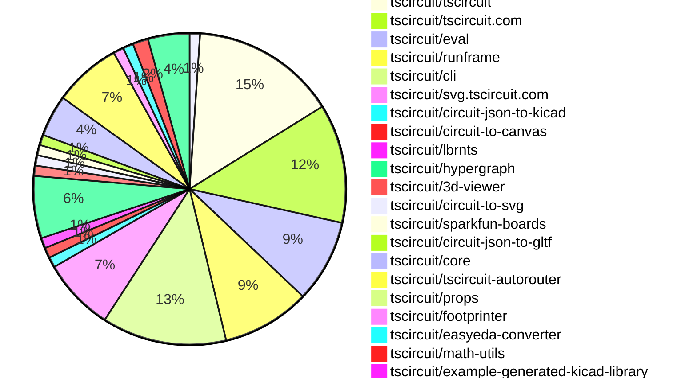

# Contribution Overview 2026-01-07

The current week is shown below. There are 3 major sections:

- [Contributor Overview](#contributor-overview)
- [PRs by Repository](#prs-by-repository)
- [PRs by Contributor](#changes-by-contributor)
- [Scoring & Sponsorship Details](/docs/sponsorship-calculation-explanation.md)

## PRs by Repository

## Contributor Overview

| Contributor | 🐳 Major | 🐙 Minor | 🐌 Tiny | ⭐ | Discussion Contributions |
|-------------|---------|---------|---------|-----|--------------------------|
| [seveibar](#seveibar) | 16 | 4 | 3 | 👑 | 0🔹 0🔶 0💎 |
| [ArnavK-09](#ArnavK-09) | 6 | 1 | 3 | ⭐⭐ | 0🔹 0🔶 0💎 |
| [AnasSarkiz](#AnasSarkiz) | 4 | 2 | 3 | ⭐⭐ | 0🔹 0🔶 0💎 |
| [Abse2001](#Abse2001) | 2 | 3 | 3 | ⭐⭐ | 0🔹 0🔶 0💎 |
| [ShiboSoftwareDev](#ShiboSoftwareDev) | 1 | 4 | 3 | ⭐⭐ | 0🔹 0🔶 0💎 |
| [techmannih](#techmannih) | 1 | 1 | 3 | ⭐⭐ | 0🔹 0🔶 0💎 |
| [tscircuitbot](#tscircuitbot) | 0 | 0 | 111 | ⭐⭐ | 0🔹 0🔶 0💎 |
| [imrishabh18](#imrishabh18) | 1 | 1 | 4 | ⭐⭐ | 0🔹 0🔶 0💎 |
| [MustafaMulla29](#MustafaMulla29) | 1 | 1 | 2 | ⭐ | 0🔹 0🔶 0💎 |
| [0hmX](#0hmX) | 1 | 0 | 1 | ⭐ | 0🔹 0🔶 0💎 |
| [Ayushjhawar8](#Ayushjhawar8) | 0 | 1 | 1 |  | 0🔹 0🔶 0💎 |

> Note: AI evaluates PRs and assigns 1-3 star ratings automatically. 4 and 5 star ratings require manual staff review.

### Discussion Contribution Legend

- 🔹 Normal Comments: Basic participation with minimal effort
- 🔶 Great Informative Comments: Thoughtful participation that adds value
- 💎 Incredible Comments: Exceptional participation with high-quality content

## Review Table

[reviews-received-hover]: ## "Number of reviews received for PRs for this contributor"
[approvals-received-hover]: ## "Number of approvals received for PRs this contributor authored"
[rejections-received-hover]: ## "Number of rejections received for PRs this contributor authored"
[prs-opened-hover]: ## "Number of PRs opened by this contributor"
[issues-created-hover]: ## "Number of issues created by this contributor"

| Contributor | Reviews Received | Approvals Received | Rejections Received | Approvals | Rejections | PRs Opened | PRs Merged | Issues Created |
|---|---|---|---|---|---|---|---|---|
| [techmannih](#techmannih) | 10 | 2 | 0 | 0 | 1 | 7 | 5 | 0 |
| [Abse2001](#Abse2001) | 10 | 9 | 0 | 1 | 0 | 8 | 8 | 0 |
| [tscircuitbot](#tscircuitbot) | 0 | 0 | 0 | 0 | 0 | 130 | 111 | 0 |
| [seveibar](#seveibar) | 1 | 0 | 0 | 25 | 3 | 29 | 23 | 0 |
| [Ayushjhawar8](#Ayushjhawar8) | 8 | 3 | 0 | 0 | 0 | 5 | 2 | 0 |
| [Sahil-Gupta584](#Sahil-Gupta584) | 9 | 0 | 1 | 0 | 0 | 4 | 0 | 0 |
| [Rewolbebol](#Rewolbebol) | 1 | 0 | 0 | 0 | 0 | 1 | 0 | 0 |
| [ShiboSoftwareDev](#ShiboSoftwareDev) | 12 | 6 | 1 | 4 | 0 | 10 | 8 | 0 |
| [imrishabh18](#imrishabh18) | 1 | 0 | 0 | 1 | 2 | 6 | 6 | 0 |
| [ArnavK-09](#ArnavK-09) | 8 | 6 | 0 | 0 | 0 | 10 | 10 | 0 |
| [MustafaMulla29](#MustafaMulla29) | 12 | 5 | 3 | 1 | 0 | 5 | 4 | 0 |
| [0hmX](#0hmX) | 3 | 0 | 0 | 0 | 1 | 7 | 2 | 0 |
| [Excellencedev](#Excellencedev) | 2 | 0 | 1 | 0 | 0 | 1 | 0 | 0 |
| [natinew77-creator](#natinew77-creator) | 2 | 0 | 1 | 0 | 0 | 2 | 0 | 0 |
| [anzal787](#anzal787) | 0 | 0 | 0 | 0 | 0 | 2 | 0 | 0 |
| [AnasSarkiz](#AnasSarkiz) | 1 | 1 | 0 | 0 | 0 | 9 | 9 | 0 |

## Changes by Repository

### [tscircuit/pcb-viewer](https://github.com/tscircuit/pcb-viewer)

| PR # | Impact | Rating | Contributor | Description |
|------|--------|--------|-------------|-------------|
| [#590](https://github.com/tscircuit/pcb-viewer/pull/590) | 🐙 Minor | ⭐⭐ | Abse2001 | Switches SMT pad rendering to circuit-to-canvas for correct copper-layer drawing and adds hover-aware color adjustment to visually highlight SMT pads under interaction. |

🐌 Tiny Contributions (1)

| PR # | Impact | Contributor | Description |
|------|--------|-------------|-------------|
| [#591](https://github.com/tscircuit/pcb-viewer/pull/591) | 🐌 Tiny | tscircuitbot | Automated package update |

### [tscircuit/tscircuit](https://github.com/tscircuit/tscircuit)

🐌 Tiny Contributions (28)

| PR # | Impact | Contributor | Description |
|------|--------|-------------|-------------|
| [#1818](https://github.com/tscircuit/tscircuit/pull/1818) | 🐌 Tiny | tscircuitbot | Automated package update |
| [#1821](https://github.com/tscircuit/tscircuit/pull/1821) | 🐌 Tiny | tscircuitbot | Automated package update |
| [#1815](https://github.com/tscircuit/tscircuit/pull/1815) | 🐌 Tiny | tscircuitbot | Updates the tscircuitcli package from version 0.1.733 to 0.1.735 and the tscircuitrunframe package from version 0.0.1464 to 0.0.1465 in the package.json file. |
| [#1814](https://github.com/tscircuit/tscircuit/pull/1814) | 🐌 Tiny | tscircuitbot | Updates the tscircuitcli package from version 0.1.733 to 0.1.735 and the tscircuitrunframe package from version 0.0.1464 to 0.0.1465 in package.json |
| [#1816](https://github.com/tscircuit/tscircuit/pull/1816) | 🐌 Tiny | tscircuitbot | Automated package update |
| [#1812](https://github.com/tscircuit/tscircuit/pull/1812) | 🐌 Tiny | tscircuitbot | Automated package update |
| [#1819](https://github.com/tscircuit/tscircuit/pull/1819) | 🐌 Tiny | tscircuitbot | Updates the package version from 0.0.1126 to 0.0.1127 in package.json |
| [#1811](https://github.com/tscircuit/tscircuit/pull/1811) | 🐌 Tiny | tscircuitbot | Automated package update |
| [#1817](https://github.com/tscircuit/tscircuit/pull/1817) | 🐌 Tiny | tscircuitbot | Automated package update |
| [#1820](https://github.com/tscircuit/tscircuit/pull/1820) | 🐌 Tiny | tscircuitbot | Updates the tscircuitcli package to version 0.1.737 in the package.json file |
| [#1822](https://github.com/tscircuit/tscircuit/pull/1822) | 🐌 Tiny | tscircuitbot | Automated package update |
| [#1823](https://github.com/tscircuit/tscircuit/pull/1823) | 🐌 Tiny | tscircuitbot | Automated package update |
| [#1809](https://github.com/tscircuit/tscircuit/pull/1809) | 🐌 Tiny | tscircuitbot | Automated package update |
| [#1808](https://github.com/tscircuit/tscircuit/pull/1808) | 🐌 Tiny | tscircuitbot | Automated package update |
| [#1810](https://github.com/tscircuit/tscircuit/pull/1810) | 🐌 Tiny | tscircuitbot | Automated package update |
| [#1807](https://github.com/tscircuit/tscircuit/pull/1807) | 🐌 Tiny | tscircuitbot | Updates the tscircuitcli package version from 0.1.730 to 0.1.731 |
| [#1805](https://github.com/tscircuit/tscircuit/pull/1805) | 🐌 Tiny | tscircuitbot | Updates the tscircuitcli package to version 0.1.730 in package.json |
| [#1800](https://github.com/tscircuit/tscircuit/pull/1800) | 🐌 Tiny | tscircuitbot | Automated package update |
| [#1803](https://github.com/tscircuit/tscircuit/pull/1803) | 🐌 Tiny | tscircuitbot | Automated package update |
| [#1804](https://github.com/tscircuit/tscircuit/pull/1804) | 🐌 Tiny | tscircuitbot | Automated package update |
| [#1797](https://github.com/tscircuit/tscircuit/pull/1797) | 🐌 Tiny | tscircuitbot | Automated package update |
| [#1795](https://github.com/tscircuit/tscircuit/pull/1795) | 🐌 Tiny | tscircuitbot | Updates the tscircuitcli package from version 0.1.724 to 0.1.726 and the circuit-to-svg package from version 0.0.311 to 0.0.307 in package.json |
| [#1801](https://github.com/tscircuit/tscircuit/pull/1801) | 🐌 Tiny | tscircuitbot | Updates the version of the tscircuitcore package from 0.0.956 to 0.0.957 in package.json |
| [#1799](https://github.com/tscircuit/tscircuit/pull/1799) | 🐌 Tiny | tscircuitbot | Updates the tscircuitcli package to version 0.1.728 in the package.json file |
| [#1806](https://github.com/tscircuit/tscircuit/pull/1806) | 🐌 Tiny | tscircuitbot | Automated package update |
| [#1802](https://github.com/tscircuit/tscircuit/pull/1802) | 🐌 Tiny | tscircuitbot | Automated package update |
| [#1798](https://github.com/tscircuit/tscircuit/pull/1798) | 🐌 Tiny | tscircuitbot | Automated package update |
| [#1796](https://github.com/tscircuit/tscircuit/pull/1796) | 🐌 Tiny | tscircuitbot | Automated package update |

### [tscircuit/tscircuit.com](https://github.com/tscircuit/tscircuit.com)

| PR # | Impact | Rating | Contributor | Description |
|------|--------|--------|-------------|-------------|
| [#2453](https://github.com/tscircuit/tscircuit.com/pull/2453) | 🐳 Major | ⭐⭐⭐ | ArnavK-09 | Adds a button to manually sync a package with GitHub, allowing users to initiate synchronization directly from the package interface. |
| [#2448](https://github.com/tscircuit/tscircuit.com/pull/2448) | 🐳 Major | ⭐⭐⭐ | ArnavK-09 | Updated SidebarReleasesSection to conditionally render the link based on packageInfo availability, modified getBuildStatus and getBuildErrorMessage functions to accept PublicPackageRelease type, removed unnecessary latestBuildQueries logic from ReleasesList, simplifying the build status retrieval process, and adjusted status label visibility in ReleaseItemRow based on build success. |
| [#2451](https://github.com/tscircuit/tscircuit.com/pull/2451) | 🐳 Major | ⭐⭐⭐ | ArnavK-09 | Adds a new API route to initiate synchronization of a package with GitHub, including validation for package existence and permissions. |
| [#2441](https://github.com/tscircuit/tscircuit.com/pull/2441) | 🐳 Major | ⭐⭐⭐ | ArnavK-09 | Adds a new Builds Page component that displays build information with status, duration, and error messages, including a search and filter functionality for builds. |
| [#2446](https://github.com/tscircuit/tscircuit.com/pull/2446) | 🐳 Major | ⭐⭐⭐ | ArnavK-09 | Adds a new Releases List component to display package releases with their statuses and actions. |
| [#2433](https://github.com/tscircuit/tscircuit.com/pull/2433) | 🐳 Major | ⭐⭐⭐ | imrishabh18 | This PR modifies the user interface of the release page by introducing a new BuildDetailsCard component that displays build details, including status, duration, and associated images, while also updating the ConnectedRepoOverview and release-detail page to integrate this new component. |
| [#2428](https://github.com/tscircuit/tscircuit.com/pull/2428) | 🐙 Minor | ⭐⭐ | imrishabh18 | Ensures a newly forked package inherits the same visibility (privatepublic) as the source package and fixes inconsistent behavior between the package header fork flow and the editor fork flow by passing the is_private flag to the API. |

🐌 Tiny Contributions (16)

| PR # | Impact | Contributor | Description |
|------|--------|-------------|-------------|
| [#2454](https://github.com/tscircuit/tscircuit.com/pull/2454) | 🐌 Tiny | tscircuitbot | Automated package update to version 0.0.186 |
| [#2449](https://github.com/tscircuit/tscircuit.com/pull/2449) | 🐌 Tiny | tscircuitbot | Updates the tscircuiteval package to version 0.0.581 in the package.json file. |
| [#2437](https://github.com/tscircuit/tscircuit.com/pull/2437) | 🐌 Tiny | tscircuitbot | Automated package update |
| [#2444](https://github.com/tscircuit/tscircuit.com/pull/2444) | 🐌 Tiny | tscircuitbot | Updates the tscircuiteval package to version 0.0.580 |
| [#2438](https://github.com/tscircuit/tscircuit.com/pull/2438) | 🐌 Tiny | tscircuitbot | Updates the tscircuiteval package to version 0.0.578 in the package.json file. |
| [#2452](https://github.com/tscircuit/tscircuit.com/pull/2452) | 🐌 Tiny | tscircuitbot | Automated package update to version 0.0.185 |
| [#2442](https://github.com/tscircuit/tscircuit.com/pull/2442) | 🐌 Tiny | tscircuitbot | Updates the tscircuiteval package to version 0.0.579 in the package.json file. |
| [#2436](https://github.com/tscircuit/tscircuit.com/pull/2436) | 🐌 Tiny | tscircuitbot | Automated package update |
| [#2435](https://github.com/tscircuit/tscircuit.com/pull/2435) | 🐌 Tiny | tscircuitbot | Automated package update |
| [#2430](https://github.com/tscircuit/tscircuit.com/pull/2430) | 🐌 Tiny | tscircuitbot | Automated package update |
| [#2455](https://github.com/tscircuit/tscircuit.com/pull/2455) | 🐌 Tiny | ArnavK-09 | Changes the organization profile page to use compact card layouts for package cards during loading and display. |
| [#2447](https://github.com/tscircuit/tscircuit.com/pull/2447) | 🐌 Tiny | ArnavK-09 | Adds minimal UX patches including styling updates and placeholder text changes in various components. |
| [#2429](https://github.com/tscircuit/tscircuit.com/pull/2429) | 🐌 Tiny | ArnavK-09 | Updates the logic to display the AI description tab only when there is AI content and no README file present. |
| [#2434](https://github.com/tscircuit/tscircuit.com/pull/2434) | 🐌 Tiny | imrishabh18 | Removes the duplicate rebuild button from the UI when the build fails or there is no build information available, streamlining the user interface. |
| [#2432](https://github.com/tscircuit/tscircuit.com/pull/2432) | 🐌 Tiny | imrishabh18 | Aligns the width of the breadcrumb section with the logs section, displays a clear message when no builds are found, and aligns the text of breadcrumbs with the rebuild button. |
| [#2431](https://github.com/tscircuit/tscircuit.com/pull/2431) | 🐌 Tiny | imrishabh18 | Removes the Created time duration ago text from the release detail header so release pages no longer show the relative creation timestamp. |

### [tscircuit/eval](https://github.com/tscircuit/eval)

🐌 Tiny Contributions (16)

| PR # | Impact | Contributor | Description |
|------|--------|-------------|-------------|
| [#1847](https://github.com/tscircuit/eval/pull/1847) | 🐌 Tiny | tscircuitbot | Automated package update |
| [#1844](https://github.com/tscircuit/eval/pull/1844) | 🐌 Tiny | tscircuitbot | Updates the version of the tscircuitcore package from 0.0.962 to 0.0.963 in package.json |
| [#1841](https://github.com/tscircuit/eval/pull/1841) | 🐌 Tiny | tscircuitbot | Automated package update |
| [#1838](https://github.com/tscircuit/eval/pull/1838) | 🐌 Tiny | tscircuitbot | Updates the version of the tscircuitcore package from 0.0.960 to 0.0.961 in package.json |
| [#1835](https://github.com/tscircuit/eval/pull/1835) | 🐌 Tiny | tscircuitbot | Updates package dependencies to their latest versions in package.json |
| [#1848](https://github.com/tscircuit/eval/pull/1848) | 🐌 Tiny | tscircuitbot | Automated package update to version 0.0.581 |
| [#1845](https://github.com/tscircuit/eval/pull/1845) | 🐌 Tiny | tscircuitbot | Automated package update |
| [#1842](https://github.com/tscircuit/eval/pull/1842) | 🐌 Tiny | tscircuitbot | Automated package update |
| [#1839](https://github.com/tscircuit/eval/pull/1839) | 🐌 Tiny | tscircuitbot | Automated package update |
| [#1836](https://github.com/tscircuit/eval/pull/1836) | 🐌 Tiny | tscircuitbot | Automated package update |
| [#1833](https://github.com/tscircuit/eval/pull/1833) | 🐌 Tiny | tscircuitbot | Automated package update |
| [#1829](https://github.com/tscircuit/eval/pull/1829) | 🐌 Tiny | tscircuitbot | Automated package update |
| [#1830](https://github.com/tscircuit/eval/pull/1830) | 🐌 Tiny | tscircuitbot | Automated package update |
| [#1832](https://github.com/tscircuit/eval/pull/1832) | 🐌 Tiny | tscircuitbot | Automated package update |
| [#1827](https://github.com/tscircuit/eval/pull/1827) | 🐌 Tiny | tscircuitbot | Automated package update |
| [#1826](https://github.com/tscircuit/eval/pull/1826) | 🐌 Tiny | tscircuitbot | Updates the version of the tscircuitcore package from 0.0.956 to 0.0.957 in package.json |

### [tscircuit/runframe](https://github.com/tscircuit/runframe)

🐌 Tiny Contributions (17)

| PR # | Impact | Contributor | Description |
|------|--------|-------------|-------------|
| [#2277](https://github.com/tscircuit/runframe/pull/2277) | 🐌 Tiny | tscircuitbot | Updates the tscircuiteval package to version 0.0.577 in the package.json file. |
| [#2283](https://github.com/tscircuit/runframe/pull/2283) | 🐌 Tiny | tscircuitbot | Automated package update |
| [#2284](https://github.com/tscircuit/runframe/pull/2284) | 🐌 Tiny | tscircuitbot | Automated package update |
| [#2281](https://github.com/tscircuit/runframe/pull/2281) | 🐌 Tiny | tscircuitbot | Updates the tscircuit3d-viewer package to version 0.0.484 in package.json |
| [#2282](https://github.com/tscircuit/runframe/pull/2282) | 🐌 Tiny | tscircuitbot | Automated package update |
| [#2278](https://github.com/tscircuit/runframe/pull/2278) | 🐌 Tiny | tscircuitbot | Updates the tscircuiteval package to version 0.0.578 in the package.json file. |
| [#2286](https://github.com/tscircuit/runframe/pull/2286) | 🐌 Tiny | tscircuitbot | Automated package update |
| [#2276](https://github.com/tscircuit/runframe/pull/2276) | 🐌 Tiny | tscircuitbot | Updates the circuit-json-to-kicad package from version 0.0.32 to 0.0.33 |
| [#2287](https://github.com/tscircuit/runframe/pull/2287) | 🐌 Tiny | tscircuitbot | Updates the tscircuiteval package to version 0.0.581 in the package.json file. |
| [#2288](https://github.com/tscircuit/runframe/pull/2288) | 🐌 Tiny | tscircuitbot | Automated package update |
| [#2280](https://github.com/tscircuit/runframe/pull/2280) | 🐌 Tiny | tscircuitbot | Automated package update |
| [#2285](https://github.com/tscircuit/runframe/pull/2285) | 🐌 Tiny | tscircuitbot | Automated package update |
| [#2272](https://github.com/tscircuit/runframe/pull/2272) | 🐌 Tiny | tscircuitbot | Updates the tscircuiteval package to version 0.0.576 in the package.json file. |
| [#2271](https://github.com/tscircuit/runframe/pull/2271) | 🐌 Tiny | tscircuitbot | Updates the tscircuiteval package to version 0.0.575 in package.json |
| [#2273](https://github.com/tscircuit/runframe/pull/2273) | 🐌 Tiny | tscircuitbot | Updates the tscircuit3d-viewer package from version 0.0.482 to 0.0.483 |
| [#2270](https://github.com/tscircuit/runframe/pull/2270) | 🐌 Tiny | tscircuitbot | Updates the tscircuiteval package to version 0.0.574 |
| [#2279](https://github.com/tscircuit/runframe/pull/2279) | 🐌 Tiny | Abse2001 | This pull request updates the styles.generated.ts file, which is likely a generated file containing styles for the project. The changes appear to be related to the Tailwind CSS framework, as indicated by the presence of Tailwind CSS classes and variables. The update may include new styles or modifications to existing styles, but the specific changes are not detailed in the provided diff. |

### [tscircuit/cli](https://github.com/tscircuit/cli)

| PR # | Impact | Rating | Contributor | Description |
|------|--------|--------|-------------|-------------|
| [#1577](https://github.com/tscircuit/cli/pull/1577) | 🐳 Major | ⭐⭐⭐ | seveibar | Add a --ci flag to the tsci build command that allows for CI-friendly builds by installing dependencies and executing project-defined build steps before the normal build process. |
| [#1568](https://github.com/tscircuit/cli/pull/1568) | 🐳 Major | ⭐⭐⭐ | ArnavK-09 | Adds upload results summary and error handling to the push process, providing detailed feedback on file upload success and failure. |
| [#1575](https://github.com/tscircuit/cli/pull/1575) | 🐙 Minor | ⭐⭐ | seveibar | Adds a prebuildCommand project configuration option to allow users to specify a command to run before builds. |
| [#1570](https://github.com/tscircuit/cli/pull/1570) | 🐙 Minor | ⭐⭐ | seveibar | Allow projects to specify a buildCommand in tscircuit.config.json as an override for what to run during cloud builds, without changing local tsci build behavior. |
| [#1565](https://github.com/tscircuit/cli/pull/1565) | 🐙 Minor | ⭐⭐ | ArnavK-09 | Adds the --include-dist option to the push command, allowing users to include the dist directory in the push operation. |
| [#1579](https://github.com/tscircuit/cli/pull/1579) | 🐙 Minor | ⭐⭐ | MustafaMulla29 | Integrates the KicadLibraryConverter API to convert tscircuit libraries into KiCad library format, enabling users to export their designs seamlessly. |

🐌 Tiny Contributions (18)

| PR # | Impact | Contributor | Description |
|------|--------|-------------|-------------|
| [#1582](https://github.com/tscircuit/cli/pull/1582) | 🐌 Tiny | tscircuitbot | Updates the tscircuitrunframe package from version 0.0.1464 to 0.0.1465 |
| [#1580](https://github.com/tscircuit/cli/pull/1580) | 🐌 Tiny | tscircuitbot | Automated package update for tscircuitrunframe from version 0.0.1463 to 0.0.1464 |
| [#1587](https://github.com/tscircuit/cli/pull/1587) | 🐌 Tiny | tscircuitbot | Automated package update |
| [#1590](https://github.com/tscircuit/cli/pull/1590) | 🐌 Tiny | tscircuitbot | Automated package update |
| [#1585](https://github.com/tscircuit/cli/pull/1585) | 🐌 Tiny | tscircuitbot | Updates the tscircuitrunframe package from version 0.0.1465 to 0.0.1466 |
| [#1589](https://github.com/tscircuit/cli/pull/1589) | 🐌 Tiny | tscircuitbot | Updates the tscircuitrunframe package from version 0.0.1466 to 0.0.1468 |
| [#1581](https://github.com/tscircuit/cli/pull/1581) | 🐌 Tiny | tscircuitbot | Automated package update |
| [#1583](https://github.com/tscircuit/cli/pull/1583) | 🐌 Tiny | tscircuitbot | Automated package update |
| [#1586](https://github.com/tscircuit/cli/pull/1586) | 🐌 Tiny | tscircuitbot | Automated package update |
| [#1578](https://github.com/tscircuit/cli/pull/1578) | 🐌 Tiny | tscircuitbot | Automated package update |
| [#1576](https://github.com/tscircuit/cli/pull/1576) | 🐌 Tiny | tscircuitbot | Automated package update |
| [#1574](https://github.com/tscircuit/cli/pull/1574) | 🐌 Tiny | tscircuitbot | Automated package update |
| [#1569](https://github.com/tscircuit/cli/pull/1569) | 🐌 Tiny | tscircuitbot | Automated package update |
| [#1566](https://github.com/tscircuit/cli/pull/1566) | 🐌 Tiny | tscircuitbot | Automated package update |
| [#1573](https://github.com/tscircuit/cli/pull/1573) | 🐌 Tiny | tscircuitbot | Automated package update |
| [#1571](https://github.com/tscircuit/cli/pull/1571) | 🐌 Tiny | tscircuitbot | Automated package update |
| [#1567](https://github.com/tscircuit/cli/pull/1567) | 🐌 Tiny | imrishabh18 | Adds a line to the global npmrc to specify the registry URL for the TSC package, ensuring proper authentication and registry configuration for users. |
| [#1572](https://github.com/tscircuit/cli/pull/1572) | 🐌 Tiny | MustafaMulla29 | Fixes error message to recommend using the correct package naming convention: tsciusername.package instead of usernamepackage |

### [tscircuit/svg.tscircuit.com](https://github.com/tscircuit/svg.tscircuit.com)

🐌 Tiny Contributions (14)

| PR # | Impact | Contributor | Description |
|------|--------|-------------|-------------|
| [#814](https://github.com/tscircuit/svg.tscircuit.com/pull/814) | 🐌 Tiny | tscircuitbot | Updates the tscircuit package from version 0.0.1128 to 0.0.1129 in package.json |
| [#812](https://github.com/tscircuit/svg.tscircuit.com/pull/812) | 🐌 Tiny | tscircuitbot | Updates the tscircuit package version from 0.0.1126 to 0.0.1127 in package.json |
| [#809](https://github.com/tscircuit/svg.tscircuit.com/pull/809) | 🐌 Tiny | tscircuitbot | Updates the tscircuit package version from 0.0.1123 to 0.0.1124 in package.json |
| [#810](https://github.com/tscircuit/svg.tscircuit.com/pull/810) | 🐌 Tiny | tscircuitbot | Updates the tscircuit package version from 0.0.1124 to 0.0.1125 in package.json |
| [#813](https://github.com/tscircuit/svg.tscircuit.com/pull/813) | 🐌 Tiny | tscircuitbot | Updates the tscircuit package version from 0.0.1127 to 0.0.1128 in package.json |
| [#811](https://github.com/tscircuit/svg.tscircuit.com/pull/811) | 🐌 Tiny | tscircuitbot | Updates the tscircuit package version from 0.0.1125 to 0.0.1126 in package.json |
| [#808](https://github.com/tscircuit/svg.tscircuit.com/pull/808) | 🐌 Tiny | tscircuitbot | Automated package update |
| [#807](https://github.com/tscircuit/svg.tscircuit.com/pull/807) | 🐌 Tiny | tscircuitbot | Updates the tscircuit package from version 0.0.1121 to 0.0.1122 in package.json |
| [#804](https://github.com/tscircuit/svg.tscircuit.com/pull/804) | 🐌 Tiny | tscircuitbot | Updates the tscircuit package from version 0.0.1118 to 0.0.1119 in package.json |
| [#803](https://github.com/tscircuit/svg.tscircuit.com/pull/803) | 🐌 Tiny | tscircuitbot | Updates the tscircuit package version from 0.0.1117 to 0.0.1118 in package.json |
| [#801](https://github.com/tscircuit/svg.tscircuit.com/pull/801) | 🐌 Tiny | tscircuitbot | Updates the tscircuit package version from 0.0.1115 to 0.0.1116 in package.json |
| [#806](https://github.com/tscircuit/svg.tscircuit.com/pull/806) | 🐌 Tiny | tscircuitbot | Updates the tscircuit package version from 0.0.1120 to 0.0.1121 in package.json |
| [#802](https://github.com/tscircuit/svg.tscircuit.com/pull/802) | 🐌 Tiny | tscircuitbot | Updates the tscircuit package from version 0.0.1116 to 0.0.1117 |
| [#805](https://github.com/tscircuit/svg.tscircuit.com/pull/805) | 🐌 Tiny | tscircuitbot | Updates the tscircuit package version from 0.0.1119 to 0.0.1120 in package.json |

### [tscircuit/circuit-json-to-kicad](https://github.com/tscircuit/circuit-json-to-kicad)

| PR # | Impact | Rating | Contributor | Description |
|------|--------|--------|-------------|-------------|
| [#47](https://github.com/tscircuit/circuit-json-to-kicad/pull/47) | 🐳 Major | ⭐⭐⭐ | MustafaMulla29 | Adds KicadLibraryConverter API to convert tscircuit components to KiCad libraries with user and builtin separation for footprints and symbols. |

🐌 Tiny Contributions (1)

| PR # | Impact | Contributor | Description |
|------|--------|-------------|-------------|
| [#48](https://github.com/tscircuit/circuit-json-to-kicad/pull/48) | 🐌 Tiny | tscircuitbot | Automated package update |

### [tscircuit/circuit-to-canvas](https://github.com/tscircuit/circuit-to-canvas)

🐌 Tiny Contributions (2)

| PR # | Impact | Contributor | Description |
|------|--------|-------------|-------------|
| [#103](https://github.com/tscircuit/circuit-to-canvas/pull/103) | 🐌 Tiny | tscircuitbot | Automated package update |
| [#102](https://github.com/tscircuit/circuit-to-canvas/pull/102) | 🐌 Tiny | techmannih | Extracts a helper function for calculating the border radius of PCB SMT pads to reduce code duplication in the drawPcbSmtPad function. |

### [tscircuit/lbrnts](https://github.com/tscircuit/lbrnts)

| PR # | Impact | Rating | Contributor | Description |
|------|--------|--------|-------------|-------------|
| [#19](https://github.com/tscircuit/lbrnts/pull/19) | 🐙 Minor | ⭐⭐ | AnasSarkiz | Adds stroke-linecapround and stroke-linejoinround to SVG path rendering to eliminate visual gaps at joins and ends for thin strokes. |

🐌 Tiny Contributions (1)

| PR # | Impact | Contributor | Description |
|------|--------|-------------|-------------|
| [#20](https://github.com/tscircuit/lbrnts/pull/20) | 🐌 Tiny | tscircuitbot | Automated package update to version 0.0.12 |

### [tscircuit/hypergraph](https://github.com/tscircuit/hypergraph)

| PR # | Impact | Rating | Contributor | Description |
|------|--------|--------|-------------|-------------|
| [#15](https://github.com/tscircuit/hypergraph/pull/15) | 🐳 Major | ⭐⭐⭐ | seveibar | This pull request introduces a previously failing test case, implements a stochastic gradient descent optimizer, and ensures that the calculations are scale-invariant by incorporating an initial hop distance calculation. The changes aim to enhance the performance and reliability of the hypergraph solver by addressing specific issues that were causing failures in previous implementations. |
| [#6](https://github.com/tscircuit/hypergraph/pull/6) | 🐳 Major | ⭐⭐⭐ | seveibar | Fixes channel bugs and adds support for bounds parameter in jumper graph generation. |
| [#12](https://github.com/tscircuit/hypergraph/pull/12) | 🐳 Major | ⭐⭐⭐ | seveibar | Adds support for a configurable number of parallel traces that can pass through the jumper body without using jumpers. |
| [#5](https://github.com/tscircuit/hypergraph/pull/5) | 🐳 Major | ⭐⭐⭐ | seveibar | Adds scripts for benchmarking and optimizing hyperparameters using gradient descent, including support for dual orientation tests and parameter updates. |

🐌 Tiny Contributions (8)

| PR # | Impact | Contributor | Description |
|------|--------|-------------|-------------|
| [#16](https://github.com/tscircuit/hypergraph/pull/16) | 🐌 Tiny | tscircuitbot | Automated package update |
| [#18](https://github.com/tscircuit/hypergraph/pull/18) | 🐌 Tiny | tscircuitbot | Automated package update |
| [#11](https://github.com/tscircuit/hypergraph/pull/11) | 🐌 Tiny | tscircuitbot | Automated package update |
| [#7](https://github.com/tscircuit/hypergraph/pull/7) | 🐌 Tiny | tscircuitbot | Updates the package version from 0.0.1 to 0.0.4 in package.json |
| [#9](https://github.com/tscircuit/hypergraph/pull/9) | 🐌 Tiny | tscircuitbot | Updates the package version from 0.0.4 to 0.0.5 in package.json |
| [#13](https://github.com/tscircuit/hypergraph/pull/13) | 🐌 Tiny | tscircuitbot | Automated package update |
| [#14](https://github.com/tscircuit/hypergraph/pull/14) | 🐌 Tiny | tscircuitbot | Updates the package version from 0.0.8 to 0.0.9 in package.json |
| [#8](https://github.com/tscircuit/hypergraph/pull/8) | 🐌 Tiny | seveibar | Fixes bounds calculation for horizontal orientation and adds support for jumper locations in the JumperGraph structure. |

### [tscircuit/3d-viewer](https://github.com/tscircuit/3d-viewer)

| PR # | Impact | Rating | Contributor | Description |
|------|--------|--------|-------------|-------------|
| [#639](https://github.com/tscircuit/3d-viewer/pull/639) | 🐳 Major | ⭐⭐⭐ | Abse2001 | Fixes silkscreen stroke handling by replacing the logic to determine stroke presence based on stroke width instead of a has_stroke property. |
| [#638](https://github.com/tscircuit/3d-viewer/pull/638) | 🐳 Major | ⭐⭐⭐ | seveibar | Motivation Some cad_component entries only provide a STEP URL and there was no client-side fallback to render them as mesh models. Enable in-browser conversion so STEP-only parts can be displayed without requiring pre-converted glTFGLB assets. Use a lightweight runtime import of occt-import-js from jsDelivr to avoid bundling the OCCT runtime into the app.  Description Dynamically load occt-import-js from jsDelivr via loadOcctImport() and resolve the factory export at runtime. Add convertStepUrlToGlbUrl() which fetches a STEP file, imports it with OCCT, converts OCCT meshes into Three.js GroupMesh objects, and exports a binary GLB using GLTFExporter, returning a blob URL. Integrate a fallback into AnyCadComponent by adding stepGltfUrl state and a useEffect that drives conversion when a model_step_url exists and no other meshgltf sources are present. Add a module declaration for the remote jsDelivr import in srcmodules.d.ts to satisfy the TypeScript build and ensure proper cleanup of generated object URLs.  Testing Ran TypeScript typecheck with bunx tsc --noEmit, which completed successfully. Ran formatter with bun run format, which completed successfully. No new automated unit tests were added in this change. |

### [tscircuit/circuit-to-svg](https://github.com/tscircuit/circuit-to-svg)

| PR # | Impact | Rating | Contributor | Description |
|------|--------|--------|-------------|-------------|
| [#478](https://github.com/tscircuit/circuit-to-svg/pull/478) | 🐳 Major | ⭐⭐⭐ | Abse2001 | Adds explicit viewport and viewportTarget options to precisely control SVG render bounds, extracts viewport resolution into a utility, updates aspect-ratio handling, and adds snapshot tests for custom bounds and panel-targeted rendering. |
| [#477](https://github.com/tscircuit/circuit-to-svg/pull/477) | 🐳 Major | ⭐⭐⭐ | techmannih | Adds diagonal pattern rendering for keepout areas with a transparent background in PCB SVG generation. |

### [tscircuit/sparkfun-boards](https://github.com/tscircuit/sparkfun-boards)

| PR # | Impact | Rating | Contributor | Description |
|------|--------|--------|-------------|-------------|
| [#237](https://github.com/tscircuit/sparkfun-boards/pull/237) | 🐙 Minor | ⭐⭐ | Abse2001 | Fixes 3D position and rotation offsets for specific components in the circuit board models. |

🐌 Tiny Contributions (1)

| PR # | Impact | Contributor | Description |
|------|--------|-------------|-------------|
| [#235](https://github.com/tscircuit/sparkfun-boards/pull/235) | 🐌 Tiny | Abse2001 | This pull request updates the dependency on the tscircuit library to the latest version, ensuring compatibility and access to new features and bug fixes. |

### [tscircuit/circuit-json-to-gltf](https://github.com/tscircuit/circuit-json-to-gltf)

| PR # | Impact | Rating | Contributor | Description |
|------|--------|--------|-------------|-------------|
| [#108](https://github.com/tscircuit/circuit-json-to-gltf/pull/108) | 🐙 Minor | ⭐⭐ | Abse2001 | Extends panel 3D mesh generation to include PCB cutouts, not just holes. |

🐌 Tiny Contributions (1)

| PR # | Impact | Contributor | Description |
|------|--------|-------------|-------------|
| [#109](https://github.com/tscircuit/circuit-json-to-gltf/pull/109) | 🐌 Tiny | Abse2001 | This pull request improves the PCB panel test and updates the circuit-to-svg package to fix a texture bug that was affecting the rendering of circuit designs. The update includes a new test fixture for the PCB panel and an updated version of the circuit-to-svg package to ensure compatibility and performance improvements. |

### [tscircuit/core](https://github.com/tscircuit/core)

| PR # | Impact | Rating | Contributor | Description |
|------|--------|--------|-------------|-------------|
| [#1826](https://github.com/tscircuit/core/pull/1826) | 🐳 Major | ⭐⭐⭐ | seveibar | Fixes missing PCB port IDs from traces at jumper pads, ensuring proper connectivity in the autorouting system. |
| [#1824](https://github.com/tscircuit/core/pull/1824) | 🐳 Major | ⭐⭐⭐ | seveibar | Ensures that jumpers created during autorouting have internal connections and proper trace properties for the connectivity map. |
| [#1821](https://github.com/tscircuit/core/pull/1821) | 🐳 Major | ⭐⭐⭐ | seveibar | Integrates jumper autorouting functionality into the PCB design process, allowing for automatic placement and routing of jumpers in single-layer boards. |
| [#1827](https://github.com/tscircuit/core/pull/1827) | 🐙 Minor | ⭐⭐ | ShiboSoftwareDev | Fixes the issue where PCB note primitives do not reposition correctly during panel auto-layout, causing visual inconsistencies. |
| [#1820](https://github.com/tscircuit/core/pull/1820) | 🐙 Minor | ⭐⭐ | ShiboSoftwareDev | Fixes incorrect group sizing and positioning in PCB layout when children with external footprints are asynchronously loaded, ensuring accurate bounds calculation during render cycles. |
| [#1819](https://github.com/tscircuit/core/pull/1819) | 🐙 Minor | ⭐⭐ | ShiboSoftwareDev | Fixes incorrect board sizing and placement in panel layout by ensuring it waits for asynchronous footprints to resolve before rendering. |

🐌 Tiny Contributions (2)

| PR # | Impact | Contributor | Description |
|------|--------|-------------|-------------|
| [#1823](https://github.com/tscircuit/core/pull/1823) | 🐌 Tiny | seveibar | Updates the autorouter dependency to version 0.0.247, which likely includes improvements to the keepout solver functionality. |
| [#1828](https://github.com/tscircuit/core/pull/1828) | 🐌 Tiny | techmannih | Updates the circuit-to-svg dependency to version 0.0.313 and refreshes the keepout snapshots in the project. |

### [tscircuit/tscircuit-autorouter](https://github.com/tscircuit/tscircuit-autorouter)

| PR # | Impact | Rating | Contributor | Description |
|------|--------|--------|-------------|-------------|
| [#521](https://github.com/tscircuit/tscircuit-autorouter/pull/521) | 🐳 Major | ⭐⭐⭐ | seveibar | Fixes three major issues in the keepout solver and adds bounds testing for high-density jumper routing. |
| [#512](https://github.com/tscircuit/tscircuit-autorouter/pull/512) | 🐳 Major | ⭐⭐⭐ | seveibar | This pull request introduces a new JSON file containing detailed specifications for jumper high density routing, specifically for the Gameboyv2 project. It includes various node port points with their respective coordinates and connection names, aimed at improving the routing capabilities of the autorouter. |
| [#520](https://github.com/tscircuit/tscircuit-autorouter/pull/520) | 🐳 Major | ⭐⭐⭐ | seveibar | Adds support for an 8x4 jumper pattern and modifies inner channel point counts for improved jumper placement. |
| [#510](https://github.com/tscircuit/tscircuit-autorouter/pull/510) | 🐳 Major | ⭐⭐⭐ | seveibar | wip add Jumper to srj output enable jumper high density stitch fix 1 wip route stitch solver improvements wip keepout solver jumper set tracking, jumper segments can not be colliding segments wip fix jumper routing add insideJumperPad?: booelan to route add insideJumperPad to route support getting srj jumpers fix srj 1206x4 drawing, store jumpers better better keepout solving tweaking to keepout solver, draw jumper routes properly add repro for bad widths wip trace width solver fixes fix insideJumperPad add horz orientation (breaks things) fix horizontal jumper issue refactor adjust keepouts, remove horz orientation for now assignable pipeline 3 |
| [#507](https://github.com/tscircuit/tscircuit-autorouter/pull/507) | 🐳 Major | ⭐⭐⭐ | seveibar | Integrates the tscircuithypergraph library to enhance jumper routing capabilities, including support for multiple jumper patterns and orientations. |
| [#511](https://github.com/tscircuit/tscircuit-autorouter/pull/511) | 🐳 Major | ⭐⭐⭐ | seveibar | Adds Autorouting Pipeline 3 to the menu bar and enhances parameterization options for the multi-section pathing solver. |
| [#499](https://github.com/tscircuit/tscircuit-autorouter/pull/499) | 🐳 Major | ⭐⭐⭐ | seveibar | This pull request introduces a new function for jumper PF, along with bug reports and prepattern tests. It includes new fixture files for testing and bug reporting, which are essential for ensuring the reliability of the autorouting functionality. |
| [#506](https://github.com/tscircuit/tscircuit-autorouter/pull/506) | 🐳 Major | ⭐⭐⭐ | ShiboSoftwareDev | Adds a new hyperparameter STRAIGHT_LINE_DEVIATION_FACTOR to the PortPointPathingSolver that penalizes paths deviating from the straight line between connection endpoints, improving routing quality and reducing path complexity. |
| [#515](https://github.com/tscircuit/tscircuit-autorouter/pull/515) | 🐳 Major | ⭐⭐⭐ | 0hmX | This pull request adds a bug report and reworks the snapshots to visualize different outputs of the EXPANSION_DEGREES parameter in the MultiSectionPortPointOptimizer class. It introduces new test cases for various expansion degrees and ensures that the visual output is correctly captured in the snapshots. |
| [#524](https://github.com/tscircuit/tscircuit-autorouter/pull/524) | 🐙 Minor | ⭐⭐ | seveibar | Adds filtering logic to remove jumpers where no pads have any connections, preventing unnecessary output of unused jumpers. |

🐌 Tiny Contributions (3)

| PR # | Impact | Contributor | Description |
|------|--------|-------------|-------------|
| [#523](https://github.com/tscircuit/tscircuit-autorouter/pull/523) | 🐌 Tiny | seveibar | This pull request introduces a bug report for the autorouter functionality, including a detailed JSON representation of the bug and a corresponding fixture for testing. |
| [#522](https://github.com/tscircuit/tscircuit-autorouter/pull/522) | 🐌 Tiny | ShiboSoftwareDev | Adds a new autorouting test case for DIP16 components with crossing traces, including fixture, JSON data, and tests for both standard pipeline and high-density solver. |
| [#519](https://github.com/tscircuit/tscircuit-autorouter/pull/519) | 🐌 Tiny | 0hmX | Adds a reproduction case for the autorouting system getting stuck, including a test and fixture files for debugging. |

### [tscircuit/props](https://github.com/tscircuit/props)

| PR # | Impact | Rating | Contributor | Description |
|------|--------|--------|-------------|-------------|
| [#551](https://github.com/tscircuit/props/pull/551) | 🐙 Minor | ⭐⭐ | seveibar | Adds support for a new autorouter preset named auto_jumper and keeps a deprecated kebab-case alias for backwards compatibility. |

### [tscircuit/footprinter](https://github.com/tscircuit/footprinter)

| PR # | Impact | Rating | Contributor | Description |
|------|--------|--------|-------------|-------------|
| [#470](https://github.com/tscircuit/footprinter/pull/470) | 🐙 Minor | ⭐⭐ | techmannih | Adds optional convex and concave flags to various resistor array definitions to allow for more flexible configurations. |

🐌 Tiny Contributions (1)

| PR # | Impact | Contributor | Description |
|------|--------|-------------|-------------|
| [#471](https://github.com/tscircuit/footprinter/pull/471) | 🐌 Tiny | techmannih | Adds a new 0402_x2_convex footprint and implements conditional rendering to exclude the concave variant when specified. |

### [tscircuit/easyeda-converter](https://github.com/tscircuit/easyeda-converter)

| PR # | Impact | Rating | Contributor | Description |
|------|--------|--------|-------------|-------------|
| [#341](https://github.com/tscircuit/easyeda-converter/pull/341) | 🐙 Minor | ⭐⭐ | Ayushjhawar8 | Fixes pin label parsing to support  suffix and adds tests for pin labels |

🐌 Tiny Contributions (1)

| PR # | Impact | Contributor | Description |
|------|--------|-------------|-------------|
| [#342](https://github.com/tscircuit/easyeda-converter/pull/342) | 🐌 Tiny | Ayushjhawar8 | Adds support for parallel testing in the CI workflow and updates the test execution process to include test plans for multiple Node.js versions. |

### [tscircuit/math-utils](https://github.com/tscircuit/math-utils)

| PR # | Impact | Rating | Contributor | Description |
|------|--------|--------|-------------|-------------|
| [#28](https://github.com/tscircuit/math-utils/pull/28) | 🐙 Minor | ⭐⭐ | ShiboSoftwareDev | Add isPointInBounds function to check if a point is inside or on the boundary of a rectangular bounds, with comprehensive unit tests for edge cases. |

🐌 Tiny Contributions (2)

| PR # | Impact | Contributor | Description |
|------|--------|-------------|-------------|
| [#29](https://github.com/tscircuit/math-utils/pull/29) | 🐌 Tiny | ShiboSoftwareDev | Adds GitHub workflows for testing and format checking using Bun, replacing the previous format bot workflow. |
| [#30](https://github.com/tscircuit/math-utils/pull/30) | 🐌 Tiny | ShiboSoftwareDev | Standardizes the function name from isPointInBounds to isPointInsideBounds, exports the function, removes the old implementation, and updates tests accordingly. |

### [tscircuit/example-generated-kicad-library](https://github.com/tscircuit/example-generated-kicad-library)

🐌 Tiny Contributions (1)

| PR # | Impact | Contributor | Description |
|------|--------|-------------|-------------|
| [#4](https://github.com/tscircuit/example-generated-kicad-library/pull/4) | 🐌 Tiny | MustafaMulla29 | This pull request introduces a new project for tscircuit along with a generated KiCad library. The changes include the addition of a footprint library table and a 3D model for a Cherry MX switch, which is essential for PCB design and prototyping. |

### [tscircuit/pcbburn.com](https://github.com/tscircuit/pcbburn.com)

| PR # | Impact | Rating | Contributor | Description |
|------|--------|--------|-------------|-------------|
| [#23](https://github.com/tscircuit/pcbburn.com/pull/23) | 🐳 Major | ⭐⭐⭐ | AnasSarkiz | Removes precision handling from NumericControl component and updates min values to allow negative inputs for margins and origins, simplifying the component logic and improving usability for settings that require negative values. |
| [#21](https://github.com/tscircuit/pcbburn.com/pull/21) | 🐳 Major | ⭐⭐⭐ | AnasSarkiz | Removes the draft state and Apply Settings button, allowing settings to update instantly for users. |
| [#19](https://github.com/tscircuit/pcbburn.com/pull/19) | 🐳 Major | ⭐⭐⭐ | AnasSarkiz | Add robust JSON validation and error handling to prevent crashes from invalid or malformed circuit files, providing users with clear, inline error messages instead of application crashes or silent failures. |
| [#17](https://github.com/tscircuit/pcbburn.com/pull/17) | 🐳 Major | ⭐⭐⭐ | AnasSarkiz | Add loading state and error handling for circuit file uploads to prevent screen freezing during file processing. |
| [#20](https://github.com/tscircuit/pcbburn.com/pull/20) | 🐙 Minor | ⭐⭐ | AnasSarkiz | Eliminates the final alert() dialog and establishes consistent inline error display across all file processing operations, maintaining user context by showing errors directly in the interface instead of modal popups. |

🐌 Tiny Contributions (3)

| PR # | Impact | Contributor | Description |
|------|--------|-------------|-------------|
| [#22](https://github.com/tscircuit/pcbburn.com/pull/22) | 🐌 Tiny | AnasSarkiz | Changes the label from Copper-Soldermask Clearance to Soldermask Margin in the settings panel to improve user understanding. |
| [#18](https://github.com/tscircuit/pcbburn.com/pull/18) | 🐌 Tiny | AnasSarkiz | Increases settings panel initial width to 360px to match the minimum resize threshold and updates circuit-to-svg from 0.0.301 to 0.0.311 for bug fixes and improvements. |
| [#16](https://github.com/tscircuit/pcbburn.com/pull/16) | 🐌 Tiny | AnasSarkiz | Update the LBRNPCBBoth toggle buttons to use a segmented control design for better visual consistency and active state indication. |

## Changes by Contributor

### [tscircuitbot](https://github.com/tscircuitbot)

🐌 Tiny Contributions (111)

| PR # | Impact | Description |
|------|--------|-------------|
| [#591](https://github.com/tscircuit/pcb-viewer/pull/591) | 🐌 Tiny | Automated package update |
| [#1818](https://github.com/tscircuit/tscircuit/pull/1818) | 🐌 Tiny | Automated package update |
| [#1821](https://github.com/tscircuit/tscircuit/pull/1821) | 🐌 Tiny | Automated package update |
| [#1815](https://github.com/tscircuit/tscircuit/pull/1815) | 🐌 Tiny | Updates the tscircuitcli package from version 0.1.733 to 0.1.735 and the tscircuitrunframe package from version 0.0.1464 to 0.0.1465 in the package.json file. |
| [#1814](https://github.com/tscircuit/tscircuit/pull/1814) | 🐌 Tiny | Updates the tscircuitcli package from version 0.1.733 to 0.1.735 and the tscircuitrunframe package from version 0.0.1464 to 0.0.1465 in package.json |
| [#1816](https://github.com/tscircuit/tscircuit/pull/1816) | 🐌 Tiny | Automated package update |
| [#1812](https://github.com/tscircuit/tscircuit/pull/1812) | 🐌 Tiny | Automated package update |
| [#1819](https://github.com/tscircuit/tscircuit/pull/1819) | 🐌 Tiny | Updates the package version from 0.0.1126 to 0.0.1127 in package.json |
| [#1811](https://github.com/tscircuit/tscircuit/pull/1811) | 🐌 Tiny | Automated package update |
| [#1817](https://github.com/tscircuit/tscircuit/pull/1817) | 🐌 Tiny | Automated package update |
| [#1820](https://github.com/tscircuit/tscircuit/pull/1820) | 🐌 Tiny | Updates the tscircuitcli package to version 0.1.737 in the package.json file |
| [#1822](https://github.com/tscircuit/tscircuit/pull/1822) | 🐌 Tiny | Automated package update |
| [#1823](https://github.com/tscircuit/tscircuit/pull/1823) | 🐌 Tiny | Automated package update |
| [#1809](https://github.com/tscircuit/tscircuit/pull/1809) | 🐌 Tiny | Automated package update |
| [#1808](https://github.com/tscircuit/tscircuit/pull/1808) | 🐌 Tiny | Automated package update |
| [#1810](https://github.com/tscircuit/tscircuit/pull/1810) | 🐌 Tiny | Automated package update |
| [#1807](https://github.com/tscircuit/tscircuit/pull/1807) | 🐌 Tiny | Updates the tscircuitcli package version from 0.1.730 to 0.1.731 |
| [#1805](https://github.com/tscircuit/tscircuit/pull/1805) | 🐌 Tiny | Updates the tscircuitcli package to version 0.1.730 in package.json |
| [#1800](https://github.com/tscircuit/tscircuit/pull/1800) | 🐌 Tiny | Automated package update |
| [#1803](https://github.com/tscircuit/tscircuit/pull/1803) | 🐌 Tiny | Automated package update |
| [#1804](https://github.com/tscircuit/tscircuit/pull/1804) | 🐌 Tiny | Automated package update |
| [#1797](https://github.com/tscircuit/tscircuit/pull/1797) | 🐌 Tiny | Automated package update |
| [#1795](https://github.com/tscircuit/tscircuit/pull/1795) | 🐌 Tiny | Updates the tscircuitcli package from version 0.1.724 to 0.1.726 and the circuit-to-svg package from version 0.0.311 to 0.0.307 in package.json |
| [#1801](https://github.com/tscircuit/tscircuit/pull/1801) | 🐌 Tiny | Updates the version of the tscircuitcore package from 0.0.956 to 0.0.957 in package.json |
| [#1799](https://github.com/tscircuit/tscircuit/pull/1799) | 🐌 Tiny | Updates the tscircuitcli package to version 0.1.728 in the package.json file |
| [#1806](https://github.com/tscircuit/tscircuit/pull/1806) | 🐌 Tiny | Automated package update |
| [#1802](https://github.com/tscircuit/tscircuit/pull/1802) | 🐌 Tiny | Automated package update |
| [#1798](https://github.com/tscircuit/tscircuit/pull/1798) | 🐌 Tiny | Automated package update |
| [#1796](https://github.com/tscircuit/tscircuit/pull/1796) | 🐌 Tiny | Automated package update |
| [#2454](https://github.com/tscircuit/tscircuit.com/pull/2454) | 🐌 Tiny | Automated package update to version 0.0.186 |
| [#2449](https://github.com/tscircuit/tscircuit.com/pull/2449) | 🐌 Tiny | Updates the tscircuiteval package to version 0.0.581 in the package.json file. |
| [#2437](https://github.com/tscircuit/tscircuit.com/pull/2437) | 🐌 Tiny | Automated package update |
| [#2444](https://github.com/tscircuit/tscircuit.com/pull/2444) | 🐌 Tiny | Updates the tscircuiteval package to version 0.0.580 |
| [#2438](https://github.com/tscircuit/tscircuit.com/pull/2438) | 🐌 Tiny | Updates the tscircuiteval package to version 0.0.578 in the package.json file. |
| [#2452](https://github.com/tscircuit/tscircuit.com/pull/2452) | 🐌 Tiny | Automated package update to version 0.0.185 |
| [#2442](https://github.com/tscircuit/tscircuit.com/pull/2442) | 🐌 Tiny | Updates the tscircuiteval package to version 0.0.579 in the package.json file. |
| [#2436](https://github.com/tscircuit/tscircuit.com/pull/2436) | 🐌 Tiny | Automated package update |
| [#2435](https://github.com/tscircuit/tscircuit.com/pull/2435) | 🐌 Tiny | Automated package update |
| [#2430](https://github.com/tscircuit/tscircuit.com/pull/2430) | 🐌 Tiny | Automated package update |
| [#1847](https://github.com/tscircuit/eval/pull/1847) | 🐌 Tiny | Automated package update |
| [#1844](https://github.com/tscircuit/eval/pull/1844) | 🐌 Tiny | Updates the version of the tscircuitcore package from 0.0.962 to 0.0.963 in package.json |
| [#1841](https://github.com/tscircuit/eval/pull/1841) | 🐌 Tiny | Automated package update |
| [#1838](https://github.com/tscircuit/eval/pull/1838) | 🐌 Tiny | Updates the version of the tscircuitcore package from 0.0.960 to 0.0.961 in package.json |
| [#1835](https://github.com/tscircuit/eval/pull/1835) | 🐌 Tiny | Updates package dependencies to their latest versions in package.json |
| [#1848](https://github.com/tscircuit/eval/pull/1848) | 🐌 Tiny | Automated package update to version 0.0.581 |
| [#1845](https://github.com/tscircuit/eval/pull/1845) | 🐌 Tiny | Automated package update |
| [#1842](https://github.com/tscircuit/eval/pull/1842) | 🐌 Tiny | Automated package update |
| [#1839](https://github.com/tscircuit/eval/pull/1839) | 🐌 Tiny | Automated package update |
| [#1836](https://github.com/tscircuit/eval/pull/1836) | 🐌 Tiny | Automated package update |
| [#1833](https://github.com/tscircuit/eval/pull/1833) | 🐌 Tiny | Automated package update |
| [#1829](https://github.com/tscircuit/eval/pull/1829) | 🐌 Tiny | Automated package update |
| [#1830](https://github.com/tscircuit/eval/pull/1830) | 🐌 Tiny | Automated package update |
| [#1832](https://github.com/tscircuit/eval/pull/1832) | 🐌 Tiny | Automated package update |
| [#1827](https://github.com/tscircuit/eval/pull/1827) | 🐌 Tiny | Automated package update |
| [#1826](https://github.com/tscircuit/eval/pull/1826) | 🐌 Tiny | Updates the version of the tscircuitcore package from 0.0.956 to 0.0.957 in package.json |
| [#2277](https://github.com/tscircuit/runframe/pull/2277) | 🐌 Tiny | Updates the tscircuiteval package to version 0.0.577 in the package.json file. |
| [#2283](https://github.com/tscircuit/runframe/pull/2283) | 🐌 Tiny | Automated package update |
| [#2284](https://github.com/tscircuit/runframe/pull/2284) | 🐌 Tiny | Automated package update |
| [#2281](https://github.com/tscircuit/runframe/pull/2281) | 🐌 Tiny | Updates the tscircuit3d-viewer package to version 0.0.484 in package.json |
| [#2282](https://github.com/tscircuit/runframe/pull/2282) | 🐌 Tiny | Automated package update |
| [#2278](https://github.com/tscircuit/runframe/pull/2278) | 🐌 Tiny | Updates the tscircuiteval package to version 0.0.578 in the package.json file. |
| [#2286](https://github.com/tscircuit/runframe/pull/2286) | 🐌 Tiny | Automated package update |
| [#2276](https://github.com/tscircuit/runframe/pull/2276) | 🐌 Tiny | Updates the circuit-json-to-kicad package from version 0.0.32 to 0.0.33 |
| [#2287](https://github.com/tscircuit/runframe/pull/2287) | 🐌 Tiny | Updates the tscircuiteval package to version 0.0.581 in the package.json file. |
| [#2288](https://github.com/tscircuit/runframe/pull/2288) | 🐌 Tiny | Automated package update |
| [#2280](https://github.com/tscircuit/runframe/pull/2280) | 🐌 Tiny | Automated package update |
| [#2285](https://github.com/tscircuit/runframe/pull/2285) | 🐌 Tiny | Automated package update |
| [#2272](https://github.com/tscircuit/runframe/pull/2272) | 🐌 Tiny | Updates the tscircuiteval package to version 0.0.576 in the package.json file. |
| [#2271](https://github.com/tscircuit/runframe/pull/2271) | 🐌 Tiny | Updates the tscircuiteval package to version 0.0.575 in package.json |
| [#2273](https://github.com/tscircuit/runframe/pull/2273) | 🐌 Tiny | Updates the tscircuit3d-viewer package from version 0.0.482 to 0.0.483 |
| [#2270](https://github.com/tscircuit/runframe/pull/2270) | 🐌 Tiny | Updates the tscircuiteval package to version 0.0.574 |
| [#1582](https://github.com/tscircuit/cli/pull/1582) | 🐌 Tiny | Updates the tscircuitrunframe package from version 0.0.1464 to 0.0.1465 |
| [#1580](https://github.com/tscircuit/cli/pull/1580) | 🐌 Tiny | Automated package update for tscircuitrunframe from version 0.0.1463 to 0.0.1464 |
| [#1587](https://github.com/tscircuit/cli/pull/1587) | 🐌 Tiny | Automated package update |
| [#1590](https://github.com/tscircuit/cli/pull/1590) | 🐌 Tiny | Automated package update |
| [#1585](https://github.com/tscircuit/cli/pull/1585) | 🐌 Tiny | Updates the tscircuitrunframe package from version 0.0.1465 to 0.0.1466 |
| [#1589](https://github.com/tscircuit/cli/pull/1589) | 🐌 Tiny | Updates the tscircuitrunframe package from version 0.0.1466 to 0.0.1468 |
| [#1581](https://github.com/tscircuit/cli/pull/1581) | 🐌 Tiny | Automated package update |
| [#1583](https://github.com/tscircuit/cli/pull/1583) | 🐌 Tiny | Automated package update |
| [#1586](https://github.com/tscircuit/cli/pull/1586) | 🐌 Tiny | Automated package update |
| [#1578](https://github.com/tscircuit/cli/pull/1578) | 🐌 Tiny | Automated package update |
| [#1576](https://github.com/tscircuit/cli/pull/1576) | 🐌 Tiny | Automated package update |
| [#1574](https://github.com/tscircuit/cli/pull/1574) | 🐌 Tiny | Automated package update |
| [#1569](https://github.com/tscircuit/cli/pull/1569) | 🐌 Tiny | Automated package update |
| [#1566](https://github.com/tscircuit/cli/pull/1566) | 🐌 Tiny | Automated package update |
| [#1573](https://github.com/tscircuit/cli/pull/1573) | 🐌 Tiny | Automated package update |
| [#1571](https://github.com/tscircuit/cli/pull/1571) | 🐌 Tiny | Automated package update |
| [#814](https://github.com/tscircuit/svg.tscircuit.com/pull/814) | 🐌 Tiny | Updates the tscircuit package from version 0.0.1128 to 0.0.1129 in package.json |
| [#812](https://github.com/tscircuit/svg.tscircuit.com/pull/812) | 🐌 Tiny | Updates the tscircuit package version from 0.0.1126 to 0.0.1127 in package.json |
| [#809](https://github.com/tscircuit/svg.tscircuit.com/pull/809) | 🐌 Tiny | Updates the tscircuit package version from 0.0.1123 to 0.0.1124 in package.json |
| [#810](https://github.com/tscircuit/svg.tscircuit.com/pull/810) | 🐌 Tiny | Updates the tscircuit package version from 0.0.1124 to 0.0.1125 in package.json |
| [#813](https://github.com/tscircuit/svg.tscircuit.com/pull/813) | 🐌 Tiny | Updates the tscircuit package version from 0.0.1127 to 0.0.1128 in package.json |
| [#811](https://github.com/tscircuit/svg.tscircuit.com/pull/811) | 🐌 Tiny | Updates the tscircuit package version from 0.0.1125 to 0.0.1126 in package.json |
| [#808](https://github.com/tscircuit/svg.tscircuit.com/pull/808) | 🐌 Tiny | Automated package update |
| [#807](https://github.com/tscircuit/svg.tscircuit.com/pull/807) | 🐌 Tiny | Updates the tscircuit package from version 0.0.1121 to 0.0.1122 in package.json |
| [#804](https://github.com/tscircuit/svg.tscircuit.com/pull/804) | 🐌 Tiny | Updates the tscircuit package from version 0.0.1118 to 0.0.1119 in package.json |
| [#803](https://github.com/tscircuit/svg.tscircuit.com/pull/803) | 🐌 Tiny | Updates the tscircuit package version from 0.0.1117 to 0.0.1118 in package.json |
| [#801](https://github.com/tscircuit/svg.tscircuit.com/pull/801) | 🐌 Tiny | Updates the tscircuit package version from 0.0.1115 to 0.0.1116 in package.json |
| [#806](https://github.com/tscircuit/svg.tscircuit.com/pull/806) | 🐌 Tiny | Updates the tscircuit package version from 0.0.1120 to 0.0.1121 in package.json |
| [#802](https://github.com/tscircuit/svg.tscircuit.com/pull/802) | 🐌 Tiny | Updates the tscircuit package from version 0.0.1116 to 0.0.1117 |
| [#805](https://github.com/tscircuit/svg.tscircuit.com/pull/805) | 🐌 Tiny | Updates the tscircuit package version from 0.0.1119 to 0.0.1120 in package.json |
| [#48](https://github.com/tscircuit/circuit-json-to-kicad/pull/48) | 🐌 Tiny | Automated package update |
| [#103](https://github.com/tscircuit/circuit-to-canvas/pull/103) | 🐌 Tiny | Automated package update |
| [#20](https://github.com/tscircuit/lbrnts/pull/20) | 🐌 Tiny | Automated package update to version 0.0.12 |
| [#16](https://github.com/tscircuit/hypergraph/pull/16) | 🐌 Tiny | Automated package update |
| [#18](https://github.com/tscircuit/hypergraph/pull/18) | 🐌 Tiny | Automated package update |
| [#11](https://github.com/tscircuit/hypergraph/pull/11) | 🐌 Tiny | Automated package update |
| [#7](https://github.com/tscircuit/hypergraph/pull/7) | 🐌 Tiny | Updates the package version from 0.0.1 to 0.0.4 in package.json |
| [#9](https://github.com/tscircuit/hypergraph/pull/9) | 🐌 Tiny | Updates the package version from 0.0.4 to 0.0.5 in package.json |
| [#13](https://github.com/tscircuit/hypergraph/pull/13) | 🐌 Tiny | Automated package update |
| [#14](https://github.com/tscircuit/hypergraph/pull/14) | 🐌 Tiny | Updates the package version from 0.0.8 to 0.0.9 in package.json |

### [Abse2001](https://github.com/Abse2001)

| PRs # | Impact | Rating | Description |
|------|--------|--------|-------------|
| [#639](https://github.com/tscircuit/3d-viewer/pull/639) | 🐳 Major | ⭐⭐⭐ | Fixes silkscreen stroke handling by replacing the logic to determine stroke presence based on stroke width instead of a has_stroke property. |
| [#478](https://github.com/tscircuit/circuit-to-svg/pull/478) | 🐳 Major | ⭐⭐⭐ | Adds explicit viewport and viewportTarget options to precisely control SVG render bounds, extracts viewport resolution into a utility, updates aspect-ratio handling, and adds snapshot tests for custom bounds and panel-targeted rendering. |
| [#590](https://github.com/tscircuit/pcb-viewer/pull/590) | 🐙 Minor | ⭐⭐ | Switches SMT pad rendering to circuit-to-canvas for correct copper-layer drawing and adds hover-aware color adjustment to visually highlight SMT pads under interaction. |
| [#237](https://github.com/tscircuit/sparkfun-boards/pull/237) | 🐙 Minor | ⭐⭐ | Fixes 3D position and rotation offsets for specific components in the circuit board models. |
| [#108](https://github.com/tscircuit/circuit-json-to-gltf/pull/108) | 🐙 Minor | ⭐⭐ | Extends panel 3D mesh generation to include PCB cutouts, not just holes. |

🐌 Tiny Contributions (3)

| PR # | Impact | Description |
|------|--------|-------------|
| [#2279](https://github.com/tscircuit/runframe/pull/2279) | 🐌 Tiny | This pull request updates the styles.generated.ts file, which is likely a generated file containing styles for the project. The changes appear to be related to the Tailwind CSS framework, as indicated by the presence of Tailwind CSS classes and variables. The update may include new styles or modifications to existing styles, but the specific changes are not detailed in the provided diff. |
| [#235](https://github.com/tscircuit/sparkfun-boards/pull/235) | 🐌 Tiny | This pull request updates the dependency on the tscircuit library to the latest version, ensuring compatibility and access to new features and bug fixes. |
| [#109](https://github.com/tscircuit/circuit-json-to-gltf/pull/109) | 🐌 Tiny | This pull request improves the PCB panel test and updates the circuit-to-svg package to fix a texture bug that was affecting the rendering of circuit designs. The update includes a new test fixture for the PCB panel and an updated version of the circuit-to-svg package to ensure compatibility and performance improvements. |

### [seveibar](https://github.com/seveibar)

| PRs # | Impact | Rating | Description |
|------|--------|--------|-------------|
| [#638](https://github.com/tscircuit/3d-viewer/pull/638) | 🐳 Major | ⭐⭐⭐ | Motivation Some cad_component entries only provide a STEP URL and there was no client-side fallback to render them as mesh models. Enable in-browser conversion so STEP-only parts can be displayed without requiring pre-converted glTFGLB assets. Use a lightweight runtime import of occt-import-js from jsDelivr to avoid bundling the OCCT runtime into the app.  Description Dynamically load occt-import-js from jsDelivr via loadOcctImport() and resolve the factory export at runtime. Add convertStepUrlToGlbUrl() which fetches a STEP file, imports it with OCCT, converts OCCT meshes into Three.js GroupMesh objects, and exports a binary GLB using GLTFExporter, returning a blob URL. Integrate a fallback into AnyCadComponent by adding stepGltfUrl state and a useEffect that drives conversion when a model_step_url exists and no other meshgltf sources are present. Add a module declaration for the remote jsDelivr import in srcmodules.d.ts to satisfy the TypeScript build and ensure proper cleanup of generated object URLs.  Testing Ran TypeScript typecheck with bunx tsc --noEmit, which completed successfully. Ran formatter with bun run format, which completed successfully. No new automated unit tests were added in this change. |
| [#1826](https://github.com/tscircuit/core/pull/1826) | 🐳 Major | ⭐⭐⭐ | Fixes missing PCB port IDs from traces at jumper pads, ensuring proper connectivity in the autorouting system. |
| [#1824](https://github.com/tscircuit/core/pull/1824) | 🐳 Major | ⭐⭐⭐ | Ensures that jumpers created during autorouting have internal connections and proper trace properties for the connectivity map. |
| [#1821](https://github.com/tscircuit/core/pull/1821) | 🐳 Major | ⭐⭐⭐ | Integrates jumper autorouting functionality into the PCB design process, allowing for automatic placement and routing of jumpers in single-layer boards. |
| [#1577](https://github.com/tscircuit/cli/pull/1577) | 🐳 Major | ⭐⭐⭐ | Add a --ci flag to the tsci build command that allows for CI-friendly builds by installing dependencies and executing project-defined build steps before the normal build process. |
| [#521](https://github.com/tscircuit/tscircuit-autorouter/pull/521) | 🐳 Major | ⭐⭐⭐ | Fixes three major issues in the keepout solver and adds bounds testing for high-density jumper routing. |
| [#512](https://github.com/tscircuit/tscircuit-autorouter/pull/512) | 🐳 Major | ⭐⭐⭐ | This pull request introduces a new JSON file containing detailed specifications for jumper high density routing, specifically for the Gameboyv2 project. It includes various node port points with their respective coordinates and connection names, aimed at improving the routing capabilities of the autorouter. |
| [#520](https://github.com/tscircuit/tscircuit-autorouter/pull/520) | 🐳 Major | ⭐⭐⭐ | Adds support for an 8x4 jumper pattern and modifies inner channel point counts for improved jumper placement. |
| [#510](https://github.com/tscircuit/tscircuit-autorouter/pull/510) | 🐳 Major | ⭐⭐⭐ | wip add Jumper to srj output enable jumper high density stitch fix 1 wip route stitch solver improvements wip keepout solver jumper set tracking, jumper segments can not be colliding segments wip fix jumper routing add insideJumperPad?: booelan to route add insideJumperPad to route support getting srj jumpers fix srj 1206x4 drawing, store jumpers better better keepout solving tweaking to keepout solver, draw jumper routes properly add repro for bad widths wip trace width solver fixes fix insideJumperPad add horz orientation (breaks things) fix horizontal jumper issue refactor adjust keepouts, remove horz orientation for now assignable pipeline 3 |
| [#507](https://github.com/tscircuit/tscircuit-autorouter/pull/507) | 🐳 Major | ⭐⭐⭐ | Integrates the tscircuithypergraph library to enhance jumper routing capabilities, including support for multiple jumper patterns and orientations. |
| [#511](https://github.com/tscircuit/tscircuit-autorouter/pull/511) | 🐳 Major | ⭐⭐⭐ | Adds Autorouting Pipeline 3 to the menu bar and enhances parameterization options for the multi-section pathing solver. |
| [#499](https://github.com/tscircuit/tscircuit-autorouter/pull/499) | 🐳 Major | ⭐⭐⭐ | This pull request introduces a new function for jumper PF, along with bug reports and prepattern tests. It includes new fixture files for testing and bug reporting, which are essential for ensuring the reliability of the autorouting functionality. |
| [#15](https://github.com/tscircuit/hypergraph/pull/15) | 🐳 Major | ⭐⭐⭐ | This pull request introduces a previously failing test case, implements a stochastic gradient descent optimizer, and ensures that the calculations are scale-invariant by incorporating an initial hop distance calculation. The changes aim to enhance the performance and reliability of the hypergraph solver by addressing specific issues that were causing failures in previous implementations. |
| [#6](https://github.com/tscircuit/hypergraph/pull/6) | 🐳 Major | ⭐⭐⭐ | Fixes channel bugs and adds support for bounds parameter in jumper graph generation. |
| [#12](https://github.com/tscircuit/hypergraph/pull/12) | 🐳 Major | ⭐⭐⭐ | Adds support for a configurable number of parallel traces that can pass through the jumper body without using jumpers. |
| [#5](https://github.com/tscircuit/hypergraph/pull/5) | 🐳 Major | ⭐⭐⭐ | Adds scripts for benchmarking and optimizing hyperparameters using gradient descent, including support for dual orientation tests and parameter updates. |
| [#551](https://github.com/tscircuit/props/pull/551) | 🐙 Minor | ⭐⭐ | Adds support for a new autorouter preset named auto_jumper and keeps a deprecated kebab-case alias for backwards compatibility. |
| [#1575](https://github.com/tscircuit/cli/pull/1575) | 🐙 Minor | ⭐⭐ | Adds a prebuildCommand project configuration option to allow users to specify a command to run before builds. |
| [#1570](https://github.com/tscircuit/cli/pull/1570) | 🐙 Minor | ⭐⭐ | Allow projects to specify a buildCommand in tscircuit.config.json as an override for what to run during cloud builds, without changing local tsci build behavior. |
| [#524](https://github.com/tscircuit/tscircuit-autorouter/pull/524) | 🐙 Minor | ⭐⭐ | Adds filtering logic to remove jumpers where no pads have any connections, preventing unnecessary output of unused jumpers. |

🐌 Tiny Contributions (3)

| PR # | Impact | Description |
|------|--------|-------------|
| [#1823](https://github.com/tscircuit/core/pull/1823) | 🐌 Tiny | Updates the autorouter dependency to version 0.0.247, which likely includes improvements to the keepout solver functionality. |
| [#523](https://github.com/tscircuit/tscircuit-autorouter/pull/523) | 🐌 Tiny | This pull request introduces a bug report for the autorouter functionality, including a detailed JSON representation of the bug and a corresponding fixture for testing. |
| [#8](https://github.com/tscircuit/hypergraph/pull/8) | 🐌 Tiny | Fixes bounds calculation for horizontal orientation and adds support for jumper locations in the JumperGraph structure. |

### [techmannih](https://github.com/techmannih)

| PRs # | Impact | Rating | Description |
|------|--------|--------|-------------|
| [#477](https://github.com/tscircuit/circuit-to-svg/pull/477) | 🐳 Major | ⭐⭐⭐ | Adds diagonal pattern rendering for keepout areas with a transparent background in PCB SVG generation. |
| [#470](https://github.com/tscircuit/footprinter/pull/470) | 🐙 Minor | ⭐⭐ | Adds optional convex and concave flags to various resistor array definitions to allow for more flexible configurations. |

🐌 Tiny Contributions (3)

| PR # | Impact | Description |
|------|--------|-------------|
| [#471](https://github.com/tscircuit/footprinter/pull/471) | 🐌 Tiny | Adds a new 0402_x2_convex footprint and implements conditional rendering to exclude the concave variant when specified. |
| [#1828](https://github.com/tscircuit/core/pull/1828) | 🐌 Tiny | Updates the circuit-to-svg dependency to version 0.0.313 and refreshes the keepout snapshots in the project. |
| [#102](https://github.com/tscircuit/circuit-to-canvas/pull/102) | 🐌 Tiny | Extracts a helper function for calculating the border radius of PCB SMT pads to reduce code duplication in the drawPcbSmtPad function. |

### [Ayushjhawar8](https://github.com/Ayushjhawar8)

| PRs # | Impact | Rating | Description |
|------|--------|--------|-------------|
| [#341](https://github.com/tscircuit/easyeda-converter/pull/341) | 🐙 Minor | ⭐⭐ | Fixes pin label parsing to support  suffix and adds tests for pin labels |

🐌 Tiny Contributions (1)

| PR # | Impact | Description |
|------|--------|-------------|
| [#342](https://github.com/tscircuit/easyeda-converter/pull/342) | 🐌 Tiny | Adds support for parallel testing in the CI workflow and updates the test execution process to include test plans for multiple Node.js versions. |

### [ShiboSoftwareDev](https://github.com/ShiboSoftwareDev)

| PRs # | Impact | Rating | Description |
|------|--------|--------|-------------|
| [#506](https://github.com/tscircuit/tscircuit-autorouter/pull/506) | 🐳 Major | ⭐⭐⭐ | Adds a new hyperparameter STRAIGHT_LINE_DEVIATION_FACTOR to the PortPointPathingSolver that penalizes paths deviating from the straight line between connection endpoints, improving routing quality and reducing path complexity. |
| [#1827](https://github.com/tscircuit/core/pull/1827) | 🐙 Minor | ⭐⭐ | Fixes the issue where PCB note primitives do not reposition correctly during panel auto-layout, causing visual inconsistencies. |
| [#1820](https://github.com/tscircuit/core/pull/1820) | 🐙 Minor | ⭐⭐ | Fixes incorrect group sizing and positioning in PCB layout when children with external footprints are asynchronously loaded, ensuring accurate bounds calculation during render cycles. |
| [#1819](https://github.com/tscircuit/core/pull/1819) | 🐙 Minor | ⭐⭐ | Fixes incorrect board sizing and placement in panel layout by ensuring it waits for asynchronous footprints to resolve before rendering. |
| [#28](https://github.com/tscircuit/math-utils/pull/28) | 🐙 Minor | ⭐⭐ | Add isPointInBounds function to check if a point is inside or on the boundary of a rectangular bounds, with comprehensive unit tests for edge cases. |

🐌 Tiny Contributions (3)

| PR # | Impact | Description |
|------|--------|-------------|
| [#29](https://github.com/tscircuit/math-utils/pull/29) | 🐌 Tiny | Adds GitHub workflows for testing and format checking using Bun, replacing the previous format bot workflow. |
| [#30](https://github.com/tscircuit/math-utils/pull/30) | 🐌 Tiny | Standardizes the function name from isPointInBounds to isPointInsideBounds, exports the function, removes the old implementation, and updates tests accordingly. |
| [#522](https://github.com/tscircuit/tscircuit-autorouter/pull/522) | 🐌 Tiny | Adds a new autorouting test case for DIP16 components with crossing traces, including fixture, JSON data, and tests for both standard pipeline and high-density solver. |

### [ArnavK-09](https://github.com/ArnavK-09)

| PRs # | Impact | Rating | Description |
|------|--------|--------|-------------|
| [#2453](https://github.com/tscircuit/tscircuit.com/pull/2453) | 🐳 Major | ⭐⭐⭐ | Adds a button to manually sync a package with GitHub, allowing users to initiate synchronization directly from the package interface. |
| [#2448](https://github.com/tscircuit/tscircuit.com/pull/2448) | 🐳 Major | ⭐⭐⭐ | Updated SidebarReleasesSection to conditionally render the link based on packageInfo availability, modified getBuildStatus and getBuildErrorMessage functions to accept PublicPackageRelease type, removed unnecessary latestBuildQueries logic from ReleasesList, simplifying the build status retrieval process, and adjusted status label visibility in ReleaseItemRow based on build success. |
| [#2451](https://github.com/tscircuit/tscircuit.com/pull/2451) | 🐳 Major | ⭐⭐⭐ | Adds a new API route to initiate synchronization of a package with GitHub, including validation for package existence and permissions. |
| [#2441](https://github.com/tscircuit/tscircuit.com/pull/2441) | 🐳 Major | ⭐⭐⭐ | Adds a new Builds Page component that displays build information with status, duration, and error messages, including a search and filter functionality for builds. |
| [#2446](https://github.com/tscircuit/tscircuit.com/pull/2446) | 🐳 Major | ⭐⭐⭐ | Adds a new Releases List component to display package releases with their statuses and actions. |
| [#1568](https://github.com/tscircuit/cli/pull/1568) | 🐳 Major | ⭐⭐⭐ | Adds upload results summary and error handling to the push process, providing detailed feedback on file upload success and failure. |
| [#1565](https://github.com/tscircuit/cli/pull/1565) | 🐙 Minor | ⭐⭐ | Adds the --include-dist option to the push command, allowing users to include the dist directory in the push operation. |

🐌 Tiny Contributions (3)

| PR # | Impact | Description |
|------|--------|-------------|
| [#2455](https://github.com/tscircuit/tscircuit.com/pull/2455) | 🐌 Tiny | Changes the organization profile page to use compact card layouts for package cards during loading and display. |
| [#2447](https://github.com/tscircuit/tscircuit.com/pull/2447) | 🐌 Tiny | Adds minimal UX patches including styling updates and placeholder text changes in various components. |
| [#2429](https://github.com/tscircuit/tscircuit.com/pull/2429) | 🐌 Tiny | Updates the logic to display the AI description tab only when there is AI content and no README file present. |

### [imrishabh18](https://github.com/imrishabh18)

| PRs # | Impact | Rating | Description |
|------|--------|--------|-------------|
| [#2433](https://github.com/tscircuit/tscircuit.com/pull/2433) | 🐳 Major | ⭐⭐⭐ | This PR modifies the user interface of the release page by introducing a new BuildDetailsCard component that displays build details, including status, duration, and associated images, while also updating the ConnectedRepoOverview and release-detail page to integrate this new component. |
| [#2428](https://github.com/tscircuit/tscircuit.com/pull/2428) | 🐙 Minor | ⭐⭐ | Ensures a newly forked package inherits the same visibility (privatepublic) as the source package and fixes inconsistent behavior between the package header fork flow and the editor fork flow by passing the is_private flag to the API. |

🐌 Tiny Contributions (4)

| PR # | Impact | Description |
|------|--------|-------------|
| [#2434](https://github.com/tscircuit/tscircuit.com/pull/2434) | 🐌 Tiny | Removes the duplicate rebuild button from the UI when the build fails or there is no build information available, streamlining the user interface. |
| [#2432](https://github.com/tscircuit/tscircuit.com/pull/2432) | 🐌 Tiny | Aligns the width of the breadcrumb section with the logs section, displays a clear message when no builds are found, and aligns the text of breadcrumbs with the rebuild button. |
| [#2431](https://github.com/tscircuit/tscircuit.com/pull/2431) | 🐌 Tiny | Removes the Created time duration ago text from the release detail header so release pages no longer show the relative creation timestamp. |
| [#1567](https://github.com/tscircuit/cli/pull/1567) | 🐌 Tiny | Adds a line to the global npmrc to specify the registry URL for the TSC package, ensuring proper authentication and registry configuration for users. |

### [MustafaMulla29](https://github.com/MustafaMulla29)

| PRs # | Impact | Rating | Description |
|------|--------|--------|-------------|
| [#47](https://github.com/tscircuit/circuit-json-to-kicad/pull/47) | 🐳 Major | ⭐⭐⭐ | Adds KicadLibraryConverter API to convert tscircuit components to KiCad libraries with user and builtin separation for footprints and symbols. |
| [#1579](https://github.com/tscircuit/cli/pull/1579) | 🐙 Minor | ⭐⭐ | Integrates the KicadLibraryConverter API to convert tscircuit libraries into KiCad library format, enabling users to export their designs seamlessly. |

🐌 Tiny Contributions (2)

| PR # | Impact | Description |
|------|--------|-------------|
| [#1572](https://github.com/tscircuit/cli/pull/1572) | 🐌 Tiny | Fixes error message to recommend using the correct package naming convention: tsciusername.package instead of usernamepackage |
| [#4](https://github.com/tscircuit/example-generated-kicad-library/pull/4) | 🐌 Tiny | This pull request introduces a new project for tscircuit along with a generated KiCad library. The changes include the addition of a footprint library table and a 3D model for a Cherry MX switch, which is essential for PCB design and prototyping. |

### [0hmX](https://github.com/0hmX)

| PRs # | Impact | Rating | Description |
|------|--------|--------|-------------|
| [#515](https://github.com/tscircuit/tscircuit-autorouter/pull/515) | 🐳 Major | ⭐⭐⭐ | This pull request adds a bug report and reworks the snapshots to visualize different outputs of the EXPANSION_DEGREES parameter in the MultiSectionPortPointOptimizer class. It introduces new test cases for various expansion degrees and ensures that the visual output is correctly captured in the snapshots. |

🐌 Tiny Contributions (1)

| PR # | Impact | Description |
|------|--------|-------------|
| [#519](https://github.com/tscircuit/tscircuit-autorouter/pull/519) | 🐌 Tiny | Adds a reproduction case for the autorouting system getting stuck, including a test and fixture files for debugging. |

### [AnasSarkiz](https://github.com/AnasSarkiz)

| PRs # | Impact | Rating | Description |
|------|--------|--------|-------------|
| [#23](https://github.com/tscircuit/pcbburn.com/pull/23) | 🐳 Major | ⭐⭐⭐ | Removes precision handling from NumericControl component and updates min values to allow negative inputs for margins and origins, simplifying the component logic and improving usability for settings that require negative values. |
| [#21](https://github.com/tscircuit/pcbburn.com/pull/21) | 🐳 Major | ⭐⭐⭐ | Removes the draft state and Apply Settings button, allowing settings to update instantly for users. |
| [#19](https://github.com/tscircuit/pcbburn.com/pull/19) | 🐳 Major | ⭐⭐⭐ | Add robust JSON validation and error handling to prevent crashes from invalid or malformed circuit files, providing users with clear, inline error messages instead of application crashes or silent failures. |
| [#17](https://github.com/tscircuit/pcbburn.com/pull/17) | 🐳 Major | ⭐⭐⭐ | Add loading state and error handling for circuit file uploads to prevent screen freezing during file processing. |
| [#19](https://github.com/tscircuit/lbrnts/pull/19) | 🐙 Minor | ⭐⭐ | Adds stroke-linecapround and stroke-linejoinround to SVG path rendering to eliminate visual gaps at joins and ends for thin strokes. |
| [#20](https://github.com/tscircuit/pcbburn.com/pull/20) | 🐙 Minor | ⭐⭐ | Eliminates the final alert() dialog and establishes consistent inline error display across all file processing operations, maintaining user context by showing errors directly in the interface instead of modal popups. |

🐌 Tiny Contributions (3)

| PR # | Impact | Description |
|------|--------|-------------|
| [#22](https://github.com/tscircuit/pcbburn.com/pull/22) | 🐌 Tiny | Changes the label from Copper-Soldermask Clearance to Soldermask Margin in the settings panel to improve user understanding. |
| [#18](https://github.com/tscircuit/pcbburn.com/pull/18) | 🐌 Tiny | Increases settings panel initial width to 360px to match the minimum resize threshold and updates circuit-to-svg from 0.0.301 to 0.0.311 for bug fixes and improvements. |
| [#16](https://github.com/tscircuit/pcbburn.com/pull/16) | 🐌 Tiny | Update the LBRNPCBBoth toggle buttons to use a segmented control design for better visual consistency and active state indication. |

## Repository Owners

| Repository | Codeowners |
|------------|------------|
| [builder](https://github.com/tscircuit/builder/blob/main/.github/CODEOWNERS) | [seveibar](https://github.com/seveibar)
| [pcb-viewer](https://github.com/tscircuit/pcb-viewer/blob/main/.github/CODEOWNERS) | [seveibar](https://github.com/seveibar), [ShiboSoftwareDev](https://github.com/ShiboSoftwareDev)
| [footprints-old](https://github.com/tscircuit/footprints-old/blob/main/.github/CODEOWNERS) | [seveibar](https://github.com/seveibar)
| [footprinter](https://github.com/tscircuit/footprinter/blob/main/.github/CODEOWNERS) | [seveibar](https://github.com/seveibar), [techmannih](https://github.com/techmannih)
| [3d-viewer](https://github.com/tscircuit/3d-viewer/blob/main/.github/CODEOWNERS) | [ShiboSoftwareDev](https://github.com/ShiboSoftwareDev)
| [winterspec](https://github.com/tscircuit/winterspec/blob/main/.github/CODEOWNERS) | [seveibar](https://github.com/seveibar), [ShiboSoftwareDev](https://github.com/ShiboSoftwareDev)
| [jscad-electronics](https://github.com/tscircuit/jscad-electronics/blob/main/.github/CODEOWNERS) | [seveibar](https://github.com/seveibar), [techmannih](https://github.com/techmannih), [ShiboSoftwareDev](https://github.com/ShiboSoftwareDev), [anas-sarkez](https://github.com/anas-sarkez)
| [circuit-to-svg](https://github.com/tscircuit/circuit-to-svg/blob/main/.github/CODEOWNERS) | [imrishabh18](https://github.com/imrishabh18)
| [schematic-symbols](https://github.com/tscircuit/schematic-symbols/blob/main/.github/CODEOWNERS) | [seveibar](https://github.com/seveibar), [imrishabh18](https://github.com/imrishabh18), [techmannih](https://github.com/techmannih)
| [circuit-json-to-gerber](https://github.com/tscircuit/circuit-json-to-gerber/blob/main/.github/CODEOWNERS) | [seveibar](https://github.com/seveibar), [ShiboSoftwareDev](https://github.com/ShiboSoftwareDev)
| [tscircuit.com](https://github.com/tscircuit/tscircuit.com/blob/main/.github/CODEOWNERS) | [seveibar](https://github.com/seveibar), [imrishabh18](https://github.com/imrishabh18)
| [issue-roulette](https://github.com/tscircuit/issue-roulette/blob/main/.github/CODEOWNERS) | [Anshgrover23](https://github.com/Anshgrover23)
| [sparkfun-boards](https://github.com/tscircuit/sparkfun-boards/blob/main/.github/CODEOWNERS) | [ShiboSoftwareDev](https://github.com/ShiboSoftwareDev), [Abse2001](https://github.com/Abse2001), [MustafaMulla29](https://github.com/MustafaMulla29), [Anshgrover23](https://github.com/Anshgrover23), [techmannih](https://github.com/techmannih)
| [schematic-corpus](https://github.com/tscircuit/schematic-corpus/blob/main/.github/CODEOWNERS) | [Abse2001](https://github.com/Abse2001)
| [copper-pour-solver](https://github.com/tscircuit/copper-pour-solver/blob/main/.github/CODEOWNERS) | [seveibar](https://github.com/seveibar), [ShiboSoftwareDev](https://github.com/ShiboSoftwareDev)
| [common](https://github.com/tscircuit/common/blob/main/.github/CODEOWNERS) | [seveibar](https://github.com/seveibar), [Abse2001](https://github.com/Abse2001)

## Repositories by Owner

| User | Repo |
|------|------|
| [seveibar](https://github.com/seveibar) | [builder](https://github.com/tscircuit/builder/blob/main/.github/CODEOWNERS) |
|  | [pcb-viewer](https://github.com/tscircuit/pcb-viewer/blob/main/.github/CODEOWNERS) |
|  | [footprints-old](https://github.com/tscircuit/footprints-old/blob/main/.github/CODEOWNERS) |
|  | [footprinter](https://github.com/tscircuit/footprinter/blob/main/.github/CODEOWNERS) |
|  | [winterspec](https://github.com/tscircuit/winterspec/blob/main/.github/CODEOWNERS) |
|  | [jscad-electronics](https://github.com/tscircuit/jscad-electronics/blob/main/.github/CODEOWNERS) |
|  | [schematic-symbols](https://github.com/tscircuit/schematic-symbols/blob/main/.github/CODEOWNERS) |
|  | [circuit-json-to-gerber](https://github.com/tscircuit/circuit-json-to-gerber/blob/main/.github/CODEOWNERS) |
|  | [tscircuit.com](https://github.com/tscircuit/tscircuit.com/blob/main/.github/CODEOWNERS) |
|  | [copper-pour-solver](https://github.com/tscircuit/copper-pour-solver/blob/main/.github/CODEOWNERS) |
|  | [common](https://github.com/tscircuit/common/blob/main/.github/CODEOWNERS) |
| [ShiboSoftwareDev](https://github.com/ShiboSoftwareDev) | [pcb-viewer](https://github.com/tscircuit/pcb-viewer/blob/main/.github/CODEOWNERS) |
|  | [3d-viewer](https://github.com/tscircuit/3d-viewer/blob/main/.github/CODEOWNERS) |
|  | [winterspec](https://github.com/tscircuit/winterspec/blob/main/.github/CODEOWNERS) |
|  | [jscad-electronics](https://github.com/tscircuit/jscad-electronics/blob/main/.github/CODEOWNERS) |
|  | [circuit-json-to-gerber](https://github.com/tscircuit/circuit-json-to-gerber/blob/main/.github/CODEOWNERS) |
|  | [sparkfun-boards](https://github.com/tscircuit/sparkfun-boards/blob/main/.github/CODEOWNERS) |
|  | [copper-pour-solver](https://github.com/tscircuit/copper-pour-solver/blob/main/.github/CODEOWNERS) |
| [techmannih](https://github.com/techmannih) | [footprinter](https://github.com/tscircuit/footprinter/blob/main/.github/CODEOWNERS) |
|  | [jscad-electronics](https://github.com/tscircuit/jscad-electronics/blob/main/.github/CODEOWNERS) |
|  | [schematic-symbols](https://github.com/tscircuit/schematic-symbols/blob/main/.github/CODEOWNERS) |
|  | [sparkfun-boards](https://github.com/tscircuit/sparkfun-boards/blob/main/.github/CODEOWNERS) |
| [anas-sarkez](https://github.com/anas-sarkez) | [jscad-electronics](https://github.com/tscircuit/jscad-electronics/blob/main/.github/CODEOWNERS) |
| [imrishabh18](https://github.com/imrishabh18) | [circuit-to-svg](https://github.com/tscircuit/circuit-to-svg/blob/main/.github/CODEOWNERS) |
|  | [schematic-symbols](https://github.com/tscircuit/schematic-symbols/blob/main/.github/CODEOWNERS) |
|  | [tscircuit.com](https://github.com/tscircuit/tscircuit.com/blob/main/.github/CODEOWNERS) |
| [Anshgrover23](https://github.com/Anshgrover23) | [issue-roulette](https://github.com/tscircuit/issue-roulette/blob/main/.github/CODEOWNERS) |
|  | [sparkfun-boards](https://github.com/tscircuit/sparkfun-boards/blob/main/.github/CODEOWNERS) |
| [Abse2001](https://github.com/Abse2001) | [sparkfun-boards](https://github.com/tscircuit/sparkfun-boards/blob/main/.github/CODEOWNERS) |
|  | [schematic-corpus](https://github.com/tscircuit/schematic-corpus/blob/main/.github/CODEOWNERS) |
|  | [common](https://github.com/tscircuit/common/blob/main/.github/CODEOWNERS) |
| [MustafaMulla29](https://github.com/MustafaMulla29) | [sparkfun-boards](https://github.com/tscircuit/sparkfun-boards/blob/main/.github/CODEOWNERS) |

