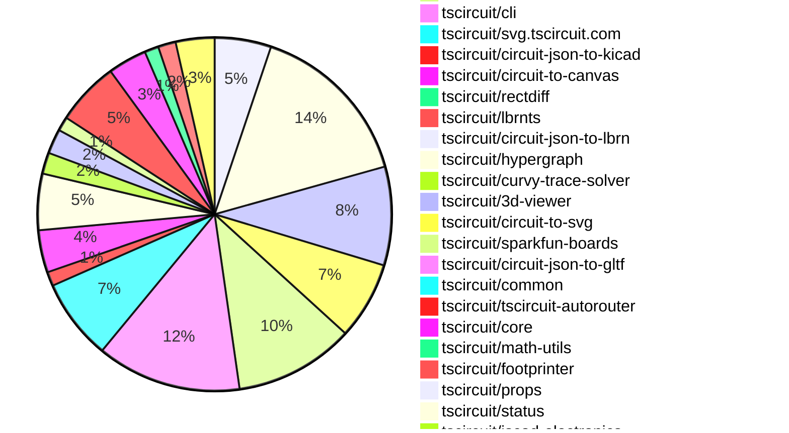

# Contribution Overview 2026-01-07

The current week is shown below. There are 3 major sections:

- [Contributor Overview](#contributor-overview)
- [PRs by Repository](#prs-by-repository)
- [PRs by Contributor](#changes-by-contributor)
- [Scoring & Sponsorship Details](/docs/sponsorship-calculation-explanation.md)

## PRs by Repository

## Contributor Overview

| Contributor | 🐳 Major | 🐙 Minor | 🐌 Tiny | ⭐ | Discussion Contributions |
|-------------|---------|---------|---------|-----|--------------------------|
| [seveibar](#seveibar) | 22 | 6 | 3 | 👑 | 0🔹 0🔶 0💎 |
| [techmannih](#techmannih) | 1 | 6 | 7 | ⭐⭐⭐ | 0🔹 0🔶 0💎 |
| [ShiboSoftwareDev](#ShiboSoftwareDev) | 1 | 8 | 4 | ⭐⭐⭐ | 0🔹 0🔶 0💎 |
| [ArnavK-09](#ArnavK-09) | 7 | 1 | 3 | ⭐⭐⭐ | 0🔹 0🔶 0💎 |
| [Abse2001](#Abse2001) | 2 | 7 | 8 | ⭐⭐⭐ | 0🔹 0🔶 0💎 |
| [AnasSarkiz](#AnasSarkiz) | 5 | 2 | 7 | ⭐⭐⭐ | 0🔹 0🔶 0💎 |
| [imrishabh18](#imrishabh18) | 2 | 2 | 7 | ⭐⭐ | 0🔹 0🔶 0💎 |
| [rushabhcodes](#rushabhcodes) | 1 | 2 | 2 | ⭐⭐ | 0🔹 0🔶 0💎 |
| [tscircuitbot](#tscircuitbot) | 0 | 0 | 202 | ⭐⭐ | 0🔹 0🔶 0💎 |
| [MustafaMulla29](#MustafaMulla29) | 1 | 2 | 3 | ⭐⭐ | 0🔹 0🔶 0💎 |
| [0hmX](#0hmX) | 2 | 0 | 1 | ⭐ | 0🔹 0🔶 0💎 |
| [Ayushjhawar8](#Ayushjhawar8) | 0 | 1 | 2 | ⭐ | 0🔹 0🔶 0💎 |
| [Heinrich-XIAO](#Heinrich-XIAO) | 1 | 0 | 1 | ⭐ | 0🔹 0🔶 0💎 |
| [shehaban](#shehaban) | 1 | 0 | 0 | ⭐ | 0🔹 0🔶 0💎 |

> Note: AI evaluates PRs and assigns 1-3 star ratings automatically. 4 and 5 star ratings require manual staff review.

### Discussion Contribution Legend

- 🔹 Normal Comments: Basic participation with minimal effort
- 🔶 Great Informative Comments: Thoughtful participation that adds value
- 💎 Incredible Comments: Exceptional participation with high-quality content

## Review Table

[reviews-received-hover]: ## "Number of reviews received for PRs for this contributor"
[approvals-received-hover]: ## "Number of approvals received for PRs this contributor authored"
[rejections-received-hover]: ## "Number of rejections received for PRs this contributor authored"
[prs-opened-hover]: ## "Number of PRs opened by this contributor"
[issues-created-hover]: ## "Number of issues created by this contributor"

| Contributor | Reviews Received | Approvals Received | Rejections Received | Approvals | Rejections | PRs Opened | PRs Merged | Issues Created |
|---|---|---|---|---|---|---|---|---|
| [Ayushjhawar8](#Ayushjhawar8) | 15 | 3 | 1 | 0 | 0 | 6 | 3 | 0 |
| [seveibar](#seveibar) | 1 | 0 | 0 | 49 | 9 | 41 | 32 | 0 |
| [tscircuitbot](#tscircuitbot) | 0 | 0 | 0 | 0 | 0 | 248 | 202 | 0 |
| [Abse2001](#Abse2001) | 18 | 16 | 0 | 3 | 0 | 18 | 17 | 0 |
| [ShiboSoftwareDev](#ShiboSoftwareDev) | 32 | 12 | 3 | 10 | 0 | 18 | 13 | 0 |
| [AnasSarkiz](#AnasSarkiz) | 4 | 4 | 0 | 1 | 0 | 14 | 14 | 0 |
| [techmannih](#techmannih) | 15 | 7 | 0 | 3 | 3 | 16 | 14 | 0 |
| [imrishabh18](#imrishabh18) | 5 | 4 | 0 | 5 | 2 | 13 | 11 | 0 |
| [rushabhcodes](#rushabhcodes) | 30 | 7 | 1 | 0 | 5 | 8 | 5 | 0 |
| [Kemalyavas](#Kemalyavas) | 12 | 0 | 4 | 0 | 0 | 3 | 0 | 0 |
| [Sahil-Gupta584](#Sahil-Gupta584) | 14 | 0 | 1 | 0 | 0 | 4 | 0 | 0 |
| [Rewolbebol](#Rewolbebol) | 1 | 0 | 0 | 0 | 0 | 1 | 0 | 0 |
| [MustafaMulla29](#MustafaMulla29) | 16 | 7 | 3 | 1 | 0 | 8 | 6 | 0 |
| [anzal787](#anzal787) | 3 | 0 | 1 | 0 | 0 | 3 | 0 | 0 |
| [amalsp220](#amalsp220) | 5 | 0 | 1 | 0 | 0 | 1 | 0 | 0 |
| [ArnavK-09](#ArnavK-09) | 10 | 7 | 1 | 0 | 0 | 12 | 11 | 0 |
| [0hmX](#0hmX) | 7 | 1 | 0 | 0 | 1 | 8 | 3 | 0 |
| [Heinrich-XIAO](#Heinrich-XIAO) | 2 | 2 | 0 | 0 | 0 | 3 | 2 | 0 |
| [Excellencedev](#Excellencedev) | 2 | 0 | 1 | 0 | 0 | 1 | 0 | 0 |
| [natinew77-creator](#natinew77-creator) | 4 | 0 | 3 | 0 | 0 | 2 | 0 | 0 |
| [shehaban](#shehaban) | 2 | 2 | 0 | 0 | 0 | 2 | 1 | 0 |

## Changes by Repository

### [tscircuit/pcb-viewer](https://github.com/tscircuit/pcb-viewer)

| PR # | Impact | Rating | Contributor | Description |
|------|--------|--------|-------------|-------------|
| [#604](https://github.com/tscircuit/pcb-viewer/pull/604) | 🐙 Minor | ⭐⭐ | Abse2001 | Moves pcb_copper_pour rendering out of primitive conversion and into circuit-to-canvas, introducing a dedicated copper pour renderer with correct topbottom copper layer handling and simplifying the rendering pipeline. |
| [#593](https://github.com/tscircuit/pcb-viewer/pull/593) | 🐙 Minor | ⭐⭐ | Abse2001 | Implements full pcb_plated_hole  primitive conversion across all supported shapes, adds hovernet-based visual highlighting with dynamic copper color overrides, and prevents duplicate rendering by excluding plated holes and vias from generic primitive paths. |
| [#595](https://github.com/tscircuit/pcb-viewer/pull/595) | 🐙 Minor | ⭐⭐ | Abse2001 | Excludes pcb_via primitives from the generic primitive draw path to avoid double-rendering and adds draw-via renderer with hover and highlighted-net visual emphasis using copper color overrides. |
| [#590](https://github.com/tscircuit/pcb-viewer/pull/590) | 🐙 Minor | ⭐⭐ | Abse2001 | Switches SMT pad rendering to circuit-to-canvas for correct copper-layer drawing and adds hover-aware color adjustment to visually highlight SMT pads under interaction. |
| [#592](https://github.com/tscircuit/pcb-viewer/pull/592) | 🐙 Minor | ⭐⭐ | techmannih | Refactors the rendering of keepout elements by migrating from primitive drawing methods to a new circuit-to-canvas approach, enhancing the rendering process for PCB keepouts. |

🐌 Tiny Contributions (11)

| PR # | Impact | Contributor | Description |
|------|--------|-------------|-------------|
| [#605](https://github.com/tscircuit/pcb-viewer/pull/605) | 🐌 Tiny | tscircuitbot | Automated package update |
| [#603](https://github.com/tscircuit/pcb-viewer/pull/603) | 🐌 Tiny | tscircuitbot | Automated package update |
| [#599](https://github.com/tscircuit/pcb-viewer/pull/599) | 🐌 Tiny | tscircuitbot | Automated package update |
| [#601](https://github.com/tscircuit/pcb-viewer/pull/601) | 🐌 Tiny | tscircuitbot | Automated package update |
| [#597](https://github.com/tscircuit/pcb-viewer/pull/597) | 🐌 Tiny | tscircuitbot | Automated package update |
| [#596](https://github.com/tscircuit/pcb-viewer/pull/596) | 🐌 Tiny | tscircuitbot | Automated package update |
| [#594](https://github.com/tscircuit/pcb-viewer/pull/594) | 🐌 Tiny | tscircuitbot | Automated package update |
| [#591](https://github.com/tscircuit/pcb-viewer/pull/591) | 🐌 Tiny | tscircuitbot | Automated package update |
| [#600](https://github.com/tscircuit/pcb-viewer/pull/600) | 🐌 Tiny | Abse2001 | Removes unnecessary any type casting in the codebase and updates the circuit-json dependency version to 0.0.354. |
| [#598](https://github.com/tscircuit/pcb-viewer/pull/598) | 🐌 Tiny | Abse2001 | Updates the circuit-to-canvas dependency to version 0.0.47 in package.json |
| [#602](https://github.com/tscircuit/pcb-viewer/pull/602) | 🐌 Tiny | ShiboSoftwareDev | Adds a comprehensive test for soldermask behavior in PCB elements, ensuring accurate rendering and coverage in various scenarios. |

### [tscircuit/tscircuit](https://github.com/tscircuit/tscircuit)

🐌 Tiny Contributions (48)

| PR # | Impact | Contributor | Description |
|------|--------|-------------|-------------|
| [#1843](https://github.com/tscircuit/tscircuit/pull/1843) | 🐌 Tiny | tscircuitbot | Automated package update |
| [#1841](https://github.com/tscircuit/tscircuit/pull/1841) | 🐌 Tiny | tscircuitbot | Automated package update |
| [#1840](https://github.com/tscircuit/tscircuit/pull/1840) | 🐌 Tiny | tscircuitbot | Automated package update |
| [#1838](https://github.com/tscircuit/tscircuit/pull/1838) | 🐌 Tiny | tscircuitbot | Updates the tscircuitcli package to version 0.1.745 in the package.json file. |
| [#1837](https://github.com/tscircuit/tscircuit/pull/1837) | 🐌 Tiny | tscircuitbot | Automated package update |
| [#1836](https://github.com/tscircuit/tscircuit/pull/1836) | 🐌 Tiny | tscircuitbot | Automated package update |
| [#1839](https://github.com/tscircuit/tscircuit/pull/1839) | 🐌 Tiny | tscircuitbot | Automated package update |
| [#1833](https://github.com/tscircuit/tscircuit/pull/1833) | 🐌 Tiny | tscircuitbot | Automated package update |
| [#1830](https://github.com/tscircuit/tscircuit/pull/1830) | 🐌 Tiny | tscircuitbot | Updates the tscircuitcli package from version 0.1.740 to 0.1.741 and the tscircuitrunframe package from version 0.0.1470 to 0.0.1471 in package.json |
| [#1835](https://github.com/tscircuit/tscircuit/pull/1835) | 🐌 Tiny | tscircuitbot | Automated package update |
| [#1832](https://github.com/tscircuit/tscircuit/pull/1832) | 🐌 Tiny | tscircuitbot | Updates the tscircuitcli package from version 0.1.741 to 0.1.742 and the tscircuitrunframe package from version 0.0.1471 to 0.0.1472 in package.json |
| [#1826](https://github.com/tscircuit/tscircuit/pull/1826) | 🐌 Tiny | tscircuitbot | Automated package update |
| [#1829](https://github.com/tscircuit/tscircuit/pull/1829) | 🐌 Tiny | tscircuitbot | Automated package update |
| [#1827](https://github.com/tscircuit/tscircuit/pull/1827) | 🐌 Tiny | tscircuitbot | Automated package update |
| [#1825](https://github.com/tscircuit/tscircuit/pull/1825) | 🐌 Tiny | tscircuitbot | Automated package update |
| [#1831](https://github.com/tscircuit/tscircuit/pull/1831) | 🐌 Tiny | tscircuitbot | Updates the package version from 0.0.1132 to 0.0.1133 in package.json |
| [#1824](https://github.com/tscircuit/tscircuit/pull/1824) | 🐌 Tiny | tscircuitbot | Updates the tscircuitcli and tscircuitrunframe packages to their latest versions. |
| [#1828](https://github.com/tscircuit/tscircuit/pull/1828) | 🐌 Tiny | tscircuitbot | Updates the version of the tscircuiteval package from 0.0.581 to 0.0.582 in package.json |
| [#1834](https://github.com/tscircuit/tscircuit/pull/1834) | 🐌 Tiny | tscircuitbot | Automated package update |
| [#1821](https://github.com/tscircuit/tscircuit/pull/1821) | 🐌 Tiny | tscircuitbot | Automated package update |
| [#1818](https://github.com/tscircuit/tscircuit/pull/1818) | 🐌 Tiny | tscircuitbot | Automated package update |
| [#1815](https://github.com/tscircuit/tscircuit/pull/1815) | 🐌 Tiny | tscircuitbot | Updates the tscircuitcli package from version 0.1.733 to 0.1.735 and the tscircuitrunframe package from version 0.0.1464 to 0.0.1465 in the package.json file. |
| [#1814](https://github.com/tscircuit/tscircuit/pull/1814) | 🐌 Tiny | tscircuitbot | Updates the tscircuitcli package from version 0.1.733 to 0.1.735 and the tscircuitrunframe package from version 0.0.1464 to 0.0.1465 in package.json |
| [#1819](https://github.com/tscircuit/tscircuit/pull/1819) | 🐌 Tiny | tscircuitbot | Updates the package version from 0.0.1126 to 0.0.1127 in package.json |
| [#1816](https://github.com/tscircuit/tscircuit/pull/1816) | 🐌 Tiny | tscircuitbot | Automated package update |
| [#1812](https://github.com/tscircuit/tscircuit/pull/1812) | 🐌 Tiny | tscircuitbot | Automated package update |
| [#1811](https://github.com/tscircuit/tscircuit/pull/1811) | 🐌 Tiny | tscircuitbot | Automated package update |
| [#1820](https://github.com/tscircuit/tscircuit/pull/1820) | 🐌 Tiny | tscircuitbot | Updates the tscircuitcli package to version 0.1.737 in the package.json file |
| [#1817](https://github.com/tscircuit/tscircuit/pull/1817) | 🐌 Tiny | tscircuitbot | Automated package update |
| [#1823](https://github.com/tscircuit/tscircuit/pull/1823) | 🐌 Tiny | tscircuitbot | Automated package update |
| [#1822](https://github.com/tscircuit/tscircuit/pull/1822) | 🐌 Tiny | tscircuitbot | Automated package update |
| [#1809](https://github.com/tscircuit/tscircuit/pull/1809) | 🐌 Tiny | tscircuitbot | Automated package update |
| [#1810](https://github.com/tscircuit/tscircuit/pull/1810) | 🐌 Tiny | tscircuitbot | Automated package update |
| [#1808](https://github.com/tscircuit/tscircuit/pull/1808) | 🐌 Tiny | tscircuitbot | Automated package update |
| [#1807](https://github.com/tscircuit/tscircuit/pull/1807) | 🐌 Tiny | tscircuitbot | Updates the tscircuitcli package version from 0.1.730 to 0.1.731 |
| [#1805](https://github.com/tscircuit/tscircuit/pull/1805) | 🐌 Tiny | tscircuitbot | Updates the tscircuitcli package to version 0.1.730 in package.json |
| [#1803](https://github.com/tscircuit/tscircuit/pull/1803) | 🐌 Tiny | tscircuitbot | Automated package update |
| [#1797](https://github.com/tscircuit/tscircuit/pull/1797) | 🐌 Tiny | tscircuitbot | Automated package update |
| [#1800](https://github.com/tscircuit/tscircuit/pull/1800) | 🐌 Tiny | tscircuitbot | Automated package update |
| [#1804](https://github.com/tscircuit/tscircuit/pull/1804) | 🐌 Tiny | tscircuitbot | Automated package update |
| [#1795](https://github.com/tscircuit/tscircuit/pull/1795) | 🐌 Tiny | tscircuitbot | Updates the tscircuitcli package from version 0.1.724 to 0.1.726 and the circuit-to-svg package from version 0.0.311 to 0.0.307 in package.json |
| [#1801](https://github.com/tscircuit/tscircuit/pull/1801) | 🐌 Tiny | tscircuitbot | Updates the version of the tscircuitcore package from 0.0.956 to 0.0.957 in package.json |
| [#1799](https://github.com/tscircuit/tscircuit/pull/1799) | 🐌 Tiny | tscircuitbot | Updates the tscircuitcli package to version 0.1.728 in the package.json file |
| [#1802](https://github.com/tscircuit/tscircuit/pull/1802) | 🐌 Tiny | tscircuitbot | Automated package update |
| [#1806](https://github.com/tscircuit/tscircuit/pull/1806) | 🐌 Tiny | tscircuitbot | Automated package update |
| [#1798](https://github.com/tscircuit/tscircuit/pull/1798) | 🐌 Tiny | tscircuitbot | Automated package update |
| [#1796](https://github.com/tscircuit/tscircuit/pull/1796) | 🐌 Tiny | tscircuitbot | Automated package update |
| [#1842](https://github.com/tscircuit/tscircuit/pull/1842) | 🐌 Tiny | Abse2001 | Updates the version of the circuit-json-to-gltf dependency from 0.0.31 to 0.0.60 in package.json |

### [tscircuit/circuit-json](https://github.com/tscircuit/circuit-json)

| PR # | Impact | Rating | Contributor | Description |
|------|--------|--------|-------------|-------------|
| [#408](https://github.com/tscircuit/circuit-json/pull/408) | 🐙 Minor | ⭐⭐ | Abse2001 | Adds a counter-clockwise rotation property to the PcbHoleCircularWithRectPad interface in the PCB design schema. |

🐌 Tiny Contributions (1)

| PR # | Impact | Contributor | Description |
|------|--------|-------------|-------------|
| [#409](https://github.com/tscircuit/circuit-json/pull/409) | 🐌 Tiny | tscircuitbot | Automated package update |

### [tscircuit/tscircuit.com](https://github.com/tscircuit/tscircuit.com)

| PR # | Impact | Rating | Contributor | Description |
|------|--------|--------|-------------|-------------|
| [#2467](https://github.com/tscircuit/tscircuit.com/pull/2467) | 🐳 Major | ⭐⭐⭐ | imrishabh18 | Removes automatic polling for package builds on the release detail page and ensures fresh data is fetched upon rebuild by invalidating relevant caches. |
| [#2433](https://github.com/tscircuit/tscircuit.com/pull/2433) | 🐳 Major | ⭐⭐⭐ | imrishabh18 | This PR modifies the user interface of the release page by introducing a new BuildDetailsCard component that displays build details, including status, duration, and associated images, while also updating the ConnectedRepoOverview and release-detail page to integrate this new component. |
| [#2470](https://github.com/tscircuit/tscircuit.com/pull/2470) | 🐳 Major | ⭐⭐⭐ | ArnavK-09 | Adds functionality to view the GitHub repository and manually resync from mobile for package management. |
| [#2453](https://github.com/tscircuit/tscircuit.com/pull/2453) | 🐳 Major | ⭐⭐⭐ | ArnavK-09 | Adds a button to manually sync a package with GitHub, allowing users to initiate synchronization directly from the package interface. |
| [#2448](https://github.com/tscircuit/tscircuit.com/pull/2448) | 🐳 Major | ⭐⭐⭐ | ArnavK-09 | Updated SidebarReleasesSection to conditionally render the link based on packageInfo availability, modified getBuildStatus and getBuildErrorMessage functions to accept PublicPackageRelease type, removed unnecessary latestBuildQueries logic from ReleasesList, simplifying the build status retrieval process, and adjusted status label visibility in ReleaseItemRow based on build success. |
| [#2451](https://github.com/tscircuit/tscircuit.com/pull/2451) | 🐳 Major | ⭐⭐⭐ | ArnavK-09 | Adds a new API route to initiate synchronization of a package with GitHub, including validation for package existence and permissions. |
| [#2446](https://github.com/tscircuit/tscircuit.com/pull/2446) | 🐳 Major | ⭐⭐⭐ | ArnavK-09 | Adds a new Releases List component to display package releases with their statuses and actions. |
| [#2441](https://github.com/tscircuit/tscircuit.com/pull/2441) | 🐳 Major | ⭐⭐⭐ | ArnavK-09 | Adds a new Builds Page component that displays build information with status, duration, and error messages, including a search and filter functionality for builds. |
| [#2428](https://github.com/tscircuit/tscircuit.com/pull/2428) | 🐙 Minor | ⭐⭐ | imrishabh18 | Ensures a newly forked package inherits the same visibility (privatepublic) as the source package and fixes inconsistent behavior between the package header fork flow and the editor fork flow by passing the is_private flag to the API. |

🐌 Tiny Contributions (19)

| PR # | Impact | Contributor | Description |
|------|--------|-------------|-------------|
| [#2465](https://github.com/tscircuit/tscircuit.com/pull/2465) | 🐌 Tiny | tscircuitbot | Automated package update |
| [#2463](https://github.com/tscircuit/tscircuit.com/pull/2463) | 🐌 Tiny | tscircuitbot | Updates the tscircuiteval package to version 0.0.583 in the package.json file. |
| [#2458](https://github.com/tscircuit/tscircuit.com/pull/2458) | 🐌 Tiny | tscircuitbot | Updates the tscircuiteval package from version 0.0.581 to 0.0.582 |
| [#2454](https://github.com/tscircuit/tscircuit.com/pull/2454) | 🐌 Tiny | tscircuitbot | Automated package update to version 0.0.186 |
| [#2449](https://github.com/tscircuit/tscircuit.com/pull/2449) | 🐌 Tiny | tscircuitbot | Updates the tscircuiteval package to version 0.0.581 in the package.json file. |
| [#2437](https://github.com/tscircuit/tscircuit.com/pull/2437) | 🐌 Tiny | tscircuitbot | Automated package update |
| [#2442](https://github.com/tscircuit/tscircuit.com/pull/2442) | 🐌 Tiny | tscircuitbot | Updates the tscircuiteval package to version 0.0.579 in the package.json file. |
| [#2452](https://github.com/tscircuit/tscircuit.com/pull/2452) | 🐌 Tiny | tscircuitbot | Automated package update to version 0.0.185 |
| [#2444](https://github.com/tscircuit/tscircuit.com/pull/2444) | 🐌 Tiny | tscircuitbot | Updates the tscircuiteval package to version 0.0.580 |
| [#2438](https://github.com/tscircuit/tscircuit.com/pull/2438) | 🐌 Tiny | tscircuitbot | Updates the tscircuiteval package to version 0.0.578 in the package.json file. |
| [#2436](https://github.com/tscircuit/tscircuit.com/pull/2436) | 🐌 Tiny | tscircuitbot | Automated package update |
| [#2435](https://github.com/tscircuit/tscircuit.com/pull/2435) | 🐌 Tiny | tscircuitbot | Automated package update |
| [#2430](https://github.com/tscircuit/tscircuit.com/pull/2430) | 🐌 Tiny | tscircuitbot | Automated package update |
| [#2434](https://github.com/tscircuit/tscircuit.com/pull/2434) | 🐌 Tiny | imrishabh18 | Removes the duplicate rebuild button from the UI when the build fails or there is no build information available, streamlining the user interface. |
| [#2432](https://github.com/tscircuit/tscircuit.com/pull/2432) | 🐌 Tiny | imrishabh18 | Aligns the width of the breadcrumb section with the logs section, displays a clear message when no builds are found, and aligns the text of breadcrumbs with the rebuild button. |
| [#2431](https://github.com/tscircuit/tscircuit.com/pull/2431) | 🐌 Tiny | imrishabh18 | Removes the Created time duration ago text from the release detail header so release pages no longer show the relative creation timestamp. |
| [#2455](https://github.com/tscircuit/tscircuit.com/pull/2455) | 🐌 Tiny | ArnavK-09 | Changes the organization profile page to use compact card layouts for package cards during loading and display. |
| [#2447](https://github.com/tscircuit/tscircuit.com/pull/2447) | 🐌 Tiny | ArnavK-09 | Adds minimal UX patches including styling updates and placeholder text changes in various components. |
| [#2429](https://github.com/tscircuit/tscircuit.com/pull/2429) | 🐌 Tiny | ArnavK-09 | Updates the logic to display the AI description tab only when there is AI content and no README file present. |

### [tscircuit/eval](https://github.com/tscircuit/eval)

🐌 Tiny Contributions (22)

| PR # | Impact | Contributor | Description |
|------|--------|-------------|-------------|
| [#1857](https://github.com/tscircuit/eval/pull/1857) | 🐌 Tiny | tscircuitbot | Automated package update |
| [#1856](https://github.com/tscircuit/eval/pull/1856) | 🐌 Tiny | tscircuitbot | Automated package update |
| [#1853](https://github.com/tscircuit/eval/pull/1853) | 🐌 Tiny | tscircuitbot | Updates the versions of several dependencies in the package.json file. |
| [#1854](https://github.com/tscircuit/eval/pull/1854) | 🐌 Tiny | tscircuitbot | Automated package update |
| [#1850](https://github.com/tscircuit/eval/pull/1850) | 🐌 Tiny | tscircuitbot | Updates the version of the tscircuitcore package from 0.0.964 to 0.0.965 in package.json |
| [#1851](https://github.com/tscircuit/eval/pull/1851) | 🐌 Tiny | tscircuitbot | Automated package update |
| [#1847](https://github.com/tscircuit/eval/pull/1847) | 🐌 Tiny | tscircuitbot | Automated package update |
| [#1844](https://github.com/tscircuit/eval/pull/1844) | 🐌 Tiny | tscircuitbot | Updates the version of the tscircuitcore package from 0.0.962 to 0.0.963 in package.json |
| [#1841](https://github.com/tscircuit/eval/pull/1841) | 🐌 Tiny | tscircuitbot | Automated package update |
| [#1838](https://github.com/tscircuit/eval/pull/1838) | 🐌 Tiny | tscircuitbot | Updates the version of the tscircuitcore package from 0.0.960 to 0.0.961 in package.json |
| [#1835](https://github.com/tscircuit/eval/pull/1835) | 🐌 Tiny | tscircuitbot | Updates package dependencies to their latest versions in package.json |
| [#1848](https://github.com/tscircuit/eval/pull/1848) | 🐌 Tiny | tscircuitbot | Automated package update to version 0.0.581 |
| [#1845](https://github.com/tscircuit/eval/pull/1845) | 🐌 Tiny | tscircuitbot | Automated package update |
| [#1842](https://github.com/tscircuit/eval/pull/1842) | 🐌 Tiny | tscircuitbot | Automated package update |
| [#1839](https://github.com/tscircuit/eval/pull/1839) | 🐌 Tiny | tscircuitbot | Automated package update |
| [#1836](https://github.com/tscircuit/eval/pull/1836) | 🐌 Tiny | tscircuitbot | Automated package update |
| [#1833](https://github.com/tscircuit/eval/pull/1833) | 🐌 Tiny | tscircuitbot | Automated package update |
| [#1829](https://github.com/tscircuit/eval/pull/1829) | 🐌 Tiny | tscircuitbot | Automated package update |
| [#1830](https://github.com/tscircuit/eval/pull/1830) | 🐌 Tiny | tscircuitbot | Automated package update |
| [#1832](https://github.com/tscircuit/eval/pull/1832) | 🐌 Tiny | tscircuitbot | Automated package update |
| [#1827](https://github.com/tscircuit/eval/pull/1827) | 🐌 Tiny | tscircuitbot | Automated package update |
| [#1826](https://github.com/tscircuit/eval/pull/1826) | 🐌 Tiny | tscircuitbot | Updates the version of the tscircuitcore package from 0.0.956 to 0.0.957 in package.json |

### [tscircuit/runframe](https://github.com/tscircuit/runframe)

🐌 Tiny Contributions (34)

| PR # | Impact | Contributor | Description |
|------|--------|-------------|-------------|
| [#2313](https://github.com/tscircuit/runframe/pull/2313) | 🐌 Tiny | tscircuitbot | Updates the circuit-json-to-kicad package from version 0.0.33 to 0.0.34 |
| [#2310](https://github.com/tscircuit/runframe/pull/2310) | 🐌 Tiny | tscircuitbot | Automated package update |
| [#2309](https://github.com/tscircuit/runframe/pull/2309) | 🐌 Tiny | tscircuitbot | Automated package update |
| [#2305](https://github.com/tscircuit/runframe/pull/2305) | 🐌 Tiny | tscircuitbot | Automated package update |
| [#2304](https://github.com/tscircuit/runframe/pull/2304) | 🐌 Tiny | tscircuitbot | Automated package update |
| [#2295](https://github.com/tscircuit/runframe/pull/2295) | 🐌 Tiny | tscircuitbot | Automated package update |
| [#2297](https://github.com/tscircuit/runframe/pull/2297) | 🐌 Tiny | tscircuitbot | Updates the tscircuit3d-viewer package from version 0.0.486 to 0.0.487 |
| [#2290](https://github.com/tscircuit/runframe/pull/2290) | 🐌 Tiny | tscircuitbot | Updates the tscircuit3d-viewer package to version 0.0.485 in the package.json file. |
| [#2302](https://github.com/tscircuit/runframe/pull/2302) | 🐌 Tiny | tscircuitbot | Automated package update |
| [#2291](https://github.com/tscircuit/runframe/pull/2291) | 🐌 Tiny | tscircuitbot | Automated package update |
| [#2299](https://github.com/tscircuit/runframe/pull/2299) | 🐌 Tiny | tscircuitbot | Updates the tscircuit3d-viewer package from version 0.0.487 to 0.0.489 |
| [#2294](https://github.com/tscircuit/runframe/pull/2294) | 🐌 Tiny | tscircuitbot | Updates the tscircuiteval package to version 0.0.582 in the package.json file. |
| [#2292](https://github.com/tscircuit/runframe/pull/2292) | 🐌 Tiny | tscircuitbot | Updates the tscircuit3d-viewer package to version 0.0.486 in package.json |
| [#2300](https://github.com/tscircuit/runframe/pull/2300) | 🐌 Tiny | tscircuitbot | Automated package update |
| [#2293](https://github.com/tscircuit/runframe/pull/2293) | 🐌 Tiny | tscircuitbot | Automated package update |
| [#2298](https://github.com/tscircuit/runframe/pull/2298) | 🐌 Tiny | tscircuitbot | Automated package update |
| [#2277](https://github.com/tscircuit/runframe/pull/2277) | 🐌 Tiny | tscircuitbot | Updates the tscircuiteval package to version 0.0.577 in the package.json file. |
| [#2282](https://github.com/tscircuit/runframe/pull/2282) | 🐌 Tiny | tscircuitbot | Automated package update |
| [#2286](https://github.com/tscircuit/runframe/pull/2286) | 🐌 Tiny | tscircuitbot | Automated package update |
| [#2283](https://github.com/tscircuit/runframe/pull/2283) | 🐌 Tiny | tscircuitbot | Automated package update |
| [#2287](https://github.com/tscircuit/runframe/pull/2287) | 🐌 Tiny | tscircuitbot | Updates the tscircuiteval package to version 0.0.581 in the package.json file. |
| [#2276](https://github.com/tscircuit/runframe/pull/2276) | 🐌 Tiny | tscircuitbot | Updates the circuit-json-to-kicad package from version 0.0.32 to 0.0.33 |
| [#2278](https://github.com/tscircuit/runframe/pull/2278) | 🐌 Tiny | tscircuitbot | Updates the tscircuiteval package to version 0.0.578 in the package.json file. |
| [#2281](https://github.com/tscircuit/runframe/pull/2281) | 🐌 Tiny | tscircuitbot | Updates the tscircuit3d-viewer package to version 0.0.484 in package.json |
| [#2284](https://github.com/tscircuit/runframe/pull/2284) | 🐌 Tiny | tscircuitbot | Automated package update |
| [#2280](https://github.com/tscircuit/runframe/pull/2280) | 🐌 Tiny | tscircuitbot | Automated package update |
| [#2288](https://github.com/tscircuit/runframe/pull/2288) | 🐌 Tiny | tscircuitbot | Automated package update |
| [#2285](https://github.com/tscircuit/runframe/pull/2285) | 🐌 Tiny | tscircuitbot | Automated package update |
| [#2272](https://github.com/tscircuit/runframe/pull/2272) | 🐌 Tiny | tscircuitbot | Updates the tscircuiteval package to version 0.0.576 in the package.json file. |
| [#2273](https://github.com/tscircuit/runframe/pull/2273) | 🐌 Tiny | tscircuitbot | Updates the tscircuit3d-viewer package from version 0.0.482 to 0.0.483 |
| [#2271](https://github.com/tscircuit/runframe/pull/2271) | 🐌 Tiny | tscircuitbot | Updates the tscircuiteval package to version 0.0.575 in package.json |
| [#2270](https://github.com/tscircuit/runframe/pull/2270) | 🐌 Tiny | tscircuitbot | Updates the tscircuiteval package to version 0.0.574 |
| [#2279](https://github.com/tscircuit/runframe/pull/2279) | 🐌 Tiny | Abse2001 | This pull request updates the styles.generated.ts file, which is likely a generated file containing styles for the project. The changes appear to be related to the Tailwind CSS framework, as indicated by the presence of Tailwind CSS classes and variables. The update may include new styles or modifications to existing styles, but the specific changes are not detailed in the provided diff. |
| [#2289](https://github.com/tscircuit/runframe/pull/2289) | 🐌 Tiny | Ayushjhawar8 | https:runframe-git-retry-btn-as-err-fallback-tscircuit.vercel.app?fixtureId7B22path223A22examples2Fexample46-3d-viewer-error-retry.fixture.tsx227D |

### [tscircuit/cli](https://github.com/tscircuit/cli)

| PR # | Impact | Rating | Contributor | Description |
|------|--------|--------|-------------|-------------|
| [#1577](https://github.com/tscircuit/cli/pull/1577) | 🐳 Major | ⭐⭐⭐ | seveibar | Add a --ci flag to the tsci build command that allows for CI-friendly builds by installing dependencies and executing project-defined build steps before the normal build process. |
| [#1568](https://github.com/tscircuit/cli/pull/1568) | 🐳 Major | ⭐⭐⭐ | ArnavK-09 | Adds upload results summary and error handling to the push process, providing detailed feedback on file upload success and failure. |
| [#1575](https://github.com/tscircuit/cli/pull/1575) | 🐙 Minor | ⭐⭐ | seveibar | Adds a prebuildCommand project configuration option to allow users to specify a command to run before builds. |
| [#1570](https://github.com/tscircuit/cli/pull/1570) | 🐙 Minor | ⭐⭐ | seveibar | Allow projects to specify a buildCommand in tscircuit.config.json as an override for what to run during cloud builds, without changing local tsci build behavior. |
| [#1565](https://github.com/tscircuit/cli/pull/1565) | 🐙 Minor | ⭐⭐ | ArnavK-09 | Adds the --include-dist option to the push command, allowing users to include the dist directory in the push operation. |
| [#1579](https://github.com/tscircuit/cli/pull/1579) | 🐙 Minor | ⭐⭐ | MustafaMulla29 | Integrates the KicadLibraryConverter API to convert tscircuit libraries into KiCad library format, enabling users to export their designs seamlessly. |

🐌 Tiny Contributions (35)

| PR # | Impact | Contributor | Description |
|------|--------|-------------|-------------|
| [#1607](https://github.com/tscircuit/cli/pull/1607) | 🐌 Tiny | tscircuitbot | Automated package update |
| [#1606](https://github.com/tscircuit/cli/pull/1606) | 🐌 Tiny | tscircuitbot | Updates the tscircuitrunframe package from version 0.0.1475 to 0.0.1476 |
| [#1601](https://github.com/tscircuit/cli/pull/1601) | 🐌 Tiny | tscircuitbot | Updates the tscircuitrunframe package from version 0.0.1474 to 0.0.1475 |
| [#1604](https://github.com/tscircuit/cli/pull/1604) | 🐌 Tiny | tscircuitbot | Automated README update with latest CLI usage output. |
| [#1605](https://github.com/tscircuit/cli/pull/1605) | 🐌 Tiny | tscircuitbot | Automated package update |
| [#1602](https://github.com/tscircuit/cli/pull/1602) | 🐌 Tiny | tscircuitbot | Automated package update |
| [#1591](https://github.com/tscircuit/cli/pull/1591) | 🐌 Tiny | tscircuitbot | Updates the tscircuitrunframe package from version 0.0.1468 to 0.0.1469 |
| [#1595](https://github.com/tscircuit/cli/pull/1595) | 🐌 Tiny | tscircuitbot | Updates the tscircuitrunframe package from version 0.0.1470 to 0.0.1471 |
| [#1592](https://github.com/tscircuit/cli/pull/1592) | 🐌 Tiny | tscircuitbot | Automated package update |
| [#1600](https://github.com/tscircuit/cli/pull/1600) | 🐌 Tiny | tscircuitbot | Automated package update |
| [#1593](https://github.com/tscircuit/cli/pull/1593) | 🐌 Tiny | tscircuitbot | Updates the tscircuitrunframe package from version 0.0.1469 to 0.0.1470 |
| [#1594](https://github.com/tscircuit/cli/pull/1594) | 🐌 Tiny | tscircuitbot | Automated package update |
| [#1599](https://github.com/tscircuit/cli/pull/1599) | 🐌 Tiny | tscircuitbot | Updates the tscircuitrunframe package from version 0.0.1472 to 0.0.1474 |
| [#1596](https://github.com/tscircuit/cli/pull/1596) | 🐌 Tiny | tscircuitbot | Automated package update |
| [#1598](https://github.com/tscircuit/cli/pull/1598) | 🐌 Tiny | tscircuitbot | Automated package update |
| [#1597](https://github.com/tscircuit/cli/pull/1597) | 🐌 Tiny | tscircuitbot | Updates the tscircuitrunframe package from version 0.0.1471 to 0.0.1472 |
| [#1582](https://github.com/tscircuit/cli/pull/1582) | 🐌 Tiny | tscircuitbot | Updates the tscircuitrunframe package from version 0.0.1464 to 0.0.1465 |
| [#1587](https://github.com/tscircuit/cli/pull/1587) | 🐌 Tiny | tscircuitbot | Automated package update |
| [#1580](https://github.com/tscircuit/cli/pull/1580) | 🐌 Tiny | tscircuitbot | Automated package update for tscircuitrunframe from version 0.0.1463 to 0.0.1464 |
| [#1590](https://github.com/tscircuit/cli/pull/1590) | 🐌 Tiny | tscircuitbot | Automated package update |
| [#1583](https://github.com/tscircuit/cli/pull/1583) | 🐌 Tiny | tscircuitbot | Automated package update |
| [#1581](https://github.com/tscircuit/cli/pull/1581) | 🐌 Tiny | tscircuitbot | Automated package update |
| [#1585](https://github.com/tscircuit/cli/pull/1585) | 🐌 Tiny | tscircuitbot | Updates the tscircuitrunframe package from version 0.0.1465 to 0.0.1466 |
| [#1589](https://github.com/tscircuit/cli/pull/1589) | 🐌 Tiny | tscircuitbot | Updates the tscircuitrunframe package from version 0.0.1466 to 0.0.1468 |
| [#1586](https://github.com/tscircuit/cli/pull/1586) | 🐌 Tiny | tscircuitbot | Automated package update |
| [#1576](https://github.com/tscircuit/cli/pull/1576) | 🐌 Tiny | tscircuitbot | Automated package update |
| [#1578](https://github.com/tscircuit/cli/pull/1578) | 🐌 Tiny | tscircuitbot | Automated package update |
| [#1574](https://github.com/tscircuit/cli/pull/1574) | 🐌 Tiny | tscircuitbot | Automated package update |
| [#1566](https://github.com/tscircuit/cli/pull/1566) | 🐌 Tiny | tscircuitbot | Automated package update |
| [#1569](https://github.com/tscircuit/cli/pull/1569) | 🐌 Tiny | tscircuitbot | Automated package update |
| [#1573](https://github.com/tscircuit/cli/pull/1573) | 🐌 Tiny | tscircuitbot | Automated package update |
| [#1571](https://github.com/tscircuit/cli/pull/1571) | 🐌 Tiny | tscircuitbot | Automated package update |
| [#1603](https://github.com/tscircuit/cli/pull/1603) | 🐌 Tiny | Abse2001 | Updates dependencies in package.json to fix issues with the 3D viewer functionality in the tscircuit application. |
| [#1567](https://github.com/tscircuit/cli/pull/1567) | 🐌 Tiny | imrishabh18 | Adds a line to the global npmrc to specify the registry URL for the TSC package, ensuring proper authentication and registry configuration for users. |
| [#1572](https://github.com/tscircuit/cli/pull/1572) | 🐌 Tiny | MustafaMulla29 | Fixes error message to recommend using the correct package naming convention: tsciusername.package instead of usernamepackage |

### [tscircuit/svg.tscircuit.com](https://github.com/tscircuit/svg.tscircuit.com)

🐌 Tiny Contributions (23)

| PR # | Impact | Contributor | Description |
|------|--------|-------------|-------------|
| [#824](https://github.com/tscircuit/svg.tscircuit.com/pull/824) | 🐌 Tiny | tscircuitbot | Automated package update |
| [#822](https://github.com/tscircuit/svg.tscircuit.com/pull/822) | 🐌 Tiny | tscircuitbot | Updates the tscircuit package from version 0.0.1137 to 0.0.1138 |
| [#820](https://github.com/tscircuit/svg.tscircuit.com/pull/820) | 🐌 Tiny | tscircuitbot | Updates the tscircuit package version from 0.0.1135 to 0.0.1136 in package.json |
| [#821](https://github.com/tscircuit/svg.tscircuit.com/pull/821) | 🐌 Tiny | tscircuitbot | Updates the tscircuit package from version 0.0.1136 to 0.0.1137 in package.json |
| [#816](https://github.com/tscircuit/svg.tscircuit.com/pull/816) | 🐌 Tiny | tscircuitbot | Updates the tscircuit package version from 0.0.1130 to 0.0.1131 in package.json |
| [#819](https://github.com/tscircuit/svg.tscircuit.com/pull/819) | 🐌 Tiny | tscircuitbot | Updates the tscircuit package version from 0.0.1134 to 0.0.1135 in package.json |
| [#818](https://github.com/tscircuit/svg.tscircuit.com/pull/818) | 🐌 Tiny | tscircuitbot | Updates the tscircuit package version from 0.0.1132 to 0.0.1134 in package.json |
| [#815](https://github.com/tscircuit/svg.tscircuit.com/pull/815) | 🐌 Tiny | tscircuitbot | Updates the tscircuit package version from 0.0.1129 to 0.0.1130 in package.json |
| [#817](https://github.com/tscircuit/svg.tscircuit.com/pull/817) | 🐌 Tiny | tscircuitbot | Automated package update |
| [#814](https://github.com/tscircuit/svg.tscircuit.com/pull/814) | 🐌 Tiny | tscircuitbot | Updates the tscircuit package from version 0.0.1128 to 0.0.1129 in package.json |
| [#812](https://github.com/tscircuit/svg.tscircuit.com/pull/812) | 🐌 Tiny | tscircuitbot | Updates the tscircuit package version from 0.0.1126 to 0.0.1127 in package.json |
| [#809](https://github.com/tscircuit/svg.tscircuit.com/pull/809) | 🐌 Tiny | tscircuitbot | Updates the tscircuit package version from 0.0.1123 to 0.0.1124 in package.json |
| [#810](https://github.com/tscircuit/svg.tscircuit.com/pull/810) | 🐌 Tiny | tscircuitbot | Updates the tscircuit package version from 0.0.1124 to 0.0.1125 in package.json |
| [#813](https://github.com/tscircuit/svg.tscircuit.com/pull/813) | 🐌 Tiny | tscircuitbot | Updates the tscircuit package version from 0.0.1127 to 0.0.1128 in package.json |
| [#811](https://github.com/tscircuit/svg.tscircuit.com/pull/811) | 🐌 Tiny | tscircuitbot | Updates the tscircuit package version from 0.0.1125 to 0.0.1126 in package.json |
| [#808](https://github.com/tscircuit/svg.tscircuit.com/pull/808) | 🐌 Tiny | tscircuitbot | Automated package update |
| [#807](https://github.com/tscircuit/svg.tscircuit.com/pull/807) | 🐌 Tiny | tscircuitbot | Updates the tscircuit package from version 0.0.1121 to 0.0.1122 in package.json |
| [#804](https://github.com/tscircuit/svg.tscircuit.com/pull/804) | 🐌 Tiny | tscircuitbot | Updates the tscircuit package from version 0.0.1118 to 0.0.1119 in package.json |
| [#803](https://github.com/tscircuit/svg.tscircuit.com/pull/803) | 🐌 Tiny | tscircuitbot | Updates the tscircuit package version from 0.0.1117 to 0.0.1118 in package.json |
| [#801](https://github.com/tscircuit/svg.tscircuit.com/pull/801) | 🐌 Tiny | tscircuitbot | Updates the tscircuit package version from 0.0.1115 to 0.0.1116 in package.json |
| [#806](https://github.com/tscircuit/svg.tscircuit.com/pull/806) | 🐌 Tiny | tscircuitbot | Updates the tscircuit package version from 0.0.1120 to 0.0.1121 in package.json |
| [#802](https://github.com/tscircuit/svg.tscircuit.com/pull/802) | 🐌 Tiny | tscircuitbot | Updates the tscircuit package from version 0.0.1116 to 0.0.1117 |
| [#805](https://github.com/tscircuit/svg.tscircuit.com/pull/805) | 🐌 Tiny | tscircuitbot | Updates the tscircuit package version from 0.0.1119 to 0.0.1120 in package.json |

### [tscircuit/circuit-json-to-kicad](https://github.com/tscircuit/circuit-json-to-kicad)

| PR # | Impact | Rating | Contributor | Description |
|------|--------|--------|-------------|-------------|
| [#47](https://github.com/tscircuit/circuit-json-to-kicad/pull/47) | 🐳 Major | ⭐⭐⭐ | MustafaMulla29 | Adds KicadLibraryConverter API to convert tscircuit components to KiCad libraries with user and builtin separation for footprints and symbols. |
| [#49](https://github.com/tscircuit/circuit-json-to-kicad/pull/49) | 🐙 Minor | ⭐⭐ | MustafaMulla29 | Modifies the KicadLibraryConverter to support handling of default exports in addition to named exports, allowing for better integration of components with default exports in the circuit JSON generation process. |

🐌 Tiny Contributions (2)

| PR # | Impact | Contributor | Description |
|------|--------|-------------|-------------|
| [#50](https://github.com/tscircuit/circuit-json-to-kicad/pull/50) | 🐌 Tiny | tscircuitbot | Automated package update |
| [#48](https://github.com/tscircuit/circuit-json-to-kicad/pull/48) | 🐌 Tiny | tscircuitbot | Automated package update |

### [tscircuit/circuit-to-canvas](https://github.com/tscircuit/circuit-to-canvas)

| PR # | Impact | Rating | Contributor | Description |
|------|--------|--------|-------------|-------------|
| [#110](https://github.com/tscircuit/circuit-to-canvas/pull/110) | 🐙 Minor | ⭐⭐ | ShiboSoftwareDev | Adds support for polygon-shaped pads in SMT pads and plated holes, including soldermask margin calculations and rendering. |
| [#112](https://github.com/tscircuit/circuit-to-canvas/pull/112) | 🐙 Minor | ⭐⭐ | ShiboSoftwareDev | Adds support for brep (boundary representation) shapes in copper pours, enabling complex geometries with arcs and inner rings (holes). Includes arc computation from bulge values, proper handling of transformation matrices, and updated canvas context types. |
| [#108](https://github.com/tscircuit/circuit-to-canvas/pull/108) | 🐙 Minor | ⭐⭐ | ShiboSoftwareDev | Implements proper handling for negative soldermask margins and full soldermask coverage on PCB holes, plated holes, and SMT pads, corrects board drawing to always render soldermask when present, updates existing tests and adds comprehensive visual regression test for all margin scenarios, and ensures accurate rendering of soldermask rings, overlays, and margins across all element shapes and types. |
| [#114](https://github.com/tscircuit/circuit-to-canvas/pull/114) | 🐙 Minor | ⭐⭐ | techmannih | Fixes soldermask margin color for PCB holes when the margin is negative, ensuring correct rendering in the design. |
| [#104](https://github.com/tscircuit/circuit-to-canvas/pull/104) | 🐙 Minor | ⭐⭐ | techmannih | Adds support for ccw_rotation in pcb_hole shapes, enabling proper rendering of rotated holes in the 3D viewer. |
| [#106](https://github.com/tscircuit/circuit-to-canvas/pull/106) | 🐙 Minor | ⭐⭐ | rushabhcodes | Refactors the drawPcbCopperText function to simplify the logic for rendering knockout text and improve maintainability by removing unnecessary helper functions. |

🐌 Tiny Contributions (6)

| PR # | Impact | Contributor | Description |
|------|--------|-------------|-------------|
| [#115](https://github.com/tscircuit/circuit-to-canvas/pull/115) | 🐌 Tiny | tscircuitbot | Automated package update |
| [#113](https://github.com/tscircuit/circuit-to-canvas/pull/113) | 🐌 Tiny | tscircuitbot | Automated package update |
| [#105](https://github.com/tscircuit/circuit-to-canvas/pull/105) | 🐌 Tiny | tscircuitbot | Automated package update |
| [#107](https://github.com/tscircuit/circuit-to-canvas/pull/107) | 🐌 Tiny | tscircuitbot | Automated package update |
| [#103](https://github.com/tscircuit/circuit-to-canvas/pull/103) | 🐌 Tiny | tscircuitbot | Automated package update |
| [#102](https://github.com/tscircuit/circuit-to-canvas/pull/102) | 🐌 Tiny | techmannih | Extracts a helper function for calculating the border radius of PCB SMT pads to reduce code duplication in the drawPcbSmtPad function. |

### [tscircuit/rectdiff](https://github.com/tscircuit/rectdiff)

| PR # | Impact | Rating | Contributor | Description |
|------|--------|--------|-------------|-------------|
| [#65](https://github.com/tscircuit/rectdiff/pull/65) | 🐳 Major | ⭐⭐⭐ | Heinrich-XIAO | Fixes infinite loop in expandRectFromSeed() by adding iteration limits and minimum expansion thresholds, and optimizes computeInverseRects() for polygons with many points. |

🐌 Tiny Contributions (1)

| PR # | Impact | Contributor | Description |
|------|--------|-------------|-------------|
| [#66](https://github.com/tscircuit/rectdiff/pull/66) | 🐌 Tiny | tscircuitbot | Automated package update |

### [tscircuit/lbrnts](https://github.com/tscircuit/lbrnts)

| PR # | Impact | Rating | Contributor | Description |
|------|--------|--------|-------------|-------------|
| [#19](https://github.com/tscircuit/lbrnts/pull/19) | 🐙 Minor | ⭐⭐ | AnasSarkiz | Adds stroke-linecapround and stroke-linejoinround to SVG path rendering to eliminate visual gaps at joins and ends for thin strokes. |

🐌 Tiny Contributions (1)

| PR # | Impact | Contributor | Description |
|------|--------|-------------|-------------|
| [#20](https://github.com/tscircuit/lbrnts/pull/20) | 🐌 Tiny | tscircuitbot | Automated package update to version 0.0.12 |

### [tscircuit/circuit-json-to-lbrn](https://github.com/tscircuit/circuit-json-to-lbrn)

🐌 Tiny Contributions (2)

| PR # | Impact | Contributor | Description |
|------|--------|-------------|-------------|
| [#85](https://github.com/tscircuit/circuit-json-to-lbrn/pull/85) | 🐌 Tiny | tscircuitbot | Automated package update |
| [#84](https://github.com/tscircuit/circuit-json-to-lbrn/pull/84) | 🐌 Tiny | AnasSarkiz | Updates the lbrnts dependency from version 0.0.11 to 0.0.12 in package.json |

### [tscircuit/hypergraph](https://github.com/tscircuit/hypergraph)

| PR # | Impact | Rating | Contributor | Description |
|------|--------|--------|-------------|-------------|
| [#20](https://github.com/tscircuit/hypergraph/pull/20) | 🐳 Major | ⭐⭐⭐ | seveibar | Adds serialization functionality for hypergraphs and their connections, enabling conversion to a serialized format for easier storage and manipulation. |
| [#15](https://github.com/tscircuit/hypergraph/pull/15) | 🐳 Major | ⭐⭐⭐ | seveibar | This pull request introduces a previously failing test case, implements a stochastic gradient descent optimizer, and ensures that the calculations are scale-invariant by incorporating an initial hop distance calculation. The changes aim to enhance the performance and reliability of the hypergraph solver by addressing specific issues that were causing failures in previous implementations. |
| [#6](https://github.com/tscircuit/hypergraph/pull/6) | 🐳 Major | ⭐⭐⭐ | seveibar | Fixes channel bugs and adds support for bounds parameter in jumper graph generation. |
| [#12](https://github.com/tscircuit/hypergraph/pull/12) | 🐳 Major | ⭐⭐⭐ | seveibar | Adds support for a configurable number of parallel traces that can pass through the jumper body without using jumpers. |
| [#5](https://github.com/tscircuit/hypergraph/pull/5) | 🐳 Major | ⭐⭐⭐ | seveibar | Adds scripts for benchmarking and optimizing hyperparameters using gradient descent, including support for dual orientation tests and parameter updates. |

🐌 Tiny Contributions (11)

| PR # | Impact | Contributor | Description |
|------|--------|-------------|-------------|
| [#23](https://github.com/tscircuit/hypergraph/pull/23) | 🐌 Tiny | tscircuitbot | Automated package update |
| [#21](https://github.com/tscircuit/hypergraph/pull/21) | 🐌 Tiny | tscircuitbot | Automated package update |
| [#19](https://github.com/tscircuit/hypergraph/pull/19) | 🐌 Tiny | tscircuitbot | Updates the package version from 0.0.11 to 0.0.12 in package.json |
| [#18](https://github.com/tscircuit/hypergraph/pull/18) | 🐌 Tiny | tscircuitbot | Automated package update |
| [#16](https://github.com/tscircuit/hypergraph/pull/16) | 🐌 Tiny | tscircuitbot | Automated package update |
| [#11](https://github.com/tscircuit/hypergraph/pull/11) | 🐌 Tiny | tscircuitbot | Automated package update |
| [#7](https://github.com/tscircuit/hypergraph/pull/7) | 🐌 Tiny | tscircuitbot | Updates the package version from 0.0.1 to 0.0.4 in package.json |
| [#14](https://github.com/tscircuit/hypergraph/pull/14) | 🐌 Tiny | tscircuitbot | Updates the package version from 0.0.8 to 0.0.9 in package.json |
| [#13](https://github.com/tscircuit/hypergraph/pull/13) | 🐌 Tiny | tscircuitbot | Automated package update |
| [#9](https://github.com/tscircuit/hypergraph/pull/9) | 🐌 Tiny | tscircuitbot | Updates the package version from 0.0.4 to 0.0.5 in package.json |
| [#8](https://github.com/tscircuit/hypergraph/pull/8) | 🐌 Tiny | seveibar | Fixes bounds calculation for horizontal orientation and adds support for jumper locations in the JumperGraph structure. |

### [tscircuit/curvy-trace-solver](https://github.com/tscircuit/curvy-trace-solver)

| PR # | Impact | Rating | Contributor | Description |
|------|--------|--------|-------------|-------------|
| [#9](https://github.com/tscircuit/curvy-trace-solver/pull/9) | 🐳 Major | ⭐⭐⭐ | seveibar | Prevents traces from going outside the defined bounds during the optimization process in the CurvyTraceSolver. |
| [#2](https://github.com/tscircuit/curvy-trace-solver/pull/2) | 🐙 Minor | ⭐⭐ | seveibar | Adds a penalty for segment intersections between different nets to discourage trace crossings. |

🐌 Tiny Contributions (4)

| PR # | Impact | Contributor | Description |
|------|--------|-------------|-------------|
| [#10](https://github.com/tscircuit/curvy-trace-solver/pull/10) | 🐌 Tiny | tscircuitbot | Automated package update |
| [#3](https://github.com/tscircuit/curvy-trace-solver/pull/3) | 🐌 Tiny | tscircuitbot | Updates the package version from 0.0.2 to 0.0.4 in package.json |
| [#6](https://github.com/tscircuit/curvy-trace-solver/pull/6) | 🐌 Tiny | tscircuitbot | Updates the package version from 0.0.4 to 0.0.7 in package.json |
| [#7](https://github.com/tscircuit/curvy-trace-solver/pull/7) | 🐌 Tiny | tscircuitbot | Automated package update |

### [tscircuit/3d-viewer](https://github.com/tscircuit/3d-viewer)

| PR # | Impact | Rating | Contributor | Description |
|------|--------|--------|-------------|-------------|
| [#639](https://github.com/tscircuit/3d-viewer/pull/639) | 🐳 Major | ⭐⭐⭐ | Abse2001 | Fixes silkscreen stroke handling by replacing the logic to determine stroke presence based on stroke width instead of a has_stroke property. |
| [#638](https://github.com/tscircuit/3d-viewer/pull/638) | 🐳 Major | ⭐⭐⭐ | seveibar | Motivation Some cad_component entries only provide a STEP URL and there was no client-side fallback to render them as mesh models. Enable in-browser conversion so STEP-only parts can be displayed without requiring pre-converted glTFGLB assets. Use a lightweight runtime import of occt-import-js from jsDelivr to avoid bundling the OCCT runtime into the app.  Description Dynamically load occt-import-js from jsDelivr via loadOcctImport() and resolve the factory export at runtime. Add convertStepUrlToGlbUrl() which fetches a STEP file, imports it with OCCT, converts OCCT meshes into Three.js GroupMesh objects, and exports a binary GLB using GLTFExporter, returning a blob URL. Integrate a fallback into AnyCadComponent by adding stepGltfUrl state and a useEffect that drives conversion when a model_step_url exists and no other meshgltf sources are present. Add a module declaration for the remote jsDelivr import in srcmodules.d.ts to satisfy the TypeScript build and ensure proper cleanup of generated object URLs.  Testing Ran TypeScript typecheck with bunx tsc --noEmit, which completed successfully. Ran formatter with bun run format, which completed successfully. No new automated unit tests were added in this change. |
| [#644](https://github.com/tscircuit/3d-viewer/pull/644) | 🐙 Minor | ⭐⭐ | techmannih | Refactors the type guard for circle holes to use the PcbHoleCircle type from circuit-json instead of a custom type definition. |
| [#647](https://github.com/tscircuit/3d-viewer/pull/647) | 🐙 Minor | ⭐⭐ | techmannih | Fixes TypeScript error related to missing ccw_rotation property on PcbHolePill and PcbHoleRotatedPill types in soldermask texture handling. |

🐌 Tiny Contributions (3)

| PR # | Impact | Contributor | Description |
|------|--------|-------------|-------------|
| [#643](https://github.com/tscircuit/3d-viewer/pull/643) | 🐌 Tiny | techmannih | Standardizes the detection of pill and rotated pill hole shapes to exclusively use the hole_shape property, removing redundancy in the type guard functions. |
| [#645](https://github.com/tscircuit/3d-viewer/pull/645) | 🐌 Tiny | techmannih | Enhances type safety by refining type guards for PcbHoleCircle, PcbHolePill, and PcbHoleRotatedPill in the process-non-plated-holes utility. |
| [#642](https://github.com/tscircuit/3d-viewer/pull/642) | 🐌 Tiny | techmannih | Standardizes the detection of circular holes in the PCB geometry by ensuring that only circle is used as the valid hole shape identifier, removing the previous allowance for round. |

### [tscircuit/circuit-to-svg](https://github.com/tscircuit/circuit-to-svg)

| PR # | Impact | Rating | Contributor | Description |
|------|--------|--------|-------------|-------------|
| [#478](https://github.com/tscircuit/circuit-to-svg/pull/478) | 🐳 Major | ⭐⭐⭐ | Abse2001 | Adds explicit viewport and viewportTarget options to precisely control SVG render bounds, extracts viewport resolution into a utility, updates aspect-ratio handling, and adds snapshot tests for custom bounds and panel-targeted rendering. |
| [#477](https://github.com/tscircuit/circuit-to-svg/pull/477) | 🐳 Major | ⭐⭐⭐ | techmannih | Adds diagonal pattern rendering for keepout areas with a transparent background in PCB SVG generation. |

### [tscircuit/sparkfun-boards](https://github.com/tscircuit/sparkfun-boards)

| PR # | Impact | Rating | Contributor | Description |
|------|--------|--------|-------------|-------------|
| [#223](https://github.com/tscircuit/sparkfun-boards/pull/223) | 🐳 Major | ⭐⭐⭐ | rushabhcodes | Adds support for the SparkFun Ambient Light Sensor VEML6030 (Qwiic) board, including its documentation and component definitions, with new TypeScript component files for the board and its connectors, defining their pinouts, footprints, and CAD models. |
| [#239](https://github.com/tscircuit/sparkfun-boards/pull/239) | 🐳 Major | ⭐⭐⭐ | shehaban | Adds a complete tscircuit implementation of the SparkFun AnalogDigital MUX Breakout board featuring the CD74HC4067 16-channel multiplexerdemultiplexer IC. |
| [#237](https://github.com/tscircuit/sparkfun-boards/pull/237) | 🐙 Minor | ⭐⭐ | Abse2001 | Fixes 3D position and rotation offsets for specific components in the circuit board models. |

🐌 Tiny Contributions (1)

| PR # | Impact | Contributor | Description |
|------|--------|-------------|-------------|
| [#235](https://github.com/tscircuit/sparkfun-boards/pull/235) | 🐌 Tiny | Abse2001 | This pull request updates the dependency on the tscircuit library to the latest version, ensuring compatibility and access to new features and bug fixes. |

### [tscircuit/circuit-json-to-gltf](https://github.com/tscircuit/circuit-json-to-gltf)

| PR # | Impact | Rating | Contributor | Description |
|------|--------|--------|-------------|-------------|
| [#108](https://github.com/tscircuit/circuit-json-to-gltf/pull/108) | 🐙 Minor | ⭐⭐ | Abse2001 | Extends panel 3D mesh generation to include PCB cutouts, not just holes. |

🐌 Tiny Contributions (1)

| PR # | Impact | Contributor | Description |
|------|--------|-------------|-------------|
| [#109](https://github.com/tscircuit/circuit-json-to-gltf/pull/109) | 🐌 Tiny | Abse2001 | This pull request improves the PCB panel test and updates the circuit-to-svg package to fix a texture bug that was affecting the rendering of circuit designs. The update includes a new test fixture for the PCB panel and an updated version of the circuit-to-svg package to ensure compatibility and performance improvements. |

### [tscircuit/common](https://github.com/tscircuit/common)

🐌 Tiny Contributions (1)

| PR # | Impact | Contributor | Description |
|------|--------|-------------|-------------|
| [#64](https://github.com/tscircuit/common/pull/64) | 🐌 Tiny | Abse2001 | Updates the tscircuit dependency version from 0.0.1114 to 0.0.1136 in package.json |

### [tscircuit/tscircuit-autorouter](https://github.com/tscircuit/tscircuit-autorouter)

| PR # | Impact | Rating | Contributor | Description |
|------|--------|--------|-------------|-------------|
| [#506](https://github.com/tscircuit/tscircuit-autorouter/pull/506) | 🐳 Major | ⭐⭐⭐ | ShiboSoftwareDev | Adds a new hyperparameter STRAIGHT_LINE_DEVIATION_FACTOR to the PortPointPathingSolver that penalizes paths deviating from the straight line between connection endpoints, improving routing quality and reducing path complexity. |
| [#530](https://github.com/tscircuit/tscircuit-autorouter/pull/530) | 🐳 Major | ⭐⭐⭐ | seveibar | Adjusts the RIPPING_PF_THRESHOLD and MAX_RIPS parameters based on the effort variable to enhance autorouting performance. |
| [#529](https://github.com/tscircuit/tscircuit-autorouter/pull/529) | 🐳 Major | ⭐⭐⭐ | seveibar | Enables the curvy trace solver in the autorouting pipeline, allowing for improved routing capabilities with jumpers. |
| [#528](https://github.com/tscircuit/tscircuit-autorouter/pull/528) | 🐳 Major | ⭐⭐⭐ | seveibar | add curvy trace solver wip wip, introspection of curvy trace subsolvers is now possible fixes for curvy solver stepping wip wip wip change default traceWidth reenable patterns color coding improvement fix stitching issues wip fix max rips causing failures wip fix error msg try more columnrow combinations fix stitching on bugreport43 update snapshots |
| [#521](https://github.com/tscircuit/tscircuit-autorouter/pull/521) | 🐳 Major | ⭐⭐⭐ | seveibar | Fixes three major issues in the keepout solver and adds bounds testing for high-density jumper routing. |
| [#512](https://github.com/tscircuit/tscircuit-autorouter/pull/512) | 🐳 Major | ⭐⭐⭐ | seveibar | This pull request introduces a new JSON file containing detailed specifications for jumper high density routing, specifically for the Gameboyv2 project. It includes various node port points with their respective coordinates and connection names, aimed at improving the routing capabilities of the autorouter. |
| [#520](https://github.com/tscircuit/tscircuit-autorouter/pull/520) | 🐳 Major | ⭐⭐⭐ | seveibar | Adds support for an 8x4 jumper pattern and modifies inner channel point counts for improved jumper placement. |
| [#510](https://github.com/tscircuit/tscircuit-autorouter/pull/510) | 🐳 Major | ⭐⭐⭐ | seveibar | wip add Jumper to srj output enable jumper high density stitch fix 1 wip route stitch solver improvements wip keepout solver jumper set tracking, jumper segments can not be colliding segments wip fix jumper routing add insideJumperPad?: booelan to route add insideJumperPad to route support getting srj jumpers fix srj 1206x4 drawing, store jumpers better better keepout solving tweaking to keepout solver, draw jumper routes properly add repro for bad widths wip trace width solver fixes fix insideJumperPad add horz orientation (breaks things) fix horizontal jumper issue refactor adjust keepouts, remove horz orientation for now assignable pipeline 3 |
| [#507](https://github.com/tscircuit/tscircuit-autorouter/pull/507) | 🐳 Major | ⭐⭐⭐ | seveibar | Integrates the tscircuithypergraph library to enhance jumper routing capabilities, including support for multiple jumper patterns and orientations. |
| [#511](https://github.com/tscircuit/tscircuit-autorouter/pull/511) | 🐳 Major | ⭐⭐⭐ | seveibar | Adds Autorouting Pipeline 3 to the menu bar and enhances parameterization options for the multi-section pathing solver. |
| [#499](https://github.com/tscircuit/tscircuit-autorouter/pull/499) | 🐳 Major | ⭐⭐⭐ | seveibar | This pull request introduces a new function for jumper PF, along with bug reports and prepattern tests. It includes new fixture files for testing and bug reporting, which are essential for ensuring the reliability of the autorouting functionality. |
| [#517](https://github.com/tscircuit/tscircuit-autorouter/pull/517) | 🐳 Major | ⭐⭐⭐ | 0hmX | Reduces MAX_SECTION_ATTEMPTS to 50 and adjusts expansion degrees for improved output stability in MultiSectionSolver. |
| [#515](https://github.com/tscircuit/tscircuit-autorouter/pull/515) | 🐳 Major | ⭐⭐⭐ | 0hmX | This pull request adds a bug report and reworks the snapshots to visualize different outputs of the EXPANSION_DEGREES parameter in the MultiSectionPortPointOptimizer class. It introduces new test cases for various expansion degrees and ensures that the visual output is correctly captured in the snapshots. |
| [#524](https://github.com/tscircuit/tscircuit-autorouter/pull/524) | 🐙 Minor | ⭐⭐ | seveibar | Adds filtering logic to remove jumpers where no pads have any connections, preventing unnecessary output of unused jumpers. |

🐌 Tiny Contributions (4)

| PR # | Impact | Contributor | Description |
|------|--------|-------------|-------------|
| [#522](https://github.com/tscircuit/tscircuit-autorouter/pull/522) | 🐌 Tiny | ShiboSoftwareDev | Adds a new autorouting test case for DIP16 components with crossing traces, including fixture, JSON data, and tests for both standard pipeline and high-density solver. |
| [#523](https://github.com/tscircuit/tscircuit-autorouter/pull/523) | 🐌 Tiny | seveibar | This pull request introduces a bug report for the autorouter functionality, including a detailed JSON representation of the bug and a corresponding fixture for testing. |
| [#519](https://github.com/tscircuit/tscircuit-autorouter/pull/519) | 🐌 Tiny | 0hmX | Adds a reproduction case for the autorouting system getting stuck, including a test and fixture files for debugging. |
| [#532](https://github.com/tscircuit/tscircuit-autorouter/pull/532) | 🐌 Tiny | Heinrich-XIAO | Updates the rectdiff dependency to version 0.0.22 in package.json |

### [tscircuit/core](https://github.com/tscircuit/core)

| PR # | Impact | Rating | Contributor | Description |
|------|--------|--------|-------------|-------------|
| [#1830](https://github.com/tscircuit/core/pull/1830) | 🐳 Major | ⭐⭐⭐ | seveibar | Updates the autorouter to improve the keepout solver functionality when jumpers are present. |
| [#1826](https://github.com/tscircuit/core/pull/1826) | 🐳 Major | ⭐⭐⭐ | seveibar | Fixes missing PCB port IDs from traces at jumper pads, ensuring proper connectivity in the autorouting system. |
| [#1824](https://github.com/tscircuit/core/pull/1824) | 🐳 Major | ⭐⭐⭐ | seveibar | Ensures that jumpers created during autorouting have internal connections and proper trace properties for the connectivity map. |
| [#1821](https://github.com/tscircuit/core/pull/1821) | 🐳 Major | ⭐⭐⭐ | seveibar | Integrates jumper autorouting functionality into the PCB design process, allowing for automatic placement and routing of jumpers in single-layer boards. |
| [#1829](https://github.com/tscircuit/core/pull/1829) | 🐙 Minor | ⭐⭐ | ShiboSoftwareDev | Emit circuit JSON warnings when coveredWithSolderMask is true and solderMaskMargin is also set on solder mask controlling components, providing clear guidance to users. |
| [#1827](https://github.com/tscircuit/core/pull/1827) | 🐙 Minor | ⭐⭐ | ShiboSoftwareDev | Fixes the issue where PCB note primitives do not reposition correctly during panel auto-layout, causing visual inconsistencies. |
| [#1820](https://github.com/tscircuit/core/pull/1820) | 🐙 Minor | ⭐⭐ | ShiboSoftwareDev | Fixes incorrect group sizing and positioning in PCB layout when children with external footprints are asynchronously loaded, ensuring accurate bounds calculation during render cycles. |
| [#1819](https://github.com/tscircuit/core/pull/1819) | 🐙 Minor | ⭐⭐ | ShiboSoftwareDev | Fixes incorrect board sizing and placement in panel layout by ensuring it waits for asynchronous footprints to resolve before rendering. |
| [#1831](https://github.com/tscircuit/core/pull/1831) | 🐙 Minor | ⭐⭐ | imrishabh18 | Adds the ability to specify the autorouter version for circuit routing, allowing users to choose between different routing algorithms. |

🐌 Tiny Contributions (2)

| PR # | Impact | Contributor | Description |
|------|--------|-------------|-------------|
| [#1828](https://github.com/tscircuit/core/pull/1828) | 🐌 Tiny | techmannih | Updates the circuit-to-svg dependency to version 0.0.313 and refreshes the keepout snapshots in the project. |
| [#1823](https://github.com/tscircuit/core/pull/1823) | 🐌 Tiny | seveibar | Updates the autorouter dependency to version 0.0.247, which likely includes improvements to the keepout solver functionality. |

### [tscircuit/math-utils](https://github.com/tscircuit/math-utils)

| PR # | Impact | Rating | Contributor | Description |
|------|--------|--------|-------------|-------------|
| [#28](https://github.com/tscircuit/math-utils/pull/28) | 🐙 Minor | ⭐⭐ | ShiboSoftwareDev | Add isPointInBounds function to check if a point is inside or on the boundary of a rectangular bounds, with comprehensive unit tests for edge cases. |
| [#31](https://github.com/tscircuit/math-utils/pull/31) | 🐙 Minor | ⭐⭐ | seveibar | Adds a utility function to compute the center point of a Bounds rectangle, providing strong typing and consistency with existing geometry helpers. |

🐌 Tiny Contributions (2)

| PR # | Impact | Contributor | Description |
|------|--------|-------------|-------------|
| [#29](https://github.com/tscircuit/math-utils/pull/29) | 🐌 Tiny | ShiboSoftwareDev | Adds GitHub workflows for testing and format checking using Bun, replacing the previous format bot workflow. |
| [#30](https://github.com/tscircuit/math-utils/pull/30) | 🐌 Tiny | ShiboSoftwareDev | Standardizes the function name from isPointInBounds to isPointInsideBounds, exports the function, removes the old implementation, and updates tests accordingly. |

### [tscircuit/footprinter](https://github.com/tscircuit/footprinter)

| PR # | Impact | Rating | Contributor | Description |
|------|--------|--------|-------------|-------------|
| [#470](https://github.com/tscircuit/footprinter/pull/470) | 🐙 Minor | ⭐⭐ | techmannih | Adds optional convex and concave flags to various resistor array definitions to allow for more flexible configurations. |

🐌 Tiny Contributions (4)

| PR # | Impact | Contributor | Description |
|------|--------|-------------|-------------|
| [#475](https://github.com/tscircuit/footprinter/pull/475) | 🐌 Tiny | techmannih | Changes the type of the pads array to PcbSmtPad and the cutout to PcbCutout for better type safety in the m2host function. |
| [#471](https://github.com/tscircuit/footprinter/pull/471) | 🐌 Tiny | techmannih | Adds a new 0402_x2_convex footprint and implements conditional rendering to exclude the concave variant when specified. |
| [#476](https://github.com/tscircuit/footprinter/pull/476) | 🐌 Tiny | rushabhcodes | Standardizes the naming of the PcbSmtPad type across the codebase, replacing all instances of the old PCBSMTPad type. |
| [#473](https://github.com/tscircuit/footprinter/pull/473) | 🐌 Tiny | rushabhcodes | Refactors the usage of the platedHoleWithRectPad helper function throughout the codebase to use an options object instead of positional arguments, improving code readability and maintainability. |

### [tscircuit/props](https://github.com/tscircuit/props)

| PR # | Impact | Rating | Contributor | Description |
|------|--------|--------|-------------|-------------|
| [#551](https://github.com/tscircuit/props/pull/551) | 🐙 Minor | ⭐⭐ | seveibar | Adds support for a new autorouter preset named auto_jumper and keeps a deprecated kebab-case alias for backwards compatibility. |

🐌 Tiny Contributions (1)

| PR # | Impact | Contributor | Description |
|------|--------|-------------|-------------|
| [#552](https://github.com/tscircuit/props/pull/552) | 🐌 Tiny | imrishabh18 | Adds autorouterVersion prop to SubcircuitGroupProps TypeScript interface, allowing selection of autorouter implementationversion for subcircuit groups. |

### [tscircuit/status](https://github.com/tscircuit/status)

🐌 Tiny Contributions (2)

| PR # | Impact | Contributor | Description |
|------|--------|-------------|-------------|
| [#59](https://github.com/tscircuit/status/pull/59) | 🐌 Tiny | imrishabh18 | Removes the redundant call to the checkTscircuitPackageHealth function, preventing unnecessary execution during health checks. |
| [#58](https://github.com/tscircuit/status/pull/58) | 🐌 Tiny | imrishabh18 | Changes the package health command to utilize tscircuit instead of tsci for initializing and building circuits. |

### [tscircuit/jscad-electronics](https://github.com/tscircuit/jscad-electronics)

| PR # | Impact | Rating | Contributor | Description |
|------|--------|--------|-------------|-------------|
| [#252](https://github.com/tscircuit/jscad-electronics/pull/252) | 🐙 Minor | ⭐⭐ | rushabhcodes | Adds support for rendering stampboard and stampreceiver footprints, including inner holes, in the 3D footprint renderer, along with a snapshot test for verification. |

### [tscircuit/easyeda-converter](https://github.com/tscircuit/easyeda-converter)

| PR # | Impact | Rating | Contributor | Description |
|------|--------|--------|-------------|-------------|
| [#341](https://github.com/tscircuit/easyeda-converter/pull/341) | 🐙 Minor | ⭐⭐ | Ayushjhawar8 | Fixes pin label parsing to support  suffix and adds tests for pin labels |

🐌 Tiny Contributions (1)

| PR # | Impact | Contributor | Description |
|------|--------|-------------|-------------|
| [#342](https://github.com/tscircuit/easyeda-converter/pull/342) | 🐌 Tiny | Ayushjhawar8 | Adds support for parallel testing in the CI workflow and updates the test execution process to include test plans for multiple Node.js versions. |

### [tscircuit/pcbburn.com](https://github.com/tscircuit/pcbburn.com)

| PR # | Impact | Rating | Contributor | Description |
|------|--------|--------|-------------|-------------|
| [#25](https://github.com/tscircuit/pcbburn.com/pull/25) | 🐳 Major | ⭐⭐⭐ | AnasSarkiz | Enhances the preview canvas with automatic SVG scaling and centering on initial load, eliminating manual adjustments and providing a seamless viewing experience. |
| [#23](https://github.com/tscircuit/pcbburn.com/pull/23) | 🐳 Major | ⭐⭐⭐ | AnasSarkiz | Removes precision handling from NumericControl component and updates min values to allow negative inputs for margins and origins, simplifying the component logic and improving usability for settings that require negative values. |
| [#21](https://github.com/tscircuit/pcbburn.com/pull/21) | 🐳 Major | ⭐⭐⭐ | AnasSarkiz | Removes the draft state and Apply Settings button, allowing settings to update instantly for users. |
| [#19](https://github.com/tscircuit/pcbburn.com/pull/19) | 🐳 Major | ⭐⭐⭐ | AnasSarkiz | Add robust JSON validation and error handling to prevent crashes from invalid or malformed circuit files, providing users with clear, inline error messages instead of application crashes or silent failures. |
| [#17](https://github.com/tscircuit/pcbburn.com/pull/17) | 🐳 Major | ⭐⭐⭐ | AnasSarkiz | Add loading state and error handling for circuit file uploads to prevent screen freezing during file processing. |
| [#20](https://github.com/tscircuit/pcbburn.com/pull/20) | 🐙 Minor | ⭐⭐ | AnasSarkiz | Eliminates the final alert() dialog and establishes consistent inline error display across all file processing operations, maintaining user context by showing errors directly in the interface instead of modal popups. |

🐌 Tiny Contributions (5)

| PR # | Impact | Contributor | Description |
|------|--------|-------------|-------------|
| [#26](https://github.com/tscircuit/pcbburn.com/pull/26) | 🐌 Tiny | AnasSarkiz | Disables the right-click context menu on the preview canvas areas and overlay instructions text across all view modes (LBRN, PCB, and side-by-side). |
| [#24](https://github.com/tscircuit/pcbburn.com/pull/24) | 🐌 Tiny | AnasSarkiz | Updates circuit libraries to their latest versions in package.json |
| [#22](https://github.com/tscircuit/pcbburn.com/pull/22) | 🐌 Tiny | AnasSarkiz | Changes the label from Copper-Soldermask Clearance to Soldermask Margin in the settings panel to improve user understanding. |
| [#18](https://github.com/tscircuit/pcbburn.com/pull/18) | 🐌 Tiny | AnasSarkiz | Increases settings panel initial width to 360px to match the minimum resize threshold and updates circuit-to-svg from 0.0.301 to 0.0.311 for bug fixes and improvements. |
| [#16](https://github.com/tscircuit/pcbburn.com/pull/16) | 🐌 Tiny | AnasSarkiz | Update the LBRNPCBBoth toggle buttons to use a segmented control design for better visual consistency and active state indication. |

### [tscircuit/contribution-tracker](https://github.com/tscircuit/contribution-tracker)

🐌 Tiny Contributions (1)

| PR # | Impact | Contributor | Description |
|------|--------|-------------|-------------|
| [#292](https://github.com/tscircuit/contribution-tracker/pull/292) | 🐌 Tiny | AnasSarkiz | Adds AnasSarkiz as a maintainer in the maintainers list. |

### [tscircuit/docs](https://github.com/tscircuit/docs)

🐌 Tiny Contributions (1)

| PR # | Impact | Contributor | Description |
|------|--------|-------------|-------------|
| [#406](https://github.com/tscircuit/docs/pull/406) | 🐌 Tiny | MustafaMulla29 | Fixes documentation for exporting KiCad libraries, clarifying directory structure and component categorization. |

### [tscircuit/example-generated-kicad-library](https://github.com/tscircuit/example-generated-kicad-library)

🐌 Tiny Contributions (1)

| PR # | Impact | Contributor | Description |
|------|--------|-------------|-------------|
| [#4](https://github.com/tscircuit/example-generated-kicad-library/pull/4) | 🐌 Tiny | MustafaMulla29 | This pull request introduces a new project for tscircuit along with a generated KiCad library. The changes include the addition of a footprint library table and a 3D model for a Cherry MX switch, which is essential for PCB design and prototyping. |

## Changes by Contributor

### [tscircuitbot](https://github.com/tscircuitbot)

🐌 Tiny Contributions (202)

| PR # | Impact | Description |
|------|--------|-------------|
| [#605](https://github.com/tscircuit/pcb-viewer/pull/605) | 🐌 Tiny | Automated package update |
| [#603](https://github.com/tscircuit/pcb-viewer/pull/603) | 🐌 Tiny | Automated package update |
| [#599](https://github.com/tscircuit/pcb-viewer/pull/599) | 🐌 Tiny | Automated package update |
| [#601](https://github.com/tscircuit/pcb-viewer/pull/601) | 🐌 Tiny | Automated package update |
| [#597](https://github.com/tscircuit/pcb-viewer/pull/597) | 🐌 Tiny | Automated package update |
| [#596](https://github.com/tscircuit/pcb-viewer/pull/596) | 🐌 Tiny | Automated package update |
| [#594](https://github.com/tscircuit/pcb-viewer/pull/594) | 🐌 Tiny | Automated package update |
| [#591](https://github.com/tscircuit/pcb-viewer/pull/591) | 🐌 Tiny | Automated package update |
| [#1843](https://github.com/tscircuit/tscircuit/pull/1843) | 🐌 Tiny | Automated package update |
| [#1841](https://github.com/tscircuit/tscircuit/pull/1841) | 🐌 Tiny | Automated package update |
| [#1840](https://github.com/tscircuit/tscircuit/pull/1840) | 🐌 Tiny | Automated package update |
| [#1838](https://github.com/tscircuit/tscircuit/pull/1838) | 🐌 Tiny | Updates the tscircuitcli package to version 0.1.745 in the package.json file. |
| [#1837](https://github.com/tscircuit/tscircuit/pull/1837) | 🐌 Tiny | Automated package update |
| [#1836](https://github.com/tscircuit/tscircuit/pull/1836) | 🐌 Tiny | Automated package update |
| [#1839](https://github.com/tscircuit/tscircuit/pull/1839) | 🐌 Tiny | Automated package update |
| [#1833](https://github.com/tscircuit/tscircuit/pull/1833) | 🐌 Tiny | Automated package update |
| [#1830](https://github.com/tscircuit/tscircuit/pull/1830) | 🐌 Tiny | Updates the tscircuitcli package from version 0.1.740 to 0.1.741 and the tscircuitrunframe package from version 0.0.1470 to 0.0.1471 in package.json |
| [#1835](https://github.com/tscircuit/tscircuit/pull/1835) | 🐌 Tiny | Automated package update |
| [#1832](https://github.com/tscircuit/tscircuit/pull/1832) | 🐌 Tiny | Updates the tscircuitcli package from version 0.1.741 to 0.1.742 and the tscircuitrunframe package from version 0.0.1471 to 0.0.1472 in package.json |
| [#1826](https://github.com/tscircuit/tscircuit/pull/1826) | 🐌 Tiny | Automated package update |
| [#1829](https://github.com/tscircuit/tscircuit/pull/1829) | 🐌 Tiny | Automated package update |
| [#1827](https://github.com/tscircuit/tscircuit/pull/1827) | 🐌 Tiny | Automated package update |
| [#1825](https://github.com/tscircuit/tscircuit/pull/1825) | 🐌 Tiny | Automated package update |
| [#1831](https://github.com/tscircuit/tscircuit/pull/1831) | 🐌 Tiny | Updates the package version from 0.0.1132 to 0.0.1133 in package.json |
| [#1824](https://github.com/tscircuit/tscircuit/pull/1824) | 🐌 Tiny | Updates the tscircuitcli and tscircuitrunframe packages to their latest versions. |
| [#1828](https://github.com/tscircuit/tscircuit/pull/1828) | 🐌 Tiny | Updates the version of the tscircuiteval package from 0.0.581 to 0.0.582 in package.json |
| [#1834](https://github.com/tscircuit/tscircuit/pull/1834) | 🐌 Tiny | Automated package update |
| [#1821](https://github.com/tscircuit/tscircuit/pull/1821) | 🐌 Tiny | Automated package update |
| [#1818](https://github.com/tscircuit/tscircuit/pull/1818) | 🐌 Tiny | Automated package update |
| [#1815](https://github.com/tscircuit/tscircuit/pull/1815) | 🐌 Tiny | Updates the tscircuitcli package from version 0.1.733 to 0.1.735 and the tscircuitrunframe package from version 0.0.1464 to 0.0.1465 in the package.json file. |
| [#1814](https://github.com/tscircuit/tscircuit/pull/1814) | 🐌 Tiny | Updates the tscircuitcli package from version 0.1.733 to 0.1.735 and the tscircuitrunframe package from version 0.0.1464 to 0.0.1465 in package.json |
| [#1819](https://github.com/tscircuit/tscircuit/pull/1819) | 🐌 Tiny | Updates the package version from 0.0.1126 to 0.0.1127 in package.json |
| [#1816](https://github.com/tscircuit/tscircuit/pull/1816) | 🐌 Tiny | Automated package update |
| [#1812](https://github.com/tscircuit/tscircuit/pull/1812) | 🐌 Tiny | Automated package update |
| [#1811](https://github.com/tscircuit/tscircuit/pull/1811) | 🐌 Tiny | Automated package update |
| [#1820](https://github.com/tscircuit/tscircuit/pull/1820) | 🐌 Tiny | Updates the tscircuitcli package to version 0.1.737 in the package.json file |
| [#1817](https://github.com/tscircuit/tscircuit/pull/1817) | 🐌 Tiny | Automated package update |
| [#1823](https://github.com/tscircuit/tscircuit/pull/1823) | 🐌 Tiny | Automated package update |
| [#1822](https://github.com/tscircuit/tscircuit/pull/1822) | 🐌 Tiny | Automated package update |
| [#1809](https://github.com/tscircuit/tscircuit/pull/1809) | 🐌 Tiny | Automated package update |
| [#1810](https://github.com/tscircuit/tscircuit/pull/1810) | 🐌 Tiny | Automated package update |
| [#1808](https://github.com/tscircuit/tscircuit/pull/1808) | 🐌 Tiny | Automated package update |
| [#1807](https://github.com/tscircuit/tscircuit/pull/1807) | 🐌 Tiny | Updates the tscircuitcli package version from 0.1.730 to 0.1.731 |
| [#1805](https://github.com/tscircuit/tscircuit/pull/1805) | 🐌 Tiny | Updates the tscircuitcli package to version 0.1.730 in package.json |
| [#1803](https://github.com/tscircuit/tscircuit/pull/1803) | 🐌 Tiny | Automated package update |
| [#1797](https://github.com/tscircuit/tscircuit/pull/1797) | 🐌 Tiny | Automated package update |
| [#1800](https://github.com/tscircuit/tscircuit/pull/1800) | 🐌 Tiny | Automated package update |
| [#1804](https://github.com/tscircuit/tscircuit/pull/1804) | 🐌 Tiny | Automated package update |
| [#1795](https://github.com/tscircuit/tscircuit/pull/1795) | 🐌 Tiny | Updates the tscircuitcli package from version 0.1.724 to 0.1.726 and the circuit-to-svg package from version 0.0.311 to 0.0.307 in package.json |
| [#1801](https://github.com/tscircuit/tscircuit/pull/1801) | 🐌 Tiny | Updates the version of the tscircuitcore package from 0.0.956 to 0.0.957 in package.json |
| [#1799](https://github.com/tscircuit/tscircuit/pull/1799) | 🐌 Tiny | Updates the tscircuitcli package to version 0.1.728 in the package.json file |
| [#1802](https://github.com/tscircuit/tscircuit/pull/1802) | 🐌 Tiny | Automated package update |
| [#1806](https://github.com/tscircuit/tscircuit/pull/1806) | 🐌 Tiny | Automated package update |
| [#1798](https://github.com/tscircuit/tscircuit/pull/1798) | 🐌 Tiny | Automated package update |
| [#1796](https://github.com/tscircuit/tscircuit/pull/1796) | 🐌 Tiny | Automated package update |
| [#409](https://github.com/tscircuit/circuit-json/pull/409) | 🐌 Tiny | Automated package update |
| [#2465](https://github.com/tscircuit/tscircuit.com/pull/2465) | 🐌 Tiny | Automated package update |
| [#2463](https://github.com/tscircuit/tscircuit.com/pull/2463) | 🐌 Tiny | Updates the tscircuiteval package to version 0.0.583 in the package.json file. |
| [#2458](https://github.com/tscircuit/tscircuit.com/pull/2458) | 🐌 Tiny | Updates the tscircuiteval package from version 0.0.581 to 0.0.582 |
| [#2454](https://github.com/tscircuit/tscircuit.com/pull/2454) | 🐌 Tiny | Automated package update to version 0.0.186 |
| [#2449](https://github.com/tscircuit/tscircuit.com/pull/2449) | 🐌 Tiny | Updates the tscircuiteval package to version 0.0.581 in the package.json file. |
| [#2437](https://github.com/tscircuit/tscircuit.com/pull/2437) | 🐌 Tiny | Automated package update |
| [#2442](https://github.com/tscircuit/tscircuit.com/pull/2442) | 🐌 Tiny | Updates the tscircuiteval package to version 0.0.579 in the package.json file. |
| [#2452](https://github.com/tscircuit/tscircuit.com/pull/2452) | 🐌 Tiny | Automated package update to version 0.0.185 |
| [#2444](https://github.com/tscircuit/tscircuit.com/pull/2444) | 🐌 Tiny | Updates the tscircuiteval package to version 0.0.580 |
| [#2438](https://github.com/tscircuit/tscircuit.com/pull/2438) | 🐌 Tiny | Updates the tscircuiteval package to version 0.0.578 in the package.json file. |
| [#2436](https://github.com/tscircuit/tscircuit.com/pull/2436) | 🐌 Tiny | Automated package update |
| [#2435](https://github.com/tscircuit/tscircuit.com/pull/2435) | 🐌 Tiny | Automated package update |
| [#2430](https://github.com/tscircuit/tscircuit.com/pull/2430) | 🐌 Tiny | Automated package update |
| [#1857](https://github.com/tscircuit/eval/pull/1857) | 🐌 Tiny | Automated package update |
| [#1856](https://github.com/tscircuit/eval/pull/1856) | 🐌 Tiny | Automated package update |
| [#1853](https://github.com/tscircuit/eval/pull/1853) | 🐌 Tiny | Updates the versions of several dependencies in the package.json file. |
| [#1854](https://github.com/tscircuit/eval/pull/1854) | 🐌 Tiny | Automated package update |
| [#1850](https://github.com/tscircuit/eval/pull/1850) | 🐌 Tiny | Updates the version of the tscircuitcore package from 0.0.964 to 0.0.965 in package.json |
| [#1851](https://github.com/tscircuit/eval/pull/1851) | 🐌 Tiny | Automated package update |
| [#1847](https://github.com/tscircuit/eval/pull/1847) | 🐌 Tiny | Automated package update |
| [#1844](https://github.com/tscircuit/eval/pull/1844) | 🐌 Tiny | Updates the version of the tscircuitcore package from 0.0.962 to 0.0.963 in package.json |
| [#1841](https://github.com/tscircuit/eval/pull/1841) | 🐌 Tiny | Automated package update |
| [#1838](https://github.com/tscircuit/eval/pull/1838) | 🐌 Tiny | Updates the version of the tscircuitcore package from 0.0.960 to 0.0.961 in package.json |
| [#1835](https://github.com/tscircuit/eval/pull/1835) | 🐌 Tiny | Updates package dependencies to their latest versions in package.json |
| [#1848](https://github.com/tscircuit/eval/pull/1848) | 🐌 Tiny | Automated package update to version 0.0.581 |
| [#1845](https://github.com/tscircuit/eval/pull/1845) | 🐌 Tiny | Automated package update |
| [#1842](https://github.com/tscircuit/eval/pull/1842) | 🐌 Tiny | Automated package update |
| [#1839](https://github.com/tscircuit/eval/pull/1839) | 🐌 Tiny | Automated package update |
| [#1836](https://github.com/tscircuit/eval/pull/1836) | 🐌 Tiny | Automated package update |
| [#1833](https://github.com/tscircuit/eval/pull/1833) | 🐌 Tiny | Automated package update |
| [#1829](https://github.com/tscircuit/eval/pull/1829) | 🐌 Tiny | Automated package update |
| [#1830](https://github.com/tscircuit/eval/pull/1830) | 🐌 Tiny | Automated package update |
| [#1832](https://github.com/tscircuit/eval/pull/1832) | 🐌 Tiny | Automated package update |
| [#1827](https://github.com/tscircuit/eval/pull/1827) | 🐌 Tiny | Automated package update |
| [#1826](https://github.com/tscircuit/eval/pull/1826) | 🐌 Tiny | Updates the version of the tscircuitcore package from 0.0.956 to 0.0.957 in package.json |
| [#2313](https://github.com/tscircuit/runframe/pull/2313) | 🐌 Tiny | Updates the circuit-json-to-kicad package from version 0.0.33 to 0.0.34 |
| [#2310](https://github.com/tscircuit/runframe/pull/2310) | 🐌 Tiny | Automated package update |
| [#2309](https://github.com/tscircuit/runframe/pull/2309) | 🐌 Tiny | Automated package update |
| [#2305](https://github.com/tscircuit/runframe/pull/2305) | 🐌 Tiny | Automated package update |
| [#2304](https://github.com/tscircuit/runframe/pull/2304) | 🐌 Tiny | Automated package update |
| [#2295](https://github.com/tscircuit/runframe/pull/2295) | 🐌 Tiny | Automated package update |
| [#2297](https://github.com/tscircuit/runframe/pull/2297) | 🐌 Tiny | Updates the tscircuit3d-viewer package from version 0.0.486 to 0.0.487 |
| [#2290](https://github.com/tscircuit/runframe/pull/2290) | 🐌 Tiny | Updates the tscircuit3d-viewer package to version 0.0.485 in the package.json file. |
| [#2302](https://github.com/tscircuit/runframe/pull/2302) | 🐌 Tiny | Automated package update |
| [#2291](https://github.com/tscircuit/runframe/pull/2291) | 🐌 Tiny | Automated package update |
| [#2299](https://github.com/tscircuit/runframe/pull/2299) | 🐌 Tiny | Updates the tscircuit3d-viewer package from version 0.0.487 to 0.0.489 |
| [#2294](https://github.com/tscircuit/runframe/pull/2294) | 🐌 Tiny | Updates the tscircuiteval package to version 0.0.582 in the package.json file. |
| [#2292](https://github.com/tscircuit/runframe/pull/2292) | 🐌 Tiny | Updates the tscircuit3d-viewer package to version 0.0.486 in package.json |
| [#2300](https://github.com/tscircuit/runframe/pull/2300) | 🐌 Tiny | Automated package update |
| [#2293](https://github.com/tscircuit/runframe/pull/2293) | 🐌 Tiny | Automated package update |
| [#2298](https://github.com/tscircuit/runframe/pull/2298) | 🐌 Tiny | Automated package update |
| [#2277](https://github.com/tscircuit/runframe/pull/2277) | 🐌 Tiny | Updates the tscircuiteval package to version 0.0.577 in the package.json file. |
| [#2282](https://github.com/tscircuit/runframe/pull/2282) | 🐌 Tiny | Automated package update |
| [#2286](https://github.com/tscircuit/runframe/pull/2286) | 🐌 Tiny | Automated package update |
| [#2283](https://github.com/tscircuit/runframe/pull/2283) | 🐌 Tiny | Automated package update |
| [#2287](https://github.com/tscircuit/runframe/pull/2287) | 🐌 Tiny | Updates the tscircuiteval package to version 0.0.581 in the package.json file. |
| [#2276](https://github.com/tscircuit/runframe/pull/2276) | 🐌 Tiny | Updates the circuit-json-to-kicad package from version 0.0.32 to 0.0.33 |
| [#2278](https://github.com/tscircuit/runframe/pull/2278) | 🐌 Tiny | Updates the tscircuiteval package to version 0.0.578 in the package.json file. |
| [#2281](https://github.com/tscircuit/runframe/pull/2281) | 🐌 Tiny | Updates the tscircuit3d-viewer package to version 0.0.484 in package.json |
| [#2284](https://github.com/tscircuit/runframe/pull/2284) | 🐌 Tiny | Automated package update |
| [#2280](https://github.com/tscircuit/runframe/pull/2280) | 🐌 Tiny | Automated package update |
| [#2288](https://github.com/tscircuit/runframe/pull/2288) | 🐌 Tiny | Automated package update |
| [#2285](https://github.com/tscircuit/runframe/pull/2285) | 🐌 Tiny | Automated package update |
| [#2272](https://github.com/tscircuit/runframe/pull/2272) | 🐌 Tiny | Updates the tscircuiteval package to version 0.0.576 in the package.json file. |
| [#2273](https://github.com/tscircuit/runframe/pull/2273) | 🐌 Tiny | Updates the tscircuit3d-viewer package from version 0.0.482 to 0.0.483 |
| [#2271](https://github.com/tscircuit/runframe/pull/2271) | 🐌 Tiny | Updates the tscircuiteval package to version 0.0.575 in package.json |
| [#2270](https://github.com/tscircuit/runframe/pull/2270) | 🐌 Tiny | Updates the tscircuiteval package to version 0.0.574 |
| [#1607](https://github.com/tscircuit/cli/pull/1607) | 🐌 Tiny | Automated package update |
| [#1606](https://github.com/tscircuit/cli/pull/1606) | 🐌 Tiny | Updates the tscircuitrunframe package from version 0.0.1475 to 0.0.1476 |
| [#1601](https://github.com/tscircuit/cli/pull/1601) | 🐌 Tiny | Updates the tscircuitrunframe package from version 0.0.1474 to 0.0.1475 |
| [#1604](https://github.com/tscircuit/cli/pull/1604) | 🐌 Tiny | Automated README update with latest CLI usage output. |
| [#1605](https://github.com/tscircuit/cli/pull/1605) | 🐌 Tiny | Automated package update |
| [#1602](https://github.com/tscircuit/cli/pull/1602) | 🐌 Tiny | Automated package update |
| [#1591](https://github.com/tscircuit/cli/pull/1591) | 🐌 Tiny | Updates the tscircuitrunframe package from version 0.0.1468 to 0.0.1469 |
| [#1595](https://github.com/tscircuit/cli/pull/1595) | 🐌 Tiny | Updates the tscircuitrunframe package from version 0.0.1470 to 0.0.1471 |
| [#1592](https://github.com/tscircuit/cli/pull/1592) | 🐌 Tiny | Automated package update |
| [#1600](https://github.com/tscircuit/cli/pull/1600) | 🐌 Tiny | Automated package update |
| [#1593](https://github.com/tscircuit/cli/pull/1593) | 🐌 Tiny | Updates the tscircuitrunframe package from version 0.0.1469 to 0.0.1470 |
| [#1594](https://github.com/tscircuit/cli/pull/1594) | 🐌 Tiny | Automated package update |
| [#1599](https://github.com/tscircuit/cli/pull/1599) | 🐌 Tiny | Updates the tscircuitrunframe package from version 0.0.1472 to 0.0.1474 |
| [#1596](https://github.com/tscircuit/cli/pull/1596) | 🐌 Tiny | Automated package update |
| [#1598](https://github.com/tscircuit/cli/pull/1598) | 🐌 Tiny | Automated package update |
| [#1597](https://github.com/tscircuit/cli/pull/1597) | 🐌 Tiny | Updates the tscircuitrunframe package from version 0.0.1471 to 0.0.1472 |
| [#1582](https://github.com/tscircuit/cli/pull/1582) | 🐌 Tiny | Updates the tscircuitrunframe package from version 0.0.1464 to 0.0.1465 |
| [#1587](https://github.com/tscircuit/cli/pull/1587) | 🐌 Tiny | Automated package update |
| [#1580](https://github.com/tscircuit/cli/pull/1580) | 🐌 Tiny | Automated package update for tscircuitrunframe from version 0.0.1463 to 0.0.1464 |
| [#1590](https://github.com/tscircuit/cli/pull/1590) | 🐌 Tiny | Automated package update |
| [#1583](https://github.com/tscircuit/cli/pull/1583) | 🐌 Tiny | Automated package update |
| [#1581](https://github.com/tscircuit/cli/pull/1581) | 🐌 Tiny | Automated package update |
| [#1585](https://github.com/tscircuit/cli/pull/1585) | 🐌 Tiny | Updates the tscircuitrunframe package from version 0.0.1465 to 0.0.1466 |
| [#1589](https://github.com/tscircuit/cli/pull/1589) | 🐌 Tiny | Updates the tscircuitrunframe package from version 0.0.1466 to 0.0.1468 |
| [#1586](https://github.com/tscircuit/cli/pull/1586) | 🐌 Tiny | Automated package update |
| [#1576](https://github.com/tscircuit/cli/pull/1576) | 🐌 Tiny | Automated package update |
| [#1578](https://github.com/tscircuit/cli/pull/1578) | 🐌 Tiny | Automated package update |
| [#1574](https://github.com/tscircuit/cli/pull/1574) | 🐌 Tiny | Automated package update |
| [#1566](https://github.com/tscircuit/cli/pull/1566) | 🐌 Tiny | Automated package update |
| [#1569](https://github.com/tscircuit/cli/pull/1569) | 🐌 Tiny | Automated package update |
| [#1573](https://github.com/tscircuit/cli/pull/1573) | 🐌 Tiny | Automated package update |
| [#1571](https://github.com/tscircuit/cli/pull/1571) | 🐌 Tiny | Automated package update |
| [#824](https://github.com/tscircuit/svg.tscircuit.com/pull/824) | 🐌 Tiny | Automated package update |
| [#822](https://github.com/tscircuit/svg.tscircuit.com/pull/822) | 🐌 Tiny | Updates the tscircuit package from version 0.0.1137 to 0.0.1138 |
| [#820](https://github.com/tscircuit/svg.tscircuit.com/pull/820) | 🐌 Tiny | Updates the tscircuit package version from 0.0.1135 to 0.0.1136 in package.json |
| [#821](https://github.com/tscircuit/svg.tscircuit.com/pull/821) | 🐌 Tiny | Updates the tscircuit package from version 0.0.1136 to 0.0.1137 in package.json |
| [#816](https://github.com/tscircuit/svg.tscircuit.com/pull/816) | 🐌 Tiny | Updates the tscircuit package version from 0.0.1130 to 0.0.1131 in package.json |
| [#819](https://github.com/tscircuit/svg.tscircuit.com/pull/819) | 🐌 Tiny | Updates the tscircuit package version from 0.0.1134 to 0.0.1135 in package.json |
| [#818](https://github.com/tscircuit/svg.tscircuit.com/pull/818) | 🐌 Tiny | Updates the tscircuit package version from 0.0.1132 to 0.0.1134 in package.json |
| [#815](https://github.com/tscircuit/svg.tscircuit.com/pull/815) | 🐌 Tiny | Updates the tscircuit package version from 0.0.1129 to 0.0.1130 in package.json |
| [#817](https://github.com/tscircuit/svg.tscircuit.com/pull/817) | 🐌 Tiny | Automated package update |
| [#814](https://github.com/tscircuit/svg.tscircuit.com/pull/814) | 🐌 Tiny | Updates the tscircuit package from version 0.0.1128 to 0.0.1129 in package.json |
| [#812](https://github.com/tscircuit/svg.tscircuit.com/pull/812) | 🐌 Tiny | Updates the tscircuit package version from 0.0.1126 to 0.0.1127 in package.json |
| [#809](https://github.com/tscircuit/svg.tscircuit.com/pull/809) | 🐌 Tiny | Updates the tscircuit package version from 0.0.1123 to 0.0.1124 in package.json |
| [#810](https://github.com/tscircuit/svg.tscircuit.com/pull/810) | 🐌 Tiny | Updates the tscircuit package version from 0.0.1124 to 0.0.1125 in package.json |
| [#813](https://github.com/tscircuit/svg.tscircuit.com/pull/813) | 🐌 Tiny | Updates the tscircuit package version from 0.0.1127 to 0.0.1128 in package.json |
| [#811](https://github.com/tscircuit/svg.tscircuit.com/pull/811) | 🐌 Tiny | Updates the tscircuit package version from 0.0.1125 to 0.0.1126 in package.json |
| [#808](https://github.com/tscircuit/svg.tscircuit.com/pull/808) | 🐌 Tiny | Automated package update |
| [#807](https://github.com/tscircuit/svg.tscircuit.com/pull/807) | 🐌 Tiny | Updates the tscircuit package from version 0.0.1121 to 0.0.1122 in package.json |
| [#804](https://github.com/tscircuit/svg.tscircuit.com/pull/804) | 🐌 Tiny | Updates the tscircuit package from version 0.0.1118 to 0.0.1119 in package.json |
| [#803](https://github.com/tscircuit/svg.tscircuit.com/pull/803) | 🐌 Tiny | Updates the tscircuit package version from 0.0.1117 to 0.0.1118 in package.json |
| [#801](https://github.com/tscircuit/svg.tscircuit.com/pull/801) | 🐌 Tiny | Updates the tscircuit package version from 0.0.1115 to 0.0.1116 in package.json |
| [#806](https://github.com/tscircuit/svg.tscircuit.com/pull/806) | 🐌 Tiny | Updates the tscircuit package version from 0.0.1120 to 0.0.1121 in package.json |
| [#802](https://github.com/tscircuit/svg.tscircuit.com/pull/802) | 🐌 Tiny | Updates the tscircuit package from version 0.0.1116 to 0.0.1117 |
| [#805](https://github.com/tscircuit/svg.tscircuit.com/pull/805) | 🐌 Tiny | Updates the tscircuit package version from 0.0.1119 to 0.0.1120 in package.json |
| [#50](https://github.com/tscircuit/circuit-json-to-kicad/pull/50) | 🐌 Tiny | Automated package update |
| [#48](https://github.com/tscircuit/circuit-json-to-kicad/pull/48) | 🐌 Tiny | Automated package update |
| [#115](https://github.com/tscircuit/circuit-to-canvas/pull/115) | 🐌 Tiny | Automated package update |
| [#113](https://github.com/tscircuit/circuit-to-canvas/pull/113) | 🐌 Tiny | Automated package update |
| [#105](https://github.com/tscircuit/circuit-to-canvas/pull/105) | 🐌 Tiny | Automated package update |
| [#107](https://github.com/tscircuit/circuit-to-canvas/pull/107) | 🐌 Tiny | Automated package update |
| [#103](https://github.com/tscircuit/circuit-to-canvas/pull/103) | 🐌 Tiny | Automated package update |
| [#66](https://github.com/tscircuit/rectdiff/pull/66) | 🐌 Tiny | Automated package update |
| [#20](https://github.com/tscircuit/lbrnts/pull/20) | 🐌 Tiny | Automated package update to version 0.0.12 |
| [#85](https://github.com/tscircuit/circuit-json-to-lbrn/pull/85) | 🐌 Tiny | Automated package update |
| [#23](https://github.com/tscircuit/hypergraph/pull/23) | 🐌 Tiny | Automated package update |
| [#21](https://github.com/tscircuit/hypergraph/pull/21) | 🐌 Tiny | Automated package update |
| [#19](https://github.com/tscircuit/hypergraph/pull/19) | 🐌 Tiny | Updates the package version from 0.0.11 to 0.0.12 in package.json |
| [#18](https://github.com/tscircuit/hypergraph/pull/18) | 🐌 Tiny | Automated package update |
| [#16](https://github.com/tscircuit/hypergraph/pull/16) | 🐌 Tiny | Automated package update |
| [#11](https://github.com/tscircuit/hypergraph/pull/11) | 🐌 Tiny | Automated package update |
| [#7](https://github.com/tscircuit/hypergraph/pull/7) | 🐌 Tiny | Updates the package version from 0.0.1 to 0.0.4 in package.json |
| [#14](https://github.com/tscircuit/hypergraph/pull/14) | 🐌 Tiny | Updates the package version from 0.0.8 to 0.0.9 in package.json |
| [#13](https://github.com/tscircuit/hypergraph/pull/13) | 🐌 Tiny | Automated package update |
| [#9](https://github.com/tscircuit/hypergraph/pull/9) | 🐌 Tiny | Updates the package version from 0.0.4 to 0.0.5 in package.json |
| [#10](https://github.com/tscircuit/curvy-trace-solver/pull/10) | 🐌 Tiny | Automated package update |
| [#3](https://github.com/tscircuit/curvy-trace-solver/pull/3) | 🐌 Tiny | Updates the package version from 0.0.2 to 0.0.4 in package.json |
| [#6](https://github.com/tscircuit/curvy-trace-solver/pull/6) | 🐌 Tiny | Updates the package version from 0.0.4 to 0.0.7 in package.json |
| [#7](https://github.com/tscircuit/curvy-trace-solver/pull/7) | 🐌 Tiny | Automated package update |

### [Abse2001](https://github.com/Abse2001)

| PRs # | Impact | Rating | Description |
|------|--------|--------|-------------|
| [#639](https://github.com/tscircuit/3d-viewer/pull/639) | 🐳 Major | ⭐⭐⭐ | Fixes silkscreen stroke handling by replacing the logic to determine stroke presence based on stroke width instead of a has_stroke property. |
| [#478](https://github.com/tscircuit/circuit-to-svg/pull/478) | 🐳 Major | ⭐⭐⭐ | Adds explicit viewport and viewportTarget options to precisely control SVG render bounds, extracts viewport resolution into a utility, updates aspect-ratio handling, and adds snapshot tests for custom bounds and panel-targeted rendering. |
| [#604](https://github.com/tscircuit/pcb-viewer/pull/604) | 🐙 Minor | ⭐⭐ | Moves pcb_copper_pour rendering out of primitive conversion and into circuit-to-canvas, introducing a dedicated copper pour renderer with correct topbottom copper layer handling and simplifying the rendering pipeline. |
| [#593](https://github.com/tscircuit/pcb-viewer/pull/593) | 🐙 Minor | ⭐⭐ | Implements full pcb_plated_hole  primitive conversion across all supported shapes, adds hovernet-based visual highlighting with dynamic copper color overrides, and prevents duplicate rendering by excluding plated holes and vias from generic primitive paths. |
| [#595](https://github.com/tscircuit/pcb-viewer/pull/595) | 🐙 Minor | ⭐⭐ | Excludes pcb_via primitives from the generic primitive draw path to avoid double-rendering and adds draw-via renderer with hover and highlighted-net visual emphasis using copper color overrides. |
| [#590](https://github.com/tscircuit/pcb-viewer/pull/590) | 🐙 Minor | ⭐⭐ | Switches SMT pad rendering to circuit-to-canvas for correct copper-layer drawing and adds hover-aware color adjustment to visually highlight SMT pads under interaction. |
| [#408](https://github.com/tscircuit/circuit-json/pull/408) | 🐙 Minor | ⭐⭐ | Adds a counter-clockwise rotation property to the PcbHoleCircularWithRectPad interface in the PCB design schema. |
| [#237](https://github.com/tscircuit/sparkfun-boards/pull/237) | 🐙 Minor | ⭐⭐ | Fixes 3D position and rotation offsets for specific components in the circuit board models. |
| [#108](https://github.com/tscircuit/circuit-json-to-gltf/pull/108) | 🐙 Minor | ⭐⭐ | Extends panel 3D mesh generation to include PCB cutouts, not just holes. |

🐌 Tiny Contributions (8)

| PR # | Impact | Description |
|------|--------|-------------|
| [#600](https://github.com/tscircuit/pcb-viewer/pull/600) | 🐌 Tiny | Removes unnecessary any type casting in the codebase and updates the circuit-json dependency version to 0.0.354. |
| [#598](https://github.com/tscircuit/pcb-viewer/pull/598) | 🐌 Tiny | Updates the circuit-to-canvas dependency to version 0.0.47 in package.json |
| [#1842](https://github.com/tscircuit/tscircuit/pull/1842) | 🐌 Tiny | Updates the version of the circuit-json-to-gltf dependency from 0.0.31 to 0.0.60 in package.json |
| [#2279](https://github.com/tscircuit/runframe/pull/2279) | 🐌 Tiny | This pull request updates the styles.generated.ts file, which is likely a generated file containing styles for the project. The changes appear to be related to the Tailwind CSS framework, as indicated by the presence of Tailwind CSS classes and variables. The update may include new styles or modifications to existing styles, but the specific changes are not detailed in the provided diff. |
| [#1603](https://github.com/tscircuit/cli/pull/1603) | 🐌 Tiny | Updates dependencies in package.json to fix issues with the 3D viewer functionality in the tscircuit application. |
| [#235](https://github.com/tscircuit/sparkfun-boards/pull/235) | 🐌 Tiny | This pull request updates the dependency on the tscircuit library to the latest version, ensuring compatibility and access to new features and bug fixes. |
| [#109](https://github.com/tscircuit/circuit-json-to-gltf/pull/109) | 🐌 Tiny | This pull request improves the PCB panel test and updates the circuit-to-svg package to fix a texture bug that was affecting the rendering of circuit designs. The update includes a new test fixture for the PCB panel and an updated version of the circuit-to-svg package to ensure compatibility and performance improvements. |
| [#64](https://github.com/tscircuit/common/pull/64) | 🐌 Tiny | Updates the tscircuit dependency version from 0.0.1114 to 0.0.1136 in package.json |

### [ShiboSoftwareDev](https://github.com/ShiboSoftwareDev)

| PRs # | Impact | Rating | Description |
|------|--------|--------|-------------|
| [#506](https://github.com/tscircuit/tscircuit-autorouter/pull/506) | 🐳 Major | ⭐⭐⭐ | Adds a new hyperparameter STRAIGHT_LINE_DEVIATION_FACTOR to the PortPointPathingSolver that penalizes paths deviating from the straight line between connection endpoints, improving routing quality and reducing path complexity. |
| [#1829](https://github.com/tscircuit/core/pull/1829) | 🐙 Minor | ⭐⭐ | Emit circuit JSON warnings when coveredWithSolderMask is true and solderMaskMargin is also set on solder mask controlling components, providing clear guidance to users. |
| [#1827](https://github.com/tscircuit/core/pull/1827) | 🐙 Minor | ⭐⭐ | Fixes the issue where PCB note primitives do not reposition correctly during panel auto-layout, causing visual inconsistencies. |
| [#1820](https://github.com/tscircuit/core/pull/1820) | 🐙 Minor | ⭐⭐ | Fixes incorrect group sizing and positioning in PCB layout when children with external footprints are asynchronously loaded, ensuring accurate bounds calculation during render cycles. |
| [#1819](https://github.com/tscircuit/core/pull/1819) | 🐙 Minor | ⭐⭐ | Fixes incorrect board sizing and placement in panel layout by ensuring it waits for asynchronous footprints to resolve before rendering. |
| [#28](https://github.com/tscircuit/math-utils/pull/28) | 🐙 Minor | ⭐⭐ | Add isPointInBounds function to check if a point is inside or on the boundary of a rectangular bounds, with comprehensive unit tests for edge cases. |
| [#110](https://github.com/tscircuit/circuit-to-canvas/pull/110) | 🐙 Minor | ⭐⭐ | Adds support for polygon-shaped pads in SMT pads and plated holes, including soldermask margin calculations and rendering. |
| [#112](https://github.com/tscircuit/circuit-to-canvas/pull/112) | 🐙 Minor | ⭐⭐ | Adds support for brep (boundary representation) shapes in copper pours, enabling complex geometries with arcs and inner rings (holes). Includes arc computation from bulge values, proper handling of transformation matrices, and updated canvas context types. |
| [#108](https://github.com/tscircuit/circuit-to-canvas/pull/108) | 🐙 Minor | ⭐⭐ | Implements proper handling for negative soldermask margins and full soldermask coverage on PCB holes, plated holes, and SMT pads, corrects board drawing to always render soldermask when present, updates existing tests and adds comprehensive visual regression test for all margin scenarios, and ensures accurate rendering of soldermask rings, overlays, and margins across all element shapes and types. |

🐌 Tiny Contributions (4)

| PR # | Impact | Description |
|------|--------|-------------|
| [#602](https://github.com/tscircuit/pcb-viewer/pull/602) | 🐌 Tiny | Adds a comprehensive test for soldermask behavior in PCB elements, ensuring accurate rendering and coverage in various scenarios. |
| [#29](https://github.com/tscircuit/math-utils/pull/29) | 🐌 Tiny | Adds GitHub workflows for testing and format checking using Bun, replacing the previous format bot workflow. |
| [#30](https://github.com/tscircuit/math-utils/pull/30) | 🐌 Tiny | Standardizes the function name from isPointInBounds to isPointInsideBounds, exports the function, removes the old implementation, and updates tests accordingly. |
| [#522](https://github.com/tscircuit/tscircuit-autorouter/pull/522) | 🐌 Tiny | Adds a new autorouting test case for DIP16 components with crossing traces, including fixture, JSON data, and tests for both standard pipeline and high-density solver. |

### [techmannih](https://github.com/techmannih)

| PRs # | Impact | Rating | Description |
|------|--------|--------|-------------|
| [#477](https://github.com/tscircuit/circuit-to-svg/pull/477) | 🐳 Major | ⭐⭐⭐ | Adds diagonal pattern rendering for keepout areas with a transparent background in PCB SVG generation. |
| [#592](https://github.com/tscircuit/pcb-viewer/pull/592) | 🐙 Minor | ⭐⭐ | Refactors the rendering of keepout elements by migrating from primitive drawing methods to a new circuit-to-canvas approach, enhancing the rendering process for PCB keepouts. |
| [#470](https://github.com/tscircuit/footprinter/pull/470) | 🐙 Minor | ⭐⭐ | Adds optional convex and concave flags to various resistor array definitions to allow for more flexible configurations. |
| [#644](https://github.com/tscircuit/3d-viewer/pull/644) | 🐙 Minor | ⭐⭐ | Refactors the type guard for circle holes to use the PcbHoleCircle type from circuit-json instead of a custom type definition. |
| [#647](https://github.com/tscircuit/3d-viewer/pull/647) | 🐙 Minor | ⭐⭐ | Fixes TypeScript error related to missing ccw_rotation property on PcbHolePill and PcbHoleRotatedPill types in soldermask texture handling. |
| [#114](https://github.com/tscircuit/circuit-to-canvas/pull/114) | 🐙 Minor | ⭐⭐ | Fixes soldermask margin color for PCB holes when the margin is negative, ensuring correct rendering in the design. |
| [#104](https://github.com/tscircuit/circuit-to-canvas/pull/104) | 🐙 Minor | ⭐⭐ | Adds support for ccw_rotation in pcb_hole shapes, enabling proper rendering of rotated holes in the 3D viewer. |

🐌 Tiny Contributions (7)

| PR # | Impact | Description |
|------|--------|-------------|
| [#475](https://github.com/tscircuit/footprinter/pull/475) | 🐌 Tiny | Changes the type of the pads array to PcbSmtPad and the cutout to PcbCutout for better type safety in the m2host function. |
| [#471](https://github.com/tscircuit/footprinter/pull/471) | 🐌 Tiny | Adds a new 0402_x2_convex footprint and implements conditional rendering to exclude the concave variant when specified. |
| [#643](https://github.com/tscircuit/3d-viewer/pull/643) | 🐌 Tiny | Standardizes the detection of pill and rotated pill hole shapes to exclusively use the hole_shape property, removing redundancy in the type guard functions. |
| [#645](https://github.com/tscircuit/3d-viewer/pull/645) | 🐌 Tiny | Enhances type safety by refining type guards for PcbHoleCircle, PcbHolePill, and PcbHoleRotatedPill in the process-non-plated-holes utility. |
| [#642](https://github.com/tscircuit/3d-viewer/pull/642) | 🐌 Tiny | Standardizes the detection of circular holes in the PCB geometry by ensuring that only circle is used as the valid hole shape identifier, removing the previous allowance for round. |
| [#1828](https://github.com/tscircuit/core/pull/1828) | 🐌 Tiny | Updates the circuit-to-svg dependency to version 0.0.313 and refreshes the keepout snapshots in the project. |
| [#102](https://github.com/tscircuit/circuit-to-canvas/pull/102) | 🐌 Tiny | Extracts a helper function for calculating the border radius of PCB SMT pads to reduce code duplication in the drawPcbSmtPad function. |

### [imrishabh18](https://github.com/imrishabh18)

| PRs # | Impact | Rating | Description |
|------|--------|--------|-------------|
| [#2467](https://github.com/tscircuit/tscircuit.com/pull/2467) | 🐳 Major | ⭐⭐⭐ | Removes automatic polling for package builds on the release detail page and ensures fresh data is fetched upon rebuild by invalidating relevant caches. |
| [#2433](https://github.com/tscircuit/tscircuit.com/pull/2433) | 🐳 Major | ⭐⭐⭐ | This PR modifies the user interface of the release page by introducing a new BuildDetailsCard component that displays build details, including status, duration, and associated images, while also updating the ConnectedRepoOverview and release-detail page to integrate this new component. |
| [#1831](https://github.com/tscircuit/core/pull/1831) | 🐙 Minor | ⭐⭐ | Adds the ability to specify the autorouter version for circuit routing, allowing users to choose between different routing algorithms. |
| [#2428](https://github.com/tscircuit/tscircuit.com/pull/2428) | 🐙 Minor | ⭐⭐ | Ensures a newly forked package inherits the same visibility (privatepublic) as the source package and fixes inconsistent behavior between the package header fork flow and the editor fork flow by passing the is_private flag to the API. |

🐌 Tiny Contributions (7)

| PR # | Impact | Description |
|------|--------|-------------|
| [#552](https://github.com/tscircuit/props/pull/552) | 🐌 Tiny | Adds autorouterVersion prop to SubcircuitGroupProps TypeScript interface, allowing selection of autorouter implementationversion for subcircuit groups. |
| [#2434](https://github.com/tscircuit/tscircuit.com/pull/2434) | 🐌 Tiny | Removes the duplicate rebuild button from the UI when the build fails or there is no build information available, streamlining the user interface. |
| [#2432](https://github.com/tscircuit/tscircuit.com/pull/2432) | 🐌 Tiny | Aligns the width of the breadcrumb section with the logs section, displays a clear message when no builds are found, and aligns the text of breadcrumbs with the rebuild button. |
| [#2431](https://github.com/tscircuit/tscircuit.com/pull/2431) | 🐌 Tiny | Removes the Created time duration ago text from the release detail header so release pages no longer show the relative creation timestamp. |
| [#59](https://github.com/tscircuit/status/pull/59) | 🐌 Tiny | Removes the redundant call to the checkTscircuitPackageHealth function, preventing unnecessary execution during health checks. |
| [#58](https://github.com/tscircuit/status/pull/58) | 🐌 Tiny | Changes the package health command to utilize tscircuit instead of tsci for initializing and building circuits. |
| [#1567](https://github.com/tscircuit/cli/pull/1567) | 🐌 Tiny | Adds a line to the global npmrc to specify the registry URL for the TSC package, ensuring proper authentication and registry configuration for users. |

### [seveibar](https://github.com/seveibar)

| PRs # | Impact | Rating | Description |
|------|--------|--------|-------------|
| [#638](https://github.com/tscircuit/3d-viewer/pull/638) | 🐳 Major | ⭐⭐⭐ | Motivation Some cad_component entries only provide a STEP URL and there was no client-side fallback to render them as mesh models. Enable in-browser conversion so STEP-only parts can be displayed without requiring pre-converted glTFGLB assets. Use a lightweight runtime import of occt-import-js from jsDelivr to avoid bundling the OCCT runtime into the app.  Description Dynamically load occt-import-js from jsDelivr via loadOcctImport() and resolve the factory export at runtime. Add convertStepUrlToGlbUrl() which fetches a STEP file, imports it with OCCT, converts OCCT meshes into Three.js GroupMesh objects, and exports a binary GLB using GLTFExporter, returning a blob URL. Integrate a fallback into AnyCadComponent by adding stepGltfUrl state and a useEffect that drives conversion when a model_step_url exists and no other meshgltf sources are present. Add a module declaration for the remote jsDelivr import in srcmodules.d.ts to satisfy the TypeScript build and ensure proper cleanup of generated object URLs.  Testing Ran TypeScript typecheck with bunx tsc --noEmit, which completed successfully. Ran formatter with bun run format, which completed successfully. No new automated unit tests were added in this change. |
| [#1830](https://github.com/tscircuit/core/pull/1830) | 🐳 Major | ⭐⭐⭐ | Updates the autorouter to improve the keepout solver functionality when jumpers are present. |
| [#1826](https://github.com/tscircuit/core/pull/1826) | 🐳 Major | ⭐⭐⭐ | Fixes missing PCB port IDs from traces at jumper pads, ensuring proper connectivity in the autorouting system. |
| [#1824](https://github.com/tscircuit/core/pull/1824) | 🐳 Major | ⭐⭐⭐ | Ensures that jumpers created during autorouting have internal connections and proper trace properties for the connectivity map. |
| [#1821](https://github.com/tscircuit/core/pull/1821) | 🐳 Major | ⭐⭐⭐ | Integrates jumper autorouting functionality into the PCB design process, allowing for automatic placement and routing of jumpers in single-layer boards. |
| [#1577](https://github.com/tscircuit/cli/pull/1577) | 🐳 Major | ⭐⭐⭐ | Add a --ci flag to the tsci build command that allows for CI-friendly builds by installing dependencies and executing project-defined build steps before the normal build process. |
| [#530](https://github.com/tscircuit/tscircuit-autorouter/pull/530) | 🐳 Major | ⭐⭐⭐ | Adjusts the RIPPING_PF_THRESHOLD and MAX_RIPS parameters based on the effort variable to enhance autorouting performance. |
| [#529](https://github.com/tscircuit/tscircuit-autorouter/pull/529) | 🐳 Major | ⭐⭐⭐ | Enables the curvy trace solver in the autorouting pipeline, allowing for improved routing capabilities with jumpers. |
| [#528](https://github.com/tscircuit/tscircuit-autorouter/pull/528) | 🐳 Major | ⭐⭐⭐ | add curvy trace solver wip wip, introspection of curvy trace subsolvers is now possible fixes for curvy solver stepping wip wip wip change default traceWidth reenable patterns color coding improvement fix stitching issues wip fix max rips causing failures wip fix error msg try more columnrow combinations fix stitching on bugreport43 update snapshots |
| [#521](https://github.com/tscircuit/tscircuit-autorouter/pull/521) | 🐳 Major | ⭐⭐⭐ | Fixes three major issues in the keepout solver and adds bounds testing for high-density jumper routing. |
| [#512](https://github.com/tscircuit/tscircuit-autorouter/pull/512) | 🐳 Major | ⭐⭐⭐ | This pull request introduces a new JSON file containing detailed specifications for jumper high density routing, specifically for the Gameboyv2 project. It includes various node port points with their respective coordinates and connection names, aimed at improving the routing capabilities of the autorouter. |
| [#520](https://github.com/tscircuit/tscircuit-autorouter/pull/520) | 🐳 Major | ⭐⭐⭐ | Adds support for an 8x4 jumper pattern and modifies inner channel point counts for improved jumper placement. |
| [#510](https://github.com/tscircuit/tscircuit-autorouter/pull/510) | 🐳 Major | ⭐⭐⭐ | wip add Jumper to srj output enable jumper high density stitch fix 1 wip route stitch solver improvements wip keepout solver jumper set tracking, jumper segments can not be colliding segments wip fix jumper routing add insideJumperPad?: booelan to route add insideJumperPad to route support getting srj jumpers fix srj 1206x4 drawing, store jumpers better better keepout solving tweaking to keepout solver, draw jumper routes properly add repro for bad widths wip trace width solver fixes fix insideJumperPad add horz orientation (breaks things) fix horizontal jumper issue refactor adjust keepouts, remove horz orientation for now assignable pipeline 3 |
| [#507](https://github.com/tscircuit/tscircuit-autorouter/pull/507) | 🐳 Major | ⭐⭐⭐ | Integrates the tscircuithypergraph library to enhance jumper routing capabilities, including support for multiple jumper patterns and orientations. |
| [#511](https://github.com/tscircuit/tscircuit-autorouter/pull/511) | 🐳 Major | ⭐⭐⭐ | Adds Autorouting Pipeline 3 to the menu bar and enhances parameterization options for the multi-section pathing solver. |
| [#499](https://github.com/tscircuit/tscircuit-autorouter/pull/499) | 🐳 Major | ⭐⭐⭐ | This pull request introduces a new function for jumper PF, along with bug reports and prepattern tests. It includes new fixture files for testing and bug reporting, which are essential for ensuring the reliability of the autorouting functionality. |
| [#20](https://github.com/tscircuit/hypergraph/pull/20) | 🐳 Major | ⭐⭐⭐ | Adds serialization functionality for hypergraphs and their connections, enabling conversion to a serialized format for easier storage and manipulation. |
| [#15](https://github.com/tscircuit/hypergraph/pull/15) | 🐳 Major | ⭐⭐⭐ | This pull request introduces a previously failing test case, implements a stochastic gradient descent optimizer, and ensures that the calculations are scale-invariant by incorporating an initial hop distance calculation. The changes aim to enhance the performance and reliability of the hypergraph solver by addressing specific issues that were causing failures in previous implementations. |
| [#6](https://github.com/tscircuit/hypergraph/pull/6) | 🐳 Major | ⭐⭐⭐ | Fixes channel bugs and adds support for bounds parameter in jumper graph generation. |
| [#12](https://github.com/tscircuit/hypergraph/pull/12) | 🐳 Major | ⭐⭐⭐ | Adds support for a configurable number of parallel traces that can pass through the jumper body without using jumpers. |
| [#5](https://github.com/tscircuit/hypergraph/pull/5) | 🐳 Major | ⭐⭐⭐ | Adds scripts for benchmarking and optimizing hyperparameters using gradient descent, including support for dual orientation tests and parameter updates. |
| [#9](https://github.com/tscircuit/curvy-trace-solver/pull/9) | 🐳 Major | ⭐⭐⭐ | Prevents traces from going outside the defined bounds during the optimization process in the CurvyTraceSolver. |
| [#551](https://github.com/tscircuit/props/pull/551) | 🐙 Minor | ⭐⭐ | Adds support for a new autorouter preset named auto_jumper and keeps a deprecated kebab-case alias for backwards compatibility. |
| [#31](https://github.com/tscircuit/math-utils/pull/31) | 🐙 Minor | ⭐⭐ | Adds a utility function to compute the center point of a Bounds rectangle, providing strong typing and consistency with existing geometry helpers. |
| [#1575](https://github.com/tscircuit/cli/pull/1575) | 🐙 Minor | ⭐⭐ | Adds a prebuildCommand project configuration option to allow users to specify a command to run before builds. |
| [#1570](https://github.com/tscircuit/cli/pull/1570) | 🐙 Minor | ⭐⭐ | Allow projects to specify a buildCommand in tscircuit.config.json as an override for what to run during cloud builds, without changing local tsci build behavior. |
| [#524](https://github.com/tscircuit/tscircuit-autorouter/pull/524) | 🐙 Minor | ⭐⭐ | Adds filtering logic to remove jumpers where no pads have any connections, preventing unnecessary output of unused jumpers. |
| [#2](https://github.com/tscircuit/curvy-trace-solver/pull/2) | 🐙 Minor | ⭐⭐ | Adds a penalty for segment intersections between different nets to discourage trace crossings. |

🐌 Tiny Contributions (3)

| PR # | Impact | Description |
|------|--------|-------------|
| [#1823](https://github.com/tscircuit/core/pull/1823) | 🐌 Tiny | Updates the autorouter dependency to version 0.0.247, which likely includes improvements to the keepout solver functionality. |
| [#523](https://github.com/tscircuit/tscircuit-autorouter/pull/523) | 🐌 Tiny | This pull request introduces a bug report for the autorouter functionality, including a detailed JSON representation of the bug and a corresponding fixture for testing. |
| [#8](https://github.com/tscircuit/hypergraph/pull/8) | 🐌 Tiny | Fixes bounds calculation for horizontal orientation and adds support for jumper locations in the JumperGraph structure. |

### [rushabhcodes](https://github.com/rushabhcodes)

| PRs # | Impact | Rating | Description |
|------|--------|--------|-------------|
| [#223](https://github.com/tscircuit/sparkfun-boards/pull/223) | 🐳 Major | ⭐⭐⭐ | Adds support for the SparkFun Ambient Light Sensor VEML6030 (Qwiic) board, including its documentation and component definitions, with new TypeScript component files for the board and its connectors, defining their pinouts, footprints, and CAD models. |
| [#252](https://github.com/tscircuit/jscad-electronics/pull/252) | 🐙 Minor | ⭐⭐ | Adds support for rendering stampboard and stampreceiver footprints, including inner holes, in the 3D footprint renderer, along with a snapshot test for verification. |
| [#106](https://github.com/tscircuit/circuit-to-canvas/pull/106) | 🐙 Minor | ⭐⭐ | Refactors the drawPcbCopperText function to simplify the logic for rendering knockout text and improve maintainability by removing unnecessary helper functions. |

🐌 Tiny Contributions (2)

| PR # | Impact | Description |
|------|--------|-------------|
| [#476](https://github.com/tscircuit/footprinter/pull/476) | 🐌 Tiny | Standardizes the naming of the PcbSmtPad type across the codebase, replacing all instances of the old PCBSMTPad type. |
| [#473](https://github.com/tscircuit/footprinter/pull/473) | 🐌 Tiny | Refactors the usage of the platedHoleWithRectPad helper function throughout the codebase to use an options object instead of positional arguments, improving code readability and maintainability. |

### [Ayushjhawar8](https://github.com/Ayushjhawar8)

| PRs # | Impact | Rating | Description |
|------|--------|--------|-------------|
| [#341](https://github.com/tscircuit/easyeda-converter/pull/341) | 🐙 Minor | ⭐⭐ | Fixes pin label parsing to support  suffix and adds tests for pin labels |

🐌 Tiny Contributions (2)

| PR # | Impact | Description |
|------|--------|-------------|
| [#342](https://github.com/tscircuit/easyeda-converter/pull/342) | 🐌 Tiny | Adds support for parallel testing in the CI workflow and updates the test execution process to include test plans for multiple Node.js versions. |
| [#2289](https://github.com/tscircuit/runframe/pull/2289) | 🐌 Tiny | https:runframe-git-retry-btn-as-err-fallback-tscircuit.vercel.app?fixtureId7B22path223A22examples2Fexample46-3d-viewer-error-retry.fixture.tsx227D |

### [AnasSarkiz](https://github.com/AnasSarkiz)

| PRs # | Impact | Rating | Description |
|------|--------|--------|-------------|
| [#25](https://github.com/tscircuit/pcbburn.com/pull/25) | 🐳 Major | ⭐⭐⭐ | Enhances the preview canvas with automatic SVG scaling and centering on initial load, eliminating manual adjustments and providing a seamless viewing experience. |
| [#23](https://github.com/tscircuit/pcbburn.com/pull/23) | 🐳 Major | ⭐⭐⭐ | Removes precision handling from NumericControl component and updates min values to allow negative inputs for margins and origins, simplifying the component logic and improving usability for settings that require negative values. |
| [#21](https://github.com/tscircuit/pcbburn.com/pull/21) | 🐳 Major | ⭐⭐⭐ | Removes the draft state and Apply Settings button, allowing settings to update instantly for users. |
| [#19](https://github.com/tscircuit/pcbburn.com/pull/19) | 🐳 Major | ⭐⭐⭐ | Add robust JSON validation and error handling to prevent crashes from invalid or malformed circuit files, providing users with clear, inline error messages instead of application crashes or silent failures. |
| [#17](https://github.com/tscircuit/pcbburn.com/pull/17) | 🐳 Major | ⭐⭐⭐ | Add loading state and error handling for circuit file uploads to prevent screen freezing during file processing. |
| [#19](https://github.com/tscircuit/lbrnts/pull/19) | 🐙 Minor | ⭐⭐ | Adds stroke-linecapround and stroke-linejoinround to SVG path rendering to eliminate visual gaps at joins and ends for thin strokes. |
| [#20](https://github.com/tscircuit/pcbburn.com/pull/20) | 🐙 Minor | ⭐⭐ | Eliminates the final alert() dialog and establishes consistent inline error display across all file processing operations, maintaining user context by showing errors directly in the interface instead of modal popups. |

🐌 Tiny Contributions (7)

| PR # | Impact | Description |
|------|--------|-------------|
| [#292](https://github.com/tscircuit/contribution-tracker/pull/292) | 🐌 Tiny | Adds AnasSarkiz as a maintainer in the maintainers list. |
| [#84](https://github.com/tscircuit/circuit-json-to-lbrn/pull/84) | 🐌 Tiny | Updates the lbrnts dependency from version 0.0.11 to 0.0.12 in package.json |
| [#26](https://github.com/tscircuit/pcbburn.com/pull/26) | 🐌 Tiny | Disables the right-click context menu on the preview canvas areas and overlay instructions text across all view modes (LBRN, PCB, and side-by-side). |
| [#24](https://github.com/tscircuit/pcbburn.com/pull/24) | 🐌 Tiny | Updates circuit libraries to their latest versions in package.json |
| [#22](https://github.com/tscircuit/pcbburn.com/pull/22) | 🐌 Tiny | Changes the label from Copper-Soldermask Clearance to Soldermask Margin in the settings panel to improve user understanding. |
| [#18](https://github.com/tscircuit/pcbburn.com/pull/18) | 🐌 Tiny | Increases settings panel initial width to 360px to match the minimum resize threshold and updates circuit-to-svg from 0.0.301 to 0.0.311 for bug fixes and improvements. |
| [#16](https://github.com/tscircuit/pcbburn.com/pull/16) | 🐌 Tiny | Update the LBRNPCBBoth toggle buttons to use a segmented control design for better visual consistency and active state indication. |

### [ArnavK-09](https://github.com/ArnavK-09)

| PRs # | Impact | Rating | Description |
|------|--------|--------|-------------|
| [#2470](https://github.com/tscircuit/tscircuit.com/pull/2470) | 🐳 Major | ⭐⭐⭐ | Adds functionality to view the GitHub repository and manually resync from mobile for package management. |
| [#2453](https://github.com/tscircuit/tscircuit.com/pull/2453) | 🐳 Major | ⭐⭐⭐ | Adds a button to manually sync a package with GitHub, allowing users to initiate synchronization directly from the package interface. |
| [#2448](https://github.com/tscircuit/tscircuit.com/pull/2448) | 🐳 Major | ⭐⭐⭐ | Updated SidebarReleasesSection to conditionally render the link based on packageInfo availability, modified getBuildStatus and getBuildErrorMessage functions to accept PublicPackageRelease type, removed unnecessary latestBuildQueries logic from ReleasesList, simplifying the build status retrieval process, and adjusted status label visibility in ReleaseItemRow based on build success. |
| [#2451](https://github.com/tscircuit/tscircuit.com/pull/2451) | 🐳 Major | ⭐⭐⭐ | Adds a new API route to initiate synchronization of a package with GitHub, including validation for package existence and permissions. |
| [#2446](https://github.com/tscircuit/tscircuit.com/pull/2446) | 🐳 Major | ⭐⭐⭐ | Adds a new Releases List component to display package releases with their statuses and actions. |
| [#2441](https://github.com/tscircuit/tscircuit.com/pull/2441) | 🐳 Major | ⭐⭐⭐ | Adds a new Builds Page component that displays build information with status, duration, and error messages, including a search and filter functionality for builds. |
| [#1568](https://github.com/tscircuit/cli/pull/1568) | 🐳 Major | ⭐⭐⭐ | Adds upload results summary and error handling to the push process, providing detailed feedback on file upload success and failure. |
| [#1565](https://github.com/tscircuit/cli/pull/1565) | 🐙 Minor | ⭐⭐ | Adds the --include-dist option to the push command, allowing users to include the dist directory in the push operation. |

🐌 Tiny Contributions (3)

| PR # | Impact | Description |
|------|--------|-------------|
| [#2455](https://github.com/tscircuit/tscircuit.com/pull/2455) | 🐌 Tiny | Changes the organization profile page to use compact card layouts for package cards during loading and display. |
| [#2447](https://github.com/tscircuit/tscircuit.com/pull/2447) | 🐌 Tiny | Adds minimal UX patches including styling updates and placeholder text changes in various components. |
| [#2429](https://github.com/tscircuit/tscircuit.com/pull/2429) | 🐌 Tiny | Updates the logic to display the AI description tab only when there is AI content and no README file present. |

### [MustafaMulla29](https://github.com/MustafaMulla29)

| PRs # | Impact | Rating | Description |
|------|--------|--------|-------------|
| [#47](https://github.com/tscircuit/circuit-json-to-kicad/pull/47) | 🐳 Major | ⭐⭐⭐ | Adds KicadLibraryConverter API to convert tscircuit components to KiCad libraries with user and builtin separation for footprints and symbols. |
| [#1579](https://github.com/tscircuit/cli/pull/1579) | 🐙 Minor | ⭐⭐ | Integrates the KicadLibraryConverter API to convert tscircuit libraries into KiCad library format, enabling users to export their designs seamlessly. |
| [#49](https://github.com/tscircuit/circuit-json-to-kicad/pull/49) | 🐙 Minor | ⭐⭐ | Modifies the KicadLibraryConverter to support handling of default exports in addition to named exports, allowing for better integration of components with default exports in the circuit JSON generation process. |

🐌 Tiny Contributions (3)

| PR # | Impact | Description |
|------|--------|-------------|
| [#1572](https://github.com/tscircuit/cli/pull/1572) | 🐌 Tiny | Fixes error message to recommend using the correct package naming convention: tsciusername.package instead of usernamepackage |
| [#406](https://github.com/tscircuit/docs/pull/406) | 🐌 Tiny | Fixes documentation for exporting KiCad libraries, clarifying directory structure and component categorization. |
| [#4](https://github.com/tscircuit/example-generated-kicad-library/pull/4) | 🐌 Tiny | This pull request introduces a new project for tscircuit along with a generated KiCad library. The changes include the addition of a footprint library table and a 3D model for a Cherry MX switch, which is essential for PCB design and prototyping. |

### [0hmX](https://github.com/0hmX)

| PRs # | Impact | Rating | Description |
|------|--------|--------|-------------|
| [#517](https://github.com/tscircuit/tscircuit-autorouter/pull/517) | 🐳 Major | ⭐⭐⭐ | Reduces MAX_SECTION_ATTEMPTS to 50 and adjusts expansion degrees for improved output stability in MultiSectionSolver. |
| [#515](https://github.com/tscircuit/tscircuit-autorouter/pull/515) | 🐳 Major | ⭐⭐⭐ | This pull request adds a bug report and reworks the snapshots to visualize different outputs of the EXPANSION_DEGREES parameter in the MultiSectionPortPointOptimizer class. It introduces new test cases for various expansion degrees and ensures that the visual output is correctly captured in the snapshots. |

🐌 Tiny Contributions (1)

| PR # | Impact | Description |
|------|--------|-------------|
| [#519](https://github.com/tscircuit/tscircuit-autorouter/pull/519) | 🐌 Tiny | Adds a reproduction case for the autorouting system getting stuck, including a test and fixture files for debugging. |

### [Heinrich-XIAO](https://github.com/Heinrich-XIAO)

| PRs # | Impact | Rating | Description |
|------|--------|--------|-------------|
| [#65](https://github.com/tscircuit/rectdiff/pull/65) | 🐳 Major | ⭐⭐⭐ | Fixes infinite loop in expandRectFromSeed() by adding iteration limits and minimum expansion thresholds, and optimizes computeInverseRects() for polygons with many points. |

🐌 Tiny Contributions (1)

| PR # | Impact | Description |
|------|--------|-------------|
| [#532](https://github.com/tscircuit/tscircuit-autorouter/pull/532) | 🐌 Tiny | Updates the rectdiff dependency to version 0.0.22 in package.json |

### [shehaban](https://github.com/shehaban)

| PRs # | Impact | Rating | Description |
|------|--------|--------|-------------|
| [#239](https://github.com/tscircuit/sparkfun-boards/pull/239) | 🐳 Major | ⭐⭐⭐ | Adds a complete tscircuit implementation of the SparkFun AnalogDigital MUX Breakout board featuring the CD74HC4067 16-channel multiplexerdemultiplexer IC. |

## Repository Owners

| Repository | Codeowners |
|------------|------------|
| [builder](https://github.com/tscircuit/builder/blob/main/.github/CODEOWNERS) | [seveibar](https://github.com/seveibar)
| [pcb-viewer](https://github.com/tscircuit/pcb-viewer/blob/main/.github/CODEOWNERS) | [seveibar](https://github.com/seveibar), [ShiboSoftwareDev](https://github.com/ShiboSoftwareDev)
| [footprints-old](https://github.com/tscircuit/footprints-old/blob/main/.github/CODEOWNERS) | [seveibar](https://github.com/seveibar)
| [footprinter](https://github.com/tscircuit/footprinter/blob/main/.github/CODEOWNERS) | [seveibar](https://github.com/seveibar), [techmannih](https://github.com/techmannih)
| [3d-viewer](https://github.com/tscircuit/3d-viewer/blob/main/.github/CODEOWNERS) | [ShiboSoftwareDev](https://github.com/ShiboSoftwareDev)
| [winterspec](https://github.com/tscircuit/winterspec/blob/main/.github/CODEOWNERS) | [seveibar](https://github.com/seveibar), [ShiboSoftwareDev](https://github.com/ShiboSoftwareDev)
| [jscad-electronics](https://github.com/tscircuit/jscad-electronics/blob/main/.github/CODEOWNERS) | [seveibar](https://github.com/seveibar), [techmannih](https://github.com/techmannih), [ShiboSoftwareDev](https://github.com/ShiboSoftwareDev), [anas-sarkez](https://github.com/anas-sarkez)
| [circuit-to-svg](https://github.com/tscircuit/circuit-to-svg/blob/main/.github/CODEOWNERS) | [imrishabh18](https://github.com/imrishabh18)
| [schematic-symbols](https://github.com/tscircuit/schematic-symbols/blob/main/.github/CODEOWNERS) | [seveibar](https://github.com/seveibar), [imrishabh18](https://github.com/imrishabh18), [techmannih](https://github.com/techmannih)
| [circuit-json-to-gerber](https://github.com/tscircuit/circuit-json-to-gerber/blob/main/.github/CODEOWNERS) | [seveibar](https://github.com/seveibar), [ShiboSoftwareDev](https://github.com/ShiboSoftwareDev)
| [tscircuit.com](https://github.com/tscircuit/tscircuit.com/blob/main/.github/CODEOWNERS) | [seveibar](https://github.com/seveibar), [imrishabh18](https://github.com/imrishabh18)
| [issue-roulette](https://github.com/tscircuit/issue-roulette/blob/main/.github/CODEOWNERS) | [Anshgrover23](https://github.com/Anshgrover23)
| [sparkfun-boards](https://github.com/tscircuit/sparkfun-boards/blob/main/.github/CODEOWNERS) | [ShiboSoftwareDev](https://github.com/ShiboSoftwareDev), [Abse2001](https://github.com/Abse2001), [MustafaMulla29](https://github.com/MustafaMulla29), [Anshgrover23](https://github.com/Anshgrover23), [techmannih](https://github.com/techmannih)
| [schematic-corpus](https://github.com/tscircuit/schematic-corpus/blob/main/.github/CODEOWNERS) | [Abse2001](https://github.com/Abse2001)
| [copper-pour-solver](https://github.com/tscircuit/copper-pour-solver/blob/main/.github/CODEOWNERS) | [seveibar](https://github.com/seveibar), [ShiboSoftwareDev](https://github.com/ShiboSoftwareDev)
| [common](https://github.com/tscircuit/common/blob/main/.github/CODEOWNERS) | [seveibar](https://github.com/seveibar), [Abse2001](https://github.com/Abse2001)

## Repositories by Owner

| User | Repo |
|------|------|
| [seveibar](https://github.com/seveibar) | [builder](https://github.com/tscircuit/builder/blob/main/.github/CODEOWNERS) |
|  | [pcb-viewer](https://github.com/tscircuit/pcb-viewer/blob/main/.github/CODEOWNERS) |
|  | [footprints-old](https://github.com/tscircuit/footprints-old/blob/main/.github/CODEOWNERS) |
|  | [footprinter](https://github.com/tscircuit/footprinter/blob/main/.github/CODEOWNERS) |
|  | [winterspec](https://github.com/tscircuit/winterspec/blob/main/.github/CODEOWNERS) |
|  | [jscad-electronics](https://github.com/tscircuit/jscad-electronics/blob/main/.github/CODEOWNERS) |
|  | [schematic-symbols](https://github.com/tscircuit/schematic-symbols/blob/main/.github/CODEOWNERS) |
|  | [circuit-json-to-gerber](https://github.com/tscircuit/circuit-json-to-gerber/blob/main/.github/CODEOWNERS) |
|  | [tscircuit.com](https://github.com/tscircuit/tscircuit.com/blob/main/.github/CODEOWNERS) |
|  | [copper-pour-solver](https://github.com/tscircuit/copper-pour-solver/blob/main/.github/CODEOWNERS) |
|  | [common](https://github.com/tscircuit/common/blob/main/.github/CODEOWNERS) |
| [ShiboSoftwareDev](https://github.com/ShiboSoftwareDev) | [pcb-viewer](https://github.com/tscircuit/pcb-viewer/blob/main/.github/CODEOWNERS) |
|  | [3d-viewer](https://github.com/tscircuit/3d-viewer/blob/main/.github/CODEOWNERS) |
|  | [winterspec](https://github.com/tscircuit/winterspec/blob/main/.github/CODEOWNERS) |
|  | [jscad-electronics](https://github.com/tscircuit/jscad-electronics/blob/main/.github/CODEOWNERS) |
|  | [circuit-json-to-gerber](https://github.com/tscircuit/circuit-json-to-gerber/blob/main/.github/CODEOWNERS) |
|  | [sparkfun-boards](https://github.com/tscircuit/sparkfun-boards/blob/main/.github/CODEOWNERS) |
|  | [copper-pour-solver](https://github.com/tscircuit/copper-pour-solver/blob/main/.github/CODEOWNERS) |
| [techmannih](https://github.com/techmannih) | [footprinter](https://github.com/tscircuit/footprinter/blob/main/.github/CODEOWNERS) |
|  | [jscad-electronics](https://github.com/tscircuit/jscad-electronics/blob/main/.github/CODEOWNERS) |
|  | [schematic-symbols](https://github.com/tscircuit/schematic-symbols/blob/main/.github/CODEOWNERS) |
|  | [sparkfun-boards](https://github.com/tscircuit/sparkfun-boards/blob/main/.github/CODEOWNERS) |
| [anas-sarkez](https://github.com/anas-sarkez) | [jscad-electronics](https://github.com/tscircuit/jscad-electronics/blob/main/.github/CODEOWNERS) |
| [imrishabh18](https://github.com/imrishabh18) | [circuit-to-svg](https://github.com/tscircuit/circuit-to-svg/blob/main/.github/CODEOWNERS) |
|  | [schematic-symbols](https://github.com/tscircuit/schematic-symbols/blob/main/.github/CODEOWNERS) |
|  | [tscircuit.com](https://github.com/tscircuit/tscircuit.com/blob/main/.github/CODEOWNERS) |
| [Anshgrover23](https://github.com/Anshgrover23) | [issue-roulette](https://github.com/tscircuit/issue-roulette/blob/main/.github/CODEOWNERS) |
|  | [sparkfun-boards](https://github.com/tscircuit/sparkfun-boards/blob/main/.github/CODEOWNERS) |
| [Abse2001](https://github.com/Abse2001) | [sparkfun-boards](https://github.com/tscircuit/sparkfun-boards/blob/main/.github/CODEOWNERS) |
|  | [schematic-corpus](https://github.com/tscircuit/schematic-corpus/blob/main/.github/CODEOWNERS) |
|  | [common](https://github.com/tscircuit/common/blob/main/.github/CODEOWNERS) |
| [MustafaMulla29](https://github.com/MustafaMulla29) | [sparkfun-boards](https://github.com/tscircuit/sparkfun-boards/blob/main/.github/CODEOWNERS) |

