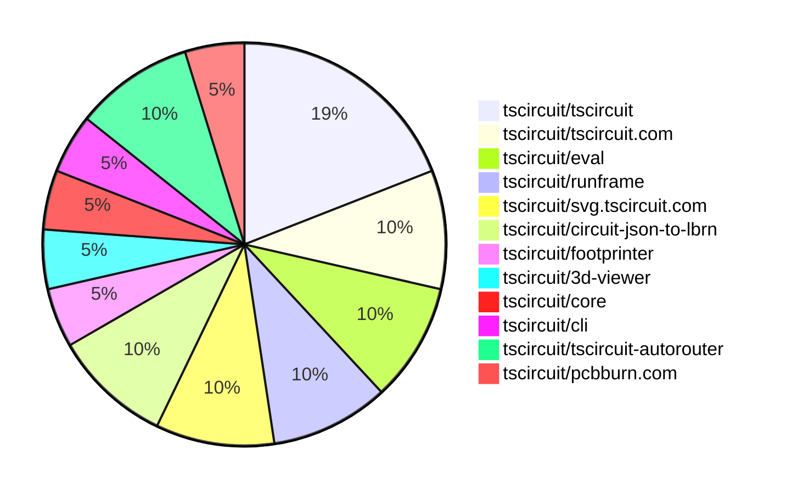

# Contribution Overview 2026-01-14

The current week is shown below. There are 3 major sections:

- [Contributor Overview](#contributor-overview)
- [PRs by Repository](#prs-by-repository)
- [PRs by Contributor](#changes-by-contributor)
- [Scoring & Sponsorship Details](/docs/sponsorship-calculation-explanation.md)

## PRs by Repository

## Contributor Overview

| Contributor | 🐳 Major | 🐙 Minor | 🐌 Tiny | ⭐ | Discussion Contributions |
|-------------|---------|---------|---------|-----|--------------------------|
| [tscircuitbot](#tscircuitbot) | 0 | 0 | 12 | ⭐⭐ | 0🔹 0🔶 0💎 |
| [imrishabh18](#imrishabh18) | 1 | 0 | 0 | ⭐ | 0🔹 0🔶 0💎 |
| [ShiboSoftwareDev](#ShiboSoftwareDev) | 0 | 1 | 1 | ⭐ | 0🔹 0🔶 0💎 |
| [0hmX](#0hmX) | 1 | 0 | 0 | ⭐ | 0🔹 0🔶 0💎 |
| [AnasSarkiz](#AnasSarkiz) | 0 | 1 | 1 |  | 0🔹 0🔶 0💎 |
| [Ayushjhawar8](#Ayushjhawar8) | 0 | 0 | 2 |  | 0🔹 0🔶 0💎 |
| [techmannih](#techmannih) | 0 | 0 | 1 |  | 0🔹 0🔶 0💎 |

> Note: AI evaluates PRs and assigns 1-3 star ratings automatically. 4 and 5 star ratings require manual staff review.

### Discussion Contribution Legend

- 🔹 Normal Comments: Basic participation with minimal effort
- 🔶 Great Informative Comments: Thoughtful participation that adds value
- 💎 Incredible Comments: Exceptional participation with high-quality content

## Review Table

[reviews-received-hover]: ## "Number of reviews received for PRs for this contributor"
[approvals-received-hover]: ## "Number of approvals received for PRs this contributor authored"
[rejections-received-hover]: ## "Number of rejections received for PRs this contributor authored"
[prs-opened-hover]: ## "Number of PRs opened by this contributor"
[issues-created-hover]: ## "Number of issues created by this contributor"

| Contributor | Reviews Received | Approvals Received | Rejections Received | Approvals | Rejections | PRs Opened | PRs Merged | Issues Created |
|---|---|---|---|---|---|---|---|---|
| [tscircuitbot](#tscircuitbot) | 0 | 0 | 0 | 0 | 0 | 17 | 12 | 0 |
| [techmannih](#techmannih) | 1 | 1 | 0 | 0 | 0 | 1 | 1 | 0 |
| [seveibar](#seveibar) | 0 | 0 | 0 | 2 | 1 | 0 | 0 | 0 |
| [ShiboSoftwareDev](#ShiboSoftwareDev) | 4 | 3 | 0 | 1 | 0 | 2 | 2 | 0 |
| [Abse2001](#Abse2001) | 0 | 0 | 0 | 2 | 0 | 0 | 0 | 0 |
| [imrishabh18](#imrishabh18) | 2 | 0 | 1 | 2 | 1 | 2 | 1 | 0 |
| [Heinrich-XIAO](#Heinrich-XIAO) | 0 | 0 | 0 | 0 | 0 | 1 | 0 | 0 |
| [Ayushjhawar8](#Ayushjhawar8) | 2 | 1 | 1 | 0 | 0 | 3 | 2 | 0 |
| [0hmX](#0hmX) | 1 | 0 | 0 | 0 | 0 | 4 | 1 | 0 |
| [GhostDragonAlpha](#GhostDragonAlpha) | 0 | 0 | 0 | 0 | 0 | 1 | 0 | 0 |
| [krapcys1-maker](#krapcys1-maker) | 2 | 0 | 2 | 0 | 0 | 1 | 0 | 0 |
| [rushabhcodes](#rushabhcodes) | 0 | 0 | 0 | 0 | 2 | 0 | 0 | 0 |
| [AnasSarkiz](#AnasSarkiz) | 2 | 2 | 0 | 0 | 0 | 3 | 2 | 0 |

## Changes by Repository

### [tscircuit/tscircuit](https://github.com/tscircuit/tscircuit)

🐌 Tiny Contributions (4)

| PR # | Impact | Contributor | Description |
|------|--------|-------------|-------------|
| [#1847](https://github.com/tscircuit/tscircuit/pull/1847) | 🐌 Tiny | tscircuitbot | Automated package update |
| [#1846](https://github.com/tscircuit/tscircuit/pull/1846) | 🐌 Tiny | tscircuitbot | Automated package update |
| [#1845](https://github.com/tscircuit/tscircuit/pull/1845) | 🐌 Tiny | tscircuitbot | Automated package update |
| [#1844](https://github.com/tscircuit/tscircuit/pull/1844) | 🐌 Tiny | tscircuitbot | Updates the tscircuitcli package and other dependencies to their latest versions. |

### [tscircuit/tscircuit.com](https://github.com/tscircuit/tscircuit.com)

| PR # | Impact | Rating | Contributor | Description |
|------|--------|--------|-------------|-------------|
| [#2472](https://github.com/tscircuit/tscircuit.com/pull/2472) | 🐳 Major | ⭐⭐⭐ | imrishabh18 | Invalidates the cached queries for packageRelease and packageBuild after a rebuild operation to ensure fresh data is fetched. |

🐌 Tiny Contributions (1)

| PR # | Impact | Contributor | Description |
|------|--------|-------------|-------------|
| [#2474](https://github.com/tscircuit/tscircuit.com/pull/2474) | 🐌 Tiny | tscircuitbot | Updates the tscircuiteval package from version 0.0.584 to 0.0.585 |

### [tscircuit/eval](https://github.com/tscircuit/eval)

🐌 Tiny Contributions (2)

| PR # | Impact | Contributor | Description |
|------|--------|-------------|-------------|
| [#1860](https://github.com/tscircuit/eval/pull/1860) | 🐌 Tiny | tscircuitbot | Automated package update |
| [#1859](https://github.com/tscircuit/eval/pull/1859) | 🐌 Tiny | tscircuitbot | Automated package update |

### [tscircuit/runframe](https://github.com/tscircuit/runframe)

🐌 Tiny Contributions (2)

| PR # | Impact | Contributor | Description |
|------|--------|-------------|-------------|
| [#2317](https://github.com/tscircuit/runframe/pull/2317) | 🐌 Tiny | tscircuitbot | Automated package update |
| [#2316](https://github.com/tscircuit/runframe/pull/2316) | 🐌 Tiny | tscircuitbot | Updates the tscircuiteval package to version 0.0.585 in package.json |

### [tscircuit/svg.tscircuit.com](https://github.com/tscircuit/svg.tscircuit.com)

🐌 Tiny Contributions (2)

| PR # | Impact | Contributor | Description |
|------|--------|-------------|-------------|
| [#826](https://github.com/tscircuit/svg.tscircuit.com/pull/826) | 🐌 Tiny | tscircuitbot | Automated package update |
| [#825](https://github.com/tscircuit/svg.tscircuit.com/pull/825) | 🐌 Tiny | tscircuitbot | Updates the tscircuit package version from 0.0.1139 to 0.0.1140 in package.json |

### [tscircuit/circuit-json-to-lbrn](https://github.com/tscircuit/circuit-json-to-lbrn)

| PR # | Impact | Rating | Contributor | Description |
|------|--------|--------|-------------|-------------|
| [#86](https://github.com/tscircuit/circuit-json-to-lbrn/pull/86) | 🐙 Minor | ⭐⭐ | AnasSarkiz | Summary Fixed critical bug where traces failed to merge with connected rectangular plated hole pads, causing separate shapes instead of continuous copper. Implemented by refactoring copper geometry handling to eliminate code duplication and ensure consistent net-connection behavior.  Changes New helper function: addCopperGeometryToNetOrProject() centralizes net-connected vs. unconnected copper geometry logic Refactored 10 handlers: All plated hole (4) and SMT pad (6) handlers now use standardized merging logic Bug resolution: Plated hole pads correctly merge with traces on same net instead of creating gapsoverlaps Test coverage: Added example04 test case demonstrating proper trace-pad continuity |

🐌 Tiny Contributions (1)

| PR # | Impact | Contributor | Description |
|------|--------|-------------|-------------|
| [#87](https://github.com/tscircuit/circuit-json-to-lbrn/pull/87) | 🐌 Tiny | tscircuitbot | Automated package update |

### [tscircuit/footprinter](https://github.com/tscircuit/footprinter)

🐌 Tiny Contributions (1)

| PR # | Impact | Contributor | Description |
|------|--------|-------------|-------------|
| [#479](https://github.com/tscircuit/footprinter/pull/479) | 🐌 Tiny | techmannih | Changes resistor array definitions to use numeric pad parameters for dimensions instead of strings. |

### [tscircuit/3d-viewer](https://github.com/tscircuit/3d-viewer)

| PR # | Impact | Rating | Contributor | Description |
|------|--------|--------|-------------|-------------|
| [#651](https://github.com/tscircuit/3d-viewer/pull/651) | 🐙 Minor | ⭐⭐ | ShiboSoftwareDev | Adds support for oval hole elements in PCB design, allowing for oval-shaped holes to be created and rendered in the 3D viewer. |

### [tscircuit/core](https://github.com/tscircuit/core)

🐌 Tiny Contributions (1)

| PR # | Impact | Contributor | Description |
|------|--------|-------------|-------------|
| [#1832](https://github.com/tscircuit/core/pull/1832) | 🐌 Tiny | ShiboSoftwareDev | Updates the tscircuitcircuit-json-util dependency to version 0.0.75 in package.json |

### [tscircuit/cli](https://github.com/tscircuit/cli)

🐌 Tiny Contributions (1)

| PR # | Impact | Contributor | Description |
|------|--------|-------------|-------------|
| [#1609](https://github.com/tscircuit/cli/pull/1609) | 🐌 Tiny | Ayushjhawar8 | Adds tests to verify the execution of buildCommand and prebuildCommand when using the --ci flag in the tscircuit CLI. |

### [tscircuit/tscircuit-autorouter](https://github.com/tscircuit/tscircuit-autorouter)

| PR # | Impact | Rating | Contributor | Description |
|------|--------|--------|-------------|-------------|
| [#536](https://github.com/tscircuit/tscircuit-autorouter/pull/536) | 🐳 Major | ⭐⭐⭐ | 0hmX | Fixes autorouting behavior to prevent illegal cross-layer path interactions in the autorouter. |

🐌 Tiny Contributions (1)

| PR # | Impact | Contributor | Description |
|------|--------|-------------|-------------|
| [#539](https://github.com/tscircuit/tscircuit-autorouter/pull/539) | 🐌 Tiny | Ayushjhawar8 | Updates the graphics-debug dependency to version 0.0.77 in the package.json file. |

### [tscircuit/pcbburn.com](https://github.com/tscircuit/pcbburn.com)

🐌 Tiny Contributions (1)

| PR # | Impact | Contributor | Description |
|------|--------|-------------|-------------|
| [#27](https://github.com/tscircuit/pcbburn.com/pull/27) | 🐌 Tiny | AnasSarkiz | Updates the version of the circuit-json-to-lbrn dependency from 0.0.39 to 0.0.40 in package.json |

## Changes by Contributor

### [tscircuitbot](https://github.com/tscircuitbot)

🐌 Tiny Contributions (12)

| PR # | Impact | Description |
|------|--------|-------------|
| [#1847](https://github.com/tscircuit/tscircuit/pull/1847) | 🐌 Tiny | Automated package update |
| [#1846](https://github.com/tscircuit/tscircuit/pull/1846) | 🐌 Tiny | Automated package update |
| [#1845](https://github.com/tscircuit/tscircuit/pull/1845) | 🐌 Tiny | Automated package update |
| [#1844](https://github.com/tscircuit/tscircuit/pull/1844) | 🐌 Tiny | Updates the tscircuitcli package and other dependencies to their latest versions. |
| [#2474](https://github.com/tscircuit/tscircuit.com/pull/2474) | 🐌 Tiny | Updates the tscircuiteval package from version 0.0.584 to 0.0.585 |
| [#1860](https://github.com/tscircuit/eval/pull/1860) | 🐌 Tiny | Automated package update |
| [#1859](https://github.com/tscircuit/eval/pull/1859) | 🐌 Tiny | Automated package update |
| [#2317](https://github.com/tscircuit/runframe/pull/2317) | 🐌 Tiny | Automated package update |
| [#2316](https://github.com/tscircuit/runframe/pull/2316) | 🐌 Tiny | Updates the tscircuiteval package to version 0.0.585 in package.json |
| [#826](https://github.com/tscircuit/svg.tscircuit.com/pull/826) | 🐌 Tiny | Automated package update |
| [#825](https://github.com/tscircuit/svg.tscircuit.com/pull/825) | 🐌 Tiny | Updates the tscircuit package version from 0.0.1139 to 0.0.1140 in package.json |
| [#87](https://github.com/tscircuit/circuit-json-to-lbrn/pull/87) | 🐌 Tiny | Automated package update |

### [techmannih](https://github.com/techmannih)

🐌 Tiny Contributions (1)

| PR # | Impact | Description |
|------|--------|-------------|
| [#479](https://github.com/tscircuit/footprinter/pull/479) | 🐌 Tiny | Changes resistor array definitions to use numeric pad parameters for dimensions instead of strings. |

### [ShiboSoftwareDev](https://github.com/ShiboSoftwareDev)

| PRs # | Impact | Rating | Description |
|------|--------|--------|-------------|
| [#651](https://github.com/tscircuit/3d-viewer/pull/651) | 🐙 Minor | ⭐⭐ | Adds support for oval hole elements in PCB design, allowing for oval-shaped holes to be created and rendered in the 3D viewer. |

🐌 Tiny Contributions (1)

| PR # | Impact | Description |
|------|--------|-------------|
| [#1832](https://github.com/tscircuit/core/pull/1832) | 🐌 Tiny | Updates the tscircuitcircuit-json-util dependency to version 0.0.75 in package.json |

### [imrishabh18](https://github.com/imrishabh18)

| PRs # | Impact | Rating | Description |
|------|--------|--------|-------------|
| [#2472](https://github.com/tscircuit/tscircuit.com/pull/2472) | 🐳 Major | ⭐⭐⭐ | Invalidates the cached queries for packageRelease and packageBuild after a rebuild operation to ensure fresh data is fetched. |

### [Ayushjhawar8](https://github.com/Ayushjhawar8)

🐌 Tiny Contributions (2)

| PR # | Impact | Description |
|------|--------|-------------|
| [#1609](https://github.com/tscircuit/cli/pull/1609) | 🐌 Tiny | Adds tests to verify the execution of buildCommand and prebuildCommand when using the --ci flag in the tscircuit CLI. |
| [#539](https://github.com/tscircuit/tscircuit-autorouter/pull/539) | 🐌 Tiny | Updates the graphics-debug dependency to version 0.0.77 in the package.json file. |

### [0hmX](https://github.com/0hmX)

| PRs # | Impact | Rating | Description |
|------|--------|--------|-------------|
| [#536](https://github.com/tscircuit/tscircuit-autorouter/pull/536) | 🐳 Major | ⭐⭐⭐ | Fixes autorouting behavior to prevent illegal cross-layer path interactions in the autorouter. |

### [AnasSarkiz](https://github.com/AnasSarkiz)

| PRs # | Impact | Rating | Description |
|------|--------|--------|-------------|
| [#86](https://github.com/tscircuit/circuit-json-to-lbrn/pull/86) | 🐙 Minor | ⭐⭐ | Summary Fixed critical bug where traces failed to merge with connected rectangular plated hole pads, causing separate shapes instead of continuous copper. Implemented by refactoring copper geometry handling to eliminate code duplication and ensure consistent net-connection behavior.  Changes New helper function: addCopperGeometryToNetOrProject() centralizes net-connected vs. unconnected copper geometry logic Refactored 10 handlers: All plated hole (4) and SMT pad (6) handlers now use standardized merging logic Bug resolution: Plated hole pads correctly merge with traces on same net instead of creating gapsoverlaps Test coverage: Added example04 test case demonstrating proper trace-pad continuity |

🐌 Tiny Contributions (1)

| PR # | Impact | Description |
|------|--------|-------------|
| [#27](https://github.com/tscircuit/pcbburn.com/pull/27) | 🐌 Tiny | Updates the version of the circuit-json-to-lbrn dependency from 0.0.39 to 0.0.40 in package.json |

## Repository Owners

| Repository | Codeowners |
|------------|------------|
| [builder](https://github.com/tscircuit/builder/blob/main/.github/CODEOWNERS) | [seveibar](https://github.com/seveibar)
| [pcb-viewer](https://github.com/tscircuit/pcb-viewer/blob/main/.github/CODEOWNERS) | [seveibar](https://github.com/seveibar), [ShiboSoftwareDev](https://github.com/ShiboSoftwareDev)
| [footprints-old](https://github.com/tscircuit/footprints-old/blob/main/.github/CODEOWNERS) | [seveibar](https://github.com/seveibar)
| [footprinter](https://github.com/tscircuit/footprinter/blob/main/.github/CODEOWNERS) | [seveibar](https://github.com/seveibar), [techmannih](https://github.com/techmannih)
| [3d-viewer](https://github.com/tscircuit/3d-viewer/blob/main/.github/CODEOWNERS) | [ShiboSoftwareDev](https://github.com/ShiboSoftwareDev)
| [winterspec](https://github.com/tscircuit/winterspec/blob/main/.github/CODEOWNERS) | [seveibar](https://github.com/seveibar), [ShiboSoftwareDev](https://github.com/ShiboSoftwareDev)
| [jscad-electronics](https://github.com/tscircuit/jscad-electronics/blob/main/.github/CODEOWNERS) | [seveibar](https://github.com/seveibar), [techmannih](https://github.com/techmannih), [ShiboSoftwareDev](https://github.com/ShiboSoftwareDev), [anas-sarkez](https://github.com/anas-sarkez)
| [circuit-to-svg](https://github.com/tscircuit/circuit-to-svg/blob/main/.github/CODEOWNERS) | [imrishabh18](https://github.com/imrishabh18)
| [schematic-symbols](https://github.com/tscircuit/schematic-symbols/blob/main/.github/CODEOWNERS) | [seveibar](https://github.com/seveibar), [imrishabh18](https://github.com/imrishabh18), [techmannih](https://github.com/techmannih)
| [circuit-json-to-gerber](https://github.com/tscircuit/circuit-json-to-gerber/blob/main/.github/CODEOWNERS) | [seveibar](https://github.com/seveibar), [ShiboSoftwareDev](https://github.com/ShiboSoftwareDev)
| [tscircuit.com](https://github.com/tscircuit/tscircuit.com/blob/main/.github/CODEOWNERS) | [seveibar](https://github.com/seveibar), [imrishabh18](https://github.com/imrishabh18)
| [issue-roulette](https://github.com/tscircuit/issue-roulette/blob/main/.github/CODEOWNERS) | [Anshgrover23](https://github.com/Anshgrover23)
| [sparkfun-boards](https://github.com/tscircuit/sparkfun-boards/blob/main/.github/CODEOWNERS) | [ShiboSoftwareDev](https://github.com/ShiboSoftwareDev), [Abse2001](https://github.com/Abse2001), [MustafaMulla29](https://github.com/MustafaMulla29), [Anshgrover23](https://github.com/Anshgrover23), [techmannih](https://github.com/techmannih)
| [schematic-corpus](https://github.com/tscircuit/schematic-corpus/blob/main/.github/CODEOWNERS) | [Abse2001](https://github.com/Abse2001)
| [copper-pour-solver](https://github.com/tscircuit/copper-pour-solver/blob/main/.github/CODEOWNERS) | [seveibar](https://github.com/seveibar), [ShiboSoftwareDev](https://github.com/ShiboSoftwareDev)
| [common](https://github.com/tscircuit/common/blob/main/.github/CODEOWNERS) | [seveibar](https://github.com/seveibar), [Abse2001](https://github.com/Abse2001)

## Repositories by Owner

| User | Repo |
|------|------|
| [seveibar](https://github.com/seveibar) | [builder](https://github.com/tscircuit/builder/blob/main/.github/CODEOWNERS) |
|  | [pcb-viewer](https://github.com/tscircuit/pcb-viewer/blob/main/.github/CODEOWNERS) |
|  | [footprints-old](https://github.com/tscircuit/footprints-old/blob/main/.github/CODEOWNERS) |
|  | [footprinter](https://github.com/tscircuit/footprinter/blob/main/.github/CODEOWNERS) |
|  | [winterspec](https://github.com/tscircuit/winterspec/blob/main/.github/CODEOWNERS) |
|  | [jscad-electronics](https://github.com/tscircuit/jscad-electronics/blob/main/.github/CODEOWNERS) |
|  | [schematic-symbols](https://github.com/tscircuit/schematic-symbols/blob/main/.github/CODEOWNERS) |
|  | [circuit-json-to-gerber](https://github.com/tscircuit/circuit-json-to-gerber/blob/main/.github/CODEOWNERS) |
|  | [tscircuit.com](https://github.com/tscircuit/tscircuit.com/blob/main/.github/CODEOWNERS) |
|  | [copper-pour-solver](https://github.com/tscircuit/copper-pour-solver/blob/main/.github/CODEOWNERS) |
|  | [common](https://github.com/tscircuit/common/blob/main/.github/CODEOWNERS) |
| [ShiboSoftwareDev](https://github.com/ShiboSoftwareDev) | [pcb-viewer](https://github.com/tscircuit/pcb-viewer/blob/main/.github/CODEOWNERS) |
|  | [3d-viewer](https://github.com/tscircuit/3d-viewer/blob/main/.github/CODEOWNERS) |
|  | [winterspec](https://github.com/tscircuit/winterspec/blob/main/.github/CODEOWNERS) |
|  | [jscad-electronics](https://github.com/tscircuit/jscad-electronics/blob/main/.github/CODEOWNERS) |
|  | [circuit-json-to-gerber](https://github.com/tscircuit/circuit-json-to-gerber/blob/main/.github/CODEOWNERS) |
|  | [sparkfun-boards](https://github.com/tscircuit/sparkfun-boards/blob/main/.github/CODEOWNERS) |
|  | [copper-pour-solver](https://github.com/tscircuit/copper-pour-solver/blob/main/.github/CODEOWNERS) |
| [techmannih](https://github.com/techmannih) | [footprinter](https://github.com/tscircuit/footprinter/blob/main/.github/CODEOWNERS) |
|  | [jscad-electronics](https://github.com/tscircuit/jscad-electronics/blob/main/.github/CODEOWNERS) |
|  | [schematic-symbols](https://github.com/tscircuit/schematic-symbols/blob/main/.github/CODEOWNERS) |
|  | [sparkfun-boards](https://github.com/tscircuit/sparkfun-boards/blob/main/.github/CODEOWNERS) |
| [anas-sarkez](https://github.com/anas-sarkez) | [jscad-electronics](https://github.com/tscircuit/jscad-electronics/blob/main/.github/CODEOWNERS) |
| [imrishabh18](https://github.com/imrishabh18) | [circuit-to-svg](https://github.com/tscircuit/circuit-to-svg/blob/main/.github/CODEOWNERS) |
|  | [schematic-symbols](https://github.com/tscircuit/schematic-symbols/blob/main/.github/CODEOWNERS) |
|  | [tscircuit.com](https://github.com/tscircuit/tscircuit.com/blob/main/.github/CODEOWNERS) |
| [Anshgrover23](https://github.com/Anshgrover23) | [issue-roulette](https://github.com/tscircuit/issue-roulette/blob/main/.github/CODEOWNERS) |
|  | [sparkfun-boards](https://github.com/tscircuit/sparkfun-boards/blob/main/.github/CODEOWNERS) |
| [Abse2001](https://github.com/Abse2001) | [sparkfun-boards](https://github.com/tscircuit/sparkfun-boards/blob/main/.github/CODEOWNERS) |
|  | [schematic-corpus](https://github.com/tscircuit/schematic-corpus/blob/main/.github/CODEOWNERS) |
|  | [common](https://github.com/tscircuit/common/blob/main/.github/CODEOWNERS) |
| [MustafaMulla29](https://github.com/MustafaMulla29) | [sparkfun-boards](https://github.com/tscircuit/sparkfun-boards/blob/main/.github/CODEOWNERS) |

