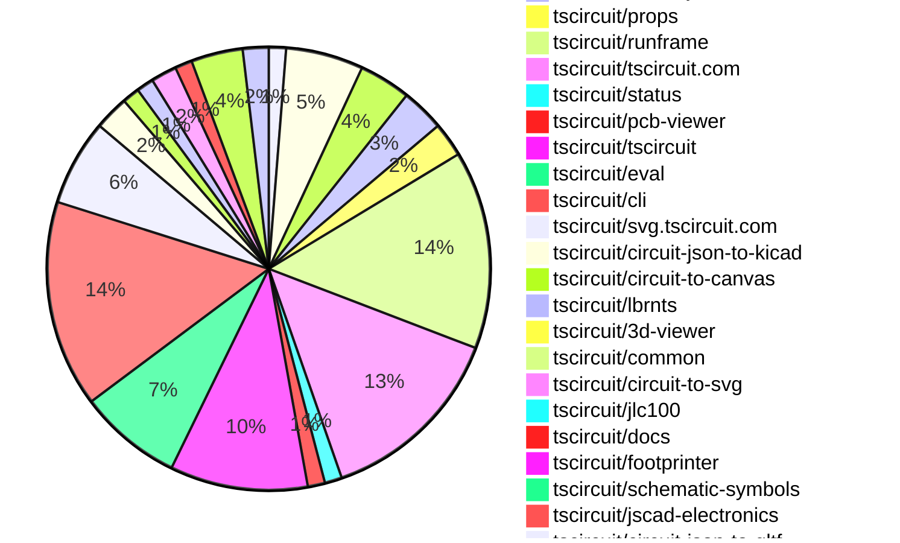

# Contribution Overview 2026-01-27

The current week is shown below. There are 3 major sections:

- [Contributor Overview](#contributor-overview)
- [PRs by Repository](#prs-by-repository)
- [PRs by Contributor](#changes-by-contributor)
- [Scoring & Sponsorship Details](/docs/sponsorship-calculation-explanation.md)

## PRs by Repository

## Contributor Overview

| Contributor | 🐳 Major | 🐙 Minor | 🐌 Tiny | ⭐ | Discussion Contributions |
|-------------|---------|---------|---------|-----|--------------------------|
| [MustafaMulla29](#MustafaMulla29) | 3 | 6 | 9 | ⭐⭐⭐ | 0🔹 0🔶 0💎 |
| [seveibar](#seveibar) | 2 | 3 | 4 | ⭐⭐ | 0🔹 0🔶 0💎 |
| [ArnavK-09](#ArnavK-09) | 2 | 1 | 2 | ⭐⭐ | 0🔹 0🔶 0💎 |
| [AnasSarkiz](#AnasSarkiz) | 0 | 6 | 2 | ⭐⭐ | 0🔹 0🔶 0💎 |
| [tscircuitbot](#tscircuitbot) | 0 | 0 | 109 | ⭐⭐ | 0🔹 0🔶 0💎 |
| [techmannih](#techmannih) | 0 | 4 | 0 | ⭐⭐ | 0🔹 0🔶 0💎 |
| [Abse2001](#Abse2001) | 0 | 3 | 1 | ⭐ | 0🔹 0🔶 0💎 |
| [ShiboSoftwareDev](#ShiboSoftwareDev) | 0 | 1 | 0 | ⭐ | 0🔹 0🔶 0💎 |
| [nailoo](#nailoo) | 0 | 0 | 3 |  | 0🔹 0🔶 0💎 |
| [rushabhcodes](#rushabhcodes) | 0 | 1 | 1 |  | 0🔹 0🔶 0💎 |
| [0hmX](#0hmX) | 0 | 0 | 3 |  | 0🔹 0🔶 0💎 |
| [imrishabh18](#imrishabh18) | 0 | 0 | 1 |  | 0🔹 0🔶 0💎 |

> Note: AI evaluates PRs and assigns 1-3 star ratings automatically. 4 and 5 star ratings require manual staff review.

### Discussion Contribution Legend

- 🔹 Normal Comments: Basic participation with minimal effort
- 🔶 Great Informative Comments: Thoughtful participation that adds value
- 💎 Incredible Comments: Exceptional participation with high-quality content

## Review Table

[reviews-received-hover]: ## "Number of reviews received for PRs for this contributor"
[approvals-received-hover]: ## "Number of approvals received for PRs this contributor authored"
[rejections-received-hover]: ## "Number of rejections received for PRs this contributor authored"
[prs-opened-hover]: ## "Number of PRs opened by this contributor"
[issues-created-hover]: ## "Number of issues created by this contributor"

| Contributor | Reviews Received | Approvals Received | Rejections Received | Approvals | Rejections | PRs Opened | PRs Merged | Issues Created |
|---|---|---|---|---|---|---|---|---|
| [seveibar](#seveibar) | 9 | 0 | 0 | 14 | 3 | 14 | 9 | 0 |
| [ArnavK-09](#ArnavK-09) | 4 | 3 | 0 | 2 | 0 | 6 | 6 | 0 |
| [tscircuitbot](#tscircuitbot) | 0 | 0 | 0 | 0 | 0 | 125 | 109 | 0 |
| [Abse2001](#Abse2001) | 4 | 4 | 0 | 0 | 0 | 4 | 4 | 0 |
| [ShiboSoftwareDev](#ShiboSoftwareDev) | 2 | 1 | 0 | 3 | 0 | 1 | 1 | 0 |
| [Mukedlii](#Mukedlii) | 1 | 0 | 0 | 0 | 0 | 1 | 0 | 0 |
| [rushabhcodes](#rushabhcodes) | 12 | 5 | 1 | 0 | 1 | 4 | 2 | 0 |
| [MustafaMulla29](#MustafaMulla29) | 12 | 8 | 1 | 0 | 0 | 20 | 18 | 0 |
| [techmannih](#techmannih) | 4 | 4 | 0 | 5 | 0 | 4 | 4 | 0 |
| [nailoo](#nailoo) | 5 | 4 | 1 | 0 | 0 | 5 | 3 | 0 |
| [imrishabh18](#imrishabh18) | 1 | 0 | 1 | 7 | 1 | 2 | 1 | 0 |
| [Ayushjhawar8](#Ayushjhawar8) | 4 | 0 | 0 | 0 | 0 | 1 | 0 | 0 |
| [omwanere](#omwanere) | 6 | 0 | 0 | 0 | 0 | 1 | 0 | 0 |
| [pxlpal](#pxlpal) | 0 | 0 | 0 | 0 | 0 | 1 | 0 | 0 |
| [AnasSarkiz](#AnasSarkiz) | 0 | 0 | 0 | 0 | 0 | 8 | 8 | 0 |
| [0hmX](#0hmX) | 11 | 2 | 1 | 0 | 0 | 5 | 4 | 0 |

## Changes by Repository

### [tscircuit/schematic-viewer](https://github.com/tscircuit/schematic-viewer)

| PR # | Impact | Rating | Contributor | Description |
|------|--------|--------|-------------|-------------|
| [#161](https://github.com/tscircuit/schematic-viewer/pull/161) | 🐳 Major | ⭐⭐⭐ | seveibar | Adds the ability to show schematic ports on hover when view mode is enabled |
| [#160](https://github.com/tscircuit/schematic-viewer/pull/160) | 🐳 Major | ⭐⭐⭐ | ArnavK-09 | Adds a toggle option in the menu to show or hide the grid in the schematic viewer. |

### [tscircuit/circuit-json](https://github.com/tscircuit/circuit-json)

| PR # | Impact | Rating | Contributor | Description |
|------|--------|--------|-------------|-------------|
| [#433](https://github.com/tscircuit/circuit-json/pull/433) | 🐳 Major | ⭐⭐⭐ | seveibar | Add a new error type for PCB panelization placement failures, ensuring it is recognized in the type system and tooling. |
| [#428](https://github.com/tscircuit/circuit-json/pull/428) | 🐙 Minor | ⭐⭐ | MustafaMulla29 | Adds stroke_color and svg_path properties to the SchematicPath interface for enhanced schematic representation. |
| [#426](https://github.com/tscircuit/circuit-json/pull/426) | 🐙 Minor | ⭐⭐ | MustafaMulla29 | Adds a stroke_width property to the SchematicPath interface, allowing for customizable stroke widths in schematic paths. |
| [#422](https://github.com/tscircuit/circuit-json/pull/422) | 🐙 Minor | ⭐⭐ | techmannih | Adds a simple current source component to the circuit-json library, allowing users to define current sources with various parameters such as current, frequency, and wave shape. |

🐌 Tiny Contributions (5)

| PR # | Impact | Contributor | Description |
|------|--------|-------------|-------------|
| [#431](https://github.com/tscircuit/circuit-json/pull/431) | 🐌 Tiny | seveibar | Removes the svg_path property from the SchematicPath interface and its corresponding validation in the schematic_path schema. |
| [#434](https://github.com/tscircuit/circuit-json/pull/434) | 🐌 Tiny | tscircuitbot | Automated package update |
| [#432](https://github.com/tscircuit/circuit-json/pull/432) | 🐌 Tiny | tscircuitbot | Automated package update |
| [#429](https://github.com/tscircuit/circuit-json/pull/429) | 🐌 Tiny | tscircuitbot | Automated package update |
| [#425](https://github.com/tscircuit/circuit-json/pull/425) | 🐌 Tiny | tscircuitbot | Automated package update |

### [tscircuit/core](https://github.com/tscircuit/core)

| PR # | Impact | Rating | Contributor | Description |
|------|--------|--------|-------------|-------------|
| [#1870](https://github.com/tscircuit/core/pull/1870) | 🐙 Minor | ⭐⭐ | seveibar | Adds an error handling mechanism for multiple boards in a panel without specified pcbXpcbY positions when layoutMode is set to none. |
| [#1869](https://github.com/tscircuit/core/pull/1869) | 🐙 Minor | ⭐⭐ | seveibar | Adds functionality to create multiple schematic paths from a single SVG path input, allowing for more complex schematic representations. |
| [#1866](https://github.com/tscircuit/core/pull/1866) | 🐙 Minor | ⭐⭐ | MustafaMulla29 | Adds support for strokeWidth in SchematicPath and updates dependencies in package.json |
| [#1868](https://github.com/tscircuit/core/pull/1868) | 🐙 Minor | ⭐⭐ | MustafaMulla29 | Adds stroke_color and svg_path properties to the SchematicPath component and updates dependencies in package.json |
| [#1865](https://github.com/tscircuit/core/pull/1865) | 🐙 Minor | ⭐⭐ | techmannih | Enhances type safety in the Crystal and CurrentSource components by replacing any type assertions with specific input types from circuit-json. |

🐌 Tiny Contributions (1)

| PR # | Impact | Contributor | Description |
|------|--------|-------------|-------------|
| [#1867](https://github.com/tscircuit/core/pull/1867) | 🐌 Tiny | nailoo | Updates the schematic-symbols dependency to version 0.0.208 in package.json |

### [tscircuit/circuit-json-to-lbrn](https://github.com/tscircuit/circuit-json-to-lbrn)

| PR # | Impact | Rating | Contributor | Description |
|------|--------|--------|-------------|-------------|
| [#112](https://github.com/tscircuit/circuit-json-to-lbrn/pull/112) | 🐙 Minor | ⭐⭐ | seveibar | Adds functionality to create an oxidation cleaning layer for laser ablation to clean oxidation from the copper surface of PCB layers. |
| [#114](https://github.com/tscircuit/circuit-json-to-lbrn/pull/114) | 🐙 Minor | ⭐⭐ | AnasSarkiz | Replace the cut-setting field from pulseWidth to qPulseWidth so LBRN receives the correct parameter. Keep laser profile defaults and UI in ns, aligning tests and docs with the correct field. Bump lbrnts to 0.0.17 to match the updated schema. |

🐌 Tiny Contributions (3)

| PR # | Impact | Contributor | Description |
|------|--------|-------------|-------------|
| [#115](https://github.com/tscircuit/circuit-json-to-lbrn/pull/115) | 🐌 Tiny | tscircuitbot | Automated package update |
| [#113](https://github.com/tscircuit/circuit-json-to-lbrn/pull/113) | 🐌 Tiny | tscircuitbot | Automated package update |
| [#111](https://github.com/tscircuit/circuit-json-to-lbrn/pull/111) | 🐌 Tiny | tscircuitbot | Automated package update |

### [tscircuit/props](https://github.com/tscircuit/props)

🐌 Tiny Contributions (4)

| PR # | Impact | Contributor | Description |
|------|--------|-------------|-------------|
| [#570](https://github.com/tscircuit/props/pull/570) | 🐌 Tiny | seveibar | Makes the points property optional in the schematicPathProps definition, allowing for more flexible usage of the schematic path component. |
| [#567](https://github.com/tscircuit/props/pull/567) | 🐌 Tiny | seveibar | Adds strokeWidth and strokeColor properties to schematic path elements, allowing for customizable styling of paths via props. |
| [#568](https://github.com/tscircuit/props/pull/568) | 🐌 Tiny | MustafaMulla29 | Updates the circuit-json dependency from version 0.0.275 to 0.0.362 in package.json |
| [#569](https://github.com/tscircuit/props/pull/569) | 🐌 Tiny | MustafaMulla29 | Updates the circuit-json dependency to version 0.0.363 in package.json |

### [tscircuit/runframe](https://github.com/tscircuit/runframe)

🐌 Tiny Contributions (23)

| PR # | Impact | Contributor | Description |
|------|--------|-------------|-------------|
| [#2468](https://github.com/tscircuit/runframe/pull/2468) | 🐌 Tiny | seveibar | Adds a new View dropdown menu to the File Menu Left Header, allowing users to access schematic-related options such as showing schematic ports and grid. |
| [#2473](https://github.com/tscircuit/runframe/pull/2473) | 🐌 Tiny | tscircuitbot | Automated package update |
| [#2472](https://github.com/tscircuit/runframe/pull/2472) | 🐌 Tiny | tscircuitbot | Updates the tscircuit3d-viewer package to version 0.0.502 in package.json |
| [#2471](https://github.com/tscircuit/runframe/pull/2471) | 🐌 Tiny | tscircuitbot | Automated package update |
| [#2470](https://github.com/tscircuit/runframe/pull/2470) | 🐌 Tiny | tscircuitbot | Updates the tscircuitpcb-viewer package from version 1.11.322 to 1.11.325 |
| [#2467](https://github.com/tscircuit/runframe/pull/2467) | 🐌 Tiny | tscircuitbot | Automated package update |
| [#2466](https://github.com/tscircuit/runframe/pull/2466) | 🐌 Tiny | tscircuitbot | Updates the tscircuitschematic-viewer package to version 2.0.55 in package.json |
| [#2464](https://github.com/tscircuit/runframe/pull/2464) | 🐌 Tiny | tscircuitbot | Automated package update |
| [#2463](https://github.com/tscircuit/runframe/pull/2463) | 🐌 Tiny | tscircuitbot | Updates the tscircuiteval package to version 0.0.612 in package.json |
| [#2462](https://github.com/tscircuit/runframe/pull/2462) | 🐌 Tiny | tscircuitbot | Automated package update |
| [#2461](https://github.com/tscircuit/runframe/pull/2461) | 🐌 Tiny | tscircuitbot | Updates the tscircuiteval package to version 0.0.611 in the package.json file. |
| [#2444](https://github.com/tscircuit/runframe/pull/2444) | 🐌 Tiny | tscircuitbot | Updates the circuit-json-to-kicad package from version 0.0.47 to 0.0.48 |
| [#2449](https://github.com/tscircuit/runframe/pull/2449) | 🐌 Tiny | tscircuitbot | Updates the tscircuiteval package to version 0.0.607 in the package.json file. |
| [#2447](https://github.com/tscircuit/runframe/pull/2447) | 🐌 Tiny | tscircuitbot | Updates the circuit-json-to-kicad package version from 0.0.48 to 0.0.49 in package.json |
| [#2453](https://github.com/tscircuit/runframe/pull/2453) | 🐌 Tiny | tscircuitbot | Updates the tscircuiteval package to version 0.0.609 in the package.json file. |
| [#2456](https://github.com/tscircuit/runframe/pull/2456) | 🐌 Tiny | tscircuitbot | Automated package update |
| [#2450](https://github.com/tscircuit/runframe/pull/2450) | 🐌 Tiny | tscircuitbot | Automated package update |
| [#2454](https://github.com/tscircuit/runframe/pull/2454) | 🐌 Tiny | tscircuitbot | Automated package update |
| [#2452](https://github.com/tscircuit/runframe/pull/2452) | 🐌 Tiny | tscircuitbot | Automated package update |
| [#2455](https://github.com/tscircuit/runframe/pull/2455) | 🐌 Tiny | tscircuitbot | Updates the tscircuiteval package from version 0.0.609 to 0.0.610 |
| [#2451](https://github.com/tscircuit/runframe/pull/2451) | 🐌 Tiny | tscircuitbot | Updates the tscircuiteval package to version 0.0.608 in the package.json file |
| [#2445](https://github.com/tscircuit/runframe/pull/2445) | 🐌 Tiny | tscircuitbot | Automated package update |
| [#2457](https://github.com/tscircuit/runframe/pull/2457) | 🐌 Tiny | MustafaMulla29 | Updates dependencies and adds a new fixture for testing schematic paths in the RunFrame component. |

### [tscircuit/tscircuit.com](https://github.com/tscircuit/tscircuit.com)

| PR # | Impact | Rating | Contributor | Description |
|------|--------|--------|-------------|-------------|
| [#2582](https://github.com/tscircuit/tscircuit.com/pull/2582) | 🐳 Major | ⭐⭐⭐ | ArnavK-09 | Switches the package details settings page to a new implementation, removing the previous dialog-based editing approach and integrating direct navigation to the settings page. |
| [#2581](https://github.com/tscircuit/tscircuit.com/pull/2581) | 🐙 Minor | ⭐⭐ | ArnavK-09 | Removes the premature mobile package settings dialog and updates navigation to settings page directly. |

🐌 Tiny Contributions (20)

| PR # | Impact | Contributor | Description |
|------|--------|-------------|-------------|
| [#2580](https://github.com/tscircuit/tscircuit.com/pull/2580) | 🐌 Tiny | ArnavK-09 | Adds a new settings page for managing package details including name, description, website, visibility, license, and GitHub repository connection. |
| [#2591](https://github.com/tscircuit/tscircuit.com/pull/2591) | 🐌 Tiny | tscircuitbot | Automated package update |
| [#2590](https://github.com/tscircuit/tscircuit.com/pull/2590) | 🐌 Tiny | tscircuitbot | Automated package update |
| [#2588](https://github.com/tscircuit/tscircuit.com/pull/2588) | 🐌 Tiny | tscircuitbot | Automated package update |
| [#2587](https://github.com/tscircuit/tscircuit.com/pull/2587) | 🐌 Tiny | tscircuitbot | Updates the tscircuitrunframe package to version 0.0.1537 |
| [#2586](https://github.com/tscircuit/tscircuit.com/pull/2586) | 🐌 Tiny | tscircuitbot | Automated package update |
| [#2585](https://github.com/tscircuit/tscircuit.com/pull/2585) | 🐌 Tiny | tscircuitbot | Updates the tscircuitrunframe package to version 0.0.1536 |
| [#2584](https://github.com/tscircuit/tscircuit.com/pull/2584) | 🐌 Tiny | tscircuitbot | Updates the tscircuiteval package from version 0.0.610 to 0.0.611 |
| [#2583](https://github.com/tscircuit/tscircuit.com/pull/2583) | 🐌 Tiny | tscircuitbot | Automated package update |
| [#2568](https://github.com/tscircuit/tscircuit.com/pull/2568) | 🐌 Tiny | tscircuitbot | Automated package update |
| [#2578](https://github.com/tscircuit/tscircuit.com/pull/2578) | 🐌 Tiny | tscircuitbot | Updates the tscircuiteval package from version 0.0.609 to 0.0.610 in the package.json file. |
| [#2570](https://github.com/tscircuit/tscircuit.com/pull/2570) | 🐌 Tiny | tscircuitbot | Updates the tscircuitrunframe package version from 0.0.1529 to 0.0.1531 in package.json |
| [#2576](https://github.com/tscircuit/tscircuit.com/pull/2576) | 🐌 Tiny | tscircuitbot | Automated package update |
| [#2579](https://github.com/tscircuit/tscircuit.com/pull/2579) | 🐌 Tiny | tscircuitbot | Updates the tscircuitrunframe package from version 0.0.1533 to 0.0.1534 |
| [#2572](https://github.com/tscircuit/tscircuit.com/pull/2572) | 🐌 Tiny | tscircuitbot | Updates the tscircuitrunframe package to version 0.0.1532 in the package.json file. |
| [#2571](https://github.com/tscircuit/tscircuit.com/pull/2571) | 🐌 Tiny | tscircuitbot | Automated package update |
| [#2577](https://github.com/tscircuit/tscircuit.com/pull/2577) | 🐌 Tiny | tscircuitbot | Automated package update |
| [#2567](https://github.com/tscircuit/tscircuit.com/pull/2567) | 🐌 Tiny | tscircuitbot | Automated package update |
| [#2573](https://github.com/tscircuit/tscircuit.com/pull/2573) | 🐌 Tiny | MustafaMulla29 | Updates the circuit-to-svg dependency version from 0.0.298 to 0.0.318 in package.json |
| [#2575](https://github.com/tscircuit/tscircuit.com/pull/2575) | 🐌 Tiny | MustafaMulla29 | Updates the circuit-to-svg dependency version from 0.0.318 to 0.0.319 in package.json |

### [tscircuit/status](https://github.com/tscircuit/status)

🐌 Tiny Contributions (2)

| PR # | Impact | Contributor | Description |
|------|--------|-------------|-------------|
| [#64](https://github.com/tscircuit/status/pull/64) | 🐌 Tiny | ArnavK-09 | Removes the health check function for the PNG service from the codebase. |
| [#63](https://github.com/tscircuit/status/pull/63) | 🐌 Tiny | imrishabh18 | Removes the health check for the PNG service from the run checks script, indicating that the PNG service is no longer monitored for health status. |

### [tscircuit/pcb-viewer](https://github.com/tscircuit/pcb-viewer)

| PR # | Impact | Rating | Contributor | Description |
|------|--------|--------|-------------|-------------|
| [#631](https://github.com/tscircuit/pcb-viewer/pull/631) | 🐙 Minor | ⭐⭐ | Abse2001 | Fixes multiple long-standing PCB rendering issues by making soldermask a first-class, explicitly rendered layer and correcting drillsilkscreen ordering across the canvas pipeline. |

🐌 Tiny Contributions (1)

| PR # | Impact | Contributor | Description |
|------|--------|-------------|-------------|
| [#632](https://github.com/tscircuit/pcb-viewer/pull/632) | 🐌 Tiny | tscircuitbot | Automated package update to version 1.11.325 |

### [tscircuit/tscircuit](https://github.com/tscircuit/tscircuit)

🐌 Tiny Contributions (16)

| PR # | Impact | Contributor | Description |
|------|--------|-------------|-------------|
| [#2023](https://github.com/tscircuit/tscircuit/pull/2023) | 🐌 Tiny | tscircuitbot | Automated package update |
| [#2022](https://github.com/tscircuit/tscircuit/pull/2022) | 🐌 Tiny | tscircuitbot | Automated package update |
| [#2008](https://github.com/tscircuit/tscircuit/pull/2008) | 🐌 Tiny | tscircuitbot | Automated package update |
| [#2012](https://github.com/tscircuit/tscircuit/pull/2012) | 🐌 Tiny | tscircuitbot | Updates the tscircuitcli package version from 0.1.821 to 0.1.822 in package.json |
| [#2018](https://github.com/tscircuit/tscircuit/pull/2018) | 🐌 Tiny | tscircuitbot | Automated package update |
| [#2010](https://github.com/tscircuit/tscircuit/pull/2010) | 🐌 Tiny | tscircuitbot | Automated package update |
| [#2021](https://github.com/tscircuit/tscircuit/pull/2021) | 🐌 Tiny | tscircuitbot | Automated package update |
| [#2014](https://github.com/tscircuit/tscircuit/pull/2014) | 🐌 Tiny | tscircuitbot | Updates the tscircuitcli package to version 0.1.823 in the package.json file. |
| [#2013](https://github.com/tscircuit/tscircuit/pull/2013) | 🐌 Tiny | tscircuitbot | Automated package update |
| [#2015](https://github.com/tscircuit/tscircuit/pull/2015) | 🐌 Tiny | tscircuitbot | Updates the package version from 0.0.1217 to 0.0.1218 in package.json |
| [#2017](https://github.com/tscircuit/tscircuit/pull/2017) | 🐌 Tiny | tscircuitbot | Updates the package version from 0.0.1218 to 0.0.1219 in package.json |
| [#2009](https://github.com/tscircuit/tscircuit/pull/2009) | 🐌 Tiny | tscircuitbot | Updates the package version from 0.0.1214 to 0.0.1215 in package.json |
| [#2019](https://github.com/tscircuit/tscircuit/pull/2019) | 🐌 Tiny | tscircuitbot | Automated package update |
| [#2020](https://github.com/tscircuit/tscircuit/pull/2020) | 🐌 Tiny | tscircuitbot | Automated package update |
| [#2016](https://github.com/tscircuit/tscircuit/pull/2016) | 🐌 Tiny | tscircuitbot | Automated package update |
| [#2011](https://github.com/tscircuit/tscircuit/pull/2011) | 🐌 Tiny | tscircuitbot | Automated package update |

### [tscircuit/eval](https://github.com/tscircuit/eval)

🐌 Tiny Contributions (12)

| PR # | Impact | Contributor | Description |
|------|--------|-------------|-------------|
| [#1939](https://github.com/tscircuit/eval/pull/1939) | 🐌 Tiny | tscircuitbot | Automated package update |
| [#1938](https://github.com/tscircuit/eval/pull/1938) | 🐌 Tiny | tscircuitbot | Updates the version of the tscircuitcore package from 0.0.993 to 0.0.994 in package.json |
| [#1936](https://github.com/tscircuit/eval/pull/1936) | 🐌 Tiny | tscircuitbot | Automated package update to version 0.0.611 |
| [#1935](https://github.com/tscircuit/eval/pull/1935) | 🐌 Tiny | tscircuitbot | Automated package update |
| [#1927](https://github.com/tscircuit/eval/pull/1927) | 🐌 Tiny | tscircuitbot | Automated package update |
| [#1932](https://github.com/tscircuit/eval/pull/1932) | 🐌 Tiny | tscircuitbot | Automated package update |
| [#1930](https://github.com/tscircuit/eval/pull/1930) | 🐌 Tiny | tscircuitbot | Automated package update |
| [#1929](https://github.com/tscircuit/eval/pull/1929) | 🐌 Tiny | tscircuitbot | Updates various package dependencies to their latest versions in the project. |
| [#1923](https://github.com/tscircuit/eval/pull/1923) | 🐌 Tiny | tscircuitbot | Automated package update |
| [#1933](https://github.com/tscircuit/eval/pull/1933) | 🐌 Tiny | tscircuitbot | Automated package update to version 0.0.610 |
| [#1926](https://github.com/tscircuit/eval/pull/1926) | 🐌 Tiny | tscircuitbot | Automated package update |
| [#1924](https://github.com/tscircuit/eval/pull/1924) | 🐌 Tiny | tscircuitbot | Automated package update |

### [tscircuit/cli](https://github.com/tscircuit/cli)

| PR # | Impact | Rating | Contributor | Description |
|------|--------|--------|-------------|-------------|
| [#1788](https://github.com/tscircuit/cli/pull/1788) | 🐙 Minor | ⭐⭐ | MustafaMulla29 | Adds a new command line option to the tsci build command to generate a KiCad library in the specified output directory. |

🐌 Tiny Contributions (23)

| PR # | Impact | Contributor | Description |
|------|--------|-------------|-------------|
| [#1807](https://github.com/tscircuit/cli/pull/1807) | 🐌 Tiny | tscircuitbot | Updates the tscircuitrunframe package to version 0.0.1540 |
| [#1805](https://github.com/tscircuit/cli/pull/1805) | 🐌 Tiny | tscircuitbot | Updates the tscircuitrunframe package from version 0.0.1538 to 0.0.1539 |
| [#1804](https://github.com/tscircuit/cli/pull/1804) | 🐌 Tiny | tscircuitbot | Automated package update |
| [#1803](https://github.com/tscircuit/cli/pull/1803) | 🐌 Tiny | tscircuitbot | Updates the tscircuitrunframe package from version 0.0.1537 to 0.0.1538 |
| [#1802](https://github.com/tscircuit/cli/pull/1802) | 🐌 Tiny | tscircuitbot | Automated package update |
| [#1801](https://github.com/tscircuit/cli/pull/1801) | 🐌 Tiny | tscircuitbot | Updates the tscircuitrunframe package from version 0.0.1536 to 0.0.1537 |
| [#1800](https://github.com/tscircuit/cli/pull/1800) | 🐌 Tiny | tscircuitbot | Automated package update |
| [#1799](https://github.com/tscircuit/cli/pull/1799) | 🐌 Tiny | tscircuitbot | Updates the tscircuitrunframe package from version 0.0.1535 to 0.0.1536 |
| [#1798](https://github.com/tscircuit/cli/pull/1798) | 🐌 Tiny | tscircuitbot | Automated package update |
| [#1797](https://github.com/tscircuit/cli/pull/1797) | 🐌 Tiny | tscircuitbot | Updates the tscircuitrunframe package from version 0.0.1534 to 0.0.1535 |
| [#1784](https://github.com/tscircuit/cli/pull/1784) | 🐌 Tiny | tscircuitbot | Updates the tscircuitrunframe package from version 0.0.1529 to 0.0.1530 |
| [#1796](https://github.com/tscircuit/cli/pull/1796) | 🐌 Tiny | tscircuitbot | Automated package update |
| [#1795](https://github.com/tscircuit/cli/pull/1795) | 🐌 Tiny | tscircuitbot | Updates the tscircuitrunframe package from version 0.0.1533 to 0.0.1534 |
| [#1786](https://github.com/tscircuit/cli/pull/1786) | 🐌 Tiny | tscircuitbot | Automated package update |
| [#1789](https://github.com/tscircuit/cli/pull/1789) | 🐌 Tiny | tscircuitbot | Automated package update |
| [#1793](https://github.com/tscircuit/cli/pull/1793) | 🐌 Tiny | tscircuitbot | Automated package update |
| [#1783](https://github.com/tscircuit/cli/pull/1783) | 🐌 Tiny | tscircuitbot | Automated package update |
| [#1791](https://github.com/tscircuit/cli/pull/1791) | 🐌 Tiny | tscircuitbot | Automated package update |
| [#1792](https://github.com/tscircuit/cli/pull/1792) | 🐌 Tiny | tscircuitbot | Updates the tscircuitrunframe package from version 0.0.1532 to 0.0.1533 |
| [#1790](https://github.com/tscircuit/cli/pull/1790) | 🐌 Tiny | tscircuitbot | Automated package update for tscircuitrunframe from version 0.0.1531 to 0.0.1532 |
| [#1782](https://github.com/tscircuit/cli/pull/1782) | 🐌 Tiny | tscircuitbot | Updates the tscircuitrunframe package from version 0.0.1528 to 0.0.1529 |
| [#1787](https://github.com/tscircuit/cli/pull/1787) | 🐌 Tiny | tscircuitbot | Automated package update |
| [#1785](https://github.com/tscircuit/cli/pull/1785) | 🐌 Tiny | tscircuitbot | Updates the tscircuitrunframe package from version 0.0.1530 to 0.0.1531 |

### [tscircuit/svg.tscircuit.com](https://github.com/tscircuit/svg.tscircuit.com)

🐌 Tiny Contributions (10)

| PR # | Impact | Contributor | Description |
|------|--------|-------------|-------------|
| [#907](https://github.com/tscircuit/svg.tscircuit.com/pull/907) | 🐌 Tiny | tscircuitbot | Updates the tscircuit package version from 0.0.1221 to 0.0.1222 in package.json |
| [#905](https://github.com/tscircuit/svg.tscircuit.com/pull/905) | 🐌 Tiny | tscircuitbot | Updates the tscircuit package version from 0.0.1219 to 0.0.1220 in package.json |
| [#900](https://github.com/tscircuit/svg.tscircuit.com/pull/900) | 🐌 Tiny | tscircuitbot | Updates the tscircuit package version from 0.0.1216 to 0.0.1217 in package.json |
| [#901](https://github.com/tscircuit/svg.tscircuit.com/pull/901) | 🐌 Tiny | tscircuitbot | Updates the tscircuit package from version 0.0.1217 to 0.0.1218 in package.json |
| [#903](https://github.com/tscircuit/svg.tscircuit.com/pull/903) | 🐌 Tiny | tscircuitbot | Updates the tscircuit package version from 0.0.1218 to 0.0.1219 in package.json |
| [#898](https://github.com/tscircuit/svg.tscircuit.com/pull/898) | 🐌 Tiny | tscircuitbot | Updates the tscircuit package version from 0.0.1214 to 0.0.1215 in package.json |
| [#906](https://github.com/tscircuit/svg.tscircuit.com/pull/906) | 🐌 Tiny | tscircuitbot | Updates the tscircuit package version from 0.0.1220 to 0.0.1221 in package.json |
| [#899](https://github.com/tscircuit/svg.tscircuit.com/pull/899) | 🐌 Tiny | tscircuitbot | Updates the tscircuit package version from 0.0.1215 to 0.0.1216 in package.json |
| [#902](https://github.com/tscircuit/svg.tscircuit.com/pull/902) | 🐌 Tiny | MustafaMulla29 | Updates the version of the circuit-to-svg dependency from 0.0.317 to 0.0.318 in package.json |
| [#904](https://github.com/tscircuit/svg.tscircuit.com/pull/904) | 🐌 Tiny | MustafaMulla29 | Updated the dependency to support strokeColor and svgPath for schematicpath element |

### [tscircuit/circuit-json-to-kicad](https://github.com/tscircuit/circuit-json-to-kicad)

| PR # | Impact | Rating | Contributor | Description |
|------|--------|--------|-------------|-------------|
| [#80](https://github.com/tscircuit/circuit-json-to-kicad/pull/80) | 🐙 Minor | ⭐⭐ | techmannih | Adds support for simple switch components in schematic generation. |
| [#82](https://github.com/tscircuit/circuit-json-to-kicad/pull/82) | 🐙 Minor | ⭐⭐ | techmannih | Adds support for circle primitives in the schematic library symbols, allowing for the creation of circular shapes in KiCad symbols. |

🐌 Tiny Contributions (2)

| PR # | Impact | Contributor | Description |
|------|--------|-------------|-------------|
| [#83](https://github.com/tscircuit/circuit-json-to-kicad/pull/83) | 🐌 Tiny | tscircuitbot | Automated package update |
| [#81](https://github.com/tscircuit/circuit-json-to-kicad/pull/81) | 🐌 Tiny | tscircuitbot | Automated package update |

### [tscircuit/circuit-to-canvas](https://github.com/tscircuit/circuit-to-canvas)

| PR # | Impact | Rating | Contributor | Description |
|------|--------|--------|-------------|-------------|
| [#138](https://github.com/tscircuit/circuit-to-canvas/pull/138) | 🐙 Minor | ⭐⭐ | Abse2001 | Fixes PCB rendering order to ensure soldermask correctly covers holes instead of treating them as punch-through elements, resulting in visually accurate soldermask coverage. |

🐌 Tiny Contributions (1)

| PR # | Impact | Contributor | Description |
|------|--------|-------------|-------------|
| [#139](https://github.com/tscircuit/circuit-to-canvas/pull/139) | 🐌 Tiny | tscircuitbot | Automated package update |

### [tscircuit/lbrnts](https://github.com/tscircuit/lbrnts)

| PR # | Impact | Rating | Contributor | Description |
|------|--------|--------|-------------|-------------|
| [#29](https://github.com/tscircuit/lbrnts/pull/29) | 🐙 Minor | ⭐⭐ | AnasSarkiz | Replaces all pulseWidth usage with qPulseWidth to match LightBurns QPulseWidth XML field, emits QPulseWidth Value1 in cut settings, and updates XML snapshot and roundtrip tests to validate the new field. |

🐌 Tiny Contributions (1)

| PR # | Impact | Contributor | Description |
|------|--------|-------------|-------------|
| [#30](https://github.com/tscircuit/lbrnts/pull/30) | 🐌 Tiny | tscircuitbot | Automated package update |

### [tscircuit/3d-viewer](https://github.com/tscircuit/3d-viewer)

| PR # | Impact | Rating | Contributor | Description |
|------|--------|--------|-------------|-------------|
| [#665](https://github.com/tscircuit/3d-viewer/pull/665) | 🐙 Minor | ⭐⭐ | Abse2001 | Removes copper pour generation from the 3D JSCAD geometry pipeline and re-implements copper pours as dedicated topbottom textures, improving performance and aligning rendering with trace handling. |

### [tscircuit/common](https://github.com/tscircuit/common)

🐌 Tiny Contributions (1)

| PR # | Impact | Contributor | Description |
|------|--------|-------------|-------------|
| [#67](https://github.com/tscircuit/common/pull/67) | 🐌 Tiny | Abse2001 | Updates the tscircuit dependency version from 0.0.1212 to 0.0.1220 in package.json |

### [tscircuit/circuit-to-svg](https://github.com/tscircuit/circuit-to-svg)

| PR # | Impact | Rating | Contributor | Description |
|------|--------|--------|-------------|-------------|
| [#491](https://github.com/tscircuit/circuit-to-svg/pull/491) | 🐳 Major | ⭐⭐⭐ | MustafaMulla29 | Adds support for svg_path and stroke_color attributes in schematic_path, allowing for more complex SVG rendering in schematics. |
| [#490](https://github.com/tscircuit/circuit-to-svg/pull/490) | 🐳 Major | ⭐⭐⭐ | MustafaMulla29 | Adds support for strokeWidth in schematic paths, allowing for customizable stroke widths in SVG rendering. |

🐌 Tiny Contributions (1)

| PR # | Impact | Contributor | Description |
|------|--------|-------------|-------------|
| [#492](https://github.com/tscircuit/circuit-to-svg/pull/492) | 🐌 Tiny | MustafaMulla29 | Updates the bun.lock file to reflect the latest dependencies and their versions. |

### [tscircuit/jlc100](https://github.com/tscircuit/jlc100)

| PR # | Impact | Rating | Contributor | Description |
|------|--------|--------|-------------|-------------|
| [#1](https://github.com/tscircuit/jlc100/pull/1) | 🐳 Major | ⭐⭐⭐ | MustafaMulla29 | This pull request initializes the tsci project and imports various components from the JLCPCB library, including processors and microcontrollers. It sets up the project structure, adds necessary files, and includes specific components that are essential for the development of electronic circuits. |

### [tscircuit/docs](https://github.com/tscircuit/docs)

| PR # | Impact | Rating | Contributor | Description |
|------|--------|--------|-------------|-------------|
| [#417](https://github.com/tscircuit/docs/pull/417) | 🐙 Minor | ⭐⭐ | MustafaMulla29 | Adds examples for svgPath and strokeColor properties in the schematicpath component documentation. |

🐌 Tiny Contributions (1)

| PR # | Impact | Contributor | Description |
|------|--------|-------------|-------------|
| [#416](https://github.com/tscircuit/docs/pull/416) | 🐌 Tiny | MustafaMulla29 | Adds a custom NPN transistor symbol and updates the symbol page with new examples. |

### [tscircuit/footprinter](https://github.com/tscircuit/footprinter)

🐌 Tiny Contributions (1)

| PR # | Impact | Contributor | Description |
|------|--------|-------------|-------------|
| [#490](https://github.com/tscircuit/footprinter/pull/490) | 🐌 Tiny | nailoo | Fixes the footprint dimensions for the SOT343 component by updating pin length and width values. |

### [tscircuit/schematic-symbols](https://github.com/tscircuit/schematic-symbols)

🐌 Tiny Contributions (1)

| PR # | Impact | Contributor | Description |
|------|--------|-------------|-------------|
| [#379](https://github.com/tscircuit/schematic-symbols/pull/379) | 🐌 Tiny | nailoo | Refactors the SVG paths for the potentiometer2 component by simplifying the paths and unifying the arrow representation. |

### [tscircuit/jscad-electronics](https://github.com/tscircuit/jscad-electronics)

| PR # | Impact | Rating | Contributor | Description |
|------|--------|--------|-------------|-------------|
| [#256](https://github.com/tscircuit/jscad-electronics/pull/256) | 🐙 Minor | ⭐⭐ | rushabhcodes | Refines Z coordinate calculation in the PinRow component based on smd and rightangle properties, ensuring correct 3D positioning of pins. |

### [tscircuit/circuit-json-to-gltf](https://github.com/tscircuit/circuit-json-to-gltf)

🐌 Tiny Contributions (1)

| PR # | Impact | Contributor | Description |
|------|--------|-------------|-------------|
| [#111](https://github.com/tscircuit/circuit-json-to-gltf/pull/111) | 🐌 Tiny | rushabhcodes | Updates the jscad-electronics dependency in package.json from version 0.0.53 to 0.0.113 |

### [tscircuit/contribution-tracker](https://github.com/tscircuit/contribution-tracker)

| PR # | Impact | Rating | Contributor | Description |
|------|--------|--------|-------------|-------------|
| [#298](https://github.com/tscircuit/contribution-tracker/pull/298) | 🐙 Minor | ⭐⭐ | ShiboSoftwareDev | Shifts the weekly start date calculation to align with Tuesday 18:30 UTC by applying a 5.5-hour offset from the last Wednesday, ensuring consistent UTC documentation and adding a test for early-Wednesday behavior. |

### [tscircuit/pcbburn.com](https://github.com/tscircuit/pcbburn.com)

| PR # | Impact | Rating | Contributor | Description |
|------|--------|--------|-------------|-------------|
| [#57](https://github.com/tscircuit/pcbburn.com/pull/57) | 🐙 Minor | ⭐⭐ | AnasSarkiz | Fixes broken sitemap and replaces external links with crawlable anchors to improve SEO performance. |
| [#56](https://github.com/tscircuit/pcbburn.com/pull/56) | 🐙 Minor | ⭐⭐ | AnasSarkiz | Adds SEO enhancements including canonical URL, Open Graph, Twitter card metadata, and JSON-LD structured data for PCBBurn. |
| [#55](https://github.com/tscircuit/pcbburn.com/pull/55) | 🐙 Minor | ⭐⭐ | AnasSarkiz | Adds sitemap.xml and robots.txt files to enhance search engine visibility for the pcbburn.com website |
| [#52](https://github.com/tscircuit/pcbburn.com/pull/52) | 🐙 Minor | ⭐⭐ | AnasSarkiz | Fixes broken LBRN export XML formatting and standardizes .lbrn2 filenames for better compatibility and consistency. |

🐌 Tiny Contributions (2)

| PR # | Impact | Contributor | Description |
|------|--------|-------------|-------------|
| [#54](https://github.com/tscircuit/pcbburn.com/pull/54) | 🐌 Tiny | AnasSarkiz | Adds a link to the Discord channel in the main navbar for quicker access to the community. |
| [#53](https://github.com/tscircuit/pcbburn.com/pull/53) | 🐌 Tiny | AnasSarkiz | Updates laser profile defaults and pulse width inputs to use ns values instead of seconds to match the latest circuit-json-to-lbrn expectations. |

### [tscircuit/autorouting-dataset-01](https://github.com/tscircuit/autorouting-dataset-01)

🐌 Tiny Contributions (3)

| PR # | Impact | Contributor | Description |
|------|--------|-------------|-------------|
| [#5](https://github.com/tscircuit/autorouting-dataset-01/pull/5) | 🐌 Tiny | 0hmX | close: https:github.comtscircuitautorouting-dataset-01issues2 added biome  bun-pver-release.yml added the feature to generate an index.ts that will reexport all the simple route json |
| [#8](https://github.com/tscircuit/autorouting-dataset-01/pull/8) | 🐌 Tiny | 0hmX | Moves the bun-pver-release.yml file into the .githubworkflows directory for better organization of GitHub Actions workflows. |
| [#6](https://github.com/tscircuit/autorouting-dataset-01/pull/6) | 🐌 Tiny | 0hmX | Moves the bun-pver-release.yml file to the githubworkflows directory for better organization of workflow files. |

## Changes by Contributor

### [seveibar](https://github.com/seveibar)

| PRs # | Impact | Rating | Description |
|------|--------|--------|-------------|
| [#161](https://github.com/tscircuit/schematic-viewer/pull/161) | 🐳 Major | ⭐⭐⭐ | Adds the ability to show schematic ports on hover when view mode is enabled |
| [#433](https://github.com/tscircuit/circuit-json/pull/433) | 🐳 Major | ⭐⭐⭐ | Add a new error type for PCB panelization placement failures, ensuring it is recognized in the type system and tooling. |
| [#1870](https://github.com/tscircuit/core/pull/1870) | 🐙 Minor | ⭐⭐ | Adds an error handling mechanism for multiple boards in a panel without specified pcbXpcbY positions when layoutMode is set to none. |
| [#1869](https://github.com/tscircuit/core/pull/1869) | 🐙 Minor | ⭐⭐ | Adds functionality to create multiple schematic paths from a single SVG path input, allowing for more complex schematic representations. |
| [#112](https://github.com/tscircuit/circuit-json-to-lbrn/pull/112) | 🐙 Minor | ⭐⭐ | Adds functionality to create an oxidation cleaning layer for laser ablation to clean oxidation from the copper surface of PCB layers. |

🐌 Tiny Contributions (4)

| PR # | Impact | Description |
|------|--------|-------------|
| [#431](https://github.com/tscircuit/circuit-json/pull/431) | 🐌 Tiny | Removes the svg_path property from the SchematicPath interface and its corresponding validation in the schematic_path schema. |
| [#570](https://github.com/tscircuit/props/pull/570) | 🐌 Tiny | Makes the points property optional in the schematicPathProps definition, allowing for more flexible usage of the schematic path component. |
| [#567](https://github.com/tscircuit/props/pull/567) | 🐌 Tiny | Adds strokeWidth and strokeColor properties to schematic path elements, allowing for customizable styling of paths via props. |
| [#2468](https://github.com/tscircuit/runframe/pull/2468) | 🐌 Tiny | Adds a new View dropdown menu to the File Menu Left Header, allowing users to access schematic-related options such as showing schematic ports and grid. |

### [ArnavK-09](https://github.com/ArnavK-09)

| PRs # | Impact | Rating | Description |
|------|--------|--------|-------------|
| [#160](https://github.com/tscircuit/schematic-viewer/pull/160) | 🐳 Major | ⭐⭐⭐ | Adds a toggle option in the menu to show or hide the grid in the schematic viewer. |
| [#2582](https://github.com/tscircuit/tscircuit.com/pull/2582) | 🐳 Major | ⭐⭐⭐ | Switches the package details settings page to a new implementation, removing the previous dialog-based editing approach and integrating direct navigation to the settings page. |
| [#2581](https://github.com/tscircuit/tscircuit.com/pull/2581) | 🐙 Minor | ⭐⭐ | Removes the premature mobile package settings dialog and updates navigation to settings page directly. |

🐌 Tiny Contributions (2)

| PR # | Impact | Description |
|------|--------|-------------|
| [#2580](https://github.com/tscircuit/tscircuit.com/pull/2580) | 🐌 Tiny | Adds a new settings page for managing package details including name, description, website, visibility, license, and GitHub repository connection. |
| [#64](https://github.com/tscircuit/status/pull/64) | 🐌 Tiny | Removes the health check function for the PNG service from the codebase. |

### [tscircuitbot](https://github.com/tscircuitbot)

🐌 Tiny Contributions (109)

| PR # | Impact | Description |
|------|--------|-------------|
| [#632](https://github.com/tscircuit/pcb-viewer/pull/632) | 🐌 Tiny | Automated package update to version 1.11.325 |
| [#2023](https://github.com/tscircuit/tscircuit/pull/2023) | 🐌 Tiny | Automated package update |
| [#2022](https://github.com/tscircuit/tscircuit/pull/2022) | 🐌 Tiny | Automated package update |
| [#2008](https://github.com/tscircuit/tscircuit/pull/2008) | 🐌 Tiny | Automated package update |
| [#2012](https://github.com/tscircuit/tscircuit/pull/2012) | 🐌 Tiny | Updates the tscircuitcli package version from 0.1.821 to 0.1.822 in package.json |
| [#2018](https://github.com/tscircuit/tscircuit/pull/2018) | 🐌 Tiny | Automated package update |
| [#2010](https://github.com/tscircuit/tscircuit/pull/2010) | 🐌 Tiny | Automated package update |
| [#2021](https://github.com/tscircuit/tscircuit/pull/2021) | 🐌 Tiny | Automated package update |
| [#2014](https://github.com/tscircuit/tscircuit/pull/2014) | 🐌 Tiny | Updates the tscircuitcli package to version 0.1.823 in the package.json file. |
| [#2013](https://github.com/tscircuit/tscircuit/pull/2013) | 🐌 Tiny | Automated package update |
| [#2015](https://github.com/tscircuit/tscircuit/pull/2015) | 🐌 Tiny | Updates the package version from 0.0.1217 to 0.0.1218 in package.json |
| [#2017](https://github.com/tscircuit/tscircuit/pull/2017) | 🐌 Tiny | Updates the package version from 0.0.1218 to 0.0.1219 in package.json |
| [#2009](https://github.com/tscircuit/tscircuit/pull/2009) | 🐌 Tiny | Updates the package version from 0.0.1214 to 0.0.1215 in package.json |
| [#2019](https://github.com/tscircuit/tscircuit/pull/2019) | 🐌 Tiny | Automated package update |
| [#2020](https://github.com/tscircuit/tscircuit/pull/2020) | 🐌 Tiny | Automated package update |
| [#2016](https://github.com/tscircuit/tscircuit/pull/2016) | 🐌 Tiny | Automated package update |
| [#2011](https://github.com/tscircuit/tscircuit/pull/2011) | 🐌 Tiny | Automated package update |
| [#434](https://github.com/tscircuit/circuit-json/pull/434) | 🐌 Tiny | Automated package update |
| [#432](https://github.com/tscircuit/circuit-json/pull/432) | 🐌 Tiny | Automated package update |
| [#429](https://github.com/tscircuit/circuit-json/pull/429) | 🐌 Tiny | Automated package update |
| [#425](https://github.com/tscircuit/circuit-json/pull/425) | 🐌 Tiny | Automated package update |
| [#2591](https://github.com/tscircuit/tscircuit.com/pull/2591) | 🐌 Tiny | Automated package update |
| [#2590](https://github.com/tscircuit/tscircuit.com/pull/2590) | 🐌 Tiny | Automated package update |
| [#2588](https://github.com/tscircuit/tscircuit.com/pull/2588) | 🐌 Tiny | Automated package update |
| [#2587](https://github.com/tscircuit/tscircuit.com/pull/2587) | 🐌 Tiny | Updates the tscircuitrunframe package to version 0.0.1537 |
| [#2586](https://github.com/tscircuit/tscircuit.com/pull/2586) | 🐌 Tiny | Automated package update |
| [#2585](https://github.com/tscircuit/tscircuit.com/pull/2585) | 🐌 Tiny | Updates the tscircuitrunframe package to version 0.0.1536 |
| [#2584](https://github.com/tscircuit/tscircuit.com/pull/2584) | 🐌 Tiny | Updates the tscircuiteval package from version 0.0.610 to 0.0.611 |
| [#2583](https://github.com/tscircuit/tscircuit.com/pull/2583) | 🐌 Tiny | Automated package update |
| [#2568](https://github.com/tscircuit/tscircuit.com/pull/2568) | 🐌 Tiny | Automated package update |
| [#2578](https://github.com/tscircuit/tscircuit.com/pull/2578) | 🐌 Tiny | Updates the tscircuiteval package from version 0.0.609 to 0.0.610 in the package.json file. |
| [#2570](https://github.com/tscircuit/tscircuit.com/pull/2570) | 🐌 Tiny | Updates the tscircuitrunframe package version from 0.0.1529 to 0.0.1531 in package.json |
| [#2576](https://github.com/tscircuit/tscircuit.com/pull/2576) | 🐌 Tiny | Automated package update |
| [#2579](https://github.com/tscircuit/tscircuit.com/pull/2579) | 🐌 Tiny | Updates the tscircuitrunframe package from version 0.0.1533 to 0.0.1534 |
| [#2572](https://github.com/tscircuit/tscircuit.com/pull/2572) | 🐌 Tiny | Updates the tscircuitrunframe package to version 0.0.1532 in the package.json file. |
| [#2571](https://github.com/tscircuit/tscircuit.com/pull/2571) | 🐌 Tiny | Automated package update |
| [#2577](https://github.com/tscircuit/tscircuit.com/pull/2577) | 🐌 Tiny | Automated package update |
| [#2567](https://github.com/tscircuit/tscircuit.com/pull/2567) | 🐌 Tiny | Automated package update |
| [#1939](https://github.com/tscircuit/eval/pull/1939) | 🐌 Tiny | Automated package update |
| [#1938](https://github.com/tscircuit/eval/pull/1938) | 🐌 Tiny | Updates the version of the tscircuitcore package from 0.0.993 to 0.0.994 in package.json |
| [#1936](https://github.com/tscircuit/eval/pull/1936) | 🐌 Tiny | Automated package update to version 0.0.611 |
| [#1935](https://github.com/tscircuit/eval/pull/1935) | 🐌 Tiny | Automated package update |
| [#1927](https://github.com/tscircuit/eval/pull/1927) | 🐌 Tiny | Automated package update |
| [#1932](https://github.com/tscircuit/eval/pull/1932) | 🐌 Tiny | Automated package update |
| [#1930](https://github.com/tscircuit/eval/pull/1930) | 🐌 Tiny | Automated package update |
| [#1929](https://github.com/tscircuit/eval/pull/1929) | 🐌 Tiny | Updates various package dependencies to their latest versions in the project. |
| [#1923](https://github.com/tscircuit/eval/pull/1923) | 🐌 Tiny | Automated package update |
| [#1933](https://github.com/tscircuit/eval/pull/1933) | 🐌 Tiny | Automated package update to version 0.0.610 |
| [#1926](https://github.com/tscircuit/eval/pull/1926) | 🐌 Tiny | Automated package update |
| [#1924](https://github.com/tscircuit/eval/pull/1924) | 🐌 Tiny | Automated package update |
| [#2473](https://github.com/tscircuit/runframe/pull/2473) | 🐌 Tiny | Automated package update |
| [#2472](https://github.com/tscircuit/runframe/pull/2472) | 🐌 Tiny | Updates the tscircuit3d-viewer package to version 0.0.502 in package.json |
| [#2471](https://github.com/tscircuit/runframe/pull/2471) | 🐌 Tiny | Automated package update |
| [#2470](https://github.com/tscircuit/runframe/pull/2470) | 🐌 Tiny | Updates the tscircuitpcb-viewer package from version 1.11.322 to 1.11.325 |
| [#2467](https://github.com/tscircuit/runframe/pull/2467) | 🐌 Tiny | Automated package update |
| [#2466](https://github.com/tscircuit/runframe/pull/2466) | 🐌 Tiny | Updates the tscircuitschematic-viewer package to version 2.0.55 in package.json |
| [#2464](https://github.com/tscircuit/runframe/pull/2464) | 🐌 Tiny | Automated package update |
| [#2463](https://github.com/tscircuit/runframe/pull/2463) | 🐌 Tiny | Updates the tscircuiteval package to version 0.0.612 in package.json |
| [#2462](https://github.com/tscircuit/runframe/pull/2462) | 🐌 Tiny | Automated package update |
| [#2461](https://github.com/tscircuit/runframe/pull/2461) | 🐌 Tiny | Updates the tscircuiteval package to version 0.0.611 in the package.json file. |
| [#2444](https://github.com/tscircuit/runframe/pull/2444) | 🐌 Tiny | Updates the circuit-json-to-kicad package from version 0.0.47 to 0.0.48 |
| [#2449](https://github.com/tscircuit/runframe/pull/2449) | 🐌 Tiny | Updates the tscircuiteval package to version 0.0.607 in the package.json file. |
| [#2447](https://github.com/tscircuit/runframe/pull/2447) | 🐌 Tiny | Updates the circuit-json-to-kicad package version from 0.0.48 to 0.0.49 in package.json |
| [#2453](https://github.com/tscircuit/runframe/pull/2453) | 🐌 Tiny | Updates the tscircuiteval package to version 0.0.609 in the package.json file. |
| [#2456](https://github.com/tscircuit/runframe/pull/2456) | 🐌 Tiny | Automated package update |
| [#2450](https://github.com/tscircuit/runframe/pull/2450) | 🐌 Tiny | Automated package update |
| [#2454](https://github.com/tscircuit/runframe/pull/2454) | 🐌 Tiny | Automated package update |
| [#2452](https://github.com/tscircuit/runframe/pull/2452) | 🐌 Tiny | Automated package update |
| [#2455](https://github.com/tscircuit/runframe/pull/2455) | 🐌 Tiny | Updates the tscircuiteval package from version 0.0.609 to 0.0.610 |
| [#2451](https://github.com/tscircuit/runframe/pull/2451) | 🐌 Tiny | Updates the tscircuiteval package to version 0.0.608 in the package.json file |
| [#2445](https://github.com/tscircuit/runframe/pull/2445) | 🐌 Tiny | Automated package update |
| [#1807](https://github.com/tscircuit/cli/pull/1807) | 🐌 Tiny | Updates the tscircuitrunframe package to version 0.0.1540 |
| [#1805](https://github.com/tscircuit/cli/pull/1805) | 🐌 Tiny | Updates the tscircuitrunframe package from version 0.0.1538 to 0.0.1539 |
| [#1804](https://github.com/tscircuit/cli/pull/1804) | 🐌 Tiny | Automated package update |
| [#1803](https://github.com/tscircuit/cli/pull/1803) | 🐌 Tiny | Updates the tscircuitrunframe package from version 0.0.1537 to 0.0.1538 |
| [#1802](https://github.com/tscircuit/cli/pull/1802) | 🐌 Tiny | Automated package update |
| [#1801](https://github.com/tscircuit/cli/pull/1801) | 🐌 Tiny | Updates the tscircuitrunframe package from version 0.0.1536 to 0.0.1537 |
| [#1800](https://github.com/tscircuit/cli/pull/1800) | 🐌 Tiny | Automated package update |
| [#1799](https://github.com/tscircuit/cli/pull/1799) | 🐌 Tiny | Updates the tscircuitrunframe package from version 0.0.1535 to 0.0.1536 |
| [#1798](https://github.com/tscircuit/cli/pull/1798) | 🐌 Tiny | Automated package update |
| [#1797](https://github.com/tscircuit/cli/pull/1797) | 🐌 Tiny | Updates the tscircuitrunframe package from version 0.0.1534 to 0.0.1535 |
| [#1784](https://github.com/tscircuit/cli/pull/1784) | 🐌 Tiny | Updates the tscircuitrunframe package from version 0.0.1529 to 0.0.1530 |
| [#1796](https://github.com/tscircuit/cli/pull/1796) | 🐌 Tiny | Automated package update |
| [#1795](https://github.com/tscircuit/cli/pull/1795) | 🐌 Tiny | Updates the tscircuitrunframe package from version 0.0.1533 to 0.0.1534 |
| [#1786](https://github.com/tscircuit/cli/pull/1786) | 🐌 Tiny | Automated package update |
| [#1789](https://github.com/tscircuit/cli/pull/1789) | 🐌 Tiny | Automated package update |
| [#1793](https://github.com/tscircuit/cli/pull/1793) | 🐌 Tiny | Automated package update |
| [#1783](https://github.com/tscircuit/cli/pull/1783) | 🐌 Tiny | Automated package update |
| [#1791](https://github.com/tscircuit/cli/pull/1791) | 🐌 Tiny | Automated package update |
| [#1792](https://github.com/tscircuit/cli/pull/1792) | 🐌 Tiny | Updates the tscircuitrunframe package from version 0.0.1532 to 0.0.1533 |
| [#1790](https://github.com/tscircuit/cli/pull/1790) | 🐌 Tiny | Automated package update for tscircuitrunframe from version 0.0.1531 to 0.0.1532 |
| [#1782](https://github.com/tscircuit/cli/pull/1782) | 🐌 Tiny | Updates the tscircuitrunframe package from version 0.0.1528 to 0.0.1529 |
| [#1787](https://github.com/tscircuit/cli/pull/1787) | 🐌 Tiny | Automated package update |
| [#1785](https://github.com/tscircuit/cli/pull/1785) | 🐌 Tiny | Updates the tscircuitrunframe package from version 0.0.1530 to 0.0.1531 |
| [#907](https://github.com/tscircuit/svg.tscircuit.com/pull/907) | 🐌 Tiny | Updates the tscircuit package version from 0.0.1221 to 0.0.1222 in package.json |
| [#905](https://github.com/tscircuit/svg.tscircuit.com/pull/905) | 🐌 Tiny | Updates the tscircuit package version from 0.0.1219 to 0.0.1220 in package.json |
| [#900](https://github.com/tscircuit/svg.tscircuit.com/pull/900) | 🐌 Tiny | Updates the tscircuit package version from 0.0.1216 to 0.0.1217 in package.json |
| [#901](https://github.com/tscircuit/svg.tscircuit.com/pull/901) | 🐌 Tiny | Updates the tscircuit package from version 0.0.1217 to 0.0.1218 in package.json |
| [#903](https://github.com/tscircuit/svg.tscircuit.com/pull/903) | 🐌 Tiny | Updates the tscircuit package version from 0.0.1218 to 0.0.1219 in package.json |
| [#898](https://github.com/tscircuit/svg.tscircuit.com/pull/898) | 🐌 Tiny | Updates the tscircuit package version from 0.0.1214 to 0.0.1215 in package.json |
| [#906](https://github.com/tscircuit/svg.tscircuit.com/pull/906) | 🐌 Tiny | Updates the tscircuit package version from 0.0.1220 to 0.0.1221 in package.json |
| [#899](https://github.com/tscircuit/svg.tscircuit.com/pull/899) | 🐌 Tiny | Updates the tscircuit package version from 0.0.1215 to 0.0.1216 in package.json |
| [#83](https://github.com/tscircuit/circuit-json-to-kicad/pull/83) | 🐌 Tiny | Automated package update |
| [#81](https://github.com/tscircuit/circuit-json-to-kicad/pull/81) | 🐌 Tiny | Automated package update |
| [#139](https://github.com/tscircuit/circuit-to-canvas/pull/139) | 🐌 Tiny | Automated package update |
| [#30](https://github.com/tscircuit/lbrnts/pull/30) | 🐌 Tiny | Automated package update |
| [#115](https://github.com/tscircuit/circuit-json-to-lbrn/pull/115) | 🐌 Tiny | Automated package update |
| [#113](https://github.com/tscircuit/circuit-json-to-lbrn/pull/113) | 🐌 Tiny | Automated package update |
| [#111](https://github.com/tscircuit/circuit-json-to-lbrn/pull/111) | 🐌 Tiny | Automated package update |

### [Abse2001](https://github.com/Abse2001)

| PRs # | Impact | Rating | Description |
|------|--------|--------|-------------|
| [#631](https://github.com/tscircuit/pcb-viewer/pull/631) | 🐙 Minor | ⭐⭐ | Fixes multiple long-standing PCB rendering issues by making soldermask a first-class, explicitly rendered layer and correcting drillsilkscreen ordering across the canvas pipeline. |
| [#665](https://github.com/tscircuit/3d-viewer/pull/665) | 🐙 Minor | ⭐⭐ | Removes copper pour generation from the 3D JSCAD geometry pipeline and re-implements copper pours as dedicated topbottom textures, improving performance and aligning rendering with trace handling. |
| [#138](https://github.com/tscircuit/circuit-to-canvas/pull/138) | 🐙 Minor | ⭐⭐ | Fixes PCB rendering order to ensure soldermask correctly covers holes instead of treating them as punch-through elements, resulting in visually accurate soldermask coverage. |

🐌 Tiny Contributions (1)

| PR # | Impact | Description |
|------|--------|-------------|
| [#67](https://github.com/tscircuit/common/pull/67) | 🐌 Tiny | Updates the tscircuit dependency version from 0.0.1212 to 0.0.1220 in package.json |

### [MustafaMulla29](https://github.com/MustafaMulla29)

| PRs # | Impact | Rating | Description |
|------|--------|--------|-------------|
| [#491](https://github.com/tscircuit/circuit-to-svg/pull/491) | 🐳 Major | ⭐⭐⭐ | Adds support for svg_path and stroke_color attributes in schematic_path, allowing for more complex SVG rendering in schematics. |
| [#490](https://github.com/tscircuit/circuit-to-svg/pull/490) | 🐳 Major | ⭐⭐⭐ | Adds support for strokeWidth in schematic paths, allowing for customizable stroke widths in SVG rendering. |
| [#1](https://github.com/tscircuit/jlc100/pull/1) | 🐳 Major | ⭐⭐⭐ | This pull request initializes the tsci project and imports various components from the JLCPCB library, including processors and microcontrollers. It sets up the project structure, adds necessary files, and includes specific components that are essential for the development of electronic circuits. |
| [#428](https://github.com/tscircuit/circuit-json/pull/428) | 🐙 Minor | ⭐⭐ | Adds stroke_color and svg_path properties to the SchematicPath interface for enhanced schematic representation. |
| [#426](https://github.com/tscircuit/circuit-json/pull/426) | 🐙 Minor | ⭐⭐ | Adds a stroke_width property to the SchematicPath interface, allowing for customizable stroke widths in schematic paths. |
| [#1866](https://github.com/tscircuit/core/pull/1866) | 🐙 Minor | ⭐⭐ | Adds support for strokeWidth in SchematicPath and updates dependencies in package.json |
| [#1868](https://github.com/tscircuit/core/pull/1868) | 🐙 Minor | ⭐⭐ | Adds stroke_color and svg_path properties to the SchematicPath component and updates dependencies in package.json |
| [#1788](https://github.com/tscircuit/cli/pull/1788) | 🐙 Minor | ⭐⭐ | Adds a new command line option to the tsci build command to generate a KiCad library in the specified output directory. |
| [#417](https://github.com/tscircuit/docs/pull/417) | 🐙 Minor | ⭐⭐ | Adds examples for svgPath and strokeColor properties in the schematicpath component documentation. |

🐌 Tiny Contributions (9)

| PR # | Impact | Description |
|------|--------|-------------|
| [#568](https://github.com/tscircuit/props/pull/568) | 🐌 Tiny | Updates the circuit-json dependency from version 0.0.275 to 0.0.362 in package.json |
| [#569](https://github.com/tscircuit/props/pull/569) | 🐌 Tiny | Updates the circuit-json dependency to version 0.0.363 in package.json |
| [#492](https://github.com/tscircuit/circuit-to-svg/pull/492) | 🐌 Tiny | Updates the bun.lock file to reflect the latest dependencies and their versions. |
| [#2573](https://github.com/tscircuit/tscircuit.com/pull/2573) | 🐌 Tiny | Updates the circuit-to-svg dependency version from 0.0.298 to 0.0.318 in package.json |
| [#2575](https://github.com/tscircuit/tscircuit.com/pull/2575) | 🐌 Tiny | Updates the circuit-to-svg dependency version from 0.0.318 to 0.0.319 in package.json |
| [#2457](https://github.com/tscircuit/runframe/pull/2457) | 🐌 Tiny | Updates dependencies and adds a new fixture for testing schematic paths in the RunFrame component. |
| [#902](https://github.com/tscircuit/svg.tscircuit.com/pull/902) | 🐌 Tiny | Updates the version of the circuit-to-svg dependency from 0.0.317 to 0.0.318 in package.json |
| [#904](https://github.com/tscircuit/svg.tscircuit.com/pull/904) | 🐌 Tiny | Updated the dependency to support strokeColor and svgPath for schematicpath element |
| [#416](https://github.com/tscircuit/docs/pull/416) | 🐌 Tiny | Adds a custom NPN transistor symbol and updates the symbol page with new examples. |

### [techmannih](https://github.com/techmannih)

| PRs # | Impact | Rating | Description |
|------|--------|--------|-------------|
| [#422](https://github.com/tscircuit/circuit-json/pull/422) | 🐙 Minor | ⭐⭐ | Adds a simple current source component to the circuit-json library, allowing users to define current sources with various parameters such as current, frequency, and wave shape. |
| [#1865](https://github.com/tscircuit/core/pull/1865) | 🐙 Minor | ⭐⭐ | Enhances type safety in the Crystal and CurrentSource components by replacing any type assertions with specific input types from circuit-json. |
| [#80](https://github.com/tscircuit/circuit-json-to-kicad/pull/80) | 🐙 Minor | ⭐⭐ | Adds support for simple switch components in schematic generation. |
| [#82](https://github.com/tscircuit/circuit-json-to-kicad/pull/82) | 🐙 Minor | ⭐⭐ | Adds support for circle primitives in the schematic library symbols, allowing for the creation of circular shapes in KiCad symbols. |

### [nailoo](https://github.com/nailoo)

🐌 Tiny Contributions (3)

| PR # | Impact | Description |
|------|--------|-------------|
| [#490](https://github.com/tscircuit/footprinter/pull/490) | 🐌 Tiny | Fixes the footprint dimensions for the SOT343 component by updating pin length and width values. |
| [#1867](https://github.com/tscircuit/core/pull/1867) | 🐌 Tiny | Updates the schematic-symbols dependency to version 0.0.208 in package.json |
| [#379](https://github.com/tscircuit/schematic-symbols/pull/379) | 🐌 Tiny | Refactors the SVG paths for the potentiometer2 component by simplifying the paths and unifying the arrow representation. |

### [rushabhcodes](https://github.com/rushabhcodes)

| PRs # | Impact | Rating | Description |
|------|--------|--------|-------------|
| [#256](https://github.com/tscircuit/jscad-electronics/pull/256) | 🐙 Minor | ⭐⭐ | Refines Z coordinate calculation in the PinRow component based on smd and rightangle properties, ensuring correct 3D positioning of pins. |

🐌 Tiny Contributions (1)

| PR # | Impact | Description |
|------|--------|-------------|
| [#111](https://github.com/tscircuit/circuit-json-to-gltf/pull/111) | 🐌 Tiny | Updates the jscad-electronics dependency in package.json from version 0.0.53 to 0.0.113 |

### [ShiboSoftwareDev](https://github.com/ShiboSoftwareDev)

| PRs # | Impact | Rating | Description |
|------|--------|--------|-------------|
| [#298](https://github.com/tscircuit/contribution-tracker/pull/298) | 🐙 Minor | ⭐⭐ | Shifts the weekly start date calculation to align with Tuesday 18:30 UTC by applying a 5.5-hour offset from the last Wednesday, ensuring consistent UTC documentation and adding a test for early-Wednesday behavior. |

### [imrishabh18](https://github.com/imrishabh18)

🐌 Tiny Contributions (1)

| PR # | Impact | Description |
|------|--------|-------------|
| [#63](https://github.com/tscircuit/status/pull/63) | 🐌 Tiny | Removes the health check for the PNG service from the run checks script, indicating that the PNG service is no longer monitored for health status. |

### [AnasSarkiz](https://github.com/AnasSarkiz)

| PRs # | Impact | Rating | Description |
|------|--------|--------|-------------|
| [#29](https://github.com/tscircuit/lbrnts/pull/29) | 🐙 Minor | ⭐⭐ | Replaces all pulseWidth usage with qPulseWidth to match LightBurns QPulseWidth XML field, emits QPulseWidth Value1 in cut settings, and updates XML snapshot and roundtrip tests to validate the new field. |
| [#114](https://github.com/tscircuit/circuit-json-to-lbrn/pull/114) | 🐙 Minor | ⭐⭐ | Replace the cut-setting field from pulseWidth to qPulseWidth so LBRN receives the correct parameter. Keep laser profile defaults and UI in ns, aligning tests and docs with the correct field. Bump lbrnts to 0.0.17 to match the updated schema. |
| [#57](https://github.com/tscircuit/pcbburn.com/pull/57) | 🐙 Minor | ⭐⭐ | Fixes broken sitemap and replaces external links with crawlable anchors to improve SEO performance. |
| [#56](https://github.com/tscircuit/pcbburn.com/pull/56) | 🐙 Minor | ⭐⭐ | Adds SEO enhancements including canonical URL, Open Graph, Twitter card metadata, and JSON-LD structured data for PCBBurn. |
| [#55](https://github.com/tscircuit/pcbburn.com/pull/55) | 🐙 Minor | ⭐⭐ | Adds sitemap.xml and robots.txt files to enhance search engine visibility for the pcbburn.com website |
| [#52](https://github.com/tscircuit/pcbburn.com/pull/52) | 🐙 Minor | ⭐⭐ | Fixes broken LBRN export XML formatting and standardizes .lbrn2 filenames for better compatibility and consistency. |

🐌 Tiny Contributions (2)

| PR # | Impact | Description |
|------|--------|-------------|
| [#54](https://github.com/tscircuit/pcbburn.com/pull/54) | 🐌 Tiny | Adds a link to the Discord channel in the main navbar for quicker access to the community. |
| [#53](https://github.com/tscircuit/pcbburn.com/pull/53) | 🐌 Tiny | Updates laser profile defaults and pulse width inputs to use ns values instead of seconds to match the latest circuit-json-to-lbrn expectations. |

### [0hmX](https://github.com/0hmX)

🐌 Tiny Contributions (3)

| PR # | Impact | Description |
|------|--------|-------------|
| [#5](https://github.com/tscircuit/autorouting-dataset-01/pull/5) | 🐌 Tiny | close: https:github.comtscircuitautorouting-dataset-01issues2 added biome  bun-pver-release.yml added the feature to generate an index.ts that will reexport all the simple route json |
| [#8](https://github.com/tscircuit/autorouting-dataset-01/pull/8) | 🐌 Tiny | Moves the bun-pver-release.yml file into the .githubworkflows directory for better organization of GitHub Actions workflows. |
| [#6](https://github.com/tscircuit/autorouting-dataset-01/pull/6) | 🐌 Tiny | Moves the bun-pver-release.yml file to the githubworkflows directory for better organization of workflow files. |

## Repository Owners

| Repository | Codeowners |
|------------|------------|
| [builder](https://github.com/tscircuit/builder/blob/main/.github/CODEOWNERS) | [seveibar](https://github.com/seveibar)
| [pcb-viewer](https://github.com/tscircuit/pcb-viewer/blob/main/.github/CODEOWNERS) | [seveibar](https://github.com/seveibar), [ShiboSoftwareDev](https://github.com/ShiboSoftwareDev)
| [footprints-old](https://github.com/tscircuit/footprints-old/blob/main/.github/CODEOWNERS) | [seveibar](https://github.com/seveibar)
| [footprinter](https://github.com/tscircuit/footprinter/blob/main/.github/CODEOWNERS) | [seveibar](https://github.com/seveibar), [techmannih](https://github.com/techmannih)
| [3d-viewer](https://github.com/tscircuit/3d-viewer/blob/main/.github/CODEOWNERS) | [ShiboSoftwareDev](https://github.com/ShiboSoftwareDev)
| [winterspec](https://github.com/tscircuit/winterspec/blob/main/.github/CODEOWNERS) | [seveibar](https://github.com/seveibar), [ShiboSoftwareDev](https://github.com/ShiboSoftwareDev)
| [jscad-electronics](https://github.com/tscircuit/jscad-electronics/blob/main/.github/CODEOWNERS) | [seveibar](https://github.com/seveibar), [techmannih](https://github.com/techmannih), [ShiboSoftwareDev](https://github.com/ShiboSoftwareDev), [anas-sarkez](https://github.com/anas-sarkez)
| [circuit-to-svg](https://github.com/tscircuit/circuit-to-svg/blob/main/.github/CODEOWNERS) | [imrishabh18](https://github.com/imrishabh18)
| [schematic-symbols](https://github.com/tscircuit/schematic-symbols/blob/main/.github/CODEOWNERS) | [seveibar](https://github.com/seveibar), [imrishabh18](https://github.com/imrishabh18), [techmannih](https://github.com/techmannih)
| [circuit-json-to-gerber](https://github.com/tscircuit/circuit-json-to-gerber/blob/main/.github/CODEOWNERS) | [seveibar](https://github.com/seveibar), [ShiboSoftwareDev](https://github.com/ShiboSoftwareDev)
| [tscircuit.com](https://github.com/tscircuit/tscircuit.com/blob/main/.github/CODEOWNERS) | [seveibar](https://github.com/seveibar), [imrishabh18](https://github.com/imrishabh18)
| [issue-roulette](https://github.com/tscircuit/issue-roulette/blob/main/.github/CODEOWNERS) | [Anshgrover23](https://github.com/Anshgrover23)
| [sparkfun-boards](https://github.com/tscircuit/sparkfun-boards/blob/main/.github/CODEOWNERS) | [ShiboSoftwareDev](https://github.com/ShiboSoftwareDev), [Abse2001](https://github.com/Abse2001), [MustafaMulla29](https://github.com/MustafaMulla29), [Anshgrover23](https://github.com/Anshgrover23), [techmannih](https://github.com/techmannih)
| [schematic-corpus](https://github.com/tscircuit/schematic-corpus/blob/main/.github/CODEOWNERS) | [Abse2001](https://github.com/Abse2001)
| [copper-pour-solver](https://github.com/tscircuit/copper-pour-solver/blob/main/.github/CODEOWNERS) | [seveibar](https://github.com/seveibar), [ShiboSoftwareDev](https://github.com/ShiboSoftwareDev)
| [common](https://github.com/tscircuit/common/blob/main/.github/CODEOWNERS) | [seveibar](https://github.com/seveibar), [Abse2001](https://github.com/Abse2001)
| [circuit-json-to-lbrn](https://github.com/tscircuit/circuit-json-to-lbrn/blob/main/.github/CODEOWNERS) | [AnasSarkiz](https://github.com/AnasSarkiz)
| [pcbburn.com](https://github.com/tscircuit/pcbburn.com/blob/main/.github/CODEOWNERS) | [AnasSarkiz](https://github.com/AnasSarkiz)

## Repositories by Owner

| User | Repo |
|------|------|
| [seveibar](https://github.com/seveibar) | [builder](https://github.com/tscircuit/builder/blob/main/.github/CODEOWNERS) |
|  | [pcb-viewer](https://github.com/tscircuit/pcb-viewer/blob/main/.github/CODEOWNERS) |
|  | [footprints-old](https://github.com/tscircuit/footprints-old/blob/main/.github/CODEOWNERS) |
|  | [footprinter](https://github.com/tscircuit/footprinter/blob/main/.github/CODEOWNERS) |
|  | [winterspec](https://github.com/tscircuit/winterspec/blob/main/.github/CODEOWNERS) |
|  | [jscad-electronics](https://github.com/tscircuit/jscad-electronics/blob/main/.github/CODEOWNERS) |
|  | [schematic-symbols](https://github.com/tscircuit/schematic-symbols/blob/main/.github/CODEOWNERS) |
|  | [circuit-json-to-gerber](https://github.com/tscircuit/circuit-json-to-gerber/blob/main/.github/CODEOWNERS) |
|  | [tscircuit.com](https://github.com/tscircuit/tscircuit.com/blob/main/.github/CODEOWNERS) |
|  | [copper-pour-solver](https://github.com/tscircuit/copper-pour-solver/blob/main/.github/CODEOWNERS) |
|  | [common](https://github.com/tscircuit/common/blob/main/.github/CODEOWNERS) |
| [ShiboSoftwareDev](https://github.com/ShiboSoftwareDev) | [pcb-viewer](https://github.com/tscircuit/pcb-viewer/blob/main/.github/CODEOWNERS) |
|  | [3d-viewer](https://github.com/tscircuit/3d-viewer/blob/main/.github/CODEOWNERS) |
|  | [winterspec](https://github.com/tscircuit/winterspec/blob/main/.github/CODEOWNERS) |
|  | [jscad-electronics](https://github.com/tscircuit/jscad-electronics/blob/main/.github/CODEOWNERS) |
|  | [circuit-json-to-gerber](https://github.com/tscircuit/circuit-json-to-gerber/blob/main/.github/CODEOWNERS) |
|  | [sparkfun-boards](https://github.com/tscircuit/sparkfun-boards/blob/main/.github/CODEOWNERS) |
|  | [copper-pour-solver](https://github.com/tscircuit/copper-pour-solver/blob/main/.github/CODEOWNERS) |
| [techmannih](https://github.com/techmannih) | [footprinter](https://github.com/tscircuit/footprinter/blob/main/.github/CODEOWNERS) |
|  | [jscad-electronics](https://github.com/tscircuit/jscad-electronics/blob/main/.github/CODEOWNERS) |
|  | [schematic-symbols](https://github.com/tscircuit/schematic-symbols/blob/main/.github/CODEOWNERS) |
|  | [sparkfun-boards](https://github.com/tscircuit/sparkfun-boards/blob/main/.github/CODEOWNERS) |
| [anas-sarkez](https://github.com/anas-sarkez) | [jscad-electronics](https://github.com/tscircuit/jscad-electronics/blob/main/.github/CODEOWNERS) |
| [imrishabh18](https://github.com/imrishabh18) | [circuit-to-svg](https://github.com/tscircuit/circuit-to-svg/blob/main/.github/CODEOWNERS) |
|  | [schematic-symbols](https://github.com/tscircuit/schematic-symbols/blob/main/.github/CODEOWNERS) |
|  | [tscircuit.com](https://github.com/tscircuit/tscircuit.com/blob/main/.github/CODEOWNERS) |
| [Anshgrover23](https://github.com/Anshgrover23) | [issue-roulette](https://github.com/tscircuit/issue-roulette/blob/main/.github/CODEOWNERS) |
|  | [sparkfun-boards](https://github.com/tscircuit/sparkfun-boards/blob/main/.github/CODEOWNERS) |
| [Abse2001](https://github.com/Abse2001) | [sparkfun-boards](https://github.com/tscircuit/sparkfun-boards/blob/main/.github/CODEOWNERS) |
|  | [schematic-corpus](https://github.com/tscircuit/schematic-corpus/blob/main/.github/CODEOWNERS) |
|  | [common](https://github.com/tscircuit/common/blob/main/.github/CODEOWNERS) |
| [MustafaMulla29](https://github.com/MustafaMulla29) | [sparkfun-boards](https://github.com/tscircuit/sparkfun-boards/blob/main/.github/CODEOWNERS) |
| [AnasSarkiz](https://github.com/AnasSarkiz) | [circuit-json-to-lbrn](https://github.com/tscircuit/circuit-json-to-lbrn/blob/main/.github/CODEOWNERS) |
|  | [pcbburn.com](https://github.com/tscircuit/pcbburn.com/blob/main/.github/CODEOWNERS) |

