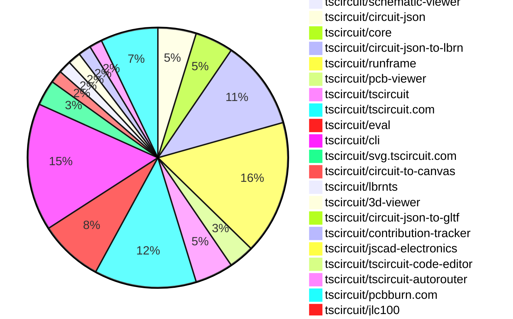

# Contribution Overview 2026-01-28

The current week is shown below. There are 3 major sections:

- [Contributor Overview](#contributor-overview)
- [PRs by Repository](#prs-by-repository)
- [PRs by Contributor](#changes-by-contributor)
- [Scoring & Sponsorship Details](/docs/sponsorship-calculation-explanation.md)

## PRs by Repository

## Contributor Overview

| Contributor | 🐳 Major | 🐙 Minor | 🐌 Tiny | ⭐ | Discussion Contributions |
|-------------|---------|---------|---------|-----|--------------------------|
| [AnasSarkiz](#AnasSarkiz) | 2 | 10 | 4 | ⭐⭐⭐ | 0🔹 0🔶 0💎 |
| [seveibar](#seveibar) | 2 | 5 | 1 | ⭐⭐ | 0🔹 0🔶 0💎 |
| [Abse2001](#Abse2001) | 0 | 6 | 2 | ⭐⭐ | 0🔹 0🔶 0💎 |
| [tscircuitbot](#tscircuitbot) | 0 | 0 | 85 | ⭐⭐ | 0🔹 0🔶 0💎 |
| [ShiboSoftwareDev](#ShiboSoftwareDev) | 0 | 2 | 0 | ⭐⭐ | 0🔹 0🔶 0💎 |
| [imrishabh18](#imrishabh18) | 0 | 2 | 2 | ⭐ | 0🔹 0🔶 0💎 |
| [ArnavK-09](#ArnavK-09) | 1 | 0 | 1 | ⭐ | 0🔹 0🔶 0💎 |
| [rushabhcodes](#rushabhcodes) | 0 | 1 | 2 | ⭐ | 0🔹 0🔶 0💎 |
| [0hmX](#0hmX) | 1 | 0 | 0 | ⭐ | 0🔹 0🔶 0💎 |
| [MustafaMulla29](#MustafaMulla29) | 1 | 0 | 0 | ⭐ | 0🔹 0🔶 0💎 |
| [Ayushjhawar8](#Ayushjhawar8) | 0 | 0 | 1 |  | 0🔹 0🔶 0💎 |

> Note: AI evaluates PRs and assigns 1-3 star ratings automatically. 4 and 5 star ratings require manual staff review.

### Discussion Contribution Legend

- 🔹 Normal Comments: Basic participation with minimal effort
- 🔶 Great Informative Comments: Thoughtful participation that adds value
- 💎 Incredible Comments: Exceptional participation with high-quality content

## Review Table

[reviews-received-hover]: ## "Number of reviews received for PRs for this contributor"
[approvals-received-hover]: ## "Number of approvals received for PRs this contributor authored"
[rejections-received-hover]: ## "Number of rejections received for PRs this contributor authored"
[prs-opened-hover]: ## "Number of PRs opened by this contributor"
[issues-created-hover]: ## "Number of issues created by this contributor"

| Contributor | Reviews Received | Approvals Received | Rejections Received | Approvals | Rejections | PRs Opened | PRs Merged | Issues Created |
|---|---|---|---|---|---|---|---|---|
| [seveibar](#seveibar) | 11 | 0 | 0 | 13 | 4 | 12 | 8 | 0 |
| [tscircuitbot](#tscircuitbot) | 1 | 0 | 0 | 0 | 0 | 96 | 85 | 0 |
| [Abse2001](#Abse2001) | 9 | 9 | 0 | 0 | 0 | 8 | 8 | 0 |
| [ShiboSoftwareDev](#ShiboSoftwareDev) | 3 | 2 | 0 | 7 | 0 | 3 | 3 | 0 |
| [imrishabh18](#imrishabh18) | 1 | 1 | 0 | 1 | 1 | 4 | 4 | 0 |
| [MustafaMulla29](#MustafaMulla29) | 8 | 2 | 3 | 0 | 0 | 4 | 1 | 0 |
| [Ayushjhawar8](#Ayushjhawar8) | 5 | 1 | 0 | 0 | 0 | 2 | 1 | 0 |
| [rushabhcodes](#rushabhcodes) | 10 | 4 | 1 | 0 | 0 | 3 | 3 | 0 |
| [ArnavK-09](#ArnavK-09) | 1 | 1 | 0 | 2 | 0 | 4 | 4 | 0 |
| [techmannih](#techmannih) | 1 | 0 | 1 | 1 | 0 | 1 | 0 | 0 |
| [0hmX](#0hmX) | 3 | 2 | 0 | 0 | 0 | 2 | 2 | 0 |
| [pxlpal](#pxlpal) | 0 | 0 | 0 | 0 | 0 | 1 | 0 | 0 |
| [AnasSarkiz](#AnasSarkiz) | 2 | 2 | 0 | 0 | 0 | 16 | 16 | 0 |

## Changes by Repository

### [tscircuit/schematic-viewer](https://github.com/tscircuit/schematic-viewer)

| PR # | Impact | Rating | Contributor | Description |
|------|--------|--------|-------------|-------------|
| [#161](https://github.com/tscircuit/schematic-viewer/pull/161) | 🐳 Major | ⭐⭐⭐ | seveibar | Adds the ability to show schematic ports on hover when view mode is enabled |

### [tscircuit/circuit-json](https://github.com/tscircuit/circuit-json)

| PR # | Impact | Rating | Contributor | Description |
|------|--------|--------|-------------|-------------|
| [#438](https://github.com/tscircuit/circuit-json/pull/438) | 🐳 Major | ⭐⭐⭐ | seveibar | Adds a shared base error schema for circuit JSON errors, centralizing common fields and introducing an optional is_fatal property for error severity classification. |
| [#436](https://github.com/tscircuit/circuit-json/pull/436) | 🐙 Minor | ⭐⭐ | seveibar | Adds an anchor alignment field to cad_component, allowing specification of placement alignment semantics with options center and xy_center_z_board. |
| [#433](https://github.com/tscircuit/circuit-json/pull/433) | 🐙 Minor | ⭐⭐ | seveibar | Add a new error type for PCB panelization placement failures, ensuring it is recognized in the type system and tooling. |

🐌 Tiny Contributions (3)

| PR # | Impact | Contributor | Description |
|------|--------|-------------|-------------|
| [#439](https://github.com/tscircuit/circuit-json/pull/439) | 🐌 Tiny | tscircuitbot | Automated package update |
| [#437](https://github.com/tscircuit/circuit-json/pull/437) | 🐌 Tiny | tscircuitbot | Automated package update |
| [#434](https://github.com/tscircuit/circuit-json/pull/434) | 🐌 Tiny | tscircuitbot | Automated package update |

### [tscircuit/core](https://github.com/tscircuit/core)

| PR # | Impact | Rating | Contributor | Description |
|------|--------|--------|-------------|-------------|
| [#1876](https://github.com/tscircuit/core/pull/1876) | 🐙 Minor | ⭐⭐ | seveibar | Fixes the chip displayName issue by ensuring the displayName is used if available, otherwise falls back to the name property. |
| [#1870](https://github.com/tscircuit/core/pull/1870) | 🐙 Minor | ⭐⭐ | seveibar | Adds an error handling mechanism for multiple boards in a panel without specified pcbXpcbY positions when layoutMode is set to none. |
| [#1875](https://github.com/tscircuit/core/pull/1875) | 🐙 Minor | ⭐⭐ | imrishabh18 | Fixes the issue where the fetch() function fails for paths starting with . by normalizing the path before resolving it. |
| [#1874](https://github.com/tscircuit/core/pull/1874) | 🐙 Minor | ⭐⭐ | imrishabh18 | Fixes the issue where relative paths starting with . were not supported in asset path handling. |
| [#1872](https://github.com/tscircuit/core/pull/1872) | 🐙 Minor | ⭐⭐ | ShiboSoftwareDev | Adds a new subpanel component enabling nested panel hierarchies within panel elements, supporting recursive nesting for complex manufacturing layouts and comprehensive validation for board containment and positioning. |

🐌 Tiny Contributions (1)

| PR # | Impact | Contributor | Description |
|------|--------|-------------|-------------|
| [#1873](https://github.com/tscircuit/core/pull/1873) | 🐌 Tiny | Abse2001 | Updates the circuit-json-to-gltf dependency to version 0.0.62 in package.json and modifies related snapshot tests for 3D rendering components. |

### [tscircuit/circuit-json-to-lbrn](https://github.com/tscircuit/circuit-json-to-lbrn)

| PR # | Impact | Rating | Contributor | Description |
|------|--------|--------|-------------|-------------|
| [#118](https://github.com/tscircuit/circuit-json-to-lbrn/pull/118) | 🐳 Major | ⭐⭐⭐ | AnasSarkiz | Removes layer inclusion toggles from the settings UI so layers are always included. Forces copper, soldermask, silkscreen, copper cut fill, and topbottom layers to stay enabled in LBRN options. |
| [#112](https://github.com/tscircuit/circuit-json-to-lbrn/pull/112) | 🐙 Minor | ⭐⭐ | seveibar | Adds functionality to create an oxidation cleaning layer for laser ablation to clean oxidation from the copper surface of the PCB. |
| [#124](https://github.com/tscircuit/circuit-json-to-lbrn/pull/124) | 🐙 Minor | ⭐⭐ | AnasSarkiz | Forces a fixed interval of 0.03 for both copper hatch passes to stabilize scan density regardless of laser spot size, ensuring repeatable copper engraving behavior by removing spot-size variance. |
| [#116](https://github.com/tscircuit/circuit-json-to-lbrn/pull/116) | 🐙 Minor | ⭐⭐ | AnasSarkiz | Add a new soldermask cure cut setting and layer index, generate cure geometry by subtracting soldermask openings from board outline, and add tests and snapshots covering soldermask cure output. |
| [#114](https://github.com/tscircuit/circuit-json-to-lbrn/pull/114) | 🐙 Minor | ⭐⭐ | AnasSarkiz | Replace the cut-setting field from pulseWidth to qPulseWidth so LBRN receives the correct parameter. Keep laser profile defaults and UI in ns, aligning tests and docs with the correct field. Bump lbrnts to 0.0.17 to match the updated schema. |

🐌 Tiny Contributions (9)

| PR # | Impact | Contributor | Description |
|------|--------|-------------|-------------|
| [#125](https://github.com/tscircuit/circuit-json-to-lbrn/pull/125) | 🐌 Tiny | tscircuitbot | Automated package update |
| [#123](https://github.com/tscircuit/circuit-json-to-lbrn/pull/123) | 🐌 Tiny | tscircuitbot | Automated package update |
| [#121](https://github.com/tscircuit/circuit-json-to-lbrn/pull/121) | 🐌 Tiny | tscircuitbot | Automated package update |
| [#119](https://github.com/tscircuit/circuit-json-to-lbrn/pull/119) | 🐌 Tiny | tscircuitbot | Automated package update |
| [#117](https://github.com/tscircuit/circuit-json-to-lbrn/pull/117) | 🐌 Tiny | tscircuitbot | Automated package update to version 0.0.55 |
| [#113](https://github.com/tscircuit/circuit-json-to-lbrn/pull/113) | 🐌 Tiny | tscircuitbot | Automated package update |
| [#115](https://github.com/tscircuit/circuit-json-to-lbrn/pull/115) | 🐌 Tiny | tscircuitbot | Automated package update |
| [#122](https://github.com/tscircuit/circuit-json-to-lbrn/pull/122) | 🐌 Tiny | AnasSarkiz | Always include the oxidation cleaning layer in conversion options and simplify soldermask-related layer names for cleaner output labeling. |
| [#120](https://github.com/tscircuit/circuit-json-to-lbrn/pull/120) | 🐌 Tiny | AnasSarkiz | Removes the option to include bottom layers in the conversion process, limiting output to only top layers. |

### [tscircuit/runframe](https://github.com/tscircuit/runframe)

🐌 Tiny Contributions (21)

| PR # | Impact | Contributor | Description |
|------|--------|-------------|-------------|
| [#2468](https://github.com/tscircuit/runframe/pull/2468) | 🐌 Tiny | seveibar | Adds a new dropdown menu for viewing schematic options in the File Menu Left Header component. |
| [#2485](https://github.com/tscircuit/runframe/pull/2485) | 🐌 Tiny | tscircuitbot | Automated package update |
| [#2484](https://github.com/tscircuit/runframe/pull/2484) | 🐌 Tiny | tscircuitbot | Updates the tscircuiteval package to version 0.0.616 in the package.json file. |
| [#2483](https://github.com/tscircuit/runframe/pull/2483) | 🐌 Tiny | tscircuitbot | Automated package update |
| [#2482](https://github.com/tscircuit/runframe/pull/2482) | 🐌 Tiny | tscircuitbot | Updates the tscircuiteval package from version 0.0.614 to 0.0.615 in the package.json file. |
| [#2481](https://github.com/tscircuit/runframe/pull/2481) | 🐌 Tiny | tscircuitbot | Automated package update |
| [#2480](https://github.com/tscircuit/runframe/pull/2480) | 🐌 Tiny | tscircuitbot | Updates the tscircuiteval package to version 0.0.614 in the package.json file. |
| [#2479](https://github.com/tscircuit/runframe/pull/2479) | 🐌 Tiny | tscircuitbot | Automated package update |
| [#2478](https://github.com/tscircuit/runframe/pull/2478) | 🐌 Tiny | tscircuitbot | Updates the tscircuiteval package to version 0.0.613 in the package.json file. |
| [#2471](https://github.com/tscircuit/runframe/pull/2471) | 🐌 Tiny | tscircuitbot | Updates the package version from 0.0.1538 to 0.0.1539 in package.json |
| [#2466](https://github.com/tscircuit/runframe/pull/2466) | 🐌 Tiny | tscircuitbot | Updates the tscircuitschematic-viewer package to version 2.0.55 in the package.json file. |
| [#2476](https://github.com/tscircuit/runframe/pull/2476) | 🐌 Tiny | tscircuitbot | Updates the tscircuitpcb-viewer package to version 1.11.326 |
| [#2467](https://github.com/tscircuit/runframe/pull/2467) | 🐌 Tiny | tscircuitbot | Automated package update |
| [#2474](https://github.com/tscircuit/runframe/pull/2474) | 🐌 Tiny | tscircuitbot | Updates the tscircuit3d-viewer package from version 0.0.502 to 0.0.503 in the package.json file. |
| [#2472](https://github.com/tscircuit/runframe/pull/2472) | 🐌 Tiny | tscircuitbot | Updates the tscircuit3d-viewer package from version 0.0.501 to 0.0.502 |
| [#2464](https://github.com/tscircuit/runframe/pull/2464) | 🐌 Tiny | tscircuitbot | Automated package update |
| [#2463](https://github.com/tscircuit/runframe/pull/2463) | 🐌 Tiny | tscircuitbot | Updates the tscircuiteval package from version 0.0.611 to 0.0.612 in the package.json file. |
| [#2475](https://github.com/tscircuit/runframe/pull/2475) | 🐌 Tiny | tscircuitbot | Automated package update |
| [#2470](https://github.com/tscircuit/runframe/pull/2470) | 🐌 Tiny | tscircuitbot | Updates the tscircuitpcb-viewer package from version 1.11.322 to 1.11.325 |
| [#2477](https://github.com/tscircuit/runframe/pull/2477) | 🐌 Tiny | tscircuitbot | Automated package update |
| [#2473](https://github.com/tscircuit/runframe/pull/2473) | 🐌 Tiny | tscircuitbot | Automated package update |

### [tscircuit/pcb-viewer](https://github.com/tscircuit/pcb-viewer)

| PR # | Impact | Rating | Contributor | Description |
|------|--------|--------|-------------|-------------|
| [#631](https://github.com/tscircuit/pcb-viewer/pull/631) | 🐙 Minor | ⭐⭐ | Abse2001 | Fixes PCB rendering issues by making soldermask a first-class layer and correcting drillsilkscreen ordering across the canvas pipeline. |
| [#633](https://github.com/tscircuit/pcb-viewer/pull/633) | 🐙 Minor | ⭐⭐ | Abse2001 | Fixes PCB note rendering order by explicitly associating top_notes and bottom_notes with their respective foreground sides, mirroring silkscreen behavior. |

🐌 Tiny Contributions (2)

| PR # | Impact | Contributor | Description |
|------|--------|-------------|-------------|
| [#634](https://github.com/tscircuit/pcb-viewer/pull/634) | 🐌 Tiny | tscircuitbot | Automated package update |
| [#632](https://github.com/tscircuit/pcb-viewer/pull/632) | 🐌 Tiny | tscircuitbot | Automated package update to version 1.11.325 |

### [tscircuit/tscircuit](https://github.com/tscircuit/tscircuit)

🐌 Tiny Contributions (6)

| PR # | Impact | Contributor | Description |
|------|--------|-------------|-------------|
| [#2029](https://github.com/tscircuit/tscircuit/pull/2029) | 🐌 Tiny | tscircuitbot | Automated package update |
| [#2028](https://github.com/tscircuit/tscircuit/pull/2028) | 🐌 Tiny | tscircuitbot | Updates the tscircuitcli package to version 0.1.839 in package.json |
| [#2027](https://github.com/tscircuit/tscircuit/pull/2027) | 🐌 Tiny | tscircuitbot | Automated package update |
| [#2026](https://github.com/tscircuit/tscircuit/pull/2026) | 🐌 Tiny | tscircuitbot | Automated package update |
| [#2025](https://github.com/tscircuit/tscircuit/pull/2025) | 🐌 Tiny | tscircuitbot | Updates the package version from 0.0.1222 to 0.0.1223 in package.json |
| [#2024](https://github.com/tscircuit/tscircuit/pull/2024) | 🐌 Tiny | imrishabh18 | Updates dependencies in package.json to resolve a failing GitHub action due to a missing dependency on svg-path-commander added in circuit-to-svg. |

### [tscircuit/tscircuit.com](https://github.com/tscircuit/tscircuit.com)

🐌 Tiny Contributions (16)

| PR # | Impact | Contributor | Description |
|------|--------|-------------|-------------|
| [#2602](https://github.com/tscircuit/tscircuit.com/pull/2602) | 🐌 Tiny | tscircuitbot | Updates the tscircuitrunframe package from version 0.0.1545 to 0.0.1546 |
| [#2601](https://github.com/tscircuit/tscircuit.com/pull/2601) | 🐌 Tiny | tscircuitbot | Updates the tscircuiteval package from version 0.0.615 to 0.0.616 |
| [#2600](https://github.com/tscircuit/tscircuit.com/pull/2600) | 🐌 Tiny | tscircuitbot | Updates the tscircuitrunframe package from version 0.0.1544 to 0.0.1545 |
| [#2599](https://github.com/tscircuit/tscircuit.com/pull/2599) | 🐌 Tiny | tscircuitbot | Updates the tscircuiteval package from version 0.0.614 to 0.0.615 |
| [#2597](https://github.com/tscircuit/tscircuit.com/pull/2597) | 🐌 Tiny | tscircuitbot | Automated package update |
| [#2596](https://github.com/tscircuit/tscircuit.com/pull/2596) | 🐌 Tiny | tscircuitbot | Automated package update |
| [#2595](https://github.com/tscircuit/tscircuit.com/pull/2595) | 🐌 Tiny | tscircuitbot | Automated package update |
| [#2594](https://github.com/tscircuit/tscircuit.com/pull/2594) | 🐌 Tiny | tscircuitbot | Automated package update for tscircuiteval from version 0.0.612 to 0.0.613 |
| [#2587](https://github.com/tscircuit/tscircuit.com/pull/2587) | 🐌 Tiny | tscircuitbot | Updates the tscircuitrunframe package to version 0.0.1537 |
| [#2588](https://github.com/tscircuit/tscircuit.com/pull/2588) | 🐌 Tiny | tscircuitbot | Updates the tscircuitrunframe package from version 0.0.1537 to 0.0.1538 and the tscircuitschematic-viewer package from version 2.0.54 to 2.0.55 |
| [#2591](https://github.com/tscircuit/tscircuit.com/pull/2591) | 🐌 Tiny | tscircuitbot | Automated package update |
| [#2590](https://github.com/tscircuit/tscircuit.com/pull/2590) | 🐌 Tiny | tscircuitbot | Automated package update |
| [#2586](https://github.com/tscircuit/tscircuit.com/pull/2586) | 🐌 Tiny | tscircuitbot | Automated package update |
| [#2592](https://github.com/tscircuit/tscircuit.com/pull/2592) | 🐌 Tiny | tscircuitbot | Updates the version of the tscircuitrunframe package from 0.0.1540 to 0.0.1541 in package.json |
| [#2574](https://github.com/tscircuit/tscircuit.com/pull/2574) | 🐌 Tiny | rushabhcodes | Updates the jscad-electronics dependency from version 0.0.25 to 0.0.113 in package.json to incorporate new improvements and bug fixes. |
| [#2598](https://github.com/tscircuit/tscircuit.com/pull/2598) | 🐌 Tiny | ArnavK-09 | Removes unnecessary readme files from the important files view in the package page component. |

### [tscircuit/eval](https://github.com/tscircuit/eval)

🐌 Tiny Contributions (10)

| PR # | Impact | Contributor | Description |
|------|--------|-------------|-------------|
| [#1951](https://github.com/tscircuit/eval/pull/1951) | 🐌 Tiny | tscircuitbot | Automated package update to version 0.0.616 |
| [#1950](https://github.com/tscircuit/eval/pull/1950) | 🐌 Tiny | tscircuitbot | Updates the version of the tscircuitcore package from 0.0.997 to 0.0.998 in package.json |
| [#1948](https://github.com/tscircuit/eval/pull/1948) | 🐌 Tiny | tscircuitbot | Automated package update |
| [#1947](https://github.com/tscircuit/eval/pull/1947) | 🐌 Tiny | tscircuitbot | Updates the version of the tscircuitcore package from 0.0.996 to 0.0.997 in package.json |
| [#1945](https://github.com/tscircuit/eval/pull/1945) | 🐌 Tiny | tscircuitbot | Automated package update |
| [#1944](https://github.com/tscircuit/eval/pull/1944) | 🐌 Tiny | tscircuitbot | Automated package update |
| [#1942](https://github.com/tscircuit/eval/pull/1942) | 🐌 Tiny | tscircuitbot | Automated package update |
| [#1941](https://github.com/tscircuit/eval/pull/1941) | 🐌 Tiny | tscircuitbot | Automated package update |
| [#1938](https://github.com/tscircuit/eval/pull/1938) | 🐌 Tiny | tscircuitbot | Automated package update |
| [#1939](https://github.com/tscircuit/eval/pull/1939) | 🐌 Tiny | tscircuitbot | Automated package update |

### [tscircuit/cli](https://github.com/tscircuit/cli)

🐌 Tiny Contributions (20)

| PR # | Impact | Contributor | Description |
|------|--------|-------------|-------------|
| [#1823](https://github.com/tscircuit/cli/pull/1823) | 🐌 Tiny | tscircuitbot | Automated package update |
| [#1822](https://github.com/tscircuit/cli/pull/1822) | 🐌 Tiny | tscircuitbot | Automated package update |
| [#1821](https://github.com/tscircuit/cli/pull/1821) | 🐌 Tiny | tscircuitbot | Updates the tscircuitrunframe package from version 0.0.1545 to 0.0.1546 |
| [#1820](https://github.com/tscircuit/cli/pull/1820) | 🐌 Tiny | tscircuitbot | Automated package update |
| [#1819](https://github.com/tscircuit/cli/pull/1819) | 🐌 Tiny | tscircuitbot | Updates the tscircuitrunframe package version from 0.0.1544 to 0.0.1545 |
| [#1816](https://github.com/tscircuit/cli/pull/1816) | 🐌 Tiny | tscircuitbot | Automated package update |
| [#1815](https://github.com/tscircuit/cli/pull/1815) | 🐌 Tiny | tscircuitbot | Updates the tscircuitrunframe package from version 0.0.1543 to 0.0.1544 |
| [#1814](https://github.com/tscircuit/cli/pull/1814) | 🐌 Tiny | tscircuitbot | Automated package update |
| [#1813](https://github.com/tscircuit/cli/pull/1813) | 🐌 Tiny | tscircuitbot | Updates the tscircuitrunframe package to version 0.0.1543 in the package.json file. |
| [#1811](https://github.com/tscircuit/cli/pull/1811) | 🐌 Tiny | tscircuitbot | Updates the tscircuitrunframe package from version 0.0.1541 to 0.0.1542 |
| [#1801](https://github.com/tscircuit/cli/pull/1801) | 🐌 Tiny | tscircuitbot | Updates the tscircuitrunframe package from version 0.0.1536 to 0.0.1537 |
| [#1808](https://github.com/tscircuit/cli/pull/1808) | 🐌 Tiny | tscircuitbot | Automated package update |
| [#1807](https://github.com/tscircuit/cli/pull/1807) | 🐌 Tiny | tscircuitbot | Updates the tscircuitrunframe package to version 0.0.1540 |
| [#1803](https://github.com/tscircuit/cli/pull/1803) | 🐌 Tiny | tscircuitbot | Updates the tscircuitrunframe package from version 0.0.1537 to 0.0.1538 |
| [#1802](https://github.com/tscircuit/cli/pull/1802) | 🐌 Tiny | tscircuitbot | Automated package update |
| [#1804](https://github.com/tscircuit/cli/pull/1804) | 🐌 Tiny | tscircuitbot | Automated package update |
| [#1809](https://github.com/tscircuit/cli/pull/1809) | 🐌 Tiny | tscircuitbot | Updates the tscircuitrunframe package from version 0.0.1540 to 0.0.1541 |
| [#1805](https://github.com/tscircuit/cli/pull/1805) | 🐌 Tiny | tscircuitbot | Updates the tscircuitrunframe package to version 0.0.1539 |
| [#1810](https://github.com/tscircuit/cli/pull/1810) | 🐌 Tiny | tscircuitbot | Automated package update |
| [#1817](https://github.com/tscircuit/cli/pull/1817) | 🐌 Tiny | imrishabh18 | Changes static asset file imports to use relative paths, improving file resolution in the circuit_json context. |

### [tscircuit/svg.tscircuit.com](https://github.com/tscircuit/svg.tscircuit.com)

🐌 Tiny Contributions (4)

| PR # | Impact | Contributor | Description |
|------|--------|-------------|-------------|
| [#911](https://github.com/tscircuit/svg.tscircuit.com/pull/911) | 🐌 Tiny | tscircuitbot | Updates the tscircuit package version from 0.0.1224 to 0.0.1225 in package.json |
| [#910](https://github.com/tscircuit/svg.tscircuit.com/pull/910) | 🐌 Tiny | tscircuitbot | Updates the tscircuit package version from 0.0.1223 to 0.0.1224 in package.json |
| [#908](https://github.com/tscircuit/svg.tscircuit.com/pull/908) | 🐌 Tiny | tscircuitbot | Updates the tscircuit package version from 0.0.1222 to 0.0.1223 in package.json |
| [#909](https://github.com/tscircuit/svg.tscircuit.com/pull/909) | 🐌 Tiny | Abse2001 | Updates the circuit-json-to-gltf dependency version from 0.0.48 to 0.0.62 in package.json, along with changes to snapshot images in tests. |

### [tscircuit/circuit-to-canvas](https://github.com/tscircuit/circuit-to-canvas)

| PR # | Impact | Rating | Contributor | Description |
|------|--------|--------|-------------|-------------|
| [#138](https://github.com/tscircuit/circuit-to-canvas/pull/138) | 🐙 Minor | ⭐⭐ | Abse2001 | Fixes PCB rendering order to ensure soldermask correctly covers holes, improving visual accuracy in canvas rendering. |

🐌 Tiny Contributions (1)

| PR # | Impact | Contributor | Description |
|------|--------|-------------|-------------|
| [#139](https://github.com/tscircuit/circuit-to-canvas/pull/139) | 🐌 Tiny | tscircuitbot | Automated package update |

### [tscircuit/lbrnts](https://github.com/tscircuit/lbrnts)

| PR # | Impact | Rating | Contributor | Description |
|------|--------|--------|-------------|-------------|
| [#29](https://github.com/tscircuit/lbrnts/pull/29) | 🐙 Minor | ⭐⭐ | AnasSarkiz | Replaces all pulseWidth usage with qPulseWidth to match LightBurns QPulseWidth XML field, emits QPulseWidth Value1 in cut settings, and updates XML snapshot and roundtrip tests to validate the new field. |

🐌 Tiny Contributions (1)

| PR # | Impact | Contributor | Description |
|------|--------|-------------|-------------|
| [#30](https://github.com/tscircuit/lbrnts/pull/30) | 🐌 Tiny | tscircuitbot | Updates the package version from 0.0.16 to 0.0.17 in package.json |

### [tscircuit/3d-viewer](https://github.com/tscircuit/3d-viewer)

| PR # | Impact | Rating | Contributor | Description |
|------|--------|--------|-------------|-------------|
| [#665](https://github.com/tscircuit/3d-viewer/pull/665) | 🐙 Minor | ⭐⭐ | Abse2001 | Removes copper pour generation from BoardGeomBuilders 3D JSCAD geometry pipeline and re-implements copper pours as dedicated topbottom textures in JscadBoardTextures, improving performance and aligning rendering with traces. |
| [#666](https://github.com/tscircuit/3d-viewer/pull/666) | 🐙 Minor | ⭐⭐ | Abse2001 | Fixes z-fighting between copper layers, soldermask, and board surfaces by enabling polygon offset for copper textures, ensuring correct visual stacking. |

### [tscircuit/circuit-json-to-gltf](https://github.com/tscircuit/circuit-json-to-gltf)

| PR # | Impact | Rating | Contributor | Description |
|------|--------|--------|-------------|-------------|
| [#113](https://github.com/tscircuit/circuit-json-to-gltf/pull/113) | 🐙 Minor | ⭐⭐ | Abse2001 | Adds explicit color support for the soldermaskWithCopperUnderneath layer in the board renderer, ensuring masked copper regions render correctly and visibly distinct on both top and bottom sides. |

### [tscircuit/contribution-tracker](https://github.com/tscircuit/contribution-tracker)

| PR # | Impact | Rating | Contributor | Description |
|------|--------|--------|-------------|-------------|
| [#298](https://github.com/tscircuit/contribution-tracker/pull/298) | 🐙 Minor | ⭐⭐ | ShiboSoftwareDev | Shifts the weekly start date calculation to align with Tuesday 18:30 UTC by applying a 5.5-hour offset from the last Wednesday, ensuring consistent UTC documentation and adding a test for early-Wednesday behavior. |

🐌 Tiny Contributions (1)

| PR # | Impact | Contributor | Description |
|------|--------|-------------|-------------|
| [#297](https://github.com/tscircuit/contribution-tracker/pull/297) | 🐌 Tiny | rushabhcodes | Removes the outdated section headers under the Current Week heading in the README file to streamline documentation. |

### [tscircuit/jscad-electronics](https://github.com/tscircuit/jscad-electronics)

| PR # | Impact | Rating | Contributor | Description |
|------|--------|--------|-------------|-------------|
| [#257](https://github.com/tscircuit/jscad-electronics/pull/257) | 🐙 Minor | ⭐⭐ | rushabhcodes | This PR adds a new function to render footprints with extruded pads in JSCAD models and updates the test helper to ensure rendered images include these pads. |

### [tscircuit/tscircuit-code-editor](https://github.com/tscircuit/tscircuit-code-editor)

| PR # | Impact | Rating | Contributor | Description |
|------|--------|--------|-------------|-------------|
| [#4](https://github.com/tscircuit/tscircuit-code-editor/pull/4) | 🐳 Major | ⭐⭐⭐ | ArnavK-09 | Adds a new CodeEditor component and Editor component with multiple features for file editing and management. |

### [tscircuit/tscircuit-autorouter](https://github.com/tscircuit/tscircuit-autorouter)

| PR # | Impact | Rating | Contributor | Description |
|------|--------|--------|-------------|-------------|
| [#548](https://github.com/tscircuit/tscircuit-autorouter/pull/548) | 🐳 Major | ⭐⭐⭐ | 0hmX | hg-portpoint: move hypergraph portpoint solver into subfolder, fix imports and types process better WIP break viz WIP WIP WIP This is added as a new pipeline you can pick form the dropdown |

🐌 Tiny Contributions (1)

| PR # | Impact | Contributor | Description |
|------|--------|-------------|-------------|
| [#550](https://github.com/tscircuit/tscircuit-autorouter/pull/550) | 🐌 Tiny | Ayushjhawar8 | e dependency |

### [tscircuit/pcbburn.com](https://github.com/tscircuit/pcbburn.com)

| PR # | Impact | Rating | Contributor | Description |
|------|--------|--------|-------------|-------------|
| [#58](https://github.com/tscircuit/pcbburn.com/pull/58) | 🐳 Major | ⭐⭐⭐ | AnasSarkiz | Removes layer inclusion toggles from the settings UI so layers are always included and forces copper, soldermask, silkscreen, copper cut fill, and topbottom layers to stay enabled in LBRN options. |
| [#60](https://github.com/tscircuit/pcbburn.com/pull/60) | 🐙 Minor | ⭐⭐ | AnasSarkiz | Adds support for the soldermask cure layer in the workspace context. |
| [#59](https://github.com/tscircuit/pcbburn.com/pull/59) | 🐙 Minor | ⭐⭐ | AnasSarkiz | Adds the includeOxidationCleaningLayer option and enforces top-layer output in the workspace context. |
| [#57](https://github.com/tscircuit/pcbburn.com/pull/57) | 🐙 Minor | ⭐⭐ | AnasSarkiz | Fixes broken sitemap and replaces external links with crawlable anchors to improve SEO performance. |
| [#56](https://github.com/tscircuit/pcbburn.com/pull/56) | 🐙 Minor | ⭐⭐ | AnasSarkiz | Expands primary metadata with keyword-focused title and description, adds canonical URL, Open Graph and Twitter card metadata, and JSON-LD structured data for PCBBurn. |
| [#55](https://github.com/tscircuit/pcbburn.com/pull/55) | 🐙 Minor | ⭐⭐ | AnasSarkiz | Adds sitemap.xml and robots.txt files to enhance search engine visibility for the pcbburn.com website |
| [#52](https://github.com/tscircuit/pcbburn.com/pull/52) | 🐙 Minor | ⭐⭐ | AnasSarkiz | Fixes broken LBRN export XML formatting and standardizes .lbrn2 filenames for circuit exports |

🐌 Tiny Contributions (2)

| PR # | Impact | Contributor | Description |
|------|--------|-------------|-------------|
| [#54](https://github.com/tscircuit/pcbburn.com/pull/54) | 🐌 Tiny | AnasSarkiz | Adds a link to the Discord channel in the main navbar for quicker access to the community. |
| [#53](https://github.com/tscircuit/pcbburn.com/pull/53) | 🐌 Tiny | AnasSarkiz | Updates laser profile defaults and pulse width inputs to use ns values instead of seconds to match the latest circuit-json-to-lbrn expectations and bumps circuit-json-to-lbrn and lbrnts versions in package.json and bun.lock. |

### [tscircuit/jlc100](https://github.com/tscircuit/jlc100)

| PR # | Impact | Rating | Contributor | Description |
|------|--------|--------|-------------|-------------|
| [#1](https://github.com/tscircuit/jlc100/pull/1) | 🐳 Major | ⭐⭐⭐ | MustafaMulla29 | This pull request initializes the tsci project and imports various components from the JLCPCB library, including processors and microcontrollers. It sets up the project structure, adds necessary files, and includes specific components that are essential for the development of electronic circuits. |

## Changes by Contributor

### [seveibar](https://github.com/seveibar)

| PRs # | Impact | Rating | Description |
|------|--------|--------|-------------|
| [#161](https://github.com/tscircuit/schematic-viewer/pull/161) | 🐳 Major | ⭐⭐⭐ | Adds the ability to show schematic ports on hover when view mode is enabled |
| [#438](https://github.com/tscircuit/circuit-json/pull/438) | 🐳 Major | ⭐⭐⭐ | Adds a shared base error schema for circuit JSON errors, centralizing common fields and introducing an optional is_fatal property for error severity classification. |
| [#436](https://github.com/tscircuit/circuit-json/pull/436) | 🐙 Minor | ⭐⭐ | Adds an anchor alignment field to cad_component, allowing specification of placement alignment semantics with options center and xy_center_z_board. |
| [#433](https://github.com/tscircuit/circuit-json/pull/433) | 🐙 Minor | ⭐⭐ | Add a new error type for PCB panelization placement failures, ensuring it is recognized in the type system and tooling. |
| [#1876](https://github.com/tscircuit/core/pull/1876) | 🐙 Minor | ⭐⭐ | Fixes the chip displayName issue by ensuring the displayName is used if available, otherwise falls back to the name property. |
| [#1870](https://github.com/tscircuit/core/pull/1870) | 🐙 Minor | ⭐⭐ | Adds an error handling mechanism for multiple boards in a panel without specified pcbXpcbY positions when layoutMode is set to none. |
| [#112](https://github.com/tscircuit/circuit-json-to-lbrn/pull/112) | 🐙 Minor | ⭐⭐ | Adds functionality to create an oxidation cleaning layer for laser ablation to clean oxidation from the copper surface of the PCB. |

🐌 Tiny Contributions (1)

| PR # | Impact | Description |
|------|--------|-------------|
| [#2468](https://github.com/tscircuit/runframe/pull/2468) | 🐌 Tiny | Adds a new dropdown menu for viewing schematic options in the File Menu Left Header component. |

### [tscircuitbot](https://github.com/tscircuitbot)

🐌 Tiny Contributions (85)

| PR # | Impact | Description |
|------|--------|-------------|
| [#634](https://github.com/tscircuit/pcb-viewer/pull/634) | 🐌 Tiny | Automated package update |
| [#632](https://github.com/tscircuit/pcb-viewer/pull/632) | 🐌 Tiny | Automated package update to version 1.11.325 |
| [#2029](https://github.com/tscircuit/tscircuit/pull/2029) | 🐌 Tiny | Automated package update |
| [#2028](https://github.com/tscircuit/tscircuit/pull/2028) | 🐌 Tiny | Updates the tscircuitcli package to version 0.1.839 in package.json |
| [#2027](https://github.com/tscircuit/tscircuit/pull/2027) | 🐌 Tiny | Automated package update |
| [#2026](https://github.com/tscircuit/tscircuit/pull/2026) | 🐌 Tiny | Automated package update |
| [#2025](https://github.com/tscircuit/tscircuit/pull/2025) | 🐌 Tiny | Updates the package version from 0.0.1222 to 0.0.1223 in package.json |
| [#439](https://github.com/tscircuit/circuit-json/pull/439) | 🐌 Tiny | Automated package update |
| [#437](https://github.com/tscircuit/circuit-json/pull/437) | 🐌 Tiny | Automated package update |
| [#434](https://github.com/tscircuit/circuit-json/pull/434) | 🐌 Tiny | Automated package update |
| [#2602](https://github.com/tscircuit/tscircuit.com/pull/2602) | 🐌 Tiny | Updates the tscircuitrunframe package from version 0.0.1545 to 0.0.1546 |
| [#2601](https://github.com/tscircuit/tscircuit.com/pull/2601) | 🐌 Tiny | Updates the tscircuiteval package from version 0.0.615 to 0.0.616 |
| [#2600](https://github.com/tscircuit/tscircuit.com/pull/2600) | 🐌 Tiny | Updates the tscircuitrunframe package from version 0.0.1544 to 0.0.1545 |
| [#2599](https://github.com/tscircuit/tscircuit.com/pull/2599) | 🐌 Tiny | Updates the tscircuiteval package from version 0.0.614 to 0.0.615 |
| [#2597](https://github.com/tscircuit/tscircuit.com/pull/2597) | 🐌 Tiny | Automated package update |
| [#2596](https://github.com/tscircuit/tscircuit.com/pull/2596) | 🐌 Tiny | Automated package update |
| [#2595](https://github.com/tscircuit/tscircuit.com/pull/2595) | 🐌 Tiny | Automated package update |
| [#2594](https://github.com/tscircuit/tscircuit.com/pull/2594) | 🐌 Tiny | Automated package update for tscircuiteval from version 0.0.612 to 0.0.613 |
| [#2587](https://github.com/tscircuit/tscircuit.com/pull/2587) | 🐌 Tiny | Updates the tscircuitrunframe package to version 0.0.1537 |
| [#2588](https://github.com/tscircuit/tscircuit.com/pull/2588) | 🐌 Tiny | Updates the tscircuitrunframe package from version 0.0.1537 to 0.0.1538 and the tscircuitschematic-viewer package from version 2.0.54 to 2.0.55 |
| [#2591](https://github.com/tscircuit/tscircuit.com/pull/2591) | 🐌 Tiny | Automated package update |
| [#2590](https://github.com/tscircuit/tscircuit.com/pull/2590) | 🐌 Tiny | Automated package update |
| [#2586](https://github.com/tscircuit/tscircuit.com/pull/2586) | 🐌 Tiny | Automated package update |
| [#2592](https://github.com/tscircuit/tscircuit.com/pull/2592) | 🐌 Tiny | Updates the version of the tscircuitrunframe package from 0.0.1540 to 0.0.1541 in package.json |
| [#1951](https://github.com/tscircuit/eval/pull/1951) | 🐌 Tiny | Automated package update to version 0.0.616 |
| [#1950](https://github.com/tscircuit/eval/pull/1950) | 🐌 Tiny | Updates the version of the tscircuitcore package from 0.0.997 to 0.0.998 in package.json |
| [#1948](https://github.com/tscircuit/eval/pull/1948) | 🐌 Tiny | Automated package update |
| [#1947](https://github.com/tscircuit/eval/pull/1947) | 🐌 Tiny | Updates the version of the tscircuitcore package from 0.0.996 to 0.0.997 in package.json |
| [#1945](https://github.com/tscircuit/eval/pull/1945) | 🐌 Tiny | Automated package update |
| [#1944](https://github.com/tscircuit/eval/pull/1944) | 🐌 Tiny | Automated package update |
| [#1942](https://github.com/tscircuit/eval/pull/1942) | 🐌 Tiny | Automated package update |
| [#1941](https://github.com/tscircuit/eval/pull/1941) | 🐌 Tiny | Automated package update |
| [#1938](https://github.com/tscircuit/eval/pull/1938) | 🐌 Tiny | Automated package update |
| [#1939](https://github.com/tscircuit/eval/pull/1939) | 🐌 Tiny | Automated package update |
| [#2485](https://github.com/tscircuit/runframe/pull/2485) | 🐌 Tiny | Automated package update |
| [#2484](https://github.com/tscircuit/runframe/pull/2484) | 🐌 Tiny | Updates the tscircuiteval package to version 0.0.616 in the package.json file. |
| [#2483](https://github.com/tscircuit/runframe/pull/2483) | 🐌 Tiny | Automated package update |
| [#2482](https://github.com/tscircuit/runframe/pull/2482) | 🐌 Tiny | Updates the tscircuiteval package from version 0.0.614 to 0.0.615 in the package.json file. |
| [#2481](https://github.com/tscircuit/runframe/pull/2481) | 🐌 Tiny | Automated package update |
| [#2480](https://github.com/tscircuit/runframe/pull/2480) | 🐌 Tiny | Updates the tscircuiteval package to version 0.0.614 in the package.json file. |
| [#2479](https://github.com/tscircuit/runframe/pull/2479) | 🐌 Tiny | Automated package update |
| [#2478](https://github.com/tscircuit/runframe/pull/2478) | 🐌 Tiny | Updates the tscircuiteval package to version 0.0.613 in the package.json file. |
| [#2471](https://github.com/tscircuit/runframe/pull/2471) | 🐌 Tiny | Updates the package version from 0.0.1538 to 0.0.1539 in package.json |
| [#2466](https://github.com/tscircuit/runframe/pull/2466) | 🐌 Tiny | Updates the tscircuitschematic-viewer package to version 2.0.55 in the package.json file. |
| [#2476](https://github.com/tscircuit/runframe/pull/2476) | 🐌 Tiny | Updates the tscircuitpcb-viewer package to version 1.11.326 |
| [#2467](https://github.com/tscircuit/runframe/pull/2467) | 🐌 Tiny | Automated package update |
| [#2474](https://github.com/tscircuit/runframe/pull/2474) | 🐌 Tiny | Updates the tscircuit3d-viewer package from version 0.0.502 to 0.0.503 in the package.json file. |
| [#2472](https://github.com/tscircuit/runframe/pull/2472) | 🐌 Tiny | Updates the tscircuit3d-viewer package from version 0.0.501 to 0.0.502 |
| [#2464](https://github.com/tscircuit/runframe/pull/2464) | 🐌 Tiny | Automated package update |
| [#2463](https://github.com/tscircuit/runframe/pull/2463) | 🐌 Tiny | Updates the tscircuiteval package from version 0.0.611 to 0.0.612 in the package.json file. |
| [#2475](https://github.com/tscircuit/runframe/pull/2475) | 🐌 Tiny | Automated package update |
| [#2470](https://github.com/tscircuit/runframe/pull/2470) | 🐌 Tiny | Updates the tscircuitpcb-viewer package from version 1.11.322 to 1.11.325 |
| [#2477](https://github.com/tscircuit/runframe/pull/2477) | 🐌 Tiny | Automated package update |
| [#2473](https://github.com/tscircuit/runframe/pull/2473) | 🐌 Tiny | Automated package update |
| [#1823](https://github.com/tscircuit/cli/pull/1823) | 🐌 Tiny | Automated package update |
| [#1822](https://github.com/tscircuit/cli/pull/1822) | 🐌 Tiny | Automated package update |
| [#1821](https://github.com/tscircuit/cli/pull/1821) | 🐌 Tiny | Updates the tscircuitrunframe package from version 0.0.1545 to 0.0.1546 |
| [#1820](https://github.com/tscircuit/cli/pull/1820) | 🐌 Tiny | Automated package update |
| [#1819](https://github.com/tscircuit/cli/pull/1819) | 🐌 Tiny | Updates the tscircuitrunframe package version from 0.0.1544 to 0.0.1545 |
| [#1816](https://github.com/tscircuit/cli/pull/1816) | 🐌 Tiny | Automated package update |
| [#1815](https://github.com/tscircuit/cli/pull/1815) | 🐌 Tiny | Updates the tscircuitrunframe package from version 0.0.1543 to 0.0.1544 |
| [#1814](https://github.com/tscircuit/cli/pull/1814) | 🐌 Tiny | Automated package update |
| [#1813](https://github.com/tscircuit/cli/pull/1813) | 🐌 Tiny | Updates the tscircuitrunframe package to version 0.0.1543 in the package.json file. |
| [#1811](https://github.com/tscircuit/cli/pull/1811) | 🐌 Tiny | Updates the tscircuitrunframe package from version 0.0.1541 to 0.0.1542 |
| [#1801](https://github.com/tscircuit/cli/pull/1801) | 🐌 Tiny | Updates the tscircuitrunframe package from version 0.0.1536 to 0.0.1537 |
| [#1808](https://github.com/tscircuit/cli/pull/1808) | 🐌 Tiny | Automated package update |
| [#1807](https://github.com/tscircuit/cli/pull/1807) | 🐌 Tiny | Updates the tscircuitrunframe package to version 0.0.1540 |
| [#1803](https://github.com/tscircuit/cli/pull/1803) | 🐌 Tiny | Updates the tscircuitrunframe package from version 0.0.1537 to 0.0.1538 |
| [#1802](https://github.com/tscircuit/cli/pull/1802) | 🐌 Tiny | Automated package update |
| [#1804](https://github.com/tscircuit/cli/pull/1804) | 🐌 Tiny | Automated package update |
| [#1809](https://github.com/tscircuit/cli/pull/1809) | 🐌 Tiny | Updates the tscircuitrunframe package from version 0.0.1540 to 0.0.1541 |
| [#1805](https://github.com/tscircuit/cli/pull/1805) | 🐌 Tiny | Updates the tscircuitrunframe package to version 0.0.1539 |
| [#1810](https://github.com/tscircuit/cli/pull/1810) | 🐌 Tiny | Automated package update |
| [#911](https://github.com/tscircuit/svg.tscircuit.com/pull/911) | 🐌 Tiny | Updates the tscircuit package version from 0.0.1224 to 0.0.1225 in package.json |
| [#910](https://github.com/tscircuit/svg.tscircuit.com/pull/910) | 🐌 Tiny | Updates the tscircuit package version from 0.0.1223 to 0.0.1224 in package.json |
| [#908](https://github.com/tscircuit/svg.tscircuit.com/pull/908) | 🐌 Tiny | Updates the tscircuit package version from 0.0.1222 to 0.0.1223 in package.json |
| [#139](https://github.com/tscircuit/circuit-to-canvas/pull/139) | 🐌 Tiny | Automated package update |
| [#30](https://github.com/tscircuit/lbrnts/pull/30) | 🐌 Tiny | Updates the package version from 0.0.16 to 0.0.17 in package.json |
| [#125](https://github.com/tscircuit/circuit-json-to-lbrn/pull/125) | 🐌 Tiny | Automated package update |
| [#123](https://github.com/tscircuit/circuit-json-to-lbrn/pull/123) | 🐌 Tiny | Automated package update |
| [#121](https://github.com/tscircuit/circuit-json-to-lbrn/pull/121) | 🐌 Tiny | Automated package update |
| [#119](https://github.com/tscircuit/circuit-json-to-lbrn/pull/119) | 🐌 Tiny | Automated package update |
| [#117](https://github.com/tscircuit/circuit-json-to-lbrn/pull/117) | 🐌 Tiny | Automated package update to version 0.0.55 |
| [#113](https://github.com/tscircuit/circuit-json-to-lbrn/pull/113) | 🐌 Tiny | Automated package update |
| [#115](https://github.com/tscircuit/circuit-json-to-lbrn/pull/115) | 🐌 Tiny | Automated package update |

### [Abse2001](https://github.com/Abse2001)

| PRs # | Impact | Rating | Description |
|------|--------|--------|-------------|
| [#631](https://github.com/tscircuit/pcb-viewer/pull/631) | 🐙 Minor | ⭐⭐ | Fixes PCB rendering issues by making soldermask a first-class layer and correcting drillsilkscreen ordering across the canvas pipeline. |
| [#633](https://github.com/tscircuit/pcb-viewer/pull/633) | 🐙 Minor | ⭐⭐ | Fixes PCB note rendering order by explicitly associating top_notes and bottom_notes with their respective foreground sides, mirroring silkscreen behavior. |
| [#665](https://github.com/tscircuit/3d-viewer/pull/665) | 🐙 Minor | ⭐⭐ | Removes copper pour generation from BoardGeomBuilders 3D JSCAD geometry pipeline and re-implements copper pours as dedicated topbottom textures in JscadBoardTextures, improving performance and aligning rendering with traces. |
| [#666](https://github.com/tscircuit/3d-viewer/pull/666) | 🐙 Minor | ⭐⭐ | Fixes z-fighting between copper layers, soldermask, and board surfaces by enabling polygon offset for copper textures, ensuring correct visual stacking. |
| [#113](https://github.com/tscircuit/circuit-json-to-gltf/pull/113) | 🐙 Minor | ⭐⭐ | Adds explicit color support for the soldermaskWithCopperUnderneath layer in the board renderer, ensuring masked copper regions render correctly and visibly distinct on both top and bottom sides. |
| [#138](https://github.com/tscircuit/circuit-to-canvas/pull/138) | 🐙 Minor | ⭐⭐ | Fixes PCB rendering order to ensure soldermask correctly covers holes, improving visual accuracy in canvas rendering. |

🐌 Tiny Contributions (2)

| PR # | Impact | Description |
|------|--------|-------------|
| [#1873](https://github.com/tscircuit/core/pull/1873) | 🐌 Tiny | Updates the circuit-json-to-gltf dependency to version 0.0.62 in package.json and modifies related snapshot tests for 3D rendering components. |
| [#909](https://github.com/tscircuit/svg.tscircuit.com/pull/909) | 🐌 Tiny | Updates the circuit-json-to-gltf dependency version from 0.0.48 to 0.0.62 in package.json, along with changes to snapshot images in tests. |

### [imrishabh18](https://github.com/imrishabh18)

| PRs # | Impact | Rating | Description |
|------|--------|--------|-------------|
| [#1875](https://github.com/tscircuit/core/pull/1875) | 🐙 Minor | ⭐⭐ | Fixes the issue where the fetch() function fails for paths starting with . by normalizing the path before resolving it. |
| [#1874](https://github.com/tscircuit/core/pull/1874) | 🐙 Minor | ⭐⭐ | Fixes the issue where relative paths starting with . were not supported in asset path handling. |

🐌 Tiny Contributions (2)

| PR # | Impact | Description |
|------|--------|-------------|
| [#2024](https://github.com/tscircuit/tscircuit/pull/2024) | 🐌 Tiny | Updates dependencies in package.json to resolve a failing GitHub action due to a missing dependency on svg-path-commander added in circuit-to-svg. |
| [#1817](https://github.com/tscircuit/cli/pull/1817) | 🐌 Tiny | Changes static asset file imports to use relative paths, improving file resolution in the circuit_json context. |

### [ShiboSoftwareDev](https://github.com/ShiboSoftwareDev)

| PRs # | Impact | Rating | Description |
|------|--------|--------|-------------|
| [#1872](https://github.com/tscircuit/core/pull/1872) | 🐙 Minor | ⭐⭐ | Adds a new subpanel component enabling nested panel hierarchies within panel elements, supporting recursive nesting for complex manufacturing layouts and comprehensive validation for board containment and positioning. |
| [#298](https://github.com/tscircuit/contribution-tracker/pull/298) | 🐙 Minor | ⭐⭐ | Shifts the weekly start date calculation to align with Tuesday 18:30 UTC by applying a 5.5-hour offset from the last Wednesday, ensuring consistent UTC documentation and adding a test for early-Wednesday behavior. |

### [rushabhcodes](https://github.com/rushabhcodes)

| PRs # | Impact | Rating | Description |
|------|--------|--------|-------------|
| [#257](https://github.com/tscircuit/jscad-electronics/pull/257) | 🐙 Minor | ⭐⭐ | This PR adds a new function to render footprints with extruded pads in JSCAD models and updates the test helper to ensure rendered images include these pads. |

🐌 Tiny Contributions (2)

| PR # | Impact | Description |
|------|--------|-------------|
| [#297](https://github.com/tscircuit/contribution-tracker/pull/297) | 🐌 Tiny | Removes the outdated section headers under the Current Week heading in the README file to streamline documentation. |
| [#2574](https://github.com/tscircuit/tscircuit.com/pull/2574) | 🐌 Tiny | Updates the jscad-electronics dependency from version 0.0.25 to 0.0.113 in package.json to incorporate new improvements and bug fixes. |

### [ArnavK-09](https://github.com/ArnavK-09)

| PRs # | Impact | Rating | Description |
|------|--------|--------|-------------|
| [#4](https://github.com/tscircuit/tscircuit-code-editor/pull/4) | 🐳 Major | ⭐⭐⭐ | Adds a new CodeEditor component and Editor component with multiple features for file editing and management. |

🐌 Tiny Contributions (1)

| PR # | Impact | Description |
|------|--------|-------------|
| [#2598](https://github.com/tscircuit/tscircuit.com/pull/2598) | 🐌 Tiny | Removes unnecessary readme files from the important files view in the package page component. |

### [Ayushjhawar8](https://github.com/Ayushjhawar8)

🐌 Tiny Contributions (1)

| PR # | Impact | Description |
|------|--------|-------------|
| [#550](https://github.com/tscircuit/tscircuit-autorouter/pull/550) | 🐌 Tiny | e dependency |

### [0hmX](https://github.com/0hmX)

| PRs # | Impact | Rating | Description |
|------|--------|--------|-------------|
| [#548](https://github.com/tscircuit/tscircuit-autorouter/pull/548) | 🐳 Major | ⭐⭐⭐ | hg-portpoint: move hypergraph portpoint solver into subfolder, fix imports and types process better WIP break viz WIP WIP WIP This is added as a new pipeline you can pick form the dropdown |

### [AnasSarkiz](https://github.com/AnasSarkiz)

| PRs # | Impact | Rating | Description |
|------|--------|--------|-------------|
| [#118](https://github.com/tscircuit/circuit-json-to-lbrn/pull/118) | 🐳 Major | ⭐⭐⭐ | Removes layer inclusion toggles from the settings UI so layers are always included. Forces copper, soldermask, silkscreen, copper cut fill, and topbottom layers to stay enabled in LBRN options. |
| [#58](https://github.com/tscircuit/pcbburn.com/pull/58) | 🐳 Major | ⭐⭐⭐ | Removes layer inclusion toggles from the settings UI so layers are always included and forces copper, soldermask, silkscreen, copper cut fill, and topbottom layers to stay enabled in LBRN options. |
| [#29](https://github.com/tscircuit/lbrnts/pull/29) | 🐙 Minor | ⭐⭐ | Replaces all pulseWidth usage with qPulseWidth to match LightBurns QPulseWidth XML field, emits QPulseWidth Value1 in cut settings, and updates XML snapshot and roundtrip tests to validate the new field. |
| [#124](https://github.com/tscircuit/circuit-json-to-lbrn/pull/124) | 🐙 Minor | ⭐⭐ | Forces a fixed interval of 0.03 for both copper hatch passes to stabilize scan density regardless of laser spot size, ensuring repeatable copper engraving behavior by removing spot-size variance. |
| [#116](https://github.com/tscircuit/circuit-json-to-lbrn/pull/116) | 🐙 Minor | ⭐⭐ | Add a new soldermask cure cut setting and layer index, generate cure geometry by subtracting soldermask openings from board outline, and add tests and snapshots covering soldermask cure output. |
| [#114](https://github.com/tscircuit/circuit-json-to-lbrn/pull/114) | 🐙 Minor | ⭐⭐ | Replace the cut-setting field from pulseWidth to qPulseWidth so LBRN receives the correct parameter. Keep laser profile defaults and UI in ns, aligning tests and docs with the correct field. Bump lbrnts to 0.0.17 to match the updated schema. |
| [#60](https://github.com/tscircuit/pcbburn.com/pull/60) | 🐙 Minor | ⭐⭐ | Adds support for the soldermask cure layer in the workspace context. |
| [#59](https://github.com/tscircuit/pcbburn.com/pull/59) | 🐙 Minor | ⭐⭐ | Adds the includeOxidationCleaningLayer option and enforces top-layer output in the workspace context. |
| [#57](https://github.com/tscircuit/pcbburn.com/pull/57) | 🐙 Minor | ⭐⭐ | Fixes broken sitemap and replaces external links with crawlable anchors to improve SEO performance. |
| [#56](https://github.com/tscircuit/pcbburn.com/pull/56) | 🐙 Minor | ⭐⭐ | Expands primary metadata with keyword-focused title and description, adds canonical URL, Open Graph and Twitter card metadata, and JSON-LD structured data for PCBBurn. |
| [#55](https://github.com/tscircuit/pcbburn.com/pull/55) | 🐙 Minor | ⭐⭐ | Adds sitemap.xml and robots.txt files to enhance search engine visibility for the pcbburn.com website |
| [#52](https://github.com/tscircuit/pcbburn.com/pull/52) | 🐙 Minor | ⭐⭐ | Fixes broken LBRN export XML formatting and standardizes .lbrn2 filenames for circuit exports |

🐌 Tiny Contributions (4)

| PR # | Impact | Description |
|------|--------|-------------|
| [#122](https://github.com/tscircuit/circuit-json-to-lbrn/pull/122) | 🐌 Tiny | Always include the oxidation cleaning layer in conversion options and simplify soldermask-related layer names for cleaner output labeling. |
| [#120](https://github.com/tscircuit/circuit-json-to-lbrn/pull/120) | 🐌 Tiny | Removes the option to include bottom layers in the conversion process, limiting output to only top layers. |
| [#54](https://github.com/tscircuit/pcbburn.com/pull/54) | 🐌 Tiny | Adds a link to the Discord channel in the main navbar for quicker access to the community. |
| [#53](https://github.com/tscircuit/pcbburn.com/pull/53) | 🐌 Tiny | Updates laser profile defaults and pulse width inputs to use ns values instead of seconds to match the latest circuit-json-to-lbrn expectations and bumps circuit-json-to-lbrn and lbrnts versions in package.json and bun.lock. |

### [MustafaMulla29](https://github.com/MustafaMulla29)

| PRs # | Impact | Rating | Description |
|------|--------|--------|-------------|
| [#1](https://github.com/tscircuit/jlc100/pull/1) | 🐳 Major | ⭐⭐⭐ | This pull request initializes the tsci project and imports various components from the JLCPCB library, including processors and microcontrollers. It sets up the project structure, adds necessary files, and includes specific components that are essential for the development of electronic circuits. |

## Repository Owners

| Repository | Codeowners |
|------------|------------|
| [builder](https://github.com/tscircuit/builder/blob/main/.github/CODEOWNERS) | [seveibar](https://github.com/seveibar)
| [pcb-viewer](https://github.com/tscircuit/pcb-viewer/blob/main/.github/CODEOWNERS) | [seveibar](https://github.com/seveibar), [ShiboSoftwareDev](https://github.com/ShiboSoftwareDev)
| [footprints-old](https://github.com/tscircuit/footprints-old/blob/main/.github/CODEOWNERS) | [seveibar](https://github.com/seveibar)
| [footprinter](https://github.com/tscircuit/footprinter/blob/main/.github/CODEOWNERS) | [seveibar](https://github.com/seveibar), [techmannih](https://github.com/techmannih)
| [3d-viewer](https://github.com/tscircuit/3d-viewer/blob/main/.github/CODEOWNERS) | [ShiboSoftwareDev](https://github.com/ShiboSoftwareDev)
| [winterspec](https://github.com/tscircuit/winterspec/blob/main/.github/CODEOWNERS) | [seveibar](https://github.com/seveibar), [ShiboSoftwareDev](https://github.com/ShiboSoftwareDev)
| [jscad-electronics](https://github.com/tscircuit/jscad-electronics/blob/main/.github/CODEOWNERS) | [seveibar](https://github.com/seveibar), [techmannih](https://github.com/techmannih), [ShiboSoftwareDev](https://github.com/ShiboSoftwareDev), [anas-sarkez](https://github.com/anas-sarkez)
| [circuit-to-svg](https://github.com/tscircuit/circuit-to-svg/blob/main/.github/CODEOWNERS) | [imrishabh18](https://github.com/imrishabh18)
| [schematic-symbols](https://github.com/tscircuit/schematic-symbols/blob/main/.github/CODEOWNERS) | [seveibar](https://github.com/seveibar), [imrishabh18](https://github.com/imrishabh18), [techmannih](https://github.com/techmannih)
| [circuit-json-to-gerber](https://github.com/tscircuit/circuit-json-to-gerber/blob/main/.github/CODEOWNERS) | [seveibar](https://github.com/seveibar), [ShiboSoftwareDev](https://github.com/ShiboSoftwareDev)
| [tscircuit.com](https://github.com/tscircuit/tscircuit.com/blob/main/.github/CODEOWNERS) | [seveibar](https://github.com/seveibar), [imrishabh18](https://github.com/imrishabh18)
| [issue-roulette](https://github.com/tscircuit/issue-roulette/blob/main/.github/CODEOWNERS) | [Anshgrover23](https://github.com/Anshgrover23)
| [sparkfun-boards](https://github.com/tscircuit/sparkfun-boards/blob/main/.github/CODEOWNERS) | [ShiboSoftwareDev](https://github.com/ShiboSoftwareDev), [Abse2001](https://github.com/Abse2001), [MustafaMulla29](https://github.com/MustafaMulla29), [Anshgrover23](https://github.com/Anshgrover23), [techmannih](https://github.com/techmannih)
| [schematic-corpus](https://github.com/tscircuit/schematic-corpus/blob/main/.github/CODEOWNERS) | [Abse2001](https://github.com/Abse2001)
| [copper-pour-solver](https://github.com/tscircuit/copper-pour-solver/blob/main/.github/CODEOWNERS) | [seveibar](https://github.com/seveibar), [ShiboSoftwareDev](https://github.com/ShiboSoftwareDev)
| [common](https://github.com/tscircuit/common/blob/main/.github/CODEOWNERS) | [seveibar](https://github.com/seveibar), [Abse2001](https://github.com/Abse2001)
| [circuit-json-to-lbrn](https://github.com/tscircuit/circuit-json-to-lbrn/blob/main/.github/CODEOWNERS) | [AnasSarkiz](https://github.com/AnasSarkiz)
| [pcbburn.com](https://github.com/tscircuit/pcbburn.com/blob/main/.github/CODEOWNERS) | [AnasSarkiz](https://github.com/AnasSarkiz)

## Repositories by Owner

| User | Repo |
|------|------|
| [seveibar](https://github.com/seveibar) | [builder](https://github.com/tscircuit/builder/blob/main/.github/CODEOWNERS) |
|  | [pcb-viewer](https://github.com/tscircuit/pcb-viewer/blob/main/.github/CODEOWNERS) |
|  | [footprints-old](https://github.com/tscircuit/footprints-old/blob/main/.github/CODEOWNERS) |
|  | [footprinter](https://github.com/tscircuit/footprinter/blob/main/.github/CODEOWNERS) |
|  | [winterspec](https://github.com/tscircuit/winterspec/blob/main/.github/CODEOWNERS) |
|  | [jscad-electronics](https://github.com/tscircuit/jscad-electronics/blob/main/.github/CODEOWNERS) |
|  | [schematic-symbols](https://github.com/tscircuit/schematic-symbols/blob/main/.github/CODEOWNERS) |
|  | [circuit-json-to-gerber](https://github.com/tscircuit/circuit-json-to-gerber/blob/main/.github/CODEOWNERS) |
|  | [tscircuit.com](https://github.com/tscircuit/tscircuit.com/blob/main/.github/CODEOWNERS) |
|  | [copper-pour-solver](https://github.com/tscircuit/copper-pour-solver/blob/main/.github/CODEOWNERS) |
|  | [common](https://github.com/tscircuit/common/blob/main/.github/CODEOWNERS) |
| [ShiboSoftwareDev](https://github.com/ShiboSoftwareDev) | [pcb-viewer](https://github.com/tscircuit/pcb-viewer/blob/main/.github/CODEOWNERS) |
|  | [3d-viewer](https://github.com/tscircuit/3d-viewer/blob/main/.github/CODEOWNERS) |
|  | [winterspec](https://github.com/tscircuit/winterspec/blob/main/.github/CODEOWNERS) |
|  | [jscad-electronics](https://github.com/tscircuit/jscad-electronics/blob/main/.github/CODEOWNERS) |
|  | [circuit-json-to-gerber](https://github.com/tscircuit/circuit-json-to-gerber/blob/main/.github/CODEOWNERS) |
|  | [sparkfun-boards](https://github.com/tscircuit/sparkfun-boards/blob/main/.github/CODEOWNERS) |
|  | [copper-pour-solver](https://github.com/tscircuit/copper-pour-solver/blob/main/.github/CODEOWNERS) |
| [techmannih](https://github.com/techmannih) | [footprinter](https://github.com/tscircuit/footprinter/blob/main/.github/CODEOWNERS) |
|  | [jscad-electronics](https://github.com/tscircuit/jscad-electronics/blob/main/.github/CODEOWNERS) |
|  | [schematic-symbols](https://github.com/tscircuit/schematic-symbols/blob/main/.github/CODEOWNERS) |
|  | [sparkfun-boards](https://github.com/tscircuit/sparkfun-boards/blob/main/.github/CODEOWNERS) |
| [anas-sarkez](https://github.com/anas-sarkez) | [jscad-electronics](https://github.com/tscircuit/jscad-electronics/blob/main/.github/CODEOWNERS) |
| [imrishabh18](https://github.com/imrishabh18) | [circuit-to-svg](https://github.com/tscircuit/circuit-to-svg/blob/main/.github/CODEOWNERS) |
|  | [schematic-symbols](https://github.com/tscircuit/schematic-symbols/blob/main/.github/CODEOWNERS) |
|  | [tscircuit.com](https://github.com/tscircuit/tscircuit.com/blob/main/.github/CODEOWNERS) |
| [Anshgrover23](https://github.com/Anshgrover23) | [issue-roulette](https://github.com/tscircuit/issue-roulette/blob/main/.github/CODEOWNERS) |
|  | [sparkfun-boards](https://github.com/tscircuit/sparkfun-boards/blob/main/.github/CODEOWNERS) |
| [Abse2001](https://github.com/Abse2001) | [sparkfun-boards](https://github.com/tscircuit/sparkfun-boards/blob/main/.github/CODEOWNERS) |
|  | [schematic-corpus](https://github.com/tscircuit/schematic-corpus/blob/main/.github/CODEOWNERS) |
|  | [common](https://github.com/tscircuit/common/blob/main/.github/CODEOWNERS) |
| [MustafaMulla29](https://github.com/MustafaMulla29) | [sparkfun-boards](https://github.com/tscircuit/sparkfun-boards/blob/main/.github/CODEOWNERS) |
| [AnasSarkiz](https://github.com/AnasSarkiz) | [circuit-json-to-lbrn](https://github.com/tscircuit/circuit-json-to-lbrn/blob/main/.github/CODEOWNERS) |
|  | [pcbburn.com](https://github.com/tscircuit/pcbburn.com/blob/main/.github/CODEOWNERS) |

