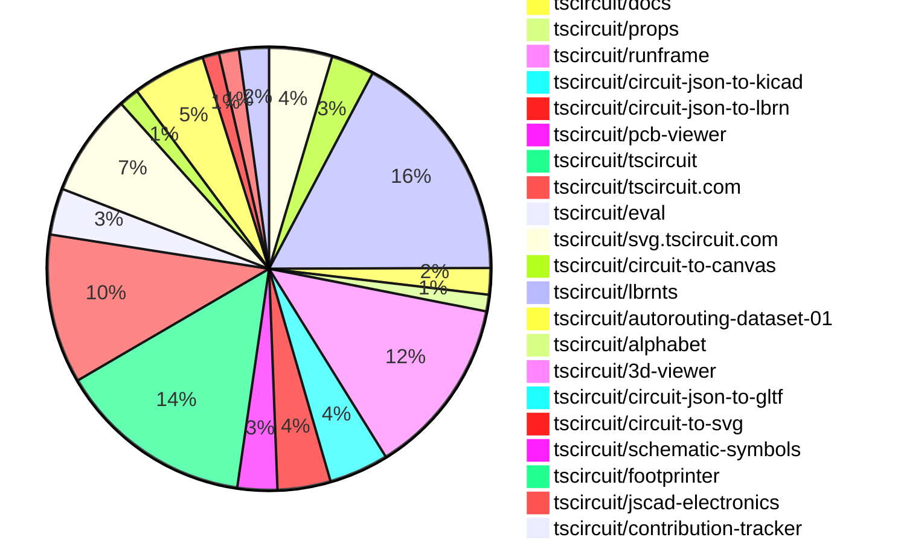

# Contribution Overview 2026-01-28

The current week is shown below. There are 3 major sections:

- [Contributor Overview](#contributor-overview)
- [PRs by Repository](#prs-by-repository)
- [PRs by Contributor](#changes-by-contributor)
- [Scoring & Sponsorship Details](/docs/sponsorship-calculation-explanation.md)

## PRs by Repository

## Contributor Overview

| Contributor | 🐳 Major | 🐙 Minor | 🐌 Tiny | ⭐ | Discussion Contributions |
|-------------|---------|---------|---------|-----|--------------------------|
| [seveibar](#seveibar) | 6 | 17 | 12 | 👑 | 0🔹 0🔶 0💎 |
| [AnasSarkiz](#AnasSarkiz) | 2 | 11 | 4 | ⭐⭐⭐ | 0🔹 0🔶 0💎 |
| [techmannih](#techmannih) | 1 | 10 | 1 | ⭐⭐⭐ | 0🔹 0🔶 0💎 |
| [Abse2001](#Abse2001) | 1 | 11 | 3 | ⭐⭐⭐ | 0🔹 0🔶 0💎 |
| [ShiboSoftwareDev](#ShiboSoftwareDev) | 3 | 2 | 3 | ⭐⭐⭐ | 0🔹 0🔶 0💎 |
| [ArnavK-09](#ArnavK-09) | 2 | 3 | 6 | ⭐⭐ | 0🔹 0🔶 0💎 |
| [0hmX](#0hmX) | 2 | 1 | 11 | ⭐⭐ | 0🔹 0🔶 0💎 |
| [imrishabh18](#imrishabh18) | 0 | 4 | 8 | ⭐⭐ | 0🔹 0🔶 0💎 |
| [rushabhcodes](#rushabhcodes) | 0 | 6 | 5 | ⭐⭐ | 0🔹 0🔶 0💎 |
| [tscircuitbot](#tscircuitbot) | 0 | 0 | 291 | ⭐⭐ | 0🔹 0🔶 0💎 |
| [nailoo](#nailoo) | 0 | 1 | 2 | ⭐ | 0🔹 0🔶 0💎 |
| [Heinrich-XIAO](#Heinrich-XIAO) | 1 | 0 | 0 | ⭐ | 0🔹 0🔶 0💎 |
| [MustafaMulla29](#MustafaMulla29) | 1 | 0 | 0 | ⭐ | 0🔹 0🔶 0💎 |
| [shehaban](#shehaban) | 0 | 1 | 0 |  | 0🔹 0🔶 0💎 |
| [Ayushjhawar8](#Ayushjhawar8) | 0 | 0 | 1 |  | 0🔹 0🔶 0💎 |

> Note: AI evaluates PRs and assigns 1-3 star ratings automatically. 4 and 5 star ratings require manual staff review.

### Discussion Contribution Legend

- 🔹 Normal Comments: Basic participation with minimal effort
- 🔶 Great Informative Comments: Thoughtful participation that adds value
- 💎 Incredible Comments: Exceptional participation with high-quality content

## Review Table

[reviews-received-hover]: ## "Number of reviews received for PRs for this contributor"
[approvals-received-hover]: ## "Number of approvals received for PRs this contributor authored"
[rejections-received-hover]: ## "Number of rejections received for PRs this contributor authored"
[prs-opened-hover]: ## "Number of PRs opened by this contributor"
[issues-created-hover]: ## "Number of issues created by this contributor"

| Contributor | Reviews Received | Approvals Received | Rejections Received | Approvals | Rejections | PRs Opened | PRs Merged | Issues Created |
|---|---|---|---|---|---|---|---|---|
| [seveibar](#seveibar) | 13 | 0 | 0 | 45 | 13 | 43 | 36 | 0 |
| [tscircuitbot](#tscircuitbot) | 1 | 0 | 0 | 0 | 0 | 332 | 291 | 0 |
| [Abse2001](#Abse2001) | 15 | 15 | 0 | 3 | 1 | 16 | 15 | 0 |
| [ShiboSoftwareDev](#ShiboSoftwareDev) | 10 | 8 | 0 | 12 | 0 | 11 | 9 | 0 |
| [ainanasolo2005-commits](#ainanasolo2005-commits) | 1 | 0 | 0 | 0 | 0 | 1 | 0 | 0 |
| [rushabhcodes](#rushabhcodes) | 38 | 16 | 3 | 1 | 1 | 13 | 11 | 0 |
| [imrishabh18](#imrishabh18) | 5 | 4 | 0 | 7 | 1 | 14 | 12 | 0 |
| [techmannih](#techmannih) | 20 | 13 | 4 | 7 | 2 | 20 | 12 | 0 |
| [shehaban](#shehaban) | 12 | 3 | 6 | 0 | 0 | 4 | 1 | 0 |
| [nailoo](#nailoo) | 5 | 4 | 0 | 1 | 0 | 3 | 3 | 0 |
| [MustafaMulla29](#MustafaMulla29) | 10 | 2 | 3 | 0 | 0 | 5 | 1 | 0 |
| [Heinrich-XIAO](#Heinrich-XIAO) | 2 | 1 | 0 | 0 | 0 | 2 | 1 | 0 |
| [Ayushjhawar8](#Ayushjhawar8) | 5 | 1 | 0 | 0 | 0 | 2 | 1 | 0 |
| [bimakw](#bimakw) | 1 | 0 | 0 | 0 | 0 | 3 | 0 | 0 |
| [Devesh36](#Devesh36) | 0 | 0 | 0 | 0 | 0 | 3 | 0 | 0 |
| [njg7194](#njg7194) | 2 | 0 | 0 | 0 | 0 | 1 | 0 | 0 |
| [ArnavK-09](#ArnavK-09) | 5 | 4 | 0 | 2 | 1 | 13 | 13 | 0 |
| [yuvrajangadsingh](#yuvrajangadsingh) | 1 | 0 | 0 | 0 | 0 | 1 | 0 | 0 |
| [Excellencedev](#Excellencedev) | 5 | 1 | 2 | 0 | 0 | 2 | 0 | 0 |
| [ernestofosu05](#ernestofosu05) | 1 | 0 | 0 | 0 | 0 | 1 | 0 | 0 |
| [0hmX](#0hmX) | 4 | 3 | 0 | 0 | 0 | 16 | 16 | 0 |
| [pxlpal](#pxlpal) | 3 | 0 | 1 | 0 | 0 | 1 | 0 | 0 |
| [AnasSarkiz](#AnasSarkiz) | 3 | 3 | 0 | 0 | 0 | 17 | 17 | 0 |

## Changes by Repository

### [tscircuit/schematic-viewer](https://github.com/tscircuit/schematic-viewer)

| PR # | Impact | Rating | Contributor | Description |
|------|--------|--------|-------------|-------------|
| [#161](https://github.com/tscircuit/schematic-viewer/pull/161) | 🐳 Major | ⭐⭐⭐ | seveibar | Adds the ability to show schematic ports on hover when view mode is enabled |

### [tscircuit/circuit-json](https://github.com/tscircuit/circuit-json)

| PR # | Impact | Rating | Contributor | Description |
|------|--------|--------|-------------|-------------|
| [#442](https://github.com/tscircuit/circuit-json/pull/442) | 🐳 Major | ⭐⭐⭐ | seveibar | Allows schematic elements to optionally associate with a named symbol instead of a component, enhancing flexibility in schematic design. |
| [#438](https://github.com/tscircuit/circuit-json/pull/438) | 🐳 Major | ⭐⭐⭐ | seveibar | Adds a shared base error schema for circuit JSON errors, centralizing common fields and introducing an optional is_fatal property for error severity classification. |
| [#440](https://github.com/tscircuit/circuit-json/pull/440) | 🐙 Minor | ⭐⭐ | seveibar | Add schematic_symbol support and allow schematic_component to reference it |
| [#436](https://github.com/tscircuit/circuit-json/pull/436) | 🐙 Minor | ⭐⭐ | seveibar | Adds an anchor alignment field to cad_component, allowing specification of placement alignment semantics with options center and xy_center_z_board. |
| [#433](https://github.com/tscircuit/circuit-json/pull/433) | 🐙 Minor | ⭐⭐ | seveibar | Add a new error type for PCB panelization placement failures, ensuring it is recognized in the type system and tooling. |
| [#452](https://github.com/tscircuit/circuit-json/pull/452) | 🐙 Minor | ⭐⭐ | techmannih | Adds pcb_courtyard_circle to the list of circuit elements in the circuit JSON schema. |
| [#450](https://github.com/tscircuit/circuit-json/pull/450) | 🐙 Minor | ⭐⭐ | techmannih | Adds support for defining a courtyard circle on the PCB with specified parameters such as center, radius, and layer. |
| [#447](https://github.com/tscircuit/circuit-json/pull/447) | 🐙 Minor | ⭐⭐ | techmannih | Adds the PcbSilkscreenOval type to the PcbCircuitElement union, resolving import errors in the 3D viewer. |
| [#448](https://github.com/tscircuit/circuit-json/pull/448) | 🐙 Minor | ⭐⭐ | techmannih | Adds an optional display_max_resistance property to the simple potentiometer component, allowing for more flexible representation of maximum resistance values. |
| [#445](https://github.com/tscircuit/circuit-json/pull/445) | 🐙 Minor | ⭐⭐ | techmannih | Adds support for a new simple voltage source component in the circuit JSON schema. |

🐌 Tiny Contributions (9)

| PR # | Impact | Contributor | Description |
|------|--------|-------------|-------------|
| [#453](https://github.com/tscircuit/circuit-json/pull/453) | 🐌 Tiny | tscircuitbot | Automated package update |
| [#451](https://github.com/tscircuit/circuit-json/pull/451) | 🐌 Tiny | tscircuitbot | Automated package update |
| [#444](https://github.com/tscircuit/circuit-json/pull/444) | 🐌 Tiny | tscircuitbot | Automated package update |
| [#449](https://github.com/tscircuit/circuit-json/pull/449) | 🐌 Tiny | tscircuitbot | Automated package update |
| [#441](https://github.com/tscircuit/circuit-json/pull/441) | 🐌 Tiny | tscircuitbot | Automated package update |
| [#443](https://github.com/tscircuit/circuit-json/pull/443) | 🐌 Tiny | tscircuitbot | Automated package update |
| [#437](https://github.com/tscircuit/circuit-json/pull/437) | 🐌 Tiny | tscircuitbot | Automated package update |
| [#439](https://github.com/tscircuit/circuit-json/pull/439) | 🐌 Tiny | tscircuitbot | Automated package update |
| [#434](https://github.com/tscircuit/circuit-json/pull/434) | 🐌 Tiny | tscircuitbot | Automated package update |

### [tscircuit/core](https://github.com/tscircuit/core)

| PR # | Impact | Rating | Contributor | Description |
|------|--------|--------|-------------|-------------|
| [#1879](https://github.com/tscircuit/core/pull/1879) | 🐳 Major | ⭐⭐⭐ | seveibar | Adds schematic_symbol_id to various schematic components to enhance their association with symbols during rendering. |
| [#1883](https://github.com/tscircuit/core/pull/1883) | 🐳 Major | ⭐⭐⭐ | ShiboSoftwareDev | Automatically calculates the optimal number of rows and columns for a panel grid based on specified dimensions and edge padding, enhancing layout flexibility. |
| [#1882](https://github.com/tscircuit/core/pull/1882) | 🐳 Major | ⭐⭐⭐ | ShiboSoftwareDev | Adds support for copper pour connectivity map alignment, outline definitions, and backfills via net connections in PCB designs. |
| [#1878](https://github.com/tscircuit/core/pull/1878) | 🐙 Minor | ⭐⭐ | seveibar | Adds support for resizing schematic symbols, allowing components to adjust their dimensions based on user-defined sizes. |
| [#1876](https://github.com/tscircuit/core/pull/1876) | 🐙 Minor | ⭐⭐ | seveibar | Fixes the chip displayName issue by ensuring the displayName is used if available, otherwise falls back to the name property. |
| [#1870](https://github.com/tscircuit/core/pull/1870) | 🐙 Minor | ⭐⭐ | seveibar | Adds an error handling mechanism for multiple boards in a panel without specified pcbXpcbY positions when layoutMode is set to none. |
| [#1875](https://github.com/tscircuit/core/pull/1875) | 🐙 Minor | ⭐⭐ | imrishabh18 | Fixes the issue where the fetch() function fails for paths starting with . by normalizing the path before resolving it. |
| [#1874](https://github.com/tscircuit/core/pull/1874) | 🐙 Minor | ⭐⭐ | imrishabh18 | Fixes the issue where relative paths starting with . were not supported in asset path handling. |
| [#1887](https://github.com/tscircuit/core/pull/1887) | 🐙 Minor | ⭐⭐ | techmannih | Adds a test for the schematic pin out connections of an MCU and various components in the circuit. |
| [#1880](https://github.com/tscircuit/core/pull/1880) | 🐙 Minor | ⭐⭐ | techmannih | Adds a display_max_resistance property to Potentiometer components for better representation of maximum resistance in schematics. |
| [#1872](https://github.com/tscircuit/core/pull/1872) | 🐙 Minor | ⭐⭐ | ShiboSoftwareDev | Adds a new subpanel component enabling nested panel hierarchies within panel elements, supporting recursive nesting for complex manufacturing layouts and comprehensive validation for board containment and positioning. |

🐌 Tiny Contributions (2)

| PR # | Impact | Contributor | Description |
|------|--------|-------------|-------------|
| [#1873](https://github.com/tscircuit/core/pull/1873) | 🐌 Tiny | Abse2001 | Updates the circuit-json-to-gltf dependency to version 0.0.62 in package.json and modifies related snapshot tests for 3D rendering components. |
| [#1889](https://github.com/tscircuit/core/pull/1889) | 🐌 Tiny | ShiboSoftwareDev | Updates the circuit-to-svg dependency version from 0.0.319 to 0.0.321 in package.json |

### [tscircuit/cli](https://github.com/tscircuit/cli)

| PR # | Impact | Rating | Contributor | Description |
|------|--------|--------|-------------|-------------|
| [#1859](https://github.com/tscircuit/cli/pull/1859) | 🐳 Major | ⭐⭐⭐ | seveibar | Enables external generation of PCMKiCad library for testing purposes in the circuit-json-to-kicad package. |
| [#1865](https://github.com/tscircuit/cli/pull/1865) | 🐙 Minor | ⭐⭐ | seveibar | Enable external generation of pcmkicad library for better testing in circuit-json-to-kicad, with optional circuitJsonToKicadModule and separate lib exports |
| [#1832](https://github.com/tscircuit/cli/pull/1832) | 🐙 Minor | ⭐⭐ | seveibar | Fixes invalid hash error by allowing the use of a local PCM base URL for asset generation. |
| [#1841](https://github.com/tscircuit/cli/pull/1841) | 🐙 Minor | ⭐⭐ | imrishabh18 | Fixes the clone command to correctly fetch the authentication token from the npmrc file for user authentication. |
| [#1857](https://github.com/tscircuit/cli/pull/1857) | 🐙 Minor | ⭐⭐ | imrishabh18 | Adds support for extracting KiCad symbol metadata from React components, enhancing the librarys functionality for users. |
| [#1866](https://github.com/tscircuit/cli/pull/1866) | 🐙 Minor | ⭐⭐ | ArnavK-09 | Adds a new command line option --ignore-config to skip options from tscircuit.config.json during the build process. |

🐌 Tiny Contributions (65)

| PR # | Impact | Contributor | Description |
|------|--------|-------------|-------------|
| [#1829](https://github.com/tscircuit/cli/pull/1829) | 🐌 Tiny | seveibar | Adds a KiCad PCM proxy server to the development server, enabling auto-updating of KiCad PCM assets during development. |
| [#1849](https://github.com/tscircuit/cli/pull/1849) | 🐌 Tiny | seveibar | Changes the default license setting from MIT to Unknown for KiCad exports in the generatePcmAssets function. |
| [#1824](https://github.com/tscircuit/cli/pull/1824) | 🐌 Tiny | seveibar | Creates a separate kicad-library-pcm directory to accommodate PCM-specific library contents and paths. |
| [#1881](https://github.com/tscircuit/cli/pull/1881) | 🐌 Tiny | tscircuitbot | Updates the package version from 0.1.866 to 0.1.867 in package.json |
| [#1880](https://github.com/tscircuit/cli/pull/1880) | 🐌 Tiny | tscircuitbot | Updates the tscircuitrunframe package from version 0.0.1561 to 0.0.1563 |
| [#1878](https://github.com/tscircuit/cli/pull/1878) | 🐌 Tiny | tscircuitbot | Updates the package version from 0.1.865 to 0.1.866 in package.json |
| [#1877](https://github.com/tscircuit/cli/pull/1877) | 🐌 Tiny | tscircuitbot | Updates the tscircuitrunframe package to version 0.0.1561 in the package.json file. |
| [#1876](https://github.com/tscircuit/cli/pull/1876) | 🐌 Tiny | tscircuitbot | Automated package update |
| [#1871](https://github.com/tscircuit/cli/pull/1871) | 🐌 Tiny | tscircuitbot | Updates the tscircuitrunframe package from version 0.0.1557 to 0.0.1558 |
| [#1874](https://github.com/tscircuit/cli/pull/1874) | 🐌 Tiny | tscircuitbot | Automated package update |
| [#1873](https://github.com/tscircuit/cli/pull/1873) | 🐌 Tiny | tscircuitbot | Updates the tscircuitrunframe package version from 0.0.1558 to 0.0.1559 in package.json |
| [#1875](https://github.com/tscircuit/cli/pull/1875) | 🐌 Tiny | tscircuitbot | Automated package update |
| [#1863](https://github.com/tscircuit/cli/pull/1863) | 🐌 Tiny | tscircuitbot | Updates the tscircuitrunframe package from version 0.0.1555 to 0.0.1556 |
| [#1870](https://github.com/tscircuit/cli/pull/1870) | 🐌 Tiny | tscircuitbot | Automated package update |
| [#1869](https://github.com/tscircuit/cli/pull/1869) | 🐌 Tiny | tscircuitbot | Updates the tscircuitrunframe package from version 0.0.1556 to 0.0.1557 |
| [#1867](https://github.com/tscircuit/cli/pull/1867) | 🐌 Tiny | tscircuitbot | Automated package update |
| [#1868](https://github.com/tscircuit/cli/pull/1868) | 🐌 Tiny | tscircuitbot | Automated package update |
| [#1864](https://github.com/tscircuit/cli/pull/1864) | 🐌 Tiny | tscircuitbot | Automated package update |
| [#1862](https://github.com/tscircuit/cli/pull/1862) | 🐌 Tiny | tscircuitbot | Automated package update |
| [#1860](https://github.com/tscircuit/cli/pull/1860) | 🐌 Tiny | tscircuitbot | Automated package update |
| [#1856](https://github.com/tscircuit/cli/pull/1856) | 🐌 Tiny | tscircuitbot | Updates the package version from v0.1.854 to v0.1.855 in package.json |
| [#1837](https://github.com/tscircuit/cli/pull/1837) | 🐌 Tiny | tscircuitbot | Updates the tscircuitrunframe package from version 0.0.1549 to 0.0.1550 |
| [#1847](https://github.com/tscircuit/cli/pull/1847) | 🐌 Tiny | tscircuitbot | Updates the tscircuitrunframe package from version 0.0.1552 to 0.0.1553 |
| [#1828](https://github.com/tscircuit/cli/pull/1828) | 🐌 Tiny | tscircuitbot | Automated package update |
| [#1843](https://github.com/tscircuit/cli/pull/1843) | 🐌 Tiny | tscircuitbot | Updates the tscircuitrunframe package from version 0.0.1551 to 0.0.1552 |
| [#1834](https://github.com/tscircuit/cli/pull/1834) | 🐌 Tiny | tscircuitbot | Updates the tscircuitrunframe package version from 0.0.1547 to 0.0.1549 in package.json |
| [#1826](https://github.com/tscircuit/cli/pull/1826) | 🐌 Tiny | tscircuitbot | Automated package update |
| [#1850](https://github.com/tscircuit/cli/pull/1850) | 🐌 Tiny | tscircuitbot | Automated package update |
| [#1839](https://github.com/tscircuit/cli/pull/1839) | 🐌 Tiny | tscircuitbot | Automated package update |
| [#1844](https://github.com/tscircuit/cli/pull/1844) | 🐌 Tiny | tscircuitbot | Automated package update |
| [#1848](https://github.com/tscircuit/cli/pull/1848) | 🐌 Tiny | tscircuitbot | Automated package update |
| [#1827](https://github.com/tscircuit/cli/pull/1827) | 🐌 Tiny | tscircuitbot | Updates the tscircuitrunframe package from version 0.0.1546 to 0.0.1547 |
| [#1851](https://github.com/tscircuit/cli/pull/1851) | 🐌 Tiny | tscircuitbot | Updates the tscircuitrunframe package from version 0.0.1553 to 0.0.1554 |
| [#1830](https://github.com/tscircuit/cli/pull/1830) | 🐌 Tiny | tscircuitbot | Automated package update |
| [#1842](https://github.com/tscircuit/cli/pull/1842) | 🐌 Tiny | tscircuitbot | Automated package update |
| [#1846](https://github.com/tscircuit/cli/pull/1846) | 🐌 Tiny | tscircuitbot | Automated package update |
| [#1825](https://github.com/tscircuit/cli/pull/1825) | 🐌 Tiny | tscircuitbot | Automated package update |
| [#1835](https://github.com/tscircuit/cli/pull/1835) | 🐌 Tiny | tscircuitbot | Automated package update |
| [#1858](https://github.com/tscircuit/cli/pull/1858) | 🐌 Tiny | tscircuitbot | Automated package update |
| [#1840](https://github.com/tscircuit/cli/pull/1840) | 🐌 Tiny | tscircuitbot | Automated package update |
| [#1854](https://github.com/tscircuit/cli/pull/1854) | 🐌 Tiny | tscircuitbot | Automated package update |
| [#1853](https://github.com/tscircuit/cli/pull/1853) | 🐌 Tiny | tscircuitbot | Updates the tscircuitrunframe package from version 0.0.1554 to 0.0.1555 |
| [#1833](https://github.com/tscircuit/cli/pull/1833) | 🐌 Tiny | tscircuitbot | Automated package update |
| [#1811](https://github.com/tscircuit/cli/pull/1811) | 🐌 Tiny | tscircuitbot | Updates the tscircuitrunframe package from version 0.0.1541 to 0.0.1542 |
| [#1821](https://github.com/tscircuit/cli/pull/1821) | 🐌 Tiny | tscircuitbot | Updates the tscircuitrunframe package from version 0.0.1545 to 0.0.1546 |
| [#1823](https://github.com/tscircuit/cli/pull/1823) | 🐌 Tiny | tscircuitbot | Automated package update |
| [#1816](https://github.com/tscircuit/cli/pull/1816) | 🐌 Tiny | tscircuitbot | Automated package update |
| [#1820](https://github.com/tscircuit/cli/pull/1820) | 🐌 Tiny | tscircuitbot | Automated package update |
| [#1815](https://github.com/tscircuit/cli/pull/1815) | 🐌 Tiny | tscircuitbot | Updates the tscircuitrunframe package from version 0.0.1543 to 0.0.1544 |
| [#1814](https://github.com/tscircuit/cli/pull/1814) | 🐌 Tiny | tscircuitbot | Automated package update |
| [#1822](https://github.com/tscircuit/cli/pull/1822) | 🐌 Tiny | tscircuitbot | Automated package update |
| [#1819](https://github.com/tscircuit/cli/pull/1819) | 🐌 Tiny | tscircuitbot | Updates the tscircuitrunframe package version from 0.0.1544 to 0.0.1545 |
| [#1813](https://github.com/tscircuit/cli/pull/1813) | 🐌 Tiny | tscircuitbot | Updates the tscircuitrunframe package to version 0.0.1543 in the package.json file. |
| [#1807](https://github.com/tscircuit/cli/pull/1807) | 🐌 Tiny | tscircuitbot | Updates the tscircuitrunframe package to version 0.0.1540 |
| [#1803](https://github.com/tscircuit/cli/pull/1803) | 🐌 Tiny | tscircuitbot | Updates the tscircuitrunframe package from version 0.0.1537 to 0.0.1538 |
| [#1801](https://github.com/tscircuit/cli/pull/1801) | 🐌 Tiny | tscircuitbot | Updates the tscircuitrunframe package from version 0.0.1536 to 0.0.1537 |
| [#1808](https://github.com/tscircuit/cli/pull/1808) | 🐌 Tiny | tscircuitbot | Automated package update |
| [#1805](https://github.com/tscircuit/cli/pull/1805) | 🐌 Tiny | tscircuitbot | Updates the tscircuitrunframe package to version 0.0.1539 |
| [#1809](https://github.com/tscircuit/cli/pull/1809) | 🐌 Tiny | tscircuitbot | Updates the tscircuitrunframe package from version 0.0.1540 to 0.0.1541 |
| [#1802](https://github.com/tscircuit/cli/pull/1802) | 🐌 Tiny | tscircuitbot | Automated package update |
| [#1804](https://github.com/tscircuit/cli/pull/1804) | 🐌 Tiny | tscircuitbot | Automated package update |
| [#1810](https://github.com/tscircuit/cli/pull/1810) | 🐌 Tiny | tscircuitbot | Automated package update |
| [#1861](https://github.com/tscircuit/cli/pull/1861) | 🐌 Tiny | imrishabh18 | Removes the unused generate-kicad-footprint-library file from the project. |
| [#1845](https://github.com/tscircuit/cli/pull/1845) | 🐌 Tiny | imrishabh18 | Updates the version of the circuit-json-to-kicad dependency from 0.0.40 to 0.0.52 in package.json |
| [#1817](https://github.com/tscircuit/cli/pull/1817) | 🐌 Tiny | imrishabh18 | Changes static asset file imports to use relative paths, improving file resolution in the circuit_json context. |

### [tscircuit/docs](https://github.com/tscircuit/docs)

| PR # | Impact | Rating | Contributor | Description |
|------|--------|--------|-------------|-------------|
| [#421](https://github.com/tscircuit/docs/pull/421) | 🐳 Major | ⭐⭐⭐ | seveibar | Adds kicadPinMetadata property for KiCad pin electrical and visual properties in the documentation. |

🐌 Tiny Contributions (7)

| PR # | Impact | Contributor | Description |
|------|--------|-------------|-------------|
| [#427](https://github.com/tscircuit/docs/pull/427) | 🐌 Tiny | seveibar | Clarifies the Ordering API documentation to reflect that the base error object no longer includes an is_fatal field. |
| [#425](https://github.com/tscircuit/docs/pull/425) | 🐌 Tiny | seveibar | Adds instructions for starting the KiCad Plugin and Content Manager server and integrating tscircuit components into KiCad as a library. |
| [#419](https://github.com/tscircuit/docs/pull/419) | 🐌 Tiny | seveibar | Adds a section in the documentation for visualizing port positions on schematic symbols in the editor. |
| [#423](https://github.com/tscircuit/docs/pull/423) | 🐌 Tiny | seveibar | Add a new MDX file that provides a contributing guide for making lab boards, detailing the lab laser capability and standard copper-clad template size. |
| [#420](https://github.com/tscircuit/docs/pull/420) | 🐌 Tiny | seveibar | Adds documentation for KiCad-specific metadata properties for footprints and symbols in tscircuit components |
| [#424](https://github.com/tscircuit/docs/pull/424) | 🐌 Tiny | rushabhcodes | This PR updates the documentation for the pinrow4 footprint parameters, making the parameter table more complete and accurate by adding default values and documenting new configuration options. |
| [#422](https://github.com/tscircuit/docs/pull/422) | 🐌 Tiny | ShiboSoftwareDev | Adds a comprehensive guide on how to create manufacturing panels using panel and subpanel elements, including layout rules and examples. |

### [tscircuit/props](https://github.com/tscircuit/props)

| PR # | Impact | Rating | Contributor | Description |
|------|--------|--------|-------------|-------------|
| [#576](https://github.com/tscircuit/props/pull/576) | 🐙 Minor | ⭐⭐ | seveibar | Add support for courtyard circle and pill shapes to the props schema, allowing consumers to declare these shapes in layouts, with corresponding tests and documentation updates. |
| [#573](https://github.com/tscircuit/props/pull/573) | 🐙 Minor | ⭐⭐ | seveibar | Allows shorthand side definitions for schematic pin arrangements, automatically deriving default directions for these sides while maintaining backward compatibility with the public API. |
| [#574](https://github.com/tscircuit/props/pull/574) | 🐙 Minor | ⭐⭐ | seveibar | Add a tolerance prop for resistors that accepts percentage strings and normalizes them into numeric fractions for validation and downstream code. |
| [#571](https://github.com/tscircuit/props/pull/571) | 🐙 Minor | ⭐⭐ | seveibar | Adds width and height properties to the SymbolProps interface, allowing for more flexible symbol dimensions in the library. |

🐌 Tiny Contributions (1)

| PR # | Impact | Contributor | Description |
|------|--------|-------------|-------------|
| [#572](https://github.com/tscircuit/props/pull/572) | 🐌 Tiny | seveibar | Add support for per-pin KiCad metadata including electrical type and graphic style to port properties, allowing ports to carry KiCad-specific pin attributes alongside existing metadata. |

### [tscircuit/runframe](https://github.com/tscircuit/runframe)

| PR # | Impact | Rating | Contributor | Description |
|------|--------|--------|-------------|-------------|
| [#2512](https://github.com/tscircuit/runframe/pull/2512) | 🐳 Major | ⭐⭐⭐ | Heinrich-XIAO | Displays component prices in the search picker for better user visibility. |
| [#2469](https://github.com/tscircuit/runframe/pull/2469) | 🐙 Minor | ⭐⭐ | seveibar | Adds toggle functionality for showing schematic debug grid and schematic ports in the CircuitJsonPreview component. |

🐌 Tiny Contributions (52)

| PR # | Impact | Contributor | Description |
|------|--------|-------------|-------------|
| [#2468](https://github.com/tscircuit/runframe/pull/2468) | 🐌 Tiny | seveibar | Adds a new dropdown menu for viewing schematic options in the File Menu Left Header component. |
| [#2529](https://github.com/tscircuit/runframe/pull/2529) | 🐌 Tiny | tscircuitbot | Updates the tscircuitpcb-viewer package from version 1.11.328 to 1.11.330 |
| [#2525](https://github.com/tscircuit/runframe/pull/2525) | 🐌 Tiny | tscircuitbot | Automated package update |
| [#2524](https://github.com/tscircuit/runframe/pull/2524) | 🐌 Tiny | tscircuitbot | Updates the circuit-json-to-kicad package from version 0.0.57 to 0.0.58 |
| [#2522](https://github.com/tscircuit/runframe/pull/2522) | 🐌 Tiny | tscircuitbot | Automated package update |
| [#2517](https://github.com/tscircuit/runframe/pull/2517) | 🐌 Tiny | tscircuitbot | Updates the tscircuit3d-viewer package to version 0.0.505 in the package.json file. |
| [#2521](https://github.com/tscircuit/runframe/pull/2521) | 🐌 Tiny | tscircuitbot | Automated package update |
| [#2518](https://github.com/tscircuit/runframe/pull/2518) | 🐌 Tiny | tscircuitbot | Automated package update |
| [#2516](https://github.com/tscircuit/runframe/pull/2516) | 🐌 Tiny | tscircuitbot | Automated package update |
| [#2520](https://github.com/tscircuit/runframe/pull/2520) | 🐌 Tiny | tscircuitbot | Updates the circuit-json-to-kicad package from version 0.0.56 to 0.0.57 |
| [#2510](https://github.com/tscircuit/runframe/pull/2510) | 🐌 Tiny | tscircuitbot | Updates the circuit-json-to-kicad package version from 0.0.54 to 0.0.56 in package.json |
| [#2514](https://github.com/tscircuit/runframe/pull/2514) | 🐌 Tiny | tscircuitbot | Automated package update |
| [#2513](https://github.com/tscircuit/runframe/pull/2513) | 🐌 Tiny | tscircuitbot | Updates the tscircuitpcb-viewer package to version 1.11.327 in package.json |
| [#2515](https://github.com/tscircuit/runframe/pull/2515) | 🐌 Tiny | tscircuitbot | Updates the tscircuitpcb-viewer package from version 1.11.327 to 1.11.328 |
| [#2511](https://github.com/tscircuit/runframe/pull/2511) | 🐌 Tiny | tscircuitbot | Automated package update |
| [#2497](https://github.com/tscircuit/runframe/pull/2497) | 🐌 Tiny | tscircuitbot | Automated package update |
| [#2502](https://github.com/tscircuit/runframe/pull/2502) | 🐌 Tiny | tscircuitbot | Updates the circuit-json-to-kicad package version from 0.0.52 to 0.0.53 in package.json |
| [#2495](https://github.com/tscircuit/runframe/pull/2495) | 🐌 Tiny | tscircuitbot | Updates the tscircuiteval package to version 0.0.618 in the package.json file. |
| [#2507](https://github.com/tscircuit/runframe/pull/2507) | 🐌 Tiny | tscircuitbot | Updates the circuit-json-to-kicad package from version 0.0.53 to 0.0.54 |
| [#2490](https://github.com/tscircuit/runframe/pull/2490) | 🐌 Tiny | tscircuitbot | Updates the circuit-json-to-kicad package from version 0.0.49 to 0.0.50 |
| [#2487](https://github.com/tscircuit/runframe/pull/2487) | 🐌 Tiny | tscircuitbot | Updates the tscircuiteval package to version 0.0.617 in the package.json file. |
| [#2499](https://github.com/tscircuit/runframe/pull/2499) | 🐌 Tiny | tscircuitbot | Updates the circuit-json-to-kicad package from version 0.0.51 to 0.0.52 |
| [#2488](https://github.com/tscircuit/runframe/pull/2488) | 🐌 Tiny | tscircuitbot | Automated package update |
| [#2493](https://github.com/tscircuit/runframe/pull/2493) | 🐌 Tiny | tscircuitbot | Updates the circuit-json-to-kicad package from version 0.0.50 to 0.0.51 in package.json |
| [#2491](https://github.com/tscircuit/runframe/pull/2491) | 🐌 Tiny | tscircuitbot | Automated package update |
| [#2503](https://github.com/tscircuit/runframe/pull/2503) | 🐌 Tiny | tscircuitbot | Automated package update |
| [#2496](https://github.com/tscircuit/runframe/pull/2496) | 🐌 Tiny | tscircuitbot | Automated package update |
| [#2504](https://github.com/tscircuit/runframe/pull/2504) | 🐌 Tiny | tscircuitbot | Automated package update |
| [#2500](https://github.com/tscircuit/runframe/pull/2500) | 🐌 Tiny | tscircuitbot | Automated package update |
| [#2505](https://github.com/tscircuit/runframe/pull/2505) | 🐌 Tiny | tscircuitbot | Automated package update |
| [#2494](https://github.com/tscircuit/runframe/pull/2494) | 🐌 Tiny | tscircuitbot | Automated package update |
| [#2508](https://github.com/tscircuit/runframe/pull/2508) | 🐌 Tiny | tscircuitbot | Automated package update |
| [#2482](https://github.com/tscircuit/runframe/pull/2482) | 🐌 Tiny | tscircuitbot | Updates the tscircuiteval package from version 0.0.614 to 0.0.615 in the package.json file. |
| [#2484](https://github.com/tscircuit/runframe/pull/2484) | 🐌 Tiny | tscircuitbot | Updates the tscircuiteval package to version 0.0.616 in the package.json file. |
| [#2478](https://github.com/tscircuit/runframe/pull/2478) | 🐌 Tiny | tscircuitbot | Updates the tscircuiteval package to version 0.0.613 in the package.json file. |
| [#2480](https://github.com/tscircuit/runframe/pull/2480) | 🐌 Tiny | tscircuitbot | Updates the tscircuiteval package to version 0.0.614 in the package.json file. |
| [#2485](https://github.com/tscircuit/runframe/pull/2485) | 🐌 Tiny | tscircuitbot | Automated package update |
| [#2483](https://github.com/tscircuit/runframe/pull/2483) | 🐌 Tiny | tscircuitbot | Automated package update |
| [#2481](https://github.com/tscircuit/runframe/pull/2481) | 🐌 Tiny | tscircuitbot | Automated package update |
| [#2479](https://github.com/tscircuit/runframe/pull/2479) | 🐌 Tiny | tscircuitbot | Automated package update |
| [#2464](https://github.com/tscircuit/runframe/pull/2464) | 🐌 Tiny | tscircuitbot | Automated package update |
| [#2463](https://github.com/tscircuit/runframe/pull/2463) | 🐌 Tiny | tscircuitbot | Updates the tscircuiteval package from version 0.0.611 to 0.0.612 in the package.json file. |
| [#2474](https://github.com/tscircuit/runframe/pull/2474) | 🐌 Tiny | tscircuitbot | Updates the tscircuit3d-viewer package from version 0.0.502 to 0.0.503 in the package.json file. |
| [#2475](https://github.com/tscircuit/runframe/pull/2475) | 🐌 Tiny | tscircuitbot | Automated package update |
| [#2472](https://github.com/tscircuit/runframe/pull/2472) | 🐌 Tiny | tscircuitbot | Updates the tscircuit3d-viewer package from version 0.0.501 to 0.0.502 |
| [#2470](https://github.com/tscircuit/runframe/pull/2470) | 🐌 Tiny | tscircuitbot | Updates the tscircuitpcb-viewer package from version 1.11.322 to 1.11.325 |
| [#2467](https://github.com/tscircuit/runframe/pull/2467) | 🐌 Tiny | tscircuitbot | Automated package update |
| [#2476](https://github.com/tscircuit/runframe/pull/2476) | 🐌 Tiny | tscircuitbot | Updates the tscircuitpcb-viewer package to version 1.11.326 |
| [#2466](https://github.com/tscircuit/runframe/pull/2466) | 🐌 Tiny | tscircuitbot | Updates the tscircuitschematic-viewer package to version 2.0.55 in the package.json file. |
| [#2471](https://github.com/tscircuit/runframe/pull/2471) | 🐌 Tiny | tscircuitbot | Updates the package version from 0.0.1538 to 0.0.1539 in package.json |
| [#2477](https://github.com/tscircuit/runframe/pull/2477) | 🐌 Tiny | tscircuitbot | Automated package update |
| [#2473](https://github.com/tscircuit/runframe/pull/2473) | 🐌 Tiny | tscircuitbot | Automated package update |

### [tscircuit/circuit-json-to-kicad](https://github.com/tscircuit/circuit-json-to-kicad)

| PR # | Impact | Rating | Contributor | Description |
|------|--------|--------|-------------|-------------|
| [#106](https://github.com/tscircuit/circuit-json-to-kicad/pull/106) | 🐙 Minor | ⭐⭐ | seveibar | Adds support for fabrication note rectangles and silkscreen circles in KiCad footprints, enhancing the representation of PCB components. |
| [#92](https://github.com/tscircuit/circuit-json-to-kicad/pull/92) | 🐙 Minor | ⭐⭐ | seveibar | Adds support for custom symbols in circuit JSON, allowing schematic components to reference custom symbols via schematic_symbol_id, and prepares for upstream support by modifying the circuit JSON structure accordingly. |
| [#90](https://github.com/tscircuit/circuit-json-to-kicad/pull/90) | 🐙 Minor | ⭐⭐ | seveibar | Changes the method of generating reference designators by prioritizing the component ftype over the component name. |
| [#84](https://github.com/tscircuit/circuit-json-to-kicad/pull/84) | 🐙 Minor | ⭐⭐ | techmannih | Fixes the issue where the max_resistance value does not display for potentiometer components in the schematic. |

🐌 Tiny Contributions (14)

| PR # | Impact | Contributor | Description |
|------|--------|-------------|-------------|
| [#104](https://github.com/tscircuit/circuit-json-to-kicad/pull/104) | 🐌 Tiny | seveibar | Adds scripts for generating a KiCad library from a directory and comparing KiCad files semantically by normalizing UUIDs, timestamps, and version numbers. |
| [#101](https://github.com/tscircuit/circuit-json-to-kicad/pull/101) | 🐌 Tiny | seveibar | Adds a PCM server script for generating KiCad assets and serving them over HTTP, facilitating fast testing of tscircuit libraries against KiCad. |
| [#107](https://github.com/tscircuit/circuit-json-to-kicad/pull/107) | 🐌 Tiny | tscircuitbot | Automated package update |
| [#105](https://github.com/tscircuit/circuit-json-to-kicad/pull/105) | 🐌 Tiny | tscircuitbot | Automated package update |
| [#102](https://github.com/tscircuit/circuit-json-to-kicad/pull/102) | 🐌 Tiny | tscircuitbot | Automated package update |
| [#100](https://github.com/tscircuit/circuit-json-to-kicad/pull/100) | 🐌 Tiny | tscircuitbot | Automated package update |
| [#93](https://github.com/tscircuit/circuit-json-to-kicad/pull/93) | 🐌 Tiny | tscircuitbot | Automated package update |
| [#96](https://github.com/tscircuit/circuit-json-to-kicad/pull/96) | 🐌 Tiny | tscircuitbot | Automated package update |
| [#91](https://github.com/tscircuit/circuit-json-to-kicad/pull/91) | 🐌 Tiny | tscircuitbot | Automated package update |
| [#89](https://github.com/tscircuit/circuit-json-to-kicad/pull/89) | 🐌 Tiny | tscircuitbot | Automated package update |
| [#95](https://github.com/tscircuit/circuit-json-to-kicad/pull/95) | 🐌 Tiny | tscircuitbot | Automated package update |
| [#99](https://github.com/tscircuit/circuit-json-to-kicad/pull/99) | 🐌 Tiny | imrishabh18 | Adds versioning information and adjusts the positioning of reference and value labels in KiCad footprints. |
| [#97](https://github.com/tscircuit/circuit-json-to-kicad/pull/97) | 🐌 Tiny | imrishabh18 | Fixes font sizing and prevents the default font value from being displayed in KiCad footprint metadata. |
| [#94](https://github.com/tscircuit/circuit-json-to-kicad/pull/94) | 🐌 Tiny | imrishabh18 | Updates the tscircuit dependency to version 0.0.1237 and removes the circuit-to-svg dependency from the project. |

### [tscircuit/circuit-json-to-lbrn](https://github.com/tscircuit/circuit-json-to-lbrn)

| PR # | Impact | Rating | Contributor | Description |
|------|--------|--------|-------------|-------------|
| [#118](https://github.com/tscircuit/circuit-json-to-lbrn/pull/118) | 🐳 Major | ⭐⭐⭐ | AnasSarkiz | Removes layer inclusion toggles from the settings UI so layers are always included. Forces copper, soldermask, silkscreen, copper cut fill, and topbottom layers to stay enabled in LBRN options. |
| [#112](https://github.com/tscircuit/circuit-json-to-lbrn/pull/112) | 🐙 Minor | ⭐⭐ | seveibar | Adds functionality to create an oxidation cleaning layer for laser ablation to clean oxidation from the copper surface of the PCB. |
| [#126](https://github.com/tscircuit/circuit-json-to-lbrn/pull/126) | 🐙 Minor | ⭐⭐ | AnasSarkiz | Sets qPulseWidth: 1 on every cut setting generated by convertCircuitJsonToLbrn, ensuring consistent laser pulse timing for soldermask, clearance, copper fill, and oxidation cleaning layers. |
| [#124](https://github.com/tscircuit/circuit-json-to-lbrn/pull/124) | 🐙 Minor | ⭐⭐ | AnasSarkiz | Forces a fixed interval of 0.03 for both copper hatch passes to stabilize scan density regardless of laser spot size, ensuring repeatable copper engraving behavior by removing spot-size variance. |
| [#116](https://github.com/tscircuit/circuit-json-to-lbrn/pull/116) | 🐙 Minor | ⭐⭐ | AnasSarkiz | Add a new soldermask cure cut setting and layer index, generate cure geometry by subtracting soldermask openings from board outline, and add tests and snapshots covering soldermask cure output. |
| [#114](https://github.com/tscircuit/circuit-json-to-lbrn/pull/114) | 🐙 Minor | ⭐⭐ | AnasSarkiz | Replace the cut-setting field from pulseWidth to qPulseWidth so LBRN receives the correct parameter. Keep laser profile defaults and UI in ns, aligning tests and docs with the correct field. Bump lbrnts to 0.0.17 to match the updated schema. |

🐌 Tiny Contributions (10)

| PR # | Impact | Contributor | Description |
|------|--------|-------------|-------------|
| [#127](https://github.com/tscircuit/circuit-json-to-lbrn/pull/127) | 🐌 Tiny | tscircuitbot | Automated package update |
| [#121](https://github.com/tscircuit/circuit-json-to-lbrn/pull/121) | 🐌 Tiny | tscircuitbot | Automated package update |
| [#125](https://github.com/tscircuit/circuit-json-to-lbrn/pull/125) | 🐌 Tiny | tscircuitbot | Automated package update |
| [#123](https://github.com/tscircuit/circuit-json-to-lbrn/pull/123) | 🐌 Tiny | tscircuitbot | Automated package update |
| [#119](https://github.com/tscircuit/circuit-json-to-lbrn/pull/119) | 🐌 Tiny | tscircuitbot | Automated package update |
| [#117](https://github.com/tscircuit/circuit-json-to-lbrn/pull/117) | 🐌 Tiny | tscircuitbot | Automated package update to version 0.0.55 |
| [#113](https://github.com/tscircuit/circuit-json-to-lbrn/pull/113) | 🐌 Tiny | tscircuitbot | Automated package update |
| [#115](https://github.com/tscircuit/circuit-json-to-lbrn/pull/115) | 🐌 Tiny | tscircuitbot | Automated package update |
| [#122](https://github.com/tscircuit/circuit-json-to-lbrn/pull/122) | 🐌 Tiny | AnasSarkiz | Always include the oxidation cleaning layer in conversion options and simplify soldermask-related layer names for cleaner output labeling. |
| [#120](https://github.com/tscircuit/circuit-json-to-lbrn/pull/120) | 🐌 Tiny | AnasSarkiz | Removes the option to include bottom layers in the conversion process, limiting output to only top layers. |

### [tscircuit/pcb-viewer](https://github.com/tscircuit/pcb-viewer)

| PR # | Impact | Rating | Contributor | Description |
|------|--------|--------|-------------|-------------|
| [#641](https://github.com/tscircuit/pcb-viewer/pull/641) | 🐙 Minor | ⭐⭐ | Abse2001 | Ensures that fabrication notes are rendered above solder mask layers, making them fully visible in the PCB viewer. |
| [#639](https://github.com/tscircuit/pcb-viewer/pull/639) | 🐙 Minor | ⭐⭐ | Abse2001 | Updates the test to compute expected Y values from actual glyph bounds in the alphabet data, ensuring accurate alignment validation between lines. |
| [#637](https://github.com/tscircuit/pcb-viewer/pull/637) | 🐙 Minor | ⭐⭐ | Abse2001 | Fixes edge cut visibility issues by integrating edge_cuts into the rendering pipeline and ensuring it is rendered above copper, soldermask, and silkscreen layers. |
| [#635](https://github.com/tscircuit/pcb-viewer/pull/635) | 🐙 Minor | ⭐⭐ | Abse2001 | Fixes rendering order of holes when solder mask is enabled in the circuit-to-canvas component. |
| [#631](https://github.com/tscircuit/pcb-viewer/pull/631) | 🐙 Minor | ⭐⭐ | Abse2001 | Fixes PCB rendering issues by making soldermask a first-class layer and correcting drillsilkscreen ordering across the canvas pipeline. |
| [#633](https://github.com/tscircuit/pcb-viewer/pull/633) | 🐙 Minor | ⭐⭐ | Abse2001 | Fixes PCB note rendering order by explicitly associating top_notes and bottom_notes with their respective foreground sides, mirroring silkscreen behavior. |

🐌 Tiny Contributions (6)

| PR # | Impact | Contributor | Description |
|------|--------|-------------|-------------|
| [#642](https://github.com/tscircuit/pcb-viewer/pull/642) | 🐌 Tiny | tscircuitbot | Automated package update |
| [#640](https://github.com/tscircuit/pcb-viewer/pull/640) | 🐌 Tiny | tscircuitbot | Automated package update |
| [#638](https://github.com/tscircuit/pcb-viewer/pull/638) | 🐌 Tiny | tscircuitbot | Automated package update |
| [#636](https://github.com/tscircuit/pcb-viewer/pull/636) | 🐌 Tiny | tscircuitbot | Automated package update |
| [#634](https://github.com/tscircuit/pcb-viewer/pull/634) | 🐌 Tiny | tscircuitbot | Automated package update |
| [#632](https://github.com/tscircuit/pcb-viewer/pull/632) | 🐌 Tiny | tscircuitbot | Automated package update to version 1.11.325 |

### [tscircuit/tscircuit](https://github.com/tscircuit/tscircuit)

🐌 Tiny Contributions (59)

| PR # | Impact | Contributor | Description |
|------|--------|-------------|-------------|
| [#2083](https://github.com/tscircuit/tscircuit/pull/2083) | 🐌 Tiny | tscircuitbot | Automated package update |
| [#2082](https://github.com/tscircuit/tscircuit/pull/2082) | 🐌 Tiny | tscircuitbot | Automated package update |
| [#2077](https://github.com/tscircuit/tscircuit/pull/2077) | 🐌 Tiny | tscircuitbot | Updates the tscircuitcli package from version 0.1.862 to 0.1.864 and the tscircuitrunframe package from version 0.0.1557 to 0.0.1559 in package.json |
| [#2078](https://github.com/tscircuit/tscircuit/pull/2078) | 🐌 Tiny | tscircuitbot | Updates the package version from 0.0.1249 to 0.0.1250 in package.json |
| [#2080](https://github.com/tscircuit/tscircuit/pull/2080) | 🐌 Tiny | tscircuitbot | Automated package update |
| [#2079](https://github.com/tscircuit/tscircuit/pull/2079) | 🐌 Tiny | tscircuitbot | Automated package update |
| [#2071](https://github.com/tscircuit/tscircuit/pull/2071) | 🐌 Tiny | tscircuitbot | Updates the tscircuitcli package to version 0.1.860 in package.json |
| [#2076](https://github.com/tscircuit/tscircuit/pull/2076) | 🐌 Tiny | tscircuitbot | Updates the package version from 0.0.1248 to 0.0.1249 in package.json |
| [#2065](https://github.com/tscircuit/tscircuit/pull/2065) | 🐌 Tiny | tscircuitbot | Updates the tscircuitcli package to version 0.1.857 in package.json |
| [#2073](https://github.com/tscircuit/tscircuit/pull/2073) | 🐌 Tiny | tscircuitbot | Updates the tscircuitcli and other related package versions in package.json |
| [#2074](https://github.com/tscircuit/tscircuit/pull/2074) | 🐌 Tiny | tscircuitbot | Automated package update |
| [#2069](https://github.com/tscircuit/tscircuit/pull/2069) | 🐌 Tiny | tscircuitbot | Automated package update |
| [#2070](https://github.com/tscircuit/tscircuit/pull/2070) | 🐌 Tiny | tscircuitbot | Automated package update |
| [#2066](https://github.com/tscircuit/tscircuit/pull/2066) | 🐌 Tiny | tscircuitbot | Automated package update |
| [#2068](https://github.com/tscircuit/tscircuit/pull/2068) | 🐌 Tiny | tscircuitbot | Automated package update |
| [#2067](https://github.com/tscircuit/tscircuit/pull/2067) | 🐌 Tiny | tscircuitbot | Updates the tscircuitcli package to version 0.1.858 in package.json |
| [#2072](https://github.com/tscircuit/tscircuit/pull/2072) | 🐌 Tiny | tscircuitbot | Automated package update |
| [#2075](https://github.com/tscircuit/tscircuit/pull/2075) | 🐌 Tiny | tscircuitbot | Automated package update |
| [#2030](https://github.com/tscircuit/tscircuit/pull/2030) | 🐌 Tiny | tscircuitbot | Updates the tscircuitcli and tscircuitcore packages to their latest versions. |
| [#2038](https://github.com/tscircuit/tscircuit/pull/2038) | 🐌 Tiny | tscircuitbot | Automated package update |
| [#2031](https://github.com/tscircuit/tscircuit/pull/2031) | 🐌 Tiny | tscircuitbot | Automated package update |
| [#2047](https://github.com/tscircuit/tscircuit/pull/2047) | 🐌 Tiny | tscircuitbot | Updates the tscircuitcli package to version 0.1.848 in package.json |
| [#2052](https://github.com/tscircuit/tscircuit/pull/2052) | 🐌 Tiny | tscircuitbot | Updates the package version from 0.0.1236 to 0.0.1237 in package.json |
| [#2044](https://github.com/tscircuit/tscircuit/pull/2044) | 🐌 Tiny | tscircuitbot | Updates the package version from 0.0.1232 to 0.0.1233 in package.json |
| [#2045](https://github.com/tscircuit/tscircuit/pull/2045) | 🐌 Tiny | tscircuitbot | Automated package update |
| [#2051](https://github.com/tscircuit/tscircuit/pull/2051) | 🐌 Tiny | tscircuitbot | Updates the tscircuitcli package to version 0.1.850 in the package.json file. |
| [#2036](https://github.com/tscircuit/tscircuit/pull/2036) | 🐌 Tiny | tscircuitbot | Updates the tscircuitcli package to version 0.1.843 |
| [#2039](https://github.com/tscircuit/tscircuit/pull/2039) | 🐌 Tiny | tscircuitbot | Updates the package version from 0.0.1229 to 0.0.1230 in package.json |
| [#2033](https://github.com/tscircuit/tscircuit/pull/2033) | 🐌 Tiny | tscircuitbot | Updates the package version from 0.0.1226 to 0.0.1227 in package.json |
| [#2049](https://github.com/tscircuit/tscircuit/pull/2049) | 🐌 Tiny | tscircuitbot | Automated package update |
| [#2050](https://github.com/tscircuit/tscircuit/pull/2050) | 🐌 Tiny | tscircuitbot | Updates the package version from 0.0.1235 to 0.0.1236 in package.json |
| [#2048](https://github.com/tscircuit/tscircuit/pull/2048) | 🐌 Tiny | tscircuitbot | Updates the package version from 0.0.1234 to 0.0.1235 in package.json |
| [#2056](https://github.com/tscircuit/tscircuit/pull/2056) | 🐌 Tiny | tscircuitbot | Automated package update |
| [#2058](https://github.com/tscircuit/tscircuit/pull/2058) | 🐌 Tiny | tscircuitbot | Automated package update |
| [#2040](https://github.com/tscircuit/tscircuit/pull/2040) | 🐌 Tiny | tscircuitbot | Automated package update |
| [#2064](https://github.com/tscircuit/tscircuit/pull/2064) | 🐌 Tiny | tscircuitbot | Automated package update |
| [#2062](https://github.com/tscircuit/tscircuit/pull/2062) | 🐌 Tiny | tscircuitbot | Automated package update |
| [#2059](https://github.com/tscircuit/tscircuit/pull/2059) | 🐌 Tiny | tscircuitbot | Automated package update |
| [#2054](https://github.com/tscircuit/tscircuit/pull/2054) | 🐌 Tiny | tscircuitbot | Automated package update |
| [#2043](https://github.com/tscircuit/tscircuit/pull/2043) | 🐌 Tiny | tscircuitbot | Automated package update |
| [#2046](https://github.com/tscircuit/tscircuit/pull/2046) | 🐌 Tiny | tscircuitbot | Automated package update |
| [#2037](https://github.com/tscircuit/tscircuit/pull/2037) | 🐌 Tiny | tscircuitbot | Automated package update |
| [#2060](https://github.com/tscircuit/tscircuit/pull/2060) | 🐌 Tiny | tscircuitbot | Automated package update |
| [#2032](https://github.com/tscircuit/tscircuit/pull/2032) | 🐌 Tiny | tscircuitbot | Updates the tscircuitcli package to version 0.1.841 |
| [#2053](https://github.com/tscircuit/tscircuit/pull/2053) | 🐌 Tiny | tscircuitbot | Automated package update |
| [#2035](https://github.com/tscircuit/tscircuit/pull/2035) | 🐌 Tiny | tscircuitbot | Automated package update |
| [#2042](https://github.com/tscircuit/tscircuit/pull/2042) | 🐌 Tiny | tscircuitbot | Updates the package version from 0.0.1231 to 0.0.1232 in package.json |
| [#2034](https://github.com/tscircuit/tscircuit/pull/2034) | 🐌 Tiny | tscircuitbot | Automated package update |
| [#2055](https://github.com/tscircuit/tscircuit/pull/2055) | 🐌 Tiny | tscircuitbot | Updates the tscircuitcli package to version 0.1.852 in the package.json file. |
| [#2063](https://github.com/tscircuit/tscircuit/pull/2063) | 🐌 Tiny | tscircuitbot | Updates the tscircuitcli package to version 0.1.856 in package.json |
| [#2041](https://github.com/tscircuit/tscircuit/pull/2041) | 🐌 Tiny | tscircuitbot | Automated package update |
| [#2061](https://github.com/tscircuit/tscircuit/pull/2061) | 🐌 Tiny | tscircuitbot | Updates the tscircuitcli package to version 0.1.855 in package.json |
| [#2057](https://github.com/tscircuit/tscircuit/pull/2057) | 🐌 Tiny | tscircuitbot | Automated package update |
| [#2028](https://github.com/tscircuit/tscircuit/pull/2028) | 🐌 Tiny | tscircuitbot | Updates the tscircuitcli package to version 0.1.839 in package.json |
| [#2025](https://github.com/tscircuit/tscircuit/pull/2025) | 🐌 Tiny | tscircuitbot | Updates the package version from 0.0.1222 to 0.0.1223 in package.json |
| [#2029](https://github.com/tscircuit/tscircuit/pull/2029) | 🐌 Tiny | tscircuitbot | Automated package update |
| [#2026](https://github.com/tscircuit/tscircuit/pull/2026) | 🐌 Tiny | tscircuitbot | Automated package update |
| [#2027](https://github.com/tscircuit/tscircuit/pull/2027) | 🐌 Tiny | tscircuitbot | Automated package update |
| [#2024](https://github.com/tscircuit/tscircuit/pull/2024) | 🐌 Tiny | imrishabh18 | Updates dependencies in package.json to resolve a failing GitHub action due to a missing dependency on svg-path-commander added in circuit-to-svg. |

### [tscircuit/tscircuit.com](https://github.com/tscircuit/tscircuit.com)

| PR # | Impact | Rating | Contributor | Description |
|------|--------|--------|-------------|-------------|
| [#2616](https://github.com/tscircuit/tscircuit.com/pull/2616) | 🐳 Major | ⭐⭐⭐ | ArnavK-09 | Adds API routes for creating, retrieving, and updating package deployments, including validation for existing deployments and error handling for various scenarios. |
| [#2630](https://github.com/tscircuit/tscircuit.com/pull/2630) | 🐙 Minor | ⭐⭐ | ArnavK-09 | Fixes route logic to correctly handle package releases based on the latest version and package name. |
| [#2626](https://github.com/tscircuit/tscircuit.com/pull/2626) | 🐙 Minor | ⭐⭐ | ArnavK-09 | Adds a link to the KiCad PCM repository in the sidebar if the kicadPcm build option is enabled in the configuration file. |

🐌 Tiny Contributions (42)

| PR # | Impact | Contributor | Description |
|------|--------|-------------|-------------|
| [#2633](https://github.com/tscircuit/tscircuit.com/pull/2633) | 🐌 Tiny | tscircuitbot | Automated package update |
| [#2632](https://github.com/tscircuit/tscircuit.com/pull/2632) | 🐌 Tiny | tscircuitbot | Updates the tscircuitrunframe package to version 0.0.1561 |
| [#2631](https://github.com/tscircuit/tscircuit.com/pull/2631) | 🐌 Tiny | tscircuitbot | Automated package update to version 0.0.190 |
| [#2628](https://github.com/tscircuit/tscircuit.com/pull/2628) | 🐌 Tiny | tscircuitbot | Automated package update |
| [#2623](https://github.com/tscircuit/tscircuit.com/pull/2623) | 🐌 Tiny | tscircuitbot | Updates the tscircuitrunframe package from version 0.0.1558 to 0.0.1559 |
| [#2622](https://github.com/tscircuit/tscircuit.com/pull/2622) | 🐌 Tiny | tscircuitbot | Automated package update |
| [#2624](https://github.com/tscircuit/tscircuit.com/pull/2624) | 🐌 Tiny | tscircuitbot | Updates the tscircuitrunframe package to version 0.0.1560 |
| [#2621](https://github.com/tscircuit/tscircuit.com/pull/2621) | 🐌 Tiny | tscircuitbot | Automated package update |
| [#2620](https://github.com/tscircuit/tscircuit.com/pull/2620) | 🐌 Tiny | tscircuitbot | Automated package update |
| [#2614](https://github.com/tscircuit/tscircuit.com/pull/2614) | 🐌 Tiny | tscircuitbot | Automated package update |
| [#2604](https://github.com/tscircuit/tscircuit.com/pull/2604) | 🐌 Tiny | tscircuitbot | Updates the tscircuitrunframe package to version 0.0.1547 in the package.json file |
| [#2613](https://github.com/tscircuit/tscircuit.com/pull/2613) | 🐌 Tiny | tscircuitbot | Updates the tscircuitrunframe package to version 0.0.1555 |
| [#2607](https://github.com/tscircuit/tscircuit.com/pull/2607) | 🐌 Tiny | tscircuitbot | Updates the tscircuiteval package from version 0.0.617 to 0.0.618 |
| [#2610](https://github.com/tscircuit/tscircuit.com/pull/2610) | 🐌 Tiny | tscircuitbot | Updates the tscircuitrunframe package from version 0.0.1551 to 0.0.1552 |
| [#2603](https://github.com/tscircuit/tscircuit.com/pull/2603) | 🐌 Tiny | tscircuitbot | Updates the tscircuiteval package from version 0.0.616 to 0.0.617 |
| [#2611](https://github.com/tscircuit/tscircuit.com/pull/2611) | 🐌 Tiny | tscircuitbot | Updates the tscircuitrunframe package from version 0.0.1552 to 0.0.1553 |
| [#2609](https://github.com/tscircuit/tscircuit.com/pull/2609) | 🐌 Tiny | tscircuitbot | Updates the tscircuitrunframe package to version 0.0.1551 |
| [#2605](https://github.com/tscircuit/tscircuit.com/pull/2605) | 🐌 Tiny | tscircuitbot | Updates the tscircuitrunframe package from version 0.0.1547 to 0.0.1548 |
| [#2612](https://github.com/tscircuit/tscircuit.com/pull/2612) | 🐌 Tiny | tscircuitbot | Automated package update |
| [#2608](https://github.com/tscircuit/tscircuit.com/pull/2608) | 🐌 Tiny | tscircuitbot | Automated package update for tscircuitrunframe from version 0.0.1549 to 0.0.1550 |
| [#2606](https://github.com/tscircuit/tscircuit.com/pull/2606) | 🐌 Tiny | tscircuitbot | Updates the tscircuitrunframe package from version 0.0.1548 to 0.0.1549 |
| [#2596](https://github.com/tscircuit/tscircuit.com/pull/2596) | 🐌 Tiny | tscircuitbot | Automated package update |
| [#2600](https://github.com/tscircuit/tscircuit.com/pull/2600) | 🐌 Tiny | tscircuitbot | Updates the tscircuitrunframe package from version 0.0.1544 to 0.0.1545 |
| [#2602](https://github.com/tscircuit/tscircuit.com/pull/2602) | 🐌 Tiny | tscircuitbot | Updates the tscircuitrunframe package from version 0.0.1545 to 0.0.1546 |
| [#2594](https://github.com/tscircuit/tscircuit.com/pull/2594) | 🐌 Tiny | tscircuitbot | Automated package update for tscircuiteval from version 0.0.612 to 0.0.613 |
| [#2601](https://github.com/tscircuit/tscircuit.com/pull/2601) | 🐌 Tiny | tscircuitbot | Updates the tscircuiteval package from version 0.0.615 to 0.0.616 |
| [#2599](https://github.com/tscircuit/tscircuit.com/pull/2599) | 🐌 Tiny | tscircuitbot | Updates the tscircuiteval package from version 0.0.614 to 0.0.615 |
| [#2597](https://github.com/tscircuit/tscircuit.com/pull/2597) | 🐌 Tiny | tscircuitbot | Automated package update |
| [#2595](https://github.com/tscircuit/tscircuit.com/pull/2595) | 🐌 Tiny | tscircuitbot | Automated package update |
| [#2587](https://github.com/tscircuit/tscircuit.com/pull/2587) | 🐌 Tiny | tscircuitbot | Updates the tscircuitrunframe package to version 0.0.1537 |
| [#2588](https://github.com/tscircuit/tscircuit.com/pull/2588) | 🐌 Tiny | tscircuitbot | Updates the tscircuitrunframe package from version 0.0.1537 to 0.0.1538 and the tscircuitschematic-viewer package from version 2.0.54 to 2.0.55 |
| [#2590](https://github.com/tscircuit/tscircuit.com/pull/2590) | 🐌 Tiny | tscircuitbot | Automated package update |
| [#2591](https://github.com/tscircuit/tscircuit.com/pull/2591) | 🐌 Tiny | tscircuitbot | Automated package update |
| [#2586](https://github.com/tscircuit/tscircuit.com/pull/2586) | 🐌 Tiny | tscircuitbot | Automated package update |
| [#2592](https://github.com/tscircuit/tscircuit.com/pull/2592) | 🐌 Tiny | tscircuitbot | Updates the version of the tscircuitrunframe package from 0.0.1540 to 0.0.1541 in package.json |
| [#2574](https://github.com/tscircuit/tscircuit.com/pull/2574) | 🐌 Tiny | rushabhcodes | Updates the jscad-electronics dependency from version 0.0.25 to 0.0.113 in package.json to incorporate new improvements and bug fixes. |
| [#2629](https://github.com/tscircuit/tscircuit.com/pull/2629) | 🐌 Tiny | ArnavK-09 | Adds a link to the KiCad PCM Repository in the ReleaseDeploymentDetails component when the KiCad PCM feature is not enabled. |
| [#2615](https://github.com/tscircuit/tscircuit.com/pull/2615) | 🐌 Tiny | ArnavK-09 | Adds a new settings page for package management, allowing users to navigate to settings directly from the package information sidebar. |
| [#2618](https://github.com/tscircuit/tscircuit.com/pull/2618) | 🐌 Tiny | ArnavK-09 | Adds a new Domains section to the package settings page, allowing users to manage domains for package release previews. |
| [#2617](https://github.com/tscircuit/tscircuit.com/pull/2617) | 🐌 Tiny | ArnavK-09 | Updates the license file handling logic to include license.txt as an important file and refines the license file detection logic. |
| [#2619](https://github.com/tscircuit/tscircuit.com/pull/2619) | 🐌 Tiny | ArnavK-09 | Fixes permission checks for package updates and deletions, ensuring that the creator can modify their packages and updates the package slug handling in settings. |
| [#2598](https://github.com/tscircuit/tscircuit.com/pull/2598) | 🐌 Tiny | ArnavK-09 | Removes unnecessary readme files from the important files view in the package page component. |

### [tscircuit/eval](https://github.com/tscircuit/eval)

🐌 Tiny Contributions (14)

| PR # | Impact | Contributor | Description |
|------|--------|-------------|-------------|
| [#1959](https://github.com/tscircuit/eval/pull/1959) | 🐌 Tiny | tscircuitbot | Automated package update to version 0.0.618 |
| [#1958](https://github.com/tscircuit/eval/pull/1958) | 🐌 Tiny | tscircuitbot | Automated package update |
| [#1955](https://github.com/tscircuit/eval/pull/1955) | 🐌 Tiny | tscircuitbot | Automated package update |
| [#1956](https://github.com/tscircuit/eval/pull/1956) | 🐌 Tiny | tscircuitbot | Automated package update |
| [#1947](https://github.com/tscircuit/eval/pull/1947) | 🐌 Tiny | tscircuitbot | Updates the version of the tscircuitcore package from 0.0.996 to 0.0.997 in package.json |
| [#1950](https://github.com/tscircuit/eval/pull/1950) | 🐌 Tiny | tscircuitbot | Updates the version of the tscircuitcore package from 0.0.997 to 0.0.998 in package.json |
| [#1945](https://github.com/tscircuit/eval/pull/1945) | 🐌 Tiny | tscircuitbot | Automated package update |
| [#1942](https://github.com/tscircuit/eval/pull/1942) | 🐌 Tiny | tscircuitbot | Automated package update |
| [#1948](https://github.com/tscircuit/eval/pull/1948) | 🐌 Tiny | tscircuitbot | Automated package update |
| [#1944](https://github.com/tscircuit/eval/pull/1944) | 🐌 Tiny | tscircuitbot | Automated package update |
| [#1951](https://github.com/tscircuit/eval/pull/1951) | 🐌 Tiny | tscircuitbot | Automated package update to version 0.0.616 |
| [#1941](https://github.com/tscircuit/eval/pull/1941) | 🐌 Tiny | tscircuitbot | Automated package update |
| [#1938](https://github.com/tscircuit/eval/pull/1938) | 🐌 Tiny | tscircuitbot | Automated package update |
| [#1939](https://github.com/tscircuit/eval/pull/1939) | 🐌 Tiny | tscircuitbot | Automated package update |

### [tscircuit/svg.tscircuit.com](https://github.com/tscircuit/svg.tscircuit.com)

🐌 Tiny Contributions (31)

| PR # | Impact | Contributor | Description |
|------|--------|-------------|-------------|
| [#939](https://github.com/tscircuit/svg.tscircuit.com/pull/939) | 🐌 Tiny | tscircuitbot | Updates the tscircuit package version from 0.0.1252 to 0.0.1253 in package.json |
| [#938](https://github.com/tscircuit/svg.tscircuit.com/pull/938) | 🐌 Tiny | tscircuitbot | Updates the tscircuit package version from 0.0.1251 to 0.0.1252 in package.json |
| [#937](https://github.com/tscircuit/svg.tscircuit.com/pull/937) | 🐌 Tiny | tscircuitbot | Updates the tscircuit package version from 0.0.1250 to 0.0.1251 in package.json |
| [#936](https://github.com/tscircuit/svg.tscircuit.com/pull/936) | 🐌 Tiny | tscircuitbot | Updates the tscircuit package version from 0.0.1249 to 0.0.1250 in package.json |
| [#933](https://github.com/tscircuit/svg.tscircuit.com/pull/933) | 🐌 Tiny | tscircuitbot | Updates the tscircuit package version from 0.0.1245 to 0.0.1247 in package.json |
| [#934](https://github.com/tscircuit/svg.tscircuit.com/pull/934) | 🐌 Tiny | tscircuitbot | Updates the tscircuit package version from 0.0.1247 to 0.0.1248 in package.json |
| [#935](https://github.com/tscircuit/svg.tscircuit.com/pull/935) | 🐌 Tiny | tscircuitbot | Updates the tscircuit package version from 0.0.1248 to 0.0.1249 in package.json |
| [#931](https://github.com/tscircuit/svg.tscircuit.com/pull/931) | 🐌 Tiny | tscircuitbot | Updates the tscircuit package version from 0.0.1244 to 0.0.1245 in package.json |
| [#930](https://github.com/tscircuit/svg.tscircuit.com/pull/930) | 🐌 Tiny | tscircuitbot | Updates the tscircuit package version from 0.0.1243 to 0.0.1244 in package.json |
| [#913](https://github.com/tscircuit/svg.tscircuit.com/pull/913) | 🐌 Tiny | tscircuitbot | Updates the tscircuit package from version 0.0.1226 to 0.0.1227 in package.json |
| [#916](https://github.com/tscircuit/svg.tscircuit.com/pull/916) | 🐌 Tiny | tscircuitbot | Automated package update |
| [#914](https://github.com/tscircuit/svg.tscircuit.com/pull/914) | 🐌 Tiny | tscircuitbot | Updates the tscircuit package version from 0.0.1227 to 0.0.1228 in package.json |
| [#926](https://github.com/tscircuit/svg.tscircuit.com/pull/926) | 🐌 Tiny | tscircuitbot | Updates the tscircuit package version from 0.0.1239 to 0.0.1240 in package.json |
| [#928](https://github.com/tscircuit/svg.tscircuit.com/pull/928) | 🐌 Tiny | tscircuitbot | Updates the tscircuit package version from 0.0.1241 to 0.0.1242 in package.json |
| [#927](https://github.com/tscircuit/svg.tscircuit.com/pull/927) | 🐌 Tiny | tscircuitbot | Updates the tscircuit package version from 0.0.1240 to 0.0.1241 in package.json |
| [#923](https://github.com/tscircuit/svg.tscircuit.com/pull/923) | 🐌 Tiny | tscircuitbot | Updates the tscircuit package version from 0.0.1236 to 0.0.1237 in package.json |
| [#929](https://github.com/tscircuit/svg.tscircuit.com/pull/929) | 🐌 Tiny | tscircuitbot | Updates the tscircuit package version from 0.0.1242 to 0.0.1243 in package.json |
| [#920](https://github.com/tscircuit/svg.tscircuit.com/pull/920) | 🐌 Tiny | tscircuitbot | Updates the tscircuit package version from 0.0.1233 to 0.0.1234 in package.json |
| [#924](https://github.com/tscircuit/svg.tscircuit.com/pull/924) | 🐌 Tiny | tscircuitbot | Updates the tscircuit package version from 0.0.1237 to 0.0.1238 in package.json |
| [#922](https://github.com/tscircuit/svg.tscircuit.com/pull/922) | 🐌 Tiny | tscircuitbot | Updates the tscircuit package version from 0.0.1235 to 0.0.1236 in package.json |
| [#921](https://github.com/tscircuit/svg.tscircuit.com/pull/921) | 🐌 Tiny | tscircuitbot | Updates the tscircuit package version from 0.0.1234 to 0.0.1235 in package.json |
| [#919](https://github.com/tscircuit/svg.tscircuit.com/pull/919) | 🐌 Tiny | tscircuitbot | Updates the tscircuit package version from 0.0.1232 to 0.0.1233 in package.json |
| [#918](https://github.com/tscircuit/svg.tscircuit.com/pull/918) | 🐌 Tiny | tscircuitbot | Updates the tscircuit package version from 0.0.1231 to 0.0.1232 in package.json |
| [#915](https://github.com/tscircuit/svg.tscircuit.com/pull/915) | 🐌 Tiny | tscircuitbot | Updates the tscircuit package version from 0.0.1228 to 0.0.1229 in package.json |
| [#912](https://github.com/tscircuit/svg.tscircuit.com/pull/912) | 🐌 Tiny | tscircuitbot | Updates the tscircuit package version from 0.0.1225 to 0.0.1226 in package.json |
| [#925](https://github.com/tscircuit/svg.tscircuit.com/pull/925) | 🐌 Tiny | tscircuitbot | Updates the tscircuit package version from 0.0.1238 to 0.0.1239 in package.json |
| [#917](https://github.com/tscircuit/svg.tscircuit.com/pull/917) | 🐌 Tiny | tscircuitbot | Updates the tscircuit package version from 0.0.1230 to 0.0.1231 in package.json |
| [#911](https://github.com/tscircuit/svg.tscircuit.com/pull/911) | 🐌 Tiny | tscircuitbot | Updates the tscircuit package version from 0.0.1224 to 0.0.1225 in package.json |
| [#910](https://github.com/tscircuit/svg.tscircuit.com/pull/910) | 🐌 Tiny | tscircuitbot | Updates the tscircuit package version from 0.0.1223 to 0.0.1224 in package.json |
| [#908](https://github.com/tscircuit/svg.tscircuit.com/pull/908) | 🐌 Tiny | tscircuitbot | Updates the tscircuit package version from 0.0.1222 to 0.0.1223 in package.json |
| [#909](https://github.com/tscircuit/svg.tscircuit.com/pull/909) | 🐌 Tiny | Abse2001 | Updates the circuit-json-to-gltf dependency version from 0.0.48 to 0.0.62 in package.json, along with changes to snapshot images in tests. |

### [tscircuit/circuit-to-canvas](https://github.com/tscircuit/circuit-to-canvas)

| PR # | Impact | Rating | Contributor | Description |
|------|--------|--------|-------------|-------------|
| [#140](https://github.com/tscircuit/circuit-to-canvas/pull/140) | 🐙 Minor | ⭐⭐ | Abse2001 | Fixes PCB hole rendering by moving drill holes to render above soldermask and copper, ensuring accurate hole visibility and proper mask behavior. |
| [#138](https://github.com/tscircuit/circuit-to-canvas/pull/138) | 🐙 Minor | ⭐⭐ | Abse2001 | Fixes PCB rendering order to ensure soldermask correctly covers holes, improving visual accuracy in canvas rendering. |
| [#144](https://github.com/tscircuit/circuit-to-canvas/pull/144) | 🐙 Minor | ⭐⭐ | techmannih | Standardizes the default color for fabrication notes by integrating it into the PcbColorMap, replacing hardcoded values with a reference to the colorMap. |

🐌 Tiny Contributions (3)

| PR # | Impact | Contributor | Description |
|------|--------|-------------|-------------|
| [#145](https://github.com/tscircuit/circuit-to-canvas/pull/145) | 🐌 Tiny | tscircuitbot | Automated package update |
| [#141](https://github.com/tscircuit/circuit-to-canvas/pull/141) | 🐌 Tiny | tscircuitbot | Updates the package version from 0.0.61 to 0.0.62 in package.json |
| [#139](https://github.com/tscircuit/circuit-to-canvas/pull/139) | 🐌 Tiny | tscircuitbot | Automated package update |

### [tscircuit/lbrnts](https://github.com/tscircuit/lbrnts)

| PR # | Impact | Rating | Contributor | Description |
|------|--------|--------|-------------|-------------|
| [#29](https://github.com/tscircuit/lbrnts/pull/29) | 🐙 Minor | ⭐⭐ | AnasSarkiz | Replaces all pulseWidth usage with qPulseWidth to match LightBurns QPulseWidth XML field, emits QPulseWidth Value1 in cut settings, and updates XML snapshot and roundtrip tests to validate the new field. |

🐌 Tiny Contributions (1)

| PR # | Impact | Contributor | Description |
|------|--------|-------------|-------------|
| [#30](https://github.com/tscircuit/lbrnts/pull/30) | 🐌 Tiny | tscircuitbot | Updates the package version from 0.0.16 to 0.0.17 in package.json |

### [tscircuit/autorouting-dataset-01](https://github.com/tscircuit/autorouting-dataset-01)

| PR # | Impact | Rating | Contributor | Description |
|------|--------|--------|-------------|-------------|
| [#10](https://github.com/tscircuit/autorouting-dataset-01/pull/10) | 🐳 Major | ⭐⭐⭐ | 0hmX | implement workflow implement running benchmark and limiting the number of test case to run using cli-args extend check lib to detect violation output zip files containing json and html |
| [#25](https://github.com/tscircuit/autorouting-dataset-01/pull/25) | 🐙 Minor | ⭐⭐ | 0hmX | Fixes incorrect elapsed time tracking in the runBenchmark function by ensuring elapsed time is recorded only when the solver successfully solves the scenario. |

🐌 Tiny Contributions (20)

| PR # | Impact | Contributor | Description |
|------|--------|-------------|-------------|
| [#34](https://github.com/tscircuit/autorouting-dataset-01/pull/34) | 🐌 Tiny | tscircuitbot | Automated package update |
| [#32](https://github.com/tscircuit/autorouting-dataset-01/pull/32) | 🐌 Tiny | tscircuitbot | Automated package update |
| [#30](https://github.com/tscircuit/autorouting-dataset-01/pull/30) | 🐌 Tiny | tscircuitbot | Automated package update |
| [#28](https://github.com/tscircuit/autorouting-dataset-01/pull/28) | 🐌 Tiny | tscircuitbot | Automated package update |
| [#24](https://github.com/tscircuit/autorouting-dataset-01/pull/24) | 🐌 Tiny | tscircuitbot | Automated package update |
| [#22](https://github.com/tscircuit/autorouting-dataset-01/pull/22) | 🐌 Tiny | tscircuitbot | Automated package update |
| [#18](https://github.com/tscircuit/autorouting-dataset-01/pull/18) | 🐌 Tiny | tscircuitbot | Automated package update |
| [#16](https://github.com/tscircuit/autorouting-dataset-01/pull/16) | 🐌 Tiny | tscircuitbot | Automated package update |
| [#33](https://github.com/tscircuit/autorouting-dataset-01/pull/33) | 🐌 Tiny | imrishabh18 | Adds the tsciseveibar.smd-usb-c dependency to package.json |
| [#31](https://github.com/tscircuit/autorouting-dataset-01/pull/31) | 🐌 Tiny | 0hmX | Removes the performance radar chart and detailed metrics generation from the HTML visualization scripts. |
| [#29](https://github.com/tscircuit/autorouting-dataset-01/pull/29) | 🐌 Tiny | 0hmX | Refactors the buildBenchmarkDetailsJson function to utilize the basename of scenario file names instead of their full paths. |
| [#27](https://github.com/tscircuit/autorouting-dataset-01/pull/27) | 🐌 Tiny | 0hmX | Updates terminology in the README and benchmark table headers for consistency. |
| [#21](https://github.com/tscircuit/autorouting-dataset-01/pull/21) | 🐌 Tiny | 0hmX | Update component positions and rotations in circuit files for improved layout Part-1 till 135, part-2 to 151, part-3 till the end |
| [#14](https://github.com/tscircuit/autorouting-dataset-01/pull/14) | 🐌 Tiny | 0hmX | Removes the bun.lock file from the project to prevent it from being tracked by version control. |
| [#17](https://github.com/tscircuit/autorouting-dataset-01/pull/17) | 🐌 Tiny | 0hmX | Adds a GitHub Actions workflow to check code formatting using bun on push and pull request events to the main branch. |
| [#15](https://github.com/tscircuit/autorouting-dataset-01/pull/15) | 🐌 Tiny | 0hmX | Updates npm package configuration to allow public access and modifies the bun install command to remove the frozen lockfile option. |
| [#13](https://github.com/tscircuit/autorouting-dataset-01/pull/13) | 🐌 Tiny | 0hmX | Removes the SMD USB-C component from the package dependencies in package.json |
| [#12](https://github.com/tscircuit/autorouting-dataset-01/pull/12) | 🐌 Tiny | 0hmX | Disables circuit009 due to a broken USB-C component and comments out the related code to prevent errors during compilation. |
| [#11](https://github.com/tscircuit/autorouting-dataset-01/pull/11) | 🐌 Tiny | 0hmX | Removes the frozen lockfile option from the bun install command, allowing for more flexible dependency installation. |
| [#19](https://github.com/tscircuit/autorouting-dataset-01/pull/19) | 🐌 Tiny | 0hmX | Adds a GitHub Actions workflow for checking code formatting using bun. |

### [tscircuit/alphabet](https://github.com/tscircuit/alphabet)

| PR # | Impact | Rating | Contributor | Description |
|------|--------|--------|-------------|-------------|
| [#39](https://github.com/tscircuit/alphabet/pull/39) | 🐳 Major | ⭐⭐⭐ | Abse2001 | Rebuilds the font generation pipeline to use metrics-driven architecture based on Arial glyph data, improving glyph parsing, scaling, and spacing accuracy. |

🐌 Tiny Contributions (1)

| PR # | Impact | Contributor | Description |
|------|--------|-------------|-------------|
| [#40](https://github.com/tscircuit/alphabet/pull/40) | 🐌 Tiny | Abse2001 | Renames variables and functions in the codebase for clarity, updates script paths in package.json, and improves readability of the SVG alphabet generation without altering the output. |

### [tscircuit/3d-viewer](https://github.com/tscircuit/3d-viewer)

| PR # | Impact | Rating | Contributor | Description |
|------|--------|--------|-------------|-------------|
| [#665](https://github.com/tscircuit/3d-viewer/pull/665) | 🐙 Minor | ⭐⭐ | Abse2001 | Removes copper pour generation from BoardGeomBuilders 3D JSCAD geometry pipeline and re-implements copper pours as dedicated topbottom textures in JscadBoardTextures, improving performance and aligning rendering with traces. |
| [#666](https://github.com/tscircuit/3d-viewer/pull/666) | 🐙 Minor | ⭐⭐ | Abse2001 | Fixes z-fighting between copper layers, soldermask, and board surfaces by enabling polygon offset for copper textures, ensuring correct visual stacking. |

🐌 Tiny Contributions (2)

| PR # | Impact | Contributor | Description |
|------|--------|-------------|-------------|
| [#668](https://github.com/tscircuit/3d-viewer/pull/668) | 🐌 Tiny | techmannih | Sets a default anchor alignment for CadComponents to center to ensure consistent rendering and positioning. |
| [#669](https://github.com/tscircuit/3d-viewer/pull/669) | 🐌 Tiny | rushabhcodes | Updates the jscad-electronics package dependency from version 0.0.109 to 0.0.118 in package.json |

### [tscircuit/circuit-json-to-gltf](https://github.com/tscircuit/circuit-json-to-gltf)

| PR # | Impact | Rating | Contributor | Description |
|------|--------|--------|-------------|-------------|
| [#113](https://github.com/tscircuit/circuit-json-to-gltf/pull/113) | 🐙 Minor | ⭐⭐ | Abse2001 | Adds explicit color support for the soldermaskWithCopperUnderneath layer in the board renderer, ensuring masked copper regions render correctly and visibly distinct on both top and bottom sides. |

### [tscircuit/circuit-to-svg](https://github.com/tscircuit/circuit-to-svg)

| PR # | Impact | Rating | Contributor | Description |
|------|--------|--------|-------------|-------------|
| [#500](https://github.com/tscircuit/circuit-to-svg/pull/500) | 🐳 Major | ⭐⭐⭐ | techmannih | Adds support for rendering PCB courtyard circles in SVG format, including validation and transformation of circle attributes. |
| [#498](https://github.com/tscircuit/circuit-to-svg/pull/498) | 🐳 Major | ⭐⭐⭐ | ShiboSoftwareDev | Adds support for anchor alignment options (top_left, top_right, bottom_left, bottom_right, center) for PCB fabrication note text rendering in SVG. |
| [#501](https://github.com/tscircuit/circuit-to-svg/pull/501) | 🐙 Minor | ⭐⭐ | techmannih | Removes the svg_path property from schematic_path, eliminating SVG path handling in schematic bounds calculations and SVG object creation. |
| [#496](https://github.com/tscircuit/circuit-to-svg/pull/496) | 🐙 Minor | ⭐⭐ | shehaban | Updates the tscircuit package from version 0.0.1059 to 0.0.1248 and synchronizes several internal tscircuit dependencies within the bun.lock file, including improvements to the core engine, autorouter, footprinter, and SVG rendering logic. |

🐌 Tiny Contributions (1)

| PR # | Impact | Contributor | Description |
|------|--------|-------------|-------------|
| [#499](https://github.com/tscircuit/circuit-to-svg/pull/499) | 🐌 Tiny | ShiboSoftwareDev | Enhances error reporting by including element IDs and expected vs actual values in debug messages for invalid PCB data. |

### [tscircuit/schematic-symbols](https://github.com/tscircuit/schematic-symbols)

| PR # | Impact | Rating | Contributor | Description |
|------|--------|--------|-------------|-------------|
| [#382](https://github.com/tscircuit/schematic-symbols/pull/382) | 🐙 Minor | ⭐⭐ | nailoo | Fixes the reference and value text positioning for the npn bipolar transistor symbols in all orientations. |

### [tscircuit/footprinter](https://github.com/tscircuit/footprinter)

| PR # | Impact | Rating | Contributor | Description |
|------|--------|--------|-------------|-------------|
| [#494](https://github.com/tscircuit/footprinter/pull/494) | 🐙 Minor | ⭐⭐ | rushabhcodes | Adds an optional nopin property to the mountedpcbmodule_def schema to control pin rendering in PCB modules. |

🐌 Tiny Contributions (2)

| PR # | Impact | Contributor | Description |
|------|--------|-------------|-------------|
| [#493](https://github.com/tscircuit/footprinter/pull/493) | 🐌 Tiny | nailoo | Fixes the pad width and pad height for the SOT323 footprint to align with KiCad specifications. |
| [#492](https://github.com/tscircuit/footprinter/pull/492) | 🐌 Tiny | nailoo | Fixes the pad width and height for the SOT363 footprint in the footprint definition. |

### [tscircuit/jscad-electronics](https://github.com/tscircuit/jscad-electronics)

| PR # | Impact | Rating | Contributor | Description |
|------|--------|--------|-------------|-------------|
| [#264](https://github.com/tscircuit/jscad-electronics/pull/264) | 🐙 Minor | ⭐⭐ | rushabhcodes | Fixes hole and pad orientation issues in the StampBoard component by correcting position calculations for leads and updating example usage to match the new layout. |
| [#261](https://github.com/tscircuit/jscad-electronics/pull/261) | 🐙 Minor | ⭐⭐ | rushabhcodes | Refactors the rendering of female header components by introducing a new FemaleHeaderRow component, simplifying the FemaleHeader implementation, and updating example usages and exports accordingly. |
| [#258](https://github.com/tscircuit/jscad-electronics/pull/258) | 🐙 Minor | ⭐⭐ | rushabhcodes | Add MountedPCBModule component for rendering customizable PCB modules with pin rows and mounting holes, and integrate it into the footprint rendering logic. |
| [#259](https://github.com/tscircuit/jscad-electronics/pull/259) | 🐙 Minor | ⭐⭐ | rushabhcodes | Adds support for rendering a mounted PCB module without pins using a nopin flag, updating rendering logic and introducing tests and examples. |
| [#257](https://github.com/tscircuit/jscad-electronics/pull/257) | 🐙 Minor | ⭐⭐ | rushabhcodes | This PR adds a new function to render footprints with extruded pads in JSCAD models and updates the test helper to ensure rendered images include these pads. |

🐌 Tiny Contributions (1)

| PR # | Impact | Contributor | Description |
|------|--------|-------------|-------------|
| [#262](https://github.com/tscircuit/jscad-electronics/pull/262) | 🐌 Tiny | rushabhcodes | Adds support for rendering female pin headers in the MountedPCBModule component, allowing for more accurate 3D visualization of modules with female connectors. |

### [tscircuit/contribution-tracker](https://github.com/tscircuit/contribution-tracker)

| PR # | Impact | Rating | Contributor | Description |
|------|--------|--------|-------------|-------------|
| [#298](https://github.com/tscircuit/contribution-tracker/pull/298) | 🐙 Minor | ⭐⭐ | ShiboSoftwareDev | Shifts the weekly start date calculation to align with Tuesday 18:30 UTC by applying a 5.5-hour offset from the last Wednesday, ensuring consistent UTC documentation and adding a test for early-Wednesday behavior. |

🐌 Tiny Contributions (1)

| PR # | Impact | Contributor | Description |
|------|--------|-------------|-------------|
| [#297](https://github.com/tscircuit/contribution-tracker/pull/297) | 🐌 Tiny | rushabhcodes | Removes the outdated section headers under the Current Week heading in the README file to streamline documentation. |

### [tscircuit/tscircuit-code-editor](https://github.com/tscircuit/tscircuit-code-editor)

| PR # | Impact | Rating | Contributor | Description |
|------|--------|--------|-------------|-------------|
| [#4](https://github.com/tscircuit/tscircuit-code-editor/pull/4) | 🐳 Major | ⭐⭐⭐ | ArnavK-09 | Adds a new CodeEditor component and Editor component with multiple features for file editing and management. |

### [tscircuit/tscircuit-autorouter](https://github.com/tscircuit/tscircuit-autorouter)

| PR # | Impact | Rating | Contributor | Description |
|------|--------|--------|-------------|-------------|
| [#548](https://github.com/tscircuit/tscircuit-autorouter/pull/548) | 🐳 Major | ⭐⭐⭐ | 0hmX | hg-portpoint: move hypergraph portpoint solver into subfolder, fix imports and types process better WIP break viz WIP WIP WIP This is added as a new pipeline you can pick form the dropdown |

🐌 Tiny Contributions (1)

| PR # | Impact | Contributor | Description |
|------|--------|-------------|-------------|
| [#550](https://github.com/tscircuit/tscircuit-autorouter/pull/550) | 🐌 Tiny | Ayushjhawar8 | e dependency |

### [tscircuit/pcbburn.com](https://github.com/tscircuit/pcbburn.com)

| PR # | Impact | Rating | Contributor | Description |
|------|--------|--------|-------------|-------------|
| [#58](https://github.com/tscircuit/pcbburn.com/pull/58) | 🐳 Major | ⭐⭐⭐ | AnasSarkiz | Removes layer inclusion toggles from the settings UI so layers are always included and forces copper, soldermask, silkscreen, copper cut fill, and topbottom layers to stay enabled in LBRN options. |
| [#60](https://github.com/tscircuit/pcbburn.com/pull/60) | 🐙 Minor | ⭐⭐ | AnasSarkiz | Adds support for the soldermask cure layer in the workspace context. |
| [#59](https://github.com/tscircuit/pcbburn.com/pull/59) | 🐙 Minor | ⭐⭐ | AnasSarkiz | Adds the includeOxidationCleaningLayer option and enforces top-layer output in the workspace context. |
| [#57](https://github.com/tscircuit/pcbburn.com/pull/57) | 🐙 Minor | ⭐⭐ | AnasSarkiz | Fixes broken sitemap and replaces external links with crawlable anchors to improve SEO performance. |
| [#56](https://github.com/tscircuit/pcbburn.com/pull/56) | 🐙 Minor | ⭐⭐ | AnasSarkiz | Expands primary metadata with keyword-focused title and description, adds canonical URL, Open Graph and Twitter card metadata, and JSON-LD structured data for PCBBurn. |
| [#55](https://github.com/tscircuit/pcbburn.com/pull/55) | 🐙 Minor | ⭐⭐ | AnasSarkiz | Adds sitemap.xml and robots.txt files to enhance search engine visibility for the pcbburn.com website |
| [#52](https://github.com/tscircuit/pcbburn.com/pull/52) | 🐙 Minor | ⭐⭐ | AnasSarkiz | Fixes broken LBRN export XML formatting and standardizes .lbrn2 filenames for circuit exports |

🐌 Tiny Contributions (2)

| PR # | Impact | Contributor | Description |
|------|--------|-------------|-------------|
| [#54](https://github.com/tscircuit/pcbburn.com/pull/54) | 🐌 Tiny | AnasSarkiz | Adds a link to the Discord channel in the main navbar for quicker access to the community. |
| [#53](https://github.com/tscircuit/pcbburn.com/pull/53) | 🐌 Tiny | AnasSarkiz | Updates laser profile defaults and pulse width inputs to use ns values instead of seconds to match the latest circuit-json-to-lbrn expectations and bumps circuit-json-to-lbrn and lbrnts versions in package.json and bun.lock. |

### [tscircuit/jlc100](https://github.com/tscircuit/jlc100)

| PR # | Impact | Rating | Contributor | Description |
|------|--------|--------|-------------|-------------|
| [#1](https://github.com/tscircuit/jlc100/pull/1) | 🐳 Major | ⭐⭐⭐ | MustafaMulla29 | This pull request initializes the tsci project and imports various components from the JLCPCB library, including processors and microcontrollers. It sets up the project structure, adds necessary files, and includes specific components that are essential for the development of electronic circuits. |

## Changes by Contributor

### [seveibar](https://github.com/seveibar)

| PRs # | Impact | Rating | Description |
|------|--------|--------|-------------|
| [#161](https://github.com/tscircuit/schematic-viewer/pull/161) | 🐳 Major | ⭐⭐⭐ | Adds the ability to show schematic ports on hover when view mode is enabled |
| [#442](https://github.com/tscircuit/circuit-json/pull/442) | 🐳 Major | ⭐⭐⭐ | Allows schematic elements to optionally associate with a named symbol instead of a component, enhancing flexibility in schematic design. |
| [#438](https://github.com/tscircuit/circuit-json/pull/438) | 🐳 Major | ⭐⭐⭐ | Adds a shared base error schema for circuit JSON errors, centralizing common fields and introducing an optional is_fatal property for error severity classification. |
| [#1879](https://github.com/tscircuit/core/pull/1879) | 🐳 Major | ⭐⭐⭐ | Adds schematic_symbol_id to various schematic components to enhance their association with symbols during rendering. |
| [#1859](https://github.com/tscircuit/cli/pull/1859) | 🐳 Major | ⭐⭐⭐ | Enables external generation of PCMKiCad library for testing purposes in the circuit-json-to-kicad package. |
| [#421](https://github.com/tscircuit/docs/pull/421) | 🐳 Major | ⭐⭐⭐ | Adds kicadPinMetadata property for KiCad pin electrical and visual properties in the documentation. |
| [#440](https://github.com/tscircuit/circuit-json/pull/440) | 🐙 Minor | ⭐⭐ | Add schematic_symbol support and allow schematic_component to reference it |
| [#436](https://github.com/tscircuit/circuit-json/pull/436) | 🐙 Minor | ⭐⭐ | Adds an anchor alignment field to cad_component, allowing specification of placement alignment semantics with options center and xy_center_z_board. |
| [#433](https://github.com/tscircuit/circuit-json/pull/433) | 🐙 Minor | ⭐⭐ | Add a new error type for PCB panelization placement failures, ensuring it is recognized in the type system and tooling. |
| [#576](https://github.com/tscircuit/props/pull/576) | 🐙 Minor | ⭐⭐ | Add support for courtyard circle and pill shapes to the props schema, allowing consumers to declare these shapes in layouts, with corresponding tests and documentation updates. |
| [#573](https://github.com/tscircuit/props/pull/573) | 🐙 Minor | ⭐⭐ | Allows shorthand side definitions for schematic pin arrangements, automatically deriving default directions for these sides while maintaining backward compatibility with the public API. |
| [#574](https://github.com/tscircuit/props/pull/574) | 🐙 Minor | ⭐⭐ | Add a tolerance prop for resistors that accepts percentage strings and normalizes them into numeric fractions for validation and downstream code. |
| [#571](https://github.com/tscircuit/props/pull/571) | 🐙 Minor | ⭐⭐ | Adds width and height properties to the SymbolProps interface, allowing for more flexible symbol dimensions in the library. |
| [#1878](https://github.com/tscircuit/core/pull/1878) | 🐙 Minor | ⭐⭐ | Adds support for resizing schematic symbols, allowing components to adjust their dimensions based on user-defined sizes. |
| [#1876](https://github.com/tscircuit/core/pull/1876) | 🐙 Minor | ⭐⭐ | Fixes the chip displayName issue by ensuring the displayName is used if available, otherwise falls back to the name property. |
| [#1870](https://github.com/tscircuit/core/pull/1870) | 🐙 Minor | ⭐⭐ | Adds an error handling mechanism for multiple boards in a panel without specified pcbXpcbY positions when layoutMode is set to none. |
| [#2469](https://github.com/tscircuit/runframe/pull/2469) | 🐙 Minor | ⭐⭐ | Adds toggle functionality for showing schematic debug grid and schematic ports in the CircuitJsonPreview component. |
| [#1865](https://github.com/tscircuit/cli/pull/1865) | 🐙 Minor | ⭐⭐ | Enable external generation of pcmkicad library for better testing in circuit-json-to-kicad, with optional circuitJsonToKicadModule and separate lib exports |
| [#1832](https://github.com/tscircuit/cli/pull/1832) | 🐙 Minor | ⭐⭐ | Fixes invalid hash error by allowing the use of a local PCM base URL for asset generation. |
| [#106](https://github.com/tscircuit/circuit-json-to-kicad/pull/106) | 🐙 Minor | ⭐⭐ | Adds support for fabrication note rectangles and silkscreen circles in KiCad footprints, enhancing the representation of PCB components. |
| [#92](https://github.com/tscircuit/circuit-json-to-kicad/pull/92) | 🐙 Minor | ⭐⭐ | Adds support for custom symbols in circuit JSON, allowing schematic components to reference custom symbols via schematic_symbol_id, and prepares for upstream support by modifying the circuit JSON structure accordingly. |
| [#90](https://github.com/tscircuit/circuit-json-to-kicad/pull/90) | 🐙 Minor | ⭐⭐ | Changes the method of generating reference designators by prioritizing the component ftype over the component name. |
| [#112](https://github.com/tscircuit/circuit-json-to-lbrn/pull/112) | 🐙 Minor | ⭐⭐ | Adds functionality to create an oxidation cleaning layer for laser ablation to clean oxidation from the copper surface of the PCB. |

🐌 Tiny Contributions (12)

| PR # | Impact | Description |
|------|--------|-------------|
| [#572](https://github.com/tscircuit/props/pull/572) | 🐌 Tiny | Add support for per-pin KiCad metadata including electrical type and graphic style to port properties, allowing ports to carry KiCad-specific pin attributes alongside existing metadata. |
| [#2468](https://github.com/tscircuit/runframe/pull/2468) | 🐌 Tiny | Adds a new dropdown menu for viewing schematic options in the File Menu Left Header component. |
| [#1829](https://github.com/tscircuit/cli/pull/1829) | 🐌 Tiny | Adds a KiCad PCM proxy server to the development server, enabling auto-updating of KiCad PCM assets during development. |
| [#1849](https://github.com/tscircuit/cli/pull/1849) | 🐌 Tiny | Changes the default license setting from MIT to Unknown for KiCad exports in the generatePcmAssets function. |
| [#1824](https://github.com/tscircuit/cli/pull/1824) | 🐌 Tiny | Creates a separate kicad-library-pcm directory to accommodate PCM-specific library contents and paths. |
| [#427](https://github.com/tscircuit/docs/pull/427) | 🐌 Tiny | Clarifies the Ordering API documentation to reflect that the base error object no longer includes an is_fatal field. |
| [#425](https://github.com/tscircuit/docs/pull/425) | 🐌 Tiny | Adds instructions for starting the KiCad Plugin and Content Manager server and integrating tscircuit components into KiCad as a library. |
| [#419](https://github.com/tscircuit/docs/pull/419) | 🐌 Tiny | Adds a section in the documentation for visualizing port positions on schematic symbols in the editor. |
| [#423](https://github.com/tscircuit/docs/pull/423) | 🐌 Tiny | Add a new MDX file that provides a contributing guide for making lab boards, detailing the lab laser capability and standard copper-clad template size. |
| [#420](https://github.com/tscircuit/docs/pull/420) | 🐌 Tiny | Adds documentation for KiCad-specific metadata properties for footprints and symbols in tscircuit components |
| [#104](https://github.com/tscircuit/circuit-json-to-kicad/pull/104) | 🐌 Tiny | Adds scripts for generating a KiCad library from a directory and comparing KiCad files semantically by normalizing UUIDs, timestamps, and version numbers. |
| [#101](https://github.com/tscircuit/circuit-json-to-kicad/pull/101) | 🐌 Tiny | Adds a PCM server script for generating KiCad assets and serving them over HTTP, facilitating fast testing of tscircuit libraries against KiCad. |

### [tscircuitbot](https://github.com/tscircuitbot)

🐌 Tiny Contributions (291)

| PR # | Impact | Description |
|------|--------|-------------|
| [#642](https://github.com/tscircuit/pcb-viewer/pull/642) | 🐌 Tiny | Automated package update |
| [#640](https://github.com/tscircuit/pcb-viewer/pull/640) | 🐌 Tiny | Automated package update |
| [#638](https://github.com/tscircuit/pcb-viewer/pull/638) | 🐌 Tiny | Automated package update |
| [#636](https://github.com/tscircuit/pcb-viewer/pull/636) | 🐌 Tiny | Automated package update |
| [#634](https://github.com/tscircuit/pcb-viewer/pull/634) | 🐌 Tiny | Automated package update |
| [#632](https://github.com/tscircuit/pcb-viewer/pull/632) | 🐌 Tiny | Automated package update to version 1.11.325 |
| [#2083](https://github.com/tscircuit/tscircuit/pull/2083) | 🐌 Tiny | Automated package update |
| [#2082](https://github.com/tscircuit/tscircuit/pull/2082) | 🐌 Tiny | Automated package update |
| [#2077](https://github.com/tscircuit/tscircuit/pull/2077) | 🐌 Tiny | Updates the tscircuitcli package from version 0.1.862 to 0.1.864 and the tscircuitrunframe package from version 0.0.1557 to 0.0.1559 in package.json |
| [#2078](https://github.com/tscircuit/tscircuit/pull/2078) | 🐌 Tiny | Updates the package version from 0.0.1249 to 0.0.1250 in package.json |
| [#2080](https://github.com/tscircuit/tscircuit/pull/2080) | 🐌 Tiny | Automated package update |
| [#2079](https://github.com/tscircuit/tscircuit/pull/2079) | 🐌 Tiny | Automated package update |
| [#2071](https://github.com/tscircuit/tscircuit/pull/2071) | 🐌 Tiny | Updates the tscircuitcli package to version 0.1.860 in package.json |
| [#2076](https://github.com/tscircuit/tscircuit/pull/2076) | 🐌 Tiny | Updates the package version from 0.0.1248 to 0.0.1249 in package.json |
| [#2065](https://github.com/tscircuit/tscircuit/pull/2065) | 🐌 Tiny | Updates the tscircuitcli package to version 0.1.857 in package.json |
| [#2073](https://github.com/tscircuit/tscircuit/pull/2073) | 🐌 Tiny | Updates the tscircuitcli and other related package versions in package.json |
| [#2074](https://github.com/tscircuit/tscircuit/pull/2074) | 🐌 Tiny | Automated package update |
| [#2069](https://github.com/tscircuit/tscircuit/pull/2069) | 🐌 Tiny | Automated package update |
| [#2070](https://github.com/tscircuit/tscircuit/pull/2070) | 🐌 Tiny | Automated package update |
| [#2066](https://github.com/tscircuit/tscircuit/pull/2066) | 🐌 Tiny | Automated package update |
| [#2068](https://github.com/tscircuit/tscircuit/pull/2068) | 🐌 Tiny | Automated package update |
| [#2067](https://github.com/tscircuit/tscircuit/pull/2067) | 🐌 Tiny | Updates the tscircuitcli package to version 0.1.858 in package.json |
| [#2072](https://github.com/tscircuit/tscircuit/pull/2072) | 🐌 Tiny | Automated package update |
| [#2075](https://github.com/tscircuit/tscircuit/pull/2075) | 🐌 Tiny | Automated package update |
| [#2030](https://github.com/tscircuit/tscircuit/pull/2030) | 🐌 Tiny | Updates the tscircuitcli and tscircuitcore packages to their latest versions. |
| [#2038](https://github.com/tscircuit/tscircuit/pull/2038) | 🐌 Tiny | Automated package update |
| [#2031](https://github.com/tscircuit/tscircuit/pull/2031) | 🐌 Tiny | Automated package update |
| [#2047](https://github.com/tscircuit/tscircuit/pull/2047) | 🐌 Tiny | Updates the tscircuitcli package to version 0.1.848 in package.json |
| [#2052](https://github.com/tscircuit/tscircuit/pull/2052) | 🐌 Tiny | Updates the package version from 0.0.1236 to 0.0.1237 in package.json |
| [#2044](https://github.com/tscircuit/tscircuit/pull/2044) | 🐌 Tiny | Updates the package version from 0.0.1232 to 0.0.1233 in package.json |
| [#2045](https://github.com/tscircuit/tscircuit/pull/2045) | 🐌 Tiny | Automated package update |
| [#2051](https://github.com/tscircuit/tscircuit/pull/2051) | 🐌 Tiny | Updates the tscircuitcli package to version 0.1.850 in the package.json file. |
| [#2036](https://github.com/tscircuit/tscircuit/pull/2036) | 🐌 Tiny | Updates the tscircuitcli package to version 0.1.843 |
| [#2039](https://github.com/tscircuit/tscircuit/pull/2039) | 🐌 Tiny | Updates the package version from 0.0.1229 to 0.0.1230 in package.json |
| [#2033](https://github.com/tscircuit/tscircuit/pull/2033) | 🐌 Tiny | Updates the package version from 0.0.1226 to 0.0.1227 in package.json |
| [#2049](https://github.com/tscircuit/tscircuit/pull/2049) | 🐌 Tiny | Automated package update |
| [#2050](https://github.com/tscircuit/tscircuit/pull/2050) | 🐌 Tiny | Updates the package version from 0.0.1235 to 0.0.1236 in package.json |
| [#2048](https://github.com/tscircuit/tscircuit/pull/2048) | 🐌 Tiny | Updates the package version from 0.0.1234 to 0.0.1235 in package.json |
| [#2056](https://github.com/tscircuit/tscircuit/pull/2056) | 🐌 Tiny | Automated package update |
| [#2058](https://github.com/tscircuit/tscircuit/pull/2058) | 🐌 Tiny | Automated package update |
| [#2040](https://github.com/tscircuit/tscircuit/pull/2040) | 🐌 Tiny | Automated package update |
| [#2064](https://github.com/tscircuit/tscircuit/pull/2064) | 🐌 Tiny | Automated package update |
| [#2062](https://github.com/tscircuit/tscircuit/pull/2062) | 🐌 Tiny | Automated package update |
| [#2059](https://github.com/tscircuit/tscircuit/pull/2059) | 🐌 Tiny | Automated package update |
| [#2054](https://github.com/tscircuit/tscircuit/pull/2054) | 🐌 Tiny | Automated package update |
| [#2043](https://github.com/tscircuit/tscircuit/pull/2043) | 🐌 Tiny | Automated package update |
| [#2046](https://github.com/tscircuit/tscircuit/pull/2046) | 🐌 Tiny | Automated package update |
| [#2037](https://github.com/tscircuit/tscircuit/pull/2037) | 🐌 Tiny | Automated package update |
| [#2060](https://github.com/tscircuit/tscircuit/pull/2060) | 🐌 Tiny | Automated package update |
| [#2032](https://github.com/tscircuit/tscircuit/pull/2032) | 🐌 Tiny | Updates the tscircuitcli package to version 0.1.841 |
| [#2053](https://github.com/tscircuit/tscircuit/pull/2053) | 🐌 Tiny | Automated package update |
| [#2035](https://github.com/tscircuit/tscircuit/pull/2035) | 🐌 Tiny | Automated package update |
| [#2042](https://github.com/tscircuit/tscircuit/pull/2042) | 🐌 Tiny | Updates the package version from 0.0.1231 to 0.0.1232 in package.json |
| [#2034](https://github.com/tscircuit/tscircuit/pull/2034) | 🐌 Tiny | Automated package update |
| [#2055](https://github.com/tscircuit/tscircuit/pull/2055) | 🐌 Tiny | Updates the tscircuitcli package to version 0.1.852 in the package.json file. |
| [#2063](https://github.com/tscircuit/tscircuit/pull/2063) | 🐌 Tiny | Updates the tscircuitcli package to version 0.1.856 in package.json |
| [#2041](https://github.com/tscircuit/tscircuit/pull/2041) | 🐌 Tiny | Automated package update |
| [#2061](https://github.com/tscircuit/tscircuit/pull/2061) | 🐌 Tiny | Updates the tscircuitcli package to version 0.1.855 in package.json |
| [#2057](https://github.com/tscircuit/tscircuit/pull/2057) | 🐌 Tiny | Automated package update |
| [#2028](https://github.com/tscircuit/tscircuit/pull/2028) | 🐌 Tiny | Updates the tscircuitcli package to version 0.1.839 in package.json |
| [#2025](https://github.com/tscircuit/tscircuit/pull/2025) | 🐌 Tiny | Updates the package version from 0.0.1222 to 0.0.1223 in package.json |
| [#2029](https://github.com/tscircuit/tscircuit/pull/2029) | 🐌 Tiny | Automated package update |
| [#2026](https://github.com/tscircuit/tscircuit/pull/2026) | 🐌 Tiny | Automated package update |
| [#2027](https://github.com/tscircuit/tscircuit/pull/2027) | 🐌 Tiny | Automated package update |
| [#453](https://github.com/tscircuit/circuit-json/pull/453) | 🐌 Tiny | Automated package update |
| [#451](https://github.com/tscircuit/circuit-json/pull/451) | 🐌 Tiny | Automated package update |
| [#444](https://github.com/tscircuit/circuit-json/pull/444) | 🐌 Tiny | Automated package update |
| [#449](https://github.com/tscircuit/circuit-json/pull/449) | 🐌 Tiny | Automated package update |
| [#441](https://github.com/tscircuit/circuit-json/pull/441) | 🐌 Tiny | Automated package update |
| [#443](https://github.com/tscircuit/circuit-json/pull/443) | 🐌 Tiny | Automated package update |
| [#437](https://github.com/tscircuit/circuit-json/pull/437) | 🐌 Tiny | Automated package update |
| [#439](https://github.com/tscircuit/circuit-json/pull/439) | 🐌 Tiny | Automated package update |
| [#434](https://github.com/tscircuit/circuit-json/pull/434) | 🐌 Tiny | Automated package update |
| [#2633](https://github.com/tscircuit/tscircuit.com/pull/2633) | 🐌 Tiny | Automated package update |
| [#2632](https://github.com/tscircuit/tscircuit.com/pull/2632) | 🐌 Tiny | Updates the tscircuitrunframe package to version 0.0.1561 |
| [#2631](https://github.com/tscircuit/tscircuit.com/pull/2631) | 🐌 Tiny | Automated package update to version 0.0.190 |
| [#2628](https://github.com/tscircuit/tscircuit.com/pull/2628) | 🐌 Tiny | Automated package update |
| [#2623](https://github.com/tscircuit/tscircuit.com/pull/2623) | 🐌 Tiny | Updates the tscircuitrunframe package from version 0.0.1558 to 0.0.1559 |
| [#2622](https://github.com/tscircuit/tscircuit.com/pull/2622) | 🐌 Tiny | Automated package update |
| [#2624](https://github.com/tscircuit/tscircuit.com/pull/2624) | 🐌 Tiny | Updates the tscircuitrunframe package to version 0.0.1560 |
| [#2621](https://github.com/tscircuit/tscircuit.com/pull/2621) | 🐌 Tiny | Automated package update |
| [#2620](https://github.com/tscircuit/tscircuit.com/pull/2620) | 🐌 Tiny | Automated package update |
| [#2614](https://github.com/tscircuit/tscircuit.com/pull/2614) | 🐌 Tiny | Automated package update |
| [#2604](https://github.com/tscircuit/tscircuit.com/pull/2604) | 🐌 Tiny | Updates the tscircuitrunframe package to version 0.0.1547 in the package.json file |
| [#2613](https://github.com/tscircuit/tscircuit.com/pull/2613) | 🐌 Tiny | Updates the tscircuitrunframe package to version 0.0.1555 |
| [#2607](https://github.com/tscircuit/tscircuit.com/pull/2607) | 🐌 Tiny | Updates the tscircuiteval package from version 0.0.617 to 0.0.618 |
| [#2610](https://github.com/tscircuit/tscircuit.com/pull/2610) | 🐌 Tiny | Updates the tscircuitrunframe package from version 0.0.1551 to 0.0.1552 |
| [#2603](https://github.com/tscircuit/tscircuit.com/pull/2603) | 🐌 Tiny | Updates the tscircuiteval package from version 0.0.616 to 0.0.617 |
| [#2611](https://github.com/tscircuit/tscircuit.com/pull/2611) | 🐌 Tiny | Updates the tscircuitrunframe package from version 0.0.1552 to 0.0.1553 |
| [#2609](https://github.com/tscircuit/tscircuit.com/pull/2609) | 🐌 Tiny | Updates the tscircuitrunframe package to version 0.0.1551 |
| [#2605](https://github.com/tscircuit/tscircuit.com/pull/2605) | 🐌 Tiny | Updates the tscircuitrunframe package from version 0.0.1547 to 0.0.1548 |
| [#2612](https://github.com/tscircuit/tscircuit.com/pull/2612) | 🐌 Tiny | Automated package update |
| [#2608](https://github.com/tscircuit/tscircuit.com/pull/2608) | 🐌 Tiny | Automated package update for tscircuitrunframe from version 0.0.1549 to 0.0.1550 |
| [#2606](https://github.com/tscircuit/tscircuit.com/pull/2606) | 🐌 Tiny | Updates the tscircuitrunframe package from version 0.0.1548 to 0.0.1549 |
| [#2596](https://github.com/tscircuit/tscircuit.com/pull/2596) | 🐌 Tiny | Automated package update |
| [#2600](https://github.com/tscircuit/tscircuit.com/pull/2600) | 🐌 Tiny | Updates the tscircuitrunframe package from version 0.0.1544 to 0.0.1545 |
| [#2602](https://github.com/tscircuit/tscircuit.com/pull/2602) | 🐌 Tiny | Updates the tscircuitrunframe package from version 0.0.1545 to 0.0.1546 |
| [#2594](https://github.com/tscircuit/tscircuit.com/pull/2594) | 🐌 Tiny | Automated package update for tscircuiteval from version 0.0.612 to 0.0.613 |
| [#2601](https://github.com/tscircuit/tscircuit.com/pull/2601) | 🐌 Tiny | Updates the tscircuiteval package from version 0.0.615 to 0.0.616 |
| [#2599](https://github.com/tscircuit/tscircuit.com/pull/2599) | 🐌 Tiny | Updates the tscircuiteval package from version 0.0.614 to 0.0.615 |
| [#2597](https://github.com/tscircuit/tscircuit.com/pull/2597) | 🐌 Tiny | Automated package update |
| [#2595](https://github.com/tscircuit/tscircuit.com/pull/2595) | 🐌 Tiny | Automated package update |
| [#2587](https://github.com/tscircuit/tscircuit.com/pull/2587) | 🐌 Tiny | Updates the tscircuitrunframe package to version 0.0.1537 |
| [#2588](https://github.com/tscircuit/tscircuit.com/pull/2588) | 🐌 Tiny | Updates the tscircuitrunframe package from version 0.0.1537 to 0.0.1538 and the tscircuitschematic-viewer package from version 2.0.54 to 2.0.55 |
| [#2590](https://github.com/tscircuit/tscircuit.com/pull/2590) | 🐌 Tiny | Automated package update |
| [#2591](https://github.com/tscircuit/tscircuit.com/pull/2591) | 🐌 Tiny | Automated package update |
| [#2586](https://github.com/tscircuit/tscircuit.com/pull/2586) | 🐌 Tiny | Automated package update |
| [#2592](https://github.com/tscircuit/tscircuit.com/pull/2592) | 🐌 Tiny | Updates the version of the tscircuitrunframe package from 0.0.1540 to 0.0.1541 in package.json |
| [#1959](https://github.com/tscircuit/eval/pull/1959) | 🐌 Tiny | Automated package update to version 0.0.618 |
| [#1958](https://github.com/tscircuit/eval/pull/1958) | 🐌 Tiny | Automated package update |
| [#1955](https://github.com/tscircuit/eval/pull/1955) | 🐌 Tiny | Automated package update |
| [#1956](https://github.com/tscircuit/eval/pull/1956) | 🐌 Tiny | Automated package update |
| [#1947](https://github.com/tscircuit/eval/pull/1947) | 🐌 Tiny | Updates the version of the tscircuitcore package from 0.0.996 to 0.0.997 in package.json |
| [#1950](https://github.com/tscircuit/eval/pull/1950) | 🐌 Tiny | Updates the version of the tscircuitcore package from 0.0.997 to 0.0.998 in package.json |
| [#1945](https://github.com/tscircuit/eval/pull/1945) | 🐌 Tiny | Automated package update |
| [#1942](https://github.com/tscircuit/eval/pull/1942) | 🐌 Tiny | Automated package update |
| [#1948](https://github.com/tscircuit/eval/pull/1948) | 🐌 Tiny | Automated package update |
| [#1944](https://github.com/tscircuit/eval/pull/1944) | 🐌 Tiny | Automated package update |
| [#1951](https://github.com/tscircuit/eval/pull/1951) | 🐌 Tiny | Automated package update to version 0.0.616 |
| [#1941](https://github.com/tscircuit/eval/pull/1941) | 🐌 Tiny | Automated package update |
| [#1938](https://github.com/tscircuit/eval/pull/1938) | 🐌 Tiny | Automated package update |
| [#1939](https://github.com/tscircuit/eval/pull/1939) | 🐌 Tiny | Automated package update |
| [#2529](https://github.com/tscircuit/runframe/pull/2529) | 🐌 Tiny | Updates the tscircuitpcb-viewer package from version 1.11.328 to 1.11.330 |
| [#2525](https://github.com/tscircuit/runframe/pull/2525) | 🐌 Tiny | Automated package update |
| [#2524](https://github.com/tscircuit/runframe/pull/2524) | 🐌 Tiny | Updates the circuit-json-to-kicad package from version 0.0.57 to 0.0.58 |
| [#2522](https://github.com/tscircuit/runframe/pull/2522) | 🐌 Tiny | Automated package update |
| [#2517](https://github.com/tscircuit/runframe/pull/2517) | 🐌 Tiny | Updates the tscircuit3d-viewer package to version 0.0.505 in the package.json file. |
| [#2521](https://github.com/tscircuit/runframe/pull/2521) | 🐌 Tiny | Automated package update |
| [#2518](https://github.com/tscircuit/runframe/pull/2518) | 🐌 Tiny | Automated package update |
| [#2516](https://github.com/tscircuit/runframe/pull/2516) | 🐌 Tiny | Automated package update |
| [#2520](https://github.com/tscircuit/runframe/pull/2520) | 🐌 Tiny | Updates the circuit-json-to-kicad package from version 0.0.56 to 0.0.57 |
| [#2510](https://github.com/tscircuit/runframe/pull/2510) | 🐌 Tiny | Updates the circuit-json-to-kicad package version from 0.0.54 to 0.0.56 in package.json |
| [#2514](https://github.com/tscircuit/runframe/pull/2514) | 🐌 Tiny | Automated package update |
| [#2513](https://github.com/tscircuit/runframe/pull/2513) | 🐌 Tiny | Updates the tscircuitpcb-viewer package to version 1.11.327 in package.json |
| [#2515](https://github.com/tscircuit/runframe/pull/2515) | 🐌 Tiny | Updates the tscircuitpcb-viewer package from version 1.11.327 to 1.11.328 |
| [#2511](https://github.com/tscircuit/runframe/pull/2511) | 🐌 Tiny | Automated package update |
| [#2497](https://github.com/tscircuit/runframe/pull/2497) | 🐌 Tiny | Automated package update |
| [#2502](https://github.com/tscircuit/runframe/pull/2502) | 🐌 Tiny | Updates the circuit-json-to-kicad package version from 0.0.52 to 0.0.53 in package.json |
| [#2495](https://github.com/tscircuit/runframe/pull/2495) | 🐌 Tiny | Updates the tscircuiteval package to version 0.0.618 in the package.json file. |
| [#2507](https://github.com/tscircuit/runframe/pull/2507) | 🐌 Tiny | Updates the circuit-json-to-kicad package from version 0.0.53 to 0.0.54 |
| [#2490](https://github.com/tscircuit/runframe/pull/2490) | 🐌 Tiny | Updates the circuit-json-to-kicad package from version 0.0.49 to 0.0.50 |
| [#2487](https://github.com/tscircuit/runframe/pull/2487) | 🐌 Tiny | Updates the tscircuiteval package to version 0.0.617 in the package.json file. |
| [#2499](https://github.com/tscircuit/runframe/pull/2499) | 🐌 Tiny | Updates the circuit-json-to-kicad package from version 0.0.51 to 0.0.52 |
| [#2488](https://github.com/tscircuit/runframe/pull/2488) | 🐌 Tiny | Automated package update |
| [#2493](https://github.com/tscircuit/runframe/pull/2493) | 🐌 Tiny | Updates the circuit-json-to-kicad package from version 0.0.50 to 0.0.51 in package.json |
| [#2491](https://github.com/tscircuit/runframe/pull/2491) | 🐌 Tiny | Automated package update |
| [#2503](https://github.com/tscircuit/runframe/pull/2503) | 🐌 Tiny | Automated package update |
| [#2496](https://github.com/tscircuit/runframe/pull/2496) | 🐌 Tiny | Automated package update |
| [#2504](https://github.com/tscircuit/runframe/pull/2504) | 🐌 Tiny | Automated package update |
| [#2500](https://github.com/tscircuit/runframe/pull/2500) | 🐌 Tiny | Automated package update |
| [#2505](https://github.com/tscircuit/runframe/pull/2505) | 🐌 Tiny | Automated package update |
| [#2494](https://github.com/tscircuit/runframe/pull/2494) | 🐌 Tiny | Automated package update |
| [#2508](https://github.com/tscircuit/runframe/pull/2508) | 🐌 Tiny | Automated package update |
| [#2482](https://github.com/tscircuit/runframe/pull/2482) | 🐌 Tiny | Updates the tscircuiteval package from version 0.0.614 to 0.0.615 in the package.json file. |
| [#2484](https://github.com/tscircuit/runframe/pull/2484) | 🐌 Tiny | Updates the tscircuiteval package to version 0.0.616 in the package.json file. |
| [#2478](https://github.com/tscircuit/runframe/pull/2478) | 🐌 Tiny | Updates the tscircuiteval package to version 0.0.613 in the package.json file. |
| [#2480](https://github.com/tscircuit/runframe/pull/2480) | 🐌 Tiny | Updates the tscircuiteval package to version 0.0.614 in the package.json file. |
| [#2485](https://github.com/tscircuit/runframe/pull/2485) | 🐌 Tiny | Automated package update |
| [#2483](https://github.com/tscircuit/runframe/pull/2483) | 🐌 Tiny | Automated package update |
| [#2481](https://github.com/tscircuit/runframe/pull/2481) | 🐌 Tiny | Automated package update |
| [#2479](https://github.com/tscircuit/runframe/pull/2479) | 🐌 Tiny | Automated package update |
| [#2464](https://github.com/tscircuit/runframe/pull/2464) | 🐌 Tiny | Automated package update |
| [#2463](https://github.com/tscircuit/runframe/pull/2463) | 🐌 Tiny | Updates the tscircuiteval package from version 0.0.611 to 0.0.612 in the package.json file. |
| [#2474](https://github.com/tscircuit/runframe/pull/2474) | 🐌 Tiny | Updates the tscircuit3d-viewer package from version 0.0.502 to 0.0.503 in the package.json file. |
| [#2475](https://github.com/tscircuit/runframe/pull/2475) | 🐌 Tiny | Automated package update |
| [#2472](https://github.com/tscircuit/runframe/pull/2472) | 🐌 Tiny | Updates the tscircuit3d-viewer package from version 0.0.501 to 0.0.502 |
| [#2470](https://github.com/tscircuit/runframe/pull/2470) | 🐌 Tiny | Updates the tscircuitpcb-viewer package from version 1.11.322 to 1.11.325 |
| [#2467](https://github.com/tscircuit/runframe/pull/2467) | 🐌 Tiny | Automated package update |
| [#2476](https://github.com/tscircuit/runframe/pull/2476) | 🐌 Tiny | Updates the tscircuitpcb-viewer package to version 1.11.326 |
| [#2466](https://github.com/tscircuit/runframe/pull/2466) | 🐌 Tiny | Updates the tscircuitschematic-viewer package to version 2.0.55 in the package.json file. |
| [#2471](https://github.com/tscircuit/runframe/pull/2471) | 🐌 Tiny | Updates the package version from 0.0.1538 to 0.0.1539 in package.json |
| [#2477](https://github.com/tscircuit/runframe/pull/2477) | 🐌 Tiny | Automated package update |
| [#2473](https://github.com/tscircuit/runframe/pull/2473) | 🐌 Tiny | Automated package update |
| [#1881](https://github.com/tscircuit/cli/pull/1881) | 🐌 Tiny | Updates the package version from 0.1.866 to 0.1.867 in package.json |
| [#1880](https://github.com/tscircuit/cli/pull/1880) | 🐌 Tiny | Updates the tscircuitrunframe package from version 0.0.1561 to 0.0.1563 |
| [#1878](https://github.com/tscircuit/cli/pull/1878) | 🐌 Tiny | Updates the package version from 0.1.865 to 0.1.866 in package.json |
| [#1877](https://github.com/tscircuit/cli/pull/1877) | 🐌 Tiny | Updates the tscircuitrunframe package to version 0.0.1561 in the package.json file. |
| [#1876](https://github.com/tscircuit/cli/pull/1876) | 🐌 Tiny | Automated package update |
| [#1871](https://github.com/tscircuit/cli/pull/1871) | 🐌 Tiny | Updates the tscircuitrunframe package from version 0.0.1557 to 0.0.1558 |
| [#1874](https://github.com/tscircuit/cli/pull/1874) | 🐌 Tiny | Automated package update |
| [#1873](https://github.com/tscircuit/cli/pull/1873) | 🐌 Tiny | Updates the tscircuitrunframe package version from 0.0.1558 to 0.0.1559 in package.json |
| [#1875](https://github.com/tscircuit/cli/pull/1875) | 🐌 Tiny | Automated package update |
| [#1863](https://github.com/tscircuit/cli/pull/1863) | 🐌 Tiny | Updates the tscircuitrunframe package from version 0.0.1555 to 0.0.1556 |
| [#1870](https://github.com/tscircuit/cli/pull/1870) | 🐌 Tiny | Automated package update |
| [#1869](https://github.com/tscircuit/cli/pull/1869) | 🐌 Tiny | Updates the tscircuitrunframe package from version 0.0.1556 to 0.0.1557 |
| [#1867](https://github.com/tscircuit/cli/pull/1867) | 🐌 Tiny | Automated package update |
| [#1868](https://github.com/tscircuit/cli/pull/1868) | 🐌 Tiny | Automated package update |
| [#1864](https://github.com/tscircuit/cli/pull/1864) | 🐌 Tiny | Automated package update |
| [#1862](https://github.com/tscircuit/cli/pull/1862) | 🐌 Tiny | Automated package update |
| [#1860](https://github.com/tscircuit/cli/pull/1860) | 🐌 Tiny | Automated package update |
| [#1856](https://github.com/tscircuit/cli/pull/1856) | 🐌 Tiny | Updates the package version from v0.1.854 to v0.1.855 in package.json |
| [#1837](https://github.com/tscircuit/cli/pull/1837) | 🐌 Tiny | Updates the tscircuitrunframe package from version 0.0.1549 to 0.0.1550 |
| [#1847](https://github.com/tscircuit/cli/pull/1847) | 🐌 Tiny | Updates the tscircuitrunframe package from version 0.0.1552 to 0.0.1553 |
| [#1828](https://github.com/tscircuit/cli/pull/1828) | 🐌 Tiny | Automated package update |
| [#1843](https://github.com/tscircuit/cli/pull/1843) | 🐌 Tiny | Updates the tscircuitrunframe package from version 0.0.1551 to 0.0.1552 |
| [#1834](https://github.com/tscircuit/cli/pull/1834) | 🐌 Tiny | Updates the tscircuitrunframe package version from 0.0.1547 to 0.0.1549 in package.json |
| [#1826](https://github.com/tscircuit/cli/pull/1826) | 🐌 Tiny | Automated package update |
| [#1850](https://github.com/tscircuit/cli/pull/1850) | 🐌 Tiny | Automated package update |
| [#1839](https://github.com/tscircuit/cli/pull/1839) | 🐌 Tiny | Automated package update |
| [#1844](https://github.com/tscircuit/cli/pull/1844) | 🐌 Tiny | Automated package update |
| [#1848](https://github.com/tscircuit/cli/pull/1848) | 🐌 Tiny | Automated package update |
| [#1827](https://github.com/tscircuit/cli/pull/1827) | 🐌 Tiny | Updates the tscircuitrunframe package from version 0.0.1546 to 0.0.1547 |
| [#1851](https://github.com/tscircuit/cli/pull/1851) | 🐌 Tiny | Updates the tscircuitrunframe package from version 0.0.1553 to 0.0.1554 |
| [#1830](https://github.com/tscircuit/cli/pull/1830) | 🐌 Tiny | Automated package update |
| [#1842](https://github.com/tscircuit/cli/pull/1842) | 🐌 Tiny | Automated package update |
| [#1846](https://github.com/tscircuit/cli/pull/1846) | 🐌 Tiny | Automated package update |
| [#1825](https://github.com/tscircuit/cli/pull/1825) | 🐌 Tiny | Automated package update |
| [#1835](https://github.com/tscircuit/cli/pull/1835) | 🐌 Tiny | Automated package update |
| [#1858](https://github.com/tscircuit/cli/pull/1858) | 🐌 Tiny | Automated package update |
| [#1840](https://github.com/tscircuit/cli/pull/1840) | 🐌 Tiny | Automated package update |
| [#1854](https://github.com/tscircuit/cli/pull/1854) | 🐌 Tiny | Automated package update |
| [#1853](https://github.com/tscircuit/cli/pull/1853) | 🐌 Tiny | Updates the tscircuitrunframe package from version 0.0.1554 to 0.0.1555 |
| [#1833](https://github.com/tscircuit/cli/pull/1833) | 🐌 Tiny | Automated package update |
| [#1811](https://github.com/tscircuit/cli/pull/1811) | 🐌 Tiny | Updates the tscircuitrunframe package from version 0.0.1541 to 0.0.1542 |
| [#1821](https://github.com/tscircuit/cli/pull/1821) | 🐌 Tiny | Updates the tscircuitrunframe package from version 0.0.1545 to 0.0.1546 |
| [#1823](https://github.com/tscircuit/cli/pull/1823) | 🐌 Tiny | Automated package update |
| [#1816](https://github.com/tscircuit/cli/pull/1816) | 🐌 Tiny | Automated package update |
| [#1820](https://github.com/tscircuit/cli/pull/1820) | 🐌 Tiny | Automated package update |
| [#1815](https://github.com/tscircuit/cli/pull/1815) | 🐌 Tiny | Updates the tscircuitrunframe package from version 0.0.1543 to 0.0.1544 |
| [#1814](https://github.com/tscircuit/cli/pull/1814) | 🐌 Tiny | Automated package update |
| [#1822](https://github.com/tscircuit/cli/pull/1822) | 🐌 Tiny | Automated package update |
| [#1819](https://github.com/tscircuit/cli/pull/1819) | 🐌 Tiny | Updates the tscircuitrunframe package version from 0.0.1544 to 0.0.1545 |
| [#1813](https://github.com/tscircuit/cli/pull/1813) | 🐌 Tiny | Updates the tscircuitrunframe package to version 0.0.1543 in the package.json file. |
| [#1807](https://github.com/tscircuit/cli/pull/1807) | 🐌 Tiny | Updates the tscircuitrunframe package to version 0.0.1540 |
| [#1803](https://github.com/tscircuit/cli/pull/1803) | 🐌 Tiny | Updates the tscircuitrunframe package from version 0.0.1537 to 0.0.1538 |
| [#1801](https://github.com/tscircuit/cli/pull/1801) | 🐌 Tiny | Updates the tscircuitrunframe package from version 0.0.1536 to 0.0.1537 |
| [#1808](https://github.com/tscircuit/cli/pull/1808) | 🐌 Tiny | Automated package update |
| [#1805](https://github.com/tscircuit/cli/pull/1805) | 🐌 Tiny | Updates the tscircuitrunframe package to version 0.0.1539 |
| [#1809](https://github.com/tscircuit/cli/pull/1809) | 🐌 Tiny | Updates the tscircuitrunframe package from version 0.0.1540 to 0.0.1541 |
| [#1802](https://github.com/tscircuit/cli/pull/1802) | 🐌 Tiny | Automated package update |
| [#1804](https://github.com/tscircuit/cli/pull/1804) | 🐌 Tiny | Automated package update |
| [#1810](https://github.com/tscircuit/cli/pull/1810) | 🐌 Tiny | Automated package update |
| [#939](https://github.com/tscircuit/svg.tscircuit.com/pull/939) | 🐌 Tiny | Updates the tscircuit package version from 0.0.1252 to 0.0.1253 in package.json |
| [#938](https://github.com/tscircuit/svg.tscircuit.com/pull/938) | 🐌 Tiny | Updates the tscircuit package version from 0.0.1251 to 0.0.1252 in package.json |
| [#937](https://github.com/tscircuit/svg.tscircuit.com/pull/937) | 🐌 Tiny | Updates the tscircuit package version from 0.0.1250 to 0.0.1251 in package.json |
| [#936](https://github.com/tscircuit/svg.tscircuit.com/pull/936) | 🐌 Tiny | Updates the tscircuit package version from 0.0.1249 to 0.0.1250 in package.json |
| [#933](https://github.com/tscircuit/svg.tscircuit.com/pull/933) | 🐌 Tiny | Updates the tscircuit package version from 0.0.1245 to 0.0.1247 in package.json |
| [#934](https://github.com/tscircuit/svg.tscircuit.com/pull/934) | 🐌 Tiny | Updates the tscircuit package version from 0.0.1247 to 0.0.1248 in package.json |
| [#935](https://github.com/tscircuit/svg.tscircuit.com/pull/935) | 🐌 Tiny | Updates the tscircuit package version from 0.0.1248 to 0.0.1249 in package.json |
| [#931](https://github.com/tscircuit/svg.tscircuit.com/pull/931) | 🐌 Tiny | Updates the tscircuit package version from 0.0.1244 to 0.0.1245 in package.json |
| [#930](https://github.com/tscircuit/svg.tscircuit.com/pull/930) | 🐌 Tiny | Updates the tscircuit package version from 0.0.1243 to 0.0.1244 in package.json |
| [#913](https://github.com/tscircuit/svg.tscircuit.com/pull/913) | 🐌 Tiny | Updates the tscircuit package from version 0.0.1226 to 0.0.1227 in package.json |
| [#916](https://github.com/tscircuit/svg.tscircuit.com/pull/916) | 🐌 Tiny | Automated package update |
| [#914](https://github.com/tscircuit/svg.tscircuit.com/pull/914) | 🐌 Tiny | Updates the tscircuit package version from 0.0.1227 to 0.0.1228 in package.json |
| [#926](https://github.com/tscircuit/svg.tscircuit.com/pull/926) | 🐌 Tiny | Updates the tscircuit package version from 0.0.1239 to 0.0.1240 in package.json |
| [#928](https://github.com/tscircuit/svg.tscircuit.com/pull/928) | 🐌 Tiny | Updates the tscircuit package version from 0.0.1241 to 0.0.1242 in package.json |
| [#927](https://github.com/tscircuit/svg.tscircuit.com/pull/927) | 🐌 Tiny | Updates the tscircuit package version from 0.0.1240 to 0.0.1241 in package.json |
| [#923](https://github.com/tscircuit/svg.tscircuit.com/pull/923) | 🐌 Tiny | Updates the tscircuit package version from 0.0.1236 to 0.0.1237 in package.json |
| [#929](https://github.com/tscircuit/svg.tscircuit.com/pull/929) | 🐌 Tiny | Updates the tscircuit package version from 0.0.1242 to 0.0.1243 in package.json |
| [#920](https://github.com/tscircuit/svg.tscircuit.com/pull/920) | 🐌 Tiny | Updates the tscircuit package version from 0.0.1233 to 0.0.1234 in package.json |
| [#924](https://github.com/tscircuit/svg.tscircuit.com/pull/924) | 🐌 Tiny | Updates the tscircuit package version from 0.0.1237 to 0.0.1238 in package.json |
| [#922](https://github.com/tscircuit/svg.tscircuit.com/pull/922) | 🐌 Tiny | Updates the tscircuit package version from 0.0.1235 to 0.0.1236 in package.json |
| [#921](https://github.com/tscircuit/svg.tscircuit.com/pull/921) | 🐌 Tiny | Updates the tscircuit package version from 0.0.1234 to 0.0.1235 in package.json |
| [#919](https://github.com/tscircuit/svg.tscircuit.com/pull/919) | 🐌 Tiny | Updates the tscircuit package version from 0.0.1232 to 0.0.1233 in package.json |
| [#918](https://github.com/tscircuit/svg.tscircuit.com/pull/918) | 🐌 Tiny | Updates the tscircuit package version from 0.0.1231 to 0.0.1232 in package.json |
| [#915](https://github.com/tscircuit/svg.tscircuit.com/pull/915) | 🐌 Tiny | Updates the tscircuit package version from 0.0.1228 to 0.0.1229 in package.json |
| [#912](https://github.com/tscircuit/svg.tscircuit.com/pull/912) | 🐌 Tiny | Updates the tscircuit package version from 0.0.1225 to 0.0.1226 in package.json |
| [#925](https://github.com/tscircuit/svg.tscircuit.com/pull/925) | 🐌 Tiny | Updates the tscircuit package version from 0.0.1238 to 0.0.1239 in package.json |
| [#917](https://github.com/tscircuit/svg.tscircuit.com/pull/917) | 🐌 Tiny | Updates the tscircuit package version from 0.0.1230 to 0.0.1231 in package.json |
| [#911](https://github.com/tscircuit/svg.tscircuit.com/pull/911) | 🐌 Tiny | Updates the tscircuit package version from 0.0.1224 to 0.0.1225 in package.json |
| [#910](https://github.com/tscircuit/svg.tscircuit.com/pull/910) | 🐌 Tiny | Updates the tscircuit package version from 0.0.1223 to 0.0.1224 in package.json |
| [#908](https://github.com/tscircuit/svg.tscircuit.com/pull/908) | 🐌 Tiny | Updates the tscircuit package version from 0.0.1222 to 0.0.1223 in package.json |
| [#107](https://github.com/tscircuit/circuit-json-to-kicad/pull/107) | 🐌 Tiny | Automated package update |
| [#105](https://github.com/tscircuit/circuit-json-to-kicad/pull/105) | 🐌 Tiny | Automated package update |
| [#102](https://github.com/tscircuit/circuit-json-to-kicad/pull/102) | 🐌 Tiny | Automated package update |
| [#100](https://github.com/tscircuit/circuit-json-to-kicad/pull/100) | 🐌 Tiny | Automated package update |
| [#93](https://github.com/tscircuit/circuit-json-to-kicad/pull/93) | 🐌 Tiny | Automated package update |
| [#96](https://github.com/tscircuit/circuit-json-to-kicad/pull/96) | 🐌 Tiny | Automated package update |
| [#91](https://github.com/tscircuit/circuit-json-to-kicad/pull/91) | 🐌 Tiny | Automated package update |
| [#89](https://github.com/tscircuit/circuit-json-to-kicad/pull/89) | 🐌 Tiny | Automated package update |
| [#95](https://github.com/tscircuit/circuit-json-to-kicad/pull/95) | 🐌 Tiny | Automated package update |
| [#145](https://github.com/tscircuit/circuit-to-canvas/pull/145) | 🐌 Tiny | Automated package update |
| [#141](https://github.com/tscircuit/circuit-to-canvas/pull/141) | 🐌 Tiny | Updates the package version from 0.0.61 to 0.0.62 in package.json |
| [#139](https://github.com/tscircuit/circuit-to-canvas/pull/139) | 🐌 Tiny | Automated package update |
| [#30](https://github.com/tscircuit/lbrnts/pull/30) | 🐌 Tiny | Updates the package version from 0.0.16 to 0.0.17 in package.json |
| [#127](https://github.com/tscircuit/circuit-json-to-lbrn/pull/127) | 🐌 Tiny | Automated package update |
| [#121](https://github.com/tscircuit/circuit-json-to-lbrn/pull/121) | 🐌 Tiny | Automated package update |
| [#125](https://github.com/tscircuit/circuit-json-to-lbrn/pull/125) | 🐌 Tiny | Automated package update |
| [#123](https://github.com/tscircuit/circuit-json-to-lbrn/pull/123) | 🐌 Tiny | Automated package update |
| [#119](https://github.com/tscircuit/circuit-json-to-lbrn/pull/119) | 🐌 Tiny | Automated package update |
| [#117](https://github.com/tscircuit/circuit-json-to-lbrn/pull/117) | 🐌 Tiny | Automated package update to version 0.0.55 |
| [#113](https://github.com/tscircuit/circuit-json-to-lbrn/pull/113) | 🐌 Tiny | Automated package update |
| [#115](https://github.com/tscircuit/circuit-json-to-lbrn/pull/115) | 🐌 Tiny | Automated package update |
| [#34](https://github.com/tscircuit/autorouting-dataset-01/pull/34) | 🐌 Tiny | Automated package update |
| [#32](https://github.com/tscircuit/autorouting-dataset-01/pull/32) | 🐌 Tiny | Automated package update |
| [#30](https://github.com/tscircuit/autorouting-dataset-01/pull/30) | 🐌 Tiny | Automated package update |
| [#28](https://github.com/tscircuit/autorouting-dataset-01/pull/28) | 🐌 Tiny | Automated package update |
| [#24](https://github.com/tscircuit/autorouting-dataset-01/pull/24) | 🐌 Tiny | Automated package update |
| [#22](https://github.com/tscircuit/autorouting-dataset-01/pull/22) | 🐌 Tiny | Automated package update |
| [#18](https://github.com/tscircuit/autorouting-dataset-01/pull/18) | 🐌 Tiny | Automated package update |
| [#16](https://github.com/tscircuit/autorouting-dataset-01/pull/16) | 🐌 Tiny | Automated package update |

### [Abse2001](https://github.com/Abse2001)

| PRs # | Impact | Rating | Description |
|------|--------|--------|-------------|
| [#39](https://github.com/tscircuit/alphabet/pull/39) | 🐳 Major | ⭐⭐⭐ | Rebuilds the font generation pipeline to use metrics-driven architecture based on Arial glyph data, improving glyph parsing, scaling, and spacing accuracy. |
| [#641](https://github.com/tscircuit/pcb-viewer/pull/641) | 🐙 Minor | ⭐⭐ | Ensures that fabrication notes are rendered above solder mask layers, making them fully visible in the PCB viewer. |
| [#639](https://github.com/tscircuit/pcb-viewer/pull/639) | 🐙 Minor | ⭐⭐ | Updates the test to compute expected Y values from actual glyph bounds in the alphabet data, ensuring accurate alignment validation between lines. |
| [#637](https://github.com/tscircuit/pcb-viewer/pull/637) | 🐙 Minor | ⭐⭐ | Fixes edge cut visibility issues by integrating edge_cuts into the rendering pipeline and ensuring it is rendered above copper, soldermask, and silkscreen layers. |
| [#635](https://github.com/tscircuit/pcb-viewer/pull/635) | 🐙 Minor | ⭐⭐ | Fixes rendering order of holes when solder mask is enabled in the circuit-to-canvas component. |
| [#631](https://github.com/tscircuit/pcb-viewer/pull/631) | 🐙 Minor | ⭐⭐ | Fixes PCB rendering issues by making soldermask a first-class layer and correcting drillsilkscreen ordering across the canvas pipeline. |
| [#633](https://github.com/tscircuit/pcb-viewer/pull/633) | 🐙 Minor | ⭐⭐ | Fixes PCB note rendering order by explicitly associating top_notes and bottom_notes with their respective foreground sides, mirroring silkscreen behavior. |
| [#665](https://github.com/tscircuit/3d-viewer/pull/665) | 🐙 Minor | ⭐⭐ | Removes copper pour generation from BoardGeomBuilders 3D JSCAD geometry pipeline and re-implements copper pours as dedicated topbottom textures in JscadBoardTextures, improving performance and aligning rendering with traces. |
| [#666](https://github.com/tscircuit/3d-viewer/pull/666) | 🐙 Minor | ⭐⭐ | Fixes z-fighting between copper layers, soldermask, and board surfaces by enabling polygon offset for copper textures, ensuring correct visual stacking. |
| [#113](https://github.com/tscircuit/circuit-json-to-gltf/pull/113) | 🐙 Minor | ⭐⭐ | Adds explicit color support for the soldermaskWithCopperUnderneath layer in the board renderer, ensuring masked copper regions render correctly and visibly distinct on both top and bottom sides. |
| [#140](https://github.com/tscircuit/circuit-to-canvas/pull/140) | 🐙 Minor | ⭐⭐ | Fixes PCB hole rendering by moving drill holes to render above soldermask and copper, ensuring accurate hole visibility and proper mask behavior. |
| [#138](https://github.com/tscircuit/circuit-to-canvas/pull/138) | 🐙 Minor | ⭐⭐ | Fixes PCB rendering order to ensure soldermask correctly covers holes, improving visual accuracy in canvas rendering. |

🐌 Tiny Contributions (3)

| PR # | Impact | Description |
|------|--------|-------------|
| [#1873](https://github.com/tscircuit/core/pull/1873) | 🐌 Tiny | Updates the circuit-json-to-gltf dependency to version 0.0.62 in package.json and modifies related snapshot tests for 3D rendering components. |
| [#40](https://github.com/tscircuit/alphabet/pull/40) | 🐌 Tiny | Renames variables and functions in the codebase for clarity, updates script paths in package.json, and improves readability of the SVG alphabet generation without altering the output. |
| [#909](https://github.com/tscircuit/svg.tscircuit.com/pull/909) | 🐌 Tiny | Updates the circuit-json-to-gltf dependency version from 0.0.48 to 0.0.62 in package.json, along with changes to snapshot images in tests. |

### [imrishabh18](https://github.com/imrishabh18)

| PRs # | Impact | Rating | Description |
|------|--------|--------|-------------|
| [#1875](https://github.com/tscircuit/core/pull/1875) | 🐙 Minor | ⭐⭐ | Fixes the issue where the fetch() function fails for paths starting with . by normalizing the path before resolving it. |
| [#1874](https://github.com/tscircuit/core/pull/1874) | 🐙 Minor | ⭐⭐ | Fixes the issue where relative paths starting with . were not supported in asset path handling. |
| [#1841](https://github.com/tscircuit/cli/pull/1841) | 🐙 Minor | ⭐⭐ | Fixes the clone command to correctly fetch the authentication token from the npmrc file for user authentication. |
| [#1857](https://github.com/tscircuit/cli/pull/1857) | 🐙 Minor | ⭐⭐ | Adds support for extracting KiCad symbol metadata from React components, enhancing the librarys functionality for users. |

🐌 Tiny Contributions (8)

| PR # | Impact | Description |
|------|--------|-------------|
| [#2024](https://github.com/tscircuit/tscircuit/pull/2024) | 🐌 Tiny | Updates dependencies in package.json to resolve a failing GitHub action due to a missing dependency on svg-path-commander added in circuit-to-svg. |
| [#1861](https://github.com/tscircuit/cli/pull/1861) | 🐌 Tiny | Removes the unused generate-kicad-footprint-library file from the project. |
| [#1845](https://github.com/tscircuit/cli/pull/1845) | 🐌 Tiny | Updates the version of the circuit-json-to-kicad dependency from 0.0.40 to 0.0.52 in package.json |
| [#1817](https://github.com/tscircuit/cli/pull/1817) | 🐌 Tiny | Changes static asset file imports to use relative paths, improving file resolution in the circuit_json context. |
| [#99](https://github.com/tscircuit/circuit-json-to-kicad/pull/99) | 🐌 Tiny | Adds versioning information and adjusts the positioning of reference and value labels in KiCad footprints. |
| [#97](https://github.com/tscircuit/circuit-json-to-kicad/pull/97) | 🐌 Tiny | Fixes font sizing and prevents the default font value from being displayed in KiCad footprint metadata. |
| [#94](https://github.com/tscircuit/circuit-json-to-kicad/pull/94) | 🐌 Tiny | Updates the tscircuit dependency to version 0.0.1237 and removes the circuit-to-svg dependency from the project. |
| [#33](https://github.com/tscircuit/autorouting-dataset-01/pull/33) | 🐌 Tiny | Adds the tsciseveibar.smd-usb-c dependency to package.json |

### [techmannih](https://github.com/techmannih)

| PRs # | Impact | Rating | Description |
|------|--------|--------|-------------|
| [#500](https://github.com/tscircuit/circuit-to-svg/pull/500) | 🐳 Major | ⭐⭐⭐ | Adds support for rendering PCB courtyard circles in SVG format, including validation and transformation of circle attributes. |
| [#452](https://github.com/tscircuit/circuit-json/pull/452) | 🐙 Minor | ⭐⭐ | Adds pcb_courtyard_circle to the list of circuit elements in the circuit JSON schema. |
| [#450](https://github.com/tscircuit/circuit-json/pull/450) | 🐙 Minor | ⭐⭐ | Adds support for defining a courtyard circle on the PCB with specified parameters such as center, radius, and layer. |
| [#447](https://github.com/tscircuit/circuit-json/pull/447) | 🐙 Minor | ⭐⭐ | Adds the PcbSilkscreenOval type to the PcbCircuitElement union, resolving import errors in the 3D viewer. |
| [#448](https://github.com/tscircuit/circuit-json/pull/448) | 🐙 Minor | ⭐⭐ | Adds an optional display_max_resistance property to the simple potentiometer component, allowing for more flexible representation of maximum resistance values. |
| [#445](https://github.com/tscircuit/circuit-json/pull/445) | 🐙 Minor | ⭐⭐ | Adds support for a new simple voltage source component in the circuit JSON schema. |
| [#1887](https://github.com/tscircuit/core/pull/1887) | 🐙 Minor | ⭐⭐ | Adds a test for the schematic pin out connections of an MCU and various components in the circuit. |
| [#1880](https://github.com/tscircuit/core/pull/1880) | 🐙 Minor | ⭐⭐ | Adds a display_max_resistance property to Potentiometer components for better representation of maximum resistance in schematics. |
| [#501](https://github.com/tscircuit/circuit-to-svg/pull/501) | 🐙 Minor | ⭐⭐ | Removes the svg_path property from schematic_path, eliminating SVG path handling in schematic bounds calculations and SVG object creation. |
| [#84](https://github.com/tscircuit/circuit-json-to-kicad/pull/84) | 🐙 Minor | ⭐⭐ | Fixes the issue where the max_resistance value does not display for potentiometer components in the schematic. |
| [#144](https://github.com/tscircuit/circuit-to-canvas/pull/144) | 🐙 Minor | ⭐⭐ | Standardizes the default color for fabrication notes by integrating it into the PcbColorMap, replacing hardcoded values with a reference to the colorMap. |

🐌 Tiny Contributions (1)

| PR # | Impact | Description |
|------|--------|-------------|
| [#668](https://github.com/tscircuit/3d-viewer/pull/668) | 🐌 Tiny | Sets a default anchor alignment for CadComponents to center to ensure consistent rendering and positioning. |

### [nailoo](https://github.com/nailoo)

| PRs # | Impact | Rating | Description |
|------|--------|--------|-------------|
| [#382](https://github.com/tscircuit/schematic-symbols/pull/382) | 🐙 Minor | ⭐⭐ | Fixes the reference and value text positioning for the npn bipolar transistor symbols in all orientations. |

🐌 Tiny Contributions (2)

| PR # | Impact | Description |
|------|--------|-------------|
| [#493](https://github.com/tscircuit/footprinter/pull/493) | 🐌 Tiny | Fixes the pad width and pad height for the SOT323 footprint to align with KiCad specifications. |
| [#492](https://github.com/tscircuit/footprinter/pull/492) | 🐌 Tiny | Fixes the pad width and height for the SOT363 footprint in the footprint definition. |

### [rushabhcodes](https://github.com/rushabhcodes)

| PRs # | Impact | Rating | Description |
|------|--------|--------|-------------|
| [#494](https://github.com/tscircuit/footprinter/pull/494) | 🐙 Minor | ⭐⭐ | Adds an optional nopin property to the mountedpcbmodule_def schema to control pin rendering in PCB modules. |
| [#264](https://github.com/tscircuit/jscad-electronics/pull/264) | 🐙 Minor | ⭐⭐ | Fixes hole and pad orientation issues in the StampBoard component by correcting position calculations for leads and updating example usage to match the new layout. |
| [#261](https://github.com/tscircuit/jscad-electronics/pull/261) | 🐙 Minor | ⭐⭐ | Refactors the rendering of female header components by introducing a new FemaleHeaderRow component, simplifying the FemaleHeader implementation, and updating example usages and exports accordingly. |
| [#258](https://github.com/tscircuit/jscad-electronics/pull/258) | 🐙 Minor | ⭐⭐ | Add MountedPCBModule component for rendering customizable PCB modules with pin rows and mounting holes, and integrate it into the footprint rendering logic. |
| [#259](https://github.com/tscircuit/jscad-electronics/pull/259) | 🐙 Minor | ⭐⭐ | Adds support for rendering a mounted PCB module without pins using a nopin flag, updating rendering logic and introducing tests and examples. |
| [#257](https://github.com/tscircuit/jscad-electronics/pull/257) | 🐙 Minor | ⭐⭐ | This PR adds a new function to render footprints with extruded pads in JSCAD models and updates the test helper to ensure rendered images include these pads. |

🐌 Tiny Contributions (5)

| PR # | Impact | Description |
|------|--------|-------------|
| [#669](https://github.com/tscircuit/3d-viewer/pull/669) | 🐌 Tiny | Updates the jscad-electronics package dependency from version 0.0.109 to 0.0.118 in package.json |
| [#262](https://github.com/tscircuit/jscad-electronics/pull/262) | 🐌 Tiny | Adds support for rendering female pin headers in the MountedPCBModule component, allowing for more accurate 3D visualization of modules with female connectors. |
| [#297](https://github.com/tscircuit/contribution-tracker/pull/297) | 🐌 Tiny | Removes the outdated section headers under the Current Week heading in the README file to streamline documentation. |
| [#2574](https://github.com/tscircuit/tscircuit.com/pull/2574) | 🐌 Tiny | Updates the jscad-electronics dependency from version 0.0.25 to 0.0.113 in package.json to incorporate new improvements and bug fixes. |
| [#424](https://github.com/tscircuit/docs/pull/424) | 🐌 Tiny | This PR updates the documentation for the pinrow4 footprint parameters, making the parameter table more complete and accurate by adding default values and documenting new configuration options. |

### [ShiboSoftwareDev](https://github.com/ShiboSoftwareDev)

| PRs # | Impact | Rating | Description |
|------|--------|--------|-------------|
| [#1883](https://github.com/tscircuit/core/pull/1883) | 🐳 Major | ⭐⭐⭐ | Automatically calculates the optimal number of rows and columns for a panel grid based on specified dimensions and edge padding, enhancing layout flexibility. |
| [#1882](https://github.com/tscircuit/core/pull/1882) | 🐳 Major | ⭐⭐⭐ | Adds support for copper pour connectivity map alignment, outline definitions, and backfills via net connections in PCB designs. |
| [#498](https://github.com/tscircuit/circuit-to-svg/pull/498) | 🐳 Major | ⭐⭐⭐ | Adds support for anchor alignment options (top_left, top_right, bottom_left, bottom_right, center) for PCB fabrication note text rendering in SVG. |
| [#1872](https://github.com/tscircuit/core/pull/1872) | 🐙 Minor | ⭐⭐ | Adds a new subpanel component enabling nested panel hierarchies within panel elements, supporting recursive nesting for complex manufacturing layouts and comprehensive validation for board containment and positioning. |
| [#298](https://github.com/tscircuit/contribution-tracker/pull/298) | 🐙 Minor | ⭐⭐ | Shifts the weekly start date calculation to align with Tuesday 18:30 UTC by applying a 5.5-hour offset from the last Wednesday, ensuring consistent UTC documentation and adding a test for early-Wednesday behavior. |

🐌 Tiny Contributions (3)

| PR # | Impact | Description |
|------|--------|-------------|
| [#1889](https://github.com/tscircuit/core/pull/1889) | 🐌 Tiny | Updates the circuit-to-svg dependency version from 0.0.319 to 0.0.321 in package.json |
| [#499](https://github.com/tscircuit/circuit-to-svg/pull/499) | 🐌 Tiny | Enhances error reporting by including element IDs and expected vs actual values in debug messages for invalid PCB data. |
| [#422](https://github.com/tscircuit/docs/pull/422) | 🐌 Tiny | Adds a comprehensive guide on how to create manufacturing panels using panel and subpanel elements, including layout rules and examples. |

### [shehaban](https://github.com/shehaban)

| PRs # | Impact | Rating | Description |
|------|--------|--------|-------------|
| [#496](https://github.com/tscircuit/circuit-to-svg/pull/496) | 🐙 Minor | ⭐⭐ | Updates the tscircuit package from version 0.0.1059 to 0.0.1248 and synchronizes several internal tscircuit dependencies within the bun.lock file, including improvements to the core engine, autorouter, footprinter, and SVG rendering logic. |

### [ArnavK-09](https://github.com/ArnavK-09)

| PRs # | Impact | Rating | Description |
|------|--------|--------|-------------|
| [#2616](https://github.com/tscircuit/tscircuit.com/pull/2616) | 🐳 Major | ⭐⭐⭐ | Adds API routes for creating, retrieving, and updating package deployments, including validation for existing deployments and error handling for various scenarios. |
| [#4](https://github.com/tscircuit/tscircuit-code-editor/pull/4) | 🐳 Major | ⭐⭐⭐ | Adds a new CodeEditor component and Editor component with multiple features for file editing and management. |
| [#2630](https://github.com/tscircuit/tscircuit.com/pull/2630) | 🐙 Minor | ⭐⭐ | Fixes route logic to correctly handle package releases based on the latest version and package name. |
| [#2626](https://github.com/tscircuit/tscircuit.com/pull/2626) | 🐙 Minor | ⭐⭐ | Adds a link to the KiCad PCM repository in the sidebar if the kicadPcm build option is enabled in the configuration file. |
| [#1866](https://github.com/tscircuit/cli/pull/1866) | 🐙 Minor | ⭐⭐ | Adds a new command line option --ignore-config to skip options from tscircuit.config.json during the build process. |

🐌 Tiny Contributions (6)

| PR # | Impact | Description |
|------|--------|-------------|
| [#2629](https://github.com/tscircuit/tscircuit.com/pull/2629) | 🐌 Tiny | Adds a link to the KiCad PCM Repository in the ReleaseDeploymentDetails component when the KiCad PCM feature is not enabled. |
| [#2615](https://github.com/tscircuit/tscircuit.com/pull/2615) | 🐌 Tiny | Adds a new settings page for package management, allowing users to navigate to settings directly from the package information sidebar. |
| [#2618](https://github.com/tscircuit/tscircuit.com/pull/2618) | 🐌 Tiny | Adds a new Domains section to the package settings page, allowing users to manage domains for package release previews. |
| [#2617](https://github.com/tscircuit/tscircuit.com/pull/2617) | 🐌 Tiny | Updates the license file handling logic to include license.txt as an important file and refines the license file detection logic. |
| [#2619](https://github.com/tscircuit/tscircuit.com/pull/2619) | 🐌 Tiny | Fixes permission checks for package updates and deletions, ensuring that the creator can modify their packages and updates the package slug handling in settings. |
| [#2598](https://github.com/tscircuit/tscircuit.com/pull/2598) | 🐌 Tiny | Removes unnecessary readme files from the important files view in the package page component. |

### [Heinrich-XIAO](https://github.com/Heinrich-XIAO)

| PRs # | Impact | Rating | Description |
|------|--------|--------|-------------|
| [#2512](https://github.com/tscircuit/runframe/pull/2512) | 🐳 Major | ⭐⭐⭐ | Displays component prices in the search picker for better user visibility. |

### [Ayushjhawar8](https://github.com/Ayushjhawar8)

🐌 Tiny Contributions (1)

| PR # | Impact | Description |
|------|--------|-------------|
| [#550](https://github.com/tscircuit/tscircuit-autorouter/pull/550) | 🐌 Tiny | e dependency |

### [0hmX](https://github.com/0hmX)

| PRs # | Impact | Rating | Description |
|------|--------|--------|-------------|
| [#548](https://github.com/tscircuit/tscircuit-autorouter/pull/548) | 🐳 Major | ⭐⭐⭐ | hg-portpoint: move hypergraph portpoint solver into subfolder, fix imports and types process better WIP break viz WIP WIP WIP This is added as a new pipeline you can pick form the dropdown |
| [#10](https://github.com/tscircuit/autorouting-dataset-01/pull/10) | 🐳 Major | ⭐⭐⭐ | implement workflow implement running benchmark and limiting the number of test case to run using cli-args extend check lib to detect violation output zip files containing json and html |
| [#25](https://github.com/tscircuit/autorouting-dataset-01/pull/25) | 🐙 Minor | ⭐⭐ | Fixes incorrect elapsed time tracking in the runBenchmark function by ensuring elapsed time is recorded only when the solver successfully solves the scenario. |

🐌 Tiny Contributions (11)

| PR # | Impact | Description |
|------|--------|-------------|
| [#31](https://github.com/tscircuit/autorouting-dataset-01/pull/31) | 🐌 Tiny | Removes the performance radar chart and detailed metrics generation from the HTML visualization scripts. |
| [#29](https://github.com/tscircuit/autorouting-dataset-01/pull/29) | 🐌 Tiny | Refactors the buildBenchmarkDetailsJson function to utilize the basename of scenario file names instead of their full paths. |
| [#27](https://github.com/tscircuit/autorouting-dataset-01/pull/27) | 🐌 Tiny | Updates terminology in the README and benchmark table headers for consistency. |
| [#21](https://github.com/tscircuit/autorouting-dataset-01/pull/21) | 🐌 Tiny | Update component positions and rotations in circuit files for improved layout Part-1 till 135, part-2 to 151, part-3 till the end |
| [#14](https://github.com/tscircuit/autorouting-dataset-01/pull/14) | 🐌 Tiny | Removes the bun.lock file from the project to prevent it from being tracked by version control. |
| [#17](https://github.com/tscircuit/autorouting-dataset-01/pull/17) | 🐌 Tiny | Adds a GitHub Actions workflow to check code formatting using bun on push and pull request events to the main branch. |
| [#15](https://github.com/tscircuit/autorouting-dataset-01/pull/15) | 🐌 Tiny | Updates npm package configuration to allow public access and modifies the bun install command to remove the frozen lockfile option. |
| [#13](https://github.com/tscircuit/autorouting-dataset-01/pull/13) | 🐌 Tiny | Removes the SMD USB-C component from the package dependencies in package.json |
| [#12](https://github.com/tscircuit/autorouting-dataset-01/pull/12) | 🐌 Tiny | Disables circuit009 due to a broken USB-C component and comments out the related code to prevent errors during compilation. |
| [#11](https://github.com/tscircuit/autorouting-dataset-01/pull/11) | 🐌 Tiny | Removes the frozen lockfile option from the bun install command, allowing for more flexible dependency installation. |
| [#19](https://github.com/tscircuit/autorouting-dataset-01/pull/19) | 🐌 Tiny | Adds a GitHub Actions workflow for checking code formatting using bun. |

### [AnasSarkiz](https://github.com/AnasSarkiz)

| PRs # | Impact | Rating | Description |
|------|--------|--------|-------------|
| [#118](https://github.com/tscircuit/circuit-json-to-lbrn/pull/118) | 🐳 Major | ⭐⭐⭐ | Removes layer inclusion toggles from the settings UI so layers are always included. Forces copper, soldermask, silkscreen, copper cut fill, and topbottom layers to stay enabled in LBRN options. |
| [#58](https://github.com/tscircuit/pcbburn.com/pull/58) | 🐳 Major | ⭐⭐⭐ | Removes layer inclusion toggles from the settings UI so layers are always included and forces copper, soldermask, silkscreen, copper cut fill, and topbottom layers to stay enabled in LBRN options. |
| [#29](https://github.com/tscircuit/lbrnts/pull/29) | 🐙 Minor | ⭐⭐ | Replaces all pulseWidth usage with qPulseWidth to match LightBurns QPulseWidth XML field, emits QPulseWidth Value1 in cut settings, and updates XML snapshot and roundtrip tests to validate the new field. |
| [#126](https://github.com/tscircuit/circuit-json-to-lbrn/pull/126) | 🐙 Minor | ⭐⭐ | Sets qPulseWidth: 1 on every cut setting generated by convertCircuitJsonToLbrn, ensuring consistent laser pulse timing for soldermask, clearance, copper fill, and oxidation cleaning layers. |
| [#124](https://github.com/tscircuit/circuit-json-to-lbrn/pull/124) | 🐙 Minor | ⭐⭐ | Forces a fixed interval of 0.03 for both copper hatch passes to stabilize scan density regardless of laser spot size, ensuring repeatable copper engraving behavior by removing spot-size variance. |
| [#116](https://github.com/tscircuit/circuit-json-to-lbrn/pull/116) | 🐙 Minor | ⭐⭐ | Add a new soldermask cure cut setting and layer index, generate cure geometry by subtracting soldermask openings from board outline, and add tests and snapshots covering soldermask cure output. |
| [#114](https://github.com/tscircuit/circuit-json-to-lbrn/pull/114) | 🐙 Minor | ⭐⭐ | Replace the cut-setting field from pulseWidth to qPulseWidth so LBRN receives the correct parameter. Keep laser profile defaults and UI in ns, aligning tests and docs with the correct field. Bump lbrnts to 0.0.17 to match the updated schema. |
| [#60](https://github.com/tscircuit/pcbburn.com/pull/60) | 🐙 Minor | ⭐⭐ | Adds support for the soldermask cure layer in the workspace context. |
| [#59](https://github.com/tscircuit/pcbburn.com/pull/59) | 🐙 Minor | ⭐⭐ | Adds the includeOxidationCleaningLayer option and enforces top-layer output in the workspace context. |
| [#57](https://github.com/tscircuit/pcbburn.com/pull/57) | 🐙 Minor | ⭐⭐ | Fixes broken sitemap and replaces external links with crawlable anchors to improve SEO performance. |
| [#56](https://github.com/tscircuit/pcbburn.com/pull/56) | 🐙 Minor | ⭐⭐ | Expands primary metadata with keyword-focused title and description, adds canonical URL, Open Graph and Twitter card metadata, and JSON-LD structured data for PCBBurn. |
| [#55](https://github.com/tscircuit/pcbburn.com/pull/55) | 🐙 Minor | ⭐⭐ | Adds sitemap.xml and robots.txt files to enhance search engine visibility for the pcbburn.com website |
| [#52](https://github.com/tscircuit/pcbburn.com/pull/52) | 🐙 Minor | ⭐⭐ | Fixes broken LBRN export XML formatting and standardizes .lbrn2 filenames for circuit exports |

🐌 Tiny Contributions (4)

| PR # | Impact | Description |
|------|--------|-------------|
| [#122](https://github.com/tscircuit/circuit-json-to-lbrn/pull/122) | 🐌 Tiny | Always include the oxidation cleaning layer in conversion options and simplify soldermask-related layer names for cleaner output labeling. |
| [#120](https://github.com/tscircuit/circuit-json-to-lbrn/pull/120) | 🐌 Tiny | Removes the option to include bottom layers in the conversion process, limiting output to only top layers. |
| [#54](https://github.com/tscircuit/pcbburn.com/pull/54) | 🐌 Tiny | Adds a link to the Discord channel in the main navbar for quicker access to the community. |
| [#53](https://github.com/tscircuit/pcbburn.com/pull/53) | 🐌 Tiny | Updates laser profile defaults and pulse width inputs to use ns values instead of seconds to match the latest circuit-json-to-lbrn expectations and bumps circuit-json-to-lbrn and lbrnts versions in package.json and bun.lock. |

### [MustafaMulla29](https://github.com/MustafaMulla29)

| PRs # | Impact | Rating | Description |
|------|--------|--------|-------------|
| [#1](https://github.com/tscircuit/jlc100/pull/1) | 🐳 Major | ⭐⭐⭐ | This pull request initializes the tsci project and imports various components from the JLCPCB library, including processors and microcontrollers. It sets up the project structure, adds necessary files, and includes specific components that are essential for the development of electronic circuits. |

## Repository Owners

| Repository | Codeowners |
|------------|------------|
| [builder](https://github.com/tscircuit/builder/blob/main/.github/CODEOWNERS) | [seveibar](https://github.com/seveibar)
| [pcb-viewer](https://github.com/tscircuit/pcb-viewer/blob/main/.github/CODEOWNERS) | [seveibar](https://github.com/seveibar), [ShiboSoftwareDev](https://github.com/ShiboSoftwareDev)
| [footprints-old](https://github.com/tscircuit/footprints-old/blob/main/.github/CODEOWNERS) | [seveibar](https://github.com/seveibar)
| [footprinter](https://github.com/tscircuit/footprinter/blob/main/.github/CODEOWNERS) | [seveibar](https://github.com/seveibar), [techmannih](https://github.com/techmannih)
| [3d-viewer](https://github.com/tscircuit/3d-viewer/blob/main/.github/CODEOWNERS) | [ShiboSoftwareDev](https://github.com/ShiboSoftwareDev)
| [winterspec](https://github.com/tscircuit/winterspec/blob/main/.github/CODEOWNERS) | [seveibar](https://github.com/seveibar), [ShiboSoftwareDev](https://github.com/ShiboSoftwareDev)
| [jscad-electronics](https://github.com/tscircuit/jscad-electronics/blob/main/.github/CODEOWNERS) | [seveibar](https://github.com/seveibar), [techmannih](https://github.com/techmannih), [ShiboSoftwareDev](https://github.com/ShiboSoftwareDev), [anas-sarkez](https://github.com/anas-sarkez)
| [circuit-to-svg](https://github.com/tscircuit/circuit-to-svg/blob/main/.github/CODEOWNERS) | [imrishabh18](https://github.com/imrishabh18)
| [schematic-symbols](https://github.com/tscircuit/schematic-symbols/blob/main/.github/CODEOWNERS) | [seveibar](https://github.com/seveibar), [imrishabh18](https://github.com/imrishabh18), [techmannih](https://github.com/techmannih)
| [circuit-json-to-gerber](https://github.com/tscircuit/circuit-json-to-gerber/blob/main/.github/CODEOWNERS) | [seveibar](https://github.com/seveibar), [ShiboSoftwareDev](https://github.com/ShiboSoftwareDev)
| [tscircuit.com](https://github.com/tscircuit/tscircuit.com/blob/main/.github/CODEOWNERS) | [seveibar](https://github.com/seveibar), [imrishabh18](https://github.com/imrishabh18)
| [issue-roulette](https://github.com/tscircuit/issue-roulette/blob/main/.github/CODEOWNERS) | [Anshgrover23](https://github.com/Anshgrover23)
| [sparkfun-boards](https://github.com/tscircuit/sparkfun-boards/blob/main/.github/CODEOWNERS) | [ShiboSoftwareDev](https://github.com/ShiboSoftwareDev), [Abse2001](https://github.com/Abse2001), [MustafaMulla29](https://github.com/MustafaMulla29), [Anshgrover23](https://github.com/Anshgrover23), [techmannih](https://github.com/techmannih)
| [schematic-corpus](https://github.com/tscircuit/schematic-corpus/blob/main/.github/CODEOWNERS) | [Abse2001](https://github.com/Abse2001)
| [copper-pour-solver](https://github.com/tscircuit/copper-pour-solver/blob/main/.github/CODEOWNERS) | [seveibar](https://github.com/seveibar), [ShiboSoftwareDev](https://github.com/ShiboSoftwareDev)
| [common](https://github.com/tscircuit/common/blob/main/.github/CODEOWNERS) | [seveibar](https://github.com/seveibar), [Abse2001](https://github.com/Abse2001)
| [circuit-json-to-lbrn](https://github.com/tscircuit/circuit-json-to-lbrn/blob/main/.github/CODEOWNERS) | [AnasSarkiz](https://github.com/AnasSarkiz)
| [pcbburn.com](https://github.com/tscircuit/pcbburn.com/blob/main/.github/CODEOWNERS) | [AnasSarkiz](https://github.com/AnasSarkiz)

## Repositories by Owner

| User | Repo |
|------|------|
| [seveibar](https://github.com/seveibar) | [builder](https://github.com/tscircuit/builder/blob/main/.github/CODEOWNERS) |
|  | [pcb-viewer](https://github.com/tscircuit/pcb-viewer/blob/main/.github/CODEOWNERS) |
|  | [footprints-old](https://github.com/tscircuit/footprints-old/blob/main/.github/CODEOWNERS) |
|  | [footprinter](https://github.com/tscircuit/footprinter/blob/main/.github/CODEOWNERS) |
|  | [winterspec](https://github.com/tscircuit/winterspec/blob/main/.github/CODEOWNERS) |
|  | [jscad-electronics](https://github.com/tscircuit/jscad-electronics/blob/main/.github/CODEOWNERS) |
|  | [schematic-symbols](https://github.com/tscircuit/schematic-symbols/blob/main/.github/CODEOWNERS) |
|  | [circuit-json-to-gerber](https://github.com/tscircuit/circuit-json-to-gerber/blob/main/.github/CODEOWNERS) |
|  | [tscircuit.com](https://github.com/tscircuit/tscircuit.com/blob/main/.github/CODEOWNERS) |
|  | [copper-pour-solver](https://github.com/tscircuit/copper-pour-solver/blob/main/.github/CODEOWNERS) |
|  | [common](https://github.com/tscircuit/common/blob/main/.github/CODEOWNERS) |
| [ShiboSoftwareDev](https://github.com/ShiboSoftwareDev) | [pcb-viewer](https://github.com/tscircuit/pcb-viewer/blob/main/.github/CODEOWNERS) |
|  | [3d-viewer](https://github.com/tscircuit/3d-viewer/blob/main/.github/CODEOWNERS) |
|  | [winterspec](https://github.com/tscircuit/winterspec/blob/main/.github/CODEOWNERS) |
|  | [jscad-electronics](https://github.com/tscircuit/jscad-electronics/blob/main/.github/CODEOWNERS) |
|  | [circuit-json-to-gerber](https://github.com/tscircuit/circuit-json-to-gerber/blob/main/.github/CODEOWNERS) |
|  | [sparkfun-boards](https://github.com/tscircuit/sparkfun-boards/blob/main/.github/CODEOWNERS) |
|  | [copper-pour-solver](https://github.com/tscircuit/copper-pour-solver/blob/main/.github/CODEOWNERS) |
| [techmannih](https://github.com/techmannih) | [footprinter](https://github.com/tscircuit/footprinter/blob/main/.github/CODEOWNERS) |
|  | [jscad-electronics](https://github.com/tscircuit/jscad-electronics/blob/main/.github/CODEOWNERS) |
|  | [schematic-symbols](https://github.com/tscircuit/schematic-symbols/blob/main/.github/CODEOWNERS) |
|  | [sparkfun-boards](https://github.com/tscircuit/sparkfun-boards/blob/main/.github/CODEOWNERS) |
| [anas-sarkez](https://github.com/anas-sarkez) | [jscad-electronics](https://github.com/tscircuit/jscad-electronics/blob/main/.github/CODEOWNERS) |
| [imrishabh18](https://github.com/imrishabh18) | [circuit-to-svg](https://github.com/tscircuit/circuit-to-svg/blob/main/.github/CODEOWNERS) |
|  | [schematic-symbols](https://github.com/tscircuit/schematic-symbols/blob/main/.github/CODEOWNERS) |
|  | [tscircuit.com](https://github.com/tscircuit/tscircuit.com/blob/main/.github/CODEOWNERS) |
| [Anshgrover23](https://github.com/Anshgrover23) | [issue-roulette](https://github.com/tscircuit/issue-roulette/blob/main/.github/CODEOWNERS) |
|  | [sparkfun-boards](https://github.com/tscircuit/sparkfun-boards/blob/main/.github/CODEOWNERS) |
| [Abse2001](https://github.com/Abse2001) | [sparkfun-boards](https://github.com/tscircuit/sparkfun-boards/blob/main/.github/CODEOWNERS) |
|  | [schematic-corpus](https://github.com/tscircuit/schematic-corpus/blob/main/.github/CODEOWNERS) |
|  | [common](https://github.com/tscircuit/common/blob/main/.github/CODEOWNERS) |
| [MustafaMulla29](https://github.com/MustafaMulla29) | [sparkfun-boards](https://github.com/tscircuit/sparkfun-boards/blob/main/.github/CODEOWNERS) |
| [AnasSarkiz](https://github.com/AnasSarkiz) | [circuit-json-to-lbrn](https://github.com/tscircuit/circuit-json-to-lbrn/blob/main/.github/CODEOWNERS) |
|  | [pcbburn.com](https://github.com/tscircuit/pcbburn.com/blob/main/.github/CODEOWNERS) |

