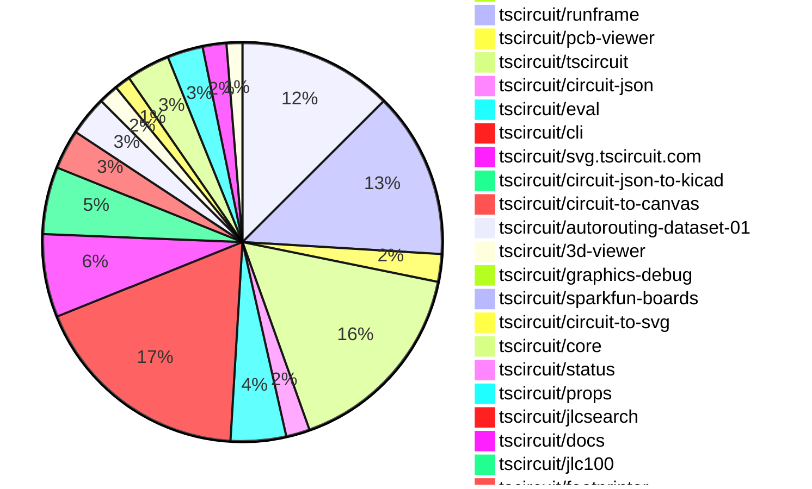

# Contribution Overview 2026-02-03

The current week is shown below. There are 3 major sections:

- [Contributor Overview](#contributor-overview)
- [PRs by Repository](#prs-by-repository)
- [PRs by Contributor](#changes-by-contributor)
- [Scoring & Sponsorship Details](/docs/sponsorship-calculation-explanation.md)

## PRs by Repository

## Contributor Overview

| Contributor | 🐳 Major | 🐙 Minor | 🐌 Tiny | ⭐ | Discussion Contributions |
|-------------|---------|---------|---------|-----|--------------------------|
| [seveibar](#seveibar) | 6 | 10 | 11 | 👑 | 0🔹 0🔶 0💎 |
| [ShiboSoftwareDev](#ShiboSoftwareDev) | 2 | 4 | 3 | ⭐⭐ | 0🔹 0🔶 0💎 |
| [Abse2001](#Abse2001) | 0 | 6 | 5 | ⭐⭐ | 0🔹 0🔶 0💎 |
| [techmannih](#techmannih) | 2 | 6 | 1 | ⭐⭐ | 0🔹 0🔶 0💎 |
| [MustafaMulla29](#MustafaMulla29) | 1 | 7 | 3 | ⭐⭐ | 0🔹 0🔶 0💎 |
| [imrishabh18](#imrishabh18) | 2 | 3 | 4 | ⭐⭐ | 0🔹 0🔶 0💎 |
| [AnasSarkiz](#AnasSarkiz) | 4 | 1 | 0 | ⭐⭐ | 0🔹 0🔶 0💎 |
| [ArnavK-09](#ArnavK-09) | 2 | 2 | 2 | ⭐⭐ | 0🔹 0🔶 0💎 |
| [tscircuitbot](#tscircuitbot) | 0 | 0 | 229 | ⭐⭐ | 0🔹 0🔶 0💎 |
| [0hmX](#0hmX) | 0 | 2 | 3 | ⭐ | 0🔹 0🔶 0💎 |
| [rushabhcodes](#rushabhcodes) | 1 | 0 | 2 | ⭐ | 0🔹 0🔶 0💎 |
| [bimakw](#bimakw) | 1 | 0 | 0 | ⭐ | 0🔹 0🔶 0💎 |
| [shehaban](#shehaban) | 1 | 0 | 0 | ⭐ | 0🔹 0🔶 0💎 |
| [guptadeepak8](#guptadeepak8) | 0 | 1 | 0 |  | 0🔹 0🔶 0💎 |
| [Heinrich-XIAO](#Heinrich-XIAO) | 0 | 0 | 1 |  | 0🔹 0🔶 0💎 |

> Note: AI evaluates PRs and assigns 1-3 star ratings automatically. 4 and 5 star ratings require manual staff review.

### Discussion Contribution Legend

- 🔹 Normal Comments: Basic participation with minimal effort
- 🔶 Great Informative Comments: Thoughtful participation that adds value
- 💎 Incredible Comments: Exceptional participation with high-quality content

## Review Table

[reviews-received-hover]: ## "Number of reviews received for PRs for this contributor"
[approvals-received-hover]: ## "Number of approvals received for PRs this contributor authored"
[rejections-received-hover]: ## "Number of rejections received for PRs this contributor authored"
[prs-opened-hover]: ## "Number of PRs opened by this contributor"
[issues-created-hover]: ## "Number of issues created by this contributor"

| Contributor | Reviews Received | Approvals Received | Rejections Received | Approvals | Rejections | PRs Opened | PRs Merged | Issues Created |
|---|---|---|---|---|---|---|---|---|
| [ArnavK-09](#ArnavK-09) | 6 | 4 | 1 | 1 | 0 | 9 | 7 | 0 |
| [seveibar](#seveibar) | 3 | 0 | 0 | 34 | 1 | 31 | 27 | 0 |
| [Simplereally](#Simplereally) | 0 | 0 | 0 | 0 | 0 | 2 | 0 | 0 |
| [tscircuitbot](#tscircuitbot) | 0 | 0 | 0 | 0 | 0 | 273 | 229 | 0 |
| [Abse2001](#Abse2001) | 16 | 14 | 0 | 10 | 1 | 13 | 12 | 0 |
| [ShiboSoftwareDev](#ShiboSoftwareDev) | 10 | 9 | 0 | 12 | 0 | 9 | 9 | 0 |
| [AnasSarkiz](#AnasSarkiz) | 3 | 2 | 0 | 1 | 0 | 6 | 5 | 0 |
| [techmannih](#techmannih) | 17 | 11 | 1 | 1 | 0 | 11 | 9 | 0 |
| [imrishabh18](#imrishabh18) | 6 | 3 | 0 | 4 | 1 | 12 | 9 | 0 |
| [MustafaMulla29](#MustafaMulla29) | 17 | 11 | 0 | 1 | 0 | 12 | 11 | 0 |
| [rushabhcodes](#rushabhcodes) | 8 | 3 | 0 | 0 | 3 | 4 | 3 | 0 |
| [dwiel](#dwiel) | 0 | 0 | 0 | 0 | 0 | 1 | 0 | 0 |
| [1234-ad](#1234-ad) | 0 | 0 | 0 | 0 | 0 | 1 | 0 | 0 |
| [cryptoaibot1738728800](#cryptoaibot1738728800) | 0 | 0 | 0 | 0 | 0 | 4 | 0 | 0 |
| [bimakw](#bimakw) | 5 | 2 | 1 | 0 | 0 | 5 | 1 | 0 |
| [shehaban](#shehaban) | 3 | 2 | 1 | 0 | 0 | 1 | 1 | 0 |
| [Heinrich-XIAO](#Heinrich-XIAO) | 1 | 1 | 0 | 0 | 0 | 2 | 1 | 0 |
| [guptadeepak8](#guptadeepak8) | 2 | 2 | 0 | 0 | 0 | 1 | 1 | 0 |
| [0hmX](#0hmX) | 0 | 0 | 0 | 0 | 0 | 9 | 7 | 0 |
| [Devesh36](#Devesh36) | 0 | 0 | 0 | 0 | 0 | 2 | 0 | 0 |
| [AliakbarArshadi](#AliakbarArshadi) | 2 | 0 | 2 | 0 | 0 | 1 | 0 | 0 |
| [GDN84](#GDN84) | 0 | 0 | 0 | 0 | 0 | 1 | 0 | 0 |

## Changes by Repository

### [tscircuit/tscircuit.com](https://github.com/tscircuit/tscircuit.com)

| PR # | Impact | Rating | Contributor | Description |
|------|--------|--------|-------------|-------------|
| [#2642](https://github.com/tscircuit/tscircuit.com/pull/2642) | 🐳 Major | ⭐⭐⭐ | ArnavK-09 | Changes the search functionality to retrieve organizations instead of accounts, updating the UI components and API calls accordingly. |
| [#2639](https://github.com/tscircuit/tscircuit.com/pull/2639) | 🐳 Major | ⭐⭐⭐ | ArnavK-09 | Fixes the KiCad PCM URL link rendering in the sidebar of the package release details. |
| [#2672](https://github.com/tscircuit/tscircuit.com/pull/2672) | 🐳 Major | ⭐⭐⭐ | imrishabh18 | Adds functionality to edit the subdomain for package releases, including validation and error handling for domain names. |
| [#2670](https://github.com/tscircuit/tscircuit.com/pull/2670) | 🐳 Major | ⭐⭐⭐ | imrishabh18 | Removes the package_deployments endpoints and adds new fake endpoints for package_domains to handle package domain management. |
| [#2640](https://github.com/tscircuit/tscircuit.com/pull/2640) | 🐙 Minor | ⭐⭐ | ArnavK-09 | Adds a new API endpoint for searching organizations by their tscircuit_handle, including user permissions and counts of members and packages. |

🐌 Tiny Contributions (34)

| PR # | Impact | Contributor | Description |
|------|--------|-------------|-------------|
| [#2678](https://github.com/tscircuit/tscircuit.com/pull/2678) | 🐌 Tiny | tscircuitbot | Updates the tscircuitrunframe package from version 0.0.1584 to 0.0.1585 |
| [#2676](https://github.com/tscircuit/tscircuit.com/pull/2676) | 🐌 Tiny | tscircuitbot | Automated package update |
| [#2674](https://github.com/tscircuit/tscircuit.com/pull/2674) | 🐌 Tiny | tscircuitbot | Automated package update |
| [#2673](https://github.com/tscircuit/tscircuit.com/pull/2673) | 🐌 Tiny | tscircuitbot | Automated package update |
| [#2671](https://github.com/tscircuit/tscircuit.com/pull/2671) | 🐌 Tiny | tscircuitbot | Automated package update |
| [#2669](https://github.com/tscircuit/tscircuit.com/pull/2669) | 🐌 Tiny | tscircuitbot | Updates the tscircuitrunframe package from version 0.0.1581 to 0.0.1582 |
| [#2668](https://github.com/tscircuit/tscircuit.com/pull/2668) | 🐌 Tiny | tscircuitbot | Updates the tscircuitrunframe package to version 0.0.1581 in the package.json file. |
| [#2666](https://github.com/tscircuit/tscircuit.com/pull/2666) | 🐌 Tiny | tscircuitbot | Automated package update |
| [#2665](https://github.com/tscircuit/tscircuit.com/pull/2665) | 🐌 Tiny | tscircuitbot | Automated package update |
| [#2664](https://github.com/tscircuit/tscircuit.com/pull/2664) | 🐌 Tiny | tscircuitbot | Updates the tscircuitrunframe package from version 0.0.1578 to 0.0.1579 |
| [#2660](https://github.com/tscircuit/tscircuit.com/pull/2660) | 🐌 Tiny | tscircuitbot | Updates the tscircuitrunframe package from version 0.0.1576 to 0.0.1577 |
| [#2662](https://github.com/tscircuit/tscircuit.com/pull/2662) | 🐌 Tiny | tscircuitbot | Updates the tscircuitrunframe package from version 0.0.1577 to 0.0.1578 |
| [#2661](https://github.com/tscircuit/tscircuit.com/pull/2661) | 🐌 Tiny | tscircuitbot | Updates the tscircuiteval package from version 0.0.623 to 0.0.624 |
| [#2636](https://github.com/tscircuit/tscircuit.com/pull/2636) | 🐌 Tiny | tscircuitbot | Updates the tscircuitrunframe package from version 0.0.1564 to 0.0.1565 |
| [#2648](https://github.com/tscircuit/tscircuit.com/pull/2648) | 🐌 Tiny | tscircuitbot | Updates the tscircuitrunframe package from version 0.0.1567 to 0.0.1569 |
| [#2649](https://github.com/tscircuit/tscircuit.com/pull/2649) | 🐌 Tiny | tscircuitbot | Updates the tscircuiteval package from version 0.0.621 to 0.0.622 |
| [#2652](https://github.com/tscircuit/tscircuit.com/pull/2652) | 🐌 Tiny | tscircuitbot | Updates the tscircuitrunframe package from version 0.0.1571 to 0.0.1572 |
| [#2650](https://github.com/tscircuit/tscircuit.com/pull/2650) | 🐌 Tiny | tscircuitbot | Updates the tscircuitrunframe package to version 0.0.1570 |
| [#2651](https://github.com/tscircuit/tscircuit.com/pull/2651) | 🐌 Tiny | tscircuitbot | Updates the tscircuitrunframe package from version 0.0.1570 to 0.0.1571 |
| [#2659](https://github.com/tscircuit/tscircuit.com/pull/2659) | 🐌 Tiny | tscircuitbot | Automated package update |
| [#2646](https://github.com/tscircuit/tscircuit.com/pull/2646) | 🐌 Tiny | tscircuitbot | Updates the tscircuiteval package from version 0.0.619 to 0.0.620 |
| [#2643](https://github.com/tscircuit/tscircuit.com/pull/2643) | 🐌 Tiny | tscircuitbot | Automated package update |
| [#2656](https://github.com/tscircuit/tscircuit.com/pull/2656) | 🐌 Tiny | tscircuitbot | Updates the tscircuiteval package to version 0.0.623 in the package.json file. |
| [#2653](https://github.com/tscircuit/tscircuit.com/pull/2653) | 🐌 Tiny | tscircuitbot | Automated package update |
| [#2634](https://github.com/tscircuit/tscircuit.com/pull/2634) | 🐌 Tiny | tscircuitbot | Automated package update |
| [#2647](https://github.com/tscircuit/tscircuit.com/pull/2647) | 🐌 Tiny | tscircuitbot | Updates the tscircuiteval package from version 0.0.620 to 0.0.621 |
| [#2657](https://github.com/tscircuit/tscircuit.com/pull/2657) | 🐌 Tiny | tscircuitbot | Automated package update |
| [#2635](https://github.com/tscircuit/tscircuit.com/pull/2635) | 🐌 Tiny | tscircuitbot | Updates the tscircuiteval package to version 0.0.619 in the package.json file. |
| [#2641](https://github.com/tscircuit/tscircuit.com/pull/2641) | 🐌 Tiny | tscircuitbot | Automated package update to version 0.0.191 |
| [#2645](https://github.com/tscircuit/tscircuit.com/pull/2645) | 🐌 Tiny | tscircuitbot | Updates the tscircuitrunframe package from version 0.0.1566 to 0.0.1567 |
| [#2638](https://github.com/tscircuit/tscircuit.com/pull/2638) | 🐌 Tiny | imrishabh18 | Replaces the useComponent hook with direct component imports in the sample board templates for better performance and clarity. |
| [#2667](https://github.com/tscircuit/tscircuit.com/pull/2667) | 🐌 Tiny | seveibar | Replaces the static hero image on the landing page with an embedded YouTube video to provide a video preview of the product. |
| [#2663](https://github.com/tscircuit/tscircuit.com/pull/2663) | 🐌 Tiny | seveibar | Adds new feature sections to the landing page for AI-compatible electronics, sharing capabilities, analog simulation, autorouting, KiCad support, and BOM checks. |
| [#2654](https://github.com/tscircuit/tscircuit.com/pull/2654) | 🐌 Tiny | Heinrich-XIAO | Fixes the naming of components in the Blinking LED Board template to ensure proper identification and functionality. |

### [tscircuit/schematic-viewer](https://github.com/tscircuit/schematic-viewer)

| PR # | Impact | Rating | Contributor | Description |
|------|--------|--------|-------------|-------------|
| [#163](https://github.com/tscircuit/schematic-viewer/pull/163) | 🐙 Minor | ⭐⭐ | ArnavK-09 | Fixes the live debug grid and port visibility toggles in the SchematicViewer component, allowing users to enable or disable the debug grid and schematic ports dynamically. |

### [tscircuit/contribution-tracker](https://github.com/tscircuit/contribution-tracker)

| PR # | Impact | Rating | Contributor | Description |
|------|--------|--------|-------------|-------------|
| [#303](https://github.com/tscircuit/contribution-tracker/pull/303) | 🐙 Minor | ⭐⭐ | ShiboSoftwareDev | Changes the weekly overview generation to start from the most recent Tuesday at 18:30 UTC instead of Wednesday. |

🐌 Tiny Contributions (2)

| PR # | Impact | Contributor | Description |
|------|--------|-------------|-------------|
| [#301](https://github.com/tscircuit/contribution-tracker/pull/301) | 🐌 Tiny | ArnavK-09 | Updates the cron job schedule to count pull requests that were not counted for 1.5 hours. |
| [#304](https://github.com/tscircuit/contribution-tracker/pull/304) | 🐌 Tiny | ShiboSoftwareDev | This pull request removes redundant files that are no longer needed in the repository, specifically the JSON and Markdown files related to contribution overviews. |

### [tscircuit/runframe](https://github.com/tscircuit/runframe)

| PR # | Impact | Rating | Contributor | Description |
|------|--------|--------|-------------|-------------|
| [#2413](https://github.com/tscircuit/runframe/pull/2413) | 🐙 Minor | ⭐⭐ | guptadeepak8 | When there is one Availabel Source user might get confused if its a button Fixes:- tscircuittscircuit.com2298 |

🐌 Tiny Contributions (41)

| PR # | Impact | Contributor | Description |
|------|--------|-------------|-------------|
| [#2541](https://github.com/tscircuit/runframe/pull/2541) | 🐌 Tiny | ArnavK-09 | Updates the schematic viewer dependency to version 2.0.56 in package.json |
| [#2589](https://github.com/tscircuit/runframe/pull/2589) | 🐌 Tiny | tscircuitbot | Automated package update |
| [#2588](https://github.com/tscircuit/runframe/pull/2588) | 🐌 Tiny | tscircuitbot | Updates the tscircuit3d-viewer package from version 0.0.509 to 0.0.510 |
| [#2587](https://github.com/tscircuit/runframe/pull/2587) | 🐌 Tiny | tscircuitbot | Automated package update |
| [#2586](https://github.com/tscircuit/runframe/pull/2586) | 🐌 Tiny | tscircuitbot | Updates the tscircuitpcb-viewer package from version 1.11.333 to 1.11.334 |
| [#2585](https://github.com/tscircuit/runframe/pull/2585) | 🐌 Tiny | tscircuitbot | Automated package update |
| [#2584](https://github.com/tscircuit/runframe/pull/2584) | 🐌 Tiny | tscircuitbot | Updates the tscircuitpcb-viewer package from version 1.11.332 to 1.11.333 |
| [#2583](https://github.com/tscircuit/runframe/pull/2583) | 🐌 Tiny | tscircuitbot | Automated package update |
| [#2582](https://github.com/tscircuit/runframe/pull/2582) | 🐌 Tiny | tscircuitbot | Automated package update |
| [#2581](https://github.com/tscircuit/runframe/pull/2581) | 🐌 Tiny | tscircuitbot | Updates the circuit-json-to-kicad package from version 0.0.67 to 0.0.68 in package.json |
| [#2579](https://github.com/tscircuit/runframe/pull/2579) | 🐌 Tiny | tscircuitbot | Automated package update |
| [#2578](https://github.com/tscircuit/runframe/pull/2578) | 🐌 Tiny | tscircuitbot | Updates the tscircuiteval package from version 0.0.624 to 0.0.625 |
| [#2577](https://github.com/tscircuit/runframe/pull/2577) | 🐌 Tiny | tscircuitbot | Automated package update |
| [#2572](https://github.com/tscircuit/runframe/pull/2572) | 🐌 Tiny | tscircuitbot | Updates the circuit-json-to-kicad package version from 0.0.66 to 0.0.67 in package.json |
| [#2574](https://github.com/tscircuit/runframe/pull/2574) | 🐌 Tiny | tscircuitbot | Updates the tscircuiteval package to version 0.0.624 in the package.json file. |
| [#2573](https://github.com/tscircuit/runframe/pull/2573) | 🐌 Tiny | tscircuitbot | Automated package update |
| [#2575](https://github.com/tscircuit/runframe/pull/2575) | 🐌 Tiny | tscircuitbot | Automated package update |
| [#2561](https://github.com/tscircuit/runframe/pull/2561) | 🐌 Tiny | tscircuitbot | Updates the tscircuit3d-viewer package from version 0.0.507 to 0.0.509 |
| [#2569](https://github.com/tscircuit/runframe/pull/2569) | 🐌 Tiny | tscircuitbot | Updates the tscircuitpcb-viewer package from version 1.11.330 to 1.11.332 |
| [#2565](https://github.com/tscircuit/runframe/pull/2565) | 🐌 Tiny | tscircuitbot | Updates the circuit-json-to-kicad package version from 0.0.65 to 0.0.66 in package.json |
| [#2558](https://github.com/tscircuit/runframe/pull/2558) | 🐌 Tiny | tscircuitbot | Updates the tscircuit3d-viewer package to version 0.0.507 in package.json |
| [#2556](https://github.com/tscircuit/runframe/pull/2556) | 🐌 Tiny | tscircuitbot | Updates the circuit-json-to-kicad package from version 0.0.62 to 0.0.65 |
| [#2552](https://github.com/tscircuit/runframe/pull/2552) | 🐌 Tiny | tscircuitbot | Automated package update |
| [#2549](https://github.com/tscircuit/runframe/pull/2549) | 🐌 Tiny | tscircuitbot | Updates the tscircuiteval package from version 0.0.619 to 0.0.621 in the package.json file. |
| [#2546](https://github.com/tscircuit/runframe/pull/2546) | 🐌 Tiny | tscircuitbot | Updates the circuit-json-to-kicad package version from 0.0.60 to 0.0.62 in package.json |
| [#2543](https://github.com/tscircuit/runframe/pull/2543) | 🐌 Tiny | tscircuitbot | Updates the tscircuit3d-viewer package to version 0.0.506 in package.json |
| [#2537](https://github.com/tscircuit/runframe/pull/2537) | 🐌 Tiny | tscircuitbot | Automated package update |
| [#2536](https://github.com/tscircuit/runframe/pull/2536) | 🐌 Tiny | tscircuitbot | Updates the tscircuiteval package to version 0.0.619 in the package.json file. |
| [#2532](https://github.com/tscircuit/runframe/pull/2532) | 🐌 Tiny | tscircuitbot | Updates the circuit-json-to-kicad package version from 0.0.58 to 0.0.60 in package.json |
| [#2568](https://github.com/tscircuit/runframe/pull/2568) | 🐌 Tiny | tscircuitbot | Automated package update |
| [#2567](https://github.com/tscircuit/runframe/pull/2567) | 🐌 Tiny | tscircuitbot | Updates the tscircuiteval package to version 0.0.623 in the package.json file. |
| [#2566](https://github.com/tscircuit/runframe/pull/2566) | 🐌 Tiny | tscircuitbot | Automated package update |
| [#2562](https://github.com/tscircuit/runframe/pull/2562) | 🐌 Tiny | tscircuitbot | Automated package update |
| [#2559](https://github.com/tscircuit/runframe/pull/2559) | 🐌 Tiny | tscircuitbot | Automated package update |
| [#2557](https://github.com/tscircuit/runframe/pull/2557) | 🐌 Tiny | tscircuitbot | Automated package update |
| [#2551](https://github.com/tscircuit/runframe/pull/2551) | 🐌 Tiny | tscircuitbot | Updates the tscircuiteval package to version 0.0.622 in the package.json file. |
| [#2550](https://github.com/tscircuit/runframe/pull/2550) | 🐌 Tiny | tscircuitbot | Automated package update |
| [#2544](https://github.com/tscircuit/runframe/pull/2544) | 🐌 Tiny | tscircuitbot | Automated package update |
| [#2570](https://github.com/tscircuit/runframe/pull/2570) | 🐌 Tiny | tscircuitbot | Automated package update |
| [#2542](https://github.com/tscircuit/runframe/pull/2542) | 🐌 Tiny | tscircuitbot | Automated package update |
| [#2576](https://github.com/tscircuit/runframe/pull/2576) | 🐌 Tiny | seveibar | Fixes header menu alignment to ensure the View menu remains adjacent to the File menu, preventing UX confusion due to right-alignment. |

### [tscircuit/pcb-viewer](https://github.com/tscircuit/pcb-viewer)

| PR # | Impact | Rating | Contributor | Description |
|------|--------|--------|-------------|-------------|
| [#646](https://github.com/tscircuit/pcb-viewer/pull/646) | 🐙 Minor | ⭐⭐ | Abse2001 | Fixes rendering issue where PCB traces appear above plated holes and adds a core fixture for plated holes. |
| [#644](https://github.com/tscircuit/pcb-viewer/pull/644) | 🐙 Minor | ⭐⭐ | techmannih | Adds support for rendering PCB courtyards, including circle and rectangle shapes, in the PCB viewer. |

🐌 Tiny Contributions (5)

| PR # | Impact | Contributor | Description |
|------|--------|-------------|-------------|
| [#651](https://github.com/tscircuit/pcb-viewer/pull/651) | 🐌 Tiny | tscircuitbot | Automated package update |
| [#649](https://github.com/tscircuit/pcb-viewer/pull/649) | 🐌 Tiny | tscircuitbot | Automated package update |
| [#647](https://github.com/tscircuit/pcb-viewer/pull/647) | 🐌 Tiny | tscircuitbot | Automated package update |
| [#645](https://github.com/tscircuit/pcb-viewer/pull/645) | 🐌 Tiny | tscircuitbot | Automated package update |
| [#650](https://github.com/tscircuit/pcb-viewer/pull/650) | 🐌 Tiny | Abse2001 | Adds Abse2001 as a code owner in the CODEOWNERS file to ensure proper code review and ownership. |

### [tscircuit/tscircuit](https://github.com/tscircuit/tscircuit)

🐌 Tiny Contributions (51)

| PR # | Impact | Contributor | Description |
|------|--------|-------------|-------------|
| [#2141](https://github.com/tscircuit/tscircuit/pull/2141) | 🐌 Tiny | tscircuitbot | Automated package update |
| [#2140](https://github.com/tscircuit/tscircuit/pull/2140) | 🐌 Tiny | tscircuitbot | Updates the tscircuitcli package to version 0.1.895 in package.json |
| [#2139](https://github.com/tscircuit/tscircuit/pull/2139) | 🐌 Tiny | tscircuitbot | Automated package update to version 0.0.1278 |
| [#2138](https://github.com/tscircuit/tscircuit/pull/2138) | 🐌 Tiny | tscircuitbot | Automated package update |
| [#2137](https://github.com/tscircuit/tscircuit/pull/2137) | 🐌 Tiny | tscircuitbot | Updates the package version from 0.0.1276 to 0.0.1277 in package.json |
| [#2136](https://github.com/tscircuit/tscircuit/pull/2136) | 🐌 Tiny | tscircuitbot | Updates the tscircuitcli package from version 0.1.892 to 0.1.893 and the tscircuitrunframe package from version 0.0.1583 to 0.0.1584 in package.json |
| [#2135](https://github.com/tscircuit/tscircuit/pull/2135) | 🐌 Tiny | tscircuitbot | Automated package update |
| [#2134](https://github.com/tscircuit/tscircuit/pull/2134) | 🐌 Tiny | tscircuitbot | Updates the tscircuitcli package from version 0.1.891 to 0.1.892 and the tscircuitrunframe package from version 0.0.1582 to 0.0.1583 in package.json |
| [#2133](https://github.com/tscircuit/tscircuit/pull/2133) | 🐌 Tiny | tscircuitbot | Automated package update |
| [#2132](https://github.com/tscircuit/tscircuit/pull/2132) | 🐌 Tiny | tscircuitbot | Updates the tscircuitcli package from version 0.1.890 to 0.1.891 and the tscircuitrunframe package from version 0.0.1581 to 0.0.1582 in package.json |
| [#2131](https://github.com/tscircuit/tscircuit/pull/2131) | 🐌 Tiny | tscircuitbot | Automated package update |
| [#2130](https://github.com/tscircuit/tscircuit/pull/2130) | 🐌 Tiny | tscircuitbot | Updates the tscircuitcli package from version 0.1.889 to 0.1.890 and the tscircuitrunframe package from version 0.0.1580 to 0.0.1581 in package.json |
| [#2129](https://github.com/tscircuit/tscircuit/pull/2129) | 🐌 Tiny | tscircuitbot | Automated package update |
| [#2128](https://github.com/tscircuit/tscircuit/pull/2128) | 🐌 Tiny | tscircuitbot | Updates the package versions for tscircuitcli, tscircuitcore, tscircuiteval, tscircuitprops, and tscircuitrunframe in package.json |
| [#2127](https://github.com/tscircuit/tscircuit/pull/2127) | 🐌 Tiny | tscircuitbot | Automated package update |
| [#2126](https://github.com/tscircuit/tscircuit/pull/2126) | 🐌 Tiny | tscircuitbot | Updates the tscircuitcli package from version 0.1.887 to 0.1.888 and the tscircuitrunframe package from version 0.0.1578 to 0.0.1579 in package.json |
| [#2120](https://github.com/tscircuit/tscircuit/pull/2120) | 🐌 Tiny | tscircuitbot | Updates the tscircuitcli package to version 0.1.885 |
| [#2125](https://github.com/tscircuit/tscircuit/pull/2125) | 🐌 Tiny | tscircuitbot | Automated package update |
| [#2122](https://github.com/tscircuit/tscircuit/pull/2122) | 🐌 Tiny | tscircuitbot | Automated package update |
| [#2121](https://github.com/tscircuit/tscircuit/pull/2121) | 🐌 Tiny | tscircuitbot | Automated package update |
| [#2123](https://github.com/tscircuit/tscircuit/pull/2123) | 🐌 Tiny | tscircuitbot | Updates the package version from 0.0.1269 to 0.0.1270 in package.json |
| [#2124](https://github.com/tscircuit/tscircuit/pull/2124) | 🐌 Tiny | tscircuitbot | Automated package update |
| [#2118](https://github.com/tscircuit/tscircuit/pull/2118) | 🐌 Tiny | tscircuitbot | Updates the tscircuitcli package from version 0.1.883 to 0.1.884 and the tscircuitrunframe package from version 0.0.1575 to 0.0.1576 in package.json |
| [#2096](https://github.com/tscircuit/tscircuit/pull/2096) | 🐌 Tiny | tscircuitbot | Automated package update |
| [#2115](https://github.com/tscircuit/tscircuit/pull/2115) | 🐌 Tiny | tscircuitbot | Updates the package version from 0.0.1265 to 0.0.1266 in package.json |
| [#2108](https://github.com/tscircuit/tscircuit/pull/2108) | 🐌 Tiny | tscircuitbot | Updates the package version from 0.0.1262 to 0.0.1263 in package.json |
| [#2105](https://github.com/tscircuit/tscircuit/pull/2105) | 🐌 Tiny | tscircuitbot | Updates the package version from 0.0.1261 to 0.0.1262 in package.json |
| [#2119](https://github.com/tscircuit/tscircuit/pull/2119) | 🐌 Tiny | tscircuitbot | Updates the package version from 0.0.1267 to 0.0.1268 in package.json |
| [#2090](https://github.com/tscircuit/tscircuit/pull/2090) | 🐌 Tiny | tscircuitbot | Automated package update |
| [#2116](https://github.com/tscircuit/tscircuit/pull/2116) | 🐌 Tiny | tscircuitbot | Automated package update |
| [#2095](https://github.com/tscircuit/tscircuit/pull/2095) | 🐌 Tiny | tscircuitbot | Updates the tscircuitcli package to version 0.1.874 in the package.json file. |
| [#2097](https://github.com/tscircuit/tscircuit/pull/2097) | 🐌 Tiny | tscircuitbot | Automated package update |
| [#2089](https://github.com/tscircuit/tscircuit/pull/2089) | 🐌 Tiny | tscircuitbot | Automated package update |
| [#2102](https://github.com/tscircuit/tscircuit/pull/2102) | 🐌 Tiny | tscircuitbot | Automated package update |
| [#2107](https://github.com/tscircuit/tscircuit/pull/2107) | 🐌 Tiny | tscircuitbot | Automated package update |
| [#2093](https://github.com/tscircuit/tscircuit/pull/2093) | 🐌 Tiny | tscircuitbot | Automated package update |
| [#2111](https://github.com/tscircuit/tscircuit/pull/2111) | 🐌 Tiny | tscircuitbot | Updates the package version from 0.0.1263 to 0.0.1264 in package.json |
| [#2088](https://github.com/tscircuit/tscircuit/pull/2088) | 🐌 Tiny | tscircuitbot | Updates the version of the tscircuitcli package from 0.1.870 to 0.1.871 and downgrades tscircuitalphabet from 0.0.20 to 0.0.18 in package.json |
| [#2110](https://github.com/tscircuit/tscircuit/pull/2110) | 🐌 Tiny | tscircuitbot | Updates the tscircuitcli package from version 0.1.879 to 0.1.880 and the tscircuitrunframe package from version 0.0.1571 to 0.0.1572 in package.json |
| [#2087](https://github.com/tscircuit/tscircuit/pull/2087) | 🐌 Tiny | tscircuitbot | Updates the package version from 0.0.1253 to 0.0.1254 in package.json |
| [#2114](https://github.com/tscircuit/tscircuit/pull/2114) | 🐌 Tiny | tscircuitbot | Automated package update |
| [#2091](https://github.com/tscircuit/tscircuit/pull/2091) | 🐌 Tiny | tscircuitbot | Automated package update |
| [#2092](https://github.com/tscircuit/tscircuit/pull/2092) | 🐌 Tiny | tscircuitbot | Updates the tscircuitcli package from version 0.1.872 to 0.1.873 and the tscircuitrunframe package from version 0.0.1566 to 0.0.1567 in package.json |
| [#2113](https://github.com/tscircuit/tscircuit/pull/2113) | 🐌 Tiny | tscircuitbot | Automated package update |
| [#2100](https://github.com/tscircuit/tscircuit/pull/2100) | 🐌 Tiny | tscircuitbot | Automated package update |
| [#2103](https://github.com/tscircuit/tscircuit/pull/2103) | 🐌 Tiny | tscircuitbot | Updates the package version from 0.0.1260 to 0.0.1261 in package.json |
| [#2117](https://github.com/tscircuit/tscircuit/pull/2117) | 🐌 Tiny | tscircuitbot | Automated package update |
| [#2112](https://github.com/tscircuit/tscircuit/pull/2112) | 🐌 Tiny | tscircuitbot | Automated package update |
| [#2104](https://github.com/tscircuit/tscircuit/pull/2104) | 🐌 Tiny | tscircuitbot | Automated package update |
| [#2099](https://github.com/tscircuit/tscircuit/pull/2099) | 🐌 Tiny | tscircuitbot | Automated package update |
| [#2086](https://github.com/tscircuit/tscircuit/pull/2086) | 🐌 Tiny | imrishabh18 | Adds the missing tscircuitalphabet package and updates several dependencies in package.json |

### [tscircuit/circuit-json](https://github.com/tscircuit/circuit-json)

| PR # | Impact | Rating | Contributor | Description |
|------|--------|--------|-------------|-------------|
| [#460](https://github.com/tscircuit/circuit-json/pull/460) | 🐳 Major | ⭐⭐⭐ | seveibar | Adds explicit mount flag for carrier PCB and an optional carrier reference ID to the PCB board schema. |
| [#454](https://github.com/tscircuit/circuit-json/pull/454) | 🐙 Minor | ⭐⭐ | Abse2001 | Adds top and bottom courtyard layers to the PCB rendering layers. |
| [#458](https://github.com/tscircuit/circuit-json/pull/458) | 🐙 Minor | ⭐⭐ | MustafaMulla29 | Expands the fill_color property for schematic_path to accept any string value instead of limiting it to red or blue. |

🐌 Tiny Contributions (3)

| PR # | Impact | Contributor | Description |
|------|--------|-------------|-------------|
| [#461](https://github.com/tscircuit/circuit-json/pull/461) | 🐌 Tiny | tscircuitbot | Automated package update |
| [#457](https://github.com/tscircuit/circuit-json/pull/457) | 🐌 Tiny | tscircuitbot | Automated package update |
| [#456](https://github.com/tscircuit/circuit-json/pull/456) | 🐌 Tiny | techmannih | Removes visual style properties such as stroke width, closed state, dashed stroke, and color from the PcbCourtyardOutline schema and interface. |

### [tscircuit/eval](https://github.com/tscircuit/eval)

🐌 Tiny Contributions (14)

| PR # | Impact | Contributor | Description |
|------|--------|-------------|-------------|
| [#1993](https://github.com/tscircuit/eval/pull/1993) | 🐌 Tiny | tscircuitbot | Automated package update |
| [#1992](https://github.com/tscircuit/eval/pull/1992) | 🐌 Tiny | tscircuitbot | Automated package update |
| [#1990](https://github.com/tscircuit/eval/pull/1990) | 🐌 Tiny | tscircuitbot | Automated package update |
| [#1989](https://github.com/tscircuit/eval/pull/1989) | 🐌 Tiny | tscircuitbot | Automated package update |
| [#1975](https://github.com/tscircuit/eval/pull/1975) | 🐌 Tiny | tscircuitbot | Automated package update |
| [#1973](https://github.com/tscircuit/eval/pull/1973) | 🐌 Tiny | tscircuitbot | Automated package update to version 0.0.620 |
| [#1972](https://github.com/tscircuit/eval/pull/1972) | 🐌 Tiny | tscircuitbot | Automated package update |
| [#1987](https://github.com/tscircuit/eval/pull/1987) | 🐌 Tiny | tscircuitbot | Automated package update to version 0.0.623 |
| [#1986](https://github.com/tscircuit/eval/pull/1986) | 🐌 Tiny | tscircuitbot | Automated package update |
| [#1978](https://github.com/tscircuit/eval/pull/1978) | 🐌 Tiny | tscircuitbot | Automated package update |
| [#1969](https://github.com/tscircuit/eval/pull/1969) | 🐌 Tiny | tscircuitbot | Updates various package dependencies in the project to their latest versions. |
| [#1976](https://github.com/tscircuit/eval/pull/1976) | 🐌 Tiny | tscircuitbot | Automated package update to version 0.0.621 |
| [#1979](https://github.com/tscircuit/eval/pull/1979) | 🐌 Tiny | tscircuitbot | Automated package update |
| [#1970](https://github.com/tscircuit/eval/pull/1970) | 🐌 Tiny | tscircuitbot | Automated package update |

### [tscircuit/cli](https://github.com/tscircuit/cli)

| PR # | Impact | Rating | Contributor | Description |
|------|--------|--------|-------------|-------------|
| [#1902](https://github.com/tscircuit/cli/pull/1902) | 🐳 Major | ⭐⭐⭐ | seveibar | Adds a centralized helper for file upsert requests and provides actionable timeout guidance for users when uploads to the local file server fail due to timeout errors. |
| [#1893](https://github.com/tscircuit/cli/pull/1893) | 🐳 Major | ⭐⭐⭐ | seveibar | Add a tsci doctor command that runs a set of targeted environment checks to help users diagnose tscircuit auth and registry problems, including checks for session token and npm registry configuration. |
| [#1916](https://github.com/tscircuit/cli/pull/1916) | 🐙 Minor | ⭐⭐ | imrishabh18 | Fixes the export of cadModel step file URL to ensure it is returned as a string instead of a Module object, resolving issues with pre-built libraries. |
| [#1887](https://github.com/tscircuit/cli/pull/1887) | 🐙 Minor | ⭐⭐ | imrishabh18 | Fixes an error where the build process attempts to create a directory at the root of the filesystem when package.json is not found, instead it now correctly uses the current working directory as a fallback. |
| [#1879](https://github.com/tscircuit/cli/pull/1879) | 🐙 Minor | ⭐⭐ | imrishabh18 | Failing to generate the circuit json should throw a fatal error in tsci build --ci |

🐌 Tiny Contributions (51)

| PR # | Impact | Contributor | Description |
|------|--------|-------------|-------------|
| [#1937](https://github.com/tscircuit/cli/pull/1937) | 🐌 Tiny | tscircuitbot | Automated package update |
| [#1935](https://github.com/tscircuit/cli/pull/1935) | 🐌 Tiny | tscircuitbot | Automated package update |
| [#1934](https://github.com/tscircuit/cli/pull/1934) | 🐌 Tiny | tscircuitbot | Updates the tscircuitrunframe package from version 0.0.1584 to 0.0.1585 |
| [#1933](https://github.com/tscircuit/cli/pull/1933) | 🐌 Tiny | tscircuitbot | Updates the package version from v0.1.892 to v0.1.893 in package.json |
| [#1932](https://github.com/tscircuit/cli/pull/1932) | 🐌 Tiny | tscircuitbot | Updates the tscircuitrunframe package from version 0.0.1583 to 0.0.1584 |
| [#1931](https://github.com/tscircuit/cli/pull/1931) | 🐌 Tiny | tscircuitbot | Updates the package version from 0.1.891 to 0.1.892 in package.json |
| [#1930](https://github.com/tscircuit/cli/pull/1930) | 🐌 Tiny | tscircuitbot | Updates the tscircuitrunframe package from version 0.0.1582 to 0.0.1583 |
| [#1929](https://github.com/tscircuit/cli/pull/1929) | 🐌 Tiny | tscircuitbot | Automated package update |
| [#1928](https://github.com/tscircuit/cli/pull/1928) | 🐌 Tiny | tscircuitbot | Updates the tscircuitrunframe package from version 0.0.1581 to 0.0.1582 |
| [#1927](https://github.com/tscircuit/cli/pull/1927) | 🐌 Tiny | tscircuitbot | Updates the package version from 0.1.889 to 0.1.890 in package.json |
| [#1926](https://github.com/tscircuit/cli/pull/1926) | 🐌 Tiny | tscircuitbot | Updates the tscircuitrunframe package from version 0.0.1580 to 0.0.1581 |
| [#1925](https://github.com/tscircuit/cli/pull/1925) | 🐌 Tiny | tscircuitbot | Automated package update |
| [#1924](https://github.com/tscircuit/cli/pull/1924) | 🐌 Tiny | tscircuitbot | Automated package update |
| [#1923](https://github.com/tscircuit/cli/pull/1923) | 🐌 Tiny | tscircuitbot | Automated package update |
| [#1922](https://github.com/tscircuit/cli/pull/1922) | 🐌 Tiny | tscircuitbot | Updates the tscircuitrunframe package from version 0.0.1578 to 0.0.1579 |
| [#1921](https://github.com/tscircuit/cli/pull/1921) | 🐌 Tiny | tscircuitbot | Updates the package version from 0.1.886 to 0.1.887 in package.json |
| [#1917](https://github.com/tscircuit/cli/pull/1917) | 🐌 Tiny | tscircuitbot | Automated package update |
| [#1920](https://github.com/tscircuit/cli/pull/1920) | 🐌 Tiny | tscircuitbot | Updates the tscircuitrunframe package from version 0.0.1577 to 0.0.1578 |
| [#1919](https://github.com/tscircuit/cli/pull/1919) | 🐌 Tiny | tscircuitbot | Automated package update |
| [#1918](https://github.com/tscircuit/cli/pull/1918) | 🐌 Tiny | tscircuitbot | Updates the tscircuitrunframe package from version 0.0.1576 to 0.0.1577 |
| [#1899](https://github.com/tscircuit/cli/pull/1899) | 🐌 Tiny | tscircuitbot | Updates the package version from v0.1.875 to v0.1.876 in package.json |
| [#1914](https://github.com/tscircuit/cli/pull/1914) | 🐌 Tiny | tscircuitbot | Updates the tscircuitrunframe package from version 0.0.1575 to 0.0.1576 |
| [#1913](https://github.com/tscircuit/cli/pull/1913) | 🐌 Tiny | tscircuitbot | Automated package update |
| [#1892](https://github.com/tscircuit/cli/pull/1892) | 🐌 Tiny | tscircuitbot | Updates the package version from 0.1.872 to 0.1.873 in package.json |
| [#1884](https://github.com/tscircuit/cli/pull/1884) | 🐌 Tiny | tscircuitbot | Automated package update |
| [#1882](https://github.com/tscircuit/cli/pull/1882) | 🐌 Tiny | tscircuitbot | Updates the tscircuitrunframe package from version 0.0.1563 to 0.0.1564 |
| [#1903](https://github.com/tscircuit/cli/pull/1903) | 🐌 Tiny | tscircuitbot | Automated package update |
| [#1883](https://github.com/tscircuit/cli/pull/1883) | 🐌 Tiny | tscircuitbot | Automated package update |
| [#1897](https://github.com/tscircuit/cli/pull/1897) | 🐌 Tiny | tscircuitbot | Updates the package version from v0.1.874 to v0.1.875 in package.json |
| [#1898](https://github.com/tscircuit/cli/pull/1898) | 🐌 Tiny | tscircuitbot | Updates the tscircuitrunframe package version from 0.0.1568 to 0.0.1569 in package.json |
| [#1900](https://github.com/tscircuit/cli/pull/1900) | 🐌 Tiny | tscircuitbot | Updates the tscircuitrunframe package from version 0.0.1569 to 0.0.1570 |
| [#1891](https://github.com/tscircuit/cli/pull/1891) | 🐌 Tiny | tscircuitbot | Updates the tscircuitrunframe package to version 0.0.1567 in the package.json file. |
| [#1911](https://github.com/tscircuit/cli/pull/1911) | 🐌 Tiny | tscircuitbot | Automated package update |
| [#1901](https://github.com/tscircuit/cli/pull/1901) | 🐌 Tiny | tscircuitbot | Updates the package version from 0.1.876 to 0.1.877 in package.json |
| [#1890](https://github.com/tscircuit/cli/pull/1890) | 🐌 Tiny | tscircuitbot | Automated package update |
| [#1885](https://github.com/tscircuit/cli/pull/1885) | 🐌 Tiny | tscircuitbot | Updates the tscircuitrunframe package to version 0.0.1565 |
| [#1895](https://github.com/tscircuit/cli/pull/1895) | 🐌 Tiny | tscircuitbot | Updates the package version from 0.1.873 to 0.1.874 in package.json |
| [#1912](https://github.com/tscircuit/cli/pull/1912) | 🐌 Tiny | tscircuitbot | Updates the tscircuitrunframe package from version 0.0.1574 to 0.0.1575 |
| [#1896](https://github.com/tscircuit/cli/pull/1896) | 🐌 Tiny | tscircuitbot | Updates the tscircuitrunframe package from version 0.0.1567 to 0.0.1568 |
| [#1888](https://github.com/tscircuit/cli/pull/1888) | 🐌 Tiny | tscircuitbot | Automated package update |
| [#1906](https://github.com/tscircuit/cli/pull/1906) | 🐌 Tiny | tscircuitbot | Updates the tscircuitrunframe package from version 0.0.1571 to 0.0.1572 |
| [#1886](https://github.com/tscircuit/cli/pull/1886) | 🐌 Tiny | tscircuitbot | Automated package update |
| [#1915](https://github.com/tscircuit/cli/pull/1915) | 🐌 Tiny | tscircuitbot | Automated package update |
| [#1907](https://github.com/tscircuit/cli/pull/1907) | 🐌 Tiny | tscircuitbot | Automated package update |
| [#1910](https://github.com/tscircuit/cli/pull/1910) | 🐌 Tiny | tscircuitbot | Updates the tscircuitrunframe package from version 0.0.1573 to 0.0.1574 |
| [#1894](https://github.com/tscircuit/cli/pull/1894) | 🐌 Tiny | tscircuitbot | Automated README update with latest CLI usage output. |
| [#1889](https://github.com/tscircuit/cli/pull/1889) | 🐌 Tiny | tscircuitbot | Updates the tscircuitrunframe package from version 0.0.1565 to 0.0.1566 |
| [#1908](https://github.com/tscircuit/cli/pull/1908) | 🐌 Tiny | tscircuitbot | Updates the tscircuitrunframe package from version 0.0.1572 to 0.0.1573 |
| [#1905](https://github.com/tscircuit/cli/pull/1905) | 🐌 Tiny | tscircuitbot | Automated package update |
| [#1904](https://github.com/tscircuit/cli/pull/1904) | 🐌 Tiny | tscircuitbot | Updates the tscircuitrunframe package from version 0.0.1570 to 0.0.1571 |
| [#1936](https://github.com/tscircuit/cli/pull/1936) | 🐌 Tiny | imrishabh18 | Fixes the issue where GLB files are returned as absolute paths instead of relative paths from the bun static asset loader. |

### [tscircuit/svg.tscircuit.com](https://github.com/tscircuit/svg.tscircuit.com)

🐌 Tiny Contributions (21)

| PR # | Impact | Contributor | Description |
|------|--------|-------------|-------------|
| [#965](https://github.com/tscircuit/svg.tscircuit.com/pull/965) | 🐌 Tiny | tscircuitbot | Updates the tscircuit package version from 0.0.1278 to 0.0.1279 in package.json |
| [#964](https://github.com/tscircuit/svg.tscircuit.com/pull/964) | 🐌 Tiny | tscircuitbot | Updates the tscircuit package from version 0.0.1277 to 0.0.1278 in package.json |
| [#963](https://github.com/tscircuit/svg.tscircuit.com/pull/963) | 🐌 Tiny | tscircuitbot | Updates the tscircuit package version from 0.0.1276 to 0.0.1277 in package.json |
| [#962](https://github.com/tscircuit/svg.tscircuit.com/pull/962) | 🐌 Tiny | tscircuitbot | Updates the tscircuit package version from 0.0.1275 to 0.0.1276 in package.json |
| [#961](https://github.com/tscircuit/svg.tscircuit.com/pull/961) | 🐌 Tiny | tscircuitbot | Updates the tscircuit package version from 0.0.1274 to 0.0.1275 in package.json |
| [#960](https://github.com/tscircuit/svg.tscircuit.com/pull/960) | 🐌 Tiny | tscircuitbot | Updates the tscircuit package version from 0.0.1273 to 0.0.1274 in package.json |
| [#959](https://github.com/tscircuit/svg.tscircuit.com/pull/959) | 🐌 Tiny | tscircuitbot | Automated package update |
| [#958](https://github.com/tscircuit/svg.tscircuit.com/pull/958) | 🐌 Tiny | tscircuitbot | Updates the tscircuit package from version 0.0.1271 to 0.0.1272 in package.json |
| [#957](https://github.com/tscircuit/svg.tscircuit.com/pull/957) | 🐌 Tiny | tscircuitbot | Updates the tscircuit package version from 0.0.1270 to 0.0.1271 in package.json |
| [#955](https://github.com/tscircuit/svg.tscircuit.com/pull/955) | 🐌 Tiny | tscircuitbot | Updates the tscircuit package version from 0.0.1268 to 0.0.1269 in package.json |
| [#956](https://github.com/tscircuit/svg.tscircuit.com/pull/956) | 🐌 Tiny | tscircuitbot | Updates the tscircuit package version from 0.0.1269 to 0.0.1270 in package.json |
| [#945](https://github.com/tscircuit/svg.tscircuit.com/pull/945) | 🐌 Tiny | tscircuitbot | Updates the tscircuit package version from 0.0.1258 to 0.0.1259 in package.json |
| [#949](https://github.com/tscircuit/svg.tscircuit.com/pull/949) | 🐌 Tiny | tscircuitbot | Updates the tscircuit package version from 0.0.1259 to 0.0.1263 in package.json |
| [#953](https://github.com/tscircuit/svg.tscircuit.com/pull/953) | 🐌 Tiny | tscircuitbot | Updates the tscircuit package version from 0.0.1266 to 0.0.1267 in package.json |
| [#941](https://github.com/tscircuit/svg.tscircuit.com/pull/941) | 🐌 Tiny | tscircuitbot | Automated package update |
| [#940](https://github.com/tscircuit/svg.tscircuit.com/pull/940) | 🐌 Tiny | tscircuitbot | Updates the tscircuit package version from 0.0.1253 to 0.0.1254 in package.json |
| [#943](https://github.com/tscircuit/svg.tscircuit.com/pull/943) | 🐌 Tiny | tscircuitbot | Updates the tscircuit package version from 0.0.1255 to 0.0.1257 in package.json |
| [#952](https://github.com/tscircuit/svg.tscircuit.com/pull/952) | 🐌 Tiny | tscircuitbot | Updates the tscircuit package version from 0.0.1264 to 0.0.1266 in package.json |
| [#954](https://github.com/tscircuit/svg.tscircuit.com/pull/954) | 🐌 Tiny | tscircuitbot | Updates the tscircuit package from version 0.0.1267 to 0.0.1268 in package.json |
| [#950](https://github.com/tscircuit/svg.tscircuit.com/pull/950) | 🐌 Tiny | tscircuitbot | Updates the tscircuit package version from 0.0.1263 to 0.0.1264 in package.json |
| [#944](https://github.com/tscircuit/svg.tscircuit.com/pull/944) | 🐌 Tiny | tscircuitbot | Updates the tscircuit package version from 0.0.1257 to 0.0.1258 in package.json |

### [tscircuit/circuit-json-to-kicad](https://github.com/tscircuit/circuit-json-to-kicad)

| PR # | Impact | Rating | Contributor | Description |
|------|--------|--------|-------------|-------------|
| [#122](https://github.com/tscircuit/circuit-json-to-kicad/pull/122) | 🐳 Major | ⭐⭐⭐ | MustafaMulla29 | Add support for courtyard outlines and refactor the AddFootprintsStage into multiple converter files for better organization and maintainability. |
| [#117](https://github.com/tscircuit/circuit-json-to-kicad/pull/117) | 🐳 Major | ⭐⭐⭐ | AnasSarkiz | Fixes a layer-assignment bug when converting trace.route into KiCad PCB segments, ensuring segments are exported onto the correct layer by deriving each segments layer from startPoint.layer, endPoint.layer, or lastKnownLayer, and updating lastKnownLayer as it walks the route. |
| [#110](https://github.com/tscircuit/circuit-json-to-kicad/pull/110) | 🐙 Minor | ⭐⭐ | seveibar | Adds support for four-layer PCBs by implementing layer mapping and updating PCB initialization to accommodate additional copper layers. |
| [#124](https://github.com/tscircuit/circuit-json-to-kicad/pull/124) | 🐙 Minor | ⭐⭐ | MustafaMulla29 | Adds support for fill color in schematic paths, allowing for filled shapes in circuit designs. |
| [#108](https://github.com/tscircuit/circuit-json-to-kicad/pull/108) | 🐙 Minor | ⭐⭐ | MustafaMulla29 | Adds support for handling pcb_note_text and pcb_note_rect elements in KiCad footprint generation. |
| [#119](https://github.com/tscircuit/circuit-json-to-kicad/pull/119) | 🐙 Minor | ⭐⭐ | MustafaMulla29 | Add support for courtyard rectangles in KiCad by converting pcb_courtyard_rect elements to KiCad fp_rect on the courtyard layer. |
| [#115](https://github.com/tscircuit/circuit-json-to-kicad/pull/115) | 🐙 Minor | ⭐⭐ | MustafaMulla29 | Adds support for courtyard circles in KiCad by converting pcb_courtyard_circle elements to KiCad fp_circle on the courtyard layer. |
| [#109](https://github.com/tscircuit/circuit-json-to-kicad/pull/109) | 🐙 Minor | ⭐⭐ | ShiboSoftwareDev | Adds functionality to convert fabrication note text from circuit JSON to KiCad format, allowing for the inclusion of manufacturing notes in PCB designs. |

🐌 Tiny Contributions (9)

| PR # | Impact | Contributor | Description |
|------|--------|-------------|-------------|
| [#125](https://github.com/tscircuit/circuit-json-to-kicad/pull/125) | 🐌 Tiny | tscircuitbot | Automated package update |
| [#123](https://github.com/tscircuit/circuit-json-to-kicad/pull/123) | 🐌 Tiny | tscircuitbot | Automated package update |
| [#111](https://github.com/tscircuit/circuit-json-to-kicad/pull/111) | 🐌 Tiny | tscircuitbot | Automated package update |
| [#114](https://github.com/tscircuit/circuit-json-to-kicad/pull/114) | 🐌 Tiny | tscircuitbot | Automated package update |
| [#116](https://github.com/tscircuit/circuit-json-to-kicad/pull/116) | 🐌 Tiny | tscircuitbot | Automated package update |
| [#120](https://github.com/tscircuit/circuit-json-to-kicad/pull/120) | 🐌 Tiny | tscircuitbot | Automated package update |
| [#113](https://github.com/tscircuit/circuit-json-to-kicad/pull/113) | 🐌 Tiny | tscircuitbot | Automated package update |
| [#121](https://github.com/tscircuit/circuit-json-to-kicad/pull/121) | 🐌 Tiny | tscircuitbot | Automated package update |
| [#112](https://github.com/tscircuit/circuit-json-to-kicad/pull/112) | 🐌 Tiny | MustafaMulla29 | Updates the snapshot images for the KiCad library tests to reflect recent changes in the library. |

### [tscircuit/circuit-to-canvas](https://github.com/tscircuit/circuit-to-canvas)

| PR # | Impact | Rating | Contributor | Description |
|------|--------|--------|-------------|-------------|
| [#153](https://github.com/tscircuit/circuit-to-canvas/pull/153) | 🐙 Minor | ⭐⭐ | Abse2001 | Implements explicit soldermask rendering for PCB traces and fixes the draw order to ensure soldermask is applied before pad and hole openings, preventing visibility artifacts and aligning with real PCB fabrication behavior. |
| [#147](https://github.com/tscircuit/circuit-to-canvas/pull/147) | 🐙 Minor | ⭐⭐ | techmannih | Adds support for rendering PCB courtyard circles in the canvas drawing context. |
| [#149](https://github.com/tscircuit/circuit-to-canvas/pull/149) | 🐙 Minor | ⭐⭐ | techmannih | Adds support for rendering rectangular courtyard elements in PCB drawings. |
| [#151](https://github.com/tscircuit/circuit-to-canvas/pull/151) | 🐙 Minor | ⭐⭐ | techmannih | Adds support for rendering the bottom layer of PCB courtyards in the drawing functions. |

🐌 Tiny Contributions (6)

| PR # | Impact | Contributor | Description |
|------|--------|-------------|-------------|
| [#157](https://github.com/tscircuit/circuit-to-canvas/pull/157) | 🐌 Tiny | tscircuitbot | Automated package update |
| [#148](https://github.com/tscircuit/circuit-to-canvas/pull/148) | 🐌 Tiny | tscircuitbot | Automated package update |
| [#150](https://github.com/tscircuit/circuit-to-canvas/pull/150) | 🐌 Tiny | tscircuitbot | Automated package update |
| [#152](https://github.com/tscircuit/circuit-to-canvas/pull/152) | 🐌 Tiny | tscircuitbot | Automated package update |
| [#154](https://github.com/tscircuit/circuit-to-canvas/pull/154) | 🐌 Tiny | tscircuitbot | Automated package update |
| [#156](https://github.com/tscircuit/circuit-to-canvas/pull/156) | 🐌 Tiny | Abse2001 | Adds a CODEOWNERS file to define code ownership for the repository |

### [tscircuit/autorouting-dataset-01](https://github.com/tscircuit/autorouting-dataset-01)

| PR # | Impact | Rating | Contributor | Description |
|------|--------|--------|-------------|-------------|
| [#44](https://github.com/tscircuit/autorouting-dataset-01/pull/44) | 🐙 Minor | ⭐⭐ | 0hmX | Handles errors when the solver fails to solve a scenario, preventing crashes and ensuring the solver state is updated accordingly. |

🐌 Tiny Contributions (9)

| PR # | Impact | Contributor | Description |
|------|--------|-------------|-------------|
| [#48](https://github.com/tscircuit/autorouting-dataset-01/pull/48) | 🐌 Tiny | tscircuitbot | Automated package update |
| [#46](https://github.com/tscircuit/autorouting-dataset-01/pull/46) | 🐌 Tiny | tscircuitbot | Automated package update |
| [#43](https://github.com/tscircuit/autorouting-dataset-01/pull/43) | 🐌 Tiny | tscircuitbot | Automated package update |
| [#41](https://github.com/tscircuit/autorouting-dataset-01/pull/41) | 🐌 Tiny | tscircuitbot | Automated package update |
| [#39](https://github.com/tscircuit/autorouting-dataset-01/pull/39) | 🐌 Tiny | tscircuitbot | Automated package update |
| [#37](https://github.com/tscircuit/autorouting-dataset-01/pull/37) | 🐌 Tiny | tscircuitbot | Automated package update |
| [#47](https://github.com/tscircuit/autorouting-dataset-01/pull/47) | 🐌 Tiny | 0hmX | Adds AutoroutingPipelineSolver3_HgPortPointPathing to benchmarks and updates tscircuitcapacity-autorouter to v0.0.267 for new solver export. |
| [#40](https://github.com/tscircuit/autorouting-dataset-01/pull/40) | 🐌 Tiny | 0hmX | Adds a button for visualizing benchmark details and changes the background color to white for improved readability. |
| [#38](https://github.com/tscircuit/autorouting-dataset-01/pull/38) | 🐌 Tiny | 0hmX | Fixes the file extension used for loading scenario lists from .simple-route-before.json to .simple-route.json in the autorouting dataset. |

### [tscircuit/3d-viewer](https://github.com/tscircuit/3d-viewer)

| PR # | Impact | Rating | Contributor | Description |
|------|--------|--------|-------------|-------------|
| [#674](https://github.com/tscircuit/3d-viewer/pull/674) | 🐙 Minor | ⭐⭐ | Abse2001 | Fixes alignment issue of bottom-layer CAD components with the board surface by removing an unnecessary offset in the z-position calculation. |
| [#673](https://github.com/tscircuit/3d-viewer/pull/673) | 🐙 Minor | ⭐⭐ | Abse2001 | Explicitly calls renderer.forceContextLoss() during unmount to ensure the WebGL context is fully released, preventing GPU memorycontext leaks during remounts or viewer reinitialization. |
| [#672](https://github.com/tscircuit/3d-viewer/pull/672) | 🐙 Minor | ⭐⭐ | Abse2001 | Capping board texture resolution based on board size to prevent oversized layer textures and reduce GPU memory pressure, improving stability and performance on large boards. |
| [#675](https://github.com/tscircuit/3d-viewer/pull/675) | 🐙 Minor | ⭐⭐ | seveibar | Centralizes blob URL storage for STEP conversions to avoid duplicates and improve loading efficiency for boards with identical STEP models. |

🐌 Tiny Contributions (1)

| PR # | Impact | Contributor | Description |
|------|--------|-------------|-------------|
| [#679](https://github.com/tscircuit/3d-viewer/pull/679) | 🐌 Tiny | Abse2001 | Adds Abse2001 as a code owner in the CODEOWNERS file for the repository. |

### [tscircuit/graphics-debug](https://github.com/tscircuit/graphics-debug)

| PR # | Impact | Rating | Contributor | Description |
|------|--------|--------|-------------|-------------|
| [#93](https://github.com/tscircuit/graphics-debug/pull/93) | 🐙 Minor | ⭐⭐ | ShiboSoftwareDev | Ensures consistent stroke width for lines in the graphics rendering when zooming in and out, addressing potential visual discrepancies in line representation. |

🐌 Tiny Contributions (1)

| PR # | Impact | Contributor | Description |
|------|--------|-------------|-------------|
| [#94](https://github.com/tscircuit/graphics-debug/pull/94) | 🐌 Tiny | Abse2001 | Adds a new GitHub Actions workflow for running tests using Bun on pull requests and pushes to the main branch. |

### [tscircuit/sparkfun-boards](https://github.com/tscircuit/sparkfun-boards)

🐌 Tiny Contributions (2)

| PR # | Impact | Contributor | Description |
|------|--------|-------------|-------------|
| [#249](https://github.com/tscircuit/sparkfun-boards/pull/249) | 🐌 Tiny | Abse2001 | Adds Abse2001 as a code owner for the SparkFun boards repository. |
| [#248](https://github.com/tscircuit/sparkfun-boards/pull/248) | 🐌 Tiny | rushabhcodes | This pull request refactors the SparkFun RedBot Sensor Line Follower board definition to use a new, more accurate QRE1113GR chip component with an updated footprint, and switches to standard footprints for other components. It also updates dependencies and cleans up unused files. |

### [tscircuit/circuit-to-svg](https://github.com/tscircuit/circuit-to-svg)

| PR # | Impact | Rating | Contributor | Description |
|------|--------|--------|-------------|-------------|
| [#505](https://github.com/tscircuit/circuit-to-svg/pull/505) | 🐳 Major | ⭐⭐⭐ | techmannih | Adds support for rendering PCB courtyard outlines in SVG format by implementing a new function and updating the conversion logic. |
| [#504](https://github.com/tscircuit/circuit-to-svg/pull/504) | 🐳 Major | ⭐⭐⭐ | techmannih | Adds support for a bottom courtyard layer in PCB color mapping and SVG generation. |
| [#506](https://github.com/tscircuit/circuit-to-svg/pull/506) | 🐳 Major | ⭐⭐⭐ | bimakw | Add support for knockout (inverted) silkscreen text rendering using SVG masks, allowing text to appear as cutouts in a filled rectangle background. |
| [#497](https://github.com/tscircuit/circuit-to-svg/pull/497) | 🐳 Major | ⭐⭐⭐ | shehaban | Refactors schematic component text positioning by removing manual offset calculations and simplifying alignment logic for SVG output. |

### [tscircuit/core](https://github.com/tscircuit/core)

| PR # | Impact | Rating | Contributor | Description |
|------|--------|--------|-------------|-------------|
| [#1906](https://github.com/tscircuit/core/pull/1906) | 🐳 Major | ⭐⭐⭐ | ShiboSoftwareDev | Adds functionality to inflate source traces by converting PCB trace routes into a usable format for rendering in the circuit design. |
| [#1903](https://github.com/tscircuit/core/pull/1903) | 🐳 Major | ⭐⭐⭐ | ShiboSoftwareDev | Disables autorouting and PCB auto-layout features for subcircuits that are inflated from circuitJson, preventing automatic layout adjustments in these cases. |
| [#1901](https://github.com/tscircuit/core/pull/1901) | 🐙 Minor | ⭐⭐ | techmannih | Adds support for the CourtyardRect component in PCB design, allowing for rectangular courtyard areas to be defined in circuit layouts. |
| [#1892](https://github.com/tscircuit/core/pull/1892) | 🐙 Minor | ⭐⭐ | techmannih | Adds support for the CourtyardCircle component in PCB design, allowing for the definition of courtyard circles in the layout. |
| [#1908](https://github.com/tscircuit/core/pull/1908) | 🐙 Minor | ⭐⭐ | seveibar | Adds initial support for pcbSx, enabling enhanced silkscreen text rendering and style resolution for footprints in PCB designs. |
| [#1894](https://github.com/tscircuit/core/pull/1894) | 🐙 Minor | ⭐⭐ | seveibar | Enhances error reporting for component creation failures by providing detailed error messages including selector and props information. |
| [#1899](https://github.com/tscircuit/core/pull/1899) | 🐙 Minor | ⭐⭐ | seveibar | Adds support for vias in manual pcbPath routes, allowing users to specify layer transitions and ensuring inner layer traces remain visible in rendered paths. |
| [#1898](https://github.com/tscircuit/core/pull/1898) | 🐙 Minor | ⭐⭐ | seveibar | Adds support for a new simplified syntax for defining pin arrangements in schematic components, allowing both array and object formats for pin definitions. |
| [#1907](https://github.com/tscircuit/core/pull/1907) | 🐙 Minor | ⭐⭐ | MustafaMulla29 | Adds support for the courtyardoutline element in the PCB design, allowing users to define custom outlines for PCB components. |
| [#1905](https://github.com/tscircuit/core/pull/1905) | 🐙 Minor | ⭐⭐ | ShiboSoftwareDev | Refactors PCB primitive extraction logic to create a Footprint component from circuit JSON, enhancing the handling of PCB elements like pads and holes. |

🐌 Tiny Contributions (1)

| PR # | Impact | Contributor | Description |
|------|--------|-------------|-------------|
| [#1902](https://github.com/tscircuit/core/pull/1902) | 🐌 Tiny | ShiboSoftwareDev | Adds a test for rendering a large panel of boards with resistor components and checks for errors in the generated circuit JSON. |

### [tscircuit/status](https://github.com/tscircuit/status)

🐌 Tiny Contributions (1)

| PR # | Impact | Contributor | Description |
|------|--------|-------------|-------------|
| [#65](https://github.com/tscircuit/status/pull/65) | 🐌 Tiny | imrishabh18 | Fixes initialization command to use the -y flag instead of echo and corrects the build command to point to the correct file (index.circuit.tsx). |

### [tscircuit/props](https://github.com/tscircuit/props)

| PR # | Impact | Rating | Contributor | Description |
|------|--------|--------|-------------|-------------|
| [#581](https://github.com/tscircuit/props/pull/581) | 🐳 Major | ⭐⭐⭐ | seveibar | Add a shared url Zod schema that normalizes imported static URLs and replaces direct z.string() usages for URL-like props across multiple files. |
| [#578](https://github.com/tscircuit/props/pull/578) | 🐳 Major | ⭐⭐⭐ | seveibar | Permit pcbPath route points to express vias so traces can include layer transitions in path descriptions and enforce validation rules for via-related inputs. |
| [#585](https://github.com/tscircuit/props/pull/585) | 🐙 Minor | ⭐⭐ | seveibar | Fixes the type definition for PcbSx to correctly utilize a base record type instead of an autocomplete string, ensuring proper type checking and validation. |
| [#584](https://github.com/tscircuit/props/pull/584) | 🐙 Minor | ⭐⭐ | seveibar | Adds a new type definition and functionality for pcbSx, enhancing layout properties in the PCB design context. |
| [#580](https://github.com/tscircuit/props/pull/580) | 🐙 Minor | ⭐⭐ | seveibar | Adds a fetch-compatible hook on the platform configuration to allow consumers to provide a platform-specific fetch implementation for network requests. |
| [#577](https://github.com/tscircuit/props/pull/577) | 🐙 Minor | ⭐⭐ | seveibar | Add a new mountedboard component type with specific props for multi-board assemblies, including mounting metadata. |
| [#582](https://github.com/tscircuit/props/pull/582) | 🐙 Minor | ⭐⭐ | MustafaMulla29 | Changes the fillColor property of schematicPath to accept any string instead of limiting it to red or blue. |

🐌 Tiny Contributions (2)

| PR # | Impact | Contributor | Description |
|------|--------|-------------|-------------|
| [#586](https://github.com/tscircuit/props/pull/586) | 🐌 Tiny | seveibar | Adds a new src prop to the Footprint component, allowing users to provide a footprint using a shorthand footprint or a KiCad string, while keeping runtime validation and documentation in sync. |
| [#579](https://github.com/tscircuit/props/pull/579) | 🐌 Tiny | seveibar | Add an optional _subcircuitCachingEnabled boolean property to the SubcircuitGroupProps interface to control caching behavior for subcircuit groups. |

### [tscircuit/jlcsearch](https://github.com/tscircuit/jlcsearch)

| PR # | Impact | Rating | Contributor | Description |
|------|--------|--------|-------------|-------------|
| [#119](https://github.com/tscircuit/jlcsearch/pull/119) | 🐳 Major | ⭐⭐⭐ | seveibar | Adds support for D1 database integration, including new database client setup, query handling, and health check functionality. |

🐌 Tiny Contributions (2)

| PR # | Impact | Contributor | Description |
|------|--------|-------------|-------------|
| [#118](https://github.com/tscircuit/jlcsearch/pull/118) | 🐌 Tiny | seveibar | Fixes test failures by creating derived-table schemas in the test environment and replacing external Cloudflare test dependencies with an in-memory KV harness for deterministic unit tests. |
| [#116](https://github.com/tscircuit/jlcsearch/pull/116) | 🐌 Tiny | seveibar | Add a Cloudflare proxy service that caches responses and handles CORS for GET requests, improving performance and reliability of the application. |

### [tscircuit/docs](https://github.com/tscircuit/docs)

🐌 Tiny Contributions (6)

| PR # | Impact | Contributor | Description |
|------|--------|-------------|-------------|
| [#433](https://github.com/tscircuit/docs/pull/433) | 🐌 Tiny | seveibar | Update the footprint example in the pcbSx guide from a 0402 to a 0603 KiCad footprint variant. |
| [#432](https://github.com/tscircuit/docs/pull/432) | 🐌 Tiny | seveibar | Moves the Exporting a KiCad Library guide under the KiCad Integration category and adds a redirect from the old URL to the new location. |
| [#431](https://github.com/tscircuit/docs/pull/431) | 🐌 Tiny | seveibar | Adds documentation for the pcbSx prop, including usage examples and a link in the chip  properties table. |
| [#430](https://github.com/tscircuit/docs/pull/430) | 🐌 Tiny | seveibar | Moves the silkscreenrect  properties table to follow the Overview section for better documentation discoverability. |
| [#426](https://github.com/tscircuit/docs/pull/426) | 🐌 Tiny | rushabhcodes | Adds documentation for Micro MELF and Mini MELF package footprints, including descriptions, previews, and parameter tables. |
| [#429](https://github.com/tscircuit/docs/pull/429) | 🐌 Tiny | ShiboSoftwareDev | Adds documentation for the analogsimulation , voltageprobe , and voltagesource  elements used in SPICE simulations. |

### [tscircuit/jlc100](https://github.com/tscircuit/jlc100)

🐌 Tiny Contributions (2)

| PR # | Impact | Contributor | Description |
|------|--------|-------------|-------------|
| [#3](https://github.com/tscircuit/jlc100/pull/3) | 🐌 Tiny | MustafaMulla29 | Changes the package name from tsciMustafaMulla29.jlc100 to tscitscircuit.jlc100 in package.json to reflect the new ownership. |
| [#2](https://github.com/tscircuit/jlc100/pull/2) | 🐌 Tiny | MustafaMulla29 | Updates the README to provide clearer information about the librarys current status, available categories, and development instructions. |

### [tscircuit/footprinter](https://github.com/tscircuit/footprinter)

| PR # | Impact | Rating | Contributor | Description |
|------|--------|--------|-------------|-------------|
| [#496](https://github.com/tscircuit/footprinter/pull/496) | 🐳 Major | ⭐⭐⭐ | rushabhcodes | Adds an optional silkscreen outline to indicate a screendisplay area on a mounted PCB module by introducing a new screen parameter and corresponding tests. |

### [tscircuit/tscircuit-autorouter](https://github.com/tscircuit/tscircuit-autorouter)

| PR # | Impact | Rating | Contributor | Description |
|------|--------|--------|-------------|-------------|
| [#551](https://github.com/tscircuit/tscircuit-autorouter/pull/551) | 🐙 Minor | ⭐⭐ | 0hmX | Exposes AutoroutingPipelineSolver3_HgPortPointPathing from the package entrypoint for direct import by consumers. |

### [tscircuit/pcbburn.com](https://github.com/tscircuit/pcbburn.com)

| PR # | Impact | Rating | Contributor | Description |
|------|--------|--------|-------------|-------------|
| [#64](https://github.com/tscircuit/pcbburn.com/pull/64) | 🐳 Major | ⭐⭐⭐ | AnasSarkiz | Adds a confirmation dialog for deleting laser profiles, improving user experience and preventing accidental deletions. |
| [#63](https://github.com/tscircuit/pcbburn.com/pull/63) | 🐳 Major | ⭐⭐⭐ | AnasSarkiz | Replaces the native select for Laser Profiles with a custom dropdown menu that allows for in-place deletion of custom profiles and one-click creation of new profiles. |
| [#61](https://github.com/tscircuit/pcbburn.com/pull/61) | 🐳 Major | ⭐⭐⭐ | AnasSarkiz | Enables users to create, name, and reuse custom laser profiles instead of relying only on built-in presets, with validation for unique names and persistence in localStorage. |
| [#62](https://github.com/tscircuit/pcbburn.com/pull/62) | 🐙 Minor | ⭐⭐ | AnasSarkiz | Fixes an initialization race where the Settings panel could overwrite saved custom laser profiles with  on first render. |

## Changes by Contributor

### [ArnavK-09](https://github.com/ArnavK-09)

| PRs # | Impact | Rating | Description |
|------|--------|--------|-------------|
| [#2642](https://github.com/tscircuit/tscircuit.com/pull/2642) | 🐳 Major | ⭐⭐⭐ | Changes the search functionality to retrieve organizations instead of accounts, updating the UI components and API calls accordingly. |
| [#2639](https://github.com/tscircuit/tscircuit.com/pull/2639) | 🐳 Major | ⭐⭐⭐ | Fixes the KiCad PCM URL link rendering in the sidebar of the package release details. |
| [#163](https://github.com/tscircuit/schematic-viewer/pull/163) | 🐙 Minor | ⭐⭐ | Fixes the live debug grid and port visibility toggles in the SchematicViewer component, allowing users to enable or disable the debug grid and schematic ports dynamically. |
| [#2640](https://github.com/tscircuit/tscircuit.com/pull/2640) | 🐙 Minor | ⭐⭐ | Adds a new API endpoint for searching organizations by their tscircuit_handle, including user permissions and counts of members and packages. |

🐌 Tiny Contributions (2)

| PR # | Impact | Description |
|------|--------|-------------|
| [#301](https://github.com/tscircuit/contribution-tracker/pull/301) | 🐌 Tiny | Updates the cron job schedule to count pull requests that were not counted for 1.5 hours. |
| [#2541](https://github.com/tscircuit/runframe/pull/2541) | 🐌 Tiny | Updates the schematic viewer dependency to version 2.0.56 in package.json |

### [tscircuitbot](https://github.com/tscircuitbot)

🐌 Tiny Contributions (229)

| PR # | Impact | Description |
|------|--------|-------------|
| [#651](https://github.com/tscircuit/pcb-viewer/pull/651) | 🐌 Tiny | Automated package update |
| [#649](https://github.com/tscircuit/pcb-viewer/pull/649) | 🐌 Tiny | Automated package update |
| [#647](https://github.com/tscircuit/pcb-viewer/pull/647) | 🐌 Tiny | Automated package update |
| [#645](https://github.com/tscircuit/pcb-viewer/pull/645) | 🐌 Tiny | Automated package update |
| [#2141](https://github.com/tscircuit/tscircuit/pull/2141) | 🐌 Tiny | Automated package update |
| [#2140](https://github.com/tscircuit/tscircuit/pull/2140) | 🐌 Tiny | Updates the tscircuitcli package to version 0.1.895 in package.json |
| [#2139](https://github.com/tscircuit/tscircuit/pull/2139) | 🐌 Tiny | Automated package update to version 0.0.1278 |
| [#2138](https://github.com/tscircuit/tscircuit/pull/2138) | 🐌 Tiny | Automated package update |
| [#2137](https://github.com/tscircuit/tscircuit/pull/2137) | 🐌 Tiny | Updates the package version from 0.0.1276 to 0.0.1277 in package.json |
| [#2136](https://github.com/tscircuit/tscircuit/pull/2136) | 🐌 Tiny | Updates the tscircuitcli package from version 0.1.892 to 0.1.893 and the tscircuitrunframe package from version 0.0.1583 to 0.0.1584 in package.json |
| [#2135](https://github.com/tscircuit/tscircuit/pull/2135) | 🐌 Tiny | Automated package update |
| [#2134](https://github.com/tscircuit/tscircuit/pull/2134) | 🐌 Tiny | Updates the tscircuitcli package from version 0.1.891 to 0.1.892 and the tscircuitrunframe package from version 0.0.1582 to 0.0.1583 in package.json |
| [#2133](https://github.com/tscircuit/tscircuit/pull/2133) | 🐌 Tiny | Automated package update |
| [#2132](https://github.com/tscircuit/tscircuit/pull/2132) | 🐌 Tiny | Updates the tscircuitcli package from version 0.1.890 to 0.1.891 and the tscircuitrunframe package from version 0.0.1581 to 0.0.1582 in package.json |
| [#2131](https://github.com/tscircuit/tscircuit/pull/2131) | 🐌 Tiny | Automated package update |
| [#2130](https://github.com/tscircuit/tscircuit/pull/2130) | 🐌 Tiny | Updates the tscircuitcli package from version 0.1.889 to 0.1.890 and the tscircuitrunframe package from version 0.0.1580 to 0.0.1581 in package.json |
| [#2129](https://github.com/tscircuit/tscircuit/pull/2129) | 🐌 Tiny | Automated package update |
| [#2128](https://github.com/tscircuit/tscircuit/pull/2128) | 🐌 Tiny | Updates the package versions for tscircuitcli, tscircuitcore, tscircuiteval, tscircuitprops, and tscircuitrunframe in package.json |
| [#2127](https://github.com/tscircuit/tscircuit/pull/2127) | 🐌 Tiny | Automated package update |
| [#2126](https://github.com/tscircuit/tscircuit/pull/2126) | 🐌 Tiny | Updates the tscircuitcli package from version 0.1.887 to 0.1.888 and the tscircuitrunframe package from version 0.0.1578 to 0.0.1579 in package.json |
| [#2120](https://github.com/tscircuit/tscircuit/pull/2120) | 🐌 Tiny | Updates the tscircuitcli package to version 0.1.885 |
| [#2125](https://github.com/tscircuit/tscircuit/pull/2125) | 🐌 Tiny | Automated package update |
| [#2122](https://github.com/tscircuit/tscircuit/pull/2122) | 🐌 Tiny | Automated package update |
| [#2121](https://github.com/tscircuit/tscircuit/pull/2121) | 🐌 Tiny | Automated package update |
| [#2123](https://github.com/tscircuit/tscircuit/pull/2123) | 🐌 Tiny | Updates the package version from 0.0.1269 to 0.0.1270 in package.json |
| [#2124](https://github.com/tscircuit/tscircuit/pull/2124) | 🐌 Tiny | Automated package update |
| [#2118](https://github.com/tscircuit/tscircuit/pull/2118) | 🐌 Tiny | Updates the tscircuitcli package from version 0.1.883 to 0.1.884 and the tscircuitrunframe package from version 0.0.1575 to 0.0.1576 in package.json |
| [#2096](https://github.com/tscircuit/tscircuit/pull/2096) | 🐌 Tiny | Automated package update |
| [#2115](https://github.com/tscircuit/tscircuit/pull/2115) | 🐌 Tiny | Updates the package version from 0.0.1265 to 0.0.1266 in package.json |
| [#2108](https://github.com/tscircuit/tscircuit/pull/2108) | 🐌 Tiny | Updates the package version from 0.0.1262 to 0.0.1263 in package.json |
| [#2105](https://github.com/tscircuit/tscircuit/pull/2105) | 🐌 Tiny | Updates the package version from 0.0.1261 to 0.0.1262 in package.json |
| [#2119](https://github.com/tscircuit/tscircuit/pull/2119) | 🐌 Tiny | Updates the package version from 0.0.1267 to 0.0.1268 in package.json |
| [#2090](https://github.com/tscircuit/tscircuit/pull/2090) | 🐌 Tiny | Automated package update |
| [#2116](https://github.com/tscircuit/tscircuit/pull/2116) | 🐌 Tiny | Automated package update |
| [#2095](https://github.com/tscircuit/tscircuit/pull/2095) | 🐌 Tiny | Updates the tscircuitcli package to version 0.1.874 in the package.json file. |
| [#2097](https://github.com/tscircuit/tscircuit/pull/2097) | 🐌 Tiny | Automated package update |
| [#2089](https://github.com/tscircuit/tscircuit/pull/2089) | 🐌 Tiny | Automated package update |
| [#2102](https://github.com/tscircuit/tscircuit/pull/2102) | 🐌 Tiny | Automated package update |
| [#2107](https://github.com/tscircuit/tscircuit/pull/2107) | 🐌 Tiny | Automated package update |
| [#2093](https://github.com/tscircuit/tscircuit/pull/2093) | 🐌 Tiny | Automated package update |
| [#2111](https://github.com/tscircuit/tscircuit/pull/2111) | 🐌 Tiny | Updates the package version from 0.0.1263 to 0.0.1264 in package.json |
| [#2088](https://github.com/tscircuit/tscircuit/pull/2088) | 🐌 Tiny | Updates the version of the tscircuitcli package from 0.1.870 to 0.1.871 and downgrades tscircuitalphabet from 0.0.20 to 0.0.18 in package.json |
| [#2110](https://github.com/tscircuit/tscircuit/pull/2110) | 🐌 Tiny | Updates the tscircuitcli package from version 0.1.879 to 0.1.880 and the tscircuitrunframe package from version 0.0.1571 to 0.0.1572 in package.json |
| [#2087](https://github.com/tscircuit/tscircuit/pull/2087) | 🐌 Tiny | Updates the package version from 0.0.1253 to 0.0.1254 in package.json |
| [#2114](https://github.com/tscircuit/tscircuit/pull/2114) | 🐌 Tiny | Automated package update |
| [#2091](https://github.com/tscircuit/tscircuit/pull/2091) | 🐌 Tiny | Automated package update |
| [#2092](https://github.com/tscircuit/tscircuit/pull/2092) | 🐌 Tiny | Updates the tscircuitcli package from version 0.1.872 to 0.1.873 and the tscircuitrunframe package from version 0.0.1566 to 0.0.1567 in package.json |
| [#2113](https://github.com/tscircuit/tscircuit/pull/2113) | 🐌 Tiny | Automated package update |
| [#2100](https://github.com/tscircuit/tscircuit/pull/2100) | 🐌 Tiny | Automated package update |
| [#2103](https://github.com/tscircuit/tscircuit/pull/2103) | 🐌 Tiny | Updates the package version from 0.0.1260 to 0.0.1261 in package.json |
| [#2117](https://github.com/tscircuit/tscircuit/pull/2117) | 🐌 Tiny | Automated package update |
| [#2112](https://github.com/tscircuit/tscircuit/pull/2112) | 🐌 Tiny | Automated package update |
| [#2104](https://github.com/tscircuit/tscircuit/pull/2104) | 🐌 Tiny | Automated package update |
| [#2099](https://github.com/tscircuit/tscircuit/pull/2099) | 🐌 Tiny | Automated package update |
| [#461](https://github.com/tscircuit/circuit-json/pull/461) | 🐌 Tiny | Automated package update |
| [#457](https://github.com/tscircuit/circuit-json/pull/457) | 🐌 Tiny | Automated package update |
| [#2678](https://github.com/tscircuit/tscircuit.com/pull/2678) | 🐌 Tiny | Updates the tscircuitrunframe package from version 0.0.1584 to 0.0.1585 |
| [#2676](https://github.com/tscircuit/tscircuit.com/pull/2676) | 🐌 Tiny | Automated package update |
| [#2674](https://github.com/tscircuit/tscircuit.com/pull/2674) | 🐌 Tiny | Automated package update |
| [#2673](https://github.com/tscircuit/tscircuit.com/pull/2673) | 🐌 Tiny | Automated package update |
| [#2671](https://github.com/tscircuit/tscircuit.com/pull/2671) | 🐌 Tiny | Automated package update |
| [#2669](https://github.com/tscircuit/tscircuit.com/pull/2669) | 🐌 Tiny | Updates the tscircuitrunframe package from version 0.0.1581 to 0.0.1582 |
| [#2668](https://github.com/tscircuit/tscircuit.com/pull/2668) | 🐌 Tiny | Updates the tscircuitrunframe package to version 0.0.1581 in the package.json file. |
| [#2666](https://github.com/tscircuit/tscircuit.com/pull/2666) | 🐌 Tiny | Automated package update |
| [#2665](https://github.com/tscircuit/tscircuit.com/pull/2665) | 🐌 Tiny | Automated package update |
| [#2664](https://github.com/tscircuit/tscircuit.com/pull/2664) | 🐌 Tiny | Updates the tscircuitrunframe package from version 0.0.1578 to 0.0.1579 |
| [#2660](https://github.com/tscircuit/tscircuit.com/pull/2660) | 🐌 Tiny | Updates the tscircuitrunframe package from version 0.0.1576 to 0.0.1577 |
| [#2662](https://github.com/tscircuit/tscircuit.com/pull/2662) | 🐌 Tiny | Updates the tscircuitrunframe package from version 0.0.1577 to 0.0.1578 |
| [#2661](https://github.com/tscircuit/tscircuit.com/pull/2661) | 🐌 Tiny | Updates the tscircuiteval package from version 0.0.623 to 0.0.624 |
| [#2636](https://github.com/tscircuit/tscircuit.com/pull/2636) | 🐌 Tiny | Updates the tscircuitrunframe package from version 0.0.1564 to 0.0.1565 |
| [#2648](https://github.com/tscircuit/tscircuit.com/pull/2648) | 🐌 Tiny | Updates the tscircuitrunframe package from version 0.0.1567 to 0.0.1569 |
| [#2649](https://github.com/tscircuit/tscircuit.com/pull/2649) | 🐌 Tiny | Updates the tscircuiteval package from version 0.0.621 to 0.0.622 |
| [#2652](https://github.com/tscircuit/tscircuit.com/pull/2652) | 🐌 Tiny | Updates the tscircuitrunframe package from version 0.0.1571 to 0.0.1572 |
| [#2650](https://github.com/tscircuit/tscircuit.com/pull/2650) | 🐌 Tiny | Updates the tscircuitrunframe package to version 0.0.1570 |
| [#2651](https://github.com/tscircuit/tscircuit.com/pull/2651) | 🐌 Tiny | Updates the tscircuitrunframe package from version 0.0.1570 to 0.0.1571 |
| [#2659](https://github.com/tscircuit/tscircuit.com/pull/2659) | 🐌 Tiny | Automated package update |
| [#2646](https://github.com/tscircuit/tscircuit.com/pull/2646) | 🐌 Tiny | Updates the tscircuiteval package from version 0.0.619 to 0.0.620 |
| [#2643](https://github.com/tscircuit/tscircuit.com/pull/2643) | 🐌 Tiny | Automated package update |
| [#2656](https://github.com/tscircuit/tscircuit.com/pull/2656) | 🐌 Tiny | Updates the tscircuiteval package to version 0.0.623 in the package.json file. |
| [#2653](https://github.com/tscircuit/tscircuit.com/pull/2653) | 🐌 Tiny | Automated package update |
| [#2634](https://github.com/tscircuit/tscircuit.com/pull/2634) | 🐌 Tiny | Automated package update |
| [#2647](https://github.com/tscircuit/tscircuit.com/pull/2647) | 🐌 Tiny | Updates the tscircuiteval package from version 0.0.620 to 0.0.621 |
| [#2657](https://github.com/tscircuit/tscircuit.com/pull/2657) | 🐌 Tiny | Automated package update |
| [#2635](https://github.com/tscircuit/tscircuit.com/pull/2635) | 🐌 Tiny | Updates the tscircuiteval package to version 0.0.619 in the package.json file. |
| [#2641](https://github.com/tscircuit/tscircuit.com/pull/2641) | 🐌 Tiny | Automated package update to version 0.0.191 |
| [#2645](https://github.com/tscircuit/tscircuit.com/pull/2645) | 🐌 Tiny | Updates the tscircuitrunframe package from version 0.0.1566 to 0.0.1567 |
| [#1993](https://github.com/tscircuit/eval/pull/1993) | 🐌 Tiny | Automated package update |
| [#1992](https://github.com/tscircuit/eval/pull/1992) | 🐌 Tiny | Automated package update |
| [#1990](https://github.com/tscircuit/eval/pull/1990) | 🐌 Tiny | Automated package update |
| [#1989](https://github.com/tscircuit/eval/pull/1989) | 🐌 Tiny | Automated package update |
| [#1975](https://github.com/tscircuit/eval/pull/1975) | 🐌 Tiny | Automated package update |
| [#1973](https://github.com/tscircuit/eval/pull/1973) | 🐌 Tiny | Automated package update to version 0.0.620 |
| [#1972](https://github.com/tscircuit/eval/pull/1972) | 🐌 Tiny | Automated package update |
| [#1987](https://github.com/tscircuit/eval/pull/1987) | 🐌 Tiny | Automated package update to version 0.0.623 |
| [#1986](https://github.com/tscircuit/eval/pull/1986) | 🐌 Tiny | Automated package update |
| [#1978](https://github.com/tscircuit/eval/pull/1978) | 🐌 Tiny | Automated package update |
| [#1969](https://github.com/tscircuit/eval/pull/1969) | 🐌 Tiny | Updates various package dependencies in the project to their latest versions. |
| [#1976](https://github.com/tscircuit/eval/pull/1976) | 🐌 Tiny | Automated package update to version 0.0.621 |
| [#1979](https://github.com/tscircuit/eval/pull/1979) | 🐌 Tiny | Automated package update |
| [#1970](https://github.com/tscircuit/eval/pull/1970) | 🐌 Tiny | Automated package update |
| [#2589](https://github.com/tscircuit/runframe/pull/2589) | 🐌 Tiny | Automated package update |
| [#2588](https://github.com/tscircuit/runframe/pull/2588) | 🐌 Tiny | Updates the tscircuit3d-viewer package from version 0.0.509 to 0.0.510 |
| [#2587](https://github.com/tscircuit/runframe/pull/2587) | 🐌 Tiny | Automated package update |
| [#2586](https://github.com/tscircuit/runframe/pull/2586) | 🐌 Tiny | Updates the tscircuitpcb-viewer package from version 1.11.333 to 1.11.334 |
| [#2585](https://github.com/tscircuit/runframe/pull/2585) | 🐌 Tiny | Automated package update |
| [#2584](https://github.com/tscircuit/runframe/pull/2584) | 🐌 Tiny | Updates the tscircuitpcb-viewer package from version 1.11.332 to 1.11.333 |
| [#2583](https://github.com/tscircuit/runframe/pull/2583) | 🐌 Tiny | Automated package update |
| [#2582](https://github.com/tscircuit/runframe/pull/2582) | 🐌 Tiny | Automated package update |
| [#2581](https://github.com/tscircuit/runframe/pull/2581) | 🐌 Tiny | Updates the circuit-json-to-kicad package from version 0.0.67 to 0.0.68 in package.json |
| [#2579](https://github.com/tscircuit/runframe/pull/2579) | 🐌 Tiny | Automated package update |
| [#2578](https://github.com/tscircuit/runframe/pull/2578) | 🐌 Tiny | Updates the tscircuiteval package from version 0.0.624 to 0.0.625 |
| [#2577](https://github.com/tscircuit/runframe/pull/2577) | 🐌 Tiny | Automated package update |
| [#2572](https://github.com/tscircuit/runframe/pull/2572) | 🐌 Tiny | Updates the circuit-json-to-kicad package version from 0.0.66 to 0.0.67 in package.json |
| [#2574](https://github.com/tscircuit/runframe/pull/2574) | 🐌 Tiny | Updates the tscircuiteval package to version 0.0.624 in the package.json file. |
| [#2573](https://github.com/tscircuit/runframe/pull/2573) | 🐌 Tiny | Automated package update |
| [#2575](https://github.com/tscircuit/runframe/pull/2575) | 🐌 Tiny | Automated package update |
| [#2561](https://github.com/tscircuit/runframe/pull/2561) | 🐌 Tiny | Updates the tscircuit3d-viewer package from version 0.0.507 to 0.0.509 |
| [#2569](https://github.com/tscircuit/runframe/pull/2569) | 🐌 Tiny | Updates the tscircuitpcb-viewer package from version 1.11.330 to 1.11.332 |
| [#2565](https://github.com/tscircuit/runframe/pull/2565) | 🐌 Tiny | Updates the circuit-json-to-kicad package version from 0.0.65 to 0.0.66 in package.json |
| [#2558](https://github.com/tscircuit/runframe/pull/2558) | 🐌 Tiny | Updates the tscircuit3d-viewer package to version 0.0.507 in package.json |
| [#2556](https://github.com/tscircuit/runframe/pull/2556) | 🐌 Tiny | Updates the circuit-json-to-kicad package from version 0.0.62 to 0.0.65 |
| [#2552](https://github.com/tscircuit/runframe/pull/2552) | 🐌 Tiny | Automated package update |
| [#2549](https://github.com/tscircuit/runframe/pull/2549) | 🐌 Tiny | Updates the tscircuiteval package from version 0.0.619 to 0.0.621 in the package.json file. |
| [#2546](https://github.com/tscircuit/runframe/pull/2546) | 🐌 Tiny | Updates the circuit-json-to-kicad package version from 0.0.60 to 0.0.62 in package.json |
| [#2543](https://github.com/tscircuit/runframe/pull/2543) | 🐌 Tiny | Updates the tscircuit3d-viewer package to version 0.0.506 in package.json |
| [#2537](https://github.com/tscircuit/runframe/pull/2537) | 🐌 Tiny | Automated package update |
| [#2536](https://github.com/tscircuit/runframe/pull/2536) | 🐌 Tiny | Updates the tscircuiteval package to version 0.0.619 in the package.json file. |
| [#2532](https://github.com/tscircuit/runframe/pull/2532) | 🐌 Tiny | Updates the circuit-json-to-kicad package version from 0.0.58 to 0.0.60 in package.json |
| [#2568](https://github.com/tscircuit/runframe/pull/2568) | 🐌 Tiny | Automated package update |
| [#2567](https://github.com/tscircuit/runframe/pull/2567) | 🐌 Tiny | Updates the tscircuiteval package to version 0.0.623 in the package.json file. |
| [#2566](https://github.com/tscircuit/runframe/pull/2566) | 🐌 Tiny | Automated package update |
| [#2562](https://github.com/tscircuit/runframe/pull/2562) | 🐌 Tiny | Automated package update |
| [#2559](https://github.com/tscircuit/runframe/pull/2559) | 🐌 Tiny | Automated package update |
| [#2557](https://github.com/tscircuit/runframe/pull/2557) | 🐌 Tiny | Automated package update |
| [#2551](https://github.com/tscircuit/runframe/pull/2551) | 🐌 Tiny | Updates the tscircuiteval package to version 0.0.622 in the package.json file. |
| [#2550](https://github.com/tscircuit/runframe/pull/2550) | 🐌 Tiny | Automated package update |
| [#2544](https://github.com/tscircuit/runframe/pull/2544) | 🐌 Tiny | Automated package update |
| [#2570](https://github.com/tscircuit/runframe/pull/2570) | 🐌 Tiny | Automated package update |
| [#2542](https://github.com/tscircuit/runframe/pull/2542) | 🐌 Tiny | Automated package update |
| [#1937](https://github.com/tscircuit/cli/pull/1937) | 🐌 Tiny | Automated package update |
| [#1935](https://github.com/tscircuit/cli/pull/1935) | 🐌 Tiny | Automated package update |
| [#1934](https://github.com/tscircuit/cli/pull/1934) | 🐌 Tiny | Updates the tscircuitrunframe package from version 0.0.1584 to 0.0.1585 |
| [#1933](https://github.com/tscircuit/cli/pull/1933) | 🐌 Tiny | Updates the package version from v0.1.892 to v0.1.893 in package.json |
| [#1932](https://github.com/tscircuit/cli/pull/1932) | 🐌 Tiny | Updates the tscircuitrunframe package from version 0.0.1583 to 0.0.1584 |
| [#1931](https://github.com/tscircuit/cli/pull/1931) | 🐌 Tiny | Updates the package version from 0.1.891 to 0.1.892 in package.json |
| [#1930](https://github.com/tscircuit/cli/pull/1930) | 🐌 Tiny | Updates the tscircuitrunframe package from version 0.0.1582 to 0.0.1583 |
| [#1929](https://github.com/tscircuit/cli/pull/1929) | 🐌 Tiny | Automated package update |
| [#1928](https://github.com/tscircuit/cli/pull/1928) | 🐌 Tiny | Updates the tscircuitrunframe package from version 0.0.1581 to 0.0.1582 |
| [#1927](https://github.com/tscircuit/cli/pull/1927) | 🐌 Tiny | Updates the package version from 0.1.889 to 0.1.890 in package.json |
| [#1926](https://github.com/tscircuit/cli/pull/1926) | 🐌 Tiny | Updates the tscircuitrunframe package from version 0.0.1580 to 0.0.1581 |
| [#1925](https://github.com/tscircuit/cli/pull/1925) | 🐌 Tiny | Automated package update |
| [#1924](https://github.com/tscircuit/cli/pull/1924) | 🐌 Tiny | Automated package update |
| [#1923](https://github.com/tscircuit/cli/pull/1923) | 🐌 Tiny | Automated package update |
| [#1922](https://github.com/tscircuit/cli/pull/1922) | 🐌 Tiny | Updates the tscircuitrunframe package from version 0.0.1578 to 0.0.1579 |
| [#1921](https://github.com/tscircuit/cli/pull/1921) | 🐌 Tiny | Updates the package version from 0.1.886 to 0.1.887 in package.json |
| [#1917](https://github.com/tscircuit/cli/pull/1917) | 🐌 Tiny | Automated package update |
| [#1920](https://github.com/tscircuit/cli/pull/1920) | 🐌 Tiny | Updates the tscircuitrunframe package from version 0.0.1577 to 0.0.1578 |
| [#1919](https://github.com/tscircuit/cli/pull/1919) | 🐌 Tiny | Automated package update |
| [#1918](https://github.com/tscircuit/cli/pull/1918) | 🐌 Tiny | Updates the tscircuitrunframe package from version 0.0.1576 to 0.0.1577 |
| [#1899](https://github.com/tscircuit/cli/pull/1899) | 🐌 Tiny | Updates the package version from v0.1.875 to v0.1.876 in package.json |
| [#1914](https://github.com/tscircuit/cli/pull/1914) | 🐌 Tiny | Updates the tscircuitrunframe package from version 0.0.1575 to 0.0.1576 |
| [#1913](https://github.com/tscircuit/cli/pull/1913) | 🐌 Tiny | Automated package update |
| [#1892](https://github.com/tscircuit/cli/pull/1892) | 🐌 Tiny | Updates the package version from 0.1.872 to 0.1.873 in package.json |
| [#1884](https://github.com/tscircuit/cli/pull/1884) | 🐌 Tiny | Automated package update |
| [#1882](https://github.com/tscircuit/cli/pull/1882) | 🐌 Tiny | Updates the tscircuitrunframe package from version 0.0.1563 to 0.0.1564 |
| [#1903](https://github.com/tscircuit/cli/pull/1903) | 🐌 Tiny | Automated package update |
| [#1883](https://github.com/tscircuit/cli/pull/1883) | 🐌 Tiny | Automated package update |
| [#1897](https://github.com/tscircuit/cli/pull/1897) | 🐌 Tiny | Updates the package version from v0.1.874 to v0.1.875 in package.json |
| [#1898](https://github.com/tscircuit/cli/pull/1898) | 🐌 Tiny | Updates the tscircuitrunframe package version from 0.0.1568 to 0.0.1569 in package.json |
| [#1900](https://github.com/tscircuit/cli/pull/1900) | 🐌 Tiny | Updates the tscircuitrunframe package from version 0.0.1569 to 0.0.1570 |
| [#1891](https://github.com/tscircuit/cli/pull/1891) | 🐌 Tiny | Updates the tscircuitrunframe package to version 0.0.1567 in the package.json file. |
| [#1911](https://github.com/tscircuit/cli/pull/1911) | 🐌 Tiny | Automated package update |
| [#1901](https://github.com/tscircuit/cli/pull/1901) | 🐌 Tiny | Updates the package version from 0.1.876 to 0.1.877 in package.json |
| [#1890](https://github.com/tscircuit/cli/pull/1890) | 🐌 Tiny | Automated package update |
| [#1885](https://github.com/tscircuit/cli/pull/1885) | 🐌 Tiny | Updates the tscircuitrunframe package to version 0.0.1565 |
| [#1895](https://github.com/tscircuit/cli/pull/1895) | 🐌 Tiny | Updates the package version from 0.1.873 to 0.1.874 in package.json |
| [#1912](https://github.com/tscircuit/cli/pull/1912) | 🐌 Tiny | Updates the tscircuitrunframe package from version 0.0.1574 to 0.0.1575 |
| [#1896](https://github.com/tscircuit/cli/pull/1896) | 🐌 Tiny | Updates the tscircuitrunframe package from version 0.0.1567 to 0.0.1568 |
| [#1888](https://github.com/tscircuit/cli/pull/1888) | 🐌 Tiny | Automated package update |
| [#1906](https://github.com/tscircuit/cli/pull/1906) | 🐌 Tiny | Updates the tscircuitrunframe package from version 0.0.1571 to 0.0.1572 |
| [#1886](https://github.com/tscircuit/cli/pull/1886) | 🐌 Tiny | Automated package update |
| [#1915](https://github.com/tscircuit/cli/pull/1915) | 🐌 Tiny | Automated package update |
| [#1907](https://github.com/tscircuit/cli/pull/1907) | 🐌 Tiny | Automated package update |
| [#1910](https://github.com/tscircuit/cli/pull/1910) | 🐌 Tiny | Updates the tscircuitrunframe package from version 0.0.1573 to 0.0.1574 |
| [#1894](https://github.com/tscircuit/cli/pull/1894) | 🐌 Tiny | Automated README update with latest CLI usage output. |
| [#1889](https://github.com/tscircuit/cli/pull/1889) | 🐌 Tiny | Updates the tscircuitrunframe package from version 0.0.1565 to 0.0.1566 |
| [#1908](https://github.com/tscircuit/cli/pull/1908) | 🐌 Tiny | Updates the tscircuitrunframe package from version 0.0.1572 to 0.0.1573 |
| [#1905](https://github.com/tscircuit/cli/pull/1905) | 🐌 Tiny | Automated package update |
| [#1904](https://github.com/tscircuit/cli/pull/1904) | 🐌 Tiny | Updates the tscircuitrunframe package from version 0.0.1570 to 0.0.1571 |
| [#965](https://github.com/tscircuit/svg.tscircuit.com/pull/965) | 🐌 Tiny | Updates the tscircuit package version from 0.0.1278 to 0.0.1279 in package.json |
| [#964](https://github.com/tscircuit/svg.tscircuit.com/pull/964) | 🐌 Tiny | Updates the tscircuit package from version 0.0.1277 to 0.0.1278 in package.json |
| [#963](https://github.com/tscircuit/svg.tscircuit.com/pull/963) | 🐌 Tiny | Updates the tscircuit package version from 0.0.1276 to 0.0.1277 in package.json |
| [#962](https://github.com/tscircuit/svg.tscircuit.com/pull/962) | 🐌 Tiny | Updates the tscircuit package version from 0.0.1275 to 0.0.1276 in package.json |
| [#961](https://github.com/tscircuit/svg.tscircuit.com/pull/961) | 🐌 Tiny | Updates the tscircuit package version from 0.0.1274 to 0.0.1275 in package.json |
| [#960](https://github.com/tscircuit/svg.tscircuit.com/pull/960) | 🐌 Tiny | Updates the tscircuit package version from 0.0.1273 to 0.0.1274 in package.json |
| [#959](https://github.com/tscircuit/svg.tscircuit.com/pull/959) | 🐌 Tiny | Automated package update |
| [#958](https://github.com/tscircuit/svg.tscircuit.com/pull/958) | 🐌 Tiny | Updates the tscircuit package from version 0.0.1271 to 0.0.1272 in package.json |
| [#957](https://github.com/tscircuit/svg.tscircuit.com/pull/957) | 🐌 Tiny | Updates the tscircuit package version from 0.0.1270 to 0.0.1271 in package.json |
| [#955](https://github.com/tscircuit/svg.tscircuit.com/pull/955) | 🐌 Tiny | Updates the tscircuit package version from 0.0.1268 to 0.0.1269 in package.json |
| [#956](https://github.com/tscircuit/svg.tscircuit.com/pull/956) | 🐌 Tiny | Updates the tscircuit package version from 0.0.1269 to 0.0.1270 in package.json |
| [#945](https://github.com/tscircuit/svg.tscircuit.com/pull/945) | 🐌 Tiny | Updates the tscircuit package version from 0.0.1258 to 0.0.1259 in package.json |
| [#949](https://github.com/tscircuit/svg.tscircuit.com/pull/949) | 🐌 Tiny | Updates the tscircuit package version from 0.0.1259 to 0.0.1263 in package.json |
| [#953](https://github.com/tscircuit/svg.tscircuit.com/pull/953) | 🐌 Tiny | Updates the tscircuit package version from 0.0.1266 to 0.0.1267 in package.json |
| [#941](https://github.com/tscircuit/svg.tscircuit.com/pull/941) | 🐌 Tiny | Automated package update |
| [#940](https://github.com/tscircuit/svg.tscircuit.com/pull/940) | 🐌 Tiny | Updates the tscircuit package version from 0.0.1253 to 0.0.1254 in package.json |
| [#943](https://github.com/tscircuit/svg.tscircuit.com/pull/943) | 🐌 Tiny | Updates the tscircuit package version from 0.0.1255 to 0.0.1257 in package.json |
| [#952](https://github.com/tscircuit/svg.tscircuit.com/pull/952) | 🐌 Tiny | Updates the tscircuit package version from 0.0.1264 to 0.0.1266 in package.json |
| [#954](https://github.com/tscircuit/svg.tscircuit.com/pull/954) | 🐌 Tiny | Updates the tscircuit package from version 0.0.1267 to 0.0.1268 in package.json |
| [#950](https://github.com/tscircuit/svg.tscircuit.com/pull/950) | 🐌 Tiny | Updates the tscircuit package version from 0.0.1263 to 0.0.1264 in package.json |
| [#944](https://github.com/tscircuit/svg.tscircuit.com/pull/944) | 🐌 Tiny | Updates the tscircuit package version from 0.0.1257 to 0.0.1258 in package.json |
| [#125](https://github.com/tscircuit/circuit-json-to-kicad/pull/125) | 🐌 Tiny | Automated package update |
| [#123](https://github.com/tscircuit/circuit-json-to-kicad/pull/123) | 🐌 Tiny | Automated package update |
| [#111](https://github.com/tscircuit/circuit-json-to-kicad/pull/111) | 🐌 Tiny | Automated package update |
| [#114](https://github.com/tscircuit/circuit-json-to-kicad/pull/114) | 🐌 Tiny | Automated package update |
| [#116](https://github.com/tscircuit/circuit-json-to-kicad/pull/116) | 🐌 Tiny | Automated package update |
| [#120](https://github.com/tscircuit/circuit-json-to-kicad/pull/120) | 🐌 Tiny | Automated package update |
| [#113](https://github.com/tscircuit/circuit-json-to-kicad/pull/113) | 🐌 Tiny | Automated package update |
| [#121](https://github.com/tscircuit/circuit-json-to-kicad/pull/121) | 🐌 Tiny | Automated package update |
| [#157](https://github.com/tscircuit/circuit-to-canvas/pull/157) | 🐌 Tiny | Automated package update |
| [#148](https://github.com/tscircuit/circuit-to-canvas/pull/148) | 🐌 Tiny | Automated package update |
| [#150](https://github.com/tscircuit/circuit-to-canvas/pull/150) | 🐌 Tiny | Automated package update |
| [#152](https://github.com/tscircuit/circuit-to-canvas/pull/152) | 🐌 Tiny | Automated package update |
| [#154](https://github.com/tscircuit/circuit-to-canvas/pull/154) | 🐌 Tiny | Automated package update |
| [#48](https://github.com/tscircuit/autorouting-dataset-01/pull/48) | 🐌 Tiny | Automated package update |
| [#46](https://github.com/tscircuit/autorouting-dataset-01/pull/46) | 🐌 Tiny | Automated package update |
| [#43](https://github.com/tscircuit/autorouting-dataset-01/pull/43) | 🐌 Tiny | Automated package update |
| [#41](https://github.com/tscircuit/autorouting-dataset-01/pull/41) | 🐌 Tiny | Automated package update |
| [#39](https://github.com/tscircuit/autorouting-dataset-01/pull/39) | 🐌 Tiny | Automated package update |
| [#37](https://github.com/tscircuit/autorouting-dataset-01/pull/37) | 🐌 Tiny | Automated package update |

### [Abse2001](https://github.com/Abse2001)

| PRs # | Impact | Rating | Description |
|------|--------|--------|-------------|
| [#646](https://github.com/tscircuit/pcb-viewer/pull/646) | 🐙 Minor | ⭐⭐ | Fixes rendering issue where PCB traces appear above plated holes and adds a core fixture for plated holes. |
| [#454](https://github.com/tscircuit/circuit-json/pull/454) | 🐙 Minor | ⭐⭐ | Adds top and bottom courtyard layers to the PCB rendering layers. |
| [#674](https://github.com/tscircuit/3d-viewer/pull/674) | 🐙 Minor | ⭐⭐ | Fixes alignment issue of bottom-layer CAD components with the board surface by removing an unnecessary offset in the z-position calculation. |
| [#673](https://github.com/tscircuit/3d-viewer/pull/673) | 🐙 Minor | ⭐⭐ | Explicitly calls renderer.forceContextLoss() during unmount to ensure the WebGL context is fully released, preventing GPU memorycontext leaks during remounts or viewer reinitialization. |
| [#672](https://github.com/tscircuit/3d-viewer/pull/672) | 🐙 Minor | ⭐⭐ | Capping board texture resolution based on board size to prevent oversized layer textures and reduce GPU memory pressure, improving stability and performance on large boards. |
| [#153](https://github.com/tscircuit/circuit-to-canvas/pull/153) | 🐙 Minor | ⭐⭐ | Implements explicit soldermask rendering for PCB traces and fixes the draw order to ensure soldermask is applied before pad and hole openings, preventing visibility artifacts and aligning with real PCB fabrication behavior. |

🐌 Tiny Contributions (5)

| PR # | Impact | Description |
|------|--------|-------------|
| [#650](https://github.com/tscircuit/pcb-viewer/pull/650) | 🐌 Tiny | Adds Abse2001 as a code owner in the CODEOWNERS file to ensure proper code review and ownership. |
| [#679](https://github.com/tscircuit/3d-viewer/pull/679) | 🐌 Tiny | Adds Abse2001 as a code owner in the CODEOWNERS file for the repository. |
| [#94](https://github.com/tscircuit/graphics-debug/pull/94) | 🐌 Tiny | Adds a new GitHub Actions workflow for running tests using Bun on pull requests and pushes to the main branch. |
| [#249](https://github.com/tscircuit/sparkfun-boards/pull/249) | 🐌 Tiny | Adds Abse2001 as a code owner for the SparkFun boards repository. |
| [#156](https://github.com/tscircuit/circuit-to-canvas/pull/156) | 🐌 Tiny | Adds a CODEOWNERS file to define code ownership for the repository |

### [techmannih](https://github.com/techmannih)

| PRs # | Impact | Rating | Description |
|------|--------|--------|-------------|
| [#505](https://github.com/tscircuit/circuit-to-svg/pull/505) | 🐳 Major | ⭐⭐⭐ | Adds support for rendering PCB courtyard outlines in SVG format by implementing a new function and updating the conversion logic. |
| [#504](https://github.com/tscircuit/circuit-to-svg/pull/504) | 🐳 Major | ⭐⭐⭐ | Adds support for a bottom courtyard layer in PCB color mapping and SVG generation. |
| [#644](https://github.com/tscircuit/pcb-viewer/pull/644) | 🐙 Minor | ⭐⭐ | Adds support for rendering PCB courtyards, including circle and rectangle shapes, in the PCB viewer. |
| [#1901](https://github.com/tscircuit/core/pull/1901) | 🐙 Minor | ⭐⭐ | Adds support for the CourtyardRect component in PCB design, allowing for rectangular courtyard areas to be defined in circuit layouts. |
| [#1892](https://github.com/tscircuit/core/pull/1892) | 🐙 Minor | ⭐⭐ | Adds support for the CourtyardCircle component in PCB design, allowing for the definition of courtyard circles in the layout. |
| [#147](https://github.com/tscircuit/circuit-to-canvas/pull/147) | 🐙 Minor | ⭐⭐ | Adds support for rendering PCB courtyard circles in the canvas drawing context. |
| [#149](https://github.com/tscircuit/circuit-to-canvas/pull/149) | 🐙 Minor | ⭐⭐ | Adds support for rendering rectangular courtyard elements in PCB drawings. |
| [#151](https://github.com/tscircuit/circuit-to-canvas/pull/151) | 🐙 Minor | ⭐⭐ | Adds support for rendering the bottom layer of PCB courtyards in the drawing functions. |

🐌 Tiny Contributions (1)

| PR # | Impact | Description |
|------|--------|-------------|
| [#456](https://github.com/tscircuit/circuit-json/pull/456) | 🐌 Tiny | Removes visual style properties such as stroke width, closed state, dashed stroke, and color from the PcbCourtyardOutline schema and interface. |

### [imrishabh18](https://github.com/imrishabh18)

| PRs # | Impact | Rating | Description |
|------|--------|--------|-------------|
| [#2672](https://github.com/tscircuit/tscircuit.com/pull/2672) | 🐳 Major | ⭐⭐⭐ | Adds functionality to edit the subdomain for package releases, including validation and error handling for domain names. |
| [#2670](https://github.com/tscircuit/tscircuit.com/pull/2670) | 🐳 Major | ⭐⭐⭐ | Removes the package_deployments endpoints and adds new fake endpoints for package_domains to handle package domain management. |
| [#1916](https://github.com/tscircuit/cli/pull/1916) | 🐙 Minor | ⭐⭐ | Fixes the export of cadModel step file URL to ensure it is returned as a string instead of a Module object, resolving issues with pre-built libraries. |
| [#1887](https://github.com/tscircuit/cli/pull/1887) | 🐙 Minor | ⭐⭐ | Fixes an error where the build process attempts to create a directory at the root of the filesystem when package.json is not found, instead it now correctly uses the current working directory as a fallback. |
| [#1879](https://github.com/tscircuit/cli/pull/1879) | 🐙 Minor | ⭐⭐ | Failing to generate the circuit json should throw a fatal error in tsci build --ci |

🐌 Tiny Contributions (4)

| PR # | Impact | Description |
|------|--------|-------------|
| [#2086](https://github.com/tscircuit/tscircuit/pull/2086) | 🐌 Tiny | Adds the missing tscircuitalphabet package and updates several dependencies in package.json |
| [#2638](https://github.com/tscircuit/tscircuit.com/pull/2638) | 🐌 Tiny | Replaces the useComponent hook with direct component imports in the sample board templates for better performance and clarity. |
| [#65](https://github.com/tscircuit/status/pull/65) | 🐌 Tiny | Fixes initialization command to use the -y flag instead of echo and corrects the build command to point to the correct file (index.circuit.tsx). |
| [#1936](https://github.com/tscircuit/cli/pull/1936) | 🐌 Tiny | Fixes the issue where GLB files are returned as absolute paths instead of relative paths from the bun static asset loader. |

### [seveibar](https://github.com/seveibar)

| PRs # | Impact | Rating | Description |
|------|--------|--------|-------------|
| [#460](https://github.com/tscircuit/circuit-json/pull/460) | 🐳 Major | ⭐⭐⭐ | Adds explicit mount flag for carrier PCB and an optional carrier reference ID to the PCB board schema. |
| [#581](https://github.com/tscircuit/props/pull/581) | 🐳 Major | ⭐⭐⭐ | Add a shared url Zod schema that normalizes imported static URLs and replaces direct z.string() usages for URL-like props across multiple files. |
| [#578](https://github.com/tscircuit/props/pull/578) | 🐳 Major | ⭐⭐⭐ | Permit pcbPath route points to express vias so traces can include layer transitions in path descriptions and enforce validation rules for via-related inputs. |
| [#119](https://github.com/tscircuit/jlcsearch/pull/119) | 🐳 Major | ⭐⭐⭐ | Adds support for D1 database integration, including new database client setup, query handling, and health check functionality. |
| [#1902](https://github.com/tscircuit/cli/pull/1902) | 🐳 Major | ⭐⭐⭐ | Adds a centralized helper for file upsert requests and provides actionable timeout guidance for users when uploads to the local file server fail due to timeout errors. |
| [#1893](https://github.com/tscircuit/cli/pull/1893) | 🐳 Major | ⭐⭐⭐ | Add a tsci doctor command that runs a set of targeted environment checks to help users diagnose tscircuit auth and registry problems, including checks for session token and npm registry configuration. |
| [#585](https://github.com/tscircuit/props/pull/585) | 🐙 Minor | ⭐⭐ | Fixes the type definition for PcbSx to correctly utilize a base record type instead of an autocomplete string, ensuring proper type checking and validation. |
| [#584](https://github.com/tscircuit/props/pull/584) | 🐙 Minor | ⭐⭐ | Adds a new type definition and functionality for pcbSx, enhancing layout properties in the PCB design context. |
| [#580](https://github.com/tscircuit/props/pull/580) | 🐙 Minor | ⭐⭐ | Adds a fetch-compatible hook on the platform configuration to allow consumers to provide a platform-specific fetch implementation for network requests. |
| [#577](https://github.com/tscircuit/props/pull/577) | 🐙 Minor | ⭐⭐ | Add a new mountedboard component type with specific props for multi-board assemblies, including mounting metadata. |
| [#675](https://github.com/tscircuit/3d-viewer/pull/675) | 🐙 Minor | ⭐⭐ | Centralizes blob URL storage for STEP conversions to avoid duplicates and improve loading efficiency for boards with identical STEP models. |
| [#1908](https://github.com/tscircuit/core/pull/1908) | 🐙 Minor | ⭐⭐ | Adds initial support for pcbSx, enabling enhanced silkscreen text rendering and style resolution for footprints in PCB designs. |
| [#1894](https://github.com/tscircuit/core/pull/1894) | 🐙 Minor | ⭐⭐ | Enhances error reporting for component creation failures by providing detailed error messages including selector and props information. |
| [#1899](https://github.com/tscircuit/core/pull/1899) | 🐙 Minor | ⭐⭐ | Adds support for vias in manual pcbPath routes, allowing users to specify layer transitions and ensuring inner layer traces remain visible in rendered paths. |
| [#1898](https://github.com/tscircuit/core/pull/1898) | 🐙 Minor | ⭐⭐ | Adds support for a new simplified syntax for defining pin arrangements in schematic components, allowing both array and object formats for pin definitions. |
| [#110](https://github.com/tscircuit/circuit-json-to-kicad/pull/110) | 🐙 Minor | ⭐⭐ | Adds support for four-layer PCBs by implementing layer mapping and updating PCB initialization to accommodate additional copper layers. |

🐌 Tiny Contributions (11)

| PR # | Impact | Description |
|------|--------|-------------|
| [#586](https://github.com/tscircuit/props/pull/586) | 🐌 Tiny | Adds a new src prop to the Footprint component, allowing users to provide a footprint using a shorthand footprint or a KiCad string, while keeping runtime validation and documentation in sync. |
| [#579](https://github.com/tscircuit/props/pull/579) | 🐌 Tiny | Add an optional _subcircuitCachingEnabled boolean property to the SubcircuitGroupProps interface to control caching behavior for subcircuit groups. |
| [#2667](https://github.com/tscircuit/tscircuit.com/pull/2667) | 🐌 Tiny | Replaces the static hero image on the landing page with an embedded YouTube video to provide a video preview of the product. |
| [#2663](https://github.com/tscircuit/tscircuit.com/pull/2663) | 🐌 Tiny | Adds new feature sections to the landing page for AI-compatible electronics, sharing capabilities, analog simulation, autorouting, KiCad support, and BOM checks. |
| [#118](https://github.com/tscircuit/jlcsearch/pull/118) | 🐌 Tiny | Fixes test failures by creating derived-table schemas in the test environment and replacing external Cloudflare test dependencies with an in-memory KV harness for deterministic unit tests. |
| [#116](https://github.com/tscircuit/jlcsearch/pull/116) | 🐌 Tiny | Add a Cloudflare proxy service that caches responses and handles CORS for GET requests, improving performance and reliability of the application. |
| [#2576](https://github.com/tscircuit/runframe/pull/2576) | 🐌 Tiny | Fixes header menu alignment to ensure the View menu remains adjacent to the File menu, preventing UX confusion due to right-alignment. |
| [#433](https://github.com/tscircuit/docs/pull/433) | 🐌 Tiny | Update the footprint example in the pcbSx guide from a 0402 to a 0603 KiCad footprint variant. |
| [#432](https://github.com/tscircuit/docs/pull/432) | 🐌 Tiny | Moves the Exporting a KiCad Library guide under the KiCad Integration category and adds a redirect from the old URL to the new location. |
| [#431](https://github.com/tscircuit/docs/pull/431) | 🐌 Tiny | Adds documentation for the pcbSx prop, including usage examples and a link in the chip  properties table. |
| [#430](https://github.com/tscircuit/docs/pull/430) | 🐌 Tiny | Moves the silkscreenrect  properties table to follow the Overview section for better documentation discoverability. |

### [MustafaMulla29](https://github.com/MustafaMulla29)

| PRs # | Impact | Rating | Description |
|------|--------|--------|-------------|
| [#122](https://github.com/tscircuit/circuit-json-to-kicad/pull/122) | 🐳 Major | ⭐⭐⭐ | Add support for courtyard outlines and refactor the AddFootprintsStage into multiple converter files for better organization and maintainability. |
| [#458](https://github.com/tscircuit/circuit-json/pull/458) | 🐙 Minor | ⭐⭐ | Expands the fill_color property for schematic_path to accept any string value instead of limiting it to red or blue. |
| [#582](https://github.com/tscircuit/props/pull/582) | 🐙 Minor | ⭐⭐ | Changes the fillColor property of schematicPath to accept any string instead of limiting it to red or blue. |
| [#1907](https://github.com/tscircuit/core/pull/1907) | 🐙 Minor | ⭐⭐ | Adds support for the courtyardoutline element in the PCB design, allowing users to define custom outlines for PCB components. |
| [#124](https://github.com/tscircuit/circuit-json-to-kicad/pull/124) | 🐙 Minor | ⭐⭐ | Adds support for fill color in schematic paths, allowing for filled shapes in circuit designs. |
| [#108](https://github.com/tscircuit/circuit-json-to-kicad/pull/108) | 🐙 Minor | ⭐⭐ | Adds support for handling pcb_note_text and pcb_note_rect elements in KiCad footprint generation. |
| [#119](https://github.com/tscircuit/circuit-json-to-kicad/pull/119) | 🐙 Minor | ⭐⭐ | Add support for courtyard rectangles in KiCad by converting pcb_courtyard_rect elements to KiCad fp_rect on the courtyard layer. |
| [#115](https://github.com/tscircuit/circuit-json-to-kicad/pull/115) | 🐙 Minor | ⭐⭐ | Adds support for courtyard circles in KiCad by converting pcb_courtyard_circle elements to KiCad fp_circle on the courtyard layer. |

🐌 Tiny Contributions (3)

| PR # | Impact | Description |
|------|--------|-------------|
| [#112](https://github.com/tscircuit/circuit-json-to-kicad/pull/112) | 🐌 Tiny | Updates the snapshot images for the KiCad library tests to reflect recent changes in the library. |
| [#3](https://github.com/tscircuit/jlc100/pull/3) | 🐌 Tiny | Changes the package name from tsciMustafaMulla29.jlc100 to tscitscircuit.jlc100 in package.json to reflect the new ownership. |
| [#2](https://github.com/tscircuit/jlc100/pull/2) | 🐌 Tiny | Updates the README to provide clearer information about the librarys current status, available categories, and development instructions. |

### [rushabhcodes](https://github.com/rushabhcodes)

| PRs # | Impact | Rating | Description |
|------|--------|--------|-------------|
| [#496](https://github.com/tscircuit/footprinter/pull/496) | 🐳 Major | ⭐⭐⭐ | Adds an optional silkscreen outline to indicate a screendisplay area on a mounted PCB module by introducing a new screen parameter and corresponding tests. |

🐌 Tiny Contributions (2)

| PR # | Impact | Description |
|------|--------|-------------|
| [#426](https://github.com/tscircuit/docs/pull/426) | 🐌 Tiny | Adds documentation for Micro MELF and Mini MELF package footprints, including descriptions, previews, and parameter tables. |
| [#248](https://github.com/tscircuit/sparkfun-boards/pull/248) | 🐌 Tiny | This pull request refactors the SparkFun RedBot Sensor Line Follower board definition to use a new, more accurate QRE1113GR chip component with an updated footprint, and switches to standard footprints for other components. It also updates dependencies and cleans up unused files. |

### [ShiboSoftwareDev](https://github.com/ShiboSoftwareDev)

| PRs # | Impact | Rating | Description |
|------|--------|--------|-------------|
| [#1906](https://github.com/tscircuit/core/pull/1906) | 🐳 Major | ⭐⭐⭐ | Adds functionality to inflate source traces by converting PCB trace routes into a usable format for rendering in the circuit design. |
| [#1903](https://github.com/tscircuit/core/pull/1903) | 🐳 Major | ⭐⭐⭐ | Disables autorouting and PCB auto-layout features for subcircuits that are inflated from circuitJson, preventing automatic layout adjustments in these cases. |
| [#1905](https://github.com/tscircuit/core/pull/1905) | 🐙 Minor | ⭐⭐ | Refactors PCB primitive extraction logic to create a Footprint component from circuit JSON, enhancing the handling of PCB elements like pads and holes. |
| [#303](https://github.com/tscircuit/contribution-tracker/pull/303) | 🐙 Minor | ⭐⭐ | Changes the weekly overview generation to start from the most recent Tuesday at 18:30 UTC instead of Wednesday. |
| [#93](https://github.com/tscircuit/graphics-debug/pull/93) | 🐙 Minor | ⭐⭐ | Ensures consistent stroke width for lines in the graphics rendering when zooming in and out, addressing potential visual discrepancies in line representation. |
| [#109](https://github.com/tscircuit/circuit-json-to-kicad/pull/109) | 🐙 Minor | ⭐⭐ | Adds functionality to convert fabrication note text from circuit JSON to KiCad format, allowing for the inclusion of manufacturing notes in PCB designs. |

🐌 Tiny Contributions (3)

| PR # | Impact | Description |
|------|--------|-------------|
| [#1902](https://github.com/tscircuit/core/pull/1902) | 🐌 Tiny | Adds a test for rendering a large panel of boards with resistor components and checks for errors in the generated circuit JSON. |
| [#304](https://github.com/tscircuit/contribution-tracker/pull/304) | 🐌 Tiny | This pull request removes redundant files that are no longer needed in the repository, specifically the JSON and Markdown files related to contribution overviews. |
| [#429](https://github.com/tscircuit/docs/pull/429) | 🐌 Tiny | Adds documentation for the analogsimulation , voltageprobe , and voltagesource  elements used in SPICE simulations. |

### [bimakw](https://github.com/bimakw)

| PRs # | Impact | Rating | Description |
|------|--------|--------|-------------|
| [#506](https://github.com/tscircuit/circuit-to-svg/pull/506) | 🐳 Major | ⭐⭐⭐ | Add support for knockout (inverted) silkscreen text rendering using SVG masks, allowing text to appear as cutouts in a filled rectangle background. |

### [shehaban](https://github.com/shehaban)

| PRs # | Impact | Rating | Description |
|------|--------|--------|-------------|
| [#497](https://github.com/tscircuit/circuit-to-svg/pull/497) | 🐳 Major | ⭐⭐⭐ | Refactors schematic component text positioning by removing manual offset calculations and simplifying alignment logic for SVG output. |

### [Heinrich-XIAO](https://github.com/Heinrich-XIAO)

🐌 Tiny Contributions (1)

| PR # | Impact | Description |
|------|--------|-------------|
| [#2654](https://github.com/tscircuit/tscircuit.com/pull/2654) | 🐌 Tiny | Fixes the naming of components in the Blinking LED Board template to ensure proper identification and functionality. |

### [guptadeepak8](https://github.com/guptadeepak8)

| PRs # | Impact | Rating | Description |
|------|--------|--------|-------------|
| [#2413](https://github.com/tscircuit/runframe/pull/2413) | 🐙 Minor | ⭐⭐ | When there is one Availabel Source user might get confused if its a button Fixes:- tscircuittscircuit.com2298 |

### [0hmX](https://github.com/0hmX)

| PRs # | Impact | Rating | Description |
|------|--------|--------|-------------|
| [#551](https://github.com/tscircuit/tscircuit-autorouter/pull/551) | 🐙 Minor | ⭐⭐ | Exposes AutoroutingPipelineSolver3_HgPortPointPathing from the package entrypoint for direct import by consumers. |
| [#44](https://github.com/tscircuit/autorouting-dataset-01/pull/44) | 🐙 Minor | ⭐⭐ | Handles errors when the solver fails to solve a scenario, preventing crashes and ensuring the solver state is updated accordingly. |

🐌 Tiny Contributions (3)

| PR # | Impact | Description |
|------|--------|-------------|
| [#47](https://github.com/tscircuit/autorouting-dataset-01/pull/47) | 🐌 Tiny | Adds AutoroutingPipelineSolver3_HgPortPointPathing to benchmarks and updates tscircuitcapacity-autorouter to v0.0.267 for new solver export. |
| [#40](https://github.com/tscircuit/autorouting-dataset-01/pull/40) | 🐌 Tiny | Adds a button for visualizing benchmark details and changes the background color to white for improved readability. |
| [#38](https://github.com/tscircuit/autorouting-dataset-01/pull/38) | 🐌 Tiny | Fixes the file extension used for loading scenario lists from .simple-route-before.json to .simple-route.json in the autorouting dataset. |

### [AnasSarkiz](https://github.com/AnasSarkiz)

| PRs # | Impact | Rating | Description |
|------|--------|--------|-------------|
| [#117](https://github.com/tscircuit/circuit-json-to-kicad/pull/117) | 🐳 Major | ⭐⭐⭐ | Fixes a layer-assignment bug when converting trace.route into KiCad PCB segments, ensuring segments are exported onto the correct layer by deriving each segments layer from startPoint.layer, endPoint.layer, or lastKnownLayer, and updating lastKnownLayer as it walks the route. |
| [#64](https://github.com/tscircuit/pcbburn.com/pull/64) | 🐳 Major | ⭐⭐⭐ | Adds a confirmation dialog for deleting laser profiles, improving user experience and preventing accidental deletions. |
| [#63](https://github.com/tscircuit/pcbburn.com/pull/63) | 🐳 Major | ⭐⭐⭐ | Replaces the native select for Laser Profiles with a custom dropdown menu that allows for in-place deletion of custom profiles and one-click creation of new profiles. |
| [#61](https://github.com/tscircuit/pcbburn.com/pull/61) | 🐳 Major | ⭐⭐⭐ | Enables users to create, name, and reuse custom laser profiles instead of relying only on built-in presets, with validation for unique names and persistence in localStorage. |
| [#62](https://github.com/tscircuit/pcbburn.com/pull/62) | 🐙 Minor | ⭐⭐ | Fixes an initialization race where the Settings panel could overwrite saved custom laser profiles with  on first render. |

## Repository Owners

| Repository | Codeowners |
|------------|------------|
| [builder](https://github.com/tscircuit/builder/blob/main/.github/CODEOWNERS) | [seveibar](https://github.com/seveibar)
| [pcb-viewer](https://github.com/tscircuit/pcb-viewer/blob/main/.github/CODEOWNERS) | [seveibar](https://github.com/seveibar), [ShiboSoftwareDev](https://github.com/ShiboSoftwareDev), [Abse2001](https://github.com/Abse2001)
| [footprints-old](https://github.com/tscircuit/footprints-old/blob/main/.github/CODEOWNERS) | [seveibar](https://github.com/seveibar)
| [footprinter](https://github.com/tscircuit/footprinter/blob/main/.github/CODEOWNERS) | [seveibar](https://github.com/seveibar), [techmannih](https://github.com/techmannih)
| [3d-viewer](https://github.com/tscircuit/3d-viewer/blob/main/.github/CODEOWNERS) | [ShiboSoftwareDev](https://github.com/ShiboSoftwareDev), [Abse2001](https://github.com/Abse2001)
| [winterspec](https://github.com/tscircuit/winterspec/blob/main/.github/CODEOWNERS) | [seveibar](https://github.com/seveibar), [ShiboSoftwareDev](https://github.com/ShiboSoftwareDev)
| [jscad-electronics](https://github.com/tscircuit/jscad-electronics/blob/main/.github/CODEOWNERS) | [seveibar](https://github.com/seveibar), [techmannih](https://github.com/techmannih), [ShiboSoftwareDev](https://github.com/ShiboSoftwareDev), [anas-sarkez](https://github.com/anas-sarkez)
| [circuit-to-svg](https://github.com/tscircuit/circuit-to-svg/blob/main/.github/CODEOWNERS) | [imrishabh18](https://github.com/imrishabh18)
| [schematic-symbols](https://github.com/tscircuit/schematic-symbols/blob/main/.github/CODEOWNERS) | [seveibar](https://github.com/seveibar), [imrishabh18](https://github.com/imrishabh18), [techmannih](https://github.com/techmannih)
| [circuit-json-to-gerber](https://github.com/tscircuit/circuit-json-to-gerber/blob/main/.github/CODEOWNERS) | [seveibar](https://github.com/seveibar), [ShiboSoftwareDev](https://github.com/ShiboSoftwareDev)
| [tscircuit.com](https://github.com/tscircuit/tscircuit.com/blob/main/.github/CODEOWNERS) | [seveibar](https://github.com/seveibar), [imrishabh18](https://github.com/imrishabh18)
| [issue-roulette](https://github.com/tscircuit/issue-roulette/blob/main/.github/CODEOWNERS) | [Anshgrover23](https://github.com/Anshgrover23)
| [sparkfun-boards](https://github.com/tscircuit/sparkfun-boards/blob/main/.github/CODEOWNERS) | [ShiboSoftwareDev](https://github.com/ShiboSoftwareDev), [Abse2001](https://github.com/Abse2001), [MustafaMulla29](https://github.com/MustafaMulla29), [Anshgrover23](https://github.com/Anshgrover23), [techmannih](https://github.com/techmannih)
| [schematic-corpus](https://github.com/tscircuit/schematic-corpus/blob/main/.github/CODEOWNERS) | [Abse2001](https://github.com/Abse2001)
| [copper-pour-solver](https://github.com/tscircuit/copper-pour-solver/blob/main/.github/CODEOWNERS) | [seveibar](https://github.com/seveibar), [ShiboSoftwareDev](https://github.com/ShiboSoftwareDev)
| [common](https://github.com/tscircuit/common/blob/main/.github/CODEOWNERS) | [seveibar](https://github.com/seveibar), [Abse2001](https://github.com/Abse2001)
| [circuit-to-canvas](https://github.com/tscircuit/circuit-to-canvas/blob/main/.github/CODEOWNERS) | [ShiboSoftwareDev](https://github.com/ShiboSoftwareDev), [Abse2001](https://github.com/Abse2001)
| [circuit-json-to-lbrn](https://github.com/tscircuit/circuit-json-to-lbrn/blob/main/.github/CODEOWNERS) | [AnasSarkiz](https://github.com/AnasSarkiz)
| [pcbburn.com](https://github.com/tscircuit/pcbburn.com/blob/main/.github/CODEOWNERS) | [AnasSarkiz](https://github.com/AnasSarkiz)

## Repositories by Owner

| User | Repo |
|------|------|
| [seveibar](https://github.com/seveibar) | [builder](https://github.com/tscircuit/builder/blob/main/.github/CODEOWNERS) |
|  | [pcb-viewer](https://github.com/tscircuit/pcb-viewer/blob/main/.github/CODEOWNERS) |
|  | [footprints-old](https://github.com/tscircuit/footprints-old/blob/main/.github/CODEOWNERS) |
|  | [footprinter](https://github.com/tscircuit/footprinter/blob/main/.github/CODEOWNERS) |
|  | [winterspec](https://github.com/tscircuit/winterspec/blob/main/.github/CODEOWNERS) |
|  | [jscad-electronics](https://github.com/tscircuit/jscad-electronics/blob/main/.github/CODEOWNERS) |
|  | [schematic-symbols](https://github.com/tscircuit/schematic-symbols/blob/main/.github/CODEOWNERS) |
|  | [circuit-json-to-gerber](https://github.com/tscircuit/circuit-json-to-gerber/blob/main/.github/CODEOWNERS) |
|  | [tscircuit.com](https://github.com/tscircuit/tscircuit.com/blob/main/.github/CODEOWNERS) |
|  | [copper-pour-solver](https://github.com/tscircuit/copper-pour-solver/blob/main/.github/CODEOWNERS) |
|  | [common](https://github.com/tscircuit/common/blob/main/.github/CODEOWNERS) |
| [ShiboSoftwareDev](https://github.com/ShiboSoftwareDev) | [pcb-viewer](https://github.com/tscircuit/pcb-viewer/blob/main/.github/CODEOWNERS) |
|  | [3d-viewer](https://github.com/tscircuit/3d-viewer/blob/main/.github/CODEOWNERS) |
|  | [winterspec](https://github.com/tscircuit/winterspec/blob/main/.github/CODEOWNERS) |
|  | [jscad-electronics](https://github.com/tscircuit/jscad-electronics/blob/main/.github/CODEOWNERS) |
|  | [circuit-json-to-gerber](https://github.com/tscircuit/circuit-json-to-gerber/blob/main/.github/CODEOWNERS) |
|  | [sparkfun-boards](https://github.com/tscircuit/sparkfun-boards/blob/main/.github/CODEOWNERS) |
|  | [copper-pour-solver](https://github.com/tscircuit/copper-pour-solver/blob/main/.github/CODEOWNERS) |
|  | [circuit-to-canvas](https://github.com/tscircuit/circuit-to-canvas/blob/main/.github/CODEOWNERS) |
| [Abse2001](https://github.com/Abse2001) | [pcb-viewer](https://github.com/tscircuit/pcb-viewer/blob/main/.github/CODEOWNERS) |
|  | [3d-viewer](https://github.com/tscircuit/3d-viewer/blob/main/.github/CODEOWNERS) |
|  | [sparkfun-boards](https://github.com/tscircuit/sparkfun-boards/blob/main/.github/CODEOWNERS) |
|  | [schematic-corpus](https://github.com/tscircuit/schematic-corpus/blob/main/.github/CODEOWNERS) |
|  | [common](https://github.com/tscircuit/common/blob/main/.github/CODEOWNERS) |
|  | [circuit-to-canvas](https://github.com/tscircuit/circuit-to-canvas/blob/main/.github/CODEOWNERS) |
| [techmannih](https://github.com/techmannih) | [footprinter](https://github.com/tscircuit/footprinter/blob/main/.github/CODEOWNERS) |
|  | [jscad-electronics](https://github.com/tscircuit/jscad-electronics/blob/main/.github/CODEOWNERS) |
|  | [schematic-symbols](https://github.com/tscircuit/schematic-symbols/blob/main/.github/CODEOWNERS) |
|  | [sparkfun-boards](https://github.com/tscircuit/sparkfun-boards/blob/main/.github/CODEOWNERS) |
| [anas-sarkez](https://github.com/anas-sarkez) | [jscad-electronics](https://github.com/tscircuit/jscad-electronics/blob/main/.github/CODEOWNERS) |
| [imrishabh18](https://github.com/imrishabh18) | [circuit-to-svg](https://github.com/tscircuit/circuit-to-svg/blob/main/.github/CODEOWNERS) |
|  | [schematic-symbols](https://github.com/tscircuit/schematic-symbols/blob/main/.github/CODEOWNERS) |
|  | [tscircuit.com](https://github.com/tscircuit/tscircuit.com/blob/main/.github/CODEOWNERS) |
| [Anshgrover23](https://github.com/Anshgrover23) | [issue-roulette](https://github.com/tscircuit/issue-roulette/blob/main/.github/CODEOWNERS) |
|  | [sparkfun-boards](https://github.com/tscircuit/sparkfun-boards/blob/main/.github/CODEOWNERS) |
| [MustafaMulla29](https://github.com/MustafaMulla29) | [sparkfun-boards](https://github.com/tscircuit/sparkfun-boards/blob/main/.github/CODEOWNERS) |
| [AnasSarkiz](https://github.com/AnasSarkiz) | [circuit-json-to-lbrn](https://github.com/tscircuit/circuit-json-to-lbrn/blob/main/.github/CODEOWNERS) |
|  | [pcbburn.com](https://github.com/tscircuit/pcbburn.com/blob/main/.github/CODEOWNERS) |

