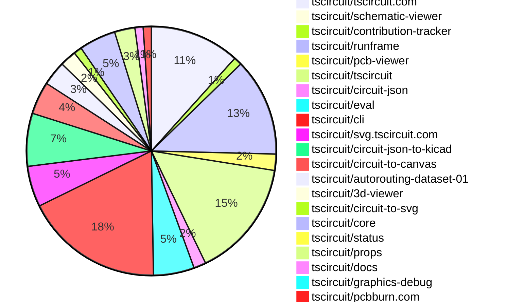

# Contribution Overview 2026-02-03

The current week is shown below. There are 3 major sections:

- [Contributor Overview](#contributor-overview)
- [PRs by Repository](#prs-by-repository)
- [PRs by Contributor](#changes-by-contributor)
- [Scoring & Sponsorship Details](/docs/sponsorship-calculation-explanation.md)

## PRs by Repository

## Contributor Overview

| Contributor | 🐳 Major | 🐙 Minor | 🐌 Tiny | ⭐ | Discussion Contributions |
|-------------|---------|---------|---------|-----|--------------------------|
| [seveibar](#seveibar) | 4 | 7 | 2 | ⭐⭐⭐ | 0🔹 0🔶 0💎 |
| [techmannih](#techmannih) | 2 | 6 | 1 | ⭐⭐ | 0🔹 0🔶 0💎 |
| [ShiboSoftwareDev](#ShiboSoftwareDev) | 1 | 4 | 2 | ⭐⭐ | 0🔹 0🔶 0💎 |
| [Abse2001](#Abse2001) | 0 | 6 | 0 | ⭐⭐ | 0🔹 0🔶 0💎 |
| [ArnavK-09](#ArnavK-09) | 2 | 2 | 2 | ⭐⭐ | 0🔹 0🔶 0💎 |
| [tscircuitbot](#tscircuitbot) | 0 | 0 | 135 | ⭐⭐ | 0🔹 0🔶 0💎 |
| [MustafaMulla29](#MustafaMulla29) | 0 | 4 | 1 | ⭐ | 0🔹 0🔶 0💎 |
| [AnasSarkiz](#AnasSarkiz) | 2 | 1 | 0 | ⭐ | 0🔹 0🔶 0💎 |
| [imrishabh18](#imrishabh18) | 0 | 2 | 3 | ⭐ | 0🔹 0🔶 0💎 |
| [0hmX](#0hmX) | 0 | 0 | 2 |  | 0🔹 0🔶 0💎 |
| [Heinrich-XIAO](#Heinrich-XIAO) | 0 | 0 | 1 |  | 0🔹 0🔶 0💎 |

> Note: AI evaluates PRs and assigns 1-3 star ratings automatically. 4 and 5 star ratings require manual staff review.

### Discussion Contribution Legend

- 🔹 Normal Comments: Basic participation with minimal effort
- 🔶 Great Informative Comments: Thoughtful participation that adds value
- 💎 Incredible Comments: Exceptional participation with high-quality content

## Review Table

[reviews-received-hover]: ## "Number of reviews received for PRs for this contributor"
[approvals-received-hover]: ## "Number of approvals received for PRs this contributor authored"
[rejections-received-hover]: ## "Number of rejections received for PRs this contributor authored"
[prs-opened-hover]: ## "Number of PRs opened by this contributor"
[issues-created-hover]: ## "Number of issues created by this contributor"

| Contributor | Reviews Received | Approvals Received | Rejections Received | Approvals | Rejections | PRs Opened | PRs Merged | Issues Created |
|---|---|---|---|---|---|---|---|---|
| [ArnavK-09](#ArnavK-09) | 6 | 4 | 1 | 0 | 0 | 9 | 7 | 0 |
| [seveibar](#seveibar) | 3 | 0 | 0 | 22 | 1 | 16 | 13 | 0 |
| [Simplereally](#Simplereally) | 0 | 0 | 0 | 0 | 0 | 2 | 0 | 0 |
| [tscircuitbot](#tscircuitbot) | 0 | 0 | 0 | 0 | 0 | 173 | 135 | 0 |
| [Abse2001](#Abse2001) | 10 | 8 | 0 | 5 | 1 | 7 | 6 | 0 |
| [ShiboSoftwareDev](#ShiboSoftwareDev) | 10 | 7 | 0 | 7 | 0 | 8 | 7 | 0 |
| [techmannih](#techmannih) | 17 | 11 | 1 | 1 | 0 | 11 | 9 | 0 |
| [imrishabh18](#imrishabh18) | 1 | 1 | 0 | 2 | 1 | 6 | 5 | 0 |
| [dwiel](#dwiel) | 0 | 0 | 0 | 0 | 0 | 1 | 0 | 0 |
| [cryptoaibot1738728800](#cryptoaibot1738728800) | 0 | 0 | 0 | 0 | 0 | 3 | 0 | 0 |
| [MustafaMulla29](#MustafaMulla29) | 8 | 5 | 0 | 1 | 0 | 6 | 5 | 0 |
| [bimakw](#bimakw) | 1 | 0 | 1 | 0 | 0 | 4 | 0 | 0 |
| [Heinrich-XIAO](#Heinrich-XIAO) | 1 | 1 | 0 | 0 | 0 | 1 | 1 | 0 |
| [GDN84](#GDN84) | 0 | 0 | 0 | 0 | 0 | 1 | 0 | 0 |
| [AnasSarkiz](#AnasSarkiz) | 1 | 1 | 0 | 0 | 0 | 3 | 3 | 0 |
| [Devesh36](#Devesh36) | 0 | 0 | 0 | 0 | 0 | 1 | 0 | 0 |
| [0hmX](#0hmX) | 0 | 0 | 0 | 0 | 0 | 4 | 4 | 0 |

## Changes by Repository

### [tscircuit/tscircuit.com](https://github.com/tscircuit/tscircuit.com)

| PR # | Impact | Rating | Contributor | Description |
|------|--------|--------|-------------|-------------|
| [#2642](https://github.com/tscircuit/tscircuit.com/pull/2642) | 🐳 Major | ⭐⭐⭐ | ArnavK-09 | Changes the search functionality to retrieve organizations instead of accounts, updating the UI components and API calls accordingly. |
| [#2639](https://github.com/tscircuit/tscircuit.com/pull/2639) | 🐳 Major | ⭐⭐⭐ | ArnavK-09 | Fixes the KiCad PCM URL link rendering in the sidebar of the package release details. |
| [#2640](https://github.com/tscircuit/tscircuit.com/pull/2640) | 🐙 Minor | ⭐⭐ | ArnavK-09 | Adds a new API endpoint for searching organizations by their tscircuit_handle, including user permissions and counts of members and packages. |

🐌 Tiny Contributions (19)

| PR # | Impact | Contributor | Description |
|------|--------|-------------|-------------|
| [#2659](https://github.com/tscircuit/tscircuit.com/pull/2659) | 🐌 Tiny | tscircuitbot | Automated package update |
| [#2657](https://github.com/tscircuit/tscircuit.com/pull/2657) | 🐌 Tiny | tscircuitbot | Automated package update |
| [#2656](https://github.com/tscircuit/tscircuit.com/pull/2656) | 🐌 Tiny | tscircuitbot | Updates the tscircuiteval package to version 0.0.623 in the package.json file. |
| [#2653](https://github.com/tscircuit/tscircuit.com/pull/2653) | 🐌 Tiny | tscircuitbot | Automated package update |
| [#2649](https://github.com/tscircuit/tscircuit.com/pull/2649) | 🐌 Tiny | tscircuitbot | Updates the tscircuiteval package from version 0.0.621 to 0.0.622 |
| [#2647](https://github.com/tscircuit/tscircuit.com/pull/2647) | 🐌 Tiny | tscircuitbot | Updates the tscircuiteval package from version 0.0.620 to 0.0.621 |
| [#2652](https://github.com/tscircuit/tscircuit.com/pull/2652) | 🐌 Tiny | tscircuitbot | Updates the tscircuitrunframe package from version 0.0.1571 to 0.0.1572 |
| [#2648](https://github.com/tscircuit/tscircuit.com/pull/2648) | 🐌 Tiny | tscircuitbot | Updates the tscircuitrunframe package from version 0.0.1567 to 0.0.1569 |
| [#2651](https://github.com/tscircuit/tscircuit.com/pull/2651) | 🐌 Tiny | tscircuitbot | Updates the tscircuitrunframe package from version 0.0.1570 to 0.0.1571 |
| [#2650](https://github.com/tscircuit/tscircuit.com/pull/2650) | 🐌 Tiny | tscircuitbot | Updates the tscircuitrunframe package to version 0.0.1570 |
| [#2646](https://github.com/tscircuit/tscircuit.com/pull/2646) | 🐌 Tiny | tscircuitbot | Updates the tscircuiteval package from version 0.0.619 to 0.0.620 |
| [#2645](https://github.com/tscircuit/tscircuit.com/pull/2645) | 🐌 Tiny | tscircuitbot | Updates the tscircuitrunframe package from version 0.0.1566 to 0.0.1567 |
| [#2636](https://github.com/tscircuit/tscircuit.com/pull/2636) | 🐌 Tiny | tscircuitbot | Updates the tscircuitrunframe package from version 0.0.1564 to 0.0.1565 |
| [#2635](https://github.com/tscircuit/tscircuit.com/pull/2635) | 🐌 Tiny | tscircuitbot | Updates the tscircuiteval package to version 0.0.619 in the package.json file. |
| [#2641](https://github.com/tscircuit/tscircuit.com/pull/2641) | 🐌 Tiny | tscircuitbot | Automated package update to version 0.0.191 |
| [#2643](https://github.com/tscircuit/tscircuit.com/pull/2643) | 🐌 Tiny | tscircuitbot | Automated package update |
| [#2634](https://github.com/tscircuit/tscircuit.com/pull/2634) | 🐌 Tiny | tscircuitbot | Automated package update |
| [#2638](https://github.com/tscircuit/tscircuit.com/pull/2638) | 🐌 Tiny | imrishabh18 | Replaces the useComponent hook with direct component imports in the sample board templates for better performance and clarity. |
| [#2654](https://github.com/tscircuit/tscircuit.com/pull/2654) | 🐌 Tiny | Heinrich-XIAO | Fixes the naming of components in the Blinking LED Board template to ensure proper identification and functionality. |

### [tscircuit/schematic-viewer](https://github.com/tscircuit/schematic-viewer)

| PR # | Impact | Rating | Contributor | Description |
|------|--------|--------|-------------|-------------|
| [#163](https://github.com/tscircuit/schematic-viewer/pull/163) | 🐙 Minor | ⭐⭐ | ArnavK-09 | Fixes the live debug grid and port visibility toggles in the SchematicViewer component, allowing users to enable or disable the debug grid and schematic ports dynamically. |

### [tscircuit/contribution-tracker](https://github.com/tscircuit/contribution-tracker)

| PR # | Impact | Rating | Contributor | Description |
|------|--------|--------|-------------|-------------|
| [#303](https://github.com/tscircuit/contribution-tracker/pull/303) | 🐙 Minor | ⭐⭐ | ShiboSoftwareDev | Changes the weekly overview generation to start from the most recent Tuesday at 18:30 UTC instead of Wednesday. |

🐌 Tiny Contributions (1)

| PR # | Impact | Contributor | Description |
|------|--------|-------------|-------------|
| [#301](https://github.com/tscircuit/contribution-tracker/pull/301) | 🐌 Tiny | ArnavK-09 | Updates the cron job schedule to count pull requests that were not counted for 1.5 hours. |

### [tscircuit/runframe](https://github.com/tscircuit/runframe)

🐌 Tiny Contributions (24)

| PR # | Impact | Contributor | Description |
|------|--------|-------------|-------------|
| [#2541](https://github.com/tscircuit/runframe/pull/2541) | 🐌 Tiny | ArnavK-09 | Updates the schematic viewer dependency to version 2.0.56 in package.json |
| [#2570](https://github.com/tscircuit/runframe/pull/2570) | 🐌 Tiny | tscircuitbot | Automated package update |
| [#2569](https://github.com/tscircuit/runframe/pull/2569) | 🐌 Tiny | tscircuitbot | Updates the tscircuitpcb-viewer package from version 1.11.330 to 1.11.332 |
| [#2568](https://github.com/tscircuit/runframe/pull/2568) | 🐌 Tiny | tscircuitbot | Automated package update |
| [#2567](https://github.com/tscircuit/runframe/pull/2567) | 🐌 Tiny | tscircuitbot | Updates the tscircuiteval package to version 0.0.623 in the package.json file. |
| [#2566](https://github.com/tscircuit/runframe/pull/2566) | 🐌 Tiny | tscircuitbot | Automated package update |
| [#2565](https://github.com/tscircuit/runframe/pull/2565) | 🐌 Tiny | tscircuitbot | Updates the circuit-json-to-kicad package version from 0.0.65 to 0.0.66 in package.json |
| [#2562](https://github.com/tscircuit/runframe/pull/2562) | 🐌 Tiny | tscircuitbot | Automated package update |
| [#2561](https://github.com/tscircuit/runframe/pull/2561) | 🐌 Tiny | tscircuitbot | Updates the tscircuit3d-viewer package from version 0.0.507 to 0.0.509 |
| [#2559](https://github.com/tscircuit/runframe/pull/2559) | 🐌 Tiny | tscircuitbot | Automated package update |
| [#2558](https://github.com/tscircuit/runframe/pull/2558) | 🐌 Tiny | tscircuitbot | Updates the tscircuit3d-viewer package to version 0.0.507 in package.json |
| [#2557](https://github.com/tscircuit/runframe/pull/2557) | 🐌 Tiny | tscircuitbot | Automated package update |
| [#2552](https://github.com/tscircuit/runframe/pull/2552) | 🐌 Tiny | tscircuitbot | Automated package update |
| [#2551](https://github.com/tscircuit/runframe/pull/2551) | 🐌 Tiny | tscircuitbot | Updates the tscircuiteval package to version 0.0.622 in the package.json file. |
| [#2550](https://github.com/tscircuit/runframe/pull/2550) | 🐌 Tiny | tscircuitbot | Automated package update |
| [#2549](https://github.com/tscircuit/runframe/pull/2549) | 🐌 Tiny | tscircuitbot | Updates the tscircuiteval package from version 0.0.619 to 0.0.621 in the package.json file. |
| [#2546](https://github.com/tscircuit/runframe/pull/2546) | 🐌 Tiny | tscircuitbot | Updates the circuit-json-to-kicad package version from 0.0.60 to 0.0.62 in package.json |
| [#2556](https://github.com/tscircuit/runframe/pull/2556) | 🐌 Tiny | tscircuitbot | Updates the circuit-json-to-kicad package from version 0.0.62 to 0.0.65 |
| [#2544](https://github.com/tscircuit/runframe/pull/2544) | 🐌 Tiny | tscircuitbot | Automated package update |
| [#2543](https://github.com/tscircuit/runframe/pull/2543) | 🐌 Tiny | tscircuitbot | Updates the tscircuit3d-viewer package to version 0.0.506 in package.json |
| [#2536](https://github.com/tscircuit/runframe/pull/2536) | 🐌 Tiny | tscircuitbot | Updates the tscircuiteval package to version 0.0.619 in the package.json file. |
| [#2532](https://github.com/tscircuit/runframe/pull/2532) | 🐌 Tiny | tscircuitbot | Updates the circuit-json-to-kicad package version from 0.0.58 to 0.0.60 in package.json |
| [#2542](https://github.com/tscircuit/runframe/pull/2542) | 🐌 Tiny | tscircuitbot | Automated package update |
| [#2537](https://github.com/tscircuit/runframe/pull/2537) | 🐌 Tiny | tscircuitbot | Automated package update |

### [tscircuit/pcb-viewer](https://github.com/tscircuit/pcb-viewer)

| PR # | Impact | Rating | Contributor | Description |
|------|--------|--------|-------------|-------------|
| [#646](https://github.com/tscircuit/pcb-viewer/pull/646) | 🐙 Minor | ⭐⭐ | Abse2001 | Fixes rendering issue where PCB traces appear above plated holes and adds a core fixture for plated holes. |
| [#644](https://github.com/tscircuit/pcb-viewer/pull/644) | 🐙 Minor | ⭐⭐ | techmannih | Adds support for rendering PCB courtyards, including circle and rectangle shapes, in the PCB viewer. |

🐌 Tiny Contributions (2)

| PR # | Impact | Contributor | Description |
|------|--------|-------------|-------------|
| [#647](https://github.com/tscircuit/pcb-viewer/pull/647) | 🐌 Tiny | tscircuitbot | Automated package update |
| [#645](https://github.com/tscircuit/pcb-viewer/pull/645) | 🐌 Tiny | tscircuitbot | Automated package update |

### [tscircuit/tscircuit](https://github.com/tscircuit/tscircuit)

🐌 Tiny Contributions (29)

| PR # | Impact | Contributor | Description |
|------|--------|-------------|-------------|
| [#2119](https://github.com/tscircuit/tscircuit/pull/2119) | 🐌 Tiny | tscircuitbot | Updates the package version from 0.0.1267 to 0.0.1268 in package.json |
| [#2118](https://github.com/tscircuit/tscircuit/pull/2118) | 🐌 Tiny | tscircuitbot | Updates the tscircuitcli package from version 0.1.883 to 0.1.884 and the tscircuitrunframe package from version 0.0.1575 to 0.0.1576 in package.json |
| [#2117](https://github.com/tscircuit/tscircuit/pull/2117) | 🐌 Tiny | tscircuitbot | Automated package update |
| [#2116](https://github.com/tscircuit/tscircuit/pull/2116) | 🐌 Tiny | tscircuitbot | Automated package update |
| [#2115](https://github.com/tscircuit/tscircuit/pull/2115) | 🐌 Tiny | tscircuitbot | Updates the package version from 0.0.1265 to 0.0.1266 in package.json |
| [#2114](https://github.com/tscircuit/tscircuit/pull/2114) | 🐌 Tiny | tscircuitbot | Automated package update |
| [#2113](https://github.com/tscircuit/tscircuit/pull/2113) | 🐌 Tiny | tscircuitbot | Automated package update |
| [#2112](https://github.com/tscircuit/tscircuit/pull/2112) | 🐌 Tiny | tscircuitbot | Automated package update |
| [#2110](https://github.com/tscircuit/tscircuit/pull/2110) | 🐌 Tiny | tscircuitbot | Updates the tscircuitcli package from version 0.1.879 to 0.1.880 and the tscircuitrunframe package from version 0.0.1571 to 0.0.1572 in package.json |
| [#2105](https://github.com/tscircuit/tscircuit/pull/2105) | 🐌 Tiny | tscircuitbot | Updates the package version from 0.0.1261 to 0.0.1262 in package.json |
| [#2100](https://github.com/tscircuit/tscircuit/pull/2100) | 🐌 Tiny | tscircuitbot | Automated package update |
| [#2102](https://github.com/tscircuit/tscircuit/pull/2102) | 🐌 Tiny | tscircuitbot | Automated package update |
| [#2108](https://github.com/tscircuit/tscircuit/pull/2108) | 🐌 Tiny | tscircuitbot | Updates the package version from 0.0.1262 to 0.0.1263 in package.json |
| [#2104](https://github.com/tscircuit/tscircuit/pull/2104) | 🐌 Tiny | tscircuitbot | Automated package update |
| [#2097](https://github.com/tscircuit/tscircuit/pull/2097) | 🐌 Tiny | tscircuitbot | Automated package update |
| [#2099](https://github.com/tscircuit/tscircuit/pull/2099) | 🐌 Tiny | tscircuitbot | Automated package update |
| [#2107](https://github.com/tscircuit/tscircuit/pull/2107) | 🐌 Tiny | tscircuitbot | Automated package update |
| [#2111](https://github.com/tscircuit/tscircuit/pull/2111) | 🐌 Tiny | tscircuitbot | Updates the package version from 0.0.1263 to 0.0.1264 in package.json |
| [#2103](https://github.com/tscircuit/tscircuit/pull/2103) | 🐌 Tiny | tscircuitbot | Updates the package version from 0.0.1260 to 0.0.1261 in package.json |
| [#2096](https://github.com/tscircuit/tscircuit/pull/2096) | 🐌 Tiny | tscircuitbot | Automated package update |
| [#2095](https://github.com/tscircuit/tscircuit/pull/2095) | 🐌 Tiny | tscircuitbot | Updates the tscircuitcli package to version 0.1.874 in the package.json file. |
| [#2093](https://github.com/tscircuit/tscircuit/pull/2093) | 🐌 Tiny | tscircuitbot | Automated package update |
| [#2092](https://github.com/tscircuit/tscircuit/pull/2092) | 🐌 Tiny | tscircuitbot | Updates the tscircuitcli package from version 0.1.872 to 0.1.873 and the tscircuitrunframe package from version 0.0.1566 to 0.0.1567 in package.json |
| [#2089](https://github.com/tscircuit/tscircuit/pull/2089) | 🐌 Tiny | tscircuitbot | Automated package update |
| [#2088](https://github.com/tscircuit/tscircuit/pull/2088) | 🐌 Tiny | tscircuitbot | Updates the version of the tscircuitcli package from 0.1.870 to 0.1.871 and downgrades tscircuitalphabet from 0.0.20 to 0.0.18 in package.json |
| [#2091](https://github.com/tscircuit/tscircuit/pull/2091) | 🐌 Tiny | tscircuitbot | Automated package update |
| [#2090](https://github.com/tscircuit/tscircuit/pull/2090) | 🐌 Tiny | tscircuitbot | Automated package update |
| [#2087](https://github.com/tscircuit/tscircuit/pull/2087) | 🐌 Tiny | tscircuitbot | Updates the package version from 0.0.1253 to 0.0.1254 in package.json |
| [#2086](https://github.com/tscircuit/tscircuit/pull/2086) | 🐌 Tiny | imrishabh18 | Adds the missing tscircuitalphabet package and updates several dependencies in package.json |

### [tscircuit/circuit-json](https://github.com/tscircuit/circuit-json)

| PR # | Impact | Rating | Contributor | Description |
|------|--------|--------|-------------|-------------|
| [#454](https://github.com/tscircuit/circuit-json/pull/454) | 🐙 Minor | ⭐⭐ | Abse2001 | Adds top and bottom courtyard layers to the PCB rendering layers. |

🐌 Tiny Contributions (2)

| PR # | Impact | Contributor | Description |
|------|--------|-------------|-------------|
| [#457](https://github.com/tscircuit/circuit-json/pull/457) | 🐌 Tiny | tscircuitbot | Automated package update |
| [#456](https://github.com/tscircuit/circuit-json/pull/456) | 🐌 Tiny | techmannih | Removes visual style properties such as stroke width, closed state, dashed stroke, and color from the PcbCourtyardOutline schema and interface. |

### [tscircuit/eval](https://github.com/tscircuit/eval)

🐌 Tiny Contributions (10)

| PR # | Impact | Contributor | Description |
|------|--------|-------------|-------------|
| [#1987](https://github.com/tscircuit/eval/pull/1987) | 🐌 Tiny | tscircuitbot | Automated package update to version 0.0.623 |
| [#1986](https://github.com/tscircuit/eval/pull/1986) | 🐌 Tiny | tscircuitbot | Automated package update |
| [#1978](https://github.com/tscircuit/eval/pull/1978) | 🐌 Tiny | tscircuitbot | Automated package update |
| [#1976](https://github.com/tscircuit/eval/pull/1976) | 🐌 Tiny | tscircuitbot | Automated package update to version 0.0.621 |
| [#1975](https://github.com/tscircuit/eval/pull/1975) | 🐌 Tiny | tscircuitbot | Automated package update |
| [#1972](https://github.com/tscircuit/eval/pull/1972) | 🐌 Tiny | tscircuitbot | Automated package update |
| [#1979](https://github.com/tscircuit/eval/pull/1979) | 🐌 Tiny | tscircuitbot | Automated package update |
| [#1973](https://github.com/tscircuit/eval/pull/1973) | 🐌 Tiny | tscircuitbot | Automated package update to version 0.0.620 |
| [#1970](https://github.com/tscircuit/eval/pull/1970) | 🐌 Tiny | tscircuitbot | Automated package update |
| [#1969](https://github.com/tscircuit/eval/pull/1969) | 🐌 Tiny | tscircuitbot | Updates various package dependencies in the project to their latest versions. |

### [tscircuit/cli](https://github.com/tscircuit/cli)

| PR # | Impact | Rating | Contributor | Description |
|------|--------|--------|-------------|-------------|
| [#1902](https://github.com/tscircuit/cli/pull/1902) | 🐳 Major | ⭐⭐⭐ | seveibar | Adds a centralized helper for file upsert requests and provides actionable timeout guidance for users when uploads to the local file server fail due to timeout errors. |
| [#1893](https://github.com/tscircuit/cli/pull/1893) | 🐳 Major | ⭐⭐⭐ | seveibar | Add a tsci doctor command that runs a set of targeted environment checks to help users diagnose tscircuit auth and registry problems, including checks for session token and npm registry configuration. |
| [#1887](https://github.com/tscircuit/cli/pull/1887) | 🐙 Minor | ⭐⭐ | imrishabh18 | Fixes an error where the build process attempts to create a directory at the root of the filesystem when package.json is not found, instead it now correctly uses the current working directory as a fallback. |
| [#1879](https://github.com/tscircuit/cli/pull/1879) | 🐙 Minor | ⭐⭐ | imrishabh18 | Failing to generate the circuit json should throw a fatal error in tsci build --ci |

🐌 Tiny Contributions (30)

| PR # | Impact | Contributor | Description |
|------|--------|-------------|-------------|
| [#1915](https://github.com/tscircuit/cli/pull/1915) | 🐌 Tiny | tscircuitbot | Automated package update |
| [#1914](https://github.com/tscircuit/cli/pull/1914) | 🐌 Tiny | tscircuitbot | Updates the tscircuitrunframe package from version 0.0.1575 to 0.0.1576 |
| [#1913](https://github.com/tscircuit/cli/pull/1913) | 🐌 Tiny | tscircuitbot | Automated package update |
| [#1912](https://github.com/tscircuit/cli/pull/1912) | 🐌 Tiny | tscircuitbot | Updates the tscircuitrunframe package from version 0.0.1574 to 0.0.1575 |
| [#1911](https://github.com/tscircuit/cli/pull/1911) | 🐌 Tiny | tscircuitbot | Automated package update |
| [#1910](https://github.com/tscircuit/cli/pull/1910) | 🐌 Tiny | tscircuitbot | Updates the tscircuitrunframe package from version 0.0.1573 to 0.0.1574 |
| [#1908](https://github.com/tscircuit/cli/pull/1908) | 🐌 Tiny | tscircuitbot | Updates the tscircuitrunframe package from version 0.0.1572 to 0.0.1573 |
| [#1903](https://github.com/tscircuit/cli/pull/1903) | 🐌 Tiny | tscircuitbot | Automated package update |
| [#1907](https://github.com/tscircuit/cli/pull/1907) | 🐌 Tiny | tscircuitbot | Automated package update |
| [#1898](https://github.com/tscircuit/cli/pull/1898) | 🐌 Tiny | tscircuitbot | Updates the tscircuitrunframe package version from 0.0.1568 to 0.0.1569 in package.json |
| [#1901](https://github.com/tscircuit/cli/pull/1901) | 🐌 Tiny | tscircuitbot | Updates the package version from 0.1.876 to 0.1.877 in package.json |
| [#1899](https://github.com/tscircuit/cli/pull/1899) | 🐌 Tiny | tscircuitbot | Updates the package version from v0.1.875 to v0.1.876 in package.json |
| [#1904](https://github.com/tscircuit/cli/pull/1904) | 🐌 Tiny | tscircuitbot | Updates the tscircuitrunframe package from version 0.0.1570 to 0.0.1571 |
| [#1900](https://github.com/tscircuit/cli/pull/1900) | 🐌 Tiny | tscircuitbot | Updates the tscircuitrunframe package from version 0.0.1569 to 0.0.1570 |
| [#1905](https://github.com/tscircuit/cli/pull/1905) | 🐌 Tiny | tscircuitbot | Automated package update |
| [#1896](https://github.com/tscircuit/cli/pull/1896) | 🐌 Tiny | tscircuitbot | Updates the tscircuitrunframe package from version 0.0.1567 to 0.0.1568 |
| [#1897](https://github.com/tscircuit/cli/pull/1897) | 🐌 Tiny | tscircuitbot | Updates the package version from v0.1.874 to v0.1.875 in package.json |
| [#1906](https://github.com/tscircuit/cli/pull/1906) | 🐌 Tiny | tscircuitbot | Updates the tscircuitrunframe package from version 0.0.1571 to 0.0.1572 |
| [#1895](https://github.com/tscircuit/cli/pull/1895) | 🐌 Tiny | tscircuitbot | Updates the package version from 0.1.873 to 0.1.874 in package.json |
| [#1894](https://github.com/tscircuit/cli/pull/1894) | 🐌 Tiny | tscircuitbot | Automated README update with latest CLI usage output. |
| [#1892](https://github.com/tscircuit/cli/pull/1892) | 🐌 Tiny | tscircuitbot | Updates the package version from 0.1.872 to 0.1.873 in package.json |
| [#1891](https://github.com/tscircuit/cli/pull/1891) | 🐌 Tiny | tscircuitbot | Updates the tscircuitrunframe package to version 0.0.1567 in the package.json file. |
| [#1885](https://github.com/tscircuit/cli/pull/1885) | 🐌 Tiny | tscircuitbot | Updates the tscircuitrunframe package to version 0.0.1565 |
| [#1890](https://github.com/tscircuit/cli/pull/1890) | 🐌 Tiny | tscircuitbot | Automated package update |
| [#1882](https://github.com/tscircuit/cli/pull/1882) | 🐌 Tiny | tscircuitbot | Updates the tscircuitrunframe package from version 0.0.1563 to 0.0.1564 |
| [#1883](https://github.com/tscircuit/cli/pull/1883) | 🐌 Tiny | tscircuitbot | Automated package update |
| [#1884](https://github.com/tscircuit/cli/pull/1884) | 🐌 Tiny | tscircuitbot | Automated package update |
| [#1886](https://github.com/tscircuit/cli/pull/1886) | 🐌 Tiny | tscircuitbot | Automated package update |
| [#1888](https://github.com/tscircuit/cli/pull/1888) | 🐌 Tiny | tscircuitbot | Automated package update |
| [#1889](https://github.com/tscircuit/cli/pull/1889) | 🐌 Tiny | tscircuitbot | Updates the tscircuitrunframe package from version 0.0.1565 to 0.0.1566 |

### [tscircuit/svg.tscircuit.com](https://github.com/tscircuit/svg.tscircuit.com)

🐌 Tiny Contributions (10)

| PR # | Impact | Contributor | Description |
|------|--------|-------------|-------------|
| [#954](https://github.com/tscircuit/svg.tscircuit.com/pull/954) | 🐌 Tiny | tscircuitbot | Updates the tscircuit package from version 0.0.1267 to 0.0.1268 in package.json |
| [#953](https://github.com/tscircuit/svg.tscircuit.com/pull/953) | 🐌 Tiny | tscircuitbot | Updates the tscircuit package version from 0.0.1266 to 0.0.1267 in package.json |
| [#952](https://github.com/tscircuit/svg.tscircuit.com/pull/952) | 🐌 Tiny | tscircuitbot | Updates the tscircuit package version from 0.0.1264 to 0.0.1266 in package.json |
| [#945](https://github.com/tscircuit/svg.tscircuit.com/pull/945) | 🐌 Tiny | tscircuitbot | Updates the tscircuit package version from 0.0.1258 to 0.0.1259 in package.json |
| [#949](https://github.com/tscircuit/svg.tscircuit.com/pull/949) | 🐌 Tiny | tscircuitbot | Updates the tscircuit package version from 0.0.1259 to 0.0.1263 in package.json |
| [#950](https://github.com/tscircuit/svg.tscircuit.com/pull/950) | 🐌 Tiny | tscircuitbot | Updates the tscircuit package version from 0.0.1263 to 0.0.1264 in package.json |
| [#944](https://github.com/tscircuit/svg.tscircuit.com/pull/944) | 🐌 Tiny | tscircuitbot | Updates the tscircuit package version from 0.0.1257 to 0.0.1258 in package.json |
| [#943](https://github.com/tscircuit/svg.tscircuit.com/pull/943) | 🐌 Tiny | tscircuitbot | Updates the tscircuit package version from 0.0.1255 to 0.0.1257 in package.json |
| [#940](https://github.com/tscircuit/svg.tscircuit.com/pull/940) | 🐌 Tiny | tscircuitbot | Updates the tscircuit package version from 0.0.1253 to 0.0.1254 in package.json |
| [#941](https://github.com/tscircuit/svg.tscircuit.com/pull/941) | 🐌 Tiny | tscircuitbot | Automated package update |

### [tscircuit/circuit-json-to-kicad](https://github.com/tscircuit/circuit-json-to-kicad)

| PR # | Impact | Rating | Contributor | Description |
|------|--------|--------|-------------|-------------|
| [#117](https://github.com/tscircuit/circuit-json-to-kicad/pull/117) | 🐳 Major | ⭐⭐⭐ | AnasSarkiz | Fixes a layer-assignment bug when converting trace.route into KiCad PCB segments, ensuring segments are exported onto the correct layer by deriving each segments layer from startPoint.layer, endPoint.layer, or lastKnownLayer, and updating lastKnownLayer as it walks the route. |
| [#110](https://github.com/tscircuit/circuit-json-to-kicad/pull/110) | 🐙 Minor | ⭐⭐ | seveibar | Adds support for four-layer PCBs by implementing layer mapping and updating PCB initialization to accommodate additional copper layers. |
| [#119](https://github.com/tscircuit/circuit-json-to-kicad/pull/119) | 🐙 Minor | ⭐⭐ | MustafaMulla29 | Add support for courtyard rectangles in KiCad by converting pcb_courtyard_rect elements to KiCad fp_rect on the courtyard layer. |
| [#108](https://github.com/tscircuit/circuit-json-to-kicad/pull/108) | 🐙 Minor | ⭐⭐ | MustafaMulla29 | Adds support for handling pcb_note_text and pcb_note_rect elements in KiCad footprint generation. |
| [#115](https://github.com/tscircuit/circuit-json-to-kicad/pull/115) | 🐙 Minor | ⭐⭐ | MustafaMulla29 | Adds support for courtyard circles in KiCad by converting pcb_courtyard_circle elements to KiCad fp_circle on the courtyard layer. |
| [#109](https://github.com/tscircuit/circuit-json-to-kicad/pull/109) | 🐙 Minor | ⭐⭐ | ShiboSoftwareDev | Adds functionality to convert fabrication note text from circuit JSON to KiCad format, allowing for the inclusion of manufacturing notes in PCB designs. |

🐌 Tiny Contributions (7)

| PR # | Impact | Contributor | Description |
|------|--------|-------------|-------------|
| [#121](https://github.com/tscircuit/circuit-json-to-kicad/pull/121) | 🐌 Tiny | tscircuitbot | Automated package update |
| [#116](https://github.com/tscircuit/circuit-json-to-kicad/pull/116) | 🐌 Tiny | tscircuitbot | Automated package update |
| [#114](https://github.com/tscircuit/circuit-json-to-kicad/pull/114) | 🐌 Tiny | tscircuitbot | Automated package update |
| [#120](https://github.com/tscircuit/circuit-json-to-kicad/pull/120) | 🐌 Tiny | tscircuitbot | Automated package update |
| [#113](https://github.com/tscircuit/circuit-json-to-kicad/pull/113) | 🐌 Tiny | tscircuitbot | Automated package update |
| [#111](https://github.com/tscircuit/circuit-json-to-kicad/pull/111) | 🐌 Tiny | tscircuitbot | Automated package update |
| [#112](https://github.com/tscircuit/circuit-json-to-kicad/pull/112) | 🐌 Tiny | MustafaMulla29 | Updates the snapshot images for the KiCad library tests to reflect recent changes in the library. |

### [tscircuit/circuit-to-canvas](https://github.com/tscircuit/circuit-to-canvas)

| PR # | Impact | Rating | Contributor | Description |
|------|--------|--------|-------------|-------------|
| [#153](https://github.com/tscircuit/circuit-to-canvas/pull/153) | 🐙 Minor | ⭐⭐ | Abse2001 | Implements explicit soldermask rendering for PCB traces and fixes the draw order to ensure soldermask is applied before pad and hole openings, preventing visibility artifacts and aligning with real PCB fabrication behavior. |
| [#151](https://github.com/tscircuit/circuit-to-canvas/pull/151) | 🐙 Minor | ⭐⭐ | techmannih | Adds support for rendering the bottom layer of PCB courtyards in the drawing functions. |
| [#147](https://github.com/tscircuit/circuit-to-canvas/pull/147) | 🐙 Minor | ⭐⭐ | techmannih | Adds support for rendering PCB courtyard circles in the canvas drawing context. |
| [#149](https://github.com/tscircuit/circuit-to-canvas/pull/149) | 🐙 Minor | ⭐⭐ | techmannih | Adds support for rendering rectangular courtyard elements in PCB drawings. |

🐌 Tiny Contributions (4)

| PR # | Impact | Contributor | Description |
|------|--------|-------------|-------------|
| [#154](https://github.com/tscircuit/circuit-to-canvas/pull/154) | 🐌 Tiny | tscircuitbot | Automated package update |
| [#152](https://github.com/tscircuit/circuit-to-canvas/pull/152) | 🐌 Tiny | tscircuitbot | Automated package update |
| [#148](https://github.com/tscircuit/circuit-to-canvas/pull/148) | 🐌 Tiny | tscircuitbot | Automated package update |
| [#150](https://github.com/tscircuit/circuit-to-canvas/pull/150) | 🐌 Tiny | tscircuitbot | Automated package update |

### [tscircuit/autorouting-dataset-01](https://github.com/tscircuit/autorouting-dataset-01)

🐌 Tiny Contributions (6)

| PR # | Impact | Contributor | Description |
|------|--------|-------------|-------------|
| [#43](https://github.com/tscircuit/autorouting-dataset-01/pull/43) | 🐌 Tiny | tscircuitbot | Automated package update |
| [#41](https://github.com/tscircuit/autorouting-dataset-01/pull/41) | 🐌 Tiny | tscircuitbot | Automated package update |
| [#39](https://github.com/tscircuit/autorouting-dataset-01/pull/39) | 🐌 Tiny | tscircuitbot | Automated package update |
| [#37](https://github.com/tscircuit/autorouting-dataset-01/pull/37) | 🐌 Tiny | tscircuitbot | Automated package update |
| [#40](https://github.com/tscircuit/autorouting-dataset-01/pull/40) | 🐌 Tiny | 0hmX | Adds a button for visualizing benchmark details and changes the background color to white for improved readability. |
| [#38](https://github.com/tscircuit/autorouting-dataset-01/pull/38) | 🐌 Tiny | 0hmX | Fixes the file extension used for loading scenario lists from .simple-route-before.json to .simple-route.json in the autorouting dataset. |

### [tscircuit/3d-viewer](https://github.com/tscircuit/3d-viewer)

| PR # | Impact | Rating | Contributor | Description |
|------|--------|--------|-------------|-------------|
| [#673](https://github.com/tscircuit/3d-viewer/pull/673) | 🐙 Minor | ⭐⭐ | Abse2001 | Explicitly calls renderer.forceContextLoss() during unmount to ensure the WebGL context is fully released, preventing GPU memorycontext leaks during remounts or viewer reinitialization. |
| [#674](https://github.com/tscircuit/3d-viewer/pull/674) | 🐙 Minor | ⭐⭐ | Abse2001 | Fixes alignment issue of bottom-layer CAD components with the board surface by removing an unnecessary offset in the z-position calculation. |
| [#672](https://github.com/tscircuit/3d-viewer/pull/672) | 🐙 Minor | ⭐⭐ | Abse2001 | Capping board texture resolution based on board size to prevent oversized layer textures and reduce GPU memory pressure, improving stability and performance on large boards. |
| [#675](https://github.com/tscircuit/3d-viewer/pull/675) | 🐙 Minor | ⭐⭐ | seveibar | Centralizes blob URL storage for STEP conversions to avoid duplicates and improve loading efficiency for boards with identical STEP models. |

### [tscircuit/circuit-to-svg](https://github.com/tscircuit/circuit-to-svg)

| PR # | Impact | Rating | Contributor | Description |
|------|--------|--------|-------------|-------------|
| [#505](https://github.com/tscircuit/circuit-to-svg/pull/505) | 🐳 Major | ⭐⭐⭐ | techmannih | Adds support for rendering PCB courtyard outlines in SVG format by implementing a new function and updating the conversion logic. |
| [#504](https://github.com/tscircuit/circuit-to-svg/pull/504) | 🐳 Major | ⭐⭐⭐ | techmannih | Adds support for a bottom courtyard layer in PCB color mapping and SVG generation. |

### [tscircuit/core](https://github.com/tscircuit/core)

| PR # | Impact | Rating | Contributor | Description |
|------|--------|--------|-------------|-------------|
| [#1903](https://github.com/tscircuit/core/pull/1903) | 🐳 Major | ⭐⭐⭐ | ShiboSoftwareDev | Disables autorouting and PCB auto-layout features for subcircuits that are inflated from circuitJson, preventing automatic layout adjustments in these cases. |
| [#1892](https://github.com/tscircuit/core/pull/1892) | 🐙 Minor | ⭐⭐ | techmannih | Adds support for the CourtyardCircle component in PCB design, allowing for the definition of courtyard circles in the layout. |
| [#1901](https://github.com/tscircuit/core/pull/1901) | 🐙 Minor | ⭐⭐ | techmannih | Adds support for the CourtyardRect component in PCB design, allowing for rectangular courtyard areas to be defined in circuit layouts. |
| [#1899](https://github.com/tscircuit/core/pull/1899) | 🐙 Minor | ⭐⭐ | seveibar | Adds support for vias in manual pcbPath routes, allowing users to specify layer transitions and ensuring inner layer traces remain visible in rendered paths. |
| [#1898](https://github.com/tscircuit/core/pull/1898) | 🐙 Minor | ⭐⭐ | seveibar | Adds support for a new simplified syntax for defining pin arrangements in schematic components, allowing both array and object formats for pin definitions. |
| [#1894](https://github.com/tscircuit/core/pull/1894) | 🐙 Minor | ⭐⭐ | seveibar | Enhances error reporting for component creation failures by providing detailed error messages including selector and props information. |
| [#1907](https://github.com/tscircuit/core/pull/1907) | 🐙 Minor | ⭐⭐ | MustafaMulla29 | Adds support for the courtyardoutline element in the PCB design, allowing users to define custom outlines for PCB components. |
| [#1905](https://github.com/tscircuit/core/pull/1905) | 🐙 Minor | ⭐⭐ | ShiboSoftwareDev | Refactors PCB primitive extraction logic to create a Footprint component from circuit JSON, enhancing the handling of PCB elements like pads and holes. |

🐌 Tiny Contributions (1)

| PR # | Impact | Contributor | Description |
|------|--------|-------------|-------------|
| [#1902](https://github.com/tscircuit/core/pull/1902) | 🐌 Tiny | ShiboSoftwareDev | Adds a test for rendering a large panel of boards with resistor components and checks for errors in the generated circuit JSON. |

### [tscircuit/status](https://github.com/tscircuit/status)

🐌 Tiny Contributions (1)

| PR # | Impact | Contributor | Description |
|------|--------|-------------|-------------|
| [#65](https://github.com/tscircuit/status/pull/65) | 🐌 Tiny | imrishabh18 | Fixes initialization command to use the -y flag instead of echo and corrects the build command to point to the correct file (index.circuit.tsx). |

### [tscircuit/props](https://github.com/tscircuit/props)

| PR # | Impact | Rating | Contributor | Description |
|------|--------|--------|-------------|-------------|
| [#581](https://github.com/tscircuit/props/pull/581) | 🐳 Major | ⭐⭐⭐ | seveibar | Add a shared url Zod schema that normalizes imported static URLs and replaces direct z.string() usages for URL-like props across multiple files. |
| [#578](https://github.com/tscircuit/props/pull/578) | 🐳 Major | ⭐⭐⭐ | seveibar | Permit pcbPath route points to express vias so traces can include layer transitions in path descriptions and enforce validation rules for via-related inputs. |
| [#580](https://github.com/tscircuit/props/pull/580) | 🐙 Minor | ⭐⭐ | seveibar | Adds a fetch-compatible hook on the platform configuration to allow consumers to provide a platform-specific fetch implementation for network requests. |
| [#577](https://github.com/tscircuit/props/pull/577) | 🐙 Minor | ⭐⭐ | seveibar | Add a new mountedboard component type with specific props for multi-board assemblies, including mounting metadata. |

🐌 Tiny Contributions (1)

| PR # | Impact | Contributor | Description |
|------|--------|-------------|-------------|
| [#579](https://github.com/tscircuit/props/pull/579) | 🐌 Tiny | seveibar | Add an optional _subcircuitCachingEnabled boolean property to the SubcircuitGroupProps interface to control caching behavior for subcircuit groups. |

### [tscircuit/docs](https://github.com/tscircuit/docs)

🐌 Tiny Contributions (2)

| PR # | Impact | Contributor | Description |
|------|--------|-------------|-------------|
| [#430](https://github.com/tscircuit/docs/pull/430) | 🐌 Tiny | seveibar | Moves the silkscreenrect  properties table to follow the Overview section for better documentation discoverability. |
| [#429](https://github.com/tscircuit/docs/pull/429) | 🐌 Tiny | ShiboSoftwareDev | Adds documentation for the analogsimulation , voltageprobe , and voltagesource  elements used in SPICE simulations. |

### [tscircuit/graphics-debug](https://github.com/tscircuit/graphics-debug)

| PR # | Impact | Rating | Contributor | Description |
|------|--------|--------|-------------|-------------|
| [#93](https://github.com/tscircuit/graphics-debug/pull/93) | 🐙 Minor | ⭐⭐ | ShiboSoftwareDev | Ensures consistent stroke width for lines in the graphics rendering when zooming in and out, addressing potential visual discrepancies in line representation. |

### [tscircuit/pcbburn.com](https://github.com/tscircuit/pcbburn.com)

| PR # | Impact | Rating | Contributor | Description |
|------|--------|--------|-------------|-------------|
| [#61](https://github.com/tscircuit/pcbburn.com/pull/61) | 🐳 Major | ⭐⭐⭐ | AnasSarkiz | Enables users to create, name, and reuse custom laser profiles instead of relying only on built-in presets, with validation for unique names and persistence in localStorage. |
| [#62](https://github.com/tscircuit/pcbburn.com/pull/62) | 🐙 Minor | ⭐⭐ | AnasSarkiz | Fixes an initialization race where the Settings panel could overwrite saved custom laser profiles with  on first render. |

## Changes by Contributor

### [ArnavK-09](https://github.com/ArnavK-09)

| PRs # | Impact | Rating | Description |
|------|--------|--------|-------------|
| [#2642](https://github.com/tscircuit/tscircuit.com/pull/2642) | 🐳 Major | ⭐⭐⭐ | Changes the search functionality to retrieve organizations instead of accounts, updating the UI components and API calls accordingly. |
| [#2639](https://github.com/tscircuit/tscircuit.com/pull/2639) | 🐳 Major | ⭐⭐⭐ | Fixes the KiCad PCM URL link rendering in the sidebar of the package release details. |
| [#163](https://github.com/tscircuit/schematic-viewer/pull/163) | 🐙 Minor | ⭐⭐ | Fixes the live debug grid and port visibility toggles in the SchematicViewer component, allowing users to enable or disable the debug grid and schematic ports dynamically. |
| [#2640](https://github.com/tscircuit/tscircuit.com/pull/2640) | 🐙 Minor | ⭐⭐ | Adds a new API endpoint for searching organizations by their tscircuit_handle, including user permissions and counts of members and packages. |

🐌 Tiny Contributions (2)

| PR # | Impact | Description |
|------|--------|-------------|
| [#301](https://github.com/tscircuit/contribution-tracker/pull/301) | 🐌 Tiny | Updates the cron job schedule to count pull requests that were not counted for 1.5 hours. |
| [#2541](https://github.com/tscircuit/runframe/pull/2541) | 🐌 Tiny | Updates the schematic viewer dependency to version 2.0.56 in package.json |

### [tscircuitbot](https://github.com/tscircuitbot)

🐌 Tiny Contributions (135)

| PR # | Impact | Description |
|------|--------|-------------|
| [#647](https://github.com/tscircuit/pcb-viewer/pull/647) | 🐌 Tiny | Automated package update |
| [#645](https://github.com/tscircuit/pcb-viewer/pull/645) | 🐌 Tiny | Automated package update |
| [#2119](https://github.com/tscircuit/tscircuit/pull/2119) | 🐌 Tiny | Updates the package version from 0.0.1267 to 0.0.1268 in package.json |
| [#2118](https://github.com/tscircuit/tscircuit/pull/2118) | 🐌 Tiny | Updates the tscircuitcli package from version 0.1.883 to 0.1.884 and the tscircuitrunframe package from version 0.0.1575 to 0.0.1576 in package.json |
| [#2117](https://github.com/tscircuit/tscircuit/pull/2117) | 🐌 Tiny | Automated package update |
| [#2116](https://github.com/tscircuit/tscircuit/pull/2116) | 🐌 Tiny | Automated package update |
| [#2115](https://github.com/tscircuit/tscircuit/pull/2115) | 🐌 Tiny | Updates the package version from 0.0.1265 to 0.0.1266 in package.json |
| [#2114](https://github.com/tscircuit/tscircuit/pull/2114) | 🐌 Tiny | Automated package update |
| [#2113](https://github.com/tscircuit/tscircuit/pull/2113) | 🐌 Tiny | Automated package update |
| [#2112](https://github.com/tscircuit/tscircuit/pull/2112) | 🐌 Tiny | Automated package update |
| [#2110](https://github.com/tscircuit/tscircuit/pull/2110) | 🐌 Tiny | Updates the tscircuitcli package from version 0.1.879 to 0.1.880 and the tscircuitrunframe package from version 0.0.1571 to 0.0.1572 in package.json |
| [#2105](https://github.com/tscircuit/tscircuit/pull/2105) | 🐌 Tiny | Updates the package version from 0.0.1261 to 0.0.1262 in package.json |
| [#2100](https://github.com/tscircuit/tscircuit/pull/2100) | 🐌 Tiny | Automated package update |
| [#2102](https://github.com/tscircuit/tscircuit/pull/2102) | 🐌 Tiny | Automated package update |
| [#2108](https://github.com/tscircuit/tscircuit/pull/2108) | 🐌 Tiny | Updates the package version from 0.0.1262 to 0.0.1263 in package.json |
| [#2104](https://github.com/tscircuit/tscircuit/pull/2104) | 🐌 Tiny | Automated package update |
| [#2097](https://github.com/tscircuit/tscircuit/pull/2097) | 🐌 Tiny | Automated package update |
| [#2099](https://github.com/tscircuit/tscircuit/pull/2099) | 🐌 Tiny | Automated package update |
| [#2107](https://github.com/tscircuit/tscircuit/pull/2107) | 🐌 Tiny | Automated package update |
| [#2111](https://github.com/tscircuit/tscircuit/pull/2111) | 🐌 Tiny | Updates the package version from 0.0.1263 to 0.0.1264 in package.json |
| [#2103](https://github.com/tscircuit/tscircuit/pull/2103) | 🐌 Tiny | Updates the package version from 0.0.1260 to 0.0.1261 in package.json |
| [#2096](https://github.com/tscircuit/tscircuit/pull/2096) | 🐌 Tiny | Automated package update |
| [#2095](https://github.com/tscircuit/tscircuit/pull/2095) | 🐌 Tiny | Updates the tscircuitcli package to version 0.1.874 in the package.json file. |
| [#2093](https://github.com/tscircuit/tscircuit/pull/2093) | 🐌 Tiny | Automated package update |
| [#2092](https://github.com/tscircuit/tscircuit/pull/2092) | 🐌 Tiny | Updates the tscircuitcli package from version 0.1.872 to 0.1.873 and the tscircuitrunframe package from version 0.0.1566 to 0.0.1567 in package.json |
| [#2089](https://github.com/tscircuit/tscircuit/pull/2089) | 🐌 Tiny | Automated package update |
| [#2088](https://github.com/tscircuit/tscircuit/pull/2088) | 🐌 Tiny | Updates the version of the tscircuitcli package from 0.1.870 to 0.1.871 and downgrades tscircuitalphabet from 0.0.20 to 0.0.18 in package.json |
| [#2091](https://github.com/tscircuit/tscircuit/pull/2091) | 🐌 Tiny | Automated package update |
| [#2090](https://github.com/tscircuit/tscircuit/pull/2090) | 🐌 Tiny | Automated package update |
| [#2087](https://github.com/tscircuit/tscircuit/pull/2087) | 🐌 Tiny | Updates the package version from 0.0.1253 to 0.0.1254 in package.json |
| [#457](https://github.com/tscircuit/circuit-json/pull/457) | 🐌 Tiny | Automated package update |
| [#2659](https://github.com/tscircuit/tscircuit.com/pull/2659) | 🐌 Tiny | Automated package update |
| [#2657](https://github.com/tscircuit/tscircuit.com/pull/2657) | 🐌 Tiny | Automated package update |
| [#2656](https://github.com/tscircuit/tscircuit.com/pull/2656) | 🐌 Tiny | Updates the tscircuiteval package to version 0.0.623 in the package.json file. |
| [#2653](https://github.com/tscircuit/tscircuit.com/pull/2653) | 🐌 Tiny | Automated package update |
| [#2649](https://github.com/tscircuit/tscircuit.com/pull/2649) | 🐌 Tiny | Updates the tscircuiteval package from version 0.0.621 to 0.0.622 |
| [#2647](https://github.com/tscircuit/tscircuit.com/pull/2647) | 🐌 Tiny | Updates the tscircuiteval package from version 0.0.620 to 0.0.621 |
| [#2652](https://github.com/tscircuit/tscircuit.com/pull/2652) | 🐌 Tiny | Updates the tscircuitrunframe package from version 0.0.1571 to 0.0.1572 |
| [#2648](https://github.com/tscircuit/tscircuit.com/pull/2648) | 🐌 Tiny | Updates the tscircuitrunframe package from version 0.0.1567 to 0.0.1569 |
| [#2651](https://github.com/tscircuit/tscircuit.com/pull/2651) | 🐌 Tiny | Updates the tscircuitrunframe package from version 0.0.1570 to 0.0.1571 |
| [#2650](https://github.com/tscircuit/tscircuit.com/pull/2650) | 🐌 Tiny | Updates the tscircuitrunframe package to version 0.0.1570 |
| [#2646](https://github.com/tscircuit/tscircuit.com/pull/2646) | 🐌 Tiny | Updates the tscircuiteval package from version 0.0.619 to 0.0.620 |
| [#2645](https://github.com/tscircuit/tscircuit.com/pull/2645) | 🐌 Tiny | Updates the tscircuitrunframe package from version 0.0.1566 to 0.0.1567 |
| [#2636](https://github.com/tscircuit/tscircuit.com/pull/2636) | 🐌 Tiny | Updates the tscircuitrunframe package from version 0.0.1564 to 0.0.1565 |
| [#2635](https://github.com/tscircuit/tscircuit.com/pull/2635) | 🐌 Tiny | Updates the tscircuiteval package to version 0.0.619 in the package.json file. |
| [#2641](https://github.com/tscircuit/tscircuit.com/pull/2641) | 🐌 Tiny | Automated package update to version 0.0.191 |
| [#2643](https://github.com/tscircuit/tscircuit.com/pull/2643) | 🐌 Tiny | Automated package update |
| [#2634](https://github.com/tscircuit/tscircuit.com/pull/2634) | 🐌 Tiny | Automated package update |
| [#1987](https://github.com/tscircuit/eval/pull/1987) | 🐌 Tiny | Automated package update to version 0.0.623 |
| [#1986](https://github.com/tscircuit/eval/pull/1986) | 🐌 Tiny | Automated package update |
| [#1978](https://github.com/tscircuit/eval/pull/1978) | 🐌 Tiny | Automated package update |
| [#1976](https://github.com/tscircuit/eval/pull/1976) | 🐌 Tiny | Automated package update to version 0.0.621 |
| [#1975](https://github.com/tscircuit/eval/pull/1975) | 🐌 Tiny | Automated package update |
| [#1972](https://github.com/tscircuit/eval/pull/1972) | 🐌 Tiny | Automated package update |
| [#1979](https://github.com/tscircuit/eval/pull/1979) | 🐌 Tiny | Automated package update |
| [#1973](https://github.com/tscircuit/eval/pull/1973) | 🐌 Tiny | Automated package update to version 0.0.620 |
| [#1970](https://github.com/tscircuit/eval/pull/1970) | 🐌 Tiny | Automated package update |
| [#1969](https://github.com/tscircuit/eval/pull/1969) | 🐌 Tiny | Updates various package dependencies in the project to their latest versions. |
| [#2570](https://github.com/tscircuit/runframe/pull/2570) | 🐌 Tiny | Automated package update |
| [#2569](https://github.com/tscircuit/runframe/pull/2569) | 🐌 Tiny | Updates the tscircuitpcb-viewer package from version 1.11.330 to 1.11.332 |
| [#2568](https://github.com/tscircuit/runframe/pull/2568) | 🐌 Tiny | Automated package update |
| [#2567](https://github.com/tscircuit/runframe/pull/2567) | 🐌 Tiny | Updates the tscircuiteval package to version 0.0.623 in the package.json file. |
| [#2566](https://github.com/tscircuit/runframe/pull/2566) | 🐌 Tiny | Automated package update |
| [#2565](https://github.com/tscircuit/runframe/pull/2565) | 🐌 Tiny | Updates the circuit-json-to-kicad package version from 0.0.65 to 0.0.66 in package.json |
| [#2562](https://github.com/tscircuit/runframe/pull/2562) | 🐌 Tiny | Automated package update |
| [#2561](https://github.com/tscircuit/runframe/pull/2561) | 🐌 Tiny | Updates the tscircuit3d-viewer package from version 0.0.507 to 0.0.509 |
| [#2559](https://github.com/tscircuit/runframe/pull/2559) | 🐌 Tiny | Automated package update |
| [#2558](https://github.com/tscircuit/runframe/pull/2558) | 🐌 Tiny | Updates the tscircuit3d-viewer package to version 0.0.507 in package.json |
| [#2557](https://github.com/tscircuit/runframe/pull/2557) | 🐌 Tiny | Automated package update |
| [#2552](https://github.com/tscircuit/runframe/pull/2552) | 🐌 Tiny | Automated package update |
| [#2551](https://github.com/tscircuit/runframe/pull/2551) | 🐌 Tiny | Updates the tscircuiteval package to version 0.0.622 in the package.json file. |
| [#2550](https://github.com/tscircuit/runframe/pull/2550) | 🐌 Tiny | Automated package update |
| [#2549](https://github.com/tscircuit/runframe/pull/2549) | 🐌 Tiny | Updates the tscircuiteval package from version 0.0.619 to 0.0.621 in the package.json file. |
| [#2546](https://github.com/tscircuit/runframe/pull/2546) | 🐌 Tiny | Updates the circuit-json-to-kicad package version from 0.0.60 to 0.0.62 in package.json |
| [#2556](https://github.com/tscircuit/runframe/pull/2556) | 🐌 Tiny | Updates the circuit-json-to-kicad package from version 0.0.62 to 0.0.65 |
| [#2544](https://github.com/tscircuit/runframe/pull/2544) | 🐌 Tiny | Automated package update |
| [#2543](https://github.com/tscircuit/runframe/pull/2543) | 🐌 Tiny | Updates the tscircuit3d-viewer package to version 0.0.506 in package.json |
| [#2536](https://github.com/tscircuit/runframe/pull/2536) | 🐌 Tiny | Updates the tscircuiteval package to version 0.0.619 in the package.json file. |
| [#2532](https://github.com/tscircuit/runframe/pull/2532) | 🐌 Tiny | Updates the circuit-json-to-kicad package version from 0.0.58 to 0.0.60 in package.json |
| [#2542](https://github.com/tscircuit/runframe/pull/2542) | 🐌 Tiny | Automated package update |
| [#2537](https://github.com/tscircuit/runframe/pull/2537) | 🐌 Tiny | Automated package update |
| [#1915](https://github.com/tscircuit/cli/pull/1915) | 🐌 Tiny | Automated package update |
| [#1914](https://github.com/tscircuit/cli/pull/1914) | 🐌 Tiny | Updates the tscircuitrunframe package from version 0.0.1575 to 0.0.1576 |
| [#1913](https://github.com/tscircuit/cli/pull/1913) | 🐌 Tiny | Automated package update |
| [#1912](https://github.com/tscircuit/cli/pull/1912) | 🐌 Tiny | Updates the tscircuitrunframe package from version 0.0.1574 to 0.0.1575 |
| [#1911](https://github.com/tscircuit/cli/pull/1911) | 🐌 Tiny | Automated package update |
| [#1910](https://github.com/tscircuit/cli/pull/1910) | 🐌 Tiny | Updates the tscircuitrunframe package from version 0.0.1573 to 0.0.1574 |
| [#1908](https://github.com/tscircuit/cli/pull/1908) | 🐌 Tiny | Updates the tscircuitrunframe package from version 0.0.1572 to 0.0.1573 |
| [#1903](https://github.com/tscircuit/cli/pull/1903) | 🐌 Tiny | Automated package update |
| [#1907](https://github.com/tscircuit/cli/pull/1907) | 🐌 Tiny | Automated package update |
| [#1898](https://github.com/tscircuit/cli/pull/1898) | 🐌 Tiny | Updates the tscircuitrunframe package version from 0.0.1568 to 0.0.1569 in package.json |
| [#1901](https://github.com/tscircuit/cli/pull/1901) | 🐌 Tiny | Updates the package version from 0.1.876 to 0.1.877 in package.json |
| [#1899](https://github.com/tscircuit/cli/pull/1899) | 🐌 Tiny | Updates the package version from v0.1.875 to v0.1.876 in package.json |
| [#1904](https://github.com/tscircuit/cli/pull/1904) | 🐌 Tiny | Updates the tscircuitrunframe package from version 0.0.1570 to 0.0.1571 |
| [#1900](https://github.com/tscircuit/cli/pull/1900) | 🐌 Tiny | Updates the tscircuitrunframe package from version 0.0.1569 to 0.0.1570 |
| [#1905](https://github.com/tscircuit/cli/pull/1905) | 🐌 Tiny | Automated package update |
| [#1896](https://github.com/tscircuit/cli/pull/1896) | 🐌 Tiny | Updates the tscircuitrunframe package from version 0.0.1567 to 0.0.1568 |
| [#1897](https://github.com/tscircuit/cli/pull/1897) | 🐌 Tiny | Updates the package version from v0.1.874 to v0.1.875 in package.json |
| [#1906](https://github.com/tscircuit/cli/pull/1906) | 🐌 Tiny | Updates the tscircuitrunframe package from version 0.0.1571 to 0.0.1572 |
| [#1895](https://github.com/tscircuit/cli/pull/1895) | 🐌 Tiny | Updates the package version from 0.1.873 to 0.1.874 in package.json |
| [#1894](https://github.com/tscircuit/cli/pull/1894) | 🐌 Tiny | Automated README update with latest CLI usage output. |
| [#1892](https://github.com/tscircuit/cli/pull/1892) | 🐌 Tiny | Updates the package version from 0.1.872 to 0.1.873 in package.json |
| [#1891](https://github.com/tscircuit/cli/pull/1891) | 🐌 Tiny | Updates the tscircuitrunframe package to version 0.0.1567 in the package.json file. |
| [#1885](https://github.com/tscircuit/cli/pull/1885) | 🐌 Tiny | Updates the tscircuitrunframe package to version 0.0.1565 |
| [#1890](https://github.com/tscircuit/cli/pull/1890) | 🐌 Tiny | Automated package update |
| [#1882](https://github.com/tscircuit/cli/pull/1882) | 🐌 Tiny | Updates the tscircuitrunframe package from version 0.0.1563 to 0.0.1564 |
| [#1883](https://github.com/tscircuit/cli/pull/1883) | 🐌 Tiny | Automated package update |
| [#1884](https://github.com/tscircuit/cli/pull/1884) | 🐌 Tiny | Automated package update |
| [#1886](https://github.com/tscircuit/cli/pull/1886) | 🐌 Tiny | Automated package update |
| [#1888](https://github.com/tscircuit/cli/pull/1888) | 🐌 Tiny | Automated package update |
| [#1889](https://github.com/tscircuit/cli/pull/1889) | 🐌 Tiny | Updates the tscircuitrunframe package from version 0.0.1565 to 0.0.1566 |
| [#954](https://github.com/tscircuit/svg.tscircuit.com/pull/954) | 🐌 Tiny | Updates the tscircuit package from version 0.0.1267 to 0.0.1268 in package.json |
| [#953](https://github.com/tscircuit/svg.tscircuit.com/pull/953) | 🐌 Tiny | Updates the tscircuit package version from 0.0.1266 to 0.0.1267 in package.json |
| [#952](https://github.com/tscircuit/svg.tscircuit.com/pull/952) | 🐌 Tiny | Updates the tscircuit package version from 0.0.1264 to 0.0.1266 in package.json |
| [#945](https://github.com/tscircuit/svg.tscircuit.com/pull/945) | 🐌 Tiny | Updates the tscircuit package version from 0.0.1258 to 0.0.1259 in package.json |
| [#949](https://github.com/tscircuit/svg.tscircuit.com/pull/949) | 🐌 Tiny | Updates the tscircuit package version from 0.0.1259 to 0.0.1263 in package.json |
| [#950](https://github.com/tscircuit/svg.tscircuit.com/pull/950) | 🐌 Tiny | Updates the tscircuit package version from 0.0.1263 to 0.0.1264 in package.json |
| [#944](https://github.com/tscircuit/svg.tscircuit.com/pull/944) | 🐌 Tiny | Updates the tscircuit package version from 0.0.1257 to 0.0.1258 in package.json |
| [#943](https://github.com/tscircuit/svg.tscircuit.com/pull/943) | 🐌 Tiny | Updates the tscircuit package version from 0.0.1255 to 0.0.1257 in package.json |
| [#940](https://github.com/tscircuit/svg.tscircuit.com/pull/940) | 🐌 Tiny | Updates the tscircuit package version from 0.0.1253 to 0.0.1254 in package.json |
| [#941](https://github.com/tscircuit/svg.tscircuit.com/pull/941) | 🐌 Tiny | Automated package update |
| [#121](https://github.com/tscircuit/circuit-json-to-kicad/pull/121) | 🐌 Tiny | Automated package update |
| [#116](https://github.com/tscircuit/circuit-json-to-kicad/pull/116) | 🐌 Tiny | Automated package update |
| [#114](https://github.com/tscircuit/circuit-json-to-kicad/pull/114) | 🐌 Tiny | Automated package update |
| [#120](https://github.com/tscircuit/circuit-json-to-kicad/pull/120) | 🐌 Tiny | Automated package update |
| [#113](https://github.com/tscircuit/circuit-json-to-kicad/pull/113) | 🐌 Tiny | Automated package update |
| [#111](https://github.com/tscircuit/circuit-json-to-kicad/pull/111) | 🐌 Tiny | Automated package update |
| [#154](https://github.com/tscircuit/circuit-to-canvas/pull/154) | 🐌 Tiny | Automated package update |
| [#152](https://github.com/tscircuit/circuit-to-canvas/pull/152) | 🐌 Tiny | Automated package update |
| [#148](https://github.com/tscircuit/circuit-to-canvas/pull/148) | 🐌 Tiny | Automated package update |
| [#150](https://github.com/tscircuit/circuit-to-canvas/pull/150) | 🐌 Tiny | Automated package update |
| [#43](https://github.com/tscircuit/autorouting-dataset-01/pull/43) | 🐌 Tiny | Automated package update |
| [#41](https://github.com/tscircuit/autorouting-dataset-01/pull/41) | 🐌 Tiny | Automated package update |
| [#39](https://github.com/tscircuit/autorouting-dataset-01/pull/39) | 🐌 Tiny | Automated package update |
| [#37](https://github.com/tscircuit/autorouting-dataset-01/pull/37) | 🐌 Tiny | Automated package update |

### [Abse2001](https://github.com/Abse2001)

| PRs # | Impact | Rating | Description |
|------|--------|--------|-------------|
| [#646](https://github.com/tscircuit/pcb-viewer/pull/646) | 🐙 Minor | ⭐⭐ | Fixes rendering issue where PCB traces appear above plated holes and adds a core fixture for plated holes. |
| [#454](https://github.com/tscircuit/circuit-json/pull/454) | 🐙 Minor | ⭐⭐ | Adds top and bottom courtyard layers to the PCB rendering layers. |
| [#673](https://github.com/tscircuit/3d-viewer/pull/673) | 🐙 Minor | ⭐⭐ | Explicitly calls renderer.forceContextLoss() during unmount to ensure the WebGL context is fully released, preventing GPU memorycontext leaks during remounts or viewer reinitialization. |
| [#674](https://github.com/tscircuit/3d-viewer/pull/674) | 🐙 Minor | ⭐⭐ | Fixes alignment issue of bottom-layer CAD components with the board surface by removing an unnecessary offset in the z-position calculation. |
| [#672](https://github.com/tscircuit/3d-viewer/pull/672) | 🐙 Minor | ⭐⭐ | Capping board texture resolution based on board size to prevent oversized layer textures and reduce GPU memory pressure, improving stability and performance on large boards. |
| [#153](https://github.com/tscircuit/circuit-to-canvas/pull/153) | 🐙 Minor | ⭐⭐ | Implements explicit soldermask rendering for PCB traces and fixes the draw order to ensure soldermask is applied before pad and hole openings, preventing visibility artifacts and aligning with real PCB fabrication behavior. |

### [techmannih](https://github.com/techmannih)

| PRs # | Impact | Rating | Description |
|------|--------|--------|-------------|
| [#505](https://github.com/tscircuit/circuit-to-svg/pull/505) | 🐳 Major | ⭐⭐⭐ | Adds support for rendering PCB courtyard outlines in SVG format by implementing a new function and updating the conversion logic. |
| [#504](https://github.com/tscircuit/circuit-to-svg/pull/504) | 🐳 Major | ⭐⭐⭐ | Adds support for a bottom courtyard layer in PCB color mapping and SVG generation. |
| [#644](https://github.com/tscircuit/pcb-viewer/pull/644) | 🐙 Minor | ⭐⭐ | Adds support for rendering PCB courtyards, including circle and rectangle shapes, in the PCB viewer. |
| [#1892](https://github.com/tscircuit/core/pull/1892) | 🐙 Minor | ⭐⭐ | Adds support for the CourtyardCircle component in PCB design, allowing for the definition of courtyard circles in the layout. |
| [#1901](https://github.com/tscircuit/core/pull/1901) | 🐙 Minor | ⭐⭐ | Adds support for the CourtyardRect component in PCB design, allowing for rectangular courtyard areas to be defined in circuit layouts. |
| [#151](https://github.com/tscircuit/circuit-to-canvas/pull/151) | 🐙 Minor | ⭐⭐ | Adds support for rendering the bottom layer of PCB courtyards in the drawing functions. |
| [#147](https://github.com/tscircuit/circuit-to-canvas/pull/147) | 🐙 Minor | ⭐⭐ | Adds support for rendering PCB courtyard circles in the canvas drawing context. |
| [#149](https://github.com/tscircuit/circuit-to-canvas/pull/149) | 🐙 Minor | ⭐⭐ | Adds support for rendering rectangular courtyard elements in PCB drawings. |

🐌 Tiny Contributions (1)

| PR # | Impact | Description |
|------|--------|-------------|
| [#456](https://github.com/tscircuit/circuit-json/pull/456) | 🐌 Tiny | Removes visual style properties such as stroke width, closed state, dashed stroke, and color from the PcbCourtyardOutline schema and interface. |

### [imrishabh18](https://github.com/imrishabh18)

| PRs # | Impact | Rating | Description |
|------|--------|--------|-------------|
| [#1887](https://github.com/tscircuit/cli/pull/1887) | 🐙 Minor | ⭐⭐ | Fixes an error where the build process attempts to create a directory at the root of the filesystem when package.json is not found, instead it now correctly uses the current working directory as a fallback. |
| [#1879](https://github.com/tscircuit/cli/pull/1879) | 🐙 Minor | ⭐⭐ | Failing to generate the circuit json should throw a fatal error in tsci build --ci |

🐌 Tiny Contributions (3)

| PR # | Impact | Description |
|------|--------|-------------|
| [#2086](https://github.com/tscircuit/tscircuit/pull/2086) | 🐌 Tiny | Adds the missing tscircuitalphabet package and updates several dependencies in package.json |
| [#2638](https://github.com/tscircuit/tscircuit.com/pull/2638) | 🐌 Tiny | Replaces the useComponent hook with direct component imports in the sample board templates for better performance and clarity. |
| [#65](https://github.com/tscircuit/status/pull/65) | 🐌 Tiny | Fixes initialization command to use the -y flag instead of echo and corrects the build command to point to the correct file (index.circuit.tsx). |

### [seveibar](https://github.com/seveibar)

| PRs # | Impact | Rating | Description |
|------|--------|--------|-------------|
| [#581](https://github.com/tscircuit/props/pull/581) | 🐳 Major | ⭐⭐⭐ | Add a shared url Zod schema that normalizes imported static URLs and replaces direct z.string() usages for URL-like props across multiple files. |
| [#578](https://github.com/tscircuit/props/pull/578) | 🐳 Major | ⭐⭐⭐ | Permit pcbPath route points to express vias so traces can include layer transitions in path descriptions and enforce validation rules for via-related inputs. |
| [#1902](https://github.com/tscircuit/cli/pull/1902) | 🐳 Major | ⭐⭐⭐ | Adds a centralized helper for file upsert requests and provides actionable timeout guidance for users when uploads to the local file server fail due to timeout errors. |
| [#1893](https://github.com/tscircuit/cli/pull/1893) | 🐳 Major | ⭐⭐⭐ | Add a tsci doctor command that runs a set of targeted environment checks to help users diagnose tscircuit auth and registry problems, including checks for session token and npm registry configuration. |
| [#580](https://github.com/tscircuit/props/pull/580) | 🐙 Minor | ⭐⭐ | Adds a fetch-compatible hook on the platform configuration to allow consumers to provide a platform-specific fetch implementation for network requests. |
| [#577](https://github.com/tscircuit/props/pull/577) | 🐙 Minor | ⭐⭐ | Add a new mountedboard component type with specific props for multi-board assemblies, including mounting metadata. |
| [#675](https://github.com/tscircuit/3d-viewer/pull/675) | 🐙 Minor | ⭐⭐ | Centralizes blob URL storage for STEP conversions to avoid duplicates and improve loading efficiency for boards with identical STEP models. |
| [#1899](https://github.com/tscircuit/core/pull/1899) | 🐙 Minor | ⭐⭐ | Adds support for vias in manual pcbPath routes, allowing users to specify layer transitions and ensuring inner layer traces remain visible in rendered paths. |
| [#1898](https://github.com/tscircuit/core/pull/1898) | 🐙 Minor | ⭐⭐ | Adds support for a new simplified syntax for defining pin arrangements in schematic components, allowing both array and object formats for pin definitions. |
| [#1894](https://github.com/tscircuit/core/pull/1894) | 🐙 Minor | ⭐⭐ | Enhances error reporting for component creation failures by providing detailed error messages including selector and props information. |
| [#110](https://github.com/tscircuit/circuit-json-to-kicad/pull/110) | 🐙 Minor | ⭐⭐ | Adds support for four-layer PCBs by implementing layer mapping and updating PCB initialization to accommodate additional copper layers. |

🐌 Tiny Contributions (2)

| PR # | Impact | Description |
|------|--------|-------------|
| [#579](https://github.com/tscircuit/props/pull/579) | 🐌 Tiny | Add an optional _subcircuitCachingEnabled boolean property to the SubcircuitGroupProps interface to control caching behavior for subcircuit groups. |
| [#430](https://github.com/tscircuit/docs/pull/430) | 🐌 Tiny | Moves the silkscreenrect  properties table to follow the Overview section for better documentation discoverability. |

### [MustafaMulla29](https://github.com/MustafaMulla29)

| PRs # | Impact | Rating | Description |
|------|--------|--------|-------------|
| [#1907](https://github.com/tscircuit/core/pull/1907) | 🐙 Minor | ⭐⭐ | Adds support for the courtyardoutline element in the PCB design, allowing users to define custom outlines for PCB components. |
| [#119](https://github.com/tscircuit/circuit-json-to-kicad/pull/119) | 🐙 Minor | ⭐⭐ | Add support for courtyard rectangles in KiCad by converting pcb_courtyard_rect elements to KiCad fp_rect on the courtyard layer. |
| [#108](https://github.com/tscircuit/circuit-json-to-kicad/pull/108) | 🐙 Minor | ⭐⭐ | Adds support for handling pcb_note_text and pcb_note_rect elements in KiCad footprint generation. |
| [#115](https://github.com/tscircuit/circuit-json-to-kicad/pull/115) | 🐙 Minor | ⭐⭐ | Adds support for courtyard circles in KiCad by converting pcb_courtyard_circle elements to KiCad fp_circle on the courtyard layer. |

🐌 Tiny Contributions (1)

| PR # | Impact | Description |
|------|--------|-------------|
| [#112](https://github.com/tscircuit/circuit-json-to-kicad/pull/112) | 🐌 Tiny | Updates the snapshot images for the KiCad library tests to reflect recent changes in the library. |

### [ShiboSoftwareDev](https://github.com/ShiboSoftwareDev)

| PRs # | Impact | Rating | Description |
|------|--------|--------|-------------|
| [#1903](https://github.com/tscircuit/core/pull/1903) | 🐳 Major | ⭐⭐⭐ | Disables autorouting and PCB auto-layout features for subcircuits that are inflated from circuitJson, preventing automatic layout adjustments in these cases. |
| [#1905](https://github.com/tscircuit/core/pull/1905) | 🐙 Minor | ⭐⭐ | Refactors PCB primitive extraction logic to create a Footprint component from circuit JSON, enhancing the handling of PCB elements like pads and holes. |
| [#303](https://github.com/tscircuit/contribution-tracker/pull/303) | 🐙 Minor | ⭐⭐ | Changes the weekly overview generation to start from the most recent Tuesday at 18:30 UTC instead of Wednesday. |
| [#93](https://github.com/tscircuit/graphics-debug/pull/93) | 🐙 Minor | ⭐⭐ | Ensures consistent stroke width for lines in the graphics rendering when zooming in and out, addressing potential visual discrepancies in line representation. |
| [#109](https://github.com/tscircuit/circuit-json-to-kicad/pull/109) | 🐙 Minor | ⭐⭐ | Adds functionality to convert fabrication note text from circuit JSON to KiCad format, allowing for the inclusion of manufacturing notes in PCB designs. |

🐌 Tiny Contributions (2)

| PR # | Impact | Description |
|------|--------|-------------|
| [#1902](https://github.com/tscircuit/core/pull/1902) | 🐌 Tiny | Adds a test for rendering a large panel of boards with resistor components and checks for errors in the generated circuit JSON. |
| [#429](https://github.com/tscircuit/docs/pull/429) | 🐌 Tiny | Adds documentation for the analogsimulation , voltageprobe , and voltagesource  elements used in SPICE simulations. |

### [Heinrich-XIAO](https://github.com/Heinrich-XIAO)

🐌 Tiny Contributions (1)

| PR # | Impact | Description |
|------|--------|-------------|
| [#2654](https://github.com/tscircuit/tscircuit.com/pull/2654) | 🐌 Tiny | Fixes the naming of components in the Blinking LED Board template to ensure proper identification and functionality. |

### [AnasSarkiz](https://github.com/AnasSarkiz)

| PRs # | Impact | Rating | Description |
|------|--------|--------|-------------|
| [#117](https://github.com/tscircuit/circuit-json-to-kicad/pull/117) | 🐳 Major | ⭐⭐⭐ | Fixes a layer-assignment bug when converting trace.route into KiCad PCB segments, ensuring segments are exported onto the correct layer by deriving each segments layer from startPoint.layer, endPoint.layer, or lastKnownLayer, and updating lastKnownLayer as it walks the route. |
| [#61](https://github.com/tscircuit/pcbburn.com/pull/61) | 🐳 Major | ⭐⭐⭐ | Enables users to create, name, and reuse custom laser profiles instead of relying only on built-in presets, with validation for unique names and persistence in localStorage. |
| [#62](https://github.com/tscircuit/pcbburn.com/pull/62) | 🐙 Minor | ⭐⭐ | Fixes an initialization race where the Settings panel could overwrite saved custom laser profiles with  on first render. |

### [0hmX](https://github.com/0hmX)

🐌 Tiny Contributions (2)

| PR # | Impact | Description |
|------|--------|-------------|
| [#40](https://github.com/tscircuit/autorouting-dataset-01/pull/40) | 🐌 Tiny | Adds a button for visualizing benchmark details and changes the background color to white for improved readability. |
| [#38](https://github.com/tscircuit/autorouting-dataset-01/pull/38) | 🐌 Tiny | Fixes the file extension used for loading scenario lists from .simple-route-before.json to .simple-route.json in the autorouting dataset. |

## Repository Owners

| Repository | Codeowners |
|------------|------------|
| [builder](https://github.com/tscircuit/builder/blob/main/.github/CODEOWNERS) | [seveibar](https://github.com/seveibar)
| [pcb-viewer](https://github.com/tscircuit/pcb-viewer/blob/main/.github/CODEOWNERS) | [seveibar](https://github.com/seveibar), [ShiboSoftwareDev](https://github.com/ShiboSoftwareDev)
| [footprints-old](https://github.com/tscircuit/footprints-old/blob/main/.github/CODEOWNERS) | [seveibar](https://github.com/seveibar)
| [footprinter](https://github.com/tscircuit/footprinter/blob/main/.github/CODEOWNERS) | [seveibar](https://github.com/seveibar), [techmannih](https://github.com/techmannih)
| [3d-viewer](https://github.com/tscircuit/3d-viewer/blob/main/.github/CODEOWNERS) | [ShiboSoftwareDev](https://github.com/ShiboSoftwareDev)
| [winterspec](https://github.com/tscircuit/winterspec/blob/main/.github/CODEOWNERS) | [seveibar](https://github.com/seveibar), [ShiboSoftwareDev](https://github.com/ShiboSoftwareDev)
| [jscad-electronics](https://github.com/tscircuit/jscad-electronics/blob/main/.github/CODEOWNERS) | [seveibar](https://github.com/seveibar), [techmannih](https://github.com/techmannih), [ShiboSoftwareDev](https://github.com/ShiboSoftwareDev), [anas-sarkez](https://github.com/anas-sarkez)
| [circuit-to-svg](https://github.com/tscircuit/circuit-to-svg/blob/main/.github/CODEOWNERS) | [imrishabh18](https://github.com/imrishabh18)
| [schematic-symbols](https://github.com/tscircuit/schematic-symbols/blob/main/.github/CODEOWNERS) | [seveibar](https://github.com/seveibar), [imrishabh18](https://github.com/imrishabh18), [techmannih](https://github.com/techmannih)
| [circuit-json-to-gerber](https://github.com/tscircuit/circuit-json-to-gerber/blob/main/.github/CODEOWNERS) | [seveibar](https://github.com/seveibar), [ShiboSoftwareDev](https://github.com/ShiboSoftwareDev)
| [tscircuit.com](https://github.com/tscircuit/tscircuit.com/blob/main/.github/CODEOWNERS) | [seveibar](https://github.com/seveibar), [imrishabh18](https://github.com/imrishabh18)
| [issue-roulette](https://github.com/tscircuit/issue-roulette/blob/main/.github/CODEOWNERS) | [Anshgrover23](https://github.com/Anshgrover23)
| [sparkfun-boards](https://github.com/tscircuit/sparkfun-boards/blob/main/.github/CODEOWNERS) | [ShiboSoftwareDev](https://github.com/ShiboSoftwareDev), [Abse2001](https://github.com/Abse2001), [MustafaMulla29](https://github.com/MustafaMulla29), [Anshgrover23](https://github.com/Anshgrover23), [techmannih](https://github.com/techmannih)
| [schematic-corpus](https://github.com/tscircuit/schematic-corpus/blob/main/.github/CODEOWNERS) | [Abse2001](https://github.com/Abse2001)
| [copper-pour-solver](https://github.com/tscircuit/copper-pour-solver/blob/main/.github/CODEOWNERS) | [seveibar](https://github.com/seveibar), [ShiboSoftwareDev](https://github.com/ShiboSoftwareDev)
| [common](https://github.com/tscircuit/common/blob/main/.github/CODEOWNERS) | [seveibar](https://github.com/seveibar), [Abse2001](https://github.com/Abse2001)
| [circuit-json-to-lbrn](https://github.com/tscircuit/circuit-json-to-lbrn/blob/main/.github/CODEOWNERS) | [AnasSarkiz](https://github.com/AnasSarkiz)
| [pcbburn.com](https://github.com/tscircuit/pcbburn.com/blob/main/.github/CODEOWNERS) | [AnasSarkiz](https://github.com/AnasSarkiz)

## Repositories by Owner

| User | Repo |
|------|------|
| [seveibar](https://github.com/seveibar) | [builder](https://github.com/tscircuit/builder/blob/main/.github/CODEOWNERS) |
|  | [pcb-viewer](https://github.com/tscircuit/pcb-viewer/blob/main/.github/CODEOWNERS) |
|  | [footprints-old](https://github.com/tscircuit/footprints-old/blob/main/.github/CODEOWNERS) |
|  | [footprinter](https://github.com/tscircuit/footprinter/blob/main/.github/CODEOWNERS) |
|  | [winterspec](https://github.com/tscircuit/winterspec/blob/main/.github/CODEOWNERS) |
|  | [jscad-electronics](https://github.com/tscircuit/jscad-electronics/blob/main/.github/CODEOWNERS) |
|  | [schematic-symbols](https://github.com/tscircuit/schematic-symbols/blob/main/.github/CODEOWNERS) |
|  | [circuit-json-to-gerber](https://github.com/tscircuit/circuit-json-to-gerber/blob/main/.github/CODEOWNERS) |
|  | [tscircuit.com](https://github.com/tscircuit/tscircuit.com/blob/main/.github/CODEOWNERS) |
|  | [copper-pour-solver](https://github.com/tscircuit/copper-pour-solver/blob/main/.github/CODEOWNERS) |
|  | [common](https://github.com/tscircuit/common/blob/main/.github/CODEOWNERS) |
| [ShiboSoftwareDev](https://github.com/ShiboSoftwareDev) | [pcb-viewer](https://github.com/tscircuit/pcb-viewer/blob/main/.github/CODEOWNERS) |
|  | [3d-viewer](https://github.com/tscircuit/3d-viewer/blob/main/.github/CODEOWNERS) |
|  | [winterspec](https://github.com/tscircuit/winterspec/blob/main/.github/CODEOWNERS) |
|  | [jscad-electronics](https://github.com/tscircuit/jscad-electronics/blob/main/.github/CODEOWNERS) |
|  | [circuit-json-to-gerber](https://github.com/tscircuit/circuit-json-to-gerber/blob/main/.github/CODEOWNERS) |
|  | [sparkfun-boards](https://github.com/tscircuit/sparkfun-boards/blob/main/.github/CODEOWNERS) |
|  | [copper-pour-solver](https://github.com/tscircuit/copper-pour-solver/blob/main/.github/CODEOWNERS) |
| [techmannih](https://github.com/techmannih) | [footprinter](https://github.com/tscircuit/footprinter/blob/main/.github/CODEOWNERS) |
|  | [jscad-electronics](https://github.com/tscircuit/jscad-electronics/blob/main/.github/CODEOWNERS) |
|  | [schematic-symbols](https://github.com/tscircuit/schematic-symbols/blob/main/.github/CODEOWNERS) |
|  | [sparkfun-boards](https://github.com/tscircuit/sparkfun-boards/blob/main/.github/CODEOWNERS) |
| [anas-sarkez](https://github.com/anas-sarkez) | [jscad-electronics](https://github.com/tscircuit/jscad-electronics/blob/main/.github/CODEOWNERS) |
| [imrishabh18](https://github.com/imrishabh18) | [circuit-to-svg](https://github.com/tscircuit/circuit-to-svg/blob/main/.github/CODEOWNERS) |
|  | [schematic-symbols](https://github.com/tscircuit/schematic-symbols/blob/main/.github/CODEOWNERS) |
|  | [tscircuit.com](https://github.com/tscircuit/tscircuit.com/blob/main/.github/CODEOWNERS) |
| [Anshgrover23](https://github.com/Anshgrover23) | [issue-roulette](https://github.com/tscircuit/issue-roulette/blob/main/.github/CODEOWNERS) |
|  | [sparkfun-boards](https://github.com/tscircuit/sparkfun-boards/blob/main/.github/CODEOWNERS) |
| [Abse2001](https://github.com/Abse2001) | [sparkfun-boards](https://github.com/tscircuit/sparkfun-boards/blob/main/.github/CODEOWNERS) |
|  | [schematic-corpus](https://github.com/tscircuit/schematic-corpus/blob/main/.github/CODEOWNERS) |
|  | [common](https://github.com/tscircuit/common/blob/main/.github/CODEOWNERS) |
| [MustafaMulla29](https://github.com/MustafaMulla29) | [sparkfun-boards](https://github.com/tscircuit/sparkfun-boards/blob/main/.github/CODEOWNERS) |
| [AnasSarkiz](https://github.com/AnasSarkiz) | [circuit-json-to-lbrn](https://github.com/tscircuit/circuit-json-to-lbrn/blob/main/.github/CODEOWNERS) |
|  | [pcbburn.com](https://github.com/tscircuit/pcbburn.com/blob/main/.github/CODEOWNERS) |

