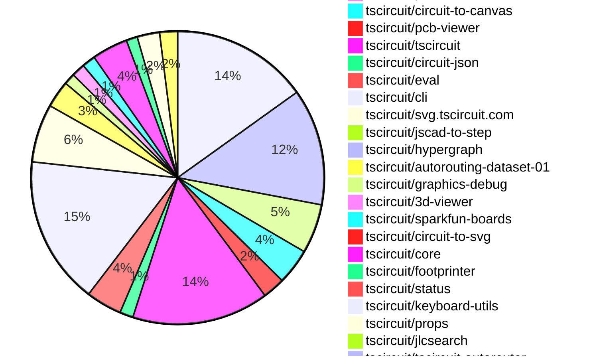

# Contribution Overview 2026-02-03

The current week is shown below. There are 3 major sections:

- [Contributor Overview](#contributor-overview)
- [PRs by Repository](#prs-by-repository)
- [PRs by Contributor](#changes-by-contributor)
- [Scoring & Sponsorship Details](/docs/sponsorship-calculation-explanation.md)

## PRs by Repository

## Contributor Overview

| Contributor | 🐳 Major | 🐙 Minor | 🐌 Tiny | ⭐ | Discussion Contributions |
|-------------|---------|---------|---------|-----|--------------------------|
| [seveibar](#seveibar) | 8 | 10 | 11 | 👑 | 0🔹 0🔶 0💎 |
| [Abse2001](#Abse2001) | 3 | 6 | 7 | ⭐⭐⭐ | 0🔹 0🔶 0💎 |
| [ShiboSoftwareDev](#ShiboSoftwareDev) | 3 | 6 | 4 | ⭐⭐⭐ | 0🔹 0🔶 0💎 |
| [imrishabh18](#imrishabh18) | 6 | 6 | 5 | ⭐⭐⭐ | 0🔹 0🔶 0💎 |
| [AnasSarkiz](#AnasSarkiz) | 5 | 3 | 4 | ⭐⭐⭐ | 0🔹 0🔶 0💎 |
| [techmannih](#techmannih) | 2 | 7 | 3 | ⭐⭐⭐ | 0🔹 0🔶 0💎 |
| [ArnavK-09](#ArnavK-09) | 4 | 3 | 7 | ⭐⭐⭐ | 0🔹 0🔶 0💎 |
| [rushabhcodes](#rushabhcodes) | 5 | 2 | 4 | ⭐⭐⭐ | 0🔹 0🔶 0💎 |
| [MustafaMulla29](#MustafaMulla29) | 2 | 8 | 3 | ⭐⭐ | 0🔹 0🔶 0💎 |
| [tscircuitbot](#tscircuitbot) | 0 | 0 | 283 | ⭐⭐ | 0🔹 0🔶 0💎 |
| [shehaban](#shehaban) | 2 | 2 | 0 | ⭐⭐ | 0🔹 0🔶 0💎 |
| [0hmX](#0hmX) | 1 | 2 | 3 | ⭐⭐ | 0🔹 0🔶 0💎 |
| [nailoo](#nailoo) | 0 | 4 | 0 | ⭐ | 0🔹 0🔶 0💎 |
| [bimakw](#bimakw) | 1 | 2 | 0 | ⭐ | 0🔹 0🔶 0💎 |
| [Heinrich-XIAO](#Heinrich-XIAO) | 0 | 0 | 2 |  | 0🔹 0🔶 0💎 |
| [guptadeepak8](#guptadeepak8) | 0 | 1 | 0 |  | 0🔹 0🔶 0💎 |

> Note: AI evaluates PRs and assigns 1-3 star ratings automatically. 4 and 5 star ratings require manual staff review.

### Discussion Contribution Legend

- 🔹 Normal Comments: Basic participation with minimal effort
- 🔶 Great Informative Comments: Thoughtful participation that adds value
- 💎 Incredible Comments: Exceptional participation with high-quality content

## Review Table

[reviews-received-hover]: ## "Number of reviews received for PRs for this contributor"
[approvals-received-hover]: ## "Number of approvals received for PRs this contributor authored"
[rejections-received-hover]: ## "Number of rejections received for PRs this contributor authored"
[prs-opened-hover]: ## "Number of PRs opened by this contributor"
[issues-created-hover]: ## "Number of issues created by this contributor"

| Contributor | Reviews Received | Approvals Received | Rejections Received | Approvals | Rejections | PRs Opened | PRs Merged | Issues Created |
|---|---|---|---|---|---|---|---|---|
| [aifunmobi](#aifunmobi) | 4 | 0 | 2 | 0 | 0 | 5 | 0 | 0 |
| [rushabhcodes](#rushabhcodes) | 37 | 15 | 1 | 6 | 5 | 14 | 11 | 0 |
| [ArnavK-09](#ArnavK-09) | 13 | 10 | 1 | 3 | 0 | 17 | 15 | 0 |
| [seveibar](#seveibar) | 3 | 0 | 0 | 61 | 3 | 33 | 29 | 0 |
| [Simplereally](#Simplereally) | 0 | 0 | 0 | 0 | 0 | 2 | 0 | 0 |
| [nailoo](#nailoo) | 8 | 6 | 1 | 0 | 0 | 5 | 4 | 0 |
| [Abse2001](#Abse2001) | 20 | 18 | 0 | 16 | 2 | 18 | 16 | 0 |
| [AnasSarkiz](#AnasSarkiz) | 9 | 8 | 0 | 2 | 0 | 12 | 12 | 0 |
| [tscircuitbot](#tscircuitbot) | 0 | 0 | 0 | 0 | 0 | 340 | 283 | 0 |
| [ShiboSoftwareDev](#ShiboSoftwareDev) | 18 | 14 | 0 | 18 | 0 | 16 | 13 | 0 |
| [techmannih](#techmannih) | 19 | 13 | 1 | 7 | 1 | 15 | 12 | 0 |
| [imrishabh18](#imrishabh18) | 10 | 4 | 0 | 6 | 1 | 19 | 17 | 0 |
| [MustafaMulla29](#MustafaMulla29) | 17 | 13 | 0 | 1 | 0 | 13 | 13 | 0 |
| [shehaban](#shehaban) | 11 | 9 | 1 | 0 | 0 | 4 | 4 | 0 |
| [baeoc](#baeoc) | 0 | 0 | 0 | 1 | 0 | 0 | 0 | 0 |
| [BoozeLee](#BoozeLee) | 1 | 0 | 0 | 0 | 0 | 3 | 0 | 0 |
| [dwiel](#dwiel) | 0 | 0 | 0 | 0 | 0 | 1 | 0 | 0 |
| [bimakw](#bimakw) | 11 | 5 | 1 | 0 | 0 | 8 | 3 | 0 |
| [1234-ad](#1234-ad) | 0 | 0 | 0 | 0 | 0 | 1 | 0 | 0 |
| [cryptoaibot1738728800](#cryptoaibot1738728800) | 0 | 0 | 0 | 0 | 0 | 4 | 0 | 0 |
| [Devesh36](#Devesh36) | 1 | 0 | 1 | 0 | 0 | 4 | 0 | 0 |
| [Heinrich-XIAO](#Heinrich-XIAO) | 4 | 4 | 0 | 0 | 0 | 5 | 2 | 0 |
| [guptadeepak8](#guptadeepak8) | 2 | 2 | 0 | 0 | 0 | 1 | 1 | 0 |
| [0hmX](#0hmX) | 7 | 0 | 1 | 0 | 0 | 10 | 8 | 0 |
| [AouIssa](#AouIssa) | 0 | 0 | 0 | 0 | 0 | 1 | 0 | 0 |
| [GhadiSaab](#GhadiSaab) | 0 | 0 | 0 | 0 | 0 | 1 | 0 | 0 |
| [AliakbarArshadi](#AliakbarArshadi) | 2 | 0 | 2 | 0 | 0 | 1 | 0 | 0 |
| [GDN84](#GDN84) | 0 | 0 | 0 | 0 | 0 | 1 | 0 | 0 |
| [Excellencedev](#Excellencedev) | 0 | 0 | 0 | 0 | 0 | 1 | 0 | 0 |

## Changes by Repository

### [tscircuit/tscircuit.com](https://github.com/tscircuit/tscircuit.com)

| PR # | Impact | Rating | Contributor | Description |
|------|--------|--------|-------------|-------------|
| [#2694](https://github.com/tscircuit/tscircuit.com/pull/2694) | 🐳 Major | ⭐⭐⭐ | ArnavK-09 | Displays binary files with a download option and parses blob content as text if possible, instead of showing opaque blob URLs in the editor. |
| [#2683](https://github.com/tscircuit/tscircuit.com/pull/2683) | 🐳 Major | ⭐⭐⭐ | ArnavK-09 | Displays binary files with a download option and parses blob content as text if possible, instead of showing opaque blob URLs in the editor. |
| [#2642](https://github.com/tscircuit/tscircuit.com/pull/2642) | 🐳 Major | ⭐⭐⭐ | ArnavK-09 | Changes the search functionality to retrieve organizations instead of accounts, updating the UI components and API calls accordingly. |
| [#2639](https://github.com/tscircuit/tscircuit.com/pull/2639) | 🐳 Major | ⭐⭐⭐ | ArnavK-09 | Fixes the KiCad PCM URL link rendering in the sidebar of the package release details. |
| [#2690](https://github.com/tscircuit/tscircuit.com/pull/2690) | 🐳 Major | ⭐⭐⭐ | imrishabh18 | Adds a resolveStaticAsset function to the CadViewer for resolving relative paths of 3D models in the viewer. |
| [#2693](https://github.com/tscircuit/tscircuit.com/pull/2693) | 🐳 Major | ⭐⭐⭐ | imrishabh18 | Converts model URLs to blob URLs for improved asset handling in the 3D view component. |
| [#2675](https://github.com/tscircuit/tscircuit.com/pull/2675) | 🐳 Major | ⭐⭐⭐ | imrishabh18 | Adds a dialog component for users to create new subdomains for package releases, allowing for better organization and access to package versions. |
| [#2677](https://github.com/tscircuit/tscircuit.com/pull/2677) | 🐳 Major | ⭐⭐⭐ | imrishabh18 | Adds the ability to edit the package domain directly from the release deployment page, allowing users to manage their package domains more effectively. |
| [#2670](https://github.com/tscircuit/tscircuit.com/pull/2670) | 🐳 Major | ⭐⭐⭐ | imrishabh18 | Removes the package_deployments endpoints and adds new fake endpoints for package_domains to handle package domain management. |
| [#2672](https://github.com/tscircuit/tscircuit.com/pull/2672) | 🐳 Major | ⭐⭐⭐ | imrishabh18 | Adds functionality to edit the subdomain for package releases, including validation and error handling for domain names. |
| [#2679](https://github.com/tscircuit/tscircuit.com/pull/2679) | 🐙 Minor | ⭐⭐ | ArnavK-09 | Adds a tooltip with a link to documentation on how to use the KiCad PCM URL in the KicadPcmCommand component and the sidebar releases section. |
| [#2640](https://github.com/tscircuit/tscircuit.com/pull/2640) | 🐙 Minor | ⭐⭐ | ArnavK-09 | Adds a new API endpoint for searching organizations by their tscircuit_handle, including user permissions and counts of members and packages. |
| [#2699](https://github.com/tscircuit/tscircuit.com/pull/2699) | 🐙 Minor | ⭐⭐ | imrishabh18 | Make the About section show the packages configured domain URL when available, while preserving existing fallbacks and matching behavior across desktop and mobile. |
| [#2692](https://github.com/tscircuit/tscircuit.com/pull/2692) | 🐙 Minor | ⭐⭐ | imrishabh18 | Adds session token to the download endpoint for fetching models from private packages |

🌠Tiny Contributions (47)

| PR # | Impact | Contributor | Description |
|------|--------|-------------|-------------|
| [#2684](https://github.com/tscircuit/tscircuit.com/pull/2684) | 🐌 Tiny | ArnavK-09 | Removes badge links for completed and open bounties from the README file. |
| [#2689](https://github.com/tscircuit/tscircuit.com/pull/2689) | 🐌 Tiny | ArnavK-09 | Revamps the user settings UI by introducing a new layout with sections for general settings, GitHub connection, and account actions, enhancing user navigation and interaction. |
| [#2681](https://github.com/tscircuit/tscircuit.com/pull/2681) | 🐌 Tiny | ArnavK-09 | Refactors the KiCad PCM URL component to improve code reusability and maintainability by creating a dedicated KicadPcmCommand component. |
| [#2682](https://github.com/tscircuit/tscircuit.com/pull/2682) | 🐌 Tiny | ArnavK-09 | Changes the profile link in the footer to use the tscircuit_handle instead of the github_username for logged-in users. |
| [#2680](https://github.com/tscircuit/tscircuit.com/pull/2680) | 🐌 Tiny | ArnavK-09 | img width1858 height988 altimage srchttps:github.comuser-attachmentsassetsc908f711-abff-4007-b3d9-7d776b9ebd93 |
| [#2695](https://github.com/tscircuit/tscircuit.com/pull/2695) | 🐌 Tiny | AnasSarkiz | Updates the circuit-json-to-step dependency to version 0.0.17, resolving issues related to STEP file generation. |
| [#2700](https://github.com/tscircuit/tscircuit.com/pull/2700) | 🐌 Tiny | tscircuitbot | Automated package update |
| [#2691](https://github.com/tscircuit/tscircuit.com/pull/2691) | 🐌 Tiny | tscircuitbot | Automated package update to version 0.0.194 |
| [#2696](https://github.com/tscircuit/tscircuit.com/pull/2696) | 🐌 Tiny | tscircuitbot | Automated package update |
| [#2687](https://github.com/tscircuit/tscircuit.com/pull/2687) | 🐌 Tiny | tscircuitbot | Updates the tscircuitrunframe package from version 0.0.1585 to 0.0.1586 |
| [#2688](https://github.com/tscircuit/tscircuit.com/pull/2688) | 🐌 Tiny | tscircuitbot | Updates the tscircuitrunframe package from version 0.0.1586 to 0.0.1587 |
| [#2686](https://github.com/tscircuit/tscircuit.com/pull/2686) | 🐌 Tiny | tscircuitbot | Updates the tscircuiteval package to version 0.0.626 in the package.json file. |
| [#2668](https://github.com/tscircuit/tscircuit.com/pull/2668) | 🐌 Tiny | tscircuitbot | Updates the tscircuitrunframe package to version 0.0.1581 in the package.json file. |
| [#2678](https://github.com/tscircuit/tscircuit.com/pull/2678) | 🐌 Tiny | tscircuitbot | Updates the tscircuitrunframe package from version 0.0.1584 to 0.0.1585 |
| [#2676](https://github.com/tscircuit/tscircuit.com/pull/2676) | 🐌 Tiny | tscircuitbot | Automated package update |
| [#2666](https://github.com/tscircuit/tscircuit.com/pull/2666) | 🐌 Tiny | tscircuitbot | Automated package update |
| [#2673](https://github.com/tscircuit/tscircuit.com/pull/2673) | 🐌 Tiny | tscircuitbot | Automated package update |
| [#2669](https://github.com/tscircuit/tscircuit.com/pull/2669) | 🐌 Tiny | tscircuitbot | Updates the tscircuitrunframe package from version 0.0.1581 to 0.0.1582 |
| [#2665](https://github.com/tscircuit/tscircuit.com/pull/2665) | 🐌 Tiny | tscircuitbot | Automated package update |
| [#2674](https://github.com/tscircuit/tscircuit.com/pull/2674) | 🐌 Tiny | tscircuitbot | Automated package update |
| [#2671](https://github.com/tscircuit/tscircuit.com/pull/2671) | 🐌 Tiny | tscircuitbot | Automated package update |
| [#2664](https://github.com/tscircuit/tscircuit.com/pull/2664) | 🐌 Tiny | tscircuitbot | Updates the tscircuitrunframe package from version 0.0.1578 to 0.0.1579 |
| [#2662](https://github.com/tscircuit/tscircuit.com/pull/2662) | 🐌 Tiny | tscircuitbot | Updates the tscircuitrunframe package from version 0.0.1577 to 0.0.1578 |
| [#2660](https://github.com/tscircuit/tscircuit.com/pull/2660) | 🐌 Tiny | tscircuitbot | Updates the tscircuitrunframe package from version 0.0.1576 to 0.0.1577 |
| [#2661](https://github.com/tscircuit/tscircuit.com/pull/2661) | 🐌 Tiny | tscircuitbot | Updates the tscircuiteval package from version 0.0.623 to 0.0.624 |
| [#2636](https://github.com/tscircuit/tscircuit.com/pull/2636) | 🐌 Tiny | tscircuitbot | Updates the tscircuitrunframe package from version 0.0.1564 to 0.0.1565 |
| [#2652](https://github.com/tscircuit/tscircuit.com/pull/2652) | 🐌 Tiny | tscircuitbot | Updates the tscircuitrunframe package from version 0.0.1571 to 0.0.1572 |
| [#2650](https://github.com/tscircuit/tscircuit.com/pull/2650) | 🐌 Tiny | tscircuitbot | Updates the tscircuitrunframe package to version 0.0.1570 |
| [#2648](https://github.com/tscircuit/tscircuit.com/pull/2648) | 🐌 Tiny | tscircuitbot | Updates the tscircuitrunframe package from version 0.0.1567 to 0.0.1569 |
| [#2643](https://github.com/tscircuit/tscircuit.com/pull/2643) | 🐌 Tiny | tscircuitbot | Automated package update |
| [#2651](https://github.com/tscircuit/tscircuit.com/pull/2651) | 🐌 Tiny | tscircuitbot | Updates the tscircuitrunframe package from version 0.0.1570 to 0.0.1571 |
| [#2646](https://github.com/tscircuit/tscircuit.com/pull/2646) | 🐌 Tiny | tscircuitbot | Updates the tscircuiteval package from version 0.0.619 to 0.0.620 |
| [#2659](https://github.com/tscircuit/tscircuit.com/pull/2659) | 🐌 Tiny | tscircuitbot | Automated package update |
| [#2649](https://github.com/tscircuit/tscircuit.com/pull/2649) | 🐌 Tiny | tscircuitbot | Updates the tscircuiteval package from version 0.0.621 to 0.0.622 |
| [#2656](https://github.com/tscircuit/tscircuit.com/pull/2656) | 🐌 Tiny | tscircuitbot | Updates the tscircuiteval package to version 0.0.623 in the package.json file. |
| [#2647](https://github.com/tscircuit/tscircuit.com/pull/2647) | 🐌 Tiny | tscircuitbot | Updates the tscircuiteval package from version 0.0.620 to 0.0.621 |
| [#2634](https://github.com/tscircuit/tscircuit.com/pull/2634) | 🐌 Tiny | tscircuitbot | Automated package update |
| [#2635](https://github.com/tscircuit/tscircuit.com/pull/2635) | 🐌 Tiny | tscircuitbot | Updates the tscircuiteval package to version 0.0.619 in the package.json file. |
| [#2641](https://github.com/tscircuit/tscircuit.com/pull/2641) | 🐌 Tiny | tscircuitbot | Automated package update to version 0.0.191 |
| [#2653](https://github.com/tscircuit/tscircuit.com/pull/2653) | 🐌 Tiny | tscircuitbot | Automated package update |
| [#2657](https://github.com/tscircuit/tscircuit.com/pull/2657) | 🐌 Tiny | tscircuitbot | Automated package update |
| [#2645](https://github.com/tscircuit/tscircuit.com/pull/2645) | 🐌 Tiny | tscircuitbot | Updates the tscircuitrunframe package from version 0.0.1566 to 0.0.1567 |
| [#2638](https://github.com/tscircuit/tscircuit.com/pull/2638) | 🐌 Tiny | imrishabh18 | Replaces the useComponent hook with direct component imports in the sample board templates for better performance and clarity. |
| [#2663](https://github.com/tscircuit/tscircuit.com/pull/2663) | 🐌 Tiny | seveibar | Adds new feature sections to the landing page for AI-compatible electronics, sharing capabilities, analog simulation, autorouting, KiCad support, and BOM checks. |
| [#2667](https://github.com/tscircuit/tscircuit.com/pull/2667) | 🐌 Tiny | seveibar | Replaces the static hero image on the landing page with an embedded YouTube video to provide a video preview of the product. |
| [#2685](https://github.com/tscircuit/tscircuit.com/pull/2685) | 🐌 Tiny | Heinrich-XIAO | Removes non-existent properties from the SmdUsbC and RedLed components in the blinking light example, cleaning up the code. |
| [#2654](https://github.com/tscircuit/tscircuit.com/pull/2654) | 🐌 Tiny | Heinrich-XIAO | Fixes the naming of components in the Blinking LED Board template to ensure proper identification and functionality. |

### [tscircuit/schematic-viewer](https://github.com/tscircuit/schematic-viewer)

| PR # | Impact | Rating | Contributor | Description |
|------|--------|--------|-------------|-------------|
| [#163](https://github.com/tscircuit/schematic-viewer/pull/163) | 🐙 Minor | ⭐⭐ | ArnavK-09 | Fixes the live debug grid and port visibility toggles in the SchematicViewer component, allowing users to enable or disable the debug grid and schematic ports dynamically. |

### [tscircuit/contribution-tracker](https://github.com/tscircuit/contribution-tracker)

| PR # | Impact | Rating | Contributor | Description |
|------|--------|--------|-------------|-------------|
| [#303](https://github.com/tscircuit/contribution-tracker/pull/303) | 🐙 Minor | ⭐⭐ | ShiboSoftwareDev | Changes the weekly overview generation to start from the most recent Tuesday at 18:30 UTC instead of Wednesday. |

🌠Tiny Contributions (2)

| PR # | Impact | Contributor | Description |
|------|--------|-------------|-------------|
| [#301](https://github.com/tscircuit/contribution-tracker/pull/301) | 🐌 Tiny | ArnavK-09 | Updates the cron job schedule to count pull requests that were not counted for 1.5 hours. |
| [#304](https://github.com/tscircuit/contribution-tracker/pull/304) | 🐌 Tiny | ShiboSoftwareDev | This pull request removes redundant files that are no longer needed in the repository, specifically the JSON and Markdown files related to contribution overviews. |

### [tscircuit/runframe](https://github.com/tscircuit/runframe)

| PR # | Impact | Rating | Contributor | Description |
|------|--------|--------|-------------|-------------|
| [#2413](https://github.com/tscircuit/runframe/pull/2413) | 🐙 Minor | ⭐⭐ | guptadeepak8 | When there is one Availabel Source user might get confused if its a button Fixes:- tscircuittscircuit.com2298 |

🌠Tiny Contributions (51)

| PR # | Impact | Contributor | Description |
|------|--------|-------------|-------------|
| [#2541](https://github.com/tscircuit/runframe/pull/2541) | 🐌 Tiny | ArnavK-09 | Updates the schematic viewer dependency to version 2.0.56 in package.json |
| [#2593](https://github.com/tscircuit/runframe/pull/2593) | 🐌 Tiny | AnasSarkiz | Updates the version of the circuit-json-to-step dependency from 0.0.13 to 0.0.16 in package.json |
| [#2601](https://github.com/tscircuit/runframe/pull/2601) | 🐌 Tiny | tscircuitbot | Automated package update |
| [#2600](https://github.com/tscircuit/runframe/pull/2600) | 🐌 Tiny | tscircuitbot | Updates the circuit-json-to-kicad package version from 0.0.69 to 0.0.71 in package.json |
| [#2598](https://github.com/tscircuit/runframe/pull/2598) | 🐌 Tiny | tscircuitbot | Automated package update |
| [#2597](https://github.com/tscircuit/runframe/pull/2597) | 🐌 Tiny | tscircuitbot | Updates the tscircuitpcb-viewer package from version 1.11.334 to 1.11.335 |
| [#2596](https://github.com/tscircuit/runframe/pull/2596) | 🐌 Tiny | tscircuitbot | Automated package update |
| [#2595](https://github.com/tscircuit/runframe/pull/2595) | 🐌 Tiny | tscircuitbot | Updates the tscircuit3d-viewer package from version 0.0.510 to 0.0.511 |
| [#2594](https://github.com/tscircuit/runframe/pull/2594) | 🐌 Tiny | tscircuitbot | Automated package update |
| [#2591](https://github.com/tscircuit/runframe/pull/2591) | 🐌 Tiny | tscircuitbot | Updates the circuit-json-to-kicad package from version 0.0.68 to 0.0.69 in package.json |
| [#2592](https://github.com/tscircuit/runframe/pull/2592) | 🐌 Tiny | tscircuitbot | Automated package update |
| [#2585](https://github.com/tscircuit/runframe/pull/2585) | 🐌 Tiny | tscircuitbot | Automated package update |
| [#2579](https://github.com/tscircuit/runframe/pull/2579) | 🐌 Tiny | tscircuitbot | Automated package update |
| [#2588](https://github.com/tscircuit/runframe/pull/2588) | 🐌 Tiny | tscircuitbot | Updates the tscircuit3d-viewer package from version 0.0.509 to 0.0.510 |
| [#2586](https://github.com/tscircuit/runframe/pull/2586) | 🐌 Tiny | tscircuitbot | Updates the tscircuitpcb-viewer package from version 1.11.333 to 1.11.334 |
| [#2584](https://github.com/tscircuit/runframe/pull/2584) | 🐌 Tiny | tscircuitbot | Updates the tscircuitpcb-viewer package from version 1.11.332 to 1.11.333 |
| [#2581](https://github.com/tscircuit/runframe/pull/2581) | 🐌 Tiny | tscircuitbot | Updates the circuit-json-to-kicad package from version 0.0.67 to 0.0.68 in package.json |
| [#2578](https://github.com/tscircuit/runframe/pull/2578) | 🐌 Tiny | tscircuitbot | Updates the tscircuiteval package from version 0.0.624 to 0.0.625 |
| [#2583](https://github.com/tscircuit/runframe/pull/2583) | 🐌 Tiny | tscircuitbot | Automated package update |
| [#2589](https://github.com/tscircuit/runframe/pull/2589) | 🐌 Tiny | tscircuitbot | Automated package update |
| [#2587](https://github.com/tscircuit/runframe/pull/2587) | 🐌 Tiny | tscircuitbot | Automated package update |
| [#2582](https://github.com/tscircuit/runframe/pull/2582) | 🐌 Tiny | tscircuitbot | Automated package update |
| [#2577](https://github.com/tscircuit/runframe/pull/2577) | 🐌 Tiny | tscircuitbot | Automated package update |
| [#2572](https://github.com/tscircuit/runframe/pull/2572) | 🐌 Tiny | tscircuitbot | Updates the circuit-json-to-kicad package version from 0.0.66 to 0.0.67 in package.json |
| [#2574](https://github.com/tscircuit/runframe/pull/2574) | 🐌 Tiny | tscircuitbot | Updates the tscircuiteval package to version 0.0.624 in the package.json file. |
| [#2573](https://github.com/tscircuit/runframe/pull/2573) | 🐌 Tiny | tscircuitbot | Automated package update |
| [#2575](https://github.com/tscircuit/runframe/pull/2575) | 🐌 Tiny | tscircuitbot | Automated package update |
| [#2561](https://github.com/tscircuit/runframe/pull/2561) | 🐌 Tiny | tscircuitbot | Updates the tscircuit3d-viewer package from version 0.0.507 to 0.0.509 |
| [#2569](https://github.com/tscircuit/runframe/pull/2569) | 🐌 Tiny | tscircuitbot | Updates the tscircuitpcb-viewer package from version 1.11.330 to 1.11.332 |
| [#2565](https://github.com/tscircuit/runframe/pull/2565) | 🐌 Tiny | tscircuitbot | Updates the circuit-json-to-kicad package version from 0.0.65 to 0.0.66 in package.json |
| [#2558](https://github.com/tscircuit/runframe/pull/2558) | 🐌 Tiny | tscircuitbot | Updates the tscircuit3d-viewer package to version 0.0.507 in package.json |
| [#2556](https://github.com/tscircuit/runframe/pull/2556) | 🐌 Tiny | tscircuitbot | Updates the circuit-json-to-kicad package from version 0.0.62 to 0.0.65 |
| [#2552](https://github.com/tscircuit/runframe/pull/2552) | 🐌 Tiny | tscircuitbot | Automated package update |
| [#2549](https://github.com/tscircuit/runframe/pull/2549) | 🐌 Tiny | tscircuitbot | Updates the tscircuiteval package from version 0.0.619 to 0.0.621 in the package.json file. |
| [#2546](https://github.com/tscircuit/runframe/pull/2546) | 🐌 Tiny | tscircuitbot | Updates the circuit-json-to-kicad package version from 0.0.60 to 0.0.62 in package.json |
| [#2543](https://github.com/tscircuit/runframe/pull/2543) | 🐌 Tiny | tscircuitbot | Updates the tscircuit3d-viewer package to version 0.0.506 in package.json |
| [#2537](https://github.com/tscircuit/runframe/pull/2537) | 🐌 Tiny | tscircuitbot | Automated package update |
| [#2536](https://github.com/tscircuit/runframe/pull/2536) | 🐌 Tiny | tscircuitbot | Updates the tscircuiteval package to version 0.0.619 in the package.json file. |
| [#2532](https://github.com/tscircuit/runframe/pull/2532) | 🐌 Tiny | tscircuitbot | Updates the circuit-json-to-kicad package version from 0.0.58 to 0.0.60 in package.json |
| [#2568](https://github.com/tscircuit/runframe/pull/2568) | 🐌 Tiny | tscircuitbot | Automated package update |
| [#2567](https://github.com/tscircuit/runframe/pull/2567) | 🐌 Tiny | tscircuitbot | Updates the tscircuiteval package to version 0.0.623 in the package.json file. |
| [#2566](https://github.com/tscircuit/runframe/pull/2566) | 🐌 Tiny | tscircuitbot | Automated package update |
| [#2562](https://github.com/tscircuit/runframe/pull/2562) | 🐌 Tiny | tscircuitbot | Automated package update |
| [#2559](https://github.com/tscircuit/runframe/pull/2559) | 🐌 Tiny | tscircuitbot | Automated package update |
| [#2557](https://github.com/tscircuit/runframe/pull/2557) | 🐌 Tiny | tscircuitbot | Automated package update |
| [#2551](https://github.com/tscircuit/runframe/pull/2551) | 🐌 Tiny | tscircuitbot | Updates the tscircuiteval package to version 0.0.622 in the package.json file. |
| [#2550](https://github.com/tscircuit/runframe/pull/2550) | 🐌 Tiny | tscircuitbot | Automated package update |
| [#2544](https://github.com/tscircuit/runframe/pull/2544) | 🐌 Tiny | tscircuitbot | Automated package update |
| [#2570](https://github.com/tscircuit/runframe/pull/2570) | 🐌 Tiny | tscircuitbot | Automated package update |
| [#2542](https://github.com/tscircuit/runframe/pull/2542) | 🐌 Tiny | tscircuitbot | Automated package update |
| [#2576](https://github.com/tscircuit/runframe/pull/2576) | 🐌 Tiny | seveibar | Fixes header menu alignment to ensure the View menu remains adjacent to the File menu, preventing UX confusion due to right-alignment. |

### [tscircuit/circuit-json-to-step](https://github.com/tscircuit/circuit-json-to-step)

| PR # | Impact | Rating | Contributor | Description |
|------|--------|--------|-------------|-------------|
| [#50](https://github.com/tscircuit/circuit-json-to-step/pull/50) | 🐳 Major | ⭐⭐⭐ | AnasSarkiz | Adds complete geometry generation for pill and rotated pill hole shapes during Circuit JSON to STEP conversion, fixing inaccurate or missing hole representation in exported models. |
| [#48](https://github.com/tscircuit/circuit-json-to-step/pull/48) | 🐙 Minor | ⭐⭐ | AnasSarkiz | Removes duplicate consecutive outline vertices to prevent degenerate board edges and normalizes edge directions using actual edge lengths in STEP edge vectors. |

🌠Tiny Contributions (2)

| PR # | Impact | Contributor | Description |
|------|--------|-------------|-------------|
| [#46](https://github.com/tscircuit/circuit-json-to-step/pull/46) | 🐌 Tiny | AnasSarkiz | Adds a reproduction test for a board with rotated pill-shaped holes to validate the generation of STEP files. |
| [#49](https://github.com/tscircuit/circuit-json-to-step/pull/49) | 🐌 Tiny | tscircuitbot | Automated package update |

### [tscircuit/circuit-json-to-kicad](https://github.com/tscircuit/circuit-json-to-kicad)

| PR # | Impact | Rating | Contributor | Description |
|------|--------|--------|-------------|-------------|
| [#117](https://github.com/tscircuit/circuit-json-to-kicad/pull/117) | 🐳 Major | ⭐⭐⭐ | AnasSarkiz | Fixes a layer-assignment bug when converting trace.route into KiCad PCB segments, ensuring segments are exported onto the correct layer by deriving each segments layer from startPoint.layer, endPoint.layer, or lastKnownLayer, and updating lastKnownLayer as it walks the route. |
| [#126](https://github.com/tscircuit/circuit-json-to-kicad/pull/126) | 🐳 Major | ⭐⭐⭐ | MustafaMulla29 | Fixes duplicate ports in custom symbols generated for KiCad output by implementing a two-step port resolution process to ensure only unique ports are retained. |
| [#122](https://github.com/tscircuit/circuit-json-to-kicad/pull/122) | 🐳 Major | ⭐⭐⭐ | MustafaMulla29 | Add support for courtyard outlines and refactor the AddFootprintsStage into multiple converter files for better organization and maintainability. |
| [#128](https://github.com/tscircuit/circuit-json-to-kicad/pull/128) | 🐙 Minor | ⭐⭐ | techmannih | Adds schematic symbol and PCB footprint generation for potentiometers, including their display resistance value. |
| [#110](https://github.com/tscircuit/circuit-json-to-kicad/pull/110) | 🐙 Minor | ⭐⭐ | seveibar | Adds support for four-layer PCBs by implementing layer mapping and updating PCB initialization to accommodate additional copper layers. |
| [#130](https://github.com/tscircuit/circuit-json-to-kicad/pull/130) | 🐙 Minor | ⭐⭐ | MustafaMulla29 | Deduplicates custom symbols in the KiCad library based on their actual names, ensuring that multiple components sharing the same symbol name are represented by a single deduplicated symbol. |
| [#124](https://github.com/tscircuit/circuit-json-to-kicad/pull/124) | 🐙 Minor | ⭐⭐ | MustafaMulla29 | Adds support for fill color in schematic paths, allowing for filled shapes in circuit designs. |
| [#108](https://github.com/tscircuit/circuit-json-to-kicad/pull/108) | 🐙 Minor | ⭐⭐ | MustafaMulla29 | Adds support for handling pcb_note_text and pcb_note_rect elements in KiCad footprint generation. |
| [#119](https://github.com/tscircuit/circuit-json-to-kicad/pull/119) | 🐙 Minor | ⭐⭐ | MustafaMulla29 | Add support for courtyard rectangles in KiCad by converting pcb_courtyard_rect elements to KiCad fp_rect on the courtyard layer. |
| [#115](https://github.com/tscircuit/circuit-json-to-kicad/pull/115) | 🐙 Minor | ⭐⭐ | MustafaMulla29 | Adds support for courtyard circles in KiCad by converting pcb_courtyard_circle elements to KiCad fp_circle on the courtyard layer. |
| [#109](https://github.com/tscircuit/circuit-json-to-kicad/pull/109) | 🐙 Minor | ⭐⭐ | ShiboSoftwareDev | Adds functionality to convert fabrication note text from circuit JSON to KiCad format, allowing for the inclusion of manufacturing notes in PCB designs. |

🌠Tiny Contributions (11)

| PR # | Impact | Contributor | Description |
|------|--------|-------------|-------------|
| [#131](https://github.com/tscircuit/circuit-json-to-kicad/pull/131) | 🐌 Tiny | tscircuitbot | Automated package update |
| [#127](https://github.com/tscircuit/circuit-json-to-kicad/pull/127) | 🐌 Tiny | tscircuitbot | Automated package update |
| [#125](https://github.com/tscircuit/circuit-json-to-kicad/pull/125) | 🐌 Tiny | tscircuitbot | Automated package update |
| [#123](https://github.com/tscircuit/circuit-json-to-kicad/pull/123) | 🐌 Tiny | tscircuitbot | Automated package update |
| [#111](https://github.com/tscircuit/circuit-json-to-kicad/pull/111) | 🐌 Tiny | tscircuitbot | Automated package update |
| [#114](https://github.com/tscircuit/circuit-json-to-kicad/pull/114) | 🐌 Tiny | tscircuitbot | Automated package update |
| [#116](https://github.com/tscircuit/circuit-json-to-kicad/pull/116) | 🐌 Tiny | tscircuitbot | Automated package update |
| [#120](https://github.com/tscircuit/circuit-json-to-kicad/pull/120) | 🐌 Tiny | tscircuitbot | Automated package update |
| [#113](https://github.com/tscircuit/circuit-json-to-kicad/pull/113) | 🐌 Tiny | tscircuitbot | Automated package update |
| [#121](https://github.com/tscircuit/circuit-json-to-kicad/pull/121) | 🐌 Tiny | tscircuitbot | Automated package update |
| [#112](https://github.com/tscircuit/circuit-json-to-kicad/pull/112) | 🐌 Tiny | MustafaMulla29 | Updates the snapshot images for the KiCad library tests to reflect recent changes in the library. |

### [tscircuit/pcbburn.com](https://github.com/tscircuit/pcbburn.com)

| PR # | Impact | Rating | Contributor | Description |
|------|--------|--------|-------------|-------------|
| [#64](https://github.com/tscircuit/pcbburn.com/pull/64) | 🐳 Major | ⭐⭐⭐ | AnasSarkiz | Adds a confirmation dialog for deleting laser profiles, improving user experience and preventing accidental deletions. |
| [#63](https://github.com/tscircuit/pcbburn.com/pull/63) | 🐳 Major | ⭐⭐⭐ | AnasSarkiz | Replaces the native select for Laser Profiles with a custom dropdown menu that allows for in-place deletion of custom profiles and one-click creation of new profiles. |
| [#61](https://github.com/tscircuit/pcbburn.com/pull/61) | 🐳 Major | ⭐⭐⭐ | AnasSarkiz | Enables users to create, name, and reuse custom laser profiles instead of relying only on built-in presets, with validation for unique names and persistence in localStorage. |
| [#62](https://github.com/tscircuit/pcbburn.com/pull/62) | 🐙 Minor | ⭐⭐ | AnasSarkiz | Fixes an initialization race where the Settings panel could overwrite saved custom laser profiles with  on first render. |

### [tscircuit/circuit-to-canvas](https://github.com/tscircuit/circuit-to-canvas)

| PR # | Impact | Rating | Contributor | Description |
|------|--------|--------|-------------|-------------|
| [#155](https://github.com/tscircuit/circuit-to-canvas/pull/155) | 🐙 Minor | ⭐⭐ | AnasSarkiz | Fixes faint pcb_board outline rendering at low zoom levels by introducing a minimum stroke width option for better visibility. |
| [#153](https://github.com/tscircuit/circuit-to-canvas/pull/153) | 🐙 Minor | ⭐⭐ | Abse2001 | Implements explicit soldermask rendering for PCB traces and fixes the draw order to ensure soldermask is applied before pad and hole openings, preventing visibility artifacts and aligning with real PCB fabrication behavior. |
| [#147](https://github.com/tscircuit/circuit-to-canvas/pull/147) | 🐙 Minor | ⭐⭐ | techmannih | Adds support for rendering PCB courtyard circles in the canvas drawing context. |
| [#149](https://github.com/tscircuit/circuit-to-canvas/pull/149) | 🐙 Minor | ⭐⭐ | techmannih | Adds support for rendering rectangular courtyard elements in PCB drawings. |
| [#151](https://github.com/tscircuit/circuit-to-canvas/pull/151) | 🐙 Minor | ⭐⭐ | techmannih | Adds support for rendering the bottom layer of PCB courtyards in the drawing functions. |
| [#159](https://github.com/tscircuit/circuit-to-canvas/pull/159) | 🐙 Minor | ⭐⭐ | bimakw | Add is_knockout and knockout_padding support to drawPcbSilkscreenText, matching the existing copper text knockout implementation. |

🌠Tiny Contributions (10)

| PR # | Impact | Contributor | Description |
|------|--------|-------------|-------------|
| [#162](https://github.com/tscircuit/circuit-to-canvas/pull/162) | 🐌 Tiny | tscircuitbot | Automated package update |
| [#160](https://github.com/tscircuit/circuit-to-canvas/pull/160) | 🐌 Tiny | tscircuitbot | Automated package update |
| [#158](https://github.com/tscircuit/circuit-to-canvas/pull/158) | 🐌 Tiny | tscircuitbot | Automated package update |
| [#157](https://github.com/tscircuit/circuit-to-canvas/pull/157) | 🐌 Tiny | tscircuitbot | Automated package update |
| [#148](https://github.com/tscircuit/circuit-to-canvas/pull/148) | 🐌 Tiny | tscircuitbot | Automated package update |
| [#150](https://github.com/tscircuit/circuit-to-canvas/pull/150) | 🐌 Tiny | tscircuitbot | Automated package update |
| [#152](https://github.com/tscircuit/circuit-to-canvas/pull/152) | 🐌 Tiny | tscircuitbot | Automated package update |
| [#154](https://github.com/tscircuit/circuit-to-canvas/pull/154) | 🐌 Tiny | tscircuitbot | Automated package update |
| [#156](https://github.com/tscircuit/circuit-to-canvas/pull/156) | 🐌 Tiny | Abse2001 | Adds a CODEOWNERS file to define code ownership for the repository |
| [#161](https://github.com/tscircuit/circuit-to-canvas/pull/161) | 🐌 Tiny | techmannih | Adds techmannih as a code owner in the CODEOWNERS file to ensure proper code review and ownership responsibilities. |

### [tscircuit/pcb-viewer](https://github.com/tscircuit/pcb-viewer)

| PR # | Impact | Rating | Contributor | Description |
|------|--------|--------|-------------|-------------|
| [#646](https://github.com/tscircuit/pcb-viewer/pull/646) | 🐙 Minor | ⭐⭐ | Abse2001 | Fixes rendering issue where PCB traces appear above plated holes and adds a core fixture for plated holes. |
| [#644](https://github.com/tscircuit/pcb-viewer/pull/644) | 🐙 Minor | ⭐⭐ | techmannih | Adds support for rendering PCB courtyards, including circle and rectangle shapes, in the PCB viewer. |

🌠Tiny Contributions (8)

| PR # | Impact | Contributor | Description |
|------|--------|-------------|-------------|
| [#652](https://github.com/tscircuit/pcb-viewer/pull/652) | 🐌 Tiny | AnasSarkiz | Fixes the issue of PCB board outlines being invisible when zoomed out by enforcing a minimum stroke width of 2px. |
| [#653](https://github.com/tscircuit/pcb-viewer/pull/653) | 🐌 Tiny | tscircuitbot | Automated package update |
| [#649](https://github.com/tscircuit/pcb-viewer/pull/649) | 🐌 Tiny | tscircuitbot | Automated package update |
| [#651](https://github.com/tscircuit/pcb-viewer/pull/651) | 🐌 Tiny | tscircuitbot | Automated package update |
| [#647](https://github.com/tscircuit/pcb-viewer/pull/647) | 🐌 Tiny | tscircuitbot | Automated package update |
| [#645](https://github.com/tscircuit/pcb-viewer/pull/645) | 🐌 Tiny | tscircuitbot | Automated package update |
| [#648](https://github.com/tscircuit/pcb-viewer/pull/648) | 🐌 Tiny | Abse2001 | Changes the rendering of traces on the solder mask layer to be displayed in bright green for better visibility. |
| [#650](https://github.com/tscircuit/pcb-viewer/pull/650) | 🐌 Tiny | Abse2001 | Adds Abse2001 as a code owner in the CODEOWNERS file to ensure proper code review and ownership. |

### [tscircuit/tscircuit](https://github.com/tscircuit/tscircuit)

🌠Tiny Contributions (61)

| PR # | Impact | Contributor | Description |
|------|--------|-------------|-------------|
| [#2152](https://github.com/tscircuit/tscircuit/pull/2152) | 🐌 Tiny | tscircuitbot | Automated package update |
| [#2151](https://github.com/tscircuit/tscircuit/pull/2151) | 🐌 Tiny | tscircuitbot | Updates the package versions for several dependencies in the project, including tscircuitchecks, tscircuitcli, tscircuitcore, and tscircuitrunframe. |
| [#2149](https://github.com/tscircuit/tscircuit/pull/2149) | 🐌 Tiny | tscircuitbot | Automated package update |
| [#2150](https://github.com/tscircuit/tscircuit/pull/2150) | 🐌 Tiny | tscircuitbot | Automated package update |
| [#2148](https://github.com/tscircuit/tscircuit/pull/2148) | 🐌 Tiny | tscircuitbot | Automated package update |
| [#2143](https://github.com/tscircuit/tscircuit/pull/2143) | 🐌 Tiny | tscircuitbot | Automated package update |
| [#2144](https://github.com/tscircuit/tscircuit/pull/2144) | 🐌 Tiny | tscircuitbot | Automated package update |
| [#2146](https://github.com/tscircuit/tscircuit/pull/2146) | 🐌 Tiny | tscircuitbot | Automated package update |
| [#2147](https://github.com/tscircuit/tscircuit/pull/2147) | 🐌 Tiny | tscircuitbot | Automated package update |
| [#2145](https://github.com/tscircuit/tscircuit/pull/2145) | 🐌 Tiny | tscircuitbot | Automated package update |
| [#2134](https://github.com/tscircuit/tscircuit/pull/2134) | 🐌 Tiny | tscircuitbot | Updates the tscircuitcli package from version 0.1.891 to 0.1.892 and the tscircuitrunframe package from version 0.0.1582 to 0.0.1583 in package.json |
| [#2139](https://github.com/tscircuit/tscircuit/pull/2139) | 🐌 Tiny | tscircuitbot | Automated package update to version 0.0.1278 |
| [#2137](https://github.com/tscircuit/tscircuit/pull/2137) | 🐌 Tiny | tscircuitbot | Updates the package version from 0.0.1276 to 0.0.1277 in package.json |
| [#2140](https://github.com/tscircuit/tscircuit/pull/2140) | 🐌 Tiny | tscircuitbot | Updates the tscircuitcli package to version 0.1.895 in package.json |
| [#2126](https://github.com/tscircuit/tscircuit/pull/2126) | 🐌 Tiny | tscircuitbot | Updates the tscircuitcli package from version 0.1.887 to 0.1.888 and the tscircuitrunframe package from version 0.0.1578 to 0.0.1579 in package.json |
| [#2135](https://github.com/tscircuit/tscircuit/pull/2135) | 🐌 Tiny | tscircuitbot | Automated package update |
| [#2132](https://github.com/tscircuit/tscircuit/pull/2132) | 🐌 Tiny | tscircuitbot | Updates the tscircuitcli package from version 0.1.890 to 0.1.891 and the tscircuitrunframe package from version 0.0.1581 to 0.0.1582 in package.json |
| [#2131](https://github.com/tscircuit/tscircuit/pull/2131) | 🐌 Tiny | tscircuitbot | Automated package update |
| [#2141](https://github.com/tscircuit/tscircuit/pull/2141) | 🐌 Tiny | tscircuitbot | Automated package update |
| [#2133](https://github.com/tscircuit/tscircuit/pull/2133) | 🐌 Tiny | tscircuitbot | Automated package update |
| [#2129](https://github.com/tscircuit/tscircuit/pull/2129) | 🐌 Tiny | tscircuitbot | Automated package update |
| [#2138](https://github.com/tscircuit/tscircuit/pull/2138) | 🐌 Tiny | tscircuitbot | Automated package update |
| [#2127](https://github.com/tscircuit/tscircuit/pull/2127) | 🐌 Tiny | tscircuitbot | Automated package update |
| [#2136](https://github.com/tscircuit/tscircuit/pull/2136) | 🐌 Tiny | tscircuitbot | Updates the tscircuitcli package from version 0.1.892 to 0.1.893 and the tscircuitrunframe package from version 0.0.1583 to 0.0.1584 in package.json |
| [#2130](https://github.com/tscircuit/tscircuit/pull/2130) | 🐌 Tiny | tscircuitbot | Updates the tscircuitcli package from version 0.1.889 to 0.1.890 and the tscircuitrunframe package from version 0.0.1580 to 0.0.1581 in package.json |
| [#2128](https://github.com/tscircuit/tscircuit/pull/2128) | 🐌 Tiny | tscircuitbot | Updates the package versions for tscircuitcli, tscircuitcore, tscircuiteval, tscircuitprops, and tscircuitrunframe in package.json |
| [#2120](https://github.com/tscircuit/tscircuit/pull/2120) | 🐌 Tiny | tscircuitbot | Updates the tscircuitcli package to version 0.1.885 |
| [#2122](https://github.com/tscircuit/tscircuit/pull/2122) | 🐌 Tiny | tscircuitbot | Automated package update |
| [#2121](https://github.com/tscircuit/tscircuit/pull/2121) | 🐌 Tiny | tscircuitbot | Automated package update |
| [#2125](https://github.com/tscircuit/tscircuit/pull/2125) | 🐌 Tiny | tscircuitbot | Automated package update |
| [#2123](https://github.com/tscircuit/tscircuit/pull/2123) | 🐌 Tiny | tscircuitbot | Updates the package version from 0.0.1269 to 0.0.1270 in package.json |
| [#2124](https://github.com/tscircuit/tscircuit/pull/2124) | 🐌 Tiny | tscircuitbot | Automated package update |
| [#2118](https://github.com/tscircuit/tscircuit/pull/2118) | 🐌 Tiny | tscircuitbot | Updates the tscircuitcli package from version 0.1.883 to 0.1.884 and the tscircuitrunframe package from version 0.0.1575 to 0.0.1576 in package.json |
| [#2090](https://github.com/tscircuit/tscircuit/pull/2090) | 🐌 Tiny | tscircuitbot | Automated package update |
| [#2088](https://github.com/tscircuit/tscircuit/pull/2088) | 🐌 Tiny | tscircuitbot | Updates the version of the tscircuitcli package from 0.1.870 to 0.1.871 and downgrades tscircuitalphabet from 0.0.20 to 0.0.18 in package.json |
| [#2119](https://github.com/tscircuit/tscircuit/pull/2119) | 🐌 Tiny | tscircuitbot | Updates the package version from 0.0.1267 to 0.0.1268 in package.json |
| [#2096](https://github.com/tscircuit/tscircuit/pull/2096) | 🐌 Tiny | tscircuitbot | Automated package update |
| [#2105](https://github.com/tscircuit/tscircuit/pull/2105) | 🐌 Tiny | tscircuitbot | Updates the package version from 0.0.1261 to 0.0.1262 in package.json |
| [#2091](https://github.com/tscircuit/tscircuit/pull/2091) | 🐌 Tiny | tscircuitbot | Automated package update |
| [#2097](https://github.com/tscircuit/tscircuit/pull/2097) | 🐌 Tiny | tscircuitbot | Automated package update |
| [#2102](https://github.com/tscircuit/tscircuit/pull/2102) | 🐌 Tiny | tscircuitbot | Automated package update |
| [#2087](https://github.com/tscircuit/tscircuit/pull/2087) | 🐌 Tiny | tscircuitbot | Updates the package version from 0.0.1253 to 0.0.1254 in package.json |
| [#2089](https://github.com/tscircuit/tscircuit/pull/2089) | 🐌 Tiny | tscircuitbot | Automated package update |
| [#2107](https://github.com/tscircuit/tscircuit/pull/2107) | 🐌 Tiny | tscircuitbot | Automated package update |
| [#2108](https://github.com/tscircuit/tscircuit/pull/2108) | 🐌 Tiny | tscircuitbot | Updates the package version from 0.0.1262 to 0.0.1263 in package.json |
| [#2114](https://github.com/tscircuit/tscircuit/pull/2114) | 🐌 Tiny | tscircuitbot | Automated package update |
| [#2110](https://github.com/tscircuit/tscircuit/pull/2110) | 🐌 Tiny | tscircuitbot | Updates the tscircuitcli package from version 0.1.879 to 0.1.880 and the tscircuitrunframe package from version 0.0.1571 to 0.0.1572 in package.json |
| [#2116](https://github.com/tscircuit/tscircuit/pull/2116) | 🐌 Tiny | tscircuitbot | Automated package update |
| [#2095](https://github.com/tscircuit/tscircuit/pull/2095) | 🐌 Tiny | tscircuitbot | Updates the tscircuitcli package to version 0.1.874 in the package.json file. |
| [#2093](https://github.com/tscircuit/tscircuit/pull/2093) | 🐌 Tiny | tscircuitbot | Automated package update |
| [#2111](https://github.com/tscircuit/tscircuit/pull/2111) | 🐌 Tiny | tscircuitbot | Updates the package version from 0.0.1263 to 0.0.1264 in package.json |
| [#2092](https://github.com/tscircuit/tscircuit/pull/2092) | 🐌 Tiny | tscircuitbot | Updates the tscircuitcli package from version 0.1.872 to 0.1.873 and the tscircuitrunframe package from version 0.0.1566 to 0.0.1567 in package.json |
| [#2115](https://github.com/tscircuit/tscircuit/pull/2115) | 🐌 Tiny | tscircuitbot | Updates the package version from 0.0.1265 to 0.0.1266 in package.json |
| [#2113](https://github.com/tscircuit/tscircuit/pull/2113) | 🐌 Tiny | tscircuitbot | Automated package update |
| [#2103](https://github.com/tscircuit/tscircuit/pull/2103) | 🐌 Tiny | tscircuitbot | Updates the package version from 0.0.1260 to 0.0.1261 in package.json |
| [#2112](https://github.com/tscircuit/tscircuit/pull/2112) | 🐌 Tiny | tscircuitbot | Automated package update |
| [#2117](https://github.com/tscircuit/tscircuit/pull/2117) | 🐌 Tiny | tscircuitbot | Automated package update |
| [#2100](https://github.com/tscircuit/tscircuit/pull/2100) | 🐌 Tiny | tscircuitbot | Automated package update |
| [#2104](https://github.com/tscircuit/tscircuit/pull/2104) | 🐌 Tiny | tscircuitbot | Automated package update |
| [#2099](https://github.com/tscircuit/tscircuit/pull/2099) | 🐌 Tiny | tscircuitbot | Automated package update |
| [#2086](https://github.com/tscircuit/tscircuit/pull/2086) | 🐌 Tiny | imrishabh18 | Adds the missing tscircuitalphabet package and updates several dependencies in package.json |

### [tscircuit/circuit-json](https://github.com/tscircuit/circuit-json)

| PR # | Impact | Rating | Contributor | Description |
|------|--------|--------|-------------|-------------|
| [#460](https://github.com/tscircuit/circuit-json/pull/460) | 🐳 Major | ⭐⭐⭐ | seveibar | Adds explicit mount flag for carrier PCB and an optional carrier reference ID to the PCB board schema. |
| [#454](https://github.com/tscircuit/circuit-json/pull/454) | 🐙 Minor | ⭐⭐ | Abse2001 | Adds top and bottom courtyard layers to the PCB rendering layers. |
| [#458](https://github.com/tscircuit/circuit-json/pull/458) | 🐙 Minor | ⭐⭐ | MustafaMulla29 | Expands the fill_color property for schematic_path to accept any string value instead of limiting it to red or blue. |

🌠Tiny Contributions (3)

| PR # | Impact | Contributor | Description |
|------|--------|-------------|-------------|
| [#461](https://github.com/tscircuit/circuit-json/pull/461) | 🐌 Tiny | tscircuitbot | Automated package update |
| [#457](https://github.com/tscircuit/circuit-json/pull/457) | 🐌 Tiny | tscircuitbot | Automated package update |
| [#456](https://github.com/tscircuit/circuit-json/pull/456) | 🐌 Tiny | techmannih | Removes visual style properties such as stroke width, closed state, dashed stroke, and color from the PcbCourtyardOutline schema and interface. |

### [tscircuit/eval](https://github.com/tscircuit/eval)

🌠Tiny Contributions (16)

| PR # | Impact | Contributor | Description |
|------|--------|-------------|-------------|
| [#1996](https://github.com/tscircuit/eval/pull/1996) | 🐌 Tiny | tscircuitbot | Automated package update |
| [#1995](https://github.com/tscircuit/eval/pull/1995) | 🐌 Tiny | tscircuitbot | Automated package update |
| [#1993](https://github.com/tscircuit/eval/pull/1993) | 🐌 Tiny | tscircuitbot | Automated package update |
| [#1992](https://github.com/tscircuit/eval/pull/1992) | 🐌 Tiny | tscircuitbot | Automated package update |
| [#1989](https://github.com/tscircuit/eval/pull/1989) | 🐌 Tiny | tscircuitbot | Automated package update |
| [#1990](https://github.com/tscircuit/eval/pull/1990) | 🐌 Tiny | tscircuitbot | Automated package update |
| [#1973](https://github.com/tscircuit/eval/pull/1973) | 🐌 Tiny | tscircuitbot | Automated package update to version 0.0.620 |
| [#1975](https://github.com/tscircuit/eval/pull/1975) | 🐌 Tiny | tscircuitbot | Automated package update |
| [#1972](https://github.com/tscircuit/eval/pull/1972) | 🐌 Tiny | tscircuitbot | Automated package update |
| [#1978](https://github.com/tscircuit/eval/pull/1978) | 🐌 Tiny | tscircuitbot | Automated package update |
| [#1987](https://github.com/tscircuit/eval/pull/1987) | 🐌 Tiny | tscircuitbot | Automated package update to version 0.0.623 |
| [#1986](https://github.com/tscircuit/eval/pull/1986) | 🐌 Tiny | tscircuitbot | Automated package update |
| [#1969](https://github.com/tscircuit/eval/pull/1969) | 🐌 Tiny | tscircuitbot | Updates various package dependencies in the project to their latest versions. |
| [#1976](https://github.com/tscircuit/eval/pull/1976) | 🐌 Tiny | tscircuitbot | Automated package update to version 0.0.621 |
| [#1979](https://github.com/tscircuit/eval/pull/1979) | 🐌 Tiny | tscircuitbot | Automated package update |
| [#1970](https://github.com/tscircuit/eval/pull/1970) | 🐌 Tiny | tscircuitbot | Automated package update |

### [tscircuit/cli](https://github.com/tscircuit/cli)

| PR # | Impact | Rating | Contributor | Description |
|------|--------|--------|-------------|-------------|
| [#1902](https://github.com/tscircuit/cli/pull/1902) | 🐳 Major | ⭐⭐⭐ | seveibar | Adds a centralized helper for file upsert requests and provides actionable timeout guidance for users when uploads to the local file server fail due to timeout errors. |
| [#1893](https://github.com/tscircuit/cli/pull/1893) | 🐳 Major | ⭐⭐⭐ | seveibar | Add a tsci doctor command that runs a set of targeted environment checks to help users diagnose tscircuit auth and registry problems, including checks for session token and npm registry configuration. |
| [#1916](https://github.com/tscircuit/cli/pull/1916) | 🐙 Minor | ⭐⭐ | imrishabh18 | Fixes the export of cadModel step file URL to ensure it is returned as a string instead of a Module object, resolving issues with pre-built libraries. |
| [#1887](https://github.com/tscircuit/cli/pull/1887) | 🐙 Minor | ⭐⭐ | imrishabh18 | Fixes an error where the build process attempts to create a directory at the root of the filesystem when package.json is not found, instead it now correctly uses the current working directory as a fallback. |
| [#1879](https://github.com/tscircuit/cli/pull/1879) | 🐙 Minor | ⭐⭐ | imrishabh18 | Failing to generate the circuit json should throw a fatal error in tsci build --ci |

🌠Tiny Contributions (61)

| PR # | Impact | Contributor | Description |
|------|--------|-------------|-------------|
| [#1949](https://github.com/tscircuit/cli/pull/1949) | 🐌 Tiny | tscircuitbot | Updates the package version from 0.1.899 to 0.1.900 in package.json |
| [#1948](https://github.com/tscircuit/cli/pull/1948) | 🐌 Tiny | tscircuitbot | Updates the tscircuitrunframe package to version 0.0.1590 |
| [#1947](https://github.com/tscircuit/cli/pull/1947) | 🐌 Tiny | tscircuitbot | Updates the package version from v0.1.898 to v0.1.899 in package.json |
| [#1946](https://github.com/tscircuit/cli/pull/1946) | 🐌 Tiny | tscircuitbot | Updates the tscircuitrunframe package from version 0.0.1588 to 0.0.1589 |
| [#1945](https://github.com/tscircuit/cli/pull/1945) | 🐌 Tiny | tscircuitbot | Automated package update |
| [#1944](https://github.com/tscircuit/cli/pull/1944) | 🐌 Tiny | tscircuitbot | Updates the tscircuitrunframe package from version 0.0.1587 to 0.0.1588 |
| [#1939](https://github.com/tscircuit/cli/pull/1939) | 🐌 Tiny | tscircuitbot | Automated package update |
| [#1938](https://github.com/tscircuit/cli/pull/1938) | 🐌 Tiny | tscircuitbot | Updates the tscircuitrunframe package from version 0.0.1585 to 0.0.1586 |
| [#1942](https://github.com/tscircuit/cli/pull/1942) | 🐌 Tiny | tscircuitbot | Automated package update |
| [#1943](https://github.com/tscircuit/cli/pull/1943) | 🐌 Tiny | tscircuitbot | Updates the package version from 0.1.896 to 0.1.897 in package.json |
| [#1932](https://github.com/tscircuit/cli/pull/1932) | 🐌 Tiny | tscircuitbot | Updates the tscircuitrunframe package from version 0.0.1583 to 0.0.1584 |
| [#1926](https://github.com/tscircuit/cli/pull/1926) | 🐌 Tiny | tscircuitbot | Updates the tscircuitrunframe package from version 0.0.1580 to 0.0.1581 |
| [#1930](https://github.com/tscircuit/cli/pull/1930) | 🐌 Tiny | tscircuitbot | Updates the tscircuitrunframe package from version 0.0.1582 to 0.0.1583 |
| [#1934](https://github.com/tscircuit/cli/pull/1934) | 🐌 Tiny | tscircuitbot | Updates the tscircuitrunframe package from version 0.0.1584 to 0.0.1585 |
| [#1922](https://github.com/tscircuit/cli/pull/1922) | 🐌 Tiny | tscircuitbot | Updates the tscircuitrunframe package from version 0.0.1578 to 0.0.1579 |
| [#1933](https://github.com/tscircuit/cli/pull/1933) | 🐌 Tiny | tscircuitbot | Updates the package version from v0.1.892 to v0.1.893 in package.json |
| [#1935](https://github.com/tscircuit/cli/pull/1935) | 🐌 Tiny | tscircuitbot | Automated package update |
| [#1927](https://github.com/tscircuit/cli/pull/1927) | 🐌 Tiny | tscircuitbot | Updates the package version from 0.1.889 to 0.1.890 in package.json |
| [#1931](https://github.com/tscircuit/cli/pull/1931) | 🐌 Tiny | tscircuitbot | Updates the package version from 0.1.891 to 0.1.892 in package.json |
| [#1928](https://github.com/tscircuit/cli/pull/1928) | 🐌 Tiny | tscircuitbot | Updates the tscircuitrunframe package from version 0.0.1581 to 0.0.1582 |
| [#1923](https://github.com/tscircuit/cli/pull/1923) | 🐌 Tiny | tscircuitbot | Automated package update |
| [#1929](https://github.com/tscircuit/cli/pull/1929) | 🐌 Tiny | tscircuitbot | Automated package update |
| [#1937](https://github.com/tscircuit/cli/pull/1937) | 🐌 Tiny | tscircuitbot | Automated package update |
| [#1924](https://github.com/tscircuit/cli/pull/1924) | 🐌 Tiny | tscircuitbot | Automated package update |
| [#1925](https://github.com/tscircuit/cli/pull/1925) | 🐌 Tiny | tscircuitbot | Automated package update |
| [#1921](https://github.com/tscircuit/cli/pull/1921) | 🐌 Tiny | tscircuitbot | Updates the package version from 0.1.886 to 0.1.887 in package.json |
| [#1920](https://github.com/tscircuit/cli/pull/1920) | 🐌 Tiny | tscircuitbot | Updates the tscircuitrunframe package from version 0.0.1577 to 0.0.1578 |
| [#1917](https://github.com/tscircuit/cli/pull/1917) | 🐌 Tiny | tscircuitbot | Automated package update |
| [#1919](https://github.com/tscircuit/cli/pull/1919) | 🐌 Tiny | tscircuitbot | Automated package update |
| [#1918](https://github.com/tscircuit/cli/pull/1918) | 🐌 Tiny | tscircuitbot | Updates the tscircuitrunframe package from version 0.0.1576 to 0.0.1577 |
| [#1899](https://github.com/tscircuit/cli/pull/1899) | 🐌 Tiny | tscircuitbot | Updates the package version from v0.1.875 to v0.1.876 in package.json |
| [#1911](https://github.com/tscircuit/cli/pull/1911) | 🐌 Tiny | tscircuitbot | Automated package update |
| [#1896](https://github.com/tscircuit/cli/pull/1896) | 🐌 Tiny | tscircuitbot | Updates the tscircuitrunframe package from version 0.0.1567 to 0.0.1568 |
| [#1897](https://github.com/tscircuit/cli/pull/1897) | 🐌 Tiny | tscircuitbot | Updates the package version from v0.1.874 to v0.1.875 in package.json |
| [#1884](https://github.com/tscircuit/cli/pull/1884) | 🐌 Tiny | tscircuitbot | Automated package update |
| [#1895](https://github.com/tscircuit/cli/pull/1895) | 🐌 Tiny | tscircuitbot | Updates the package version from 0.1.873 to 0.1.874 in package.json |
| [#1883](https://github.com/tscircuit/cli/pull/1883) | 🐌 Tiny | tscircuitbot | Automated package update |
| [#1912](https://github.com/tscircuit/cli/pull/1912) | 🐌 Tiny | tscircuitbot | Updates the tscircuitrunframe package from version 0.0.1574 to 0.0.1575 |
| [#1892](https://github.com/tscircuit/cli/pull/1892) | 🐌 Tiny | tscircuitbot | Updates the package version from 0.1.872 to 0.1.873 in package.json |
| [#1882](https://github.com/tscircuit/cli/pull/1882) | 🐌 Tiny | tscircuitbot | Updates the tscircuitrunframe package from version 0.0.1563 to 0.0.1564 |
| [#1913](https://github.com/tscircuit/cli/pull/1913) | 🐌 Tiny | tscircuitbot | Automated package update |
| [#1891](https://github.com/tscircuit/cli/pull/1891) | 🐌 Tiny | tscircuitbot | Updates the tscircuitrunframe package to version 0.0.1567 in the package.json file. |
| [#1898](https://github.com/tscircuit/cli/pull/1898) | 🐌 Tiny | tscircuitbot | Updates the tscircuitrunframe package version from 0.0.1568 to 0.0.1569 in package.json |
| [#1901](https://github.com/tscircuit/cli/pull/1901) | 🐌 Tiny | tscircuitbot | Updates the package version from 0.1.876 to 0.1.877 in package.json |
| [#1890](https://github.com/tscircuit/cli/pull/1890) | 🐌 Tiny | tscircuitbot | Automated package update |
| [#1900](https://github.com/tscircuit/cli/pull/1900) | 🐌 Tiny | tscircuitbot | Updates the tscircuitrunframe package from version 0.0.1569 to 0.0.1570 |
| [#1914](https://github.com/tscircuit/cli/pull/1914) | 🐌 Tiny | tscircuitbot | Updates the tscircuitrunframe package from version 0.0.1575 to 0.0.1576 |
| [#1885](https://github.com/tscircuit/cli/pull/1885) | 🐌 Tiny | tscircuitbot | Updates the tscircuitrunframe package to version 0.0.1565 |
| [#1903](https://github.com/tscircuit/cli/pull/1903) | 🐌 Tiny | tscircuitbot | Automated package update |
| [#1889](https://github.com/tscircuit/cli/pull/1889) | 🐌 Tiny | tscircuitbot | Updates the tscircuitrunframe package from version 0.0.1565 to 0.0.1566 |
| [#1907](https://github.com/tscircuit/cli/pull/1907) | 🐌 Tiny | tscircuitbot | Automated package update |
| [#1906](https://github.com/tscircuit/cli/pull/1906) | 🐌 Tiny | tscircuitbot | Updates the tscircuitrunframe package from version 0.0.1571 to 0.0.1572 |
| [#1886](https://github.com/tscircuit/cli/pull/1886) | 🐌 Tiny | tscircuitbot | Automated package update |
| [#1888](https://github.com/tscircuit/cli/pull/1888) | 🐌 Tiny | tscircuitbot | Automated package update |
| [#1910](https://github.com/tscircuit/cli/pull/1910) | 🐌 Tiny | tscircuitbot | Updates the tscircuitrunframe package from version 0.0.1573 to 0.0.1574 |
| [#1915](https://github.com/tscircuit/cli/pull/1915) | 🐌 Tiny | tscircuitbot | Automated package update |
| [#1894](https://github.com/tscircuit/cli/pull/1894) | 🐌 Tiny | tscircuitbot | Automated README update with latest CLI usage output. |
| [#1908](https://github.com/tscircuit/cli/pull/1908) | 🐌 Tiny | tscircuitbot | Updates the tscircuitrunframe package from version 0.0.1572 to 0.0.1573 |
| [#1905](https://github.com/tscircuit/cli/pull/1905) | 🐌 Tiny | tscircuitbot | Automated package update |
| [#1904](https://github.com/tscircuit/cli/pull/1904) | 🐌 Tiny | tscircuitbot | Updates the tscircuitrunframe package from version 0.0.1570 to 0.0.1571 |
| [#1936](https://github.com/tscircuit/cli/pull/1936) | 🐌 Tiny | imrishabh18 | Fixes the issue where GLB files are returned as absolute paths instead of relative paths from the bun static asset loader. |

### [tscircuit/svg.tscircuit.com](https://github.com/tscircuit/svg.tscircuit.com)

🌠Tiny Contributions (26)

| PR # | Impact | Contributor | Description |
|------|--------|-------------|-------------|
| [#970](https://github.com/tscircuit/svg.tscircuit.com/pull/970) | 🐌 Tiny | tscircuitbot | Automated package update |
| [#969](https://github.com/tscircuit/svg.tscircuit.com/pull/969) | 🐌 Tiny | tscircuitbot | Updates the tscircuit package version from 0.0.1282 to 0.0.1283 in package.json |
| [#968](https://github.com/tscircuit/svg.tscircuit.com/pull/968) | 🐌 Tiny | tscircuitbot | Updates the tscircuit package version from 0.0.1281 to 0.0.1282 in package.json |
| [#966](https://github.com/tscircuit/svg.tscircuit.com/pull/966) | 🐌 Tiny | tscircuitbot | Updates the tscircuit package version from 0.0.1279 to 0.0.1280 in package.json |
| [#967](https://github.com/tscircuit/svg.tscircuit.com/pull/967) | 🐌 Tiny | tscircuitbot | Updates the tscircuit package version from 0.0.1280 to 0.0.1281 in package.json |
| [#964](https://github.com/tscircuit/svg.tscircuit.com/pull/964) | 🐌 Tiny | tscircuitbot | Updates the tscircuit package from version 0.0.1277 to 0.0.1278 in package.json |
| [#961](https://github.com/tscircuit/svg.tscircuit.com/pull/961) | 🐌 Tiny | tscircuitbot | Updates the tscircuit package version from 0.0.1274 to 0.0.1275 in package.json |
| [#962](https://github.com/tscircuit/svg.tscircuit.com/pull/962) | 🐌 Tiny | tscircuitbot | Updates the tscircuit package version from 0.0.1275 to 0.0.1276 in package.json |
| [#965](https://github.com/tscircuit/svg.tscircuit.com/pull/965) | 🐌 Tiny | tscircuitbot | Updates the tscircuit package version from 0.0.1278 to 0.0.1279 in package.json |
| [#963](https://github.com/tscircuit/svg.tscircuit.com/pull/963) | 🐌 Tiny | tscircuitbot | Updates the tscircuit package version from 0.0.1276 to 0.0.1277 in package.json |
| [#958](https://github.com/tscircuit/svg.tscircuit.com/pull/958) | 🐌 Tiny | tscircuitbot | Updates the tscircuit package from version 0.0.1271 to 0.0.1272 in package.json |
| [#960](https://github.com/tscircuit/svg.tscircuit.com/pull/960) | 🐌 Tiny | tscircuitbot | Updates the tscircuit package version from 0.0.1273 to 0.0.1274 in package.json |
| [#959](https://github.com/tscircuit/svg.tscircuit.com/pull/959) | 🐌 Tiny | tscircuitbot | Automated package update |
| [#957](https://github.com/tscircuit/svg.tscircuit.com/pull/957) | 🐌 Tiny | tscircuitbot | Updates the tscircuit package version from 0.0.1270 to 0.0.1271 in package.json |
| [#955](https://github.com/tscircuit/svg.tscircuit.com/pull/955) | 🐌 Tiny | tscircuitbot | Updates the tscircuit package version from 0.0.1268 to 0.0.1269 in package.json |
| [#956](https://github.com/tscircuit/svg.tscircuit.com/pull/956) | 🐌 Tiny | tscircuitbot | Updates the tscircuit package version from 0.0.1269 to 0.0.1270 in package.json |
| [#945](https://github.com/tscircuit/svg.tscircuit.com/pull/945) | 🐌 Tiny | tscircuitbot | Updates the tscircuit package version from 0.0.1258 to 0.0.1259 in package.json |
| [#949](https://github.com/tscircuit/svg.tscircuit.com/pull/949) | 🐌 Tiny | tscircuitbot | Updates the tscircuit package version from 0.0.1259 to 0.0.1263 in package.json |
| [#953](https://github.com/tscircuit/svg.tscircuit.com/pull/953) | 🐌 Tiny | tscircuitbot | Updates the tscircuit package version from 0.0.1266 to 0.0.1267 in package.json |
| [#941](https://github.com/tscircuit/svg.tscircuit.com/pull/941) | 🐌 Tiny | tscircuitbot | Automated package update |
| [#940](https://github.com/tscircuit/svg.tscircuit.com/pull/940) | 🐌 Tiny | tscircuitbot | Updates the tscircuit package version from 0.0.1253 to 0.0.1254 in package.json |
| [#943](https://github.com/tscircuit/svg.tscircuit.com/pull/943) | 🐌 Tiny | tscircuitbot | Updates the tscircuit package version from 0.0.1255 to 0.0.1257 in package.json |
| [#952](https://github.com/tscircuit/svg.tscircuit.com/pull/952) | 🐌 Tiny | tscircuitbot | Updates the tscircuit package version from 0.0.1264 to 0.0.1266 in package.json |
| [#954](https://github.com/tscircuit/svg.tscircuit.com/pull/954) | 🐌 Tiny | tscircuitbot | Updates the tscircuit package from version 0.0.1267 to 0.0.1268 in package.json |
| [#950](https://github.com/tscircuit/svg.tscircuit.com/pull/950) | 🐌 Tiny | tscircuitbot | Updates the tscircuit package version from 0.0.1263 to 0.0.1264 in package.json |
| [#944](https://github.com/tscircuit/svg.tscircuit.com/pull/944) | 🐌 Tiny | tscircuitbot | Updates the tscircuit package version from 0.0.1257 to 0.0.1258 in package.json |

### [tscircuit/jscad-to-step](https://github.com/tscircuit/jscad-to-step)

| PR # | Impact | Rating | Contributor | Description |
|------|--------|--------|-------------|-------------|
| [#3](https://github.com/tscircuit/jscad-to-step/pull/3) | 🐳 Major | ⭐⭐⭐ | seveibar | Implements basic conversion from JSCAD geometries to STEP format, enabling users to export 3D models as STEP files. |

🌠Tiny Contributions (3)

| PR # | Impact | Contributor | Description |
|------|--------|-------------|-------------|
| [#6](https://github.com/tscircuit/jscad-to-step/pull/6) | 🐌 Tiny | tscircuitbot | Updates the package version from 0.0.3 to 0.0.4 in package.json |
| [#5](https://github.com/tscircuit/jscad-to-step/pull/5) | 🐌 Tiny | tscircuitbot | Updates the package version from 0.0.2 to 0.0.3 in package.json |
| [#4](https://github.com/tscircuit/jscad-to-step/pull/4) | 🐌 Tiny | tscircuitbot | Updates the package version from 0.0.1 to 0.0.2 in package.json |

### [tscircuit/hypergraph](https://github.com/tscircuit/hypergraph)

| PR # | Impact | Rating | Contributor | Description |
|------|--------|--------|-------------|-------------|
| [#42](https://github.com/tscircuit/hypergraph/pull/42) | 🐳 Major | ⭐⭐⭐ | Abse2001 | Adds polygon-based regions as a first-class topology primitive alongside rectangles, enabling non-rectangular region modeling while preserving existing rectangle workflows. |

🌠Tiny Contributions (1)

| PR # | Impact | Contributor | Description |
|------|--------|-------------|-------------|
| [#43](https://github.com/tscircuit/hypergraph/pull/43) | 🐌 Tiny | tscircuitbot | Automated package update |

### [tscircuit/autorouting-dataset-01](https://github.com/tscircuit/autorouting-dataset-01)

| PR # | Impact | Rating | Contributor | Description |
|------|--------|--------|-------------|-------------|
| [#49](https://github.com/tscircuit/autorouting-dataset-01/pull/49) | 🐳 Major | ⭐⭐⭐ | 0hmX | Add support for tags to apply a filter view and a quick preview of what has passed or failed, along with an SVG preview. |
| [#44](https://github.com/tscircuit/autorouting-dataset-01/pull/44) | 🐙 Minor | ⭐⭐ | 0hmX | Handles errors when the solver fails to solve a scenario, preventing crashes and ensuring the solver state is updated accordingly. |

🌠Tiny Contributions (10)

| PR # | Impact | Contributor | Description |
|------|--------|-------------|-------------|
| [#50](https://github.com/tscircuit/autorouting-dataset-01/pull/50) | 🐌 Tiny | tscircuitbot | Automated package update |
| [#48](https://github.com/tscircuit/autorouting-dataset-01/pull/48) | 🐌 Tiny | tscircuitbot | Automated package update |
| [#46](https://github.com/tscircuit/autorouting-dataset-01/pull/46) | 🐌 Tiny | tscircuitbot | Automated package update |
| [#43](https://github.com/tscircuit/autorouting-dataset-01/pull/43) | 🐌 Tiny | tscircuitbot | Automated package update |
| [#41](https://github.com/tscircuit/autorouting-dataset-01/pull/41) | 🐌 Tiny | tscircuitbot | Automated package update |
| [#39](https://github.com/tscircuit/autorouting-dataset-01/pull/39) | 🐌 Tiny | tscircuitbot | Automated package update |
| [#37](https://github.com/tscircuit/autorouting-dataset-01/pull/37) | 🐌 Tiny | tscircuitbot | Automated package update |
| [#47](https://github.com/tscircuit/autorouting-dataset-01/pull/47) | 🐌 Tiny | 0hmX | Adds AutoroutingPipelineSolver3_HgPortPointPathing to benchmarks and updates tscircuitcapacity-autorouter to v0.0.267 for new solver export. |
| [#40](https://github.com/tscircuit/autorouting-dataset-01/pull/40) | 🐌 Tiny | 0hmX | Adds a button for visualizing benchmark details and changes the background color to white for improved readability. |
| [#38](https://github.com/tscircuit/autorouting-dataset-01/pull/38) | 🐌 Tiny | 0hmX | Fixes the file extension used for loading scenario lists from .simple-route-before.json to .simple-route.json in the autorouting dataset. |

### [tscircuit/graphics-debug](https://github.com/tscircuit/graphics-debug)

| PR # | Impact | Rating | Contributor | Description |
|------|--------|--------|-------------|-------------|
| [#97](https://github.com/tscircuit/graphics-debug/pull/97) | 🐳 Major | ⭐⭐⭐ | Abse2001 | Adds support for per-polygon stroke width in the graphics rendering system, allowing for more customizable stroke widths for polygons. |
| [#95](https://github.com/tscircuit/graphics-debug/pull/95) | 🐳 Major | ⭐⭐⭐ | Abse2001 | Adds polygon rendering to Canvas and SVG pipelines, including bounds, transforms, and optional labels, while enabling interactive polygons with layerstep filtering and viewport culling. |
| [#93](https://github.com/tscircuit/graphics-debug/pull/93) | 🐙 Minor | ⭐⭐ | ShiboSoftwareDev | Ensures consistent stroke width for lines in the graphics rendering when zooming in and out, addressing potential visual discrepancies in line representation. |

🌠Tiny Contributions (2)

| PR # | Impact | Contributor | Description |
|------|--------|-------------|-------------|
| [#96](https://github.com/tscircuit/graphics-debug/pull/96) | 🐌 Tiny | Abse2001 | Refactors the InteractiveGraphics filter hooks to use named parameters for improved readability and maintainability. |
| [#94](https://github.com/tscircuit/graphics-debug/pull/94) | 🐌 Tiny | Abse2001 | Adds a new GitHub Actions workflow for running tests using Bun on pull requests and pushes to the main branch. |

### [tscircuit/3d-viewer](https://github.com/tscircuit/3d-viewer)

| PR # | Impact | Rating | Contributor | Description |
|------|--------|--------|-------------|-------------|
| [#672](https://github.com/tscircuit/3d-viewer/pull/672) | 🐙 Minor | ⭐⭐ | Abse2001 | Capping board texture resolution based on board size to prevent oversized layer textures and reduce GPU memory pressure, improving stability and performance on large boards. |
| [#674](https://github.com/tscircuit/3d-viewer/pull/674) | 🐙 Minor | ⭐⭐ | Abse2001 | Fixes alignment issue of bottom-layer CAD components with the board surface by removing an unnecessary offset in the z-position calculation. |
| [#673](https://github.com/tscircuit/3d-viewer/pull/673) | 🐙 Minor | ⭐⭐ | Abse2001 | Explicitly calls renderer.forceContextLoss() during unmount to ensure the WebGL context is fully released, preventing GPU memorycontext leaks during remounts or viewer reinitialization. |
| [#680](https://github.com/tscircuit/3d-viewer/pull/680) | 🐙 Minor | ⭐⭐ | imrishabh18 | Add resolveStaticAsset support for CadViewer model URLs, allowing consumers to map placeholder or repo-relative model identifiers to real CDNbundled URLs before loading 3D models. |
| [#675](https://github.com/tscircuit/3d-viewer/pull/675) | 🐙 Minor | ⭐⭐ | seveibar | Centralizes blob URL storage for STEP conversions to avoid duplicates and improve loading efficiency for boards with identical STEP models. |

🌠Tiny Contributions (1)

| PR # | Impact | Contributor | Description |
|------|--------|-------------|-------------|
| [#679](https://github.com/tscircuit/3d-viewer/pull/679) | 🐌 Tiny | Abse2001 | Adds Abse2001 as a code owner in the CODEOWNERS file for the repository. |

### [tscircuit/sparkfun-boards](https://github.com/tscircuit/sparkfun-boards)

| PR # | Impact | Rating | Contributor | Description |
|------|--------|--------|-------------|-------------|
| [#253](https://github.com/tscircuit/sparkfun-boards/pull/253) | 🐳 Major | ⭐⭐⭐ | shehaban | Adds the complete board definition and component library for the SparkFun Digital Compass HMC6343, including a new circuit board and associated components. |
| [#252](https://github.com/tscircuit/sparkfun-boards/pull/252) | 🐳 Major | ⭐⭐⭐ | rushabhcodes | Adds a new board definition for the SparkFun Opto-isolator Breakout, including the ILD213T opto-isolator component, supporting parts, and documentation. |
| [#251](https://github.com/tscircuit/sparkfun-boards/pull/251) | 🐳 Major | ⭐⭐⭐ | rushabhcodes | Adds a complete, production-grade SparkFun Logic Level Converter (bi-directional) board to sparkfun-boards, including schematic and PCB, with a new BSS138 MOSFET component and supporting documentation. |
| [#250](https://github.com/tscircuit/sparkfun-boards/pull/250) | 🐳 Major | ⭐⭐⭐ | rushabhcodes | Adds a new board definition for the SparkFun RJ45 MagJack Breakout, including a custom RJ45 component, board layout, and documentation. |

🌠Tiny Contributions (2)

| PR # | Impact | Contributor | Description |
|------|--------|-------------|-------------|
| [#249](https://github.com/tscircuit/sparkfun-boards/pull/249) | 🐌 Tiny | Abse2001 | Adds Abse2001 as a code owner for the SparkFun boards repository. |
| [#248](https://github.com/tscircuit/sparkfun-boards/pull/248) | 🐌 Tiny | rushabhcodes | This pull request refactors the SparkFun RedBot Sensor Line Follower board definition to use a new, more accurate QRE1113GR chip component with an updated footprint, and switches to standard footprints for other components. It also updates dependencies and cleans up unused files. |

### [tscircuit/circuit-to-svg](https://github.com/tscircuit/circuit-to-svg)

| PR # | Impact | Rating | Contributor | Description |
|------|--------|--------|-------------|-------------|
| [#505](https://github.com/tscircuit/circuit-to-svg/pull/505) | 🐳 Major | ⭐⭐⭐ | techmannih | Adds support for rendering PCB courtyard outlines in SVG format by implementing a new function and updating the conversion logic. |
| [#504](https://github.com/tscircuit/circuit-to-svg/pull/504) | 🐳 Major | ⭐⭐⭐ | techmannih | Adds support for a bottom courtyard layer in PCB color mapping and SVG generation. |
| [#497](https://github.com/tscircuit/circuit-to-svg/pull/497) | 🐳 Major | ⭐⭐⭐ | shehaban | Refactors schematic component text positioning by removing manual offset calculations and simplifying alignment logic for SVG output. |
| [#506](https://github.com/tscircuit/circuit-to-svg/pull/506) | 🐳 Major | ⭐⭐⭐ | bimakw | Add support for knockout (inverted) silkscreen text rendering using SVG masks, allowing text to appear as cutouts in a filled rectangle background. |

### [tscircuit/core](https://github.com/tscircuit/core)

| PR # | Impact | Rating | Contributor | Description |
|------|--------|--------|-------------|-------------|
| [#1911](https://github.com/tscircuit/core/pull/1911) | 🐳 Major | ⭐⭐⭐ | ShiboSoftwareDev | Adds a new IsolatedCircuit component that RootCircuit extends, enhancing the circuit structure and functionality. |
| [#1906](https://github.com/tscircuit/core/pull/1906) | 🐳 Major | ⭐⭐⭐ | ShiboSoftwareDev | Adds functionality to inflate source traces by converting PCB trace routes into a usable format for rendering in the circuit design. |
| [#1903](https://github.com/tscircuit/core/pull/1903) | 🐳 Major | ⭐⭐⭐ | ShiboSoftwareDev | Disables autorouting and PCB auto-layout features for subcircuits that are inflated from circuitJson, preventing automatic layout adjustments in these cases. |
| [#1901](https://github.com/tscircuit/core/pull/1901) | 🐙 Minor | ⭐⭐ | techmannih | Adds support for the CourtyardRect component in PCB design, allowing for rectangular courtyard areas to be defined in circuit layouts. |
| [#1892](https://github.com/tscircuit/core/pull/1892) | 🐙 Minor | ⭐⭐ | techmannih | Adds support for the CourtyardCircle component in PCB design, allowing for the definition of courtyard circles in the layout. |
| [#1908](https://github.com/tscircuit/core/pull/1908) | 🐙 Minor | ⭐⭐ | seveibar | Adds initial support for pcbSx, enabling enhanced silkscreen text rendering and style resolution for footprints in PCB designs. |
| [#1894](https://github.com/tscircuit/core/pull/1894) | 🐙 Minor | ⭐⭐ | seveibar | Enhances error reporting for component creation failures by providing detailed error messages including selector and props information. |
| [#1899](https://github.com/tscircuit/core/pull/1899) | 🐙 Minor | ⭐⭐ | seveibar | Adds support for vias in manual pcbPath routes, allowing users to specify layer transitions and ensuring inner layer traces remain visible in rendered paths. |
| [#1898](https://github.com/tscircuit/core/pull/1898) | 🐙 Minor | ⭐⭐ | seveibar | Adds support for a new simplified syntax for defining pin arrangements in schematic components, allowing both array and object formats for pin definitions. |
| [#1907](https://github.com/tscircuit/core/pull/1907) | 🐙 Minor | ⭐⭐ | MustafaMulla29 | Adds support for the courtyardoutline element in the PCB design, allowing users to define custom outlines for PCB components. |
| [#1914](https://github.com/tscircuit/core/pull/1914) | 🐙 Minor | ⭐⭐ | nailoo | Adds a method to the Keepout component to calculate the PCB size based on its shape and dimensions. |
| [#1916](https://github.com/tscircuit/core/pull/1916) | 🐙 Minor | ⭐⭐ | ShiboSoftwareDev | Fixes false positive DRC errors caused by overlapping traces with pads on the same net due to missing port IDs in the connectivity map. |
| [#1910](https://github.com/tscircuit/core/pull/1910) | 🐙 Minor | ⭐⭐ | ShiboSoftwareDev | Adjusts the board outline calculation to accommodate subpanels in addition to panels, ensuring correct positioning of board outlines within nested layouts. |
| [#1905](https://github.com/tscircuit/core/pull/1905) | 🐙 Minor | ⭐⭐ | ShiboSoftwareDev | Refactors PCB primitive extraction logic to create a Footprint component from circuit JSON, enhancing the handling of PCB elements like pads and holes. |
| [#1886](https://github.com/tscircuit/core/pull/1886) | 🐙 Minor | ⭐⭐ | bimakw | Add support for knockout silkscreen text by mapping component props to circuit-json fields. |

🌠Tiny Contributions (1)

| PR # | Impact | Contributor | Description |
|------|--------|-------------|-------------|
| [#1902](https://github.com/tscircuit/core/pull/1902) | 🐌 Tiny | ShiboSoftwareDev | Adds a test for rendering a large panel of boards with resistor components and checks for errors in the generated circuit JSON. |

### [tscircuit/footprinter](https://github.com/tscircuit/footprinter)

| PR # | Impact | Rating | Contributor | Description |
|------|--------|--------|-------------|-------------|
| [#499](https://github.com/tscircuit/footprinter/pull/499) | 🐳 Major | ⭐⭐⭐ | rushabhcodes | Adds configurable parameters for screen width, height, and offsets to the mountedpcbmodule, allowing precise control over screen silkscreen geometry. |
| [#496](https://github.com/tscircuit/footprinter/pull/496) | 🐳 Major | ⭐⭐⭐ | rushabhcodes | Adds an optional silkscreen outline to indicate a screendisplay area on a mounted PCB module by introducing a new screen parameter and corresponding tests. |
| [#500](https://github.com/tscircuit/footprinter/pull/500) | 🐙 Minor | ⭐⭐ | rushabhcodes | Adds support for the VSON (Very Small Outline No-lead) package type to the footprint generator, including a new implementation for generating VSON footprints, API updates, and comprehensive tests for correctness and compatibility. |

🌠Tiny Contributions (2)

| PR # | Impact | Contributor | Description |
|------|--------|-------------|-------------|
| [#502](https://github.com/tscircuit/footprinter/pull/502) | 🐌 Tiny | techmannih | Updates the circuit-json dependency to version 0.0.378 in package.json |
| [#430](https://github.com/tscircuit/footprinter/pull/430) | 🐌 Tiny | rushabhcodes | Updates the SOP-8 footprint definition with explicit physical parameters and improves type safety in the sop8 generator, while adding a snapshot test for KiCad parity. |

### [tscircuit/status](https://github.com/tscircuit/status)

🌠Tiny Contributions (1)

| PR # | Impact | Contributor | Description |
|------|--------|-------------|-------------|
| [#65](https://github.com/tscircuit/status/pull/65) | 🐌 Tiny | imrishabh18 | Fixes initialization command to use the -y flag instead of echo and corrects the build command to point to the correct file (index.circuit.tsx). |

### [tscircuit/keyboard-utils](https://github.com/tscircuit/keyboard-utils)

🌠Tiny Contributions (1)

| PR # | Impact | Contributor | Description |
|------|--------|-------------|-------------|
| [#5](https://github.com/tscircuit/keyboard-utils/pull/5) | 🐌 Tiny | imrishabh18 | Fixes transpilation issues caused by the absence of outDir in tsconfig.json, ensuring proper output directory for compiled files. |

### [tscircuit/props](https://github.com/tscircuit/props)

| PR # | Impact | Rating | Contributor | Description |
|------|--------|--------|-------------|-------------|
| [#581](https://github.com/tscircuit/props/pull/581) | 🐳 Major | ⭐⭐⭐ | seveibar | Add a shared url Zod schema that normalizes imported static URLs and replaces direct z.string() usages for URL-like props across multiple files. |
| [#578](https://github.com/tscircuit/props/pull/578) | 🐳 Major | ⭐⭐⭐ | seveibar | Permit pcbPath route points to express vias so traces can include layer transitions in path descriptions and enforce validation rules for via-related inputs. |
| [#585](https://github.com/tscircuit/props/pull/585) | 🐙 Minor | ⭐⭐ | seveibar | Fixes the type definition for PcbSx to correctly utilize a base record type instead of an autocomplete string, ensuring proper type checking and validation. |
| [#584](https://github.com/tscircuit/props/pull/584) | 🐙 Minor | ⭐⭐ | seveibar | Adds a new type definition and functionality for pcbSx, enhancing layout properties in the PCB design context. |
| [#580](https://github.com/tscircuit/props/pull/580) | 🐙 Minor | ⭐⭐ | seveibar | Adds a fetch-compatible hook on the platform configuration to allow consumers to provide a platform-specific fetch implementation for network requests. |
| [#577](https://github.com/tscircuit/props/pull/577) | 🐙 Minor | ⭐⭐ | seveibar | Add a new mountedboard component type with specific props for multi-board assemblies, including mounting metadata. |
| [#582](https://github.com/tscircuit/props/pull/582) | 🐙 Minor | ⭐⭐ | MustafaMulla29 | Changes the fillColor property of schematicPath to accept any string instead of limiting it to red or blue. |
| [#587](https://github.com/tscircuit/props/pull/587) | 🐙 Minor | ⭐⭐ | shehaban | Adds an optional hasInversionCircle property to the PortProps TypeScript type, allowing ports to indicate an inversion circle without affecting existing structure. |

🌠Tiny Contributions (2)

| PR # | Impact | Contributor | Description |
|------|--------|-------------|-------------|
| [#586](https://github.com/tscircuit/props/pull/586) | 🐌 Tiny | seveibar | Adds a new src prop to the Footprint component, allowing users to provide a footprint using a shorthand footprint or a KiCad string, while keeping runtime validation and documentation in sync. |
| [#579](https://github.com/tscircuit/props/pull/579) | 🐌 Tiny | seveibar | Add an optional _subcircuitCachingEnabled boolean property to the SubcircuitGroupProps interface to control caching behavior for subcircuit groups. |

### [tscircuit/jlcsearch](https://github.com/tscircuit/jlcsearch)

| PR # | Impact | Rating | Contributor | Description |
|------|--------|--------|-------------|-------------|
| [#119](https://github.com/tscircuit/jlcsearch/pull/119) | 🐳 Major | ⭐⭐⭐ | seveibar | Adds support for D1 database integration, including new database client setup, query handling, and health check functionality. |

🌠Tiny Contributions (2)

| PR # | Impact | Contributor | Description |
|------|--------|-------------|-------------|
| [#118](https://github.com/tscircuit/jlcsearch/pull/118) | 🐌 Tiny | seveibar | Fixes test failures by creating derived-table schemas in the test environment and replacing external Cloudflare test dependencies with an in-memory KV harness for deterministic unit tests. |
| [#116](https://github.com/tscircuit/jlcsearch/pull/116) | 🐌 Tiny | seveibar | Add a Cloudflare proxy service that caches responses and handles CORS for GET requests, improving performance and reliability of the application. |

### [tscircuit/tscircuit-autorouter](https://github.com/tscircuit/tscircuit-autorouter)

| PR # | Impact | Rating | Contributor | Description |
|------|--------|--------|-------------|-------------|
| [#549](https://github.com/tscircuit/tscircuit-autorouter/pull/549) | 🐳 Major | ⭐⭐⭐ | seveibar | This pull request introduces support for 0603 jumper patterns in the autorouting pipeline. It includes modifications to various components to accommodate the new jumper type, including the addition of new grid generation logic, updates to existing solver classes, and the introduction of new test fixtures to validate the changes. The changes ensure that the autorouter can effectively utilize 0603 jumpers alongside existing jumper types, enhancing the flexibility and capability of the routing engine. |
| [#551](https://github.com/tscircuit/tscircuit-autorouter/pull/551) | 🐙 Minor | ⭐⭐ | 0hmX | Exposes AutoroutingPipelineSolver3_HgPortPointPathing from the package entrypoint for direct import by consumers. |

### [tscircuit/docs](https://github.com/tscircuit/docs)

| PR # | Impact | Rating | Contributor | Description |
|------|--------|--------|-------------|-------------|
| [#434](https://github.com/tscircuit/docs/pull/434) | 🐙 Minor | ⭐⭐ | nailoo | Disables the schematic view for the board element in the CircuitPreview component to reduce clutter and improve performance. |
| [#435](https://github.com/tscircuit/docs/pull/435) | 🐙 Minor | ⭐⭐ | nailoo | Fixes rendering issue by adding a board tag to the Pinheader component for 3D view. |

🌠Tiny Contributions (6)

| PR # | Impact | Contributor | Description |
|------|--------|-------------|-------------|
| [#433](https://github.com/tscircuit/docs/pull/433) | 🐌 Tiny | seveibar | Update the footprint example in the pcbSx guide from a 0402 to a 0603 KiCad footprint variant. |
| [#431](https://github.com/tscircuit/docs/pull/431) | 🐌 Tiny | seveibar | Adds documentation for the pcbSx prop, including usage examples and a link in the chip  properties table. |
| [#432](https://github.com/tscircuit/docs/pull/432) | 🐌 Tiny | seveibar | Moves the Exporting a KiCad Library guide under the KiCad Integration category and adds a redirect from the old URL to the new location. |
| [#430](https://github.com/tscircuit/docs/pull/430) | 🐌 Tiny | seveibar | Moves the silkscreenrect  properties table to follow the Overview section for better documentation discoverability. |
| [#426](https://github.com/tscircuit/docs/pull/426) | 🐌 Tiny | rushabhcodes | Adds documentation for Micro MELF and Mini MELF package footprints, including descriptions, previews, and parameter tables. |
| [#429](https://github.com/tscircuit/docs/pull/429) | 🐌 Tiny | ShiboSoftwareDev | Adds documentation for the analogsimulation , voltageprobe , and voltagesource  elements used in SPICE simulations. |

### [tscircuit/jlc100](https://github.com/tscircuit/jlc100)

🌠Tiny Contributions (2)

| PR # | Impact | Contributor | Description |
|------|--------|-------------|-------------|
| [#3](https://github.com/tscircuit/jlc100/pull/3) | 🐌 Tiny | MustafaMulla29 | Changes the package name from tsciMustafaMulla29.jlc100 to tscitscircuit.jlc100 in package.json to reflect the new ownership. |
| [#2](https://github.com/tscircuit/jlc100/pull/2) | 🐌 Tiny | MustafaMulla29 | Updates the README to provide clearer information about the librarys current status, available categories, and development instructions. |

### [tscircuit/schematic-symbols](https://github.com/tscircuit/schematic-symbols)

| PR # | Impact | Rating | Contributor | Description |
|------|--------|--------|-------------|-------------|
| [#384](https://github.com/tscircuit/schematic-symbols/pull/384) | 🐙 Minor | ⭐⭐ | shehaban | Refines the geometry of the polarized capacitor symbol with high-precision coordinates and corrects the alignment of the positive symbol, ensuring accurate visual representation and spatial relationships. |
| [#383](https://github.com/tscircuit/schematic-symbols/pull/383) | 🐙 Minor | ⭐⭐ | nailoo | Fixes the positioning and anchoring of reference and value text for the power factor meter in both horizontal and vertical orientations. |

### [tscircuit/jscad-electronics](https://github.com/tscircuit/jscad-electronics)

| PR # | Impact | Rating | Contributor | Description |
|------|--------|--------|-------------|-------------|
| [#267](https://github.com/tscircuit/jscad-electronics/pull/267) | 🐙 Minor | ⭐⭐ | rushabhcodes | Adds a new Screen component for rendering customizable screen overlays in PCB modules and integrates it into the MountedPcbModule, along with updating the footprinter dependency for compatibility. |

### [tscircuit/circuit-json-to-gltf](https://github.com/tscircuit/circuit-json-to-gltf)

🌠Tiny Contributions (1)

| PR # | Impact | Contributor | Description |
|------|--------|-------------|-------------|
| [#114](https://github.com/tscircuit/circuit-json-to-gltf/pull/114) | 🐌 Tiny | rushabhcodes | Updates the jscad-electronics dependency in package.json from version 0.0.113 to 0.0.120. |

### [tscircuit/checks](https://github.com/tscircuit/checks)

🌠Tiny Contributions (1)

| PR # | Impact | Contributor | Description |
|------|--------|-------------|-------------|
| [#94](https://github.com/tscircuit/checks/pull/94) | 🐌 Tiny | ShiboSoftwareDev | Integrates the addStartAndEndPortIdsIfMissing function into the checkEachPcbTraceNonOverlapping function to ensure that start and end port IDs are added if they are missing. |

## Changes by Contributor

### [ArnavK-09](https://github.com/ArnavK-09)

| PRs # | Impact | Rating | Description |
|------|--------|--------|-------------|
| [#2694](https://github.com/tscircuit/tscircuit.com/pull/2694) | 🐳 Major | ⭐⭐⭐ | Displays binary files with a download option and parses blob content as text if possible, instead of showing opaque blob URLs in the editor. |
| [#2683](https://github.com/tscircuit/tscircuit.com/pull/2683) | 🐳 Major | ⭐⭐⭐ | Displays binary files with a download option and parses blob content as text if possible, instead of showing opaque blob URLs in the editor. |
| [#2642](https://github.com/tscircuit/tscircuit.com/pull/2642) | 🐳 Major | ⭐⭐⭐ | Changes the search functionality to retrieve organizations instead of accounts, updating the UI components and API calls accordingly. |
| [#2639](https://github.com/tscircuit/tscircuit.com/pull/2639) | 🐳 Major | ⭐⭐⭐ | Fixes the KiCad PCM URL link rendering in the sidebar of the package release details. |
| [#163](https://github.com/tscircuit/schematic-viewer/pull/163) | 🐙 Minor | ⭐⭐ | Fixes the live debug grid and port visibility toggles in the SchematicViewer component, allowing users to enable or disable the debug grid and schematic ports dynamically. |
| [#2679](https://github.com/tscircuit/tscircuit.com/pull/2679) | 🐙 Minor | ⭐⭐ | Adds a tooltip with a link to documentation on how to use the KiCad PCM URL in the KicadPcmCommand component and the sidebar releases section. |
| [#2640](https://github.com/tscircuit/tscircuit.com/pull/2640) | 🐙 Minor | ⭐⭐ | Adds a new API endpoint for searching organizations by their tscircuit_handle, including user permissions and counts of members and packages. |

🌠Tiny Contributions (7)

| PR # | Impact | Description |
|------|--------|-------------|
| [#301](https://github.com/tscircuit/contribution-tracker/pull/301) | 🐌 Tiny | Updates the cron job schedule to count pull requests that were not counted for 1.5 hours. |
| [#2684](https://github.com/tscircuit/tscircuit.com/pull/2684) | 🐌 Tiny | Removes badge links for completed and open bounties from the README file. |
| [#2689](https://github.com/tscircuit/tscircuit.com/pull/2689) | 🐌 Tiny | Revamps the user settings UI by introducing a new layout with sections for general settings, GitHub connection, and account actions, enhancing user navigation and interaction. |
| [#2681](https://github.com/tscircuit/tscircuit.com/pull/2681) | 🐌 Tiny | Refactors the KiCad PCM URL component to improve code reusability and maintainability by creating a dedicated KicadPcmCommand component. |
| [#2682](https://github.com/tscircuit/tscircuit.com/pull/2682) | 🐌 Tiny | Changes the profile link in the footer to use the tscircuit_handle instead of the github_username for logged-in users. |
| [#2680](https://github.com/tscircuit/tscircuit.com/pull/2680) | 🐌 Tiny | img width1858 height988 altimage srchttps:github.comuser-attachmentsassetsc908f711-abff-4007-b3d9-7d776b9ebd93 |
| [#2541](https://github.com/tscircuit/runframe/pull/2541) | 🐌 Tiny | Updates the schematic viewer dependency to version 2.0.56 in package.json |

### [AnasSarkiz](https://github.com/AnasSarkiz)

| PRs # | Impact | Rating | Description |
|------|--------|--------|-------------|
| [#50](https://github.com/tscircuit/circuit-json-to-step/pull/50) | 🐳 Major | ⭐⭐⭐ | Adds complete geometry generation for pill and rotated pill hole shapes during Circuit JSON to STEP conversion, fixing inaccurate or missing hole representation in exported models. |
| [#117](https://github.com/tscircuit/circuit-json-to-kicad/pull/117) | 🐳 Major | ⭐⭐⭐ | Fixes a layer-assignment bug when converting trace.route into KiCad PCB segments, ensuring segments are exported onto the correct layer by deriving each segments layer from startPoint.layer, endPoint.layer, or lastKnownLayer, and updating lastKnownLayer as it walks the route. |
| [#64](https://github.com/tscircuit/pcbburn.com/pull/64) | 🐳 Major | ⭐⭐⭐ | Adds a confirmation dialog for deleting laser profiles, improving user experience and preventing accidental deletions. |
| [#63](https://github.com/tscircuit/pcbburn.com/pull/63) | 🐳 Major | ⭐⭐⭐ | Replaces the native select for Laser Profiles with a custom dropdown menu that allows for in-place deletion of custom profiles and one-click creation of new profiles. |
| [#61](https://github.com/tscircuit/pcbburn.com/pull/61) | 🐳 Major | ⭐⭐⭐ | Enables users to create, name, and reuse custom laser profiles instead of relying only on built-in presets, with validation for unique names and persistence in localStorage. |
| [#48](https://github.com/tscircuit/circuit-json-to-step/pull/48) | 🐙 Minor | ⭐⭐ | Removes duplicate consecutive outline vertices to prevent degenerate board edges and normalizes edge directions using actual edge lengths in STEP edge vectors. |
| [#155](https://github.com/tscircuit/circuit-to-canvas/pull/155) | 🐙 Minor | ⭐⭐ | Fixes faint pcb_board outline rendering at low zoom levels by introducing a minimum stroke width option for better visibility. |
| [#62](https://github.com/tscircuit/pcbburn.com/pull/62) | 🐙 Minor | ⭐⭐ | Fixes an initialization race where the Settings panel could overwrite saved custom laser profiles with  on first render. |

🌠Tiny Contributions (4)

| PR # | Impact | Description |
|------|--------|-------------|
| [#652](https://github.com/tscircuit/pcb-viewer/pull/652) | 🐌 Tiny | Fixes the issue of PCB board outlines being invisible when zoomed out by enforcing a minimum stroke width of 2px. |
| [#2695](https://github.com/tscircuit/tscircuit.com/pull/2695) | 🐌 Tiny | Updates the circuit-json-to-step dependency to version 0.0.17, resolving issues related to STEP file generation. |
| [#2593](https://github.com/tscircuit/runframe/pull/2593) | 🐌 Tiny | Updates the version of the circuit-json-to-step dependency from 0.0.13 to 0.0.16 in package.json |
| [#46](https://github.com/tscircuit/circuit-json-to-step/pull/46) | 🐌 Tiny | Adds a reproduction test for a board with rotated pill-shaped holes to validate the generation of STEP files. |

### [tscircuitbot](https://github.com/tscircuitbot)

🌠Tiny Contributions (283)

| PR # | Impact | Description |
|------|--------|-------------|
| [#653](https://github.com/tscircuit/pcb-viewer/pull/653) | 🐌 Tiny | Automated package update |
| [#649](https://github.com/tscircuit/pcb-viewer/pull/649) | 🐌 Tiny | Automated package update |
| [#651](https://github.com/tscircuit/pcb-viewer/pull/651) | 🐌 Tiny | Automated package update |
| [#647](https://github.com/tscircuit/pcb-viewer/pull/647) | 🐌 Tiny | Automated package update |
| [#645](https://github.com/tscircuit/pcb-viewer/pull/645) | 🐌 Tiny | Automated package update |
| [#2152](https://github.com/tscircuit/tscircuit/pull/2152) | 🐌 Tiny | Automated package update |
| [#2151](https://github.com/tscircuit/tscircuit/pull/2151) | 🐌 Tiny | Updates the package versions for several dependencies in the project, including tscircuitchecks, tscircuitcli, tscircuitcore, and tscircuitrunframe. |
| [#2149](https://github.com/tscircuit/tscircuit/pull/2149) | 🐌 Tiny | Automated package update |
| [#2150](https://github.com/tscircuit/tscircuit/pull/2150) | 🐌 Tiny | Automated package update |
| [#2148](https://github.com/tscircuit/tscircuit/pull/2148) | 🐌 Tiny | Automated package update |
| [#2143](https://github.com/tscircuit/tscircuit/pull/2143) | 🐌 Tiny | Automated package update |
| [#2144](https://github.com/tscircuit/tscircuit/pull/2144) | 🐌 Tiny | Automated package update |
| [#2146](https://github.com/tscircuit/tscircuit/pull/2146) | 🐌 Tiny | Automated package update |
| [#2147](https://github.com/tscircuit/tscircuit/pull/2147) | 🐌 Tiny | Automated package update |
| [#2145](https://github.com/tscircuit/tscircuit/pull/2145) | 🐌 Tiny | Automated package update |
| [#2134](https://github.com/tscircuit/tscircuit/pull/2134) | 🐌 Tiny | Updates the tscircuitcli package from version 0.1.891 to 0.1.892 and the tscircuitrunframe package from version 0.0.1582 to 0.0.1583 in package.json |
| [#2139](https://github.com/tscircuit/tscircuit/pull/2139) | 🐌 Tiny | Automated package update to version 0.0.1278 |
| [#2137](https://github.com/tscircuit/tscircuit/pull/2137) | 🐌 Tiny | Updates the package version from 0.0.1276 to 0.0.1277 in package.json |
| [#2140](https://github.com/tscircuit/tscircuit/pull/2140) | 🐌 Tiny | Updates the tscircuitcli package to version 0.1.895 in package.json |
| [#2126](https://github.com/tscircuit/tscircuit/pull/2126) | 🐌 Tiny | Updates the tscircuitcli package from version 0.1.887 to 0.1.888 and the tscircuitrunframe package from version 0.0.1578 to 0.0.1579 in package.json |
| [#2135](https://github.com/tscircuit/tscircuit/pull/2135) | 🐌 Tiny | Automated package update |
| [#2132](https://github.com/tscircuit/tscircuit/pull/2132) | 🐌 Tiny | Updates the tscircuitcli package from version 0.1.890 to 0.1.891 and the tscircuitrunframe package from version 0.0.1581 to 0.0.1582 in package.json |
| [#2131](https://github.com/tscircuit/tscircuit/pull/2131) | 🐌 Tiny | Automated package update |
| [#2141](https://github.com/tscircuit/tscircuit/pull/2141) | 🐌 Tiny | Automated package update |
| [#2133](https://github.com/tscircuit/tscircuit/pull/2133) | 🐌 Tiny | Automated package update |
| [#2129](https://github.com/tscircuit/tscircuit/pull/2129) | 🐌 Tiny | Automated package update |
| [#2138](https://github.com/tscircuit/tscircuit/pull/2138) | 🐌 Tiny | Automated package update |
| [#2127](https://github.com/tscircuit/tscircuit/pull/2127) | 🐌 Tiny | Automated package update |
| [#2136](https://github.com/tscircuit/tscircuit/pull/2136) | 🐌 Tiny | Updates the tscircuitcli package from version 0.1.892 to 0.1.893 and the tscircuitrunframe package from version 0.0.1583 to 0.0.1584 in package.json |
| [#2130](https://github.com/tscircuit/tscircuit/pull/2130) | 🐌 Tiny | Updates the tscircuitcli package from version 0.1.889 to 0.1.890 and the tscircuitrunframe package from version 0.0.1580 to 0.0.1581 in package.json |
| [#2128](https://github.com/tscircuit/tscircuit/pull/2128) | 🐌 Tiny | Updates the package versions for tscircuitcli, tscircuitcore, tscircuiteval, tscircuitprops, and tscircuitrunframe in package.json |
| [#2120](https://github.com/tscircuit/tscircuit/pull/2120) | 🐌 Tiny | Updates the tscircuitcli package to version 0.1.885 |
| [#2122](https://github.com/tscircuit/tscircuit/pull/2122) | 🐌 Tiny | Automated package update |
| [#2121](https://github.com/tscircuit/tscircuit/pull/2121) | 🐌 Tiny | Automated package update |
| [#2125](https://github.com/tscircuit/tscircuit/pull/2125) | 🐌 Tiny | Automated package update |
| [#2123](https://github.com/tscircuit/tscircuit/pull/2123) | 🐌 Tiny | Updates the package version from 0.0.1269 to 0.0.1270 in package.json |
| [#2124](https://github.com/tscircuit/tscircuit/pull/2124) | 🐌 Tiny | Automated package update |
| [#2118](https://github.com/tscircuit/tscircuit/pull/2118) | 🐌 Tiny | Updates the tscircuitcli package from version 0.1.883 to 0.1.884 and the tscircuitrunframe package from version 0.0.1575 to 0.0.1576 in package.json |
| [#2090](https://github.com/tscircuit/tscircuit/pull/2090) | 🐌 Tiny | Automated package update |
| [#2088](https://github.com/tscircuit/tscircuit/pull/2088) | 🐌 Tiny | Updates the version of the tscircuitcli package from 0.1.870 to 0.1.871 and downgrades tscircuitalphabet from 0.0.20 to 0.0.18 in package.json |
| [#2119](https://github.com/tscircuit/tscircuit/pull/2119) | 🐌 Tiny | Updates the package version from 0.0.1267 to 0.0.1268 in package.json |
| [#2096](https://github.com/tscircuit/tscircuit/pull/2096) | 🐌 Tiny | Automated package update |
| [#2105](https://github.com/tscircuit/tscircuit/pull/2105) | 🐌 Tiny | Updates the package version from 0.0.1261 to 0.0.1262 in package.json |
| [#2091](https://github.com/tscircuit/tscircuit/pull/2091) | 🐌 Tiny | Automated package update |
| [#2097](https://github.com/tscircuit/tscircuit/pull/2097) | 🐌 Tiny | Automated package update |
| [#2102](https://github.com/tscircuit/tscircuit/pull/2102) | 🐌 Tiny | Automated package update |
| [#2087](https://github.com/tscircuit/tscircuit/pull/2087) | 🐌 Tiny | Updates the package version from 0.0.1253 to 0.0.1254 in package.json |
| [#2089](https://github.com/tscircuit/tscircuit/pull/2089) | 🐌 Tiny | Automated package update |
| [#2107](https://github.com/tscircuit/tscircuit/pull/2107) | 🐌 Tiny | Automated package update |
| [#2108](https://github.com/tscircuit/tscircuit/pull/2108) | 🐌 Tiny | Updates the package version from 0.0.1262 to 0.0.1263 in package.json |
| [#2114](https://github.com/tscircuit/tscircuit/pull/2114) | 🐌 Tiny | Automated package update |
| [#2110](https://github.com/tscircuit/tscircuit/pull/2110) | 🐌 Tiny | Updates the tscircuitcli package from version 0.1.879 to 0.1.880 and the tscircuitrunframe package from version 0.0.1571 to 0.0.1572 in package.json |
| [#2116](https://github.com/tscircuit/tscircuit/pull/2116) | 🐌 Tiny | Automated package update |
| [#2095](https://github.com/tscircuit/tscircuit/pull/2095) | 🐌 Tiny | Updates the tscircuitcli package to version 0.1.874 in the package.json file. |
| [#2093](https://github.com/tscircuit/tscircuit/pull/2093) | 🐌 Tiny | Automated package update |
| [#2111](https://github.com/tscircuit/tscircuit/pull/2111) | 🐌 Tiny | Updates the package version from 0.0.1263 to 0.0.1264 in package.json |
| [#2092](https://github.com/tscircuit/tscircuit/pull/2092) | 🐌 Tiny | Updates the tscircuitcli package from version 0.1.872 to 0.1.873 and the tscircuitrunframe package from version 0.0.1566 to 0.0.1567 in package.json |
| [#2115](https://github.com/tscircuit/tscircuit/pull/2115) | 🐌 Tiny | Updates the package version from 0.0.1265 to 0.0.1266 in package.json |
| [#2113](https://github.com/tscircuit/tscircuit/pull/2113) | 🐌 Tiny | Automated package update |
| [#2103](https://github.com/tscircuit/tscircuit/pull/2103) | 🐌 Tiny | Updates the package version from 0.0.1260 to 0.0.1261 in package.json |
| [#2112](https://github.com/tscircuit/tscircuit/pull/2112) | 🐌 Tiny | Automated package update |
| [#2117](https://github.com/tscircuit/tscircuit/pull/2117) | 🐌 Tiny | Automated package update |
| [#2100](https://github.com/tscircuit/tscircuit/pull/2100) | 🐌 Tiny | Automated package update |
| [#2104](https://github.com/tscircuit/tscircuit/pull/2104) | 🐌 Tiny | Automated package update |
| [#2099](https://github.com/tscircuit/tscircuit/pull/2099) | 🐌 Tiny | Automated package update |
| [#461](https://github.com/tscircuit/circuit-json/pull/461) | 🐌 Tiny | Automated package update |
| [#457](https://github.com/tscircuit/circuit-json/pull/457) | 🐌 Tiny | Automated package update |
| [#2700](https://github.com/tscircuit/tscircuit.com/pull/2700) | 🐌 Tiny | Automated package update |
| [#2691](https://github.com/tscircuit/tscircuit.com/pull/2691) | 🐌 Tiny | Automated package update to version 0.0.194 |
| [#2696](https://github.com/tscircuit/tscircuit.com/pull/2696) | 🐌 Tiny | Automated package update |
| [#2687](https://github.com/tscircuit/tscircuit.com/pull/2687) | 🐌 Tiny | Updates the tscircuitrunframe package from version 0.0.1585 to 0.0.1586 |
| [#2688](https://github.com/tscircuit/tscircuit.com/pull/2688) | 🐌 Tiny | Updates the tscircuitrunframe package from version 0.0.1586 to 0.0.1587 |
| [#2686](https://github.com/tscircuit/tscircuit.com/pull/2686) | 🐌 Tiny | Updates the tscircuiteval package to version 0.0.626 in the package.json file. |
| [#2668](https://github.com/tscircuit/tscircuit.com/pull/2668) | 🐌 Tiny | Updates the tscircuitrunframe package to version 0.0.1581 in the package.json file. |
| [#2678](https://github.com/tscircuit/tscircuit.com/pull/2678) | 🐌 Tiny | Updates the tscircuitrunframe package from version 0.0.1584 to 0.0.1585 |
| [#2676](https://github.com/tscircuit/tscircuit.com/pull/2676) | 🐌 Tiny | Automated package update |
| [#2666](https://github.com/tscircuit/tscircuit.com/pull/2666) | 🐌 Tiny | Automated package update |
| [#2673](https://github.com/tscircuit/tscircuit.com/pull/2673) | 🐌 Tiny | Automated package update |
| [#2669](https://github.com/tscircuit/tscircuit.com/pull/2669) | 🐌 Tiny | Updates the tscircuitrunframe package from version 0.0.1581 to 0.0.1582 |
| [#2665](https://github.com/tscircuit/tscircuit.com/pull/2665) | 🐌 Tiny | Automated package update |
| [#2674](https://github.com/tscircuit/tscircuit.com/pull/2674) | 🐌 Tiny | Automated package update |
| [#2671](https://github.com/tscircuit/tscircuit.com/pull/2671) | 🐌 Tiny | Automated package update |
| [#2664](https://github.com/tscircuit/tscircuit.com/pull/2664) | 🐌 Tiny | Updates the tscircuitrunframe package from version 0.0.1578 to 0.0.1579 |
| [#2662](https://github.com/tscircuit/tscircuit.com/pull/2662) | 🐌 Tiny | Updates the tscircuitrunframe package from version 0.0.1577 to 0.0.1578 |
| [#2660](https://github.com/tscircuit/tscircuit.com/pull/2660) | 🐌 Tiny | Updates the tscircuitrunframe package from version 0.0.1576 to 0.0.1577 |
| [#2661](https://github.com/tscircuit/tscircuit.com/pull/2661) | 🐌 Tiny | Updates the tscircuiteval package from version 0.0.623 to 0.0.624 |
| [#2636](https://github.com/tscircuit/tscircuit.com/pull/2636) | 🐌 Tiny | Updates the tscircuitrunframe package from version 0.0.1564 to 0.0.1565 |
| [#2652](https://github.com/tscircuit/tscircuit.com/pull/2652) | 🐌 Tiny | Updates the tscircuitrunframe package from version 0.0.1571 to 0.0.1572 |
| [#2650](https://github.com/tscircuit/tscircuit.com/pull/2650) | 🐌 Tiny | Updates the tscircuitrunframe package to version 0.0.1570 |
| [#2648](https://github.com/tscircuit/tscircuit.com/pull/2648) | 🐌 Tiny | Updates the tscircuitrunframe package from version 0.0.1567 to 0.0.1569 |
| [#2643](https://github.com/tscircuit/tscircuit.com/pull/2643) | 🐌 Tiny | Automated package update |
| [#2651](https://github.com/tscircuit/tscircuit.com/pull/2651) | 🐌 Tiny | Updates the tscircuitrunframe package from version 0.0.1570 to 0.0.1571 |
| [#2646](https://github.com/tscircuit/tscircuit.com/pull/2646) | 🐌 Tiny | Updates the tscircuiteval package from version 0.0.619 to 0.0.620 |
| [#2659](https://github.com/tscircuit/tscircuit.com/pull/2659) | 🐌 Tiny | Automated package update |
| [#2649](https://github.com/tscircuit/tscircuit.com/pull/2649) | 🐌 Tiny | Updates the tscircuiteval package from version 0.0.621 to 0.0.622 |
| [#2656](https://github.com/tscircuit/tscircuit.com/pull/2656) | 🐌 Tiny | Updates the tscircuiteval package to version 0.0.623 in the package.json file. |
| [#2647](https://github.com/tscircuit/tscircuit.com/pull/2647) | 🐌 Tiny | Updates the tscircuiteval package from version 0.0.620 to 0.0.621 |
| [#2634](https://github.com/tscircuit/tscircuit.com/pull/2634) | 🐌 Tiny | Automated package update |
| [#2635](https://github.com/tscircuit/tscircuit.com/pull/2635) | 🐌 Tiny | Updates the tscircuiteval package to version 0.0.619 in the package.json file. |
| [#2641](https://github.com/tscircuit/tscircuit.com/pull/2641) | 🐌 Tiny | Automated package update to version 0.0.191 |
| [#2653](https://github.com/tscircuit/tscircuit.com/pull/2653) | 🐌 Tiny | Automated package update |
| [#2657](https://github.com/tscircuit/tscircuit.com/pull/2657) | 🐌 Tiny | Automated package update |
| [#2645](https://github.com/tscircuit/tscircuit.com/pull/2645) | 🐌 Tiny | Updates the tscircuitrunframe package from version 0.0.1566 to 0.0.1567 |
| [#1996](https://github.com/tscircuit/eval/pull/1996) | 🐌 Tiny | Automated package update |
| [#1995](https://github.com/tscircuit/eval/pull/1995) | 🐌 Tiny | Automated package update |
| [#1993](https://github.com/tscircuit/eval/pull/1993) | 🐌 Tiny | Automated package update |
| [#1992](https://github.com/tscircuit/eval/pull/1992) | 🐌 Tiny | Automated package update |
| [#1989](https://github.com/tscircuit/eval/pull/1989) | 🐌 Tiny | Automated package update |
| [#1990](https://github.com/tscircuit/eval/pull/1990) | 🐌 Tiny | Automated package update |
| [#1973](https://github.com/tscircuit/eval/pull/1973) | 🐌 Tiny | Automated package update to version 0.0.620 |
| [#1975](https://github.com/tscircuit/eval/pull/1975) | 🐌 Tiny | Automated package update |
| [#1972](https://github.com/tscircuit/eval/pull/1972) | 🐌 Tiny | Automated package update |
| [#1978](https://github.com/tscircuit/eval/pull/1978) | 🐌 Tiny | Automated package update |
| [#1987](https://github.com/tscircuit/eval/pull/1987) | 🐌 Tiny | Automated package update to version 0.0.623 |
| [#1986](https://github.com/tscircuit/eval/pull/1986) | 🐌 Tiny | Automated package update |
| [#1969](https://github.com/tscircuit/eval/pull/1969) | 🐌 Tiny | Updates various package dependencies in the project to their latest versions. |
| [#1976](https://github.com/tscircuit/eval/pull/1976) | 🐌 Tiny | Automated package update to version 0.0.621 |
| [#1979](https://github.com/tscircuit/eval/pull/1979) | 🐌 Tiny | Automated package update |
| [#1970](https://github.com/tscircuit/eval/pull/1970) | 🐌 Tiny | Automated package update |
| [#2601](https://github.com/tscircuit/runframe/pull/2601) | 🐌 Tiny | Automated package update |
| [#2600](https://github.com/tscircuit/runframe/pull/2600) | 🐌 Tiny | Updates the circuit-json-to-kicad package version from 0.0.69 to 0.0.71 in package.json |
| [#2598](https://github.com/tscircuit/runframe/pull/2598) | 🐌 Tiny | Automated package update |
| [#2597](https://github.com/tscircuit/runframe/pull/2597) | 🐌 Tiny | Updates the tscircuitpcb-viewer package from version 1.11.334 to 1.11.335 |
| [#2596](https://github.com/tscircuit/runframe/pull/2596) | 🐌 Tiny | Automated package update |
| [#2595](https://github.com/tscircuit/runframe/pull/2595) | 🐌 Tiny | Updates the tscircuit3d-viewer package from version 0.0.510 to 0.0.511 |
| [#2594](https://github.com/tscircuit/runframe/pull/2594) | 🐌 Tiny | Automated package update |
| [#2591](https://github.com/tscircuit/runframe/pull/2591) | 🐌 Tiny | Updates the circuit-json-to-kicad package from version 0.0.68 to 0.0.69 in package.json |
| [#2592](https://github.com/tscircuit/runframe/pull/2592) | 🐌 Tiny | Automated package update |
| [#2585](https://github.com/tscircuit/runframe/pull/2585) | 🐌 Tiny | Automated package update |
| [#2579](https://github.com/tscircuit/runframe/pull/2579) | 🐌 Tiny | Automated package update |
| [#2588](https://github.com/tscircuit/runframe/pull/2588) | 🐌 Tiny | Updates the tscircuit3d-viewer package from version 0.0.509 to 0.0.510 |
| [#2586](https://github.com/tscircuit/runframe/pull/2586) | 🐌 Tiny | Updates the tscircuitpcb-viewer package from version 1.11.333 to 1.11.334 |
| [#2584](https://github.com/tscircuit/runframe/pull/2584) | 🐌 Tiny | Updates the tscircuitpcb-viewer package from version 1.11.332 to 1.11.333 |
| [#2581](https://github.com/tscircuit/runframe/pull/2581) | 🐌 Tiny | Updates the circuit-json-to-kicad package from version 0.0.67 to 0.0.68 in package.json |
| [#2578](https://github.com/tscircuit/runframe/pull/2578) | 🐌 Tiny | Updates the tscircuiteval package from version 0.0.624 to 0.0.625 |
| [#2583](https://github.com/tscircuit/runframe/pull/2583) | 🐌 Tiny | Automated package update |
| [#2589](https://github.com/tscircuit/runframe/pull/2589) | 🐌 Tiny | Automated package update |
| [#2587](https://github.com/tscircuit/runframe/pull/2587) | 🐌 Tiny | Automated package update |
| [#2582](https://github.com/tscircuit/runframe/pull/2582) | 🐌 Tiny | Automated package update |
| [#2577](https://github.com/tscircuit/runframe/pull/2577) | 🐌 Tiny | Automated package update |
| [#2572](https://github.com/tscircuit/runframe/pull/2572) | 🐌 Tiny | Updates the circuit-json-to-kicad package version from 0.0.66 to 0.0.67 in package.json |
| [#2574](https://github.com/tscircuit/runframe/pull/2574) | 🐌 Tiny | Updates the tscircuiteval package to version 0.0.624 in the package.json file. |
| [#2573](https://github.com/tscircuit/runframe/pull/2573) | 🐌 Tiny | Automated package update |
| [#2575](https://github.com/tscircuit/runframe/pull/2575) | 🐌 Tiny | Automated package update |
| [#2561](https://github.com/tscircuit/runframe/pull/2561) | 🐌 Tiny | Updates the tscircuit3d-viewer package from version 0.0.507 to 0.0.509 |
| [#2569](https://github.com/tscircuit/runframe/pull/2569) | 🐌 Tiny | Updates the tscircuitpcb-viewer package from version 1.11.330 to 1.11.332 |
| [#2565](https://github.com/tscircuit/runframe/pull/2565) | 🐌 Tiny | Updates the circuit-json-to-kicad package version from 0.0.65 to 0.0.66 in package.json |
| [#2558](https://github.com/tscircuit/runframe/pull/2558) | 🐌 Tiny | Updates the tscircuit3d-viewer package to version 0.0.507 in package.json |
| [#2556](https://github.com/tscircuit/runframe/pull/2556) | 🐌 Tiny | Updates the circuit-json-to-kicad package from version 0.0.62 to 0.0.65 |
| [#2552](https://github.com/tscircuit/runframe/pull/2552) | 🐌 Tiny | Automated package update |
| [#2549](https://github.com/tscircuit/runframe/pull/2549) | 🐌 Tiny | Updates the tscircuiteval package from version 0.0.619 to 0.0.621 in the package.json file. |
| [#2546](https://github.com/tscircuit/runframe/pull/2546) | 🐌 Tiny | Updates the circuit-json-to-kicad package version from 0.0.60 to 0.0.62 in package.json |
| [#2543](https://github.com/tscircuit/runframe/pull/2543) | 🐌 Tiny | Updates the tscircuit3d-viewer package to version 0.0.506 in package.json |
| [#2537](https://github.com/tscircuit/runframe/pull/2537) | 🐌 Tiny | Automated package update |
| [#2536](https://github.com/tscircuit/runframe/pull/2536) | 🐌 Tiny | Updates the tscircuiteval package to version 0.0.619 in the package.json file. |
| [#2532](https://github.com/tscircuit/runframe/pull/2532) | 🐌 Tiny | Updates the circuit-json-to-kicad package version from 0.0.58 to 0.0.60 in package.json |
| [#2568](https://github.com/tscircuit/runframe/pull/2568) | 🐌 Tiny | Automated package update |
| [#2567](https://github.com/tscircuit/runframe/pull/2567) | 🐌 Tiny | Updates the tscircuiteval package to version 0.0.623 in the package.json file. |
| [#2566](https://github.com/tscircuit/runframe/pull/2566) | 🐌 Tiny | Automated package update |
| [#2562](https://github.com/tscircuit/runframe/pull/2562) | 🐌 Tiny | Automated package update |
| [#2559](https://github.com/tscircuit/runframe/pull/2559) | 🐌 Tiny | Automated package update |
| [#2557](https://github.com/tscircuit/runframe/pull/2557) | 🐌 Tiny | Automated package update |
| [#2551](https://github.com/tscircuit/runframe/pull/2551) | 🐌 Tiny | Updates the tscircuiteval package to version 0.0.622 in the package.json file. |
| [#2550](https://github.com/tscircuit/runframe/pull/2550) | 🐌 Tiny | Automated package update |
| [#2544](https://github.com/tscircuit/runframe/pull/2544) | 🐌 Tiny | Automated package update |
| [#2570](https://github.com/tscircuit/runframe/pull/2570) | 🐌 Tiny | Automated package update |
| [#2542](https://github.com/tscircuit/runframe/pull/2542) | 🐌 Tiny | Automated package update |
| [#1949](https://github.com/tscircuit/cli/pull/1949) | 🐌 Tiny | Updates the package version from 0.1.899 to 0.1.900 in package.json |
| [#1948](https://github.com/tscircuit/cli/pull/1948) | 🐌 Tiny | Updates the tscircuitrunframe package to version 0.0.1590 |
| [#1947](https://github.com/tscircuit/cli/pull/1947) | 🐌 Tiny | Updates the package version from v0.1.898 to v0.1.899 in package.json |
| [#1946](https://github.com/tscircuit/cli/pull/1946) | 🐌 Tiny | Updates the tscircuitrunframe package from version 0.0.1588 to 0.0.1589 |
| [#1945](https://github.com/tscircuit/cli/pull/1945) | 🐌 Tiny | Automated package update |
| [#1944](https://github.com/tscircuit/cli/pull/1944) | 🐌 Tiny | Updates the tscircuitrunframe package from version 0.0.1587 to 0.0.1588 |
| [#1939](https://github.com/tscircuit/cli/pull/1939) | 🐌 Tiny | Automated package update |
| [#1938](https://github.com/tscircuit/cli/pull/1938) | 🐌 Tiny | Updates the tscircuitrunframe package from version 0.0.1585 to 0.0.1586 |
| [#1942](https://github.com/tscircuit/cli/pull/1942) | 🐌 Tiny | Automated package update |
| [#1943](https://github.com/tscircuit/cli/pull/1943) | 🐌 Tiny | Updates the package version from 0.1.896 to 0.1.897 in package.json |
| [#1932](https://github.com/tscircuit/cli/pull/1932) | 🐌 Tiny | Updates the tscircuitrunframe package from version 0.0.1583 to 0.0.1584 |
| [#1926](https://github.com/tscircuit/cli/pull/1926) | 🐌 Tiny | Updates the tscircuitrunframe package from version 0.0.1580 to 0.0.1581 |
| [#1930](https://github.com/tscircuit/cli/pull/1930) | 🐌 Tiny | Updates the tscircuitrunframe package from version 0.0.1582 to 0.0.1583 |
| [#1934](https://github.com/tscircuit/cli/pull/1934) | 🐌 Tiny | Updates the tscircuitrunframe package from version 0.0.1584 to 0.0.1585 |
| [#1922](https://github.com/tscircuit/cli/pull/1922) | 🐌 Tiny | Updates the tscircuitrunframe package from version 0.0.1578 to 0.0.1579 |
| [#1933](https://github.com/tscircuit/cli/pull/1933) | 🐌 Tiny | Updates the package version from v0.1.892 to v0.1.893 in package.json |
| [#1935](https://github.com/tscircuit/cli/pull/1935) | 🐌 Tiny | Automated package update |
| [#1927](https://github.com/tscircuit/cli/pull/1927) | 🐌 Tiny | Updates the package version from 0.1.889 to 0.1.890 in package.json |
| [#1931](https://github.com/tscircuit/cli/pull/1931) | 🐌 Tiny | Updates the package version from 0.1.891 to 0.1.892 in package.json |
| [#1928](https://github.com/tscircuit/cli/pull/1928) | 🐌 Tiny | Updates the tscircuitrunframe package from version 0.0.1581 to 0.0.1582 |
| [#1923](https://github.com/tscircuit/cli/pull/1923) | 🐌 Tiny | Automated package update |
| [#1929](https://github.com/tscircuit/cli/pull/1929) | 🐌 Tiny | Automated package update |
| [#1937](https://github.com/tscircuit/cli/pull/1937) | 🐌 Tiny | Automated package update |
| [#1924](https://github.com/tscircuit/cli/pull/1924) | 🐌 Tiny | Automated package update |
| [#1925](https://github.com/tscircuit/cli/pull/1925) | 🐌 Tiny | Automated package update |
| [#1921](https://github.com/tscircuit/cli/pull/1921) | 🐌 Tiny | Updates the package version from 0.1.886 to 0.1.887 in package.json |
| [#1920](https://github.com/tscircuit/cli/pull/1920) | 🐌 Tiny | Updates the tscircuitrunframe package from version 0.0.1577 to 0.0.1578 |
| [#1917](https://github.com/tscircuit/cli/pull/1917) | 🐌 Tiny | Automated package update |
| [#1919](https://github.com/tscircuit/cli/pull/1919) | 🐌 Tiny | Automated package update |
| [#1918](https://github.com/tscircuit/cli/pull/1918) | 🐌 Tiny | Updates the tscircuitrunframe package from version 0.0.1576 to 0.0.1577 |
| [#1899](https://github.com/tscircuit/cli/pull/1899) | 🐌 Tiny | Updates the package version from v0.1.875 to v0.1.876 in package.json |
| [#1911](https://github.com/tscircuit/cli/pull/1911) | 🐌 Tiny | Automated package update |
| [#1896](https://github.com/tscircuit/cli/pull/1896) | 🐌 Tiny | Updates the tscircuitrunframe package from version 0.0.1567 to 0.0.1568 |
| [#1897](https://github.com/tscircuit/cli/pull/1897) | 🐌 Tiny | Updates the package version from v0.1.874 to v0.1.875 in package.json |
| [#1884](https://github.com/tscircuit/cli/pull/1884) | 🐌 Tiny | Automated package update |
| [#1895](https://github.com/tscircuit/cli/pull/1895) | 🐌 Tiny | Updates the package version from 0.1.873 to 0.1.874 in package.json |
| [#1883](https://github.com/tscircuit/cli/pull/1883) | 🐌 Tiny | Automated package update |
| [#1912](https://github.com/tscircuit/cli/pull/1912) | 🐌 Tiny | Updates the tscircuitrunframe package from version 0.0.1574 to 0.0.1575 |
| [#1892](https://github.com/tscircuit/cli/pull/1892) | 🐌 Tiny | Updates the package version from 0.1.872 to 0.1.873 in package.json |
| [#1882](https://github.com/tscircuit/cli/pull/1882) | 🐌 Tiny | Updates the tscircuitrunframe package from version 0.0.1563 to 0.0.1564 |
| [#1913](https://github.com/tscircuit/cli/pull/1913) | 🐌 Tiny | Automated package update |
| [#1891](https://github.com/tscircuit/cli/pull/1891) | 🐌 Tiny | Updates the tscircuitrunframe package to version 0.0.1567 in the package.json file. |
| [#1898](https://github.com/tscircuit/cli/pull/1898) | 🐌 Tiny | Updates the tscircuitrunframe package version from 0.0.1568 to 0.0.1569 in package.json |
| [#1901](https://github.com/tscircuit/cli/pull/1901) | 🐌 Tiny | Updates the package version from 0.1.876 to 0.1.877 in package.json |
| [#1890](https://github.com/tscircuit/cli/pull/1890) | 🐌 Tiny | Automated package update |
| [#1900](https://github.com/tscircuit/cli/pull/1900) | 🐌 Tiny | Updates the tscircuitrunframe package from version 0.0.1569 to 0.0.1570 |
| [#1914](https://github.com/tscircuit/cli/pull/1914) | 🐌 Tiny | Updates the tscircuitrunframe package from version 0.0.1575 to 0.0.1576 |
| [#1885](https://github.com/tscircuit/cli/pull/1885) | 🐌 Tiny | Updates the tscircuitrunframe package to version 0.0.1565 |
| [#1903](https://github.com/tscircuit/cli/pull/1903) | 🐌 Tiny | Automated package update |
| [#1889](https://github.com/tscircuit/cli/pull/1889) | 🐌 Tiny | Updates the tscircuitrunframe package from version 0.0.1565 to 0.0.1566 |
| [#1907](https://github.com/tscircuit/cli/pull/1907) | 🐌 Tiny | Automated package update |
| [#1906](https://github.com/tscircuit/cli/pull/1906) | 🐌 Tiny | Updates the tscircuitrunframe package from version 0.0.1571 to 0.0.1572 |
| [#1886](https://github.com/tscircuit/cli/pull/1886) | 🐌 Tiny | Automated package update |
| [#1888](https://github.com/tscircuit/cli/pull/1888) | 🐌 Tiny | Automated package update |
| [#1910](https://github.com/tscircuit/cli/pull/1910) | 🐌 Tiny | Updates the tscircuitrunframe package from version 0.0.1573 to 0.0.1574 |
| [#1915](https://github.com/tscircuit/cli/pull/1915) | 🐌 Tiny | Automated package update |
| [#1894](https://github.com/tscircuit/cli/pull/1894) | 🐌 Tiny | Automated README update with latest CLI usage output. |
| [#1908](https://github.com/tscircuit/cli/pull/1908) | 🐌 Tiny | Updates the tscircuitrunframe package from version 0.0.1572 to 0.0.1573 |
| [#1905](https://github.com/tscircuit/cli/pull/1905) | 🐌 Tiny | Automated package update |
| [#1904](https://github.com/tscircuit/cli/pull/1904) | 🐌 Tiny | Updates the tscircuitrunframe package from version 0.0.1570 to 0.0.1571 |
| [#970](https://github.com/tscircuit/svg.tscircuit.com/pull/970) | 🐌 Tiny | Automated package update |
| [#969](https://github.com/tscircuit/svg.tscircuit.com/pull/969) | 🐌 Tiny | Updates the tscircuit package version from 0.0.1282 to 0.0.1283 in package.json |
| [#968](https://github.com/tscircuit/svg.tscircuit.com/pull/968) | 🐌 Tiny | Updates the tscircuit package version from 0.0.1281 to 0.0.1282 in package.json |
| [#966](https://github.com/tscircuit/svg.tscircuit.com/pull/966) | 🐌 Tiny | Updates the tscircuit package version from 0.0.1279 to 0.0.1280 in package.json |
| [#967](https://github.com/tscircuit/svg.tscircuit.com/pull/967) | 🐌 Tiny | Updates the tscircuit package version from 0.0.1280 to 0.0.1281 in package.json |
| [#964](https://github.com/tscircuit/svg.tscircuit.com/pull/964) | 🐌 Tiny | Updates the tscircuit package from version 0.0.1277 to 0.0.1278 in package.json |
| [#961](https://github.com/tscircuit/svg.tscircuit.com/pull/961) | 🐌 Tiny | Updates the tscircuit package version from 0.0.1274 to 0.0.1275 in package.json |
| [#962](https://github.com/tscircuit/svg.tscircuit.com/pull/962) | 🐌 Tiny | Updates the tscircuit package version from 0.0.1275 to 0.0.1276 in package.json |
| [#965](https://github.com/tscircuit/svg.tscircuit.com/pull/965) | 🐌 Tiny | Updates the tscircuit package version from 0.0.1278 to 0.0.1279 in package.json |
| [#963](https://github.com/tscircuit/svg.tscircuit.com/pull/963) | 🐌 Tiny | Updates the tscircuit package version from 0.0.1276 to 0.0.1277 in package.json |
| [#958](https://github.com/tscircuit/svg.tscircuit.com/pull/958) | 🐌 Tiny | Updates the tscircuit package from version 0.0.1271 to 0.0.1272 in package.json |
| [#960](https://github.com/tscircuit/svg.tscircuit.com/pull/960) | 🐌 Tiny | Updates the tscircuit package version from 0.0.1273 to 0.0.1274 in package.json |
| [#959](https://github.com/tscircuit/svg.tscircuit.com/pull/959) | 🐌 Tiny | Automated package update |
| [#957](https://github.com/tscircuit/svg.tscircuit.com/pull/957) | 🐌 Tiny | Updates the tscircuit package version from 0.0.1270 to 0.0.1271 in package.json |
| [#955](https://github.com/tscircuit/svg.tscircuit.com/pull/955) | 🐌 Tiny | Updates the tscircuit package version from 0.0.1268 to 0.0.1269 in package.json |
| [#956](https://github.com/tscircuit/svg.tscircuit.com/pull/956) | 🐌 Tiny | Updates the tscircuit package version from 0.0.1269 to 0.0.1270 in package.json |
| [#945](https://github.com/tscircuit/svg.tscircuit.com/pull/945) | 🐌 Tiny | Updates the tscircuit package version from 0.0.1258 to 0.0.1259 in package.json |
| [#949](https://github.com/tscircuit/svg.tscircuit.com/pull/949) | 🐌 Tiny | Updates the tscircuit package version from 0.0.1259 to 0.0.1263 in package.json |
| [#953](https://github.com/tscircuit/svg.tscircuit.com/pull/953) | 🐌 Tiny | Updates the tscircuit package version from 0.0.1266 to 0.0.1267 in package.json |
| [#941](https://github.com/tscircuit/svg.tscircuit.com/pull/941) | 🐌 Tiny | Automated package update |
| [#940](https://github.com/tscircuit/svg.tscircuit.com/pull/940) | 🐌 Tiny | Updates the tscircuit package version from 0.0.1253 to 0.0.1254 in package.json |
| [#943](https://github.com/tscircuit/svg.tscircuit.com/pull/943) | 🐌 Tiny | Updates the tscircuit package version from 0.0.1255 to 0.0.1257 in package.json |
| [#952](https://github.com/tscircuit/svg.tscircuit.com/pull/952) | 🐌 Tiny | Updates the tscircuit package version from 0.0.1264 to 0.0.1266 in package.json |
| [#954](https://github.com/tscircuit/svg.tscircuit.com/pull/954) | 🐌 Tiny | Updates the tscircuit package from version 0.0.1267 to 0.0.1268 in package.json |
| [#950](https://github.com/tscircuit/svg.tscircuit.com/pull/950) | 🐌 Tiny | Updates the tscircuit package version from 0.0.1263 to 0.0.1264 in package.json |
| [#944](https://github.com/tscircuit/svg.tscircuit.com/pull/944) | 🐌 Tiny | Updates the tscircuit package version from 0.0.1257 to 0.0.1258 in package.json |
| [#49](https://github.com/tscircuit/circuit-json-to-step/pull/49) | 🐌 Tiny | Automated package update |
| [#131](https://github.com/tscircuit/circuit-json-to-kicad/pull/131) | 🐌 Tiny | Automated package update |
| [#127](https://github.com/tscircuit/circuit-json-to-kicad/pull/127) | 🐌 Tiny | Automated package update |
| [#125](https://github.com/tscircuit/circuit-json-to-kicad/pull/125) | 🐌 Tiny | Automated package update |
| [#123](https://github.com/tscircuit/circuit-json-to-kicad/pull/123) | 🐌 Tiny | Automated package update |
| [#111](https://github.com/tscircuit/circuit-json-to-kicad/pull/111) | 🐌 Tiny | Automated package update |
| [#114](https://github.com/tscircuit/circuit-json-to-kicad/pull/114) | 🐌 Tiny | Automated package update |
| [#116](https://github.com/tscircuit/circuit-json-to-kicad/pull/116) | 🐌 Tiny | Automated package update |
| [#120](https://github.com/tscircuit/circuit-json-to-kicad/pull/120) | 🐌 Tiny | Automated package update |
| [#113](https://github.com/tscircuit/circuit-json-to-kicad/pull/113) | 🐌 Tiny | Automated package update |
| [#121](https://github.com/tscircuit/circuit-json-to-kicad/pull/121) | 🐌 Tiny | Automated package update |
| [#162](https://github.com/tscircuit/circuit-to-canvas/pull/162) | 🐌 Tiny | Automated package update |
| [#160](https://github.com/tscircuit/circuit-to-canvas/pull/160) | 🐌 Tiny | Automated package update |
| [#158](https://github.com/tscircuit/circuit-to-canvas/pull/158) | 🐌 Tiny | Automated package update |
| [#157](https://github.com/tscircuit/circuit-to-canvas/pull/157) | 🐌 Tiny | Automated package update |
| [#148](https://github.com/tscircuit/circuit-to-canvas/pull/148) | 🐌 Tiny | Automated package update |
| [#150](https://github.com/tscircuit/circuit-to-canvas/pull/150) | 🐌 Tiny | Automated package update |
| [#152](https://github.com/tscircuit/circuit-to-canvas/pull/152) | 🐌 Tiny | Automated package update |
| [#154](https://github.com/tscircuit/circuit-to-canvas/pull/154) | 🐌 Tiny | Automated package update |
| [#6](https://github.com/tscircuit/jscad-to-step/pull/6) | 🐌 Tiny | Updates the package version from 0.0.3 to 0.0.4 in package.json |
| [#5](https://github.com/tscircuit/jscad-to-step/pull/5) | 🐌 Tiny | Updates the package version from 0.0.2 to 0.0.3 in package.json |
| [#4](https://github.com/tscircuit/jscad-to-step/pull/4) | 🐌 Tiny | Updates the package version from 0.0.1 to 0.0.2 in package.json |
| [#43](https://github.com/tscircuit/hypergraph/pull/43) | 🐌 Tiny | Automated package update |
| [#50](https://github.com/tscircuit/autorouting-dataset-01/pull/50) | 🐌 Tiny | Automated package update |
| [#48](https://github.com/tscircuit/autorouting-dataset-01/pull/48) | 🐌 Tiny | Automated package update |
| [#46](https://github.com/tscircuit/autorouting-dataset-01/pull/46) | 🐌 Tiny | Automated package update |
| [#43](https://github.com/tscircuit/autorouting-dataset-01/pull/43) | 🐌 Tiny | Automated package update |
| [#41](https://github.com/tscircuit/autorouting-dataset-01/pull/41) | 🐌 Tiny | Automated package update |
| [#39](https://github.com/tscircuit/autorouting-dataset-01/pull/39) | 🐌 Tiny | Automated package update |
| [#37](https://github.com/tscircuit/autorouting-dataset-01/pull/37) | 🐌 Tiny | Automated package update |

### [Abse2001](https://github.com/Abse2001)

| PRs # | Impact | Rating | Description |
|------|--------|--------|-------------|
| [#97](https://github.com/tscircuit/graphics-debug/pull/97) | 🐳 Major | ⭐⭐⭐ | Adds support for per-polygon stroke width in the graphics rendering system, allowing for more customizable stroke widths for polygons. |
| [#95](https://github.com/tscircuit/graphics-debug/pull/95) | 🐳 Major | ⭐⭐⭐ | Adds polygon rendering to Canvas and SVG pipelines, including bounds, transforms, and optional labels, while enabling interactive polygons with layerstep filtering and viewport culling. |
| [#42](https://github.com/tscircuit/hypergraph/pull/42) | 🐳 Major | ⭐⭐⭐ | Adds polygon-based regions as a first-class topology primitive alongside rectangles, enabling non-rectangular region modeling while preserving existing rectangle workflows. |
| [#646](https://github.com/tscircuit/pcb-viewer/pull/646) | 🐙 Minor | ⭐⭐ | Fixes rendering issue where PCB traces appear above plated holes and adds a core fixture for plated holes. |
| [#454](https://github.com/tscircuit/circuit-json/pull/454) | 🐙 Minor | ⭐⭐ | Adds top and bottom courtyard layers to the PCB rendering layers. |
| [#672](https://github.com/tscircuit/3d-viewer/pull/672) | 🐙 Minor | ⭐⭐ | Capping board texture resolution based on board size to prevent oversized layer textures and reduce GPU memory pressure, improving stability and performance on large boards. |
| [#674](https://github.com/tscircuit/3d-viewer/pull/674) | 🐙 Minor | ⭐⭐ | Fixes alignment issue of bottom-layer CAD components with the board surface by removing an unnecessary offset in the z-position calculation. |
| [#673](https://github.com/tscircuit/3d-viewer/pull/673) | 🐙 Minor | ⭐⭐ | Explicitly calls renderer.forceContextLoss() during unmount to ensure the WebGL context is fully released, preventing GPU memorycontext leaks during remounts or viewer reinitialization. |
| [#153](https://github.com/tscircuit/circuit-to-canvas/pull/153) | 🐙 Minor | ⭐⭐ | Implements explicit soldermask rendering for PCB traces and fixes the draw order to ensure soldermask is applied before pad and hole openings, preventing visibility artifacts and aligning with real PCB fabrication behavior. |

🌠Tiny Contributions (7)

| PR # | Impact | Description |
|------|--------|-------------|
| [#648](https://github.com/tscircuit/pcb-viewer/pull/648) | 🐌 Tiny | Changes the rendering of traces on the solder mask layer to be displayed in bright green for better visibility. |
| [#650](https://github.com/tscircuit/pcb-viewer/pull/650) | 🐌 Tiny | Adds Abse2001 as a code owner in the CODEOWNERS file to ensure proper code review and ownership. |
| [#679](https://github.com/tscircuit/3d-viewer/pull/679) | 🐌 Tiny | Adds Abse2001 as a code owner in the CODEOWNERS file for the repository. |
| [#96](https://github.com/tscircuit/graphics-debug/pull/96) | 🐌 Tiny | Refactors the InteractiveGraphics filter hooks to use named parameters for improved readability and maintainability. |
| [#94](https://github.com/tscircuit/graphics-debug/pull/94) | 🐌 Tiny | Adds a new GitHub Actions workflow for running tests using Bun on pull requests and pushes to the main branch. |
| [#249](https://github.com/tscircuit/sparkfun-boards/pull/249) | 🐌 Tiny | Adds Abse2001 as a code owner for the SparkFun boards repository. |
| [#156](https://github.com/tscircuit/circuit-to-canvas/pull/156) | 🐌 Tiny | Adds a CODEOWNERS file to define code ownership for the repository |

### [techmannih](https://github.com/techmannih)

| PRs # | Impact | Rating | Description |
|------|--------|--------|-------------|
| [#505](https://github.com/tscircuit/circuit-to-svg/pull/505) | 🐳 Major | ⭐⭐⭐ | Adds support for rendering PCB courtyard outlines in SVG format by implementing a new function and updating the conversion logic. |
| [#504](https://github.com/tscircuit/circuit-to-svg/pull/504) | 🐳 Major | ⭐⭐⭐ | Adds support for a bottom courtyard layer in PCB color mapping and SVG generation. |
| [#644](https://github.com/tscircuit/pcb-viewer/pull/644) | 🐙 Minor | ⭐⭐ | Adds support for rendering PCB courtyards, including circle and rectangle shapes, in the PCB viewer. |
| [#1901](https://github.com/tscircuit/core/pull/1901) | 🐙 Minor | ⭐⭐ | Adds support for the CourtyardRect component in PCB design, allowing for rectangular courtyard areas to be defined in circuit layouts. |
| [#1892](https://github.com/tscircuit/core/pull/1892) | 🐙 Minor | ⭐⭐ | Adds support for the CourtyardCircle component in PCB design, allowing for the definition of courtyard circles in the layout. |
| [#128](https://github.com/tscircuit/circuit-json-to-kicad/pull/128) | 🐙 Minor | ⭐⭐ | Adds schematic symbol and PCB footprint generation for potentiometers, including their display resistance value. |
| [#147](https://github.com/tscircuit/circuit-to-canvas/pull/147) | 🐙 Minor | ⭐⭐ | Adds support for rendering PCB courtyard circles in the canvas drawing context. |
| [#149](https://github.com/tscircuit/circuit-to-canvas/pull/149) | 🐙 Minor | ⭐⭐ | Adds support for rendering rectangular courtyard elements in PCB drawings. |
| [#151](https://github.com/tscircuit/circuit-to-canvas/pull/151) | 🐙 Minor | ⭐⭐ | Adds support for rendering the bottom layer of PCB courtyards in the drawing functions. |

🌠Tiny Contributions (3)

| PR # | Impact | Description |
|------|--------|-------------|
| [#456](https://github.com/tscircuit/circuit-json/pull/456) | 🐌 Tiny | Removes visual style properties such as stroke width, closed state, dashed stroke, and color from the PcbCourtyardOutline schema and interface. |
| [#502](https://github.com/tscircuit/footprinter/pull/502) | 🐌 Tiny | Updates the circuit-json dependency to version 0.0.378 in package.json |
| [#161](https://github.com/tscircuit/circuit-to-canvas/pull/161) | 🐌 Tiny | Adds techmannih as a code owner in the CODEOWNERS file to ensure proper code review and ownership responsibilities. |

### [imrishabh18](https://github.com/imrishabh18)

| PRs # | Impact | Rating | Description |
|------|--------|--------|-------------|
| [#2690](https://github.com/tscircuit/tscircuit.com/pull/2690) | 🐳 Major | ⭐⭐⭐ | Adds a resolveStaticAsset function to the CadViewer for resolving relative paths of 3D models in the viewer. |
| [#2693](https://github.com/tscircuit/tscircuit.com/pull/2693) | 🐳 Major | ⭐⭐⭐ | Converts model URLs to blob URLs for improved asset handling in the 3D view component. |
| [#2675](https://github.com/tscircuit/tscircuit.com/pull/2675) | 🐳 Major | ⭐⭐⭐ | Adds a dialog component for users to create new subdomains for package releases, allowing for better organization and access to package versions. |
| [#2677](https://github.com/tscircuit/tscircuit.com/pull/2677) | 🐳 Major | ⭐⭐⭐ | Adds the ability to edit the package domain directly from the release deployment page, allowing users to manage their package domains more effectively. |
| [#2670](https://github.com/tscircuit/tscircuit.com/pull/2670) | 🐳 Major | ⭐⭐⭐ | Removes the package_deployments endpoints and adds new fake endpoints for package_domains to handle package domain management. |
| [#2672](https://github.com/tscircuit/tscircuit.com/pull/2672) | 🐳 Major | ⭐⭐⭐ | Adds functionality to edit the subdomain for package releases, including validation and error handling for domain names. |
| [#680](https://github.com/tscircuit/3d-viewer/pull/680) | 🐙 Minor | ⭐⭐ | Add resolveStaticAsset support for CadViewer model URLs, allowing consumers to map placeholder or repo-relative model identifiers to real CDNbundled URLs before loading 3D models. |
| [#2699](https://github.com/tscircuit/tscircuit.com/pull/2699) | 🐙 Minor | ⭐⭐ | Make the About section show the packages configured domain URL when available, while preserving existing fallbacks and matching behavior across desktop and mobile. |
| [#2692](https://github.com/tscircuit/tscircuit.com/pull/2692) | 🐙 Minor | ⭐⭐ | Adds session token to the download endpoint for fetching models from private packages |
| [#1916](https://github.com/tscircuit/cli/pull/1916) | 🐙 Minor | ⭐⭐ | Fixes the export of cadModel step file URL to ensure it is returned as a string instead of a Module object, resolving issues with pre-built libraries. |
| [#1887](https://github.com/tscircuit/cli/pull/1887) | 🐙 Minor | ⭐⭐ | Fixes an error where the build process attempts to create a directory at the root of the filesystem when package.json is not found, instead it now correctly uses the current working directory as a fallback. |
| [#1879](https://github.com/tscircuit/cli/pull/1879) | 🐙 Minor | ⭐⭐ | Failing to generate the circuit json should throw a fatal error in tsci build --ci |

🌠Tiny Contributions (5)

| PR # | Impact | Description |
|------|--------|-------------|
| [#2086](https://github.com/tscircuit/tscircuit/pull/2086) | 🐌 Tiny | Adds the missing tscircuitalphabet package and updates several dependencies in package.json |
| [#2638](https://github.com/tscircuit/tscircuit.com/pull/2638) | 🐌 Tiny | Replaces the useComponent hook with direct component imports in the sample board templates for better performance and clarity. |
| [#65](https://github.com/tscircuit/status/pull/65) | 🐌 Tiny | Fixes initialization command to use the -y flag instead of echo and corrects the build command to point to the correct file (index.circuit.tsx). |
| [#1936](https://github.com/tscircuit/cli/pull/1936) | 🐌 Tiny | Fixes the issue where GLB files are returned as absolute paths instead of relative paths from the bun static asset loader. |
| [#5](https://github.com/tscircuit/keyboard-utils/pull/5) | 🐌 Tiny | Fixes transpilation issues caused by the absence of outDir in tsconfig.json, ensuring proper output directory for compiled files. |

### [seveibar](https://github.com/seveibar)

| PRs # | Impact | Rating | Description |
|------|--------|--------|-------------|
| [#460](https://github.com/tscircuit/circuit-json/pull/460) | 🐳 Major | ⭐⭐⭐ | Adds explicit mount flag for carrier PCB and an optional carrier reference ID to the PCB board schema. |
| [#581](https://github.com/tscircuit/props/pull/581) | 🐳 Major | ⭐⭐⭐ | Add a shared url Zod schema that normalizes imported static URLs and replaces direct z.string() usages for URL-like props across multiple files. |
| [#578](https://github.com/tscircuit/props/pull/578) | 🐳 Major | ⭐⭐⭐ | Permit pcbPath route points to express vias so traces can include layer transitions in path descriptions and enforce validation rules for via-related inputs. |
| [#119](https://github.com/tscircuit/jlcsearch/pull/119) | 🐳 Major | ⭐⭐⭐ | Adds support for D1 database integration, including new database client setup, query handling, and health check functionality. |
| [#1902](https://github.com/tscircuit/cli/pull/1902) | 🐳 Major | ⭐⭐⭐ | Adds a centralized helper for file upsert requests and provides actionable timeout guidance for users when uploads to the local file server fail due to timeout errors. |
| [#1893](https://github.com/tscircuit/cli/pull/1893) | 🐳 Major | ⭐⭐⭐ | Add a tsci doctor command that runs a set of targeted environment checks to help users diagnose tscircuit auth and registry problems, including checks for session token and npm registry configuration. |
| [#549](https://github.com/tscircuit/tscircuit-autorouter/pull/549) | 🐳 Major | ⭐⭐⭐ | This pull request introduces support for 0603 jumper patterns in the autorouting pipeline. It includes modifications to various components to accommodate the new jumper type, including the addition of new grid generation logic, updates to existing solver classes, and the introduction of new test fixtures to validate the changes. The changes ensure that the autorouter can effectively utilize 0603 jumpers alongside existing jumper types, enhancing the flexibility and capability of the routing engine. |
| [#3](https://github.com/tscircuit/jscad-to-step/pull/3) | 🐳 Major | ⭐⭐⭐ | Implements basic conversion from JSCAD geometries to STEP format, enabling users to export 3D models as STEP files. |
| [#585](https://github.com/tscircuit/props/pull/585) | 🐙 Minor | ⭐⭐ | Fixes the type definition for PcbSx to correctly utilize a base record type instead of an autocomplete string, ensuring proper type checking and validation. |
| [#584](https://github.com/tscircuit/props/pull/584) | 🐙 Minor | ⭐⭐ | Adds a new type definition and functionality for pcbSx, enhancing layout properties in the PCB design context. |
| [#580](https://github.com/tscircuit/props/pull/580) | 🐙 Minor | ⭐⭐ | Adds a fetch-compatible hook on the platform configuration to allow consumers to provide a platform-specific fetch implementation for network requests. |
| [#577](https://github.com/tscircuit/props/pull/577) | 🐙 Minor | ⭐⭐ | Add a new mountedboard component type with specific props for multi-board assemblies, including mounting metadata. |
| [#675](https://github.com/tscircuit/3d-viewer/pull/675) | 🐙 Minor | ⭐⭐ | Centralizes blob URL storage for STEP conversions to avoid duplicates and improve loading efficiency for boards with identical STEP models. |
| [#1908](https://github.com/tscircuit/core/pull/1908) | 🐙 Minor | ⭐⭐ | Adds initial support for pcbSx, enabling enhanced silkscreen text rendering and style resolution for footprints in PCB designs. |
| [#1894](https://github.com/tscircuit/core/pull/1894) | 🐙 Minor | ⭐⭐ | Enhances error reporting for component creation failures by providing detailed error messages including selector and props information. |
| [#1899](https://github.com/tscircuit/core/pull/1899) | 🐙 Minor | ⭐⭐ | Adds support for vias in manual pcbPath routes, allowing users to specify layer transitions and ensuring inner layer traces remain visible in rendered paths. |
| [#1898](https://github.com/tscircuit/core/pull/1898) | 🐙 Minor | ⭐⭐ | Adds support for a new simplified syntax for defining pin arrangements in schematic components, allowing both array and object formats for pin definitions. |
| [#110](https://github.com/tscircuit/circuit-json-to-kicad/pull/110) | 🐙 Minor | ⭐⭐ | Adds support for four-layer PCBs by implementing layer mapping and updating PCB initialization to accommodate additional copper layers. |

🌠Tiny Contributions (11)

| PR # | Impact | Description |
|------|--------|-------------|
| [#586](https://github.com/tscircuit/props/pull/586) | 🐌 Tiny | Adds a new src prop to the Footprint component, allowing users to provide a footprint using a shorthand footprint or a KiCad string, while keeping runtime validation and documentation in sync. |
| [#579](https://github.com/tscircuit/props/pull/579) | 🐌 Tiny | Add an optional _subcircuitCachingEnabled boolean property to the SubcircuitGroupProps interface to control caching behavior for subcircuit groups. |
| [#2663](https://github.com/tscircuit/tscircuit.com/pull/2663) | 🐌 Tiny | Adds new feature sections to the landing page for AI-compatible electronics, sharing capabilities, analog simulation, autorouting, KiCad support, and BOM checks. |
| [#2667](https://github.com/tscircuit/tscircuit.com/pull/2667) | 🐌 Tiny | Replaces the static hero image on the landing page with an embedded YouTube video to provide a video preview of the product. |
| [#118](https://github.com/tscircuit/jlcsearch/pull/118) | 🐌 Tiny | Fixes test failures by creating derived-table schemas in the test environment and replacing external Cloudflare test dependencies with an in-memory KV harness for deterministic unit tests. |
| [#116](https://github.com/tscircuit/jlcsearch/pull/116) | 🐌 Tiny | Add a Cloudflare proxy service that caches responses and handles CORS for GET requests, improving performance and reliability of the application. |
| [#2576](https://github.com/tscircuit/runframe/pull/2576) | 🐌 Tiny | Fixes header menu alignment to ensure the View menu remains adjacent to the File menu, preventing UX confusion due to right-alignment. |
| [#433](https://github.com/tscircuit/docs/pull/433) | 🐌 Tiny | Update the footprint example in the pcbSx guide from a 0402 to a 0603 KiCad footprint variant. |
| [#431](https://github.com/tscircuit/docs/pull/431) | 🐌 Tiny | Adds documentation for the pcbSx prop, including usage examples and a link in the chip  properties table. |
| [#432](https://github.com/tscircuit/docs/pull/432) | 🐌 Tiny | Moves the Exporting a KiCad Library guide under the KiCad Integration category and adds a redirect from the old URL to the new location. |
| [#430](https://github.com/tscircuit/docs/pull/430) | 🐌 Tiny | Moves the silkscreenrect  properties table to follow the Overview section for better documentation discoverability. |

### [MustafaMulla29](https://github.com/MustafaMulla29)

| PRs # | Impact | Rating | Description |
|------|--------|--------|-------------|
| [#126](https://github.com/tscircuit/circuit-json-to-kicad/pull/126) | 🐳 Major | ⭐⭐⭐ | Fixes duplicate ports in custom symbols generated for KiCad output by implementing a two-step port resolution process to ensure only unique ports are retained. |
| [#122](https://github.com/tscircuit/circuit-json-to-kicad/pull/122) | 🐳 Major | ⭐⭐⭐ | Add support for courtyard outlines and refactor the AddFootprintsStage into multiple converter files for better organization and maintainability. |
| [#458](https://github.com/tscircuit/circuit-json/pull/458) | 🐙 Minor | ⭐⭐ | Expands the fill_color property for schematic_path to accept any string value instead of limiting it to red or blue. |
| [#582](https://github.com/tscircuit/props/pull/582) | 🐙 Minor | ⭐⭐ | Changes the fillColor property of schematicPath to accept any string instead of limiting it to red or blue. |
| [#1907](https://github.com/tscircuit/core/pull/1907) | 🐙 Minor | ⭐⭐ | Adds support for the courtyardoutline element in the PCB design, allowing users to define custom outlines for PCB components. |
| [#130](https://github.com/tscircuit/circuit-json-to-kicad/pull/130) | 🐙 Minor | ⭐⭐ | Deduplicates custom symbols in the KiCad library based on their actual names, ensuring that multiple components sharing the same symbol name are represented by a single deduplicated symbol. |
| [#124](https://github.com/tscircuit/circuit-json-to-kicad/pull/124) | 🐙 Minor | ⭐⭐ | Adds support for fill color in schematic paths, allowing for filled shapes in circuit designs. |
| [#108](https://github.com/tscircuit/circuit-json-to-kicad/pull/108) | 🐙 Minor | ⭐⭐ | Adds support for handling pcb_note_text and pcb_note_rect elements in KiCad footprint generation. |
| [#119](https://github.com/tscircuit/circuit-json-to-kicad/pull/119) | 🐙 Minor | ⭐⭐ | Add support for courtyard rectangles in KiCad by converting pcb_courtyard_rect elements to KiCad fp_rect on the courtyard layer. |
| [#115](https://github.com/tscircuit/circuit-json-to-kicad/pull/115) | 🐙 Minor | ⭐⭐ | Adds support for courtyard circles in KiCad by converting pcb_courtyard_circle elements to KiCad fp_circle on the courtyard layer. |

🌠Tiny Contributions (3)

| PR # | Impact | Description |
|------|--------|-------------|
| [#112](https://github.com/tscircuit/circuit-json-to-kicad/pull/112) | 🐌 Tiny | Updates the snapshot images for the KiCad library tests to reflect recent changes in the library. |
| [#3](https://github.com/tscircuit/jlc100/pull/3) | 🐌 Tiny | Changes the package name from tsciMustafaMulla29.jlc100 to tscitscircuit.jlc100 in package.json to reflect the new ownership. |
| [#2](https://github.com/tscircuit/jlc100/pull/2) | 🐌 Tiny | Updates the README to provide clearer information about the librarys current status, available categories, and development instructions. |

### [shehaban](https://github.com/shehaban)

| PRs # | Impact | Rating | Description |
|------|--------|--------|-------------|
| [#497](https://github.com/tscircuit/circuit-to-svg/pull/497) | 🐳 Major | ⭐⭐⭐ | Refactors schematic component text positioning by removing manual offset calculations and simplifying alignment logic for SVG output. |
| [#253](https://github.com/tscircuit/sparkfun-boards/pull/253) | 🐳 Major | ⭐⭐⭐ | Adds the complete board definition and component library for the SparkFun Digital Compass HMC6343, including a new circuit board and associated components. |
| [#587](https://github.com/tscircuit/props/pull/587) | 🐙 Minor | ⭐⭐ | Adds an optional hasInversionCircle property to the PortProps TypeScript type, allowing ports to indicate an inversion circle without affecting existing structure. |
| [#384](https://github.com/tscircuit/schematic-symbols/pull/384) | 🐙 Minor | ⭐⭐ | Refines the geometry of the polarized capacitor symbol with high-precision coordinates and corrects the alignment of the positive symbol, ensuring accurate visual representation and spatial relationships. |

### [rushabhcodes](https://github.com/rushabhcodes)

| PRs # | Impact | Rating | Description |
|------|--------|--------|-------------|
| [#499](https://github.com/tscircuit/footprinter/pull/499) | 🐳 Major | ⭐⭐⭐ | Adds configurable parameters for screen width, height, and offsets to the mountedpcbmodule, allowing precise control over screen silkscreen geometry. |
| [#496](https://github.com/tscircuit/footprinter/pull/496) | 🐳 Major | ⭐⭐⭐ | Adds an optional silkscreen outline to indicate a screendisplay area on a mounted PCB module by introducing a new screen parameter and corresponding tests. |
| [#252](https://github.com/tscircuit/sparkfun-boards/pull/252) | 🐳 Major | ⭐⭐⭐ | Adds a new board definition for the SparkFun Opto-isolator Breakout, including the ILD213T opto-isolator component, supporting parts, and documentation. |
| [#251](https://github.com/tscircuit/sparkfun-boards/pull/251) | 🐳 Major | ⭐⭐⭐ | Adds a complete, production-grade SparkFun Logic Level Converter (bi-directional) board to sparkfun-boards, including schematic and PCB, with a new BSS138 MOSFET component and supporting documentation. |
| [#250](https://github.com/tscircuit/sparkfun-boards/pull/250) | 🐳 Major | ⭐⭐⭐ | Adds a new board definition for the SparkFun RJ45 MagJack Breakout, including a custom RJ45 component, board layout, and documentation. |
| [#500](https://github.com/tscircuit/footprinter/pull/500) | 🐙 Minor | ⭐⭐ | Adds support for the VSON (Very Small Outline No-lead) package type to the footprint generator, including a new implementation for generating VSON footprints, API updates, and comprehensive tests for correctness and compatibility. |
| [#267](https://github.com/tscircuit/jscad-electronics/pull/267) | 🐙 Minor | ⭐⭐ | Adds a new Screen component for rendering customizable screen overlays in PCB modules and integrates it into the MountedPcbModule, along with updating the footprinter dependency for compatibility. |

🌠Tiny Contributions (4)

| PR # | Impact | Description |
|------|--------|-------------|
| [#430](https://github.com/tscircuit/footprinter/pull/430) | 🐌 Tiny | Updates the SOP-8 footprint definition with explicit physical parameters and improves type safety in the sop8 generator, while adding a snapshot test for KiCad parity. |
| [#426](https://github.com/tscircuit/docs/pull/426) | 🐌 Tiny | Adds documentation for Micro MELF and Mini MELF package footprints, including descriptions, previews, and parameter tables. |
| [#248](https://github.com/tscircuit/sparkfun-boards/pull/248) | 🐌 Tiny | This pull request refactors the SparkFun RedBot Sensor Line Follower board definition to use a new, more accurate QRE1113GR chip component with an updated footprint, and switches to standard footprints for other components. It also updates dependencies and cleans up unused files. |
| [#114](https://github.com/tscircuit/circuit-json-to-gltf/pull/114) | 🐌 Tiny | Updates the jscad-electronics dependency in package.json from version 0.0.113 to 0.0.120. |

### [nailoo](https://github.com/nailoo)

| PRs # | Impact | Rating | Description |
|------|--------|--------|-------------|
| [#1914](https://github.com/tscircuit/core/pull/1914) | 🐙 Minor | ⭐⭐ | Adds a method to the Keepout component to calculate the PCB size based on its shape and dimensions. |
| [#383](https://github.com/tscircuit/schematic-symbols/pull/383) | 🐙 Minor | ⭐⭐ | Fixes the positioning and anchoring of reference and value text for the power factor meter in both horizontal and vertical orientations. |
| [#434](https://github.com/tscircuit/docs/pull/434) | 🐙 Minor | ⭐⭐ | Disables the schematic view for the board element in the CircuitPreview component to reduce clutter and improve performance. |
| [#435](https://github.com/tscircuit/docs/pull/435) | 🐙 Minor | ⭐⭐ | Fixes rendering issue by adding a board tag to the Pinheader component for 3D view. |

### [ShiboSoftwareDev](https://github.com/ShiboSoftwareDev)

| PRs # | Impact | Rating | Description |
|------|--------|--------|-------------|
| [#1911](https://github.com/tscircuit/core/pull/1911) | 🐳 Major | ⭐⭐⭐ | Adds a new IsolatedCircuit component that RootCircuit extends, enhancing the circuit structure and functionality. |
| [#1906](https://github.com/tscircuit/core/pull/1906) | 🐳 Major | ⭐⭐⭐ | Adds functionality to inflate source traces by converting PCB trace routes into a usable format for rendering in the circuit design. |
| [#1903](https://github.com/tscircuit/core/pull/1903) | 🐳 Major | ⭐⭐⭐ | Disables autorouting and PCB auto-layout features for subcircuits that are inflated from circuitJson, preventing automatic layout adjustments in these cases. |
| [#1916](https://github.com/tscircuit/core/pull/1916) | 🐙 Minor | ⭐⭐ | Fixes false positive DRC errors caused by overlapping traces with pads on the same net due to missing port IDs in the connectivity map. |
| [#1910](https://github.com/tscircuit/core/pull/1910) | 🐙 Minor | ⭐⭐ | Adjusts the board outline calculation to accommodate subpanels in addition to panels, ensuring correct positioning of board outlines within nested layouts. |
| [#1905](https://github.com/tscircuit/core/pull/1905) | 🐙 Minor | ⭐⭐ | Refactors PCB primitive extraction logic to create a Footprint component from circuit JSON, enhancing the handling of PCB elements like pads and holes. |
| [#303](https://github.com/tscircuit/contribution-tracker/pull/303) | 🐙 Minor | ⭐⭐ | Changes the weekly overview generation to start from the most recent Tuesday at 18:30 UTC instead of Wednesday. |
| [#93](https://github.com/tscircuit/graphics-debug/pull/93) | 🐙 Minor | ⭐⭐ | Ensures consistent stroke width for lines in the graphics rendering when zooming in and out, addressing potential visual discrepancies in line representation. |
| [#109](https://github.com/tscircuit/circuit-json-to-kicad/pull/109) | 🐙 Minor | ⭐⭐ | Adds functionality to convert fabrication note text from circuit JSON to KiCad format, allowing for the inclusion of manufacturing notes in PCB designs. |

🌠Tiny Contributions (4)

| PR # | Impact | Description |
|------|--------|-------------|
| [#1902](https://github.com/tscircuit/core/pull/1902) | 🐌 Tiny | Adds a test for rendering a large panel of boards with resistor components and checks for errors in the generated circuit JSON. |
| [#304](https://github.com/tscircuit/contribution-tracker/pull/304) | 🐌 Tiny | This pull request removes redundant files that are no longer needed in the repository, specifically the JSON and Markdown files related to contribution overviews. |
| [#94](https://github.com/tscircuit/checks/pull/94) | 🐌 Tiny | Integrates the addStartAndEndPortIdsIfMissing function into the checkEachPcbTraceNonOverlapping function to ensure that start and end port IDs are added if they are missing. |
| [#429](https://github.com/tscircuit/docs/pull/429) | 🐌 Tiny | Adds documentation for the analogsimulation , voltageprobe , and voltagesource  elements used in SPICE simulations. |

### [bimakw](https://github.com/bimakw)

| PRs # | Impact | Rating | Description |
|------|--------|--------|-------------|
| [#506](https://github.com/tscircuit/circuit-to-svg/pull/506) | 🐳 Major | ⭐⭐⭐ | Add support for knockout (inverted) silkscreen text rendering using SVG masks, allowing text to appear as cutouts in a filled rectangle background. |
| [#1886](https://github.com/tscircuit/core/pull/1886) | 🐙 Minor | ⭐⭐ | Add support for knockout silkscreen text by mapping component props to circuit-json fields. |
| [#159](https://github.com/tscircuit/circuit-to-canvas/pull/159) | 🐙 Minor | ⭐⭐ | Add is_knockout and knockout_padding support to drawPcbSilkscreenText, matching the existing copper text knockout implementation. |

### [Heinrich-XIAO](https://github.com/Heinrich-XIAO)

🌠Tiny Contributions (2)

| PR # | Impact | Description |
|------|--------|-------------|
| [#2685](https://github.com/tscircuit/tscircuit.com/pull/2685) | 🐌 Tiny | Removes non-existent properties from the SmdUsbC and RedLed components in the blinking light example, cleaning up the code. |
| [#2654](https://github.com/tscircuit/tscircuit.com/pull/2654) | 🐌 Tiny | Fixes the naming of components in the Blinking LED Board template to ensure proper identification and functionality. |

### [guptadeepak8](https://github.com/guptadeepak8)

| PRs # | Impact | Rating | Description |
|------|--------|--------|-------------|
| [#2413](https://github.com/tscircuit/runframe/pull/2413) | 🐙 Minor | ⭐⭐ | When there is one Availabel Source user might get confused if its a button Fixes:- tscircuittscircuit.com2298 |

### [0hmX](https://github.com/0hmX)

| PRs # | Impact | Rating | Description |
|------|--------|--------|-------------|
| [#49](https://github.com/tscircuit/autorouting-dataset-01/pull/49) | 🐳 Major | ⭐⭐⭐ | Add support for tags to apply a filter view and a quick preview of what has passed or failed, along with an SVG preview. |
| [#551](https://github.com/tscircuit/tscircuit-autorouter/pull/551) | 🐙 Minor | ⭐⭐ | Exposes AutoroutingPipelineSolver3_HgPortPointPathing from the package entrypoint for direct import by consumers. |
| [#44](https://github.com/tscircuit/autorouting-dataset-01/pull/44) | 🐙 Minor | ⭐⭐ | Handles errors when the solver fails to solve a scenario, preventing crashes and ensuring the solver state is updated accordingly. |

🌠Tiny Contributions (3)

| PR # | Impact | Description |
|------|--------|-------------|
| [#47](https://github.com/tscircuit/autorouting-dataset-01/pull/47) | 🐌 Tiny | Adds AutoroutingPipelineSolver3_HgPortPointPathing to benchmarks and updates tscircuitcapacity-autorouter to v0.0.267 for new solver export. |
| [#40](https://github.com/tscircuit/autorouting-dataset-01/pull/40) | 🐌 Tiny | Adds a button for visualizing benchmark details and changes the background color to white for improved readability. |
| [#38](https://github.com/tscircuit/autorouting-dataset-01/pull/38) | 🐌 Tiny | Fixes the file extension used for loading scenario lists from .simple-route-before.json to .simple-route.json in the autorouting dataset. |

## Repository Owners

| Repository | Codeowners |
|------------|------------|
| [builder](https://github.com/tscircuit/builder/blob/main/.github/CODEOWNERS) | [seveibar](https://github.com/seveibar)
| [pcb-viewer](https://github.com/tscircuit/pcb-viewer/blob/main/.github/CODEOWNERS) | [seveibar](https://github.com/seveibar), [ShiboSoftwareDev](https://github.com/ShiboSoftwareDev), [Abse2001](https://github.com/Abse2001)
| [footprints-old](https://github.com/tscircuit/footprints-old/blob/main/.github/CODEOWNERS) | [seveibar](https://github.com/seveibar)
| [footprinter](https://github.com/tscircuit/footprinter/blob/main/.github/CODEOWNERS) | [seveibar](https://github.com/seveibar), [techmannih](https://github.com/techmannih)
| [3d-viewer](https://github.com/tscircuit/3d-viewer/blob/main/.github/CODEOWNERS) | [ShiboSoftwareDev](https://github.com/ShiboSoftwareDev), [Abse2001](https://github.com/Abse2001)
| [winterspec](https://github.com/tscircuit/winterspec/blob/main/.github/CODEOWNERS) | [seveibar](https://github.com/seveibar), [ShiboSoftwareDev](https://github.com/ShiboSoftwareDev)
| [jscad-electronics](https://github.com/tscircuit/jscad-electronics/blob/main/.github/CODEOWNERS) | [seveibar](https://github.com/seveibar), [techmannih](https://github.com/techmannih), [ShiboSoftwareDev](https://github.com/ShiboSoftwareDev), [anas-sarkez](https://github.com/anas-sarkez)
| [circuit-to-svg](https://github.com/tscircuit/circuit-to-svg/blob/main/.github/CODEOWNERS) | [imrishabh18](https://github.com/imrishabh18)
| [schematic-symbols](https://github.com/tscircuit/schematic-symbols/blob/main/.github/CODEOWNERS) | [seveibar](https://github.com/seveibar), [imrishabh18](https://github.com/imrishabh18), [techmannih](https://github.com/techmannih)
| [circuit-json-to-gerber](https://github.com/tscircuit/circuit-json-to-gerber/blob/main/.github/CODEOWNERS) | [seveibar](https://github.com/seveibar), [ShiboSoftwareDev](https://github.com/ShiboSoftwareDev)
| [tscircuit.com](https://github.com/tscircuit/tscircuit.com/blob/main/.github/CODEOWNERS) | [seveibar](https://github.com/seveibar), [imrishabh18](https://github.com/imrishabh18)
| [issue-roulette](https://github.com/tscircuit/issue-roulette/blob/main/.github/CODEOWNERS) | [Anshgrover23](https://github.com/Anshgrover23)
| [sparkfun-boards](https://github.com/tscircuit/sparkfun-boards/blob/main/.github/CODEOWNERS) | [ShiboSoftwareDev](https://github.com/ShiboSoftwareDev), [Abse2001](https://github.com/Abse2001), [MustafaMulla29](https://github.com/MustafaMulla29), [Anshgrover23](https://github.com/Anshgrover23), [techmannih](https://github.com/techmannih)
| [schematic-corpus](https://github.com/tscircuit/schematic-corpus/blob/main/.github/CODEOWNERS) | [Abse2001](https://github.com/Abse2001)
| [copper-pour-solver](https://github.com/tscircuit/copper-pour-solver/blob/main/.github/CODEOWNERS) | [seveibar](https://github.com/seveibar), [ShiboSoftwareDev](https://github.com/ShiboSoftwareDev)
| [common](https://github.com/tscircuit/common/blob/main/.github/CODEOWNERS) | [seveibar](https://github.com/seveibar), [Abse2001](https://github.com/Abse2001)
| [circuit-to-canvas](https://github.com/tscircuit/circuit-to-canvas/blob/main/.github/CODEOWNERS) | [ShiboSoftwareDev](https://github.com/ShiboSoftwareDev), [Abse2001](https://github.com/Abse2001), [techmannih](https://github.com/techmannih)
| [circuit-json-to-lbrn](https://github.com/tscircuit/circuit-json-to-lbrn/blob/main/.github/CODEOWNERS) | [AnasSarkiz](https://github.com/AnasSarkiz)
| [pcbburn.com](https://github.com/tscircuit/pcbburn.com/blob/main/.github/CODEOWNERS) | [AnasSarkiz](https://github.com/AnasSarkiz)

## Repositories by Owner

| User | Repo |
|------|------|
| [seveibar](https://github.com/seveibar) | [builder](https://github.com/tscircuit/builder/blob/main/.github/CODEOWNERS) |
|  | [pcb-viewer](https://github.com/tscircuit/pcb-viewer/blob/main/.github/CODEOWNERS) |
|  | [footprints-old](https://github.com/tscircuit/footprints-old/blob/main/.github/CODEOWNERS) |
|  | [footprinter](https://github.com/tscircuit/footprinter/blob/main/.github/CODEOWNERS) |
|  | [winterspec](https://github.com/tscircuit/winterspec/blob/main/.github/CODEOWNERS) |
|  | [jscad-electronics](https://github.com/tscircuit/jscad-electronics/blob/main/.github/CODEOWNERS) |
|  | [schematic-symbols](https://github.com/tscircuit/schematic-symbols/blob/main/.github/CODEOWNERS) |
|  | [circuit-json-to-gerber](https://github.com/tscircuit/circuit-json-to-gerber/blob/main/.github/CODEOWNERS) |
|  | [tscircuit.com](https://github.com/tscircuit/tscircuit.com/blob/main/.github/CODEOWNERS) |
|  | [copper-pour-solver](https://github.com/tscircuit/copper-pour-solver/blob/main/.github/CODEOWNERS) |
|  | [common](https://github.com/tscircuit/common/blob/main/.github/CODEOWNERS) |
| [ShiboSoftwareDev](https://github.com/ShiboSoftwareDev) | [pcb-viewer](https://github.com/tscircuit/pcb-viewer/blob/main/.github/CODEOWNERS) |
|  | [3d-viewer](https://github.com/tscircuit/3d-viewer/blob/main/.github/CODEOWNERS) |
|  | [winterspec](https://github.com/tscircuit/winterspec/blob/main/.github/CODEOWNERS) |
|  | [jscad-electronics](https://github.com/tscircuit/jscad-electronics/blob/main/.github/CODEOWNERS) |
|  | [circuit-json-to-gerber](https://github.com/tscircuit/circuit-json-to-gerber/blob/main/.github/CODEOWNERS) |
|  | [sparkfun-boards](https://github.com/tscircuit/sparkfun-boards/blob/main/.github/CODEOWNERS) |
|  | [copper-pour-solver](https://github.com/tscircuit/copper-pour-solver/blob/main/.github/CODEOWNERS) |
|  | [circuit-to-canvas](https://github.com/tscircuit/circuit-to-canvas/blob/main/.github/CODEOWNERS) |
| [Abse2001](https://github.com/Abse2001) | [pcb-viewer](https://github.com/tscircuit/pcb-viewer/blob/main/.github/CODEOWNERS) |
|  | [3d-viewer](https://github.com/tscircuit/3d-viewer/blob/main/.github/CODEOWNERS) |
|  | [sparkfun-boards](https://github.com/tscircuit/sparkfun-boards/blob/main/.github/CODEOWNERS) |
|  | [schematic-corpus](https://github.com/tscircuit/schematic-corpus/blob/main/.github/CODEOWNERS) |
|  | [common](https://github.com/tscircuit/common/blob/main/.github/CODEOWNERS) |
|  | [circuit-to-canvas](https://github.com/tscircuit/circuit-to-canvas/blob/main/.github/CODEOWNERS) |
| [techmannih](https://github.com/techmannih) | [footprinter](https://github.com/tscircuit/footprinter/blob/main/.github/CODEOWNERS) |
|  | [jscad-electronics](https://github.com/tscircuit/jscad-electronics/blob/main/.github/CODEOWNERS) |
|  | [schematic-symbols](https://github.com/tscircuit/schematic-symbols/blob/main/.github/CODEOWNERS) |
|  | [sparkfun-boards](https://github.com/tscircuit/sparkfun-boards/blob/main/.github/CODEOWNERS) |
|  | [circuit-to-canvas](https://github.com/tscircuit/circuit-to-canvas/blob/main/.github/CODEOWNERS) |
| [anas-sarkez](https://github.com/anas-sarkez) | [jscad-electronics](https://github.com/tscircuit/jscad-electronics/blob/main/.github/CODEOWNERS) |
| [imrishabh18](https://github.com/imrishabh18) | [circuit-to-svg](https://github.com/tscircuit/circuit-to-svg/blob/main/.github/CODEOWNERS) |
|  | [schematic-symbols](https://github.com/tscircuit/schematic-symbols/blob/main/.github/CODEOWNERS) |
|  | [tscircuit.com](https://github.com/tscircuit/tscircuit.com/blob/main/.github/CODEOWNERS) |
| [Anshgrover23](https://github.com/Anshgrover23) | [issue-roulette](https://github.com/tscircuit/issue-roulette/blob/main/.github/CODEOWNERS) |
|  | [sparkfun-boards](https://github.com/tscircuit/sparkfun-boards/blob/main/.github/CODEOWNERS) |
| [MustafaMulla29](https://github.com/MustafaMulla29) | [sparkfun-boards](https://github.com/tscircuit/sparkfun-boards/blob/main/.github/CODEOWNERS) |
| [AnasSarkiz](https://github.com/AnasSarkiz) | [circuit-json-to-lbrn](https://github.com/tscircuit/circuit-json-to-lbrn/blob/main/.github/CODEOWNERS) |
|  | [pcbburn.com](https://github.com/tscircuit/pcbburn.com/blob/main/.github/CODEOWNERS) |

