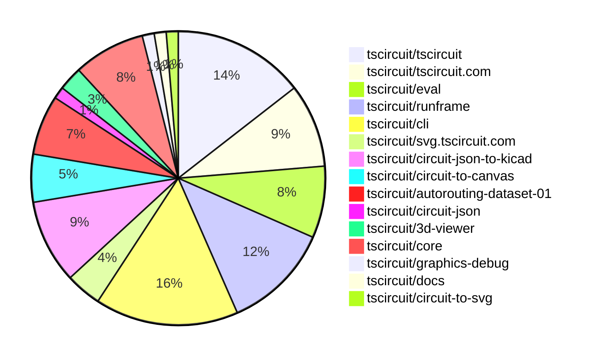

# Contribution Overview 2026-02-04

The current week is shown below. There are 3 major sections:

- [Contributor Overview](#contributor-overview)
- [PRs by Repository](#prs-by-repository)
- [PRs by Contributor](#changes-by-contributor)
- [Scoring & Sponsorship Details](/docs/sponsorship-calculation-explanation.md)

## PRs by Repository

## Contributor Overview

| Contributor | 🐳 Major | 🐙 Minor | 🐌 Tiny | ⭐ | Discussion Contributions |
|-------------|---------|---------|---------|-----|--------------------------|
| [ShiboSoftwareDev](#ShiboSoftwareDev) | 2 | 1 | 2 | ⭐⭐ | 0🔹 0🔶 0💎 |
| [tscircuitbot](#tscircuitbot) | 0 | 0 | 55 | ⭐⭐ | 0🔹 0🔶 0💎 |
| [techmannih](#techmannih) | 1 | 4 | 0 | ⭐⭐ | 0🔹 0🔶 0💎 |
| [Abse2001](#Abse2001) | 0 | 3 | 0 | ⭐ | 0🔹 0🔶 0💎 |
| [seveibar](#seveibar) | 1 | 2 | 0 | ⭐ | 0🔹 0🔶 0💎 |
| [MustafaMulla29](#MustafaMulla29) | 0 | 2 | 0 | ⭐ | 0🔹 0🔶 0💎 |
| [AnasSarkiz](#AnasSarkiz) | 1 | 0 | 0 | ⭐ | 0🔹 0🔶 0💎 |
| [0hmX](#0hmX) | 0 | 0 | 2 |  | 0🔹 0🔶 0💎 |

> Note: AI evaluates PRs and assigns 1-3 star ratings automatically. 4 and 5 star ratings require manual staff review.

### Discussion Contribution Legend

- 🔹 Normal Comments: Basic participation with minimal effort
- 🔶 Great Informative Comments: Thoughtful participation that adds value
- 💎 Incredible Comments: Exceptional participation with high-quality content

## Review Table

[reviews-received-hover]: ## "Number of reviews received for PRs for this contributor"
[approvals-received-hover]: ## "Number of approvals received for PRs this contributor authored"
[rejections-received-hover]: ## "Number of rejections received for PRs this contributor authored"
[prs-opened-hover]: ## "Number of PRs opened by this contributor"
[issues-created-hover]: ## "Number of issues created by this contributor"

| Contributor | Reviews Received | Approvals Received | Rejections Received | Approvals | Rejections | PRs Opened | PRs Merged | Issues Created |
|---|---|---|---|---|---|---|---|---|
| [techmannih](#techmannih) | 8 | 6 | 1 | 0 | 0 | 7 | 5 | 0 |
| [Abse2001](#Abse2001) | 3 | 3 | 0 | 3 | 1 | 3 | 3 | 0 |
| [tscircuitbot](#tscircuitbot) | 0 | 0 | 0 | 0 | 0 | 77 | 55 | 0 |
| [ShiboSoftwareDev](#ShiboSoftwareDev) | 5 | 5 | 0 | 3 | 0 | 5 | 5 | 0 |
| [seveibar](#seveibar) | 0 | 0 | 0 | 10 | 0 | 5 | 3 | 0 |
| [dwiel](#dwiel) | 0 | 0 | 0 | 0 | 0 | 1 | 0 | 0 |
| [MustafaMulla29](#MustafaMulla29) | 6 | 3 | 0 | 1 | 0 | 3 | 2 | 0 |
| [bimakw](#bimakw) | 0 | 0 | 0 | 0 | 0 | 2 | 0 | 0 |
| [GDN84](#GDN84) | 0 | 0 | 0 | 0 | 0 | 1 | 0 | 0 |
| [AnasSarkiz](#AnasSarkiz) | 1 | 1 | 0 | 0 | 0 | 1 | 1 | 0 |
| [imrishabh18](#imrishabh18) | 0 | 0 | 0 | 1 | 0 | 0 | 0 | 0 |
| [Devesh36](#Devesh36) | 0 | 0 | 0 | 0 | 0 | 1 | 0 | 0 |
| [0hmX](#0hmX) | 0 | 0 | 0 | 0 | 0 | 3 | 3 | 0 |

## Changes by Repository

### [tscircuit/tscircuit](https://github.com/tscircuit/tscircuit)

🐌 Tiny Contributions (11)

| PR # | Impact | Contributor | Description |
|------|--------|-------------|-------------|
| [#2111](https://github.com/tscircuit/tscircuit/pull/2111) | 🐌 Tiny | tscircuitbot | Automated package update |
| [#2110](https://github.com/tscircuit/tscircuit/pull/2110) | 🐌 Tiny | tscircuitbot | Updates the tscircuitcli package from version 0.1.879 to 0.1.880 and the tscircuitrunframe package from version 0.0.1571 to 0.0.1572 in package.json |
| [#2108](https://github.com/tscircuit/tscircuit/pull/2108) | 🐌 Tiny | tscircuitbot | Automated package update |
| [#2107](https://github.com/tscircuit/tscircuit/pull/2107) | 🐌 Tiny | tscircuitbot | Automated package update |
| [#2105](https://github.com/tscircuit/tscircuit/pull/2105) | 🐌 Tiny | tscircuitbot | Updates the package version from 0.0.1261 to 0.0.1262 in package.json |
| [#2104](https://github.com/tscircuit/tscircuit/pull/2104) | 🐌 Tiny | tscircuitbot | Automated package update |
| [#2103](https://github.com/tscircuit/tscircuit/pull/2103) | 🐌 Tiny | tscircuitbot | Automated package update |
| [#2102](https://github.com/tscircuit/tscircuit/pull/2102) | 🐌 Tiny | tscircuitbot | Automated package update |
| [#2100](https://github.com/tscircuit/tscircuit/pull/2100) | 🐌 Tiny | tscircuitbot | Updates the package version from 0.0.1258 to 0.0.1260 in package.json |
| [#2099](https://github.com/tscircuit/tscircuit/pull/2099) | 🐌 Tiny | tscircuitbot | Automated package update |
| [#2097](https://github.com/tscircuit/tscircuit/pull/2097) | 🐌 Tiny | tscircuitbot | Automated package update |

### [tscircuit/tscircuit.com](https://github.com/tscircuit/tscircuit.com)

🐌 Tiny Contributions (7)

| PR # | Impact | Contributor | Description |
|------|--------|-------------|-------------|
| [#2652](https://github.com/tscircuit/tscircuit.com/pull/2652) | 🐌 Tiny | tscircuitbot | Updates the tscircuitrunframe package from version 0.0.1571 to 0.0.1572 |
| [#2651](https://github.com/tscircuit/tscircuit.com/pull/2651) | 🐌 Tiny | tscircuitbot | Updates the tscircuitrunframe package from version 0.0.1570 to 0.0.1571 |
| [#2650](https://github.com/tscircuit/tscircuit.com/pull/2650) | 🐌 Tiny | tscircuitbot | Updates the tscircuitrunframe package from version 0.0.1569 to 0.0.1570 |
| [#2649](https://github.com/tscircuit/tscircuit.com/pull/2649) | 🐌 Tiny | tscircuitbot | Updates the tscircuiteval package from version 0.0.621 to 0.0.622 |
| [#2648](https://github.com/tscircuit/tscircuit.com/pull/2648) | 🐌 Tiny | tscircuitbot | Updates the tscircuitrunframe package from version 0.0.1567 to 0.0.1569 |
| [#2647](https://github.com/tscircuit/tscircuit.com/pull/2647) | 🐌 Tiny | tscircuitbot | Updates the tscircuiteval package from version 0.0.620 to 0.0.621 |
| [#2646](https://github.com/tscircuit/tscircuit.com/pull/2646) | 🐌 Tiny | tscircuitbot | Updates the tscircuiteval package from version 0.0.619 to 0.0.620 |

### [tscircuit/eval](https://github.com/tscircuit/eval)

🐌 Tiny Contributions (6)

| PR # | Impact | Contributor | Description |
|------|--------|-------------|-------------|
| [#1979](https://github.com/tscircuit/eval/pull/1979) | 🐌 Tiny | tscircuitbot | Automated package update |
| [#1978](https://github.com/tscircuit/eval/pull/1978) | 🐌 Tiny | tscircuitbot | Automated package update |
| [#1976](https://github.com/tscircuit/eval/pull/1976) | 🐌 Tiny | tscircuitbot | Automated package update to version 0.0.621 |
| [#1975](https://github.com/tscircuit/eval/pull/1975) | 🐌 Tiny | tscircuitbot | Automated package update |
| [#1973](https://github.com/tscircuit/eval/pull/1973) | 🐌 Tiny | tscircuitbot | Automated package update |
| [#1972](https://github.com/tscircuit/eval/pull/1972) | 🐌 Tiny | tscircuitbot | Updates the package versions in package.json to the latest compatible versions. |

### [tscircuit/runframe](https://github.com/tscircuit/runframe)

🐌 Tiny Contributions (9)

| PR # | Impact | Contributor | Description |
|------|--------|-------------|-------------|
| [#2559](https://github.com/tscircuit/runframe/pull/2559) | 🐌 Tiny | tscircuitbot | Automated package update |
| [#2558](https://github.com/tscircuit/runframe/pull/2558) | 🐌 Tiny | tscircuitbot | Automated package update for tscircuit3d-viewer from version 0.0.506 to 0.0.507 |
| [#2557](https://github.com/tscircuit/runframe/pull/2557) | 🐌 Tiny | tscircuitbot | Automated package update |
| [#2556](https://github.com/tscircuit/runframe/pull/2556) | 🐌 Tiny | tscircuitbot | Updates the circuit-json-to-kicad package from version 0.0.62 to 0.0.65 in package.json |
| [#2552](https://github.com/tscircuit/runframe/pull/2552) | 🐌 Tiny | tscircuitbot | Automated package update |
| [#2551](https://github.com/tscircuit/runframe/pull/2551) | 🐌 Tiny | tscircuitbot | Automated package update |
| [#2550](https://github.com/tscircuit/runframe/pull/2550) | 🐌 Tiny | tscircuitbot | Automated package update |
| [#2549](https://github.com/tscircuit/runframe/pull/2549) | 🐌 Tiny | tscircuitbot | Updates the tscircuiteval package from version 0.0.619 to 0.0.621 in the package.json file. |
| [#2546](https://github.com/tscircuit/runframe/pull/2546) | 🐌 Tiny | tscircuitbot | Updates the circuit-json-to-kicad package version from 0.0.60 to 0.0.62 in package.json |

### [tscircuit/cli](https://github.com/tscircuit/cli)

| PR # | Impact | Rating | Contributor | Description |
|------|--------|--------|-------------|-------------|
| [#1902](https://github.com/tscircuit/cli/pull/1902) | 🐳 Major | ⭐⭐⭐ | seveibar | Adds a centralized helper for file upsert requests and provides actionable timeout guidance for users when uploads to the local file server fail due to timeout errors. |

🐌 Tiny Contributions (11)

| PR # | Impact | Contributor | Description |
|------|--------|-------------|-------------|
| [#1907](https://github.com/tscircuit/cli/pull/1907) | 🐌 Tiny | tscircuitbot | Automated package update |
| [#1906](https://github.com/tscircuit/cli/pull/1906) | 🐌 Tiny | tscircuitbot | Updates the tscircuitrunframe package from version 0.0.1571 to 0.0.1572 |
| [#1905](https://github.com/tscircuit/cli/pull/1905) | 🐌 Tiny | tscircuitbot | Automated package update |
| [#1904](https://github.com/tscircuit/cli/pull/1904) | 🐌 Tiny | tscircuitbot | Updates the tscircuitrunframe package from version 0.0.1570 to 0.0.1571 |
| [#1903](https://github.com/tscircuit/cli/pull/1903) | 🐌 Tiny | tscircuitbot | Automated package update |
| [#1901](https://github.com/tscircuit/cli/pull/1901) | 🐌 Tiny | tscircuitbot | Updates the package version from 0.1.876 to 0.1.877 in package.json |
| [#1900](https://github.com/tscircuit/cli/pull/1900) | 🐌 Tiny | tscircuitbot | Updates the tscircuitrunframe package from version 0.0.1569 to 0.0.1570 |
| [#1899](https://github.com/tscircuit/cli/pull/1899) | 🐌 Tiny | tscircuitbot | Updates the package version from 0.1.875 to 0.1.876 in package.json |
| [#1898](https://github.com/tscircuit/cli/pull/1898) | 🐌 Tiny | tscircuitbot | Updates the tscircuitrunframe package to version 0.0.1569 in the package.json file. |
| [#1897](https://github.com/tscircuit/cli/pull/1897) | 🐌 Tiny | tscircuitbot | Updates the package version from v0.1.874 to v0.1.875 in package.json |
| [#1896](https://github.com/tscircuit/cli/pull/1896) | 🐌 Tiny | tscircuitbot | Updates the tscircuitrunframe package from version 0.0.1567 to 0.0.1568 |

### [tscircuit/svg.tscircuit.com](https://github.com/tscircuit/svg.tscircuit.com)

🐌 Tiny Contributions (3)

| PR # | Impact | Contributor | Description |
|------|--------|-------------|-------------|
| [#950](https://github.com/tscircuit/svg.tscircuit.com/pull/950) | 🐌 Tiny | tscircuitbot | Updates the tscircuit package version from 0.0.1263 to 0.0.1264 in package.json |
| [#949](https://github.com/tscircuit/svg.tscircuit.com/pull/949) | 🐌 Tiny | tscircuitbot | Updates the tscircuit package version from 0.0.1259 to 0.0.1263 in package.json |
| [#945](https://github.com/tscircuit/svg.tscircuit.com/pull/945) | 🐌 Tiny | tscircuitbot | Updates the tscircuit package version from 0.0.1258 to 0.0.1259 in package.json |

### [tscircuit/circuit-json-to-kicad](https://github.com/tscircuit/circuit-json-to-kicad)

| PR # | Impact | Rating | Contributor | Description |
|------|--------|--------|-------------|-------------|
| [#117](https://github.com/tscircuit/circuit-json-to-kicad/pull/117) | 🐳 Major | ⭐⭐⭐ | AnasSarkiz | Fixes layer-assignment bug in KiCad PCB segment export by correctly propagating the last-known layer for trace routing, ensuring segments are assigned to the correct layers and enhancing SVG snapshot generation for inner layers. |
| [#109](https://github.com/tscircuit/circuit-json-to-kicad/pull/109) | 🐙 Minor | ⭐⭐ | ShiboSoftwareDev | Adds functionality to convert fabrication note text from circuit JSON to KiCad format, allowing for the inclusion of manufacturing notes in PCB designs. |
| [#115](https://github.com/tscircuit/circuit-json-to-kicad/pull/115) | 🐙 Minor | ⭐⭐ | MustafaMulla29 | Adds support for courtyard circles in KiCad by converting pcb_courtyard_circle elements to fp_circle on the courtyard layer. |
| [#108](https://github.com/tscircuit/circuit-json-to-kicad/pull/108) | 🐙 Minor | ⭐⭐ | MustafaMulla29 | Adds support for handling pcb_note_text and pcb_note_rect elements in KiCad footprint generation. |

🐌 Tiny Contributions (3)

| PR # | Impact | Contributor | Description |
|------|--------|-------------|-------------|
| [#120](https://github.com/tscircuit/circuit-json-to-kicad/pull/120) | 🐌 Tiny | tscircuitbot | Automated package update |
| [#116](https://github.com/tscircuit/circuit-json-to-kicad/pull/116) | 🐌 Tiny | tscircuitbot | Automated package update |
| [#114](https://github.com/tscircuit/circuit-json-to-kicad/pull/114) | 🐌 Tiny | tscircuitbot | Automated package update |

### [tscircuit/circuit-to-canvas](https://github.com/tscircuit/circuit-to-canvas)

| PR # | Impact | Rating | Contributor | Description |
|------|--------|--------|-------------|-------------|
| [#149](https://github.com/tscircuit/circuit-to-canvas/pull/149) | 🐙 Minor | ⭐⭐ | techmannih | Adds support for rendering rectangular courtyard elements in PCB drawings. |
| [#147](https://github.com/tscircuit/circuit-to-canvas/pull/147) | 🐙 Minor | ⭐⭐ | techmannih | Adds support for rendering PCB courtyard circles in the canvas drawing context. |

🐌 Tiny Contributions (2)

| PR # | Impact | Contributor | Description |
|------|--------|-------------|-------------|
| [#150](https://github.com/tscircuit/circuit-to-canvas/pull/150) | 🐌 Tiny | tscircuitbot | Automated package update |
| [#148](https://github.com/tscircuit/circuit-to-canvas/pull/148) | 🐌 Tiny | tscircuitbot | Automated package update |

### [tscircuit/autorouting-dataset-01](https://github.com/tscircuit/autorouting-dataset-01)

🐌 Tiny Contributions (5)

| PR # | Impact | Contributor | Description |
|------|--------|-------------|-------------|
| [#41](https://github.com/tscircuit/autorouting-dataset-01/pull/41) | 🐌 Tiny | tscircuitbot | Automated package update |
| [#39](https://github.com/tscircuit/autorouting-dataset-01/pull/39) | 🐌 Tiny | tscircuitbot | Automated package update |
| [#37](https://github.com/tscircuit/autorouting-dataset-01/pull/37) | 🐌 Tiny | tscircuitbot | Automated package update |
| [#40](https://github.com/tscircuit/autorouting-dataset-01/pull/40) | 🐌 Tiny | 0hmX | Adds a button for visualizing benchmark details and changes the background color to white for improved readability. |
| [#38](https://github.com/tscircuit/autorouting-dataset-01/pull/38) | 🐌 Tiny | 0hmX | Updates the file extension in the loadScenarioList function to use the new .simple-route.json format instead of the old .simple-route-before.json format. |

### [tscircuit/circuit-json](https://github.com/tscircuit/circuit-json)

| PR # | Impact | Rating | Contributor | Description |
|------|--------|--------|-------------|-------------|
| [#454](https://github.com/tscircuit/circuit-json/pull/454) | 🐙 Minor | ⭐⭐ | Abse2001 | Adds top and bottom courtyard layers to the PCB rendering layers. |

### [tscircuit/3d-viewer](https://github.com/tscircuit/3d-viewer)

| PR # | Impact | Rating | Contributor | Description |
|------|--------|--------|-------------|-------------|
| [#674](https://github.com/tscircuit/3d-viewer/pull/674) | 🐙 Minor | ⭐⭐ | Abse2001 | Fixes alignment issue of bottom-layer CAD components with the board surface in the 3D viewer. |
| [#673](https://github.com/tscircuit/3d-viewer/pull/673) | 🐙 Minor | ⭐⭐ | Abse2001 | Explicitly calls renderer.forceContextLoss() during unmount to ensure the WebGL context is fully released, preventing GPU memorycontext leaks during remounts or viewer reinitialization. |

### [tscircuit/core](https://github.com/tscircuit/core)

| PR # | Impact | Rating | Contributor | Description |
|------|--------|--------|-------------|-------------|
| [#1903](https://github.com/tscircuit/core/pull/1903) | 🐳 Major | ⭐⭐⭐ | ShiboSoftwareDev | Disables autorouting and PCB auto-layout features for subcircuits that are inflated from circuitJson, preventing automatic layout adjustments in these cases. |
| [#1901](https://github.com/tscircuit/core/pull/1901) | 🐙 Minor | ⭐⭐ | techmannih | Adds support for the CourtyardRect component in PCB design, allowing for rectangular courtyard areas to be defined in circuit layouts. |
| [#1892](https://github.com/tscircuit/core/pull/1892) | 🐙 Minor | ⭐⭐ | techmannih | Adds support for the CourtyardCircle component in PCB design, allowing for the definition of courtyard circles in the layout. |
| [#1899](https://github.com/tscircuit/core/pull/1899) | 🐙 Minor | ⭐⭐ | seveibar | Adds support for vias in manual pcbPath routing, allowing layer transitions in traces and ensuring visibility of inner layer traces through a square multilayer snapshot test. |
| [#1898](https://github.com/tscircuit/core/pull/1898) | 🐙 Minor | ⭐⭐ | seveibar | Adds support for a new simplified syntax for defining pin arrangements in schematic components, allowing both array and object formats. |

🐌 Tiny Contributions (1)

| PR # | Impact | Contributor | Description |
|------|--------|-------------|-------------|
| [#1902](https://github.com/tscircuit/core/pull/1902) | 🐌 Tiny | ShiboSoftwareDev | Adds a test for rendering a large panel with multiple boards and verifies the absence of errors in the generated circuit JSON. |

### [tscircuit/graphics-debug](https://github.com/tscircuit/graphics-debug)

| PR # | Impact | Rating | Contributor | Description |
|------|--------|--------|-------------|-------------|
| [#93](https://github.com/tscircuit/graphics-debug/pull/93) | 🐳 Major | ⭐⭐⭐ | ShiboSoftwareDev | Ensures consistent stroke width for lines in the graphics rendering regardless of zoom level or line orientation. |

### [tscircuit/docs](https://github.com/tscircuit/docs)

🐌 Tiny Contributions (1)

| PR # | Impact | Contributor | Description |
|------|--------|-------------|-------------|
| [#429](https://github.com/tscircuit/docs/pull/429) | 🐌 Tiny | ShiboSoftwareDev | Adds documentation for the analogsimulation , voltageprobe , and voltagesource  elements used in SPICE simulations. |

### [tscircuit/circuit-to-svg](https://github.com/tscircuit/circuit-to-svg)

| PR # | Impact | Rating | Contributor | Description |
|------|--------|--------|-------------|-------------|
| [#504](https://github.com/tscircuit/circuit-to-svg/pull/504) | 🐳 Major | ⭐⭐⭐ | techmannih | Adds support for a bottom courtyard layer in PCB color mapping and SVG generation. |

## Changes by Contributor

### [tscircuitbot](https://github.com/tscircuitbot)

🐌 Tiny Contributions (55)

| PR # | Impact | Description |
|------|--------|-------------|
| [#2111](https://github.com/tscircuit/tscircuit/pull/2111) | 🐌 Tiny | Automated package update |
| [#2110](https://github.com/tscircuit/tscircuit/pull/2110) | 🐌 Tiny | Updates the tscircuitcli package from version 0.1.879 to 0.1.880 and the tscircuitrunframe package from version 0.0.1571 to 0.0.1572 in package.json |
| [#2108](https://github.com/tscircuit/tscircuit/pull/2108) | 🐌 Tiny | Automated package update |
| [#2107](https://github.com/tscircuit/tscircuit/pull/2107) | 🐌 Tiny | Automated package update |
| [#2105](https://github.com/tscircuit/tscircuit/pull/2105) | 🐌 Tiny | Updates the package version from 0.0.1261 to 0.0.1262 in package.json |
| [#2104](https://github.com/tscircuit/tscircuit/pull/2104) | 🐌 Tiny | Automated package update |
| [#2103](https://github.com/tscircuit/tscircuit/pull/2103) | 🐌 Tiny | Automated package update |
| [#2102](https://github.com/tscircuit/tscircuit/pull/2102) | 🐌 Tiny | Automated package update |
| [#2100](https://github.com/tscircuit/tscircuit/pull/2100) | 🐌 Tiny | Updates the package version from 0.0.1258 to 0.0.1260 in package.json |
| [#2099](https://github.com/tscircuit/tscircuit/pull/2099) | 🐌 Tiny | Automated package update |
| [#2097](https://github.com/tscircuit/tscircuit/pull/2097) | 🐌 Tiny | Automated package update |
| [#2652](https://github.com/tscircuit/tscircuit.com/pull/2652) | 🐌 Tiny | Updates the tscircuitrunframe package from version 0.0.1571 to 0.0.1572 |
| [#2651](https://github.com/tscircuit/tscircuit.com/pull/2651) | 🐌 Tiny | Updates the tscircuitrunframe package from version 0.0.1570 to 0.0.1571 |
| [#2650](https://github.com/tscircuit/tscircuit.com/pull/2650) | 🐌 Tiny | Updates the tscircuitrunframe package from version 0.0.1569 to 0.0.1570 |
| [#2649](https://github.com/tscircuit/tscircuit.com/pull/2649) | 🐌 Tiny | Updates the tscircuiteval package from version 0.0.621 to 0.0.622 |
| [#2648](https://github.com/tscircuit/tscircuit.com/pull/2648) | 🐌 Tiny | Updates the tscircuitrunframe package from version 0.0.1567 to 0.0.1569 |
| [#2647](https://github.com/tscircuit/tscircuit.com/pull/2647) | 🐌 Tiny | Updates the tscircuiteval package from version 0.0.620 to 0.0.621 |
| [#2646](https://github.com/tscircuit/tscircuit.com/pull/2646) | 🐌 Tiny | Updates the tscircuiteval package from version 0.0.619 to 0.0.620 |
| [#1979](https://github.com/tscircuit/eval/pull/1979) | 🐌 Tiny | Automated package update |
| [#1978](https://github.com/tscircuit/eval/pull/1978) | 🐌 Tiny | Automated package update |
| [#1976](https://github.com/tscircuit/eval/pull/1976) | 🐌 Tiny | Automated package update to version 0.0.621 |
| [#1975](https://github.com/tscircuit/eval/pull/1975) | 🐌 Tiny | Automated package update |
| [#1973](https://github.com/tscircuit/eval/pull/1973) | 🐌 Tiny | Automated package update |
| [#1972](https://github.com/tscircuit/eval/pull/1972) | 🐌 Tiny | Updates the package versions in package.json to the latest compatible versions. |
| [#2559](https://github.com/tscircuit/runframe/pull/2559) | 🐌 Tiny | Automated package update |
| [#2558](https://github.com/tscircuit/runframe/pull/2558) | 🐌 Tiny | Automated package update for tscircuit3d-viewer from version 0.0.506 to 0.0.507 |
| [#2557](https://github.com/tscircuit/runframe/pull/2557) | 🐌 Tiny | Automated package update |
| [#2556](https://github.com/tscircuit/runframe/pull/2556) | 🐌 Tiny | Updates the circuit-json-to-kicad package from version 0.0.62 to 0.0.65 in package.json |
| [#2552](https://github.com/tscircuit/runframe/pull/2552) | 🐌 Tiny | Automated package update |
| [#2551](https://github.com/tscircuit/runframe/pull/2551) | 🐌 Tiny | Automated package update |
| [#2550](https://github.com/tscircuit/runframe/pull/2550) | 🐌 Tiny | Automated package update |
| [#2549](https://github.com/tscircuit/runframe/pull/2549) | 🐌 Tiny | Updates the tscircuiteval package from version 0.0.619 to 0.0.621 in the package.json file. |
| [#2546](https://github.com/tscircuit/runframe/pull/2546) | 🐌 Tiny | Updates the circuit-json-to-kicad package version from 0.0.60 to 0.0.62 in package.json |
| [#1907](https://github.com/tscircuit/cli/pull/1907) | 🐌 Tiny | Automated package update |
| [#1906](https://github.com/tscircuit/cli/pull/1906) | 🐌 Tiny | Updates the tscircuitrunframe package from version 0.0.1571 to 0.0.1572 |
| [#1905](https://github.com/tscircuit/cli/pull/1905) | 🐌 Tiny | Automated package update |
| [#1904](https://github.com/tscircuit/cli/pull/1904) | 🐌 Tiny | Updates the tscircuitrunframe package from version 0.0.1570 to 0.0.1571 |
| [#1903](https://github.com/tscircuit/cli/pull/1903) | 🐌 Tiny | Automated package update |
| [#1901](https://github.com/tscircuit/cli/pull/1901) | 🐌 Tiny | Updates the package version from 0.1.876 to 0.1.877 in package.json |
| [#1900](https://github.com/tscircuit/cli/pull/1900) | 🐌 Tiny | Updates the tscircuitrunframe package from version 0.0.1569 to 0.0.1570 |
| [#1899](https://github.com/tscircuit/cli/pull/1899) | 🐌 Tiny | Updates the package version from 0.1.875 to 0.1.876 in package.json |
| [#1898](https://github.com/tscircuit/cli/pull/1898) | 🐌 Tiny | Updates the tscircuitrunframe package to version 0.0.1569 in the package.json file. |
| [#1897](https://github.com/tscircuit/cli/pull/1897) | 🐌 Tiny | Updates the package version from v0.1.874 to v0.1.875 in package.json |
| [#1896](https://github.com/tscircuit/cli/pull/1896) | 🐌 Tiny | Updates the tscircuitrunframe package from version 0.0.1567 to 0.0.1568 |
| [#950](https://github.com/tscircuit/svg.tscircuit.com/pull/950) | 🐌 Tiny | Updates the tscircuit package version from 0.0.1263 to 0.0.1264 in package.json |
| [#949](https://github.com/tscircuit/svg.tscircuit.com/pull/949) | 🐌 Tiny | Updates the tscircuit package version from 0.0.1259 to 0.0.1263 in package.json |
| [#945](https://github.com/tscircuit/svg.tscircuit.com/pull/945) | 🐌 Tiny | Updates the tscircuit package version from 0.0.1258 to 0.0.1259 in package.json |
| [#120](https://github.com/tscircuit/circuit-json-to-kicad/pull/120) | 🐌 Tiny | Automated package update |
| [#116](https://github.com/tscircuit/circuit-json-to-kicad/pull/116) | 🐌 Tiny | Automated package update |
| [#114](https://github.com/tscircuit/circuit-json-to-kicad/pull/114) | 🐌 Tiny | Automated package update |
| [#150](https://github.com/tscircuit/circuit-to-canvas/pull/150) | 🐌 Tiny | Automated package update |
| [#148](https://github.com/tscircuit/circuit-to-canvas/pull/148) | 🐌 Tiny | Automated package update |
| [#41](https://github.com/tscircuit/autorouting-dataset-01/pull/41) | 🐌 Tiny | Automated package update |
| [#39](https://github.com/tscircuit/autorouting-dataset-01/pull/39) | 🐌 Tiny | Automated package update |
| [#37](https://github.com/tscircuit/autorouting-dataset-01/pull/37) | 🐌 Tiny | Automated package update |

### [Abse2001](https://github.com/Abse2001)

| PRs # | Impact | Rating | Description |
|------|--------|--------|-------------|
| [#454](https://github.com/tscircuit/circuit-json/pull/454) | 🐙 Minor | ⭐⭐ | Adds top and bottom courtyard layers to the PCB rendering layers. |
| [#674](https://github.com/tscircuit/3d-viewer/pull/674) | 🐙 Minor | ⭐⭐ | Fixes alignment issue of bottom-layer CAD components with the board surface in the 3D viewer. |
| [#673](https://github.com/tscircuit/3d-viewer/pull/673) | 🐙 Minor | ⭐⭐ | Explicitly calls renderer.forceContextLoss() during unmount to ensure the WebGL context is fully released, preventing GPU memorycontext leaks during remounts or viewer reinitialization. |

### [ShiboSoftwareDev](https://github.com/ShiboSoftwareDev)

| PRs # | Impact | Rating | Description |
|------|--------|--------|-------------|
| [#1903](https://github.com/tscircuit/core/pull/1903) | 🐳 Major | ⭐⭐⭐ | Disables autorouting and PCB auto-layout features for subcircuits that are inflated from circuitJson, preventing automatic layout adjustments in these cases. |
| [#93](https://github.com/tscircuit/graphics-debug/pull/93) | 🐳 Major | ⭐⭐⭐ | Ensures consistent stroke width for lines in the graphics rendering regardless of zoom level or line orientation. |
| [#109](https://github.com/tscircuit/circuit-json-to-kicad/pull/109) | 🐙 Minor | ⭐⭐ | Adds functionality to convert fabrication note text from circuit JSON to KiCad format, allowing for the inclusion of manufacturing notes in PCB designs. |

🐌 Tiny Contributions (2)

| PR # | Impact | Description |
|------|--------|-------------|
| [#1902](https://github.com/tscircuit/core/pull/1902) | 🐌 Tiny | Adds a test for rendering a large panel with multiple boards and verifies the absence of errors in the generated circuit JSON. |
| [#429](https://github.com/tscircuit/docs/pull/429) | 🐌 Tiny | Adds documentation for the analogsimulation , voltageprobe , and voltagesource  elements used in SPICE simulations. |

### [techmannih](https://github.com/techmannih)

| PRs # | Impact | Rating | Description |
|------|--------|--------|-------------|
| [#504](https://github.com/tscircuit/circuit-to-svg/pull/504) | 🐳 Major | ⭐⭐⭐ | Adds support for a bottom courtyard layer in PCB color mapping and SVG generation. |
| [#1901](https://github.com/tscircuit/core/pull/1901) | 🐙 Minor | ⭐⭐ | Adds support for the CourtyardRect component in PCB design, allowing for rectangular courtyard areas to be defined in circuit layouts. |
| [#1892](https://github.com/tscircuit/core/pull/1892) | 🐙 Minor | ⭐⭐ | Adds support for the CourtyardCircle component in PCB design, allowing for the definition of courtyard circles in the layout. |
| [#149](https://github.com/tscircuit/circuit-to-canvas/pull/149) | 🐙 Minor | ⭐⭐ | Adds support for rendering rectangular courtyard elements in PCB drawings. |
| [#147](https://github.com/tscircuit/circuit-to-canvas/pull/147) | 🐙 Minor | ⭐⭐ | Adds support for rendering PCB courtyard circles in the canvas drawing context. |

### [seveibar](https://github.com/seveibar)

| PRs # | Impact | Rating | Description |
|------|--------|--------|-------------|
| [#1902](https://github.com/tscircuit/cli/pull/1902) | 🐳 Major | ⭐⭐⭐ | Adds a centralized helper for file upsert requests and provides actionable timeout guidance for users when uploads to the local file server fail due to timeout errors. |
| [#1899](https://github.com/tscircuit/core/pull/1899) | 🐙 Minor | ⭐⭐ | Adds support for vias in manual pcbPath routing, allowing layer transitions in traces and ensuring visibility of inner layer traces through a square multilayer snapshot test. |
| [#1898](https://github.com/tscircuit/core/pull/1898) | 🐙 Minor | ⭐⭐ | Adds support for a new simplified syntax for defining pin arrangements in schematic components, allowing both array and object formats. |

### [AnasSarkiz](https://github.com/AnasSarkiz)

| PRs # | Impact | Rating | Description |
|------|--------|--------|-------------|
| [#117](https://github.com/tscircuit/circuit-json-to-kicad/pull/117) | 🐳 Major | ⭐⭐⭐ | Fixes layer-assignment bug in KiCad PCB segment export by correctly propagating the last-known layer for trace routing, ensuring segments are assigned to the correct layers and enhancing SVG snapshot generation for inner layers. |

### [MustafaMulla29](https://github.com/MustafaMulla29)

| PRs # | Impact | Rating | Description |
|------|--------|--------|-------------|
| [#115](https://github.com/tscircuit/circuit-json-to-kicad/pull/115) | 🐙 Minor | ⭐⭐ | Adds support for courtyard circles in KiCad by converting pcb_courtyard_circle elements to fp_circle on the courtyard layer. |
| [#108](https://github.com/tscircuit/circuit-json-to-kicad/pull/108) | 🐙 Minor | ⭐⭐ | Adds support for handling pcb_note_text and pcb_note_rect elements in KiCad footprint generation. |

### [0hmX](https://github.com/0hmX)

🐌 Tiny Contributions (2)

| PR # | Impact | Description |
|------|--------|-------------|
| [#40](https://github.com/tscircuit/autorouting-dataset-01/pull/40) | 🐌 Tiny | Adds a button for visualizing benchmark details and changes the background color to white for improved readability. |
| [#38](https://github.com/tscircuit/autorouting-dataset-01/pull/38) | 🐌 Tiny | Updates the file extension in the loadScenarioList function to use the new .simple-route.json format instead of the old .simple-route-before.json format. |

## Repository Owners

| Repository | Codeowners |
|------------|------------|
| [builder](https://github.com/tscircuit/builder/blob/main/.github/CODEOWNERS) | [seveibar](https://github.com/seveibar)
| [pcb-viewer](https://github.com/tscircuit/pcb-viewer/blob/main/.github/CODEOWNERS) | [seveibar](https://github.com/seveibar), [ShiboSoftwareDev](https://github.com/ShiboSoftwareDev)
| [footprints-old](https://github.com/tscircuit/footprints-old/blob/main/.github/CODEOWNERS) | [seveibar](https://github.com/seveibar)
| [footprinter](https://github.com/tscircuit/footprinter/blob/main/.github/CODEOWNERS) | [seveibar](https://github.com/seveibar), [techmannih](https://github.com/techmannih)
| [3d-viewer](https://github.com/tscircuit/3d-viewer/blob/main/.github/CODEOWNERS) | [ShiboSoftwareDev](https://github.com/ShiboSoftwareDev)
| [winterspec](https://github.com/tscircuit/winterspec/blob/main/.github/CODEOWNERS) | [seveibar](https://github.com/seveibar), [ShiboSoftwareDev](https://github.com/ShiboSoftwareDev)
| [jscad-electronics](https://github.com/tscircuit/jscad-electronics/blob/main/.github/CODEOWNERS) | [seveibar](https://github.com/seveibar), [techmannih](https://github.com/techmannih), [ShiboSoftwareDev](https://github.com/ShiboSoftwareDev), [anas-sarkez](https://github.com/anas-sarkez)
| [circuit-to-svg](https://github.com/tscircuit/circuit-to-svg/blob/main/.github/CODEOWNERS) | [imrishabh18](https://github.com/imrishabh18)
| [schematic-symbols](https://github.com/tscircuit/schematic-symbols/blob/main/.github/CODEOWNERS) | [seveibar](https://github.com/seveibar), [imrishabh18](https://github.com/imrishabh18), [techmannih](https://github.com/techmannih)
| [circuit-json-to-gerber](https://github.com/tscircuit/circuit-json-to-gerber/blob/main/.github/CODEOWNERS) | [seveibar](https://github.com/seveibar), [ShiboSoftwareDev](https://github.com/ShiboSoftwareDev)
| [tscircuit.com](https://github.com/tscircuit/tscircuit.com/blob/main/.github/CODEOWNERS) | [seveibar](https://github.com/seveibar), [imrishabh18](https://github.com/imrishabh18)
| [issue-roulette](https://github.com/tscircuit/issue-roulette/blob/main/.github/CODEOWNERS) | [Anshgrover23](https://github.com/Anshgrover23)
| [sparkfun-boards](https://github.com/tscircuit/sparkfun-boards/blob/main/.github/CODEOWNERS) | [ShiboSoftwareDev](https://github.com/ShiboSoftwareDev), [Abse2001](https://github.com/Abse2001), [MustafaMulla29](https://github.com/MustafaMulla29), [Anshgrover23](https://github.com/Anshgrover23), [techmannih](https://github.com/techmannih)
| [schematic-corpus](https://github.com/tscircuit/schematic-corpus/blob/main/.github/CODEOWNERS) | [Abse2001](https://github.com/Abse2001)
| [copper-pour-solver](https://github.com/tscircuit/copper-pour-solver/blob/main/.github/CODEOWNERS) | [seveibar](https://github.com/seveibar), [ShiboSoftwareDev](https://github.com/ShiboSoftwareDev)
| [common](https://github.com/tscircuit/common/blob/main/.github/CODEOWNERS) | [seveibar](https://github.com/seveibar), [Abse2001](https://github.com/Abse2001)
| [circuit-json-to-lbrn](https://github.com/tscircuit/circuit-json-to-lbrn/blob/main/.github/CODEOWNERS) | [AnasSarkiz](https://github.com/AnasSarkiz)
| [pcbburn.com](https://github.com/tscircuit/pcbburn.com/blob/main/.github/CODEOWNERS) | [AnasSarkiz](https://github.com/AnasSarkiz)

## Repositories by Owner

| User | Repo |
|------|------|
| [seveibar](https://github.com/seveibar) | [builder](https://github.com/tscircuit/builder/blob/main/.github/CODEOWNERS) |
|  | [pcb-viewer](https://github.com/tscircuit/pcb-viewer/blob/main/.github/CODEOWNERS) |
|  | [footprints-old](https://github.com/tscircuit/footprints-old/blob/main/.github/CODEOWNERS) |
|  | [footprinter](https://github.com/tscircuit/footprinter/blob/main/.github/CODEOWNERS) |
|  | [winterspec](https://github.com/tscircuit/winterspec/blob/main/.github/CODEOWNERS) |
|  | [jscad-electronics](https://github.com/tscircuit/jscad-electronics/blob/main/.github/CODEOWNERS) |
|  | [schematic-symbols](https://github.com/tscircuit/schematic-symbols/blob/main/.github/CODEOWNERS) |
|  | [circuit-json-to-gerber](https://github.com/tscircuit/circuit-json-to-gerber/blob/main/.github/CODEOWNERS) |
|  | [tscircuit.com](https://github.com/tscircuit/tscircuit.com/blob/main/.github/CODEOWNERS) |
|  | [copper-pour-solver](https://github.com/tscircuit/copper-pour-solver/blob/main/.github/CODEOWNERS) |
|  | [common](https://github.com/tscircuit/common/blob/main/.github/CODEOWNERS) |
| [ShiboSoftwareDev](https://github.com/ShiboSoftwareDev) | [pcb-viewer](https://github.com/tscircuit/pcb-viewer/blob/main/.github/CODEOWNERS) |
|  | [3d-viewer](https://github.com/tscircuit/3d-viewer/blob/main/.github/CODEOWNERS) |
|  | [winterspec](https://github.com/tscircuit/winterspec/blob/main/.github/CODEOWNERS) |
|  | [jscad-electronics](https://github.com/tscircuit/jscad-electronics/blob/main/.github/CODEOWNERS) |
|  | [circuit-json-to-gerber](https://github.com/tscircuit/circuit-json-to-gerber/blob/main/.github/CODEOWNERS) |
|  | [sparkfun-boards](https://github.com/tscircuit/sparkfun-boards/blob/main/.github/CODEOWNERS) |
|  | [copper-pour-solver](https://github.com/tscircuit/copper-pour-solver/blob/main/.github/CODEOWNERS) |
| [techmannih](https://github.com/techmannih) | [footprinter](https://github.com/tscircuit/footprinter/blob/main/.github/CODEOWNERS) |
|  | [jscad-electronics](https://github.com/tscircuit/jscad-electronics/blob/main/.github/CODEOWNERS) |
|  | [schematic-symbols](https://github.com/tscircuit/schematic-symbols/blob/main/.github/CODEOWNERS) |
|  | [sparkfun-boards](https://github.com/tscircuit/sparkfun-boards/blob/main/.github/CODEOWNERS) |
| [anas-sarkez](https://github.com/anas-sarkez) | [jscad-electronics](https://github.com/tscircuit/jscad-electronics/blob/main/.github/CODEOWNERS) |
| [imrishabh18](https://github.com/imrishabh18) | [circuit-to-svg](https://github.com/tscircuit/circuit-to-svg/blob/main/.github/CODEOWNERS) |
|  | [schematic-symbols](https://github.com/tscircuit/schematic-symbols/blob/main/.github/CODEOWNERS) |
|  | [tscircuit.com](https://github.com/tscircuit/tscircuit.com/blob/main/.github/CODEOWNERS) |
| [Anshgrover23](https://github.com/Anshgrover23) | [issue-roulette](https://github.com/tscircuit/issue-roulette/blob/main/.github/CODEOWNERS) |
|  | [sparkfun-boards](https://github.com/tscircuit/sparkfun-boards/blob/main/.github/CODEOWNERS) |
| [Abse2001](https://github.com/Abse2001) | [sparkfun-boards](https://github.com/tscircuit/sparkfun-boards/blob/main/.github/CODEOWNERS) |
|  | [schematic-corpus](https://github.com/tscircuit/schematic-corpus/blob/main/.github/CODEOWNERS) |
|  | [common](https://github.com/tscircuit/common/blob/main/.github/CODEOWNERS) |
| [MustafaMulla29](https://github.com/MustafaMulla29) | [sparkfun-boards](https://github.com/tscircuit/sparkfun-boards/blob/main/.github/CODEOWNERS) |
| [AnasSarkiz](https://github.com/AnasSarkiz) | [circuit-json-to-lbrn](https://github.com/tscircuit/circuit-json-to-lbrn/blob/main/.github/CODEOWNERS) |
|  | [pcbburn.com](https://github.com/tscircuit/pcbburn.com/blob/main/.github/CODEOWNERS) |

