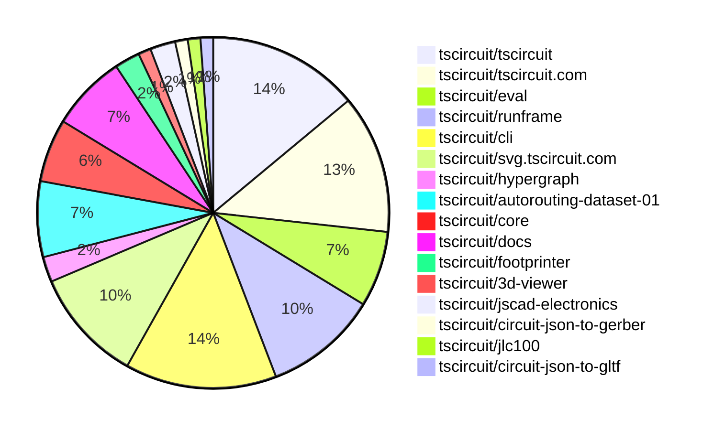

# Contribution Overview 2026-02-10

The current week is shown below. There are 3 major sections:

- [Contributor Overview](#contributor-overview)
- [PRs by Repository](#prs-by-repository)
- [PRs by Contributor](#changes-by-contributor)
- [Scoring & Sponsorship Details](/docs/sponsorship-calculation-explanation.md)

## PRs by Repository

## Contributor Overview

| Contributor | 🐳 Major | 🐙 Minor | 🐌 Tiny | ⭐ | Discussion Contributions |
|-------------|---------|---------|---------|-----|--------------------------|
| [MustafaMulla29](#MustafaMulla29) | 1 | 3 | 3 | ⭐⭐ | 0🔹 0🔶 0💎 |
| [tscircuitbot](#tscircuitbot) | 0 | 0 | 53 | ⭐⭐ | 0🔹 0🔶 0💎 |
| [ShiboSoftwareDev](#ShiboSoftwareDev) | 1 | 2 | 2 | ⭐⭐ | 0🔹 0🔶 0💎 |
| [seveibar](#seveibar) | 1 | 2 | 2 | ⭐⭐ | 0🔹 0🔶 0💎 |
| [techmannih](#techmannih) | 2 | 0 | 0 | ⭐ | 0🔹 0🔶 0💎 |
| [imrishabh18](#imrishabh18) | 0 | 4 | 0 | ⭐ | 0🔹 0🔶 0💎 |
| [rushabhcodes](#rushabhcodes) | 1 | 1 | 1 | ⭐ | 0🔹 0🔶 0💎 |
| [nailoo](#nailoo) | 0 | 0 | 3 | ⭐ | 0🔹 0🔶 0💎 |
| [AnasSarkiz](#AnasSarkiz) | 0 | 2 | 0 | ⭐ | 0🔹 0🔶 0💎 |
| [0hmX](#0hmX) | 0 | 1 | 1 | ⭐ | 0🔹 0🔶 0💎 |

> Note: AI evaluates PRs and assigns 1-3 star ratings automatically. 4 and 5 star ratings require manual staff review.

### Discussion Contribution Legend

- 🔹 Normal Comments: Basic participation with minimal effort
- 🔶 Great Informative Comments: Thoughtful participation that adds value
- 💎 Incredible Comments: Exceptional participation with high-quality content

## Review Table

[reviews-received-hover]: ## "Number of reviews received for PRs for this contributor"
[approvals-received-hover]: ## "Number of approvals received for PRs this contributor authored"
[rejections-received-hover]: ## "Number of rejections received for PRs this contributor authored"
[prs-opened-hover]: ## "Number of PRs opened by this contributor"
[issues-created-hover]: ## "Number of issues created by this contributor"

| Contributor | Reviews Received | Approvals Received | Rejections Received | Approvals | Rejections | PRs Opened | PRs Merged | Issues Created |
|---|---|---|---|---|---|---|---|---|
| [rushabhcodes](#rushabhcodes) | 16 | 5 | 1 | 0 | 0 | 5 | 3 | 0 |
| [Abse2001](#Abse2001) | 0 | 0 | 0 | 2 | 0 | 0 | 0 | 0 |
| [buildingvibes](#buildingvibes) | 11 | 0 | 1 | 0 | 0 | 20 | 0 | 0 |
| [tscircuitbot](#tscircuitbot) | 0 | 0 | 0 | 0 | 0 | 61 | 53 | 0 |
| [MustafaMulla29](#MustafaMulla29) | 9 | 7 | 1 | 0 | 0 | 9 | 7 | 0 |
| [seveibar](#seveibar) | 2 | 0 | 0 | 16 | 2 | 6 | 5 | 0 |
| [nailoo](#nailoo) | 5 | 3 | 1 | 1 | 1 | 4 | 3 | 0 |
| [techmannih](#techmannih) | 4 | 2 | 0 | 2 | 2 | 2 | 2 | 0 |
| [Devesh36](#Devesh36) | 0 | 0 | 0 | 1 | 0 | 0 | 0 | 0 |
| [ShiboSoftwareDev](#ShiboSoftwareDev) | 5 | 5 | 0 | 2 | 0 | 5 | 5 | 0 |
| [imrishabh18](#imrishabh18) | 0 | 0 | 0 | 0 | 0 | 6 | 4 | 0 |
| [cryptoaibot1738728800](#cryptoaibot1738728800) | 1 | 0 | 1 | 0 | 0 | 1 | 0 | 0 |
| [Rhan2020](#Rhan2020) | 0 | 0 | 0 | 0 | 0 | 1 | 0 | 0 |
| [AnasSarkiz](#AnasSarkiz) | 2 | 2 | 0 | 0 | 0 | 2 | 2 | 0 |
| [0hmX](#0hmX) | 7 | 1 | 0 | 1 | 0 | 4 | 2 | 0 |
| [xiuqiang1995](#xiuqiang1995) | 0 | 0 | 0 | 0 | 0 | 1 | 0 | 0 |

## Changes by Repository

### [tscircuit/tscircuit](https://github.com/tscircuit/tscircuit)

🐌 Tiny Contributions (12)

| PR # | Impact | Contributor | Description |
|------|--------|-------------|-------------|
| [#2165](https://github.com/tscircuit/tscircuit/pull/2165) | 🐌 Tiny | tscircuitbot | Automated package update |
| [#2164](https://github.com/tscircuit/tscircuit/pull/2164) | 🐌 Tiny | tscircuitbot | Automated package update |
| [#2162](https://github.com/tscircuit/tscircuit/pull/2162) | 🐌 Tiny | tscircuitbot | Automated package update |
| [#2161](https://github.com/tscircuit/tscircuit/pull/2161) | 🐌 Tiny | tscircuitbot | Automated package update |
| [#2160](https://github.com/tscircuit/tscircuit/pull/2160) | 🐌 Tiny | tscircuitbot | Updates the package version from 0.0.1287 to 0.0.1288 in package.json |
| [#2159](https://github.com/tscircuit/tscircuit/pull/2159) | 🐌 Tiny | tscircuitbot | Automated package update |
| [#2158](https://github.com/tscircuit/tscircuit/pull/2158) | 🐌 Tiny | tscircuitbot | Automated package update |
| [#2157](https://github.com/tscircuit/tscircuit/pull/2157) | 🐌 Tiny | tscircuitbot | Updates the tscircuitcli package from version 0.1.902 to 0.1.903 and the tscircuitrunframe package from version 0.0.1590 to 0.0.1591 in package.json |
| [#2155](https://github.com/tscircuit/tscircuit/pull/2155) | 🐌 Tiny | tscircuitbot | Updates the tscircuitcli package to version 0.1.902 in package.json |
| [#2156](https://github.com/tscircuit/tscircuit/pull/2156) | 🐌 Tiny | tscircuitbot | Automated package update |
| [#2154](https://github.com/tscircuit/tscircuit/pull/2154) | 🐌 Tiny | tscircuitbot | Automated package update |
| [#2153](https://github.com/tscircuit/tscircuit/pull/2153) | 🐌 Tiny | tscircuitbot | Updates the tscircuitcli package to version 0.1.901 in package.json |

### [tscircuit/tscircuit.com](https://github.com/tscircuit/tscircuit.com)

| PR # | Impact | Rating | Contributor | Description |
|------|--------|--------|-------------|-------------|
| [#2707](https://github.com/tscircuit/tscircuit.com/pull/2707) | 🐳 Major | ⭐⭐⭐ | seveibar | Adds an analog simulation image and code example to the landing page, enhancing user guidance for analog simulations. |
| [#2698](https://github.com/tscircuit/tscircuit.com/pull/2698) | 🐙 Minor | ⭐⭐ | imrishabh18 | Normalizes CAD asset URLs in circuit JSON to correctly fetch assets from the package registry instead of treating them as same-package files. |
| [#2702](https://github.com/tscircuit/tscircuit.com/pull/2702) | 🐙 Minor | ⭐⭐ | imrishabh18 | Modifies the file path to include dist when searching for files in external packages. |

🐌 Tiny Contributions (8)

| PR # | Impact | Contributor | Description |
|------|--------|-------------|-------------|
| [#2712](https://github.com/tscircuit/tscircuit.com/pull/2712) | 🐌 Tiny | tscircuitbot | Updates the tscircuitrunframe package from version 0.0.1593 to 0.0.1594 |
| [#2711](https://github.com/tscircuit/tscircuit.com/pull/2711) | 🐌 Tiny | tscircuitbot | Automated package update |
| [#2709](https://github.com/tscircuit/tscircuit.com/pull/2709) | 🐌 Tiny | tscircuitbot | Updates the tscircuitrunframe package from version 0.0.1592 to 0.0.1593 |
| [#2708](https://github.com/tscircuit/tscircuit.com/pull/2708) | 🐌 Tiny | tscircuitbot | Automated package update |
| [#2704](https://github.com/tscircuit/tscircuit.com/pull/2704) | 🐌 Tiny | tscircuitbot | Automated package update |
| [#2703](https://github.com/tscircuit/tscircuit.com/pull/2703) | 🐌 Tiny | tscircuitbot | Automated package update |
| [#2706](https://github.com/tscircuit/tscircuit.com/pull/2706) | 🐌 Tiny | seveibar | Add KiCad image and fix optimized image to support PNGs |
| [#2705](https://github.com/tscircuit/tscircuit.com/pull/2705) | 🐌 Tiny | ShiboSoftwareDev | Updates the version of the circuit-json-to-gerber dependency from 0.0.46 to 0.0.47 in package.json |

### [tscircuit/eval](https://github.com/tscircuit/eval)

🐌 Tiny Contributions (6)

| PR # | Impact | Contributor | Description |
|------|--------|-------------|-------------|
| [#2016](https://github.com/tscircuit/eval/pull/2016) | 🐌 Tiny | tscircuitbot | Automated package update |
| [#2015](https://github.com/tscircuit/eval/pull/2015) | 🐌 Tiny | tscircuitbot | Automated package update |
| [#2013](https://github.com/tscircuit/eval/pull/2013) | 🐌 Tiny | tscircuitbot | Automated package update |
| [#2012](https://github.com/tscircuit/eval/pull/2012) | 🐌 Tiny | tscircuitbot | Automated package update |
| [#2010](https://github.com/tscircuit/eval/pull/2010) | 🐌 Tiny | tscircuitbot | Automated package update |
| [#2009](https://github.com/tscircuit/eval/pull/2009) | 🐌 Tiny | tscircuitbot | Updates various package dependencies to their latest versions |

### [tscircuit/runframe](https://github.com/tscircuit/runframe)

🐌 Tiny Contributions (9)

| PR # | Impact | Contributor | Description |
|------|--------|-------------|-------------|
| [#2610](https://github.com/tscircuit/runframe/pull/2610) | 🐌 Tiny | tscircuitbot | Updates the tscircuiteval package to version 0.0.629 in the package.json file. |
| [#2609](https://github.com/tscircuit/runframe/pull/2609) | 🐌 Tiny | tscircuitbot | Automated package update |
| [#2608](https://github.com/tscircuit/runframe/pull/2608) | 🐌 Tiny | tscircuitbot | Updates the tscircuiteval package to version 0.0.628 in the package.json file |
| [#2607](https://github.com/tscircuit/runframe/pull/2607) | 🐌 Tiny | tscircuitbot | Automated package update |
| [#2606](https://github.com/tscircuit/runframe/pull/2606) | 🐌 Tiny | tscircuitbot | Updates the tscircuiteval package to version 0.0.627 in the package.json file. |
| [#2605](https://github.com/tscircuit/runframe/pull/2605) | 🐌 Tiny | tscircuitbot | Automated package update |
| [#2604](https://github.com/tscircuit/runframe/pull/2604) | 🐌 Tiny | tscircuitbot | Updates the circuit-json-to-gerber package from version 0.0.46 to 0.0.47 in package.json |
| [#2603](https://github.com/tscircuit/runframe/pull/2603) | 🐌 Tiny | tscircuitbot | Automated package update |
| [#2602](https://github.com/tscircuit/runframe/pull/2602) | 🐌 Tiny | tscircuitbot | Updates the tscircuit3d-viewer package from version 0.0.511 to 0.0.512 |

### [tscircuit/cli](https://github.com/tscircuit/cli)

| PR # | Impact | Rating | Contributor | Description |
|------|--------|--------|-------------|-------------|
| [#1952](https://github.com/tscircuit/cli/pull/1952) | 🐙 Minor | ⭐⭐ | MustafaMulla29 | Adds a --glbs flag to the build command to generate GLB 3D model files for every successful build. |

🐌 Tiny Contributions (11)

| PR # | Impact | Contributor | Description |
|------|--------|-------------|-------------|
| [#1964](https://github.com/tscircuit/cli/pull/1964) | 🐌 Tiny | tscircuitbot | Updates the package version from v0.1.905 to v0.1.906 in package.json |
| [#1963](https://github.com/tscircuit/cli/pull/1963) | 🐌 Tiny | tscircuitbot | Updates the tscircuitrunframe package from version 0.0.1593 to 0.0.1594 |
| [#1961](https://github.com/tscircuit/cli/pull/1961) | 🐌 Tiny | tscircuitbot | Updates the package version from v0.1.904 to v0.1.905 in package.json |
| [#1960](https://github.com/tscircuit/cli/pull/1960) | 🐌 Tiny | tscircuitbot | Updates the tscircuitrunframe package from version 0.0.1592 to 0.0.1593 |
| [#1959](https://github.com/tscircuit/cli/pull/1959) | 🐌 Tiny | tscircuitbot | Updates the package version from v0.1.903 to v0.1.904 in package.json |
| [#1958](https://github.com/tscircuit/cli/pull/1958) | 🐌 Tiny | tscircuitbot | Updates the tscircuitrunframe package from version 0.0.1591 to 0.0.1592 |
| [#1956](https://github.com/tscircuit/cli/pull/1956) | 🐌 Tiny | tscircuitbot | Updates the tscircuitrunframe package from version 0.0.1590 to 0.0.1591 |
| [#1955](https://github.com/tscircuit/cli/pull/1955) | 🐌 Tiny | tscircuitbot | Updates the package version from 0.1.901 to 0.1.902 in package.json |
| [#1957](https://github.com/tscircuit/cli/pull/1957) | 🐌 Tiny | tscircuitbot | Automated package update |
| [#1953](https://github.com/tscircuit/cli/pull/1953) | 🐌 Tiny | tscircuitbot | Updates the package version from 0.1.900 to 0.1.901 in package.json |
| [#1954](https://github.com/tscircuit/cli/pull/1954) | 🐌 Tiny | MustafaMulla29 | Updates the circuit-json-to-kicad dependency version from 0.0.52 to 0.0.71 in package.json and adjusts the test cases accordingly. |

### [tscircuit/svg.tscircuit.com](https://github.com/tscircuit/svg.tscircuit.com)

| PR # | Impact | Rating | Contributor | Description |
|------|--------|--------|-------------|-------------|
| [#979](https://github.com/tscircuit/svg.tscircuit.com/pull/979) | 🐳 Major | ⭐⭐⭐ | techmannih | Adds support for rendering PCB courtyards in the SVG output by introducing a new parameter to control their visibility. |
| [#978](https://github.com/tscircuit/svg.tscircuit.com/pull/978) | 🐳 Major | ⭐⭐⭐ | techmannih | Adds tests for PCB courtyard rendering, including support for circles, outlines, and rectangles in SVG format. |
| [#976](https://github.com/tscircuit/svg.tscircuit.com/pull/976) | 🐙 Minor | ⭐⭐ | AnasSarkiz | Adds an end-to-end 3D PNG snapshot test that verifies STEP-based cadmodel support is fully functional in the 3D rendering pipeline. |

🐌 Tiny Contributions (6)

| PR # | Impact | Contributor | Description |
|------|--------|-------------|-------------|
| [#977](https://github.com/tscircuit/svg.tscircuit.com/pull/977) | 🐌 Tiny | tscircuitbot | Updates the tscircuit package version from 0.0.1289 to 0.0.1290 in package.json |
| [#975](https://github.com/tscircuit/svg.tscircuit.com/pull/975) | 🐌 Tiny | tscircuitbot | Updates the tscircuit package version from 0.0.1288 to 0.0.1289 in package.json |
| [#974](https://github.com/tscircuit/svg.tscircuit.com/pull/974) | 🐌 Tiny | tscircuitbot | Updates the tscircuit package version from 0.0.1287 to 0.0.1288 in package.json |
| [#972](https://github.com/tscircuit/svg.tscircuit.com/pull/972) | 🐌 Tiny | tscircuitbot | Updates the tscircuit package version from 0.0.1285 to 0.0.1286 in package.json |
| [#973](https://github.com/tscircuit/svg.tscircuit.com/pull/973) | 🐌 Tiny | tscircuitbot | Updates the tscircuit package version from 0.0.1286 to 0.0.1287 in package.json |
| [#971](https://github.com/tscircuit/svg.tscircuit.com/pull/971) | 🐌 Tiny | tscircuitbot | Updates the tscircuit package version from 0.0.1284 to 0.0.1285 in package.json |

### [tscircuit/hypergraph](https://github.com/tscircuit/hypergraph)

| PR # | Impact | Rating | Contributor | Description |
|------|--------|--------|-------------|-------------|
| [#39](https://github.com/tscircuit/hypergraph/pull/39) | 🐙 Minor | ⭐⭐ | 0hmX | Adds functionality to allow users to select specific routes for partial ripping instead of ripping all conflicting routes by default. |

🐌 Tiny Contributions (1)

| PR # | Impact | Contributor | Description |
|------|--------|-------------|-------------|
| [#44](https://github.com/tscircuit/hypergraph/pull/44) | 🐌 Tiny | tscircuitbot | Automated package update |

### [tscircuit/autorouting-dataset-01](https://github.com/tscircuit/autorouting-dataset-01)

| PR # | Impact | Rating | Contributor | Description |
|------|--------|--------|-------------|-------------|
| [#52](https://github.com/tscircuit/autorouting-dataset-01/pull/52) | 🐳 Major | ⭐⭐⭐ | MustafaMulla29 | Adds a command-line interface (CLI) for benchmarking custom autorouters against a dataset, including auto-detection of solver exports and HTML result output. |
| [#53](https://github.com/tscircuit/autorouting-dataset-01/pull/53) | 🐙 Minor | ⭐⭐ | imrishabh18 | Adds a new property previewComponentPath to the tscircuit configuration file, allowing users to specify a path for a preview component. |

🐌 Tiny Contributions (4)

| PR # | Impact | Contributor | Description |
|------|--------|-------------|-------------|
| [#57](https://github.com/tscircuit/autorouting-dataset-01/pull/57) | 🐌 Tiny | tscircuitbot | Automated package update |
| [#55](https://github.com/tscircuit/autorouting-dataset-01/pull/55) | 🐌 Tiny | tscircuitbot | Automated package update |
| [#54](https://github.com/tscircuit/autorouting-dataset-01/pull/54) | 🐌 Tiny | tscircuitbot | Automated package update |
| [#56](https://github.com/tscircuit/autorouting-dataset-01/pull/56) | 🐌 Tiny | 0hmX | Adds circuit001 to the includeBoardFiles in the configuration, allowing it to be included in the board files for the autorouting process. |

### [tscircuit/core](https://github.com/tscircuit/core)

| PR # | Impact | Rating | Contributor | Description |
|------|--------|--------|-------------|-------------|
| [#1919](https://github.com/tscircuit/core/pull/1919) | 🐳 Major | ⭐⭐⭐ | ShiboSoftwareDev | Creates database records for DRC connectivity by establishing internal connections between pins in the NormalComponent class. |
| [#1920](https://github.com/tscircuit/core/pull/1920) | 🐙 Minor | ⭐⭐ | seveibar | Fixes errors caused by premature evaluation of pcbXpcbY calculations for chips before they are attached to a board, ensuring correct placement and avoiding creation errors. |
| [#1922](https://github.com/tscircuit/core/pull/1922) | 🐙 Minor | ⭐⭐ | MustafaMulla29 | Modifies the _getBoard() function to recognize both Board and MountedBoard components, ensuring that components inside MountedBoard are associated correctly with it instead of the parent carrier board. |
| [#1918](https://github.com/tscircuit/core/pull/1918) | 🐙 Minor | ⭐⭐ | MustafaMulla29 | Adds a new MountedBoard component that integrates with the existing Board component and manages PCB board entries for mounted configurations. |
| [#1921](https://github.com/tscircuit/core/pull/1921) | 🐙 Minor | ⭐⭐ | ShiboSoftwareDev | Adds isolated rendering functionality for subcircuits, allowing them to render independently with caching enabled. |

### [tscircuit/docs](https://github.com/tscircuit/docs)

| PR # | Impact | Rating | Contributor | Description |
|------|--------|--------|-------------|-------------|
| [#441](https://github.com/tscircuit/docs/pull/441) | 🐙 Minor | ⭐⭐ | seveibar | Adds links to the SPICE simulation guide in the analogsimulation documentation to provide users with step-by-step examples and best practices. |

🐌 Tiny Contributions (5)

| PR # | Impact | Contributor | Description |
|------|--------|-------------|-------------|
| [#439](https://github.com/tscircuit/docs/pull/439) | 🐌 Tiny | nailoo | Disables the schematic view for the silkscreentext element in the documentation, ensuring that users only see the PCB view. |
| [#440](https://github.com/tscircuit/docs/pull/440) | 🐌 Tiny | nailoo | Disables the schematic view for the silkscreenrect element in the documentation. |
| [#437](https://github.com/tscircuit/docs/pull/437) | 🐌 Tiny | MustafaMulla29 | Adds documentation for installing tscircuit component libraries directly into KiCad using the Plugin and Content Manager (PCM) with cloud-hosted repository URLs. |
| [#438](https://github.com/tscircuit/docs/pull/438) | 🐌 Tiny | MustafaMulla29 | Updates the tsci build documentation to include all available options and modifies the configuration documentation to reflect new build output options. |
| [#442](https://github.com/tscircuit/docs/pull/442) | 🐌 Tiny | ShiboSoftwareDev | Fixes incorrect inductor value in boost-converter example from 1mH to 1H |

### [tscircuit/footprinter](https://github.com/tscircuit/footprinter)

🐌 Tiny Contributions (2)

| PR # | Impact | Contributor | Description |
|------|--------|-------------|-------------|
| [#505](https://github.com/tscircuit/footprinter/pull/505) | 🐌 Tiny | seveibar | Removes legacy support for _shnumber forms, making sh a boolean and preserving pin-count derivation from jstN_sh or num_pins parameter. |
| [#503](https://github.com/tscircuit/footprinter/pull/503) | 🐌 Tiny | nailoo | Fixes the footprint parameters for the SOD-123F package and adds a KiCad parity test to ensure consistency with the KiCad library. |

### [tscircuit/3d-viewer](https://github.com/tscircuit/3d-viewer)

| PR # | Impact | Rating | Contributor | Description |
|------|--------|--------|-------------|-------------|
| [#682](https://github.com/tscircuit/3d-viewer/pull/682) | 🐳 Major | ⭐⭐⭐ | rushabhcodes | Fixes z-offset calculation for CAD components to ensure accurate positioning relative to the PCB surface and adds a visual testing story for the zOffsetFromSurface property. |

### [tscircuit/jscad-electronics](https://github.com/tscircuit/jscad-electronics)

| PR # | Impact | Rating | Contributor | Description |
|------|--------|--------|-------------|-------------|
| [#270](https://github.com/tscircuit/jscad-electronics/pull/270) | 🐙 Minor | ⭐⭐ | rushabhcodes | Adds support for customizing the screen overlay dimensions and position in the MountedPcbModule component by introducing new props and footprint string parameters. |

🐌 Tiny Contributions (1)

| PR # | Impact | Contributor | Description |
|------|--------|-------------|-------------|
| [#269](https://github.com/tscircuit/jscad-electronics/pull/269) | 🐌 Tiny | rushabhcodes | Updates the tscircuitfootprinter development dependency in package.json to a newer version for compatibility and access to the latest features and fixes. |

### [tscircuit/circuit-json-to-gerber](https://github.com/tscircuit/circuit-json-to-gerber)

| PR # | Impact | Rating | Contributor | Description |
|------|--------|--------|-------------|-------------|
| [#75](https://github.com/tscircuit/circuit-json-to-gerber/pull/75) | 🐙 Minor | ⭐⭐ | ShiboSoftwareDev | This pull request modifies the behavior of the Gerber command conversion process to skip rendering PCB board edges when a panel exists. This change is intended to improve the output of the Gerber files by ensuring that only the panel outline is rendered, avoiding potential overlaps or confusion in the output files. |

### [tscircuit/jlc100](https://github.com/tscircuit/jlc100)

| PR # | Impact | Rating | Contributor | Description |
|------|--------|--------|-------------|-------------|
| [#4](https://github.com/tscircuit/jlc100/pull/4) | 🐙 Minor | ⭐⭐ | imrishabh18 | Adds a new configuration option previewComponentPath to the tscircuit configuration file, allowing users to specify a path for preview components. |

### [tscircuit/circuit-json-to-gltf](https://github.com/tscircuit/circuit-json-to-gltf)

| PR # | Impact | Rating | Contributor | Description |
|------|--------|--------|-------------|-------------|
| [#115](https://github.com/tscircuit/circuit-json-to-gltf/pull/115) | 🐙 Minor | ⭐⭐ | AnasSarkiz | Add a STEP file loader using occt-import-js to tessellate STEP geometry into triangle meshes and wire model_step_url through the full 3D conversion pipeline. |

## Changes by Contributor

### [tscircuitbot](https://github.com/tscircuitbot)

🐌 Tiny Contributions (53)

| PR # | Impact | Description |
|------|--------|-------------|
| [#2165](https://github.com/tscircuit/tscircuit/pull/2165) | 🐌 Tiny | Automated package update |
| [#2164](https://github.com/tscircuit/tscircuit/pull/2164) | 🐌 Tiny | Automated package update |
| [#2162](https://github.com/tscircuit/tscircuit/pull/2162) | 🐌 Tiny | Automated package update |
| [#2161](https://github.com/tscircuit/tscircuit/pull/2161) | 🐌 Tiny | Automated package update |
| [#2160](https://github.com/tscircuit/tscircuit/pull/2160) | 🐌 Tiny | Updates the package version from 0.0.1287 to 0.0.1288 in package.json |
| [#2159](https://github.com/tscircuit/tscircuit/pull/2159) | 🐌 Tiny | Automated package update |
| [#2158](https://github.com/tscircuit/tscircuit/pull/2158) | 🐌 Tiny | Automated package update |
| [#2157](https://github.com/tscircuit/tscircuit/pull/2157) | 🐌 Tiny | Updates the tscircuitcli package from version 0.1.902 to 0.1.903 and the tscircuitrunframe package from version 0.0.1590 to 0.0.1591 in package.json |
| [#2155](https://github.com/tscircuit/tscircuit/pull/2155) | 🐌 Tiny | Updates the tscircuitcli package to version 0.1.902 in package.json |
| [#2156](https://github.com/tscircuit/tscircuit/pull/2156) | 🐌 Tiny | Automated package update |
| [#2154](https://github.com/tscircuit/tscircuit/pull/2154) | 🐌 Tiny | Automated package update |
| [#2153](https://github.com/tscircuit/tscircuit/pull/2153) | 🐌 Tiny | Updates the tscircuitcli package to version 0.1.901 in package.json |
| [#2712](https://github.com/tscircuit/tscircuit.com/pull/2712) | 🐌 Tiny | Updates the tscircuitrunframe package from version 0.0.1593 to 0.0.1594 |
| [#2711](https://github.com/tscircuit/tscircuit.com/pull/2711) | 🐌 Tiny | Automated package update |
| [#2709](https://github.com/tscircuit/tscircuit.com/pull/2709) | 🐌 Tiny | Updates the tscircuitrunframe package from version 0.0.1592 to 0.0.1593 |
| [#2708](https://github.com/tscircuit/tscircuit.com/pull/2708) | 🐌 Tiny | Automated package update |
| [#2704](https://github.com/tscircuit/tscircuit.com/pull/2704) | 🐌 Tiny | Automated package update |
| [#2703](https://github.com/tscircuit/tscircuit.com/pull/2703) | 🐌 Tiny | Automated package update |
| [#2016](https://github.com/tscircuit/eval/pull/2016) | 🐌 Tiny | Automated package update |
| [#2015](https://github.com/tscircuit/eval/pull/2015) | 🐌 Tiny | Automated package update |
| [#2013](https://github.com/tscircuit/eval/pull/2013) | 🐌 Tiny | Automated package update |
| [#2012](https://github.com/tscircuit/eval/pull/2012) | 🐌 Tiny | Automated package update |
| [#2010](https://github.com/tscircuit/eval/pull/2010) | 🐌 Tiny | Automated package update |
| [#2009](https://github.com/tscircuit/eval/pull/2009) | 🐌 Tiny | Updates various package dependencies to their latest versions |
| [#2610](https://github.com/tscircuit/runframe/pull/2610) | 🐌 Tiny | Updates the tscircuiteval package to version 0.0.629 in the package.json file. |
| [#2609](https://github.com/tscircuit/runframe/pull/2609) | 🐌 Tiny | Automated package update |
| [#2608](https://github.com/tscircuit/runframe/pull/2608) | 🐌 Tiny | Updates the tscircuiteval package to version 0.0.628 in the package.json file |
| [#2607](https://github.com/tscircuit/runframe/pull/2607) | 🐌 Tiny | Automated package update |
| [#2606](https://github.com/tscircuit/runframe/pull/2606) | 🐌 Tiny | Updates the tscircuiteval package to version 0.0.627 in the package.json file. |
| [#2605](https://github.com/tscircuit/runframe/pull/2605) | 🐌 Tiny | Automated package update |
| [#2604](https://github.com/tscircuit/runframe/pull/2604) | 🐌 Tiny | Updates the circuit-json-to-gerber package from version 0.0.46 to 0.0.47 in package.json |
| [#2603](https://github.com/tscircuit/runframe/pull/2603) | 🐌 Tiny | Automated package update |
| [#2602](https://github.com/tscircuit/runframe/pull/2602) | 🐌 Tiny | Updates the tscircuit3d-viewer package from version 0.0.511 to 0.0.512 |
| [#1964](https://github.com/tscircuit/cli/pull/1964) | 🐌 Tiny | Updates the package version from v0.1.905 to v0.1.906 in package.json |
| [#1963](https://github.com/tscircuit/cli/pull/1963) | 🐌 Tiny | Updates the tscircuitrunframe package from version 0.0.1593 to 0.0.1594 |
| [#1961](https://github.com/tscircuit/cli/pull/1961) | 🐌 Tiny | Updates the package version from v0.1.904 to v0.1.905 in package.json |
| [#1960](https://github.com/tscircuit/cli/pull/1960) | 🐌 Tiny | Updates the tscircuitrunframe package from version 0.0.1592 to 0.0.1593 |
| [#1959](https://github.com/tscircuit/cli/pull/1959) | 🐌 Tiny | Updates the package version from v0.1.903 to v0.1.904 in package.json |
| [#1958](https://github.com/tscircuit/cli/pull/1958) | 🐌 Tiny | Updates the tscircuitrunframe package from version 0.0.1591 to 0.0.1592 |
| [#1956](https://github.com/tscircuit/cli/pull/1956) | 🐌 Tiny | Updates the tscircuitrunframe package from version 0.0.1590 to 0.0.1591 |
| [#1955](https://github.com/tscircuit/cli/pull/1955) | 🐌 Tiny | Updates the package version from 0.1.901 to 0.1.902 in package.json |
| [#1957](https://github.com/tscircuit/cli/pull/1957) | 🐌 Tiny | Automated package update |
| [#1953](https://github.com/tscircuit/cli/pull/1953) | 🐌 Tiny | Updates the package version from 0.1.900 to 0.1.901 in package.json |
| [#977](https://github.com/tscircuit/svg.tscircuit.com/pull/977) | 🐌 Tiny | Updates the tscircuit package version from 0.0.1289 to 0.0.1290 in package.json |
| [#975](https://github.com/tscircuit/svg.tscircuit.com/pull/975) | 🐌 Tiny | Updates the tscircuit package version from 0.0.1288 to 0.0.1289 in package.json |
| [#974](https://github.com/tscircuit/svg.tscircuit.com/pull/974) | 🐌 Tiny | Updates the tscircuit package version from 0.0.1287 to 0.0.1288 in package.json |
| [#972](https://github.com/tscircuit/svg.tscircuit.com/pull/972) | 🐌 Tiny | Updates the tscircuit package version from 0.0.1285 to 0.0.1286 in package.json |
| [#973](https://github.com/tscircuit/svg.tscircuit.com/pull/973) | 🐌 Tiny | Updates the tscircuit package version from 0.0.1286 to 0.0.1287 in package.json |
| [#971](https://github.com/tscircuit/svg.tscircuit.com/pull/971) | 🐌 Tiny | Updates the tscircuit package version from 0.0.1284 to 0.0.1285 in package.json |
| [#44](https://github.com/tscircuit/hypergraph/pull/44) | 🐌 Tiny | Automated package update |
| [#57](https://github.com/tscircuit/autorouting-dataset-01/pull/57) | 🐌 Tiny | Automated package update |
| [#55](https://github.com/tscircuit/autorouting-dataset-01/pull/55) | 🐌 Tiny | Automated package update |
| [#54](https://github.com/tscircuit/autorouting-dataset-01/pull/54) | 🐌 Tiny | Automated package update |

### [seveibar](https://github.com/seveibar)

| PRs # | Impact | Rating | Description |
|------|--------|--------|-------------|
| [#2707](https://github.com/tscircuit/tscircuit.com/pull/2707) | 🐳 Major | ⭐⭐⭐ | Adds an analog simulation image and code example to the landing page, enhancing user guidance for analog simulations. |
| [#1920](https://github.com/tscircuit/core/pull/1920) | 🐙 Minor | ⭐⭐ | Fixes errors caused by premature evaluation of pcbXpcbY calculations for chips before they are attached to a board, ensuring correct placement and avoiding creation errors. |
| [#441](https://github.com/tscircuit/docs/pull/441) | 🐙 Minor | ⭐⭐ | Adds links to the SPICE simulation guide in the analogsimulation documentation to provide users with step-by-step examples and best practices. |

🐌 Tiny Contributions (2)

| PR # | Impact | Description |
|------|--------|-------------|
| [#505](https://github.com/tscircuit/footprinter/pull/505) | 🐌 Tiny | Removes legacy support for _shnumber forms, making sh a boolean and preserving pin-count derivation from jstN_sh or num_pins parameter. |
| [#2706](https://github.com/tscircuit/tscircuit.com/pull/2706) | 🐌 Tiny | Add KiCad image and fix optimized image to support PNGs |

### [nailoo](https://github.com/nailoo)

🐌 Tiny Contributions (3)

| PR # | Impact | Description |
|------|--------|-------------|
| [#503](https://github.com/tscircuit/footprinter/pull/503) | 🐌 Tiny | Fixes the footprint parameters for the SOD-123F package and adds a KiCad parity test to ensure consistency with the KiCad library. |
| [#439](https://github.com/tscircuit/docs/pull/439) | 🐌 Tiny | Disables the schematic view for the silkscreentext element in the documentation, ensuring that users only see the PCB view. |
| [#440](https://github.com/tscircuit/docs/pull/440) | 🐌 Tiny | Disables the schematic view for the silkscreenrect element in the documentation. |

### [rushabhcodes](https://github.com/rushabhcodes)

| PRs # | Impact | Rating | Description |
|------|--------|--------|-------------|
| [#682](https://github.com/tscircuit/3d-viewer/pull/682) | 🐳 Major | ⭐⭐⭐ | Fixes z-offset calculation for CAD components to ensure accurate positioning relative to the PCB surface and adds a visual testing story for the zOffsetFromSurface property. |
| [#270](https://github.com/tscircuit/jscad-electronics/pull/270) | 🐙 Minor | ⭐⭐ | Adds support for customizing the screen overlay dimensions and position in the MountedPcbModule component by introducing new props and footprint string parameters. |

🐌 Tiny Contributions (1)

| PR # | Impact | Description |
|------|--------|-------------|
| [#269](https://github.com/tscircuit/jscad-electronics/pull/269) | 🐌 Tiny | Updates the tscircuitfootprinter development dependency in package.json to a newer version for compatibility and access to the latest features and fixes. |

### [MustafaMulla29](https://github.com/MustafaMulla29)

| PRs # | Impact | Rating | Description |
|------|--------|--------|-------------|
| [#52](https://github.com/tscircuit/autorouting-dataset-01/pull/52) | 🐳 Major | ⭐⭐⭐ | Adds a command-line interface (CLI) for benchmarking custom autorouters against a dataset, including auto-detection of solver exports and HTML result output. |
| [#1922](https://github.com/tscircuit/core/pull/1922) | 🐙 Minor | ⭐⭐ | Modifies the _getBoard() function to recognize both Board and MountedBoard components, ensuring that components inside MountedBoard are associated correctly with it instead of the parent carrier board. |
| [#1918](https://github.com/tscircuit/core/pull/1918) | 🐙 Minor | ⭐⭐ | Adds a new MountedBoard component that integrates with the existing Board component and manages PCB board entries for mounted configurations. |
| [#1952](https://github.com/tscircuit/cli/pull/1952) | 🐙 Minor | ⭐⭐ | Adds a --glbs flag to the build command to generate GLB 3D model files for every successful build. |

🐌 Tiny Contributions (3)

| PR # | Impact | Description |
|------|--------|-------------|
| [#1954](https://github.com/tscircuit/cli/pull/1954) | 🐌 Tiny | Updates the circuit-json-to-kicad dependency version from 0.0.52 to 0.0.71 in package.json and adjusts the test cases accordingly. |
| [#437](https://github.com/tscircuit/docs/pull/437) | 🐌 Tiny | Adds documentation for installing tscircuit component libraries directly into KiCad using the Plugin and Content Manager (PCM) with cloud-hosted repository URLs. |
| [#438](https://github.com/tscircuit/docs/pull/438) | 🐌 Tiny | Updates the tsci build documentation to include all available options and modifies the configuration documentation to reflect new build output options. |

### [ShiboSoftwareDev](https://github.com/ShiboSoftwareDev)

| PRs # | Impact | Rating | Description |
|------|--------|--------|-------------|
| [#1919](https://github.com/tscircuit/core/pull/1919) | 🐳 Major | ⭐⭐⭐ | Creates database records for DRC connectivity by establishing internal connections between pins in the NormalComponent class. |
| [#1921](https://github.com/tscircuit/core/pull/1921) | 🐙 Minor | ⭐⭐ | Adds isolated rendering functionality for subcircuits, allowing them to render independently with caching enabled. |
| [#75](https://github.com/tscircuit/circuit-json-to-gerber/pull/75) | 🐙 Minor | ⭐⭐ | This pull request modifies the behavior of the Gerber command conversion process to skip rendering PCB board edges when a panel exists. This change is intended to improve the output of the Gerber files by ensuring that only the panel outline is rendered, avoiding potential overlaps or confusion in the output files. |

🐌 Tiny Contributions (2)

| PR # | Impact | Description |
|------|--------|-------------|
| [#2705](https://github.com/tscircuit/tscircuit.com/pull/2705) | 🐌 Tiny | Updates the version of the circuit-json-to-gerber dependency from 0.0.46 to 0.0.47 in package.json |
| [#442](https://github.com/tscircuit/docs/pull/442) | 🐌 Tiny | Fixes incorrect inductor value in boost-converter example from 1mH to 1H |

### [imrishabh18](https://github.com/imrishabh18)

| PRs # | Impact | Rating | Description |
|------|--------|--------|-------------|
| [#2698](https://github.com/tscircuit/tscircuit.com/pull/2698) | 🐙 Minor | ⭐⭐ | Normalizes CAD asset URLs in circuit JSON to correctly fetch assets from the package registry instead of treating them as same-package files. |
| [#2702](https://github.com/tscircuit/tscircuit.com/pull/2702) | 🐙 Minor | ⭐⭐ | Modifies the file path to include dist when searching for files in external packages. |
| [#53](https://github.com/tscircuit/autorouting-dataset-01/pull/53) | 🐙 Minor | ⭐⭐ | Adds a new property previewComponentPath to the tscircuit configuration file, allowing users to specify a path for a preview component. |
| [#4](https://github.com/tscircuit/jlc100/pull/4) | 🐙 Minor | ⭐⭐ | Adds a new configuration option previewComponentPath to the tscircuit configuration file, allowing users to specify a path for preview components. |

### [techmannih](https://github.com/techmannih)

| PRs # | Impact | Rating | Description |
|------|--------|--------|-------------|
| [#979](https://github.com/tscircuit/svg.tscircuit.com/pull/979) | 🐳 Major | ⭐⭐⭐ | Adds support for rendering PCB courtyards in the SVG output by introducing a new parameter to control their visibility. |
| [#978](https://github.com/tscircuit/svg.tscircuit.com/pull/978) | 🐳 Major | ⭐⭐⭐ | Adds tests for PCB courtyard rendering, including support for circles, outlines, and rectangles in SVG format. |

### [AnasSarkiz](https://github.com/AnasSarkiz)

| PRs # | Impact | Rating | Description |
|------|--------|--------|-------------|
| [#976](https://github.com/tscircuit/svg.tscircuit.com/pull/976) | 🐙 Minor | ⭐⭐ | Adds an end-to-end 3D PNG snapshot test that verifies STEP-based cadmodel support is fully functional in the 3D rendering pipeline. |
| [#115](https://github.com/tscircuit/circuit-json-to-gltf/pull/115) | 🐙 Minor | ⭐⭐ | Add a STEP file loader using occt-import-js to tessellate STEP geometry into triangle meshes and wire model_step_url through the full 3D conversion pipeline. |

### [0hmX](https://github.com/0hmX)

| PRs # | Impact | Rating | Description |
|------|--------|--------|-------------|
| [#39](https://github.com/tscircuit/hypergraph/pull/39) | 🐙 Minor | ⭐⭐ | Adds functionality to allow users to select specific routes for partial ripping instead of ripping all conflicting routes by default. |

🐌 Tiny Contributions (1)

| PR # | Impact | Description |
|------|--------|-------------|
| [#56](https://github.com/tscircuit/autorouting-dataset-01/pull/56) | 🐌 Tiny | Adds circuit001 to the includeBoardFiles in the configuration, allowing it to be included in the board files for the autorouting process. |

## Repository Owners

| Repository | Codeowners |
|------------|------------|
| [builder](https://github.com/tscircuit/builder/blob/main/.github/CODEOWNERS) | [seveibar](https://github.com/seveibar)
| [pcb-viewer](https://github.com/tscircuit/pcb-viewer/blob/main/.github/CODEOWNERS) | [seveibar](https://github.com/seveibar), [ShiboSoftwareDev](https://github.com/ShiboSoftwareDev), [Abse2001](https://github.com/Abse2001)
| [footprints-old](https://github.com/tscircuit/footprints-old/blob/main/.github/CODEOWNERS) | [seveibar](https://github.com/seveibar)
| [footprinter](https://github.com/tscircuit/footprinter/blob/main/.github/CODEOWNERS) | [seveibar](https://github.com/seveibar), [techmannih](https://github.com/techmannih)
| [3d-viewer](https://github.com/tscircuit/3d-viewer/blob/main/.github/CODEOWNERS) | [ShiboSoftwareDev](https://github.com/ShiboSoftwareDev), [Abse2001](https://github.com/Abse2001)
| [winterspec](https://github.com/tscircuit/winterspec/blob/main/.github/CODEOWNERS) | [seveibar](https://github.com/seveibar), [ShiboSoftwareDev](https://github.com/ShiboSoftwareDev)
| [jscad-electronics](https://github.com/tscircuit/jscad-electronics/blob/main/.github/CODEOWNERS) | [seveibar](https://github.com/seveibar), [techmannih](https://github.com/techmannih), [ShiboSoftwareDev](https://github.com/ShiboSoftwareDev), [anas-sarkez](https://github.com/anas-sarkez)
| [circuit-to-svg](https://github.com/tscircuit/circuit-to-svg/blob/main/.github/CODEOWNERS) | [imrishabh18](https://github.com/imrishabh18)
| [schematic-symbols](https://github.com/tscircuit/schematic-symbols/blob/main/.github/CODEOWNERS) | [seveibar](https://github.com/seveibar), [imrishabh18](https://github.com/imrishabh18), [techmannih](https://github.com/techmannih)
| [circuit-json-to-gerber](https://github.com/tscircuit/circuit-json-to-gerber/blob/main/.github/CODEOWNERS) | [seveibar](https://github.com/seveibar), [ShiboSoftwareDev](https://github.com/ShiboSoftwareDev)
| [tscircuit.com](https://github.com/tscircuit/tscircuit.com/blob/main/.github/CODEOWNERS) | [seveibar](https://github.com/seveibar), [imrishabh18](https://github.com/imrishabh18)
| [issue-roulette](https://github.com/tscircuit/issue-roulette/blob/main/.github/CODEOWNERS) | [Anshgrover23](https://github.com/Anshgrover23)
| [sparkfun-boards](https://github.com/tscircuit/sparkfun-boards/blob/main/.github/CODEOWNERS) | [ShiboSoftwareDev](https://github.com/ShiboSoftwareDev), [Abse2001](https://github.com/Abse2001), [MustafaMulla29](https://github.com/MustafaMulla29), [Anshgrover23](https://github.com/Anshgrover23), [techmannih](https://github.com/techmannih)
| [schematic-corpus](https://github.com/tscircuit/schematic-corpus/blob/main/.github/CODEOWNERS) | [Abse2001](https://github.com/Abse2001)
| [copper-pour-solver](https://github.com/tscircuit/copper-pour-solver/blob/main/.github/CODEOWNERS) | [seveibar](https://github.com/seveibar), [ShiboSoftwareDev](https://github.com/ShiboSoftwareDev)
| [common](https://github.com/tscircuit/common/blob/main/.github/CODEOWNERS) | [seveibar](https://github.com/seveibar), [Abse2001](https://github.com/Abse2001)
| [circuit-to-canvas](https://github.com/tscircuit/circuit-to-canvas/blob/main/.github/CODEOWNERS) | [ShiboSoftwareDev](https://github.com/ShiboSoftwareDev), [Abse2001](https://github.com/Abse2001), [techmannih](https://github.com/techmannih)
| [circuit-json-to-lbrn](https://github.com/tscircuit/circuit-json-to-lbrn/blob/main/.github/CODEOWNERS) | [AnasSarkiz](https://github.com/AnasSarkiz)
| [pcbburn.com](https://github.com/tscircuit/pcbburn.com/blob/main/.github/CODEOWNERS) | [AnasSarkiz](https://github.com/AnasSarkiz)

## Repositories by Owner

| User | Repo |
|------|------|
| [seveibar](https://github.com/seveibar) | [builder](https://github.com/tscircuit/builder/blob/main/.github/CODEOWNERS) |
|  | [pcb-viewer](https://github.com/tscircuit/pcb-viewer/blob/main/.github/CODEOWNERS) |
|  | [footprints-old](https://github.com/tscircuit/footprints-old/blob/main/.github/CODEOWNERS) |
|  | [footprinter](https://github.com/tscircuit/footprinter/blob/main/.github/CODEOWNERS) |
|  | [winterspec](https://github.com/tscircuit/winterspec/blob/main/.github/CODEOWNERS) |
|  | [jscad-electronics](https://github.com/tscircuit/jscad-electronics/blob/main/.github/CODEOWNERS) |
|  | [schematic-symbols](https://github.com/tscircuit/schematic-symbols/blob/main/.github/CODEOWNERS) |
|  | [circuit-json-to-gerber](https://github.com/tscircuit/circuit-json-to-gerber/blob/main/.github/CODEOWNERS) |
|  | [tscircuit.com](https://github.com/tscircuit/tscircuit.com/blob/main/.github/CODEOWNERS) |
|  | [copper-pour-solver](https://github.com/tscircuit/copper-pour-solver/blob/main/.github/CODEOWNERS) |
|  | [common](https://github.com/tscircuit/common/blob/main/.github/CODEOWNERS) |
| [ShiboSoftwareDev](https://github.com/ShiboSoftwareDev) | [pcb-viewer](https://github.com/tscircuit/pcb-viewer/blob/main/.github/CODEOWNERS) |
|  | [3d-viewer](https://github.com/tscircuit/3d-viewer/blob/main/.github/CODEOWNERS) |
|  | [winterspec](https://github.com/tscircuit/winterspec/blob/main/.github/CODEOWNERS) |
|  | [jscad-electronics](https://github.com/tscircuit/jscad-electronics/blob/main/.github/CODEOWNERS) |
|  | [circuit-json-to-gerber](https://github.com/tscircuit/circuit-json-to-gerber/blob/main/.github/CODEOWNERS) |
|  | [sparkfun-boards](https://github.com/tscircuit/sparkfun-boards/blob/main/.github/CODEOWNERS) |
|  | [copper-pour-solver](https://github.com/tscircuit/copper-pour-solver/blob/main/.github/CODEOWNERS) |
|  | [circuit-to-canvas](https://github.com/tscircuit/circuit-to-canvas/blob/main/.github/CODEOWNERS) |
| [Abse2001](https://github.com/Abse2001) | [pcb-viewer](https://github.com/tscircuit/pcb-viewer/blob/main/.github/CODEOWNERS) |
|  | [3d-viewer](https://github.com/tscircuit/3d-viewer/blob/main/.github/CODEOWNERS) |
|  | [sparkfun-boards](https://github.com/tscircuit/sparkfun-boards/blob/main/.github/CODEOWNERS) |
|  | [schematic-corpus](https://github.com/tscircuit/schematic-corpus/blob/main/.github/CODEOWNERS) |
|  | [common](https://github.com/tscircuit/common/blob/main/.github/CODEOWNERS) |
|  | [circuit-to-canvas](https://github.com/tscircuit/circuit-to-canvas/blob/main/.github/CODEOWNERS) |
| [techmannih](https://github.com/techmannih) | [footprinter](https://github.com/tscircuit/footprinter/blob/main/.github/CODEOWNERS) |
|  | [jscad-electronics](https://github.com/tscircuit/jscad-electronics/blob/main/.github/CODEOWNERS) |
|  | [schematic-symbols](https://github.com/tscircuit/schematic-symbols/blob/main/.github/CODEOWNERS) |
|  | [sparkfun-boards](https://github.com/tscircuit/sparkfun-boards/blob/main/.github/CODEOWNERS) |
|  | [circuit-to-canvas](https://github.com/tscircuit/circuit-to-canvas/blob/main/.github/CODEOWNERS) |
| [anas-sarkez](https://github.com/anas-sarkez) | [jscad-electronics](https://github.com/tscircuit/jscad-electronics/blob/main/.github/CODEOWNERS) |
| [imrishabh18](https://github.com/imrishabh18) | [circuit-to-svg](https://github.com/tscircuit/circuit-to-svg/blob/main/.github/CODEOWNERS) |
|  | [schematic-symbols](https://github.com/tscircuit/schematic-symbols/blob/main/.github/CODEOWNERS) |
|  | [tscircuit.com](https://github.com/tscircuit/tscircuit.com/blob/main/.github/CODEOWNERS) |
| [Anshgrover23](https://github.com/Anshgrover23) | [issue-roulette](https://github.com/tscircuit/issue-roulette/blob/main/.github/CODEOWNERS) |
|  | [sparkfun-boards](https://github.com/tscircuit/sparkfun-boards/blob/main/.github/CODEOWNERS) |
| [MustafaMulla29](https://github.com/MustafaMulla29) | [sparkfun-boards](https://github.com/tscircuit/sparkfun-boards/blob/main/.github/CODEOWNERS) |
| [AnasSarkiz](https://github.com/AnasSarkiz) | [circuit-json-to-lbrn](https://github.com/tscircuit/circuit-json-to-lbrn/blob/main/.github/CODEOWNERS) |
|  | [pcbburn.com](https://github.com/tscircuit/pcbburn.com/blob/main/.github/CODEOWNERS) |

