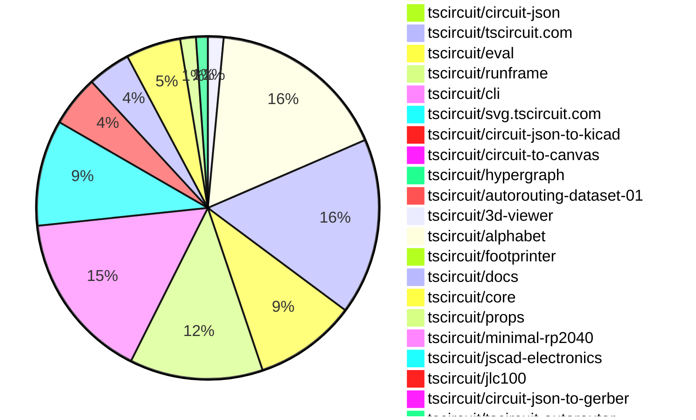

# Contribution Overview 2026-02-10

The current week is shown below. There are 3 major sections:

- [Contributor Overview](#contributor-overview)
- [PRs by Repository](#prs-by-repository)
- [PRs by Contributor](#changes-by-contributor)
- [Scoring & Sponsorship Details](/docs/sponsorship-calculation-explanation.md)

## PRs by Repository

## Contributor Overview

| Contributor | 🐳 Major | 🐙 Minor | 🐌 Tiny | ⭐ | Discussion Contributions |
|-------------|---------|---------|---------|-----|--------------------------|
| [seveibar](#seveibar) | 2 | 11 | 8 | ⭐⭐⭐ | 0🔹 0🔶 0💎 |
| [imrishabh18](#imrishabh18) | 2 | 5 | 4 | ⭐⭐ | 0🔹 0🔶 0💎 |
| [MustafaMulla29](#MustafaMulla29) | 2 | 3 | 6 | ⭐⭐ | 0🔹 0🔶 0💎 |
| [ArnavK-09](#ArnavK-09) | 3 | 3 | 2 | ⭐⭐ | 0🔹 0🔶 0💎 |
| [ShiboSoftwareDev](#ShiboSoftwareDev) | 1 | 4 | 2 | ⭐⭐ | 0🔹 0🔶 0💎 |
| [tscircuitbot](#tscircuitbot) | 0 | 0 | 207 | ⭐⭐ | 0🔹 0🔶 0💎 |
| [Abse2001](#Abse2001) | 0 | 3 | 1 | ⭐⭐ | 0🔹 0🔶 0💎 |
| [techmannih](#techmannih) | 2 | 0 | 1 | ⭐⭐ | 0🔹 0🔶 0💎 |
| [0hmX](#0hmX) | 1 | 1 | 3 | ⭐ | 0🔹 0🔶 0💎 |
| [rushabhcodes](#rushabhcodes) | 1 | 1 | 1 | ⭐ | 0🔹 0🔶 0💎 |
| [nailoo](#nailoo) | 0 | 1 | 3 | ⭐ | 0🔹 0🔶 0💎 |
| [AnasSarkiz](#AnasSarkiz) | 0 | 2 | 0 | ⭐ | 0🔹 0🔶 0💎 |
| [shehaban](#shehaban) | 0 | 1 | 0 |  | 0🔹 0🔶 0💎 |
| [Heinrich-XIAO](#Heinrich-XIAO) | 0 | 0 | 2 |  | 0🔹 0🔶 0💎 |

> Note: AI evaluates PRs and assigns 1-3 star ratings automatically. 4 and 5 star ratings require manual staff review.

### Discussion Contribution Legend

- 🔹 Normal Comments: Basic participation with minimal effort
- 🔶 Great Informative Comments: Thoughtful participation that adds value
- 💎 Incredible Comments: Exceptional participation with high-quality content

## Review Table

[reviews-received-hover]: ## "Number of reviews received for PRs for this contributor"
[approvals-received-hover]: ## "Number of approvals received for PRs this contributor authored"
[rejections-received-hover]: ## "Number of rejections received for PRs this contributor authored"
[prs-opened-hover]: ## "Number of PRs opened by this contributor"
[issues-created-hover]: ## "Number of issues created by this contributor"

| Contributor | Reviews Received | Approvals Received | Rejections Received | Approvals | Rejections | PRs Opened | PRs Merged | Issues Created |
|---|---|---|---|---|---|---|---|---|
| [tscircuitbot](#tscircuitbot) | 0 | 0 | 0 | 0 | 0 | 229 | 207 | 0 |
| [Abse2001](#Abse2001) | 4 | 4 | 0 | 5 | 0 | 5 | 4 | 0 |
| [ShiboSoftwareDev](#ShiboSoftwareDev) | 7 | 7 | 0 | 5 | 0 | 7 | 7 | 0 |
| [nailoo](#nailoo) | 8 | 5 | 1 | 1 | 1 | 6 | 4 | 0 |
| [imrishabh18](#imrishabh18) | 4 | 1 | 0 | 3 | 0 | 12 | 11 | 0 |
| [rushabhcodes](#rushabhcodes) | 27 | 7 | 5 | 1 | 0 | 8 | 3 | 0 |
| [buildingvibes](#buildingvibes) | 12 | 0 | 1 | 0 | 0 | 25 | 0 | 0 |
| [MustafaMulla29](#MustafaMulla29) | 15 | 10 | 2 | 0 | 1 | 15 | 11 | 0 |
| [seveibar](#seveibar) | 7 | 0 | 0 | 32 | 10 | 23 | 21 | 0 |
| [Heinrich-XIAO](#Heinrich-XIAO) | 9 | 5 | 1 | 0 | 0 | 4 | 2 | 0 |
| [shehaban](#shehaban) | 6 | 2 | 2 | 0 | 0 | 3 | 1 | 0 |
| [techmannih](#techmannih) | 8 | 3 | 0 | 2 | 2 | 8 | 3 | 0 |
| [Devesh36](#Devesh36) | 0 | 0 | 0 | 1 | 0 | 0 | 0 | 0 |
| [agent-steven](#agent-steven) | 1 | 0 | 1 | 0 | 0 | 1 | 0 | 0 |
| [ArnavK-09](#ArnavK-09) | 8 | 5 | 0 | 1 | 0 | 8 | 8 | 0 |
| [bamontejano](#bamontejano) | 0 | 0 | 0 | 0 | 0 | 2 | 0 | 0 |
| [Rhan2020](#Rhan2020) | 0 | 0 | 0 | 0 | 0 | 1 | 0 | 0 |
| [AnasSarkiz](#AnasSarkiz) | 2 | 2 | 0 | 0 | 0 | 2 | 2 | 0 |
| [0hmX](#0hmX) | 4 | 2 | 0 | 2 | 0 | 6 | 5 | 0 |
| [xiuqiang1995](#xiuqiang1995) | 1 | 0 | 1 | 0 | 0 | 1 | 0 | 0 |

## Changes by Repository

### [tscircuit/pcb-viewer](https://github.com/tscircuit/pcb-viewer)

| PR # | Impact | Rating | Contributor | Description |
|------|--------|--------|-------------|-------------|
| [#661](https://github.com/tscircuit/pcb-viewer/pull/661) | 🐙 Minor | ⭐⭐ | Abse2001 | Refactors the PCB layer rendering process by simplifying the soldermask pipeline, fixing the layer order, and enhancing support for multi-board layouts. |
| [#659](https://github.com/tscircuit/pcb-viewer/pull/659) | 🐙 Minor | ⭐⭐ | nailoo | Fixes rendering errors in the ErrorOverlay component when DRC errors are not displayed. |

🌠Tiny Contributions (2)

| PR # | Impact | Contributor | Description |
|------|--------|-------------|-------------|
| [#662](https://github.com/tscircuit/pcb-viewer/pull/662) | 🐌 Tiny | tscircuitbot | Automated package update |
| [#660](https://github.com/tscircuit/pcb-viewer/pull/660) | 🐌 Tiny | tscircuitbot | Automated package update |

### [tscircuit/tscircuit](https://github.com/tscircuit/tscircuit)

🌠Tiny Contributions (46)

| PR # | Impact | Contributor | Description |
|------|--------|-------------|-------------|
| [#2201](https://github.com/tscircuit/tscircuit/pull/2201) | 🐌 Tiny | tscircuitbot | Automated package update |
| [#2200](https://github.com/tscircuit/tscircuit/pull/2200) | 🐌 Tiny | tscircuitbot | Automated package update |
| [#2199](https://github.com/tscircuit/tscircuit/pull/2199) | 🐌 Tiny | tscircuitbot | Updates the package version from 0.0.1305 to 0.0.1306 in package.json |
| [#2198](https://github.com/tscircuit/tscircuit/pull/2198) | 🐌 Tiny | tscircuitbot | Updates the tscircuitcli package from version 0.1.920 to 0.1.921 and the tscircuitrunframe package from version 0.0.1606 to 0.0.1607 in package.json |
| [#2197](https://github.com/tscircuit/tscircuit/pull/2197) | 🐌 Tiny | tscircuitbot | Updates the package version from 0.0.1304 to 0.0.1305 in package.json |
| [#2196](https://github.com/tscircuit/tscircuit/pull/2196) | 🐌 Tiny | tscircuitbot | Automated package update |
| [#2195](https://github.com/tscircuit/tscircuit/pull/2195) | 🐌 Tiny | tscircuitbot | Updates the package version from 0.0.1303 to 0.0.1304 in package.json |
| [#2194](https://github.com/tscircuit/tscircuit/pull/2194) | 🐌 Tiny | tscircuitbot | Updates the tscircuitcli package from version 0.1.918 to 0.1.919 and the tscircuitrunframe package from version 0.0.1604 to 0.0.1605 in the package.json file. |
| [#2193](https://github.com/tscircuit/tscircuit/pull/2193) | 🐌 Tiny | tscircuitbot | Automated package update |
| [#2192](https://github.com/tscircuit/tscircuit/pull/2192) | 🐌 Tiny | tscircuitbot | Automated package update |
| [#2191](https://github.com/tscircuit/tscircuit/pull/2191) | 🐌 Tiny | tscircuitbot | Automated package update |
| [#2190](https://github.com/tscircuit/tscircuit/pull/2190) | 🐌 Tiny | tscircuitbot | Updates the versions of several dependencies in the package.json file, including tscircuitcli, tscircuitcore, and tscircuiteval. |
| [#2189](https://github.com/tscircuit/tscircuit/pull/2189) | 🐌 Tiny | tscircuitbot | Updates the package version from 0.0.1300 to 0.0.1301 in package.json |
| [#2188](https://github.com/tscircuit/tscircuit/pull/2188) | 🐌 Tiny | tscircuitbot | Automated package update |
| [#2187](https://github.com/tscircuit/tscircuit/pull/2187) | 🐌 Tiny | tscircuitbot | Automated package update |
| [#2186](https://github.com/tscircuit/tscircuit/pull/2186) | 🐌 Tiny | tscircuitbot | Automated package update |
| [#2185](https://github.com/tscircuit/tscircuit/pull/2185) | 🐌 Tiny | tscircuitbot | Updates the package version from 0.0.1298 to 0.0.1299 in package.json |
| [#2184](https://github.com/tscircuit/tscircuit/pull/2184) | 🐌 Tiny | tscircuitbot | Automated package update |
| [#2183](https://github.com/tscircuit/tscircuit/pull/2183) | 🐌 Tiny | tscircuitbot | Automated package update |
| [#2182](https://github.com/tscircuit/tscircuit/pull/2182) | 🐌 Tiny | tscircuitbot | Updates the tscircuitcli package to version 0.1.913 |
| [#2181](https://github.com/tscircuit/tscircuit/pull/2181) | 🐌 Tiny | tscircuitbot | Automated package update |
| [#2180](https://github.com/tscircuit/tscircuit/pull/2180) | 🐌 Tiny | tscircuitbot | Automated package update |
| [#2179](https://github.com/tscircuit/tscircuit/pull/2179) | 🐌 Tiny | tscircuitbot | Automated package update |
| [#2178](https://github.com/tscircuit/tscircuit/pull/2178) | 🐌 Tiny | tscircuitbot | Automated package update |
| [#2172](https://github.com/tscircuit/tscircuit/pull/2172) | 🐌 Tiny | tscircuitbot | Updates the tscircuitcli package from version 0.1.909 to 0.1.910 |
| [#2166](https://github.com/tscircuit/tscircuit/pull/2166) | 🐌 Tiny | tscircuitbot | Automated package update |
| [#2175](https://github.com/tscircuit/tscircuit/pull/2175) | 🐌 Tiny | tscircuitbot | Updates the tscircuitcli package from version 0.1.910 to 0.1.911 |
| [#2167](https://github.com/tscircuit/tscircuit/pull/2167) | 🐌 Tiny | tscircuitbot | Automated package update |
| [#2176](https://github.com/tscircuit/tscircuit/pull/2176) | 🐌 Tiny | tscircuitbot | Automated package update |
| [#2171](https://github.com/tscircuit/tscircuit/pull/2171) | 🐌 Tiny | tscircuitbot | Updates the package version from 0.0.1292 to 0.0.1293 in package.json |
| [#2169](https://github.com/tscircuit/tscircuit/pull/2169) | 🐌 Tiny | tscircuitbot | Automated package update |
| [#2170](https://github.com/tscircuit/tscircuit/pull/2170) | 🐌 Tiny | tscircuitbot | Automated package update |
| [#2173](https://github.com/tscircuit/tscircuit/pull/2173) | 🐌 Tiny | tscircuitbot | Automated package update |
| [#2168](https://github.com/tscircuit/tscircuit/pull/2168) | 🐌 Tiny | tscircuitbot | Updates the tscircuitcli package from version 0.1.907 to 0.1.908 and the tscircuitrunframe package from version 0.0.1595 to 0.0.1596. |
| [#2157](https://github.com/tscircuit/tscircuit/pull/2157) | 🐌 Tiny | tscircuitbot | Updates the tscircuitcli package from version 0.1.902 to 0.1.903 and the tscircuitrunframe package from version 0.0.1590 to 0.0.1591 in package.json |
| [#2161](https://github.com/tscircuit/tscircuit/pull/2161) | 🐌 Tiny | tscircuitbot | Automated package update |
| [#2159](https://github.com/tscircuit/tscircuit/pull/2159) | 🐌 Tiny | tscircuitbot | Automated package update |
| [#2165](https://github.com/tscircuit/tscircuit/pull/2165) | 🐌 Tiny | tscircuitbot | Automated package update |
| [#2155](https://github.com/tscircuit/tscircuit/pull/2155) | 🐌 Tiny | tscircuitbot | Updates the tscircuitcli package to version 0.1.902 in package.json |
| [#2160](https://github.com/tscircuit/tscircuit/pull/2160) | 🐌 Tiny | tscircuitbot | Updates the package version from 0.0.1287 to 0.0.1288 in package.json |
| [#2162](https://github.com/tscircuit/tscircuit/pull/2162) | 🐌 Tiny | tscircuitbot | Automated package update |
| [#2156](https://github.com/tscircuit/tscircuit/pull/2156) | 🐌 Tiny | tscircuitbot | Automated package update |
| [#2158](https://github.com/tscircuit/tscircuit/pull/2158) | 🐌 Tiny | tscircuitbot | Automated package update |
| [#2153](https://github.com/tscircuit/tscircuit/pull/2153) | 🐌 Tiny | tscircuitbot | Updates the tscircuitcli package to version 0.1.901 in package.json |
| [#2154](https://github.com/tscircuit/tscircuit/pull/2154) | 🐌 Tiny | tscircuitbot | Automated package update |
| [#2164](https://github.com/tscircuit/tscircuit/pull/2164) | 🐌 Tiny | tscircuitbot | Automated package update |

### [tscircuit/circuit-json](https://github.com/tscircuit/circuit-json)

| PR # | Impact | Rating | Contributor | Description |
|------|--------|--------|-------------|-------------|
| [#464](https://github.com/tscircuit/circuit-json/pull/464) | 🐙 Minor | ⭐⭐ | seveibar | Adds an optional is_allowed_to_be_off_board field to the pcb_component schema and TypeScript interface, allowing components to indicate they may be placed off the PCB. |

🌠Tiny Contributions (1)

| PR # | Impact | Contributor | Description |
|------|--------|-------------|-------------|
| [#465](https://github.com/tscircuit/circuit-json/pull/465) | 🐌 Tiny | tscircuitbot | Automated package update |

### [tscircuit/tscircuit.com](https://github.com/tscircuit/tscircuit.com)

| PR # | Impact | Rating | Contributor | Description |
|------|--------|--------|-------------|-------------|
| [#2707](https://github.com/tscircuit/tscircuit.com/pull/2707) | 🐳 Major | ⭐⭐⭐ | seveibar | Adds an analog simulation image and code example to the landing page, enhancing user guidance for analog simulations. |
| [#2727](https://github.com/tscircuit/tscircuit.com/pull/2727) | 🐳 Major | ⭐⭐⭐ | ArnavK-09 | Adds a component to display a list of circuit errors on the build page, allowing users to view and manage errors related to their circuit builds. |
| [#2721](https://github.com/tscircuit/tscircuit.com/pull/2721) | 🐳 Major | ⭐⭐⭐ | ArnavK-09 | Adds interactive breadcrumbs to the files view for improved directory navigation, allowing users to easily navigate back through directory levels. |
| [#2719](https://github.com/tscircuit/tscircuit.com/pull/2719) | 🐳 Major | ⭐⭐⭐ | ArnavK-09 | Changes the UI to implement organization search functionality instead of account search, updating related components and queries accordingly. |
| [#2702](https://github.com/tscircuit/tscircuit.com/pull/2702) | 🐙 Minor | ⭐⭐ | imrishabh18 | Modifies the file path to include dist when searching for files in external packages. |
| [#2698](https://github.com/tscircuit/tscircuit.com/pull/2698) | 🐙 Minor | ⭐⭐ | imrishabh18 | Normalizes CAD asset URLs in circuit JSON to correctly fetch assets from the package registry instead of treating them as same-package files. |
| [#2740](https://github.com/tscircuit/tscircuit.com/pull/2740) | 🐙 Minor | ⭐⭐ | ArnavK-09 | Fixes rendering issue by removing unnecessary condition for circuit file loading in BuildCircuitErrors component |
| [#2720](https://github.com/tscircuit/tscircuit.com/pull/2720) | 🐙 Minor | ⭐⭐ | ArnavK-09 | Replaces the manual check for the existence of circuit.json with a hook that determines if the circuit JSON is found and loading status. |
| [#2717](https://github.com/tscircuit/tscircuit.com/pull/2717) | 🐙 Minor | ⭐⭐ | ArnavK-09 | Modifies the organization search API to remove user permission checks and streamline the response structure. |

🌠Tiny Contributions (36)

| PR # | Impact | Contributor | Description |
|------|--------|-------------|-------------|
| [#2750](https://github.com/tscircuit/tscircuit.com/pull/2750) | 🐌 Tiny | tscircuitbot | Updates the version of the tscircuitrunframe package from 0.0.1607 to 0.0.1608 in package.json |
| [#2749](https://github.com/tscircuit/tscircuit.com/pull/2749) | 🐌 Tiny | tscircuitbot | Automated package update |
| [#2747](https://github.com/tscircuit/tscircuit.com/pull/2747) | 🐌 Tiny | tscircuitbot | Updates the tscircuitrunframe package from version 0.0.1605 to 0.0.1606 |
| [#2746](https://github.com/tscircuit/tscircuit.com/pull/2746) | 🐌 Tiny | tscircuitbot | Updates the tscircuiteval package version from 0.0.638 to 0.0.639 in package.json |
| [#2745](https://github.com/tscircuit/tscircuit.com/pull/2745) | 🐌 Tiny | tscircuitbot | Automated package update |
| [#2744](https://github.com/tscircuit/tscircuit.com/pull/2744) | 🐌 Tiny | tscircuitbot | Updates the tscircuiteval package from version 0.0.637 to 0.0.638 |
| [#2742](https://github.com/tscircuit/tscircuit.com/pull/2742) | 🐌 Tiny | tscircuitbot | Updates the tscircuitrunframe package from version 0.0.1602 to 0.0.1603 |
| [#2741](https://github.com/tscircuit/tscircuit.com/pull/2741) | 🐌 Tiny | tscircuitbot | Automated package update |
| [#2739](https://github.com/tscircuit/tscircuit.com/pull/2739) | 🐌 Tiny | tscircuitbot | Updates the tscircuitrunframe package from version 0.0.1601 to 0.0.1602 |
| [#2738](https://github.com/tscircuit/tscircuit.com/pull/2738) | 🐌 Tiny | tscircuitbot | Updates the tscircuiteval package from version 0.0.635 to 0.0.636 |
| [#2737](https://github.com/tscircuit/tscircuit.com/pull/2737) | 🐌 Tiny | tscircuitbot | Updates the tscircuitrunframe package from version 0.0.1600 to 0.0.1601 |
| [#2736](https://github.com/tscircuit/tscircuit.com/pull/2736) | 🐌 Tiny | tscircuitbot | Automated package update |
| [#2735](https://github.com/tscircuit/tscircuit.com/pull/2735) | 🐌 Tiny | tscircuitbot | Updates the tscircuitrunframe package version from 0.0.1597 to 0.0.1600 in package.json |
| [#2734](https://github.com/tscircuit/tscircuit.com/pull/2734) | 🐌 Tiny | tscircuitbot | Automated package update |
| [#2731](https://github.com/tscircuit/tscircuit.com/pull/2731) | 🐌 Tiny | tscircuitbot | Automated package update |
| [#2729](https://github.com/tscircuit/tscircuit.com/pull/2729) | 🐌 Tiny | tscircuitbot | Automated package update |
| [#2725](https://github.com/tscircuit/tscircuit.com/pull/2725) | 🐌 Tiny | tscircuitbot | Updates the tscircuiteval package from version 0.0.630 to 0.0.631 |
| [#2726](https://github.com/tscircuit/tscircuit.com/pull/2726) | 🐌 Tiny | tscircuitbot | Updates the tscircuitrunframe package from version 0.0.1596 to 0.0.1597 |
| [#2714](https://github.com/tscircuit/tscircuit.com/pull/2714) | 🐌 Tiny | tscircuitbot | Updates the tscircuiteval package to version 0.0.629 in package.json |
| [#2715](https://github.com/tscircuit/tscircuit.com/pull/2715) | 🐌 Tiny | tscircuitbot | Automated package update |
| [#2723](https://github.com/tscircuit/tscircuit.com/pull/2723) | 🐌 Tiny | tscircuitbot | Updates the tscircuitrunframe package from version 0.0.1595 to 0.0.1596 |
| [#2718](https://github.com/tscircuit/tscircuit.com/pull/2718) | 🐌 Tiny | tscircuitbot | Automated package update to version 0.0.195 |
| [#2724](https://github.com/tscircuit/tscircuit.com/pull/2724) | 🐌 Tiny | tscircuitbot | Automated package update |
| [#2704](https://github.com/tscircuit/tscircuit.com/pull/2704) | 🐌 Tiny | tscircuitbot | Automated package update |
| [#2709](https://github.com/tscircuit/tscircuit.com/pull/2709) | 🐌 Tiny | tscircuitbot | Updates the tscircuitrunframe package from version 0.0.1592 to 0.0.1593 |
| [#2712](https://github.com/tscircuit/tscircuit.com/pull/2712) | 🐌 Tiny | tscircuitbot | Updates the tscircuitrunframe package from version 0.0.1593 to 0.0.1594 |
| [#2708](https://github.com/tscircuit/tscircuit.com/pull/2708) | 🐌 Tiny | tscircuitbot | Automated package update |
| [#2711](https://github.com/tscircuit/tscircuit.com/pull/2711) | 🐌 Tiny | tscircuitbot | Automated package update |
| [#2703](https://github.com/tscircuit/tscircuit.com/pull/2703) | 🐌 Tiny | tscircuitbot | Automated package update |
| [#2706](https://github.com/tscircuit/tscircuit.com/pull/2706) | 🐌 Tiny | seveibar | Add KiCad image and fix optimized image to support PNGs |
| [#2713](https://github.com/tscircuit/tscircuit.com/pull/2713) | 🐌 Tiny | imrishabh18 | Changes the log display to show stderr messages in red color for better visibility. |
| [#2705](https://github.com/tscircuit/tscircuit.com/pull/2705) | 🐌 Tiny | ShiboSoftwareDev | Updates the version of the circuit-json-to-gerber dependency from 0.0.46 to 0.0.47 in package.json |
| [#2722](https://github.com/tscircuit/tscircuit.com/pull/2722) | 🐌 Tiny | ArnavK-09 | Makes the Analog Simulation section responsive by preventing its code block from overflowing on mobile. |
| [#2716](https://github.com/tscircuit/tscircuit.com/pull/2716) | 🐌 Tiny | ArnavK-09 | Removes a CSS transform property from the ReleaseDeploymentDetails component, potentially improving layout consistency. |
| [#2733](https://github.com/tscircuit/tscircuit.com/pull/2733) | 🐌 Tiny | Heinrich-XIAO | Fixes a duplicated trace issue by replacing the second instance of VBUS1 with VBUS2 in the USB-C LED flashlight template. |
| [#2732](https://github.com/tscircuit/tscircuit.com/pull/2732) | 🐌 Tiny | Heinrich-XIAO | Fixes the USB-C template by correcting power connections and component references in the schematic. |

### [tscircuit/eval](https://github.com/tscircuit/eval)

| PR # | Impact | Rating | Contributor | Description |
|------|--------|--------|-------------|-------------|
| [#2026](https://github.com/tscircuit/eval/pull/2026) | 🐙 Minor | ⭐⭐ | imrishabh18 | Removes the filesystem cache functionality and its associated wrapper from the parts engine, simplifying the caching mechanism to use a local cache engine instead. |

🌠Tiny Contributions (25)

| PR # | Impact | Contributor | Description |
|------|--------|-------------|-------------|
| [#2045](https://github.com/tscircuit/eval/pull/2045) | 🐌 Tiny | tscircuitbot | Automated package update |
| [#2044](https://github.com/tscircuit/eval/pull/2044) | 🐌 Tiny | tscircuitbot | Updates the version of the tscircuitcore package from 0.0.1033 to 0.0.1034 in package.json |
| [#2042](https://github.com/tscircuit/eval/pull/2042) | 🐌 Tiny | tscircuitbot | Automated package update |
| [#2041](https://github.com/tscircuit/eval/pull/2041) | 🐌 Tiny | tscircuitbot | Updates the version of the tscircuitcore package from 0.0.1032 to 0.0.1033 in package.json |
| [#2039](https://github.com/tscircuit/eval/pull/2039) | 🐌 Tiny | tscircuitbot | Automated package update |
| [#2038](https://github.com/tscircuit/eval/pull/2038) | 🐌 Tiny | tscircuitbot | Automated package update |
| [#2036](https://github.com/tscircuit/eval/pull/2036) | 🐌 Tiny | tscircuitbot | Automated package update |
| [#2035](https://github.com/tscircuit/eval/pull/2035) | 🐌 Tiny | tscircuitbot | Automated package update |
| [#2033](https://github.com/tscircuit/eval/pull/2033) | 🐌 Tiny | tscircuitbot | Automated package update |
| [#2032](https://github.com/tscircuit/eval/pull/2032) | 🐌 Tiny | tscircuitbot | Automated package update |
| [#2030](https://github.com/tscircuit/eval/pull/2030) | 🐌 Tiny | tscircuitbot | Automated package update |
| [#2029](https://github.com/tscircuit/eval/pull/2029) | 🐌 Tiny | tscircuitbot | Updates the version of the tscircuitcore package from 0.0.1028 to 0.0.1029 in package.json |
| [#2027](https://github.com/tscircuit/eval/pull/2027) | 🐌 Tiny | tscircuitbot | Automated package update |
| [#2025](https://github.com/tscircuit/eval/pull/2025) | 🐌 Tiny | tscircuitbot | Automated package update |
| [#2024](https://github.com/tscircuit/eval/pull/2024) | 🐌 Tiny | tscircuitbot | Updates the versions of several dependencies in the package.json file. |
| [#2022](https://github.com/tscircuit/eval/pull/2022) | 🐌 Tiny | tscircuitbot | Automated package update |
| [#2021](https://github.com/tscircuit/eval/pull/2021) | 🐌 Tiny | tscircuitbot | Automated package update |
| [#2019](https://github.com/tscircuit/eval/pull/2019) | 🐌 Tiny | tscircuitbot | Automated package update to version 0.0.630 |
| [#2018](https://github.com/tscircuit/eval/pull/2018) | 🐌 Tiny | tscircuitbot | Automated package update |
| [#2010](https://github.com/tscircuit/eval/pull/2010) | 🐌 Tiny | tscircuitbot | Automated package update |
| [#2009](https://github.com/tscircuit/eval/pull/2009) | 🐌 Tiny | tscircuitbot | Updates various package dependencies to their latest versions |
| [#2016](https://github.com/tscircuit/eval/pull/2016) | 🐌 Tiny | tscircuitbot | Automated package update |
| [#2015](https://github.com/tscircuit/eval/pull/2015) | 🐌 Tiny | tscircuitbot | Automated package update |
| [#2013](https://github.com/tscircuit/eval/pull/2013) | 🐌 Tiny | tscircuitbot | Automated package update |
| [#2012](https://github.com/tscircuit/eval/pull/2012) | 🐌 Tiny | tscircuitbot | Automated package update |

### [tscircuit/runframe](https://github.com/tscircuit/runframe)

🌠Tiny Contributions (34)

| PR # | Impact | Contributor | Description |
|------|--------|-------------|-------------|
| [#2638](https://github.com/tscircuit/runframe/pull/2638) | 🐌 Tiny | tscircuitbot | Automated package update |
| [#2637](https://github.com/tscircuit/runframe/pull/2637) | 🐌 Tiny | tscircuitbot | Updates the tscircuit3d-viewer package from version 0.0.512 to 0.0.513 |
| [#2636](https://github.com/tscircuit/runframe/pull/2636) | 🐌 Tiny | tscircuitbot | Automated package update |
| [#2635](https://github.com/tscircuit/runframe/pull/2635) | 🐌 Tiny | tscircuitbot | Updates the tscircuitpcb-viewer package from version 1.11.336 to 1.11.337 |
| [#2633](https://github.com/tscircuit/runframe/pull/2633) | 🐌 Tiny | tscircuitbot | Updates the package version from 0.0.1605 to 0.0.1606 in package.json |
| [#2632](https://github.com/tscircuit/runframe/pull/2632) | 🐌 Tiny | tscircuitbot | Updates the tscircuiteval package to version 0.0.639 in the package.json file |
| [#2631](https://github.com/tscircuit/runframe/pull/2631) | 🐌 Tiny | tscircuitbot | Updates the package version from 0.0.1603 to 0.0.1605 in package.json |
| [#2630](https://github.com/tscircuit/runframe/pull/2630) | 🐌 Tiny | tscircuitbot | Updates the tscircuiteval package to version 0.0.638 in the package.json file |
| [#2628](https://github.com/tscircuit/runframe/pull/2628) | 🐌 Tiny | tscircuitbot | Updates the tscircuitpcb-viewer package from version 1.11.335 to 1.11.336 |
| [#2627](https://github.com/tscircuit/runframe/pull/2627) | 🐌 Tiny | tscircuitbot | Automated package update |
| [#2626](https://github.com/tscircuit/runframe/pull/2626) | 🐌 Tiny | tscircuitbot | Updates the tscircuiteval package to version 0.0.637 in the package.json file. |
| [#2625](https://github.com/tscircuit/runframe/pull/2625) | 🐌 Tiny | tscircuitbot | Automated package update |
| [#2624](https://github.com/tscircuit/runframe/pull/2624) | 🐌 Tiny | tscircuitbot | Updates the tscircuiteval package to version 0.0.636 in the package.json file. |
| [#2623](https://github.com/tscircuit/runframe/pull/2623) | 🐌 Tiny | tscircuitbot | Automated package update |
| [#2622](https://github.com/tscircuit/runframe/pull/2622) | 🐌 Tiny | tscircuitbot | Updates the tscircuiteval package from version 0.0.634 to 0.0.635 in the package.json file. |
| [#2621](https://github.com/tscircuit/runframe/pull/2621) | 🐌 Tiny | tscircuitbot | Automated package update |
| [#2620](https://github.com/tscircuit/runframe/pull/2620) | 🐌 Tiny | tscircuitbot | Updates the tscircuiteval package from version 0.0.633 to 0.0.634 |
| [#2619](https://github.com/tscircuit/runframe/pull/2619) | 🐌 Tiny | tscircuitbot | Updates the tscircuiteval package to version 0.0.633 in the package.json file. |
| [#2618](https://github.com/tscircuit/runframe/pull/2618) | 🐌 Tiny | tscircuitbot | Automated package update |
| [#2617](https://github.com/tscircuit/runframe/pull/2617) | 🐌 Tiny | tscircuitbot | Updates the tscircuiteval package to version 0.0.632 in the package.json file. |
| [#2614](https://github.com/tscircuit/runframe/pull/2614) | 🐌 Tiny | tscircuitbot | Automated package update |
| [#2613](https://github.com/tscircuit/runframe/pull/2613) | 🐌 Tiny | tscircuitbot | Updates the circuit-json-to-kicad package from version 0.0.71 to 0.0.72 in package.json |
| [#2615](https://github.com/tscircuit/runframe/pull/2615) | 🐌 Tiny | tscircuitbot | Updates the tscircuiteval package from version 0.0.629 to 0.0.631 in the package.json file. |
| [#2611](https://github.com/tscircuit/runframe/pull/2611) | 🐌 Tiny | tscircuitbot | Automated package update |
| [#2616](https://github.com/tscircuit/runframe/pull/2616) | 🐌 Tiny | tscircuitbot | Automated package update |
| [#2603](https://github.com/tscircuit/runframe/pull/2603) | 🐌 Tiny | tscircuitbot | Automated package update |
| [#2604](https://github.com/tscircuit/runframe/pull/2604) | 🐌 Tiny | tscircuitbot | Updates the circuit-json-to-gerber package from version 0.0.46 to 0.0.47 in package.json |
| [#2602](https://github.com/tscircuit/runframe/pull/2602) | 🐌 Tiny | tscircuitbot | Updates the tscircuit3d-viewer package from version 0.0.511 to 0.0.512 |
| [#2605](https://github.com/tscircuit/runframe/pull/2605) | 🐌 Tiny | tscircuitbot | Automated package update |
| [#2606](https://github.com/tscircuit/runframe/pull/2606) | 🐌 Tiny | tscircuitbot | Updates the tscircuiteval package to version 0.0.627 in the package.json file. |
| [#2608](https://github.com/tscircuit/runframe/pull/2608) | 🐌 Tiny | tscircuitbot | Updates the tscircuiteval package to version 0.0.628 in the package.json file |
| [#2609](https://github.com/tscircuit/runframe/pull/2609) | 🐌 Tiny | tscircuitbot | Automated package update |
| [#2610](https://github.com/tscircuit/runframe/pull/2610) | 🐌 Tiny | tscircuitbot | Updates the tscircuiteval package to version 0.0.629 in the package.json file. |
| [#2607](https://github.com/tscircuit/runframe/pull/2607) | 🐌 Tiny | tscircuitbot | Automated package update |

### [tscircuit/cli](https://github.com/tscircuit/cli)

| PR # | Impact | Rating | Contributor | Description |
|------|--------|--------|-------------|-------------|
| [#1771](https://github.com/tscircuit/cli/pull/1771) | 🐳 Major | ⭐⭐⭐ | imrishabh18 | Adds a local caching mechanism for the parts-engine, allowing for faster access and reduced computation by storing previously computed results in the filesystem. |
| [#1952](https://github.com/tscircuit/cli/pull/1952) | 🐙 Minor | ⭐⭐ | MustafaMulla29 | Adds a --glbs flag to the build command to generate GLB 3D model files for every successful build. |

🌠Tiny Contributions (41)

| PR # | Impact | Contributor | Description |
|------|--------|-------------|-------------|
| [#1995](https://github.com/tscircuit/cli/pull/1995) | 🐌 Tiny | tscircuitbot | Automated package update |
| [#1994](https://github.com/tscircuit/cli/pull/1994) | 🐌 Tiny | tscircuitbot | Updates the tscircuitrunframe package from version 0.0.1607 to 0.0.1608 |
| [#1993](https://github.com/tscircuit/cli/pull/1993) | 🐌 Tiny | tscircuitbot | Automated package update |
| [#1992](https://github.com/tscircuit/cli/pull/1992) | 🐌 Tiny | tscircuitbot | Updates the tscircuitrunframe package from version 0.0.1606 to 0.0.1607 |
| [#1991](https://github.com/tscircuit/cli/pull/1991) | 🐌 Tiny | tscircuitbot | Updates the package version from v0.1.919 to v0.1.920 in package.json |
| [#1990](https://github.com/tscircuit/cli/pull/1990) | 🐌 Tiny | tscircuitbot | Updates the tscircuitrunframe package from version 0.0.1605 to 0.0.1606 |
| [#1989](https://github.com/tscircuit/cli/pull/1989) | 🐌 Tiny | tscircuitbot | Updates the package version from v0.1.917 to v0.1.919 in package.json |
| [#1988](https://github.com/tscircuit/cli/pull/1988) | 🐌 Tiny | tscircuitbot | Updates the tscircuitrunframe package from version 0.0.1604 to 0.0.1605 |
| [#1986](https://github.com/tscircuit/cli/pull/1986) | 🐌 Tiny | tscircuitbot | Updates the tscircuitrunframe package from version 0.0.1603 to 0.0.1604 |
| [#1985](https://github.com/tscircuit/cli/pull/1985) | 🐌 Tiny | tscircuitbot | Updates the package version from 0.1.916 to 0.1.917 in package.json |
| [#1984](https://github.com/tscircuit/cli/pull/1984) | 🐌 Tiny | tscircuitbot | Updates the tscircuitrunframe package from version 0.0.1602 to 0.0.1603 |
| [#1983](https://github.com/tscircuit/cli/pull/1983) | 🐌 Tiny | tscircuitbot | Updates the package version from 0.1.915 to 0.1.916 in package.json |
| [#1982](https://github.com/tscircuit/cli/pull/1982) | 🐌 Tiny | tscircuitbot | Updates the tscircuitrunframe package from version 0.0.1601 to 0.0.1602 in the package.json file. |
| [#1981](https://github.com/tscircuit/cli/pull/1981) | 🐌 Tiny | tscircuitbot | Automated package update |
| [#1980](https://github.com/tscircuit/cli/pull/1980) | 🐌 Tiny | tscircuitbot | Updates the tscircuitrunframe package from version 0.0.1600 to 0.0.1601 |
| [#1979](https://github.com/tscircuit/cli/pull/1979) | 🐌 Tiny | tscircuitbot | Automated package update |
| [#1978](https://github.com/tscircuit/cli/pull/1978) | 🐌 Tiny | tscircuitbot | Updates the tscircuitrunframe package from version 0.0.1598 to 0.0.1600 |
| [#1977](https://github.com/tscircuit/cli/pull/1977) | 🐌 Tiny | tscircuitbot | Automated package update |
| [#1976](https://github.com/tscircuit/cli/pull/1976) | 🐌 Tiny | tscircuitbot | Updates the package version from v0.1.911 to v0.1.912 in package.json |
| [#1975](https://github.com/tscircuit/cli/pull/1975) | 🐌 Tiny | tscircuitbot | Updates the tscircuitrunframe package from version 0.0.1597 to 0.0.1598 |
| [#1974](https://github.com/tscircuit/cli/pull/1974) | 🐌 Tiny | tscircuitbot | Automated package update |
| [#1966](https://github.com/tscircuit/cli/pull/1966) | 🐌 Tiny | tscircuitbot | Updates the package version from v0.1.906 to v0.1.907 in package.json |
| [#1970](https://github.com/tscircuit/cli/pull/1970) | 🐌 Tiny | tscircuitbot | Automated package update |
| [#1972](https://github.com/tscircuit/cli/pull/1972) | 🐌 Tiny | tscircuitbot | Automated package update |
| [#1967](https://github.com/tscircuit/cli/pull/1967) | 🐌 Tiny | tscircuitbot | Updates the tscircuitrunframe package from version 0.0.1595 to 0.0.1596 |
| [#1969](https://github.com/tscircuit/cli/pull/1969) | 🐌 Tiny | tscircuitbot | Updates the tscircuitrunframe package from version 0.0.1596 to 0.0.1597 |
| [#1968](https://github.com/tscircuit/cli/pull/1968) | 🐌 Tiny | tscircuitbot | Updates the package version from v0.1.907 to v0.1.908 in package.json |
| [#1965](https://github.com/tscircuit/cli/pull/1965) | 🐌 Tiny | tscircuitbot | Updates the tscircuitrunframe package from version 0.0.1594 to 0.0.1595 |
| [#1963](https://github.com/tscircuit/cli/pull/1963) | 🐌 Tiny | tscircuitbot | Updates the tscircuitrunframe package from version 0.0.1593 to 0.0.1594 |
| [#1953](https://github.com/tscircuit/cli/pull/1953) | 🐌 Tiny | tscircuitbot | Updates the package version from 0.1.900 to 0.1.901 in package.json |
| [#1959](https://github.com/tscircuit/cli/pull/1959) | 🐌 Tiny | tscircuitbot | Updates the package version from v0.1.903 to v0.1.904 in package.json |
| [#1960](https://github.com/tscircuit/cli/pull/1960) | 🐌 Tiny | tscircuitbot | Updates the tscircuitrunframe package from version 0.0.1592 to 0.0.1593 |
| [#1958](https://github.com/tscircuit/cli/pull/1958) | 🐌 Tiny | tscircuitbot | Updates the tscircuitrunframe package from version 0.0.1591 to 0.0.1592 |
| [#1955](https://github.com/tscircuit/cli/pull/1955) | 🐌 Tiny | tscircuitbot | Updates the package version from 0.1.901 to 0.1.902 in package.json |
| [#1964](https://github.com/tscircuit/cli/pull/1964) | 🐌 Tiny | tscircuitbot | Updates the package version from v0.1.905 to v0.1.906 in package.json |
| [#1956](https://github.com/tscircuit/cli/pull/1956) | 🐌 Tiny | tscircuitbot | Updates the tscircuitrunframe package from version 0.0.1590 to 0.0.1591 |
| [#1957](https://github.com/tscircuit/cli/pull/1957) | 🐌 Tiny | tscircuitbot | Automated package update |
| [#1961](https://github.com/tscircuit/cli/pull/1961) | 🐌 Tiny | tscircuitbot | Updates the package version from v0.1.904 to v0.1.905 in package.json |
| [#1973](https://github.com/tscircuit/cli/pull/1973) | 🐌 Tiny | imrishabh18 | Fixes TS2688 type error by ensuring tsconfig.json is present and tscircuit is listed as a dependency in package.json |
| [#1971](https://github.com/tscircuit/cli/pull/1971) | 🐌 Tiny | imrishabh18 | Fixes the issue of missing tsconfig.json which causes Rollup to throw type errors during cloud builds. |
| [#1954](https://github.com/tscircuit/cli/pull/1954) | 🐌 Tiny | MustafaMulla29 | Updates the circuit-json-to-kicad dependency version from 0.0.52 to 0.0.71 in package.json and adjusts the test cases accordingly. |

### [tscircuit/svg.tscircuit.com](https://github.com/tscircuit/svg.tscircuit.com)

| PR # | Impact | Rating | Contributor | Description |
|------|--------|--------|-------------|-------------|
| [#978](https://github.com/tscircuit/svg.tscircuit.com/pull/978) | 🐳 Major | ⭐⭐⭐ | techmannih | Adds tests for PCB courtyard rendering, including support for circles, outlines, and rectangles in SVG format. |
| [#979](https://github.com/tscircuit/svg.tscircuit.com/pull/979) | 🐳 Major | ⭐⭐⭐ | techmannih | Adds support for rendering PCB courtyards in the SVG output by introducing a new parameter to control their visibility. |
| [#991](https://github.com/tscircuit/svg.tscircuit.com/pull/991) | 🐙 Minor | ⭐⭐ | seveibar | Fixes truncated SVG error messages by ensuring that only the leading Error: prefix is removed, preserving meaningful details in error messages containing colons. |
| [#976](https://github.com/tscircuit/svg.tscircuit.com/pull/976) | 🐙 Minor | ⭐⭐ | AnasSarkiz | Adds an end-to-end 3D PNG snapshot test that verifies STEP-based cadmodel support is fully functional in the 3D rendering pipeline. |

🌠Tiny Contributions (23)

| PR # | Impact | Contributor | Description |
|------|--------|-------------|-------------|
| [#997](https://github.com/tscircuit/svg.tscircuit.com/pull/997) | 🐌 Tiny | tscircuitbot | Updates the tscircuit package version from 0.0.1306 to 0.0.1307 in package.json |
| [#996](https://github.com/tscircuit/svg.tscircuit.com/pull/996) | 🐌 Tiny | tscircuitbot | Updates the tscircuit package version from 0.0.1305 to 0.0.1306 in package.json |
| [#995](https://github.com/tscircuit/svg.tscircuit.com/pull/995) | 🐌 Tiny | tscircuitbot | Updates the tscircuit package version from 0.0.1304 to 0.0.1305 in package.json |
| [#994](https://github.com/tscircuit/svg.tscircuit.com/pull/994) | 🐌 Tiny | tscircuitbot | Updates the tscircuit package version from 0.0.1303 to 0.0.1304 in package.json |
| [#993](https://github.com/tscircuit/svg.tscircuit.com/pull/993) | 🐌 Tiny | tscircuitbot | Updates the tscircuit package from version 0.0.1302 to 0.0.1303 in package.json |
| [#992](https://github.com/tscircuit/svg.tscircuit.com/pull/992) | 🐌 Tiny | tscircuitbot | Updates the tscircuit package version from 0.0.1301 to 0.0.1302 in package.json |
| [#990](https://github.com/tscircuit/svg.tscircuit.com/pull/990) | 🐌 Tiny | tscircuitbot | Updates the tscircuit package version from 0.0.1300 to 0.0.1301 in package.json |
| [#989](https://github.com/tscircuit/svg.tscircuit.com/pull/989) | 🐌 Tiny | tscircuitbot | Updates the tscircuit package version from 0.0.1299 to 0.0.1300 in package.json |
| [#988](https://github.com/tscircuit/svg.tscircuit.com/pull/988) | 🐌 Tiny | tscircuitbot | Automated package update |
| [#987](https://github.com/tscircuit/svg.tscircuit.com/pull/987) | 🐌 Tiny | tscircuitbot | Updates the tscircuit package version from 0.0.1297 to 0.0.1298 in package.json |
| [#986](https://github.com/tscircuit/svg.tscircuit.com/pull/986) | 🐌 Tiny | tscircuitbot | Updates the tscircuit package version from 0.0.1296 to 0.0.1297 in package.json |
| [#985](https://github.com/tscircuit/svg.tscircuit.com/pull/985) | 🐌 Tiny | tscircuitbot | Updates the tscircuit package version from 0.0.1295 to 0.0.1296 in package.json |
| [#983](https://github.com/tscircuit/svg.tscircuit.com/pull/983) | 🐌 Tiny | tscircuitbot | Updates the tscircuit package version from 0.0.1293 to 0.0.1294 in package.json |
| [#984](https://github.com/tscircuit/svg.tscircuit.com/pull/984) | 🐌 Tiny | tscircuitbot | Updates the tscircuit package version from 0.0.1294 to 0.0.1295 in package.json |
| [#982](https://github.com/tscircuit/svg.tscircuit.com/pull/982) | 🐌 Tiny | tscircuitbot | Updates the tscircuit package from version 0.0.1292 to 0.0.1293 in package.json |
| [#980](https://github.com/tscircuit/svg.tscircuit.com/pull/980) | 🐌 Tiny | tscircuitbot | Updates the tscircuit package version from 0.0.1290 to 0.0.1291 in package.json |
| [#981](https://github.com/tscircuit/svg.tscircuit.com/pull/981) | 🐌 Tiny | tscircuitbot | Updates the tscircuit package version from 0.0.1291 to 0.0.1292 in package.json |
| [#971](https://github.com/tscircuit/svg.tscircuit.com/pull/971) | 🐌 Tiny | tscircuitbot | Updates the tscircuit package version from 0.0.1284 to 0.0.1285 in package.json |
| [#975](https://github.com/tscircuit/svg.tscircuit.com/pull/975) | 🐌 Tiny | tscircuitbot | Updates the tscircuit package version from 0.0.1288 to 0.0.1289 in package.json |
| [#974](https://github.com/tscircuit/svg.tscircuit.com/pull/974) | 🐌 Tiny | tscircuitbot | Updates the tscircuit package version from 0.0.1287 to 0.0.1288 in package.json |
| [#977](https://github.com/tscircuit/svg.tscircuit.com/pull/977) | 🐌 Tiny | tscircuitbot | Updates the tscircuit package version from 0.0.1289 to 0.0.1290 in package.json |
| [#973](https://github.com/tscircuit/svg.tscircuit.com/pull/973) | 🐌 Tiny | tscircuitbot | Updates the tscircuit package version from 0.0.1286 to 0.0.1287 in package.json |
| [#972](https://github.com/tscircuit/svg.tscircuit.com/pull/972) | 🐌 Tiny | tscircuitbot | Updates the tscircuit package version from 0.0.1285 to 0.0.1286 in package.json |

### [tscircuit/circuit-json-to-kicad](https://github.com/tscircuit/circuit-json-to-kicad)

🌠Tiny Contributions (2)

| PR # | Impact | Contributor | Description |
|------|--------|-------------|-------------|
| [#133](https://github.com/tscircuit/circuit-json-to-kicad/pull/133) | 🐌 Tiny | tscircuitbot | Automated package update |
| [#132](https://github.com/tscircuit/circuit-json-to-kicad/pull/132) | 🐌 Tiny | techmannih | Add a test case for custom symbol pins in schematic conversion to ensure proper handling of schematic components and their connections. |

### [tscircuit/circuit-to-canvas](https://github.com/tscircuit/circuit-to-canvas)

| PR # | Impact | Rating | Contributor | Description |
|------|--------|--------|-------------|-------------|
| [#163](https://github.com/tscircuit/circuit-to-canvas/pull/163) | 🐙 Minor | ⭐⭐ | Abse2001 | Rewrites the PCB soldermask rendering pipeline to use true compositing semantics instead of color-overdraw simulation, allowing for accurate geometric openings and improved rendering order. |

🌠Tiny Contributions (1)

| PR # | Impact | Contributor | Description |
|------|--------|-------------|-------------|
| [#164](https://github.com/tscircuit/circuit-to-canvas/pull/164) | 🐌 Tiny | tscircuitbot | Automated package update |

### [tscircuit/hypergraph](https://github.com/tscircuit/hypergraph)

| PR # | Impact | Rating | Contributor | Description |
|------|--------|--------|-------------|-------------|
| [#39](https://github.com/tscircuit/hypergraph/pull/39) | 🐙 Minor | ⭐⭐ | 0hmX | Adds functionality to allow users to select specific routes for partial ripping instead of ripping all conflicting routes by default. |

🌠Tiny Contributions (1)

| PR # | Impact | Contributor | Description |
|------|--------|-------------|-------------|
| [#44](https://github.com/tscircuit/hypergraph/pull/44) | 🐌 Tiny | tscircuitbot | Automated package update |

### [tscircuit/autorouting-dataset-01](https://github.com/tscircuit/autorouting-dataset-01)

| PR # | Impact | Rating | Contributor | Description |
|------|--------|--------|-------------|-------------|
| [#58](https://github.com/tscircuit/autorouting-dataset-01/pull/58) | 🐳 Major | ⭐⭐⭐ | MustafaMulla29 | Adds functionality to bundle the autorouter and extract source code for HTML output, enhancing the usability of the autorouter in web environments. |
| [#52](https://github.com/tscircuit/autorouting-dataset-01/pull/52) | 🐳 Major | ⭐⭐⭐ | MustafaMulla29 | Adds a command-line interface (CLI) for benchmarking custom autorouters against a dataset, including auto-detection of solver exports and HTML result output. |
| [#53](https://github.com/tscircuit/autorouting-dataset-01/pull/53) | 🐙 Minor | ⭐⭐ | imrishabh18 | Adds a new property previewComponentPath to the tscircuit configuration file, allowing users to specify a path for a preview component. |

🌠Tiny Contributions (10)

| PR # | Impact | Contributor | Description |
|------|--------|-------------|-------------|
| [#66](https://github.com/tscircuit/autorouting-dataset-01/pull/66) | 🐌 Tiny | tscircuitbot | Automated package update |
| [#64](https://github.com/tscircuit/autorouting-dataset-01/pull/64) | 🐌 Tiny | tscircuitbot | Automated package update |
| [#59](https://github.com/tscircuit/autorouting-dataset-01/pull/59) | 🐌 Tiny | tscircuitbot | Automated package update |
| [#55](https://github.com/tscircuit/autorouting-dataset-01/pull/55) | 🐌 Tiny | tscircuitbot | Automated package update |
| [#54](https://github.com/tscircuit/autorouting-dataset-01/pull/54) | 🐌 Tiny | tscircuitbot | Automated package update |
| [#57](https://github.com/tscircuit/autorouting-dataset-01/pull/57) | 🐌 Tiny | tscircuitbot | Automated package update |
| [#63](https://github.com/tscircuit/autorouting-dataset-01/pull/63) | 🐌 Tiny | MustafaMulla29 | Adds the tscircuitcircuit-json-util dependency to the project. |
| [#61](https://github.com/tscircuit/autorouting-dataset-01/pull/61) | 🐌 Tiny | MustafaMulla29 | Moves required packages from devDependencies to dependencies in package.json to ensure they are installed in production environments. |
| [#65](https://github.com/tscircuit/autorouting-dataset-01/pull/65) | 🐌 Tiny | 0hmX | Add a feature to keep writing while processing, so failures dont affect us and update biome version. |
| [#56](https://github.com/tscircuit/autorouting-dataset-01/pull/56) | 🐌 Tiny | 0hmX | Adds circuit001 to the includeBoardFiles in the configuration, allowing it to be included in the board files for the autorouting process. |

### [tscircuit/3d-viewer](https://github.com/tscircuit/3d-viewer)

| PR # | Impact | Rating | Contributor | Description |
|------|--------|--------|-------------|-------------|
| [#682](https://github.com/tscircuit/3d-viewer/pull/682) | 🐳 Major | ⭐⭐⭐ | rushabhcodes | Fixes z-offset calculation for CAD components to ensure accurate positioning relative to the PCB surface and adds a visual testing story for the zOffsetFromSurface property. |
| [#686](https://github.com/tscircuit/3d-viewer/pull/686) | 🐙 Minor | ⭐⭐ | Abse2001 | Replaces fragmented per-layer texture system with a unified combined board texture pipeline, centralizing texture generation and visibility control, while reducing scene complexity and improving performance. |

### [tscircuit/alphabet](https://github.com/tscircuit/alphabet)

🌠Tiny Contributions (1)

| PR # | Impact | Contributor | Description |
|------|--------|-------------|-------------|
| [#41](https://github.com/tscircuit/alphabet/pull/41) | 🐌 Tiny | Abse2001 | This PR refactors the SVG font pipeline to use DejaVu Sans Mono as the reference font and enforces strict monospace behavior across all glyphs. It replaces the previous Arial-based metric alignment, standardizes advance widths to ensure uniform character spacing, normalizes horizontal scaling, and improves baseline and descender consistency. Stroke weight and glyph positioning have been slightly refined for better visual balance, and snapshots were regenerated to reflect the updated metric system. |

### [tscircuit/footprinter](https://github.com/tscircuit/footprinter)

🌠Tiny Contributions (2)

| PR # | Impact | Contributor | Description |
|------|--------|-------------|-------------|
| [#503](https://github.com/tscircuit/footprinter/pull/503) | 🐌 Tiny | nailoo | Fixes the footprint parameters for the SOD-123F package and adds a KiCad parity test to ensure consistency with the KiCad library. |
| [#505](https://github.com/tscircuit/footprinter/pull/505) | 🐌 Tiny | seveibar | Removes legacy support for _shnumber forms, making sh a boolean and preserving pin-count derivation from jstN_sh or num_pins parameter. |

### [tscircuit/docs](https://github.com/tscircuit/docs)

| PR # | Impact | Rating | Contributor | Description |
|------|--------|--------|-------------|-------------|
| [#443](https://github.com/tscircuit/docs/pull/443) | 🐙 Minor | ⭐⭐ | seveibar | Fixes rendering error in CircuitPreview example by replacing invalid JSX placeholder with a valid self-closing element. |
| [#441](https://github.com/tscircuit/docs/pull/441) | 🐙 Minor | ⭐⭐ | seveibar | Adds links to the SPICE simulation guide in the analogsimulation documentation to provide users with step-by-step examples and best practices. |

🌠Tiny Contributions (9)

| PR # | Impact | Contributor | Description |
|------|--------|-------------|-------------|
| [#440](https://github.com/tscircuit/docs/pull/440) | 🐌 Tiny | nailoo | Disables the schematic view for the silkscreenrect element in the documentation. |
| [#439](https://github.com/tscircuit/docs/pull/439) | 🐌 Tiny | nailoo | Disables the schematic view for the silkscreentext element in the documentation, ensuring that users only see the PCB view. |
| [#447](https://github.com/tscircuit/docs/pull/447) | 🐌 Tiny | seveibar | Removes the Tips section from the Relative Positioning guide to streamline the document and avoid unnecessary guidance. |
| [#446](https://github.com/tscircuit/docs/pull/446) | 🐌 Tiny | seveibar | Replaces the Biscuit Board Laser Ablation guide with documentation for single-layer jumper routing using the auto_jumper autorouter preset. |
| [#445](https://github.com/tscircuit/docs/pull/445) | 🐌 Tiny | seveibar | Adds a new guide for using calc-based PCB placement features, detailing component positioning relative to each other and board edges. |
| [#448](https://github.com/tscircuit/docs/pull/448) | 🐌 Tiny | imrishabh18 | Adds documentation on how to render a pin label with a bar at the top in schematic view by prefixing the label with N_ in pinLabels. |
| [#442](https://github.com/tscircuit/docs/pull/442) | 🐌 Tiny | ShiboSoftwareDev | Fixes incorrect inductor value in boost-converter example from 1mH to 1H |
| [#437](https://github.com/tscircuit/docs/pull/437) | 🐌 Tiny | MustafaMulla29 | Adds documentation for installing tscircuit component libraries directly into KiCad using the Plugin and Content Manager (PCM) with cloud-hosted repository URLs. |
| [#438](https://github.com/tscircuit/docs/pull/438) | 🐌 Tiny | MustafaMulla29 | Updates the tsci build documentation to include all available options and modifies the configuration documentation to reflect new build output options. |

### [tscircuit/core](https://github.com/tscircuit/core)

| PR # | Impact | Rating | Contributor | Description |
|------|--------|--------|-------------|-------------|
| [#1928](https://github.com/tscircuit/core/pull/1928) | 🐳 Major | ⭐⭐⭐ | seveibar | Adds support for relative positioning of components on the PCB using calculated expressions based on other components positions. |
| [#1937](https://github.com/tscircuit/core/pull/1937) | 🐳 Major | ⭐⭐⭐ | imrishabh18 | Fixes the issue where groups with explicit positioning disable auto layout for other unpositioned children in the schematic tree. |
| [#1919](https://github.com/tscircuit/core/pull/1919) | 🐳 Major | ⭐⭐⭐ | ShiboSoftwareDev | Creates database records for DRC connectivity by establishing internal connections between pins in the NormalComponent class. |
| [#1936](https://github.com/tscircuit/core/pull/1936) | 🐙 Minor | ⭐⭐ | seveibar | Fixes circular dependencies in the calculation of component placements in PCB layout. |
| [#1935](https://github.com/tscircuit/core/pull/1935) | 🐙 Minor | ⭐⭐ | seveibar | Fixes incorrect positioning of pcb note dimensions that reference components via selector when components are positioned using calc-based edge anchors, ensuring accurate rendering after PCB layout. |
| [#1931](https://github.com/tscircuit/core/pull/1931) | 🐙 Minor | ⭐⭐ | seveibar | Fixes support for pcbLeftEdgeX and other edge positioning properties in the NormalComponent class, ensuring proper error handling and calculations for PCB layout. |
| [#1929](https://github.com/tscircuit/core/pull/1929) | 🐙 Minor | ⭐⭐ | seveibar | Adds support for calculating PCB positions based on the positions of pins from referenced components, allowing for more dynamic placement of components on the PCB. |
| [#1924](https://github.com/tscircuit/core/pull/1924) | 🐙 Minor | ⭐⭐ | seveibar | Adds support for configuring jumper types in the autorouter, allowing for more flexible routing options. |
| [#1920](https://github.com/tscircuit/core/pull/1920) | 🐙 Minor | ⭐⭐ | seveibar | Fixes errors caused by premature evaluation of pcbXpcbY calculations for chips before they are attached to a board, ensuring correct placement and avoiding creation errors. |
| [#1926](https://github.com/tscircuit/core/pull/1926) | 🐙 Minor | ⭐⭐ | ShiboSoftwareDev | Adds support for simulating an operational amplifier with a half-wave rectifier circuit using ngspice, including a comprehensive test for validation. |
| [#1925](https://github.com/tscircuit/core/pull/1925) | 🐙 Minor | ⭐⭐ | ShiboSoftwareDev | Refactors the rendering process of isolated subcircuits to utilize a synchronous runRenderCycle method, improving the handling of render phases and eliminating reliance on asynchronous effects. |
| [#1921](https://github.com/tscircuit/core/pull/1921) | 🐙 Minor | ⭐⭐ | ShiboSoftwareDev | Adds isolated rendering functionality for subcircuits, allowing them to render independently with caching enabled. |
| [#1918](https://github.com/tscircuit/core/pull/1918) | 🐙 Minor | ⭐⭐ | MustafaMulla29 | Adds a new MountedBoard component that integrates with the existing Board component and manages PCB board entries for mounted configurations. |
| [#1922](https://github.com/tscircuit/core/pull/1922) | 🐙 Minor | ⭐⭐ | MustafaMulla29 | Modifies the _getBoard() function to recognize both Board and MountedBoard components, ensuring that components inside MountedBoard are associated correctly with it instead of the parent carrier board. |

### [tscircuit/props](https://github.com/tscircuit/props)

| PR # | Impact | Rating | Contributor | Description |
|------|--------|--------|-------------|-------------|
| [#591](https://github.com/tscircuit/props/pull/591) | 🐙 Minor | ⭐⭐ | seveibar | Adds an allowOffBoard property to components to enable them to hang off the board, preventing DRC errors for components like USB ports or displays. |
| [#593](https://github.com/tscircuit/props/pull/593) | 🐙 Minor | ⭐⭐ | shehaban | Moves the portProps definition from core to tscircuitprops and extends the schema with additional layout and schematic-related properties. |

🌠Tiny Contributions (2)

| PR # | Impact | Contributor | Description |
|------|--------|-------------|-------------|
| [#589](https://github.com/tscircuit/props/pull/589) | 🐌 Tiny | seveibar | Allows mountedboard  to accept a curated subset of chip-style props (footprint-related and common chip metadata) so mounted modules can carry pin labels, part numbers, and schematic pin arrangements. |
| [#590](https://github.com/tscircuit/props/pull/590) | 🐌 Tiny | seveibar | Add an optional schStemLength: number property to portProps in libcomponentsport.ts to control the visual stem length of port  in schematics. |

### [tscircuit/minimal-rp2040](https://github.com/tscircuit/minimal-rp2040)

🌠Tiny Contributions (1)

| PR # | Impact | Contributor | Description |
|------|--------|-------------|-------------|
| [#3](https://github.com/tscircuit/minimal-rp2040/pull/3) | 🐌 Tiny | seveibar | Adds new components for a 2.4 SPI touchscreen display, MOSFET, and tactile buttons to the RP2040 display board. |

### [tscircuit/jscad-electronics](https://github.com/tscircuit/jscad-electronics)

| PR # | Impact | Rating | Contributor | Description |
|------|--------|--------|-------------|-------------|
| [#270](https://github.com/tscircuit/jscad-electronics/pull/270) | 🐙 Minor | ⭐⭐ | rushabhcodes | Adds support for customizing the screen overlay dimensions and position in the MountedPcbModule component by introducing new props and footprint string parameters. |

🌠Tiny Contributions (1)

| PR # | Impact | Contributor | Description |
|------|--------|-------------|-------------|
| [#269](https://github.com/tscircuit/jscad-electronics/pull/269) | 🐌 Tiny | rushabhcodes | Updates the tscircuitfootprinter development dependency in package.json to a newer version for compatibility and access to the latest features and fixes. |

### [tscircuit/jlc100](https://github.com/tscircuit/jlc100)

| PR # | Impact | Rating | Contributor | Description |
|------|--------|--------|-------------|-------------|
| [#4](https://github.com/tscircuit/jlc100/pull/4) | 🐙 Minor | ⭐⭐ | imrishabh18 | Adds a new configuration option previewComponentPath to the tscircuit configuration file, allowing users to specify a path for preview components. |

### [tscircuit/circuit-json-to-gerber](https://github.com/tscircuit/circuit-json-to-gerber)

| PR # | Impact | Rating | Contributor | Description |
|------|--------|--------|-------------|-------------|
| [#75](https://github.com/tscircuit/circuit-json-to-gerber/pull/75) | 🐙 Minor | ⭐⭐ | ShiboSoftwareDev | This pull request modifies the behavior of the Gerber command conversion process to skip rendering PCB board edges when a panel exists. This change is intended to improve the output of the Gerber files by ensuring that only the panel outline is rendered, avoiding potential overlaps or confusion in the output files. |

### [tscircuit/tscircuit-autorouter](https://github.com/tscircuit/tscircuit-autorouter)

| PR # | Impact | Rating | Contributor | Description |
|------|--------|--------|-------------|-------------|
| [#557](https://github.com/tscircuit/tscircuit-autorouter/pull/557) | 🐳 Major | ⭐⭐⭐ | 0hmX | Implements partial ripping functionality in the autorouting algorithm, updates hyper graph, and removes unnecessary logging. |

🌠Tiny Contributions (2)

| PR # | Impact | Contributor | Description |
|------|--------|-------------|-------------|
| [#559](https://github.com/tscircuit/tscircuit-autorouter/pull/559) | 🐌 Tiny | MustafaMulla29 | Adds a GitHub Actions workflow for running autorouting benchmarks triggered by comments on pull requests. |
| [#560](https://github.com/tscircuit/tscircuit-autorouter/pull/560) | 🐌 Tiny | 0hmX | Removes the old unused dataset, replaces it with a new dataset, and fixes the type. |

### [tscircuit/circuit-json-to-gltf](https://github.com/tscircuit/circuit-json-to-gltf)

| PR # | Impact | Rating | Contributor | Description |
|------|--------|--------|-------------|-------------|
| [#115](https://github.com/tscircuit/circuit-json-to-gltf/pull/115) | 🐙 Minor | ⭐⭐ | AnasSarkiz | Add a STEP file loader using occt-import-js to tessellate STEP geometry into triangle meshes and wire model_step_url through the full 3D conversion pipeline. |

## Changes by Contributor

### [tscircuitbot](https://github.com/tscircuitbot)

🌠Tiny Contributions (207)

| PR # | Impact | Description |
|------|--------|-------------|
| [#662](https://github.com/tscircuit/pcb-viewer/pull/662) | 🐌 Tiny | Automated package update |
| [#660](https://github.com/tscircuit/pcb-viewer/pull/660) | 🐌 Tiny | Automated package update |
| [#2201](https://github.com/tscircuit/tscircuit/pull/2201) | 🐌 Tiny | Automated package update |
| [#2200](https://github.com/tscircuit/tscircuit/pull/2200) | 🐌 Tiny | Automated package update |
| [#2199](https://github.com/tscircuit/tscircuit/pull/2199) | 🐌 Tiny | Updates the package version from 0.0.1305 to 0.0.1306 in package.json |
| [#2198](https://github.com/tscircuit/tscircuit/pull/2198) | 🐌 Tiny | Updates the tscircuitcli package from version 0.1.920 to 0.1.921 and the tscircuitrunframe package from version 0.0.1606 to 0.0.1607 in package.json |
| [#2197](https://github.com/tscircuit/tscircuit/pull/2197) | 🐌 Tiny | Updates the package version from 0.0.1304 to 0.0.1305 in package.json |
| [#2196](https://github.com/tscircuit/tscircuit/pull/2196) | 🐌 Tiny | Automated package update |
| [#2195](https://github.com/tscircuit/tscircuit/pull/2195) | 🐌 Tiny | Updates the package version from 0.0.1303 to 0.0.1304 in package.json |
| [#2194](https://github.com/tscircuit/tscircuit/pull/2194) | 🐌 Tiny | Updates the tscircuitcli package from version 0.1.918 to 0.1.919 and the tscircuitrunframe package from version 0.0.1604 to 0.0.1605 in the package.json file. |
| [#2193](https://github.com/tscircuit/tscircuit/pull/2193) | 🐌 Tiny | Automated package update |
| [#2192](https://github.com/tscircuit/tscircuit/pull/2192) | 🐌 Tiny | Automated package update |
| [#2191](https://github.com/tscircuit/tscircuit/pull/2191) | 🐌 Tiny | Automated package update |
| [#2190](https://github.com/tscircuit/tscircuit/pull/2190) | 🐌 Tiny | Updates the versions of several dependencies in the package.json file, including tscircuitcli, tscircuitcore, and tscircuiteval. |
| [#2189](https://github.com/tscircuit/tscircuit/pull/2189) | 🐌 Tiny | Updates the package version from 0.0.1300 to 0.0.1301 in package.json |
| [#2188](https://github.com/tscircuit/tscircuit/pull/2188) | 🐌 Tiny | Automated package update |
| [#2187](https://github.com/tscircuit/tscircuit/pull/2187) | 🐌 Tiny | Automated package update |
| [#2186](https://github.com/tscircuit/tscircuit/pull/2186) | 🐌 Tiny | Automated package update |
| [#2185](https://github.com/tscircuit/tscircuit/pull/2185) | 🐌 Tiny | Updates the package version from 0.0.1298 to 0.0.1299 in package.json |
| [#2184](https://github.com/tscircuit/tscircuit/pull/2184) | 🐌 Tiny | Automated package update |
| [#2183](https://github.com/tscircuit/tscircuit/pull/2183) | 🐌 Tiny | Automated package update |
| [#2182](https://github.com/tscircuit/tscircuit/pull/2182) | 🐌 Tiny | Updates the tscircuitcli package to version 0.1.913 |
| [#2181](https://github.com/tscircuit/tscircuit/pull/2181) | 🐌 Tiny | Automated package update |
| [#2180](https://github.com/tscircuit/tscircuit/pull/2180) | 🐌 Tiny | Automated package update |
| [#2179](https://github.com/tscircuit/tscircuit/pull/2179) | 🐌 Tiny | Automated package update |
| [#2178](https://github.com/tscircuit/tscircuit/pull/2178) | 🐌 Tiny | Automated package update |
| [#2172](https://github.com/tscircuit/tscircuit/pull/2172) | 🐌 Tiny | Updates the tscircuitcli package from version 0.1.909 to 0.1.910 |
| [#2166](https://github.com/tscircuit/tscircuit/pull/2166) | 🐌 Tiny | Automated package update |
| [#2175](https://github.com/tscircuit/tscircuit/pull/2175) | 🐌 Tiny | Updates the tscircuitcli package from version 0.1.910 to 0.1.911 |
| [#2167](https://github.com/tscircuit/tscircuit/pull/2167) | 🐌 Tiny | Automated package update |
| [#2176](https://github.com/tscircuit/tscircuit/pull/2176) | 🐌 Tiny | Automated package update |
| [#2171](https://github.com/tscircuit/tscircuit/pull/2171) | 🐌 Tiny | Updates the package version from 0.0.1292 to 0.0.1293 in package.json |
| [#2169](https://github.com/tscircuit/tscircuit/pull/2169) | 🐌 Tiny | Automated package update |
| [#2170](https://github.com/tscircuit/tscircuit/pull/2170) | 🐌 Tiny | Automated package update |
| [#2173](https://github.com/tscircuit/tscircuit/pull/2173) | 🐌 Tiny | Automated package update |
| [#2168](https://github.com/tscircuit/tscircuit/pull/2168) | 🐌 Tiny | Updates the tscircuitcli package from version 0.1.907 to 0.1.908 and the tscircuitrunframe package from version 0.0.1595 to 0.0.1596. |
| [#2157](https://github.com/tscircuit/tscircuit/pull/2157) | 🐌 Tiny | Updates the tscircuitcli package from version 0.1.902 to 0.1.903 and the tscircuitrunframe package from version 0.0.1590 to 0.0.1591 in package.json |
| [#2161](https://github.com/tscircuit/tscircuit/pull/2161) | 🐌 Tiny | Automated package update |
| [#2159](https://github.com/tscircuit/tscircuit/pull/2159) | 🐌 Tiny | Automated package update |
| [#2165](https://github.com/tscircuit/tscircuit/pull/2165) | 🐌 Tiny | Automated package update |
| [#2155](https://github.com/tscircuit/tscircuit/pull/2155) | 🐌 Tiny | Updates the tscircuitcli package to version 0.1.902 in package.json |
| [#2160](https://github.com/tscircuit/tscircuit/pull/2160) | 🐌 Tiny | Updates the package version from 0.0.1287 to 0.0.1288 in package.json |
| [#2162](https://github.com/tscircuit/tscircuit/pull/2162) | 🐌 Tiny | Automated package update |
| [#2156](https://github.com/tscircuit/tscircuit/pull/2156) | 🐌 Tiny | Automated package update |
| [#2158](https://github.com/tscircuit/tscircuit/pull/2158) | 🐌 Tiny | Automated package update |
| [#2153](https://github.com/tscircuit/tscircuit/pull/2153) | 🐌 Tiny | Updates the tscircuitcli package to version 0.1.901 in package.json |
| [#2154](https://github.com/tscircuit/tscircuit/pull/2154) | 🐌 Tiny | Automated package update |
| [#2164](https://github.com/tscircuit/tscircuit/pull/2164) | 🐌 Tiny | Automated package update |
| [#465](https://github.com/tscircuit/circuit-json/pull/465) | 🐌 Tiny | Automated package update |
| [#2750](https://github.com/tscircuit/tscircuit.com/pull/2750) | 🐌 Tiny | Updates the version of the tscircuitrunframe package from 0.0.1607 to 0.0.1608 in package.json |
| [#2749](https://github.com/tscircuit/tscircuit.com/pull/2749) | 🐌 Tiny | Automated package update |
| [#2747](https://github.com/tscircuit/tscircuit.com/pull/2747) | 🐌 Tiny | Updates the tscircuitrunframe package from version 0.0.1605 to 0.0.1606 |
| [#2746](https://github.com/tscircuit/tscircuit.com/pull/2746) | 🐌 Tiny | Updates the tscircuiteval package version from 0.0.638 to 0.0.639 in package.json |
| [#2745](https://github.com/tscircuit/tscircuit.com/pull/2745) | 🐌 Tiny | Automated package update |
| [#2744](https://github.com/tscircuit/tscircuit.com/pull/2744) | 🐌 Tiny | Updates the tscircuiteval package from version 0.0.637 to 0.0.638 |
| [#2742](https://github.com/tscircuit/tscircuit.com/pull/2742) | 🐌 Tiny | Updates the tscircuitrunframe package from version 0.0.1602 to 0.0.1603 |
| [#2741](https://github.com/tscircuit/tscircuit.com/pull/2741) | 🐌 Tiny | Automated package update |
| [#2739](https://github.com/tscircuit/tscircuit.com/pull/2739) | 🐌 Tiny | Updates the tscircuitrunframe package from version 0.0.1601 to 0.0.1602 |
| [#2738](https://github.com/tscircuit/tscircuit.com/pull/2738) | 🐌 Tiny | Updates the tscircuiteval package from version 0.0.635 to 0.0.636 |
| [#2737](https://github.com/tscircuit/tscircuit.com/pull/2737) | 🐌 Tiny | Updates the tscircuitrunframe package from version 0.0.1600 to 0.0.1601 |
| [#2736](https://github.com/tscircuit/tscircuit.com/pull/2736) | 🐌 Tiny | Automated package update |
| [#2735](https://github.com/tscircuit/tscircuit.com/pull/2735) | 🐌 Tiny | Updates the tscircuitrunframe package version from 0.0.1597 to 0.0.1600 in package.json |
| [#2734](https://github.com/tscircuit/tscircuit.com/pull/2734) | 🐌 Tiny | Automated package update |
| [#2731](https://github.com/tscircuit/tscircuit.com/pull/2731) | 🐌 Tiny | Automated package update |
| [#2729](https://github.com/tscircuit/tscircuit.com/pull/2729) | 🐌 Tiny | Automated package update |
| [#2725](https://github.com/tscircuit/tscircuit.com/pull/2725) | 🐌 Tiny | Updates the tscircuiteval package from version 0.0.630 to 0.0.631 |
| [#2726](https://github.com/tscircuit/tscircuit.com/pull/2726) | 🐌 Tiny | Updates the tscircuitrunframe package from version 0.0.1596 to 0.0.1597 |
| [#2714](https://github.com/tscircuit/tscircuit.com/pull/2714) | 🐌 Tiny | Updates the tscircuiteval package to version 0.0.629 in package.json |
| [#2715](https://github.com/tscircuit/tscircuit.com/pull/2715) | 🐌 Tiny | Automated package update |
| [#2723](https://github.com/tscircuit/tscircuit.com/pull/2723) | 🐌 Tiny | Updates the tscircuitrunframe package from version 0.0.1595 to 0.0.1596 |
| [#2718](https://github.com/tscircuit/tscircuit.com/pull/2718) | 🐌 Tiny | Automated package update to version 0.0.195 |
| [#2724](https://github.com/tscircuit/tscircuit.com/pull/2724) | 🐌 Tiny | Automated package update |
| [#2704](https://github.com/tscircuit/tscircuit.com/pull/2704) | 🐌 Tiny | Automated package update |
| [#2709](https://github.com/tscircuit/tscircuit.com/pull/2709) | 🐌 Tiny | Updates the tscircuitrunframe package from version 0.0.1592 to 0.0.1593 |
| [#2712](https://github.com/tscircuit/tscircuit.com/pull/2712) | 🐌 Tiny | Updates the tscircuitrunframe package from version 0.0.1593 to 0.0.1594 |
| [#2708](https://github.com/tscircuit/tscircuit.com/pull/2708) | 🐌 Tiny | Automated package update |
| [#2711](https://github.com/tscircuit/tscircuit.com/pull/2711) | 🐌 Tiny | Automated package update |
| [#2703](https://github.com/tscircuit/tscircuit.com/pull/2703) | 🐌 Tiny | Automated package update |
| [#2045](https://github.com/tscircuit/eval/pull/2045) | 🐌 Tiny | Automated package update |
| [#2044](https://github.com/tscircuit/eval/pull/2044) | 🐌 Tiny | Updates the version of the tscircuitcore package from 0.0.1033 to 0.0.1034 in package.json |
| [#2042](https://github.com/tscircuit/eval/pull/2042) | 🐌 Tiny | Automated package update |
| [#2041](https://github.com/tscircuit/eval/pull/2041) | 🐌 Tiny | Updates the version of the tscircuitcore package from 0.0.1032 to 0.0.1033 in package.json |
| [#2039](https://github.com/tscircuit/eval/pull/2039) | 🐌 Tiny | Automated package update |
| [#2038](https://github.com/tscircuit/eval/pull/2038) | 🐌 Tiny | Automated package update |
| [#2036](https://github.com/tscircuit/eval/pull/2036) | 🐌 Tiny | Automated package update |
| [#2035](https://github.com/tscircuit/eval/pull/2035) | 🐌 Tiny | Automated package update |
| [#2033](https://github.com/tscircuit/eval/pull/2033) | 🐌 Tiny | Automated package update |
| [#2032](https://github.com/tscircuit/eval/pull/2032) | 🐌 Tiny | Automated package update |
| [#2030](https://github.com/tscircuit/eval/pull/2030) | 🐌 Tiny | Automated package update |
| [#2029](https://github.com/tscircuit/eval/pull/2029) | 🐌 Tiny | Updates the version of the tscircuitcore package from 0.0.1028 to 0.0.1029 in package.json |
| [#2027](https://github.com/tscircuit/eval/pull/2027) | 🐌 Tiny | Automated package update |
| [#2025](https://github.com/tscircuit/eval/pull/2025) | 🐌 Tiny | Automated package update |
| [#2024](https://github.com/tscircuit/eval/pull/2024) | 🐌 Tiny | Updates the versions of several dependencies in the package.json file. |
| [#2022](https://github.com/tscircuit/eval/pull/2022) | 🐌 Tiny | Automated package update |
| [#2021](https://github.com/tscircuit/eval/pull/2021) | 🐌 Tiny | Automated package update |
| [#2019](https://github.com/tscircuit/eval/pull/2019) | 🐌 Tiny | Automated package update to version 0.0.630 |
| [#2018](https://github.com/tscircuit/eval/pull/2018) | 🐌 Tiny | Automated package update |
| [#2010](https://github.com/tscircuit/eval/pull/2010) | 🐌 Tiny | Automated package update |
| [#2009](https://github.com/tscircuit/eval/pull/2009) | 🐌 Tiny | Updates various package dependencies to their latest versions |
| [#2016](https://github.com/tscircuit/eval/pull/2016) | 🐌 Tiny | Automated package update |
| [#2015](https://github.com/tscircuit/eval/pull/2015) | 🐌 Tiny | Automated package update |
| [#2013](https://github.com/tscircuit/eval/pull/2013) | 🐌 Tiny | Automated package update |
| [#2012](https://github.com/tscircuit/eval/pull/2012) | 🐌 Tiny | Automated package update |
| [#2638](https://github.com/tscircuit/runframe/pull/2638) | 🐌 Tiny | Automated package update |
| [#2637](https://github.com/tscircuit/runframe/pull/2637) | 🐌 Tiny | Updates the tscircuit3d-viewer package from version 0.0.512 to 0.0.513 |
| [#2636](https://github.com/tscircuit/runframe/pull/2636) | 🐌 Tiny | Automated package update |
| [#2635](https://github.com/tscircuit/runframe/pull/2635) | 🐌 Tiny | Updates the tscircuitpcb-viewer package from version 1.11.336 to 1.11.337 |
| [#2633](https://github.com/tscircuit/runframe/pull/2633) | 🐌 Tiny | Updates the package version from 0.0.1605 to 0.0.1606 in package.json |
| [#2632](https://github.com/tscircuit/runframe/pull/2632) | 🐌 Tiny | Updates the tscircuiteval package to version 0.0.639 in the package.json file |
| [#2631](https://github.com/tscircuit/runframe/pull/2631) | 🐌 Tiny | Updates the package version from 0.0.1603 to 0.0.1605 in package.json |
| [#2630](https://github.com/tscircuit/runframe/pull/2630) | 🐌 Tiny | Updates the tscircuiteval package to version 0.0.638 in the package.json file |
| [#2628](https://github.com/tscircuit/runframe/pull/2628) | 🐌 Tiny | Updates the tscircuitpcb-viewer package from version 1.11.335 to 1.11.336 |
| [#2627](https://github.com/tscircuit/runframe/pull/2627) | 🐌 Tiny | Automated package update |
| [#2626](https://github.com/tscircuit/runframe/pull/2626) | 🐌 Tiny | Updates the tscircuiteval package to version 0.0.637 in the package.json file. |
| [#2625](https://github.com/tscircuit/runframe/pull/2625) | 🐌 Tiny | Automated package update |
| [#2624](https://github.com/tscircuit/runframe/pull/2624) | 🐌 Tiny | Updates the tscircuiteval package to version 0.0.636 in the package.json file. |
| [#2623](https://github.com/tscircuit/runframe/pull/2623) | 🐌 Tiny | Automated package update |
| [#2622](https://github.com/tscircuit/runframe/pull/2622) | 🐌 Tiny | Updates the tscircuiteval package from version 0.0.634 to 0.0.635 in the package.json file. |
| [#2621](https://github.com/tscircuit/runframe/pull/2621) | 🐌 Tiny | Automated package update |
| [#2620](https://github.com/tscircuit/runframe/pull/2620) | 🐌 Tiny | Updates the tscircuiteval package from version 0.0.633 to 0.0.634 |
| [#2619](https://github.com/tscircuit/runframe/pull/2619) | 🐌 Tiny | Updates the tscircuiteval package to version 0.0.633 in the package.json file. |
| [#2618](https://github.com/tscircuit/runframe/pull/2618) | 🐌 Tiny | Automated package update |
| [#2617](https://github.com/tscircuit/runframe/pull/2617) | 🐌 Tiny | Updates the tscircuiteval package to version 0.0.632 in the package.json file. |
| [#2614](https://github.com/tscircuit/runframe/pull/2614) | 🐌 Tiny | Automated package update |
| [#2613](https://github.com/tscircuit/runframe/pull/2613) | 🐌 Tiny | Updates the circuit-json-to-kicad package from version 0.0.71 to 0.0.72 in package.json |
| [#2615](https://github.com/tscircuit/runframe/pull/2615) | 🐌 Tiny | Updates the tscircuiteval package from version 0.0.629 to 0.0.631 in the package.json file. |
| [#2611](https://github.com/tscircuit/runframe/pull/2611) | 🐌 Tiny | Automated package update |
| [#2616](https://github.com/tscircuit/runframe/pull/2616) | 🐌 Tiny | Automated package update |
| [#2603](https://github.com/tscircuit/runframe/pull/2603) | 🐌 Tiny | Automated package update |
| [#2604](https://github.com/tscircuit/runframe/pull/2604) | 🐌 Tiny | Updates the circuit-json-to-gerber package from version 0.0.46 to 0.0.47 in package.json |
| [#2602](https://github.com/tscircuit/runframe/pull/2602) | 🐌 Tiny | Updates the tscircuit3d-viewer package from version 0.0.511 to 0.0.512 |
| [#2605](https://github.com/tscircuit/runframe/pull/2605) | 🐌 Tiny | Automated package update |
| [#2606](https://github.com/tscircuit/runframe/pull/2606) | 🐌 Tiny | Updates the tscircuiteval package to version 0.0.627 in the package.json file. |
| [#2608](https://github.com/tscircuit/runframe/pull/2608) | 🐌 Tiny | Updates the tscircuiteval package to version 0.0.628 in the package.json file |
| [#2609](https://github.com/tscircuit/runframe/pull/2609) | 🐌 Tiny | Automated package update |
| [#2610](https://github.com/tscircuit/runframe/pull/2610) | 🐌 Tiny | Updates the tscircuiteval package to version 0.0.629 in the package.json file. |
| [#2607](https://github.com/tscircuit/runframe/pull/2607) | 🐌 Tiny | Automated package update |
| [#1995](https://github.com/tscircuit/cli/pull/1995) | 🐌 Tiny | Automated package update |
| [#1994](https://github.com/tscircuit/cli/pull/1994) | 🐌 Tiny | Updates the tscircuitrunframe package from version 0.0.1607 to 0.0.1608 |
| [#1993](https://github.com/tscircuit/cli/pull/1993) | 🐌 Tiny | Automated package update |
| [#1992](https://github.com/tscircuit/cli/pull/1992) | 🐌 Tiny | Updates the tscircuitrunframe package from version 0.0.1606 to 0.0.1607 |
| [#1991](https://github.com/tscircuit/cli/pull/1991) | 🐌 Tiny | Updates the package version from v0.1.919 to v0.1.920 in package.json |
| [#1990](https://github.com/tscircuit/cli/pull/1990) | 🐌 Tiny | Updates the tscircuitrunframe package from version 0.0.1605 to 0.0.1606 |
| [#1989](https://github.com/tscircuit/cli/pull/1989) | 🐌 Tiny | Updates the package version from v0.1.917 to v0.1.919 in package.json |
| [#1988](https://github.com/tscircuit/cli/pull/1988) | 🐌 Tiny | Updates the tscircuitrunframe package from version 0.0.1604 to 0.0.1605 |
| [#1986](https://github.com/tscircuit/cli/pull/1986) | 🐌 Tiny | Updates the tscircuitrunframe package from version 0.0.1603 to 0.0.1604 |
| [#1985](https://github.com/tscircuit/cli/pull/1985) | 🐌 Tiny | Updates the package version from 0.1.916 to 0.1.917 in package.json |
| [#1984](https://github.com/tscircuit/cli/pull/1984) | 🐌 Tiny | Updates the tscircuitrunframe package from version 0.0.1602 to 0.0.1603 |
| [#1983](https://github.com/tscircuit/cli/pull/1983) | 🐌 Tiny | Updates the package version from 0.1.915 to 0.1.916 in package.json |
| [#1982](https://github.com/tscircuit/cli/pull/1982) | 🐌 Tiny | Updates the tscircuitrunframe package from version 0.0.1601 to 0.0.1602 in the package.json file. |
| [#1981](https://github.com/tscircuit/cli/pull/1981) | 🐌 Tiny | Automated package update |
| [#1980](https://github.com/tscircuit/cli/pull/1980) | 🐌 Tiny | Updates the tscircuitrunframe package from version 0.0.1600 to 0.0.1601 |
| [#1979](https://github.com/tscircuit/cli/pull/1979) | 🐌 Tiny | Automated package update |
| [#1978](https://github.com/tscircuit/cli/pull/1978) | 🐌 Tiny | Updates the tscircuitrunframe package from version 0.0.1598 to 0.0.1600 |
| [#1977](https://github.com/tscircuit/cli/pull/1977) | 🐌 Tiny | Automated package update |
| [#1976](https://github.com/tscircuit/cli/pull/1976) | 🐌 Tiny | Updates the package version from v0.1.911 to v0.1.912 in package.json |
| [#1975](https://github.com/tscircuit/cli/pull/1975) | 🐌 Tiny | Updates the tscircuitrunframe package from version 0.0.1597 to 0.0.1598 |
| [#1974](https://github.com/tscircuit/cli/pull/1974) | 🐌 Tiny | Automated package update |
| [#1966](https://github.com/tscircuit/cli/pull/1966) | 🐌 Tiny | Updates the package version from v0.1.906 to v0.1.907 in package.json |
| [#1970](https://github.com/tscircuit/cli/pull/1970) | 🐌 Tiny | Automated package update |
| [#1972](https://github.com/tscircuit/cli/pull/1972) | 🐌 Tiny | Automated package update |
| [#1967](https://github.com/tscircuit/cli/pull/1967) | 🐌 Tiny | Updates the tscircuitrunframe package from version 0.0.1595 to 0.0.1596 |
| [#1969](https://github.com/tscircuit/cli/pull/1969) | 🐌 Tiny | Updates the tscircuitrunframe package from version 0.0.1596 to 0.0.1597 |
| [#1968](https://github.com/tscircuit/cli/pull/1968) | 🐌 Tiny | Updates the package version from v0.1.907 to v0.1.908 in package.json |
| [#1965](https://github.com/tscircuit/cli/pull/1965) | 🐌 Tiny | Updates the tscircuitrunframe package from version 0.0.1594 to 0.0.1595 |
| [#1963](https://github.com/tscircuit/cli/pull/1963) | 🐌 Tiny | Updates the tscircuitrunframe package from version 0.0.1593 to 0.0.1594 |
| [#1953](https://github.com/tscircuit/cli/pull/1953) | 🐌 Tiny | Updates the package version from 0.1.900 to 0.1.901 in package.json |
| [#1959](https://github.com/tscircuit/cli/pull/1959) | 🐌 Tiny | Updates the package version from v0.1.903 to v0.1.904 in package.json |
| [#1960](https://github.com/tscircuit/cli/pull/1960) | 🐌 Tiny | Updates the tscircuitrunframe package from version 0.0.1592 to 0.0.1593 |
| [#1958](https://github.com/tscircuit/cli/pull/1958) | 🐌 Tiny | Updates the tscircuitrunframe package from version 0.0.1591 to 0.0.1592 |
| [#1955](https://github.com/tscircuit/cli/pull/1955) | 🐌 Tiny | Updates the package version from 0.1.901 to 0.1.902 in package.json |
| [#1964](https://github.com/tscircuit/cli/pull/1964) | 🐌 Tiny | Updates the package version from v0.1.905 to v0.1.906 in package.json |
| [#1956](https://github.com/tscircuit/cli/pull/1956) | 🐌 Tiny | Updates the tscircuitrunframe package from version 0.0.1590 to 0.0.1591 |
| [#1957](https://github.com/tscircuit/cli/pull/1957) | 🐌 Tiny | Automated package update |
| [#1961](https://github.com/tscircuit/cli/pull/1961) | 🐌 Tiny | Updates the package version from v0.1.904 to v0.1.905 in package.json |
| [#997](https://github.com/tscircuit/svg.tscircuit.com/pull/997) | 🐌 Tiny | Updates the tscircuit package version from 0.0.1306 to 0.0.1307 in package.json |
| [#996](https://github.com/tscircuit/svg.tscircuit.com/pull/996) | 🐌 Tiny | Updates the tscircuit package version from 0.0.1305 to 0.0.1306 in package.json |
| [#995](https://github.com/tscircuit/svg.tscircuit.com/pull/995) | 🐌 Tiny | Updates the tscircuit package version from 0.0.1304 to 0.0.1305 in package.json |
| [#994](https://github.com/tscircuit/svg.tscircuit.com/pull/994) | 🐌 Tiny | Updates the tscircuit package version from 0.0.1303 to 0.0.1304 in package.json |
| [#993](https://github.com/tscircuit/svg.tscircuit.com/pull/993) | 🐌 Tiny | Updates the tscircuit package from version 0.0.1302 to 0.0.1303 in package.json |
| [#992](https://github.com/tscircuit/svg.tscircuit.com/pull/992) | 🐌 Tiny | Updates the tscircuit package version from 0.0.1301 to 0.0.1302 in package.json |
| [#990](https://github.com/tscircuit/svg.tscircuit.com/pull/990) | 🐌 Tiny | Updates the tscircuit package version from 0.0.1300 to 0.0.1301 in package.json |
| [#989](https://github.com/tscircuit/svg.tscircuit.com/pull/989) | 🐌 Tiny | Updates the tscircuit package version from 0.0.1299 to 0.0.1300 in package.json |
| [#988](https://github.com/tscircuit/svg.tscircuit.com/pull/988) | 🐌 Tiny | Automated package update |
| [#987](https://github.com/tscircuit/svg.tscircuit.com/pull/987) | 🐌 Tiny | Updates the tscircuit package version from 0.0.1297 to 0.0.1298 in package.json |
| [#986](https://github.com/tscircuit/svg.tscircuit.com/pull/986) | 🐌 Tiny | Updates the tscircuit package version from 0.0.1296 to 0.0.1297 in package.json |
| [#985](https://github.com/tscircuit/svg.tscircuit.com/pull/985) | 🐌 Tiny | Updates the tscircuit package version from 0.0.1295 to 0.0.1296 in package.json |
| [#983](https://github.com/tscircuit/svg.tscircuit.com/pull/983) | 🐌 Tiny | Updates the tscircuit package version from 0.0.1293 to 0.0.1294 in package.json |
| [#984](https://github.com/tscircuit/svg.tscircuit.com/pull/984) | 🐌 Tiny | Updates the tscircuit package version from 0.0.1294 to 0.0.1295 in package.json |
| [#982](https://github.com/tscircuit/svg.tscircuit.com/pull/982) | 🐌 Tiny | Updates the tscircuit package from version 0.0.1292 to 0.0.1293 in package.json |
| [#980](https://github.com/tscircuit/svg.tscircuit.com/pull/980) | 🐌 Tiny | Updates the tscircuit package version from 0.0.1290 to 0.0.1291 in package.json |
| [#981](https://github.com/tscircuit/svg.tscircuit.com/pull/981) | 🐌 Tiny | Updates the tscircuit package version from 0.0.1291 to 0.0.1292 in package.json |
| [#971](https://github.com/tscircuit/svg.tscircuit.com/pull/971) | 🐌 Tiny | Updates the tscircuit package version from 0.0.1284 to 0.0.1285 in package.json |
| [#975](https://github.com/tscircuit/svg.tscircuit.com/pull/975) | 🐌 Tiny | Updates the tscircuit package version from 0.0.1288 to 0.0.1289 in package.json |
| [#974](https://github.com/tscircuit/svg.tscircuit.com/pull/974) | 🐌 Tiny | Updates the tscircuit package version from 0.0.1287 to 0.0.1288 in package.json |
| [#977](https://github.com/tscircuit/svg.tscircuit.com/pull/977) | 🐌 Tiny | Updates the tscircuit package version from 0.0.1289 to 0.0.1290 in package.json |
| [#973](https://github.com/tscircuit/svg.tscircuit.com/pull/973) | 🐌 Tiny | Updates the tscircuit package version from 0.0.1286 to 0.0.1287 in package.json |
| [#972](https://github.com/tscircuit/svg.tscircuit.com/pull/972) | 🐌 Tiny | Updates the tscircuit package version from 0.0.1285 to 0.0.1286 in package.json |
| [#133](https://github.com/tscircuit/circuit-json-to-kicad/pull/133) | 🐌 Tiny | Automated package update |
| [#164](https://github.com/tscircuit/circuit-to-canvas/pull/164) | 🐌 Tiny | Automated package update |
| [#44](https://github.com/tscircuit/hypergraph/pull/44) | 🐌 Tiny | Automated package update |
| [#66](https://github.com/tscircuit/autorouting-dataset-01/pull/66) | 🐌 Tiny | Automated package update |
| [#64](https://github.com/tscircuit/autorouting-dataset-01/pull/64) | 🐌 Tiny | Automated package update |
| [#59](https://github.com/tscircuit/autorouting-dataset-01/pull/59) | 🐌 Tiny | Automated package update |
| [#55](https://github.com/tscircuit/autorouting-dataset-01/pull/55) | 🐌 Tiny | Automated package update |
| [#54](https://github.com/tscircuit/autorouting-dataset-01/pull/54) | 🐌 Tiny | Automated package update |
| [#57](https://github.com/tscircuit/autorouting-dataset-01/pull/57) | 🐌 Tiny | Automated package update |

### [Abse2001](https://github.com/Abse2001)

| PRs # | Impact | Rating | Description |
|------|--------|--------|-------------|
| [#661](https://github.com/tscircuit/pcb-viewer/pull/661) | 🐙 Minor | ⭐⭐ | Refactors the PCB layer rendering process by simplifying the soldermask pipeline, fixing the layer order, and enhancing support for multi-board layouts. |
| [#686](https://github.com/tscircuit/3d-viewer/pull/686) | 🐙 Minor | ⭐⭐ | Replaces fragmented per-layer texture system with a unified combined board texture pipeline, centralizing texture generation and visibility control, while reducing scene complexity and improving performance. |
| [#163](https://github.com/tscircuit/circuit-to-canvas/pull/163) | 🐙 Minor | ⭐⭐ | Rewrites the PCB soldermask rendering pipeline to use true compositing semantics instead of color-overdraw simulation, allowing for accurate geometric openings and improved rendering order. |

🌠Tiny Contributions (1)

| PR # | Impact | Description |
|------|--------|-------------|
| [#41](https://github.com/tscircuit/alphabet/pull/41) | 🐌 Tiny | This PR refactors the SVG font pipeline to use DejaVu Sans Mono as the reference font and enforces strict monospace behavior across all glyphs. It replaces the previous Arial-based metric alignment, standardizes advance widths to ensure uniform character spacing, normalizes horizontal scaling, and improves baseline and descender consistency. Stroke weight and glyph positioning have been slightly refined for better visual balance, and snapshots were regenerated to reflect the updated metric system. |

### [nailoo](https://github.com/nailoo)

| PRs # | Impact | Rating | Description |
|------|--------|--------|-------------|
| [#659](https://github.com/tscircuit/pcb-viewer/pull/659) | 🐙 Minor | ⭐⭐ | Fixes rendering errors in the ErrorOverlay component when DRC errors are not displayed. |

🌠Tiny Contributions (3)

| PR # | Impact | Description |
|------|--------|-------------|
| [#503](https://github.com/tscircuit/footprinter/pull/503) | 🐌 Tiny | Fixes the footprint parameters for the SOD-123F package and adds a KiCad parity test to ensure consistency with the KiCad library. |
| [#440](https://github.com/tscircuit/docs/pull/440) | 🐌 Tiny | Disables the schematic view for the silkscreenrect element in the documentation. |
| [#439](https://github.com/tscircuit/docs/pull/439) | 🐌 Tiny | Disables the schematic view for the silkscreentext element in the documentation, ensuring that users only see the PCB view. |

### [seveibar](https://github.com/seveibar)

| PRs # | Impact | Rating | Description |
|------|--------|--------|-------------|
| [#1928](https://github.com/tscircuit/core/pull/1928) | 🐳 Major | ⭐⭐⭐ | Adds support for relative positioning of components on the PCB using calculated expressions based on other components positions. |
| [#2707](https://github.com/tscircuit/tscircuit.com/pull/2707) | 🐳 Major | ⭐⭐⭐ | Adds an analog simulation image and code example to the landing page, enhancing user guidance for analog simulations. |
| [#464](https://github.com/tscircuit/circuit-json/pull/464) | 🐙 Minor | ⭐⭐ | Adds an optional is_allowed_to_be_off_board field to the pcb_component schema and TypeScript interface, allowing components to indicate they may be placed off the PCB. |
| [#591](https://github.com/tscircuit/props/pull/591) | 🐙 Minor | ⭐⭐ | Adds an allowOffBoard property to components to enable them to hang off the board, preventing DRC errors for components like USB ports or displays. |
| [#1936](https://github.com/tscircuit/core/pull/1936) | 🐙 Minor | ⭐⭐ | Fixes circular dependencies in the calculation of component placements in PCB layout. |
| [#1935](https://github.com/tscircuit/core/pull/1935) | 🐙 Minor | ⭐⭐ | Fixes incorrect positioning of pcb note dimensions that reference components via selector when components are positioned using calc-based edge anchors, ensuring accurate rendering after PCB layout. |
| [#1931](https://github.com/tscircuit/core/pull/1931) | 🐙 Minor | ⭐⭐ | Fixes support for pcbLeftEdgeX and other edge positioning properties in the NormalComponent class, ensuring proper error handling and calculations for PCB layout. |
| [#1929](https://github.com/tscircuit/core/pull/1929) | 🐙 Minor | ⭐⭐ | Adds support for calculating PCB positions based on the positions of pins from referenced components, allowing for more dynamic placement of components on the PCB. |
| [#1924](https://github.com/tscircuit/core/pull/1924) | 🐙 Minor | ⭐⭐ | Adds support for configuring jumper types in the autorouter, allowing for more flexible routing options. |
| [#1920](https://github.com/tscircuit/core/pull/1920) | 🐙 Minor | ⭐⭐ | Fixes errors caused by premature evaluation of pcbXpcbY calculations for chips before they are attached to a board, ensuring correct placement and avoiding creation errors. |
| [#991](https://github.com/tscircuit/svg.tscircuit.com/pull/991) | 🐙 Minor | ⭐⭐ | Fixes truncated SVG error messages by ensuring that only the leading Error: prefix is removed, preserving meaningful details in error messages containing colons. |
| [#443](https://github.com/tscircuit/docs/pull/443) | 🐙 Minor | ⭐⭐ | Fixes rendering error in CircuitPreview example by replacing invalid JSX placeholder with a valid self-closing element. |
| [#441](https://github.com/tscircuit/docs/pull/441) | 🐙 Minor | ⭐⭐ | Adds links to the SPICE simulation guide in the analogsimulation documentation to provide users with step-by-step examples and best practices. |

🌠Tiny Contributions (8)

| PR # | Impact | Description |
|------|--------|-------------|
| [#589](https://github.com/tscircuit/props/pull/589) | 🐌 Tiny | Allows mountedboard  to accept a curated subset of chip-style props (footprint-related and common chip metadata) so mounted modules can carry pin labels, part numbers, and schematic pin arrangements. |
| [#590](https://github.com/tscircuit/props/pull/590) | 🐌 Tiny | Add an optional schStemLength: number property to portProps in libcomponentsport.ts to control the visual stem length of port  in schematics. |
| [#505](https://github.com/tscircuit/footprinter/pull/505) | 🐌 Tiny | Removes legacy support for _shnumber forms, making sh a boolean and preserving pin-count derivation from jstN_sh or num_pins parameter. |
| [#2706](https://github.com/tscircuit/tscircuit.com/pull/2706) | 🐌 Tiny | Add KiCad image and fix optimized image to support PNGs |
| [#447](https://github.com/tscircuit/docs/pull/447) | 🐌 Tiny | Removes the Tips section from the Relative Positioning guide to streamline the document and avoid unnecessary guidance. |
| [#446](https://github.com/tscircuit/docs/pull/446) | 🐌 Tiny | Replaces the Biscuit Board Laser Ablation guide with documentation for single-layer jumper routing using the auto_jumper autorouter preset. |
| [#445](https://github.com/tscircuit/docs/pull/445) | 🐌 Tiny | Adds a new guide for using calc-based PCB placement features, detailing component positioning relative to each other and board edges. |
| [#3](https://github.com/tscircuit/minimal-rp2040/pull/3) | 🐌 Tiny | Adds new components for a 2.4 SPI touchscreen display, MOSFET, and tactile buttons to the RP2040 display board. |

### [shehaban](https://github.com/shehaban)

| PRs # | Impact | Rating | Description |
|------|--------|--------|-------------|
| [#593](https://github.com/tscircuit/props/pull/593) | 🐙 Minor | ⭐⭐ | Moves the portProps definition from core to tscircuitprops and extends the schema with additional layout and schematic-related properties. |

### [rushabhcodes](https://github.com/rushabhcodes)

| PRs # | Impact | Rating | Description |
|------|--------|--------|-------------|
| [#682](https://github.com/tscircuit/3d-viewer/pull/682) | 🐳 Major | ⭐⭐⭐ | Fixes z-offset calculation for CAD components to ensure accurate positioning relative to the PCB surface and adds a visual testing story for the zOffsetFromSurface property. |
| [#270](https://github.com/tscircuit/jscad-electronics/pull/270) | 🐙 Minor | ⭐⭐ | Adds support for customizing the screen overlay dimensions and position in the MountedPcbModule component by introducing new props and footprint string parameters. |

🌠Tiny Contributions (1)

| PR # | Impact | Description |
|------|--------|-------------|
| [#269](https://github.com/tscircuit/jscad-electronics/pull/269) | 🐌 Tiny | Updates the tscircuitfootprinter development dependency in package.json to a newer version for compatibility and access to the latest features and fixes. |

### [imrishabh18](https://github.com/imrishabh18)

| PRs # | Impact | Rating | Description |
|------|--------|--------|-------------|
| [#1937](https://github.com/tscircuit/core/pull/1937) | 🐳 Major | ⭐⭐⭐ | Fixes the issue where groups with explicit positioning disable auto layout for other unpositioned children in the schematic tree. |
| [#1771](https://github.com/tscircuit/cli/pull/1771) | 🐳 Major | ⭐⭐⭐ | Adds a local caching mechanism for the parts-engine, allowing for faster access and reduced computation by storing previously computed results in the filesystem. |
| [#2702](https://github.com/tscircuit/tscircuit.com/pull/2702) | 🐙 Minor | ⭐⭐ | Modifies the file path to include dist when searching for files in external packages. |
| [#2698](https://github.com/tscircuit/tscircuit.com/pull/2698) | 🐙 Minor | ⭐⭐ | Normalizes CAD asset URLs in circuit JSON to correctly fetch assets from the package registry instead of treating them as same-package files. |
| [#2026](https://github.com/tscircuit/eval/pull/2026) | 🐙 Minor | ⭐⭐ | Removes the filesystem cache functionality and its associated wrapper from the parts engine, simplifying the caching mechanism to use a local cache engine instead. |
| [#53](https://github.com/tscircuit/autorouting-dataset-01/pull/53) | 🐙 Minor | ⭐⭐ | Adds a new property previewComponentPath to the tscircuit configuration file, allowing users to specify a path for a preview component. |
| [#4](https://github.com/tscircuit/jlc100/pull/4) | 🐙 Minor | ⭐⭐ | Adds a new configuration option previewComponentPath to the tscircuit configuration file, allowing users to specify a path for preview components. |

🌠Tiny Contributions (4)

| PR # | Impact | Description |
|------|--------|-------------|
| [#2713](https://github.com/tscircuit/tscircuit.com/pull/2713) | 🐌 Tiny | Changes the log display to show stderr messages in red color for better visibility. |
| [#1973](https://github.com/tscircuit/cli/pull/1973) | 🐌 Tiny | Fixes TS2688 type error by ensuring tsconfig.json is present and tscircuit is listed as a dependency in package.json |
| [#1971](https://github.com/tscircuit/cli/pull/1971) | 🐌 Tiny | Fixes the issue of missing tsconfig.json which causes Rollup to throw type errors during cloud builds. |
| [#448](https://github.com/tscircuit/docs/pull/448) | 🐌 Tiny | Adds documentation on how to render a pin label with a bar at the top in schematic view by prefixing the label with N_ in pinLabels. |

### [ShiboSoftwareDev](https://github.com/ShiboSoftwareDev)

| PRs # | Impact | Rating | Description |
|------|--------|--------|-------------|
| [#1919](https://github.com/tscircuit/core/pull/1919) | 🐳 Major | ⭐⭐⭐ | Creates database records for DRC connectivity by establishing internal connections between pins in the NormalComponent class. |
| [#1926](https://github.com/tscircuit/core/pull/1926) | 🐙 Minor | ⭐⭐ | Adds support for simulating an operational amplifier with a half-wave rectifier circuit using ngspice, including a comprehensive test for validation. |
| [#1925](https://github.com/tscircuit/core/pull/1925) | 🐙 Minor | ⭐⭐ | Refactors the rendering process of isolated subcircuits to utilize a synchronous runRenderCycle method, improving the handling of render phases and eliminating reliance on asynchronous effects. |
| [#1921](https://github.com/tscircuit/core/pull/1921) | 🐙 Minor | ⭐⭐ | Adds isolated rendering functionality for subcircuits, allowing them to render independently with caching enabled. |
| [#75](https://github.com/tscircuit/circuit-json-to-gerber/pull/75) | 🐙 Minor | ⭐⭐ | This pull request modifies the behavior of the Gerber command conversion process to skip rendering PCB board edges when a panel exists. This change is intended to improve the output of the Gerber files by ensuring that only the panel outline is rendered, avoiding potential overlaps or confusion in the output files. |

🌠Tiny Contributions (2)

| PR # | Impact | Description |
|------|--------|-------------|
| [#2705](https://github.com/tscircuit/tscircuit.com/pull/2705) | 🐌 Tiny | Updates the version of the circuit-json-to-gerber dependency from 0.0.46 to 0.0.47 in package.json |
| [#442](https://github.com/tscircuit/docs/pull/442) | 🐌 Tiny | Fixes incorrect inductor value in boost-converter example from 1mH to 1H |

### [MustafaMulla29](https://github.com/MustafaMulla29)

| PRs # | Impact | Rating | Description |
|------|--------|--------|-------------|
| [#58](https://github.com/tscircuit/autorouting-dataset-01/pull/58) | 🐳 Major | ⭐⭐⭐ | Adds functionality to bundle the autorouter and extract source code for HTML output, enhancing the usability of the autorouter in web environments. |
| [#52](https://github.com/tscircuit/autorouting-dataset-01/pull/52) | 🐳 Major | ⭐⭐⭐ | Adds a command-line interface (CLI) for benchmarking custom autorouters against a dataset, including auto-detection of solver exports and HTML result output. |
| [#1918](https://github.com/tscircuit/core/pull/1918) | 🐙 Minor | ⭐⭐ | Adds a new MountedBoard component that integrates with the existing Board component and manages PCB board entries for mounted configurations. |
| [#1922](https://github.com/tscircuit/core/pull/1922) | 🐙 Minor | ⭐⭐ | Modifies the _getBoard() function to recognize both Board and MountedBoard components, ensuring that components inside MountedBoard are associated correctly with it instead of the parent carrier board. |
| [#1952](https://github.com/tscircuit/cli/pull/1952) | 🐙 Minor | ⭐⭐ | Adds a --glbs flag to the build command to generate GLB 3D model files for every successful build. |

🌠Tiny Contributions (6)

| PR # | Impact | Description |
|------|--------|-------------|
| [#1954](https://github.com/tscircuit/cli/pull/1954) | 🐌 Tiny | Updates the circuit-json-to-kicad dependency version from 0.0.52 to 0.0.71 in package.json and adjusts the test cases accordingly. |
| [#437](https://github.com/tscircuit/docs/pull/437) | 🐌 Tiny | Adds documentation for installing tscircuit component libraries directly into KiCad using the Plugin and Content Manager (PCM) with cloud-hosted repository URLs. |
| [#438](https://github.com/tscircuit/docs/pull/438) | 🐌 Tiny | Updates the tsci build documentation to include all available options and modifies the configuration documentation to reflect new build output options. |
| [#559](https://github.com/tscircuit/tscircuit-autorouter/pull/559) | 🐌 Tiny | Adds a GitHub Actions workflow for running autorouting benchmarks triggered by comments on pull requests. |
| [#63](https://github.com/tscircuit/autorouting-dataset-01/pull/63) | 🐌 Tiny | Adds the tscircuitcircuit-json-util dependency to the project. |
| [#61](https://github.com/tscircuit/autorouting-dataset-01/pull/61) | 🐌 Tiny | Moves required packages from devDependencies to dependencies in package.json to ensure they are installed in production environments. |

### [ArnavK-09](https://github.com/ArnavK-09)

| PRs # | Impact | Rating | Description |
|------|--------|--------|-------------|
| [#2727](https://github.com/tscircuit/tscircuit.com/pull/2727) | 🐳 Major | ⭐⭐⭐ | Adds a component to display a list of circuit errors on the build page, allowing users to view and manage errors related to their circuit builds. |
| [#2721](https://github.com/tscircuit/tscircuit.com/pull/2721) | 🐳 Major | ⭐⭐⭐ | Adds interactive breadcrumbs to the files view for improved directory navigation, allowing users to easily navigate back through directory levels. |
| [#2719](https://github.com/tscircuit/tscircuit.com/pull/2719) | 🐳 Major | ⭐⭐⭐ | Changes the UI to implement organization search functionality instead of account search, updating related components and queries accordingly. |
| [#2740](https://github.com/tscircuit/tscircuit.com/pull/2740) | 🐙 Minor | ⭐⭐ | Fixes rendering issue by removing unnecessary condition for circuit file loading in BuildCircuitErrors component |
| [#2720](https://github.com/tscircuit/tscircuit.com/pull/2720) | 🐙 Minor | ⭐⭐ | Replaces the manual check for the existence of circuit.json with a hook that determines if the circuit JSON is found and loading status. |
| [#2717](https://github.com/tscircuit/tscircuit.com/pull/2717) | 🐙 Minor | ⭐⭐ | Modifies the organization search API to remove user permission checks and streamline the response structure. |

🌠Tiny Contributions (2)

| PR # | Impact | Description |
|------|--------|-------------|
| [#2722](https://github.com/tscircuit/tscircuit.com/pull/2722) | 🐌 Tiny | Makes the Analog Simulation section responsive by preventing its code block from overflowing on mobile. |
| [#2716](https://github.com/tscircuit/tscircuit.com/pull/2716) | 🐌 Tiny | Removes a CSS transform property from the ReleaseDeploymentDetails component, potentially improving layout consistency. |

### [Heinrich-XIAO](https://github.com/Heinrich-XIAO)

🌠Tiny Contributions (2)

| PR # | Impact | Description |
|------|--------|-------------|
| [#2733](https://github.com/tscircuit/tscircuit.com/pull/2733) | 🐌 Tiny | Fixes a duplicated trace issue by replacing the second instance of VBUS1 with VBUS2 in the USB-C LED flashlight template. |
| [#2732](https://github.com/tscircuit/tscircuit.com/pull/2732) | 🐌 Tiny | Fixes the USB-C template by correcting power connections and component references in the schematic. |

### [techmannih](https://github.com/techmannih)

| PRs # | Impact | Rating | Description |
|------|--------|--------|-------------|
| [#978](https://github.com/tscircuit/svg.tscircuit.com/pull/978) | 🐳 Major | ⭐⭐⭐ | Adds tests for PCB courtyard rendering, including support for circles, outlines, and rectangles in SVG format. |
| [#979](https://github.com/tscircuit/svg.tscircuit.com/pull/979) | 🐳 Major | ⭐⭐⭐ | Adds support for rendering PCB courtyards in the SVG output by introducing a new parameter to control their visibility. |

🌠Tiny Contributions (1)

| PR # | Impact | Description |
|------|--------|-------------|
| [#132](https://github.com/tscircuit/circuit-json-to-kicad/pull/132) | 🐌 Tiny | Add a test case for custom symbol pins in schematic conversion to ensure proper handling of schematic components and their connections. |

### [AnasSarkiz](https://github.com/AnasSarkiz)

| PRs # | Impact | Rating | Description |
|------|--------|--------|-------------|
| [#976](https://github.com/tscircuit/svg.tscircuit.com/pull/976) | 🐙 Minor | ⭐⭐ | Adds an end-to-end 3D PNG snapshot test that verifies STEP-based cadmodel support is fully functional in the 3D rendering pipeline. |
| [#115](https://github.com/tscircuit/circuit-json-to-gltf/pull/115) | 🐙 Minor | ⭐⭐ | Add a STEP file loader using occt-import-js to tessellate STEP geometry into triangle meshes and wire model_step_url through the full 3D conversion pipeline. |

### [0hmX](https://github.com/0hmX)

| PRs # | Impact | Rating | Description |
|------|--------|--------|-------------|
| [#557](https://github.com/tscircuit/tscircuit-autorouter/pull/557) | 🐳 Major | ⭐⭐⭐ | Implements partial ripping functionality in the autorouting algorithm, updates hyper graph, and removes unnecessary logging. |
| [#39](https://github.com/tscircuit/hypergraph/pull/39) | 🐙 Minor | ⭐⭐ | Adds functionality to allow users to select specific routes for partial ripping instead of ripping all conflicting routes by default. |

🌠Tiny Contributions (3)

| PR # | Impact | Description |
|------|--------|-------------|
| [#560](https://github.com/tscircuit/tscircuit-autorouter/pull/560) | 🐌 Tiny | Removes the old unused dataset, replaces it with a new dataset, and fixes the type. |
| [#65](https://github.com/tscircuit/autorouting-dataset-01/pull/65) | 🐌 Tiny | Add a feature to keep writing while processing, so failures dont affect us and update biome version. |
| [#56](https://github.com/tscircuit/autorouting-dataset-01/pull/56) | 🐌 Tiny | Adds circuit001 to the includeBoardFiles in the configuration, allowing it to be included in the board files for the autorouting process. |

## Repository Owners

| Repository | Codeowners |
|------------|------------|
| [builder](https://github.com/tscircuit/builder/blob/main/.github/CODEOWNERS) | [seveibar](https://github.com/seveibar)
| [pcb-viewer](https://github.com/tscircuit/pcb-viewer/blob/main/.github/CODEOWNERS) | [seveibar](https://github.com/seveibar), [ShiboSoftwareDev](https://github.com/ShiboSoftwareDev), [Abse2001](https://github.com/Abse2001)
| [footprints-old](https://github.com/tscircuit/footprints-old/blob/main/.github/CODEOWNERS) | [seveibar](https://github.com/seveibar)
| [footprinter](https://github.com/tscircuit/footprinter/blob/main/.github/CODEOWNERS) | [seveibar](https://github.com/seveibar), [techmannih](https://github.com/techmannih)
| [3d-viewer](https://github.com/tscircuit/3d-viewer/blob/main/.github/CODEOWNERS) | [ShiboSoftwareDev](https://github.com/ShiboSoftwareDev), [Abse2001](https://github.com/Abse2001)
| [winterspec](https://github.com/tscircuit/winterspec/blob/main/.github/CODEOWNERS) | [seveibar](https://github.com/seveibar), [ShiboSoftwareDev](https://github.com/ShiboSoftwareDev)
| [jscad-electronics](https://github.com/tscircuit/jscad-electronics/blob/main/.github/CODEOWNERS) | [seveibar](https://github.com/seveibar), [techmannih](https://github.com/techmannih), [ShiboSoftwareDev](https://github.com/ShiboSoftwareDev), [anas-sarkez](https://github.com/anas-sarkez)
| [circuit-to-svg](https://github.com/tscircuit/circuit-to-svg/blob/main/.github/CODEOWNERS) | [imrishabh18](https://github.com/imrishabh18)
| [schematic-symbols](https://github.com/tscircuit/schematic-symbols/blob/main/.github/CODEOWNERS) | [seveibar](https://github.com/seveibar), [imrishabh18](https://github.com/imrishabh18), [techmannih](https://github.com/techmannih)
| [circuit-json-to-gerber](https://github.com/tscircuit/circuit-json-to-gerber/blob/main/.github/CODEOWNERS) | [seveibar](https://github.com/seveibar), [ShiboSoftwareDev](https://github.com/ShiboSoftwareDev)
| [tscircuit.com](https://github.com/tscircuit/tscircuit.com/blob/main/.github/CODEOWNERS) | [seveibar](https://github.com/seveibar), [imrishabh18](https://github.com/imrishabh18)
| [issue-roulette](https://github.com/tscircuit/issue-roulette/blob/main/.github/CODEOWNERS) | [Anshgrover23](https://github.com/Anshgrover23)
| [sparkfun-boards](https://github.com/tscircuit/sparkfun-boards/blob/main/.github/CODEOWNERS) | [ShiboSoftwareDev](https://github.com/ShiboSoftwareDev), [Abse2001](https://github.com/Abse2001), [MustafaMulla29](https://github.com/MustafaMulla29), [Anshgrover23](https://github.com/Anshgrover23), [techmannih](https://github.com/techmannih)
| [schematic-corpus](https://github.com/tscircuit/schematic-corpus/blob/main/.github/CODEOWNERS) | [Abse2001](https://github.com/Abse2001)
| [copper-pour-solver](https://github.com/tscircuit/copper-pour-solver/blob/main/.github/CODEOWNERS) | [seveibar](https://github.com/seveibar), [ShiboSoftwareDev](https://github.com/ShiboSoftwareDev)
| [common](https://github.com/tscircuit/common/blob/main/.github/CODEOWNERS) | [seveibar](https://github.com/seveibar), [Abse2001](https://github.com/Abse2001)
| [circuit-to-canvas](https://github.com/tscircuit/circuit-to-canvas/blob/main/.github/CODEOWNERS) | [ShiboSoftwareDev](https://github.com/ShiboSoftwareDev), [Abse2001](https://github.com/Abse2001), [techmannih](https://github.com/techmannih)
| [circuit-json-to-lbrn](https://github.com/tscircuit/circuit-json-to-lbrn/blob/main/.github/CODEOWNERS) | [AnasSarkiz](https://github.com/AnasSarkiz)
| [pcbburn.com](https://github.com/tscircuit/pcbburn.com/blob/main/.github/CODEOWNERS) | [AnasSarkiz](https://github.com/AnasSarkiz)

## Repositories by Owner

| User | Repo |
|------|------|
| [seveibar](https://github.com/seveibar) | [builder](https://github.com/tscircuit/builder/blob/main/.github/CODEOWNERS) |
|  | [pcb-viewer](https://github.com/tscircuit/pcb-viewer/blob/main/.github/CODEOWNERS) |
|  | [footprints-old](https://github.com/tscircuit/footprints-old/blob/main/.github/CODEOWNERS) |
|  | [footprinter](https://github.com/tscircuit/footprinter/blob/main/.github/CODEOWNERS) |
|  | [winterspec](https://github.com/tscircuit/winterspec/blob/main/.github/CODEOWNERS) |
|  | [jscad-electronics](https://github.com/tscircuit/jscad-electronics/blob/main/.github/CODEOWNERS) |
|  | [schematic-symbols](https://github.com/tscircuit/schematic-symbols/blob/main/.github/CODEOWNERS) |
|  | [circuit-json-to-gerber](https://github.com/tscircuit/circuit-json-to-gerber/blob/main/.github/CODEOWNERS) |
|  | [tscircuit.com](https://github.com/tscircuit/tscircuit.com/blob/main/.github/CODEOWNERS) |
|  | [copper-pour-solver](https://github.com/tscircuit/copper-pour-solver/blob/main/.github/CODEOWNERS) |
|  | [common](https://github.com/tscircuit/common/blob/main/.github/CODEOWNERS) |
| [ShiboSoftwareDev](https://github.com/ShiboSoftwareDev) | [pcb-viewer](https://github.com/tscircuit/pcb-viewer/blob/main/.github/CODEOWNERS) |
|  | [3d-viewer](https://github.com/tscircuit/3d-viewer/blob/main/.github/CODEOWNERS) |
|  | [winterspec](https://github.com/tscircuit/winterspec/blob/main/.github/CODEOWNERS) |
|  | [jscad-electronics](https://github.com/tscircuit/jscad-electronics/blob/main/.github/CODEOWNERS) |
|  | [circuit-json-to-gerber](https://github.com/tscircuit/circuit-json-to-gerber/blob/main/.github/CODEOWNERS) |
|  | [sparkfun-boards](https://github.com/tscircuit/sparkfun-boards/blob/main/.github/CODEOWNERS) |
|  | [copper-pour-solver](https://github.com/tscircuit/copper-pour-solver/blob/main/.github/CODEOWNERS) |
|  | [circuit-to-canvas](https://github.com/tscircuit/circuit-to-canvas/blob/main/.github/CODEOWNERS) |
| [Abse2001](https://github.com/Abse2001) | [pcb-viewer](https://github.com/tscircuit/pcb-viewer/blob/main/.github/CODEOWNERS) |
|  | [3d-viewer](https://github.com/tscircuit/3d-viewer/blob/main/.github/CODEOWNERS) |
|  | [sparkfun-boards](https://github.com/tscircuit/sparkfun-boards/blob/main/.github/CODEOWNERS) |
|  | [schematic-corpus](https://github.com/tscircuit/schematic-corpus/blob/main/.github/CODEOWNERS) |
|  | [common](https://github.com/tscircuit/common/blob/main/.github/CODEOWNERS) |
|  | [circuit-to-canvas](https://github.com/tscircuit/circuit-to-canvas/blob/main/.github/CODEOWNERS) |
| [techmannih](https://github.com/techmannih) | [footprinter](https://github.com/tscircuit/footprinter/blob/main/.github/CODEOWNERS) |
|  | [jscad-electronics](https://github.com/tscircuit/jscad-electronics/blob/main/.github/CODEOWNERS) |
|  | [schematic-symbols](https://github.com/tscircuit/schematic-symbols/blob/main/.github/CODEOWNERS) |
|  | [sparkfun-boards](https://github.com/tscircuit/sparkfun-boards/blob/main/.github/CODEOWNERS) |
|  | [circuit-to-canvas](https://github.com/tscircuit/circuit-to-canvas/blob/main/.github/CODEOWNERS) |
| [anas-sarkez](https://github.com/anas-sarkez) | [jscad-electronics](https://github.com/tscircuit/jscad-electronics/blob/main/.github/CODEOWNERS) |
| [imrishabh18](https://github.com/imrishabh18) | [circuit-to-svg](https://github.com/tscircuit/circuit-to-svg/blob/main/.github/CODEOWNERS) |
|  | [schematic-symbols](https://github.com/tscircuit/schematic-symbols/blob/main/.github/CODEOWNERS) |
|  | [tscircuit.com](https://github.com/tscircuit/tscircuit.com/blob/main/.github/CODEOWNERS) |
| [Anshgrover23](https://github.com/Anshgrover23) | [issue-roulette](https://github.com/tscircuit/issue-roulette/blob/main/.github/CODEOWNERS) |
|  | [sparkfun-boards](https://github.com/tscircuit/sparkfun-boards/blob/main/.github/CODEOWNERS) |
| [MustafaMulla29](https://github.com/MustafaMulla29) | [sparkfun-boards](https://github.com/tscircuit/sparkfun-boards/blob/main/.github/CODEOWNERS) |
| [AnasSarkiz](https://github.com/AnasSarkiz) | [circuit-json-to-lbrn](https://github.com/tscircuit/circuit-json-to-lbrn/blob/main/.github/CODEOWNERS) |
|  | [pcbburn.com](https://github.com/tscircuit/pcbburn.com/blob/main/.github/CODEOWNERS) |

