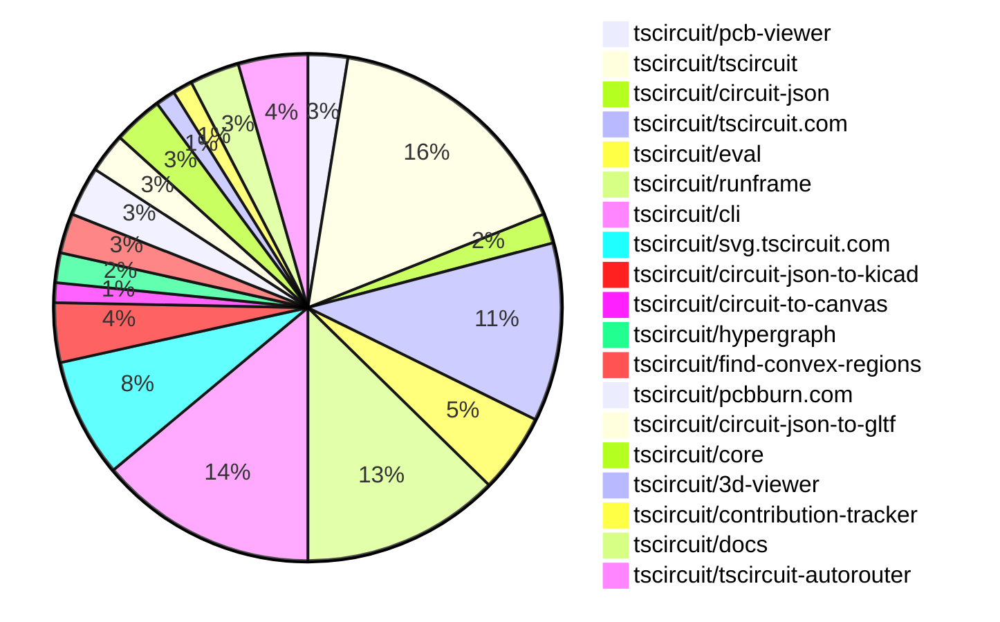

# Contribution Overview 2026-02-17

The current week is shown below. There are 3 major sections:

- [Contributor Overview](#contributor-overview)
- [PRs by Repository](#prs-by-repository)
- [PRs by Contributor](#changes-by-contributor)
- [Scoring & Sponsorship Details](/docs/sponsorship-calculation-explanation.md)

## PRs by Repository

## Contributor Overview

| Contributor | 🐳 Major | 🐙 Minor | 🐌 Tiny | ⭐ | Discussion Contributions |
|-------------|---------|---------|---------|-----|--------------------------|
| [imrishabh18](#imrishabh18) | 2 | 5 | 3 | ⭐⭐ | 0🔹 0🔶 0💎 |
| [0hmX](#0hmX) | 5 | 0 | 2 | ⭐⭐ | 0🔹 0🔶 0💎 |
| [seveibar](#seveibar) | 4 | 0 | 2 | ⭐⭐ | 0🔹 0🔶 0💎 |
| [ShiboSoftwareDev](#ShiboSoftwareDev) | 1 | 4 | 3 | ⭐⭐ | 0🔹 0🔶 0💎 |
| [MustafaMulla29](#MustafaMulla29) | 3 | 0 | 2 | ⭐⭐ | 0🔹 0🔶 0💎 |
| [tscircuitbot](#tscircuitbot) | 0 | 0 | 106 | ⭐⭐ | 0🔹 0🔶 0💎 |
| [AnasSarkiz](#AnasSarkiz) | 1 | 1 | 4 | ⭐ | 0🔹 0🔶 0💎 |
| [Abse2001](#Abse2001) | 1 | 1 | 2 | ⭐ | 0🔹 0🔶 0💎 |
| [techmannih](#techmannih) | 0 | 3 | 0 | ⭐ | 0🔹 0🔶 0💎 |
| [rushabhcodes](#rushabhcodes) | 0 | 0 | 1 |  | 0🔹 0🔶 0💎 |
| [Devesh36](#Devesh36) | 0 | 0 | 1 |  | 0🔹 0🔶 0💎 |
| [blowmuffin](#blowmuffin) | 0 | 0 | 1 |  | 0🔹 0🔶 0💎 |

> Note: AI evaluates PRs and assigns 1-3 star ratings automatically. 4 and 5 star ratings require manual staff review.

### Discussion Contribution Legend

- 🔹 Normal Comments: Basic participation with minimal effort
- 🔶 Great Informative Comments: Thoughtful participation that adds value
- 💎 Incredible Comments: Exceptional participation with high-quality content

## Review Table

[reviews-received-hover]: ## "Number of reviews received for PRs for this contributor"
[approvals-received-hover]: ## "Number of approvals received for PRs this contributor authored"
[rejections-received-hover]: ## "Number of rejections received for PRs this contributor authored"
[prs-opened-hover]: ## "Number of PRs opened by this contributor"
[issues-created-hover]: ## "Number of issues created by this contributor"

| Contributor | Reviews Received | Approvals Received | Rejections Received | Approvals | Rejections | PRs Opened | PRs Merged | Issues Created |
|---|---|---|---|---|---|---|---|---|
| [makaiachildress-web](#makaiachildress-web) | 7 | 0 | 1 | 0 | 0 | 9 | 0 | 0 |
| [tscircuitbot](#tscircuitbot) | 1 | 0 | 0 | 0 | 0 | 119 | 106 | 0 |
| [AnasSarkiz](#AnasSarkiz) | 1 | 1 | 0 | 0 | 0 | 6 | 6 | 0 |
| [Abse2001](#Abse2001) | 5 | 4 | 0 | 2 | 0 | 4 | 4 | 0 |
| [techmannih](#techmannih) | 10 | 3 | 2 | 2 | 0 | 6 | 3 | 0 |
| [Wh1t3Fox](#Wh1t3Fox) | 0 | 0 | 0 | 0 | 0 | 1 | 0 | 0 |
| [imrishabh18](#imrishabh18) | 5 | 2 | 1 | 5 | 4 | 12 | 10 | 0 |
| [ShiboSoftwareDev](#ShiboSoftwareDev) | 8 | 6 | 0 | 4 | 0 | 12 | 9 | 0 |
| [seveibar](#seveibar) | 3 | 0 | 0 | 13 | 2 | 8 | 6 | 0 |
| [rushabhcodes](#rushabhcodes) | 6 | 3 | 1 | 2 | 2 | 2 | 1 | 0 |
| [janisag07](#janisag07) | 2 | 0 | 1 | 0 | 0 | 8 | 0 | 0 |
| [wiwvernia](#wiwvernia) | 0 | 0 | 0 | 0 | 0 | 1 | 0 | 0 |
| [MustafaMulla29](#MustafaMulla29) | 10 | 5 | 2 | 0 | 0 | 7 | 5 | 0 |
| [blowmuffin](#blowmuffin) | 2 | 2 | 0 | 0 | 0 | 3 | 1 | 0 |
| [Devesh36](#Devesh36) | 2 | 2 | 0 | 0 | 0 | 1 | 1 | 0 |
| [0hmX](#0hmX) | 3 | 0 | 0 | 0 | 0 | 7 | 7 | 0 |
| [adrianfolkeson](#adrianfolkeson) | 0 | 0 | 0 | 0 | 0 | 1 | 0 | 0 |

## Changes by Repository

### [tscircuit/pcb-viewer](https://github.com/tscircuit/pcb-viewer)

| PR # | Impact | Rating | Contributor | Description |
|------|--------|--------|-------------|-------------|
| [#671](https://github.com/tscircuit/pcb-viewer/pull/671) | 🐙 Minor | ⭐⭐ | AnasSarkiz | Fixes React key collision issue in the layered canvas renderer that causes duplicate and unstable rendering of PCB layers. |
| [#666](https://github.com/tscircuit/pcb-viewer/pull/666) | 🐙 Minor | ⭐⭐ | techmannih | Adds support for rendering pcb_courtyard_outline elements in the PCB viewer. |

🐌 Tiny Contributions (2)

| PR # | Impact | Contributor | Description |
|------|--------|-------------|-------------|
| [#672](https://github.com/tscircuit/pcb-viewer/pull/672) | 🐌 Tiny | tscircuitbot | Automated package update |
| [#667](https://github.com/tscircuit/pcb-viewer/pull/667) | 🐌 Tiny | tscircuitbot | Automated package update |

### [tscircuit/tscircuit](https://github.com/tscircuit/tscircuit)

🐌 Tiny Contributions (26)

| PR # | Impact | Contributor | Description |
|------|--------|-------------|-------------|
| [#2275](https://github.com/tscircuit/tscircuit/pull/2275) | 🐌 Tiny | tscircuitbot | Updates the package version from 0.0.1340 to 0.0.1341 in package.json |
| [#2274](https://github.com/tscircuit/tscircuit/pull/2274) | 🐌 Tiny | tscircuitbot | Automated package update |
| [#2273](https://github.com/tscircuit/tscircuit/pull/2273) | 🐌 Tiny | tscircuitbot | Automated package update |
| [#2272](https://github.com/tscircuit/tscircuit/pull/2272) | 🐌 Tiny | tscircuitbot | Automated package update |
| [#2271](https://github.com/tscircuit/tscircuit/pull/2271) | 🐌 Tiny | tscircuitbot | Automated package update |
| [#2270](https://github.com/tscircuit/tscircuit/pull/2270) | 🐌 Tiny | tscircuitbot | Updates the tscircuitcli package from version 0.1.948 to 0.1.949 and the tscircuitrunframe package from version 0.0.1629 to 0.0.1630 in package.json |
| [#2269](https://github.com/tscircuit/tscircuit/pull/2269) | 🐌 Tiny | tscircuitbot | Updates the package version from 0.0.1337 to 0.0.1338 in package.json |
| [#2268](https://github.com/tscircuit/tscircuit/pull/2268) | 🐌 Tiny | tscircuitbot | Automated package update |
| [#2267](https://github.com/tscircuit/tscircuit/pull/2267) | 🐌 Tiny | tscircuitbot | Automated package update |
| [#2266](https://github.com/tscircuit/tscircuit/pull/2266) | 🐌 Tiny | tscircuitbot | Updates the tscircuitcli package from version 0.1.946 to 0.1.947 and the tscircuitrunframe package from version 0.0.1627 to 0.0.1628 in package.json |
| [#2262](https://github.com/tscircuit/tscircuit/pull/2262) | 🐌 Tiny | tscircuitbot | Updates the package version from 0.0.1334 to 0.0.1335 in package.json |
| [#2260](https://github.com/tscircuit/tscircuit/pull/2260) | 🐌 Tiny | tscircuitbot | Automated package update |
| [#2253](https://github.com/tscircuit/tscircuit/pull/2253) | 🐌 Tiny | tscircuitbot | Updates the version of the circuit-json-to-gltf package from 0.0.67 to 0.0.65 in package.json |
| [#2258](https://github.com/tscircuit/tscircuit/pull/2258) | 🐌 Tiny | tscircuitbot | Automated package update |
| [#2257](https://github.com/tscircuit/tscircuit/pull/2257) | 🐌 Tiny | tscircuitbot | Updates the tscircuitcli package to version 0.1.943 in the package.json file |
| [#2261](https://github.com/tscircuit/tscircuit/pull/2261) | 🐌 Tiny | tscircuitbot | Updates the tscircuitcli package to version 0.1.945 in the package.json file |
| [#2254](https://github.com/tscircuit/tscircuit/pull/2254) | 🐌 Tiny | tscircuitbot | Automated package update |
| [#2249](https://github.com/tscircuit/tscircuit/pull/2249) | 🐌 Tiny | tscircuitbot | Automated package update |
| [#2250](https://github.com/tscircuit/tscircuit/pull/2250) | 🐌 Tiny | tscircuitbot | Automated package update |
| [#2256](https://github.com/tscircuit/tscircuit/pull/2256) | 🐌 Tiny | tscircuitbot | Automated package update |
| [#2252](https://github.com/tscircuit/tscircuit/pull/2252) | 🐌 Tiny | tscircuitbot | Automated package update |
| [#2255](https://github.com/tscircuit/tscircuit/pull/2255) | 🐌 Tiny | tscircuitbot | Automated package update |
| [#2259](https://github.com/tscircuit/tscircuit/pull/2259) | 🐌 Tiny | tscircuitbot | Automated package update |
| [#2264](https://github.com/tscircuit/tscircuit/pull/2264) | 🐌 Tiny | tscircuitbot | Automated package update |
| [#2263](https://github.com/tscircuit/tscircuit/pull/2263) | 🐌 Tiny | tscircuitbot | Automated package update |
| [#2251](https://github.com/tscircuit/tscircuit/pull/2251) | 🐌 Tiny | imrishabh18 | Updates the version of the circuit-json-to-gltf dependency from 0.0.65 to 0.0.67 in package.json |

### [tscircuit/circuit-json](https://github.com/tscircuit/circuit-json)

| PR # | Impact | Rating | Contributor | Description |
|------|--------|--------|-------------|-------------|
| [#471](https://github.com/tscircuit/circuit-json/pull/471) | 🐳 Major | ⭐⭐⭐ | seveibar | Add support for KiCad symbol metadata in schematic symbols, allowing for structured storage of KiCad-specific information such as pin names, numbers, and properties. |

🐌 Tiny Contributions (2)

| PR # | Impact | Contributor | Description |
|------|--------|-------------|-------------|
| [#472](https://github.com/tscircuit/circuit-json/pull/472) | 🐌 Tiny | tscircuitbot | Automated package update |
| [#473](https://github.com/tscircuit/circuit-json/pull/473) | 🐌 Tiny | seveibar | Refactors KiCad metadata handling to use a more generic metadata structure, allowing optional inclusion of KiCad information. |

### [tscircuit/tscircuit.com](https://github.com/tscircuit/tscircuit.com)

| PR # | Impact | Rating | Contributor | Description |
|------|--------|--------|-------------|-------------|
| [#2796](https://github.com/tscircuit/tscircuit.com/pull/2796) | 🐳 Major | ⭐⭐⭐ | imrishabh18 | Adds functionality to edit the subdomain to point to the latest release using a specified tag and introduces a new endpoint for updating package domains. |
| [#2793](https://github.com/tscircuit/tscircuit.com/pull/2793) | 🐳 Major | ⭐⭐⭐ | imrishabh18 | Fixes the package_buildlist API call to use package_release_id instead of package_id, allowing for more accurate package build retrieval. |
| [#2787](https://github.com/tscircuit/tscircuit.com/pull/2787) | 🐳 Major | ⭐⭐⭐ | seveibar | Allows users to edit the target domain for a package in the Edit Subdomain dialog, including the ability to select between the latest package release or a specific package release. |
| [#2789](https://github.com/tscircuit/tscircuit.com/pull/2789) | 🐳 Major | ⭐⭐⭐ | seveibar | Adds endpoints for creating, retrieving, listing, and managing organization domains and their linked packages in the fake API. |
| [#2785](https://github.com/tscircuit/tscircuit.com/pull/2785) | 🐳 Major | ⭐⭐⭐ | seveibar | Provides clearer, human-readable context for package domains by showing the actual release version or associated release for builds instead of opaque IDs. |
| [#2792](https://github.com/tscircuit/tscircuit.com/pull/2792) | 🐙 Minor | ⭐⭐ | imrishabh18 | Adds a new hook to display all fully qualified domain names (FQDNs) linked to a package, including those from releases and builds, in the package settings. |

🐌 Tiny Contributions (12)

| PR # | Impact | Contributor | Description |
|------|--------|-------------|-------------|
| [#2801](https://github.com/tscircuit/tscircuit.com/pull/2801) | 🐌 Tiny | tscircuitbot | Automated package update to version 0.0.197 |
| [#2800](https://github.com/tscircuit/tscircuit.com/pull/2800) | 🐌 Tiny | tscircuitbot | Updates the tscircuiteval package from version 0.0.649 to 0.0.651 |
| [#2798](https://github.com/tscircuit/tscircuit.com/pull/2798) | 🐌 Tiny | tscircuitbot | Automated package update |
| [#2797](https://github.com/tscircuit/tscircuit.com/pull/2797) | 🐌 Tiny | tscircuitbot | Updates the tscircuitrunframe package from version 0.0.1629 to 0.0.1630 |
| [#2795](https://github.com/tscircuit/tscircuit.com/pull/2795) | 🐌 Tiny | tscircuitbot | Updates the tscircuitrunframe package from version 0.0.1627 to 0.0.1629 |
| [#2790](https://github.com/tscircuit/tscircuit.com/pull/2790) | 🐌 Tiny | tscircuitbot | Updates the package version from 0.0.195 to 0.0.196 in package.json |
| [#2779](https://github.com/tscircuit/tscircuit.com/pull/2779) | 🐌 Tiny | tscircuitbot | Updates the tscircuitrunframe package from version 0.0.1623 to 0.0.1624 and the tscircuitpcb-viewer package from version 1.11.339 to 1.11.340 in the package.json file. |
| [#2780](https://github.com/tscircuit/tscircuit.com/pull/2780) | 🐌 Tiny | tscircuitbot | Automated package update |
| [#2781](https://github.com/tscircuit/tscircuit.com/pull/2781) | 🐌 Tiny | tscircuitbot | Updates the tscircuitrunframe package from version 0.0.1624 to 0.0.1625 |
| [#2782](https://github.com/tscircuit/tscircuit.com/pull/2782) | 🐌 Tiny | tscircuitbot | Updates the tscircuitrunframe package from version 0.0.1625 to 0.0.1626 |
| [#2784](https://github.com/tscircuit/tscircuit.com/pull/2784) | 🐌 Tiny | tscircuitbot | Updates the tscircuitrunframe package from version 0.0.1626 to 0.0.1627 |
| [#2783](https://github.com/tscircuit/tscircuit.com/pull/2783) | 🐌 Tiny | tscircuitbot | Updates the tscircuiteval package from version 0.0.648 to 0.0.649 |

### [tscircuit/eval](https://github.com/tscircuit/eval)

🐌 Tiny Contributions (8)

| PR # | Impact | Contributor | Description |
|------|--------|-------------|-------------|
| [#2081](https://github.com/tscircuit/eval/pull/2081) | 🐌 Tiny | tscircuitbot | Automated package update |
| [#2080](https://github.com/tscircuit/eval/pull/2080) | 🐌 Tiny | tscircuitbot | Automated package update |
| [#2078](https://github.com/tscircuit/eval/pull/2078) | 🐌 Tiny | tscircuitbot | Automated package update to version 0.0.650 |
| [#2077](https://github.com/tscircuit/eval/pull/2077) | 🐌 Tiny | tscircuitbot | Updates the package versions in package.json to their latest compatible versions. |
| [#2071](https://github.com/tscircuit/eval/pull/2071) | 🐌 Tiny | tscircuitbot | Updates the version of tscircuitcore from 0.0.1042 to 0.0.1043 and circuit-json-to-gltf from 0.0.65 to 0.0.68 in package.json |
| [#2075](https://github.com/tscircuit/eval/pull/2075) | 🐌 Tiny | tscircuitbot | Automated package update |
| [#2074](https://github.com/tscircuit/eval/pull/2074) | 🐌 Tiny | tscircuitbot | Updates the version of the tscircuitcore package from 0.0.1043 to 0.0.1044 in package.json |
| [#2072](https://github.com/tscircuit/eval/pull/2072) | 🐌 Tiny | tscircuitbot | Automated package update to version 0.0.648 |

### [tscircuit/runframe](https://github.com/tscircuit/runframe)

🐌 Tiny Contributions (20)

| PR # | Impact | Contributor | Description |
|------|--------|-------------|-------------|
| [#2691](https://github.com/tscircuit/runframe/pull/2691) | 🐌 Tiny | tscircuitbot | Automated package update |
| [#2690](https://github.com/tscircuit/runframe/pull/2690) | 🐌 Tiny | tscircuitbot | Updates the tscircuiteval package to version 0.0.651 in the package.json file. |
| [#2689](https://github.com/tscircuit/runframe/pull/2689) | 🐌 Tiny | tscircuitbot | Updates the circuit-json-to-kicad package from version 0.0.74 to 0.0.75 in package.json |
| [#2687](https://github.com/tscircuit/runframe/pull/2687) | 🐌 Tiny | tscircuitbot | Updates the tscircuit3d-viewer package to version 0.0.518 |
| [#2685](https://github.com/tscircuit/runframe/pull/2685) | 🐌 Tiny | tscircuitbot | Updates the tscircuitpcb-viewer package from version 1.11.340 to 1.11.341 |
| [#2686](https://github.com/tscircuit/runframe/pull/2686) | 🐌 Tiny | tscircuitbot | Automated package update |
| [#2684](https://github.com/tscircuit/runframe/pull/2684) | 🐌 Tiny | tscircuitbot | Automated package update |
| [#2683](https://github.com/tscircuit/runframe/pull/2683) | 🐌 Tiny | tscircuitbot | Updates the tscircuit3d-viewer package from version 0.0.516 to 0.0.517 |
| [#2682](https://github.com/tscircuit/runframe/pull/2682) | 🐌 Tiny | tscircuitbot | Automated package update |
| [#2681](https://github.com/tscircuit/runframe/pull/2681) | 🐌 Tiny | tscircuitbot | Updates the tscircuiteval package to version 0.0.650 in the package.json file. |
| [#2680](https://github.com/tscircuit/runframe/pull/2680) | 🐌 Tiny | tscircuitbot | Automated package update |
| [#2679](https://github.com/tscircuit/runframe/pull/2679) | 🐌 Tiny | tscircuitbot | Updates the circuit-json-to-kicad package from version 0.0.73 to 0.0.74 |
| [#2669](https://github.com/tscircuit/runframe/pull/2669) | 🐌 Tiny | tscircuitbot | Updates the tscircuitpcb-viewer package from version 1.11.339 to 1.11.340 |
| [#2671](https://github.com/tscircuit/runframe/pull/2671) | 🐌 Tiny | tscircuitbot | Automated package update |
| [#2675](https://github.com/tscircuit/runframe/pull/2675) | 🐌 Tiny | tscircuitbot | Automated package update |
| [#2674](https://github.com/tscircuit/runframe/pull/2674) | 🐌 Tiny | tscircuitbot | Updates the circuit-json-to-kicad package version from 0.0.72 to 0.0.73 in package.json |
| [#2670](https://github.com/tscircuit/runframe/pull/2670) | 🐌 Tiny | tscircuitbot | Automated package update |
| [#2672](https://github.com/tscircuit/runframe/pull/2672) | 🐌 Tiny | tscircuitbot | Automated package update |
| [#2677](https://github.com/tscircuit/runframe/pull/2677) | 🐌 Tiny | tscircuitbot | Updates the package version from 0.0.1626 to 0.0.1627 in package.json |
| [#2676](https://github.com/tscircuit/runframe/pull/2676) | 🐌 Tiny | tscircuitbot | Updates the tscircuiteval package to version 0.0.649 in the package.json file. |

### [tscircuit/cli](https://github.com/tscircuit/cli)

| PR # | Impact | Rating | Contributor | Description |
|------|--------|--------|-------------|-------------|
| [#2038](https://github.com/tscircuit/cli/pull/2038) | 🐙 Minor | ⭐⭐ | imrishabh18 | Adds support for relative paths in circuit-json for GLTF conversion, enhancing the ability to reference local assets during the build process. |
| [#2043](https://github.com/tscircuit/cli/pull/2043) | 🐙 Minor | ⭐⭐ | imrishabh18 | Fixes a bug where the authRegex fails to capture the authToken due to a missing capture group, leading to authentication errors. |

🐌 Tiny Contributions (20)

| PR # | Impact | Contributor | Description |
|------|--------|-------------|-------------|
| [#2058](https://github.com/tscircuit/cli/pull/2058) | 🐌 Tiny | tscircuitbot | Updates the package version from v0.1.950 to v0.1.951 in package.json |
| [#2057](https://github.com/tscircuit/cli/pull/2057) | 🐌 Tiny | tscircuitbot | Updates the tscircuitrunframe package from version 0.0.1631 to 0.0.1632 |
| [#2056](https://github.com/tscircuit/cli/pull/2056) | 🐌 Tiny | tscircuitbot | Automated package update |
| [#2055](https://github.com/tscircuit/cli/pull/2055) | 🐌 Tiny | tscircuitbot | Updates the tscircuitrunframe package from version 0.0.1630 to 0.0.1631 |
| [#2054](https://github.com/tscircuit/cli/pull/2054) | 🐌 Tiny | tscircuitbot | Automated package update |
| [#2053](https://github.com/tscircuit/cli/pull/2053) | 🐌 Tiny | tscircuitbot | Updates the tscircuitrunframe package from version 0.0.1629 to 0.0.1630 |
| [#2052](https://github.com/tscircuit/cli/pull/2052) | 🐌 Tiny | tscircuitbot | Automated package update |
| [#2051](https://github.com/tscircuit/cli/pull/2051) | 🐌 Tiny | tscircuitbot | Updates the tscircuitrunframe package from version 0.0.1628 to 0.0.1629 |
| [#2048](https://github.com/tscircuit/cli/pull/2048) | 🐌 Tiny | tscircuitbot | Automated package update |
| [#2047](https://github.com/tscircuit/cli/pull/2047) | 🐌 Tiny | tscircuitbot | Updates the tscircuitrunframe package from version 0.0.1627 to 0.0.1628 |
| [#2036](https://github.com/tscircuit/cli/pull/2036) | 🐌 Tiny | tscircuitbot | Updates the tscircuitrunframe package from version 0.0.1624 to 0.0.1625 |
| [#2034](https://github.com/tscircuit/cli/pull/2034) | 🐌 Tiny | tscircuitbot | Updates the tscircuitrunframe package from version 0.0.1623 to 0.0.1624 |
| [#2041](https://github.com/tscircuit/cli/pull/2041) | 🐌 Tiny | tscircuitbot | Automated package update |
| [#2035](https://github.com/tscircuit/cli/pull/2035) | 🐌 Tiny | tscircuitbot | Automated package update |
| [#2040](https://github.com/tscircuit/cli/pull/2040) | 🐌 Tiny | tscircuitbot | Updates the tscircuitrunframe package to version 0.0.1626 in package.json |
| [#2044](https://github.com/tscircuit/cli/pull/2044) | 🐌 Tiny | tscircuitbot | Updates the package version from v0.1.944 to v0.1.945 in package.json |
| [#2037](https://github.com/tscircuit/cli/pull/2037) | 🐌 Tiny | tscircuitbot | Automated package update |
| [#2039](https://github.com/tscircuit/cli/pull/2039) | 🐌 Tiny | tscircuitbot | Updates the package version from v0.1.942 to v0.1.943 in package.json |
| [#2046](https://github.com/tscircuit/cli/pull/2046) | 🐌 Tiny | tscircuitbot | Automated package update |
| [#2045](https://github.com/tscircuit/cli/pull/2045) | 🐌 Tiny | tscircuitbot | Updates the tscircuitrunframe package from version 0.0.1626 to 0.0.1627 |

### [tscircuit/svg.tscircuit.com](https://github.com/tscircuit/svg.tscircuit.com)

🐌 Tiny Contributions (12)

| PR # | Impact | Contributor | Description |
|------|--------|-------------|-------------|
| [#1030](https://github.com/tscircuit/svg.tscircuit.com/pull/1030) | 🐌 Tiny | tscircuitbot | Updates the tscircuit package version from 0.0.1340 to 0.0.1341 in package.json |
| [#1029](https://github.com/tscircuit/svg.tscircuit.com/pull/1029) | 🐌 Tiny | tscircuitbot | Updates the tscircuit package version from 0.0.1339 to 0.0.1340 in package.json |
| [#1028](https://github.com/tscircuit/svg.tscircuit.com/pull/1028) | 🐌 Tiny | tscircuitbot | Updates the tscircuit package version from 0.0.1338 to 0.0.1339 in package.json |
| [#1027](https://github.com/tscircuit/svg.tscircuit.com/pull/1027) | 🐌 Tiny | tscircuitbot | Updates the tscircuit package version from 0.0.1337 to 0.0.1338 in package.json |
| [#1026](https://github.com/tscircuit/svg.tscircuit.com/pull/1026) | 🐌 Tiny | tscircuitbot | Updates the tscircuit package version from 0.0.1336 to 0.0.1337 in package.json |
| [#1019](https://github.com/tscircuit/svg.tscircuit.com/pull/1019) | 🐌 Tiny | tscircuitbot | Updates the tscircuit package version from 0.0.1329 to 0.0.1330 in package.json |
| [#1023](https://github.com/tscircuit/svg.tscircuit.com/pull/1023) | 🐌 Tiny | tscircuitbot | Updates the tscircuit package version from 0.0.1333 to 0.0.1334 in package.json |
| [#1022](https://github.com/tscircuit/svg.tscircuit.com/pull/1022) | 🐌 Tiny | tscircuitbot | Updates the tscircuit package version from 0.0.1332 to 0.0.1333 in package.json |
| [#1024](https://github.com/tscircuit/svg.tscircuit.com/pull/1024) | 🐌 Tiny | tscircuitbot | Updates the tscircuit package version from 0.0.1334 to 0.0.1335 in package.json |
| [#1021](https://github.com/tscircuit/svg.tscircuit.com/pull/1021) | 🐌 Tiny | tscircuitbot | Updates the tscircuit package version from 0.0.1330 to 0.0.1332 in package.json |
| [#1025](https://github.com/tscircuit/svg.tscircuit.com/pull/1025) | 🐌 Tiny | tscircuitbot | Updates the tscircuit package version from 0.0.1335 to 0.0.1336 in package.json |
| [#1018](https://github.com/tscircuit/svg.tscircuit.com/pull/1018) | 🐌 Tiny | tscircuitbot | Updates the tscircuit package version from 0.0.1328 to 0.0.1329 in package.json |

### [tscircuit/circuit-json-to-kicad](https://github.com/tscircuit/circuit-json-to-kicad)

| PR # | Impact | Rating | Contributor | Description |
|------|--------|--------|-------------|-------------|
| [#139](https://github.com/tscircuit/circuit-json-to-kicad/pull/139) | 🐳 Major | ⭐⭐⭐ | MustafaMulla29 | This pull request introduces the mapping of metadata from circuit-json, supports the generation of schStemLength, and refactors the code into multiple files for better organization and maintainability. The changes aim to enhance the functionality of the circuit-json to KiCad conversion process by improving how metadata is handled and structured within the codebase. |
| [#134](https://github.com/tscircuit/circuit-json-to-kicad/pull/134) | 🐳 Major | ⭐⭐⭐ | MustafaMulla29 | Adds support for applying kicadFootprintMetadata and kicadSymbolMetadata to enhance the generation of KiCad projects with component-specific metadata. |

🐌 Tiny Contributions (4)

| PR # | Impact | Contributor | Description |
|------|--------|-------------|-------------|
| [#140](https://github.com/tscircuit/circuit-json-to-kicad/pull/140) | 🐌 Tiny | tscircuitbot | Automated package update |
| [#138](https://github.com/tscircuit/circuit-json-to-kicad/pull/138) | 🐌 Tiny | tscircuitbot | Automated package update |
| [#135](https://github.com/tscircuit/circuit-json-to-kicad/pull/135) | 🐌 Tiny | tscircuitbot | Automated package update |
| [#136](https://github.com/tscircuit/circuit-json-to-kicad/pull/136) | 🐌 Tiny | MustafaMulla29 | Fixes the Reference property in kicad-project output to use the actual component name from circuit-json instead of a shared metadata value, ensuring unique RefDes for each component. |

### [tscircuit/circuit-to-canvas](https://github.com/tscircuit/circuit-to-canvas)

| PR # | Impact | Rating | Contributor | Description |
|------|--------|--------|-------------|-------------|
| [#180](https://github.com/tscircuit/circuit-to-canvas/pull/180) | 🐙 Minor | ⭐⭐ | techmannih | Refactors the PCB silkscreen text drawing logic to utilize a shared drawText utility, improving code maintainability and functionality for mirroring and knockout backgrounds. |

🐌 Tiny Contributions (1)

| PR # | Impact | Contributor | Description |
|------|--------|-------------|-------------|
| [#181](https://github.com/tscircuit/circuit-to-canvas/pull/181) | 🐌 Tiny | tscircuitbot | Automated package update |

### [tscircuit/hypergraph](https://github.com/tscircuit/hypergraph)

🐌 Tiny Contributions (3)

| PR # | Impact | Contributor | Description |
|------|--------|-------------|-------------|
| [#56](https://github.com/tscircuit/hypergraph/pull/56) | 🐌 Tiny | tscircuitbot | Automated package update |
| [#55](https://github.com/tscircuit/hypergraph/pull/55) | 🐌 Tiny | Abse2001 | Adds a new convex via topology to the PCB design, enhancing the routing capabilities and layout options. |
| [#53](https://github.com/tscircuit/hypergraph/pull/53) | 🐌 Tiny | Abse2001 | Moves the vias-by-net.json file to the assets directory and updates the paths in benchmark scripts accordingly. |

### [tscircuit/find-convex-regions](https://github.com/tscircuit/find-convex-regions)

| PR # | Impact | Rating | Contributor | Description |
|------|--------|--------|-------------|-------------|
| [#3](https://github.com/tscircuit/find-convex-regions/pull/3) | 🐳 Major | ⭐⭐⭐ | ShiboSoftwareDev | Adds support for polygon obstacles in the computation of convex regions, enhancing the algorithms ability to handle complex shapes. |

🐌 Tiny Contributions (3)

| PR # | Impact | Contributor | Description |
|------|--------|-------------|-------------|
| [#5](https://github.com/tscircuit/find-convex-regions/pull/5) | 🐌 Tiny | tscircuitbot | Automated package update |
| [#1](https://github.com/tscircuit/find-convex-regions/pull/1) | 🐌 Tiny | seveibar | Adds a new React component for visualizing staggered jumpers in convex regions, including associated tests and fixtures. |
| [#2](https://github.com/tscircuit/find-convex-regions/pull/2) | 🐌 Tiny | ShiboSoftwareDev | Updates biome configuration to version 1.7.3, enabling import organization and modifying file ignore patterns in the project. |

### [tscircuit/pcbburn.com](https://github.com/tscircuit/pcbburn.com)

| PR # | Impact | Rating | Contributor | Description |
|------|--------|--------|-------------|-------------|
| [#69](https://github.com/tscircuit/pcbburn.com/pull/69) | 🐳 Major | ⭐⭐⭐ | AnasSarkiz | Introduces a reusable ErrorBoundary component that catches unhandled render and lifecycle errors, preventing full-app crashes and allowing localized recovery. |

🐌 Tiny Contributions (4)

| PR # | Impact | Contributor | Description |
|------|--------|-------------|-------------|
| [#72](https://github.com/tscircuit/pcbburn.com/pull/72) | 🐌 Tiny | AnasSarkiz | This pull request introduces tests for the functions convertCircuitJsonToPcbSvg and generateLightBurnSvg, enhancing the reliability and maintainability of the codebase. It includes a new JSON test file that provides sample data for these functions, ensuring they work as intended. Additionally, a new dependency, stack-svgs, is added to the project to support the SVG generation functionality. |
| [#71](https://github.com/tscircuit/pcbburn.com/pull/71) | 🐌 Tiny | AnasSarkiz | Add SVG snapshot testing via bun-match-svg to ensure stable, regression-proof SVG output |
| [#70](https://github.com/tscircuit/pcbburn.com/pull/70) | 🐌 Tiny | AnasSarkiz | Updates the circuitJson to LBRN converter to enforce explicit Q-pulse width across all LBRN laser operations by updating the dependency version. |
| [#68](https://github.com/tscircuit/pcbburn.com/pull/68) | 🐌 Tiny | AnasSarkiz | Updates the circuit-to-svg dependency version to 0.0.328 in package.json |

### [tscircuit/circuit-json-to-gltf](https://github.com/tscircuit/circuit-json-to-gltf)

| PR # | Impact | Rating | Contributor | Description |
|------|--------|--------|-------------|-------------|
| [#122](https://github.com/tscircuit/circuit-json-to-gltf/pull/122) | 🐙 Minor | ⭐⭐ | techmannih | Adds a test for rendering translucent CAD models in the GLTF format, ensuring correct visual output. |
| [#125](https://github.com/tscircuit/circuit-json-to-gltf/pull/125) | 🐙 Minor | ⭐⭐ | imrishabh18 | BEFORE !Before Image(https:github.comuser-attachmentsassetsa21ccd26-8adb-45d2-9dd1-6cf172fcc1cc)  AFTER !After Image(https:github.comuser-attachmentsassets21439b65-fed7-4749-8c02-1a12f47750d4) Test example |
| [#123](https://github.com/tscircuit/circuit-json-to-gltf/pull/123) | 🐙 Minor | ⭐⭐ | imrishabh18 | Refactors the model loading process to use projectBaseUrl and authHeaders for resolving the download endpoint instead of platformConfig. |

🐌 Tiny Contributions (1)

| PR # | Impact | Contributor | Description |
|------|--------|-------------|-------------|
| [#124](https://github.com/tscircuit/circuit-json-to-gltf/pull/124) | 🐌 Tiny | imrishabh18 | Removes console.log statements from the fetchAsArrayBuffer and loadSTEP functions to clean up the codebase and improve performance. |

### [tscircuit/core](https://github.com/tscircuit/core)

| PR # | Impact | Rating | Contributor | Description |
|------|--------|--------|-------------|-------------|
| [#1952](https://github.com/tscircuit/core/pull/1952) | 🐳 Major | ⭐⭐⭐ | MustafaMulla29 | Maps kicadFootprintMetadata and kicadSymbolMetadata properties to circuit-json metadata for improved component representation. |
| [#1953](https://github.com/tscircuit/core/pull/1953) | 🐙 Minor | ⭐⭐ | ShiboSoftwareDev | Fixes the pcb_missing_footprint_error that occurs during the inflation of circuit JSON when components lack a footprint, ensuring proper handling of footprint children in the component hierarchy. |
| [#1951](https://github.com/tscircuit/core/pull/1951) | 🐙 Minor | ⭐⭐ | ShiboSoftwareDev | Adds a new method to match pinout snapshots for circuit elements in tests. |
| [#1950](https://github.com/tscircuit/core/pull/1950) | 🐙 Minor | ⭐⭐ | ShiboSoftwareDev | Fixes a race condition in subcircuit caching by implementing a mechanism to wait for ongoing renders, ensuring that identical subcircuits do not trigger duplicate renders. |

🐌 Tiny Contributions (1)

| PR # | Impact | Contributor | Description |
|------|--------|-------------|-------------|
| [#1948](https://github.com/tscircuit/core/pull/1948) | 🐌 Tiny | imrishabh18 | Updates the version of the circuit-json-to-gltf dependency from 0.0.65 to 0.0.68 in package.json |

### [tscircuit/3d-viewer](https://github.com/tscircuit/3d-viewer)

| PR # | Impact | Rating | Contributor | Description |
|------|--------|--------|-------------|-------------|
| [#691](https://github.com/tscircuit/3d-viewer/pull/691) | 🐳 Major | ⭐⭐⭐ | Abse2001 | This PR extracts soldermask generation into a dedicated texture pipeline for 3D boards, replacing the previous inline handling inside the combined texture builder. A new createSoldermaskTextureForLayer module renders top and bottom soldermask independently using CircuitToCanvasDrawer, aligned to board outline bounds and material-aware color selection. The implementation ensures accurate compositing by rendering mask layers first and applying uncovered copper pours using destination-out blending, producing clean and deterministic cutouts. Directional control for top and bottom layers is explicit, improving separation between board sides and eliminating ambiguity in mask stacking. createCombinedBoardTextures is simplified by delegating soldermask generation to the new engine, reducing coupling between mask logic and other board textures such as traces, pads, silkscreen, and pours. A comprehensive Storybook fixture validates soldermask margin story behavior across all supported pad, plated hole, and non-plated hole geometries, covering fully covered, positive margin, negative margin, and default scenarios. This establishes a strong visual regression surface for soldermask edge cases. The result is a cleaner architecture, higher rendering determinism, and robust support for complex soldermask margin behavior in the 3D pipeline. |
| [#699](https://github.com/tscircuit/3d-viewer/pull/699) | 🐙 Minor | ⭐⭐ | Abse2001 | Adds support for rendering pill and rotated pill shapes in the pad texture renderer. |

### [tscircuit/contribution-tracker](https://github.com/tscircuit/contribution-tracker)

| PR # | Impact | Rating | Contributor | Description |
|------|--------|--------|-------------|-------------|
| [#307](https://github.com/tscircuit/contribution-tracker/pull/307) | 🐙 Minor | ⭐⭐ | ShiboSoftwareDev | Processes pull requests in batches to avoid hitting GitHubs secondary rate limits, improving efficiency in data retrieval. |

🐌 Tiny Contributions (1)

| PR # | Impact | Contributor | Description |
|------|--------|-------------|-------------|
| [#306](https://github.com/tscircuit/contribution-tracker/pull/306) | 🐌 Tiny | ShiboSoftwareDev | Adds a GitHub Action workflow to generate a contribution overview for a specified date, allowing users to simulate the workflow run for that date. |

### [tscircuit/docs](https://github.com/tscircuit/docs)

🐌 Tiny Contributions (5)

| PR # | Impact | Contributor | Description |
|------|--------|-------------|-------------|
| [#461](https://github.com/tscircuit/docs/pull/461) | 🐌 Tiny | ShiboSoftwareDev | Adds a local implementation of the Raspberry Pi Pico W circuit for pinout examples, replacing the need to import it from an external source. |
| [#458](https://github.com/tscircuit/docs/pull/458) | 🐌 Tiny | MustafaMulla29 | Adds documentation for the --kicad-project flag and the kicadProjectEntrypointPath configuration option for KiCad project generation. |
| [#463](https://github.com/tscircuit/docs/pull/463) | 🐌 Tiny | Devesh36 | This pull request updates the documentation for the chip component properties table by adding inline anchor links for several properties, improving navigation to detailed explanations. |
| [#456](https://github.com/tscircuit/docs/pull/456) | 🐌 Tiny | rushabhcodes | Adds documentation for the Thin Quad Flat Package (TQFP) footprint, including parameters and common variants. |
| [#460](https://github.com/tscircuit/docs/pull/460) | 🐌 Tiny | blowmuffin | Replaces the old image of the Assembly View with a new image that includes a small triangle indicator for the pin1 location. |

### [tscircuit/tscircuit-autorouter](https://github.com/tscircuit/tscircuit-autorouter)

| PR # | Impact | Rating | Contributor | Description |
|------|--------|--------|-------------|-------------|
| [#569](https://github.com/tscircuit/tscircuit-autorouter/pull/569) | 🐳 Major | ⭐⭐⭐ | 0hmX | Refactors naming conventions and standardizes weight constants in the HgPortPointPathingSolver to align with legacy solver, improving clarity and consistency in the autorouting algorithm. |
| [#564](https://github.com/tscircuit/tscircuit-autorouter/pull/564) | 🐳 Major | ⭐⭐⭐ | 0hmX | Adds validation checks to ensure connection points are on the correct layer and at the center of the targeted pad. |
| [#563](https://github.com/tscircuit/tscircuit-autorouter/pull/563) | 🐳 Major | ⭐⭐⭐ | 0hmX | Refactor HgPortPointPathingSolverParams to use weights object and enable ripping options, adding good logging, center optimization, straight line deviation, Memory-Pf Heuristic Bias, Solver2-Style Ripping Loop, and board score calculation. |
| [#566](https://github.com/tscircuit/tscircuit-autorouter/pull/566) | 🐳 Major | ⭐⭐⭐ | 0hmX | Adds error handling for invalid port points in the SingleTransitionCrossingRouteSolver, ensuring that points outside node bounds are reported as errors. |
| [#567](https://github.com/tscircuit/tscircuit-autorouter/pull/567) | 🐳 Major | ⭐⭐⭐ | 0hmX | Refactors the UniformPortDistributionSolver to implement owner-pair shared-edge family redistribution and enhances visualization capabilities. |

🐌 Tiny Contributions (2)

| PR # | Impact | Contributor | Description |
|------|--------|-------------|-------------|
| [#565](https://github.com/tscircuit/tscircuit-autorouter/pull/565) | 🐌 Tiny | 0hmX | Increases the benchmark timeout from 30 minutes to 360 minutes in the GitHub Actions workflow configuration. |
| [#568](https://github.com/tscircuit/tscircuit-autorouter/pull/568) | 🐌 Tiny | 0hmX | Refactors test cases to use a fresh fixture loader for JSON data, preventing state leakage between tests. |

## Changes by Contributor

### [tscircuitbot](https://github.com/tscircuitbot)

🐌 Tiny Contributions (106)

| PR # | Impact | Description |
|------|--------|-------------|
| [#672](https://github.com/tscircuit/pcb-viewer/pull/672) | 🐌 Tiny | Automated package update |
| [#667](https://github.com/tscircuit/pcb-viewer/pull/667) | 🐌 Tiny | Automated package update |
| [#2275](https://github.com/tscircuit/tscircuit/pull/2275) | 🐌 Tiny | Updates the package version from 0.0.1340 to 0.0.1341 in package.json |
| [#2274](https://github.com/tscircuit/tscircuit/pull/2274) | 🐌 Tiny | Automated package update |
| [#2273](https://github.com/tscircuit/tscircuit/pull/2273) | 🐌 Tiny | Automated package update |
| [#2272](https://github.com/tscircuit/tscircuit/pull/2272) | 🐌 Tiny | Automated package update |
| [#2271](https://github.com/tscircuit/tscircuit/pull/2271) | 🐌 Tiny | Automated package update |
| [#2270](https://github.com/tscircuit/tscircuit/pull/2270) | 🐌 Tiny | Updates the tscircuitcli package from version 0.1.948 to 0.1.949 and the tscircuitrunframe package from version 0.0.1629 to 0.0.1630 in package.json |
| [#2269](https://github.com/tscircuit/tscircuit/pull/2269) | 🐌 Tiny | Updates the package version from 0.0.1337 to 0.0.1338 in package.json |
| [#2268](https://github.com/tscircuit/tscircuit/pull/2268) | 🐌 Tiny | Automated package update |
| [#2267](https://github.com/tscircuit/tscircuit/pull/2267) | 🐌 Tiny | Automated package update |
| [#2266](https://github.com/tscircuit/tscircuit/pull/2266) | 🐌 Tiny | Updates the tscircuitcli package from version 0.1.946 to 0.1.947 and the tscircuitrunframe package from version 0.0.1627 to 0.0.1628 in package.json |
| [#2262](https://github.com/tscircuit/tscircuit/pull/2262) | 🐌 Tiny | Updates the package version from 0.0.1334 to 0.0.1335 in package.json |
| [#2260](https://github.com/tscircuit/tscircuit/pull/2260) | 🐌 Tiny | Automated package update |
| [#2253](https://github.com/tscircuit/tscircuit/pull/2253) | 🐌 Tiny | Updates the version of the circuit-json-to-gltf package from 0.0.67 to 0.0.65 in package.json |
| [#2258](https://github.com/tscircuit/tscircuit/pull/2258) | 🐌 Tiny | Automated package update |
| [#2257](https://github.com/tscircuit/tscircuit/pull/2257) | 🐌 Tiny | Updates the tscircuitcli package to version 0.1.943 in the package.json file |
| [#2261](https://github.com/tscircuit/tscircuit/pull/2261) | 🐌 Tiny | Updates the tscircuitcli package to version 0.1.945 in the package.json file |
| [#2254](https://github.com/tscircuit/tscircuit/pull/2254) | 🐌 Tiny | Automated package update |
| [#2249](https://github.com/tscircuit/tscircuit/pull/2249) | 🐌 Tiny | Automated package update |
| [#2250](https://github.com/tscircuit/tscircuit/pull/2250) | 🐌 Tiny | Automated package update |
| [#2256](https://github.com/tscircuit/tscircuit/pull/2256) | 🐌 Tiny | Automated package update |
| [#2252](https://github.com/tscircuit/tscircuit/pull/2252) | 🐌 Tiny | Automated package update |
| [#2255](https://github.com/tscircuit/tscircuit/pull/2255) | 🐌 Tiny | Automated package update |
| [#2259](https://github.com/tscircuit/tscircuit/pull/2259) | 🐌 Tiny | Automated package update |
| [#2264](https://github.com/tscircuit/tscircuit/pull/2264) | 🐌 Tiny | Automated package update |
| [#2263](https://github.com/tscircuit/tscircuit/pull/2263) | 🐌 Tiny | Automated package update |
| [#472](https://github.com/tscircuit/circuit-json/pull/472) | 🐌 Tiny | Automated package update |
| [#2801](https://github.com/tscircuit/tscircuit.com/pull/2801) | 🐌 Tiny | Automated package update to version 0.0.197 |
| [#2800](https://github.com/tscircuit/tscircuit.com/pull/2800) | 🐌 Tiny | Updates the tscircuiteval package from version 0.0.649 to 0.0.651 |
| [#2798](https://github.com/tscircuit/tscircuit.com/pull/2798) | 🐌 Tiny | Automated package update |
| [#2797](https://github.com/tscircuit/tscircuit.com/pull/2797) | 🐌 Tiny | Updates the tscircuitrunframe package from version 0.0.1629 to 0.0.1630 |
| [#2795](https://github.com/tscircuit/tscircuit.com/pull/2795) | 🐌 Tiny | Updates the tscircuitrunframe package from version 0.0.1627 to 0.0.1629 |
| [#2790](https://github.com/tscircuit/tscircuit.com/pull/2790) | 🐌 Tiny | Updates the package version from 0.0.195 to 0.0.196 in package.json |
| [#2779](https://github.com/tscircuit/tscircuit.com/pull/2779) | 🐌 Tiny | Updates the tscircuitrunframe package from version 0.0.1623 to 0.0.1624 and the tscircuitpcb-viewer package from version 1.11.339 to 1.11.340 in the package.json file. |
| [#2780](https://github.com/tscircuit/tscircuit.com/pull/2780) | 🐌 Tiny | Automated package update |
| [#2781](https://github.com/tscircuit/tscircuit.com/pull/2781) | 🐌 Tiny | Updates the tscircuitrunframe package from version 0.0.1624 to 0.0.1625 |
| [#2782](https://github.com/tscircuit/tscircuit.com/pull/2782) | 🐌 Tiny | Updates the tscircuitrunframe package from version 0.0.1625 to 0.0.1626 |
| [#2784](https://github.com/tscircuit/tscircuit.com/pull/2784) | 🐌 Tiny | Updates the tscircuitrunframe package from version 0.0.1626 to 0.0.1627 |
| [#2783](https://github.com/tscircuit/tscircuit.com/pull/2783) | 🐌 Tiny | Updates the tscircuiteval package from version 0.0.648 to 0.0.649 |
| [#2081](https://github.com/tscircuit/eval/pull/2081) | 🐌 Tiny | Automated package update |
| [#2080](https://github.com/tscircuit/eval/pull/2080) | 🐌 Tiny | Automated package update |
| [#2078](https://github.com/tscircuit/eval/pull/2078) | 🐌 Tiny | Automated package update to version 0.0.650 |
| [#2077](https://github.com/tscircuit/eval/pull/2077) | 🐌 Tiny | Updates the package versions in package.json to their latest compatible versions. |
| [#2071](https://github.com/tscircuit/eval/pull/2071) | 🐌 Tiny | Updates the version of tscircuitcore from 0.0.1042 to 0.0.1043 and circuit-json-to-gltf from 0.0.65 to 0.0.68 in package.json |
| [#2075](https://github.com/tscircuit/eval/pull/2075) | 🐌 Tiny | Automated package update |
| [#2074](https://github.com/tscircuit/eval/pull/2074) | 🐌 Tiny | Updates the version of the tscircuitcore package from 0.0.1043 to 0.0.1044 in package.json |
| [#2072](https://github.com/tscircuit/eval/pull/2072) | 🐌 Tiny | Automated package update to version 0.0.648 |
| [#2691](https://github.com/tscircuit/runframe/pull/2691) | 🐌 Tiny | Automated package update |
| [#2690](https://github.com/tscircuit/runframe/pull/2690) | 🐌 Tiny | Updates the tscircuiteval package to version 0.0.651 in the package.json file. |
| [#2689](https://github.com/tscircuit/runframe/pull/2689) | 🐌 Tiny | Updates the circuit-json-to-kicad package from version 0.0.74 to 0.0.75 in package.json |
| [#2687](https://github.com/tscircuit/runframe/pull/2687) | 🐌 Tiny | Updates the tscircuit3d-viewer package to version 0.0.518 |
| [#2685](https://github.com/tscircuit/runframe/pull/2685) | 🐌 Tiny | Updates the tscircuitpcb-viewer package from version 1.11.340 to 1.11.341 |
| [#2686](https://github.com/tscircuit/runframe/pull/2686) | 🐌 Tiny | Automated package update |
| [#2684](https://github.com/tscircuit/runframe/pull/2684) | 🐌 Tiny | Automated package update |
| [#2683](https://github.com/tscircuit/runframe/pull/2683) | 🐌 Tiny | Updates the tscircuit3d-viewer package from version 0.0.516 to 0.0.517 |
| [#2682](https://github.com/tscircuit/runframe/pull/2682) | 🐌 Tiny | Automated package update |
| [#2681](https://github.com/tscircuit/runframe/pull/2681) | 🐌 Tiny | Updates the tscircuiteval package to version 0.0.650 in the package.json file. |
| [#2680](https://github.com/tscircuit/runframe/pull/2680) | 🐌 Tiny | Automated package update |
| [#2679](https://github.com/tscircuit/runframe/pull/2679) | 🐌 Tiny | Updates the circuit-json-to-kicad package from version 0.0.73 to 0.0.74 |
| [#2669](https://github.com/tscircuit/runframe/pull/2669) | 🐌 Tiny | Updates the tscircuitpcb-viewer package from version 1.11.339 to 1.11.340 |
| [#2671](https://github.com/tscircuit/runframe/pull/2671) | 🐌 Tiny | Automated package update |
| [#2675](https://github.com/tscircuit/runframe/pull/2675) | 🐌 Tiny | Automated package update |
| [#2674](https://github.com/tscircuit/runframe/pull/2674) | 🐌 Tiny | Updates the circuit-json-to-kicad package version from 0.0.72 to 0.0.73 in package.json |
| [#2670](https://github.com/tscircuit/runframe/pull/2670) | 🐌 Tiny | Automated package update |
| [#2672](https://github.com/tscircuit/runframe/pull/2672) | 🐌 Tiny | Automated package update |
| [#2677](https://github.com/tscircuit/runframe/pull/2677) | 🐌 Tiny | Updates the package version from 0.0.1626 to 0.0.1627 in package.json |
| [#2676](https://github.com/tscircuit/runframe/pull/2676) | 🐌 Tiny | Updates the tscircuiteval package to version 0.0.649 in the package.json file. |
| [#2058](https://github.com/tscircuit/cli/pull/2058) | 🐌 Tiny | Updates the package version from v0.1.950 to v0.1.951 in package.json |
| [#2057](https://github.com/tscircuit/cli/pull/2057) | 🐌 Tiny | Updates the tscircuitrunframe package from version 0.0.1631 to 0.0.1632 |
| [#2056](https://github.com/tscircuit/cli/pull/2056) | 🐌 Tiny | Automated package update |
| [#2055](https://github.com/tscircuit/cli/pull/2055) | 🐌 Tiny | Updates the tscircuitrunframe package from version 0.0.1630 to 0.0.1631 |
| [#2054](https://github.com/tscircuit/cli/pull/2054) | 🐌 Tiny | Automated package update |
| [#2053](https://github.com/tscircuit/cli/pull/2053) | 🐌 Tiny | Updates the tscircuitrunframe package from version 0.0.1629 to 0.0.1630 |
| [#2052](https://github.com/tscircuit/cli/pull/2052) | 🐌 Tiny | Automated package update |
| [#2051](https://github.com/tscircuit/cli/pull/2051) | 🐌 Tiny | Updates the tscircuitrunframe package from version 0.0.1628 to 0.0.1629 |
| [#2048](https://github.com/tscircuit/cli/pull/2048) | 🐌 Tiny | Automated package update |
| [#2047](https://github.com/tscircuit/cli/pull/2047) | 🐌 Tiny | Updates the tscircuitrunframe package from version 0.0.1627 to 0.0.1628 |
| [#2036](https://github.com/tscircuit/cli/pull/2036) | 🐌 Tiny | Updates the tscircuitrunframe package from version 0.0.1624 to 0.0.1625 |
| [#2034](https://github.com/tscircuit/cli/pull/2034) | 🐌 Tiny | Updates the tscircuitrunframe package from version 0.0.1623 to 0.0.1624 |
| [#2041](https://github.com/tscircuit/cli/pull/2041) | 🐌 Tiny | Automated package update |
| [#2035](https://github.com/tscircuit/cli/pull/2035) | 🐌 Tiny | Automated package update |
| [#2040](https://github.com/tscircuit/cli/pull/2040) | 🐌 Tiny | Updates the tscircuitrunframe package to version 0.0.1626 in package.json |
| [#2044](https://github.com/tscircuit/cli/pull/2044) | 🐌 Tiny | Updates the package version from v0.1.944 to v0.1.945 in package.json |
| [#2037](https://github.com/tscircuit/cli/pull/2037) | 🐌 Tiny | Automated package update |
| [#2039](https://github.com/tscircuit/cli/pull/2039) | 🐌 Tiny | Updates the package version from v0.1.942 to v0.1.943 in package.json |
| [#2046](https://github.com/tscircuit/cli/pull/2046) | 🐌 Tiny | Automated package update |
| [#2045](https://github.com/tscircuit/cli/pull/2045) | 🐌 Tiny | Updates the tscircuitrunframe package from version 0.0.1626 to 0.0.1627 |
| [#1030](https://github.com/tscircuit/svg.tscircuit.com/pull/1030) | 🐌 Tiny | Updates the tscircuit package version from 0.0.1340 to 0.0.1341 in package.json |
| [#1029](https://github.com/tscircuit/svg.tscircuit.com/pull/1029) | 🐌 Tiny | Updates the tscircuit package version from 0.0.1339 to 0.0.1340 in package.json |
| [#1028](https://github.com/tscircuit/svg.tscircuit.com/pull/1028) | 🐌 Tiny | Updates the tscircuit package version from 0.0.1338 to 0.0.1339 in package.json |
| [#1027](https://github.com/tscircuit/svg.tscircuit.com/pull/1027) | 🐌 Tiny | Updates the tscircuit package version from 0.0.1337 to 0.0.1338 in package.json |
| [#1026](https://github.com/tscircuit/svg.tscircuit.com/pull/1026) | 🐌 Tiny | Updates the tscircuit package version from 0.0.1336 to 0.0.1337 in package.json |
| [#1019](https://github.com/tscircuit/svg.tscircuit.com/pull/1019) | 🐌 Tiny | Updates the tscircuit package version from 0.0.1329 to 0.0.1330 in package.json |
| [#1023](https://github.com/tscircuit/svg.tscircuit.com/pull/1023) | 🐌 Tiny | Updates the tscircuit package version from 0.0.1333 to 0.0.1334 in package.json |
| [#1022](https://github.com/tscircuit/svg.tscircuit.com/pull/1022) | 🐌 Tiny | Updates the tscircuit package version from 0.0.1332 to 0.0.1333 in package.json |
| [#1024](https://github.com/tscircuit/svg.tscircuit.com/pull/1024) | 🐌 Tiny | Updates the tscircuit package version from 0.0.1334 to 0.0.1335 in package.json |
| [#1021](https://github.com/tscircuit/svg.tscircuit.com/pull/1021) | 🐌 Tiny | Updates the tscircuit package version from 0.0.1330 to 0.0.1332 in package.json |
| [#1025](https://github.com/tscircuit/svg.tscircuit.com/pull/1025) | 🐌 Tiny | Updates the tscircuit package version from 0.0.1335 to 0.0.1336 in package.json |
| [#1018](https://github.com/tscircuit/svg.tscircuit.com/pull/1018) | 🐌 Tiny | Updates the tscircuit package version from 0.0.1328 to 0.0.1329 in package.json |
| [#140](https://github.com/tscircuit/circuit-json-to-kicad/pull/140) | 🐌 Tiny | Automated package update |
| [#138](https://github.com/tscircuit/circuit-json-to-kicad/pull/138) | 🐌 Tiny | Automated package update |
| [#135](https://github.com/tscircuit/circuit-json-to-kicad/pull/135) | 🐌 Tiny | Automated package update |
| [#181](https://github.com/tscircuit/circuit-to-canvas/pull/181) | 🐌 Tiny | Automated package update |
| [#56](https://github.com/tscircuit/hypergraph/pull/56) | 🐌 Tiny | Automated package update |
| [#5](https://github.com/tscircuit/find-convex-regions/pull/5) | 🐌 Tiny | Automated package update |

### [AnasSarkiz](https://github.com/AnasSarkiz)

| PRs # | Impact | Rating | Description |
|------|--------|--------|-------------|
| [#69](https://github.com/tscircuit/pcbburn.com/pull/69) | 🐳 Major | ⭐⭐⭐ | Introduces a reusable ErrorBoundary component that catches unhandled render and lifecycle errors, preventing full-app crashes and allowing localized recovery. |
| [#671](https://github.com/tscircuit/pcb-viewer/pull/671) | 🐙 Minor | ⭐⭐ | Fixes React key collision issue in the layered canvas renderer that causes duplicate and unstable rendering of PCB layers. |

🐌 Tiny Contributions (4)

| PR # | Impact | Description |
|------|--------|-------------|
| [#72](https://github.com/tscircuit/pcbburn.com/pull/72) | 🐌 Tiny | This pull request introduces tests for the functions convertCircuitJsonToPcbSvg and generateLightBurnSvg, enhancing the reliability and maintainability of the codebase. It includes a new JSON test file that provides sample data for these functions, ensuring they work as intended. Additionally, a new dependency, stack-svgs, is added to the project to support the SVG generation functionality. |
| [#71](https://github.com/tscircuit/pcbburn.com/pull/71) | 🐌 Tiny | Add SVG snapshot testing via bun-match-svg to ensure stable, regression-proof SVG output |
| [#70](https://github.com/tscircuit/pcbburn.com/pull/70) | 🐌 Tiny | Updates the circuitJson to LBRN converter to enforce explicit Q-pulse width across all LBRN laser operations by updating the dependency version. |
| [#68](https://github.com/tscircuit/pcbburn.com/pull/68) | 🐌 Tiny | Updates the circuit-to-svg dependency version to 0.0.328 in package.json |

### [techmannih](https://github.com/techmannih)

| PRs # | Impact | Rating | Description |
|------|--------|--------|-------------|
| [#666](https://github.com/tscircuit/pcb-viewer/pull/666) | 🐙 Minor | ⭐⭐ | Adds support for rendering pcb_courtyard_outline elements in the PCB viewer. |
| [#122](https://github.com/tscircuit/circuit-json-to-gltf/pull/122) | 🐙 Minor | ⭐⭐ | Adds a test for rendering translucent CAD models in the GLTF format, ensuring correct visual output. |
| [#180](https://github.com/tscircuit/circuit-to-canvas/pull/180) | 🐙 Minor | ⭐⭐ | Refactors the PCB silkscreen text drawing logic to utilize a shared drawText utility, improving code maintainability and functionality for mirroring and knockout backgrounds. |

### [imrishabh18](https://github.com/imrishabh18)

| PRs # | Impact | Rating | Description |
|------|--------|--------|-------------|
| [#2796](https://github.com/tscircuit/tscircuit.com/pull/2796) | 🐳 Major | ⭐⭐⭐ | Adds functionality to edit the subdomain to point to the latest release using a specified tag and introduces a new endpoint for updating package domains. |
| [#2793](https://github.com/tscircuit/tscircuit.com/pull/2793) | 🐳 Major | ⭐⭐⭐ | Fixes the package_buildlist API call to use package_release_id instead of package_id, allowing for more accurate package build retrieval. |
| [#2792](https://github.com/tscircuit/tscircuit.com/pull/2792) | 🐙 Minor | ⭐⭐ | Adds a new hook to display all fully qualified domain names (FQDNs) linked to a package, including those from releases and builds, in the package settings. |
| [#2038](https://github.com/tscircuit/cli/pull/2038) | 🐙 Minor | ⭐⭐ | Adds support for relative paths in circuit-json for GLTF conversion, enhancing the ability to reference local assets during the build process. |
| [#2043](https://github.com/tscircuit/cli/pull/2043) | 🐙 Minor | ⭐⭐ | Fixes a bug where the authRegex fails to capture the authToken due to a missing capture group, leading to authentication errors. |
| [#125](https://github.com/tscircuit/circuit-json-to-gltf/pull/125) | 🐙 Minor | ⭐⭐ | BEFORE !Before Image(https:github.comuser-attachmentsassetsa21ccd26-8adb-45d2-9dd1-6cf172fcc1cc)  AFTER !After Image(https:github.comuser-attachmentsassets21439b65-fed7-4749-8c02-1a12f47750d4) Test example |
| [#123](https://github.com/tscircuit/circuit-json-to-gltf/pull/123) | 🐙 Minor | ⭐⭐ | Refactors the model loading process to use projectBaseUrl and authHeaders for resolving the download endpoint instead of platformConfig. |

🐌 Tiny Contributions (3)

| PR # | Impact | Description |
|------|--------|-------------|
| [#2251](https://github.com/tscircuit/tscircuit/pull/2251) | 🐌 Tiny | Updates the version of the circuit-json-to-gltf dependency from 0.0.65 to 0.0.67 in package.json |
| [#1948](https://github.com/tscircuit/core/pull/1948) | 🐌 Tiny | Updates the version of the circuit-json-to-gltf dependency from 0.0.65 to 0.0.68 in package.json |
| [#124](https://github.com/tscircuit/circuit-json-to-gltf/pull/124) | 🐌 Tiny | Removes console.log statements from the fetchAsArrayBuffer and loadSTEP functions to clean up the codebase and improve performance. |

### [seveibar](https://github.com/seveibar)

| PRs # | Impact | Rating | Description |
|------|--------|--------|-------------|
| [#471](https://github.com/tscircuit/circuit-json/pull/471) | 🐳 Major | ⭐⭐⭐ | Add support for KiCad symbol metadata in schematic symbols, allowing for structured storage of KiCad-specific information such as pin names, numbers, and properties. |
| [#2787](https://github.com/tscircuit/tscircuit.com/pull/2787) | 🐳 Major | ⭐⭐⭐ | Allows users to edit the target domain for a package in the Edit Subdomain dialog, including the ability to select between the latest package release or a specific package release. |
| [#2789](https://github.com/tscircuit/tscircuit.com/pull/2789) | 🐳 Major | ⭐⭐⭐ | Adds endpoints for creating, retrieving, listing, and managing organization domains and their linked packages in the fake API. |
| [#2785](https://github.com/tscircuit/tscircuit.com/pull/2785) | 🐳 Major | ⭐⭐⭐ | Provides clearer, human-readable context for package domains by showing the actual release version or associated release for builds instead of opaque IDs. |

🐌 Tiny Contributions (2)

| PR # | Impact | Description |
|------|--------|-------------|
| [#473](https://github.com/tscircuit/circuit-json/pull/473) | 🐌 Tiny | Refactors KiCad metadata handling to use a more generic metadata structure, allowing optional inclusion of KiCad information. |
| [#1](https://github.com/tscircuit/find-convex-regions/pull/1) | 🐌 Tiny | Adds a new React component for visualizing staggered jumpers in convex regions, including associated tests and fixtures. |

### [Abse2001](https://github.com/Abse2001)

| PRs # | Impact | Rating | Description |
|------|--------|--------|-------------|
| [#691](https://github.com/tscircuit/3d-viewer/pull/691) | 🐳 Major | ⭐⭐⭐ | This PR extracts soldermask generation into a dedicated texture pipeline for 3D boards, replacing the previous inline handling inside the combined texture builder. A new createSoldermaskTextureForLayer module renders top and bottom soldermask independently using CircuitToCanvasDrawer, aligned to board outline bounds and material-aware color selection. The implementation ensures accurate compositing by rendering mask layers first and applying uncovered copper pours using destination-out blending, producing clean and deterministic cutouts. Directional control for top and bottom layers is explicit, improving separation between board sides and eliminating ambiguity in mask stacking. createCombinedBoardTextures is simplified by delegating soldermask generation to the new engine, reducing coupling between mask logic and other board textures such as traces, pads, silkscreen, and pours. A comprehensive Storybook fixture validates soldermask margin story behavior across all supported pad, plated hole, and non-plated hole geometries, covering fully covered, positive margin, negative margin, and default scenarios. This establishes a strong visual regression surface for soldermask edge cases. The result is a cleaner architecture, higher rendering determinism, and robust support for complex soldermask margin behavior in the 3D pipeline. |
| [#699](https://github.com/tscircuit/3d-viewer/pull/699) | 🐙 Minor | ⭐⭐ | Adds support for rendering pill and rotated pill shapes in the pad texture renderer. |

🐌 Tiny Contributions (2)

| PR # | Impact | Description |
|------|--------|-------------|
| [#55](https://github.com/tscircuit/hypergraph/pull/55) | 🐌 Tiny | Adds a new convex via topology to the PCB design, enhancing the routing capabilities and layout options. |
| [#53](https://github.com/tscircuit/hypergraph/pull/53) | 🐌 Tiny | Moves the vias-by-net.json file to the assets directory and updates the paths in benchmark scripts accordingly. |

### [ShiboSoftwareDev](https://github.com/ShiboSoftwareDev)

| PRs # | Impact | Rating | Description |
|------|--------|--------|-------------|
| [#3](https://github.com/tscircuit/find-convex-regions/pull/3) | 🐳 Major | ⭐⭐⭐ | Adds support for polygon obstacles in the computation of convex regions, enhancing the algorithms ability to handle complex shapes. |
| [#1953](https://github.com/tscircuit/core/pull/1953) | 🐙 Minor | ⭐⭐ | Fixes the pcb_missing_footprint_error that occurs during the inflation of circuit JSON when components lack a footprint, ensuring proper handling of footprint children in the component hierarchy. |
| [#1951](https://github.com/tscircuit/core/pull/1951) | 🐙 Minor | ⭐⭐ | Adds a new method to match pinout snapshots for circuit elements in tests. |
| [#1950](https://github.com/tscircuit/core/pull/1950) | 🐙 Minor | ⭐⭐ | Fixes a race condition in subcircuit caching by implementing a mechanism to wait for ongoing renders, ensuring that identical subcircuits do not trigger duplicate renders. |
| [#307](https://github.com/tscircuit/contribution-tracker/pull/307) | 🐙 Minor | ⭐⭐ | Processes pull requests in batches to avoid hitting GitHubs secondary rate limits, improving efficiency in data retrieval. |

🐌 Tiny Contributions (3)

| PR # | Impact | Description |
|------|--------|-------------|
| [#306](https://github.com/tscircuit/contribution-tracker/pull/306) | 🐌 Tiny | Adds a GitHub Action workflow to generate a contribution overview for a specified date, allowing users to simulate the workflow run for that date. |
| [#461](https://github.com/tscircuit/docs/pull/461) | 🐌 Tiny | Adds a local implementation of the Raspberry Pi Pico W circuit for pinout examples, replacing the need to import it from an external source. |
| [#2](https://github.com/tscircuit/find-convex-regions/pull/2) | 🐌 Tiny | Updates biome configuration to version 1.7.3, enabling import organization and modifying file ignore patterns in the project. |

### [MustafaMulla29](https://github.com/MustafaMulla29)

| PRs # | Impact | Rating | Description |
|------|--------|--------|-------------|
| [#1952](https://github.com/tscircuit/core/pull/1952) | 🐳 Major | ⭐⭐⭐ | Maps kicadFootprintMetadata and kicadSymbolMetadata properties to circuit-json metadata for improved component representation. |
| [#139](https://github.com/tscircuit/circuit-json-to-kicad/pull/139) | 🐳 Major | ⭐⭐⭐ | This pull request introduces the mapping of metadata from circuit-json, supports the generation of schStemLength, and refactors the code into multiple files for better organization and maintainability. The changes aim to enhance the functionality of the circuit-json to KiCad conversion process by improving how metadata is handled and structured within the codebase. |
| [#134](https://github.com/tscircuit/circuit-json-to-kicad/pull/134) | 🐳 Major | ⭐⭐⭐ | Adds support for applying kicadFootprintMetadata and kicadSymbolMetadata to enhance the generation of KiCad projects with component-specific metadata. |

🐌 Tiny Contributions (2)

| PR # | Impact | Description |
|------|--------|-------------|
| [#458](https://github.com/tscircuit/docs/pull/458) | 🐌 Tiny | Adds documentation for the --kicad-project flag and the kicadProjectEntrypointPath configuration option for KiCad project generation. |
| [#136](https://github.com/tscircuit/circuit-json-to-kicad/pull/136) | 🐌 Tiny | Fixes the Reference property in kicad-project output to use the actual component name from circuit-json instead of a shared metadata value, ensuring unique RefDes for each component. |

### [Devesh36](https://github.com/Devesh36)

🐌 Tiny Contributions (1)

| PR # | Impact | Description |
|------|--------|-------------|
| [#463](https://github.com/tscircuit/docs/pull/463) | 🐌 Tiny | This pull request updates the documentation for the chip component properties table by adding inline anchor links for several properties, improving navigation to detailed explanations. |

### [rushabhcodes](https://github.com/rushabhcodes)

🐌 Tiny Contributions (1)

| PR # | Impact | Description |
|------|--------|-------------|
| [#456](https://github.com/tscircuit/docs/pull/456) | 🐌 Tiny | Adds documentation for the Thin Quad Flat Package (TQFP) footprint, including parameters and common variants. |

### [blowmuffin](https://github.com/blowmuffin)

🐌 Tiny Contributions (1)

| PR # | Impact | Description |
|------|--------|-------------|
| [#460](https://github.com/tscircuit/docs/pull/460) | 🐌 Tiny | Replaces the old image of the Assembly View with a new image that includes a small triangle indicator for the pin1 location. |

### [0hmX](https://github.com/0hmX)

| PRs # | Impact | Rating | Description |
|------|--------|--------|-------------|
| [#569](https://github.com/tscircuit/tscircuit-autorouter/pull/569) | 🐳 Major | ⭐⭐⭐ | Refactors naming conventions and standardizes weight constants in the HgPortPointPathingSolver to align with legacy solver, improving clarity and consistency in the autorouting algorithm. |
| [#564](https://github.com/tscircuit/tscircuit-autorouter/pull/564) | 🐳 Major | ⭐⭐⭐ | Adds validation checks to ensure connection points are on the correct layer and at the center of the targeted pad. |
| [#563](https://github.com/tscircuit/tscircuit-autorouter/pull/563) | 🐳 Major | ⭐⭐⭐ | Refactor HgPortPointPathingSolverParams to use weights object and enable ripping options, adding good logging, center optimization, straight line deviation, Memory-Pf Heuristic Bias, Solver2-Style Ripping Loop, and board score calculation. |
| [#566](https://github.com/tscircuit/tscircuit-autorouter/pull/566) | 🐳 Major | ⭐⭐⭐ | Adds error handling for invalid port points in the SingleTransitionCrossingRouteSolver, ensuring that points outside node bounds are reported as errors. |
| [#567](https://github.com/tscircuit/tscircuit-autorouter/pull/567) | 🐳 Major | ⭐⭐⭐ | Refactors the UniformPortDistributionSolver to implement owner-pair shared-edge family redistribution and enhances visualization capabilities. |

🐌 Tiny Contributions (2)

| PR # | Impact | Description |
|------|--------|-------------|
| [#565](https://github.com/tscircuit/tscircuit-autorouter/pull/565) | 🐌 Tiny | Increases the benchmark timeout from 30 minutes to 360 minutes in the GitHub Actions workflow configuration. |
| [#568](https://github.com/tscircuit/tscircuit-autorouter/pull/568) | 🐌 Tiny | Refactors test cases to use a fresh fixture loader for JSON data, preventing state leakage between tests. |

## Repository Owners

| Repository | Codeowners |
|------------|------------|
| [builder](https://github.com/tscircuit/builder/blob/main/.github/CODEOWNERS) | [seveibar](https://github.com/seveibar)
| [pcb-viewer](https://github.com/tscircuit/pcb-viewer/blob/main/.github/CODEOWNERS) | [seveibar](https://github.com/seveibar), [ShiboSoftwareDev](https://github.com/ShiboSoftwareDev), [Abse2001](https://github.com/Abse2001)
| [footprints-old](https://github.com/tscircuit/footprints-old/blob/main/.github/CODEOWNERS) | [seveibar](https://github.com/seveibar)
| [footprinter](https://github.com/tscircuit/footprinter/blob/main/.github/CODEOWNERS) | [seveibar](https://github.com/seveibar), [techmannih](https://github.com/techmannih)
| [3d-viewer](https://github.com/tscircuit/3d-viewer/blob/main/.github/CODEOWNERS) | [ShiboSoftwareDev](https://github.com/ShiboSoftwareDev), [Abse2001](https://github.com/Abse2001)
| [winterspec](https://github.com/tscircuit/winterspec/blob/main/.github/CODEOWNERS) | [seveibar](https://github.com/seveibar), [ShiboSoftwareDev](https://github.com/ShiboSoftwareDev)
| [jscad-electronics](https://github.com/tscircuit/jscad-electronics/blob/main/.github/CODEOWNERS) | [seveibar](https://github.com/seveibar), [techmannih](https://github.com/techmannih), [ShiboSoftwareDev](https://github.com/ShiboSoftwareDev), [anas-sarkez](https://github.com/anas-sarkez)
| [circuit-to-svg](https://github.com/tscircuit/circuit-to-svg/blob/main/.github/CODEOWNERS) | [imrishabh18](https://github.com/imrishabh18)
| [schematic-symbols](https://github.com/tscircuit/schematic-symbols/blob/main/.github/CODEOWNERS) | [seveibar](https://github.com/seveibar), [imrishabh18](https://github.com/imrishabh18), [techmannih](https://github.com/techmannih)
| [circuit-json-to-gerber](https://github.com/tscircuit/circuit-json-to-gerber/blob/main/.github/CODEOWNERS) | [seveibar](https://github.com/seveibar), [ShiboSoftwareDev](https://github.com/ShiboSoftwareDev)
| [tscircuit.com](https://github.com/tscircuit/tscircuit.com/blob/main/.github/CODEOWNERS) | [seveibar](https://github.com/seveibar), [imrishabh18](https://github.com/imrishabh18)
| [issue-roulette](https://github.com/tscircuit/issue-roulette/blob/main/.github/CODEOWNERS) | [Anshgrover23](https://github.com/Anshgrover23)
| [sparkfun-boards](https://github.com/tscircuit/sparkfun-boards/blob/main/.github/CODEOWNERS) | [ShiboSoftwareDev](https://github.com/ShiboSoftwareDev), [Abse2001](https://github.com/Abse2001), [MustafaMulla29](https://github.com/MustafaMulla29), [Anshgrover23](https://github.com/Anshgrover23), [techmannih](https://github.com/techmannih)
| [schematic-corpus](https://github.com/tscircuit/schematic-corpus/blob/main/.github/CODEOWNERS) | [Abse2001](https://github.com/Abse2001)
| [copper-pour-solver](https://github.com/tscircuit/copper-pour-solver/blob/main/.github/CODEOWNERS) | [seveibar](https://github.com/seveibar), [ShiboSoftwareDev](https://github.com/ShiboSoftwareDev)
| [common](https://github.com/tscircuit/common/blob/main/.github/CODEOWNERS) | [seveibar](https://github.com/seveibar), [Abse2001](https://github.com/Abse2001)
| [circuit-to-canvas](https://github.com/tscircuit/circuit-to-canvas/blob/main/.github/CODEOWNERS) | [ShiboSoftwareDev](https://github.com/ShiboSoftwareDev), [Abse2001](https://github.com/Abse2001), [techmannih](https://github.com/techmannih)
| [circuit-json-to-lbrn](https://github.com/tscircuit/circuit-json-to-lbrn/blob/main/.github/CODEOWNERS) | [AnasSarkiz](https://github.com/AnasSarkiz)
| [pcbburn.com](https://github.com/tscircuit/pcbburn.com/blob/main/.github/CODEOWNERS) | [AnasSarkiz](https://github.com/AnasSarkiz)

## Repositories by Owner

| User | Repo |
|------|------|
| [seveibar](https://github.com/seveibar) | [builder](https://github.com/tscircuit/builder/blob/main/.github/CODEOWNERS) |
|  | [pcb-viewer](https://github.com/tscircuit/pcb-viewer/blob/main/.github/CODEOWNERS) |
|  | [footprints-old](https://github.com/tscircuit/footprints-old/blob/main/.github/CODEOWNERS) |
|  | [footprinter](https://github.com/tscircuit/footprinter/blob/main/.github/CODEOWNERS) |
|  | [winterspec](https://github.com/tscircuit/winterspec/blob/main/.github/CODEOWNERS) |
|  | [jscad-electronics](https://github.com/tscircuit/jscad-electronics/blob/main/.github/CODEOWNERS) |
|  | [schematic-symbols](https://github.com/tscircuit/schematic-symbols/blob/main/.github/CODEOWNERS) |
|  | [circuit-json-to-gerber](https://github.com/tscircuit/circuit-json-to-gerber/blob/main/.github/CODEOWNERS) |
|  | [tscircuit.com](https://github.com/tscircuit/tscircuit.com/blob/main/.github/CODEOWNERS) |
|  | [copper-pour-solver](https://github.com/tscircuit/copper-pour-solver/blob/main/.github/CODEOWNERS) |
|  | [common](https://github.com/tscircuit/common/blob/main/.github/CODEOWNERS) |
| [ShiboSoftwareDev](https://github.com/ShiboSoftwareDev) | [pcb-viewer](https://github.com/tscircuit/pcb-viewer/blob/main/.github/CODEOWNERS) |
|  | [3d-viewer](https://github.com/tscircuit/3d-viewer/blob/main/.github/CODEOWNERS) |
|  | [winterspec](https://github.com/tscircuit/winterspec/blob/main/.github/CODEOWNERS) |
|  | [jscad-electronics](https://github.com/tscircuit/jscad-electronics/blob/main/.github/CODEOWNERS) |
|  | [circuit-json-to-gerber](https://github.com/tscircuit/circuit-json-to-gerber/blob/main/.github/CODEOWNERS) |
|  | [sparkfun-boards](https://github.com/tscircuit/sparkfun-boards/blob/main/.github/CODEOWNERS) |
|  | [copper-pour-solver](https://github.com/tscircuit/copper-pour-solver/blob/main/.github/CODEOWNERS) |
|  | [circuit-to-canvas](https://github.com/tscircuit/circuit-to-canvas/blob/main/.github/CODEOWNERS) |
| [Abse2001](https://github.com/Abse2001) | [pcb-viewer](https://github.com/tscircuit/pcb-viewer/blob/main/.github/CODEOWNERS) |
|  | [3d-viewer](https://github.com/tscircuit/3d-viewer/blob/main/.github/CODEOWNERS) |
|  | [sparkfun-boards](https://github.com/tscircuit/sparkfun-boards/blob/main/.github/CODEOWNERS) |
|  | [schematic-corpus](https://github.com/tscircuit/schematic-corpus/blob/main/.github/CODEOWNERS) |
|  | [common](https://github.com/tscircuit/common/blob/main/.github/CODEOWNERS) |
|  | [circuit-to-canvas](https://github.com/tscircuit/circuit-to-canvas/blob/main/.github/CODEOWNERS) |
| [techmannih](https://github.com/techmannih) | [footprinter](https://github.com/tscircuit/footprinter/blob/main/.github/CODEOWNERS) |
|  | [jscad-electronics](https://github.com/tscircuit/jscad-electronics/blob/main/.github/CODEOWNERS) |
|  | [schematic-symbols](https://github.com/tscircuit/schematic-symbols/blob/main/.github/CODEOWNERS) |
|  | [sparkfun-boards](https://github.com/tscircuit/sparkfun-boards/blob/main/.github/CODEOWNERS) |
|  | [circuit-to-canvas](https://github.com/tscircuit/circuit-to-canvas/blob/main/.github/CODEOWNERS) |
| [anas-sarkez](https://github.com/anas-sarkez) | [jscad-electronics](https://github.com/tscircuit/jscad-electronics/blob/main/.github/CODEOWNERS) |
| [imrishabh18](https://github.com/imrishabh18) | [circuit-to-svg](https://github.com/tscircuit/circuit-to-svg/blob/main/.github/CODEOWNERS) |
|  | [schematic-symbols](https://github.com/tscircuit/schematic-symbols/blob/main/.github/CODEOWNERS) |
|  | [tscircuit.com](https://github.com/tscircuit/tscircuit.com/blob/main/.github/CODEOWNERS) |
| [Anshgrover23](https://github.com/Anshgrover23) | [issue-roulette](https://github.com/tscircuit/issue-roulette/blob/main/.github/CODEOWNERS) |
|  | [sparkfun-boards](https://github.com/tscircuit/sparkfun-boards/blob/main/.github/CODEOWNERS) |
| [MustafaMulla29](https://github.com/MustafaMulla29) | [sparkfun-boards](https://github.com/tscircuit/sparkfun-boards/blob/main/.github/CODEOWNERS) |
| [AnasSarkiz](https://github.com/AnasSarkiz) | [circuit-json-to-lbrn](https://github.com/tscircuit/circuit-json-to-lbrn/blob/main/.github/CODEOWNERS) |
|  | [pcbburn.com](https://github.com/tscircuit/pcbburn.com/blob/main/.github/CODEOWNERS) |

