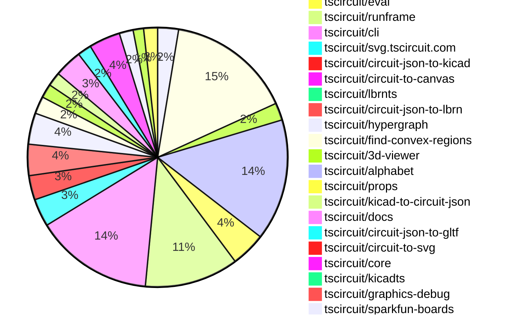

# Contribution Overview 2026-02-17

The current week is shown below. There are 3 major sections:

- [Contributor Overview](#contributor-overview)
- [PRs by Repository](#prs-by-repository)
- [PRs by Contributor](#changes-by-contributor)
- [Scoring & Sponsorship Details](/docs/sponsorship-calculation-explanation.md)

## PRs by Repository

## Contributor Overview

| Contributor | 🐳 Major | 🐙 Minor | 🐌 Tiny | ⭐ | Discussion Contributions |
|-------------|---------|---------|---------|-----|--------------------------|
| [seveibar](#seveibar) | 13 | 3 | 3 | 👑 | 0🔹 0🔶 0💎 |
| [ShiboSoftwareDev](#ShiboSoftwareDev) | 3 | 6 | 4 | ⭐⭐⭐ | 0🔹 0🔶 0💎 |
| [imrishabh18](#imrishabh18) | 4 | 5 | 5 | ⭐⭐⭐ | 0🔹 0🔶 0💎 |
| [rushabhcodes](#rushabhcodes) | 3 | 1 | 6 | ⭐⭐ | 0🔹 0🔶 0💎 |
| [Abse2001](#Abse2001) | 4 | 1 | 3 | ⭐⭐ | 0🔹 0🔶 0💎 |
| [techmannih](#techmannih) | 0 | 6 | 2 | ⭐⭐ | 0🔹 0🔶 0💎 |
| [AnasSarkiz](#AnasSarkiz) | 2 | 2 | 2 | ⭐⭐ | 0🔹 0🔶 0💎 |
| [tscircuitbot](#tscircuitbot) | 0 | 0 | 150 | ⭐⭐ | 0🔹 0🔶 0💎 |
| [MustafaMulla29](#MustafaMulla29) | 2 | 2 | 1 | ⭐⭐ | 0🔹 0🔶 0💎 |
| [0hmX](#0hmX) | 2 | 0 | 2 | ⭐ | 0🔹 0🔶 0💎 |
| [nailoo](#nailoo) | 0 | 1 | 0 |  | 0🔹 0🔶 0💎 |
| [blowmuffin](#blowmuffin) | 0 | 0 | 2 |  | 0🔹 0🔶 0💎 |
| [Devesh36](#Devesh36) | 0 | 0 | 2 |  | 0🔹 0🔶 0💎 |

> Note: AI evaluates PRs and assigns 1-3 star ratings automatically. 4 and 5 star ratings require manual staff review.

### Discussion Contribution Legend

- 🔹 Normal Comments: Basic participation with minimal effort
- 🔶 Great Informative Comments: Thoughtful participation that adds value
- 💎 Incredible Comments: Exceptional participation with high-quality content

## Review Table

[reviews-received-hover]: ## "Number of reviews received for PRs for this contributor"
[approvals-received-hover]: ## "Number of approvals received for PRs this contributor authored"
[rejections-received-hover]: ## "Number of rejections received for PRs this contributor authored"
[prs-opened-hover]: ## "Number of PRs opened by this contributor"
[issues-created-hover]: ## "Number of issues created by this contributor"

| Contributor | Reviews Received | Approvals Received | Rejections Received | Approvals | Rejections | PRs Opened | PRs Merged | Issues Created |
|---|---|---|---|---|---|---|---|---|
| [makaiachildress-web](#makaiachildress-web) | 0 | 0 | 0 | 0 | 0 | 4 | 0 | 0 |
| [MekonMAC](#MekonMAC) | 0 | 0 | 0 | 0 | 0 | 2 | 0 | 0 |
| [tscircuitbot](#tscircuitbot) | 1 | 0 | 0 | 0 | 0 | 182 | 150 | 0 |
| [Abse2001](#Abse2001) | 9 | 8 | 0 | 1 | 1 | 8 | 8 | 0 |
| [seveibar](#seveibar) | 4 | 0 | 0 | 40 | 7 | 36 | 19 | 0 |
| [AnasSarkiz](#AnasSarkiz) | 25 | 8 | 1 | 1 | 0 | 8 | 6 | 0 |
| [techmannih](#techmannih) | 13 | 9 | 1 | 4 | 4 | 11 | 8 | 0 |
| [imrishabh18](#imrishabh18) | 7 | 4 | 1 | 10 | 4 | 15 | 14 | 0 |
| [rushabhcodes](#rushabhcodes) | 41 | 12 | 6 | 8 | 7 | 15 | 10 | 0 |
| [Wh1t3Fox](#Wh1t3Fox) | 0 | 0 | 0 | 0 | 0 | 1 | 0 | 0 |
| [ShiboSoftwareDev](#ShiboSoftwareDev) | 12 | 10 | 0 | 5 | 0 | 16 | 14 | 0 |
| [shehaban](#shehaban) | 1 | 0 | 0 | 0 | 0 | 1 | 0 | 0 |
| [bamontejano](#bamontejano) | 2 | 0 | 1 | 0 | 0 | 3 | 0 | 0 |
| [Mukedlii](#Mukedlii) | 0 | 0 | 0 | 0 | 0 | 2 | 0 | 0 |
| [adrianfolkeson](#adrianfolkeson) | 1 | 0 | 1 | 0 | 0 | 3 | 0 | 0 |
| [MustafaMulla29](#MustafaMulla29) | 13 | 6 | 2 | 0 | 0 | 8 | 5 | 0 |
| [wiwvernia](#wiwvernia) | 0 | 0 | 0 | 0 | 0 | 1 | 0 | 0 |
| [Devesh36](#Devesh36) | 20 | 6 | 8 | 0 | 0 | 5 | 2 | 0 |
| [xunwen-art](#xunwen-art) | 0 | 0 | 0 | 0 | 0 | 1 | 0 | 0 |
| [janisag07](#janisag07) | 1 | 0 | 1 | 0 | 0 | 1 | 0 | 0 |
| [nailoo](#nailoo) | 4 | 3 | 1 | 0 | 0 | 2 | 1 | 0 |
| [EnzoGaillardSystems](#EnzoGaillardSystems) | 0 | 0 | 0 | 0 | 0 | 1 | 0 | 0 |
| [blowmuffin](#blowmuffin) | 2 | 2 | 0 | 0 | 0 | 2 | 2 | 0 |
| [0hmX](#0hmX) | 2 | 1 | 0 | 0 | 0 | 4 | 4 | 0 |
| [Rudyvantuyn](#Rudyvantuyn) | 0 | 0 | 0 | 0 | 0 | 1 | 0 | 0 |

## Changes by Repository

### [tscircuit/pcb-viewer](https://github.com/tscircuit/pcb-viewer)

| PR # | Impact | Rating | Contributor | Description |
|------|--------|--------|-------------|-------------|
| [#670](https://github.com/tscircuit/pcb-viewer/pull/670) | 🐙 Minor | ⭐⭐ | techmannih | Adds associated courtyard layers to the PCB viewers layer ordering and visibility settings based on the selected foreground layer. |
| [#671](https://github.com/tscircuit/pcb-viewer/pull/671) | 🐙 Minor | ⭐⭐ | AnasSarkiz | Fixes React key collision issue in the layered canvas renderer that causes duplicate and unstable rendering of PCB layers. |

🐌 Tiny Contributions (4)

| PR # | Impact | Contributor | Description |
|------|--------|-------------|-------------|
| [#675](https://github.com/tscircuit/pcb-viewer/pull/675) | 🐌 Tiny | tscircuitbot | Automated package update |
| [#672](https://github.com/tscircuit/pcb-viewer/pull/672) | 🐌 Tiny | tscircuitbot | Automated package update |
| [#673](https://github.com/tscircuit/pcb-viewer/pull/673) | 🐌 Tiny | tscircuitbot | Automated package update |
| [#674](https://github.com/tscircuit/pcb-viewer/pull/674) | 🐌 Tiny | Abse2001 | Updates the dependencies for circuit-to-canvas and alphabet to their latest versions, potentially improving text rendering capabilities in the application. |

### [tscircuit/tscircuit](https://github.com/tscircuit/tscircuit)

🐌 Tiny Contributions (36)

| PR # | Impact | Contributor | Description |
|------|--------|-------------|-------------|
| [#2300](https://github.com/tscircuit/tscircuit/pull/2300) | 🐌 Tiny | tscircuitbot | Automated package update |
| [#2298](https://github.com/tscircuit/tscircuit/pull/2298) | 🐌 Tiny | tscircuitbot | Automated package update |
| [#2297](https://github.com/tscircuit/tscircuit/pull/2297) | 🐌 Tiny | tscircuitbot | Updates the tscircuitcli package from version 0.1.961 to 0.1.962 and the tscircuitrunframe package from version 0.0.1638 to 0.0.1639 in package.json |
| [#2296](https://github.com/tscircuit/tscircuit/pull/2296) | 🐌 Tiny | tscircuitbot | Automated package update |
| [#2295](https://github.com/tscircuit/tscircuit/pull/2295) | 🐌 Tiny | tscircuitbot | Updates the tscircuitcli package to version 0.1.961 in package.json |
| [#2294](https://github.com/tscircuit/tscircuit/pull/2294) | 🐌 Tiny | tscircuitbot | Automated package update |
| [#2293](https://github.com/tscircuit/tscircuit/pull/2293) | 🐌 Tiny | tscircuitbot | Updates the tscircuitcli package from version 0.1.959 to 0.1.960 and the tscircuitrunframe package from version 0.0.1637 to 0.0.1638. |
| [#2292](https://github.com/tscircuit/tscircuit/pull/2292) | 🐌 Tiny | tscircuitbot | Automated package update |
| [#2291](https://github.com/tscircuit/tscircuit/pull/2291) | 🐌 Tiny | tscircuitbot | Automated package update |
| [#2290](https://github.com/tscircuit/tscircuit/pull/2290) | 🐌 Tiny | tscircuitbot | Automated package update |
| [#2289](https://github.com/tscircuit/tscircuit/pull/2289) | 🐌 Tiny | tscircuitbot | Automated package update |
| [#2286](https://github.com/tscircuit/tscircuit/pull/2286) | 🐌 Tiny | tscircuitbot | Automated package update |
| [#2285](https://github.com/tscircuit/tscircuit/pull/2285) | 🐌 Tiny | tscircuitbot | Updates the tscircuitcli package to version 0.1.956 |
| [#2287](https://github.com/tscircuit/tscircuit/pull/2287) | 🐌 Tiny | tscircuitbot | Updates the tscircuitcli package to version 0.1.957 in package.json |
| [#2288](https://github.com/tscircuit/tscircuit/pull/2288) | 🐌 Tiny | tscircuitbot | Automated package update |
| [#2266](https://github.com/tscircuit/tscircuit/pull/2266) | 🐌 Tiny | tscircuitbot | Updates the tscircuitcli package from version 0.1.946 to 0.1.947 and the tscircuitrunframe package from version 0.0.1627 to 0.0.1628 in package.json |
| [#2270](https://github.com/tscircuit/tscircuit/pull/2270) | 🐌 Tiny | tscircuitbot | Updates the tscircuitcli package from version 0.1.948 to 0.1.949 and the tscircuitrunframe package from version 0.0.1629 to 0.0.1630 in package.json |
| [#2274](https://github.com/tscircuit/tscircuit/pull/2274) | 🐌 Tiny | tscircuitbot | Automated package update |
| [#2275](https://github.com/tscircuit/tscircuit/pull/2275) | 🐌 Tiny | tscircuitbot | Updates the package version from 0.0.1340 to 0.0.1341 in package.json |
| [#2272](https://github.com/tscircuit/tscircuit/pull/2272) | 🐌 Tiny | tscircuitbot | Updates the tscircuitcli package from version 0.1.949 to 0.1.950 and the tscircuitrunframe package from version 0.0.1630 to 0.0.1631 in package.json |
| [#2269](https://github.com/tscircuit/tscircuit/pull/2269) | 🐌 Tiny | tscircuitbot | Automated package update |
| [#2267](https://github.com/tscircuit/tscircuit/pull/2267) | 🐌 Tiny | tscircuitbot | Automated package update |
| [#2281](https://github.com/tscircuit/tscircuit/pull/2281) | 🐌 Tiny | tscircuitbot | Updates the package version from 0.0.1343 to 0.0.1344 in package.json |
| [#2268](https://github.com/tscircuit/tscircuit/pull/2268) | 🐌 Tiny | tscircuitbot | Automated package update |
| [#2279](https://github.com/tscircuit/tscircuit/pull/2279) | 🐌 Tiny | tscircuitbot | Automated package update |
| [#2273](https://github.com/tscircuit/tscircuit/pull/2273) | 🐌 Tiny | tscircuitbot | Automated package update |
| [#2263](https://github.com/tscircuit/tscircuit/pull/2263) | 🐌 Tiny | tscircuitbot | Automated package update |
| [#2271](https://github.com/tscircuit/tscircuit/pull/2271) | 🐌 Tiny | tscircuitbot | Automated package update |
| [#2264](https://github.com/tscircuit/tscircuit/pull/2264) | 🐌 Tiny | tscircuitbot | Automated package update |
| [#2277](https://github.com/tscircuit/tscircuit/pull/2277) | 🐌 Tiny | tscircuitbot | Automated package update |
| [#2284](https://github.com/tscircuit/tscircuit/pull/2284) | 🐌 Tiny | tscircuitbot | Automated package update |
| [#2283](https://github.com/tscircuit/tscircuit/pull/2283) | 🐌 Tiny | tscircuitbot | Automated package update |
| [#2276](https://github.com/tscircuit/tscircuit/pull/2276) | 🐌 Tiny | tscircuitbot | Automated package update |
| [#2280](https://github.com/tscircuit/tscircuit/pull/2280) | 🐌 Tiny | tscircuitbot | Automated package update |
| [#2278](https://github.com/tscircuit/tscircuit/pull/2278) | 🐌 Tiny | tscircuitbot | Updates the versions of several dependencies in the package.json file, including tscircuitcli, tscircuitcore, and tscircuiteval. |
| [#2299](https://github.com/tscircuit/tscircuit/pull/2299) | 🐌 Tiny | imrishabh18 | Adds rotation support for circular holes with rectangular pads in the circuit-to-svg library |

### [tscircuit/circuit-json](https://github.com/tscircuit/circuit-json)

| PR # | Impact | Rating | Contributor | Description |
|------|--------|--------|-------------|-------------|
| [#471](https://github.com/tscircuit/circuit-json/pull/471) | 🐳 Major | ⭐⭐⭐ | seveibar | Add support for KiCad symbol metadata in schematic symbols, allowing for structured storage of KiCad-specific information such as pin names, numbers, and properties. |
| [#476](https://github.com/tscircuit/circuit-json/pull/476) | 🐙 Minor | ⭐⭐ | techmannih | Adds an optional rect_ccw_rotation field to the PcbHoleCircularWithRectPad interface for enhanced rotation control. |

🐌 Tiny Contributions (3)

| PR # | Impact | Contributor | Description |
|------|--------|-------------|-------------|
| [#477](https://github.com/tscircuit/circuit-json/pull/477) | 🐌 Tiny | tscircuitbot | Automated package update |
| [#472](https://github.com/tscircuit/circuit-json/pull/472) | 🐌 Tiny | tscircuitbot | Automated package update |
| [#473](https://github.com/tscircuit/circuit-json/pull/473) | 🐌 Tiny | seveibar | Refactors KiCad metadata handling to use a more generic metadata structure, allowing optional inclusion of KiCad information. |

### [tscircuit/tscircuit.com](https://github.com/tscircuit/tscircuit.com)

| PR # | Impact | Rating | Contributor | Description |
|------|--------|--------|-------------|-------------|
| [#2799](https://github.com/tscircuit/tscircuit.com/pull/2799) | 🐳 Major | ⭐⭐⭐ | imrishabh18 | Add a new section in the organization settings page to manage domains and linked packages for merged PCM repositories. |
| [#2805](https://github.com/tscircuit/tscircuit.com/pull/2805) | 🐳 Major | ⭐⭐⭐ | imrishabh18 | Fixes the issue of not passing the package_id when points_to is set to package_release_with_tag, ensuring correct package identification in the database. |
| [#2796](https://github.com/tscircuit/tscircuit.com/pull/2796) | 🐳 Major | ⭐⭐⭐ | imrishabh18 | Adds functionality to edit the subdomain to point to the latest release using a specified tag and introduces a new endpoint for updating package domains. |
| [#2819](https://github.com/tscircuit/tscircuit.com/pull/2819) | 🐳 Major | ⭐⭐⭐ | seveibar | Adds an optional pcm_repository_name field to organization domains, allowing admins to edit the repository name for KiCad users in the Organization Settings UI. |
| [#2818](https://github.com/tscircuit/tscircuit.com/pull/2818) | 🐳 Major | ⭐⭐⭐ | seveibar | Adds a button to copy the KiCad PCM URL to the clipboard for package domains when the feature is enabled in the configuration file. |
| [#2789](https://github.com/tscircuit/tscircuit.com/pull/2789) | 🐳 Major | ⭐⭐⭐ | seveibar | Adds endpoints for creating, retrieving, listing, and managing organization domains and their linked packages in the fake API. |
| [#2811](https://github.com/tscircuit/tscircuit.com/pull/2811) | 🐳 Major | ⭐⭐⭐ | seveibar | Add a Use Latest Version checkbox to the AddLinkedPackageDialog, enabling users to link to the latest package release by default, while preventing duplicate links for the same package. |
| [#2787](https://github.com/tscircuit/tscircuit.com/pull/2787) | 🐳 Major | ⭐⭐⭐ | seveibar | Allows users to edit the target domain for a package in the Edit Subdomain dialog, including options for the latest package release or a specific release. |
| [#2785](https://github.com/tscircuit/tscircuit.com/pull/2785) | 🐳 Major | ⭐⭐⭐ | seveibar | Provides clearer, human-readable context for package domains by showing the actual release version or associated release for builds instead of opaque IDs. |
| [#2814](https://github.com/tscircuit/tscircuit.com/pull/2814) | 🐙 Minor | ⭐⭐ | imrishabh18 | Changes the package settings domains list to show domain names representing the packages default resolution instead of aggregating all linked domains from releases and builds. |
| [#2792](https://github.com/tscircuit/tscircuit.com/pull/2792) | 🐙 Minor | ⭐⭐ | imrishabh18 | Adds a new hook to display all fully qualified domain names (FQDNs) linked to a package, including those from releases and builds, in the package settings. |
| [#2793](https://github.com/tscircuit/tscircuit.com/pull/2793) | 🐙 Minor | ⭐⭐ | imrishabh18 | Fixes the package_buildlist API call to use package_release_id instead of package_id, improving the accuracy of package build retrieval. |
| [#2815](https://github.com/tscircuit/tscircuit.com/pull/2815) | 🐙 Minor | ⭐⭐ | seveibar | Replaces the generic Tag badge with the actual capitalized tag on package domain entries for better clarity on the package settings domains page. |
| [#2810](https://github.com/tscircuit/tscircuit.com/pull/2810) | 🐙 Minor | ⭐⭐ | seveibar | Adds filter_preset handling to the fake API package_domains list, ensuring that preset filtering works correctly based on package_id and includes relevant domains. |

🐌 Tiny Contributions (21)

| PR # | Impact | Contributor | Description |
|------|--------|-------------|-------------|
| [#2822](https://github.com/tscircuit/tscircuit.com/pull/2822) | 🐌 Tiny | tscircuitbot | Automated package update |
| [#2821](https://github.com/tscircuit/tscircuit.com/pull/2821) | 🐌 Tiny | tscircuitbot | Updates the tscircuitrunframe package from version 0.0.1637 to 0.0.1638 |
| [#2820](https://github.com/tscircuit/tscircuit.com/pull/2820) | 🐌 Tiny | tscircuitbot | Updates the package version from 0.0.199 to 0.0.200 in package.json |
| [#2817](https://github.com/tscircuit/tscircuit.com/pull/2817) | 🐌 Tiny | tscircuitbot | Automated package update |
| [#2804](https://github.com/tscircuit/tscircuit.com/pull/2804) | 🐌 Tiny | tscircuitbot | Updates the tscircuiteval package to version 0.0.653 in the package.json file. |
| [#2797](https://github.com/tscircuit/tscircuit.com/pull/2797) | 🐌 Tiny | tscircuitbot | Updates the tscircuitrunframe package from version 0.0.1629 to 0.0.1630 |
| [#2795](https://github.com/tscircuit/tscircuit.com/pull/2795) | 🐌 Tiny | tscircuitbot | Updates the tscircuitrunframe package from version 0.0.1627 to 0.0.1629 |
| [#2790](https://github.com/tscircuit/tscircuit.com/pull/2790) | 🐌 Tiny | tscircuitbot | Updates the package version from 0.0.195 to 0.0.196 in package.json |
| [#2784](https://github.com/tscircuit/tscircuit.com/pull/2784) | 🐌 Tiny | tscircuitbot | Updates the tscircuitrunframe package from version 0.0.1626 to 0.0.1627 |
| [#2813](https://github.com/tscircuit/tscircuit.com/pull/2813) | 🐌 Tiny | tscircuitbot | Automated package update |
| [#2812](https://github.com/tscircuit/tscircuit.com/pull/2812) | 🐌 Tiny | tscircuitbot | Automated package update |
| [#2809](https://github.com/tscircuit/tscircuit.com/pull/2809) | 🐌 Tiny | tscircuitbot | Automated package update |
| [#2800](https://github.com/tscircuit/tscircuit.com/pull/2800) | 🐌 Tiny | tscircuitbot | Automated package update |
| [#2807](https://github.com/tscircuit/tscircuit.com/pull/2807) | 🐌 Tiny | tscircuitbot | Automated package update to version 0.0.198 |
| [#2806](https://github.com/tscircuit/tscircuit.com/pull/2806) | 🐌 Tiny | tscircuitbot | Updates the tscircuitrunframe package from version 0.0.1633 to 0.0.1634 |
| [#2803](https://github.com/tscircuit/tscircuit.com/pull/2803) | 🐌 Tiny | tscircuitbot | Updates the tscircuitrunframe package from version 0.0.1631 to 0.0.1633 |
| [#2802](https://github.com/tscircuit/tscircuit.com/pull/2802) | 🐌 Tiny | tscircuitbot | Automated package update |
| [#2798](https://github.com/tscircuit/tscircuit.com/pull/2798) | 🐌 Tiny | tscircuitbot | Automated package update |
| [#2801](https://github.com/tscircuit/tscircuit.com/pull/2801) | 🐌 Tiny | tscircuitbot | Automated package update to version 0.0.197 |
| [#2783](https://github.com/tscircuit/tscircuit.com/pull/2783) | 🐌 Tiny | tscircuitbot | Updates the tscircuiteval package from version 0.0.648 to 0.0.649 |
| [#2808](https://github.com/tscircuit/tscircuit.com/pull/2808) | 🐌 Tiny | imrishabh18 | Fixes the search functionality to correctly filter packages based on their names. |

### [tscircuit/eval](https://github.com/tscircuit/eval)

🐌 Tiny Contributions (10)

| PR # | Impact | Contributor | Description |
|------|--------|-------------|-------------|
| [#2086](https://github.com/tscircuit/eval/pull/2086) | 🐌 Tiny | tscircuitbot | Updates the version of the tscircuitcore package from 0.0.1047 to 0.0.1048 in package.json |
| [#2078](https://github.com/tscircuit/eval/pull/2078) | 🐌 Tiny | tscircuitbot | Automated package update to version 0.0.650 |
| [#2074](https://github.com/tscircuit/eval/pull/2074) | 🐌 Tiny | tscircuitbot | Updates the version of the tscircuitcore package from 0.0.1043 to 0.0.1044 in package.json |
| [#2084](https://github.com/tscircuit/eval/pull/2084) | 🐌 Tiny | tscircuitbot | Updates the package version from 0.0.651 to 0.0.652 in package.json |
| [#2080](https://github.com/tscircuit/eval/pull/2080) | 🐌 Tiny | tscircuitbot | Updates the version of the tscircuitcore package from 0.0.1045 to 0.0.1046 in package.json |
| [#2075](https://github.com/tscircuit/eval/pull/2075) | 🐌 Tiny | tscircuitbot | Automated package update |
| [#2083](https://github.com/tscircuit/eval/pull/2083) | 🐌 Tiny | tscircuitbot | Updates the versions of several packages in the project, including tscircuitcore and circuit-json-to-gltf. |
| [#2087](https://github.com/tscircuit/eval/pull/2087) | 🐌 Tiny | tscircuitbot | Automated package update |
| [#2077](https://github.com/tscircuit/eval/pull/2077) | 🐌 Tiny | tscircuitbot | Updates the package versions in package.json to the latest compatible versions. |
| [#2081](https://github.com/tscircuit/eval/pull/2081) | 🐌 Tiny | tscircuitbot | Automated package update |

### [tscircuit/runframe](https://github.com/tscircuit/runframe)

🐌 Tiny Contributions (27)

| PR # | Impact | Contributor | Description |
|------|--------|-------------|-------------|
| [#2707](https://github.com/tscircuit/runframe/pull/2707) | 🐌 Tiny | tscircuitbot | Automated package update |
| [#2706](https://github.com/tscircuit/runframe/pull/2706) | 🐌 Tiny | tscircuitbot | Updates the tscircuit3d-viewer package to version 0.0.520 in the package.json file. |
| [#2703](https://github.com/tscircuit/runframe/pull/2703) | 🐌 Tiny | tscircuitbot | Updates the circuit-json-to-kicad package from version 0.0.75 to 0.0.77 |
| [#2701](https://github.com/tscircuit/runframe/pull/2701) | 🐌 Tiny | tscircuitbot | Automated package update |
| [#2700](https://github.com/tscircuit/runframe/pull/2700) | 🐌 Tiny | tscircuitbot | Updates the tscircuitpcb-viewer package to version 1.11.343 |
| [#2698](https://github.com/tscircuit/runframe/pull/2698) | 🐌 Tiny | tscircuitbot | Updates the tscircuit3d-viewer package from version 0.0.518 to 0.0.519 |
| [#2683](https://github.com/tscircuit/runframe/pull/2683) | 🐌 Tiny | tscircuitbot | Automated package update |
| [#2687](https://github.com/tscircuit/runframe/pull/2687) | 🐌 Tiny | tscircuitbot | Updates the tscircuit3d-viewer package to version 0.0.518 |
| [#2696](https://github.com/tscircuit/runframe/pull/2696) | 🐌 Tiny | tscircuitbot | Updates the tscircuitpcb-viewer package to version 1.11.342 |
| [#2685](https://github.com/tscircuit/runframe/pull/2685) | 🐌 Tiny | tscircuitbot | Updates the tscircuitpcb-viewer package from version 1.11.340 to 1.11.341 |
| [#2679](https://github.com/tscircuit/runframe/pull/2679) | 🐌 Tiny | tscircuitbot | Updates the circuit-json-to-kicad package from version 0.0.73 to 0.0.74 in package.json |
| [#2699](https://github.com/tscircuit/runframe/pull/2699) | 🐌 Tiny | tscircuitbot | Automated package update |
| [#2691](https://github.com/tscircuit/runframe/pull/2691) | 🐌 Tiny | tscircuitbot | Automated package update |
| [#2681](https://github.com/tscircuit/runframe/pull/2681) | 🐌 Tiny | tscircuitbot | Updates the tscircuiteval package to version 0.0.650 in the package.json file. |
| [#2682](https://github.com/tscircuit/runframe/pull/2682) | 🐌 Tiny | tscircuitbot | Automated package update |
| [#2695](https://github.com/tscircuit/runframe/pull/2695) | 🐌 Tiny | tscircuitbot | Automated package update |
| [#2692](https://github.com/tscircuit/runframe/pull/2692) | 🐌 Tiny | tscircuitbot | Updates the tscircuiteval package to version 0.0.652 in the package.json file. |
| [#2690](https://github.com/tscircuit/runframe/pull/2690) | 🐌 Tiny | tscircuitbot | Automated package update |
| [#2689](https://github.com/tscircuit/runframe/pull/2689) | 🐌 Tiny | tscircuitbot | Updates the circuit-json-to-kicad package from version 0.0.74 to 0.0.75 |
| [#2680](https://github.com/tscircuit/runframe/pull/2680) | 🐌 Tiny | tscircuitbot | Automated package update |
| [#2677](https://github.com/tscircuit/runframe/pull/2677) | 🐌 Tiny | tscircuitbot | Automated package update |
| [#2676](https://github.com/tscircuit/runframe/pull/2676) | 🐌 Tiny | tscircuitbot | Updates the tscircuiteval package to version 0.0.649 in the package.json file. |
| [#2693](https://github.com/tscircuit/runframe/pull/2693) | 🐌 Tiny | tscircuitbot | Automated package update |
| [#2686](https://github.com/tscircuit/runframe/pull/2686) | 🐌 Tiny | tscircuitbot | Automated package update |
| [#2684](https://github.com/tscircuit/runframe/pull/2684) | 🐌 Tiny | tscircuitbot | Automated package update |
| [#2697](https://github.com/tscircuit/runframe/pull/2697) | 🐌 Tiny | tscircuitbot | Updates the package version from 0.0.1634 to 0.0.1635 in package.json |
| [#2694](https://github.com/tscircuit/runframe/pull/2694) | 🐌 Tiny | tscircuitbot | Updates the tscircuiteval package to version 0.0.653 in the package.json file. |

### [tscircuit/cli](https://github.com/tscircuit/cli)

| PR # | Impact | Rating | Contributor | Description |
|------|--------|--------|-------------|-------------|
| [#2050](https://github.com/tscircuit/cli/pull/2050) | 🐳 Major | ⭐⭐⭐ | rushabhcodes | Implements a deterministic camera positioning function for 3D PCB snapshots based on board size, ensuring consistent rendering across different environments, and adds tests for larger boards. |
| [#2072](https://github.com/tscircuit/cli/pull/2072) | 🐙 Minor | ⭐⭐ | techmannih | Improves the error message displayed when no parts are found in the tscircuit registry or JLCPCB, providing clearer feedback to the user about the sources searched. |
| [#2068](https://github.com/tscircuit/cli/pull/2068) | 🐙 Minor | ⭐⭐ | imrishabh18 | Adds the missing model_step_url and step_model_url keys to the URL conversion function for circuit models. |
| [#2066](https://github.com/tscircuit/cli/pull/2066) | 🐙 Minor | ⭐⭐ | MustafaMulla29 | Removes the metadata prop introspection functionality for KiCad library components, including the extraction of footprint and symbol metadata from React components. |

🐌 Tiny Contributions (30)

| PR # | Impact | Contributor | Description |
|------|--------|-------------|-------------|
| [#2080](https://github.com/tscircuit/cli/pull/2080) | 🐌 Tiny | tscircuitbot | Updates the package version from v0.1.961 to v0.1.962 in package.json |
| [#2079](https://github.com/tscircuit/cli/pull/2079) | 🐌 Tiny | tscircuitbot | Updates the tscircuitrunframe package from version 0.0.1638 to 0.0.1639 |
| [#2078](https://github.com/tscircuit/cli/pull/2078) | 🐌 Tiny | tscircuitbot | Updates the package version from v0.1.960 to v0.1.961 in package.json |
| [#2077](https://github.com/tscircuit/cli/pull/2077) | 🐌 Tiny | tscircuitbot | Automated package update |
| [#2076](https://github.com/tscircuit/cli/pull/2076) | 🐌 Tiny | tscircuitbot | Updates the tscircuitrunframe package from version 0.0.1637 to 0.0.1638 |
| [#2075](https://github.com/tscircuit/cli/pull/2075) | 🐌 Tiny | tscircuitbot | Updates the package version from 0.1.958 to 0.1.959 in package.json |
| [#2074](https://github.com/tscircuit/cli/pull/2074) | 🐌 Tiny | tscircuitbot | Updates the tscircuitrunframe package from version 0.0.1635 to 0.0.1637 |
| [#2073](https://github.com/tscircuit/cli/pull/2073) | 🐌 Tiny | tscircuitbot | Updates the package version from v0.1.957 to v0.1.958 in package.json |
| [#2071](https://github.com/tscircuit/cli/pull/2071) | 🐌 Tiny | tscircuitbot | Automated package update |
| [#2069](https://github.com/tscircuit/cli/pull/2069) | 🐌 Tiny | tscircuitbot | Automated package update |
| [#2059](https://github.com/tscircuit/cli/pull/2059) | 🐌 Tiny | tscircuitbot | Updates the tscircuitrunframe package from version 0.0.1632 to 0.0.1633 |
| [#2051](https://github.com/tscircuit/cli/pull/2051) | 🐌 Tiny | tscircuitbot | Updates the tscircuitrunframe package from version 0.0.1628 to 0.0.1629 |
| [#2064](https://github.com/tscircuit/cli/pull/2064) | 🐌 Tiny | tscircuitbot | Updates the package version from v0.1.953 to v0.1.954 in package.json |
| [#2062](https://github.com/tscircuit/cli/pull/2062) | 🐌 Tiny | tscircuitbot | Automated package update |
| [#2061](https://github.com/tscircuit/cli/pull/2061) | 🐌 Tiny | tscircuitbot | Updates the tscircuitrunframe package from version 0.0.1633 to 0.0.1634 |
| [#2060](https://github.com/tscircuit/cli/pull/2060) | 🐌 Tiny | tscircuitbot | Automated package update |
| [#2058](https://github.com/tscircuit/cli/pull/2058) | 🐌 Tiny | tscircuitbot | Updates the package version from v0.1.950 to v0.1.951 in package.json |
| [#2057](https://github.com/tscircuit/cli/pull/2057) | 🐌 Tiny | tscircuitbot | Updates the tscircuitrunframe package from version 0.0.1631 to 0.0.1632 |
| [#2056](https://github.com/tscircuit/cli/pull/2056) | 🐌 Tiny | tscircuitbot | Automated package update |
| [#2055](https://github.com/tscircuit/cli/pull/2055) | 🐌 Tiny | tscircuitbot | Updates the tscircuitrunframe package from version 0.0.1630 to 0.0.1631 |
| [#2054](https://github.com/tscircuit/cli/pull/2054) | 🐌 Tiny | tscircuitbot | Automated package update |
| [#2053](https://github.com/tscircuit/cli/pull/2053) | 🐌 Tiny | tscircuitbot | Updates the tscircuitrunframe package from version 0.0.1629 to 0.0.1630 |
| [#2048](https://github.com/tscircuit/cli/pull/2048) | 🐌 Tiny | tscircuitbot | Automated package update |
| [#2047](https://github.com/tscircuit/cli/pull/2047) | 🐌 Tiny | tscircuitbot | Updates the tscircuitrunframe package from version 0.0.1627 to 0.0.1628 |
| [#2045](https://github.com/tscircuit/cli/pull/2045) | 🐌 Tiny | tscircuitbot | Updates the tscircuitrunframe package from version 0.0.1626 to 0.0.1627 |
| [#2052](https://github.com/tscircuit/cli/pull/2052) | 🐌 Tiny | tscircuitbot | Automated package update |
| [#2046](https://github.com/tscircuit/cli/pull/2046) | 🐌 Tiny | tscircuitbot | Updates the package version from v0.1.945 to v0.1.946 in package.json |
| [#2067](https://github.com/tscircuit/cli/pull/2067) | 🐌 Tiny | tscircuitbot | Updates the package version from 0.1.954 to 0.1.955 in package.json |
| [#2063](https://github.com/tscircuit/cli/pull/2063) | 🐌 Tiny | tscircuitbot | Updates the tscircuitrunframe package from version 0.0.1634 to 0.0.1635 |
| [#2070](https://github.com/tscircuit/cli/pull/2070) | 🐌 Tiny | imrishabh18 | Removes the .step file extension from the list of recognized binary file extensions in the application. |

### [tscircuit/svg.tscircuit.com](https://github.com/tscircuit/svg.tscircuit.com)

🐌 Tiny Contributions (8)

| PR # | Impact | Contributor | Description |
|------|--------|-------------|-------------|
| [#1030](https://github.com/tscircuit/svg.tscircuit.com/pull/1030) | 🐌 Tiny | tscircuitbot | Updates the tscircuit package version from 0.0.1340 to 0.0.1341 in package.json |
| [#1032](https://github.com/tscircuit/svg.tscircuit.com/pull/1032) | 🐌 Tiny | tscircuitbot | Updates the tscircuit package version from 0.0.1342 to 0.0.1343 in package.json |
| [#1027](https://github.com/tscircuit/svg.tscircuit.com/pull/1027) | 🐌 Tiny | tscircuitbot | Updates the tscircuit package version from 0.0.1337 to 0.0.1338 in package.json |
| [#1025](https://github.com/tscircuit/svg.tscircuit.com/pull/1025) | 🐌 Tiny | tscircuitbot | Updates the tscircuit package version from 0.0.1335 to 0.0.1336 in package.json |
| [#1026](https://github.com/tscircuit/svg.tscircuit.com/pull/1026) | 🐌 Tiny | tscircuitbot | Updates the tscircuit package version from 0.0.1336 to 0.0.1337 in package.json |
| [#1031](https://github.com/tscircuit/svg.tscircuit.com/pull/1031) | 🐌 Tiny | tscircuitbot | Updates the tscircuit package version from 0.0.1341 to 0.0.1342 in package.json |
| [#1029](https://github.com/tscircuit/svg.tscircuit.com/pull/1029) | 🐌 Tiny | tscircuitbot | Updates the tscircuit package version from 0.0.1339 to 0.0.1340 in package.json |
| [#1028](https://github.com/tscircuit/svg.tscircuit.com/pull/1028) | 🐌 Tiny | tscircuitbot | Updates the tscircuit package version from 0.0.1338 to 0.0.1339 in package.json |

### [tscircuit/circuit-json-to-kicad](https://github.com/tscircuit/circuit-json-to-kicad)

| PR # | Impact | Rating | Contributor | Description |
|------|--------|--------|-------------|-------------|
| [#144](https://github.com/tscircuit/circuit-json-to-kicad/pull/144) | 🐳 Major | ⭐⭐⭐ | seveibar | This pull request adds a regression test for the Joule Thief circuit, ensuring that any future changes do not break existing functionality. The test includes a detailed Kicad PCB file for the Joule Thief design, which is crucial for verifying the circuits performance and reliability. |
| [#139](https://github.com/tscircuit/circuit-json-to-kicad/pull/139) | 🐳 Major | ⭐⭐⭐ | MustafaMulla29 | This pull request introduces the mapping of metadata from circuit-json, supports the generation of schStemLength, and refactors the code into multiple files for better organization and maintainability. The changes aim to enhance the functionality and structure of the codebase, making it easier to manage and extend in the future. |
| [#141](https://github.com/tscircuit/circuit-json-to-kicad/pull/141) | 🐙 Minor | ⭐⭐ | MustafaMulla29 | Replaces the introspection method for applying KiCad metadata with a direct application through circuit-json, streamlining the metadata handling process. |

🐌 Tiny Contributions (4)

| PR # | Impact | Contributor | Description |
|------|--------|-------------|-------------|
| [#145](https://github.com/tscircuit/circuit-json-to-kicad/pull/145) | 🐌 Tiny | tscircuitbot | Automated package update |
| [#140](https://github.com/tscircuit/circuit-json-to-kicad/pull/140) | 🐌 Tiny | tscircuitbot | Automated package update |
| [#138](https://github.com/tscircuit/circuit-json-to-kicad/pull/138) | 🐌 Tiny | tscircuitbot | Automated package update |
| [#136](https://github.com/tscircuit/circuit-json-to-kicad/pull/136) | 🐌 Tiny | MustafaMulla29 | Fixes the Reference property in kicad-project output to use the actual component name from circuit-json instead of a shared metadata value, ensuring unique RefDes for each component. |

### [tscircuit/circuit-to-canvas](https://github.com/tscircuit/circuit-to-canvas)

| PR # | Impact | Rating | Contributor | Description |
|------|--------|--------|-------------|-------------|
| [#182](https://github.com/tscircuit/circuit-to-canvas/pull/182) | 🐳 Major | ⭐⭐⭐ | Abse2001 | Updates text rendering logic to utilize the latest alphabet package for improved glyph metrics and spacing calculations. |

🐌 Tiny Contributions (1)

| PR # | Impact | Contributor | Description |
|------|--------|-------------|-------------|
| [#183](https://github.com/tscircuit/circuit-to-canvas/pull/183) | 🐌 Tiny | tscircuitbot | Automated package update |

### [tscircuit/lbrnts](https://github.com/tscircuit/lbrnts)

| PR # | Impact | Rating | Contributor | Description |
|------|--------|--------|-------------|-------------|
| [#31](https://github.com/tscircuit/lbrnts/pull/31) | 🐳 Major | ⭐⭐⭐ | seveibar | This pull request introduces a new site for viewing lbrn files, including updates to the build process and the addition of necessary files for the site. |

🐌 Tiny Contributions (1)

| PR # | Impact | Contributor | Description |
|------|--------|-------------|-------------|
| [#32](https://github.com/tscircuit/lbrnts/pull/32) | 🐌 Tiny | tscircuitbot | Updates the package version from 0.0.17 to 0.0.18 in package.json |

### [tscircuit/circuit-json-to-lbrn](https://github.com/tscircuit/circuit-json-to-lbrn)

| PR # | Impact | Rating | Contributor | Description |
|------|--------|--------|-------------|-------------|
| [#141](https://github.com/tscircuit/circuit-json-to-lbrn/pull/141) | 🐳 Major | ⭐⭐⭐ | AnasSarkiz | Fixes degenerate copper pour unions by replacing the Flatten.js Boolean union with a Manifold CrossSection contour union and simplification process. |

🐌 Tiny Contributions (8)

| PR # | Impact | Contributor | Description |
|------|--------|-------------|-------------|
| [#142](https://github.com/tscircuit/circuit-json-to-lbrn/pull/142) | 🐌 Tiny | tscircuitbot | Automated package update |
| [#140](https://github.com/tscircuit/circuit-json-to-lbrn/pull/140) | 🐌 Tiny | tscircuitbot | Automated package update |
| [#131](https://github.com/tscircuit/circuit-json-to-lbrn/pull/131) | 🐌 Tiny | tscircuitbot | Automated package update |
| [#130](https://github.com/tscircuit/circuit-json-to-lbrn/pull/130) | 🐌 Tiny | tscircuitbot | Automated package update |
| [#129](https://github.com/tscircuit/circuit-json-to-lbrn/pull/129) | 🐌 Tiny | tscircuitbot | Automated package update |
| [#139](https://github.com/tscircuit/circuit-json-to-lbrn/pull/139) | 🐌 Tiny | AnasSarkiz | Updates the snapshot for repro1 after running tests, reflecting minor changes in non-code files. |
| [#137](https://github.com/tscircuit/circuit-json-to-lbrn/pull/137) | 🐌 Tiny | imrishabh18 | Adds reproduction tests for the failure to union geometries for net in circuit rendering. |
| [#128](https://github.com/tscircuit/circuit-json-to-lbrn/pull/128) | 🐌 Tiny | seveibar | add joule thief circuit json joule thief test repro |

### [tscircuit/hypergraph](https://github.com/tscircuit/hypergraph)

| PR # | Impact | Rating | Contributor | Description |
|------|--------|--------|-------------|-------------|
| [#63](https://github.com/tscircuit/hypergraph/pull/63) | 🐳 Major | ⭐⭐⭐ | ShiboSoftwareDev | This pull request introduces a new convex region-based topology generator for vias using the ConvexRegionsSolver. It includes new functionalities for generating convex regions around via obstacles, creating ports between regions, and handling connections in a more efficient manner. The implementation consists of several new files and updates to existing files, enhancing the overall capability of the ViaGraphSolver. |
| [#57](https://github.com/tscircuit/hypergraph/pull/57) | 🐙 Minor | ⭐⭐ | AnasSarkiz | Adds defaultTopology.ts that binds the default vias-by-net.json to the topology generators, enabling direct cross-package usage without coupling core generator logic to static data. |

🐌 Tiny Contributions (7)

| PR # | Impact | Contributor | Description |
|------|--------|-------------|-------------|
| [#64](https://github.com/tscircuit/hypergraph/pull/64) | 🐌 Tiny | tscircuitbot | Automated package update |
| [#60](https://github.com/tscircuit/hypergraph/pull/60) | 🐌 Tiny | tscircuitbot | Automated package update |
| [#58](https://github.com/tscircuit/hypergraph/pull/58) | 🐌 Tiny | tscircuitbot | Automated package update |
| [#56](https://github.com/tscircuit/hypergraph/pull/56) | 🐌 Tiny | tscircuitbot | Automated package update |
| [#55](https://github.com/tscircuit/hypergraph/pull/55) | 🐌 Tiny | Abse2001 | Adds a new convex via topology to the PCB design, modifying existing via placements and segment connections. |
| [#53](https://github.com/tscircuit/hypergraph/pull/53) | 🐌 Tiny | Abse2001 | Moves the vias-by-net.json file to the assets directory and updates the paths in benchmark scripts accordingly. |
| [#59](https://github.com/tscircuit/hypergraph/pull/59) | 🐌 Tiny | AnasSarkiz | Re-exports defaultTopology from the ViaGraphSolver module at the package root level, making it accessible for users without needing to import it from its original location. |

### [tscircuit/find-convex-regions](https://github.com/tscircuit/find-convex-regions)

| PR # | Impact | Rating | Contributor | Description |
|------|--------|--------|-------------|-------------|
| [#6](https://github.com/tscircuit/find-convex-regions/pull/6) | 🐳 Major | ⭐⭐⭐ | ShiboSoftwareDev | Fixes polygon shape representation by switching to Flatten.js for geometry operations and refactoring functions to use named parameters. |
| [#3](https://github.com/tscircuit/find-convex-regions/pull/3) | 🐳 Major | ⭐⭐⭐ | ShiboSoftwareDev | Adds support for polygon obstacles in the computation of convex regions, enhancing the algorithms ability to handle complex shapes. |

🐌 Tiny Contributions (3)

| PR # | Impact | Contributor | Description |
|------|--------|-------------|-------------|
| [#7](https://github.com/tscircuit/find-convex-regions/pull/7) | 🐌 Tiny | tscircuitbot | Automated package update |
| [#5](https://github.com/tscircuit/find-convex-regions/pull/5) | 🐌 Tiny | tscircuitbot | Automated package update |
| [#2](https://github.com/tscircuit/find-convex-regions/pull/2) | 🐌 Tiny | ShiboSoftwareDev | Updates biome configuration to version 1.7.3, enabling import organization and modifying file ignore patterns in the project. |

### [tscircuit/3d-viewer](https://github.com/tscircuit/3d-viewer)

| PR # | Impact | Rating | Contributor | Description |
|------|--------|--------|-------------|-------------|
| [#706](https://github.com/tscircuit/3d-viewer/pull/706) | 🐳 Major | ⭐⭐⭐ | Abse2001 | Fixes white board texture regression by decoupling mesh lifecycles and adding stress reproduction tests. |
| [#691](https://github.com/tscircuit/3d-viewer/pull/691) | 🐳 Major | ⭐⭐⭐ | Abse2001 | This PR extracts soldermask generation into a dedicated texture pipeline for 3D boards, replacing the previous inline handling inside the combined texture builder. A new createSoldermaskTextureForLayer module renders top and bottom soldermask independently using CircuitToCanvasDrawer, aligned to board outline bounds and material-aware color selection. The implementation ensures accurate compositing by rendering mask layers first and applying uncovered copper pours using destination-out blending, producing clean and deterministic cutouts. Directional control for top and bottom layers is explicit, improving separation between board sides and eliminating ambiguity in mask stacking. createCombinedBoardTextures is simplified by delegating soldermask generation to the new engine, reducing coupling between mask logic and other board textures such as traces, pads, silkscreen, and pours. A comprehensive Storybook fixture validates soldermask margin story behavior across all supported pad, plated hole, and non-plated hole geometries, covering fully covered, positive margin, negative margin, and default scenarios. This establishes a strong visual regression surface for soldermask edge cases. The result is a cleaner architecture, higher rendering determinism, and robust support for complex soldermask margin behavior in the 3D pipeline. |
| [#699](https://github.com/tscircuit/3d-viewer/pull/699) | 🐙 Minor | ⭐⭐ | Abse2001 | Adds support for rendering pill and rotated pill shapes in the pad texture renderer, allowing for more diverse pad shapes in the 3D viewer. |
| [#702](https://github.com/tscircuit/3d-viewer/pull/702) | 🐙 Minor | ⭐⭐ | techmannih | Standardizes silkscreen story dimensions to numerical values and refactors circuit definitions to improve rendering compatibility with circuit-to-canvas. |

### [tscircuit/alphabet](https://github.com/tscircuit/alphabet)

| PR # | Impact | Rating | Contributor | Description |
|------|--------|--------|-------------|-------------|
| [#42](https://github.com/tscircuit/alphabet/pull/42) | 🐳 Major | ⭐⭐⭐ | Abse2001 | Refactors SVG alphabet rendering to ensure consistent monospace metrics and exports glyph metrics for improved rendering accuracy. |

### [tscircuit/props](https://github.com/tscircuit/props)

| PR # | Impact | Rating | Contributor | Description |
|------|--------|--------|-------------|-------------|
| [#599](https://github.com/tscircuit/props/pull/599) | 🐙 Minor | ⭐⭐ | techmannih | Allows the pcbRotation property in CircularHoleWithRectPlatedProps and PillWithRectPadPlatedHoleProps interfaces, updating their Zod schemas accordingly. |

### [tscircuit/kicad-to-circuit-json](https://github.com/tscircuit/kicad-to-circuit-json)

| PR # | Impact | Rating | Contributor | Description |
|------|--------|--------|-------------|-------------|
| [#28](https://github.com/tscircuit/kicad-to-circuit-json/pull/28) | 🐳 Major | ⭐⭐⭐ | seveibar | This pull request introduces changes to the PCB port creation process, ensuring that PCB ports are correctly linked to source ports and traces. It modifies the existing functionality to enhance the connectivity map, addressing issues related to the KiCad PCB to LBRN conversion. The changes include the addition of new identifiers for PCB ports and source ports, improving the overall accuracy of the connectivity representation in the circuit JSON. |
| [#27](https://github.com/tscircuit/kicad-to-circuit-json/pull/27) | 🐳 Major | ⭐⭐⭐ | seveibar | This pull request introduces the ability to output source_trace_ids in the context of KiCad PCB uploads, enhancing the data representation and connectivity tracking within the circuit JSON format. It modifies several stages of the conversion process to ensure that source traces are collected and associated correctly, even when only PCB data is provided. |
| [#30](https://github.com/tscircuit/kicad-to-circuit-json/pull/30) | 🐙 Minor | ⭐⭐ | techmannih | There are still rotation issue in the circular hole rect pads shape. |

🐌 Tiny Contributions (1)

| PR # | Impact | Contributor | Description |
|------|--------|-------------|-------------|
| [#26](https://github.com/tscircuit/kicad-to-circuit-json/pull/26) | 🐌 Tiny | seveibar | This pull request adds a regression test for the joule thief circuit, ensuring that the functionality is preserved and that any future changes do not break existing behavior. |

### [tscircuit/docs](https://github.com/tscircuit/docs)

| PR # | Impact | Rating | Contributor | Description |
|------|--------|--------|-------------|-------------|
| [#466](https://github.com/tscircuit/docs/pull/466) | 🐳 Major | ⭐⭐⭐ | rushabhcodes | Removes fixed width and height properties from the FootprintPreview component to allow dynamic sizing based on component dimensions, preventing overflow issues in multi-footprint previews. |

🐌 Tiny Contributions (7)

| PR # | Impact | Contributor | Description |
|------|--------|-------------|-------------|
| [#462](https://github.com/tscircuit/docs/pull/462) | 🐌 Tiny | techmannih | Added documentation for using translucent models in cadmodel. |
| [#464](https://github.com/tscircuit/docs/pull/464) | 🐌 Tiny | techmannih | Moves the Translucent Models documentation section from cadmodel.mdx to chip.mdx for better organization. |
| [#456](https://github.com/tscircuit/docs/pull/456) | 🐌 Tiny | rushabhcodes | Adds documentation for the Thin Quad Flat Package (TQFP) footprint, including parameters and examples for common variants. |
| [#461](https://github.com/tscircuit/docs/pull/461) | 🐌 Tiny | ShiboSoftwareDev | Adds a local implementation of the Raspberry Pi Pico W circuit for pinout examples, replacing the need to import it from an external source. |
| [#465](https://github.com/tscircuit/docs/pull/465) | 🐌 Tiny | blowmuffin | Updates the documentation image to reflect the latest version of the template board. |
| [#460](https://github.com/tscircuit/docs/pull/460) | 🐌 Tiny | blowmuffin | Replaces the old image of the Assembly View with a new image that includes a small triangle indicator for the pin1 location. |
| [#463](https://github.com/tscircuit/docs/pull/463) | 🐌 Tiny | Devesh36 | Adds inline anchor links for properties in the chip component documentation to facilitate easier navigation to detailed explanations. |

### [tscircuit/circuit-json-to-gltf](https://github.com/tscircuit/circuit-json-to-gltf)

| PR # | Impact | Rating | Contributor | Description |
|------|--------|--------|-------------|-------------|
| [#128](https://github.com/tscircuit/circuit-json-to-gltf/pull/128) | 🐳 Major | ⭐⭐⭐ | AnasSarkiz | Fixes performance bottleneck in converting circuit boards with many holes to GLTF by implementing batched union optimization and adaptive segment reduction. |
| [#126](https://github.com/tscircuit/circuit-json-to-gltf/pull/126) | 🐳 Major | ⭐⭐⭐ | seveibar | Calculates the optimal camera position for PCB viewing based on circuit dimensions and user-defined parameters such as field of view and aspect ratio. |
| [#125](https://github.com/tscircuit/circuit-json-to-gltf/pull/125) | 🐙 Minor | ⭐⭐ | imrishabh18 | BEFORE !Before Image(https:github.comuser-attachmentsassetsa21ccd26-8adb-45d2-9dd1-6cf172fcc1cc)  AFTER !After Image(https:github.comuser-attachmentsassets21439b65-fed7-4749-8c02-1a12f47750d4) Test example |
| [#127](https://github.com/tscircuit/circuit-json-to-gltf/pull/127) | 🐙 Minor | ⭐⭐ | rushabhcodes | Adds exports for getBestCameraPosition function and CameraFitOptions type to the public Node and browser entry points, enabling access for other modules. |

### [tscircuit/circuit-to-svg](https://github.com/tscircuit/circuit-to-svg)

| PR # | Impact | Rating | Contributor | Description |
|------|--------|--------|-------------|-------------|
| [#516](https://github.com/tscircuit/circuit-to-svg/pull/516) | 🐳 Major | ⭐⭐⭐ | imrishabh18 | Adds rotation support for the circular_hole_with_rect_pad element in PCB and assembly SVG generation. |

### [tscircuit/core](https://github.com/tscircuit/core)

| PR # | Impact | Rating | Contributor | Description |
|------|--------|--------|-------------|-------------|
| [#1952](https://github.com/tscircuit/core/pull/1952) | 🐳 Major | ⭐⭐⭐ | MustafaMulla29 | Maps kicadFootprintMetadata and kicadSymbolMetadata properties to circuit-json metadata for improved component representation. |
| [#1950](https://github.com/tscircuit/core/pull/1950) | 🐙 Minor | ⭐⭐ | ShiboSoftwareDev | Fixes a race condition in subcircuit caching by implementing a mechanism to prevent duplicate renders for identical subcircuits, ensuring that only one render occurs while others wait for the result. |
| [#1951](https://github.com/tscircuit/core/pull/1951) | 🐙 Minor | ⭐⭐ | ShiboSoftwareDev | Adds a new method to match pinout snapshots for circuit elements in tests. |
| [#1957](https://github.com/tscircuit/core/pull/1957) | 🐙 Minor | ⭐⭐ | ShiboSoftwareDev | Inflates standalone PCB primitives (silkscreen, fab notes, pcb notes, etc.) that are placed directly on the board without being associated with a component. |
| [#1955](https://github.com/tscircuit/core/pull/1955) | 🐙 Minor | ⭐⭐ | ShiboSoftwareDev | Preserves trace width when inflating a subcircuit from circuit JSON by extracting the width from source traces and applying it to the inflated traces. |
| [#1953](https://github.com/tscircuit/core/pull/1953) | 🐙 Minor | ⭐⭐ | ShiboSoftwareDev | Fixes the pcb_missing_footprint_error that occurs during the inflation of circuit JSON when components lack a footprint, ensuring proper handling of footprint children. |

🐌 Tiny Contributions (3)

| PR # | Impact | Contributor | Description |
|------|--------|-------------|-------------|
| [#1956](https://github.com/tscircuit/core/pull/1956) | 🐌 Tiny | imrishabh18 | Fixes the loading of inverted step models in the circuit-json-to-gltf package by updating the dependency version. |
| [#1960](https://github.com/tscircuit/core/pull/1960) | 🐌 Tiny | rushabhcodes | Updates the circuit-json-to-gltf dependency to version 0.0.73 to enable the use of getBestCameraPosition in the CLI. |
| [#1958](https://github.com/tscircuit/core/pull/1958) | 🐌 Tiny | rushabhcodes | Updates the circuit-json-to-gltf package from version 0.0.70 to 0.0.71 to ensure the latest improvements and bug fixes are included. |

### [tscircuit/kicadts](https://github.com/tscircuit/kicadts)

| PR # | Impact | Rating | Contributor | Description |
|------|--------|--------|-------------|-------------|
| [#24](https://github.com/tscircuit/kicadts/pull/24) | 🐳 Major | ⭐⭐⭐ | seveibar | This pull request introduces support for embedded fonts in the KicadPcb class and adds a new test case for the Joule Thief circuit. The changes include modifications to the KicadPcb class to handle embedded fonts and the addition of a new test file for the Joule Thief PCB design. |

### [tscircuit/graphics-debug](https://github.com/tscircuit/graphics-debug)

| PR # | Impact | Rating | Contributor | Description |
|------|--------|--------|-------------|-------------|
| [#100](https://github.com/tscircuit/graphics-debug/pull/100) | 🐙 Minor | ⭐⭐ | seveibar | Fixes clipping of line hover tooltip by allowing it to render outside the local SVG bounds. |

### [tscircuit/sparkfun-boards](https://github.com/tscircuit/sparkfun-boards)

| PR # | Impact | Rating | Contributor | Description |
|------|--------|--------|-------------|-------------|
| [#260](https://github.com/tscircuit/sparkfun-boards/pull/260) | 🐳 Major | ⭐⭐⭐ | rushabhcodes | Adds a new board definition for the SparkFun Full-Bridge Motor Driver Breakout - L298N, including its schematic, footprint, and documentation. |

🐌 Tiny Contributions (3)

| PR # | Impact | Contributor | Description |
|------|--------|-------------|-------------|
| [#261](https://github.com/tscircuit/sparkfun-boards/pull/261) | 🐌 Tiny | rushabhcodes | Add .tscircuit to .gitignore to prevent tracking of temporary files |
| [#259](https://github.com/tscircuit/sparkfun-boards/pull/259) | 🐌 Tiny | rushabhcodes | Updates the tscircuit dependency in package.json to version 0.0.1351 and updates all 3D snapshots to ensure consistent camera angles for different board sizes across all environments. |
| [#258](https://github.com/tscircuit/sparkfun-boards/pull/258) | 🐌 Tiny | Devesh36 | Adds a custom symbol for PJ_320D_4A with schematic paths and rectangles for better visualization, and updates the import statement to include SchematicPath from tscircuit. |

### [tscircuit/common](https://github.com/tscircuit/common)

🐌 Tiny Contributions (1)

| PR # | Impact | Contributor | Description |
|------|--------|-------------|-------------|
| [#70](https://github.com/tscircuit/common/pull/70) | 🐌 Tiny | rushabhcodes | Updates the tscircuit package to version 0.0.1351 and refreshes all 3D snapshots to ensure consistent camera angles across different board sizes. |

### [tscircuit/contribution-tracker](https://github.com/tscircuit/contribution-tracker)

| PR # | Impact | Rating | Contributor | Description |
|------|--------|--------|-------------|-------------|
| [#307](https://github.com/tscircuit/contribution-tracker/pull/307) | 🐙 Minor | ⭐⭐ | ShiboSoftwareDev | Processes pull requests in batches to avoid hitting GitHubs secondary rate limits, improving efficiency in data retrieval. |

🐌 Tiny Contributions (2)

| PR # | Impact | Contributor | Description |
|------|--------|-------------|-------------|
| [#310](https://github.com/tscircuit/contribution-tracker/pull/310) | 🐌 Tiny | ShiboSoftwareDev | This pull request updates the contribution overview date in the README from 2026-02-17 to 2026-02-10, correcting a time conflict in the displayed data. |
| [#306](https://github.com/tscircuit/contribution-tracker/pull/306) | 🐌 Tiny | ShiboSoftwareDev | Adds a GitHub Action workflow to generate contribution overviews for a specified date, allowing users to simulate workflow runs for contributions on that date. |

### [tscircuit/schematic-symbols](https://github.com/tscircuit/schematic-symbols)

| PR # | Impact | Rating | Contributor | Description |
|------|--------|--------|-------------|-------------|
| [#403](https://github.com/tscircuit/schematic-symbols/pull/403) | 🐙 Minor | ⭐⭐ | nailoo | Adjusts drawing coordinates and updates snapshots for the solderjumper3_bridged123 symbol variations to ensure accurate representation in schematics. |

### [tscircuit/tscircuit-autorouter](https://github.com/tscircuit/tscircuit-autorouter)

| PR # | Impact | Rating | Contributor | Description |
|------|--------|--------|-------------|-------------|
| [#571](https://github.com/tscircuit/tscircuit-autorouter/pull/571) | 🐳 Major | ⭐⭐⭐ | 0hmX | refactor: enhance immutability checks and options handling in autorouting solvers remove old fix tests: rename test to match real solver names lib: fix exact point that caused us to edit the srj refactor: replace this.srj with srj for consistency across autorouting solvers refactor: simplify instantiation of activeSubSolver in autorouting pipelines |
| [#567](https://github.com/tscircuit/tscircuit-autorouter/pull/567) | 🐳 Major | ⭐⭐⭐ | 0hmX | Refactors the UniformPortDistributionSolver to implement owner-pair shared-edge family redistribution and enhances visualization capabilities. |

🐌 Tiny Contributions (2)

| PR # | Impact | Contributor | Description |
|------|--------|-------------|-------------|
| [#569](https://github.com/tscircuit/tscircuit-autorouter/pull/569) | 🐌 Tiny | 0hmX | Refactors naming conventions and standardizes weight constants in the HgPortPointPathingSolver to align with legacy solver, improving clarity and consistency in the codebase. |
| [#568](https://github.com/tscircuit/tscircuit-autorouter/pull/568) | 🐌 Tiny | 0hmX | Refactors test cases to use a fresh fixture loader for JSON data, preventing state leakage between tests and ensuring consistent test results. |

## Changes by Contributor

### [tscircuitbot](https://github.com/tscircuitbot)

🐌 Tiny Contributions (150)

| PR # | Impact | Description |
|------|--------|-------------|
| [#675](https://github.com/tscircuit/pcb-viewer/pull/675) | 🐌 Tiny | Automated package update |
| [#672](https://github.com/tscircuit/pcb-viewer/pull/672) | 🐌 Tiny | Automated package update |
| [#673](https://github.com/tscircuit/pcb-viewer/pull/673) | 🐌 Tiny | Automated package update |
| [#2300](https://github.com/tscircuit/tscircuit/pull/2300) | 🐌 Tiny | Automated package update |
| [#2298](https://github.com/tscircuit/tscircuit/pull/2298) | 🐌 Tiny | Automated package update |
| [#2297](https://github.com/tscircuit/tscircuit/pull/2297) | 🐌 Tiny | Updates the tscircuitcli package from version 0.1.961 to 0.1.962 and the tscircuitrunframe package from version 0.0.1638 to 0.0.1639 in package.json |
| [#2296](https://github.com/tscircuit/tscircuit/pull/2296) | 🐌 Tiny | Automated package update |
| [#2295](https://github.com/tscircuit/tscircuit/pull/2295) | 🐌 Tiny | Updates the tscircuitcli package to version 0.1.961 in package.json |
| [#2294](https://github.com/tscircuit/tscircuit/pull/2294) | 🐌 Tiny | Automated package update |
| [#2293](https://github.com/tscircuit/tscircuit/pull/2293) | 🐌 Tiny | Updates the tscircuitcli package from version 0.1.959 to 0.1.960 and the tscircuitrunframe package from version 0.0.1637 to 0.0.1638. |
| [#2292](https://github.com/tscircuit/tscircuit/pull/2292) | 🐌 Tiny | Automated package update |
| [#2291](https://github.com/tscircuit/tscircuit/pull/2291) | 🐌 Tiny | Automated package update |
| [#2290](https://github.com/tscircuit/tscircuit/pull/2290) | 🐌 Tiny | Automated package update |
| [#2289](https://github.com/tscircuit/tscircuit/pull/2289) | 🐌 Tiny | Automated package update |
| [#2286](https://github.com/tscircuit/tscircuit/pull/2286) | 🐌 Tiny | Automated package update |
| [#2285](https://github.com/tscircuit/tscircuit/pull/2285) | 🐌 Tiny | Updates the tscircuitcli package to version 0.1.956 |
| [#2287](https://github.com/tscircuit/tscircuit/pull/2287) | 🐌 Tiny | Updates the tscircuitcli package to version 0.1.957 in package.json |
| [#2288](https://github.com/tscircuit/tscircuit/pull/2288) | 🐌 Tiny | Automated package update |
| [#2266](https://github.com/tscircuit/tscircuit/pull/2266) | 🐌 Tiny | Updates the tscircuitcli package from version 0.1.946 to 0.1.947 and the tscircuitrunframe package from version 0.0.1627 to 0.0.1628 in package.json |
| [#2270](https://github.com/tscircuit/tscircuit/pull/2270) | 🐌 Tiny | Updates the tscircuitcli package from version 0.1.948 to 0.1.949 and the tscircuitrunframe package from version 0.0.1629 to 0.0.1630 in package.json |
| [#2274](https://github.com/tscircuit/tscircuit/pull/2274) | 🐌 Tiny | Automated package update |
| [#2275](https://github.com/tscircuit/tscircuit/pull/2275) | 🐌 Tiny | Updates the package version from 0.0.1340 to 0.0.1341 in package.json |
| [#2272](https://github.com/tscircuit/tscircuit/pull/2272) | 🐌 Tiny | Updates the tscircuitcli package from version 0.1.949 to 0.1.950 and the tscircuitrunframe package from version 0.0.1630 to 0.0.1631 in package.json |
| [#2269](https://github.com/tscircuit/tscircuit/pull/2269) | 🐌 Tiny | Automated package update |
| [#2267](https://github.com/tscircuit/tscircuit/pull/2267) | 🐌 Tiny | Automated package update |
| [#2281](https://github.com/tscircuit/tscircuit/pull/2281) | 🐌 Tiny | Updates the package version from 0.0.1343 to 0.0.1344 in package.json |
| [#2268](https://github.com/tscircuit/tscircuit/pull/2268) | 🐌 Tiny | Automated package update |
| [#2279](https://github.com/tscircuit/tscircuit/pull/2279) | 🐌 Tiny | Automated package update |
| [#2273](https://github.com/tscircuit/tscircuit/pull/2273) | 🐌 Tiny | Automated package update |
| [#2263](https://github.com/tscircuit/tscircuit/pull/2263) | 🐌 Tiny | Automated package update |
| [#2271](https://github.com/tscircuit/tscircuit/pull/2271) | 🐌 Tiny | Automated package update |
| [#2264](https://github.com/tscircuit/tscircuit/pull/2264) | 🐌 Tiny | Automated package update |
| [#2277](https://github.com/tscircuit/tscircuit/pull/2277) | 🐌 Tiny | Automated package update |
| [#2284](https://github.com/tscircuit/tscircuit/pull/2284) | 🐌 Tiny | Automated package update |
| [#2283](https://github.com/tscircuit/tscircuit/pull/2283) | 🐌 Tiny | Automated package update |
| [#2276](https://github.com/tscircuit/tscircuit/pull/2276) | 🐌 Tiny | Automated package update |
| [#2280](https://github.com/tscircuit/tscircuit/pull/2280) | 🐌 Tiny | Automated package update |
| [#2278](https://github.com/tscircuit/tscircuit/pull/2278) | 🐌 Tiny | Updates the versions of several dependencies in the package.json file, including tscircuitcli, tscircuitcore, and tscircuiteval. |
| [#477](https://github.com/tscircuit/circuit-json/pull/477) | 🐌 Tiny | Automated package update |
| [#472](https://github.com/tscircuit/circuit-json/pull/472) | 🐌 Tiny | Automated package update |
| [#2822](https://github.com/tscircuit/tscircuit.com/pull/2822) | 🐌 Tiny | Automated package update |
| [#2821](https://github.com/tscircuit/tscircuit.com/pull/2821) | 🐌 Tiny | Updates the tscircuitrunframe package from version 0.0.1637 to 0.0.1638 |
| [#2820](https://github.com/tscircuit/tscircuit.com/pull/2820) | 🐌 Tiny | Updates the package version from 0.0.199 to 0.0.200 in package.json |
| [#2817](https://github.com/tscircuit/tscircuit.com/pull/2817) | 🐌 Tiny | Automated package update |
| [#2804](https://github.com/tscircuit/tscircuit.com/pull/2804) | 🐌 Tiny | Updates the tscircuiteval package to version 0.0.653 in the package.json file. |
| [#2797](https://github.com/tscircuit/tscircuit.com/pull/2797) | 🐌 Tiny | Updates the tscircuitrunframe package from version 0.0.1629 to 0.0.1630 |
| [#2795](https://github.com/tscircuit/tscircuit.com/pull/2795) | 🐌 Tiny | Updates the tscircuitrunframe package from version 0.0.1627 to 0.0.1629 |
| [#2790](https://github.com/tscircuit/tscircuit.com/pull/2790) | 🐌 Tiny | Updates the package version from 0.0.195 to 0.0.196 in package.json |
| [#2784](https://github.com/tscircuit/tscircuit.com/pull/2784) | 🐌 Tiny | Updates the tscircuitrunframe package from version 0.0.1626 to 0.0.1627 |
| [#2813](https://github.com/tscircuit/tscircuit.com/pull/2813) | 🐌 Tiny | Automated package update |
| [#2812](https://github.com/tscircuit/tscircuit.com/pull/2812) | 🐌 Tiny | Automated package update |
| [#2809](https://github.com/tscircuit/tscircuit.com/pull/2809) | 🐌 Tiny | Automated package update |
| [#2800](https://github.com/tscircuit/tscircuit.com/pull/2800) | 🐌 Tiny | Automated package update |
| [#2807](https://github.com/tscircuit/tscircuit.com/pull/2807) | 🐌 Tiny | Automated package update to version 0.0.198 |
| [#2806](https://github.com/tscircuit/tscircuit.com/pull/2806) | 🐌 Tiny | Updates the tscircuitrunframe package from version 0.0.1633 to 0.0.1634 |
| [#2803](https://github.com/tscircuit/tscircuit.com/pull/2803) | 🐌 Tiny | Updates the tscircuitrunframe package from version 0.0.1631 to 0.0.1633 |
| [#2802](https://github.com/tscircuit/tscircuit.com/pull/2802) | 🐌 Tiny | Automated package update |
| [#2798](https://github.com/tscircuit/tscircuit.com/pull/2798) | 🐌 Tiny | Automated package update |
| [#2801](https://github.com/tscircuit/tscircuit.com/pull/2801) | 🐌 Tiny | Automated package update to version 0.0.197 |
| [#2783](https://github.com/tscircuit/tscircuit.com/pull/2783) | 🐌 Tiny | Updates the tscircuiteval package from version 0.0.648 to 0.0.649 |
| [#2086](https://github.com/tscircuit/eval/pull/2086) | 🐌 Tiny | Updates the version of the tscircuitcore package from 0.0.1047 to 0.0.1048 in package.json |
| [#2078](https://github.com/tscircuit/eval/pull/2078) | 🐌 Tiny | Automated package update to version 0.0.650 |
| [#2074](https://github.com/tscircuit/eval/pull/2074) | 🐌 Tiny | Updates the version of the tscircuitcore package from 0.0.1043 to 0.0.1044 in package.json |
| [#2084](https://github.com/tscircuit/eval/pull/2084) | 🐌 Tiny | Updates the package version from 0.0.651 to 0.0.652 in package.json |
| [#2080](https://github.com/tscircuit/eval/pull/2080) | 🐌 Tiny | Updates the version of the tscircuitcore package from 0.0.1045 to 0.0.1046 in package.json |
| [#2075](https://github.com/tscircuit/eval/pull/2075) | 🐌 Tiny | Automated package update |
| [#2083](https://github.com/tscircuit/eval/pull/2083) | 🐌 Tiny | Updates the versions of several packages in the project, including tscircuitcore and circuit-json-to-gltf. |
| [#2087](https://github.com/tscircuit/eval/pull/2087) | 🐌 Tiny | Automated package update |
| [#2077](https://github.com/tscircuit/eval/pull/2077) | 🐌 Tiny | Updates the package versions in package.json to the latest compatible versions. |
| [#2081](https://github.com/tscircuit/eval/pull/2081) | 🐌 Tiny | Automated package update |
| [#2707](https://github.com/tscircuit/runframe/pull/2707) | 🐌 Tiny | Automated package update |
| [#2706](https://github.com/tscircuit/runframe/pull/2706) | 🐌 Tiny | Updates the tscircuit3d-viewer package to version 0.0.520 in the package.json file. |
| [#2703](https://github.com/tscircuit/runframe/pull/2703) | 🐌 Tiny | Updates the circuit-json-to-kicad package from version 0.0.75 to 0.0.77 |
| [#2701](https://github.com/tscircuit/runframe/pull/2701) | 🐌 Tiny | Automated package update |
| [#2700](https://github.com/tscircuit/runframe/pull/2700) | 🐌 Tiny | Updates the tscircuitpcb-viewer package to version 1.11.343 |
| [#2698](https://github.com/tscircuit/runframe/pull/2698) | 🐌 Tiny | Updates the tscircuit3d-viewer package from version 0.0.518 to 0.0.519 |
| [#2683](https://github.com/tscircuit/runframe/pull/2683) | 🐌 Tiny | Automated package update |
| [#2687](https://github.com/tscircuit/runframe/pull/2687) | 🐌 Tiny | Updates the tscircuit3d-viewer package to version 0.0.518 |
| [#2696](https://github.com/tscircuit/runframe/pull/2696) | 🐌 Tiny | Updates the tscircuitpcb-viewer package to version 1.11.342 |
| [#2685](https://github.com/tscircuit/runframe/pull/2685) | 🐌 Tiny | Updates the tscircuitpcb-viewer package from version 1.11.340 to 1.11.341 |
| [#2679](https://github.com/tscircuit/runframe/pull/2679) | 🐌 Tiny | Updates the circuit-json-to-kicad package from version 0.0.73 to 0.0.74 in package.json |
| [#2699](https://github.com/tscircuit/runframe/pull/2699) | 🐌 Tiny | Automated package update |
| [#2691](https://github.com/tscircuit/runframe/pull/2691) | 🐌 Tiny | Automated package update |
| [#2681](https://github.com/tscircuit/runframe/pull/2681) | 🐌 Tiny | Updates the tscircuiteval package to version 0.0.650 in the package.json file. |
| [#2682](https://github.com/tscircuit/runframe/pull/2682) | 🐌 Tiny | Automated package update |
| [#2695](https://github.com/tscircuit/runframe/pull/2695) | 🐌 Tiny | Automated package update |
| [#2692](https://github.com/tscircuit/runframe/pull/2692) | 🐌 Tiny | Updates the tscircuiteval package to version 0.0.652 in the package.json file. |
| [#2690](https://github.com/tscircuit/runframe/pull/2690) | 🐌 Tiny | Automated package update |
| [#2689](https://github.com/tscircuit/runframe/pull/2689) | 🐌 Tiny | Updates the circuit-json-to-kicad package from version 0.0.74 to 0.0.75 |
| [#2680](https://github.com/tscircuit/runframe/pull/2680) | 🐌 Tiny | Automated package update |
| [#2677](https://github.com/tscircuit/runframe/pull/2677) | 🐌 Tiny | Automated package update |
| [#2676](https://github.com/tscircuit/runframe/pull/2676) | 🐌 Tiny | Updates the tscircuiteval package to version 0.0.649 in the package.json file. |
| [#2693](https://github.com/tscircuit/runframe/pull/2693) | 🐌 Tiny | Automated package update |
| [#2686](https://github.com/tscircuit/runframe/pull/2686) | 🐌 Tiny | Automated package update |
| [#2684](https://github.com/tscircuit/runframe/pull/2684) | 🐌 Tiny | Automated package update |
| [#2697](https://github.com/tscircuit/runframe/pull/2697) | 🐌 Tiny | Updates the package version from 0.0.1634 to 0.0.1635 in package.json |
| [#2694](https://github.com/tscircuit/runframe/pull/2694) | 🐌 Tiny | Updates the tscircuiteval package to version 0.0.653 in the package.json file. |
| [#2080](https://github.com/tscircuit/cli/pull/2080) | 🐌 Tiny | Updates the package version from v0.1.961 to v0.1.962 in package.json |
| [#2079](https://github.com/tscircuit/cli/pull/2079) | 🐌 Tiny | Updates the tscircuitrunframe package from version 0.0.1638 to 0.0.1639 |
| [#2078](https://github.com/tscircuit/cli/pull/2078) | 🐌 Tiny | Updates the package version from v0.1.960 to v0.1.961 in package.json |
| [#2077](https://github.com/tscircuit/cli/pull/2077) | 🐌 Tiny | Automated package update |
| [#2076](https://github.com/tscircuit/cli/pull/2076) | 🐌 Tiny | Updates the tscircuitrunframe package from version 0.0.1637 to 0.0.1638 |
| [#2075](https://github.com/tscircuit/cli/pull/2075) | 🐌 Tiny | Updates the package version from 0.1.958 to 0.1.959 in package.json |
| [#2074](https://github.com/tscircuit/cli/pull/2074) | 🐌 Tiny | Updates the tscircuitrunframe package from version 0.0.1635 to 0.0.1637 |
| [#2073](https://github.com/tscircuit/cli/pull/2073) | 🐌 Tiny | Updates the package version from v0.1.957 to v0.1.958 in package.json |
| [#2071](https://github.com/tscircuit/cli/pull/2071) | 🐌 Tiny | Automated package update |
| [#2069](https://github.com/tscircuit/cli/pull/2069) | 🐌 Tiny | Automated package update |
| [#2059](https://github.com/tscircuit/cli/pull/2059) | 🐌 Tiny | Updates the tscircuitrunframe package from version 0.0.1632 to 0.0.1633 |
| [#2051](https://github.com/tscircuit/cli/pull/2051) | 🐌 Tiny | Updates the tscircuitrunframe package from version 0.0.1628 to 0.0.1629 |
| [#2064](https://github.com/tscircuit/cli/pull/2064) | 🐌 Tiny | Updates the package version from v0.1.953 to v0.1.954 in package.json |
| [#2062](https://github.com/tscircuit/cli/pull/2062) | 🐌 Tiny | Automated package update |
| [#2061](https://github.com/tscircuit/cli/pull/2061) | 🐌 Tiny | Updates the tscircuitrunframe package from version 0.0.1633 to 0.0.1634 |
| [#2060](https://github.com/tscircuit/cli/pull/2060) | 🐌 Tiny | Automated package update |
| [#2058](https://github.com/tscircuit/cli/pull/2058) | 🐌 Tiny | Updates the package version from v0.1.950 to v0.1.951 in package.json |
| [#2057](https://github.com/tscircuit/cli/pull/2057) | 🐌 Tiny | Updates the tscircuitrunframe package from version 0.0.1631 to 0.0.1632 |
| [#2056](https://github.com/tscircuit/cli/pull/2056) | 🐌 Tiny | Automated package update |
| [#2055](https://github.com/tscircuit/cli/pull/2055) | 🐌 Tiny | Updates the tscircuitrunframe package from version 0.0.1630 to 0.0.1631 |
| [#2054](https://github.com/tscircuit/cli/pull/2054) | 🐌 Tiny | Automated package update |
| [#2053](https://github.com/tscircuit/cli/pull/2053) | 🐌 Tiny | Updates the tscircuitrunframe package from version 0.0.1629 to 0.0.1630 |
| [#2048](https://github.com/tscircuit/cli/pull/2048) | 🐌 Tiny | Automated package update |
| [#2047](https://github.com/tscircuit/cli/pull/2047) | 🐌 Tiny | Updates the tscircuitrunframe package from version 0.0.1627 to 0.0.1628 |
| [#2045](https://github.com/tscircuit/cli/pull/2045) | 🐌 Tiny | Updates the tscircuitrunframe package from version 0.0.1626 to 0.0.1627 |
| [#2052](https://github.com/tscircuit/cli/pull/2052) | 🐌 Tiny | Automated package update |
| [#2046](https://github.com/tscircuit/cli/pull/2046) | 🐌 Tiny | Updates the package version from v0.1.945 to v0.1.946 in package.json |
| [#2067](https://github.com/tscircuit/cli/pull/2067) | 🐌 Tiny | Updates the package version from 0.1.954 to 0.1.955 in package.json |
| [#2063](https://github.com/tscircuit/cli/pull/2063) | 🐌 Tiny | Updates the tscircuitrunframe package from version 0.0.1634 to 0.0.1635 |
| [#1030](https://github.com/tscircuit/svg.tscircuit.com/pull/1030) | 🐌 Tiny | Updates the tscircuit package version from 0.0.1340 to 0.0.1341 in package.json |
| [#1032](https://github.com/tscircuit/svg.tscircuit.com/pull/1032) | 🐌 Tiny | Updates the tscircuit package version from 0.0.1342 to 0.0.1343 in package.json |
| [#1027](https://github.com/tscircuit/svg.tscircuit.com/pull/1027) | 🐌 Tiny | Updates the tscircuit package version from 0.0.1337 to 0.0.1338 in package.json |
| [#1025](https://github.com/tscircuit/svg.tscircuit.com/pull/1025) | 🐌 Tiny | Updates the tscircuit package version from 0.0.1335 to 0.0.1336 in package.json |
| [#1026](https://github.com/tscircuit/svg.tscircuit.com/pull/1026) | 🐌 Tiny | Updates the tscircuit package version from 0.0.1336 to 0.0.1337 in package.json |
| [#1031](https://github.com/tscircuit/svg.tscircuit.com/pull/1031) | 🐌 Tiny | Updates the tscircuit package version from 0.0.1341 to 0.0.1342 in package.json |
| [#1029](https://github.com/tscircuit/svg.tscircuit.com/pull/1029) | 🐌 Tiny | Updates the tscircuit package version from 0.0.1339 to 0.0.1340 in package.json |
| [#1028](https://github.com/tscircuit/svg.tscircuit.com/pull/1028) | 🐌 Tiny | Updates the tscircuit package version from 0.0.1338 to 0.0.1339 in package.json |
| [#145](https://github.com/tscircuit/circuit-json-to-kicad/pull/145) | 🐌 Tiny | Automated package update |
| [#140](https://github.com/tscircuit/circuit-json-to-kicad/pull/140) | 🐌 Tiny | Automated package update |
| [#138](https://github.com/tscircuit/circuit-json-to-kicad/pull/138) | 🐌 Tiny | Automated package update |
| [#183](https://github.com/tscircuit/circuit-to-canvas/pull/183) | 🐌 Tiny | Automated package update |
| [#32](https://github.com/tscircuit/lbrnts/pull/32) | 🐌 Tiny | Updates the package version from 0.0.17 to 0.0.18 in package.json |
| [#142](https://github.com/tscircuit/circuit-json-to-lbrn/pull/142) | 🐌 Tiny | Automated package update |
| [#140](https://github.com/tscircuit/circuit-json-to-lbrn/pull/140) | 🐌 Tiny | Automated package update |
| [#131](https://github.com/tscircuit/circuit-json-to-lbrn/pull/131) | 🐌 Tiny | Automated package update |
| [#130](https://github.com/tscircuit/circuit-json-to-lbrn/pull/130) | 🐌 Tiny | Automated package update |
| [#129](https://github.com/tscircuit/circuit-json-to-lbrn/pull/129) | 🐌 Tiny | Automated package update |
| [#64](https://github.com/tscircuit/hypergraph/pull/64) | 🐌 Tiny | Automated package update |
| [#60](https://github.com/tscircuit/hypergraph/pull/60) | 🐌 Tiny | Automated package update |
| [#58](https://github.com/tscircuit/hypergraph/pull/58) | 🐌 Tiny | Automated package update |
| [#56](https://github.com/tscircuit/hypergraph/pull/56) | 🐌 Tiny | Automated package update |
| [#7](https://github.com/tscircuit/find-convex-regions/pull/7) | 🐌 Tiny | Automated package update |
| [#5](https://github.com/tscircuit/find-convex-regions/pull/5) | 🐌 Tiny | Automated package update |

### [Abse2001](https://github.com/Abse2001)

| PRs # | Impact | Rating | Description |
|------|--------|--------|-------------|
| [#706](https://github.com/tscircuit/3d-viewer/pull/706) | 🐳 Major | ⭐⭐⭐ | Fixes white board texture regression by decoupling mesh lifecycles and adding stress reproduction tests. |
| [#691](https://github.com/tscircuit/3d-viewer/pull/691) | 🐳 Major | ⭐⭐⭐ | This PR extracts soldermask generation into a dedicated texture pipeline for 3D boards, replacing the previous inline handling inside the combined texture builder. A new createSoldermaskTextureForLayer module renders top and bottom soldermask independently using CircuitToCanvasDrawer, aligned to board outline bounds and material-aware color selection. The implementation ensures accurate compositing by rendering mask layers first and applying uncovered copper pours using destination-out blending, producing clean and deterministic cutouts. Directional control for top and bottom layers is explicit, improving separation between board sides and eliminating ambiguity in mask stacking. createCombinedBoardTextures is simplified by delegating soldermask generation to the new engine, reducing coupling between mask logic and other board textures such as traces, pads, silkscreen, and pours. A comprehensive Storybook fixture validates soldermask margin story behavior across all supported pad, plated hole, and non-plated hole geometries, covering fully covered, positive margin, negative margin, and default scenarios. This establishes a strong visual regression surface for soldermask edge cases. The result is a cleaner architecture, higher rendering determinism, and robust support for complex soldermask margin behavior in the 3D pipeline. |
| [#42](https://github.com/tscircuit/alphabet/pull/42) | 🐳 Major | ⭐⭐⭐ | Refactors SVG alphabet rendering to ensure consistent monospace metrics and exports glyph metrics for improved rendering accuracy. |
| [#182](https://github.com/tscircuit/circuit-to-canvas/pull/182) | 🐳 Major | ⭐⭐⭐ | Updates text rendering logic to utilize the latest alphabet package for improved glyph metrics and spacing calculations. |
| [#699](https://github.com/tscircuit/3d-viewer/pull/699) | 🐙 Minor | ⭐⭐ | Adds support for rendering pill and rotated pill shapes in the pad texture renderer, allowing for more diverse pad shapes in the 3D viewer. |

🐌 Tiny Contributions (3)

| PR # | Impact | Description |
|------|--------|-------------|
| [#674](https://github.com/tscircuit/pcb-viewer/pull/674) | 🐌 Tiny | Updates the dependencies for circuit-to-canvas and alphabet to their latest versions, potentially improving text rendering capabilities in the application. |
| [#55](https://github.com/tscircuit/hypergraph/pull/55) | 🐌 Tiny | Adds a new convex via topology to the PCB design, modifying existing via placements and segment connections. |
| [#53](https://github.com/tscircuit/hypergraph/pull/53) | 🐌 Tiny | Moves the vias-by-net.json file to the assets directory and updates the paths in benchmark scripts accordingly. |

### [techmannih](https://github.com/techmannih)

| PRs # | Impact | Rating | Description |
|------|--------|--------|-------------|
| [#670](https://github.com/tscircuit/pcb-viewer/pull/670) | 🐙 Minor | ⭐⭐ | Adds associated courtyard layers to the PCB viewers layer ordering and visibility settings based on the selected foreground layer. |
| [#476](https://github.com/tscircuit/circuit-json/pull/476) | 🐙 Minor | ⭐⭐ | Adds an optional rect_ccw_rotation field to the PcbHoleCircularWithRectPad interface for enhanced rotation control. |
| [#599](https://github.com/tscircuit/props/pull/599) | 🐙 Minor | ⭐⭐ | Allows the pcbRotation property in CircularHoleWithRectPlatedProps and PillWithRectPadPlatedHoleProps interfaces, updating their Zod schemas accordingly. |
| [#702](https://github.com/tscircuit/3d-viewer/pull/702) | 🐙 Minor | ⭐⭐ | Standardizes silkscreen story dimensions to numerical values and refactors circuit definitions to improve rendering compatibility with circuit-to-canvas. |
| [#2072](https://github.com/tscircuit/cli/pull/2072) | 🐙 Minor | ⭐⭐ | Improves the error message displayed when no parts are found in the tscircuit registry or JLCPCB, providing clearer feedback to the user about the sources searched. |
| [#30](https://github.com/tscircuit/kicad-to-circuit-json/pull/30) | 🐙 Minor | ⭐⭐ | There are still rotation issue in the circular hole rect pads shape. |

🐌 Tiny Contributions (2)

| PR # | Impact | Description |
|------|--------|-------------|
| [#462](https://github.com/tscircuit/docs/pull/462) | 🐌 Tiny | Added documentation for using translucent models in cadmodel. |
| [#464](https://github.com/tscircuit/docs/pull/464) | 🐌 Tiny | Moves the Translucent Models documentation section from cadmodel.mdx to chip.mdx for better organization. |

### [AnasSarkiz](https://github.com/AnasSarkiz)

| PRs # | Impact | Rating | Description |
|------|--------|--------|-------------|
| [#128](https://github.com/tscircuit/circuit-json-to-gltf/pull/128) | 🐳 Major | ⭐⭐⭐ | Fixes performance bottleneck in converting circuit boards with many holes to GLTF by implementing batched union optimization and adaptive segment reduction. |
| [#141](https://github.com/tscircuit/circuit-json-to-lbrn/pull/141) | 🐳 Major | ⭐⭐⭐ | Fixes degenerate copper pour unions by replacing the Flatten.js Boolean union with a Manifold CrossSection contour union and simplification process. |
| [#671](https://github.com/tscircuit/pcb-viewer/pull/671) | 🐙 Minor | ⭐⭐ | Fixes React key collision issue in the layered canvas renderer that causes duplicate and unstable rendering of PCB layers. |
| [#57](https://github.com/tscircuit/hypergraph/pull/57) | 🐙 Minor | ⭐⭐ | Adds defaultTopology.ts that binds the default vias-by-net.json to the topology generators, enabling direct cross-package usage without coupling core generator logic to static data. |

🐌 Tiny Contributions (2)

| PR # | Impact | Description |
|------|--------|-------------|
| [#139](https://github.com/tscircuit/circuit-json-to-lbrn/pull/139) | 🐌 Tiny | Updates the snapshot for repro1 after running tests, reflecting minor changes in non-code files. |
| [#59](https://github.com/tscircuit/hypergraph/pull/59) | 🐌 Tiny | Re-exports defaultTopology from the ViaGraphSolver module at the package root level, making it accessible for users without needing to import it from its original location. |

### [imrishabh18](https://github.com/imrishabh18)

| PRs # | Impact | Rating | Description |
|------|--------|--------|-------------|
| [#516](https://github.com/tscircuit/circuit-to-svg/pull/516) | 🐳 Major | ⭐⭐⭐ | Adds rotation support for the circular_hole_with_rect_pad element in PCB and assembly SVG generation. |
| [#2799](https://github.com/tscircuit/tscircuit.com/pull/2799) | 🐳 Major | ⭐⭐⭐ | Add a new section in the organization settings page to manage domains and linked packages for merged PCM repositories. |
| [#2805](https://github.com/tscircuit/tscircuit.com/pull/2805) | 🐳 Major | ⭐⭐⭐ | Fixes the issue of not passing the package_id when points_to is set to package_release_with_tag, ensuring correct package identification in the database. |
| [#2796](https://github.com/tscircuit/tscircuit.com/pull/2796) | 🐳 Major | ⭐⭐⭐ | Adds functionality to edit the subdomain to point to the latest release using a specified tag and introduces a new endpoint for updating package domains. |
| [#2814](https://github.com/tscircuit/tscircuit.com/pull/2814) | 🐙 Minor | ⭐⭐ | Changes the package settings domains list to show domain names representing the packages default resolution instead of aggregating all linked domains from releases and builds. |
| [#2792](https://github.com/tscircuit/tscircuit.com/pull/2792) | 🐙 Minor | ⭐⭐ | Adds a new hook to display all fully qualified domain names (FQDNs) linked to a package, including those from releases and builds, in the package settings. |
| [#2793](https://github.com/tscircuit/tscircuit.com/pull/2793) | 🐙 Minor | ⭐⭐ | Fixes the package_buildlist API call to use package_release_id instead of package_id, improving the accuracy of package build retrieval. |
| [#2068](https://github.com/tscircuit/cli/pull/2068) | 🐙 Minor | ⭐⭐ | Adds the missing model_step_url and step_model_url keys to the URL conversion function for circuit models. |
| [#125](https://github.com/tscircuit/circuit-json-to-gltf/pull/125) | 🐙 Minor | ⭐⭐ | BEFORE !Before Image(https:github.comuser-attachmentsassetsa21ccd26-8adb-45d2-9dd1-6cf172fcc1cc)  AFTER !After Image(https:github.comuser-attachmentsassets21439b65-fed7-4749-8c02-1a12f47750d4) Test example |

🐌 Tiny Contributions (5)

| PR # | Impact | Description |
|------|--------|-------------|
| [#2299](https://github.com/tscircuit/tscircuit/pull/2299) | 🐌 Tiny | Adds rotation support for circular holes with rectangular pads in the circuit-to-svg library |
| [#1956](https://github.com/tscircuit/core/pull/1956) | 🐌 Tiny | Fixes the loading of inverted step models in the circuit-json-to-gltf package by updating the dependency version. |
| [#2808](https://github.com/tscircuit/tscircuit.com/pull/2808) | 🐌 Tiny | Fixes the search functionality to correctly filter packages based on their names. |
| [#2070](https://github.com/tscircuit/cli/pull/2070) | 🐌 Tiny | Removes the .step file extension from the list of recognized binary file extensions in the application. |
| [#137](https://github.com/tscircuit/circuit-json-to-lbrn/pull/137) | 🐌 Tiny | Adds reproduction tests for the failure to union geometries for net in circuit rendering. |

### [seveibar](https://github.com/seveibar)

| PRs # | Impact | Rating | Description |
|------|--------|--------|-------------|
| [#471](https://github.com/tscircuit/circuit-json/pull/471) | 🐳 Major | ⭐⭐⭐ | Add support for KiCad symbol metadata in schematic symbols, allowing for structured storage of KiCad-specific information such as pin names, numbers, and properties. |
| [#2819](https://github.com/tscircuit/tscircuit.com/pull/2819) | 🐳 Major | ⭐⭐⭐ | Adds an optional pcm_repository_name field to organization domains, allowing admins to edit the repository name for KiCad users in the Organization Settings UI. |
| [#2818](https://github.com/tscircuit/tscircuit.com/pull/2818) | 🐳 Major | ⭐⭐⭐ | Adds a button to copy the KiCad PCM URL to the clipboard for package domains when the feature is enabled in the configuration file. |
| [#2789](https://github.com/tscircuit/tscircuit.com/pull/2789) | 🐳 Major | ⭐⭐⭐ | Adds endpoints for creating, retrieving, listing, and managing organization domains and their linked packages in the fake API. |
| [#2811](https://github.com/tscircuit/tscircuit.com/pull/2811) | 🐳 Major | ⭐⭐⭐ | Add a Use Latest Version checkbox to the AddLinkedPackageDialog, enabling users to link to the latest package release by default, while preventing duplicate links for the same package. |
| [#2787](https://github.com/tscircuit/tscircuit.com/pull/2787) | 🐳 Major | ⭐⭐⭐ | Allows users to edit the target domain for a package in the Edit Subdomain dialog, including options for the latest package release or a specific release. |
| [#2785](https://github.com/tscircuit/tscircuit.com/pull/2785) | 🐳 Major | ⭐⭐⭐ | Provides clearer, human-readable context for package domains by showing the actual release version or associated release for builds instead of opaque IDs. |
| [#126](https://github.com/tscircuit/circuit-json-to-gltf/pull/126) | 🐳 Major | ⭐⭐⭐ | Calculates the optimal camera position for PCB viewing based on circuit dimensions and user-defined parameters such as field of view and aspect ratio. |
| [#24](https://github.com/tscircuit/kicadts/pull/24) | 🐳 Major | ⭐⭐⭐ | This pull request introduces support for embedded fonts in the KicadPcb class and adds a new test case for the Joule Thief circuit. The changes include modifications to the KicadPcb class to handle embedded fonts and the addition of a new test file for the Joule Thief PCB design. |
| [#144](https://github.com/tscircuit/circuit-json-to-kicad/pull/144) | 🐳 Major | ⭐⭐⭐ | This pull request adds a regression test for the Joule Thief circuit, ensuring that any future changes do not break existing functionality. The test includes a detailed Kicad PCB file for the Joule Thief design, which is crucial for verifying the circuits performance and reliability. |
| [#28](https://github.com/tscircuit/kicad-to-circuit-json/pull/28) | 🐳 Major | ⭐⭐⭐ | This pull request introduces changes to the PCB port creation process, ensuring that PCB ports are correctly linked to source ports and traces. It modifies the existing functionality to enhance the connectivity map, addressing issues related to the KiCad PCB to LBRN conversion. The changes include the addition of new identifiers for PCB ports and source ports, improving the overall accuracy of the connectivity representation in the circuit JSON. |
| [#27](https://github.com/tscircuit/kicad-to-circuit-json/pull/27) | 🐳 Major | ⭐⭐⭐ | This pull request introduces the ability to output source_trace_ids in the context of KiCad PCB uploads, enhancing the data representation and connectivity tracking within the circuit JSON format. It modifies several stages of the conversion process to ensure that source traces are collected and associated correctly, even when only PCB data is provided. |
| [#31](https://github.com/tscircuit/lbrnts/pull/31) | 🐳 Major | ⭐⭐⭐ | This pull request introduces a new site for viewing lbrn files, including updates to the build process and the addition of necessary files for the site. |
| [#2815](https://github.com/tscircuit/tscircuit.com/pull/2815) | 🐙 Minor | ⭐⭐ | Replaces the generic Tag badge with the actual capitalized tag on package domain entries for better clarity on the package settings domains page. |
| [#2810](https://github.com/tscircuit/tscircuit.com/pull/2810) | 🐙 Minor | ⭐⭐ | Adds filter_preset handling to the fake API package_domains list, ensuring that preset filtering works correctly based on package_id and includes relevant domains. |
| [#100](https://github.com/tscircuit/graphics-debug/pull/100) | 🐙 Minor | ⭐⭐ | Fixes clipping of line hover tooltip by allowing it to render outside the local SVG bounds. |

🐌 Tiny Contributions (3)

| PR # | Impact | Description |
|------|--------|-------------|
| [#473](https://github.com/tscircuit/circuit-json/pull/473) | 🐌 Tiny | Refactors KiCad metadata handling to use a more generic metadata structure, allowing optional inclusion of KiCad information. |
| [#26](https://github.com/tscircuit/kicad-to-circuit-json/pull/26) | 🐌 Tiny | This pull request adds a regression test for the joule thief circuit, ensuring that the functionality is preserved and that any future changes do not break existing behavior. |
| [#128](https://github.com/tscircuit/circuit-json-to-lbrn/pull/128) | 🐌 Tiny | add joule thief circuit json joule thief test repro |

### [rushabhcodes](https://github.com/rushabhcodes)

| PRs # | Impact | Rating | Description |
|------|--------|--------|-------------|
| [#2050](https://github.com/tscircuit/cli/pull/2050) | 🐳 Major | ⭐⭐⭐ | Implements a deterministic camera positioning function for 3D PCB snapshots based on board size, ensuring consistent rendering across different environments, and adds tests for larger boards. |
| [#466](https://github.com/tscircuit/docs/pull/466) | 🐳 Major | ⭐⭐⭐ | Removes fixed width and height properties from the FootprintPreview component to allow dynamic sizing based on component dimensions, preventing overflow issues in multi-footprint previews. |
| [#260](https://github.com/tscircuit/sparkfun-boards/pull/260) | 🐳 Major | ⭐⭐⭐ | Adds a new board definition for the SparkFun Full-Bridge Motor Driver Breakout - L298N, including its schematic, footprint, and documentation. |
| [#127](https://github.com/tscircuit/circuit-json-to-gltf/pull/127) | 🐙 Minor | ⭐⭐ | Adds exports for getBestCameraPosition function and CameraFitOptions type to the public Node and browser entry points, enabling access for other modules. |

🐌 Tiny Contributions (6)

| PR # | Impact | Description |
|------|--------|-------------|
| [#1960](https://github.com/tscircuit/core/pull/1960) | 🐌 Tiny | Updates the circuit-json-to-gltf dependency to version 0.0.73 to enable the use of getBestCameraPosition in the CLI. |
| [#1958](https://github.com/tscircuit/core/pull/1958) | 🐌 Tiny | Updates the circuit-json-to-gltf package from version 0.0.70 to 0.0.71 to ensure the latest improvements and bug fixes are included. |
| [#456](https://github.com/tscircuit/docs/pull/456) | 🐌 Tiny | Adds documentation for the Thin Quad Flat Package (TQFP) footprint, including parameters and examples for common variants. |
| [#261](https://github.com/tscircuit/sparkfun-boards/pull/261) | 🐌 Tiny | Add .tscircuit to .gitignore to prevent tracking of temporary files |
| [#259](https://github.com/tscircuit/sparkfun-boards/pull/259) | 🐌 Tiny | Updates the tscircuit dependency in package.json to version 0.0.1351 and updates all 3D snapshots to ensure consistent camera angles for different board sizes across all environments. |
| [#70](https://github.com/tscircuit/common/pull/70) | 🐌 Tiny | Updates the tscircuit package to version 0.0.1351 and refreshes all 3D snapshots to ensure consistent camera angles across different board sizes. |

### [ShiboSoftwareDev](https://github.com/ShiboSoftwareDev)

| PRs # | Impact | Rating | Description |
|------|--------|--------|-------------|
| [#63](https://github.com/tscircuit/hypergraph/pull/63) | 🐳 Major | ⭐⭐⭐ | This pull request introduces a new convex region-based topology generator for vias using the ConvexRegionsSolver. It includes new functionalities for generating convex regions around via obstacles, creating ports between regions, and handling connections in a more efficient manner. The implementation consists of several new files and updates to existing files, enhancing the overall capability of the ViaGraphSolver. |
| [#6](https://github.com/tscircuit/find-convex-regions/pull/6) | 🐳 Major | ⭐⭐⭐ | Fixes polygon shape representation by switching to Flatten.js for geometry operations and refactoring functions to use named parameters. |
| [#3](https://github.com/tscircuit/find-convex-regions/pull/3) | 🐳 Major | ⭐⭐⭐ | Adds support for polygon obstacles in the computation of convex regions, enhancing the algorithms ability to handle complex shapes. |
| [#1950](https://github.com/tscircuit/core/pull/1950) | 🐙 Minor | ⭐⭐ | Fixes a race condition in subcircuit caching by implementing a mechanism to prevent duplicate renders for identical subcircuits, ensuring that only one render occurs while others wait for the result. |
| [#1951](https://github.com/tscircuit/core/pull/1951) | 🐙 Minor | ⭐⭐ | Adds a new method to match pinout snapshots for circuit elements in tests. |
| [#1957](https://github.com/tscircuit/core/pull/1957) | 🐙 Minor | ⭐⭐ | Inflates standalone PCB primitives (silkscreen, fab notes, pcb notes, etc.) that are placed directly on the board without being associated with a component. |
| [#1955](https://github.com/tscircuit/core/pull/1955) | 🐙 Minor | ⭐⭐ | Preserves trace width when inflating a subcircuit from circuit JSON by extracting the width from source traces and applying it to the inflated traces. |
| [#1953](https://github.com/tscircuit/core/pull/1953) | 🐙 Minor | ⭐⭐ | Fixes the pcb_missing_footprint_error that occurs during the inflation of circuit JSON when components lack a footprint, ensuring proper handling of footprint children. |
| [#307](https://github.com/tscircuit/contribution-tracker/pull/307) | 🐙 Minor | ⭐⭐ | Processes pull requests in batches to avoid hitting GitHubs secondary rate limits, improving efficiency in data retrieval. |

🐌 Tiny Contributions (4)

| PR # | Impact | Description |
|------|--------|-------------|
| [#310](https://github.com/tscircuit/contribution-tracker/pull/310) | 🐌 Tiny | This pull request updates the contribution overview date in the README from 2026-02-17 to 2026-02-10, correcting a time conflict in the displayed data. |
| [#306](https://github.com/tscircuit/contribution-tracker/pull/306) | 🐌 Tiny | Adds a GitHub Action workflow to generate contribution overviews for a specified date, allowing users to simulate workflow runs for contributions on that date. |
| [#461](https://github.com/tscircuit/docs/pull/461) | 🐌 Tiny | Adds a local implementation of the Raspberry Pi Pico W circuit for pinout examples, replacing the need to import it from an external source. |
| [#2](https://github.com/tscircuit/find-convex-regions/pull/2) | 🐌 Tiny | Updates biome configuration to version 1.7.3, enabling import organization and modifying file ignore patterns in the project. |

### [MustafaMulla29](https://github.com/MustafaMulla29)

| PRs # | Impact | Rating | Description |
|------|--------|--------|-------------|
| [#1952](https://github.com/tscircuit/core/pull/1952) | 🐳 Major | ⭐⭐⭐ | Maps kicadFootprintMetadata and kicadSymbolMetadata properties to circuit-json metadata for improved component representation. |
| [#139](https://github.com/tscircuit/circuit-json-to-kicad/pull/139) | 🐳 Major | ⭐⭐⭐ | This pull request introduces the mapping of metadata from circuit-json, supports the generation of schStemLength, and refactors the code into multiple files for better organization and maintainability. The changes aim to enhance the functionality and structure of the codebase, making it easier to manage and extend in the future. |
| [#2066](https://github.com/tscircuit/cli/pull/2066) | 🐙 Minor | ⭐⭐ | Removes the metadata prop introspection functionality for KiCad library components, including the extraction of footprint and symbol metadata from React components. |
| [#141](https://github.com/tscircuit/circuit-json-to-kicad/pull/141) | 🐙 Minor | ⭐⭐ | Replaces the introspection method for applying KiCad metadata with a direct application through circuit-json, streamlining the metadata handling process. |

🐌 Tiny Contributions (1)

| PR # | Impact | Description |
|------|--------|-------------|
| [#136](https://github.com/tscircuit/circuit-json-to-kicad/pull/136) | 🐌 Tiny | Fixes the Reference property in kicad-project output to use the actual component name from circuit-json instead of a shared metadata value, ensuring unique RefDes for each component. |

### [nailoo](https://github.com/nailoo)

| PRs # | Impact | Rating | Description |
|------|--------|--------|-------------|
| [#403](https://github.com/tscircuit/schematic-symbols/pull/403) | 🐙 Minor | ⭐⭐ | Adjusts drawing coordinates and updates snapshots for the solderjumper3_bridged123 symbol variations to ensure accurate representation in schematics. |

### [blowmuffin](https://github.com/blowmuffin)

🐌 Tiny Contributions (2)

| PR # | Impact | Description |
|------|--------|-------------|
| [#465](https://github.com/tscircuit/docs/pull/465) | 🐌 Tiny | Updates the documentation image to reflect the latest version of the template board. |
| [#460](https://github.com/tscircuit/docs/pull/460) | 🐌 Tiny | Replaces the old image of the Assembly View with a new image that includes a small triangle indicator for the pin1 location. |

### [Devesh36](https://github.com/Devesh36)

🐌 Tiny Contributions (2)

| PR # | Impact | Description |
|------|--------|-------------|
| [#463](https://github.com/tscircuit/docs/pull/463) | 🐌 Tiny | Adds inline anchor links for properties in the chip component documentation to facilitate easier navigation to detailed explanations. |
| [#258](https://github.com/tscircuit/sparkfun-boards/pull/258) | 🐌 Tiny | Adds a custom symbol for PJ_320D_4A with schematic paths and rectangles for better visualization, and updates the import statement to include SchematicPath from tscircuit. |

### [0hmX](https://github.com/0hmX)

| PRs # | Impact | Rating | Description |
|------|--------|--------|-------------|
| [#571](https://github.com/tscircuit/tscircuit-autorouter/pull/571) | 🐳 Major | ⭐⭐⭐ | refactor: enhance immutability checks and options handling in autorouting solvers remove old fix tests: rename test to match real solver names lib: fix exact point that caused us to edit the srj refactor: replace this.srj with srj for consistency across autorouting solvers refactor: simplify instantiation of activeSubSolver in autorouting pipelines |
| [#567](https://github.com/tscircuit/tscircuit-autorouter/pull/567) | 🐳 Major | ⭐⭐⭐ | Refactors the UniformPortDistributionSolver to implement owner-pair shared-edge family redistribution and enhances visualization capabilities. |

🐌 Tiny Contributions (2)

| PR # | Impact | Description |
|------|--------|-------------|
| [#569](https://github.com/tscircuit/tscircuit-autorouter/pull/569) | 🐌 Tiny | Refactors naming conventions and standardizes weight constants in the HgPortPointPathingSolver to align with legacy solver, improving clarity and consistency in the codebase. |
| [#568](https://github.com/tscircuit/tscircuit-autorouter/pull/568) | 🐌 Tiny | Refactors test cases to use a fresh fixture loader for JSON data, preventing state leakage between tests and ensuring consistent test results. |

## Repository Owners

| Repository | Codeowners |
|------------|------------|
| [builder](https://github.com/tscircuit/builder/blob/main/.github/CODEOWNERS) | [seveibar](https://github.com/seveibar)
| [pcb-viewer](https://github.com/tscircuit/pcb-viewer/blob/main/.github/CODEOWNERS) | [seveibar](https://github.com/seveibar), [ShiboSoftwareDev](https://github.com/ShiboSoftwareDev), [Abse2001](https://github.com/Abse2001)
| [footprints-old](https://github.com/tscircuit/footprints-old/blob/main/.github/CODEOWNERS) | [seveibar](https://github.com/seveibar)
| [footprinter](https://github.com/tscircuit/footprinter/blob/main/.github/CODEOWNERS) | [seveibar](https://github.com/seveibar), [techmannih](https://github.com/techmannih)
| [3d-viewer](https://github.com/tscircuit/3d-viewer/blob/main/.github/CODEOWNERS) | [ShiboSoftwareDev](https://github.com/ShiboSoftwareDev), [Abse2001](https://github.com/Abse2001)
| [winterspec](https://github.com/tscircuit/winterspec/blob/main/.github/CODEOWNERS) | [seveibar](https://github.com/seveibar), [ShiboSoftwareDev](https://github.com/ShiboSoftwareDev)
| [jscad-electronics](https://github.com/tscircuit/jscad-electronics/blob/main/.github/CODEOWNERS) | [seveibar](https://github.com/seveibar), [techmannih](https://github.com/techmannih), [ShiboSoftwareDev](https://github.com/ShiboSoftwareDev), [anas-sarkez](https://github.com/anas-sarkez)
| [circuit-to-svg](https://github.com/tscircuit/circuit-to-svg/blob/main/.github/CODEOWNERS) | [imrishabh18](https://github.com/imrishabh18)
| [schematic-symbols](https://github.com/tscircuit/schematic-symbols/blob/main/.github/CODEOWNERS) | [seveibar](https://github.com/seveibar), [imrishabh18](https://github.com/imrishabh18), [techmannih](https://github.com/techmannih)
| [circuit-json-to-gerber](https://github.com/tscircuit/circuit-json-to-gerber/blob/main/.github/CODEOWNERS) | [seveibar](https://github.com/seveibar), [ShiboSoftwareDev](https://github.com/ShiboSoftwareDev)
| [tscircuit.com](https://github.com/tscircuit/tscircuit.com/blob/main/.github/CODEOWNERS) | [seveibar](https://github.com/seveibar), [imrishabh18](https://github.com/imrishabh18)
| [issue-roulette](https://github.com/tscircuit/issue-roulette/blob/main/.github/CODEOWNERS) | [Anshgrover23](https://github.com/Anshgrover23)
| [sparkfun-boards](https://github.com/tscircuit/sparkfun-boards/blob/main/.github/CODEOWNERS) | [ShiboSoftwareDev](https://github.com/ShiboSoftwareDev), [Abse2001](https://github.com/Abse2001), [MustafaMulla29](https://github.com/MustafaMulla29), [Anshgrover23](https://github.com/Anshgrover23), [techmannih](https://github.com/techmannih)
| [schematic-corpus](https://github.com/tscircuit/schematic-corpus/blob/main/.github/CODEOWNERS) | [Abse2001](https://github.com/Abse2001)
| [copper-pour-solver](https://github.com/tscircuit/copper-pour-solver/blob/main/.github/CODEOWNERS) | [seveibar](https://github.com/seveibar), [ShiboSoftwareDev](https://github.com/ShiboSoftwareDev)
| [common](https://github.com/tscircuit/common/blob/main/.github/CODEOWNERS) | [seveibar](https://github.com/seveibar), [Abse2001](https://github.com/Abse2001)
| [circuit-to-canvas](https://github.com/tscircuit/circuit-to-canvas/blob/main/.github/CODEOWNERS) | [ShiboSoftwareDev](https://github.com/ShiboSoftwareDev), [Abse2001](https://github.com/Abse2001), [techmannih](https://github.com/techmannih)
| [circuit-json-to-lbrn](https://github.com/tscircuit/circuit-json-to-lbrn/blob/main/.github/CODEOWNERS) | [AnasSarkiz](https://github.com/AnasSarkiz)
| [pcbburn.com](https://github.com/tscircuit/pcbburn.com/blob/main/.github/CODEOWNERS) | [AnasSarkiz](https://github.com/AnasSarkiz)

## Repositories by Owner

| User | Repo |
|------|------|
| [seveibar](https://github.com/seveibar) | [builder](https://github.com/tscircuit/builder/blob/main/.github/CODEOWNERS) |
|  | [pcb-viewer](https://github.com/tscircuit/pcb-viewer/blob/main/.github/CODEOWNERS) |
|  | [footprints-old](https://github.com/tscircuit/footprints-old/blob/main/.github/CODEOWNERS) |
|  | [footprinter](https://github.com/tscircuit/footprinter/blob/main/.github/CODEOWNERS) |
|  | [winterspec](https://github.com/tscircuit/winterspec/blob/main/.github/CODEOWNERS) |
|  | [jscad-electronics](https://github.com/tscircuit/jscad-electronics/blob/main/.github/CODEOWNERS) |
|  | [schematic-symbols](https://github.com/tscircuit/schematic-symbols/blob/main/.github/CODEOWNERS) |
|  | [circuit-json-to-gerber](https://github.com/tscircuit/circuit-json-to-gerber/blob/main/.github/CODEOWNERS) |
|  | [tscircuit.com](https://github.com/tscircuit/tscircuit.com/blob/main/.github/CODEOWNERS) |
|  | [copper-pour-solver](https://github.com/tscircuit/copper-pour-solver/blob/main/.github/CODEOWNERS) |
|  | [common](https://github.com/tscircuit/common/blob/main/.github/CODEOWNERS) |
| [ShiboSoftwareDev](https://github.com/ShiboSoftwareDev) | [pcb-viewer](https://github.com/tscircuit/pcb-viewer/blob/main/.github/CODEOWNERS) |
|  | [3d-viewer](https://github.com/tscircuit/3d-viewer/blob/main/.github/CODEOWNERS) |
|  | [winterspec](https://github.com/tscircuit/winterspec/blob/main/.github/CODEOWNERS) |
|  | [jscad-electronics](https://github.com/tscircuit/jscad-electronics/blob/main/.github/CODEOWNERS) |
|  | [circuit-json-to-gerber](https://github.com/tscircuit/circuit-json-to-gerber/blob/main/.github/CODEOWNERS) |
|  | [sparkfun-boards](https://github.com/tscircuit/sparkfun-boards/blob/main/.github/CODEOWNERS) |
|  | [copper-pour-solver](https://github.com/tscircuit/copper-pour-solver/blob/main/.github/CODEOWNERS) |
|  | [circuit-to-canvas](https://github.com/tscircuit/circuit-to-canvas/blob/main/.github/CODEOWNERS) |
| [Abse2001](https://github.com/Abse2001) | [pcb-viewer](https://github.com/tscircuit/pcb-viewer/blob/main/.github/CODEOWNERS) |
|  | [3d-viewer](https://github.com/tscircuit/3d-viewer/blob/main/.github/CODEOWNERS) |
|  | [sparkfun-boards](https://github.com/tscircuit/sparkfun-boards/blob/main/.github/CODEOWNERS) |
|  | [schematic-corpus](https://github.com/tscircuit/schematic-corpus/blob/main/.github/CODEOWNERS) |
|  | [common](https://github.com/tscircuit/common/blob/main/.github/CODEOWNERS) |
|  | [circuit-to-canvas](https://github.com/tscircuit/circuit-to-canvas/blob/main/.github/CODEOWNERS) |
| [techmannih](https://github.com/techmannih) | [footprinter](https://github.com/tscircuit/footprinter/blob/main/.github/CODEOWNERS) |
|  | [jscad-electronics](https://github.com/tscircuit/jscad-electronics/blob/main/.github/CODEOWNERS) |
|  | [schematic-symbols](https://github.com/tscircuit/schematic-symbols/blob/main/.github/CODEOWNERS) |
|  | [sparkfun-boards](https://github.com/tscircuit/sparkfun-boards/blob/main/.github/CODEOWNERS) |
|  | [circuit-to-canvas](https://github.com/tscircuit/circuit-to-canvas/blob/main/.github/CODEOWNERS) |
| [anas-sarkez](https://github.com/anas-sarkez) | [jscad-electronics](https://github.com/tscircuit/jscad-electronics/blob/main/.github/CODEOWNERS) |
| [imrishabh18](https://github.com/imrishabh18) | [circuit-to-svg](https://github.com/tscircuit/circuit-to-svg/blob/main/.github/CODEOWNERS) |
|  | [schematic-symbols](https://github.com/tscircuit/schematic-symbols/blob/main/.github/CODEOWNERS) |
|  | [tscircuit.com](https://github.com/tscircuit/tscircuit.com/blob/main/.github/CODEOWNERS) |
| [Anshgrover23](https://github.com/Anshgrover23) | [issue-roulette](https://github.com/tscircuit/issue-roulette/blob/main/.github/CODEOWNERS) |
|  | [sparkfun-boards](https://github.com/tscircuit/sparkfun-boards/blob/main/.github/CODEOWNERS) |
| [MustafaMulla29](https://github.com/MustafaMulla29) | [sparkfun-boards](https://github.com/tscircuit/sparkfun-boards/blob/main/.github/CODEOWNERS) |
| [AnasSarkiz](https://github.com/AnasSarkiz) | [circuit-json-to-lbrn](https://github.com/tscircuit/circuit-json-to-lbrn/blob/main/.github/CODEOWNERS) |
|  | [pcbburn.com](https://github.com/tscircuit/pcbburn.com/blob/main/.github/CODEOWNERS) |

