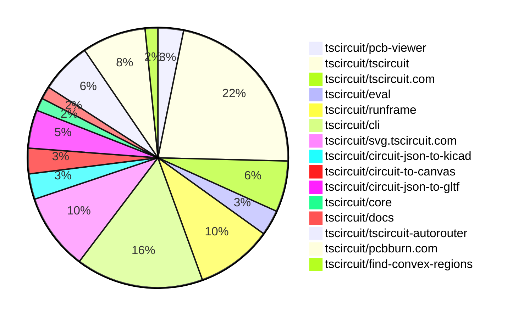

# Contribution Overview 2026-02-17

The current week is shown below. There are 3 major sections:

- [Contributor Overview](#contributor-overview)
- [PRs by Repository](#prs-by-repository)
- [PRs by Contributor](#changes-by-contributor)
- [Scoring & Sponsorship Details](/docs/sponsorship-calculation-explanation.md)

## PRs by Repository

## Contributor Overview

| Contributor | 🐳 Major | 🐙 Minor | 🐌 Tiny | ⭐ | Discussion Contributions |
|-------------|---------|---------|---------|-----|--------------------------|
| [0hmX](#0hmX) | 3 | 0 | 1 | ⭐⭐ | 0🔹 0🔶 0💎 |
| [tscircuitbot](#tscircuitbot) | 0 | 0 | 42 | ⭐⭐ | 0🔹 0🔶 0💎 |
| [AnasSarkiz](#AnasSarkiz) | 2 | 0 | 3 | ⭐⭐ | 0🔹 0🔶 0💎 |
| [imrishabh18](#imrishabh18) | 0 | 3 | 3 | ⭐ | 0🔹 0🔶 0💎 |
| [techmannih](#techmannih) | 0 | 3 | 0 | ⭐ | 0🔹 0🔶 0💎 |
| [MustafaMulla29](#MustafaMulla29) | 1 | 0 | 1 | ⭐ | 0🔹 0🔶 0💎 |
| [seveibar](#seveibar) | 0 | 0 | 1 |  | 0🔹 0🔶 0💎 |

> Note: AI evaluates PRs and assigns 1-3 star ratings automatically. 4 and 5 star ratings require manual staff review.

### Discussion Contribution Legend

- 🔹 Normal Comments: Basic participation with minimal effort
- 🔶 Great Informative Comments: Thoughtful participation that adds value
- 💎 Incredible Comments: Exceptional participation with high-quality content

## Review Table

[reviews-received-hover]: ## "Number of reviews received for PRs for this contributor"
[approvals-received-hover]: ## "Number of approvals received for PRs this contributor authored"
[rejections-received-hover]: ## "Number of rejections received for PRs this contributor authored"
[prs-opened-hover]: ## "Number of PRs opened by this contributor"
[issues-created-hover]: ## "Number of issues created by this contributor"

| Contributor | Reviews Received | Approvals Received | Rejections Received | Approvals | Rejections | PRs Opened | PRs Merged | Issues Created |
|---|---|---|---|---|---|---|---|---|
| [tscircuitbot](#tscircuitbot) | 0 | 0 | 0 | 0 | 0 | 45 | 42 | 0 |
| [techmannih](#techmannih) | 3 | 3 | 0 | 0 | 0 | 3 | 3 | 0 |
| [Abse2001](#Abse2001) | 0 | 0 | 0 | 1 | 0 | 0 | 0 | 0 |
| [makaiachildress-web](#makaiachildress-web) | 2 | 0 | 0 | 0 | 0 | 5 | 0 | 0 |
| [imrishabh18](#imrishabh18) | 0 | 0 | 0 | 1 | 0 | 7 | 6 | 0 |
| [janisag07](#janisag07) | 1 | 0 | 0 | 0 | 0 | 7 | 0 | 0 |
| [ShiboSoftwareDev](#ShiboSoftwareDev) | 0 | 0 | 0 | 0 | 0 | 1 | 0 | 0 |
| [MustafaMulla29](#MustafaMulla29) | 3 | 3 | 0 | 0 | 0 | 4 | 2 | 0 |
| [seveibar](#seveibar) | 0 | 0 | 0 | 4 | 0 | 1 | 1 | 0 |
| [blowmuffin](#blowmuffin) | 1 | 1 | 0 | 0 | 0 | 2 | 0 | 0 |
| [rushabhcodes](#rushabhcodes) | 0 | 0 | 0 | 1 | 0 | 0 | 0 | 0 |
| [0hmX](#0hmX) | 2 | 0 | 0 | 0 | 0 | 5 | 4 | 0 |
| [AnasSarkiz](#AnasSarkiz) | 0 | 0 | 0 | 0 | 0 | 5 | 5 | 0 |

## Changes by Repository

### [tscircuit/pcb-viewer](https://github.com/tscircuit/pcb-viewer)

| PR # | Impact | Rating | Contributor | Description |
|------|--------|--------|-------------|-------------|
| [#666](https://github.com/tscircuit/pcb-viewer/pull/666) | 🐙 Minor | ⭐⭐ | techmannih | Adds support for rendering pcb_courtyard_outline elements in the PCB viewer, allowing for more detailed PCB designs. |

🐌 Tiny Contributions (1)

| PR # | Impact | Contributor | Description |
|------|--------|-------------|-------------|
| [#667](https://github.com/tscircuit/pcb-viewer/pull/667) | 🐌 Tiny | tscircuitbot | Automated package update |

### [tscircuit/tscircuit](https://github.com/tscircuit/tscircuit)

🐌 Tiny Contributions (14)

| PR # | Impact | Contributor | Description |
|------|--------|-------------|-------------|
| [#2257](https://github.com/tscircuit/tscircuit/pull/2257) | 🐌 Tiny | tscircuitbot | Updates the tscircuitcli package to version 0.1.943 in the package.json file |
| [#2253](https://github.com/tscircuit/tscircuit/pull/2253) | 🐌 Tiny | tscircuitbot | Updates the version of the circuit-json-to-gltf package from 0.0.67 to 0.0.65 in package.json |
| [#2260](https://github.com/tscircuit/tscircuit/pull/2260) | 🐌 Tiny | tscircuitbot | Updates the package version from 0.0.1333 to 0.0.1334 in package.json |
| [#2254](https://github.com/tscircuit/tscircuit/pull/2254) | 🐌 Tiny | tscircuitbot | Automated package update |
| [#2250](https://github.com/tscircuit/tscircuit/pull/2250) | 🐌 Tiny | tscircuitbot | Automated package update |
| [#2252](https://github.com/tscircuit/tscircuit/pull/2252) | 🐌 Tiny | tscircuitbot | Automated package update |
| [#2259](https://github.com/tscircuit/tscircuit/pull/2259) | 🐌 Tiny | tscircuitbot | Updates the tscircuitcli package from version 0.1.943 to 0.1.944 and the tscircuitrunframe package from version 0.0.1625 to 0.0.1626 in package.json |
| [#2255](https://github.com/tscircuit/tscircuit/pull/2255) | 🐌 Tiny | tscircuitbot | Automated package update |
| [#2262](https://github.com/tscircuit/tscircuit/pull/2262) | 🐌 Tiny | tscircuitbot | Updates the package version from 0.0.1334 to 0.0.1335 in package.json |
| [#2258](https://github.com/tscircuit/tscircuit/pull/2258) | 🐌 Tiny | tscircuitbot | Automated package update |
| [#2256](https://github.com/tscircuit/tscircuit/pull/2256) | 🐌 Tiny | tscircuitbot | Automated package update |
| [#2249](https://github.com/tscircuit/tscircuit/pull/2249) | 🐌 Tiny | tscircuitbot | Automated package update |
| [#2261](https://github.com/tscircuit/tscircuit/pull/2261) | 🐌 Tiny | tscircuitbot | Updates the tscircuitcli package to version 0.1.945 in package.json |
| [#2251](https://github.com/tscircuit/tscircuit/pull/2251) | 🐌 Tiny | imrishabh18 | Updates the version of the circuit-json-to-gltf dependency from 0.0.65 to 0.0.67 in package.json |

### [tscircuit/tscircuit.com](https://github.com/tscircuit/tscircuit.com)

🐌 Tiny Contributions (4)

| PR # | Impact | Contributor | Description |
|------|--------|-------------|-------------|
| [#2781](https://github.com/tscircuit/tscircuit.com/pull/2781) | 🐌 Tiny | tscircuitbot | Automated package update |
| [#2780](https://github.com/tscircuit/tscircuit.com/pull/2780) | 🐌 Tiny | tscircuitbot | Automated package update |
| [#2779](https://github.com/tscircuit/tscircuit.com/pull/2779) | 🐌 Tiny | tscircuitbot | Automated package update |
| [#2782](https://github.com/tscircuit/tscircuit.com/pull/2782) | 🐌 Tiny | tscircuitbot | Updates the tscircuitrunframe package from version 0.0.1625 to 0.0.1626 |

### [tscircuit/eval](https://github.com/tscircuit/eval)

🐌 Tiny Contributions (2)

| PR # | Impact | Contributor | Description |
|------|--------|-------------|-------------|
| [#2071](https://github.com/tscircuit/eval/pull/2071) | 🐌 Tiny | tscircuitbot | Updates the versions of the tscircuitcore and circuit-json-to-gltf packages in package.json |
| [#2072](https://github.com/tscircuit/eval/pull/2072) | 🐌 Tiny | tscircuitbot | Automated package update to version 0.0.648 |

### [tscircuit/runframe](https://github.com/tscircuit/runframe)

🐌 Tiny Contributions (6)

| PR # | Impact | Contributor | Description |
|------|--------|-------------|-------------|
| [#2674](https://github.com/tscircuit/runframe/pull/2674) | 🐌 Tiny | tscircuitbot | Updates the circuit-json-to-kicad package version from 0.0.72 to 0.0.73 in package.json |
| [#2671](https://github.com/tscircuit/runframe/pull/2671) | 🐌 Tiny | tscircuitbot | Updates the tscircuiteval package to version 0.0.648 |
| [#2669](https://github.com/tscircuit/runframe/pull/2669) | 🐌 Tiny | tscircuitbot | Updates the tscircuitpcb-viewer package from version 1.11.339 to 1.11.340 |
| [#2675](https://github.com/tscircuit/runframe/pull/2675) | 🐌 Tiny | tscircuitbot | Automated package update |
| [#2672](https://github.com/tscircuit/runframe/pull/2672) | 🐌 Tiny | tscircuitbot | Automated package update |
| [#2670](https://github.com/tscircuit/runframe/pull/2670) | 🐌 Tiny | tscircuitbot | Automated package update |

### [tscircuit/cli](https://github.com/tscircuit/cli)

| PR # | Impact | Rating | Contributor | Description |
|------|--------|--------|-------------|-------------|
| [#2043](https://github.com/tscircuit/cli/pull/2043) | 🐙 Minor | ⭐⭐ | imrishabh18 | Fixes a bug where the authRegex was missing a capture group, causing failure to read the authToken correctly. |
| [#2038](https://github.com/tscircuit/cli/pull/2038) | 🐙 Minor | ⭐⭐ | imrishabh18 | Adds support for relative paths in circuit-json for GLTF conversion, allowing users to reference CAD models using relative URLs. |

🐌 Tiny Contributions (8)

| PR # | Impact | Contributor | Description |
|------|--------|-------------|-------------|
| [#2044](https://github.com/tscircuit/cli/pull/2044) | 🐌 Tiny | tscircuitbot | Updates the package version from v0.1.944 to v0.1.945 in package.json |
| [#2041](https://github.com/tscircuit/cli/pull/2041) | 🐌 Tiny | tscircuitbot | Updates the package version from v0.1.943 to v0.1.944 in package.json |
| [#2040](https://github.com/tscircuit/cli/pull/2040) | 🐌 Tiny | tscircuitbot | Updates the tscircuitrunframe package from version 0.0.1625 to 0.0.1626 |
| [#2039](https://github.com/tscircuit/cli/pull/2039) | 🐌 Tiny | tscircuitbot | Updates the package version from v0.1.942 to v0.1.943 in package.json |
| [#2037](https://github.com/tscircuit/cli/pull/2037) | 🐌 Tiny | tscircuitbot | Automated package update |
| [#2036](https://github.com/tscircuit/cli/pull/2036) | 🐌 Tiny | tscircuitbot | Updates the tscircuitrunframe package from version 0.0.1624 to 0.0.1625 |
| [#2035](https://github.com/tscircuit/cli/pull/2035) | 🐌 Tiny | tscircuitbot | Updates the package version from v0.1.940 to v0.1.941 in package.json |
| [#2034](https://github.com/tscircuit/cli/pull/2034) | 🐌 Tiny | tscircuitbot | Updates the tscircuitrunframe package from version 0.0.1623 to 0.0.1624 |

### [tscircuit/svg.tscircuit.com](https://github.com/tscircuit/svg.tscircuit.com)

🐌 Tiny Contributions (6)

| PR # | Impact | Contributor | Description |
|------|--------|-------------|-------------|
| [#1019](https://github.com/tscircuit/svg.tscircuit.com/pull/1019) | 🐌 Tiny | tscircuitbot | Updates the tscircuit package version from 0.0.1329 to 0.0.1330 in package.json |
| [#1022](https://github.com/tscircuit/svg.tscircuit.com/pull/1022) | 🐌 Tiny | tscircuitbot | Updates the tscircuit package version from 0.0.1332 to 0.0.1333 in package.json |
| [#1021](https://github.com/tscircuit/svg.tscircuit.com/pull/1021) | 🐌 Tiny | tscircuitbot | Updates the tscircuit package version from 0.0.1330 to 0.0.1332 in package.json |
| [#1023](https://github.com/tscircuit/svg.tscircuit.com/pull/1023) | 🐌 Tiny | tscircuitbot | Updates the tscircuit package version from 0.0.1333 to 0.0.1334 in package.json |
| [#1024](https://github.com/tscircuit/svg.tscircuit.com/pull/1024) | 🐌 Tiny | tscircuitbot | Updates the tscircuit package version from 0.0.1334 to 0.0.1335 in package.json |
| [#1018](https://github.com/tscircuit/svg.tscircuit.com/pull/1018) | 🐌 Tiny | tscircuitbot | Updates the tscircuit package version from 0.0.1328 to 0.0.1329 in package.json |

### [tscircuit/circuit-json-to-kicad](https://github.com/tscircuit/circuit-json-to-kicad)

| PR # | Impact | Rating | Contributor | Description |
|------|--------|--------|-------------|-------------|
| [#134](https://github.com/tscircuit/circuit-json-to-kicad/pull/134) | 🐳 Major | ⭐⭐⭐ | MustafaMulla29 | Adds support for applying kicadFootprintMetadata and kicadSymbolMetadata to enhance the generation of KiCad projects with component-specific metadata. |

🐌 Tiny Contributions (1)

| PR # | Impact | Contributor | Description |
|------|--------|-------------|-------------|
| [#135](https://github.com/tscircuit/circuit-json-to-kicad/pull/135) | 🐌 Tiny | tscircuitbot | Automated package update |

### [tscircuit/circuit-to-canvas](https://github.com/tscircuit/circuit-to-canvas)

| PR # | Impact | Rating | Contributor | Description |
|------|--------|--------|-------------|-------------|
| [#180](https://github.com/tscircuit/circuit-to-canvas/pull/180) | 🐙 Minor | ⭐⭐ | techmannih | Refactors the PCB silkscreen text drawing logic to utilize a shared drawText utility, improving code maintainability and functionality for mirroring and knockout backgrounds. |

🐌 Tiny Contributions (1)

| PR # | Impact | Contributor | Description |
|------|--------|-------------|-------------|
| [#181](https://github.com/tscircuit/circuit-to-canvas/pull/181) | 🐌 Tiny | tscircuitbot | Automated package update |

### [tscircuit/circuit-json-to-gltf](https://github.com/tscircuit/circuit-json-to-gltf)

| PR # | Impact | Rating | Contributor | Description |
|------|--------|--------|-------------|-------------|
| [#122](https://github.com/tscircuit/circuit-json-to-gltf/pull/122) | 🐙 Minor | ⭐⭐ | techmannih | Add a test for rendering translucent CAD models in GLTF format, ensuring correct visual output. |
| [#123](https://github.com/tscircuit/circuit-json-to-gltf/pull/123) | 🐙 Minor | ⭐⭐ | imrishabh18 | Changes the parameters for resolving the download endpoint to use projectBaseUrl and authHeaders instead of platformConfig. |

🐌 Tiny Contributions (1)

| PR # | Impact | Contributor | Description |
|------|--------|-------------|-------------|
| [#124](https://github.com/tscircuit/circuit-json-to-gltf/pull/124) | 🐌 Tiny | imrishabh18 | Removes console.log statements from the fetchAsArrayBuffer and loadSTEP functions to clean up the codebase and improve performance. |

### [tscircuit/core](https://github.com/tscircuit/core)

🐌 Tiny Contributions (1)

| PR # | Impact | Contributor | Description |
|------|--------|-------------|-------------|
| [#1948](https://github.com/tscircuit/core/pull/1948) | 🐌 Tiny | imrishabh18 | Updates the version of the circuit-json-to-gltf dependency from 0.0.65 to 0.0.68 in package.json |

### [tscircuit/docs](https://github.com/tscircuit/docs)

🐌 Tiny Contributions (1)

| PR # | Impact | Contributor | Description |
|------|--------|-------------|-------------|
| [#458](https://github.com/tscircuit/docs/pull/458) | 🐌 Tiny | MustafaMulla29 | Adds documentation for the --kicad-project flag and the kicadProjectEntrypointPath configuration option for KiCad project generation. |

### [tscircuit/tscircuit-autorouter](https://github.com/tscircuit/tscircuit-autorouter)

| PR # | Impact | Rating | Contributor | Description |
|------|--------|--------|-------------|-------------|
| [#563](https://github.com/tscircuit/tscircuit-autorouter/pull/563) | 🐳 Major | ⭐⭐⭐ | 0hmX | Refactor HgPortPointPathingSolverParams to use weights object and enable ripping options, adding good logging, center optimization, straight line deviation, Memory-Pf Heuristic Bias, Solver2-Style Ripping Loop, and board score calculation. |
| [#564](https://github.com/tscircuit/tscircuit-autorouter/pull/564) | 🐳 Major | ⭐⭐⭐ | 0hmX | Adds validation checks to ensure connection points are on the correct layer and at the center of the targeted pad. |
| [#566](https://github.com/tscircuit/tscircuit-autorouter/pull/566) | 🐳 Major | ⭐⭐⭐ | 0hmX | Adds error handling for invalid port points in the SingleTransitionCrossingRouteSolver, ensuring only valid boundary points are processed. |

🐌 Tiny Contributions (1)

| PR # | Impact | Contributor | Description |
|------|--------|-------------|-------------|
| [#565](https://github.com/tscircuit/tscircuit-autorouter/pull/565) | 🐌 Tiny | 0hmX | Increases the benchmark timeout from 30 minutes to 360 minutes in the GitHub Actions workflow configuration. |

### [tscircuit/pcbburn.com](https://github.com/tscircuit/pcbburn.com)

| PR # | Impact | Rating | Contributor | Description |
|------|--------|--------|-------------|-------------|
| [#69](https://github.com/tscircuit/pcbburn.com/pull/69) | 🐳 Major | ⭐⭐⭐ | AnasSarkiz | Introduces a reusable ErrorBoundary component that catches unhandled render and lifecycle errors, prevents full-app crashes, displays a safe fallback UI, logs error information, and allows localized recovery via a reset action. |
| [#71](https://github.com/tscircuit/pcbburn.com/pull/71) | 🐳 Major | ⭐⭐⭐ | AnasSarkiz | Add SVG snapshot testing via bun-match-svg to ensure stable, regression-proof SVG output |

🐌 Tiny Contributions (3)

| PR # | Impact | Contributor | Description |
|------|--------|-------------|-------------|
| [#72](https://github.com/tscircuit/pcbburn.com/pull/72) | 🐌 Tiny | AnasSarkiz | This pull request introduces tests for the functions convertCircuitJsonToPcbSvg and generateLightBurnSvg, enhancing the reliability and maintainability of the codebase by ensuring that these functions behave as expected under various conditions. The addition of a new dependency, stack-svgs, is also included to support the new functionality. |
| [#70](https://github.com/tscircuit/pcbburn.com/pull/70) | 🐌 Tiny | AnasSarkiz | Updates the circuitJson to LBRN converter to enforce explicit Q-pulse width across all LBRN laser operations by updating the dependency version. |
| [#68](https://github.com/tscircuit/pcbburn.com/pull/68) | 🐌 Tiny | AnasSarkiz | Updates the circuit-to-svg dependency version from 0.0.316 to 0.0.328 in package.json |

### [tscircuit/find-convex-regions](https://github.com/tscircuit/find-convex-regions)

🐌 Tiny Contributions (1)

| PR # | Impact | Contributor | Description |
|------|--------|-------------|-------------|
| [#1](https://github.com/tscircuit/find-convex-regions/pull/1) | 🐌 Tiny | seveibar | Adds a new React component for visualizing staggered jumpers in convex regions, including associated tests and fixtures. |

## Changes by Contributor

### [tscircuitbot](https://github.com/tscircuitbot)

🐌 Tiny Contributions (42)

| PR # | Impact | Description |
|------|--------|-------------|
| [#667](https://github.com/tscircuit/pcb-viewer/pull/667) | 🐌 Tiny | Automated package update |
| [#2257](https://github.com/tscircuit/tscircuit/pull/2257) | 🐌 Tiny | Updates the tscircuitcli package to version 0.1.943 in the package.json file |
| [#2253](https://github.com/tscircuit/tscircuit/pull/2253) | 🐌 Tiny | Updates the version of the circuit-json-to-gltf package from 0.0.67 to 0.0.65 in package.json |
| [#2260](https://github.com/tscircuit/tscircuit/pull/2260) | 🐌 Tiny | Updates the package version from 0.0.1333 to 0.0.1334 in package.json |
| [#2254](https://github.com/tscircuit/tscircuit/pull/2254) | 🐌 Tiny | Automated package update |
| [#2250](https://github.com/tscircuit/tscircuit/pull/2250) | 🐌 Tiny | Automated package update |
| [#2252](https://github.com/tscircuit/tscircuit/pull/2252) | 🐌 Tiny | Automated package update |
| [#2259](https://github.com/tscircuit/tscircuit/pull/2259) | 🐌 Tiny | Updates the tscircuitcli package from version 0.1.943 to 0.1.944 and the tscircuitrunframe package from version 0.0.1625 to 0.0.1626 in package.json |
| [#2255](https://github.com/tscircuit/tscircuit/pull/2255) | 🐌 Tiny | Automated package update |
| [#2262](https://github.com/tscircuit/tscircuit/pull/2262) | 🐌 Tiny | Updates the package version from 0.0.1334 to 0.0.1335 in package.json |
| [#2258](https://github.com/tscircuit/tscircuit/pull/2258) | 🐌 Tiny | Automated package update |
| [#2256](https://github.com/tscircuit/tscircuit/pull/2256) | 🐌 Tiny | Automated package update |
| [#2249](https://github.com/tscircuit/tscircuit/pull/2249) | 🐌 Tiny | Automated package update |
| [#2261](https://github.com/tscircuit/tscircuit/pull/2261) | 🐌 Tiny | Updates the tscircuitcli package to version 0.1.945 in package.json |
| [#2781](https://github.com/tscircuit/tscircuit.com/pull/2781) | 🐌 Tiny | Automated package update |
| [#2780](https://github.com/tscircuit/tscircuit.com/pull/2780) | 🐌 Tiny | Automated package update |
| [#2779](https://github.com/tscircuit/tscircuit.com/pull/2779) | 🐌 Tiny | Automated package update |
| [#2782](https://github.com/tscircuit/tscircuit.com/pull/2782) | 🐌 Tiny | Updates the tscircuitrunframe package from version 0.0.1625 to 0.0.1626 |
| [#2071](https://github.com/tscircuit/eval/pull/2071) | 🐌 Tiny | Updates the versions of the tscircuitcore and circuit-json-to-gltf packages in package.json |
| [#2072](https://github.com/tscircuit/eval/pull/2072) | 🐌 Tiny | Automated package update to version 0.0.648 |
| [#2674](https://github.com/tscircuit/runframe/pull/2674) | 🐌 Tiny | Updates the circuit-json-to-kicad package version from 0.0.72 to 0.0.73 in package.json |
| [#2671](https://github.com/tscircuit/runframe/pull/2671) | 🐌 Tiny | Updates the tscircuiteval package to version 0.0.648 |
| [#2669](https://github.com/tscircuit/runframe/pull/2669) | 🐌 Tiny | Updates the tscircuitpcb-viewer package from version 1.11.339 to 1.11.340 |
| [#2675](https://github.com/tscircuit/runframe/pull/2675) | 🐌 Tiny | Automated package update |
| [#2672](https://github.com/tscircuit/runframe/pull/2672) | 🐌 Tiny | Automated package update |
| [#2670](https://github.com/tscircuit/runframe/pull/2670) | 🐌 Tiny | Automated package update |
| [#2044](https://github.com/tscircuit/cli/pull/2044) | 🐌 Tiny | Updates the package version from v0.1.944 to v0.1.945 in package.json |
| [#2041](https://github.com/tscircuit/cli/pull/2041) | 🐌 Tiny | Updates the package version from v0.1.943 to v0.1.944 in package.json |
| [#2040](https://github.com/tscircuit/cli/pull/2040) | 🐌 Tiny | Updates the tscircuitrunframe package from version 0.0.1625 to 0.0.1626 |
| [#2039](https://github.com/tscircuit/cli/pull/2039) | 🐌 Tiny | Updates the package version from v0.1.942 to v0.1.943 in package.json |
| [#2037](https://github.com/tscircuit/cli/pull/2037) | 🐌 Tiny | Automated package update |
| [#2036](https://github.com/tscircuit/cli/pull/2036) | 🐌 Tiny | Updates the tscircuitrunframe package from version 0.0.1624 to 0.0.1625 |
| [#2035](https://github.com/tscircuit/cli/pull/2035) | 🐌 Tiny | Updates the package version from v0.1.940 to v0.1.941 in package.json |
| [#2034](https://github.com/tscircuit/cli/pull/2034) | 🐌 Tiny | Updates the tscircuitrunframe package from version 0.0.1623 to 0.0.1624 |
| [#1019](https://github.com/tscircuit/svg.tscircuit.com/pull/1019) | 🐌 Tiny | Updates the tscircuit package version from 0.0.1329 to 0.0.1330 in package.json |
| [#1022](https://github.com/tscircuit/svg.tscircuit.com/pull/1022) | 🐌 Tiny | Updates the tscircuit package version from 0.0.1332 to 0.0.1333 in package.json |
| [#1021](https://github.com/tscircuit/svg.tscircuit.com/pull/1021) | 🐌 Tiny | Updates the tscircuit package version from 0.0.1330 to 0.0.1332 in package.json |
| [#1023](https://github.com/tscircuit/svg.tscircuit.com/pull/1023) | 🐌 Tiny | Updates the tscircuit package version from 0.0.1333 to 0.0.1334 in package.json |
| [#1024](https://github.com/tscircuit/svg.tscircuit.com/pull/1024) | 🐌 Tiny | Updates the tscircuit package version from 0.0.1334 to 0.0.1335 in package.json |
| [#1018](https://github.com/tscircuit/svg.tscircuit.com/pull/1018) | 🐌 Tiny | Updates the tscircuit package version from 0.0.1328 to 0.0.1329 in package.json |
| [#135](https://github.com/tscircuit/circuit-json-to-kicad/pull/135) | 🐌 Tiny | Automated package update |
| [#181](https://github.com/tscircuit/circuit-to-canvas/pull/181) | 🐌 Tiny | Automated package update |

### [techmannih](https://github.com/techmannih)

| PRs # | Impact | Rating | Description |
|------|--------|--------|-------------|
| [#666](https://github.com/tscircuit/pcb-viewer/pull/666) | 🐙 Minor | ⭐⭐ | Adds support for rendering pcb_courtyard_outline elements in the PCB viewer, allowing for more detailed PCB designs. |
| [#122](https://github.com/tscircuit/circuit-json-to-gltf/pull/122) | 🐙 Minor | ⭐⭐ | Add a test for rendering translucent CAD models in GLTF format, ensuring correct visual output. |
| [#180](https://github.com/tscircuit/circuit-to-canvas/pull/180) | 🐙 Minor | ⭐⭐ | Refactors the PCB silkscreen text drawing logic to utilize a shared drawText utility, improving code maintainability and functionality for mirroring and knockout backgrounds. |

### [imrishabh18](https://github.com/imrishabh18)

| PRs # | Impact | Rating | Description |
|------|--------|--------|-------------|
| [#2043](https://github.com/tscircuit/cli/pull/2043) | 🐙 Minor | ⭐⭐ | Fixes a bug where the authRegex was missing a capture group, causing failure to read the authToken correctly. |
| [#2038](https://github.com/tscircuit/cli/pull/2038) | 🐙 Minor | ⭐⭐ | Adds support for relative paths in circuit-json for GLTF conversion, allowing users to reference CAD models using relative URLs. |
| [#123](https://github.com/tscircuit/circuit-json-to-gltf/pull/123) | 🐙 Minor | ⭐⭐ | Changes the parameters for resolving the download endpoint to use projectBaseUrl and authHeaders instead of platformConfig. |

🐌 Tiny Contributions (3)

| PR # | Impact | Description |
|------|--------|-------------|
| [#2251](https://github.com/tscircuit/tscircuit/pull/2251) | 🐌 Tiny | Updates the version of the circuit-json-to-gltf dependency from 0.0.65 to 0.0.67 in package.json |
| [#1948](https://github.com/tscircuit/core/pull/1948) | 🐌 Tiny | Updates the version of the circuit-json-to-gltf dependency from 0.0.65 to 0.0.68 in package.json |
| [#124](https://github.com/tscircuit/circuit-json-to-gltf/pull/124) | 🐌 Tiny | Removes console.log statements from the fetchAsArrayBuffer and loadSTEP functions to clean up the codebase and improve performance. |

### [MustafaMulla29](https://github.com/MustafaMulla29)

| PRs # | Impact | Rating | Description |
|------|--------|--------|-------------|
| [#134](https://github.com/tscircuit/circuit-json-to-kicad/pull/134) | 🐳 Major | ⭐⭐⭐ | Adds support for applying kicadFootprintMetadata and kicadSymbolMetadata to enhance the generation of KiCad projects with component-specific metadata. |

🐌 Tiny Contributions (1)

| PR # | Impact | Description |
|------|--------|-------------|
| [#458](https://github.com/tscircuit/docs/pull/458) | 🐌 Tiny | Adds documentation for the --kicad-project flag and the kicadProjectEntrypointPath configuration option for KiCad project generation. |

### [0hmX](https://github.com/0hmX)

| PRs # | Impact | Rating | Description |
|------|--------|--------|-------------|
| [#563](https://github.com/tscircuit/tscircuit-autorouter/pull/563) | 🐳 Major | ⭐⭐⭐ | Refactor HgPortPointPathingSolverParams to use weights object and enable ripping options, adding good logging, center optimization, straight line deviation, Memory-Pf Heuristic Bias, Solver2-Style Ripping Loop, and board score calculation. |
| [#564](https://github.com/tscircuit/tscircuit-autorouter/pull/564) | 🐳 Major | ⭐⭐⭐ | Adds validation checks to ensure connection points are on the correct layer and at the center of the targeted pad. |
| [#566](https://github.com/tscircuit/tscircuit-autorouter/pull/566) | 🐳 Major | ⭐⭐⭐ | Adds error handling for invalid port points in the SingleTransitionCrossingRouteSolver, ensuring only valid boundary points are processed. |

🐌 Tiny Contributions (1)

| PR # | Impact | Description |
|------|--------|-------------|
| [#565](https://github.com/tscircuit/tscircuit-autorouter/pull/565) | 🐌 Tiny | Increases the benchmark timeout from 30 minutes to 360 minutes in the GitHub Actions workflow configuration. |

### [AnasSarkiz](https://github.com/AnasSarkiz)

| PRs # | Impact | Rating | Description |
|------|--------|--------|-------------|
| [#69](https://github.com/tscircuit/pcbburn.com/pull/69) | 🐳 Major | ⭐⭐⭐ | Introduces a reusable ErrorBoundary component that catches unhandled render and lifecycle errors, prevents full-app crashes, displays a safe fallback UI, logs error information, and allows localized recovery via a reset action. |
| [#71](https://github.com/tscircuit/pcbburn.com/pull/71) | 🐳 Major | ⭐⭐⭐ | Add SVG snapshot testing via bun-match-svg to ensure stable, regression-proof SVG output |

🐌 Tiny Contributions (3)

| PR # | Impact | Description |
|------|--------|-------------|
| [#72](https://github.com/tscircuit/pcbburn.com/pull/72) | 🐌 Tiny | This pull request introduces tests for the functions convertCircuitJsonToPcbSvg and generateLightBurnSvg, enhancing the reliability and maintainability of the codebase by ensuring that these functions behave as expected under various conditions. The addition of a new dependency, stack-svgs, is also included to support the new functionality. |
| [#70](https://github.com/tscircuit/pcbburn.com/pull/70) | 🐌 Tiny | Updates the circuitJson to LBRN converter to enforce explicit Q-pulse width across all LBRN laser operations by updating the dependency version. |
| [#68](https://github.com/tscircuit/pcbburn.com/pull/68) | 🐌 Tiny | Updates the circuit-to-svg dependency version from 0.0.316 to 0.0.328 in package.json |

### [seveibar](https://github.com/seveibar)

🐌 Tiny Contributions (1)

| PR # | Impact | Description |
|------|--------|-------------|
| [#1](https://github.com/tscircuit/find-convex-regions/pull/1) | 🐌 Tiny | Adds a new React component for visualizing staggered jumpers in convex regions, including associated tests and fixtures. |

## Repository Owners

| Repository | Codeowners |
|------------|------------|
| [builder](https://github.com/tscircuit/builder/blob/main/.github/CODEOWNERS) | [seveibar](https://github.com/seveibar)
| [pcb-viewer](https://github.com/tscircuit/pcb-viewer/blob/main/.github/CODEOWNERS) | [seveibar](https://github.com/seveibar), [ShiboSoftwareDev](https://github.com/ShiboSoftwareDev), [Abse2001](https://github.com/Abse2001)
| [footprints-old](https://github.com/tscircuit/footprints-old/blob/main/.github/CODEOWNERS) | [seveibar](https://github.com/seveibar)
| [footprinter](https://github.com/tscircuit/footprinter/blob/main/.github/CODEOWNERS) | [seveibar](https://github.com/seveibar), [techmannih](https://github.com/techmannih)
| [3d-viewer](https://github.com/tscircuit/3d-viewer/blob/main/.github/CODEOWNERS) | [ShiboSoftwareDev](https://github.com/ShiboSoftwareDev), [Abse2001](https://github.com/Abse2001)
| [winterspec](https://github.com/tscircuit/winterspec/blob/main/.github/CODEOWNERS) | [seveibar](https://github.com/seveibar), [ShiboSoftwareDev](https://github.com/ShiboSoftwareDev)
| [jscad-electronics](https://github.com/tscircuit/jscad-electronics/blob/main/.github/CODEOWNERS) | [seveibar](https://github.com/seveibar), [techmannih](https://github.com/techmannih), [ShiboSoftwareDev](https://github.com/ShiboSoftwareDev), [anas-sarkez](https://github.com/anas-sarkez)
| [circuit-to-svg](https://github.com/tscircuit/circuit-to-svg/blob/main/.github/CODEOWNERS) | [imrishabh18](https://github.com/imrishabh18)
| [schematic-symbols](https://github.com/tscircuit/schematic-symbols/blob/main/.github/CODEOWNERS) | [seveibar](https://github.com/seveibar), [imrishabh18](https://github.com/imrishabh18), [techmannih](https://github.com/techmannih)
| [circuit-json-to-gerber](https://github.com/tscircuit/circuit-json-to-gerber/blob/main/.github/CODEOWNERS) | [seveibar](https://github.com/seveibar), [ShiboSoftwareDev](https://github.com/ShiboSoftwareDev)
| [tscircuit.com](https://github.com/tscircuit/tscircuit.com/blob/main/.github/CODEOWNERS) | [seveibar](https://github.com/seveibar), [imrishabh18](https://github.com/imrishabh18)
| [issue-roulette](https://github.com/tscircuit/issue-roulette/blob/main/.github/CODEOWNERS) | [Anshgrover23](https://github.com/Anshgrover23)
| [sparkfun-boards](https://github.com/tscircuit/sparkfun-boards/blob/main/.github/CODEOWNERS) | [ShiboSoftwareDev](https://github.com/ShiboSoftwareDev), [Abse2001](https://github.com/Abse2001), [MustafaMulla29](https://github.com/MustafaMulla29), [Anshgrover23](https://github.com/Anshgrover23), [techmannih](https://github.com/techmannih)
| [schematic-corpus](https://github.com/tscircuit/schematic-corpus/blob/main/.github/CODEOWNERS) | [Abse2001](https://github.com/Abse2001)
| [copper-pour-solver](https://github.com/tscircuit/copper-pour-solver/blob/main/.github/CODEOWNERS) | [seveibar](https://github.com/seveibar), [ShiboSoftwareDev](https://github.com/ShiboSoftwareDev)
| [common](https://github.com/tscircuit/common/blob/main/.github/CODEOWNERS) | [seveibar](https://github.com/seveibar), [Abse2001](https://github.com/Abse2001)
| [circuit-to-canvas](https://github.com/tscircuit/circuit-to-canvas/blob/main/.github/CODEOWNERS) | [ShiboSoftwareDev](https://github.com/ShiboSoftwareDev), [Abse2001](https://github.com/Abse2001), [techmannih](https://github.com/techmannih)
| [circuit-json-to-lbrn](https://github.com/tscircuit/circuit-json-to-lbrn/blob/main/.github/CODEOWNERS) | [AnasSarkiz](https://github.com/AnasSarkiz)
| [pcbburn.com](https://github.com/tscircuit/pcbburn.com/blob/main/.github/CODEOWNERS) | [AnasSarkiz](https://github.com/AnasSarkiz)

## Repositories by Owner

| User | Repo |
|------|------|
| [seveibar](https://github.com/seveibar) | [builder](https://github.com/tscircuit/builder/blob/main/.github/CODEOWNERS) |
|  | [pcb-viewer](https://github.com/tscircuit/pcb-viewer/blob/main/.github/CODEOWNERS) |
|  | [footprints-old](https://github.com/tscircuit/footprints-old/blob/main/.github/CODEOWNERS) |
|  | [footprinter](https://github.com/tscircuit/footprinter/blob/main/.github/CODEOWNERS) |
|  | [winterspec](https://github.com/tscircuit/winterspec/blob/main/.github/CODEOWNERS) |
|  | [jscad-electronics](https://github.com/tscircuit/jscad-electronics/blob/main/.github/CODEOWNERS) |
|  | [schematic-symbols](https://github.com/tscircuit/schematic-symbols/blob/main/.github/CODEOWNERS) |
|  | [circuit-json-to-gerber](https://github.com/tscircuit/circuit-json-to-gerber/blob/main/.github/CODEOWNERS) |
|  | [tscircuit.com](https://github.com/tscircuit/tscircuit.com/blob/main/.github/CODEOWNERS) |
|  | [copper-pour-solver](https://github.com/tscircuit/copper-pour-solver/blob/main/.github/CODEOWNERS) |
|  | [common](https://github.com/tscircuit/common/blob/main/.github/CODEOWNERS) |
| [ShiboSoftwareDev](https://github.com/ShiboSoftwareDev) | [pcb-viewer](https://github.com/tscircuit/pcb-viewer/blob/main/.github/CODEOWNERS) |
|  | [3d-viewer](https://github.com/tscircuit/3d-viewer/blob/main/.github/CODEOWNERS) |
|  | [winterspec](https://github.com/tscircuit/winterspec/blob/main/.github/CODEOWNERS) |
|  | [jscad-electronics](https://github.com/tscircuit/jscad-electronics/blob/main/.github/CODEOWNERS) |
|  | [circuit-json-to-gerber](https://github.com/tscircuit/circuit-json-to-gerber/blob/main/.github/CODEOWNERS) |
|  | [sparkfun-boards](https://github.com/tscircuit/sparkfun-boards/blob/main/.github/CODEOWNERS) |
|  | [copper-pour-solver](https://github.com/tscircuit/copper-pour-solver/blob/main/.github/CODEOWNERS) |
|  | [circuit-to-canvas](https://github.com/tscircuit/circuit-to-canvas/blob/main/.github/CODEOWNERS) |
| [Abse2001](https://github.com/Abse2001) | [pcb-viewer](https://github.com/tscircuit/pcb-viewer/blob/main/.github/CODEOWNERS) |
|  | [3d-viewer](https://github.com/tscircuit/3d-viewer/blob/main/.github/CODEOWNERS) |
|  | [sparkfun-boards](https://github.com/tscircuit/sparkfun-boards/blob/main/.github/CODEOWNERS) |
|  | [schematic-corpus](https://github.com/tscircuit/schematic-corpus/blob/main/.github/CODEOWNERS) |
|  | [common](https://github.com/tscircuit/common/blob/main/.github/CODEOWNERS) |
|  | [circuit-to-canvas](https://github.com/tscircuit/circuit-to-canvas/blob/main/.github/CODEOWNERS) |
| [techmannih](https://github.com/techmannih) | [footprinter](https://github.com/tscircuit/footprinter/blob/main/.github/CODEOWNERS) |
|  | [jscad-electronics](https://github.com/tscircuit/jscad-electronics/blob/main/.github/CODEOWNERS) |
|  | [schematic-symbols](https://github.com/tscircuit/schematic-symbols/blob/main/.github/CODEOWNERS) |
|  | [sparkfun-boards](https://github.com/tscircuit/sparkfun-boards/blob/main/.github/CODEOWNERS) |
|  | [circuit-to-canvas](https://github.com/tscircuit/circuit-to-canvas/blob/main/.github/CODEOWNERS) |
| [anas-sarkez](https://github.com/anas-sarkez) | [jscad-electronics](https://github.com/tscircuit/jscad-electronics/blob/main/.github/CODEOWNERS) |
| [imrishabh18](https://github.com/imrishabh18) | [circuit-to-svg](https://github.com/tscircuit/circuit-to-svg/blob/main/.github/CODEOWNERS) |
|  | [schematic-symbols](https://github.com/tscircuit/schematic-symbols/blob/main/.github/CODEOWNERS) |
|  | [tscircuit.com](https://github.com/tscircuit/tscircuit.com/blob/main/.github/CODEOWNERS) |
| [Anshgrover23](https://github.com/Anshgrover23) | [issue-roulette](https://github.com/tscircuit/issue-roulette/blob/main/.github/CODEOWNERS) |
|  | [sparkfun-boards](https://github.com/tscircuit/sparkfun-boards/blob/main/.github/CODEOWNERS) |
| [MustafaMulla29](https://github.com/MustafaMulla29) | [sparkfun-boards](https://github.com/tscircuit/sparkfun-boards/blob/main/.github/CODEOWNERS) |
| [AnasSarkiz](https://github.com/AnasSarkiz) | [circuit-json-to-lbrn](https://github.com/tscircuit/circuit-json-to-lbrn/blob/main/.github/CODEOWNERS) |
|  | [pcbburn.com](https://github.com/tscircuit/pcbburn.com/blob/main/.github/CODEOWNERS) |

