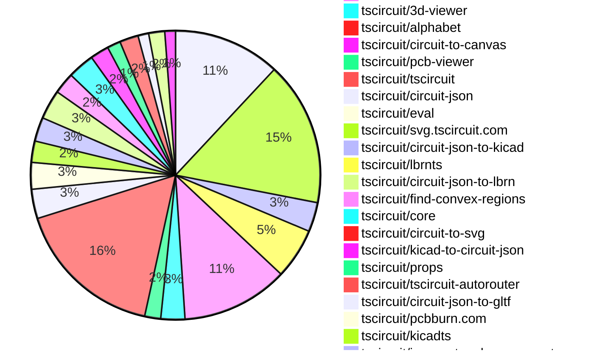

# Contribution Overview 2026-02-17

The current week is shown below. There are 3 major sections:

- [Contributor Overview](#contributor-overview)
- [PRs by Repository](#prs-by-repository)
- [PRs by Contributor](#changes-by-contributor)
- [Scoring & Sponsorship Details](/docs/sponsorship-calculation-explanation.md)

## PRs by Repository

## Contributor Overview

| Contributor | 🐳 Major | 🐙 Minor | 🐌 Tiny | ⭐ | Discussion Contributions |
|-------------|---------|---------|---------|-----|--------------------------|
| [seveibar](#seveibar) | 22 | 6 | 4 | 👑 | 0🔹 0🔶 0💎 |
| [imrishabh18](#imrishabh18) | 6 | 5 | 6 | ⭐⭐⭐ | 0🔹 0🔶 0💎 |
| [techmannih](#techmannih) | 3 | 7 | 3 | ⭐⭐⭐ | 0🔹 0🔶 0💎 |
| [ShiboSoftwareDev](#ShiboSoftwareDev) | 3 | 6 | 4 | ⭐⭐⭐ | 0🔹 0🔶 0💎 |
| [Abse2001](#Abse2001) | 5 | 4 | 3 | ⭐⭐⭐ | 0🔹 0🔶 0💎 |
| [rushabhcodes](#rushabhcodes) | 3 | 1 | 10 | ⭐⭐ | 0🔹 0🔶 0💎 |
| [AnasSarkiz](#AnasSarkiz) | 4 | 4 | 2 | ⭐⭐ | 0🔹 0🔶 0💎 |
| [ArnavK-09](#ArnavK-09) | 2 | 3 | 3 | ⭐⭐ | 0🔹 0🔶 0💎 |
| [MustafaMulla29](#MustafaMulla29) | 2 | 3 | 2 | ⭐⭐ | 0🔹 0🔶 0💎 |
| [tscircuitbot](#tscircuitbot) | 0 | 0 | 212 | ⭐⭐ | 0🔹 0🔶 0💎 |
| [0hmX](#0hmX) | 2 | 0 | 4 | ⭐⭐ | 0🔹 0🔶 0💎 |
| [nailoo](#nailoo) | 0 | 3 | 2 | ⭐ | 0🔹 0🔶 0💎 |
| [zalo](#zalo) | 1 | 0 | 0 | ⭐ | 0🔹 0🔶 0💎 |
| [Devesh36](#Devesh36) | 0 | 0 | 3 |  | 0🔹 0🔶 0💎 |
| [blowmuffin](#blowmuffin) | 0 | 0 | 2 |  | 0🔹 0🔶 0💎 |

> Note: AI evaluates PRs and assigns 1-3 star ratings automatically. 4 and 5 star ratings require manual staff review.

### Discussion Contribution Legend

- 🔹 Normal Comments: Basic participation with minimal effort
- 🔶 Great Informative Comments: Thoughtful participation that adds value
- 💎 Incredible Comments: Exceptional participation with high-quality content

## Review Table

[reviews-received-hover]: ## "Number of reviews received for PRs for this contributor"
[approvals-received-hover]: ## "Number of approvals received for PRs this contributor authored"
[rejections-received-hover]: ## "Number of rejections received for PRs this contributor authored"
[prs-opened-hover]: ## "Number of PRs opened by this contributor"
[issues-created-hover]: ## "Number of issues created by this contributor"

| Contributor | Reviews Received | Approvals Received | Rejections Received | Approvals | Rejections | PRs Opened | PRs Merged | Issues Created |
|---|---|---|---|---|---|---|---|---|
| [ArnavK-09](#ArnavK-09) | 5 | 4 | 1 | 1 | 0 | 9 | 8 | 0 |
| [seveibar](#seveibar) | 5 | 0 | 0 | 61 | 15 | 51 | 32 | 0 |
| [makaiachildress-web](#makaiachildress-web) | 0 | 0 | 0 | 0 | 0 | 4 | 0 | 0 |
| [rushabhcodes](#rushabhcodes) | 89 | 19 | 15 | 9 | 7 | 30 | 14 | 0 |
| [imrishabh18](#imrishabh18) | 10 | 6 | 1 | 10 | 6 | 19 | 17 | 0 |
| [Pitrat-wav](#Pitrat-wav) | 5 | 0 | 0 | 0 | 0 | 13 | 0 | 0 |
| [MekonMAC](#MekonMAC) | 1 | 0 | 0 | 0 | 0 | 4 | 0 | 0 |
| [Abse2001](#Abse2001) | 13 | 12 | 0 | 2 | 2 | 12 | 12 | 0 |
| [tscircuitbot](#tscircuitbot) | 1 | 0 | 0 | 0 | 0 | 264 | 212 | 0 |
| [AnasSarkiz](#AnasSarkiz) | 12 | 10 | 0 | 2 | 0 | 11 | 10 | 0 |
| [techmannih](#techmannih) | 40 | 16 | 3 | 8 | 4 | 19 | 13 | 0 |
| [cococlaw](#cococlaw) | 0 | 0 | 0 | 0 | 0 | 2 | 0 | 0 |
| [wh0amibjm](#wh0amibjm) | 1 | 0 | 0 | 0 | 0 | 1 | 0 | 0 |
| [Wh1t3Fox](#Wh1t3Fox) | 0 | 0 | 0 | 0 | 0 | 1 | 0 | 0 |
| [ShiboSoftwareDev](#ShiboSoftwareDev) | 12 | 10 | 0 | 8 | 0 | 16 | 14 | 0 |
| [bamontejano](#bamontejano) | 2 | 0 | 1 | 0 | 0 | 3 | 0 | 0 |
| [shehaban](#shehaban) | 1 | 0 | 0 | 0 | 0 | 1 | 0 | 0 |
| [z5005z-hue](#z5005z-hue) | 1 | 0 | 0 | 0 | 0 | 1 | 0 | 0 |
| [bitdeckai](#bitdeckai) | 0 | 0 | 0 | 0 | 0 | 1 | 0 | 0 |
| [Mukedlii](#Mukedlii) | 2 | 0 | 0 | 0 | 0 | 3 | 0 | 0 |
| [adrianfolkeson](#adrianfolkeson) | 1 | 0 | 1 | 0 | 0 | 3 | 0 | 0 |
| [wiwvernia](#wiwvernia) | 1 | 0 | 1 | 0 | 0 | 1 | 0 | 0 |
| [MustafaMulla29](#MustafaMulla29) | 13 | 7 | 2 | 1 | 0 | 9 | 7 | 0 |
| [Devesh36](#Devesh36) | 22 | 8 | 8 | 0 | 0 | 6 | 3 | 0 |
| [yuvrajangadsingh](#yuvrajangadsingh) | 2 | 0 | 0 | 0 | 0 | 1 | 0 | 0 |
| [xunwen-art](#xunwen-art) | 0 | 0 | 0 | 0 | 0 | 1 | 0 | 0 |
| [janisag07](#janisag07) | 1 | 0 | 1 | 0 | 0 | 1 | 0 | 0 |
| [nailoo](#nailoo) | 10 | 8 | 1 | 2 | 1 | 6 | 5 | 0 |
| [EnzoGaillardSystems](#EnzoGaillardSystems) | 0 | 0 | 0 | 0 | 0 | 1 | 0 | 0 |
| [rohitkarwande](#rohitkarwande) | 0 | 0 | 0 | 0 | 0 | 1 | 0 | 0 |
| [V1ki](#V1ki) | 1 | 0 | 0 | 0 | 0 | 1 | 0 | 0 |
| [blowmuffin](#blowmuffin) | 2 | 2 | 0 | 0 | 0 | 2 | 2 | 0 |
| [0hmX](#0hmX) | 8 | 1 | 0 | 0 | 0 | 7 | 6 | 0 |
| [Rudyvantuyn](#Rudyvantuyn) | 0 | 0 | 0 | 0 | 0 | 1 | 0 | 0 |
| [zalo](#zalo) | 2 | 1 | 0 | 0 | 0 | 1 | 1 | 0 |

## Changes by Repository

### [tscircuit/tscircuit.com](https://github.com/tscircuit/tscircuit.com)

| PR # | Impact | Rating | Contributor | Description |
|------|--------|--------|-------------|-------------|
| [#2823](https://github.com/tscircuit/tscircuit.com/pull/2823) | 🐳 Major | ⭐⭐⭐ | ArnavK-09 | Adds a keyboard shortcut (ctrlEnter) to open the editor in the application. |
| [#2799](https://github.com/tscircuit/tscircuit.com/pull/2799) | 🐳 Major | ⭐⭐⭐ | imrishabh18 | Add a new section in the organization settings page to manage domains and linked packages for merged PCM repositories. |
| [#2805](https://github.com/tscircuit/tscircuit.com/pull/2805) | 🐳 Major | ⭐⭐⭐ | imrishabh18 | Fixes the issue of not passing the package_id when points_to is set to package_release_with_tag, ensuring correct package identification in the database. |
| [#2796](https://github.com/tscircuit/tscircuit.com/pull/2796) | 🐳 Major | ⭐⭐⭐ | imrishabh18 | Adds functionality to edit the subdomain to point to the latest release using a specified tag and introduces a new endpoint for updating package domains. |
| [#2819](https://github.com/tscircuit/tscircuit.com/pull/2819) | 🐳 Major | ⭐⭐⭐ | seveibar | Adds an optional pcm_repository_name field to organization domains, allowing admins to edit the repository name for KiCad users in the Organization Settings UI. |
| [#2818](https://github.com/tscircuit/tscircuit.com/pull/2818) | 🐳 Major | ⭐⭐⭐ | seveibar | Adds a button to copy the KiCad PCM URL to the clipboard for package domains when the feature is enabled in the configuration file. |
| [#2789](https://github.com/tscircuit/tscircuit.com/pull/2789) | 🐳 Major | ⭐⭐⭐ | seveibar | Adds endpoints for creating, retrieving, listing, and managing organization domains and their linked packages in the fake API. |
| [#2787](https://github.com/tscircuit/tscircuit.com/pull/2787) | 🐳 Major | ⭐⭐⭐ | seveibar | Allows users to edit the target domain for a package in the Edit Subdomain dialog, including options for the latest package release or a specific release. |
| [#2811](https://github.com/tscircuit/tscircuit.com/pull/2811) | 🐳 Major | ⭐⭐⭐ | seveibar | Add a Use Latest Version checkbox to the AddLinkedPackageDialog, enabling users to link to the latest package release by default, while preventing duplicate links for the same package. |
| [#2785](https://github.com/tscircuit/tscircuit.com/pull/2785) | 🐳 Major | ⭐⭐⭐ | seveibar | Provides clearer, human-readable context for package domains by showing the actual release version or associated release for builds instead of opaque IDs. |
| [#2814](https://github.com/tscircuit/tscircuit.com/pull/2814) | 🐙 Minor | ⭐⭐ | imrishabh18 | Changes the package settings domains list to show domain names representing the packages default resolution instead of aggregating all linked domains from releases and builds. |
| [#2792](https://github.com/tscircuit/tscircuit.com/pull/2792) | 🐙 Minor | ⭐⭐ | imrishabh18 | Adds a new hook to display all fully qualified domain names (FQDNs) linked to a package, including those from releases and builds, in the package settings. |
| [#2793](https://github.com/tscircuit/tscircuit.com/pull/2793) | 🐙 Minor | ⭐⭐ | imrishabh18 | Fixes the package_buildlist API call to use package_release_id instead of package_id, improving the accuracy of package build retrieval. |
| [#2815](https://github.com/tscircuit/tscircuit.com/pull/2815) | 🐙 Minor | ⭐⭐ | seveibar | Replaces the generic Tag badge with the actual capitalized tag on package domain entries for better clarity on the package settings domains page. |
| [#2810](https://github.com/tscircuit/tscircuit.com/pull/2810) | 🐙 Minor | ⭐⭐ | seveibar | Adds filter_preset handling to the fake API package_domains list, ensuring that preset filtering works correctly based on package_id and includes relevant domains. |

🌠Tiny Contributions (25)

| PR # | Impact | Contributor | Description |
|------|--------|-------------|-------------|
| [#2827](https://github.com/tscircuit/tscircuit.com/pull/2827) | 🐌 Tiny | tscircuitbot | Automated package update |
| [#2826](https://github.com/tscircuit/tscircuit.com/pull/2826) | 🐌 Tiny | tscircuitbot | Automated package update |
| [#2824](https://github.com/tscircuit/tscircuit.com/pull/2824) | 🐌 Tiny | tscircuitbot | Automated package update |
| [#2817](https://github.com/tscircuit/tscircuit.com/pull/2817) | 🐌 Tiny | tscircuitbot | Automated package update |
| [#2821](https://github.com/tscircuit/tscircuit.com/pull/2821) | 🐌 Tiny | tscircuitbot | Updates the tscircuitrunframe package from version 0.0.1637 to 0.0.1638 |
| [#2820](https://github.com/tscircuit/tscircuit.com/pull/2820) | 🐌 Tiny | tscircuitbot | Updates the package version from 0.0.199 to 0.0.200 in package.json |
| [#2822](https://github.com/tscircuit/tscircuit.com/pull/2822) | 🐌 Tiny | tscircuitbot | Automated package update |
| [#2797](https://github.com/tscircuit/tscircuit.com/pull/2797) | 🐌 Tiny | tscircuitbot | Updates the tscircuitrunframe package from version 0.0.1629 to 0.0.1630 |
| [#2795](https://github.com/tscircuit/tscircuit.com/pull/2795) | 🐌 Tiny | tscircuitbot | Updates the tscircuitrunframe package from version 0.0.1627 to 0.0.1629 |
| [#2784](https://github.com/tscircuit/tscircuit.com/pull/2784) | 🐌 Tiny | tscircuitbot | Updates the tscircuitrunframe package from version 0.0.1626 to 0.0.1627 |
| [#2804](https://github.com/tscircuit/tscircuit.com/pull/2804) | 🐌 Tiny | tscircuitbot | Updates the tscircuiteval package to version 0.0.653 in the package.json file. |
| [#2790](https://github.com/tscircuit/tscircuit.com/pull/2790) | 🐌 Tiny | tscircuitbot | Updates the package version from 0.0.195 to 0.0.196 in package.json |
| [#2813](https://github.com/tscircuit/tscircuit.com/pull/2813) | 🐌 Tiny | tscircuitbot | Automated package update |
| [#2800](https://github.com/tscircuit/tscircuit.com/pull/2800) | 🐌 Tiny | tscircuitbot | Automated package update |
| [#2812](https://github.com/tscircuit/tscircuit.com/pull/2812) | 🐌 Tiny | tscircuitbot | Automated package update |
| [#2809](https://github.com/tscircuit/tscircuit.com/pull/2809) | 🐌 Tiny | tscircuitbot | Automated package update |
| [#2807](https://github.com/tscircuit/tscircuit.com/pull/2807) | 🐌 Tiny | tscircuitbot | Automated package update to version 0.0.198 |
| [#2806](https://github.com/tscircuit/tscircuit.com/pull/2806) | 🐌 Tiny | tscircuitbot | Updates the tscircuitrunframe package from version 0.0.1633 to 0.0.1634 |
| [#2802](https://github.com/tscircuit/tscircuit.com/pull/2802) | 🐌 Tiny | tscircuitbot | Automated package update |
| [#2803](https://github.com/tscircuit/tscircuit.com/pull/2803) | 🐌 Tiny | tscircuitbot | Updates the tscircuitrunframe package from version 0.0.1631 to 0.0.1633 |
| [#2798](https://github.com/tscircuit/tscircuit.com/pull/2798) | 🐌 Tiny | tscircuitbot | Automated package update |
| [#2801](https://github.com/tscircuit/tscircuit.com/pull/2801) | 🐌 Tiny | tscircuitbot | Automated package update to version 0.0.197 |
| [#2783](https://github.com/tscircuit/tscircuit.com/pull/2783) | 🐌 Tiny | tscircuitbot | Updates the tscircuiteval package from version 0.0.648 to 0.0.649 |
| [#2808](https://github.com/tscircuit/tscircuit.com/pull/2808) | 🐌 Tiny | imrishabh18 | Fixes the search functionality to correctly filter packages based on their names. |
| [#2832](https://github.com/tscircuit/tscircuit.com/pull/2832) | 🐌 Tiny | seveibar | Changes the repository label in the GitHub repository selector from repo.unscoped_name to repo.full_name to display the full repo identifier including the ownerorg. |

### [tscircuit/circuitjson.com](https://github.com/tscircuit/circuitjson.com)

| PR # | Impact | Rating | Contributor | Description |
|------|--------|--------|-------------|-------------|
| [#97](https://github.com/tscircuit/circuitjson.com/pull/97) | 🐳 Major | ⭐⭐⭐ | ArnavK-09 | Adds functionality to load raw JSON input for circuit data and includes error handling for invalid JSON formats. |

🌠Tiny Contributions (1)

| PR # | Impact | Contributor | Description |
|------|--------|-------------|-------------|
| [#96](https://github.com/tscircuit/circuitjson.com/pull/96) | 🐌 Tiny | ArnavK-09 | This workflow updates tscircuit packages when triggered. It includes steps for checking out the repository, updating packages, creating a pull request, and enabling auto-merge. |

### [tscircuit/cli](https://github.com/tscircuit/cli)

| PR # | Impact | Rating | Contributor | Description |
|------|--------|--------|-------------|-------------|
| [#2101](https://github.com/tscircuit/cli/pull/2101) | 🐳 Major | ⭐⭐⭐ | imrishabh18 | Add a --profile CLI option to log the duration of each circuits circuit.json generation, allowing users to identify slow builds across multiple circuits. |
| [#2098](https://github.com/tscircuit/cli/pull/2098) | 🐳 Major | ⭐⭐⭐ | seveibar | Automatically accepts confirmation prompts in non-interactive CLI environments to prevent hangs or failures during headless workflows. |
| [#2050](https://github.com/tscircuit/cli/pull/2050) | 🐳 Major | ⭐⭐⭐ | rushabhcodes | Implements a deterministic camera positioning function for 3D PCB snapshots based on board size, ensuring consistent rendering across different environments, and adds tests for larger boards. |
| [#2083](https://github.com/tscircuit/cli/pull/2083) | 🐙 Minor | ⭐⭐ | ArnavK-09 | Adds the ability to specify a custom name for the KiCad library during the build process. |
| [#2072](https://github.com/tscircuit/cli/pull/2072) | 🐙 Minor | ⭐⭐ | techmannih | Improves the error message displayed when no parts are found in the tscircuit registry or JLCPCB, providing clearer feedback to the user about the sources searched. |
| [#2068](https://github.com/tscircuit/cli/pull/2068) | 🐙 Minor | ⭐⭐ | imrishabh18 | Adds the missing model_step_url and step_model_url keys to the URL conversion function for circuit models. |
| [#2097](https://github.com/tscircuit/cli/pull/2097) | 🐙 Minor | ⭐⭐ | seveibar | Add support for an archive-based upload path in tsci push to reduce latency when TSCI_PUSH_ARCHIVE is enabled, utilizing JSZip for compression and base64 encoding. |
| [#2066](https://github.com/tscircuit/cli/pull/2066) | 🐙 Minor | ⭐⭐ | MustafaMulla29 | Removes the metadata prop introspection functionality for KiCad library components, including the extraction of footprint and symbol metadata from React components. |

🌠Tiny Contributions (46)

| PR # | Impact | Contributor | Description |
|------|--------|-------------|-------------|
| [#2102](https://github.com/tscircuit/cli/pull/2102) | 🐌 Tiny | tscircuitbot | Automated package update |
| [#2099](https://github.com/tscircuit/cli/pull/2099) | 🐌 Tiny | tscircuitbot | Automated package update |
| [#2095](https://github.com/tscircuit/cli/pull/2095) | 🐌 Tiny | tscircuitbot | Updates the tscircuitrunframe package from version 0.0.1644 to 0.0.1645 |
| [#2093](https://github.com/tscircuit/cli/pull/2093) | 🐌 Tiny | tscircuitbot | Updates the tscircuitrunframe package from version 0.0.1643 to 0.0.1644 |
| [#2085](https://github.com/tscircuit/cli/pull/2085) | 🐌 Tiny | tscircuitbot | Updates the tscircuitrunframe package from version 0.0.1640 to 0.0.1641 |
| [#2091](https://github.com/tscircuit/cli/pull/2091) | 🐌 Tiny | tscircuitbot | Updates the tscircuitrunframe package to version 0.0.1643 in the package.json file. |
| [#2094](https://github.com/tscircuit/cli/pull/2094) | 🐌 Tiny | tscircuitbot | Automated package update |
| [#2088](https://github.com/tscircuit/cli/pull/2088) | 🐌 Tiny | tscircuitbot | Updates the package version from v0.1.965 to v0.1.966 in package.json |
| [#2084](https://github.com/tscircuit/cli/pull/2084) | 🐌 Tiny | tscircuitbot | Updates the package version from v0.1.963 to v0.1.964 in package.json |
| [#2092](https://github.com/tscircuit/cli/pull/2092) | 🐌 Tiny | tscircuitbot | Automated package update |
| [#2081](https://github.com/tscircuit/cli/pull/2081) | 🐌 Tiny | tscircuitbot | Updates the tscircuitrunframe package to version 0.0.1640 |
| [#2090](https://github.com/tscircuit/cli/pull/2090) | 🐌 Tiny | tscircuitbot | Automated package update |
| [#2082](https://github.com/tscircuit/cli/pull/2082) | 🐌 Tiny | tscircuitbot | Automated package update |
| [#2089](https://github.com/tscircuit/cli/pull/2089) | 🐌 Tiny | tscircuitbot | Automated package update |
| [#2086](https://github.com/tscircuit/cli/pull/2086) | 🐌 Tiny | tscircuitbot | Automated package update |
| [#2080](https://github.com/tscircuit/cli/pull/2080) | 🐌 Tiny | tscircuitbot | Updates the package version from v0.1.961 to v0.1.962 in package.json |
| [#2074](https://github.com/tscircuit/cli/pull/2074) | 🐌 Tiny | tscircuitbot | Updates the tscircuitrunframe package from version 0.0.1635 to 0.0.1637 |
| [#2075](https://github.com/tscircuit/cli/pull/2075) | 🐌 Tiny | tscircuitbot | Updates the package version from 0.1.958 to 0.1.959 in package.json |
| [#2078](https://github.com/tscircuit/cli/pull/2078) | 🐌 Tiny | tscircuitbot | Updates the package version from v0.1.960 to v0.1.961 in package.json |
| [#2076](https://github.com/tscircuit/cli/pull/2076) | 🐌 Tiny | tscircuitbot | Updates the tscircuitrunframe package from version 0.0.1637 to 0.0.1638 |
| [#2079](https://github.com/tscircuit/cli/pull/2079) | 🐌 Tiny | tscircuitbot | Updates the tscircuitrunframe package from version 0.0.1638 to 0.0.1639 |
| [#2073](https://github.com/tscircuit/cli/pull/2073) | 🐌 Tiny | tscircuitbot | Updates the package version from v0.1.957 to v0.1.958 in package.json |
| [#2077](https://github.com/tscircuit/cli/pull/2077) | 🐌 Tiny | tscircuitbot | Automated package update |
| [#2071](https://github.com/tscircuit/cli/pull/2071) | 🐌 Tiny | tscircuitbot | Automated package update |
| [#2069](https://github.com/tscircuit/cli/pull/2069) | 🐌 Tiny | tscircuitbot | Automated package update |
| [#2059](https://github.com/tscircuit/cli/pull/2059) | 🐌 Tiny | tscircuitbot | Updates the tscircuitrunframe package from version 0.0.1632 to 0.0.1633 |
| [#2051](https://github.com/tscircuit/cli/pull/2051) | 🐌 Tiny | tscircuitbot | Updates the tscircuitrunframe package from version 0.0.1628 to 0.0.1629 |
| [#2055](https://github.com/tscircuit/cli/pull/2055) | 🐌 Tiny | tscircuitbot | Updates the tscircuitrunframe package from version 0.0.1630 to 0.0.1631 |
| [#2045](https://github.com/tscircuit/cli/pull/2045) | 🐌 Tiny | tscircuitbot | Updates the tscircuitrunframe package from version 0.0.1626 to 0.0.1627 |
| [#2053](https://github.com/tscircuit/cli/pull/2053) | 🐌 Tiny | tscircuitbot | Updates the tscircuitrunframe package from version 0.0.1629 to 0.0.1630 |
| [#2062](https://github.com/tscircuit/cli/pull/2062) | 🐌 Tiny | tscircuitbot | Automated package update |
| [#2056](https://github.com/tscircuit/cli/pull/2056) | 🐌 Tiny | tscircuitbot | Automated package update |
| [#2048](https://github.com/tscircuit/cli/pull/2048) | 🐌 Tiny | tscircuitbot | Automated package update |
| [#2047](https://github.com/tscircuit/cli/pull/2047) | 🐌 Tiny | tscircuitbot | Updates the tscircuitrunframe package from version 0.0.1627 to 0.0.1628 |
| [#2060](https://github.com/tscircuit/cli/pull/2060) | 🐌 Tiny | tscircuitbot | Automated package update |
| [#2054](https://github.com/tscircuit/cli/pull/2054) | 🐌 Tiny | tscircuitbot | Automated package update |
| [#2061](https://github.com/tscircuit/cli/pull/2061) | 🐌 Tiny | tscircuitbot | Updates the tscircuitrunframe package from version 0.0.1633 to 0.0.1634 |
| [#2057](https://github.com/tscircuit/cli/pull/2057) | 🐌 Tiny | tscircuitbot | Updates the tscircuitrunframe package from version 0.0.1631 to 0.0.1632 |
| [#2058](https://github.com/tscircuit/cli/pull/2058) | 🐌 Tiny | tscircuitbot | Updates the package version from v0.1.950 to v0.1.951 in package.json |
| [#2064](https://github.com/tscircuit/cli/pull/2064) | 🐌 Tiny | tscircuitbot | Updates the package version from v0.1.953 to v0.1.954 in package.json |
| [#2052](https://github.com/tscircuit/cli/pull/2052) | 🐌 Tiny | tscircuitbot | Automated package update |
| [#2046](https://github.com/tscircuit/cli/pull/2046) | 🐌 Tiny | tscircuitbot | Updates the package version from v0.1.945 to v0.1.946 in package.json |
| [#2067](https://github.com/tscircuit/cli/pull/2067) | 🐌 Tiny | tscircuitbot | Updates the package version from 0.1.954 to 0.1.955 in package.json |
| [#2063](https://github.com/tscircuit/cli/pull/2063) | 🐌 Tiny | tscircuitbot | Updates the tscircuitrunframe package from version 0.0.1634 to 0.0.1635 |
| [#2070](https://github.com/tscircuit/cli/pull/2070) | 🐌 Tiny | imrishabh18 | Removes the .step file extension from the list of recognized binary file extensions in the application. |
| [#2087](https://github.com/tscircuit/cli/pull/2087) | 🐌 Tiny | MustafaMulla29 | Updates the circuit-json-to-kicad dependency to version 0.0.78 to fix symbol scaling issues. |

### [tscircuit/docs](https://github.com/tscircuit/docs)

| PR # | Impact | Rating | Contributor | Description |
|------|--------|--------|-------------|-------------|
| [#466](https://github.com/tscircuit/docs/pull/466) | 🐳 Major | ⭐⭐⭐ | rushabhcodes | Removes fixed width and height properties from the FootprintPreview component to allow dynamic sizing based on component dimensions, preventing overflow issues in multi-footprint previews. |
| [#469](https://github.com/tscircuit/docs/pull/469) | 🐙 Minor | ⭐⭐ | ArnavK-09 | Adds a new runframe command to link to circuitjson.com. |

🌠Tiny Contributions (9)

| PR # | Impact | Contributor | Description |
|------|--------|-------------|-------------|
| [#462](https://github.com/tscircuit/docs/pull/462) | 🐌 Tiny | techmannih | Added documentation for using translucent models in cadmodel. |
| [#464](https://github.com/tscircuit/docs/pull/464) | 🐌 Tiny | techmannih | Moves the Translucent Models documentation section from cadmodel.mdx to chip.mdx for better organization. |
| [#456](https://github.com/tscircuit/docs/pull/456) | 🐌 Tiny | rushabhcodes | Adds documentation for the Thin Quad Flat Package (TQFP) footprint, including parameters and examples for common variants. |
| [#461](https://github.com/tscircuit/docs/pull/461) | 🐌 Tiny | ShiboSoftwareDev | Adds a local implementation of the Raspberry Pi Pico W circuit for pinout examples, replacing the need to import it from an external source. |
| [#473](https://github.com/tscircuit/docs/pull/473) | 🐌 Tiny | nailoo | Adds a knockout text feature to the silkscreentext documentation, allowing text to remove the background silkscreen material for better readability. |
| [#471](https://github.com/tscircuit/docs/pull/471) | 🐌 Tiny | Devesh36 | Simplifies the USB flashlight tutorial by replacing custom hooks with built-in elements and removing unnecessary imports, enhancing code clarity. |
| [#463](https://github.com/tscircuit/docs/pull/463) | 🐌 Tiny | Devesh36 | Adds inline anchor links for properties in the chip component documentation to facilitate easier navigation to detailed explanations. |
| [#465](https://github.com/tscircuit/docs/pull/465) | 🐌 Tiny | blowmuffin | Updates the documentation image to reflect the latest version of the template board. |
| [#460](https://github.com/tscircuit/docs/pull/460) | 🐌 Tiny | blowmuffin | Replaces the old image of the Assembly View with a new image that includes a small triangle indicator for the pin1 location. |

### [tscircuit/hypergraph](https://github.com/tscircuit/hypergraph)

| PR # | Impact | Rating | Contributor | Description |
|------|--------|--------|-------------|-------------|
| [#67](https://github.com/tscircuit/hypergraph/pull/67) | 🐳 Major | ⭐⭐⭐ | AnasSarkiz | This PR upgrades ViaGraphSolver topology inputs from a vias-only JSON to a new ViaTile format that includes both viasByNet and explicit routeSegments. The topology generators now tile  prefix route segments and vias together, ensuring every tile has consistent routing context and unique IDs.  Key behavioral change When generating tiled via topologies (generateViaTopologyGrid  generateConvexViaTopologyRegions), the code now tiles not only via positions, but also tiles and prefixes route segments per tile: IDs get prefixed (prefix:...) for routeId, fromPort, toPort segment point coordinates are translated by tile offset (dx, dy) This makes the solvervisualizer able to reason about and display tile-aware routing context, not just via locations.  Data pipeline upgrade: KiCad parser The old script parse-kicad-pcb-vias.ts is removed and replaced with: parse-kicad-pcb-via-tile.ts This new script: parses vias by net parses bottom-layer (B.Cu) segments builds a graph of segments and derives a minimal set of via-to-via routes (via Dijkstra  MST-like selection) to emit as routeSegments writes a single artifact: assetsViaGraphSolvervia-tile.json |
| [#69](https://github.com/tscircuit/hypergraph/pull/69) | 🐳 Major | ⭐⭐⭐ | seveibar | Integrates a new 0603 jumper topology generator into the existing solver framework, allowing for the generation and solving of jumper graphs with customizable parameters. |
| [#71](https://github.com/tscircuit/hypergraph/pull/71) | 🐳 Major | ⭐⭐⭐ | seveibar | Prevents the reuse of jumper regions in the routing algorithm to avoid conflicts in port assignments. |
| [#73](https://github.com/tscircuit/hypergraph/pull/73) | 🐳 Major | ⭐⭐⭐ | seveibar | Fixes perimeterT calculation to accurately handle slightly concave polygon regions and updates jumper topologies to a 3 region configuration, while also improving polygon region readability and enforcing jumper usage within pads. |
| [#63](https://github.com/tscircuit/hypergraph/pull/63) | 🐳 Major | ⭐⭐⭐ | ShiboSoftwareDev | This pull request introduces a new convex region-based topology generator for vias using the ConvexRegionsSolver. It includes new functionalities for generating convex regions around via obstacles, creating ports between regions, and handling connections in a more efficient manner. The implementation consists of several new files and updates to existing files, enhancing the overall capability of the ViaGraphSolver. |
| [#65](https://github.com/tscircuit/hypergraph/pull/65) | 🐙 Minor | ⭐⭐ | ArnavK-09 | Fixes the input graph for the JumperGraphSolver by generating a new graph with connections for testing. |
| [#57](https://github.com/tscircuit/hypergraph/pull/57) | 🐙 Minor | ⭐⭐ | AnasSarkiz | Adds defaultTopology.ts that binds the default vias-by-net.json to the topology generators, enabling direct cross-package usage without coupling core generator logic to static data. |

🌠Tiny Contributions (12)

| PR # | Impact | Contributor | Description |
|------|--------|-------------|-------------|
| [#55](https://github.com/tscircuit/hypergraph/pull/55) | 🐌 Tiny | Abse2001 | Adds a new convex via topology to the PCB design, modifying existing via placements and segment connections. |
| [#53](https://github.com/tscircuit/hypergraph/pull/53) | 🐌 Tiny | Abse2001 | Moves the vias-by-net.json file to the assets directory and updates the paths in benchmark scripts accordingly. |
| [#70](https://github.com/tscircuit/hypergraph/pull/70) | 🐌 Tiny | tscircuitbot | Automated package update |
| [#74](https://github.com/tscircuit/hypergraph/pull/74) | 🐌 Tiny | tscircuitbot | Automated package update |
| [#72](https://github.com/tscircuit/hypergraph/pull/72) | 🐌 Tiny | tscircuitbot | Updates the package version from 0.0.33 to 0.0.34 in package.json |
| [#68](https://github.com/tscircuit/hypergraph/pull/68) | 🐌 Tiny | tscircuitbot | Automated package update |
| [#66](https://github.com/tscircuit/hypergraph/pull/66) | 🐌 Tiny | tscircuitbot | Automated package update |
| [#64](https://github.com/tscircuit/hypergraph/pull/64) | 🐌 Tiny | tscircuitbot | Automated package update |
| [#56](https://github.com/tscircuit/hypergraph/pull/56) | 🐌 Tiny | tscircuitbot | Automated package update |
| [#58](https://github.com/tscircuit/hypergraph/pull/58) | 🐌 Tiny | tscircuitbot | Automated package update |
| [#60](https://github.com/tscircuit/hypergraph/pull/60) | 🐌 Tiny | tscircuitbot | Automated package update |
| [#59](https://github.com/tscircuit/hypergraph/pull/59) | 🐌 Tiny | AnasSarkiz | Re-exports defaultTopology from the ViaGraphSolver module at the package root level, making it accessible for users without needing to import it from its original location. |

### [tscircuit/schematic-viewer](https://github.com/tscircuit/schematic-viewer)

🌠Tiny Contributions (1)

| PR # | Impact | Contributor | Description |
|------|--------|-------------|-------------|
| [#166](https://github.com/tscircuit/schematic-viewer/pull/166) | 🐌 Tiny | ArnavK-09 | Restricts the files published in the package to only the dist directory, preventing unnecessary files from being included in the package distribution. |

### [tscircuit/runframe](https://github.com/tscircuit/runframe)

🌠Tiny Contributions (40)

| PR # | Impact | Contributor | Description |
|------|--------|-------------|-------------|
| [#2708](https://github.com/tscircuit/runframe/pull/2708) | 🐌 Tiny | ArnavK-09 | This pull request introduces a new fixture for the view menu toggles in the RunFrame component. It includes a new example file that demonstrates the functionality of the view menu toggles, allowing users to visualize and interact with the components in a schematic view. Additionally, it adjusts the z-index of the dropdown menu content to ensure proper layering in the UI. |
| [#2723](https://github.com/tscircuit/runframe/pull/2723) | 🐌 Tiny | tscircuitbot | Automated package update |
| [#2722](https://github.com/tscircuit/runframe/pull/2722) | 🐌 Tiny | tscircuitbot | Automated package update |
| [#2721](https://github.com/tscircuit/runframe/pull/2721) | 🐌 Tiny | tscircuitbot | Automated package update |
| [#2720](https://github.com/tscircuit/runframe/pull/2720) | 🐌 Tiny | tscircuitbot | Updates the tscircuit3d-viewer package to version 0.0.524 |
| [#2719](https://github.com/tscircuit/runframe/pull/2719) | 🐌 Tiny | tscircuitbot | Automated package update |
| [#2718](https://github.com/tscircuit/runframe/pull/2718) | 🐌 Tiny | tscircuitbot | Updates the tscircuit3d-viewer package from version 0.0.521 to 0.0.523 |
| [#2717](https://github.com/tscircuit/runframe/pull/2717) | 🐌 Tiny | tscircuitbot | Automated package update |
| [#2716](https://github.com/tscircuit/runframe/pull/2716) | 🐌 Tiny | tscircuitbot | Updates the tscircuit3d-viewer package from version 0.0.520 to 0.0.521 |
| [#2714](https://github.com/tscircuit/runframe/pull/2714) | 🐌 Tiny | tscircuitbot | Automated package update |
| [#2713](https://github.com/tscircuit/runframe/pull/2713) | 🐌 Tiny | tscircuitbot | Updates the circuit-json-to-kicad package from version 0.0.77 to 0.0.78 |
| [#2711](https://github.com/tscircuit/runframe/pull/2711) | 🐌 Tiny | tscircuitbot | Automated package update |
| [#2710](https://github.com/tscircuit/runframe/pull/2710) | 🐌 Tiny | tscircuitbot | Updates the tscircuitschematic-viewer package to version 2.0.57 in the package.json file. |
| [#2706](https://github.com/tscircuit/runframe/pull/2706) | 🐌 Tiny | tscircuitbot | Updates the tscircuit3d-viewer package to version 0.0.520 in the package.json file. |
| [#2703](https://github.com/tscircuit/runframe/pull/2703) | 🐌 Tiny | tscircuitbot | Updates the circuit-json-to-kicad package from version 0.0.75 to 0.0.77 |
| [#2700](https://github.com/tscircuit/runframe/pull/2700) | 🐌 Tiny | tscircuitbot | Updates the tscircuitpcb-viewer package to version 1.11.343 |
| [#2707](https://github.com/tscircuit/runframe/pull/2707) | 🐌 Tiny | tscircuitbot | Automated package update |
| [#2701](https://github.com/tscircuit/runframe/pull/2701) | 🐌 Tiny | tscircuitbot | Automated package update |
| [#2698](https://github.com/tscircuit/runframe/pull/2698) | 🐌 Tiny | tscircuitbot | Updates the tscircuit3d-viewer package from version 0.0.518 to 0.0.519 |
| [#2696](https://github.com/tscircuit/runframe/pull/2696) | 🐌 Tiny | tscircuitbot | Updates the tscircuitpcb-viewer package to version 1.11.342 |
| [#2687](https://github.com/tscircuit/runframe/pull/2687) | 🐌 Tiny | tscircuitbot | Updates the tscircuit3d-viewer package to version 0.0.518 |
| [#2685](https://github.com/tscircuit/runframe/pull/2685) | 🐌 Tiny | tscircuitbot | Updates the tscircuitpcb-viewer package from version 1.11.340 to 1.11.341 |
| [#2683](https://github.com/tscircuit/runframe/pull/2683) | 🐌 Tiny | tscircuitbot | Automated package update |
| [#2679](https://github.com/tscircuit/runframe/pull/2679) | 🐌 Tiny | tscircuitbot | Updates the circuit-json-to-kicad package from version 0.0.73 to 0.0.74 in package.json |
| [#2699](https://github.com/tscircuit/runframe/pull/2699) | 🐌 Tiny | tscircuitbot | Automated package update |
| [#2697](https://github.com/tscircuit/runframe/pull/2697) | 🐌 Tiny | tscircuitbot | Updates the package version from 0.0.1634 to 0.0.1635 in package.json |
| [#2695](https://github.com/tscircuit/runframe/pull/2695) | 🐌 Tiny | tscircuitbot | Automated package update |
| [#2694](https://github.com/tscircuit/runframe/pull/2694) | 🐌 Tiny | tscircuitbot | Updates the tscircuiteval package to version 0.0.653 in the package.json file. |
| [#2693](https://github.com/tscircuit/runframe/pull/2693) | 🐌 Tiny | tscircuitbot | Automated package update |
| [#2692](https://github.com/tscircuit/runframe/pull/2692) | 🐌 Tiny | tscircuitbot | Updates the tscircuiteval package to version 0.0.652 in the package.json file. |
| [#2691](https://github.com/tscircuit/runframe/pull/2691) | 🐌 Tiny | tscircuitbot | Automated package update |
| [#2690](https://github.com/tscircuit/runframe/pull/2690) | 🐌 Tiny | tscircuitbot | Automated package update |
| [#2689](https://github.com/tscircuit/runframe/pull/2689) | 🐌 Tiny | tscircuitbot | Updates the circuit-json-to-kicad package from version 0.0.74 to 0.0.75 |
| [#2686](https://github.com/tscircuit/runframe/pull/2686) | 🐌 Tiny | tscircuitbot | Automated package update |
| [#2684](https://github.com/tscircuit/runframe/pull/2684) | 🐌 Tiny | tscircuitbot | Automated package update |
| [#2682](https://github.com/tscircuit/runframe/pull/2682) | 🐌 Tiny | tscircuitbot | Automated package update |
| [#2681](https://github.com/tscircuit/runframe/pull/2681) | 🐌 Tiny | tscircuitbot | Updates the tscircuiteval package to version 0.0.650 in the package.json file. |
| [#2680](https://github.com/tscircuit/runframe/pull/2680) | 🐌 Tiny | tscircuitbot | Automated package update |
| [#2677](https://github.com/tscircuit/runframe/pull/2677) | 🐌 Tiny | tscircuitbot | Automated package update |
| [#2676](https://github.com/tscircuit/runframe/pull/2676) | 🐌 Tiny | tscircuitbot | Updates the tscircuiteval package to version 0.0.649 in the package.json file. |

### [tscircuit/3d-viewer](https://github.com/tscircuit/3d-viewer)

| PR # | Impact | Rating | Contributor | Description |
|------|--------|--------|-------------|-------------|
| [#711](https://github.com/tscircuit/3d-viewer/pull/711) | 🐳 Major | ⭐⭐⭐ | Abse2001 | Refactors the fabrication note texture pipeline to utilize the CircuitToCanvasDrawer for rendering fabrication notes on circuit boards. |
| [#706](https://github.com/tscircuit/3d-viewer/pull/706) | 🐳 Major | ⭐⭐⭐ | Abse2001 | Fixes white board texture regression by decoupling mesh lifecycles and adding stress reproduction tests. |
| [#691](https://github.com/tscircuit/3d-viewer/pull/691) | 🐳 Major | ⭐⭐⭐ | Abse2001 | This PR extracts soldermask generation into a dedicated texture pipeline for 3D boards, replacing the previous inline handling inside the combined texture builder. A new createSoldermaskTextureForLayer module renders top and bottom soldermask independently using CircuitToCanvasDrawer, aligned to board outline bounds and material-aware color selection. The implementation ensures accurate compositing by rendering mask layers first and applying uncovered copper pours using destination-out blending, producing clean and deterministic cutouts. Directional control for top and bottom layers is explicit, improving separation between board sides and eliminating ambiguity in mask stacking. createCombinedBoardTextures is simplified by delegating soldermask generation to the new engine, reducing coupling between mask logic and other board textures such as traces, pads, silkscreen, and pours. A comprehensive Storybook fixture validates soldermask margin story behavior across all supported pad, plated hole, and non-plated hole geometries, covering fully covered, positive margin, negative margin, and default scenarios. This establishes a strong visual regression surface for soldermask edge cases. The result is a cleaner architecture, higher rendering determinism, and robust support for complex soldermask margin behavior in the 3D pipeline. |
| [#707](https://github.com/tscircuit/3d-viewer/pull/707) | 🐙 Minor | ⭐⭐ | Abse2001 | Refactors the silkscreen texture generation process to utilize the CircuitToCanvasDrawer for improved rendering of silkscreen layers in PCB designs. |
| [#710](https://github.com/tscircuit/3d-viewer/pull/710) | 🐙 Minor | ⭐⭐ | Abse2001 | Refactors the copper text texture pipeline to utilize the CircuitToCanvasDrawer for rendering copper text layers, improving the drawing process and organization of the code. |
| [#712](https://github.com/tscircuit/3d-viewer/pull/712) | 🐙 Minor | ⭐⭐ | Abse2001 | Refactors the PCB note texture pipeline to utilize the CircuitToCanvasDrawer for rendering PCB notes, enhancing the drawing process and organization of the code. |
| [#699](https://github.com/tscircuit/3d-viewer/pull/699) | 🐙 Minor | ⭐⭐ | Abse2001 | Adds support for rendering pill and rotated pill shapes in the pad texture renderer, allowing for more diverse pad shapes in the 3D viewer. |
| [#702](https://github.com/tscircuit/3d-viewer/pull/702) | 🐙 Minor | ⭐⭐ | techmannih | Standardizes silkscreen story dimensions to numerical values and refactors circuit definitions to improve rendering compatibility with circuit-to-canvas. |

🌠Tiny Contributions (1)

| PR # | Impact | Contributor | Description |
|------|--------|-------------|-------------|
| [#713](https://github.com/tscircuit/3d-viewer/pull/713) | 🐌 Tiny | rushabhcodes | Updates the jscad-electronics dependency to version 0.0.123 to reflect a fix in stampboard orientation. |

### [tscircuit/alphabet](https://github.com/tscircuit/alphabet)

| PR # | Impact | Rating | Contributor | Description |
|------|--------|--------|-------------|-------------|
| [#42](https://github.com/tscircuit/alphabet/pull/42) | 🐳 Major | ⭐⭐⭐ | Abse2001 | Refactors SVG alphabet rendering to ensure consistent monospace metrics and exports glyph metrics for improved rendering accuracy. |

### [tscircuit/circuit-to-canvas](https://github.com/tscircuit/circuit-to-canvas)

| PR # | Impact | Rating | Contributor | Description |
|------|--------|--------|-------------|-------------|
| [#182](https://github.com/tscircuit/circuit-to-canvas/pull/182) | 🐳 Major | ⭐⭐⭐ | Abse2001 | Updates text rendering logic to utilize the latest alphabet package for improved glyph metrics and spacing calculations. |

🌠Tiny Contributions (1)

| PR # | Impact | Contributor | Description |
|------|--------|-------------|-------------|
| [#183](https://github.com/tscircuit/circuit-to-canvas/pull/183) | 🐌 Tiny | tscircuitbot | Automated package update |

### [tscircuit/pcb-viewer](https://github.com/tscircuit/pcb-viewer)

| PR # | Impact | Rating | Contributor | Description |
|------|--------|--------|-------------|-------------|
| [#670](https://github.com/tscircuit/pcb-viewer/pull/670) | 🐙 Minor | ⭐⭐ | techmannih | Adds associated courtyard layers to the PCB viewers layer ordering and visibility settings based on the selected foreground layer. |
| [#671](https://github.com/tscircuit/pcb-viewer/pull/671) | 🐙 Minor | ⭐⭐ | AnasSarkiz | Fixes React key collision issue in the layered canvas renderer that causes duplicate and unstable rendering of PCB layers. |

🌠Tiny Contributions (4)

| PR # | Impact | Contributor | Description |
|------|--------|-------------|-------------|
| [#674](https://github.com/tscircuit/pcb-viewer/pull/674) | 🐌 Tiny | Abse2001 | Updates the dependencies for circuit-to-canvas and alphabet to their latest versions, potentially improving text rendering capabilities in the application. |
| [#675](https://github.com/tscircuit/pcb-viewer/pull/675) | 🐌 Tiny | tscircuitbot | Automated package update |
| [#672](https://github.com/tscircuit/pcb-viewer/pull/672) | 🐌 Tiny | tscircuitbot | Automated package update |
| [#673](https://github.com/tscircuit/pcb-viewer/pull/673) | 🐌 Tiny | tscircuitbot | Automated package update |

### [tscircuit/tscircuit](https://github.com/tscircuit/tscircuit)

🌠Tiny Contributions (56)

| PR # | Impact | Contributor | Description |
|------|--------|-------------|-------------|
| [#2323](https://github.com/tscircuit/tscircuit/pull/2323) | 🐌 Tiny | tscircuitbot | Automated package update |
| [#2322](https://github.com/tscircuit/tscircuit/pull/2322) | 🐌 Tiny | tscircuitbot | Updates the tscircuitcli package to version 0.1.973 in the package.json file. |
| [#2321](https://github.com/tscircuit/tscircuit/pull/2321) | 🐌 Tiny | tscircuitbot | Automated package update |
| [#2320](https://github.com/tscircuit/tscircuit/pull/2320) | 🐌 Tiny | tscircuitbot | Automated package update |
| [#2318](https://github.com/tscircuit/tscircuit/pull/2318) | 🐌 Tiny | tscircuitbot | Automated package update |
| [#2317](https://github.com/tscircuit/tscircuit/pull/2317) | 🐌 Tiny | tscircuitbot | Automated package update |
| [#2303](https://github.com/tscircuit/tscircuit/pull/2303) | 🐌 Tiny | tscircuitbot | Updates the tscircuitcli package from version 0.1.962 to 0.1.963 and the tscircuitrunframe package from version 0.0.1639 to 0.0.1640, while downgrading the circuit-to-svg package from version 0.0.329 to 0.0.328. |
| [#2305](https://github.com/tscircuit/tscircuit/pull/2305) | 🐌 Tiny | tscircuitbot | Updates the tscircuitcli package to version 0.1.964 in package.json |
| [#2311](https://github.com/tscircuit/tscircuit/pull/2311) | 🐌 Tiny | tscircuitbot | Automated package update |
| [#2313](https://github.com/tscircuit/tscircuit/pull/2313) | 🐌 Tiny | tscircuitbot | Automated package update |
| [#2309](https://github.com/tscircuit/tscircuit/pull/2309) | 🐌 Tiny | tscircuitbot | Updates the tscircuitcli package to version 0.1.966 in the package.json file |
| [#2314](https://github.com/tscircuit/tscircuit/pull/2314) | 🐌 Tiny | tscircuitbot | Automated package update |
| [#2310](https://github.com/tscircuit/tscircuit/pull/2310) | 🐌 Tiny | tscircuitbot | Automated package update |
| [#2315](https://github.com/tscircuit/tscircuit/pull/2315) | 🐌 Tiny | tscircuitbot | Automated package update |
| [#2308](https://github.com/tscircuit/tscircuit/pull/2308) | 🐌 Tiny | tscircuitbot | Updates the package version from 0.0.1355 to 0.0.1356 in package.json |
| [#2306](https://github.com/tscircuit/tscircuit/pull/2306) | 🐌 Tiny | tscircuitbot | Automated package update |
| [#2312](https://github.com/tscircuit/tscircuit/pull/2312) | 🐌 Tiny | tscircuitbot | Automated package update |
| [#2316](https://github.com/tscircuit/tscircuit/pull/2316) | 🐌 Tiny | tscircuitbot | Automated package update |
| [#2307](https://github.com/tscircuit/tscircuit/pull/2307) | 🐌 Tiny | tscircuitbot | Automated package update |
| [#2304](https://github.com/tscircuit/tscircuit/pull/2304) | 🐌 Tiny | tscircuitbot | Updates the package version from 0.0.1353 to 0.0.1354 in package.json |
| [#2293](https://github.com/tscircuit/tscircuit/pull/2293) | 🐌 Tiny | tscircuitbot | Updates the tscircuitcli package from version 0.1.959 to 0.1.960 and the tscircuitrunframe package from version 0.0.1637 to 0.0.1638. |
| [#2289](https://github.com/tscircuit/tscircuit/pull/2289) | 🐌 Tiny | tscircuitbot | Automated package update |
| [#2294](https://github.com/tscircuit/tscircuit/pull/2294) | 🐌 Tiny | tscircuitbot | Automated package update |
| [#2290](https://github.com/tscircuit/tscircuit/pull/2290) | 🐌 Tiny | tscircuitbot | Automated package update |
| [#2297](https://github.com/tscircuit/tscircuit/pull/2297) | 🐌 Tiny | tscircuitbot | Updates the tscircuitcli package from version 0.1.961 to 0.1.962 and the tscircuitrunframe package from version 0.0.1638 to 0.0.1639 in package.json |
| [#2295](https://github.com/tscircuit/tscircuit/pull/2295) | 🐌 Tiny | tscircuitbot | Updates the tscircuitcli package to version 0.1.961 in package.json |
| [#2296](https://github.com/tscircuit/tscircuit/pull/2296) | 🐌 Tiny | tscircuitbot | Automated package update |
| [#2291](https://github.com/tscircuit/tscircuit/pull/2291) | 🐌 Tiny | tscircuitbot | Automated package update |
| [#2298](https://github.com/tscircuit/tscircuit/pull/2298) | 🐌 Tiny | tscircuitbot | Automated package update |
| [#2300](https://github.com/tscircuit/tscircuit/pull/2300) | 🐌 Tiny | tscircuitbot | Automated package update |
| [#2292](https://github.com/tscircuit/tscircuit/pull/2292) | 🐌 Tiny | tscircuitbot | Automated package update |
| [#2286](https://github.com/tscircuit/tscircuit/pull/2286) | 🐌 Tiny | tscircuitbot | Automated package update |
| [#2285](https://github.com/tscircuit/tscircuit/pull/2285) | 🐌 Tiny | tscircuitbot | Updates the tscircuitcli package to version 0.1.956 |
| [#2287](https://github.com/tscircuit/tscircuit/pull/2287) | 🐌 Tiny | tscircuitbot | Updates the tscircuitcli package to version 0.1.957 in package.json |
| [#2288](https://github.com/tscircuit/tscircuit/pull/2288) | 🐌 Tiny | tscircuitbot | Automated package update |
| [#2266](https://github.com/tscircuit/tscircuit/pull/2266) | 🐌 Tiny | tscircuitbot | Updates the tscircuitcli package from version 0.1.946 to 0.1.947 and the tscircuitrunframe package from version 0.0.1627 to 0.0.1628 in package.json |
| [#2270](https://github.com/tscircuit/tscircuit/pull/2270) | 🐌 Tiny | tscircuitbot | Updates the tscircuitcli package from version 0.1.948 to 0.1.949 and the tscircuitrunframe package from version 0.0.1629 to 0.0.1630 in package.json |
| [#2274](https://github.com/tscircuit/tscircuit/pull/2274) | 🐌 Tiny | tscircuitbot | Automated package update |
| [#2275](https://github.com/tscircuit/tscircuit/pull/2275) | 🐌 Tiny | tscircuitbot | Updates the package version from 0.0.1340 to 0.0.1341 in package.json |
| [#2272](https://github.com/tscircuit/tscircuit/pull/2272) | 🐌 Tiny | tscircuitbot | Updates the tscircuitcli package from version 0.1.949 to 0.1.950 and the tscircuitrunframe package from version 0.0.1630 to 0.0.1631 in package.json |
| [#2269](https://github.com/tscircuit/tscircuit/pull/2269) | 🐌 Tiny | tscircuitbot | Automated package update |
| [#2267](https://github.com/tscircuit/tscircuit/pull/2267) | 🐌 Tiny | tscircuitbot | Automated package update |
| [#2281](https://github.com/tscircuit/tscircuit/pull/2281) | 🐌 Tiny | tscircuitbot | Updates the package version from 0.0.1343 to 0.0.1344 in package.json |
| [#2268](https://github.com/tscircuit/tscircuit/pull/2268) | 🐌 Tiny | tscircuitbot | Automated package update |
| [#2279](https://github.com/tscircuit/tscircuit/pull/2279) | 🐌 Tiny | tscircuitbot | Automated package update |
| [#2273](https://github.com/tscircuit/tscircuit/pull/2273) | 🐌 Tiny | tscircuitbot | Automated package update |
| [#2263](https://github.com/tscircuit/tscircuit/pull/2263) | 🐌 Tiny | tscircuitbot | Automated package update |
| [#2271](https://github.com/tscircuit/tscircuit/pull/2271) | 🐌 Tiny | tscircuitbot | Automated package update |
| [#2264](https://github.com/tscircuit/tscircuit/pull/2264) | 🐌 Tiny | tscircuitbot | Automated package update |
| [#2277](https://github.com/tscircuit/tscircuit/pull/2277) | 🐌 Tiny | tscircuitbot | Automated package update |
| [#2284](https://github.com/tscircuit/tscircuit/pull/2284) | 🐌 Tiny | tscircuitbot | Automated package update |
| [#2283](https://github.com/tscircuit/tscircuit/pull/2283) | 🐌 Tiny | tscircuitbot | Automated package update |
| [#2276](https://github.com/tscircuit/tscircuit/pull/2276) | 🐌 Tiny | tscircuitbot | Automated package update |
| [#2280](https://github.com/tscircuit/tscircuit/pull/2280) | 🐌 Tiny | tscircuitbot | Automated package update |
| [#2278](https://github.com/tscircuit/tscircuit/pull/2278) | 🐌 Tiny | tscircuitbot | Updates the versions of several dependencies in the package.json file, including tscircuitcli, tscircuitcore, and tscircuiteval. |
| [#2299](https://github.com/tscircuit/tscircuit/pull/2299) | 🐌 Tiny | imrishabh18 | Adds rotation support for circular holes with rectangular pads in the circuit-to-svg library |

### [tscircuit/circuit-json](https://github.com/tscircuit/circuit-json)

| PR # | Impact | Rating | Contributor | Description |
|------|--------|--------|-------------|-------------|
| [#480](https://github.com/tscircuit/circuit-json/pull/480) | 🐳 Major | ⭐⭐⭐ | seveibar | Adds a new error type for components that must be placed on the board edge, providing diagnostic information about their distance from the nearest edge. |
| [#471](https://github.com/tscircuit/circuit-json/pull/471) | 🐳 Major | ⭐⭐⭐ | seveibar | Add support for KiCad symbol metadata in schematic symbols, allowing for structured storage of KiCad-specific information such as pin names, numbers, and properties. |
| [#482](https://github.com/tscircuit/circuit-json/pull/482) | 🐙 Minor | ⭐⭐ | techmannih | Adds a new error type for incompatible I2C pin connections, specifically when SDA and SCL pins are connected to the same net. |
| [#476](https://github.com/tscircuit/circuit-json/pull/476) | 🐙 Minor | ⭐⭐ | techmannih | Adds an optional rect_ccw_rotation field to the PcbHoleCircularWithRectPad interface for enhanced rotation control. |
| [#478](https://github.com/tscircuit/circuit-json/pull/478) | 🐙 Minor | ⭐⭐ | seveibar | Expose per-port configuration and capability metadata for common serial protocols so tools can reason about pin roles and supported functions. |

🌠Tiny Contributions (6)

| PR # | Impact | Contributor | Description |
|------|--------|-------------|-------------|
| [#483](https://github.com/tscircuit/circuit-json/pull/483) | 🐌 Tiny | tscircuitbot | Automated package update |
| [#479](https://github.com/tscircuit/circuit-json/pull/479) | 🐌 Tiny | tscircuitbot | Automated package update |
| [#481](https://github.com/tscircuit/circuit-json/pull/481) | 🐌 Tiny | tscircuitbot | Automated package update |
| [#477](https://github.com/tscircuit/circuit-json/pull/477) | 🐌 Tiny | tscircuitbot | Automated package update |
| [#472](https://github.com/tscircuit/circuit-json/pull/472) | 🐌 Tiny | tscircuitbot | Automated package update |
| [#473](https://github.com/tscircuit/circuit-json/pull/473) | 🐌 Tiny | seveibar | Refactors KiCad metadata handling to use a more generic metadata structure, allowing optional inclusion of KiCad information. |

### [tscircuit/eval](https://github.com/tscircuit/eval)

🌠Tiny Contributions (10)

| PR # | Impact | Contributor | Description |
|------|--------|-------------|-------------|
| [#2086](https://github.com/tscircuit/eval/pull/2086) | 🐌 Tiny | tscircuitbot | Updates the version of the tscircuitcore package from 0.0.1047 to 0.0.1048 in package.json |
| [#2078](https://github.com/tscircuit/eval/pull/2078) | 🐌 Tiny | tscircuitbot | Automated package update to version 0.0.650 |
| [#2074](https://github.com/tscircuit/eval/pull/2074) | 🐌 Tiny | tscircuitbot | Updates the version of the tscircuitcore package from 0.0.1043 to 0.0.1044 in package.json |
| [#2084](https://github.com/tscircuit/eval/pull/2084) | 🐌 Tiny | tscircuitbot | Updates the package version from 0.0.651 to 0.0.652 in package.json |
| [#2080](https://github.com/tscircuit/eval/pull/2080) | 🐌 Tiny | tscircuitbot | Updates the version of the tscircuitcore package from 0.0.1045 to 0.0.1046 in package.json |
| [#2075](https://github.com/tscircuit/eval/pull/2075) | 🐌 Tiny | tscircuitbot | Automated package update |
| [#2083](https://github.com/tscircuit/eval/pull/2083) | 🐌 Tiny | tscircuitbot | Updates the versions of several packages in the project, including tscircuitcore and circuit-json-to-gltf. |
| [#2087](https://github.com/tscircuit/eval/pull/2087) | 🐌 Tiny | tscircuitbot | Automated package update |
| [#2077](https://github.com/tscircuit/eval/pull/2077) | 🐌 Tiny | tscircuitbot | Updates the package versions in package.json to the latest compatible versions. |
| [#2081](https://github.com/tscircuit/eval/pull/2081) | 🐌 Tiny | tscircuitbot | Automated package update |

### [tscircuit/svg.tscircuit.com](https://github.com/tscircuit/svg.tscircuit.com)

🌠Tiny Contributions (8)

| PR # | Impact | Contributor | Description |
|------|--------|-------------|-------------|
| [#1030](https://github.com/tscircuit/svg.tscircuit.com/pull/1030) | 🐌 Tiny | tscircuitbot | Updates the tscircuit package version from 0.0.1340 to 0.0.1341 in package.json |
| [#1032](https://github.com/tscircuit/svg.tscircuit.com/pull/1032) | 🐌 Tiny | tscircuitbot | Updates the tscircuit package version from 0.0.1342 to 0.0.1343 in package.json |
| [#1027](https://github.com/tscircuit/svg.tscircuit.com/pull/1027) | 🐌 Tiny | tscircuitbot | Updates the tscircuit package version from 0.0.1337 to 0.0.1338 in package.json |
| [#1025](https://github.com/tscircuit/svg.tscircuit.com/pull/1025) | 🐌 Tiny | tscircuitbot | Updates the tscircuit package version from 0.0.1335 to 0.0.1336 in package.json |
| [#1026](https://github.com/tscircuit/svg.tscircuit.com/pull/1026) | 🐌 Tiny | tscircuitbot | Updates the tscircuit package version from 0.0.1336 to 0.0.1337 in package.json |
| [#1031](https://github.com/tscircuit/svg.tscircuit.com/pull/1031) | 🐌 Tiny | tscircuitbot | Updates the tscircuit package version from 0.0.1341 to 0.0.1342 in package.json |
| [#1029](https://github.com/tscircuit/svg.tscircuit.com/pull/1029) | 🐌 Tiny | tscircuitbot | Updates the tscircuit package version from 0.0.1339 to 0.0.1340 in package.json |
| [#1028](https://github.com/tscircuit/svg.tscircuit.com/pull/1028) | 🐌 Tiny | tscircuitbot | Updates the tscircuit package version from 0.0.1338 to 0.0.1339 in package.json |

### [tscircuit/circuit-json-to-kicad](https://github.com/tscircuit/circuit-json-to-kicad)

| PR # | Impact | Rating | Contributor | Description |
|------|--------|--------|-------------|-------------|
| [#144](https://github.com/tscircuit/circuit-json-to-kicad/pull/144) | 🐳 Major | ⭐⭐⭐ | seveibar | This pull request adds a regression test for the Joule Thief circuit, ensuring that any future changes do not break existing functionality. The test includes a detailed Kicad PCB file for the Joule Thief design, which is crucial for verifying the circuits performance and reliability. |
| [#139](https://github.com/tscircuit/circuit-json-to-kicad/pull/139) | 🐳 Major | ⭐⭐⭐ | MustafaMulla29 | This pull request introduces the mapping of metadata from circuit-json, supports the generation of schStemLength, and refactors the code into multiple files for better organization and maintainability. The changes aim to enhance the functionality and structure of the codebase, making it easier to manage and extend in the future. |
| [#146](https://github.com/tscircuit/circuit-json-to-kicad/pull/146) | 🐙 Minor | ⭐⭐ | MustafaMulla29 | Fixes symbol scaling issues by removing unwanted scaling factors that caused misalignment of pins in KiCad exports. |
| [#141](https://github.com/tscircuit/circuit-json-to-kicad/pull/141) | 🐙 Minor | ⭐⭐ | MustafaMulla29 | Replaces the introspection method for applying KiCad metadata with a direct application through circuit-json, streamlining the metadata handling process. |

🌠Tiny Contributions (5)

| PR # | Impact | Contributor | Description |
|------|--------|-------------|-------------|
| [#147](https://github.com/tscircuit/circuit-json-to-kicad/pull/147) | 🐌 Tiny | tscircuitbot | Automated package update |
| [#145](https://github.com/tscircuit/circuit-json-to-kicad/pull/145) | 🐌 Tiny | tscircuitbot | Automated package update |
| [#140](https://github.com/tscircuit/circuit-json-to-kicad/pull/140) | 🐌 Tiny | tscircuitbot | Automated package update |
| [#138](https://github.com/tscircuit/circuit-json-to-kicad/pull/138) | 🐌 Tiny | tscircuitbot | Automated package update |
| [#136](https://github.com/tscircuit/circuit-json-to-kicad/pull/136) | 🐌 Tiny | MustafaMulla29 | Fixes the Reference property in kicad-project output to use the actual component name from circuit-json instead of a shared metadata value, ensuring unique RefDes for each component. |

### [tscircuit/lbrnts](https://github.com/tscircuit/lbrnts)

| PR # | Impact | Rating | Contributor | Description |
|------|--------|--------|-------------|-------------|
| [#31](https://github.com/tscircuit/lbrnts/pull/31) | 🐳 Major | ⭐⭐⭐ | seveibar | This pull request introduces a new site for viewing lbrn files, including updates to the build process and the addition of necessary files for the site. |

🌠Tiny Contributions (1)

| PR # | Impact | Contributor | Description |
|------|--------|-------------|-------------|
| [#32](https://github.com/tscircuit/lbrnts/pull/32) | 🐌 Tiny | tscircuitbot | Updates the package version from 0.0.17 to 0.0.18 in package.json |

### [tscircuit/circuit-json-to-lbrn](https://github.com/tscircuit/circuit-json-to-lbrn)

| PR # | Impact | Rating | Contributor | Description |
|------|--------|--------|-------------|-------------|
| [#141](https://github.com/tscircuit/circuit-json-to-lbrn/pull/141) | 🐳 Major | ⭐⭐⭐ | AnasSarkiz | Fixes degenerate copper pour unions by replacing the Flatten.js Boolean union with a Manifold CrossSection contour union and simplification process. |
| [#143](https://github.com/tscircuit/circuit-json-to-lbrn/pull/143) | 🐙 Minor | ⭐⭐ | AnasSarkiz | Fixes intermittent copper shape dropouts caused by inconsistent contour winding during polygon union by normalizing contours to counter-clockwise orientation before union operation. |

🌠Tiny Contributions (9)

| PR # | Impact | Contributor | Description |
|------|--------|-------------|-------------|
| [#144](https://github.com/tscircuit/circuit-json-to-lbrn/pull/144) | 🐌 Tiny | tscircuitbot | Automated package update |
| [#140](https://github.com/tscircuit/circuit-json-to-lbrn/pull/140) | 🐌 Tiny | tscircuitbot | Automated package update |
| [#130](https://github.com/tscircuit/circuit-json-to-lbrn/pull/130) | 🐌 Tiny | tscircuitbot | Automated package update |
| [#129](https://github.com/tscircuit/circuit-json-to-lbrn/pull/129) | 🐌 Tiny | tscircuitbot | Automated package update |
| [#131](https://github.com/tscircuit/circuit-json-to-lbrn/pull/131) | 🐌 Tiny | tscircuitbot | Automated package update |
| [#142](https://github.com/tscircuit/circuit-json-to-lbrn/pull/142) | 🐌 Tiny | tscircuitbot | Automated package update |
| [#139](https://github.com/tscircuit/circuit-json-to-lbrn/pull/139) | 🐌 Tiny | AnasSarkiz | Updates the snapshot for repro1 after running tests, reflecting minor changes in non-code files. |
| [#137](https://github.com/tscircuit/circuit-json-to-lbrn/pull/137) | 🐌 Tiny | imrishabh18 | Adds reproduction tests for the failure to union geometries for net in circuit rendering. |
| [#128](https://github.com/tscircuit/circuit-json-to-lbrn/pull/128) | 🐌 Tiny | seveibar | add joule thief circuit json joule thief test repro |

### [tscircuit/find-convex-regions](https://github.com/tscircuit/find-convex-regions)

| PR # | Impact | Rating | Contributor | Description |
|------|--------|--------|-------------|-------------|
| [#6](https://github.com/tscircuit/find-convex-regions/pull/6) | 🐳 Major | ⭐⭐⭐ | ShiboSoftwareDev | Fixes polygon shape representation by switching to Flatten.js for geometry operations and refactoring functions to use named parameters. |
| [#3](https://github.com/tscircuit/find-convex-regions/pull/3) | 🐳 Major | ⭐⭐⭐ | ShiboSoftwareDev | Adds support for polygon obstacles in the computation of convex regions, enhancing the algorithms ability to handle complex shapes. |
| [#8](https://github.com/tscircuit/find-convex-regions/pull/8) | 🐳 Major | ⭐⭐⭐ | zalo | Summary Adds useConstrainedDelaunay (default true) and viaSegments options to the convex regions pipeline CDT forces obstacle boundary edges into the triangulation via cdt2d, preventing edges from crossing through obstacles structurally CDT mode uses minimal sampling: octagon vias (8 pts vs 24), corner-only rects (4 pts vs 20), vertex-only polygon offsets When obstacle boundaries dont overlap, filterTris is skipped entirely; when they do, crossing constraint edges are resolved automatically and filterTris cleans up the overlap zone Fixes triangulation visibility in interactive demos (was white-on-white) Adds CDT toggle, via segments slider, and concavity margin controls to all fixture demos Fixes computeRegionPorts call-site bug in demo02 18 new tests in cdt-comparison.test.ts: sparse-point crossing proofs, pipeline regressions, overlap scenarios, filterTris redundancy, viaSegments defaults  New files  File  Purpose  ------  libcdt2d.d.ts  Type declaration for cdt2d package   libconstrainedDelaunay.ts  CDT wrapper converting Point  constraint edges to cdt2d format   libgenerateBoundaryPointsWithEdges.ts  Point generation in perimeter-walk order with constraint edges and minimal sampling   libresolveConstraintCrossings.ts  Detects crossing constraint edges from overlapping obstacles, inserts intersection points, splits edges   testscdt-comparison.shared.ts  Test data: sparse wall points, edge-crossing counter   cdt-comparison.test.ts  18 tests: crossing proofs, pipeline regressions, overlap scenarios, filterTris redundancy, viaSegments defaults  Test plan x bun test  2121 tests pass (18 new  3 existing) x bun run build  TypeScript compiles cleanly x Existing tests updated for CDT-by-default (snapshots regenerated) x Core triangulation tests prove unconstrained creates crossings, CDT eliminates them x Overlapping vias, viarect, viapolygon, via near bounds all produce valid triangulations x Interactive demos verified: CDT toggle, via segments slider, concavity margin, triangulation visibility all work |

🌠Tiny Contributions (5)

| PR # | Impact | Contributor | Description |
|------|--------|-------------|-------------|
| [#10](https://github.com/tscircuit/find-convex-regions/pull/10) | 🐌 Tiny | tscircuitbot | Automated package update |
| [#9](https://github.com/tscircuit/find-convex-regions/pull/9) | 🐌 Tiny | tscircuitbot | Automated package update |
| [#7](https://github.com/tscircuit/find-convex-regions/pull/7) | 🐌 Tiny | tscircuitbot | Automated package update |
| [#5](https://github.com/tscircuit/find-convex-regions/pull/5) | 🐌 Tiny | tscircuitbot | Automated package update |
| [#2](https://github.com/tscircuit/find-convex-regions/pull/2) | 🐌 Tiny | ShiboSoftwareDev | Updates biome configuration to version 1.7.3, enabling import organization and modifying file ignore patterns in the project. |

### [tscircuit/core](https://github.com/tscircuit/core)

| PR # | Impact | Rating | Contributor | Description |
|------|--------|--------|-------------|-------------|
| [#1961](https://github.com/tscircuit/core/pull/1961) | 🐳 Major | ⭐⭐⭐ | techmannih | Adds support for rotated rectangular pads for plated holes, enhancing the PCB design capabilities with new rendering features. |
| [#1952](https://github.com/tscircuit/core/pull/1952) | 🐳 Major | ⭐⭐⭐ | MustafaMulla29 | Maps kicadFootprintMetadata and kicadSymbolMetadata properties to circuit-json metadata for improved component representation. |
| [#1950](https://github.com/tscircuit/core/pull/1950) | 🐙 Minor | ⭐⭐ | ShiboSoftwareDev | Fixes a race condition in subcircuit caching by implementing a mechanism to prevent duplicate renders for identical subcircuits, ensuring that only one render occurs while others wait for the result. |
| [#1951](https://github.com/tscircuit/core/pull/1951) | 🐙 Minor | ⭐⭐ | ShiboSoftwareDev | Adds a new method to match pinout snapshots for circuit elements in tests. |
| [#1955](https://github.com/tscircuit/core/pull/1955) | 🐙 Minor | ⭐⭐ | ShiboSoftwareDev | Preserves trace width when inflating a subcircuit from circuit JSON by extracting the width from source traces and applying it to the inflated traces. |
| [#1957](https://github.com/tscircuit/core/pull/1957) | 🐙 Minor | ⭐⭐ | ShiboSoftwareDev | Inflates standalone PCB primitives (silkscreen, fab notes, pcb notes, etc.) that are placed directly on the board without being associated with a component. |
| [#1953](https://github.com/tscircuit/core/pull/1953) | 🐙 Minor | ⭐⭐ | ShiboSoftwareDev | Fixes the pcb_missing_footprint_error that occurs during the inflation of circuit JSON when components lack a footprint, ensuring proper handling of footprint children. |

🌠Tiny Contributions (3)

| PR # | Impact | Contributor | Description |
|------|--------|-------------|-------------|
| [#1956](https://github.com/tscircuit/core/pull/1956) | 🐌 Tiny | imrishabh18 | Fixes the loading of inverted step models in the circuit-json-to-gltf package by updating the dependency version. |
| [#1960](https://github.com/tscircuit/core/pull/1960) | 🐌 Tiny | rushabhcodes | Updates the circuit-json-to-gltf dependency to version 0.0.73 to enable the use of getBestCameraPosition in the CLI. |
| [#1958](https://github.com/tscircuit/core/pull/1958) | 🐌 Tiny | rushabhcodes | Updates the circuit-json-to-gltf package from version 0.0.70 to 0.0.71 to ensure the latest improvements and bug fixes are included. |

### [tscircuit/circuit-to-svg](https://github.com/tscircuit/circuit-to-svg)

| PR # | Impact | Rating | Contributor | Description |
|------|--------|--------|-------------|-------------|
| [#515](https://github.com/tscircuit/circuit-to-svg/pull/515) | 🐳 Major | ⭐⭐⭐ | techmannih | Adds support for counter-clockwise rotation of rectangular pads in circular plated holes. |
| [#518](https://github.com/tscircuit/circuit-to-svg/pull/518) | 🐳 Major | ⭐⭐⭐ | imrishabh18 | Changes the border color of different PCB groups to be distinct based on their IDs. |
| [#516](https://github.com/tscircuit/circuit-to-svg/pull/516) | 🐳 Major | ⭐⭐⭐ | imrishabh18 | Adds rotation support for the circular_hole_with_rect_pad element in PCB and assembly SVG generation. |

### [tscircuit/kicad-to-circuit-json](https://github.com/tscircuit/kicad-to-circuit-json)

| PR # | Impact | Rating | Contributor | Description |
|------|--------|--------|-------------|-------------|
| [#34](https://github.com/tscircuit/kicad-to-circuit-json/pull/34) | 🐳 Major | ⭐⭐⭐ | techmannih | Enhances type safety for pads and holes by implementing specific types and refining polygon pad point coordinate calculations. |
| [#28](https://github.com/tscircuit/kicad-to-circuit-json/pull/28) | 🐳 Major | ⭐⭐⭐ | seveibar | This pull request introduces changes to the PCB port creation process, ensuring that PCB ports are correctly linked to source ports and traces. It modifies the existing functionality to enhance the connectivity map, addressing issues related to the KiCad PCB to LBRN conversion. The changes include the addition of new identifiers for PCB ports and source ports, improving the overall accuracy of the connectivity representation in the circuit JSON. |
| [#27](https://github.com/tscircuit/kicad-to-circuit-json/pull/27) | 🐳 Major | ⭐⭐⭐ | seveibar | This pull request introduces the ability to output source_trace_ids in the context of KiCad PCB uploads, enhancing the data representation and connectivity tracking within the circuit JSON format. It modifies several stages of the conversion process to ensure that source traces are collected and associated correctly, even when only PCB data is provided. |
| [#30](https://github.com/tscircuit/kicad-to-circuit-json/pull/30) | 🐙 Minor | ⭐⭐ | techmannih | There are still rotation issue in the circular hole rect pads shape. |

🌠Tiny Contributions (3)

| PR # | Impact | Contributor | Description |
|------|--------|-------------|-------------|
| [#32](https://github.com/tscircuit/kicad-to-circuit-json/pull/32) | 🐌 Tiny | techmannih | Corrects the pad rotation and dimensions for rotated pill and circular plated holes in the PCB design process. |
| [#31](https://github.com/tscircuit/kicad-to-circuit-json/pull/31) | 🐌 Tiny | imrishabh18 | This pull request introduces support for a new pad shape, rotated_pill_hole_with_rect_pad, enhancing the flexibility of pad shapes in the PCB design process. The changes include adjustments to the pad creation logic to accommodate the new shape, ensuring that both circular and oval pads can be handled appropriately based on the drill dimensions. Additionally, the pull request updates the relevant tests and snapshots to reflect these changes, ensuring that the new functionality is well-integrated and tested within the existing framework. |
| [#26](https://github.com/tscircuit/kicad-to-circuit-json/pull/26) | 🐌 Tiny | seveibar | This pull request adds a regression test for the joule thief circuit, ensuring that the functionality is preserved and that any future changes do not break existing behavior. |

### [tscircuit/props](https://github.com/tscircuit/props)

| PR # | Impact | Rating | Contributor | Description |
|------|--------|--------|-------------|-------------|
| [#603](https://github.com/tscircuit/props/pull/603) | 🐳 Major | ⭐⭐⭐ | seveibar | Add attributes to mark pins for decoupling capacitors and record recommended capacitance values in the PinAttributeMap interface. |
| [#601](https://github.com/tscircuit/props/pull/601) | 🐳 Major | ⭐⭐⭐ | seveibar | Consolidates protocol-specific boolean flags into a flexible capability model for pins, allowing multiple supported protocols and a currentactive protocol, while simplifying typing and runtime validation. |
| [#598](https://github.com/tscircuit/props/pull/598) | 🐳 Major | ⭐⭐⭐ | seveibar | Adds pin attributes for common protocols such as I2C, UART, and SPI to enhance component configuration. |
| [#599](https://github.com/tscircuit/props/pull/599) | 🐙 Minor | ⭐⭐ | techmannih | Allows the pcbRotation property in CircularHoleWithRectPlatedProps and PillWithRectPadPlatedHoleProps interfaces, updating their Zod schemas accordingly. |
| [#602](https://github.com/tscircuit/props/pull/602) | 🐙 Minor | ⭐⭐ | seveibar | Adds a shared flag to indicate a component should be placed on the board edge in PCB layout logic. |

### [tscircuit/tscircuit-autorouter](https://github.com/tscircuit/tscircuit-autorouter)

| PR # | Impact | Rating | Contributor | Description |
|------|--------|--------|-------------|-------------|
| [#573](https://github.com/tscircuit/tscircuit-autorouter/pull/573) | 🐳 Major | ⭐⭐⭐ | AnasSarkiz | Adds a new solver for high density intra-node routing in the autorouter, including multiple test fixtures and input configurations. |
| [#571](https://github.com/tscircuit/tscircuit-autorouter/pull/571) | 🐳 Major | ⭐⭐⭐ | 0hmX | refactor: enhance immutability checks and options handling in autorouting solvers remove old fix tests: rename test to match real solver names lib: fix exact point that caused us to edit the srj refactor: replace this.srj with srj for consistency across autorouting solvers refactor: simplify instantiation of activeSubSolver in autorouting pipelines |
| [#567](https://github.com/tscircuit/tscircuit-autorouter/pull/567) | 🐳 Major | ⭐⭐⭐ | 0hmX | Refactors the UniformPortDistributionSolver to implement owner-pair shared-edge family redistribution and enhances visualization capabilities. |

🌠Tiny Contributions (4)

| PR # | Impact | Contributor | Description |
|------|--------|-------------|-------------|
| [#579](https://github.com/tscircuit/tscircuit-autorouter/pull/579) | 🐌 Tiny | 0hmX | Fixes a test for missing port points in the autorouting solver by updating the solver class used in the test. |
| [#577](https://github.com/tscircuit/tscircuit-autorouter/pull/577) | 🐌 Tiny | 0hmX | Adds a reproduction case for a routing failure caused by missing port points when connecting to obstacles in the autorouting algorithm. |
| [#569](https://github.com/tscircuit/tscircuit-autorouter/pull/569) | 🐌 Tiny | 0hmX | Refactors naming conventions and standardizes weight constants in the HgPortPointPathingSolver to align with legacy solver, improving clarity and consistency in the codebase. |
| [#568](https://github.com/tscircuit/tscircuit-autorouter/pull/568) | 🐌 Tiny | 0hmX | Refactors test cases to use a fresh fixture loader for JSON data, preventing state leakage between tests and ensuring consistent test results. |

### [tscircuit/circuit-json-to-gltf](https://github.com/tscircuit/circuit-json-to-gltf)

| PR # | Impact | Rating | Contributor | Description |
|------|--------|--------|-------------|-------------|
| [#128](https://github.com/tscircuit/circuit-json-to-gltf/pull/128) | 🐳 Major | ⭐⭐⭐ | AnasSarkiz | Fixes performance bottleneck in converting circuit boards with many holes to GLTF by implementing batched union optimization and adaptive segment reduction. |
| [#126](https://github.com/tscircuit/circuit-json-to-gltf/pull/126) | 🐳 Major | ⭐⭐⭐ | seveibar | Calculates the optimal camera position for PCB viewing based on circuit dimensions and user-defined parameters such as field of view and aspect ratio. |
| [#125](https://github.com/tscircuit/circuit-json-to-gltf/pull/125) | 🐙 Minor | ⭐⭐ | imrishabh18 | BEFORE !Before Image(https:github.comuser-attachmentsassetsa21ccd26-8adb-45d2-9dd1-6cf172fcc1cc)  AFTER !After Image(https:github.comuser-attachmentsassets21439b65-fed7-4749-8c02-1a12f47750d4) Test example |
| [#127](https://github.com/tscircuit/circuit-json-to-gltf/pull/127) | 🐙 Minor | ⭐⭐ | rushabhcodes | Adds exports for getBestCameraPosition function and CameraFitOptions type to the public Node and browser entry points, enabling access for other modules. |

### [tscircuit/pcbburn.com](https://github.com/tscircuit/pcbburn.com)

| PR # | Impact | Rating | Contributor | Description |
|------|--------|--------|-------------|-------------|
| [#73](https://github.com/tscircuit/pcbburn.com/pull/73) | 🐙 Minor | ⭐⭐ | AnasSarkiz | Fixes the issue where adjusting Copper Fill Margin only updated the preview SVG and not the exported LBRN file. |

### [tscircuit/kicadts](https://github.com/tscircuit/kicadts)

| PR # | Impact | Rating | Contributor | Description |
|------|--------|--------|-------------|-------------|
| [#24](https://github.com/tscircuit/kicadts/pull/24) | 🐳 Major | ⭐⭐⭐ | seveibar | This pull request introduces support for embedded fonts in the KicadPcb class and adds a new test case for the Joule Thief circuit. The changes include modifications to the KicadPcb class to handle embedded fonts and the addition of a new test file for the Joule Thief PCB design. |

### [tscircuit/jumper-topology-generator](https://github.com/tscircuit/jumper-topology-generator)

| PR # | Impact | Rating | Contributor | Description |
|------|--------|--------|-------------|-------------|
| [#2](https://github.com/tscircuit/jumper-topology-generator/pull/2) | 🐳 Major | ⭐⭐⭐ | seveibar | Changes jumper representation to consist of three distinct regions, ensuring one port is created between the pads and outer regions. |

### [tscircuit/graphics-debug](https://github.com/tscircuit/graphics-debug)

| PR # | Impact | Rating | Contributor | Description |
|------|--------|--------|-------------|-------------|
| [#100](https://github.com/tscircuit/graphics-debug/pull/100) | 🐙 Minor | ⭐⭐ | seveibar | Fixes clipping of line hover tooltip by allowing it to render outside the local SVG bounds. |

### [tscircuit/sparkfun-boards](https://github.com/tscircuit/sparkfun-boards)

| PR # | Impact | Rating | Contributor | Description |
|------|--------|--------|-------------|-------------|
| [#260](https://github.com/tscircuit/sparkfun-boards/pull/260) | 🐳 Major | ⭐⭐⭐ | rushabhcodes | Adds a new board definition for the SparkFun Full-Bridge Motor Driver Breakout - L298N, including its schematic, footprint, and documentation. |

🌠Tiny Contributions (5)

| PR # | Impact | Contributor | Description |
|------|--------|-------------|-------------|
| [#265](https://github.com/tscircuit/sparkfun-boards/pull/265) | 🐌 Tiny | rushabhcodes | Adjusts the 3D model positioning for the ILD213T component by setting the z-axis offset to 0, correcting its placement in the scene. |
| [#263](https://github.com/tscircuit/sparkfun-boards/pull/263) | 🐌 Tiny | rushabhcodes | Updates the CD74HC4067 component definition to match a new surface-mount package and supplier part, revising the PCB footprint and adding a CAD model reference for improved 3D visualization. |
| [#259](https://github.com/tscircuit/sparkfun-boards/pull/259) | 🐌 Tiny | rushabhcodes | Updates the tscircuit dependency in package.json to version 0.0.1351 and updates all 3D snapshots to ensure consistent camera angles for different board sizes across all environments. |
| [#261](https://github.com/tscircuit/sparkfun-boards/pull/261) | 🐌 Tiny | rushabhcodes | Add .tscircuit to .gitignore to prevent tracking of temporary files |
| [#258](https://github.com/tscircuit/sparkfun-boards/pull/258) | 🐌 Tiny | Devesh36 | Adds a custom symbol for PJ_320D_4A with schematic paths and rectangles for better visualization, and updates the import statement to include SchematicPath from tscircuit. |

### [tscircuit/jscad-electronics](https://github.com/tscircuit/jscad-electronics)

🌠Tiny Contributions (1)

| PR # | Impact | Contributor | Description |
|------|--------|-------------|-------------|
| [#271](https://github.com/tscircuit/jscad-electronics/pull/271) | 🐌 Tiny | rushabhcodes | Adds support for the SOD723 footprint to the 3D rendering library, including component implementation, integration into rendering logic, example usage, and snapshot testing. |

### [tscircuit/common](https://github.com/tscircuit/common)

🌠Tiny Contributions (1)

| PR # | Impact | Contributor | Description |
|------|--------|-------------|-------------|
| [#70](https://github.com/tscircuit/common/pull/70) | 🐌 Tiny | rushabhcodes | Updates the tscircuit package to version 0.0.1351 and refreshes all 3D snapshots to ensure consistent camera angles across different board sizes. |

### [tscircuit/contribution-tracker](https://github.com/tscircuit/contribution-tracker)

| PR # | Impact | Rating | Contributor | Description |
|------|--------|--------|-------------|-------------|
| [#307](https://github.com/tscircuit/contribution-tracker/pull/307) | 🐙 Minor | ⭐⭐ | ShiboSoftwareDev | Processes pull requests in batches to avoid hitting GitHubs secondary rate limits, improving efficiency in data retrieval. |

🌠Tiny Contributions (2)

| PR # | Impact | Contributor | Description |
|------|--------|-------------|-------------|
| [#310](https://github.com/tscircuit/contribution-tracker/pull/310) | 🐌 Tiny | ShiboSoftwareDev | This pull request updates the contribution overview date in the README from 2026-02-17 to 2026-02-10, correcting a time conflict in the displayed data. |
| [#306](https://github.com/tscircuit/contribution-tracker/pull/306) | 🐌 Tiny | ShiboSoftwareDev | Adds a GitHub Action workflow to generate contribution overviews for a specified date, allowing users to simulate workflow runs for contributions on that date. |

### [tscircuit/schematic-symbols](https://github.com/tscircuit/schematic-symbols)

| PR # | Impact | Rating | Contributor | Description |
|------|--------|--------|-------------|-------------|
| [#406](https://github.com/tscircuit/schematic-symbols/pull/406) | 🐙 Minor | ⭐⭐ | nailoo | Simplifies coordinate values for the solderjumper2 symbol and ensures symmetry in its representation. |
| [#404](https://github.com/tscircuit/schematic-symbols/pull/404) | 🐙 Minor | ⭐⭐ | nailoo | Fixes incorrect drawing coordinates for the solderjumper3 symbol variations and updates the corresponding snapshots. |
| [#403](https://github.com/tscircuit/schematic-symbols/pull/403) | 🐙 Minor | ⭐⭐ | nailoo | Adjusts drawing coordinates and updates snapshots for the solderjumper3_bridged123 symbol variations to ensure accurate representation in schematics. |

🌠Tiny Contributions (1)

| PR # | Impact | Contributor | Description |
|------|--------|-------------|-------------|
| [#402](https://github.com/tscircuit/schematic-symbols/pull/402) | 🐌 Tiny | nailoo | Refines the geometry of the solderjumper3_bridged23 symbol by updating the coordinate precision in its JSON representation. |

## Changes by Contributor

### [ArnavK-09](https://github.com/ArnavK-09)

| PRs # | Impact | Rating | Description |
|------|--------|--------|-------------|
| [#2823](https://github.com/tscircuit/tscircuit.com/pull/2823) | 🐳 Major | ⭐⭐⭐ | Adds a keyboard shortcut (ctrlEnter) to open the editor in the application. |
| [#97](https://github.com/tscircuit/circuitjson.com/pull/97) | 🐳 Major | ⭐⭐⭐ | Adds functionality to load raw JSON input for circuit data and includes error handling for invalid JSON formats. |
| [#2083](https://github.com/tscircuit/cli/pull/2083) | 🐙 Minor | ⭐⭐ | Adds the ability to specify a custom name for the KiCad library during the build process. |
| [#469](https://github.com/tscircuit/docs/pull/469) | 🐙 Minor | ⭐⭐ | Adds a new runframe command to link to circuitjson.com. |
| [#65](https://github.com/tscircuit/hypergraph/pull/65) | 🐙 Minor | ⭐⭐ | Fixes the input graph for the JumperGraphSolver by generating a new graph with connections for testing. |

🌠Tiny Contributions (3)

| PR # | Impact | Description |
|------|--------|-------------|
| [#166](https://github.com/tscircuit/schematic-viewer/pull/166) | 🐌 Tiny | Restricts the files published in the package to only the dist directory, preventing unnecessary files from being included in the package distribution. |
| [#2708](https://github.com/tscircuit/runframe/pull/2708) | 🐌 Tiny | This pull request introduces a new fixture for the view menu toggles in the RunFrame component. It includes a new example file that demonstrates the functionality of the view menu toggles, allowing users to visualize and interact with the components in a schematic view. Additionally, it adjusts the z-index of the dropdown menu content to ensure proper layering in the UI. |
| [#96](https://github.com/tscircuit/circuitjson.com/pull/96) | 🐌 Tiny | This workflow updates tscircuit packages when triggered. It includes steps for checking out the repository, updating packages, creating a pull request, and enabling auto-merge. |

### [Abse2001](https://github.com/Abse2001)

| PRs # | Impact | Rating | Description |
|------|--------|--------|-------------|
| [#711](https://github.com/tscircuit/3d-viewer/pull/711) | 🐳 Major | ⭐⭐⭐ | Refactors the fabrication note texture pipeline to utilize the CircuitToCanvasDrawer for rendering fabrication notes on circuit boards. |
| [#706](https://github.com/tscircuit/3d-viewer/pull/706) | 🐳 Major | ⭐⭐⭐ | Fixes white board texture regression by decoupling mesh lifecycles and adding stress reproduction tests. |
| [#691](https://github.com/tscircuit/3d-viewer/pull/691) | 🐳 Major | ⭐⭐⭐ | This PR extracts soldermask generation into a dedicated texture pipeline for 3D boards, replacing the previous inline handling inside the combined texture builder. A new createSoldermaskTextureForLayer module renders top and bottom soldermask independently using CircuitToCanvasDrawer, aligned to board outline bounds and material-aware color selection. The implementation ensures accurate compositing by rendering mask layers first and applying uncovered copper pours using destination-out blending, producing clean and deterministic cutouts. Directional control for top and bottom layers is explicit, improving separation between board sides and eliminating ambiguity in mask stacking. createCombinedBoardTextures is simplified by delegating soldermask generation to the new engine, reducing coupling between mask logic and other board textures such as traces, pads, silkscreen, and pours. A comprehensive Storybook fixture validates soldermask margin story behavior across all supported pad, plated hole, and non-plated hole geometries, covering fully covered, positive margin, negative margin, and default scenarios. This establishes a strong visual regression surface for soldermask edge cases. The result is a cleaner architecture, higher rendering determinism, and robust support for complex soldermask margin behavior in the 3D pipeline. |
| [#42](https://github.com/tscircuit/alphabet/pull/42) | 🐳 Major | ⭐⭐⭐ | Refactors SVG alphabet rendering to ensure consistent monospace metrics and exports glyph metrics for improved rendering accuracy. |
| [#182](https://github.com/tscircuit/circuit-to-canvas/pull/182) | 🐳 Major | ⭐⭐⭐ | Updates text rendering logic to utilize the latest alphabet package for improved glyph metrics and spacing calculations. |
| [#707](https://github.com/tscircuit/3d-viewer/pull/707) | 🐙 Minor | ⭐⭐ | Refactors the silkscreen texture generation process to utilize the CircuitToCanvasDrawer for improved rendering of silkscreen layers in PCB designs. |
| [#710](https://github.com/tscircuit/3d-viewer/pull/710) | 🐙 Minor | ⭐⭐ | Refactors the copper text texture pipeline to utilize the CircuitToCanvasDrawer for rendering copper text layers, improving the drawing process and organization of the code. |
| [#712](https://github.com/tscircuit/3d-viewer/pull/712) | 🐙 Minor | ⭐⭐ | Refactors the PCB note texture pipeline to utilize the CircuitToCanvasDrawer for rendering PCB notes, enhancing the drawing process and organization of the code. |
| [#699](https://github.com/tscircuit/3d-viewer/pull/699) | 🐙 Minor | ⭐⭐ | Adds support for rendering pill and rotated pill shapes in the pad texture renderer, allowing for more diverse pad shapes in the 3D viewer. |

🌠Tiny Contributions (3)

| PR # | Impact | Description |
|------|--------|-------------|
| [#674](https://github.com/tscircuit/pcb-viewer/pull/674) | 🐌 Tiny | Updates the dependencies for circuit-to-canvas and alphabet to their latest versions, potentially improving text rendering capabilities in the application. |
| [#55](https://github.com/tscircuit/hypergraph/pull/55) | 🐌 Tiny | Adds a new convex via topology to the PCB design, modifying existing via placements and segment connections. |
| [#53](https://github.com/tscircuit/hypergraph/pull/53) | 🐌 Tiny | Moves the vias-by-net.json file to the assets directory and updates the paths in benchmark scripts accordingly. |

### [tscircuitbot](https://github.com/tscircuitbot)

🌠Tiny Contributions (212)

| PR # | Impact | Description |
|------|--------|-------------|
| [#675](https://github.com/tscircuit/pcb-viewer/pull/675) | 🐌 Tiny | Automated package update |
| [#672](https://github.com/tscircuit/pcb-viewer/pull/672) | 🐌 Tiny | Automated package update |
| [#673](https://github.com/tscircuit/pcb-viewer/pull/673) | 🐌 Tiny | Automated package update |
| [#2323](https://github.com/tscircuit/tscircuit/pull/2323) | 🐌 Tiny | Automated package update |
| [#2322](https://github.com/tscircuit/tscircuit/pull/2322) | 🐌 Tiny | Updates the tscircuitcli package to version 0.1.973 in the package.json file. |
| [#2321](https://github.com/tscircuit/tscircuit/pull/2321) | 🐌 Tiny | Automated package update |
| [#2320](https://github.com/tscircuit/tscircuit/pull/2320) | 🐌 Tiny | Automated package update |
| [#2318](https://github.com/tscircuit/tscircuit/pull/2318) | 🐌 Tiny | Automated package update |
| [#2317](https://github.com/tscircuit/tscircuit/pull/2317) | 🐌 Tiny | Automated package update |
| [#2303](https://github.com/tscircuit/tscircuit/pull/2303) | 🐌 Tiny | Updates the tscircuitcli package from version 0.1.962 to 0.1.963 and the tscircuitrunframe package from version 0.0.1639 to 0.0.1640, while downgrading the circuit-to-svg package from version 0.0.329 to 0.0.328. |
| [#2305](https://github.com/tscircuit/tscircuit/pull/2305) | 🐌 Tiny | Updates the tscircuitcli package to version 0.1.964 in package.json |
| [#2311](https://github.com/tscircuit/tscircuit/pull/2311) | 🐌 Tiny | Automated package update |
| [#2313](https://github.com/tscircuit/tscircuit/pull/2313) | 🐌 Tiny | Automated package update |
| [#2309](https://github.com/tscircuit/tscircuit/pull/2309) | 🐌 Tiny | Updates the tscircuitcli package to version 0.1.966 in the package.json file |
| [#2314](https://github.com/tscircuit/tscircuit/pull/2314) | 🐌 Tiny | Automated package update |
| [#2310](https://github.com/tscircuit/tscircuit/pull/2310) | 🐌 Tiny | Automated package update |
| [#2315](https://github.com/tscircuit/tscircuit/pull/2315) | 🐌 Tiny | Automated package update |
| [#2308](https://github.com/tscircuit/tscircuit/pull/2308) | 🐌 Tiny | Updates the package version from 0.0.1355 to 0.0.1356 in package.json |
| [#2306](https://github.com/tscircuit/tscircuit/pull/2306) | 🐌 Tiny | Automated package update |
| [#2312](https://github.com/tscircuit/tscircuit/pull/2312) | 🐌 Tiny | Automated package update |
| [#2316](https://github.com/tscircuit/tscircuit/pull/2316) | 🐌 Tiny | Automated package update |
| [#2307](https://github.com/tscircuit/tscircuit/pull/2307) | 🐌 Tiny | Automated package update |
| [#2304](https://github.com/tscircuit/tscircuit/pull/2304) | 🐌 Tiny | Updates the package version from 0.0.1353 to 0.0.1354 in package.json |
| [#2293](https://github.com/tscircuit/tscircuit/pull/2293) | 🐌 Tiny | Updates the tscircuitcli package from version 0.1.959 to 0.1.960 and the tscircuitrunframe package from version 0.0.1637 to 0.0.1638. |
| [#2289](https://github.com/tscircuit/tscircuit/pull/2289) | 🐌 Tiny | Automated package update |
| [#2294](https://github.com/tscircuit/tscircuit/pull/2294) | 🐌 Tiny | Automated package update |
| [#2290](https://github.com/tscircuit/tscircuit/pull/2290) | 🐌 Tiny | Automated package update |
| [#2297](https://github.com/tscircuit/tscircuit/pull/2297) | 🐌 Tiny | Updates the tscircuitcli package from version 0.1.961 to 0.1.962 and the tscircuitrunframe package from version 0.0.1638 to 0.0.1639 in package.json |
| [#2295](https://github.com/tscircuit/tscircuit/pull/2295) | 🐌 Tiny | Updates the tscircuitcli package to version 0.1.961 in package.json |
| [#2296](https://github.com/tscircuit/tscircuit/pull/2296) | 🐌 Tiny | Automated package update |
| [#2291](https://github.com/tscircuit/tscircuit/pull/2291) | 🐌 Tiny | Automated package update |
| [#2298](https://github.com/tscircuit/tscircuit/pull/2298) | 🐌 Tiny | Automated package update |
| [#2300](https://github.com/tscircuit/tscircuit/pull/2300) | 🐌 Tiny | Automated package update |
| [#2292](https://github.com/tscircuit/tscircuit/pull/2292) | 🐌 Tiny | Automated package update |
| [#2286](https://github.com/tscircuit/tscircuit/pull/2286) | 🐌 Tiny | Automated package update |
| [#2285](https://github.com/tscircuit/tscircuit/pull/2285) | 🐌 Tiny | Updates the tscircuitcli package to version 0.1.956 |
| [#2287](https://github.com/tscircuit/tscircuit/pull/2287) | 🐌 Tiny | Updates the tscircuitcli package to version 0.1.957 in package.json |
| [#2288](https://github.com/tscircuit/tscircuit/pull/2288) | 🐌 Tiny | Automated package update |
| [#2266](https://github.com/tscircuit/tscircuit/pull/2266) | 🐌 Tiny | Updates the tscircuitcli package from version 0.1.946 to 0.1.947 and the tscircuitrunframe package from version 0.0.1627 to 0.0.1628 in package.json |
| [#2270](https://github.com/tscircuit/tscircuit/pull/2270) | 🐌 Tiny | Updates the tscircuitcli package from version 0.1.948 to 0.1.949 and the tscircuitrunframe package from version 0.0.1629 to 0.0.1630 in package.json |
| [#2274](https://github.com/tscircuit/tscircuit/pull/2274) | 🐌 Tiny | Automated package update |
| [#2275](https://github.com/tscircuit/tscircuit/pull/2275) | 🐌 Tiny | Updates the package version from 0.0.1340 to 0.0.1341 in package.json |
| [#2272](https://github.com/tscircuit/tscircuit/pull/2272) | 🐌 Tiny | Updates the tscircuitcli package from version 0.1.949 to 0.1.950 and the tscircuitrunframe package from version 0.0.1630 to 0.0.1631 in package.json |
| [#2269](https://github.com/tscircuit/tscircuit/pull/2269) | 🐌 Tiny | Automated package update |
| [#2267](https://github.com/tscircuit/tscircuit/pull/2267) | 🐌 Tiny | Automated package update |
| [#2281](https://github.com/tscircuit/tscircuit/pull/2281) | 🐌 Tiny | Updates the package version from 0.0.1343 to 0.0.1344 in package.json |
| [#2268](https://github.com/tscircuit/tscircuit/pull/2268) | 🐌 Tiny | Automated package update |
| [#2279](https://github.com/tscircuit/tscircuit/pull/2279) | 🐌 Tiny | Automated package update |
| [#2273](https://github.com/tscircuit/tscircuit/pull/2273) | 🐌 Tiny | Automated package update |
| [#2263](https://github.com/tscircuit/tscircuit/pull/2263) | 🐌 Tiny | Automated package update |
| [#2271](https://github.com/tscircuit/tscircuit/pull/2271) | 🐌 Tiny | Automated package update |
| [#2264](https://github.com/tscircuit/tscircuit/pull/2264) | 🐌 Tiny | Automated package update |
| [#2277](https://github.com/tscircuit/tscircuit/pull/2277) | 🐌 Tiny | Automated package update |
| [#2284](https://github.com/tscircuit/tscircuit/pull/2284) | 🐌 Tiny | Automated package update |
| [#2283](https://github.com/tscircuit/tscircuit/pull/2283) | 🐌 Tiny | Automated package update |
| [#2276](https://github.com/tscircuit/tscircuit/pull/2276) | 🐌 Tiny | Automated package update |
| [#2280](https://github.com/tscircuit/tscircuit/pull/2280) | 🐌 Tiny | Automated package update |
| [#2278](https://github.com/tscircuit/tscircuit/pull/2278) | 🐌 Tiny | Updates the versions of several dependencies in the package.json file, including tscircuitcli, tscircuitcore, and tscircuiteval. |
| [#483](https://github.com/tscircuit/circuit-json/pull/483) | 🐌 Tiny | Automated package update |
| [#479](https://github.com/tscircuit/circuit-json/pull/479) | 🐌 Tiny | Automated package update |
| [#481](https://github.com/tscircuit/circuit-json/pull/481) | 🐌 Tiny | Automated package update |
| [#477](https://github.com/tscircuit/circuit-json/pull/477) | 🐌 Tiny | Automated package update |
| [#472](https://github.com/tscircuit/circuit-json/pull/472) | 🐌 Tiny | Automated package update |
| [#2827](https://github.com/tscircuit/tscircuit.com/pull/2827) | 🐌 Tiny | Automated package update |
| [#2826](https://github.com/tscircuit/tscircuit.com/pull/2826) | 🐌 Tiny | Automated package update |
| [#2824](https://github.com/tscircuit/tscircuit.com/pull/2824) | 🐌 Tiny | Automated package update |
| [#2817](https://github.com/tscircuit/tscircuit.com/pull/2817) | 🐌 Tiny | Automated package update |
| [#2821](https://github.com/tscircuit/tscircuit.com/pull/2821) | 🐌 Tiny | Updates the tscircuitrunframe package from version 0.0.1637 to 0.0.1638 |
| [#2820](https://github.com/tscircuit/tscircuit.com/pull/2820) | 🐌 Tiny | Updates the package version from 0.0.199 to 0.0.200 in package.json |
| [#2822](https://github.com/tscircuit/tscircuit.com/pull/2822) | 🐌 Tiny | Automated package update |
| [#2797](https://github.com/tscircuit/tscircuit.com/pull/2797) | 🐌 Tiny | Updates the tscircuitrunframe package from version 0.0.1629 to 0.0.1630 |
| [#2795](https://github.com/tscircuit/tscircuit.com/pull/2795) | 🐌 Tiny | Updates the tscircuitrunframe package from version 0.0.1627 to 0.0.1629 |
| [#2784](https://github.com/tscircuit/tscircuit.com/pull/2784) | 🐌 Tiny | Updates the tscircuitrunframe package from version 0.0.1626 to 0.0.1627 |
| [#2804](https://github.com/tscircuit/tscircuit.com/pull/2804) | 🐌 Tiny | Updates the tscircuiteval package to version 0.0.653 in the package.json file. |
| [#2790](https://github.com/tscircuit/tscircuit.com/pull/2790) | 🐌 Tiny | Updates the package version from 0.0.195 to 0.0.196 in package.json |
| [#2813](https://github.com/tscircuit/tscircuit.com/pull/2813) | 🐌 Tiny | Automated package update |
| [#2800](https://github.com/tscircuit/tscircuit.com/pull/2800) | 🐌 Tiny | Automated package update |
| [#2812](https://github.com/tscircuit/tscircuit.com/pull/2812) | 🐌 Tiny | Automated package update |
| [#2809](https://github.com/tscircuit/tscircuit.com/pull/2809) | 🐌 Tiny | Automated package update |
| [#2807](https://github.com/tscircuit/tscircuit.com/pull/2807) | 🐌 Tiny | Automated package update to version 0.0.198 |
| [#2806](https://github.com/tscircuit/tscircuit.com/pull/2806) | 🐌 Tiny | Updates the tscircuitrunframe package from version 0.0.1633 to 0.0.1634 |
| [#2802](https://github.com/tscircuit/tscircuit.com/pull/2802) | 🐌 Tiny | Automated package update |
| [#2803](https://github.com/tscircuit/tscircuit.com/pull/2803) | 🐌 Tiny | Updates the tscircuitrunframe package from version 0.0.1631 to 0.0.1633 |
| [#2798](https://github.com/tscircuit/tscircuit.com/pull/2798) | 🐌 Tiny | Automated package update |
| [#2801](https://github.com/tscircuit/tscircuit.com/pull/2801) | 🐌 Tiny | Automated package update to version 0.0.197 |
| [#2783](https://github.com/tscircuit/tscircuit.com/pull/2783) | 🐌 Tiny | Updates the tscircuiteval package from version 0.0.648 to 0.0.649 |
| [#2086](https://github.com/tscircuit/eval/pull/2086) | 🐌 Tiny | Updates the version of the tscircuitcore package from 0.0.1047 to 0.0.1048 in package.json |
| [#2078](https://github.com/tscircuit/eval/pull/2078) | 🐌 Tiny | Automated package update to version 0.0.650 |
| [#2074](https://github.com/tscircuit/eval/pull/2074) | 🐌 Tiny | Updates the version of the tscircuitcore package from 0.0.1043 to 0.0.1044 in package.json |
| [#2084](https://github.com/tscircuit/eval/pull/2084) | 🐌 Tiny | Updates the package version from 0.0.651 to 0.0.652 in package.json |
| [#2080](https://github.com/tscircuit/eval/pull/2080) | 🐌 Tiny | Updates the version of the tscircuitcore package from 0.0.1045 to 0.0.1046 in package.json |
| [#2075](https://github.com/tscircuit/eval/pull/2075) | 🐌 Tiny | Automated package update |
| [#2083](https://github.com/tscircuit/eval/pull/2083) | 🐌 Tiny | Updates the versions of several packages in the project, including tscircuitcore and circuit-json-to-gltf. |
| [#2087](https://github.com/tscircuit/eval/pull/2087) | 🐌 Tiny | Automated package update |
| [#2077](https://github.com/tscircuit/eval/pull/2077) | 🐌 Tiny | Updates the package versions in package.json to the latest compatible versions. |
| [#2081](https://github.com/tscircuit/eval/pull/2081) | 🐌 Tiny | Automated package update |
| [#2723](https://github.com/tscircuit/runframe/pull/2723) | 🐌 Tiny | Automated package update |
| [#2722](https://github.com/tscircuit/runframe/pull/2722) | 🐌 Tiny | Automated package update |
| [#2721](https://github.com/tscircuit/runframe/pull/2721) | 🐌 Tiny | Automated package update |
| [#2720](https://github.com/tscircuit/runframe/pull/2720) | 🐌 Tiny | Updates the tscircuit3d-viewer package to version 0.0.524 |
| [#2719](https://github.com/tscircuit/runframe/pull/2719) | 🐌 Tiny | Automated package update |
| [#2718](https://github.com/tscircuit/runframe/pull/2718) | 🐌 Tiny | Updates the tscircuit3d-viewer package from version 0.0.521 to 0.0.523 |
| [#2717](https://github.com/tscircuit/runframe/pull/2717) | 🐌 Tiny | Automated package update |
| [#2716](https://github.com/tscircuit/runframe/pull/2716) | 🐌 Tiny | Updates the tscircuit3d-viewer package from version 0.0.520 to 0.0.521 |
| [#2714](https://github.com/tscircuit/runframe/pull/2714) | 🐌 Tiny | Automated package update |
| [#2713](https://github.com/tscircuit/runframe/pull/2713) | 🐌 Tiny | Updates the circuit-json-to-kicad package from version 0.0.77 to 0.0.78 |
| [#2711](https://github.com/tscircuit/runframe/pull/2711) | 🐌 Tiny | Automated package update |
| [#2710](https://github.com/tscircuit/runframe/pull/2710) | 🐌 Tiny | Updates the tscircuitschematic-viewer package to version 2.0.57 in the package.json file. |
| [#2706](https://github.com/tscircuit/runframe/pull/2706) | 🐌 Tiny | Updates the tscircuit3d-viewer package to version 0.0.520 in the package.json file. |
| [#2703](https://github.com/tscircuit/runframe/pull/2703) | 🐌 Tiny | Updates the circuit-json-to-kicad package from version 0.0.75 to 0.0.77 |
| [#2700](https://github.com/tscircuit/runframe/pull/2700) | 🐌 Tiny | Updates the tscircuitpcb-viewer package to version 1.11.343 |
| [#2707](https://github.com/tscircuit/runframe/pull/2707) | 🐌 Tiny | Automated package update |
| [#2701](https://github.com/tscircuit/runframe/pull/2701) | 🐌 Tiny | Automated package update |
| [#2698](https://github.com/tscircuit/runframe/pull/2698) | 🐌 Tiny | Updates the tscircuit3d-viewer package from version 0.0.518 to 0.0.519 |
| [#2696](https://github.com/tscircuit/runframe/pull/2696) | 🐌 Tiny | Updates the tscircuitpcb-viewer package to version 1.11.342 |
| [#2687](https://github.com/tscircuit/runframe/pull/2687) | 🐌 Tiny | Updates the tscircuit3d-viewer package to version 0.0.518 |
| [#2685](https://github.com/tscircuit/runframe/pull/2685) | 🐌 Tiny | Updates the tscircuitpcb-viewer package from version 1.11.340 to 1.11.341 |
| [#2683](https://github.com/tscircuit/runframe/pull/2683) | 🐌 Tiny | Automated package update |
| [#2679](https://github.com/tscircuit/runframe/pull/2679) | 🐌 Tiny | Updates the circuit-json-to-kicad package from version 0.0.73 to 0.0.74 in package.json |
| [#2699](https://github.com/tscircuit/runframe/pull/2699) | 🐌 Tiny | Automated package update |
| [#2697](https://github.com/tscircuit/runframe/pull/2697) | 🐌 Tiny | Updates the package version from 0.0.1634 to 0.0.1635 in package.json |
| [#2695](https://github.com/tscircuit/runframe/pull/2695) | 🐌 Tiny | Automated package update |
| [#2694](https://github.com/tscircuit/runframe/pull/2694) | 🐌 Tiny | Updates the tscircuiteval package to version 0.0.653 in the package.json file. |
| [#2693](https://github.com/tscircuit/runframe/pull/2693) | 🐌 Tiny | Automated package update |
| [#2692](https://github.com/tscircuit/runframe/pull/2692) | 🐌 Tiny | Updates the tscircuiteval package to version 0.0.652 in the package.json file. |
| [#2691](https://github.com/tscircuit/runframe/pull/2691) | 🐌 Tiny | Automated package update |
| [#2690](https://github.com/tscircuit/runframe/pull/2690) | 🐌 Tiny | Automated package update |
| [#2689](https://github.com/tscircuit/runframe/pull/2689) | 🐌 Tiny | Updates the circuit-json-to-kicad package from version 0.0.74 to 0.0.75 |
| [#2686](https://github.com/tscircuit/runframe/pull/2686) | 🐌 Tiny | Automated package update |
| [#2684](https://github.com/tscircuit/runframe/pull/2684) | 🐌 Tiny | Automated package update |
| [#2682](https://github.com/tscircuit/runframe/pull/2682) | 🐌 Tiny | Automated package update |
| [#2681](https://github.com/tscircuit/runframe/pull/2681) | 🐌 Tiny | Updates the tscircuiteval package to version 0.0.650 in the package.json file. |
| [#2680](https://github.com/tscircuit/runframe/pull/2680) | 🐌 Tiny | Automated package update |
| [#2677](https://github.com/tscircuit/runframe/pull/2677) | 🐌 Tiny | Automated package update |
| [#2676](https://github.com/tscircuit/runframe/pull/2676) | 🐌 Tiny | Updates the tscircuiteval package to version 0.0.649 in the package.json file. |
| [#2102](https://github.com/tscircuit/cli/pull/2102) | 🐌 Tiny | Automated package update |
| [#2099](https://github.com/tscircuit/cli/pull/2099) | 🐌 Tiny | Automated package update |
| [#2095](https://github.com/tscircuit/cli/pull/2095) | 🐌 Tiny | Updates the tscircuitrunframe package from version 0.0.1644 to 0.0.1645 |
| [#2093](https://github.com/tscircuit/cli/pull/2093) | 🐌 Tiny | Updates the tscircuitrunframe package from version 0.0.1643 to 0.0.1644 |
| [#2085](https://github.com/tscircuit/cli/pull/2085) | 🐌 Tiny | Updates the tscircuitrunframe package from version 0.0.1640 to 0.0.1641 |
| [#2091](https://github.com/tscircuit/cli/pull/2091) | 🐌 Tiny | Updates the tscircuitrunframe package to version 0.0.1643 in the package.json file. |
| [#2094](https://github.com/tscircuit/cli/pull/2094) | 🐌 Tiny | Automated package update |
| [#2088](https://github.com/tscircuit/cli/pull/2088) | 🐌 Tiny | Updates the package version from v0.1.965 to v0.1.966 in package.json |
| [#2084](https://github.com/tscircuit/cli/pull/2084) | 🐌 Tiny | Updates the package version from v0.1.963 to v0.1.964 in package.json |
| [#2092](https://github.com/tscircuit/cli/pull/2092) | 🐌 Tiny | Automated package update |
| [#2081](https://github.com/tscircuit/cli/pull/2081) | 🐌 Tiny | Updates the tscircuitrunframe package to version 0.0.1640 |
| [#2090](https://github.com/tscircuit/cli/pull/2090) | 🐌 Tiny | Automated package update |
| [#2082](https://github.com/tscircuit/cli/pull/2082) | 🐌 Tiny | Automated package update |
| [#2089](https://github.com/tscircuit/cli/pull/2089) | 🐌 Tiny | Automated package update |
| [#2086](https://github.com/tscircuit/cli/pull/2086) | 🐌 Tiny | Automated package update |
| [#2080](https://github.com/tscircuit/cli/pull/2080) | 🐌 Tiny | Updates the package version from v0.1.961 to v0.1.962 in package.json |
| [#2074](https://github.com/tscircuit/cli/pull/2074) | 🐌 Tiny | Updates the tscircuitrunframe package from version 0.0.1635 to 0.0.1637 |
| [#2075](https://github.com/tscircuit/cli/pull/2075) | 🐌 Tiny | Updates the package version from 0.1.958 to 0.1.959 in package.json |
| [#2078](https://github.com/tscircuit/cli/pull/2078) | 🐌 Tiny | Updates the package version from v0.1.960 to v0.1.961 in package.json |
| [#2076](https://github.com/tscircuit/cli/pull/2076) | 🐌 Tiny | Updates the tscircuitrunframe package from version 0.0.1637 to 0.0.1638 |
| [#2079](https://github.com/tscircuit/cli/pull/2079) | 🐌 Tiny | Updates the tscircuitrunframe package from version 0.0.1638 to 0.0.1639 |
| [#2073](https://github.com/tscircuit/cli/pull/2073) | 🐌 Tiny | Updates the package version from v0.1.957 to v0.1.958 in package.json |
| [#2077](https://github.com/tscircuit/cli/pull/2077) | 🐌 Tiny | Automated package update |
| [#2071](https://github.com/tscircuit/cli/pull/2071) | 🐌 Tiny | Automated package update |
| [#2069](https://github.com/tscircuit/cli/pull/2069) | 🐌 Tiny | Automated package update |
| [#2059](https://github.com/tscircuit/cli/pull/2059) | 🐌 Tiny | Updates the tscircuitrunframe package from version 0.0.1632 to 0.0.1633 |
| [#2051](https://github.com/tscircuit/cli/pull/2051) | 🐌 Tiny | Updates the tscircuitrunframe package from version 0.0.1628 to 0.0.1629 |
| [#2055](https://github.com/tscircuit/cli/pull/2055) | 🐌 Tiny | Updates the tscircuitrunframe package from version 0.0.1630 to 0.0.1631 |
| [#2045](https://github.com/tscircuit/cli/pull/2045) | 🐌 Tiny | Updates the tscircuitrunframe package from version 0.0.1626 to 0.0.1627 |
| [#2053](https://github.com/tscircuit/cli/pull/2053) | 🐌 Tiny | Updates the tscircuitrunframe package from version 0.0.1629 to 0.0.1630 |
| [#2062](https://github.com/tscircuit/cli/pull/2062) | 🐌 Tiny | Automated package update |
| [#2056](https://github.com/tscircuit/cli/pull/2056) | 🐌 Tiny | Automated package update |
| [#2048](https://github.com/tscircuit/cli/pull/2048) | 🐌 Tiny | Automated package update |
| [#2047](https://github.com/tscircuit/cli/pull/2047) | 🐌 Tiny | Updates the tscircuitrunframe package from version 0.0.1627 to 0.0.1628 |
| [#2060](https://github.com/tscircuit/cli/pull/2060) | 🐌 Tiny | Automated package update |
| [#2054](https://github.com/tscircuit/cli/pull/2054) | 🐌 Tiny | Automated package update |
| [#2061](https://github.com/tscircuit/cli/pull/2061) | 🐌 Tiny | Updates the tscircuitrunframe package from version 0.0.1633 to 0.0.1634 |
| [#2057](https://github.com/tscircuit/cli/pull/2057) | 🐌 Tiny | Updates the tscircuitrunframe package from version 0.0.1631 to 0.0.1632 |
| [#2058](https://github.com/tscircuit/cli/pull/2058) | 🐌 Tiny | Updates the package version from v0.1.950 to v0.1.951 in package.json |
| [#2064](https://github.com/tscircuit/cli/pull/2064) | 🐌 Tiny | Updates the package version from v0.1.953 to v0.1.954 in package.json |
| [#2052](https://github.com/tscircuit/cli/pull/2052) | 🐌 Tiny | Automated package update |
| [#2046](https://github.com/tscircuit/cli/pull/2046) | 🐌 Tiny | Updates the package version from v0.1.945 to v0.1.946 in package.json |
| [#2067](https://github.com/tscircuit/cli/pull/2067) | 🐌 Tiny | Updates the package version from 0.1.954 to 0.1.955 in package.json |
| [#2063](https://github.com/tscircuit/cli/pull/2063) | 🐌 Tiny | Updates the tscircuitrunframe package from version 0.0.1634 to 0.0.1635 |
| [#1030](https://github.com/tscircuit/svg.tscircuit.com/pull/1030) | 🐌 Tiny | Updates the tscircuit package version from 0.0.1340 to 0.0.1341 in package.json |
| [#1032](https://github.com/tscircuit/svg.tscircuit.com/pull/1032) | 🐌 Tiny | Updates the tscircuit package version from 0.0.1342 to 0.0.1343 in package.json |
| [#1027](https://github.com/tscircuit/svg.tscircuit.com/pull/1027) | 🐌 Tiny | Updates the tscircuit package version from 0.0.1337 to 0.0.1338 in package.json |
| [#1025](https://github.com/tscircuit/svg.tscircuit.com/pull/1025) | 🐌 Tiny | Updates the tscircuit package version from 0.0.1335 to 0.0.1336 in package.json |
| [#1026](https://github.com/tscircuit/svg.tscircuit.com/pull/1026) | 🐌 Tiny | Updates the tscircuit package version from 0.0.1336 to 0.0.1337 in package.json |
| [#1031](https://github.com/tscircuit/svg.tscircuit.com/pull/1031) | 🐌 Tiny | Updates the tscircuit package version from 0.0.1341 to 0.0.1342 in package.json |
| [#1029](https://github.com/tscircuit/svg.tscircuit.com/pull/1029) | 🐌 Tiny | Updates the tscircuit package version from 0.0.1339 to 0.0.1340 in package.json |
| [#1028](https://github.com/tscircuit/svg.tscircuit.com/pull/1028) | 🐌 Tiny | Updates the tscircuit package version from 0.0.1338 to 0.0.1339 in package.json |
| [#147](https://github.com/tscircuit/circuit-json-to-kicad/pull/147) | 🐌 Tiny | Automated package update |
| [#145](https://github.com/tscircuit/circuit-json-to-kicad/pull/145) | 🐌 Tiny | Automated package update |
| [#140](https://github.com/tscircuit/circuit-json-to-kicad/pull/140) | 🐌 Tiny | Automated package update |
| [#138](https://github.com/tscircuit/circuit-json-to-kicad/pull/138) | 🐌 Tiny | Automated package update |
| [#183](https://github.com/tscircuit/circuit-to-canvas/pull/183) | 🐌 Tiny | Automated package update |
| [#32](https://github.com/tscircuit/lbrnts/pull/32) | 🐌 Tiny | Updates the package version from 0.0.17 to 0.0.18 in package.json |
| [#144](https://github.com/tscircuit/circuit-json-to-lbrn/pull/144) | 🐌 Tiny | Automated package update |
| [#140](https://github.com/tscircuit/circuit-json-to-lbrn/pull/140) | 🐌 Tiny | Automated package update |
| [#130](https://github.com/tscircuit/circuit-json-to-lbrn/pull/130) | 🐌 Tiny | Automated package update |
| [#129](https://github.com/tscircuit/circuit-json-to-lbrn/pull/129) | 🐌 Tiny | Automated package update |
| [#131](https://github.com/tscircuit/circuit-json-to-lbrn/pull/131) | 🐌 Tiny | Automated package update |
| [#142](https://github.com/tscircuit/circuit-json-to-lbrn/pull/142) | 🐌 Tiny | Automated package update |
| [#70](https://github.com/tscircuit/hypergraph/pull/70) | 🐌 Tiny | Automated package update |
| [#74](https://github.com/tscircuit/hypergraph/pull/74) | 🐌 Tiny | Automated package update |
| [#72](https://github.com/tscircuit/hypergraph/pull/72) | 🐌 Tiny | Updates the package version from 0.0.33 to 0.0.34 in package.json |
| [#68](https://github.com/tscircuit/hypergraph/pull/68) | 🐌 Tiny | Automated package update |
| [#66](https://github.com/tscircuit/hypergraph/pull/66) | 🐌 Tiny | Automated package update |
| [#64](https://github.com/tscircuit/hypergraph/pull/64) | 🐌 Tiny | Automated package update |
| [#56](https://github.com/tscircuit/hypergraph/pull/56) | 🐌 Tiny | Automated package update |
| [#58](https://github.com/tscircuit/hypergraph/pull/58) | 🐌 Tiny | Automated package update |
| [#60](https://github.com/tscircuit/hypergraph/pull/60) | 🐌 Tiny | Automated package update |
| [#10](https://github.com/tscircuit/find-convex-regions/pull/10) | 🐌 Tiny | Automated package update |
| [#9](https://github.com/tscircuit/find-convex-regions/pull/9) | 🐌 Tiny | Automated package update |
| [#7](https://github.com/tscircuit/find-convex-regions/pull/7) | 🐌 Tiny | Automated package update |
| [#5](https://github.com/tscircuit/find-convex-regions/pull/5) | 🐌 Tiny | Automated package update |

### [techmannih](https://github.com/techmannih)

| PRs # | Impact | Rating | Description |
|------|--------|--------|-------------|
| [#1961](https://github.com/tscircuit/core/pull/1961) | 🐳 Major | ⭐⭐⭐ | Adds support for rotated rectangular pads for plated holes, enhancing the PCB design capabilities with new rendering features. |
| [#515](https://github.com/tscircuit/circuit-to-svg/pull/515) | 🐳 Major | ⭐⭐⭐ | Adds support for counter-clockwise rotation of rectangular pads in circular plated holes. |
| [#34](https://github.com/tscircuit/kicad-to-circuit-json/pull/34) | 🐳 Major | ⭐⭐⭐ | Enhances type safety for pads and holes by implementing specific types and refining polygon pad point coordinate calculations. |
| [#670](https://github.com/tscircuit/pcb-viewer/pull/670) | 🐙 Minor | ⭐⭐ | Adds associated courtyard layers to the PCB viewers layer ordering and visibility settings based on the selected foreground layer. |
| [#482](https://github.com/tscircuit/circuit-json/pull/482) | 🐙 Minor | ⭐⭐ | Adds a new error type for incompatible I2C pin connections, specifically when SDA and SCL pins are connected to the same net. |
| [#476](https://github.com/tscircuit/circuit-json/pull/476) | 🐙 Minor | ⭐⭐ | Adds an optional rect_ccw_rotation field to the PcbHoleCircularWithRectPad interface for enhanced rotation control. |
| [#599](https://github.com/tscircuit/props/pull/599) | 🐙 Minor | ⭐⭐ | Allows the pcbRotation property in CircularHoleWithRectPlatedProps and PillWithRectPadPlatedHoleProps interfaces, updating their Zod schemas accordingly. |
| [#702](https://github.com/tscircuit/3d-viewer/pull/702) | 🐙 Minor | ⭐⭐ | Standardizes silkscreen story dimensions to numerical values and refactors circuit definitions to improve rendering compatibility with circuit-to-canvas. |
| [#2072](https://github.com/tscircuit/cli/pull/2072) | 🐙 Minor | ⭐⭐ | Improves the error message displayed when no parts are found in the tscircuit registry or JLCPCB, providing clearer feedback to the user about the sources searched. |
| [#30](https://github.com/tscircuit/kicad-to-circuit-json/pull/30) | 🐙 Minor | ⭐⭐ | There are still rotation issue in the circular hole rect pads shape. |

🌠Tiny Contributions (3)

| PR # | Impact | Description |
|------|--------|-------------|
| [#462](https://github.com/tscircuit/docs/pull/462) | 🐌 Tiny | Added documentation for using translucent models in cadmodel. |
| [#464](https://github.com/tscircuit/docs/pull/464) | 🐌 Tiny | Moves the Translucent Models documentation section from cadmodel.mdx to chip.mdx for better organization. |
| [#32](https://github.com/tscircuit/kicad-to-circuit-json/pull/32) | 🐌 Tiny | Corrects the pad rotation and dimensions for rotated pill and circular plated holes in the PCB design process. |

### [AnasSarkiz](https://github.com/AnasSarkiz)

| PRs # | Impact | Rating | Description |
|------|--------|--------|-------------|
| [#573](https://github.com/tscircuit/tscircuit-autorouter/pull/573) | 🐳 Major | ⭐⭐⭐ | Adds a new solver for high density intra-node routing in the autorouter, including multiple test fixtures and input configurations. |
| [#128](https://github.com/tscircuit/circuit-json-to-gltf/pull/128) | 🐳 Major | ⭐⭐⭐ | Fixes performance bottleneck in converting circuit boards with many holes to GLTF by implementing batched union optimization and adaptive segment reduction. |
| [#141](https://github.com/tscircuit/circuit-json-to-lbrn/pull/141) | 🐳 Major | ⭐⭐⭐ | Fixes degenerate copper pour unions by replacing the Flatten.js Boolean union with a Manifold CrossSection contour union and simplification process. |
| [#67](https://github.com/tscircuit/hypergraph/pull/67) | 🐳 Major | ⭐⭐⭐ | This PR upgrades ViaGraphSolver topology inputs from a vias-only JSON to a new ViaTile format that includes both viasByNet and explicit routeSegments. The topology generators now tile  prefix route segments and vias together, ensuring every tile has consistent routing context and unique IDs.  Key behavioral change When generating tiled via topologies (generateViaTopologyGrid  generateConvexViaTopologyRegions), the code now tiles not only via positions, but also tiles and prefixes route segments per tile: IDs get prefixed (prefix:...) for routeId, fromPort, toPort segment point coordinates are translated by tile offset (dx, dy) This makes the solvervisualizer able to reason about and display tile-aware routing context, not just via locations.  Data pipeline upgrade: KiCad parser The old script parse-kicad-pcb-vias.ts is removed and replaced with: parse-kicad-pcb-via-tile.ts This new script: parses vias by net parses bottom-layer (B.Cu) segments builds a graph of segments and derives a minimal set of via-to-via routes (via Dijkstra  MST-like selection) to emit as routeSegments writes a single artifact: assetsViaGraphSolvervia-tile.json |
| [#671](https://github.com/tscircuit/pcb-viewer/pull/671) | 🐙 Minor | ⭐⭐ | Fixes React key collision issue in the layered canvas renderer that causes duplicate and unstable rendering of PCB layers. |
| [#143](https://github.com/tscircuit/circuit-json-to-lbrn/pull/143) | 🐙 Minor | ⭐⭐ | Fixes intermittent copper shape dropouts caused by inconsistent contour winding during polygon union by normalizing contours to counter-clockwise orientation before union operation. |
| [#73](https://github.com/tscircuit/pcbburn.com/pull/73) | 🐙 Minor | ⭐⭐ | Fixes the issue where adjusting Copper Fill Margin only updated the preview SVG and not the exported LBRN file. |
| [#57](https://github.com/tscircuit/hypergraph/pull/57) | 🐙 Minor | ⭐⭐ | Adds defaultTopology.ts that binds the default vias-by-net.json to the topology generators, enabling direct cross-package usage without coupling core generator logic to static data. |

🌠Tiny Contributions (2)

| PR # | Impact | Description |
|------|--------|-------------|
| [#139](https://github.com/tscircuit/circuit-json-to-lbrn/pull/139) | 🐌 Tiny | Updates the snapshot for repro1 after running tests, reflecting minor changes in non-code files. |
| [#59](https://github.com/tscircuit/hypergraph/pull/59) | 🐌 Tiny | Re-exports defaultTopology from the ViaGraphSolver module at the package root level, making it accessible for users without needing to import it from its original location. |

### [imrishabh18](https://github.com/imrishabh18)

| PRs # | Impact | Rating | Description |
|------|--------|--------|-------------|
| [#518](https://github.com/tscircuit/circuit-to-svg/pull/518) | 🐳 Major | ⭐⭐⭐ | Changes the border color of different PCB groups to be distinct based on their IDs. |
| [#516](https://github.com/tscircuit/circuit-to-svg/pull/516) | 🐳 Major | ⭐⭐⭐ | Adds rotation support for the circular_hole_with_rect_pad element in PCB and assembly SVG generation. |
| [#2799](https://github.com/tscircuit/tscircuit.com/pull/2799) | 🐳 Major | ⭐⭐⭐ | Add a new section in the organization settings page to manage domains and linked packages for merged PCM repositories. |
| [#2805](https://github.com/tscircuit/tscircuit.com/pull/2805) | 🐳 Major | ⭐⭐⭐ | Fixes the issue of not passing the package_id when points_to is set to package_release_with_tag, ensuring correct package identification in the database. |
| [#2796](https://github.com/tscircuit/tscircuit.com/pull/2796) | 🐳 Major | ⭐⭐⭐ | Adds functionality to edit the subdomain to point to the latest release using a specified tag and introduces a new endpoint for updating package domains. |
| [#2101](https://github.com/tscircuit/cli/pull/2101) | 🐳 Major | ⭐⭐⭐ | Add a --profile CLI option to log the duration of each circuits circuit.json generation, allowing users to identify slow builds across multiple circuits. |
| [#2814](https://github.com/tscircuit/tscircuit.com/pull/2814) | 🐙 Minor | ⭐⭐ | Changes the package settings domains list to show domain names representing the packages default resolution instead of aggregating all linked domains from releases and builds. |
| [#2792](https://github.com/tscircuit/tscircuit.com/pull/2792) | 🐙 Minor | ⭐⭐ | Adds a new hook to display all fully qualified domain names (FQDNs) linked to a package, including those from releases and builds, in the package settings. |
| [#2793](https://github.com/tscircuit/tscircuit.com/pull/2793) | 🐙 Minor | ⭐⭐ | Fixes the package_buildlist API call to use package_release_id instead of package_id, improving the accuracy of package build retrieval. |
| [#2068](https://github.com/tscircuit/cli/pull/2068) | 🐙 Minor | ⭐⭐ | Adds the missing model_step_url and step_model_url keys to the URL conversion function for circuit models. |
| [#125](https://github.com/tscircuit/circuit-json-to-gltf/pull/125) | 🐙 Minor | ⭐⭐ | BEFORE !Before Image(https:github.comuser-attachmentsassetsa21ccd26-8adb-45d2-9dd1-6cf172fcc1cc)  AFTER !After Image(https:github.comuser-attachmentsassets21439b65-fed7-4749-8c02-1a12f47750d4) Test example |

🌠Tiny Contributions (6)

| PR # | Impact | Description |
|------|--------|-------------|
| [#2299](https://github.com/tscircuit/tscircuit/pull/2299) | 🐌 Tiny | Adds rotation support for circular holes with rectangular pads in the circuit-to-svg library |
| [#1956](https://github.com/tscircuit/core/pull/1956) | 🐌 Tiny | Fixes the loading of inverted step models in the circuit-json-to-gltf package by updating the dependency version. |
| [#2808](https://github.com/tscircuit/tscircuit.com/pull/2808) | 🐌 Tiny | Fixes the search functionality to correctly filter packages based on their names. |
| [#2070](https://github.com/tscircuit/cli/pull/2070) | 🐌 Tiny | Removes the .step file extension from the list of recognized binary file extensions in the application. |
| [#31](https://github.com/tscircuit/kicad-to-circuit-json/pull/31) | 🐌 Tiny | This pull request introduces support for a new pad shape, rotated_pill_hole_with_rect_pad, enhancing the flexibility of pad shapes in the PCB design process. The changes include adjustments to the pad creation logic to accommodate the new shape, ensuring that both circular and oval pads can be handled appropriately based on the drill dimensions. Additionally, the pull request updates the relevant tests and snapshots to reflect these changes, ensuring that the new functionality is well-integrated and tested within the existing framework. |
| [#137](https://github.com/tscircuit/circuit-json-to-lbrn/pull/137) | 🐌 Tiny | Adds reproduction tests for the failure to union geometries for net in circuit rendering. |

### [seveibar](https://github.com/seveibar)

| PRs # | Impact | Rating | Description |
|------|--------|--------|-------------|
| [#480](https://github.com/tscircuit/circuit-json/pull/480) | 🐳 Major | ⭐⭐⭐ | Adds a new error type for components that must be placed on the board edge, providing diagnostic information about their distance from the nearest edge. |
| [#471](https://github.com/tscircuit/circuit-json/pull/471) | 🐳 Major | ⭐⭐⭐ | Add support for KiCad symbol metadata in schematic symbols, allowing for structured storage of KiCad-specific information such as pin names, numbers, and properties. |
| [#603](https://github.com/tscircuit/props/pull/603) | 🐳 Major | ⭐⭐⭐ | Add attributes to mark pins for decoupling capacitors and record recommended capacitance values in the PinAttributeMap interface. |
| [#601](https://github.com/tscircuit/props/pull/601) | 🐳 Major | ⭐⭐⭐ | Consolidates protocol-specific boolean flags into a flexible capability model for pins, allowing multiple supported protocols and a currentactive protocol, while simplifying typing and runtime validation. |
| [#598](https://github.com/tscircuit/props/pull/598) | 🐳 Major | ⭐⭐⭐ | Adds pin attributes for common protocols such as I2C, UART, and SPI to enhance component configuration. |
| [#2819](https://github.com/tscircuit/tscircuit.com/pull/2819) | 🐳 Major | ⭐⭐⭐ | Adds an optional pcm_repository_name field to organization domains, allowing admins to edit the repository name for KiCad users in the Organization Settings UI. |
| [#2818](https://github.com/tscircuit/tscircuit.com/pull/2818) | 🐳 Major | ⭐⭐⭐ | Adds a button to copy the KiCad PCM URL to the clipboard for package domains when the feature is enabled in the configuration file. |
| [#2789](https://github.com/tscircuit/tscircuit.com/pull/2789) | 🐳 Major | ⭐⭐⭐ | Adds endpoints for creating, retrieving, listing, and managing organization domains and their linked packages in the fake API. |
| [#2787](https://github.com/tscircuit/tscircuit.com/pull/2787) | 🐳 Major | ⭐⭐⭐ | Allows users to edit the target domain for a package in the Edit Subdomain dialog, including options for the latest package release or a specific release. |
| [#2811](https://github.com/tscircuit/tscircuit.com/pull/2811) | 🐳 Major | ⭐⭐⭐ | Add a Use Latest Version checkbox to the AddLinkedPackageDialog, enabling users to link to the latest package release by default, while preventing duplicate links for the same package. |
| [#2785](https://github.com/tscircuit/tscircuit.com/pull/2785) | 🐳 Major | ⭐⭐⭐ | Provides clearer, human-readable context for package domains by showing the actual release version or associated release for builds instead of opaque IDs. |
| [#2098](https://github.com/tscircuit/cli/pull/2098) | 🐳 Major | ⭐⭐⭐ | Automatically accepts confirmation prompts in non-interactive CLI environments to prevent hangs or failures during headless workflows. |
| [#126](https://github.com/tscircuit/circuit-json-to-gltf/pull/126) | 🐳 Major | ⭐⭐⭐ | Calculates the optimal camera position for PCB viewing based on circuit dimensions and user-defined parameters such as field of view and aspect ratio. |
| [#24](https://github.com/tscircuit/kicadts/pull/24) | 🐳 Major | ⭐⭐⭐ | This pull request introduces support for embedded fonts in the KicadPcb class and adds a new test case for the Joule Thief circuit. The changes include modifications to the KicadPcb class to handle embedded fonts and the addition of a new test file for the Joule Thief PCB design. |
| [#144](https://github.com/tscircuit/circuit-json-to-kicad/pull/144) | 🐳 Major | ⭐⭐⭐ | This pull request adds a regression test for the Joule Thief circuit, ensuring that any future changes do not break existing functionality. The test includes a detailed Kicad PCB file for the Joule Thief design, which is crucial for verifying the circuits performance and reliability. |
| [#28](https://github.com/tscircuit/kicad-to-circuit-json/pull/28) | 🐳 Major | ⭐⭐⭐ | This pull request introduces changes to the PCB port creation process, ensuring that PCB ports are correctly linked to source ports and traces. It modifies the existing functionality to enhance the connectivity map, addressing issues related to the KiCad PCB to LBRN conversion. The changes include the addition of new identifiers for PCB ports and source ports, improving the overall accuracy of the connectivity representation in the circuit JSON. |
| [#27](https://github.com/tscircuit/kicad-to-circuit-json/pull/27) | 🐳 Major | ⭐⭐⭐ | This pull request introduces the ability to output source_trace_ids in the context of KiCad PCB uploads, enhancing the data representation and connectivity tracking within the circuit JSON format. It modifies several stages of the conversion process to ensure that source traces are collected and associated correctly, even when only PCB data is provided. |
| [#31](https://github.com/tscircuit/lbrnts/pull/31) | 🐳 Major | ⭐⭐⭐ | This pull request introduces a new site for viewing lbrn files, including updates to the build process and the addition of necessary files for the site. |
| [#69](https://github.com/tscircuit/hypergraph/pull/69) | 🐳 Major | ⭐⭐⭐ | Integrates a new 0603 jumper topology generator into the existing solver framework, allowing for the generation and solving of jumper graphs with customizable parameters. |
| [#71](https://github.com/tscircuit/hypergraph/pull/71) | 🐳 Major | ⭐⭐⭐ | Prevents the reuse of jumper regions in the routing algorithm to avoid conflicts in port assignments. |
| [#73](https://github.com/tscircuit/hypergraph/pull/73) | 🐳 Major | ⭐⭐⭐ | Fixes perimeterT calculation to accurately handle slightly concave polygon regions and updates jumper topologies to a 3 region configuration, while also improving polygon region readability and enforcing jumper usage within pads. |
| [#2](https://github.com/tscircuit/jumper-topology-generator/pull/2) | 🐳 Major | ⭐⭐⭐ | Changes jumper representation to consist of three distinct regions, ensuring one port is created between the pads and outer regions. |
| [#478](https://github.com/tscircuit/circuit-json/pull/478) | 🐙 Minor | ⭐⭐ | Expose per-port configuration and capability metadata for common serial protocols so tools can reason about pin roles and supported functions. |
| [#602](https://github.com/tscircuit/props/pull/602) | 🐙 Minor | ⭐⭐ | Adds a shared flag to indicate a component should be placed on the board edge in PCB layout logic. |
| [#2815](https://github.com/tscircuit/tscircuit.com/pull/2815) | 🐙 Minor | ⭐⭐ | Replaces the generic Tag badge with the actual capitalized tag on package domain entries for better clarity on the package settings domains page. |
| [#2810](https://github.com/tscircuit/tscircuit.com/pull/2810) | 🐙 Minor | ⭐⭐ | Adds filter_preset handling to the fake API package_domains list, ensuring that preset filtering works correctly based on package_id and includes relevant domains. |
| [#100](https://github.com/tscircuit/graphics-debug/pull/100) | 🐙 Minor | ⭐⭐ | Fixes clipping of line hover tooltip by allowing it to render outside the local SVG bounds. |
| [#2097](https://github.com/tscircuit/cli/pull/2097) | 🐙 Minor | ⭐⭐ | Add support for an archive-based upload path in tsci push to reduce latency when TSCI_PUSH_ARCHIVE is enabled, utilizing JSZip for compression and base64 encoding. |

🌠Tiny Contributions (4)

| PR # | Impact | Description |
|------|--------|-------------|
| [#473](https://github.com/tscircuit/circuit-json/pull/473) | 🐌 Tiny | Refactors KiCad metadata handling to use a more generic metadata structure, allowing optional inclusion of KiCad information. |
| [#2832](https://github.com/tscircuit/tscircuit.com/pull/2832) | 🐌 Tiny | Changes the repository label in the GitHub repository selector from repo.unscoped_name to repo.full_name to display the full repo identifier including the ownerorg. |
| [#26](https://github.com/tscircuit/kicad-to-circuit-json/pull/26) | 🐌 Tiny | This pull request adds a regression test for the joule thief circuit, ensuring that the functionality is preserved and that any future changes do not break existing behavior. |
| [#128](https://github.com/tscircuit/circuit-json-to-lbrn/pull/128) | 🐌 Tiny | add joule thief circuit json joule thief test repro |

### [rushabhcodes](https://github.com/rushabhcodes)

| PRs # | Impact | Rating | Description |
|------|--------|--------|-------------|
| [#2050](https://github.com/tscircuit/cli/pull/2050) | 🐳 Major | ⭐⭐⭐ | Implements a deterministic camera positioning function for 3D PCB snapshots based on board size, ensuring consistent rendering across different environments, and adds tests for larger boards. |
| [#466](https://github.com/tscircuit/docs/pull/466) | 🐳 Major | ⭐⭐⭐ | Removes fixed width and height properties from the FootprintPreview component to allow dynamic sizing based on component dimensions, preventing overflow issues in multi-footprint previews. |
| [#260](https://github.com/tscircuit/sparkfun-boards/pull/260) | 🐳 Major | ⭐⭐⭐ | Adds a new board definition for the SparkFun Full-Bridge Motor Driver Breakout - L298N, including its schematic, footprint, and documentation. |
| [#127](https://github.com/tscircuit/circuit-json-to-gltf/pull/127) | 🐙 Minor | ⭐⭐ | Adds exports for getBestCameraPosition function and CameraFitOptions type to the public Node and browser entry points, enabling access for other modules. |

🌠Tiny Contributions (10)

| PR # | Impact | Description |
|------|--------|-------------|
| [#713](https://github.com/tscircuit/3d-viewer/pull/713) | 🐌 Tiny | Updates the jscad-electronics dependency to version 0.0.123 to reflect a fix in stampboard orientation. |
| [#1960](https://github.com/tscircuit/core/pull/1960) | 🐌 Tiny | Updates the circuit-json-to-gltf dependency to version 0.0.73 to enable the use of getBestCameraPosition in the CLI. |
| [#1958](https://github.com/tscircuit/core/pull/1958) | 🐌 Tiny | Updates the circuit-json-to-gltf package from version 0.0.70 to 0.0.71 to ensure the latest improvements and bug fixes are included. |
| [#271](https://github.com/tscircuit/jscad-electronics/pull/271) | 🐌 Tiny | Adds support for the SOD723 footprint to the 3D rendering library, including component implementation, integration into rendering logic, example usage, and snapshot testing. |
| [#456](https://github.com/tscircuit/docs/pull/456) | 🐌 Tiny | Adds documentation for the Thin Quad Flat Package (TQFP) footprint, including parameters and examples for common variants. |
| [#265](https://github.com/tscircuit/sparkfun-boards/pull/265) | 🐌 Tiny | Adjusts the 3D model positioning for the ILD213T component by setting the z-axis offset to 0, correcting its placement in the scene. |
| [#263](https://github.com/tscircuit/sparkfun-boards/pull/263) | 🐌 Tiny | Updates the CD74HC4067 component definition to match a new surface-mount package and supplier part, revising the PCB footprint and adding a CAD model reference for improved 3D visualization. |
| [#259](https://github.com/tscircuit/sparkfun-boards/pull/259) | 🐌 Tiny | Updates the tscircuit dependency in package.json to version 0.0.1351 and updates all 3D snapshots to ensure consistent camera angles for different board sizes across all environments. |
| [#261](https://github.com/tscircuit/sparkfun-boards/pull/261) | 🐌 Tiny | Add .tscircuit to .gitignore to prevent tracking of temporary files |
| [#70](https://github.com/tscircuit/common/pull/70) | 🐌 Tiny | Updates the tscircuit package to version 0.0.1351 and refreshes all 3D snapshots to ensure consistent camera angles across different board sizes. |

### [ShiboSoftwareDev](https://github.com/ShiboSoftwareDev)

| PRs # | Impact | Rating | Description |
|------|--------|--------|-------------|
| [#63](https://github.com/tscircuit/hypergraph/pull/63) | 🐳 Major | ⭐⭐⭐ | This pull request introduces a new convex region-based topology generator for vias using the ConvexRegionsSolver. It includes new functionalities for generating convex regions around via obstacles, creating ports between regions, and handling connections in a more efficient manner. The implementation consists of several new files and updates to existing files, enhancing the overall capability of the ViaGraphSolver. |
| [#6](https://github.com/tscircuit/find-convex-regions/pull/6) | 🐳 Major | ⭐⭐⭐ | Fixes polygon shape representation by switching to Flatten.js for geometry operations and refactoring functions to use named parameters. |
| [#3](https://github.com/tscircuit/find-convex-regions/pull/3) | 🐳 Major | ⭐⭐⭐ | Adds support for polygon obstacles in the computation of convex regions, enhancing the algorithms ability to handle complex shapes. |
| [#1950](https://github.com/tscircuit/core/pull/1950) | 🐙 Minor | ⭐⭐ | Fixes a race condition in subcircuit caching by implementing a mechanism to prevent duplicate renders for identical subcircuits, ensuring that only one render occurs while others wait for the result. |
| [#1951](https://github.com/tscircuit/core/pull/1951) | 🐙 Minor | ⭐⭐ | Adds a new method to match pinout snapshots for circuit elements in tests. |
| [#1955](https://github.com/tscircuit/core/pull/1955) | 🐙 Minor | ⭐⭐ | Preserves trace width when inflating a subcircuit from circuit JSON by extracting the width from source traces and applying it to the inflated traces. |
| [#1957](https://github.com/tscircuit/core/pull/1957) | 🐙 Minor | ⭐⭐ | Inflates standalone PCB primitives (silkscreen, fab notes, pcb notes, etc.) that are placed directly on the board without being associated with a component. |
| [#1953](https://github.com/tscircuit/core/pull/1953) | 🐙 Minor | ⭐⭐ | Fixes the pcb_missing_footprint_error that occurs during the inflation of circuit JSON when components lack a footprint, ensuring proper handling of footprint children. |
| [#307](https://github.com/tscircuit/contribution-tracker/pull/307) | 🐙 Minor | ⭐⭐ | Processes pull requests in batches to avoid hitting GitHubs secondary rate limits, improving efficiency in data retrieval. |

🌠Tiny Contributions (4)

| PR # | Impact | Description |
|------|--------|-------------|
| [#310](https://github.com/tscircuit/contribution-tracker/pull/310) | 🐌 Tiny | This pull request updates the contribution overview date in the README from 2026-02-17 to 2026-02-10, correcting a time conflict in the displayed data. |
| [#306](https://github.com/tscircuit/contribution-tracker/pull/306) | 🐌 Tiny | Adds a GitHub Action workflow to generate contribution overviews for a specified date, allowing users to simulate workflow runs for contributions on that date. |
| [#461](https://github.com/tscircuit/docs/pull/461) | 🐌 Tiny | Adds a local implementation of the Raspberry Pi Pico W circuit for pinout examples, replacing the need to import it from an external source. |
| [#2](https://github.com/tscircuit/find-convex-regions/pull/2) | 🐌 Tiny | Updates biome configuration to version 1.7.3, enabling import organization and modifying file ignore patterns in the project. |

### [MustafaMulla29](https://github.com/MustafaMulla29)

| PRs # | Impact | Rating | Description |
|------|--------|--------|-------------|
| [#1952](https://github.com/tscircuit/core/pull/1952) | 🐳 Major | ⭐⭐⭐ | Maps kicadFootprintMetadata and kicadSymbolMetadata properties to circuit-json metadata for improved component representation. |
| [#139](https://github.com/tscircuit/circuit-json-to-kicad/pull/139) | 🐳 Major | ⭐⭐⭐ | This pull request introduces the mapping of metadata from circuit-json, supports the generation of schStemLength, and refactors the code into multiple files for better organization and maintainability. The changes aim to enhance the functionality and structure of the codebase, making it easier to manage and extend in the future. |
| [#2066](https://github.com/tscircuit/cli/pull/2066) | 🐙 Minor | ⭐⭐ | Removes the metadata prop introspection functionality for KiCad library components, including the extraction of footprint and symbol metadata from React components. |
| [#146](https://github.com/tscircuit/circuit-json-to-kicad/pull/146) | 🐙 Minor | ⭐⭐ | Fixes symbol scaling issues by removing unwanted scaling factors that caused misalignment of pins in KiCad exports. |
| [#141](https://github.com/tscircuit/circuit-json-to-kicad/pull/141) | 🐙 Minor | ⭐⭐ | Replaces the introspection method for applying KiCad metadata with a direct application through circuit-json, streamlining the metadata handling process. |

🌠Tiny Contributions (2)

| PR # | Impact | Description |
|------|--------|-------------|
| [#2087](https://github.com/tscircuit/cli/pull/2087) | 🐌 Tiny | Updates the circuit-json-to-kicad dependency to version 0.0.78 to fix symbol scaling issues. |
| [#136](https://github.com/tscircuit/circuit-json-to-kicad/pull/136) | 🐌 Tiny | Fixes the Reference property in kicad-project output to use the actual component name from circuit-json instead of a shared metadata value, ensuring unique RefDes for each component. |

### [nailoo](https://github.com/nailoo)

| PRs # | Impact | Rating | Description |
|------|--------|--------|-------------|
| [#406](https://github.com/tscircuit/schematic-symbols/pull/406) | 🐙 Minor | ⭐⭐ | Simplifies coordinate values for the solderjumper2 symbol and ensures symmetry in its representation. |
| [#404](https://github.com/tscircuit/schematic-symbols/pull/404) | 🐙 Minor | ⭐⭐ | Fixes incorrect drawing coordinates for the solderjumper3 symbol variations and updates the corresponding snapshots. |
| [#403](https://github.com/tscircuit/schematic-symbols/pull/403) | 🐙 Minor | ⭐⭐ | Adjusts drawing coordinates and updates snapshots for the solderjumper3_bridged123 symbol variations to ensure accurate representation in schematics. |

🌠Tiny Contributions (2)

| PR # | Impact | Description |
|------|--------|-------------|
| [#402](https://github.com/tscircuit/schematic-symbols/pull/402) | 🐌 Tiny | Refines the geometry of the solderjumper3_bridged23 symbol by updating the coordinate precision in its JSON representation. |
| [#473](https://github.com/tscircuit/docs/pull/473) | 🐌 Tiny | Adds a knockout text feature to the silkscreentext documentation, allowing text to remove the background silkscreen material for better readability. |

### [Devesh36](https://github.com/Devesh36)

🌠Tiny Contributions (3)

| PR # | Impact | Description |
|------|--------|-------------|
| [#471](https://github.com/tscircuit/docs/pull/471) | 🐌 Tiny | Simplifies the USB flashlight tutorial by replacing custom hooks with built-in elements and removing unnecessary imports, enhancing code clarity. |
| [#463](https://github.com/tscircuit/docs/pull/463) | 🐌 Tiny | Adds inline anchor links for properties in the chip component documentation to facilitate easier navigation to detailed explanations. |
| [#258](https://github.com/tscircuit/sparkfun-boards/pull/258) | 🐌 Tiny | Adds a custom symbol for PJ_320D_4A with schematic paths and rectangles for better visualization, and updates the import statement to include SchematicPath from tscircuit. |

### [blowmuffin](https://github.com/blowmuffin)

🌠Tiny Contributions (2)

| PR # | Impact | Description |
|------|--------|-------------|
| [#465](https://github.com/tscircuit/docs/pull/465) | 🐌 Tiny | Updates the documentation image to reflect the latest version of the template board. |
| [#460](https://github.com/tscircuit/docs/pull/460) | 🐌 Tiny | Replaces the old image of the Assembly View with a new image that includes a small triangle indicator for the pin1 location. |

### [0hmX](https://github.com/0hmX)

| PRs # | Impact | Rating | Description |
|------|--------|--------|-------------|
| [#571](https://github.com/tscircuit/tscircuit-autorouter/pull/571) | 🐳 Major | ⭐⭐⭐ | refactor: enhance immutability checks and options handling in autorouting solvers remove old fix tests: rename test to match real solver names lib: fix exact point that caused us to edit the srj refactor: replace this.srj with srj for consistency across autorouting solvers refactor: simplify instantiation of activeSubSolver in autorouting pipelines |
| [#567](https://github.com/tscircuit/tscircuit-autorouter/pull/567) | 🐳 Major | ⭐⭐⭐ | Refactors the UniformPortDistributionSolver to implement owner-pair shared-edge family redistribution and enhances visualization capabilities. |

🌠Tiny Contributions (4)

| PR # | Impact | Description |
|------|--------|-------------|
| [#579](https://github.com/tscircuit/tscircuit-autorouter/pull/579) | 🐌 Tiny | Fixes a test for missing port points in the autorouting solver by updating the solver class used in the test. |
| [#577](https://github.com/tscircuit/tscircuit-autorouter/pull/577) | 🐌 Tiny | Adds a reproduction case for a routing failure caused by missing port points when connecting to obstacles in the autorouting algorithm. |
| [#569](https://github.com/tscircuit/tscircuit-autorouter/pull/569) | 🐌 Tiny | Refactors naming conventions and standardizes weight constants in the HgPortPointPathingSolver to align with legacy solver, improving clarity and consistency in the codebase. |
| [#568](https://github.com/tscircuit/tscircuit-autorouter/pull/568) | 🐌 Tiny | Refactors test cases to use a fresh fixture loader for JSON data, preventing state leakage between tests and ensuring consistent test results. |

### [zalo](https://github.com/zalo)

| PRs # | Impact | Rating | Description |
|------|--------|--------|-------------|
| [#8](https://github.com/tscircuit/find-convex-regions/pull/8) | 🐳 Major | ⭐⭐⭐ | Summary Adds useConstrainedDelaunay (default true) and viaSegments options to the convex regions pipeline CDT forces obstacle boundary edges into the triangulation via cdt2d, preventing edges from crossing through obstacles structurally CDT mode uses minimal sampling: octagon vias (8 pts vs 24), corner-only rects (4 pts vs 20), vertex-only polygon offsets When obstacle boundaries dont overlap, filterTris is skipped entirely; when they do, crossing constraint edges are resolved automatically and filterTris cleans up the overlap zone Fixes triangulation visibility in interactive demos (was white-on-white) Adds CDT toggle, via segments slider, and concavity margin controls to all fixture demos Fixes computeRegionPorts call-site bug in demo02 18 new tests in cdt-comparison.test.ts: sparse-point crossing proofs, pipeline regressions, overlap scenarios, filterTris redundancy, viaSegments defaults  New files  File  Purpose  ------  libcdt2d.d.ts  Type declaration for cdt2d package   libconstrainedDelaunay.ts  CDT wrapper converting Point  constraint edges to cdt2d format   libgenerateBoundaryPointsWithEdges.ts  Point generation in perimeter-walk order with constraint edges and minimal sampling   libresolveConstraintCrossings.ts  Detects crossing constraint edges from overlapping obstacles, inserts intersection points, splits edges   testscdt-comparison.shared.ts  Test data: sparse wall points, edge-crossing counter   cdt-comparison.test.ts  18 tests: crossing proofs, pipeline regressions, overlap scenarios, filterTris redundancy, viaSegments defaults  Test plan x bun test  2121 tests pass (18 new  3 existing) x bun run build  TypeScript compiles cleanly x Existing tests updated for CDT-by-default (snapshots regenerated) x Core triangulation tests prove unconstrained creates crossings, CDT eliminates them x Overlapping vias, viarect, viapolygon, via near bounds all produce valid triangulations x Interactive demos verified: CDT toggle, via segments slider, concavity margin, triangulation visibility all work |

## Repository Owners

| Repository | Codeowners |
|------------|------------|
| [builder](https://github.com/tscircuit/builder/blob/main/.github/CODEOWNERS) | [seveibar](https://github.com/seveibar)
| [pcb-viewer](https://github.com/tscircuit/pcb-viewer/blob/main/.github/CODEOWNERS) | [seveibar](https://github.com/seveibar), [ShiboSoftwareDev](https://github.com/ShiboSoftwareDev), [Abse2001](https://github.com/Abse2001)
| [footprints-old](https://github.com/tscircuit/footprints-old/blob/main/.github/CODEOWNERS) | [seveibar](https://github.com/seveibar)
| [footprinter](https://github.com/tscircuit/footprinter/blob/main/.github/CODEOWNERS) | [seveibar](https://github.com/seveibar), [techmannih](https://github.com/techmannih)
| [3d-viewer](https://github.com/tscircuit/3d-viewer/blob/main/.github/CODEOWNERS) | [ShiboSoftwareDev](https://github.com/ShiboSoftwareDev), [Abse2001](https://github.com/Abse2001)
| [winterspec](https://github.com/tscircuit/winterspec/blob/main/.github/CODEOWNERS) | [seveibar](https://github.com/seveibar), [ShiboSoftwareDev](https://github.com/ShiboSoftwareDev)
| [jscad-electronics](https://github.com/tscircuit/jscad-electronics/blob/main/.github/CODEOWNERS) | [seveibar](https://github.com/seveibar), [techmannih](https://github.com/techmannih), [ShiboSoftwareDev](https://github.com/ShiboSoftwareDev), [anas-sarkez](https://github.com/anas-sarkez)
| [circuit-to-svg](https://github.com/tscircuit/circuit-to-svg/blob/main/.github/CODEOWNERS) | [imrishabh18](https://github.com/imrishabh18)
| [schematic-symbols](https://github.com/tscircuit/schematic-symbols/blob/main/.github/CODEOWNERS) | [seveibar](https://github.com/seveibar), [imrishabh18](https://github.com/imrishabh18), [techmannih](https://github.com/techmannih)
| [circuit-json-to-gerber](https://github.com/tscircuit/circuit-json-to-gerber/blob/main/.github/CODEOWNERS) | [seveibar](https://github.com/seveibar), [ShiboSoftwareDev](https://github.com/ShiboSoftwareDev)
| [tscircuit.com](https://github.com/tscircuit/tscircuit.com/blob/main/.github/CODEOWNERS) | [seveibar](https://github.com/seveibar), [imrishabh18](https://github.com/imrishabh18)
| [issue-roulette](https://github.com/tscircuit/issue-roulette/blob/main/.github/CODEOWNERS) | [Anshgrover23](https://github.com/Anshgrover23)
| [sparkfun-boards](https://github.com/tscircuit/sparkfun-boards/blob/main/.github/CODEOWNERS) | [ShiboSoftwareDev](https://github.com/ShiboSoftwareDev), [Abse2001](https://github.com/Abse2001), [MustafaMulla29](https://github.com/MustafaMulla29), [Anshgrover23](https://github.com/Anshgrover23), [techmannih](https://github.com/techmannih)
| [schematic-corpus](https://github.com/tscircuit/schematic-corpus/blob/main/.github/CODEOWNERS) | [Abse2001](https://github.com/Abse2001)
| [copper-pour-solver](https://github.com/tscircuit/copper-pour-solver/blob/main/.github/CODEOWNERS) | [seveibar](https://github.com/seveibar), [ShiboSoftwareDev](https://github.com/ShiboSoftwareDev)
| [common](https://github.com/tscircuit/common/blob/main/.github/CODEOWNERS) | [seveibar](https://github.com/seveibar), [Abse2001](https://github.com/Abse2001)
| [circuit-to-canvas](https://github.com/tscircuit/circuit-to-canvas/blob/main/.github/CODEOWNERS) | [ShiboSoftwareDev](https://github.com/ShiboSoftwareDev), [Abse2001](https://github.com/Abse2001), [techmannih](https://github.com/techmannih)
| [circuit-json-to-lbrn](https://github.com/tscircuit/circuit-json-to-lbrn/blob/main/.github/CODEOWNERS) | [AnasSarkiz](https://github.com/AnasSarkiz)
| [pcbburn.com](https://github.com/tscircuit/pcbburn.com/blob/main/.github/CODEOWNERS) | [AnasSarkiz](https://github.com/AnasSarkiz)

## Repositories by Owner

| User | Repo |
|------|------|
| [seveibar](https://github.com/seveibar) | [builder](https://github.com/tscircuit/builder/blob/main/.github/CODEOWNERS) |
|  | [pcb-viewer](https://github.com/tscircuit/pcb-viewer/blob/main/.github/CODEOWNERS) |
|  | [footprints-old](https://github.com/tscircuit/footprints-old/blob/main/.github/CODEOWNERS) |
|  | [footprinter](https://github.com/tscircuit/footprinter/blob/main/.github/CODEOWNERS) |
|  | [winterspec](https://github.com/tscircuit/winterspec/blob/main/.github/CODEOWNERS) |
|  | [jscad-electronics](https://github.com/tscircuit/jscad-electronics/blob/main/.github/CODEOWNERS) |
|  | [schematic-symbols](https://github.com/tscircuit/schematic-symbols/blob/main/.github/CODEOWNERS) |
|  | [circuit-json-to-gerber](https://github.com/tscircuit/circuit-json-to-gerber/blob/main/.github/CODEOWNERS) |
|  | [tscircuit.com](https://github.com/tscircuit/tscircuit.com/blob/main/.github/CODEOWNERS) |
|  | [copper-pour-solver](https://github.com/tscircuit/copper-pour-solver/blob/main/.github/CODEOWNERS) |
|  | [common](https://github.com/tscircuit/common/blob/main/.github/CODEOWNERS) |
| [ShiboSoftwareDev](https://github.com/ShiboSoftwareDev) | [pcb-viewer](https://github.com/tscircuit/pcb-viewer/blob/main/.github/CODEOWNERS) |
|  | [3d-viewer](https://github.com/tscircuit/3d-viewer/blob/main/.github/CODEOWNERS) |
|  | [winterspec](https://github.com/tscircuit/winterspec/blob/main/.github/CODEOWNERS) |
|  | [jscad-electronics](https://github.com/tscircuit/jscad-electronics/blob/main/.github/CODEOWNERS) |
|  | [circuit-json-to-gerber](https://github.com/tscircuit/circuit-json-to-gerber/blob/main/.github/CODEOWNERS) |
|  | [sparkfun-boards](https://github.com/tscircuit/sparkfun-boards/blob/main/.github/CODEOWNERS) |
|  | [copper-pour-solver](https://github.com/tscircuit/copper-pour-solver/blob/main/.github/CODEOWNERS) |
|  | [circuit-to-canvas](https://github.com/tscircuit/circuit-to-canvas/blob/main/.github/CODEOWNERS) |
| [Abse2001](https://github.com/Abse2001) | [pcb-viewer](https://github.com/tscircuit/pcb-viewer/blob/main/.github/CODEOWNERS) |
|  | [3d-viewer](https://github.com/tscircuit/3d-viewer/blob/main/.github/CODEOWNERS) |
|  | [sparkfun-boards](https://github.com/tscircuit/sparkfun-boards/blob/main/.github/CODEOWNERS) |
|  | [schematic-corpus](https://github.com/tscircuit/schematic-corpus/blob/main/.github/CODEOWNERS) |
|  | [common](https://github.com/tscircuit/common/blob/main/.github/CODEOWNERS) |
|  | [circuit-to-canvas](https://github.com/tscircuit/circuit-to-canvas/blob/main/.github/CODEOWNERS) |
| [techmannih](https://github.com/techmannih) | [footprinter](https://github.com/tscircuit/footprinter/blob/main/.github/CODEOWNERS) |
|  | [jscad-electronics](https://github.com/tscircuit/jscad-electronics/blob/main/.github/CODEOWNERS) |
|  | [schematic-symbols](https://github.com/tscircuit/schematic-symbols/blob/main/.github/CODEOWNERS) |
|  | [sparkfun-boards](https://github.com/tscircuit/sparkfun-boards/blob/main/.github/CODEOWNERS) |
|  | [circuit-to-canvas](https://github.com/tscircuit/circuit-to-canvas/blob/main/.github/CODEOWNERS) |
| [anas-sarkez](https://github.com/anas-sarkez) | [jscad-electronics](https://github.com/tscircuit/jscad-electronics/blob/main/.github/CODEOWNERS) |
| [imrishabh18](https://github.com/imrishabh18) | [circuit-to-svg](https://github.com/tscircuit/circuit-to-svg/blob/main/.github/CODEOWNERS) |
|  | [schematic-symbols](https://github.com/tscircuit/schematic-symbols/blob/main/.github/CODEOWNERS) |
|  | [tscircuit.com](https://github.com/tscircuit/tscircuit.com/blob/main/.github/CODEOWNERS) |
| [Anshgrover23](https://github.com/Anshgrover23) | [issue-roulette](https://github.com/tscircuit/issue-roulette/blob/main/.github/CODEOWNERS) |
|  | [sparkfun-boards](https://github.com/tscircuit/sparkfun-boards/blob/main/.github/CODEOWNERS) |
| [MustafaMulla29](https://github.com/MustafaMulla29) | [sparkfun-boards](https://github.com/tscircuit/sparkfun-boards/blob/main/.github/CODEOWNERS) |
| [AnasSarkiz](https://github.com/AnasSarkiz) | [circuit-json-to-lbrn](https://github.com/tscircuit/circuit-json-to-lbrn/blob/main/.github/CODEOWNERS) |
|  | [pcbburn.com](https://github.com/tscircuit/pcbburn.com/blob/main/.github/CODEOWNERS) |

