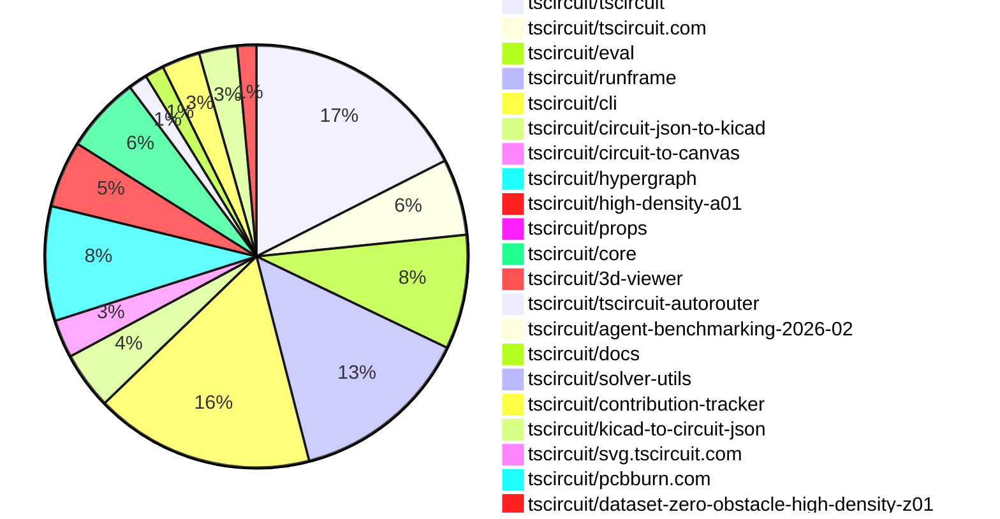

# Contribution Overview 2026-02-24

The current week is shown below. There are 3 major sections:

- [Contributor Overview](#contributor-overview)
- [PRs by Repository](#prs-by-repository)
- [PRs by Contributor](#changes-by-contributor)
- [Scoring & Sponsorship Details](/docs/sponsorship-calculation-explanation.md)

## PRs by Repository

## Contributor Overview

| Contributor | 🐳 Major | 🐙 Minor | 🐌 Tiny | ⭐ | Discussion Contributions |
|-------------|---------|---------|---------|-----|--------------------------|
| [seveibar](#seveibar) | 7 | 0 | 4 | ⭐⭐⭐ | 0🔹 0🔶 0💎 |
| [ShiboSoftwareDev](#ShiboSoftwareDev) | 1 | 3 | 0 | ⭐⭐ | 0🔹 0🔶 0💎 |
| [Abse2001](#Abse2001) | 3 | 2 | 0 | ⭐⭐ | 0🔹 0🔶 0💎 |
| [MustafaMulla29](#MustafaMulla29) | 1 | 3 | 2 | ⭐⭐ | 0🔹 0🔶 0💎 |
| [tscircuitbot](#tscircuitbot) | 0 | 0 | 94 | ⭐⭐ | 0🔹 0🔶 0💎 |
| [imrishabh18](#imrishabh18) | 0 | 4 | 3 | ⭐⭐ | 0🔹 0🔶 0💎 |
| [ArnavK-09](#ArnavK-09) | 2 | 0 | 2 | ⭐ | 0🔹 0🔶 0💎 |
| [techmannih](#techmannih) | 1 | 2 | 2 | ⭐ | 0🔹 0🔶 0💎 |
| [AnasSarkiz](#AnasSarkiz) | 2 | 0 | 0 | ⭐ | 0🔹 0🔶 0💎 |
| [zalo](#zalo) | 1 | 1 | 0 | ⭐ | 0🔹 0🔶 0💎 |
| [rushabhcodes](#rushabhcodes) | 1 | 0 | 1 | ⭐ | 0🔹 0🔶 0💎 |
| [0hmX](#0hmX) | 0 | 0 | 1 |  | 0🔹 0🔶 0💎 |

> Note: AI evaluates PRs and assigns 1-3 star ratings automatically. 4 and 5 star ratings require manual staff review.

### Discussion Contribution Legend

- 🔹 Normal Comments: Basic participation with minimal effort
- 🔶 Great Informative Comments: Thoughtful participation that adds value
- 💎 Incredible Comments: Exceptional participation with high-quality content

## Review Table

[reviews-received-hover]: ## "Number of reviews received for PRs for this contributor"
[approvals-received-hover]: ## "Number of approvals received for PRs this contributor authored"
[rejections-received-hover]: ## "Number of rejections received for PRs this contributor authored"
[prs-opened-hover]: ## "Number of PRs opened by this contributor"
[issues-created-hover]: ## "Number of issues created by this contributor"

| Contributor | Reviews Received | Approvals Received | Rejections Received | Approvals | Rejections | PRs Opened | PRs Merged | Issues Created |
|---|---|---|---|---|---|---|---|---|
| [Excellencedev](#Excellencedev) | 0 | 0 | 0 | 0 | 0 | 1 | 0 | 0 |
| [tscircuitbot](#tscircuitbot) | 0 | 0 | 0 | 0 | 0 | 131 | 103 | 0 |
| [jdhruv1503](#jdhruv1503) | 0 | 0 | 0 | 0 | 0 | 4 | 0 | 0 |
| [ShiboSoftwareDev](#ShiboSoftwareDev) | 4 | 4 | 0 | 6 | 0 | 5 | 4 | 0 |
| [seveibar](#seveibar) | 1 | 0 | 0 | 25 | 0 | 17 | 12 | 0 |
| [dagangtj](#dagangtj) | 1 | 0 | 0 | 0 | 0 | 3 | 0 | 0 |
| [Abse2001](#Abse2001) | 7 | 6 | 0 | 0 | 0 | 5 | 5 | 0 |
| [MustafaMulla29](#MustafaMulla29) | 8 | 5 | 0 | 1 | 0 | 8 | 7 | 0 |
| [imrishabh18](#imrishabh18) | 6 | 3 | 0 | 2 | 0 | 8 | 7 | 0 |
| [ArnavK-09](#ArnavK-09) | 4 | 3 | 0 | 0 | 0 | 4 | 4 | 0 |
| [rushabhcodes](#rushabhcodes) | 8 | 3 | 0 | 0 | 0 | 3 | 2 | 0 |
| [jarvis117molt-dot](#jarvis117molt-dot) | 0 | 0 | 0 | 0 | 0 | 1 | 0 | 0 |
| [sungdark](#sungdark) | 0 | 0 | 0 | 0 | 0 | 1 | 0 | 0 |
| [techmannih](#techmannih) | 8 | 6 | 0 | 0 | 0 | 7 | 5 | 0 |
| [0hmX](#0hmX) | 7 | 0 | 0 | 0 | 0 | 4 | 1 | 0 |
| [AnasSarkiz](#AnasSarkiz) | 4 | 2 | 0 | 0 | 0 | 4 | 2 | 0 |
| [abdul-09](#abdul-09) | 0 | 0 | 0 | 0 | 0 | 1 | 0 | 0 |
| [zalo](#zalo) | 8 | 2 | 0 | 0 | 0 | 4 | 2 | 0 |

## Changes by Repository

### [tscircuit/tscircuit](https://github.com/tscircuit/tscircuit)

🐌 Tiny Contributions (24)

| PR # | Impact | Contributor | Description |
|------|--------|-------------|-------------|
| [#2356](https://github.com/tscircuit/tscircuit/pull/2356) | 🐌 Tiny | tscircuitbot | Automated package update |
| [#2355](https://github.com/tscircuit/tscircuit/pull/2355) | 🐌 Tiny | tscircuitbot | Automated package update |
| [#2354](https://github.com/tscircuit/tscircuit/pull/2354) | 🐌 Tiny | tscircuitbot | Automated package update |
| [#2353](https://github.com/tscircuit/tscircuit/pull/2353) | 🐌 Tiny | tscircuitbot | Updates the version of several dependencies in the package.json file, including tscircuitcli, tscircuitcore, tscircuiteval, tscircuitprops, and tscircuitrunframe. |
| [#2352](https://github.com/tscircuit/tscircuit/pull/2352) | 🐌 Tiny | tscircuitbot | Automated package update |
| [#2351](https://github.com/tscircuit/tscircuit/pull/2351) | 🐌 Tiny | tscircuitbot | Automated package update |
| [#2350](https://github.com/tscircuit/tscircuit/pull/2350) | 🐌 Tiny | tscircuitbot | Automated package update |
| [#2349](https://github.com/tscircuit/tscircuit/pull/2349) | 🐌 Tiny | tscircuitbot | Updates the tscircuitcli package to version 0.1.984 in package.json |
| [#2348](https://github.com/tscircuit/tscircuit/pull/2348) | 🐌 Tiny | tscircuitbot | Updates the package version from 0.0.1374 to 0.0.1375 in package.json |
| [#2347](https://github.com/tscircuit/tscircuit/pull/2347) | 🐌 Tiny | tscircuitbot | Updates the tscircuitcli package to version 0.1.983 in the package.json file. |
| [#2346](https://github.com/tscircuit/tscircuit/pull/2346) | 🐌 Tiny | tscircuitbot | Automated package update |
| [#2345](https://github.com/tscircuit/tscircuit/pull/2345) | 🐌 Tiny | tscircuitbot | Updates the tscircuitcli package to version 0.1.982 in package.json |
| [#2344](https://github.com/tscircuit/tscircuit/pull/2344) | 🐌 Tiny | tscircuitbot | Automated package update |
| [#2339](https://github.com/tscircuit/tscircuit/pull/2339) | 🐌 Tiny | tscircuitbot | Automated package update |
| [#2337](https://github.com/tscircuit/tscircuit/pull/2337) | 🐌 Tiny | tscircuitbot | Automated package update |
| [#2332](https://github.com/tscircuit/tscircuit/pull/2332) | 🐌 Tiny | tscircuitbot | Automated package update |
| [#2331](https://github.com/tscircuit/tscircuit/pull/2331) | 🐌 Tiny | tscircuitbot | Automated package update |
| [#2341](https://github.com/tscircuit/tscircuit/pull/2341) | 🐌 Tiny | tscircuitbot | Automated package update |
| [#2342](https://github.com/tscircuit/tscircuit/pull/2342) | 🐌 Tiny | tscircuitbot | Updates the package version from 0.0.1370 to 0.0.1371 in package.json |
| [#2340](https://github.com/tscircuit/tscircuit/pull/2340) | 🐌 Tiny | tscircuitbot | Automated package update |
| [#2334](https://github.com/tscircuit/tscircuit/pull/2334) | 🐌 Tiny | tscircuitbot | Automated package update |
| [#2336](https://github.com/tscircuit/tscircuit/pull/2336) | 🐌 Tiny | tscircuitbot | Automated package update |
| [#2343](https://github.com/tscircuit/tscircuit/pull/2343) | 🐌 Tiny | tscircuitbot | Updates the tscircuitcli package to version 0.1.981 in package.json |
| [#2333](https://github.com/tscircuit/tscircuit/pull/2333) | 🐌 Tiny | tscircuitbot | Automated package update |

### [tscircuit/tscircuit.com](https://github.com/tscircuit/tscircuit.com)

| PR # | Impact | Rating | Contributor | Description |
|------|--------|--------|-------------|-------------|
| [#2855](https://github.com/tscircuit/tscircuit.com/pull/2855) | 🐳 Major | ⭐⭐⭐ | ArnavK-09 | Adds a ScrollToTopButton component to the release build detail and release detail pages, allowing users to scroll back to the top of the page easily. |
| [#2852](https://github.com/tscircuit/tscircuit.com/pull/2852) | 🐳 Major | ⭐⭐⭐ | ArnavK-09 | Adds a loading state to the refresh button for GitHub repositories, preventing multiple refresh requests while one is in progress. |

🐌 Tiny Contributions (6)

| PR # | Impact | Contributor | Description |
|------|--------|-------------|-------------|
| [#2860](https://github.com/tscircuit/tscircuit.com/pull/2860) | 🐌 Tiny | tscircuitbot | Updates the tscircuitrunframe package from version 0.0.1654 to 0.0.1655 |
| [#2859](https://github.com/tscircuit/tscircuit.com/pull/2859) | 🐌 Tiny | tscircuitbot | Updates the tscircuiteval package from version 0.0.659 to 0.0.660 |
| [#2858](https://github.com/tscircuit/tscircuit.com/pull/2858) | 🐌 Tiny | tscircuitbot | Updates the tscircuitrunframe package from version 0.0.1652 to 0.0.1654 |
| [#2857](https://github.com/tscircuit/tscircuit.com/pull/2857) | 🐌 Tiny | tscircuitbot | Updates the tscircuiteval package from version 0.0.658 to 0.0.659 |
| [#2856](https://github.com/tscircuit/tscircuit.com/pull/2856) | 🐌 Tiny | tscircuitbot | Updates the tscircuitrunframe package from version 0.0.1651 to 0.0.1652 |
| [#2853](https://github.com/tscircuit/tscircuit.com/pull/2853) | 🐌 Tiny | ArnavK-09 | Adds a mock GitHub installation entry to the database seeding process. |

### [tscircuit/eval](https://github.com/tscircuit/eval)

🐌 Tiny Contributions (12)

| PR # | Impact | Contributor | Description |
|------|--------|-------------|-------------|
| [#2120](https://github.com/tscircuit/eval/pull/2120) | 🐌 Tiny | tscircuitbot | Automated package update |
| [#2119](https://github.com/tscircuit/eval/pull/2119) | 🐌 Tiny | tscircuitbot | Updates the version of the tscircuitcore package from 0.0.1060 to 0.0.1061 in package.json |
| [#2117](https://github.com/tscircuit/eval/pull/2117) | 🐌 Tiny | tscircuitbot | Automated package update |
| [#2116](https://github.com/tscircuit/eval/pull/2116) | 🐌 Tiny | tscircuitbot | Automated package update |
| [#2111](https://github.com/tscircuit/eval/pull/2111) | 🐌 Tiny | tscircuitbot | Automated package update |
| [#2112](https://github.com/tscircuit/eval/pull/2112) | 🐌 Tiny | tscircuitbot | Automated package update |
| [#2105](https://github.com/tscircuit/eval/pull/2105) | 🐌 Tiny | tscircuitbot | Updates the version of the tscircuitcore package from 0.0.1055 to 0.0.1056 in package.json |
| [#2102](https://github.com/tscircuit/eval/pull/2102) | 🐌 Tiny | tscircuitbot | Updates the versions of several dependencies in the package.json file. |
| [#2109](https://github.com/tscircuit/eval/pull/2109) | 🐌 Tiny | tscircuitbot | Automated package update |
| [#2108](https://github.com/tscircuit/eval/pull/2108) | 🐌 Tiny | tscircuitbot | Automated package update |
| [#2106](https://github.com/tscircuit/eval/pull/2106) | 🐌 Tiny | tscircuitbot | Automated package update to version 0.0.656 |
| [#2103](https://github.com/tscircuit/eval/pull/2103) | 🐌 Tiny | tscircuitbot | Automated package update |

### [tscircuit/runframe](https://github.com/tscircuit/runframe)

🐌 Tiny Contributions (19)

| PR # | Impact | Contributor | Description |
|------|--------|-------------|-------------|
| [#2746](https://github.com/tscircuit/runframe/pull/2746) | 🐌 Tiny | tscircuitbot | Automated package update |
| [#2745](https://github.com/tscircuit/runframe/pull/2745) | 🐌 Tiny | tscircuitbot | Updates the tscircuiteval package from version 0.0.659 to 0.0.660 in the package.json file. |
| [#2744](https://github.com/tscircuit/runframe/pull/2744) | 🐌 Tiny | tscircuitbot | Automated package update |
| [#2743](https://github.com/tscircuit/runframe/pull/2743) | 🐌 Tiny | tscircuitbot | Updates the tscircuiteval package to version 0.0.659 in the package.json file. |
| [#2742](https://github.com/tscircuit/runframe/pull/2742) | 🐌 Tiny | tscircuitbot | Automated package update |
| [#2741](https://github.com/tscircuit/runframe/pull/2741) | 🐌 Tiny | tscircuitbot | Updates the tscircuit3d-viewer package from version 0.0.525 to 0.0.526 |
| [#2740](https://github.com/tscircuit/runframe/pull/2740) | 🐌 Tiny | tscircuitbot | Automated package update |
| [#2739](https://github.com/tscircuit/runframe/pull/2739) | 🐌 Tiny | tscircuitbot | Updates the circuit-json-to-kicad package version from 0.0.80 to 0.0.81 in package.json |
| [#2737](https://github.com/tscircuit/runframe/pull/2737) | 🐌 Tiny | tscircuitbot | Updates the circuit-json-to-kicad package from version 0.0.79 to 0.0.80 |
| [#2736](https://github.com/tscircuit/runframe/pull/2736) | 🐌 Tiny | tscircuitbot | Automated package update |
| [#2735](https://github.com/tscircuit/runframe/pull/2735) | 🐌 Tiny | tscircuitbot | Updates the tscircuiteval package from version 0.0.657 to 0.0.658 |
| [#2734](https://github.com/tscircuit/runframe/pull/2734) | 🐌 Tiny | tscircuitbot | Updates the package version from v0.0.1649 to v0.0.1650 in package.json |
| [#2733](https://github.com/tscircuit/runframe/pull/2733) | 🐌 Tiny | tscircuitbot | Updates the tscircuiteval package to version 0.0.657 in the package.json file. |
| [#2732](https://github.com/tscircuit/runframe/pull/2732) | 🐌 Tiny | tscircuitbot | Automated package update |
| [#2731](https://github.com/tscircuit/runframe/pull/2731) | 🐌 Tiny | tscircuitbot | Updates the tscircuiteval package to version 0.0.656 in the package.json file. |
| [#2726](https://github.com/tscircuit/runframe/pull/2726) | 🐌 Tiny | tscircuitbot | Updates the tscircuiteval package to version 0.0.655 in the package.json file. |
| [#2727](https://github.com/tscircuit/runframe/pull/2727) | 🐌 Tiny | tscircuitbot | Automated package update |
| [#2730](https://github.com/tscircuit/runframe/pull/2730) | 🐌 Tiny | tscircuitbot | Automated package update |
| [#2729](https://github.com/tscircuit/runframe/pull/2729) | 🐌 Tiny | tscircuitbot | Updates the circuit-json-to-kicad package version from 0.0.78 to 0.0.79 in package.json |

### [tscircuit/cli](https://github.com/tscircuit/cli)

| PR # | Impact | Rating | Contributor | Description |
|------|--------|--------|-------------|-------------|
| [#2125](https://github.com/tscircuit/cli/pull/2125) | 🐳 Major | ⭐⭐⭐ | seveibar | Adds options to the tsci import command to filter sources for component imports from JLCPCB or the tscircuit registry. |
| [#2123](https://github.com/tscircuit/cli/pull/2123) | 🐙 Minor | ⭐⭐ | imrishabh18 | Adds structured logging before exiting the build process to provide clearer error messages and reasons for termination. |
| [#2117](https://github.com/tscircuit/cli/pull/2117) | 🐙 Minor | ⭐⭐ | imrishabh18 | Fixes the build process to ensure that only files matching the includeBoardFiles patterns are built, preventing unnecessary transpilation of unrelated files. |
| [#2103](https://github.com/tscircuit/cli/pull/2103) | 🐙 Minor | ⭐⭐ | imrishabh18 | Changes the build process to stop immediately upon encountering a fatal circuit generation error, preventing further processing of subsequent files. |

🐌 Tiny Contributions (19)

| PR # | Impact | Contributor | Description |
|------|--------|-------------|-------------|
| [#2137](https://github.com/tscircuit/cli/pull/2137) | 🐌 Tiny | tscircuitbot | Automated package update |
| [#2136](https://github.com/tscircuit/cli/pull/2136) | 🐌 Tiny | tscircuitbot | Updates the tscircuitrunframe package from version 0.0.1654 to 0.0.1655 |
| [#2135](https://github.com/tscircuit/cli/pull/2135) | 🐌 Tiny | tscircuitbot | Automated package update |
| [#2134](https://github.com/tscircuit/cli/pull/2134) | 🐌 Tiny | tscircuitbot | Updates the tscircuitrunframe package to version 0.0.1654 in the package.json file. |
| [#2131](https://github.com/tscircuit/cli/pull/2131) | 🐌 Tiny | tscircuitbot | Automated package update |
| [#2130](https://github.com/tscircuit/cli/pull/2130) | 🐌 Tiny | tscircuitbot | Updates the tscircuitrunframe package from version 0.0.1651 to 0.0.1652 |
| [#2129](https://github.com/tscircuit/cli/pull/2129) | 🐌 Tiny | tscircuitbot | Automated package update |
| [#2128](https://github.com/tscircuit/cli/pull/2128) | 🐌 Tiny | tscircuitbot | Automated README update with latest CLI usage output. |
| [#2127](https://github.com/tscircuit/cli/pull/2127) | 🐌 Tiny | tscircuitbot | Automated package update |
| [#2124](https://github.com/tscircuit/cli/pull/2124) | 🐌 Tiny | tscircuitbot | Updates the package version from v0.1.981 to v0.1.982 in package.json |
| [#2120](https://github.com/tscircuit/cli/pull/2120) | 🐌 Tiny | tscircuitbot | Automated package update |
| [#2118](https://github.com/tscircuit/cli/pull/2118) | 🐌 Tiny | tscircuitbot | Updates the tscircuitrunframe package from version 0.0.1650 to 0.0.1651 |
| [#2119](https://github.com/tscircuit/cli/pull/2119) | 🐌 Tiny | tscircuitbot | Automated package update |
| [#2110](https://github.com/tscircuit/cli/pull/2110) | 🐌 Tiny | tscircuitbot | Automated package update |
| [#2111](https://github.com/tscircuit/cli/pull/2111) | 🐌 Tiny | tscircuitbot | Updates the tscircuitrunframe package from version 0.0.1646 to 0.0.1648 |
| [#2113](https://github.com/tscircuit/cli/pull/2113) | 🐌 Tiny | tscircuitbot | Updates the tscircuitrunframe package from version 0.0.1648 to 0.0.1649 |
| [#2112](https://github.com/tscircuit/cli/pull/2112) | 🐌 Tiny | tscircuitbot | Updates the package version from 0.1.976 to 0.1.977 in package.json |
| [#2114](https://github.com/tscircuit/cli/pull/2114) | 🐌 Tiny | tscircuitbot | Automated package update |
| [#2115](https://github.com/tscircuit/cli/pull/2115) | 🐌 Tiny | tscircuitbot | Updates the tscircuitrunframe package from version 0.0.1649 to 0.0.1650 |

### [tscircuit/circuit-json-to-kicad](https://github.com/tscircuit/circuit-json-to-kicad)

| PR # | Impact | Rating | Contributor | Description |
|------|--------|--------|-------------|-------------|
| [#152](https://github.com/tscircuit/circuit-json-to-kicad/pull/152) | 🐙 Minor | ⭐⭐ | MustafaMulla29 | Fixes symbol-footprint classification for components that have both builtin and custom footprints, ensuring the correct symbol is assigned to the user library. |
| [#150](https://github.com/tscircuit/circuit-json-to-kicad/pull/150) | 🐙 Minor | ⭐⭐ | MustafaMulla29 | Adds fallback to modelcdn URLs for builtin 3D models when no explicit model is specified and a builtin footprint is present |

🐌 Tiny Contributions (4)

| PR # | Impact | Contributor | Description |
|------|--------|-------------|-------------|
| [#153](https://github.com/tscircuit/circuit-json-to-kicad/pull/153) | 🐌 Tiny | tscircuitbot | Automated package update |
| [#149](https://github.com/tscircuit/circuit-json-to-kicad/pull/149) | 🐌 Tiny | tscircuitbot | Automated package update |
| [#151](https://github.com/tscircuit/circuit-json-to-kicad/pull/151) | 🐌 Tiny | tscircuitbot | Automated package update |
| [#148](https://github.com/tscircuit/circuit-json-to-kicad/pull/148) | 🐌 Tiny | MustafaMulla29 | Updates the tscircuit dependency version and adjusts related tests to accommodate changes in the library. |

### [tscircuit/circuit-to-canvas](https://github.com/tscircuit/circuit-to-canvas)

| PR # | Impact | Rating | Contributor | Description |
|------|--------|--------|-------------|-------------|
| [#185](https://github.com/tscircuit/circuit-to-canvas/pull/185) | 🐙 Minor | ⭐⭐ | Abse2001 | Changes the rendering of top and bottom copper pours to use layer opacity instead of separate colors, improving visual consistency. |
| [#187](https://github.com/tscircuit/circuit-to-canvas/pull/187) | 🐙 Minor | ⭐⭐ | Abse2001 | Adds geometry-aware soldermask cutouts for covered copper pours, allowing for accurate rendering of openings in the soldermask layer based on the underlying copper pour geometry. |

🐌 Tiny Contributions (2)

| PR # | Impact | Contributor | Description |
|------|--------|-------------|-------------|
| [#186](https://github.com/tscircuit/circuit-to-canvas/pull/186) | 🐌 Tiny | tscircuitbot | Updates the package version from 0.0.81 to 0.0.82 in package.json |
| [#188](https://github.com/tscircuit/circuit-to-canvas/pull/188) | 🐌 Tiny | tscircuitbot | Automated package update |

### [tscircuit/hypergraph](https://github.com/tscircuit/hypergraph)

| PR # | Impact | Rating | Contributor | Description |
|------|--------|--------|-------------|-------------|
| [#88](https://github.com/tscircuit/hypergraph/pull/88) | 🐳 Major | ⭐⭐⭐ | ShiboSoftwareDev | Refactors via region topology for improved net routing efficiency by optimizing via placements and segment connections in the PCB layout. |
| [#86](https://github.com/tscircuit/hypergraph/pull/86) | 🐳 Major | ⭐⭐⭐ | Abse2001 | Adds a new 5 net via topology to enhance the performance of the solver in the circuit design process. |
| [#84](https://github.com/tscircuit/hypergraph/pull/84) | 🐳 Major | ⭐⭐⭐ | Abse2001 | Optimizes the default via topology to enhance solve performance in the circuit design process. |
| [#79](https://github.com/tscircuit/hypergraph/pull/79) | 🐳 Major | ⭐⭐⭐ | seveibar | Refactors benchmarking for 0603 by removing redundant topologies, fixing candidate caching, and introducing new benchmarking utilities. |
| [#76](https://github.com/tscircuit/hypergraph/pull/76) | 🐳 Major | ⭐⭐⭐ | AnasSarkiz | Fixes via-region over-porting by limiting via ports to a maximum of 4 sides and resolves solved routes into top stubs and tile-scoped bottom segments for improved trace visualization. |

🐌 Tiny Contributions (7)

| PR # | Impact | Contributor | Description |
|------|--------|-------------|-------------|
| [#89](https://github.com/tscircuit/hypergraph/pull/89) | 🐌 Tiny | tscircuitbot | Automated package update |
| [#87](https://github.com/tscircuit/hypergraph/pull/87) | 🐌 Tiny | tscircuitbot | Automated package update |
| [#85](https://github.com/tscircuit/hypergraph/pull/85) | 🐌 Tiny | tscircuitbot | Automated package update |
| [#77](https://github.com/tscircuit/hypergraph/pull/77) | 🐌 Tiny | tscircuitbot | Automated package update |
| [#80](https://github.com/tscircuit/hypergraph/pull/80) | 🐌 Tiny | tscircuitbot | Updates the package version from 0.0.36 to 0.0.37 in package.json |
| [#82](https://github.com/tscircuit/hypergraph/pull/82) | 🐌 Tiny | tscircuitbot | Automated package update |
| [#81](https://github.com/tscircuit/hypergraph/pull/81) | 🐌 Tiny | seveibar | Adds a GitHub Actions workflow for benchmarking code on push and PR comments, including artifact uploads and result reporting. |

### [tscircuit/high-density-a01](https://github.com/tscircuit/high-density-a01)

| PR # | Impact | Rating | Contributor | Description |
|------|--------|--------|-------------|-------------|
| [#6](https://github.com/tscircuit/high-density-a01/pull/6) | 🐳 Major | ⭐⭐⭐ | seveibar | Removes the WebAssembly test and improves the algorithm by iterating on sample002, specifically enhancing the decay penalty map and Euclidean distance calculations. |
| [#2](https://github.com/tscircuit/high-density-a01/pull/2) | 🐳 Major | ⭐⭐⭐ | seveibar | Optimizes the HighDensitySolverA01 algorithm to achieve a 40x speed increase in TypeScript execution. |

🐌 Tiny Contributions (5)

| PR # | Impact | Contributor | Description |
|------|--------|-------------|-------------|
| [#7](https://github.com/tscircuit/high-density-a01/pull/7) | 🐌 Tiny | tscircuitbot | Updates the package version from 0.0.4 to 0.0.5 in package.json |
| [#5](https://github.com/tscircuit/high-density-a01/pull/5) | 🐌 Tiny | tscircuitbot | Automated package update |
| [#4](https://github.com/tscircuit/high-density-a01/pull/4) | 🐌 Tiny | tscircuitbot | Automated package update |
| [#3](https://github.com/tscircuit/high-density-a01/pull/3) | 🐌 Tiny | tscircuitbot | Automated package update |
| [#1](https://github.com/tscircuit/high-density-a01/pull/1) | 🐌 Tiny | seveibar | Add a profiling script to measure solver runtime on sample fixtures, allowing easy benchmarking and extension with additional samples. |

### [tscircuit/props](https://github.com/tscircuit/props)

| PR # | Impact | Rating | Contributor | Description |
|------|--------|--------|-------------|-------------|
| [#605](https://github.com/tscircuit/props/pull/605) | 🐙 Minor | ⭐⭐ | ShiboSoftwareDev | Adds a new boolean property _subcircuitCachingEnabled to the PanelProps interface, allowing for caching control in subcircuits. |

### [tscircuit/core](https://github.com/tscircuit/core)

| PR # | Impact | Rating | Contributor | Description |
|------|--------|--------|-------------|-------------|
| [#1977](https://github.com/tscircuit/core/pull/1977) | 🐳 Major | ⭐⭐⭐ | MustafaMulla29 | Fixes symbol bounds calculation to include ports, ensuring the symbol fits within the specified width and height. |
| [#1971](https://github.com/tscircuit/core/pull/1971) | 🐳 Major | ⭐⭐⭐ | seveibar | Updates the autorouter to support new 0603 routing specifications and adjusts related test fixtures accordingly. |
| [#1978](https://github.com/tscircuit/core/pull/1978) | 🐙 Minor | ⭐⭐ | ShiboSoftwareDev | Adds support for the _subcircuitCachingEnabled flag to enhance caching behavior for panels and subpanels in the rendering process. |
| [#1970](https://github.com/tscircuit/core/pull/1970) | 🐙 Minor | ⭐⭐ | ShiboSoftwareDev | Enables caching of subcircuits for boards to improve rendering performance by reusing identical board configurations. |
| [#1973](https://github.com/tscircuit/core/pull/1973) | 🐙 Minor | ⭐⭐ | MustafaMulla29 | Fixes the issue where port stem lengths were being incorrectly stretched during symbol resizing, ensuring they remain at the user-specified length. |
| [#1969](https://github.com/tscircuit/core/pull/1969) | 🐙 Minor | ⭐⭐ | imrishabh18 | Fixes the issue where the size of the schematic component does not change correctly when the component is rotated. |

🐌 Tiny Contributions (2)

| PR # | Impact | Contributor | Description |
|------|--------|-------------|-------------|
| [#1974](https://github.com/tscircuit/core/pull/1974) | 🐌 Tiny | imrishabh18 | Adds tests to reproduce the issue where pcbFlex does not consider the parent width and height for spacing in the layout. |
| [#1972](https://github.com/tscircuit/core/pull/1972) | 🐌 Tiny | imrishabh18 | Adds a GitHub Actions workflow to automatically update and commit snapshot tests to a specified branch. |

### [tscircuit/3d-viewer](https://github.com/tscircuit/3d-viewer)

| PR # | Impact | Rating | Contributor | Description |
|------|--------|--------|-------------|-------------|
| [#714](https://github.com/tscircuit/3d-viewer/pull/714) | 🐳 Major | ⭐⭐⭐ | Abse2001 | https:3d-viewer-git-fork-abse2001-main-tscircuit.vercel.app?pathstorycomponents-copperpour--default https:3d-viewer-git-fork-abse2001-main-tscircuit.vercel.app?pathstorycomponents-copperpourconnectedcomponents--default https:3d-viewer-git-fork-abse2001-main-tscircuit.vercel.app?pathstorycopperpour-core-test--copperpour-core-test-story |

### [tscircuit/tscircuit-autorouter](https://github.com/tscircuit/tscircuit-autorouter)

🐌 Tiny Contributions (2)

| PR # | Impact | Contributor | Description |
|------|--------|-------------|-------------|
| [#586](https://github.com/tscircuit/tscircuit-autorouter/pull/586) | 🐌 Tiny | MustafaMulla29 | Fixes the benchmarking workflow for pull requests from forked repositories by adjusting the timeout and checkout reference. |
| [#590](https://github.com/tscircuit/tscircuit-autorouter/pull/590) | 🐌 Tiny | 0hmX | Increases the timeout for the benchmark workflow from 30 minutes to 360 minutes to allow longer-running benchmarks to complete successfully. |

### [tscircuit/agent-benchmarking-2026-02](https://github.com/tscircuit/agent-benchmarking-2026-02)

🐌 Tiny Contributions (1)

| PR # | Impact | Contributor | Description |
|------|--------|-------------|-------------|
| [#1](https://github.com/tscircuit/agent-benchmarking-2026-02/pull/1) | 🐌 Tiny | imrishabh18 | Updates the glob pattern to include circuit.json files as prebuild files in the configuration. |

### [tscircuit/docs](https://github.com/tscircuit/docs)

| PR # | Impact | Rating | Contributor | Description |
|------|--------|--------|-------------|-------------|
| [#479](https://github.com/tscircuit/docs/pull/479) | 🐳 Major | ⭐⭐⭐ | seveibar | Documents the package files list and download endpoints in the tscircuit registry API, providing detailed usage instructions and examples. |

🐌 Tiny Contributions (1)

| PR # | Impact | Contributor | Description |
|------|--------|-------------|-------------|
| [#480](https://github.com/tscircuit/docs/pull/480) | 🐌 Tiny | seveibar | Removes legacy bounty-specific guidance and links from the sponsorship page, focusing solely on contributor sponsorships. |

### [tscircuit/solver-utils](https://github.com/tscircuit/solver-utils)

| PR # | Impact | Rating | Contributor | Description |
|------|--------|--------|-------------|-------------|
| [#19](https://github.com/tscircuit/solver-utils/pull/19) | 🐳 Major | ⭐⭐⭐ | seveibar | Adds more granular animation speed options and allows multiple solver steps per timer tick for faster visual playback and debugging. |

### [tscircuit/contribution-tracker](https://github.com/tscircuit/contribution-tracker)

| PR # | Impact | Rating | Contributor | Description |
|------|--------|--------|-------------|-------------|
| [#313](https://github.com/tscircuit/contribution-tracker/pull/313) | 🐳 Major | ⭐⭐⭐ | rushabhcodes | This pull request adds support for selecting and viewing contribution data by week in the frontend, allowing users to choose from available weeks using a dropdown in the header, with the displayed data updating accordingly. |

🐌 Tiny Contributions (3)

| PR # | Impact | Contributor | Description |
|------|--------|-------------|-------------|
| [#300](https://github.com/tscircuit/contribution-tracker/pull/300) | 🐌 Tiny | seveibar | Updates maintainer roles for Abse2001 and AnasSarkiz in the maintainers list. |
| [#315](https://github.com/tscircuit/contribution-tracker/pull/315) | 🐌 Tiny | ArnavK-09 | Updates the contributor graph based on week selection and refactors the code for better readability and performance. |
| [#312](https://github.com/tscircuit/contribution-tracker/pull/312) | 🐌 Tiny | rushabhcodes | Refactors codebase to use domain-specific naming instead of generic terms like data, info, value, param. Also fixed redundant filtering logic and removed dead code. |

### [tscircuit/kicad-to-circuit-json](https://github.com/tscircuit/kicad-to-circuit-json)

| PR # | Impact | Rating | Contributor | Description |
|------|--------|--------|-------------|-------------|
| [#36](https://github.com/tscircuit/kicad-to-circuit-json/pull/36) | 🐳 Major | ⭐⭐⭐ | techmannih | This pull request introduces support for the gr_poly and gr_circle graphics primitives in the footprint processing stage of the KiCad to Circuit JSON conversion. It enhances the ability to handle complex shapes in PCB designs by allowing the use of polygon and circle shapes in surface mount pads. The changes include modifications to the pad processing logic to accommodate these new shapes, ensuring that they are correctly transformed and inserted into the database. |
| [#38](https://github.com/tscircuit/kicad-to-circuit-json/pull/38) | 🐙 Minor | ⭐⭐ | techmannih | Removes incorrect logic that swapped dimensions for rotated oval pads, ensuring accurate representation of pad sizes. |

🐌 Tiny Contributions (2)

| PR # | Impact | Contributor | Description |
|------|--------|-------------|-------------|
| [#37](https://github.com/tscircuit/kicad-to-circuit-json/pull/37) | 🐌 Tiny | techmannih | Enhances type safety for footprint graphic elements by replacing any types with explicit KiCad types in the process-graphics module. |
| [#35](https://github.com/tscircuit/kicad-to-circuit-json/pull/35) | 🐌 Tiny | techmannih | This pull request introduces support for the fp_poly elements in footprints, allowing for the creation of polygon shapes in the PCB silkscreen layer. The changes include modifications to the processFootprintGraphics function to handle fp_poly elements and a new function createFootprintPoly to manage the creation of these polygons. This enhancement is expected to improve the representation of complex shapes in PCB designs. |

### [tscircuit/svg.tscircuit.com](https://github.com/tscircuit/svg.tscircuit.com)

| PR # | Impact | Rating | Contributor | Description |
|------|--------|--------|-------------|-------------|
| [#1051](https://github.com/tscircuit/svg.tscircuit.com/pull/1051) | 🐙 Minor | ⭐⭐ | techmannih | Adds a test for rendering translucent 3D CAD models, ensuring correct output and functionality. |

### [tscircuit/pcbburn.com](https://github.com/tscircuit/pcbburn.com)

| PR # | Impact | Rating | Contributor | Description |
|------|--------|--------|-------------|-------------|
| [#78](https://github.com/tscircuit/pcbburn.com/pull/78) | 🐳 Major | ⭐⭐⭐ | AnasSarkiz | Adds an interactive layer selector UI in the PreviewCanvas, allowing users to toggle between top and bottom layers in real-time, with persistent layer state and improved default rendering for multi-layer boards. |

### [tscircuit/dataset-zero-obstacle-high-density-z01](https://github.com/tscircuit/dataset-zero-obstacle-high-density-z01)

| PR # | Impact | Rating | Contributor | Description |
|------|--------|--------|-------------|-------------|
| [#2](https://github.com/tscircuit/dataset-zero-obstacle-high-density-z01/pull/2) | 🐳 Major | ⭐⭐⭐ | zalo | Adds a complete set of scripts for dataset creation, training, deployment, and inference for fine-tuning the Flux 2 Klein 4B model as a PCB trace router, including adaptations from the morphmaker.ai pipeline. |
| [#3](https://github.com/tscircuit/dataset-zero-obstacle-high-density-z01/pull/3) | 🐙 Minor | ⭐⭐ | zalo | Fetches each sample individually by offset to access any index in the test set, adding samples at indices 10 and 50 for more variety. |

## Changes by Contributor

### [tscircuitbot](https://github.com/tscircuitbot)

🐌 Tiny Contributions (94)

| PR # | Impact | Description |
|------|--------|-------------|
| [#2356](https://github.com/tscircuit/tscircuit/pull/2356) | 🐌 Tiny | Automated package update |
| [#2355](https://github.com/tscircuit/tscircuit/pull/2355) | 🐌 Tiny | Automated package update |
| [#2354](https://github.com/tscircuit/tscircuit/pull/2354) | 🐌 Tiny | Automated package update |
| [#2353](https://github.com/tscircuit/tscircuit/pull/2353) | 🐌 Tiny | Updates the version of several dependencies in the package.json file, including tscircuitcli, tscircuitcore, tscircuiteval, tscircuitprops, and tscircuitrunframe. |
| [#2352](https://github.com/tscircuit/tscircuit/pull/2352) | 🐌 Tiny | Automated package update |
| [#2351](https://github.com/tscircuit/tscircuit/pull/2351) | 🐌 Tiny | Automated package update |
| [#2350](https://github.com/tscircuit/tscircuit/pull/2350) | 🐌 Tiny | Automated package update |
| [#2349](https://github.com/tscircuit/tscircuit/pull/2349) | 🐌 Tiny | Updates the tscircuitcli package to version 0.1.984 in package.json |
| [#2348](https://github.com/tscircuit/tscircuit/pull/2348) | 🐌 Tiny | Updates the package version from 0.0.1374 to 0.0.1375 in package.json |
| [#2347](https://github.com/tscircuit/tscircuit/pull/2347) | 🐌 Tiny | Updates the tscircuitcli package to version 0.1.983 in the package.json file. |
| [#2346](https://github.com/tscircuit/tscircuit/pull/2346) | 🐌 Tiny | Automated package update |
| [#2345](https://github.com/tscircuit/tscircuit/pull/2345) | 🐌 Tiny | Updates the tscircuitcli package to version 0.1.982 in package.json |
| [#2344](https://github.com/tscircuit/tscircuit/pull/2344) | 🐌 Tiny | Automated package update |
| [#2339](https://github.com/tscircuit/tscircuit/pull/2339) | 🐌 Tiny | Automated package update |
| [#2337](https://github.com/tscircuit/tscircuit/pull/2337) | 🐌 Tiny | Automated package update |
| [#2332](https://github.com/tscircuit/tscircuit/pull/2332) | 🐌 Tiny | Automated package update |
| [#2331](https://github.com/tscircuit/tscircuit/pull/2331) | 🐌 Tiny | Automated package update |
| [#2341](https://github.com/tscircuit/tscircuit/pull/2341) | 🐌 Tiny | Automated package update |
| [#2342](https://github.com/tscircuit/tscircuit/pull/2342) | 🐌 Tiny | Updates the package version from 0.0.1370 to 0.0.1371 in package.json |
| [#2340](https://github.com/tscircuit/tscircuit/pull/2340) | 🐌 Tiny | Automated package update |
| [#2334](https://github.com/tscircuit/tscircuit/pull/2334) | 🐌 Tiny | Automated package update |
| [#2336](https://github.com/tscircuit/tscircuit/pull/2336) | 🐌 Tiny | Automated package update |
| [#2343](https://github.com/tscircuit/tscircuit/pull/2343) | 🐌 Tiny | Updates the tscircuitcli package to version 0.1.981 in package.json |
| [#2333](https://github.com/tscircuit/tscircuit/pull/2333) | 🐌 Tiny | Automated package update |
| [#2860](https://github.com/tscircuit/tscircuit.com/pull/2860) | 🐌 Tiny | Updates the tscircuitrunframe package from version 0.0.1654 to 0.0.1655 |
| [#2859](https://github.com/tscircuit/tscircuit.com/pull/2859) | 🐌 Tiny | Updates the tscircuiteval package from version 0.0.659 to 0.0.660 |
| [#2858](https://github.com/tscircuit/tscircuit.com/pull/2858) | 🐌 Tiny | Updates the tscircuitrunframe package from version 0.0.1652 to 0.0.1654 |
| [#2857](https://github.com/tscircuit/tscircuit.com/pull/2857) | 🐌 Tiny | Updates the tscircuiteval package from version 0.0.658 to 0.0.659 |
| [#2856](https://github.com/tscircuit/tscircuit.com/pull/2856) | 🐌 Tiny | Updates the tscircuitrunframe package from version 0.0.1651 to 0.0.1652 |
| [#2120](https://github.com/tscircuit/eval/pull/2120) | 🐌 Tiny | Automated package update |
| [#2119](https://github.com/tscircuit/eval/pull/2119) | 🐌 Tiny | Updates the version of the tscircuitcore package from 0.0.1060 to 0.0.1061 in package.json |
| [#2117](https://github.com/tscircuit/eval/pull/2117) | 🐌 Tiny | Automated package update |
| [#2116](https://github.com/tscircuit/eval/pull/2116) | 🐌 Tiny | Automated package update |
| [#2111](https://github.com/tscircuit/eval/pull/2111) | 🐌 Tiny | Automated package update |
| [#2112](https://github.com/tscircuit/eval/pull/2112) | 🐌 Tiny | Automated package update |
| [#2105](https://github.com/tscircuit/eval/pull/2105) | 🐌 Tiny | Updates the version of the tscircuitcore package from 0.0.1055 to 0.0.1056 in package.json |
| [#2102](https://github.com/tscircuit/eval/pull/2102) | 🐌 Tiny | Updates the versions of several dependencies in the package.json file. |
| [#2109](https://github.com/tscircuit/eval/pull/2109) | 🐌 Tiny | Automated package update |
| [#2108](https://github.com/tscircuit/eval/pull/2108) | 🐌 Tiny | Automated package update |
| [#2106](https://github.com/tscircuit/eval/pull/2106) | 🐌 Tiny | Automated package update to version 0.0.656 |
| [#2103](https://github.com/tscircuit/eval/pull/2103) | 🐌 Tiny | Automated package update |
| [#2746](https://github.com/tscircuit/runframe/pull/2746) | 🐌 Tiny | Automated package update |
| [#2745](https://github.com/tscircuit/runframe/pull/2745) | 🐌 Tiny | Updates the tscircuiteval package from version 0.0.659 to 0.0.660 in the package.json file. |
| [#2744](https://github.com/tscircuit/runframe/pull/2744) | 🐌 Tiny | Automated package update |
| [#2743](https://github.com/tscircuit/runframe/pull/2743) | 🐌 Tiny | Updates the tscircuiteval package to version 0.0.659 in the package.json file. |
| [#2742](https://github.com/tscircuit/runframe/pull/2742) | 🐌 Tiny | Automated package update |
| [#2741](https://github.com/tscircuit/runframe/pull/2741) | 🐌 Tiny | Updates the tscircuit3d-viewer package from version 0.0.525 to 0.0.526 |
| [#2740](https://github.com/tscircuit/runframe/pull/2740) | 🐌 Tiny | Automated package update |
| [#2739](https://github.com/tscircuit/runframe/pull/2739) | 🐌 Tiny | Updates the circuit-json-to-kicad package version from 0.0.80 to 0.0.81 in package.json |
| [#2737](https://github.com/tscircuit/runframe/pull/2737) | 🐌 Tiny | Updates the circuit-json-to-kicad package from version 0.0.79 to 0.0.80 |
| [#2736](https://github.com/tscircuit/runframe/pull/2736) | 🐌 Tiny | Automated package update |
| [#2735](https://github.com/tscircuit/runframe/pull/2735) | 🐌 Tiny | Updates the tscircuiteval package from version 0.0.657 to 0.0.658 |
| [#2734](https://github.com/tscircuit/runframe/pull/2734) | 🐌 Tiny | Updates the package version from v0.0.1649 to v0.0.1650 in package.json |
| [#2733](https://github.com/tscircuit/runframe/pull/2733) | 🐌 Tiny | Updates the tscircuiteval package to version 0.0.657 in the package.json file. |
| [#2732](https://github.com/tscircuit/runframe/pull/2732) | 🐌 Tiny | Automated package update |
| [#2731](https://github.com/tscircuit/runframe/pull/2731) | 🐌 Tiny | Updates the tscircuiteval package to version 0.0.656 in the package.json file. |
| [#2726](https://github.com/tscircuit/runframe/pull/2726) | 🐌 Tiny | Updates the tscircuiteval package to version 0.0.655 in the package.json file. |
| [#2727](https://github.com/tscircuit/runframe/pull/2727) | 🐌 Tiny | Automated package update |
| [#2730](https://github.com/tscircuit/runframe/pull/2730) | 🐌 Tiny | Automated package update |
| [#2729](https://github.com/tscircuit/runframe/pull/2729) | 🐌 Tiny | Updates the circuit-json-to-kicad package version from 0.0.78 to 0.0.79 in package.json |
| [#2137](https://github.com/tscircuit/cli/pull/2137) | 🐌 Tiny | Automated package update |
| [#2136](https://github.com/tscircuit/cli/pull/2136) | 🐌 Tiny | Updates the tscircuitrunframe package from version 0.0.1654 to 0.0.1655 |
| [#2135](https://github.com/tscircuit/cli/pull/2135) | 🐌 Tiny | Automated package update |
| [#2134](https://github.com/tscircuit/cli/pull/2134) | 🐌 Tiny | Updates the tscircuitrunframe package to version 0.0.1654 in the package.json file. |
| [#2131](https://github.com/tscircuit/cli/pull/2131) | 🐌 Tiny | Automated package update |
| [#2130](https://github.com/tscircuit/cli/pull/2130) | 🐌 Tiny | Updates the tscircuitrunframe package from version 0.0.1651 to 0.0.1652 |
| [#2129](https://github.com/tscircuit/cli/pull/2129) | 🐌 Tiny | Automated package update |
| [#2128](https://github.com/tscircuit/cli/pull/2128) | 🐌 Tiny | Automated README update with latest CLI usage output. |
| [#2127](https://github.com/tscircuit/cli/pull/2127) | 🐌 Tiny | Automated package update |
| [#2124](https://github.com/tscircuit/cli/pull/2124) | 🐌 Tiny | Updates the package version from v0.1.981 to v0.1.982 in package.json |
| [#2120](https://github.com/tscircuit/cli/pull/2120) | 🐌 Tiny | Automated package update |
| [#2118](https://github.com/tscircuit/cli/pull/2118) | 🐌 Tiny | Updates the tscircuitrunframe package from version 0.0.1650 to 0.0.1651 |
| [#2119](https://github.com/tscircuit/cli/pull/2119) | 🐌 Tiny | Automated package update |
| [#2110](https://github.com/tscircuit/cli/pull/2110) | 🐌 Tiny | Automated package update |
| [#2111](https://github.com/tscircuit/cli/pull/2111) | 🐌 Tiny | Updates the tscircuitrunframe package from version 0.0.1646 to 0.0.1648 |
| [#2113](https://github.com/tscircuit/cli/pull/2113) | 🐌 Tiny | Updates the tscircuitrunframe package from version 0.0.1648 to 0.0.1649 |
| [#2112](https://github.com/tscircuit/cli/pull/2112) | 🐌 Tiny | Updates the package version from 0.1.976 to 0.1.977 in package.json |
| [#2114](https://github.com/tscircuit/cli/pull/2114) | 🐌 Tiny | Automated package update |
| [#2115](https://github.com/tscircuit/cli/pull/2115) | 🐌 Tiny | Updates the tscircuitrunframe package from version 0.0.1649 to 0.0.1650 |
| [#153](https://github.com/tscircuit/circuit-json-to-kicad/pull/153) | 🐌 Tiny | Automated package update |
| [#149](https://github.com/tscircuit/circuit-json-to-kicad/pull/149) | 🐌 Tiny | Automated package update |
| [#151](https://github.com/tscircuit/circuit-json-to-kicad/pull/151) | 🐌 Tiny | Automated package update |
| [#186](https://github.com/tscircuit/circuit-to-canvas/pull/186) | 🐌 Tiny | Updates the package version from 0.0.81 to 0.0.82 in package.json |
| [#188](https://github.com/tscircuit/circuit-to-canvas/pull/188) | 🐌 Tiny | Automated package update |
| [#89](https://github.com/tscircuit/hypergraph/pull/89) | 🐌 Tiny | Automated package update |
| [#87](https://github.com/tscircuit/hypergraph/pull/87) | 🐌 Tiny | Automated package update |
| [#85](https://github.com/tscircuit/hypergraph/pull/85) | 🐌 Tiny | Automated package update |
| [#77](https://github.com/tscircuit/hypergraph/pull/77) | 🐌 Tiny | Automated package update |
| [#80](https://github.com/tscircuit/hypergraph/pull/80) | 🐌 Tiny | Updates the package version from 0.0.36 to 0.0.37 in package.json |
| [#82](https://github.com/tscircuit/hypergraph/pull/82) | 🐌 Tiny | Automated package update |
| [#7](https://github.com/tscircuit/high-density-a01/pull/7) | 🐌 Tiny | Updates the package version from 0.0.4 to 0.0.5 in package.json |
| [#5](https://github.com/tscircuit/high-density-a01/pull/5) | 🐌 Tiny | Automated package update |
| [#4](https://github.com/tscircuit/high-density-a01/pull/4) | 🐌 Tiny | Automated package update |
| [#3](https://github.com/tscircuit/high-density-a01/pull/3) | 🐌 Tiny | Automated package update |

### [ShiboSoftwareDev](https://github.com/ShiboSoftwareDev)

| PRs # | Impact | Rating | Description |
|------|--------|--------|-------------|
| [#88](https://github.com/tscircuit/hypergraph/pull/88) | 🐳 Major | ⭐⭐⭐ | Refactors via region topology for improved net routing efficiency by optimizing via placements and segment connections in the PCB layout. |
| [#605](https://github.com/tscircuit/props/pull/605) | 🐙 Minor | ⭐⭐ | Adds a new boolean property _subcircuitCachingEnabled to the PanelProps interface, allowing for caching control in subcircuits. |
| [#1978](https://github.com/tscircuit/core/pull/1978) | 🐙 Minor | ⭐⭐ | Adds support for the _subcircuitCachingEnabled flag to enhance caching behavior for panels and subpanels in the rendering process. |
| [#1970](https://github.com/tscircuit/core/pull/1970) | 🐙 Minor | ⭐⭐ | Enables caching of subcircuits for boards to improve rendering performance by reusing identical board configurations. |

### [Abse2001](https://github.com/Abse2001)

| PRs # | Impact | Rating | Description |
|------|--------|--------|-------------|
| [#714](https://github.com/tscircuit/3d-viewer/pull/714) | 🐳 Major | ⭐⭐⭐ | https:3d-viewer-git-fork-abse2001-main-tscircuit.vercel.app?pathstorycomponents-copperpour--default https:3d-viewer-git-fork-abse2001-main-tscircuit.vercel.app?pathstorycomponents-copperpourconnectedcomponents--default https:3d-viewer-git-fork-abse2001-main-tscircuit.vercel.app?pathstorycopperpour-core-test--copperpour-core-test-story |
| [#86](https://github.com/tscircuit/hypergraph/pull/86) | 🐳 Major | ⭐⭐⭐ | Adds a new 5 net via topology to enhance the performance of the solver in the circuit design process. |
| [#84](https://github.com/tscircuit/hypergraph/pull/84) | 🐳 Major | ⭐⭐⭐ | Optimizes the default via topology to enhance solve performance in the circuit design process. |
| [#185](https://github.com/tscircuit/circuit-to-canvas/pull/185) | 🐙 Minor | ⭐⭐ | Changes the rendering of top and bottom copper pours to use layer opacity instead of separate colors, improving visual consistency. |
| [#187](https://github.com/tscircuit/circuit-to-canvas/pull/187) | 🐙 Minor | ⭐⭐ | Adds geometry-aware soldermask cutouts for covered copper pours, allowing for accurate rendering of openings in the soldermask layer based on the underlying copper pour geometry. |

### [MustafaMulla29](https://github.com/MustafaMulla29)

| PRs # | Impact | Rating | Description |
|------|--------|--------|-------------|
| [#1977](https://github.com/tscircuit/core/pull/1977) | 🐳 Major | ⭐⭐⭐ | Fixes symbol bounds calculation to include ports, ensuring the symbol fits within the specified width and height. |
| [#1973](https://github.com/tscircuit/core/pull/1973) | 🐙 Minor | ⭐⭐ | Fixes the issue where port stem lengths were being incorrectly stretched during symbol resizing, ensuring they remain at the user-specified length. |
| [#152](https://github.com/tscircuit/circuit-json-to-kicad/pull/152) | 🐙 Minor | ⭐⭐ | Fixes symbol-footprint classification for components that have both builtin and custom footprints, ensuring the correct symbol is assigned to the user library. |
| [#150](https://github.com/tscircuit/circuit-json-to-kicad/pull/150) | 🐙 Minor | ⭐⭐ | Adds fallback to modelcdn URLs for builtin 3D models when no explicit model is specified and a builtin footprint is present |

🐌 Tiny Contributions (2)

| PR # | Impact | Description |
|------|--------|-------------|
| [#586](https://github.com/tscircuit/tscircuit-autorouter/pull/586) | 🐌 Tiny | Fixes the benchmarking workflow for pull requests from forked repositories by adjusting the timeout and checkout reference. |
| [#148](https://github.com/tscircuit/circuit-json-to-kicad/pull/148) | 🐌 Tiny | Updates the tscircuit dependency version and adjusts related tests to accommodate changes in the library. |

### [imrishabh18](https://github.com/imrishabh18)

| PRs # | Impact | Rating | Description |
|------|--------|--------|-------------|
| [#1969](https://github.com/tscircuit/core/pull/1969) | 🐙 Minor | ⭐⭐ | Fixes the issue where the size of the schematic component does not change correctly when the component is rotated. |
| [#2123](https://github.com/tscircuit/cli/pull/2123) | 🐙 Minor | ⭐⭐ | Adds structured logging before exiting the build process to provide clearer error messages and reasons for termination. |
| [#2117](https://github.com/tscircuit/cli/pull/2117) | 🐙 Minor | ⭐⭐ | Fixes the build process to ensure that only files matching the includeBoardFiles patterns are built, preventing unnecessary transpilation of unrelated files. |
| [#2103](https://github.com/tscircuit/cli/pull/2103) | 🐙 Minor | ⭐⭐ | Changes the build process to stop immediately upon encountering a fatal circuit generation error, preventing further processing of subsequent files. |

🐌 Tiny Contributions (3)

| PR # | Impact | Description |
|------|--------|-------------|
| [#1974](https://github.com/tscircuit/core/pull/1974) | 🐌 Tiny | Adds tests to reproduce the issue where pcbFlex does not consider the parent width and height for spacing in the layout. |
| [#1972](https://github.com/tscircuit/core/pull/1972) | 🐌 Tiny | Adds a GitHub Actions workflow to automatically update and commit snapshot tests to a specified branch. |
| [#1](https://github.com/tscircuit/agent-benchmarking-2026-02/pull/1) | 🐌 Tiny | Updates the glob pattern to include circuit.json files as prebuild files in the configuration. |

### [seveibar](https://github.com/seveibar)

| PRs # | Impact | Rating | Description |
|------|--------|--------|-------------|
| [#1971](https://github.com/tscircuit/core/pull/1971) | 🐳 Major | ⭐⭐⭐ | Updates the autorouter to support new 0603 routing specifications and adjusts related test fixtures accordingly. |
| [#2125](https://github.com/tscircuit/cli/pull/2125) | 🐳 Major | ⭐⭐⭐ | Adds options to the tsci import command to filter sources for component imports from JLCPCB or the tscircuit registry. |
| [#479](https://github.com/tscircuit/docs/pull/479) | 🐳 Major | ⭐⭐⭐ | Documents the package files list and download endpoints in the tscircuit registry API, providing detailed usage instructions and examples. |
| [#19](https://github.com/tscircuit/solver-utils/pull/19) | 🐳 Major | ⭐⭐⭐ | Adds more granular animation speed options and allows multiple solver steps per timer tick for faster visual playback and debugging. |
| [#79](https://github.com/tscircuit/hypergraph/pull/79) | 🐳 Major | ⭐⭐⭐ | Refactors benchmarking for 0603 by removing redundant topologies, fixing candidate caching, and introducing new benchmarking utilities. |
| [#6](https://github.com/tscircuit/high-density-a01/pull/6) | 🐳 Major | ⭐⭐⭐ | Removes the WebAssembly test and improves the algorithm by iterating on sample002, specifically enhancing the decay penalty map and Euclidean distance calculations. |
| [#2](https://github.com/tscircuit/high-density-a01/pull/2) | 🐳 Major | ⭐⭐⭐ | Optimizes the HighDensitySolverA01 algorithm to achieve a 40x speed increase in TypeScript execution. |

🐌 Tiny Contributions (4)

| PR # | Impact | Description |
|------|--------|-------------|
| [#300](https://github.com/tscircuit/contribution-tracker/pull/300) | 🐌 Tiny | Updates maintainer roles for Abse2001 and AnasSarkiz in the maintainers list. |
| [#480](https://github.com/tscircuit/docs/pull/480) | 🐌 Tiny | Removes legacy bounty-specific guidance and links from the sponsorship page, focusing solely on contributor sponsorships. |
| [#81](https://github.com/tscircuit/hypergraph/pull/81) | 🐌 Tiny | Adds a GitHub Actions workflow for benchmarking code on push and PR comments, including artifact uploads and result reporting. |
| [#1](https://github.com/tscircuit/high-density-a01/pull/1) | 🐌 Tiny | Add a profiling script to measure solver runtime on sample fixtures, allowing easy benchmarking and extension with additional samples. |

### [ArnavK-09](https://github.com/ArnavK-09)

| PRs # | Impact | Rating | Description |
|------|--------|--------|-------------|
| [#2855](https://github.com/tscircuit/tscircuit.com/pull/2855) | 🐳 Major | ⭐⭐⭐ | Adds a ScrollToTopButton component to the release build detail and release detail pages, allowing users to scroll back to the top of the page easily. |
| [#2852](https://github.com/tscircuit/tscircuit.com/pull/2852) | 🐳 Major | ⭐⭐⭐ | Adds a loading state to the refresh button for GitHub repositories, preventing multiple refresh requests while one is in progress. |

🐌 Tiny Contributions (2)

| PR # | Impact | Description |
|------|--------|-------------|
| [#315](https://github.com/tscircuit/contribution-tracker/pull/315) | 🐌 Tiny | Updates the contributor graph based on week selection and refactors the code for better readability and performance. |
| [#2853](https://github.com/tscircuit/tscircuit.com/pull/2853) | 🐌 Tiny | Adds a mock GitHub installation entry to the database seeding process. |

### [rushabhcodes](https://github.com/rushabhcodes)

| PRs # | Impact | Rating | Description |
|------|--------|--------|-------------|
| [#313](https://github.com/tscircuit/contribution-tracker/pull/313) | 🐳 Major | ⭐⭐⭐ | This pull request adds support for selecting and viewing contribution data by week in the frontend, allowing users to choose from available weeks using a dropdown in the header, with the displayed data updating accordingly. |

🐌 Tiny Contributions (1)

| PR # | Impact | Description |
|------|--------|-------------|
| [#312](https://github.com/tscircuit/contribution-tracker/pull/312) | 🐌 Tiny | Refactors codebase to use domain-specific naming instead of generic terms like data, info, value, param. Also fixed redundant filtering logic and removed dead code. |

### [techmannih](https://github.com/techmannih)

| PRs # | Impact | Rating | Description |
|------|--------|--------|-------------|
| [#36](https://github.com/tscircuit/kicad-to-circuit-json/pull/36) | 🐳 Major | ⭐⭐⭐ | This pull request introduces support for the gr_poly and gr_circle graphics primitives in the footprint processing stage of the KiCad to Circuit JSON conversion. It enhances the ability to handle complex shapes in PCB designs by allowing the use of polygon and circle shapes in surface mount pads. The changes include modifications to the pad processing logic to accommodate these new shapes, ensuring that they are correctly transformed and inserted into the database. |
| [#1051](https://github.com/tscircuit/svg.tscircuit.com/pull/1051) | 🐙 Minor | ⭐⭐ | Adds a test for rendering translucent 3D CAD models, ensuring correct output and functionality. |
| [#38](https://github.com/tscircuit/kicad-to-circuit-json/pull/38) | 🐙 Minor | ⭐⭐ | Removes incorrect logic that swapped dimensions for rotated oval pads, ensuring accurate representation of pad sizes. |

🐌 Tiny Contributions (2)

| PR # | Impact | Description |
|------|--------|-------------|
| [#37](https://github.com/tscircuit/kicad-to-circuit-json/pull/37) | 🐌 Tiny | Enhances type safety for footprint graphic elements by replacing any types with explicit KiCad types in the process-graphics module. |
| [#35](https://github.com/tscircuit/kicad-to-circuit-json/pull/35) | 🐌 Tiny | This pull request introduces support for the fp_poly elements in footprints, allowing for the creation of polygon shapes in the PCB silkscreen layer. The changes include modifications to the processFootprintGraphics function to handle fp_poly elements and a new function createFootprintPoly to manage the creation of these polygons. This enhancement is expected to improve the representation of complex shapes in PCB designs. |

### [0hmX](https://github.com/0hmX)

🐌 Tiny Contributions (1)

| PR # | Impact | Description |
|------|--------|-------------|
| [#590](https://github.com/tscircuit/tscircuit-autorouter/pull/590) | 🐌 Tiny | Increases the timeout for the benchmark workflow from 30 minutes to 360 minutes to allow longer-running benchmarks to complete successfully. |

### [AnasSarkiz](https://github.com/AnasSarkiz)

| PRs # | Impact | Rating | Description |
|------|--------|--------|-------------|
| [#78](https://github.com/tscircuit/pcbburn.com/pull/78) | 🐳 Major | ⭐⭐⭐ | Adds an interactive layer selector UI in the PreviewCanvas, allowing users to toggle between top and bottom layers in real-time, with persistent layer state and improved default rendering for multi-layer boards. |
| [#76](https://github.com/tscircuit/hypergraph/pull/76) | 🐳 Major | ⭐⭐⭐ | Fixes via-region over-porting by limiting via ports to a maximum of 4 sides and resolves solved routes into top stubs and tile-scoped bottom segments for improved trace visualization. |

### [zalo](https://github.com/zalo)

| PRs # | Impact | Rating | Description |
|------|--------|--------|-------------|
| [#2](https://github.com/tscircuit/dataset-zero-obstacle-high-density-z01/pull/2) | 🐳 Major | ⭐⭐⭐ | Adds a complete set of scripts for dataset creation, training, deployment, and inference for fine-tuning the Flux 2 Klein 4B model as a PCB trace router, including adaptations from the morphmaker.ai pipeline. |
| [#3](https://github.com/tscircuit/dataset-zero-obstacle-high-density-z01/pull/3) | 🐙 Minor | ⭐⭐ | Fetches each sample individually by offset to access any index in the test set, adding samples at indices 10 and 50 for more variety. |

## Repository Owners

| Repository | Codeowners |
|------------|------------|
| [builder](https://github.com/tscircuit/builder/blob/main/.github/CODEOWNERS) | [seveibar](https://github.com/seveibar)
| [pcb-viewer](https://github.com/tscircuit/pcb-viewer/blob/main/.github/CODEOWNERS) | [seveibar](https://github.com/seveibar), [ShiboSoftwareDev](https://github.com/ShiboSoftwareDev), [Abse2001](https://github.com/Abse2001)
| [footprints-old](https://github.com/tscircuit/footprints-old/blob/main/.github/CODEOWNERS) | [seveibar](https://github.com/seveibar)
| [footprinter](https://github.com/tscircuit/footprinter/blob/main/.github/CODEOWNERS) | [seveibar](https://github.com/seveibar), [techmannih](https://github.com/techmannih)
| [3d-viewer](https://github.com/tscircuit/3d-viewer/blob/main/.github/CODEOWNERS) | [ShiboSoftwareDev](https://github.com/ShiboSoftwareDev), [Abse2001](https://github.com/Abse2001)
| [winterspec](https://github.com/tscircuit/winterspec/blob/main/.github/CODEOWNERS) | [seveibar](https://github.com/seveibar), [ShiboSoftwareDev](https://github.com/ShiboSoftwareDev)
| [jscad-electronics](https://github.com/tscircuit/jscad-electronics/blob/main/.github/CODEOWNERS) | [seveibar](https://github.com/seveibar), [techmannih](https://github.com/techmannih), [ShiboSoftwareDev](https://github.com/ShiboSoftwareDev), [anas-sarkez](https://github.com/anas-sarkez)
| [circuit-to-svg](https://github.com/tscircuit/circuit-to-svg/blob/main/.github/CODEOWNERS) | [imrishabh18](https://github.com/imrishabh18)
| [schematic-symbols](https://github.com/tscircuit/schematic-symbols/blob/main/.github/CODEOWNERS) | [seveibar](https://github.com/seveibar), [imrishabh18](https://github.com/imrishabh18), [techmannih](https://github.com/techmannih)
| [circuit-json-to-gerber](https://github.com/tscircuit/circuit-json-to-gerber/blob/main/.github/CODEOWNERS) | [seveibar](https://github.com/seveibar), [ShiboSoftwareDev](https://github.com/ShiboSoftwareDev)
| [tscircuit.com](https://github.com/tscircuit/tscircuit.com/blob/main/.github/CODEOWNERS) | [seveibar](https://github.com/seveibar), [imrishabh18](https://github.com/imrishabh18)
| [issue-roulette](https://github.com/tscircuit/issue-roulette/blob/main/.github/CODEOWNERS) | [Anshgrover23](https://github.com/Anshgrover23)
| [sparkfun-boards](https://github.com/tscircuit/sparkfun-boards/blob/main/.github/CODEOWNERS) | [ShiboSoftwareDev](https://github.com/ShiboSoftwareDev), [Abse2001](https://github.com/Abse2001), [MustafaMulla29](https://github.com/MustafaMulla29), [Anshgrover23](https://github.com/Anshgrover23), [techmannih](https://github.com/techmannih)
| [schematic-corpus](https://github.com/tscircuit/schematic-corpus/blob/main/.github/CODEOWNERS) | [Abse2001](https://github.com/Abse2001)
| [copper-pour-solver](https://github.com/tscircuit/copper-pour-solver/blob/main/.github/CODEOWNERS) | [seveibar](https://github.com/seveibar), [ShiboSoftwareDev](https://github.com/ShiboSoftwareDev)
| [common](https://github.com/tscircuit/common/blob/main/.github/CODEOWNERS) | [seveibar](https://github.com/seveibar), [Abse2001](https://github.com/Abse2001)
| [circuit-to-canvas](https://github.com/tscircuit/circuit-to-canvas/blob/main/.github/CODEOWNERS) | [ShiboSoftwareDev](https://github.com/ShiboSoftwareDev), [Abse2001](https://github.com/Abse2001), [techmannih](https://github.com/techmannih)
| [circuit-json-to-lbrn](https://github.com/tscircuit/circuit-json-to-lbrn/blob/main/.github/CODEOWNERS) | [AnasSarkiz](https://github.com/AnasSarkiz)
| [pcbburn.com](https://github.com/tscircuit/pcbburn.com/blob/main/.github/CODEOWNERS) | [AnasSarkiz](https://github.com/AnasSarkiz)

## Repositories by Owner

| User | Repo |
|------|------|
| [seveibar](https://github.com/seveibar) | [builder](https://github.com/tscircuit/builder/blob/main/.github/CODEOWNERS) |
|  | [pcb-viewer](https://github.com/tscircuit/pcb-viewer/blob/main/.github/CODEOWNERS) |
|  | [footprints-old](https://github.com/tscircuit/footprints-old/blob/main/.github/CODEOWNERS) |
|  | [footprinter](https://github.com/tscircuit/footprinter/blob/main/.github/CODEOWNERS) |
|  | [winterspec](https://github.com/tscircuit/winterspec/blob/main/.github/CODEOWNERS) |
|  | [jscad-electronics](https://github.com/tscircuit/jscad-electronics/blob/main/.github/CODEOWNERS) |
|  | [schematic-symbols](https://github.com/tscircuit/schematic-symbols/blob/main/.github/CODEOWNERS) |
|  | [circuit-json-to-gerber](https://github.com/tscircuit/circuit-json-to-gerber/blob/main/.github/CODEOWNERS) |
|  | [tscircuit.com](https://github.com/tscircuit/tscircuit.com/blob/main/.github/CODEOWNERS) |
|  | [copper-pour-solver](https://github.com/tscircuit/copper-pour-solver/blob/main/.github/CODEOWNERS) |
|  | [common](https://github.com/tscircuit/common/blob/main/.github/CODEOWNERS) |
| [ShiboSoftwareDev](https://github.com/ShiboSoftwareDev) | [pcb-viewer](https://github.com/tscircuit/pcb-viewer/blob/main/.github/CODEOWNERS) |
|  | [3d-viewer](https://github.com/tscircuit/3d-viewer/blob/main/.github/CODEOWNERS) |
|  | [winterspec](https://github.com/tscircuit/winterspec/blob/main/.github/CODEOWNERS) |
|  | [jscad-electronics](https://github.com/tscircuit/jscad-electronics/blob/main/.github/CODEOWNERS) |
|  | [circuit-json-to-gerber](https://github.com/tscircuit/circuit-json-to-gerber/blob/main/.github/CODEOWNERS) |
|  | [sparkfun-boards](https://github.com/tscircuit/sparkfun-boards/blob/main/.github/CODEOWNERS) |
|  | [copper-pour-solver](https://github.com/tscircuit/copper-pour-solver/blob/main/.github/CODEOWNERS) |
|  | [circuit-to-canvas](https://github.com/tscircuit/circuit-to-canvas/blob/main/.github/CODEOWNERS) |
| [Abse2001](https://github.com/Abse2001) | [pcb-viewer](https://github.com/tscircuit/pcb-viewer/blob/main/.github/CODEOWNERS) |
|  | [3d-viewer](https://github.com/tscircuit/3d-viewer/blob/main/.github/CODEOWNERS) |
|  | [sparkfun-boards](https://github.com/tscircuit/sparkfun-boards/blob/main/.github/CODEOWNERS) |
|  | [schematic-corpus](https://github.com/tscircuit/schematic-corpus/blob/main/.github/CODEOWNERS) |
|  | [common](https://github.com/tscircuit/common/blob/main/.github/CODEOWNERS) |
|  | [circuit-to-canvas](https://github.com/tscircuit/circuit-to-canvas/blob/main/.github/CODEOWNERS) |
| [techmannih](https://github.com/techmannih) | [footprinter](https://github.com/tscircuit/footprinter/blob/main/.github/CODEOWNERS) |
|  | [jscad-electronics](https://github.com/tscircuit/jscad-electronics/blob/main/.github/CODEOWNERS) |
|  | [schematic-symbols](https://github.com/tscircuit/schematic-symbols/blob/main/.github/CODEOWNERS) |
|  | [sparkfun-boards](https://github.com/tscircuit/sparkfun-boards/blob/main/.github/CODEOWNERS) |
|  | [circuit-to-canvas](https://github.com/tscircuit/circuit-to-canvas/blob/main/.github/CODEOWNERS) |
| [anas-sarkez](https://github.com/anas-sarkez) | [jscad-electronics](https://github.com/tscircuit/jscad-electronics/blob/main/.github/CODEOWNERS) |
| [imrishabh18](https://github.com/imrishabh18) | [circuit-to-svg](https://github.com/tscircuit/circuit-to-svg/blob/main/.github/CODEOWNERS) |
|  | [schematic-symbols](https://github.com/tscircuit/schematic-symbols/blob/main/.github/CODEOWNERS) |
|  | [tscircuit.com](https://github.com/tscircuit/tscircuit.com/blob/main/.github/CODEOWNERS) |
| [Anshgrover23](https://github.com/Anshgrover23) | [issue-roulette](https://github.com/tscircuit/issue-roulette/blob/main/.github/CODEOWNERS) |
|  | [sparkfun-boards](https://github.com/tscircuit/sparkfun-boards/blob/main/.github/CODEOWNERS) |
| [MustafaMulla29](https://github.com/MustafaMulla29) | [sparkfun-boards](https://github.com/tscircuit/sparkfun-boards/blob/main/.github/CODEOWNERS) |
| [AnasSarkiz](https://github.com/AnasSarkiz) | [circuit-json-to-lbrn](https://github.com/tscircuit/circuit-json-to-lbrn/blob/main/.github/CODEOWNERS) |
|  | [pcbburn.com](https://github.com/tscircuit/pcbburn.com/blob/main/.github/CODEOWNERS) |

