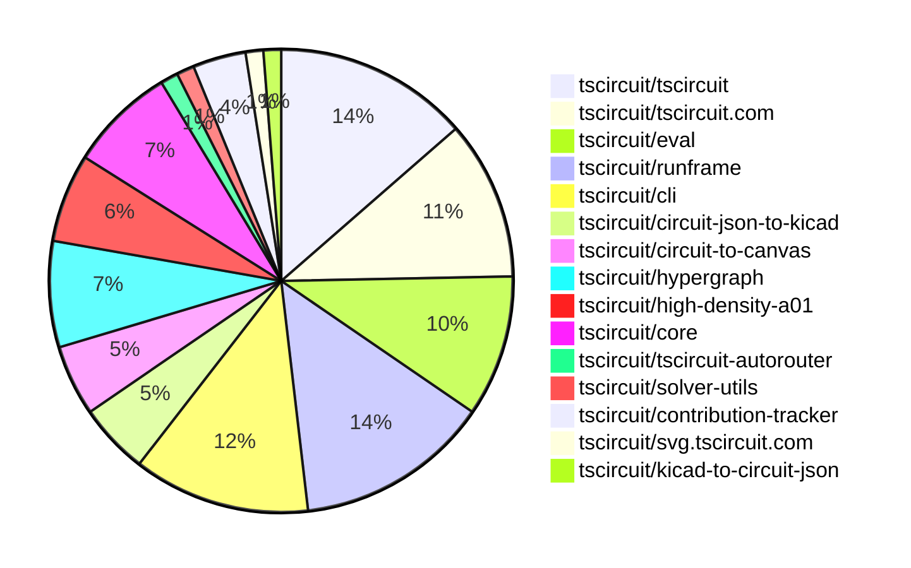

# Contribution Overview 2026-02-24

The current week is shown below. There are 3 major sections:

- [Contributor Overview](#contributor-overview)
- [PRs by Repository](#prs-by-repository)
- [PRs by Contributor](#changes-by-contributor)
- [Scoring & Sponsorship Details](/docs/sponsorship-calculation-explanation.md)

## PRs by Repository

## Contributor Overview

| Contributor | 🐳 Major | 🐙 Minor | 🐌 Tiny | ⭐ | Discussion Contributions |
|-------------|---------|---------|---------|-----|--------------------------|
| [seveibar](#seveibar) | 4 | 0 | 3 | ⭐⭐ | 0🔹 0🔶 0💎 |
| [tscircuitbot](#tscircuitbot) | 0 | 0 | 57 | ⭐⭐ | 0🔹 0🔶 0💎 |
| [imrishabh18](#imrishabh18) | 0 | 3 | 2 | ⭐ | 0🔹 0🔶 0💎 |
| [MustafaMulla29](#MustafaMulla29) | 0 | 2 | 2 | ⭐ | 0🔹 0🔶 0💎 |
| [ShiboSoftwareDev](#ShiboSoftwareDev) | 0 | 1 | 0 | ⭐ | 0🔹 0🔶 0💎 |
| [rushabhcodes](#rushabhcodes) | 1 | 0 | 1 | ⭐ | 0🔹 0🔶 0💎 |
| [Abse2001](#Abse2001) | 0 | 2 | 0 | ⭐ | 0🔹 0🔶 0💎 |
| [AnasSarkiz](#AnasSarkiz) | 1 | 0 | 0 | ⭐ | 0🔹 0🔶 0💎 |
| [techmannih](#techmannih) | 0 | 1 | 1 |  | 0🔹 0🔶 0💎 |

> Note: AI evaluates PRs and assigns 1-3 star ratings automatically. 4 and 5 star ratings require manual staff review.

### Discussion Contribution Legend

- 🔹 Normal Comments: Basic participation with minimal effort
- 🔶 Great Informative Comments: Thoughtful participation that adds value
- 💎 Incredible Comments: Exceptional participation with high-quality content

## Review Table

[reviews-received-hover]: ## "Number of reviews received for PRs for this contributor"
[approvals-received-hover]: ## "Number of approvals received for PRs this contributor authored"
[rejections-received-hover]: ## "Number of rejections received for PRs this contributor authored"
[prs-opened-hover]: ## "Number of PRs opened by this contributor"
[issues-created-hover]: ## "Number of issues created by this contributor"

| Contributor | Reviews Received | Approvals Received | Rejections Received | Approvals | Rejections | PRs Opened | PRs Merged | Issues Created |
|---|---|---|---|---|---|---|---|---|
| [tscircuitbot](#tscircuitbot) | 0 | 0 | 0 | 0 | 0 | 71 | 57 | 0 |
| [jdhruv1503](#jdhruv1503) | 0 | 0 | 0 | 0 | 0 | 4 | 0 | 0 |
| [imrishabh18](#imrishabh18) | 5 | 2 | 0 | 1 | 0 | 6 | 5 | 0 |
| [seveibar](#seveibar) | 0 | 0 | 0 | 11 | 0 | 10 | 7 | 0 |
| [MustafaMulla29](#MustafaMulla29) | 3 | 3 | 0 | 1 | 0 | 4 | 4 | 0 |
| [ShiboSoftwareDev](#ShiboSoftwareDev) | 1 | 1 | 0 | 3 | 0 | 2 | 1 | 0 |
| [rushabhcodes](#rushabhcodes) | 8 | 3 | 0 | 0 | 0 | 3 | 2 | 0 |
| [jarvis117molt-dot](#jarvis117molt-dot) | 0 | 0 | 0 | 0 | 0 | 1 | 0 | 0 |
| [techmannih](#techmannih) | 4 | 3 | 0 | 0 | 0 | 4 | 2 | 0 |
| [0hmX](#0hmX) | 7 | 0 | 0 | 0 | 0 | 1 | 0 | 0 |
| [Abse2001](#Abse2001) | 2 | 2 | 0 | 0 | 0 | 2 | 2 | 0 |
| [abdul-09](#abdul-09) | 0 | 0 | 0 | 0 | 0 | 1 | 0 | 0 |
| [zalo](#zalo) | 5 | 1 | 0 | 0 | 0 | 2 | 0 | 0 |
| [AnasSarkiz](#AnasSarkiz) | 2 | 1 | 0 | 0 | 0 | 1 | 1 | 0 |

## Changes by Repository

### [tscircuit/tscircuit](https://github.com/tscircuit/tscircuit)

🐌 Tiny Contributions (11)

| PR # | Impact | Contributor | Description |
|------|--------|-------------|-------------|
| [#2343](https://github.com/tscircuit/tscircuit/pull/2343) | 🐌 Tiny | tscircuitbot | Updates the tscircuitcli package to version 0.1.981 in package.json |
| [#2342](https://github.com/tscircuit/tscircuit/pull/2342) | 🐌 Tiny | tscircuitbot | Updates the package version from 0.0.1370 to 0.0.1371 in package.json |
| [#2341](https://github.com/tscircuit/tscircuit/pull/2341) | 🐌 Tiny | tscircuitbot | Automated package update |
| [#2340](https://github.com/tscircuit/tscircuit/pull/2340) | 🐌 Tiny | tscircuitbot | Automated package update |
| [#2339](https://github.com/tscircuit/tscircuit/pull/2339) | 🐌 Tiny | tscircuitbot | Automated package update |
| [#2337](https://github.com/tscircuit/tscircuit/pull/2337) | 🐌 Tiny | tscircuitbot | Automated package update |
| [#2336](https://github.com/tscircuit/tscircuit/pull/2336) | 🐌 Tiny | tscircuitbot | Automated package update |
| [#2334](https://github.com/tscircuit/tscircuit/pull/2334) | 🐌 Tiny | tscircuitbot | Automated package update |
| [#2333](https://github.com/tscircuit/tscircuit/pull/2333) | 🐌 Tiny | tscircuitbot | Automated package update |
| [#2332](https://github.com/tscircuit/tscircuit/pull/2332) | 🐌 Tiny | tscircuitbot | Automated package update |
| [#2331](https://github.com/tscircuit/tscircuit/pull/2331) | 🐌 Tiny | tscircuitbot | Automated package update |

### [tscircuit/tscircuit.com](https://github.com/tscircuit/tscircuit.com)

🐌 Tiny Contributions (9)

| PR # | Impact | Contributor | Description |
|------|--------|-------------|-------------|
| [#2851](https://github.com/tscircuit/tscircuit.com/pull/2851) | 🐌 Tiny | tscircuitbot | Updates the tscircuitrunframe package from version 0.0.1650 to 0.0.1651 |
| [#2850](https://github.com/tscircuit/tscircuit.com/pull/2850) | 🐌 Tiny | tscircuitbot | Automated package update |
| [#2849](https://github.com/tscircuit/tscircuit.com/pull/2849) | 🐌 Tiny | tscircuitbot | Automated package update |
| [#2848](https://github.com/tscircuit/tscircuit.com/pull/2848) | 🐌 Tiny | tscircuitbot | Updates the tscircuiteval package to version 0.0.657 in package.json |
| [#2847](https://github.com/tscircuit/tscircuit.com/pull/2847) | 🐌 Tiny | tscircuitbot | Updates the tscircuitrunframe package from version 0.0.1648 to 0.0.1649 |
| [#2846](https://github.com/tscircuit/tscircuit.com/pull/2846) | 🐌 Tiny | tscircuitbot | Updates the tscircuiteval package from version 0.0.655 to 0.0.656 |
| [#2845](https://github.com/tscircuit/tscircuit.com/pull/2845) | 🐌 Tiny | tscircuitbot | Updates the tscircuitrunframe package from version 0.0.1647 to 0.0.1648 |
| [#2844](https://github.com/tscircuit/tscircuit.com/pull/2844) | 🐌 Tiny | tscircuitbot | Updates the tscircuitrunframe package from version 0.0.1646 to 0.0.1647 |
| [#2843](https://github.com/tscircuit/tscircuit.com/pull/2843) | 🐌 Tiny | tscircuitbot | Updates the tscircuiteval package version from 0.0.654 to 0.0.655 in package.json |

### [tscircuit/eval](https://github.com/tscircuit/eval)

🐌 Tiny Contributions (8)

| PR # | Impact | Contributor | Description |
|------|--------|-------------|-------------|
| [#2112](https://github.com/tscircuit/eval/pull/2112) | 🐌 Tiny | tscircuitbot | Automated package update |
| [#2111](https://github.com/tscircuit/eval/pull/2111) | 🐌 Tiny | tscircuitbot | Automated package update |
| [#2109](https://github.com/tscircuit/eval/pull/2109) | 🐌 Tiny | tscircuitbot | Automated package update |
| [#2108](https://github.com/tscircuit/eval/pull/2108) | 🐌 Tiny | tscircuitbot | Automated package update |
| [#2106](https://github.com/tscircuit/eval/pull/2106) | 🐌 Tiny | tscircuitbot | Automated package update to version 0.0.656 |
| [#2105](https://github.com/tscircuit/eval/pull/2105) | 🐌 Tiny | tscircuitbot | Updates the version of the tscircuitcore package from 0.0.1055 to 0.0.1056 in package.json |
| [#2103](https://github.com/tscircuit/eval/pull/2103) | 🐌 Tiny | tscircuitbot | Automated package update |
| [#2102](https://github.com/tscircuit/eval/pull/2102) | 🐌 Tiny | tscircuitbot | Updates the versions of several dependencies in the package.json file. |

### [tscircuit/runframe](https://github.com/tscircuit/runframe)

🐌 Tiny Contributions (11)

| PR # | Impact | Contributor | Description |
|------|--------|-------------|-------------|
| [#2737](https://github.com/tscircuit/runframe/pull/2737) | 🐌 Tiny | tscircuitbot | Updates the circuit-json-to-kicad package from version 0.0.79 to 0.0.80 |
| [#2736](https://github.com/tscircuit/runframe/pull/2736) | 🐌 Tiny | tscircuitbot | Automated package update |
| [#2735](https://github.com/tscircuit/runframe/pull/2735) | 🐌 Tiny | tscircuitbot | Updates the tscircuiteval package from version 0.0.657 to 0.0.658 |
| [#2734](https://github.com/tscircuit/runframe/pull/2734) | 🐌 Tiny | tscircuitbot | Updates the package version from v0.0.1649 to v0.0.1650 in package.json |
| [#2733](https://github.com/tscircuit/runframe/pull/2733) | 🐌 Tiny | tscircuitbot | Updates the tscircuiteval package to version 0.0.657 in the package.json file. |
| [#2732](https://github.com/tscircuit/runframe/pull/2732) | 🐌 Tiny | tscircuitbot | Automated package update |
| [#2731](https://github.com/tscircuit/runframe/pull/2731) | 🐌 Tiny | tscircuitbot | Updates the tscircuiteval package to version 0.0.656 in the package.json file. |
| [#2730](https://github.com/tscircuit/runframe/pull/2730) | 🐌 Tiny | tscircuitbot | Automated package update |
| [#2729](https://github.com/tscircuit/runframe/pull/2729) | 🐌 Tiny | tscircuitbot | Updates the circuit-json-to-kicad package version from 0.0.78 to 0.0.79 in package.json |
| [#2727](https://github.com/tscircuit/runframe/pull/2727) | 🐌 Tiny | tscircuitbot | Automated package update |
| [#2726](https://github.com/tscircuit/runframe/pull/2726) | 🐌 Tiny | tscircuitbot | Updates the tscircuiteval package to version 0.0.655 in the package.json file. |

### [tscircuit/cli](https://github.com/tscircuit/cli)

| PR # | Impact | Rating | Contributor | Description |
|------|--------|--------|-------------|-------------|
| [#2117](https://github.com/tscircuit/cli/pull/2117) | 🐙 Minor | ⭐⭐ | imrishabh18 | Fixes the build process to ensure that only files matching the includeBoardFiles patterns are built, preventing unnecessary transpilation of unrelated files. |
| [#2103](https://github.com/tscircuit/cli/pull/2103) | 🐙 Minor | ⭐⭐ | imrishabh18 | Changes the build process to stop immediately upon encountering a fatal circuit generation error, preventing further processing of subsequent files. |

🐌 Tiny Contributions (8)

| PR # | Impact | Contributor | Description |
|------|--------|-------------|-------------|
| [#2119](https://github.com/tscircuit/cli/pull/2119) | 🐌 Tiny | tscircuitbot | Automated package update |
| [#2118](https://github.com/tscircuit/cli/pull/2118) | 🐌 Tiny | tscircuitbot | Updates the tscircuitrunframe package from version 0.0.1650 to 0.0.1651 |
| [#2115](https://github.com/tscircuit/cli/pull/2115) | 🐌 Tiny | tscircuitbot | Updates the tscircuitrunframe package from version 0.0.1649 to 0.0.1650 |
| [#2114](https://github.com/tscircuit/cli/pull/2114) | 🐌 Tiny | tscircuitbot | Automated package update |
| [#2113](https://github.com/tscircuit/cli/pull/2113) | 🐌 Tiny | tscircuitbot | Updates the tscircuitrunframe package from version 0.0.1648 to 0.0.1649 |
| [#2112](https://github.com/tscircuit/cli/pull/2112) | 🐌 Tiny | tscircuitbot | Updates the package version from 0.1.976 to 0.1.977 in package.json |
| [#2111](https://github.com/tscircuit/cli/pull/2111) | 🐌 Tiny | tscircuitbot | Updates the tscircuitrunframe package from version 0.0.1646 to 0.0.1648 |
| [#2110](https://github.com/tscircuit/cli/pull/2110) | 🐌 Tiny | tscircuitbot | Automated package update |

### [tscircuit/circuit-json-to-kicad](https://github.com/tscircuit/circuit-json-to-kicad)

| PR # | Impact | Rating | Contributor | Description |
|------|--------|--------|-------------|-------------|
| [#150](https://github.com/tscircuit/circuit-json-to-kicad/pull/150) | 🐙 Minor | ⭐⭐ | MustafaMulla29 | Adds fallback to modelcdn URLs for builtin 3D models when no explicit model is specified and a builtin footprint is present |

🐌 Tiny Contributions (3)

| PR # | Impact | Contributor | Description |
|------|--------|-------------|-------------|
| [#151](https://github.com/tscircuit/circuit-json-to-kicad/pull/151) | 🐌 Tiny | tscircuitbot | Automated package update |
| [#149](https://github.com/tscircuit/circuit-json-to-kicad/pull/149) | 🐌 Tiny | tscircuitbot | Automated package update |
| [#148](https://github.com/tscircuit/circuit-json-to-kicad/pull/148) | 🐌 Tiny | MustafaMulla29 | Updates the tscircuit dependency version and adjusts related tests to accommodate changes in the library. |

### [tscircuit/circuit-to-canvas](https://github.com/tscircuit/circuit-to-canvas)

| PR # | Impact | Rating | Contributor | Description |
|------|--------|--------|-------------|-------------|
| [#187](https://github.com/tscircuit/circuit-to-canvas/pull/187) | 🐙 Minor | ⭐⭐ | Abse2001 | Adds geometry-aware soldermask cutouts for covered copper pours, allowing for accurate rendering of openings in the soldermask layer based on the underlying copper pour geometry. |
| [#185](https://github.com/tscircuit/circuit-to-canvas/pull/185) | 🐙 Minor | ⭐⭐ | Abse2001 | Changes the rendering of top and bottom copper pours to use layer opacity instead of separate colors, improving visual consistency. |

🐌 Tiny Contributions (2)

| PR # | Impact | Contributor | Description |
|------|--------|-------------|-------------|
| [#188](https://github.com/tscircuit/circuit-to-canvas/pull/188) | 🐌 Tiny | tscircuitbot | Automated package update |
| [#186](https://github.com/tscircuit/circuit-to-canvas/pull/186) | 🐌 Tiny | tscircuitbot | Updates the package version from 0.0.81 to 0.0.82 in package.json |

### [tscircuit/hypergraph](https://github.com/tscircuit/hypergraph)

| PR # | Impact | Rating | Contributor | Description |
|------|--------|--------|-------------|-------------|
| [#79](https://github.com/tscircuit/hypergraph/pull/79) | 🐳 Major | ⭐⭐⭐ | seveibar | Refactors benchmarking for 0603 by removing redundant topologies, fixing candidate caching, and introducing new benchmarking utilities. |
| [#76](https://github.com/tscircuit/hypergraph/pull/76) | 🐳 Major | ⭐⭐⭐ | AnasSarkiz | Fixes via-region over-porting by limiting via ports to a maximum of 4 sides and resolves solved routes into top stubs and tile-scoped bottom segments for improved trace visualization. |

🐌 Tiny Contributions (4)

| PR # | Impact | Contributor | Description |
|------|--------|-------------|-------------|
| [#82](https://github.com/tscircuit/hypergraph/pull/82) | 🐌 Tiny | tscircuitbot | Automated package update |
| [#80](https://github.com/tscircuit/hypergraph/pull/80) | 🐌 Tiny | tscircuitbot | Updates the package version from 0.0.36 to 0.0.37 in package.json |
| [#77](https://github.com/tscircuit/hypergraph/pull/77) | 🐌 Tiny | tscircuitbot | Automated package update |
| [#81](https://github.com/tscircuit/hypergraph/pull/81) | 🐌 Tiny | seveibar | Adds a GitHub Actions workflow for benchmarking code on push and PR comments, including artifact uploads and result reporting. |

### [tscircuit/high-density-a01](https://github.com/tscircuit/high-density-a01)

| PR # | Impact | Rating | Contributor | Description |
|------|--------|--------|-------------|-------------|
| [#2](https://github.com/tscircuit/high-density-a01/pull/2) | 🐳 Major | ⭐⭐⭐ | seveibar | Optimizes the HighDensitySolverA01 algorithm to achieve a 40x speed increase in TypeScript execution. |

🐌 Tiny Contributions (4)

| PR # | Impact | Contributor | Description |
|------|--------|-------------|-------------|
| [#5](https://github.com/tscircuit/high-density-a01/pull/5) | 🐌 Tiny | tscircuitbot | Automated package update |
| [#4](https://github.com/tscircuit/high-density-a01/pull/4) | 🐌 Tiny | tscircuitbot | Automated package update |
| [#3](https://github.com/tscircuit/high-density-a01/pull/3) | 🐌 Tiny | tscircuitbot | Automated package update |
| [#1](https://github.com/tscircuit/high-density-a01/pull/1) | 🐌 Tiny | seveibar | Add a profiling script to measure solver runtime on sample fixtures, allowing easy benchmarking and extension with additional samples. |

### [tscircuit/core](https://github.com/tscircuit/core)

| PR # | Impact | Rating | Contributor | Description |
|------|--------|--------|-------------|-------------|
| [#1971](https://github.com/tscircuit/core/pull/1971) | 🐳 Major | ⭐⭐⭐ | seveibar | Updates the autorouter to support new 0603 routing specifications and adjusts related test fixtures accordingly. |
| [#1973](https://github.com/tscircuit/core/pull/1973) | 🐙 Minor | ⭐⭐ | MustafaMulla29 | Fixes the issue where port stem lengths were being incorrectly stretched during symbol resizing, ensuring they remain at the user-specified length. |
| [#1969](https://github.com/tscircuit/core/pull/1969) | 🐙 Minor | ⭐⭐ | imrishabh18 | Fixes the issue where the size of the schematic component does not change correctly when the component is rotated. |
| [#1970](https://github.com/tscircuit/core/pull/1970) | 🐙 Minor | ⭐⭐ | ShiboSoftwareDev | Enables caching of subcircuits for boards to improve rendering performance by reusing identical board configurations. |

🐌 Tiny Contributions (2)

| PR # | Impact | Contributor | Description |
|------|--------|-------------|-------------|
| [#1974](https://github.com/tscircuit/core/pull/1974) | 🐌 Tiny | imrishabh18 | Adds tests to reproduce the issue where pcbFlex does not consider the parent width and height for spacing in the layout. |
| [#1972](https://github.com/tscircuit/core/pull/1972) | 🐌 Tiny | imrishabh18 | Adds a GitHub Actions workflow to automatically update and commit snapshot tests to a specified branch. |

### [tscircuit/tscircuit-autorouter](https://github.com/tscircuit/tscircuit-autorouter)

🐌 Tiny Contributions (1)

| PR # | Impact | Contributor | Description |
|------|--------|-------------|-------------|
| [#586](https://github.com/tscircuit/tscircuit-autorouter/pull/586) | 🐌 Tiny | MustafaMulla29 | Fixes the benchmarking workflow for pull requests from forked repositories by adjusting the timeout and checkout reference. |

### [tscircuit/solver-utils](https://github.com/tscircuit/solver-utils)

| PR # | Impact | Rating | Contributor | Description |
|------|--------|--------|-------------|-------------|
| [#19](https://github.com/tscircuit/solver-utils/pull/19) | 🐳 Major | ⭐⭐⭐ | seveibar | Adds more granular animation speed options and allows multiple solver steps per timer tick for faster visual playback and debugging. |

### [tscircuit/contribution-tracker](https://github.com/tscircuit/contribution-tracker)

| PR # | Impact | Rating | Contributor | Description |
|------|--------|--------|-------------|-------------|
| [#313](https://github.com/tscircuit/contribution-tracker/pull/313) | 🐳 Major | ⭐⭐⭐ | rushabhcodes | This pull request adds support for selecting and viewing contribution data by week in the frontend, allowing users to choose from available weeks using a dropdown in the header, with the displayed data updating accordingly. |

🐌 Tiny Contributions (2)

| PR # | Impact | Contributor | Description |
|------|--------|-------------|-------------|
| [#300](https://github.com/tscircuit/contribution-tracker/pull/300) | 🐌 Tiny | seveibar | Updates maintainer roles for Abse2001 and AnasSarkiz in the maintainers list. |
| [#312](https://github.com/tscircuit/contribution-tracker/pull/312) | 🐌 Tiny | rushabhcodes | Refactors codebase to use domain-specific naming instead of generic terms like data, info, value, param. Also fixed redundant filtering logic and removed dead code. |

### [tscircuit/svg.tscircuit.com](https://github.com/tscircuit/svg.tscircuit.com)

| PR # | Impact | Rating | Contributor | Description |
|------|--------|--------|-------------|-------------|
| [#1051](https://github.com/tscircuit/svg.tscircuit.com/pull/1051) | 🐙 Minor | ⭐⭐ | techmannih | Adds a test for rendering translucent 3D CAD models, ensuring correct output and functionality. |

### [tscircuit/kicad-to-circuit-json](https://github.com/tscircuit/kicad-to-circuit-json)

🐌 Tiny Contributions (1)

| PR # | Impact | Contributor | Description |
|------|--------|-------------|-------------|
| [#35](https://github.com/tscircuit/kicad-to-circuit-json/pull/35) | 🐌 Tiny | techmannih | This pull request introduces support for the fp_poly elements in footprints, allowing for the creation of polygon shapes in the PCB silkscreen layer. The changes include modifications to the processFootprintGraphics function to handle fp_poly elements and a new function createFootprintPoly to manage the creation of these polygons. This enhancement is expected to improve the representation of complex shapes in PCB designs. |

## Changes by Contributor

### [tscircuitbot](https://github.com/tscircuitbot)

🐌 Tiny Contributions (57)

| PR # | Impact | Description |
|------|--------|-------------|
| [#2343](https://github.com/tscircuit/tscircuit/pull/2343) | 🐌 Tiny | Updates the tscircuitcli package to version 0.1.981 in package.json |
| [#2342](https://github.com/tscircuit/tscircuit/pull/2342) | 🐌 Tiny | Updates the package version from 0.0.1370 to 0.0.1371 in package.json |
| [#2341](https://github.com/tscircuit/tscircuit/pull/2341) | 🐌 Tiny | Automated package update |
| [#2340](https://github.com/tscircuit/tscircuit/pull/2340) | 🐌 Tiny | Automated package update |
| [#2339](https://github.com/tscircuit/tscircuit/pull/2339) | 🐌 Tiny | Automated package update |
| [#2337](https://github.com/tscircuit/tscircuit/pull/2337) | 🐌 Tiny | Automated package update |
| [#2336](https://github.com/tscircuit/tscircuit/pull/2336) | 🐌 Tiny | Automated package update |
| [#2334](https://github.com/tscircuit/tscircuit/pull/2334) | 🐌 Tiny | Automated package update |
| [#2333](https://github.com/tscircuit/tscircuit/pull/2333) | 🐌 Tiny | Automated package update |
| [#2332](https://github.com/tscircuit/tscircuit/pull/2332) | 🐌 Tiny | Automated package update |
| [#2331](https://github.com/tscircuit/tscircuit/pull/2331) | 🐌 Tiny | Automated package update |
| [#2851](https://github.com/tscircuit/tscircuit.com/pull/2851) | 🐌 Tiny | Updates the tscircuitrunframe package from version 0.0.1650 to 0.0.1651 |
| [#2850](https://github.com/tscircuit/tscircuit.com/pull/2850) | 🐌 Tiny | Automated package update |
| [#2849](https://github.com/tscircuit/tscircuit.com/pull/2849) | 🐌 Tiny | Automated package update |
| [#2848](https://github.com/tscircuit/tscircuit.com/pull/2848) | 🐌 Tiny | Updates the tscircuiteval package to version 0.0.657 in package.json |
| [#2847](https://github.com/tscircuit/tscircuit.com/pull/2847) | 🐌 Tiny | Updates the tscircuitrunframe package from version 0.0.1648 to 0.0.1649 |
| [#2846](https://github.com/tscircuit/tscircuit.com/pull/2846) | 🐌 Tiny | Updates the tscircuiteval package from version 0.0.655 to 0.0.656 |
| [#2845](https://github.com/tscircuit/tscircuit.com/pull/2845) | 🐌 Tiny | Updates the tscircuitrunframe package from version 0.0.1647 to 0.0.1648 |
| [#2844](https://github.com/tscircuit/tscircuit.com/pull/2844) | 🐌 Tiny | Updates the tscircuitrunframe package from version 0.0.1646 to 0.0.1647 |
| [#2843](https://github.com/tscircuit/tscircuit.com/pull/2843) | 🐌 Tiny | Updates the tscircuiteval package version from 0.0.654 to 0.0.655 in package.json |
| [#2112](https://github.com/tscircuit/eval/pull/2112) | 🐌 Tiny | Automated package update |
| [#2111](https://github.com/tscircuit/eval/pull/2111) | 🐌 Tiny | Automated package update |
| [#2109](https://github.com/tscircuit/eval/pull/2109) | 🐌 Tiny | Automated package update |
| [#2108](https://github.com/tscircuit/eval/pull/2108) | 🐌 Tiny | Automated package update |
| [#2106](https://github.com/tscircuit/eval/pull/2106) | 🐌 Tiny | Automated package update to version 0.0.656 |
| [#2105](https://github.com/tscircuit/eval/pull/2105) | 🐌 Tiny | Updates the version of the tscircuitcore package from 0.0.1055 to 0.0.1056 in package.json |
| [#2103](https://github.com/tscircuit/eval/pull/2103) | 🐌 Tiny | Automated package update |
| [#2102](https://github.com/tscircuit/eval/pull/2102) | 🐌 Tiny | Updates the versions of several dependencies in the package.json file. |
| [#2737](https://github.com/tscircuit/runframe/pull/2737) | 🐌 Tiny | Updates the circuit-json-to-kicad package from version 0.0.79 to 0.0.80 |
| [#2736](https://github.com/tscircuit/runframe/pull/2736) | 🐌 Tiny | Automated package update |
| [#2735](https://github.com/tscircuit/runframe/pull/2735) | 🐌 Tiny | Updates the tscircuiteval package from version 0.0.657 to 0.0.658 |
| [#2734](https://github.com/tscircuit/runframe/pull/2734) | 🐌 Tiny | Updates the package version from v0.0.1649 to v0.0.1650 in package.json |
| [#2733](https://github.com/tscircuit/runframe/pull/2733) | 🐌 Tiny | Updates the tscircuiteval package to version 0.0.657 in the package.json file. |
| [#2732](https://github.com/tscircuit/runframe/pull/2732) | 🐌 Tiny | Automated package update |
| [#2731](https://github.com/tscircuit/runframe/pull/2731) | 🐌 Tiny | Updates the tscircuiteval package to version 0.0.656 in the package.json file. |
| [#2730](https://github.com/tscircuit/runframe/pull/2730) | 🐌 Tiny | Automated package update |
| [#2729](https://github.com/tscircuit/runframe/pull/2729) | 🐌 Tiny | Updates the circuit-json-to-kicad package version from 0.0.78 to 0.0.79 in package.json |
| [#2727](https://github.com/tscircuit/runframe/pull/2727) | 🐌 Tiny | Automated package update |
| [#2726](https://github.com/tscircuit/runframe/pull/2726) | 🐌 Tiny | Updates the tscircuiteval package to version 0.0.655 in the package.json file. |
| [#2119](https://github.com/tscircuit/cli/pull/2119) | 🐌 Tiny | Automated package update |
| [#2118](https://github.com/tscircuit/cli/pull/2118) | 🐌 Tiny | Updates the tscircuitrunframe package from version 0.0.1650 to 0.0.1651 |
| [#2115](https://github.com/tscircuit/cli/pull/2115) | 🐌 Tiny | Updates the tscircuitrunframe package from version 0.0.1649 to 0.0.1650 |
| [#2114](https://github.com/tscircuit/cli/pull/2114) | 🐌 Tiny | Automated package update |
| [#2113](https://github.com/tscircuit/cli/pull/2113) | 🐌 Tiny | Updates the tscircuitrunframe package from version 0.0.1648 to 0.0.1649 |
| [#2112](https://github.com/tscircuit/cli/pull/2112) | 🐌 Tiny | Updates the package version from 0.1.976 to 0.1.977 in package.json |
| [#2111](https://github.com/tscircuit/cli/pull/2111) | 🐌 Tiny | Updates the tscircuitrunframe package from version 0.0.1646 to 0.0.1648 |
| [#2110](https://github.com/tscircuit/cli/pull/2110) | 🐌 Tiny | Automated package update |
| [#151](https://github.com/tscircuit/circuit-json-to-kicad/pull/151) | 🐌 Tiny | Automated package update |
| [#149](https://github.com/tscircuit/circuit-json-to-kicad/pull/149) | 🐌 Tiny | Automated package update |
| [#188](https://github.com/tscircuit/circuit-to-canvas/pull/188) | 🐌 Tiny | Automated package update |
| [#186](https://github.com/tscircuit/circuit-to-canvas/pull/186) | 🐌 Tiny | Updates the package version from 0.0.81 to 0.0.82 in package.json |
| [#82](https://github.com/tscircuit/hypergraph/pull/82) | 🐌 Tiny | Automated package update |
| [#80](https://github.com/tscircuit/hypergraph/pull/80) | 🐌 Tiny | Updates the package version from 0.0.36 to 0.0.37 in package.json |
| [#77](https://github.com/tscircuit/hypergraph/pull/77) | 🐌 Tiny | Automated package update |
| [#5](https://github.com/tscircuit/high-density-a01/pull/5) | 🐌 Tiny | Automated package update |
| [#4](https://github.com/tscircuit/high-density-a01/pull/4) | 🐌 Tiny | Automated package update |
| [#3](https://github.com/tscircuit/high-density-a01/pull/3) | 🐌 Tiny | Automated package update |

### [MustafaMulla29](https://github.com/MustafaMulla29)

| PRs # | Impact | Rating | Description |
|------|--------|--------|-------------|
| [#1973](https://github.com/tscircuit/core/pull/1973) | 🐙 Minor | ⭐⭐ | Fixes the issue where port stem lengths were being incorrectly stretched during symbol resizing, ensuring they remain at the user-specified length. |
| [#150](https://github.com/tscircuit/circuit-json-to-kicad/pull/150) | 🐙 Minor | ⭐⭐ | Adds fallback to modelcdn URLs for builtin 3D models when no explicit model is specified and a builtin footprint is present |

🐌 Tiny Contributions (2)

| PR # | Impact | Description |
|------|--------|-------------|
| [#586](https://github.com/tscircuit/tscircuit-autorouter/pull/586) | 🐌 Tiny | Fixes the benchmarking workflow for pull requests from forked repositories by adjusting the timeout and checkout reference. |
| [#148](https://github.com/tscircuit/circuit-json-to-kicad/pull/148) | 🐌 Tiny | Updates the tscircuit dependency version and adjusts related tests to accommodate changes in the library. |

### [imrishabh18](https://github.com/imrishabh18)

| PRs # | Impact | Rating | Description |
|------|--------|--------|-------------|
| [#1969](https://github.com/tscircuit/core/pull/1969) | 🐙 Minor | ⭐⭐ | Fixes the issue where the size of the schematic component does not change correctly when the component is rotated. |
| [#2117](https://github.com/tscircuit/cli/pull/2117) | 🐙 Minor | ⭐⭐ | Fixes the build process to ensure that only files matching the includeBoardFiles patterns are built, preventing unnecessary transpilation of unrelated files. |
| [#2103](https://github.com/tscircuit/cli/pull/2103) | 🐙 Minor | ⭐⭐ | Changes the build process to stop immediately upon encountering a fatal circuit generation error, preventing further processing of subsequent files. |

🐌 Tiny Contributions (2)

| PR # | Impact | Description |
|------|--------|-------------|
| [#1974](https://github.com/tscircuit/core/pull/1974) | 🐌 Tiny | Adds tests to reproduce the issue where pcbFlex does not consider the parent width and height for spacing in the layout. |
| [#1972](https://github.com/tscircuit/core/pull/1972) | 🐌 Tiny | Adds a GitHub Actions workflow to automatically update and commit snapshot tests to a specified branch. |

### [seveibar](https://github.com/seveibar)

| PRs # | Impact | Rating | Description |
|------|--------|--------|-------------|
| [#1971](https://github.com/tscircuit/core/pull/1971) | 🐳 Major | ⭐⭐⭐ | Updates the autorouter to support new 0603 routing specifications and adjusts related test fixtures accordingly. |
| [#19](https://github.com/tscircuit/solver-utils/pull/19) | 🐳 Major | ⭐⭐⭐ | Adds more granular animation speed options and allows multiple solver steps per timer tick for faster visual playback and debugging. |
| [#79](https://github.com/tscircuit/hypergraph/pull/79) | 🐳 Major | ⭐⭐⭐ | Refactors benchmarking for 0603 by removing redundant topologies, fixing candidate caching, and introducing new benchmarking utilities. |
| [#2](https://github.com/tscircuit/high-density-a01/pull/2) | 🐳 Major | ⭐⭐⭐ | Optimizes the HighDensitySolverA01 algorithm to achieve a 40x speed increase in TypeScript execution. |

🐌 Tiny Contributions (3)

| PR # | Impact | Description |
|------|--------|-------------|
| [#300](https://github.com/tscircuit/contribution-tracker/pull/300) | 🐌 Tiny | Updates maintainer roles for Abse2001 and AnasSarkiz in the maintainers list. |
| [#81](https://github.com/tscircuit/hypergraph/pull/81) | 🐌 Tiny | Adds a GitHub Actions workflow for benchmarking code on push and PR comments, including artifact uploads and result reporting. |
| [#1](https://github.com/tscircuit/high-density-a01/pull/1) | 🐌 Tiny | Add a profiling script to measure solver runtime on sample fixtures, allowing easy benchmarking and extension with additional samples. |

### [ShiboSoftwareDev](https://github.com/ShiboSoftwareDev)

| PRs # | Impact | Rating | Description |
|------|--------|--------|-------------|
| [#1970](https://github.com/tscircuit/core/pull/1970) | 🐙 Minor | ⭐⭐ | Enables caching of subcircuits for boards to improve rendering performance by reusing identical board configurations. |

### [rushabhcodes](https://github.com/rushabhcodes)

| PRs # | Impact | Rating | Description |
|------|--------|--------|-------------|
| [#313](https://github.com/tscircuit/contribution-tracker/pull/313) | 🐳 Major | ⭐⭐⭐ | This pull request adds support for selecting and viewing contribution data by week in the frontend, allowing users to choose from available weeks using a dropdown in the header, with the displayed data updating accordingly. |

🐌 Tiny Contributions (1)

| PR # | Impact | Description |
|------|--------|-------------|
| [#312](https://github.com/tscircuit/contribution-tracker/pull/312) | 🐌 Tiny | Refactors codebase to use domain-specific naming instead of generic terms like data, info, value, param. Also fixed redundant filtering logic and removed dead code. |

### [techmannih](https://github.com/techmannih)

| PRs # | Impact | Rating | Description |
|------|--------|--------|-------------|
| [#1051](https://github.com/tscircuit/svg.tscircuit.com/pull/1051) | 🐙 Minor | ⭐⭐ | Adds a test for rendering translucent 3D CAD models, ensuring correct output and functionality. |

🐌 Tiny Contributions (1)

| PR # | Impact | Description |
|------|--------|-------------|
| [#35](https://github.com/tscircuit/kicad-to-circuit-json/pull/35) | 🐌 Tiny | This pull request introduces support for the fp_poly elements in footprints, allowing for the creation of polygon shapes in the PCB silkscreen layer. The changes include modifications to the processFootprintGraphics function to handle fp_poly elements and a new function createFootprintPoly to manage the creation of these polygons. This enhancement is expected to improve the representation of complex shapes in PCB designs. |

### [Abse2001](https://github.com/Abse2001)

| PRs # | Impact | Rating | Description |
|------|--------|--------|-------------|
| [#187](https://github.com/tscircuit/circuit-to-canvas/pull/187) | 🐙 Minor | ⭐⭐ | Adds geometry-aware soldermask cutouts for covered copper pours, allowing for accurate rendering of openings in the soldermask layer based on the underlying copper pour geometry. |
| [#185](https://github.com/tscircuit/circuit-to-canvas/pull/185) | 🐙 Minor | ⭐⭐ | Changes the rendering of top and bottom copper pours to use layer opacity instead of separate colors, improving visual consistency. |

### [AnasSarkiz](https://github.com/AnasSarkiz)

| PRs # | Impact | Rating | Description |
|------|--------|--------|-------------|
| [#76](https://github.com/tscircuit/hypergraph/pull/76) | 🐳 Major | ⭐⭐⭐ | Fixes via-region over-porting by limiting via ports to a maximum of 4 sides and resolves solved routes into top stubs and tile-scoped bottom segments for improved trace visualization. |

## Repository Owners

| Repository | Codeowners |
|------------|------------|
| [builder](https://github.com/tscircuit/builder/blob/main/.github/CODEOWNERS) | [seveibar](https://github.com/seveibar)
| [pcb-viewer](https://github.com/tscircuit/pcb-viewer/blob/main/.github/CODEOWNERS) | [seveibar](https://github.com/seveibar), [ShiboSoftwareDev](https://github.com/ShiboSoftwareDev), [Abse2001](https://github.com/Abse2001)
| [footprints-old](https://github.com/tscircuit/footprints-old/blob/main/.github/CODEOWNERS) | [seveibar](https://github.com/seveibar)
| [footprinter](https://github.com/tscircuit/footprinter/blob/main/.github/CODEOWNERS) | [seveibar](https://github.com/seveibar), [techmannih](https://github.com/techmannih)
| [3d-viewer](https://github.com/tscircuit/3d-viewer/blob/main/.github/CODEOWNERS) | [ShiboSoftwareDev](https://github.com/ShiboSoftwareDev), [Abse2001](https://github.com/Abse2001)
| [winterspec](https://github.com/tscircuit/winterspec/blob/main/.github/CODEOWNERS) | [seveibar](https://github.com/seveibar), [ShiboSoftwareDev](https://github.com/ShiboSoftwareDev)
| [jscad-electronics](https://github.com/tscircuit/jscad-electronics/blob/main/.github/CODEOWNERS) | [seveibar](https://github.com/seveibar), [techmannih](https://github.com/techmannih), [ShiboSoftwareDev](https://github.com/ShiboSoftwareDev), [anas-sarkez](https://github.com/anas-sarkez)
| [circuit-to-svg](https://github.com/tscircuit/circuit-to-svg/blob/main/.github/CODEOWNERS) | [imrishabh18](https://github.com/imrishabh18)
| [schematic-symbols](https://github.com/tscircuit/schematic-symbols/blob/main/.github/CODEOWNERS) | [seveibar](https://github.com/seveibar), [imrishabh18](https://github.com/imrishabh18), [techmannih](https://github.com/techmannih)
| [circuit-json-to-gerber](https://github.com/tscircuit/circuit-json-to-gerber/blob/main/.github/CODEOWNERS) | [seveibar](https://github.com/seveibar), [ShiboSoftwareDev](https://github.com/ShiboSoftwareDev)
| [tscircuit.com](https://github.com/tscircuit/tscircuit.com/blob/main/.github/CODEOWNERS) | [seveibar](https://github.com/seveibar), [imrishabh18](https://github.com/imrishabh18)
| [issue-roulette](https://github.com/tscircuit/issue-roulette/blob/main/.github/CODEOWNERS) | [Anshgrover23](https://github.com/Anshgrover23)
| [sparkfun-boards](https://github.com/tscircuit/sparkfun-boards/blob/main/.github/CODEOWNERS) | [ShiboSoftwareDev](https://github.com/ShiboSoftwareDev), [Abse2001](https://github.com/Abse2001), [MustafaMulla29](https://github.com/MustafaMulla29), [Anshgrover23](https://github.com/Anshgrover23), [techmannih](https://github.com/techmannih)
| [schematic-corpus](https://github.com/tscircuit/schematic-corpus/blob/main/.github/CODEOWNERS) | [Abse2001](https://github.com/Abse2001)
| [copper-pour-solver](https://github.com/tscircuit/copper-pour-solver/blob/main/.github/CODEOWNERS) | [seveibar](https://github.com/seveibar), [ShiboSoftwareDev](https://github.com/ShiboSoftwareDev)
| [common](https://github.com/tscircuit/common/blob/main/.github/CODEOWNERS) | [seveibar](https://github.com/seveibar), [Abse2001](https://github.com/Abse2001)
| [circuit-to-canvas](https://github.com/tscircuit/circuit-to-canvas/blob/main/.github/CODEOWNERS) | [ShiboSoftwareDev](https://github.com/ShiboSoftwareDev), [Abse2001](https://github.com/Abse2001), [techmannih](https://github.com/techmannih)
| [circuit-json-to-lbrn](https://github.com/tscircuit/circuit-json-to-lbrn/blob/main/.github/CODEOWNERS) | [AnasSarkiz](https://github.com/AnasSarkiz)
| [pcbburn.com](https://github.com/tscircuit/pcbburn.com/blob/main/.github/CODEOWNERS) | [AnasSarkiz](https://github.com/AnasSarkiz)

## Repositories by Owner

| User | Repo |
|------|------|
| [seveibar](https://github.com/seveibar) | [builder](https://github.com/tscircuit/builder/blob/main/.github/CODEOWNERS) |
|  | [pcb-viewer](https://github.com/tscircuit/pcb-viewer/blob/main/.github/CODEOWNERS) |
|  | [footprints-old](https://github.com/tscircuit/footprints-old/blob/main/.github/CODEOWNERS) |
|  | [footprinter](https://github.com/tscircuit/footprinter/blob/main/.github/CODEOWNERS) |
|  | [winterspec](https://github.com/tscircuit/winterspec/blob/main/.github/CODEOWNERS) |
|  | [jscad-electronics](https://github.com/tscircuit/jscad-electronics/blob/main/.github/CODEOWNERS) |
|  | [schematic-symbols](https://github.com/tscircuit/schematic-symbols/blob/main/.github/CODEOWNERS) |
|  | [circuit-json-to-gerber](https://github.com/tscircuit/circuit-json-to-gerber/blob/main/.github/CODEOWNERS) |
|  | [tscircuit.com](https://github.com/tscircuit/tscircuit.com/blob/main/.github/CODEOWNERS) |
|  | [copper-pour-solver](https://github.com/tscircuit/copper-pour-solver/blob/main/.github/CODEOWNERS) |
|  | [common](https://github.com/tscircuit/common/blob/main/.github/CODEOWNERS) |
| [ShiboSoftwareDev](https://github.com/ShiboSoftwareDev) | [pcb-viewer](https://github.com/tscircuit/pcb-viewer/blob/main/.github/CODEOWNERS) |
|  | [3d-viewer](https://github.com/tscircuit/3d-viewer/blob/main/.github/CODEOWNERS) |
|  | [winterspec](https://github.com/tscircuit/winterspec/blob/main/.github/CODEOWNERS) |
|  | [jscad-electronics](https://github.com/tscircuit/jscad-electronics/blob/main/.github/CODEOWNERS) |
|  | [circuit-json-to-gerber](https://github.com/tscircuit/circuit-json-to-gerber/blob/main/.github/CODEOWNERS) |
|  | [sparkfun-boards](https://github.com/tscircuit/sparkfun-boards/blob/main/.github/CODEOWNERS) |
|  | [copper-pour-solver](https://github.com/tscircuit/copper-pour-solver/blob/main/.github/CODEOWNERS) |
|  | [circuit-to-canvas](https://github.com/tscircuit/circuit-to-canvas/blob/main/.github/CODEOWNERS) |
| [Abse2001](https://github.com/Abse2001) | [pcb-viewer](https://github.com/tscircuit/pcb-viewer/blob/main/.github/CODEOWNERS) |
|  | [3d-viewer](https://github.com/tscircuit/3d-viewer/blob/main/.github/CODEOWNERS) |
|  | [sparkfun-boards](https://github.com/tscircuit/sparkfun-boards/blob/main/.github/CODEOWNERS) |
|  | [schematic-corpus](https://github.com/tscircuit/schematic-corpus/blob/main/.github/CODEOWNERS) |
|  | [common](https://github.com/tscircuit/common/blob/main/.github/CODEOWNERS) |
|  | [circuit-to-canvas](https://github.com/tscircuit/circuit-to-canvas/blob/main/.github/CODEOWNERS) |
| [techmannih](https://github.com/techmannih) | [footprinter](https://github.com/tscircuit/footprinter/blob/main/.github/CODEOWNERS) |
|  | [jscad-electronics](https://github.com/tscircuit/jscad-electronics/blob/main/.github/CODEOWNERS) |
|  | [schematic-symbols](https://github.com/tscircuit/schematic-symbols/blob/main/.github/CODEOWNERS) |
|  | [sparkfun-boards](https://github.com/tscircuit/sparkfun-boards/blob/main/.github/CODEOWNERS) |
|  | [circuit-to-canvas](https://github.com/tscircuit/circuit-to-canvas/blob/main/.github/CODEOWNERS) |
| [anas-sarkez](https://github.com/anas-sarkez) | [jscad-electronics](https://github.com/tscircuit/jscad-electronics/blob/main/.github/CODEOWNERS) |
| [imrishabh18](https://github.com/imrishabh18) | [circuit-to-svg](https://github.com/tscircuit/circuit-to-svg/blob/main/.github/CODEOWNERS) |
|  | [schematic-symbols](https://github.com/tscircuit/schematic-symbols/blob/main/.github/CODEOWNERS) |
|  | [tscircuit.com](https://github.com/tscircuit/tscircuit.com/blob/main/.github/CODEOWNERS) |
| [Anshgrover23](https://github.com/Anshgrover23) | [issue-roulette](https://github.com/tscircuit/issue-roulette/blob/main/.github/CODEOWNERS) |
|  | [sparkfun-boards](https://github.com/tscircuit/sparkfun-boards/blob/main/.github/CODEOWNERS) |
| [MustafaMulla29](https://github.com/MustafaMulla29) | [sparkfun-boards](https://github.com/tscircuit/sparkfun-boards/blob/main/.github/CODEOWNERS) |
| [AnasSarkiz](https://github.com/AnasSarkiz) | [circuit-json-to-lbrn](https://github.com/tscircuit/circuit-json-to-lbrn/blob/main/.github/CODEOWNERS) |
|  | [pcbburn.com](https://github.com/tscircuit/pcbburn.com/blob/main/.github/CODEOWNERS) |

