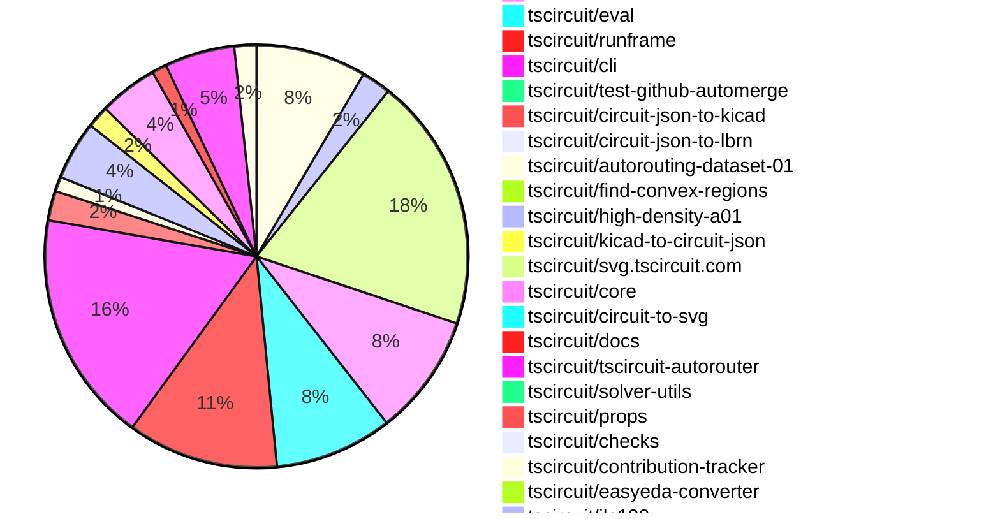

# Contribution Overview 2026-02-24

The current week is shown below. There are 3 major sections:

- [Contributor Overview](#contributor-overview)
- [PRs by Repository](#prs-by-repository)
- [PRs by Contributor](#changes-by-contributor)
- [Scoring & Sponsorship Details](/docs/sponsorship-calculation-explanation.md)

## PRs by Repository

```mermaid
pie
    "tscircuit/3d-viewer" : 1
    "tscircuit/hypergraph" : 30
    "tscircuit/circuit-json-util" : 3
    "tscircuit/circuit-to-canvas" : 8
    "tscircuit/pcb-viewer" : 2
    "tscircuit/tscircuit" : 69
    "tscircuit/tscircuit.com" : 33
    "tscircuit/eval" : 32
    "tscircuit/runframe" : 41
    "tscircuit/cli" : 63
    "tscircuit/test-github-automerge" : 3
    "tscircuit/circuit-json-to-kicad" : 8
    "tscircuit/circuit-json-to-lbrn" : 2
    "tscircuit/autorouting-dataset-01" : 4
    "tscircuit/find-convex-regions" : 2
    "tscircuit/high-density-a01" : 16
    "tscircuit/kicad-to-circuit-json" : 6
    "tscircuit/svg.tscircuit.com" : 2
    "tscircuit/core" : 16
    "tscircuit/circuit-to-svg" : 2
    "tscircuit/docs" : 4
    "tscircuit/tscircuit-autorouter" : 19
    "tscircuit/solver-utils" : 1
    "tscircuit/props" : 2
    "tscircuit/checks" : 3
    "tscircuit/contribution-tracker" : 6
    "tscircuit/easyeda-converter" : 1
    "tscircuit/jlc100" : 1
    "tscircuit/agent-benchmarking-2026-02" : 2
    "tscircuit/calculate-packing" : 1
    "tscircuit/schematic-symbols" : 2
    "tscircuit/math-utils" : 2
    "tscircuit/pcbburn.com" : 1
    "tscircuit/dataset-zero-obstacle-high-density-z01" : 2
```

## Contributor Overview

| Contributor | 🐳 Major | 🐙 Minor | 🐌 Tiny | ⭐ | Discussion Contributions |
|-------------|---------|---------|---------|-----|--------------------------|
| [seveibar](#seveibar) | 13 | 11 | 14 | 👑👑 | 0🔹 0🔶 0💎 |
| [ArnavK-09](#ArnavK-09) | 6 | 2 | 5 | ⭐⭐⭐ | 0🔹 0🔶 0💎 |
| [ShiboSoftwareDev](#ShiboSoftwareDev) | 3 | 4 | 2 | ⭐⭐⭐ | 0🔹 0🔶 0💎 |
| [rushabhcodes](#rushabhcodes) | 6 | 0 | 5 | ⭐⭐ | 0🔹 0🔶 0💎 |
| [Abse2001](#Abse2001) | 4 | 3 | 4 | ⭐⭐ | 0🔹 0🔶 0💎 |
| [MustafaMulla29](#MustafaMulla29) | 2 | 4 | 10 | ⭐⭐ | 0🔹 0🔶 0💎 |
| [imrishabh18](#imrishabh18) | 1 | 8 | 6 | ⭐⭐ | 0🔹 0🔶 0💎 |
| [techmannih](#techmannih) | 3 | 3 | 4 | ⭐⭐ | 0🔹 0🔶 0💎 |
| [AnasSarkiz](#AnasSarkiz) | 5 | 1 | 0 | ⭐⭐ | 0🔹 0🔶 0💎 |
| [0hmX](#0hmX) | 2 | 2 | 3 | ⭐⭐ | 0🔹 0🔶 0💎 |
| [tscircuitbot](#tscircuitbot) | 0 | 0 | 249 | ⭐⭐ | 0🔹 0🔶 0💎 |
| [zalo](#zalo) | 2 | 1 | 0 | ⭐ | 0🔹 0🔶 0💎 |
| [nailoo](#nailoo) | 0 | 2 | 0 | ⭐ | 0🔹 0🔶 0💎 |

> Note: AI evaluates PRs and assigns 1-3 star ratings automatically. 4 and 5 star ratings require manual staff review.

### Discussion Contribution Legend

- 🔹 Normal Comments: Basic participation with minimal effort
- 🔶 Great Informative Comments: Thoughtful participation that adds value
- 💎 Incredible Comments: Exceptional participation with high-quality content

## Review Table

[reviews-received-hover]: ## "Number of reviews received for PRs for this contributor"
[approvals-received-hover]: ## "Number of approvals received for PRs this contributor authored"
[rejections-received-hover]: ## "Number of rejections received for PRs this contributor authored"
[prs-opened-hover]: ## "Number of PRs opened by this contributor"
[issues-created-hover]: ## "Number of issues created by this contributor"

| Contributor | Reviews Received | Approvals Received | Rejections Received | Approvals | Rejections Given | PRs Opened | PRs Merged | Issues Created |
|---|---|---|---|---|---|---|---|---|
| [realmpastai-web](#realmpastai-web) | 0 | 0 | 0 | 0 | 0 | 1 | 0 | 0 |
| [Excellencedev](#Excellencedev) | 0 | 0 | 0 | 0 | 0 | 1 | 0 | 0 |
| [tscircuitbot](#tscircuitbot) | 0 | 0 | 0 | 0 | 0 | 326 | 258 | 0 |
| [Abse2001](#Abse2001) | 13 | 12 | 0 | 2 | 0 | 12 | 11 | 0 |
| [techmannih](#techmannih) | 34 | 14 | 0 | 4 | 1 | 17 | 10 | 0 |
| [imrishabh18](#imrishabh18) | 11 | 5 | 0 | 9 | 0 | 18 | 15 | 0 |
| [SolariSystems](#SolariSystems) | 0 | 0 | 0 | 0 | 0 | 2 | 0 | 0 |
| [jdhruv1503](#jdhruv1503) | 0 | 0 | 0 | 0 | 0 | 4 | 0 | 0 |
| [seveibar](#seveibar) | 4 | 0 | 0 | 56 | 9 | 46 | 39 | 0 |
| [AnasSarkiz](#AnasSarkiz) | 7 | 6 | 0 | 3 | 0 | 10 | 6 | 0 |
| [ShiboSoftwareDev](#ShiboSoftwareDev) | 9 | 9 | 0 | 10 | 0 | 12 | 9 | 0 |
| [quantbitrealmSimon](#quantbitrealmSimon) | 0 | 0 | 0 | 0 | 0 | 1 | 0 | 0 |
| [dagangtj](#dagangtj) | 1 | 0 | 0 | 0 | 0 | 3 | 0 | 0 |
| [rkluis](#rkluis) | 0 | 0 | 0 | 0 | 0 | 1 | 0 | 0 |
| [MustafaMulla29](#MustafaMulla29) | 21 | 13 | 2 | 4 | 0 | 20 | 17 | 0 |
| [gavin-openops](#gavin-openops) | 1 | 0 | 0 | 0 | 0 | 6 | 0 | 0 |
| [li224242](#li224242) | 0 | 0 | 0 | 0 | 0 | 5 | 0 | 0 |
| [rushabhcodes](#rushabhcodes) | 48 | 15 | 1 | 2 | 5 | 17 | 11 | 0 |
| [nailoo](#nailoo) | 4 | 3 | 1 | 0 | 0 | 5 | 2 | 0 |
| [769066112-ops](#769066112-ops) | 1 | 0 | 0 | 0 | 0 | 3 | 0 | 0 |
| [ArnavK-09](#ArnavK-09) | 14 | 10 | 0 | 4 | 0 | 14 | 13 | 0 |
| [ETwithin](#ETwithin) | 2 | 0 | 0 | 0 | 0 | 4 | 0 | 0 |
| [Devesh36](#Devesh36) | 12 | 1 | 9 | 0 | 0 | 5 | 0 | 0 |
| [shitiandmw](#shitiandmw) | 0 | 0 | 0 | 0 | 0 | 1 | 0 | 0 |
| [shehaban](#shehaban) | 9 | 2 | 2 | 0 | 0 | 3 | 0 | 0 |
| [0hmX](#0hmX) | 5 | 4 | 0 | 2 | 0 | 11 | 8 | 0 |
| [jarvis117molt-dot](#jarvis117molt-dot) | 0 | 0 | 0 | 0 | 0 | 1 | 0 | 0 |
| [Yeachan-Heo](#Yeachan-Heo) | 1 | 0 | 0 | 0 | 0 | 1 | 0 | 0 |
| [openclaw-dev-ops](#openclaw-dev-ops) | 0 | 0 | 0 | 0 | 0 | 1 | 0 | 0 |
| [sirrodgepodge](#sirrodgepodge) | 2 | 0 | 0 | 0 | 0 | 2 | 0 | 0 |
| [davidweb3-ctrl](#davidweb3-ctrl) | 0 | 0 | 0 | 0 | 0 | 1 | 0 | 0 |
| [sungdark](#sungdark) | 0 | 0 | 0 | 0 | 0 | 1 | 0 | 0 |
| [zalo](#zalo) | 8 | 2 | 0 | 0 | 0 | 4 | 3 | 0 |
| [abdul-09](#abdul-09) | 0 | 0 | 0 | 0 | 0 | 1 | 0 | 0 |

## Changes by Repository

### [tscircuit/3d-viewer](https://github.com/tscircuit/3d-viewer)

| PR # | Impact | Rating | Contributor | Description |
|------|--------|--------|-------------|-------------|
| [#714](https://github.com/tscircuit/3d-viewer/pull/714) | 🐳 Major | ⭐⭐⭐ | Abse2001 | https:3d-viewer-git-fork-abse2001-main-tscircuit.vercel.app?pathstorycomponents-copperpour--default https:3d-viewer-git-fork-abse2001-main-tscircuit.vercel.app?pathstorycomponents-copperpourconnectedcomponents--default https:3d-viewer-git-fork-abse2001-main-tscircuit.vercel.app?pathstorycopperpour-core-test--copperpour-core-test-story |

### [tscircuit/hypergraph](https://github.com/tscircuit/hypergraph)

| PR # | Impact | Rating | Contributor | Description |
|------|--------|--------|-------------|-------------|
| [#93](https://github.com/tscircuit/hypergraph/pull/93) | 🐳 Major | ⭐⭐⭐ | Abse2001 | Adds optimization for three regions via topology to enhance solve performance in the circuit design process. |
| [#86](https://github.com/tscircuit/hypergraph/pull/86) | 🐳 Major | ⭐⭐⭐ | Abse2001 | Adds a new 5 net via topology to enhance the performance of the solver in the circuit design process. |
| [#84](https://github.com/tscircuit/hypergraph/pull/84) | 🐳 Major | ⭐⭐⭐ | Abse2001 | Optimizes the default via topology to enhance solve performance in the circuit design process. |
| [#79](https://github.com/tscircuit/hypergraph/pull/79) | 🐳 Major | ⭐⭐⭐ | seveibar | Refactors benchmarking for 0603 by removing redundant topologies, fixing candidate caching, and introducing new benchmarking utilities. |
| [#102](https://github.com/tscircuit/hypergraph/pull/102) | 🐳 Major | ⭐⭐⭐ | ShiboSoftwareDev | Implements exclusive via region handling, T-intersection detection, and routing improvements for filler regions in the via graph solver. |
| [#97](https://github.com/tscircuit/hypergraph/pull/97) | 🐳 Major | ⭐⭐⭐ | ShiboSoftwareDev | Precomputes convex regions for a unit tile template and replicates via translation, eliminating redundant solver computations across the grid. Adds geometric line segment intersection as fallback when perimeter-based chord crossing detection fails, and introduces rectangular filler regions along boundary margins with proper port connectivity between tiles and outer areas. |
| [#88](https://github.com/tscircuit/hypergraph/pull/88) | 🐳 Major | ⭐⭐⭐ | ShiboSoftwareDev | Refactors via region topology for improved net routing efficiency by optimizing via placements and segment connections in the PCB layout. |
| [#106](https://github.com/tscircuit/hypergraph/pull/106) | 🐳 Major | ⭐⭐⭐ | AnasSarkiz | Refines via-tile geometry and updates parsing scripts to improve SVG generation and solve rate for via topology. |
| [#76](https://github.com/tscircuit/hypergraph/pull/76) | 🐳 Major | ⭐⭐⭐ | AnasSarkiz | Fixes via-region over-porting by limiting via ports to a maximum of 4 sides and resolves solved routes into top stubs and tile-scoped bottom segments for improved trace visualization. |
| [#95](https://github.com/tscircuit/hypergraph/pull/95) | 🐙 Minor | ⭐⭐ | ShiboSoftwareDev | Adds dynamic calculation of tile width and height based on via tile data, improving the flexibility of the via graph solver. |

🐌 Tiny Contributions (20)

| PR # | Impact | Contributor | Description |
|------|--------|-------------|-------------|
| [#108](https://github.com/tscircuit/hypergraph/pull/108) | 🐌 Tiny | Abse2001 | Optimizes the topology of three net vias to enhance solve performance in circuit design. |
| [#99](https://github.com/tscircuit/hypergraph/pull/99) | 🐌 Tiny | Abse2001 | Optimizes the topology of 4 via regions to enhance solve performance in circuit design. |
| [#109](https://github.com/tscircuit/hypergraph/pull/109) | 🐌 Tiny | tscircuitbot | Automated package update |
| [#107](https://github.com/tscircuit/hypergraph/pull/107) | 🐌 Tiny | tscircuitbot | Automated package update |
| [#105](https://github.com/tscircuit/hypergraph/pull/105) | 🐌 Tiny | tscircuitbot | Automated package update |
| [#96](https://github.com/tscircuit/hypergraph/pull/96) | 🐌 Tiny | tscircuitbot | Automated package update |
| [#98](https://github.com/tscircuit/hypergraph/pull/98) | 🐌 Tiny | tscircuitbot | Automated package update |
| [#101](https://github.com/tscircuit/hypergraph/pull/101) | 🐌 Tiny | tscircuitbot | Automated package update |
| [#104](https://github.com/tscircuit/hypergraph/pull/104) | 🐌 Tiny | tscircuitbot | Automated package update |
| [#94](https://github.com/tscircuit/hypergraph/pull/94) | 🐌 Tiny | tscircuitbot | Automated package update |
| [#92](https://github.com/tscircuit/hypergraph/pull/92) | 🐌 Tiny | tscircuitbot | Automated package update |
| [#89](https://github.com/tscircuit/hypergraph/pull/89) | 🐌 Tiny | tscircuitbot | Automated package update |
| [#85](https://github.com/tscircuit/hypergraph/pull/85) | 🐌 Tiny | tscircuitbot | Automated package update |
| [#87](https://github.com/tscircuit/hypergraph/pull/87) | 🐌 Tiny | tscircuitbot | Automated package update |
| [#77](https://github.com/tscircuit/hypergraph/pull/77) | 🐌 Tiny | tscircuitbot | Automated package update |
| [#80](https://github.com/tscircuit/hypergraph/pull/80) | 🐌 Tiny | tscircuitbot | Updates the package version from 0.0.36 to 0.0.37 in package.json |
| [#82](https://github.com/tscircuit/hypergraph/pull/82) | 🐌 Tiny | tscircuitbot | Automated package update |
| [#81](https://github.com/tscircuit/hypergraph/pull/81) | 🐌 Tiny | seveibar | Adds a GitHub Actions workflow for benchmarking code on push and PR comments, including artifact uploads and result reporting. |
| [#103](https://github.com/tscircuit/hypergraph/pull/103) | 🐌 Tiny | ShiboSoftwareDev | Fixes filtering logic for convex regions in graph solver fixtures to include regions starting with filler: |
| [#91](https://github.com/tscircuit/hypergraph/pull/91) | 🐌 Tiny | ShiboSoftwareDev | Updates the tscircuitfind-convex-regions package to version 0.0.9, which includes improvements for constrained Delaunay triangulation functionality. |

### [tscircuit/circuit-json-util](https://github.com/tscircuit/circuit-json-util)

| PR # | Impact | Rating | Contributor | Description |
|------|--------|--------|-------------|-------------|
| [#77](https://github.com/tscircuit/circuit-json-util/pull/77) | 🐙 Minor | ⭐⭐ | Abse2001 | Adds courtyard element layer mapping for PCB elements in the getElementRenderLayers function |
| [#79](https://github.com/tscircuit/circuit-json-util/pull/79) | 🐙 Minor | ⭐⭐ | seveibar | Add a method to insert multiple AnyCircuitElementInput elements at once, allowing batch creation and retrieval of generated IDs. |

🐌 Tiny Contributions (1)

| PR # | Impact | Contributor | Description |
|------|--------|-------------|-------------|
| [#78](https://github.com/tscircuit/circuit-json-util/pull/78) | 🐌 Tiny | seveibar | Add a top-level insert handler to the cju proxy that accepts AnyCircuitElementInput and returns an AnyCircuitElement, allowing users to insert arbitrary element objects into a circuit soup without calling a type-specific helper. |

### [tscircuit/circuit-to-canvas](https://github.com/tscircuit/circuit-to-canvas)

| PR # | Impact | Rating | Contributor | Description |
|------|--------|--------|-------------|-------------|
| [#185](https://github.com/tscircuit/circuit-to-canvas/pull/185) | 🐙 Minor | ⭐⭐ | Abse2001 | Changes the rendering of top and bottom copper pours to use layer opacity instead of separate colors, improving visual consistency. |
| [#187](https://github.com/tscircuit/circuit-to-canvas/pull/187) | 🐙 Minor | ⭐⭐ | Abse2001 | Adds geometry-aware soldermask cutouts for covered copper pours, allowing for accurate rendering of openings in the soldermask layer based on the underlying copper pour geometry. |
| [#194](https://github.com/tscircuit/circuit-to-canvas/pull/194) | 🐙 Minor | ⭐⭐ | techmannih | Refactors the drawing logic for shapes by centralizing rotation handling and simplifying the drawing of plated holes. |

🐌 Tiny Contributions (5)

| PR # | Impact | Contributor | Description |
|------|--------|-------------|-------------|
| [#192](https://github.com/tscircuit/circuit-to-canvas/pull/192) | 🐌 Tiny | Abse2001 | Updates the circuit-json-util dependency to version 0.0.78 and adds type definition for PcbCourtyardOutline in CircuitToCanvasDrawer. |
| [#195](https://github.com/tscircuit/circuit-to-canvas/pull/195) | 🐌 Tiny | tscircuitbot | Automated package update |
| [#193](https://github.com/tscircuit/circuit-to-canvas/pull/193) | 🐌 Tiny | tscircuitbot | Automated package update |
| [#186](https://github.com/tscircuit/circuit-to-canvas/pull/186) | 🐌 Tiny | tscircuitbot | Updates the package version from 0.0.81 to 0.0.82 in package.json |
| [#188](https://github.com/tscircuit/circuit-to-canvas/pull/188) | 🐌 Tiny | tscircuitbot | Automated package update |

### [tscircuit/pcb-viewer](https://github.com/tscircuit/pcb-viewer)

🐌 Tiny Contributions (2)

| PR # | Impact | Contributor | Description |
|------|--------|-------------|-------------|
| [#683](https://github.com/tscircuit/pcb-viewer/pull/683) | 🐌 Tiny | Abse2001 | Updates the circuit-json-util and circuit-json dependencies to their latest versions in package.json |
| [#684](https://github.com/tscircuit/pcb-viewer/pull/684) | 🐌 Tiny | tscircuitbot | Automated package update |

### [tscircuit/tscircuit](https://github.com/tscircuit/tscircuit)

🐌 Tiny Contributions (69)

| PR # | Impact | Contributor | Description |
|------|--------|-------------|-------------|
| [#2403](https://github.com/tscircuit/tscircuit/pull/2403) | 🐌 Tiny | tscircuitbot | Automated package update |
| [#2402](https://github.com/tscircuit/tscircuit/pull/2402) | 🐌 Tiny | tscircuitbot | Automated package update |
| [#2401](https://github.com/tscircuit/tscircuit/pull/2401) | 🐌 Tiny | tscircuitbot | Automated package update |
| [#2400](https://github.com/tscircuit/tscircuit/pull/2400) | 🐌 Tiny | tscircuitbot | Automated package update |
| [#2399](https://github.com/tscircuit/tscircuit/pull/2399) | 🐌 Tiny | tscircuitbot | Automated package update |
| [#2398](https://github.com/tscircuit/tscircuit/pull/2398) | 🐌 Tiny | tscircuitbot | Updates the tscircuitcli package from version 0.1.1005 to 0.1.1006 |
| [#2397](https://github.com/tscircuit/tscircuit/pull/2397) | 🐌 Tiny | tscircuitbot | Automated package update |
| [#2396](https://github.com/tscircuit/tscircuit/pull/2396) | 🐌 Tiny | tscircuitbot | Automated package update |
| [#2395](https://github.com/tscircuit/tscircuit/pull/2395) | 🐌 Tiny | tscircuitbot | Automated package update |
| [#2394](https://github.com/tscircuit/tscircuit/pull/2394) | 🐌 Tiny | tscircuitbot | Automated package update |
| [#2393](https://github.com/tscircuit/tscircuit/pull/2393) | 🐌 Tiny | tscircuitbot | Automated package update |
| [#2392](https://github.com/tscircuit/tscircuit/pull/2392) | 🐌 Tiny | tscircuitbot | Automated package update |
| [#2391](https://github.com/tscircuit/tscircuit/pull/2391) | 🐌 Tiny | tscircuitbot | Automated package update |
| [#2390](https://github.com/tscircuit/tscircuit/pull/2390) | 🐌 Tiny | tscircuitbot | Automated package update |
| [#2388](https://github.com/tscircuit/tscircuit/pull/2388) | 🐌 Tiny | tscircuitbot | Automated package update |
| [#2387](https://github.com/tscircuit/tscircuit/pull/2387) | 🐌 Tiny | tscircuitbot | Updates the tscircuitcli package from version 0.1.1000 to 0.1.1001 |
| [#2383](https://github.com/tscircuit/tscircuit/pull/2383) | 🐌 Tiny | tscircuitbot | Updates the tscircuitcli package from version 0.1.998 to 0.1.999 and the tscircuitrunframe package from version 0.0.1660 to 0.0.1661 in the package.json file. |
| [#2382](https://github.com/tscircuit/tscircuit/pull/2382) | 🐌 Tiny | tscircuitbot | Automated package update |
| [#2381](https://github.com/tscircuit/tscircuit/pull/2381) | 🐌 Tiny | tscircuitbot | Updates the tscircuitcli package to version 0.1.998 in the package.json file |
| [#2384](https://github.com/tscircuit/tscircuit/pull/2384) | 🐌 Tiny | tscircuitbot | Automated package update |
| [#2386](https://github.com/tscircuit/tscircuit/pull/2386) | 🐌 Tiny | tscircuitbot | Automated package update |
| [#2385](https://github.com/tscircuit/tscircuit/pull/2385) | 🐌 Tiny | tscircuitbot | Automated package update |
| [#2380](https://github.com/tscircuit/tscircuit/pull/2380) | 🐌 Tiny | tscircuitbot | Automated package update |
| [#2379](https://github.com/tscircuit/tscircuit/pull/2379) | 🐌 Tiny | tscircuitbot | Automated package update |
| [#2369](https://github.com/tscircuit/tscircuit/pull/2369) | 🐌 Tiny | tscircuitbot | Updates the tscircuitcli package to version 0.1.993 in package.json |
| [#2372](https://github.com/tscircuit/tscircuit/pull/2372) | 🐌 Tiny | tscircuitbot | Automated package update |
| [#2375](https://github.com/tscircuit/tscircuit/pull/2375) | 🐌 Tiny | tscircuitbot | Automated package update |
| [#2377](https://github.com/tscircuit/tscircuit/pull/2377) | 🐌 Tiny | tscircuitbot | Automated package update |
| [#2370](https://github.com/tscircuit/tscircuit/pull/2370) | 🐌 Tiny | tscircuitbot | Automated package update |
| [#2368](https://github.com/tscircuit/tscircuit/pull/2368) | 🐌 Tiny | tscircuitbot | Automated package update |
| [#2374](https://github.com/tscircuit/tscircuit/pull/2374) | 🐌 Tiny | tscircuitbot | Automated package update |
| [#2371](https://github.com/tscircuit/tscircuit/pull/2371) | 🐌 Tiny | tscircuitbot | Automated package update |
| [#2376](https://github.com/tscircuit/tscircuit/pull/2376) | 🐌 Tiny | tscircuitbot | Automated package update |
| [#2378](https://github.com/tscircuit/tscircuit/pull/2378) | 🐌 Tiny | tscircuitbot | Automated package update |
| [#2373](https://github.com/tscircuit/tscircuit/pull/2373) | 🐌 Tiny | tscircuitbot | Automated package update |
| [#2367](https://github.com/tscircuit/tscircuit/pull/2367) | 🐌 Tiny | tscircuitbot | Updates the tscircuitcli package to version 0.1.992 in the package.json file |
| [#2360](https://github.com/tscircuit/tscircuit/pull/2360) | 🐌 Tiny | tscircuitbot | Automated package update |
| [#2358](https://github.com/tscircuit/tscircuit/pull/2358) | 🐌 Tiny | tscircuitbot | Updates the tscircuitcli package to version 0.1.988 |
| [#2364](https://github.com/tscircuit/tscircuit/pull/2364) | 🐌 Tiny | tscircuitbot | Updates the tscircuitcli package to version 0.1.991 in the package.json file |
| [#2359](https://github.com/tscircuit/tscircuit/pull/2359) | 🐌 Tiny | tscircuitbot | Automated package update |
| [#2363](https://github.com/tscircuit/tscircuit/pull/2363) | 🐌 Tiny | tscircuitbot | Automated package update |
| [#2361](https://github.com/tscircuit/tscircuit/pull/2361) | 🐌 Tiny | tscircuitbot | Automated package update |
| [#2365](https://github.com/tscircuit/tscircuit/pull/2365) | 🐌 Tiny | tscircuitbot | Automated package update |
| [#2362](https://github.com/tscircuit/tscircuit/pull/2362) | 🐌 Tiny | tscircuitbot | Updates the tscircuitcli package to version 0.1.990 in the package.json file |
| [#2347](https://github.com/tscircuit/tscircuit/pull/2347) | 🐌 Tiny | tscircuitbot | Updates the tscircuitcli package to version 0.1.983 in the package.json file. |
| [#2345](https://github.com/tscircuit/tscircuit/pull/2345) | 🐌 Tiny | tscircuitbot | Updates the tscircuitcli package to version 0.1.982 in package.json |
| [#2349](https://github.com/tscircuit/tscircuit/pull/2349) | 🐌 Tiny | tscircuitbot | Updates the tscircuitcli package to version 0.1.984 in package.json |
| [#2351](https://github.com/tscircuit/tscircuit/pull/2351) | 🐌 Tiny | tscircuitbot | Automated package update |
| [#2355](https://github.com/tscircuit/tscircuit/pull/2355) | 🐌 Tiny | tscircuitbot | Automated package update |
| [#2346](https://github.com/tscircuit/tscircuit/pull/2346) | 🐌 Tiny | tscircuitbot | Automated package update |
| [#2354](https://github.com/tscircuit/tscircuit/pull/2354) | 🐌 Tiny | tscircuitbot | Automated package update |
| [#2344](https://github.com/tscircuit/tscircuit/pull/2344) | 🐌 Tiny | tscircuitbot | Automated package update |
| [#2348](https://github.com/tscircuit/tscircuit/pull/2348) | 🐌 Tiny | tscircuitbot | Updates the package version from 0.0.1374 to 0.0.1375 in package.json |
| [#2356](https://github.com/tscircuit/tscircuit/pull/2356) | 🐌 Tiny | tscircuitbot | Automated package update |
| [#2353](https://github.com/tscircuit/tscircuit/pull/2353) | 🐌 Tiny | tscircuitbot | Updates the version of several dependencies in the package.json file, including tscircuitcli, tscircuitcore, tscircuiteval, tscircuitprops, and tscircuitrunframe. |
| [#2352](https://github.com/tscircuit/tscircuit/pull/2352) | 🐌 Tiny | tscircuitbot | Automated package update |
| [#2350](https://github.com/tscircuit/tscircuit/pull/2350) | 🐌 Tiny | tscircuitbot | Automated package update |
| [#2339](https://github.com/tscircuit/tscircuit/pull/2339) | 🐌 Tiny | tscircuitbot | Automated package update |
| [#2337](https://github.com/tscircuit/tscircuit/pull/2337) | 🐌 Tiny | tscircuitbot | Automated package update |
| [#2332](https://github.com/tscircuit/tscircuit/pull/2332) | 🐌 Tiny | tscircuitbot | Automated package update |
| [#2331](https://github.com/tscircuit/tscircuit/pull/2331) | 🐌 Tiny | tscircuitbot | Automated package update |
| [#2341](https://github.com/tscircuit/tscircuit/pull/2341) | 🐌 Tiny | tscircuitbot | Automated package update |
| [#2342](https://github.com/tscircuit/tscircuit/pull/2342) | 🐌 Tiny | tscircuitbot | Updates the package version from 0.0.1370 to 0.0.1371 in package.json |
| [#2343](https://github.com/tscircuit/tscircuit/pull/2343) | 🐌 Tiny | tscircuitbot | Updates the tscircuitcli package to version 0.1.981 in package.json |
| [#2340](https://github.com/tscircuit/tscircuit/pull/2340) | 🐌 Tiny | tscircuitbot | Automated package update |
| [#2334](https://github.com/tscircuit/tscircuit/pull/2334) | 🐌 Tiny | tscircuitbot | Automated package update |
| [#2336](https://github.com/tscircuit/tscircuit/pull/2336) | 🐌 Tiny | tscircuitbot | Automated package update |
| [#2333](https://github.com/tscircuit/tscircuit/pull/2333) | 🐌 Tiny | tscircuitbot | Automated package update |
| [#2389](https://github.com/tscircuit/tscircuit/pull/2389) | 🐌 Tiny | techmannih | Updates the kicad-to-circuit-json dependency to version 0.0.30 in package.json |

### [tscircuit/tscircuit.com](https://github.com/tscircuit/tscircuit.com)

| PR # | Impact | Rating | Contributor | Description |
|------|--------|--------|-------------|-------------|
| [#2882](https://github.com/tscircuit/tscircuit.com/pull/2882) | 🐳 Major | ⭐⭐⭐ | rushabhcodes | Replaces direct assignments to window.location.href with wouters navigate function for smoother client-side navigation in the CmdKMenu component. |
| [#2881](https://github.com/tscircuit/tscircuit.com/pull/2881) | 🐳 Major | ⭐⭐⭐ | ArnavK-09 | Adds a hotkey (cmde) for navigating to the editor and refactors the hotkey hook for improved functionality. |
| [#2876](https://github.com/tscircuit/tscircuit.com/pull/2876) | 🐳 Major | ⭐⭐⭐ | ArnavK-09 | Changes the logic for determining the website URL to prioritize the user-set website over the domain name. |
| [#2875](https://github.com/tscircuit/tscircuit.com/pull/2875) | 🐳 Major | ⭐⭐⭐ | ArnavK-09 | Adds a confirmation dialog for deleting a package domain in the UI, allowing users to delete domains with a confirmation step to prevent accidental deletions. |
| [#2855](https://github.com/tscircuit/tscircuit.com/pull/2855) | 🐳 Major | ⭐⭐⭐ | ArnavK-09 | Adds a ScrollToTopButton component to the release build detail and release detail pages, allowing users to scroll back to the top of the page easily. |
| [#2852](https://github.com/tscircuit/tscircuit.com/pull/2852) | 🐳 Major | ⭐⭐⭐ | ArnavK-09 | Adds a loading state to the refresh button for GitHub repositories, preventing multiple refresh requests while one is in progress. |
| [#2879](https://github.com/tscircuit/tscircuit.com/pull/2879) | 🐙 Minor | ⭐⭐ | ArnavK-09 | Adds a new API route to retrieve preview circuit JSON based on package release information, enhancing the ability to fetch circuit data dynamically. |
| [#2873](https://github.com/tscircuit/tscircuit.com/pull/2873) | 🐙 Minor | ⭐⭐ | ArnavK-09 | Adds a new API endpoint to delete a package domain, including permission checks and error handling for non-existent domains. |

🐌 Tiny Contributions (25)

| PR # | Impact | Contributor | Description |
|------|--------|-------------|-------------|
| [#2893](https://github.com/tscircuit/tscircuit.com/pull/2893) | 🐌 Tiny | tscircuitbot | Updates the tscircuitrunframe package from version 0.0.1665 to 0.0.1666 |
| [#2892](https://github.com/tscircuit/tscircuit.com/pull/2892) | 🐌 Tiny | tscircuitbot | Automated package update |
| [#2891](https://github.com/tscircuit/tscircuit.com/pull/2891) | 🐌 Tiny | tscircuitbot | Updates the tscircuitrunframe package from version 0.0.1664 to 0.0.1665 |
| [#2890](https://github.com/tscircuit/tscircuit.com/pull/2890) | 🐌 Tiny | tscircuitbot | Automated package update |
| [#2889](https://github.com/tscircuit/tscircuit.com/pull/2889) | 🐌 Tiny | tscircuitbot | Updates the tscircuitrunframe package from version 0.0.1663 to 0.0.1664 |
| [#2887](https://github.com/tscircuit/tscircuit.com/pull/2887) | 🐌 Tiny | tscircuitbot | Updates the tscircuitrunframe package to version 0.0.1663 |
| [#2880](https://github.com/tscircuit/tscircuit.com/pull/2880) | 🐌 Tiny | tscircuitbot | Automated package update to version 0.0.205 |
| [#2872](https://github.com/tscircuit/tscircuit.com/pull/2872) | 🐌 Tiny | tscircuitbot | Updates the tscircuitrunframe package from version 0.0.1660 to 0.0.1662 |
| [#2871](https://github.com/tscircuit/tscircuit.com/pull/2871) | 🐌 Tiny | tscircuitbot | Automated package update |
| [#2869](https://github.com/tscircuit/tscircuit.com/pull/2869) | 🐌 Tiny | tscircuitbot | Updates the tscircuitrunframe package to version 0.0.1660 |
| [#2866](https://github.com/tscircuit/tscircuit.com/pull/2866) | 🐌 Tiny | tscircuitbot | Updates the tscircuitrunframe package to version 0.0.1658 |
| [#2864](https://github.com/tscircuit/tscircuit.com/pull/2864) | 🐌 Tiny | tscircuitbot | Updates the tscircuitrunframe package from version 0.0.1655 to 0.0.1657 |
| [#2867](https://github.com/tscircuit/tscircuit.com/pull/2867) | 🐌 Tiny | tscircuitbot | Automated package update |
| [#2863](https://github.com/tscircuit/tscircuit.com/pull/2863) | 🐌 Tiny | tscircuitbot | Updates the tscircuiteval package from version 0.0.662 to 0.0.663 |
| [#2861](https://github.com/tscircuit/tscircuit.com/pull/2861) | 🐌 Tiny | tscircuitbot | Automated package update |
| [#2865](https://github.com/tscircuit/tscircuit.com/pull/2865) | 🐌 Tiny | tscircuitbot | Updates the version of the tscircuiteval package from 0.0.663 to 0.0.664 in package.json |
| [#2859](https://github.com/tscircuit/tscircuit.com/pull/2859) | 🐌 Tiny | tscircuitbot | Updates the tscircuiteval package from version 0.0.659 to 0.0.660 |
| [#2858](https://github.com/tscircuit/tscircuit.com/pull/2858) | 🐌 Tiny | tscircuitbot | Updates the tscircuitrunframe package from version 0.0.1652 to 0.0.1654 |
| [#2856](https://github.com/tscircuit/tscircuit.com/pull/2856) | 🐌 Tiny | tscircuitbot | Updates the tscircuitrunframe package from version 0.0.1651 to 0.0.1652 |
| [#2857](https://github.com/tscircuit/tscircuit.com/pull/2857) | 🐌 Tiny | tscircuitbot | Updates the tscircuiteval package from version 0.0.658 to 0.0.659 |
| [#2860](https://github.com/tscircuit/tscircuit.com/pull/2860) | 🐌 Tiny | tscircuitbot | Updates the tscircuitrunframe package from version 0.0.1654 to 0.0.1655 |
| [#2888](https://github.com/tscircuit/tscircuit.com/pull/2888) | 🐌 Tiny | seveibar | Replaces the explicit trace  element with a component-level connections prop for the capacitor in the blank board template. |
| [#2885](https://github.com/tscircuit/tscircuit.com/pull/2885) | 🐌 Tiny | rushabhcodes | Updates the version of circuit-json-to-gltf from 0.0.14 to 0.0.73 in package.json |
| [#2878](https://github.com/tscircuit/tscircuit.com/pull/2878) | 🐌 Tiny | ArnavK-09 | Refactors the sidebar releases section to include tooltips for package preview links and enhances the settings card to support keyboard shortcuts for saving changes. |
| [#2853](https://github.com/tscircuit/tscircuit.com/pull/2853) | 🐌 Tiny | ArnavK-09 | Adds a mock GitHub installation entry to the database seeding process. |

### [tscircuit/eval](https://github.com/tscircuit/eval)

| PR # | Impact | Rating | Contributor | Description |
|------|--------|--------|-------------|-------------|
| [#2126](https://github.com/tscircuit/eval/pull/2126) | 🐳 Major | ⭐⭐⭐ | seveibar | Make KiCad footprint load failures easier to diagnose by surfacing HTTP status, the request URL, and a short response preview. Ensure CAD model metadata includes both WRL and STEP URLs so consumers can access either format. Harden JSON handling for footprint responses to avoid unhandled parse errors and to normalize single-object responses to arrays. |

🐌 Tiny Contributions (31)

| PR # | Impact | Contributor | Description |
|------|--------|-------------|-------------|
| [#2147](https://github.com/tscircuit/eval/pull/2147) | 🐌 Tiny | tscircuitbot | Automated package update |
| [#2146](https://github.com/tscircuit/eval/pull/2146) | 🐌 Tiny | tscircuitbot | Automated package update |
| [#2144](https://github.com/tscircuit/eval/pull/2144) | 🐌 Tiny | tscircuitbot | Automated package update |
| [#2140](https://github.com/tscircuit/eval/pull/2140) | 🐌 Tiny | tscircuitbot | Automated package update |
| [#2139](https://github.com/tscircuit/eval/pull/2139) | 🐌 Tiny | tscircuitbot | Updates the version of the tscircuitcore package from 0.0.1066 to 0.0.1067 in package.json |
| [#2138](https://github.com/tscircuit/eval/pull/2138) | 🐌 Tiny | tscircuitbot | Automated package update |
| [#2137](https://github.com/tscircuit/eval/pull/2137) | 🐌 Tiny | tscircuitbot | Updates the version of the tscircuitcore package from 0.0.1065 to 0.0.1066 in package.json |
| [#2135](https://github.com/tscircuit/eval/pull/2135) | 🐌 Tiny | tscircuitbot | Automated package update |
| [#2134](https://github.com/tscircuit/eval/pull/2134) | 🐌 Tiny | tscircuitbot | Automated package update |
| [#2132](https://github.com/tscircuit/eval/pull/2132) | 🐌 Tiny | tscircuitbot | Automated package update to version 0.0.665 |
| [#2131](https://github.com/tscircuit/eval/pull/2131) | 🐌 Tiny | tscircuitbot | Updates the version of the tscircuitcore package from 0.0.1063 to 0.0.1064 in package.json |
| [#2129](https://github.com/tscircuit/eval/pull/2129) | 🐌 Tiny | tscircuitbot | Automated package update |
| [#2125](https://github.com/tscircuit/eval/pull/2125) | 🐌 Tiny | tscircuitbot | Automated package update |
| [#2124](https://github.com/tscircuit/eval/pull/2124) | 🐌 Tiny | tscircuitbot | Updates the versions of several dependencies in the package.json file. |
| [#2127](https://github.com/tscircuit/eval/pull/2127) | 🐌 Tiny | tscircuitbot | Automated package update |
| [#2122](https://github.com/tscircuit/eval/pull/2122) | 🐌 Tiny | tscircuitbot | Updates the version of the tscircuitcore package from 0.0.1061 to 0.0.1062 in package.json |
| [#2123](https://github.com/tscircuit/eval/pull/2123) | 🐌 Tiny | tscircuitbot | Automated package update |
| [#2119](https://github.com/tscircuit/eval/pull/2119) | 🐌 Tiny | tscircuitbot | Updates the version of the tscircuitcore package from 0.0.1060 to 0.0.1061 in package.json |
| [#2117](https://github.com/tscircuit/eval/pull/2117) | 🐌 Tiny | tscircuitbot | Automated package update |
| [#2120](https://github.com/tscircuit/eval/pull/2120) | 🐌 Tiny | tscircuitbot | Automated package update |
| [#2116](https://github.com/tscircuit/eval/pull/2116) | 🐌 Tiny | tscircuitbot | Automated package update |
| [#2111](https://github.com/tscircuit/eval/pull/2111) | 🐌 Tiny | tscircuitbot | Automated package update |
| [#2112](https://github.com/tscircuit/eval/pull/2112) | 🐌 Tiny | tscircuitbot | Automated package update |
| [#2105](https://github.com/tscircuit/eval/pull/2105) | 🐌 Tiny | tscircuitbot | Updates the version of the tscircuitcore package from 0.0.1055 to 0.0.1056 in package.json |
| [#2102](https://github.com/tscircuit/eval/pull/2102) | 🐌 Tiny | tscircuitbot | Updates the versions of several dependencies in the package.json file. |
| [#2109](https://github.com/tscircuit/eval/pull/2109) | 🐌 Tiny | tscircuitbot | Automated package update |
| [#2108](https://github.com/tscircuit/eval/pull/2108) | 🐌 Tiny | tscircuitbot | Automated package update |
| [#2106](https://github.com/tscircuit/eval/pull/2106) | 🐌 Tiny | tscircuitbot | Automated package update to version 0.0.656 |
| [#2103](https://github.com/tscircuit/eval/pull/2103) | 🐌 Tiny | tscircuitbot | Automated package update |
| [#2143](https://github.com/tscircuit/eval/pull/2143) | 🐌 Tiny | techmannih | Updates the kicad-to-circuit-json dependency to version 0.0.30 in package.json |
| [#2128](https://github.com/tscircuit/eval/pull/2128) | 🐌 Tiny | seveibar | Adds a script to validate KiCad autocomplete footprints against the platform loader, ensuring all footprints can be loaded and parsed correctly. |

### [tscircuit/runframe](https://github.com/tscircuit/runframe)

| PR # | Impact | Rating | Contributor | Description |
|------|--------|--------|-------------|-------------|
| [#2756](https://github.com/tscircuit/runframe/pull/2756) | 🐳 Major | ⭐⭐⭐ | imrishabh18 | Adds the ability to include the circuit.json base name as a static JSON option and allows users to select it from a dropdown menu. |

🐌 Tiny Contributions (40)

| PR # | Impact | Contributor | Description |
|------|--------|-------------|-------------|
| [#2770](https://github.com/tscircuit/runframe/pull/2770) | 🐌 Tiny | tscircuitbot | Updates the package version from v0.0.1665 to v0.0.1666 in package.json |
| [#2769](https://github.com/tscircuit/runframe/pull/2769) | 🐌 Tiny | tscircuitbot | Updates the tscircuiteval package from version 0.0.669 to 0.0.670 |
| [#2768](https://github.com/tscircuit/runframe/pull/2768) | 🐌 Tiny | tscircuitbot | Automated package update |
| [#2767](https://github.com/tscircuit/runframe/pull/2767) | 🐌 Tiny | tscircuitbot | Updates the tscircuiteval package to version 0.0.669 in the package.json file. |
| [#2766](https://github.com/tscircuit/runframe/pull/2766) | 🐌 Tiny | tscircuitbot | Automated package update |
| [#2765](https://github.com/tscircuit/runframe/pull/2765) | 🐌 Tiny | tscircuitbot | Updates the circuit-json-to-kicad package version from 0.0.81 to 0.0.82 in package.json |
| [#2763](https://github.com/tscircuit/runframe/pull/2763) | 🐌 Tiny | tscircuitbot | Updates the package version from 0.0.1662 to 0.0.1663 in package.json |
| [#2762](https://github.com/tscircuit/runframe/pull/2762) | 🐌 Tiny | tscircuitbot | Updates the tscircuiteval package version from 0.0.666 to 0.0.668 in package.json |
| [#2759](https://github.com/tscircuit/runframe/pull/2759) | 🐌 Tiny | tscircuitbot | Updates the package version from 0.0.1660 to 0.0.1661 in package.json |
| [#2761](https://github.com/tscircuit/runframe/pull/2761) | 🐌 Tiny | tscircuitbot | Automated package update |
| [#2760](https://github.com/tscircuit/runframe/pull/2760) | 🐌 Tiny | tscircuitbot | Automated package update |
| [#2757](https://github.com/tscircuit/runframe/pull/2757) | 🐌 Tiny | tscircuitbot | Updates the tscircuiteval package from version 0.0.664 to 0.0.665 |
| [#2758](https://github.com/tscircuit/runframe/pull/2758) | 🐌 Tiny | tscircuitbot | Updates the package version from 0.0.1659 to 0.0.1660 in package.json |
| [#2753](https://github.com/tscircuit/runframe/pull/2753) | 🐌 Tiny | tscircuitbot | Updates the tscircuitpcb-viewer package from version 1.11.343 to 1.11.344 |
| [#2751](https://github.com/tscircuit/runframe/pull/2751) | 🐌 Tiny | tscircuitbot | Updates the tscircuiteval package to version 0.0.664 |
| [#2749](https://github.com/tscircuit/runframe/pull/2749) | 🐌 Tiny | tscircuitbot | Updates the tscircuiteval package to version 0.0.663 in the package.json file. |
| [#2747](https://github.com/tscircuit/runframe/pull/2747) | 🐌 Tiny | tscircuitbot | Updates the tscircuiteval package to version 0.0.662 in the package.json file. |
| [#2748](https://github.com/tscircuit/runframe/pull/2748) | 🐌 Tiny | tscircuitbot | Automated package update |
| [#2750](https://github.com/tscircuit/runframe/pull/2750) | 🐌 Tiny | tscircuitbot | Automated package update |
| [#2755](https://github.com/tscircuit/runframe/pull/2755) | 🐌 Tiny | tscircuitbot | Automated package update |
| [#2752](https://github.com/tscircuit/runframe/pull/2752) | 🐌 Tiny | tscircuitbot | Automated package update |
| [#2741](https://github.com/tscircuit/runframe/pull/2741) | 🐌 Tiny | tscircuitbot | Updates the tscircuit3d-viewer package from version 0.0.525 to 0.0.526 |
| [#2739](https://github.com/tscircuit/runframe/pull/2739) | 🐌 Tiny | tscircuitbot | Updates the circuit-json-to-kicad package version from 0.0.80 to 0.0.81 in package.json |
| [#2744](https://github.com/tscircuit/runframe/pull/2744) | 🐌 Tiny | tscircuitbot | Automated package update |
| [#2745](https://github.com/tscircuit/runframe/pull/2745) | 🐌 Tiny | tscircuitbot | Updates the tscircuiteval package from version 0.0.659 to 0.0.660 in the package.json file. |
| [#2743](https://github.com/tscircuit/runframe/pull/2743) | 🐌 Tiny | tscircuitbot | Updates the tscircuiteval package to version 0.0.659 in the package.json file. |
| [#2742](https://github.com/tscircuit/runframe/pull/2742) | 🐌 Tiny | tscircuitbot | Automated package update |
| [#2740](https://github.com/tscircuit/runframe/pull/2740) | 🐌 Tiny | tscircuitbot | Automated package update |
| [#2746](https://github.com/tscircuit/runframe/pull/2746) | 🐌 Tiny | tscircuitbot | Automated package update |
| [#2737](https://github.com/tscircuit/runframe/pull/2737) | 🐌 Tiny | tscircuitbot | Updates the circuit-json-to-kicad package from version 0.0.79 to 0.0.80 |
| [#2736](https://github.com/tscircuit/runframe/pull/2736) | 🐌 Tiny | tscircuitbot | Automated package update |
| [#2735](https://github.com/tscircuit/runframe/pull/2735) | 🐌 Tiny | tscircuitbot | Updates the tscircuiteval package from version 0.0.657 to 0.0.658 |
| [#2734](https://github.com/tscircuit/runframe/pull/2734) | 🐌 Tiny | tscircuitbot | Updates the package version from v0.0.1649 to v0.0.1650 in package.json |
| [#2733](https://github.com/tscircuit/runframe/pull/2733) | 🐌 Tiny | tscircuitbot | Updates the tscircuiteval package to version 0.0.657 in the package.json file. |
| [#2732](https://github.com/tscircuit/runframe/pull/2732) | 🐌 Tiny | tscircuitbot | Automated package update |
| [#2731](https://github.com/tscircuit/runframe/pull/2731) | 🐌 Tiny | tscircuitbot | Updates the tscircuiteval package to version 0.0.656 in the package.json file. |
| [#2726](https://github.com/tscircuit/runframe/pull/2726) | 🐌 Tiny | tscircuitbot | Updates the tscircuiteval package to version 0.0.655 in the package.json file. |
| [#2727](https://github.com/tscircuit/runframe/pull/2727) | 🐌 Tiny | tscircuitbot | Automated package update |
| [#2730](https://github.com/tscircuit/runframe/pull/2730) | 🐌 Tiny | tscircuitbot | Automated package update |
| [#2729](https://github.com/tscircuit/runframe/pull/2729) | 🐌 Tiny | tscircuitbot | Updates the circuit-json-to-kicad package version from 0.0.78 to 0.0.79 in package.json |

### [tscircuit/cli](https://github.com/tscircuit/cli)

| PR # | Impact | Rating | Contributor | Description |
|------|--------|--------|-------------|-------------|
| [#2125](https://github.com/tscircuit/cli/pull/2125) | 🐳 Major | ⭐⭐⭐ | seveibar | Adds options to the tsci import command to filter sources for component imports from JLCPCB or the tscircuit registry. |
| [#2166](https://github.com/tscircuit/cli/pull/2166) | 🐳 Major | ⭐⭐⭐ | rushabhcodes | Changes the type of circuitJson from unknownany to AnyCircuitElement in the generateKicadProject and snapshotProject functions to enhance type safety and reduce runtime errors. |
| [#2163](https://github.com/tscircuit/cli/pull/2163) | 🐳 Major | ⭐⭐⭐ | ArnavK-09 | Adds a dynamic title to the build site and replaces the static loading message with a loading UI component. |
| [#2173](https://github.com/tscircuit/cli/pull/2173) | 🐙 Minor | ⭐⭐ | seveibar | Allows the tsci snapshot command to accept prebuilt circuit JSON files, enabling users to run the command without a TSX build step and ensuring correct snapshot file naming for JSON inputs. |
| [#2145](https://github.com/tscircuit/cli/pull/2145) | 🐙 Minor | ⭐⭐ | seveibar | Adds new commands for checking netlist, placement, and routing in the CLI tool. |
| [#2132](https://github.com/tscircuit/cli/pull/2132) | 🐙 Minor | ⭐⭐ | MustafaMulla29 | Fetches built-in 3D models from a CDN and copies them to the KiCad librarys 3D models directory, while also handling local model paths appropriately. |
| [#2143](https://github.com/tscircuit/cli/pull/2143) | 🐙 Minor | ⭐⭐ | imrishabh18 | Prevents worker threads from rendering circuit.json and .circuit.json files as they are treated as prebuilt files. |
| [#2123](https://github.com/tscircuit/cli/pull/2123) | 🐙 Minor | ⭐⭐ | imrishabh18 | Adds structured logging before exiting the build process to provide clearer error messages and reasons for termination. |
| [#2117](https://github.com/tscircuit/cli/pull/2117) | 🐙 Minor | ⭐⭐ | imrishabh18 | Fixes the build process to ensure that only files matching the includeBoardFiles patterns are built, preventing unnecessary transpilation of unrelated files. |
| [#2103](https://github.com/tscircuit/cli/pull/2103) | 🐙 Minor | ⭐⭐ | imrishabh18 | Changes the build process to stop immediately upon encountering a fatal circuit generation error, preventing further processing of subsequent files. |

🐌 Tiny Contributions (53)

| PR # | Impact | Contributor | Description |
|------|--------|-------------|-------------|
| [#2179](https://github.com/tscircuit/cli/pull/2179) | 🐌 Tiny | tscircuitbot | Automated package update |
| [#2178](https://github.com/tscircuit/cli/pull/2178) | 🐌 Tiny | tscircuitbot | Updates the tscircuitrunframe package from version 0.0.1665 to 0.0.1666 |
| [#2177](https://github.com/tscircuit/cli/pull/2177) | 🐌 Tiny | tscircuitbot | Automated package update |
| [#2176](https://github.com/tscircuit/cli/pull/2176) | 🐌 Tiny | tscircuitbot | Updates the tscircuitrunframe package from version 0.0.1664 to 0.0.1665 |
| [#2175](https://github.com/tscircuit/cli/pull/2175) | 🐌 Tiny | tscircuitbot | Automated package update |
| [#2174](https://github.com/tscircuit/cli/pull/2174) | 🐌 Tiny | tscircuitbot | Automated package update |
| [#2172](https://github.com/tscircuit/cli/pull/2172) | 🐌 Tiny | tscircuitbot | Automated package update |
| [#2171](https://github.com/tscircuit/cli/pull/2171) | 🐌 Tiny | tscircuitbot | Updates the tscircuitrunframe package from version 0.0.1663 to 0.0.1664 |
| [#2169](https://github.com/tscircuit/cli/pull/2169) | 🐌 Tiny | tscircuitbot | Automated package update |
| [#2168](https://github.com/tscircuit/cli/pull/2168) | 🐌 Tiny | tscircuitbot | Updates the tscircuitrunframe package from version 0.0.1662 to 0.0.1663 |
| [#2167](https://github.com/tscircuit/cli/pull/2167) | 🐌 Tiny | tscircuitbot | Automated package update |
| [#2164](https://github.com/tscircuit/cli/pull/2164) | 🐌 Tiny | tscircuitbot | Automated package update |
| [#2160](https://github.com/tscircuit/cli/pull/2160) | 🐌 Tiny | tscircuitbot | Automated package update |
| [#2161](https://github.com/tscircuit/cli/pull/2161) | 🐌 Tiny | tscircuitbot | Updates the tscircuitrunframe package from version 0.0.1661 to 0.0.1662 |
| [#2158](https://github.com/tscircuit/cli/pull/2158) | 🐌 Tiny | tscircuitbot | Automated package update |
| [#2159](https://github.com/tscircuit/cli/pull/2159) | 🐌 Tiny | tscircuitbot | Updates the tscircuitrunframe package from version 0.0.1660 to 0.0.1661 |
| [#2162](https://github.com/tscircuit/cli/pull/2162) | 🐌 Tiny | tscircuitbot | Automated package update |
| [#2157](https://github.com/tscircuit/cli/pull/2157) | 🐌 Tiny | tscircuitbot | Updates the tscircuitrunframe package from version 0.0.1659 to 0.0.1660 |
| [#2153](https://github.com/tscircuit/cli/pull/2153) | 🐌 Tiny | tscircuitbot | Updates the tscircuitrunframe package from version 0.0.1657 to 0.0.1658 |
| [#2147](https://github.com/tscircuit/cli/pull/2147) | 🐌 Tiny | tscircuitbot | Automated package update |
| [#2154](https://github.com/tscircuit/cli/pull/2154) | 🐌 Tiny | tscircuitbot | Updates the package version from 0.1.995 to 0.1.996 in package.json |
| [#2156](https://github.com/tscircuit/cli/pull/2156) | 🐌 Tiny | tscircuitbot | Automated package update |
| [#2150](https://github.com/tscircuit/cli/pull/2150) | 🐌 Tiny | tscircuitbot | Automated package update |
| [#2155](https://github.com/tscircuit/cli/pull/2155) | 🐌 Tiny | tscircuitbot | Updates the tscircuitrunframe package from version 0.0.1658 to 0.0.1659 |
| [#2146](https://github.com/tscircuit/cli/pull/2146) | 🐌 Tiny | tscircuitbot | Automated README update with latest CLI usage output. |
| [#2152](https://github.com/tscircuit/cli/pull/2152) | 🐌 Tiny | tscircuitbot | Updates the package version from v0.1.994 to v0.1.995 in package.json |
| [#2149](https://github.com/tscircuit/cli/pull/2149) | 🐌 Tiny | tscircuitbot | Updates the tscircuitrunframe package from version 0.0.1655 to 0.0.1656 |
| [#2151](https://github.com/tscircuit/cli/pull/2151) | 🐌 Tiny | tscircuitbot | Updates the tscircuitrunframe package from version 0.0.1656 to 0.0.1657 |
| [#2144](https://github.com/tscircuit/cli/pull/2144) | 🐌 Tiny | tscircuitbot | Updates the package version from 0.1.990 to 0.1.991 in package.json |
| [#2138](https://github.com/tscircuit/cli/pull/2138) | 🐌 Tiny | tscircuitbot | Automated package update |
| [#2142](https://github.com/tscircuit/cli/pull/2142) | 🐌 Tiny | tscircuitbot | Automated package update |
| [#2134](https://github.com/tscircuit/cli/pull/2134) | 🐌 Tiny | tscircuitbot | Updates the tscircuitrunframe package to version 0.0.1654 in the package.json file. |
| [#2128](https://github.com/tscircuit/cli/pull/2128) | 🐌 Tiny | tscircuitbot | Automated README update with latest CLI usage output. |
| [#2129](https://github.com/tscircuit/cli/pull/2129) | 🐌 Tiny | tscircuitbot | Automated package update |
| [#2120](https://github.com/tscircuit/cli/pull/2120) | 🐌 Tiny | tscircuitbot | Automated package update |
| [#2124](https://github.com/tscircuit/cli/pull/2124) | 🐌 Tiny | tscircuitbot | Updates the package version from v0.1.981 to v0.1.982 in package.json |
| [#2136](https://github.com/tscircuit/cli/pull/2136) | 🐌 Tiny | tscircuitbot | Updates the tscircuitrunframe package from version 0.0.1654 to 0.0.1655 |
| [#2135](https://github.com/tscircuit/cli/pull/2135) | 🐌 Tiny | tscircuitbot | Automated package update |
| [#2130](https://github.com/tscircuit/cli/pull/2130) | 🐌 Tiny | tscircuitbot | Updates the tscircuitrunframe package from version 0.0.1651 to 0.0.1652 |
| [#2137](https://github.com/tscircuit/cli/pull/2137) | 🐌 Tiny | tscircuitbot | Automated package update |
| [#2127](https://github.com/tscircuit/cli/pull/2127) | 🐌 Tiny | tscircuitbot | Automated package update |
| [#2131](https://github.com/tscircuit/cli/pull/2131) | 🐌 Tiny | tscircuitbot | Automated package update |
| [#2111](https://github.com/tscircuit/cli/pull/2111) | 🐌 Tiny | tscircuitbot | Updates the tscircuitrunframe package from version 0.0.1646 to 0.0.1648 |
| [#2119](https://github.com/tscircuit/cli/pull/2119) | 🐌 Tiny | tscircuitbot | Automated package update |
| [#2118](https://github.com/tscircuit/cli/pull/2118) | 🐌 Tiny | tscircuitbot | Updates the tscircuitrunframe package from version 0.0.1650 to 0.0.1651 |
| [#2110](https://github.com/tscircuit/cli/pull/2110) | 🐌 Tiny | tscircuitbot | Automated package update |
| [#2113](https://github.com/tscircuit/cli/pull/2113) | 🐌 Tiny | tscircuitbot | Updates the tscircuitrunframe package from version 0.0.1648 to 0.0.1649 |
| [#2112](https://github.com/tscircuit/cli/pull/2112) | 🐌 Tiny | tscircuitbot | Updates the package version from 0.1.976 to 0.1.977 in package.json |
| [#2114](https://github.com/tscircuit/cli/pull/2114) | 🐌 Tiny | tscircuitbot | Automated package update |
| [#2115](https://github.com/tscircuit/cli/pull/2115) | 🐌 Tiny | tscircuitbot | Updates the tscircuitrunframe package from version 0.0.1649 to 0.0.1650 |
| [#2141](https://github.com/tscircuit/cli/pull/2141) | 🐌 Tiny | imrishabh18 | Limits the number of worker threads to the number of files being processed to prevent unnecessary resource usage. |
| [#2139](https://github.com/tscircuit/cli/pull/2139) | 🐌 Tiny | imrishabh18 | Adds truthy fallbacks for various build options in the CI build process to ensure defaults are applied correctly. |
| [#2170](https://github.com/tscircuit/cli/pull/2170) | 🐌 Tiny | ArnavK-09 | Updates the log message when creating the tscircuit.config.json file to reflect the schema creation instead of the main entry point. |

### [tscircuit/test-github-automerge](https://github.com/tscircuit/test-github-automerge)

🐌 Tiny Contributions (3)

| PR # | Impact | Contributor | Description |
|------|--------|-------------|-------------|
| [#18](https://github.com/tscircuit/test-github-automerge/pull/18) | 🐌 Tiny | tscircuitbot | Updates the tscircuitcircuit-json-util package from version 0.0.79 to 0.0.80 in the development dependencies. |
| [#17](https://github.com/tscircuit/test-github-automerge/pull/17) | 🐌 Tiny | tscircuitbot | Updates the tscircuitcircuit-json-util package from version 0.0.78 to 0.0.79 |
| [#15](https://github.com/tscircuit/test-github-automerge/pull/15) | 🐌 Tiny | tscircuitbot | Updates the tscircuitcircuit-json-util package from version 0.0.77 to 0.0.78 in the development dependencies. |

### [tscircuit/circuit-json-to-kicad](https://github.com/tscircuit/circuit-json-to-kicad)

| PR # | Impact | Rating | Contributor | Description |
|------|--------|--------|-------------|-------------|
| [#152](https://github.com/tscircuit/circuit-json-to-kicad/pull/152) | 🐙 Minor | ⭐⭐ | MustafaMulla29 | Fixes symbol-footprint classification for components that have both builtin and custom footprints, ensuring the correct symbol is assigned to the user library. |
| [#150](https://github.com/tscircuit/circuit-json-to-kicad/pull/150) | 🐙 Minor | ⭐⭐ | MustafaMulla29 | Adds fallback to modelcdn URLs for builtin 3D models when no explicit model is specified and a builtin footprint is present |

🐌 Tiny Contributions (6)

| PR # | Impact | Contributor | Description |
|------|--------|-------------|-------------|
| [#155](https://github.com/tscircuit/circuit-json-to-kicad/pull/155) | 🐌 Tiny | tscircuitbot | Automated package update |
| [#153](https://github.com/tscircuit/circuit-json-to-kicad/pull/153) | 🐌 Tiny | tscircuitbot | Automated package update |
| [#149](https://github.com/tscircuit/circuit-json-to-kicad/pull/149) | 🐌 Tiny | tscircuitbot | Automated package update |
| [#151](https://github.com/tscircuit/circuit-json-to-kicad/pull/151) | 🐌 Tiny | tscircuitbot | Automated package update |
| [#154](https://github.com/tscircuit/circuit-json-to-kicad/pull/154) | 🐌 Tiny | MustafaMulla29 | Updates the dependencies for tscircuit and kicadts to their latest versions in package.json, ensuring compatibility and access to new features or fixes. |
| [#148](https://github.com/tscircuit/circuit-json-to-kicad/pull/148) | 🐌 Tiny | MustafaMulla29 | Updates the tscircuit dependency version and adjusts related tests to accommodate changes in the library. |

### [tscircuit/circuit-json-to-lbrn](https://github.com/tscircuit/circuit-json-to-lbrn)

| PR # | Impact | Rating | Contributor | Description |
|------|--------|--------|-------------|-------------|
| [#145](https://github.com/tscircuit/circuit-json-to-lbrn/pull/145) | 🐙 Minor | ⭐⭐ | AnasSarkiz | Fixes incorrect bottom-layer orientation in LightBurn exports when cutting PCBs on a flipped board by adding a mirrorBottomLayer option. |

🐌 Tiny Contributions (1)

| PR # | Impact | Contributor | Description |
|------|--------|-------------|-------------|
| [#146](https://github.com/tscircuit/circuit-json-to-lbrn/pull/146) | 🐌 Tiny | tscircuitbot | Automated package update |

### [tscircuit/autorouting-dataset-01](https://github.com/tscircuit/autorouting-dataset-01)

| PR # | Impact | Rating | Contributor | Description |
|------|--------|--------|-------------|-------------|
| [#70](https://github.com/tscircuit/autorouting-dataset-01/pull/70) | 🐳 Major | ⭐⭐⭐ | 0hmX | Validates SRJs for obstacle overlaps and checks if obstacles are within board outline bounds, reporting any violations found in the specified files. |

🐌 Tiny Contributions (3)

| PR # | Impact | Contributor | Description |
|------|--------|-------------|-------------|
| [#72](https://github.com/tscircuit/autorouting-dataset-01/pull/72) | 🐌 Tiny | tscircuitbot | Automated package update |
| [#73](https://github.com/tscircuit/autorouting-dataset-01/pull/73) | 🐌 Tiny | tscircuitbot | Automated package update |
| [#71](https://github.com/tscircuit/autorouting-dataset-01/pull/71) | 🐌 Tiny | 0hmX | Updates the math-utils dependency to version 0.0.34, adding support for the getBoundsFromCenteredRect function. |

### [tscircuit/find-convex-regions](https://github.com/tscircuit/find-convex-regions)

| PR # | Impact | Rating | Contributor | Description |
|------|--------|--------|-------------|-------------|
| [#12](https://github.com/tscircuit/find-convex-regions/pull/12) | 🐳 Major | ⭐⭐⭐ | zalo | Summary Adds usePolyanyaMerge: boolean option (default true)  Polyanya two-phase merge replaces greedy concavity merge as default New mergeCellsPolyanya() function implements the Polyanya meshmerger algorithm Adds unionObstacleBoundaries()  unions overlapping obstacle boundaries via flatten-jscore before constraint edge generation Fixes filterTris gating: always runs when obstacles are present (previously skipped when no edge crossings detected, causing invalid triangles with contained obstacles) Adds resolveConstraintCrossings() as safety net for any remaining crossing constraint edges after union Ports resolveConstraintCrossings to polyanya-ts repo to fix overlapping obstacles producing 0 triangles 9 new Polyanya merge tests  9 new obstacle union tests (48 total) 2 new Cosmos fixtures for overlapping obstacle scenarios (10 presets) Test files reorganized into tests directory Version bumped to 0.1.0  Polyanya Merge Algorithm Unlike the existing greedy concavity-bounded merge which picks the lowest-concavity merge each round (O(n) per iteration, up to 800 iterations), the Polyanya merge has two phases: Phase 1  Dead-end elimination: Cells with exactly one traversable neighbor are unconditionally merged into their sole neighbor. These are pathfinding-useless topology that only add node expansions with no alternative route. Phase 2  Max-area priority queue: A max-heap keyed on combined area greedily merges the largest pair of adjacent convex cells. After each merge, only affected neighbors are re-evaluated. This produces the fewest, largest strictly-convex regions. Both phases use O(1) convexity checks (two cross products at junction vertices) rather than full convex-hull  concavity-depth computation per merge candidate.  Overlapping Obstacle Fixes Before constraint edges are generated, all obstacle boundary rings are collected and passed through unionObstacleBoundaries(), which uses flatten-jscore boolean operations to merge overlapping polygons. This prevents: Crossing constraint edges that confuse CDT Contained obstacles generating invalid interior triangles Transitive overlaps (AB, BC) being missed filterTris now always runs when any obstacles are present (previously gated on hadCrossings, which missed fully-contained obstacles).  Benchmark: merge step only (CDT  staggered rects, 5-run avg)  Config  Rects  Triangles  Greedy merge  Polyanya merge  Speedup  ---------------------------------------------------------------  4x4  16  134  38 regions (43.6ms)  45 regions (4.4ms)  10.0x   8x8  64  422  147 regions (260ms)  148 regions (28ms)  9.3x   12x12  144  902  317 regions (1.4s)  309 regions (182ms)  7.9x   16x16  256  1574  774 regions (3.1s)  532 regions (462ms)  6.6x   20x20  400  2438  1638 regions (5.0s)  815 regions (1.2s)  4.2x   25x25  625  3788  2988 regions (8.8s)  1269 regions (3.3s)  2.6x   Test plan x All existing tests pass  18 new tests (48 total) x Polyanya merge produces strictly convex regions across all test configs x Total area preserved exactly (shoelace formula comparison) x Overlappingcontained obstacles produce valid triangulations x Polygon union correctly merges overlapping, contained, and transitive overlaps x Build succeeds with tsup --dts --format esm x polyanya-ts overlapping obstacle tests pass (previously 0 triangles)  Generated with Claude Code(https:claude.comclaude-code) |

🐌 Tiny Contributions (1)

| PR # | Impact | Contributor | Description |
|------|--------|-------------|-------------|
| [#13](https://github.com/tscircuit/find-convex-regions/pull/13) | 🐌 Tiny | tscircuitbot | Automated package update |

### [tscircuit/high-density-a01](https://github.com/tscircuit/high-density-a01)

| PR # | Impact | Rating | Contributor | Description |
|------|--------|--------|-------------|-------------|
| [#14](https://github.com/tscircuit/high-density-a01/pull/14) | 🐳 Major | ⭐⭐⭐ | seveibar | Add greedy multiplier functionality and shared cell support to the HighDensitySolverA01, fixing issues in sample004. |
| [#10](https://github.com/tscircuit/high-density-a01/pull/10) | 🐳 Major | ⭐⭐⭐ | seveibar | Add sample003 and its edge case to improve routing by allowing root connection overlap and adjusting via margins from borders. |
| [#6](https://github.com/tscircuit/high-density-a01/pull/6) | 🐳 Major | ⭐⭐⭐ | seveibar | Removes the WebAssembly test and improves the algorithm by iterating on sample002, specifically enhancing the decay penalty map and Euclidean distance calculations. |
| [#2](https://github.com/tscircuit/high-density-a01/pull/2) | 🐳 Major | ⭐⭐⭐ | seveibar | Optimizes the HighDensitySolverA01 algorithm to achieve a 40x speed increase in TypeScript execution. |

🐌 Tiny Contributions (12)

| PR # | Impact | Contributor | Description |
|------|--------|-------------|-------------|
| [#16](https://github.com/tscircuit/high-density-a01/pull/16) | 🐌 Tiny | tscircuitbot | Updates the package version from 0.0.10 to 0.0.11 in package.json |
| [#15](https://github.com/tscircuit/high-density-a01/pull/15) | 🐌 Tiny | tscircuitbot | Automated package update |
| [#13](https://github.com/tscircuit/high-density-a01/pull/13) | 🐌 Tiny | tscircuitbot | Updates the package version from 0.0.8 to 0.0.9 in package.json |
| [#8](https://github.com/tscircuit/high-density-a01/pull/8) | 🐌 Tiny | tscircuitbot | Automated package update |
| [#9](https://github.com/tscircuit/high-density-a01/pull/9) | 🐌 Tiny | tscircuitbot | Updates the package version from 0.0.6 to 0.0.7 in package.json |
| [#11](https://github.com/tscircuit/high-density-a01/pull/11) | 🐌 Tiny | tscircuitbot | Automated package update |
| [#7](https://github.com/tscircuit/high-density-a01/pull/7) | 🐌 Tiny | tscircuitbot | Updates the package version from 0.0.4 to 0.0.5 in package.json |
| [#5](https://github.com/tscircuit/high-density-a01/pull/5) | 🐌 Tiny | tscircuitbot | Automated package update |
| [#4](https://github.com/tscircuit/high-density-a01/pull/4) | 🐌 Tiny | tscircuitbot | Automated package update |
| [#3](https://github.com/tscircuit/high-density-a01/pull/3) | 🐌 Tiny | tscircuitbot | Automated package update |
| [#12](https://github.com/tscircuit/high-density-a01/pull/12) | 🐌 Tiny | seveibar | Adds a new sample dataset and corresponding test for the HighDensitySolverA01 component. |
| [#1](https://github.com/tscircuit/high-density-a01/pull/1) | 🐌 Tiny | seveibar | Add a profiling script to measure solver runtime on sample fixtures, allowing easy benchmarking and extension with additional samples. |

### [tscircuit/kicad-to-circuit-json](https://github.com/tscircuit/kicad-to-circuit-json)

| PR # | Impact | Rating | Contributor | Description |
|------|--------|--------|-------------|-------------|
| [#42](https://github.com/tscircuit/kicad-to-circuit-json/pull/42) | 🐳 Major | ⭐⭐⭐ | techmannih | Adds support for corner radius in the rotated rectangle shape for surface mount pads in the PCB design. |
| [#39](https://github.com/tscircuit/kicad-to-circuit-json/pull/39) | 🐳 Major | ⭐⭐⭐ | techmannih | Adds support for rotated rectangular surface mount pads in the PCB design process, allowing for more flexible pad orientations. |
| [#36](https://github.com/tscircuit/kicad-to-circuit-json/pull/36) | 🐳 Major | ⭐⭐⭐ | techmannih | This pull request introduces support for the gr_poly and gr_circle graphics primitives in the footprint processing stage of the KiCad to Circuit JSON conversion. It enhances the ability to handle complex shapes in PCB designs by allowing the use of polygon and circle shapes in surface mount pads. The changes include modifications to the pad processing logic to accommodate these new shapes, ensuring that they are correctly transformed and inserted into the database. |
| [#38](https://github.com/tscircuit/kicad-to-circuit-json/pull/38) | 🐙 Minor | ⭐⭐ | techmannih | Removes incorrect logic that swapped dimensions for rotated oval pads, ensuring accurate representation of pad sizes. |

🐌 Tiny Contributions (2)

| PR # | Impact | Contributor | Description |
|------|--------|-------------|-------------|
| [#37](https://github.com/tscircuit/kicad-to-circuit-json/pull/37) | 🐌 Tiny | techmannih | Enhances type safety for footprint graphic elements by replacing any types with explicit KiCad types in the process-graphics module. |
| [#35](https://github.com/tscircuit/kicad-to-circuit-json/pull/35) | 🐌 Tiny | techmannih | This pull request introduces support for the fp_poly elements in footprints, allowing for the creation of polygon shapes in the PCB silkscreen layer. The changes include modifications to the processFootprintGraphics function to handle fp_poly elements and a new function createFootprintPoly to manage the creation of these polygons. This enhancement is expected to improve the representation of complex shapes in PCB designs. |

### [tscircuit/svg.tscircuit.com](https://github.com/tscircuit/svg.tscircuit.com)

| PR # | Impact | Rating | Contributor | Description |
|------|--------|--------|-------------|-------------|
| [#1051](https://github.com/tscircuit/svg.tscircuit.com/pull/1051) | 🐙 Minor | ⭐⭐ | techmannih | Adds a test for rendering translucent 3D CAD models, ensuring correct output and functionality. |

🐌 Tiny Contributions (1)

| PR # | Impact | Contributor | Description |
|------|--------|-------------|-------------|
| [#1084](https://github.com/tscircuit/svg.tscircuit.com/pull/1084) | 🐌 Tiny | ArnavK-09 | Fixes the test snapshot for the 3D CAD model rendering in the test suite. |

### [tscircuit/core](https://github.com/tscircuit/core)

| PR # | Impact | Rating | Contributor | Description |
|------|--------|--------|-------------|-------------|
| [#1992](https://github.com/tscircuit/core/pull/1992) | 🐳 Major | ⭐⭐⭐ | seveibar | Adds support for platform configuration to disable routing and integrates new check methods for design rule checks in PCB design. |
| [#1971](https://github.com/tscircuit/core/pull/1971) | 🐳 Major | ⭐⭐⭐ | seveibar | Updates the autorouter to support new 0603 routing specifications and adjusts related test fixtures accordingly. |
| [#1977](https://github.com/tscircuit/core/pull/1977) | 🐳 Major | ⭐⭐⭐ | MustafaMulla29 | Fixes symbol bounds calculation to include ports, ensuring the symbol fits within the specified width and height. |
| [#1988](https://github.com/tscircuit/core/pull/1988) | 🐳 Major | ⭐⭐⭐ | rushabhcodes | Improves type safety in autorouting and panels modules by replacing generic types with specific ones from circuit-json, enhancing code clarity and maintainability. |
| [#1984](https://github.com/tscircuit/core/pull/1984) | 🐙 Minor | ⭐⭐ | seveibar | Allows primitives to use board-relative calc expressions and adds tests for crystalresonator and via components to ensure correct placement calculations. |
| [#1981](https://github.com/tscircuit/core/pull/1981) | 🐙 Minor | ⭐⭐ | seveibar | Updates the autorouter dependency to version 0.0.299 and adjusts the default via hole and pad diameters to 0.2 and 0.3 respectively. |
| [#1979](https://github.com/tscircuit/core/pull/1979) | 🐙 Minor | ⭐⭐ | seveibar | Adds examples for pcbSx and fixes the handling of pcbX and pcbY properties in silkscreen text rendering. |
| [#1978](https://github.com/tscircuit/core/pull/1978) | 🐙 Minor | ⭐⭐ | ShiboSoftwareDev | Adds support for the _subcircuitCachingEnabled flag to enhance caching behavior for panels and subpanels in the rendering process. |
| [#1970](https://github.com/tscircuit/core/pull/1970) | 🐙 Minor | ⭐⭐ | ShiboSoftwareDev | Enables caching of subcircuits for boards to improve rendering performance by reusing identical board configurations. |
| [#1973](https://github.com/tscircuit/core/pull/1973) | 🐙 Minor | ⭐⭐ | MustafaMulla29 | Fixes the issue where port stem lengths were being incorrectly stretched during symbol resizing, ensuring they remain at the user-specified length. |
| [#1993](https://github.com/tscircuit/core/pull/1993) | 🐙 Minor | ⭐⭐ | imrishabh18 | Fixes the DRC check for components outside the board to run even when routing is disabled, ensuring accurate error reporting. |
| [#1969](https://github.com/tscircuit/core/pull/1969) | 🐙 Minor | ⭐⭐ | imrishabh18 | Fixes the issue where the size of the schematic component does not change correctly when the component is rotated. |

🐌 Tiny Contributions (4)

| PR # | Impact | Contributor | Description |
|------|--------|-------------|-------------|
| [#1974](https://github.com/tscircuit/core/pull/1974) | 🐌 Tiny | imrishabh18 | Adds tests to reproduce the issue where pcbFlex does not consider the parent width and height for spacing in the layout. |
| [#1972](https://github.com/tscircuit/core/pull/1972) | 🐌 Tiny | imrishabh18 | Adds a GitHub Actions workflow to automatically update and commit snapshot tests to a specified branch. |
| [#1983](https://github.com/tscircuit/core/pull/1983) | 🐌 Tiny | rushabhcodes | Removes unnecessary TypeScript ignore comments from the assignment of manufacturer_part_number in several component classes, improving code quality and type safety. |
| [#1986](https://github.com/tscircuit/core/pull/1986) | 🐌 Tiny | rushabhcodes | Updates the tscircuitfootprinter dependency to version 0.0.316 in package.json |

### [tscircuit/circuit-to-svg](https://github.com/tscircuit/circuit-to-svg)

| PR # | Impact | Rating | Contributor | Description |
|------|--------|--------|-------------|-------------|
| [#519](https://github.com/tscircuit/circuit-to-svg/pull/519) | 🐳 Major | ⭐⭐⭐ | seveibar | Enables multiline rendering of PCB note text in SVG by splitting text on newlines and using tspan elements for layout. |
| [#520](https://github.com/tscircuit/circuit-to-svg/pull/520) | 🐙 Minor | ⭐⭐ | imrishabh18 | Adds rendering for the DRC error type pcb_component_outside_board_error in PCB SVG snapshots, making outside-board component issues visible in the output. |

### [tscircuit/docs](https://github.com/tscircuit/docs)

| PR # | Impact | Rating | Contributor | Description |
|------|--------|--------|-------------|-------------|
| [#479](https://github.com/tscircuit/docs/pull/479) | 🐳 Major | ⭐⭐⭐ | seveibar | Documents the package files list and download endpoints in the tscircuit registry API, providing detailed usage instructions and examples. |

🐌 Tiny Contributions (3)

| PR # | Impact | Contributor | Description |
|------|--------|-------------|-------------|
| [#482](https://github.com/tscircuit/docs/pull/482) | 🐌 Tiny | seveibar | Update the documentation for the tsci snapshot command to include missing flags and an optional path argument, ensuring it accurately reflects the CLI behavior. |
| [#480](https://github.com/tscircuit/docs/pull/480) | 🐌 Tiny | seveibar | Removes legacy bounty-specific guidance and links from the sponsorship page, focusing solely on contributor sponsorships. |
| [#477](https://github.com/tscircuit/docs/pull/477) | 🐌 Tiny | rushabhcodes | This pull request adds new documentation for the schematictable  element, providing a comprehensive overview and usage guide for creating tabular data in schematic diagrams. |

### [tscircuit/tscircuit-autorouter](https://github.com/tscircuit/tscircuit-autorouter)

| PR # | Impact | Rating | Contributor | Description |
|------|--------|--------|-------------|-------------|
| [#583](https://github.com/tscircuit/tscircuit-autorouter/pull/583) | 🐳 Major | ⭐⭐⭐ | seveibar | Integrates the HighDensitySolverA01 from the tscircuithigh-density-a01 package into the autorouting system, enhancing the solver capabilities with increased iteration limits and new routing options. |
| [#607](https://github.com/tscircuit/tscircuit-autorouter/pull/607) | 🐳 Major | ⭐⭐⭐ | MustafaMulla29 | Fixes the solver discovery mechanism to ensure only real pipeline solvers are included, addressing issues with incorrect solver exports. |
| [#585](https://github.com/tscircuit/tscircuit-autorouter/pull/585) | 🐳 Major | ⭐⭐⭐ | 0hmX | Adds a new solver for handling cramped port points in autorouting, improving the routing algorithms ability to manage tight spaces. |
| [#603](https://github.com/tscircuit/tscircuit-autorouter/pull/603) | 🐳 Major | ⭐⭐⭐ | AnasSarkiz | Refactors FixedTopologyHighDensityIntraNodeSolver to eliminate grid-based via topology generation and construct the via graph directly from XY port connections using createConvexViaGraphFromXYConnections. |
| [#587](https://github.com/tscircuit/tscircuit-autorouter/pull/587) | 🐳 Major | ⭐⭐⭐ | AnasSarkiz | Fixes incorrect intra-node via selection by using region-scoped nearest vias and actual bottom-layer paths, eliminating misattributed via transitions. |
| [#601](https://github.com/tscircuit/tscircuit-autorouter/pull/601) | 🐙 Minor | ⭐⭐ | seveibar | Adds a viaMinDistFromBorder parameter to the HyperSingleIntraNodeSolver for improved routing control. |
| [#592](https://github.com/tscircuit/tscircuit-autorouter/pull/592) | 🐙 Minor | ⭐⭐ | seveibar | This pull request changes the minimum via diameter from 0.6mm to 0.3mm in various autorouting pipeline files. This change is expected to allow for tighter routing and potentially more efficient designs. |

🐌 Tiny Contributions (12)

| PR # | Impact | Contributor | Description |
|------|--------|-------------|-------------|
| [#608](https://github.com/tscircuit/tscircuit-autorouter/pull/608) | 🐌 Tiny | seveibar | add bug report 44 add solved check |
| [#602](https://github.com/tscircuit/tscircuit-autorouter/pull/602) | 🐌 Tiny | seveibar | Refactors benchmark scripts to support concurrency options and simplify workflows for running benchmarks. |
| [#600](https://github.com/tscircuit/tscircuit-autorouter/pull/600) | 🐌 Tiny | seveibar | Updates the dependency tscircuithigh-density-a01 from version 0.0.8 to 0.0.10 in the package.json file. |
| [#591](https://github.com/tscircuit/tscircuit-autorouter/pull/591) | 🐌 Tiny | seveibar | Updates test snapshots for the high-density solver with dip16-crossing data to reflect recent changes in the implementation. |
| [#611](https://github.com/tscircuit/tscircuit-autorouter/pull/611) | 🐌 Tiny | MustafaMulla29 | Changes the GitHub Actions workflow to use pull_request_target instead of pull_request to enable posting benchmark instructions on pull requests from forks. |
| [#605](https://github.com/tscircuit/tscircuit-autorouter/pull/605) | 🐌 Tiny | MustafaMulla29 | Fixes permissions for posting PR comments and resolves an empty string bug by changing argument passing to use flags instead of positional arguments. |
| [#595](https://github.com/tscircuit/tscircuit-autorouter/pull/595) | 🐌 Tiny | MustafaMulla29 | Run all solvers in parallel by default when no specific solver name is provided, and format the output results in a table for better readability. |
| [#597](https://github.com/tscircuit/tscircuit-autorouter/pull/597) | 🐌 Tiny | MustafaMulla29 | Add a benchmark script to run benchmarks locally and update the GitHub Actions workflow to display results from both the pull request and the main branch. |
| [#594](https://github.com/tscircuit/tscircuit-autorouter/pull/594) | 🐌 Tiny | MustafaMulla29 | Fixes an issue where the benchmark command was not triggered correctly if the comment did not start with benchmark |
| [#586](https://github.com/tscircuit/tscircuit-autorouter/pull/586) | 🐌 Tiny | MustafaMulla29 | Fixes the benchmarking workflow for pull requests from forked repositories by adjusting the timeout and checkout reference. |
| [#599](https://github.com/tscircuit/tscircuit-autorouter/pull/599) | 🐌 Tiny | 0hmX | ref: https:github.comtscircuittscircuit-autorouterissues575 img width1068 height894 altimage srchttps:github.comuser-attachmentsassetsf4a0cf30-29ac-4177-9113-8c9f36a0252f |
| [#590](https://github.com/tscircuit/tscircuit-autorouter/pull/590) | 🐌 Tiny | 0hmX | Increases the timeout for the benchmark workflow from 30 minutes to 360 minutes to allow longer-running benchmarks to complete successfully. |

### [tscircuit/solver-utils](https://github.com/tscircuit/solver-utils)

| PR # | Impact | Rating | Contributor | Description |
|------|--------|--------|-------------|-------------|
| [#19](https://github.com/tscircuit/solver-utils/pull/19) | 🐳 Major | ⭐⭐⭐ | seveibar | Adds more granular animation speed options and allows multiple solver steps per timer tick for faster visual playback and debugging. |

### [tscircuit/props](https://github.com/tscircuit/props)

| PR # | Impact | Rating | Contributor | Description |
|------|--------|--------|-------------|-------------|
| [#606](https://github.com/tscircuit/props/pull/606) | 🐙 Minor | ⭐⭐ | seveibar | Adds a new flag routingDisabled to the platform configuration, allowing users to disable routing functionality. |
| [#605](https://github.com/tscircuit/props/pull/605) | 🐙 Minor | ⭐⭐ | ShiboSoftwareDev | Adds a new boolean property _subcircuitCachingEnabled to the PanelProps interface, allowing for caching control in subcircuits. |

### [tscircuit/checks](https://github.com/tscircuit/checks)

| PR # | Impact | Rating | Contributor | Description |
|------|--------|--------|-------------|-------------|
| [#100](https://github.com/tscircuit/checks/pull/100) | 🐙 Minor | ⭐⭐ | seveibar | Adds checks to ensure that port-to-port source traces have corresponding PCB traces, preventing netlist errors related to missing PCB traces. |
| [#99](https://github.com/tscircuit/checks/pull/99) | 🐙 Minor | ⭐⭐ | seveibar | Adds functions to run grouped DRC checks for placement, netlist, and routing validations separately, improving modularity and testability. |
| [#102](https://github.com/tscircuit/checks/pull/102) | 🐙 Minor | ⭐⭐ | imrishabh18 | Fixes the matching logic for pcbTrace to ensure it correctly matches sourceTraceId to mergedSourceTraceId, improving trace validation. |

### [tscircuit/contribution-tracker](https://github.com/tscircuit/contribution-tracker)

| PR # | Impact | Rating | Contributor | Description |
|------|--------|--------|-------------|-------------|
| [#314](https://github.com/tscircuit/contribution-tracker/pull/314) | 🐳 Major | ⭐⭐⭐ | rushabhcodes | Adds URL parameter handling (?weekYYYY-MM-DD) to sync week selection with the browser URL |
| [#313](https://github.com/tscircuit/contribution-tracker/pull/313) | 🐳 Major | ⭐⭐⭐ | rushabhcodes | This pull request adds support for selecting and viewing contribution data by week in the frontend, allowing users to choose from available weeks using a dropdown in the header, with the displayed data updating accordingly. |

🐌 Tiny Contributions (4)

| PR # | Impact | Contributor | Description |
|------|--------|-------------|-------------|
| [#311](https://github.com/tscircuit/contribution-tracker/pull/311) | 🐌 Tiny | seveibar | Renames the review table column from Rejections to Rejections Given for consistency with existing data keys and frontend labels. |
| [#300](https://github.com/tscircuit/contribution-tracker/pull/300) | 🐌 Tiny | seveibar | Updates maintainer roles for Abse2001 and AnasSarkiz in the maintainers list. |
| [#312](https://github.com/tscircuit/contribution-tracker/pull/312) | 🐌 Tiny | rushabhcodes | Refactors codebase to use domain-specific naming instead of generic terms like data, info, value, param. Also fixed redundant filtering logic and removed dead code. |
| [#315](https://github.com/tscircuit/contribution-tracker/pull/315) | 🐌 Tiny | ArnavK-09 | Updates the contributor graph based on week selection and refactors the code for better readability and performance. |

### [tscircuit/easyeda-converter](https://github.com/tscircuit/easyeda-converter)

🐌 Tiny Contributions (1)

| PR # | Impact | Contributor | Description |
|------|--------|-------------|-------------|
| [#347](https://github.com/tscircuit/easyeda-converter/pull/347) | 🐌 Tiny | MustafaMulla29 | This pull request adds a reproduction for the issue related to the incorrect z position offset of the model. It includes a new test asset that demonstrates the problem, allowing for easier debugging and verification of the fix. |

### [tscircuit/jlc100](https://github.com/tscircuit/jlc100)

🐌 Tiny Contributions (1)

| PR # | Impact | Contributor | Description |
|------|--------|-------------|-------------|
| [#5](https://github.com/tscircuit/jlc100/pull/5) | 🐌 Tiny | MustafaMulla29 | This pull request introduces new components for various microcontrollers, including CH32V203G6U6, HT66F002, PMS150C_S08, and others. It also includes a renaming of an existing component from STM8S003F3P6TR to N76E003AT20, along with updates to their respective pin configurations and footprints. |

### [tscircuit/agent-benchmarking-2026-02](https://github.com/tscircuit/agent-benchmarking-2026-02)

🐌 Tiny Contributions (2)

| PR # | Impact | Contributor | Description |
|------|--------|-------------|-------------|
| [#2](https://github.com/tscircuit/agent-benchmarking-2026-02/pull/2) | 🐌 Tiny | imrishabh18 | Adds TypeScript types to devDependencies in package.json and configures tscircuit to always use the latest version on the cloud. |
| [#1](https://github.com/tscircuit/agent-benchmarking-2026-02/pull/1) | 🐌 Tiny | imrishabh18 | Updates the glob pattern to include circuit.json files as prebuild files in the configuration. |

### [tscircuit/calculate-packing](https://github.com/tscircuit/calculate-packing)

| PR # | Impact | Rating | Contributor | Description |
|------|--------|--------|-------------|-------------|
| [#89](https://github.com/tscircuit/calculate-packing/pull/89) | 🐳 Major | ⭐⭐⭐ | rushabhcodes | Adds support for treating pcb_hole elements in the circuit JSON as obstacles in the pack output, ensuring that non-plated holes are properly represented for downstream processing. It also introduces comprehensive tests to verify correct handling of various hole shapes and dimensions. |

### [tscircuit/schematic-symbols](https://github.com/tscircuit/schematic-symbols)

| PR # | Impact | Rating | Contributor | Description |
|------|--------|--------|-------------|-------------|
| [#409](https://github.com/tscircuit/schematic-symbols/pull/409) | 🐙 Minor | ⭐⭐ | nailoo | Simplifies coordinate values for the solderjumper3_bridged123 symbol and ensures symmetry in its representation. |
| [#410](https://github.com/tscircuit/schematic-symbols/pull/410) | 🐙 Minor | ⭐⭐ | nailoo | Simplifies coordinate values for the solderjumper3_bridged23 symbol and ensures symmetry in its representation. |

### [tscircuit/math-utils](https://github.com/tscircuit/math-utils)

| PR # | Impact | Rating | Contributor | Description |
|------|--------|--------|-------------|-------------|
| [#33](https://github.com/tscircuit/math-utils/pull/33) | 🐙 Minor | ⭐⭐ | 0hmX | Adds an export for the get-bound-from-centered-rect function in the math-utils library. |
| [#32](https://github.com/tscircuit/math-utils/pull/32) | 🐙 Minor | ⭐⭐ | 0hmX | Adds a function to calculate the bounds of a rectangle given its center point, width, and height. |

### [tscircuit/pcbburn.com](https://github.com/tscircuit/pcbburn.com)

| PR # | Impact | Rating | Contributor | Description |
|------|--------|--------|-------------|-------------|
| [#78](https://github.com/tscircuit/pcbburn.com/pull/78) | 🐳 Major | ⭐⭐⭐ | AnasSarkiz | Adds an interactive layer selector UI in the PreviewCanvas, allowing users to toggle between top and bottom layers in real-time, with persistent layer state and improved default rendering for multi-layer boards. |

### [tscircuit/dataset-zero-obstacle-high-density-z01](https://github.com/tscircuit/dataset-zero-obstacle-high-density-z01)

| PR # | Impact | Rating | Contributor | Description |
|------|--------|--------|-------------|-------------|
| [#2](https://github.com/tscircuit/dataset-zero-obstacle-high-density-z01/pull/2) | 🐳 Major | ⭐⭐⭐ | zalo | Adds a complete set of scripts for dataset creation, training, deployment, and inference for fine-tuning the Flux 2 Klein 4B model as a PCB trace router, including adaptations from the morphmaker.ai pipeline. |
| [#3](https://github.com/tscircuit/dataset-zero-obstacle-high-density-z01/pull/3) | 🐙 Minor | ⭐⭐ | zalo | Fetches each sample individually by offset to access any index in the test set, adding samples at indices 10 and 50 for more variety. |

## Changes by Contributor

### [Abse2001](https://github.com/Abse2001)

| PRs # | Impact | Rating | Description |
|------|--------|--------|-------------|
| [#714](https://github.com/tscircuit/3d-viewer/pull/714) | 🐳 Major | ⭐⭐⭐ | https:3d-viewer-git-fork-abse2001-main-tscircuit.vercel.app?pathstorycomponents-copperpour--default https:3d-viewer-git-fork-abse2001-main-tscircuit.vercel.app?pathstorycomponents-copperpourconnectedcomponents--default https:3d-viewer-git-fork-abse2001-main-tscircuit.vercel.app?pathstorycopperpour-core-test--copperpour-core-test-story |
| [#93](https://github.com/tscircuit/hypergraph/pull/93) | 🐳 Major | ⭐⭐⭐ | Adds optimization for three regions via topology to enhance solve performance in the circuit design process. |
| [#86](https://github.com/tscircuit/hypergraph/pull/86) | 🐳 Major | ⭐⭐⭐ | Adds a new 5 net via topology to enhance the performance of the solver in the circuit design process. |
| [#84](https://github.com/tscircuit/hypergraph/pull/84) | 🐳 Major | ⭐⭐⭐ | Optimizes the default via topology to enhance solve performance in the circuit design process. |
| [#77](https://github.com/tscircuit/circuit-json-util/pull/77) | 🐙 Minor | ⭐⭐ | Adds courtyard element layer mapping for PCB elements in the getElementRenderLayers function |
| [#185](https://github.com/tscircuit/circuit-to-canvas/pull/185) | 🐙 Minor | ⭐⭐ | Changes the rendering of top and bottom copper pours to use layer opacity instead of separate colors, improving visual consistency. |
| [#187](https://github.com/tscircuit/circuit-to-canvas/pull/187) | 🐙 Minor | ⭐⭐ | Adds geometry-aware soldermask cutouts for covered copper pours, allowing for accurate rendering of openings in the soldermask layer based on the underlying copper pour geometry. |

🐌 Tiny Contributions (4)

| PR # | Impact | Description |
|------|--------|-------------|
| [#683](https://github.com/tscircuit/pcb-viewer/pull/683) | 🐌 Tiny | Updates the circuit-json-util and circuit-json dependencies to their latest versions in package.json |
| [#192](https://github.com/tscircuit/circuit-to-canvas/pull/192) | 🐌 Tiny | Updates the circuit-json-util dependency to version 0.0.78 and adds type definition for PcbCourtyardOutline in CircuitToCanvasDrawer. |
| [#108](https://github.com/tscircuit/hypergraph/pull/108) | 🐌 Tiny | Optimizes the topology of three net vias to enhance solve performance in circuit design. |
| [#99](https://github.com/tscircuit/hypergraph/pull/99) | 🐌 Tiny | Optimizes the topology of 4 via regions to enhance solve performance in circuit design. |

### [tscircuitbot](https://github.com/tscircuitbot)

🐌 Tiny Contributions (249)

| PR # | Impact | Description |
|------|--------|-------------|
| [#684](https://github.com/tscircuit/pcb-viewer/pull/684) | 🐌 Tiny | Automated package update |
| [#2403](https://github.com/tscircuit/tscircuit/pull/2403) | 🐌 Tiny | Automated package update |
| [#2402](https://github.com/tscircuit/tscircuit/pull/2402) | 🐌 Tiny | Automated package update |
| [#2401](https://github.com/tscircuit/tscircuit/pull/2401) | 🐌 Tiny | Automated package update |
| [#2400](https://github.com/tscircuit/tscircuit/pull/2400) | 🐌 Tiny | Automated package update |
| [#2399](https://github.com/tscircuit/tscircuit/pull/2399) | 🐌 Tiny | Automated package update |
| [#2398](https://github.com/tscircuit/tscircuit/pull/2398) | 🐌 Tiny | Updates the tscircuitcli package from version 0.1.1005 to 0.1.1006 |
| [#2397](https://github.com/tscircuit/tscircuit/pull/2397) | 🐌 Tiny | Automated package update |
| [#2396](https://github.com/tscircuit/tscircuit/pull/2396) | 🐌 Tiny | Automated package update |
| [#2395](https://github.com/tscircuit/tscircuit/pull/2395) | 🐌 Tiny | Automated package update |
| [#2394](https://github.com/tscircuit/tscircuit/pull/2394) | 🐌 Tiny | Automated package update |
| [#2393](https://github.com/tscircuit/tscircuit/pull/2393) | 🐌 Tiny | Automated package update |
| [#2392](https://github.com/tscircuit/tscircuit/pull/2392) | 🐌 Tiny | Automated package update |
| [#2391](https://github.com/tscircuit/tscircuit/pull/2391) | 🐌 Tiny | Automated package update |
| [#2390](https://github.com/tscircuit/tscircuit/pull/2390) | 🐌 Tiny | Automated package update |
| [#2388](https://github.com/tscircuit/tscircuit/pull/2388) | 🐌 Tiny | Automated package update |
| [#2387](https://github.com/tscircuit/tscircuit/pull/2387) | 🐌 Tiny | Updates the tscircuitcli package from version 0.1.1000 to 0.1.1001 |
| [#2383](https://github.com/tscircuit/tscircuit/pull/2383) | 🐌 Tiny | Updates the tscircuitcli package from version 0.1.998 to 0.1.999 and the tscircuitrunframe package from version 0.0.1660 to 0.0.1661 in the package.json file. |
| [#2382](https://github.com/tscircuit/tscircuit/pull/2382) | 🐌 Tiny | Automated package update |
| [#2381](https://github.com/tscircuit/tscircuit/pull/2381) | 🐌 Tiny | Updates the tscircuitcli package to version 0.1.998 in the package.json file |
| [#2384](https://github.com/tscircuit/tscircuit/pull/2384) | 🐌 Tiny | Automated package update |
| [#2386](https://github.com/tscircuit/tscircuit/pull/2386) | 🐌 Tiny | Automated package update |
| [#2385](https://github.com/tscircuit/tscircuit/pull/2385) | 🐌 Tiny | Automated package update |
| [#2380](https://github.com/tscircuit/tscircuit/pull/2380) | 🐌 Tiny | Automated package update |
| [#2379](https://github.com/tscircuit/tscircuit/pull/2379) | 🐌 Tiny | Automated package update |
| [#2369](https://github.com/tscircuit/tscircuit/pull/2369) | 🐌 Tiny | Updates the tscircuitcli package to version 0.1.993 in package.json |
| [#2372](https://github.com/tscircuit/tscircuit/pull/2372) | 🐌 Tiny | Automated package update |
| [#2375](https://github.com/tscircuit/tscircuit/pull/2375) | 🐌 Tiny | Automated package update |
| [#2377](https://github.com/tscircuit/tscircuit/pull/2377) | 🐌 Tiny | Automated package update |
| [#2370](https://github.com/tscircuit/tscircuit/pull/2370) | 🐌 Tiny | Automated package update |
| [#2368](https://github.com/tscircuit/tscircuit/pull/2368) | 🐌 Tiny | Automated package update |
| [#2374](https://github.com/tscircuit/tscircuit/pull/2374) | 🐌 Tiny | Automated package update |
| [#2371](https://github.com/tscircuit/tscircuit/pull/2371) | 🐌 Tiny | Automated package update |
| [#2376](https://github.com/tscircuit/tscircuit/pull/2376) | 🐌 Tiny | Automated package update |
| [#2378](https://github.com/tscircuit/tscircuit/pull/2378) | 🐌 Tiny | Automated package update |
| [#2373](https://github.com/tscircuit/tscircuit/pull/2373) | 🐌 Tiny | Automated package update |
| [#2367](https://github.com/tscircuit/tscircuit/pull/2367) | 🐌 Tiny | Updates the tscircuitcli package to version 0.1.992 in the package.json file |
| [#2360](https://github.com/tscircuit/tscircuit/pull/2360) | 🐌 Tiny | Automated package update |
| [#2358](https://github.com/tscircuit/tscircuit/pull/2358) | 🐌 Tiny | Updates the tscircuitcli package to version 0.1.988 |
| [#2364](https://github.com/tscircuit/tscircuit/pull/2364) | 🐌 Tiny | Updates the tscircuitcli package to version 0.1.991 in the package.json file |
| [#2359](https://github.com/tscircuit/tscircuit/pull/2359) | 🐌 Tiny | Automated package update |
| [#2363](https://github.com/tscircuit/tscircuit/pull/2363) | 🐌 Tiny | Automated package update |
| [#2361](https://github.com/tscircuit/tscircuit/pull/2361) | 🐌 Tiny | Automated package update |
| [#2365](https://github.com/tscircuit/tscircuit/pull/2365) | 🐌 Tiny | Automated package update |
| [#2362](https://github.com/tscircuit/tscircuit/pull/2362) | 🐌 Tiny | Updates the tscircuitcli package to version 0.1.990 in the package.json file |
| [#2347](https://github.com/tscircuit/tscircuit/pull/2347) | 🐌 Tiny | Updates the tscircuitcli package to version 0.1.983 in the package.json file. |
| [#2345](https://github.com/tscircuit/tscircuit/pull/2345) | 🐌 Tiny | Updates the tscircuitcli package to version 0.1.982 in package.json |
| [#2349](https://github.com/tscircuit/tscircuit/pull/2349) | 🐌 Tiny | Updates the tscircuitcli package to version 0.1.984 in package.json |
| [#2351](https://github.com/tscircuit/tscircuit/pull/2351) | 🐌 Tiny | Automated package update |
| [#2355](https://github.com/tscircuit/tscircuit/pull/2355) | 🐌 Tiny | Automated package update |
| [#2346](https://github.com/tscircuit/tscircuit/pull/2346) | 🐌 Tiny | Automated package update |
| [#2354](https://github.com/tscircuit/tscircuit/pull/2354) | 🐌 Tiny | Automated package update |
| [#2344](https://github.com/tscircuit/tscircuit/pull/2344) | 🐌 Tiny | Automated package update |
| [#2348](https://github.com/tscircuit/tscircuit/pull/2348) | 🐌 Tiny | Updates the package version from 0.0.1374 to 0.0.1375 in package.json |
| [#2356](https://github.com/tscircuit/tscircuit/pull/2356) | 🐌 Tiny | Automated package update |
| [#2353](https://github.com/tscircuit/tscircuit/pull/2353) | 🐌 Tiny | Updates the version of several dependencies in the package.json file, including tscircuitcli, tscircuitcore, tscircuiteval, tscircuitprops, and tscircuitrunframe. |
| [#2352](https://github.com/tscircuit/tscircuit/pull/2352) | 🐌 Tiny | Automated package update |
| [#2350](https://github.com/tscircuit/tscircuit/pull/2350) | 🐌 Tiny | Automated package update |
| [#2339](https://github.com/tscircuit/tscircuit/pull/2339) | 🐌 Tiny | Automated package update |
| [#2337](https://github.com/tscircuit/tscircuit/pull/2337) | 🐌 Tiny | Automated package update |
| [#2332](https://github.com/tscircuit/tscircuit/pull/2332) | 🐌 Tiny | Automated package update |
| [#2331](https://github.com/tscircuit/tscircuit/pull/2331) | 🐌 Tiny | Automated package update |
| [#2341](https://github.com/tscircuit/tscircuit/pull/2341) | 🐌 Tiny | Automated package update |
| [#2342](https://github.com/tscircuit/tscircuit/pull/2342) | 🐌 Tiny | Updates the package version from 0.0.1370 to 0.0.1371 in package.json |
| [#2343](https://github.com/tscircuit/tscircuit/pull/2343) | 🐌 Tiny | Updates the tscircuitcli package to version 0.1.981 in package.json |
| [#2340](https://github.com/tscircuit/tscircuit/pull/2340) | 🐌 Tiny | Automated package update |
| [#2334](https://github.com/tscircuit/tscircuit/pull/2334) | 🐌 Tiny | Automated package update |
| [#2336](https://github.com/tscircuit/tscircuit/pull/2336) | 🐌 Tiny | Automated package update |
| [#2333](https://github.com/tscircuit/tscircuit/pull/2333) | 🐌 Tiny | Automated package update |
| [#2893](https://github.com/tscircuit/tscircuit.com/pull/2893) | 🐌 Tiny | Updates the tscircuitrunframe package from version 0.0.1665 to 0.0.1666 |
| [#2892](https://github.com/tscircuit/tscircuit.com/pull/2892) | 🐌 Tiny | Automated package update |
| [#2891](https://github.com/tscircuit/tscircuit.com/pull/2891) | 🐌 Tiny | Updates the tscircuitrunframe package from version 0.0.1664 to 0.0.1665 |
| [#2890](https://github.com/tscircuit/tscircuit.com/pull/2890) | 🐌 Tiny | Automated package update |
| [#2889](https://github.com/tscircuit/tscircuit.com/pull/2889) | 🐌 Tiny | Updates the tscircuitrunframe package from version 0.0.1663 to 0.0.1664 |
| [#2887](https://github.com/tscircuit/tscircuit.com/pull/2887) | 🐌 Tiny | Updates the tscircuitrunframe package to version 0.0.1663 |
| [#2880](https://github.com/tscircuit/tscircuit.com/pull/2880) | 🐌 Tiny | Automated package update to version 0.0.205 |
| [#2872](https://github.com/tscircuit/tscircuit.com/pull/2872) | 🐌 Tiny | Updates the tscircuitrunframe package from version 0.0.1660 to 0.0.1662 |
| [#2871](https://github.com/tscircuit/tscircuit.com/pull/2871) | 🐌 Tiny | Automated package update |
| [#2869](https://github.com/tscircuit/tscircuit.com/pull/2869) | 🐌 Tiny | Updates the tscircuitrunframe package to version 0.0.1660 |
| [#2866](https://github.com/tscircuit/tscircuit.com/pull/2866) | 🐌 Tiny | Updates the tscircuitrunframe package to version 0.0.1658 |
| [#2864](https://github.com/tscircuit/tscircuit.com/pull/2864) | 🐌 Tiny | Updates the tscircuitrunframe package from version 0.0.1655 to 0.0.1657 |
| [#2867](https://github.com/tscircuit/tscircuit.com/pull/2867) | 🐌 Tiny | Automated package update |
| [#2863](https://github.com/tscircuit/tscircuit.com/pull/2863) | 🐌 Tiny | Updates the tscircuiteval package from version 0.0.662 to 0.0.663 |
| [#2861](https://github.com/tscircuit/tscircuit.com/pull/2861) | 🐌 Tiny | Automated package update |
| [#2865](https://github.com/tscircuit/tscircuit.com/pull/2865) | 🐌 Tiny | Updates the version of the tscircuiteval package from 0.0.663 to 0.0.664 in package.json |
| [#2859](https://github.com/tscircuit/tscircuit.com/pull/2859) | 🐌 Tiny | Updates the tscircuiteval package from version 0.0.659 to 0.0.660 |
| [#2858](https://github.com/tscircuit/tscircuit.com/pull/2858) | 🐌 Tiny | Updates the tscircuitrunframe package from version 0.0.1652 to 0.0.1654 |
| [#2856](https://github.com/tscircuit/tscircuit.com/pull/2856) | 🐌 Tiny | Updates the tscircuitrunframe package from version 0.0.1651 to 0.0.1652 |
| [#2857](https://github.com/tscircuit/tscircuit.com/pull/2857) | 🐌 Tiny | Updates the tscircuiteval package from version 0.0.658 to 0.0.659 |
| [#2860](https://github.com/tscircuit/tscircuit.com/pull/2860) | 🐌 Tiny | Updates the tscircuitrunframe package from version 0.0.1654 to 0.0.1655 |
| [#2147](https://github.com/tscircuit/eval/pull/2147) | 🐌 Tiny | Automated package update |
| [#2146](https://github.com/tscircuit/eval/pull/2146) | 🐌 Tiny | Automated package update |
| [#2144](https://github.com/tscircuit/eval/pull/2144) | 🐌 Tiny | Automated package update |
| [#2140](https://github.com/tscircuit/eval/pull/2140) | 🐌 Tiny | Automated package update |
| [#2139](https://github.com/tscircuit/eval/pull/2139) | 🐌 Tiny | Updates the version of the tscircuitcore package from 0.0.1066 to 0.0.1067 in package.json |
| [#2138](https://github.com/tscircuit/eval/pull/2138) | 🐌 Tiny | Automated package update |
| [#2137](https://github.com/tscircuit/eval/pull/2137) | 🐌 Tiny | Updates the version of the tscircuitcore package from 0.0.1065 to 0.0.1066 in package.json |
| [#2135](https://github.com/tscircuit/eval/pull/2135) | 🐌 Tiny | Automated package update |
| [#2134](https://github.com/tscircuit/eval/pull/2134) | 🐌 Tiny | Automated package update |
| [#2132](https://github.com/tscircuit/eval/pull/2132) | 🐌 Tiny | Automated package update to version 0.0.665 |
| [#2131](https://github.com/tscircuit/eval/pull/2131) | 🐌 Tiny | Updates the version of the tscircuitcore package from 0.0.1063 to 0.0.1064 in package.json |
| [#2129](https://github.com/tscircuit/eval/pull/2129) | 🐌 Tiny | Automated package update |
| [#2125](https://github.com/tscircuit/eval/pull/2125) | 🐌 Tiny | Automated package update |
| [#2124](https://github.com/tscircuit/eval/pull/2124) | 🐌 Tiny | Updates the versions of several dependencies in the package.json file. |
| [#2127](https://github.com/tscircuit/eval/pull/2127) | 🐌 Tiny | Automated package update |
| [#2122](https://github.com/tscircuit/eval/pull/2122) | 🐌 Tiny | Updates the version of the tscircuitcore package from 0.0.1061 to 0.0.1062 in package.json |
| [#2123](https://github.com/tscircuit/eval/pull/2123) | 🐌 Tiny | Automated package update |
| [#2119](https://github.com/tscircuit/eval/pull/2119) | 🐌 Tiny | Updates the version of the tscircuitcore package from 0.0.1060 to 0.0.1061 in package.json |
| [#2117](https://github.com/tscircuit/eval/pull/2117) | 🐌 Tiny | Automated package update |
| [#2120](https://github.com/tscircuit/eval/pull/2120) | 🐌 Tiny | Automated package update |
| [#2116](https://github.com/tscircuit/eval/pull/2116) | 🐌 Tiny | Automated package update |
| [#2111](https://github.com/tscircuit/eval/pull/2111) | 🐌 Tiny | Automated package update |
| [#2112](https://github.com/tscircuit/eval/pull/2112) | 🐌 Tiny | Automated package update |
| [#2105](https://github.com/tscircuit/eval/pull/2105) | 🐌 Tiny | Updates the version of the tscircuitcore package from 0.0.1055 to 0.0.1056 in package.json |
| [#2102](https://github.com/tscircuit/eval/pull/2102) | 🐌 Tiny | Updates the versions of several dependencies in the package.json file. |
| [#2109](https://github.com/tscircuit/eval/pull/2109) | 🐌 Tiny | Automated package update |
| [#2108](https://github.com/tscircuit/eval/pull/2108) | 🐌 Tiny | Automated package update |
| [#2106](https://github.com/tscircuit/eval/pull/2106) | 🐌 Tiny | Automated package update to version 0.0.656 |
| [#2103](https://github.com/tscircuit/eval/pull/2103) | 🐌 Tiny | Automated package update |
| [#2770](https://github.com/tscircuit/runframe/pull/2770) | 🐌 Tiny | Updates the package version from v0.0.1665 to v0.0.1666 in package.json |
| [#2769](https://github.com/tscircuit/runframe/pull/2769) | 🐌 Tiny | Updates the tscircuiteval package from version 0.0.669 to 0.0.670 |
| [#2768](https://github.com/tscircuit/runframe/pull/2768) | 🐌 Tiny | Automated package update |
| [#2767](https://github.com/tscircuit/runframe/pull/2767) | 🐌 Tiny | Updates the tscircuiteval package to version 0.0.669 in the package.json file. |
| [#2766](https://github.com/tscircuit/runframe/pull/2766) | 🐌 Tiny | Automated package update |
| [#2765](https://github.com/tscircuit/runframe/pull/2765) | 🐌 Tiny | Updates the circuit-json-to-kicad package version from 0.0.81 to 0.0.82 in package.json |
| [#2763](https://github.com/tscircuit/runframe/pull/2763) | 🐌 Tiny | Updates the package version from 0.0.1662 to 0.0.1663 in package.json |
| [#2762](https://github.com/tscircuit/runframe/pull/2762) | 🐌 Tiny | Updates the tscircuiteval package version from 0.0.666 to 0.0.668 in package.json |
| [#2759](https://github.com/tscircuit/runframe/pull/2759) | 🐌 Tiny | Updates the package version from 0.0.1660 to 0.0.1661 in package.json |
| [#2761](https://github.com/tscircuit/runframe/pull/2761) | 🐌 Tiny | Automated package update |
| [#2760](https://github.com/tscircuit/runframe/pull/2760) | 🐌 Tiny | Automated package update |
| [#2757](https://github.com/tscircuit/runframe/pull/2757) | 🐌 Tiny | Updates the tscircuiteval package from version 0.0.664 to 0.0.665 |
| [#2758](https://github.com/tscircuit/runframe/pull/2758) | 🐌 Tiny | Updates the package version from 0.0.1659 to 0.0.1660 in package.json |
| [#2753](https://github.com/tscircuit/runframe/pull/2753) | 🐌 Tiny | Updates the tscircuitpcb-viewer package from version 1.11.343 to 1.11.344 |
| [#2751](https://github.com/tscircuit/runframe/pull/2751) | 🐌 Tiny | Updates the tscircuiteval package to version 0.0.664 |
| [#2749](https://github.com/tscircuit/runframe/pull/2749) | 🐌 Tiny | Updates the tscircuiteval package to version 0.0.663 in the package.json file. |
| [#2747](https://github.com/tscircuit/runframe/pull/2747) | 🐌 Tiny | Updates the tscircuiteval package to version 0.0.662 in the package.json file. |
| [#2748](https://github.com/tscircuit/runframe/pull/2748) | 🐌 Tiny | Automated package update |
| [#2750](https://github.com/tscircuit/runframe/pull/2750) | 🐌 Tiny | Automated package update |
| [#2755](https://github.com/tscircuit/runframe/pull/2755) | 🐌 Tiny | Automated package update |
| [#2752](https://github.com/tscircuit/runframe/pull/2752) | 🐌 Tiny | Automated package update |
| [#2741](https://github.com/tscircuit/runframe/pull/2741) | 🐌 Tiny | Updates the tscircuit3d-viewer package from version 0.0.525 to 0.0.526 |
| [#2739](https://github.com/tscircuit/runframe/pull/2739) | 🐌 Tiny | Updates the circuit-json-to-kicad package version from 0.0.80 to 0.0.81 in package.json |
| [#2744](https://github.com/tscircuit/runframe/pull/2744) | 🐌 Tiny | Automated package update |
| [#2745](https://github.com/tscircuit/runframe/pull/2745) | 🐌 Tiny | Updates the tscircuiteval package from version 0.0.659 to 0.0.660 in the package.json file. |
| [#2743](https://github.com/tscircuit/runframe/pull/2743) | 🐌 Tiny | Updates the tscircuiteval package to version 0.0.659 in the package.json file. |
| [#2742](https://github.com/tscircuit/runframe/pull/2742) | 🐌 Tiny | Automated package update |
| [#2740](https://github.com/tscircuit/runframe/pull/2740) | 🐌 Tiny | Automated package update |
| [#2746](https://github.com/tscircuit/runframe/pull/2746) | 🐌 Tiny | Automated package update |
| [#2737](https://github.com/tscircuit/runframe/pull/2737) | 🐌 Tiny | Updates the circuit-json-to-kicad package from version 0.0.79 to 0.0.80 |
| [#2736](https://github.com/tscircuit/runframe/pull/2736) | 🐌 Tiny | Automated package update |
| [#2735](https://github.com/tscircuit/runframe/pull/2735) | 🐌 Tiny | Updates the tscircuiteval package from version 0.0.657 to 0.0.658 |
| [#2734](https://github.com/tscircuit/runframe/pull/2734) | 🐌 Tiny | Updates the package version from v0.0.1649 to v0.0.1650 in package.json |
| [#2733](https://github.com/tscircuit/runframe/pull/2733) | 🐌 Tiny | Updates the tscircuiteval package to version 0.0.657 in the package.json file. |
| [#2732](https://github.com/tscircuit/runframe/pull/2732) | 🐌 Tiny | Automated package update |
| [#2731](https://github.com/tscircuit/runframe/pull/2731) | 🐌 Tiny | Updates the tscircuiteval package to version 0.0.656 in the package.json file. |
| [#2726](https://github.com/tscircuit/runframe/pull/2726) | 🐌 Tiny | Updates the tscircuiteval package to version 0.0.655 in the package.json file. |
| [#2727](https://github.com/tscircuit/runframe/pull/2727) | 🐌 Tiny | Automated package update |
| [#2730](https://github.com/tscircuit/runframe/pull/2730) | 🐌 Tiny | Automated package update |
| [#2729](https://github.com/tscircuit/runframe/pull/2729) | 🐌 Tiny | Updates the circuit-json-to-kicad package version from 0.0.78 to 0.0.79 in package.json |
| [#2179](https://github.com/tscircuit/cli/pull/2179) | 🐌 Tiny | Automated package update |
| [#2178](https://github.com/tscircuit/cli/pull/2178) | 🐌 Tiny | Updates the tscircuitrunframe package from version 0.0.1665 to 0.0.1666 |
| [#2177](https://github.com/tscircuit/cli/pull/2177) | 🐌 Tiny | Automated package update |
| [#2176](https://github.com/tscircuit/cli/pull/2176) | 🐌 Tiny | Updates the tscircuitrunframe package from version 0.0.1664 to 0.0.1665 |
| [#2175](https://github.com/tscircuit/cli/pull/2175) | 🐌 Tiny | Automated package update |
| [#2174](https://github.com/tscircuit/cli/pull/2174) | 🐌 Tiny | Automated package update |
| [#2172](https://github.com/tscircuit/cli/pull/2172) | 🐌 Tiny | Automated package update |
| [#2171](https://github.com/tscircuit/cli/pull/2171) | 🐌 Tiny | Updates the tscircuitrunframe package from version 0.0.1663 to 0.0.1664 |
| [#2169](https://github.com/tscircuit/cli/pull/2169) | 🐌 Tiny | Automated package update |
| [#2168](https://github.com/tscircuit/cli/pull/2168) | 🐌 Tiny | Updates the tscircuitrunframe package from version 0.0.1662 to 0.0.1663 |
| [#2167](https://github.com/tscircuit/cli/pull/2167) | 🐌 Tiny | Automated package update |
| [#2164](https://github.com/tscircuit/cli/pull/2164) | 🐌 Tiny | Automated package update |
| [#2160](https://github.com/tscircuit/cli/pull/2160) | 🐌 Tiny | Automated package update |
| [#2161](https://github.com/tscircuit/cli/pull/2161) | 🐌 Tiny | Updates the tscircuitrunframe package from version 0.0.1661 to 0.0.1662 |
| [#2158](https://github.com/tscircuit/cli/pull/2158) | 🐌 Tiny | Automated package update |
| [#2159](https://github.com/tscircuit/cli/pull/2159) | 🐌 Tiny | Updates the tscircuitrunframe package from version 0.0.1660 to 0.0.1661 |
| [#2162](https://github.com/tscircuit/cli/pull/2162) | 🐌 Tiny | Automated package update |
| [#2157](https://github.com/tscircuit/cli/pull/2157) | 🐌 Tiny | Updates the tscircuitrunframe package from version 0.0.1659 to 0.0.1660 |
| [#2153](https://github.com/tscircuit/cli/pull/2153) | 🐌 Tiny | Updates the tscircuitrunframe package from version 0.0.1657 to 0.0.1658 |
| [#2147](https://github.com/tscircuit/cli/pull/2147) | 🐌 Tiny | Automated package update |
| [#2154](https://github.com/tscircuit/cli/pull/2154) | 🐌 Tiny | Updates the package version from 0.1.995 to 0.1.996 in package.json |
| [#2156](https://github.com/tscircuit/cli/pull/2156) | 🐌 Tiny | Automated package update |
| [#2150](https://github.com/tscircuit/cli/pull/2150) | 🐌 Tiny | Automated package update |
| [#2155](https://github.com/tscircuit/cli/pull/2155) | 🐌 Tiny | Updates the tscircuitrunframe package from version 0.0.1658 to 0.0.1659 |
| [#2146](https://github.com/tscircuit/cli/pull/2146) | 🐌 Tiny | Automated README update with latest CLI usage output. |
| [#2152](https://github.com/tscircuit/cli/pull/2152) | 🐌 Tiny | Updates the package version from v0.1.994 to v0.1.995 in package.json |
| [#2149](https://github.com/tscircuit/cli/pull/2149) | 🐌 Tiny | Updates the tscircuitrunframe package from version 0.0.1655 to 0.0.1656 |
| [#2151](https://github.com/tscircuit/cli/pull/2151) | 🐌 Tiny | Updates the tscircuitrunframe package from version 0.0.1656 to 0.0.1657 |
| [#2144](https://github.com/tscircuit/cli/pull/2144) | 🐌 Tiny | Updates the package version from 0.1.990 to 0.1.991 in package.json |
| [#2138](https://github.com/tscircuit/cli/pull/2138) | 🐌 Tiny | Automated package update |
| [#2142](https://github.com/tscircuit/cli/pull/2142) | 🐌 Tiny | Automated package update |
| [#2134](https://github.com/tscircuit/cli/pull/2134) | 🐌 Tiny | Updates the tscircuitrunframe package to version 0.0.1654 in the package.json file. |
| [#2128](https://github.com/tscircuit/cli/pull/2128) | 🐌 Tiny | Automated README update with latest CLI usage output. |
| [#2129](https://github.com/tscircuit/cli/pull/2129) | 🐌 Tiny | Automated package update |
| [#2120](https://github.com/tscircuit/cli/pull/2120) | 🐌 Tiny | Automated package update |
| [#2124](https://github.com/tscircuit/cli/pull/2124) | 🐌 Tiny | Updates the package version from v0.1.981 to v0.1.982 in package.json |
| [#2136](https://github.com/tscircuit/cli/pull/2136) | 🐌 Tiny | Updates the tscircuitrunframe package from version 0.0.1654 to 0.0.1655 |
| [#2135](https://github.com/tscircuit/cli/pull/2135) | 🐌 Tiny | Automated package update |
| [#2130](https://github.com/tscircuit/cli/pull/2130) | 🐌 Tiny | Updates the tscircuitrunframe package from version 0.0.1651 to 0.0.1652 |
| [#2137](https://github.com/tscircuit/cli/pull/2137) | 🐌 Tiny | Automated package update |
| [#2127](https://github.com/tscircuit/cli/pull/2127) | 🐌 Tiny | Automated package update |
| [#2131](https://github.com/tscircuit/cli/pull/2131) | 🐌 Tiny | Automated package update |
| [#2111](https://github.com/tscircuit/cli/pull/2111) | 🐌 Tiny | Updates the tscircuitrunframe package from version 0.0.1646 to 0.0.1648 |
| [#2119](https://github.com/tscircuit/cli/pull/2119) | 🐌 Tiny | Automated package update |
| [#2118](https://github.com/tscircuit/cli/pull/2118) | 🐌 Tiny | Updates the tscircuitrunframe package from version 0.0.1650 to 0.0.1651 |
| [#2110](https://github.com/tscircuit/cli/pull/2110) | 🐌 Tiny | Automated package update |
| [#2113](https://github.com/tscircuit/cli/pull/2113) | 🐌 Tiny | Updates the tscircuitrunframe package from version 0.0.1648 to 0.0.1649 |
| [#2112](https://github.com/tscircuit/cli/pull/2112) | 🐌 Tiny | Updates the package version from 0.1.976 to 0.1.977 in package.json |
| [#2114](https://github.com/tscircuit/cli/pull/2114) | 🐌 Tiny | Automated package update |
| [#2115](https://github.com/tscircuit/cli/pull/2115) | 🐌 Tiny | Updates the tscircuitrunframe package from version 0.0.1649 to 0.0.1650 |
| [#18](https://github.com/tscircuit/test-github-automerge/pull/18) | 🐌 Tiny | Updates the tscircuitcircuit-json-util package from version 0.0.79 to 0.0.80 in the development dependencies. |
| [#17](https://github.com/tscircuit/test-github-automerge/pull/17) | 🐌 Tiny | Updates the tscircuitcircuit-json-util package from version 0.0.78 to 0.0.79 |
| [#15](https://github.com/tscircuit/test-github-automerge/pull/15) | 🐌 Tiny | Updates the tscircuitcircuit-json-util package from version 0.0.77 to 0.0.78 in the development dependencies. |
| [#155](https://github.com/tscircuit/circuit-json-to-kicad/pull/155) | 🐌 Tiny | Automated package update |
| [#153](https://github.com/tscircuit/circuit-json-to-kicad/pull/153) | 🐌 Tiny | Automated package update |
| [#149](https://github.com/tscircuit/circuit-json-to-kicad/pull/149) | 🐌 Tiny | Automated package update |
| [#151](https://github.com/tscircuit/circuit-json-to-kicad/pull/151) | 🐌 Tiny | Automated package update |
| [#195](https://github.com/tscircuit/circuit-to-canvas/pull/195) | 🐌 Tiny | Automated package update |
| [#193](https://github.com/tscircuit/circuit-to-canvas/pull/193) | 🐌 Tiny | Automated package update |
| [#186](https://github.com/tscircuit/circuit-to-canvas/pull/186) | 🐌 Tiny | Updates the package version from 0.0.81 to 0.0.82 in package.json |
| [#188](https://github.com/tscircuit/circuit-to-canvas/pull/188) | 🐌 Tiny | Automated package update |
| [#146](https://github.com/tscircuit/circuit-json-to-lbrn/pull/146) | 🐌 Tiny | Automated package update |
| [#109](https://github.com/tscircuit/hypergraph/pull/109) | 🐌 Tiny | Automated package update |
| [#107](https://github.com/tscircuit/hypergraph/pull/107) | 🐌 Tiny | Automated package update |
| [#105](https://github.com/tscircuit/hypergraph/pull/105) | 🐌 Tiny | Automated package update |
| [#96](https://github.com/tscircuit/hypergraph/pull/96) | 🐌 Tiny | Automated package update |
| [#98](https://github.com/tscircuit/hypergraph/pull/98) | 🐌 Tiny | Automated package update |
| [#101](https://github.com/tscircuit/hypergraph/pull/101) | 🐌 Tiny | Automated package update |
| [#104](https://github.com/tscircuit/hypergraph/pull/104) | 🐌 Tiny | Automated package update |
| [#94](https://github.com/tscircuit/hypergraph/pull/94) | 🐌 Tiny | Automated package update |
| [#92](https://github.com/tscircuit/hypergraph/pull/92) | 🐌 Tiny | Automated package update |
| [#89](https://github.com/tscircuit/hypergraph/pull/89) | 🐌 Tiny | Automated package update |
| [#85](https://github.com/tscircuit/hypergraph/pull/85) | 🐌 Tiny | Automated package update |
| [#87](https://github.com/tscircuit/hypergraph/pull/87) | 🐌 Tiny | Automated package update |
| [#77](https://github.com/tscircuit/hypergraph/pull/77) | 🐌 Tiny | Automated package update |
| [#80](https://github.com/tscircuit/hypergraph/pull/80) | 🐌 Tiny | Updates the package version from 0.0.36 to 0.0.37 in package.json |
| [#82](https://github.com/tscircuit/hypergraph/pull/82) | 🐌 Tiny | Automated package update |
| [#72](https://github.com/tscircuit/autorouting-dataset-01/pull/72) | 🐌 Tiny | Automated package update |
| [#73](https://github.com/tscircuit/autorouting-dataset-01/pull/73) | 🐌 Tiny | Automated package update |
| [#13](https://github.com/tscircuit/find-convex-regions/pull/13) | 🐌 Tiny | Automated package update |
| [#16](https://github.com/tscircuit/high-density-a01/pull/16) | 🐌 Tiny | Updates the package version from 0.0.10 to 0.0.11 in package.json |
| [#15](https://github.com/tscircuit/high-density-a01/pull/15) | 🐌 Tiny | Automated package update |
| [#13](https://github.com/tscircuit/high-density-a01/pull/13) | 🐌 Tiny | Updates the package version from 0.0.8 to 0.0.9 in package.json |
| [#8](https://github.com/tscircuit/high-density-a01/pull/8) | 🐌 Tiny | Automated package update |
| [#9](https://github.com/tscircuit/high-density-a01/pull/9) | 🐌 Tiny | Updates the package version from 0.0.6 to 0.0.7 in package.json |
| [#11](https://github.com/tscircuit/high-density-a01/pull/11) | 🐌 Tiny | Automated package update |
| [#7](https://github.com/tscircuit/high-density-a01/pull/7) | 🐌 Tiny | Updates the package version from 0.0.4 to 0.0.5 in package.json |
| [#5](https://github.com/tscircuit/high-density-a01/pull/5) | 🐌 Tiny | Automated package update |
| [#4](https://github.com/tscircuit/high-density-a01/pull/4) | 🐌 Tiny | Automated package update |
| [#3](https://github.com/tscircuit/high-density-a01/pull/3) | 🐌 Tiny | Automated package update |

### [techmannih](https://github.com/techmannih)

| PRs # | Impact | Rating | Description |
|------|--------|--------|-------------|
| [#42](https://github.com/tscircuit/kicad-to-circuit-json/pull/42) | 🐳 Major | ⭐⭐⭐ | Adds support for corner radius in the rotated rectangle shape for surface mount pads in the PCB design. |
| [#39](https://github.com/tscircuit/kicad-to-circuit-json/pull/39) | 🐳 Major | ⭐⭐⭐ | Adds support for rotated rectangular surface mount pads in the PCB design process, allowing for more flexible pad orientations. |
| [#36](https://github.com/tscircuit/kicad-to-circuit-json/pull/36) | 🐳 Major | ⭐⭐⭐ | This pull request introduces support for the gr_poly and gr_circle graphics primitives in the footprint processing stage of the KiCad to Circuit JSON conversion. It enhances the ability to handle complex shapes in PCB designs by allowing the use of polygon and circle shapes in surface mount pads. The changes include modifications to the pad processing logic to accommodate these new shapes, ensuring that they are correctly transformed and inserted into the database. |
| [#1051](https://github.com/tscircuit/svg.tscircuit.com/pull/1051) | 🐙 Minor | ⭐⭐ | Adds a test for rendering translucent 3D CAD models, ensuring correct output and functionality. |
| [#38](https://github.com/tscircuit/kicad-to-circuit-json/pull/38) | 🐙 Minor | ⭐⭐ | Removes incorrect logic that swapped dimensions for rotated oval pads, ensuring accurate representation of pad sizes. |
| [#194](https://github.com/tscircuit/circuit-to-canvas/pull/194) | 🐙 Minor | ⭐⭐ | Refactors the drawing logic for shapes by centralizing rotation handling and simplifying the drawing of plated holes. |

🐌 Tiny Contributions (4)

| PR # | Impact | Description |
|------|--------|-------------|
| [#2389](https://github.com/tscircuit/tscircuit/pull/2389) | 🐌 Tiny | Updates the kicad-to-circuit-json dependency to version 0.0.30 in package.json |
| [#2143](https://github.com/tscircuit/eval/pull/2143) | 🐌 Tiny | Updates the kicad-to-circuit-json dependency to version 0.0.30 in package.json |
| [#37](https://github.com/tscircuit/kicad-to-circuit-json/pull/37) | 🐌 Tiny | Enhances type safety for footprint graphic elements by replacing any types with explicit KiCad types in the process-graphics module. |
| [#35](https://github.com/tscircuit/kicad-to-circuit-json/pull/35) | 🐌 Tiny | This pull request introduces support for the fp_poly elements in footprints, allowing for the creation of polygon shapes in the PCB silkscreen layer. The changes include modifications to the processFootprintGraphics function to handle fp_poly elements and a new function createFootprintPoly to manage the creation of these polygons. This enhancement is expected to improve the representation of complex shapes in PCB designs. |

### [seveibar](https://github.com/seveibar)

| PRs # | Impact | Rating | Description |
|------|--------|--------|-------------|
| [#1992](https://github.com/tscircuit/core/pull/1992) | 🐳 Major | ⭐⭐⭐ | Adds support for platform configuration to disable routing and integrates new check methods for design rule checks in PCB design. |
| [#1971](https://github.com/tscircuit/core/pull/1971) | 🐳 Major | ⭐⭐⭐ | Updates the autorouter to support new 0603 routing specifications and adjusts related test fixtures accordingly. |
| [#519](https://github.com/tscircuit/circuit-to-svg/pull/519) | 🐳 Major | ⭐⭐⭐ | Enables multiline rendering of PCB note text in SVG by splitting text on newlines and using tspan elements for layout. |
| [#2126](https://github.com/tscircuit/eval/pull/2126) | 🐳 Major | ⭐⭐⭐ | Make KiCad footprint load failures easier to diagnose by surfacing HTTP status, the request URL, and a short response preview. Ensure CAD model metadata includes both WRL and STEP URLs so consumers can access either format. Harden JSON handling for footprint responses to avoid unhandled parse errors and to normalize single-object responses to arrays. |
| [#2125](https://github.com/tscircuit/cli/pull/2125) | 🐳 Major | ⭐⭐⭐ | Adds options to the tsci import command to filter sources for component imports from JLCPCB or the tscircuit registry. |
| [#479](https://github.com/tscircuit/docs/pull/479) | 🐳 Major | ⭐⭐⭐ | Documents the package files list and download endpoints in the tscircuit registry API, providing detailed usage instructions and examples. |
| [#583](https://github.com/tscircuit/tscircuit-autorouter/pull/583) | 🐳 Major | ⭐⭐⭐ | Integrates the HighDensitySolverA01 from the tscircuithigh-density-a01 package into the autorouting system, enhancing the solver capabilities with increased iteration limits and new routing options. |
| [#19](https://github.com/tscircuit/solver-utils/pull/19) | 🐳 Major | ⭐⭐⭐ | Adds more granular animation speed options and allows multiple solver steps per timer tick for faster visual playback and debugging. |
| [#79](https://github.com/tscircuit/hypergraph/pull/79) | 🐳 Major | ⭐⭐⭐ | Refactors benchmarking for 0603 by removing redundant topologies, fixing candidate caching, and introducing new benchmarking utilities. |
| [#14](https://github.com/tscircuit/high-density-a01/pull/14) | 🐳 Major | ⭐⭐⭐ | Add greedy multiplier functionality and shared cell support to the HighDensitySolverA01, fixing issues in sample004. |
| [#10](https://github.com/tscircuit/high-density-a01/pull/10) | 🐳 Major | ⭐⭐⭐ | Add sample003 and its edge case to improve routing by allowing root connection overlap and adjusting via margins from borders. |
| [#6](https://github.com/tscircuit/high-density-a01/pull/6) | 🐳 Major | ⭐⭐⭐ | Removes the WebAssembly test and improves the algorithm by iterating on sample002, specifically enhancing the decay penalty map and Euclidean distance calculations. |
| [#2](https://github.com/tscircuit/high-density-a01/pull/2) | 🐳 Major | ⭐⭐⭐ | Optimizes the HighDensitySolverA01 algorithm to achieve a 40x speed increase in TypeScript execution. |
| [#79](https://github.com/tscircuit/circuit-json-util/pull/79) | 🐙 Minor | ⭐⭐ | Add a method to insert multiple AnyCircuitElementInput elements at once, allowing batch creation and retrieval of generated IDs. |
| [#606](https://github.com/tscircuit/props/pull/606) | 🐙 Minor | ⭐⭐ | Adds a new flag routingDisabled to the platform configuration, allowing users to disable routing functionality. |
| [#1984](https://github.com/tscircuit/core/pull/1984) | 🐙 Minor | ⭐⭐ | Allows primitives to use board-relative calc expressions and adds tests for crystalresonator and via components to ensure correct placement calculations. |
| [#1981](https://github.com/tscircuit/core/pull/1981) | 🐙 Minor | ⭐⭐ | Updates the autorouter dependency to version 0.0.299 and adjusts the default via hole and pad diameters to 0.2 and 0.3 respectively. |
| [#1979](https://github.com/tscircuit/core/pull/1979) | 🐙 Minor | ⭐⭐ | Adds examples for pcbSx and fixes the handling of pcbX and pcbY properties in silkscreen text rendering. |
| [#100](https://github.com/tscircuit/checks/pull/100) | 🐙 Minor | ⭐⭐ | Adds checks to ensure that port-to-port source traces have corresponding PCB traces, preventing netlist errors related to missing PCB traces. |
| [#99](https://github.com/tscircuit/checks/pull/99) | 🐙 Minor | ⭐⭐ | Adds functions to run grouped DRC checks for placement, netlist, and routing validations separately, improving modularity and testability. |
| [#2173](https://github.com/tscircuit/cli/pull/2173) | 🐙 Minor | ⭐⭐ | Allows the tsci snapshot command to accept prebuilt circuit JSON files, enabling users to run the command without a TSX build step and ensuring correct snapshot file naming for JSON inputs. |
| [#2145](https://github.com/tscircuit/cli/pull/2145) | 🐙 Minor | ⭐⭐ | Adds new commands for checking netlist, placement, and routing in the CLI tool. |
| [#601](https://github.com/tscircuit/tscircuit-autorouter/pull/601) | 🐙 Minor | ⭐⭐ | Adds a viaMinDistFromBorder parameter to the HyperSingleIntraNodeSolver for improved routing control. |
| [#592](https://github.com/tscircuit/tscircuit-autorouter/pull/592) | 🐙 Minor | ⭐⭐ | This pull request changes the minimum via diameter from 0.6mm to 0.3mm in various autorouting pipeline files. This change is expected to allow for tighter routing and potentially more efficient designs. |

🐌 Tiny Contributions (14)

| PR # | Impact | Description |
|------|--------|-------------|
| [#78](https://github.com/tscircuit/circuit-json-util/pull/78) | 🐌 Tiny | Add a top-level insert handler to the cju proxy that accepts AnyCircuitElementInput and returns an AnyCircuitElement, allowing users to insert arbitrary element objects into a circuit soup without calling a type-specific helper. |
| [#311](https://github.com/tscircuit/contribution-tracker/pull/311) | 🐌 Tiny | Renames the review table column from Rejections to Rejections Given for consistency with existing data keys and frontend labels. |
| [#300](https://github.com/tscircuit/contribution-tracker/pull/300) | 🐌 Tiny | Updates maintainer roles for Abse2001 and AnasSarkiz in the maintainers list. |
| [#2888](https://github.com/tscircuit/tscircuit.com/pull/2888) | 🐌 Tiny | Replaces the explicit trace  element with a component-level connections prop for the capacitor in the blank board template. |
| [#2128](https://github.com/tscircuit/eval/pull/2128) | 🐌 Tiny | Adds a script to validate KiCad autocomplete footprints against the platform loader, ensuring all footprints can be loaded and parsed correctly. |
| [#482](https://github.com/tscircuit/docs/pull/482) | 🐌 Tiny | Update the documentation for the tsci snapshot command to include missing flags and an optional path argument, ensuring it accurately reflects the CLI behavior. |
| [#480](https://github.com/tscircuit/docs/pull/480) | 🐌 Tiny | Removes legacy bounty-specific guidance and links from the sponsorship page, focusing solely on contributor sponsorships. |
| [#608](https://github.com/tscircuit/tscircuit-autorouter/pull/608) | 🐌 Tiny | add bug report 44 add solved check |
| [#602](https://github.com/tscircuit/tscircuit-autorouter/pull/602) | 🐌 Tiny | Refactors benchmark scripts to support concurrency options and simplify workflows for running benchmarks. |
| [#600](https://github.com/tscircuit/tscircuit-autorouter/pull/600) | 🐌 Tiny | Updates the dependency tscircuithigh-density-a01 from version 0.0.8 to 0.0.10 in the package.json file. |
| [#591](https://github.com/tscircuit/tscircuit-autorouter/pull/591) | 🐌 Tiny | Updates test snapshots for the high-density solver with dip16-crossing data to reflect recent changes in the implementation. |
| [#81](https://github.com/tscircuit/hypergraph/pull/81) | 🐌 Tiny | Adds a GitHub Actions workflow for benchmarking code on push and PR comments, including artifact uploads and result reporting. |
| [#12](https://github.com/tscircuit/high-density-a01/pull/12) | 🐌 Tiny | Adds a new sample dataset and corresponding test for the HighDensitySolverA01 component. |
| [#1](https://github.com/tscircuit/high-density-a01/pull/1) | 🐌 Tiny | Add a profiling script to measure solver runtime on sample fixtures, allowing easy benchmarking and extension with additional samples. |

### [ShiboSoftwareDev](https://github.com/ShiboSoftwareDev)

| PRs # | Impact | Rating | Description |
|------|--------|--------|-------------|
| [#102](https://github.com/tscircuit/hypergraph/pull/102) | 🐳 Major | ⭐⭐⭐ | Implements exclusive via region handling, T-intersection detection, and routing improvements for filler regions in the via graph solver. |
| [#97](https://github.com/tscircuit/hypergraph/pull/97) | 🐳 Major | ⭐⭐⭐ | Precomputes convex regions for a unit tile template and replicates via translation, eliminating redundant solver computations across the grid. Adds geometric line segment intersection as fallback when perimeter-based chord crossing detection fails, and introduces rectangular filler regions along boundary margins with proper port connectivity between tiles and outer areas. |
| [#88](https://github.com/tscircuit/hypergraph/pull/88) | 🐳 Major | ⭐⭐⭐ | Refactors via region topology for improved net routing efficiency by optimizing via placements and segment connections in the PCB layout. |
| [#605](https://github.com/tscircuit/props/pull/605) | 🐙 Minor | ⭐⭐ | Adds a new boolean property _subcircuitCachingEnabled to the PanelProps interface, allowing for caching control in subcircuits. |
| [#1978](https://github.com/tscircuit/core/pull/1978) | 🐙 Minor | ⭐⭐ | Adds support for the _subcircuitCachingEnabled flag to enhance caching behavior for panels and subpanels in the rendering process. |
| [#1970](https://github.com/tscircuit/core/pull/1970) | 🐙 Minor | ⭐⭐ | Enables caching of subcircuits for boards to improve rendering performance by reusing identical board configurations. |
| [#95](https://github.com/tscircuit/hypergraph/pull/95) | 🐙 Minor | ⭐⭐ | Adds dynamic calculation of tile width and height based on via tile data, improving the flexibility of the via graph solver. |

🐌 Tiny Contributions (2)

| PR # | Impact | Description |
|------|--------|-------------|
| [#103](https://github.com/tscircuit/hypergraph/pull/103) | 🐌 Tiny | Fixes filtering logic for convex regions in graph solver fixtures to include regions starting with filler: |
| [#91](https://github.com/tscircuit/hypergraph/pull/91) | 🐌 Tiny | Updates the tscircuitfind-convex-regions package to version 0.0.9, which includes improvements for constrained Delaunay triangulation functionality. |

### [MustafaMulla29](https://github.com/MustafaMulla29)

| PRs # | Impact | Rating | Description |
|------|--------|--------|-------------|
| [#1977](https://github.com/tscircuit/core/pull/1977) | 🐳 Major | ⭐⭐⭐ | Fixes symbol bounds calculation to include ports, ensuring the symbol fits within the specified width and height. |
| [#607](https://github.com/tscircuit/tscircuit-autorouter/pull/607) | 🐳 Major | ⭐⭐⭐ | Fixes the solver discovery mechanism to ensure only real pipeline solvers are included, addressing issues with incorrect solver exports. |
| [#1973](https://github.com/tscircuit/core/pull/1973) | 🐙 Minor | ⭐⭐ | Fixes the issue where port stem lengths were being incorrectly stretched during symbol resizing, ensuring they remain at the user-specified length. |
| [#2132](https://github.com/tscircuit/cli/pull/2132) | 🐙 Minor | ⭐⭐ | Fetches built-in 3D models from a CDN and copies them to the KiCad librarys 3D models directory, while also handling local model paths appropriately. |
| [#152](https://github.com/tscircuit/circuit-json-to-kicad/pull/152) | 🐙 Minor | ⭐⭐ | Fixes symbol-footprint classification for components that have both builtin and custom footprints, ensuring the correct symbol is assigned to the user library. |
| [#150](https://github.com/tscircuit/circuit-json-to-kicad/pull/150) | 🐙 Minor | ⭐⭐ | Adds fallback to modelcdn URLs for builtin 3D models when no explicit model is specified and a builtin footprint is present |

🐌 Tiny Contributions (10)

| PR # | Impact | Description |
|------|--------|-------------|
| [#347](https://github.com/tscircuit/easyeda-converter/pull/347) | 🐌 Tiny | This pull request adds a reproduction for the issue related to the incorrect z position offset of the model. It includes a new test asset that demonstrates the problem, allowing for easier debugging and verification of the fix. |
| [#611](https://github.com/tscircuit/tscircuit-autorouter/pull/611) | 🐌 Tiny | Changes the GitHub Actions workflow to use pull_request_target instead of pull_request to enable posting benchmark instructions on pull requests from forks. |
| [#605](https://github.com/tscircuit/tscircuit-autorouter/pull/605) | 🐌 Tiny | Fixes permissions for posting PR comments and resolves an empty string bug by changing argument passing to use flags instead of positional arguments. |
| [#595](https://github.com/tscircuit/tscircuit-autorouter/pull/595) | 🐌 Tiny | Run all solvers in parallel by default when no specific solver name is provided, and format the output results in a table for better readability. |
| [#597](https://github.com/tscircuit/tscircuit-autorouter/pull/597) | 🐌 Tiny | Add a benchmark script to run benchmarks locally and update the GitHub Actions workflow to display results from both the pull request and the main branch. |
| [#594](https://github.com/tscircuit/tscircuit-autorouter/pull/594) | 🐌 Tiny | Fixes an issue where the benchmark command was not triggered correctly if the comment did not start with benchmark |
| [#586](https://github.com/tscircuit/tscircuit-autorouter/pull/586) | 🐌 Tiny | Fixes the benchmarking workflow for pull requests from forked repositories by adjusting the timeout and checkout reference. |
| [#154](https://github.com/tscircuit/circuit-json-to-kicad/pull/154) | 🐌 Tiny | Updates the dependencies for tscircuit and kicadts to their latest versions in package.json, ensuring compatibility and access to new features or fixes. |
| [#148](https://github.com/tscircuit/circuit-json-to-kicad/pull/148) | 🐌 Tiny | Updates the tscircuit dependency version and adjusts related tests to accommodate changes in the library. |
| [#5](https://github.com/tscircuit/jlc100/pull/5) | 🐌 Tiny | This pull request introduces new components for various microcontrollers, including CH32V203G6U6, HT66F002, PMS150C_S08, and others. It also includes a renaming of an existing component from STM8S003F3P6TR to N76E003AT20, along with updates to their respective pin configurations and footprints. |

### [imrishabh18](https://github.com/imrishabh18)

| PRs # | Impact | Rating | Description |
|------|--------|--------|-------------|
| [#2756](https://github.com/tscircuit/runframe/pull/2756) | 🐳 Major | ⭐⭐⭐ | Adds the ability to include the circuit.json base name as a static JSON option and allows users to select it from a dropdown menu. |
| [#1993](https://github.com/tscircuit/core/pull/1993) | 🐙 Minor | ⭐⭐ | Fixes the DRC check for components outside the board to run even when routing is disabled, ensuring accurate error reporting. |
| [#1969](https://github.com/tscircuit/core/pull/1969) | 🐙 Minor | ⭐⭐ | Fixes the issue where the size of the schematic component does not change correctly when the component is rotated. |
| [#520](https://github.com/tscircuit/circuit-to-svg/pull/520) | 🐙 Minor | ⭐⭐ | Adds rendering for the DRC error type pcb_component_outside_board_error in PCB SVG snapshots, making outside-board component issues visible in the output. |
| [#102](https://github.com/tscircuit/checks/pull/102) | 🐙 Minor | ⭐⭐ | Fixes the matching logic for pcbTrace to ensure it correctly matches sourceTraceId to mergedSourceTraceId, improving trace validation. |
| [#2143](https://github.com/tscircuit/cli/pull/2143) | 🐙 Minor | ⭐⭐ | Prevents worker threads from rendering circuit.json and .circuit.json files as they are treated as prebuilt files. |
| [#2123](https://github.com/tscircuit/cli/pull/2123) | 🐙 Minor | ⭐⭐ | Adds structured logging before exiting the build process to provide clearer error messages and reasons for termination. |
| [#2117](https://github.com/tscircuit/cli/pull/2117) | 🐙 Minor | ⭐⭐ | Fixes the build process to ensure that only files matching the includeBoardFiles patterns are built, preventing unnecessary transpilation of unrelated files. |
| [#2103](https://github.com/tscircuit/cli/pull/2103) | 🐙 Minor | ⭐⭐ | Changes the build process to stop immediately upon encountering a fatal circuit generation error, preventing further processing of subsequent files. |

🐌 Tiny Contributions (6)

| PR # | Impact | Description |
|------|--------|-------------|
| [#1974](https://github.com/tscircuit/core/pull/1974) | 🐌 Tiny | Adds tests to reproduce the issue where pcbFlex does not consider the parent width and height for spacing in the layout. |
| [#1972](https://github.com/tscircuit/core/pull/1972) | 🐌 Tiny | Adds a GitHub Actions workflow to automatically update and commit snapshot tests to a specified branch. |
| [#2141](https://github.com/tscircuit/cli/pull/2141) | 🐌 Tiny | Limits the number of worker threads to the number of files being processed to prevent unnecessary resource usage. |
| [#2139](https://github.com/tscircuit/cli/pull/2139) | 🐌 Tiny | Adds truthy fallbacks for various build options in the CI build process to ensure defaults are applied correctly. |
| [#2](https://github.com/tscircuit/agent-benchmarking-2026-02/pull/2) | 🐌 Tiny | Adds TypeScript types to devDependencies in package.json and configures tscircuit to always use the latest version on the cloud. |
| [#1](https://github.com/tscircuit/agent-benchmarking-2026-02/pull/1) | 🐌 Tiny | Updates the glob pattern to include circuit.json files as prebuild files in the configuration. |

### [rushabhcodes](https://github.com/rushabhcodes)

| PRs # | Impact | Rating | Description |
|------|--------|--------|-------------|
| [#1988](https://github.com/tscircuit/core/pull/1988) | 🐳 Major | ⭐⭐⭐ | Improves type safety in autorouting and panels modules by replacing generic types with specific ones from circuit-json, enhancing code clarity and maintainability. |
| [#314](https://github.com/tscircuit/contribution-tracker/pull/314) | 🐳 Major | ⭐⭐⭐ | Adds URL parameter handling (?weekYYYY-MM-DD) to sync week selection with the browser URL |
| [#313](https://github.com/tscircuit/contribution-tracker/pull/313) | 🐳 Major | ⭐⭐⭐ | This pull request adds support for selecting and viewing contribution data by week in the frontend, allowing users to choose from available weeks using a dropdown in the header, with the displayed data updating accordingly. |
| [#2882](https://github.com/tscircuit/tscircuit.com/pull/2882) | 🐳 Major | ⭐⭐⭐ | Replaces direct assignments to window.location.href with wouters navigate function for smoother client-side navigation in the CmdKMenu component. |
| [#2166](https://github.com/tscircuit/cli/pull/2166) | 🐳 Major | ⭐⭐⭐ | Changes the type of circuitJson from unknownany to AnyCircuitElement in the generateKicadProject and snapshotProject functions to enhance type safety and reduce runtime errors. |
| [#89](https://github.com/tscircuit/calculate-packing/pull/89) | 🐳 Major | ⭐⭐⭐ | Adds support for treating pcb_hole elements in the circuit JSON as obstacles in the pack output, ensuring that non-plated holes are properly represented for downstream processing. It also introduces comprehensive tests to verify correct handling of various hole shapes and dimensions. |

🐌 Tiny Contributions (5)

| PR # | Impact | Description |
|------|--------|-------------|
| [#1983](https://github.com/tscircuit/core/pull/1983) | 🐌 Tiny | Removes unnecessary TypeScript ignore comments from the assignment of manufacturer_part_number in several component classes, improving code quality and type safety. |
| [#1986](https://github.com/tscircuit/core/pull/1986) | 🐌 Tiny | Updates the tscircuitfootprinter dependency to version 0.0.316 in package.json |
| [#312](https://github.com/tscircuit/contribution-tracker/pull/312) | 🐌 Tiny | Refactors codebase to use domain-specific naming instead of generic terms like data, info, value, param. Also fixed redundant filtering logic and removed dead code. |
| [#2885](https://github.com/tscircuit/tscircuit.com/pull/2885) | 🐌 Tiny | Updates the version of circuit-json-to-gltf from 0.0.14 to 0.0.73 in package.json |
| [#477](https://github.com/tscircuit/docs/pull/477) | 🐌 Tiny | This pull request adds new documentation for the schematictable  element, providing a comprehensive overview and usage guide for creating tabular data in schematic diagrams. |

### [ArnavK-09](https://github.com/ArnavK-09)

| PRs # | Impact | Rating | Description |
|------|--------|--------|-------------|
| [#2881](https://github.com/tscircuit/tscircuit.com/pull/2881) | 🐳 Major | ⭐⭐⭐ | Adds a hotkey (cmde) for navigating to the editor and refactors the hotkey hook for improved functionality. |
| [#2876](https://github.com/tscircuit/tscircuit.com/pull/2876) | 🐳 Major | ⭐⭐⭐ | Changes the logic for determining the website URL to prioritize the user-set website over the domain name. |
| [#2875](https://github.com/tscircuit/tscircuit.com/pull/2875) | 🐳 Major | ⭐⭐⭐ | Adds a confirmation dialog for deleting a package domain in the UI, allowing users to delete domains with a confirmation step to prevent accidental deletions. |
| [#2855](https://github.com/tscircuit/tscircuit.com/pull/2855) | 🐳 Major | ⭐⭐⭐ | Adds a ScrollToTopButton component to the release build detail and release detail pages, allowing users to scroll back to the top of the page easily. |
| [#2852](https://github.com/tscircuit/tscircuit.com/pull/2852) | 🐳 Major | ⭐⭐⭐ | Adds a loading state to the refresh button for GitHub repositories, preventing multiple refresh requests while one is in progress. |
| [#2163](https://github.com/tscircuit/cli/pull/2163) | 🐳 Major | ⭐⭐⭐ | Adds a dynamic title to the build site and replaces the static loading message with a loading UI component. |
| [#2879](https://github.com/tscircuit/tscircuit.com/pull/2879) | 🐙 Minor | ⭐⭐ | Adds a new API route to retrieve preview circuit JSON based on package release information, enhancing the ability to fetch circuit data dynamically. |
| [#2873](https://github.com/tscircuit/tscircuit.com/pull/2873) | 🐙 Minor | ⭐⭐ | Adds a new API endpoint to delete a package domain, including permission checks and error handling for non-existent domains. |

🐌 Tiny Contributions (5)

| PR # | Impact | Description |
|------|--------|-------------|
| [#315](https://github.com/tscircuit/contribution-tracker/pull/315) | 🐌 Tiny | Updates the contributor graph based on week selection and refactors the code for better readability and performance. |
| [#2878](https://github.com/tscircuit/tscircuit.com/pull/2878) | 🐌 Tiny | Refactors the sidebar releases section to include tooltips for package preview links and enhances the settings card to support keyboard shortcuts for saving changes. |
| [#2853](https://github.com/tscircuit/tscircuit.com/pull/2853) | 🐌 Tiny | Adds a mock GitHub installation entry to the database seeding process. |
| [#2170](https://github.com/tscircuit/cli/pull/2170) | 🐌 Tiny | Updates the log message when creating the tscircuit.config.json file to reflect the schema creation instead of the main entry point. |
| [#1084](https://github.com/tscircuit/svg.tscircuit.com/pull/1084) | 🐌 Tiny | Fixes the test snapshot for the 3D CAD model rendering in the test suite. |

### [nailoo](https://github.com/nailoo)

| PRs # | Impact | Rating | Description |
|------|--------|--------|-------------|
| [#409](https://github.com/tscircuit/schematic-symbols/pull/409) | 🐙 Minor | ⭐⭐ | Simplifies coordinate values for the solderjumper3_bridged123 symbol and ensures symmetry in its representation. |
| [#410](https://github.com/tscircuit/schematic-symbols/pull/410) | 🐙 Minor | ⭐⭐ | Simplifies coordinate values for the solderjumper3_bridged23 symbol and ensures symmetry in its representation. |

### [0hmX](https://github.com/0hmX)

| PRs # | Impact | Rating | Description |
|------|--------|--------|-------------|
| [#585](https://github.com/tscircuit/tscircuit-autorouter/pull/585) | 🐳 Major | ⭐⭐⭐ | Adds a new solver for handling cramped port points in autorouting, improving the routing algorithms ability to manage tight spaces. |
| [#70](https://github.com/tscircuit/autorouting-dataset-01/pull/70) | 🐳 Major | ⭐⭐⭐ | Validates SRJs for obstacle overlaps and checks if obstacles are within board outline bounds, reporting any violations found in the specified files. |
| [#33](https://github.com/tscircuit/math-utils/pull/33) | 🐙 Minor | ⭐⭐ | Adds an export for the get-bound-from-centered-rect function in the math-utils library. |
| [#32](https://github.com/tscircuit/math-utils/pull/32) | 🐙 Minor | ⭐⭐ | Adds a function to calculate the bounds of a rectangle given its center point, width, and height. |

🐌 Tiny Contributions (3)

| PR # | Impact | Description |
|------|--------|-------------|
| [#599](https://github.com/tscircuit/tscircuit-autorouter/pull/599) | 🐌 Tiny | ref: https:github.comtscircuittscircuit-autorouterissues575 img width1068 height894 altimage srchttps:github.comuser-attachmentsassetsf4a0cf30-29ac-4177-9113-8c9f36a0252f |
| [#590](https://github.com/tscircuit/tscircuit-autorouter/pull/590) | 🐌 Tiny | Increases the timeout for the benchmark workflow from 30 minutes to 360 minutes to allow longer-running benchmarks to complete successfully. |
| [#71](https://github.com/tscircuit/autorouting-dataset-01/pull/71) | 🐌 Tiny | Updates the math-utils dependency to version 0.0.34, adding support for the getBoundsFromCenteredRect function. |

### [AnasSarkiz](https://github.com/AnasSarkiz)

| PRs # | Impact | Rating | Description |
|------|--------|--------|-------------|
| [#603](https://github.com/tscircuit/tscircuit-autorouter/pull/603) | 🐳 Major | ⭐⭐⭐ | Refactors FixedTopologyHighDensityIntraNodeSolver to eliminate grid-based via topology generation and construct the via graph directly from XY port connections using createConvexViaGraphFromXYConnections. |
| [#587](https://github.com/tscircuit/tscircuit-autorouter/pull/587) | 🐳 Major | ⭐⭐⭐ | Fixes incorrect intra-node via selection by using region-scoped nearest vias and actual bottom-layer paths, eliminating misattributed via transitions. |
| [#78](https://github.com/tscircuit/pcbburn.com/pull/78) | 🐳 Major | ⭐⭐⭐ | Adds an interactive layer selector UI in the PreviewCanvas, allowing users to toggle between top and bottom layers in real-time, with persistent layer state and improved default rendering for multi-layer boards. |
| [#106](https://github.com/tscircuit/hypergraph/pull/106) | 🐳 Major | ⭐⭐⭐ | Refines via-tile geometry and updates parsing scripts to improve SVG generation and solve rate for via topology. |
| [#76](https://github.com/tscircuit/hypergraph/pull/76) | 🐳 Major | ⭐⭐⭐ | Fixes via-region over-porting by limiting via ports to a maximum of 4 sides and resolves solved routes into top stubs and tile-scoped bottom segments for improved trace visualization. |
| [#145](https://github.com/tscircuit/circuit-json-to-lbrn/pull/145) | 🐙 Minor | ⭐⭐ | Fixes incorrect bottom-layer orientation in LightBurn exports when cutting PCBs on a flipped board by adding a mirrorBottomLayer option. |

### [zalo](https://github.com/zalo)

| PRs # | Impact | Rating | Description |
|------|--------|--------|-------------|
| [#12](https://github.com/tscircuit/find-convex-regions/pull/12) | 🐳 Major | ⭐⭐⭐ | Summary Adds usePolyanyaMerge: boolean option (default true)  Polyanya two-phase merge replaces greedy concavity merge as default New mergeCellsPolyanya() function implements the Polyanya meshmerger algorithm Adds unionObstacleBoundaries()  unions overlapping obstacle boundaries via flatten-jscore before constraint edge generation Fixes filterTris gating: always runs when obstacles are present (previously skipped when no edge crossings detected, causing invalid triangles with contained obstacles) Adds resolveConstraintCrossings() as safety net for any remaining crossing constraint edges after union Ports resolveConstraintCrossings to polyanya-ts repo to fix overlapping obstacles producing 0 triangles 9 new Polyanya merge tests  9 new obstacle union tests (48 total) 2 new Cosmos fixtures for overlapping obstacle scenarios (10 presets) Test files reorganized into tests directory Version bumped to 0.1.0  Polyanya Merge Algorithm Unlike the existing greedy concavity-bounded merge which picks the lowest-concavity merge each round (O(n) per iteration, up to 800 iterations), the Polyanya merge has two phases: Phase 1  Dead-end elimination: Cells with exactly one traversable neighbor are unconditionally merged into their sole neighbor. These are pathfinding-useless topology that only add node expansions with no alternative route. Phase 2  Max-area priority queue: A max-heap keyed on combined area greedily merges the largest pair of adjacent convex cells. After each merge, only affected neighbors are re-evaluated. This produces the fewest, largest strictly-convex regions. Both phases use O(1) convexity checks (two cross products at junction vertices) rather than full convex-hull  concavity-depth computation per merge candidate.  Overlapping Obstacle Fixes Before constraint edges are generated, all obstacle boundary rings are collected and passed through unionObstacleBoundaries(), which uses flatten-jscore boolean operations to merge overlapping polygons. This prevents: Crossing constraint edges that confuse CDT Contained obstacles generating invalid interior triangles Transitive overlaps (AB, BC) being missed filterTris now always runs when any obstacles are present (previously gated on hadCrossings, which missed fully-contained obstacles).  Benchmark: merge step only (CDT  staggered rects, 5-run avg)  Config  Rects  Triangles  Greedy merge  Polyanya merge  Speedup  ---------------------------------------------------------------  4x4  16  134  38 regions (43.6ms)  45 regions (4.4ms)  10.0x   8x8  64  422  147 regions (260ms)  148 regions (28ms)  9.3x   12x12  144  902  317 regions (1.4s)  309 regions (182ms)  7.9x   16x16  256  1574  774 regions (3.1s)  532 regions (462ms)  6.6x   20x20  400  2438  1638 regions (5.0s)  815 regions (1.2s)  4.2x   25x25  625  3788  2988 regions (8.8s)  1269 regions (3.3s)  2.6x   Test plan x All existing tests pass  18 new tests (48 total) x Polyanya merge produces strictly convex regions across all test configs x Total area preserved exactly (shoelace formula comparison) x Overlappingcontained obstacles produce valid triangulations x Polygon union correctly merges overlapping, contained, and transitive overlaps x Build succeeds with tsup --dts --format esm x polyanya-ts overlapping obstacle tests pass (previously 0 triangles)  Generated with Claude Code(https:claude.comclaude-code) |
| [#2](https://github.com/tscircuit/dataset-zero-obstacle-high-density-z01/pull/2) | 🐳 Major | ⭐⭐⭐ | Adds a complete set of scripts for dataset creation, training, deployment, and inference for fine-tuning the Flux 2 Klein 4B model as a PCB trace router, including adaptations from the morphmaker.ai pipeline. |
| [#3](https://github.com/tscircuit/dataset-zero-obstacle-high-density-z01/pull/3) | 🐙 Minor | ⭐⭐ | Fetches each sample individually by offset to access any index in the test set, adding samples at indices 10 and 50 for more variety. |

## Repository Owners

| Repository | Codeowners |
|------------|------------|
| [builder](https://github.com/tscircuit/builder/blob/main/.github/CODEOWNERS) | [seveibar](https://github.com/seveibar)
| [pcb-viewer](https://github.com/tscircuit/pcb-viewer/blob/main/.github/CODEOWNERS) | [seveibar](https://github.com/seveibar), [ShiboSoftwareDev](https://github.com/ShiboSoftwareDev), [Abse2001](https://github.com/Abse2001)
| [footprints-old](https://github.com/tscircuit/footprints-old/blob/main/.github/CODEOWNERS) | [seveibar](https://github.com/seveibar)
| [footprinter](https://github.com/tscircuit/footprinter/blob/main/.github/CODEOWNERS) | [seveibar](https://github.com/seveibar), [techmannih](https://github.com/techmannih)
| [3d-viewer](https://github.com/tscircuit/3d-viewer/blob/main/.github/CODEOWNERS) | [ShiboSoftwareDev](https://github.com/ShiboSoftwareDev), [Abse2001](https://github.com/Abse2001)
| [winterspec](https://github.com/tscircuit/winterspec/blob/main/.github/CODEOWNERS) | [seveibar](https://github.com/seveibar), [ShiboSoftwareDev](https://github.com/ShiboSoftwareDev)
| [jscad-electronics](https://github.com/tscircuit/jscad-electronics/blob/main/.github/CODEOWNERS) | [seveibar](https://github.com/seveibar), [techmannih](https://github.com/techmannih), [ShiboSoftwareDev](https://github.com/ShiboSoftwareDev), [anas-sarkez](https://github.com/anas-sarkez)
| [circuit-to-svg](https://github.com/tscircuit/circuit-to-svg/blob/main/.github/CODEOWNERS) | [imrishabh18](https://github.com/imrishabh18)
| [schematic-symbols](https://github.com/tscircuit/schematic-symbols/blob/main/.github/CODEOWNERS) | [seveibar](https://github.com/seveibar), [imrishabh18](https://github.com/imrishabh18), [techmannih](https://github.com/techmannih)
| [circuit-json-to-gerber](https://github.com/tscircuit/circuit-json-to-gerber/blob/main/.github/CODEOWNERS) | [seveibar](https://github.com/seveibar), [ShiboSoftwareDev](https://github.com/ShiboSoftwareDev)
| [tscircuit.com](https://github.com/tscircuit/tscircuit.com/blob/main/.github/CODEOWNERS) | [seveibar](https://github.com/seveibar), [imrishabh18](https://github.com/imrishabh18)
| [issue-roulette](https://github.com/tscircuit/issue-roulette/blob/main/.github/CODEOWNERS) | [Anshgrover23](https://github.com/Anshgrover23)
| [sparkfun-boards](https://github.com/tscircuit/sparkfun-boards/blob/main/.github/CODEOWNERS) | [ShiboSoftwareDev](https://github.com/ShiboSoftwareDev), [Abse2001](https://github.com/Abse2001), [MustafaMulla29](https://github.com/MustafaMulla29), [Anshgrover23](https://github.com/Anshgrover23), [techmannih](https://github.com/techmannih)
| [schematic-corpus](https://github.com/tscircuit/schematic-corpus/blob/main/.github/CODEOWNERS) | [Abse2001](https://github.com/Abse2001)
| [copper-pour-solver](https://github.com/tscircuit/copper-pour-solver/blob/main/.github/CODEOWNERS) | [seveibar](https://github.com/seveibar), [ShiboSoftwareDev](https://github.com/ShiboSoftwareDev)
| [common](https://github.com/tscircuit/common/blob/main/.github/CODEOWNERS) | [seveibar](https://github.com/seveibar), [Abse2001](https://github.com/Abse2001)
| [circuit-to-canvas](https://github.com/tscircuit/circuit-to-canvas/blob/main/.github/CODEOWNERS) | [ShiboSoftwareDev](https://github.com/ShiboSoftwareDev), [Abse2001](https://github.com/Abse2001), [techmannih](https://github.com/techmannih)
| [circuit-json-to-lbrn](https://github.com/tscircuit/circuit-json-to-lbrn/blob/main/.github/CODEOWNERS) | [AnasSarkiz](https://github.com/AnasSarkiz)
| [pcbburn.com](https://github.com/tscircuit/pcbburn.com/blob/main/.github/CODEOWNERS) | [AnasSarkiz](https://github.com/AnasSarkiz)

## Repositories by Owner

| User | Repo |
|------|------|
| [seveibar](https://github.com/seveibar) | [builder](https://github.com/tscircuit/builder/blob/main/.github/CODEOWNERS) |
|  | [pcb-viewer](https://github.com/tscircuit/pcb-viewer/blob/main/.github/CODEOWNERS) |
|  | [footprints-old](https://github.com/tscircuit/footprints-old/blob/main/.github/CODEOWNERS) |
|  | [footprinter](https://github.com/tscircuit/footprinter/blob/main/.github/CODEOWNERS) |
|  | [winterspec](https://github.com/tscircuit/winterspec/blob/main/.github/CODEOWNERS) |
|  | [jscad-electronics](https://github.com/tscircuit/jscad-electronics/blob/main/.github/CODEOWNERS) |
|  | [schematic-symbols](https://github.com/tscircuit/schematic-symbols/blob/main/.github/CODEOWNERS) |
|  | [circuit-json-to-gerber](https://github.com/tscircuit/circuit-json-to-gerber/blob/main/.github/CODEOWNERS) |
|  | [tscircuit.com](https://github.com/tscircuit/tscircuit.com/blob/main/.github/CODEOWNERS) |
|  | [copper-pour-solver](https://github.com/tscircuit/copper-pour-solver/blob/main/.github/CODEOWNERS) |
|  | [common](https://github.com/tscircuit/common/blob/main/.github/CODEOWNERS) |
| [ShiboSoftwareDev](https://github.com/ShiboSoftwareDev) | [pcb-viewer](https://github.com/tscircuit/pcb-viewer/blob/main/.github/CODEOWNERS) |
|  | [3d-viewer](https://github.com/tscircuit/3d-viewer/blob/main/.github/CODEOWNERS) |
|  | [winterspec](https://github.com/tscircuit/winterspec/blob/main/.github/CODEOWNERS) |
|  | [jscad-electronics](https://github.com/tscircuit/jscad-electronics/blob/main/.github/CODEOWNERS) |
|  | [circuit-json-to-gerber](https://github.com/tscircuit/circuit-json-to-gerber/blob/main/.github/CODEOWNERS) |
|  | [sparkfun-boards](https://github.com/tscircuit/sparkfun-boards/blob/main/.github/CODEOWNERS) |
|  | [copper-pour-solver](https://github.com/tscircuit/copper-pour-solver/blob/main/.github/CODEOWNERS) |
|  | [circuit-to-canvas](https://github.com/tscircuit/circuit-to-canvas/blob/main/.github/CODEOWNERS) |
| [Abse2001](https://github.com/Abse2001) | [pcb-viewer](https://github.com/tscircuit/pcb-viewer/blob/main/.github/CODEOWNERS) |
|  | [3d-viewer](https://github.com/tscircuit/3d-viewer/blob/main/.github/CODEOWNERS) |
|  | [sparkfun-boards](https://github.com/tscircuit/sparkfun-boards/blob/main/.github/CODEOWNERS) |
|  | [schematic-corpus](https://github.com/tscircuit/schematic-corpus/blob/main/.github/CODEOWNERS) |
|  | [common](https://github.com/tscircuit/common/blob/main/.github/CODEOWNERS) |
|  | [circuit-to-canvas](https://github.com/tscircuit/circuit-to-canvas/blob/main/.github/CODEOWNERS) |
| [techmannih](https://github.com/techmannih) | [footprinter](https://github.com/tscircuit/footprinter/blob/main/.github/CODEOWNERS) |
|  | [jscad-electronics](https://github.com/tscircuit/jscad-electronics/blob/main/.github/CODEOWNERS) |
|  | [schematic-symbols](https://github.com/tscircuit/schematic-symbols/blob/main/.github/CODEOWNERS) |
|  | [sparkfun-boards](https://github.com/tscircuit/sparkfun-boards/blob/main/.github/CODEOWNERS) |
|  | [circuit-to-canvas](https://github.com/tscircuit/circuit-to-canvas/blob/main/.github/CODEOWNERS) |
| [anas-sarkez](https://github.com/anas-sarkez) | [jscad-electronics](https://github.com/tscircuit/jscad-electronics/blob/main/.github/CODEOWNERS) |
| [imrishabh18](https://github.com/imrishabh18) | [circuit-to-svg](https://github.com/tscircuit/circuit-to-svg/blob/main/.github/CODEOWNERS) |
|  | [schematic-symbols](https://github.com/tscircuit/schematic-symbols/blob/main/.github/CODEOWNERS) |
|  | [tscircuit.com](https://github.com/tscircuit/tscircuit.com/blob/main/.github/CODEOWNERS) |
| [Anshgrover23](https://github.com/Anshgrover23) | [issue-roulette](https://github.com/tscircuit/issue-roulette/blob/main/.github/CODEOWNERS) |
|  | [sparkfun-boards](https://github.com/tscircuit/sparkfun-boards/blob/main/.github/CODEOWNERS) |
| [MustafaMulla29](https://github.com/MustafaMulla29) | [sparkfun-boards](https://github.com/tscircuit/sparkfun-boards/blob/main/.github/CODEOWNERS) |
| [AnasSarkiz](https://github.com/AnasSarkiz) | [circuit-json-to-lbrn](https://github.com/tscircuit/circuit-json-to-lbrn/blob/main/.github/CODEOWNERS) |
|  | [pcbburn.com](https://github.com/tscircuit/pcbburn.com/blob/main/.github/CODEOWNERS) |

